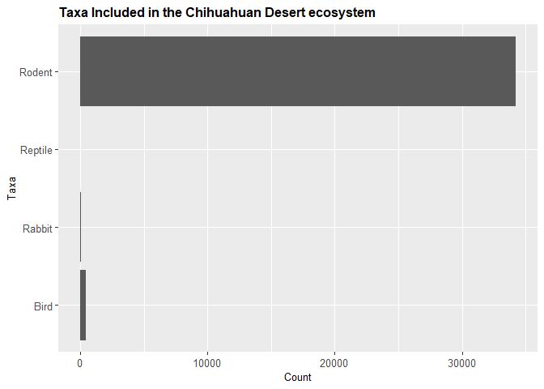
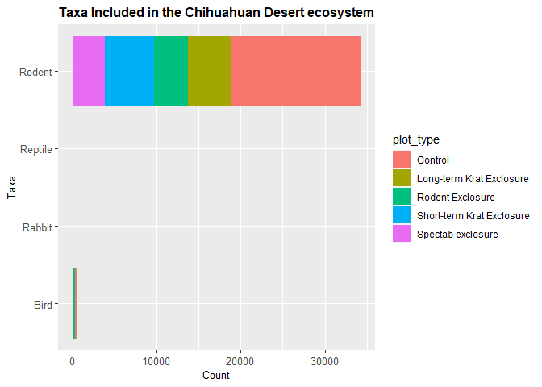
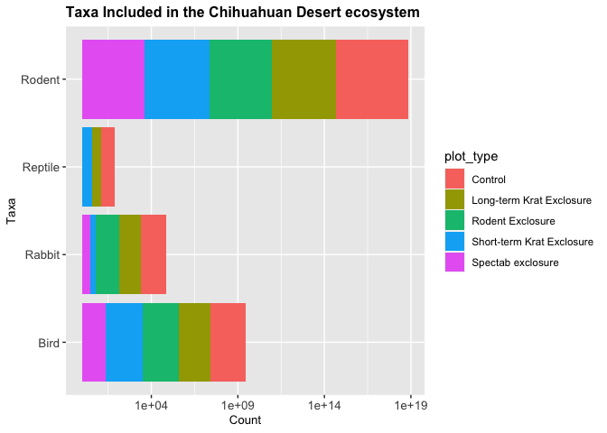
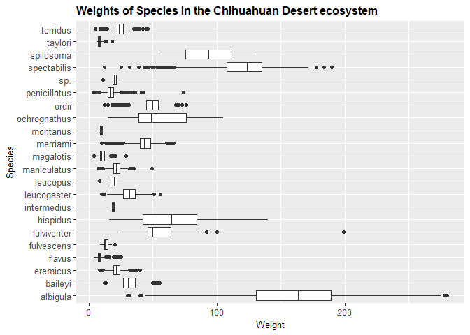
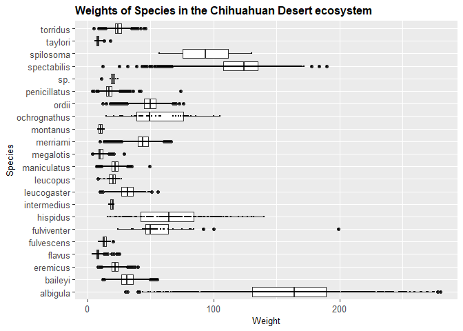
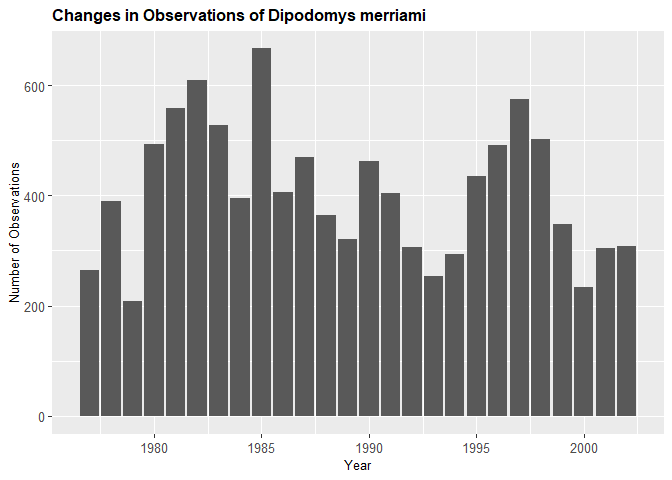
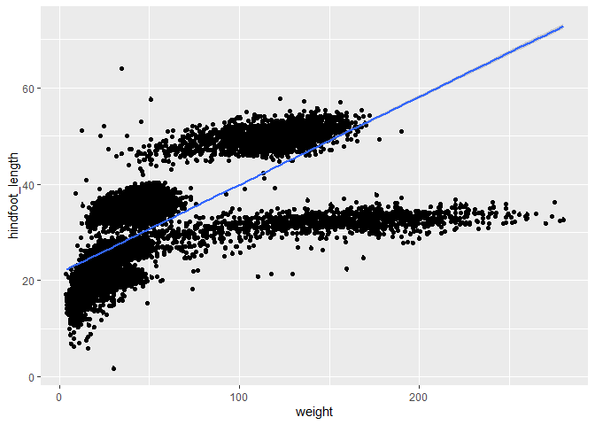
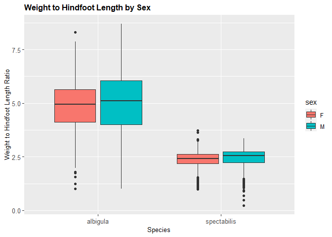

## Instructions
Answer the following questions and complete the exercises in RMarkdown. Please embed all of your code and push your final work to your repository. Your final lab report should be organized, clean, and run free from errors. Remember, you must remove the `#` for the included code chunks to run. Be sure to add your name to the author header above. For any included plots, make sure they are clearly labeled. You are free to use any plot type that you feel best communicates the results of your analysis.  

Make sure to use the formatting conventions of RMarkdown to make your report neat and clean!  

## Load the libraries

```r
library(tidyverse)
library(janitor)
library(here)
library(naniar)
```

## Desert Ecology
For this assignment, we are going to use a modified data set on [desert ecology](http://esapubs.org/archive/ecol/E090/118/). The data are from: S. K. Morgan Ernest, Thomas J. Valone, and James H. Brown. 2009. Long-term monitoring and experimental manipulation of a Chihuahuan Desert ecosystem near Portal, Arizona, USA. Ecology 90:1708.

```r
deserts <- read_csv(here("lab10", "data", "surveys_complete.csv"))
```

```
## 
## ── Column specification ────────────────────────────────────────────────────────
## cols(
##   record_id = col_double(),
##   month = col_double(),
##   day = col_double(),
##   year = col_double(),
##   plot_id = col_double(),
##   species_id = col_character(),
##   sex = col_character(),
##   hindfoot_length = col_double(),
##   weight = col_double(),
##   genus = col_character(),
##   species = col_character(),
##   taxa = col_character(),
##   plot_type = col_character()
## )
```

1. Use the function(s) of your choice to get an idea of its structure, including how NA's are treated. Are the data tidy?  

```r
glimpse(deserts)
```

```
## Rows: 34,786
## Columns: 13
## $ record_id       <dbl> 1, 2, 3, 4, 5, 6, 7, 8, 9, 10, 11, 12, 13, 14, 15, 16…
## $ month           <dbl> 7, 7, 7, 7, 7, 7, 7, 7, 7, 7, 7, 7, 7, 7, 7, 7, 7, 7,…
## $ day             <dbl> 16, 16, 16, 16, 16, 16, 16, 16, 16, 16, 16, 16, 16, 1…
## $ year            <dbl> 1977, 1977, 1977, 1977, 1977, 1977, 1977, 1977, 1977,…
## $ plot_id         <dbl> 2, 3, 2, 7, 3, 1, 2, 1, 1, 6, 5, 7, 3, 8, 6, 4, 3, 2,…
## $ species_id      <chr> "NL", "NL", "DM", "DM", "DM", "PF", "PE", "DM", "DM",…
## $ sex             <chr> "M", "M", "F", "M", "M", "M", "F", "M", "F", "F", "F"…
## $ hindfoot_length <dbl> 32, 33, 37, 36, 35, 14, NA, 37, 34, 20, 53, 38, 35, N…
## $ weight          <dbl> NA, NA, NA, NA, NA, NA, NA, NA, NA, NA, NA, NA, NA, N…
## $ genus           <chr> "Neotoma", "Neotoma", "Dipodomys", "Dipodomys", "Dipo…
## $ species         <chr> "albigula", "albigula", "merriami", "merriami", "merr…
## $ taxa            <chr> "Rodent", "Rodent", "Rodent", "Rodent", "Rodent", "Ro…
## $ plot_type       <chr> "Control", "Long-term Krat Exclosure", "Control", "Ro…
```

```r
deserts%>%
  naniar::miss_var_summary()
```

```
## # A tibble: 13 x 3
##    variable        n_miss pct_miss
##    <chr>            <int>    <dbl>
##  1 hindfoot_length   3348     9.62
##  2 weight            2503     7.20
##  3 sex               1748     5.03
##  4 record_id            0     0   
##  5 month                0     0   
##  6 day                  0     0   
##  7 year                 0     0   
##  8 plot_id              0     0   
##  9 species_id           0     0   
## 10 genus                0     0   
## 11 species              0     0   
## 12 taxa                 0     0   
## 13 plot_type            0     0
```

```r
deserts
```

```
## # A tibble: 34,786 x 13
##    record_id month   day  year plot_id species_id sex   hindfoot_length weight
##        <dbl> <dbl> <dbl> <dbl>   <dbl> <chr>      <chr>           <dbl>  <dbl>
##  1         1     7    16  1977       2 NL         M                  32     NA
##  2         2     7    16  1977       3 NL         M                  33     NA
##  3         3     7    16  1977       2 DM         F                  37     NA
##  4         4     7    16  1977       7 DM         M                  36     NA
##  5         5     7    16  1977       3 DM         M                  35     NA
##  6         6     7    16  1977       1 PF         M                  14     NA
##  7         7     7    16  1977       2 PE         F                  NA     NA
##  8         8     7    16  1977       1 DM         M                  37     NA
##  9         9     7    16  1977       1 DM         F                  34     NA
## 10        10     7    16  1977       6 PF         F                  20     NA
## # … with 34,776 more rows, and 4 more variables: genus <chr>, species <chr>,
## #   taxa <chr>, plot_type <chr>
```

##### NAs are represented as NA. This data is long, therefore it's tidy.

2. How many genera and species are represented in the data? What are the total number of observations? Which species is most/ least frequently sampled in the study?

```r
deserts %>% 
  count()
```

```
## # A tibble: 1 x 1
##       n
##   <int>
## 1 34786
```
##### There are 34786 observations.


```r
deserts %>% 
  group_by(species) %>% 
  summarize(count=n()) %>% 
  arrange(desc(count))
```

```
## `summarise()` ungrouping output (override with `.groups` argument)
```

```
## # A tibble: 40 x 2
##    species      count
##    <chr>        <int>
##  1 merriami     10596
##  2 penicillatus  3123
##  3 ordii         3027
##  4 baileyi       2891
##  5 megalotis     2609
##  6 spectabilis   2504
##  7 torridus      2249
##  8 flavus        1597
##  9 eremicus      1299
## 10 albigula      1252
## # … with 30 more rows
```
##### Merriami is represented the most in this data. Clarki, Scutalatus, Tereticaudus, Tigris, Uniparems, and Viridis is represented the least.

```r
deserts %>% 
  group_by(genus) %>% 
  summarize(count=n()) %>% 
  arrange(desc(count))
```

```
## `summarise()` ungrouping output (override with `.groups` argument)
```

```
## # A tibble: 26 x 2
##    genus            count
##    <chr>            <int>
##  1 Dipodomys        16167
##  2 Chaetodipus       6029
##  3 Onychomys         3267
##  4 Reithrodontomys   2694
##  5 Peromyscus        2234
##  6 Perognathus       1629
##  7 Neotoma           1252
##  8 Ammospermophilus   437
##  9 Amphispiza         303
## 10 Spermophilus       249
## # … with 16 more rows
```
##### Dipdomys is represented the most. Ammodramus, Cnemidophorus, Crotalus, and Zonotrichia are the the least represented.

3. What is the proportion of taxa included in this study? Show a table and plot that reflects this count.

```r
deserts %>% 
  count()
```

```
## # A tibble: 1 x 1
##       n
##   <int>
## 1 34786
```


```r
deserts %>% 
  group_by(taxa) %>% 
  summarize(count=n(),percent=(count/34786)*100) 
```

```
## `summarise()` ungrouping output (override with `.groups` argument)
```

```
## # A tibble: 4 x 3
##   taxa    count percent
##   <chr>   <int>   <dbl>
## 1 Bird      450  1.29  
## 2 Rabbit     75  0.216 
## 3 Reptile    14  0.0402
## 4 Rodent  34247 98.5
```

```r
deserts %>% 
  ggplot(aes(x=taxa))+geom_bar()+
  coord_flip()+
  labs(title="Taxa Included in the Chihuahuan Desert ecosystem", x="Taxa", y="Count")+
  theme(plot.title = element_text(size = 12, face = "bold"),
        axis.text = element_text(size = 10),
        axis.title = element_text(size = 10))
```

<!-- -->

4. For the taxa included in the study, use the fill option to show the proportion of individuals sampled by `plot_type.`

```r
deserts %>% 
  ggplot(aes(x=taxa, fill=plot_type))+geom_bar()+
  coord_flip()+
  labs(title="Taxa Included in the Chihuahuan Desert ecosystem", x="Taxa", y="Count")+
  theme(plot.title = element_text(size = 12, face = "bold"),
        axis.text = element_text(size = 10),
        axis.title = element_text(size = 10))
```

<!-- -->

```r
deserts %>% 
  ggplot(aes(x=taxa, fill=plot_type))+geom_bar()+scale_y_log10()+
  coord_flip()+
  labs(title="Taxa Included in the Chihuahuan Desert ecosystem", x="Taxa", y="Count")+
  theme(plot.title = element_text(size = 12, face = "bold"),
        axis.text = element_text(size = 10),
        axis.title = element_text(size = 10))
```

<!-- -->

5. What is the range of weight for each species included in the study? Remove any observations of weight that are NA so they do not show up in the plot.

```r
deserts %>% 
  group_by(species) %>% 
  filter(weight!="NA", weight!="Inf", weight!="-Inf") %>% 
  summarize(min_weight=min(weight, na.rm = TRUE),
            median_weight=median(weight, na.rm = TRUE),
            max_weight=max(weight, na.rm = TRUE))
```

```
## `summarise()` ungrouping output (override with `.groups` argument)
```

```
## # A tibble: 22 x 4
##    species     min_weight median_weight max_weight
##    <chr>            <dbl>         <dbl>      <dbl>
##  1 albigula            30         164          280
##  2 baileyi             12          31           55
##  3 eremicus             8          22           40
##  4 flavus               4           8           25
##  5 fulvescens           9          13           20
##  6 fulviventer         24          50          199
##  7 hispidus            16          64.5        140
##  8 intermedius         17          19.5         21
##  9 leucogaster         10          32           56
## 10 leucopus             8          20           27
## # … with 12 more rows
```

```r
deserts %>% 
  filter(weight!="NA") %>% 
  ggplot(aes(x=species, y=weight))+
  geom_boxplot()+
  coord_flip()+
  labs(title="Weights of Species in the Chihuahuan Desert ecosystem", x="Species", y="Weight")+
  theme(plot.title = element_text(size = 12, face = "bold"),
        axis.text = element_text(size = 10),
        axis.title = element_text(size = 10))
```

<!-- -->

6. Add another layer to your answer from #4 using `geom_point` to get an idea of how many measurements were taken for each species.

```r
deserts %>% 
  filter(weight!="NA") %>% 
  ggplot(aes(x=species, y=weight))+
  geom_boxplot()+
  geom_point(size=0.1)+
  coord_flip()+
  labs(title="Weights of Species in the Chihuahuan Desert ecosystem", x="Species", y="Weight")+
  theme(plot.title = element_text(size = 12, face = "bold"),
        axis.text = element_text(size = 10),
        axis.title = element_text(size = 10))
```

<!-- -->


7. [Dipodomys merriami](https://en.wikipedia.org/wiki/Merriam's_kangaroo_rat) is the most frequently sampled animal in the study. How have the number of observations of this species changed over the years included in the study?

```r
deserts %>% 
  filter(species=="merriami") %>% 
  ggplot(aes(x=year))+
  geom_bar()+
  labs(title="Changes in Observations of Dipodomys merriami", x="Year", y="Number of Observations")+
  theme(plot.title = element_text(size = 12, face = "bold"),
        axis.text = element_text(size = 10),
        axis.title = element_text(size = 10))
```

<!-- -->

8. What is the relationship between `weight` and `hindfoot` length? Consider whether or not over plotting is an issue.

```r
deserts %>% 
  ggplot(aes(x=weight, y=hindfoot_length))+
  geom_point(size=0.1, na.rm=T)+geom_jitter()+geom_smooth(method=lm, se=T)
```

```
## `geom_smooth()` using formula 'y ~ x'
```

```
## Warning: Removed 4048 rows containing non-finite values (stat_smooth).
```

```
## Warning: Removed 4048 rows containing missing values (geom_point).
```

<!-- -->

```r
  labs(title="Weight vs. Hindfoot Length", x="Weight", y="Hindfoot Length")+
  theme(plot.title = element_text(size = 12, face = "bold"),
        axis.text = element_text(size = 10),
        axis.title = element_text(size = 10))
```

```
## NULL
```
##### Overplotting is an issue here.

9. Which two species have, on average, the highest weight? Once you have identified them, make a new column that is a ratio of `weight` to `hindfoot_length`. Make a plot that shows the range of this new ratio and fill by sex.

```r
deserts %>% 
  filter(weight!="NA") %>% 
  group_by(species) %>% 
  summarize(avg_weight=mean(weight, na.rm=T)) %>% 
  arrange(desc(avg_weight))
```

```
## `summarise()` ungrouping output (override with `.groups` argument)
```

```
## # A tibble: 22 x 2
##    species      avg_weight
##    <chr>             <dbl>
##  1 albigula          159. 
##  2 spectabilis       120. 
##  3 spilosoma          93.5
##  4 hispidus           65.6
##  5 fulviventer        58.9
##  6 ochrognathus       55.4
##  7 ordii              48.9
##  8 merriami           43.2
##  9 baileyi            31.7
## 10 leucogaster        31.6
## # … with 12 more rows
```
##### The heaviest species are albigula and spectabilis.


```r
deserts %>% 
  filter(sex!="NA",weight!="NA",hindfoot_length!="NA") %>% 
    filter(species=="albigula"|species=="spectabilis") %>% 
  mutate(ratio_weight_hindfoot= weight/hindfoot_length) %>%
  ggplot(aes(x=species, y=ratio_weight_hindfoot, fill=sex))+geom_boxplot(na.rm=T)+
  labs(title="Weight to Hindfoot Length by Sex", x="Species", y="Weight to Hindfoot Length Ratio")+
  theme(plot.title = element_text(size = 12, face = "bold"),
        axis.text = element_text(size = 10),
        axis.title = element_text(size = 10))
```

<!-- -->

10. Make one plot of your choice! Make sure to include at least two of the aesthetics options you have learned.

```r
deserts %>% 
  filter(taxa!="NA", weight!="NA", sex!="NA") %>% 
  ggplot(aes(x=taxa, y=weight, color=sex))+
  geom_boxplot()+
  labs(title="Taxa vs. Weight", x="Taxa", y="Weight")+
  theme(plot.title = element_text(size = 12, face = "bold"),
        axis.text = element_text(size = 10),
        axis.title = element_text(size = 10))
```

<!-- -->


## Push your final code to GitHub!
Please be sure that you check the `keep md` file in the knit preferences. 
