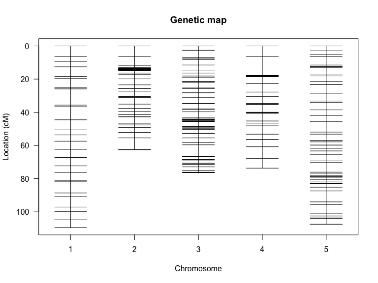

## Learning Goals
*At the end of this exercise, you will be able to:* 
1. know the concept of F2 intercross and the standard input format for R/qtl
2. summarize and understand the F2 intercross data
3. construct basic genetic map using R/qtl
4. create interactive graphics for genetic mapping using R/qtlcharts

## Resources and references
- [R/qtl: A QTL mapping environment](https://rqtl.org/)
- [R/qtl manual](https://rqtl.org/manual/qtl-manual.pdf)
- [R/qtlcharts Interactive Graphics for Quantitative Trait Locus Mapping](https://www.ncbi.nlm.nih.gov/pmc/articles/PMC4317647/)
- [R/qtlcharts](http://kbroman.org/qtlcharts/)

## F2 intercross strategy
- [Resource](http://www.cdfd.org.in/SILKSAT/F2_cross_strategy.html)


## Load the libraries

```r
library(qtl)
library(qtlcharts)
knitr::opts_chunk$set(fig.width=8, fig.height=6, message=FALSE)
```

The function read.cross is for importing data into R/qtl.

```r
#?read.cross
```

## Example 1: Identify genomic regions that regulate blood pressure, heart rate, and heart weight
We will consider data from [Sugiyama et al., Physiol Genomics 10:5–12, 2002](https://journals.physiology.org/doi/full/10.1152/physiolgenomics.00002.2002). The data are from an intercross between BALB/cJ and CBA/CaJ; only male offspring were considered. There are four phenotypes: blood pressure, heart rate, body weight, and heart weight.
"sug.csv" is the name of the file, which we import directly from the R/qtl website. genotypes indicates the codes used for the genotypes; alleles indicates single-character codes to be used in plots and such.

```r
sug <- read.cross("csv", "https://rqtl.org", "sug.csv",
                  genotypes=c("CC", "CB", "BB"), alleles=c("C", "B"))
```

```
##  --Read the following data:
## 	 163  individuals
## 	 93  markers
## 	 6  phenotypes
##  --Cross type: f2
```

## Summaries
Get a quick summary of the data. 

```r
summary(sug)
```

```
##     F2 intercross
## 
##     No. individuals:    163 
## 
##     No. phenotypes:     6 
##     Percent phenotyped: 95.1 95.7 99.4 99.4 100 100 
## 
##     No. chromosomes:    19 
##         Autosomes:      1 2 3 4 5 6 7 8 9 10 11 12 13 14 15 16 17 18 19 
## 
##     Total markers:      93 
##     No. markers:        5 7 5 5 5 4 8 4 4 5 6 3 3 5 5 4 4 6 5 
##     Percent genotyped:  98.3 
##     Genotypes (%):      CC:23.9  CB:50.2  BB:26.0  not BB:0.0  not CC:0.0
```

```r
head(sug$pheno)
```

```
##    bp  hr   bw heart_wt sex mouse_ID
## 1 104 517 37.0      133   1        3
## 2 108 690 38.9      135   1        4
## 3 115 653 43.8      159   1        5
## 4 119 592 42.5      131   1        6
## 5  NA  NA 43.6      128   1        8
## 6 106 517 35.3      175   1        9
```

There are a number of simple functions for pulling out pieces of summary information. 

```r
nind(sug)    # No. individuals
```

```
## [1] 163
```

```r
nphe(sug)    # No. phenotypes
```

```
## [1] 6
```

```r
nchr(sug)    # No. chromosomes
```

```
## [1] 19
```

```r
totmar(sug)  # Total markers
```

```
## [1] 93
```

```r
nmar(sug)    # No. markers on each chromosome
```

```
##  1  2  3  4  5  6  7  8  9 10 11 12 13 14 15 16 17 18 19 
##  5  7  5  5  5  4  8  4  4  5  6  3  3  5  5  4  4  6  5
```
Get a summary plot of the data.

```r
plot(sug)
```

<!-- -->

Individual parts of the above plot may be obtained as follows.

```r
#?plotMissing
plotMissing(sug, main="")
```

<!-- -->

```r
plotMissing(sug, main="", reorder=1)
```

<!-- -->

```r
#?plotMap
plotMap(sug)
```

<!-- -->

```r
plotMap(sug,show.marker.names=TRUE)
```

<!-- -->

```r
#?plotPheno
plotPheno(sug, pheno.col=1)
```

<!-- -->

```r
plotPheno(sug, pheno.col=2)
```

<!-- -->

```r
plotPheno(sug, pheno.col=3)
```

<!-- -->

```r
plotPheno(sug, pheno.col=4)
```

<!-- -->

Let’s make an interactive chart of the genetic map of markers for these data using R/qtlcharts.

```r
iplotMap(sug) #D7MIT31
```

```{=html}
<div id="htmlwidget-146b96c45efc60b4063c" style="width:768px;height:576px;" class="iplotMap html-widget"></div>
<script type="application/json" data-for="htmlwidget-146b96c45efc60b4063c">{"x":{"data":{"chr":["1","1","1","1","1","2","2","2","2","2","2","2","3","3","3","3","3","4","4","4","4","4","5","5","5","5","5","6","6","6","6","7","7","7","7","7","7","7","7","8","8","8","8","9","9","9","9","10","10","10","10","10","11","11","11","11","11","11","12","12","12","13","13","13","14","14","14","14","14","15","15","15","15","15","16","16","16","16","17","17","17","17","18","18","18","18","18","18","19","19","19","19","19"],"pos":[15.4,39.16,45.53,68.38,76.73,5.8,25.27,42.74,50.66,57.72,62.49,97.97,10.82,32.25,39.27,68.43,80.73,4.23,24.16,41.31,76.58,82.64,3.37,28.02,41.59,52.24,86.57,1.81,21.81,48.93,74.64,2.71,18.9,34.48,49.01,54.45,63.14,63.78,88.85,20.9,42.16,62.63,74.67,14.35,27.07,46.41,73.06,9.75,9.82,36.68,57.75,66.75,4.7,26.12,32.13,41.87,67.79,82.96,2.23,38.14,62.22,7.26,50.66,65.43,12.52,20.81,38.82,44.5,56.17,3.96,22.82,34.29,41.96,52.78,14.69,34.22,53.78,56.66,8.14,17.98,39.3,55.48,13.41,18.04,34.78,51.07,52.15,59.05,3.38,13.82,20.38,36.26,56.28],"marker":["D1MIT171","D1MIT46","D1MIT10","D1MIT33","D1MIT36","D2MIT117","D2MIT297","D2MIT92","D2MIT15","D2MIT274","D2MIT304","D2MIT265","D3MIT203","D3MIT22","D3MIT29","D3MIT84","D3MIT19","D4MIT181","D4MIT214","D4MIT26","D4MIT234","D4MIT42","D5MIT145","D5MIT52","D5MIT113","D5MIT239","D5MIT223","D6MIT138","D6MIT223","D6MIT149","D6MIT259","D7Mit152","D7MIT246","D7MIT176","D7MIT31","D7MIT323","D7MIT7","D7MIT238","D7MIT259","D8MIT258","D8MIT45","D8MIT215","D8MIT245","D9MIT64","D9MIT71","D9MIT196","D9MIT52","D10MIT213","D10MIT16","D10MIT115","D10MIT150","D10MIT14","D11MIT71","D11MIT236","D11MIT86","D11MIT4","D11MIT58","D11MIT48","D12MIT145","D12MIT158","D12Nds2","D13MIT16","D13MIT110","D13MIT204","D14MIT138","D14MIT45","D14MIT67","D14MIT263","D14MIT170","D15MIT175","D15MIT184","D15MIT187","D15MIT159","D15MIT161","D16MIT146","D16MIT5","D16MIT51","D16MIT20","D17MIT113","D17MIT16","D17MIT185","D17MIT76","D18MIT22","D18MIT60","D18MIT152","D18MIT142","D18MIT48","D18MIT25","D19MIT68","D19MIT16","D19MIT40","D19MIT11","D19MIT71"],"chrname":["1","2","3","4","5","6","7","8","9","10","11","12","13","14","15","16","17","18","19"]},"chartOpts":{"shiftStart":false}},"evals":[],"jsHooks":[]}</script>
```
Let’s use iplotCorr to plot a heat map of the correlation matrix for the phenotype of all pairs, linked to scatterplots of the phenotypes.

```r
iplotCorr(sug$pheno)
```

```
## Warning in stats::cor(mat, use = "pairwise.complete.obs"): the standard
## deviation is zero
```

```{=html}
<div id="htmlwidget-80f6b2c2e8b82358b401" style="width:768px;height:576px;" class="iplotCorr html-widget"></div>
<script type="application/json" data-for="htmlwidget-80f6b2c2e8b82358b401">{"x":{"data":{"indID":["1","2","3","4","5","6","7","8","9","10","11","12","13","14","15","16","17","18","19","20","21","22","23","24","25","26","27","28","29","30","31","32","33","34","35","36","37","38","39","40","41","42","43","44","45","46","47","48","49","50","51","52","53","54","55","56","57","58","59","60","61","62","63","64","65","66","67","68","69","70","71","72","73","74","75","76","77","78","79","80","81","82","83","84","85","86","87","88","89","90","91","92","93","94","95","96","97","98","99","100","101","102","103","104","105","106","107","108","109","110","111","112","113","114","115","116","117","118","119","120","121","122","123","124","125","126","127","128","129","130","131","132","133","134","135","136","137","138","139","140","141","142","143","144","145","146","147","148","149","150","151","152","153","154","155","156","157","158","159","160","161","162","163"],"var":["bp","hr","bw","heart_wt","sex","mouse_ID"],"corr":[[1,0.07327,-0.034861,-0.050604,null,-0.28349],[0.07327,1,0.014306,-0.17939,null,-0.0043773],[-0.034861,0.014306,1,0.41199,null,-0.3718],[-0.050604,-0.17939,0.41199,1,null,-0.26932],[null,null,null,null,null,null],[-0.28349,-0.0043773,-0.3718,-0.26932,null,1]],"rows":[0,1,2,3,4,5],"cols":[0,1,2,3,4,5],"dat":[[104,108,115,119,null,106,117,118,96,108,100,102,98,92,114,116,107,104,113,100,104,121,101,106,110,111,111,116,95,96,108,110,108,109,118,106,117,114,96,null,96,88,109,109,null,90,123,112,110,90,98,103,110,null,106,109,99,null,103,115,96,95,123,105,90,113,113,100,102,118,104,112,107,null,100,121,109,111,117,101,98,null,105,104,100,103,119,106,107,81,104,107,106,109,107,98,92,97,99,112,105,109,104,108,111,115,115,115,104,105,106,108,98,96,118,107,110,110,108,106,109,97,111,119,92,96,104,92,111,100,93,98,107,91,113,94,92,104,79,95,97,108,89,107,104,95,89,100,95,90,96,102,104,102,93,101,113,114,99,101,103,93,null],[517,690,653,592,null,517,590,561,582,626,600,549,569,562,652,599,519,722,641,615,665,552,623,637,605,638,652,546,700,579,667,667,683,519,547,594,597,648,571,539,531,575,603,596,null,650,674,644,602,578,617,666,727,null,673,576,649,null,658,667,605,560,668,633,593,590,532,591,596,573,553,699,586,null,606,595,600,635,630,548,603,null,647,649,748,528,725,712,678,602,498,631,616,662,600,659,614,575,633,708,581,549,647,623,571,589,568,658,604,674,569,504,556,603,548,538,526,570,657,557,596,637,665,668,661,653,674,525,666,698,684,669,678,663,649,620,502,703,594,621,720,621,563,690,570,545,679,533,550,650,557,571,501,614,608,542,546,580,558,669,564,614,null],[37,38.9,43.8,42.5,43.6,35.3,41.6,38.5,44.6,44.7,42.4,37.3,36,46,34.9,32.8,40,37,39,38.3,37.5,35.9,40,41.7,36.7,34.2,40,32.3,41,45.2,39.6,39.5,null,41.1,39.6,38.6,47.9,35.1,35.7,33.9,41.6,42.2,30.2,41.7,35.5,35,37.5,39.8,35.5,39.4,42.4,32.5,36.3,40.2,38.6,29.5,34.7,41.2,35.8,36.2,41.1,44.6,40.9,37.4,38.5,34.4,34.1,36.5,39.7,32.4,31.4,34.6,36.2,44.7,37.5,37.6,35.1,38.6,44.9,42.9,31.7,35,27.5,30.5,40.1,40.5,32,27.6,26.5,38,31.1,35.3,33.6,30.3,35,29.9,37.2,35.3,33.7,29,39.2,36.3,32.2,38.3,38.8,33.2,29.9,33.1,34.4,37.3,29.2,30.6,33.2,37.5,38.8,42.2,38.8,40,35.9,36,31.6,38.7,42.8,36.9,36.1,37.7,35.4,31.9,37.4,35,42.6,37.6,41.1,39.1,37.9,34,31,38.1,34.7,38.9,42.4,39.1,35.1,29.1,34.3,34.2,32,32.7,37.3,38.2,30.1,29.1,34.3,35.6,33.2,40.1,32.8,28.8,31.6,36.3,37.7,35.4,31.1],[133,135,159,131,128,175,159,152,159,154,131,114,150,167,123,132,135,149,142,147,120,141,137,131,120,117,135,129,151,138,117,140,null,155,145,145,165,123,137,137,132,183,128,145,120,114,159,128,147,138,147,140,141,154,134,124,101,119,113,113,159,160,140,148,131,133,134,140,127,127,130,127,106,135,107,93,117,102,161,150,119,125,136,122,92,120,95,129,103,132,152,153,117,100,198,129,115,118,117,109,87,136,145,175,158,107,97,113,149,127,116,144,105,144,110,154,136,157,95,179,93,93,128,82,143,134,125,123,120,120,132,132,136,132,134,130,118,133,128,135,147,123,137,120,128,122,116,120,123,116,126,101,122,137,128,144,127,115,123,154,133,135,122],[1,1,1,1,1,1,1,1,1,1,1,1,1,1,1,1,1,1,1,1,1,1,1,1,1,1,1,1,1,1,1,1,1,1,1,1,1,1,1,1,1,1,1,1,1,1,1,1,1,1,1,1,1,1,1,1,1,1,1,1,1,1,1,1,1,1,1,1,1,1,1,1,1,1,1,1,1,1,1,1,1,1,1,1,1,1,1,1,1,1,1,1,1,1,1,1,1,1,1,1,1,1,1,1,1,1,1,1,1,1,1,1,1,1,1,1,1,1,1,1,1,1,1,1,1,1,1,1,1,1,1,1,1,1,1,1,1,1,1,1,1,1,1,1,1,1,1,1,1,1,1,1,1,1,1,1,1,1,1,1,1,1,1],[3,4,5,6,8,9,11,12,13,15,17,18,19,20,21,23,24,25,26,28,30,31,33,34,36,37,38,39,40,42,45,46,48,49,50,51,52,53,56,57,58,59,60,61,63,64,65,66,67,68,69,70,71,72,73,74,76,77,78,79,83,84,85,87,88,89,90,93,95,96,98,99,100,101,102,104,105,106,107,108,109,110,111,112,113,114,115,116,117,118,119,120,121,124,126,127,128,129,130,131,132,133,134,135,136,137,138,139,140,142,143,144,145,146,147,148,149,150,151,152,154,155,156,157,158,160,161,162,163,164,165,166,167,168,170,172,173,174,175,180,181,182,184,185,186,187,188,189,190,191,192,194,196,198,199,200,201,202,203,205,206,207,208]],"group":[1,1,1,1,1,1,1,1,1,1,1,1,1,1,1,1,1,1,1,1,1,1,1,1,1,1,1,1,1,1,1,1,1,1,1,1,1,1,1,1,1,1,1,1,1,1,1,1,1,1,1,1,1,1,1,1,1,1,1,1,1,1,1,1,1,1,1,1,1,1,1,1,1,1,1,1,1,1,1,1,1,1,1,1,1,1,1,1,1,1,1,1,1,1,1,1,1,1,1,1,1,1,1,1,1,1,1,1,1,1,1,1,1,1,1,1,1,1,1,1,1,1,1,1,1,1,1,1,1,1,1,1,1,1,1,1,1,1,1,1,1,1,1,1,1,1,1,1,1,1,1,1,1,1,1,1,1,1,1,1,1,1,1],"scatterplots":true},"chartOpts":null},"evals":[],"jsHooks":[]}</script>
```

```r
iplotCorr(sug$pheno, chartOpts=list(height=300, width=600, scatcolors="pink"))
```

```
## Warning in stats::cor(mat, use = "pairwise.complete.obs"): the standard
## deviation is zero
```

```{=html}
<div id="htmlwidget-68694d60eab47ca866db" style="width:600px;height:300px;" class="iplotCorr html-widget"></div>
<script type="application/json" data-for="htmlwidget-68694d60eab47ca866db">{"x":{"data":{"indID":["1","2","3","4","5","6","7","8","9","10","11","12","13","14","15","16","17","18","19","20","21","22","23","24","25","26","27","28","29","30","31","32","33","34","35","36","37","38","39","40","41","42","43","44","45","46","47","48","49","50","51","52","53","54","55","56","57","58","59","60","61","62","63","64","65","66","67","68","69","70","71","72","73","74","75","76","77","78","79","80","81","82","83","84","85","86","87","88","89","90","91","92","93","94","95","96","97","98","99","100","101","102","103","104","105","106","107","108","109","110","111","112","113","114","115","116","117","118","119","120","121","122","123","124","125","126","127","128","129","130","131","132","133","134","135","136","137","138","139","140","141","142","143","144","145","146","147","148","149","150","151","152","153","154","155","156","157","158","159","160","161","162","163"],"var":["bp","hr","bw","heart_wt","sex","mouse_ID"],"corr":[[1,0.07327,-0.034861,-0.050604,null,-0.28349],[0.07327,1,0.014306,-0.17939,null,-0.0043773],[-0.034861,0.014306,1,0.41199,null,-0.3718],[-0.050604,-0.17939,0.41199,1,null,-0.26932],[null,null,null,null,null,null],[-0.28349,-0.0043773,-0.3718,-0.26932,null,1]],"rows":[0,1,2,3,4,5],"cols":[0,1,2,3,4,5],"dat":[[104,108,115,119,null,106,117,118,96,108,100,102,98,92,114,116,107,104,113,100,104,121,101,106,110,111,111,116,95,96,108,110,108,109,118,106,117,114,96,null,96,88,109,109,null,90,123,112,110,90,98,103,110,null,106,109,99,null,103,115,96,95,123,105,90,113,113,100,102,118,104,112,107,null,100,121,109,111,117,101,98,null,105,104,100,103,119,106,107,81,104,107,106,109,107,98,92,97,99,112,105,109,104,108,111,115,115,115,104,105,106,108,98,96,118,107,110,110,108,106,109,97,111,119,92,96,104,92,111,100,93,98,107,91,113,94,92,104,79,95,97,108,89,107,104,95,89,100,95,90,96,102,104,102,93,101,113,114,99,101,103,93,null],[517,690,653,592,null,517,590,561,582,626,600,549,569,562,652,599,519,722,641,615,665,552,623,637,605,638,652,546,700,579,667,667,683,519,547,594,597,648,571,539,531,575,603,596,null,650,674,644,602,578,617,666,727,null,673,576,649,null,658,667,605,560,668,633,593,590,532,591,596,573,553,699,586,null,606,595,600,635,630,548,603,null,647,649,748,528,725,712,678,602,498,631,616,662,600,659,614,575,633,708,581,549,647,623,571,589,568,658,604,674,569,504,556,603,548,538,526,570,657,557,596,637,665,668,661,653,674,525,666,698,684,669,678,663,649,620,502,703,594,621,720,621,563,690,570,545,679,533,550,650,557,571,501,614,608,542,546,580,558,669,564,614,null],[37,38.9,43.8,42.5,43.6,35.3,41.6,38.5,44.6,44.7,42.4,37.3,36,46,34.9,32.8,40,37,39,38.3,37.5,35.9,40,41.7,36.7,34.2,40,32.3,41,45.2,39.6,39.5,null,41.1,39.6,38.6,47.9,35.1,35.7,33.9,41.6,42.2,30.2,41.7,35.5,35,37.5,39.8,35.5,39.4,42.4,32.5,36.3,40.2,38.6,29.5,34.7,41.2,35.8,36.2,41.1,44.6,40.9,37.4,38.5,34.4,34.1,36.5,39.7,32.4,31.4,34.6,36.2,44.7,37.5,37.6,35.1,38.6,44.9,42.9,31.7,35,27.5,30.5,40.1,40.5,32,27.6,26.5,38,31.1,35.3,33.6,30.3,35,29.9,37.2,35.3,33.7,29,39.2,36.3,32.2,38.3,38.8,33.2,29.9,33.1,34.4,37.3,29.2,30.6,33.2,37.5,38.8,42.2,38.8,40,35.9,36,31.6,38.7,42.8,36.9,36.1,37.7,35.4,31.9,37.4,35,42.6,37.6,41.1,39.1,37.9,34,31,38.1,34.7,38.9,42.4,39.1,35.1,29.1,34.3,34.2,32,32.7,37.3,38.2,30.1,29.1,34.3,35.6,33.2,40.1,32.8,28.8,31.6,36.3,37.7,35.4,31.1],[133,135,159,131,128,175,159,152,159,154,131,114,150,167,123,132,135,149,142,147,120,141,137,131,120,117,135,129,151,138,117,140,null,155,145,145,165,123,137,137,132,183,128,145,120,114,159,128,147,138,147,140,141,154,134,124,101,119,113,113,159,160,140,148,131,133,134,140,127,127,130,127,106,135,107,93,117,102,161,150,119,125,136,122,92,120,95,129,103,132,152,153,117,100,198,129,115,118,117,109,87,136,145,175,158,107,97,113,149,127,116,144,105,144,110,154,136,157,95,179,93,93,128,82,143,134,125,123,120,120,132,132,136,132,134,130,118,133,128,135,147,123,137,120,128,122,116,120,123,116,126,101,122,137,128,144,127,115,123,154,133,135,122],[1,1,1,1,1,1,1,1,1,1,1,1,1,1,1,1,1,1,1,1,1,1,1,1,1,1,1,1,1,1,1,1,1,1,1,1,1,1,1,1,1,1,1,1,1,1,1,1,1,1,1,1,1,1,1,1,1,1,1,1,1,1,1,1,1,1,1,1,1,1,1,1,1,1,1,1,1,1,1,1,1,1,1,1,1,1,1,1,1,1,1,1,1,1,1,1,1,1,1,1,1,1,1,1,1,1,1,1,1,1,1,1,1,1,1,1,1,1,1,1,1,1,1,1,1,1,1,1,1,1,1,1,1,1,1,1,1,1,1,1,1,1,1,1,1,1,1,1,1,1,1,1,1,1,1,1,1,1,1,1,1,1,1],[3,4,5,6,8,9,11,12,13,15,17,18,19,20,21,23,24,25,26,28,30,31,33,34,36,37,38,39,40,42,45,46,48,49,50,51,52,53,56,57,58,59,60,61,63,64,65,66,67,68,69,70,71,72,73,74,76,77,78,79,83,84,85,87,88,89,90,93,95,96,98,99,100,101,102,104,105,106,107,108,109,110,111,112,113,114,115,116,117,118,119,120,121,124,126,127,128,129,130,131,132,133,134,135,136,137,138,139,140,142,143,144,145,146,147,148,149,150,151,152,154,155,156,157,158,160,161,162,163,164,165,166,167,168,170,172,173,174,175,180,181,182,184,185,186,187,188,189,190,191,192,194,196,198,199,200,201,202,203,205,206,207,208]],"group":[1,1,1,1,1,1,1,1,1,1,1,1,1,1,1,1,1,1,1,1,1,1,1,1,1,1,1,1,1,1,1,1,1,1,1,1,1,1,1,1,1,1,1,1,1,1,1,1,1,1,1,1,1,1,1,1,1,1,1,1,1,1,1,1,1,1,1,1,1,1,1,1,1,1,1,1,1,1,1,1,1,1,1,1,1,1,1,1,1,1,1,1,1,1,1,1,1,1,1,1,1,1,1,1,1,1,1,1,1,1,1,1,1,1,1,1,1,1,1,1,1,1,1,1,1,1,1,1,1,1,1,1,1,1,1,1,1,1,1,1,1,1,1,1,1,1,1,1,1,1,1,1,1,1,1,1,1,1,1,1,1,1,1],"scatterplots":true},"chartOpts":{"height":300,"width":600,"scatcolors":"pink"}},"evals":[],"jsHooks":[]}</script>
```
The interactive graphs produced by R/qtlcharts are, by default, saved to a temporary file and then opened in the default web browser. If you want to save a chart to a particular file, assign the result to some object and use the function `saveWidget()` in the [htmlwidgets package] (http://www.htmlwidgets.org/), as follows:

```r
corrplot <- iplotCorr(sug$pheno, chartOpts=list(height=300, width=600, scatcolors="pink"))
```

```
## Warning in stats::cor(mat, use = "pairwise.complete.obs"): the standard
## deviation is zero
```

```r
htmlwidgets::saveWidget(corrplot, file="iplotCorr_example.html")
```

## Quantitative Trait Locus (QTL) Analysis
Quantitative trait locus (QTL) analysis is a statistical method that links two types of information—phenotypic data (trait measurements) and genotypic data (usually molecular markers)—in an attempt to explain the genetic basis of variation in complex traits (Falconer & Mackay, 1996; Kearsey, 1998; Lynch & Walsh, 1998). [Quantitative Trait Locus (QTL) Analysis](https://www.nature.com/scitable/topicpage/quantitative-trait-locus-qtl-analysis-53904/)

### LOD Score
LOD score is actually an acronym for "log of the odds," LOD. LOD score actually refers to a numerical result when estimating whether two genes, or a gene and a disease, are linked to one another. [NIH LOD Score](https://www.genome.gov/genetics-glossary/LOD-Score#:~:text=LOD%20stands%20for%20%22logarithm%20of,therefore%20likely%20to%20be%20inherited.)

### Single-QTL analysis
We first calculate the QTL genotype probabilities, given the observed marker data, via the function calc.genoprob. This is done at the markers and at a grid along the chromosomes. The argument step is the density of the grid (in cM), and defines the density of later QTL analyses. To perform a single-QTL genome scan, we use the function scanone. By default, it considers the first phenotype in the input cross object (in this case, blood pressure).

```r
sug <- calc.genoprob(sug, step=1)
out.em <- scanone(sug)
```

```
## Warning in checkcovar(cross, pheno.col, addcovar, intcovar, perm.strata, : Dropping 8 individuals with missing phenotypes.
```

```r
out.em2 <- scanone(sug, pheno.col=1:4)
```

```
## Warning in checkcovar(cross, pheno.col, addcovar, intcovar, perm.strata, : Dropping 8 individuals with missing phenotypes.
```

```
## Warning in checkcovar(cross, pheno.col, addcovar, intcovar, perm.strata, : Dropping 7 individuals with missing phenotypes.
```

```
## Warning in checkcovar(cross, pheno.col, addcovar, intcovar, perm.strata, : Dropping 1 individuals with missing phenotypes.

## Warning in checkcovar(cross, pheno.col, addcovar, intcovar, perm.strata, : Dropping 1 individuals with missing phenotypes.
```
The output has “class” "scanone". The summary function is passed to the function summary.scanone, and gives the maximum LOD score on each chromosome.

```r
summary(out.em)
```

```
##           chr   pos   lod
## D1MIT36     1 76.73 1.449
## c2.loc77    2 82.80 1.901
## c3.loc42    3 52.82 1.393
## c4.loc43    4 47.23 0.795
## D5MIT223    5 86.57 1.312
## c6.loc26    6 27.81 0.638
## c7.loc45    7 47.71 6.109
## c8.loc34    8 54.90 1.598
## D9MIT71     9 27.07 0.769
## c10.loc51  10 60.75 0.959
## c11.loc34  11 38.70 2.157
## D12MIT145  12  2.23 1.472
## c13.loc20  13 27.26 1.119
## D14MIT138  14 12.52 1.119
## c15.loc8   15 11.96 5.257
## c16.loc31  16 45.69 0.647
## D17MIT16   17 17.98 1.241
## D18MIT22   18 13.41 1.739
## D19MIT71   19 56.28 0.402
```

```r
summary(out.em2)
```

```
##           chr   pos    bp     hr     bw heart_wt
## D1MIT36     1 76.73 1.449 0.9306 0.8418  1.10701
## c2.loc77    2 82.80 1.901 3.2352 0.7491  0.14570
## c3.loc42    3 52.82 1.393 0.0199 1.7099  0.22918
## c4.loc43    4 47.23 0.795 0.9465 0.5097  0.40329
## D5MIT223    5 86.57 1.312 0.1639 1.1748  0.05581
## c6.loc26    6 27.81 0.638 0.0762 0.7033  0.15187
## c7.loc45    7 47.71 6.109 0.2060 0.5209  0.47587
## c8.loc34    8 54.90 1.598 0.3938 0.1101  1.50973
## D9MIT71     9 27.07 0.769 0.4386 0.0748  0.07482
## c10.loc51  10 60.75 0.959 0.9614 0.3983  2.60545
## c11.loc34  11 38.70 2.157 1.1985 0.5037  0.00473
## D12MIT145  12  2.23 1.472 0.3669 1.1148  0.66280
## c13.loc20  13 27.26 1.119 0.5487 0.0562  0.29918
## D14MIT138  14 12.52 1.119 0.0612 0.1672  1.39513
## c15.loc8   15 11.96 5.257 1.6771 5.6325  1.26297
## c16.loc31  16 45.69 0.647 0.4475 2.3418  0.07920
## D17MIT16   17 17.98 1.241 1.1660 0.0712  0.74646
## D18MIT22   18 13.41 1.739 0.9585 0.3425  1.39105
## D19MIT71   19 56.28 0.402 0.3015 0.0136  0.25134
```
Alternatively, we can give a threshold, e.g., to only see those chromosomes with LOD > 3.

```r
summary(out.em, threshold=3)
```

```
##          chr  pos  lod
## c7.loc45   7 47.7 6.11
## c15.loc8  15 12.0 5.26
```
We can plot the results as follows.

```r
plot(out.em)
```

<!-- -->

```r
plot(out.em, chr=c(7,15), ylab="LOD Score")
```

<!-- -->
### iplotScanone
iplotScanone creates an interactive chart with LOD curves from a genome scan linked to estimated QTL effects. If you provide just the output from scanone, the only interactivity is that hovering over marker positions on the LOD curves will give information about the marker name, position, and LOD score.

```r
iplotScanone(out.em)
```

```{=html}
<div id="htmlwidget-16b04a8bcea957b60e84" style="width:768px;height:576px;" class="iplotScanone html-widget"></div>
<script type="application/json" data-for="htmlwidget-16b04a8bcea957b60e84">{"x":{"scanone_data":{"chr":["1","1","1","1","1","1","1","1","1","1","1","1","1","1","1","1","1","1","1","1","1","1","1","1","1","1","1","1","1","1","1","1","1","1","1","1","1","1","1","1","1","1","1","1","1","1","1","1","1","1","1","1","1","1","1","1","1","1","1","1","1","1","1","1","1","1","2","2","2","2","2","2","2","2","2","2","2","2","2","2","2","2","2","2","2","2","2","2","2","2","2","2","2","2","2","2","2","2","2","2","2","2","2","2","2","2","2","2","2","2","2","2","2","2","2","2","2","2","2","2","2","2","2","2","2","2","2","2","2","2","2","2","2","2","2","2","2","2","2","2","2","2","2","2","2","2","2","2","2","2","2","2","2","2","2","2","2","2","2","2","2","2","2","2","2","3","3","3","3","3","3","3","3","3","3","3","3","3","3","3","3","3","3","3","3","3","3","3","3","3","3","3","3","3","3","3","3","3","3","3","3","3","3","3","3","3","3","3","3","3","3","3","3","3","3","3","3","3","3","3","3","3","3","3","3","3","3","3","3","3","3","3","3","3","3","3","3","3","3","4","4","4","4","4","4","4","4","4","4","4","4","4","4","4","4","4","4","4","4","4","4","4","4","4","4","4","4","4","4","4","4","4","4","4","4","4","4","4","4","4","4","4","4","4","4","4","4","4","4","4","4","4","4","4","4","4","4","4","4","4","4","4","4","4","4","4","4","4","4","4","4","4","4","4","4","4","4","4","4","4","4","4","5","5","5","5","5","5","5","5","5","5","5","5","5","5","5","5","5","5","5","5","5","5","5","5","5","5","5","5","5","5","5","5","5","5","5","5","5","5","5","5","5","5","5","5","5","5","5","5","5","5","5","5","5","5","5","5","5","5","5","5","5","5","5","5","5","5","5","5","5","5","5","5","5","5","5","5","5","5","5","5","5","5","5","5","5","5","5","5","6","6","6","6","6","6","6","6","6","6","6","6","6","6","6","6","6","6","6","6","6","6","6","6","6","6","6","6","6","6","6","6","6","6","6","6","6","6","6","6","6","6","6","6","6","6","6","6","6","6","6","6","6","6","6","6","6","6","6","6","6","6","6","6","6","6","6","6","6","6","6","6","6","6","6","7","7","7","7","7","7","7","7","7","7","7","7","7","7","7","7","7","7","7","7","7","7","7","7","7","7","7","7","7","7","7","7","7","7","7","7","7","7","7","7","7","7","7","7","7","7","7","7","7","7","7","7","7","7","7","7","7","7","7","7","7","7","7","7","7","7","7","7","7","7","7","7","7","7","7","7","7","7","7","7","7","7","7","7","7","7","7","7","7","7","7","7","7","7","8","8","8","8","8","8","8","8","8","8","8","8","8","8","8","8","8","8","8","8","8","8","8","8","8","8","8","8","8","8","8","8","8","8","8","8","8","8","8","8","8","8","8","8","8","8","8","8","8","8","8","8","8","8","8","8","8","9","9","9","9","9","9","9","9","9","9","9","9","9","9","9","9","9","9","9","9","9","9","9","9","9","9","9","9","9","9","9","9","9","9","9","9","9","9","9","9","9","9","9","9","9","9","9","9","9","9","9","9","9","9","9","9","9","9","9","9","9","9","10","10","10","10","10","10","10","10","10","10","10","10","10","10","10","10","10","10","10","10","10","10","10","10","10","10","10","10","10","10","10","10","10","10","10","10","10","10","10","10","10","10","10","10","10","10","10","10","10","10","10","10","10","10","10","10","10","10","10","10","11","11","11","11","11","11","11","11","11","11","11","11","11","11","11","11","11","11","11","11","11","11","11","11","11","11","11","11","11","11","11","11","11","11","11","11","11","11","11","11","11","11","11","11","11","11","11","11","11","11","11","11","11","11","11","11","11","11","11","11","11","11","11","11","11","11","11","11","11","11","11","11","11","11","11","11","11","11","11","11","11","11","11","11","12","12","12","12","12","12","12","12","12","12","12","12","12","12","12","12","12","12","12","12","12","12","12","12","12","12","12","12","12","12","12","12","12","12","12","12","12","12","12","12","12","12","12","12","12","12","12","12","12","12","12","12","12","12","12","12","12","12","12","12","12","12","13","13","13","13","13","13","13","13","13","13","13","13","13","13","13","13","13","13","13","13","13","13","13","13","13","13","13","13","13","13","13","13","13","13","13","13","13","13","13","13","13","13","13","13","13","13","13","13","13","13","13","13","13","13","13","13","13","13","13","13","13","14","14","14","14","14","14","14","14","14","14","14","14","14","14","14","14","14","14","14","14","14","14","14","14","14","14","14","14","14","14","14","14","14","14","14","14","14","14","14","14","14","14","14","14","14","14","14","14","15","15","15","15","15","15","15","15","15","15","15","15","15","15","15","15","15","15","15","15","15","15","15","15","15","15","15","15","15","15","15","15","15","15","15","15","15","15","15","15","15","15","15","15","15","15","15","15","15","15","15","15","16","16","16","16","16","16","16","16","16","16","16","16","16","16","16","16","16","16","16","16","16","16","16","16","16","16","16","16","16","16","16","16","16","16","16","16","16","16","16","16","16","16","16","16","16","17","17","17","17","17","17","17","17","17","17","17","17","17","17","17","17","17","17","17","17","17","17","17","17","17","17","17","17","17","17","17","17","17","17","17","17","17","17","17","17","17","17","17","17","17","17","17","17","17","17","17","18","18","18","18","18","18","18","18","18","18","18","18","18","18","18","18","18","18","18","18","18","18","18","18","18","18","18","18","18","18","18","18","18","18","18","18","18","18","18","18","18","18","18","18","18","18","18","18","18","18","18","19","19","19","19","19","19","19","19","19","19","19","19","19","19","19","19","19","19","19","19","19","19","19","19","19","19","19","19","19","19","19","19","19","19","19","19","19","19","19","19","19","19","19","19","19","19","19","19","19","19","19","19","19","19","19","19"],"pos":[15.4,16.4,17.4,18.4,19.4,20.4,21.4,22.4,23.4,24.4,25.4,26.4,27.4,28.4,29.4,30.4,31.4,32.4,33.4,34.4,35.4,36.4,37.4,38.4,39.16,39.4,40.4,41.4,42.4,43.4,44.4,45.4,45.53,46.4,47.4,48.4,49.4,50.4,51.4,52.4,53.4,54.4,55.4,56.4,57.4,58.4,59.4,60.4,61.4,62.4,63.4,64.4,65.4,66.4,67.4,68.38,68.4,69.4,70.4,71.4,72.4,73.4,74.4,75.4,76.4,76.73,5.8,6.8,7.8,8.8,9.8,10.8,11.8,12.8,13.8,14.8,15.8,16.8,17.8,18.8,19.8,20.8,21.8,22.8,23.8,24.8,25.27,25.8,26.8,27.8,28.8,29.8,30.8,31.8,32.8,33.8,34.8,35.8,36.8,37.8,38.8,39.8,40.8,41.8,42.74,42.8,43.8,44.8,45.8,46.8,47.8,48.8,49.8,50.66,50.8,51.8,52.8,53.8,54.8,55.8,56.8,57.72,57.8,58.8,59.8,60.8,61.8,62.49,62.8,63.8,64.8,65.8,66.8,67.8,68.8,69.8,70.8,71.8,72.8,73.8,74.8,75.8,76.8,77.8,78.8,79.8,80.8,81.8,82.8,83.8,84.8,85.8,86.8,87.8,88.8,89.8,90.8,91.8,92.8,93.8,94.8,95.8,96.8,97.8,97.97,10.82,11.82,12.82,13.82,14.82,15.82,16.82,17.82,18.82,19.82,20.82,21.82,22.82,23.82,24.82,25.82,26.82,27.82,28.82,29.82,30.82,31.82,32.25,32.82,33.82,34.82,35.82,36.82,37.82,38.82,39.27,39.82,40.82,41.82,42.82,43.82,44.82,45.82,46.82,47.82,48.82,49.82,50.82,51.82,52.82,53.82,54.82,55.82,56.82,57.82,58.82,59.82,60.82,61.82,62.82,63.82,64.82,65.82,66.82,67.82,68.43,68.82,69.82,70.82,71.82,72.82,73.82,74.82,75.82,76.82,77.82,78.82,79.82,80.73,4.23,5.23,6.23,7.23,8.23,9.23,10.23,11.23,12.23,13.23,14.23,15.23,16.23,17.23,18.23,19.23,20.23,21.23,22.23,23.23,24.16,24.23,25.23,26.23,27.23,28.23,29.23,30.23,31.23,32.23,33.23,34.23,35.23,36.23,37.23,38.23,39.23,40.23,41.23,41.31,42.23,43.23,44.23,45.23,46.23,47.23,48.23,49.23,50.23,51.23,52.23,53.23,54.23,55.23,56.23,57.23,58.23,59.23,60.23,61.23,62.23,63.23,64.23,65.23,66.23,67.23,68.23,69.23,70.23,71.23,72.23,73.23,74.23,75.23,76.23,76.58,77.23,78.23,79.23,80.23,81.23,82.23,82.64,3.37,4.37,5.37,6.37,7.37,8.37,9.37,10.37,11.37,12.37,13.37,14.37,15.37,16.37,17.37,18.37,19.37,20.37,21.37,22.37,23.37,24.37,25.37,26.37,27.37,28.02,28.37,29.37,30.37,31.37,32.37,33.37,34.37,35.37,36.37,37.37,38.37,39.37,40.37,41.37,41.59,42.37,43.37,44.37,45.37,46.37,47.37,48.37,49.37,50.37,51.37,52.24,52.37,53.37,54.37,55.37,56.37,57.37,58.37,59.37,60.37,61.37,62.37,63.37,64.37,65.37,66.37,67.37,68.37,69.37,70.37,71.37,72.37,73.37,74.37,75.37,76.37,77.37,78.37,79.37,80.37,81.37,82.37,83.37,84.37,85.37,86.37,86.57,1.81,2.81,3.81,4.81,5.81,6.81,7.81,8.81,9.81,10.81,11.81,12.81,13.81,14.81,15.81,16.81,17.81,18.81,19.81,20.81,21.81,22.81,23.81,24.81,25.81,26.81,27.81,28.81,29.81,30.81,31.81,32.81,33.81,34.81,35.81,36.81,37.81,38.81,39.81,40.81,41.81,42.81,43.81,44.81,45.81,46.81,47.81,48.81,48.93,49.81,50.81,51.81,52.81,53.81,54.81,55.81,56.81,57.81,58.81,59.81,60.81,61.81,62.81,63.81,64.81,65.81,66.81,67.81,68.81,69.81,70.81,71.81,72.81,73.81,74.64,2.71,3.71,4.71,5.71,6.71,7.71,8.71,9.71,10.71,11.71,12.71,13.71,14.71,15.71,16.71,17.71,18.71,18.9,19.71,20.71,21.71,22.71,23.71,24.71,25.71,26.71,27.71,28.71,29.71,30.71,31.71,32.71,33.71,34.48,34.71,35.71,36.71,37.71,38.71,39.71,40.71,41.71,42.71,43.71,44.71,45.71,46.71,47.71,48.71,49.01,49.71,50.71,51.71,52.71,53.71,54.45,54.71,55.71,56.71,57.71,58.71,59.71,60.71,61.71,62.71,63.14,63.71,63.78,64.71,65.71,66.71,67.71,68.71,69.71,70.71,71.71,72.71,73.71,74.71,75.71,76.71,77.71,78.71,79.71,80.71,81.71,82.71,83.71,84.71,85.71,86.71,87.71,88.71,88.85,20.9,21.9,22.9,23.9,24.9,25.9,26.9,27.9,28.9,29.9,30.9,31.9,32.9,33.9,34.9,35.9,36.9,37.9,38.9,39.9,40.9,41.9,42.16,42.9,43.9,44.9,45.9,46.9,47.9,48.9,49.9,50.9,51.9,52.9,53.9,54.9,55.9,56.9,57.9,58.9,59.9,60.9,61.9,62.63,62.9,63.9,64.9,65.9,66.9,67.9,68.9,69.9,70.9,71.9,72.9,73.9,74.67,14.35,15.35,16.35,17.35,18.35,19.35,20.35,21.35,22.35,23.35,24.35,25.35,26.35,27.07,27.35,28.35,29.35,30.35,31.35,32.35,33.35,34.35,35.35,36.35,37.35,38.35,39.35,40.35,41.35,42.35,43.35,44.35,45.35,46.35,46.41,47.35,48.35,49.35,50.35,51.35,52.35,53.35,54.35,55.35,56.35,57.35,58.35,59.35,60.35,61.35,62.35,63.35,64.35,65.35,66.35,67.35,68.35,69.35,70.35,71.35,72.35,73.06,9.75,9.82,10.75,11.75,12.75,13.75,14.75,15.75,16.75,17.75,18.75,19.75,20.75,21.75,22.75,23.75,24.75,25.75,26.75,27.75,28.75,29.75,30.75,31.75,32.75,33.75,34.75,35.75,36.68,36.75,37.75,38.75,39.75,40.75,41.75,42.75,43.75,44.75,45.75,46.75,47.75,48.75,49.75,50.75,51.75,52.75,53.75,54.75,55.75,56.75,57.75,58.75,59.75,60.75,61.75,62.75,63.75,64.75,65.75,66.75,4.7,5.7,6.7,7.7,8.7,9.7,10.7,11.7,12.7,13.7,14.7,15.7,16.7,17.7,18.7,19.7,20.7,21.7,22.7,23.7,24.7,25.7,26.12,26.7,27.7,28.7,29.7,30.7,31.7,32.13,32.7,33.7,34.7,35.7,36.7,37.7,38.7,39.7,40.7,41.7,41.87,42.7,43.7,44.7,45.7,46.7,47.7,48.7,49.7,50.7,51.7,52.7,53.7,54.7,55.7,56.7,57.7,58.7,59.7,60.7,61.7,62.7,63.7,64.7,65.7,66.7,67.7,67.79,68.7,69.7,70.7,71.7,72.7,73.7,74.7,75.7,76.7,77.7,78.7,79.7,80.7,81.7,82.7,82.96,2.23,3.23,4.23,5.23,6.23,7.23,8.23,9.23,10.23,11.23,12.23,13.23,14.23,15.23,16.23,17.23,18.23,19.23,20.23,21.23,22.23,23.23,24.23,25.23,26.23,27.23,28.23,29.23,30.23,31.23,32.23,33.23,34.23,35.23,36.23,37.23,38.14,38.23,39.23,40.23,41.23,42.23,43.23,44.23,45.23,46.23,47.23,48.23,49.23,50.23,51.23,52.23,53.23,54.23,55.23,56.23,57.23,58.23,59.23,60.23,61.23,62.22,7.26,8.26,9.26,10.26,11.26,12.26,13.26,14.26,15.26,16.26,17.26,18.26,19.26,20.26,21.26,22.26,23.26,24.26,25.26,26.26,27.26,28.26,29.26,30.26,31.26,32.26,33.26,34.26,35.26,36.26,37.26,38.26,39.26,40.26,41.26,42.26,43.26,44.26,45.26,46.26,47.26,48.26,49.26,50.26,50.66,51.26,52.26,53.26,54.26,55.26,56.26,57.26,58.26,59.26,60.26,61.26,62.26,63.26,64.26,65.26,65.43,12.52,13.52,14.52,15.52,16.52,17.52,18.52,19.52,20.52,20.81,21.52,22.52,23.52,24.52,25.52,26.52,27.52,28.52,29.52,30.52,31.52,32.52,33.52,34.52,35.52,36.52,37.52,38.52,38.82,39.52,40.52,41.52,42.52,43.52,44.5,44.52,45.52,46.52,47.52,48.52,49.52,50.52,51.52,52.52,53.52,54.52,55.52,56.17,3.96,4.96,5.96,6.96,7.96,8.96,9.96,10.96,11.96,12.96,13.96,14.96,15.96,16.96,17.96,18.96,19.96,20.96,21.96,22.82,22.96,23.96,24.96,25.96,26.96,27.96,28.96,29.96,30.96,31.96,32.96,33.96,34.29,34.96,35.96,36.96,37.96,38.96,39.96,40.96,41.96,42.96,43.96,44.96,45.96,46.96,47.96,48.96,49.96,50.96,51.96,52.78,14.69,15.69,16.69,17.69,18.69,19.69,20.69,21.69,22.69,23.69,24.69,25.69,26.69,27.69,28.69,29.69,30.69,31.69,32.69,33.69,34.22,34.69,35.69,36.69,37.69,38.69,39.69,40.69,41.69,42.69,43.69,44.69,45.69,46.69,47.69,48.69,49.69,50.69,51.69,52.69,53.69,53.78,54.69,55.69,56.66,8.14,9.14,10.14,11.14,12.14,13.14,14.14,15.14,16.14,17.14,17.98,18.14,19.14,20.14,21.14,22.14,23.14,24.14,25.14,26.14,27.14,28.14,29.14,30.14,31.14,32.14,33.14,34.14,35.14,36.14,37.14,38.14,39.14,39.3,40.14,41.14,42.14,43.14,44.14,45.14,46.14,47.14,48.14,49.14,50.14,51.14,52.14,53.14,54.14,55.14,55.48,13.41,14.41,15.41,16.41,17.41,18.04,18.41,19.41,20.41,21.41,22.41,23.41,24.41,25.41,26.41,27.41,28.41,29.41,30.41,31.41,32.41,33.41,34.41,34.78,35.41,36.41,37.41,38.41,39.41,40.41,41.41,42.41,43.41,44.41,45.41,46.41,47.41,48.41,49.41,50.41,51.07,51.41,52.15,52.41,53.41,54.41,55.41,56.41,57.41,58.41,59.05,3.38,4.38,5.38,6.38,7.38,8.38,9.38,10.38,11.38,12.38,13.38,13.82,14.38,15.38,16.38,17.38,18.38,19.38,20.38,21.38,22.38,23.38,24.38,25.38,26.38,27.38,28.38,29.38,30.38,31.38,32.38,33.38,34.38,35.38,36.26,36.38,37.38,38.38,39.38,40.38,41.38,42.38,43.38,44.38,45.38,46.38,47.38,48.38,49.38,50.38,51.38,52.38,53.38,54.38,55.38,56.28],"lod":[0.12024,0.14008,0.16267,0.18801,0.21603,0.24654,0.27926,0.31379,0.34969,0.38654,0.42387,0.4613,0.49849,0.53512,0.5709,0.60552,0.6387,0.67015,0.69963,0.72694,0.75195,0.7746,0.79488,0.81285,0.82501,0.76603,0.52808,0.3474,0.30494,0.44584,0.69337,0.95148,0.98312,1.0565,1.1414,1.2219,1.293,1.3506,1.3916,1.4135,1.4147,1.3939,1.3515,1.2896,1.2128,1.128,1.0432,0.96532,0.89796,0.84153,0.79462,0.75527,0.72161,0.69215,0.66582,0.6424,0.64469,0.76294,0.88545,1.0066,1.1208,1.2236,1.3117,1.3827,1.4356,1.4491,0.23203,0.21593,0.19818,0.17885,0.15812,0.13629,0.11388,0.091584,0.070304,0.051077,0.034937,0.022738,0.015015,0.011851,0.012958,0.017769,0.025581,0.035683,0.04743,0.060283,0.066579,0.064924,0.061827,0.058749,0.055669,0.05258,0.049484,0.046417,0.043459,0.040717,0.038352,0.03655,0.035501,0.035369,0.036294,0.038334,0.041498,0.045743,0.050635,0.051277,0.066912,0.092027,0.12613,0.16779,0.21494,0.26531,0.31679,0.36063,0.35763,0.34717,0.35899,0.39472,0.45202,0.52527,0.60764,0.68617,0.69299,0.78038,0.87088,0.96232,1.0513,1.1092,1.1192,1.1533,1.1902,1.2301,1.2729,1.3188,1.3674,1.4184,1.4712,1.5251,1.5789,1.6316,1.682,1.729,1.7714,1.8086,1.8399,1.8649,1.8834,1.8954,1.901,1.9006,1.8946,1.8834,1.8677,1.8481,1.8253,1.8,1.7728,1.7445,1.7155,1.6865,1.6577,1.6296,1.6024,1.5762,1.5719,0.52673,0.52722,0.52671,0.52527,0.52297,0.51993,0.51628,0.51217,0.50775,0.50318,0.49861,0.49419,0.49005,0.48632,0.48311,0.4805,0.47859,0.47743,0.47707,0.47754,0.47884,0.48095,0.4821,0.50995,0.56951,0.63413,0.69289,0.73741,0.76286,0.76737,0.76259,0.7906,0.84403,0.90025,0.95853,1.018,1.0775,1.1359,1.1918,1.2436,1.29,1.3295,1.3605,1.3821,1.393,1.3927,1.3807,1.3569,1.3217,1.2757,1.2201,1.1562,1.0856,1.0102,0.93187,0.85246,0.77371,0.69713,0.62395,0.5551,0.5155,0.50605,0.47959,0.4502,0.41845,0.38507,0.35097,0.31708,0.28428,0.25333,0.22479,0.19901,0.17615,0.15787,0.063733,0.044898,0.029601,0.018636,0.012789,0.012783,0.019179,0.032273,0.052011,0.07792,0.10914,0.14451,0.1827,0.22235,0.26224,0.30133,0.33883,0.37419,0.40707,0.4373,0.46299,0.46465,0.48814,0.5111,0.53357,0.55571,0.57781,0.60015,0.6229,0.64597,0.669,0.69141,0.71252,0.73171,0.74847,0.76252,0.77373,0.78216,0.78799,0.78835,0.78986,0.79144,0.79288,0.79409,0.79495,0.7953,0.79495,0.7937,0.7913,0.78751,0.78207,0.77474,0.76531,0.75358,0.73941,0.72276,0.70358,0.68196,0.65802,0.63197,0.60409,0.57469,0.54413,0.51284,0.48119,0.44962,0.41849,0.38818,0.35895,0.33107,0.3047,0.27995,0.2569,0.23554,0.21586,0.20936,0.18809,0.15626,0.12801,0.10576,0.09135,0.086007,0.086599,1.0742,1.0765,1.0766,1.0742,1.0691,1.0611,1.05,1.0356,1.0177,0.99618,0.97077,0.9414,0.908,0.8706,0.82937,0.78464,0.73693,0.68695,0.6356,0.58388,0.53286,0.48352,0.43665,0.39284,0.35242,0.32802,0.32735,0.32338,0.31657,0.30729,0.29606,0.28345,0.27013,0.25678,0.24406,0.2326,0.22294,0.21553,0.21067,0.20855,0.20847,0.20342,0.19574,0.18762,0.18055,0.17633,0.17659,0.18229,0.19339,0.20895,0.22756,0.24514,0.24553,0.24953,0.25541,0.26351,0.27424,0.28802,0.30535,0.3267,0.35252,0.38318,0.41878,0.45925,0.50419,0.55298,0.60479,0.65872,0.71386,0.76927,0.82412,0.87765,0.92917,0.97814,1.0241,1.0667,1.1058,1.1411,1.1728,1.2008,1.2254,1.2465,1.2646,1.2798,1.2923,1.3025,1.3105,1.3119,0.10407,0.11249,0.12394,0.13862,0.15668,0.17813,0.20287,0.23063,0.26101,0.29342,0.32718,0.36157,0.39581,0.4292,0.46109,0.49095,0.51836,0.54303,0.56481,0.58362,0.59952,0.60992,0.61906,0.62667,0.63247,0.63621,0.63767,0.63672,0.63327,0.62736,0.61906,0.60856,0.59612,0.58206,0.56677,0.55065,0.53415,0.51768,0.50165,0.48643,0.47232,0.45955,0.44827,0.43858,0.43049,0.42394,0.41885,0.4151,0.41473,0.38967,0.36098,0.33237,0.30418,0.27674,0.25041,0.22548,0.20226,0.18093,0.16167,0.14463,0.1299,0.1176,0.10787,0.10085,0.096748,0.095681,0.097756,0.10299,0.11135,0.12263,0.13657,0.15284,0.17105,0.19082,0.20814,0.17277,0.20982,0.25086,0.29552,0.34335,0.3938,0.44633,0.50043,0.55563,0.61154,0.66777,0.72399,0.77989,0.83516,0.88949,0.94259,0.99415,1.0038,1.0935,1.2215,1.3703,1.5409,1.7324,1.9425,2.1675,2.4025,2.6415,2.8774,3.1037,3.3141,3.5037,3.6688,3.8069,3.8942,3.9518,4.2012,4.4451,4.6806,4.9066,5.1214,5.3227,5.5073,5.6722,5.8147,5.9324,6.0229,6.083,6.1087,6.0955,6.0833,5.9839,5.7992,5.5635,5.2793,4.9534,4.6908,4.6486,4.4784,4.2953,4.0987,3.8882,3.6634,3.4244,3.1722,2.9094,2.7943,2.7084,2.7076,2.5605,2.3972,2.2291,2.057,1.8818,1.7046,1.527,1.3508,1.1782,1.012,0.85534,0.71168,0.58466,0.47747,0.39234,0.33004,0.28975,0.26945,0.26642,0.27775,0.30074,0.33299,0.37257,0.41786,0.4676,0.47486,0.12094,0.1062,0.093295,0.083138,0.076829,0.075647,0.080963,0.094117,0.11616,0.14762,0.18829,0.23717,0.29257,0.35246,0.41475,0.47754,0.53924,0.59868,0.65503,0.7078,0.75676,0.8019,0.81302,0.87308,0.9582,1.0464,1.1353,1.2225,1.3052,1.3807,1.447,1.5023,1.5454,1.5757,1.593,1.5976,1.5903,1.5722,1.5446,1.5095,1.4684,1.4232,1.3756,1.34,1.3425,1.3425,1.3274,1.2968,1.2512,1.1915,1.119,1.0355,0.94295,0.84402,0.74164,0.63917,0.56243,0.22302,0.25434,0.29071,0.33205,0.37793,0.42753,0.47962,0.53259,0.58463,0.63385,0.6786,0.71755,0.74989,0.7689,0.7675,0.7602,0.74913,0.73407,0.71493,0.69169,0.66448,0.63358,0.59947,0.56279,0.52436,0.48504,0.44574,0.40729,0.37032,0.33538,0.30276,0.27266,0.24514,0.22016,0.21874,0.20186,0.18407,0.16667,0.14986,0.13389,0.11903,0.10555,0.093738,0.083848,0.076116,0.070754,0.067859,0.067517,0.069751,0.074538,0.081831,0.091565,0.10366,0.11801,0.13452,0.15303,0.17336,0.19533,0.2187,0.24327,0.2688,0.2874,0.2234,0.22598,0.20988,0.19221,0.17427,0.15619,0.13814,0.12033,0.10297,0.086331,0.070678,0.056299,0.043501,0.032493,0.023513,0.016724,0.012229,0.010065,0.010202,0.012559,0.016987,0.023366,0.031479,0.041117,0.052099,0.064204,0.07724,0.091032,0.10439,0.10549,0.12281,0.14334,0.1673,0.19485,0.22606,0.26093,0.29933,0.34102,0.38563,0.43268,0.48157,0.53167,0.5823,0.63279,0.68249,0.73084,0.77732,0.82154,0.86315,0.90194,0.93776,0.95013,0.9573,0.95867,0.95379,0.94237,0.92438,0.90003,0.86987,0.83472,0.35393,0.33542,0.32775,0.33246,0.35056,0.38216,0.42644,0.48196,0.54739,0.62217,0.70665,0.80166,0.90774,1.0243,1.1495,1.2804,1.414,1.5471,1.6775,1.8033,1.923,2.0359,2.0811,2.0771,2.0635,2.0416,2.0112,1.9725,1.926,1.9036,1.9425,2.005,2.0587,2.1019,2.1334,2.1521,2.1574,2.1487,2.1252,2.0862,2.078,2.0655,2.0461,2.0215,1.9913,1.955,1.9124,1.8631,1.807,1.744,1.674,1.5972,1.514,1.4247,1.3303,1.2315,1.1297,1.0265,0.9235,0.82271,0.72594,0.63482,0.55057,0.47395,0.40523,0.34432,0.29083,0.28636,0.307,0.32901,0.34941,0.36724,0.38165,0.39202,0.39803,0.3997,0.39735,0.39152,0.38289,0.37219,0.36012,0.3473,0.33423,0.33085,1.4716,1.4373,1.3999,1.3592,1.315,1.2673,1.2159,1.1609,1.1022,1.04,0.97466,0.90654,0.83623,0.76451,0.69233,0.62086,0.55146,0.48557,0.42466,0.37005,0.32269,0.28315,0.25156,0.22744,0.21009,0.19856,0.19186,0.18905,0.18926,0.19179,0.19603,0.20153,0.20793,0.21498,0.22247,0.23027,0.23756,0.23512,0.20782,0.18059,0.15408,0.12915,0.10685,0.088414,0.075132,0.068234,0.068637,0.076724,0.092156,0.11376,0.13978,0.168,0.19629,0.22269,0.24576,0.26444,0.27822,0.28699,0.29099,0.29067,0.28667,0.27975,0.8199,0.82783,0.83667,0.8465,0.85741,0.86947,0.88276,0.89734,0.91326,0.93054,0.94916,0.96904,0.99,1.0117,1.0338,1.0554,1.0758,1.0936,1.1076,1.1163,1.1185,1.1133,1.1,1.0789,1.0504,1.0155,0.97576,0.93264,0.88778,0.84273,0.79882,0.75714,0.71845,0.68323,0.6517,0.62389,0.59965,0.57877,0.56096,0.54593,0.53338,0.52304,0.51464,0.50794,0.50569,0.48968,0.46191,0.43316,0.40405,0.3754,0.34811,0.32306,0.30098,0.2824,0.26759,0.25653,0.24897,0.24445,0.24243,0.24236,0.24251,1.1193,1.031,0.94047,0.85239,0.77163,0.70264,0.6487,0.61117,0.5888,0.58466,0.57808,0.56846,0.55875,0.54936,0.5408,0.53358,0.52816,0.52483,0.52365,0.52431,0.52621,0.52862,0.53077,0.53205,0.53213,0.5309,0.52849,0.52517,0.52404,0.51008,0.48484,0.45617,0.42787,0.40332,0.38471,0.3853,0.41639,0.45013,0.48607,0.52356,0.5618,0.59986,0.63677,0.67157,0.70338,0.73144,0.75523,0.76823,4.4321,4.5931,4.7549,4.9067,5.0377,5.1409,5.2124,5.2511,5.2571,5.2314,5.1752,5.0905,4.9795,4.8448,4.6898,4.518,4.3339,4.1418,3.9462,3.778,3.782,3.7952,3.781,3.7392,3.6704,3.5762,3.4585,3.3197,3.1626,2.9906,2.8074,2.6175,2.5541,2.633,2.7333,2.8072,2.8494,2.857,2.829,2.7666,2.673,2.7181,2.7335,2.7145,2.6585,2.5656,2.4382,2.2814,2.1034,1.9144,1.7252,1.576,0.115,0.13189,0.15219,0.17601,0.2032,0.23317,0.26491,0.29695,0.32758,0.35514,0.37827,0.39615,0.40853,0.41572,0.41833,0.41725,0.41335,0.40747,0.40032,0.39243,0.3881,0.40012,0.42695,0.4552,0.48441,0.51392,0.5429,0.57035,0.59518,0.61623,0.63243,0.64279,0.64662,0.6435,0.63344,0.61689,0.59474,0.56824,0.53881,0.50789,0.47672,0.47394,0.40789,0.32413,0.24332,0.34934,0.41794,0.49568,0.5813,0.6731,0.76918,0.86767,0.96688,1.0654,1.1621,1.2413,1.241,1.2362,1.2269,1.2126,1.1931,1.1682,1.1379,1.1022,1.0615,1.0162,0.96678,0.91407,0.85886,0.80211,0.74483,0.68807,0.63281,0.57992,0.5301,0.48383,0.44142,0.40297,0.39719,0.38218,0.36348,0.34396,0.32378,0.30321,0.28264,0.26247,0.24316,0.22511,0.20867,0.1941,0.18154,0.17104,0.16255,0.15598,0.15117,0.14991,1.7392,1.4758,1.1828,0.89477,0.6439,0.51383,0.51725,0.52808,0.54121,0.5567,0.57473,0.59554,0.61937,0.64636,0.67641,0.70918,0.74411,0.7804,0.81717,0.85345,0.8883,0.92083,0.95021,0.96015,0.97842,1.0063,1.0325,1.0567,1.0786,1.0982,1.1152,1.1295,1.1411,1.1502,1.1566,1.1605,1.162,1.1614,1.1586,1.1539,1.1499,1.2064,1.2837,1.2722,1.2201,1.156,1.0836,1.0171,0.99004,1.0473,1.1338,0.19797,0.16826,0.13963,0.11256,0.08755,0.065136,0.045796,0.029934,0.017823,0.0095646,0.0050819,0.004248,0.0027576,0.0017172,0.0019042,0.002745,0.004257,0.0070709,0.012348,0.014882,0.017506,0.019986,0.022012,0.02325,0.023398,0.022319,0.020108,0.017093,0.01374,0.010565,0.0079513,0.0061609,0.0053067,0.0053843,0.0061727,0.0064938,0.010359,0.016417,0.024747,0.035392,0.048353,0.063588,0.081002,0.10046,0.12177,0.14471,0.16903,0.19445,0.22069,0.24745,0.27445,0.30142,0.3281,0.35425,0.37967,0.40178],"marker":["D1MIT171","","","","","","","","","","","","","","","","","","","","","","","","D1MIT46","","","","","","","","D1MIT10","","","","","","","","","","","","","","","","","","","","","","","D1MIT33","","","","","","","","","","D1MIT36","D2MIT117","","","","","","","","","","","","","","","","","","","","D2MIT297","","","","","","","","","","","","","","","","","","D2MIT92","","","","","","","","","D2MIT15","","","","","","","","D2MIT274","","","","","","D2MIT304","","","","","","","","","","","","","","","","","","","","","","","","","","","","","","","","","","","","","D2MIT265","D3MIT203","","","","","","","","","","","","","","","","","","","","","","D3MIT22","","","","","","","","D3MIT29","","","","","","","","","","","","","","","","","","","","","","","","","","","","","","D3MIT84","","","","","","","","","","","","","D3MIT19","D4MIT181","","","","","","","","","","","","","","","","","","","","D4MIT214","","","","","","","","","","","","","","","","","","","D4MIT26","","","","","","","","","","","","","","","","","","","","","","","","","","","","","","","","","","","","D4MIT234","","","","","","","D4MIT42","D5MIT145","","","","","","","","","","","","","","","","","","","","","","","","","D5MIT52","","","","","","","","","","","","","","","D5MIT113","","","","","","","","","","","D5MIT239","","","","","","","","","","","","","","","","","","","","","","","","","","","","","","","","","","","","D5MIT223","D6MIT138","","","","","","","","","","","","","","","","","","","","D6MIT223","","","","","","","","","","","","","","","","","","","","","","","","","","","","D6MIT149","","","","","","","","","","","","","","","","","","","","","","","","","","D6MIT259","D7Mit152","","","","","","","","","","","","","","","","","D7MIT246","","","","","","","","","","","","","","","","D7MIT176","","","","","","","","","","","","","","","","D7MIT31","","","","","","D7MIT323","","","","","","","","","","D7MIT7","","D7MIT238","","","","","","","","","","","","","","","","","","","","","","","","","","D7MIT259","D8MIT258","","","","","","","","","","","","","","","","","","","","","","D8MIT45","","","","","","","","","","","","","","","","","","","","","D8MIT215","","","","","","","","","","","","","D8MIT245","D9MIT64","","","","","","","","","","","","","D9MIT71","","","","","","","","","","","","","","","","","","","","","D9MIT196","","","","","","","","","","","","","","","","","","","","","","","","","","","D9MIT52","D10MIT213","D10MIT16","","","","","","","","","","","","","","","","","","","","","","","","","","","D10MIT115","","","","","","","","","","","","","","","","","","","","","","D10MIT150","","","","","","","","","D10MIT14","D11MIT71","","","","","","","","","","","","","","","","","","","","","","D11MIT236","","","","","","","D11MIT86","","","","","","","","","","","D11MIT4","","","","","","","","","","","","","","","","","","","","","","","","","","","D11MIT58","","","","","","","","","","","","","","","","D11MIT48","D12MIT145","","","","","","","","","","","","","","","","","","","","","","","","","","","","","","","","","","","","D12MIT158","","","","","","","","","","","","","","","","","","","","","","","","","D12Nds2","D13MIT16","","","","","","","","","","","","","","","","","","","","","","","","","","","","","","","","","","","","","","","","","","","","D13MIT110","","","","","","","","","","","","","","","","D13MIT204","D14MIT138","","","","","","","","","D14MIT45","","","","","","","","","","","","","","","","","","","D14MIT67","","","","","","D14MIT263","","","","","","","","","","","","","D14MIT170","D15MIT175","","","","","","","","","","","","","","","","","","","D15MIT184","","","","","","","","","","","","","D15MIT187","","","","","","","","D15MIT159","","","","","","","","","","","D15MIT161","D16MIT146","","","","","","","","","","","","","","","","","","","","D16MIT5","","","","","","","","","","","","","","","","","","","","","D16MIT51","","","D16MIT20","D17MIT113","","","","","","","","","","D17MIT16","","","","","","","","","","","","","","","","","","","","","","","D17MIT185","","","","","","","","","","","","","","","","","D17MIT76","D18MIT22","","","","","D18MIT60","","","","","","","","","","","","","","","","","","D18MIT152","","","","","","","","","","","","","","","","","D18MIT142","","D18MIT48","","","","","","","","D18MIT25","D19MIT68","","","","","","","","","","","D19MIT16","","","","","","","D19MIT40","","","","","","","","","","","","","","","","D19MIT11","","","","","","","","","","","","","","","","","","","","","D19MIT71"],"chrname":["1","2","3","4","5","6","7","8","9","10","11","12","13","14","15","16","17","18","19"],"lodname":"lod"},"pxg_data":null,"pxg_type":"none","chartOpts":null},"evals":[],"jsHooks":[]}</script>
```
You can use the chr to plot only selected chromosomes.

```r
iplotScanone(out.em, chr=c(7,15))
```

```{=html}
<div id="htmlwidget-05bf8d64f3b084cfd393" style="width:768px;height:576px;" class="iplotScanone html-widget"></div>
<script type="application/json" data-for="htmlwidget-05bf8d64f3b084cfd393">{"x":{"scanone_data":{"chr":["7","7","7","7","7","7","7","7","7","7","7","7","7","7","7","7","7","7","7","7","7","7","7","7","7","7","7","7","7","7","7","7","7","7","7","7","7","7","7","7","7","7","7","7","7","7","7","7","7","7","7","7","7","7","7","7","7","7","7","7","7","7","7","7","7","7","7","7","7","7","7","7","7","7","7","7","7","7","7","7","7","7","7","7","7","7","7","7","7","7","7","7","7","7","15","15","15","15","15","15","15","15","15","15","15","15","15","15","15","15","15","15","15","15","15","15","15","15","15","15","15","15","15","15","15","15","15","15","15","15","15","15","15","15","15","15","15","15","15","15","15","15","15","15","15","15"],"pos":[2.71,3.71,4.71,5.71,6.71,7.71,8.71,9.71,10.71,11.71,12.71,13.71,14.71,15.71,16.71,17.71,18.71,18.9,19.71,20.71,21.71,22.71,23.71,24.71,25.71,26.71,27.71,28.71,29.71,30.71,31.71,32.71,33.71,34.48,34.71,35.71,36.71,37.71,38.71,39.71,40.71,41.71,42.71,43.71,44.71,45.71,46.71,47.71,48.71,49.01,49.71,50.71,51.71,52.71,53.71,54.45,54.71,55.71,56.71,57.71,58.71,59.71,60.71,61.71,62.71,63.14,63.71,63.78,64.71,65.71,66.71,67.71,68.71,69.71,70.71,71.71,72.71,73.71,74.71,75.71,76.71,77.71,78.71,79.71,80.71,81.71,82.71,83.71,84.71,85.71,86.71,87.71,88.71,88.85,3.96,4.96,5.96,6.96,7.96,8.96,9.96,10.96,11.96,12.96,13.96,14.96,15.96,16.96,17.96,18.96,19.96,20.96,21.96,22.82,22.96,23.96,24.96,25.96,26.96,27.96,28.96,29.96,30.96,31.96,32.96,33.96,34.29,34.96,35.96,36.96,37.96,38.96,39.96,40.96,41.96,42.96,43.96,44.96,45.96,46.96,47.96,48.96,49.96,50.96,51.96,52.78],"lod":[0.17277,0.20982,0.25086,0.29552,0.34335,0.3938,0.44633,0.50043,0.55563,0.61154,0.66777,0.72399,0.77989,0.83516,0.88949,0.94259,0.99415,1.0038,1.0935,1.2215,1.3703,1.5409,1.7324,1.9425,2.1675,2.4025,2.6415,2.8774,3.1037,3.3141,3.5037,3.6688,3.8069,3.8942,3.9518,4.2012,4.4451,4.6806,4.9066,5.1214,5.3227,5.5073,5.6722,5.8147,5.9324,6.0229,6.083,6.1087,6.0955,6.0833,5.9839,5.7992,5.5635,5.2793,4.9534,4.6908,4.6486,4.4784,4.2953,4.0987,3.8882,3.6634,3.4244,3.1722,2.9094,2.7943,2.7084,2.7076,2.5605,2.3972,2.2291,2.057,1.8818,1.7046,1.527,1.3508,1.1782,1.012,0.85534,0.71168,0.58466,0.47747,0.39234,0.33004,0.28975,0.26945,0.26642,0.27775,0.30074,0.33299,0.37257,0.41786,0.4676,0.47486,4.4321,4.5931,4.7549,4.9067,5.0377,5.1409,5.2124,5.2511,5.2571,5.2314,5.1752,5.0905,4.9795,4.8448,4.6898,4.518,4.3339,4.1418,3.9462,3.778,3.782,3.7952,3.781,3.7392,3.6704,3.5762,3.4585,3.3197,3.1626,2.9906,2.8074,2.6175,2.5541,2.633,2.7333,2.8072,2.8494,2.857,2.829,2.7666,2.673,2.7181,2.7335,2.7145,2.6585,2.5656,2.4382,2.2814,2.1034,1.9144,1.7252,1.576],"marker":["D7Mit152","","","","","","","","","","","","","","","","","D7MIT246","","","","","","","","","","","","","","","","D7MIT176","","","","","","","","","","","","","","","","D7MIT31","","","","","","D7MIT323","","","","","","","","","","D7MIT7","","D7MIT238","","","","","","","","","","","","","","","","","","","","","","","","","","D7MIT259","D15MIT175","","","","","","","","","","","","","","","","","","","D15MIT184","","","","","","","","","","","","","D15MIT187","","","","","","","","D15MIT159","","","","","","","","","","","D15MIT161"],"chrname":["7","15"],"lodname":"lod"},"pxg_data":null,"pxg_type":"none","chartOpts":null},"evals":[],"jsHooks":[]}</script>
```


```r
iplotScanone(out.em, sug)
```

```{=html}
<div id="htmlwidget-0eeefea717718f25feee" style="width:768px;height:576px;" class="iplotScanone html-widget"></div>
<script type="application/json" data-for="htmlwidget-0eeefea717718f25feee">{"x":{"scanone_data":{"chr":["1","1","1","1","1","1","1","1","1","1","1","1","1","1","1","1","1","1","1","1","1","1","1","1","1","1","1","1","1","1","1","1","1","1","1","1","1","1","1","1","1","1","1","1","1","1","1","1","1","1","1","1","1","1","1","1","1","1","1","1","1","1","1","1","1","1","2","2","2","2","2","2","2","2","2","2","2","2","2","2","2","2","2","2","2","2","2","2","2","2","2","2","2","2","2","2","2","2","2","2","2","2","2","2","2","2","2","2","2","2","2","2","2","2","2","2","2","2","2","2","2","2","2","2","2","2","2","2","2","2","2","2","2","2","2","2","2","2","2","2","2","2","2","2","2","2","2","2","2","2","2","2","2","2","2","2","2","2","2","2","2","2","2","2","2","3","3","3","3","3","3","3","3","3","3","3","3","3","3","3","3","3","3","3","3","3","3","3","3","3","3","3","3","3","3","3","3","3","3","3","3","3","3","3","3","3","3","3","3","3","3","3","3","3","3","3","3","3","3","3","3","3","3","3","3","3","3","3","3","3","3","3","3","3","3","3","3","3","3","4","4","4","4","4","4","4","4","4","4","4","4","4","4","4","4","4","4","4","4","4","4","4","4","4","4","4","4","4","4","4","4","4","4","4","4","4","4","4","4","4","4","4","4","4","4","4","4","4","4","4","4","4","4","4","4","4","4","4","4","4","4","4","4","4","4","4","4","4","4","4","4","4","4","4","4","4","4","4","4","4","4","4","5","5","5","5","5","5","5","5","5","5","5","5","5","5","5","5","5","5","5","5","5","5","5","5","5","5","5","5","5","5","5","5","5","5","5","5","5","5","5","5","5","5","5","5","5","5","5","5","5","5","5","5","5","5","5","5","5","5","5","5","5","5","5","5","5","5","5","5","5","5","5","5","5","5","5","5","5","5","5","5","5","5","5","5","5","5","5","5","6","6","6","6","6","6","6","6","6","6","6","6","6","6","6","6","6","6","6","6","6","6","6","6","6","6","6","6","6","6","6","6","6","6","6","6","6","6","6","6","6","6","6","6","6","6","6","6","6","6","6","6","6","6","6","6","6","6","6","6","6","6","6","6","6","6","6","6","6","6","6","6","6","6","6","7","7","7","7","7","7","7","7","7","7","7","7","7","7","7","7","7","7","7","7","7","7","7","7","7","7","7","7","7","7","7","7","7","7","7","7","7","7","7","7","7","7","7","7","7","7","7","7","7","7","7","7","7","7","7","7","7","7","7","7","7","7","7","7","7","7","7","7","7","7","7","7","7","7","7","7","7","7","7","7","7","7","7","7","7","7","7","7","7","7","7","7","7","7","8","8","8","8","8","8","8","8","8","8","8","8","8","8","8","8","8","8","8","8","8","8","8","8","8","8","8","8","8","8","8","8","8","8","8","8","8","8","8","8","8","8","8","8","8","8","8","8","8","8","8","8","8","8","8","8","8","9","9","9","9","9","9","9","9","9","9","9","9","9","9","9","9","9","9","9","9","9","9","9","9","9","9","9","9","9","9","9","9","9","9","9","9","9","9","9","9","9","9","9","9","9","9","9","9","9","9","9","9","9","9","9","9","9","9","9","9","9","9","10","10","10","10","10","10","10","10","10","10","10","10","10","10","10","10","10","10","10","10","10","10","10","10","10","10","10","10","10","10","10","10","10","10","10","10","10","10","10","10","10","10","10","10","10","10","10","10","10","10","10","10","10","10","10","10","10","10","10","10","11","11","11","11","11","11","11","11","11","11","11","11","11","11","11","11","11","11","11","11","11","11","11","11","11","11","11","11","11","11","11","11","11","11","11","11","11","11","11","11","11","11","11","11","11","11","11","11","11","11","11","11","11","11","11","11","11","11","11","11","11","11","11","11","11","11","11","11","11","11","11","11","11","11","11","11","11","11","11","11","11","11","11","11","12","12","12","12","12","12","12","12","12","12","12","12","12","12","12","12","12","12","12","12","12","12","12","12","12","12","12","12","12","12","12","12","12","12","12","12","12","12","12","12","12","12","12","12","12","12","12","12","12","12","12","12","12","12","12","12","12","12","12","12","12","12","13","13","13","13","13","13","13","13","13","13","13","13","13","13","13","13","13","13","13","13","13","13","13","13","13","13","13","13","13","13","13","13","13","13","13","13","13","13","13","13","13","13","13","13","13","13","13","13","13","13","13","13","13","13","13","13","13","13","13","13","13","14","14","14","14","14","14","14","14","14","14","14","14","14","14","14","14","14","14","14","14","14","14","14","14","14","14","14","14","14","14","14","14","14","14","14","14","14","14","14","14","14","14","14","14","14","14","14","14","15","15","15","15","15","15","15","15","15","15","15","15","15","15","15","15","15","15","15","15","15","15","15","15","15","15","15","15","15","15","15","15","15","15","15","15","15","15","15","15","15","15","15","15","15","15","15","15","15","15","15","15","16","16","16","16","16","16","16","16","16","16","16","16","16","16","16","16","16","16","16","16","16","16","16","16","16","16","16","16","16","16","16","16","16","16","16","16","16","16","16","16","16","16","16","16","16","17","17","17","17","17","17","17","17","17","17","17","17","17","17","17","17","17","17","17","17","17","17","17","17","17","17","17","17","17","17","17","17","17","17","17","17","17","17","17","17","17","17","17","17","17","17","17","17","17","17","17","18","18","18","18","18","18","18","18","18","18","18","18","18","18","18","18","18","18","18","18","18","18","18","18","18","18","18","18","18","18","18","18","18","18","18","18","18","18","18","18","18","18","18","18","18","18","18","18","18","18","18","19","19","19","19","19","19","19","19","19","19","19","19","19","19","19","19","19","19","19","19","19","19","19","19","19","19","19","19","19","19","19","19","19","19","19","19","19","19","19","19","19","19","19","19","19","19","19","19","19","19","19","19","19","19","19","19"],"pos":[15.4,16.4,17.4,18.4,19.4,20.4,21.4,22.4,23.4,24.4,25.4,26.4,27.4,28.4,29.4,30.4,31.4,32.4,33.4,34.4,35.4,36.4,37.4,38.4,39.16,39.4,40.4,41.4,42.4,43.4,44.4,45.4,45.53,46.4,47.4,48.4,49.4,50.4,51.4,52.4,53.4,54.4,55.4,56.4,57.4,58.4,59.4,60.4,61.4,62.4,63.4,64.4,65.4,66.4,67.4,68.38,68.4,69.4,70.4,71.4,72.4,73.4,74.4,75.4,76.4,76.73,5.8,6.8,7.8,8.8,9.8,10.8,11.8,12.8,13.8,14.8,15.8,16.8,17.8,18.8,19.8,20.8,21.8,22.8,23.8,24.8,25.27,25.8,26.8,27.8,28.8,29.8,30.8,31.8,32.8,33.8,34.8,35.8,36.8,37.8,38.8,39.8,40.8,41.8,42.74,42.8,43.8,44.8,45.8,46.8,47.8,48.8,49.8,50.66,50.8,51.8,52.8,53.8,54.8,55.8,56.8,57.72,57.8,58.8,59.8,60.8,61.8,62.49,62.8,63.8,64.8,65.8,66.8,67.8,68.8,69.8,70.8,71.8,72.8,73.8,74.8,75.8,76.8,77.8,78.8,79.8,80.8,81.8,82.8,83.8,84.8,85.8,86.8,87.8,88.8,89.8,90.8,91.8,92.8,93.8,94.8,95.8,96.8,97.8,97.97,10.82,11.82,12.82,13.82,14.82,15.82,16.82,17.82,18.82,19.82,20.82,21.82,22.82,23.82,24.82,25.82,26.82,27.82,28.82,29.82,30.82,31.82,32.25,32.82,33.82,34.82,35.82,36.82,37.82,38.82,39.27,39.82,40.82,41.82,42.82,43.82,44.82,45.82,46.82,47.82,48.82,49.82,50.82,51.82,52.82,53.82,54.82,55.82,56.82,57.82,58.82,59.82,60.82,61.82,62.82,63.82,64.82,65.82,66.82,67.82,68.43,68.82,69.82,70.82,71.82,72.82,73.82,74.82,75.82,76.82,77.82,78.82,79.82,80.73,4.23,5.23,6.23,7.23,8.23,9.23,10.23,11.23,12.23,13.23,14.23,15.23,16.23,17.23,18.23,19.23,20.23,21.23,22.23,23.23,24.16,24.23,25.23,26.23,27.23,28.23,29.23,30.23,31.23,32.23,33.23,34.23,35.23,36.23,37.23,38.23,39.23,40.23,41.23,41.31,42.23,43.23,44.23,45.23,46.23,47.23,48.23,49.23,50.23,51.23,52.23,53.23,54.23,55.23,56.23,57.23,58.23,59.23,60.23,61.23,62.23,63.23,64.23,65.23,66.23,67.23,68.23,69.23,70.23,71.23,72.23,73.23,74.23,75.23,76.23,76.58,77.23,78.23,79.23,80.23,81.23,82.23,82.64,3.37,4.37,5.37,6.37,7.37,8.37,9.37,10.37,11.37,12.37,13.37,14.37,15.37,16.37,17.37,18.37,19.37,20.37,21.37,22.37,23.37,24.37,25.37,26.37,27.37,28.02,28.37,29.37,30.37,31.37,32.37,33.37,34.37,35.37,36.37,37.37,38.37,39.37,40.37,41.37,41.59,42.37,43.37,44.37,45.37,46.37,47.37,48.37,49.37,50.37,51.37,52.24,52.37,53.37,54.37,55.37,56.37,57.37,58.37,59.37,60.37,61.37,62.37,63.37,64.37,65.37,66.37,67.37,68.37,69.37,70.37,71.37,72.37,73.37,74.37,75.37,76.37,77.37,78.37,79.37,80.37,81.37,82.37,83.37,84.37,85.37,86.37,86.57,1.81,2.81,3.81,4.81,5.81,6.81,7.81,8.81,9.81,10.81,11.81,12.81,13.81,14.81,15.81,16.81,17.81,18.81,19.81,20.81,21.81,22.81,23.81,24.81,25.81,26.81,27.81,28.81,29.81,30.81,31.81,32.81,33.81,34.81,35.81,36.81,37.81,38.81,39.81,40.81,41.81,42.81,43.81,44.81,45.81,46.81,47.81,48.81,48.93,49.81,50.81,51.81,52.81,53.81,54.81,55.81,56.81,57.81,58.81,59.81,60.81,61.81,62.81,63.81,64.81,65.81,66.81,67.81,68.81,69.81,70.81,71.81,72.81,73.81,74.64,2.71,3.71,4.71,5.71,6.71,7.71,8.71,9.71,10.71,11.71,12.71,13.71,14.71,15.71,16.71,17.71,18.71,18.9,19.71,20.71,21.71,22.71,23.71,24.71,25.71,26.71,27.71,28.71,29.71,30.71,31.71,32.71,33.71,34.48,34.71,35.71,36.71,37.71,38.71,39.71,40.71,41.71,42.71,43.71,44.71,45.71,46.71,47.71,48.71,49.01,49.71,50.71,51.71,52.71,53.71,54.45,54.71,55.71,56.71,57.71,58.71,59.71,60.71,61.71,62.71,63.14,63.71,63.78,64.71,65.71,66.71,67.71,68.71,69.71,70.71,71.71,72.71,73.71,74.71,75.71,76.71,77.71,78.71,79.71,80.71,81.71,82.71,83.71,84.71,85.71,86.71,87.71,88.71,88.85,20.9,21.9,22.9,23.9,24.9,25.9,26.9,27.9,28.9,29.9,30.9,31.9,32.9,33.9,34.9,35.9,36.9,37.9,38.9,39.9,40.9,41.9,42.16,42.9,43.9,44.9,45.9,46.9,47.9,48.9,49.9,50.9,51.9,52.9,53.9,54.9,55.9,56.9,57.9,58.9,59.9,60.9,61.9,62.63,62.9,63.9,64.9,65.9,66.9,67.9,68.9,69.9,70.9,71.9,72.9,73.9,74.67,14.35,15.35,16.35,17.35,18.35,19.35,20.35,21.35,22.35,23.35,24.35,25.35,26.35,27.07,27.35,28.35,29.35,30.35,31.35,32.35,33.35,34.35,35.35,36.35,37.35,38.35,39.35,40.35,41.35,42.35,43.35,44.35,45.35,46.35,46.41,47.35,48.35,49.35,50.35,51.35,52.35,53.35,54.35,55.35,56.35,57.35,58.35,59.35,60.35,61.35,62.35,63.35,64.35,65.35,66.35,67.35,68.35,69.35,70.35,71.35,72.35,73.06,9.75,9.82,10.75,11.75,12.75,13.75,14.75,15.75,16.75,17.75,18.75,19.75,20.75,21.75,22.75,23.75,24.75,25.75,26.75,27.75,28.75,29.75,30.75,31.75,32.75,33.75,34.75,35.75,36.68,36.75,37.75,38.75,39.75,40.75,41.75,42.75,43.75,44.75,45.75,46.75,47.75,48.75,49.75,50.75,51.75,52.75,53.75,54.75,55.75,56.75,57.75,58.75,59.75,60.75,61.75,62.75,63.75,64.75,65.75,66.75,4.7,5.7,6.7,7.7,8.7,9.7,10.7,11.7,12.7,13.7,14.7,15.7,16.7,17.7,18.7,19.7,20.7,21.7,22.7,23.7,24.7,25.7,26.12,26.7,27.7,28.7,29.7,30.7,31.7,32.13,32.7,33.7,34.7,35.7,36.7,37.7,38.7,39.7,40.7,41.7,41.87,42.7,43.7,44.7,45.7,46.7,47.7,48.7,49.7,50.7,51.7,52.7,53.7,54.7,55.7,56.7,57.7,58.7,59.7,60.7,61.7,62.7,63.7,64.7,65.7,66.7,67.7,67.79,68.7,69.7,70.7,71.7,72.7,73.7,74.7,75.7,76.7,77.7,78.7,79.7,80.7,81.7,82.7,82.96,2.23,3.23,4.23,5.23,6.23,7.23,8.23,9.23,10.23,11.23,12.23,13.23,14.23,15.23,16.23,17.23,18.23,19.23,20.23,21.23,22.23,23.23,24.23,25.23,26.23,27.23,28.23,29.23,30.23,31.23,32.23,33.23,34.23,35.23,36.23,37.23,38.14,38.23,39.23,40.23,41.23,42.23,43.23,44.23,45.23,46.23,47.23,48.23,49.23,50.23,51.23,52.23,53.23,54.23,55.23,56.23,57.23,58.23,59.23,60.23,61.23,62.22,7.26,8.26,9.26,10.26,11.26,12.26,13.26,14.26,15.26,16.26,17.26,18.26,19.26,20.26,21.26,22.26,23.26,24.26,25.26,26.26,27.26,28.26,29.26,30.26,31.26,32.26,33.26,34.26,35.26,36.26,37.26,38.26,39.26,40.26,41.26,42.26,43.26,44.26,45.26,46.26,47.26,48.26,49.26,50.26,50.66,51.26,52.26,53.26,54.26,55.26,56.26,57.26,58.26,59.26,60.26,61.26,62.26,63.26,64.26,65.26,65.43,12.52,13.52,14.52,15.52,16.52,17.52,18.52,19.52,20.52,20.81,21.52,22.52,23.52,24.52,25.52,26.52,27.52,28.52,29.52,30.52,31.52,32.52,33.52,34.52,35.52,36.52,37.52,38.52,38.82,39.52,40.52,41.52,42.52,43.52,44.5,44.52,45.52,46.52,47.52,48.52,49.52,50.52,51.52,52.52,53.52,54.52,55.52,56.17,3.96,4.96,5.96,6.96,7.96,8.96,9.96,10.96,11.96,12.96,13.96,14.96,15.96,16.96,17.96,18.96,19.96,20.96,21.96,22.82,22.96,23.96,24.96,25.96,26.96,27.96,28.96,29.96,30.96,31.96,32.96,33.96,34.29,34.96,35.96,36.96,37.96,38.96,39.96,40.96,41.96,42.96,43.96,44.96,45.96,46.96,47.96,48.96,49.96,50.96,51.96,52.78,14.69,15.69,16.69,17.69,18.69,19.69,20.69,21.69,22.69,23.69,24.69,25.69,26.69,27.69,28.69,29.69,30.69,31.69,32.69,33.69,34.22,34.69,35.69,36.69,37.69,38.69,39.69,40.69,41.69,42.69,43.69,44.69,45.69,46.69,47.69,48.69,49.69,50.69,51.69,52.69,53.69,53.78,54.69,55.69,56.66,8.14,9.14,10.14,11.14,12.14,13.14,14.14,15.14,16.14,17.14,17.98,18.14,19.14,20.14,21.14,22.14,23.14,24.14,25.14,26.14,27.14,28.14,29.14,30.14,31.14,32.14,33.14,34.14,35.14,36.14,37.14,38.14,39.14,39.3,40.14,41.14,42.14,43.14,44.14,45.14,46.14,47.14,48.14,49.14,50.14,51.14,52.14,53.14,54.14,55.14,55.48,13.41,14.41,15.41,16.41,17.41,18.04,18.41,19.41,20.41,21.41,22.41,23.41,24.41,25.41,26.41,27.41,28.41,29.41,30.41,31.41,32.41,33.41,34.41,34.78,35.41,36.41,37.41,38.41,39.41,40.41,41.41,42.41,43.41,44.41,45.41,46.41,47.41,48.41,49.41,50.41,51.07,51.41,52.15,52.41,53.41,54.41,55.41,56.41,57.41,58.41,59.05,3.38,4.38,5.38,6.38,7.38,8.38,9.38,10.38,11.38,12.38,13.38,13.82,14.38,15.38,16.38,17.38,18.38,19.38,20.38,21.38,22.38,23.38,24.38,25.38,26.38,27.38,28.38,29.38,30.38,31.38,32.38,33.38,34.38,35.38,36.26,36.38,37.38,38.38,39.38,40.38,41.38,42.38,43.38,44.38,45.38,46.38,47.38,48.38,49.38,50.38,51.38,52.38,53.38,54.38,55.38,56.28],"lod":[0.12024,0.14008,0.16267,0.18801,0.21603,0.24654,0.27926,0.31379,0.34969,0.38654,0.42387,0.4613,0.49849,0.53512,0.5709,0.60552,0.6387,0.67015,0.69963,0.72694,0.75195,0.7746,0.79488,0.81285,0.82501,0.76603,0.52808,0.3474,0.30494,0.44584,0.69337,0.95148,0.98312,1.0565,1.1414,1.2219,1.293,1.3506,1.3916,1.4135,1.4147,1.3939,1.3515,1.2896,1.2128,1.128,1.0432,0.96532,0.89796,0.84153,0.79462,0.75527,0.72161,0.69215,0.66582,0.6424,0.64469,0.76294,0.88545,1.0066,1.1208,1.2236,1.3117,1.3827,1.4356,1.4491,0.23203,0.21593,0.19818,0.17885,0.15812,0.13629,0.11388,0.091584,0.070304,0.051077,0.034937,0.022738,0.015015,0.011851,0.012958,0.017769,0.025581,0.035683,0.04743,0.060283,0.066579,0.064924,0.061827,0.058749,0.055669,0.05258,0.049484,0.046417,0.043459,0.040717,0.038352,0.03655,0.035501,0.035369,0.036294,0.038334,0.041498,0.045743,0.050635,0.051277,0.066912,0.092027,0.12613,0.16779,0.21494,0.26531,0.31679,0.36063,0.35763,0.34717,0.35899,0.39472,0.45202,0.52527,0.60764,0.68617,0.69299,0.78038,0.87088,0.96232,1.0513,1.1092,1.1192,1.1533,1.1902,1.2301,1.2729,1.3188,1.3674,1.4184,1.4712,1.5251,1.5789,1.6316,1.682,1.729,1.7714,1.8086,1.8399,1.8649,1.8834,1.8954,1.901,1.9006,1.8946,1.8834,1.8677,1.8481,1.8253,1.8,1.7728,1.7445,1.7155,1.6865,1.6577,1.6296,1.6024,1.5762,1.5719,0.52673,0.52722,0.52671,0.52527,0.52297,0.51993,0.51628,0.51217,0.50775,0.50318,0.49861,0.49419,0.49005,0.48632,0.48311,0.4805,0.47859,0.47743,0.47707,0.47754,0.47884,0.48095,0.4821,0.50995,0.56951,0.63413,0.69289,0.73741,0.76286,0.76737,0.76259,0.7906,0.84403,0.90025,0.95853,1.018,1.0775,1.1359,1.1918,1.2436,1.29,1.3295,1.3605,1.3821,1.393,1.3927,1.3807,1.3569,1.3217,1.2757,1.2201,1.1562,1.0856,1.0102,0.93187,0.85246,0.77371,0.69713,0.62395,0.5551,0.5155,0.50605,0.47959,0.4502,0.41845,0.38507,0.35097,0.31708,0.28428,0.25333,0.22479,0.19901,0.17615,0.15787,0.063733,0.044898,0.029601,0.018636,0.012789,0.012783,0.019179,0.032273,0.052011,0.07792,0.10914,0.14451,0.1827,0.22235,0.26224,0.30133,0.33883,0.37419,0.40707,0.4373,0.46299,0.46465,0.48814,0.5111,0.53357,0.55571,0.57781,0.60015,0.6229,0.64597,0.669,0.69141,0.71252,0.73171,0.74847,0.76252,0.77373,0.78216,0.78799,0.78835,0.78986,0.79144,0.79288,0.79409,0.79495,0.7953,0.79495,0.7937,0.7913,0.78751,0.78207,0.77474,0.76531,0.75358,0.73941,0.72276,0.70358,0.68196,0.65802,0.63197,0.60409,0.57469,0.54413,0.51284,0.48119,0.44962,0.41849,0.38818,0.35895,0.33107,0.3047,0.27995,0.2569,0.23554,0.21586,0.20936,0.18809,0.15626,0.12801,0.10576,0.09135,0.086007,0.086599,1.0742,1.0765,1.0766,1.0742,1.0691,1.0611,1.05,1.0356,1.0177,0.99618,0.97077,0.9414,0.908,0.8706,0.82937,0.78464,0.73693,0.68695,0.6356,0.58388,0.53286,0.48352,0.43665,0.39284,0.35242,0.32802,0.32735,0.32338,0.31657,0.30729,0.29606,0.28345,0.27013,0.25678,0.24406,0.2326,0.22294,0.21553,0.21067,0.20855,0.20847,0.20342,0.19574,0.18762,0.18055,0.17633,0.17659,0.18229,0.19339,0.20895,0.22756,0.24514,0.24553,0.24953,0.25541,0.26351,0.27424,0.28802,0.30535,0.3267,0.35252,0.38318,0.41878,0.45925,0.50419,0.55298,0.60479,0.65872,0.71386,0.76927,0.82412,0.87765,0.92917,0.97814,1.0241,1.0667,1.1058,1.1411,1.1728,1.2008,1.2254,1.2465,1.2646,1.2798,1.2923,1.3025,1.3105,1.3119,0.10407,0.11249,0.12394,0.13862,0.15668,0.17813,0.20287,0.23063,0.26101,0.29342,0.32718,0.36157,0.39581,0.4292,0.46109,0.49095,0.51836,0.54303,0.56481,0.58362,0.59952,0.60992,0.61906,0.62667,0.63247,0.63621,0.63767,0.63672,0.63327,0.62736,0.61906,0.60856,0.59612,0.58206,0.56677,0.55065,0.53415,0.51768,0.50165,0.48643,0.47232,0.45955,0.44827,0.43858,0.43049,0.42394,0.41885,0.4151,0.41473,0.38967,0.36098,0.33237,0.30418,0.27674,0.25041,0.22548,0.20226,0.18093,0.16167,0.14463,0.1299,0.1176,0.10787,0.10085,0.096748,0.095681,0.097756,0.10299,0.11135,0.12263,0.13657,0.15284,0.17105,0.19082,0.20814,0.17277,0.20982,0.25086,0.29552,0.34335,0.3938,0.44633,0.50043,0.55563,0.61154,0.66777,0.72399,0.77989,0.83516,0.88949,0.94259,0.99415,1.0038,1.0935,1.2215,1.3703,1.5409,1.7324,1.9425,2.1675,2.4025,2.6415,2.8774,3.1037,3.3141,3.5037,3.6688,3.8069,3.8942,3.9518,4.2012,4.4451,4.6806,4.9066,5.1214,5.3227,5.5073,5.6722,5.8147,5.9324,6.0229,6.083,6.1087,6.0955,6.0833,5.9839,5.7992,5.5635,5.2793,4.9534,4.6908,4.6486,4.4784,4.2953,4.0987,3.8882,3.6634,3.4244,3.1722,2.9094,2.7943,2.7084,2.7076,2.5605,2.3972,2.2291,2.057,1.8818,1.7046,1.527,1.3508,1.1782,1.012,0.85534,0.71168,0.58466,0.47747,0.39234,0.33004,0.28975,0.26945,0.26642,0.27775,0.30074,0.33299,0.37257,0.41786,0.4676,0.47486,0.12094,0.1062,0.093295,0.083138,0.076829,0.075647,0.080963,0.094117,0.11616,0.14762,0.18829,0.23717,0.29257,0.35246,0.41475,0.47754,0.53924,0.59868,0.65503,0.7078,0.75676,0.8019,0.81302,0.87308,0.9582,1.0464,1.1353,1.2225,1.3052,1.3807,1.447,1.5023,1.5454,1.5757,1.593,1.5976,1.5903,1.5722,1.5446,1.5095,1.4684,1.4232,1.3756,1.34,1.3425,1.3425,1.3274,1.2968,1.2512,1.1915,1.119,1.0355,0.94295,0.84402,0.74164,0.63917,0.56243,0.22302,0.25434,0.29071,0.33205,0.37793,0.42753,0.47962,0.53259,0.58463,0.63385,0.6786,0.71755,0.74989,0.7689,0.7675,0.7602,0.74913,0.73407,0.71493,0.69169,0.66448,0.63358,0.59947,0.56279,0.52436,0.48504,0.44574,0.40729,0.37032,0.33538,0.30276,0.27266,0.24514,0.22016,0.21874,0.20186,0.18407,0.16667,0.14986,0.13389,0.11903,0.10555,0.093738,0.083848,0.076116,0.070754,0.067859,0.067517,0.069751,0.074538,0.081831,0.091565,0.10366,0.11801,0.13452,0.15303,0.17336,0.19533,0.2187,0.24327,0.2688,0.2874,0.2234,0.22598,0.20988,0.19221,0.17427,0.15619,0.13814,0.12033,0.10297,0.086331,0.070678,0.056299,0.043501,0.032493,0.023513,0.016724,0.012229,0.010065,0.010202,0.012559,0.016987,0.023366,0.031479,0.041117,0.052099,0.064204,0.07724,0.091032,0.10439,0.10549,0.12281,0.14334,0.1673,0.19485,0.22606,0.26093,0.29933,0.34102,0.38563,0.43268,0.48157,0.53167,0.5823,0.63279,0.68249,0.73084,0.77732,0.82154,0.86315,0.90194,0.93776,0.95013,0.9573,0.95867,0.95379,0.94237,0.92438,0.90003,0.86987,0.83472,0.35393,0.33542,0.32775,0.33246,0.35056,0.38216,0.42644,0.48196,0.54739,0.62217,0.70665,0.80166,0.90774,1.0243,1.1495,1.2804,1.414,1.5471,1.6775,1.8033,1.923,2.0359,2.0811,2.0771,2.0635,2.0416,2.0112,1.9725,1.926,1.9036,1.9425,2.005,2.0587,2.1019,2.1334,2.1521,2.1574,2.1487,2.1252,2.0862,2.078,2.0655,2.0461,2.0215,1.9913,1.955,1.9124,1.8631,1.807,1.744,1.674,1.5972,1.514,1.4247,1.3303,1.2315,1.1297,1.0265,0.9235,0.82271,0.72594,0.63482,0.55057,0.47395,0.40523,0.34432,0.29083,0.28636,0.307,0.32901,0.34941,0.36724,0.38165,0.39202,0.39803,0.3997,0.39735,0.39152,0.38289,0.37219,0.36012,0.3473,0.33423,0.33085,1.4716,1.4373,1.3999,1.3592,1.315,1.2673,1.2159,1.1609,1.1022,1.04,0.97466,0.90654,0.83623,0.76451,0.69233,0.62086,0.55146,0.48557,0.42466,0.37005,0.32269,0.28315,0.25156,0.22744,0.21009,0.19856,0.19186,0.18905,0.18926,0.19179,0.19603,0.20153,0.20793,0.21498,0.22247,0.23027,0.23756,0.23512,0.20782,0.18059,0.15408,0.12915,0.10685,0.088414,0.075132,0.068234,0.068637,0.076724,0.092156,0.11376,0.13978,0.168,0.19629,0.22269,0.24576,0.26444,0.27822,0.28699,0.29099,0.29067,0.28667,0.27975,0.8199,0.82783,0.83667,0.8465,0.85741,0.86947,0.88276,0.89734,0.91326,0.93054,0.94916,0.96904,0.99,1.0117,1.0338,1.0554,1.0758,1.0936,1.1076,1.1163,1.1185,1.1133,1.1,1.0789,1.0504,1.0155,0.97576,0.93264,0.88778,0.84273,0.79882,0.75714,0.71845,0.68323,0.6517,0.62389,0.59965,0.57877,0.56096,0.54593,0.53338,0.52304,0.51464,0.50794,0.50569,0.48968,0.46191,0.43316,0.40405,0.3754,0.34811,0.32306,0.30098,0.2824,0.26759,0.25653,0.24897,0.24445,0.24243,0.24236,0.24251,1.1193,1.031,0.94047,0.85239,0.77163,0.70264,0.6487,0.61117,0.5888,0.58466,0.57808,0.56846,0.55875,0.54936,0.5408,0.53358,0.52816,0.52483,0.52365,0.52431,0.52621,0.52862,0.53077,0.53205,0.53213,0.5309,0.52849,0.52517,0.52404,0.51008,0.48484,0.45617,0.42787,0.40332,0.38471,0.3853,0.41639,0.45013,0.48607,0.52356,0.5618,0.59986,0.63677,0.67157,0.70338,0.73144,0.75523,0.76823,4.4321,4.5931,4.7549,4.9067,5.0377,5.1409,5.2124,5.2511,5.2571,5.2314,5.1752,5.0905,4.9795,4.8448,4.6898,4.518,4.3339,4.1418,3.9462,3.778,3.782,3.7952,3.781,3.7392,3.6704,3.5762,3.4585,3.3197,3.1626,2.9906,2.8074,2.6175,2.5541,2.633,2.7333,2.8072,2.8494,2.857,2.829,2.7666,2.673,2.7181,2.7335,2.7145,2.6585,2.5656,2.4382,2.2814,2.1034,1.9144,1.7252,1.576,0.115,0.13189,0.15219,0.17601,0.2032,0.23317,0.26491,0.29695,0.32758,0.35514,0.37827,0.39615,0.40853,0.41572,0.41833,0.41725,0.41335,0.40747,0.40032,0.39243,0.3881,0.40012,0.42695,0.4552,0.48441,0.51392,0.5429,0.57035,0.59518,0.61623,0.63243,0.64279,0.64662,0.6435,0.63344,0.61689,0.59474,0.56824,0.53881,0.50789,0.47672,0.47394,0.40789,0.32413,0.24332,0.34934,0.41794,0.49568,0.5813,0.6731,0.76918,0.86767,0.96688,1.0654,1.1621,1.2413,1.241,1.2362,1.2269,1.2126,1.1931,1.1682,1.1379,1.1022,1.0615,1.0162,0.96678,0.91407,0.85886,0.80211,0.74483,0.68807,0.63281,0.57992,0.5301,0.48383,0.44142,0.40297,0.39719,0.38218,0.36348,0.34396,0.32378,0.30321,0.28264,0.26247,0.24316,0.22511,0.20867,0.1941,0.18154,0.17104,0.16255,0.15598,0.15117,0.14991,1.7392,1.4758,1.1828,0.89477,0.6439,0.51383,0.51725,0.52808,0.54121,0.5567,0.57473,0.59554,0.61937,0.64636,0.67641,0.70918,0.74411,0.7804,0.81717,0.85345,0.8883,0.92083,0.95021,0.96015,0.97842,1.0063,1.0325,1.0567,1.0786,1.0982,1.1152,1.1295,1.1411,1.1502,1.1566,1.1605,1.162,1.1614,1.1586,1.1539,1.1499,1.2064,1.2837,1.2722,1.2201,1.156,1.0836,1.0171,0.99004,1.0473,1.1338,0.19797,0.16826,0.13963,0.11256,0.08755,0.065136,0.045796,0.029934,0.017823,0.0095646,0.0050819,0.004248,0.0027576,0.0017172,0.0019042,0.002745,0.004257,0.0070709,0.012348,0.014882,0.017506,0.019986,0.022012,0.02325,0.023398,0.022319,0.020108,0.017093,0.01374,0.010565,0.0079513,0.0061609,0.0053067,0.0053843,0.0061727,0.0064938,0.010359,0.016417,0.024747,0.035392,0.048353,0.063588,0.081002,0.10046,0.12177,0.14471,0.16903,0.19445,0.22069,0.24745,0.27445,0.30142,0.3281,0.35425,0.37967,0.40178],"marker":["D1MIT171","","","","","","","","","","","","","","","","","","","","","","","","D1MIT46","","","","","","","","D1MIT10","","","","","","","","","","","","","","","","","","","","","","","D1MIT33","","","","","","","","","","D1MIT36","D2MIT117","","","","","","","","","","","","","","","","","","","","D2MIT297","","","","","","","","","","","","","","","","","","D2MIT92","","","","","","","","","D2MIT15","","","","","","","","D2MIT274","","","","","","D2MIT304","","","","","","","","","","","","","","","","","","","","","","","","","","","","","","","","","","","","","D2MIT265","D3MIT203","","","","","","","","","","","","","","","","","","","","","","D3MIT22","","","","","","","","D3MIT29","","","","","","","","","","","","","","","","","","","","","","","","","","","","","","D3MIT84","","","","","","","","","","","","","D3MIT19","D4MIT181","","","","","","","","","","","","","","","","","","","","D4MIT214","","","","","","","","","","","","","","","","","","","D4MIT26","","","","","","","","","","","","","","","","","","","","","","","","","","","","","","","","","","","","D4MIT234","","","","","","","D4MIT42","D5MIT145","","","","","","","","","","","","","","","","","","","","","","","","","D5MIT52","","","","","","","","","","","","","","","D5MIT113","","","","","","","","","","","D5MIT239","","","","","","","","","","","","","","","","","","","","","","","","","","","","","","","","","","","","D5MIT223","D6MIT138","","","","","","","","","","","","","","","","","","","","D6MIT223","","","","","","","","","","","","","","","","","","","","","","","","","","","","D6MIT149","","","","","","","","","","","","","","","","","","","","","","","","","","D6MIT259","D7Mit152","","","","","","","","","","","","","","","","","D7MIT246","","","","","","","","","","","","","","","","D7MIT176","","","","","","","","","","","","","","","","D7MIT31","","","","","","D7MIT323","","","","","","","","","","D7MIT7","","D7MIT238","","","","","","","","","","","","","","","","","","","","","","","","","","D7MIT259","D8MIT258","","","","","","","","","","","","","","","","","","","","","","D8MIT45","","","","","","","","","","","","","","","","","","","","","D8MIT215","","","","","","","","","","","","","D8MIT245","D9MIT64","","","","","","","","","","","","","D9MIT71","","","","","","","","","","","","","","","","","","","","","D9MIT196","","","","","","","","","","","","","","","","","","","","","","","","","","","D9MIT52","D10MIT213","D10MIT16","","","","","","","","","","","","","","","","","","","","","","","","","","","D10MIT115","","","","","","","","","","","","","","","","","","","","","","D10MIT150","","","","","","","","","D10MIT14","D11MIT71","","","","","","","","","","","","","","","","","","","","","","D11MIT236","","","","","","","D11MIT86","","","","","","","","","","","D11MIT4","","","","","","","","","","","","","","","","","","","","","","","","","","","D11MIT58","","","","","","","","","","","","","","","","D11MIT48","D12MIT145","","","","","","","","","","","","","","","","","","","","","","","","","","","","","","","","","","","","D12MIT158","","","","","","","","","","","","","","","","","","","","","","","","","D12Nds2","D13MIT16","","","","","","","","","","","","","","","","","","","","","","","","","","","","","","","","","","","","","","","","","","","","D13MIT110","","","","","","","","","","","","","","","","D13MIT204","D14MIT138","","","","","","","","","D14MIT45","","","","","","","","","","","","","","","","","","","D14MIT67","","","","","","D14MIT263","","","","","","","","","","","","","D14MIT170","D15MIT175","","","","","","","","","","","","","","","","","","","D15MIT184","","","","","","","","","","","","","D15MIT187","","","","","","","","D15MIT159","","","","","","","","","","","D15MIT161","D16MIT146","","","","","","","","","","","","","","","","","","","","D16MIT5","","","","","","","","","","","","","","","","","","","","","D16MIT51","","","D16MIT20","D17MIT113","","","","","","","","","","D17MIT16","","","","","","","","","","","","","","","","","","","","","","","D17MIT185","","","","","","","","","","","","","","","","","D17MIT76","D18MIT22","","","","","D18MIT60","","","","","","","","","","","","","","","","","","D18MIT152","","","","","","","","","","","","","","","","","D18MIT142","","D18MIT48","","","","","","","","D18MIT25","D19MIT68","","","","","","","","","","","D19MIT16","","","","","","","D19MIT40","","","","","","","","","","","","","","","","D19MIT11","","","","","","","","","","","","","","","","","","","","","D19MIT71"],"chrname":["1","2","3","4","5","6","7","8","9","10","11","12","13","14","15","16","17","18","19"],"lodname":"lod"},"pxg_data":{"geno":[[1,1,1,2,2,2,1,2,3,3,3,2,1,2,2,1,3,3,2,2,2,2,3,3,3,3,2,3,2,2,3,2,1,2,2,2,2,2,1,2,2,2,2,2,1,2,1,2,2,1,-1,-2,1,3,2,2,2,3,2,2,1,2,1,1,1,3,2,2,2,2,2,2,2,3,2,3,2,3,3,3,2,2,3,2,1,3,2,2,3,3,2,1,1,2,2,3,3,2,2,2,2,2,2,1,3,1,2,1,1,2,1,2,2,2,3,2,2,2,2,1,2,3,2,2,1,2,2,2,2,2,3,2,2,1,3,3,3,2,2,3,2,2,1,2,2,2,1,2,3,1,2,2,1,2,1,2,3,3,2,3,1,2,2],[1,2,3,2,2,2,1,2,3,2,3,2,1,1,2,2,2,2,2,2,3,3,3,2,3,3,2,3,2,2,3,1,2,2,1,2,3,1,2,2,2,2,2,2,1,2,1,2,2,1,2,2,1,2,3,2,2,1,3,3,2,2,2,1,1,2,2,2,2,2,1,2,2,3,2,2,2,2,2,3,2,2,3,2,1,3,3,3,3,2,2,2,2,2,2,3,3,1,2,3,2,3,2,2,3,1,3,1,1,2,2,2,2,2,3,2,2,2,2,3,2,3,2,2,2,2,2,1,3,2,3,1,2,1,2,2,2,2,2,3,2,2,1,2,2,1,1,2,2,2,3,2,1,2,1,1,3,2,1,3,1,3,2],[1,2,3,2,2,1,1,2,3,2,3,2,2,1,2,2,2,2,2,2,3,3,3,3,3,3,2,3,2,2,3,1,2,2,1,2,3,1,2,3,2,2,2,2,1,2,1,2,2,2,2,1,1,2,3,2,2,1,3,3,2,2,3,2,1,2,2,2,3,2,1,2,2,3,2,1,2,3,2,3,2,2,3,2,1,3,1,2,3,2,2,3,3,2,3,3,2,2,2,3,3,3,3,3,2,3,2,2,3,2,3,3,2,2,3,2,1,2,2,3,3,3,2,3,3,3,3,3,3,3,2,-1,3,3,3,3,3,2,3,3,3,3,2,2,3,2,2,3,2,2,3,3,2,2,3,3,3,2,2,2,2,2,2],[1,2,3,1,1,2,2,2,1,2,3,2,2,2,2,1,1,2,2,2,3,3,3,2,3,2,2,2,2,2,2,2,-3,1,1,2,3,2,2,2,2,2,3,3,3,1,1,2,2,2,-2,1,1,2,2,2,3,2,2,3,2,1,2,3,3,2,-2,1,2,2,2,2,2,2,2,1,2,3,1,3,3,2,3,1,2,3,3,3,3,2,2,1,2,2,2,3,1,1,2,3,1,3,3,2,2,1,3,2,2,2,1,3,2,2,3,1,2,2,2,3,2,3,2,2,2,2,2,1,3,-2,2,1,1,2,1,2,2,1,2,2,2,2,1,3,2,1,1,2,2,2,3,2,1,2,1,3,2,3,2,2,1,3,2],[1,3,3,1,1,2,2,2,1,2,3,2,2,2,2,1,1,2,3,2,3,3,2,2,3,2,2,2,2,2,2,2,3,1,1,2,3,2,2,2,1,1,3,3,3,1,1,2,2,2,-2,-1,1,2,2,2,3,2,2,3,2,1,2,3,3,1,3,1,2,3,2,2,2,2,2,1,2,3,1,3,3,3,2,1,2,3,3,3,3,2,2,1,2,2,2,2,1,1,2,3,2,2,3,2,2,1,3,3,2,2,1,3,2,2,2,1,2,2,2,2,2,3,2,3,2,2,1,1,3,2,2,1,1,2,1,2,2,1,2,1,3,2,1,3,2,1,2,2,2,2,3,2,1,2,2,3,2,3,2,2,1,3,2],[3,2,2,2,2,3,3,3,2,1,2,2,2,3,1,1,2,2,1,2,2,1,2,3,2,2,2,2,2,2,2,2,2,3,2,3,1,2,3,1,1,2,3,2,2,1,1,2,3,2,1,2,1,3,3,-1,3,2,3,1,1,2,3,2,2,2,3,2,2,3,3,2,2,2,2,2,1,2,2,3,1,3,1,2,2,3,2,2,3,2,2,2,3,3,1,3,2,3,2,2,2,3,2,2,1,1,3,1,2,2,3,1,2,2,3,3,1,2,1,1,2,1,2,3,2,1,1,3,2,1,1,1,1,2,2,3,2,1,1,3,2,3,2,2,1,2,1,2,2,1,1,3,1,1,2,3,2,2,2,1,2,3,3],[3,2,2,2,2,3,3,3,1,1,1,2,2,3,1,2,2,1,1,1,2,2,1,3,2,2,2,2,2,3,3,2,2,3,1,3,1,3,3,2,2,3,2,1,2,1,1,3,3,3,1,2,1,3,3,-1,1,2,2,2,1,2,3,2,1,3,3,2,1,3,2,2,2,2,2,2,1,3,2,3,1,2,1,2,2,3,1,1,2,3,2,2,2,3,1,3,3,3,2,2,2,3,1,1,1,2,3,1,2,1,3,1,2,2,3,3,1,2,1,1,2,2,2,2,2,1,1,3,2,1,1,2,1,2,2,3,2,1,2,3,2,2,3,2,1,2,1,2,2,1,1,2,2,1,3,2,3,3,2,1,2,3,3],[3,-3,2,3,2,3,3,3,1,1,1,1,2,3,1,2,2,1,1,2,2,2,2,2,2,1,2,2,2,2,3,2,2,3,1,3,1,-2,3,2,2,3,2,1,2,1,1,3,3,2,1,2,1,3,3,-1,1,-2,2,2,1,2,2,2,2,2,3,2,1,3,1,1,2,3,2,2,1,3,2,3,1,1,1,2,-2,3,1,1,2,-2,-3,2,2,3,-2,-3,3,-2,-2,2,2,-2,1,-2,-2,-3,3,-1,2,1,-2,1,2,2,-3,-2,1,2,-2,1,-3,-2,2,2,-1,1,-1,3,-1,-2,-1,2,1,2,2,-3,2,-2,-2,3,-3,2,3,2,-1,2,-2,-3,2,1,1,2,-3,-1,3,-1,3,3,-3,1,2,-2,-3],[3,3,2,3,2,3,3,3,1,2,2,2,2,3,1,3,2,1,2,2,2,2,2,2,2,1,2,2,2,2,3,2,1,3,1,2,1,2,3,2,2,2,2,1,2,2,1,3,3,2,2,2,1,3,2,1,1,1,2,2,2,2,2,2,2,2,3,2,2,3,1,1,2,3,3,2,1,3,2,3,1,1,1,2,1,3,1,1,2,2,3,2,2,3,2,2,3,2,3,2,2,1,1,2,2,3,3,2,2,1,2,1,2,2,2,2,1,2,2,1,3,3,2,2,1,1,2,3,1,2,2,2,1,2,2,2,2,2,3,3,3,2,3,2,2,2,2,3,2,1,1,2,3,2,3,-1,3,3,3,1,2,2,2],[3,3,2,3,2,3,2,3,1,2,2,1,2,3,1,3,2,1,2,2,2,2,2,2,3,1,2,1,2,2,3,1,1,3,1,3,1,2,3,2,2,2,2,1,2,3,1,1,3,2,2,2,1,2,1,2,1,1,2,2,2,2,2,2,2,2,3,1,2,3,1,1,2,3,3,2,1,2,2,3,2,1,1,1,1,3,1,1,2,2,3,2,2,3,2,2,3,2,3,2,3,1,1,2,2,2,3,2,2,1,1,1,2,2,2,2,2,2,3,2,3,3,2,2,1,1,2,3,1,2,2,3,1,2,2,2,3,2,3,3,3,2,3,1,2,3,2,3,2,1,1,3,3,2,2,1,3,2,3,1,2,2,2],[3,3,2,3,2,3,2,3,1,2,2,2,2,3,1,-3,2,1,2,2,2,2,2,2,3,1,2,1,2,2,3,1,1,3,2,3,1,2,2,2,1,2,2,2,2,3,1,2,2,3,2,2,1,2,1,2,1,1,2,2,2,2,1,2,2,2,2,1,2,3,2,1,2,2,3,2,1,2,2,3,2,1,1,1,1,3,1,1,2,2,3,2,2,3,3,2,3,2,3,2,3,1,1,2,2,2,3,2,3,1,1,1,2,1,2,2,2,2,3,2,3,3,2,2,1,1,2,3,1,2,1,3,1,3,2,2,3,2,3,3,3,2,3,1,2,3,2,3,2,2,1,3,3,2,2,1,2,2,2,1,2,2,2],[3,3,2,2,1,3,2,2,2,2,2,3,2,1,2,2,2,1,2,2,1,2,1,2,2,2,3,2,2,2,1,2,2,3,3,3,2,2,2,1,1,2,3,1,2,3,1,2,2,3,2,2,2,1,3,3,1,2,2,2,1,1,-1,-1,3,3,2,2,3,2,3,2,2,2,2,2,3,1,2,3,2,1,1,1,1,2,2,3,1,2,2,2,2,3,2,2,2,2,2,1,2,1,1,3,1,2,2,3,3,2,1,1,2,1,2,2,2,1,1,2,2,2,2,2,1,3,2,3,2,2,-1,2,2,3,2,1,3,2,3,1,1,-3,2,2,2,3,2,3,3,3,2,3,2,2,2,2,1,2,2,2,3,3,2],[2,1,3,2,2,2,3,3,2,2,2,1,1,2,1,1,3,2,2,1,3,1,2,3,3,2,2,2,1,2,2,3,2,1,1,2,1,3,2,2,2,2,1,1,2,2,2,1,2,2,1,2,1,3,2,1,1,3,1,3,2,1,3,2,1,3,2,1,2,2,3,1,2,2,1,2,3,2,2,3,3,2,2,3,2,2,1,3,3,2,3,2,-3,2,-3,1,2,2,1,3,3,1,3,1,-2,1,1,2,1,3,3,2,2,3,-2,2,-2,2,1,2,3,2,3,3,2,2,1,1,2,2,1,1,-1,3,1,1,2,1,1,2,1,2,3,2,2,1,1,1,3,2,2,3,2,2,3,1,3,2,2,2,2,3,3],[1,1,3,2,2,3,3,3,1,2,2,1,1,2,2,1,3,1,2,1,3,1,2,2,3,2,3,2,2,2,2,2,1,2,1,2,1,3,3,3,1,2,1,1,2,2,2,1,2,2,1,1,2,3,1,3,1,3,1,3,1,1,3,3,1,3,2,1,1,2,3,1,2,1,1,2,3,2,2,2,3,2,3,3,2,2,2,3,3,2,3,1,3,3,3,1,3,1,1,3,2,2,3,3,2,2,1,-1,1,2,2,2,2,3,2,2,-2,2,1,2,3,2,3,3,2,2,2,1,2,2,3,1,1,3,1,2,3,2,1,2,1,-1,2,-3,-1,1,1,2,2,2,3,3,2,2,3,2,3,2,2,3,2,3,3],[1,1,3,2,2,3,3,3,2,2,2,1,2,2,2,2,2,1,2,1,2,1,2,3,2,2,3,2,2,2,2,2,1,2,-1,2,1,3,3,3,1,2,1,1,2,3,2,1,2,2,2,1,2,-3,1,3,1,3,1,3,1,1,3,3,1,1,2,1,1,2,3,1,2,1,1,2,3,2,2,2,3,2,3,3,2,2,2,2,3,1,3,2,3,3,3,1,3,1,1,3,1,2,3,3,2,2,1,1,1,2,2,3,2,3,2,2,2,2,1,2,3,2,3,3,2,2,2,1,1,2,3,-1,1,3,2,2,3,2,1,2,1,1,2,3,1,1,1,2,2,1,3,2,2,2,3,2,3,2,2,3,2,3,3],[1,3,3,2,2,3,3,3,2,2,2,1,2,2,2,2,2,1,2,1,2,1,2,2,2,2,2,2,2,2,3,2,2,2,-3,1,2,2,2,3,1,2,1,1,1,2,2,2,2,1,2,1,2,2,3,1,1,3,1,2,1,1,2,3,2,3,2,2,1,2,2,1,2,2,2,2,2,2,2,2,2,2,2,1,2,1,2,2,3,1,3,2,3,2,2,2,3,1,2,3,2,2,1,3,2,1,3,2,1,3,2,3,1,3,1,2,2,1,3,2,2,1,2,1,2,3,2,2,2,2,3,2,2,2,2,2,3,3,1,2,2,2,2,2,2,2,2,2,3,1,3,2,1,3,3,2,2,3,2,2,2,3,3],[1,3,3,2,3,3,3,3,2,1,2,3,2,2,2,2,3,1,2,2,1,1,2,2,2,2,2,1,2,2,2,2,2,2,3,1,2,2,1,2,2,2,1,1,1,2,2,2,2,1,2,2,3,2,3,1,1,3,2,2,2,1,2,3,2,2,2,2,1,3,2,1,3,3,2,2,3,2,2,2,1,2,2,1,3,1,2,2,2,1,1,-3,-3,2,2,2,2,2,3,2,2,2,1,2,2,1,3,-2,2,3,1,3,1,2,2,3,-1,2,3,3,2,2,2,1,3,3,2,2,2,2,3,2,3,2,2,2,2,3,1,-2,2,2,3,-2,-2,2,2,1,2,2,3,2,1,3,3,2,2,3,2,2,2,3,2],[-2,1,3,3,1,3,2,2,1,2,2,1,3,3,2,3,1,3,2,2,1,1,2,3,2,3,1,2,2,2,1,3,2,3,2,2,2,3,1,2,-1,1,3,1,1,3,-2,2,2,2,3,2,2,1,3,2,1,-2,2,2,2,1,2,-3,3,3,2,2,3,1,-1,2,-2,1,2,2,3,-1,2,3,2,2,2,2,1,3,1,1,2,1,1,1,2,3,1,1,2,1,2,1,2,2,2,1,2,2,3,2,3,3,2,1,2,3,3,3,1,2,3,1,2,2,2,1,2,1,2,2,2,2,2,3,2,3,1,2,2,3,2,2,2,3,2,2,1,1,1,1,2,3,3,3,2,3,3,2,1,2,2,-1,2,3,2],[3,1,2,3,1,1,2,2,2,-2,1,-2,2,2,2,2,1,2,2,1,2,-2,-1,2,2,3,1,2,2,3,2,3,2,3,2,2,3,3,1,2,2,2,3,1,1,-1,2,3,3,1,3,2,-2,1,2,3,1,2,1,2,2,1,1,-3,2,3,2,3,3,1,1,2,2,1,1,2,-2,-1,3,3,2,2,3,2,3,3,1,1,2,1,1,1,3,2,1,1,2,1,2,2,3,3,2,1,3,2,3,3,2,3,3,1,3,2,3,3,1,2,3,1,3,1,2,1,2,1,2,3,3,2,2,2,1,2,1,1,2,2,2,1,-3,3,2,2,2,1,1,2,2,3,1,3,2,3,3,2,1,1,2,1,2,3,2],[2,2,2,3,1,1,1,2,2,1,1,2,2,2,2,3,2,2,2,1,2,2,1,1,2,2,1,2,1,2,2,3,2,3,2,2,3,2,3,3,1,2,2,2,1,1,2,3,2,1,3,3,3,1,2,3,2,1,1,2,1,2,1,3,2,3,1,3,2,1,1,2,3,1,1,2,2,1,2,2,2,1,3,2,3,3,2,1,1,1,3,1,3,1,1,2,2,2,2,2,3,3,2,2,3,3,3,3,1,2,3,2,3,2,3,3,2,2,2,2,3,1,1,2,2,2,1,3,3,2,1,2,1,2,2,2,2,2,1,1,3,3,2,2,2,1,1,2,3,2,1,3,3,3,2,2,1,1,3,1,2,3,2],[2,3,1,3,1,1,1,2,2,2,3,1,2,2,2,2,3,2,2,2,3,2,1,2,2,1,1,2,1,1,1,3,1,3,2,1,3,2,2,3,1,1,2,2,2,3,2,2,2,1,3,3,2,2,2,3,2,2,1,1,2,2,2,2,2,1,2,1,1,1,2,2,3,1,1,2,2,1,3,3,2,1,2,2,2,1,2,2,3,1,2,1,2,1,-2,2,1,3,2,3,2,2,2,2,2,2,3,-2,1,2,2,2,1,2,1,1,3,1,2,-3,3,1,2,1,2,3,1,3,3,3,1,2,1,-2,2,3,2,2,2,1,3,1,2,3,3,1,1,2,2,2,1,2,3,3,2,3,2,-3,3,2,1,2,3],[2,3,1,3,1,1,1,2,3,2,3,1,2,2,3,2,3,2,2,2,3,3,1,2,2,1,1,2,1,1,1,3,1,3,2,1,3,3,2,3,2,1,2,1,2,3,2,2,2,1,3,3,2,2,-2,3,2,2,1,1,2,2,2,2,2,1,2,1,1,1,2,2,-3,1,1,2,2,1,3,3,3,1,2,2,2,1,2,2,3,1,2,1,2,1,2,2,1,-3,2,3,2,2,2,2,2,2,3,1,1,2,2,2,1,2,1,1,1,1,2,3,3,1,2,1,2,3,1,3,3,1,1,2,1,3,2,3,2,2,2,2,3,3,2,3,3,1,1,2,2,2,1,2,3,3,2,3,2,3,3,2,1,2,3],[3,1,1,3,1,2,-1,2,3,3,2,2,1,2,3,2,2,3,2,3,3,1,2,2,1,2,1,2,2,2,1,2,2,2,2,2,1,3,2,2,2,2,2,2,1,1,2,3,3,3,2,2,2,3,2,3,2,2,2,3,3,2,1,1,2,3,2,3,3,2,2,2,2,2,2,2,3,1,2,1,2,2,2,3,2,2,3,1,2,2,2,2,2,2,3,2,3,2,2,2,2,2,2,2,2,1,2,1,2,2,2,2,3,3,2,3,1,1,2,1,1,2,1,2,2,3,2,3,1,1,2,2,2,2,2,2,2,2,2,1,1,1,2,3,3,3,2,1,3,2,2,1,1,1,2,2,1,2,3,1,3,3,2],[3,2,1,3,1,2,1,3,1,2,2,3,2,3,3,2,2,1,2,2,1,2,2,2,1,3,2,2,2,3,1,1,2,2,2,2,1,3,2,3,2,2,2,3,3,1,2,2,1,3,1,2,2,3,2,3,2,1,2,2,3,2,1,-3,2,3,2,3,2,3,2,2,1,2,2,1,3,1,3,1,3,1,2,3,2,2,3,1,3,2,2,1,3,2,3,2,3,2,2,2,2,3,3,3,2,1,2,1,2,2,2,1,2,3,2,2,1,1,2,1,1,2,2,1,3,2,3,-3,1,-2,2,1,3,2,2,1,1,2,1,1,1,1,2,3,1,3,3,1,2,2,2,2,1,1,3,2,1,3,3,1,3,3,3],[2,2,2,3,1,2,1,3,1,2,2,3,2,3,3,2,2,1,2,2,1,2,2,2,1,3,2,2,2,2,1,2,2,2,2,2,1,3,2,3,2,2,2,3,3,1,2,2,1,3,1,2,2,3,2,3,2,1,2,2,3,2,1,3,2,3,2,3,2,3,2,2,2,2,2,1,3,1,3,1,3,1,1,3,2,2,2,1,3,2,2,1,3,2,3,1,3,2,2,2,2,3,2,2,2,1,2,1,2,2,2,1,2,3,2,2,2,2,2,2,1,2,2,2,3,2,3,2,1,2,2,1,3,2,2,1,2,2,1,3,1,2,3,3,1,3,3,2,2,2,2,2,1,2,3,1,1,3,3,2,2,3,3],[2,2,2,2,1,1,1,3,1,2,2,3,2,3,2,2,2,2,2,2,1,2,2,1,2,3,2,1,2,2,1,2,2,3,2,2,2,3,2,3,2,2,3,3,3,1,2,2,1,3,1,2,2,3,2,2,2,1,2,2,3,2,1,3,1,3,3,3,1,3,2,2,2,2,2,1,3,2,3,2,3,1,2,3,2,2,1,1,3,1,3,1,3,1,3,1,3,2,2,1,1,3,2,2,2,2,2,2,2,2,2,1,3,3,2,2,3,2,2,2,1,2,2,2,3,2,3,2,1,2,2,1,3,2,2,3,2,2,1,3,1,2,3,2,1,3,2,2,2,2,2,2,1,2,3,1,2,2,3,2,2,2,3],[2,2,2,1,1,1,1,2,2,1,3,2,1,3,2,2,2,3,1,2,3,1,2,1,1,3,3,2,2,1,2,2,2,3,2,2,2,2,1,3,2,3,3,3,2,3,1,1,2,3,1,3,2,2,2,2,2,1,2,1,2,-3,1,2,1,2,2,3,1,2,2,2,-1,2,3,1,2,2,3,1,2,1,2,3,1,2,2,3,2,2,3,2,2,2,3,1,2,1,1,1,2,2,1,2,2,2,3,3,2,3,2,2,3,2,1,2,3,3,2,2,1,3,2,3,3,3,2,2,2,3,1,2,2,2,2,3,2,2,3,3,1,1,2,2,2,3,2,2,3,2,2,1,2,2,3,2,2,2,2,2,2,2,3],[2,2,2,2,1,1,3,1,3,3,2,1,2,2,2,2,2,2,2,1,3,2,2,2,1,1,2,1,3,2,1,2,2,3,3,-2,-2,2,2,1,1,2,2,3,2,1,2,3,3,2,2,2,2,2,3,2,2,1,3,3,2,2,3,2,1,1,3,2,3,2,1,2,3,2,3,1,2,2,2,1,3,3,3,2,2,1,1,2,1,3,1,1,2,2,3,1,3,3,2,2,3,1,1,3,2,3,3,2,2,2,2,1,3,3,3,2,2,2,2,2,2,1,2,2,1,3,2,2,2,1,2,1,1,2,2,2,2,2,2,3,2,2,1,1,2,2,2,2,2,2,1,2,2,2,3,2,3,3,2,2,2,2,3],[2,2,1,2,1,2,3,1,2,2,2,1,1,1,2,2,2,1,3,1,3,2,2,2,2,1,2,2,2,3,1,1,2,3,3,1,2,2,2,1,1,2,2,3,2,1,2,3,2,1,2,2,2,2,3,2,2,1,3,3,2,2,3,2,2,2,2,2,3,3,2,2,2,2,3,1,2,2,2,1,3,1,1,2,2,2,1,2,1,3,2,1,3,3,2,1,3,2,2,1,3,1,1,3,3,1,3,2,2,2,2,1,2,3,3,2,2,2,2,1,2,1,2,2,1,3,2,1,2,1,3,1,2,1,2,1,1,1,2,3,2,2,1,1,2,2,2,2,2,2,1,2,2,3,2,3,3,3,3,2,2,2,1],[2,1,1,2,2,2,1,1,2,2,2,2,1,2,3,2,2,2,3,2,2,2,2,2,3,1,1,2,2,2,3,1,3,2,2,1,1,2,2,2,2,3,2,1,2,1,2,3,2,1,2,2,3,2,2,2,1,2,2,3,1,-1,3,3,2,2,2,3,2,3,2,1,-1,2,2,2,1,3,3,1,1,1,1,1,2,3,1,2,1,3,2,2,2,3,2,1,3,2,1,2,3,1,1,3,3,1,3,2,1,3,2,2,1,3,3,2,1,1,2,1,2,1,2,2,2,2,2,2,2,2,3,1,3,1,2,2,1,1,1,-2,2,3,1,3,3,2,2,3,2,2,2,1,2,2,2,3,2,3,3,3,2,2,1],[3,1,1,2,3,2,1,2,2,2,2,3,1,2,3,2,1,3,1,3,2,2,2,3,3,1,1,3,1,2,3,1,3,1,2,2,3,2,2,2,2,3,2,2,2,2,2,2,2,2,2,2,3,3,1,-3,1,2,2,2,1,1,3,3,2,2,1,3,2,2,2,2,1,2,2,2,1,3,3,3,2,1,1,1,2,3,1,3,1,3,2,3,2,2,3,1,2,2,1,2,2,2,1,3,3,1,3,1,1,3,2,2,2,3,3,2,1,1,2,1,3,1,2,2,2,2,2,2,2,3,1,1,3,2,2,3,2,3,3,2,1,2,2,2,3,3,3,3,3,2,2,2,3,2,3,3,2,2,3,2,2,2,2],[2,2,2,3,3,2,2,3,2,3,3,2,3,2,1,2,2,3,3,1,2,2,2,1,3,2,2,2,2,3,3,3,1,1,3,3,3,2,1,2,2,2,1,2,1,1,2,2,1,3,1,2,2,1,1,3,3,1,2,3,2,2,2,2,3,2,1,2,3,3,3,1,2,2,2,1,1,2,3,1,1,1,3,3,1,2,2,3,2,2,3,2,3,2,1,1,2,2,1,3,2,2,2,2,1,1,2,3,2,3,3,2,2,1,2,2,2,1,2,3,2,1,2,2,3,2,1,2,1,2,2,1,3,3,3,1,1,2,1,3,1,2,2,3,3,2,3,3,3,2,2,1,2,1,3,2,3,1,2,3,2,2,2],[1,1,2,3,3,2,3,3,2,3,3,2,3,1,3,2,2,3,3,1,2,2,1,1,3,2,2,2,2,3,3,3,2,2,3,2,3,2,1,1,2,2,1,2,1,1,3,2,1,2,1,2,2,1,1,3,3,2,2,3,2,2,2,2,3,2,1,2,3,3,3,1,1,3,2,1,1,3,3,1,1,1,3,2,1,2,1,3,2,1,3,2,2,2,1,1,2,2,3,3,2,2,1,2,1,1,2,3,2,2,3,2,2,1,2,2,2,1,2,3,2,1,2,1,3,2,1,1,2,1,2,2,3,3,3,1,2,2,1,3,1,2,2,3,3,1,3,2,2,2,2,1,2,1,3,2,3,1,1,3,3,2,2],[2,2,3,3,3,3,3,3,2,3,3,3,3,1,3,2,2,3,3,1,2,1,1,2,3,2,3,3,2,2,3,3,2,3,3,2,2,3,2,1,1,2,1,3,1,1,3,2,1,2,2,2,1,2,1,3,2,2,2,3,2,2,3,2,2,2,1,2,3,3,2,3,1,2,2,1,1,2,3,2,2,1,3,2,1,2,1,2,2,2,3,2,2,2,1,1,2,2,3,3,2,2,1,3,2,1,2,3,2,2,3,3,2,2,2,3,2,2,3,3,2,1,2,1,2,3,2,1,2,1,3,3,3,3,3,1,2,2,2,3,1,3,1,3,3,2,2,2,2,2,2,1,2,1,3,2,3,3,2,3,3,2,1],[2,2,3,3,2,3,3,3,2,3,3,3,2,1,3,2,2,3,3,1,2,1,1,2,1,3,3,3,1,2,3,3,2,3,2,2,2,3,2,1,1,2,1,3,1,2,3,2,1,2,2,2,1,2,3,3,2,2,2,3,2,2,3,2,1,2,1,2,3,3,2,3,1,2,2,3,1,2,2,2,2,1,3,3,1,-2,1,2,2,2,3,3,1,2,1,1,2,2,2,3,3,2,1,3,3,2,2,3,3,2,3,3,2,2,3,3,2,2,3,3,1,2,2,1,2,3,3,1,2,1,3,3,3,2,3,1,2,-1,2,2,2,2,1,3,3,1,2,3,2,2,2,2,2,1,2,2,3,3,2,3,3,2,2],[2,2,3,3,2,3,3,3,2,3,2,3,2,1,3,2,2,3,3,1,2,1,1,2,1,2,3,3,1,2,3,3,3,3,2,2,2,3,2,1,1,1,1,3,1,2,3,2,1,2,3,2,1,2,3,3,1,2,2,3,2,2,3,2,1,2,1,2,3,3,2,3,1,2,2,3,1,2,2,2,2,2,3,3,1,1,2,2,2,2,3,3,1,2,2,1,2,2,2,3,3,2,1,3,3,2,2,3,3,2,3,3,2,2,3,3,2,2,3,3,1,3,2,1,2,3,3,1,2,1,3,3,3,2,3,2,2,1,2,2,2,2,2,3,3,1,2,3,2,2,2,3,2,1,2,1,2,3,2,3,3,2,2],[3,2,3,2,2,3,2,3,2,3,2,3,2,1,3,2,2,2,3,1,3,1,1,1,1,2,3,3,1,2,3,2,3,2,2,2,2,3,2,1,-1,1,1,3,1,2,3,2,1,2,3,2,1,2,3,3,1,2,2,3,2,2,3,-2,1,2,1,2,3,3,2,3,2,2,3,3,1,2,2,2,2,2,3,3,2,1,2,2,2,2,3,3,1,2,2,2,2,2,2,3,3,2,1,3,3,2,2,2,3,2,3,2,2,2,3,2,2,2,3,3,1,3,2,2,2,3,3,1,2,2,3,3,3,2,3,2,2,1,2,2,2,2,2,2,3,1,2,3,2,2,2,3,2,2,2,1,2,3,2,2,2,2,2],[2,2,3,2,1,3,2,3,2,3,2,3,2,1,3,2,2,2,3,1,3,1,1,1,1,2,3,3,1,1,3,2,3,3,2,2,2,3,2,1,1,1,1,3,1,2,3,2,1,2,3,2,1,2,3,3,1,2,2,3,2,1,3,2,1,2,1,2,3,1,2,3,2,2,3,3,1,2,2,3,2,2,3,3,2,1,2,2,2,2,3,3,1,2,2,2,2,2,2,3,3,2,1,3,3,2,2,2,3,2,3,2,2,2,3,2,2,2,3,3,1,3,2,2,2,3,3,1,2,2,3,3,3,2,3,2,2,1,2,2,2,2,2,2,3,1,2,3,2,2,2,3,2,2,2,1,2,3,2,2,2,2,2],[2,2,2,2,1,2,2,2,3,2,2,2,2,1,2,2,2,1,3,1,2,1,1,1,1,2,3,2,2,2,3,2,3,2,2,2,2,2,3,2,2,2,1,2,3,2,2,2,2,2,3,2,1,3,3,2,2,1,2,2,1,2,3,3,1,2,2,2,3,2,1,1,2,1,3,3,2,2,2,1,2,3,3,3,3,1,2,3,2,3,2,2,2,2,2,3,3,3,2,3,3,2,2,3,3,2,2,2,3,2,3,2,2,1,3,2,3,2,3,2,1,3,1,2,2,2,3,1,2,3,3,3,1,2,3,2,2,1,2,2,2,2,3,2,3,2,3,3,2,2,2,3,1,2,2,1,2,3,1,1,2,3,2],[3,1,3,3,1,3,3,2,2,3,2,2,1,1,1,1,3,2,2,1,2,3,2,2,3,1,2,2,1,1,2,1,3,3,2,1,2,2,2,1,2,2,2,3,3,3,2,2,2,3,1,1,2,2,2,2,2,2,3,2,3,1,2,2,2,2,2,2,3,1,3,1,3,3,2,1,3,2,1,3,2,2,2,1,2,2,2,1,1,2,3,2,2,3,2,1,2,1,3,2,3,2,3,2,2,3,2,2,2,3,2,3,2,3,1,2,1,2,2,1,2,2,2,3,1,3,3,1,1,2,1,1,1,2,3,1,1,2,2,2,-1,3,2,1,3,2,2,3,2,3,2,2,1,3,2,3,2,3,2,2,2,3,3],[2,1,3,3,1,3,2,1,3,2,3,2,2,2,1,1,3,2,2,1,3,2,2,3,3,3,2,2,2,2,2,3,1,3,2,1,1,2,1,1,2,2,3,2,2,3,1,2,2,3,1,1,2,3,2,2,3,3,3,3,3,2,2,1,2,2,2,3,3,1,3,1,3,3,3,2,3,1,2,2,3,2,3,1,2,2,3,2,3,2,3,2,2,3,1,1,2,1,2,2,3,1,3,3,3,3,3,1,2,2,2,2,3,2,1,3,1,2,2,1,1,1,2,3,1,2,2,2,1,3,2,1,1,3,3,2,2,3,2,2,1,3,2,1,3,2,2,3,2,3,3,3,1,2,1,3,2,3,2,2,2,3,-2],[2,3,3,3,1,2,2,2,3,2,1,1,1,2,1,1,3,1,2,1,2,1,2,3,3,3,2,3,2,3,2,3,1,2,1,1,1,2,1,2,2,2,3,2,2,3,1,3,1,3,1,1,2,3,2,3,2,2,3,3,2,2,1,2,2,2,1,2,2,1,2,1,3,3,3,2,3,1,2,2,2,2,3,1,1,1,2,2,3,3,3,1,2,3,1,2,1,1,2,2,3,1,2,2,3,3,3,1,2,2,2,2,2,1,1,3,2,2,3,1,1,2,1,3,1,2,2,2,1,3,2,2,2,3,2,3,2,3,2,2,1,1,2,1,2,3,2,1,2,3,2,3,2,2,2,3,2,3,2,1,1,3,2],[1,3,3,3,1,2,2,2,3,2,1,1,2,1,1,1,3,1,3,1,2,1,3,3,3,3,1,3,2,3,2,3,2,1,1,2,1,1,1,2,2,2,3,2,2,2,1,3,2,1,1,1,2,3,2,3,2,2,3,3,1,2,1,2,2,2,1,2,2,2,2,3,3,2,3,2,3,1,2,2,2,2,2,2,1,1,2,2,2,3,2,1,2,1,1,2,2,1,2,2,3,1,2,2,3,2,3,1,2,2,1,3,2,1,1,3,2,2,3,2,1,2,1,3,1,2,2,3,1,3,1,2,3,3,2,3,2,1,2,3,1,1,3,1,2,3,2,1,2,3,2,3,2,2,2,3,2,2,2,1,1,2,2],[3,1,2,2,1,3,2,2,2,2,1,2,1,2,2,2,2,2,1,-2,2,1,2,1,-2,3,1,2,1,3,2,2,2,3,2,1,1,2,2,1,1,3,2,1,2,2,2,-1,3,1,-3,1,1,2,2,-1,3,2,3,2,2,2,1,2,2,2,2,1,3,1,1,1,1,3,2,2,1,1,2,1,2,2,2,2,2,1,2,2,2,3,2,1,1,2,3,2,2,2,3,3,2,1,2,2,2,3,3,3,2,2,3,2,2,1,3,2,2,3,1,-2,2,3,2,3,2,3,2,2,1,2,2,3,3,2,2,2,1,2,2,2,2,2,3,2,2,2,2,3,2,2,2,2,2,2,2,2,3,-2,1,2,2,1,2],[3,2,2,3,2,3,1,2,3,3,1,2,2,3,2,3,2,2,1,2,2,1,2,2,2,3,1,2,2,3,2,2,2,3,2,1,1,2,2,2,1,3,2,2,3,2,2,1,3,2,3,1,1,2,2,2,3,2,3,2,2,3,2,2,2,2,1,1,3,1,1,1,1,3,1,3,1,1,2,2,3,3,2,3,2,1,1,2,2,3,2,1,2,2,3,2,2,3,3,3,2,2,2,1,2,-3,3,3,1,2,3,2,1,1,3,2,2,3,1,2,2,3,2,1,2,3,2,2,1,2,2,2,-2,2,3,2,1,1,2,1,2,2,3,3,2,2,2,2,2,2,2,3,2,2,3,2,3,2,2,2,2,1,2],[2,2,3,3,3,2,1,3,3,3,3,2,2,-2,2,3,2,1,1,1,3,2,2,2,3,3,1,3,2,3,2,2,2,3,2,2,1,1,1,2,1,3,2,2,3,3,2,1,2,2,3,1,1,2,2,2,2,2,1,2,2,2,2,3,2,2,1,1,3,1,1,1,2,3,1,3,2,1,1,2,3,3,3,3,2,1,1,2,2,2,3,1,3,2,2,2,2,3,3,3,3,2,2,1,1,2,3,3,1,1,2,2,1,1,2,1,2,2,2,2,2,2,3,1,2,2,2,2,1,2,2,1,1,1,2,1,2,2,3,1,2,2,3,3,2,2,3,2,2,1,3,3,2,2,3,2,3,2,3,2,2,1,1],[2,3,3,1,3,1,1,3,2,3,3,-2,1,2,2,3,2,2,2,2,3,2,-1,2,3,2,1,3,2,2,2,2,3,3,-1,3,2,2,2,1,1,3,1,2,3,-3,2,1,1,1,2,2,2,3,3,2,2,3,2,2,2,2,2,-2,1,-1,2,1,3,1,1,2,2,2,2,3,-2,2,1,1,2,2,2,3,2,3,2,2,2,1,2,1,-3,2,-1,2,2,3,2,2,2,2,2,1,-2,1,3,2,2,1,2,3,1,2,-3,1,-2,1,2,1,2,2,3,1,3,2,2,2,1,2,2,1,-1,1,2,1,1,2,2,1,2,2,2,2,2,2,2,3,2,2,2,3,3,2,3,2,3,3,3,3,1,1,1],[1,3,2,2,2,1,2,2,1,2,1,2,2,1,2,2,1,2,3,1,2,1,2,3,3,1,1,2,2,3,3,2,2,3,2,2,3,2,2,2,3,3,2,1,3,2,-2,2,3,1,1,1,3,2,1,1,1,2,2,2,2,1,2,2,1,3,2,2,1,1,1,3,2,2,3,2,1,2,2,3,1,2,2,1,2,1,3,3,3,2,2,3,2,2,3,3,2,1,3,3,1,2,3,2,3,2,1,2,3,2,2,3,1,3,2,2,1,3,1,2,1,1,3,2,2,2,2,2,1,1,2,1,2,2,3,3,2,3,2,3,3,3,2,1,3,1,2,1,2,3,1,3,2,2,2,1,1,1,1,2,1,3,1],[1,3,2,2,2,1,2,2,1,2,1,2,1,1,2,2,-1,2,3,1,2,1,2,3,3,1,1,1,2,3,3,2,2,2,2,2,3,3,2,2,2,2,2,1,3,2,2,2,2,1,1,1,3,2,1,1,1,2,2,2,1,1,2,1,1,3,2,1,1,2,1,3,2,2,3,1,1,2,2,3,1,2,2,1,2,1,3,3,3,2,2,3,2,2,3,3,2,1,3,3,1,2,3,2,3,2,1,2,3,2,2,3,1,3,2,2,1,3,1,3,1,2,3,2,2,2,2,2,1,1,2,1,2,2,3,3,2,3,2,3,3,3,2,1,3,1,2,1,2,3,1,3,3,2,2,1,1,1,1,2,1,3,-1],[1,2,2,2,2,2,2,1,2,1,1,2,1,2,3,2,3,2,3,2,2,2,2,3,2,2,1,1,1,2,3,2,2,2,3,1,3,2,2,1,3,2,2,1,2,3,1,2,1,1,1,1,2,2,2,2,2,2,2,2,1,2,1,2,1,3,3,2,1,2,1,3,2,1,2,1,1,1,2,2,3,2,3,1,1,3,2,3,2,1,2,2,2,2,3,3,1,2,3,3,2,1,2,2,3,2,1,3,3,3,2,3,1,3,1,2,1,3,1,3,2,2,1,3,2,3,1,3,1,1,2,1,3,2,2,3,2,3,3,2,3,3,2,2,3,1,3,2,2,1,2,3,3,1,3,2,1,2,3,3,2,3,1],[1,1,2,2,2,2,2,2,2,2,2,2,2,3,3,2,2,2,1,2,2,2,2,2,2,2,2,1,3,1,3,1,1,2,3,2,2,3,2,1,2,2,2,1,2,3,1,2,1,1,2,1,2,2,2,2,1,2,2,2,3,2,2,2,2,3,3,2,2,1,1,2,3,1,2,1,1,1,3,3,3,2,3,2,1,3,1,2,1,1,3,2,2,1,3,2,1,2,3,3,3,2,2,3,3,1,1,2,3,3,2,3,1,3,1,2,2,2,1,2,2,2,1,3,2,3,1,2,1,1,2,2,3,2,2,3,3,2,3,1,3,3,3,2,2,2,3,2,2,1,2,3,3,2,3,3,1,2,3,3,3,2,2],[2,1,2,2,1,2,2,3,2,2,2,2,2,2,3,1,2,1,1,2,2,2,2,1,2,2,2,1,3,1,2,2,1,2,3,2,1,3,3,1,2,2,2,1,2,2,1,2,1,1,2,1,2,2,2,2,1,2,2,2,3,2,2,2,2,3,2,2,2,1,2,2,3,2,2,1,1,1,3,3,3,3,3,2,1,3,1,1,1,1,3,2,2,1,3,2,1,2,2,3,2,2,2,2,3,1,1,2,3,3,2,2,1,3,1,2,2,2,1,2,1,2,1,3,1,3,1,2,1,2,1,2,3,2,2,3,3,2,3,1,3,3,3,2,2,2,3,2,3,1,2,3,3,2,3,3,2,2,3,3,3,2,3],[1,2,1,3,3,3,1,1,2,1,2,3,3,2,1,2,2,2,1,2,1,3,2,2,2,3,2,2,1,2,1,1,2,2,3,2,-2,3,2,2,1,3,3,3,3,1,2,1,3,1,2,3,2,2,2,3,2,1,2,1,2,3,1,3,2,3,3,3,1,2,3,2,2,2,3,2,1,2,1,1,3,1,2,2,1,2,2,2,2,2,2,2,2,1,1,2,2,3,3,2,1,2,2,1,2,3,2,2,3,2,3,2,2,2,3,1,2,2,2,2,2,1,1,2,2,2,2,1,3,1,2,2,2,2,1,3,3,2,3,2,3,3,1,2,2,2,2,2,2,2,2,2,2,3,3,3,2,3,2,2,2,2,1],[2,2,2,3,3,3,2,3,2,2,2,2,2,2,2,2,1,2,2,2,2,2,3,3,2,2,2,3,1,2,1,1,2,3,3,2,3,3,2,1,1,1,2,3,3,1,-3,1,3,2,2,2,1,3,1,3,2,1,3,2,1,2,2,3,2,2,2,2,1,3,2,2,2,3,3,2,2,2,1,2,3,2,2,3,1,2,2,2,2,1,3,2,3,1,2,1,2,2,2,3,1,1,2,1,3,3,2,2,2,2,3,2,3,2,3,1,1,3,2,2,3,2,2,3,3,2,3,1,3,1,2,2,1,2,1,1,3,1,2,3,3,1,1,3,2,2,1,2,2,1,2,1,1,3,3,3,2,3,1,2,2,2,-2],[1,2,2,3,3,-3,2,3,2,2,2,2,2,2,2,2,1,2,2,2,2,2,3,2,2,2,2,3,1,2,1,1,2,3,2,2,3,3,3,1,1,1,2,3,3,1,3,2,3,2,2,2,1,3,-1,3,2,1,3,2,1,2,2,3,2,2,2,2,2,3,2,2,2,2,3,2,2,2,1,2,3,2,2,3,1,2,2,2,2,1,3,2,3,1,2,1,2,2,1,2,1,1,2,1,3,3,2,2,2,2,3,2,3,2,3,1,1,3,2,2,3,2,2,3,3,2,3,2,3,1,-1,3,2,2,1,1,3,1,2,3,2,-1,1,2,2,2,1,2,2,1,2,2,1,3,3,3,2,3,1,1,2,2,2],[3,2,2,3,3,2,2,3,2,2,1,2,2,2,2,3,1,2,2,2,2,2,3,2,2,2,3,3,1,3,1,2,2,3,2,2,3,3,3,1,1,1,2,3,3,1,2,-1,3,2,2,2,1,3,2,3,2,1,2,2,1,2,2,3,2,2,2,2,2,3,2,2,2,2,2,2,2,2,1,2,3,2,2,3,1,2,2,2,2,1,3,2,3,1,2,1,2,1,1,2,1,1,2,1,3,3,2,2,2,2,3,1,3,2,2,1,1,3,2,2,3,2,3,3,3,2,2,3,3,1,1,3,2,1,1,2,3,2,2,3,2,2,1,2,2,2,2,2,1,1,2,2,1,3,3,3,2,3,1,2,1,2,2],[3,1,2,2,2,1,2,1,2,-3,2,3,2,1,2,3,1,2,2,2,2,2,3,2,2,3,3,2,2,3,1,3,3,1,2,2,2,3,2,1,1,2,2,3,2,1,2,1,2,1,2,2,1,3,2,2,2,2,2,2,2,2,2,3,2,2,1,1,3,2,1,3,3,2,1,2,2,2,1,2,2,1,2,2,2,2,2,2,3,2,1,2,2,2,1,1,1,1,1,2,2,2,2,2,3,3,3,2,2,2,1,1,3,2,1,1,1,3,2,2,3,2,2,2,3,2,2,3,3,3,2,3,2,1,1,2,3,2,2,1,2,2,2,1,3,3,2,1,1,1,2,2,2,1,2,2,2,2,1,2,1,2,2],[2,1,2,2,2,1,2,1,2,3,2,3,2,1,1,2,2,2,1,2,2,2,3,2,2,3,2,1,2,3,2,3,3,1,2,2,2,3,2,2,1,2,2,3,1,1,2,2,2,1,2,3,1,3,2,2,1,2,3,2,2,2,3,2,3,1,1,1,3,2,1,3,3,3,1,3,2,2,2,2,2,2,2,2,2,2,2,2,3,2,1,2,2,3,1,1,1,1,2,1,2,2,2,2,3,2,3,2,2,2,1,2,3,2,1,1,2,2,2,2,2,2,2,1,3,2,2,3,3,3,2,3,3,1,3,2,2,1,1,1,3,3,2,2,3,2,2,2,2,1,2,2,2,1,2,2,2,2,1,2,1,2,2],[2,2,2,1,1,3,2,2,2,2,2,1,2,1,1,1,3,2,2,2,1,2,2,2,2,2,3,2,2,2,2,2,2,3,3,2,2,2,1,1,1,2,3,2,3,1,3,2,3,2,2,2,2,3,1,2,2,2,2,1,2,3,3,1,3,2,2,1,2,3,3,1,3,3,1,2,3,3,2,2,3,1,1,3,3,2,3,3,2,2,3,3,2,3,3,2,1,3,2,2,2,3,1,2,1,1,3,2,1,1,2,2,1,2,2,2,2,3,1,2,3,2,2,1,1,1,2,2,1,1,1,2,1,2,3,2,2,3,1,3,1,1,2,3,1,2,1,3,1,2,1,1,2,2,1,2,1,2,1,1,3,2,3],[1,2,2,1,1,3,3,1,2,3,1,1,2,3,2,3,2,3,2,3,1,2,1,3,2,2,2,2,2,2,2,2,3,2,1,2,3,1,1,1,1,3,3,2,2,3,2,3,2,3,2,3,2,3,1,2,1,1,2,1,2,2,2,3,3,1,2,2,3,3,1,2,3,3,2,2,3,2,3,3,2,2,2,3,1,2,1,2,2,2,3,3,1,3,1,2,1,2,2,2,1,3,2,2,3,2,2,2,1,1,2,1,1,1,2,2,2,1,1,3,2,2,2,1,1,2,2,2,2,1,2,1,2,2,1,3,3,1,1,2,1,1,3,2,2,2,3,1,1,2,1,2,2,2,2,3,1,2,3,2,3,2,2],[1,2,1,1,1,3,3,1,2,-3,1,1,3,3,3,3,1,3,1,3,1,1,2,2,2,2,2,3,2,3,1,2,2,1,1,2,3,1,1,2,1,3,2,3,1,3,1,1,2,3,1,2,2,2,2,3,1,2,1,1,1,3,3,3,1,1,2,2,3,2,2,3,1,3,-2,2,3,3,3,3,2,2,2,2,2,2,2,2,3,3,3,3,1,3,1,2,2,2,2,2,1,2,2,1,3,1,2,2,1,3,3,1,3,2,2,2,1,1,2,3,2,2,2,1,1,2,2,2,2,2,1,2,2,2,2,2,2,1,2,1,2,2,1,2,2,1,2,2,1,1,2,1,2,2,2,3,1,2,3,2,3,2,2],[2,3,3,1,1,2,2,2,1,1,2,1,2,1,2,2,2,-2,2,2,1,1,2,2,2,2,2,2,2,2,3,3,3,2,3,2,2,2,2,3,2,3,2,2,2,3,1,2,2,2,1,2,2,2,2,1,2,2,-3,2,1,-2,1,1,2,2,2,2,1,1,3,1,3,2,2,2,2,2,2,3,3,3,1,1,1,3,1,2,1,3,2,2,1,3,2,1,2,2,2,2,3,2,1,3,2,2,2,1,1,1,2,1,2,3,2,1,1,3,1,2,3,2,2,2,2,3,2,3,2,2,1,2,1,2,2,1,2,2,3,2,2,2,1,1,2,1,2,1,1,1,2,1,3,3,2,1,2,2,3,-1,2,1,2],[3,2,2,2,2,3,3,2,1,3,2,1,1,2,2,3,1,2,1,2,1,2,2,2,1,2,2,2,3,2,2,3,2,1,3,1,2,3,1,2,3,3,2,3,2,2,-2,2,3,3,2,1,2,2,2,2,3,2,2,2,2,2,2,2,3,3,3,2,1,2,-2,2,3,2,3,3,1,3,3,2,2,1,2,1,1,2,2,2,2,3,3,3,1,2,2,1,1,3,3,2,3,1,3,2,2,3,2,2,3,1,1,2,2,1,2,3,1,3,2,3,3,1,1,1,3,2,2,-1,3,3,1,2,1,3,2,2,2,3,2,2,3,2,3,2,2,1,3,2,2,1,2,1,2,2,2,2,3,2,2,1,3,3,1],[3,2,1,2,2,3,3,1,1,3,3,1,2,3,2,3,2,2,1,2,1,-2,2,2,1,3,2,2,3,1,1,2,2,1,3,2,2,2,1,1,2,1,1,3,3,1,-2,2,-3,2,3,1,1,2,1,3,3,3,2,2,1,1,2,3,3,2,3,2,2,2,-2,3,-2,2,3,3,1,3,3,3,2,1,2,1,1,3,2,2,2,2,3,-3,3,2,1,1,1,3,3,-2,3,-1,3,-2,3,3,2,-2,3,-1,1,-2,2,1,3,3,1,3,2,2,3,2,1,1,2,2,2,-1,3,1,1,1,2,2,2,3,2,3,2,-3,3,3,3,2,2,1,3,3,3,1,2,2,2,2,2,2,3,1,3,1,3,3,1],[1,3,1,2,3,3,2,1,1,2,2,2,3,3,3,2,2,1,1,2,1,1,1,3,3,3,2,1,2,2,3,2,2,1,2,3,2,1,2,1,2,1,1,1,2,2,1,3,3,2,-1,3,2,1,3,2,3,2,2,2,1,2,1,1,2,2,2,2,1,1,3,1,3,2,2,2,2,2,2,3,3,3,1,1,2,1,1,2,2,2,1,2,2,3,1,3,2,2,1,1,3,1,1,2,2,2,1,1,2,2,3,2,2,2,3,2,1,2,2,2,3,2,3,2,3,3,3,2,2,2,1,1,2,2,2,2,2,2,2,3,2,3,1,2,2,2,3,3,2,2,1,2,3,2,2,3,1,2,3,2,1,2,2],[1,3,1,2,3,3,3,1,1,2,2,2,3,3,3,2,1,1,1,3,1,1,1,3,3,3,2,1,2,2,3,2,2,1,2,3,2,1,2,1,2,1,1,1,2,3,1,2,2,2,1,3,2,1,3,2,3,3,3,1,1,2,1,1,2,2,2,2,1,1,2,2,3,2,2,2,2,3,2,3,3,2,1,1,2,1,1,2,2,2,1,2,2,2,1,3,2,1,1,1,3,1,1,2,2,2,1,2,2,3,3,2,2,2,2,2,1,1,2,2,3,2,2,2,3,3,2,2,2,2,1,1,2,2,2,3,3,2,1,3,2,3,1,2,2,1,2,3,2,2,1,2,3,1,2,3,1,2,3,2,1,2,2],[2,2,2,2,3,3,3,1,2,2,2,2,3,2,3,2,1,1,1,3,2,1,1,2,3,3,2,2,2,3,2,1,1,1,2,1,2,2,2,2,2,1,1,2,2,2,2,2,2,1,1,3,2,1,3,2,3,3,3,2,2,2,2,1,3,2,1,3,2,1,2,2,2,2,3,2,2,3,2,2,3,1,1,1,2,1,2,3,3,2,1,3,3,2,1,3,2,1,2,2,3,2,2,2,2,3,1,3,2,2,3,2,2,2,2,2,1,1,2,1,3,3,1,3,3,2,1,2,1,2,1,2,2,2,2,3,3,1,1,3,1,3,1,2,3,2,2,3,3,3,1,2,3,1,1,2,1,2,1,2,2,3,2],[2,2,2,1,3,3,3,1,2,2,3,2,3,2,3,2,1,2,2,3,2,1,1,2,3,3,2,2,2,3,1,1,1,1,1,1,2,2,1,2,2,1,2,2,2,2,2,2,2,1,1,3,2,1,2,2,3,2,2,2,2,2,2,1,3,2,1,3,2,1,3,2,2,2,2,2,2,3,2,2,3,1,1,1,2,1,2,3,3,2,1,3,3,2,2,3,3,1,2,2,2,2,2,3,2,3,1,3,2,2,3,3,2,2,1,2,2,1,2,1,3,3,1,3,3,2,1,2,1,2,2,2,2,2,2,3,3,1,1,3,1,3,1,3,2,2,2,2,3,3,1,2,3,1,1,2,1,2,1,2,2,3,3],[2,2,2,1,3,3,3,1,2,2,3,2,3,2,3,2,2,2,2,3,2,1,1,2,2,3,2,2,3,3,1,1,1,2,1,1,2,2,1,2,1,1,2,2,2,2,2,2,2,1,1,3,2,2,2,2,2,2,1,2,2,2,2,1,3,2,2,3,1,1,3,3,1,3,2,2,2,3,2,3,3,1,2,1,2,1,2,3,3,2,1,3,3,2,1,-3,3,1,2,-1,-2,2,-2,3,3,-3,1,3,3,-1,3,3,3,-2,2,2,2,1,2,-2,3,3,1,2,3,2,1,-2,-2,-2,-2,-3,-1,-2,-3,3,3,1,1,3,-1,-3,2,3,2,2,2,2,3,3,1,-2,-3,-1,1,-2,-1,2,1,2,2,2,3],[1,2,1,1,2,3,2,1,3,2,2,2,2,3,2,2,2,2,2,2,1,1,3,2,1,2,1,2,3,3,3,1,2,2,1,3,3,1,3,2,3,3,3,3,1,2,1,2,2,3,3,2,1,2,1,2,2,3,3,1,2,3,1,1,3,1,1,1,3,2,2,1,2,3,2,1,1,2,3,2,2,3,2,2,3,3,2,3,2,3,3,2,2,2,1,3,1,2,2,2,2,2,1,2,3,2,1,2,2,2,2,2,2,2,2,2,2,2,2,2,2,2,1,1,2,2,1,1,1,1,2,3,3,2,2,1,3,2,1,3,2,2,1,1,2,2,2,2,2,3,2,3,3,1,3,2,1,1,1,2,3,2,1],[1,2,2,1,2,3,2,1,3,1,3,2,1,3,2,2,3,2,2,3,1,1,2,2,1,2,1,1,2,3,3,2,2,3,1,2,3,2,2,2,3,3,1,3,2,3,2,2,2,3,3,1,1,2,1,2,3,3,2,1,2,3,1,1,3,1,2,1,3,2,2,1,2,3,2,1,1,2,3,3,2,1,2,2,3,3,1,2,2,3,3,2,2,2,2,1,2,1,2,2,3,2,2,2,3,1,2,2,2,2,1,3,3,2,2,2,3,2,2,3,2,3,3,1,2,2,2,2,2,1,2,2,3,2,2,2,3,2,2,3,2,2,1,2,2,2,2,2,2,3,1,2,3,2,2,3,2,1,1,2,1,2,1],[1,2,2,1,2,3,2,2,3,1,3,3,1,3,2,3,3,2,2,3,1,1,2,2,1,1,1,1,2,2,3,3,2,3,2,1,3,2,2,2,3,3,1,3,2,2,2,2,2,3,3,1,1,2,1,2,3,3,2,2,2,2,1,2,3,1,2,1,3,2,2,1,2,2,2,1,1,2,3,3,2,1,2,2,3,-2,1,2,2,3,3,2,2,2,2,1,2,2,1,2,3,2,1,2,3,2,1,3,2,1,1,3,3,2,2,2,1,1,2,-2,2,-3,3,1,3,2,2,2,2,1,2,2,2,2,2,2,3,2,2,3,2,1,2,2,2,2,2,2,2,3,1,2,3,2,2,-3,2,1,1,2,1,1,1],[1,3,2,1,2,3,2,2,2,1,3,3,1,3,2,3,2,2,2,3,1,1,2,2,2,1,2,1,2,2,3,3,2,3,2,1,3,2,2,2,3,3,1,2,2,2,2,2,3,3,3,1,1,1,1,2,3,3,2,2,2,2,1,2,3,1,1,1,2,2,2,1,2,2,3,1,1,2,2,3,3,1,2,2,3,2,1,2,3,3,3,2,2,2,2,1,2,1,1,3,3,2,2,2,1,1,2,2,1,2,1,2,3,2,1,2,2,2,1,2,1,2,3,2,3,2,2,2,2,1,2,2,2,2,1,2,3,2,2,3,2,1,2,2,2,2,2,2,2,2,1,2,3,2,2,2,2,1,1,2,1,1,1],[3,3,2,1,2,3,2,3,2,1,3,2,1,3,2,3,2,2,2,3,2,1,2,2,3,1,2,1,2,2,3,3,2,2,2,1,3,2,2,2,2,3,1,2,2,2,3,2,3,2,3,3,1,1,2,2,3,2,1,2,3,1,2,2,3,3,1,1,2,2,2,3,2,2,3,1,2,2,1,3,3,1,2,2,3,2,1,2,2,3,3,2,2,2,2,1,3,1,1,3,3,2,2,2,1,1,2,1,2,1,1,2,3,3,1,2,2,1,1,2,1,2,3,2,3,2,3,2,2,1,2,2,2,2,1,2,2,2,3,3,2,1,2,3,2,2,2,1,3,1,1,2,2,3,2,2,2,1,1,1,1,2,2],[2,3,1,2,2,2,2,3,2,3,1,3,3,3,1,1,3,2,2,1,3,3,2,2,2,1,1,2,2,2,3,1,1,1,1,3,2,2,1,2,2,2,2,2,2,3,2,2,2,1,2,2,2,3,1,3,1,2,3,2,2,2,1,2,3,3,3,2,2,2,1,2,2,3,3,2,1,2,3,3,3,3,2,2,3,3,3,2,1,1,1,3,3,2,3,1,2,2,1,2,3,2,1,2,3,1,2,2,2,3,1,1,1,2,3,1,2,2,2,2,1,2,2,2,2,1,2,2,1,3,3,1,3,2,2,1,2,2,2,2,3,2,2,2,2,3,1,3,1,2,1,2,2,2,3,3,2,2,3,2,3,1,3],[2,2,1,3,1,2,2,3,1,3,2,3,3,3,1,2,2,2,2,1,3,3,2,2,2,1,3,1,2,2,3,2,1,2,2,3,2,3,2,2,2,1,2,2,2,3,2,2,1,2,2,3,2,2,2,2,1,2,3,3,1,2,1,2,3,2,2,2,2,1,1,1,2,2,2,2,1,2,2,3,3,3,1,1,3,3,3,3,1,1,1,3,3,1,3,1,3,2,1,2,3,3,1,2,2,1,2,2,3,3,1,1,1,2,2,2,2,1,2,2,1,2,2,2,2,1,3,3,1,3,3,1,3,3,2,2,2,2,3,2,3,2,1,2,2,2,1,2,2,2,1,3,2,2,2,3,2,1,2,2,3,2,3],[3,2,1,3,2,2,2,3,1,3,2,3,3,3,2,2,2,2,2,3,3,2,2,3,2,2,3,1,2,1,3,2,1,2,2,2,2,3,2,2,3,1,2,1,2,2,2,3,-2,3,2,3,2,2,2,2,-2,2,3,3,2,2,1,2,3,2,2,1,1,-2,1,1,2,2,2,2,3,2,2,3,3,3,1,1,2,3,3,2,1,2,1,3,3,2,3,2,3,2,1,2,2,3,2,2,2,3,1,1,3,2,1,2,1,2,2,2,2,1,2,2,1,3,1,2,2,1,3,2,2,3,3,1,3,3,2,2,1,3,2,3,-1,3,1,2,2,2,1,2,2,3,1,2,2,2,1,3,2,1,2,3,3,2,2],[3,2,1,3,2,2,2,3,1,3,2,3,3,2,2,2,2,2,2,3,3,2,2,3,2,2,3,1,2,1,3,2,2,2,2,2,1,3,2,2,3,1,2,1,2,2,2,3,2,3,1,3,2,2,2,2,2,2,3,3,2,2,1,2,3,2,2,1,1,2,1,1,2,2,2,2,3,2,2,3,2,3,1,1,2,3,3,2,1,2,1,2,3,2,3,2,2,1,1,2,2,3,2,2,2,3,1,1,3,2,1,2,1,2,2,2,1,1,2,2,1,3,1,2,2,1,3,2,2,3,3,1,3,3,2,2,1,3,2,3,1,3,1,2,2,2,1,2,2,3,1,3,1,2,1,3,2,1,2,3,3,2,2],[2,2,1,1,3,2,3,2,2,3,1,2,2,2,1,2,3,2,2,2,1,1,2,1,2,3,3,3,1,2,3,2,2,2,2,1,1,-2,2,2,1,-2,3,2,2,2,-2,3,3,2,2,3,3,2,2,2,3,-2,1,2,1,3,1,-2,2,2,3,1,2,1,-2,3,-3,2,3,2,2,-1,3,1,1,1,2,1,2,2,1,2,3,2,3,2,1,2,2,1,2,1,2,1,1,3,2,2,3,2,2,3,3,1,2,3,2,3,2,3,2,3,2,3,2,2,2,2,2,2,2,2,2,2,1,2,2,2,2,1,3,2,2,3,1,2,3,2,1,2,1,2,2,3,2,1,2,2,1,2,2,2,2,2,1,3,3],[3,2,1,1,3,2,3,2,2,3,1,2,2,2,1,2,2,2,2,2,-1,1,2,2,2,3,3,3,1,2,3,1,2,2,2,2,1,2,2,2,2,2,2,2,2,2,-2,3,3,2,2,3,3,2,1,2,2,2,1,3,1,3,1,2,2,-2,3,1,2,1,-2,3,3,2,3,1,2,1,3,1,1,1,2,1,2,2,1,2,3,2,3,2,1,3,2,1,2,1,2,1,1,2,2,2,3,2,2,3,3,1,2,3,2,3,2,3,2,3,2,3,2,2,1,2,2,2,2,2,2,2,1,2,2,2,2,1,3,2,2,3,1,2,3,2,1,2,1,2,2,2,2,1,2,2,1,2,2,2,2,2,1,3,3],[3,2,1,1,3,2,3,2,1,3,2,3,2,2,1,1,2,1,3,2,2,2,2,2,2,3,2,3,2,1,3,1,2,2,2,2,2,2,3,2,2,2,3,2,2,3,3,2,2,2,2,3,1,2,1,3,1,2,1,2,1,3,1,2,2,1,3,2,3,1,2,3,1,2,3,2,2,1,3,1,1,2,2,2,2,1,3,2,2,2,3,2,2,3,1,1,2,1,2,1,2,1,2,2,3,1,2,3,2,1,2,3,2,3,2,3,2,3,2,1,1,3,1,2,3,2,2,2,1,1,1,1,2,2,3,3,3,2,2,2,2,3,2,2,2,2,1,3,3,2,2,3,2,1,1,2,2,2,2,1,2,3,1],[3,1,1,1,2,2,3,2,1,3,2,3,2,2,1,2,2,2,3,2,2,3,2,2,2,2,2,1,3,2,3,1,2,3,3,2,2,2,3,2,3,3,3,1,1,2,3,2,3,1,3,3,1,3,1,2,2,2,1,2,1,2,1,2,3,3,3,1,2,1,3,3,3,2,2,2,3,3,3,3,1,2,2,2,2,1,3,2,2,2,3,2,2,2,1,1,1,2,3,2,2,1,3,2,3,2,2,3,2,1,2,2,2,3,2,2,3,2,2,1,1,3,1,2,3,3,2,3,1,2,2,1,1,2,3,3,3,2,2,2,1,2,2,3,2,2,2,3,3,2,2,3,2,1,1,2,2,2,1,1,2,2,1],[3,3,2,2,3,3,3,2,3,1,2,2,1,2,2,2,2,2,2,3,2,2,3,3,1,2,3,1,2,2,2,2,3,3,2,3,1,1,2,2,2,2,2,2,2,1,2,1,2,3,3,1,3,1,2,2,2,1,1,2,2,2,2,3,1,2,2,2,2,2,3,2,3,2,3,3,1,2,2,2,2,3,2,1,1,2,2,2,2,3,3,2,2,1,2,2,2,2,2,1,2,2,3,3,2,2,2,1,1,3,1,3,2,3,1,2,2,2,2,3,2,1,2,2,2,3,1,1,2,1,3,2,2,3,2,3,2,1,2,1,-1,2,3,1,3,1,3,3,2,3,2,3,2,3,2,2,1,2,3,3,2,3,1],[3,3,2,2,3,3,3,3,3,1,2,2,1,2,2,2,2,2,2,3,2,3,3,3,1,2,3,1,2,2,1,2,3,3,2,3,1,1,2,2,2,2,2,2,2,1,-2,1,2,3,3,1,3,1,2,2,3,1,1,2,2,2,2,3,1,2,2,2,2,2,-3,2,3,2,3,3,1,2,3,2,2,3,2,1,2,2,2,2,2,3,3,2,2,-1,2,2,2,2,1,2,2,-2,3,3,2,-2,-1,1,1,3,1,3,2,2,1,2,2,2,2,3,2,1,2,2,2,3,2,1,3,1,3,2,2,1,2,3,3,1,2,2,1,2,3,1,2,1,3,3,2,3,2,3,2,3,2,2,2,1,3,3,2,3,1],[2,3,3,2,2,2,3,3,3,1,2,2,1,2,2,3,2,2,2,3,2,2,3,3,1,2,2,1,2,3,1,2,3,3,2,2,1,1,2,3,2,3,2,2,1,2,3,1,2,3,3,2,3,1,2,1,3,1,1,1,2,2,2,3,1,2,2,2,2,1,2,2,3,2,3,2,2,2,3,2,2,3,2,2,3,2,2,2,2,3,3,1,2,2,2,3,2,2,1,2,2,3,3,3,1,1,1,1,1,3,2,3,2,1,1,2,1,2,2,3,2,2,2,1,2,3,2,1,3,1,1,2,2,1,1,3,2,3,2,2,1,2,3,3,2,1,3,3,2,3,2,3,3,2,2,2,2,1,3,3,2,3,1],[1,3,3,2,2,2,3,3,3,1,2,2,1,2,2,3,1,2,2,3,2,1,3,3,1,2,1,2,1,3,1,2,3,2,2,2,1,1,2,3,2,3,2,2,1,2,3,2,2,3,3,2,2,1,2,1,3,2,1,1,2,2,2,2,1,2,2,2,2,1,2,2,2,2,3,2,2,2,2,2,2,3,1,2,3,3,2,2,1,3,3,1,2,2,2,3,2,2,2,2,2,3,3,3,1,1,-2,1,1,3,2,3,2,1,1,3,2,2,2,2,2,2,2,1,2,2,2,2,3,1,1,2,2,1,1,3,2,3,2,2,1,1,3,3,2,1,3,3,2,3,2,-1,1,2,3,2,2,1,-2,3,2,2,2],[1,3,3,2,2,2,3,3,3,1,2,2,1,2,2,3,1,2,2,3,2,1,3,3,1,2,1,2,1,3,1,2,3,2,2,2,1,1,2,3,2,3,2,2,1,2,3,2,2,3,3,2,2,1,2,1,3,2,1,1,2,2,2,2,1,2,2,2,2,1,2,2,2,2,3,2,2,2,2,2,2,3,1,2,3,2,2,2,1,3,3,1,2,2,2,2,2,-2,1,2,2,3,3,3,1,1,2,1,1,3,2,3,1,2,1,2,2,2,2,2,2,2,2,1,2,2,2,2,-3,2,1,2,2,1,1,3,2,3,2,2,1,-1,3,3,2,2,3,3,2,3,2,1,2,2,3,2,2,1,2,3,3,2,2],[2,3,2,2,2,2,3,2,3,2,2,2,2,2,2,3,1,2,2,3,2,1,3,3,2,3,1,2,1,1,1,2,3,2,2,2,1,1,2,3,3,3,2,2,1,2,3,2,2,3,2,2,2,1,2,2,3,2,1,2,-3,2,2,2,1,-2,1,2,1,1,2,2,3,2,2,2,2,2,2,2,1,3,1,2,3,2,2,2,1,1,2,2,2,2,2,3,2,1,1,3,3,3,3,2,1,2,2,1,1,3,2,3,2,1,2,2,2,2,2,2,2,2,2,1,2,2,2,3,-3,2,1,2,1,1,1,3,2,3,2,3,-1,2,3,-3,2,3,3,3,2,3,2,1,2,2,3,2,2,1,2,3,3,2,2],[2,1,2,1,2,1,2,1,2,1,3,1,2,2,1,1,3,2,2,2,1,2,1,1,2,-2,2,3,2,2,2,2,1,3,3,2,1,3,2,3,2,1,3,2,1,3,1,2,1,3,3,3,2,2,3,3,2,2,1,2,3,2,2,2,2,2,2,2,2,1,3,3,3,2,1,2,1,2,1,3,-2,2,2,1,2,2,2,2,3,2,1,3,2,3,3,1,1,2,3,2,1,2,2,2,2,2,2,1,3,2,2,2,2,2,2,1,2,2,3,2,2,2,3,2,2,3,2,3,3,3,3,3,2,2,3,2,1,2,1,2,2,2,3,1,1,2,2,3,1,1,1,3,3,3,2,3,1,2,2,3,2,2,3],[3,1,2,2,2,2,2,2,2,1,2,1,2,2,2,1,3,2,2,1,1,2,3,1,2,2,2,3,2,2,2,1,1,3,3,2,1,3,2,3,2,1,3,2,1,3,1,2,1,3,3,3,2,2,3,3,2,2,1,2,3,2,2,3,2,2,2,2,1,1,3,3,3,2,2,3,1,2,1,3,2,2,2,1,2,1,2,3,3,2,1,3,2,3,3,1,1,3,3,2,1,2,2,2,2,2,3,1,2,3,3,2,2,2,2,1,3,1,3,2,2,2,2,2,2,2,3,3,2,2,3,2,2,2,-3,1,2,2,1,2,2,2,3,1,1,2,1,2,1,2,1,3,3,2,2,2,1,2,2,3,2,2,3],[3,1,2,2,2,2,2,2,2,2,2,1,2,2,2,1,3,2,2,1,2,2,2,1,2,1,2,3,2,2,2,1,1,3,3,2,1,3,2,2,-2,1,3,2,2,3,-2,2,2,3,3,3,2,2,3,3,2,2,1,2,3,2,2,3,2,2,2,2,1,1,-3,3,-3,2,2,3,1,2,3,3,3,2,2,1,2,1,2,3,3,2,1,2,2,2,3,1,1,3,3,1,1,2,2,2,2,2,3,1,2,3,3,2,2,2,1,2,3,1,3,3,2,2,1,2,2,2,3,3,2,3,3,2,2,2,2,1,2,2,1,2,2,2,3,2,1,2,1,2,1,2,1,3,2,2,2,2,1,2,2,3,2,2,3],[3,1,1,2,2,3,1,2,2,2,2,1,3,1,2,2,3,2,2,1,-2,2,3,1,1,1,2,3,3,2,1,1,2,3,2,1,2,3,2,2,-2,1,3,2,3,3,-2,2,-2,2,3,2,2,2,3,3,2,2,1,1,3,2,1,3,2,2,3,3,1,1,-3,3,-3,2,2,3,1,2,3,2,2,2,2,2,1,1,2,3,2,1,1,2,2,2,3,1,3,3,3,1,1,2,2,2,2,2,3,1,2,3,3,2,2,1,2,2,3,1,3,2,2,2,1,3,1,2,3,3,1,3,3,1,2,2,1,1,2,2,2,2,2,2,3,2,2,3,1,2,1,2,1,3,1,1,2,2,2,3,3,2,2,2,2],[3,1,1,2,3,2,1,3,2,2,2,1,3,1,3,2,3,2,2,1,3,2,3,1,1,1,2,3,3,2,1,1,3,2,2,1,2,3,2,1,-2,2,2,2,3,3,-2,1,1,2,3,1,2,3,2,2,3,2,1,1,3,2,1,3,3,3,3,3,2,1,-3,3,-2,2,2,3,2,2,3,2,2,1,1,2,2,2,3,3,2,1,1,2,2,2,2,2,3,3,1,2,1,1,2,2,2,2,2,1,2,2,2,2,2,1,2,1,2,1,2,2,2,2,1,3,1,2,3,2,1,3,2,1,2,3,1,1,3,1,2,2,2,2,3,1,3,2,2,1,2,3,2,1,1,1,2,2,2,2,3,2,3,3,2]],"pheno":[104,108,115,119,null,106,117,118,96,108,100,102,98,92,114,116,107,104,113,100,104,121,101,106,110,111,111,116,95,96,108,110,108,109,118,106,117,114,96,null,96,88,109,109,null,90,123,112,110,90,98,103,110,null,106,109,99,null,103,115,96,95,123,105,90,113,113,100,102,118,104,112,107,null,100,121,109,111,117,101,98,null,105,104,100,103,119,106,107,81,104,107,106,109,107,98,92,97,99,112,105,109,104,108,111,115,115,115,104,105,106,108,98,96,118,107,110,110,108,106,109,97,111,119,92,96,104,92,111,100,93,98,107,91,113,94,92,104,79,95,97,108,89,107,104,95,89,100,95,90,96,102,104,102,93,101,113,114,99,101,103,93,null],"chrByMarkers":{"D1MIT171":"1","D1MIT46":"1","D1MIT10":"1","D1MIT33":"1","D1MIT36":"1","D2MIT117":"2","D2MIT297":"2","D2MIT92":"2","D2MIT15":"2","D2MIT274":"2","D2MIT304":"2","D2MIT265":"2","D3MIT203":"3","D3MIT22":"3","D3MIT29":"3","D3MIT84":"3","D3MIT19":"3","D4MIT181":"4","D4MIT214":"4","D4MIT26":"4","D4MIT234":"4","D4MIT42":"4","D5MIT145":"5","D5MIT52":"5","D5MIT113":"5","D5MIT239":"5","D5MIT223":"5","D6MIT138":"6","D6MIT223":"6","D6MIT149":"6","D6MIT259":"6","D7Mit152":"7","D7MIT246":"7","D7MIT176":"7","D7MIT31":"7","D7MIT323":"7","D7MIT7":"7","D7MIT238":"7","D7MIT259":"7","D8MIT258":"8","D8MIT45":"8","D8MIT215":"8","D8MIT245":"8","D9MIT64":"9","D9MIT71":"9","D9MIT196":"9","D9MIT52":"9","D10MIT213":"10","D10MIT16":"10","D10MIT115":"10","D10MIT150":"10","D10MIT14":"10","D11MIT71":"11","D11MIT236":"11","D11MIT86":"11","D11MIT4":"11","D11MIT58":"11","D11MIT48":"11","D12MIT145":"12","D12MIT158":"12","D12Nds2":"12","D13MIT16":"13","D13MIT110":"13","D13MIT204":"13","D14MIT138":"14","D14MIT45":"14","D14MIT67":"14","D14MIT263":"14","D14MIT170":"14","D15MIT175":"15","D15MIT184":"15","D15MIT187":"15","D15MIT159":"15","D15MIT161":"15","D16MIT146":"16","D16MIT5":"16","D16MIT51":"16","D16MIT20":"16","D17MIT113":"17","D17MIT16":"17","D17MIT185":"17","D17MIT76":"17","D18MIT22":"18","D18MIT60":"18","D18MIT152":"18","D18MIT142":"18","D18MIT48":"18","D18MIT25":"18","D19MIT68":"19","D19MIT16":"19","D19MIT40":"19","D19MIT11":"19","D19MIT71":"19"},"indID":["1","2","3","4","5","6","7","8","9","10","11","12","13","14","15","16","17","18","19","20","21","22","23","24","25","26","27","28","29","30","31","32","33","34","35","36","37","38","39","40","41","42","43","44","45","46","47","48","49","50","51","52","53","54","55","56","57","58","59","60","61","62","63","64","65","66","67","68","69","70","71","72","73","74","75","76","77","78","79","80","81","82","83","84","85","86","87","88","89","90","91","92","93","94","95","96","97","98","99","100","101","102","103","104","105","106","107","108","109","110","111","112","113","114","115","116","117","118","119","120","121","122","123","124","125","126","127","128","129","130","131","132","133","134","135","136","137","138","139","140","141","142","143","144","145","146","147","148","149","150","151","152","153","154","155","156","157","158","159","160","161","162","163"],"chrtype":{"1":"A","2":"A","3":"A","4":"A","5":"A","6":"A","7":"A","8":"A","9":"A","10":"A","11":"A","12":"A","13":"A","14":"A","15":"A","16":"A","17":"A","18":"A","19":"A"},"genonames":{"A":["CC","CB","BB"]}},"pxg_type":"ci","chartOpts":null},"evals":[],"jsHooks":[]}</script>
```


```r
iplotScanone(out.em, sug, chr=c(7,15))
```

```{=html}
<div id="htmlwidget-401e95d1ff79823849f4" style="width:768px;height:576px;" class="iplotScanone html-widget"></div>
<script type="application/json" data-for="htmlwidget-401e95d1ff79823849f4">{"x":{"scanone_data":{"chr":["7","7","7","7","7","7","7","7","7","7","7","7","7","7","7","7","7","7","7","7","7","7","7","7","7","7","7","7","7","7","7","7","7","7","7","7","7","7","7","7","7","7","7","7","7","7","7","7","7","7","7","7","7","7","7","7","7","7","7","7","7","7","7","7","7","7","7","7","7","7","7","7","7","7","7","7","7","7","7","7","7","7","7","7","7","7","7","7","7","7","7","7","7","7","15","15","15","15","15","15","15","15","15","15","15","15","15","15","15","15","15","15","15","15","15","15","15","15","15","15","15","15","15","15","15","15","15","15","15","15","15","15","15","15","15","15","15","15","15","15","15","15","15","15","15","15"],"pos":[2.71,3.71,4.71,5.71,6.71,7.71,8.71,9.71,10.71,11.71,12.71,13.71,14.71,15.71,16.71,17.71,18.71,18.9,19.71,20.71,21.71,22.71,23.71,24.71,25.71,26.71,27.71,28.71,29.71,30.71,31.71,32.71,33.71,34.48,34.71,35.71,36.71,37.71,38.71,39.71,40.71,41.71,42.71,43.71,44.71,45.71,46.71,47.71,48.71,49.01,49.71,50.71,51.71,52.71,53.71,54.45,54.71,55.71,56.71,57.71,58.71,59.71,60.71,61.71,62.71,63.14,63.71,63.78,64.71,65.71,66.71,67.71,68.71,69.71,70.71,71.71,72.71,73.71,74.71,75.71,76.71,77.71,78.71,79.71,80.71,81.71,82.71,83.71,84.71,85.71,86.71,87.71,88.71,88.85,3.96,4.96,5.96,6.96,7.96,8.96,9.96,10.96,11.96,12.96,13.96,14.96,15.96,16.96,17.96,18.96,19.96,20.96,21.96,22.82,22.96,23.96,24.96,25.96,26.96,27.96,28.96,29.96,30.96,31.96,32.96,33.96,34.29,34.96,35.96,36.96,37.96,38.96,39.96,40.96,41.96,42.96,43.96,44.96,45.96,46.96,47.96,48.96,49.96,50.96,51.96,52.78],"lod":[0.17277,0.20982,0.25086,0.29552,0.34335,0.3938,0.44633,0.50043,0.55563,0.61154,0.66777,0.72399,0.77989,0.83516,0.88949,0.94259,0.99415,1.0038,1.0935,1.2215,1.3703,1.5409,1.7324,1.9425,2.1675,2.4025,2.6415,2.8774,3.1037,3.3141,3.5037,3.6688,3.8069,3.8942,3.9518,4.2012,4.4451,4.6806,4.9066,5.1214,5.3227,5.5073,5.6722,5.8147,5.9324,6.0229,6.083,6.1087,6.0955,6.0833,5.9839,5.7992,5.5635,5.2793,4.9534,4.6908,4.6486,4.4784,4.2953,4.0987,3.8882,3.6634,3.4244,3.1722,2.9094,2.7943,2.7084,2.7076,2.5605,2.3972,2.2291,2.057,1.8818,1.7046,1.527,1.3508,1.1782,1.012,0.85534,0.71168,0.58466,0.47747,0.39234,0.33004,0.28975,0.26945,0.26642,0.27775,0.30074,0.33299,0.37257,0.41786,0.4676,0.47486,4.4321,4.5931,4.7549,4.9067,5.0377,5.1409,5.2124,5.2511,5.2571,5.2314,5.1752,5.0905,4.9795,4.8448,4.6898,4.518,4.3339,4.1418,3.9462,3.778,3.782,3.7952,3.781,3.7392,3.6704,3.5762,3.4585,3.3197,3.1626,2.9906,2.8074,2.6175,2.5541,2.633,2.7333,2.8072,2.8494,2.857,2.829,2.7666,2.673,2.7181,2.7335,2.7145,2.6585,2.5656,2.4382,2.2814,2.1034,1.9144,1.7252,1.576],"marker":["D7Mit152","","","","","","","","","","","","","","","","","D7MIT246","","","","","","","","","","","","","","","","D7MIT176","","","","","","","","","","","","","","","","D7MIT31","","","","","","D7MIT323","","","","","","","","","","D7MIT7","","D7MIT238","","","","","","","","","","","","","","","","","","","","","","","","","","D7MIT259","D15MIT175","","","","","","","","","","","","","","","","","","","D15MIT184","","","","","","","","","","","","","D15MIT187","","","","","","","","D15MIT159","","","","","","","","","","","D15MIT161"],"chrname":["7","15"],"lodname":"lod"},"pxg_data":{"geno":[[2,2,2,3,3,2,2,3,2,3,3,2,3,2,1,2,2,3,3,1,2,2,2,1,3,2,2,2,2,3,3,3,1,1,3,3,3,2,1,2,2,2,1,2,1,1,2,2,1,3,1,2,2,1,1,3,3,1,2,3,2,2,2,2,3,2,1,2,3,3,3,1,2,2,2,1,1,2,3,1,1,1,3,3,1,2,2,3,2,2,3,2,3,2,1,1,2,2,1,3,2,2,2,2,1,1,2,3,2,3,3,2,2,1,2,2,2,1,2,3,2,1,2,2,3,2,1,2,1,2,2,1,3,3,3,1,1,2,1,3,1,2,2,3,3,2,3,3,3,2,2,1,2,1,3,2,3,1,2,3,2,2,2],[1,1,2,3,3,2,3,3,2,3,3,2,3,1,3,2,2,3,3,1,2,2,1,1,3,2,2,2,2,3,3,3,2,2,3,2,3,2,1,1,2,2,1,2,1,1,3,2,1,2,1,2,2,1,1,3,3,2,2,3,2,2,2,2,3,2,1,2,3,3,3,1,1,3,2,1,1,3,3,1,1,1,3,2,1,2,1,3,2,1,3,2,2,2,1,1,2,2,3,3,2,2,1,2,1,1,2,3,2,2,3,2,2,1,2,2,2,1,2,3,2,1,2,1,3,2,1,1,2,1,2,2,3,3,3,1,2,2,1,3,1,2,2,3,3,1,3,2,2,2,2,1,2,1,3,2,3,1,1,3,3,2,2],[2,2,3,3,3,3,3,3,2,3,3,3,3,1,3,2,2,3,3,1,2,1,1,2,3,2,3,3,2,2,3,3,2,3,3,2,2,3,2,1,1,2,1,3,1,1,3,2,1,2,2,2,1,2,1,3,2,2,2,3,2,2,3,2,2,2,1,2,3,3,2,3,1,2,2,1,1,2,3,2,2,1,3,2,1,2,1,2,2,2,3,2,2,2,1,1,2,2,3,3,2,2,1,3,2,1,2,3,2,2,3,3,2,2,2,3,2,2,3,3,2,1,2,1,2,3,2,1,2,1,3,3,3,3,3,1,2,2,2,3,1,3,1,3,3,2,2,2,2,2,2,1,2,1,3,2,3,3,2,3,3,2,1],[2,2,3,3,2,3,3,3,2,3,3,3,2,1,3,2,2,3,3,1,2,1,1,2,1,3,3,3,1,2,3,3,2,3,2,2,2,3,2,1,1,2,1,3,1,2,3,2,1,2,2,2,1,2,3,3,2,2,2,3,2,2,3,2,1,2,1,2,3,3,2,3,1,2,2,3,1,2,2,2,2,1,3,3,1,-1,1,2,2,2,3,3,1,2,1,1,2,2,2,3,3,2,1,3,3,2,2,3,3,2,3,3,2,2,3,3,2,2,3,3,1,2,2,1,2,3,3,1,2,1,3,3,3,2,3,1,2,-2,2,2,2,2,1,3,3,1,2,3,2,2,2,2,2,1,2,2,3,3,2,3,3,2,2],[2,2,3,3,2,3,3,3,2,3,2,3,2,1,3,2,2,3,3,1,2,1,1,2,1,2,3,3,1,2,3,3,3,3,2,2,2,3,2,1,1,1,1,3,1,2,3,2,1,2,3,2,1,2,3,3,1,2,2,3,2,2,3,2,1,2,1,2,3,3,2,3,1,2,2,3,1,2,2,2,2,2,3,3,1,1,2,2,2,2,3,3,1,2,2,1,2,2,2,3,3,2,1,3,3,2,2,3,3,2,3,3,2,2,3,3,2,2,3,3,1,3,2,1,2,3,3,1,2,1,3,3,3,2,3,2,2,1,2,2,2,2,2,3,3,1,2,3,2,2,2,3,2,1,2,1,2,3,2,3,3,2,2],[3,2,3,2,2,3,2,3,2,3,2,3,2,1,3,2,2,2,3,1,3,1,1,1,1,2,3,3,1,2,3,2,3,2,2,2,2,3,2,1,-1,1,1,3,1,2,3,2,1,2,3,2,1,2,3,3,1,2,2,3,2,2,3,-2,1,2,1,2,3,3,2,3,2,2,3,3,1,2,2,2,2,2,3,3,2,1,2,2,2,2,3,3,1,2,2,2,2,2,2,3,3,2,1,3,3,2,2,2,3,2,3,2,2,2,3,2,2,2,3,3,1,3,2,2,2,3,3,1,2,2,3,3,3,2,3,2,2,1,2,2,2,2,2,2,3,1,2,3,2,2,2,3,2,2,2,1,2,3,2,2,2,2,2],[2,2,3,2,1,3,2,3,2,3,2,3,2,1,3,2,2,2,3,1,3,1,1,1,1,2,3,3,1,1,3,2,3,3,2,2,2,3,2,1,1,1,1,3,1,2,3,2,1,2,3,2,1,2,3,3,1,2,2,3,2,1,3,2,1,2,1,2,3,1,2,3,2,2,3,3,1,2,2,3,2,2,3,3,2,1,2,2,2,2,3,3,1,2,2,2,2,2,2,3,3,2,1,3,3,2,2,2,3,2,3,2,2,2,3,2,2,2,3,3,1,3,2,2,2,3,3,1,2,2,3,3,3,2,3,2,2,1,2,2,2,2,2,2,3,1,2,3,2,2,2,3,2,2,2,1,2,3,2,2,2,2,2],[2,2,2,2,1,2,2,2,3,2,2,2,2,1,2,2,2,1,3,1,2,1,1,1,1,2,3,2,2,2,3,2,3,2,2,2,2,2,3,2,2,2,1,2,3,2,2,2,2,2,3,2,1,3,3,2,2,1,2,2,1,2,3,3,1,2,2,2,3,2,1,1,2,1,3,3,2,2,2,1,2,3,3,3,3,1,2,3,2,3,2,2,2,2,2,3,3,3,2,3,3,2,2,3,3,2,2,2,3,2,3,2,2,1,3,2,3,2,3,2,1,3,1,2,2,2,3,1,2,3,3,3,1,2,3,2,2,1,2,2,2,2,3,2,3,2,3,3,2,2,2,3,1,2,2,1,2,3,1,1,2,3,2],[1,2,1,1,2,3,2,1,3,2,2,2,2,3,2,2,2,2,2,2,1,1,3,2,1,2,1,2,3,3,3,1,2,2,1,3,3,1,3,2,3,3,3,3,1,2,1,2,2,3,3,2,1,2,1,2,2,3,3,1,2,3,1,1,3,1,1,1,3,2,2,1,2,3,2,1,1,2,3,2,2,3,2,2,3,3,2,3,2,3,3,2,2,2,1,3,1,2,2,2,2,2,1,2,3,2,1,2,2,2,2,2,2,2,2,2,2,2,2,2,2,2,1,1,2,2,1,1,1,1,2,3,3,2,2,1,3,2,1,3,2,2,1,1,2,2,2,2,2,3,2,3,3,1,3,2,1,1,1,2,3,2,1],[1,2,2,1,2,3,2,1,3,1,3,2,1,3,2,2,3,2,2,3,1,1,2,2,1,2,1,1,2,3,3,2,2,3,1,2,3,2,2,2,3,3,1,3,2,3,2,2,2,3,3,1,1,2,1,2,3,3,2,1,2,3,1,1,3,1,2,1,3,2,2,1,2,3,2,1,1,2,3,3,2,1,2,2,3,3,1,2,2,3,3,2,2,2,2,1,2,1,2,2,3,2,2,2,3,1,2,2,2,2,1,3,3,2,2,2,3,2,2,3,2,3,3,1,2,2,2,2,2,1,2,2,3,2,2,2,3,2,2,3,2,2,1,2,2,2,2,2,2,3,1,2,3,2,2,3,2,1,1,2,1,2,1],[1,2,2,1,2,3,2,2,3,1,3,3,1,3,2,3,3,2,2,3,1,1,2,2,1,1,1,1,2,2,3,3,2,3,2,1,3,2,2,2,3,3,1,3,2,2,2,2,2,3,3,1,1,2,1,2,3,3,2,2,2,2,1,2,3,1,2,1,3,2,2,1,2,2,2,1,1,2,3,3,2,1,2,2,3,-3,1,2,2,3,3,2,2,2,2,1,2,2,1,2,3,2,1,2,3,2,1,3,2,1,1,3,3,2,2,2,1,1,2,-2,2,-2,3,1,3,2,2,2,2,1,2,2,2,2,2,2,3,2,2,3,2,1,2,2,2,2,2,2,2,3,1,2,3,2,2,-2,2,1,1,2,1,1,1],[1,3,2,1,2,3,2,2,2,1,3,3,1,3,2,3,2,2,2,3,1,1,2,2,2,1,2,1,2,2,3,3,2,3,2,1,3,2,2,2,3,3,1,2,2,2,2,2,3,3,3,1,1,1,1,2,3,3,2,2,2,2,1,2,3,1,1,1,2,2,2,1,2,2,3,1,1,2,2,3,3,1,2,2,3,2,1,2,3,3,3,2,2,2,2,1,2,1,1,3,3,2,2,2,1,1,2,2,1,2,1,2,3,2,1,2,2,2,1,2,1,2,3,2,3,2,2,2,2,1,2,2,2,2,1,2,3,2,2,3,2,1,2,2,2,2,2,2,2,2,1,2,3,2,2,2,2,1,1,2,1,1,1],[3,3,2,1,2,3,2,3,2,1,3,2,1,3,2,3,2,2,2,3,2,1,2,2,3,1,2,1,2,2,3,3,2,2,2,1,3,2,2,2,2,3,1,2,2,2,3,2,3,2,3,3,1,1,2,2,3,2,1,2,3,1,2,2,3,3,1,1,2,2,2,3,2,2,3,1,2,2,1,3,3,1,2,2,3,2,1,2,2,3,3,2,2,2,2,1,3,1,1,3,3,2,2,2,1,1,2,1,2,1,1,2,3,3,1,2,2,1,1,2,1,2,3,2,3,2,3,2,2,1,2,2,2,2,1,2,2,2,3,3,2,1,2,3,2,2,2,1,3,1,1,2,2,3,2,2,2,1,1,1,1,2,2]],"pheno":[104,108,115,119,null,106,117,118,96,108,100,102,98,92,114,116,107,104,113,100,104,121,101,106,110,111,111,116,95,96,108,110,108,109,118,106,117,114,96,null,96,88,109,109,null,90,123,112,110,90,98,103,110,null,106,109,99,null,103,115,96,95,123,105,90,113,113,100,102,118,104,112,107,null,100,121,109,111,117,101,98,null,105,104,100,103,119,106,107,81,104,107,106,109,107,98,92,97,99,112,105,109,104,108,111,115,115,115,104,105,106,108,98,96,118,107,110,110,108,106,109,97,111,119,92,96,104,92,111,100,93,98,107,91,113,94,92,104,79,95,97,108,89,107,104,95,89,100,95,90,96,102,104,102,93,101,113,114,99,101,103,93,null],"chrByMarkers":{"D7Mit152":"7","D7MIT246":"7","D7MIT176":"7","D7MIT31":"7","D7MIT323":"7","D7MIT7":"7","D7MIT238":"7","D7MIT259":"7","D15MIT175":"15","D15MIT184":"15","D15MIT187":"15","D15MIT159":"15","D15MIT161":"15"},"indID":["1","2","3","4","5","6","7","8","9","10","11","12","13","14","15","16","17","18","19","20","21","22","23","24","25","26","27","28","29","30","31","32","33","34","35","36","37","38","39","40","41","42","43","44","45","46","47","48","49","50","51","52","53","54","55","56","57","58","59","60","61","62","63","64","65","66","67","68","69","70","71","72","73","74","75","76","77","78","79","80","81","82","83","84","85","86","87","88","89","90","91","92","93","94","95","96","97","98","99","100","101","102","103","104","105","106","107","108","109","110","111","112","113","114","115","116","117","118","119","120","121","122","123","124","125","126","127","128","129","130","131","132","133","134","135","136","137","138","139","140","141","142","143","144","145","146","147","148","149","150","151","152","153","154","155","156","157","158","159","160","161","162","163"],"chrtype":{"7":"A","15":"A"},"genonames":{"A":["CC","CB","BB"]}},"pxg_type":"ci","chartOpts":null},"evals":[],"jsHooks":[]}</script>
```

## Example 2: Gravitropism in Arabidopsis
We’ll consider the grav dataset included with R/qtlcharts. These are data from [Moore et al. Genetics 195:1077-1086, 2013](https://doi.org/10.1534/genetics.113.153346), on a QTL experiment on gravitropism in Arabidopsis, with data on 162 recombinant inbred lines (Ler × Cvi). Seedlings were sprouted and then rotated 90 degrees with respect to gravity; the growth of the seedlings was then recorded on video. The outcome is the root tip angle (in degrees) at two-minute increments over eight hours.

```r
data(grav)
```

## Practice
1. Get a quick summary of the grav data. 

```r
summary(grav)
```

```
##     RI strains via selfing
## 
##     No. individuals:    162 
## 
##     No. phenotypes:     241 
##     Percent phenotyped: 100 
## 
##     No. chromosomes:    5 
##         Autosomes:      1 2 3 4 5 
## 
##     Total markers:      234 
##     No. markers:        26 42 64 35 67 
##     Percent genotyped:  98.6 
##     Genotypes (%):      LL:56.5  CC:43.5
```
2. Make an genetic map of markers for the grav data.

```r
plotMap(grav)
```

<!-- -->

```r
iplotMap(grav)
```

```{=html}
<div id="htmlwidget-3a8049efb1d235e9b336" style="width:768px;height:576px;" class="iplotMap html-widget"></div>
<script type="application/json" data-for="htmlwidget-3a8049efb1d235e9b336">{"x":{"data":{"chr":["1","1","1","1","1","1","1","1","1","1","1","1","1","1","1","1","1","1","1","1","1","1","1","1","1","1","2","2","2","2","2","2","2","2","2","2","2","2","2","2","2","2","2","2","2","2","2","2","2","2","2","2","2","2","2","2","2","2","2","2","2","2","2","2","2","2","2","2","3","3","3","3","3","3","3","3","3","3","3","3","3","3","3","3","3","3","3","3","3","3","3","3","3","3","3","3","3","3","3","3","3","3","3","3","3","3","3","3","3","3","3","3","3","3","3","3","3","3","3","3","3","3","3","3","3","3","3","3","3","3","3","3","4","4","4","4","4","4","4","4","4","4","4","4","4","4","4","4","4","4","4","4","4","4","4","4","4","4","4","4","4","4","4","4","4","4","4","5","5","5","5","5","5","5","5","5","5","5","5","5","5","5","5","5","5","5","5","5","5","5","5","5","5","5","5","5","5","5","5","5","5","5","5","5","5","5","5","5","5","5","5","5","5","5","5","5","5","5","5","5","5","5","5","5","5","5","5","5","5","5","5","5","5","5"],"pos":[0,6.2507,9.3039,12.578,18.393,19.649,25.232,25.882,35.67,36.632,44.512,50.602,53.632,57.406,62.324,67.241,72.297,76.255,81.273,81.901,88.639,90.915,97.121,99.712,104.81,109.52,0,6.2418,11.678,12.93,13.237,13.543,13.543,13.543,13.543,14.161,14.161,14.161,14.161,14.161,14.161,14.161,14.778,14.778,16.351,17.282,19.85,23.454,25.686,25.686,27.258,30.511,31.129,35.085,37.651,39.551,41.452,41.452,42.702,42.702,47.017,47.017,47.638,49.222,52.148,55.43,62.531,62.531,0,2.6138,7.0321,7.3437,8.2916,11.481,15.051,16.347,18.094,18.777,18.777,21.422,21.422,22.085,25.327,25.665,28.195,30.995,34.671,34.671,38.086,38.086,38.086,39.705,43.418,43.418,44.35,44.35,44.35,44.35,44.35,45.169,45.169,45.169,45.169,45.574,45.574,48.287,48.287,48.653,48.653,49.313,49.641,50.3,52.688,52.688,55.439,58.346,58.346,59.597,66.589,66.589,66.589,68.488,68.488,68.795,70.696,71.313,71.313,72.897,75.144,76.082,76.393,76.393,0,6.388,17.89,17.89,17.89,17.89,17.89,17.89,17.89,18.507,18.507,18.507,18.507,18.507,22.755,22.755,27.798,30.443,34.758,34.758,35.376,35.376,39.943,40.29,40.636,45.254,45.254,46.538,48.153,53.206,56.46,56.46,60.772,67.772,73.668,0,2.9406,5.2638,6.233,11.517,11.517,12.451,13.12,17.456,18.083,21.39,23.321,23.321,28.453,28.453,28.453,33.209,34.154,38.533,41.783,41.783,45.506,51.937,53.181,56.87,56.87,56.87,56.87,56.87,56.87,56.87,57.821,59.761,59.761,61.703,63.311,63.311,65.253,65.253,69.303,69.303,70.291,76.062,76.681,77.933,77.933,78.551,78.551,78.551,78.551,79.169,80.419,81.992,82.923,85.155,87.39,87.39,93.992,95.564,101.18,102.46,103.09,103.09,103.93,107.49,107.49,107.49],"marker":["PVV4","AXR-1","HH.335C-Col/PhyA","EC.480C","EC.66C","GD.86L","CH.160L-Col","CC.98L-Col/101C","AD.121C","AD.106L-Col","GB.112L","GD.97L","EG.113L/115C","CD.89C","BF.206L-Col","CH.200C","EC.88C","GD.160C","HH.375L","CH.215L","BF.116C","GH.157L-Col","CC.318C","CD.173L/175C-Col","GH.127L-Col/ADH","HH.360L-Col","AD.156C","BF.325L","GH.580L","DF.225L","AD.77L","CH.266C","CH.610C","HH.258C","BH.145C","BF.226C/BH.58L","FD.226C","GD.145C","GH.94L","BF.82C","GD.465C","FD.306L","EC.495C-Col","BH.460L","FD.81L","BF.105C","CH.284C","FD.222L-Col","CD.245L","EG.66L","CH.65C","CH.1500C","BF.221L","FD.85C","GB.150L-Col","FD.150C","GD.460L-Col","CC.332C","Erecta","CH.145L-Col/150C","AD.191L-Col","BH.195L-Col","GD.298C","GH.247L","BH.120L-Col","DF.140C","EG.357C/359L-Col","EC.235L-Col/247C","DF.77C","GB.120C-Col","GD.248C-Col/249L","EG.75L","CH.322C","FD.111L-Col/136C","CC.266L","BF.270L-Col/271C","CC.110L/127C","BH.88C","EC.58C","GH.390L","GH.321L/323C-Col","GH.226C/227L-Col","HH.158L","EC.83C/84L","GD.318C/320L","AD.92L","HH.410C","BF.148C","GB.210L","CD.800C","HH.242C","BF.134C-Col","BH.225C-Col","EG.122C","BF.307L","AD.427L","BF.239L","GH.411C/413L-Col","GD.113C-Col","BH.323C-Col","GD.136C-Col","GD.207C-Col","GB.80C-Col","AD.108L","FD.97C-Col","HH.440L","GD.360L","DF.303C","DF.250L","GD.174C-Col","DF.76L","BF.128C","HH.117C","HH.102C","GD.296C-Col","DF.328C","GH.172C","FD.98C","CD.87L-Col","CC.149L-Col","AD.182C","DF.65L-Col","GD.106C","GH.58C-Col","HH.171C-Col/173L","AD.179C","AD.495L-Col","AD.112L-Col","BH.109L-Col","GB.97L-Col/99C","BH.285C","HH.90L-Col","ANL2","GH.250C","CH.169C","FD.166L","CD.320C","BF.740L","CC.288L","GH.165L","HH.161L","CD.730C","BF.151L","AD.383C","GH.266L","CC.388L","EC.306L","GH.91C","BH.92L-Col","FD.154L","GH.64C","CH.238C","CD.84C-Col/85L","GH.263C-Col","SC5","g4539","DF.108L-Col","CD.329C-Col","AD.307C","AD.115L-Col","FD.167L-Col","CH.70L/71C-Col","HH.159C-Col","GH.433L-Col","GB.490C","GB.750C","BH.342C/347L-Col","FD.207L","CH.690C","AD.292L","BH.144L","FD.239L-Col","EC.198L-Col","BH.180C","BH.325L","BH.107L-Col","BF.269C","AD.114C-Col","DF.231C","CC.400L-Col","DF.184L-Col","EG.117L","BF.164C","GH.473C","GH.117C","GH.121L-Col","DF.154C","AD.129L-Col","HH.480C","BH.96L-Col","CC.188L","EC.395C","CC.322C","GH.190C","GD.239L-Col","CH.60C","HH.225C-Col","EG.410C","DF.300C","GB.235C-Col","GB.59C","CD.179L","CH.88L","EC.96L","CD.116L","CC.216C","EC.151L","CC.277L-Col","DFR","AD.254C","AD.75C-Col","GB.248C","GD.350L-Col","CD.160L","BH.81L-Col","BF.81C","CC.540C-Col","GB.223C","DF.450C","HH.445L-Col","GD.118C","CC.262C","FD.345C","GB.102L-Col/105C","HH.143C","BF.168L-Col","DF.119L","CH.331L-Col","CH.124C","GD.222C-Col","g2368","FD.188C","EG.205L","HH.122C/120L"],"chrname":["1","2","3","4","5"]},"chartOpts":{"shiftStart":false}},"evals":[],"jsHooks":[]}</script>
```

3. Plot a heat map of the correlation matrix for the phenotype at all pairs of times, linked to scatterplots of the phenotypes.

```r
head(grav$pheno)
```

```
##         T0       T2       T4       T6       T8      T10      T12      T14
## 1  -3.4717  -3.2973  -3.4837  -3.8324  -3.9971  -4.4138  -4.6477  -4.9400
## 2  -3.9243  -4.1068  -4.0559  -4.1955  -4.2935  -4.5356  -4.9223  -5.2457
## 3  -7.4022  -7.4470  -7.6809  -7.7515  -8.2363  -8.7546  -9.1621  -9.9663
## 4 -11.0550 -11.0470 -11.1190 -10.8650 -10.9140 -11.2740 -11.2450 -11.2770
## 5  -5.0697  -5.1864  -5.0430  -5.4597  -5.8597  -6.3028  -7.1255  -7.4619
## 6   5.1926   5.3676   5.1018   4.8896   3.9455   3.4340   2.5305   1.8841
##        T16       T18      T20      T22      T24      T26      T28      T30
## 1  -5.4629  -5.89310  -6.5397  -6.9486  -7.7236  -8.3297  -8.9201  -9.6447
## 2  -5.5971  -5.89990  -6.1434  -6.6733  -6.9014  -7.5466  -8.0077  -8.3959
## 3 -10.2640 -10.84700 -11.8350 -12.3950 -13.1180 -13.7720 -14.6950 -15.5160
## 4 -11.2500 -11.58300 -11.6780 -11.7850 -12.1060 -12.3240 -12.7620 -13.1980
## 5  -8.3286  -8.80330  -9.7265 -10.7910 -11.7790 -12.3320 -13.4920 -14.5850
## 6   1.1394   0.12565  -0.7945  -1.5589  -2.3704  -3.5434  -4.5057  -5.5834
##        T32      T34      T36      T38     T40     T42     T44     T46     T48
## 1 -10.5440 -11.3190 -12.2730 -12.8690 -13.684 -14.672 -15.574 -16.025 -17.142
## 2  -8.7834  -9.3773  -9.8818 -10.5020 -11.141 -11.801 -12.305 -12.818 -13.592
## 3 -16.4600 -17.3470 -17.9860 -19.0310 -20.076 -20.788 -21.927 -22.833 -23.803
## 4 -13.1540 -13.4740 -14.0890 -14.4260 -14.644 -14.873 -15.340 -15.668 -15.841
## 5 -15.6780 -16.7270 -17.9550 -19.1010 -20.226 -21.375 -22.675 -23.858 -25.091
## 6  -6.6111  -7.7473  -8.7888  -9.7522 -10.943 -12.453 -13.494 -14.338 -15.433
##       T50     T52     T54     T56     T58     T60     T62     T64     T66
## 1 -17.971 -18.896 -19.540 -20.474 -21.435 -22.227 -23.179 -23.962 -24.929
## 2 -14.161 -15.022 -15.342 -16.059 -16.675 -17.457 -18.453 -19.111 -19.915
## 3 -24.647 -25.486 -26.355 -27.266 -28.387 -29.124 -29.933 -30.812 -31.520
## 4 -16.482 -16.764 -17.297 -17.689 -17.731 -18.308 -18.985 -19.643 -20.051
## 5 -26.122 -27.322 -28.556 -29.358 -30.675 -31.585 -32.698 -33.580 -34.640
## 6 -16.654 -17.801 -18.894 -19.951 -21.298 -22.422 -23.611 -24.827 -26.050
##       T68     T70     T72     T74     T76     T78     T80     T82     T84
## 1 -25.849 -26.512 -27.360 -28.071 -28.876 -29.480 -30.484 -31.342 -32.066
## 2 -20.607 -21.012 -21.775 -22.677 -23.546 -24.047 -25.123 -25.930 -26.861
## 3 -32.607 -33.320 -34.355 -35.021 -35.973 -36.892 -37.663 -38.233 -39.279
## 4 -20.590 -20.826 -21.377 -22.112 -22.785 -23.291 -23.720 -24.493 -24.903
## 5 -35.493 -36.559 -37.400 -38.325 -39.268 -40.199 -40.940 -42.132 -43.133
## 6 -27.223 -28.538 -29.651 -30.447 -31.601 -32.785 -34.192 -34.898 -36.201
##       T86     T88     T90     T92     T94     T96     T98    T100    T102
## 1 -32.975 -33.658 -34.361 -35.217 -35.801 -36.682 -37.191 -37.905 -38.623
## 2 -27.574 -28.510 -29.406 -30.092 -30.902 -31.909 -32.502 -33.525 -33.981
## 3 -40.028 -40.864 -41.413 -42.298 -42.773 -43.850 -44.697 -45.225 -45.846
## 4 -25.590 -26.123 -26.627 -27.198 -27.916 -28.560 -29.095 -29.969 -30.284
## 5 -44.022 -44.890 -45.764 -47.025 -47.880 -48.632 -49.481 -50.147 -51.120
## 6 -37.196 -38.119 -39.241 -40.157 -40.958 -41.737 -42.447 -43.291 -44.126
##      T104    T106    T108    T110    T112    T114    T116    T118    T120
## 1 -39.276 -39.972 -40.838 -41.169 -41.709 -42.570 -43.236 -43.844 -44.508
## 2 -34.874 -35.465 -36.392 -37.208 -37.845 -38.638 -39.458 -40.161 -40.790
## 3 -46.420 -47.342 -47.946 -48.515 -49.104 -49.841 -50.631 -51.493 -51.674
## 4 -30.875 -31.379 -31.936 -32.860 -33.621 -34.162 -34.754 -35.579 -36.356
## 5 -52.096 -52.939 -53.586 -54.542 -55.245 -56.242 -56.697 -57.401 -58.114
## 6 -44.981 -45.666 -46.292 -46.933 -47.495 -48.041 -48.875 -49.195 -49.590
##      T122    T124    T126    T128    T130    T132    T134    T136    T138
## 1 -45.052 -45.742 -46.536 -47.143 -47.731 -48.357 -48.989 -49.582 -50.113
## 2 -41.386 -41.937 -42.846 -43.601 -44.303 -44.793 -45.647 -46.480 -46.976
## 3 -52.500 -53.008 -53.776 -54.210 -55.042 -55.609 -56.057 -56.817 -57.477
## 4 -36.638 -37.451 -38.116 -38.886 -39.710 -40.586 -40.961 -41.802 -42.623
## 5 -58.944 -59.784 -60.385 -60.950 -61.756 -62.497 -63.080 -63.700 -64.356
## 6 -50.020 -51.037 -51.472 -51.771 -52.637 -53.307 -53.614 -54.106 -55.052
##      T140    T142    T144    T146    T148    T150    T152    T154    T156
## 1 -50.738 -51.421 -52.148 -52.767 -53.312 -53.971 -54.504 -54.942 -55.626
## 2 -47.754 -48.466 -49.081 -49.700 -50.411 -51.143 -51.633 -52.219 -52.914
## 3 -58.019 -58.512 -59.319 -60.087 -60.592 -61.258 -62.023 -62.501 -63.018
## 4 -43.263 -44.073 -44.705 -45.405 -46.227 -46.777 -47.665 -48.273 -48.942
## 5 -65.014 -65.455 -66.229 -66.747 -67.478 -67.972 -68.777 -69.356 -69.908
## 6 -55.645 -56.311 -56.876 -57.440 -57.880 -58.532 -59.336 -59.592 -59.760
##      T158    T160    T162    T164    T166    T168    T170    T172    T174
## 1 -56.166 -56.842 -57.229 -57.744 -58.272 -58.910 -59.321 -59.720 -60.315
## 2 -53.578 -54.335 -54.647 -55.308 -56.069 -56.775 -57.100 -57.883 -58.678
## 3 -63.808 -64.185 -64.809 -65.401 -65.899 -66.322 -66.832 -67.566 -68.177
## 4 -49.860 -50.554 -51.010 -52.018 -52.724 -53.145 -53.799 -54.451 -55.146
## 5 -70.409 -71.122 -71.708 -72.204 -72.922 -73.402 -73.978 -74.665 -75.099
## 6 -60.479 -61.198 -61.477 -62.208 -62.526 -63.198 -63.795 -64.299 -64.718
##      T176    T178    T180    T182    T184    T186    T188    T190    T192
## 1 -60.667 -61.412 -61.784 -62.301 -62.698 -63.181 -63.630 -64.243 -64.534
## 2 -59.000 -59.640 -60.296 -60.896 -61.238 -61.848 -62.529 -62.856 -63.434
## 3 -68.624 -69.035 -69.486 -69.937 -70.426 -70.882 -71.364 -71.729 -72.124
## 4 -56.160 -56.701 -57.650 -58.093 -58.820 -59.786 -59.997 -60.955 -61.331
## 5 -75.632 -76.167 -76.740 -77.351 -77.759 -78.294 -78.932 -79.457 -79.998
## 6 -65.145 -65.779 -66.081 -66.778 -67.294 -67.950 -68.451 -68.720 -68.932
##      T194    T196    T198    T200    T202    T204    T206    T208    T210
## 1 -64.890 -65.510 -66.168 -66.566 -66.998 -67.456 -67.958 -68.519 -69.025
## 2 -63.972 -64.391 -64.868 -65.522 -65.781 -66.487 -66.938 -67.413 -67.899
## 3 -72.640 -73.153 -73.494 -73.927 -74.286 -74.804 -75.422 -75.865 -75.938
## 4 -62.151 -62.819 -63.376 -63.922 -64.867 -65.260 -65.847 -66.765 -67.227
## 5 -80.397 -80.876 -81.357 -81.888 -82.368 -82.940 -83.207 -83.678 -84.140
## 6 -69.186 -69.873 -70.079 -70.873 -71.243 -71.757 -72.046 -72.763 -73.357
##      T212    T214    T216    T218    T220    T222    T224    T226    T228
## 1 -69.525 -69.888 -70.340 -70.804 -71.071 -71.628 -71.982 -72.534 -72.884
## 2 -68.506 -68.917 -69.466 -69.803 -70.341 -70.645 -71.224 -71.558 -72.071
## 3 -76.868 -77.163 -77.641 -78.014 -78.117 -78.610 -78.825 -79.463 -79.601
## 4 -67.731 -68.571 -69.307 -69.675 -70.307 -70.896 -71.366 -72.210 -72.740
## 5 -84.789 -85.156 -85.362 -85.674 -86.207 -86.811 -87.143 -87.494 -87.886
## 6 -74.028 -74.683 -75.128 -75.417 -75.609 -76.169 -76.466 -76.502 -76.959
##      T230    T232    T234    T236    T238    T240    T242    T244    T246
## 1 -73.329 -73.717 -74.223 -74.507 -74.996 -75.494 -75.904 -76.131 -76.718
## 2 -72.568 -73.052 -73.485 -74.223 -74.447 -74.597 -75.212 -75.660 -76.156
## 3 -79.812 -80.096 -80.464 -80.789 -80.941 -81.391 -81.544 -81.752 -82.099
## 4 -73.236 -73.972 -74.239 -74.816 -75.458 -76.175 -76.523 -76.996 -77.571
## 5 -88.418 -88.701 -89.255 -89.735 -90.126 -90.510 -90.915 -91.455 -91.664
## 6 -77.377 -77.588 -78.068 -77.785 -78.312 -78.332 -78.877 -79.312 -79.207
##      T248    T250    T252    T254    T256    T258    T260    T262    T264
## 1 -76.914 -77.289 -77.691 -77.903 -78.405 -78.835 -79.148 -79.571 -79.897
## 2 -76.597 -76.938 -77.248 -77.659 -77.926 -78.193 -78.633 -79.153 -79.166
## 3 -82.477 -82.717 -82.892 -83.298 -83.495 -83.671 -83.969 -84.261 -84.679
## 4 -77.896 -78.290 -78.925 -79.255 -79.696 -80.135 -80.729 -81.152 -81.865
## 5 -91.969 -92.461 -92.869 -93.271 -93.527 -93.960 -94.234 -94.495 -94.789
## 6 -79.655 -79.957 -80.278 -81.010 -81.135 -81.441 -81.601 -81.921 -82.378
##      T266    T268    T270    T272    T274    T276    T278    T280    T282
## 1 -80.146 -80.465 -80.836 -81.189 -81.380 -81.813 -82.299 -82.509 -82.760
## 2 -79.639 -79.781 -80.089 -80.429 -80.590 -80.940 -81.026 -81.324 -81.550
## 3 -84.798 -85.107 -85.661 -85.590 -85.700 -86.107 -86.165 -86.559 -86.784
## 4 -82.150 -82.662 -82.905 -83.314 -83.757 -84.402 -84.452 -85.065 -85.416
## 5 -94.885 -95.173 -95.431 -95.605 -95.727 -95.988 -96.357 -96.489 -96.921
## 6 -82.489 -83.009 -83.161 -83.831 -84.098 -84.380 -84.777 -84.856 -85.414
##      T284    T286    T288    T290    T292    T294    T296    T298    T300
## 1 -83.180 -83.445 -83.913 -84.118 -84.649 -85.063 -85.222 -85.364 -85.635
## 2 -82.032 -82.003 -82.412 -82.611 -82.932 -83.301 -83.387 -83.755 -83.598
## 3 -87.085 -87.311 -87.447 -87.487 -87.801 -87.793 -88.179 -88.526 -88.714
## 4 -86.040 -86.201 -86.772 -86.996 -87.480 -88.046 -88.318 -88.672 -88.791
## 5 -97.116 -97.520 -97.603 -98.002 -98.434 -98.590 -98.893 -99.189 -99.455
## 6 -85.559 -85.967 -86.472 -86.579 -87.178 -87.485 -87.809 -88.308 -88.428
##      T302    T304     T306     T308     T310     T312     T314     T316
## 1 -86.045 -86.379  -86.819  -87.009  -87.243  -87.362  -87.616  -87.946
## 2 -83.973 -84.307  -84.405  -84.524  -84.784  -85.054  -85.134  -85.136
## 3 -88.847 -89.039  -89.312  -89.584  -89.593  -89.876  -89.839  -90.507
## 4 -89.367 -89.635  -90.028  -90.664  -91.122  -91.308  -91.564  -91.952
## 5 -99.609 -99.937 -100.100 -100.320 -100.470 -100.700 -100.750 -101.080
## 6 -89.134 -89.392  -89.840  -89.814  -90.356  -90.458  -90.625  -90.910
##       T318     T320     T322     T324     T326     T328     T330     T332
## 1  -87.977  -88.284  -88.484  -88.772  -89.051  -89.202  -89.261  -89.525
## 2  -85.439  -85.563  -85.709  -85.879  -85.992  -86.095  -86.149  -86.448
## 3  -90.597  -90.877  -91.031  -91.109  -91.273  -91.450  -91.839  -91.979
## 4  -92.240  -92.625  -93.130  -93.292  -93.777  -94.309  -94.519  -94.846
## 5 -101.160 -101.520 -101.570 -101.770 -102.010 -102.170 -102.420 -102.390
## 6  -91.173  -91.513  -91.957  -92.334  -92.822  -92.643  -93.127  -93.484
##       T334     T336     T338     T340     T342     T344     T346     T348
## 1  -89.723  -89.862  -90.026  -90.355  -90.443  -90.687  -90.730  -90.978
## 2  -86.536  -86.451  -86.695  -86.751  -86.783  -87.060  -87.229  -87.124
## 3  -91.940  -92.289  -92.713  -92.803  -92.932  -93.384  -93.329  -93.556
## 4  -95.025  -95.227  -95.798  -96.112  -96.386  -96.618  -96.919  -97.099
## 5 -102.840 -102.870 -102.870 -103.090 -103.260 -103.430 -103.570 -103.750
## 6  -93.702  -94.205  -94.332  -94.394  -94.628  -94.787  -94.946  -95.193
##       T350     T352     T354     T356     T358     T360     T362     T364
## 1  -91.206  -91.419  -91.394  -91.735  -91.794  -92.140  -92.236  -92.308
## 2  -87.348  -87.360  -87.539  -87.628  -87.816  -87.621  -87.898  -87.725
## 3  -93.822  -94.122  -94.282  -94.682  -94.701  -94.720  -95.087  -95.412
## 4  -97.614  -97.838  -98.052  -98.174  -98.631  -98.987  -99.055  -99.343
## 5 -103.960 -103.990 -104.030 -104.300 -104.270 -104.310 -104.520 -104.590
## 6  -95.493  -95.652  -96.038  -95.958  -96.167  -96.210  -96.371  -96.819
##       T366     T368     T370     T372     T374     T376     T378     T380
## 1  -92.396  -92.472  -92.614  -92.715  -92.981  -93.106  -93.136  -93.330
## 2  -87.956  -88.114  -88.235  -88.117  -88.404  -88.450  -88.395  -88.550
## 3  -95.599  -95.679  -96.030  -96.170  -96.307  -96.638  -96.728  -96.900
## 4  -99.689  -99.857 -100.020 -100.370 -100.440 -100.620 -101.000 -101.140
## 5 -104.860 -104.970 -105.110 -105.160 -105.220 -105.510 -105.380 -105.600
## 6  -96.846  -96.926  -97.020  -97.233  -97.629  -97.811  -97.596  -97.767
##       T382     T384     T386     T388     T390     T392     T394     T396
## 1  -93.535  -93.622  -93.467  -93.637  -93.701  -94.044  -93.921  -94.127
## 2  -88.894  -88.800  -88.888  -88.917  -89.206  -89.119  -89.149  -89.436
## 3  -97.169  -97.462  -97.303  -97.457  -97.607  -97.979  -97.960  -98.244
## 4 -101.340 -101.440 -101.960 -101.830 -102.320 -102.420 -102.220 -102.570
## 5 -105.670 -105.640 -105.770 -105.940 -105.970 -105.950 -106.110 -106.360
## 6  -98.186  -98.230  -98.299  -98.318  -98.578  -98.589  -98.901  -98.785
##       T398     T400     T402     T404     T406     T408     T410     T412
## 1  -94.271  -94.311  -94.284  -94.401  -94.329  -94.258  -94.405  -94.586
## 2  -89.402  -89.636  -89.544  -89.537  -89.522  -89.620  -90.011  -89.965
## 3  -98.601  -98.688  -99.255  -99.294  -99.414  -99.634  -99.706 -100.050
## 4 -102.830 -102.800 -103.140 -103.250 -103.650 -103.670 -103.580 -104.040
## 5 -106.200 -106.400 -106.500 -106.510 -106.700 -106.610 -106.690 -106.770
## 6  -99.164  -99.236  -99.338  -99.498  -99.631  -99.851  -99.913  -99.750
##       T414     T416     T418     T420     T422     T424     T426     T428
## 1  -94.574  -94.559  -94.931  -95.030  -95.100  -95.002  -94.916  -94.937
## 2  -89.897  -89.821  -89.972  -90.071  -90.138  -90.228  -90.139  -90.353
## 3 -100.400 -100.280 -100.450 -100.500 -100.720 -100.850 -101.270 -101.170
## 4 -103.890 -103.770 -104.010 -104.140 -103.970 -104.240 -104.180 -104.350
## 5 -106.650 -106.960 -106.920 -107.010 -107.120 -107.200 -107.300 -107.270
## 6 -100.110 -100.060 -100.210 -100.300 -100.720 -100.520 -100.810 -100.310
##       T430     T432     T434     T436     T438     T440     T442     T444
## 1  -94.944  -95.006  -95.079  -95.109  -95.011  -95.119  -95.075  -95.137
## 2  -90.601  -90.554  -90.881  -90.826  -90.654  -90.717  -90.799  -90.930
## 3 -101.270 -101.490 -101.500 -101.730 -101.720 -101.890 -102.020 -102.020
## 4 -104.410 -104.600 -104.530 -104.690 -104.640 -104.700 -105.020 -104.690
## 5 -107.220 -107.450 -107.550 -107.580 -107.400 -107.470 -107.580 -107.590
## 6 -100.770 -100.690 -100.940 -100.570 -100.700 -101.000 -100.980 -101.180
##       T446     T448     T450     T452     T454     T456     T458     T460
## 1  -95.205  -95.238  -95.257  -95.304  -95.402  -95.519  -95.376  -95.449
## 2  -90.842  -91.178  -91.287  -91.265  -91.464  -91.657  -91.600  -91.697
## 3 -102.120 -102.290 -102.360 -102.590 -102.850 -102.940 -102.800 -102.840
## 4 -104.720 -104.770 -104.810 -104.640 -104.650 -104.940 -104.800 -104.610
## 5 -107.650 -107.720 -107.670 -107.580 -107.600 -107.720 -107.680 -107.790
## 6 -101.120 -101.250 -101.330 -101.310 -101.360 -101.220 -101.390 -101.370
##       T462     T464     T466     T468     T470     T472     T474     T476
## 1  -95.503  -95.568  -95.570  -95.554  -95.740  -95.859  -95.846  -95.810
## 2  -91.697  -92.019  -91.974  -92.120  -92.209  -92.246  -92.432  -92.452
## 3 -103.060 -103.270 -103.300 -103.510 -103.600 -103.810 -103.930 -103.720
## 4 -104.600 -104.550 -104.530 -104.530 -104.360 -104.440 -104.290 -104.410
## 5 -107.770 -107.890 -108.020 -108.170 -108.340 -108.310 -108.420 -108.490
## 6 -101.360 -101.380 -101.460 -101.580 -101.650 -101.660 -101.850 -101.970
##       T478     T480
## 1  -95.985  -95.967
## 2  -92.303  -92.495
## 3 -103.860 -104.000
## 4 -104.280 -104.210
## 5 -108.380 -108.450
## 6 -102.070 -102.130
```

```r
iplotCorr(grav$pheno)
```

```{=html}
<div id="htmlwidget-16e85918b4a75f010a8f" style="width:768px;height:576px;" class="iplotCorr html-widget"></div>
<script type="application/json" data-for="htmlwidget-16e85918b4a75f010a8f">{"x":{"data":{"indID":["1","2","3","4","5","6","7","8","9","10","11","12","13","14","15","16","17","18","19","20","21","22","23","24","25","26","27","28","29","30","31","32","33","34","35","36","37","38","39","40","41","42","43","44","45","46","47","48","49","50","51","52","53","54","55","56","57","58","59","60","61","62","63","64","65","66","67","68","69","70","71","72","73","74","75","76","77","78","79","80","81","82","83","84","85","86","87","88","89","90","91","92","93","94","95","96","97","98","99","100","101","102","103","104","105","106","107","108","109","110","111","112","113","114","115","116","117","118","119","120","121","122","123","124","125","126","127","128","129","130","131","132","133","134","135","136","137","138","139","140","141","142","143","144","145","146","147","148","149","150","151","152","153","154","155","156","157","158","159","160","161","162"],"var":["T0","T2","T4","T6","T8","T10","T12","T14","T16","T18","T20","T22","T24","T26","T28","T30","T32","T34","T36","T38","T40","T42","T44","T46","T48","T50","T52","T54","T56","T58","T60","T62","T64","T66","T68","T70","T72","T74","T76","T78","T80","T82","T84","T86","T88","T90","T92","T94","T96","T98","T100","T102","T104","T106","T108","T110","T112","T114","T116","T118","T120","T122","T124","T126","T128","T130","T132","T134","T136","T138","T140","T142","T144","T146","T148","T150","T152","T154","T156","T158","T160","T162","T164","T166","T168","T170","T172","T174","T176","T178","T180","T182","T184","T186","T188","T190","T192","T194","T196","T198","T200","T202","T204","T206","T208","T210","T212","T214","T216","T218","T220","T222","T224","T226","T228","T230","T232","T234","T236","T238","T240","T242","T244","T246","T248","T250","T252","T254","T256","T258","T260","T262","T264","T266","T268","T270","T272","T274","T276","T278","T280","T282","T284","T286","T288","T290","T292","T294","T296","T298","T300","T302","T304","T306","T308","T310","T312","T314","T316","T318","T320","T322","T324","T326","T328","T330","T332","T334","T336","T338","T340","T342","T344","T346","T348","T350","T352","T354","T356","T358","T360","T362","T364","T366","T368","T370","T372","T374","T376","T378","T380","T382","T384","T386","T388","T390","T392","T394","T396","T398","T400","T402","T404","T406","T408","T410","T412","T414","T416","T418","T420","T422","T424","T426","T428","T430","T432","T434","T436","T438","T440","T442","T444","T446","T448","T450","T452","T454","T456","T458","T460","T462","T464","T466","T468","T470","T472","T474","T476","T478","T480"],"corr":[[1,0.9995,0.99933,0.99877,0.9977,0.99651,0.99483,0.99216,0.98864,0.98426,0.98032,0.9746,0.96955,0.96204,0.95548,0.94865,0.93971,0.93082,0.92337,0.91469,0.90509,0.89517,0.88685,0.87736,0.86984,0.86184,0.85328,0.84414,0.83719,0.82785,0.81889,0.81013,0.80184,0.79274,0.78642,0.77618,0.76943,0.76108,0.75262,0.7439,0.73512,0.72919,0.72093,0.71235,0.70491,0.69593,0.6888,0.68093,0.67361,0.66527,0.65964,0.65117,0.64442,0.63915,0.63219,0.6268,0.62077,0.61385,0.60824,0.60121,0.59646,0.58843,0.58247,0.57732,0.57071,0.56516,0.55921,0.55494,0.55186,0.54456,0.53703,0.53165,0.52627,0.52225,0.51771,0.51217,0.50706,0.50244,0.49853,0.49239,0.48969,0.48557,0.47906,0.47561,0.47208,0.4659,0.46272,0.45835,0.45256,0.44987,0.44401,0.44048,0.43542,0.433,0.42815,0.42448,0.42081,0.41942,0.41437,0.40996,0.4091,0.40428,0.40075,0.39822,0.39467,0.39108,0.38849,0.38543,0.38217,0.37859,0.37649,0.37621,0.37137,0.3711,0.37017,0.36827,0.36579,0.36373,0.36188,0.35878,0.35899,0.35459,0.35566,0.35381,0.35208,0.34966,0.34948,0.34796,0.34688,0.34615,0.34465,0.34235,0.34243,0.34011,0.3401,0.33903,0.3388,0.3389,0.33773,0.33914,0.33561,0.33497,0.33592,0.33288,0.33084,0.3308,0.32864,0.3279,0.3286,0.32649,0.32719,0.32672,0.32692,0.32765,0.32564,0.32576,0.32658,0.32525,0.3232,0.32445,0.32598,0.32498,0.32347,0.3228,0.32394,0.32206,0.32298,0.32144,0.32332,0.32302,0.32156,0.32237,0.32227,0.32286,0.32456,0.3232,0.32264,0.32184,0.32217,0.32068,0.3193,0.32013,0.31813,0.31888,0.31809,0.31556,0.3157,0.31436,0.3136,0.31394,0.31423,0.31414,0.31378,0.31344,0.31462,0.31465,0.31359,0.31384,0.31336,0.31248,0.31172,0.31291,0.31027,0.31048,0.30956,0.30752,0.31038,0.30978,0.30761,0.30593,0.30687,0.30554,0.30554,0.30281,0.3064,0.3037,0.29992,0.30274,0.30009,0.29822,0.29588,0.29439,0.29209,0.2922,0.29065,0.28857,0.28898,0.28805,0.28555,0.28377,0.28292,0.28154,0.27843,0.2767,0.27647,0.27514,0.27449,0.2732,0.26979,0.26852,0.2683],[0.9995,1,0.99959,0.99912,0.99825,0.99716,0.99547,0.99286,0.98947,0.98527,0.98135,0.97577,0.97071,0.96335,0.9568,0.95006,0.94118,0.93233,0.92491,0.91625,0.90671,0.89692,0.88859,0.87907,0.87151,0.86351,0.85503,0.84589,0.83898,0.82958,0.8207,0.812,0.80364,0.7945,0.78822,0.77798,0.7712,0.76285,0.7544,0.74577,0.73693,0.73105,0.72277,0.7142,0.70684,0.69781,0.69062,0.68285,0.67556,0.6673,0.66169,0.6532,0.6464,0.64112,0.63421,0.62882,0.62278,0.61593,0.61026,0.60328,0.59853,0.59059,0.58464,0.57947,0.57282,0.5673,0.5614,0.55709,0.55404,0.54674,0.53926,0.53386,0.52851,0.52445,0.51992,0.51434,0.50921,0.50461,0.50069,0.49447,0.49177,0.48761,0.48106,0.47763,0.47408,0.46786,0.46471,0.46025,0.45456,0.45185,0.446,0.44245,0.43738,0.43497,0.43017,0.42644,0.42284,0.42142,0.41639,0.41195,0.41108,0.40623,0.40265,0.40018,0.39655,0.39301,0.3904,0.38734,0.38402,0.38044,0.37835,0.37805,0.37321,0.37293,0.37199,0.37001,0.36752,0.36548,0.36363,0.36053,0.36071,0.35631,0.35736,0.35548,0.35373,0.35134,0.35115,0.34964,0.34851,0.34779,0.34628,0.34394,0.34405,0.34168,0.34167,0.34056,0.34031,0.34036,0.33919,0.34061,0.3371,0.33644,0.33742,0.33436,0.33226,0.33225,0.33013,0.32935,0.33005,0.32786,0.32864,0.32807,0.32825,0.32891,0.32696,0.327,0.32785,0.3265,0.32446,0.32576,0.32724,0.32627,0.3247,0.32399,0.32516,0.32335,0.32429,0.32265,0.32451,0.32421,0.32274,0.32352,0.32336,0.32401,0.32557,0.32423,0.32364,0.32291,0.32315,0.32175,0.32037,0.32119,0.31916,0.31994,0.31911,0.31662,0.31673,0.31538,0.31462,0.315,0.31527,0.3152,0.31491,0.31448,0.31572,0.31572,0.31467,0.31486,0.31444,0.31348,0.31272,0.31392,0.31126,0.3115,0.31054,0.30861,0.31149,0.31085,0.30869,0.30704,0.30801,0.30671,0.30671,0.30408,0.30768,0.30508,0.3013,0.30415,0.30158,0.2998,0.29747,0.296,0.29379,0.2938,0.29233,0.29027,0.29071,0.28977,0.28739,0.28566,0.28492,0.28357,0.28056,0.27896,0.2787,0.2774,0.27669,0.27552,0.2722,0.27093,0.2708],[0.99933,0.99959,1,0.99945,0.9988,0.99788,0.99641,0.99402,0.99078,0.98686,0.98319,0.97775,0.97284,0.96566,0.95922,0.95263,0.94395,0.93527,0.92793,0.91947,0.90995,0.9002,0.8919,0.88245,0.87485,0.86686,0.85832,0.84912,0.8423,0.83286,0.82392,0.8152,0.80684,0.79769,0.79134,0.78106,0.77427,0.76584,0.75737,0.74875,0.73987,0.73392,0.72551,0.71698,0.70948,0.70048,0.69318,0.68543,0.67804,0.66975,0.66401,0.6555,0.64859,0.64323,0.6362,0.6307,0.62459,0.61762,0.61193,0.60487,0.60013,0.59208,0.58608,0.58079,0.57406,0.56852,0.56248,0.55812,0.55494,0.54767,0.54001,0.53458,0.52918,0.52508,0.52047,0.51485,0.50963,0.50492,0.50096,0.49472,0.49197,0.48772,0.48114,0.47765,0.474,0.4677,0.46455,0.46006,0.45433,0.45155,0.44566,0.44207,0.437,0.43447,0.42968,0.42587,0.42218,0.42084,0.4157,0.41125,0.41035,0.40546,0.40185,0.39934,0.39568,0.39213,0.38953,0.38642,0.38304,0.37948,0.37733,0.37704,0.37222,0.37194,0.37093,0.369,0.36647,0.36443,0.36255,0.35943,0.35962,0.35522,0.35621,0.35432,0.35261,0.35023,0.34996,0.34848,0.34735,0.34665,0.34515,0.34283,0.343,0.3406,0.34067,0.33954,0.33931,0.33942,0.33827,0.3397,0.33621,0.33565,0.33663,0.33361,0.33156,0.33155,0.32946,0.32868,0.32943,0.32729,0.32815,0.32757,0.32779,0.32847,0.32654,0.32668,0.32756,0.32622,0.32426,0.32555,0.327,0.32614,0.32458,0.32394,0.3251,0.32331,0.32425,0.32266,0.32451,0.32426,0.32283,0.32364,0.32351,0.32413,0.32578,0.32441,0.32386,0.32314,0.32346,0.32212,0.32072,0.32156,0.31959,0.32036,0.31959,0.31724,0.31732,0.31597,0.31522,0.31567,0.31591,0.31593,0.31568,0.31524,0.31651,0.3166,0.31559,0.31579,0.31537,0.31452,0.3138,0.31505,0.31237,0.31266,0.31173,0.30977,0.31272,0.3121,0.30994,0.30837,0.30937,0.30806,0.30813,0.30559,0.30921,0.3067,0.30298,0.30583,0.30326,0.30146,0.29922,0.29784,0.29559,0.29572,0.29428,0.29227,0.29278,0.29186,0.28949,0.28783,0.28716,0.28585,0.28283,0.28117,0.28098,0.27971,0.27917,0.27792,0.27468,0.27336,0.27329],[0.99877,0.99912,0.99945,1,0.99941,0.9988,0.99766,0.99563,0.99282,0.9893,0.98589,0.98096,0.97631,0.96954,0.96353,0.95717,0.94889,0.9405,0.9336,0.92532,0.91617,0.90675,0.89867,0.8895,0.88211,0.87424,0.86593,0.85695,0.8502,0.84088,0.83202,0.8234,0.81515,0.806,0.79968,0.78946,0.7826,0.77426,0.76578,0.75698,0.74811,0.7421,0.73369,0.725,0.71749,0.70849,0.70106,0.69328,0.68582,0.67743,0.67158,0.66304,0.65611,0.65063,0.64347,0.6378,0.63163,0.62457,0.61875,0.61158,0.60665,0.59859,0.59238,0.58705,0.58017,0.57443,0.56832,0.56384,0.56052,0.55308,0.54534,0.53974,0.53424,0.53,0.52526,0.51954,0.51418,0.50938,0.50533,0.49886,0.49604,0.49168,0.48495,0.48139,0.47758,0.47114,0.46794,0.46339,0.45752,0.45461,0.44865,0.4449,0.43966,0.43703,0.43215,0.4282,0.42449,0.423,0.41772,0.41314,0.41212,0.40714,0.40346,0.40084,0.39711,0.39344,0.39071,0.38754,0.38409,0.38036,0.37811,0.3778,0.37283,0.37245,0.37133,0.36927,0.36666,0.36456,0.36261,0.35943,0.35951,0.35505,0.35601,0.35405,0.35227,0.34985,0.34947,0.34793,0.34673,0.346,0.34437,0.34205,0.34212,0.33968,0.33967,0.3385,0.33825,0.33826,0.33705,0.33846,0.33485,0.33427,0.33525,0.33213,0.32996,0.32994,0.32779,0.32693,0.32762,0.32543,0.32624,0.32556,0.32576,0.32634,0.32437,0.32442,0.32533,0.32395,0.32193,0.3232,0.32464,0.3237,0.32204,0.32134,0.3225,0.3207,0.32161,0.32007,0.32183,0.32158,0.32012,0.3209,0.32072,0.32141,0.32297,0.32157,0.32101,0.32025,0.32049,0.31914,0.31774,0.3185,0.31649,0.31728,0.31642,0.31404,0.31412,0.31276,0.31199,0.31239,0.31262,0.31263,0.31238,0.31186,0.3132,0.31316,0.31214,0.31239,0.3119,0.31098,0.31024,0.3115,0.30883,0.30912,0.30816,0.30624,0.30924,0.30861,0.30642,0.30486,0.30581,0.30452,0.30462,0.30209,0.30577,0.30323,0.29949,0.30237,0.29977,0.29807,0.29575,0.29438,0.29211,0.29226,0.29086,0.28889,0.28935,0.28853,0.28612,0.2844,0.28375,0.28244,0.27932,0.27769,0.27756,0.27627,0.27561,0.27446,0.27126,0.26991,0.26993],[0.9977,0.99825,0.9988,0.99941,1,0.99953,0.99881,0.99736,0.99515,0.99223,0.98927,0.98494,0.98067,0.97444,0.96883,0.96285,0.95505,0.94704,0.94046,0.93239,0.92362,0.91455,0.90667,0.89771,0.89039,0.88273,0.87456,0.86574,0.85909,0.8499,0.84121,0.83264,0.82445,0.8153,0.80899,0.79888,0.79203,0.78364,0.77517,0.76649,0.75764,0.75153,0.74309,0.73446,0.72684,0.7179,0.71037,0.70259,0.69506,0.68662,0.68068,0.6721,0.66505,0.65948,0.65217,0.64634,0.64008,0.63294,0.627,0.61976,0.61474,0.60658,0.60033,0.59482,0.58774,0.58203,0.57582,0.57112,0.56769,0.56019,0.55232,0.5466,0.54103,0.53661,0.53181,0.52596,0.5205,0.51557,0.5114,0.50484,0.50187,0.4974,0.49057,0.4869,0.48294,0.47642,0.47318,0.46849,0.46253,0.45954,0.45346,0.4496,0.44426,0.4415,0.4366,0.43246,0.42864,0.42707,0.4217,0.41699,0.41595,0.41088,0.407,0.40433,0.40047,0.39669,0.39398,0.39073,0.38708,0.38331,0.38098,0.38051,0.37546,0.37499,0.37376,0.37154,0.36881,0.36668,0.3646,0.36134,0.36131,0.35678,0.35763,0.35551,0.35367,0.35116,0.35067,0.34908,0.34779,0.34701,0.34532,0.34286,0.34289,0.34033,0.34028,0.33898,0.33858,0.33859,0.33727,0.33867,0.33493,0.33438,0.33526,0.33209,0.32989,0.32981,0.32763,0.3267,0.32735,0.32511,0.32589,0.32515,0.32532,0.32584,0.32381,0.32381,0.32476,0.32329,0.32128,0.32259,0.3239,0.32304,0.32132,0.32062,0.32177,0.32,0.32084,0.31935,0.32108,0.32075,0.31925,0.32008,0.31984,0.32044,0.32199,0.32058,0.32005,0.31921,0.31938,0.31811,0.31666,0.31741,0.31545,0.31618,0.31531,0.31296,0.31306,0.31161,0.31081,0.31123,0.31141,0.31142,0.31126,0.31067,0.31205,0.31203,0.31096,0.31119,0.31074,0.30978,0.30913,0.31032,0.30769,0.30807,0.30705,0.30522,0.30829,0.30761,0.30541,0.30395,0.30492,0.30371,0.30377,0.30144,0.30509,0.30262,0.29894,0.30187,0.29933,0.29765,0.29533,0.2941,0.29192,0.29211,0.29081,0.28885,0.28937,0.28856,0.28624,0.28456,0.28408,0.28287,0.27978,0.27825,0.27815,0.27696,0.27648,0.2754,0.27225,0.27102,0.27114],[0.99651,0.99716,0.99788,0.9988,0.99953,1,0.99944,0.99844,0.9966,0.99405,0.99148,0.98746,0.98356,0.97785,0.97251,0.96694,0.95945,0.95185,0.94549,0.93779,0.92933,0.92058,0.91289,0.90425,0.89707,0.88967,0.8817,0.873,0.86655,0.85749,0.84897,0.84051,0.83249,0.82349,0.81723,0.80722,0.80047,0.79215,0.78373,0.77513,0.7663,0.7602,0.75176,0.74319,0.73564,0.72674,0.71922,0.71151,0.70396,0.69556,0.68955,0.68099,0.67393,0.66829,0.66095,0.65505,0.6487,0.64151,0.63554,0.62827,0.62314,0.61504,0.60864,0.60312,0.59593,0.59021,0.58394,0.57911,0.57562,0.56812,0.56015,0.55437,0.54872,0.54425,0.5394,0.53341,0.52794,0.52295,0.51873,0.51208,0.50902,0.50449,0.49764,0.49388,0.48986,0.48324,0.47999,0.47521,0.46921,0.46613,0.45999,0.45602,0.45063,0.44777,0.44286,0.43864,0.43475,0.43311,0.42762,0.42286,0.42175,0.41665,0.41276,0.40998,0.40606,0.40221,0.39941,0.39616,0.39239,0.38857,0.38619,0.38565,0.38058,0.38005,0.37874,0.3765,0.37369,0.37153,0.3694,0.36614,0.36605,0.36153,0.36229,0.36012,0.35823,0.35571,0.3552,0.35358,0.35227,0.35151,0.34973,0.34729,0.34728,0.34467,0.34463,0.34329,0.34289,0.34289,0.3416,0.34296,0.33922,0.33868,0.33955,0.33635,0.33421,0.33406,0.33185,0.33096,0.33166,0.32938,0.33021,0.32942,0.32961,0.33013,0.32816,0.32814,0.32913,0.32762,0.32571,0.32699,0.32824,0.32747,0.32574,0.32504,0.32624,0.32446,0.32531,0.3238,0.32554,0.32525,0.32371,0.32456,0.32435,0.32502,0.32653,0.32507,0.32456,0.32375,0.32383,0.32255,0.32116,0.32189,0.31991,0.32065,0.31974,0.3174,0.31754,0.31603,0.31519,0.31562,0.31574,0.31578,0.31562,0.31492,0.31635,0.31632,0.31524,0.31542,0.31496,0.31398,0.31331,0.31449,0.31188,0.31226,0.31121,0.30935,0.31246,0.31176,0.30951,0.30817,0.30907,0.30791,0.30797,0.30568,0.30938,0.30689,0.3032,0.30616,0.30363,0.30188,0.29957,0.29837,0.29619,0.29644,0.2951,0.29308,0.29365,0.29285,0.29051,0.2888,0.28841,0.28714,0.28403,0.28244,0.28243,0.2812,0.28075,0.27964,0.27654,0.27525,0.27542],[0.99483,0.99547,0.99641,0.99766,0.99881,0.99944,1,0.9993,0.99815,0.99619,0.99415,0.99077,0.9873,0.98217,0.97735,0.97219,0.96527,0.95815,0.95207,0.94473,0.93671,0.92842,0.92096,0.91268,0.90571,0.89859,0.8908,0.88235,0.87618,0.86728,0.85888,0.85066,0.84275,0.83387,0.82777,0.81792,0.81115,0.80298,0.79463,0.78617,0.77741,0.77127,0.76291,0.75434,0.74671,0.73795,0.73035,0.7227,0.71498,0.70659,0.70053,0.69187,0.68483,0.67907,0.67166,0.66564,0.65922,0.65192,0.64586,0.63846,0.63328,0.62513,0.6186,0.61293,0.60561,0.59978,0.5934,0.58841,0.58478,0.57713,0.56905,0.56306,0.55729,0.55266,0.54768,0.54156,0.53591,0.53082,0.52652,0.51969,0.51652,0.51194,0.50491,0.50103,0.49678,0.49007,0.48675,0.48175,0.47563,0.47242,0.46616,0.46206,0.45658,0.45345,0.44851,0.44411,0.44009,0.43837,0.43273,0.42784,0.42665,0.42142,0.41745,0.41453,0.41045,0.40644,0.40359,0.40023,0.39635,0.39233,0.38987,0.38921,0.38405,0.38338,0.38196,0.37957,0.37663,0.37444,0.37217,0.36884,0.3686,0.36401,0.36469,0.36232,0.36043,0.35785,0.35712,0.3555,0.35409,0.35325,0.35134,0.34887,0.34871,0.34596,0.34592,0.34446,0.34398,0.3439,0.3425,0.34381,0.33994,0.3394,0.34022,0.33696,0.33472,0.33454,0.33229,0.3313,0.33191,0.32959,0.33039,0.32949,0.32963,0.33005,0.32799,0.32793,0.32894,0.32737,0.3254,0.32663,0.32782,0.327,0.32526,0.32448,0.32562,0.32384,0.32466,0.32317,0.32486,0.32453,0.32298,0.32382,0.32349,0.32418,0.32572,0.32414,0.3236,0.32279,0.32278,0.32151,0.32009,0.32076,0.3188,0.31952,0.3186,0.31631,0.31645,0.31487,0.31402,0.31444,0.3146,0.31463,0.31452,0.31369,0.31526,0.31518,0.31404,0.31428,0.31377,0.31269,0.31212,0.31329,0.31068,0.31106,0.31003,0.30814,0.31131,0.31061,0.30842,0.30713,0.308,0.30692,0.30698,0.30477,0.30843,0.30597,0.3023,0.30531,0.30273,0.30099,0.29874,0.29756,0.29544,0.29571,0.29444,0.29245,0.29311,0.29232,0.29008,0.2884,0.28809,0.28682,0.28371,0.28214,0.28217,0.28102,0.28065,0.27963,0.27656,0.27523,0.27553],[0.99216,0.99286,0.99402,0.99563,0.99736,0.99844,0.9993,1,0.99926,0.99799,0.99654,0.99388,0.99094,0.98659,0.98233,0.97775,0.97143,0.96486,0.95935,0.95253,0.94492,0.93711,0.93006,0.92212,0.91544,0.90858,0.90107,0.89296,0.88683,0.87831,0.87002,0.86194,0.85434,0.84554,0.83949,0.82983,0.82302,0.81496,0.80664,0.79824,0.78956,0.7834,0.77498,0.76652,0.75884,0.75017,0.74243,0.73478,0.72707,0.71862,0.71249,0.70384,0.69667,0.69079,0.68327,0.67706,0.67056,0.66315,0.65694,0.64955,0.64416,0.63588,0.62925,0.62339,0.61589,0.60988,0.60344,0.5983,0.59454,0.58676,0.57854,0.57244,0.56655,0.56176,0.5567,0.55044,0.54469,0.53949,0.53511,0.52817,0.52485,0.5202,0.51308,0.5091,0.50465,0.49791,0.49449,0.48941,0.48313,0.47983,0.47345,0.46915,0.46356,0.46026,0.45526,0.45071,0.44657,0.44476,0.439,0.43403,0.43276,0.42743,0.42327,0.42033,0.41616,0.41194,0.4091,0.40564,0.40157,0.39748,0.3949,0.39416,0.38889,0.38816,0.3866,0.38407,0.381,0.37882,0.3764,0.37305,0.37275,0.36804,0.36858,0.36614,0.36417,0.36155,0.36067,0.35901,0.35756,0.35672,0.35473,0.35225,0.35207,0.34924,0.34917,0.34766,0.34704,0.34691,0.34552,0.34679,0.34284,0.34232,0.34309,0.33977,0.33753,0.33733,0.33499,0.33398,0.33457,0.33218,0.33294,0.33191,0.33211,0.33249,0.33042,0.33023,0.33134,0.32972,0.32776,0.32899,0.33007,0.32931,0.32755,0.3267,0.32791,0.32615,0.32688,0.32547,0.3272,0.3268,0.32524,0.32613,0.32583,0.32657,0.32805,0.32645,0.32589,0.32508,0.32503,0.32379,0.32239,0.32306,0.3212,0.32195,0.32098,0.31872,0.31884,0.31731,0.31641,0.31684,0.31689,0.317,0.3169,0.31602,0.31769,0.31769,0.31644,0.31672,0.31623,0.31523,0.31473,0.31592,0.3133,0.31369,0.3127,0.31087,0.31411,0.31344,0.31124,0.31015,0.31101,0.31006,0.31015,0.30808,0.31185,0.30943,0.30587,0.30901,0.30647,0.3048,0.30263,0.30156,0.2995,0.29988,0.29874,0.29679,0.29755,0.29684,0.29462,0.29291,0.29278,0.29163,0.28848,0.28696,0.28715,0.28597,0.28572,0.28477,0.28182,0.28054,0.28093],[0.98864,0.98947,0.99078,0.99282,0.99515,0.9966,0.99815,0.99926,1,0.99927,0.99831,0.99637,0.99415,0.99055,0.98697,0.98279,0.97725,0.9713,0.96627,0.95987,0.95283,0.94549,0.93876,0.93125,0.92484,0.9184,0.91111,0.90326,0.89732,0.88902,0.881,0.87314,0.8657,0.85699,0.85105,0.84163,0.83478,0.82686,0.81869,0.81031,0.80173,0.79551,0.78708,0.77868,0.771,0.76246,0.75467,0.74706,0.7393,0.7309,0.72464,0.71603,0.70886,0.7028,0.69524,0.68891,0.68235,0.6749,0.66859,0.66113,0.65568,0.6473,0.64061,0.63465,0.62699,0.62091,0.61443,0.60913,0.60518,0.59737,0.58917,0.58279,0.57687,0.57187,0.56673,0.5603,0.55439,0.54911,0.54466,0.53747,0.534,0.52935,0.52207,0.51791,0.51326,0.50644,0.50293,0.49769,0.49126,0.48786,0.4814,0.47696,0.47119,0.46778,0.46275,0.458,0.45372,0.45187,0.44598,0.44084,0.43951,0.43404,0.42979,0.42675,0.42241,0.41812,0.41525,0.41171,0.40749,0.40319,0.40052,0.39965,0.39434,0.3934,0.39176,0.38906,0.3859,0.38366,0.38113,0.3777,0.3773,0.37255,0.37298,0.37035,0.36833,0.36567,0.36463,0.36291,0.36137,0.36047,0.35836,0.3558,0.35551,0.35257,0.35245,0.35088,0.35015,0.35004,0.3486,0.34976,0.34575,0.3452,0.34595,0.3426,0.34025,0.34003,0.33765,0.33661,0.33709,0.33463,0.33537,0.33423,0.33442,0.33466,0.33257,0.3323,0.33343,0.33182,0.3298,0.331,0.332,0.33129,0.32953,0.32862,0.32983,0.32805,0.32878,0.32742,0.32909,0.32863,0.32702,0.32799,0.32757,0.32836,0.32979,0.32814,0.32755,0.32671,0.32657,0.32538,0.32395,0.3246,0.32278,0.32353,0.32254,0.3203,0.32053,0.31889,0.31796,0.31839,0.31848,0.31849,0.31847,0.31752,0.31924,0.31913,0.31782,0.31817,0.31772,0.31661,0.31623,0.31725,0.31469,0.3151,0.31404,0.31224,0.31549,0.31472,0.31257,0.31153,0.31239,0.31149,0.3115,0.30953,0.31323,0.31086,0.30727,0.31038,0.30782,0.3062,0.304,0.30298,0.30087,0.30124,0.3001,0.29815,0.29893,0.29823,0.29602,0.2943,0.29422,0.2931,0.28991,0.28839,0.28858,0.28743,0.28729,0.28636,0.28335,0.2821,0.28255],[0.98426,0.98527,0.98686,0.9893,0.99223,0.99405,0.99619,0.99799,0.99927,1,0.99945,0.9983,0.99674,0.99395,0.99112,0.98758,0.98281,0.97746,0.97303,0.96728,0.96077,0.95396,0.94768,0.94064,0.93452,0.92841,0.92143,0.91397,0.9083,0.90028,0.89253,0.88494,0.87775,0.86921,0.86343,0.85419,0.84749,0.83972,0.83166,0.82341,0.81494,0.8088,0.80042,0.79216,0.78452,0.77605,0.76815,0.76067,0.75278,0.74446,0.73817,0.72955,0.72238,0.71625,0.70869,0.70228,0.69564,0.68817,0.68182,0.67431,0.66879,0.66039,0.6536,0.64762,0.63987,0.6337,0.62719,0.62175,0.61771,0.60984,0.6016,0.59516,0.58918,0.58407,0.57882,0.57236,0.56632,0.56099,0.55644,0.54915,0.54557,0.54089,0.53348,0.52918,0.52442,0.51751,0.51395,0.50861,0.50212,0.49862,0.49208,0.48753,0.48169,0.47812,0.4731,0.46822,0.46383,0.46198,0.45588,0.45071,0.44935,0.44381,0.43946,0.43638,0.43193,0.42755,0.42462,0.42097,0.41667,0.41225,0.40952,0.40853,0.40314,0.40211,0.40034,0.3975,0.39424,0.39197,0.38932,0.38585,0.38533,0.38059,0.38085,0.37809,0.37607,0.37339,0.3722,0.37037,0.36885,0.36789,0.36573,0.3631,0.36269,0.35966,0.35954,0.35781,0.35699,0.35677,0.35531,0.35637,0.35229,0.35173,0.35249,0.34911,0.34669,0.34645,0.34404,0.34293,0.34336,0.34085,0.3416,0.34038,0.34053,0.34072,0.33859,0.33824,0.33946,0.33776,0.33578,0.33697,0.33785,0.33716,0.33534,0.33439,0.33559,0.33386,0.33454,0.33315,0.33481,0.33432,0.33271,0.33366,0.33319,0.33398,0.33543,0.33369,0.33308,0.33224,0.33196,0.33086,0.32941,0.32998,0.32819,0.32894,0.32787,0.32564,0.32585,0.3242,0.32323,0.32365,0.32368,0.32375,0.32381,0.32278,0.3245,0.3244,0.32309,0.32345,0.32303,0.32188,0.32155,0.32255,0.32001,0.32049,0.31939,0.31761,0.32097,0.3202,0.31801,0.31709,0.31799,0.3171,0.31717,0.31527,0.31906,0.3167,0.31319,0.31636,0.31374,0.3122,0.31,0.30909,0.30702,0.30742,0.30646,0.30449,0.30532,0.30463,0.3025,0.3008,0.30096,0.29984,0.29663,0.29519,0.29537,0.29429,0.29422,0.29344,0.29048,0.2892,0.28975],[0.98032,0.98135,0.98319,0.98589,0.98927,0.99148,0.99415,0.99654,0.99831,0.99945,1,0.99924,0.99823,0.99603,0.99361,0.99065,0.98641,0.98154,0.97735,0.97206,0.96601,0.95956,0.95359,0.94688,0.94088,0.93508,0.92822,0.92102,0.91552,0.90775,0.90013,0.89274,0.88567,0.8773,0.8716,0.86259,0.85596,0.84822,0.84033,0.83209,0.82375,0.81764,0.80925,0.80114,0.79347,0.78512,0.77723,0.76987,0.76194,0.75367,0.74736,0.73873,0.73164,0.72542,0.71769,0.71124,0.7045,0.69697,0.69055,0.68294,0.67737,0.66892,0.66208,0.65593,0.64803,0.64183,0.63526,0.62965,0.62553,0.61757,0.60923,0.60264,0.5966,0.59134,0.58603,0.57945,0.57331,0.56788,0.5632,0.55578,0.55212,0.54731,0.53983,0.5354,0.53044,0.52347,0.51986,0.51437,0.50774,0.50416,0.49749,0.49281,0.48691,0.48318,0.47814,0.47311,0.4686,0.46665,0.46044,0.45519,0.45374,0.44813,0.44368,0.44055,0.43593,0.43146,0.42852,0.42485,0.42037,0.41593,0.41308,0.41207,0.4066,0.40545,0.40359,0.4007,0.3973,0.39505,0.39225,0.38874,0.38814,0.38333,0.38354,0.38066,0.37857,0.37584,0.37451,0.37264,0.37106,0.37007,0.36783,0.36517,0.36469,0.3616,0.36145,0.35966,0.35874,0.35851,0.35697,0.35803,0.35388,0.35338,0.35404,0.35063,0.34822,0.34795,0.34553,0.34436,0.34478,0.34225,0.34296,0.34168,0.34185,0.34193,0.33975,0.33935,0.34063,0.33885,0.33692,0.33807,0.33889,0.33823,0.33639,0.33545,0.33663,0.3349,0.33559,0.33429,0.3359,0.33545,0.3338,0.33478,0.33432,0.3352,0.33664,0.33486,0.33427,0.33347,0.33312,0.33197,0.3306,0.33117,0.32942,0.3302,0.32911,0.32697,0.32715,0.3255,0.32449,0.32499,0.325,0.32511,0.32512,0.32403,0.32592,0.32578,0.3244,0.32481,0.32439,0.32323,0.32292,0.32392,0.32141,0.32186,0.32083,0.31904,0.3224,0.32165,0.31946,0.31863,0.31942,0.31863,0.31871,0.31696,0.32071,0.31836,0.31494,0.31812,0.31564,0.31402,0.31187,0.311,0.30898,0.30946,0.30855,0.30656,0.30749,0.30679,0.30471,0.30298,0.30322,0.30216,0.29895,0.29754,0.29785,0.29674,0.29681,0.29601,0.2932,0.29189,0.29249],[0.9746,0.97577,0.97775,0.98096,0.98494,0.98746,0.99077,0.99388,0.99637,0.9983,0.99924,1,0.99935,0.99803,0.99634,0.99404,0.99053,0.98645,0.98278,0.97806,0.97259,0.96678,0.96125,0.95501,0.94945,0.94393,0.93748,0.93071,0.92541,0.91795,0.91062,0.90357,0.89667,0.88849,0.88292,0.87411,0.86753,0.86011,0.85227,0.84421,0.83599,0.82989,0.82165,0.81357,0.80597,0.79782,0.78995,0.78268,0.7748,0.76654,0.76023,0.75163,0.74456,0.73828,0.73066,0.72405,0.7174,0.70988,0.70343,0.69585,0.69024,0.68178,0.67492,0.66869,0.6608,0.6545,0.64791,0.64227,0.63805,0.62997,0.62163,0.615,0.60891,0.60358,0.59822,0.59151,0.58523,0.57976,0.57515,0.56759,0.56379,0.55897,0.55141,0.54688,0.54179,0.53478,0.5312,0.52558,0.51892,0.51523,0.50855,0.50374,0.49772,0.49382,0.48877,0.48358,0.47892,0.47698,0.47066,0.46533,0.46376,0.45808,0.45353,0.45028,0.4455,0.44087,0.43788,0.43412,0.42945,0.42487,0.42197,0.42079,0.41523,0.41394,0.41191,0.40893,0.40538,0.4031,0.40016,0.39657,0.39581,0.39092,0.39105,0.38802,0.38588,0.38318,0.38166,0.37971,0.37803,0.377,0.37466,0.37194,0.37134,0.36814,0.3679,0.36604,0.36498,0.36465,0.36302,0.36399,0.35969,0.35916,0.35971,0.35629,0.35372,0.35337,0.35085,0.34962,0.34992,0.34723,0.34792,0.34647,0.34655,0.34651,0.34424,0.34367,0.34498,0.34314,0.34116,0.34226,0.34291,0.34221,0.34022,0.33921,0.34027,0.33854,0.33913,0.33786,0.33934,0.33876,0.33708,0.33802,0.33746,0.33828,0.33957,0.33769,0.33708,0.3362,0.33574,0.33461,0.33321,0.33362,0.33188,0.33262,0.33146,0.32929,0.3294,0.32764,0.32657,0.32701,0.32696,0.32706,0.32714,0.32594,0.32783,0.32767,0.32618,0.32658,0.32611,0.32484,0.32457,0.32546,0.32295,0.32338,0.32222,0.32051,0.3239,0.32308,0.32088,0.32009,0.32092,0.3201,0.32014,0.31843,0.32223,0.31981,0.31643,0.3196,0.31709,0.31554,0.31335,0.31263,0.31053,0.31105,0.31023,0.30826,0.30919,0.30845,0.30642,0.30468,0.3051,0.30411,0.30085,0.29952,0.29988,0.29879,0.29885,0.29822,0.2955,0.29416,0.29499],[0.96955,0.97071,0.97284,0.97631,0.98067,0.98356,0.9873,0.99094,0.99415,0.99674,0.99823,0.99935,1,0.99913,0.99804,0.9962,0.9934,0.98989,0.98663,0.9824,0.97738,0.97194,0.96676,0.96093,0.95563,0.95045,0.94417,0.93771,0.93259,0.92541,0.9183,0.91138,0.90472,0.89673,0.89126,0.88264,0.87619,0.86886,0.86119,0.85309,0.84498,0.83894,0.83071,0.82272,0.81515,0.80713,0.79921,0.79201,0.78404,0.77591,0.76956,0.76103,0.75397,0.74763,0.73992,0.73333,0.72657,0.71907,0.71254,0.70487,0.69923,0.69076,0.68385,0.67758,0.66957,0.6633,0.65667,0.65095,0.64664,0.63854,0.63022,0.62348,0.61737,0.61195,0.60662,0.59986,0.59351,0.58805,0.58341,0.57574,0.57187,0.5671,0.55945,0.55478,0.54959,0.5426,0.53898,0.53323,0.52647,0.52274,0.51597,0.51108,0.50498,0.50097,0.49593,0.4907,0.48596,0.48399,0.47757,0.47219,0.47058,0.46489,0.46021,0.45698,0.45207,0.4474,0.44445,0.44062,0.43586,0.43124,0.42827,0.42703,0.42147,0.42011,0.41806,0.41501,0.41139,0.40911,0.40608,0.4025,0.40174,0.39689,0.39697,0.39379,0.39168,0.38893,0.38732,0.38532,0.38368,0.38255,0.38015,0.37742,0.37675,0.37353,0.37325,0.37132,0.37023,0.36992,0.36831,0.36919,0.3649,0.36439,0.36493,0.36152,0.35896,0.35861,0.35614,0.35492,0.35517,0.35253,0.35324,0.35171,0.35182,0.35171,0.34948,0.34891,0.35027,0.34842,0.34648,0.34762,0.34821,0.34752,0.34562,0.34463,0.34572,0.34404,0.34463,0.34347,0.34491,0.34429,0.3427,0.34366,0.3431,0.34401,0.34535,0.3434,0.34284,0.34195,0.34139,0.34033,0.33897,0.33943,0.33768,0.33845,0.33729,0.33513,0.33534,0.33358,0.33251,0.33294,0.3329,0.33297,0.33308,0.33187,0.33373,0.33354,0.33205,0.33254,0.33213,0.33088,0.33067,0.3315,0.32904,0.32949,0.32836,0.32662,0.32998,0.32916,0.32705,0.32634,0.32716,0.3264,0.32637,0.32482,0.32863,0.32626,0.32294,0.3261,0.32368,0.32216,0.31996,0.31932,0.3172,0.31779,0.31701,0.31496,0.31603,0.31528,0.31333,0.31152,0.31203,0.31104,0.30782,0.3065,0.30689,0.30579,0.3059,0.30526,0.30249,0.30128,0.30204],[0.96204,0.96335,0.96566,0.96954,0.97444,0.97785,0.98217,0.98659,0.99055,0.99395,0.99603,0.99803,0.99913,1,0.99937,0.99841,0.99652,0.99387,0.99121,0.98771,0.98351,0.97878,0.97416,0.96896,0.96411,0.95942,0.95355,0.94759,0.94285,0.93607,0.92932,0.92277,0.91646,0.90876,0.90345,0.89512,0.88887,0.88183,0.87428,0.86646,0.85851,0.85259,0.84451,0.83661,0.82925,0.82139,0.81355,0.8066,0.79871,0.79069,0.7844,0.77593,0.76906,0.76271,0.7551,0.7485,0.74169,0.73429,0.72778,0.72011,0.7144,0.706,0.69909,0.69276,0.68475,0.67841,0.67186,0.66601,0.66168,0.65352,0.64521,0.63848,0.63232,0.62685,0.62144,0.61467,0.60826,0.60274,0.59807,0.59035,0.58641,0.58158,0.57384,0.5691,0.56381,0.55676,0.55313,0.54729,0.54041,0.53665,0.52983,0.52484,0.51863,0.51454,0.50939,0.50398,0.49913,0.49718,0.49058,0.48509,0.4834,0.47769,0.4729,0.46955,0.46452,0.4597,0.45667,0.45278,0.44788,0.44318,0.44011,0.43871,0.43306,0.43151,0.42931,0.42613,0.42238,0.42007,0.41686,0.41318,0.41227,0.40741,0.40729,0.40403,0.40181,0.39899,0.39723,0.39513,0.39343,0.39232,0.38975,0.38699,0.38626,0.38284,0.38254,0.38052,0.3793,0.37892,0.37719,0.37797,0.37361,0.3731,0.37347,0.37001,0.36728,0.36684,0.36427,0.36296,0.36305,0.36032,0.36089,0.35928,0.3593,0.35906,0.35675,0.35606,0.35738,0.35546,0.35351,0.3546,0.35493,0.3543,0.35222,0.35113,0.35224,0.3505,0.35107,0.34985,0.35116,0.35048,0.34886,0.34977,0.34905,0.34993,0.35119,0.34907,0.34848,0.34754,0.34679,0.34569,0.34434,0.34467,0.34293,0.34366,0.34231,0.34012,0.34026,0.33841,0.33729,0.33768,0.33758,0.33762,0.33767,0.33632,0.33824,0.33796,0.33633,0.3368,0.33643,0.33502,0.33476,0.33552,0.33305,0.33344,0.33228,0.3305,0.33386,0.33295,0.3308,0.33016,0.33087,0.33003,0.32999,0.32843,0.33221,0.32975,0.32647,0.32964,0.3272,0.32568,0.32333,0.32274,0.32055,0.32117,0.32037,0.31825,0.31932,0.31846,0.31649,0.31468,0.3153,0.31423,0.31093,0.30957,0.30998,0.30881,0.30893,0.30833,0.30559,0.30432,0.30517],[0.95548,0.9568,0.95922,0.96353,0.96883,0.97251,0.97735,0.98233,0.98697,0.99112,0.99361,0.99634,0.99804,0.99937,1,0.99934,0.99816,0.99619,0.99415,0.99123,0.98762,0.98342,0.97936,0.97472,0.97026,0.96588,0.96045,0.95493,0.95037,0.94404,0.93752,0.93133,0.92538,0.91786,0.91276,0.90481,0.89867,0.89185,0.88451,0.87675,0.86899,0.86316,0.85521,0.84744,0.84016,0.83253,0.82467,0.81782,0.80994,0.80201,0.79565,0.78734,0.78045,0.77412,0.7665,0.75993,0.75317,0.74577,0.7392,0.73156,0.72579,0.71737,0.71046,0.70414,0.69605,0.68966,0.68306,0.6771,0.67271,0.66453,0.65625,0.64938,0.6432,0.63761,0.63214,0.62527,0.61874,0.61319,0.60853,0.60062,0.59656,0.59171,0.58387,0.57896,0.57356,0.56646,0.56278,0.55686,0.54991,0.54602,0.53913,0.534,0.52769,0.5234,0.51824,0.51275,0.50776,0.50572,0.49901,0.49339,0.49157,0.48575,0.48088,0.47744,0.47231,0.4674,0.46427,0.46035,0.45533,0.45049,0.44726,0.44577,0.43999,0.43833,0.43599,0.43267,0.42878,0.42639,0.42309,0.41932,0.41829,0.41332,0.41307,0.40965,0.40747,0.40456,0.40264,0.40045,0.39866,0.39742,0.39473,0.39185,0.39096,0.38748,0.38711,0.38501,0.38362,0.38308,0.38129,0.38194,0.37746,0.37687,0.3772,0.37368,0.37083,0.37033,0.3677,0.36632,0.36626,0.36348,0.36402,0.3622,0.36216,0.36177,0.35939,0.35861,0.35998,0.35801,0.35597,0.35706,0.35724,0.35653,0.35438,0.35324,0.35431,0.35253,0.35303,0.35182,0.35312,0.3523,0.35067,0.35161,0.35081,0.35166,0.35287,0.35067,0.35007,0.34909,0.34826,0.34714,0.34572,0.34601,0.34427,0.34501,0.34352,0.34136,0.34151,0.33962,0.33839,0.33875,0.33862,0.33858,0.33861,0.33726,0.33916,0.33887,0.3372,0.33765,0.33723,0.33587,0.33568,0.33632,0.33383,0.33423,0.33311,0.33128,0.33465,0.33373,0.33153,0.33096,0.33166,0.33087,0.33084,0.32935,0.33309,0.33064,0.32743,0.33051,0.32807,0.32665,0.32428,0.3237,0.32153,0.32213,0.32149,0.31928,0.3204,0.31955,0.31764,0.31575,0.31646,0.31541,0.31205,0.31077,0.31117,0.31001,0.31009,0.3096,0.30689,0.30561,0.3065],[0.94865,0.95006,0.95263,0.95717,0.96285,0.96694,0.97219,0.97775,0.98279,0.98758,0.99065,0.99404,0.9962,0.99841,0.99934,1,0.99924,0.99803,0.99644,0.99419,0.9912,0.98758,0.9839,0.97973,0.97563,0.97161,0.96651,0.96141,0.95709,0.95108,0.94495,0.93901,0.93326,0.92609,0.9212,0.91349,0.90754,0.90097,0.89386,0.88631,0.8787,0.87306,0.86525,0.8577,0.85056,0.8431,0.83532,0.82866,0.82088,0.81309,0.80684,0.79859,0.79186,0.78549,0.77801,0.77145,0.76473,0.75741,0.75091,0.74319,0.73752,0.72916,0.72232,0.71606,0.70793,0.70155,0.69509,0.68907,0.68464,0.67651,0.66828,0.66142,0.65528,0.64963,0.64417,0.63732,0.63078,0.62523,0.62058,0.61264,0.6086,0.60368,0.59591,0.59092,0.58547,0.57834,0.57468,0.56874,0.56179,0.55786,0.55095,0.54577,0.53947,0.53507,0.52993,0.5244,0.51931,0.51729,0.51047,0.5048,0.50295,0.49713,0.49225,0.48881,0.4836,0.47863,0.47547,0.47154,0.46641,0.46151,0.45827,0.45676,0.45088,0.44913,0.44676,0.44337,0.43937,0.43701,0.4336,0.42978,0.42869,0.42375,0.4234,0.41992,0.41767,0.41474,0.41268,0.41043,0.40861,0.40733,0.40458,0.40171,0.4007,0.39713,0.39673,0.39452,0.39308,0.3925,0.39058,0.3912,0.38676,0.38609,0.38633,0.38279,0.37987,0.37929,0.37663,0.37524,0.3751,0.37226,0.37274,0.37085,0.37074,0.37032,0.36784,0.36692,0.3683,0.36621,0.36421,0.36526,0.36535,0.36463,0.3624,0.3612,0.3622,0.3604,0.36086,0.35953,0.36077,0.35987,0.35822,0.35907,0.35824,0.35905,0.36018,0.35782,0.35713,0.35612,0.35513,0.35399,0.35257,0.35279,0.35102,0.35174,0.35011,0.34788,0.34795,0.34598,0.34469,0.34494,0.34475,0.34467,0.34467,0.34322,0.34507,0.34471,0.34291,0.34332,0.34289,0.34141,0.34113,0.34175,0.3393,0.33963,0.3384,0.33659,0.33996,0.33893,0.33668,0.33618,0.3368,0.33594,0.33588,0.33442,0.33817,0.33555,0.33235,0.33543,0.33305,0.33153,0.32915,0.32863,0.32632,0.3269,0.32625,0.32397,0.3251,0.32412,0.3222,0.32032,0.3211,0.32005,0.31661,0.3153,0.31574,0.31457,0.31458,0.31415,0.31158,0.31015,0.31107],[0.93971,0.94118,0.94395,0.94889,0.95505,0.95945,0.96527,0.97143,0.97725,0.98281,0.98641,0.99053,0.9934,0.99652,0.99816,0.99924,1,0.99935,0.99843,0.99689,0.99462,0.99169,0.98864,0.98496,0.98146,0.97785,0.97319,0.96855,0.96461,0.959,0.95325,0.94768,0.9422,0.9353,0.93058,0.92312,0.91736,0.91097,0.90395,0.89664,0.88921,0.8836,0.87592,0.86852,0.86144,0.85417,0.84645,0.83989,0.83218,0.82449,0.81826,0.81007,0.8034,0.79705,0.78951,0.78295,0.77616,0.76884,0.76221,0.75452,0.74872,0.74032,0.73348,0.72709,0.71889,0.71244,0.70592,0.69979,0.69525,0.68704,0.67877,0.67184,0.66564,0.65987,0.65435,0.64745,0.64075,0.63519,0.63049,0.62242,0.61824,0.61335,0.60532,0.60027,0.59466,0.58746,0.5837,0.5776,0.57052,0.56643,0.55949,0.55411,0.54766,0.54309,0.53787,0.53217,0.52698,0.52486,0.51792,0.51205,0.51009,0.50419,0.49915,0.49567,0.49028,0.48523,0.48201,0.47792,0.47272,0.46772,0.46434,0.4627,0.45676,0.45486,0.45234,0.44882,0.44471,0.44227,0.43873,0.43479,0.43364,0.42863,0.4281,0.42451,0.42227,0.41928,0.41709,0.41474,0.41291,0.41154,0.40873,0.40583,0.40467,0.40106,0.40061,0.39836,0.39682,0.39616,0.39424,0.39481,0.39033,0.38968,0.38987,0.38632,0.38331,0.38273,0.38007,0.37861,0.3784,0.37562,0.37603,0.37404,0.37391,0.37343,0.3709,0.36999,0.37142,0.36928,0.3673,0.36836,0.36836,0.36763,0.36543,0.36419,0.36518,0.36344,0.3638,0.36259,0.36378,0.36283,0.36119,0.36211,0.36118,0.36198,0.36313,0.36073,0.36004,0.35899,0.35794,0.35684,0.35544,0.35558,0.35392,0.35463,0.35294,0.35077,0.35086,0.34884,0.34759,0.34785,0.34765,0.34755,0.3476,0.34617,0.34801,0.3477,0.34589,0.34639,0.34597,0.34448,0.34436,0.34489,0.3425,0.34285,0.34168,0.3398,0.34322,0.34227,0.34001,0.33962,0.34023,0.33939,0.33942,0.338,0.34169,0.33915,0.33605,0.33913,0.33677,0.33533,0.33299,0.33252,0.33024,0.33099,0.33045,0.32816,0.32931,0.3284,0.32649,0.32465,0.32555,0.32458,0.32111,0.31983,0.32031,0.31909,0.31929,0.31884,0.31628,0.31485,0.31591],[0.93082,0.93233,0.93527,0.9405,0.94704,0.95185,0.95815,0.96486,0.9713,0.97746,0.98154,0.98645,0.98989,0.99387,0.99619,0.99803,0.99935,1,0.99941,0.99853,0.99697,0.99471,0.99228,0.98926,0.98621,0.98306,0.97893,0.9748,0.97121,0.9661,0.96081,0.9556,0.95054,0.94407,0.93962,0.93256,0.92712,0.92101,0.91431,0.90732,0.90015,0.89476,0.88732,0.88015,0.87328,0.86635,0.85879,0.85242,0.84489,0.83747,0.83132,0.82336,0.81683,0.81056,0.80314,0.79664,0.78995,0.7828,0.77621,0.76858,0.76283,0.75454,0.74777,0.74138,0.73323,0.7268,0.72032,0.71416,0.70961,0.70142,0.69321,0.68628,0.68006,0.67429,0.66877,0.66184,0.65507,0.64954,0.64484,0.63673,0.63244,0.62752,0.61949,0.61435,0.60865,0.60146,0.59767,0.5915,0.58442,0.58023,0.57323,0.56782,0.56131,0.55661,0.55137,0.54561,0.5403,0.53807,0.53109,0.52512,0.52303,0.51707,0.51195,0.50837,0.50287,0.49769,0.49439,0.49028,0.48493,0.47984,0.47637,0.4746,0.46858,0.46651,0.4639,0.46029,0.45602,0.45353,0.44983,0.44578,0.44453,0.43949,0.4388,0.43504,0.43274,0.42967,0.42728,0.42482,0.4229,0.42139,0.4184,0.41547,0.41417,0.41047,0.40984,0.40754,0.40583,0.40505,0.40297,0.40341,0.39887,0.3981,0.39813,0.39452,0.39132,0.39056,0.38786,0.38632,0.38591,0.38302,0.38329,0.38114,0.38086,0.38023,0.37755,0.3765,0.37787,0.37566,0.37357,0.37459,0.37432,0.37351,0.37119,0.36984,0.37064,0.36885,0.36915,0.36782,0.36885,0.36778,0.36604,0.36689,0.3658,0.36652,0.36757,0.36498,0.36425,0.36304,0.36183,0.36067,0.35911,0.35917,0.35739,0.3581,0.3562,0.35392,0.35402,0.35187,0.35043,0.35059,0.35029,0.35,0.35,0.34843,0.35023,0.34976,0.34787,0.34827,0.34773,0.34613,0.34589,0.34627,0.34385,0.34409,0.34282,0.34087,0.3441,0.34309,0.34073,0.34032,0.34084,0.33995,0.33983,0.33847,0.34208,0.33943,0.33634,0.33923,0.33688,0.33538,0.33295,0.33246,0.33008,0.3308,0.33027,0.32786,0.32904,0.32798,0.3261,0.32424,0.32511,0.32408,0.32055,0.31923,0.31971,0.31851,0.3186,0.31817,0.31564,0.31404,0.31511],[0.92337,0.92491,0.92793,0.9336,0.94046,0.94549,0.95207,0.95935,0.96627,0.97303,0.97735,0.98278,0.98663,0.99121,0.99415,0.99644,0.99843,0.99941,1,0.99943,0.9984,0.99672,0.99473,0.99216,0.98949,0.98664,0.9829,0.97919,0.97571,0.97098,0.96597,0.961,0.95623,0.94997,0.94567,0.93886,0.9335,0.92759,0.92101,0.91413,0.90719,0.90185,0.8945,0.88743,0.88065,0.87388,0.86632,0.86008,0.85256,0.84521,0.83911,0.83128,0.82484,0.81855,0.81124,0.8047,0.79807,0.79093,0.78425,0.77664,0.77087,0.76261,0.75585,0.74947,0.7413,0.73482,0.72838,0.72215,0.71751,0.70935,0.70114,0.69421,0.68802,0.68216,0.67657,0.66964,0.66282,0.65725,0.65252,0.64436,0.64002,0.63509,0.62702,0.62186,0.61612,0.60886,0.60503,0.59889,0.59183,0.58748,0.58054,0.57506,0.56847,0.56367,0.55843,0.55262,0.54729,0.54499,0.53799,0.53195,0.52981,0.52383,0.51866,0.51505,0.50952,0.50429,0.50095,0.49686,0.4915,0.48632,0.4828,0.48102,0.47498,0.47283,0.47012,0.46647,0.46218,0.45966,0.45591,0.45189,0.45059,0.44549,0.44476,0.441,0.43871,0.4356,0.43314,0.43065,0.4287,0.42722,0.42418,0.42125,0.41989,0.41616,0.41552,0.41317,0.41138,0.41056,0.40848,0.40885,0.40428,0.40346,0.4035,0.39989,0.39663,0.39591,0.39317,0.39157,0.39116,0.38826,0.3885,0.38624,0.386,0.3853,0.38259,0.38148,0.38288,0.38067,0.37861,0.3796,0.37931,0.37852,0.37618,0.37478,0.37564,0.37385,0.37411,0.3728,0.37378,0.37269,0.371,0.37185,0.37071,0.37151,0.37249,0.36986,0.36906,0.36789,0.36663,0.36551,0.36396,0.36395,0.3622,0.36295,0.36098,0.35865,0.35874,0.35655,0.35514,0.35523,0.35493,0.35458,0.35464,0.35304,0.35486,0.35439,0.35244,0.35285,0.35229,0.35065,0.35045,0.35078,0.34839,0.34867,0.3474,0.34543,0.34869,0.34767,0.34532,0.34499,0.34544,0.34457,0.34447,0.34316,0.34677,0.34413,0.34112,0.34399,0.34161,0.34018,0.33771,0.33728,0.33484,0.33563,0.33514,0.33265,0.33381,0.33281,0.33093,0.32904,0.32998,0.32902,0.32536,0.32403,0.32452,0.32327,0.32327,0.32293,0.32035,0.31882,0.31994],[0.91469,0.91625,0.91947,0.92532,0.93239,0.93779,0.94473,0.95253,0.95987,0.96728,0.97206,0.97806,0.9824,0.98771,0.99123,0.99419,0.99689,0.99853,0.99943,1,0.99941,0.99829,0.99688,0.99489,0.99264,0.9902,0.98695,0.98366,0.98053,0.9762,0.97158,0.967,0.96252,0.95663,0.95251,0.94608,0.94091,0.93538,0.92906,0.92243,0.91571,0.91057,0.90345,0.89654,0.89003,0.88351,0.87605,0.86998,0.86266,0.85547,0.84943,0.84176,0.83546,0.82918,0.822,0.81551,0.80902,0.80192,0.79532,0.78784,0.78211,0.7739,0.76722,0.76086,0.75273,0.74624,0.7399,0.73371,0.72901,0.72091,0.71279,0.70587,0.69971,0.69382,0.68823,0.68131,0.67448,0.66891,0.66421,0.65604,0.65164,0.64672,0.63866,0.63348,0.62764,0.62042,0.61656,0.61034,0.60325,0.59885,0.59192,0.5863,0.57969,0.57479,0.56951,0.5636,0.55817,0.55586,0.54876,0.54262,0.54041,0.53438,0.52913,0.52549,0.51984,0.51457,0.51114,0.50693,0.50145,0.49622,0.4926,0.49074,0.4846,0.48232,0.47948,0.4757,0.47132,0.46874,0.46485,0.46073,0.45934,0.45417,0.45331,0.4494,0.44701,0.44387,0.44122,0.43866,0.43664,0.43502,0.43193,0.42891,0.42742,0.42355,0.42285,0.42043,0.41851,0.41756,0.41541,0.41569,0.41105,0.41014,0.41004,0.40638,0.40304,0.40222,0.39944,0.39775,0.3972,0.39427,0.3944,0.39202,0.39163,0.39083,0.38804,0.38685,0.38823,0.38589,0.38379,0.38475,0.38425,0.3834,0.38098,0.37945,0.38024,0.3784,0.37853,0.37715,0.37803,0.37686,0.37506,0.37586,0.37466,0.3754,0.37628,0.37344,0.37261,0.37136,0.36993,0.36875,0.36714,0.36707,0.36532,0.36601,0.36393,0.36155,0.36158,0.35932,0.35783,0.3578,0.35744,0.35703,0.35703,0.35536,0.35712,0.35661,0.35459,0.35502,0.35438,0.35267,0.35241,0.35272,0.35029,0.3505,0.34919,0.34716,0.35045,0.34937,0.34687,0.34663,0.34704,0.34608,0.34599,0.34473,0.34831,0.34562,0.34263,0.34538,0.34303,0.34158,0.33906,0.33863,0.33615,0.33694,0.33653,0.33397,0.33513,0.33406,0.33216,0.33028,0.33125,0.33026,0.32656,0.32523,0.32576,0.32445,0.32442,0.32408,0.32156,0.31995,0.32103],[0.90509,0.90671,0.90995,0.91617,0.92362,0.92933,0.93671,0.94492,0.95283,0.96077,0.96601,0.97259,0.97738,0.98351,0.98762,0.9912,0.99462,0.99697,0.9984,0.99941,1,0.99938,0.99851,0.99714,0.99539,0.99342,0.99068,0.98782,0.98511,0.98118,0.97705,0.97284,0.96865,0.96313,0.95928,0.95324,0.94825,0.94299,0.93688,0.93048,0.92401,0.91898,0.91208,0.90531,0.899,0.89268,0.8854,0.8795,0.87224,0.8653,0.85931,0.85186,0.84564,0.83944,0.83232,0.82589,0.81943,0.81242,0.80582,0.79839,0.79259,0.78456,0.77793,0.77158,0.76343,0.75701,0.75066,0.74436,0.73967,0.73157,0.72357,0.71659,0.71045,0.70451,0.69887,0.692,0.68514,0.67953,0.67474,0.66649,0.66203,0.65711,0.64898,0.6437,0.63781,0.63054,0.62666,0.62043,0.61331,0.60878,0.60187,0.59623,0.58957,0.58457,0.57924,0.57326,0.56779,0.56539,0.55823,0.55201,0.54978,0.54369,0.53841,0.53471,0.52901,0.52365,0.52015,0.51595,0.51042,0.50512,0.50143,0.49951,0.49332,0.49092,0.48801,0.48415,0.47965,0.47703,0.4731,0.46888,0.46736,0.46218,0.46122,0.45721,0.4548,0.45155,0.44876,0.44609,0.44399,0.44227,0.43902,0.43596,0.43432,0.43034,0.42959,0.42707,0.42502,0.42402,0.4217,0.42195,0.41723,0.41626,0.41604,0.41228,0.40884,0.40793,0.40508,0.40331,0.40258,0.39964,0.39971,0.39722,0.39674,0.39587,0.39291,0.39166,0.39307,0.39064,0.38848,0.3894,0.38877,0.38787,0.38535,0.38376,0.3845,0.38264,0.3827,0.38122,0.38202,0.38076,0.3789,0.37971,0.37837,0.37909,0.37993,0.37698,0.37612,0.37477,0.3732,0.37201,0.37031,0.37011,0.36835,0.36896,0.36671,0.36428,0.36435,0.36201,0.36044,0.36026,0.35987,0.3593,0.35928,0.35748,0.35925,0.35865,0.35649,0.35687,0.35617,0.35438,0.35404,0.35416,0.35173,0.35186,0.35048,0.34836,0.3516,0.35044,0.34788,0.34761,0.34793,0.34699,0.34681,0.34559,0.34901,0.34626,0.34326,0.34587,0.34353,0.34204,0.33943,0.33899,0.33643,0.33712,0.33664,0.33401,0.33514,0.33393,0.33197,0.33005,0.33097,0.32988,0.32609,0.32476,0.32515,0.32382,0.32371,0.32335,0.32081,0.31915,0.3202],[0.89517,0.89692,0.9002,0.90675,0.91455,0.92058,0.92842,0.93711,0.94549,0.95396,0.95956,0.96678,0.97194,0.97878,0.98342,0.98758,0.99169,0.99471,0.99672,0.99829,0.99938,1,0.99947,0.99864,0.99748,0.99594,0.99381,0.99143,0.98912,0.98569,0.98206,0.97825,0.97442,0.96931,0.96578,0.96012,0.95534,0.95042,0.94456,0.93845,0.9323,0.92742,0.92079,0.91423,0.90812,0.90211,0.89503,0.88927,0.88225,0.87547,0.86962,0.86232,0.85629,0.85014,0.8432,0.83679,0.83049,0.82358,0.81704,0.80969,0.80396,0.79602,0.78938,0.7831,0.77498,0.76861,0.76232,0.75598,0.75126,0.74316,0.73518,0.72819,0.72207,0.71607,0.71045,0.70359,0.6967,0.69105,0.68628,0.67803,0.67348,0.66856,0.66042,0.65509,0.64913,0.64185,0.63786,0.63163,0.6245,0.61983,0.61288,0.6072,0.60043,0.59529,0.58996,0.58387,0.57829,0.57582,0.5686,0.56225,0.55992,0.55379,0.54845,0.54467,0.53885,0.5334,0.52985,0.52559,0.51996,0.51456,0.51085,0.50876,0.50249,0.49992,0.49691,0.49295,0.48837,0.48569,0.48158,0.47729,0.47567,0.4704,0.46931,0.46519,0.4627,0.45938,0.45647,0.45379,0.45151,0.44977,0.4464,0.44331,0.44153,0.43749,0.43661,0.43405,0.43191,0.43078,0.42835,0.42852,0.42368,0.42261,0.42228,0.41847,0.41491,0.4139,0.411,0.40912,0.40834,0.40531,0.40526,0.40271,0.40212,0.40115,0.39816,0.39675,0.39809,0.39557,0.39339,0.39425,0.39345,0.39253,0.38996,0.38825,0.38886,0.38698,0.38699,0.38547,0.38615,0.38481,0.38286,0.38365,0.38216,0.38285,0.38363,0.38054,0.37964,0.37817,0.37651,0.37527,0.37354,0.3732,0.3714,0.37199,0.3696,0.36714,0.36715,0.36472,0.36308,0.36281,0.36238,0.36172,0.36168,0.35976,0.36151,0.3609,0.35864,0.35903,0.35822,0.35635,0.35595,0.35602,0.35359,0.35368,0.35223,0.35008,0.35326,0.35216,0.34954,0.34934,0.34958,0.34865,0.34838,0.34722,0.35053,0.34777,0.34479,0.34735,0.34494,0.34351,0.34077,0.34038,0.33785,0.33849,0.33806,0.33533,0.3364,0.33524,0.33328,0.33137,0.33232,0.33118,0.32738,0.32605,0.32644,0.32509,0.3249,0.3246,0.32206,0.3204,0.32154],[0.88685,0.88859,0.8919,0.89867,0.90667,0.91289,0.92096,0.93006,0.93876,0.94768,0.95359,0.96125,0.96676,0.97416,0.97936,0.9839,0.98864,0.99228,0.99473,0.99688,0.99851,0.99947,1,0.99946,0.9988,0.99776,0.99609,0.99414,0.99224,0.98925,0.98606,0.98271,0.97927,0.9746,0.97132,0.96607,0.96162,0.95698,0.95154,0.94569,0.93989,0.93521,0.92887,0.92258,0.91661,0.9109,0.90398,0.89836,0.89154,0.88493,0.87918,0.8721,0.86617,0.86013,0.85327,0.84695,0.84076,0.83394,0.82741,0.82019,0.81448,0.80661,0.80011,0.79379,0.78577,0.77939,0.77314,0.76685,0.76208,0.75402,0.74611,0.73913,0.73304,0.72701,0.72138,0.71453,0.70759,0.70198,0.69714,0.68892,0.68431,0.67936,0.67118,0.66586,0.65984,0.65258,0.64853,0.64223,0.63514,0.63034,0.62337,0.61764,0.61081,0.60558,0.60018,0.59399,0.58833,0.58577,0.5785,0.57203,0.56958,0.56339,0.55794,0.55408,0.54814,0.54264,0.53899,0.53465,0.52891,0.52342,0.5196,0.51739,0.51103,0.50835,0.50521,0.50115,0.49647,0.49371,0.48953,0.48513,0.48343,0.47807,0.47685,0.47261,0.47004,0.46665,0.4636,0.46082,0.45848,0.45662,0.45311,0.44997,0.44802,0.44392,0.44295,0.44036,0.43804,0.43678,0.43429,0.43437,0.42947,0.42834,0.42796,0.42409,0.42045,0.41935,0.41647,0.41451,0.41352,0.41051,0.41041,0.40775,0.40714,0.40603,0.40294,0.40151,0.40284,0.40023,0.39806,0.3989,0.39797,0.39697,0.39436,0.39257,0.3931,0.39122,0.39112,0.38957,0.39019,0.38877,0.38678,0.38758,0.38601,0.38667,0.38739,0.38422,0.38334,0.38182,0.38007,0.3788,0.377,0.37661,0.37478,0.3754,0.37289,0.37034,0.37037,0.3679,0.36625,0.36591,0.36544,0.36471,0.36458,0.36266,0.36443,0.36376,0.36149,0.36188,0.36102,0.35912,0.35868,0.35871,0.35624,0.35636,0.35489,0.35272,0.3558,0.35472,0.35194,0.35183,0.352,0.35104,0.35072,0.3496,0.35282,0.34999,0.34706,0.34948,0.34706,0.3456,0.34292,0.34243,0.33984,0.3405,0.34006,0.3373,0.33838,0.33716,0.33523,0.3333,0.33421,0.33309,0.32925,0.32792,0.32826,0.32685,0.32658,0.32633,0.32379,0.32205,0.32317],[0.87736,0.87907,0.88245,0.8895,0.89771,0.90425,0.91268,0.92212,0.93125,0.94064,0.94688,0.95501,0.96093,0.96896,0.97472,0.97973,0.98496,0.98926,0.99216,0.99489,0.99714,0.99864,0.99946,1,0.99954,0.99889,0.99775,0.99628,0.99465,0.99217,0.98932,0.98634,0.98327,0.97897,0.97587,0.97104,0.96685,0.96254,0.95727,0.95172,0.94608,0.94158,0.93545,0.92935,0.9236,0.91813,0.91142,0.90602,0.89933,0.89299,0.88729,0.88046,0.87468,0.86872,0.86203,0.85578,0.84964,0.84295,0.8365,0.82934,0.82368,0.81593,0.80945,0.80323,0.79521,0.78891,0.78269,0.77632,0.77159,0.76364,0.75578,0.74884,0.74279,0.73674,0.73111,0.72425,0.71731,0.71169,0.70686,0.6986,0.69389,0.68894,0.68077,0.67539,0.66928,0.66203,0.65793,0.65161,0.64448,0.63961,0.63264,0.62686,0.61999,0.61469,0.60922,0.60303,0.59734,0.59469,0.58737,0.58088,0.57838,0.57214,0.56665,0.56273,0.55673,0.55114,0.54742,0.54307,0.53729,0.53169,0.52784,0.52554,0.51914,0.51632,0.51306,0.50891,0.50413,0.50134,0.49703,0.49252,0.49078,0.48539,0.48403,0.47969,0.47706,0.4736,0.47041,0.46749,0.46506,0.46307,0.45947,0.45627,0.45419,0.44998,0.44886,0.44621,0.44375,0.4424,0.43976,0.43971,0.43473,0.43344,0.43293,0.42897,0.42516,0.42398,0.42096,0.41889,0.41773,0.41464,0.41439,0.41158,0.41074,0.40952,0.40634,0.40479,0.406,0.40331,0.40103,0.40177,0.4006,0.39952,0.3968,0.39488,0.39536,0.39336,0.39317,0.3915,0.39195,0.39041,0.38831,0.38906,0.38736,0.38798,0.38858,0.38524,0.38432,0.38265,0.38071,0.37942,0.37748,0.377,0.37511,0.37567,0.37298,0.3703,0.3703,0.36772,0.366,0.36549,0.36491,0.36402,0.3638,0.36179,0.3635,0.36271,0.36031,0.36066,0.35964,0.35752,0.357,0.35693,0.35449,0.3545,0.35294,0.35069,0.35372,0.35254,0.34968,0.34952,0.34959,0.34862,0.34826,0.34718,0.3503,0.34737,0.34446,0.34666,0.34429,0.34279,0.33993,0.33951,0.33687,0.3375,0.33702,0.33415,0.3352,0.33388,0.33189,0.32989,0.33079,0.32956,0.32564,0.32435,0.32467,0.32324,0.32285,0.32262,0.32007,0.3183,0.31941],[0.86984,0.87151,0.87485,0.88211,0.89039,0.89707,0.90571,0.91544,0.92484,0.93452,0.94088,0.94945,0.95563,0.96411,0.97026,0.97563,0.98146,0.98621,0.98949,0.99264,0.99539,0.99748,0.9988,0.99954,1,0.99952,0.99881,0.99771,0.99643,0.99435,0.99191,0.98924,0.98643,0.98246,0.97964,0.97508,0.97107,0.96704,0.96195,0.95658,0.95117,0.94677,0.94091,0.93494,0.9293,0.92408,0.91752,0.91222,0.90566,0.89943,0.89384,0.88713,0.88142,0.87556,0.86898,0.86276,0.85674,0.85013,0.84365,0.83658,0.83088,0.82321,0.81678,0.81065,0.80265,0.79635,0.79013,0.78381,0.77908,0.77107,0.76328,0.75634,0.75035,0.74427,0.73865,0.73186,0.72485,0.71923,0.71446,0.70618,0.70144,0.6965,0.68832,0.6829,0.6768,0.66957,0.66542,0.65908,0.65196,0.647,0.64005,0.63426,0.62728,0.62191,0.61643,0.61021,0.60446,0.60177,0.59443,0.58784,0.5853,0.57904,0.57354,0.56956,0.56353,0.55789,0.55412,0.5497,0.54388,0.53824,0.53436,0.53199,0.52554,0.52269,0.51935,0.51514,0.51032,0.50747,0.50313,0.49854,0.49673,0.4913,0.48985,0.48538,0.48277,0.47926,0.47597,0.47299,0.47052,0.46846,0.46475,0.46158,0.45935,0.45515,0.45397,0.45131,0.44881,0.44732,0.44469,0.44463,0.4396,0.43825,0.4377,0.43373,0.42988,0.42859,0.42555,0.42347,0.42219,0.41907,0.41878,0.41593,0.41507,0.41379,0.41052,0.40893,0.41015,0.40739,0.40513,0.40583,0.40463,0.40349,0.40072,0.39878,0.39915,0.39716,0.3969,0.39523,0.39567,0.39406,0.39193,0.3927,0.39093,0.39153,0.39212,0.3887,0.38775,0.386,0.38408,0.38272,0.38079,0.38022,0.37827,0.37885,0.37604,0.37335,0.37337,0.37072,0.36897,0.36835,0.36782,0.3668,0.36656,0.36451,0.36618,0.36536,0.36291,0.36328,0.36223,0.36006,0.35953,0.35941,0.3569,0.35693,0.35535,0.35302,0.35596,0.35486,0.35193,0.35182,0.35185,0.35081,0.35041,0.34926,0.35229,0.34931,0.34641,0.34858,0.34617,0.34474,0.34183,0.34137,0.33871,0.33934,0.33883,0.33591,0.33695,0.33563,0.3336,0.3316,0.33248,0.33126,0.32726,0.32595,0.32618,0.32474,0.32426,0.32406,0.32152,0.31972,0.32081],[0.86184,0.86351,0.86686,0.87424,0.88273,0.88967,0.89859,0.90858,0.9184,0.92841,0.93508,0.94393,0.95045,0.95942,0.96588,0.97161,0.97785,0.98306,0.98664,0.9902,0.99342,0.99594,0.99776,0.99889,0.99952,1,0.99951,0.99881,0.99783,0.99621,0.99423,0.99198,0.98953,0.98604,0.98353,0.97942,0.97572,0.97202,0.96737,0.96232,0.9573,0.9531,0.94754,0.94192,0.9365,0.93146,0.92518,0.92009,0.91378,0.90769,0.90226,0.8958,0.89023,0.88449,0.87807,0.87191,0.86604,0.85961,0.85324,0.84633,0.84079,0.83319,0.8269,0.82078,0.81294,0.80671,0.80065,0.79436,0.78957,0.78172,0.77404,0.76716,0.76124,0.75514,0.74956,0.74281,0.73585,0.73019,0.7254,0.71715,0.7124,0.70752,0.69936,0.694,0.68782,0.68066,0.67646,0.67013,0.66302,0.65797,0.65106,0.64523,0.63826,0.63288,0.62741,0.62113,0.61533,0.61264,0.6053,0.59869,0.59609,0.58982,0.58424,0.58025,0.57418,0.5685,0.56474,0.56032,0.55438,0.54865,0.54474,0.54224,0.53578,0.53278,0.52942,0.52512,0.52023,0.51732,0.51288,0.50826,0.50639,0.50092,0.49939,0.49481,0.49211,0.48857,0.48515,0.48218,0.47957,0.47741,0.47358,0.47036,0.46801,0.46368,0.4624,0.45972,0.45707,0.45555,0.4528,0.45269,0.44751,0.44609,0.44548,0.44144,0.4375,0.43609,0.43303,0.43081,0.4294,0.42624,0.42586,0.42293,0.42199,0.42052,0.41721,0.41554,0.41664,0.41379,0.41147,0.41214,0.41074,0.40953,0.4067,0.40464,0.40493,0.40285,0.40251,0.40075,0.40113,0.39944,0.39723,0.39794,0.39606,0.39661,0.39712,0.39364,0.39261,0.39081,0.38873,0.38733,0.38528,0.3846,0.38268,0.38318,0.38028,0.37751,0.37752,0.37474,0.37292,0.37224,0.37158,0.37051,0.37021,0.36798,0.36971,0.36882,0.36626,0.36655,0.36546,0.36318,0.36257,0.36236,0.35984,0.35979,0.35815,0.35582,0.35869,0.35748,0.35447,0.35442,0.35436,0.35327,0.35279,0.35165,0.35461,0.35158,0.3486,0.35063,0.34815,0.34664,0.34368,0.34321,0.34045,0.34097,0.34039,0.33738,0.33836,0.33699,0.3349,0.33289,0.3337,0.3324,0.3284,0.32704,0.3272,0.32576,0.32516,0.32499,0.32232,0.32051,0.32155],[0.85328,0.85503,0.85832,0.86593,0.87456,0.8817,0.8908,0.90107,0.91111,0.92143,0.92822,0.93748,0.94417,0.95355,0.96045,0.96651,0.97319,0.97893,0.9829,0.98695,0.99068,0.99381,0.99609,0.99775,0.99881,0.99951,1,0.99954,0.99899,0.99786,0.99639,0.9945,0.9924,0.98933,0.98705,0.98337,0.97989,0.97658,0.97213,0.96743,0.96266,0.95867,0.95343,0.94794,0.9428,0.93805,0.93199,0.92708,0.921,0.91515,0.9099,0.90363,0.89822,0.89263,0.88645,0.88041,0.87468,0.86835,0.86205,0.85526,0.84971,0.84229,0.83607,0.83005,0.82228,0.81611,0.81011,0.80385,0.7991,0.7913,0.7837,0.77684,0.77098,0.76489,0.75929,0.75262,0.74567,0.74002,0.73522,0.72702,0.7222,0.71732,0.70919,0.70379,0.69757,0.69045,0.68618,0.67983,0.67277,0.66763,0.66073,0.65486,0.64782,0.64235,0.63682,0.6305,0.62465,0.62186,0.61447,0.60776,0.60512,0.59878,0.59316,0.58904,0.58295,0.57718,0.57335,0.56889,0.56288,0.55708,0.5531,0.55056,0.54402,0.54086,0.53737,0.53303,0.52804,0.52508,0.52054,0.51582,0.51386,0.50831,0.50662,0.50198,0.49916,0.49555,0.492,0.48889,0.48614,0.48391,0.47993,0.47665,0.47417,0.46977,0.46834,0.46558,0.46285,0.46114,0.45833,0.45808,0.45282,0.45126,0.45056,0.44638,0.44238,0.44085,0.43773,0.43538,0.43384,0.43064,0.43017,0.42713,0.42604,0.42449,0.42107,0.41929,0.42034,0.4174,0.41505,0.41564,0.41413,0.41284,0.40993,0.40777,0.40799,0.40587,0.40543,0.40359,0.40385,0.40205,0.39972,0.40044,0.39844,0.39893,0.39935,0.39573,0.3947,0.39282,0.39062,0.3892,0.3871,0.38632,0.38436,0.38485,0.38179,0.37891,0.37892,0.37605,0.37418,0.37333,0.37269,0.37141,0.37107,0.36878,0.37047,0.36953,0.3669,0.36718,0.36596,0.36353,0.36288,0.36261,0.36007,0.35998,0.35822,0.35584,0.35864,0.35741,0.3543,0.35431,0.35417,0.35311,0.35251,0.35144,0.35439,0.35129,0.34835,0.35025,0.34777,0.34634,0.34333,0.34283,0.3401,0.34062,0.34001,0.33695,0.3379,0.33653,0.33444,0.33239,0.33314,0.33182,0.32781,0.32643,0.32657,0.3251,0.32435,0.32422,0.3216,0.31968,0.32075],[0.84414,0.84589,0.84912,0.85695,0.86574,0.873,0.88235,0.89296,0.90326,0.91397,0.92102,0.93071,0.93771,0.94759,0.95493,0.96141,0.96855,0.9748,0.97919,0.98366,0.98782,0.99143,0.99414,0.99628,0.99771,0.99881,0.99954,1,0.99955,0.99893,0.99786,0.99635,0.99466,0.99203,0.99002,0.98675,0.98358,0.98055,0.97643,0.97199,0.96749,0.96369,0.95871,0.9535,0.94853,0.944,0.93817,0.93341,0.92752,0.9219,0.91668,0.91068,0.90537,0.8999,0.89384,0.8879,0.88231,0.87609,0.86986,0.86317,0.8576,0.85033,0.84417,0.83818,0.83049,0.82432,0.81843,0.81216,0.80739,0.79969,0.79213,0.78532,0.77949,0.7734,0.76783,0.76122,0.75423,0.7486,0.74386,0.73567,0.73078,0.72596,0.71785,0.71242,0.70618,0.69918,0.69484,0.68846,0.6814,0.67617,0.66931,0.66341,0.65635,0.65085,0.64527,0.63898,0.63313,0.63023,0.62285,0.61611,0.61339,0.607,0.60136,0.59723,0.59111,0.58526,0.58141,0.57693,0.5709,0.56502,0.56104,0.5584,0.55181,0.54853,0.54497,0.54059,0.53555,0.53254,0.52789,0.52312,0.52115,0.51556,0.51381,0.50909,0.50624,0.5026,0.49895,0.49582,0.49303,0.49073,0.48667,0.48339,0.48079,0.47632,0.47485,0.47204,0.46918,0.46739,0.46447,0.46413,0.45881,0.45715,0.4564,0.45221,0.44808,0.44646,0.44328,0.44088,0.43922,0.43598,0.43543,0.4323,0.43111,0.42943,0.42597,0.42412,0.42513,0.42213,0.41975,0.42029,0.41866,0.41727,0.41436,0.41206,0.41223,0.4101,0.40958,0.40771,0.40787,0.40601,0.40365,0.40432,0.40224,0.4027,0.40302,0.39933,0.39825,0.39631,0.39402,0.39253,0.39034,0.3895,0.38756,0.38804,0.38488,0.38193,0.38191,0.37901,0.37711,0.37621,0.37548,0.37412,0.37379,0.37145,0.37315,0.3721,0.36939,0.36964,0.36839,0.36594,0.36519,0.36488,0.36235,0.3622,0.36044,0.35805,0.36078,0.35954,0.35634,0.35637,0.35617,0.35507,0.35437,0.35335,0.35618,0.353,0.35,0.35181,0.34926,0.34785,0.34475,0.34423,0.3414,0.3419,0.34127,0.33813,0.33903,0.33754,0.33541,0.33331,0.33402,0.33262,0.32851,0.32713,0.32716,0.32568,0.32477,0.32465,0.32204,0.32006,0.32111],[0.83719,0.83898,0.8423,0.8502,0.85909,0.86655,0.87618,0.88683,0.89732,0.9083,0.91552,0.92541,0.93259,0.94285,0.95037,0.95709,0.96461,0.97121,0.97571,0.98053,0.98511,0.98912,0.99224,0.99465,0.99643,0.99783,0.99899,0.99955,1,0.99951,0.9988,0.99771,0.99632,0.99408,0.99234,0.9894,0.98648,0.98375,0.97996,0.97591,0.97165,0.96806,0.96337,0.95842,0.95364,0.94933,0.94373,0.93913,0.93345,0.92805,0.92297,0.91707,0.9119,0.90659,0.90071,0.89485,0.88936,0.88331,0.87719,0.87064,0.8652,0.85808,0.85198,0.84609,0.83847,0.83247,0.82659,0.82041,0.81566,0.80799,0.80049,0.79372,0.78791,0.7819,0.77631,0.76977,0.76281,0.75723,0.75249,0.74433,0.73943,0.7346,0.72649,0.72109,0.71486,0.70787,0.70348,0.69709,0.69008,0.68482,0.67794,0.67208,0.66499,0.65942,0.65385,0.64751,0.6416,0.63871,0.63129,0.62457,0.62173,0.61537,0.60974,0.60556,0.59939,0.59353,0.58966,0.5851,0.57905,0.57316,0.56919,0.56646,0.55989,0.5565,0.55288,0.54848,0.54338,0.54039,0.5357,0.53088,0.52879,0.52318,0.52134,0.51651,0.51365,0.50995,0.50621,0.50302,0.50018,0.49781,0.49362,0.49032,0.4876,0.4831,0.48158,0.47876,0.47578,0.4739,0.47095,0.47057,0.46517,0.46351,0.46271,0.45843,0.45427,0.45256,0.4494,0.44689,0.44516,0.44192,0.44132,0.43816,0.43693,0.43521,0.43167,0.42982,0.43075,0.42768,0.42527,0.42574,0.42401,0.42258,0.41964,0.41733,0.41741,0.41527,0.41469,0.41273,0.41284,0.41092,0.40848,0.40915,0.40696,0.40736,0.40767,0.40385,0.40275,0.40076,0.39844,0.39694,0.39471,0.39373,0.39178,0.39219,0.38893,0.38593,0.38592,0.38298,0.38103,0.38005,0.37931,0.37787,0.37746,0.37505,0.37674,0.37563,0.37287,0.37313,0.37177,0.36924,0.36839,0.36805,0.3655,0.36531,0.36346,0.36096,0.3636,0.3624,0.35903,0.35913,0.35885,0.35771,0.35693,0.35587,0.35857,0.35536,0.35235,0.35405,0.35144,0.34996,0.34686,0.34625,0.34345,0.34384,0.34314,0.33997,0.34086,0.33931,0.33718,0.33507,0.33572,0.33423,0.33012,0.32867,0.32865,0.3271,0.32615,0.32599,0.32339,0.32133,0.32239],[0.82785,0.82958,0.83286,0.84088,0.8499,0.85749,0.86728,0.87831,0.88902,0.90028,0.90775,0.91795,0.92541,0.93607,0.94404,0.95108,0.959,0.9661,0.97098,0.9762,0.98118,0.98569,0.98925,0.99217,0.99435,0.99621,0.99786,0.99893,0.99951,1,0.99955,0.99886,0.9979,0.99623,0.99483,0.99239,0.98987,0.98745,0.98404,0.98033,0.97647,0.97309,0.96876,0.96413,0.95964,0.95559,0.95035,0.94599,0.94056,0.93541,0.93053,0.92499,0.91996,0.9149,0.90924,0.9035,0.89819,0.89229,0.8863,0.87991,0.87446,0.8675,0.86152,0.85574,0.84826,0.84229,0.83653,0.83041,0.82569,0.8182,0.81076,0.8041,0.79838,0.79239,0.78686,0.78039,0.77346,0.76786,0.76316,0.75504,0.75012,0.74536,0.7373,0.73187,0.72562,0.71872,0.71429,0.70794,0.70089,0.69559,0.6887,0.68284,0.67576,0.67016,0.66458,0.6582,0.65232,0.64931,0.64189,0.63515,0.63231,0.62588,0.62019,0.616,0.60982,0.6039,0.60001,0.59548,0.58932,0.58341,0.57939,0.57661,0.56995,0.56645,0.56274,0.55829,0.55308,0.55001,0.54522,0.54037,0.5382,0.5325,0.53051,0.52562,0.52269,0.51892,0.51509,0.51183,0.50888,0.50642,0.50209,0.49873,0.4959,0.49134,0.48968,0.48682,0.48368,0.48169,0.47864,0.47815,0.47262,0.47082,0.46988,0.46554,0.46126,0.45946,0.45623,0.45358,0.45171,0.44842,0.44766,0.4444,0.44303,0.44116,0.43755,0.43558,0.43641,0.43327,0.43082,0.4312,0.42933,0.4278,0.4248,0.42242,0.42235,0.42016,0.41952,0.41753,0.41758,0.41554,0.41301,0.41363,0.41138,0.41172,0.41195,0.40807,0.40687,0.40481,0.40239,0.40076,0.39842,0.39736,0.39541,0.39575,0.39235,0.38925,0.38917,0.38615,0.38415,0.38302,0.38219,0.38063,0.38011,0.37761,0.37929,0.37805,0.37518,0.3754,0.37394,0.37133,0.37042,0.37003,0.36746,0.36717,0.36528,0.36274,0.36531,0.36406,0.36065,0.36075,0.36036,0.35925,0.35834,0.35731,0.35995,0.35666,0.35366,0.35523,0.35255,0.35109,0.34789,0.3473,0.34441,0.34478,0.34403,0.34075,0.34161,0.34001,0.33786,0.33562,0.33627,0.33473,0.33058,0.32912,0.32906,0.3275,0.32639,0.32627,0.32367,0.32155,0.32254],[0.81889,0.8207,0.82392,0.83202,0.84121,0.84897,0.85888,0.87002,0.881,0.89253,0.90013,0.91062,0.9183,0.92932,0.93752,0.94495,0.95325,0.96081,0.96597,0.97158,0.97705,0.98206,0.98606,0.98932,0.99191,0.99423,0.99639,0.99786,0.9988,0.99955,1,0.99957,0.99899,0.99778,0.99668,0.99472,0.99256,0.99048,0.98746,0.98413,0.98066,0.97752,0.97351,0.9692,0.96497,0.96123,0.95623,0.95207,0.94691,0.94203,0.93736,0.93207,0.92722,0.92233,0.91687,0.91128,0.90615,0.90043,0.8946,0.88835,0.88303,0.87631,0.87047,0.86485,0.85748,0.85164,0.84602,0.83994,0.83528,0.8279,0.82063,0.81403,0.80843,0.80242,0.79698,0.79063,0.78377,0.7782,0.77351,0.76546,0.76055,0.75581,0.74783,0.74242,0.73614,0.72936,0.72485,0.71853,0.7116,0.70615,0.69934,0.69351,0.68638,0.68077,0.67518,0.66883,0.66291,0.65981,0.65243,0.64563,0.64276,0.63628,0.63055,0.62631,0.62014,0.61418,0.61026,0.60571,0.59948,0.59348,0.58943,0.58656,0.57989,0.57627,0.5725,0.56798,0.56269,0.5596,0.55475,0.5498,0.54756,0.54186,0.53973,0.53478,0.53179,0.52796,0.52402,0.52069,0.51763,0.51504,0.5106,0.50718,0.50421,0.49955,0.49778,0.49485,0.49162,0.48953,0.48638,0.48582,0.4802,0.4783,0.4773,0.4729,0.46855,0.46662,0.46336,0.46067,0.45864,0.45538,0.45454,0.45124,0.44971,0.4478,0.44406,0.44204,0.44282,0.43957,0.43707,0.43739,0.43542,0.43381,0.43077,0.42827,0.42809,0.42589,0.42516,0.42305,0.42299,0.42089,0.41826,0.41883,0.41648,0.41673,0.41688,0.41294,0.41171,0.40957,0.40702,0.40537,0.40297,0.40172,0.39976,0.40009,0.39657,0.39335,0.39331,0.39018,0.38808,0.38682,0.38594,0.38419,0.38366,0.38106,0.38273,0.38141,0.37845,0.37864,0.37707,0.37434,0.37337,0.37285,0.37023,0.36993,0.36789,0.36532,0.36775,0.36644,0.36287,0.36302,0.36258,0.36139,0.36035,0.35931,0.36189,0.3585,0.3554,0.35684,0.35412,0.35263,0.34936,0.34871,0.34574,0.346,0.34516,0.34184,0.34259,0.34086,0.3387,0.33645,0.33699,0.33534,0.33117,0.32967,0.3295,0.3279,0.32664,0.32646,0.3238,0.3216,0.32256],[0.81013,0.812,0.8152,0.8234,0.83264,0.84051,0.85066,0.86194,0.87314,0.88494,0.89274,0.90357,0.91138,0.92277,0.93133,0.93901,0.94768,0.9556,0.961,0.967,0.97284,0.97825,0.98271,0.98634,0.98924,0.99198,0.9945,0.99635,0.99771,0.99886,0.99957,1,0.99959,0.99883,0.99802,0.99646,0.99469,0.99295,0.99027,0.98732,0.98417,0.9813,0.97759,0.97361,0.96962,0.96615,0.96137,0.95746,0.95256,0.9479,0.94341,0.93834,0.93366,0.92895,0.92364,0.91819,0.91323,0.90766,0.90196,0.8959,0.89065,0.88403,0.87833,0.8728,0.86556,0.85975,0.85421,0.8482,0.84358,0.83631,0.8291,0.82256,0.81701,0.81102,0.80557,0.79928,0.79239,0.78684,0.7822,0.77417,0.76925,0.76449,0.75651,0.75113,0.74481,0.73804,0.73349,0.72711,0.72017,0.71472,0.70789,0.70203,0.69488,0.68923,0.68363,0.67723,0.67123,0.66809,0.66069,0.65388,0.65094,0.64442,0.63863,0.63438,0.62813,0.62213,0.61816,0.61356,0.60727,0.60117,0.59711,0.59412,0.58742,0.58366,0.57979,0.57522,0.56984,0.56672,0.56176,0.55674,0.55443,0.54863,0.54644,0.54136,0.53831,0.5344,0.53034,0.52694,0.52379,0.52108,0.5165,0.51303,0.50987,0.50514,0.50325,0.50031,0.49688,0.49467,0.49139,0.49074,0.48496,0.48296,0.4819,0.47744,0.47295,0.4709,0.4676,0.46474,0.46254,0.45917,0.45826,0.45487,0.45326,0.45117,0.44731,0.44522,0.44586,0.44247,0.43991,0.44011,0.43794,0.43618,0.4331,0.43047,0.43017,0.42789,0.42705,0.42484,0.42469,0.42247,0.41973,0.42025,0.41777,0.41801,0.41798,0.41396,0.41265,0.41047,0.40783,0.40611,0.40365,0.40225,0.40026,0.40052,0.39692,0.39361,0.39348,0.39032,0.3882,0.38684,0.38589,0.38406,0.38341,0.38081,0.38248,0.38112,0.37808,0.37825,0.37659,0.37374,0.37276,0.37219,0.36952,0.36919,0.36708,0.36443,0.36685,0.36551,0.36183,0.36204,0.36155,0.36036,0.35919,0.35814,0.36061,0.35715,0.35402,0.35536,0.3526,0.35103,0.34778,0.34711,0.34408,0.34427,0.34346,0.3401,0.34081,0.3391,0.33691,0.33463,0.33512,0.33349,0.32923,0.32771,0.32751,0.32584,0.32451,0.32439,0.32168,0.31943,0.3204],[0.80184,0.80364,0.80684,0.81515,0.82445,0.83249,0.84275,0.85434,0.8657,0.87775,0.88567,0.89667,0.90472,0.91646,0.92538,0.93326,0.9422,0.95054,0.95623,0.96252,0.96865,0.97442,0.97927,0.98327,0.98643,0.98953,0.9924,0.99466,0.99632,0.9979,0.99899,0.99959,1,0.99951,0.99898,0.99785,0.99639,0.99496,0.99269,0.99013,0.98729,0.98467,0.98126,0.97759,0.97387,0.97065,0.96614,0.96244,0.95779,0.95336,0.94901,0.94419,0.93969,0.93513,0.93002,0.92472,0.91988,0.91454,0.90893,0.90304,0.89785,0.89139,0.88583,0.88041,0.87331,0.86765,0.86222,0.8563,0.85173,0.84459,0.8375,0.83102,0.82554,0.81961,0.81427,0.80802,0.80121,0.7957,0.79116,0.78321,0.77827,0.77359,0.76571,0.76035,0.75407,0.74739,0.74281,0.7365,0.72965,0.72415,0.71736,0.71154,0.70437,0.6987,0.69315,0.68679,0.68078,0.6776,0.67024,0.66341,0.66043,0.65392,0.64811,0.64381,0.63762,0.63157,0.62761,0.62303,0.61673,0.61057,0.60648,0.60347,0.59679,0.59293,0.58901,0.58442,0.57899,0.57587,0.57087,0.56584,0.56348,0.55763,0.55537,0.55024,0.54715,0.54319,0.53903,0.5356,0.5324,0.52969,0.52499,0.52151,0.51827,0.5135,0.51153,0.50855,0.50504,0.50277,0.49944,0.49869,0.49285,0.49079,0.48967,0.48515,0.48059,0.47846,0.47515,0.47223,0.46991,0.46655,0.46556,0.4621,0.4604,0.45822,0.45432,0.45215,0.45274,0.44933,0.44673,0.4469,0.44464,0.44282,0.43972,0.43701,0.43671,0.43438,0.43354,0.43132,0.4311,0.42884,0.42608,0.42658,0.42401,0.4242,0.42411,0.42004,0.41868,0.41647,0.41377,0.41203,0.40951,0.40804,0.40607,0.40636,0.40264,0.39924,0.39913,0.39593,0.39375,0.39234,0.39133,0.3894,0.38874,0.38607,0.38773,0.38632,0.3832,0.38333,0.38163,0.37878,0.37775,0.37713,0.37441,0.37403,0.37189,0.36925,0.37155,0.37018,0.36642,0.36667,0.36608,0.36483,0.36362,0.36259,0.365,0.36148,0.35834,0.35961,0.35684,0.35525,0.35195,0.35125,0.3482,0.34833,0.34747,0.34406,0.34479,0.34306,0.34087,0.33848,0.33892,0.33724,0.33293,0.33137,0.33112,0.32945,0.328,0.32789,0.32515,0.32282,0.32373],[0.79274,0.7945,0.79769,0.806,0.8153,0.82349,0.83387,0.84554,0.85699,0.86921,0.8773,0.88849,0.89673,0.90876,0.91786,0.92609,0.9353,0.94407,0.94997,0.95663,0.96313,0.96931,0.9746,0.97897,0.98246,0.98604,0.98933,0.99203,0.99408,0.99623,0.99778,0.99883,0.99951,1,0.99966,0.99901,0.99804,0.99697,0.99514,0.993,0.99061,0.98834,0.98529,0.98203,0.9786,0.97569,0.97155,0.96811,0.96373,0.95958,0.95546,0.95091,0.94663,0.94229,0.93737,0.9322,0.92755,0.92237,0.91685,0.91116,0.90611,0.89975,0.89432,0.88901,0.88211,0.8765,0.87119,0.86534,0.86078,0.85382,0.84681,0.84046,0.83505,0.82913,0.82383,0.81771,0.81095,0.80541,0.80091,0.79304,0.7881,0.78345,0.77562,0.77027,0.764,0.75738,0.75275,0.74648,0.73962,0.73406,0.72728,0.72145,0.71425,0.70861,0.70299,0.69658,0.69059,0.68732,0.67994,0.6731,0.67007,0.66355,0.65772,0.65332,0.64708,0.64102,0.63704,0.63246,0.62607,0.61985,0.61575,0.61264,0.60589,0.60191,0.59787,0.59326,0.58775,0.58455,0.57947,0.57439,0.57194,0.56606,0.56364,0.55846,0.5553,0.55129,0.54706,0.54358,0.54028,0.53748,0.53265,0.52914,0.52578,0.52095,0.51892,0.51588,0.51223,0.50988,0.50647,0.50567,0.49973,0.49758,0.49637,0.49176,0.48715,0.48487,0.48155,0.47855,0.47613,0.47271,0.47163,0.46814,0.46634,0.46405,0.46007,0.45787,0.45843,0.45489,0.45229,0.45235,0.44996,0.44812,0.445,0.44218,0.44174,0.43942,0.43849,0.43623,0.43591,0.43356,0.43074,0.43122,0.42859,0.42876,0.42859,0.42442,0.42306,0.42078,0.41796,0.41613,0.41356,0.41198,0.40996,0.41019,0.4064,0.40282,0.4027,0.39944,0.39718,0.39564,0.39454,0.39252,0.39173,0.38896,0.39064,0.38907,0.38589,0.38596,0.38416,0.38122,0.38005,0.37936,0.37664,0.37617,0.37396,0.37126,0.37347,0.37202,0.36817,0.3685,0.36783,0.36658,0.36523,0.36423,0.36653,0.36286,0.35973,0.36091,0.35805,0.3564,0.35309,0.35231,0.3492,0.3493,0.34835,0.34489,0.34555,0.34372,0.34153,0.33913,0.33947,0.33772,0.33341,0.33174,0.33145,0.32975,0.32819,0.32806,0.32536,0.32294,0.32385],[0.78642,0.78822,0.79134,0.79968,0.80899,0.81723,0.82777,0.83949,0.85105,0.86343,0.8716,0.88292,0.89126,0.90345,0.91276,0.9212,0.93058,0.93962,0.94567,0.95251,0.95928,0.96578,0.97132,0.97587,0.97964,0.98353,0.98705,0.99002,0.99234,0.99483,0.99668,0.99802,0.99898,0.99966,1,0.99957,0.99889,0.99803,0.99656,0.99474,0.99264,0.99055,0.98782,0.98479,0.98166,0.97886,0.97495,0.97164,0.96749,0.96361,0.95961,0.9552,0.95105,0.94687,0.94213,0.93711,0.93261,0.92758,0.9222,0.91664,0.91167,0.90549,0.90013,0.89493,0.88811,0.88259,0.87738,0.87159,0.8671,0.86018,0.85333,0.84701,0.84165,0.83576,0.8305,0.82449,0.81773,0.81227,0.80778,0.79992,0.79503,0.79043,0.78266,0.77732,0.77107,0.7645,0.75986,0.75366,0.74683,0.74124,0.73447,0.72869,0.72153,0.71585,0.71029,0.70388,0.69787,0.69454,0.68722,0.68041,0.67732,0.67078,0.665,0.66062,0.65441,0.64834,0.64435,0.63981,0.63337,0.62711,0.62304,0.61989,0.61314,0.60914,0.60509,0.60041,0.59486,0.59168,0.58655,0.58149,0.57897,0.57306,0.57063,0.5654,0.56222,0.55819,0.55389,0.55043,0.54704,0.54423,0.5393,0.53577,0.53233,0.52746,0.52538,0.52236,0.51862,0.51618,0.51271,0.51188,0.50589,0.50369,0.50244,0.49785,0.49314,0.49081,0.48752,0.48445,0.48193,0.47854,0.47739,0.47383,0.47201,0.46967,0.46563,0.46336,0.46386,0.46032,0.45768,0.4577,0.45526,0.45334,0.4502,0.44735,0.44682,0.44449,0.44355,0.44126,0.44095,0.43858,0.43574,0.43616,0.4335,0.43364,0.43344,0.42925,0.4278,0.42553,0.42266,0.4208,0.41816,0.41649,0.41447,0.4147,0.41089,0.40725,0.40715,0.40387,0.40162,0.39999,0.39886,0.39678,0.39603,0.3932,0.39487,0.39324,0.38995,0.38999,0.38812,0.38512,0.38394,0.38325,0.38046,0.38,0.3777,0.37499,0.37715,0.37571,0.37182,0.37216,0.37144,0.37018,0.36875,0.36768,0.36994,0.36626,0.36307,0.36412,0.36125,0.35961,0.35629,0.35551,0.35232,0.35233,0.35139,0.34786,0.3485,0.34665,0.34452,0.34205,0.34241,0.34062,0.33634,0.33461,0.33424,0.33255,0.33085,0.33077,0.328,0.32552,0.32637],[0.77618,0.77798,0.78106,0.78946,0.79888,0.80722,0.81792,0.82983,0.84163,0.85419,0.86259,0.87411,0.88264,0.89512,0.90481,0.91349,0.92312,0.93256,0.93886,0.94608,0.95324,0.96012,0.96607,0.97104,0.97508,0.97942,0.98337,0.98675,0.9894,0.99239,0.99472,0.99646,0.99785,0.99901,0.99957,1,0.99958,0.99909,0.99811,0.99667,0.99497,0.99319,0.99086,0.98819,0.98539,0.98289,0.97932,0.97625,0.9724,0.96881,0.96498,0.96093,0.95696,0.953,0.94846,0.94364,0.93926,0.93449,0.92929,0.92397,0.9191,0.91309,0.90795,0.90288,0.89619,0.89084,0.88578,0.88006,0.87564,0.86892,0.8622,0.85594,0.85072,0.84486,0.83966,0.83376,0.82712,0.82167,0.81725,0.80941,0.8046,0.80006,0.79236,0.78703,0.78076,0.77434,0.76967,0.7635,0.75672,0.75111,0.74439,0.73863,0.73149,0.72583,0.7203,0.71389,0.70791,0.70448,0.69722,0.69041,0.68732,0.68072,0.67495,0.67055,0.66435,0.65825,0.65423,0.64971,0.64323,0.63694,0.63284,0.62965,0.62288,0.61876,0.61467,0.60996,0.60435,0.60114,0.59597,0.59084,0.58824,0.5823,0.57974,0.57441,0.57118,0.56706,0.56265,0.55913,0.55563,0.5527,0.54763,0.54404,0.54048,0.53552,0.53339,0.53031,0.52642,0.52391,0.52035,0.51944,0.51331,0.51104,0.50969,0.50506,0.50027,0.49788,0.49448,0.49134,0.48865,0.48526,0.48401,0.48041,0.47847,0.47603,0.4719,0.46954,0.46996,0.46635,0.46365,0.46356,0.46095,0.45897,0.4558,0.45282,0.45219,0.44979,0.44876,0.44637,0.44599,0.44352,0.44053,0.44096,0.43821,0.43827,0.43795,0.43365,0.43219,0.42985,0.42686,0.42493,0.42219,0.42042,0.41841,0.41857,0.41464,0.41089,0.41072,0.40739,0.40503,0.40329,0.40206,0.39984,0.399,0.39609,0.39778,0.39601,0.39258,0.3926,0.3906,0.38748,0.38623,0.3854,0.38258,0.38207,0.37972,0.37696,0.37898,0.37747,0.37348,0.37382,0.37297,0.37169,0.37012,0.36909,0.37121,0.36745,0.36421,0.36508,0.36217,0.36045,0.35705,0.3562,0.35296,0.35283,0.35181,0.34825,0.34881,0.34684,0.34461,0.34205,0.34229,0.3404,0.33604,0.33425,0.3338,0.33207,0.33018,0.33003,0.32722,0.3247,0.32541],[0.76943,0.7712,0.77427,0.7826,0.79203,0.80047,0.81115,0.82302,0.83478,0.84749,0.85596,0.86753,0.87619,0.88887,0.89867,0.90754,0.91736,0.92712,0.9335,0.94091,0.94825,0.95534,0.96162,0.96685,0.97107,0.97572,0.97989,0.98358,0.98648,0.98987,0.99256,0.99469,0.99639,0.99804,0.99889,0.99958,1,0.99964,0.99903,0.99801,0.99671,0.99527,0.99329,0.99105,0.98857,0.98628,0.98306,0.98028,0.97675,0.97341,0.96987,0.9661,0.96234,0.95865,0.9543,0.94976,0.94554,0.94096,0.936,0.93083,0.92611,0.92031,0.91529,0.91039,0.90389,0.89862,0.89367,0.88805,0.88373,0.87717,0.87057,0.86448,0.85935,0.85353,0.84841,0.84262,0.83605,0.83069,0.82632,0.8186,0.8138,0.80928,0.80163,0.79638,0.79016,0.78379,0.7791,0.77293,0.76615,0.76055,0.75379,0.74811,0.74095,0.73535,0.72977,0.72339,0.7174,0.7139,0.70665,0.69985,0.69664,0.69005,0.68423,0.67979,0.67356,0.66745,0.66342,0.6589,0.65236,0.64602,0.64186,0.63855,0.63179,0.62754,0.62341,0.61866,0.61291,0.60966,0.6044,0.5992,0.59654,0.59056,0.58789,0.58248,0.57921,0.57499,0.57051,0.56693,0.56336,0.56035,0.55515,0.55146,0.54781,0.5428,0.54053,0.53745,0.53345,0.5308,0.52712,0.5261,0.5198,0.5175,0.51606,0.51139,0.5065,0.50396,0.50056,0.4973,0.49449,0.49101,0.48966,0.48606,0.48401,0.48144,0.47721,0.4748,0.47508,0.47135,0.4686,0.46842,0.46568,0.46359,0.46038,0.45732,0.45654,0.45414,0.45303,0.45058,0.45009,0.44754,0.44448,0.44479,0.44195,0.44193,0.4415,0.43715,0.43563,0.43325,0.43016,0.42814,0.42534,0.42346,0.42139,0.42154,0.41752,0.41366,0.41343,0.41006,0.40768,0.40585,0.40455,0.40221,0.40128,0.39835,0.39997,0.39811,0.39465,0.39459,0.39252,0.38936,0.388,0.38713,0.38431,0.38377,0.38132,0.37851,0.38039,0.3789,0.37484,0.3752,0.37426,0.37292,0.37129,0.37023,0.37231,0.36842,0.36513,0.36595,0.36298,0.36116,0.35779,0.35693,0.3536,0.35346,0.35236,0.34877,0.34929,0.34734,0.34514,0.34255,0.34276,0.3409,0.33656,0.33472,0.33421,0.33252,0.33051,0.3304,0.32761,0.32504,0.32572],[0.76108,0.76285,0.76584,0.77426,0.78364,0.79215,0.80298,0.81496,0.82686,0.83972,0.84822,0.86011,0.86886,0.88183,0.89185,0.90097,0.91097,0.92101,0.92759,0.93538,0.94299,0.95042,0.95698,0.96254,0.96704,0.97202,0.97658,0.98055,0.98375,0.98745,0.99048,0.99295,0.99496,0.99697,0.99803,0.99909,0.99964,1,0.99959,0.99888,0.99786,0.99671,0.99504,0.993,0.99081,0.98877,0.98582,0.98323,0.97988,0.97671,0.97335,0.96977,0.96615,0.96262,0.95854,0.95415,0.95012,0.94572,0.94092,0.93594,0.93139,0.92577,0.92088,0.91614,0.90987,0.90468,0.89991,0.89442,0.89016,0.88375,0.8773,0.87133,0.8663,0.8606,0.85551,0.84985,0.84335,0.838,0.83379,0.82616,0.82135,0.81692,0.8094,0.80417,0.79797,0.79171,0.78706,0.78095,0.77426,0.76867,0.76202,0.75632,0.74922,0.74363,0.73807,0.73168,0.72571,0.72226,0.71506,0.70827,0.70509,0.69852,0.69275,0.68828,0.68206,0.67594,0.67189,0.66738,0.66084,0.65448,0.65034,0.647,0.64024,0.63591,0.63174,0.62698,0.62124,0.61794,0.61265,0.60744,0.60474,0.59872,0.59602,0.59057,0.58724,0.58301,0.57846,0.57482,0.57116,0.5681,0.56284,0.55913,0.55539,0.55031,0.54798,0.54484,0.54079,0.53804,0.53433,0.53324,0.5269,0.52448,0.523,0.51824,0.51332,0.51069,0.50726,0.50393,0.50095,0.49746,0.49602,0.49236,0.49015,0.48749,0.48319,0.48071,0.48091,0.47712,0.47429,0.47402,0.47119,0.46897,0.46576,0.46257,0.4617,0.45921,0.45804,0.45551,0.4549,0.45229,0.44915,0.44942,0.4465,0.44642,0.44591,0.44147,0.43986,0.43745,0.43423,0.43217,0.42931,0.42733,0.42525,0.4253,0.42123,0.41727,0.41702,0.41355,0.41113,0.4092,0.40791,0.40547,0.40451,0.4015,0.4031,0.40115,0.39763,0.39755,0.39538,0.39213,0.3907,0.3898,0.38692,0.38631,0.38373,0.38087,0.38277,0.38117,0.37701,0.37736,0.37637,0.37493,0.3732,0.37213,0.37415,0.37016,0.36683,0.36751,0.36445,0.36265,0.35919,0.35829,0.35486,0.35463,0.35344,0.34981,0.35026,0.34823,0.34597,0.34332,0.34339,0.34146,0.33706,0.33515,0.33454,0.33281,0.33059,0.33051,0.32765,0.32498,0.32563],[0.75262,0.7544,0.75737,0.76578,0.77517,0.78373,0.79463,0.80664,0.81869,0.83166,0.84033,0.85227,0.86119,0.87428,0.88451,0.89386,0.90395,0.91431,0.92101,0.92906,0.93688,0.94456,0.95154,0.95727,0.96195,0.96737,0.97213,0.97643,0.97996,0.98404,0.98746,0.99027,0.99269,0.99514,0.99656,0.99811,0.99903,0.99959,1,0.99955,0.99897,0.99813,0.99685,0.99522,0.99336,0.99157,0.98898,0.98662,0.98366,0.98075,0.97764,0.97432,0.97096,0.9676,0.96372,0.95954,0.95577,0.95157,0.947,0.94221,0.93784,0.93242,0.92776,0.92317,0.91707,0.91208,0.90747,0.90212,0.89788,0.89167,0.88543,0.8795,0.87463,0.86899,0.86403,0.85849,0.85207,0.84683,0.84265,0.8351,0.83037,0.82597,0.81862,0.81343,0.80726,0.80111,0.79648,0.79045,0.78383,0.77823,0.77161,0.76598,0.75889,0.75335,0.74783,0.74144,0.73544,0.73196,0.7248,0.71801,0.71477,0.70818,0.70242,0.69792,0.69168,0.68557,0.68157,0.67706,0.67043,0.66401,0.65987,0.65646,0.64969,0.64526,0.64109,0.63629,0.63048,0.62714,0.62183,0.6166,0.61378,0.60772,0.60493,0.59941,0.59599,0.5917,0.58704,0.58337,0.57958,0.57644,0.57106,0.5673,0.56342,0.5583,0.5559,0.55272,0.54851,0.54568,0.54184,0.54067,0.53422,0.53173,0.53015,0.52538,0.52039,0.51765,0.51423,0.51083,0.50773,0.50424,0.50272,0.499,0.49672,0.49394,0.48956,0.48702,0.48711,0.48326,0.48039,0.48006,0.47711,0.47482,0.47154,0.4683,0.46731,0.46481,0.46359,0.46096,0.46029,0.45761,0.45441,0.4546,0.45161,0.45148,0.45084,0.44633,0.44468,0.44219,0.43893,0.43679,0.43386,0.43174,0.42964,0.42969,0.4255,0.42144,0.42114,0.41762,0.4151,0.41306,0.41166,0.40911,0.40801,0.40492,0.40649,0.40442,0.40077,0.40063,0.39839,0.39504,0.3935,0.39252,0.38956,0.3889,0.38622,0.38339,0.38513,0.38347,0.37919,0.37953,0.37844,0.37693,0.37504,0.37394,0.37588,0.37182,0.3684,0.36893,0.36582,0.36389,0.36042,0.35948,0.35593,0.35551,0.35429,0.35059,0.35099,0.34887,0.34661,0.34391,0.34391,0.34193,0.33751,0.33548,0.33482,0.33306,0.3307,0.33062,0.32774,0.32499,0.32555],[0.7439,0.74577,0.74875,0.75698,0.76649,0.77513,0.78617,0.79824,0.81031,0.82341,0.83209,0.84421,0.85309,0.86646,0.87675,0.88631,0.89664,0.90732,0.91413,0.92243,0.93048,0.93845,0.94569,0.95172,0.95658,0.96232,0.96743,0.97199,0.97591,0.98033,0.98413,0.98732,0.99013,0.993,0.99474,0.99667,0.99801,0.99888,0.99955,1,0.99963,0.99915,0.99827,0.99704,0.9955,0.994,0.99176,0.9897,0.98707,0.9845,0.98162,0.97855,0.97545,0.97236,0.96877,0.96482,0.96122,0.95729,0.95292,0.94838,0.94419,0.93897,0.93452,0.93005,0.92415,0.91929,0.91485,0.90967,0.9055,0.89949,0.89336,0.8876,0.88282,0.8773,0.8724,0.86698,0.86068,0.85551,0.85141,0.844,0.83931,0.83493,0.82765,0.82261,0.81649,0.81043,0.80579,0.79981,0.79333,0.78772,0.78117,0.77559,0.76859,0.76303,0.75753,0.7512,0.74525,0.74169,0.7346,0.72787,0.72458,0.71803,0.71226,0.70773,0.70153,0.69541,0.69142,0.6869,0.68021,0.67383,0.66965,0.66621,0.65951,0.65497,0.6507,0.6459,0.64003,0.63667,0.63128,0.62603,0.62316,0.61704,0.61412,0.60857,0.6051,0.60078,0.59601,0.59229,0.58844,0.58523,0.57975,0.57593,0.57197,0.56677,0.5643,0.56107,0.55671,0.5538,0.54987,0.54864,0.54204,0.53949,0.53784,0.53302,0.52788,0.52507,0.52161,0.51808,0.51488,0.51136,0.50967,0.50589,0.50347,0.50061,0.49612,0.49352,0.49349,0.48955,0.4866,0.48617,0.48304,0.48069,0.4774,0.474,0.47293,0.47039,0.46908,0.46637,0.46559,0.46283,0.45955,0.45965,0.45656,0.45628,0.45556,0.45092,0.44914,0.44666,0.44326,0.44104,0.43807,0.43579,0.43371,0.43363,0.4294,0.42519,0.42486,0.42123,0.4187,0.41653,0.41504,0.41237,0.41128,0.40811,0.40962,0.40748,0.40373,0.40354,0.40118,0.39777,0.39617,0.39513,0.39212,0.39146,0.38862,0.38575,0.3874,0.38568,0.38136,0.38174,0.38056,0.37899,0.37705,0.37593,0.37777,0.37364,0.37017,0.37061,0.36747,0.36546,0.362,0.36103,0.35749,0.35697,0.35571,0.35197,0.35235,0.35015,0.34792,0.34521,0.34514,0.3431,0.33865,0.33659,0.33587,0.33408,0.3316,0.33156,0.32862,0.32578,0.32626],[0.73512,0.73693,0.73987,0.74811,0.75764,0.7663,0.77741,0.78956,0.80173,0.81494,0.82375,0.83599,0.84498,0.85851,0.86899,0.8787,0.88921,0.90015,0.90719,0.91571,0.92401,0.9323,0.93989,0.94608,0.95117,0.9573,0.96266,0.96749,0.97165,0.97647,0.98066,0.98417,0.98729,0.99061,0.99264,0.99497,0.99671,0.99786,0.99897,0.99963,1,0.99966,0.99913,0.9982,0.99708,0.99582,0.9939,0.99207,0.98975,0.98745,0.98483,0.98204,0.97916,0.97626,0.97293,0.96908,0.96576,0.96197,0.95783,0.95351,0.94945,0.94443,0.94017,0.93588,0.9302,0.92549,0.92122,0.91618,0.91206,0.90627,0.90031,0.89476,0.89005,0.88461,0.8798,0.87453,0.86837,0.86324,0.85922,0.85196,0.84732,0.84304,0.83586,0.83089,0.82484,0.8189,0.81425,0.80839,0.80197,0.79634,0.78985,0.78434,0.77737,0.77188,0.76644,0.76014,0.75423,0.75063,0.74361,0.7369,0.7336,0.72707,0.72128,0.71674,0.71057,0.70448,0.70049,0.69599,0.68928,0.68286,0.67866,0.67516,0.66843,0.66383,0.65954,0.65473,0.64881,0.64544,0.64002,0.63477,0.63181,0.62564,0.62268,0.61708,0.61359,0.60923,0.60442,0.60068,0.5967,0.59346,0.58786,0.58398,0.57993,0.57474,0.57216,0.56889,0.56442,0.56143,0.55741,0.55614,0.5494,0.54679,0.54506,0.54017,0.53502,0.53205,0.52859,0.52496,0.52164,0.51806,0.51629,0.51249,0.51001,0.50705,0.50245,0.49978,0.49965,0.49564,0.49264,0.49211,0.48889,0.48645,0.48312,0.47959,0.47839,0.47582,0.47441,0.47168,0.4708,0.46797,0.46459,0.46464,0.46142,0.46112,0.46026,0.45558,0.45372,0.45121,0.44767,0.4454,0.44234,0.43993,0.43781,0.43767,0.43337,0.42904,0.4286,0.42499,0.42234,0.42005,0.4185,0.41571,0.41455,0.41128,0.41273,0.41046,0.40662,0.40634,0.40387,0.40035,0.39866,0.39752,0.39444,0.39372,0.3908,0.38783,0.38936,0.3876,0.38309,0.38352,0.38224,0.38058,0.37852,0.37735,0.37915,0.37495,0.37141,0.37172,0.36852,0.36644,0.36298,0.36195,0.35833,0.35774,0.35638,0.35259,0.35293,0.35065,0.34845,0.34569,0.34552,0.34345,0.339,0.33684,0.33605,0.33424,0.33159,0.33154,0.32855,0.32568,0.32611],[0.72919,0.73105,0.73392,0.7421,0.75153,0.7602,0.77127,0.7834,0.79551,0.8088,0.81764,0.82989,0.83894,0.85259,0.86316,0.87306,0.8836,0.89476,0.90185,0.91057,0.91898,0.92742,0.93521,0.94158,0.94677,0.9531,0.95867,0.96369,0.96806,0.97309,0.97752,0.9813,0.98467,0.98834,0.99055,0.99319,0.99527,0.99671,0.99813,0.99915,0.99966,1,0.99965,0.99907,0.99821,0.99724,0.99567,0.99413,0.99209,0.99,0.98764,0.98508,0.98249,0.97983,0.97669,0.97322,0.97004,0.96652,0.96259,0.95849,0.95465,0.94985,0.94578,0.94166,0.93624,0.93162,0.92752,0.92264,0.91866,0.91301,0.90724,0.90175,0.8972,0.89187,0.88716,0.88201,0.87597,0.87095,0.86701,0.85986,0.85534,0.85108,0.84406,0.83922,0.83323,0.82737,0.82281,0.81704,0.81069,0.80516,0.79875,0.7933,0.78641,0.78095,0.77556,0.76927,0.76342,0.75983,0.75286,0.74623,0.74287,0.73637,0.73067,0.72612,0.71997,0.71387,0.70988,0.7054,0.69871,0.69227,0.68808,0.68454,0.67789,0.67322,0.66893,0.66408,0.65815,0.65479,0.64935,0.64407,0.64111,0.63491,0.63188,0.62631,0.62277,0.61838,0.61354,0.60973,0.60574,0.60247,0.5968,0.59288,0.58875,0.58354,0.58093,0.57762,0.57308,0.56999,0.56594,0.56458,0.55778,0.55515,0.55338,0.54843,0.54322,0.54018,0.53669,0.53302,0.52961,0.52599,0.52412,0.52029,0.5177,0.51466,0.50995,0.50722,0.507,0.50293,0.49982,0.49919,0.49587,0.49331,0.48996,0.48634,0.48506,0.48239,0.48094,0.47807,0.4771,0.47419,0.47075,0.4707,0.46745,0.46705,0.46608,0.46126,0.45931,0.45674,0.45314,0.45074,0.44762,0.44512,0.44295,0.44279,0.43839,0.43392,0.43345,0.42976,0.42703,0.42468,0.42305,0.42015,0.41884,0.41554,0.41699,0.41465,0.41066,0.41036,0.40783,0.40425,0.40244,0.40125,0.39811,0.39733,0.39429,0.39131,0.39273,0.39084,0.38634,0.38673,0.38535,0.38362,0.38149,0.38025,0.382,0.37768,0.37411,0.37436,0.3711,0.36891,0.36548,0.36435,0.36068,0.35997,0.35858,0.35476,0.35505,0.35267,0.35047,0.34767,0.34744,0.34534,0.34083,0.33862,0.3378,0.33595,0.33318,0.33317,0.33021,0.32723,0.32758],[0.72093,0.72277,0.72551,0.73369,0.74309,0.75176,0.76291,0.77498,0.78708,0.80042,0.80925,0.82165,0.83071,0.84451,0.85521,0.86525,0.87592,0.88732,0.8945,0.90345,0.91208,0.92079,0.92887,0.93545,0.94091,0.94754,0.95343,0.95871,0.96337,0.96876,0.97351,0.97759,0.98126,0.98529,0.98782,0.99086,0.99329,0.99504,0.99685,0.99827,0.99913,0.99965,1,0.99962,0.99912,0.99841,0.99717,0.99586,0.99415,0.99229,0.99021,0.98787,0.98549,0.98302,0.98018,0.9769,0.97391,0.97056,0.96689,0.96293,0.95926,0.95468,0.95076,0.94681,0.94154,0.93711,0.93316,0.92844,0.92457,0.91914,0.91352,0.90823,0.90381,0.89861,0.89399,0.88907,0.88312,0.87821,0.87434,0.86734,0.8629,0.8587,0.85179,0.84704,0.8412,0.83548,0.83097,0.82529,0.81901,0.81355,0.80722,0.80188,0.79508,0.78969,0.78435,0.77817,0.77233,0.76875,0.76187,0.7553,0.75196,0.74549,0.73985,0.7353,0.72923,0.72321,0.71927,0.71482,0.70812,0.70178,0.69759,0.69404,0.68745,0.68274,0.67843,0.67362,0.6677,0.66428,0.65885,0.65357,0.65055,0.64438,0.64133,0.63566,0.63211,0.62766,0.62276,0.61899,0.6149,0.61165,0.60586,0.6019,0.59771,0.59246,0.5898,0.5865,0.5819,0.57873,0.5746,0.5732,0.56631,0.56363,0.5618,0.55686,0.55158,0.54847,0.54498,0.54127,0.53774,0.53415,0.53214,0.5283,0.5256,0.52246,0.5177,0.51491,0.51458,0.51045,0.5073,0.50663,0.50316,0.50053,0.49708,0.49339,0.49199,0.48931,0.48778,0.48484,0.48376,0.48082,0.47725,0.47715,0.47379,0.47325,0.47221,0.46729,0.46528,0.46265,0.45894,0.45646,0.45327,0.45069,0.44844,0.44819,0.44364,0.43911,0.43858,0.43484,0.43202,0.42954,0.42783,0.42483,0.42345,0.42006,0.42142,0.41893,0.41485,0.41445,0.41183,0.40813,0.40619,0.40494,0.4017,0.40086,0.39768,0.39466,0.39592,0.39397,0.38941,0.38972,0.38818,0.38636,0.38411,0.38283,0.38443,0.37997,0.37632,0.37643,0.373,0.37075,0.36724,0.36607,0.36234,0.3615,0.36,0.35607,0.35632,0.35385,0.35155,0.3487,0.34837,0.34611,0.34162,0.33929,0.33831,0.33643,0.33344,0.33341,0.33038,0.32733,0.32755],[0.71235,0.7142,0.71698,0.725,0.73446,0.74319,0.75434,0.76652,0.77868,0.79216,0.80114,0.81357,0.82272,0.83661,0.84744,0.8577,0.86852,0.88015,0.88743,0.89654,0.90531,0.91423,0.92258,0.92935,0.93494,0.94192,0.94794,0.9535,0.95842,0.96413,0.9692,0.97361,0.97759,0.98203,0.98479,0.98819,0.99105,0.993,0.99522,0.99704,0.9982,0.99907,0.99962,1,0.99958,0.99914,0.9983,0.99725,0.99585,0.99428,0.99243,0.99035,0.98822,0.98602,0.98332,0.98031,0.97746,0.97435,0.97088,0.96714,0.96371,0.95929,0.95557,0.95175,0.94667,0.94242,0.93859,0.934,0.93023,0.92499,0.9195,0.9143,0.91003,0.90487,0.90038,0.89554,0.88973,0.88491,0.88111,0.87425,0.86987,0.8657,0.85894,0.85426,0.84844,0.84279,0.83832,0.83272,0.82653,0.82114,0.81481,0.80955,0.80281,0.79744,0.79217,0.78601,0.7802,0.77657,0.76978,0.76328,0.75987,0.75345,0.74783,0.74329,0.7372,0.73121,0.72731,0.72288,0.7162,0.70983,0.70568,0.70205,0.6955,0.69071,0.68643,0.6816,0.67561,0.6722,0.66674,0.66144,0.65842,0.6522,0.64905,0.6434,0.63982,0.63536,0.6304,0.6266,0.62248,0.61913,0.6133,0.60932,0.60503,0.59977,0.59706,0.5937,0.58897,0.58573,0.58156,0.58008,0.57311,0.57042,0.56856,0.56358,0.55824,0.55504,0.55154,0.54778,0.54416,0.54056,0.53846,0.53462,0.53183,0.52862,0.52379,0.52098,0.52052,0.51632,0.51311,0.51234,0.50883,0.50612,0.5027,0.49893,0.49742,0.49471,0.49312,0.49012,0.48899,0.48599,0.48237,0.48224,0.47885,0.47825,0.47713,0.47221,0.47013,0.46748,0.46374,0.4612,0.45799,0.45526,0.45304,0.45277,0.44817,0.44358,0.44302,0.43924,0.43636,0.43384,0.43208,0.429,0.4276,0.42422,0.42557,0.42301,0.41888,0.41846,0.41579,0.41203,0.41006,0.40874,0.40554,0.40468,0.40146,0.3984,0.39956,0.39761,0.39294,0.39332,0.39171,0.38984,0.38755,0.38624,0.3878,0.38325,0.37953,0.37957,0.37615,0.37375,0.3703,0.36905,0.36526,0.36437,0.36283,0.35885,0.35908,0.35653,0.35421,0.35132,0.35092,0.34865,0.34414,0.34184,0.34078,0.33887,0.33582,0.33578,0.33275,0.32961,0.32981],[0.70491,0.70684,0.70948,0.71749,0.72684,0.73564,0.74671,0.75884,0.771,0.78452,0.79347,0.80597,0.81515,0.82925,0.84016,0.85056,0.86144,0.87328,0.88065,0.89003,0.899,0.90812,0.91661,0.9236,0.9293,0.9365,0.9428,0.94853,0.95364,0.95964,0.96497,0.96962,0.97387,0.9786,0.98166,0.98539,0.98857,0.99081,0.99336,0.9955,0.99708,0.99821,0.99912,0.99958,1,0.99964,0.99912,0.99835,0.99735,0.99604,0.9945,0.9927,0.99083,0.98886,0.98651,0.98374,0.98113,0.97826,0.97508,0.97163,0.96832,0.96417,0.96065,0.95708,0.95224,0.94814,0.94451,0.9401,0.93651,0.93149,0.92623,0.92125,0.9171,0.91213,0.90773,0.90305,0.89748,0.89277,0.88907,0.88238,0.87812,0.87413,0.86751,0.8629,0.85723,0.85176,0.84737,0.84191,0.83581,0.83048,0.82429,0.81909,0.81248,0.80723,0.80202,0.79593,0.7902,0.7866,0.77989,0.77348,0.77011,0.76374,0.75818,0.75372,0.74768,0.74177,0.73788,0.7335,0.72685,0.72051,0.71634,0.71275,0.70623,0.70144,0.69716,0.69234,0.68634,0.68295,0.67746,0.67221,0.66912,0.66296,0.65975,0.65414,0.65052,0.64601,0.64108,0.6372,0.633,0.62967,0.6238,0.61978,0.61546,0.61019,0.60741,0.60408,0.59929,0.59603,0.59177,0.59027,0.58326,0.58052,0.57855,0.57354,0.5682,0.56494,0.56142,0.55756,0.55386,0.55019,0.54806,0.54417,0.54128,0.53801,0.53309,0.53019,0.5297,0.52546,0.5222,0.52131,0.51767,0.51489,0.51142,0.50755,0.50597,0.50321,0.50155,0.49847,0.49723,0.49417,0.49045,0.4902,0.48671,0.48602,0.4848,0.47977,0.47759,0.47492,0.471,0.46841,0.46514,0.46226,0.46002,0.45965,0.45496,0.45028,0.44961,0.44581,0.44283,0.44018,0.43833,0.43509,0.4336,0.43011,0.43135,0.42866,0.42437,0.42384,0.42104,0.41717,0.41506,0.41364,0.41033,0.40941,0.40601,0.40286,0.40393,0.40185,0.3971,0.3974,0.39569,0.39367,0.39129,0.3899,0.39137,0.38677,0.38294,0.38279,0.37937,0.37688,0.37331,0.372,0.36815,0.36708,0.36547,0.36143,0.36155,0.35889,0.35657,0.35362,0.35312,0.35074,0.34621,0.34376,0.34263,0.34073,0.33746,0.33738,0.33428,0.33111,0.33115],[0.69593,0.69781,0.70048,0.70849,0.7179,0.72674,0.73795,0.75017,0.76246,0.77605,0.78512,0.79782,0.80713,0.82139,0.83253,0.8431,0.85417,0.86635,0.87388,0.88351,0.89268,0.90211,0.9109,0.91813,0.92408,0.93146,0.93805,0.944,0.94933,0.95559,0.96123,0.96615,0.97065,0.97569,0.97886,0.98289,0.98628,0.98877,0.99157,0.994,0.99582,0.99724,0.99841,0.99914,0.99964,1,0.9996,0.99914,0.9983,0.99732,0.99601,0.99448,0.99276,0.99098,0.98878,0.98624,0.98382,0.9811,0.9781,0.97486,0.97175,0.96782,0.96445,0.96105,0.95644,0.95247,0.94893,0.94473,0.94119,0.93635,0.93123,0.92641,0.92234,0.91745,0.91318,0.90863,0.90314,0.89852,0.89491,0.88838,0.88416,0.88017,0.87373,0.86922,0.86359,0.8582,0.85386,0.84846,0.84245,0.83714,0.83102,0.82588,0.81933,0.81408,0.80891,0.80287,0.79717,0.79352,0.78689,0.78052,0.77714,0.77079,0.7652,0.7607,0.75471,0.74881,0.74491,0.74056,0.73393,0.72762,0.72344,0.71981,0.71337,0.70851,0.70419,0.69934,0.69335,0.68994,0.68444,0.67913,0.67601,0.66983,0.66658,0.6609,0.65724,0.6527,0.64769,0.64379,0.63954,0.63611,0.63015,0.6261,0.6217,0.61641,0.61356,0.6102,0.60535,0.602,0.59771,0.5961,0.58903,0.5862,0.5842,0.57918,0.57377,0.57041,0.56684,0.56294,0.55912,0.5554,0.55318,0.54924,0.54625,0.54283,0.53783,0.5349,0.5343,0.52996,0.52664,0.52566,0.52187,0.51898,0.51547,0.5115,0.50975,0.50695,0.5052,0.50204,0.50066,0.49749,0.49365,0.49336,0.48974,0.48895,0.48758,0.48247,0.48022,0.47746,0.47345,0.47076,0.46742,0.46442,0.46214,0.46165,0.45686,0.45212,0.45136,0.44751,0.44442,0.44168,0.43976,0.43635,0.43477,0.43125,0.43242,0.42967,0.42532,0.42472,0.42179,0.41787,0.41569,0.41421,0.41083,0.40983,0.40631,0.40312,0.40406,0.4019,0.39706,0.39736,0.39549,0.39344,0.39094,0.38952,0.39087,0.38617,0.38226,0.38205,0.37848,0.37593,0.37236,0.37095,0.36708,0.36594,0.36427,0.36011,0.36028,0.35749,0.35515,0.35219,0.35156,0.34909,0.34451,0.342,0.34084,0.33884,0.33548,0.33538,0.33225,0.32896,0.32893],[0.6888,0.69062,0.69318,0.70106,0.71037,0.71922,0.73035,0.74243,0.75467,0.76815,0.77723,0.78995,0.79921,0.81355,0.82467,0.83532,0.84645,0.85879,0.86632,0.87605,0.8854,0.89503,0.90398,0.91142,0.91752,0.92518,0.93199,0.93817,0.94373,0.95035,0.95623,0.96137,0.96614,0.97155,0.97495,0.97932,0.98306,0.98582,0.98898,0.99176,0.9939,0.99567,0.99717,0.9983,0.99912,0.9996,1,0.99969,0.9992,0.99846,0.99747,0.99624,0.99484,0.99333,0.99142,0.98922,0.98702,0.98455,0.98181,0.9788,0.97584,0.97223,0.96912,0.96584,0.96147,0.95773,0.95434,0.9503,0.94694,0.9423,0.9374,0.93274,0.92882,0.92408,0.91993,0.91555,0.9103,0.90578,0.90228,0.89591,0.89184,0.88797,0.88171,0.8773,0.87182,0.86663,0.86237,0.85712,0.85122,0.84604,0.84005,0.83497,0.82858,0.82346,0.81832,0.81234,0.80675,0.8031,0.7966,0.79033,0.78693,0.78066,0.77523,0.77068,0.76474,0.75894,0.75509,0.75079,0.74422,0.73796,0.73382,0.73018,0.72385,0.71893,0.71465,0.70987,0.70388,0.70044,0.69501,0.6897,0.68659,0.6804,0.67712,0.6715,0.66781,0.66329,0.6583,0.6544,0.65006,0.64666,0.64065,0.63661,0.63211,0.62687,0.62396,0.62054,0.61563,0.6122,0.60788,0.60621,0.5991,0.59622,0.59411,0.58906,0.58362,0.58017,0.57659,0.57263,0.56875,0.56501,0.56269,0.55875,0.55565,0.55217,0.54707,0.54409,0.54333,0.539,0.53558,0.5345,0.53064,0.52766,0.52411,0.52006,0.51818,0.51535,0.51356,0.51032,0.50884,0.50562,0.50166,0.50133,0.49766,0.49674,0.49528,0.49007,0.48775,0.48492,0.48084,0.47802,0.47463,0.4715,0.46915,0.46859,0.4637,0.45884,0.45802,0.45405,0.4509,0.44804,0.44606,0.44251,0.44084,0.43721,0.43834,0.43539,0.43091,0.43024,0.42722,0.42313,0.42084,0.41923,0.4158,0.41472,0.41108,0.40778,0.40858,0.40631,0.4014,0.40159,0.39961,0.3974,0.39475,0.39327,0.39448,0.38966,0.38567,0.38528,0.38165,0.37899,0.37535,0.37388,0.36989,0.36861,0.36678,0.36252,0.36262,0.35967,0.35729,0.35428,0.3535,0.35097,0.34632,0.34377,0.3425,0.34049,0.33698,0.33683,0.33369,0.33029,0.33014],[0.68093,0.68285,0.68543,0.69328,0.70259,0.71151,0.7227,0.73478,0.74706,0.76067,0.76987,0.78268,0.79201,0.8066,0.81782,0.82866,0.83989,0.85242,0.86008,0.86998,0.8795,0.88927,0.89836,0.90602,0.91222,0.92009,0.92708,0.93341,0.93913,0.94599,0.95207,0.95746,0.96244,0.96811,0.97164,0.97625,0.98028,0.98323,0.98662,0.9897,0.99207,0.99413,0.99586,0.99725,0.99835,0.99914,0.99969,1,0.99962,0.99918,0.99846,0.99748,0.99634,0.99507,0.99337,0.99141,0.98943,0.98719,0.98463,0.98185,0.9791,0.97572,0.97282,0.96972,0.96561,0.96207,0.95885,0.95498,0.95178,0.94736,0.94266,0.93818,0.93441,0.92984,0.92585,0.92159,0.91647,0.91206,0.90865,0.90249,0.89851,0.89471,0.88863,0.88434,0.87895,0.87384,0.86971,0.86456,0.85879,0.85371,0.84786,0.84285,0.83659,0.83152,0.82653,0.82059,0.81513,0.81152,0.80515,0.79898,0.79558,0.78942,0.78405,0.77959,0.7737,0.76794,0.76414,0.7599,0.75338,0.74718,0.74303,0.73941,0.73316,0.72823,0.72392,0.71915,0.71315,0.70976,0.70433,0.69905,0.6959,0.68976,0.68644,0.68081,0.67714,0.67263,0.66759,0.66368,0.65928,0.65591,0.64987,0.6458,0.64129,0.63602,0.63311,0.62966,0.6247,0.62123,0.61688,0.61516,0.60803,0.60516,0.603,0.59794,0.59247,0.58898,0.58539,0.58136,0.57742,0.57362,0.57123,0.56727,0.5641,0.56048,0.55539,0.55239,0.55155,0.54712,0.54367,0.54251,0.53854,0.53554,0.53189,0.52777,0.52585,0.52298,0.52114,0.51783,0.51623,0.51298,0.50895,0.50853,0.50478,0.50381,0.50225,0.49692,0.49458,0.49168,0.48748,0.48461,0.48117,0.47794,0.47556,0.47491,0.4699,0.46499,0.46408,0.46006,0.45685,0.45392,0.45185,0.44816,0.44641,0.44273,0.44384,0.4408,0.43621,0.43545,0.43237,0.42812,0.42576,0.42403,0.42057,0.4194,0.41567,0.4123,0.41302,0.4106,0.40565,0.40581,0.40373,0.40141,0.39869,0.39713,0.39828,0.39339,0.38932,0.38885,0.38519,0.38244,0.37873,0.37723,0.37321,0.37187,0.36991,0.36559,0.36562,0.36258,0.36017,0.35712,0.35623,0.35359,0.34892,0.34629,0.34495,0.34286,0.33921,0.33905,0.33583,0.33234,0.33208],[0.67361,0.67556,0.67804,0.68582,0.69506,0.70396,0.71498,0.72707,0.7393,0.75278,0.76194,0.7748,0.78404,0.79871,0.80994,0.82088,0.83218,0.84489,0.85256,0.86266,0.87224,0.88225,0.89154,0.89933,0.90566,0.91378,0.921,0.92752,0.93345,0.94056,0.94691,0.95256,0.95779,0.96373,0.96749,0.9724,0.97675,0.97988,0.98366,0.98707,0.98975,0.99209,0.99415,0.99585,0.99735,0.9983,0.9992,0.99962,1,0.99968,0.99926,0.99856,0.9977,0.99665,0.99526,0.99352,0.99182,0.98982,0.98755,0.985,0.98246,0.97929,0.9766,0.97368,0.9698,0.96646,0.96336,0.95975,0.95664,0.95238,0.94786,0.94355,0.93992,0.93546,0.93156,0.92744,0.92248,0.91818,0.91486,0.90883,0.90496,0.90122,0.89527,0.89108,0.8858,0.88085,0.87673,0.8717,0.86599,0.86096,0.8552,0.85029,0.84407,0.83909,0.83417,0.82827,0.82281,0.81918,0.81288,0.80678,0.80332,0.79718,0.79183,0.7874,0.78155,0.77583,0.77206,0.76783,0.76126,0.75511,0.75094,0.74731,0.74106,0.73604,0.73175,0.72696,0.72094,0.71754,0.71206,0.70675,0.70358,0.6974,0.694,0.68842,0.68467,0.68012,0.67505,0.67107,0.66662,0.6632,0.65709,0.65302,0.64841,0.64321,0.64016,0.63678,0.63172,0.62818,0.6238,0.62199,0.61482,0.61187,0.60966,0.60454,0.599,0.59541,0.59179,0.58768,0.58367,0.57983,0.57728,0.57327,0.57002,0.56628,0.56114,0.55802,0.55704,0.55261,0.5491,0.54788,0.54377,0.54067,0.53699,0.53278,0.53079,0.52783,0.5259,0.52252,0.52084,0.51752,0.5134,0.51289,0.50907,0.50797,0.50629,0.50095,0.49851,0.49557,0.49133,0.4884,0.48494,0.48152,0.47915,0.47848,0.47337,0.46839,0.46741,0.46339,0.4601,0.45706,0.45493,0.45111,0.4493,0.44557,0.44658,0.4435,0.43879,0.43799,0.43478,0.43048,0.42803,0.42624,0.42273,0.42152,0.41768,0.41425,0.41486,0.41239,0.40733,0.40747,0.4053,0.40292,0.40013,0.39852,0.39962,0.3947,0.39054,0.38991,0.3863,0.38349,0.37972,0.37818,0.37414,0.3727,0.3707,0.36631,0.36626,0.3632,0.36078,0.35769,0.35672,0.35408,0.34942,0.34669,0.34534,0.34318,0.33939,0.33921,0.33592,0.3324,0.33205],[0.66527,0.6673,0.66975,0.67743,0.68662,0.69556,0.70659,0.71862,0.7309,0.74446,0.75367,0.76654,0.77591,0.79069,0.80201,0.81309,0.82449,0.83747,0.84521,0.85547,0.8653,0.87547,0.88493,0.89299,0.89943,0.90769,0.91515,0.9219,0.92805,0.93541,0.94203,0.9479,0.95336,0.95958,0.96361,0.96881,0.97341,0.97671,0.98075,0.9845,0.98745,0.99,0.99229,0.99428,0.99604,0.99732,0.99846,0.99918,0.99968,1,0.99967,0.99924,0.99856,0.99775,0.99657,0.9951,0.99355,0.99181,0.98974,0.98743,0.98505,0.98218,0.97963,0.97689,0.97323,0.97009,0.96715,0.96366,0.96069,0.95664,0.95235,0.94822,0.94465,0.94032,0.93657,0.93259,0.92779,0.92361,0.92036,0.91448,0.91068,0.90704,0.90124,0.89706,0.8919,0.88705,0.88298,0.87806,0.87247,0.86749,0.86181,0.857,0.85089,0.84597,0.84112,0.83528,0.82994,0.82627,0.82008,0.81409,0.8106,0.80456,0.79927,0.79485,0.78903,0.78342,0.77964,0.77547,0.76898,0.76285,0.75872,0.75511,0.74895,0.74391,0.7396,0.73481,0.7288,0.72546,0.72001,0.71469,0.71152,0.70534,0.70192,0.69632,0.69256,0.68799,0.68295,0.6789,0.67443,0.67097,0.66481,0.66069,0.65606,0.65084,0.64777,0.64437,0.63923,0.63565,0.6312,0.62935,0.62215,0.61917,0.61694,0.61181,0.60619,0.60259,0.59893,0.5948,0.59071,0.58686,0.5843,0.58023,0.57691,0.57311,0.56794,0.56481,0.56377,0.55928,0.55576,0.55448,0.55031,0.54718,0.54342,0.53915,0.53709,0.53414,0.53217,0.52874,0.52695,0.5236,0.51943,0.5189,0.51496,0.51384,0.51208,0.50666,0.50419,0.50124,0.49689,0.49394,0.4904,0.4869,0.48452,0.4838,0.47865,0.47361,0.47262,0.46857,0.46522,0.46211,0.45992,0.45597,0.45418,0.45048,0.45139,0.44823,0.44346,0.44259,0.4393,0.43491,0.4324,0.43053,0.42705,0.42577,0.42185,0.41835,0.41883,0.41633,0.41125,0.41138,0.40911,0.40669,0.40382,0.40221,0.40325,0.39828,0.39403,0.39327,0.38964,0.38683,0.38305,0.38147,0.3774,0.37589,0.37383,0.36939,0.36936,0.36617,0.36381,0.36073,0.35969,0.35691,0.35228,0.34954,0.3481,0.34596,0.34205,0.34184,0.33852,0.33492,0.33447],[0.65964,0.66169,0.66401,0.67158,0.68068,0.68955,0.70053,0.71249,0.72464,0.73817,0.74736,0.76023,0.76956,0.7844,0.79565,0.80684,0.81826,0.83132,0.83911,0.84943,0.85931,0.86962,0.87918,0.88729,0.89384,0.90226,0.9099,0.91668,0.92297,0.93053,0.93736,0.94341,0.94901,0.95546,0.95961,0.96498,0.96987,0.97335,0.97764,0.98162,0.98483,0.98764,0.99021,0.99243,0.9945,0.99601,0.99747,0.99846,0.99926,0.99967,1,0.99967,0.99929,0.99868,0.99776,0.99654,0.99527,0.9937,0.99189,0.98981,0.98766,0.98501,0.98266,0.98008,0.9767,0.97373,0.97095,0.96767,0.96488,0.96101,0.9569,0.95298,0.94955,0.94539,0.94178,0.93798,0.93335,0.9293,0.92614,0.92048,0.91681,0.91328,0.90762,0.9036,0.89856,0.89385,0.88987,0.88506,0.87964,0.87476,0.86921,0.86448,0.85851,0.85368,0.84889,0.84316,0.83789,0.83428,0.82817,0.82228,0.81881,0.81286,0.80762,0.80327,0.79752,0.79193,0.78824,0.78411,0.77765,0.7716,0.76752,0.76389,0.75781,0.75278,0.74851,0.74372,0.73773,0.7344,0.72894,0.72365,0.72044,0.71433,0.71085,0.70522,0.70145,0.6969,0.69181,0.68776,0.68326,0.67974,0.67357,0.66944,0.66472,0.65954,0.65642,0.65294,0.6478,0.64418,0.6397,0.63778,0.63055,0.62749,0.62519,0.62004,0.61442,0.61074,0.60709,0.60288,0.59873,0.59484,0.59219,0.58812,0.58474,0.58089,0.57562,0.57246,0.5713,0.56676,0.56321,0.56183,0.55756,0.55434,0.55057,0.54622,0.54403,0.54106,0.53906,0.53552,0.53366,0.53026,0.52597,0.52534,0.52134,0.52011,0.51827,0.51278,0.51024,0.5072,0.50281,0.49977,0.49624,0.49259,0.49017,0.48937,0.48415,0.47901,0.47796,0.47388,0.47046,0.46725,0.46503,0.46094,0.45907,0.45531,0.45618,0.45294,0.4481,0.44716,0.44381,0.43929,0.43676,0.43483,0.4313,0.43,0.42594,0.42236,0.42277,0.42021,0.41511,0.41516,0.41278,0.41028,0.40728,0.40558,0.40657,0.40154,0.39727,0.39638,0.39274,0.38987,0.38601,0.38434,0.38027,0.37865,0.37651,0.37202,0.37189,0.36866,0.3663,0.36318,0.36205,0.35925,0.35457,0.35176,0.35028,0.34806,0.34403,0.34378,0.3404,0.33672,0.33618],[0.65117,0.6532,0.6555,0.66304,0.6721,0.68099,0.69187,0.70384,0.71603,0.72955,0.73873,0.75163,0.76103,0.77593,0.78734,0.79859,0.81007,0.82336,0.83128,0.84176,0.85186,0.86232,0.8721,0.88046,0.88713,0.8958,0.90363,0.91068,0.91707,0.92499,0.93207,0.93834,0.94419,0.95091,0.9552,0.96093,0.9661,0.96977,0.97432,0.97855,0.98204,0.98508,0.98787,0.99035,0.9927,0.99448,0.99624,0.99748,0.99856,0.99924,0.99967,1,0.99968,0.99937,0.99867,0.99772,0.99671,0.99537,0.99381,0.992,0.99001,0.98766,0.98551,0.98316,0.97999,0.97722,0.97457,0.97147,0.96881,0.96519,0.96129,0.95755,0.95429,0.95025,0.94683,0.94312,0.93868,0.93472,0.93169,0.92618,0.92262,0.91919,0.91371,0.90978,0.90484,0.90029,0.89635,0.89164,0.88633,0.88149,0.87608,0.87142,0.86558,0.86085,0.85611,0.85051,0.84536,0.84165,0.83569,0.82988,0.82647,0.82055,0.81538,0.81105,0.80539,0.7999,0.79618,0.79214,0.78575,0.77976,0.77564,0.77208,0.76605,0.761,0.75676,0.75199,0.74601,0.7427,0.73727,0.73202,0.72881,0.7227,0.71921,0.71363,0.70988,0.70532,0.70025,0.69617,0.69162,0.68809,0.68187,0.67774,0.67301,0.66785,0.66465,0.66119,0.65599,0.65234,0.64783,0.64584,0.63858,0.63547,0.6331,0.62795,0.62228,0.61856,0.61486,0.61066,0.60642,0.60249,0.5998,0.59568,0.59224,0.58831,0.583,0.57977,0.57855,0.57399,0.57034,0.56888,0.56451,0.56119,0.55741,0.55299,0.55072,0.54767,0.54557,0.54197,0.54001,0.53653,0.53217,0.53148,0.5274,0.52608,0.52415,0.51862,0.51602,0.51291,0.50844,0.50535,0.50168,0.49794,0.49554,0.49462,0.48932,0.48411,0.48299,0.47886,0.47534,0.47201,0.46966,0.46539,0.46344,0.45962,0.46041,0.45705,0.45213,0.45109,0.44763,0.44303,0.44038,0.4383,0.43476,0.43334,0.4292,0.42552,0.4258,0.42307,0.41788,0.41787,0.41537,0.41277,0.40965,0.40792,0.40877,0.40365,0.39925,0.3982,0.39449,0.39152,0.38752,0.38585,0.38165,0.37989,0.37765,0.37308,0.37285,0.36947,0.36702,0.36386,0.3626,0.35972,0.35496,0.35209,0.3505,0.34823,0.34405,0.34372,0.34023,0.33648,0.3358],[0.64442,0.6464,0.64859,0.65611,0.66505,0.67393,0.68483,0.69667,0.70886,0.72238,0.73164,0.74456,0.75397,0.76906,0.78045,0.79186,0.8034,0.81683,0.82484,0.83546,0.84564,0.85629,0.86617,0.87468,0.88142,0.89023,0.89822,0.90537,0.9119,0.91996,0.92722,0.93366,0.93969,0.94663,0.95105,0.95696,0.96234,0.96615,0.97096,0.97545,0.97916,0.98249,0.98549,0.98822,0.99083,0.99276,0.99484,0.99634,0.9977,0.99856,0.99929,0.99968,1,0.99972,0.99929,0.99859,0.99775,0.99669,0.99532,0.99369,0.99192,0.9898,0.98786,0.98563,0.98272,0.98013,0.97767,0.97474,0.97225,0.9688,0.96511,0.96147,0.95841,0.95452,0.9512,0.94764,0.94338,0.93959,0.93659,0.93131,0.92783,0.92448,0.91918,0.91533,0.91055,0.90609,0.90226,0.89768,0.8925,0.88778,0.88247,0.8779,0.87217,0.86749,0.86287,0.85731,0.85227,0.84861,0.84273,0.83697,0.83354,0.82774,0.82266,0.81835,0.81275,0.80727,0.8036,0.79958,0.79325,0.78731,0.78322,0.77962,0.77366,0.76857,0.76432,0.75961,0.75359,0.75032,0.74488,0.73966,0.73641,0.73031,0.72679,0.72125,0.71748,0.71292,0.70781,0.70372,0.69913,0.69561,0.68934,0.68518,0.68039,0.67525,0.67198,0.66849,0.66322,0.65952,0.65491,0.65285,0.64558,0.64241,0.63994,0.63471,0.62899,0.62524,0.62149,0.61722,0.6129,0.60896,0.60614,0.60202,0.59849,0.59447,0.58904,0.58576,0.58438,0.57975,0.57605,0.57452,0.57007,0.56666,0.56277,0.55827,0.55594,0.55278,0.55068,0.547,0.54492,0.54142,0.53693,0.53616,0.53202,0.53065,0.52864,0.52299,0.5203,0.51714,0.51258,0.50938,0.50571,0.50184,0.49937,0.49835,0.49299,0.48765,0.48648,0.48227,0.47871,0.47522,0.47287,0.4685,0.46647,0.46259,0.46333,0.45986,0.45483,0.45382,0.45031,0.44555,0.44284,0.44065,0.43706,0.43558,0.43133,0.4276,0.42778,0.42498,0.41975,0.4197,0.4171,0.41436,0.41118,0.40934,0.41013,0.40494,0.40049,0.39932,0.39559,0.39255,0.38851,0.38674,0.38248,0.38068,0.37831,0.37369,0.37339,0.36992,0.36747,0.36425,0.3629,0.35993,0.35515,0.35224,0.35059,0.34826,0.34399,0.34364,0.34008,0.33628,0.33551],[0.63915,0.64112,0.64323,0.65063,0.65948,0.66829,0.67907,0.69079,0.7028,0.71625,0.72542,0.73828,0.74763,0.76271,0.77412,0.78549,0.79705,0.81056,0.81855,0.82918,0.83944,0.85014,0.86013,0.86872,0.87556,0.88449,0.89263,0.8999,0.90659,0.9149,0.92233,0.92895,0.93513,0.94229,0.94687,0.953,0.95865,0.96262,0.9676,0.97236,0.97626,0.97983,0.98302,0.98602,0.98886,0.99098,0.99333,0.99507,0.99665,0.99775,0.99868,0.99937,0.99972,1,0.99966,0.99921,0.99861,0.99776,0.99659,0.99524,0.99362,0.99173,0.99,0.988,0.9853,0.98286,0.98056,0.97781,0.9755,0.97218,0.96865,0.96521,0.96226,0.95857,0.95536,0.95192,0.94783,0.94417,0.94127,0.93612,0.93279,0.92952,0.92433,0.9206,0.91594,0.91157,0.9078,0.90337,0.89825,0.89363,0.88841,0.88394,0.87834,0.87371,0.86916,0.86365,0.85873,0.85504,0.84927,0.84362,0.84018,0.83444,0.82943,0.82514,0.81956,0.81416,0.8105,0.80655,0.80028,0.79439,0.79029,0.78671,0.78079,0.7757,0.77147,0.76676,0.76077,0.7575,0.75208,0.74688,0.7436,0.73752,0.73394,0.72843,0.72468,0.7201,0.71502,0.71089,0.70632,0.70274,0.69645,0.69228,0.68746,0.68231,0.67902,0.67553,0.67021,0.66647,0.66188,0.65977,0.65244,0.64927,0.64675,0.64152,0.63575,0.63194,0.6282,0.62386,0.61947,0.61553,0.61266,0.6085,0.60488,0.60084,0.59537,0.59206,0.59061,0.58596,0.58218,0.58056,0.57604,0.57255,0.56865,0.56411,0.56169,0.55853,0.55636,0.55259,0.55047,0.5469,0.5424,0.54156,0.53738,0.53595,0.53389,0.52817,0.52546,0.52226,0.51769,0.51444,0.51072,0.50673,0.5043,0.50323,0.49781,0.4924,0.4912,0.48695,0.48335,0.47983,0.47743,0.47293,0.47083,0.46695,0.46768,0.46414,0.45906,0.45796,0.45438,0.44958,0.4468,0.44459,0.44098,0.43947,0.43521,0.43137,0.43149,0.42869,0.42341,0.4233,0.4207,0.41794,0.41468,0.41282,0.41357,0.40829,0.40379,0.40255,0.39884,0.39575,0.39162,0.38981,0.38556,0.38367,0.38125,0.37657,0.37621,0.37271,0.37021,0.36695,0.36556,0.36257,0.35779,0.35485,0.35317,0.35081,0.34643,0.34602,0.34244,0.33858,0.33775],[0.63219,0.63421,0.6362,0.64347,0.65217,0.66095,0.67166,0.68327,0.69524,0.70869,0.71769,0.73066,0.73992,0.7551,0.7665,0.77801,0.78951,0.80314,0.81124,0.822,0.83232,0.8432,0.85327,0.86203,0.86898,0.87807,0.88645,0.89384,0.90071,0.90924,0.91687,0.92364,0.93002,0.93737,0.94213,0.94846,0.9543,0.95854,0.96372,0.96877,0.97293,0.97669,0.98018,0.98332,0.98651,0.98878,0.99142,0.99337,0.99526,0.99657,0.99776,0.99867,0.99929,0.99966,1,0.99965,0.9993,0.9987,0.99785,0.99671,0.99535,0.99375,0.9922,0.99043,0.98803,0.98579,0.98369,0.98118,0.97899,0.97596,0.97266,0.9695,0.96671,0.96322,0.96016,0.95689,0.95302,0.94951,0.94677,0.94182,0.93858,0.93546,0.93049,0.92688,0.9224,0.91821,0.91455,0.91025,0.90534,0.90084,0.89578,0.89143,0.88594,0.88142,0.87697,0.87165,0.86678,0.86318,0.85753,0.85199,0.84862,0.84299,0.83808,0.83385,0.8284,0.82307,0.81944,0.81557,0.80939,0.8036,0.79955,0.79601,0.79018,0.78512,0.78093,0.77632,0.77038,0.76718,0.76179,0.75668,0.75341,0.74738,0.74382,0.73837,0.73463,0.73007,0.72501,0.72085,0.71626,0.71273,0.70639,0.70225,0.69741,0.6923,0.68896,0.68547,0.68013,0.67632,0.67173,0.66955,0.66222,0.65897,0.65641,0.65118,0.6454,0.64157,0.63778,0.63338,0.62899,0.62495,0.62203,0.61784,0.61415,0.61006,0.60459,0.60122,0.59962,0.59497,0.59118,0.58948,0.58488,0.58132,0.57737,0.57274,0.57025,0.56697,0.56476,0.56087,0.55864,0.555,0.55043,0.54946,0.54518,0.54364,0.54146,0.53569,0.53287,0.52962,0.52494,0.5216,0.51783,0.51371,0.5112,0.51005,0.50452,0.49904,0.49778,0.49338,0.48973,0.48605,0.48362,0.47899,0.47686,0.47285,0.47348,0.46983,0.46463,0.46349,0.45978,0.45484,0.45194,0.44963,0.44594,0.44432,0.43985,0.43596,0.43596,0.43297,0.42765,0.42748,0.42473,0.42182,0.41845,0.41643,0.41713,0.41176,0.40714,0.40574,0.40189,0.39877,0.39453,0.39265,0.3883,0.38626,0.38371,0.37895,0.3785,0.37488,0.37237,0.36908,0.36756,0.36448,0.35962,0.35662,0.35478,0.3524,0.34779,0.34739,0.34374,0.33979,0.33882],[0.6268,0.62882,0.6307,0.6378,0.64634,0.65505,0.66564,0.67706,0.68891,0.70228,0.71124,0.72405,0.73333,0.7485,0.75993,0.77145,0.78295,0.79664,0.8047,0.81551,0.82589,0.83679,0.84695,0.85578,0.86276,0.87191,0.88041,0.8879,0.89485,0.9035,0.91128,0.91819,0.92472,0.9322,0.93711,0.94364,0.94976,0.95415,0.95954,0.96482,0.96908,0.97322,0.9769,0.98031,0.98374,0.98624,0.98922,0.99141,0.99352,0.9951,0.99654,0.99772,0.99859,0.99921,0.99965,1,0.99963,0.99929,0.99868,0.99774,0.99657,0.99524,0.99386,0.99232,0.99015,0.98812,0.98613,0.98377,0.98186,0.97895,0.97588,0.97284,0.97021,0.96686,0.96395,0.96086,0.95714,0.95382,0.95114,0.94638,0.94329,0.94026,0.9355,0.93197,0.92762,0.92356,0.91996,0.91579,0.91099,0.90661,0.90168,0.89741,0.89209,0.88765,0.88331,0.87803,0.87333,0.86976,0.8642,0.85877,0.8554,0.84983,0.84508,0.84084,0.83549,0.83026,0.82666,0.82287,0.8168,0.81105,0.80703,0.80354,0.79781,0.79275,0.78864,0.78407,0.77816,0.77493,0.76962,0.76452,0.76125,0.75524,0.7517,0.74631,0.7426,0.73803,0.73301,0.72885,0.72422,0.72068,0.71437,0.71019,0.70533,0.70027,0.6969,0.69342,0.68806,0.68422,0.67959,0.67737,0.67005,0.66684,0.66423,0.65902,0.65323,0.64936,0.64563,0.64124,0.63677,0.63281,0.62984,0.62564,0.6219,0.61778,0.61224,0.60886,0.60722,0.6026,0.59872,0.597,0.59235,0.58869,0.58474,0.58012,0.57754,0.57425,0.57204,0.56809,0.56577,0.5621,0.55747,0.55645,0.55215,0.55051,0.54827,0.54246,0.5396,0.53633,0.5316,0.5282,0.52437,0.52019,0.51767,0.51645,0.51087,0.50532,0.50406,0.49959,0.49589,0.49213,0.48967,0.48493,0.48269,0.47875,0.47926,0.47556,0.47028,0.46906,0.46535,0.46035,0.45738,0.45497,0.45128,0.44962,0.44511,0.44114,0.44099,0.43792,0.43258,0.43231,0.42946,0.42647,0.42301,0.42095,0.42156,0.4161,0.41141,0.40992,0.40604,0.40284,0.39855,0.39662,0.39218,0.39005,0.38743,0.38259,0.38207,0.37831,0.3758,0.37248,0.3708,0.36762,0.36274,0.35968,0.35773,0.35528,0.35057,0.3501,0.34636,0.34228,0.34115],[0.62077,0.62278,0.62459,0.63163,0.64008,0.6487,0.65922,0.67056,0.68235,0.69564,0.7045,0.7174,0.72657,0.74169,0.75317,0.76473,0.77616,0.78995,0.79807,0.80902,0.81943,0.83049,0.84076,0.84964,0.85674,0.86604,0.87468,0.88231,0.88936,0.89819,0.90615,0.91323,0.91988,0.92755,0.93261,0.93926,0.94554,0.95012,0.95577,0.96122,0.96576,0.97004,0.97391,0.97746,0.98113,0.98382,0.98702,0.98943,0.99182,0.99355,0.99527,0.99671,0.99775,0.99861,0.9993,0.99963,1,0.99972,0.99933,0.99868,0.99781,0.99671,0.99557,0.99422,0.99231,0.99049,0.98871,0.98659,0.98476,0.98208,0.97921,0.97641,0.97391,0.97075,0.96799,0.96508,0.9615,0.95834,0.95581,0.95123,0.94822,0.9453,0.94073,0.93738,0.93321,0.92929,0.92579,0.92175,0.91713,0.9128,0.90807,0.9039,0.89871,0.89436,0.89009,0.88497,0.88032,0.87678,0.87135,0.86602,0.86265,0.85718,0.85248,0.84833,0.84301,0.83788,0.83433,0.83054,0.82451,0.81887,0.81487,0.81137,0.8057,0.80068,0.79658,0.79203,0.78617,0.783,0.77771,0.77268,0.76936,0.76339,0.75984,0.7545,0.75075,0.7462,0.74118,0.73706,0.7324,0.72884,0.72254,0.71837,0.71347,0.70842,0.70502,0.70152,0.69615,0.69227,0.68764,0.68535,0.67802,0.67468,0.67205,0.66683,0.66102,0.6571,0.6533,0.64888,0.64438,0.64034,0.63731,0.63307,0.62925,0.62505,0.61951,0.61604,0.61429,0.60962,0.60566,0.60386,0.59915,0.5954,0.59139,0.58667,0.58398,0.58061,0.5783,0.57428,0.57191,0.56818,0.56352,0.5624,0.55805,0.55633,0.55403,0.54815,0.54525,0.5419,0.53714,0.53372,0.5298,0.52551,0.52297,0.5217,0.51608,0.51045,0.50909,0.5046,0.50085,0.497,0.49448,0.48959,0.48732,0.48334,0.48382,0.48003,0.47474,0.47345,0.46964,0.46454,0.46152,0.45907,0.45534,0.45362,0.44901,0.44495,0.4448,0.44167,0.43624,0.43592,0.43306,0.42995,0.42639,0.42424,0.4248,0.41929,0.41453,0.4129,0.40893,0.40571,0.40136,0.39939,0.39492,0.39259,0.38991,0.38505,0.38445,0.38066,0.37811,0.37479,0.37303,0.36984,0.36487,0.36176,0.35978,0.35727,0.35244,0.35196,0.34816,0.344,0.34283],[0.61385,0.61593,0.61762,0.62457,0.63294,0.64151,0.65192,0.66315,0.6749,0.68817,0.69697,0.70988,0.71907,0.73429,0.74577,0.75741,0.76884,0.7828,0.79093,0.80192,0.81242,0.82358,0.83394,0.84295,0.85013,0.85961,0.86835,0.87609,0.88331,0.89229,0.90043,0.90766,0.91454,0.92237,0.92758,0.93449,0.94096,0.94572,0.95157,0.95729,0.96197,0.96652,0.97056,0.97435,0.97826,0.9811,0.98455,0.98719,0.98982,0.99181,0.9937,0.99537,0.99669,0.99776,0.9987,0.99929,0.99972,1,0.99971,0.99932,0.99866,0.99776,0.99684,0.9957,0.99399,0.9924,0.99082,0.98887,0.98722,0.98473,0.98211,0.97946,0.97712,0.97415,0.97155,0.96872,0.96531,0.96233,0.95991,0.95546,0.9526,0.94977,0.94537,0.9421,0.93807,0.93429,0.93087,0.92696,0.92246,0.91828,0.91366,0.90959,0.90449,0.90025,0.89611,0.89105,0.88651,0.88299,0.87772,0.87247,0.86913,0.86377,0.85916,0.85506,0.84979,0.8447,0.84122,0.83747,0.83152,0.82594,0.82198,0.81851,0.81291,0.80789,0.80383,0.7993,0.79346,0.79034,0.7851,0.78009,0.77678,0.77085,0.76728,0.76194,0.75822,0.75372,0.7487,0.74453,0.73989,0.73632,0.72996,0.72581,0.72092,0.71588,0.71242,0.70895,0.70351,0.69957,0.6949,0.6926,0.68522,0.68186,0.67918,0.67395,0.66805,0.6641,0.66028,0.65582,0.65123,0.64714,0.64405,0.63978,0.6359,0.63165,0.62606,0.6225,0.62069,0.61598,0.61199,0.61012,0.6053,0.60147,0.59739,0.59264,0.58991,0.58641,0.58411,0.58002,0.57754,0.57376,0.56908,0.56788,0.56346,0.56167,0.5593,0.55335,0.55037,0.54693,0.54214,0.53862,0.53467,0.53027,0.52771,0.52636,0.52072,0.51496,0.5136,0.50902,0.50519,0.50127,0.49868,0.49369,0.49135,0.48736,0.48772,0.4839,0.47849,0.47716,0.47331,0.46816,0.46501,0.46249,0.45872,0.45693,0.45226,0.44816,0.44788,0.44467,0.43921,0.43883,0.43588,0.43267,0.42904,0.42678,0.4273,0.42172,0.4169,0.41514,0.41113,0.40786,0.40343,0.40143,0.3969,0.39449,0.39176,0.38687,0.3862,0.38231,0.37981,0.37642,0.37459,0.37132,0.36636,0.36324,0.36119,0.35868,0.35371,0.35323,0.34935,0.34512,0.34388],[0.60824,0.61026,0.61193,0.61875,0.627,0.63554,0.64586,0.65694,0.66859,0.68182,0.69055,0.70343,0.71254,0.72778,0.7392,0.75091,0.76221,0.77621,0.78425,0.79532,0.80582,0.81704,0.82741,0.8365,0.84365,0.85324,0.86205,0.86986,0.87719,0.8863,0.8946,0.90196,0.90893,0.91685,0.9222,0.92929,0.936,0.94092,0.947,0.95292,0.95783,0.96259,0.96689,0.97088,0.97508,0.9781,0.98181,0.98463,0.98755,0.98974,0.99189,0.99381,0.99532,0.99659,0.99785,0.99868,0.99933,0.99971,1,0.99972,0.99928,0.99865,0.99788,0.99699,0.99558,0.99414,0.99271,0.99099,0.9895,0.98725,0.98481,0.98237,0.98019,0.97743,0.97494,0.97232,0.96912,0.96628,0.96393,0.9597,0.95698,0.95427,0.95005,0.94692,0.94303,0.93938,0.93608,0.93232,0.92795,0.92392,0.91941,0.91547,0.91055,0.90641,0.90241,0.89748,0.89303,0.88962,0.88444,0.87933,0.87603,0.87075,0.86626,0.86224,0.85707,0.85208,0.84864,0.84494,0.83907,0.83357,0.82965,0.82619,0.82068,0.81564,0.81164,0.80717,0.80135,0.79828,0.79306,0.7881,0.78478,0.77889,0.7753,0.77,0.76628,0.76175,0.75674,0.75255,0.74789,0.7443,0.73798,0.73374,0.72882,0.72378,0.7203,0.71683,0.71135,0.70742,0.7027,0.70031,0.69291,0.68952,0.6868,0.68158,0.67567,0.67166,0.66782,0.66332,0.65871,0.6546,0.65144,0.64715,0.64318,0.6389,0.63328,0.62967,0.62774,0.623,0.61894,0.61701,0.61211,0.60817,0.60408,0.59923,0.5964,0.59285,0.5905,0.58625,0.58371,0.57988,0.57509,0.57375,0.56929,0.56735,0.56489,0.55887,0.55581,0.55233,0.54743,0.54386,0.53981,0.5353,0.5327,0.53122,0.5255,0.5197,0.51825,0.51363,0.5097,0.50568,0.50302,0.49795,0.49553,0.49146,0.4917,0.48779,0.48233,0.4809,0.47695,0.47168,0.46845,0.46584,0.46203,0.46013,0.45531,0.45113,0.45077,0.44744,0.44192,0.44144,0.43839,0.43508,0.4313,0.42896,0.42939,0.42372,0.41874,0.41689,0.41284,0.40946,0.40493,0.40286,0.39826,0.39566,0.39283,0.38785,0.38709,0.38305,0.38045,0.37706,0.37513,0.37173,0.36671,0.36352,0.36135,0.35876,0.35365,0.3531,0.34909,0.34481,0.3434],[0.60121,0.60328,0.60487,0.61158,0.61976,0.62827,0.63846,0.64955,0.66113,0.67431,0.68294,0.69585,0.70487,0.72011,0.73156,0.74319,0.75452,0.76858,0.77664,0.78784,0.79839,0.80969,0.82019,0.82934,0.83658,0.84633,0.85526,0.86317,0.87064,0.87991,0.88835,0.8959,0.90304,0.91116,0.91664,0.92397,0.93083,0.93594,0.94221,0.94838,0.95351,0.95849,0.96293,0.96714,0.97163,0.97486,0.9788,0.98185,0.985,0.98743,0.98981,0.992,0.99369,0.99524,0.99671,0.99774,0.99868,0.99932,0.99972,1,0.9997,0.99932,0.99877,0.99808,0.99694,0.99572,0.9945,0.993,0.99168,0.98965,0.98745,0.98518,0.98317,0.98061,0.97831,0.9758,0.97282,0.97014,0.96793,0.96394,0.9613,0.95872,0.9547,0.9517,0.94794,0.94445,0.94122,0.9376,0.93338,0.92944,0.92512,0.92122,0.91643,0.91242,0.90847,0.90362,0.89931,0.89592,0.89088,0.88587,0.8826,0.87741,0.87296,0.86902,0.86394,0.859,0.85558,0.85195,0.84618,0.84073,0.83684,0.83339,0.82795,0.82297,0.819,0.8145,0.80876,0.80569,0.80054,0.79561,0.79228,0.7864,0.78281,0.77753,0.77381,0.76932,0.76431,0.76015,0.75548,0.75187,0.74554,0.74131,0.73638,0.73136,0.72788,0.72443,0.71889,0.71493,0.71023,0.7078,0.70037,0.69696,0.69418,0.68893,0.68304,0.67899,0.67512,0.67057,0.66588,0.6617,0.65852,0.65417,0.65017,0.64586,0.64023,0.63655,0.63456,0.62977,0.62568,0.62365,0.61868,0.61466,0.61056,0.60564,0.60274,0.59909,0.59669,0.59238,0.58977,0.58586,0.58102,0.57964,0.5751,0.57309,0.57054,0.56449,0.56139,0.55781,0.55289,0.54927,0.54515,0.54053,0.53796,0.53639,0.53068,0.52479,0.52328,0.51862,0.51461,0.51052,0.50778,0.50259,0.50012,0.49602,0.49626,0.49227,0.48671,0.48522,0.48121,0.4759,0.47256,0.4699,0.46605,0.4641,0.45922,0.45495,0.45452,0.45113,0.44554,0.44507,0.44193,0.43853,0.43469,0.43232,0.43267,0.42697,0.42194,0.41996,0.41586,0.41242,0.40784,0.40572,0.40111,0.39839,0.3955,0.39051,0.38964,0.38557,0.38294,0.37949,0.37749,0.37411,0.36901,0.36577,0.36356,0.36094,0.35574,0.35511,0.35108,0.34668,0.34524],[0.59646,0.59853,0.60013,0.60665,0.61474,0.62314,0.63328,0.64416,0.65568,0.66879,0.67737,0.69024,0.69923,0.7144,0.72579,0.73752,0.74872,0.76283,0.77087,0.78211,0.79259,0.80396,0.81448,0.82368,0.83088,0.84079,0.84971,0.8576,0.8652,0.87446,0.88303,0.89065,0.89785,0.90611,0.91167,0.9191,0.92611,0.93139,0.93784,0.94419,0.94945,0.95465,0.95926,0.96371,0.96832,0.97175,0.97584,0.9791,0.98246,0.98505,0.98766,0.99001,0.99192,0.99362,0.99535,0.99657,0.99781,0.99866,0.99928,0.9997,1,0.9997,0.99938,0.99886,0.99798,0.997,0.99601,0.99472,0.9935,0.9917,0.98971,0.98768,0.98579,0.9834,0.98128,0.97896,0.97611,0.9736,0.97149,0.96772,0.96521,0.96274,0.95889,0.9561,0.95249,0.94908,0.946,0.94253,0.93848,0.93468,0.93048,0.92675,0.92209,0.91819,0.91439,0.90968,0.90544,0.90217,0.89726,0.89241,0.88917,0.88414,0.87978,0.87592,0.8709,0.86608,0.86277,0.85918,0.8535,0.84819,0.8444,0.84096,0.83565,0.83072,0.82685,0.8224,0.81673,0.81373,0.80861,0.80378,0.80047,0.79468,0.79112,0.78588,0.78218,0.77772,0.77275,0.76863,0.76395,0.76036,0.75406,0.74986,0.74494,0.73997,0.73645,0.73305,0.72754,0.72359,0.71886,0.71644,0.70903,0.70562,0.70285,0.69764,0.69174,0.68772,0.68385,0.67931,0.6746,0.67043,0.66724,0.66288,0.65884,0.65445,0.64881,0.64512,0.64303,0.63824,0.63408,0.63201,0.62697,0.62291,0.61873,0.61377,0.61081,0.60708,0.60463,0.60026,0.59759,0.59363,0.5888,0.58733,0.58277,0.58069,0.5781,0.57198,0.56886,0.56528,0.56031,0.55665,0.55251,0.5478,0.5452,0.54354,0.53783,0.5319,0.53034,0.5256,0.52158,0.51743,0.51466,0.50939,0.50688,0.5028,0.50293,0.4989,0.49331,0.49178,0.4877,0.4823,0.47891,0.47619,0.47232,0.47032,0.46538,0.46105,0.46054,0.45705,0.45144,0.45088,0.44771,0.44419,0.44031,0.43781,0.43813,0.43232,0.42724,0.42517,0.42102,0.41749,0.41288,0.41069,0.40603,0.40317,0.40023,0.39519,0.39428,0.3901,0.38746,0.38405,0.38196,0.3785,0.37339,0.37014,0.36781,0.36517,0.35984,0.35915,0.35505,0.3506,0.34907],[0.58843,0.59059,0.59208,0.59859,0.60658,0.61504,0.62513,0.63588,0.6473,0.66039,0.66892,0.68178,0.69076,0.706,0.71737,0.72916,0.74032,0.75454,0.76261,0.7739,0.78456,0.79602,0.80661,0.81593,0.82321,0.83319,0.84229,0.85033,0.85808,0.8675,0.87631,0.88403,0.89139,0.89975,0.90549,0.91309,0.92031,0.92577,0.93242,0.93897,0.94443,0.94985,0.95468,0.95929,0.96417,0.96782,0.97223,0.97572,0.97929,0.98218,0.98501,0.98766,0.9898,0.99173,0.99375,0.99524,0.99671,0.99776,0.99865,0.99932,0.9997,1,0.99975,0.99944,0.99881,0.99807,0.99724,0.99613,0.99511,0.99351,0.99174,0.98989,0.9882,0.98595,0.98399,0.98184,0.97921,0.97684,0.97485,0.97127,0.96888,0.9665,0.96288,0.96016,0.95672,0.95348,0.95049,0.94714,0.94328,0.93957,0.93552,0.93193,0.92744,0.92359,0.91988,0.91529,0.91119,0.90796,0.90317,0.89843,0.89521,0.89026,0.88602,0.88217,0.87726,0.87254,0.86922,0.86573,0.86013,0.8549,0.85114,0.84772,0.84252,0.83763,0.8338,0.8294,0.82375,0.82077,0.81574,0.81093,0.80762,0.80188,0.79833,0.79317,0.78948,0.78501,0.78005,0.77594,0.77124,0.76766,0.76132,0.75713,0.75221,0.74724,0.74374,0.74027,0.73474,0.73075,0.72599,0.7235,0.71612,0.71268,0.70983,0.70462,0.6987,0.69461,0.69073,0.68614,0.68139,0.67721,0.67399,0.66957,0.66544,0.66103,0.65535,0.65162,0.64941,0.64462,0.6404,0.63826,0.63319,0.62901,0.62477,0.61975,0.6167,0.61294,0.61045,0.60599,0.60322,0.59923,0.5943,0.59273,0.58809,0.58591,0.58321,0.57707,0.57384,0.57018,0.56516,0.56142,0.55723,0.55239,0.54976,0.54803,0.54221,0.53628,0.53464,0.52982,0.5257,0.52144,0.51863,0.5132,0.51064,0.50647,0.50656,0.5024,0.49674,0.49515,0.49098,0.48544,0.48194,0.47913,0.47523,0.47315,0.46804,0.46363,0.46304,0.45944,0.45379,0.45315,0.44985,0.4462,0.44221,0.43967,0.43992,0.43409,0.42888,0.42664,0.42243,0.4189,0.4142,0.41197,0.40723,0.40423,0.40112,0.39602,0.39504,0.39073,0.3881,0.38466,0.38242,0.37886,0.37375,0.37043,0.36799,0.36535,0.35993,0.35915,0.35501,0.35043,0.34886],[0.58247,0.58464,0.58608,0.59238,0.60033,0.60864,0.6186,0.62925,0.64061,0.6536,0.66208,0.67492,0.68385,0.69909,0.71046,0.72232,0.73348,0.74777,0.75585,0.76722,0.77793,0.78938,0.80011,0.80945,0.81678,0.8269,0.83607,0.84417,0.85198,0.86152,0.87047,0.87833,0.88583,0.89432,0.90013,0.90795,0.91529,0.92088,0.92776,0.93452,0.94017,0.94578,0.95076,0.95557,0.96065,0.96445,0.96912,0.97282,0.9766,0.97963,0.98266,0.98551,0.98786,0.99,0.9922,0.99386,0.99557,0.99684,0.99788,0.99877,0.99938,0.99975,1,0.99973,0.99933,0.99879,0.99816,0.99725,0.99637,0.99499,0.99347,0.99178,0.99025,0.9882,0.98636,0.98437,0.9819,0.97969,0.97781,0.97441,0.97218,0.96988,0.96645,0.96389,0.96056,0.95748,0.9546,0.95135,0.94762,0.94406,0.94014,0.93663,0.93227,0.92856,0.92492,0.92045,0.91643,0.91325,0.9086,0.90394,0.90078,0.89592,0.89174,0.88796,0.88314,0.87848,0.87524,0.87179,0.86629,0.86114,0.85737,0.85403,0.84891,0.84402,0.84026,0.83589,0.83027,0.82734,0.82232,0.81755,0.81426,0.80855,0.805,0.79984,0.79616,0.79171,0.78676,0.78265,0.77795,0.77436,0.768,0.76382,0.75888,0.75396,0.7504,0.74692,0.74141,0.73739,0.73263,0.73013,0.72274,0.71926,0.71636,0.71117,0.70523,0.70114,0.69724,0.69264,0.68783,0.68363,0.68036,0.67595,0.67175,0.66731,0.66157,0.65781,0.6555,0.65068,0.64641,0.64423,0.63909,0.63485,0.63059,0.62551,0.62241,0.61861,0.61606,0.61152,0.60871,0.60466,0.59968,0.59805,0.59335,0.59112,0.58832,0.58214,0.57889,0.57519,0.57011,0.56632,0.56208,0.55715,0.55454,0.55274,0.54686,0.54083,0.53915,0.53427,0.53011,0.52577,0.52292,0.51738,0.51476,0.51059,0.51063,0.50638,0.50066,0.49901,0.49481,0.48922,0.48567,0.48275,0.4788,0.47667,0.47154,0.46702,0.46637,0.46268,0.45693,0.45624,0.45292,0.44919,0.44509,0.44249,0.44264,0.4367,0.43145,0.42914,0.42489,0.42128,0.41654,0.41426,0.40942,0.40631,0.40313,0.39798,0.39696,0.39256,0.38985,0.38636,0.38405,0.38048,0.37529,0.37192,0.3694,0.36673,0.36118,0.36034,0.35613,0.35148,0.34979],[0.57732,0.57947,0.58079,0.58705,0.59482,0.60312,0.61293,0.62339,0.63465,0.64762,0.65593,0.66869,0.67758,0.69276,0.70414,0.71606,0.72709,0.74138,0.74947,0.76086,0.77158,0.7831,0.79379,0.80323,0.81065,0.82078,0.83005,0.83818,0.84609,0.85574,0.86485,0.8728,0.88041,0.88901,0.89493,0.90288,0.91039,0.91614,0.92317,0.93005,0.93588,0.94166,0.94681,0.95175,0.95708,0.96105,0.96584,0.96972,0.97368,0.97689,0.98008,0.98316,0.98563,0.988,0.99043,0.99232,0.99422,0.9957,0.99699,0.99808,0.99886,0.99944,0.99973,1,0.9997,0.99932,0.99882,0.99809,0.99736,0.99619,0.99482,0.99334,0.99196,0.99008,0.98838,0.98653,0.98423,0.98213,0.98042,0.97716,0.97505,0.97286,0.9696,0.9671,0.96393,0.96096,0.95815,0.95505,0.95143,0.94795,0.9442,0.94077,0.93652,0.93291,0.92937,0.92505,0.92113,0.918,0.91342,0.90886,0.9058,0.90099,0.8969,0.89318,0.88846,0.88389,0.88069,0.87728,0.87188,0.86678,0.86308,0.85978,0.8547,0.8499,0.84615,0.84184,0.83626,0.83336,0.82844,0.82369,0.82041,0.81476,0.81118,0.80606,0.80242,0.79795,0.79306,0.7889,0.78424,0.78061,0.77426,0.77006,0.76509,0.76017,0.75657,0.75313,0.7476,0.74356,0.7388,0.73625,0.72884,0.72531,0.72241,0.7172,0.71127,0.70713,0.70321,0.69864,0.69376,0.68954,0.68624,0.68181,0.67754,0.6731,0.66736,0.6635,0.66118,0.6563,0.65201,0.64974,0.64455,0.64023,0.63594,0.63083,0.62767,0.62377,0.6212,0.61654,0.61366,0.60957,0.60455,0.60284,0.59807,0.59573,0.5929,0.58667,0.58331,0.57959,0.57447,0.57061,0.5663,0.56128,0.55863,0.55677,0.55083,0.5447,0.543,0.53809,0.53385,0.52939,0.5265,0.52083,0.51808,0.51388,0.51382,0.50952,0.50373,0.50201,0.49772,0.49205,0.48839,0.48546,0.48148,0.47926,0.47402,0.46945,0.46871,0.46493,0.45912,0.45839,0.45499,0.45115,0.44699,0.44428,0.44437,0.43835,0.43302,0.43062,0.4263,0.4226,0.41778,0.41544,0.41058,0.40732,0.4041,0.39887,0.39777,0.39333,0.39055,0.38706,0.38465,0.38099,0.37575,0.37231,0.3697,0.36701,0.36133,0.36048,0.35623,0.35152,0.34977],[0.57071,0.57282,0.57406,0.58017,0.58774,0.59593,0.60561,0.61589,0.62699,0.63987,0.64803,0.6608,0.66957,0.68475,0.69605,0.70793,0.71889,0.73323,0.7413,0.75273,0.76343,0.77498,0.78577,0.79521,0.80265,0.81294,0.82228,0.83049,0.83847,0.84826,0.85748,0.86556,0.87331,0.88211,0.88811,0.89619,0.90389,0.90987,0.91707,0.92415,0.9302,0.93624,0.94154,0.94667,0.95224,0.95644,0.96147,0.96561,0.9698,0.97323,0.9767,0.97999,0.98272,0.9853,0.98803,0.99015,0.99231,0.99399,0.99558,0.99694,0.99798,0.99881,0.99933,0.9997,1,0.99973,0.9994,0.99895,0.9984,0.99743,0.99629,0.99503,0.9938,0.99214,0.99057,0.98891,0.98679,0.98486,0.98327,0.98025,0.97824,0.9762,0.97313,0.97079,0.9678,0.96494,0.96225,0.95928,0.95585,0.95249,0.94887,0.94556,0.94148,0.93796,0.93454,0.93026,0.9265,0.92345,0.919,0.91455,0.91148,0.90682,0.90282,0.89916,0.89453,0.89002,0.88687,0.88352,0.87823,0.8732,0.86954,0.86621,0.86124,0.85646,0.85275,0.8485,0.843,0.84011,0.83524,0.83057,0.82731,0.82168,0.81813,0.81309,0.80947,0.80504,0.80016,0.796,0.79133,0.78773,0.78144,0.77721,0.77223,0.76736,0.76375,0.76032,0.75478,0.75076,0.74601,0.7434,0.73601,0.73246,0.72954,0.72436,0.71842,0.71424,0.71034,0.70573,0.70087,0.69661,0.6933,0.68885,0.68456,0.68004,0.6743,0.67044,0.668,0.66312,0.65883,0.6565,0.65125,0.6469,0.64259,0.6374,0.63414,0.63018,0.62758,0.62287,0.61994,0.61578,0.61075,0.60896,0.60415,0.60174,0.59883,0.59256,0.58916,0.58541,0.58024,0.57636,0.572,0.5669,0.56423,0.56227,0.55634,0.55014,0.54838,0.5434,0.53908,0.53461,0.53168,0.52593,0.52316,0.51892,0.5188,0.51441,0.50862,0.50678,0.50248,0.49674,0.49301,0.48998,0.486,0.48371,0.4784,0.47374,0.47296,0.46912,0.46325,0.46246,0.45898,0.45507,0.45082,0.44801,0.44809,0.44197,0.43657,0.4341,0.42974,0.426,0.4211,0.4187,0.41379,0.41046,0.40713,0.40184,0.40066,0.39611,0.39331,0.38979,0.38727,0.38355,0.37828,0.37476,0.37205,0.36928,0.36346,0.36256,0.35817,0.35341,0.35155],[0.56516,0.5673,0.56852,0.57443,0.58203,0.59021,0.59978,0.60988,0.62091,0.6337,0.64183,0.6545,0.6633,0.67841,0.68966,0.70155,0.71244,0.7268,0.73482,0.74624,0.75701,0.76861,0.77939,0.78891,0.79635,0.80671,0.81611,0.82432,0.83247,0.84229,0.85164,0.85975,0.86765,0.8765,0.88259,0.89084,0.89862,0.90468,0.91208,0.91929,0.92549,0.93162,0.93711,0.94242,0.94814,0.95247,0.95773,0.96207,0.96646,0.97009,0.97373,0.97722,0.98013,0.98286,0.98579,0.98812,0.99049,0.9924,0.99414,0.99572,0.997,0.99807,0.99879,0.99932,0.99973,1,0.99976,0.99945,0.99908,0.99837,0.99746,0.99636,0.99534,0.99386,0.99249,0.99101,0.98909,0.98732,0.98588,0.98307,0.98123,0.97928,0.97644,0.97422,0.97142,0.96871,0.96614,0.96334,0.96009,0.95688,0.95341,0.95026,0.94631,0.94294,0.93966,0.93554,0.93186,0.92892,0.92461,0.92029,0.91731,0.91279,0.90892,0.90534,0.90085,0.89648,0.8934,0.89016,0.88499,0.88009,0.87651,0.87325,0.86839,0.86367,0.86006,0.8559,0.85049,0.84764,0.84288,0.83827,0.83503,0.82949,0.82599,0.82101,0.81744,0.81305,0.80822,0.80412,0.79946,0.79588,0.78963,0.78544,0.78048,0.77567,0.77207,0.76866,0.76313,0.75913,0.75441,0.7518,0.74444,0.74091,0.73794,0.73279,0.7269,0.72269,0.71882,0.71422,0.70936,0.70511,0.70178,0.69737,0.69304,0.68851,0.68278,0.67893,0.67643,0.67156,0.66726,0.6649,0.65964,0.65527,0.65093,0.64575,0.64246,0.63849,0.63588,0.63111,0.62814,0.624,0.61892,0.61711,0.61227,0.60976,0.60682,0.60052,0.59716,0.59333,0.58816,0.58425,0.57986,0.57471,0.57201,0.56999,0.56402,0.55778,0.55599,0.55095,0.54658,0.54204,0.53908,0.53322,0.53043,0.52617,0.52597,0.52156,0.51568,0.5138,0.50946,0.50366,0.49982,0.4967,0.4927,0.49037,0.48501,0.48028,0.47938,0.47544,0.46952,0.46866,0.4651,0.46107,0.45674,0.4539,0.45384,0.44771,0.44223,0.43964,0.43523,0.4314,0.42642,0.424,0.41905,0.41556,0.41211,0.40672,0.40552,0.40087,0.39804,0.39444,0.3918,0.38799,0.38268,0.37907,0.37626,0.37344,0.36755,0.36653,0.36211,0.35726,0.3553],[0.55921,0.5614,0.56248,0.56832,0.57582,0.58394,0.5934,0.60344,0.61443,0.62719,0.63526,0.64791,0.65667,0.67186,0.68306,0.69509,0.70592,0.72032,0.72838,0.7399,0.75066,0.76232,0.77314,0.78269,0.79013,0.80065,0.81011,0.81843,0.82659,0.83653,0.84602,0.85421,0.86222,0.87119,0.87738,0.88578,0.89367,0.89991,0.90747,0.91485,0.92122,0.92752,0.93316,0.93859,0.94451,0.94893,0.95434,0.95885,0.96336,0.96715,0.97095,0.97457,0.97767,0.98056,0.98369,0.98613,0.98871,0.99082,0.99271,0.9945,0.99601,0.99724,0.99816,0.99882,0.9994,0.99976,1,0.99977,0.99951,0.99899,0.99828,0.99736,0.99648,0.99515,0.99395,0.99258,0.99082,0.9892,0.98785,0.98524,0.98347,0.98165,0.97893,0.97685,0.97419,0.97158,0.96911,0.96642,0.96332,0.96021,0.95688,0.95383,0.94998,0.94674,0.9435,0.93954,0.93593,0.93305,0.92888,0.92464,0.92173,0.91733,0.9135,0.91,0.90556,0.90128,0.89828,0.89509,0.88999,0.88516,0.88162,0.8784,0.87359,0.86889,0.86535,0.86121,0.85587,0.85305,0.84827,0.84375,0.84052,0.83502,0.83153,0.82658,0.82299,0.81865,0.81383,0.80977,0.80512,0.80156,0.79531,0.79114,0.78625,0.78141,0.77783,0.77442,0.7689,0.76491,0.76016,0.75754,0.75021,0.74666,0.74368,0.73852,0.7326,0.7284,0.72452,0.71993,0.71502,0.71074,0.70738,0.70297,0.69859,0.69405,0.68832,0.68443,0.68185,0.67697,0.67261,0.67023,0.66493,0.66052,0.65613,0.65089,0.64757,0.64356,0.64095,0.63612,0.63309,0.62891,0.62383,0.62193,0.61705,0.61451,0.61149,0.60512,0.60171,0.59785,0.5926,0.58863,0.58422,0.57901,0.57637,0.57426,0.56825,0.56197,0.5601,0.55502,0.5506,0.54599,0.54298,0.53706,0.5342,0.52997,0.52965,0.52518,0.51921,0.51732,0.51295,0.50708,0.50316,0.50001,0.49601,0.49361,0.48818,0.48341,0.48246,0.47844,0.47251,0.47157,0.46798,0.46389,0.45951,0.45658,0.45653,0.45033,0.44478,0.44211,0.4377,0.43387,0.42883,0.42636,0.42134,0.41773,0.41428,0.40888,0.40754,0.40284,0.39997,0.39636,0.39364,0.3898,0.38448,0.3809,0.37802,0.37518,0.36917,0.36809,0.36364,0.35873,0.3567],[0.55494,0.55709,0.55812,0.56384,0.57112,0.57911,0.58841,0.5983,0.60913,0.62175,0.62965,0.64227,0.65095,0.66601,0.6771,0.68907,0.69979,0.71416,0.72215,0.73371,0.74436,0.75598,0.76685,0.77632,0.78381,0.79436,0.80385,0.81216,0.82041,0.83041,0.83994,0.8482,0.8563,0.86534,0.87159,0.88006,0.88805,0.89442,0.90212,0.90967,0.91618,0.92264,0.92844,0.934,0.9401,0.94473,0.9503,0.95498,0.95975,0.96366,0.96767,0.97147,0.97474,0.97781,0.98118,0.98377,0.98659,0.98887,0.99099,0.993,0.99472,0.99613,0.99725,0.99809,0.99895,0.99945,0.99977,1,0.99978,0.99946,0.99892,0.9982,0.99746,0.99635,0.99528,0.99408,0.9925,0.99101,0.98979,0.9874,0.98577,0.98408,0.98155,0.97964,0.97713,0.97469,0.97233,0.96977,0.96682,0.96387,0.96067,0.95776,0.95404,0.95092,0.94781,0.94397,0.94051,0.93773,0.93366,0.92958,0.9267,0.92241,0.91863,0.91524,0.91089,0.90668,0.90374,0.90058,0.89556,0.89085,0.88736,0.8842,0.8795,0.87484,0.87134,0.86728,0.86202,0.85921,0.85452,0.85005,0.84686,0.84142,0.83793,0.83309,0.82948,0.82522,0.82044,0.81639,0.8118,0.80823,0.80204,0.79789,0.79301,0.78827,0.78468,0.78131,0.77581,0.77183,0.76711,0.76446,0.75714,0.75355,0.75058,0.74543,0.73954,0.73531,0.73143,0.7268,0.72188,0.71755,0.71415,0.70971,0.70533,0.70073,0.69498,0.69105,0.68838,0.68349,0.67909,0.67667,0.67134,0.66684,0.66243,0.65715,0.65378,0.6497,0.64703,0.64218,0.6391,0.63486,0.62974,0.62776,0.62286,0.62026,0.61715,0.61076,0.60727,0.60336,0.59811,0.59409,0.58965,0.58436,0.58166,0.57947,0.57345,0.56712,0.56518,0.56006,0.55563,0.55095,0.54793,0.54193,0.53901,0.53473,0.53433,0.52977,0.52378,0.52184,0.51739,0.51146,0.50746,0.50427,0.5002,0.49771,0.49224,0.48739,0.48636,0.48226,0.4763,0.47531,0.47165,0.46743,0.46296,0.45996,0.45984,0.4536,0.44794,0.44517,0.44072,0.4368,0.43174,0.42917,0.42412,0.42042,0.41685,0.4114,0.41003,0.40525,0.40234,0.39869,0.39587,0.39196,0.38658,0.38294,0.37997,0.37703,0.37088,0.36977,0.36524,0.36024,0.35814],[0.55186,0.55404,0.55494,0.56052,0.56769,0.57562,0.58478,0.59454,0.60518,0.61771,0.62553,0.63805,0.64664,0.66168,0.67271,0.68464,0.69525,0.70961,0.71751,0.72901,0.73967,0.75126,0.76208,0.77159,0.77908,0.78957,0.7991,0.80739,0.81566,0.82569,0.83528,0.84358,0.85173,0.86078,0.8671,0.87564,0.88373,0.89016,0.89788,0.9055,0.91206,0.91866,0.92457,0.93023,0.93651,0.94119,0.94694,0.95178,0.95664,0.96069,0.96488,0.96881,0.97225,0.9755,0.97899,0.98186,0.98476,0.98722,0.9895,0.99168,0.9935,0.99511,0.99637,0.99736,0.9984,0.99908,0.99951,0.99978,1,0.99972,0.99933,0.99879,0.99821,0.99729,0.99637,0.99529,0.99391,0.99259,0.99143,0.98923,0.98775,0.98616,0.98377,0.98194,0.97958,0.97726,0.97499,0.97257,0.96971,0.96692,0.96382,0.96099,0.95745,0.95441,0.95142,0.94769,0.94436,0.94163,0.93768,0.9337,0.93089,0.92671,0.92309,0.91976,0.91553,0.91141,0.90853,0.90548,0.90061,0.896,0.89257,0.88947,0.88483,0.88031,0.87686,0.87286,0.86768,0.86493,0.86032,0.85592,0.85274,0.84738,0.84395,0.83913,0.83563,0.83137,0.82667,0.82265,0.81808,0.81455,0.80838,0.80428,0.79943,0.79473,0.79112,0.78777,0.78232,0.77838,0.77367,0.77102,0.76377,0.7602,0.75723,0.75209,0.74623,0.74204,0.73817,0.73359,0.72866,0.72437,0.721,0.7166,0.71218,0.70763,0.70185,0.69792,0.69526,0.69037,0.68595,0.6835,0.67816,0.67366,0.66926,0.66399,0.66059,0.65649,0.65384,0.64895,0.64586,0.6416,0.63644,0.63444,0.62951,0.62686,0.62374,0.61737,0.61389,0.60993,0.60466,0.60064,0.59617,0.59086,0.58817,0.58594,0.57992,0.57357,0.57162,0.56649,0.56196,0.55728,0.55421,0.54817,0.5452,0.54095,0.54051,0.53593,0.52991,0.52791,0.52348,0.51749,0.51345,0.51019,0.50609,0.50359,0.49808,0.49317,0.49208,0.48795,0.48197,0.48091,0.47721,0.47295,0.46843,0.46538,0.46519,0.45891,0.45324,0.45042,0.44596,0.44201,0.43683,0.43427,0.4292,0.42547,0.42187,0.41635,0.41487,0.41005,0.40712,0.40344,0.40054,0.39657,0.39117,0.38748,0.38449,0.38152,0.3753,0.37414,0.36953,0.3645,0.36233],[0.54456,0.54674,0.54767,0.55308,0.56019,0.56812,0.57713,0.58676,0.59737,0.60984,0.61757,0.62997,0.63854,0.65352,0.66453,0.67651,0.68704,0.70142,0.70935,0.72091,0.73157,0.74316,0.75402,0.76364,0.77107,0.78172,0.7913,0.79969,0.80799,0.8182,0.8279,0.83631,0.84459,0.85382,0.86018,0.86892,0.87717,0.88375,0.89167,0.89949,0.90627,0.91301,0.91914,0.92499,0.93149,0.93635,0.9423,0.94736,0.95238,0.95664,0.96101,0.96519,0.9688,0.97218,0.97596,0.97895,0.98208,0.98473,0.98725,0.98965,0.9917,0.99351,0.99499,0.99619,0.99743,0.99837,0.99899,0.99946,0.99972,1,0.99974,0.99942,0.99902,0.99831,0.99756,0.99664,0.99548,0.9943,0.99327,0.9913,0.98995,0.98846,0.98631,0.98459,0.98241,0.98024,0.9781,0.97579,0.97312,0.97049,0.96755,0.96485,0.96144,0.95856,0.95568,0.95214,0.9489,0.94627,0.94245,0.93858,0.93588,0.93181,0.92826,0.92504,0.92095,0.91692,0.91413,0.91115,0.9064,0.90191,0.89851,0.89548,0.89097,0.88649,0.88308,0.87917,0.87406,0.8713,0.8668,0.86244,0.85933,0.85402,0.85062,0.84586,0.84235,0.83814,0.83346,0.82945,0.8249,0.82139,0.81524,0.81111,0.80627,0.8016,0.798,0.79464,0.78919,0.78524,0.78051,0.77784,0.77058,0.76699,0.76401,0.75887,0.75303,0.74879,0.74492,0.74033,0.73538,0.73105,0.72766,0.72326,0.71876,0.71416,0.70841,0.70447,0.70169,0.69678,0.69234,0.68981,0.68441,0.67985,0.67541,0.67004,0.66661,0.66243,0.65974,0.65478,0.65161,0.64731,0.64206,0.63997,0.63497,0.6322,0.62901,0.62262,0.61901,0.61501,0.60968,0.60557,0.60104,0.59567,0.59295,0.59059,0.58449,0.5781,0.57608,0.57088,0.56625,0.5615,0.55838,0.55221,0.54918,0.54492,0.54435,0.53966,0.53359,0.53152,0.52702,0.52095,0.51678,0.51345,0.50932,0.50674,0.50112,0.49613,0.49492,0.49066,0.4846,0.48349,0.47966,0.47527,0.47065,0.46755,0.46725,0.46087,0.45511,0.45215,0.44759,0.44352,0.43832,0.43569,0.43049,0.42662,0.4229,0.41731,0.41578,0.41083,0.40782,0.40408,0.40107,0.39701,0.3915,0.38773,0.38465,0.38164,0.37528,0.37404,0.36939,0.36425,0.36194],[0.53703,0.53926,0.54001,0.54534,0.55232,0.56015,0.56905,0.57854,0.58917,0.6016,0.60923,0.62163,0.63022,0.64521,0.65625,0.66828,0.67877,0.69321,0.70114,0.71279,0.72357,0.73518,0.74611,0.75578,0.76328,0.77404,0.7837,0.79213,0.80049,0.81076,0.82063,0.8291,0.8375,0.84681,0.85333,0.8622,0.87057,0.8773,0.88543,0.89336,0.90031,0.90724,0.91352,0.9195,0.92623,0.93123,0.9374,0.94266,0.94786,0.95235,0.9569,0.96129,0.96511,0.96865,0.97266,0.97588,0.97921,0.98211,0.98481,0.98745,0.98971,0.99174,0.99347,0.99482,0.99629,0.99746,0.99828,0.99892,0.99933,0.99974,1,0.99973,0.99952,0.99898,0.99842,0.99767,0.99667,0.99567,0.99477,0.99296,0.99174,0.99041,0.98844,0.9868,0.98479,0.98275,0.98076,0.97859,0.97602,0.9735,0.97071,0.9681,0.96483,0.96209,0.95929,0.95586,0.95275,0.95019,0.94649,0.9427,0.94006,0.9361,0.93267,0.92948,0.9255,0.92159,0.91881,0.91591,0.91124,0.9068,0.90341,0.90042,0.89595,0.8915,0.88818,0.88423,0.87915,0.87644,0.87197,0.86763,0.86452,0.85928,0.8559,0.85116,0.84763,0.84347,0.8388,0.83479,0.83025,0.82673,0.82059,0.81644,0.81161,0.80694,0.80333,0.79997,0.7945,0.7905,0.78579,0.78305,0.77579,0.77218,0.76915,0.76404,0.75818,0.75391,0.75004,0.74544,0.74044,0.73608,0.73267,0.72827,0.72371,0.71906,0.71326,0.70931,0.70645,0.70154,0.69708,0.69454,0.68909,0.6845,0.67999,0.67457,0.67111,0.66688,0.6642,0.65914,0.65596,0.65161,0.64638,0.6442,0.63918,0.63632,0.63307,0.6266,0.62297,0.61892,0.6135,0.60934,0.60473,0.59927,0.59655,0.59413,0.58797,0.58154,0.57948,0.57422,0.56957,0.56471,0.56157,0.55529,0.55226,0.54798,0.54733,0.54261,0.53644,0.53437,0.52983,0.52369,0.51947,0.51599,0.51185,0.50924,0.50351,0.49848,0.49719,0.49284,0.48679,0.48558,0.48171,0.47722,0.47253,0.46935,0.46901,0.46259,0.45675,0.45367,0.44907,0.445,0.43976,0.43709,0.43183,0.42781,0.42405,0.41842,0.41681,0.41178,0.40878,0.40503,0.40194,0.39781,0.39234,0.38852,0.38532,0.38229,0.37583,0.37454,0.3698,0.3646,0.36218],[0.53165,0.53386,0.53458,0.53974,0.5466,0.55437,0.56306,0.57244,0.58279,0.59516,0.60264,0.615,0.62348,0.63848,0.64938,0.66142,0.67184,0.68628,0.69421,0.70587,0.71659,0.72819,0.73913,0.74884,0.75634,0.76716,0.77684,0.78532,0.79372,0.8041,0.81403,0.82256,0.83102,0.84046,0.84701,0.85594,0.86448,0.87133,0.8795,0.8876,0.89476,0.90175,0.90823,0.9143,0.92125,0.92641,0.93274,0.93818,0.94355,0.94822,0.95298,0.95755,0.96147,0.96521,0.9695,0.97284,0.97641,0.97946,0.98237,0.98518,0.98768,0.98989,0.99178,0.99334,0.99503,0.99636,0.99736,0.9982,0.99879,0.99942,0.99973,1,0.9998,0.99949,0.99907,0.99853,0.99771,0.99685,0.9961,0.99455,0.99346,0.99226,0.99049,0.98901,0.9872,0.98533,0.98348,0.98149,0.97907,0.97672,0.9741,0.97165,0.96855,0.96599,0.96332,0.96007,0.95708,0.95462,0.95109,0.94749,0.94494,0.94118,0.93781,0.93473,0.93089,0.92713,0.92446,0.92163,0.9171,0.91283,0.90956,0.90665,0.9023,0.89798,0.89472,0.89091,0.88596,0.88329,0.87889,0.87467,0.87161,0.8665,0.86316,0.8585,0.85504,0.85096,0.84641,0.84245,0.83798,0.8345,0.82846,0.82437,0.81962,0.81504,0.81141,0.80811,0.80272,0.79876,0.79412,0.79139,0.78421,0.78059,0.77757,0.77253,0.76671,0.76246,0.7586,0.75404,0.74905,0.74467,0.74124,0.73684,0.73227,0.72762,0.72189,0.71791,0.715,0.71009,0.70564,0.70309,0.69758,0.69299,0.68848,0.68304,0.67955,0.67533,0.67256,0.66753,0.66429,0.65993,0.65467,0.65245,0.64738,0.64448,0.64117,0.63473,0.63106,0.62699,0.62154,0.61737,0.61274,0.6072,0.6045,0.60199,0.59582,0.58936,0.5872,0.58195,0.57726,0.57234,0.56918,0.56286,0.55975,0.55549,0.5547,0.54996,0.5438,0.54162,0.53702,0.53083,0.52653,0.52307,0.51888,0.51619,0.51045,0.50536,0.504,0.4996,0.49347,0.49223,0.48831,0.4837,0.47901,0.47572,0.47537,0.46888,0.46303,0.45986,0.45521,0.45113,0.44583,0.44312,0.43784,0.43379,0.42999,0.4243,0.42265,0.41756,0.41452,0.41078,0.40762,0.40345,0.39795,0.39409,0.39087,0.38783,0.38124,0.37992,0.37518,0.36992,0.36744],[0.52627,0.52851,0.52918,0.53424,0.54103,0.54872,0.55729,0.56655,0.57687,0.58918,0.5966,0.60891,0.61737,0.63232,0.6432,0.65528,0.66564,0.68006,0.68802,0.69971,0.71045,0.72207,0.73304,0.74279,0.75035,0.76124,0.77098,0.77949,0.78791,0.79838,0.80843,0.81701,0.82554,0.83505,0.84165,0.85072,0.85935,0.8663,0.87463,0.88282,0.89005,0.8972,0.90381,0.91003,0.9171,0.92234,0.92882,0.93441,0.93992,0.94465,0.94955,0.95429,0.95841,0.96226,0.96671,0.97021,0.97391,0.97712,0.98019,0.98317,0.98579,0.9882,0.99025,0.99196,0.9938,0.99534,0.99648,0.99746,0.99821,0.99902,0.99952,0.9998,1,0.99976,0.9995,0.99906,0.99842,0.99769,0.99706,0.9957,0.99475,0.99362,0.99203,0.99066,0.98895,0.98719,0.98545,0.98355,0.98132,0.97906,0.97657,0.97424,0.97128,0.96882,0.96624,0.96313,0.96025,0.95787,0.95448,0.95094,0.94847,0.9448,0.94154,0.93852,0.93478,0.93112,0.92848,0.92576,0.92133,0.91717,0.9139,0.91105,0.90678,0.90252,0.89931,0.89555,0.89065,0.88801,0.88367,0.8795,0.87647,0.87142,0.86808,0.86349,0.86005,0.856,0.85145,0.8475,0.84307,0.83959,0.83357,0.82951,0.82481,0.82023,0.81662,0.81332,0.80795,0.80398,0.79935,0.79659,0.78944,0.78581,0.78276,0.77772,0.77193,0.76767,0.76381,0.75926,0.75422,0.74988,0.74643,0.74205,0.73744,0.73278,0.72704,0.72306,0.72009,0.71521,0.71073,0.70815,0.70265,0.698,0.69344,0.68801,0.68446,0.68019,0.67744,0.6723,0.66902,0.66465,0.65936,0.65707,0.65197,0.64903,0.64564,0.63923,0.63554,0.63143,0.62595,0.62174,0.61711,0.61153,0.60879,0.60623,0.60003,0.59356,0.59136,0.58604,0.5813,0.57635,0.57315,0.56676,0.56359,0.55926,0.55848,0.55367,0.54749,0.5453,0.54068,0.53443,0.53003,0.52654,0.52229,0.51957,0.51376,0.50869,0.50726,0.50276,0.4966,0.49532,0.49135,0.48667,0.48193,0.4786,0.47818,0.47165,0.46573,0.46246,0.45783,0.45368,0.44829,0.44558,0.44021,0.43604,0.43216,0.42644,0.4247,0.41955,0.41645,0.41264,0.4094,0.40518,0.39961,0.39571,0.39239,0.38933,0.38266,0.38123,0.37647,0.37116,0.36864],[0.52225,0.52445,0.52508,0.53,0.53661,0.54425,0.55266,0.56176,0.57187,0.58407,0.59134,0.60358,0.61195,0.62685,0.63761,0.64963,0.65987,0.67429,0.68216,0.69382,0.70451,0.71607,0.72701,0.73674,0.74427,0.75514,0.76489,0.7734,0.7819,0.79239,0.80242,0.81102,0.81961,0.82913,0.83576,0.84486,0.85353,0.8606,0.86899,0.8773,0.88461,0.89187,0.89861,0.90487,0.91213,0.91745,0.92408,0.92984,0.93546,0.94032,0.94539,0.95025,0.95452,0.95857,0.96322,0.96686,0.97075,0.97415,0.97743,0.98061,0.9834,0.98595,0.9882,0.99008,0.99214,0.99386,0.99515,0.99635,0.99729,0.99831,0.99898,0.99949,0.99976,1,0.9998,0.99955,0.99908,0.99855,0.99801,0.99688,0.99604,0.99508,0.99366,0.99243,0.99092,0.98928,0.98771,0.98595,0.98385,0.98176,0.97945,0.97722,0.97446,0.97208,0.96964,0.96666,0.96394,0.96166,0.95839,0.95499,0.95259,0.94908,0.94593,0.94305,0.93942,0.9358,0.93325,0.93059,0.9263,0.92227,0.91905,0.91626,0.91209,0.90793,0.90478,0.90111,0.89629,0.89368,0.88942,0.88536,0.88236,0.87739,0.8741,0.86957,0.8662,0.8622,0.85769,0.85377,0.84941,0.84595,0.84,0.83598,0.83129,0.82677,0.82317,0.81991,0.81459,0.81064,0.80602,0.80327,0.79615,0.7925,0.78947,0.78443,0.77865,0.77437,0.77052,0.76596,0.76094,0.75658,0.75311,0.74873,0.74408,0.73942,0.73367,0.72968,0.72664,0.72173,0.71726,0.7146,0.70908,0.70437,0.69982,0.69437,0.69077,0.68643,0.68367,0.67849,0.67517,0.67074,0.66544,0.66308,0.65797,0.65494,0.65153,0.64506,0.64133,0.63719,0.63169,0.62741,0.62271,0.6171,0.61436,0.61169,0.60545,0.59894,0.59672,0.59133,0.58653,0.58159,0.57835,0.57189,0.56869,0.56436,0.56348,0.55864,0.55242,0.55019,0.54553,0.53924,0.53476,0.5312,0.52694,0.52415,0.51831,0.51312,0.51163,0.50711,0.50094,0.49956,0.49557,0.49077,0.48592,0.48252,0.48203,0.47548,0.46946,0.46612,0.46139,0.45718,0.45172,0.44894,0.44353,0.43926,0.43529,0.42949,0.42769,0.42248,0.41929,0.41545,0.41211,0.40783,0.4022,0.39821,0.39487,0.39171,0.38489,0.38345,0.3786,0.37321,0.37058],[0.51771,0.51992,0.52047,0.52526,0.53181,0.5394,0.54768,0.5567,0.56673,0.57882,0.58603,0.59822,0.60662,0.62144,0.63214,0.64417,0.65435,0.66877,0.67657,0.68823,0.69887,0.71045,0.72138,0.73111,0.73865,0.74956,0.75929,0.76783,0.77631,0.78686,0.79698,0.80557,0.81427,0.82383,0.8305,0.83966,0.84841,0.85551,0.86403,0.8724,0.8798,0.88716,0.89399,0.90038,0.90773,0.91318,0.91993,0.92585,0.93156,0.93657,0.94178,0.94683,0.9512,0.95536,0.96016,0.96395,0.96799,0.97155,0.97494,0.97831,0.98128,0.98399,0.98636,0.98838,0.99057,0.99249,0.99395,0.99528,0.99637,0.99756,0.99842,0.99907,0.9995,0.9998,1,0.99979,0.99947,0.99908,0.9987,0.99777,0.99705,0.99621,0.99496,0.99382,0.99243,0.99094,0.98949,0.98782,0.98589,0.98391,0.98172,0.97961,0.97695,0.9747,0.97235,0.96954,0.96691,0.9647,0.96157,0.95826,0.95597,0.95258,0.9495,0.94671,0.94314,0.93965,0.93713,0.93453,0.93036,0.92642,0.92328,0.92056,0.91644,0.91238,0.9093,0.90568,0.90095,0.89839,0.8942,0.89021,0.88724,0.88234,0.8791,0.8746,0.87128,0.86733,0.86289,0.85902,0.85469,0.85124,0.84533,0.84136,0.83671,0.83225,0.82866,0.82543,0.82013,0.81619,0.81158,0.80883,0.80175,0.79812,0.79507,0.79009,0.78435,0.78008,0.77624,0.77175,0.7667,0.76236,0.7589,0.75454,0.74989,0.74521,0.73949,0.73551,0.73241,0.72751,0.72302,0.72038,0.71485,0.71013,0.70556,0.7001,0.69648,0.69214,0.68937,0.68416,0.68083,0.67638,0.6711,0.66871,0.66356,0.66053,0.65708,0.65061,0.64688,0.64268,0.63718,0.6329,0.62819,0.62251,0.61978,0.61707,0.61084,0.60432,0.60204,0.59663,0.59182,0.58681,0.58352,0.57701,0.57377,0.56947,0.56851,0.56364,0.55739,0.55514,0.55044,0.5441,0.53955,0.53594,0.53169,0.52883,0.52291,0.51774,0.51617,0.51157,0.50537,0.50394,0.49989,0.495,0.49012,0.48668,0.48614,0.47954,0.4735,0.47007,0.46533,0.46109,0.45555,0.4528,0.44733,0.44299,0.439,0.43314,0.4313,0.42601,0.42285,0.41898,0.4156,0.41128,0.40562,0.40162,0.39824,0.39506,0.38822,0.38668,0.38183,0.37636,0.37369],[0.51217,0.51434,0.51485,0.51954,0.52596,0.53341,0.54156,0.55044,0.5603,0.57236,0.57945,0.59151,0.59986,0.61467,0.62527,0.63732,0.64745,0.66184,0.66964,0.68131,0.692,0.70359,0.71453,0.72425,0.73186,0.74281,0.75262,0.76122,0.76977,0.78039,0.79063,0.79928,0.80802,0.81771,0.82449,0.83376,0.84262,0.84985,0.85849,0.86698,0.87453,0.88201,0.88907,0.89554,0.90305,0.90863,0.91555,0.92159,0.92744,0.93259,0.93798,0.94312,0.94764,0.95192,0.95689,0.96086,0.96508,0.96872,0.97232,0.9758,0.97896,0.98184,0.98437,0.98653,0.98891,0.99101,0.99258,0.99408,0.99529,0.99664,0.99767,0.99853,0.99906,0.99955,0.99979,1,0.99978,0.99951,0.99921,0.99851,0.9979,0.99718,0.9961,0.99509,0.99388,0.99252,0.99121,0.98972,0.98791,0.98604,0.984,0.98204,0.97954,0.97746,0.97521,0.97253,0.97002,0.96793,0.9649,0.96175,0.95956,0.95629,0.95332,0.95062,0.94723,0.94386,0.94144,0.93889,0.93485,0.93105,0.928,0.92534,0.92134,0.91737,0.91436,0.91084,0.90623,0.9037,0.89961,0.89569,0.89276,0.88798,0.88479,0.88039,0.87711,0.87318,0.86881,0.86501,0.86071,0.85732,0.8515,0.84756,0.84297,0.83856,0.835,0.8318,0.82658,0.82267,0.81808,0.81534,0.80832,0.80471,0.80167,0.79674,0.79105,0.78681,0.783,0.77848,0.77345,0.76918,0.76568,0.76136,0.75669,0.75202,0.7463,0.74232,0.7392,0.73432,0.72985,0.7272,0.72167,0.71694,0.71239,0.70692,0.70326,0.69893,0.69615,0.69094,0.68757,0.68315,0.67786,0.67544,0.67031,0.66718,0.66374,0.65726,0.65356,0.64932,0.6438,0.63951,0.63476,0.62908,0.62629,0.62351,0.61728,0.61073,0.60842,0.60297,0.59817,0.59311,0.58981,0.58325,0.58,0.57568,0.57466,0.56972,0.56349,0.56118,0.5565,0.5501,0.5455,0.54186,0.5376,0.53471,0.52875,0.52353,0.52191,0.51729,0.51105,0.50956,0.50546,0.50051,0.49556,0.49207,0.49147,0.48479,0.47874,0.47526,0.47043,0.46614,0.46057,0.45774,0.45226,0.44782,0.4438,0.43787,0.43599,0.43062,0.4274,0.42354,0.42003,0.41563,0.40996,0.40588,0.40239,0.39912,0.39217,0.39055,0.38563,0.38006,0.37731],[0.50706,0.50921,0.50963,0.51418,0.5205,0.52794,0.53591,0.54469,0.55439,0.56632,0.57331,0.58523,0.59351,0.60826,0.61874,0.63078,0.64075,0.65507,0.66282,0.67448,0.68514,0.6967,0.70759,0.71731,0.72485,0.73585,0.74567,0.75423,0.76281,0.77346,0.78377,0.79239,0.80121,0.81095,0.81773,0.82712,0.83605,0.84335,0.85207,0.86068,0.86837,0.87597,0.88312,0.88973,0.89748,0.90314,0.9103,0.91647,0.92248,0.92779,0.93335,0.93868,0.94338,0.94783,0.95302,0.95714,0.9615,0.96531,0.96912,0.97282,0.97611,0.97921,0.9819,0.98423,0.98679,0.98909,0.99082,0.9925,0.99391,0.99548,0.99667,0.99771,0.99842,0.99908,0.99947,0.99978,1,0.99979,0.99958,0.99912,0.99869,0.99809,0.99722,0.99633,0.99529,0.99409,0.9929,0.99156,0.98992,0.98819,0.98628,0.98444,0.9821,0.98014,0.978,0.97547,0.97311,0.97107,0.96816,0.96515,0.96304,0.95992,0.95705,0.95444,0.95117,0.9479,0.94552,0.94308,0.93915,0.93543,0.93246,0.92986,0.92593,0.92205,0.91912,0.91568,0.91113,0.90868,0.90465,0.90082,0.89795,0.89324,0.89009,0.88579,0.88254,0.87869,0.87439,0.87061,0.86635,0.86299,0.85722,0.85328,0.84875,0.8444,0.84086,0.83765,0.83248,0.82861,0.82404,0.82129,0.81431,0.81075,0.80768,0.80272,0.79708,0.79282,0.78899,0.78451,0.77948,0.77518,0.77168,0.76738,0.76269,0.75803,0.7523,0.74829,0.7451,0.74026,0.73574,0.73304,0.72751,0.72273,0.71817,0.71267,0.709,0.70465,0.70182,0.69658,0.69322,0.68877,0.68342,0.68094,0.67575,0.67258,0.6691,0.66262,0.65886,0.65461,0.64903,0.64471,0.63998,0.63423,0.63144,0.62857,0.62231,0.61574,0.61338,0.60793,0.60304,0.59791,0.5946,0.58794,0.58465,0.5803,0.57917,0.57422,0.56792,0.56556,0.56083,0.55438,0.54969,0.54599,0.54168,0.53877,0.53274,0.52743,0.52576,0.52104,0.51477,0.51327,0.50907,0.50401,0.49899,0.49549,0.4948,0.48809,0.48196,0.4784,0.47361,0.46925,0.4636,0.46073,0.45521,0.45067,0.44653,0.44058,0.4386,0.43317,0.4299,0.42599,0.42237,0.41791,0.41222,0.40812,0.40461,0.40129,0.39424,0.39253,0.3876,0.38203,0.37918],[0.50244,0.50461,0.50492,0.50938,0.51557,0.52295,0.53082,0.53949,0.54911,0.56099,0.56788,0.57976,0.58805,0.60274,0.61319,0.62523,0.63519,0.64954,0.65725,0.66891,0.67953,0.69105,0.70198,0.71169,0.71923,0.73019,0.74002,0.7486,0.75723,0.76786,0.7782,0.78684,0.7957,0.80541,0.81227,0.82167,0.83069,0.838,0.84683,0.85551,0.86324,0.87095,0.87821,0.88491,0.89277,0.89852,0.90578,0.91206,0.91818,0.92361,0.9293,0.93472,0.93959,0.94417,0.94951,0.95382,0.95834,0.96233,0.96628,0.97014,0.9736,0.97684,0.97969,0.98213,0.98486,0.98732,0.9892,0.99101,0.99259,0.9943,0.99567,0.99685,0.99769,0.99855,0.99908,0.99951,0.99979,1,0.99978,0.9995,0.99918,0.99869,0.99796,0.99723,0.99633,0.99525,0.99415,0.99292,0.99141,0.98985,0.98804,0.98631,0.98412,0.98223,0.9802,0.97778,0.97552,0.97354,0.97076,0.96783,0.96574,0.96275,0.95998,0.95746,0.95423,0.95105,0.94873,0.94633,0.94254,0.93892,0.93599,0.93341,0.92958,0.92579,0.92292,0.91953,0.91506,0.91262,0.90865,0.9049,0.90205,0.89743,0.89429,0.89005,0.88688,0.88305,0.87879,0.87502,0.87084,0.86748,0.86174,0.85783,0.8533,0.84901,0.84545,0.84226,0.83708,0.83319,0.82867,0.82587,0.81894,0.81538,0.81227,0.80736,0.80171,0.79748,0.79362,0.78917,0.78414,0.77984,0.77631,0.77198,0.76725,0.76258,0.75684,0.75284,0.7496,0.74475,0.7402,0.73747,0.73191,0.72709,0.72252,0.71698,0.71326,0.70885,0.706,0.70072,0.69732,0.69284,0.68749,0.68492,0.67975,0.67651,0.67296,0.66645,0.66267,0.65834,0.65278,0.64839,0.64359,0.63782,0.635,0.63208,0.62581,0.61918,0.6168,0.61127,0.60635,0.60118,0.59786,0.59112,0.5878,0.58346,0.58223,0.57724,0.5709,0.56853,0.56376,0.55726,0.5525,0.54879,0.54447,0.5415,0.53545,0.5301,0.52836,0.52358,0.51729,0.5157,0.51145,0.50633,0.50126,0.49765,0.49696,0.49015,0.48397,0.48035,0.47549,0.47108,0.46543,0.4625,0.45694,0.45233,0.4482,0.44217,0.44014,0.43466,0.43138,0.42741,0.42376,0.41923,0.41355,0.40939,0.40583,0.40244,0.39534,0.39356,0.38862,0.38295,0.38004],[0.49853,0.50069,0.50096,0.50533,0.5114,0.51873,0.52652,0.53511,0.54466,0.55644,0.5632,0.57515,0.58341,0.59807,0.60853,0.62058,0.63049,0.64484,0.65252,0.66421,0.67474,0.68628,0.69714,0.70686,0.71446,0.7254,0.73522,0.74386,0.75249,0.76316,0.77351,0.7822,0.79116,0.80091,0.80778,0.81725,0.82632,0.83379,0.84265,0.85141,0.85922,0.86701,0.87434,0.88111,0.88907,0.89491,0.90228,0.90865,0.91486,0.92036,0.92614,0.93169,0.93659,0.94127,0.94677,0.95114,0.95581,0.95991,0.96393,0.96793,0.97149,0.97485,0.97781,0.98042,0.98327,0.98588,0.98785,0.98979,0.99143,0.99327,0.99477,0.9961,0.99706,0.99801,0.9987,0.99921,0.99958,0.99978,1,0.9997,0.99948,0.99911,0.99848,0.99781,0.99702,0.99603,0.99504,0.99388,0.99247,0.99096,0.98927,0.98759,0.98547,0.98365,0.98164,0.97941,0.9772,0.97527,0.97257,0.96973,0.9677,0.96478,0.96206,0.95958,0.95642,0.9533,0.95102,0.94865,0.94493,0.94137,0.9385,0.93595,0.93218,0.92847,0.92565,0.9223,0.9179,0.9155,0.91159,0.90786,0.90507,0.90045,0.89736,0.89315,0.89,0.88622,0.88201,0.87825,0.87413,0.87079,0.8651,0.86123,0.85678,0.85252,0.84897,0.84579,0.84066,0.83675,0.8323,0.82948,0.82258,0.81897,0.8159,0.81102,0.80538,0.80115,0.7973,0.79289,0.78784,0.78353,0.78001,0.77572,0.77097,0.7663,0.76059,0.75657,0.75329,0.7485,0.74394,0.7412,0.73559,0.73073,0.72618,0.72063,0.7169,0.71247,0.70963,0.70432,0.70089,0.69639,0.69107,0.68846,0.68328,0.68001,0.67642,0.66991,0.66613,0.6618,0.65622,0.65182,0.64705,0.64124,0.63845,0.6355,0.62922,0.62259,0.62016,0.6146,0.60967,0.60452,0.60115,0.59439,0.59108,0.58673,0.58546,0.58044,0.57413,0.57172,0.56698,0.56047,0.55571,0.55199,0.54764,0.54462,0.53854,0.5332,0.53145,0.5266,0.5203,0.51873,0.51446,0.50927,0.5042,0.50052,0.49983,0.49298,0.48679,0.48315,0.47827,0.47386,0.46816,0.46523,0.45963,0.45495,0.45079,0.44475,0.44275,0.43727,0.43397,0.42998,0.42628,0.42179,0.41601,0.41178,0.4082,0.40485,0.39768,0.3959,0.39096,0.38524,0.38233],[0.49239,0.49447,0.49472,0.49886,0.50484,0.51208,0.51969,0.52817,0.53747,0.54915,0.55578,0.56759,0.57574,0.59035,0.60062,0.61264,0.62242,0.63673,0.64436,0.65604,0.66649,0.67803,0.68892,0.6986,0.70618,0.71715,0.72702,0.73567,0.74433,0.75504,0.76546,0.77417,0.78321,0.79304,0.79992,0.80941,0.8186,0.82616,0.8351,0.844,0.85196,0.85986,0.86734,0.87425,0.88238,0.88838,0.89591,0.90249,0.90883,0.91448,0.92048,0.92618,0.93131,0.93612,0.94182,0.94638,0.95123,0.95546,0.9597,0.96394,0.96772,0.97127,0.97441,0.97716,0.98025,0.98307,0.98524,0.9874,0.98923,0.9913,0.99296,0.99455,0.9957,0.99688,0.99777,0.99851,0.99912,0.9995,0.9997,1,0.99981,0.99961,0.99922,0.99876,0.99814,0.99735,0.99654,0.99557,0.99437,0.99307,0.99156,0.99008,0.98817,0.98654,0.9847,0.98262,0.9806,0.97884,0.97631,0.97365,0.97175,0.96903,0.96641,0.96404,0.96109,0.95809,0.95591,0.95362,0.9501,0.9467,0.94392,0.94144,0.93779,0.9342,0.93145,0.92823,0.92395,0.92159,0.91777,0.91415,0.91143,0.90693,0.90388,0.89978,0.8967,0.893,0.88886,0.88519,0.88113,0.87782,0.87226,0.86845,0.86407,0.85989,0.85635,0.8532,0.84815,0.84427,0.83985,0.83703,0.83021,0.82665,0.82356,0.81869,0.81316,0.80891,0.8051,0.8007,0.79566,0.79137,0.78785,0.78357,0.7788,0.77415,0.76844,0.76443,0.76109,0.75627,0.75174,0.74896,0.74339,0.73849,0.73396,0.72838,0.72462,0.72018,0.71727,0.71195,0.70848,0.70401,0.69865,0.696,0.69078,0.68743,0.68384,0.67734,0.67355,0.66916,0.66357,0.65912,0.65432,0.64848,0.64568,0.64262,0.63635,0.6297,0.6272,0.62164,0.61667,0.61145,0.60809,0.60124,0.59785,0.59354,0.59214,0.58708,0.58078,0.5783,0.57351,0.56694,0.56206,0.55832,0.55395,0.55088,0.54472,0.53932,0.53749,0.5326,0.52624,0.52459,0.52028,0.51493,0.50979,0.50611,0.50533,0.49842,0.49219,0.48842,0.48354,0.47903,0.47329,0.47029,0.46466,0.45994,0.45568,0.44959,0.44749,0.44192,0.43858,0.43457,0.43072,0.42613,0.42038,0.41613,0.41246,0.40903,0.40175,0.39983,0.39486,0.38904,0.38606],[0.48969,0.49177,0.49197,0.49604,0.50187,0.50902,0.51652,0.52485,0.534,0.54557,0.55212,0.56379,0.57187,0.58641,0.59656,0.6086,0.61824,0.63244,0.64002,0.65164,0.66203,0.67348,0.68431,0.69389,0.70144,0.7124,0.7222,0.73078,0.73943,0.75012,0.76055,0.76925,0.77827,0.7881,0.79503,0.8046,0.8138,0.82135,0.83037,0.83931,0.84732,0.85534,0.8629,0.86987,0.87812,0.88416,0.89184,0.89851,0.90496,0.91068,0.91681,0.92262,0.92783,0.93279,0.93858,0.94329,0.94822,0.9526,0.95698,0.9613,0.96521,0.96888,0.97218,0.97505,0.97824,0.98123,0.98347,0.98577,0.98775,0.98995,0.99174,0.99346,0.99475,0.99604,0.99705,0.9979,0.99869,0.99918,0.99948,0.99981,1,0.9998,0.99956,0.9992,0.99873,0.99807,0.99736,0.9965,0.99539,0.99426,0.99284,0.99147,0.98972,0.98817,0.98644,0.98446,0.98254,0.98084,0.97841,0.97586,0.97401,0.97139,0.9689,0.9666,0.96375,0.96085,0.95872,0.95652,0.95308,0.94979,0.94709,0.94471,0.94112,0.93766,0.93497,0.93179,0.92762,0.92531,0.9216,0.91805,0.91537,0.91096,0.90795,0.90393,0.90091,0.89726,0.89322,0.88959,0.88561,0.88235,0.87683,0.87307,0.86873,0.86464,0.86114,0.85802,0.85302,0.8492,0.84483,0.84204,0.83528,0.83179,0.82871,0.82389,0.81839,0.81419,0.8104,0.80602,0.80103,0.79681,0.79327,0.78905,0.78432,0.7797,0.77402,0.77002,0.76666,0.7619,0.75736,0.75457,0.749,0.74412,0.73957,0.73402,0.73026,0.72583,0.72294,0.71761,0.71416,0.7097,0.70435,0.70167,0.69646,0.6931,0.68946,0.68298,0.67918,0.6748,0.66921,0.66475,0.65998,0.65409,0.6513,0.64822,0.64195,0.63531,0.63277,0.62722,0.62221,0.61698,0.6136,0.60676,0.60331,0.59897,0.59755,0.59249,0.58613,0.58366,0.57884,0.57228,0.56736,0.56359,0.55918,0.5561,0.54996,0.54454,0.54266,0.53771,0.53133,0.52964,0.52529,0.51993,0.51475,0.51098,0.51018,0.50324,0.49697,0.49322,0.48833,0.48378,0.47801,0.475,0.46934,0.46455,0.46025,0.4541,0.452,0.44637,0.44302,0.43898,0.4351,0.43048,0.42467,0.42032,0.41667,0.41318,0.40586,0.4039,0.39893,0.39309,0.39001],[0.48557,0.48761,0.48772,0.49168,0.4974,0.50449,0.51194,0.5202,0.52935,0.54089,0.54731,0.55897,0.5671,0.58158,0.59171,0.60368,0.61335,0.62752,0.63509,0.64672,0.65711,0.66856,0.67936,0.68894,0.6965,0.70752,0.71732,0.72596,0.7346,0.74536,0.75581,0.76449,0.77359,0.78345,0.79043,0.80006,0.80928,0.81692,0.82597,0.83493,0.84304,0.85108,0.8587,0.8657,0.87413,0.88017,0.88797,0.89471,0.90122,0.90704,0.91328,0.91919,0.92448,0.92952,0.93546,0.94026,0.9453,0.94977,0.95427,0.95872,0.96274,0.9665,0.96988,0.97286,0.9762,0.97928,0.98165,0.98408,0.98616,0.98846,0.99041,0.99226,0.99362,0.99508,0.99621,0.99718,0.99809,0.99869,0.99911,0.99961,0.9998,1,0.99978,0.99954,0.99915,0.99864,0.99806,0.9973,0.99633,0.99526,0.99399,0.99273,0.99107,0.98965,0.98801,0.98618,0.98437,0.98277,0.98045,0.978,0.97629,0.97379,0.97139,0.9692,0.96644,0.96363,0.96158,0.95943,0.95615,0.95291,0.95028,0.94796,0.94446,0.94107,0.93845,0.93534,0.93126,0.929,0.92536,0.9219,0.91928,0.91496,0.91197,0.90804,0.90505,0.90148,0.89754,0.89397,0.89006,0.88684,0.88143,0.87771,0.87342,0.86938,0.86591,0.86284,0.85787,0.85409,0.84977,0.84698,0.84026,0.83677,0.83371,0.82896,0.8235,0.81935,0.81558,0.81123,0.80626,0.80203,0.79857,0.79436,0.78964,0.78501,0.77938,0.77539,0.77205,0.76733,0.7628,0.76,0.75446,0.74957,0.74506,0.73947,0.73571,0.73133,0.72839,0.72307,0.71963,0.71515,0.70981,0.70711,0.70189,0.6985,0.69485,0.68836,0.68454,0.68015,0.67453,0.67009,0.66528,0.65939,0.65661,0.65347,0.64721,0.64055,0.63802,0.63244,0.62743,0.62223,0.61883,0.61196,0.60852,0.60418,0.60265,0.59759,0.59122,0.58872,0.58391,0.57728,0.57234,0.5685,0.56412,0.56094,0.55477,0.54932,0.54742,0.54241,0.53612,0.53435,0.52999,0.52455,0.51931,0.51552,0.51466,0.50773,0.5014,0.49759,0.49267,0.48809,0.48228,0.47923,0.47351,0.46864,0.46432,0.45816,0.45601,0.45034,0.44693,0.4429,0.43893,0.43426,0.42845,0.42406,0.42035,0.41686,0.40944,0.40742,0.40239,0.39652,0.3934],[0.47906,0.48106,0.48114,0.48495,0.49057,0.49764,0.50491,0.51308,0.52207,0.53348,0.53983,0.55141,0.55945,0.57384,0.58387,0.59591,0.60532,0.61949,0.62702,0.63866,0.64898,0.66042,0.67118,0.68077,0.68832,0.69936,0.70919,0.71785,0.72649,0.7373,0.74783,0.75651,0.76571,0.77562,0.78266,0.79236,0.80163,0.8094,0.81862,0.82765,0.83586,0.84406,0.85179,0.85894,0.86751,0.87373,0.88171,0.88863,0.89527,0.90124,0.90762,0.91371,0.91918,0.92433,0.93049,0.9355,0.94073,0.94537,0.95005,0.9547,0.95889,0.96288,0.96645,0.9696,0.97313,0.97644,0.97893,0.98155,0.98377,0.98631,0.98844,0.99049,0.99203,0.99366,0.99496,0.9961,0.99722,0.99796,0.99848,0.99922,0.99956,0.99978,1,0.99979,0.99956,0.99922,0.99877,0.99817,0.99739,0.99649,0.99537,0.99424,0.99278,0.99148,0.98998,0.98827,0.98657,0.9851,0.98294,0.98064,0.97898,0.97661,0.97436,0.97225,0.96964,0.96694,0.96495,0.96291,0.95974,0.95664,0.95409,0.95184,0.94847,0.94518,0.94265,0.93964,0.93563,0.93343,0.92991,0.92653,0.92396,0.9197,0.91678,0.91296,0.90999,0.9065,0.9026,0.89908,0.89519,0.892,0.88667,0.88298,0.87872,0.87476,0.87132,0.86825,0.86335,0.85956,0.85528,0.85247,0.84584,0.84235,0.83927,0.83455,0.82919,0.82499,0.82125,0.81694,0.81196,0.80777,0.80424,0.80007,0.7953,0.79068,0.7851,0.78106,0.77766,0.77293,0.76841,0.76559,0.76004,0.75511,0.75057,0.74501,0.7412,0.73676,0.73382,0.72848,0.72497,0.72049,0.71511,0.71236,0.70714,0.70368,0.7,0.69351,0.68966,0.68525,0.67963,0.67513,0.6703,0.66437,0.66157,0.65839,0.65211,0.64544,0.64288,0.63725,0.63218,0.62688,0.62348,0.61652,0.61303,0.60868,0.6071,0.60195,0.59557,0.59301,0.58816,0.58147,0.57645,0.57258,0.56816,0.56496,0.55873,0.55326,0.55125,0.54618,0.53983,0.53801,0.53359,0.52802,0.52274,0.51889,0.51798,0.51099,0.50459,0.50069,0.49572,0.49113,0.48525,0.48217,0.47638,0.47142,0.46702,0.46078,0.45862,0.45284,0.44941,0.44534,0.44126,0.43655,0.43066,0.42624,0.42248,0.41893,0.41142,0.40936,0.40431,0.39834,0.39515],[0.47561,0.47763,0.47765,0.48139,0.4869,0.49388,0.50103,0.5091,0.51791,0.52918,0.5354,0.54688,0.55478,0.5691,0.57896,0.59092,0.60027,0.61435,0.62186,0.63348,0.6437,0.65509,0.66586,0.67539,0.6829,0.694,0.70379,0.71242,0.72109,0.73187,0.74242,0.75113,0.76035,0.77027,0.77732,0.78703,0.79638,0.80417,0.81343,0.82261,0.83089,0.83922,0.84704,0.85426,0.8629,0.86922,0.8773,0.88434,0.89108,0.89706,0.9036,0.90978,0.91533,0.9206,0.92688,0.93197,0.93738,0.9421,0.94692,0.9517,0.9561,0.96016,0.96389,0.9671,0.97079,0.97422,0.97685,0.97964,0.98194,0.98459,0.9868,0.98901,0.99066,0.99243,0.99382,0.99509,0.99633,0.99723,0.99781,0.99876,0.9992,0.99954,0.99979,1,0.99978,0.99955,0.99921,0.99873,0.99808,0.99729,0.99634,0.99531,0.99397,0.99277,0.99136,0.9898,0.98821,0.9868,0.98478,0.9826,0.98103,0.97877,0.97655,0.97453,0.97202,0.96938,0.96748,0.9655,0.9624,0.9594,0.95693,0.95471,0.95146,0.94824,0.94579,0.94282,0.93894,0.93679,0.93331,0.93002,0.9275,0.92332,0.92043,0.9167,0.91377,0.91033,0.90651,0.90306,0.89921,0.89608,0.8908,0.88717,0.88297,0.87906,0.87562,0.87258,0.86772,0.86394,0.85971,0.85691,0.85031,0.84684,0.84375,0.83906,0.83372,0.82955,0.82579,0.82145,0.81654,0.81233,0.80879,0.80462,0.79986,0.79523,0.78965,0.78564,0.78218,0.77746,0.77289,0.77003,0.76446,0.75949,0.75498,0.74935,0.74553,0.74108,0.73806,0.73268,0.72916,0.72468,0.71927,0.71645,0.71123,0.70775,0.70397,0.69748,0.69362,0.68916,0.68354,0.679,0.67415,0.66822,0.66536,0.66215,0.65587,0.64919,0.64656,0.6409,0.63581,0.63052,0.62707,0.6201,0.61654,0.61212,0.6105,0.60535,0.59892,0.59634,0.59144,0.58473,0.5796,0.57578,0.57129,0.56802,0.56177,0.55628,0.55426,0.54908,0.54271,0.54088,0.53637,0.53074,0.52541,0.52148,0.52058,0.51353,0.50709,0.50317,0.49816,0.49346,0.48759,0.48444,0.47865,0.47359,0.46916,0.46293,0.46071,0.45488,0.45141,0.44733,0.44319,0.43843,0.43251,0.42806,0.42425,0.42064,0.41305,0.41094,0.40589,0.39987,0.39663],[0.47208,0.47408,0.474,0.47758,0.48294,0.48986,0.49678,0.50465,0.51326,0.52442,0.53044,0.54179,0.54959,0.56381,0.57356,0.58547,0.59466,0.60865,0.61612,0.62764,0.63781,0.64913,0.65984,0.66928,0.6768,0.68782,0.69757,0.70618,0.71486,0.72562,0.73614,0.74481,0.75407,0.764,0.77107,0.78076,0.79016,0.79797,0.80726,0.81649,0.82484,0.83323,0.8412,0.84844,0.85723,0.86359,0.87182,0.87895,0.8858,0.8919,0.89856,0.90484,0.91055,0.91594,0.9224,0.92762,0.93321,0.93807,0.94303,0.94794,0.95249,0.95672,0.96056,0.96393,0.9678,0.97142,0.97419,0.97713,0.97958,0.98241,0.98479,0.9872,0.98895,0.99092,0.99243,0.99388,0.99529,0.99633,0.99702,0.99814,0.99873,0.99915,0.99956,0.99978,1,0.9998,0.99961,0.99927,0.99875,0.99813,0.99732,0.99646,0.99525,0.99421,0.99291,0.99148,0.99002,0.98869,0.98679,0.98475,0.98324,0.98113,0.97905,0.97714,0.97475,0.97225,0.97045,0.96852,0.96556,0.9627,0.96029,0.95811,0.95499,0.95186,0.94947,0.94663,0.94286,0.94076,0.93736,0.93417,0.93168,0.92761,0.92481,0.92116,0.91831,0.91493,0.91118,0.90781,0.90405,0.90098,0.8958,0.89219,0.88805,0.88422,0.88082,0.87783,0.87303,0.8693,0.86509,0.86232,0.85578,0.85236,0.84929,0.84466,0.83936,0.8352,0.83148,0.82719,0.82233,0.81813,0.8146,0.81045,0.80572,0.80111,0.79554,0.79153,0.78803,0.78335,0.77881,0.77598,0.77043,0.76545,0.76092,0.75532,0.75149,0.74701,0.74401,0.73858,0.73506,0.7306,0.72519,0.72232,0.71714,0.71358,0.70981,0.70329,0.69943,0.69496,0.6893,0.68473,0.67987,0.67393,0.67103,0.66773,0.66146,0.65474,0.65206,0.6464,0.64128,0.63592,0.63249,0.62544,0.62188,0.61748,0.61576,0.61054,0.60409,0.60148,0.59656,0.58981,0.58463,0.58072,0.57622,0.57289,0.56661,0.56104,0.55895,0.55376,0.54737,0.54543,0.54088,0.53515,0.52978,0.52574,0.52477,0.51768,0.51114,0.50716,0.50205,0.49733,0.49141,0.48821,0.48237,0.47722,0.4727,0.46638,0.4641,0.45818,0.45464,0.45054,0.4463,0.44147,0.43551,0.43097,0.42707,0.42341,0.41572,0.41353,0.40841,0.40234,0.39898],[0.4659,0.46786,0.4677,0.47114,0.47642,0.48324,0.49007,0.49791,0.50644,0.51751,0.52347,0.53478,0.5426,0.55676,0.56646,0.57834,0.58746,0.60146,0.60886,0.62042,0.63054,0.64185,0.65258,0.66203,0.66957,0.68066,0.69045,0.69918,0.70787,0.71872,0.72936,0.73804,0.74739,0.75738,0.7645,0.77434,0.78379,0.79171,0.80111,0.81043,0.8189,0.82737,0.83548,0.84279,0.85176,0.8582,0.86663,0.87384,0.88085,0.88705,0.89385,0.90029,0.90609,0.91157,0.91821,0.92356,0.92929,0.93429,0.93938,0.94445,0.94908,0.95348,0.95748,0.96096,0.96494,0.96871,0.97158,0.97469,0.97726,0.98024,0.98275,0.98533,0.98719,0.98928,0.99094,0.99252,0.99409,0.99525,0.99603,0.99735,0.99807,0.99864,0.99922,0.99955,0.9998,1,0.99981,0.99957,0.99918,0.9987,0.99803,0.99727,0.99622,0.99529,0.99409,0.99282,0.99146,0.9902,0.98847,0.98654,0.98513,0.98311,0.9811,0.97929,0.97702,0.97461,0.97288,0.97102,0.96814,0.9654,0.96306,0.96095,0.9579,0.95486,0.95252,0.94975,0.94608,0.94401,0.94068,0.93755,0.93515,0.93116,0.92836,0.92478,0.92197,0.91867,0.91498,0.91165,0.90794,0.90488,0.89976,0.8962,0.89211,0.88837,0.88496,0.88199,0.87724,0.87349,0.86935,0.86655,0.86009,0.85665,0.85357,0.84898,0.84375,0.83958,0.83589,0.83164,0.82675,0.82258,0.81903,0.81492,0.81017,0.80558,0.80003,0.79602,0.79248,0.78786,0.78329,0.78044,0.77488,0.76987,0.76537,0.75977,0.75592,0.75147,0.74843,0.74303,0.73949,0.73503,0.72961,0.72669,0.7215,0.7179,0.7141,0.70761,0.70373,0.69924,0.69358,0.68899,0.68411,0.67815,0.67527,0.67196,0.66568,0.65894,0.65623,0.65058,0.64545,0.64006,0.63661,0.62951,0.62589,0.62148,0.6197,0.61443,0.60796,0.60532,0.60036,0.5936,0.58833,0.58441,0.57991,0.57651,0.57022,0.56461,0.56241,0.55717,0.55075,0.54876,0.54417,0.53837,0.53289,0.52887,0.52781,0.52067,0.51411,0.51004,0.50492,0.5002,0.49421,0.49101,0.48513,0.47992,0.47535,0.46901,0.4667,0.46071,0.45716,0.45303,0.44869,0.4438,0.43783,0.43326,0.42934,0.42566,0.41785,0.4156,0.4105,0.40437,0.40093],[0.46272,0.46471,0.46455,0.46794,0.47318,0.47999,0.48675,0.49449,0.50293,0.51395,0.51986,0.5312,0.53898,0.55313,0.56278,0.57468,0.5837,0.59767,0.60503,0.61656,0.62666,0.63786,0.64853,0.65793,0.66542,0.67646,0.68618,0.69484,0.70348,0.71429,0.72485,0.73349,0.74281,0.75275,0.75986,0.76967,0.7791,0.78706,0.79648,0.80579,0.81425,0.82281,0.83097,0.83832,0.84737,0.85386,0.86237,0.86971,0.87673,0.88298,0.88987,0.89635,0.90226,0.9078,0.91455,0.91996,0.92579,0.93087,0.93608,0.94122,0.946,0.95049,0.9546,0.95815,0.96225,0.96614,0.96911,0.97233,0.97499,0.9781,0.98076,0.98348,0.98545,0.98771,0.98949,0.99121,0.9929,0.99415,0.99504,0.99654,0.99736,0.99806,0.99877,0.99921,0.99961,0.99981,1,0.99983,0.99956,0.99922,0.99869,0.99804,0.99714,0.99632,0.99525,0.99407,0.99284,0.99169,0.99008,0.98828,0.98696,0.98508,0.98321,0.98147,0.97931,0.97698,0.97534,0.97355,0.97081,0.96818,0.96594,0.96387,0.96096,0.95803,0.95576,0.95307,0.94949,0.94748,0.94423,0.94119,0.93883,0.93496,0.9322,0.92873,0.92595,0.92272,0.91911,0.91586,0.91221,0.90921,0.90419,0.90067,0.89666,0.89294,0.88959,0.88663,0.88197,0.87826,0.87417,0.87136,0.86496,0.86159,0.85851,0.85397,0.84878,0.84466,0.84096,0.83672,0.83188,0.82774,0.82422,0.82009,0.81534,0.81075,0.80523,0.80124,0.79766,0.79306,0.78851,0.78566,0.78011,0.77509,0.77058,0.76498,0.76114,0.75666,0.75359,0.74817,0.74462,0.74017,0.73474,0.73178,0.7266,0.72293,0.7191,0.71259,0.70872,0.70421,0.69852,0.6939,0.689,0.683,0.68011,0.67671,0.67042,0.66373,0.66098,0.65528,0.65012,0.64474,0.64126,0.63414,0.63053,0.62609,0.62426,0.61898,0.61247,0.60979,0.60483,0.59801,0.59273,0.58876,0.58419,0.58076,0.5744,0.5688,0.5666,0.56122,0.55483,0.55275,0.54814,0.54224,0.53672,0.53263,0.53159,0.5244,0.51778,0.51364,0.5085,0.50371,0.4977,0.49444,0.48851,0.48323,0.47862,0.47222,0.46992,0.46385,0.46026,0.45612,0.45173,0.44682,0.44083,0.43622,0.43225,0.42855,0.42068,0.41841,0.41328,0.40711,0.40363],[0.45835,0.46025,0.46006,0.46339,0.46849,0.47521,0.48175,0.48941,0.49769,0.50861,0.51437,0.52558,0.53323,0.54729,0.55686,0.56874,0.5776,0.5915,0.59889,0.61034,0.62043,0.63163,0.64223,0.65161,0.65908,0.67013,0.67983,0.68846,0.69709,0.70794,0.71853,0.72711,0.7365,0.74648,0.75366,0.7635,0.77293,0.78095,0.79045,0.79981,0.80839,0.81704,0.82529,0.83272,0.84191,0.84846,0.85712,0.86456,0.8717,0.87806,0.88506,0.89164,0.89768,0.90337,0.91025,0.91579,0.92175,0.92696,0.93232,0.9376,0.94253,0.94714,0.95135,0.95505,0.95928,0.96334,0.96642,0.96977,0.97257,0.97579,0.97859,0.98149,0.98355,0.98595,0.98782,0.98972,0.99156,0.99292,0.99388,0.99557,0.9965,0.9973,0.99817,0.99873,0.99927,0.99957,0.99983,1,0.99979,0.99957,0.99916,0.99866,0.99789,0.99719,0.99625,0.99519,0.99408,0.99302,0.99154,0.98989,0.98863,0.98687,0.98511,0.98345,0.98143,0.97923,0.97765,0.97596,0.97333,0.9708,0.96864,0.96666,0.96382,0.96097,0.95878,0.95616,0.95269,0.95072,0.94757,0.94462,0.94228,0.9385,0.93576,0.93241,0.92968,0.92651,0.92299,0.91981,0.91619,0.91328,0.90833,0.90488,0.90094,0.89729,0.89397,0.89105,0.88643,0.88276,0.8787,0.87592,0.86962,0.86627,0.86319,0.85869,0.85353,0.84944,0.84578,0.84157,0.83674,0.83264,0.82911,0.82502,0.82028,0.81572,0.81023,0.80623,0.80266,0.79813,0.79356,0.79072,0.78518,0.7802,0.77567,0.77009,0.76624,0.76179,0.75872,0.75331,0.74974,0.74533,0.73991,0.73694,0.73181,0.72812,0.72429,0.71778,0.71389,0.70936,0.70371,0.69908,0.69417,0.68817,0.68526,0.6818,0.67553,0.66883,0.66605,0.66034,0.65517,0.64974,0.64625,0.6391,0.63546,0.63103,0.6291,0.62383,0.61728,0.61457,0.60957,0.60279,0.59744,0.59346,0.58886,0.58541,0.57904,0.57344,0.57121,0.5658,0.55939,0.55727,0.55264,0.54667,0.54118,0.53702,0.53594,0.52872,0.5221,0.5179,0.51276,0.50797,0.50188,0.4986,0.49266,0.4873,0.48264,0.47624,0.47386,0.46772,0.46413,0.45995,0.45546,0.4505,0.44451,0.43985,0.43584,0.43209,0.42414,0.42181,0.41665,0.41043,0.40688],[0.45256,0.45456,0.45433,0.45752,0.46253,0.46921,0.47563,0.48313,0.49126,0.50212,0.50774,0.51892,0.52647,0.54041,0.54991,0.56179,0.57052,0.58442,0.59183,0.60325,0.61331,0.6245,0.63514,0.64448,0.65196,0.66302,0.67277,0.6814,0.69008,0.70089,0.7116,0.72017,0.72965,0.73962,0.74683,0.75672,0.76615,0.77426,0.78383,0.79333,0.80197,0.81069,0.81901,0.82653,0.83581,0.84245,0.85122,0.85879,0.86599,0.87247,0.87964,0.88633,0.8925,0.89825,0.90534,0.91099,0.91713,0.92246,0.92795,0.93338,0.93848,0.94328,0.94762,0.95143,0.95585,0.96009,0.96332,0.96682,0.96971,0.97312,0.97602,0.97907,0.98132,0.98385,0.98589,0.98791,0.98992,0.99141,0.99247,0.99437,0.99539,0.99633,0.99739,0.99808,0.99875,0.99918,0.99956,0.99979,1,0.9998,0.99959,0.99922,0.99864,0.99803,0.99725,0.99636,0.99536,0.99443,0.99309,0.99155,0.99039,0.98879,0.98715,0.9856,0.98369,0.98162,0.9801,0.97851,0.97604,0.9736,0.97154,0.96963,0.96692,0.96418,0.96206,0.95956,0.95621,0.95431,0.95127,0.94842,0.94615,0.94245,0.9398,0.93655,0.93389,0.93082,0.92736,0.92424,0.92071,0.91782,0.91298,0.90957,0.9057,0.90213,0.89887,0.89594,0.8914,0.88777,0.88374,0.88099,0.87477,0.87141,0.86835,0.8639,0.8588,0.85475,0.85113,0.84693,0.84213,0.83806,0.83455,0.83046,0.82573,0.8212,0.81574,0.81177,0.80815,0.80366,0.79914,0.79629,0.7908,0.78577,0.78125,0.77569,0.77181,0.76737,0.7643,0.75884,0.75525,0.75082,0.74542,0.74241,0.73723,0.73353,0.72964,0.72316,0.71927,0.71474,0.70908,0.70443,0.69954,0.69349,0.69054,0.68705,0.68078,0.67404,0.67125,0.6655,0.66032,0.65486,0.65137,0.64417,0.64052,0.63603,0.63405,0.62874,0.62222,0.61945,0.61442,0.60756,0.60214,0.59813,0.59349,0.59002,0.58356,0.57796,0.57568,0.57022,0.56374,0.56158,0.5569,0.55085,0.54528,0.54109,0.53995,0.53271,0.52605,0.52176,0.51663,0.51179,0.50567,0.50232,0.49633,0.49084,0.48611,0.47968,0.47725,0.47101,0.46739,0.4632,0.45861,0.45359,0.44753,0.4429,0.43881,0.43498,0.42692,0.42453,0.41937,0.41305,0.40943],[0.44987,0.45185,0.45155,0.45461,0.45954,0.46613,0.47242,0.47983,0.48786,0.49862,0.50416,0.51523,0.52274,0.53665,0.54602,0.55786,0.56643,0.58023,0.58748,0.59885,0.60878,0.61983,0.63034,0.63961,0.647,0.65797,0.66763,0.67617,0.68482,0.69559,0.70615,0.71472,0.72415,0.73406,0.74124,0.75111,0.76055,0.76867,0.77823,0.78772,0.79634,0.80516,0.81355,0.82114,0.83048,0.83714,0.84604,0.85371,0.86096,0.86749,0.87476,0.88149,0.88778,0.89363,0.90084,0.90661,0.9128,0.91828,0.92392,0.92944,0.93468,0.93957,0.94406,0.94795,0.95249,0.95688,0.96021,0.96387,0.96692,0.97049,0.9735,0.97672,0.97906,0.98176,0.98391,0.98604,0.98819,0.98985,0.99096,0.99307,0.99426,0.99526,0.99649,0.99729,0.99813,0.9987,0.99922,0.99957,0.9998,1,0.99981,0.99959,0.99916,0.99868,0.99805,0.99727,0.99636,0.99556,0.99436,0.99299,0.99188,0.99043,0.9889,0.98745,0.98566,0.98368,0.98226,0.98073,0.97837,0.97608,0.97409,0.97225,0.96965,0.96703,0.96497,0.96253,0.95929,0.95746,0.9545,0.95175,0.94954,0.94595,0.94335,0.94017,0.93758,0.93458,0.93119,0.92813,0.92468,0.92187,0.9171,0.91373,0.90993,0.90642,0.90322,0.90033,0.89585,0.89224,0.88828,0.88554,0.8794,0.87612,0.87305,0.86866,0.86362,0.85958,0.85598,0.85183,0.84704,0.843,0.83945,0.83542,0.83068,0.82617,0.82077,0.81679,0.81312,0.80864,0.80412,0.80125,0.79576,0.79073,0.78619,0.78064,0.77677,0.77232,0.76923,0.76377,0.76015,0.75575,0.75032,0.7473,0.74212,0.73839,0.73446,0.72798,0.72407,0.71948,0.71386,0.70915,0.70426,0.69822,0.69524,0.69171,0.6854,0.6787,0.67588,0.67012,0.66489,0.65941,0.65594,0.64872,0.645,0.64054,0.63848,0.63312,0.62655,0.62378,0.61873,0.61182,0.60636,0.60232,0.59765,0.5941,0.58765,0.58201,0.57968,0.57414,0.56771,0.56545,0.56073,0.55462,0.54899,0.5447,0.54354,0.53624,0.52954,0.52525,0.52011,0.51521,0.50908,0.50566,0.49968,0.49416,0.48937,0.48294,0.48049,0.47419,0.47054,0.46631,0.46169,0.4566,0.45053,0.44586,0.44173,0.43786,0.42975,0.4273,0.42215,0.4158,0.41209],[0.44401,0.446,0.44566,0.44865,0.45346,0.45999,0.46616,0.47345,0.4814,0.49208,0.49749,0.50855,0.51597,0.52983,0.53913,0.55095,0.55949,0.57323,0.58054,0.59192,0.60187,0.61288,0.62337,0.63264,0.64005,0.65106,0.66073,0.66931,0.67794,0.6887,0.69934,0.70789,0.71736,0.72728,0.73447,0.74439,0.75379,0.76202,0.77161,0.78117,0.78985,0.79875,0.80722,0.81481,0.82429,0.83102,0.84005,0.84786,0.8552,0.86181,0.86921,0.87608,0.88247,0.88841,0.89578,0.90168,0.90807,0.91366,0.91941,0.92512,0.93048,0.93552,0.94014,0.9442,0.94887,0.95341,0.95688,0.96067,0.96382,0.96755,0.97071,0.9741,0.97657,0.97945,0.98172,0.984,0.98628,0.98804,0.98927,0.99156,0.99284,0.99399,0.99537,0.99634,0.99732,0.99803,0.99869,0.99916,0.99959,0.99981,1,0.99981,0.99954,0.9992,0.99868,0.99807,0.99731,0.9966,0.99556,0.99432,0.99334,0.992,0.99061,0.98927,0.98762,0.98575,0.98442,0.98297,0.98076,0.97857,0.97667,0.97492,0.97246,0.96993,0.96795,0.96558,0.9625,0.96071,0.95788,0.95522,0.95307,0.9496,0.94705,0.94399,0.94146,0.93857,0.93523,0.93226,0.92887,0.92613,0.92148,0.91818,0.91446,0.91102,0.90785,0.905,0.90059,0.89702,0.89312,0.89042,0.88435,0.88107,0.87803,0.87369,0.8687,0.8647,0.86112,0.857,0.85225,0.84822,0.84468,0.84064,0.83594,0.83147,0.82611,0.82213,0.81847,0.81403,0.80952,0.80664,0.80118,0.79614,0.79161,0.78606,0.78221,0.77773,0.77463,0.76914,0.76549,0.76111,0.75569,0.7526,0.74744,0.74366,0.73969,0.73321,0.72928,0.72469,0.71903,0.71431,0.70939,0.70334,0.70035,0.69675,0.69048,0.68375,0.68089,0.67511,0.66988,0.66435,0.66086,0.65357,0.64985,0.64535,0.64327,0.63789,0.63129,0.62846,0.62338,0.61641,0.61087,0.60681,0.60211,0.59851,0.592,0.58634,0.58398,0.57834,0.57187,0.56958,0.5648,0.55859,0.5529,0.54856,0.54734,0.54,0.53323,0.52884,0.52365,0.5187,0.51253,0.5091,0.50304,0.4974,0.49258,0.48611,0.48355,0.47717,0.47344,0.46921,0.46446,0.45936,0.45319,0.44847,0.44429,0.44035,0.43214,0.42963,0.42444,0.41801,0.41422],[0.44048,0.44245,0.44207,0.4449,0.4496,0.45602,0.46206,0.46915,0.47696,0.48753,0.49281,0.50374,0.51108,0.52484,0.534,0.54577,0.55411,0.56782,0.57506,0.5863,0.59623,0.6072,0.61764,0.62686,0.63426,0.64523,0.65486,0.66341,0.67208,0.68284,0.69351,0.70203,0.71154,0.72145,0.72869,0.73863,0.74811,0.75632,0.76598,0.77559,0.78434,0.7933,0.80188,0.80955,0.81909,0.82588,0.83497,0.84285,0.85029,0.857,0.86448,0.87142,0.8779,0.88394,0.89143,0.89741,0.9039,0.90959,0.91547,0.92122,0.92675,0.93193,0.93663,0.94077,0.94556,0.95026,0.95383,0.95776,0.96099,0.96485,0.9681,0.97165,0.97424,0.97722,0.97961,0.98204,0.98444,0.98631,0.98759,0.99008,0.99147,0.99273,0.99424,0.99531,0.99646,0.99727,0.99804,0.99866,0.99922,0.99959,0.99981,1,0.99979,0.99957,0.99919,0.99871,0.99805,0.99746,0.99655,0.99548,0.99455,0.99337,0.99207,0.99083,0.98929,0.98758,0.98633,0.98498,0.98285,0.98081,0.97902,0.97731,0.97499,0.97255,0.97065,0.96842,0.96545,0.96372,0.961,0.95839,0.9563,0.95293,0.95046,0.94748,0.94503,0.94219,0.93896,0.93603,0.93275,0.93005,0.9255,0.92226,0.91862,0.91524,0.91214,0.90936,0.90503,0.90152,0.89765,0.89497,0.88897,0.88577,0.88276,0.87847,0.87354,0.86954,0.86601,0.86192,0.85719,0.85322,0.84968,0.8457,0.84098,0.83654,0.83121,0.82723,0.82355,0.81916,0.81466,0.81178,0.80634,0.8013,0.79675,0.79125,0.78736,0.78293,0.77982,0.77432,0.77069,0.76633,0.76091,0.75782,0.75263,0.74886,0.74488,0.73844,0.73452,0.7299,0.72428,0.71956,0.71465,0.70858,0.70558,0.70198,0.69567,0.68899,0.68612,0.68036,0.67508,0.66956,0.66609,0.65878,0.65503,0.65053,0.64833,0.64297,0.63639,0.63354,0.62844,0.62145,0.61585,0.61177,0.60705,0.60337,0.59687,0.5912,0.58874,0.58311,0.57665,0.57426,0.56945,0.56321,0.55752,0.55313,0.55186,0.54451,0.53771,0.53322,0.52805,0.52309,0.51688,0.51337,0.50729,0.50158,0.49669,0.49021,0.48761,0.48116,0.47741,0.47314,0.46833,0.46313,0.45699,0.45226,0.44804,0.44406,0.43577,0.43321,0.42802,0.42158,0.41772],[0.43542,0.43738,0.437,0.43966,0.44426,0.45063,0.45658,0.46356,0.47119,0.48169,0.48691,0.49772,0.50498,0.51863,0.52769,0.53947,0.54766,0.56131,0.56847,0.57969,0.58957,0.60043,0.61081,0.61999,0.62728,0.63826,0.64782,0.65635,0.66499,0.67576,0.68638,0.69488,0.70437,0.71425,0.72153,0.73149,0.74095,0.74922,0.75889,0.76859,0.77737,0.78641,0.79508,0.80281,0.81248,0.81933,0.82858,0.83659,0.84407,0.85089,0.85851,0.86558,0.87217,0.87834,0.88594,0.89209,0.89871,0.90449,0.91055,0.91643,0.92209,0.92744,0.93227,0.93652,0.94148,0.94631,0.94998,0.95404,0.95745,0.96144,0.96483,0.96855,0.97128,0.97446,0.97695,0.97954,0.9821,0.98412,0.98547,0.98817,0.98972,0.99107,0.99278,0.99397,0.99525,0.99622,0.99714,0.99789,0.99864,0.99916,0.99954,0.99979,1,0.99981,0.9996,0.99924,0.99877,0.99827,0.99754,0.9966,0.99577,0.99474,0.9936,0.99246,0.99103,0.98946,0.98827,0.98701,0.98505,0.98317,0.98146,0.97983,0.97764,0.97537,0.97353,0.97138,0.96854,0.96685,0.96422,0.96173,0.9597,0.95643,0.95402,0.95114,0.94876,0.94598,0.94283,0.93999,0.93673,0.9341,0.92964,0.92644,0.92286,0.91954,0.91649,0.91371,0.90942,0.90595,0.90214,0.89947,0.89355,0.89036,0.88733,0.88311,0.87823,0.87428,0.87078,0.86671,0.86201,0.85809,0.85455,0.85059,0.84586,0.84145,0.83613,0.83217,0.82846,0.82408,0.81959,0.81672,0.81128,0.8062,0.80168,0.79617,0.79225,0.7878,0.78469,0.77914,0.77551,0.77116,0.76573,0.76257,0.75741,0.75358,0.74957,0.74314,0.7392,0.7346,0.72894,0.72419,0.71925,0.71317,0.71016,0.70648,0.70019,0.69352,0.69056,0.6848,0.67949,0.67396,0.67047,0.66316,0.65937,0.65482,0.6526,0.64719,0.64057,0.63765,0.6325,0.6255,0.61982,0.61572,0.61096,0.60725,0.60073,0.59501,0.59252,0.58684,0.58034,0.57789,0.57304,0.56673,0.561,0.55656,0.55522,0.54785,0.54102,0.53647,0.53126,0.52627,0.52001,0.51647,0.51039,0.50457,0.49962,0.49309,0.49048,0.4839,0.48015,0.47585,0.47099,0.46569,0.45953,0.45478,0.45049,0.44647,0.43809,0.43546,0.43025,0.42375,0.4198],[0.433,0.43497,0.43447,0.43703,0.4415,0.44777,0.45345,0.46026,0.46778,0.47812,0.48318,0.49382,0.50097,0.51454,0.5234,0.53507,0.54309,0.55661,0.56367,0.57479,0.58457,0.59529,0.60558,0.61469,0.62191,0.63288,0.64235,0.65085,0.65942,0.67016,0.68077,0.68923,0.6987,0.70861,0.71585,0.72583,0.73535,0.74363,0.75335,0.76303,0.77188,0.78095,0.78969,0.79744,0.80723,0.81408,0.82346,0.83152,0.83909,0.84597,0.85368,0.86085,0.86749,0.87371,0.88142,0.88765,0.89436,0.90025,0.90641,0.91242,0.91819,0.92359,0.92856,0.93291,0.93796,0.94294,0.94674,0.95092,0.95441,0.95856,0.96209,0.96599,0.96882,0.97208,0.9747,0.97746,0.98014,0.98223,0.98365,0.98654,0.98817,0.98965,0.99148,0.99277,0.99421,0.99529,0.99632,0.99719,0.99803,0.99868,0.9992,0.99957,0.99981,1,0.9998,0.99956,0.99919,0.9988,0.99819,0.99738,0.99668,0.99575,0.99469,0.99363,0.99234,0.99089,0.9898,0.98863,0.98677,0.98498,0.98336,0.98183,0.97971,0.9775,0.97577,0.97369,0.97097,0.96932,0.96675,0.96435,0.96236,0.95922,0.95687,0.95407,0.9517,0.949,0.94595,0.94316,0.93996,0.93738,0.93302,0.92987,0.92639,0.92315,0.9201,0.91739,0.91319,0.90977,0.90601,0.90338,0.89751,0.89437,0.89133,0.88716,0.88236,0.87844,0.87495,0.87093,0.86623,0.86231,0.85876,0.85485,0.85016,0.84576,0.84049,0.83657,0.83282,0.82848,0.82403,0.82116,0.81574,0.81069,0.80617,0.80068,0.79678,0.79235,0.78922,0.78369,0.78005,0.77574,0.77029,0.76713,0.76195,0.75813,0.75409,0.74771,0.74381,0.73914,0.73345,0.72872,0.72378,0.7177,0.7147,0.71095,0.70471,0.698,0.69499,0.68926,0.68395,0.67838,0.67489,0.66755,0.6637,0.65917,0.65687,0.65141,0.6448,0.64187,0.63671,0.62967,0.62391,0.61978,0.61502,0.61126,0.60471,0.59898,0.59644,0.59071,0.58419,0.58167,0.57678,0.57042,0.56463,0.56013,0.55876,0.55135,0.54446,0.53985,0.53459,0.52957,0.52326,0.51968,0.51355,0.50766,0.50269,0.49612,0.49342,0.48676,0.48293,0.47861,0.47367,0.46835,0.46211,0.45733,0.45296,0.4489,0.44044,0.43772,0.43249,0.42591,0.42192],[0.42815,0.43017,0.42968,0.43215,0.4366,0.44286,0.44851,0.45526,0.46275,0.4731,0.47814,0.48877,0.49593,0.50939,0.51824,0.52993,0.53787,0.55137,0.55843,0.56951,0.57924,0.58996,0.60018,0.60922,0.61643,0.62741,0.63682,0.64527,0.65385,0.66458,0.67518,0.68363,0.69315,0.70299,0.71029,0.7203,0.72977,0.73807,0.74783,0.75753,0.76644,0.77556,0.78435,0.79217,0.80202,0.80891,0.81832,0.82653,0.83417,0.84112,0.84889,0.85611,0.86287,0.86916,0.87697,0.88331,0.89009,0.89611,0.90241,0.90847,0.91439,0.91988,0.92492,0.92937,0.93454,0.93966,0.9435,0.94781,0.95142,0.95568,0.95929,0.96332,0.96624,0.96964,0.97235,0.97521,0.978,0.9802,0.98164,0.9847,0.98644,0.98801,0.98998,0.99136,0.99291,0.99409,0.99525,0.99625,0.99725,0.99805,0.99868,0.99919,0.9996,0.9998,1,0.99978,0.99956,0.99928,0.99881,0.99815,0.99752,0.99673,0.99583,0.9949,0.99372,0.99239,0.9914,0.9903,0.98856,0.9869,0.98538,0.98393,0.98192,0.97981,0.97817,0.97616,0.97355,0.97199,0.96956,0.96725,0.96532,0.96228,0.96003,0.95731,0.95506,0.95244,0.94945,0.94675,0.94364,0.94114,0.93687,0.93379,0.93035,0.9272,0.92421,0.92156,0.91741,0.91404,0.91033,0.90776,0.90198,0.8989,0.89589,0.89181,0.88708,0.88319,0.87978,0.87578,0.87114,0.86728,0.86373,0.85982,0.85519,0.85082,0.84561,0.84167,0.83793,0.83364,0.82923,0.82638,0.821,0.81594,0.81141,0.80596,0.80207,0.79763,0.79453,0.789,0.78537,0.78107,0.77566,0.77246,0.76728,0.76347,0.75941,0.75307,0.74913,0.74449,0.73885,0.73411,0.72913,0.72306,0.72002,0.71624,0.71,0.70332,0.70032,0.69458,0.68925,0.68366,0.6802,0.67285,0.66898,0.6644,0.66205,0.65659,0.64998,0.64698,0.64181,0.63473,0.62898,0.62477,0.61998,0.61616,0.60961,0.6039,0.6013,0.59552,0.589,0.58643,0.58153,0.57513,0.56929,0.56477,0.56338,0.55599,0.54909,0.54445,0.53922,0.53416,0.52786,0.52425,0.51814,0.5122,0.50718,0.50061,0.49791,0.49119,0.48737,0.48307,0.47808,0.47272,0.46649,0.46172,0.45735,0.45325,0.44474,0.44201,0.43669,0.43012,0.42603],[0.42448,0.42644,0.42587,0.4282,0.43246,0.43864,0.44411,0.45071,0.458,0.46822,0.47311,0.48358,0.4907,0.50398,0.51275,0.5244,0.53217,0.54561,0.55262,0.5636,0.57326,0.58387,0.59399,0.60303,0.61021,0.62113,0.6305,0.63898,0.64751,0.6582,0.66883,0.67723,0.68679,0.69658,0.70388,0.71389,0.72339,0.73168,0.74144,0.7512,0.76014,0.76927,0.77817,0.78601,0.79593,0.80287,0.81234,0.82059,0.82827,0.83528,0.84316,0.85051,0.85731,0.86365,0.87165,0.87803,0.88497,0.89105,0.89748,0.90362,0.90968,0.91529,0.92045,0.92505,0.93026,0.93554,0.93954,0.94397,0.94769,0.95214,0.95586,0.96007,0.96313,0.96666,0.96954,0.97253,0.97547,0.97778,0.97941,0.98262,0.98446,0.98618,0.98827,0.9898,0.99148,0.99282,0.99407,0.99519,0.99636,0.99727,0.99807,0.99871,0.99924,0.99956,0.99978,1,0.9998,0.99962,0.9993,0.99879,0.9983,0.99763,0.99683,0.99602,0.99501,0.9938,0.9929,0.9919,0.99031,0.98878,0.98738,0.98603,0.98416,0.98219,0.98066,0.97877,0.97629,0.97482,0.97249,0.97029,0.96846,0.96557,0.96339,0.96077,0.95857,0.95604,0.95314,0.9505,0.94752,0.94507,0.9409,0.93792,0.9346,0.93152,0.92855,0.92594,0.92188,0.91858,0.91492,0.91238,0.9067,0.90359,0.90068,0.89666,0.89199,0.88814,0.88474,0.88081,0.87623,0.87239,0.86888,0.86505,0.86043,0.85611,0.85096,0.84705,0.84333,0.83908,0.83468,0.83186,0.8265,0.82142,0.81694,0.81148,0.80765,0.8032,0.80011,0.79457,0.79094,0.78667,0.78127,0.77803,0.77287,0.76902,0.76495,0.75864,0.75467,0.75003,0.74438,0.73964,0.73469,0.7286,0.72556,0.72177,0.71551,0.70885,0.7058,0.70012,0.69476,0.68915,0.68564,0.67828,0.67441,0.66985,0.66741,0.66194,0.65534,0.6523,0.64712,0.64002,0.63422,0.63001,0.62519,0.62132,0.61473,0.60899,0.60632,0.60046,0.59395,0.59133,0.58637,0.57991,0.57404,0.56943,0.56798,0.56052,0.55361,0.54889,0.54364,0.53853,0.53221,0.52854,0.52239,0.51634,0.51132,0.50469,0.50192,0.49517,0.49127,0.48693,0.48185,0.47644,0.47013,0.46532,0.46087,0.45674,0.44811,0.4453,0.43999,0.43332,0.42915],[0.42081,0.42284,0.42218,0.42449,0.42864,0.43475,0.44009,0.44657,0.45372,0.46383,0.4686,0.47892,0.48596,0.49913,0.50776,0.51931,0.52698,0.5403,0.54729,0.55817,0.56779,0.57829,0.58833,0.59734,0.60446,0.61533,0.62465,0.63313,0.6416,0.65232,0.66291,0.67123,0.68078,0.69059,0.69787,0.70791,0.7174,0.72571,0.73544,0.74525,0.75423,0.76342,0.77233,0.7802,0.7902,0.79717,0.80675,0.81513,0.82281,0.82994,0.83789,0.84536,0.85227,0.85873,0.86678,0.87333,0.88032,0.88651,0.89303,0.89931,0.90544,0.91119,0.91643,0.92113,0.9265,0.93186,0.93593,0.94051,0.94436,0.9489,0.95275,0.95708,0.96025,0.96394,0.96691,0.97002,0.97311,0.97552,0.9772,0.9806,0.98254,0.98437,0.98657,0.98821,0.99002,0.99146,0.99284,0.99408,0.99536,0.99636,0.99731,0.99805,0.99877,0.99919,0.99956,0.9998,1,0.99979,0.99958,0.9992,0.99879,0.99822,0.99752,0.99679,0.99587,0.99475,0.9939,0.99295,0.99148,0.99006,0.98874,0.98746,0.98564,0.9838,0.98231,0.98048,0.97811,0.97669,0.97447,0.97235,0.97055,0.96773,0.96559,0.96307,0.96096,0.95849,0.95567,0.95306,0.95013,0.94773,0.94364,0.94069,0.93744,0.93442,0.93151,0.9289,0.92488,0.92161,0.91798,0.91548,0.90984,0.90679,0.90385,0.89985,0.89521,0.89138,0.88801,0.88408,0.87951,0.87571,0.87219,0.86837,0.86378,0.85949,0.85434,0.85043,0.84669,0.8425,0.83807,0.83525,0.82993,0.82482,0.82033,0.81487,0.81104,0.80658,0.80346,0.79793,0.79428,0.79002,0.78464,0.78135,0.7762,0.77236,0.76825,0.76193,0.75796,0.75331,0.74763,0.74288,0.73785,0.73179,0.72872,0.72483,0.71866,0.71194,0.70886,0.70314,0.69779,0.69213,0.68862,0.6812,0.67731,0.67268,0.67022,0.66468,0.65807,0.655,0.64976,0.6426,0.63676,0.63247,0.62764,0.62372,0.61714,0.61135,0.60864,0.6027,0.59617,0.59351,0.58847,0.58195,0.57604,0.5714,0.56991,0.56242,0.55542,0.55063,0.54539,0.54024,0.53382,0.5301,0.52391,0.51781,0.51265,0.50605,0.5032,0.49634,0.49242,0.48803,0.48285,0.47738,0.47102,0.46618,0.46165,0.45746,0.44874,0.44581,0.44043,0.43373,0.42945],[0.41942,0.42142,0.42084,0.423,0.42707,0.43311,0.43837,0.44476,0.45187,0.46198,0.46665,0.47698,0.48399,0.49718,0.50572,0.51729,0.52486,0.53807,0.54499,0.55586,0.56539,0.57582,0.58577,0.59469,0.60177,0.61264,0.62186,0.63023,0.63871,0.64931,0.65981,0.66809,0.6776,0.68732,0.69454,0.70448,0.7139,0.72226,0.73196,0.74169,0.75063,0.75983,0.76875,0.77657,0.7866,0.79352,0.8031,0.81152,0.81918,0.82627,0.83428,0.84165,0.84861,0.85504,0.86318,0.86976,0.87678,0.88299,0.88962,0.89592,0.90217,0.90796,0.91325,0.918,0.92345,0.92892,0.93305,0.93773,0.94163,0.94627,0.95019,0.95462,0.95787,0.96166,0.9647,0.96793,0.97107,0.97354,0.97527,0.97884,0.98084,0.98277,0.9851,0.9868,0.98869,0.9902,0.99169,0.99302,0.99443,0.99556,0.9966,0.99746,0.99827,0.9988,0.99928,0.99962,0.99979,1,0.9998,0.99954,0.99922,0.99877,0.99822,0.99758,0.99677,0.99579,0.99504,0.99415,0.99281,0.99147,0.99027,0.98905,0.98736,0.98562,0.98421,0.98248,0.98022,0.97885,0.97673,0.97467,0.97297,0.97029,0.96822,0.96578,0.96372,0.96136,0.95861,0.95611,0.95325,0.95092,0.94699,0.94408,0.94093,0.93796,0.93515,0.93259,0.9287,0.92549,0.92194,0.91948,0.91397,0.911,0.90809,0.90418,0.89968,0.89588,0.89258,0.88869,0.88419,0.88044,0.87699,0.87323,0.86868,0.86442,0.85937,0.85552,0.8518,0.84763,0.8433,0.84051,0.83523,0.83018,0.8257,0.82029,0.81652,0.81208,0.80901,0.80351,0.79988,0.79564,0.7903,0.78701,0.78189,0.77804,0.77394,0.76766,0.76371,0.75909,0.75346,0.74873,0.74372,0.7377,0.73466,0.73079,0.72461,0.71798,0.71488,0.70918,0.70382,0.69821,0.69474,0.68739,0.68348,0.67887,0.67635,0.67086,0.6643,0.66122,0.65603,0.64887,0.643,0.63874,0.6339,0.62997,0.62335,0.61761,0.61491,0.60898,0.60248,0.59976,0.59476,0.5882,0.5823,0.57765,0.57614,0.56868,0.56169,0.55691,0.55163,0.54651,0.54012,0.53642,0.53021,0.52407,0.51889,0.51225,0.50938,0.50253,0.49859,0.49421,0.48899,0.48351,0.47718,0.47232,0.46772,0.46353,0.45481,0.4519,0.44654,0.4398,0.43559],[0.41437,0.41639,0.4157,0.41772,0.4217,0.42762,0.43273,0.439,0.44598,0.45588,0.46044,0.47066,0.47757,0.49058,0.49901,0.51047,0.51792,0.53109,0.53799,0.54876,0.55823,0.5686,0.5785,0.58737,0.59443,0.6053,0.61447,0.62285,0.63129,0.64189,0.65243,0.66069,0.67024,0.67994,0.68722,0.69722,0.70665,0.71506,0.7248,0.7346,0.74361,0.75286,0.76187,0.76978,0.77989,0.78689,0.7966,0.80515,0.81288,0.82008,0.82817,0.83569,0.84273,0.84927,0.85753,0.8642,0.87135,0.87772,0.88444,0.89088,0.89726,0.90317,0.9086,0.91342,0.919,0.92461,0.92888,0.93366,0.93768,0.94245,0.94649,0.95109,0.95448,0.95839,0.96157,0.9649,0.96816,0.97076,0.97257,0.97631,0.97841,0.98045,0.98294,0.98478,0.98679,0.98847,0.99008,0.99154,0.99309,0.99436,0.99556,0.99655,0.99754,0.99819,0.99881,0.9993,0.99958,0.9998,1,0.9998,0.99959,0.99928,0.99886,0.99836,0.99765,0.99682,0.99616,0.9954,0.9942,0.993,0.99186,0.99075,0.98924,0.98759,0.98628,0.98465,0.98252,0.98123,0.97919,0.97726,0.97565,0.97305,0.97108,0.96872,0.96675,0.96449,0.96182,0.95941,0.95663,0.95435,0.95053,0.94771,0.94465,0.94176,0.93899,0.93652,0.93268,0.92953,0.92606,0.92363,0.91826,0.9153,0.91241,0.90859,0.90413,0.90037,0.89711,0.89327,0.88881,0.88511,0.88166,0.87793,0.8734,0.8692,0.86418,0.86036,0.85664,0.85252,0.84818,0.84538,0.84013,0.83508,0.83063,0.82524,0.82145,0.81702,0.81395,0.80844,0.80481,0.8006,0.79528,0.79194,0.78685,0.783,0.77885,0.77261,0.76865,0.76401,0.75842,0.75365,0.74866,0.74264,0.73958,0.73569,0.72953,0.72291,0.71979,0.71407,0.70871,0.70309,0.69961,0.69219,0.68829,0.68367,0.68114,0.67561,0.66902,0.66595,0.66068,0.65352,0.64759,0.64332,0.63845,0.63444,0.62785,0.6221,0.61933,0.61333,0.60683,0.60402,0.599,0.59238,0.58644,0.58174,0.58018,0.57271,0.56566,0.56077,0.55552,0.55039,0.54398,0.54024,0.53401,0.52781,0.52262,0.51599,0.5131,0.50613,0.50217,0.49781,0.49251,0.48698,0.48063,0.47578,0.47113,0.46695,0.45814,0.45514,0.44978,0.44303,0.43873],[0.40996,0.41195,0.41125,0.41314,0.41699,0.42286,0.42784,0.43403,0.44084,0.45071,0.45519,0.46533,0.47219,0.48509,0.49339,0.5048,0.51205,0.52512,0.53195,0.54262,0.55201,0.56225,0.57203,0.58088,0.58784,0.59869,0.60776,0.61611,0.62457,0.63515,0.64563,0.65388,0.66341,0.6731,0.68041,0.69041,0.69985,0.70827,0.71801,0.72787,0.7369,0.74623,0.7553,0.76328,0.77348,0.78052,0.79033,0.79898,0.80678,0.81409,0.82228,0.82988,0.83697,0.84362,0.85199,0.85877,0.86602,0.87247,0.87933,0.88587,0.89241,0.89843,0.90394,0.90886,0.91455,0.92029,0.92464,0.92958,0.9337,0.93858,0.9427,0.94749,0.95094,0.95499,0.95826,0.96175,0.96515,0.96783,0.96973,0.97365,0.97586,0.978,0.98064,0.9826,0.98475,0.98654,0.98828,0.98989,0.99155,0.99299,0.99432,0.99548,0.9966,0.99738,0.99815,0.99879,0.9992,0.99954,0.9998,1,0.99982,0.99963,0.99933,0.99897,0.99839,0.99768,0.99713,0.99645,0.99535,0.99428,0.9933,0.99224,0.99086,0.98933,0.98811,0.98657,0.98456,0.98337,0.98143,0.97961,0.97804,0.97558,0.97368,0.97144,0.96954,0.96738,0.96481,0.96247,0.95977,0.95756,0.95388,0.95112,0.94814,0.94533,0.94261,0.9402,0.93644,0.93334,0.92993,0.92756,0.92224,0.91937,0.91652,0.91275,0.90839,0.90467,0.90146,0.89764,0.89323,0.88956,0.88611,0.88243,0.87797,0.8738,0.86884,0.86504,0.86129,0.85722,0.85289,0.8501,0.84486,0.83984,0.83539,0.83006,0.82629,0.82188,0.81878,0.81331,0.80969,0.80552,0.80021,0.79686,0.79177,0.78793,0.78378,0.77758,0.77364,0.76903,0.76346,0.75871,0.75372,0.7477,0.74466,0.74072,0.7346,0.72802,0.72483,0.71919,0.71383,0.70817,0.70468,0.6973,0.69337,0.68878,0.68618,0.68064,0.67407,0.67093,0.66566,0.65846,0.65251,0.64823,0.64339,0.63933,0.63272,0.62694,0.62416,0.6181,0.61164,0.60881,0.60376,0.59713,0.59116,0.58641,0.58481,0.57732,0.57025,0.56533,0.56008,0.5549,0.54846,0.54472,0.53848,0.5322,0.52697,0.52033,0.51741,0.51036,0.5064,0.50199,0.49667,0.49113,0.48477,0.47993,0.47524,0.47102,0.46218,0.45913,0.45377,0.44698,0.4426],[0.4091,0.41108,0.41035,0.41212,0.41595,0.42175,0.42665,0.43276,0.43951,0.44935,0.45374,0.46376,0.47058,0.4834,0.49157,0.50295,0.51009,0.52303,0.52981,0.54041,0.54978,0.55992,0.56958,0.57838,0.5853,0.59609,0.60512,0.61339,0.62173,0.63231,0.64276,0.65094,0.66043,0.67007,0.67732,0.68732,0.69664,0.70509,0.71477,0.72458,0.7336,0.74287,0.75196,0.75987,0.77011,0.77714,0.78693,0.79558,0.80332,0.8106,0.81881,0.82647,0.83354,0.84018,0.84862,0.8554,0.86265,0.86913,0.87603,0.8826,0.88917,0.89521,0.90078,0.9058,0.91148,0.91731,0.92173,0.9267,0.93089,0.93588,0.94006,0.94494,0.94847,0.95259,0.95597,0.95956,0.96304,0.96574,0.9677,0.97175,0.97401,0.97629,0.97898,0.98103,0.98324,0.98513,0.98696,0.98863,0.99039,0.99188,0.99334,0.99455,0.99577,0.99668,0.99752,0.9983,0.99879,0.99922,0.99959,0.99982,1,0.99983,0.9996,0.99932,0.99886,0.99827,0.99778,0.99718,0.99622,0.99523,0.99433,0.99342,0.99209,0.99068,0.98954,0.98809,0.9862,0.98507,0.98323,0.9815,0.97998,0.97764,0.9758,0.97363,0.9718,0.96967,0.9672,0.96493,0.96231,0.96015,0.95655,0.95388,0.95098,0.94824,0.94555,0.94318,0.93953,0.9365,0.93312,0.93082,0.9256,0.92271,0.91991,0.91624,0.91197,0.90832,0.90516,0.90139,0.89706,0.89343,0.89006,0.88641,0.88199,0.87788,0.87294,0.86922,0.86548,0.86144,0.85715,0.85437,0.84919,0.84419,0.83981,0.8345,0.83077,0.82638,0.82331,0.81784,0.81425,0.81009,0.80483,0.80147,0.79641,0.79259,0.78845,0.78231,0.77834,0.77375,0.76817,0.76346,0.75846,0.75247,0.74944,0.74546,0.7394,0.73282,0.72961,0.72396,0.71863,0.71296,0.70947,0.70211,0.69813,0.69353,0.69092,0.68539,0.67882,0.67571,0.6704,0.66319,0.65724,0.65296,0.64807,0.64395,0.6373,0.63155,0.62878,0.62265,0.6162,0.61331,0.60825,0.6016,0.59559,0.59085,0.5892,0.5817,0.57461,0.56968,0.56436,0.55915,0.55267,0.54893,0.54268,0.53632,0.53107,0.5244,0.52146,0.51438,0.51035,0.50595,0.50056,0.49499,0.48859,0.48375,0.479,0.47479,0.46591,0.46279,0.4574,0.45058,0.44612],[0.40428,0.40623,0.40546,0.40714,0.41088,0.41665,0.42142,0.42743,0.43404,0.44381,0.44813,0.45808,0.46489,0.47769,0.48575,0.49713,0.50419,0.51707,0.52383,0.53438,0.54369,0.55379,0.56339,0.57214,0.57904,0.58982,0.59878,0.607,0.61537,0.62588,0.63628,0.64442,0.65392,0.66355,0.67078,0.68072,0.69005,0.69852,0.70818,0.71803,0.72707,0.73637,0.74549,0.75345,0.76374,0.77079,0.78066,0.78942,0.79718,0.80456,0.81286,0.82055,0.82774,0.83444,0.84299,0.84983,0.85718,0.86377,0.87075,0.87741,0.88414,0.89026,0.89592,0.90099,0.90682,0.91279,0.91733,0.92241,0.92671,0.93181,0.9361,0.94118,0.9448,0.94908,0.95258,0.95629,0.95992,0.96275,0.96478,0.96903,0.97139,0.97379,0.97661,0.97877,0.98113,0.98311,0.98508,0.98687,0.98879,0.99043,0.992,0.99337,0.99474,0.99575,0.99673,0.99763,0.99822,0.99877,0.99928,0.99963,0.99983,1,0.99983,0.99964,0.99929,0.99885,0.99845,0.99796,0.99711,0.99627,0.99546,0.99459,0.99338,0.99209,0.991,0.98967,0.9879,0.98682,0.98507,0.98342,0.982,0.97977,0.978,0.97592,0.97416,0.97213,0.96976,0.96753,0.96502,0.96293,0.95948,0.95686,0.95405,0.95138,0.94878,0.94646,0.94289,0.93992,0.93662,0.93435,0.92924,0.92643,0.92363,0.92001,0.9158,0.9122,0.90905,0.90533,0.90105,0.89744,0.89407,0.89048,0.88609,0.88198,0.87713,0.87344,0.86969,0.86569,0.86146,0.85869,0.85355,0.84861,0.84421,0.83893,0.83523,0.83088,0.82781,0.82239,0.81881,0.81469,0.80946,0.80609,0.80105,0.79724,0.79309,0.78699,0.78306,0.77847,0.7729,0.76819,0.76323,0.75724,0.75419,0.75018,0.74415,0.7376,0.73439,0.72874,0.7234,0.71778,0.71433,0.70696,0.70302,0.6984,0.69573,0.69024,0.68367,0.68054,0.67525,0.66803,0.66205,0.65775,0.65293,0.64877,0.64215,0.6364,0.63361,0.62747,0.62106,0.61813,0.61304,0.60633,0.60031,0.59554,0.59389,0.58637,0.57929,0.57432,0.56904,0.56383,0.55731,0.55356,0.54729,0.54091,0.53562,0.52895,0.52596,0.51883,0.5148,0.51039,0.50495,0.49931,0.49291,0.48806,0.48331,0.47903,0.47011,0.46694,0.46155,0.45472,0.45021],[0.40075,0.40265,0.40185,0.40346,0.407,0.41276,0.41745,0.42327,0.42979,0.43946,0.44368,0.45353,0.46021,0.4729,0.48088,0.49225,0.49915,0.51195,0.51866,0.52913,0.53841,0.54845,0.55794,0.56665,0.57354,0.58424,0.59316,0.60136,0.60974,0.62019,0.63055,0.63863,0.64811,0.65772,0.665,0.67495,0.68423,0.69275,0.70242,0.71226,0.72128,0.73067,0.73985,0.74783,0.75818,0.7652,0.77523,0.78405,0.79183,0.79927,0.80762,0.81538,0.82266,0.82943,0.83808,0.84508,0.85248,0.85916,0.86626,0.87296,0.87978,0.88602,0.89174,0.8969,0.90282,0.90892,0.9135,0.91863,0.92309,0.92826,0.93267,0.93781,0.94154,0.94593,0.9495,0.95332,0.95705,0.95998,0.96206,0.96641,0.9689,0.97139,0.97436,0.97655,0.97905,0.9811,0.98321,0.98511,0.98715,0.9889,0.99061,0.99207,0.9936,0.99469,0.99583,0.99683,0.99752,0.99822,0.99886,0.99933,0.9996,0.99983,1,0.99984,0.9996,0.9993,0.99898,0.99858,0.99791,0.99716,0.99646,0.99568,0.9946,0.99341,0.99244,0.9912,0.98956,0.98854,0.98692,0.98538,0.98401,0.98189,0.98023,0.97826,0.9766,0.97467,0.97239,0.97027,0.9678,0.96582,0.96249,0.95996,0.9572,0.95462,0.95211,0.94984,0.94639,0.94347,0.94025,0.93803,0.93304,0.93029,0.92754,0.92401,0.9199,0.91634,0.91324,0.90962,0.90542,0.9019,0.89856,0.89505,0.8907,0.88669,0.88188,0.87823,0.87453,0.8706,0.8664,0.86362,0.85855,0.85365,0.8493,0.84408,0.84041,0.83606,0.83305,0.82764,0.82407,0.81999,0.81478,0.81139,0.80642,0.80259,0.79846,0.79235,0.78845,0.78388,0.77837,0.77363,0.76867,0.76273,0.75968,0.75566,0.74963,0.7431,0.7399,0.73426,0.72892,0.72326,0.71982,0.71247,0.70852,0.70391,0.7012,0.69569,0.68912,0.68597,0.6807,0.67345,0.66745,0.66309,0.65826,0.65408,0.64744,0.64168,0.63881,0.63263,0.62623,0.62322,0.61811,0.61138,0.6053,0.60049,0.59876,0.59123,0.58411,0.57909,0.57378,0.56855,0.56203,0.55825,0.55194,0.5455,0.54017,0.53346,0.53043,0.52325,0.51917,0.51476,0.50924,0.50358,0.49714,0.49224,0.48745,0.48317,0.47418,0.471,0.46557,0.45868,0.45413],[0.39822,0.40018,0.39934,0.40084,0.40433,0.40998,0.41453,0.42033,0.42675,0.43638,0.44055,0.45028,0.45698,0.46955,0.47744,0.48881,0.49567,0.50837,0.51505,0.52549,0.53471,0.54467,0.55408,0.56273,0.56956,0.58025,0.58904,0.59723,0.60556,0.616,0.62631,0.63438,0.64381,0.65332,0.66062,0.67055,0.67979,0.68828,0.69792,0.70773,0.71674,0.72612,0.7353,0.74329,0.75372,0.7607,0.77068,0.77959,0.7874,0.79485,0.80327,0.81105,0.81835,0.82514,0.83385,0.84084,0.84833,0.85506,0.86224,0.86902,0.87592,0.88217,0.88796,0.89318,0.89916,0.90534,0.91,0.91524,0.91976,0.92504,0.92948,0.93473,0.93852,0.94305,0.94671,0.95062,0.95444,0.95746,0.95958,0.96404,0.9666,0.9692,0.97225,0.97453,0.97714,0.97929,0.98147,0.98345,0.9856,0.98745,0.98927,0.99083,0.99246,0.99363,0.9949,0.99602,0.99679,0.99758,0.99836,0.99897,0.99932,0.99964,0.99984,1,0.9998,0.99959,0.99934,0.999,0.99842,0.99777,0.99717,0.99646,0.99548,0.9944,0.9935,0.99233,0.99078,0.98985,0.9883,0.98684,0.98556,0.98355,0.98196,0.98006,0.97848,0.97663,0.97441,0.97236,0.97001,0.96803,0.96486,0.96237,0.95968,0.95717,0.9547,0.95253,0.94911,0.94627,0.9431,0.94095,0.93609,0.93336,0.93068,0.9272,0.92317,0.91968,0.91662,0.91301,0.90889,0.90539,0.90207,0.89857,0.89428,0.8903,0.88556,0.88192,0.87824,0.87432,0.87015,0.86741,0.86239,0.85747,0.85317,0.84799,0.84433,0.83999,0.83699,0.83157,0.82807,0.82399,0.81879,0.81537,0.81046,0.80664,0.8025,0.79644,0.79253,0.78798,0.78248,0.77778,0.7728,0.7669,0.76386,0.75983,0.75382,0.74734,0.7441,0.73852,0.7332,0.72757,0.7241,0.71675,0.71282,0.70823,0.70548,0.69998,0.6934,0.69026,0.68496,0.67772,0.6717,0.66732,0.66252,0.65827,0.65165,0.64586,0.64302,0.63683,0.63043,0.62738,0.62225,0.61548,0.60941,0.60454,0.60277,0.59528,0.58811,0.58307,0.57776,0.57251,0.56597,0.56216,0.55583,0.54934,0.54399,0.53728,0.53421,0.52696,0.52282,0.51838,0.51283,0.50713,0.50066,0.49576,0.49094,0.48659,0.47755,0.47431,0.46885,0.46196,0.45734],[0.39467,0.39655,0.39568,0.39711,0.40047,0.40606,0.41045,0.41616,0.42241,0.43193,0.43593,0.4455,0.45207,0.46452,0.47231,0.4836,0.49028,0.50287,0.50952,0.51984,0.52901,0.53885,0.54814,0.55673,0.56353,0.57418,0.58295,0.59111,0.59939,0.60982,0.62014,0.62813,0.63762,0.64708,0.65441,0.66435,0.67356,0.68206,0.69168,0.70153,0.71057,0.71997,0.72923,0.7372,0.74768,0.75471,0.76474,0.7737,0.78155,0.78903,0.79752,0.80539,0.81275,0.81956,0.8284,0.83549,0.84301,0.84979,0.85707,0.86394,0.8709,0.87726,0.88314,0.88846,0.89453,0.90085,0.90556,0.91089,0.91553,0.92095,0.9255,0.93089,0.93478,0.93942,0.94314,0.94723,0.95117,0.95423,0.95642,0.96109,0.96375,0.96644,0.96964,0.97202,0.97475,0.97702,0.97931,0.98143,0.98369,0.98566,0.98762,0.98929,0.99103,0.99234,0.99372,0.99501,0.99587,0.99677,0.99765,0.99839,0.99886,0.99929,0.9996,0.9998,1,0.99979,0.99964,0.99942,0.99899,0.99845,0.99794,0.99735,0.99649,0.99553,0.99472,0.99365,0.99223,0.99135,0.98994,0.98857,0.98738,0.98551,0.98397,0.98219,0.98067,0.97893,0.97681,0.97487,0.97262,0.97071,0.96762,0.96522,0.96264,0.9602,0.95777,0.95567,0.95237,0.94959,0.9465,0.94435,0.93959,0.93692,0.93428,0.93089,0.92695,0.9235,0.92048,0.91695,0.91287,0.90945,0.90615,0.9027,0.89846,0.89455,0.88986,0.88627,0.88261,0.87876,0.87465,0.87193,0.86697,0.86209,0.85783,0.8527,0.84909,0.84477,0.84178,0.83637,0.8329,0.82887,0.82367,0.82027,0.81539,0.81152,0.80743,0.80147,0.79751,0.79302,0.78752,0.78284,0.77786,0.77199,0.76897,0.7649,0.75891,0.75247,0.74922,0.74369,0.73836,0.73271,0.72924,0.72191,0.71796,0.71337,0.71059,0.70511,0.69854,0.69536,0.69008,0.68287,0.67682,0.67244,0.6676,0.66335,0.65672,0.65096,0.64808,0.64182,0.63544,0.63239,0.62726,0.62041,0.61434,0.60946,0.60764,0.60014,0.593,0.58789,0.58255,0.57724,0.57069,0.56687,0.5605,0.55398,0.54859,0.54185,0.53874,0.53144,0.52727,0.52281,0.51714,0.51136,0.50487,0.4999,0.49504,0.49062,0.48152,0.47822,0.47273,0.46576,0.46103],[0.39108,0.39301,0.39213,0.39344,0.39669,0.40221,0.40644,0.41194,0.41812,0.42755,0.43146,0.44087,0.4474,0.4597,0.4674,0.47863,0.48523,0.49769,0.50429,0.51457,0.52365,0.5334,0.54264,0.55114,0.55789,0.5685,0.57718,0.58526,0.59353,0.6039,0.61418,0.62213,0.63157,0.64102,0.64834,0.65825,0.66745,0.67594,0.68557,0.69541,0.70448,0.71387,0.72321,0.73121,0.74177,0.74881,0.75894,0.76794,0.77583,0.78342,0.79193,0.7999,0.80727,0.81416,0.82307,0.83026,0.83788,0.8447,0.85208,0.859,0.86608,0.87254,0.87848,0.88389,0.89002,0.89648,0.90128,0.90668,0.91141,0.91692,0.92159,0.92713,0.93112,0.9358,0.93965,0.94386,0.9479,0.95105,0.9533,0.95809,0.96085,0.96363,0.96694,0.96938,0.97225,0.97461,0.97698,0.97923,0.98162,0.98368,0.98575,0.98758,0.98946,0.99089,0.99239,0.9938,0.99475,0.99579,0.99682,0.99768,0.99827,0.99885,0.9993,0.99959,0.99979,1,0.99984,0.99973,0.99944,0.99901,0.99858,0.9981,0.99735,0.99648,0.99574,0.99479,0.99352,0.99271,0.99141,0.9901,0.98901,0.98724,0.9858,0.9841,0.98268,0.98102,0.97902,0.97718,0.97499,0.97317,0.97025,0.96789,0.9654,0.96306,0.96075,0.95872,0.95552,0.95284,0.94983,0.94776,0.94317,0.94056,0.93798,0.93467,0.93083,0.92748,0.92457,0.9211,0.91707,0.91374,0.91053,0.90717,0.90297,0.8991,0.8945,0.89099,0.88737,0.88359,0.87951,0.87684,0.87196,0.86716,0.86292,0.85788,0.85428,0.85005,0.84709,0.84175,0.8383,0.83433,0.8292,0.82581,0.82095,0.81711,0.81302,0.80711,0.80321,0.79874,0.79329,0.78868,0.78373,0.77789,0.77485,0.7708,0.76485,0.75846,0.75522,0.74972,0.74441,0.73878,0.73536,0.72802,0.7241,0.71954,0.71674,0.71127,0.70477,0.7016,0.69629,0.6891,0.68303,0.67866,0.67384,0.66957,0.66293,0.6572,0.65428,0.64802,0.64163,0.63852,0.63337,0.62651,0.62047,0.61559,0.6137,0.60623,0.59907,0.59391,0.58857,0.58331,0.57678,0.57294,0.56659,0.55998,0.55458,0.54785,0.5447,0.53735,0.53316,0.52874,0.52303,0.51724,0.51076,0.50581,0.50091,0.49653,0.4874,0.48406,0.4786,0.4716,0.46684],[0.38849,0.3904,0.38953,0.39071,0.39398,0.39941,0.40359,0.4091,0.41525,0.42462,0.42852,0.43788,0.44445,0.45667,0.46427,0.47547,0.48201,0.49439,0.50095,0.51114,0.52015,0.52985,0.53899,0.54742,0.55412,0.56474,0.57335,0.58141,0.58966,0.60001,0.61026,0.61816,0.62761,0.63704,0.64435,0.65423,0.66342,0.67189,0.68157,0.69142,0.70049,0.70988,0.71927,0.72731,0.73788,0.74491,0.75509,0.76414,0.77206,0.77964,0.78824,0.79618,0.8036,0.8105,0.81944,0.82666,0.83433,0.84122,0.84864,0.85558,0.86277,0.86922,0.87524,0.88069,0.88687,0.8934,0.89828,0.90374,0.90853,0.91413,0.91881,0.92446,0.92848,0.93325,0.93713,0.94144,0.94552,0.94873,0.95102,0.95591,0.95872,0.96158,0.96495,0.96748,0.97045,0.97288,0.97534,0.97765,0.9801,0.98226,0.98442,0.98633,0.98827,0.9898,0.9914,0.9929,0.9939,0.99504,0.99616,0.99713,0.99778,0.99845,0.99898,0.99934,0.99964,0.99984,1,0.99986,0.99964,0.99933,0.99898,0.99854,0.99793,0.99715,0.99647,0.9956,0.99443,0.99368,0.99242,0.9912,0.99017,0.98851,0.98712,0.98548,0.98409,0.9825,0.98057,0.97882,0.97668,0.97493,0.97212,0.96981,0.96741,0.96511,0.96283,0.96086,0.95773,0.95511,0.95217,0.95014,0.94561,0.94305,0.94052,0.93731,0.93354,0.93024,0.92739,0.92396,0.92004,0.91677,0.91357,0.91026,0.90611,0.90231,0.89778,0.89428,0.89069,0.88695,0.88292,0.88029,0.87542,0.87067,0.86648,0.86148,0.85794,0.85375,0.85079,0.84548,0.84206,0.8381,0.83301,0.82961,0.82481,0.82097,0.81689,0.81104,0.80716,0.80271,0.7973,0.7927,0.78777,0.78198,0.77899,0.7749,0.76903,0.76268,0.75944,0.75401,0.74868,0.74308,0.73967,0.73236,0.72845,0.72388,0.72104,0.71557,0.70909,0.7059,0.70064,0.69345,0.6874,0.68305,0.67824,0.67392,0.6673,0.66159,0.65863,0.65237,0.64602,0.64286,0.63772,0.6309,0.62479,0.61988,0.61801,0.61051,0.60336,0.59821,0.59285,0.58756,0.58104,0.57719,0.57085,0.56421,0.55881,0.55206,0.5489,0.54154,0.5373,0.53292,0.52716,0.52137,0.51489,0.50993,0.50497,0.50059,0.49146,0.48809,0.48254,0.47556,0.47075],[0.38543,0.38734,0.38642,0.38754,0.39073,0.39616,0.40023,0.40564,0.41171,0.42097,0.42485,0.43412,0.44062,0.45278,0.46035,0.47154,0.47792,0.49028,0.49686,0.50693,0.51595,0.52559,0.53465,0.54307,0.5497,0.56032,0.56889,0.57693,0.5851,0.59548,0.60571,0.61356,0.62303,0.63246,0.63981,0.64971,0.6589,0.66738,0.67706,0.6869,0.69599,0.7054,0.71482,0.72288,0.7335,0.74056,0.75079,0.7599,0.76783,0.77547,0.78411,0.79214,0.79958,0.80655,0.81557,0.82287,0.83054,0.83747,0.84494,0.85195,0.85918,0.86573,0.87179,0.87728,0.88352,0.89016,0.89509,0.90058,0.90548,0.91115,0.91591,0.92163,0.92576,0.93059,0.93453,0.93889,0.94308,0.94633,0.94865,0.95362,0.95652,0.95943,0.96291,0.9655,0.96852,0.97102,0.97355,0.97596,0.97851,0.98073,0.98297,0.98498,0.98701,0.98863,0.9903,0.9919,0.99295,0.99415,0.9954,0.99645,0.99718,0.99796,0.99858,0.999,0.99942,0.99973,0.99986,1,0.99981,0.99959,0.99931,0.99895,0.99841,0.99769,0.9971,0.9963,0.99522,0.99452,0.99335,0.99219,0.99122,0.98966,0.98833,0.98678,0.98546,0.98392,0.98205,0.98037,0.9783,0.9766,0.97385,0.97161,0.96927,0.96703,0.96482,0.96287,0.95981,0.95724,0.95436,0.95235,0.94792,0.9454,0.94286,0.9397,0.93599,0.93272,0.92991,0.92651,0.92262,0.91939,0.9162,0.91291,0.90881,0.90502,0.90053,0.89708,0.89351,0.88981,0.88581,0.88319,0.87836,0.87363,0.86947,0.86453,0.86098,0.85682,0.85391,0.84864,0.84523,0.84129,0.83622,0.83281,0.82802,0.82422,0.82012,0.81436,0.81048,0.80607,0.80067,0.79607,0.79116,0.7854,0.78241,0.77835,0.77247,0.76617,0.76293,0.7575,0.75217,0.74659,0.74318,0.73587,0.73196,0.72736,0.72456,0.7191,0.71258,0.7094,0.70414,0.69698,0.6909,0.68653,0.68172,0.67737,0.67078,0.66508,0.66208,0.65577,0.64947,0.6463,0.6411,0.63427,0.62817,0.62325,0.62134,0.61388,0.60668,0.60147,0.59613,0.59084,0.58428,0.58044,0.57405,0.56737,0.56192,0.55513,0.55193,0.54452,0.54027,0.53585,0.53002,0.5242,0.51769,0.51271,0.50775,0.50335,0.49416,0.49074,0.48524,0.47824,0.47338],[0.38217,0.38402,0.38304,0.38409,0.38708,0.39239,0.39635,0.40157,0.40749,0.41667,0.42037,0.42945,0.43586,0.44788,0.45533,0.46641,0.47272,0.48493,0.4915,0.50145,0.51042,0.51996,0.52891,0.53729,0.54388,0.55438,0.56288,0.5709,0.57905,0.58932,0.59948,0.60727,0.61673,0.62607,0.63337,0.64323,0.65236,0.66084,0.67043,0.68021,0.68928,0.69871,0.70812,0.7162,0.72685,0.73393,0.74422,0.75338,0.76126,0.76898,0.77765,0.78575,0.79325,0.80028,0.80939,0.8168,0.82451,0.83152,0.83907,0.84618,0.8535,0.86013,0.86629,0.87188,0.87823,0.88499,0.88999,0.89556,0.90061,0.9064,0.91124,0.9171,0.92133,0.9263,0.93036,0.93485,0.93915,0.94254,0.94493,0.9501,0.95308,0.95615,0.95974,0.9624,0.96556,0.96814,0.97081,0.97333,0.97604,0.97837,0.98076,0.98285,0.98505,0.98677,0.98856,0.99031,0.99148,0.99281,0.9942,0.99535,0.99622,0.99711,0.99791,0.99842,0.99899,0.99944,0.99964,0.99981,1,0.99982,0.99962,0.99939,0.99897,0.9984,0.99791,0.99721,0.99627,0.99566,0.99461,0.99357,0.99268,0.99124,0.99004,0.98861,0.9874,0.98595,0.98421,0.98263,0.98068,0.97905,0.97645,0.97431,0.97207,0.96993,0.96779,0.96592,0.96299,0.96051,0.95771,0.95576,0.95148,0.94899,0.94654,0.94346,0.93984,0.93669,0.93391,0.9306,0.92677,0.9236,0.9205,0.9173,0.91323,0.90953,0.90508,0.9017,0.89814,0.8945,0.89053,0.88791,0.88318,0.87848,0.87437,0.86946,0.86595,0.8618,0.85891,0.85363,0.85022,0.84632,0.84127,0.83788,0.83309,0.82929,0.8252,0.81949,0.8156,0.81121,0.80585,0.80126,0.79632,0.79059,0.78761,0.78352,0.77766,0.77137,0.76812,0.76271,0.75739,0.75182,0.74844,0.74112,0.73721,0.73268,0.72983,0.72435,0.71787,0.71466,0.7094,0.70225,0.69613,0.69174,0.68696,0.68258,0.676,0.67028,0.66723,0.66092,0.65459,0.65133,0.64614,0.63925,0.63313,0.62819,0.6262,0.6187,0.61149,0.60623,0.60084,0.5955,0.58895,0.58503,0.57863,0.57191,0.56641,0.5596,0.55638,0.54891,0.5446,0.5402,0.53428,0.52843,0.52186,0.51687,0.51182,0.50742,0.4982,0.49468,0.48915,0.48211,0.47719],[0.37859,0.38044,0.37948,0.38036,0.38331,0.38857,0.39233,0.39748,0.40319,0.41225,0.41593,0.42487,0.43124,0.44318,0.45049,0.46151,0.46772,0.47984,0.48632,0.49622,0.50512,0.51456,0.52342,0.53169,0.53824,0.54865,0.55708,0.56502,0.57316,0.58341,0.59348,0.60117,0.61057,0.61985,0.62711,0.63694,0.64602,0.65448,0.66401,0.67383,0.68286,0.69227,0.70178,0.70983,0.72051,0.72762,0.73796,0.74718,0.75511,0.76285,0.7716,0.77976,0.78731,0.79439,0.8036,0.81105,0.81887,0.82594,0.83357,0.84073,0.84819,0.8549,0.86114,0.86678,0.8732,0.88009,0.88516,0.89085,0.896,0.90191,0.9068,0.91283,0.91717,0.92227,0.92642,0.93105,0.93543,0.93892,0.94137,0.9467,0.94979,0.95291,0.95664,0.9594,0.9627,0.9654,0.96818,0.9708,0.9736,0.97608,0.97857,0.98081,0.98317,0.98498,0.9869,0.98878,0.99006,0.99147,0.993,0.99428,0.99523,0.99627,0.99716,0.99777,0.99845,0.99901,0.99933,0.99959,0.99982,1,0.99985,0.99971,0.99943,0.999,0.9986,0.99803,0.99721,0.99666,0.99572,0.99479,0.99398,0.99265,0.99152,0.99017,0.98904,0.98764,0.98601,0.98449,0.98262,0.98107,0.97855,0.9765,0.97435,0.9723,0.97022,0.9684,0.96556,0.96311,0.9604,0.9585,0.9543,0.95188,0.94944,0.94642,0.94292,0.93983,0.93709,0.93384,0.93008,0.927,0.9239,0.92076,0.91673,0.91309,0.90873,0.90538,0.90184,0.89823,0.89432,0.89173,0.88699,0.88235,0.87825,0.87339,0.8699,0.86576,0.86289,0.85765,0.85424,0.85038,0.84535,0.84196,0.8372,0.83338,0.82932,0.82365,0.81977,0.8154,0.81007,0.80545,0.80059,0.79487,0.7919,0.78773,0.78192,0.77571,0.77244,0.76705,0.76171,0.75616,0.75281,0.74551,0.74159,0.73704,0.73416,0.72867,0.72223,0.71902,0.71375,0.70663,0.70047,0.6961,0.69129,0.68685,0.68029,0.67456,0.67146,0.66511,0.65882,0.6555,0.65025,0.64333,0.63721,0.63222,0.6302,0.6227,0.61549,0.61015,0.60476,0.59943,0.59279,0.58885,0.58247,0.57572,0.57019,0.56331,0.56007,0.55256,0.54821,0.54379,0.53782,0.53191,0.52531,0.5203,0.51522,0.51076,0.50148,0.49789,0.49232,0.48525,0.48023],[0.37649,0.37835,0.37733,0.37811,0.38098,0.38619,0.38987,0.3949,0.40052,0.40952,0.41308,0.42197,0.42827,0.44011,0.44726,0.45827,0.46434,0.47637,0.4828,0.4926,0.50143,0.51085,0.5196,0.52784,0.53436,0.54474,0.5531,0.56104,0.56919,0.57939,0.58943,0.59711,0.60648,0.61575,0.62304,0.63284,0.64186,0.65034,0.65987,0.66965,0.67866,0.68808,0.69759,0.70568,0.71634,0.72344,0.73382,0.74303,0.75094,0.75872,0.76752,0.77564,0.78322,0.79029,0.79955,0.80703,0.81487,0.82198,0.82965,0.83684,0.8444,0.85114,0.85737,0.86308,0.86954,0.87651,0.88162,0.88736,0.89257,0.89851,0.90341,0.90956,0.9139,0.91905,0.92328,0.928,0.93246,0.93599,0.9385,0.94392,0.94709,0.95028,0.95409,0.95693,0.96029,0.96306,0.96594,0.96864,0.97154,0.97409,0.97667,0.97902,0.98146,0.98336,0.98538,0.98738,0.98874,0.99027,0.99186,0.9933,0.99433,0.99546,0.99646,0.99717,0.99794,0.99858,0.99898,0.99931,0.99962,0.99985,1,0.99984,0.99967,0.99936,0.99902,0.99853,0.99787,0.9974,0.99657,0.99569,0.99497,0.99379,0.99273,0.99145,0.99038,0.98907,0.98753,0.98612,0.98434,0.98283,0.98044,0.97849,0.9764,0.97443,0.97242,0.97064,0.96788,0.96555,0.96288,0.96102,0.95695,0.95458,0.95219,0.94925,0.94583,0.94279,0.94011,0.9369,0.93322,0.93022,0.92714,0.92405,0.92008,0.9165,0.9122,0.90891,0.9054,0.90186,0.89799,0.89543,0.89076,0.88614,0.88211,0.8773,0.87384,0.86976,0.86691,0.86173,0.85835,0.85456,0.84957,0.8462,0.84148,0.83772,0.83368,0.82806,0.8242,0.81987,0.8146,0.81004,0.80518,0.79949,0.79653,0.7924,0.78667,0.78049,0.77722,0.77189,0.7666,0.76103,0.75769,0.75048,0.74657,0.74203,0.73913,0.73369,0.72727,0.72405,0.7188,0.71166,0.70555,0.7012,0.69642,0.69196,0.68541,0.67971,0.67665,0.67027,0.66401,0.66066,0.65542,0.6485,0.64237,0.63735,0.63533,0.62781,0.62063,0.61528,0.60989,0.60453,0.59791,0.59396,0.5876,0.58079,0.57526,0.56836,0.5651,0.55756,0.5532,0.54878,0.54279,0.53683,0.53024,0.52525,0.52015,0.51567,0.50636,0.50273,0.49719,0.49011,0.48511],[0.37621,0.37805,0.37704,0.3778,0.38051,0.38565,0.38921,0.39416,0.39965,0.40853,0.41207,0.42079,0.42703,0.43871,0.44577,0.45676,0.4627,0.4746,0.48102,0.49074,0.49951,0.50876,0.51739,0.52554,0.53199,0.54224,0.55056,0.5584,0.56646,0.57661,0.58656,0.59412,0.60347,0.61264,0.61989,0.62965,0.63855,0.647,0.65646,0.66621,0.67516,0.68454,0.69404,0.70205,0.71275,0.71981,0.73018,0.73941,0.74731,0.75511,0.76389,0.77208,0.77962,0.78671,0.79601,0.80354,0.81137,0.81851,0.82619,0.83339,0.84096,0.84772,0.85403,0.85978,0.86621,0.87325,0.8784,0.8842,0.88947,0.89548,0.90042,0.90665,0.91105,0.91626,0.92056,0.92534,0.92986,0.93341,0.93595,0.94144,0.94471,0.94796,0.95184,0.95471,0.95811,0.96095,0.96387,0.96666,0.96963,0.97225,0.97492,0.97731,0.97983,0.98183,0.98393,0.98603,0.98746,0.98905,0.99075,0.99224,0.99342,0.99459,0.99568,0.99646,0.99735,0.9981,0.99854,0.99895,0.99939,0.99971,0.99984,1,0.99983,0.99961,0.99937,0.99898,0.99839,0.99797,0.99724,0.99646,0.99577,0.99467,0.9937,0.99251,0.9915,0.99025,0.98881,0.98741,0.98574,0.98432,0.982,0.98014,0.97815,0.97628,0.9743,0.97259,0.96995,0.96766,0.96507,0.96331,0.95934,0.957,0.95469,0.9518,0.94844,0.94551,0.94288,0.93972,0.9361,0.93316,0.93014,0.92708,0.92317,0.91966,0.91541,0.91215,0.90868,0.9052,0.90137,0.89885,0.89426,0.88967,0.88567,0.88093,0.87752,0.87347,0.87065,0.86551,0.86216,0.85838,0.85344,0.85008,0.84538,0.84167,0.83762,0.83206,0.82817,0.82385,0.81862,0.81407,0.80923,0.80356,0.80064,0.79649,0.79077,0.78461,0.78132,0.77602,0.77073,0.76515,0.76182,0.75459,0.75065,0.74615,0.74321,0.73777,0.73134,0.72815,0.72284,0.71574,0.70959,0.70525,0.70042,0.69594,0.68939,0.68369,0.6806,0.67421,0.66796,0.66455,0.65929,0.65238,0.64626,0.64125,0.63919,0.63167,0.62447,0.61909,0.61373,0.60837,0.60174,0.59777,0.59136,0.58457,0.57903,0.57213,0.56883,0.56126,0.5569,0.55249,0.54641,0.54047,0.53384,0.5288,0.52371,0.5192,0.50986,0.50616,0.50063,0.49346,0.4884],[0.37137,0.37321,0.37222,0.37283,0.37546,0.38058,0.38405,0.38889,0.39434,0.40314,0.4066,0.41523,0.42147,0.43306,0.43999,0.45088,0.45676,0.46858,0.47498,0.4846,0.49332,0.50249,0.51103,0.51914,0.52554,0.53578,0.54402,0.55181,0.55989,0.56995,0.57989,0.58742,0.59679,0.60589,0.61314,0.62288,0.63179,0.64024,0.64969,0.65951,0.66843,0.67789,0.68745,0.6955,0.70623,0.71337,0.72385,0.73316,0.74106,0.74895,0.75781,0.76605,0.77366,0.78079,0.79018,0.79781,0.8057,0.81291,0.82068,0.82795,0.83565,0.84252,0.84891,0.8547,0.86124,0.86839,0.87359,0.8795,0.88483,0.89097,0.89595,0.9023,0.90678,0.91209,0.91644,0.92134,0.92593,0.92958,0.93218,0.93779,0.94112,0.94446,0.94847,0.95146,0.95499,0.9579,0.96096,0.96382,0.96692,0.96965,0.97246,0.97499,0.97764,0.97971,0.98192,0.98416,0.98564,0.98736,0.98924,0.99086,0.99209,0.99338,0.9946,0.99548,0.99649,0.99735,0.99793,0.99841,0.99897,0.99943,0.99967,0.99983,1,0.99982,0.99966,0.99941,0.99895,0.9986,0.99799,0.9973,0.99671,0.99573,0.99483,0.99375,0.99281,0.99165,0.99031,0.98903,0.98744,0.98608,0.9839,0.98211,0.9802,0.97838,0.97649,0.97485,0.97232,0.97011,0.96761,0.96586,0.96201,0.95974,0.95749,0.95471,0.95144,0.94858,0.94599,0.94291,0.93936,0.9365,0.93353,0.93051,0.92668,0.9232,0.91901,0.91582,0.91238,0.90895,0.90513,0.90263,0.89807,0.89352,0.88956,0.88484,0.88147,0.87747,0.87466,0.86953,0.86614,0.86243,0.85747,0.85411,0.84946,0.84575,0.84169,0.83617,0.83229,0.82803,0.82285,0.8183,0.81351,0.80789,0.80495,0.80082,0.79515,0.78907,0.78581,0.78053,0.77526,0.76974,0.76643,0.75921,0.75532,0.75079,0.74787,0.74244,0.73602,0.73282,0.72755,0.72045,0.71431,0.70998,0.70517,0.70065,0.6941,0.68843,0.6853,0.67889,0.67271,0.66927,0.664,0.65706,0.65094,0.64592,0.64382,0.63633,0.62911,0.62369,0.61831,0.61291,0.60632,0.60232,0.59592,0.58907,0.58352,0.57663,0.57337,0.56572,0.56131,0.55696,0.55084,0.54485,0.53823,0.53318,0.52805,0.52355,0.51421,0.51045,0.50491,0.49777,0.49266],[0.3711,0.37293,0.37194,0.37245,0.37499,0.38005,0.38338,0.38816,0.3934,0.40211,0.40545,0.41394,0.42011,0.43151,0.43833,0.44913,0.45486,0.46651,0.47283,0.48232,0.49092,0.49992,0.50835,0.51632,0.52269,0.53278,0.54086,0.54853,0.5565,0.56645,0.57627,0.58366,0.59293,0.60191,0.60914,0.61876,0.62754,0.63591,0.64526,0.65497,0.66383,0.67322,0.68274,0.69071,0.70144,0.70851,0.71893,0.72823,0.73604,0.74391,0.75278,0.761,0.76857,0.7757,0.78512,0.79275,0.80068,0.80789,0.81564,0.82297,0.83072,0.83763,0.84402,0.8499,0.85646,0.86367,0.86889,0.87484,0.88031,0.88649,0.8915,0.89798,0.90252,0.90793,0.91238,0.91737,0.92205,0.92579,0.92847,0.9342,0.93766,0.94107,0.94518,0.94824,0.95186,0.95486,0.95803,0.96097,0.96418,0.96703,0.96993,0.97255,0.97537,0.9775,0.97981,0.98219,0.9838,0.98562,0.98759,0.98933,0.99068,0.99209,0.99341,0.9944,0.99553,0.99648,0.99715,0.99769,0.9984,0.999,0.99936,0.99961,0.99982,1,0.99987,0.99968,0.9994,0.99912,0.99864,0.99809,0.99759,0.99675,0.99595,0.99494,0.99413,0.99304,0.99182,0.99063,0.98916,0.98787,0.98583,0.98415,0.98235,0.98063,0.97884,0.97724,0.9748,0.97268,0.97031,0.96863,0.96492,0.96272,0.96054,0.95784,0.9547,0.95194,0.9494,0.94642,0.94295,0.94018,0.93728,0.93433,0.93055,0.9272,0.92309,0.91996,0.91659,0.9132,0.90948,0.907,0.90251,0.89801,0.8941,0.88949,0.88616,0.88217,0.8794,0.87433,0.87102,0.86735,0.86246,0.85912,0.85452,0.85084,0.84681,0.84141,0.83754,0.83329,0.82817,0.82365,0.81889,0.8133,0.81038,0.80626,0.80065,0.79464,0.79138,0.78612,0.78084,0.77537,0.77207,0.7649,0.76101,0.7565,0.75355,0.74815,0.7418,0.73858,0.73332,0.72624,0.72012,0.71584,0.71097,0.70646,0.69995,0.69427,0.69117,0.68471,0.67857,0.67508,0.66981,0.66287,0.65677,0.65168,0.64959,0.64208,0.6349,0.62945,0.62406,0.61866,0.61206,0.60803,0.60166,0.59479,0.58922,0.58231,0.57903,0.57139,0.56697,0.56259,0.55646,0.55045,0.5438,0.53873,0.53357,0.52903,0.5197,0.51588,0.51032,0.50313,0.49798],[0.37017,0.37199,0.37093,0.37133,0.37376,0.37874,0.38196,0.3866,0.39176,0.40034,0.40359,0.41191,0.41806,0.42931,0.43599,0.44676,0.45234,0.4639,0.47012,0.47948,0.48801,0.49691,0.50521,0.51306,0.51935,0.52942,0.53737,0.54497,0.55288,0.56274,0.5725,0.57979,0.58901,0.59787,0.60509,0.61467,0.62341,0.63174,0.64109,0.6507,0.65954,0.66893,0.67843,0.68643,0.69716,0.70419,0.71465,0.72392,0.73175,0.7396,0.74851,0.75676,0.76432,0.77147,0.78093,0.78864,0.79658,0.80383,0.81164,0.819,0.82685,0.8338,0.84026,0.84615,0.85275,0.86006,0.86535,0.87134,0.87686,0.88308,0.88818,0.89472,0.89931,0.90478,0.9093,0.91436,0.91912,0.92292,0.92565,0.93145,0.93497,0.93845,0.94265,0.94579,0.94947,0.95252,0.95576,0.95878,0.96206,0.96497,0.96795,0.97065,0.97353,0.97577,0.97817,0.98066,0.98231,0.98421,0.98628,0.98811,0.98954,0.991,0.99244,0.9935,0.99472,0.99574,0.99647,0.9971,0.99791,0.9986,0.99902,0.99937,0.99966,0.99987,1,0.99984,0.99963,0.99942,0.99899,0.99853,0.9981,0.99737,0.99666,0.99574,0.99499,0.99396,0.99284,0.99173,0.99033,0.98909,0.98711,0.98552,0.98378,0.98214,0.98038,0.97882,0.97651,0.97444,0.97211,0.97049,0.96687,0.96472,0.96257,0.95995,0.95688,0.95415,0.95165,0.94874,0.94533,0.94258,0.93972,0.93682,0.9331,0.9298,0.92573,0.92263,0.91925,0.91593,0.91221,0.90975,0.90532,0.90081,0.89695,0.89238,0.88905,0.88505,0.8823,0.87723,0.87395,0.87027,0.86541,0.86206,0.85748,0.85381,0.84978,0.84441,0.84052,0.8363,0.83122,0.82668,0.82192,0.81637,0.81345,0.80933,0.80374,0.79775,0.79446,0.78923,0.78394,0.77847,0.77517,0.76798,0.76407,0.75957,0.75659,0.75121,0.74484,0.74162,0.73638,0.72931,0.72318,0.71887,0.71402,0.70948,0.70297,0.69729,0.69414,0.68768,0.68154,0.67801,0.67271,0.66573,0.6596,0.65447,0.65237,0.64487,0.63765,0.63215,0.62673,0.62129,0.6147,0.61063,0.60421,0.59727,0.59166,0.58475,0.58143,0.57373,0.56924,0.56487,0.55865,0.55266,0.54599,0.54089,0.53568,0.53114,0.52177,0.51788,0.51226,0.50506,0.49985],[0.36827,0.37001,0.369,0.36927,0.37154,0.3765,0.37957,0.38407,0.38906,0.3975,0.4007,0.40893,0.41501,0.42613,0.43267,0.44337,0.44882,0.46029,0.46647,0.4757,0.48415,0.49295,0.50115,0.50891,0.51514,0.52512,0.53303,0.54059,0.54848,0.55829,0.56798,0.57522,0.58442,0.59326,0.60041,0.60996,0.61866,0.62698,0.63629,0.6459,0.65473,0.66408,0.67362,0.6816,0.69234,0.69934,0.70987,0.71915,0.72696,0.73481,0.74372,0.75199,0.75961,0.76676,0.77632,0.78407,0.79203,0.7993,0.80717,0.8145,0.8224,0.8294,0.83589,0.84184,0.8485,0.8559,0.86121,0.86728,0.87286,0.87917,0.88423,0.89091,0.89555,0.90111,0.90568,0.91084,0.91568,0.91953,0.9223,0.92823,0.93179,0.93534,0.93964,0.94282,0.94663,0.94975,0.95307,0.95616,0.95956,0.96253,0.96558,0.96842,0.97138,0.97369,0.97616,0.97877,0.98048,0.98248,0.98465,0.98657,0.98809,0.98967,0.9912,0.99233,0.99365,0.99479,0.9956,0.9963,0.99721,0.99803,0.99853,0.99898,0.99941,0.99968,0.99984,1,0.99984,0.99968,0.99936,0.999,0.99865,0.998,0.99736,0.99658,0.9959,0.99496,0.99392,0.99286,0.99155,0.99041,0.98854,0.98704,0.98538,0.98382,0.98212,0.98064,0.97841,0.97642,0.97416,0.97258,0.96907,0.96699,0.96488,0.96235,0.95937,0.9567,0.95427,0.95143,0.94811,0.94542,0.94262,0.93979,0.93612,0.93285,0.92884,0.92579,0.92243,0.91917,0.91549,0.91306,0.9087,0.9042,0.90042,0.89589,0.89258,0.88863,0.8859,0.8809,0.8776,0.874,0.86915,0.86584,0.86133,0.85767,0.85368,0.84835,0.84449,0.84031,0.83526,0.83076,0.82605,0.82054,0.8176,0.81349,0.80793,0.80198,0.79869,0.79348,0.78822,0.78277,0.7795,0.77234,0.76844,0.76397,0.76097,0.75558,0.74922,0.74602,0.7408,0.73376,0.72759,0.72328,0.71844,0.71386,0.70736,0.70167,0.69849,0.69204,0.68592,0.68232,0.67703,0.67,0.66388,0.65875,0.65658,0.64906,0.64184,0.63631,0.63087,0.6254,0.61879,0.61471,0.60824,0.60129,0.59564,0.58868,0.58535,0.5776,0.57303,0.56863,0.56234,0.55629,0.54961,0.54446,0.53922,0.53462,0.52521,0.52123,0.51563,0.50839,0.50312],[0.36579,0.36752,0.36647,0.36666,0.36881,0.37369,0.37663,0.381,0.3859,0.39424,0.3973,0.40538,0.41139,0.42238,0.42878,0.43937,0.44471,0.45602,0.46218,0.47132,0.47965,0.48837,0.49647,0.50413,0.51032,0.52023,0.52804,0.53555,0.54338,0.55308,0.56269,0.56984,0.57899,0.58775,0.59486,0.60435,0.61291,0.62124,0.63048,0.64003,0.64881,0.65815,0.6677,0.67561,0.68634,0.69335,0.70388,0.71315,0.72094,0.7288,0.73773,0.74601,0.75359,0.76077,0.77038,0.77816,0.78617,0.79346,0.80135,0.80876,0.81673,0.82375,0.83027,0.83626,0.843,0.85049,0.85587,0.86202,0.86768,0.87406,0.87915,0.88596,0.89065,0.89629,0.90095,0.90623,0.91113,0.91506,0.9179,0.92395,0.92762,0.93126,0.93563,0.93894,0.94286,0.94608,0.94949,0.95269,0.95621,0.95929,0.9625,0.96545,0.96854,0.97097,0.97355,0.97629,0.97811,0.98022,0.98252,0.98456,0.9862,0.9879,0.98956,0.99078,0.99223,0.99352,0.99443,0.99522,0.99627,0.99721,0.99787,0.99839,0.99895,0.9994,0.99963,0.99984,1,0.99986,0.99969,0.99944,0.99919,0.99867,0.99816,0.99749,0.99689,0.99605,0.99514,0.99419,0.993,0.99194,0.99022,0.98886,0.98729,0.98583,0.98426,0.98285,0.98074,0.97886,0.97672,0.97521,0.97185,0.96982,0.9678,0.96537,0.96251,0.95993,0.95757,0.9548,0.95159,0.94899,0.94625,0.94348,0.9399,0.93673,0.93283,0.92987,0.9266,0.92341,0.9198,0.91743,0.91317,0.90875,0.90503,0.9006,0.89735,0.89346,0.89078,0.88585,0.88259,0.87907,0.87427,0.871,0.86655,0.86293,0.85897,0.85372,0.84994,0.84578,0.8408,0.83636,0.83167,0.82627,0.82335,0.81924,0.81378,0.80788,0.80461,0.79944,0.7942,0.78882,0.78559,0.77847,0.77459,0.77013,0.76711,0.76177,0.75549,0.75227,0.74708,0.74006,0.7339,0.72963,0.7248,0.72021,0.71377,0.70811,0.70492,0.69844,0.69235,0.68876,0.68342,0.67641,0.67029,0.66515,0.66297,0.65547,0.64825,0.6427,0.63725,0.63177,0.62516,0.62102,0.61461,0.60762,0.60199,0.59503,0.59166,0.58387,0.57931,0.57492,0.56857,0.56251,0.55576,0.55061,0.54534,0.54068,0.53125,0.52724,0.52164,0.51437,0.50907],[0.36373,0.36548,0.36443,0.36456,0.36668,0.37153,0.37444,0.37882,0.38366,0.39197,0.39505,0.4031,0.40911,0.42007,0.42639,0.43701,0.44227,0.45353,0.45966,0.46874,0.47703,0.48569,0.49371,0.50134,0.50747,0.51732,0.52508,0.53254,0.54039,0.55001,0.5596,0.56672,0.57587,0.58455,0.59168,0.60114,0.60966,0.61794,0.62714,0.63667,0.64544,0.65479,0.66428,0.6722,0.68295,0.68994,0.70044,0.70976,0.71754,0.72546,0.7344,0.7427,0.75032,0.7575,0.76718,0.77493,0.783,0.79034,0.79828,0.80569,0.81373,0.82077,0.82734,0.83336,0.84011,0.84764,0.85305,0.85921,0.86493,0.8713,0.87644,0.88329,0.88801,0.89368,0.89839,0.9037,0.90868,0.91262,0.9155,0.92159,0.92531,0.929,0.93343,0.93679,0.94076,0.94401,0.94748,0.95072,0.95431,0.95746,0.96071,0.96372,0.96685,0.96932,0.97199,0.97482,0.97669,0.97885,0.98123,0.98337,0.98507,0.98682,0.98854,0.98985,0.99135,0.99271,0.99368,0.99452,0.99566,0.99666,0.9974,0.99797,0.9986,0.99912,0.99942,0.99968,0.99986,1,0.99983,0.99967,0.99948,0.99907,0.99864,0.99803,0.99751,0.99675,0.99591,0.99503,0.99394,0.99293,0.9913,0.99001,0.98853,0.98714,0.98562,0.98425,0.98221,0.9804,0.97833,0.97686,0.97362,0.97166,0.96972,0.96734,0.96458,0.96207,0.95979,0.95705,0.95391,0.95137,0.94869,0.946,0.9425,0.93941,0.93556,0.93265,0.92939,0.92625,0.92271,0.92036,0.91614,0.91176,0.90812,0.90373,0.90052,0.89666,0.894,0.8891,0.88586,0.8824,0.87767,0.87441,0.86998,0.86643,0.86251,0.85728,0.8535,0.84943,0.84448,0.8401,0.83545,0.83008,0.82717,0.82312,0.81773,0.81188,0.80863,0.80352,0.79835,0.79297,0.78974,0.78268,0.77883,0.77439,0.77142,0.76608,0.75984,0.75666,0.75146,0.74444,0.73833,0.7341,0.72927,0.72467,0.71821,0.71262,0.70944,0.70296,0.6969,0.69332,0.68799,0.68101,0.6749,0.66974,0.66758,0.66011,0.6529,0.64734,0.64195,0.63648,0.62989,0.62575,0.61937,0.61238,0.60671,0.59982,0.59645,0.58866,0.58413,0.57976,0.57341,0.56734,0.56061,0.55552,0.55023,0.54558,0.53615,0.5321,0.52648,0.51927,0.51391],[0.36188,0.36363,0.36255,0.36261,0.3646,0.3694,0.37217,0.3764,0.38113,0.38932,0.39225,0.40016,0.40608,0.41686,0.42309,0.4336,0.43873,0.44983,0.45591,0.46485,0.4731,0.48158,0.48953,0.49703,0.50313,0.51288,0.52054,0.52789,0.5357,0.54522,0.55475,0.56176,0.57087,0.57947,0.58655,0.59597,0.6044,0.61265,0.62183,0.63128,0.64002,0.64935,0.65885,0.66674,0.67746,0.68444,0.69501,0.70433,0.71206,0.72001,0.72894,0.73727,0.74488,0.75208,0.76179,0.76962,0.77771,0.7851,0.79306,0.80054,0.80861,0.81574,0.82232,0.82844,0.83524,0.84288,0.84827,0.85452,0.86032,0.8668,0.87197,0.87889,0.88367,0.88942,0.8942,0.89961,0.90465,0.90865,0.91159,0.91777,0.9216,0.92536,0.92991,0.93331,0.93736,0.94068,0.94423,0.94757,0.95127,0.9545,0.95788,0.961,0.96422,0.96675,0.96956,0.97249,0.97447,0.97673,0.97919,0.98143,0.98323,0.98507,0.98692,0.9883,0.98994,0.99141,0.99242,0.99335,0.99461,0.99572,0.99657,0.99724,0.99799,0.99864,0.99899,0.99936,0.99969,0.99983,1,0.99984,0.99972,0.9994,0.99906,0.99857,0.99813,0.99744,0.99669,0.99587,0.99489,0.99396,0.99242,0.99121,0.98976,0.98846,0.98705,0.98574,0.98376,0.98203,0.98003,0.97864,0.9755,0.97359,0.97172,0.96941,0.96673,0.96427,0.96205,0.95938,0.9563,0.95385,0.95123,0.94858,0.94514,0.94209,0.93834,0.93545,0.93225,0.92914,0.92566,0.92334,0.91919,0.91484,0.9112,0.90688,0.90372,0.89987,0.89725,0.89239,0.88917,0.88573,0.88106,0.87784,0.87345,0.86991,0.866,0.86085,0.85707,0.85302,0.84814,0.8438,0.83915,0.83383,0.83092,0.82687,0.82152,0.81571,0.81246,0.80739,0.8022,0.79685,0.79363,0.78661,0.78275,0.77831,0.77534,0.76999,0.76378,0.76056,0.75542,0.74838,0.74228,0.73802,0.73319,0.72856,0.72215,0.71659,0.71336,0.70685,0.70081,0.6972,0.69185,0.68483,0.67875,0.67358,0.67137,0.66391,0.65669,0.65112,0.64571,0.64019,0.63363,0.62947,0.62306,0.61604,0.61033,0.60341,0.60003,0.5922,0.58766,0.58328,0.57689,0.5708,0.56405,0.55894,0.55365,0.54895,0.53951,0.53541,0.52983,0.52257,0.51714],[0.35878,0.36053,0.35943,0.35943,0.36134,0.36614,0.36884,0.37305,0.3777,0.38585,0.38874,0.39657,0.4025,0.41318,0.41932,0.42978,0.43479,0.44578,0.45189,0.46073,0.46888,0.47729,0.48513,0.49252,0.49854,0.50826,0.51582,0.52312,0.53088,0.54037,0.5498,0.55674,0.56584,0.57439,0.58149,0.59084,0.5992,0.60744,0.6166,0.62603,0.63477,0.64407,0.65357,0.66144,0.67221,0.67913,0.6897,0.69905,0.70675,0.71469,0.72365,0.73202,0.73966,0.74688,0.75668,0.76452,0.77268,0.78009,0.7881,0.79561,0.80378,0.81093,0.81755,0.82369,0.83057,0.83827,0.84375,0.85005,0.85592,0.86244,0.86763,0.87467,0.8795,0.88536,0.89021,0.89569,0.90082,0.9049,0.90786,0.91415,0.91805,0.9219,0.92653,0.93002,0.93417,0.93755,0.94119,0.94462,0.94842,0.95175,0.95522,0.95839,0.96173,0.96435,0.96725,0.97029,0.97235,0.97467,0.97726,0.97961,0.9815,0.98342,0.98538,0.98684,0.98857,0.9901,0.9912,0.99219,0.99357,0.99479,0.99569,0.99646,0.9973,0.99809,0.99853,0.999,0.99944,0.99967,0.99984,1,0.99986,0.99964,0.9994,0.999,0.99868,0.99809,0.99742,0.99669,0.99577,0.99494,0.9935,0.99241,0.99106,0.98985,0.9885,0.98723,0.98537,0.98372,0.98181,0.98046,0.97747,0.97562,0.97379,0.97157,0.969,0.96663,0.96446,0.9619,0.9589,0.9565,0.95393,0.95133,0.94799,0.94504,0.94135,0.9385,0.93536,0.93235,0.92892,0.92662,0.92255,0.91829,0.91474,0.91047,0.90734,0.90355,0.90096,0.89618,0.893,0.88961,0.885,0.88179,0.87749,0.87401,0.87012,0.86502,0.86125,0.85727,0.85244,0.8481,0.84353,0.83825,0.83536,0.83132,0.82606,0.82027,0.81704,0.81198,0.80681,0.80147,0.79826,0.79127,0.78745,0.78303,0.78005,0.7747,0.76852,0.76531,0.76015,0.75316,0.74707,0.74282,0.73798,0.73336,0.72697,0.72141,0.7182,0.71165,0.70567,0.70203,0.69669,0.68968,0.68359,0.67836,0.67617,0.66871,0.66152,0.65591,0.6505,0.64498,0.63839,0.63421,0.62782,0.62078,0.61507,0.60817,0.60475,0.59689,0.59237,0.58796,0.58155,0.57548,0.56873,0.56358,0.55826,0.55353,0.54407,0.53993,0.53434,0.52707,0.52159],[0.35899,0.36071,0.35962,0.35951,0.36131,0.36605,0.3686,0.37275,0.3773,0.38533,0.38814,0.39581,0.40174,0.41227,0.41829,0.42869,0.43364,0.44453,0.45059,0.45934,0.46736,0.47567,0.48343,0.49078,0.49673,0.50639,0.51386,0.52115,0.52879,0.5382,0.54756,0.55443,0.56348,0.57194,0.57897,0.58824,0.59654,0.60474,0.61378,0.62316,0.63181,0.64111,0.65055,0.65842,0.66912,0.67601,0.68659,0.6959,0.70358,0.71152,0.72044,0.72881,0.73641,0.7436,0.75341,0.76125,0.76936,0.77678,0.78478,0.79228,0.80047,0.80762,0.81426,0.82041,0.82731,0.83503,0.84052,0.84686,0.85274,0.85933,0.86452,0.87161,0.87647,0.88236,0.88724,0.89276,0.89795,0.90205,0.90507,0.91143,0.91537,0.91928,0.92396,0.9275,0.93168,0.93515,0.93883,0.94228,0.94615,0.94954,0.95307,0.9563,0.9597,0.96236,0.96532,0.96846,0.97055,0.97297,0.97565,0.97804,0.97998,0.982,0.98401,0.98556,0.98738,0.98901,0.99017,0.99122,0.99268,0.99398,0.99497,0.99577,0.99671,0.99759,0.9981,0.99865,0.99919,0.99948,0.99972,0.99986,1,0.99984,0.99966,0.99936,0.99906,0.99859,0.99801,0.99734,0.99655,0.99577,0.99446,0.99344,0.9922,0.99104,0.98976,0.98857,0.98679,0.9852,0.98341,0.98207,0.9792,0.97742,0.97566,0.97351,0.97101,0.96869,0.96656,0.96408,0.96115,0.9588,0.95629,0.95374,0.95044,0.94752,0.94393,0.94112,0.938,0.93506,0.93169,0.9294,0.92537,0.92113,0.91766,0.91341,0.91035,0.90657,0.904,0.89928,0.89613,0.89279,0.88822,0.88504,0.88079,0.87731,0.87345,0.86842,0.86468,0.86075,0.85595,0.85166,0.8471,0.8419,0.83901,0.83502,0.82976,0.82403,0.82083,0.81581,0.81068,0.80543,0.80222,0.79525,0.79145,0.78705,0.78405,0.77876,0.77261,0.7694,0.76429,0.75731,0.75123,0.74702,0.74221,0.73757,0.73119,0.72563,0.72245,0.71588,0.70992,0.70628,0.70093,0.69388,0.68781,0.68258,0.68039,0.67291,0.66574,0.66011,0.65472,0.6492,0.64265,0.63845,0.63203,0.625,0.61927,0.61234,0.60894,0.60107,0.59647,0.59207,0.58557,0.57946,0.57269,0.56754,0.5622,0.55744,0.54796,0.54379,0.53812,0.53087,0.52534],[0.35459,0.35631,0.35522,0.35505,0.35678,0.36153,0.36401,0.36804,0.37255,0.38059,0.38333,0.39092,0.39689,0.40741,0.41332,0.42375,0.42863,0.43949,0.44549,0.45417,0.46218,0.4704,0.47807,0.48539,0.4913,0.50092,0.50831,0.51556,0.52318,0.5325,0.54186,0.54863,0.55763,0.56606,0.57306,0.5823,0.59056,0.59872,0.60772,0.61704,0.62564,0.63491,0.64438,0.6522,0.66296,0.66983,0.6804,0.68976,0.6974,0.70534,0.71433,0.7227,0.73031,0.73752,0.74738,0.75524,0.76339,0.77085,0.77889,0.7864,0.79468,0.80188,0.80855,0.81476,0.82168,0.82949,0.83502,0.84142,0.84738,0.85402,0.85928,0.8665,0.87142,0.87739,0.88234,0.88798,0.89324,0.89743,0.90045,0.90693,0.91096,0.91496,0.9197,0.92332,0.92761,0.93116,0.93496,0.9385,0.94245,0.94595,0.9496,0.95293,0.95643,0.95922,0.96228,0.96557,0.96773,0.97029,0.97305,0.97558,0.97764,0.97977,0.98189,0.98355,0.98551,0.98724,0.98851,0.98966,0.99124,0.99265,0.99379,0.99467,0.99573,0.99675,0.99737,0.998,0.99867,0.99907,0.9994,0.99964,0.99984,1,0.99983,0.99964,0.99942,0.99905,0.99858,0.99801,0.99735,0.99664,0.99547,0.99456,0.99341,0.99234,0.99115,0.99001,0.98837,0.98688,0.98519,0.98389,0.9812,0.97949,0.97778,0.97577,0.9734,0.97117,0.9691,0.96671,0.96386,0.96159,0.95914,0.95664,0.95344,0.9506,0.9471,0.94439,0.94133,0.93847,0.93517,0.93291,0.92893,0.92477,0.92136,0.91719,0.91417,0.91045,0.90791,0.90323,0.90013,0.89684,0.89231,0.88913,0.88494,0.8815,0.87768,0.87273,0.86901,0.86512,0.86034,0.85609,0.85157,0.84641,0.84351,0.83953,0.83432,0.82867,0.82545,0.8205,0.81541,0.81018,0.80701,0.80006,0.79626,0.79186,0.78887,0.78358,0.77746,0.77426,0.76914,0.76219,0.75612,0.7519,0.74709,0.74243,0.73607,0.73057,0.72736,0.72077,0.71486,0.71117,0.70583,0.69878,0.69273,0.68746,0.68525,0.67779,0.67064,0.66499,0.65957,0.65402,0.6475,0.64327,0.63688,0.62982,0.62405,0.61715,0.61373,0.60583,0.60121,0.59683,0.59031,0.58415,0.57742,0.57226,0.56688,0.56212,0.55263,0.54838,0.54274,0.53546,0.52993],[0.35566,0.35736,0.35621,0.35601,0.35763,0.36229,0.36469,0.36858,0.37298,0.38085,0.38354,0.39105,0.39697,0.40729,0.41307,0.4234,0.4281,0.4388,0.44476,0.45331,0.46122,0.46931,0.47685,0.48403,0.48985,0.49939,0.50662,0.51381,0.52134,0.53051,0.53973,0.54644,0.55537,0.56364,0.57063,0.57974,0.58789,0.59602,0.60493,0.61412,0.62268,0.63188,0.64133,0.64905,0.65975,0.66658,0.67712,0.68644,0.694,0.70192,0.71085,0.71921,0.72679,0.73394,0.74382,0.7517,0.75984,0.76728,0.7753,0.78281,0.79112,0.79833,0.805,0.81118,0.81813,0.82599,0.83153,0.83793,0.84395,0.85062,0.8559,0.86316,0.86808,0.8741,0.8791,0.88479,0.89009,0.89429,0.89736,0.90388,0.90795,0.91197,0.91678,0.92043,0.92481,0.92836,0.9322,0.93576,0.9398,0.94335,0.94705,0.95046,0.95402,0.95687,0.96003,0.96339,0.96559,0.96822,0.97108,0.97368,0.9758,0.978,0.98023,0.98196,0.98397,0.9858,0.98712,0.98833,0.99004,0.99152,0.99273,0.9937,0.99483,0.99595,0.99666,0.99736,0.99816,0.99864,0.99906,0.9994,0.99966,0.99983,1,0.9998,0.99968,0.99941,0.999,0.99854,0.99794,0.99733,0.99625,0.99543,0.99436,0.99338,0.99225,0.9912,0.98966,0.98823,0.98659,0.9854,0.9828,0.98116,0.97951,0.97758,0.97528,0.97312,0.97115,0.96882,0.96605,0.96384,0.96145,0.95904,0.9559,0.95312,0.94969,0.94702,0.94403,0.94121,0.93797,0.9358,0.93191,0.92776,0.92442,0.92033,0.91735,0.91364,0.91116,0.90658,0.90349,0.90026,0.89581,0.89264,0.88847,0.8851,0.88129,0.87642,0.87273,0.86888,0.86417,0.85995,0.85545,0.85035,0.84744,0.84349,0.83835,0.83273,0.82954,0.82464,0.81956,0.81436,0.81122,0.80432,0.80055,0.79619,0.7932,0.78791,0.78184,0.77864,0.77357,0.76662,0.76054,0.75632,0.75152,0.74683,0.74048,0.73502,0.73177,0.72518,0.71926,0.71555,0.71015,0.70311,0.69706,0.69177,0.68952,0.68208,0.67493,0.66926,0.66381,0.65826,0.65173,0.64749,0.64106,0.63397,0.62821,0.62131,0.61785,0.60994,0.60529,0.60091,0.59435,0.58823,0.58144,0.57629,0.57089,0.56611,0.55657,0.55232,0.54663,0.53935,0.53375],[0.35381,0.35548,0.35432,0.35405,0.35551,0.36012,0.36232,0.36614,0.37035,0.37809,0.38066,0.38802,0.39379,0.40403,0.40965,0.41992,0.42451,0.43504,0.441,0.4494,0.45721,0.46519,0.47261,0.47969,0.48538,0.49481,0.50198,0.50909,0.51651,0.52562,0.53478,0.54136,0.55024,0.55846,0.5654,0.57441,0.58248,0.59057,0.59941,0.60857,0.61708,0.62631,0.63566,0.6434,0.65414,0.6609,0.6715,0.68081,0.68842,0.69632,0.70522,0.71363,0.72125,0.72843,0.73837,0.74631,0.7545,0.76194,0.77,0.77753,0.78588,0.79317,0.79984,0.80606,0.81309,0.82101,0.82658,0.83309,0.83913,0.84586,0.85116,0.8585,0.86349,0.86957,0.8746,0.88039,0.88579,0.89005,0.89315,0.89978,0.90393,0.90804,0.91296,0.9167,0.92116,0.92478,0.92873,0.93241,0.93655,0.94017,0.94399,0.94748,0.95114,0.95407,0.95731,0.96077,0.96307,0.96578,0.96872,0.97144,0.97363,0.97592,0.97826,0.98006,0.98219,0.9841,0.98548,0.98678,0.98861,0.99017,0.99145,0.99251,0.99375,0.99494,0.99574,0.99658,0.99749,0.99803,0.99857,0.999,0.99936,0.99964,0.9998,1,0.99984,0.99967,0.99941,0.99902,0.99854,0.99804,0.99714,0.99642,0.99546,0.99457,0.99356,0.99257,0.99112,0.98982,0.98828,0.98713,0.98468,0.98312,0.98151,0.97967,0.97745,0.97537,0.97343,0.97117,0.9685,0.96634,0.96398,0.96164,0.95858,0.95585,0.95251,0.94989,0.94694,0.94423,0.941,0.93887,0.93508,0.93098,0.92767,0.92361,0.92071,0.91705,0.91458,0.91006,0.90699,0.90379,0.89942,0.89626,0.89218,0.88882,0.88503,0.88024,0.87657,0.87277,0.86812,0.86389,0.85945,0.8544,0.85149,0.84753,0.8424,0.83684,0.83362,0.82875,0.82372,0.81853,0.81542,0.80852,0.80477,0.80038,0.79738,0.79211,0.78606,0.78283,0.77779,0.77085,0.7648,0.76056,0.75576,0.75106,0.74473,0.7393,0.73604,0.72941,0.72352,0.71978,0.71439,0.7073,0.70126,0.69594,0.6937,0.68626,0.67906,0.67337,0.66794,0.66233,0.65585,0.65156,0.64509,0.63796,0.63215,0.62525,0.62176,0.61379,0.60911,0.60472,0.59807,0.5919,0.5851,0.57992,0.57449,0.56961,0.56011,0.5558,0.55008,0.54279,0.53714],[0.35208,0.35373,0.35261,0.35227,0.35367,0.35823,0.36043,0.36417,0.36833,0.37607,0.37857,0.38588,0.39168,0.40181,0.40747,0.41767,0.42227,0.43274,0.43871,0.44701,0.4548,0.4627,0.47004,0.47706,0.48277,0.49211,0.49916,0.50624,0.51365,0.52269,0.53179,0.53831,0.54715,0.5553,0.56222,0.57118,0.57921,0.58724,0.59599,0.6051,0.61359,0.62277,0.63211,0.63982,0.65052,0.65724,0.66781,0.67714,0.68467,0.69256,0.70145,0.70988,0.71748,0.72468,0.73463,0.7426,0.75075,0.75822,0.76628,0.77381,0.78218,0.78948,0.79616,0.80242,0.80947,0.81744,0.82299,0.82948,0.83563,0.84235,0.84763,0.85504,0.86005,0.8662,0.87128,0.87711,0.88254,0.88688,0.89,0.8967,0.90091,0.90505,0.90999,0.91377,0.91831,0.92197,0.92595,0.92968,0.93389,0.93758,0.94146,0.94503,0.94876,0.9517,0.95506,0.95857,0.96096,0.96372,0.96675,0.96954,0.9718,0.97416,0.9766,0.97848,0.98067,0.98268,0.98409,0.98546,0.9874,0.98904,0.99038,0.9915,0.99281,0.99413,0.99499,0.9959,0.99689,0.99751,0.99813,0.99868,0.99906,0.99942,0.99968,0.99984,1,0.99984,0.99963,0.99933,0.99894,0.99847,0.99766,0.99703,0.9961,0.9953,0.99436,0.99341,0.99205,0.99079,0.98933,0.98825,0.9859,0.98441,0.98286,0.98108,0.97892,0.97691,0.97503,0.97286,0.97024,0.96816,0.96585,0.96353,0.96054,0.95792,0.95459,0.95203,0.9491,0.94644,0.94325,0.94113,0.9374,0.93335,0.93012,0.92612,0.92322,0.91958,0.91715,0.91267,0.90964,0.90649,0.90219,0.89906,0.89501,0.89168,0.88794,0.8832,0.87953,0.87578,0.8712,0.867,0.86256,0.85755,0.85467,0.85074,0.84567,0.84016,0.83696,0.8321,0.82707,0.82192,0.81882,0.81197,0.80822,0.80388,0.80086,0.79564,0.78961,0.7864,0.78135,0.77448,0.76847,0.76422,0.75945,0.75474,0.74848,0.74303,0.73979,0.73318,0.72734,0.72357,0.7182,0.71113,0.70511,0.69977,0.69751,0.69011,0.68292,0.67725,0.67181,0.66622,0.65974,0.65547,0.64902,0.64193,0.63613,0.62924,0.62574,0.61775,0.6131,0.6087,0.60205,0.59589,0.58911,0.58394,0.5785,0.57362,0.56414,0.55977,0.55409,0.54682,0.54117],[0.34966,0.35134,0.35023,0.34985,0.35116,0.35571,0.35785,0.36155,0.36567,0.37339,0.37584,0.38318,0.38893,0.39899,0.40456,0.41474,0.41928,0.42967,0.4356,0.44387,0.45155,0.45938,0.46665,0.4736,0.47926,0.48857,0.49555,0.5026,0.50995,0.51892,0.52796,0.5344,0.54319,0.55129,0.55819,0.56706,0.57499,0.58301,0.5917,0.60078,0.60923,0.61838,0.62766,0.63536,0.64601,0.6527,0.66329,0.67263,0.68012,0.68799,0.6969,0.70532,0.71292,0.7201,0.73007,0.73803,0.7462,0.75372,0.76175,0.76932,0.77772,0.78501,0.79171,0.79795,0.80504,0.81305,0.81865,0.82522,0.83137,0.83814,0.84347,0.85096,0.856,0.8622,0.86733,0.87318,0.87869,0.88305,0.88622,0.893,0.89726,0.90148,0.9065,0.91033,0.91493,0.91867,0.92272,0.92651,0.93082,0.93458,0.93857,0.94219,0.94598,0.949,0.95244,0.95604,0.95849,0.96136,0.96449,0.96738,0.96967,0.97213,0.97467,0.97663,0.97893,0.98102,0.9825,0.98392,0.98595,0.98764,0.98907,0.99025,0.99165,0.99304,0.99396,0.99496,0.99605,0.99675,0.99744,0.99809,0.99859,0.99905,0.99941,0.99967,0.99984,1,0.99983,0.99964,0.99936,0.99899,0.99835,0.9978,0.99699,0.99628,0.99544,0.99459,0.99334,0.99213,0.9908,0.98976,0.98756,0.98617,0.98468,0.98299,0.98093,0.97897,0.97717,0.9751,0.97256,0.9705,0.96829,0.96603,0.96313,0.96054,0.95734,0.95482,0.95196,0.94939,0.9463,0.94421,0.94057,0.9366,0.93344,0.92951,0.92669,0.9231,0.92069,0.91633,0.91334,0.91026,0.90602,0.90291,0.89895,0.89566,0.89196,0.88729,0.88365,0.87994,0.87541,0.87126,0.86687,0.86191,0.85906,0.85515,0.85015,0.8447,0.8415,0.83672,0.83175,0.82663,0.82354,0.81676,0.81306,0.80871,0.80569,0.80052,0.79453,0.79132,0.78631,0.77943,0.77341,0.76921,0.76444,0.75972,0.7535,0.74811,0.74485,0.73824,0.73241,0.72867,0.72332,0.7162,0.71022,0.70487,0.70261,0.69523,0.68808,0.68234,0.67696,0.67137,0.66493,0.66065,0.65418,0.64711,0.64131,0.63446,0.6309,0.62289,0.61821,0.61381,0.60714,0.60099,0.59421,0.58903,0.58364,0.57871,0.56919,0.56485,0.55918,0.55185,0.54618],[0.34948,0.35115,0.34996,0.34947,0.35067,0.3552,0.35712,0.36067,0.36463,0.3722,0.37451,0.38166,0.38732,0.39723,0.40264,0.41268,0.41709,0.42728,0.43314,0.44122,0.44876,0.45647,0.4636,0.47041,0.47597,0.48515,0.492,0.49895,0.50621,0.51509,0.52402,0.53034,0.53903,0.54706,0.55389,0.56265,0.57051,0.57846,0.58704,0.59601,0.60442,0.61354,0.62276,0.6304,0.64108,0.64769,0.6583,0.66759,0.67505,0.68295,0.69181,0.70025,0.70781,0.71502,0.72501,0.73301,0.74118,0.7487,0.75674,0.76431,0.77275,0.78005,0.78676,0.79306,0.80016,0.80822,0.81383,0.82044,0.82667,0.83346,0.8388,0.84641,0.85145,0.85769,0.86289,0.86881,0.87439,0.87879,0.88201,0.88886,0.89322,0.89754,0.9026,0.90651,0.91118,0.91498,0.91911,0.92299,0.92736,0.93119,0.93523,0.93896,0.94283,0.94595,0.94945,0.95314,0.95567,0.95861,0.96182,0.96481,0.9672,0.96976,0.97239,0.97441,0.97681,0.97902,0.98057,0.98205,0.98421,0.98601,0.98753,0.98881,0.99031,0.99182,0.99284,0.99392,0.99514,0.99591,0.99669,0.99742,0.99801,0.99858,0.999,0.99941,0.99963,0.99983,1,0.99984,0.99965,0.9994,0.99888,0.99841,0.99772,0.99712,0.99636,0.99559,0.99446,0.99336,0.99214,0.99118,0.98913,0.98781,0.98641,0.9848,0.98287,0.98103,0.97929,0.9773,0.97488,0.97292,0.9708,0.96863,0.96581,0.96333,0.96024,0.9578,0.95503,0.95255,0.94953,0.94749,0.94394,0.94007,0.93696,0.93312,0.93036,0.92685,0.92446,0.92019,0.91724,0.91422,0.91004,0.90698,0.90309,0.89983,0.89618,0.89161,0.88802,0.88434,0.87989,0.87578,0.87145,0.86656,0.86372,0.85983,0.8549,0.84952,0.84633,0.84162,0.83669,0.83163,0.82857,0.82185,0.81815,0.81387,0.81081,0.80568,0.79975,0.79654,0.79154,0.78473,0.77872,0.77453,0.7698,0.76509,0.75892,0.75357,0.75029,0.74369,0.7379,0.73414,0.7288,0.72172,0.71575,0.7104,0.70812,0.70075,0.69367,0.68792,0.68253,0.67695,0.67049,0.66622,0.65973,0.65266,0.64687,0.64003,0.63648,0.62843,0.62375,0.61938,0.61268,0.60649,0.59976,0.59458,0.58915,0.58422,0.57471,0.57032,0.56464,0.55733,0.55168],[0.34796,0.34964,0.34848,0.34793,0.34908,0.35358,0.3555,0.35901,0.36291,0.37037,0.37264,0.37971,0.38532,0.39513,0.40045,0.41043,0.41474,0.42482,0.43065,0.43866,0.44609,0.45379,0.46082,0.46749,0.47299,0.48218,0.48889,0.49582,0.50302,0.51183,0.52069,0.52694,0.5356,0.54358,0.55043,0.55913,0.56693,0.57482,0.58337,0.59229,0.60068,0.60973,0.61899,0.6266,0.6372,0.64379,0.6544,0.66368,0.67107,0.6789,0.68776,0.69617,0.70372,0.71089,0.72085,0.72885,0.73706,0.74453,0.75255,0.76015,0.76863,0.77594,0.78265,0.7889,0.796,0.80412,0.80977,0.81639,0.82265,0.82945,0.83479,0.84245,0.8475,0.85377,0.85902,0.86501,0.87061,0.87502,0.87825,0.88519,0.88959,0.89397,0.89908,0.90306,0.90781,0.91165,0.91586,0.91981,0.92424,0.92813,0.93226,0.93603,0.93999,0.94316,0.94675,0.9505,0.95306,0.95611,0.95941,0.96247,0.96493,0.96753,0.97027,0.97236,0.97487,0.97718,0.97882,0.98037,0.98263,0.98449,0.98612,0.98741,0.98903,0.99063,0.99173,0.99286,0.99419,0.99503,0.99587,0.99669,0.99734,0.99801,0.99854,0.99902,0.99933,0.99964,0.99984,1,0.99984,0.99967,0.99927,0.99889,0.99833,0.99777,0.99711,0.99641,0.9954,0.99439,0.99323,0.99234,0.99038,0.98916,0.98781,0.98631,0.98447,0.98271,0.98107,0.97913,0.97681,0.97493,0.97288,0.97079,0.96807,0.96566,0.96267,0.96029,0.95756,0.95513,0.95216,0.9502,0.94673,0.94293,0.93992,0.93615,0.93342,0.92999,0.92765,0.92345,0.92054,0.91759,0.91348,0.91047,0.90662,0.9034,0.89977,0.89528,0.89172,0.88809,0.88373,0.87964,0.87533,0.87052,0.8677,0.86384,0.859,0.8537,0.85052,0.84588,0.84099,0.83598,0.83291,0.8263,0.82261,0.81833,0.81531,0.8102,0.8043,0.80109,0.79613,0.78938,0.78337,0.77923,0.77448,0.76975,0.76362,0.75832,0.75507,0.74848,0.74271,0.73895,0.73363,0.72654,0.72058,0.71525,0.71291,0.70561,0.69851,0.69279,0.68732,0.68173,0.67534,0.67108,0.66459,0.65748,0.65168,0.64486,0.64128,0.63324,0.62852,0.62419,0.61744,0.61128,0.60454,0.59935,0.59392,0.58898,0.57947,0.57507,0.5694,0.56205,0.5564],[0.34688,0.34851,0.34735,0.34673,0.34779,0.35227,0.35409,0.35756,0.36137,0.36885,0.37106,0.37803,0.38368,0.39343,0.39866,0.40861,0.41291,0.4229,0.4287,0.43664,0.44399,0.45151,0.45848,0.46506,0.47052,0.47957,0.48614,0.49303,0.50018,0.50888,0.51763,0.52379,0.5324,0.54028,0.54704,0.55563,0.56336,0.57116,0.57958,0.58844,0.5967,0.60574,0.6149,0.62248,0.633,0.63954,0.65006,0.65928,0.66662,0.67443,0.68326,0.69162,0.69913,0.70632,0.71626,0.72422,0.7324,0.73989,0.74789,0.75548,0.76395,0.77124,0.77795,0.78424,0.79133,0.79946,0.80512,0.8118,0.81808,0.8249,0.83025,0.83798,0.84307,0.84941,0.85469,0.86071,0.86635,0.87084,0.87413,0.88113,0.88561,0.89006,0.89519,0.89921,0.90405,0.90794,0.91221,0.91619,0.92071,0.92468,0.92887,0.93275,0.93673,0.93996,0.94364,0.94752,0.95013,0.95325,0.95663,0.95977,0.96231,0.96502,0.9678,0.97001,0.97262,0.97499,0.97668,0.9783,0.98068,0.98262,0.98434,0.98574,0.98744,0.98916,0.99033,0.99155,0.993,0.99394,0.99489,0.99577,0.99655,0.99735,0.99794,0.99854,0.99894,0.99936,0.99965,0.99984,1,0.99984,0.99959,0.99932,0.99886,0.99843,0.99786,0.99723,0.99632,0.99544,0.9944,0.99356,0.99176,0.9906,0.98938,0.98797,0.98619,0.98453,0.98296,0.98112,0.97888,0.97709,0.97509,0.97305,0.97042,0.96813,0.96521,0.96291,0.96026,0.9579,0.95502,0.9531,0.94972,0.94597,0.94306,0.93937,0.93671,0.93333,0.93104,0.92688,0.92405,0.92114,0.91715,0.91416,0.91039,0.90723,0.90366,0.89924,0.8957,0.89212,0.88784,0.88378,0.87951,0.87476,0.87197,0.86817,0.86337,0.85814,0.85499,0.85041,0.84558,0.84064,0.83759,0.83104,0.82735,0.82312,0.8201,0.81505,0.80921,0.80605,0.80113,0.79444,0.78848,0.78437,0.77964,0.77489,0.76885,0.76357,0.76034,0.75375,0.74806,0.74428,0.73901,0.73191,0.72601,0.72066,0.71834,0.71105,0.70396,0.69825,0.69284,0.68723,0.68091,0.67657,0.67012,0.66305,0.65727,0.65047,0.64689,0.63884,0.6341,0.62979,0.62304,0.61687,0.61011,0.60492,0.59951,0.59452,0.58506,0.58058,0.57494,0.56759,0.5619],[0.34615,0.34779,0.34665,0.346,0.34701,0.35151,0.35325,0.35672,0.36047,0.36789,0.37007,0.377,0.38255,0.39232,0.39742,0.40733,0.41154,0.42139,0.42722,0.43502,0.44227,0.44977,0.45662,0.46307,0.46846,0.47741,0.48391,0.49073,0.49781,0.50642,0.51504,0.52108,0.52969,0.53748,0.54423,0.5527,0.56035,0.5681,0.57644,0.58523,0.59346,0.60247,0.61165,0.61913,0.62967,0.63611,0.64666,0.65591,0.6632,0.67097,0.67974,0.68809,0.69561,0.70274,0.71273,0.72068,0.72884,0.73632,0.7443,0.75187,0.76036,0.76766,0.77436,0.78061,0.78773,0.79588,0.80156,0.80823,0.81455,0.82139,0.82673,0.8345,0.83959,0.84595,0.85124,0.85732,0.86299,0.86748,0.87079,0.87782,0.88235,0.88684,0.892,0.89608,0.90098,0.90488,0.90921,0.91328,0.91782,0.92187,0.92613,0.93005,0.9341,0.93738,0.94114,0.94507,0.94773,0.95092,0.95435,0.95756,0.96015,0.96293,0.96582,0.96803,0.97071,0.97317,0.97493,0.9766,0.97905,0.98107,0.98283,0.98432,0.98608,0.98787,0.98909,0.99041,0.99194,0.99293,0.99396,0.99494,0.99577,0.99664,0.99733,0.99804,0.99847,0.99899,0.9994,0.99967,0.99984,1,0.99979,0.9996,0.99927,0.99891,0.99844,0.9979,0.9971,0.99629,0.99534,0.99458,0.99292,0.99188,0.99072,0.98939,0.9877,0.98613,0.98463,0.98288,0.98078,0.979,0.97709,0.97516,0.97263,0.97039,0.96762,0.96533,0.96274,0.9605,0.95772,0.95583,0.95255,0.94891,0.94601,0.94239,0.93984,0.93651,0.93425,0.93022,0.92742,0.92457,0.92065,0.91771,0.91397,0.91086,0.90731,0.90296,0.89945,0.8959,0.89167,0.88763,0.88345,0.87877,0.87596,0.87219,0.86742,0.86224,0.8591,0.85457,0.84978,0.84488,0.84185,0.83537,0.83173,0.82747,0.82446,0.81943,0.81358,0.81042,0.80555,0.79887,0.79288,0.78878,0.78403,0.77928,0.77322,0.76798,0.76473,0.75813,0.75247,0.74868,0.74336,0.7363,0.73041,0.72503,0.7227,0.71536,0.70835,0.70268,0.69725,0.69164,0.68533,0.68102,0.67456,0.6675,0.66167,0.65491,0.6513,0.64325,0.63847,0.63417,0.62741,0.62124,0.61449,0.60924,0.60382,0.5988,0.58935,0.58486,0.57919,0.57183,0.5661],[0.34465,0.34628,0.34515,0.34437,0.34532,0.34973,0.35134,0.35473,0.35836,0.36573,0.36783,0.37466,0.38015,0.38975,0.39473,0.40458,0.40873,0.4184,0.42418,0.43193,0.43902,0.4464,0.45311,0.45947,0.46475,0.47358,0.47993,0.48667,0.49362,0.50209,0.5106,0.5165,0.52499,0.53265,0.5393,0.54763,0.55515,0.56284,0.57106,0.57975,0.58786,0.5968,0.60586,0.6133,0.6238,0.63015,0.64065,0.64987,0.65709,0.66481,0.67357,0.68187,0.68934,0.69645,0.70639,0.71437,0.72254,0.72996,0.73798,0.74554,0.75406,0.76132,0.768,0.77426,0.78144,0.78963,0.79531,0.80204,0.80838,0.81524,0.82059,0.82846,0.83357,0.84,0.84533,0.8515,0.85722,0.86174,0.8651,0.87226,0.87683,0.88143,0.88667,0.8908,0.8958,0.89976,0.90419,0.90833,0.91298,0.9171,0.92148,0.9255,0.92964,0.93302,0.93687,0.9409,0.94364,0.94699,0.95053,0.95388,0.95655,0.95948,0.96249,0.96486,0.96762,0.97025,0.97212,0.97385,0.97645,0.97855,0.98044,0.982,0.9839,0.98583,0.98711,0.98854,0.99022,0.9913,0.99242,0.9935,0.99446,0.99547,0.99625,0.99714,0.99766,0.99835,0.99888,0.99927,0.99959,0.99979,1,0.99985,0.99965,0.9994,0.99908,0.99865,0.99801,0.99734,0.99653,0.99587,0.99441,0.99347,0.99241,0.99123,0.9897,0.98826,0.98688,0.98523,0.98328,0.98161,0.97978,0.97794,0.97554,0.97342,0.97079,0.96859,0.96613,0.96399,0.96129,0.95949,0.95633,0.95283,0.95005,0.94656,0.94407,0.94086,0.93866,0.93472,0.932,0.92924,0.92542,0.92252,0.91892,0.91584,0.91237,0.90811,0.90469,0.90121,0.89707,0.89312,0.889,0.88443,0.88166,0.87792,0.87326,0.8682,0.86506,0.86059,0.85587,0.85108,0.84809,0.84167,0.83809,0.8339,0.83087,0.82597,0.82019,0.81704,0.8122,0.80559,0.79966,0.79559,0.79091,0.78616,0.78018,0.775,0.77179,0.76524,0.75964,0.75582,0.75056,0.7435,0.73768,0.73233,0.72996,0.72268,0.71568,0.71003,0.70467,0.69904,0.69278,0.68848,0.68205,0.67498,0.66921,0.6625,0.65885,0.65078,0.64599,0.64174,0.63494,0.62881,0.62203,0.61683,0.61143,0.60637,0.59697,0.59245,0.58678,0.57942,0.57369],[0.34235,0.34394,0.34283,0.34205,0.34286,0.34729,0.34887,0.35225,0.3558,0.3631,0.36517,0.37194,0.37742,0.38699,0.39185,0.40171,0.40583,0.41547,0.42125,0.42891,0.43596,0.44331,0.44997,0.45627,0.46158,0.47036,0.47665,0.48339,0.49032,0.49873,0.50718,0.51303,0.52151,0.52914,0.53577,0.54404,0.55146,0.55913,0.5673,0.57593,0.58398,0.59288,0.6019,0.60932,0.61978,0.6261,0.63661,0.6458,0.65302,0.66069,0.66944,0.67774,0.68518,0.69228,0.70225,0.71019,0.71837,0.72581,0.73374,0.74131,0.74986,0.75713,0.76382,0.77006,0.77721,0.78544,0.79114,0.79789,0.80428,0.81111,0.81644,0.82437,0.82951,0.83598,0.84136,0.84756,0.85328,0.85783,0.86123,0.86845,0.87307,0.87771,0.88298,0.88717,0.89219,0.8962,0.90067,0.90488,0.90957,0.91373,0.91818,0.92226,0.92644,0.92987,0.93379,0.93792,0.94069,0.94408,0.94771,0.95112,0.95388,0.95686,0.95996,0.96237,0.96522,0.96789,0.96981,0.97161,0.97431,0.9765,0.97849,0.98014,0.98211,0.98415,0.98552,0.98704,0.98886,0.99001,0.99121,0.99241,0.99344,0.99456,0.99543,0.99642,0.99703,0.9978,0.99841,0.99889,0.99932,0.9996,0.99985,1,0.99984,0.99969,0.99944,0.99911,0.9986,0.99799,0.99729,0.9967,0.9954,0.99451,0.99354,0.99245,0.99102,0.98965,0.98834,0.98678,0.98491,0.98331,0.98154,0.97978,0.97747,0.97542,0.97286,0.97075,0.96836,0.96629,0.96366,0.96188,0.95882,0.95538,0.95269,0.94925,0.94682,0.94365,0.94151,0.93766,0.93496,0.93229,0.92854,0.9257,0.92217,0.91918,0.91575,0.91159,0.9082,0.90477,0.9007,0.8968,0.89276,0.88823,0.8855,0.88184,0.87722,0.87225,0.86912,0.86469,0.86004,0.85531,0.85233,0.84599,0.84241,0.83826,0.83526,0.83039,0.82468,0.82156,0.81676,0.81017,0.80429,0.80028,0.79561,0.79086,0.78496,0.77982,0.77664,0.77008,0.76454,0.76073,0.75548,0.74843,0.74265,0.73731,0.73494,0.72773,0.72074,0.71507,0.70973,0.70409,0.69786,0.69355,0.68713,0.68007,0.67429,0.66759,0.66393,0.65588,0.65108,0.6468,0.63999,0.63388,0.62707,0.62185,0.61649,0.61139,0.602,0.59743,0.59178,0.5844,0.57869],[0.34243,0.34405,0.343,0.34212,0.34289,0.34728,0.34871,0.35207,0.35551,0.36269,0.36469,0.37134,0.37675,0.38626,0.39096,0.4007,0.40467,0.41417,0.41989,0.42742,0.43432,0.44153,0.44802,0.45419,0.45935,0.46801,0.47417,0.48079,0.4876,0.4959,0.50421,0.50987,0.51827,0.52578,0.53233,0.54048,0.54781,0.55539,0.56342,0.57197,0.57993,0.58875,0.59771,0.60503,0.61546,0.6217,0.63211,0.64129,0.64841,0.65606,0.66472,0.67301,0.68039,0.68746,0.69741,0.70533,0.71347,0.72092,0.72882,0.73638,0.74494,0.75221,0.75888,0.76509,0.77223,0.78048,0.78625,0.79301,0.79943,0.80627,0.81161,0.81962,0.82481,0.83129,0.83671,0.84297,0.84875,0.8533,0.85678,0.86407,0.86873,0.87342,0.87872,0.88297,0.88805,0.89211,0.89666,0.90094,0.9057,0.90993,0.91446,0.91862,0.92286,0.92639,0.93035,0.9346,0.93744,0.94093,0.94465,0.94814,0.95098,0.95405,0.9572,0.95968,0.96264,0.9654,0.96741,0.96927,0.97207,0.97435,0.9764,0.97815,0.9802,0.98235,0.98378,0.98538,0.98729,0.98853,0.98976,0.99106,0.9922,0.99341,0.99436,0.99546,0.9961,0.99699,0.99772,0.99833,0.99886,0.99927,0.99965,0.99984,1,0.99986,0.99971,0.99947,0.99908,0.99859,0.99798,0.99746,0.99629,0.9955,0.99459,0.99358,0.99223,0.99097,0.98973,0.98824,0.98645,0.98493,0.98323,0.98156,0.97934,0.97739,0.97496,0.9729,0.97058,0.96863,0.96607,0.96436,0.96139,0.95805,0.95541,0.95209,0.94974,0.94665,0.94457,0.94081,0.93814,0.93554,0.9319,0.92908,0.92561,0.9227,0.91929,0.91524,0.9119,0.90851,0.90448,0.90064,0.89667,0.8922,0.88953,0.88587,0.88133,0.87644,0.87333,0.86896,0.86435,0.8597,0.85672,0.85045,0.84691,0.84277,0.83975,0.83493,0.82929,0.82616,0.82141,0.8149,0.80899,0.80505,0.80037,0.79561,0.78975,0.78466,0.7815,0.77494,0.76944,0.7656,0.76037,0.75337,0.74762,0.74228,0.73994,0.73276,0.72581,0.72015,0.71484,0.70921,0.703,0.69871,0.69229,0.68524,0.67944,0.67281,0.66911,0.66106,0.65624,0.65197,0.64511,0.63898,0.63221,0.62699,0.62161,0.61653,0.60714,0.60254,0.5969,0.5895,0.5838],[0.34011,0.34168,0.3406,0.33968,0.34033,0.34467,0.34596,0.34924,0.35257,0.35966,0.3616,0.36814,0.37353,0.38284,0.38748,0.39713,0.40106,0.41047,0.41616,0.42355,0.43034,0.43749,0.44392,0.44998,0.45515,0.46368,0.46977,0.47632,0.4831,0.49134,0.49955,0.50514,0.5135,0.52095,0.52746,0.53552,0.5428,0.55031,0.5583,0.56677,0.57474,0.58354,0.59246,0.59977,0.61019,0.61641,0.62687,0.63602,0.64321,0.65084,0.65954,0.66785,0.67525,0.68231,0.6923,0.70027,0.70842,0.71588,0.72378,0.73136,0.73997,0.74724,0.75396,0.76017,0.76736,0.77567,0.78141,0.78827,0.79473,0.8016,0.80694,0.81504,0.82023,0.82677,0.83225,0.83856,0.8444,0.84901,0.85252,0.85989,0.86464,0.86938,0.87476,0.87906,0.88422,0.88837,0.89294,0.89729,0.90213,0.90642,0.91102,0.91524,0.91954,0.92315,0.9272,0.93152,0.93442,0.93796,0.94176,0.94533,0.94824,0.95138,0.95462,0.95717,0.9602,0.96306,0.96511,0.96703,0.96993,0.9723,0.97443,0.97628,0.97838,0.98063,0.98214,0.98382,0.98583,0.98714,0.98846,0.98985,0.99104,0.99234,0.99338,0.99457,0.9953,0.99628,0.99712,0.99777,0.99843,0.99891,0.9994,0.99969,0.99986,1,0.99983,0.99967,0.99938,0.99895,0.99844,0.99799,0.99697,0.99622,0.99539,0.99443,0.99319,0.992,0.99081,0.98938,0.9877,0.98622,0.98457,0.98293,0.9808,0.97891,0.97656,0.97454,0.97227,0.97041,0.9679,0.96623,0.96335,0.96004,0.95748,0.95424,0.95191,0.94888,0.94681,0.94315,0.94052,0.93796,0.9344,0.9316,0.92818,0.92531,0.92191,0.91794,0.91464,0.91124,0.90732,0.90349,0.89955,0.89512,0.89242,0.88883,0.88432,0.87947,0.87636,0.87204,0.86746,0.86283,0.85989,0.85362,0.85007,0.84598,0.84294,0.83812,0.83252,0.82942,0.82466,0.81819,0.81228,0.80834,0.80367,0.79891,0.79309,0.788,0.78478,0.77824,0.77275,0.76886,0.76362,0.7566,0.75085,0.74549,0.74313,0.73594,0.72902,0.72333,0.71803,0.71241,0.70624,0.70193,0.69553,0.68851,0.68271,0.67607,0.67236,0.66432,0.6595,0.65526,0.64837,0.64228,0.63549,0.63021,0.62486,0.61975,0.61035,0.60572,0.6001,0.59267,0.58694],[0.3401,0.34167,0.34067,0.33967,0.34028,0.34463,0.34592,0.34917,0.35245,0.35954,0.36145,0.3679,0.37325,0.38254,0.38711,0.39673,0.40061,0.40984,0.41552,0.42285,0.42959,0.43661,0.44295,0.44886,0.45397,0.4624,0.46834,0.47485,0.48158,0.48968,0.49778,0.50325,0.51153,0.51892,0.52538,0.53339,0.54053,0.54798,0.5559,0.5643,0.57216,0.58093,0.5898,0.59706,0.60741,0.61356,0.62396,0.63311,0.64016,0.64777,0.65642,0.66465,0.67198,0.67902,0.68896,0.6969,0.70502,0.71242,0.7203,0.72788,0.73645,0.74374,0.7504,0.75657,0.76375,0.77207,0.77783,0.78468,0.79112,0.798,0.80333,0.81141,0.81662,0.82317,0.82866,0.835,0.84086,0.84545,0.84897,0.85635,0.86114,0.86591,0.87132,0.87562,0.88082,0.88496,0.88959,0.89397,0.89887,0.90322,0.90785,0.91214,0.91649,0.9201,0.92421,0.92855,0.93151,0.93515,0.93899,0.94261,0.94555,0.94878,0.95211,0.9547,0.95777,0.96075,0.96283,0.96482,0.96779,0.97022,0.97242,0.9743,0.97649,0.97884,0.98038,0.98212,0.98426,0.98562,0.98705,0.9885,0.98976,0.99115,0.99225,0.99356,0.99436,0.99544,0.99636,0.99711,0.99786,0.99844,0.99908,0.99944,0.99971,0.99983,1,0.99985,0.99966,0.99935,0.99898,0.9986,0.99772,0.99711,0.99636,0.99552,0.99439,0.99329,0.99222,0.9909,0.98932,0.98794,0.98638,0.98486,0.98285,0.98106,0.97885,0.97693,0.97477,0.97298,0.97058,0.96897,0.96618,0.96302,0.96052,0.95738,0.95515,0.95222,0.95022,0.94667,0.94412,0.94164,0.93818,0.93547,0.93215,0.92933,0.92602,0.92212,0.9189,0.9156,0.91177,0.90799,0.90415,0.89983,0.89718,0.89361,0.88918,0.88444,0.88138,0.87712,0.8726,0.86805,0.86516,0.85899,0.85551,0.85144,0.84846,0.84369,0.83816,0.83507,0.83039,0.824,0.81814,0.81423,0.80961,0.8049,0.79915,0.79413,0.79095,0.78445,0.77907,0.77519,0.76997,0.76301,0.75732,0.752,0.74962,0.7425,0.73558,0.72994,0.72467,0.71907,0.71295,0.70863,0.70226,0.69522,0.6894,0.68284,0.67913,0.67109,0.66628,0.66207,0.65517,0.64905,0.64227,0.63703,0.63165,0.62651,0.61716,0.61251,0.60692,0.59951,0.59376],[0.33903,0.34056,0.33954,0.3385,0.33898,0.34329,0.34446,0.34766,0.35088,0.35781,0.35966,0.36604,0.37132,0.38052,0.38501,0.39452,0.39836,0.40754,0.41317,0.42043,0.42707,0.43405,0.44036,0.44621,0.45131,0.45972,0.46558,0.47204,0.47876,0.48682,0.49485,0.50031,0.50855,0.51588,0.52236,0.53031,0.53745,0.54484,0.55272,0.56107,0.56889,0.57762,0.5865,0.5937,0.60408,0.6102,0.62054,0.62966,0.63678,0.64437,0.65294,0.66119,0.66849,0.67553,0.68547,0.69342,0.70152,0.70895,0.71683,0.72443,0.73305,0.74027,0.74692,0.75313,0.76032,0.76866,0.77442,0.78131,0.78777,0.79464,0.79997,0.80811,0.81332,0.81991,0.82543,0.8318,0.83765,0.84226,0.84579,0.8532,0.85802,0.86284,0.86825,0.87258,0.87783,0.88199,0.88663,0.89105,0.89594,0.90033,0.905,0.90936,0.91371,0.91739,0.92156,0.92594,0.9289,0.93259,0.93652,0.9402,0.94318,0.94646,0.94984,0.95253,0.95567,0.95872,0.96086,0.96287,0.96592,0.9684,0.97064,0.97259,0.97485,0.97724,0.97882,0.98064,0.98285,0.98425,0.98574,0.98723,0.98857,0.99001,0.9912,0.99257,0.99341,0.99459,0.99559,0.99641,0.99723,0.9979,0.99865,0.99911,0.99947,0.99967,0.99985,1,0.99983,0.99961,0.9993,0.99899,0.99823,0.99768,0.99703,0.99628,0.99522,0.99421,0.99319,0.99193,0.99045,0.98911,0.98763,0.98616,0.98425,0.98249,0.98037,0.9785,0.97641,0.97467,0.97233,0.97076,0.96807,0.96499,0.96252,0.95947,0.9573,0.95441,0.95245,0.94898,0.94648,0.94405,0.94065,0.93798,0.93473,0.93196,0.92867,0.92487,0.92171,0.91844,0.91468,0.91098,0.90718,0.90289,0.90026,0.89675,0.89235,0.88771,0.88466,0.88047,0.87602,0.87152,0.86864,0.86254,0.85907,0.85505,0.85208,0.84737,0.84187,0.8388,0.83412,0.82779,0.82192,0.81805,0.81345,0.80872,0.80304,0.79805,0.79482,0.78841,0.78306,0.77916,0.77397,0.76707,0.76143,0.75613,0.7537,0.74665,0.73974,0.7341,0.72887,0.72325,0.71719,0.71287,0.70651,0.69949,0.6937,0.68716,0.68342,0.6754,0.67053,0.66635,0.65943,0.65333,0.64654,0.64131,0.63597,0.63081,0.62146,0.61679,0.61119,0.60379,0.59802],[0.3388,0.34031,0.33931,0.33825,0.33858,0.34289,0.34398,0.34704,0.35015,0.35699,0.35874,0.36498,0.37023,0.3793,0.38362,0.39308,0.39682,0.40583,0.41138,0.41851,0.42502,0.43191,0.43804,0.44375,0.44881,0.45707,0.46285,0.46918,0.47578,0.48368,0.49162,0.49688,0.50504,0.51223,0.51862,0.52642,0.53345,0.54079,0.54851,0.55671,0.56442,0.57308,0.5819,0.58897,0.59929,0.60535,0.61563,0.6247,0.63172,0.63923,0.6478,0.65599,0.66322,0.67021,0.68013,0.68806,0.69615,0.70351,0.71135,0.71889,0.72754,0.73474,0.74141,0.7476,0.75478,0.76313,0.7689,0.77581,0.78232,0.78919,0.7945,0.80272,0.80795,0.81459,0.82013,0.82658,0.83248,0.83708,0.84066,0.84815,0.85302,0.85787,0.86335,0.86772,0.87303,0.87724,0.88197,0.88643,0.8914,0.89585,0.90059,0.90503,0.90942,0.91319,0.91741,0.92188,0.92488,0.9287,0.93268,0.93644,0.93953,0.94289,0.94639,0.94911,0.95237,0.95552,0.95773,0.95981,0.96299,0.96556,0.96788,0.96995,0.97232,0.9748,0.97651,0.97841,0.98074,0.98221,0.98376,0.98537,0.98679,0.98837,0.98966,0.99112,0.99205,0.99334,0.99446,0.9954,0.99632,0.9971,0.99801,0.9986,0.99908,0.99938,0.99966,0.99983,1,0.99984,0.99965,0.99944,0.99885,0.99839,0.99784,0.99718,0.99628,0.99536,0.99444,0.9933,0.99191,0.99068,0.98932,0.98795,0.98615,0.9845,0.98249,0.9807,0.97867,0.97705,0.9748,0.97327,0.97071,0.96772,0.96538,0.96244,0.9603,0.9575,0.95559,0.95222,0.94977,0.9474,0.94408,0.94147,0.93825,0.93556,0.93234,0.92863,0.92552,0.9223,0.91862,0.91495,0.91124,0.90705,0.90445,0.90099,0.89666,0.89212,0.88908,0.88496,0.88056,0.87612,0.87331,0.86726,0.86382,0.85985,0.85687,0.85222,0.84679,0.84375,0.83909,0.83282,0.827,0.82318,0.8186,0.81389,0.80825,0.8033,0.80007,0.7937,0.7884,0.78451,0.77934,0.77242,0.76681,0.76155,0.75912,0.75208,0.7452,0.73958,0.73435,0.72877,0.7227,0.71839,0.71203,0.70504,0.69922,0.69273,0.68896,0.68098,0.67608,0.67195,0.66497,0.6589,0.65212,0.64687,0.64155,0.63641,0.62703,0.62233,0.61674,0.60932,0.60355],[0.3389,0.34036,0.33942,0.33826,0.33859,0.34289,0.3439,0.34691,0.35004,0.35677,0.35851,0.36465,0.36992,0.37892,0.38308,0.3925,0.39616,0.40505,0.41056,0.41756,0.42402,0.43078,0.43678,0.4424,0.44732,0.45555,0.46114,0.46739,0.4739,0.48169,0.48953,0.49467,0.50277,0.50988,0.51618,0.52391,0.5308,0.53804,0.54568,0.5538,0.56143,0.56999,0.57873,0.58573,0.59603,0.602,0.6122,0.62123,0.62818,0.63565,0.64418,0.65234,0.65952,0.66647,0.67632,0.68422,0.69227,0.69957,0.70742,0.71493,0.72359,0.73075,0.73739,0.74356,0.75076,0.75913,0.76491,0.77183,0.77838,0.78524,0.7905,0.79876,0.80398,0.81064,0.81619,0.82267,0.82861,0.83319,0.83675,0.84427,0.8492,0.85409,0.85956,0.86394,0.8693,0.87349,0.87826,0.88276,0.88777,0.89224,0.89702,0.90152,0.90595,0.90977,0.91404,0.91858,0.92161,0.92549,0.92953,0.93334,0.9365,0.93992,0.94347,0.94627,0.94959,0.95284,0.95511,0.95724,0.96051,0.96311,0.96555,0.96766,0.97011,0.97268,0.97444,0.97642,0.97886,0.9804,0.98203,0.98372,0.9852,0.98688,0.98823,0.98982,0.99079,0.99213,0.99336,0.99439,0.99544,0.99629,0.99734,0.99799,0.99859,0.99895,0.99935,0.99961,0.99984,1,0.99984,0.99973,0.99928,0.99891,0.99847,0.99789,0.99707,0.99627,0.99542,0.99438,0.9931,0.99196,0.99068,0.98941,0.98772,0.98617,0.98426,0.98256,0.98065,0.97911,0.97693,0.97547,0.973,0.97014,0.96789,0.96504,0.963,0.96027,0.95842,0.95514,0.95277,0.95046,0.94724,0.94472,0.94154,0.93893,0.93576,0.93215,0.92909,0.92593,0.92232,0.91875,0.9151,0.91098,0.90843,0.90498,0.90075,0.89627,0.89331,0.88924,0.88488,0.88053,0.8777,0.87176,0.86837,0.86442,0.86146,0.85687,0.85152,0.84846,0.8439,0.83768,0.83193,0.82813,0.8236,0.8189,0.81333,0.80841,0.80523,0.79885,0.79361,0.78969,0.78457,0.77773,0.77214,0.76692,0.76446,0.75748,0.75064,0.74504,0.73988,0.73426,0.72825,0.72394,0.71764,0.71066,0.70484,0.69839,0.69458,0.68661,0.68166,0.67757,0.67058,0.66449,0.65774,0.65249,0.64714,0.64198,0.63271,0.62794,0.62231,0.61497,0.60917],[0.33773,0.33919,0.33827,0.33705,0.33727,0.3416,0.3425,0.34552,0.3486,0.35531,0.35697,0.36302,0.36831,0.37719,0.38129,0.39058,0.39424,0.40297,0.40848,0.41541,0.4217,0.42835,0.43429,0.43976,0.44469,0.4528,0.45833,0.46447,0.47095,0.47864,0.48638,0.49139,0.49944,0.50647,0.51271,0.52035,0.52712,0.53433,0.54184,0.54987,0.55741,0.56594,0.5746,0.58156,0.59177,0.59771,0.60788,0.61688,0.6238,0.6312,0.6397,0.64783,0.65491,0.66188,0.67173,0.67959,0.68764,0.6949,0.7027,0.71023,0.71886,0.72599,0.73263,0.7388,0.74601,0.75441,0.76016,0.76711,0.77367,0.78051,0.78579,0.79412,0.79935,0.80602,0.81158,0.81808,0.82404,0.82867,0.8323,0.83985,0.84483,0.84977,0.85528,0.85971,0.86509,0.86935,0.87417,0.8787,0.88374,0.88828,0.89312,0.89765,0.90214,0.90601,0.91033,0.91492,0.91798,0.92194,0.92606,0.92993,0.93312,0.93662,0.94025,0.9431,0.9465,0.94983,0.95217,0.95436,0.95771,0.9604,0.96288,0.96507,0.96761,0.97031,0.97211,0.97416,0.97672,0.97833,0.98003,0.98181,0.98341,0.98519,0.98659,0.98828,0.98933,0.9908,0.99214,0.99323,0.9944,0.99534,0.99653,0.99729,0.99798,0.99844,0.99898,0.9993,0.99965,0.99984,1,0.99986,0.9996,0.99933,0.99901,0.99853,0.99787,0.99716,0.99639,0.9955,0.99435,0.99328,0.99208,0.99089,0.98932,0.98785,0.9861,0.98448,0.98267,0.98122,0.97917,0.97775,0.97537,0.97262,0.97048,0.96772,0.96578,0.96313,0.9613,0.95813,0.95586,0.95365,0.95051,0.94805,0.945,0.94242,0.93933,0.93581,0.93283,0.92974,0.92624,0.92271,0.91916,0.91513,0.91264,0.90927,0.90511,0.90073,0.89781,0.89381,0.88953,0.88526,0.8825,0.87663,0.87329,0.86938,0.86647,0.86195,0.85668,0.85366,0.84915,0.843,0.83733,0.83359,0.82908,0.82445,0.81894,0.81407,0.8109,0.80456,0.79941,0.79553,0.79044,0.78365,0.77812,0.77289,0.77046,0.76354,0.75678,0.75123,0.74608,0.74053,0.73458,0.73027,0.72404,0.71712,0.71131,0.70491,0.70114,0.69324,0.68829,0.68424,0.67727,0.67122,0.6645,0.65925,0.65393,0.64877,0.63955,0.63475,0.62916,0.62184,0.61604],[0.33914,0.34061,0.3397,0.33846,0.33867,0.34296,0.34381,0.34679,0.34976,0.35637,0.35803,0.36399,0.36919,0.37797,0.38194,0.3912,0.39481,0.40341,0.40885,0.41569,0.42195,0.42852,0.43437,0.43971,0.44463,0.45269,0.45808,0.46413,0.47057,0.47815,0.48582,0.49074,0.49869,0.50567,0.51188,0.51944,0.5261,0.53324,0.54067,0.54864,0.55614,0.56458,0.5732,0.58008,0.59027,0.5961,0.60621,0.61516,0.62199,0.62935,0.63778,0.64584,0.65285,0.65977,0.66955,0.67737,0.68535,0.6926,0.70031,0.7078,0.71644,0.7235,0.73013,0.73625,0.7434,0.7518,0.75754,0.76446,0.77102,0.77784,0.78305,0.79139,0.79659,0.80327,0.80883,0.81534,0.82129,0.82587,0.82948,0.83703,0.84204,0.84698,0.85247,0.85691,0.86232,0.86655,0.87136,0.87592,0.88099,0.88554,0.89042,0.89497,0.89947,0.90338,0.90776,0.91238,0.91548,0.91948,0.92363,0.92756,0.93082,0.93435,0.93803,0.94095,0.94435,0.94776,0.95014,0.95235,0.95576,0.9585,0.96102,0.96331,0.96586,0.96863,0.97049,0.97258,0.97521,0.97686,0.97864,0.98046,0.98207,0.98389,0.9854,0.98713,0.98825,0.98976,0.99118,0.99234,0.99356,0.99458,0.99587,0.9967,0.99746,0.99799,0.9986,0.99899,0.99944,0.99973,0.99986,1,0.99975,0.99955,0.99928,0.99888,0.99828,0.99765,0.99696,0.99609,0.99503,0.99401,0.99289,0.99177,0.99029,0.98891,0.98721,0.98565,0.98391,0.98249,0.9805,0.97912,0.97684,0.97415,0.97202,0.96934,0.96743,0.96483,0.96304,0.95994,0.95772,0.95551,0.95246,0.95005,0.947,0.94449,0.94142,0.93797,0.93502,0.93193,0.92851,0.925,0.92148,0.9175,0.91503,0.91165,0.90755,0.90321,0.90028,0.89633,0.89205,0.8878,0.88506,0.87925,0.87592,0.87203,0.86911,0.86463,0.85936,0.85634,0.85184,0.84573,0.84004,0.83629,0.8318,0.82716,0.82168,0.81681,0.81363,0.80731,0.80215,0.79826,0.79317,0.78641,0.78088,0.77564,0.77317,0.76629,0.75948,0.75398,0.74883,0.74325,0.73733,0.73302,0.72678,0.71985,0.71405,0.70767,0.70386,0.69594,0.69097,0.68696,0.67995,0.6739,0.66715,0.66192,0.65659,0.65142,0.64221,0.63736,0.63177,0.62447,0.61865],[0.33561,0.3371,0.33621,0.33485,0.33493,0.33922,0.33994,0.34284,0.34575,0.35229,0.35388,0.35969,0.3649,0.37361,0.37746,0.38676,0.39033,0.39887,0.40428,0.41105,0.41723,0.42368,0.42947,0.43473,0.4396,0.44751,0.45282,0.45881,0.46517,0.47262,0.4802,0.48496,0.49285,0.49973,0.50589,0.51331,0.5198,0.5269,0.53422,0.54204,0.5494,0.55778,0.56631,0.57311,0.58326,0.58903,0.5991,0.60803,0.61482,0.62215,0.63055,0.63858,0.64558,0.65244,0.66222,0.67005,0.67802,0.68522,0.69291,0.70037,0.70903,0.71612,0.72274,0.72884,0.73601,0.74444,0.75021,0.75714,0.76377,0.77058,0.77579,0.78421,0.78944,0.79615,0.80175,0.80832,0.81431,0.81894,0.82258,0.83021,0.83528,0.84026,0.84584,0.85031,0.85578,0.86009,0.86496,0.86962,0.87477,0.8794,0.88435,0.88897,0.89355,0.89751,0.90198,0.9067,0.90984,0.91397,0.91826,0.92224,0.9256,0.92924,0.93304,0.93609,0.93959,0.94317,0.94561,0.94792,0.95148,0.9543,0.95695,0.95934,0.96201,0.96492,0.96687,0.96907,0.97185,0.97362,0.9755,0.97747,0.9792,0.9812,0.9828,0.98468,0.9859,0.98756,0.98913,0.99038,0.99176,0.99292,0.99441,0.9954,0.99629,0.99697,0.99772,0.99823,0.99885,0.99928,0.9996,0.99975,1,0.99984,0.9997,0.99942,0.99901,0.99855,0.99797,0.99727,0.99636,0.9955,0.9945,0.99349,0.99216,0.9909,0.98936,0.98791,0.98631,0.98504,0.98318,0.98188,0.97976,0.97723,0.97523,0.97269,0.97088,0.96838,0.96669,0.96372,0.96157,0.95948,0.95652,0.95421,0.95133,0.94891,0.94594,0.94261,0.93973,0.93674,0.93344,0.93005,0.92661,0.92278,0.92033,0.9171,0.91308,0.90885,0.906,0.90214,0.89798,0.89381,0.89115,0.88542,0.88215,0.87834,0.87548,0.871,0.8659,0.86295,0.85847,0.85247,0.84688,0.84316,0.83875,0.83415,0.82875,0.82398,0.82081,0.81453,0.80945,0.80553,0.8005,0.79377,0.78833,0.78315,0.78065,0.77384,0.76715,0.76163,0.75657,0.75105,0.74519,0.74087,0.73469,0.72781,0.72202,0.71569,0.7119,0.70395,0.699,0.69505,0.68798,0.68196,0.67528,0.67002,0.66471,0.65956,0.6504,0.64551,0.63995,0.63263,0.62682],[0.33497,0.33644,0.33565,0.33427,0.33438,0.33868,0.3394,0.34232,0.3452,0.35173,0.35338,0.35916,0.36439,0.3731,0.37687,0.38609,0.38968,0.3981,0.40346,0.41014,0.41626,0.42261,0.42834,0.43344,0.43825,0.44609,0.45126,0.45715,0.46351,0.47082,0.4783,0.48296,0.49079,0.49758,0.50369,0.51104,0.5175,0.52448,0.53173,0.53949,0.54679,0.55515,0.56363,0.57042,0.58052,0.5862,0.59622,0.60516,0.61187,0.61917,0.62749,0.63547,0.64241,0.64927,0.65897,0.66684,0.67468,0.68186,0.68952,0.69696,0.70562,0.71268,0.71926,0.72531,0.73246,0.74091,0.74666,0.75355,0.7602,0.76699,0.77218,0.78059,0.78581,0.7925,0.79812,0.80471,0.81075,0.81538,0.81897,0.82665,0.83179,0.83677,0.84235,0.84684,0.85236,0.85665,0.86159,0.86627,0.87141,0.87612,0.88107,0.88577,0.89036,0.89437,0.8989,0.90359,0.90679,0.911,0.9153,0.91937,0.92271,0.92643,0.93029,0.93336,0.93692,0.94056,0.94305,0.9454,0.94899,0.95188,0.95458,0.957,0.95974,0.96272,0.96472,0.96699,0.96982,0.97166,0.97359,0.97562,0.97742,0.97949,0.98116,0.98312,0.98441,0.98617,0.98781,0.98916,0.9906,0.99188,0.99347,0.99451,0.9955,0.99622,0.99711,0.99768,0.99839,0.99891,0.99933,0.99955,0.99984,1,0.99985,0.99967,0.99938,0.99897,0.99849,0.9979,0.99709,0.99633,0.9954,0.99448,0.99325,0.99207,0.99064,0.98928,0.98777,0.9866,0.98482,0.98357,0.98152,0.97913,0.97717,0.97473,0.97302,0.97059,0.96893,0.96608,0.964,0.962,0.95911,0.95685,0.95402,0.95166,0.94878,0.94552,0.9427,0.93978,0.93653,0.93318,0.92983,0.92606,0.92367,0.92046,0.91652,0.91238,0.90957,0.90578,0.90164,0.89755,0.89491,0.88927,0.88601,0.88223,0.87938,0.87499,0.86988,0.86696,0.86255,0.85657,0.851,0.84728,0.84289,0.83831,0.83295,0.82822,0.82504,0.81881,0.81376,0.80985,0.80482,0.7981,0.79272,0.78755,0.78506,0.77827,0.77161,0.76614,0.76113,0.75556,0.74977,0.74548,0.73928,0.73244,0.72666,0.7204,0.71658,0.70863,0.70368,0.69974,0.69268,0.68665,0.68002,0.67474,0.66944,0.66422,0.65514,0.65018,0.64465,0.63735,0.63152],[0.33592,0.33742,0.33663,0.33525,0.33526,0.33955,0.34022,0.34309,0.34595,0.35249,0.35404,0.35971,0.36493,0.37347,0.3772,0.38633,0.38987,0.39813,0.4035,0.41004,0.41604,0.42228,0.42796,0.43293,0.4377,0.44548,0.45056,0.4564,0.46271,0.46988,0.4773,0.4819,0.48967,0.49637,0.50244,0.50969,0.51606,0.523,0.53015,0.53784,0.54506,0.55338,0.5618,0.56856,0.57855,0.5842,0.59411,0.603,0.60966,0.61694,0.62519,0.6331,0.63994,0.64675,0.65641,0.66423,0.67205,0.67918,0.6868,0.69418,0.70285,0.70983,0.71636,0.72241,0.72954,0.73794,0.74368,0.75058,0.75723,0.76401,0.76915,0.77757,0.78276,0.78947,0.79507,0.80167,0.80768,0.81227,0.8159,0.82356,0.82871,0.83371,0.83927,0.84375,0.84929,0.85357,0.85851,0.86319,0.86835,0.87305,0.87803,0.88276,0.88733,0.89133,0.89589,0.90068,0.90385,0.90809,0.91241,0.91652,0.91991,0.92363,0.92754,0.93068,0.93428,0.93798,0.94052,0.94286,0.94654,0.94944,0.95219,0.95469,0.95749,0.96054,0.96257,0.96488,0.9678,0.96972,0.97172,0.97379,0.97566,0.97778,0.97951,0.98151,0.98286,0.98468,0.98641,0.98781,0.98938,0.99072,0.99241,0.99354,0.99459,0.99539,0.99636,0.99703,0.99784,0.99847,0.99901,0.99928,0.9997,0.99985,1,0.99984,0.99962,0.99932,0.99894,0.99843,0.99773,0.99703,0.99622,0.99538,0.99426,0.99313,0.99183,0.99051,0.9891,0.98796,0.98628,0.98509,0.98315,0.98082,0.97897,0.97661,0.97498,0.97262,0.97102,0.96823,0.96624,0.96428,0.96148,0.95931,0.95654,0.95422,0.95142,0.94824,0.94545,0.94262,0.93946,0.9362,0.93292,0.92923,0.92689,0.92376,0.91988,0.91586,0.91307,0.9094,0.90533,0.90133,0.89871,0.89318,0.89,0.88631,0.88347,0.87915,0.87414,0.87125,0.86688,0.86099,0.8555,0.85186,0.8475,0.84299,0.83768,0.833,0.82985,0.82369,0.81869,0.81483,0.80986,0.80321,0.79792,0.79278,0.7903,0.78358,0.77696,0.77154,0.76656,0.76104,0.75534,0.75104,0.74492,0.73815,0.7324,0.72619,0.72239,0.71452,0.70958,0.70571,0.69866,0.69266,0.68605,0.68082,0.67555,0.67034,0.66129,0.65635,0.6508,0.64356,0.63772],[0.33288,0.33436,0.33361,0.33213,0.33209,0.33635,0.33696,0.33977,0.3426,0.34911,0.35063,0.35629,0.36152,0.37001,0.37368,0.38279,0.38632,0.39452,0.39989,0.40638,0.41228,0.41847,0.42409,0.42897,0.43373,0.44144,0.44638,0.45221,0.45843,0.46554,0.4729,0.47744,0.48515,0.49176,0.49785,0.50506,0.51139,0.51824,0.52538,0.53302,0.54017,0.54843,0.55686,0.56358,0.57354,0.57918,0.58906,0.59794,0.60454,0.61181,0.62004,0.62795,0.63471,0.64152,0.65118,0.65902,0.66683,0.67395,0.68158,0.68893,0.69764,0.70462,0.71117,0.7172,0.72436,0.73279,0.73852,0.74543,0.75209,0.75887,0.76404,0.77253,0.77772,0.78443,0.79009,0.79674,0.80272,0.80736,0.81102,0.81869,0.82389,0.82896,0.83455,0.83906,0.84466,0.84898,0.85397,0.85869,0.8639,0.86866,0.87369,0.87847,0.88311,0.88716,0.89181,0.89666,0.89985,0.90418,0.90859,0.91275,0.91624,0.92001,0.92401,0.9272,0.93089,0.93467,0.93731,0.9397,0.94346,0.94642,0.94925,0.9518,0.95471,0.95784,0.95995,0.96235,0.96537,0.96734,0.96941,0.97157,0.97351,0.97577,0.97758,0.97967,0.98108,0.98299,0.9848,0.98631,0.98797,0.98939,0.99123,0.99245,0.99358,0.99443,0.99552,0.99628,0.99718,0.99789,0.99853,0.99888,0.99942,0.99967,0.99984,1,0.99982,0.99963,0.99936,0.99896,0.99842,0.99781,0.99707,0.99632,0.9953,0.99425,0.99308,0.99189,0.99054,0.98948,0.9879,0.9868,0.98493,0.9827,0.98094,0.97867,0.97707,0.97482,0.97328,0.97058,0.96865,0.96674,0.96405,0.96192,0.95926,0.95698,0.95423,0.95114,0.94843,0.94568,0.94259,0.93939,0.93615,0.93255,0.93027,0.9272,0.92341,0.91947,0.9167,0.91308,0.90911,0.90517,0.90255,0.89714,0.894,0.89036,0.88754,0.88327,0.87832,0.87543,0.87112,0.86529,0.85991,0.85626,0.85194,0.84745,0.84219,0.83757,0.83441,0.8283,0.8234,0.81951,0.81457,0.80797,0.80269,0.79753,0.79503,0.78836,0.78176,0.77638,0.77136,0.76585,0.76019,0.75592,0.74978,0.74302,0.73731,0.7311,0.72732,0.71945,0.71451,0.71068,0.70366,0.69765,0.69107,0.68583,0.68051,0.67532,0.66631,0.66132,0.65573,0.64853,0.64264],[0.33084,0.33226,0.33156,0.32996,0.32989,0.33421,0.33472,0.33753,0.34025,0.34669,0.34822,0.35372,0.35896,0.36728,0.37083,0.37987,0.38331,0.39132,0.39663,0.40304,0.40884,0.41491,0.42045,0.42516,0.42988,0.4375,0.44238,0.44808,0.45427,0.46126,0.46855,0.47295,0.48059,0.48715,0.49314,0.50027,0.5065,0.51332,0.52039,0.52788,0.53502,0.54322,0.55158,0.55824,0.5682,0.57377,0.58362,0.59247,0.599,0.60619,0.61442,0.62228,0.62899,0.63575,0.6454,0.65323,0.66102,0.66805,0.67567,0.68304,0.69174,0.6987,0.70523,0.71127,0.71842,0.7269,0.7326,0.73954,0.74623,0.75303,0.75818,0.76671,0.77193,0.77865,0.78435,0.79105,0.79708,0.80171,0.80538,0.81316,0.81839,0.8235,0.82919,0.83372,0.83936,0.84375,0.84878,0.85353,0.8588,0.86362,0.8687,0.87354,0.87823,0.88236,0.88708,0.89199,0.89521,0.89968,0.90413,0.90839,0.91197,0.9158,0.9199,0.92317,0.92695,0.93083,0.93354,0.93599,0.93984,0.94292,0.94583,0.94844,0.95144,0.9547,0.95688,0.95937,0.96251,0.96458,0.96673,0.969,0.97101,0.9734,0.97528,0.97745,0.97892,0.98093,0.98287,0.98447,0.98619,0.9877,0.9897,0.99102,0.99223,0.99319,0.99439,0.99522,0.99628,0.99707,0.99787,0.99828,0.99901,0.99938,0.99962,0.99982,1,0.99983,0.99967,0.99938,0.99897,0.99847,0.99787,0.99722,0.99637,0.99545,0.99438,0.9933,0.99208,0.99108,0.98965,0.98858,0.98686,0.98475,0.98311,0.98098,0.97944,0.97728,0.97579,0.97321,0.97139,0.96955,0.9669,0.96486,0.96231,0.96011,0.95745,0.95447,0.95183,0.94915,0.94616,0.94304,0.93993,0.93643,0.93418,0.93118,0.92749,0.92367,0.92094,0.9174,0.91347,0.9096,0.90707,0.90174,0.89859,0.89504,0.89224,0.88803,0.88316,0.8803,0.87602,0.87026,0.86494,0.8613,0.85706,0.85259,0.84737,0.84278,0.83964,0.83357,0.82867,0.82485,0.81992,0.81335,0.80811,0.803,0.80047,0.79388,0.78735,0.78198,0.77699,0.7715,0.7659,0.76162,0.75556,0.74881,0.74308,0.73692,0.73315,0.72529,0.72038,0.71658,0.70951,0.70356,0.69697,0.69175,0.68644,0.68127,0.67229,0.66727,0.66172,0.65451,0.64862],[0.3308,0.33225,0.33155,0.32994,0.32981,0.33406,0.33454,0.33733,0.34003,0.34645,0.34795,0.35337,0.35861,0.36684,0.37033,0.37929,0.38273,0.39056,0.39591,0.40222,0.40793,0.4139,0.41935,0.42398,0.42859,0.43609,0.44085,0.44646,0.45256,0.45946,0.46662,0.4709,0.47846,0.48487,0.49081,0.49788,0.50396,0.51069,0.51765,0.52507,0.53205,0.54018,0.54847,0.55504,0.56494,0.57041,0.58017,0.58898,0.59541,0.60259,0.61074,0.61856,0.62524,0.63194,0.64157,0.64936,0.6571,0.6641,0.67166,0.67899,0.68772,0.69461,0.70114,0.70713,0.71424,0.72269,0.7284,0.73531,0.74204,0.74879,0.75391,0.76246,0.76767,0.77437,0.78008,0.78681,0.79282,0.79748,0.80115,0.80891,0.81419,0.81935,0.82499,0.82955,0.8352,0.83958,0.84466,0.84944,0.85475,0.85958,0.8647,0.86954,0.87428,0.87844,0.88319,0.88814,0.89138,0.89588,0.90037,0.90467,0.90832,0.9122,0.91634,0.91968,0.9235,0.92748,0.93024,0.93272,0.93669,0.93983,0.94279,0.94551,0.94858,0.95194,0.95415,0.9567,0.95993,0.96207,0.96427,0.96663,0.96869,0.97117,0.97312,0.97537,0.97691,0.97897,0.98103,0.98271,0.98453,0.98613,0.98826,0.98965,0.99097,0.992,0.99329,0.99421,0.99536,0.99627,0.99716,0.99765,0.99855,0.99897,0.99932,0.99963,0.99983,1,0.99984,0.99965,0.99935,0.99896,0.99845,0.99791,0.99714,0.9963,0.99537,0.99437,0.99324,0.99232,0.99098,0.99001,0.98839,0.98641,0.98485,0.9828,0.98138,0.97931,0.97787,0.97542,0.97364,0.97186,0.9693,0.96733,0.96486,0.96273,0.96014,0.95728,0.95471,0.95212,0.9492,0.94617,0.94312,0.93972,0.93754,0.93459,0.93098,0.92726,0.92459,0.92114,0.91732,0.91352,0.91105,0.90584,0.90277,0.89925,0.89654,0.89239,0.8876,0.88484,0.88061,0.87496,0.86971,0.86612,0.86191,0.85752,0.85237,0.84789,0.84477,0.83876,0.83401,0.83014,0.82529,0.81882,0.81366,0.8086,0.8061,0.79957,0.79312,0.78781,0.78285,0.77739,0.77184,0.7676,0.7616,0.75488,0.74922,0.74313,0.73937,0.73157,0.72664,0.72291,0.71588,0.70995,0.70341,0.69824,0.69294,0.6878,0.67888,0.67389,0.66836,0.66122,0.65532],[0.32864,0.33013,0.32946,0.32779,0.32763,0.33185,0.33229,0.33499,0.33765,0.34404,0.34553,0.35085,0.35614,0.36427,0.3677,0.37663,0.38007,0.38786,0.39317,0.39944,0.40508,0.411,0.41647,0.42096,0.42555,0.43303,0.43773,0.44328,0.4494,0.45623,0.46336,0.4676,0.47515,0.48155,0.48752,0.49448,0.50056,0.50726,0.51423,0.52161,0.52859,0.53669,0.54498,0.55154,0.56142,0.56684,0.57659,0.58539,0.59179,0.59893,0.60709,0.61486,0.62149,0.6282,0.63778,0.64563,0.6533,0.66028,0.66782,0.67512,0.68385,0.69073,0.69724,0.70321,0.71034,0.71882,0.72452,0.73143,0.73817,0.74492,0.75004,0.7586,0.76381,0.77052,0.77624,0.783,0.78899,0.79362,0.7973,0.8051,0.8104,0.81558,0.82125,0.82579,0.83148,0.83589,0.84096,0.84578,0.85113,0.85598,0.86112,0.86601,0.87078,0.87495,0.87978,0.88474,0.88801,0.89258,0.89711,0.90146,0.90516,0.90905,0.91324,0.91662,0.92048,0.92457,0.92739,0.92991,0.93391,0.93709,0.94011,0.94288,0.94599,0.9494,0.95165,0.95427,0.95757,0.95979,0.96205,0.96446,0.96656,0.9691,0.97115,0.97343,0.97503,0.97717,0.97929,0.98107,0.98296,0.98463,0.98688,0.98834,0.98973,0.99081,0.99222,0.99319,0.99444,0.99542,0.99639,0.99696,0.99797,0.99849,0.99894,0.99936,0.99967,0.99984,1,0.99982,0.99961,0.99935,0.99892,0.99846,0.99782,0.99707,0.99623,0.99532,0.99428,0.99343,0.99219,0.99131,0.98977,0.98787,0.98642,0.9845,0.98311,0.98118,0.97982,0.97745,0.97572,0.97404,0.9716,0.96968,0.96725,0.96518,0.96266,0.95988,0.95736,0.95486,0.95201,0.94906,0.94609,0.94276,0.94062,0.93773,0.93423,0.93058,0.92796,0.92457,0.92081,0.91706,0.91465,0.90952,0.90645,0.90303,0.90031,0.89619,0.89149,0.88875,0.88455,0.87896,0.87376,0.87022,0.86602,0.86166,0.85653,0.85212,0.84899,0.84305,0.83831,0.83446,0.82964,0.82321,0.81812,0.8131,0.81054,0.80409,0.79768,0.79242,0.78751,0.78207,0.77656,0.77234,0.76637,0.75968,0.754,0.74797,0.74421,0.73641,0.73155,0.72785,0.72082,0.71494,0.70843,0.70328,0.69798,0.69285,0.68394,0.6789,0.67336,0.66624,0.66032],[0.3279,0.32935,0.32868,0.32693,0.3267,0.33096,0.3313,0.33398,0.33661,0.34293,0.34436,0.34962,0.35492,0.36296,0.36632,0.37524,0.37861,0.38632,0.39157,0.39775,0.40331,0.40912,0.41451,0.41889,0.42347,0.43081,0.43538,0.44088,0.44689,0.45358,0.46067,0.46474,0.47223,0.47855,0.48445,0.49134,0.4973,0.50393,0.51083,0.51808,0.52496,0.53302,0.54127,0.54778,0.55756,0.56294,0.57263,0.58136,0.58768,0.5948,0.60288,0.61066,0.61722,0.62386,0.63338,0.64124,0.64888,0.65582,0.66332,0.67057,0.67931,0.68614,0.69264,0.69864,0.70573,0.71422,0.71993,0.7268,0.73359,0.74033,0.74544,0.75404,0.75926,0.76596,0.77175,0.77848,0.78451,0.78917,0.79289,0.8007,0.80602,0.81123,0.81694,0.82145,0.82719,0.83164,0.83672,0.84157,0.84693,0.85183,0.857,0.86192,0.86671,0.87093,0.87578,0.88081,0.88408,0.88869,0.89327,0.89764,0.90139,0.90533,0.90962,0.91301,0.91695,0.9211,0.92396,0.92651,0.9306,0.93384,0.9369,0.93972,0.94291,0.94642,0.94874,0.95143,0.9548,0.95705,0.95938,0.9619,0.96408,0.96671,0.96882,0.97117,0.97286,0.9751,0.9773,0.97913,0.98112,0.98288,0.98523,0.98678,0.98824,0.98938,0.9909,0.99193,0.9933,0.99438,0.9955,0.99609,0.99727,0.9979,0.99843,0.99896,0.99938,0.99965,0.99982,1,0.99979,0.99961,0.99929,0.99894,0.99837,0.99774,0.99699,0.99617,0.99524,0.99449,0.9933,0.99249,0.99103,0.98927,0.9879,0.98607,0.98475,0.98288,0.98157,0.9793,0.97765,0.97603,0.97366,0.97185,0.96953,0.96752,0.96511,0.96242,0.95996,0.95752,0.95477,0.95189,0.94899,0.94578,0.9437,0.94088,0.9374,0.93384,0.93128,0.92798,0.92427,0.92059,0.9182,0.91317,0.91013,0.90682,0.90409,0.90006,0.89542,0.89268,0.88863,0.88312,0.87797,0.87446,0.87034,0.86602,0.86097,0.85662,0.85349,0.84759,0.84293,0.8391,0.83433,0.82793,0.82288,0.81788,0.81532,0.80888,0.80256,0.7973,0.7924,0.78699,0.78154,0.77735,0.77138,0.76474,0.75911,0.75312,0.74937,0.74158,0.73669,0.733,0.72602,0.72009,0.71364,0.7085,0.70317,0.69807,0.68923,0.68416,0.67861,0.67154,0.66561],[0.3286,0.33005,0.32943,0.32762,0.32735,0.33166,0.33191,0.33457,0.33709,0.34336,0.34478,0.34992,0.35517,0.36305,0.36626,0.3751,0.3784,0.38591,0.39116,0.3972,0.40258,0.40834,0.41352,0.41773,0.42219,0.4294,0.43384,0.43922,0.44516,0.45171,0.45864,0.46254,0.46991,0.47613,0.48193,0.48865,0.49449,0.50095,0.50773,0.51488,0.52164,0.52961,0.53774,0.54416,0.55386,0.55912,0.56875,0.57742,0.58367,0.59071,0.59873,0.60642,0.6129,0.61947,0.62899,0.63677,0.64438,0.65123,0.65871,0.66588,0.6746,0.68139,0.68783,0.69376,0.70087,0.70936,0.71502,0.72188,0.72866,0.73538,0.74044,0.74905,0.75422,0.76094,0.7667,0.77345,0.77948,0.78414,0.78784,0.79566,0.80103,0.80626,0.81196,0.81654,0.82233,0.82675,0.83188,0.83674,0.84213,0.84704,0.85225,0.85719,0.86201,0.86623,0.87114,0.87623,0.87951,0.88419,0.88881,0.89323,0.89706,0.90105,0.90542,0.90889,0.91287,0.91707,0.92004,0.92262,0.92677,0.93008,0.93322,0.9361,0.93936,0.94295,0.94533,0.94811,0.95159,0.95391,0.9563,0.9589,0.96115,0.96386,0.96605,0.9685,0.97024,0.97256,0.97488,0.97681,0.97888,0.98078,0.98328,0.98491,0.98645,0.9877,0.98932,0.99045,0.99191,0.9931,0.99435,0.99503,0.99636,0.99709,0.99773,0.99842,0.99897,0.99935,0.99961,0.99979,1,0.99984,0.99964,0.99937,0.99896,0.99842,0.99784,0.99713,0.9963,0.99561,0.99457,0.99382,0.99251,0.9909,0.98963,0.98791,0.9867,0.98492,0.98369,0.98153,0.97999,0.97844,0.97616,0.97438,0.97221,0.97023,0.96789,0.96527,0.96291,0.96055,0.95791,0.95507,0.95226,0.94917,0.94713,0.94437,0.94102,0.93754,0.935,0.93176,0.92812,0.92452,0.92216,0.91726,0.9143,0.91098,0.90829,0.90432,0.89973,0.89704,0.89301,0.88757,0.88248,0.87897,0.87493,0.87061,0.8656,0.86127,0.85815,0.85232,0.84772,0.84389,0.83913,0.8328,0.8278,0.8228,0.82025,0.81387,0.80757,0.80243,0.7975,0.79211,0.78672,0.78256,0.77664,0.77003,0.76443,0.75843,0.7547,0.74695,0.74206,0.73846,0.73149,0.72559,0.71915,0.71396,0.70868,0.70357,0.69479,0.6897,0.68416,0.67711,0.67115],[0.32649,0.32786,0.32729,0.32543,0.32511,0.32938,0.32959,0.33218,0.33463,0.34085,0.34225,0.34723,0.35253,0.36032,0.36348,0.37226,0.37562,0.38302,0.38826,0.39427,0.39964,0.40531,0.41051,0.41464,0.41907,0.42624,0.43064,0.43598,0.44192,0.44842,0.45538,0.45917,0.46655,0.47271,0.47854,0.48526,0.49101,0.49746,0.50424,0.51136,0.51806,0.52599,0.53415,0.54056,0.55019,0.5554,0.56501,0.57362,0.57983,0.58686,0.59484,0.60249,0.60896,0.61553,0.62495,0.63281,0.64034,0.64714,0.6546,0.6617,0.67043,0.67721,0.68363,0.68954,0.69661,0.70511,0.71074,0.71755,0.72437,0.73105,0.73608,0.74467,0.74988,0.75658,0.76236,0.76918,0.77518,0.77984,0.78353,0.79137,0.79681,0.80203,0.80777,0.81233,0.81813,0.82258,0.82774,0.83264,0.83806,0.843,0.84822,0.85322,0.85809,0.86231,0.86728,0.87239,0.87571,0.88044,0.88511,0.88956,0.89343,0.89744,0.9019,0.90539,0.90945,0.91374,0.91677,0.91939,0.9236,0.927,0.93022,0.93316,0.9365,0.94018,0.94258,0.94542,0.94899,0.95137,0.95385,0.9565,0.9588,0.96159,0.96384,0.96634,0.96816,0.9705,0.97292,0.97493,0.97709,0.979,0.98161,0.98331,0.98493,0.98622,0.98794,0.98911,0.99068,0.99196,0.99328,0.99401,0.9955,0.99633,0.99703,0.99781,0.99847,0.99896,0.99935,0.99961,0.99984,1,0.99981,0.99964,0.99931,0.9989,0.9984,0.99781,0.99708,0.99648,0.99552,0.99485,0.99363,0.99211,0.99096,0.98935,0.9882,0.98653,0.98535,0.98329,0.9818,0.98036,0.97817,0.97647,0.97438,0.97247,0.97025,0.96772,0.96542,0.96317,0.96059,0.95785,0.95511,0.95209,0.95013,0.94745,0.94418,0.94079,0.93836,0.9352,0.93163,0.92809,0.92578,0.92099,0.91808,0.91484,0.9122,0.90828,0.90381,0.90119,0.89721,0.89186,0.8869,0.88344,0.87944,0.87517,0.87024,0.866,0.86289,0.85713,0.85258,0.84876,0.84405,0.8378,0.83288,0.82793,0.82539,0.8191,0.81287,0.80775,0.8029,0.79754,0.79219,0.78804,0.78216,0.77562,0.77004,0.76408,0.76037,0.75263,0.74777,0.74421,0.73723,0.73133,0.72493,0.71977,0.71448,0.70938,0.70063,0.69551,0.68996,0.68293,0.67698],[0.32719,0.32864,0.32815,0.32624,0.32589,0.33021,0.33039,0.33294,0.33537,0.3416,0.34296,0.34792,0.35324,0.36089,0.36402,0.37274,0.37603,0.38329,0.3885,0.3944,0.39971,0.40526,0.41041,0.41439,0.41878,0.42586,0.43017,0.43543,0.44132,0.44766,0.45454,0.45826,0.46556,0.47163,0.47739,0.48401,0.48966,0.49602,0.50272,0.50967,0.51629,0.52412,0.53214,0.53846,0.54806,0.55318,0.56269,0.57123,0.57728,0.5843,0.59219,0.5998,0.60614,0.61266,0.62203,0.62984,0.63731,0.64405,0.65144,0.65852,0.66724,0.67399,0.68036,0.68624,0.6933,0.70178,0.70738,0.71415,0.721,0.72766,0.73267,0.74124,0.74643,0.75311,0.7589,0.76568,0.77168,0.77631,0.78001,0.78785,0.79327,0.79857,0.80424,0.80879,0.8146,0.81903,0.82422,0.82911,0.83455,0.83945,0.84468,0.84968,0.85455,0.85876,0.86373,0.86888,0.87219,0.87699,0.88166,0.88611,0.89006,0.89407,0.89856,0.90207,0.90615,0.91053,0.91357,0.9162,0.9205,0.9239,0.92714,0.93014,0.93353,0.93728,0.93972,0.94262,0.94625,0.94869,0.95123,0.95393,0.95629,0.95914,0.96145,0.96398,0.96585,0.96829,0.9708,0.97288,0.97509,0.97709,0.97978,0.98154,0.98323,0.98457,0.98638,0.98763,0.98932,0.99068,0.99208,0.99289,0.9945,0.9954,0.99622,0.99707,0.99787,0.99845,0.99892,0.99929,0.99964,0.99981,1,0.99983,0.99962,0.9993,0.99887,0.99841,0.99778,0.99724,0.9964,0.99578,0.9947,0.9933,0.99222,0.99073,0.98963,0.98807,0.98696,0.98497,0.98361,0.98218,0.98009,0.97847,0.97647,0.97462,0.97248,0.97006,0.96782,0.96565,0.96318,0.96056,0.95789,0.95496,0.95305,0.95041,0.94723,0.944,0.94159,0.93849,0.93498,0.93156,0.92929,0.92459,0.92174,0.91859,0.91599,0.91216,0.90777,0.90518,0.90127,0.896,0.8911,0.88769,0.88373,0.87952,0.87463,0.87045,0.86737,0.86168,0.85717,0.85341,0.84878,0.84259,0.83769,0.83282,0.83027,0.82405,0.81786,0.81277,0.80796,0.80265,0.79737,0.79323,0.78737,0.78085,0.7753,0.7694,0.7657,0.758,0.75317,0.74969,0.74271,0.73686,0.7305,0.72537,0.72006,0.71505,0.70634,0.70121,0.69566,0.68868,0.68274],[0.32672,0.32807,0.32757,0.32556,0.32515,0.32942,0.32949,0.33191,0.33423,0.34038,0.34168,0.34647,0.35171,0.35928,0.3622,0.37085,0.37404,0.38114,0.38624,0.39202,0.39722,0.40271,0.40775,0.41158,0.41593,0.42293,0.42713,0.4323,0.43816,0.4444,0.45124,0.45487,0.4621,0.46814,0.47383,0.48041,0.48606,0.49236,0.499,0.50589,0.51249,0.52029,0.5283,0.53462,0.54417,0.54924,0.55875,0.56727,0.57327,0.58023,0.58812,0.59568,0.60202,0.6085,0.61784,0.62564,0.63307,0.63978,0.64715,0.65417,0.66288,0.66957,0.67595,0.68181,0.68885,0.69737,0.70297,0.70971,0.7166,0.72326,0.72827,0.73684,0.74205,0.74873,0.75454,0.76136,0.76738,0.77198,0.77572,0.78357,0.78905,0.79436,0.80007,0.80462,0.81045,0.81492,0.82009,0.82502,0.83046,0.83542,0.84064,0.8457,0.85059,0.85485,0.85982,0.86505,0.86837,0.87323,0.87793,0.88243,0.88641,0.89048,0.89505,0.89857,0.9027,0.90717,0.91026,0.91291,0.9173,0.92076,0.92405,0.92708,0.93051,0.93433,0.93682,0.93979,0.94348,0.946,0.94858,0.95133,0.95374,0.95664,0.95904,0.96164,0.96353,0.96603,0.96863,0.97079,0.97305,0.97516,0.97794,0.97978,0.98156,0.98293,0.98486,0.98616,0.98795,0.98941,0.99089,0.99177,0.99349,0.99448,0.99538,0.99632,0.99722,0.99791,0.99846,0.99894,0.99937,0.99964,0.99983,1,0.99982,0.9996,0.99928,0.99891,0.99836,0.99785,0.99712,0.99657,0.99556,0.99431,0.99331,0.99192,0.99089,0.98942,0.98839,0.98651,0.98519,0.98384,0.98181,0.98028,0.97831,0.97655,0.97451,0.97216,0.97002,0.9679,0.9655,0.96292,0.96036,0.95753,0.95568,0.95308,0.94996,0.94677,0.94444,0.94142,0.93799,0.93463,0.93243,0.92783,0.92502,0.92193,0.91936,0.91558,0.91129,0.90877,0.90491,0.89973,0.89486,0.89148,0.88757,0.88344,0.87857,0.87447,0.87136,0.86575,0.8613,0.85755,0.85293,0.84681,0.84196,0.83712,0.8345,0.82833,0.82217,0.81715,0.81232,0.80701,0.80176,0.79764,0.79179,0.78531,0.77974,0.77391,0.77018,0.76252,0.75766,0.75419,0.74719,0.74133,0.73499,0.72985,0.72452,0.71951,0.71084,0.70572,0.70015,0.69323,0.68723],[0.32692,0.32825,0.32779,0.32576,0.32532,0.32961,0.32963,0.33211,0.33442,0.34053,0.34185,0.34655,0.35182,0.3593,0.36216,0.37074,0.37391,0.38086,0.386,0.39163,0.39674,0.40212,0.40714,0.41074,0.41507,0.42199,0.42604,0.43111,0.43693,0.44303,0.44971,0.45326,0.4604,0.46634,0.47201,0.47847,0.48401,0.49015,0.49672,0.50347,0.51001,0.5177,0.5256,0.53183,0.54128,0.54625,0.55565,0.5641,0.57002,0.57691,0.58474,0.59224,0.59849,0.60488,0.61415,0.6219,0.62925,0.6359,0.64318,0.65017,0.65884,0.66544,0.67175,0.67754,0.68456,0.69304,0.69859,0.70533,0.71218,0.71876,0.72371,0.73227,0.73744,0.74408,0.74989,0.75669,0.76269,0.76725,0.77097,0.7788,0.78432,0.78964,0.7953,0.79986,0.80572,0.81017,0.81534,0.82028,0.82573,0.83068,0.83594,0.84098,0.84586,0.85016,0.85519,0.86043,0.86378,0.86868,0.8734,0.87797,0.88199,0.88609,0.8907,0.89428,0.89846,0.90297,0.90611,0.90881,0.91323,0.91673,0.92008,0.92317,0.92668,0.93055,0.9331,0.93612,0.9399,0.9425,0.94514,0.94799,0.95044,0.95344,0.9559,0.95858,0.96054,0.96313,0.96581,0.96807,0.97042,0.97263,0.97554,0.97747,0.97934,0.9808,0.98285,0.98425,0.98615,0.98772,0.98932,0.99029,0.99216,0.99325,0.99426,0.9953,0.99637,0.99714,0.99782,0.99837,0.99896,0.99931,0.99962,0.99982,1,0.99983,0.99961,0.99936,0.99892,0.99853,0.99793,0.99742,0.99656,0.99546,0.99456,0.99327,0.99234,0.99099,0.99001,0.98829,0.98707,0.98581,0.98389,0.98245,0.98059,0.97895,0.97697,0.97472,0.97266,0.97065,0.96836,0.96589,0.96341,0.9607,0.9589,0.95639,0.9534,0.95032,0.94802,0.94511,0.9418,0.93853,0.93638,0.93193,0.92919,0.92615,0.92365,0.91995,0.91572,0.91323,0.90947,0.90441,0.89963,0.89628,0.89249,0.8884,0.88361,0.87958,0.87651,0.87099,0.86659,0.86293,0.85836,0.85235,0.84752,0.84275,0.84016,0.83407,0.82801,0.82308,0.8183,0.81303,0.80785,0.80378,0.79801,0.79159,0.78607,0.78033,0.77662,0.76904,0.76423,0.76081,0.75384,0.74809,0.74176,0.73664,0.73135,0.72634,0.71776,0.71262,0.70707,0.70021,0.69422],[0.32765,0.32891,0.32847,0.32634,0.32584,0.33013,0.33005,0.33249,0.33466,0.34072,0.34193,0.34651,0.35171,0.35906,0.36177,0.37032,0.37343,0.38023,0.3853,0.39083,0.39587,0.40115,0.40603,0.40952,0.41379,0.42052,0.42449,0.42943,0.43521,0.44116,0.4478,0.45117,0.45822,0.46405,0.46967,0.47603,0.48144,0.48749,0.49394,0.50061,0.50705,0.51466,0.52246,0.52862,0.53801,0.54283,0.55217,0.56048,0.56628,0.57311,0.58089,0.58831,0.59447,0.60084,0.61006,0.61778,0.62505,0.63165,0.6389,0.64586,0.65445,0.66103,0.66731,0.6731,0.68004,0.68851,0.69405,0.70073,0.70763,0.71416,0.71906,0.72762,0.73278,0.73942,0.74521,0.75202,0.75803,0.76258,0.7663,0.77415,0.7797,0.78501,0.79068,0.79523,0.80111,0.80558,0.81075,0.81572,0.8212,0.82617,0.83147,0.83654,0.84145,0.84576,0.85082,0.85611,0.85949,0.86442,0.8692,0.8738,0.87788,0.88198,0.88669,0.8903,0.89455,0.8991,0.90231,0.90502,0.90953,0.91309,0.9165,0.91966,0.9232,0.9272,0.9298,0.93285,0.93673,0.93941,0.94209,0.94504,0.94752,0.9506,0.95312,0.95585,0.95792,0.96054,0.96333,0.96566,0.96813,0.97039,0.97342,0.97542,0.97739,0.97891,0.98106,0.98249,0.9845,0.98617,0.98785,0.98891,0.9909,0.99207,0.99313,0.99425,0.99545,0.9963,0.99707,0.99774,0.99842,0.9989,0.9993,0.9996,0.99983,1,0.99981,0.99964,0.99932,0.99901,0.99849,0.99803,0.99731,0.99632,0.99555,0.99441,0.99352,0.99225,0.99137,0.98967,0.98855,0.98735,0.98555,0.98416,0.98239,0.98079,0.97893,0.97679,0.97476,0.9728,0.97063,0.96821,0.9658,0.96317,0.96144,0.95898,0.9561,0.95307,0.95084,0.94799,0.9447,0.94147,0.93937,0.935,0.93227,0.92931,0.92681,0.92317,0.91902,0.91655,0.91281,0.90785,0.90312,0.89981,0.89605,0.892,0.88727,0.88325,0.88022,0.87474,0.87041,0.86676,0.86223,0.8563,0.85151,0.84673,0.84417,0.83812,0.8321,0.82717,0.82246,0.81718,0.81205,0.80798,0.80225,0.79586,0.79036,0.7847,0.78096,0.77336,0.76859,0.76521,0.75824,0.75254,0.74621,0.74113,0.73582,0.73085,0.72236,0.71717,0.71162,0.70477,0.69881],[0.32564,0.32696,0.32654,0.32437,0.32381,0.32816,0.32799,0.33042,0.33257,0.33859,0.33975,0.34424,0.34948,0.35675,0.35939,0.36784,0.3709,0.37755,0.38259,0.38804,0.39291,0.39816,0.40294,0.40634,0.41052,0.41721,0.42107,0.42597,0.43167,0.43755,0.44406,0.44731,0.45432,0.46007,0.46563,0.4719,0.47721,0.48319,0.48956,0.49612,0.50245,0.50995,0.5177,0.52379,0.53309,0.53783,0.54707,0.55539,0.56114,0.56794,0.57562,0.583,0.58904,0.59537,0.60459,0.61224,0.61951,0.62606,0.63328,0.64023,0.64881,0.65535,0.66157,0.66736,0.6743,0.68278,0.68832,0.69498,0.70185,0.70841,0.71326,0.72189,0.72704,0.73367,0.73949,0.7463,0.7523,0.75684,0.76059,0.76844,0.77402,0.77938,0.7851,0.78965,0.79554,0.80003,0.80523,0.81023,0.81574,0.82077,0.82611,0.83121,0.83613,0.84049,0.84561,0.85096,0.85434,0.85937,0.86418,0.86884,0.87294,0.87713,0.88188,0.88556,0.88986,0.8945,0.89778,0.90053,0.90508,0.90873,0.9122,0.91541,0.91901,0.92309,0.92573,0.92884,0.93283,0.93556,0.93834,0.94135,0.94393,0.9471,0.94969,0.95251,0.95459,0.95734,0.96024,0.96267,0.96521,0.96762,0.97079,0.97286,0.97496,0.97656,0.97885,0.98037,0.98249,0.98426,0.9861,0.98721,0.98936,0.99064,0.99183,0.99308,0.99438,0.99537,0.99623,0.99699,0.99784,0.9984,0.99887,0.99928,0.99961,0.99981,1,0.99981,0.99962,0.9994,0.99904,0.99868,0.99805,0.99721,0.99651,0.9955,0.99473,0.99356,0.99273,0.99118,0.99011,0.98897,0.9873,0.986,0.98429,0.98277,0.98097,0.97894,0.97705,0.97512,0.97306,0.97069,0.96839,0.96584,0.96416,0.96178,0.95896,0.95605,0.95388,0.95115,0.94791,0.94478,0.94269,0.93843,0.93574,0.93282,0.93037,0.92679,0.92272,0.92028,0.91658,0.91167,0.90699,0.90373,0.90001,0.89597,0.89129,0.88739,0.88436,0.87892,0.87466,0.87103,0.8665,0.86066,0.85592,0.85116,0.84861,0.84261,0.83664,0.83179,0.82709,0.82187,0.81675,0.81271,0.80702,0.80067,0.79517,0.78957,0.78583,0.77832,0.77351,0.77018,0.76323,0.75754,0.75125,0.74614,0.74086,0.73586,0.7274,0.72222,0.71667,0.70983,0.70387],[0.32576,0.327,0.32668,0.32442,0.32381,0.32814,0.32793,0.33023,0.3323,0.33824,0.33935,0.34367,0.34891,0.35606,0.35861,0.36692,0.36999,0.3765,0.38148,0.38685,0.39166,0.39675,0.40151,0.40479,0.40893,0.41554,0.41929,0.42412,0.42982,0.43558,0.44204,0.44522,0.45215,0.45787,0.46336,0.46954,0.4748,0.48071,0.48702,0.49352,0.49978,0.50722,0.51491,0.52098,0.53019,0.5349,0.54409,0.55239,0.55802,0.56481,0.57246,0.57977,0.58576,0.59206,0.60122,0.60886,0.61604,0.6225,0.62967,0.63655,0.64512,0.65162,0.65781,0.6635,0.67044,0.67893,0.68443,0.69105,0.69792,0.70447,0.70931,0.71791,0.72306,0.72968,0.73551,0.74232,0.74829,0.75284,0.75657,0.76443,0.77002,0.77539,0.78106,0.78564,0.79153,0.79602,0.80124,0.80623,0.81177,0.81679,0.82213,0.82723,0.83217,0.83657,0.84167,0.84705,0.85043,0.85552,0.86036,0.86504,0.86922,0.87344,0.87823,0.88192,0.88627,0.89099,0.89428,0.89708,0.9017,0.90538,0.90891,0.91215,0.91582,0.91996,0.92263,0.92579,0.92987,0.93265,0.93545,0.9385,0.94112,0.94439,0.94702,0.94989,0.95203,0.95482,0.9578,0.96029,0.96291,0.96533,0.96859,0.97075,0.9729,0.97454,0.97693,0.9785,0.9807,0.98256,0.98448,0.98565,0.98791,0.98928,0.99051,0.99189,0.9933,0.99437,0.99532,0.99617,0.99713,0.99781,0.99841,0.99891,0.99936,0.99964,0.99981,1,0.9998,0.99964,0.99935,0.99906,0.99854,0.99783,0.99722,0.99631,0.99559,0.99454,0.99376,0.9923,0.9913,0.99025,0.98865,0.98742,0.9858,0.98434,0.98263,0.98068,0.97885,0.97703,0.97503,0.97277,0.97052,0.96805,0.96644,0.96411,0.96137,0.95858,0.95645,0.95375,0.95063,0.94759,0.94556,0.94143,0.9388,0.93594,0.93353,0.93004,0.92607,0.92369,0.92006,0.91524,0.91067,0.90744,0.9038,0.89983,0.89522,0.89133,0.88835,0.88297,0.87877,0.87517,0.87071,0.86494,0.86024,0.85553,0.85298,0.84708,0.84111,0.8363,0.83161,0.8264,0.82136,0.81734,0.81167,0.80536,0.79987,0.7943,0.79058,0.78306,0.77828,0.77498,0.76802,0.76231,0.75603,0.75096,0.74563,0.74065,0.73223,0.72699,0.72147,0.71467,0.70867],[0.32658,0.32785,0.32756,0.32533,0.32476,0.32913,0.32894,0.33134,0.33343,0.33946,0.34063,0.34498,0.35027,0.35738,0.35998,0.3683,0.37142,0.37787,0.38288,0.38823,0.39307,0.39809,0.40284,0.406,0.41015,0.41664,0.42034,0.42513,0.43075,0.43641,0.44282,0.44586,0.45274,0.45843,0.46386,0.46996,0.47508,0.48091,0.48711,0.49349,0.49965,0.507,0.51458,0.52052,0.5297,0.5343,0.54333,0.55155,0.55704,0.56377,0.5713,0.57855,0.58438,0.59061,0.59962,0.60722,0.61429,0.62069,0.62774,0.63456,0.64303,0.64941,0.6555,0.66118,0.668,0.67643,0.68185,0.68838,0.69526,0.70169,0.70645,0.715,0.72009,0.72664,0.73241,0.7392,0.7451,0.7496,0.75329,0.76109,0.76666,0.77205,0.77766,0.78218,0.78803,0.79248,0.79766,0.80266,0.80815,0.81312,0.81847,0.82355,0.82846,0.83282,0.83793,0.84333,0.84669,0.8518,0.85664,0.86129,0.86548,0.86969,0.87453,0.87824,0.88261,0.88737,0.89069,0.89351,0.89814,0.90184,0.9054,0.90868,0.91238,0.91659,0.91925,0.92243,0.9266,0.92939,0.93225,0.93536,0.938,0.94133,0.94403,0.94694,0.9491,0.95196,0.95503,0.95756,0.96026,0.96274,0.96613,0.96836,0.97058,0.97227,0.97477,0.97641,0.97867,0.98065,0.98267,0.98391,0.98631,0.98777,0.9891,0.99054,0.99208,0.99324,0.99428,0.99524,0.9963,0.99708,0.99778,0.99836,0.99892,0.99932,0.99962,0.9998,1,0.99986,0.99969,0.99949,0.99908,0.99851,0.99802,0.99722,0.9966,0.99567,0.99497,0.99368,0.99276,0.9918,0.99032,0.98917,0.98769,0.9863,0.9847,0.98286,0.98113,0.97934,0.97743,0.97527,0.97313,0.97077,0.96918,0.96696,0.96433,0.96163,0.95958,0.95701,0.95392,0.951,0.94899,0.94498,0.94242,0.93964,0.9373,0.93391,0.93003,0.9277,0.92416,0.91948,0.91497,0.91181,0.90822,0.90432,0.8998,0.89602,0.89308,0.88775,0.88361,0.88008,0.87568,0.87001,0.86542,0.86075,0.85821,0.8524,0.84658,0.84183,0.8372,0.83205,0.82708,0.82305,0.81748,0.81122,0.80588,0.80039,0.79667,0.78921,0.78447,0.78122,0.77431,0.76863,0.76238,0.7573,0.75204,0.7471,0.73876,0.73356,0.72807,0.72127,0.71535],[0.32525,0.3265,0.32622,0.32395,0.32329,0.32762,0.32737,0.32972,0.33182,0.33776,0.33885,0.34314,0.34842,0.35546,0.35801,0.36621,0.36928,0.37566,0.38067,0.38589,0.39064,0.39557,0.40023,0.40331,0.40739,0.41379,0.4174,0.42213,0.42768,0.43327,0.43957,0.44247,0.44933,0.45489,0.46032,0.46635,0.47135,0.47712,0.48326,0.48955,0.49564,0.50293,0.51045,0.51632,0.52546,0.52996,0.539,0.54712,0.55261,0.55928,0.56676,0.57399,0.57975,0.58596,0.59497,0.6026,0.60962,0.61598,0.623,0.62977,0.63824,0.64462,0.65068,0.6563,0.66312,0.67156,0.67697,0.68349,0.69037,0.69678,0.70154,0.71009,0.71521,0.72173,0.72751,0.73432,0.74026,0.74475,0.7485,0.75627,0.7619,0.76733,0.77293,0.77746,0.78335,0.78786,0.79306,0.79813,0.80366,0.80864,0.81403,0.81916,0.82408,0.82848,0.83364,0.83908,0.8425,0.84763,0.85252,0.85722,0.86144,0.86569,0.8706,0.87432,0.87876,0.88359,0.88695,0.88981,0.8945,0.89823,0.90186,0.9052,0.90895,0.9132,0.91593,0.91917,0.92341,0.92625,0.92914,0.93235,0.93506,0.93847,0.94121,0.94423,0.94644,0.94939,0.95255,0.95513,0.9579,0.9605,0.96399,0.96629,0.96863,0.97041,0.97298,0.97467,0.97705,0.97911,0.98122,0.98249,0.98504,0.9866,0.98796,0.98948,0.99108,0.99232,0.99343,0.99449,0.99561,0.99648,0.99724,0.99785,0.99853,0.99901,0.9994,0.99964,0.99986,1,0.99981,0.99966,0.99935,0.99888,0.99844,0.99774,0.99717,0.99634,0.99569,0.99448,0.99361,0.99273,0.99136,0.99024,0.98882,0.9875,0.98595,0.98418,0.9825,0.9808,0.97894,0.97684,0.97476,0.97247,0.97089,0.96872,0.96615,0.9635,0.9615,0.95895,0.95593,0.95308,0.9511,0.9471,0.9446,0.94184,0.93951,0.93615,0.93233,0.93,0.9265,0.92188,0.9174,0.91423,0.91068,0.90679,0.90232,0.89859,0.89565,0.89031,0.88621,0.88265,0.87828,0.87263,0.86805,0.86341,0.8609,0.85508,0.84932,0.84453,0.83997,0.83484,0.82987,0.82587,0.82029,0.81404,0.80866,0.80323,0.79951,0.79204,0.78732,0.78408,0.77712,0.77147,0.76525,0.76014,0.75487,0.74993,0.74159,0.73634,0.73084,0.72402,0.71808],[0.3232,0.32446,0.32426,0.32193,0.32128,0.32571,0.3254,0.32776,0.3298,0.33578,0.33692,0.34116,0.34648,0.35351,0.35597,0.36421,0.3673,0.37357,0.37861,0.38379,0.38848,0.39339,0.39806,0.40103,0.40513,0.41147,0.41505,0.41975,0.42527,0.43082,0.43707,0.43991,0.44673,0.45229,0.45768,0.46365,0.4686,0.47429,0.48039,0.4866,0.49264,0.49982,0.5073,0.51311,0.5222,0.52664,0.53558,0.54367,0.5491,0.55576,0.56321,0.57034,0.57605,0.58218,0.59118,0.59872,0.60566,0.61199,0.61894,0.62568,0.63408,0.6404,0.64641,0.65201,0.65883,0.66726,0.67261,0.67909,0.68595,0.69234,0.69708,0.70564,0.71073,0.71726,0.72302,0.72985,0.73574,0.7402,0.74394,0.75174,0.75736,0.7628,0.76841,0.77289,0.77881,0.78329,0.78851,0.79356,0.79914,0.80412,0.80952,0.81466,0.81959,0.82403,0.82923,0.83468,0.83807,0.8433,0.84818,0.85289,0.85715,0.86146,0.8664,0.87015,0.87465,0.87951,0.88292,0.88581,0.89053,0.89432,0.89799,0.90137,0.90513,0.90948,0.91221,0.91549,0.9198,0.92271,0.92566,0.92892,0.93169,0.93517,0.93797,0.941,0.94325,0.9463,0.94953,0.95216,0.95502,0.95772,0.96129,0.96366,0.96607,0.9679,0.97058,0.97233,0.9748,0.97693,0.97917,0.9805,0.98318,0.98482,0.98628,0.9879,0.98965,0.99098,0.99219,0.9933,0.99457,0.99552,0.9964,0.99712,0.99793,0.99849,0.99904,0.99935,0.99969,0.99981,1,0.99986,0.99965,0.99933,0.99899,0.9984,0.99792,0.99717,0.9966,0.9955,0.99473,0.99393,0.99267,0.99164,0.9903,0.98904,0.98759,0.98593,0.98435,0.98272,0.98094,0.97891,0.97696,0.97476,0.97324,0.97113,0.96866,0.96611,0.96417,0.9617,0.95877,0.95598,0.95409,0.95025,0.9478,0.94507,0.9428,0.93952,0.93581,0.93349,0.93009,0.92552,0.92112,0.91803,0.91453,0.91072,0.90631,0.90264,0.89974,0.89453,0.89049,0.88701,0.88266,0.87709,0.87258,0.86801,0.8655,0.85976,0.85414,0.84942,0.84491,0.83984,0.83492,0.83097,0.82546,0.8193,0.81398,0.80859,0.80489,0.79752,0.79284,0.78964,0.78274,0.77715,0.77098,0.76589,0.76066,0.75573,0.74746,0.74223,0.73677,0.73,0.72407],[0.32445,0.32576,0.32555,0.3232,0.32259,0.32699,0.32663,0.32899,0.331,0.33697,0.33807,0.34226,0.34762,0.3546,0.35706,0.36526,0.36836,0.37459,0.3796,0.38475,0.3894,0.39425,0.3989,0.40177,0.40583,0.41214,0.41564,0.42029,0.42574,0.4312,0.43739,0.44011,0.4469,0.45235,0.4577,0.46356,0.46842,0.47402,0.48006,0.48617,0.49211,0.49919,0.50663,0.51234,0.52131,0.52566,0.5345,0.54251,0.54788,0.55448,0.56183,0.56888,0.57452,0.58056,0.58948,0.597,0.60386,0.61012,0.61701,0.62365,0.63201,0.63826,0.64423,0.64974,0.6565,0.6649,0.67023,0.67667,0.6835,0.68981,0.69454,0.70309,0.70815,0.7146,0.72038,0.7272,0.73304,0.73747,0.7412,0.74896,0.75457,0.76,0.76559,0.77003,0.77598,0.78044,0.78566,0.79072,0.79629,0.80125,0.80664,0.81178,0.81672,0.82116,0.82638,0.83186,0.83525,0.84051,0.84538,0.8501,0.85437,0.85869,0.86362,0.86741,0.87193,0.87684,0.88029,0.88319,0.88791,0.89173,0.89543,0.89885,0.90263,0.907,0.90975,0.91306,0.91743,0.92036,0.92334,0.92662,0.9294,0.93291,0.9358,0.93887,0.94113,0.94421,0.94749,0.9502,0.9531,0.95583,0.95949,0.96188,0.96436,0.96623,0.96897,0.97076,0.97327,0.97547,0.97775,0.97912,0.98188,0.98357,0.98509,0.9868,0.98858,0.99001,0.99131,0.99249,0.99382,0.99485,0.99578,0.99657,0.99742,0.99803,0.99868,0.99906,0.99949,0.99966,0.99986,1,0.99982,0.99956,0.99925,0.99876,0.99837,0.99772,0.99719,0.99618,0.99546,0.99471,0.99353,0.99256,0.99128,0.99007,0.98867,0.98709,0.98558,0.984,0.98228,0.98034,0.97842,0.97631,0.97484,0.97276,0.97035,0.96789,0.96599,0.96362,0.96073,0.95796,0.9561,0.95234,0.94995,0.94726,0.945,0.94179,0.93816,0.93586,0.93251,0.928,0.92369,0.92059,0.91712,0.91335,0.909,0.90541,0.90253,0.89734,0.89335,0.8899,0.88557,0.88007,0.87564,0.87108,0.86859,0.86293,0.85732,0.85264,0.84814,0.84315,0.83825,0.83431,0.82881,0.82268,0.8174,0.81204,0.80835,0.801,0.79634,0.7932,0.78633,0.78074,0.77462,0.76958,0.76432,0.75942,0.75116,0.74594,0.74049,0.73372,0.72778],[0.32598,0.32724,0.327,0.32464,0.3239,0.32824,0.32782,0.33007,0.332,0.33785,0.33889,0.34291,0.34821,0.35493,0.35724,0.36535,0.36836,0.37432,0.37931,0.38425,0.38877,0.39345,0.39797,0.4006,0.40463,0.41074,0.41413,0.41866,0.42401,0.42933,0.43542,0.43794,0.44464,0.44996,0.45526,0.46095,0.46568,0.47119,0.47711,0.48304,0.48889,0.49587,0.50316,0.50883,0.51767,0.52187,0.53064,0.53854,0.54377,0.55031,0.55756,0.56451,0.57007,0.57604,0.58488,0.59235,0.59915,0.6053,0.61211,0.61868,0.62697,0.63319,0.63909,0.64455,0.65125,0.65964,0.66493,0.67134,0.67816,0.68441,0.68909,0.69758,0.70265,0.70908,0.71485,0.72167,0.72751,0.73191,0.73559,0.74339,0.749,0.75446,0.76004,0.76446,0.77043,0.77488,0.78011,0.78518,0.7908,0.79576,0.80118,0.80634,0.81128,0.81574,0.821,0.8265,0.82993,0.83523,0.84013,0.84486,0.84919,0.85355,0.85855,0.86239,0.86697,0.87196,0.87542,0.87836,0.88318,0.88699,0.89076,0.89426,0.89807,0.90251,0.90532,0.9087,0.91317,0.91614,0.91919,0.92255,0.92537,0.92893,0.93191,0.93508,0.9374,0.94057,0.94394,0.94673,0.94972,0.95255,0.95633,0.95882,0.96139,0.96335,0.96618,0.96807,0.97071,0.973,0.97537,0.97684,0.97976,0.98152,0.98315,0.98493,0.98686,0.98839,0.98977,0.99103,0.99251,0.99363,0.9947,0.99556,0.99656,0.99731,0.99805,0.99854,0.99908,0.99935,0.99965,0.99982,1,0.9998,0.99959,0.99926,0.99892,0.9984,0.99797,0.99707,0.99647,0.9958,0.99474,0.99386,0.99271,0.99158,0.99028,0.98885,0.98741,0.98593,0.98431,0.98248,0.98065,0.97864,0.9772,0.97523,0.97293,0.97057,0.96874,0.96644,0.96368,0.96099,0.95925,0.95558,0.95328,0.95068,0.94849,0.94535,0.94182,0.9396,0.93632,0.9319,0.92767,0.92461,0.92125,0.91755,0.91327,0.90972,0.90688,0.90182,0.89787,0.89446,0.89019,0.88475,0.88036,0.87587,0.87341,0.86782,0.86225,0.85764,0.8532,0.84823,0.84343,0.83947,0.83402,0.82796,0.82268,0.81742,0.81371,0.8064,0.80175,0.79866,0.79175,0.78623,0.78012,0.7751,0.76987,0.76497,0.75679,0.75154,0.74614,0.73935,0.73347],[0.32498,0.32627,0.32614,0.3237,0.32304,0.32747,0.327,0.32931,0.33129,0.33716,0.33823,0.34221,0.34752,0.3543,0.35653,0.36463,0.36763,0.37351,0.37852,0.3834,0.38787,0.39253,0.39697,0.39952,0.40349,0.40953,0.41284,0.41727,0.42258,0.4278,0.43381,0.43618,0.44282,0.44812,0.45334,0.45897,0.46359,0.46897,0.47482,0.48069,0.48645,0.49331,0.50053,0.50612,0.51489,0.51898,0.52766,0.53554,0.54067,0.54718,0.55434,0.56119,0.56666,0.57255,0.58132,0.58869,0.5954,0.60147,0.60817,0.61466,0.62291,0.62901,0.63485,0.64023,0.6469,0.65527,0.66052,0.66684,0.67366,0.67985,0.6845,0.69299,0.698,0.70437,0.71013,0.71694,0.72273,0.72709,0.73073,0.73849,0.74412,0.74957,0.75511,0.75949,0.76545,0.76987,0.77509,0.7802,0.78577,0.79073,0.79614,0.8013,0.8062,0.81069,0.81594,0.82142,0.82482,0.83018,0.83508,0.83984,0.84419,0.84861,0.85365,0.85747,0.86209,0.86716,0.87067,0.87363,0.87848,0.88235,0.88614,0.88967,0.89352,0.89801,0.90081,0.9042,0.90875,0.91176,0.91484,0.91829,0.92113,0.92477,0.92776,0.93098,0.93335,0.9366,0.94007,0.94293,0.94597,0.94891,0.95283,0.95538,0.95805,0.96004,0.96302,0.96499,0.96772,0.97014,0.97262,0.97415,0.97723,0.97913,0.98082,0.9827,0.98475,0.98641,0.98787,0.98927,0.9909,0.99211,0.9933,0.99431,0.99546,0.99632,0.99721,0.99783,0.99851,0.99888,0.99933,0.99956,0.9998,1,0.99982,0.9996,0.9994,0.99905,0.99869,0.99796,0.99745,0.99688,0.99595,0.99519,0.99414,0.99312,0.99194,0.99057,0.98926,0.9879,0.98639,0.98467,0.98298,0.9811,0.97974,0.97786,0.97566,0.97342,0.97169,0.96945,0.9668,0.96423,0.96254,0.95902,0.95683,0.95429,0.95218,0.94916,0.9457,0.94353,0.94035,0.93607,0.93191,0.92891,0.92564,0.92206,0.91787,0.91445,0.91163,0.90666,0.90282,0.89947,0.89528,0.88998,0.88568,0.88128,0.87886,0.87336,0.86793,0.86342,0.85906,0.85415,0.84944,0.84558,0.84021,0.83427,0.82907,0.82388,0.82021,0.81298,0.80841,0.80538,0.79857,0.7931,0.78709,0.78206,0.77688,0.77201,0.76395,0.75876,0.75342,0.74673,0.74086],[0.32347,0.3247,0.32458,0.32204,0.32132,0.32574,0.32526,0.32755,0.32953,0.33534,0.33639,0.34022,0.34562,0.35222,0.35438,0.3624,0.36543,0.37119,0.37618,0.38098,0.38535,0.38996,0.39436,0.3968,0.40072,0.4067,0.40993,0.41436,0.41964,0.4248,0.43077,0.4331,0.43972,0.445,0.4502,0.4558,0.46038,0.46576,0.47154,0.4774,0.48312,0.48996,0.49708,0.5027,0.51142,0.51547,0.52411,0.53189,0.53699,0.54342,0.55057,0.55741,0.56277,0.56865,0.57737,0.58474,0.59139,0.59739,0.60408,0.61056,0.61873,0.62477,0.63059,0.63594,0.64259,0.65093,0.65613,0.66243,0.66926,0.67541,0.67999,0.68848,0.69344,0.69982,0.70556,0.71239,0.71817,0.72252,0.72618,0.73396,0.73957,0.74506,0.75057,0.75498,0.76092,0.76537,0.77058,0.77567,0.78125,0.78619,0.79161,0.79675,0.80168,0.80617,0.81141,0.81694,0.82033,0.8257,0.83063,0.83539,0.83981,0.84421,0.8493,0.85317,0.85783,0.86292,0.86648,0.86947,0.87437,0.87825,0.88211,0.88567,0.88956,0.8941,0.89695,0.90042,0.90503,0.90812,0.9112,0.91474,0.91766,0.92136,0.92442,0.92767,0.93012,0.93344,0.93696,0.93992,0.94306,0.94601,0.95005,0.95269,0.95541,0.95748,0.96052,0.96252,0.96538,0.96789,0.97048,0.97202,0.97523,0.97717,0.97897,0.98094,0.98311,0.98485,0.98642,0.9879,0.98963,0.99096,0.99222,0.99331,0.99456,0.99555,0.99651,0.99722,0.99802,0.99844,0.99899,0.99925,0.99959,0.99982,1,0.99981,0.99965,0.99937,0.99908,0.99848,0.99802,0.99752,0.99667,0.996,0.99505,0.9941,0.99304,0.99178,0.99053,0.98923,0.98778,0.98616,0.98454,0.98275,0.98147,0.97967,0.97762,0.97544,0.97377,0.97163,0.96906,0.96658,0.96492,0.96151,0.95937,0.95691,0.95485,0.95188,0.9485,0.9464,0.94325,0.93911,0.93505,0.93212,0.9289,0.92534,0.92122,0.91783,0.91506,0.91015,0.90637,0.90307,0.89892,0.89369,0.88942,0.88509,0.88263,0.87722,0.87185,0.86735,0.86301,0.85811,0.85345,0.84959,0.84427,0.83836,0.83318,0.82803,0.82433,0.81716,0.8126,0.80956,0.80273,0.7973,0.79131,0.78627,0.78111,0.77625,0.76821,0.76301,0.75764,0.75094,0.74507],[0.3228,0.32399,0.32394,0.32134,0.32062,0.32504,0.32448,0.3267,0.32862,0.33439,0.33545,0.33921,0.34463,0.35113,0.35324,0.3612,0.36419,0.36984,0.37478,0.37945,0.38376,0.38825,0.39257,0.39488,0.39878,0.40464,0.40777,0.41206,0.41733,0.42242,0.42827,0.43047,0.43701,0.44218,0.44735,0.45282,0.45732,0.46257,0.4683,0.474,0.47959,0.48634,0.49339,0.49893,0.50755,0.5115,0.52006,0.52777,0.53278,0.53915,0.54622,0.55299,0.55827,0.56411,0.57274,0.58012,0.58667,0.59264,0.59923,0.60564,0.61377,0.61975,0.62551,0.63083,0.6374,0.64575,0.65089,0.65715,0.66399,0.67004,0.67457,0.68304,0.68801,0.69437,0.7001,0.70692,0.71267,0.71698,0.72063,0.72838,0.73402,0.73947,0.74501,0.74935,0.75532,0.75977,0.76498,0.77009,0.77569,0.78064,0.78606,0.79125,0.79617,0.80068,0.80596,0.81148,0.81487,0.82029,0.82524,0.83006,0.8345,0.83893,0.84408,0.84799,0.8527,0.85788,0.86148,0.86453,0.86946,0.87339,0.8773,0.88093,0.88484,0.88949,0.89238,0.89589,0.9006,0.90373,0.90688,0.91047,0.91341,0.91719,0.92033,0.92361,0.92612,0.92951,0.93312,0.93615,0.93937,0.94239,0.94656,0.94925,0.95209,0.95424,0.95738,0.95947,0.96244,0.96504,0.96772,0.96934,0.97269,0.97473,0.97661,0.97867,0.98098,0.9828,0.9845,0.98607,0.98791,0.98935,0.99073,0.99192,0.99327,0.99441,0.9955,0.99631,0.99722,0.99774,0.9984,0.99876,0.99926,0.9996,0.99981,1,0.99984,0.99966,0.99948,0.99901,0.99865,0.99821,0.99751,0.99692,0.9961,0.99522,0.99428,0.99319,0.99203,0.99081,0.98952,0.988,0.98648,0.98479,0.98358,0.98185,0.97989,0.97784,0.97625,0.97419,0.97168,0.96932,0.96771,0.96439,0.96227,0.9599,0.95787,0.955,0.95171,0.94964,0.94656,0.94252,0.93851,0.93566,0.93249,0.92898,0.92493,0.92163,0.91886,0.91404,0.91032,0.90704,0.90293,0.89782,0.89364,0.88933,0.88687,0.88157,0.87625,0.87177,0.86749,0.86265,0.858,0.8542,0.84891,0.84308,0.8379,0.83282,0.82913,0.82199,0.81746,0.81447,0.80766,0.80231,0.79632,0.79134,0.78619,0.78135,0.77341,0.76822,0.76289,0.75618,0.75033],[0.32394,0.32516,0.3251,0.3225,0.32177,0.32624,0.32562,0.32791,0.32983,0.33559,0.33663,0.34027,0.34572,0.35224,0.35431,0.3622,0.36518,0.37064,0.37564,0.38024,0.3845,0.38886,0.3931,0.39536,0.39915,0.40493,0.40799,0.41223,0.41741,0.42235,0.42809,0.43017,0.43671,0.44174,0.44682,0.45219,0.45654,0.4617,0.46731,0.47293,0.47839,0.48506,0.49199,0.49742,0.50597,0.50975,0.51818,0.52585,0.53079,0.53709,0.54403,0.55072,0.55594,0.56169,0.57025,0.57754,0.58398,0.58991,0.5964,0.60274,0.61081,0.6167,0.62241,0.62767,0.63414,0.64246,0.64757,0.65378,0.66059,0.66661,0.67111,0.67955,0.68446,0.69077,0.69648,0.70326,0.709,0.71326,0.7169,0.72462,0.73026,0.73571,0.7412,0.74553,0.75149,0.75592,0.76114,0.76624,0.77181,0.77677,0.78221,0.78736,0.79225,0.79678,0.80207,0.80765,0.81104,0.81652,0.82145,0.82629,0.83077,0.83523,0.84041,0.84433,0.84909,0.85428,0.85794,0.86098,0.86595,0.8699,0.87384,0.87752,0.88147,0.88616,0.88905,0.89258,0.89735,0.90052,0.90372,0.90734,0.91035,0.91417,0.91735,0.92071,0.92322,0.92669,0.93036,0.93342,0.93671,0.93984,0.94407,0.94682,0.94974,0.95191,0.95515,0.9573,0.9603,0.963,0.96578,0.96743,0.97088,0.97302,0.97498,0.97707,0.97944,0.98138,0.98311,0.98475,0.9867,0.9882,0.98963,0.99089,0.99234,0.99352,0.99473,0.99559,0.9966,0.99717,0.99792,0.99837,0.99892,0.9994,0.99965,0.99984,1,0.99982,0.99968,0.99932,0.99902,0.99866,0.99807,0.99752,0.99677,0.99599,0.9951,0.99406,0.99295,0.99181,0.99056,0.98913,0.98768,0.98608,0.98493,0.98327,0.98136,0.97937,0.97787,0.97589,0.97348,0.97118,0.96962,0.96638,0.96432,0.96198,0.95999,0.95723,0.95398,0.95195,0.94898,0.94498,0.94104,0.93822,0.9351,0.93163,0.92765,0.92443,0.9217,0.9169,0.91326,0.91003,0.90595,0.90091,0.8968,0.89256,0.89016,0.88491,0.87968,0.87528,0.87109,0.86627,0.8617,0.85795,0.85272,0.84697,0.84184,0.83681,0.83313,0.82611,0.82158,0.81862,0.81187,0.80654,0.8006,0.79565,0.79052,0.78571,0.77781,0.77266,0.76734,0.76069,0.75486],[0.32206,0.32335,0.32331,0.3207,0.32,0.32446,0.32384,0.32615,0.32805,0.33386,0.3349,0.33854,0.34404,0.3505,0.35253,0.3604,0.36344,0.36885,0.37385,0.3784,0.38264,0.38698,0.39122,0.39336,0.39716,0.40285,0.40587,0.4101,0.41527,0.42016,0.42589,0.42789,0.43438,0.43942,0.44449,0.44979,0.45414,0.45921,0.46481,0.47039,0.47582,0.48239,0.48931,0.49471,0.50321,0.50695,0.51535,0.52298,0.52783,0.53414,0.54106,0.54767,0.55278,0.55853,0.56697,0.57425,0.58061,0.58641,0.59285,0.59909,0.60708,0.61294,0.61861,0.62377,0.63018,0.63849,0.64356,0.6497,0.65649,0.66243,0.66688,0.67533,0.68019,0.68643,0.69214,0.69893,0.70465,0.70885,0.71247,0.72018,0.72583,0.73133,0.73676,0.74108,0.74701,0.75147,0.75666,0.76179,0.76737,0.77232,0.77773,0.78293,0.7878,0.79235,0.79763,0.8032,0.80658,0.81208,0.81702,0.82188,0.82638,0.83088,0.83606,0.83999,0.84477,0.85005,0.85375,0.85682,0.8618,0.86576,0.86976,0.87347,0.87747,0.88217,0.88505,0.88863,0.89346,0.89666,0.89987,0.90355,0.90657,0.91045,0.91364,0.91705,0.91958,0.9231,0.92685,0.92999,0.93333,0.93651,0.94086,0.94365,0.94665,0.94888,0.95222,0.95441,0.9575,0.96027,0.96313,0.96483,0.96838,0.97059,0.97262,0.97482,0.97728,0.97931,0.98118,0.98288,0.98492,0.98653,0.98807,0.98942,0.99099,0.99225,0.99356,0.99454,0.99567,0.99634,0.99717,0.99772,0.9984,0.99905,0.99937,0.99966,0.99982,1,0.99986,0.99962,0.99942,0.99916,0.99863,0.99819,0.9975,0.99684,0.99598,0.99503,0.99407,0.99302,0.99186,0.99055,0.98922,0.9877,0.98661,0.98503,0.98319,0.98136,0.97989,0.97802,0.97573,0.9735,0.97202,0.9689,0.96692,0.96468,0.96273,0.96007,0.95693,0.95496,0.95206,0.94817,0.94435,0.94158,0.93854,0.93517,0.93127,0.92814,0.92547,0.92079,0.91723,0.91405,0.91008,0.90516,0.90108,0.89696,0.89457,0.88939,0.88424,0.87996,0.87586,0.87113,0.86662,0.8629,0.85775,0.85206,0.84699,0.84205,0.8384,0.83143,0.82699,0.82409,0.8174,0.8121,0.80625,0.80132,0.79626,0.79149,0.78367,0.77851,0.77329,0.7667,0.76087],[0.32298,0.32429,0.32425,0.32161,0.32084,0.32531,0.32466,0.32688,0.32878,0.33454,0.33559,0.33913,0.34463,0.35107,0.35303,0.36086,0.3638,0.36915,0.37411,0.37853,0.3827,0.38699,0.39112,0.39317,0.3969,0.40251,0.40543,0.40958,0.41469,0.41952,0.42516,0.42705,0.43354,0.43849,0.44355,0.44876,0.45303,0.45804,0.46359,0.46908,0.47441,0.48094,0.48778,0.49312,0.50155,0.5052,0.51356,0.52114,0.5259,0.53217,0.53906,0.54557,0.55068,0.55636,0.56476,0.57204,0.5783,0.58411,0.5905,0.59669,0.60463,0.61045,0.61606,0.6212,0.62758,0.63588,0.64095,0.64703,0.65384,0.65974,0.6642,0.67256,0.67744,0.68367,0.68937,0.69615,0.70182,0.706,0.70963,0.71727,0.72294,0.72839,0.73382,0.73806,0.74401,0.74843,0.75359,0.75872,0.7643,0.76923,0.77463,0.77982,0.78469,0.78922,0.79453,0.80011,0.80346,0.80901,0.81395,0.81878,0.82331,0.82781,0.83305,0.83699,0.84178,0.84709,0.85079,0.85391,0.85891,0.86289,0.86691,0.87065,0.87466,0.8794,0.8823,0.8859,0.89078,0.894,0.89725,0.90096,0.904,0.90791,0.91116,0.91458,0.91715,0.92069,0.92446,0.92765,0.93104,0.93425,0.93866,0.94151,0.94457,0.94681,0.95022,0.95245,0.95559,0.95842,0.9613,0.96304,0.96669,0.96893,0.97102,0.97328,0.97579,0.97787,0.97982,0.98157,0.98369,0.98535,0.98696,0.98839,0.99001,0.99137,0.99273,0.99376,0.99497,0.99569,0.9966,0.99719,0.99797,0.99869,0.99908,0.99948,0.99968,0.99986,1,0.99977,0.9996,0.9994,0.99898,0.99858,0.99799,0.99736,0.99661,0.99573,0.99481,0.99383,0.99272,0.99145,0.9902,0.98877,0.98771,0.98623,0.98446,0.98267,0.98127,0.97944,0.9772,0.97507,0.97365,0.97061,0.96868,0.96648,0.96461,0.96198,0.95893,0.957,0.95417,0.95037,0.94659,0.94385,0.94088,0.93755,0.93371,0.93064,0.92799,0.92338,0.91989,0.91672,0.91278,0.90792,0.9039,0.89979,0.8974,0.8923,0.88719,0.88294,0.87884,0.87416,0.86969,0.86599,0.86085,0.85518,0.85013,0.8452,0.84156,0.83463,0.83025,0.82733,0.82066,0.81538,0.80956,0.80467,0.79963,0.79485,0.78708,0.78197,0.77674,0.77018,0.76437],[0.32144,0.32265,0.32266,0.32007,0.31935,0.3238,0.32317,0.32547,0.32742,0.33315,0.33429,0.33786,0.34347,0.34985,0.35182,0.35953,0.36259,0.36782,0.3728,0.37715,0.38122,0.38547,0.38957,0.3915,0.39523,0.40075,0.40359,0.40771,0.41273,0.41753,0.42305,0.42484,0.43132,0.43623,0.44126,0.44637,0.45058,0.45551,0.46096,0.46637,0.47168,0.47807,0.48484,0.49012,0.49847,0.50204,0.51032,0.51783,0.52252,0.52874,0.53552,0.54197,0.547,0.55259,0.56087,0.56809,0.57428,0.58002,0.58625,0.59238,0.60026,0.60599,0.61152,0.61654,0.62287,0.63111,0.63612,0.64218,0.64895,0.65478,0.65914,0.66753,0.6723,0.67849,0.68416,0.69094,0.69658,0.70072,0.70432,0.71195,0.71761,0.72307,0.72848,0.73268,0.73858,0.74303,0.74817,0.75331,0.75884,0.76377,0.76914,0.77432,0.77914,0.78369,0.789,0.79457,0.79793,0.80351,0.80844,0.81331,0.81784,0.82239,0.82764,0.83157,0.83637,0.84175,0.84548,0.84864,0.85363,0.85765,0.86173,0.86551,0.86953,0.87433,0.87723,0.8809,0.88585,0.8891,0.89239,0.89618,0.89928,0.90323,0.90658,0.91006,0.91267,0.91633,0.92019,0.92345,0.92688,0.93022,0.93472,0.93766,0.94081,0.94315,0.94667,0.94898,0.95222,0.95514,0.95813,0.95994,0.96372,0.96608,0.96823,0.97058,0.97321,0.97542,0.97745,0.9793,0.98153,0.98329,0.98497,0.98651,0.98829,0.98967,0.99118,0.9923,0.99368,0.99448,0.9955,0.99618,0.99707,0.99796,0.99848,0.99901,0.99932,0.99962,0.99977,1,0.99983,0.99972,0.99943,0.99916,0.99868,0.99815,0.99751,0.99679,0.99599,0.99509,0.99413,0.99298,0.99185,0.99055,0.98958,0.98819,0.98656,0.9849,0.98358,0.98186,0.97976,0.97774,0.9764,0.97349,0.97166,0.9696,0.96776,0.96522,0.96226,0.96044,0.9577,0.95405,0.95041,0.94772,0.94484,0.94163,0.9379,0.93493,0.93229,0.9278,0.9244,0.92132,0.91742,0.91269,0.90877,0.90474,0.90238,0.8974,0.89243,0.88824,0.88423,0.87967,0.87524,0.87165,0.86659,0.86105,0.85607,0.85125,0.84764,0.84085,0.83653,0.83362,0.82698,0.8218,0.81605,0.81122,0.80625,0.80151,0.79381,0.78878,0.78359,0.77708,0.77134],[0.32332,0.32451,0.32451,0.32183,0.32108,0.32554,0.32486,0.3272,0.32909,0.33481,0.3359,0.33934,0.34491,0.35116,0.35312,0.36077,0.36378,0.36885,0.37378,0.37803,0.38202,0.38615,0.39019,0.39195,0.39567,0.40113,0.40385,0.40787,0.41284,0.41758,0.42299,0.42469,0.4311,0.43591,0.44095,0.44599,0.45009,0.4549,0.46029,0.46559,0.4708,0.4771,0.48376,0.48899,0.49723,0.50066,0.50884,0.51623,0.52084,0.52695,0.53366,0.54001,0.54492,0.55047,0.55864,0.56577,0.57191,0.57754,0.58371,0.58977,0.59759,0.60322,0.60871,0.61366,0.61994,0.62814,0.63309,0.6391,0.64586,0.65161,0.65596,0.66429,0.66902,0.67517,0.68083,0.68757,0.69322,0.69732,0.70089,0.70848,0.71416,0.71963,0.72497,0.72916,0.73506,0.73949,0.74462,0.74974,0.75525,0.76015,0.76549,0.77069,0.77551,0.78005,0.78537,0.79094,0.79428,0.79988,0.80481,0.80969,0.81425,0.81881,0.82407,0.82807,0.8329,0.8383,0.84206,0.84523,0.85022,0.85424,0.85835,0.86216,0.86614,0.87102,0.87395,0.8776,0.88259,0.88586,0.88917,0.893,0.89613,0.90013,0.90349,0.90699,0.90964,0.91334,0.91724,0.92054,0.92405,0.92742,0.932,0.93496,0.93814,0.94052,0.94412,0.94648,0.94977,0.95277,0.95586,0.95772,0.96157,0.964,0.96624,0.96865,0.97139,0.97364,0.97572,0.97765,0.97999,0.9818,0.98361,0.98519,0.98707,0.98855,0.99011,0.9913,0.99276,0.99361,0.99473,0.99546,0.99647,0.99745,0.99802,0.99865,0.99902,0.99942,0.9996,0.99983,1,0.99985,0.99965,0.99943,0.99906,0.99859,0.99803,0.99741,0.99667,0.99586,0.99499,0.99391,0.99287,0.99162,0.99073,0.9894,0.98784,0.98626,0.98498,0.98335,0.98132,0.97936,0.97804,0.97528,0.97347,0.97148,0.96967,0.96725,0.96435,0.96256,0.95987,0.95631,0.95278,0.95013,0.94729,0.94414,0.9405,0.93753,0.93495,0.93057,0.92719,0.92419,0.92036,0.91572,0.91187,0.90784,0.90551,0.9006,0.89571,0.8916,0.88766,0.88315,0.87883,0.87525,0.87027,0.86477,0.85986,0.85508,0.85147,0.84476,0.84046,0.83761,0.83103,0.82591,0.82021,0.8154,0.81047,0.80578,0.79818,0.79315,0.78797,0.78154,0.77579],[0.32302,0.32421,0.32426,0.32158,0.32075,0.32525,0.32453,0.3268,0.32863,0.33432,0.33545,0.33876,0.34429,0.35048,0.3523,0.35987,0.36283,0.36778,0.37269,0.37686,0.38076,0.38481,0.38877,0.39041,0.39406,0.39944,0.40205,0.40601,0.41092,0.41554,0.42089,0.42247,0.42884,0.43356,0.43858,0.44352,0.44754,0.45229,0.45761,0.46283,0.46797,0.47419,0.48082,0.48599,0.49417,0.49749,0.50562,0.51298,0.51752,0.5236,0.53026,0.53653,0.54142,0.5469,0.555,0.5621,0.56818,0.57376,0.57988,0.58586,0.59363,0.59923,0.60466,0.60957,0.61578,0.624,0.62891,0.63486,0.6416,0.64731,0.65161,0.65993,0.66465,0.67074,0.67638,0.68315,0.68877,0.69284,0.69639,0.70401,0.7097,0.71515,0.72049,0.72468,0.7306,0.73503,0.74017,0.74533,0.75082,0.75575,0.76111,0.76633,0.77116,0.77574,0.78107,0.78667,0.79002,0.79564,0.8006,0.80552,0.81009,0.81469,0.81999,0.82399,0.82887,0.83433,0.8381,0.84129,0.84632,0.85038,0.85456,0.85838,0.86243,0.86735,0.87027,0.874,0.87907,0.8824,0.88573,0.88961,0.89279,0.89684,0.90026,0.90379,0.90649,0.91026,0.91422,0.91759,0.92114,0.92457,0.92924,0.93229,0.93554,0.93796,0.94164,0.94405,0.9474,0.95046,0.95365,0.95551,0.95948,0.962,0.96428,0.96674,0.96955,0.97186,0.97404,0.97603,0.97844,0.98036,0.98218,0.98384,0.98581,0.98735,0.98897,0.99025,0.9918,0.99273,0.99393,0.99471,0.9958,0.99688,0.99752,0.99821,0.99866,0.99916,0.9994,0.99972,0.99985,1,0.9998,0.99966,0.99938,0.99898,0.99853,0.99796,0.99729,0.99657,0.99573,0.99475,0.99376,0.99259,0.99172,0.99046,0.98898,0.98749,0.98627,0.98469,0.98275,0.98085,0.97961,0.97692,0.97519,0.97323,0.97148,0.96909,0.9663,0.96451,0.9619,0.9584,0.95489,0.95234,0.94956,0.94647,0.9429,0.93997,0.93749,0.93314,0.92981,0.92683,0.92304,0.91841,0.91463,0.91068,0.90835,0.9035,0.89866,0.89457,0.8907,0.8862,0.88189,0.87834,0.8734,0.86795,0.86306,0.85834,0.85476,0.84808,0.84382,0.84095,0.8344,0.82927,0.82361,0.81882,0.8139,0.80919,0.80162,0.79656,0.79144,0.785,0.77929],[0.32156,0.32274,0.32283,0.32012,0.31925,0.32371,0.32298,0.32524,0.32702,0.33271,0.3338,0.33708,0.3427,0.34886,0.35067,0.35822,0.36119,0.36604,0.371,0.37506,0.3789,0.38286,0.38678,0.38831,0.39193,0.39723,0.39972,0.40365,0.40848,0.41301,0.41826,0.41973,0.42608,0.43074,0.43574,0.44053,0.44448,0.44915,0.45441,0.45955,0.46459,0.47075,0.47725,0.48237,0.49045,0.49365,0.50166,0.50895,0.5134,0.51943,0.52597,0.53217,0.53693,0.5424,0.55043,0.55747,0.56352,0.56908,0.57509,0.58102,0.5888,0.5943,0.59968,0.60455,0.61075,0.61892,0.62383,0.62974,0.63644,0.64206,0.64638,0.65467,0.65936,0.66544,0.6711,0.67786,0.68342,0.68749,0.69107,0.69865,0.70435,0.70981,0.71511,0.71927,0.72519,0.72961,0.73474,0.73991,0.74542,0.75032,0.75569,0.76091,0.76573,0.77029,0.77566,0.78127,0.78464,0.7903,0.79528,0.80021,0.80483,0.80946,0.81478,0.81879,0.82367,0.8292,0.83301,0.83622,0.84127,0.84535,0.84957,0.85344,0.85747,0.86246,0.86541,0.86915,0.87427,0.87767,0.88106,0.885,0.88822,0.89231,0.89581,0.89942,0.90219,0.90602,0.91004,0.91348,0.91715,0.92065,0.92542,0.92854,0.9319,0.9344,0.93818,0.94065,0.94408,0.94724,0.95051,0.95246,0.95652,0.95911,0.96148,0.96405,0.9669,0.9693,0.9716,0.97366,0.97616,0.97817,0.98009,0.98181,0.98389,0.98555,0.9873,0.98865,0.99032,0.99136,0.99267,0.99353,0.99474,0.99595,0.99667,0.99751,0.99807,0.99863,0.99898,0.99943,0.99965,0.9998,1,0.99985,0.99966,0.99938,0.99901,0.99855,0.998,0.99737,0.99667,0.99578,0.99488,0.9938,0.99299,0.99184,0.99048,0.98906,0.98792,0.98641,0.9846,0.98281,0.98159,0.97904,0.97737,0.9755,0.97378,0.9715,0.9688,0.96703,0.96452,0.96114,0.95774,0.95525,0.95253,0.94948,0.946,0.94319,0.94074,0.93645,0.93325,0.93027,0.92657,0.92204,0.91835,0.9144,0.91214,0.90737,0.90262,0.89863,0.89481,0.89039,0.88615,0.88271,0.87781,0.87241,0.86761,0.86296,0.8594,0.85281,0.84864,0.84584,0.83935,0.83431,0.82871,0.82398,0.81907,0.81442,0.8069,0.80191,0.7968,0.79039,0.78472],[0.32237,0.32352,0.32364,0.3209,0.32008,0.32456,0.32382,0.32613,0.32799,0.33366,0.33478,0.33802,0.34366,0.34977,0.35161,0.35907,0.36211,0.36689,0.37185,0.37586,0.37971,0.38365,0.38758,0.38906,0.3927,0.39794,0.40044,0.40432,0.40915,0.41363,0.41883,0.42025,0.42658,0.43122,0.43616,0.44096,0.44479,0.44942,0.4546,0.45965,0.46464,0.4707,0.47715,0.48224,0.4902,0.49336,0.50133,0.50853,0.51289,0.5189,0.52534,0.53148,0.53616,0.54156,0.54946,0.55645,0.5624,0.56788,0.57375,0.57964,0.58733,0.59273,0.59805,0.60284,0.60896,0.61711,0.62193,0.62776,0.63444,0.63997,0.6442,0.65245,0.65707,0.66308,0.66871,0.67544,0.68094,0.68492,0.68846,0.696,0.70167,0.70711,0.71236,0.71645,0.72232,0.72669,0.73178,0.73694,0.74241,0.7473,0.7526,0.75782,0.76257,0.76713,0.77246,0.77803,0.78135,0.78701,0.79194,0.79686,0.80147,0.80609,0.81139,0.81537,0.82027,0.82581,0.82961,0.83281,0.83788,0.84196,0.8462,0.85008,0.85411,0.85912,0.86206,0.86584,0.871,0.87441,0.87784,0.88179,0.88504,0.88913,0.89264,0.89626,0.89906,0.90291,0.90698,0.91047,0.91416,0.91771,0.92252,0.9257,0.92908,0.9316,0.93547,0.93798,0.94147,0.94472,0.94805,0.95005,0.95421,0.95685,0.95931,0.96192,0.96486,0.96733,0.96968,0.97185,0.97438,0.97647,0.97847,0.98028,0.98245,0.98416,0.986,0.98742,0.98917,0.99024,0.99164,0.99256,0.99386,0.99519,0.996,0.99692,0.99752,0.99819,0.99858,0.99916,0.99943,0.99966,0.99985,1,0.99981,0.99962,0.99935,0.99897,0.99852,0.99794,0.99735,0.99655,0.99574,0.99475,0.99402,0.99296,0.99167,0.99034,0.98929,0.98786,0.98613,0.98442,0.98326,0.98082,0.97919,0.97742,0.97576,0.97357,0.97095,0.96924,0.96682,0.96354,0.96026,0.95778,0.95517,0.95221,0.94883,0.94606,0.94368,0.9395,0.93633,0.93346,0.92984,0.9254,0.9218,0.91796,0.91566,0.91097,0.90634,0.90239,0.89863,0.89427,0.8901,0.88667,0.88187,0.87658,0.8718,0.86722,0.8637,0.85717,0.85303,0.85024,0.84378,0.83875,0.83323,0.82854,0.82365,0.819,0.81163,0.8066,0.80153,0.7952,0.78956],[0.32227,0.32336,0.32351,0.32072,0.31984,0.32435,0.32349,0.32583,0.32757,0.33319,0.33432,0.33746,0.3431,0.34905,0.35081,0.35824,0.36118,0.3658,0.37071,0.37466,0.37837,0.38216,0.38601,0.38736,0.39093,0.39606,0.39844,0.40224,0.40696,0.41138,0.41648,0.41777,0.42401,0.42859,0.4335,0.43821,0.44195,0.4465,0.45161,0.45656,0.46142,0.46745,0.47379,0.47885,0.48671,0.48974,0.49766,0.50478,0.50907,0.51496,0.52134,0.5274,0.53202,0.53738,0.54518,0.55215,0.55805,0.56346,0.56929,0.5751,0.58277,0.58809,0.59335,0.59807,0.60415,0.61227,0.61705,0.62286,0.62951,0.63497,0.63918,0.64738,0.65197,0.65797,0.66356,0.67031,0.67575,0.67975,0.68328,0.69078,0.69646,0.70189,0.70714,0.71123,0.71714,0.7215,0.7266,0.73181,0.73723,0.74212,0.74744,0.75263,0.75741,0.76195,0.76728,0.77287,0.7762,0.78189,0.78685,0.79177,0.79641,0.80105,0.80642,0.81046,0.81539,0.82095,0.82481,0.82802,0.83309,0.8372,0.84148,0.84538,0.84946,0.85452,0.85748,0.86133,0.86655,0.86998,0.87345,0.87749,0.88079,0.88494,0.88847,0.89218,0.89501,0.89895,0.90309,0.90662,0.91039,0.91397,0.91892,0.92217,0.92561,0.92818,0.93215,0.93473,0.93825,0.94154,0.945,0.947,0.95133,0.95402,0.95654,0.95926,0.96231,0.96486,0.96725,0.96953,0.97221,0.97438,0.97647,0.97831,0.98059,0.98239,0.98429,0.9858,0.98769,0.98882,0.9903,0.99128,0.99271,0.99414,0.99505,0.9961,0.99677,0.9975,0.99799,0.99868,0.99906,0.99938,0.99966,0.99981,1,0.99982,0.99968,0.99937,0.99903,0.99856,0.99805,0.99734,0.99659,0.99576,0.99506,0.99408,0.9929,0.99165,0.99064,0.98927,0.98767,0.98606,0.98493,0.98263,0.9811,0.9794,0.97781,0.97569,0.97315,0.97151,0.96917,0.96601,0.96284,0.96044,0.95792,0.95506,0.95179,0.94911,0.9468,0.9427,0.93963,0.93677,0.93323,0.9289,0.92536,0.92155,0.91932,0.91471,0.91013,0.90625,0.90252,0.89821,0.89413,0.89072,0.88593,0.88072,0.876,0.87146,0.86796,0.86146,0.85737,0.85455,0.84813,0.84314,0.83767,0.833,0.82811,0.82346,0.81615,0.81114,0.80608,0.79977,0.79413],[0.32286,0.32401,0.32413,0.32141,0.32044,0.32502,0.32418,0.32657,0.32836,0.33398,0.3352,0.33828,0.34401,0.34993,0.35166,0.35905,0.36198,0.36652,0.37151,0.3754,0.37909,0.38285,0.38667,0.38798,0.39153,0.39661,0.39893,0.4027,0.40736,0.41172,0.41673,0.41801,0.4242,0.42876,0.43364,0.43827,0.44193,0.44642,0.45148,0.45628,0.46112,0.46705,0.47325,0.47825,0.48602,0.48895,0.49674,0.50381,0.50797,0.51384,0.52011,0.52608,0.53065,0.53595,0.54364,0.55051,0.55633,0.56167,0.56735,0.57309,0.58069,0.58591,0.59112,0.59573,0.60174,0.60976,0.61451,0.62026,0.62686,0.6322,0.63632,0.64448,0.64903,0.65494,0.66053,0.66718,0.67258,0.67651,0.68001,0.68743,0.6931,0.6985,0.70368,0.70775,0.71358,0.7179,0.72293,0.72812,0.73353,0.73839,0.74366,0.74886,0.75358,0.75813,0.76347,0.76902,0.77236,0.77804,0.783,0.78793,0.79259,0.79724,0.80259,0.80664,0.81152,0.81711,0.82097,0.82422,0.82929,0.83338,0.83772,0.84167,0.84575,0.85084,0.85381,0.85767,0.86293,0.86643,0.86991,0.87401,0.87731,0.8815,0.8851,0.88882,0.89168,0.89566,0.89983,0.9034,0.90723,0.91086,0.91584,0.91918,0.9227,0.92531,0.92933,0.93196,0.93556,0.93893,0.94242,0.94449,0.94891,0.95166,0.95422,0.95698,0.96011,0.96273,0.96518,0.96752,0.97023,0.97247,0.97462,0.97655,0.97895,0.98079,0.98277,0.98434,0.9863,0.9875,0.98904,0.99007,0.99158,0.99312,0.9941,0.99522,0.99599,0.99684,0.99736,0.99815,0.99859,0.99898,0.99938,0.99962,0.99982,1,0.99982,0.99962,0.99935,0.99898,0.99854,0.99796,0.99731,0.99655,0.99589,0.99502,0.99394,0.99274,0.99181,0.99054,0.98907,0.98751,0.98645,0.98428,0.98277,0.9811,0.97962,0.97757,0.9751,0.97353,0.97125,0.96814,0.96506,0.96275,0.96026,0.95742,0.95424,0.95167,0.94943,0.94544,0.94241,0.93961,0.93617,0.93197,0.92848,0.92476,0.92261,0.91806,0.91357,0.90973,0.90614,0.9019,0.89785,0.89452,0.88976,0.88464,0.87995,0.8755,0.87202,0.86561,0.86155,0.85875,0.85239,0.84744,0.84201,0.8374,0.83256,0.82794,0.82068,0.81568,0.81063,0.80439,0.79878],[0.32456,0.32557,0.32578,0.32297,0.32199,0.32653,0.32572,0.32805,0.32979,0.33543,0.33664,0.33957,0.34535,0.35119,0.35287,0.36018,0.36313,0.36757,0.37249,0.37628,0.37993,0.38363,0.38739,0.38858,0.39212,0.39712,0.39935,0.40302,0.40767,0.41195,0.41688,0.41798,0.42411,0.42859,0.43344,0.43795,0.4415,0.44591,0.45084,0.45556,0.46026,0.46608,0.47221,0.47713,0.4848,0.48758,0.49528,0.50225,0.50629,0.51208,0.51827,0.52415,0.52864,0.53389,0.54146,0.54827,0.55403,0.5593,0.56489,0.57054,0.5781,0.58321,0.58832,0.5929,0.59883,0.60682,0.61149,0.61715,0.62374,0.62901,0.63307,0.64117,0.64564,0.65153,0.65708,0.66374,0.6691,0.67296,0.67642,0.68384,0.68946,0.69485,0.7,0.70397,0.70981,0.7141,0.7191,0.72429,0.72964,0.73446,0.73969,0.74488,0.74957,0.75409,0.75941,0.76495,0.76825,0.77394,0.77885,0.78378,0.78845,0.79309,0.79846,0.8025,0.80743,0.81302,0.81689,0.82012,0.8252,0.82932,0.83368,0.83762,0.84169,0.84681,0.84978,0.85368,0.85897,0.86251,0.866,0.87012,0.87345,0.87768,0.88129,0.88503,0.88794,0.89196,0.89618,0.89977,0.90366,0.90731,0.91237,0.91575,0.91929,0.92191,0.92602,0.92867,0.93234,0.93576,0.93933,0.94142,0.94594,0.94878,0.95142,0.95423,0.95745,0.96014,0.96266,0.96511,0.96789,0.97025,0.97248,0.97451,0.97697,0.97893,0.98097,0.98263,0.9847,0.98595,0.98759,0.98867,0.99028,0.99194,0.99304,0.99428,0.9951,0.99598,0.99661,0.99751,0.99803,0.99853,0.99901,0.99935,0.99968,0.99982,1,0.99981,0.9996,0.99932,0.99897,0.99847,0.99788,0.99725,0.99668,0.99585,0.99486,0.99375,0.99292,0.99174,0.99036,0.98888,0.98788,0.98582,0.98437,0.98284,0.98138,0.9794,0.97705,0.97554,0.97336,0.97037,0.96736,0.9651,0.96272,0.95996,0.95687,0.95431,0.9521,0.94823,0.9453,0.94254,0.93914,0.93499,0.93161,0.92794,0.92577,0.92134,0.91694,0.91312,0.90954,0.90536,0.90132,0.898,0.89332,0.8883,0.88366,0.87922,0.87578,0.86941,0.86542,0.86264,0.85632,0.85137,0.84603,0.84145,0.8366,0.832,0.82482,0.81985,0.81477,0.80858,0.80298],[0.3232,0.32423,0.32441,0.32157,0.32058,0.32507,0.32414,0.32645,0.32814,0.33369,0.33486,0.33769,0.3434,0.34907,0.35067,0.35782,0.36073,0.36498,0.36986,0.37344,0.37698,0.38054,0.38422,0.38524,0.3887,0.39364,0.39573,0.39933,0.40385,0.40807,0.41294,0.41396,0.42004,0.42442,0.42925,0.43365,0.43715,0.44147,0.44633,0.45092,0.45558,0.46126,0.46729,0.47221,0.47977,0.48247,0.49007,0.49692,0.50095,0.50666,0.51278,0.51862,0.52299,0.52817,0.53569,0.54246,0.54815,0.55335,0.55887,0.56449,0.57198,0.57707,0.58214,0.58667,0.59256,0.60052,0.60512,0.61076,0.61737,0.62262,0.6266,0.63473,0.63923,0.64506,0.65061,0.65726,0.66262,0.66645,0.66991,0.67734,0.68298,0.68836,0.69351,0.69748,0.70329,0.70761,0.71259,0.71778,0.72316,0.72798,0.73321,0.73844,0.74314,0.74771,0.75307,0.75864,0.76193,0.76766,0.77261,0.77758,0.78231,0.78699,0.79235,0.79644,0.80147,0.80711,0.81104,0.81436,0.81949,0.82365,0.82806,0.83206,0.83617,0.84141,0.84441,0.84835,0.85372,0.85728,0.86085,0.86502,0.86842,0.87273,0.87642,0.88024,0.8832,0.88729,0.89161,0.89528,0.89924,0.90296,0.90811,0.91159,0.91524,0.91794,0.92212,0.92487,0.92863,0.93215,0.93581,0.93797,0.94261,0.94552,0.94824,0.95114,0.95447,0.95728,0.95988,0.96242,0.96527,0.96772,0.97006,0.97216,0.97472,0.97679,0.97894,0.98068,0.98286,0.98418,0.98593,0.98709,0.98885,0.99057,0.99178,0.99319,0.99406,0.99503,0.99573,0.99679,0.99741,0.99796,0.99855,0.99897,0.99937,0.99962,0.99981,1,0.99983,0.99965,0.9994,0.999,0.99854,0.99794,0.99745,0.99674,0.99583,0.99488,0.99411,0.99303,0.99173,0.99038,0.98945,0.98751,0.98612,0.98465,0.98328,0.9814,0.97918,0.97771,0.97562,0.97276,0.96985,0.96769,0.96534,0.96265,0.95965,0.95722,0.95505,0.95125,0.94837,0.9457,0.94237,0.93832,0.93502,0.9314,0.92928,0.92495,0.92063,0.91685,0.91333,0.90919,0.90526,0.902,0.89734,0.89237,0.88777,0.88343,0.87999,0.8737,0.86973,0.86698,0.86071,0.85582,0.85053,0.84598,0.84117,0.83664,0.82957,0.8246,0.81955,0.81341,0.80786],[0.32264,0.32364,0.32386,0.32101,0.32005,0.32456,0.3236,0.32589,0.32755,0.33308,0.33427,0.33708,0.34284,0.34848,0.35007,0.35713,0.36004,0.36425,0.36906,0.37261,0.37612,0.37964,0.38334,0.38432,0.38775,0.39261,0.3947,0.39825,0.40275,0.40687,0.41171,0.41265,0.41868,0.42306,0.4278,0.43219,0.43563,0.43986,0.44468,0.44914,0.45372,0.45931,0.46528,0.47013,0.47759,0.48022,0.48775,0.49458,0.49851,0.50419,0.51024,0.51602,0.5203,0.52546,0.53287,0.5396,0.54525,0.55037,0.55581,0.56139,0.56886,0.57384,0.57889,0.58331,0.58916,0.59716,0.60171,0.60727,0.61389,0.61901,0.62297,0.63106,0.63554,0.64133,0.64688,0.65356,0.65886,0.66267,0.66613,0.67355,0.67918,0.68454,0.68966,0.69362,0.69943,0.70373,0.70872,0.71389,0.71927,0.72407,0.72928,0.73452,0.7392,0.74381,0.74913,0.75467,0.75796,0.76371,0.76865,0.77364,0.77834,0.78306,0.78845,0.79253,0.79751,0.80321,0.80716,0.81048,0.8156,0.81977,0.8242,0.82817,0.83229,0.83754,0.84052,0.84449,0.84994,0.8535,0.85707,0.86125,0.86468,0.86901,0.87273,0.87657,0.87953,0.88365,0.88802,0.89172,0.8957,0.89945,0.90469,0.9082,0.9119,0.91464,0.9189,0.92171,0.92552,0.92909,0.93283,0.93502,0.93973,0.9427,0.94545,0.94843,0.95183,0.95471,0.95736,0.95996,0.96291,0.96542,0.96782,0.97002,0.97266,0.97476,0.97705,0.97885,0.98113,0.9825,0.98435,0.98558,0.98741,0.98926,0.99053,0.99203,0.99295,0.99407,0.99481,0.99599,0.99667,0.99729,0.998,0.99852,0.99903,0.99935,0.9996,0.99983,1,0.9998,0.99964,0.99936,0.99899,0.99851,0.99808,0.99742,0.99662,0.99573,0.99504,0.99403,0.99285,0.99156,0.99071,0.98885,0.98755,0.98614,0.98486,0.98301,0.98091,0.97948,0.97746,0.97469,0.97188,0.96972,0.96749,0.96488,0.96199,0.95961,0.95747,0.95378,0.95094,0.94829,0.94503,0.94114,0.93786,0.93433,0.9322,0.92792,0.92366,0.91997,0.91653,0.9125,0.90855,0.90535,0.90077,0.89587,0.89133,0.88707,0.88364,0.87744,0.87346,0.87076,0.86453,0.85968,0.85444,0.84993,0.84512,0.84062,0.83359,0.82863,0.82361,0.81754,0.81202],[0.32184,0.32291,0.32314,0.32025,0.31921,0.32375,0.32279,0.32508,0.32671,0.33224,0.33347,0.3362,0.34195,0.34754,0.34909,0.35612,0.35899,0.36304,0.36789,0.37136,0.37477,0.37817,0.38182,0.38265,0.386,0.39081,0.39282,0.39631,0.40076,0.40481,0.40957,0.41047,0.41647,0.42078,0.42553,0.42985,0.43325,0.43745,0.44219,0.44666,0.45121,0.45674,0.46265,0.46748,0.47492,0.47746,0.48492,0.49168,0.49557,0.50124,0.5072,0.51291,0.51714,0.52226,0.52962,0.53633,0.5419,0.54693,0.55233,0.55781,0.56528,0.57018,0.57519,0.57959,0.58541,0.59333,0.59785,0.60336,0.60993,0.61501,0.61892,0.62699,0.63143,0.63719,0.64268,0.64932,0.65461,0.65834,0.6618,0.66916,0.6748,0.68015,0.68525,0.68916,0.69496,0.69924,0.70421,0.70936,0.71474,0.71948,0.72469,0.7299,0.7346,0.73914,0.74449,0.75003,0.75331,0.75909,0.76401,0.76903,0.77375,0.77847,0.78388,0.78798,0.79302,0.79874,0.80271,0.80607,0.81121,0.8154,0.81987,0.82385,0.82803,0.83329,0.8363,0.84031,0.84578,0.84943,0.85302,0.85727,0.86075,0.86512,0.86888,0.87277,0.87578,0.87994,0.88434,0.88809,0.89212,0.8959,0.90121,0.90477,0.90851,0.91124,0.9156,0.91844,0.9223,0.92593,0.92974,0.93193,0.93674,0.93978,0.94262,0.94568,0.94915,0.95212,0.95486,0.95752,0.96055,0.96317,0.96565,0.9679,0.97065,0.9728,0.97512,0.97703,0.97934,0.9808,0.98272,0.984,0.98593,0.9879,0.98923,0.99081,0.99181,0.99302,0.99383,0.99509,0.99586,0.99657,0.99737,0.99794,0.99856,0.99898,0.99932,0.99965,0.9998,1,0.99982,0.99964,0.99937,0.99899,0.99865,0.9981,0.9974,0.99663,0.99598,0.99509,0.99408,0.99289,0.99212,0.99044,0.98922,0.98788,0.98671,0.98493,0.98296,0.98156,0.97965,0.97701,0.97434,0.97229,0.97015,0.96764,0.96488,0.96258,0.96051,0.95694,0.9542,0.95165,0.94853,0.94469,0.94155,0.93812,0.93607,0.93191,0.92773,0.92413,0.92078,0.9168,0.91299,0.90986,0.90537,0.90053,0.89603,0.89183,0.88853,0.8824,0.87851,0.87586,0.86973,0.86493,0.85978,0.85535,0.85061,0.84615,0.83919,0.8343,0.82933,0.82341,0.81788],[0.32217,0.32315,0.32346,0.32049,0.31938,0.32383,0.32278,0.32503,0.32657,0.33196,0.33312,0.33574,0.34139,0.34679,0.34826,0.35513,0.35794,0.36183,0.36663,0.36993,0.3732,0.37651,0.38007,0.38071,0.38408,0.38873,0.39062,0.39402,0.39844,0.40239,0.40702,0.40783,0.41377,0.41796,0.42266,0.42686,0.43016,0.43423,0.43893,0.44326,0.44767,0.45314,0.45894,0.46374,0.471,0.47345,0.48084,0.48748,0.49133,0.49689,0.50281,0.50844,0.51258,0.51769,0.52494,0.5316,0.53714,0.54214,0.54743,0.55289,0.56031,0.56516,0.57011,0.57447,0.58024,0.58816,0.5926,0.59811,0.60466,0.60968,0.6135,0.62154,0.62595,0.63169,0.63718,0.6438,0.64903,0.65278,0.65622,0.66357,0.66921,0.67453,0.67963,0.68354,0.6893,0.69358,0.69852,0.70371,0.70908,0.71386,0.71903,0.72428,0.72894,0.73345,0.73885,0.74438,0.74763,0.75346,0.75842,0.76346,0.76817,0.7729,0.77837,0.78248,0.78752,0.79329,0.7973,0.80067,0.80585,0.81007,0.8146,0.81862,0.82285,0.82817,0.83122,0.83526,0.8408,0.84448,0.84814,0.85244,0.85595,0.86034,0.86417,0.86812,0.8712,0.87541,0.87989,0.88373,0.88784,0.89167,0.89707,0.9007,0.90448,0.90732,0.91177,0.91468,0.91862,0.92232,0.92624,0.92851,0.93344,0.93653,0.93946,0.94259,0.94616,0.9492,0.95201,0.95477,0.95791,0.96059,0.96318,0.9655,0.96836,0.97063,0.97306,0.97503,0.97743,0.97894,0.98094,0.98228,0.98431,0.98639,0.98778,0.98952,0.99056,0.99186,0.99272,0.99413,0.99499,0.99573,0.99667,0.99735,0.99805,0.99854,0.99897,0.9994,0.99964,0.99982,1,0.99981,0.99961,0.99936,0.99908,0.99864,0.99802,0.99735,0.99681,0.99599,0.99504,0.99393,0.99322,0.99162,0.99043,0.9892,0.98808,0.98642,0.98452,0.98318,0.98133,0.97881,0.97626,0.97427,0.97218,0.96974,0.96707,0.96484,0.96281,0.95933,0.95667,0.95415,0.95107,0.94733,0.94425,0.94085,0.9388,0.93471,0.93063,0.92708,0.92378,0.91987,0.91614,0.91305,0.90862,0.90387,0.89942,0.89531,0.89205,0.88603,0.88218,0.87958,0.87349,0.8688,0.86371,0.85931,0.85459,0.85018,0.84335,0.83848,0.83353,0.82765,0.82221],[0.32068,0.32175,0.32212,0.31914,0.31811,0.32255,0.32151,0.32379,0.32538,0.33086,0.33197,0.33461,0.34033,0.34569,0.34714,0.35399,0.35684,0.36067,0.36551,0.36875,0.37201,0.37527,0.3788,0.37942,0.38272,0.38733,0.3892,0.39253,0.39694,0.40076,0.40537,0.40611,0.41203,0.41613,0.4208,0.42493,0.42814,0.43217,0.43679,0.44104,0.4454,0.45074,0.45646,0.4612,0.46841,0.47076,0.47802,0.48461,0.4884,0.49394,0.49977,0.50535,0.50938,0.51444,0.5216,0.5282,0.53372,0.53862,0.54386,0.54927,0.55665,0.56142,0.56632,0.57061,0.57636,0.58425,0.58863,0.59409,0.60064,0.60557,0.60934,0.61737,0.62174,0.62741,0.6329,0.63951,0.64471,0.64839,0.65182,0.65912,0.66475,0.67009,0.67513,0.679,0.68473,0.68899,0.6939,0.69908,0.70443,0.70915,0.71431,0.71956,0.72419,0.72872,0.73411,0.73964,0.74288,0.74873,0.75365,0.75871,0.76346,0.76819,0.77363,0.77778,0.78284,0.78868,0.7927,0.79607,0.80126,0.80545,0.81004,0.81407,0.8183,0.82365,0.82668,0.83076,0.83636,0.8401,0.8438,0.8481,0.85166,0.85609,0.85995,0.86389,0.867,0.87126,0.87578,0.87964,0.88378,0.88763,0.89312,0.8968,0.90064,0.90349,0.90799,0.91098,0.91495,0.91875,0.92271,0.925,0.93005,0.93318,0.9362,0.93939,0.94304,0.94617,0.94906,0.95189,0.95507,0.95785,0.96056,0.96292,0.96589,0.96821,0.97069,0.97277,0.97527,0.97684,0.97891,0.98034,0.98248,0.98467,0.98616,0.988,0.98913,0.99055,0.99145,0.99298,0.99391,0.99475,0.99578,0.99655,0.99734,0.99796,0.99847,0.999,0.99936,0.99964,0.99981,1,0.99982,0.99966,0.99945,0.99911,0.99863,0.99806,0.99759,0.99689,0.99605,0.99505,0.99439,0.99294,0.99188,0.99071,0.98963,0.98809,0.98634,0.985,0.98328,0.98083,0.97841,0.97648,0.97451,0.97216,0.96958,0.96743,0.9655,0.96213,0.9595,0.9571,0.95413,0.95054,0.94755,0.94429,0.94229,0.93836,0.93436,0.93088,0.92772,0.92391,0.9202,0.91724,0.9129,0.90823,0.90388,0.89986,0.89662,0.89067,0.88689,0.88435,0.87834,0.87371,0.86864,0.86435,0.85968,0.85534,0.84858,0.84376,0.83884,0.83305,0.82767],[0.3193,0.32037,0.32072,0.31774,0.31666,0.32116,0.32009,0.32239,0.32395,0.32941,0.3306,0.33321,0.33897,0.34434,0.34572,0.35257,0.35544,0.35911,0.36396,0.36714,0.37031,0.37354,0.377,0.37748,0.38079,0.38528,0.3871,0.39034,0.39471,0.39842,0.40297,0.40365,0.40951,0.41356,0.41816,0.42219,0.42534,0.42931,0.43386,0.43807,0.44234,0.44762,0.45327,0.45799,0.46514,0.46742,0.47463,0.48117,0.48494,0.4904,0.49624,0.50168,0.50571,0.51072,0.51783,0.52437,0.5298,0.53467,0.53981,0.54515,0.55251,0.55723,0.56208,0.5663,0.572,0.57986,0.58422,0.58965,0.59617,0.60104,0.60473,0.61274,0.61711,0.62271,0.62819,0.63476,0.63998,0.64359,0.64705,0.65432,0.65998,0.66528,0.6703,0.67415,0.67987,0.68411,0.689,0.69417,0.69954,0.70426,0.70939,0.71465,0.71925,0.72378,0.72913,0.73469,0.73785,0.74372,0.74866,0.75372,0.75846,0.76323,0.76867,0.7728,0.77786,0.78373,0.78777,0.79116,0.79632,0.80059,0.80518,0.80923,0.81351,0.81889,0.82192,0.82605,0.83167,0.83545,0.83915,0.84353,0.8471,0.85157,0.85545,0.85945,0.86256,0.86687,0.87145,0.87533,0.87951,0.88345,0.889,0.89276,0.89667,0.89955,0.90415,0.90718,0.91124,0.9151,0.91916,0.92148,0.92661,0.92983,0.93292,0.93615,0.93993,0.94312,0.94609,0.94899,0.95226,0.95511,0.95789,0.96036,0.96341,0.9658,0.96839,0.97052,0.97313,0.97476,0.97696,0.97842,0.98065,0.98298,0.98454,0.98648,0.98768,0.98922,0.9902,0.99185,0.99287,0.99376,0.99488,0.99574,0.99659,0.99731,0.99788,0.99854,0.99899,0.99937,0.99961,0.99982,1,0.9998,0.99965,0.99938,0.999,0.99856,0.99813,0.99751,0.99674,0.99584,0.99525,0.99391,0.99291,0.99183,0.99082,0.98937,0.98767,0.98643,0.98477,0.98244,0.9801,0.97826,0.9763,0.97405,0.97152,0.96945,0.96758,0.96431,0.96177,0.95945,0.95653,0.95301,0.95015,0.94691,0.94497,0.9411,0.93723,0.93383,0.93079,0.92706,0.9234,0.92048,0.91623,0.91165,0.90732,0.90338,0.90021,0.89435,0.89063,0.8881,0.88218,0.87764,0.87262,0.86836,0.86379,0.85945,0.85278,0.848,0.84315,0.83743,0.83209],[0.32013,0.32119,0.32156,0.3185,0.31741,0.32189,0.32076,0.32306,0.3246,0.32998,0.33117,0.33362,0.33943,0.34467,0.34601,0.35279,0.35558,0.35917,0.36395,0.36707,0.37011,0.3732,0.37661,0.377,0.38022,0.3846,0.38632,0.3895,0.39373,0.39736,0.40172,0.40225,0.40804,0.41198,0.41649,0.42042,0.42346,0.42733,0.43174,0.43579,0.43993,0.44512,0.45069,0.45526,0.46226,0.46442,0.4715,0.47794,0.48152,0.4869,0.49259,0.49794,0.50184,0.50673,0.51371,0.52019,0.52551,0.53027,0.5353,0.54053,0.5478,0.55239,0.55715,0.56128,0.5669,0.57471,0.57901,0.58436,0.59086,0.59567,0.59927,0.6072,0.61153,0.6171,0.62251,0.62908,0.63423,0.63782,0.64124,0.64848,0.65409,0.65939,0.66437,0.66822,0.67393,0.67815,0.683,0.68817,0.69349,0.69822,0.70334,0.70858,0.71317,0.7177,0.72306,0.7286,0.73179,0.7377,0.74264,0.7477,0.75247,0.75724,0.76273,0.7669,0.77199,0.77789,0.78198,0.7854,0.79059,0.79487,0.79949,0.80356,0.80789,0.8133,0.81637,0.82054,0.82627,0.83008,0.83383,0.83825,0.8419,0.84641,0.85035,0.8544,0.85755,0.86191,0.86656,0.87052,0.87476,0.87877,0.88443,0.88823,0.8922,0.89512,0.89983,0.90289,0.90705,0.91098,0.91513,0.9175,0.92278,0.92606,0.92923,0.93255,0.93643,0.93972,0.94276,0.94578,0.94917,0.95209,0.95496,0.95753,0.9607,0.96317,0.96584,0.96805,0.97077,0.97247,0.97476,0.97631,0.97864,0.9811,0.98275,0.98479,0.98608,0.9877,0.98877,0.99055,0.99162,0.99259,0.9938,0.99475,0.99576,0.99655,0.99725,0.99794,0.99851,0.99899,0.99936,0.99966,0.9998,1,0.99984,0.99966,0.99939,0.99901,0.99869,0.99815,0.9975,0.99673,0.99622,0.995,0.99408,0.99308,0.99213,0.99075,0.98919,0.988,0.98648,0.98427,0.982,0.98024,0.9784,0.97623,0.97384,0.97188,0.97001,0.96687,0.96444,0.96218,0.9593,0.95588,0.95309,0.95,0.94804,0.94428,0.94051,0.9372,0.93419,0.93052,0.92694,0.92408,0.91992,0.91544,0.91117,0.90729,0.90419,0.89839,0.89472,0.89224,0.88634,0.88184,0.8769,0.8727,0.86811,0.86383,0.85722,0.85252,0.84771,0.84208,0.83673],[0.31813,0.31916,0.31959,0.31649,0.31545,0.31991,0.3188,0.3212,0.32278,0.32819,0.32942,0.33188,0.33768,0.34293,0.34427,0.35102,0.35392,0.35739,0.3622,0.36532,0.36835,0.3714,0.37478,0.37511,0.37827,0.38268,0.38436,0.38756,0.39178,0.39541,0.39976,0.40026,0.40607,0.40996,0.41447,0.41841,0.42139,0.42525,0.42964,0.43371,0.43781,0.44295,0.44844,0.45304,0.46002,0.46214,0.46915,0.47556,0.47915,0.48452,0.49017,0.49554,0.49937,0.5043,0.5112,0.51767,0.52297,0.52771,0.5327,0.53796,0.5452,0.54976,0.55454,0.55863,0.56423,0.57201,0.57637,0.58166,0.58817,0.59295,0.59655,0.6045,0.60879,0.61436,0.61978,0.62629,0.63144,0.635,0.63845,0.64568,0.6513,0.65661,0.66157,0.66536,0.67103,0.67527,0.68011,0.68526,0.69054,0.69524,0.70035,0.70558,0.71016,0.7147,0.72002,0.72556,0.72872,0.73466,0.73958,0.74466,0.74944,0.75419,0.75968,0.76386,0.76897,0.77485,0.77899,0.78241,0.78761,0.7919,0.79653,0.80064,0.80495,0.81038,0.81345,0.8176,0.82335,0.82717,0.83092,0.83536,0.83901,0.84351,0.84744,0.85149,0.85467,0.85906,0.86372,0.8677,0.87197,0.87596,0.88166,0.8855,0.88953,0.89242,0.89718,0.90026,0.90445,0.90843,0.91264,0.91503,0.92033,0.92367,0.92689,0.93027,0.93418,0.93754,0.94062,0.9437,0.94713,0.95013,0.95305,0.95568,0.9589,0.96144,0.96416,0.96644,0.96918,0.97089,0.97324,0.97484,0.9772,0.97974,0.98147,0.98358,0.98493,0.98661,0.98771,0.98958,0.99073,0.99172,0.99299,0.99402,0.99506,0.99589,0.99668,0.99745,0.99808,0.99865,0.99908,0.99945,0.99965,0.99984,1,0.99982,0.99962,0.99935,0.99905,0.9986,0.99804,0.9973,0.9968,0.99571,0.99483,0.99395,0.99301,0.99174,0.99025,0.98911,0.98766,0.98556,0.98342,0.98171,0.97997,0.97785,0.97556,0.97362,0.97184,0.96879,0.96642,0.96424,0.96145,0.95815,0.95544,0.9524,0.95048,0.94684,0.9431,0.93984,0.93689,0.93333,0.92978,0.92701,0.92287,0.91849,0.9143,0.91047,0.90737,0.90169,0.89803,0.89558,0.88976,0.88534,0.88049,0.87633,0.87182,0.86759,0.86111,0.85642,0.85163,0.84609,0.84078],[0.31888,0.31994,0.32036,0.31728,0.31618,0.32065,0.31952,0.32195,0.32353,0.32894,0.3302,0.33262,0.33845,0.34366,0.34501,0.35174,0.35463,0.3581,0.36295,0.36601,0.36896,0.37199,0.3754,0.37567,0.37885,0.38318,0.38485,0.38804,0.39219,0.39575,0.40009,0.40052,0.40636,0.41019,0.4147,0.41857,0.42154,0.4253,0.42969,0.43363,0.43767,0.44279,0.44819,0.45277,0.45965,0.46165,0.46859,0.47491,0.47848,0.4838,0.48937,0.49462,0.49835,0.50323,0.51005,0.51645,0.5217,0.52636,0.53122,0.53639,0.54354,0.54803,0.55274,0.55677,0.56227,0.56999,0.57426,0.57947,0.58594,0.59059,0.59413,0.60199,0.60623,0.61169,0.61707,0.62351,0.62857,0.63208,0.6355,0.64262,0.64822,0.65347,0.65839,0.66215,0.66773,0.67196,0.67671,0.6818,0.68705,0.69171,0.69675,0.70198,0.70648,0.71095,0.71624,0.72177,0.72483,0.73079,0.73569,0.74072,0.74546,0.75018,0.75566,0.75983,0.7649,0.7708,0.7749,0.77835,0.78352,0.78773,0.7924,0.79649,0.80082,0.80626,0.80933,0.81349,0.81924,0.82312,0.82687,0.83132,0.83502,0.83953,0.84349,0.84753,0.85074,0.85515,0.85983,0.86384,0.86817,0.87219,0.87792,0.88184,0.88587,0.88883,0.89361,0.89675,0.90099,0.90498,0.90927,0.91165,0.9171,0.92046,0.92376,0.9272,0.93118,0.93459,0.93773,0.94088,0.94437,0.94745,0.95041,0.95308,0.95639,0.95898,0.96178,0.96411,0.96696,0.96872,0.97113,0.97276,0.97523,0.97786,0.97967,0.98185,0.98327,0.98503,0.98623,0.98819,0.9894,0.99046,0.99184,0.99296,0.99408,0.99502,0.99585,0.99674,0.99742,0.9981,0.99864,0.99911,0.99938,0.99966,0.99982,1,0.99979,0.99961,0.99941,0.99907,0.99859,0.99801,0.99755,0.99657,0.99576,0.99496,0.99415,0.99296,0.99155,0.9905,0.98912,0.98713,0.98508,0.98347,0.9818,0.97976,0.97759,0.97575,0.97399,0.97105,0.96877,0.96665,0.96394,0.96073,0.95813,0.95516,0.95334,0.94977,0.94617,0.94297,0.94011,0.93661,0.93322,0.93048,0.92643,0.92214,0.91801,0.9143,0.91126,0.90569,0.90212,0.89967,0.89396,0.88962,0.88485,0.88073,0.87629,0.87215,0.86574,0.86112,0.85643,0.85097,0.84575],[0.31809,0.31911,0.31959,0.31642,0.31531,0.31974,0.3186,0.32098,0.32254,0.32787,0.32911,0.33146,0.33729,0.34231,0.34352,0.35011,0.35294,0.3562,0.36098,0.36393,0.36671,0.3696,0.37289,0.37298,0.37604,0.38028,0.38179,0.38488,0.38893,0.39235,0.39657,0.39692,0.40264,0.4064,0.41089,0.41464,0.41752,0.42123,0.4255,0.4294,0.43337,0.43839,0.44364,0.44817,0.45496,0.45686,0.4637,0.4699,0.47337,0.47865,0.48415,0.48932,0.49299,0.49781,0.50452,0.51087,0.51608,0.52072,0.5255,0.53068,0.53783,0.54221,0.54686,0.55083,0.55634,0.56402,0.56825,0.57345,0.57992,0.58449,0.58797,0.59582,0.60003,0.60545,0.61084,0.61728,0.62231,0.62581,0.62922,0.63635,0.64195,0.64721,0.65211,0.65587,0.66146,0.66568,0.67042,0.67553,0.68078,0.6854,0.69048,0.69567,0.70019,0.70471,0.71,0.71551,0.71866,0.72461,0.72953,0.7346,0.7394,0.74415,0.74963,0.75382,0.75891,0.76485,0.76903,0.77247,0.77766,0.78192,0.78667,0.79077,0.79515,0.80065,0.80374,0.80793,0.81378,0.81773,0.82152,0.82606,0.82976,0.83432,0.83835,0.8424,0.84567,0.85015,0.8549,0.859,0.86337,0.86742,0.87326,0.87722,0.88133,0.88432,0.88918,0.89235,0.89666,0.90075,0.90511,0.90755,0.91308,0.91652,0.91988,0.92341,0.92749,0.93098,0.93423,0.9374,0.94102,0.94418,0.94723,0.94996,0.9534,0.9561,0.95896,0.96137,0.96433,0.96615,0.96866,0.97035,0.97293,0.97566,0.97762,0.97989,0.98136,0.98319,0.98446,0.98656,0.98784,0.98898,0.99048,0.99167,0.9929,0.99394,0.99486,0.99583,0.99662,0.9974,0.99802,0.99863,0.999,0.99939,0.99962,0.99979,1,0.99979,0.99963,0.99942,0.99904,0.9985,0.99813,0.9973,0.99659,0.99583,0.99511,0.99399,0.9927,0.9917,0.99035,0.98849,0.98658,0.98505,0.98344,0.98148,0.9794,0.97763,0.97595,0.97311,0.97089,0.96888,0.96624,0.96314,0.96059,0.95769,0.9559,0.95242,0.94888,0.94575,0.94295,0.93949,0.93612,0.93348,0.9295,0.92529,0.92122,0.91758,0.91456,0.90906,0.90558,0.9032,0.89752,0.8933,0.88855,0.88446,0.88011,0.87599,0.86967,0.86501,0.86034,0.85492,0.84974],[0.31556,0.31662,0.31724,0.31404,0.31296,0.3174,0.31631,0.31872,0.3203,0.32564,0.32697,0.32929,0.33513,0.34012,0.34136,0.34788,0.35077,0.35392,0.35865,0.36155,0.36428,0.36714,0.37034,0.3703,0.37335,0.37751,0.37891,0.38193,0.38593,0.38925,0.39335,0.39361,0.39924,0.40282,0.40725,0.41089,0.41366,0.41727,0.42144,0.42519,0.42904,0.43392,0.43911,0.44358,0.45028,0.45212,0.45884,0.46499,0.46839,0.47361,0.47901,0.48411,0.48765,0.4924,0.49904,0.50532,0.51045,0.51496,0.5197,0.52479,0.5319,0.53628,0.54083,0.5447,0.55014,0.55778,0.56197,0.56712,0.57357,0.5781,0.58154,0.58936,0.59356,0.59894,0.60432,0.61073,0.61574,0.61918,0.62259,0.6297,0.63531,0.64055,0.64544,0.64919,0.65474,0.65894,0.66373,0.66883,0.67404,0.6787,0.68375,0.68899,0.69352,0.698,0.70332,0.70885,0.71194,0.71798,0.72291,0.72802,0.73282,0.7376,0.7431,0.74734,0.75247,0.75846,0.76268,0.76617,0.77137,0.77571,0.78049,0.78461,0.78907,0.79464,0.79775,0.80198,0.80788,0.81188,0.81571,0.82027,0.82403,0.82867,0.83273,0.83684,0.84016,0.8447,0.84952,0.8537,0.85814,0.86224,0.8682,0.87225,0.87644,0.87947,0.88444,0.88771,0.89212,0.89627,0.90073,0.90321,0.90885,0.91238,0.91586,0.91947,0.92367,0.92726,0.93058,0.93384,0.93754,0.94079,0.944,0.94677,0.95032,0.95307,0.95605,0.95858,0.96163,0.9635,0.96611,0.96789,0.97057,0.97342,0.97544,0.97784,0.97937,0.98136,0.98267,0.9849,0.98626,0.98749,0.98906,0.99034,0.99165,0.99274,0.99375,0.99488,0.99573,0.99663,0.99735,0.99806,0.99856,0.99901,0.99935,0.99961,0.99979,1,0.99982,0.99968,0.99939,0.99904,0.99871,0.99803,0.9974,0.99674,0.99608,0.9951,0.99391,0.99299,0.99173,0.99001,0.9882,0.98677,0.98521,0.98335,0.98138,0.97971,0.97811,0.97536,0.9733,0.97134,0.96878,0.96577,0.96335,0.96055,0.95882,0.9555,0.95202,0.94896,0.94625,0.94292,0.93962,0.93703,0.93315,0.92901,0.92502,0.92148,0.91851,0.91309,0.90968,0.90737,0.9018,0.89761,0.89296,0.88897,0.88466,0.88062,0.87444,0.86981,0.86523,0.85991,0.85478],[0.3157,0.31673,0.31732,0.31412,0.31306,0.31754,0.31645,0.31884,0.32053,0.32585,0.32715,0.3294,0.33534,0.34026,0.34151,0.34795,0.35086,0.35402,0.35874,0.36158,0.36435,0.36715,0.37037,0.3703,0.37337,0.37752,0.37892,0.38191,0.38592,0.38917,0.39331,0.39348,0.39913,0.4027,0.40715,0.41072,0.41343,0.41702,0.42114,0.42486,0.4286,0.43345,0.43858,0.44302,0.44961,0.45136,0.45802,0.46408,0.46741,0.47262,0.47796,0.48299,0.48648,0.4912,0.49778,0.50406,0.50909,0.5136,0.51825,0.52328,0.53034,0.53464,0.53915,0.543,0.54838,0.55599,0.5601,0.56518,0.57162,0.57608,0.57948,0.5872,0.59136,0.59672,0.60204,0.60842,0.61338,0.6168,0.62016,0.6272,0.63277,0.63802,0.64288,0.64656,0.65206,0.65623,0.66098,0.66605,0.67125,0.67588,0.68089,0.68612,0.69056,0.69499,0.70032,0.7058,0.70886,0.71488,0.71979,0.72483,0.72961,0.73439,0.7399,0.7441,0.74922,0.75522,0.75944,0.76293,0.76812,0.77244,0.77722,0.78132,0.78581,0.79138,0.79446,0.79869,0.80461,0.80863,0.81246,0.81704,0.82083,0.82545,0.82954,0.83362,0.83696,0.8415,0.84633,0.85052,0.85499,0.8591,0.86506,0.86912,0.87333,0.87636,0.88138,0.88466,0.88908,0.89331,0.89781,0.90028,0.906,0.90957,0.91307,0.9167,0.92094,0.92459,0.92796,0.93128,0.935,0.93836,0.94159,0.94444,0.94802,0.95084,0.95388,0.95645,0.95958,0.9615,0.96417,0.96599,0.96874,0.97169,0.97377,0.97625,0.97787,0.97989,0.98127,0.98358,0.98498,0.98627,0.98792,0.98929,0.99064,0.99181,0.99292,0.99411,0.99504,0.99598,0.99681,0.99759,0.99813,0.99869,0.99905,0.99941,0.99963,0.99982,1,0.9998,0.99958,0.9993,0.99906,0.9984,0.99787,0.99724,0.99666,0.99576,0.99468,0.99379,0.99266,0.991,0.98931,0.98792,0.98644,0.98463,0.98271,0.9811,0.97954,0.97685,0.97488,0.97295,0.97044,0.96754,0.96516,0.96244,0.96071,0.95746,0.95404,0.95101,0.94838,0.9451,0.94187,0.93928,0.93546,0.93141,0.92745,0.92395,0.92103,0.91572,0.91232,0.91007,0.9045,0.90034,0.89576,0.89179,0.88746,0.88348,0.87736,0.87281,0.86817,0.86292,0.85782],[0.31436,0.31538,0.31597,0.31276,0.31161,0.31603,0.31487,0.31731,0.31889,0.3242,0.3255,0.32764,0.33358,0.33841,0.33962,0.34598,0.34884,0.35187,0.35655,0.35932,0.36201,0.36472,0.3679,0.36772,0.37072,0.37474,0.37605,0.37901,0.38298,0.38615,0.39018,0.39032,0.39593,0.39944,0.40387,0.40739,0.41006,0.41355,0.41762,0.42123,0.42499,0.42976,0.43484,0.43924,0.44581,0.44751,0.45405,0.46006,0.46339,0.46857,0.47388,0.47886,0.48227,0.48695,0.49338,0.49959,0.5046,0.50902,0.51363,0.51862,0.5256,0.52982,0.53427,0.53809,0.5434,0.55095,0.55502,0.56006,0.56649,0.57088,0.57422,0.58195,0.58604,0.59133,0.59663,0.60297,0.60793,0.61127,0.6146,0.62164,0.62722,0.63244,0.63725,0.6409,0.6464,0.65058,0.65528,0.66034,0.6655,0.67012,0.67511,0.68036,0.6848,0.68926,0.69458,0.70012,0.70314,0.70918,0.71407,0.71919,0.72396,0.72874,0.73426,0.73852,0.74369,0.74972,0.75401,0.7575,0.76271,0.76705,0.77189,0.77602,0.78053,0.78612,0.78923,0.79348,0.79944,0.80352,0.80739,0.81198,0.81581,0.8205,0.82464,0.82875,0.8321,0.83672,0.84162,0.84588,0.85041,0.85457,0.86059,0.86469,0.86896,0.87204,0.87712,0.88047,0.88496,0.88924,0.89381,0.89633,0.90214,0.90578,0.9094,0.91308,0.9174,0.92114,0.92457,0.92798,0.93176,0.9352,0.93849,0.94142,0.94511,0.94799,0.95115,0.95375,0.95701,0.95895,0.9617,0.96362,0.96644,0.96945,0.97163,0.97419,0.97589,0.97802,0.97944,0.98186,0.98335,0.98469,0.98641,0.98786,0.98927,0.99054,0.99174,0.99303,0.99403,0.99509,0.99599,0.99689,0.99751,0.99815,0.9986,0.99907,0.99942,0.99968,0.9998,1,0.9998,0.99956,0.99934,0.99885,0.99834,0.99779,0.99727,0.99645,0.99544,0.99461,0.99348,0.99194,0.99035,0.98901,0.98757,0.98581,0.98399,0.98244,0.98088,0.97834,0.97638,0.97455,0.9721,0.96933,0.967,0.96432,0.9626,0.95947,0.95614,0.95317,0.95061,0.94739,0.94423,0.94168,0.93795,0.93395,0.93006,0.92666,0.92374,0.91853,0.91512,0.9129,0.90739,0.90328,0.89875,0.89482,0.89058,0.88661,0.88055,0.87601,0.87141,0.86628,0.86115],[0.3136,0.31462,0.31522,0.31199,0.31081,0.31519,0.31402,0.31641,0.31796,0.32323,0.32449,0.32657,0.33251,0.33729,0.33839,0.34469,0.34759,0.35043,0.35514,0.35783,0.36044,0.36308,0.36625,0.366,0.36897,0.37292,0.37418,0.37711,0.38103,0.38415,0.38808,0.3882,0.39375,0.39718,0.40162,0.40503,0.40768,0.41113,0.4151,0.4187,0.42234,0.42703,0.43202,0.43636,0.44283,0.44442,0.4509,0.45685,0.4601,0.46522,0.47046,0.47534,0.47871,0.48335,0.48973,0.49589,0.50085,0.50519,0.5097,0.51461,0.52158,0.5257,0.53011,0.53385,0.53908,0.54658,0.5506,0.55563,0.56196,0.56625,0.56957,0.57726,0.5813,0.58653,0.59182,0.59817,0.60304,0.60635,0.60967,0.61667,0.62221,0.62743,0.63218,0.63581,0.64128,0.64545,0.65012,0.65517,0.66032,0.66489,0.66988,0.67508,0.67949,0.68395,0.68925,0.69476,0.69779,0.70382,0.70871,0.71383,0.71863,0.7234,0.72892,0.7332,0.73836,0.74441,0.74868,0.75217,0.75739,0.76171,0.7666,0.77073,0.77526,0.78084,0.78394,0.78822,0.7942,0.79835,0.8022,0.80681,0.81068,0.81541,0.81956,0.82372,0.82707,0.83175,0.83669,0.84099,0.84558,0.84978,0.85587,0.86004,0.86435,0.86746,0.8726,0.87602,0.88056,0.88488,0.88953,0.89205,0.89798,0.90164,0.90533,0.90911,0.91347,0.91732,0.92081,0.92427,0.92812,0.93163,0.93498,0.93799,0.9418,0.9447,0.94791,0.95063,0.95392,0.95593,0.95877,0.96073,0.96368,0.9668,0.96906,0.97168,0.97348,0.97573,0.9772,0.97976,0.98132,0.98275,0.9846,0.98613,0.98767,0.98907,0.99036,0.99173,0.99285,0.99408,0.99504,0.99605,0.99674,0.9975,0.99804,0.99859,0.99904,0.99939,0.99958,0.9998,1,0.99977,0.99967,0.99934,0.99895,0.99851,0.99809,0.99736,0.99651,0.99578,0.99476,0.99336,0.99193,0.99071,0.98942,0.98781,0.98608,0.98465,0.9832,0.98082,0.97896,0.9772,0.97493,0.97226,0.97001,0.96746,0.96576,0.96274,0.95956,0.95667,0.95419,0.9511,0.94803,0.94559,0.94195,0.93806,0.93424,0.93094,0.92807,0.923,0.91966,0.91748,0.91207,0.90801,0.90362,0.89977,0.89556,0.89164,0.88565,0.88121,0.87664,0.87161,0.8665],[0.31394,0.315,0.31567,0.31239,0.31123,0.31562,0.31444,0.31684,0.31839,0.32365,0.32499,0.32701,0.33294,0.33768,0.33875,0.34494,0.34785,0.35059,0.35523,0.3578,0.36026,0.36281,0.36591,0.36549,0.36835,0.37224,0.37333,0.37621,0.38005,0.38302,0.38682,0.38684,0.39234,0.39564,0.39999,0.40329,0.40585,0.4092,0.41306,0.41653,0.42005,0.42468,0.42954,0.43384,0.44018,0.44168,0.44804,0.45392,0.45706,0.46211,0.46725,0.47201,0.47522,0.47983,0.48605,0.49213,0.497,0.50127,0.50568,0.51052,0.51743,0.52144,0.52577,0.52939,0.53461,0.54204,0.54599,0.55095,0.55728,0.5615,0.56471,0.57234,0.57635,0.58159,0.58681,0.59311,0.59791,0.60118,0.60452,0.61145,0.61698,0.62223,0.62688,0.63052,0.63592,0.64006,0.64474,0.64974,0.65486,0.65941,0.66435,0.66956,0.67396,0.67838,0.68366,0.68915,0.69213,0.69821,0.70309,0.70817,0.71296,0.71778,0.72326,0.72757,0.73271,0.73878,0.74308,0.74659,0.75182,0.75616,0.76103,0.76515,0.76974,0.77537,0.77847,0.78277,0.78882,0.79297,0.79685,0.80147,0.80543,0.81018,0.81436,0.81853,0.82192,0.82663,0.83163,0.83598,0.84064,0.84488,0.85108,0.85531,0.8597,0.86283,0.86805,0.87152,0.87612,0.88053,0.88526,0.8878,0.89381,0.89755,0.90133,0.90517,0.9096,0.91352,0.91706,0.92059,0.92452,0.92809,0.93156,0.93463,0.93853,0.94147,0.94478,0.94759,0.951,0.95308,0.95598,0.95796,0.96099,0.96423,0.96658,0.96932,0.97118,0.9735,0.97507,0.97774,0.97936,0.98085,0.98281,0.98442,0.98606,0.98751,0.98888,0.99038,0.99156,0.99289,0.99393,0.99505,0.99584,0.99673,0.9973,0.99801,0.9985,0.99904,0.9993,0.99956,0.99977,1,0.99983,0.99961,0.99931,0.99899,0.99866,0.99808,0.99733,0.99665,0.99579,0.99452,0.99316,0.99205,0.99085,0.98931,0.9877,0.98639,0.98503,0.98276,0.981,0.97931,0.9771,0.97452,0.9724,0.96992,0.96831,0.9654,0.96233,0.95951,0.95707,0.95402,0.95109,0.94867,0.94511,0.94133,0.93758,0.93438,0.93158,0.92659,0.92331,0.92116,0.91584,0.91186,0.9075,0.9037,0.89955,0.89569,0.88983,0.88545,0.8809,0.87593,0.87091],[0.31423,0.31527,0.31591,0.31262,0.31141,0.31574,0.3146,0.31689,0.31848,0.32368,0.325,0.32696,0.3329,0.33758,0.33862,0.34475,0.34765,0.35029,0.35493,0.35744,0.35987,0.36238,0.36544,0.36491,0.36782,0.37158,0.37269,0.37548,0.37931,0.38219,0.38594,0.38589,0.39133,0.39454,0.39886,0.40206,0.40455,0.40791,0.41166,0.41504,0.4185,0.42305,0.42783,0.43208,0.43833,0.43976,0.44606,0.45185,0.45493,0.45992,0.46503,0.46966,0.47287,0.47743,0.48362,0.48967,0.49448,0.49868,0.50302,0.50778,0.51466,0.51863,0.52292,0.5265,0.53168,0.53908,0.54298,0.54793,0.55421,0.55838,0.56157,0.56918,0.57315,0.57835,0.58352,0.58981,0.5946,0.59786,0.60115,0.60809,0.6136,0.61883,0.62348,0.62707,0.63249,0.63661,0.64126,0.64625,0.65137,0.65594,0.66086,0.66609,0.67047,0.67489,0.6802,0.68564,0.68862,0.69474,0.69961,0.70468,0.70947,0.71433,0.71982,0.7241,0.72924,0.73536,0.73967,0.74318,0.74844,0.75281,0.75769,0.76182,0.76643,0.77207,0.77517,0.7795,0.78559,0.78974,0.79363,0.79826,0.80222,0.80701,0.81122,0.81542,0.81882,0.82354,0.82857,0.83291,0.83759,0.84185,0.84809,0.85233,0.85672,0.85989,0.86516,0.86864,0.87331,0.8777,0.8825,0.88506,0.89115,0.89491,0.89871,0.90255,0.90707,0.91105,0.91465,0.9182,0.92216,0.92578,0.92929,0.93243,0.93638,0.93937,0.94269,0.94556,0.94899,0.9511,0.95409,0.9561,0.95925,0.96254,0.96492,0.96771,0.96962,0.97202,0.97365,0.9764,0.97804,0.97961,0.98159,0.98326,0.98493,0.98645,0.98788,0.98945,0.99071,0.99212,0.99322,0.99439,0.99525,0.99622,0.9968,0.99755,0.99813,0.99871,0.99906,0.99934,0.99967,0.99983,1,0.99977,0.99955,0.99927,0.99901,0.99847,0.99783,0.99725,0.99644,0.99525,0.99398,0.99293,0.9918,0.99035,0.98882,0.98752,0.98618,0.98402,0.98233,0.98066,0.97851,0.97599,0.97391,0.97152,0.96993,0.96707,0.96405,0.96131,0.95894,0.95597,0.95308,0.95067,0.94719,0.94346,0.93973,0.93658,0.93384,0.92893,0.92568,0.92357,0.91827,0.91432,0.91002,0.90628,0.90214,0.89834,0.89248,0.88812,0.88365,0.87874,0.87375],[0.31414,0.3152,0.31593,0.31263,0.31142,0.31578,0.31463,0.317,0.31849,0.32375,0.32511,0.32706,0.33297,0.33762,0.33858,0.34467,0.34755,0.35,0.35458,0.35703,0.3593,0.36172,0.36471,0.36402,0.3668,0.37051,0.37141,0.37412,0.37787,0.38063,0.38419,0.38406,0.3894,0.39252,0.39678,0.39984,0.40221,0.40547,0.40911,0.41237,0.41571,0.42015,0.42483,0.429,0.43509,0.43635,0.44251,0.44816,0.45111,0.45597,0.46094,0.46539,0.4685,0.47293,0.47899,0.48493,0.48959,0.49369,0.49795,0.50259,0.50939,0.5132,0.51738,0.52083,0.52593,0.53322,0.53706,0.54193,0.54817,0.55221,0.55529,0.56286,0.56676,0.57189,0.57701,0.58325,0.58794,0.59112,0.59439,0.60124,0.60676,0.61196,0.61652,0.6201,0.62544,0.62951,0.63414,0.6391,0.64417,0.64872,0.65357,0.65878,0.66316,0.66755,0.67285,0.67828,0.6812,0.68739,0.69219,0.6973,0.70211,0.70696,0.71247,0.71675,0.72191,0.72802,0.73236,0.73587,0.74112,0.74551,0.75048,0.75459,0.75921,0.7649,0.76798,0.77234,0.77847,0.78268,0.78661,0.79127,0.79525,0.80006,0.80432,0.80852,0.81197,0.81676,0.82185,0.8263,0.83104,0.83537,0.84167,0.84599,0.85045,0.85362,0.85899,0.86254,0.86726,0.87176,0.87663,0.87925,0.88542,0.88927,0.89318,0.89714,0.90174,0.90584,0.90952,0.91317,0.91726,0.92099,0.92459,0.92783,0.93193,0.935,0.93843,0.94143,0.94498,0.9471,0.95025,0.95234,0.95558,0.95902,0.96151,0.96439,0.96638,0.9689,0.97061,0.97349,0.97528,0.97692,0.97904,0.98082,0.98263,0.98428,0.98582,0.98751,0.98885,0.99044,0.99162,0.99294,0.99391,0.995,0.99571,0.99657,0.9973,0.99803,0.9984,0.99885,0.99934,0.99961,0.99977,1,0.99979,0.9996,0.9994,0.99902,0.9985,0.99798,0.99732,0.99631,0.99517,0.99426,0.99323,0.99186,0.99049,0.98933,0.9881,0.98611,0.98452,0.98297,0.98098,0.97861,0.97665,0.97437,0.97284,0.97013,0.96728,0.96468,0.9624,0.95953,0.95674,0.95446,0.95107,0.94745,0.94388,0.94082,0.93815,0.93337,0.9302,0.92813,0.92302,0.91913,0.91493,0.91132,0.90726,0.90351,0.89782,0.89355,0.88916,0.88436,0.87945],[0.31378,0.31491,0.31568,0.31238,0.31126,0.31562,0.31452,0.3169,0.31847,0.32381,0.32512,0.32714,0.33308,0.33767,0.33861,0.34467,0.3476,0.35,0.35464,0.35703,0.35928,0.36168,0.36458,0.3638,0.36656,0.37021,0.37107,0.37379,0.37746,0.38011,0.38366,0.38341,0.38874,0.39173,0.39603,0.399,0.40128,0.40451,0.40801,0.41128,0.41455,0.41884,0.42345,0.4276,0.4336,0.43477,0.44084,0.44641,0.4493,0.45418,0.45907,0.46344,0.46647,0.47083,0.47686,0.48269,0.48732,0.49135,0.49553,0.50012,0.50688,0.51064,0.51476,0.51808,0.52316,0.53043,0.5342,0.53901,0.5452,0.54918,0.55226,0.55975,0.56359,0.56869,0.57377,0.58,0.58465,0.5878,0.59108,0.59785,0.60331,0.60852,0.61303,0.61654,0.62188,0.62589,0.63053,0.63546,0.64052,0.645,0.64985,0.65503,0.65937,0.6637,0.66898,0.67441,0.67731,0.68348,0.68829,0.69337,0.69813,0.70302,0.70852,0.71282,0.71796,0.7241,0.72845,0.73196,0.73721,0.74159,0.74657,0.75065,0.75532,0.76101,0.76407,0.76844,0.77459,0.77883,0.78275,0.78745,0.79145,0.79626,0.80055,0.80477,0.80822,0.81306,0.81815,0.82261,0.82735,0.83173,0.83809,0.84241,0.84691,0.85007,0.85551,0.85907,0.86382,0.86837,0.87329,0.87592,0.88215,0.88601,0.89,0.894,0.89859,0.90277,0.90645,0.91013,0.9143,0.91808,0.92174,0.92502,0.92919,0.93227,0.93574,0.9388,0.94242,0.9446,0.9478,0.94995,0.95328,0.95683,0.95937,0.96227,0.96432,0.96692,0.96868,0.97166,0.97347,0.97519,0.97737,0.97919,0.9811,0.98277,0.98437,0.98612,0.98755,0.98922,0.99043,0.99188,0.99291,0.99408,0.99483,0.99576,0.99659,0.9974,0.99787,0.99834,0.99895,0.99931,0.99955,0.99979,1,0.99977,0.99967,0.99935,0.99897,0.99851,0.99795,0.99702,0.99605,0.99519,0.99428,0.99305,0.99172,0.99063,0.98949,0.98758,0.98608,0.98461,0.98269,0.98042,0.97853,0.97635,0.97491,0.97229,0.9695,0.96695,0.96471,0.96197,0.95924,0.95703,0.95371,0.95021,0.94668,0.94368,0.94106,0.93637,0.93327,0.93124,0.92621,0.92237,0.91824,0.91464,0.9106,0.9069,0.90125,0.89705,0.89263,0.88792,0.88304],[0.31344,0.31448,0.31524,0.31186,0.31067,0.31492,0.31369,0.31602,0.31752,0.32278,0.32403,0.32594,0.33187,0.33632,0.33726,0.34322,0.34617,0.34843,0.35304,0.35536,0.35748,0.35976,0.36266,0.36179,0.36451,0.36798,0.36878,0.37145,0.37505,0.37761,0.38106,0.38081,0.38607,0.38896,0.3932,0.39609,0.39835,0.4015,0.40492,0.40811,0.41128,0.41554,0.42006,0.42422,0.43011,0.43125,0.43721,0.44273,0.44557,0.45048,0.45531,0.45962,0.46259,0.46695,0.47285,0.47875,0.48334,0.48736,0.49146,0.49602,0.5028,0.50647,0.51059,0.51388,0.51892,0.52617,0.52997,0.53473,0.54095,0.54492,0.54798,0.55549,0.55926,0.56436,0.56947,0.57568,0.5803,0.58346,0.58673,0.59354,0.59897,0.60418,0.60868,0.61212,0.61748,0.62148,0.62609,0.63103,0.63603,0.64054,0.64535,0.65053,0.65482,0.65917,0.6644,0.66985,0.67268,0.67887,0.68367,0.68878,0.69353,0.6984,0.70391,0.70823,0.71337,0.71954,0.72388,0.72736,0.73268,0.73704,0.74203,0.74615,0.75079,0.7565,0.75957,0.76397,0.77013,0.77439,0.77831,0.78303,0.78705,0.79186,0.79619,0.80038,0.80388,0.80871,0.81387,0.81833,0.82312,0.82747,0.8339,0.83826,0.84277,0.84598,0.85144,0.85505,0.85985,0.86442,0.86938,0.87203,0.87834,0.88223,0.88631,0.89036,0.89504,0.89925,0.90303,0.90682,0.91098,0.91484,0.91859,0.92193,0.92615,0.92931,0.93282,0.93594,0.93964,0.94184,0.94507,0.94726,0.95068,0.95429,0.95691,0.9599,0.96198,0.96468,0.96648,0.9696,0.97148,0.97323,0.9755,0.97742,0.9794,0.9811,0.98284,0.98465,0.98614,0.98788,0.9892,0.99071,0.99183,0.99308,0.99395,0.99496,0.99583,0.99674,0.99724,0.99779,0.99851,0.99899,0.99927,0.9996,0.99977,1,0.99978,0.9996,0.99931,0.99894,0.99846,0.9977,0.99682,0.996,0.99526,0.99415,0.9929,0.99183,0.99072,0.98897,0.98754,0.9861,0.98428,0.98206,0.98029,0.97815,0.97671,0.9742,0.97152,0.96899,0.96684,0.96419,0.96154,0.95937,0.95612,0.95273,0.94931,0.9464,0.94381,0.9392,0.93619,0.93418,0.92922,0.92546,0.92143,0.91794,0.91393,0.91026,0.90471,0.90052,0.89615,0.89149,0.88665],[0.31462,0.31572,0.31651,0.3132,0.31205,0.31635,0.31526,0.31769,0.31924,0.3245,0.32592,0.32783,0.33373,0.33824,0.33916,0.34507,0.34801,0.35023,0.35486,0.35712,0.35925,0.36151,0.36443,0.3635,0.36618,0.36971,0.37047,0.37315,0.37674,0.37929,0.38273,0.38248,0.38773,0.39064,0.39487,0.39778,0.39997,0.4031,0.40649,0.40962,0.41273,0.41699,0.42142,0.42557,0.43135,0.43242,0.43834,0.44384,0.44658,0.45139,0.45618,0.46041,0.46333,0.46768,0.47348,0.47926,0.48382,0.48772,0.4917,0.49626,0.50293,0.50656,0.51063,0.51382,0.5188,0.52597,0.52965,0.53433,0.54051,0.54435,0.54733,0.5547,0.55848,0.56348,0.56851,0.57466,0.57917,0.58223,0.58546,0.59214,0.59755,0.60265,0.6071,0.6105,0.61576,0.6197,0.62426,0.6291,0.63405,0.63848,0.64327,0.64833,0.6526,0.65687,0.66205,0.66741,0.67022,0.67635,0.68114,0.68618,0.69092,0.69573,0.7012,0.70548,0.71059,0.71674,0.72104,0.72456,0.72983,0.73416,0.73913,0.74321,0.74787,0.75355,0.75659,0.76097,0.76711,0.77142,0.77534,0.78005,0.78405,0.78887,0.7932,0.79738,0.80086,0.80569,0.81081,0.81531,0.8201,0.82446,0.83087,0.83526,0.83975,0.84294,0.84846,0.85208,0.85687,0.86146,0.86647,0.86911,0.87548,0.87938,0.88347,0.88754,0.89224,0.89654,0.90031,0.90409,0.90829,0.9122,0.91599,0.91936,0.92365,0.92681,0.93037,0.93353,0.9373,0.93951,0.9428,0.945,0.94849,0.95218,0.95485,0.95787,0.95999,0.96273,0.96461,0.96776,0.96967,0.97148,0.97378,0.97576,0.97781,0.97962,0.98138,0.98328,0.98486,0.98671,0.98808,0.98963,0.99082,0.99213,0.99301,0.99415,0.99511,0.99608,0.99666,0.99727,0.99809,0.99866,0.99901,0.9994,0.99967,0.99978,1,0.99977,0.99954,0.99929,0.99885,0.99815,0.99738,0.99664,0.9959,0.99487,0.99372,0.99276,0.99169,0.99001,0.98865,0.98727,0.98552,0.98341,0.98169,0.97963,0.97822,0.97576,0.97315,0.97068,0.96852,0.9659,0.96332,0.96115,0.95797,0.95463,0.9512,0.94836,0.94582,0.9413,0.93826,0.93629,0.93141,0.9277,0.92369,0.92016,0.91621,0.9126,0.90715,0.90299,0.89865,0.89407,0.88925],[0.31465,0.31572,0.3166,0.31316,0.31203,0.31632,0.31518,0.31769,0.31913,0.3244,0.32578,0.32767,0.33354,0.33796,0.33887,0.34471,0.3477,0.34976,0.35439,0.35661,0.35865,0.3609,0.36376,0.36271,0.36536,0.36882,0.36953,0.3721,0.37563,0.37805,0.38141,0.38112,0.38632,0.38907,0.39324,0.39601,0.39811,0.40115,0.40442,0.40748,0.41046,0.41465,0.41893,0.42301,0.42866,0.42967,0.43539,0.4408,0.4435,0.44823,0.45294,0.45705,0.45986,0.46414,0.46983,0.47556,0.48003,0.4839,0.48779,0.49227,0.4989,0.5024,0.50638,0.50952,0.51441,0.52156,0.52518,0.52977,0.53593,0.53966,0.54261,0.54996,0.55367,0.55864,0.56364,0.56972,0.57422,0.57724,0.58044,0.58708,0.59249,0.59759,0.60195,0.60535,0.61054,0.61443,0.61898,0.62383,0.62874,0.63312,0.63789,0.64297,0.64719,0.65141,0.65659,0.66194,0.66468,0.67086,0.67561,0.68064,0.68539,0.69024,0.69569,0.69998,0.70511,0.71127,0.71557,0.7191,0.72435,0.72867,0.73369,0.73777,0.74244,0.74815,0.75121,0.75558,0.76177,0.76608,0.76999,0.7747,0.77876,0.78358,0.78791,0.79211,0.79564,0.80052,0.80568,0.8102,0.81505,0.81943,0.82597,0.83039,0.83493,0.83812,0.84369,0.84737,0.85222,0.85687,0.86195,0.86463,0.871,0.87499,0.87915,0.88327,0.88803,0.89239,0.89619,0.90006,0.90432,0.90828,0.91216,0.91558,0.91995,0.92317,0.92679,0.93004,0.93391,0.93615,0.93952,0.94179,0.94535,0.94916,0.95188,0.955,0.95723,0.96007,0.96198,0.96522,0.96725,0.96909,0.9715,0.97357,0.97569,0.97757,0.9794,0.9814,0.98301,0.98493,0.98642,0.98809,0.98937,0.99075,0.99174,0.99296,0.99399,0.9951,0.99576,0.99645,0.99736,0.99808,0.99847,0.99902,0.99935,0.9996,0.99977,1,0.99977,0.99961,0.9993,0.99879,0.99817,0.99756,0.9969,0.99597,0.99494,0.99407,0.99315,0.99161,0.99035,0.98913,0.98747,0.98552,0.9839,0.98192,0.98062,0.97831,0.97583,0.97353,0.97145,0.96893,0.96649,0.96441,0.96135,0.95813,0.95487,0.95213,0.94964,0.9453,0.94234,0.94042,0.93567,0.93205,0.92813,0.9247,0.92089,0.91731,0.91203,0.90796,0.90368,0.89918,0.89446],[0.31359,0.31467,0.31559,0.31214,0.31096,0.31524,0.31404,0.31644,0.31782,0.32309,0.3244,0.32618,0.33205,0.33633,0.3372,0.34291,0.34589,0.34787,0.35244,0.35459,0.35649,0.35864,0.36149,0.36031,0.36291,0.36626,0.3669,0.36939,0.37287,0.37518,0.37845,0.37808,0.3832,0.38589,0.38995,0.39258,0.39465,0.39763,0.40077,0.40373,0.40662,0.41066,0.41485,0.41888,0.42437,0.42532,0.43091,0.43621,0.43879,0.44346,0.4481,0.45213,0.45483,0.45906,0.46463,0.47028,0.47474,0.47849,0.48233,0.48671,0.49331,0.49674,0.50066,0.50373,0.50862,0.51568,0.51921,0.52378,0.52991,0.53359,0.53644,0.5438,0.54749,0.55242,0.55739,0.56349,0.56792,0.5709,0.57413,0.58078,0.58613,0.59122,0.59557,0.59892,0.60409,0.60796,0.61247,0.61728,0.62222,0.62655,0.63129,0.63639,0.64057,0.6448,0.64998,0.65534,0.65807,0.6643,0.66902,0.67407,0.67882,0.68367,0.68912,0.6934,0.69854,0.70477,0.70909,0.71258,0.71787,0.72223,0.72727,0.73134,0.73602,0.7418,0.74484,0.74922,0.75549,0.75984,0.76378,0.76852,0.77261,0.77746,0.78184,0.78606,0.78961,0.79453,0.79975,0.8043,0.80921,0.81358,0.82019,0.82468,0.82929,0.83252,0.83816,0.84187,0.84679,0.85152,0.85668,0.85936,0.8659,0.86988,0.87414,0.87832,0.88316,0.8876,0.89149,0.89542,0.89973,0.90381,0.90777,0.91129,0.91572,0.91902,0.92272,0.92607,0.93003,0.93233,0.93581,0.93816,0.94182,0.9457,0.9485,0.95171,0.95398,0.95693,0.95893,0.96226,0.96435,0.9663,0.9688,0.97095,0.97315,0.9751,0.97705,0.97918,0.98091,0.98296,0.98452,0.98634,0.98767,0.98919,0.99025,0.99155,0.9927,0.99391,0.99468,0.99544,0.99651,0.99733,0.99783,0.9985,0.99897,0.99931,0.99954,0.99977,1,0.9998,0.99964,0.99923,0.99876,0.99828,0.99775,0.99696,0.99606,0.99528,0.99444,0.99305,0.99186,0.99074,0.98922,0.98737,0.98585,0.98402,0.98275,0.98055,0.9782,0.97596,0.97397,0.97156,0.96919,0.96715,0.96423,0.96111,0.95796,0.95527,0.95284,0.94864,0.94576,0.94393,0.93923,0.93568,0.93185,0.9285,0.92474,0.92126,0.91606,0.91207,0.90783,0.90341,0.8988],[0.31384,0.31486,0.31579,0.31239,0.31119,0.31542,0.31428,0.31672,0.31817,0.32345,0.32481,0.32658,0.33254,0.3368,0.33765,0.34332,0.34639,0.34827,0.35285,0.35502,0.35687,0.35903,0.36188,0.36066,0.36328,0.36655,0.36718,0.36964,0.37313,0.3754,0.37864,0.37825,0.38333,0.38596,0.38999,0.3926,0.39459,0.39755,0.40063,0.40354,0.40634,0.41036,0.41445,0.41846,0.42384,0.42472,0.43024,0.43545,0.43799,0.44259,0.44716,0.45109,0.45382,0.45796,0.46349,0.46906,0.47345,0.47716,0.4809,0.48522,0.49178,0.49515,0.49901,0.50201,0.50678,0.5138,0.51732,0.52184,0.52791,0.53152,0.53437,0.54162,0.5453,0.55019,0.55514,0.56118,0.56556,0.56853,0.57172,0.5783,0.58366,0.58872,0.59301,0.59634,0.60148,0.60532,0.60979,0.61457,0.61945,0.62378,0.62846,0.63354,0.63765,0.64187,0.64698,0.6523,0.655,0.66122,0.66595,0.67093,0.67571,0.68054,0.68597,0.69026,0.69536,0.7016,0.7059,0.7094,0.71466,0.71902,0.72405,0.72815,0.73282,0.73858,0.74162,0.74602,0.75227,0.75666,0.76056,0.76531,0.7694,0.77426,0.77864,0.78283,0.7864,0.79132,0.79654,0.80109,0.80605,0.81042,0.81704,0.82156,0.82616,0.82942,0.83507,0.8388,0.84375,0.84846,0.85366,0.85634,0.86295,0.86696,0.87125,0.87543,0.8803,0.88484,0.88875,0.89268,0.89704,0.90119,0.90518,0.90877,0.91323,0.91655,0.92028,0.92369,0.9277,0.93,0.93349,0.93586,0.9396,0.94353,0.9464,0.94964,0.95195,0.95496,0.957,0.96044,0.96256,0.96451,0.96703,0.96924,0.97151,0.97353,0.97554,0.97771,0.97948,0.98156,0.98318,0.985,0.98643,0.988,0.98911,0.9905,0.9917,0.99299,0.99379,0.99461,0.99578,0.99665,0.99725,0.99798,0.99851,0.99894,0.99929,0.99961,0.9998,1,0.99976,0.9995,0.99909,0.99868,0.99817,0.99747,0.99661,0.99593,0.99511,0.99383,0.99274,0.99163,0.99019,0.98843,0.98697,0.98518,0.98396,0.98186,0.97956,0.97738,0.97541,0.97309,0.9708,0.96876,0.96589,0.96286,0.95973,0.95714,0.95474,0.95062,0.94775,0.94593,0.9413,0.93781,0.93401,0.93067,0.927,0.92354,0.91844,0.91447,0.9103,0.90595,0.90138],[0.31336,0.31444,0.31537,0.3119,0.31074,0.31496,0.31377,0.31623,0.31772,0.32303,0.32439,0.32611,0.33213,0.33643,0.33723,0.34289,0.34597,0.34773,0.35229,0.35438,0.35617,0.35822,0.36102,0.35964,0.36223,0.36546,0.36596,0.36839,0.37177,0.37394,0.37707,0.37659,0.38163,0.38416,0.38812,0.3906,0.39252,0.39538,0.39839,0.40118,0.40387,0.40783,0.41183,0.41579,0.42104,0.42179,0.42722,0.43237,0.43478,0.4393,0.44381,0.44763,0.45031,0.45438,0.45978,0.46535,0.46964,0.47331,0.47695,0.48121,0.4877,0.49098,0.49481,0.49772,0.50248,0.50946,0.51295,0.51739,0.52348,0.52702,0.52983,0.53702,0.54068,0.54553,0.55044,0.5565,0.56083,0.56376,0.56698,0.57351,0.57884,0.58391,0.58816,0.59144,0.59656,0.60036,0.60483,0.60957,0.61442,0.61873,0.62338,0.62844,0.6325,0.63671,0.64181,0.64712,0.64976,0.65603,0.66068,0.66566,0.6704,0.67525,0.6807,0.68496,0.69008,0.69629,0.70064,0.70414,0.7094,0.71375,0.7188,0.72284,0.72755,0.73332,0.73638,0.7408,0.74708,0.75146,0.75542,0.76015,0.76429,0.76914,0.77357,0.77779,0.78135,0.78631,0.79154,0.79613,0.80113,0.80555,0.8122,0.81676,0.82141,0.82466,0.83039,0.83412,0.83909,0.8439,0.84915,0.85184,0.85847,0.86255,0.86688,0.87112,0.87602,0.88061,0.88455,0.88863,0.89301,0.89721,0.90127,0.90491,0.90947,0.91281,0.91658,0.92006,0.92416,0.9265,0.93009,0.93251,0.93632,0.94035,0.94325,0.94656,0.94898,0.95206,0.95417,0.9577,0.95987,0.9619,0.96452,0.96682,0.96917,0.97125,0.97336,0.97562,0.97746,0.97965,0.98133,0.98328,0.98477,0.98648,0.98766,0.98912,0.99035,0.99173,0.99266,0.99348,0.99476,0.99579,0.99644,0.99732,0.99795,0.99846,0.99885,0.9993,0.99964,0.99976,1,0.99974,0.99946,0.99915,0.9988,0.9982,0.99747,0.99687,0.99615,0.99497,0.99399,0.993,0.99165,0.98998,0.98859,0.98689,0.98577,0.98373,0.98159,0.97955,0.97764,0.97538,0.97318,0.97123,0.96843,0.96548,0.96249,0.95993,0.95762,0.95361,0.95077,0.949,0.94453,0.94108,0.93739,0.93414,0.93047,0.92711,0.92216,0.91829,0.91413,0.90987,0.90536],[0.31248,0.31348,0.31452,0.31098,0.30978,0.31398,0.31269,0.31523,0.31661,0.32188,0.32323,0.32484,0.33088,0.33502,0.33587,0.34141,0.34448,0.34613,0.35065,0.35267,0.35438,0.35635,0.35912,0.35752,0.36006,0.36318,0.36353,0.36594,0.36924,0.37133,0.37434,0.37374,0.37878,0.38122,0.38512,0.38748,0.38936,0.39213,0.39504,0.39777,0.40035,0.40425,0.40813,0.41203,0.41717,0.41787,0.42313,0.42812,0.43048,0.43491,0.43929,0.44303,0.44555,0.44958,0.45484,0.46035,0.46454,0.46816,0.47168,0.4759,0.4823,0.48544,0.48922,0.49205,0.49674,0.50366,0.50708,0.51146,0.51749,0.52095,0.52369,0.53083,0.53443,0.53924,0.5441,0.5501,0.55438,0.55726,0.56047,0.56694,0.57228,0.57728,0.58147,0.58473,0.58981,0.5936,0.59801,0.60279,0.60756,0.61182,0.61641,0.62145,0.6255,0.62967,0.63473,0.64002,0.6426,0.64887,0.65352,0.65846,0.66319,0.66803,0.67345,0.67772,0.68287,0.6891,0.69345,0.69698,0.70225,0.70663,0.71166,0.71574,0.72045,0.72624,0.72931,0.73376,0.74006,0.74444,0.74838,0.75316,0.75731,0.76219,0.76662,0.77085,0.77448,0.77943,0.78473,0.78938,0.79444,0.79887,0.80559,0.81017,0.8149,0.81819,0.824,0.82779,0.83282,0.83768,0.843,0.84573,0.85247,0.85657,0.86099,0.86529,0.87026,0.87496,0.87896,0.88312,0.88757,0.89186,0.896,0.89973,0.90441,0.90785,0.91167,0.91524,0.91948,0.92188,0.92552,0.928,0.9319,0.93607,0.93911,0.94252,0.94498,0.94817,0.95037,0.95405,0.95631,0.9584,0.96114,0.96354,0.96601,0.96814,0.97037,0.97276,0.97469,0.97701,0.97881,0.98083,0.98244,0.98427,0.98556,0.98713,0.98849,0.99001,0.991,0.99194,0.99336,0.99452,0.99525,0.99631,0.99702,0.9977,0.99815,0.99879,0.99923,0.9995,0.99974,1,0.99975,0.99957,0.99928,0.99882,0.99827,0.99778,0.9971,0.99612,0.99524,0.99433,0.99313,0.99163,0.99036,0.9888,0.98769,0.98581,0.98379,0.98187,0.97998,0.97786,0.97581,0.9739,0.97122,0.9684,0.9655,0.96304,0.96084,0.95698,0.95422,0.95245,0.94807,0.94471,0.94112,0.93789,0.9343,0.931,0.92616,0.92235,0.91828,0.91416,0.9097],[0.31172,0.31272,0.3138,0.31024,0.30913,0.31331,0.31212,0.31473,0.31623,0.32155,0.32292,0.32457,0.33067,0.33476,0.33568,0.34113,0.34436,0.34589,0.35045,0.35241,0.35404,0.35595,0.35868,0.357,0.35953,0.36257,0.36288,0.36519,0.36839,0.37042,0.37337,0.37276,0.37775,0.38005,0.38394,0.38623,0.388,0.3907,0.3935,0.39617,0.39866,0.40244,0.40619,0.41006,0.41506,0.41569,0.42084,0.42576,0.42803,0.4324,0.43676,0.44038,0.44284,0.4468,0.45194,0.45738,0.46152,0.46501,0.46845,0.47256,0.47891,0.48194,0.48567,0.48839,0.49301,0.49982,0.50316,0.50746,0.51345,0.51678,0.51947,0.52653,0.53003,0.53476,0.53955,0.5455,0.54969,0.5525,0.55571,0.56206,0.56736,0.57234,0.57645,0.5796,0.58463,0.58833,0.59273,0.59744,0.60214,0.60636,0.61087,0.61585,0.61982,0.62391,0.62898,0.63422,0.63676,0.643,0.64759,0.65251,0.65724,0.66205,0.66745,0.6717,0.67682,0.68303,0.6874,0.6909,0.69613,0.70047,0.70555,0.70959,0.71431,0.72012,0.72318,0.72759,0.7339,0.73833,0.74228,0.74707,0.75123,0.75612,0.76054,0.7648,0.76847,0.77341,0.77872,0.78337,0.78848,0.79288,0.79966,0.80429,0.80899,0.81228,0.81814,0.82192,0.827,0.83193,0.83733,0.84004,0.84688,0.851,0.8555,0.85991,0.86494,0.86971,0.87376,0.87797,0.88248,0.8869,0.8911,0.89486,0.89963,0.90312,0.90699,0.91067,0.91497,0.9174,0.92112,0.92369,0.92767,0.93191,0.93505,0.93851,0.94104,0.94435,0.94659,0.95041,0.95278,0.95489,0.95774,0.96026,0.96284,0.96506,0.96736,0.96985,0.97188,0.97434,0.97626,0.97841,0.9801,0.982,0.98342,0.98508,0.98658,0.9882,0.98931,0.99035,0.99193,0.99316,0.99398,0.99517,0.99605,0.99682,0.99738,0.99817,0.99876,0.99909,0.99946,0.99975,1,0.9998,0.99962,0.99933,0.99889,0.99846,0.99792,0.99704,0.99632,0.99552,0.99446,0.99311,0.99194,0.99042,0.98941,0.98768,0.98577,0.98397,0.98221,0.98021,0.97828,0.97644,0.97389,0.97122,0.96842,0.96606,0.96392,0.96024,0.95759,0.9559,0.95165,0.94842,0.94493,0.94179,0.93828,0.93506,0.93043,0.92665,0.92251,0.91854,0.91412],[0.31291,0.31392,0.31505,0.3115,0.31032,0.31449,0.31329,0.31592,0.31725,0.32255,0.32392,0.32546,0.3315,0.33552,0.33632,0.34175,0.34489,0.34627,0.35078,0.35272,0.35416,0.35602,0.35871,0.35693,0.35941,0.36236,0.36261,0.36488,0.36805,0.37003,0.37285,0.37219,0.37713,0.37936,0.38325,0.3854,0.38713,0.3898,0.39252,0.39513,0.39752,0.40125,0.40494,0.40874,0.41364,0.41421,0.41923,0.42403,0.42624,0.43053,0.43483,0.4383,0.44065,0.44459,0.44963,0.45497,0.45907,0.46249,0.46584,0.4699,0.47619,0.47913,0.48275,0.48546,0.48998,0.4967,0.50001,0.50427,0.51019,0.51345,0.51599,0.52307,0.52654,0.5312,0.53594,0.54186,0.54599,0.54879,0.55199,0.55832,0.56359,0.5685,0.57258,0.57578,0.58072,0.58441,0.58876,0.59346,0.59813,0.60232,0.60681,0.61177,0.61572,0.61978,0.62477,0.63001,0.63247,0.63874,0.64332,0.64823,0.65296,0.65775,0.66309,0.66732,0.67244,0.67866,0.68305,0.68653,0.69174,0.6961,0.7012,0.70525,0.70998,0.71584,0.71887,0.72328,0.72963,0.7341,0.73802,0.74282,0.74702,0.7519,0.75632,0.76056,0.76422,0.76921,0.77453,0.77923,0.78437,0.78878,0.79559,0.80028,0.80505,0.80834,0.81423,0.81805,0.82318,0.82813,0.83359,0.83629,0.84316,0.84728,0.85186,0.85626,0.8613,0.86612,0.87022,0.87446,0.87897,0.88344,0.88769,0.89148,0.89628,0.89981,0.90373,0.90744,0.91181,0.91423,0.91803,0.92059,0.92461,0.92891,0.93212,0.93566,0.93822,0.94158,0.94385,0.94772,0.95013,0.95234,0.95525,0.95778,0.96044,0.96275,0.9651,0.96769,0.96972,0.97229,0.97427,0.97648,0.97826,0.98024,0.98171,0.98347,0.98505,0.98677,0.98792,0.98901,0.99071,0.99205,0.99293,0.99426,0.99519,0.996,0.99664,0.99756,0.99828,0.99868,0.99915,0.99957,0.9998,1,0.99979,0.99959,0.99926,0.99896,0.99854,0.9978,0.99712,0.99643,0.99545,0.99421,0.99316,0.99174,0.99085,0.98917,0.98739,0.98567,0.98399,0.98205,0.98024,0.97845,0.976,0.97344,0.97076,0.96847,0.96641,0.96286,0.96026,0.9586,0.95449,0.95131,0.94789,0.94482,0.94142,0.93828,0.93372,0.93004,0.92604,0.92211,0.9178],[0.31027,0.31126,0.31237,0.30883,0.30769,0.31188,0.31068,0.3133,0.31469,0.32001,0.32141,0.32295,0.32904,0.33305,0.33383,0.3393,0.3425,0.34385,0.34839,0.35029,0.35173,0.35359,0.35624,0.35449,0.3569,0.35984,0.36007,0.36235,0.3655,0.36746,0.37023,0.36952,0.37441,0.37664,0.38046,0.38258,0.38431,0.38692,0.38956,0.39212,0.39444,0.39811,0.4017,0.40554,0.41033,0.41083,0.4158,0.42057,0.42273,0.42705,0.4313,0.43476,0.43706,0.44098,0.44594,0.45128,0.45534,0.45872,0.46203,0.46605,0.47232,0.47523,0.4788,0.48148,0.486,0.4927,0.49601,0.5002,0.50609,0.50932,0.51185,0.51888,0.52229,0.52694,0.53169,0.5376,0.54168,0.54447,0.54764,0.55395,0.55918,0.56412,0.56816,0.57129,0.57622,0.57991,0.58419,0.58886,0.59349,0.59765,0.60211,0.60705,0.61096,0.61502,0.61998,0.62519,0.62764,0.6339,0.63845,0.64339,0.64807,0.65293,0.65826,0.66252,0.6676,0.67384,0.67824,0.68172,0.68696,0.69129,0.69642,0.70042,0.70517,0.71097,0.71402,0.71844,0.7248,0.72927,0.73319,0.73798,0.74221,0.74709,0.75152,0.75576,0.75945,0.76444,0.7698,0.77448,0.77964,0.78403,0.79091,0.79561,0.80037,0.80367,0.80961,0.81345,0.8186,0.8236,0.82908,0.8318,0.83875,0.84289,0.8475,0.85194,0.85706,0.86191,0.86602,0.87034,0.87493,0.87944,0.88373,0.88757,0.89249,0.89605,0.90001,0.9038,0.90822,0.91068,0.91453,0.91712,0.92125,0.92564,0.9289,0.93249,0.9351,0.93854,0.94088,0.94484,0.94729,0.94956,0.95253,0.95517,0.95792,0.96026,0.96272,0.96534,0.96749,0.97015,0.97218,0.97451,0.9763,0.9784,0.97997,0.9818,0.98344,0.98521,0.98644,0.98757,0.98942,0.99085,0.9918,0.99323,0.99428,0.99526,0.9959,0.9969,0.99775,0.99817,0.9988,0.99928,0.99962,0.99979,1,0.9998,0.99958,0.9993,0.99896,0.99834,0.99774,0.99713,0.99622,0.9951,0.99408,0.99281,0.99194,0.99038,0.98869,0.98702,0.98539,0.98355,0.98176,0.98007,0.97772,0.97524,0.97264,0.97041,0.96839,0.96493,0.96237,0.96077,0.95673,0.9536,0.95028,0.94731,0.94394,0.94087,0.9364,0.93275,0.92879,0.92494,0.92069],[0.31048,0.3115,0.31266,0.30912,0.30807,0.31226,0.31106,0.31369,0.3151,0.32049,0.32186,0.32338,0.32949,0.33344,0.33423,0.33963,0.34285,0.34409,0.34867,0.3505,0.35186,0.35368,0.35636,0.3545,0.35693,0.35979,0.35998,0.3622,0.36531,0.36717,0.36993,0.36919,0.37403,0.37617,0.38,0.38207,0.38377,0.38631,0.3889,0.39146,0.39372,0.39733,0.40086,0.40468,0.40941,0.40983,0.41472,0.4194,0.42152,0.42577,0.43,0.43334,0.43558,0.43947,0.44432,0.44962,0.45362,0.45693,0.46013,0.4641,0.47032,0.47315,0.47667,0.47926,0.48371,0.49037,0.49361,0.49771,0.50359,0.50674,0.50924,0.51619,0.51957,0.52415,0.52883,0.53471,0.53877,0.5415,0.54462,0.55088,0.5561,0.56094,0.56496,0.56802,0.57289,0.57651,0.58076,0.58541,0.59002,0.5941,0.59851,0.60337,0.60725,0.61126,0.61616,0.62132,0.62372,0.62997,0.63444,0.63933,0.64395,0.64877,0.65408,0.65827,0.66335,0.66957,0.67392,0.67737,0.68258,0.68685,0.69196,0.69594,0.70065,0.70646,0.70948,0.71386,0.72021,0.72467,0.72856,0.73336,0.73757,0.74243,0.74683,0.75106,0.75474,0.75972,0.76509,0.76975,0.77489,0.77928,0.78616,0.79086,0.79561,0.79891,0.8049,0.80872,0.81389,0.8189,0.82445,0.82716,0.83415,0.83831,0.84299,0.84745,0.85259,0.85752,0.86166,0.86602,0.87061,0.87517,0.87952,0.88344,0.8884,0.892,0.89597,0.89983,0.90432,0.90679,0.91072,0.91335,0.91755,0.92206,0.92534,0.92898,0.93163,0.93517,0.93755,0.94163,0.94414,0.94647,0.94948,0.95221,0.95506,0.95742,0.95996,0.96265,0.96488,0.96764,0.96974,0.97216,0.97405,0.97623,0.97785,0.97976,0.98148,0.98335,0.98463,0.98581,0.98781,0.98931,0.99035,0.99186,0.99305,0.99415,0.99487,0.99597,0.99696,0.99747,0.9982,0.99882,0.99933,0.99959,0.9998,1,0.99981,0.99962,0.99936,0.99891,0.99841,0.99791,0.99715,0.99613,0.99522,0.99407,0.99325,0.99181,0.99027,0.9887,0.98717,0.98545,0.98377,0.98217,0.97995,0.97757,0.97508,0.97295,0.97097,0.96766,0.96524,0.96367,0.95976,0.95673,0.95354,0.95063,0.94733,0.94431,0.93996,0.93642,0.93252,0.92881,0.92463],[0.30956,0.31054,0.31173,0.30816,0.30705,0.31121,0.31003,0.3127,0.31404,0.31939,0.32083,0.32222,0.32836,0.33228,0.33311,0.3384,0.34168,0.34282,0.3474,0.34919,0.35048,0.35223,0.35489,0.35294,0.35535,0.35815,0.35822,0.36044,0.36346,0.36528,0.36789,0.36708,0.37189,0.37396,0.3777,0.37972,0.38132,0.38373,0.38622,0.38862,0.3908,0.39429,0.39768,0.40146,0.40601,0.40631,0.41108,0.41567,0.41768,0.42185,0.42594,0.4292,0.43133,0.43521,0.43985,0.44511,0.44901,0.45226,0.45531,0.45922,0.46538,0.46804,0.47154,0.47402,0.4784,0.48501,0.48818,0.49224,0.49808,0.50112,0.50351,0.51045,0.51376,0.51831,0.52291,0.52875,0.53274,0.53545,0.53854,0.54472,0.54996,0.55477,0.55873,0.56177,0.56661,0.57022,0.5744,0.57904,0.58356,0.58765,0.592,0.59687,0.60073,0.60471,0.60961,0.61473,0.61714,0.62335,0.62785,0.63272,0.6373,0.64215,0.64744,0.65165,0.65672,0.66293,0.6673,0.67078,0.676,0.68029,0.68541,0.68939,0.6941,0.69995,0.70297,0.70736,0.71377,0.71821,0.72215,0.72697,0.73119,0.73607,0.74048,0.74473,0.74848,0.7535,0.75892,0.76362,0.76885,0.77322,0.78018,0.78496,0.78975,0.79309,0.79915,0.80304,0.80825,0.81333,0.81894,0.82168,0.82875,0.83295,0.83768,0.84219,0.84737,0.85237,0.85653,0.86097,0.8656,0.87024,0.87463,0.87857,0.88361,0.88727,0.89129,0.89522,0.8998,0.90232,0.90631,0.909,0.91327,0.91787,0.92122,0.92493,0.92765,0.93127,0.93371,0.9379,0.9405,0.9429,0.946,0.94883,0.95179,0.95424,0.95687,0.95965,0.96199,0.96488,0.96707,0.96958,0.97152,0.97384,0.97556,0.97759,0.9794,0.98138,0.98271,0.98399,0.98608,0.9877,0.98882,0.99049,0.99172,0.9929,0.99372,0.99494,0.99606,0.99661,0.99747,0.99827,0.99889,0.99926,0.99958,0.99981,1,0.99978,0.99957,0.99928,0.99887,0.99847,0.99781,0.99692,0.99614,0.99508,0.99432,0.993,0.99156,0.99011,0.98869,0.98704,0.98544,0.98386,0.98176,0.97953,0.97712,0.97505,0.97317,0.96996,0.96757,0.966,0.96223,0.95924,0.9561,0.95328,0.95008,0.9471,0.94286,0.93933,0.93552,0.93192,0.92782],[0.30752,0.30861,0.30977,0.30624,0.30522,0.30935,0.30814,0.31087,0.31224,0.31761,0.31904,0.32051,0.32662,0.3305,0.33128,0.33659,0.3398,0.34087,0.34543,0.34716,0.34836,0.35008,0.35272,0.35069,0.35302,0.35582,0.35584,0.35805,0.36096,0.36274,0.36532,0.36443,0.36925,0.37126,0.37499,0.37696,0.37851,0.38087,0.38339,0.38575,0.38783,0.39131,0.39466,0.3984,0.40286,0.40312,0.40778,0.4123,0.41425,0.41835,0.42236,0.42552,0.4276,0.43137,0.43596,0.44114,0.44495,0.44816,0.45113,0.45495,0.46105,0.46363,0.46702,0.46945,0.47374,0.48028,0.48341,0.48739,0.49317,0.49613,0.49848,0.50536,0.50869,0.51312,0.51774,0.52353,0.52743,0.5301,0.5332,0.53932,0.54454,0.54932,0.55326,0.55628,0.56104,0.56461,0.5688,0.57344,0.57796,0.58201,0.58634,0.5912,0.59501,0.59898,0.6039,0.60899,0.61135,0.61761,0.6221,0.62694,0.63155,0.6364,0.64168,0.64586,0.65096,0.6572,0.66159,0.66508,0.67028,0.67456,0.67971,0.68369,0.68843,0.69427,0.69729,0.70167,0.70811,0.71262,0.71659,0.72141,0.72563,0.73057,0.73502,0.7393,0.74303,0.74811,0.75357,0.75832,0.76357,0.76798,0.775,0.77982,0.78466,0.788,0.79413,0.79805,0.8033,0.80841,0.81407,0.81681,0.82398,0.82822,0.833,0.83757,0.84278,0.84789,0.85212,0.85662,0.86127,0.866,0.87045,0.87447,0.87958,0.88325,0.88739,0.89133,0.89602,0.89859,0.90264,0.90541,0.90972,0.91445,0.91783,0.92163,0.92443,0.92814,0.93064,0.93493,0.93753,0.93997,0.94319,0.94606,0.94911,0.95167,0.95431,0.95722,0.95961,0.96258,0.96484,0.96743,0.96945,0.97188,0.97362,0.97575,0.97763,0.97971,0.9811,0.98244,0.98465,0.98639,0.98752,0.98933,0.99063,0.99183,0.99276,0.99407,0.99528,0.99593,0.99687,0.99778,0.99846,0.99896,0.9993,0.99962,0.99978,1,0.99978,0.99957,0.99926,0.99892,0.99838,0.9976,0.99693,0.99599,0.99533,0.99412,0.9928,0.99143,0.99008,0.98851,0.98705,0.98558,0.98353,0.98137,0.97908,0.97714,0.97532,0.97223,0.96992,0.9684,0.96475,0.96185,0.95883,0.95608,0.95295,0.95007,0.94591,0.94256,0.93885,0.93534,0.93129],[0.31038,0.31149,0.31272,0.30924,0.30829,0.31246,0.31131,0.31411,0.31549,0.32097,0.3224,0.3239,0.32998,0.33386,0.33465,0.33996,0.34322,0.3441,0.34869,0.35045,0.3516,0.35326,0.3558,0.35372,0.35596,0.35869,0.35864,0.36078,0.3636,0.36531,0.36775,0.36685,0.37155,0.37347,0.37715,0.37898,0.38039,0.38277,0.38513,0.3874,0.38936,0.39273,0.39592,0.39956,0.40393,0.40406,0.40858,0.41302,0.41486,0.41883,0.42277,0.4258,0.42778,0.43149,0.43596,0.44099,0.4448,0.44788,0.45077,0.45452,0.46054,0.46304,0.46637,0.46871,0.47296,0.47938,0.48246,0.48636,0.49208,0.49492,0.49719,0.504,0.50726,0.51163,0.51617,0.52191,0.52576,0.52836,0.53145,0.53749,0.54266,0.54742,0.55125,0.55426,0.55895,0.56241,0.5666,0.57121,0.57568,0.57968,0.58398,0.58874,0.59252,0.59644,0.6013,0.60632,0.60864,0.61491,0.61933,0.62416,0.62878,0.63361,0.63881,0.64302,0.64808,0.65428,0.65863,0.66208,0.66723,0.67146,0.67665,0.6806,0.6853,0.69117,0.69414,0.69849,0.70492,0.70944,0.71336,0.7182,0.72245,0.72736,0.73177,0.73604,0.73979,0.74485,0.75029,0.75507,0.76034,0.76473,0.77179,0.77664,0.7815,0.78478,0.79095,0.79482,0.80007,0.80523,0.8109,0.81363,0.82081,0.82504,0.82985,0.83441,0.83964,0.84477,0.84899,0.85349,0.85815,0.86289,0.86737,0.87136,0.87651,0.88022,0.88436,0.88835,0.89308,0.89565,0.89974,0.90253,0.90688,0.91163,0.91506,0.91886,0.9217,0.92547,0.92799,0.93229,0.93495,0.93749,0.94074,0.94368,0.9468,0.94943,0.9521,0.95505,0.95747,0.96051,0.96281,0.9655,0.96758,0.97001,0.97184,0.97399,0.97595,0.97811,0.97954,0.98088,0.9832,0.98503,0.98618,0.9881,0.98949,0.99072,0.99169,0.99315,0.99444,0.99511,0.99615,0.9971,0.99792,0.99854,0.99896,0.99936,0.99957,0.99978,1,0.99975,0.99951,0.99927,0.99885,0.99813,0.99756,0.99671,0.99614,0.99498,0.99373,0.99248,0.99118,0.98969,0.98827,0.98689,0.98491,0.9828,0.98061,0.97875,0.97698,0.97397,0.97172,0.97018,0.96666,0.96383,0.96086,0.95814,0.9551,0.95223,0.9482,0.94487,0.94119,0.93773,0.93381],[0.30978,0.31085,0.3121,0.30861,0.30761,0.31176,0.31061,0.31344,0.31472,0.3202,0.32165,0.32308,0.32916,0.33295,0.33373,0.33893,0.34227,0.34309,0.34767,0.34937,0.35044,0.35216,0.35472,0.35254,0.35486,0.35748,0.35741,0.35954,0.3624,0.36406,0.36644,0.36551,0.37018,0.37202,0.37571,0.37747,0.3789,0.38117,0.38347,0.38568,0.3876,0.39084,0.39397,0.39761,0.40185,0.4019,0.40631,0.4106,0.41239,0.41633,0.42021,0.42307,0.42498,0.42869,0.43297,0.43792,0.44167,0.44467,0.44744,0.45113,0.45705,0.45944,0.46268,0.46493,0.46912,0.47544,0.47844,0.48226,0.48795,0.49066,0.49284,0.4996,0.50276,0.50711,0.51157,0.51729,0.52104,0.52358,0.5266,0.5326,0.53771,0.54241,0.54618,0.54908,0.55376,0.55717,0.56122,0.5658,0.57022,0.57414,0.57834,0.58311,0.58684,0.59071,0.59552,0.60046,0.6027,0.60898,0.61333,0.6181,0.62265,0.62747,0.63263,0.63683,0.64182,0.64802,0.65237,0.65577,0.66092,0.66511,0.67027,0.67421,0.67889,0.68471,0.68768,0.69204,0.69844,0.70296,0.70685,0.71165,0.71588,0.72077,0.72518,0.72941,0.73318,0.73824,0.74369,0.74848,0.75375,0.75813,0.76524,0.77008,0.77494,0.77824,0.78445,0.78841,0.7937,0.79885,0.80456,0.80731,0.81453,0.81881,0.82369,0.8283,0.83357,0.83876,0.84305,0.84759,0.85232,0.85713,0.86168,0.86575,0.87099,0.87474,0.87892,0.88297,0.88775,0.89031,0.89453,0.89734,0.90182,0.90666,0.91015,0.91404,0.9169,0.92079,0.92338,0.9278,0.93057,0.93314,0.93645,0.9395,0.9427,0.94544,0.94823,0.95125,0.95378,0.95694,0.95933,0.96213,0.96431,0.96687,0.96879,0.97105,0.97311,0.97536,0.97685,0.97834,0.98082,0.98276,0.98402,0.98611,0.98758,0.98897,0.99001,0.99161,0.99305,0.99383,0.99497,0.99612,0.99704,0.9978,0.99834,0.99891,0.99928,0.99957,0.99975,1,0.99974,0.99961,0.99934,0.99882,0.99837,0.99766,0.99712,0.99614,0.99508,0.99393,0.99273,0.9914,0.99011,0.98879,0.98696,0.98503,0.98297,0.98122,0.97953,0.97671,0.97452,0.97306,0.96967,0.96694,0.96408,0.96149,0.95856,0.95575,0.95186,0.94861,0.945,0.9417,0.93787],[0.30761,0.30869,0.30994,0.30642,0.30541,0.30951,0.30842,0.31124,0.31257,0.31801,0.31946,0.32088,0.32705,0.3308,0.33153,0.33668,0.34001,0.34073,0.34532,0.34687,0.34788,0.34954,0.35194,0.34968,0.35193,0.35447,0.3543,0.35634,0.35903,0.36065,0.36287,0.36183,0.36642,0.36817,0.37182,0.37348,0.37484,0.37701,0.37919,0.38136,0.38309,0.38634,0.38941,0.39294,0.3971,0.39706,0.4014,0.40565,0.40733,0.41125,0.41511,0.41788,0.41975,0.42341,0.42765,0.43258,0.43624,0.43921,0.44192,0.44554,0.45144,0.45379,0.45693,0.45912,0.46325,0.46952,0.47251,0.4763,0.48197,0.4846,0.48679,0.49347,0.4966,0.50094,0.50537,0.51105,0.51477,0.51729,0.5203,0.52624,0.53133,0.53612,0.53983,0.54271,0.54737,0.55075,0.55483,0.55939,0.56374,0.56771,0.57187,0.57665,0.58034,0.58419,0.589,0.59395,0.59617,0.60248,0.60683,0.61164,0.6162,0.62106,0.62623,0.63043,0.63544,0.64163,0.64602,0.64947,0.65459,0.65882,0.66401,0.66796,0.67271,0.67857,0.68154,0.68592,0.69235,0.6969,0.70081,0.70567,0.70992,0.71486,0.71926,0.72352,0.72734,0.73241,0.7379,0.74271,0.74806,0.75247,0.75964,0.76454,0.76944,0.77275,0.77907,0.78306,0.7884,0.79361,0.79941,0.80215,0.80945,0.81376,0.81869,0.8234,0.82867,0.83401,0.83831,0.84293,0.84772,0.85258,0.85717,0.8613,0.86659,0.87041,0.87466,0.87877,0.88361,0.88621,0.89049,0.89335,0.89787,0.90282,0.90637,0.91032,0.91326,0.91723,0.91989,0.9244,0.92719,0.92981,0.93325,0.93633,0.93963,0.94241,0.9453,0.94837,0.95094,0.9542,0.95667,0.9595,0.96177,0.96444,0.96642,0.96877,0.97089,0.9733,0.97488,0.97638,0.97896,0.981,0.98233,0.98452,0.98608,0.98754,0.98865,0.99035,0.99186,0.99274,0.99399,0.99524,0.99632,0.99712,0.99774,0.99841,0.99887,0.99926,0.99951,0.99974,1,0.99979,0.99959,0.99918,0.99881,0.9982,0.99772,0.99689,0.99587,0.99484,0.99369,0.99247,0.99128,0.99005,0.98835,0.98648,0.98448,0.98282,0.9812,0.97851,0.97638,0.97501,0.97176,0.96911,0.96638,0.96384,0.96096,0.95827,0.95448,0.95133,0.94779,0.94459,0.94082],[0.30593,0.30704,0.30837,0.30486,0.30395,0.30817,0.30713,0.31015,0.31153,0.31709,0.31863,0.32009,0.32634,0.33016,0.33096,0.33618,0.33962,0.34032,0.34499,0.34663,0.34761,0.34934,0.35183,0.34952,0.35182,0.35442,0.35431,0.35637,0.35913,0.36075,0.36302,0.36204,0.36667,0.3685,0.37216,0.37382,0.3752,0.37736,0.37953,0.38174,0.38352,0.38673,0.38972,0.39332,0.3974,0.39736,0.40159,0.40581,0.40747,0.41138,0.41516,0.41787,0.4197,0.4233,0.42748,0.43231,0.43592,0.43883,0.44144,0.44507,0.45088,0.45315,0.45624,0.45839,0.46246,0.46866,0.47157,0.47531,0.48091,0.48349,0.48558,0.49223,0.49532,0.49956,0.50394,0.50956,0.51327,0.5157,0.51873,0.52459,0.52964,0.53435,0.53801,0.54088,0.54543,0.54876,0.55275,0.55727,0.56158,0.56545,0.56958,0.57426,0.57789,0.58167,0.58643,0.59133,0.59351,0.59976,0.60402,0.60881,0.61331,0.61813,0.62322,0.62738,0.63239,0.63852,0.64286,0.6463,0.65133,0.6555,0.66066,0.66455,0.66927,0.67508,0.67801,0.68232,0.68876,0.69332,0.6972,0.70203,0.70628,0.71117,0.71555,0.71978,0.72357,0.72867,0.73414,0.73895,0.74428,0.74868,0.75582,0.76073,0.7656,0.76886,0.77519,0.77916,0.78451,0.78969,0.79553,0.79826,0.80553,0.80985,0.81483,0.81951,0.82485,0.83014,0.83446,0.8391,0.84389,0.84876,0.85341,0.85755,0.86293,0.86676,0.87103,0.87517,0.88008,0.88265,0.88701,0.8899,0.89446,0.89947,0.90307,0.90704,0.91003,0.91405,0.91672,0.92132,0.92419,0.92683,0.93027,0.93346,0.93677,0.93961,0.94254,0.9457,0.94829,0.95165,0.95415,0.9571,0.95945,0.96218,0.96424,0.96665,0.96888,0.97134,0.97295,0.97455,0.9772,0.97931,0.98066,0.98297,0.98461,0.9861,0.98727,0.98913,0.99074,0.99163,0.993,0.99433,0.99552,0.99643,0.99713,0.99791,0.99847,0.99892,0.99927,0.99961,0.99979,1,0.99981,0.99951,0.99923,0.99873,0.99834,0.99759,0.9967,0.99582,0.99475,0.99361,0.99252,0.99135,0.98973,0.98799,0.98611,0.98456,0.98302,0.98043,0.97845,0.9771,0.97396,0.97143,0.96876,0.9663,0.96355,0.96091,0.95724,0.95419,0.95075,0.94764,0.94396],[0.30687,0.30801,0.30937,0.30581,0.30492,0.30907,0.308,0.31101,0.31239,0.31799,0.31942,0.32092,0.32716,0.33087,0.33166,0.3368,0.34023,0.34084,0.34544,0.34704,0.34793,0.34958,0.352,0.34959,0.35185,0.35436,0.35417,0.35617,0.35885,0.36036,0.36258,0.36155,0.36608,0.36783,0.37144,0.37297,0.37426,0.37637,0.37844,0.38056,0.38224,0.38535,0.38818,0.39171,0.39569,0.39549,0.39961,0.40373,0.4053,0.40911,0.41278,0.41537,0.4171,0.4207,0.42473,0.42946,0.43306,0.43588,0.43839,0.44193,0.44771,0.44985,0.45292,0.45499,0.45898,0.4651,0.46798,0.47165,0.47721,0.47966,0.48171,0.48831,0.49135,0.49557,0.49989,0.50546,0.50907,0.51145,0.51446,0.52028,0.52529,0.52999,0.53359,0.53637,0.54088,0.54417,0.54814,0.55264,0.5569,0.56073,0.5648,0.56945,0.57304,0.57678,0.58153,0.58637,0.58847,0.59476,0.599,0.60376,0.60825,0.61304,0.61811,0.62225,0.62726,0.63337,0.63772,0.6411,0.64614,0.65025,0.65542,0.65929,0.664,0.66981,0.67271,0.67703,0.68342,0.68799,0.69185,0.69669,0.70093,0.70583,0.71015,0.71439,0.7182,0.72332,0.7288,0.73363,0.73901,0.74336,0.75056,0.75548,0.76037,0.76362,0.76997,0.77397,0.77934,0.78457,0.79044,0.79317,0.8005,0.80482,0.80986,0.81457,0.81992,0.82529,0.82964,0.83433,0.83913,0.84405,0.84878,0.85293,0.85836,0.86223,0.8665,0.87071,0.87568,0.87828,0.88266,0.88557,0.89019,0.89528,0.89892,0.90293,0.90595,0.91008,0.91278,0.91742,0.92036,0.92304,0.92657,0.92984,0.93323,0.93617,0.93914,0.94237,0.94503,0.94853,0.95107,0.95413,0.95653,0.9593,0.96145,0.96394,0.96624,0.96878,0.97044,0.9721,0.97493,0.9771,0.97851,0.98098,0.98269,0.98428,0.98552,0.98747,0.98922,0.99019,0.99165,0.99313,0.99446,0.99545,0.99622,0.99715,0.99781,0.99838,0.99885,0.99934,0.99959,0.99981,1,0.99976,0.99956,0.99917,0.99886,0.99825,0.99748,0.99669,0.99574,0.99474,0.99373,0.99269,0.99116,0.9895,0.98775,0.98627,0.98479,0.98237,0.98045,0.97916,0.97617,0.97371,0.97118,0.96883,0.96618,0.96364,0.96009,0.95713,0.95376,0.95078,0.94718],[0.30554,0.30671,0.30806,0.30452,0.30371,0.30791,0.30692,0.31006,0.31149,0.3171,0.31863,0.3201,0.3264,0.33003,0.33087,0.33594,0.33939,0.33995,0.34457,0.34608,0.34699,0.34865,0.35104,0.34862,0.35081,0.35327,0.35311,0.35507,0.35771,0.35925,0.36139,0.36036,0.36483,0.36658,0.37018,0.37169,0.37292,0.37493,0.37693,0.37899,0.38058,0.38362,0.38636,0.38984,0.39367,0.39344,0.3974,0.40141,0.40292,0.40669,0.41028,0.41277,0.41436,0.41794,0.42182,0.42647,0.42995,0.43267,0.43508,0.43853,0.44419,0.4462,0.44919,0.45115,0.45507,0.46107,0.46389,0.46743,0.47295,0.47527,0.47722,0.4837,0.48667,0.49077,0.495,0.50051,0.50401,0.50633,0.50927,0.51493,0.51993,0.52455,0.52802,0.53074,0.53515,0.53837,0.54224,0.54667,0.55085,0.55462,0.55859,0.56321,0.56673,0.57042,0.57513,0.57991,0.58195,0.5882,0.59238,0.59713,0.6016,0.60633,0.61138,0.61548,0.62041,0.62651,0.6309,0.63427,0.63925,0.64333,0.6485,0.65238,0.65706,0.66287,0.66573,0.67,0.67641,0.68101,0.68483,0.68968,0.69388,0.69878,0.70311,0.7073,0.71113,0.7162,0.72172,0.72654,0.73191,0.7363,0.7435,0.74843,0.75337,0.7566,0.76301,0.76707,0.77242,0.77773,0.78365,0.78641,0.79377,0.7981,0.80321,0.80797,0.81335,0.81882,0.82321,0.82793,0.8328,0.8378,0.84259,0.84681,0.85235,0.8563,0.86066,0.86494,0.87001,0.87263,0.87709,0.88007,0.88475,0.88998,0.89369,0.89782,0.90091,0.90516,0.90792,0.91269,0.91572,0.91841,0.92204,0.9254,0.9289,0.93197,0.93499,0.93832,0.94114,0.94469,0.94733,0.95054,0.95301,0.95588,0.95815,0.96073,0.96314,0.96577,0.96754,0.96933,0.97226,0.97452,0.97599,0.97861,0.98042,0.98206,0.98341,0.98552,0.98737,0.98843,0.98998,0.99163,0.99311,0.99421,0.9951,0.99613,0.99692,0.9976,0.99813,0.99882,0.99918,0.99951,0.99976,1,0.99977,0.99954,0.99931,0.99882,0.99818,0.9976,0.99672,0.99588,0.99498,0.99401,0.99267,0.99115,0.98954,0.98817,0.98677,0.98455,0.9827,0.98147,0.97862,0.97628,0.97384,0.97161,0.96903,0.96656,0.96319,0.96032,0.95702,0.95416,0.95066],[0.30554,0.30671,0.30813,0.30462,0.30377,0.30797,0.30698,0.31015,0.3115,0.31717,0.31871,0.32014,0.32637,0.32999,0.33084,0.33588,0.33942,0.33983,0.34447,0.34599,0.34681,0.34838,0.35072,0.34826,0.35041,0.35279,0.35251,0.35437,0.35693,0.35834,0.36035,0.35919,0.36362,0.36523,0.36875,0.37012,0.37129,0.3732,0.37504,0.37705,0.37852,0.38149,0.38411,0.38755,0.39129,0.39094,0.39475,0.39869,0.40013,0.40382,0.40728,0.40965,0.41118,0.41468,0.41845,0.42301,0.42639,0.42904,0.4313,0.43469,0.44031,0.44221,0.44509,0.44699,0.45082,0.45674,0.45951,0.46296,0.46843,0.47065,0.47253,0.47901,0.48193,0.48592,0.49012,0.49556,0.49899,0.50126,0.5042,0.50979,0.51475,0.51931,0.52274,0.52541,0.52978,0.53289,0.53672,0.54118,0.54528,0.54899,0.5529,0.55752,0.561,0.56463,0.56929,0.57404,0.57604,0.5823,0.58644,0.59116,0.59559,0.60031,0.6053,0.60941,0.61434,0.62047,0.62479,0.62817,0.63313,0.63721,0.64237,0.64626,0.65094,0.65677,0.6596,0.66388,0.67029,0.6749,0.67875,0.68359,0.68781,0.69273,0.69706,0.70126,0.70511,0.71022,0.71575,0.72058,0.72601,0.73041,0.73768,0.74265,0.74762,0.75085,0.75732,0.76143,0.76681,0.77214,0.77812,0.78088,0.78833,0.79272,0.79792,0.80269,0.80811,0.81366,0.81812,0.82288,0.8278,0.83288,0.83769,0.84196,0.84752,0.85151,0.85592,0.86024,0.86542,0.86805,0.87258,0.87564,0.88036,0.88568,0.88942,0.89364,0.8968,0.90108,0.9039,0.90877,0.91187,0.91463,0.91835,0.9218,0.92536,0.92848,0.93161,0.93502,0.93786,0.94155,0.94425,0.94755,0.95015,0.95309,0.95544,0.95813,0.96059,0.96335,0.96516,0.967,0.97001,0.9724,0.97391,0.97665,0.97853,0.98029,0.98169,0.9839,0.98585,0.98697,0.98859,0.99036,0.99194,0.99316,0.99408,0.99522,0.99614,0.99693,0.99756,0.99837,0.99881,0.99923,0.99956,0.99977,1,0.99975,0.99959,0.99924,0.99876,0.99824,0.99749,0.99673,0.99596,0.99505,0.99382,0.99245,0.99095,0.9897,0.9884,0.98625,0.9845,0.98331,0.98065,0.9784,0.97607,0.97393,0.97148,0.9691,0.96584,0.96306,0.9599,0.95712,0.95374],[0.30281,0.30408,0.30559,0.30209,0.30144,0.30568,0.30477,0.30808,0.30953,0.31527,0.31696,0.31843,0.32482,0.32843,0.32935,0.33442,0.338,0.33847,0.34316,0.34473,0.34559,0.34722,0.3496,0.34718,0.34926,0.35165,0.35144,0.35335,0.35587,0.35731,0.35931,0.35814,0.36259,0.36423,0.36768,0.36909,0.37023,0.37213,0.37394,0.37593,0.37735,0.38025,0.38283,0.38624,0.3899,0.38952,0.39327,0.39713,0.39852,0.40221,0.40558,0.40792,0.40934,0.41282,0.41643,0.42095,0.42424,0.42678,0.42896,0.43232,0.43781,0.43967,0.44249,0.44428,0.44801,0.4539,0.45658,0.45996,0.46538,0.46755,0.46935,0.47572,0.4786,0.48252,0.48668,0.49207,0.49549,0.49765,0.50052,0.50611,0.51098,0.51552,0.51889,0.52148,0.52574,0.52887,0.53263,0.53702,0.54109,0.5447,0.54856,0.55313,0.55656,0.56013,0.56477,0.56943,0.5714,0.57765,0.58174,0.58641,0.59085,0.59554,0.60049,0.60454,0.60946,0.61559,0.61988,0.62325,0.62819,0.63222,0.63735,0.64125,0.64592,0.65168,0.65447,0.65875,0.66515,0.66974,0.67358,0.67836,0.68258,0.68746,0.69177,0.69594,0.69977,0.70487,0.7104,0.71525,0.72066,0.72503,0.73233,0.73731,0.74228,0.74549,0.752,0.75613,0.76155,0.76692,0.77289,0.77564,0.78315,0.78755,0.79278,0.79753,0.803,0.8086,0.8131,0.81788,0.8228,0.82793,0.83282,0.83712,0.84275,0.84673,0.85116,0.85553,0.86075,0.86341,0.86801,0.87108,0.87587,0.88128,0.88509,0.88933,0.89256,0.89696,0.89979,0.90474,0.90784,0.91068,0.9144,0.91796,0.92155,0.92476,0.92794,0.9314,0.93433,0.93812,0.94085,0.94429,0.94691,0.95,0.9524,0.95516,0.95769,0.96055,0.96244,0.96432,0.96746,0.96992,0.97152,0.97437,0.97635,0.97815,0.97963,0.98192,0.98402,0.98518,0.98689,0.9888,0.99042,0.99174,0.99281,0.99407,0.99508,0.99599,0.99671,0.99766,0.9982,0.99873,0.99917,0.99954,0.99975,1,0.99978,0.99957,0.99922,0.99879,0.99823,0.99753,0.99684,0.9961,0.99499,0.99375,0.99234,0.99119,0.98999,0.98799,0.98632,0.98518,0.98264,0.9805,0.9783,0.97626,0.97392,0.97162,0.96848,0.96576,0.96272,0.96005,0.95681],[0.3064,0.30768,0.30921,0.30577,0.30509,0.30938,0.30843,0.31185,0.31323,0.31906,0.32071,0.32223,0.32863,0.33221,0.33309,0.33817,0.34169,0.34208,0.34677,0.34831,0.34901,0.35053,0.35282,0.3503,0.35229,0.35461,0.35439,0.35618,0.35857,0.35995,0.36189,0.36061,0.365,0.36653,0.36994,0.37121,0.37231,0.37415,0.37588,0.37777,0.37915,0.382,0.38443,0.3878,0.39137,0.39087,0.39448,0.39828,0.39962,0.40325,0.40657,0.40877,0.41013,0.41357,0.41713,0.42156,0.4248,0.4273,0.42939,0.43267,0.43813,0.43992,0.44264,0.44437,0.44809,0.45384,0.45653,0.45984,0.46519,0.46725,0.46901,0.47537,0.47818,0.48203,0.48614,0.49147,0.4948,0.49696,0.49983,0.50533,0.51018,0.51466,0.51798,0.52058,0.52477,0.52781,0.53159,0.53594,0.53995,0.54354,0.54734,0.55186,0.55522,0.55876,0.56338,0.56798,0.56991,0.57614,0.58018,0.58481,0.5892,0.59389,0.59876,0.60277,0.60764,0.6137,0.61801,0.62134,0.6262,0.6302,0.63533,0.63919,0.64382,0.64959,0.65237,0.65658,0.66297,0.66758,0.67137,0.67617,0.68039,0.68525,0.68952,0.6937,0.69751,0.70261,0.70812,0.71291,0.71834,0.7227,0.72996,0.73494,0.73994,0.74313,0.74962,0.7537,0.75912,0.76446,0.77046,0.77317,0.78065,0.78506,0.7903,0.79503,0.80047,0.8061,0.81054,0.81532,0.82025,0.82539,0.83027,0.8345,0.84016,0.84417,0.84861,0.85298,0.85821,0.8609,0.8655,0.86859,0.87341,0.87886,0.88263,0.88687,0.89016,0.89457,0.8974,0.90238,0.90551,0.90835,0.91214,0.91566,0.91932,0.92261,0.92577,0.92928,0.9322,0.93607,0.9388,0.94229,0.94497,0.94804,0.95048,0.95334,0.9559,0.95882,0.96071,0.9626,0.96576,0.96831,0.96993,0.97284,0.97491,0.97671,0.97822,0.98062,0.98275,0.98396,0.98577,0.98769,0.98941,0.99085,0.99194,0.99325,0.99432,0.99533,0.99614,0.99712,0.99772,0.99834,0.99886,0.99931,0.99959,0.99978,1,0.99977,0.99949,0.99914,0.99865,0.99806,0.99746,0.99678,0.99573,0.9946,0.9933,0.9922,0.99109,0.98917,0.98761,0.9865,0.9841,0.98203,0.97991,0.97792,0.97566,0.97345,0.97038,0.96775,0.96476,0.96216,0.95899],[0.3037,0.30508,0.3067,0.30323,0.30262,0.30689,0.30597,0.30943,0.31086,0.3167,0.31836,0.31981,0.32626,0.32975,0.33064,0.33555,0.33915,0.33943,0.34413,0.34562,0.34626,0.34777,0.34999,0.34737,0.34931,0.35158,0.35129,0.353,0.35536,0.35666,0.3585,0.35715,0.36148,0.36286,0.36626,0.36745,0.36842,0.37016,0.37182,0.37364,0.37495,0.37768,0.37997,0.38325,0.38677,0.38617,0.38966,0.39339,0.3947,0.39828,0.40154,0.40365,0.40494,0.40829,0.41176,0.4161,0.41929,0.42172,0.42372,0.42697,0.43232,0.43409,0.4367,0.43835,0.44197,0.44771,0.45033,0.4536,0.45891,0.46087,0.46259,0.46888,0.47165,0.47548,0.47954,0.48479,0.48809,0.49015,0.49298,0.49842,0.50324,0.50773,0.51099,0.51353,0.51768,0.52067,0.5244,0.52872,0.53271,0.53624,0.54,0.54451,0.54785,0.55135,0.55599,0.56052,0.56242,0.56868,0.57271,0.57732,0.5817,0.58637,0.59123,0.59528,0.60014,0.60623,0.61051,0.61388,0.6187,0.6227,0.62781,0.63167,0.63633,0.64208,0.64487,0.64906,0.65547,0.66011,0.66391,0.66871,0.67291,0.67779,0.68208,0.68626,0.69011,0.69523,0.70075,0.70561,0.71105,0.71536,0.72268,0.72773,0.73276,0.73594,0.7425,0.74665,0.75208,0.75748,0.76354,0.76629,0.77384,0.77827,0.78358,0.78836,0.79388,0.79957,0.80409,0.80888,0.81387,0.8191,0.82405,0.82833,0.83407,0.83812,0.84261,0.84708,0.8524,0.85508,0.85976,0.86293,0.86782,0.87336,0.87722,0.88157,0.88491,0.88939,0.8923,0.8974,0.9006,0.9035,0.90737,0.91097,0.91471,0.91806,0.92134,0.92495,0.92792,0.93191,0.93471,0.93836,0.9411,0.94428,0.94684,0.94977,0.95242,0.9555,0.95746,0.95947,0.96274,0.9654,0.96707,0.97013,0.97229,0.9742,0.97576,0.97831,0.98055,0.98186,0.98373,0.98581,0.98768,0.98917,0.99038,0.99181,0.993,0.99412,0.99498,0.99614,0.99689,0.99759,0.99825,0.99882,0.99924,0.99957,0.99977,1,0.99976,0.99945,0.99909,0.99867,0.99817,0.99759,0.99672,0.99569,0.9945,0.9935,0.99247,0.9907,0.98926,0.98825,0.98595,0.98397,0.98198,0.98013,0.97797,0.97587,0.97293,0.97045,0.96753,0.96507,0.96201],[0.29992,0.3013,0.30298,0.29949,0.29894,0.3032,0.3023,0.30587,0.30727,0.31319,0.31494,0.31643,0.32294,0.32647,0.32743,0.33235,0.33605,0.33634,0.34112,0.34263,0.34326,0.34479,0.34706,0.34446,0.34641,0.3486,0.34835,0.35,0.35235,0.35366,0.3554,0.35402,0.35834,0.35973,0.36307,0.36421,0.36513,0.36683,0.3684,0.37017,0.37141,0.37411,0.37632,0.37953,0.38294,0.38226,0.38567,0.38932,0.39054,0.39403,0.39727,0.39925,0.40049,0.40379,0.40714,0.41141,0.41453,0.4169,0.41874,0.42194,0.42724,0.42888,0.43145,0.43302,0.43657,0.44223,0.44478,0.44794,0.45324,0.45511,0.45675,0.46303,0.46573,0.46946,0.4735,0.47874,0.48196,0.48397,0.48679,0.49219,0.49697,0.5014,0.50459,0.50709,0.51114,0.51411,0.51778,0.5221,0.52605,0.52954,0.53323,0.53771,0.54102,0.54446,0.54909,0.55361,0.55542,0.56169,0.56566,0.57025,0.57461,0.57929,0.58411,0.58811,0.593,0.59907,0.60336,0.60668,0.61149,0.61549,0.62063,0.62447,0.62911,0.6349,0.63765,0.64184,0.64825,0.6529,0.65669,0.66152,0.66574,0.67064,0.67493,0.67906,0.68292,0.68808,0.69367,0.69851,0.70396,0.70835,0.71568,0.72074,0.72581,0.72902,0.73558,0.73974,0.7452,0.75064,0.75678,0.75948,0.76715,0.77161,0.77696,0.78176,0.78735,0.79312,0.79768,0.80256,0.80757,0.81287,0.81786,0.82217,0.82801,0.8321,0.83664,0.84111,0.84658,0.84932,0.85414,0.85732,0.86225,0.86793,0.87185,0.87625,0.87968,0.88424,0.88719,0.89243,0.89571,0.89866,0.90262,0.90634,0.91013,0.91357,0.91694,0.92063,0.92366,0.92773,0.93063,0.93436,0.93723,0.94051,0.9431,0.94617,0.94888,0.95202,0.95404,0.95614,0.95956,0.96233,0.96405,0.96728,0.9695,0.97152,0.97315,0.97583,0.9782,0.97956,0.98159,0.98379,0.98577,0.98739,0.98869,0.99027,0.99156,0.9928,0.99373,0.99508,0.99587,0.9967,0.99748,0.99818,0.99876,0.99922,0.99949,0.99976,1,0.99974,0.9995,0.99921,0.99883,0.99837,0.99765,0.9968,0.9958,0.99493,0.99402,0.99242,0.99111,0.99014,0.98806,0.98623,0.98441,0.98263,0.98062,0.97861,0.97583,0.97349,0.97068,0.96829,0.96535],[0.30274,0.30415,0.30583,0.30237,0.30187,0.30616,0.30531,0.30901,0.31038,0.31636,0.31812,0.3196,0.3261,0.32964,0.33051,0.33543,0.33913,0.33923,0.34399,0.34538,0.34587,0.34735,0.34948,0.34666,0.34858,0.35063,0.35025,0.35181,0.35405,0.35523,0.35684,0.35536,0.35961,0.36091,0.36412,0.36508,0.36595,0.36751,0.36893,0.37061,0.37172,0.37436,0.37643,0.37957,0.38279,0.38205,0.38528,0.38885,0.38991,0.39327,0.39638,0.3982,0.39932,0.40255,0.40574,0.40992,0.4129,0.41514,0.41689,0.41996,0.42517,0.42664,0.42914,0.43062,0.4341,0.43964,0.44211,0.44517,0.45042,0.45215,0.45367,0.45986,0.46246,0.46612,0.47007,0.47526,0.4784,0.48035,0.48315,0.48842,0.49322,0.49759,0.50069,0.50317,0.50716,0.51004,0.51364,0.5179,0.52176,0.52525,0.52884,0.53322,0.53647,0.53985,0.54445,0.54889,0.55063,0.55691,0.56077,0.56533,0.56968,0.57432,0.57909,0.58307,0.58789,0.59391,0.59821,0.60147,0.60623,0.61015,0.61528,0.61909,0.62369,0.62945,0.63215,0.63631,0.6427,0.64734,0.65112,0.65591,0.66011,0.66499,0.66926,0.67337,0.67725,0.68234,0.68792,0.69279,0.69825,0.70268,0.71003,0.71507,0.72015,0.72333,0.72994,0.7341,0.73958,0.74504,0.75123,0.75398,0.76163,0.76614,0.77154,0.77638,0.78198,0.78781,0.79242,0.7973,0.80243,0.80775,0.81277,0.81715,0.82308,0.82717,0.83179,0.8363,0.84183,0.84453,0.84942,0.85264,0.85764,0.86342,0.86735,0.87177,0.87528,0.87996,0.88294,0.88824,0.8916,0.89457,0.89863,0.90239,0.90625,0.90973,0.91312,0.91685,0.91997,0.92413,0.92708,0.93088,0.93383,0.9372,0.93984,0.94297,0.94575,0.94896,0.95101,0.95317,0.95667,0.95951,0.96131,0.96468,0.96695,0.96899,0.97068,0.97353,0.97596,0.97738,0.97955,0.98187,0.98397,0.98567,0.98702,0.9887,0.99011,0.99143,0.99248,0.99393,0.99484,0.99582,0.99669,0.9976,0.99824,0.99879,0.99914,0.99945,0.99974,1,0.99973,0.99949,0.99928,0.9989,0.99834,0.99758,0.99672,0.99595,0.99517,0.99375,0.99251,0.99162,0.98973,0.98801,0.98622,0.98453,0.98265,0.9807,0.97808,0.97584,0.97319,0.97089,0.9681],[0.30009,0.30158,0.30326,0.29977,0.29933,0.30363,0.30273,0.30647,0.30782,0.31374,0.31564,0.31709,0.32368,0.3272,0.32807,0.33305,0.33677,0.33688,0.34161,0.34303,0.34353,0.34494,0.34706,0.34429,0.34617,0.34815,0.34777,0.34926,0.35144,0.35255,0.35412,0.3526,0.35684,0.35805,0.36125,0.36217,0.36298,0.36445,0.36582,0.36747,0.36852,0.3711,0.373,0.37615,0.37937,0.37848,0.38165,0.38519,0.3863,0.38964,0.39274,0.39449,0.39559,0.39884,0.40189,0.40604,0.40893,0.41113,0.41284,0.41586,0.42102,0.42243,0.42489,0.4263,0.42974,0.43523,0.4377,0.44072,0.44596,0.44759,0.44907,0.45521,0.45783,0.46139,0.46533,0.47043,0.47361,0.47549,0.47827,0.48354,0.48833,0.49267,0.49572,0.49816,0.50205,0.50492,0.5085,0.51276,0.51663,0.52011,0.52365,0.52805,0.53126,0.53459,0.53922,0.54364,0.54539,0.55163,0.55552,0.56008,0.56436,0.56904,0.57378,0.57776,0.58255,0.58857,0.59285,0.59613,0.60084,0.60476,0.60989,0.61373,0.61831,0.62406,0.62673,0.63087,0.63725,0.64195,0.64571,0.6505,0.65472,0.65957,0.66381,0.66794,0.67181,0.67696,0.68253,0.68732,0.69284,0.69725,0.70467,0.70973,0.71484,0.71803,0.72467,0.72887,0.73435,0.73988,0.74608,0.74883,0.75657,0.76113,0.76656,0.77136,0.77699,0.78285,0.78751,0.7924,0.7975,0.8029,0.80796,0.81232,0.8183,0.82246,0.82709,0.83161,0.8372,0.83997,0.84491,0.84814,0.8532,0.85906,0.86301,0.86749,0.87109,0.87586,0.87884,0.88423,0.88766,0.8907,0.89481,0.89863,0.90252,0.90614,0.90954,0.91333,0.91653,0.92078,0.92378,0.92772,0.93079,0.93419,0.93689,0.94011,0.94295,0.94625,0.94838,0.95061,0.95419,0.95707,0.95894,0.9624,0.96471,0.96684,0.96852,0.97145,0.97397,0.97541,0.97764,0.97998,0.98221,0.98399,0.98539,0.98717,0.98869,0.99008,0.99118,0.99273,0.99369,0.99475,0.99574,0.99672,0.99749,0.99823,0.99865,0.99909,0.9995,0.99973,1,0.99977,0.99957,0.9993,0.99887,0.99825,0.99751,0.99685,0.99611,0.9948,0.99368,0.99282,0.99105,0.98945,0.98777,0.98622,0.9845,0.98261,0.98009,0.97786,0.97532,0.97318,0.97044],[0.29822,0.2998,0.30146,0.29807,0.29765,0.30188,0.30099,0.3048,0.3062,0.3122,0.31402,0.31554,0.32216,0.32568,0.32665,0.33153,0.33533,0.33538,0.34018,0.34158,0.34204,0.34351,0.3456,0.34279,0.34474,0.34664,0.34634,0.34785,0.34996,0.35109,0.35263,0.35103,0.35525,0.3564,0.35961,0.36045,0.36116,0.36265,0.36389,0.36546,0.36644,0.36891,0.37075,0.37375,0.37688,0.37593,0.37899,0.38244,0.38349,0.38683,0.38987,0.39152,0.39255,0.39575,0.39877,0.40284,0.40571,0.40786,0.40946,0.41242,0.41749,0.4189,0.42128,0.4226,0.426,0.4314,0.43387,0.4368,0.44201,0.44352,0.445,0.45113,0.45368,0.45718,0.46109,0.46614,0.46925,0.47108,0.47386,0.47903,0.48378,0.48809,0.49113,0.49346,0.49733,0.5002,0.50371,0.50797,0.51179,0.51521,0.5187,0.52309,0.52627,0.52957,0.53416,0.53853,0.54024,0.54651,0.55039,0.5549,0.55915,0.56383,0.56855,0.57251,0.57724,0.58331,0.58756,0.59084,0.5955,0.59943,0.60453,0.60837,0.61291,0.61866,0.62129,0.6254,0.63177,0.63648,0.64019,0.64498,0.6492,0.65402,0.65826,0.66233,0.66622,0.67137,0.67695,0.68173,0.68723,0.69164,0.69904,0.70409,0.70921,0.71241,0.71907,0.72325,0.72877,0.73426,0.74053,0.74325,0.75105,0.75556,0.76104,0.76585,0.7715,0.77739,0.78207,0.78699,0.79211,0.79754,0.80265,0.80701,0.81303,0.81718,0.82187,0.8264,0.83205,0.83484,0.83984,0.84315,0.84823,0.85415,0.85811,0.86265,0.86627,0.87113,0.87416,0.87967,0.88315,0.8862,0.89039,0.89427,0.89821,0.9019,0.90536,0.90919,0.9125,0.9168,0.91987,0.92391,0.92706,0.93052,0.93333,0.93661,0.93949,0.94292,0.9451,0.94739,0.9511,0.95402,0.95597,0.95953,0.96197,0.96419,0.9659,0.96893,0.97156,0.97309,0.97538,0.97786,0.98021,0.98205,0.98355,0.98545,0.98704,0.98851,0.98969,0.9914,0.99247,0.99361,0.99474,0.99588,0.99673,0.99753,0.99806,0.99867,0.99921,0.99949,0.99977,1,0.99974,0.99959,0.99927,0.99876,0.99812,0.99753,0.99687,0.99571,0.99469,0.99389,0.99226,0.99073,0.98918,0.98777,0.98605,0.98429,0.98183,0.97975,0.97726,0.9752,0.97254],[0.29588,0.29747,0.29922,0.29575,0.29533,0.29957,0.29874,0.30263,0.304,0.31,0.31187,0.31335,0.31996,0.32333,0.32428,0.32915,0.33299,0.33295,0.33771,0.33906,0.33943,0.34077,0.34292,0.33993,0.34183,0.34368,0.34333,0.34475,0.34686,0.34789,0.34936,0.34778,0.35195,0.35309,0.35629,0.35705,0.35779,0.35919,0.36042,0.362,0.36298,0.36548,0.36724,0.3703,0.37331,0.37236,0.37535,0.37873,0.37972,0.38305,0.38601,0.38752,0.38851,0.39162,0.39453,0.39855,0.40136,0.40343,0.40493,0.40784,0.41288,0.4142,0.41654,0.41778,0.4211,0.42642,0.42883,0.43174,0.43683,0.43832,0.43976,0.44583,0.44829,0.45172,0.45555,0.46057,0.4636,0.46543,0.46816,0.47329,0.47801,0.48228,0.48525,0.48759,0.49141,0.49421,0.4977,0.50188,0.50567,0.50908,0.51253,0.51688,0.52001,0.52326,0.52786,0.53221,0.53382,0.54012,0.54398,0.54846,0.55267,0.55731,0.56203,0.56597,0.57069,0.57678,0.58104,0.58428,0.58895,0.59279,0.59791,0.60174,0.60632,0.61206,0.6147,0.61879,0.62516,0.62989,0.63363,0.63839,0.64265,0.6475,0.65173,0.65585,0.65974,0.66493,0.67049,0.67534,0.68091,0.68533,0.69278,0.69786,0.703,0.70624,0.71295,0.71719,0.7227,0.72825,0.73458,0.73733,0.74519,0.74977,0.75534,0.76019,0.7659,0.77184,0.77656,0.78154,0.78672,0.79219,0.79737,0.80176,0.80785,0.81205,0.81675,0.82136,0.82708,0.82987,0.83492,0.83825,0.84343,0.84944,0.85345,0.858,0.8617,0.86662,0.86969,0.87524,0.87883,0.88189,0.88615,0.8901,0.89413,0.89785,0.90132,0.90526,0.90855,0.91299,0.91614,0.9202,0.9234,0.92694,0.92978,0.93322,0.93612,0.93962,0.94187,0.94423,0.94803,0.95109,0.95308,0.95674,0.95924,0.96154,0.96332,0.96649,0.96919,0.9708,0.97318,0.97581,0.97828,0.98024,0.98176,0.98377,0.98544,0.98705,0.98827,0.99011,0.99128,0.99252,0.99373,0.99498,0.99596,0.99684,0.99746,0.99817,0.99883,0.99928,0.99957,0.99974,1,0.99978,0.99959,0.99922,0.99869,0.99825,0.99772,0.99668,0.99576,0.99506,0.99355,0.99216,0.99075,0.98936,0.98775,0.98607,0.9838,0.98183,0.9795,0.97753,0.975],[0.29439,0.296,0.29784,0.29438,0.2941,0.29837,0.29756,0.30156,0.30298,0.30909,0.311,0.31263,0.31932,0.32274,0.3237,0.32863,0.33252,0.33246,0.33728,0.33863,0.33899,0.34038,0.34243,0.33951,0.34137,0.34321,0.34283,0.34423,0.34625,0.3473,0.34871,0.34711,0.35125,0.35231,0.35551,0.3562,0.35693,0.35829,0.35948,0.36103,0.36195,0.36435,0.36607,0.36905,0.372,0.37095,0.37388,0.37723,0.37818,0.38147,0.38434,0.38585,0.38674,0.38981,0.39265,0.39662,0.39939,0.40143,0.40286,0.40572,0.41069,0.41197,0.41426,0.41544,0.4187,0.424,0.42636,0.42917,0.43427,0.43569,0.43709,0.44312,0.44558,0.44894,0.4528,0.45774,0.46073,0.4625,0.46523,0.47029,0.475,0.47923,0.48217,0.48444,0.48821,0.49101,0.49444,0.4986,0.50232,0.50566,0.5091,0.51337,0.51647,0.51968,0.52425,0.52854,0.5301,0.53642,0.54024,0.54472,0.54893,0.55356,0.55825,0.56216,0.56687,0.57294,0.57719,0.58044,0.58503,0.58885,0.59396,0.59777,0.60232,0.60803,0.61063,0.61471,0.62102,0.62575,0.62947,0.63421,0.63845,0.64327,0.64749,0.65156,0.65547,0.66065,0.66622,0.67108,0.67657,0.68102,0.68848,0.69355,0.69871,0.70193,0.70863,0.71287,0.71839,0.72394,0.73027,0.73302,0.74087,0.74548,0.75104,0.75592,0.76162,0.7676,0.77234,0.77735,0.78256,0.78804,0.79323,0.79764,0.80378,0.80798,0.81271,0.81734,0.82305,0.82587,0.83097,0.83431,0.83947,0.84558,0.84959,0.8542,0.85795,0.8629,0.86599,0.87165,0.87525,0.87834,0.88271,0.88667,0.89072,0.89452,0.898,0.902,0.90535,0.90986,0.91305,0.91724,0.92048,0.92408,0.92701,0.93048,0.93348,0.93703,0.93928,0.94168,0.94559,0.94867,0.95067,0.95446,0.95703,0.95937,0.96115,0.96441,0.96715,0.96876,0.97123,0.9739,0.97644,0.97845,0.98007,0.98217,0.98386,0.98558,0.98689,0.98879,0.99005,0.99135,0.99269,0.99401,0.99505,0.9961,0.99678,0.99759,0.99837,0.9989,0.9993,0.99959,0.99978,1,0.99977,0.99948,0.99904,0.99868,0.99821,0.99732,0.99649,0.99583,0.9945,0.99323,0.9919,0.99061,0.98913,0.98756,0.9854,0.98355,0.9813,0.97944,0.977],[0.29209,0.29379,0.29559,0.29211,0.29192,0.29619,0.29544,0.2995,0.30087,0.30702,0.30898,0.31053,0.3172,0.32055,0.32153,0.32632,0.33024,0.33008,0.33484,0.33615,0.33643,0.33785,0.33984,0.33687,0.33871,0.34045,0.3401,0.3414,0.34345,0.34441,0.34574,0.34408,0.3482,0.3492,0.35232,0.35296,0.3536,0.35486,0.35593,0.35749,0.35833,0.36068,0.36234,0.36526,0.36815,0.36708,0.36989,0.37321,0.37414,0.3774,0.38027,0.38165,0.38248,0.38556,0.3883,0.39218,0.39492,0.3969,0.39826,0.40111,0.40603,0.40723,0.40942,0.41058,0.41379,0.41905,0.42134,0.42412,0.4292,0.43049,0.43183,0.43784,0.44021,0.44353,0.44733,0.45226,0.45521,0.45694,0.45963,0.46466,0.46934,0.47351,0.47638,0.47865,0.48237,0.48513,0.48851,0.49266,0.49633,0.49968,0.50304,0.50729,0.51039,0.51355,0.51814,0.52239,0.52391,0.53021,0.53401,0.53848,0.54268,0.54729,0.55194,0.55583,0.5605,0.56659,0.57085,0.57405,0.57863,0.58247,0.5876,0.59136,0.59592,0.60166,0.60421,0.60824,0.61461,0.61937,0.62306,0.62782,0.63203,0.63688,0.64106,0.64509,0.64902,0.65418,0.65973,0.66459,0.67012,0.67456,0.68205,0.68713,0.69229,0.69553,0.70226,0.70651,0.71203,0.71764,0.72404,0.72678,0.73469,0.73928,0.74492,0.74978,0.75556,0.7616,0.76637,0.77138,0.77664,0.78216,0.78737,0.79179,0.79801,0.80225,0.80702,0.81167,0.81748,0.82029,0.82546,0.82881,0.83402,0.84021,0.84427,0.84891,0.85272,0.85775,0.86085,0.86659,0.87027,0.8734,0.87781,0.88187,0.88593,0.88976,0.89332,0.89734,0.90077,0.90537,0.90862,0.9129,0.91623,0.91992,0.92287,0.92643,0.9295,0.93315,0.93546,0.93795,0.94195,0.94511,0.94719,0.95107,0.95371,0.95612,0.95797,0.96135,0.96423,0.96589,0.96843,0.97122,0.97389,0.976,0.97772,0.97995,0.98176,0.98353,0.98491,0.98696,0.98835,0.98973,0.99116,0.99267,0.99382,0.99499,0.99573,0.99672,0.99765,0.99834,0.99887,0.99927,0.99959,0.99977,1,0.99977,0.99949,0.99921,0.99884,0.99813,0.99742,0.99688,0.9957,0.99452,0.99332,0.99218,0.99079,0.9893,0.98729,0.98555,0.98341,0.9817,0.97937],[0.2922,0.2938,0.29572,0.29226,0.29211,0.29644,0.29571,0.29988,0.30124,0.30742,0.30946,0.31105,0.31779,0.32117,0.32213,0.3269,0.33099,0.3308,0.33563,0.33694,0.33712,0.33849,0.3405,0.3375,0.33934,0.34097,0.34062,0.3419,0.34384,0.34478,0.346,0.34427,0.34833,0.3493,0.35233,0.35283,0.35346,0.35463,0.35551,0.35697,0.35774,0.35997,0.3615,0.36437,0.36708,0.36594,0.36861,0.37187,0.3727,0.37589,0.37865,0.37989,0.38068,0.38367,0.38626,0.39005,0.39259,0.39449,0.39566,0.39839,0.40317,0.40423,0.40631,0.40732,0.41046,0.41556,0.41773,0.42042,0.42547,0.42662,0.42781,0.43379,0.43604,0.43926,0.44299,0.44782,0.45067,0.45233,0.45495,0.45994,0.46455,0.46864,0.47142,0.47359,0.47722,0.47992,0.48323,0.4873,0.49084,0.49416,0.4974,0.50158,0.50457,0.50766,0.5122,0.51634,0.51781,0.52407,0.52781,0.5322,0.53632,0.54091,0.5455,0.54934,0.55398,0.55998,0.56421,0.56737,0.57191,0.57572,0.58079,0.58457,0.58907,0.59479,0.59727,0.60129,0.60762,0.61238,0.61604,0.62078,0.625,0.62982,0.63397,0.63796,0.64193,0.64711,0.65266,0.65748,0.66305,0.6675,0.67498,0.68007,0.68524,0.68851,0.69522,0.69949,0.70504,0.71066,0.71712,0.71985,0.72781,0.73244,0.73815,0.74302,0.74881,0.75488,0.75968,0.76474,0.77003,0.77562,0.78085,0.78531,0.79159,0.79586,0.80067,0.80536,0.81122,0.81404,0.8193,0.82268,0.82796,0.83427,0.83836,0.84308,0.84697,0.85206,0.85518,0.86105,0.86477,0.86795,0.87241,0.87658,0.88072,0.88464,0.8883,0.89237,0.89587,0.90053,0.90387,0.90823,0.91165,0.91544,0.91849,0.92214,0.92529,0.92901,0.93141,0.93395,0.93806,0.94133,0.94346,0.94745,0.95021,0.95273,0.95463,0.95813,0.96111,0.96286,0.96548,0.9684,0.97122,0.97344,0.97524,0.97757,0.97953,0.98137,0.9828,0.98503,0.98648,0.98799,0.9895,0.99115,0.99245,0.99375,0.9946,0.99569,0.9968,0.99758,0.99825,0.99876,0.99922,0.99948,0.99977,1,0.99976,0.99955,0.9993,0.99876,0.99818,0.99769,0.99665,0.99558,0.99456,0.99344,0.99219,0.99076,0.98894,0.98725,0.98518,0.98359,0.9814],[0.29065,0.29233,0.29428,0.29086,0.29081,0.2951,0.29444,0.29874,0.3001,0.30646,0.30855,0.31023,0.31701,0.32037,0.32149,0.32625,0.33045,0.33027,0.33514,0.33653,0.33664,0.33806,0.34006,0.33702,0.33883,0.34039,0.34001,0.34127,0.34314,0.34403,0.34516,0.34346,0.34747,0.34835,0.35139,0.35181,0.35236,0.35344,0.35429,0.35571,0.35638,0.35858,0.36,0.36283,0.36547,0.36427,0.36678,0.36991,0.3707,0.37383,0.37651,0.37765,0.37831,0.38125,0.38371,0.38743,0.38991,0.39176,0.39283,0.3955,0.40023,0.40112,0.40313,0.4041,0.40713,0.41211,0.41428,0.41685,0.42187,0.4229,0.42405,0.42999,0.43216,0.43529,0.439,0.4438,0.44653,0.4482,0.45079,0.45568,0.46025,0.46432,0.46702,0.46916,0.4727,0.47535,0.47862,0.48264,0.48611,0.48937,0.49258,0.49669,0.49962,0.50269,0.50718,0.51132,0.51265,0.51889,0.52262,0.52697,0.53107,0.53562,0.54017,0.54399,0.54859,0.55458,0.55881,0.56192,0.56641,0.57019,0.57526,0.57903,0.58352,0.58922,0.59166,0.59564,0.60199,0.60671,0.61033,0.61507,0.61927,0.62405,0.62821,0.63215,0.63613,0.64131,0.64687,0.65168,0.65727,0.66167,0.66921,0.67429,0.67944,0.68271,0.6894,0.6937,0.69922,0.70484,0.71131,0.71405,0.72202,0.72666,0.7324,0.73731,0.74308,0.74922,0.754,0.75911,0.76443,0.77004,0.7753,0.77974,0.78607,0.79036,0.79517,0.79987,0.80588,0.80866,0.81398,0.8174,0.82268,0.82907,0.83318,0.8379,0.84184,0.84699,0.85013,0.85607,0.85986,0.86306,0.86761,0.8718,0.876,0.87995,0.88366,0.88777,0.89133,0.89603,0.89942,0.90388,0.90732,0.91117,0.9143,0.91801,0.92122,0.92502,0.92745,0.93006,0.93424,0.93758,0.93973,0.94388,0.94668,0.94931,0.9512,0.95487,0.95796,0.95973,0.96249,0.9655,0.96842,0.97076,0.97264,0.97508,0.97712,0.97908,0.98061,0.98297,0.98448,0.98611,0.98775,0.98954,0.99095,0.99234,0.9933,0.9945,0.9958,0.99672,0.99751,0.99812,0.99869,0.99904,0.99949,0.99976,1,0.9998,0.99962,0.99924,0.99877,0.9984,0.99758,0.99664,0.99569,0.99471,0.99362,0.99228,0.99061,0.98908,0.98716,0.98559,0.98358],[0.28857,0.29027,0.29227,0.28889,0.28885,0.29308,0.29245,0.29679,0.29815,0.30449,0.30656,0.30826,0.31496,0.31825,0.31928,0.32397,0.32816,0.32786,0.33265,0.33397,0.33401,0.33533,0.3373,0.33415,0.33591,0.33738,0.33695,0.33813,0.33997,0.34075,0.34184,0.3401,0.34406,0.34489,0.34786,0.34825,0.34877,0.34981,0.35059,0.35197,0.35259,0.35476,0.35607,0.35885,0.36143,0.36011,0.36252,0.36559,0.36631,0.36939,0.37202,0.37308,0.37369,0.37657,0.37895,0.38259,0.38505,0.38687,0.38785,0.39051,0.39519,0.39602,0.39798,0.39887,0.40184,0.40672,0.40888,0.4114,0.41635,0.41731,0.41842,0.4243,0.42644,0.42949,0.43314,0.43787,0.44058,0.44217,0.44475,0.44959,0.4541,0.45816,0.46078,0.46293,0.46638,0.46901,0.47222,0.47624,0.47968,0.48294,0.48611,0.49021,0.49309,0.49612,0.50061,0.50469,0.50605,0.51225,0.51599,0.52033,0.5244,0.52895,0.53346,0.53728,0.54185,0.54785,0.55206,0.55513,0.5596,0.56331,0.56836,0.57213,0.57663,0.58231,0.58475,0.58868,0.59503,0.59982,0.60341,0.60817,0.61234,0.61715,0.62131,0.62525,0.62924,0.63446,0.64003,0.64486,0.65047,0.65491,0.6625,0.66759,0.67281,0.67607,0.68284,0.68716,0.69273,0.69839,0.70491,0.70767,0.71569,0.7204,0.72619,0.7311,0.73692,0.74313,0.74797,0.75312,0.75843,0.76408,0.7694,0.77391,0.78033,0.7847,0.78957,0.7943,0.80039,0.80323,0.80859,0.81204,0.81742,0.82388,0.82803,0.83282,0.83681,0.84205,0.8452,0.85125,0.85508,0.85834,0.86296,0.86722,0.87146,0.8755,0.87922,0.88343,0.88707,0.89183,0.89531,0.89986,0.90338,0.90729,0.91047,0.9143,0.91758,0.92148,0.92395,0.92666,0.93094,0.93438,0.93658,0.94082,0.94368,0.9464,0.94836,0.95213,0.95527,0.95714,0.95993,0.96304,0.96606,0.96847,0.97041,0.97295,0.97505,0.97714,0.97875,0.98122,0.98282,0.98456,0.98627,0.98817,0.9897,0.99119,0.9922,0.9935,0.99493,0.99595,0.99685,0.99753,0.99825,0.99868,0.99921,0.99955,0.9998,1,0.9998,0.99954,0.99916,0.99884,0.99814,0.99733,0.99647,0.99562,0.99461,0.99337,0.99183,0.99035,0.98856,0.9871,0.98515],[0.28898,0.29071,0.29278,0.28935,0.28937,0.29365,0.29311,0.29755,0.29893,0.30532,0.30749,0.30919,0.31603,0.31932,0.3204,0.3251,0.32931,0.32904,0.33381,0.33513,0.33514,0.3364,0.33838,0.3352,0.33695,0.33836,0.3379,0.33903,0.34086,0.34161,0.34259,0.34081,0.34479,0.34555,0.3485,0.34881,0.34929,0.35026,0.35099,0.35235,0.35293,0.35505,0.35632,0.35908,0.36155,0.36028,0.36262,0.36562,0.36626,0.36936,0.37189,0.37285,0.37339,0.37621,0.3785,0.38207,0.38445,0.3862,0.38709,0.38964,0.39428,0.39504,0.39696,0.39777,0.40066,0.40552,0.40754,0.41003,0.41487,0.41578,0.41681,0.42265,0.4247,0.42769,0.4313,0.43599,0.4386,0.44014,0.44275,0.44749,0.452,0.45601,0.45862,0.46071,0.4641,0.4667,0.46992,0.47386,0.47725,0.48049,0.48355,0.48761,0.49048,0.49342,0.49791,0.50192,0.5032,0.50938,0.5131,0.51741,0.52146,0.52596,0.53043,0.53421,0.53874,0.5447,0.5489,0.55193,0.55638,0.56007,0.5651,0.56883,0.57337,0.57903,0.58143,0.58535,0.59166,0.59645,0.60003,0.60475,0.60894,0.61373,0.61785,0.62176,0.62574,0.6309,0.63648,0.64128,0.64689,0.6513,0.65885,0.66393,0.66911,0.67236,0.67913,0.68342,0.68896,0.69458,0.70114,0.70386,0.7119,0.71658,0.72239,0.72732,0.73315,0.73937,0.74421,0.74937,0.7547,0.76037,0.7657,0.77018,0.77662,0.78096,0.78583,0.79058,0.79667,0.79951,0.80489,0.80835,0.81371,0.82021,0.82433,0.82913,0.83313,0.8384,0.84156,0.84764,0.85147,0.85476,0.8594,0.8637,0.86796,0.87202,0.87578,0.87999,0.88364,0.88853,0.89205,0.89662,0.90021,0.90419,0.90737,0.91126,0.91456,0.91851,0.92103,0.92374,0.92807,0.93158,0.93384,0.93815,0.94106,0.94381,0.94582,0.94964,0.95284,0.95474,0.95762,0.96084,0.96392,0.96641,0.96839,0.97097,0.97317,0.97532,0.97698,0.97953,0.9812,0.98302,0.98479,0.98677,0.9884,0.98999,0.99109,0.99247,0.99402,0.99517,0.99611,0.99687,0.99772,0.99821,0.99884,0.9993,0.99962,0.9998,1,0.99974,0.99949,0.99923,0.99869,0.99794,0.99719,0.99641,0.99548,0.99437,0.99292,0.99158,0.98987,0.98851,0.98668],[0.28805,0.28977,0.29186,0.28853,0.28856,0.29285,0.29232,0.29684,0.29823,0.30463,0.30679,0.30845,0.31528,0.31846,0.31955,0.32412,0.3284,0.32798,0.33281,0.33406,0.33393,0.33524,0.33716,0.33388,0.33563,0.33699,0.33653,0.33754,0.33931,0.34001,0.34086,0.3391,0.34306,0.34372,0.34665,0.34684,0.34734,0.34823,0.34887,0.35015,0.35065,0.35267,0.35385,0.35653,0.35889,0.35749,0.35967,0.36258,0.3632,0.36617,0.36866,0.36947,0.36992,0.37271,0.37488,0.37831,0.38066,0.38231,0.38305,0.38557,0.3901,0.39073,0.39256,0.39333,0.39611,0.40087,0.40284,0.40525,0.41005,0.41083,0.41178,0.41756,0.41955,0.42248,0.42601,0.43062,0.43317,0.43466,0.43727,0.44192,0.44637,0.45034,0.45284,0.45488,0.45818,0.46071,0.46385,0.46772,0.47101,0.47419,0.47717,0.48116,0.4839,0.48676,0.49119,0.49517,0.49634,0.50253,0.50613,0.51036,0.51438,0.51883,0.52325,0.52696,0.53144,0.53735,0.54154,0.54452,0.54891,0.55256,0.55756,0.56126,0.56572,0.57139,0.57373,0.5776,0.58387,0.58866,0.5922,0.59689,0.60107,0.60583,0.60994,0.61379,0.61775,0.62289,0.62843,0.63324,0.63884,0.64325,0.65078,0.65588,0.66106,0.66432,0.67109,0.6754,0.68098,0.68661,0.69324,0.69594,0.70395,0.70863,0.71452,0.71945,0.72529,0.73157,0.73641,0.74158,0.74695,0.75263,0.758,0.76252,0.76904,0.77336,0.77832,0.78306,0.78921,0.79204,0.79752,0.801,0.8064,0.81298,0.81716,0.82199,0.82611,0.83143,0.83463,0.84085,0.84476,0.84808,0.85281,0.85717,0.86146,0.86561,0.86941,0.8737,0.87744,0.8824,0.88603,0.89067,0.89435,0.89839,0.90169,0.90569,0.90906,0.91309,0.91572,0.91853,0.923,0.92659,0.92893,0.93337,0.93637,0.9392,0.9413,0.9453,0.94864,0.95062,0.95361,0.95698,0.96024,0.96286,0.96493,0.96766,0.96996,0.97223,0.97397,0.97671,0.97851,0.98043,0.98237,0.98455,0.98625,0.98799,0.98917,0.9907,0.99242,0.99375,0.9948,0.99571,0.99668,0.99732,0.99813,0.99876,0.99924,0.99954,0.99974,1,0.99976,0.99958,0.99918,0.99866,0.99805,0.99734,0.99658,0.9956,0.99431,0.99314,0.99155,0.99033,0.98864],[0.28555,0.28739,0.28949,0.28612,0.28624,0.29051,0.29008,0.29462,0.29602,0.3025,0.30471,0.30642,0.31333,0.31649,0.31764,0.3222,0.32649,0.3261,0.33093,0.33216,0.33197,0.33328,0.33523,0.33189,0.3336,0.3349,0.33444,0.33541,0.33718,0.33786,0.3387,0.33691,0.34087,0.34153,0.34452,0.34461,0.34514,0.34597,0.34661,0.34792,0.34845,0.35047,0.35155,0.35421,0.35657,0.35515,0.35729,0.36017,0.36078,0.36381,0.3663,0.36702,0.36747,0.37021,0.37237,0.3758,0.37811,0.37981,0.38045,0.38294,0.38746,0.3881,0.38985,0.39055,0.39331,0.39804,0.39997,0.40234,0.40712,0.40782,0.40878,0.41452,0.41645,0.41929,0.42285,0.4274,0.4299,0.43138,0.43397,0.43858,0.44302,0.44693,0.44941,0.45141,0.45464,0.45716,0.46026,0.46413,0.46739,0.47054,0.47344,0.47741,0.48015,0.48293,0.48737,0.49127,0.49242,0.49859,0.50217,0.5064,0.51035,0.5148,0.51917,0.52282,0.52727,0.53316,0.5373,0.54027,0.5446,0.54821,0.5532,0.5569,0.56131,0.56697,0.56924,0.57303,0.57931,0.58413,0.58766,0.59237,0.59647,0.60121,0.60529,0.60911,0.6131,0.61821,0.62375,0.62852,0.6341,0.63847,0.64599,0.65108,0.65624,0.6595,0.66628,0.67053,0.67608,0.68166,0.68829,0.69097,0.699,0.70368,0.70958,0.71451,0.72038,0.72664,0.73155,0.73669,0.74206,0.74777,0.75317,0.75766,0.76423,0.76859,0.77351,0.77828,0.78447,0.78732,0.79284,0.79634,0.80175,0.80841,0.8126,0.81746,0.82158,0.82699,0.83025,0.83653,0.84046,0.84382,0.84864,0.85303,0.85737,0.86155,0.86542,0.86973,0.87346,0.87851,0.88218,0.88689,0.89063,0.89472,0.89803,0.90212,0.90558,0.90968,0.91232,0.91512,0.91966,0.92331,0.92568,0.9302,0.93327,0.93619,0.93826,0.94234,0.94576,0.94775,0.95077,0.95422,0.95759,0.96026,0.96237,0.96524,0.96757,0.96992,0.97172,0.97452,0.97638,0.97845,0.98045,0.9827,0.9845,0.98632,0.98761,0.98926,0.99111,0.99251,0.99368,0.99469,0.99576,0.99649,0.99742,0.99818,0.99877,0.99916,0.99949,0.99976,1,0.99982,0.99956,0.99916,0.99869,0.99814,0.99747,0.99657,0.99543,0.99436,0.99291,0.99175,0.99019],[0.28377,0.28566,0.28783,0.2844,0.28456,0.2888,0.2884,0.29291,0.2943,0.3008,0.30298,0.30468,0.31152,0.31468,0.31575,0.32032,0.32465,0.32424,0.32904,0.33028,0.33005,0.33137,0.3333,0.32989,0.3316,0.33289,0.33239,0.33331,0.33507,0.33562,0.33645,0.33463,0.33848,0.33913,0.34205,0.34205,0.34255,0.34332,0.34391,0.34521,0.34569,0.34767,0.3487,0.35132,0.35362,0.35219,0.35428,0.35712,0.35769,0.36073,0.36318,0.36386,0.36425,0.36695,0.36908,0.37248,0.37479,0.37642,0.37706,0.37949,0.38405,0.38466,0.38636,0.38706,0.38979,0.39444,0.39636,0.39869,0.40344,0.40408,0.40503,0.41078,0.41264,0.41545,0.41898,0.42354,0.42599,0.42741,0.42998,0.43457,0.43898,0.4429,0.44534,0.44733,0.45054,0.45303,0.45612,0.45995,0.4632,0.46631,0.46921,0.47314,0.47585,0.47861,0.48307,0.48693,0.48803,0.49421,0.49781,0.50199,0.50595,0.51039,0.51476,0.51838,0.52281,0.52874,0.53292,0.53585,0.5402,0.54379,0.54878,0.55249,0.55696,0.56259,0.56487,0.56863,0.57492,0.57976,0.58328,0.58796,0.59207,0.59683,0.60091,0.60472,0.6087,0.61381,0.61938,0.62419,0.62979,0.63417,0.64174,0.6468,0.65197,0.65526,0.66207,0.66635,0.67195,0.67757,0.68424,0.68696,0.69505,0.69974,0.70571,0.71068,0.71658,0.72291,0.72785,0.733,0.73846,0.74421,0.74969,0.75419,0.76081,0.76521,0.77018,0.77498,0.78122,0.78408,0.78964,0.7932,0.79866,0.80538,0.80956,0.81447,0.81862,0.82409,0.82733,0.83362,0.83761,0.84095,0.84584,0.85024,0.85455,0.85875,0.86264,0.86698,0.87076,0.87586,0.87958,0.88435,0.8881,0.89224,0.89558,0.89967,0.9032,0.90737,0.91007,0.9129,0.91748,0.92116,0.92357,0.92813,0.93124,0.93418,0.93629,0.94042,0.94393,0.94593,0.949,0.95245,0.9559,0.9586,0.96077,0.96367,0.966,0.9684,0.97018,0.97306,0.97501,0.9771,0.97916,0.98147,0.98331,0.98518,0.9865,0.98825,0.99014,0.99162,0.99282,0.99389,0.99506,0.99583,0.99688,0.99769,0.9984,0.99884,0.99923,0.99958,0.99982,1,0.99972,0.9994,0.99901,0.99853,0.99789,0.99714,0.9961,0.9951,0.99369,0.99258,0.9911],[0.28292,0.28492,0.28716,0.28375,0.28408,0.28841,0.28809,0.29278,0.29422,0.30096,0.30322,0.3051,0.31203,0.3153,0.31646,0.3211,0.32555,0.32511,0.32998,0.33125,0.33097,0.33232,0.33421,0.33079,0.33248,0.3337,0.33314,0.33402,0.33572,0.33627,0.33699,0.33512,0.33892,0.33947,0.34241,0.34229,0.34276,0.34339,0.34391,0.34514,0.34552,0.34744,0.34837,0.35092,0.35312,0.35156,0.3535,0.35623,0.35672,0.35969,0.36205,0.3626,0.3629,0.36556,0.36756,0.3708,0.37303,0.37459,0.37513,0.37749,0.38196,0.38242,0.38405,0.38465,0.38727,0.3918,0.39364,0.39587,0.40054,0.40107,0.40194,0.40762,0.4094,0.41211,0.4156,0.42003,0.42237,0.42376,0.42628,0.43072,0.4351,0.43893,0.44126,0.44319,0.4463,0.44869,0.45173,0.45546,0.45861,0.46169,0.46446,0.46833,0.47099,0.47367,0.47808,0.48185,0.48285,0.48899,0.49251,0.49667,0.50056,0.50495,0.50924,0.51283,0.51714,0.52303,0.52716,0.53002,0.53428,0.53782,0.54279,0.54641,0.55084,0.55646,0.55865,0.56234,0.56857,0.57341,0.57689,0.58155,0.58557,0.59031,0.59435,0.59807,0.60205,0.60714,0.61268,0.61744,0.62304,0.62741,0.63494,0.63999,0.64511,0.64837,0.65517,0.65943,0.66497,0.67058,0.67727,0.67995,0.68798,0.69268,0.69866,0.70366,0.70951,0.71588,0.72082,0.72602,0.73149,0.73723,0.74271,0.74719,0.75384,0.75824,0.76323,0.76802,0.77431,0.77712,0.78274,0.78633,0.79175,0.79857,0.80273,0.80766,0.81187,0.8174,0.82066,0.82698,0.83103,0.8344,0.83935,0.84378,0.84813,0.85239,0.85632,0.86071,0.86453,0.86973,0.87349,0.87834,0.88218,0.88634,0.88976,0.89396,0.89752,0.9018,0.9045,0.90739,0.91207,0.91584,0.91827,0.92302,0.92621,0.92922,0.93141,0.93567,0.93923,0.9413,0.94453,0.94807,0.95165,0.95449,0.95673,0.95976,0.96223,0.96475,0.96666,0.96967,0.97176,0.97396,0.97617,0.97862,0.98065,0.98264,0.9841,0.98595,0.98806,0.98973,0.99105,0.99226,0.99355,0.9945,0.9957,0.99665,0.99758,0.99814,0.99869,0.99918,0.99956,0.99972,1,0.99976,0.99954,0.99919,0.99874,0.99814,0.99729,0.99644,0.99523,0.9943,0.99298],[0.28154,0.28357,0.28585,0.28244,0.28287,0.28714,0.28682,0.29163,0.2931,0.29984,0.30216,0.30411,0.31104,0.31423,0.31541,0.32005,0.32458,0.32408,0.32902,0.33026,0.32988,0.33118,0.33309,0.32956,0.33126,0.3324,0.33182,0.33262,0.33423,0.33473,0.33534,0.33349,0.33724,0.33772,0.34062,0.3404,0.3409,0.34146,0.34193,0.3431,0.34345,0.34534,0.34611,0.34865,0.35074,0.34909,0.35097,0.35359,0.35408,0.35691,0.35925,0.35972,0.35993,0.36257,0.36448,0.36762,0.36984,0.37132,0.37173,0.37411,0.3785,0.37886,0.38048,0.38099,0.38355,0.38799,0.3898,0.39196,0.39657,0.39701,0.39781,0.40345,0.40518,0.40783,0.41128,0.41563,0.41791,0.41923,0.42179,0.42613,0.43048,0.43426,0.43655,0.43843,0.44147,0.4438,0.44682,0.4505,0.45359,0.4566,0.45936,0.46313,0.46569,0.46835,0.47272,0.47644,0.47738,0.48351,0.48698,0.49113,0.49499,0.49931,0.50358,0.50713,0.51136,0.51724,0.52137,0.5242,0.52843,0.53191,0.53683,0.54047,0.54485,0.55045,0.55266,0.55629,0.56251,0.56734,0.5708,0.57548,0.57946,0.58415,0.58823,0.5919,0.59589,0.60099,0.60649,0.61128,0.61687,0.62124,0.62881,0.63388,0.63898,0.64228,0.64905,0.65333,0.6589,0.66449,0.67122,0.6739,0.68196,0.68665,0.69266,0.69765,0.70356,0.70995,0.71494,0.72009,0.72559,0.73133,0.73686,0.74133,0.74809,0.75254,0.75754,0.76231,0.76863,0.77147,0.77715,0.78074,0.78623,0.7931,0.7973,0.80231,0.80654,0.8121,0.81538,0.8218,0.82591,0.82927,0.83431,0.83875,0.84314,0.84744,0.85137,0.85582,0.85968,0.86493,0.8688,0.87371,0.87764,0.88184,0.88534,0.88962,0.8933,0.89761,0.90034,0.90328,0.90801,0.91186,0.91432,0.91913,0.92237,0.92546,0.9277,0.93205,0.93568,0.93781,0.94108,0.94471,0.94842,0.95131,0.9536,0.95673,0.95924,0.96185,0.96383,0.96694,0.96911,0.97143,0.97371,0.97628,0.9784,0.9805,0.98203,0.98397,0.98623,0.98801,0.98945,0.99073,0.99216,0.99323,0.99452,0.99558,0.99664,0.99733,0.99794,0.99866,0.99916,0.9994,0.99976,1,0.99974,0.99946,0.99921,0.99871,0.99802,0.99734,0.99628,0.99538,0.99425],[0.27843,0.28056,0.28283,0.27932,0.27978,0.28403,0.28371,0.28848,0.28991,0.29663,0.29895,0.30085,0.30782,0.31093,0.31205,0.31661,0.32111,0.32055,0.32536,0.32656,0.32609,0.32738,0.32925,0.32564,0.32726,0.3284,0.32781,0.32851,0.33012,0.33058,0.33117,0.32923,0.33293,0.33341,0.33634,0.33604,0.33656,0.33706,0.33751,0.33865,0.339,0.34083,0.34162,0.34414,0.34621,0.34451,0.34632,0.34892,0.34942,0.35228,0.35457,0.35496,0.35515,0.35779,0.35962,0.36274,0.36487,0.36636,0.36671,0.36901,0.37339,0.37375,0.37529,0.37575,0.37828,0.38268,0.38448,0.38658,0.39117,0.3915,0.39234,0.39795,0.39961,0.4022,0.40562,0.40996,0.41222,0.41355,0.41601,0.42038,0.42467,0.42845,0.43066,0.43251,0.43551,0.43783,0.44083,0.44451,0.44753,0.45053,0.45319,0.45699,0.45953,0.46211,0.46649,0.47013,0.47102,0.47718,0.48063,0.48477,0.48859,0.49291,0.49714,0.50066,0.50487,0.51076,0.51489,0.51769,0.52186,0.52531,0.53024,0.53384,0.53823,0.5438,0.54599,0.54961,0.55576,0.56061,0.56405,0.56873,0.57269,0.57742,0.58144,0.5851,0.58911,0.59421,0.59976,0.60454,0.61011,0.61449,0.62203,0.62707,0.63221,0.63549,0.64227,0.64654,0.65212,0.65774,0.6645,0.66715,0.67528,0.68002,0.68605,0.69107,0.69697,0.70341,0.70843,0.71364,0.71915,0.72493,0.7305,0.73499,0.74176,0.74621,0.75125,0.75603,0.76238,0.76525,0.77098,0.77462,0.78012,0.78709,0.79131,0.79632,0.8006,0.80625,0.80956,0.81605,0.82021,0.82361,0.82871,0.83323,0.83767,0.84201,0.84603,0.85053,0.85444,0.85978,0.86371,0.86864,0.87262,0.8769,0.88049,0.88485,0.88855,0.89296,0.89576,0.89875,0.90362,0.9075,0.91002,0.91493,0.91824,0.92143,0.92369,0.92813,0.93185,0.93401,0.93739,0.94112,0.94493,0.94789,0.95028,0.95354,0.9561,0.95883,0.96086,0.96408,0.96638,0.96876,0.97118,0.97384,0.97607,0.9783,0.97991,0.98198,0.98441,0.98622,0.98777,0.98918,0.99075,0.9919,0.99332,0.99456,0.99569,0.99647,0.99719,0.99805,0.99869,0.99901,0.99954,0.99974,1,0.99977,0.99954,0.99921,0.99867,0.99807,0.99713,0.99639,0.99535],[0.2767,0.27896,0.28117,0.27769,0.27825,0.28244,0.28214,0.28696,0.28839,0.29519,0.29754,0.29952,0.3065,0.30957,0.31077,0.3153,0.31983,0.31923,0.32403,0.32523,0.32476,0.32605,0.32792,0.32435,0.32595,0.32704,0.32643,0.32713,0.32867,0.32912,0.32967,0.32771,0.33137,0.33174,0.33461,0.33425,0.33472,0.33515,0.33548,0.33659,0.33684,0.33862,0.33929,0.34184,0.34376,0.342,0.34377,0.34629,0.34669,0.34954,0.35176,0.35209,0.35224,0.35485,0.35662,0.35968,0.36176,0.36324,0.36352,0.36577,0.37014,0.37043,0.37192,0.37231,0.37476,0.37907,0.3809,0.38294,0.38748,0.38773,0.38852,0.39409,0.39571,0.39821,0.40162,0.40588,0.40812,0.40939,0.41178,0.41613,0.42032,0.42406,0.42624,0.42806,0.43097,0.43326,0.43622,0.43985,0.4429,0.44586,0.44847,0.45226,0.45478,0.45733,0.46172,0.46532,0.46618,0.47232,0.47578,0.47993,0.48375,0.48806,0.49224,0.49576,0.4999,0.50581,0.50993,0.51271,0.51687,0.5203,0.52525,0.5288,0.53318,0.53873,0.54089,0.54446,0.55061,0.55552,0.55894,0.56358,0.56754,0.57226,0.57629,0.57992,0.58394,0.58903,0.59458,0.59935,0.60492,0.60924,0.61683,0.62185,0.62699,0.63021,0.63703,0.64131,0.64687,0.65249,0.65925,0.66192,0.67002,0.67474,0.68082,0.68583,0.69175,0.69824,0.70328,0.7085,0.71396,0.71977,0.72537,0.72985,0.73664,0.74113,0.74614,0.75096,0.7573,0.76014,0.76589,0.76958,0.7751,0.78206,0.78627,0.79134,0.79565,0.80132,0.80467,0.81122,0.8154,0.81882,0.82398,0.82854,0.833,0.8374,0.84145,0.84598,0.84993,0.85535,0.85931,0.86435,0.86836,0.8727,0.87633,0.88073,0.88446,0.88897,0.89179,0.89482,0.89977,0.9037,0.90628,0.91132,0.91464,0.91794,0.92016,0.9247,0.9285,0.93067,0.93414,0.93789,0.94179,0.94482,0.94731,0.95063,0.95328,0.95608,0.95814,0.96149,0.96384,0.9663,0.96883,0.97161,0.97393,0.97626,0.97792,0.98013,0.98263,0.98453,0.98622,0.98777,0.98936,0.99061,0.99218,0.99344,0.99471,0.99562,0.99641,0.99734,0.99814,0.99853,0.99919,0.99946,0.99977,1,0.99976,0.99954,0.99908,0.99861,0.99779,0.9972,0.99624],[0.27647,0.2787,0.28098,0.27756,0.27815,0.28243,0.28217,0.28715,0.28858,0.29537,0.29785,0.29988,0.30689,0.30998,0.31117,0.31574,0.32031,0.31971,0.32452,0.32576,0.32515,0.32644,0.32826,0.32467,0.32618,0.3272,0.32657,0.32716,0.32865,0.32906,0.3295,0.32751,0.33112,0.33145,0.33424,0.3338,0.33421,0.33454,0.33482,0.33587,0.33605,0.3378,0.33831,0.34078,0.34263,0.34084,0.3425,0.34495,0.34534,0.3481,0.35028,0.3505,0.35059,0.35317,0.35478,0.35773,0.35978,0.36119,0.36135,0.36356,0.36781,0.36799,0.3694,0.3697,0.37205,0.37626,0.37802,0.37997,0.38449,0.38465,0.38532,0.39087,0.39239,0.39487,0.39824,0.40239,0.40461,0.40583,0.4082,0.41246,0.41667,0.42035,0.42248,0.42425,0.42707,0.42934,0.43225,0.43584,0.43881,0.44173,0.44429,0.44804,0.45049,0.45296,0.45735,0.46087,0.46165,0.46772,0.47113,0.47524,0.479,0.48331,0.48745,0.49094,0.49504,0.50091,0.50497,0.50775,0.51182,0.51522,0.52015,0.52371,0.52805,0.53357,0.53568,0.53922,0.54534,0.55023,0.55365,0.55826,0.5622,0.56688,0.57089,0.57449,0.5785,0.58364,0.58915,0.59392,0.59951,0.60382,0.61143,0.61649,0.62161,0.62486,0.63165,0.63597,0.64155,0.64714,0.65393,0.65659,0.66471,0.66944,0.67555,0.68051,0.68644,0.69294,0.69798,0.70317,0.70868,0.71448,0.72006,0.72452,0.73135,0.73582,0.74086,0.74563,0.75204,0.75487,0.76066,0.76432,0.76987,0.77688,0.78111,0.78619,0.79052,0.79626,0.79963,0.80625,0.81047,0.8139,0.81907,0.82365,0.82811,0.83256,0.8366,0.84117,0.84512,0.85061,0.85459,0.85968,0.86379,0.86811,0.87182,0.87629,0.88011,0.88466,0.88746,0.89058,0.89556,0.89955,0.90214,0.90726,0.9106,0.91393,0.91621,0.92089,0.92474,0.927,0.93047,0.9343,0.93828,0.94142,0.94394,0.94733,0.95008,0.95295,0.9551,0.95856,0.96096,0.96355,0.96618,0.96903,0.97148,0.97392,0.97566,0.97797,0.98062,0.98265,0.9845,0.98605,0.98775,0.98913,0.99079,0.99219,0.99362,0.99461,0.99548,0.99658,0.99747,0.99789,0.99874,0.99921,0.99954,0.99976,1,0.99977,0.99945,0.9991,0.99847,0.99793,0.99713],[0.27514,0.2774,0.27971,0.27627,0.27696,0.2812,0.28102,0.28597,0.28743,0.29429,0.29674,0.29879,0.30579,0.30881,0.31001,0.31457,0.31909,0.31851,0.32327,0.32445,0.32382,0.32509,0.32685,0.32324,0.32474,0.32576,0.3251,0.32568,0.3271,0.3275,0.3279,0.32584,0.32945,0.32975,0.33255,0.33207,0.33252,0.33281,0.33306,0.33408,0.33424,0.33595,0.33643,0.33887,0.34073,0.33884,0.34049,0.34286,0.34318,0.34596,0.34806,0.34823,0.34826,0.35081,0.3524,0.35528,0.35727,0.35868,0.35876,0.36094,0.36517,0.36535,0.36673,0.36701,0.36928,0.37344,0.37518,0.37703,0.38152,0.38164,0.38229,0.38783,0.38933,0.39171,0.39506,0.39912,0.40129,0.40244,0.40485,0.40903,0.41318,0.41686,0.41893,0.42064,0.42341,0.42566,0.42855,0.43209,0.43498,0.43786,0.44035,0.44406,0.44647,0.4489,0.45325,0.45674,0.45746,0.46353,0.46695,0.47102,0.47479,0.47903,0.48317,0.48659,0.49062,0.49653,0.50059,0.50335,0.50742,0.51076,0.51567,0.5192,0.52355,0.52903,0.53114,0.53462,0.54068,0.54558,0.54895,0.55353,0.55744,0.56212,0.56611,0.56961,0.57362,0.57871,0.58422,0.58898,0.59452,0.5988,0.60637,0.61139,0.61653,0.61975,0.62651,0.63081,0.63641,0.64198,0.64877,0.65142,0.65956,0.66422,0.67034,0.67532,0.68127,0.6878,0.69285,0.69807,0.70357,0.70938,0.71505,0.71951,0.72634,0.73085,0.73586,0.74065,0.7471,0.74993,0.75573,0.75942,0.76497,0.77201,0.77625,0.78135,0.78571,0.79149,0.79485,0.80151,0.80578,0.80919,0.81442,0.819,0.82346,0.82794,0.832,0.83664,0.84062,0.84615,0.85018,0.85534,0.85945,0.86383,0.86759,0.87215,0.87599,0.88062,0.88348,0.88661,0.89164,0.89569,0.89834,0.90351,0.9069,0.91026,0.9126,0.91731,0.92126,0.92354,0.92711,0.931,0.93506,0.93828,0.94087,0.94431,0.9471,0.95007,0.95223,0.95575,0.95827,0.96091,0.96364,0.96656,0.9691,0.97162,0.97345,0.97587,0.97861,0.9807,0.98261,0.98429,0.98607,0.98756,0.9893,0.99076,0.99228,0.99337,0.99437,0.9956,0.99657,0.99714,0.99814,0.99871,0.99921,0.99954,0.99977,1,0.99973,0.99951,0.99902,0.99859,0.99789],[0.27449,0.27669,0.27917,0.27561,0.27648,0.28075,0.28065,0.28572,0.28729,0.29422,0.29681,0.29885,0.3059,0.30893,0.31009,0.31458,0.31929,0.3186,0.32327,0.32442,0.32371,0.3249,0.32658,0.32285,0.32426,0.32516,0.32435,0.32477,0.32615,0.32639,0.32664,0.32451,0.328,0.32819,0.33085,0.33018,0.33051,0.33059,0.3307,0.3316,0.33159,0.33318,0.33344,0.33582,0.33746,0.33548,0.33698,0.33921,0.33939,0.34205,0.34403,0.34405,0.34399,0.34643,0.34779,0.35057,0.35244,0.35371,0.35365,0.35574,0.35984,0.35993,0.36118,0.36133,0.36346,0.36755,0.36917,0.37088,0.3753,0.37528,0.37583,0.38124,0.38266,0.38489,0.38822,0.39217,0.39424,0.39534,0.39768,0.40175,0.40586,0.40944,0.41142,0.41305,0.41572,0.41785,0.42068,0.42414,0.42692,0.42975,0.43214,0.43577,0.43809,0.44044,0.44474,0.44811,0.44874,0.45481,0.45814,0.46218,0.46591,0.47011,0.47418,0.47755,0.48152,0.4874,0.49146,0.49416,0.4982,0.50148,0.50636,0.50986,0.51421,0.5197,0.52177,0.52521,0.53125,0.53615,0.53951,0.54407,0.54796,0.55263,0.55657,0.56011,0.56414,0.56919,0.57471,0.57947,0.58506,0.58935,0.59697,0.602,0.60714,0.61035,0.61716,0.62146,0.62703,0.63271,0.63955,0.64221,0.6504,0.65514,0.66129,0.66631,0.67229,0.67888,0.68394,0.68923,0.69479,0.70063,0.70634,0.71084,0.71776,0.72236,0.7274,0.73223,0.73876,0.74159,0.74746,0.75116,0.75679,0.76395,0.76821,0.77341,0.77781,0.78367,0.78708,0.79381,0.79818,0.80162,0.8069,0.81163,0.81615,0.82068,0.82482,0.82957,0.83359,0.83919,0.84335,0.84858,0.85278,0.85722,0.86111,0.86574,0.86967,0.87444,0.87736,0.88055,0.88565,0.88983,0.89248,0.89782,0.90125,0.90471,0.90715,0.91203,0.91606,0.91844,0.92216,0.92616,0.93043,0.93372,0.9364,0.93996,0.94286,0.94591,0.9482,0.95186,0.95448,0.95724,0.96009,0.96319,0.96584,0.96848,0.97038,0.97293,0.97583,0.97808,0.98009,0.98183,0.9838,0.9854,0.98729,0.98894,0.99061,0.99183,0.99292,0.99431,0.99543,0.9961,0.99729,0.99802,0.99867,0.99908,0.99945,0.99973,1,0.99972,0.99935,0.99903,0.99851],[0.2732,0.27552,0.27792,0.27446,0.2754,0.27964,0.27963,0.28477,0.28636,0.29344,0.29601,0.29822,0.30526,0.30833,0.3096,0.31415,0.31884,0.31817,0.32293,0.32408,0.32335,0.3246,0.32633,0.32262,0.32406,0.32499,0.32422,0.32465,0.32599,0.32627,0.32646,0.32439,0.32789,0.32806,0.33077,0.33003,0.3304,0.33051,0.33062,0.33156,0.33154,0.33317,0.33341,0.33578,0.33738,0.33538,0.33683,0.33905,0.33921,0.34184,0.34378,0.34372,0.34364,0.34602,0.34739,0.3501,0.35196,0.35323,0.3531,0.35511,0.35915,0.35915,0.36034,0.36048,0.36256,0.36653,0.36809,0.36977,0.37414,0.37404,0.37454,0.37992,0.38123,0.38345,0.38668,0.39055,0.39253,0.39356,0.3959,0.39983,0.4039,0.40742,0.40936,0.41094,0.41353,0.4156,0.41841,0.42181,0.42453,0.4273,0.42963,0.43321,0.43546,0.43772,0.44201,0.4453,0.44581,0.4519,0.45514,0.45913,0.46279,0.46694,0.471,0.47431,0.47822,0.48406,0.48809,0.49074,0.49468,0.49789,0.50273,0.50616,0.51045,0.51588,0.51788,0.52123,0.52724,0.5321,0.53541,0.53993,0.54379,0.54838,0.55232,0.5558,0.55977,0.56485,0.57032,0.57507,0.58058,0.58486,0.59245,0.59743,0.60254,0.60572,0.61251,0.61679,0.62233,0.62794,0.63475,0.63736,0.64551,0.65018,0.65635,0.66132,0.66727,0.67389,0.6789,0.68416,0.6897,0.69551,0.70121,0.70572,0.71262,0.71717,0.72222,0.72699,0.73356,0.73634,0.74223,0.74594,0.75154,0.75876,0.76301,0.76822,0.77266,0.77851,0.78197,0.78878,0.79315,0.79656,0.80191,0.8066,0.81114,0.81568,0.81985,0.8246,0.82863,0.8343,0.83848,0.84376,0.848,0.85252,0.85642,0.86112,0.86501,0.86981,0.87281,0.87601,0.88121,0.88545,0.88812,0.89355,0.89705,0.90052,0.90299,0.90796,0.91207,0.91447,0.91829,0.92235,0.92665,0.93004,0.93275,0.93642,0.93933,0.94256,0.94487,0.94861,0.95133,0.95419,0.95713,0.96032,0.96306,0.96576,0.96775,0.97045,0.97349,0.97584,0.97786,0.97975,0.98183,0.98355,0.98555,0.98725,0.98908,0.99035,0.99158,0.99314,0.99436,0.9951,0.99644,0.99734,0.99807,0.99861,0.9991,0.99951,0.99972,1,0.99968,0.99945,0.99907],[0.26979,0.2722,0.27468,0.27126,0.27225,0.27654,0.27656,0.28182,0.28335,0.29048,0.2932,0.2955,0.30249,0.30559,0.30689,0.31158,0.31628,0.31564,0.32035,0.32156,0.32081,0.32206,0.32379,0.32007,0.32152,0.32232,0.3216,0.32204,0.32339,0.32367,0.3238,0.32168,0.32515,0.32536,0.328,0.32722,0.32761,0.32765,0.32774,0.32862,0.32855,0.33021,0.33038,0.33275,0.33428,0.33225,0.33369,0.33583,0.33592,0.33852,0.3404,0.34023,0.34008,0.34244,0.34374,0.34636,0.34816,0.34935,0.34909,0.35108,0.35505,0.35501,0.35613,0.35623,0.35817,0.36211,0.36364,0.36524,0.36953,0.36939,0.3698,0.37518,0.37647,0.3786,0.38183,0.38563,0.3876,0.38862,0.39096,0.39486,0.39893,0.40239,0.40431,0.40589,0.40841,0.4105,0.41328,0.41665,0.41937,0.42215,0.42444,0.42802,0.43025,0.43249,0.43669,0.43999,0.44043,0.44654,0.44978,0.45377,0.4574,0.46155,0.46557,0.46885,0.47273,0.4786,0.48254,0.48524,0.48915,0.49232,0.49719,0.50063,0.50491,0.51032,0.51226,0.51563,0.52164,0.52648,0.52983,0.53434,0.53812,0.54274,0.54663,0.55008,0.55409,0.55918,0.56464,0.5694,0.57494,0.57919,0.58678,0.59178,0.5969,0.6001,0.60692,0.61119,0.61674,0.62231,0.62916,0.63177,0.63995,0.64465,0.6508,0.65573,0.66172,0.66836,0.67336,0.67861,0.68416,0.68996,0.69566,0.70015,0.70707,0.71162,0.71667,0.72147,0.72807,0.73084,0.73677,0.74049,0.74614,0.75342,0.75764,0.76289,0.76734,0.77329,0.77674,0.78359,0.78797,0.79144,0.7968,0.80153,0.80608,0.81063,0.81477,0.81955,0.82361,0.82933,0.83353,0.83884,0.84315,0.84771,0.85163,0.85643,0.86034,0.86523,0.86817,0.87141,0.87664,0.8809,0.88365,0.88916,0.89263,0.89615,0.89865,0.90368,0.90783,0.9103,0.91413,0.91828,0.92251,0.92604,0.92879,0.93252,0.93552,0.93885,0.94119,0.945,0.94779,0.95075,0.95376,0.95702,0.9599,0.96272,0.96476,0.96753,0.97068,0.97319,0.97532,0.97726,0.9795,0.9813,0.98341,0.98518,0.98716,0.98856,0.98987,0.99155,0.99291,0.99369,0.99523,0.99628,0.99713,0.99779,0.99847,0.99902,0.99935,0.99968,1,0.99969,0.99951],[0.26852,0.27093,0.27336,0.26991,0.27102,0.27525,0.27523,0.28054,0.2821,0.2892,0.29189,0.29416,0.30128,0.30432,0.30561,0.31015,0.31485,0.31404,0.31882,0.31995,0.31915,0.3204,0.32205,0.3183,0.31972,0.32051,0.31968,0.32006,0.32133,0.32155,0.3216,0.31943,0.32282,0.32294,0.32552,0.3247,0.32504,0.32498,0.32499,0.32578,0.32568,0.32723,0.32733,0.32961,0.33111,0.32896,0.33029,0.33234,0.3324,0.33492,0.33672,0.33648,0.33628,0.33858,0.33979,0.34228,0.344,0.34512,0.34481,0.34668,0.3506,0.35043,0.35148,0.35152,0.35341,0.35726,0.35873,0.36024,0.3645,0.36425,0.3646,0.36992,0.37116,0.37321,0.37636,0.38006,0.38203,0.38295,0.38524,0.38904,0.39309,0.39652,0.39834,0.39987,0.40234,0.40437,0.40711,0.41043,0.41305,0.4158,0.41801,0.42158,0.42375,0.42591,0.43012,0.43332,0.43373,0.4398,0.44303,0.44698,0.45058,0.45472,0.45868,0.46196,0.46576,0.4716,0.47556,0.47824,0.48211,0.48525,0.49011,0.49346,0.49777,0.50313,0.50506,0.50839,0.51437,0.51927,0.52257,0.52707,0.53087,0.53546,0.53935,0.54279,0.54682,0.55185,0.55733,0.56205,0.56759,0.57183,0.57942,0.5844,0.5895,0.59267,0.59951,0.60379,0.60932,0.61497,0.62184,0.62447,0.63263,0.63735,0.64356,0.64853,0.65451,0.66122,0.66624,0.67154,0.67711,0.68293,0.68868,0.69323,0.70021,0.70477,0.70983,0.71467,0.72127,0.72402,0.73,0.73372,0.73935,0.74673,0.75094,0.75618,0.76069,0.7667,0.77018,0.77708,0.78154,0.785,0.79039,0.7952,0.79977,0.80439,0.80858,0.81341,0.81754,0.82341,0.82765,0.83305,0.83743,0.84208,0.84609,0.85097,0.85492,0.85991,0.86292,0.86628,0.87161,0.87593,0.87874,0.88436,0.88792,0.89149,0.89407,0.89918,0.90341,0.90595,0.90987,0.91416,0.91854,0.92211,0.92494,0.92881,0.93192,0.93534,0.93773,0.9417,0.94459,0.94764,0.95078,0.95416,0.95712,0.96005,0.96216,0.96507,0.96829,0.97089,0.97318,0.9752,0.97753,0.97944,0.9817,0.98359,0.98559,0.9871,0.98851,0.99033,0.99175,0.99258,0.9943,0.99538,0.99639,0.9972,0.99793,0.99859,0.99903,0.99945,0.99969,1,0.99973],[0.2683,0.2708,0.27329,0.26993,0.27114,0.27542,0.27553,0.28093,0.28255,0.28975,0.29249,0.29499,0.30204,0.30517,0.3065,0.31107,0.31591,0.31511,0.31994,0.32103,0.3202,0.32154,0.32317,0.31941,0.32081,0.32155,0.32075,0.32111,0.32239,0.32254,0.32256,0.3204,0.32373,0.32385,0.32637,0.32541,0.32572,0.32563,0.32555,0.32626,0.32611,0.32758,0.32755,0.32981,0.33115,0.32893,0.33014,0.33208,0.33205,0.33447,0.33618,0.3358,0.33551,0.33775,0.33882,0.34115,0.34283,0.34388,0.3434,0.34524,0.34907,0.34886,0.34979,0.34977,0.35155,0.3553,0.3567,0.35814,0.36233,0.36194,0.36218,0.36744,0.36864,0.37058,0.37369,0.37731,0.37918,0.38004,0.38233,0.38606,0.39001,0.3934,0.39515,0.39663,0.39898,0.40093,0.40363,0.40688,0.40943,0.41209,0.41422,0.41772,0.4198,0.42192,0.42603,0.42915,0.42945,0.43559,0.43873,0.4426,0.44612,0.45021,0.45413,0.45734,0.46103,0.46684,0.47075,0.47338,0.47719,0.48023,0.48511,0.4884,0.49266,0.49798,0.49985,0.50312,0.50907,0.51391,0.51714,0.52159,0.52534,0.52993,0.53375,0.53714,0.54117,0.54618,0.55168,0.5564,0.5619,0.5661,0.57369,0.57869,0.5838,0.58694,0.59376,0.59802,0.60355,0.60917,0.61604,0.61865,0.62682,0.63152,0.63772,0.64264,0.64862,0.65532,0.66032,0.66561,0.67115,0.67698,0.68274,0.68723,0.69422,0.69881,0.70387,0.70867,0.71535,0.71808,0.72407,0.72778,0.73347,0.74086,0.74507,0.75033,0.75486,0.76087,0.76437,0.77134,0.77579,0.77929,0.78472,0.78956,0.79413,0.79878,0.80298,0.80786,0.81202,0.81788,0.82221,0.82767,0.83209,0.83673,0.84078,0.84575,0.84974,0.85478,0.85782,0.86115,0.8665,0.87091,0.87375,0.87945,0.88304,0.88665,0.88925,0.89446,0.8988,0.90138,0.90536,0.9097,0.91412,0.9178,0.92069,0.92463,0.92782,0.93129,0.93381,0.93787,0.94082,0.94396,0.94718,0.95066,0.95374,0.95681,0.95899,0.96201,0.96535,0.9681,0.97044,0.97254,0.975,0.977,0.97937,0.9814,0.98358,0.98515,0.98668,0.98864,0.99019,0.9911,0.99298,0.99425,0.99535,0.99624,0.99713,0.99789,0.99851,0.99907,0.99951,0.99973,1]],"rows":[0,1,2,3,4,5,6,7,8,9,10,11,12,13,14,15,16,17,18,19,20,21,22,23,24,25,26,27,28,29,30,31,32,33,34,35,36,37,38,39,40,41,42,43,44,45,46,47,48,49,50,51,52,53,54,55,56,57,58,59,60,61,62,63,64,65,66,67,68,69,70,71,72,73,74,75,76,77,78,79,80,81,82,83,84,85,86,87,88,89,90,91,92,93,94,95,96,97,98,99,100,101,102,103,104,105,106,107,108,109,110,111,112,113,114,115,116,117,118,119,120,121,122,123,124,125,126,127,128,129,130,131,132,133,134,135,136,137,138,139,140,141,142,143,144,145,146,147,148,149,150,151,152,153,154,155,156,157,158,159,160,161,162,163,164,165,166,167,168,169,170,171,172,173,174,175,176,177,178,179,180,181,182,183,184,185,186,187,188,189,190,191,192,193,194,195,196,197,198,199,200,201,202,203,204,205,206,207,208,209,210,211,212,213,214,215,216,217,218,219,220,221,222,223,224,225,226,227,228,229,230,231,232,233,234,235,236,237,238,239,240],"cols":[0,1,2,3,4,5,6,7,8,9,10,11,12,13,14,15,16,17,18,19,20,21,22,23,24,25,26,27,28,29,30,31,32,33,34,35,36,37,38,39,40,41,42,43,44,45,46,47,48,49,50,51,52,53,54,55,56,57,58,59,60,61,62,63,64,65,66,67,68,69,70,71,72,73,74,75,76,77,78,79,80,81,82,83,84,85,86,87,88,89,90,91,92,93,94,95,96,97,98,99,100,101,102,103,104,105,106,107,108,109,110,111,112,113,114,115,116,117,118,119,120,121,122,123,124,125,126,127,128,129,130,131,132,133,134,135,136,137,138,139,140,141,142,143,144,145,146,147,148,149,150,151,152,153,154,155,156,157,158,159,160,161,162,163,164,165,166,167,168,169,170,171,172,173,174,175,176,177,178,179,180,181,182,183,184,185,186,187,188,189,190,191,192,193,194,195,196,197,198,199,200,201,202,203,204,205,206,207,208,209,210,211,212,213,214,215,216,217,218,219,220,221,222,223,224,225,226,227,228,229,230,231,232,233,234,235,236,237,238,239,240],"dat":[[-3.4717,-3.9243,-7.4022,-11.055,-5.0697,5.1926,-6.4025,-13.906,2.9682,-15.546,-16.244,-10.418,-5.923,-1.3908,4.3499,3.6943,-8.5569,-6.4027,-1.4821,-12.637,7.227,-10.031,-13.8,-3.8675,-10.635,-10.897,-6.0289,-2.7246,-0.76679,-15.472,-2.9513,-2.4689,-9.4952,-3.9377,-6.7452,-7.7959,-7.8569,-15.22,-12.719,-10.195,2.41,-7.4456,-0.94212,-9.0927,-5.8636,-8.3143,-7.337,-16.005,-18.09,-11.232,-16.76,4.8497,-18.506,-4.7297,-4.5859,-0.47122,-5.6666,2.6536,-1.0094,-17.656,-8.8531,-12.586,-3.9468,-4.3806,-2.9328,3.1436,-0.5079,-4.1544,-3.9657,-15.665,-10.932,-3.7415,-6.3748,-5.1649,-10.616,-16.476,-0.42907,2.138,-15.835,-1.9929,-7.702,-6.4806,-3.8624,-8.8451,-5.47,-9.6719,-6.1434,1.4823,-8.4551,-15.755,-7.3547,-6.3661,-4.6664,-8.8119,-3.5291,1.7756,-7.6952,-5.0347,-10.927,-5.5133,-13.981,-5.0342,-8.0362,-0.80165,-8.896,0.83838,-16.532,-3.0007,6.825,-17.322,-10.886,0.55935,-10.736,-4.8791,-7.2011,-2.2165,-17.033,-13.152,2.2848,-21.311,-5.6549,-8.2907,-8.0585,-7.1931,-8.2867,-6.1219,-10.893,-7.7181,-8.2016,-1.7511,-7.4251,-8.1013,-3.2914,-21.807,-9.7048,0.33774,-9.5698,-6.9305,-0.56394,1.0032,-7.6712,-19.81,-11.237,-15.815,-12.468,-4.7501,-13.694,-9.3168,0.10732,-10.235,-4.1634,-20.411,4.3693,-3.481,-19.703,1.1543,-7.8201,-2.9326,-7.2839,-3.6551,-1.7883,-11.133],[-3.2973,-4.1068,-7.447,-11.047,-5.1864,5.3676,-6.5363,-14.01,2.9002,-15.411,-16.789,-10.567,-5.9059,-1.2108,4.516,3.5073,-8.5714,-6.4199,-1.6606,-12.682,7.0943,-10.036,-13.889,-3.6292,-11.103,-10.858,-5.8321,-2.6512,-0.66592,-15.452,-2.9847,-2.5362,-9.3852,-4.386,-6.6253,-7.6971,-7.9985,-15.262,-12.618,-10.406,2.1234,-7.6086,-1.1761,-8.85,-6.1752,-8.3856,-7.4622,-16.266,-18.059,-11.505,-16.891,4.4982,-18.582,-4.6234,-4.6333,-0.5581,-5.7496,2.6953,-0.70549,-17.867,-9.2358,-12.59,-3.6964,-4.6775,-3.08,3.3066,-0.46358,-4.1903,-4.1132,-16.099,-11.372,-3.6301,-6.7865,-5.4268,-10.592,-16.502,-0.18769,1.8332,-15.884,-2.195,-7.711,-7.1199,-3.7759,-8.9823,-5.7556,-9.8872,-6.3393,1.3607,-8.4587,-15.948,-7.2096,-6.6032,-4.7562,-8.8856,-4.0145,1.489,-7.9704,-5.1617,-11.15,-5.5053,-14,-5.0769,-8.2451,-0.89695,-8.5303,0.85294,-16.462,-3.1225,6.922,-17.417,-10.918,0.38468,-10.736,-4.6494,-7.6297,-2.1102,-16.773,-13.543,1.8096,-21.294,-5.6899,-8.6702,-7.8544,-7.0263,-8.3957,-5.9806,-10.89,-8.0486,-8.3236,-1.7005,-7.6396,-8.2158,-3.577,-21.706,-9.9287,-0.020042,-10.243,-7.0524,-0.76805,0.91438,-7.7612,-20.217,-11.307,-15.883,-12.456,-4.9756,-13.555,-9.4899,0.041717,-10.04,-4.3247,-20.366,4.4699,-3.5201,-19.9,1.2116,-7.7191,-3.1705,-7.3644,-3.4303,-1.9931,-11.459],[-3.4837,-4.0559,-7.6809,-11.119,-5.043,5.1018,-6.5407,-14.227,2.7368,-15.914,-16.706,-10.485,-5.8895,-1.4717,4.3427,3.5751,-8.5998,-6.3588,-1.839,-12.752,6.9604,-10.26,-14.018,-3.8044,-11.599,-11.267,-5.9176,-2.7582,-0.72926,-15.693,-3.0269,-2.5775,-9.5549,-4.314,-6.8505,-8.0261,-8.1875,-15.344,-12.629,-10.435,1.8493,-7.5939,-1.1409,-9.2148,-6.103,-8.4709,-7.5092,-16.472,-18.323,-11.649,-17.036,4.3495,-18.437,-4.6564,-4.8478,-0.84369,-5.4047,2.7881,-1.0254,-17.781,-9.5076,-12.709,-4.1076,-4.4573,-3.1663,3.2766,-0.84849,-4.3696,-4.1204,-16.11,-11.424,-3.7725,-7.0212,-5.5022,-10.909,-16.944,-0.28873,1.9756,-16.123,-2.5713,-7.8922,-6.8627,-4.0973,-9.0737,-5.7204,-9.8659,-6.4012,1.1325,-8.7273,-15.872,-7.362,-6.4877,-5.156,-9.0607,-3.8067,1.5442,-8.1558,-4.9102,-11.481,-5.7256,-14.173,-5.0546,-8.2697,-0.83319,-8.6373,0.64442,-16.683,-3.344,6.6956,-17.263,-10.985,0.42816,-11.105,-4.9599,-7.5911,-2.0979,-17.137,-13.364,2.0411,-21.635,-5.8945,-9.0137,-7.9144,-7.2601,-8.6068,-6.4913,-11.184,-8.2691,-8.7002,-1.96,-7.624,-8.1137,-3.7887,-21.588,-9.648,-0.12174,-10.25,-7.2153,-0.68466,0.68931,-7.8096,-20.568,-11.381,-16.045,-12.643,-4.9602,-13.55,-9.7801,0.044292,-10.021,-4.3208,-20.494,4.4701,-3.3277,-20.174,1.2426,-7.4549,-3.2092,-7.4992,-3.241,-2.2983,-11.906],[-3.8324,-4.1955,-7.7515,-10.865,-5.4597,4.8896,-7.0176,-14.774,2.5208,-16.569,-17.516,-10.613,-6.0087,-1.8523,4.3,3.5831,-8.8958,-6.5715,-2.1296,-13.047,6.5995,-10.891,-14.623,-4.0611,-12.393,-11.554,-6.1596,-3.1439,-1.255,-15.999,-3.2505,-2.7129,-9.517,-4.5534,-7.1399,-8.1242,-8.3417,-15.659,-13.11,-10.682,1.5348,-7.88,-1.2204,-9.187,-6.5312,-8.5003,-8.0178,-16.668,-18.198,-11.968,-17.513,4.1233,-18.786,-4.7929,-4.9851,-0.8515,-5.3401,2.8629,-1.234,-17.667,-9.8869,-12.951,-4.3549,-4.856,-3.0097,3.2473,-1.0456,-4.9171,-4.3587,-16.214,-11.863,-3.969,-7.3452,-5.9251,-10.955,-16.849,-0.83991,1.6361,-16.517,-2.941,-8.2556,-7.4104,-4.3895,-9.4094,-6.2248,-10.627,-6.923,1.1515,-8.8642,-16.079,-7.7287,-6.378,-5.5225,-9.1026,-4.0413,1.7387,-8.4558,-5.3022,-12.18,-6.2144,-14.132,-5.3979,-8.6812,-1.2577,-9.2488,0.2817,-17.069,-3.5767,6.4901,-17.569,-11.173,0.33922,-11.014,-4.994,-7.8829,-2.3091,-17.314,-13.761,1.9331,-21.727,-6.0215,-9.339,-8.1964,-7.4294,-8.9044,-6.7775,-11.516,-8.4825,-8.6598,-2.3112,-7.8499,-8.6532,-4.1599,-22.262,-10.425,-0.24961,-10.511,-7.3699,-0.80456,0.27085,-8.2615,-20.889,-11.626,-16.686,-13.116,-5.2571,-13.927,-10.172,-0.14649,-10.026,-4.3588,-21.161,4.2477,-3.8172,-20.065,1.1421,-7.8195,-3.4251,-7.6916,-3.7781,-2.3744,-12.241],[-3.9971,-4.2935,-8.2363,-10.914,-5.8597,3.9455,-7.4877,-15.464,2.2842,-17.247,-18.046,-10.891,-6.2584,-1.9311,4.1006,3.4822,-9.2257,-6.9602,-2.64,-13.005,6.6537,-11.483,-15.328,-4.2347,-13.143,-12,-6.3956,-3.5345,-1.6834,-16.567,-3.2946,-3.463,-9.7712,-5.1343,-7.5611,-8.4158,-8.4035,-15.767,-13.037,-11.112,0.91126,-8.1743,-1.7285,-9.6686,-6.7915,-8.8275,-8.3293,-16.974,-18.367,-12.408,-17.865,3.5759,-19.053,-4.9452,-5.1093,-1.283,-5.7808,2.4825,-1.6519,-18.153,-10.256,-13.392,-4.6929,-5.3573,-3.4168,3.287,-1.4007,-5.1032,-4.7111,-16.918,-12.244,-4.1881,-7.9506,-5.9613,-11.072,-17.174,-1.0724,1.4132,-16.792,-3.6646,-8.6209,-7.733,-5.0652,-9.922,-6.3624,-10.803,-7.2881,0.77277,-9.466,-16.575,-7.953,-6.7732,-6.1267,-9.3314,-4.4192,1.5438,-9.0201,-5.7098,-12.856,-6.4268,-14.632,-5.7165,-9.0322,-1.7155,-9.4173,0.062523,-17.284,-3.9197,6.323,-18.014,-11.406,-0.16532,-11.457,-5.4251,-8.1531,-3.1802,-17.894,-14.121,1.7554,-21.934,-6.7578,-9.5889,-8.42,-8.0461,-9.743,-7.3996,-11.931,-9.1224,-9.4703,-2.5933,-8.1171,-9.0153,-4.5266,-22.075,-10.932,-0.56821,-11.028,-7.8824,-1.027,0.0048521,-8.8115,-21.783,-12.348,-17.304,-13.553,-5.9469,-14.327,-10.988,-0.41891,-10.239,-4.9003,-21.667,3.6776,-3.9589,-20.778,0.83315,-8.1565,-4.0765,-8.2293,-4.4989,-2.7881,-13.127],[-4.4138,-4.5356,-8.7546,-11.274,-6.3028,3.434,-7.9522,-16.153,2.1385,-18.063,-18.249,-11.228,-6.9642,-2.4408,3.8313,3.3174,-9.7788,-7.158,-2.9575,-13.342,6.2154,-11.783,-16.126,-4.7874,-13.875,-12.614,-6.2984,-4.2981,-2.2486,-17.066,-3.6945,-4.0136,-10.088,-5.7083,-8.2479,-8.8625,-8.5522,-16.436,-13.708,-11.869,0.4775,-8.6494,-2.0701,-10.117,-7.3368,-9.0519,-8.6601,-17.5,-18.547,-12.687,-18.047,3.142,-19.534,-5.3377,-5.4596,-1.7246,-5.8209,2.2863,-2.0717,-18.105,-11.037,-14.029,-5.597,-5.7701,-3.5901,3.0202,-1.8519,-5.46,-4.9775,-17.363,-12.811,-4.4814,-8.6045,-6.5204,-11.843,-18.059,-1.6488,1.0914,-17.377,-4.3676,-9.0197,-8.2486,-5.3332,-10.526,-6.7936,-11.436,-7.8939,0.55123,-10.065,-17.184,-8.3602,-7.1616,-6.3608,-9.7596,-4.4641,1.1965,-9.6663,-6.1023,-13.524,-6.7725,-14.912,-6.1054,-9.7002,-2.0254,-9.9535,-0.35285,-17.883,-4.4737,6.0147,-18.722,-11.947,-0.55295,-11.749,-5.6858,-8.6774,-3.4833,-18.289,-14.66,1.5168,-22.488,-7.3919,-10.062,-8.5454,-8.4397,-10.244,-7.7123,-12.698,-9.6134,-10.174,-2.6467,-8.6291,-9.7272,-5.1288,-22.857,-11.613,-1.3144,-11.827,-8.6463,-1.4311,-0.27199,-9.3542,-22.517,-13.112,-17.976,-13.779,-6.5878,-14.556,-11.625,-0.59286,-10.6,-5.3271,-22.796,3.5437,-4.6965,-21.052,0.58971,-8.5014,-4.5447,-8.5699,-4.6506,-3.2163,-13.72],[-4.6477,-4.9223,-9.1621,-11.245,-7.1255,2.5305,-8.4089,-16.932,1.5771,-18.889,-18.849,-11.424,-7.4629,-2.672,3.2822,2.9356,-10.519,-7.6898,-3.4521,-13.869,5.7935,-12.711,-17.058,-5.1662,-15.006,-13.132,-7.0452,-4.6954,-2.8148,-17.532,-4.1581,-4.3839,-10.425,-6.1148,-9.1572,-9.3564,-9.066,-16.851,-14.501,-12.457,-0.066962,-9.1812,-2.8858,-10.418,-7.7125,-9.414,-9.2001,-17.901,-19.267,-12.961,-18.652,2.8032,-19.951,-5.4088,-6.1605,-2.0219,-5.9516,1.8288,-2.4579,-18.356,-11.252,-14.547,-6.085,-6.1829,-3.7874,2.7207,-2.4631,-5.7553,-5.0449,-18.01,-13.164,-4.7941,-9.2019,-6.89,-12.326,-18.721,-2.4046,0.78751,-17.932,-5.1408,-9.797,-9.0049,-5.8973,-10.927,-7.1501,-11.537,-8.3402,0.26378,-10.985,-17.47,-8.8865,-7.3527,-7.1497,-10.183,-4.909,0.92119,-10.235,-6.461,-14.467,-7.2011,-15.35,-6.5299,-9.9832,-2.7047,-10.279,-0.87274,-18.653,-5.0232,5.7203,-19.272,-12.648,-1.0063,-12.066,-6.2914,-9.5422,-3.7668,-19.102,-14.95,1.0575,-23.16,-8.0036,-10.646,-8.9996,-8.9964,-10.996,-8.1322,-12.92,-10.015,-10.871,-2.9572,-9.4098,-10.304,-5.5775,-23.317,-12.467,-1.6957,-12.486,-9.133,-1.6715,-0.84241,-10.171,-23.345,-13.905,-18.77,-14.732,-7.3325,-15.338,-12.546,-1.2603,-11.122,-5.6121,-23.564,2.6124,-5.2322,-21.851,0.073253,-8.5711,-4.9706,-9.1965,-5.2018,-3.3364,-14.428],[-4.94,-5.2457,-9.9663,-11.277,-7.4619,1.8841,-8.9813,-17.991,1.1714,-19.825,-19.373,-12.01,-7.812,-2.8812,2.7205,2.8199,-11.186,-8.1388,-4.2303,-14.079,5.4849,-13.734,-18.45,-5.5639,-15.878,-13.827,-7.1704,-5.6694,-3.176,-18.132,-4.4615,-4.7727,-10.935,-6.6754,-9.8987,-9.8278,-9.4743,-17.725,-15.295,-13.103,-1.0418,-9.4581,-3.202,-10.633,-8.1645,-9.9362,-9.2217,-18.376,-19.604,-13.723,-19.031,1.9453,-20.291,-5.987,-6.6538,-2.7568,-6.4346,1.3309,-3.4144,-18.721,-12.388,-14.977,-6.8762,-7.0287,-4.0986,2.4612,-2.8101,-6.2027,-5.4418,-18.828,-13.68,-5.2236,-9.5582,-7.2408,-12.88,-19.342,-2.9072,0.41729,-18.837,-6.0565,-10.099,-9.5225,-7.1995,-11.572,-7.1405,-12.48,-8.9279,-0.26331,-11.425,-18.229,-9.4786,-7.7733,-7.9007,-10.621,-5.2065,0.41231,-10.848,-7.1734,-15.113,-7.8302,-15.998,-6.933,-10.642,-3.427,-10.758,-1.5531,-19.434,-5.3352,5.2186,-20.151,-13.014,-1.3247,-12.708,-6.6691,-9.9119,-4.2867,-19.549,-15.332,0.70665,-23.808,-8.6114,-11.162,-9.466,-9.7814,-12.032,-8.8067,-13.651,-10.794,-11.375,-3.2217,-9.9436,-11.223,-6.4609,-23.845,-13.563,-2.3235,-13.218,-9.9232,-2.1456,-1.3092,-10.858,-24.209,-14.735,-19.534,-15.442,-8.0384,-16.089,-13.308,-1.9062,-11.673,-6.5451,-24.858,2.0643,-5.8188,-22.602,-0.31063,-8.9241,-5.2075,-9.7352,-5.8616,-3.8232,-15.613],[-5.4629,-5.5971,-10.264,-11.25,-8.3286,1.1394,-9.6338,-19.063,0.76958,-21.083,-19.951,-12.488,-8.5533,-2.9823,2.1031,2.233,-11.887,-8.3815,-4.925,-14.384,4.9977,-14.886,-19.762,-6.3258,-16.902,-14.28,-7.6094,-6.251,-4.0548,-19.077,-4.8728,-5.495,-11.661,-7.4193,-10.313,-10.377,-9.7668,-18.207,-15.764,-13.865,-1.8879,-10.223,-3.6485,-10.912,-8.4212,-10.588,-10.273,-19.051,-20.152,-14.121,-19.567,1.2844,-20.92,-6.0224,-7.3207,-3.6591,-6.7383,0.78362,-3.8794,-18.997,-12.246,-15.814,-7.5926,-7.7166,-4.3866,2.0759,-3.6448,-6.8495,-6.1356,-19.764,-14.542,-5.4947,-10.306,-7.7685,-13.601,-20.083,-3.4612,-0.076732,-19.462,-6.8319,-10.838,-10.139,-7.6455,-11.911,-7.7126,-13.294,-9.6246,-0.62866,-12.533,-18.49,-9.753,-8.1693,-8.5833,-11.079,-5.6161,-0.19475,-11.687,-7.6757,-15.981,-8.6544,-16.537,-7.5602,-10.963,-4.3506,-11.234,-2.3193,-20.324,-5.8919,4.8773,-21.292,-13.921,-1.8835,-13.219,-7.2897,-11.082,-4.8025,-20.589,-15.893,0.29956,-24.3,-9.5387,-11.569,-9.9286,-10.489,-13.076,-9.4888,-14.496,-11.657,-11.97,-3.8628,-10.462,-12.147,-7.2156,-24.333,-14.687,-2.8772,-14.097,-10.505,-2.6075,-1.8602,-11.76,-25.41,-15.5,-20.463,-16.313,-8.9523,-16.63,-14.479,-2.6292,-12.229,-7.1931,-25.787,1.3504,-6.2066,-22.986,-0.75857,-9.2901,-6.3328,-10.222,-6.5692,-4.1228,-16.533],[-5.8931,-5.8999,-10.847,-11.583,-8.8033,0.12565,-10.659,-20.163,0.22512,-22.558,-20.773,-12.925,-8.995,-3.4134,1.6379,1.5645,-12.456,-9.1217,-5.8624,-14.728,4.3603,-15.768,-21.053,-6.5184,-18.164,-14.753,-8.0158,-7.1625,-4.6985,-19.54,-5.6528,-6.051,-12.192,-8.3367,-10.927,-11.105,-10.304,-19.057,-16.518,-14.711,-3.1114,-10.902,-4.3302,-11.142,-9.1022,-11.2,-11.245,-19.63,-20.741,-14.861,-20.12,0.45812,-21.2,-6.7801,-7.8542,-4.4054,-7.1037,0.28654,-4.4396,-19.28,-13.066,-16.688,-8.2936,-8.3755,-4.9435,1.6549,-4.2768,-7.3078,-6.5924,-20.584,-15.073,-5.9955,-10.788,-8.3795,-14.138,-20.96,-4.0068,-0.5444,-20.468,-7.8114,-11.659,-10.993,-8.5809,-12.867,-8.8651,-13.552,-10.726,-0.94454,-13.474,-19.043,-10.553,-8.6347,-9.1725,-11.577,-6.4156,-0.57345,-12.232,-8.3275,-16.771,-9.2167,-17.114,-7.8389,-11.737,-5.0962,-11.787,-3.2396,-21.017,-6.7303,4.4266,-21.879,-14.427,-2.2431,-13.9,-7.7724,-11.409,-5.5866,-21.325,-16.42,-0.23873,-25.272,-10.41,-12.291,-10.332,-11.227,-14.195,-10.107,-15.294,-12.49,-13.131,-4.5637,-11.122,-13.101,-8.3822,-24.755,-15.847,-3.7787,-14.752,-11.4,-3.1335,-2.8195,-12.616,-26.009,-16.596,-21.571,-17.37,-9.855,-17.563,-15.444,-3.2319,-12.908,-7.6231,-27.167,0.29633,-6.6407,-24.003,-1.3555,-9.6757,-7.3047,-11.335,-7.03,-4.5399,-17.762],[-6.5397,-6.1434,-11.835,-11.678,-9.7265,-0.7945,-11.344,-21.333,-0.42513,-23.412,-21.396,-13.266,-9.5524,-3.8525,1.1141,1.0792,-13.184,-9.7218,-6.3487,-15.453,3.9399,-17.11,-22.388,-7.1748,-19.201,-15.602,-8.3555,-8.1689,-5.0757,-19.912,-6.125,-6.8669,-12.758,-8.8663,-11.986,-11.81,-10.79,-19.687,-17.307,-15.23,-4.0641,-11.467,-4.9996,-12.077,-9.9151,-11.86,-11.961,-20.298,-21.725,-15.483,-20.642,-0.19312,-21.676,-7.2165,-8.6331,-4.9994,-7.5975,-0.012122,-5.3585,-19.954,-13.889,-17.665,-9.0927,-9.0536,-5.5456,1.3588,-5.0479,-7.8792,-7.0314,-21.365,-15.919,-6.5697,-11.605,-8.9069,-14.987,-22.071,-4.9234,-1.3992,-21.533,-8.853,-12.323,-12.034,-9.4466,-13.488,-9.283,-13.941,-11.262,-1.4298,-14.397,-19.901,-11.037,-9.0429,-9.9879,-12.116,-6.9206,-1.0514,-13.191,-9.0156,-17.793,-10.055,-17.717,-8.7903,-12.445,-6.0545,-12.804,-3.7819,-21.886,-7.4718,3.8682,-22.737,-15.188,-2.9797,-15.06,-8.4401,-12.241,-6.1366,-22.357,-16.885,-0.96184,-26.089,-11.409,-13.231,-11.085,-12.138,-15.303,-10.827,-16.105,-13.193,-13.904,-4.8094,-11.627,-13.983,-9.3242,-25.458,-16.763,-4.7261,-15.915,-12.153,-3.6442,-3.1969,-13.701,-26.965,-17.242,-22.769,-18.225,-10.578,-18.573,-16.679,-3.7944,-13.342,-8.5341,-28.62,-0.11358,-7.605,-24.815,-2.0102,-10.08,-8.0644,-11.95,-7.8378,-4.8161,-18.799],[-6.9486,-6.6733,-12.395,-11.785,-10.791,-1.5589,-12.307,-22.512,-1.1487,-24.856,-22.467,-13.639,-10.161,-4.1096,0.29413,0.83845,-14.279,-10.428,-7.3807,-16.017,3.4319,-18.239,-23.65,-7.712,-20.613,-16.5,-8.8763,-9.0487,-5.7091,-20.996,-6.7095,-7.7144,-13.111,-10.062,-12.964,-12.304,-11.262,-20.46,-18.325,-16.441,-4.9946,-12.157,-5.5271,-12.611,-10.433,-12.619,-13.032,-20.698,-22.498,-16.258,-21.254,-1.3411,-22.001,-7.8946,-9.6354,-6.0235,-8.0444,-0.71388,-6.3956,-20.491,-14.745,-18.143,-9.7191,-9.8786,-5.5749,0.94672,-5.7786,-8.7003,-7.7758,-22.28,-16.786,-7.1057,-12.533,-9.844,-15.716,-22.74,-5.5936,-2.0767,-22.765,-9.9981,-13.016,-12.805,-10.536,-14.283,-9.7861,-14.639,-12.166,-2.245,-15.209,-20.488,-11.923,-9.9639,-10.64,-12.847,-7.6898,-1.0728,-14.07,-9.9632,-19.451,-10.655,-18.48,-9.5333,-13.409,-7.2034,-13.117,-4.6876,-22.783,-8.2261,3.4156,-23.805,-16.052,-3.5499,-15.779,-8.9577,-12.873,-7.0061,-23.492,-17.519,-1.302,-26.93,-12.021,-13.831,-11.745,-12.862,-16.547,-11.065,-17.204,-14.067,-14.583,-5.4858,-12.57,-14.607,-10.279,-26.01,-18.095,-5.0023,-16.845,-13.245,-3.9788,-3.8464,-14.858,-27.797,-18.439,-23.831,-19.272,-11.417,-19.261,-17.71,-4.4769,-14.308,-9.1925,-29.784,-1.3611,-8.2734,-25.817,-2.6631,-10.584,-9.0998,-12.769,-8.6694,-5.1936,-19.989],[-7.7236,-6.9014,-13.118,-12.106,-11.779,-2.3704,-13.358,-24.148,-1.6274,-26.115,-23.101,-14.368,-10.744,-4.4445,-0.52138,0.2917,-15.28,-11.318,-8.0857,-16.54,2.7261,-19.332,-25.245,-8.2697,-21.033,-17.059,-9.6708,-9.8495,-6.3753,-22.005,-7.4569,-8.326,-13.798,-10.476,-13.869,-13.085,-11.635,-21.418,-19.076,-17.199,-6.3557,-12.962,-6.3364,-13.071,-11.07,-13.555,-14.012,-21.468,-23.203,-17.119,-21.649,-2.1004,-22.874,-8.305,-10.102,-6.9214,-8.5239,-1.5655,-7.0189,-20.939,-15.289,-19.037,-10.527,-10.261,-6.4685,0.47967,-6.8273,-9.2251,-8.4054,-23.463,-17.663,-7.8594,-12.946,-10.372,-16.781,-23.807,-6.4149,-2.8181,-23.675,-10.883,-14.061,-13.571,-11.588,-15.113,-10.84,-15.517,-12.945,-3.1182,-16.346,-20.953,-12.715,-10.431,-11.294,-13.077,-8.5079,-2.0024,-15.082,-10.777,-20.648,-11.387,-19.302,-10.372,-14.61,-8.0134,-14.201,-5.6528,-23.964,-9.0825,2.5565,-25.018,-16.803,-4.3439,-16.37,-9.5354,-13.75,-7.8144,-24.31,-17.826,-2.0088,-27.796,-13.204,-14.605,-12.251,-13.74,-17.874,-12.001,-18.2,-15.129,-15.742,-6.3595,-13.363,-15.92,-11.183,-26.897,-18.939,-6.1532,-18.159,-13.986,-4.3985,-4.5341,-15.812,-28.934,-19.496,-25.006,-20.405,-12.098,-20.29,-18.829,-5.2101,-14.894,-10.08,-31.401,-2.0523,-9.1144,-26.533,-3.4034,-10.949,-10.135,-13.591,-9.3153,-5.5555,-20.861],[-8.3297,-7.5466,-13.772,-12.324,-12.332,-3.5434,-14.583,-25.358,-2.5082,-27.646,-24.055,-14.855,-11.705,-4.7797,-1.159,-0.38162,-16.33,-12.149,-8.9225,-17.289,2.1211,-20.964,-26.481,-9.2571,-21.971,-18.021,-9.766,-11.369,-7.3486,-22.761,-8.49,-9.218,-14.373,-11.651,-14.908,-13.94,-12.298,-22.519,-20.139,-18.666,-7.9606,-13.454,-6.9256,-13.392,-11.763,-14.437,-14.918,-22.351,-23.905,-18.048,-22.648,-3.4004,-23.5,-8.9365,-11.3,-7.5669,-8.8756,-2.4535,-7.8971,-21.372,-16.023,-19.884,-11.847,-11.355,-7.0434,-0.036169,-7.7223,-10.015,-9.1899,-24.469,-18.649,-8.5362,-13.909,-11.166,-17.586,-24.788,-7.1187,-3.6909,-24.928,-11.975,-14.926,-14.441,-12.623,-15.694,-11.178,-16.072,-14.158,-3.8839,-17.539,-21.62,-13.537,-11.117,-12.235,-14.084,-9.2777,-2.3661,-15.929,-11.738,-21.307,-11.783,-19.781,-10.983,-15.835,-9.1869,-14.974,-6.6431,-24.708,-9.7415,1.8097,-25.677,-18.146,-5.3219,-17.072,-10.231,-14.652,-8.7,-25.199,-18.805,-2.3621,-28.715,-14.515,-15.362,-13.067,-14.559,-19.127,-12.614,-19.261,-16.01,-16.469,-6.6723,-13.916,-17.094,-11.953,-27.185,-20.33,-7.228,-19.255,-15.133,-4.9251,-5.6809,-16.925,-30.045,-20.527,-26.377,-21.216,-13.316,-21.14,-20.084,-6.0636,-15.631,-10.672,-32.526,-3.3373,-10.36,-27.574,-4.2065,-11.472,-11.12,-13.783,-9.9642,-5.9705,-22.438],[-8.9201,-8.0077,-14.695,-12.762,-13.492,-4.5057,-15.512,-26.71,-3.2034,-29.171,-24.838,-15.613,-12.114,-5.3975,-1.816,-1.2377,-17.394,-13.06,-9.7357,-17.824,1.1009,-22.17,-27.937,-9.906,-23.393,-19.119,-10.394,-11.969,-8.0737,-23.872,-9.2355,-10.138,-15.014,-12.838,-15.592,-14.327,-12.936,-23.193,-20.893,-19.73,-9.1896,-14.363,-7.5087,-14.123,-12.578,-15.045,-15.783,-23.219,-24.927,-18.729,-23.472,-4.3219,-24.083,-9.7519,-12,-8.5965,-9.4933,-3.2064,-8.8226,-22,-16.825,-20.81,-12.6,-12.515,-7.6702,-0.59702,-8.9337,-10.506,-9.8626,-25.5,-19.603,-9.0224,-14.055,-11.911,-18.252,-26.057,-8.0766,-4.137,-26.323,-13.12,-16.163,-15.239,-13.922,-16.537,-12.29,-17.213,-14.955,-4.3839,-18.569,-22.052,-14.107,-11.641,-13.131,-14.783,-10.1,-2.7353,-17.131,-12.73,-22.244,-12.674,-20.737,-11.869,-16.834,-10.199,-15.625,-7.76,-25.985,-11.013,1.2096,-26.801,-18.939,-5.7312,-18.083,-10.846,-15.701,-9.5802,-26.09,-19.393,-2.8395,-29.59,-15.523,-16.07,-13.688,-15.417,-20.529,-13.145,-20.17,-17.034,-17.291,-7.3701,-14.857,-18.111,-13.119,-27.975,-21.519,-7.9875,-20.125,-16.142,-5.6165,-6.7357,-18.182,-31.029,-21.952,-27.544,-22.664,-14.237,-22.217,-21.195,-7.1415,-16.403,-11.333,-34.186,-4.4786,-11.416,-28,-5.1214,-12.161,-12.065,-14.984,-11.089,-6.5438,-23.243],[-9.6447,-8.3959,-15.516,-13.198,-14.585,-5.5834,-16.443,-27.854,-4.1872,-30.355,-26.043,-15.931,-12.97,-5.8708,-2.5906,-1.7525,-18.545,-13.854,-10.657,-18.515,0.43771,-23.68,-29.033,-11.283,-24.722,-19.881,-10.517,-13.582,-8.8183,-24.482,-9.8949,-10.834,-15.521,-13.926,-16.769,-15.29,-13.566,-24.335,-22.142,-20.836,-10.771,-15.338,-8.2727,-15.121,-13.738,-16.063,-17.092,-24.093,-25.655,-19.639,-24.355,-5.4043,-24.69,-10.144,-13.051,-9.3067,-10.165,-4.1586,-9.8235,-22.731,-17.911,-21.753,-13.681,-13.416,-8.4664,-1.3588,-9.6391,-10.82,-10.647,-26.239,-20.546,-9.9039,-15.198,-12.739,-19.389,-26.924,-8.6324,-4.9499,-27.633,-13.967,-16.767,-16.005,-15.122,-17.282,-13.074,-17.797,-15.711,-5.3693,-19.846,-23.189,-15.354,-12.655,-14.24,-15.45,-10.763,-3.4065,-18.205,-13.734,-23.302,-13.173,-21.303,-12.594,-18.053,-11.194,-16.674,-8.6279,-26.937,-11.707,0.49144,-27.908,-20.138,-6.6081,-18.81,-11.5,-16.491,-10.336,-27.097,-19.897,-3.4146,-30.459,-16.554,-16.731,-14.827,-16.242,-21.918,-13.699,-21.449,-17.785,-18.32,-8.0968,-15.434,-19.323,-14.182,-28.719,-22.768,-9.0551,-21.488,-17.323,-6.4574,-7.591,-19.143,-31.991,-23.383,-28.569,-24.088,-15.477,-23.34,-22.294,-7.9241,-17.047,-12.303,-35.813,-5.3011,-12.357,-29.301,-5.9295,-12.593,-13.284,-16.341,-11.449,-7.0092,-24.535],[-10.544,-8.7834,-16.46,-13.154,-15.678,-6.6111,-17.712,-29.377,-5.1518,-31.808,-26.6,-16.596,-13.595,-6.4518,-3.3015,-2.3388,-19.472,-14.944,-11.578,-19.128,-0.58212,-24.856,-30.558,-11.692,-26.155,-20.859,-11.434,-14.636,-9.9644,-25.341,-10.672,-11.85,-16.476,-14.989,-18.116,-16.082,-14.252,-25.205,-23.324,-22.075,-12.595,-16.283,-8.525,-15.402,-14.495,-16.81,-18.139,-24.766,-26.451,-20.171,-24.884,-6.6703,-25.415,-10.612,-13.942,-10.201,-11.183,-5.3138,-10.499,-23.323,-18.61,-22.884,-14.859,-14.321,-9.3532,-1.9526,-10.919,-11.819,-11.562,-27.598,-21.601,-10.412,-16.012,-13.717,-20.264,-27.853,-9.526,-5.7358,-28.924,-15.185,-17.692,-16.991,-16.448,-18.307,-13.892,-18.774,-16.57,-6.2069,-20.964,-23.558,-16.206,-12.624,-14.958,-16.249,-11.464,-4.2006,-19.145,-14.686,-24.169,-14.163,-22.25,-13.375,-19.376,-12.426,-17.366,-9.5159,-27.837,-12.773,-0.22337,-28.818,-21.442,-7.5818,-19.894,-12.351,-17.594,-11.497,-27.906,-20.992,-4.0227,-31.334,-17.828,-18.102,-15.332,-17.288,-23.276,-14.539,-22.675,-18.476,-19.248,-8.6725,-15.993,-20.616,-15.089,-29.357,-23.741,-9.8272,-22.33,-18.013,-7.0176,-8.6216,-20.476,-33.066,-24.462,-29.938,-25.469,-16.306,-24.378,-23.367,-8.7602,-17.956,-13.07,-36.931,-6.8017,-13.15,-30.341,-6.5802,-13.079,-14.614,-16.983,-12.234,-7.4211,-25.701],[-11.319,-9.3773,-17.347,-13.474,-16.727,-7.7473,-18.389,-30.781,-6.1877,-33.014,-27.883,-17.364,-14.609,-6.7472,-4.2179,-3.2285,-20.636,-15.968,-12.49,-19.91,-1.7154,-26.121,-31.971,-12.996,-27.571,-21.917,-12.163,-15.743,-10.738,-26.501,-11.72,-12.555,-17.182,-16.024,-19.433,-16.792,-14.979,-26.383,-24.224,-23.389,-14.121,-17.371,-9.5192,-16.315,-15.138,-17.721,-19.286,-25.683,-27.41,-21.086,-25.851,-7.8638,-25.978,-11.429,-15.015,-10.988,-11.554,-6.1815,-11.66,-23.839,-19.747,-23.661,-16.243,-14.982,-10.053,-2.6092,-12.18,-12.395,-12.2,-28.571,-22.797,-11.221,-16.708,-14.66,-21.395,-29.003,-10.388,-6.5526,-30.397,-16.325,-18.605,-17.583,-17.68,-19.287,-14.901,-19.856,-17.365,-7.071,-22.217,-24.567,-17.346,-13.558,-15.803,-17.241,-12.529,-4.674,-19.949,-15.757,-25.07,-14.672,-22.852,-14.337,-20.633,-13.598,-18.25,-10.673,-28.67,-13.729,-1.1405,-30.154,-22.522,-8.6988,-21.124,-12.952,-18.901,-12.52,-29.245,-21.53,-4.5654,-32.236,-19.057,-18.412,-15.926,-18.291,-24.829,-15.189,-23.918,-19.061,-20.024,-9.4541,-17.078,-21.763,-16.227,-29.756,-25.04,-10.868,-23.72,-19.318,-7.8364,-9.5112,-21.624,-34.165,-25.742,-31.164,-26.717,-17.331,-25.17,-24.597,-9.6636,-18.417,-14.087,-38.348,-8.3591,-14.484,-30.793,-7.538,-13.839,-16.038,-18.083,-13.125,-8.031,-27.06],[-12.273,-9.8818,-17.986,-14.089,-17.955,-8.7888,-19.774,-32.14,-7.3055,-34.423,-28.738,-18.19,-15.256,-7.4607,-5.1288,-4.0007,-21.892,-16.796,-13.669,-20.256,-2.7211,-27.524,-33.291,-13.829,-29.01,-22.57,-13.121,-17.121,-11.823,-27.489,-13.087,-13.485,-18.141,-17.131,-20.505,-17.578,-15.368,-27.128,-25.345,-24.738,-15.676,-18.104,-9.9816,-16.884,-15.957,-18.722,-20.342,-27.182,-28.086,-22.114,-26.679,-8.9012,-26.696,-12.367,-15.889,-12.035,-12.28,-6.9176,-12.703,-24.549,-20.748,-25.29,-17.201,-16.324,-10.795,-3.5225,-12.99,-13.339,-13.126,-29.762,-23.736,-11.883,-17.361,-15.234,-22.101,-29.791,-11.215,-7.3336,-31.71,-17.619,-19.708,-18.508,-18.943,-20.195,-15.851,-21.303,-18.529,-7.8137,-23.289,-25.576,-18.169,-14.179,-17.283,-18.071,-12.906,-5.3121,-20.779,-17.228,-26.038,-15.608,-23.742,-15.017,-21.921,-14.717,-18.956,-11.678,-29.662,-14.867,-1.958,-30.94,-23.56,-9.7186,-21.76,-13.774,-19.711,-13.227,-29.634,-22.505,-4.998,-32.948,-19.886,-19.354,-17.062,-19.105,-26.247,-16.125,-24.821,-20.284,-20.606,-10.428,-17.659,-22.906,-17.56,-30.645,-25.997,-11.975,-24.656,-20.239,-8.4885,-10.338,-22.832,-35.345,-27.178,-32.391,-28.052,-18.449,-26.279,-25.561,-10.537,-19.419,-14.843,-39.773,-9.6537,-15.124,-31.832,-8.4088,-14.47,-17.037,-19.247,-14.178,-8.694,-27.865],[-12.869,-10.502,-19.031,-14.426,-19.101,-9.7522,-20.897,-33.643,-8.3586,-35.49,-29.348,-19.039,-16.032,-7.9434,-5.7026,-4.7969,-22.612,-17.671,-14.374,-20.836,-3.7277,-28.95,-34.343,-15.246,-30.434,-23.596,-13.353,-18.272,-12.85,-28.171,-14.105,-14.272,-18.891,-18.234,-21.619,-18.393,-16.171,-28.348,-26.633,-25.951,-17.006,-19.008,-10.747,-17.568,-17.081,-19.768,-21.49,-27.568,-28.915,-22.98,-27.549,-10.418,-27.281,-13.235,-16.934,-12.844,-13.142,-7.9771,-13.597,-25.019,-21.61,-26.177,-18.487,-17.007,-11.627,-4.2638,-14.16,-13.898,-13.72,-30.704,-24.735,-12.71,-18.05,-16.483,-23.467,-30.918,-12.188,-8.3841,-33.28,-18.642,-20.566,-19.299,-20.197,-21.245,-16.617,-22.426,-19.305,-8.4534,-24.303,-25.993,-19.123,-15.29,-18.005,-18.791,-13.703,-5.9001,-21.851,-18.071,-26.93,-16.31,-24.801,-15.712,-22.895,-15.43,-19.919,-13.073,-30.679,-15.883,-2.5752,-31.855,-24.771,-10.376,-23.105,-14.521,-20.682,-14.168,-30.628,-23.142,-6.0826,-33.913,-21.298,-20.59,-17.956,-20.08,-27.843,-16.788,-26.105,-21.224,-21.792,-11.239,-18.45,-24.169,-18.834,-31.276,-26.972,-13.065,-25.567,-21.342,-9.2197,-11.661,-24.044,-36.275,-28.5,-33.56,-29.295,-19.535,-27.428,-26.392,-11.531,-20.076,-15.982,-41.263,-11.042,-16.136,-32.792,-9.1895,-15.015,-18.238,-20.102,-14.843,-9.2668,-28.835],[-13.684,-11.141,-20.076,-14.644,-20.226,-10.943,-21.904,-34.814,-9.7036,-36.772,-30.363,-19.518,-16.903,-8.5954,-6.8091,-5.7726,-23.822,-18.933,-15.37,-21.537,-4.6987,-30.289,-35.845,-16.593,-31.9,-24.379,-13.815,-19.793,-13.936,-29.063,-14.85,-15.223,-19.808,-19.451,-22.917,-19.582,-16.957,-29.252,-27.864,-27.338,-18.644,-20.093,-11.427,-18.271,-18.108,-20.628,-22.659,-28.728,-29.731,-23.719,-28.461,-11.372,-27.771,-13.97,-18.002,-13.864,-13.746,-8.732,-14.392,-25.619,-21.983,-26.853,-19.474,-18.212,-12.62,-4.5554,-15.256,-14.606,-14.49,-31.606,-25.479,-13.322,-18.575,-17.077,-24.594,-31.915,-13.101,-9.2929,-34.439,-19.78,-21.581,-20.209,-21.555,-22.045,-17.981,-23.526,-20.233,-9.2125,-25.404,-26.891,-19.732,-15.895,-18.891,-19.724,-14.605,-6.4747,-22.894,-19.245,-27.689,-16.838,-25.456,-16.658,-24.367,-16.704,-20.825,-13.961,-31.614,-16.876,-3.6016,-32.92,-25.994,-11.584,-24.126,-15.145,-21.547,-15.541,-31.544,-24.471,-6.4242,-34.499,-22.254,-21.357,-18.861,-20.949,-29.149,-17.532,-27.223,-21.996,-22.949,-11.668,-19.552,-25.368,-19.917,-32.005,-28.133,-13.73,-27.029,-22.359,-10.019,-12.521,-25.107,-37.564,-29.484,-34.876,-30.863,-20.662,-28.41,-27.729,-12.191,-20.776,-16.58,-42.645,-12.243,-17.299,-33.684,-10.357,-15.598,-19.463,-20.935,-16.074,-10.065,-29.857],[-14.672,-11.801,-20.788,-14.873,-21.375,-12.453,-22.824,-36.351,-10.679,-37.817,-31.413,-20.226,-17.667,-8.878,-7.2922,-6.3217,-25.326,-19.904,-16.717,-22.172,-5.775,-31.585,-37.324,-17.746,-33.434,-25.142,-14.781,-21.005,-15.13,-29.871,-15.982,-15.966,-20.35,-20.631,-24.324,-20.394,-17.358,-30.312,-28.556,-28.642,-20.115,-21.232,-12.24,-19.137,-18.749,-21.52,-23.49,-29.807,-30.263,-24.472,-29.324,-12.488,-28.414,-14.528,-19.03,-14.918,-14.462,-9.7668,-15.46,-26.252,-23.238,-28.197,-20.705,-19.36,-13.539,-5.9057,-16.302,-15.241,-15.091,-32.423,-26.582,-14.291,-19.392,-18.16,-25.18,-32.705,-14,-10.295,-35.533,-21.009,-22.727,-21.294,-22.894,-22.73,-19,-24.486,-21.263,-10.043,-26.614,-27.589,-20.759,-17.275,-19.848,-20.557,-15.495,-6.9968,-23.909,-20.24,-28.901,-17.629,-26.27,-17.512,-25.379,-17.546,-21.432,-14.869,-32.665,-17.95,-4.4362,-34.171,-27.33,-12.414,-25.395,-16.125,-22.654,-16.42,-32.067,-25.77,-7.1111,-35.489,-23.371,-22.368,-19.497,-21.579,-30.899,-18.21,-28.352,-22.465,-23.729,-12.174,-20.261,-26.479,-21.074,-33.033,-29.3,-14.688,-28.08,-23.2,-11.003,-13.704,-26.217,-38.486,-30.802,-35.957,-31.973,-21.811,-29.557,-28.723,-12.946,-21.388,-17.728,-43.728,-14.187,-18.583,-34.71,-11.016,-16.156,-20.503,-21.616,-16.888,-10.769,-30.859],[-15.574,-12.305,-21.927,-15.34,-22.675,-13.494,-24.08,-37.445,-11.85,-38.916,-32.357,-21.259,-18.571,-9.5091,-8.2571,-7.3321,-26.228,-21.023,-17.689,-23.106,-6.748,-33.002,-38.576,-18.653,-34.713,-26.01,-15.288,-22.083,-16.155,-30.607,-17.042,-16.458,-21.084,-21.693,-25.581,-20.879,-18.18,-31.512,-29.74,-30.04,-21.25,-22.341,-12.996,-19.617,-19.7,-22.529,-24.576,-30.776,-31.379,-25.288,-29.956,-13.996,-29.069,-15.225,-20.181,-16.078,-15.455,-10.559,-16.29,-27.326,-24.054,-29.221,-21.886,-19.942,-14.363,-6.2046,-17.325,-16.304,-16.099,-33.469,-27.701,-14.757,-19.535,-19.345,-25.994,-33.706,-15.122,-11.09,-37.165,-22.126,-23.593,-21.839,-24.212,-23.921,-19.983,-25.585,-22.055,-10.648,-27.696,-28.384,-21.818,-17.652,-20.713,-21.514,-16.281,-7.3691,-24.926,-21.221,-29.584,-18.094,-27.198,-18.531,-26.621,-18.4,-22.249,-16.018,-33.228,-18.951,-5.2598,-35.305,-28.601,-13.276,-26.683,-16.692,-23.671,-17.486,-33.088,-26.739,-7.7212,-35.988,-24.316,-23.134,-20.373,-22.671,-31.906,-19.323,-29.237,-23.445,-24.67,-12.984,-20.708,-27.667,-22.399,-33.559,-30.253,-15.957,-29.145,-24.247,-11.682,-14.496,-27.388,-39.419,-32.369,-37.146,-33.132,-22.992,-30.33,-29.656,-14.092,-22.293,-18.618,-45.276,-15.693,-19.941,-35.503,-12.017,-16.748,-21.515,-22.683,-18.151,-11.733,-31.842],[-16.025,-12.818,-22.833,-15.668,-23.858,-14.338,-24.93,-38.718,-13.045,-39.869,-33.179,-22.073,-19.096,-10.223,-9.2012,-8.2698,-27.427,-21.978,-18.766,-23.811,-7.8041,-33.925,-39.449,-20.386,-35.53,-27.037,-15.811,-23.239,-17.056,-31.416,-18.197,-17.315,-21.744,-22.634,-26.674,-21.81,-19.013,-32.236,-30.72,-31.291,-23.11,-23.026,-13.874,-20.422,-20.425,-23.266,-25.84,-31.786,-31.715,-26.02,-30.78,-14.6,-29.765,-16.239,-21.249,-16.921,-16.169,-11.467,-17.358,-27.552,-24.939,-30.168,-23.204,-20.848,-15.231,-6.8778,-18.682,-16.833,-16.77,-34.165,-28.528,-15.647,-20.187,-20.109,-26.967,-34.795,-16.223,-12.199,-38.124,-23.58,-24.841,-22.718,-25.452,-25.077,-20.906,-26.692,-23.026,-11.411,-28.823,-29.292,-22.631,-18.647,-21.655,-22.308,-17.119,-7.7693,-25.778,-22.083,-30.283,-18.973,-28.122,-19.25,-27.698,-19.541,-23.175,-17.295,-33.994,-19.918,-5.6021,-36.359,-29.77,-14.095,-27.562,-17.787,-24.835,-18.525,-33.884,-27.711,-8.5932,-36.844,-25.785,-23.763,-21.121,-23.386,-33.365,-19.603,-30.301,-24.615,-25.553,-13.864,-21.879,-28.824,-23.404,-34.359,-31.422,-16.772,-30.148,-25.235,-12.535,-15.292,-28.597,-40.396,-33.321,-38.472,-34.451,-24.179,-31.395,-30.609,-14.781,-22.696,-19.11,-46.714,-17.19,-20.726,-36.163,-12.941,-17.268,-22.649,-23.472,-19.3,-12.503,-32.686],[-17.142,-13.592,-23.803,-15.841,-25.091,-15.433,-25.917,-39.861,-14.351,-41.033,-34.02,-23.048,-20.027,-10.866,-10.055,-9.0328,-28.475,-23.249,-19.814,-24.887,-8.9839,-34.996,-40.628,-21.113,-36.909,-27.819,-16.928,-24.471,-18.152,-32.244,-18.972,-17.84,-22.449,-23.84,-27.817,-22.679,-19.664,-33.413,-31.671,-32.933,-24.491,-24.246,-14.425,-21.454,-21.177,-24.535,-26.785,-32.896,-32.982,-26.822,-31.664,-16.116,-30.231,-17.11,-22.038,-18.18,-17.168,-12.678,-18.218,-28.033,-25.575,-31.076,-24.484,-21.866,-16.002,-8.0309,-19.36,-17.701,-17.693,-35.213,-29.41,-16.469,-20.825,-21.287,-28.199,-35.478,-17.058,-13.141,-39.528,-24.481,-25.649,-23.481,-26.919,-26.043,-22.213,-27.97,-23.965,-12.283,-29.909,-29.94,-23.719,-19.504,-22.834,-23.453,-18.022,-8.3505,-26.739,-23.332,-31.159,-19.71,-29.285,-20.134,-28.821,-20.605,-23.836,-17.994,-34.917,-20.86,-6.6996,-37.617,-30.986,-14.945,-28.394,-18.553,-25.768,-19.631,-34.944,-29.043,-9.271,-37.793,-26.733,-24.858,-22.068,-24.249,-34.663,-20.524,-31.617,-25.149,-26.624,-14.419,-22.49,-30.073,-24.331,-35.599,-32.627,-17.968,-31.464,-26.253,-13.335,-16.485,-29.704,-41.206,-34.783,-39.406,-35.66,-25.162,-32.64,-31.576,-15.732,-23.684,-20.116,-47.574,-18.767,-22.206,-36.905,-13.777,-17.806,-23.72,-24.197,-20.474,-13.274,-33.423],[-17.971,-14.161,-24.647,-16.482,-26.122,-16.654,-26.808,-40.939,-15.414,-41.829,-35.072,-24.106,-21.168,-11.249,-10.992,-9.9139,-29.424,-24.075,-20.827,-25.001,-9.9512,-36.279,-41.895,-22.439,-37.742,-28.711,-17.201,-25.599,-19.344,-33.02,-20.501,-18.319,-23.008,-24.703,-28.653,-23.609,-20.31,-34.327,-32.8,-34.307,-25.671,-25.17,-15.537,-22.037,-22.349,-25.179,-27.644,-33.972,-33.696,-27.532,-32.157,-17.082,-30.988,-17.922,-23.265,-19.497,-17.714,-13.804,-19.147,-29.121,-25.94,-32.219,-25.599,-22.634,-16.95,-8.7415,-20.308,-18.404,-18.315,-35.923,-30.342,-17.208,-21.624,-22.155,-29.023,-36.241,-18.391,-14.103,-40.504,-25.667,-26.412,-24.37,-27.768,-26.706,-22.949,-28.673,-24.716,-12.731,-30.954,-30.507,-24.687,-20.213,-23.262,-24.316,-18.825,-9.2449,-27.598,-24.192,-32.158,-20.402,-29.907,-21.174,-30.011,-21.718,-24.66,-19.041,-35.592,-21.86,-7.5704,-39.12,-32.294,-15.746,-29.742,-19.284,-26.826,-20.413,-35.85,-30.047,-9.9915,-38.337,-28.076,-25.934,-22.865,-25.192,-35.502,-21.576,-32.335,-25.952,-27.446,-15.023,-23.313,-31.232,-25.242,-36.256,-33.268,-18.868,-32.348,-27.201,-14.252,-17.294,-30.604,-42.057,-36.249,-40.639,-36.919,-26.096,-33.51,-32.709,-16.345,-24.265,-21.028,-49.093,-20.159,-22.964,-37.632,-14.624,-18.552,-24.761,-25.152,-21.736,-14.348,-34.791],[-18.896,-15.022,-25.486,-16.764,-27.322,-17.801,-28.005,-42.187,-16.543,-42.704,-35.722,-25.014,-21.932,-11.672,-11.651,-10.849,-30.418,-25.262,-21.825,-25.885,-11.044,-37.296,-43.066,-24.231,-39.041,-29.429,-18.382,-27.244,-20.302,-33.999,-21.437,-19.05,-23.653,-25.978,-29.854,-24.601,-21.004,-35.217,-33.634,-35.566,-26.907,-26.447,-16.057,-22.754,-23.235,-26.12,-28.471,-35.055,-34.327,-28.211,-33.052,-18.177,-31.626,-18.921,-24.377,-20.437,-18.534,-14.53,-19.978,-29.617,-27.181,-33.03,-26.531,-23.746,-18.011,-9.284,-21.556,-19.136,-19.158,-36.723,-31.256,-17.831,-22.148,-23.355,-29.625,-37.221,-19.268,-15.171,-41.604,-26.523,-27.567,-25.078,-29.059,-28.087,-23.921,-30.367,-25.689,-13.633,-31.969,-31.625,-25.824,-21.138,-24.165,-25.423,-19.876,-9.897,-28.466,-25.048,-33.156,-21.003,-30.91,-22.156,-30.937,-22.545,-25.358,-20.11,-36.665,-22.682,-8.1813,-39.988,-33.617,-16.726,-30.955,-19.867,-28.132,-21.213,-36.566,-31.652,-10.704,-38.913,-29.322,-26.739,-23.55,-26.176,-36.804,-22.199,-33.622,-26.974,-28.646,-15.851,-24.34,-32.01,-26.382,-36.968,-34.411,-19.787,-33.543,-28.374,-15.092,-18.415,-31.761,-42.578,-37.535,-41.723,-37.939,-27.241,-34.729,-33.579,-17.21,-24.996,-21.934,-50.197,-21.872,-24.134,-38.479,-15.527,-19.196,-25.742,-26.341,-22.895,-15.049,-35.384],[-19.54,-15.342,-26.355,-17.297,-28.556,-18.894,-28.867,-43.126,-17.794,-43.587,-36.781,-26.103,-22.616,-12.025,-12.601,-11.723,-31.87,-26.075,-22.818,-26.504,-12.188,-38.559,-44.11,-25.021,-39.743,-30.413,-18.741,-28.124,-21.598,-34.716,-22.706,-19.835,-24.432,-27.073,-30.621,-25.183,-21.743,-36.188,-34.712,-36.677,-28.102,-27.278,-16.725,-23.181,-24.074,-27.138,-29.354,-35.887,-35.115,-29.045,-34.087,-19.312,-32.029,-19.928,-25.359,-21.533,-19.191,-16.1,-20.813,-30.335,-28.406,-33.896,-27.961,-24.377,-18.703,-10.431,-22.653,-19.794,-20.065,-37.501,-32.309,-18.796,-22.803,-24.172,-30.6,-37.97,-20.539,-16.301,-42.801,-27.61,-28.56,-26.115,-30.287,-29.117,-25.208,-31.388,-26.335,-14.354,-33.22,-32.935,-26.617,-22.009,-25.253,-26.317,-20.927,-10.557,-29.45,-26.06,-33.871,-21.738,-31.793,-23.082,-31.935,-23.896,-26.406,-21.002,-37.346,-23.694,-9.2864,-40.997,-34.535,-17.357,-31.858,-20.7,-28.932,-22.375,-37.349,-32.243,-11.565,-39.307,-30.42,-27.63,-24.497,-26.837,-37.978,-22.953,-34.44,-27.642,-29.152,-16.395,-25.202,-33.252,-27.383,-37.453,-35.41,-20.733,-34.44,-29.01,-15.999,-19.207,-33.104,-43.104,-38.528,-42.618,-39.111,-28.318,-35.923,-34.704,-17.745,-25.923,-22.564,-51.24,-23.451,-25.057,-39.54,-16.416,-19.767,-26.946,-27.377,-24.062,-15.892,-36.12],[-20.474,-16.059,-27.266,-17.689,-29.358,-19.951,-29.866,-44.217,-18.942,-44.652,-37.45,-26.715,-23.544,-12.618,-13.165,-12.768,-32.846,-27.439,-23.873,-27.62,-13.412,-39.33,-45.053,-26.311,-41.24,-31.038,-19.437,-29.445,-22.454,-35.736,-23.783,-20.589,-24.987,-28.311,-31.502,-26.228,-22.66,-37.175,-35.657,-37.647,-28.742,-28.544,-17.672,-24.041,-24.77,-27.816,-30.324,-36.595,-36.256,-29.706,-34.528,-20.411,-32.912,-20.829,-26.193,-22.516,-19.727,-16.991,-21.568,-31.07,-29.27,-34.872,-29.122,-24.918,-19.749,-11.043,-23.785,-20.673,-20.623,-38.449,-32.964,-19.567,-23.304,-25.069,-31.569,-38.788,-21.607,-17.381,-43.578,-28.916,-29.316,-26.813,-31.436,-29.995,-26.33,-31.682,-27.267,-15.424,-34.143,-33.468,-27.756,-22.692,-26.081,-26.949,-21.721,-11.367,-30.47,-27.138,-34.721,-22.033,-32.421,-23.92,-32.841,-24.818,-27.097,-21.953,-37.997,-24.447,-9.7943,-41.96,-36.308,-18.239,-32.991,-21.547,-30.053,-23.263,-38.128,-33.725,-12.406,-40.009,-31.512,-28.625,-25.364,-27.764,-38.753,-24.348,-35.686,-28.592,-30.314,-17.065,-26.217,-34.242,-28.304,-38.331,-36.298,-21.792,-35.669,-29.887,-16.754,-20.313,-34.049,-44.013,-39.323,-43.72,-40.19,-29.606,-36.817,-35.33,-18.586,-26.523,-23.294,-52.066,-25.034,-26.389,-40.234,-17.11,-20.191,-27.76,-28.159,-24.884,-16.989,-36.843],[-21.435,-16.675,-28.387,-17.731,-30.675,-21.298,-30.755,-45.152,-19.961,-45.582,-38.077,-27.965,-24.053,-13.211,-14.046,-13.618,-33.786,-28.55,-24.883,-28.113,-14.454,-40.235,-46.231,-27.653,-41.519,-31.981,-20.331,-30.803,-23.285,-36.254,-25.199,-20.915,-25.541,-29.362,-32.34,-27.018,-23.249,-37.865,-36.785,-38.752,-30.236,-29.553,-18.17,-24.781,-25.578,-28.681,-31.003,-37.727,-37.177,-30.541,-35.517,-21.257,-33.391,-22.062,-27.32,-23.864,-20.563,-18.159,-22.567,-31.667,-30.525,-35.845,-30.394,-25.87,-20.409,-12.016,-24.669,-21.511,-21.469,-39.178,-34.111,-20.222,-24.02,-25.873,-32.347,-39.478,-22.486,-18.301,-44.399,-29.69,-30.197,-27.696,-32.574,-31.09,-27.329,-32.839,-27.876,-16.232,-35.182,-34.222,-28.536,-23.989,-26.794,-28.002,-22.751,-12.007,-31.282,-28.002,-35.408,-22.869,-33.397,-24.811,-33.842,-25.791,-27.617,-22.839,-38.937,-25.516,-10.668,-42.913,-37.186,-19.05,-34.193,-22.26,-31.319,-24.477,-39.025,-34.639,-13.22,-40.537,-33.017,-29.594,-26.252,-28.586,-39.592,-25.08,-36.469,-29.158,-30.932,-17.865,-26.745,-35.477,-29.258,-38.746,-37.227,-22.586,-36.614,-30.983,-17.739,-21.096,-34.984,-44.735,-40.43,-44.759,-41.394,-30.769,-37.804,-36.345,-19.631,-27.278,-24.134,-53.462,-26.443,-27.392,-40.735,-18.092,-20.6,-28.439,-29.379,-26.359,-17.661,-37.709],[-22.227,-17.457,-29.124,-18.308,-31.585,-22.422,-31.561,-46.277,-20.977,-46.426,-39.231,-28.961,-25.148,-13.516,-14.887,-14.521,-35.161,-29.396,-25.812,-29.038,-15.465,-41.197,-47.364,-28.993,-42.832,-32.578,-20.77,-32.154,-24.436,-37.036,-26.297,-21.665,-26.431,-30.216,-33.583,-27.959,-23.783,-38.918,-37.335,-39.968,-31.254,-30.627,-18.883,-25.578,-26.647,-29.663,-32.201,-38.634,-37.876,-31.333,-36.206,-22.421,-33.822,-22.757,-28.339,-25.146,-21.146,-19.218,-23.173,-32.354,-31.092,-36.418,-31.464,-26.776,-21.377,-12.832,-25.583,-22.031,-22.276,-40.118,-35.086,-20.958,-24.878,-26.825,-32.938,-40.226,-23.677,-19.403,-45.439,-30.565,-31.065,-28.197,-33.534,-32.069,-28.666,-34.053,-28.855,-16.915,-36.183,-34.991,-29.848,-24.655,-27.546,-28.877,-23.443,-12.891,-32.203,-28.997,-36.081,-23.261,-34.311,-25.688,-34.854,-26.873,-28.423,-23.751,-39.527,-26.175,-11.456,-44.236,-38.185,-19.699,-35.547,-22.936,-32.315,-25.376,-39.492,-35.805,-14.006,-41.046,-34.075,-30.572,-27.126,-29.392,-40.684,-25.644,-37.664,-29.976,-32.306,-18.207,-27.441,-36.434,-30.012,-39.415,-37.784,-23.643,-37.723,-31.723,-18.459,-21.602,-35.907,-45.255,-41.598,-45.688,-42.104,-31.57,-38.872,-37.268,-20.298,-27.748,-24.904,-54.321,-28.239,-28.26,-41.697,-18.996,-21.289,-29.8,-30.704,-27.482,-18.469,-38.385],[-23.179,-18.453,-29.933,-18.985,-32.698,-23.611,-32.943,-47.277,-22.408,-47.051,-39.942,-29.619,-25.939,-14.116,-15.446,-15.723,-36.158,-30.703,-26.81,-29.469,-16.428,-41.936,-48.217,-30.141,-43.991,-33.441,-21.381,-33.233,-25.493,-37.776,-27.059,-21.955,-27.003,-31.437,-34.024,-28.25,-24.712,-39.901,-38.391,-40.893,-32.118,-31.51,-19.681,-26.096,-27.501,-30.402,-33.205,-39.723,-39.021,-32.098,-36.83,-23.31,-34.257,-23.629,-29.402,-26.664,-22.046,-20.415,-24.166,-32.991,-31.782,-37.312,-32.735,-27.484,-21.949,-13.441,-26.93,-22.934,-22.87,-40.656,-36.069,-21.81,-25.512,-27.767,-33.71,-40.939,-24.527,-20.589,-46.26,-31.916,-31.797,-29.14,-34.63,-33.057,-29.663,-34.517,-29.507,-17.875,-37.36,-36.078,-30.422,-25.544,-28.506,-29.666,-24.26,-13.467,-33.085,-29.695,-37.13,-23.751,-35.122,-26.65,-35.701,-27.91,-29.115,-24.937,-40.058,-27.12,-12.05,-45.24,-39.683,-20.576,-36.654,-23.471,-33.476,-26.23,-40.26,-36.822,-14.844,-41.791,-35.056,-31.524,-27.958,-30.321,-41.474,-26.257,-38.481,-30.823,-32.951,-18.581,-28.296,-37.612,-31.097,-40.064,-38.34,-24.654,-38.508,-32.473,-19.513,-22.675,-36.928,-45.817,-42.668,-46.828,-43.276,-32.377,-39.937,-38.061,-21.478,-28.644,-25.621,-55.393,-29.613,-29.204,-42.23,-19.903,-21.948,-30.673,-31.377,-28.544,-19.244,-39.138],[-23.962,-19.111,-30.812,-19.643,-33.58,-24.827,-33.584,-48.217,-23.417,-47.898,-40.853,-30.949,-26.51,-14.525,-16.351,-17.084,-37.395,-31.695,-27.955,-30.262,-17.702,-43.03,-49.216,-31.224,-44.794,-34.337,-21.974,-34.507,-26.03,-38.511,-28.608,-22.709,-27.744,-32.337,-35.258,-29.027,-25.323,-40.881,-39.268,-42.116,-32.941,-32.474,-20.132,-26.983,-28.442,-30.981,-33.779,-40.573,-39.971,-32.967,-37.376,-24.249,-34.697,-24.889,-30.401,-27.785,-22.513,-21.662,-25.124,-33.681,-33.149,-38.563,-33.79,-28.252,-22.948,-14.346,-28.219,-23.647,-23.846,-41.638,-36.79,-22.546,-25.823,-28.953,-34.579,-41.402,-25.892,-21.556,-46.899,-32.666,-32.954,-29.805,-35.451,-33.998,-30.526,-35.605,-30.558,-18.621,-38.455,-36.62,-31.484,-26.154,-29.588,-30.57,-25.08,-14.602,-34.066,-30.573,-37.436,-24.276,-35.9,-27.448,-36.726,-28.963,-30.105,-25.8,-40.824,-27.686,-12.997,-46.475,-40.539,-21.125,-37.514,-24.248,-34.514,-27.443,-40.772,-37.427,-15.573,-42.535,-36.159,-32.271,-28.693,-31.027,-42.52,-27.205,-39.445,-31.881,-33.773,-19.477,-29.093,-38.48,-31.899,-40.726,-39.439,-25.392,-39.393,-33.434,-20.48,-23.624,-37.772,-46.656,-43.777,-47.945,-44.042,-33.689,-40.838,-38.964,-22.211,-29.3,-26.457,-56.32,-31.031,-30.354,-42.834,-20.702,-22.475,-31.539,-32.396,-29.789,-20.12,-40.074],[-24.929,-19.915,-31.52,-20.051,-34.64,-26.05,-34.257,-48.987,-24.856,-48.691,-41.328,-31.736,-27.409,-14.908,-17.413,-17.916,-38.561,-32.961,-28.986,-31.033,-18.628,-43.624,-50.246,-32.686,-45.469,-35.162,-22.481,-35.755,-27.003,-39.273,-29.843,-22.938,-28.381,-33.485,-36.192,-29.864,-25.996,-41.613,-40.261,-43.256,-33.97,-33.63,-21.039,-27.549,-29.218,-32.068,-34.768,-41.29,-40.618,-33.721,-37.958,-24.919,-35.333,-25.647,-31.539,-29.329,-22.96,-22.869,-25.828,-34.586,-34.353,-39.375,-35.032,-28.812,-23.985,-15.286,-29.021,-24.389,-24.654,-42.724,-37.517,-23.233,-27.035,-29.636,-35.43,-42.13,-26.917,-22.583,-48.081,-33.496,-33.61,-30.664,-36.397,-35.146,-31.942,-36.471,-31.227,-19.487,-39.235,-37.59,-32.416,-27.065,-30.193,-31.574,-25.912,-14.958,-34.902,-31.297,-38.122,-24.527,-36.552,-28.344,-37.55,-29.881,-30.762,-26.799,-41.481,-28.721,-13.793,-47.529,-41.739,-22.138,-38.86,-24.669,-35.513,-28.243,-41.859,-38.291,-16.599,-42.963,-37.717,-33.291,-29.785,-31.854,-43.348,-28.115,-40.494,-32.422,-34.483,-20.099,-29.658,-39.44,-32.888,-41.135,-39.931,-26.532,-39.971,-33.895,-21.148,-24.326,-38.687,-47.303,-44.887,-48.63,-45.018,-34.635,-42.073,-39.63,-22.818,-29.83,-27.052,-57.607,-32.281,-31.468,-43.301,-21.629,-23.034,-32.123,-33.326,-30.827,-20.961,-40.56],[-25.849,-20.607,-32.607,-20.59,-35.493,-27.223,-35.091,-49.922,-25.764,-49.47,-42.39,-32.961,-28.315,-15.417,-18.137,-18.96,-39.403,-33.935,-29.59,-32.177,-19.747,-44.764,-51.179,-33.604,-46.386,-35.999,-23.401,-36.997,-27.844,-39.772,-31.035,-23.626,-29.316,-34.521,-36.747,-30.607,-26.603,-42.451,-41.417,-44.291,-34.8,-34.727,-21.794,-28.412,-29.917,-32.644,-35.318,-42.379,-41.709,-34.389,-38.911,-25.953,-35.844,-26.363,-32.672,-30.456,-23.474,-23.888,-26.449,-35.094,-34.837,-40.24,-35.989,-29.609,-24.865,-16.312,-29.92,-24.918,-25.371,-43.383,-38.317,-24.031,-27.692,-30.652,-35.985,-42.715,-27.803,-23.551,-48.66,-34.636,-34.391,-31.483,-37.25,-36.264,-33.006,-37.078,-31.898,-20.456,-40.23,-38.275,-33.172,-28.204,-30.972,-32.34,-26.872,-16.004,-35.762,-32.184,-39.128,-25.126,-37.374,-29.178,-38.546,-30.854,-31.496,-27.544,-42.133,-29.434,-14.515,-48.381,-42.772,-22.922,-40.069,-25.496,-36.466,-29.148,-42.081,-38.886,-17.363,-43.739,-38.53,-34.09,-30.542,-32.749,-44.276,-28.912,-41.147,-33.018,-35.179,-20.527,-30.263,-40.141,-33.537,-42.152,-40.933,-27.352,-41.316,-34.747,-22.172,-25.082,-39.402,-48.025,-46.026,-49.525,-46.506,-35.574,-42.945,-40.097,-23.645,-30.83,-27.744,-58.705,-33.667,-32.29,-43.714,-22.529,-23.605,-33.257,-34.57,-31.835,-22.187,-41.394],[-26.512,-21.012,-33.32,-20.826,-36.559,-28.538,-36.045,-50.775,-26.637,-50.391,-43.026,-34.085,-28.994,-15.625,-18.884,-20.308,-40.288,-34.991,-30.876,-32.622,-20.865,-45.757,-51.907,-35.074,-47.117,-36.643,-23.555,-38.26,-28.566,-40.396,-32.021,-24.04,-29.793,-35.12,-37.367,-31.099,-27.467,-43.24,-42.08,-45.105,-35.595,-35.473,-22.54,-29.01,-30.909,-33.688,-36.205,-43.1,-42.465,-35.093,-39.68,-26.812,-36.354,-27.235,-33.495,-31.781,-23.924,-24.957,-27.385,-35.889,-35.617,-41.099,-37.012,-30.528,-25.719,-17.11,-30.886,-25.47,-26.186,-44.17,-39.232,-24.837,-28.287,-31.647,-36.654,-43.267,-29.072,-24.556,-49.292,-35.639,-35.228,-32.133,-38.277,-37.299,-33.689,-37.958,-32.554,-20.871,-41.245,-38.882,-34.028,-28.97,-31.899,-33.327,-27.48,-16.647,-36.681,-33.378,-39.631,-25.778,-38.206,-30.001,-39.081,-31.882,-32.087,-28.511,-42.909,-30.374,-15.352,-49.44,-43.794,-23.875,-41.471,-26.13,-37.778,-30.262,-42.729,-39.787,-18.131,-44.402,-39.632,-34.926,-31.403,-33.443,-45.097,-29.595,-42.113,-33.653,-36.219,-21.069,-31.351,-41.052,-34.597,-42.695,-41.449,-28.245,-42.362,-35.553,-23.164,-25.861,-40.29,-48.813,-46.83,-50.044,-47.207,-36.292,-43.796,-40.851,-24.324,-31.213,-28.15,-59.545,-34.957,-33.328,-44.355,-23.48,-24.295,-33.934,-35.812,-33.227,-22.721,-41.814],[-27.36,-21.775,-34.355,-21.377,-37.4,-29.651,-36.822,-51.531,-27.794,-51.163,-43.842,-35.026,-29.887,-16.272,-19.291,-21.441,-41.225,-35.827,-31.877,-33.436,-22.003,-46.369,-52.65,-36.056,-47.104,-37.355,-24.175,-39.272,-29.174,-41.122,-33.033,-24.49,-30.899,-36.195,-38.445,-31.766,-28.162,-43.976,-43.025,-45.828,-36.46,-36.397,-23.424,-30.063,-31.944,-34.347,-37.141,-44.468,-43.289,-35.762,-40.339,-27.495,-36.806,-28.403,-34.393,-33.022,-24.601,-26.33,-28.05,-36.443,-36.544,-41.952,-38.365,-31.067,-26.435,-17.717,-32.025,-26.336,-26.878,-44.767,-40.245,-25.356,-29.459,-32.692,-37.224,-43.779,-29.955,-25.418,-50.075,-36.29,-36.175,-32.828,-39.14,-38.464,-35.149,-38.267,-33.453,-21.883,-41.982,-40.065,-35.037,-29.637,-32.652,-34.222,-28.238,-17.252,-37.616,-34.356,-40.289,-25.989,-38.842,-31.035,-40.124,-32.842,-32.828,-29.364,-43.499,-31.176,-16.031,-50.423,-44.722,-24.471,-42.688,-26.625,-38.702,-31.315,-43.465,-40.377,-19.077,-45.087,-40.782,-35.794,-32.13,-34.498,-45.886,-30.27,-42.843,-34.42,-36.887,-21.685,-31.781,-41.886,-35.097,-43.043,-41.949,-29.272,-42.999,-36.159,-23.865,-26.519,-41.09,-49.713,-48.101,-51.135,-48.061,-36.937,-44.72,-41.321,-25.312,-31.847,-28.944,-60.57,-36.429,-34.326,-44.826,-24.322,-24.926,-34.984,-36.55,-33.803,-23.711,-42.517],[-28.071,-22.677,-35.021,-22.112,-38.325,-30.447,-37.778,-52.47,-29.002,-51.807,-44.295,-36.294,-30.49,-16.514,-20.106,-22.453,-42.486,-36.819,-32.881,-34.126,-23.189,-47.135,-53.469,-37.401,-48.133,-37.906,-24.967,-40.732,-30.083,-42.004,-34.04,-24.873,-31.58,-37.337,-39.362,-32.284,-28.927,-44.675,-43.996,-47.073,-37.156,-37.281,-24.525,-30.402,-33.022,-35.215,-38.457,-45.088,-44.243,-36.687,-41.213,-28.366,-37.457,-29.434,-35.717,-34.314,-25.219,-27.278,-28.758,-37.019,-37.244,-42.908,-39.155,-32.13,-27.331,-18.484,-33.369,-26.83,-27.782,-45.432,-41.047,-26.317,-30.111,-33.528,-38.122,-44.532,-31.151,-26.561,-50.951,-37.299,-36.814,-33.47,-39.96,-39.289,-35.582,-39.245,-34.063,-22.77,-42.941,-40.511,-36.178,-30.722,-33.14,-35.189,-29.283,-17.8,-38.469,-35.208,-41.127,-26.521,-39.559,-31.772,-40.806,-33.936,-33.405,-30.307,-44.102,-31.943,-16.786,-51.186,-45.775,-24.983,-43.201,-27.47,-39.379,-32.054,-44.175,-41.24,-19.894,-45.67,-41.646,-36.911,-33.085,-35.294,-46.924,-31.101,-43.942,-35.117,-37.808,-22.385,-32.481,-42.847,-36,-43.93,-42.853,-29.817,-43.997,-37.075,-24.603,-27.682,-41.992,-50.23,-49.128,-51.706,-48.914,-37.851,-45.71,-42.154,-25.977,-32.521,-29.665,-61.666,-37.743,-35.436,-45.452,-25.073,-25.511,-35.788,-37.516,-34.927,-24.518,-43.291],[-28.876,-23.546,-35.973,-22.785,-39.268,-31.601,-38.724,-53.401,-29.847,-52.561,-45.256,-37.559,-31.166,-16.9,-20.953,-23.761,-43.587,-38.02,-33.817,-34.792,-24.333,-48.359,-54.241,-38.762,-48.813,-38.866,-25.207,-41.712,-30.826,-42.588,-35.185,-25.342,-32.201,-38.228,-40.023,-33.104,-29.602,-45.321,-44.764,-47.695,-37.416,-38.167,-25.178,-31.084,-33.861,-35.952,-39.448,-45.664,-44.995,-37.289,-41.709,-29.403,-38.028,-30.325,-36.834,-35.622,-25.726,-28.366,-29.649,-37.907,-38.016,-44.192,-40.098,-32.568,-28.136,-19.433,-33.985,-27.577,-28.47,-46.115,-42.045,-27.085,-30.635,-34.596,-38.905,-44.931,-32.153,-27.144,-51.907,-37.978,-37.525,-34.221,-40.925,-40.156,-36.932,-39.923,-34.599,-23.508,-44.04,-41.17,-37.197,-31.614,-34.092,-35.677,-29.864,-18.581,-39.253,-36.212,-41.867,-27.003,-40.243,-32.647,-41.563,-34.932,-34.151,-30.853,-44.673,-32.742,-17.838,-52.285,-46.969,-25.858,-44.802,-28.092,-40.576,-32.879,-44.84,-41.767,-20.808,-46.206,-42.684,-37.726,-33.861,-36.182,-47.82,-31.867,-44.466,-36.063,-38.784,-23.046,-33.016,-43.622,-36.766,-44.461,-43.463,-31.085,-45.145,-37.551,-25.636,-28.163,-42.501,-50.902,-50,-52.624,-49.801,-38.944,-46.455,-42.781,-26.869,-33.104,-30.163,-62.604,-38.865,-36.383,-45.755,-25.881,-26.107,-36.639,-38.726,-35.976,-25.524,-44.187],[-29.48,-24.047,-36.892,-23.291,-40.199,-32.785,-39.452,-54.049,-31.05,-53.051,-45.776,-38.66,-32.139,-17.418,-21.553,-24.948,-44.484,-39.097,-34.753,-35.53,-25.365,-48.761,-55.088,-40.059,-49.795,-39.346,-25.934,-42.823,-31.521,-43.36,-36.567,-25.844,-32.921,-39.457,-41.157,-33.836,-30.494,-46.382,-46.034,-48.928,-38.212,-38.945,-26.057,-31.901,-34.729,-36.668,-39.893,-46.245,-45.815,-38.136,-42.543,-30.056,-38.426,-31.227,-37.68,-36.775,-26.009,-29.582,-30.432,-38.429,-39.146,-45.22,-41.012,-33.577,-29.003,-20.175,-35.195,-28.264,-29.243,-47.281,-42.769,-27.793,-31.885,-35.654,-39.645,-45.459,-32.923,-28.233,-52.21,-38.97,-38.138,-34.586,-41.842,-41.088,-37.687,-40.297,-35.174,-24.565,-45.101,-42.136,-38.235,-32.132,-34.739,-36.745,-30.761,-19.392,-40.146,-36.884,-42.481,-27.565,-41.175,-33.456,-42.349,-35.81,-34.68,-31.692,-44.973,-33.326,-18.071,-53.222,-48.055,-26.421,-45.807,-28.732,-41.6,-33.988,-45.286,-42.693,-21.529,-47.128,-43.754,-38.499,-34.797,-36.993,-48.498,-32.387,-45.082,-37.059,-39.626,-23.5,-33.928,-44.401,-37.517,-44.561,-43.953,-31.87,-45.937,-38.185,-26.516,-29.016,-43.201,-51.839,-50.934,-53.352,-50.746,-39.844,-47.28,-43.355,-27.545,-33.973,-31.057,-63.065,-40.293,-37.253,-46.349,-26.961,-26.604,-37.909,-39.766,-36.817,-26.497,-45.009],[-30.484,-25.123,-37.663,-23.72,-40.94,-34.192,-40.475,-54.827,-31.984,-53.977,-46.615,-39.625,-32.942,-17.7,-22.21,-25.859,-45.544,-39.964,-35.748,-36.066,-26.317,-49.798,-56.08,-41.264,-50.699,-40.054,-26.427,-43.978,-31.95,-43.822,-37.666,-26.479,-33.801,-40.202,-42.295,-34.622,-31.097,-47.129,-46.895,-49.73,-38.745,-39.695,-26.869,-32.714,-35.385,-37.308,-40.973,-47.297,-46.702,-39.117,-43.039,-30.931,-39.058,-32.447,-38.858,-37.874,-26.766,-30.918,-30.733,-39.353,-39.765,-46.283,-42.049,-34.18,-29.765,-21.022,-36.347,-29.123,-29.962,-48.152,-43.467,-28.605,-32.722,-36.533,-40.187,-46.027,-34.175,-29.013,-52.926,-39.842,-38.918,-35.073,-42.816,-41.934,-38.795,-41.405,-36.048,-25.215,-45.871,-42.894,-38.946,-33.209,-35.461,-37.468,-31.663,-20.038,-41.091,-37.837,-43.216,-28.037,-41.696,-34.199,-43.167,-36.954,-34.934,-32.72,-45.702,-34.458,-19.086,-54.091,-49.202,-27.264,-47.096,-29.195,-42.489,-34.847,-46.079,-43.502,-22.391,-47.834,-44.589,-39.528,-35.686,-38.053,-49.298,-33.284,-45.801,-37.601,-40.375,-24.082,-34.148,-45.314,-38.353,-45.094,-44.649,-32.887,-46.874,-38.864,-27.432,-29.409,-43.824,-52.381,-52.141,-53.999,-51.78,-40.403,-48.241,-44.007,-28.36,-34.571,-31.893,-64.244,-41.552,-38.187,-46.827,-27.876,-27.255,-38.614,-40.703,-38.084,-27.279,-45.472],[-31.342,-25.93,-38.233,-24.493,-42.132,-34.898,-41.332,-55.378,-33.095,-54.545,-47.009,-40.699,-33.928,-18.3,-22.755,-27.05,-46.715,-41.118,-36.698,-36.854,-27.542,-50.553,-56.929,-42.524,-51.316,-40.711,-27.099,-45.377,-32.474,-44.791,-38.894,-26.739,-34.663,-41.026,-42.932,-35.021,-32.043,-47.71,-47.515,-50.576,-39.253,-40.591,-27.827,-33.396,-36.197,-38.375,-41.913,-47.933,-47.47,-40.011,-43.914,-31.774,-39.516,-33.434,-39.736,-38.834,-27.344,-32.142,-31.691,-40.093,-40.945,-47.209,-42.819,-35.13,-30.745,-21.451,-37.26,-29.936,-30.818,-48.836,-44.485,-29.493,-33.694,-37.44,-41.043,-46.791,-34.8,-30.071,-53.758,-40.438,-39.815,-35.894,-43.814,-42.87,-39.763,-41.936,-36.678,-25.935,-46.747,-43.558,-39.825,-33.634,-35.988,-38.353,-32.351,-20.846,-41.821,-38.676,-43.87,-28.473,-42.487,-34.994,-44.113,-37.811,-35.986,-33.672,-46.361,-35.134,-19.692,-55.028,-50.143,-28.006,-48.382,-29.82,-43.093,-35.652,-46.837,-44.136,-23.342,-48.555,-45.688,-40.291,-36.445,-38.711,-50.348,-33.814,-46.544,-38.609,-40.919,-24.524,-34.616,-45.93,-39.198,-46.136,-45.243,-33.815,-47.952,-39.499,-28.484,-30.53,-44.672,-53.423,-53.115,-54.573,-52.678,-41.266,-49.246,-44.554,-29.279,-35.024,-32.316,-65.311,-42.792,-39.311,-47.517,-28.695,-27.928,-39.634,-41.886,-38.667,-28.072,-46.683],[-32.066,-26.861,-39.279,-24.903,-43.133,-36.201,-42.345,-56.235,-33.831,-55.49,-47.684,-41.756,-34.67,-18.771,-23.412,-27.968,-47.613,-42.273,-37.507,-37.616,-28.378,-51.726,-57.586,-43.637,-51.853,-41.298,-27.616,-46.093,-33.319,-45.588,-40.121,-27.033,-35.323,-42.275,-43.963,-35.616,-32.702,-48.869,-48.751,-51.548,-40.017,-41.377,-28.913,-34.3,-37.28,-39.14,-42.731,-48.808,-48.222,-40.525,-44.709,-32.374,-39.939,-34.631,-40.838,-39.881,-27.914,-33.105,-32.415,-40.748,-41.613,-48.278,-43.784,-35.998,-31.462,-22.584,-38.364,-30.621,-31.609,-49.617,-45.322,-30.366,-34.371,-38.489,-41.812,-47.036,-35.982,-30.953,-54.594,-41.001,-40.515,-36.584,-44.697,-43.868,-40.593,-42.595,-37.309,-26.778,-47.369,-44.394,-40.834,-34.541,-36.749,-39.158,-33.448,-21.4,-42.696,-39.494,-44.567,-28.999,-43.477,-35.851,-44.848,-38.946,-36.532,-34.373,-46.842,-35.772,-20.506,-55.872,-51.28,-28.789,-49.392,-30.423,-44.227,-36.858,-47.546,-45.263,-24.031,-49.06,-46.673,-41.075,-37.356,-39.601,-51.096,-34.61,-47.118,-39.258,-42.071,-25.158,-35.457,-46.631,-40.161,-46.774,-45.881,-34.444,-49.309,-40.154,-29.158,-31.241,-45.466,-53.985,-54.249,-55.293,-53.599,-42.119,-50.261,-44.784,-29.843,-35.617,-32.889,-65.851,-44.125,-40.238,-47.717,-29.593,-28.651,-40.521,-43.025,-39.389,-28.834,-47.359],[-32.975,-27.574,-40.028,-25.59,-44.022,-37.196,-43.083,-57.161,-34.871,-56.286,-48.299,-42.612,-35.394,-19.152,-23.96,-29.326,-48.597,-43.102,-38.752,-38.123,-29.559,-52.314,-58.339,-44.853,-52.554,-42.287,-28.162,-46.889,-33.874,-45.949,-41.018,-27.459,-36.417,-43.197,-44.657,-36.248,-33.234,-49.539,-49.191,-52.462,-40.804,-42.305,-29.615,-34.954,-37.899,-39.878,-43.711,-49.763,-49.011,-41.273,-45.098,-33.291,-40.599,-35.584,-41.751,-41.49,-28.412,-34.439,-33.334,-41.367,-42.77,-49.295,-44.576,-36.578,-32.181,-23.266,-39.114,-31.159,-32.468,-50.274,-46.25,-31.351,-35.316,-39.367,-42.473,-47.68,-36.885,-31.744,-55.318,-41.945,-41.282,-37.094,-45.585,-44.629,-41.537,-42.636,-37.821,-27.541,-48.249,-45.327,-41.759,-34.788,-37.532,-40.052,-34.036,-22.319,-43.509,-40.347,-45.096,-29.858,-44.171,-36.309,-45.958,-40.004,-37.406,-34.962,-47.598,-36.418,-20.808,-56.862,-52.242,-29.274,-50.752,-30.8,-44.948,-37.663,-48.342,-46.022,-25.229,-49.643,-47.86,-41.965,-38.227,-40.499,-51.763,-35.339,-47.792,-39.713,-42.758,-25.624,-36.157,-47.546,-40.944,-47.214,-46.403,-35.4,-50.069,-40.802,-30.18,-31.604,-45.975,-54.824,-55.205,-55.743,-54.56,-43.243,-51.075,-45.409,-30.676,-36.314,-33.815,-66.959,-45.317,-41.281,-48.47,-30.449,-29.14,-41.521,-44.054,-40.371,-29.818,-48.238],[-33.658,-28.51,-40.864,-26.123,-44.89,-38.119,-43.902,-57.994,-35.684,-56.976,-48.917,-43.515,-36.246,-19.641,-24.359,-30.502,-49.573,-44.228,-39.524,-38.678,-30.495,-53.264,-59.26,-45.83,-53.344,-42.804,-28.532,-48.433,-34.282,-46.611,-42.392,-28.249,-37.609,-44.021,-45.101,-36.95,-34.069,-50.603,-50.603,-53.231,-41.324,-43.077,-30.259,-35.787,-38.972,-40.712,-44.924,-50.448,-49.747,-41.961,-46.15,-34.051,-41.354,-36.913,-42.915,-42.238,-28.856,-35.43,-33.889,-42.086,-43.541,-50.105,-45.597,-37.365,-33.196,-24.411,-40.4,-32.054,-32.981,-50.961,-47.106,-32.144,-36.467,-40.517,-43.128,-48.235,-37.885,-32.692,-55.855,-42.452,-42.189,-37.687,-46.365,-45.812,-42.386,-43.751,-38.484,-28.387,-49.039,-45.733,-42.302,-36.22,-38.061,-40.827,-35.041,-23.067,-44.431,-41.401,-45.705,-30.263,-44.796,-37.306,-46.92,-40.987,-37.842,-35.832,-47.991,-37.373,-21.783,-57.479,-53.393,-30.331,-51.766,-31.096,-45.978,-38.648,-48.872,-46.973,-25.742,-50.619,-48.83,-42.652,-39.066,-41.289,-53.068,-35.705,-48.557,-40.92,-43.64,-26.364,-36.874,-48.294,-41.514,-47.869,-47.243,-36.333,-51.097,-41.301,-31.128,-32.474,-46.493,-55.435,-56.442,-56.27,-55.369,-43.726,-51.914,-45.961,-31.364,-36.874,-34.528,-67.906,-46.404,-42.133,-48.9,-31.207,-29.557,-42.357,-44.817,-41.414,-30.729,-49.005],[-34.361,-29.406,-41.413,-26.627,-45.764,-39.241,-44.856,-58.778,-36.682,-57.637,-49.289,-44.111,-37.177,-20.372,-25.183,-31.546,-50.319,-45.278,-40.272,-39.614,-31.646,-54.057,-60.011,-47.192,-54.523,-43.52,-29.345,-49.102,-35.121,-47.498,-43.579,-28.741,-38.171,-44.833,-46.371,-37.284,-34.588,-51.347,-50.971,-53.71,-42.408,-43.696,-30.982,-36.313,-39.603,-41.548,-45.811,-51.217,-50.718,-42.789,-46.618,-34.915,-41.64,-37.882,-43.968,-43.466,-29.961,-36.738,-34.521,-42.893,-44.581,-50.859,-46.832,-38.178,-34.23,-24.938,-41.348,-32.864,-33.865,-51.602,-47.816,-33.051,-37.452,-41.435,-44.091,-49.223,-38.844,-33.54,-56.616,-43.196,-43.007,-38.113,-47.472,-46.311,-43.439,-44.497,-39.017,-29.301,-49.856,-46.453,-43.376,-36.963,-38.834,-41.714,-35.864,-23.718,-45.086,-42.337,-46.516,-31.11,-45.598,-38.178,-47.537,-41.745,-38.623,-36.743,-48.844,-38.005,-22.552,-58.329,-54.212,-30.894,-52.529,-31.824,-46.696,-39.422,-49.675,-47.547,-26.599,-51.163,-49.621,-43.11,-39.878,-41.656,-53.938,-36.406,-48.978,-41.722,-44.493,-26.898,-37.461,-49.041,-42.575,-48.561,-47.585,-36.895,-52.367,-41.908,-31.859,-33.149,-47.333,-56.342,-57.439,-56.965,-55.729,-44.87,-52.877,-46.328,-32.238,-37.477,-35.403,-68.518,-47.88,-43.13,-49.102,-32.149,-30.289,-43.228,-45.754,-42.627,-31.257,-49.874],[-35.217,-30.092,-42.298,-27.198,-47.025,-40.157,-45.611,-59.626,-37.595,-58.446,-49.626,-44.916,-37.742,-20.644,-25.845,-32.558,-51.585,-46.25,-41.441,-40.077,-32.926,-54.803,-60.544,-48.538,-54.716,-44.091,-29.929,-50.284,-35.668,-48.204,-44.82,-29.404,-38.931,-45.901,-47.432,-38.278,-35.544,-52.088,-51.927,-54.728,-42.867,-44.529,-31.585,-37.432,-40.358,-42.427,-46.886,-52.07,-51.397,-43.577,-47.746,-35.911,-42.298,-38.932,-44.924,-44.776,-30.347,-38.005,-35.35,-43.591,-45.521,-52.304,-47.407,-38.894,-35.044,-25.88,-42.138,-33.723,-34.525,-52.265,-48.844,-33.943,-38.149,-42.212,-44.86,-50.004,-39.568,-34.514,-57.242,-43.993,-43.726,-38.581,-48.039,-47.247,-44.324,-45.007,-39.537,-29.886,-50.544,-47.498,-44.18,-37.544,-39.277,-42.414,-36.825,-24.407,-45.971,-42.851,-47.124,-31.69,-46.512,-39.123,-48.708,-42.611,-39.422,-37.57,-49.409,-38.929,-23.187,-59.274,-55.389,-31.973,-53.906,-32.285,-47.621,-40.469,-50.815,-48.581,-27.453,-51.572,-50.613,-44.261,-40.615,-42.404,-54.782,-37.017,-49.695,-42.222,-45.272,-27.18,-38.142,-49.708,-42.899,-49.319,-48.769,-37.583,-53.445,-42.552,-32.854,-33.717,-48.121,-57.169,-58.347,-57.437,-56.611,-45.609,-53.628,-46.615,-32.859,-38.205,-35.933,-69.378,-49.124,-44.176,-49.763,-32.748,-30.934,-44.128,-46.573,-43.926,-32.225,-50.84],[-35.801,-30.902,-42.773,-27.916,-47.88,-40.958,-46.541,-60.157,-38.608,-59.054,-50.133,-45.446,-38.544,-21.305,-26.141,-33.432,-52.331,-47.154,-42.011,-40.825,-34.057,-55.5,-61.29,-49.669,-55.315,-44.907,-30.109,-51.29,-35.962,-48.886,-46.126,-29.864,-39.611,-46.674,-48.272,-38.988,-36.398,-52.727,-52.396,-55.806,-43.858,-45.161,-32.242,-37.913,-41.466,-43.07,-47.891,-53.034,-52.396,-44.328,-48.424,-36.446,-42.75,-40.108,-45.829,-45.738,-30.766,-38.782,-36.214,-44.319,-46.428,-53.086,-48.252,-39.769,-35.895,-26.577,-43.237,-34.508,-35.076,-52.849,-49.588,-34.819,-39.474,-43.035,-45.699,-50.684,-40.351,-35.453,-57.977,-44.719,-44.411,-39.602,-49.039,-48.077,-45.342,-45.656,-40.364,-30.767,-51.682,-48.067,-44.911,-38.033,-40.151,-43.3,-37.704,-25.291,-46.945,-43.551,-47.957,-32.539,-47.12,-39.487,-49.304,-43.576,-39.69,-38.284,-50.299,-39.49,-23.861,-59.909,-56.311,-32.766,-54.718,-32.887,-48.482,-41.568,-51.509,-49.24,-28.267,-52.134,-51.447,-44.795,-41.537,-43.107,-55.535,-37.55,-50.191,-43.21,-46.099,-27.952,-38.539,-50.295,-43.715,-49.933,-49.07,-38.546,-54.614,-43.064,-33.494,-34.412,-48.504,-57.766,-59.514,-58.107,-57.291,-46.55,-54.498,-47.297,-33.627,-38.895,-36.689,-70.312,-50.5,-45.13,-50.18,-33.663,-31.513,-45.003,-47.159,-44.808,-32.603,-51.827],[-36.682,-31.909,-43.85,-28.56,-48.632,-41.737,-47.405,-61.02,-39.227,-59.938,-51.008,-46.334,-39.211,-21.873,-26.657,-34.297,-53.24,-48.076,-43.153,-41.346,-35.04,-56.363,-61.926,-50.841,-55.923,-45.624,-30.817,-52.408,-36.532,-49.366,-47.193,-30.489,-40.497,-47.677,-48.887,-39.394,-36.931,-53.593,-53.447,-56.509,-44.334,-45.805,-32.639,-38.92,-42.169,-43.927,-48.82,-53.481,-52.856,-44.985,-49.111,-37.442,-43.452,-41.15,-46.895,-46.664,-31.575,-39.961,-37.102,-45.104,-47.483,-53.932,-48.898,-40.454,-36.615,-27.517,-44.503,-35.325,-35.93,-53.083,-50.452,-35.816,-40.31,-44.241,-46.37,-50.925,-41.499,-36.439,-58.871,-45.244,-45.265,-39.906,-50.204,-48.878,-46.163,-46.417,-40.829,-31.534,-52.448,-48.734,-45.92,-39.066,-40.444,-44.187,-38.265,-26.281,-47.762,-44.336,-48.592,-32.841,-48.184,-40.263,-50.216,-44.414,-40.189,-38.878,-50.599,-40.066,-24.645,-60.792,-57.363,-33.522,-56.203,-33.35,-49.672,-42.128,-52.145,-50.316,-29.137,-52.8,-52.469,-45.432,-42.281,-43.874,-56.36,-38.3,-50.94,-44.085,-46.299,-28.257,-39.371,-51.157,-44.223,-50.414,-49.596,-39.576,-55.651,-43.382,-34.69,-35.113,-49.296,-58.75,-60.563,-58.786,-58.191,-47.417,-55.404,-47.841,-34.125,-39.473,-37.564,-70.778,-51.49,-45.868,-50.679,-34.495,-32.399,-46.118,-47.856,-45.684,-33.734,-52.618],[-37.191,-32.502,-44.697,-29.095,-49.481,-42.447,-48.321,-61.642,-40.1,-60.518,-51.474,-46.993,-40.202,-22.167,-27.435,-35.487,-54.019,-49.056,-44.125,-42.245,-36.328,-57.25,-62.588,-52.156,-56.827,-46.33,-31.363,-53.281,-37.143,-50.009,-48.715,-31.465,-41.605,-48.211,-49.789,-40.175,-37.641,-54.688,-54.107,-57.285,-45.32,-46.634,-33.291,-39.427,-42.845,-44.837,-49.561,-54.427,-53.676,-45.851,-49.839,-38.114,-43.854,-42.066,-47.749,-47.734,-31.995,-41.037,-37.568,-45.765,-48.18,-54.695,-49.666,-41.048,-37.746,-27.85,-45.619,-35.801,-36.73,-53.811,-51.408,-36.715,-41.276,-45.082,-47.211,-51.889,-42.101,-37.181,-59.245,-46.387,-45.948,-40.665,-51.103,-50.031,-47.566,-47.112,-41.383,-32.455,-53.34,-49.678,-46.705,-40.074,-41.258,-44.981,-39.167,-26.972,-48.61,-44.939,-49.191,-33.847,-48.604,-41.084,-51.134,-45.218,-40.781,-39.693,-51.214,-40.804,-25.349,-61.549,-58.262,-34.394,-57.112,-33.844,-50.498,-43.197,-52.657,-50.95,-30.079,-53.623,-53.425,-45.935,-42.945,-44.6,-57.107,-38.95,-51.67,-44.778,-47.087,-28.798,-39.952,-52.037,-45.153,-50.922,-50.303,-40.169,-56.924,-43.995,-35.562,-35.504,-49.746,-59.221,-61.362,-59.508,-59.031,-48.383,-56.337,-48.257,-35.103,-40.28,-38.168,-71.252,-52.575,-46.86,-50.972,-35.313,-32.917,-46.871,-48.789,-46.601,-34.317,-53.117],[-37.905,-33.525,-45.225,-29.969,-50.147,-43.291,-49.292,-62.145,-40.905,-61.091,-51.923,-47.605,-40.769,-22.686,-27.846,-36.359,-55.039,-50.183,-45.007,-43.164,-37.192,-57.751,-63.557,-53.256,-57.537,-46.449,-32.172,-54.274,-37.213,-50.403,-49.616,-31.605,-42.415,-49.38,-50.756,-40.787,-38.227,-55.578,-54.931,-57.982,-46.023,-47.209,-33.952,-40.193,-43.778,-45.376,-50.457,-55.194,-54.187,-46.718,-50.618,-38.973,-44.348,-43.22,-48.901,-48.559,-32.778,-41.966,-38.364,-46.629,-48.897,-55.625,-50.493,-41.977,-38.428,-29.005,-46.199,-36.767,-37.417,-54.161,-52.301,-37.402,-42.25,-45.752,-47.929,-52.786,-42.94,-38.153,-60.178,-46.549,-46.617,-41.146,-51.975,-50.848,-48.265,-47.598,-41.927,-33.348,-53.966,-50.253,-47.672,-40.741,-41.771,-45.665,-39.931,-27.933,-49.304,-45.941,-50.11,-34.197,-49.381,-41.779,-52.229,-46.29,-41.413,-40.254,-52.042,-41.323,-25.86,-62.157,-59.325,-35.425,-58.122,-34.398,-51.527,-44.076,-53.506,-51.744,-30.947,-54.156,-54.361,-46.69,-43.561,-45.238,-57.869,-39.73,-51.943,-45.481,-47.997,-29.526,-40.661,-52.687,-45.617,-51.571,-50.783,-41.043,-57.847,-44.482,-36.656,-36.144,-50.223,-59.89,-62.646,-60.265,-59.585,-48.914,-57.143,-48.703,-35.861,-40.764,-38.761,-72.005,-53.71,-47.381,-51.625,-35.947,-33.639,-47.825,-49.422,-47.737,-34.821,-53.868],[-38.623,-33.981,-45.846,-30.284,-51.12,-44.126,-50.056,-62.959,-41.666,-61.954,-52.448,-48.263,-41.65,-23.305,-28.55,-37.46,-55.92,-50.998,-45.988,-43.352,-38.633,-58.108,-64.173,-54.545,-57.911,-47.222,-32.504,-55.079,-38.184,-51.321,-50.828,-32.287,-43.476,-50.076,-51.556,-41.391,-39.18,-56.35,-55.526,-58.542,-47.024,-47.833,-34.502,-40.967,-44.503,-46.497,-51.442,-56.117,-55.084,-47.394,-51.62,-39.942,-44.951,-44.385,-49.896,-49.589,-33.325,-42.635,-39.045,-47.372,-49.869,-56.452,-51.465,-42.693,-39.281,-29.661,-47.369,-37.53,-38.144,-54.56,-52.88,-38.387,-42.89,-46.675,-48.466,-53.396,-43.79,-38.865,-60.558,-47.32,-47.432,-42.026,-52.955,-51.497,-49.199,-48.734,-42.642,-34.052,-54.729,-51.029,-48.462,-41.79,-42.266,-46.602,-40.736,-28.512,-49.935,-46.765,-50.536,-34.672,-50.211,-42.437,-53.242,-46.994,-41.964,-41.137,-52.642,-41.966,-26.926,-63.214,-59.956,-35.898,-59.067,-35.004,-52.573,-45.378,-54.278,-52.449,-31.764,-54.721,-54.981,-47.65,-44.586,-45.857,-58.399,-40.425,-52.462,-46.252,-48.441,-29.944,-41.352,-53.312,-46.3,-52.015,-51.02,-41.925,-58.773,-45.013,-37.524,-36.638,-51.03,-60.643,-63.575,-60.808,-60.437,-49.817,-57.905,-49.299,-36.797,-41.298,-39.734,-72.886,-54.56,-48.308,-52.087,-36.817,-34.084,-48.938,-50.362,-49.071,-35.659,-54.644],[-39.276,-34.874,-46.42,-30.875,-52.096,-44.981,-51.138,-63.55,-42.32,-62.575,-52.872,-48.715,-42.468,-23.744,-28.827,-38.505,-56.79,-51.937,-46.773,-44.118,-39.61,-59.239,-64.765,-55.873,-58.665,-47.97,-33.425,-55.917,-38.431,-51.64,-52.167,-32.853,-44.133,-50.952,-52.654,-41.755,-39.851,-56.911,-56.105,-59.614,-47.551,-48.399,-34.909,-41.858,-45.15,-47.199,-52.639,-56.518,-55.573,-48.309,-52.325,-40.461,-45.413,-45.219,-50.777,-50.231,-33.684,-43.564,-40.174,-47.872,-50.231,-57.59,-52.035,-43.271,-40.06,-30.698,-47.998,-38.532,-38.749,-55.219,-54.037,-39.383,-43.75,-47.633,-49.299,-53.967,-44.607,-39.708,-61.301,-47.766,-48.056,-42.428,-53.554,-52.252,-50.038,-49.275,-43.335,-34.898,-55.403,-51.97,-49.209,-42.405,-42.78,-47.437,-41.552,-29.603,-50.885,-47.389,-51.073,-35.105,-50.786,-43.142,-54.066,-47.957,-42.619,-41.901,-53.193,-42.655,-27.433,-64.04,-61.102,-36.985,-60.175,-35.555,-53.171,-46.249,-54.795,-53.168,-32.665,-55.448,-55.963,-48.152,-45.434,-46.442,-59.128,-40.883,-52.94,-47.108,-49.078,-30.596,-41.778,-54.147,-46.953,-52.702,-51.806,-42.909,-59.602,-45.543,-38.384,-37.447,-51.588,-61.431,-64.314,-61.595,-61.096,-50.4,-59.049,-50.064,-37.274,-42.198,-40.267,-74.006,-55.921,-49.264,-52.879,-37.732,-34.748,-49.698,-50.974,-49.654,-36.212,-55.371],[-39.972,-35.465,-47.342,-31.379,-52.939,-45.666,-51.956,-64.206,-42.975,-63.26,-53.507,-49.746,-43.135,-24.648,-29.367,-39.406,-57.622,-53.005,-47.684,-44.834,-40.537,-59.357,-65.569,-56.87,-59.19,-48.535,-34.117,-56.852,-39.099,-52.531,-53.292,-33.591,-45.023,-51.579,-53.158,-42.525,-40.683,-57.884,-56.834,-60.58,-48.156,-49.038,-35.465,-42.426,-45.806,-47.884,-53.458,-57.773,-56.333,-48.966,-53.261,-41.456,-45.926,-46.521,-51.627,-51.27,-34.428,-44.481,-40.518,-48.671,-51.326,-58.274,-52.86,-44.011,-40.813,-31.428,-49.259,-39.066,-39.472,-55.681,-54.7,-40.21,-44.843,-48.188,-49.984,-54.672,-45.135,-40.636,-62.166,-48.364,-48.982,-43.316,-54.296,-53.046,-50.827,-49.643,-43.77,-35.867,-56.236,-52.434,-50.141,-42.758,-43.344,-48.236,-42.411,-30.241,-51.572,-48.354,-51.794,-35.732,-51.459,-43.852,-55.047,-48.547,-43.091,-42.722,-53.78,-43.328,-28.155,-64.892,-61.812,-37.831,-61.444,-36.156,-53.909,-47.14,-55.425,-54.106,-33.513,-56.108,-56.736,-48.841,-46.551,-47.185,-59.75,-41.487,-53.604,-47.617,-49.642,-31.208,-42.556,-54.81,-47.204,-53.224,-52.128,-43.601,-60.605,-46.222,-39.288,-38.201,-52.054,-61.921,-65.165,-62.087,-61.795,-51.458,-59.903,-50.559,-38.171,-42.855,-40.901,-74.677,-56.862,-50.512,-53.395,-38.519,-35.439,-50.572,-51.984,-50.92,-36.956,-56.045],[-40.838,-36.392,-47.946,-31.936,-53.586,-46.292,-52.672,-64.551,-43.494,-64.011,-54.101,-50.463,-43.878,-25.074,-29.884,-40.159,-58.517,-53.758,-48.659,-45.446,-41.655,-60.274,-65.95,-58.329,-59.72,-48.849,-34.94,-57.732,-39.336,-53.348,-54.809,-34.468,-45.922,-52.693,-53.974,-43.294,-41.318,-58.566,-57.796,-61.403,-48.564,-49.769,-36.195,-43.193,-46.737,-48.757,-54.463,-58.423,-56.898,-49.776,-53.746,-42.2,-46.546,-47.538,-52.509,-52.32,-34.899,-45.273,-41.34,-49.212,-51.941,-59.043,-53.755,-44.834,-41.644,-32.297,-50.017,-39.705,-40.106,-56.341,-55.643,-41.124,-45.175,-49.187,-50.783,-55.296,-45.955,-41.681,-62.622,-48.9,-49.544,-43.703,-55.402,-53.851,-51.644,-50.178,-44.362,-36.674,-57.208,-53.174,-50.944,-44.151,-43.773,-48.912,-43.292,-31.071,-52.321,-49.164,-52.205,-36.296,-52.156,-44.394,-55.849,-49.328,-43.267,-43.548,-54.314,-44.061,-28.746,-65.604,-62.707,-38.452,-61.691,-36.699,-54.981,-47.916,-56.019,-55.272,-34.181,-56.743,-57.546,-49.736,-47.461,-47.662,-60.333,-41.787,-54.208,-48.27,-50.019,-32.023,-43.14,-55.045,-48.036,-53.677,-52.934,-44.556,-61.5,-46.64,-40.113,-38.92,-52.963,-62.347,-66.494,-62.741,-62.54,-51.899,-60.695,-51.018,-38.773,-43.647,-41.581,-75.141,-57.878,-51.09,-54.127,-39.208,-35.966,-51.28,-52.935,-51.659,-37.632,-56.995],[-41.169,-37.208,-48.515,-32.86,-54.542,-46.933,-53.425,-65.258,-44.304,-64.406,-54.326,-51.313,-44.763,-25.633,-30.443,-41.208,-59.22,-54.675,-49.778,-46.258,-42.935,-60.881,-66.497,-59.225,-59.835,-49.452,-35.712,-58.586,-40.308,-54.113,-55.94,-35.126,-47.055,-53.708,-54.599,-43.753,-42.059,-59.296,-58.267,-62.066,-49.503,-50.513,-36.759,-44.042,-47.451,-49.603,-55.532,-59.187,-57.955,-50.641,-55.016,-42.847,-47.094,-48.314,-53.549,-53.042,-35.366,-46.21,-41.894,-49.974,-52.79,-60.073,-54.166,-45.605,-42.635,-32.85,-51.018,-40.601,-40.526,-56.717,-56.567,-42.081,-45.827,-50.195,-51.474,-56.057,-46.595,-42.507,-63.247,-49.349,-50.384,-44.196,-56.39,-54.828,-52.513,-50.65,-44.894,-37.629,-57.787,-53.83,-51.708,-44.33,-44.293,-49.521,-44.098,-32.048,-53.235,-50.054,-52.666,-36.797,-52.548,-45.135,-56.691,-50.281,-44.068,-44.219,-55.14,-44.389,-29.575,-66.22,-63.595,-39.209,-63.097,-37.408,-55.909,-48.72,-56.72,-55.859,-34.965,-57.574,-58.272,-50.402,-48.025,-48.108,-61.091,-42.132,-54.701,-49.217,-50.984,-32.155,-43.685,-55.935,-48.726,-54.401,-53.355,-45.034,-62.597,-47.356,-41.069,-39.569,-53.635,-63.136,-67.607,-63.295,-63.086,-52.786,-61.69,-51.201,-39.515,-44.189,-42.047,-76.205,-58.742,-52.343,-54.836,-40.097,-36.684,-52.419,-53.808,-52.512,-38.201,-57.778],[-41.709,-37.845,-49.104,-33.621,-55.245,-47.495,-54.25,-65.972,-44.751,-65.131,-55.001,-52.065,-45.4,-26.093,-30.949,-41.87,-60.223,-55.433,-50.416,-46.679,-44.109,-61.271,-67.223,-60.433,-60.79,-49.885,-36.211,-59.379,-40.397,-54.661,-56.891,-35.639,-47.629,-54.338,-55.617,-44.51,-42.773,-59.931,-58.878,-63.107,-49.503,-51.21,-37.184,-44.652,-48.102,-50.232,-56.332,-59.625,-58.591,-51.552,-55.865,-44.008,-47.626,-49.451,-54.49,-53.929,-36.169,-46.76,-42.59,-50.61,-53.211,-60.795,-55.459,-46.432,-43.202,-34.002,-52.076,-41.069,-41.428,-57.029,-57.053,-42.734,-46.373,-50.91,-52.193,-56.655,-47.251,-43.181,-63.792,-49.694,-51.002,-45.077,-57.131,-55.143,-53.646,-51.57,-45.201,-38.339,-58.515,-54.572,-52.55,-45.411,-44.972,-50.522,-44.902,-32.37,-54.105,-50.659,-53.681,-37.316,-53.33,-45.987,-57.539,-51.096,-44.452,-44.905,-55.807,-45.498,-30.151,-66.963,-64.443,-40.09,-64.085,-38.003,-56.307,-49.571,-57.466,-56.581,-36.096,-57.959,-58.889,-51.08,-49.093,-48.712,-61.804,-42.961,-55.072,-50.075,-51.13,-32.849,-44.334,-56.555,-48.965,-54.842,-53.636,-45.859,-63.498,-47.649,-41.922,-40.337,-54.095,-63.47,-68.732,-63.967,-63.908,-53.756,-62.422,-51.545,-40.483,-44.988,-43.14,-76.642,-59.801,-52.578,-55.218,-40.897,-37.427,-53.107,-54.543,-53.384,-39.038,-58.5],[-42.57,-38.638,-49.841,-34.162,-56.242,-48.041,-55.288,-66.311,-45.488,-65.753,-55.73,-52.594,-46.157,-26.658,-31.503,-43.066,-61.01,-56.327,-51.302,-47.273,-45.322,-61.903,-67.934,-61.536,-61.345,-50.64,-37.089,-60.23,-40.891,-55.203,-58.362,-36.436,-48.319,-55.114,-55.947,-45.043,-43.347,-60.935,-59.263,-64.264,-50.208,-51.808,-37.799,-45.513,-49.001,-50.987,-57.487,-60.429,-59.252,-52.199,-56.82,-44.741,-48.054,-50.445,-55.208,-54.756,-36.63,-47.894,-43.262,-51.542,-53.749,-61.697,-55.931,-47.116,-44.252,-34.694,-52.838,-41.696,-42.149,-57.645,-57.912,-43.545,-47.079,-51.736,-52.952,-57.239,-47.891,-44.038,-64.101,-50.475,-51.445,-45.839,-58.262,-56.081,-54.172,-52.043,-45.901,-39.205,-59.304,-55.167,-53.59,-46.086,-45.384,-51.259,-45.829,-33.218,-54.751,-51.548,-54.159,-37.715,-53.824,-46.531,-58.276,-51.828,-45.116,-45.548,-56.353,-45.987,-30.729,-68.224,-65.203,-40.814,-65.061,-38.407,-57.239,-50.571,-57.851,-56.959,-36.773,-58.844,-59.714,-51.56,-49.869,-49.163,-62.317,-43.588,-55.972,-50.846,-51.576,-33.46,-45.167,-57.323,-49.651,-55.312,-54.309,-46.578,-64.401,-48.125,-42.527,-41.024,-54.659,-64.115,-69.52,-64.44,-64.362,-54.207,-63.102,-52.384,-41.092,-45.55,-43.572,-77.253,-60.84,-53.758,-55.813,-41.536,-37.943,-53.904,-55.233,-54.093,-39.728,-59.373],[-43.236,-39.458,-50.631,-34.754,-56.697,-48.875,-56.01,-66.883,-45.879,-66.461,-56.322,-53.532,-47.063,-27.19,-31.922,-43.722,-61.995,-57.161,-52.189,-48.085,-46.383,-62.586,-68.461,-63.028,-61.955,-51.034,-37.325,-61.074,-41.519,-55.868,-59.326,-37.034,-49.378,-55.717,-56.47,-45.705,-43.983,-61.734,-60.081,-64.512,-50.709,-52.313,-38.699,-46.212,-49.695,-51.846,-58.58,-61.25,-59.796,-52.835,-57.726,-45.482,-48.785,-51.566,-56.251,-55.656,-37.043,-48.762,-44.017,-52.105,-54.616,-62.876,-56.874,-47.853,-44.928,-35.305,-53.781,-42.554,-42.847,-57.898,-58.882,-44.483,-47.66,-52.592,-53.773,-57.926,-48.78,-44.827,-64.885,-50.984,-52.202,-46.179,-58.906,-56.453,-55.03,-52.256,-46.371,-40.015,-59.961,-55.549,-54.482,-47.189,-45.921,-52.095,-46.688,-34.138,-55.873,-52.362,-55.054,-38.208,-54.523,-47.138,-59.265,-52.577,-45.466,-46.269,-57.002,-46.68,-31.371,-68.798,-65.903,-41.173,-65.967,-38.948,-57.997,-51.663,-58.67,-58.041,-37.621,-59.63,-60.276,-52.008,-50.694,-49.967,-62.879,-44.002,-56.397,-51.61,-52.486,-33.781,-45.747,-57.903,-50.167,-55.708,-54.843,-47.207,-65.415,-48.763,-43.551,-41.596,-55.532,-64.626,-70.506,-65.186,-65.192,-54.888,-64.127,-52.668,-41.807,-46.11,-44.134,-78.052,-61.807,-54.266,-56.465,-42.347,-38.49,-54.854,-56.049,-54.846,-40.242,-60.182],[-43.844,-40.161,-51.493,-35.579,-57.401,-49.195,-56.869,-67.367,-46.621,-67.088,-56.712,-54.243,-47.827,-27.586,-32.516,-44.717,-62.627,-58.227,-53.076,-48.746,-47.639,-62.919,-69.14,-64.104,-62.801,-51.472,-37.832,-61.637,-42.113,-56.437,-60.371,-37.792,-50.454,-56.207,-57.215,-46.147,-44.584,-62.462,-60.743,-65.422,-51.03,-52.91,-38.897,-46.587,-50.455,-52.353,-59.466,-61.889,-60.328,-53.719,-58.4,-46.492,-49.157,-52.635,-57.057,-56.765,-37.851,-49.725,-44.601,-52.695,-55.37,-63.421,-57.648,-48.487,-45.681,-36.208,-54.711,-43.288,-43.257,-58.595,-59.607,-45.256,-48.506,-53.39,-54.355,-58.599,-49.272,-45.788,-65.169,-51.712,-52.684,-47.079,-59.857,-57.262,-55.467,-53.027,-46.933,-40.567,-60.422,-56.275,-55.01,-47.944,-46.226,-52.922,-47.458,-34.829,-56.581,-53.469,-55.676,-38.755,-55.213,-47.907,-59.815,-53.249,-45.897,-47.325,-57.522,-47.289,-32.067,-69.716,-66.813,-42.161,-67.04,-39.508,-58.622,-52.704,-59.304,-58.643,-38.3,-60.527,-61.235,-52.862,-51.477,-50.246,-63.557,-44.959,-56.817,-52.325,-52.92,-34.414,-46.501,-58.25,-50.906,-56.264,-55.251,-47.986,-66.199,-49.259,-44.371,-42.485,-55.854,-65.155,-71.545,-65.578,-65.808,-55.659,-64.968,-53.268,-42.513,-46.941,-44.936,-78.639,-62.709,-55.278,-56.901,-43.06,-39.121,-55.546,-56.755,-56.031,-41.124,-61.096],[-44.508,-40.79,-51.674,-36.356,-58.114,-49.59,-57.498,-67.981,-46.942,-67.789,-57.49,-54.752,-48.72,-28.086,-32.921,-45.559,-63.475,-58.9,-53.952,-49.48,-48.764,-63.618,-69.716,-65.463,-63.744,-52.16,-38.532,-62.265,-42.388,-57.294,-61.549,-38.179,-50.998,-56.963,-57.968,-46.794,-44.994,-63.233,-61.143,-66.623,-51.416,-53.477,-39.961,-47.298,-51.236,-53.239,-60.626,-62.604,-61.201,-54.457,-58.891,-47.202,-49.626,-53.561,-58.306,-57.606,-38.4,-50.416,-45.429,-53.652,-55.785,-64.354,-58.424,-49.228,-46.588,-36.981,-55.538,-43.907,-44.028,-59.042,-60.141,-46.191,-49.124,-54.186,-55.019,-59.268,-49.933,-46.459,-65.703,-52.228,-53.489,-47.443,-60.78,-57.947,-56.22,-52.868,-47.47,-41.438,-61.027,-56.937,-56.049,-48.576,-46.578,-53.746,-48.157,-35.31,-57.464,-54.326,-56.279,-39.4,-55.749,-48.821,-60.554,-53.953,-46.333,-47.766,-58.313,-47.884,-32.653,-70.455,-67.49,-43.043,-67.899,-40.391,-59.355,-53.381,-59.707,-59.192,-39.437,-61.143,-62.194,-53.585,-52.352,-50.93,-64.296,-45.504,-57.404,-53.185,-53.493,-35.33,-47.017,-58.965,-51.536,-56.863,-55.342,-48.669,-67.23,-49.662,-45.182,-43.101,-56.537,-65.777,-72.652,-65.979,-66.691,-56.583,-65.901,-53.664,-43.225,-47.315,-45.777,-79.454,-63.379,-55.626,-57.474,-43.854,-39.765,-56.443,-57.345,-56.558,-41.988,-61.921],[-45.052,-41.386,-52.5,-36.638,-58.944,-50.02,-58.477,-68.53,-47.33,-68.419,-57.943,-55.494,-49.406,-28.459,-33.531,-46.4,-64.317,-59.676,-54.644,-50.155,-49.807,-64.232,-70.151,-66.484,-64.321,-52.552,-39.081,-63.14,-43.111,-57.718,-62.72,-38.862,-52.14,-57.884,-59.341,-47.14,-45.7,-63.622,-61.66,-67.144,-51.978,-54.015,-40.279,-47.951,-51.945,-53.737,-61.552,-63.443,-61.645,-55.291,-59.724,-47.923,-50.192,-54.641,-59.007,-58.227,-38.368,-51.165,-45.721,-54.05,-56.625,-64.875,-58.99,-49.85,-47.301,-37.525,-56.287,-44.454,-44.474,-59.28,-61.03,-47.102,-49.653,-54.86,-55.731,-60.246,-50.503,-47.187,-65.873,-52.771,-54.061,-47.999,-61.408,-58.617,-57.4,-53.568,-47.918,-42.184,-61.868,-57.58,-56.913,-49.592,-47.115,-54.319,-48.994,-36.131,-58.27,-55.227,-56.956,-39.9,-56.309,-49.254,-61.289,-54.858,-46.971,-48.526,-58.573,-48.477,-33.28,-71.108,-68.1,-43.795,-68.603,-40.689,-59.967,-54.361,-60.408,-60.023,-40.181,-61.356,-62.738,-54.454,-53.308,-51.242,-64.781,-45.947,-57.73,-53.896,-54.188,-35.382,-47.733,-59.528,-51.876,-57.537,-55.801,-49.428,-68.424,-50.307,-45.935,-43.685,-57.068,-66.251,-73.614,-66.544,-67.129,-57.275,-66.608,-54.131,-43.995,-47.985,-46.17,-79.811,-64.507,-56.452,-58.011,-44.552,-40.316,-57.13,-58.063,-57.367,-42.611,-62.787],[-45.742,-41.937,-53.008,-37.451,-59.784,-51.037,-59.369,-69.002,-48.088,-68.908,-58.694,-56.251,-50.084,-28.858,-34.146,-47.24,-65.038,-60.704,-55.344,-50.684,-51.086,-64.903,-70.632,-67.71,-64.894,-53.193,-39.495,-63.862,-43.303,-58.268,-63.662,-39.551,-52.65,-58.798,-59.985,-47.907,-46.491,-64.434,-62.435,-68.129,-52.234,-54.521,-40.643,-48.472,-52.801,-54.781,-62.673,-64.408,-62.606,-55.947,-60.437,-49.087,-50.775,-55.727,-59.768,-59.162,-39.191,-52.095,-46.537,-54.986,-57.109,-65.637,-59.549,-50.464,-48.188,-38.363,-57.352,-45.247,-45.256,-59.937,-61.911,-47.854,-50.426,-55.561,-56.473,-60.72,-50.989,-48.028,-66.62,-53.388,-54.454,-48.206,-62.18,-59.167,-57.852,-54.156,-48.584,-42.995,-62.606,-58.357,-57.566,-49.821,-47.63,-55.059,-49.493,-36.717,-59.133,-55.79,-57.224,-40.236,-57.171,-49.917,-62.117,-55.45,-47.206,-49.177,-59.372,-49.377,-34.04,-72.163,-69.027,-44.578,-69.765,-41.191,-60.688,-55.297,-60.942,-60.59,-40.946,-62.125,-63.458,-55.068,-53.954,-51.789,-65.692,-46.432,-58.155,-54.552,-54.853,-36.26,-48.361,-60.192,-52.356,-57.99,-56.303,-50.035,-69.544,-50.741,-46.612,-44.44,-57.565,-66.813,-74.383,-67.09,-67.902,-58.067,-67.518,-54.794,-44.689,-48.477,-47.04,-80.662,-65.259,-57.063,-58.673,-45.375,-40.977,-58.025,-58.968,-58.446,-43.062,-63.811],[-46.536,-42.846,-53.776,-38.116,-60.385,-51.472,-60.148,-69.412,-48.677,-69.903,-59.147,-56.783,-50.84,-29.501,-34.644,-48.117,-65.901,-61.417,-56.202,-51.397,-51.942,-65.119,-71.193,-68.695,-65.505,-53.557,-40.153,-64.732,-44,-58.972,-64.7,-40.117,-53.442,-59.417,-60.241,-48.683,-46.776,-65.174,-62.812,-68.697,-52.876,-55.265,-41.357,-49.364,-53.634,-55.485,-63.82,-65.004,-63.131,-56.87,-61.191,-49.433,-51.344,-56.645,-60.589,-60.002,-39.886,-52.801,-46.79,-55.593,-57.769,-66.552,-60.678,-51.205,-48.958,-39.214,-58.363,-45.685,-45.686,-60.252,-62.545,-48.839,-51.094,-56.518,-57.268,-61.282,-51.601,-48.655,-67.075,-53.856,-55.321,-49.118,-63.118,-59.681,-58.646,-54.906,-48.966,-43.763,-62.888,-58.837,-58.417,-50.722,-48.17,-55.582,-50.464,-37.413,-59.939,-56.909,-57.722,-40.71,-57.763,-50.384,-62.853,-56.3,-47.894,-49.957,-59.778,-49.973,-34.624,-73.056,-69.657,-45.125,-70.44,-41.81,-61.341,-56.005,-61.496,-61.343,-41.608,-63.093,-63.901,-55.739,-54.909,-52.277,-66.119,-46.496,-58.934,-55.401,-55.633,-36.895,-48.564,-60.754,-52.719,-58.58,-56.785,-50.886,-70.471,-51.258,-47.536,-45.262,-58.096,-67.253,-75.479,-67.635,-68.544,-59.106,-68.214,-55.419,-45.462,-49.222,-47.415,-81.1,-66.046,-57.872,-58.961,-46.13,-41.566,-58.608,-59.983,-59.29,-43.641,-64.184],[-47.143,-43.601,-54.21,-38.886,-60.95,-51.771,-61.047,-69.94,-49.205,-70.338,-59.596,-57.691,-51.797,-29.875,-34.971,-48.974,-66.962,-62.419,-57.138,-52.21,-53.231,-65.699,-71.669,-69.789,-66.11,-54.145,-40.694,-65.682,-44.405,-59.47,-66.043,-40.486,-54.485,-60.203,-61.273,-49.294,-47.285,-65.68,-63.42,-69.634,-53.139,-55.701,-41.827,-49.665,-54.107,-56.324,-64.821,-65.92,-64.066,-57.582,-61.77,-50.387,-51.749,-57.757,-61.635,-60.739,-40.443,-53.764,-47.631,-56.437,-58.547,-67.25,-61.379,-52.024,-49.982,-39.715,-59.022,-46.61,-46.422,-60.631,-63.293,-49.763,-51.812,-57.537,-57.923,-61.871,-52.393,-49.311,-67.743,-54.367,-55.582,-49.553,-63.586,-60.21,-59.498,-55.261,-49.447,-44.554,-63.683,-59.275,-59.244,-51.629,-48.412,-56.324,-51.305,-38.28,-60.645,-57.637,-58.652,-41.232,-58.349,-51.199,-63.649,-56.798,-47.956,-50.981,-60.562,-50.714,-35.232,-73.655,-70.304,-45.811,-71.205,-42.247,-61.979,-56.923,-62.512,-62.09,-42.222,-63.567,-64.714,-56.176,-55.552,-52.949,-66.797,-47.108,-59.097,-55.934,-55.888,-37.503,-49.169,-61.509,-53.419,-58.952,-57.091,-51.302,-70.968,-51.831,-48.377,-45.997,-58.635,-67.764,-76.496,-68.402,-69.072,-59.761,-69.304,-55.865,-45.73,-49.863,-47.84,-81.906,-66.849,-58.736,-59.529,-46.897,-42.123,-59.512,-60.589,-60.091,-44.16,-64.911],[-47.731,-44.303,-55.042,-39.71,-61.756,-52.637,-61.909,-70.512,-49.59,-70.974,-60.061,-58.156,-52.38,-30.242,-35.772,-49.553,-67.735,-63.316,-57.742,-52.852,-54.44,-66.348,-71.963,-70.819,-66.489,-54.632,-41.042,-66.311,-44.63,-60.239,-66.755,-41.33,-55.32,-61.121,-62.051,-49.731,-47.759,-66.336,-63.615,-70.76,-53.625,-56.218,-42.429,-50.593,-54.935,-56.802,-66.083,-66.604,-64.733,-58.371,-62.169,-51.049,-52.284,-58.593,-62.321,-61.339,-40.812,-54.306,-48.342,-57.099,-59.166,-68.222,-61.933,-52.383,-50.96,-40.603,-60.009,-47.116,-46.826,-61.077,-63.749,-50.645,-52.305,-58.163,-58.746,-62.446,-53.038,-50.025,-67.819,-54.762,-56.392,-50.027,-64.474,-60.908,-60.236,-55.744,-50.229,-45.19,-64.296,-59.842,-59.934,-52.326,-48.91,-57.13,-52.262,-38.854,-61.455,-58.406,-59.267,-42.075,-58.893,-51.584,-64.431,-57.477,-48.498,-51.49,-61.093,-51.38,-35.856,-74.495,-71.203,-46.715,-72.224,-42.904,-62.813,-57.884,-62.764,-62.706,-43.042,-64.208,-65.615,-56.76,-56.268,-53.289,-67.29,-48.002,-60.087,-56.683,-56.693,-37.852,-50.018,-62.046,-54.011,-59.518,-57.339,-52.083,-72.299,-52.236,-49.164,-46.333,-59.112,-68.453,-77.41,-69.101,-69.788,-60.717,-69.996,-56.197,-46.251,-50.518,-48.59,-82.122,-67.492,-59.388,-60.34,-47.536,-42.717,-60.17,-61.385,-61.222,-44.889,-65.81],[-48.357,-44.793,-55.609,-40.586,-62.497,-53.307,-62.707,-71.094,-49.931,-71.439,-60.818,-59.029,-53.209,-30.666,-36.379,-50.387,-68.371,-64.083,-58.405,-53.411,-55.476,-67.334,-72.714,-72.299,-67.142,-54.924,-41.485,-67.207,-45.275,-60.621,-67.823,-42.044,-55.783,-61.611,-62.79,-50.281,-48.547,-67.073,-63.945,-71.853,-54.158,-56.859,-43.057,-50.877,-55.711,-57.299,-66.857,-67.266,-65.348,-59.149,-63.005,-51.771,-52.801,-59.758,-62.985,-62.278,-41.366,-55.085,-48.559,-57.946,-59.968,-68.876,-62.474,-53.013,-51.574,-41.429,-60.658,-47.91,-47.497,-61.717,-64.446,-51.3,-53.179,-58.625,-59.333,-62.928,-53.607,-50.671,-68.497,-55.131,-56.863,-50.652,-65.1,-61.59,-60.539,-56.053,-50.619,-45.775,-65.043,-60.531,-60.647,-53.243,-49.28,-57.712,-53.028,-39.481,-62.226,-59.432,-59.557,-42.738,-59.406,-52.358,-65.135,-58.267,-48.985,-52.322,-61.694,-51.794,-36.389,-75.35,-72.107,-47.392,-72.889,-43.567,-63.465,-58.865,-63.22,-63.053,-43.834,-64.677,-66.291,-57.701,-57.071,-53.783,-67.919,-48.41,-60.544,-57.509,-57.198,-38.649,-50.427,-62.834,-54.437,-59.959,-57.885,-52.757,-73.124,-52.654,-49.988,-47.194,-59.614,-68.534,-78.322,-69.385,-70.595,-61.128,-70.733,-57.03,-47.07,-51.106,-49.391,-82.781,-68.222,-59.991,-60.779,-48.262,-43.495,-60.94,-62.075,-61.462,-45.409,-66.396],[-48.989,-45.647,-56.057,-40.961,-63.08,-53.614,-63.742,-71.581,-50.391,-72.179,-61.413,-59.533,-53.781,-30.968,-36.967,-51.028,-68.918,-65.015,-58.997,-53.992,-56.457,-67.957,-73.344,-73.542,-67.687,-55.427,-42.232,-67.793,-45.647,-61.186,-68.998,-42.141,-56.699,-62.208,-63.444,-50.821,-49.031,-67.856,-64.997,-72.712,-54.192,-57.502,-43.225,-51.601,-56.541,-58.255,-67.901,-68.038,-66.246,-59.748,-63.452,-52.543,-53.223,-60.61,-63.796,-63.001,-42.12,-56.068,-49.264,-58.761,-60.879,-69.828,-63.366,-53.684,-52.174,-42.054,-61.524,-48.567,-48.227,-62.294,-65.258,-52.172,-53.879,-59.65,-60.246,-63.559,-54.175,-51.334,-69.218,-55.638,-57.434,-50.922,-65.943,-61.943,-61.359,-56.616,-51.224,-46.752,-65.722,-60.99,-61.561,-53.937,-49.473,-58.216,-53.889,-40.149,-62.983,-60.156,-60.457,-43.202,-60.115,-52.759,-65.79,-58.74,-49.45,-52.991,-62.19,-52.442,-37.092,-76.021,-72.708,-47.964,-73.658,-44.131,-64.048,-59.508,-64.023,-63.783,-44.621,-65.591,-66.856,-58.357,-57.834,-54.255,-68.305,-49.162,-60.856,-58.581,-57.579,-39.152,-51.178,-63.359,-55.007,-60.523,-58.286,-53.341,-74.124,-53.148,-50.706,-48.043,-60.102,-69.142,-79.12,-69.819,-71.2,-61.936,-71.552,-57.329,-47.56,-51.783,-50.206,-83.417,-69.194,-60.692,-61.29,-48.968,-44.093,-61.899,-62.78,-62.46,-46.102,-67.016],[-49.582,-46.48,-56.817,-41.802,-63.7,-54.106,-64.457,-72.091,-50.869,-72.744,-61.885,-60.225,-54.64,-31.355,-37.346,-51.755,-69.71,-65.782,-59.71,-54.772,-57.57,-68.428,-73.84,-74.28,-67.908,-55.865,-43.015,-68.552,-45.944,-61.648,-69.839,-43.013,-57.638,-62.992,-64.037,-51.298,-49.732,-68.712,-65.421,-73.562,-55.025,-57.998,-43.504,-52.555,-57.234,-58.931,-68.8,-68.709,-66.916,-60.681,-64.275,-53.14,-53.793,-61.62,-64.576,-63.726,-42.786,-56.287,-49.75,-59.491,-61.655,-70.086,-63.812,-54.411,-52.934,-42.996,-62.179,-49.369,-48.59,-62.747,-65.942,-53.095,-54.333,-60.369,-60.765,-64.319,-54.827,-51.923,-69.629,-56.115,-57.819,-51.769,-66.348,-62.847,-61.794,-56.893,-51.641,-47.411,-66.131,-61.587,-61.839,-54.382,-50.33,-58.959,-54.719,-40.839,-63.679,-60.87,-60.935,-43.598,-60.623,-53.222,-66.648,-59.579,-49.783,-53.816,-62.93,-53.082,-37.675,-76.965,-73.375,-48.73,-74.235,-44.522,-64.719,-60.546,-64.569,-64.538,-45.327,-66.267,-67.5,-58.589,-58.551,-54.96,-69.117,-49.443,-61.453,-59.095,-58.469,-39.35,-51.818,-63.974,-55.414,-61.26,-58.54,-53.849,-74.978,-53.584,-51.553,-48.663,-60.707,-69.537,-79.872,-70.393,-71.64,-62.701,-72.338,-57.598,-48.174,-52.149,-50.442,-84.274,-70.064,-61.587,-61.936,-49.635,-44.65,-62.625,-63.43,-63.156,-46.609,-67.902],[-50.113,-46.976,-57.477,-42.623,-64.356,-55.052,-65.368,-72.447,-51.299,-73.241,-62.256,-60.719,-55.254,-31.888,-37.849,-52.526,-70.422,-66.451,-60.27,-55.27,-58.726,-68.993,-74.569,-75.759,-68.488,-56.33,-42.97,-69.104,-46.389,-62.126,-71.076,-43.263,-58.679,-63.728,-64.638,-51.739,-50.102,-68.981,-66.056,-74.237,-55.486,-58.495,-44.155,-53.194,-57.908,-59.662,-70.108,-69.543,-67.517,-61.095,-64.782,-53.775,-54.264,-62.788,-65.317,-64.719,-43.214,-57.257,-50.367,-60.154,-62.289,-71.193,-64.799,-54.949,-53.718,-43.828,-63.236,-50.014,-49.377,-63.529,-66.829,-53.973,-55.083,-60.899,-61.426,-64.995,-55.215,-52.596,-70.01,-56.563,-58.42,-52.107,-67.363,-63.413,-62.445,-57.737,-52.097,-48.243,-66.77,-62.247,-62.672,-55.101,-50.983,-59.658,-55.65,-41.3,-64.322,-61.411,-61.353,-44.154,-61.106,-53.972,-67.255,-60.221,-50.409,-54.764,-63.372,-53.886,-38.208,-77.635,-74.049,-49.237,-74.834,-45.089,-65.749,-61.608,-65.077,-65.266,-46.092,-66.972,-68.47,-59.33,-59.329,-55.284,-69.373,-50.022,-61.884,-59.604,-59.274,-40.219,-52.376,-64.643,-56.11,-61.625,-58.916,-54.363,-76.016,-54.039,-52.416,-49.23,-61.289,-70.045,-80.977,-70.939,-72.302,-63.386,-72.919,-58.277,-48.519,-52.826,-51.206,-84.666,-70.481,-61.863,-62.568,-50.43,-45.276,-62.991,-64.277,-63.799,-47.442,-68.708],[-50.738,-47.754,-58.019,-43.263,-65.014,-55.645,-66.092,-72.927,-51.962,-73.703,-62.755,-61.327,-55.959,-32.293,-38.317,-53.437,-71.219,-67.261,-60.848,-56.087,-59.969,-69.795,-75.085,-77.102,-68.865,-56.721,-43.553,-69.735,-46.837,-62.78,-72.139,-44.058,-59.59,-64.506,-65.07,-52.156,-50.846,-69.752,-66.809,-75.398,-56.022,-59.055,-44.564,-53.441,-58.623,-60.309,-71.218,-70.087,-68.016,-61.794,-65.192,-54.615,-54.671,-63.631,-65.993,-65.38,-43.779,-57.951,-50.879,-60.912,-62.319,-71.786,-65.008,-55.688,-54.617,-44.318,-63.884,-50.441,-50.098,-63.903,-67.404,-54.68,-55.593,-61.588,-61.988,-65.24,-55.598,-53.288,-70.369,-56.926,-58.954,-52.559,-67.987,-63.815,-63.429,-58.348,-52.736,-48.719,-67.122,-62.991,-63.271,-56.025,-51.205,-60.264,-56.347,-42.248,-65.27,-62.225,-61.852,-44.834,-61.711,-54.687,-68.027,-60.871,-50.647,-55.442,-63.949,-54.505,-38.928,-78.286,-74.579,-49.73,-75.98,-45.638,-66.393,-62.468,-65.705,-65.278,-46.892,-67.45,-68.956,-59.999,-60.2,-55.602,-70.188,-50.548,-62.561,-60.252,-60.009,-40.751,-53.098,-65.107,-56.5,-62.235,-59.596,-55.156,-77.006,-54.345,-53.24,-49.827,-61.639,-70.527,-82.033,-71.573,-72.877,-64.121,-73.553,-58.682,-49.354,-53.36,-51.729,-85.28,-71.366,-62.794,-63,-51.048,-45.804,-63.956,-64.798,-64.641,-47.719,-69.599],[-51.421,-48.466,-58.512,-44.073,-65.455,-56.311,-66.936,-73.214,-52.299,-74.519,-63.137,-62.126,-56.536,-32.694,-38.735,-53.958,-71.776,-68.022,-61.58,-56.561,-60.959,-70.116,-75.553,-77.863,-69.386,-57.04,-44.215,-70.311,-46.98,-63.44,-73.256,-44.707,-60.164,-64.995,-65.821,-52.867,-51.534,-70.694,-67.483,-76.389,-56.786,-59.355,-45.116,-54.285,-59.483,-61.127,-72.059,-71.049,-68.639,-62.703,-65.772,-55.17,-55.398,-64.782,-66.693,-66.037,-44.611,-58.793,-51.267,-61.498,-63.302,-72.279,-65.952,-56.297,-55.291,-45.083,-64.616,-51.185,-50.518,-64.5,-67.763,-55.549,-56.321,-62.462,-62.582,-65.873,-56.477,-53.996,-70.985,-57.627,-59.403,-52.963,-68.786,-64.553,-63.922,-58.619,-52.972,-49.748,-67.689,-63.445,-64.249,-56.988,-51.592,-60.736,-57.247,-42.494,-65.939,-62.817,-62.146,-45.189,-62.147,-55.054,-68.873,-61.68,-51.241,-56.214,-64.423,-55.465,-39.762,-78.891,-75.137,-50.667,-76.469,-46.12,-66.984,-63.15,-66.164,-66.126,-47.573,-68.028,-69.595,-60.66,-61.064,-56.205,-70.51,-50.957,-62.983,-60.877,-60.392,-41.267,-53.334,-65.479,-57.066,-62.382,-59.834,-55.442,-77.955,-54.936,-53.902,-50.214,-62.141,-70.691,-82.981,-72.014,-73.18,-64.852,-74.286,-58.892,-49.87,-53.993,-52.371,-85.752,-72,-62.829,-63.397,-51.572,-46.5,-64.674,-65.165,-65.263,-48.4,-70.163],[-52.148,-49.081,-59.319,-44.705,-66.229,-56.876,-67.839,-73.593,-52.779,-74.917,-63.567,-62.859,-57.273,-33.135,-39.402,-54.763,-72.516,-68.721,-62.144,-56.868,-61.828,-70.805,-75.916,-79.039,-69.707,-57.505,-44.644,-70.963,-47.461,-63.755,-74.207,-45.289,-61.066,-65.658,-66.456,-53.169,-52.085,-71.074,-67.633,-77.303,-57.443,-59.968,-45.566,-54.917,-60.321,-61.982,-73.169,-71.711,-69.21,-63.277,-66.302,-55.837,-55.777,-65.611,-67.636,-66.786,-44.967,-59.215,-51.898,-62.196,-63.955,-73.097,-66.61,-56.813,-55.88,-45.906,-65.293,-52.002,-51.397,-64.829,-68.764,-56.381,-56.873,-63.176,-63.198,-66.238,-56.752,-54.539,-71.4,-57.911,-59.837,-53.482,-69.431,-64.934,-64.73,-59.319,-53.66,-50.393,-68.089,-63.808,-64.706,-57.487,-52.219,-61.399,-58.072,-42.951,-66.779,-63.882,-62.702,-45.7,-62.974,-55.483,-69.46,-62.396,-51.661,-56.907,-64.971,-55.725,-40.123,-79.834,-75.803,-51.21,-77.199,-46.8,-67.645,-63.812,-66.807,-66.842,-48.207,-68.645,-70.363,-61.434,-61.856,-56.669,-71.3,-51.455,-63.539,-61.407,-61.357,-41.721,-54.319,-65.961,-57.546,-62.944,-60.124,-56.476,-78.969,-55.262,-54.606,-51.019,-62.647,-71.204,-83.678,-72.731,-74.093,-65.389,-75.117,-59.511,-50.385,-54.782,-53.009,-86.598,-72.809,-63.689,-64.082,-52.054,-47.001,-65.368,-66.192,-66.012,-48.989,-71.004],[-52.767,-49.7,-60.087,-45.405,-66.747,-57.44,-68.742,-74.034,-53.132,-75.365,-63.923,-63.337,-57.837,-33.779,-39.77,-55.434,-73.148,-69.43,-62.733,-57.758,-62.848,-71.117,-76.351,-80.153,-70.253,-57.778,-45.184,-71.51,-47.602,-64.66,-75.269,-45.781,-61.989,-66.352,-66.768,-53.74,-52.904,-71.696,-68.543,-78.552,-57.718,-60.481,-45.87,-55.522,-60.836,-62.584,-73.997,-72.268,-69.804,-63.96,-66.879,-56.486,-56.343,-66.75,-68.125,-67.643,-45.521,-59.646,-52.444,-63.005,-64.721,-73.853,-67.422,-57.26,-56.568,-46.821,-66.325,-52.558,-51.702,-65.487,-69.292,-57.256,-57.345,-63.705,-63.915,-66.922,-57.422,-55.201,-71.93,-58.454,-60.1,-53.972,-70.152,-65.469,-65.067,-59.845,-54.092,-50.974,-68.551,-64.404,-65.55,-58.029,-52.585,-61.985,-59.067,-43.642,-67.505,-64.842,-63.569,-46.069,-63.547,-56.112,-70.258,-62.855,-52.056,-57.519,-65.556,-56.591,-41.216,-80.245,-76.528,-51.897,-77.628,-47.363,-68.195,-64.713,-67.395,-67.52,-49.113,-69.491,-70.829,-61.477,-62.578,-57.114,-71.629,-51.979,-63.873,-62.167,-61.938,-42.405,-54.567,-66.698,-57.836,-63.429,-60.619,-56.68,-79.928,-55.81,-55.449,-51.558,-63.126,-71.492,-84.085,-73.243,-74.603,-66.021,-75.85,-60.017,-50.784,-55.149,-53.41,-87.068,-73.672,-64.453,-64.799,-52.777,-47.527,-66.202,-66.734,-66.443,-49.542,-71.9],[-53.312,-50.411,-60.592,-46.227,-67.478,-57.88,-69.135,-74.537,-53.627,-76.2,-64.53,-63.733,-58.627,-33.949,-40.454,-56.054,-73.976,-70.247,-63.301,-58.186,-63.868,-71.555,-76.927,-81.21,-70.619,-58.417,-45.819,-71.853,-48.071,-65.057,-76.164,-46.41,-62.686,-66.759,-67.646,-54.349,-53.529,-72.558,-68.931,-79.311,-58.345,-60.965,-46.193,-55.841,-61.544,-63.248,-74.94,-72.883,-70.668,-64.57,-67.135,-57.221,-56.73,-67.63,-68.743,-68.163,-46.124,-60.371,-53.086,-63.704,-65.432,-74.563,-68.072,-57.728,-57.413,-47.526,-66.762,-53.189,-52.353,-65.982,-70.35,-57.844,-57.869,-64.233,-64.506,-67.246,-57.816,-55.879,-72.066,-58.609,-60.948,-54.815,-70.99,-66.252,-65.593,-60.361,-54.499,-51.847,-69.107,-64.784,-66.279,-58.928,-53.192,-62.453,-59.783,-43.964,-68.395,-65.493,-64.068,-46.796,-64.087,-56.485,-71.047,-63.612,-52.636,-58.278,-66.204,-56.81,-41.89,-81.178,-77.204,-52.429,-78.283,-47.914,-68.931,-65.642,-67.95,-67.804,-49.766,-70.077,-71.669,-62.209,-63.319,-57.486,-72.187,-52.532,-64.309,-62.779,-62.869,-42.713,-55.038,-66.943,-58.343,-64.037,-60.886,-57.341,-80.759,-56.149,-56.493,-51.933,-63.629,-71.85,-85.034,-73.727,-75.063,-66.73,-76.306,-60.552,-51.438,-55.81,-54.276,-87.668,-74.285,-65.137,-65.295,-53.348,-48.363,-66.967,-67.321,-67.136,-50.204,-72.621],[-53.971,-51.143,-61.258,-46.777,-67.972,-58.532,-69.833,-75.037,-54.08,-76.893,-65.017,-64.661,-59.344,-34.282,-40.989,-56.536,-74.793,-70.828,-63.824,-58.979,-64.857,-72.312,-77.223,-82.185,-71.048,-58.713,-46.512,-72.816,-48.536,-65.653,-76.964,-46.83,-63.313,-67.581,-68.236,-54.92,-54.153,-73.279,-69.61,-80.301,-58.816,-61.276,-46.581,-56.392,-61.969,-64.008,-75.85,-73.666,-71.203,-65.283,-67.719,-57.639,-57.289,-68.246,-69.535,-69.137,-46.635,-61.061,-53.422,-64.547,-65.983,-75.368,-69.148,-58.61,-58.174,-48.177,-67.58,-53.706,-52.699,-66.385,-70.817,-58.836,-58.34,-65.113,-65.144,-67.679,-58.235,-56.448,-72.723,-59.054,-61.337,-55.204,-71.692,-66.627,-66.512,-60.635,-55.085,-52.44,-69.309,-65.455,-67.13,-59.455,-53.709,-63.058,-60.947,-44.602,-69.085,-66.052,-64.384,-47.191,-64.736,-57.228,-71.63,-64.374,-53.169,-58.881,-66.839,-57.514,-42.715,-81.203,-77.872,-53.243,-79.187,-48.182,-69.348,-66.549,-68.319,-68.515,-50.343,-70.509,-72.471,-62.819,-64.101,-58.109,-72.706,-53.237,-64.649,-63.372,-63.651,-43.316,-55.722,-67.671,-59.034,-64.759,-61.216,-57.909,-81.82,-56.605,-56.999,-52.735,-63.958,-72.146,-85.806,-74.259,-75.717,-67.236,-77.406,-60.707,-51.921,-56.214,-54.678,-88.087,-74.98,-65.394,-65.872,-54.076,-48.953,-67.851,-68.088,-67.947,-50.564,-73.358],[-54.504,-51.633,-62.023,-47.665,-68.777,-59.336,-70.579,-75.187,-54.574,-77.581,-65.375,-65.11,-59.982,-34.698,-41.519,-57.358,-75.455,-71.492,-64.477,-59.312,-65.682,-72.924,-77.845,-83.587,-71.418,-59.08,-47.016,-73.472,-48.877,-66.1,-78.027,-47.413,-64.466,-67.976,-68.786,-55.25,-54.621,-74.086,-70.074,-80.717,-59.503,-61.652,-46.904,-57.253,-62.813,-64.704,-76.652,-74.056,-71.584,-66.122,-68.25,-58.448,-58.021,-69.218,-70.184,-69.711,-46.986,-61.793,-53.983,-65.317,-66.709,-75.923,-69.705,-59.353,-59.012,-48.966,-68.371,-54.559,-53.141,-66.84,-71.578,-59.884,-59.068,-65.643,-66.035,-68.295,-58.745,-56.994,-72.98,-59.379,-61.719,-55.466,-71.997,-67.291,-67.136,-60.999,-55.631,-52.962,-69.923,-65.881,-67.782,-60.073,-54.202,-63.645,-61.743,-45.166,-69.796,-67.016,-64.87,-47.694,-65.171,-57.783,-72.527,-64.864,-53.401,-59.865,-67.46,-58.346,-43.328,-82.029,-78.396,-53.98,-79.648,-48.605,-69.936,-67.376,-68.744,-69.414,-51.111,-71.208,-73.158,-63.533,-64.892,-58.745,-73.211,-53.718,-65.025,-64.187,-64.304,-43.579,-56.339,-67.943,-59.393,-65.482,-62.024,-58.554,-82.542,-56.922,-57.733,-53.244,-64.284,-72.593,-86.555,-74.607,-76.081,-68.016,-77.957,-61.092,-52.442,-56.75,-55.632,-88.559,-75.553,-66.227,-66.698,-54.601,-49.55,-68.32,-68.686,-68.808,-51.414,-73.828],[-54.942,-52.219,-62.501,-48.273,-69.356,-59.592,-71.559,-75.864,-54.809,-77.981,-65.775,-65.642,-60.698,-35.724,-41.958,-57.673,-76.03,-72.125,-65.082,-60.002,-66.72,-73.379,-78.14,-84.505,-71.893,-59.368,-47.679,-73.794,-49.134,-66.509,-78.793,-48.12,-65.449,-68.818,-69.422,-55.822,-55.117,-74.708,-70.436,-81.674,-59.805,-62.412,-47.367,-57.546,-63.348,-65.473,-77.744,-74.614,-72.036,-66.8,-68.89,-59.117,-58.279,-70.085,-70.737,-70.187,-47.681,-62.46,-54.508,-65.851,-67.378,-76.529,-70.528,-59.82,-59.691,-49.522,-69.034,-55.255,-53.767,-67.574,-72.205,-60.427,-59.258,-66.369,-66.398,-68.615,-59.323,-57.423,-73.494,-59.841,-62.226,-56.288,-72.605,-67.933,-67.484,-61.259,-56.001,-53.704,-70.492,-66.532,-68.581,-60.512,-54.6,-64.028,-62.482,-45.958,-70.637,-67.744,-65.286,-48.124,-65.508,-58.362,-73.349,-65.59,-53.967,-60.428,-68.177,-58.79,-43.938,-82.742,-79.341,-54.574,-80.575,-48.973,-70.8,-68.11,-69.175,-69.589,-51.814,-71.992,-73.75,-63.586,-65.709,-59.1,-73.783,-54.075,-65.278,-64.64,-64.951,-44.128,-57.034,-68.642,-59.789,-65.975,-62.544,-59.141,-83.605,-57.236,-58.39,-53.923,-64.881,-72.855,-87.181,-75.121,-76.614,-68.407,-78.522,-61.194,-52.971,-57.547,-56.299,-89.206,-76.37,-66.736,-67.101,-55.175,-49.933,-69.09,-69.49,-69.34,-52.058,-74.712],[-55.626,-52.914,-63.018,-48.942,-69.908,-59.76,-72.19,-76.422,-55.083,-78.685,-65.915,-66.296,-61.37,-35.664,-42.424,-58.573,-76.976,-72.956,-65.625,-60.693,-67.692,-73.804,-78.577,-85.058,-72.292,-60.048,-48.255,-74.557,-49.499,-67.152,-79.277,-48.666,-65.884,-69.469,-70.063,-56.063,-55.828,-75.427,-70.901,-82.488,-60.292,-62.669,-47.871,-58.193,-64.085,-66.177,-78.245,-75.194,-73.033,-67.227,-69.037,-59.845,-58.834,-70.794,-71.449,-70.893,-48.057,-63.459,-54.951,-66.486,-68.077,-77.223,-71.366,-60.467,-60.109,-50.409,-70.018,-55.737,-54.325,-67.856,-72.935,-61.277,-60.076,-66.76,-67.109,-69.01,-59.648,-58.153,-73.735,-60.41,-62.859,-56.641,-73.446,-68.487,-68.182,-62.165,-56.457,-54.304,-70.871,-66.763,-69.197,-61.405,-55.098,-64.709,-63.339,-46.187,-71.44,-68.431,-65.759,-48.589,-66.24,-58.627,-73.977,-66.38,-54.566,-61.2,-68.748,-59.562,-44.495,-83.613,-80.051,-55.067,-80.743,-49.63,-71.39,-68.592,-69.794,-69.817,-52.528,-72.515,-74.129,-64.648,-66.525,-59.406,-74.308,-54.337,-66.048,-65.236,-65.444,-45.065,-57.709,-68.982,-60.176,-66.188,-63.068,-59.51,-84.266,-57.771,-59.141,-54.532,-65.211,-73.351,-88.163,-75.709,-77.276,-69.081,-79.26,-61.578,-53.382,-58.202,-56.7,-89.511,-76.88,-67.589,-67.804,-55.578,-50.784,-69.807,-70.159,-70.071,-52.444,-75.493],[-56.166,-53.578,-63.808,-49.86,-70.409,-60.479,-72.802,-76.65,-55.789,-79.036,-66.195,-66.739,-61.981,-35.874,-42.936,-59.102,-77.706,-73.447,-66.329,-61.176,-68.603,-74.234,-79.086,-86.441,-72.738,-60.325,-49.015,-74.915,-49.858,-67.793,-80.369,-49.208,-66.785,-69.916,-70.802,-56.614,-56.288,-76.078,-71.162,-83.648,-60.856,-63.087,-48.35,-58.758,-64.731,-66.89,-79.394,-75.902,-73.459,-67.916,-69.529,-60.508,-59.415,-71.919,-72.05,-71.42,-48.72,-64.107,-55.576,-67.408,-69.141,-77.781,-72.14,-60.803,-60.8,-51.093,-70.766,-56.563,-54.532,-68.366,-73.592,-62.05,-60.489,-67.8,-67.368,-69.661,-60.268,-58.698,-74.391,-60.508,-63.255,-56.855,-74.083,-68.92,-68.489,-62.337,-57.171,-55.147,-71.338,-67.52,-69.82,-61.924,-55.383,-65.39,-64.233,-46.8,-72.125,-69.108,-66.315,-49.192,-66.633,-59.02,-74.337,-66.893,-54.982,-61.767,-69.08,-59.745,-45.441,-83.802,-80.68,-55.791,-81.275,-49.919,-71.614,-69.788,-70.28,-70.388,-53.025,-73.169,-75,-65.153,-67.299,-60.018,-74.847,-55.125,-66.058,-65.745,-66.355,-45.233,-58.198,-69.375,-60.525,-66.893,-63.34,-60.289,-85.117,-58.074,-59.943,-55.182,-65.51,-73.566,-88.79,-76.2,-77.629,-69.939,-79.977,-61.935,-53.974,-59.088,-57.711,-90.253,-77.683,-67.695,-68.295,-56.425,-51.191,-70.329,-70.552,-70.632,-53.048,-75.964],[-56.842,-54.335,-64.185,-50.554,-71.122,-61.198,-73.754,-77.066,-56.074,-79.79,-66.662,-67.111,-62.866,-36.603,-43.532,-59.702,-78.166,-74.084,-66.822,-61.704,-69.404,-74.791,-79.532,-87.258,-72.962,-60.724,-49.418,-75.516,-50.245,-68.018,-81.376,-49.711,-67.454,-70.49,-71.035,-57.119,-56.95,-76.764,-71.913,-84.155,-61.061,-63.403,-48.688,-59.571,-65.496,-67.828,-80.189,-76.575,-74.102,-68.725,-70.15,-61.233,-59.867,-72.52,-72.96,-71.812,-49.144,-64.692,-56.035,-68.166,-69.96,-78.453,-72.703,-61.486,-61.52,-51.733,-71.2,-57.068,-55.154,-68.692,-74.105,-62.832,-61.239,-68.24,-68.028,-69.984,-60.486,-59.281,-74.7,-60.97,-63.59,-57.168,-74.546,-69.446,-69.228,-62.646,-57.525,-55.676,-71.858,-67.537,-70.689,-62.269,-56.079,-65.999,-64.974,-47.105,-72.729,-69.723,-66.819,-49.717,-67.393,-59.505,-75.131,-67.655,-55.559,-62.689,-69.836,-60.491,-45.873,-84.673,-81.074,-56.661,-82.073,-50.253,-72.726,-70.353,-70.398,-70.902,-53.589,-73.747,-75.287,-65.639,-68.142,-60.312,-75.542,-55.768,-66.491,-66.246,-67.071,-45.565,-58.663,-69.977,-60.917,-67.565,-63.636,-60.858,-86.076,-58.575,-60.693,-55.634,-66.076,-74.109,-89.497,-76.447,-78.366,-70.336,-80.724,-62.291,-54.479,-59.615,-57.986,-90.736,-78.093,-68.396,-69.033,-56.801,-51.742,-70.935,-71.147,-71.398,-53.576,-76.789],[-57.229,-54.647,-64.809,-51.01,-71.708,-61.477,-74.291,-77.351,-56.196,-80.342,-66.862,-67.537,-63.311,-36.613,-44.003,-60.181,-78.931,-74.628,-67.606,-62.127,-70.448,-75.419,-80.116,-88.21,-73.332,-60.907,-50.009,-76.214,-50.954,-68.903,-82.049,-50.069,-68.483,-70.859,-71.328,-57.768,-57.448,-77.672,-72.724,-85.277,-61.668,-64.021,-49.073,-59.97,-65.973,-68.371,-80.945,-77.049,-74.958,-69.034,-70.433,-61.836,-60.353,-73.443,-73.482,-72.402,-49.768,-65.326,-56.478,-69.108,-70.539,-79.224,-73.447,-61.915,-62.101,-52.438,-71.828,-57.711,-55.668,-69.427,-74.676,-63.521,-61.679,-69.032,-68.758,-70.505,-61.317,-59.776,-74.944,-61.406,-64.284,-58.052,-75.045,-69.962,-69.763,-63.147,-57.979,-56.418,-72.328,-67.939,-70.835,-63.053,-56.137,-66.547,-65.7,-47.809,-73.565,-70.403,-67.249,-50.037,-67.773,-59.935,-75.967,-68.193,-55.844,-63.262,-70.713,-60.918,-46.653,-85.041,-81.608,-57.511,-82.515,-50.647,-73.235,-71.025,-71.031,-71.157,-54.337,-74.258,-75.766,-66.312,-68.636,-60.85,-76.183,-56.069,-66.902,-66.648,-67.811,-46.393,-59.35,-70.512,-61.177,-68.067,-64.471,-61.351,-86.564,-58.99,-61.436,-56.093,-66.292,-74.496,-90.281,-76.94,-78.882,-70.716,-81.536,-62.814,-55.077,-60.202,-58.451,-91.14,-79.083,-68.663,-69.596,-57.413,-52.398,-71.554,-71.784,-72.233,-54.209,-77.38],[-57.744,-55.308,-65.401,-52.018,-72.204,-62.208,-74.873,-77.728,-56.812,-80.711,-67.201,-68.333,-63.99,-37.164,-44.674,-60.874,-79.737,-75.169,-68.079,-62.582,-71.48,-75.831,-80.368,-89.215,-73.719,-61.412,-50.375,-76.648,-51.297,-69.173,-83.091,-50.591,-69.281,-71.526,-71.794,-58.163,-58.176,-77.864,-72.932,-85.954,-61.93,-64.377,-49.2,-60.816,-66.679,-69.265,-81.966,-77.532,-75.353,-69.785,-71.134,-62.605,-60.747,-74.231,-74.207,-73.107,-50.162,-65.895,-57.096,-69.686,-71.124,-79.906,-74.054,-62.498,-62.741,-53.188,-72.434,-58.244,-55.786,-69.619,-75.24,-64.369,-62.161,-69.689,-69.539,-70.919,-61.83,-60.447,-75.145,-61.764,-64.432,-58.17,-75.803,-70.413,-70.257,-63.679,-58.556,-57.136,-72.784,-68.436,-71.749,-63.979,-56.805,-66.823,-66.443,-48.38,-74.336,-70.894,-67.652,-50.723,-68.204,-60.498,-76.467,-68.921,-56.571,-63.792,-71.331,-61.261,-47.29,-85.634,-81.942,-58.251,-82.993,-51.02,-73.406,-71.476,-71.458,-71.853,-55.031,-74.926,-76.544,-66.705,-69.317,-60.987,-76.684,-56.651,-67.296,-67.232,-68.42,-46.83,-59.744,-70.654,-61.767,-68.592,-64.878,-61.927,-87.717,-59.541,-62.143,-56.479,-66.716,-74.801,-91.196,-77.348,-79.128,-71.574,-82.225,-63.241,-55.594,-60.916,-59.292,-91.839,-79.737,-69.353,-69.94,-57.994,-52.865,-72.123,-72.552,-72.916,-54.652,-78.159],[-58.272,-56.069,-65.899,-52.724,-72.922,-62.526,-75.623,-77.894,-57.195,-81.011,-67.654,-68.948,-64.589,-37.859,-44.906,-61.349,-80.204,-75.709,-68.555,-63.138,-72.216,-76.417,-80.726,-90.422,-74.305,-61.737,-50.897,-77.169,-51.758,-69.914,-84.035,-50.905,-69.951,-72.105,-72.744,-58.886,-58.386,-78.609,-73.32,-86.969,-62.057,-64.628,-50.101,-61.273,-67.229,-69.965,-82.412,-78.328,-76.05,-70.253,-71.533,-63.501,-61.132,-75.033,-74.748,-73.488,-50.961,-66.685,-57.581,-70.405,-72.209,-80.406,-74.923,-63.132,-63.341,-53.835,-72.984,-59.128,-56.292,-70.144,-75.751,-64.953,-62.662,-70.411,-70.261,-71.177,-62.344,-61.044,-75.566,-62.389,-65.066,-58.702,-76.253,-70.816,-70.746,-63.947,-59.065,-57.671,-73.296,-68.896,-72.405,-64.049,-57.046,-67.574,-67.332,-48.754,-74.891,-71.804,-68.273,-51.064,-68.751,-60.984,-77.038,-69.504,-57.048,-64.398,-71.848,-61.786,-47.934,-86.217,-82.768,-58.939,-83.595,-51.399,-74.038,-72.297,-71.809,-72.436,-55.783,-75.556,-76.912,-67.489,-70.171,-61.498,-77.09,-57.141,-67.737,-68.08,-68.816,-47.166,-60.293,-71.255,-62.132,-69.1,-65.226,-62.654,-88.214,-59.709,-62.709,-57.13,-67.08,-75.474,-91.688,-77.734,-79.917,-72.036,-82.689,-63.227,-56.226,-61.297,-60.004,-92.547,-80.446,-69.247,-70.467,-58.504,-53.577,-72.881,-73.147,-73.67,-55.132,-79.221],[-58.91,-56.775,-66.322,-53.145,-73.402,-63.198,-76.235,-78.16,-57.533,-81.365,-67.82,-69.043,-65.359,-38.375,-45.474,-61.787,-80.838,-76.586,-69.272,-63.765,-73.158,-76.895,-81.119,-90.809,-74.37,-62.249,-51.53,-77.624,-52.062,-70.403,-84.66,-51.78,-70.567,-72.689,-73.065,-59.306,-59.039,-79.292,-73.731,-88.005,-62.279,-65.03,-50.181,-61.713,-67.851,-70.416,-83.228,-79.022,-76.603,-70.977,-72.164,-63.768,-61.485,-76.069,-75.437,-73.982,-51.255,-67.104,-57.966,-71.107,-72.691,-81.148,-75.491,-63.767,-63.949,-54.749,-73.734,-59.581,-57.116,-70.833,-76.318,-65.961,-62.99,-70.962,-71.024,-71.631,-62.646,-61.578,-75.977,-62.515,-65.481,-58.943,-76.693,-71.274,-71.468,-64.278,-59.418,-57.93,-73.672,-69.523,-73.116,-64.932,-57.472,-67.928,-68.135,-49.287,-75.616,-72.439,-68.638,-51.479,-69.23,-61.456,-77.909,-70.121,-57.573,-65.241,-72.301,-62.455,-48.447,-86.593,-83.249,-59.625,-84.199,-51.902,-74.446,-73.275,-72.196,-73.1,-56.319,-75.879,-77.299,-67.72,-70.917,-62.084,-77.484,-57.798,-67.879,-68.738,-69.307,-47.762,-60.776,-71.727,-62.592,-69.672,-65.656,-63.068,-89.086,-60.103,-63.528,-57.742,-67.498,-75.862,-92.743,-78.161,-80.107,-72.671,-83.33,-63.502,-56.586,-62.003,-60.574,-92.686,-80.686,-69.858,-70.903,-58.961,-54.021,-73.447,-73.718,-73.718,-55.875,-79.46],[-59.321,-57.1,-66.832,-53.799,-73.978,-63.795,-77.063,-78.703,-57.777,-81.897,-68.34,-69.586,-66.098,-38.429,-46.189,-62.429,-81.429,-76.974,-69.748,-64.367,-74.25,-77.331,-81.586,-91.7,-74.363,-62.499,-51.999,-78.176,-52.498,-70.974,-85.846,-51.992,-71.093,-73.095,-73.694,-59.865,-59.6,-80.021,-74.379,-88.415,-62.549,-65.424,-50.726,-62.559,-68.446,-71.233,-84.374,-79.421,-77.144,-71.68,-72.636,-64.758,-62.177,-76.783,-75.977,-74.491,-51.919,-68.058,-58.519,-71.85,-73.517,-81.605,-76.31,-64.47,-64.488,-55.627,-74.486,-60.038,-57.42,-71.344,-76.908,-66.54,-63.375,-71.428,-71.589,-72.149,-63.416,-62.217,-76.36,-62.95,-65.698,-59.374,-77.534,-71.963,-71.823,-64.829,-59.782,-58.684,-74.063,-69.925,-73.511,-65.498,-57.779,-68.593,-68.907,-49.824,-76.34,-72.851,-68.937,-51.941,-69.894,-61.899,-78.427,-70.921,-57.852,-65.824,-72.87,-62.791,-49.218,-87.286,-83.49,-60.172,-84.987,-51.965,-75.191,-73.741,-72.794,-73.656,-56.908,-76.302,-78.169,-68.337,-71.71,-62.292,-78.173,-58.371,-68.271,-69.383,-70.106,-48.01,-61.369,-72.139,-63.011,-70.187,-66.505,-63.597,-89.975,-60.439,-64.12,-58.294,-67.931,-76.052,-93.349,-78.608,-80.63,-73.011,-83.772,-63.997,-57.147,-62.777,-61.138,-93.046,-81.672,-70.128,-71.556,-59.419,-54.545,-74.211,-74.372,-74.802,-56.478,-79.943],[-59.72,-57.883,-67.566,-54.451,-74.665,-64.299,-77.58,-78.747,-58.319,-82.606,-68.35,-69.923,-66.587,-38.954,-46.512,-63.032,-82.164,-77.599,-70.037,-64.677,-74.937,-78.055,-82.071,-92.656,-74.924,-63.246,-52.433,-78.512,-52.699,-71.652,-86.419,-52.773,-71.63,-73.434,-73.947,-60.198,-60.193,-80.531,-75.05,-89.687,-62.84,-65.776,-51.218,-62.998,-68.905,-71.989,-85.082,-79.973,-77.661,-72.193,-73.102,-65.374,-62.762,-77.56,-76.433,-75.16,-52.215,-68.236,-58.915,-72.418,-74.184,-82.222,-76.848,-65.015,-65.03,-55.936,-74.923,-60.467,-58.092,-71.662,-77.664,-67.316,-64.045,-72.131,-72.112,-72.559,-63.864,-62.769,-76.801,-63.386,-66.303,-59.679,-78.064,-72.332,-72.282,-64.922,-60.413,-59.377,-74.357,-70.125,-74.266,-66.072,-58.267,-69.063,-69.778,-50.306,-76.764,-73.579,-69.578,-52.375,-70.412,-62.41,-79.311,-71.569,-58.347,-66.29,-73.491,-63.506,-49.938,-87.387,-83.985,-61.035,-85.16,-52.24,-75.638,-74.735,-73.502,-73.733,-57.609,-76.631,-78.548,-68.925,-72.222,-62.591,-78.701,-58.535,-68.679,-69.888,-70.817,-48.687,-61.848,-72.492,-63.552,-70.949,-66.742,-64.106,-90.925,-60.874,-65.043,-58.801,-68.254,-76.551,-93.879,-79.183,-81.012,-73.552,-84.472,-64.37,-57.563,-63.369,-61.81,-93.573,-82.169,-70.46,-71.977,-59.957,-55.235,-74.708,-74.996,-75.217,-56.984,-80.96],[-60.315,-58.678,-68.177,-55.146,-75.099,-64.718,-78.224,-79.106,-58.489,-83.289,-68.856,-70.462,-67.148,-39.624,-47.049,-63.512,-82.881,-78.203,-70.626,-65.251,-75.819,-78.639,-82.471,-93.619,-75.535,-63.589,-53.038,-79.245,-53.137,-72.335,-87.329,-53.25,-72.321,-73.758,-74.382,-60.896,-60.786,-81.277,-75.419,-90.625,-63.446,-66.098,-51.61,-63.798,-69.565,-72.571,-85.854,-80.823,-78.017,-72.875,-73.718,-65.687,-63.205,-78.285,-76.966,-75.98,-52.598,-68.986,-59.393,-73.108,-75,-82.98,-77.231,-65.853,-65.62,-56.744,-75.432,-61.207,-58.558,-71.963,-78.182,-68.187,-64.392,-72.62,-72.633,-73.094,-64.406,-63.277,-77.119,-63.487,-66.769,-59.922,-78.641,-72.718,-72.944,-65.482,-60.678,-59.907,-74.754,-70.374,-74.749,-66.74,-58.582,-69.509,-70.42,-50.755,-77.306,-74.113,-69.854,-52.996,-70.618,-62.98,-79.733,-72.402,-58.688,-66.84,-73.876,-63.932,-50.614,-87.83,-84.578,-61.828,-86.037,-52.685,-75.862,-75.478,-73.554,-74.262,-58.277,-77.166,-78.998,-69.229,-73.228,-63.15,-79.329,-59.205,-69.187,-70.352,-71.216,-49.042,-62.273,-72.855,-64.077,-71.411,-67.357,-64.515,-91.463,-61.264,-65.554,-59.412,-68.233,-76.941,-94.468,-79.446,-81.573,-74.308,-85.105,-64.494,-57.866,-64.05,-62.242,-94.219,-82.605,-70.983,-72.367,-60.49,-55.619,-75.458,-75.609,-76.028,-57.626,-81.611],[-60.667,-59,-68.624,-56.16,-75.632,-65.145,-78.818,-79.334,-58.915,-83.624,-69.057,-70.887,-67.889,-39.729,-47.854,-64.165,-83.525,-78.612,-71.191,-65.837,-76.672,-78.826,-82.873,-94.505,-76.422,-63.733,-53.411,-79.786,-53.332,-72.623,-88.281,-53.94,-72.93,-74.674,-75.187,-61.243,-61.424,-81.774,-75.6,-91.751,-63.825,-66.566,-52.168,-64.319,-70.105,-73.111,-86.741,-81.313,-78.765,-73.555,-74.342,-66.465,-63.531,-78.973,-77.514,-76.432,-53.074,-69.358,-60.06,-73.743,-75.818,-83.765,-77.79,-66.343,-66.219,-57.536,-75.976,-61.987,-59.239,-72.392,-78.952,-68.883,-64.616,-73.561,-73.443,-73.475,-64.824,-63.961,-77.459,-63.963,-67.198,-60.426,-79.086,-73.161,-73.776,-65.92,-61.084,-60.557,-75.317,-70.711,-75.516,-67.272,-59.201,-70.064,-71.216,-51.419,-78.183,-74.926,-70.433,-53.389,-71.107,-63.212,-80.531,-72.752,-59.189,-67.461,-74.386,-64.265,-51.14,-88.298,-85.169,-62.575,-86.196,-53.062,-76.323,-76.055,-73.908,-74.957,-58.743,-77.763,-79.648,-69.98,-73.665,-63.436,-79.727,-59.655,-69.148,-71.013,-71.952,-49.655,-62.939,-73.099,-64.658,-71.86,-67.644,-65.207,-92.124,-61.838,-66.234,-59.617,-68.585,-77.144,-95.227,-79.906,-82.144,-74.497,-85.588,-65.052,-58.408,-64.374,-63.162,-94.404,-83.324,-71.336,-72.97,-61.077,-56.32,-76.048,-76.552,-76.859,-58.469,-82.002],[-61.412,-59.64,-69.035,-56.701,-76.167,-65.779,-79.649,-79.652,-59.075,-84.183,-69.301,-71.229,-68.634,-40.388,-48.298,-64.792,-83.961,-79.252,-71.831,-66.307,-77.551,-79.365,-83.24,-95.364,-76.447,-64.347,-53.789,-79.925,-53.664,-73.178,-88.842,-54.164,-73.745,-75.269,-75.329,-61.971,-62.015,-82.166,-75.865,-92.378,-63.897,-66.913,-52.739,-64.968,-70.789,-73.954,-87.626,-81.875,-79.258,-74.133,-74.932,-66.878,-64.038,-79.934,-78.085,-76.91,-53.883,-70.174,-60.498,-74.298,-76.496,-84.145,-78.249,-66.929,-66.771,-58.198,-76.497,-62.432,-59.743,-72.978,-79.673,-69.72,-65.06,-74.034,-74.047,-74.026,-65.134,-64.439,-77.881,-64.201,-67.644,-60.68,-79.621,-73.829,-73.793,-65.805,-61.546,-61.47,-75.68,-71.128,-76.001,-67.729,-59.713,-70.472,-72.005,-51.963,-78.692,-75.225,-70.831,-54.09,-71.489,-63.402,-80.97,-73.277,-59.746,-68.207,-74.91,-64.659,-51.567,-88.65,-85.375,-63.447,-86.594,-53.279,-76.915,-76.841,-74.287,-75.35,-59.565,-78.312,-80.065,-70.198,-74.532,-64.032,-80.086,-60.369,-69.686,-71.556,-72.37,-50.018,-63.569,-73.504,-64.981,-72.458,-68.43,-65.615,-93.239,-62.341,-66.884,-60.516,-69.082,-77.486,-95.754,-80.511,-82.592,-75.002,-86.135,-65.36,-58.876,-65.049,-63.789,-95.003,-83.689,-71.822,-73.371,-61.566,-56.762,-76.6,-76.66,-77.266,-58.731,-82.833],[-61.784,-60.296,-69.486,-57.65,-76.74,-66.081,-80.212,-79.993,-59.566,-84.548,-69.422,-71.542,-69.053,-40.735,-48.963,-65.311,-84.395,-79.764,-72.198,-66.871,-78.411,-79.635,-83.707,-96.294,-77.026,-64.548,-54.077,-80.569,-54.046,-73.648,-89.789,-55.002,-74.263,-75.676,-75.79,-62.452,-62.451,-82.649,-76.347,-93.506,-64.403,-67.261,-52.879,-65.386,-71.319,-74.666,-88.313,-82.496,-79.671,-74.788,-75.678,-67.503,-64.392,-80.436,-78.576,-77.35,-54.116,-70.785,-60.945,-75,-76.911,-84.91,-78.709,-67.53,-67.3,-59.032,-77.314,-62.951,-59.978,-73.319,-80.083,-70.341,-65.539,-74.855,-74.956,-74.377,-65.824,-65.197,-78.14,-64.524,-68.018,-61.405,-80.437,-74.177,-74.312,-66.49,-61.801,-61.828,-76.01,-71.451,-76.464,-68.04,-59.793,-70.96,-72.783,-52.349,-79.317,-76.138,-71.44,-54.28,-72.309,-63.77,-81.525,-74.111,-60.144,-68.942,-75.481,-65.038,-52.291,-89.053,-85.899,-64.029,-86.982,-53.784,-77.308,-77.643,-74.843,-75.964,-60.103,-78.523,-80.385,-70.826,-75.301,-64.279,-80.542,-60.647,-69.944,-72.096,-72.849,-50.511,-63.811,-73.847,-65.473,-72.885,-68.846,-66.169,-93.918,-62.548,-67.525,-60.947,-69.402,-77.778,-96.46,-80.817,-82.793,-75.485,-86.498,-65.664,-59.421,-65.629,-64.213,-95.282,-84.269,-71.672,-73.859,-61.999,-57.339,-77.214,-77.436,-77.854,-59.347,-83.529],[-62.301,-60.896,-69.937,-58.093,-77.351,-66.778,-80.766,-80.234,-59.884,-85.071,-69.967,-72.172,-69.842,-41.294,-49.475,-65.864,-85.17,-80.202,-72.828,-67.446,-79.159,-80.272,-83.896,-96.965,-77.371,-64.668,-54.666,-81.071,-54.565,-74.097,-90.522,-55.397,-75.188,-76.089,-76.223,-62.937,-62.965,-83.239,-76.511,-94.611,-64.812,-67.527,-53.446,-66.097,-71.754,-75.384,-89.133,-83.173,-80.584,-75.365,-75.698,-67.833,-64.87,-81.539,-79.131,-77.762,-54.779,-71.192,-61.396,-75.728,-77.765,-85.5,-79.384,-68.307,-67.798,-59.572,-77.795,-63.461,-60.609,-73.679,-80.829,-70.954,-65.9,-75.402,-75.438,-74.901,-66.33,-65.707,-78.56,-64.76,-68.68,-61.452,-81.044,-74.621,-75.213,-66.412,-62.381,-62.429,-76.774,-71.77,-77.054,-68.882,-60.328,-71.453,-73.433,-52.666,-79.795,-76.527,-71.724,-54.536,-72.422,-64.234,-81.991,-74.861,-60.571,-69.596,-76.01,-65.209,-53.115,-89.643,-86.233,-64.869,-87.819,-53.941,-77.686,-78.344,-75.231,-76.682,-60.628,-79.097,-80.963,-71.27,-75.975,-64.601,-80.945,-61.278,-70.25,-72.748,-73.338,-51.158,-64.664,-74.203,-65.656,-73.484,-69.175,-66.653,-95.023,-63.069,-68.162,-61.275,-69.743,-78.315,-96.775,-81.41,-83.593,-76.03,-87.042,-66.081,-59.865,-66.193,-64.826,-95.499,-84.891,-72.024,-74.309,-62.547,-57.85,-77.687,-78.003,-78.095,-60.069,-83.837],[-62.698,-61.238,-70.426,-58.82,-77.759,-67.294,-81.282,-80.481,-60.057,-85.35,-69.757,-72.634,-70.406,-41.973,-50.106,-66.69,-85.784,-80.589,-73.283,-67.661,-80.038,-80.639,-84.44,-97.636,-77.902,-65.082,-55.026,-81.562,-54.84,-74.455,-91.725,-55.899,-75.835,-76.617,-76.812,-63.319,-63.81,-83.824,-77.181,-95.374,-65.179,-67.993,-53.938,-66.695,-72.293,-75.959,-90.011,-83.895,-80.951,-76.129,-76.449,-68.371,-65.416,-81.984,-79.87,-78.045,-55.142,-71.778,-62.003,-76.496,-78.547,-85.861,-79.928,-68.79,-68.084,-60.474,-78.269,-63.853,-61.085,-73.82,-81.401,-71.875,-66.256,-75.782,-76.078,-75.403,-66.505,-66.342,-78.652,-65.26,-68.868,-62.116,-81.364,-75.151,-75.523,-66.568,-62.573,-62.909,-76.971,-72.211,-77.676,-69.35,-60.593,-71.846,-74.338,-53.401,-80.653,-77.004,-72.237,-55.132,-73.074,-64.651,-82.574,-75.428,-60.987,-70.263,-76.62,-65.722,-53.765,-89.647,-86.708,-65.54,-88.159,-54.296,-78.148,-79.078,-76.026,-77.129,-61.12,-79.669,-81.156,-71.467,-76.707,-65.001,-81.363,-61.768,-70.442,-73.15,-74.322,-51.32,-65.039,-74.596,-66.155,-73.718,-69.268,-67.145,-95.966,-63.613,-68.806,-61.928,-69.886,-78.627,-97.21,-81.814,-84.312,-76.521,-87.679,-66.188,-60.392,-66.597,-65.501,-96.09,-85.328,-72.494,-74.788,-62.869,-58.309,-78.403,-78.761,-78.934,-60.686,-84.479],[-63.181,-61.848,-70.882,-59.786,-78.294,-67.95,-81.864,-80.793,-60.568,-86.02,-70.328,-72.922,-71.019,-42.076,-50.517,-67.29,-86.356,-80.891,-73.761,-68.393,-80.768,-81.162,-84.701,-98.506,-77.829,-65.164,-55.366,-82.354,-55.251,-75.185,-92.162,-56.718,-76.517,-76.909,-76.976,-63.803,-64.38,-84.366,-77.602,-96.194,-65.557,-68.342,-54.297,-67.117,-72.917,-76.663,-90.972,-84.62,-81.344,-76.464,-77.036,-68.73,-66.048,-82.8,-80.37,-78.509,-55.898,-72.395,-62.276,-77.131,-79.103,-86.495,-80.476,-69.345,-68.679,-61.16,-78.793,-64.428,-61.796,-74.452,-82.117,-72.668,-66.842,-76.616,-76.817,-75.563,-66.973,-66.857,-79.18,-65.572,-69.249,-62.507,-81.851,-75.629,-76.054,-66.989,-63.259,-63.483,-77.144,-72.717,-78.242,-70.157,-60.909,-72.388,-75.256,-53.648,-81.132,-77.647,-72.24,-55.605,-73.586,-65.275,-83.122,-75.909,-61.476,-70.802,-77.009,-66.177,-54.21,-90.369,-87.214,-66.245,-88.922,-54.713,-78.401,-79.753,-76.442,-77.544,-61.692,-80.211,-81.817,-72.299,-77.073,-65.425,-81.58,-62.591,-70.645,-73.662,-74.784,-51.822,-65.724,-75.023,-66.706,-74.176,-69.71,-67.592,-96.74,-63.788,-69.418,-62.296,-70.282,-78.923,-97.837,-82.179,-84.414,-76.942,-88.217,-66.654,-60.906,-67.264,-65.931,-96.565,-85.603,-72.398,-74.761,-63.261,-58.84,-78.959,-78.862,-79.645,-61.112,-85.221],[-63.63,-62.529,-71.364,-59.997,-78.932,-68.451,-82.487,-81.086,-60.877,-86.555,-70.686,-73.216,-71.695,-42.245,-50.885,-67.634,-86.852,-81.213,-74.277,-68.662,-81.533,-81.465,-85.133,-99.183,-78.468,-65.642,-55.761,-82.645,-55.468,-75.594,-93.226,-57.079,-77.05,-77.199,-77.162,-64.226,-64.741,-84.869,-77.68,-97.169,-66.013,-68.72,-54.79,-67.994,-73.427,-77.128,-91.934,-84.993,-82.069,-77.07,-77.475,-69.059,-66.484,-83.485,-80.786,-79.04,-56.209,-73.062,-62.795,-77.861,-79.799,-87.339,-80.733,-69.974,-69.037,-61.827,-79.251,-65.072,-62.206,-74.807,-82.663,-73.477,-66.99,-77.129,-77.628,-75.913,-67.698,-67.509,-79.527,-65.987,-69.734,-63.131,-82.41,-76.142,-76.883,-67.101,-63.485,-64.161,-77.504,-72.725,-78.727,-70.367,-61.49,-72.772,-75.643,-54.713,-81.837,-78.001,-72.921,-55.963,-73.882,-65.523,-83.199,-76.361,-61.528,-71.433,-77.531,-66.662,-54.922,-90.609,-87.346,-67.021,-89.245,-54.954,-79.037,-80.485,-76.556,-77.997,-62.105,-80.929,-82.166,-72.445,-77.82,-66.044,-82.066,-62.938,-71.079,-74.051,-75.232,-52.108,-66.174,-75.46,-67.225,-74.61,-69.945,-68,-97.811,-64.576,-70.241,-62.776,-70.68,-79.195,-98.482,-82.678,-84.861,-77.437,-88.693,-66.966,-61.287,-67.825,-66.766,-97.23,-86.025,-72.643,-75.279,-63.667,-59.337,-79.562,-79.534,-80.109,-61.717,-85.964],[-64.243,-62.856,-71.729,-60.955,-79.457,-68.72,-83.071,-81.367,-60.725,-86.897,-71.036,-73.618,-72.186,-42.413,-51.579,-68.198,-87.193,-81.804,-74.605,-69.384,-82.468,-81.552,-85.627,-100.1,-78.831,-65.966,-56.208,-82.926,-55.704,-75.859,-93.813,-57.629,-77.618,-77.668,-77.59,-64.787,-65.292,-85.5,-78.324,-97.712,-66.414,-69.037,-55.243,-68.738,-73.84,-77.998,-92.096,-85.584,-82.636,-77.544,-77.615,-69.226,-66.862,-84.252,-80.951,-79.45,-56.944,-73.58,-63.194,-78.337,-80.401,-87.85,-81.488,-70.621,-69.599,-62.759,-80.017,-65.739,-62.712,-75.116,-83.02,-74.196,-67.202,-77.567,-78.297,-76.448,-68.144,-67.939,-79.676,-65.936,-70.329,-63.378,-82.978,-76.392,-77.186,-67.523,-64.12,-64.701,-77.807,-73.409,-79.167,-70.985,-62.012,-73.273,-76.479,-54.824,-82.517,-78.637,-73.038,-56.501,-74.326,-65.968,-84.176,-77.343,-62.183,-72.052,-77.779,-66.979,-55.623,-91.112,-87.714,-67.345,-89.259,-55.434,-79.538,-81.04,-76.947,-78.309,-62.687,-81.212,-82.313,-73.139,-78.434,-66.152,-82.235,-63.176,-71.489,-74.525,-75.922,-52.561,-67.013,-75.682,-67.514,-75.025,-70.355,-68.691,-98.385,-64.689,-70.69,-63.138,-70.918,-79.259,-99.075,-83.014,-85.625,-77.705,-89.138,-67.328,-61.841,-68.125,-67.318,-97.439,-86.552,-72.678,-75.735,-64.302,-59.915,-80.289,-80.362,-80.544,-62.269,-86.408],[-64.534,-63.434,-72.124,-61.331,-79.998,-68.932,-83.597,-81.495,-61.455,-87.139,-71.472,-74.051,-72.738,-43.275,-51.904,-68.886,-87.547,-82.179,-74.897,-69.788,-83.405,-81.977,-86.061,-100.8,-78.967,-65.917,-56.845,-83.237,-56.334,-76.322,-94.562,-58.269,-78.291,-77.903,-78.039,-65.359,-65.985,-86.234,-78.616,-98.75,-66.918,-69.39,-55.426,-69.088,-74.26,-78.699,-92.869,-86.047,-83.165,-78.212,-78.106,-69.702,-67.576,-84.793,-81.411,-79.627,-56.893,-74.331,-63.597,-79.092,-81.268,-88.379,-82.207,-71.385,-70.039,-63.357,-80.329,-66.227,-63.305,-75.439,-83.737,-74.96,-67.806,-78.092,-78.756,-76.788,-68.666,-68.316,-79.91,-66.496,-70.64,-63.93,-83.378,-76.96,-78,-68.136,-64.483,-65.174,-77.952,-74.001,-79.572,-71.18,-62.333,-73.706,-77.23,-55.702,-83.088,-79.338,-73.688,-56.893,-74.809,-66.202,-84.417,-77.96,-62.089,-72.817,-78.211,-67.357,-56.213,-91.292,-87.962,-68.143,-89.702,-55.934,-79.858,-82.007,-77.461,-78.754,-63.392,-81.84,-82.847,-73.712,-79.124,-66.364,-82.551,-63.65,-71.596,-75.015,-76.489,-53.099,-67.274,-76.082,-67.847,-75.281,-70.727,-68.915,-99.324,-65.126,-71.499,-63.676,-71.263,-79.852,-99.434,-83.302,-85.909,-78.306,-89.714,-67.6,-62.199,-68.599,-67.723,-98.337,-86.776,-73.216,-76.262,-64.589,-60.442,-80.765,-80.806,-81.4,-62.771,-86.653],[-64.89,-63.972,-72.64,-62.151,-80.397,-69.186,-84.12,-81.558,-61.557,-87.594,-71.678,-74.478,-73.266,-43.172,-52.614,-69.197,-88.007,-82.632,-75.131,-70.394,-83.946,-82.563,-86.369,-101.34,-79.435,-66.116,-57.026,-83.642,-56.701,-76.837,-95.173,-58.701,-78.834,-78.795,-78.264,-65.994,-66.276,-86.508,-79.105,-99.66,-67.472,-69.779,-55.837,-69.566,-74.805,-79.349,-93.849,-86.751,-83.512,-78.724,-78.621,-69.85,-67.985,-85.5,-81.93,-80.096,-57.451,-75.03,-64.276,-79.808,-81.668,-88.884,-82.437,-71.827,-70.406,-63.825,-80.967,-66.831,-63.676,-75.747,-84.07,-75.571,-67.935,-78.776,-79.415,-77.304,-68.955,-69.006,-80.423,-66.731,-71.114,-64.165,-83.982,-76.925,-78.164,-67.996,-65.305,-65.937,-78.387,-73.887,-80.148,-71.951,-62.929,-74.101,-77.889,-56.178,-83.889,-79.694,-74.19,-57.734,-75.12,-66.66,-84.918,-78.528,-62.484,-73.385,-78.75,-67.75,-56.952,-91.737,-88.414,-68.961,-90.024,-56.072,-80.004,-82.135,-78.144,-79.293,-63.873,-82.501,-83.229,-74.33,-79.447,-67.016,-83.091,-64.496,-72.177,-75.666,-77.365,-53.83,-67.793,-76.344,-68.192,-76.096,-70.942,-69.489,-99.597,-65.725,-72.091,-64.357,-71.838,-79.933,-99.864,-83.842,-86.286,-78.666,-90.212,-67.967,-62.674,-69.185,-68.146,-98.656,-87.31,-73.456,-76.793,-65.036,-60.838,-81.027,-81.21,-81.428,-63.459,-87.665],[-65.51,-64.391,-73.153,-62.819,-80.876,-69.873,-84.736,-81.916,-61.798,-87.574,-72.084,-74.915,-73.936,-43.754,-52.999,-69.991,-88.653,-83.279,-75.564,-70.704,-84.963,-82.852,-86.724,-102.14,-79.954,-66.581,-57.224,-83.787,-56.703,-77.328,-96.048,-59.376,-79.452,-78.843,-78.79,-66.5,-66.718,-86.911,-79.36,-100.44,-67.879,-70.05,-56.388,-70.165,-75.049,-80.058,-94.581,-87.674,-84.124,-79.28,-79.083,-70.347,-68.52,-86.201,-82.507,-80.803,-58.005,-75.518,-64.681,-80.455,-82.376,-89.533,-82.963,-72.594,-70.89,-64.566,-81.311,-67.298,-64.01,-76.214,-84.716,-76.245,-68.195,-79.201,-80.15,-77.32,-69.362,-69.733,-80.52,-67.15,-71.345,-64.573,-84.365,-77.743,-78.368,-68.658,-65.456,-66.482,-78.694,-74.113,-80.558,-72.38,-63.106,-74.565,-78.691,-56.637,-84.526,-80.215,-74.425,-58.123,-75.533,-67.065,-85.274,-79.144,-62.895,-73.55,-79.224,-67.896,-57.504,-92.163,-88.582,-69.733,-90.324,-56.408,-80.475,-82.835,-78.641,-79.475,-64.273,-82.754,-83.478,-74.775,-80.223,-67.492,-83.444,-64.879,-72.555,-76.058,-77.495,-53.924,-68.599,-76.746,-68.676,-76.598,-71.182,-69.887,-100.57,-65.851,-72.399,-64.664,-72.023,-80.322,-100.33,-84.01,-86.778,-79.011,-90.42,-68.346,-63.225,-70.043,-68.754,-98.985,-88.292,-73.613,-77.253,-65.137,-61.449,-81.78,-81.737,-81.965,-63.875,-87.969],[-66.168,-64.868,-73.494,-63.376,-81.357,-70.079,-85.285,-81.985,-62.086,-88.023,-72.381,-75.097,-74.53,-44.249,-53.681,-70.461,-89.206,-83.619,-75.883,-71.18,-85.681,-82.905,-87.129,-102.69,-79.999,-66.779,-57.517,-84.352,-56.871,-77.822,-96.751,-59.737,-80.059,-79.128,-79.025,-67.083,-67.265,-87.444,-79.7,-101.23,-68.317,-70.451,-56.63,-70.702,-75.398,-80.668,-94.832,-87.932,-84.867,-79.723,-79.524,-70.737,-69.228,-87.112,-82.688,-81.358,-58.293,-76.148,-65.109,-80.875,-82.909,-89.818,-83.317,-73.237,-71.346,-65.241,-82.085,-67.978,-64.278,-76.278,-85.333,-76.917,-68.888,-79.541,-80.7,-77.85,-69.958,-70.206,-80.899,-67.745,-71.922,-64.961,-84.946,-78.018,-78.964,-68.172,-65.945,-67.083,-78.898,-74.514,-81.219,-73.096,-63.433,-74.929,-79.436,-57.031,-84.87,-80.635,-74.841,-58.605,-75.974,-67.328,-85.629,-79.948,-63.485,-74.394,-79.427,-68.154,-58.098,-92.375,-88.862,-70.582,-90.878,-56.714,-80.719,-83.319,-78.8,-80.019,-64.995,-83.299,-83.736,-75.212,-80.82,-67.921,-83.813,-65.644,-72.656,-76.848,-77.989,-54.453,-69.202,-77.144,-69.488,-77.112,-71.785,-70.281,-101.23,-66.38,-73.094,-64.901,-72.365,-80.553,-100.85,-84.293,-87.164,-79.674,-91.103,-68.282,-63.611,-70.413,-69.294,-99.404,-88.453,-73.574,-77.626,-65.74,-61.972,-82.213,-82.266,-82.545,-64.514,-88.562],[-66.566,-65.522,-73.927,-63.922,-81.888,-70.873,-85.681,-82.393,-62.352,-88.398,-72.914,-75.3,-74.902,-44.437,-54.066,-71.09,-89.603,-84.178,-76.269,-71.531,-86.041,-83.361,-87.425,-103.41,-80.339,-66.958,-58.318,-84.818,-57.402,-78.287,-97.319,-60.171,-80.62,-79.6,-79.433,-67.701,-67.525,-88.169,-80.205,-102.04,-68.91,-70.625,-56.965,-71.051,-75.745,-81.416,-95.834,-88.628,-85.51,-80.26,-80.134,-71.203,-69.717,-87.612,-83.097,-81.991,-59.024,-76.343,-65.446,-81.567,-83.428,-90.579,-84.052,-73.96,-71.851,-65.75,-82.449,-68.401,-64.744,-76.871,-85.429,-77.492,-69.211,-79.937,-81.65,-78.168,-70.463,-70.672,-81.096,-68.047,-72.59,-65.564,-85.423,-78.482,-79.221,-68.906,-66.337,-67.696,-79.224,-74.917,-81.478,-73.839,-63.375,-75.647,-80.06,-57.453,-85.548,-81.217,-74.917,-59.057,-76.63,-67.525,-85.878,-80.459,-63.886,-75.124,-79.98,-68.451,-58.86,-92.738,-89.131,-71.255,-90.91,-57.201,-81.15,-84.004,-79.289,-80.294,-65.367,-83.872,-84.259,-75.866,-81.413,-68.331,-83.946,-65.793,-73.056,-77.29,-79.283,-54.608,-69.706,-77.416,-69.921,-77.644,-72.198,-70.77,-101.76,-66.654,-73.669,-65.333,-72.67,-80.664,-101.21,-84.674,-87.645,-80.099,-91.577,-69.003,-64.117,-70.745,-69.794,-99.834,-88.539,-73.642,-78.096,-66.05,-62.458,-82.447,-83.107,-83.14,-64.946,-89.479],[-66.998,-65.781,-74.286,-64.867,-82.368,-71.243,-86.499,-82.515,-62.628,-88.696,-72.827,-75.731,-75.71,-44.915,-54.28,-71.689,-90.12,-84.691,-76.998,-72,-86.983,-83.924,-87.637,-104.15,-80.671,-67.461,-58.596,-85.28,-57.485,-78.816,-98.083,-60.653,-81.256,-80.188,-79.972,-68.137,-67.867,-88.897,-80.539,-103.11,-69.596,-70.968,-57.546,-71.433,-76.154,-81.916,-96.467,-88.911,-86.002,-80.759,-80.103,-71.293,-70.107,-88.305,-83.447,-82.274,-59.444,-76.582,-65.916,-82.138,-84.103,-91.058,-84.422,-74.287,-72.356,-66.421,-82.688,-68.909,-65.22,-77.334,-86.052,-78.118,-69.757,-80.401,-82.183,-78.522,-70.721,-71.222,-81.414,-68.38,-72.825,-65.997,-85.854,-78.716,-79.697,-68.878,-66.723,-68.223,-79.496,-74.973,-82.243,-74.308,-63.972,-75.884,-80.803,-57.928,-86.264,-81.569,-75.471,-59.358,-76.819,-67.918,-86.555,-80.924,-64.275,-75.646,-80.621,-69.043,-59.483,-93.023,-89.396,-71.952,-91.09,-57.578,-81.41,-84.729,-79.635,-80.819,-65.736,-84.352,-84.875,-76.13,-82.096,-68.809,-84.516,-66.55,-73.384,-77.726,-79.42,-54.98,-70.209,-77.69,-69.995,-78.071,-72.643,-71.241,-102.46,-66.963,-74.101,-65.699,-73.013,-80.641,-101.64,-84.957,-88.07,-80.448,-92.014,-69.377,-64.67,-71.344,-70.479,-100.17,-88.889,-73.873,-78.508,-66.348,-62.999,-83.13,-83.224,-83.698,-65.606,-89.764],[-67.456,-66.487,-74.804,-65.26,-82.94,-71.757,-86.861,-82.54,-62.75,-89.105,-72.832,-76.129,-76.141,-45.24,-54.971,-72.207,-90.708,-85.029,-77.122,-72.572,-87.893,-83.935,-87.965,-104.7,-80.999,-67.607,-58.895,-85.749,-57.911,-79.237,-98.621,-61.43,-81.741,-80.637,-80.062,-68.708,-68.571,-89.351,-80.854,-103.87,-69.976,-71.33,-57.912,-72.237,-76.442,-82.777,-97.25,-89.248,-86.437,-81.141,-81.045,-71.742,-70.611,-88.775,-84.056,-82.634,-59.585,-76.941,-66.294,-82.586,-84.495,-91.834,-84.471,-74.875,-72.842,-67.246,-83.137,-69.312,-65.593,-77.274,-86.341,-78.849,-69.979,-81.024,-82.946,-78.78,-71.182,-71.828,-81.755,-68.751,-73.272,-66.431,-86.195,-79.379,-80.216,-69.035,-67.326,-68.716,-79.774,-75.501,-82.476,-74.67,-64.437,-76.279,-81.141,-58.47,-86.908,-82.047,-75.671,-60.003,-76.919,-68.394,-86.932,-81.552,-64.665,-76.185,-81.238,-69.376,-59.991,-93.312,-89.734,-72.607,-91.29,-57.887,-81.924,-85.166,-80.181,-81.076,-66.099,-84.532,-84.973,-76.482,-82.59,-69.184,-84.776,-66.986,-73.668,-77.82,-79.922,-55.483,-70.705,-77.977,-70.5,-79.008,-72.948,-71.675,-103.01,-67.433,-74.891,-66.137,-73.544,-80.887,-101.96,-85.232,-88.483,-80.954,-92.449,-69.404,-65.084,-71.964,-70.77,-100.52,-89.423,-74.465,-78.973,-66.664,-63.416,-83.583,-83.865,-83.81,-66.302,-90.438],[-67.958,-66.938,-75.422,-65.847,-83.207,-72.046,-87.387,-82.811,-63.058,-89.396,-73.389,-76.136,-76.564,-45.591,-55.162,-72.478,-91.182,-85.502,-77.395,-72.955,-88.65,-84.321,-88.348,-105.06,-81.265,-67.752,-58.932,-86.01,-57.787,-79.335,-99.137,-61.666,-82.527,-80.823,-80.003,-69.089,-68.842,-89.745,-81.315,-104.43,-70.515,-71.675,-58.05,-72.4,-77.001,-83.223,-97.82,-89.71,-87.127,-81.624,-81.53,-72.082,-71.046,-89.271,-84.291,-83.084,-60.233,-77.425,-66.879,-83.3,-85.16,-92.195,-85.339,-75.561,-73.396,-67.889,-83.698,-69.721,-65.939,-77.788,-86.943,-79.542,-70.256,-81.28,-83.68,-79.099,-71.706,-72.429,-81.898,-68.949,-73.419,-66.945,-86.72,-79.589,-80.522,-69.242,-67.364,-68.96,-80.167,-75.646,-82.932,-75.293,-64.675,-76.643,-81.75,-58.932,-87.523,-82.596,-76.091,-60.506,-77.383,-68.605,-87.618,-81.983,-64.872,-76.693,-81.59,-69.647,-60.609,-93.657,-90.087,-73.493,-91.632,-58.217,-82.385,-85.866,-80.328,-81.624,-66.578,-85.099,-85.372,-76.988,-83.198,-69.744,-85.087,-67.631,-74.056,-78.558,-80.321,-56.164,-71.196,-78.551,-71.079,-79.638,-73.207,-71.952,-103.78,-67.814,-75.387,-66.589,-73.764,-81.212,-102.36,-85.592,-89.11,-81.243,-92.969,-69.881,-65.491,-72.385,-71.489,-101.1,-90.13,-74.388,-79.59,-67.209,-63.839,-84.435,-84.522,-84.137,-66.871,-90.859],[-68.519,-67.413,-75.865,-66.765,-83.678,-72.763,-87.75,-82.86,-63.448,-89.903,-73.363,-76.66,-77.337,-45.726,-55.589,-72.956,-91.447,-85.847,-77.681,-73.554,-89.35,-84.65,-88.491,-105.62,-81.512,-68.218,-59.336,-86.33,-58.511,-79.954,-99.918,-61.991,-82.992,-81.256,-80.406,-69.704,-69.342,-90.375,-81.77,-104.98,-70.957,-72.031,-58.293,-73.561,-77.418,-83.553,-98.45,-90.245,-87.551,-82.169,-81.76,-72.311,-71.511,-89.929,-84.652,-83.504,-60.719,-77.75,-67.211,-83.696,-85.638,-92.314,-85.632,-76.314,-73.954,-68.509,-84.171,-70.428,-66.243,-78.311,-87.196,-80.186,-70.618,-82.016,-84.11,-79.385,-71.87,-73.053,-82.061,-69.172,-73.819,-66.876,-87.318,-79.479,-80.889,-69.843,-67.956,-69.477,-80.412,-76.243,-83.396,-75.741,-65.019,-77.114,-82.325,-59.554,-88.093,-83.317,-76.337,-60.96,-77.712,-68.823,-87.823,-82.647,-65.329,-77.375,-82.013,-69.737,-61.366,-93.659,-90.235,-73.766,-91.824,-58.558,-82.855,-86.701,-80.286,-81.947,-67.063,-85.462,-85.853,-77.332,-83.68,-70.011,-85.252,-68.174,-74.243,-78.774,-80.559,-56.414,-71.923,-78.877,-71.457,-80.302,-73.547,-72.465,-104.32,-68.29,-76.036,-67.17,-74.035,-81.411,-102.83,-86.155,-89.429,-81.737,-93.643,-70.187,-65.646,-72.868,-71.669,-101.44,-90.36,-74.224,-79.886,-67.379,-64.307,-84.672,-85.344,-84.947,-67.194,-91.59],[-69.025,-67.899,-75.938,-67.227,-84.14,-73.357,-88.211,-83.108,-63.503,-90.33,-73.627,-77.154,-77.871,-46.169,-55.903,-73.411,-91.824,-86.213,-78.221,-73.966,-90.284,-85.233,-88.597,-105.96,-82.087,-68.411,-59.483,-86.516,-58.57,-80.234,-100.47,-62.828,-83.591,-81.658,-80.705,-70.078,-69.728,-90.902,-82.173,-105.87,-71.895,-72.261,-58.683,-73.926,-77.683,-84.392,-99.504,-90.779,-88.109,-82.539,-82.267,-72.591,-72.151,-90.54,-84.993,-84.064,-61.121,-78.173,-67.5,-84.271,-86.312,-93.126,-86.031,-76.975,-74.384,-68.874,-84.692,-70.797,-66.633,-78.434,-87.679,-80.728,-70.917,-82.527,-84.846,-79.767,-72.284,-73.415,-82.273,-69.417,-74.484,-67.393,-87.301,-80.072,-81.542,-70.091,-68.076,-70.106,-80.599,-76.443,-83.65,-76.29,-65.284,-77.374,-83.018,-60.006,-88.731,-83.358,-76.544,-61.278,-78.258,-69.337,-88.295,-83.09,-65.566,-77.915,-82.339,-70.067,-61.88,-94.166,-90.466,-74.607,-92.418,-58.86,-83.038,-86.865,-80.906,-82.508,-67.469,-85.722,-86.252,-78.098,-84.451,-70.197,-85.745,-69.106,-74.613,-79.294,-81.4,-56.728,-72.4,-79.235,-71.648,-80.723,-73.707,-72.93,-104.85,-68.361,-76.53,-67.311,-74.336,-81.341,-103.3,-86.479,-90.033,-82.09,-93.875,-70.011,-66.534,-73.452,-72.312,-101.47,-90.364,-74.67,-79.995,-67.809,-64.796,-85.182,-85.896,-85.054,-67.86,-91.974],[-69.525,-68.506,-76.868,-67.731,-84.789,-74.028,-88.865,-83.573,-63.886,-90.365,-73.785,-77.429,-78.2,-46.405,-56.334,-73.843,-92.099,-86.476,-78.49,-74.442,-90.841,-85.521,-89.205,-106.29,-82.158,-68.907,-59.835,-87.158,-58.95,-80.66,-100.9,-63.288,-83.902,-81.962,-81.006,-70.929,-70.021,-91.518,-82.279,-106.3,-71.893,-72.624,-59.25,-74.319,-78.012,-84.834,-99.906,-91.291,-88.563,-83.006,-82.61,-72.83,-72.521,-90.927,-85.299,-84.601,-61.614,-78.628,-67.766,-84.915,-86.712,-93.512,-86.276,-77.574,-74.688,-69.809,-84.876,-71.526,-66.954,-78.88,-87.857,-81.412,-71.113,-82.847,-85.229,-80.048,-72.533,-73.808,-82.821,-69.811,-74.756,-67.737,-87.873,-80.299,-81.781,-70.104,-68.442,-70.824,-80.861,-76.794,-84.324,-76.523,-65.695,-77.664,-83.695,-60.776,-89.231,-83.7,-76.954,-61.825,-78.552,-69.674,-88.702,-83.972,-66.141,-78.306,-83.006,-70.398,-62.416,-94.596,-90.691,-75.244,-92.609,-59.385,-83.569,-87.461,-81.351,-82.8,-68.003,-86.088,-86.725,-78.481,-84.739,-70.8,-86.231,-69.501,-74.86,-80.054,-81.641,-57.639,-72.917,-79.545,-72.041,-80.939,-73.928,-73.319,-105.35,-68.733,-77.042,-67.568,-74.82,-81.699,-103.63,-86.62,-90.275,-82.593,-94.412,-70.524,-66.563,-73.845,-72.777,-101.61,-90.796,-74.37,-80.215,-68.114,-65.173,-85.463,-86.152,-85.31,-68.49,-92.55],[-69.888,-68.917,-77.163,-68.571,-85.156,-74.683,-89.232,-83.706,-63.982,-90.767,-74.254,-77.743,-78.727,-46.921,-56.754,-74.265,-92.52,-86.888,-78.896,-75.128,-91.408,-85.962,-89.398,-106.99,-82.299,-69.039,-60.18,-87.372,-59.181,-81.286,-101.59,-63.751,-84.545,-82.55,-81.387,-71.106,-70.168,-91.553,-82.858,-106.87,-72.71,-72.886,-59.617,-75.079,-78.558,-85.287,-100.19,-91.895,-89.076,-83.227,-83.038,-73.017,-72.861,-91.621,-85.826,-85.208,-61.916,-78.713,-68.067,-85.342,-87.396,-93.871,-86.342,-78.08,-75.188,-70.446,-85.304,-71.771,-67.509,-79.096,-88.418,-81.868,-71.588,-83.355,-85.912,-80.493,-73.028,-74.267,-82.967,-70.26,-75.064,-68.226,-88.111,-80.594,-82.253,-70.4,-68.888,-71.211,-81.223,-77.122,-84.538,-77.112,-66.105,-78.193,-84.034,-61.078,-89.709,-84.394,-77.025,-62.237,-78.697,-70.166,-89.23,-84.492,-66.519,-79.086,-83.502,-70.564,-63.141,-94.999,-90.884,-76.12,-92.82,-59.71,-84.013,-87.808,-81.734,-83.195,-68.253,-86.411,-87.181,-78.918,-85.301,-71.105,-86.808,-69.938,-75.237,-80.282,-81.842,-57.611,-73.43,-79.797,-72.506,-81.386,-74.126,-73.822,-105.92,-69.011,-77.427,-67.973,-74.926,-81.929,-103.78,-86.952,-90.693,-82.966,-94.665,-70.937,-67.017,-74.49,-73.318,-102.18,-91.059,-74.875,-80.519,-68.339,-65.602,-86.039,-86.993,-86.139,-68.948,-93.055],[-70.34,-69.466,-77.641,-69.307,-85.362,-75.128,-89.508,-83.908,-64.281,-91.121,-74.245,-77.942,-79.362,-47.128,-57.442,-74.9,-92.892,-87.462,-79.285,-75.37,-92.271,-86.076,-89.529,-107.55,-82.733,-69.327,-60.654,-87.555,-59.494,-81.661,-102.09,-64.522,-85.248,-82.812,-81.612,-71.715,-70.876,-92.241,-83.087,-107.51,-73.206,-73.396,-59.775,-75.312,-78.629,-86,-101.24,-92.768,-89.411,-83.718,-83.51,-73.419,-73.31,-92.199,-86.187,-85.322,-62.585,-79.189,-68.535,-85.932,-87.853,-94.479,-86.811,-78.438,-75.51,-70.845,-85.651,-72.479,-67.78,-79.343,-88.719,-82.58,-71.793,-84.003,-86.241,-81.093,-73.324,-75.023,-83.039,-70.572,-75.82,-68.834,-88.327,-80.921,-82.659,-70.715,-69.259,-71.686,-81.462,-77.423,-84.898,-77.233,-66.583,-78.495,-84.681,-61.708,-90.246,-85.07,-76.957,-62.825,-79.063,-70.436,-89.635,-84.994,-66.968,-79.512,-83.991,-71.043,-63.684,-95.007,-91.24,-76.685,-92.582,-60.095,-84.172,-88.476,-81.986,-83.412,-68.723,-86.901,-87.389,-79.309,-85.775,-71.353,-87.139,-70.459,-75.404,-80.369,-82.284,-58.224,-73.996,-80.359,-72.898,-82.105,-74.468,-73.878,-106.32,-69.08,-78.008,-68.313,-75.428,-81.972,-104.22,-87.164,-91.134,-83.351,-95.347,-71.094,-67.254,-74.9,-73.656,-102.32,-91.501,-75.259,-81.133,-68.699,-66.116,-86.145,-87.551,-86.437,-69.531,-93.543],[-70.804,-69.803,-78.014,-69.675,-85.674,-75.417,-90.169,-84.029,-64.441,-91.524,-74.343,-78.185,-79.717,-47.544,-57.482,-75.194,-92.921,-87.684,-79.345,-75.561,-93.048,-86.206,-89.679,-108.05,-82.906,-69.586,-61.051,-87.888,-59.769,-82.002,-102.85,-64.925,-85.726,-83.193,-82.263,-72.161,-71.222,-92.796,-83.345,-107.98,-73.477,-73.44,-60.223,-76.149,-79.158,-86.685,-101.58,-92.937,-90.107,-84.204,-83.892,-73.699,-73.585,-92.759,-86.512,-85.706,-63.156,-79.158,-68.891,-86.477,-88.502,-94.86,-87.34,-79.08,-76.105,-71.752,-86.1,-72.877,-68.478,-79.9,-89.132,-83.072,-71.893,-84.195,-86.739,-81.304,-73.712,-75.513,-83.425,-70.898,-76,-69.041,-89.048,-81.373,-82.801,-70.692,-69.572,-72.215,-81.534,-77.773,-85.34,-77.877,-66.836,-78.844,-85.474,-62.174,-90.654,-85.274,-77.422,-63.263,-79.639,-70.875,-90.084,-85.702,-67.496,-79.841,-84.612,-71.335,-64.232,-95.067,-91.364,-77.483,-92.86,-60.462,-84.322,-89.082,-82.29,-84.064,-68.886,-87.153,-87.887,-79.763,-86.362,-71.606,-87.448,-71.014,-75.728,-80.595,-82.851,-58.715,-74.532,-80.727,-73.136,-82.073,-74.343,-74.461,-107.45,-69.383,-78.353,-68.834,-75.728,-82.288,-104.35,-87.412,-91.396,-83.834,-95.559,-71.302,-67.522,-75.545,-74.241,-102.61,-91.607,-75.632,-81.338,-69.025,-66.663,-86.605,-87.77,-86.623,-69.978,-94.035],[-71.071,-70.341,-78.117,-70.307,-86.207,-75.609,-90.401,-84.131,-64.667,-91.966,-74.779,-78.603,-80.085,-47.488,-57.891,-75.802,-93.481,-88.004,-79.587,-76.437,-93.514,-86.469,-90.148,-108.31,-83.247,-69.817,-61.621,-88.084,-60.343,-82.21,-103.35,-65.293,-86.159,-83.612,-82.335,-72.687,-71.568,-93.226,-83.528,-108.61,-73.851,-74.011,-60.685,-76.671,-79.442,-87.341,-101.98,-93.284,-90.299,-84.682,-84.021,-73.869,-74.052,-93.116,-86.682,-86.107,-63.516,-79.734,-69.325,-87.035,-89.057,-95.308,-87.943,-79.639,-76.487,-72.088,-86.415,-73.269,-68.593,-79.946,-89.577,-83.716,-72.22,-84.582,-87.557,-81.537,-74.035,-75.93,-83.453,-71.091,-76.273,-69.486,-89.343,-81.679,-83.139,-70.403,-69.951,-72.477,-81.741,-78.045,-85.943,-78.576,-67.124,-79.249,-85.788,-62.476,-90.974,-85.607,-77.79,-63.556,-79.952,-71.071,-90.684,-86.294,-67.813,-80.415,-85.086,-71.582,-64.707,-95.379,-91.916,-78.429,-92.951,-60.843,-84.583,-89.511,-82.399,-84.361,-69.445,-87.295,-88.223,-80.165,-86.729,-71.874,-87.81,-71.417,-76.2,-81.115,-83.223,-58.947,-74.889,-81.031,-73.751,-82.716,-74.669,-74.633,-107.93,-70,-78.969,-69.054,-76.114,-82.313,-104.45,-87.559,-91.944,-84.317,-95.749,-71.35,-67.718,-76.014,-74.547,-102.98,-91.9,-75.396,-81.877,-69.204,-66.903,-86.843,-88.131,-87.248,-70.491,-94.348],[-71.628,-70.645,-78.61,-70.896,-86.811,-76.169,-90.604,-84.501,-64.872,-92.362,-75.045,-78.736,-80.635,-48.064,-58.48,-76.21,-93.616,-88.298,-79.686,-76.779,-94.084,-86.969,-90.264,-109.06,-83.564,-69.843,-62.102,-88.632,-60.458,-82.518,-103.86,-65.851,-86.746,-84.048,-82.628,-73.359,-72.088,-93.833,-84.372,-108.78,-74.56,-74.299,-60.615,-77.237,-79.666,-87.738,-102.66,-93.845,-91.171,-85.294,-84.83,-74.089,-74.482,-93.695,-86.841,-86.503,-63.968,-79.893,-69.866,-87.679,-89.757,-95.843,-88.082,-80.165,-76.83,-72.517,-86.747,-73.597,-69.126,-80.351,-89.737,-84.288,-72.395,-85.231,-87.929,-81.876,-74.517,-76.609,-83.847,-71.386,-76.564,-69.923,-89.782,-82.087,-83.502,-71.26,-70.223,-73.102,-82.068,-78.304,-86.144,-78.663,-67.385,-79.635,-86.246,-62.755,-91.477,-86.019,-78.006,-64.019,-80.307,-71.312,-90.875,-86.621,-68.345,-80.637,-85.39,-71.907,-65.174,-95.752,-92.081,-78.921,-93.045,-61.108,-85.132,-89.809,-82.556,-84.516,-69.815,-87.862,-88.38,-80.792,-87.334,-72.196,-88.025,-71.884,-76.524,-81.449,-83.728,-59.436,-75.582,-81.183,-74.257,-83.095,-74.85,-75.028,-108.6,-70.284,-79.402,-69.465,-76.296,-82.372,-104.74,-87.659,-92.266,-84.857,-96.304,-71.988,-68.133,-76.388,-75.029,-103.25,-91.817,-75.617,-82.08,-69.312,-67.447,-87.303,-88.602,-87.51,-70.795,-94.977],[-71.982,-71.224,-78.825,-71.366,-87.143,-76.466,-90.875,-84.64,-65.068,-92.408,-74.795,-79.022,-80.995,-48.329,-58.887,-76.869,-93.944,-88.564,-79.951,-76.954,-94.978,-87.091,-90.545,-109.25,-83.865,-70.002,-62.013,-88.749,-60.974,-82.899,-104.48,-66.3,-87.286,-84.218,-83.194,-73.755,-72.416,-94.094,-84.536,-109.27,-74.802,-74.263,-61.287,-77.722,-80.038,-88.423,-102.78,-94.542,-91.567,-85.576,-85.01,-74.394,-74.646,-94.16,-87.299,-87.02,-64.196,-80.195,-70.074,-88.069,-90.03,-96.296,-88.504,-80.743,-77.324,-73.127,-87.107,-74.301,-69.381,-80.846,-90.123,-84.982,-72.795,-85.625,-88.713,-82.32,-74.645,-77.011,-83.866,-71.685,-77.11,-70.015,-90.163,-82.466,-83.778,-71.17,-70.736,-73.8,-82.318,-78.459,-86.514,-78.863,-67.596,-79.798,-86.619,-63.31,-91.926,-86.178,-78.38,-64.341,-80.595,-71.828,-91.395,-87.294,-68.861,-80.969,-85.768,-71.995,-65.718,-95.875,-92.358,-79.692,-93.283,-61.512,-85.303,-90.271,-83.055,-85.037,-70.322,-88.188,-88.56,-81.016,-87.625,-72.519,-88.294,-72.29,-76.821,-82.099,-83.819,-60.061,-76.112,-81.632,-74.664,-83.784,-75.07,-75.268,-109.29,-70.419,-79.676,-69.928,-76.709,-82.636,-104.9,-88.031,-92.364,-85.083,-96.463,-72.192,-68.391,-77.038,-75.435,-103.19,-92.401,-75.519,-82.311,-69.477,-67.777,-87.726,-89.336,-87.793,-71.286,-95.42],[-72.534,-71.558,-79.463,-72.21,-87.494,-76.502,-91.335,-84.689,-65.281,-92.742,-74.972,-79.32,-81.606,-48.999,-59.377,-77.315,-94.077,-88.855,-80.27,-77.561,-95.298,-87.03,-90.691,-109.4,-84.213,-70.304,-62.691,-88.941,-61.058,-83.016,-104.95,-66.78,-87.936,-84.592,-83.449,-74.164,-72.895,-94.709,-84.774,-109.89,-75.019,-74.697,-61.413,-78.462,-80.199,-89.042,-103.29,-94.87,-91.877,-86.058,-85.294,-74.679,-75.225,-94.252,-87.592,-87.197,-64.653,-80.414,-70.435,-88.696,-90.402,-96.243,-89.316,-81.396,-77.657,-73.747,-87.274,-74.559,-69.682,-81.475,-90.403,-85.624,-72.869,-86.045,-88.869,-82.637,-74.858,-77.362,-84.246,-72.013,-77.45,-70.531,-90.552,-82.938,-83.938,-71.409,-71.035,-74.161,-82.478,-78.576,-86.873,-79.318,-68.088,-80.009,-87.133,-63.594,-92.411,-86.581,-78.751,-64.96,-81.018,-71.922,-91.765,-87.868,-69.212,-81.644,-86.37,-72.429,-66.322,-96.148,-92.171,-80.377,-93.117,-61.675,-85.474,-90.84,-83.304,-85.077,-70.489,-88.557,-88.744,-81.777,-88.04,-72.751,-88.705,-72.8,-76.908,-82.511,-84.548,-60.47,-76.367,-81.976,-74.926,-84.246,-75.236,-75.662,-110.02,-70.849,-80.239,-70.122,-76.877,-82.685,-105.28,-88.219,-93.054,-85.621,-96.841,-72.331,-68.554,-77.284,-75.797,-103.54,-92.507,-75.742,-82.724,-69.74,-68.213,-87.828,-89.591,-88.233,-71.871,-96.009],[-72.884,-72.071,-79.601,-72.74,-87.886,-76.959,-91.638,-84.944,-65.49,-93.313,-75.316,-79.652,-82.036,-49.149,-59.78,-77.756,-94.565,-89.137,-80.379,-77.988,-95.935,-87.204,-90.884,-109.94,-84.257,-70.205,-63.071,-89.144,-61.431,-83.507,-105.1,-67.162,-88.506,-84.732,-83.723,-74.526,-73.265,-95.15,-85.037,-110.16,-75.378,-74.92,-61.768,-78.878,-80.517,-89.459,-103.67,-95.473,-92.448,-86.285,-85.747,-75.115,-75.656,-94.833,-87.81,-87.504,-65.171,-80.991,-70.724,-89.313,-90.616,-96.586,-89.406,-81.627,-78.138,-74.408,-87.453,-75.017,-70.005,-81.435,-90.611,-86.056,-72.972,-86.371,-89.506,-82.746,-75.375,-77.672,-84.349,-72.381,-77.963,-70.712,-90.797,-83.338,-84.345,-71.585,-71.385,-74.286,-82.775,-78.959,-87.364,-79.723,-68.235,-80.282,-87.689,-64.261,-93.005,-87.393,-78.945,-65.449,-81.148,-72.393,-92.226,-88.369,-69.611,-81.684,-86.808,-72.651,-66.749,-96.41,-92.489,-81.12,-93.465,-62.139,-85.84,-91.116,-83.671,-85.465,-70.782,-88.975,-89.054,-82.135,-88.456,-72.964,-89.112,-73.021,-77.219,-82.549,-84.716,-60.817,-77.044,-82.329,-75.379,-84.791,-75.396,-76.042,-110.55,-71.177,-80.568,-70.524,-76.967,-82.862,-105.66,-88.431,-93.41,-85.971,-96.977,-72.685,-69.059,-77.522,-76.503,-103.96,-92.432,-75.883,-83.226,-69.928,-68.755,-88.336,-90.137,-88.316,-72.364,-96.9],[-73.329,-72.568,-79.812,-73.236,-88.418,-77.377,-91.815,-85.283,-65.647,-93.477,-75.441,-80.1,-82.464,-49.731,-60.168,-78.197,-94.94,-89.331,-80.783,-78.204,-96.505,-87.594,-91.047,-110.17,-84.233,-70.577,-63.463,-89.678,-61.743,-83.953,-105.47,-67.73,-88.803,-85.125,-84.166,-75.036,-73.596,-95.546,-85.348,-110.57,-75.75,-75.217,-62.086,-79.595,-80.846,-89.8,-104.21,-95.992,-93.279,-86.709,-85.926,-75.33,-76.044,-95.205,-87.962,-88.059,-65.283,-80.876,-71.387,-89.732,-91.359,-97.203,-90.007,-81.983,-78.586,-74.823,-87.848,-75.723,-70.335,-81.926,-90.914,-86.688,-73.14,-86.869,-90.275,-83.356,-75.771,-78.364,-84.64,-72.364,-78.202,-70.878,-91.133,-83.452,-84.422,-71.913,-71.967,-75.148,-83.122,-79.492,-87.962,-80.166,-68.561,-80.484,-88.288,-64.576,-93.463,-87.63,-79.23,-65.869,-81.202,-72.718,-92.753,-88.991,-69.976,-82.184,-87.069,-73.291,-67.285,-96.571,-92.699,-81.876,-93.748,-62.315,-86.073,-91.386,-84.063,-86.008,-70.961,-89.39,-89.274,-82.645,-88.937,-73.349,-89.186,-73.363,-77.394,-82.898,-85.157,-61.305,-77.615,-82.427,-75.773,-85.173,-75.689,-76.321,-110.95,-71.309,-81.023,-70.84,-77.434,-82.785,-105.58,-88.631,-93.725,-86.329,-97.283,-73.028,-69.111,-78.24,-76.909,-104.04,-92.665,-76.038,-83.675,-70.306,-69.145,-88.62,-90.662,-88.419,-72.86,-96.839],[-73.717,-73.052,-80.096,-73.972,-88.701,-77.588,-92.34,-85.429,-65.722,-93.783,-75.312,-80.423,-82.904,-50,-60.912,-78.624,-95.169,-89.498,-81.086,-78.783,-97.092,-88.087,-91.343,-110.52,-84.584,-70.65,-63.958,-89.776,-62.082,-84.232,-105.87,-68.226,-89.335,-85.398,-84.367,-75.626,-73.869,-96.241,-85.425,-111.43,-75.912,-75.339,-62.408,-79.931,-81.196,-90.416,-104.65,-96.283,-93.585,-87.004,-86.31,-75.668,-76.493,-95.459,-88.235,-88.184,-65.876,-81.447,-71.524,-90.201,-91.987,-97.784,-90.436,-82.72,-79.064,-75.509,-88.239,-76.025,-70.546,-82.507,-91.122,-87.229,-73.243,-87.387,-90.848,-83.524,-75.954,-78.816,-84.981,-72.826,-78.729,-71.372,-91.318,-83.803,-84.729,-71.958,-72.074,-75.369,-83.332,-79.611,-88.272,-80.63,-68.812,-80.843,-88.753,-64.718,-93.513,-87.8,-79.543,-66.328,-81.518,-72.99,-92.974,-89.404,-70.244,-82.888,-87.635,-73.238,-67.973,-96.784,-93.015,-82.461,-93.631,-62.612,-86.39,-91.948,-84.411,-86.509,-71.374,-89.521,-89.441,-83.012,-89.342,-73.426,-89.587,-74.054,-77.634,-83.291,-85.299,-61.6,-77.9,-82.791,-76.245,-85.647,-75.471,-76.564,-111.53,-71.499,-81.505,-71.152,-77.775,-82.769,-105.81,-88.836,-94.086,-86.61,-97.382,-73.191,-69.34,-78.63,-77.094,-104.29,-92.627,-76.076,-83.996,-70.288,-69.539,-89.001,-91.186,-88.969,-73.356,-97.335],[-74.223,-73.485,-80.464,-74.239,-89.255,-78.068,-92.544,-85.554,-66.056,-94.032,-75.922,-80.35,-83.545,-50.087,-61.079,-78.985,-95.558,-89.719,-81.375,-79.296,-97.623,-88.268,-91.681,-110.79,-85.028,-70.862,-64.192,-89.986,-62.083,-84.475,-106.35,-68.758,-89.627,-85.642,-84.573,-76.117,-74.538,-96.613,-85.628,-111.62,-76.187,-75.56,-62.69,-80.42,-81.291,-91.019,-104.76,-96.647,-94.008,-87.426,-86.453,-76.013,-76.86,-95.915,-88.35,-88.582,-66.212,-81.687,-71.935,-90.942,-92.098,-97.937,-90.971,-83.201,-79.316,-75.743,-88.719,-76.38,-71.077,-82.31,-91.42,-87.853,-73.39,-87.893,-91.466,-83.833,-76.242,-79.504,-84.989,-73.334,-79.188,-71.743,-91.481,-84.27,-85.016,-72.209,-72.409,-75.986,-83.731,-79.821,-88.71,-81.058,-69.244,-81.325,-88.987,-65.488,-93.706,-88.214,-79.822,-66.78,-81.797,-73.175,-93.677,-89.917,-70.42,-83.418,-88.188,-73.361,-68.207,-96.883,-93.17,-83.131,-93.689,-63.034,-86.415,-92.341,-84.433,-86.744,-71.795,-90.013,-89.817,-83.413,-89.948,-73.81,-89.991,-74.515,-78.061,-83.952,-85.598,-61.912,-78.44,-83.035,-76.402,-85.874,-76.114,-77.228,-111.96,-71.57,-81.712,-71.241,-78.061,-82.977,-106.2,-89.148,-94.435,-86.897,-97.814,-73.518,-69.766,-78.95,-77.593,-104.79,-92.946,-76.268,-84.371,-70.548,-69.879,-89.094,-91.726,-89.049,-73.537,-97.763],[-74.507,-74.223,-80.789,-74.816,-89.735,-77.785,-92.953,-85.809,-66.18,-94.568,-76.242,-80.641,-84.026,-50.657,-61.641,-79.523,-95.735,-89.963,-81.828,-79.638,-98.367,-88.296,-91.853,-110.99,-85.281,-71.079,-64.236,-90.22,-62.611,-84.595,-106.73,-69.198,-90.308,-85.975,-84.746,-76.631,-74.813,-96.927,-85.947,-112.12,-76.59,-75.81,-62.889,-81.298,-81.545,-91.337,-105.26,-96.866,-94.515,-87.836,-86.755,-76.378,-77.156,-96.169,-88.52,-88.992,-66.834,-82.06,-72.168,-91.38,-92.402,-98.7,-91.169,-83.728,-79.689,-76.077,-89.005,-76.693,-71.349,-82.829,-91.768,-88.282,-73.475,-88.416,-92.123,-84.289,-76.512,-79.65,-85.175,-73.404,-79.422,-72.163,-91.876,-84.31,-85.437,-72.555,-72.972,-76.381,-83.72,-80.008,-89.045,-81.21,-69.609,-81.591,-89.431,-65.805,-94.21,-88.293,-80.292,-67.183,-81.974,-73.534,-93.591,-90.284,-71.013,-84.123,-88.455,-73.641,-68.842,-97.123,-93.348,-83.938,-93.552,-63.248,-86.79,-92.934,-84.645,-87.136,-72.024,-90.031,-90.091,-83.809,-90.364,-74.091,-90.155,-75.036,-78.282,-83.95,-85.971,-62.224,-78.737,-83.059,-76.715,-86.344,-76.236,-77.344,-112.57,-72.042,-82.08,-71.501,-78.196,-83.264,-106.27,-89.151,-94.637,-87.301,-98.121,-73.696,-70.155,-79.44,-77.671,-104.86,-93.075,-76.568,-84.781,-70.846,-70.278,-88.999,-92.456,-89.502,-74.104,-98.147],[-74.996,-74.447,-80.941,-75.458,-90.126,-78.312,-93.266,-85.892,-66.378,-95.058,-76.252,-80.886,-84.494,-51.159,-62.184,-79.917,-95.976,-90.173,-81.867,-79.874,-98.852,-88.23,-92.298,-111.36,-85.537,-71.155,-64.817,-90.525,-62.555,-85.317,-107.26,-69.703,-90.819,-86.144,-85.252,-77.277,-75.207,-97.404,-86.264,-112.64,-76.658,-76.062,-63.259,-81.464,-81.799,-91.791,-105.51,-97.248,-94.981,-88.163,-87.113,-76.781,-77.469,-96.529,-88.974,-89.465,-66.881,-82.178,-72.764,-91.84,-92.865,-99.177,-91.556,-84.119,-80.065,-76.891,-89.135,-77.183,-71.451,-83.21,-91.818,-89.007,-73.547,-88.794,-92.313,-84.401,-76.885,-80.223,-85.445,-73.576,-79.689,-72.532,-91.88,-84.92,-85.5,-72.709,-73.329,-77.017,-84.155,-80.054,-89.148,-81.855,-70.101,-81.791,-90.027,-66.188,-94.706,-89.02,-80.523,-67.685,-82.218,-73.756,-94.014,-90.597,-71.156,-84.379,-88.988,-73.847,-69.382,-97.28,-93.444,-84.513,-93.72,-63.326,-86.95,-93.253,-84.64,-87.373,-72.482,-90.229,-90.184,-84.264,-90.619,-74.552,-90.098,-75.409,-78.391,-84.499,-86.102,-62.485,-79.151,-83.661,-77.085,-86.506,-76.69,-77.743,-113.21,-71.992,-82.508,-71.872,-78.581,-83.275,-106.71,-89.345,-95.039,-87.671,-98.459,-74.074,-70.293,-79.747,-78.12,-105.58,-93.073,-76.671,-85.08,-70.983,-70.587,-89.57,-92.922,-89.681,-74.513,-98.6],[-75.494,-74.597,-81.391,-76.175,-90.51,-78.332,-93.736,-86.064,-66.574,-95.312,-76.347,-81.155,-84.903,-51.266,-62.545,-80.196,-96.186,-90.475,-82.188,-80.355,-99.305,-88.582,-92.481,-111.47,-85.66,-71.401,-64.992,-90.596,-63.105,-85.439,-107.61,-69.862,-91.239,-86.329,-85.409,-77.441,-75.313,-97.651,-86.464,-112.98,-77.316,-76.534,-63.793,-82.025,-82.079,-92.417,-105.94,-97.695,-95.201,-88.371,-87.21,-76.958,-77.891,-96.741,-88.888,-89.667,-67.433,-82.552,-73.065,-92.521,-93.424,-99.404,-92.133,-84.241,-80.585,-77.171,-89.657,-77.451,-71.944,-83.517,-92.096,-89.584,-73.727,-89.034,-92.846,-84.687,-77.072,-80.809,-85.501,-74.074,-80.051,-72.526,-92.081,-85.034,-85.524,-73.156,-73.542,-77.179,-84.449,-80.709,-89.791,-82.017,-70.285,-82.074,-90.501,-66.751,-95.011,-88.9,-80.674,-68.269,-82.723,-74.008,-94.484,-91.046,-71.319,-84.895,-89.508,-73.96,-69.748,-97.405,-93.371,-84.929,-93.713,-63.697,-87.153,-93.366,-85.067,-87.67,-72.596,-90.528,-90.551,-84.843,-91.054,-74.839,-90.716,-75.57,-78.615,-84.778,-86.124,-62.983,-79.638,-83.987,-77.328,-87.239,-76.955,-78.101,-113.24,-72.405,-82.995,-72.052,-78.867,-83.476,-106.67,-89.682,-95.242,-87.765,-98.649,-74.287,-70.625,-80.175,-78.599,-105.57,-93.183,-76.744,-85.409,-71.239,-70.996,-89.882,-93.191,-89.833,-75.05,-99.009],[-75.904,-75.212,-81.544,-76.523,-90.915,-78.877,-94.015,-86.127,-66.725,-95.683,-76.517,-81.255,-85.278,-51.523,-62.977,-80.444,-96.388,-90.696,-82.467,-81.009,-99.681,-88.763,-92.658,-111.56,-85.806,-71.442,-65.093,-90.659,-63.328,-85.733,-108.2,-70.191,-91.572,-86.527,-85.499,-77.879,-75.838,-98.308,-86.721,-113.36,-77.754,-76.992,-63.994,-82.449,-82.458,-92.824,-106.53,-98.271,-95.158,-88.6,-87.495,-76.871,-78.367,-97.095,-89.132,-89.796,-67.783,-82.695,-73.335,-92.798,-93.572,-99.364,-92.808,-84.946,-81.131,-77.886,-89.974,-77.865,-72.466,-83.735,-92.154,-89.98,-73.946,-89.619,-93.509,-85.147,-77.38,-81.068,-85.734,-74.244,-80.37,-72.96,-92.361,-85.175,-86,-72.987,-74.057,-77.8,-84.689,-80.806,-90.234,-82.194,-70.512,-82.23,-90.877,-67.06,-95.192,-89.481,-80.849,-68.655,-83.077,-74.453,-94.864,-91.503,-71.709,-85.283,-89.81,-74.268,-70.439,-97.342,-93.59,-85.932,-93.763,-64.04,-87.523,-93.828,-85.259,-87.614,-72.923,-90.484,-90.859,-85.17,-91.359,-75.133,-90.942,-75.986,-79.079,-85.28,-86.668,-63.342,-80.303,-84.163,-77.506,-87.523,-77.225,-78.509,-113.77,-72.632,-83.362,-72.39,-79.132,-83.33,-106.88,-89.755,-95.334,-88.065,-98.679,-74.699,-70.852,-80.536,-79.036,-106,-93.441,-76.627,-85.743,-71.316,-71.332,-90.286,-93.639,-90.046,-75.539,-99.603],[-76.131,-75.66,-81.752,-76.996,-91.455,-79.312,-94.31,-86.374,-66.972,-95.591,-76.884,-81.486,-85.683,-51.69,-63.502,-80.733,-96.692,-90.807,-82.598,-81.446,-100.12,-89.052,-92.803,-111.74,-86.024,-71.603,-65.402,-90.923,-63.63,-86.068,-108.56,-70.872,-91.929,-86.947,-85.85,-78.3,-75.96,-98.483,-86.929,-113.62,-77.999,-76.921,-64.317,-82.872,-82.543,-93.336,-106.83,-98.422,-95.977,-89.016,-87.706,-77.118,-78.741,-97.524,-89.235,-90.027,-68.473,-82.981,-73.722,-93.372,-93.563,-99.76,-92.901,-85.159,-81.245,-78.26,-90.311,-78.242,-72.421,-83.945,-92.582,-90.569,-73.802,-89.852,-93.799,-85.282,-77.646,-81.613,-85.94,-74.597,-80.697,-73.626,-92.136,-85.669,-86.323,-73.304,-74.269,-78.024,-84.898,-81.214,-90.537,-82.685,-71.134,-82.425,-91.26,-67.417,-95.528,-89.837,-81.389,-68.962,-83.306,-74.733,-95.195,-91.772,-72.294,-86.057,-90.242,-74.407,-70.907,-97.368,-93.731,-86.252,-93.607,-64.244,-87.64,-94.128,-85.509,-87.874,-73.02,-90.882,-90.811,-85.712,-91.796,-75.474,-90.984,-76.597,-79.274,-85.454,-86.598,-63.692,-80.754,-84.298,-78.111,-88.247,-77.236,-78.297,-114.35,-72.807,-83.503,-72.422,-79.376,-83.595,-107.34,-89.89,-95.796,-88.282,-98.975,-74.907,-70.953,-80.888,-79.413,-106.27,-93.216,-77.051,-86.122,-71.481,-71.825,-90.802,-93.81,-90.094,-76.003,-100.07],[-76.718,-76.156,-82.099,-77.571,-91.664,-79.207,-94.61,-86.664,-67.099,-96.004,-76.876,-81.57,-85.854,-52.175,-64.101,-81.011,-97.12,-91.066,-82.674,-81.58,-100.65,-89.289,-93.036,-112.17,-86.108,-72.177,-65.657,-91.504,-64.073,-86.283,-108.89,-71.154,-92.658,-87.178,-85.917,-78.686,-76.496,-98.541,-87.168,-114.19,-78.254,-77.451,-64.405,-83.317,-82.632,-93.785,-107.18,-98.685,-96.243,-89.313,-88.114,-77.326,-79.193,-97.412,-89.416,-90.12,-68.702,-82.971,-74.062,-93.836,-94.434,-100.21,-93.181,-85.79,-81.411,-78.597,-90.566,-78.537,-72.876,-84.325,-92.544,-91.116,-74.225,-90.411,-94.207,-85.568,-78.152,-81.956,-85.928,-74.851,-81.192,-73.436,-92.292,-85.81,-86.861,-73.615,-74.971,-78.689,-85.233,-81.391,-90.911,-83.001,-71.294,-82.687,-91.76,-67.897,-95.88,-90.209,-81.289,-69.565,-83.318,-75.259,-95.797,-91.998,-72.595,-86.473,-90.441,-74.548,-71.401,-97.187,-93.843,-86.912,-93.966,-64.556,-87.64,-94.347,-85.633,-88.484,-73.427,-91.233,-91.132,-86.056,-92.476,-75.555,-91.327,-76.632,-79.186,-85.862,-86.438,-63.852,-81.036,-84.628,-78.182,-88.479,-77.487,-78.663,-114.43,-73.027,-83.82,-72.687,-79.685,-83.654,-107.42,-89.812,-95.851,-88.407,-99.158,-75.065,-71.245,-81.517,-80.093,-106.49,-93.273,-77.019,-86.747,-71.543,-72.314,-90.816,-94.471,-90.376,-76.462,-100.66],[-76.914,-76.597,-82.477,-77.896,-91.969,-79.655,-94.817,-86.925,-67.418,-96.467,-77.228,-81.632,-86.452,-52.82,-64.452,-81.173,-97.656,-91.098,-82.94,-81.986,-101.23,-89.036,-93.201,-112.1,-86.409,-72.214,-66.106,-91.287,-64.259,-86.898,-109.17,-71.629,-93.072,-87.597,-86.508,-79.194,-76.767,-98.884,-87.15,-114.59,-78.954,-77.352,-64.552,-83.844,-82.928,-94.345,-107.42,-99.065,-96.947,-89.622,-88.444,-77.476,-79.601,-97.983,-89.883,-90.406,-68.922,-83.406,-74.347,-94.307,-94.593,-100.38,-93.612,-86.058,-81.888,-79.229,-90.732,-78.846,-73.041,-84.683,-92.865,-91.551,-74.259,-90.742,-94.344,-85.774,-78.545,-82.406,-86.298,-75.107,-81.33,-73.934,-92.543,-86.427,-87.105,-73.626,-75.045,-78.864,-85.452,-81.355,-91.103,-82.944,-71.581,-82.898,-92.13,-68.463,-96.445,-90.613,-81.487,-69.992,-83.751,-75.1,-96.04,-92.54,-72.674,-87.005,-90.884,-75.08,-71.941,-97.408,-94.149,-87.525,-93.908,-64.672,-87.883,-94.794,-85.825,-88.643,-73.576,-91.475,-91.295,-86.235,-92.775,-75.909,-91.489,-77.203,-79.63,-86.253,-86.679,-64.097,-81.444,-84.877,-78.501,-88.928,-77.831,-78.911,-114.76,-73.251,-84.281,-73.105,-80.029,-83.851,-107.38,-90.077,-96.448,-88.572,-99.374,-75.412,-71.716,-81.879,-80.193,-106.8,-93.323,-77.308,-87.013,-71.866,-72.421,-91.096,-95.136,-90.461,-76.825,-100.77],[-77.289,-76.938,-82.717,-78.29,-92.461,-79.957,-95.09,-86.984,-67.825,-96.676,-77.312,-81.94,-86.911,-52.925,-65.04,-81.531,-97.629,-91.241,-82.938,-82.375,-101.74,-88.98,-93.714,-112.3,-86.587,-72.503,-66.091,-91.314,-64.427,-87.096,-109.48,-72.072,-93.35,-87.8,-86.489,-79.581,-77.087,-99.207,-87.395,-115.25,-79.46,-77.656,-64.806,-84.398,-83.11,-94.699,-107.97,-99.064,-97.097,-89.898,-88.623,-77.801,-79.642,-98.233,-90.043,-90.531,-69.584,-83.735,-74.704,-94.718,-95.07,-100.62,-93.684,-86.246,-82.028,-79.632,-90.914,-79.303,-73.334,-84.973,-92.89,-92.039,-74.616,-91.088,-94.724,-86.161,-78.739,-82.94,-86.44,-75.568,-81.712,-74.133,-92.599,-86.358,-87.201,-74.031,-75.342,-79.298,-85.92,-81.631,-91.665,-83.255,-71.885,-83.055,-92.632,-68.753,-96.505,-90.839,-82.154,-70.472,-83.842,-75.284,-96.457,-92.846,-72.662,-87.474,-91.454,-75.126,-72.305,-97.448,-94.117,-87.946,-94.145,-65.121,-88.136,-94.838,-86.058,-88.613,-73.901,-91.571,-91.416,-87.056,-93.076,-76.085,-91.379,-77.8,-79.663,-86.605,-86.744,-64.43,-81.836,-84.892,-79.028,-89.377,-78.591,-79.202,-114.83,-73.47,-84.538,-73.406,-80.102,-83.813,-107.63,-90.18,-96.43,-88.767,-99.424,-75.675,-71.849,-82.52,-80.467,-107.06,-93.497,-77.34,-87.394,-71.89,-72.822,-91.585,-95.318,-90.425,-77.351,-100.93],[-77.691,-77.248,-82.892,-78.925,-92.869,-80.278,-95.355,-87.11,-67.858,-97.203,-77.134,-82.016,-87.191,-53.301,-65.508,-81.757,-98.053,-91.26,-83.103,-82.488,-102.24,-89.18,-93.716,-112.4,-86.564,-72.715,-66.44,-91.436,-64.963,-87.26,-109.89,-72.608,-93.638,-88.011,-86.61,-79.764,-77.36,-99.992,-87.707,-115.4,-79.513,-77.942,-65.139,-84.939,-82.999,-95.361,-108.23,-99.467,-97.634,-90.166,-88.769,-77.982,-80.056,-98.428,-90.173,-90.624,-70.159,-83.709,-74.704,-95.266,-95.742,-100.6,-94.045,-86.954,-82.319,-79.879,-91.081,-79.54,-73.616,-85.209,-93.329,-92.405,-74.875,-91.341,-94.857,-86.267,-78.784,-83.188,-86.406,-75.805,-82.103,-74.507,-92.661,-86.503,-87.616,-74.26,-75.677,-79.878,-86.244,-81.823,-91.724,-83.648,-71.669,-83.391,-93.107,-69.119,-96.928,-91.033,-82.019,-70.91,-83.932,-75.548,-96.772,-93.206,-73.03,-87.55,-91.702,-75.426,-72.659,-97.431,-94.263,-88.755,-94.222,-65.432,-88.228,-95.184,-86.127,-89.088,-74.207,-92.163,-91.64,-87.345,-93.264,-76.455,-91.723,-78.088,-80.17,-86.843,-86.83,-64.904,-81.996,-85.186,-79.085,-89.874,-78.774,-79.511,-115,-73.772,-84.666,-73.339,-80.253,-83.774,-107.91,-90.234,-96.47,-89.162,-99.533,-75.808,-72.148,-82.704,-80.476,-107.32,-93.386,-77.452,-87.735,-72.012,-73.472,-91.774,-95.52,-90.76,-78.003,-101.27],[-77.903,-77.659,-83.298,-79.255,-93.271,-81.01,-95.485,-87.155,-67.984,-97.518,-77.39,-82.316,-87.632,-53.025,-65.864,-81.848,-98.309,-91.59,-83.376,-82.745,-102.61,-89.334,-94.02,-112.53,-86.816,-72.926,-66.504,-91.196,-65.425,-87.532,-110.17,-72.878,-93.758,-88.201,-87.073,-80.145,-77.723,-100.15,-87.882,-116.21,-79.601,-78.125,-65.275,-85.416,-83.393,-95.591,-108.48,-100.14,-98.069,-90.407,-89.197,-78.171,-80.556,-98.522,-90.458,-90.935,-70.375,-83.875,-74.791,-95.685,-96.15,-100.76,-94.393,-87.364,-82.401,-80.52,-91.111,-79.832,-73.644,-85.503,-93.498,-92.859,-74.976,-91.59,-95.301,-86.647,-79.236,-83.671,-86.548,-75.822,-82.335,-74.862,-92.574,-86.765,-87.693,-74.269,-75.849,-80.16,-86.157,-82.048,-91.871,-83.961,-72.138,-83.641,-93.443,-69.689,-97.411,-91.406,-82.623,-71.352,-84.214,-75.788,-97.288,-93.694,-73.475,-88.135,-92.312,-75.52,-73.322,-97.49,-94.638,-89.332,-94.582,-65.906,-88.438,-95.443,-86.213,-89.062,-74.67,-92.203,-91.789,-87.855,-93.674,-76.475,-92.033,-78.821,-80.206,-87.014,-86.998,-65.117,-82.282,-85.513,-79.769,-90.373,-78.883,-79.745,-115,-73.916,-84.891,-73.681,-80.54,-84.082,-108.17,-90.332,-96.672,-89.435,-99.701,-75.769,-72.412,-83.209,-80.92,-107.39,-93.648,-77.427,-87.85,-72.163,-73.651,-91.879,-95.919,-90.683,-78.423,-101.96],[-78.405,-77.926,-83.495,-79.696,-93.527,-81.135,-95.955,-87.493,-68.204,-97.895,-77.43,-82.434,-88.155,-53.447,-66.475,-82.095,-98.293,-91.791,-83.548,-83.439,-102.82,-89.299,-94.346,-112.65,-86.949,-73.013,-66.958,-91.168,-65.652,-87.577,-110.3,-73.268,-94.386,-88.471,-86.948,-80.435,-78.112,-100.66,-88.162,-116.6,-79.964,-78.267,-65.625,-85.948,-83.613,-95.916,-108.68,-100.37,-98.382,-90.605,-89.289,-78.479,-80.786,-98.901,-90.211,-91.064,-71.028,-84.063,-75.2,-96.118,-96.681,-101.06,-95.023,-87.617,-82.716,-80.629,-91.327,-80.155,-74.285,-85.83,-93.545,-93.319,-75.214,-91.837,-95.751,-86.79,-79.457,-84.128,-86.828,-76.134,-82.646,-75.095,-92.771,-86.874,-88.205,-74.472,-76.021,-80.451,-86.524,-82.084,-92.264,-83.89,-72.195,-83.782,-93.459,-70.029,-97.82,-91.743,-82.541,-71.606,-84.53,-76.012,-97.841,-94.008,-73.837,-88.827,-92.337,-75.721,-73.838,-97.533,-94.505,-89.883,-94.3,-66.107,-88.517,-95.733,-86.324,-88.973,-74.933,-92.708,-92.168,-88.077,-94.16,-76.883,-92.286,-79.215,-80.445,-87.363,-87.019,-65.573,-82.907,-85.832,-79.943,-90.634,-79.252,-80.095,-115.43,-74.113,-85.189,-74.054,-80.853,-84.164,-108.06,-90.574,-96.913,-89.759,-99.842,-76.331,-72.712,-83.907,-81.112,-107.5,-93.861,-77.503,-88.466,-72.08,-74.029,-92.021,-96.448,-90.636,-78.54,-102.17],[-78.835,-78.193,-83.671,-80.135,-93.96,-81.441,-96.174,-87.773,-68.313,-98.528,-77.628,-82.611,-88.509,-54,-66.839,-82.335,-98.546,-91.922,-83.696,-83.827,-103.08,-89.826,-94.61,-112.74,-86.921,-73.493,-66.996,-91.805,-65.938,-87.929,-110.93,-73.861,-94.754,-88.893,-87.35,-80.677,-78.352,-100.98,-88.363,-116.97,-80.088,-78.546,-65.977,-86.268,-83.714,-96.415,-108.78,-100.71,-98.805,-90.619,-89.574,-78.454,-80.899,-98.968,-90.591,-91.279,-71.357,-84.246,-75.509,-96.389,-97.423,-101.65,-95.066,-88.117,-82.992,-81.172,-91.559,-80.573,-74.511,-86.07,-93.679,-93.798,-75.301,-92.235,-95.921,-87.082,-79.781,-84.686,-86.735,-76.267,-83.019,-75.594,-92.76,-87.059,-88.269,-74.857,-76.559,-80.916,-86.73,-82.491,-92.268,-84.138,-72.67,-84.023,-93.835,-70.471,-97.96,-91.802,-82.896,-71.749,-84.791,-76.351,-97.84,-94.523,-73.763,-89.201,-92.76,-75.917,-74.214,-97.579,-94.636,-90.511,-94.419,-66.567,-88.561,-96.138,-86.502,-89.314,-75.103,-92.745,-92.128,-88.521,-94.466,-77.15,-92.456,-79.619,-80.716,-87.567,-87.168,-65.987,-82.95,-85.745,-80.424,-91.031,-79.955,-80.398,-115.65,-74.469,-85.335,-74.324,-80.894,-84.207,-108.48,-90.555,-97.159,-89.962,-100.2,-76.4,-72.802,-84.136,-81.63,-107.56,-93.67,-77.648,-88.759,-72.115,-74.404,-92.245,-96.337,-90.378,-78.954,-102.87],[-79.148,-78.633,-83.969,-80.729,-94.234,-81.601,-96.269,-87.913,-68.496,-98.213,-77.35,-82.979,-88.499,-54.229,-67.131,-82.45,-98.749,-92.008,-83.864,-84.23,-103.66,-89.687,-94.88,-112.66,-87.248,-73.743,-66.987,-91.926,-66.218,-88.134,-110.84,-74.241,-95.15,-88.912,-87.378,-81.352,-78.647,-101.16,-88.486,-117.48,-80.695,-78.905,-66.126,-86.596,-83.796,-96.887,-109.28,-100.88,-99.129,-90.837,-89.897,-78.568,-81.351,-98.941,-90.755,-91.264,-71.875,-84.173,-75.778,-97.111,-97.929,-102.11,-95.499,-88.558,-83.322,-81.669,-91.556,-80.763,-74.655,-86.193,-93.855,-94.301,-75.786,-92.855,-96.201,-87.175,-79.941,-84.902,-87.103,-76.653,-83.427,-75.712,-92.898,-87.135,-88.521,-74.824,-76.645,-81.309,-86.835,-82.336,-92.49,-84.447,-72.824,-84.069,-94.139,-70.738,-98.288,-92.143,-83.119,-72.524,-85.161,-76.535,-98.272,-94.972,-74.028,-89.809,-92.944,-76.129,-74.9,-97.48,-94.428,-91.102,-94.497,-66.814,-88.565,-96.378,-86.684,-89.506,-75.461,-93.036,-92.428,-88.801,-94.733,-77.503,-92.788,-80.252,-80.808,-88.204,-87.364,-66.448,-83.683,-86.137,-80.712,-91.405,-80.326,-80.578,-115.43,-74.88,-85.537,-74.402,-81.27,-84.143,-108.59,-90.79,-97.196,-90.24,-100.47,-76.457,-73.327,-84.849,-82.033,-107.6,-93.641,-77.564,-89.369,-72.278,-74.844,-92.837,-96.677,-90.368,-79.42,-103.07],[-79.571,-79.153,-84.261,-81.152,-94.495,-81.921,-96.458,-88.115,-68.683,-98.557,-77.716,-82.925,-88.903,-54.339,-67.637,-82.907,-99.138,-92.124,-83.932,-84.628,-104,-89.679,-94.803,-112.84,-87.372,-73.824,-67.537,-92.201,-66.637,-88.229,-111.06,-74.652,-95.33,-89.171,-87.862,-81.806,-79.079,-101.74,-88.789,-118.15,-81.114,-79.232,-66.267,-87.055,-84.051,-97.406,-109.43,-101.03,-99.551,-91.008,-89.873,-79.089,-81.72,-99.043,-90.818,-91.704,-72.298,-84.366,-76.119,-97.324,-98.455,-102.46,-95.964,-88.741,-83.456,-82.323,-91.871,-81.054,-74.869,-86.545,-93.914,-94.814,-75.905,-93.201,-96.408,-87.534,-80.314,-85.371,-87.226,-76.648,-83.723,-76.051,-93.238,-87.641,-88.689,-75.092,-76.92,-81.645,-87.291,-82.625,-92.95,-84.63,-73.168,-84.38,-94.188,-71.109,-98.199,-92.464,-83.313,-73.082,-85.339,-76.869,-98.592,-95.327,-74.427,-90.157,-93.261,-76.237,-75.342,-97.586,-94.552,-91.745,-94.334,-67.174,-88.89,-96.419,-86.962,-89.779,-75.769,-93.089,-92.305,-89.141,-95.022,-77.747,-93.051,-80.639,-81.014,-88.362,-87.201,-66.551,-84.144,-86.304,-80.994,-91.812,-80.47,-80.921,-116,-74.83,-85.644,-74.866,-81.564,-84.157,-108.47,-90.738,-97.688,-90.529,-100.54,-76.929,-73.507,-85.203,-82.144,-108.12,-93.71,-77.596,-89.544,-72.244,-75.098,-92.906,-96.847,-90.643,-79.828,-103.79],[-79.897,-79.166,-84.679,-81.865,-94.789,-82.378,-96.885,-88.278,-68.657,-98.985,-77.762,-83.322,-89.541,-54.336,-68.187,-83.155,-99.052,-92.427,-84.074,-85.042,-104.37,-90.097,-95.203,-113.14,-87.467,-74.283,-67.855,-92.318,-66.946,-88.484,-111.41,-75.455,-95.699,-89.135,-87.958,-82.072,-79.457,-102.14,-88.909,-118.74,-81.525,-79.384,-66.708,-87.594,-84.071,-97.793,-109.53,-101.7,-99.918,-91.339,-90.145,-79.002,-82.095,-99.225,-91.097,-91.807,-72.476,-84.343,-76.354,-97.925,-99.089,-102.49,-96.404,-89.221,-83.723,-82.658,-92.209,-81.525,-75.245,-86.722,-94.165,-95.148,-76.286,-93.394,-96.615,-87.759,-80.456,-85.731,-87.394,-76.746,-83.942,-76.304,-93.45,-87.851,-88.972,-75.538,-77.146,-82.246,-87.373,-82.798,-93.113,-85.105,-73.343,-84.642,-94.656,-71.38,-98.552,-92.948,-83.411,-73.458,-85.513,-76.8,-98.778,-95.764,-74.558,-90.476,-93.713,-76.281,-75.778,-97.608,-94.732,-92.068,-94.511,-67.517,-88.807,-96.604,-87.122,-89.866,-76.039,-93.326,-92.52,-89.881,-95.545,-78.025,-93.254,-81.122,-81.25,-88.962,-87.403,-67.12,-84.767,-86.49,-81.329,-92.024,-80.881,-81.199,-116.25,-75.252,-85.592,-75.195,-81.681,-84.515,-108.46,-90.819,-97.62,-90.528,-100.62,-77.109,-73.652,-85.35,-82.688,-108.27,-93.653,-77.776,-89.891,-72.326,-75.354,-93.134,-96.996,-90.57,-80.221,-104.32],[-80.146,-79.639,-84.798,-82.15,-94.885,-82.489,-96.957,-88.497,-68.898,-99.177,-77.906,-83.229,-89.749,-54.818,-68.619,-83.31,-99.086,-92.53,-84.442,-85.435,-104.77,-90.098,-95.551,-113.02,-87.448,-74.44,-68.544,-92.361,-67.12,-88.719,-111.57,-75.803,-95.874,-89.587,-88.32,-82.406,-79.669,-102.34,-89.108,-118.73,-81.604,-79.477,-66.668,-88.169,-84.168,-98.213,-110.02,-101.81,-100.3,-91.493,-90.378,-79.331,-82.386,-99.416,-91.027,-91.832,-73.243,-84.581,-76.926,-98.489,-99.682,-102.98,-96.546,-89.475,-84.037,-82.911,-92.436,-81.963,-75.531,-86.815,-94.365,-95.707,-76.46,-93.711,-96.979,-87.846,-80.909,-86.096,-87.429,-77.153,-84.076,-76.418,-93.632,-88.265,-89.413,-75.904,-77.548,-82.642,-87.676,-82.798,-93.254,-85.219,-73.461,-84.901,-94.795,-71.626,-98.886,-93.221,-83.398,-73.667,-85.899,-77.126,-99.011,-96.13,-74.821,-90.756,-93.982,-76.76,-76.313,-97.671,-94.789,-92.617,-94.486,-67.733,-89.188,-96.736,-87.278,-90.102,-76.207,-93.658,-92.899,-90.126,-95.7,-78.392,-93.413,-81.844,-81.375,-89.068,-87.338,-67.357,-84.979,-86.691,-81.685,-92.496,-81.264,-81.548,-116.65,-75.326,-86.188,-75.224,-81.751,-84.196,-108.76,-90.633,-98.058,-90.826,-100.74,-77.154,-73.934,-85.786,-82.936,-108.42,-93.711,-77.892,-90.056,-72.52,-75.648,-93.513,-97.15,-90.681,-80.501,-104.59],[-80.465,-79.781,-85.107,-82.662,-95.173,-83.009,-97.162,-88.563,-69.077,-99.739,-77.963,-83.672,-90.072,-55.355,-69.267,-83.63,-99.271,-92.764,-84.398,-85.963,-105.18,-90.467,-95.787,-113,-87.86,-74.712,-68.128,-92.587,-67.439,-88.82,-111.63,-75.865,-96.488,-89.921,-88.403,-82.684,-80.109,-102.81,-89.307,-119.2,-81.966,-79.817,-67.076,-88.413,-84.321,-98.712,-110.1,-101.89,-100.46,-91.61,-90.622,-79.524,-82.635,-99.465,-91.121,-92.154,-73.369,-84.802,-76.792,-98.782,-100.01,-103.34,-96.731,-89.95,-84.249,-83.301,-92.365,-82.017,-75.718,-87.246,-94.514,-95.947,-76.693,-93.919,-97.366,-88.341,-81.033,-86.338,-87.564,-77.42,-84.46,-76.886,-93.844,-88.488,-89.667,-75.837,-77.764,-83.092,-87.929,-82.971,-93.55,-85.4,-73.992,-85.254,-94.918,-72.156,-99.191,-93.487,-83.897,-74.503,-86.124,-77.212,-99.073,-96.294,-75.144,-91.196,-94.447,-76.835,-76.886,-97.557,-94.895,-93.339,-94.497,-68.067,-89.071,-96.925,-87.596,-90.483,-76.528,-93.687,-93.067,-90.643,-96.058,-78.38,-93.779,-82.436,-81.344,-89.596,-87.479,-67.64,-85.447,-86.707,-81.778,-92.663,-81.367,-81.678,-116.58,-75.635,-86.299,-75.587,-82.039,-84.464,-108.91,-90.786,-98.283,-90.884,-100.8,-77.471,-74.161,-86.392,-83.106,-108.52,-93.554,-78.414,-90.552,-72.545,-76.026,-93.594,-97.512,-90.578,-80.673,-104.65],[-80.836,-80.089,-85.661,-82.905,-95.431,-83.161,-96.918,-88.771,-69.223,-99.881,-78.333,-83.774,-90.557,-55.618,-69.517,-83.859,-99.292,-93.076,-84.497,-86.185,-105.64,-90.738,-95.78,-112.93,-87.861,-75.135,-68.285,-92.719,-67.821,-89.023,-111.89,-76.406,-96.848,-89.71,-88.339,-82.763,-80.199,-103.13,-89.512,-119.62,-82.217,-80.109,-67.281,-88.649,-84.379,-99.103,-110.37,-101.99,-101.02,-91.797,-90.741,-79.518,-82.78,-99.581,-91.467,-92.448,-74.164,-84.761,-77.298,-99.064,-100.31,-103.63,-97.186,-90.232,-84.55,-83.677,-92.793,-82.386,-75.725,-87.514,-94.552,-96.229,-76.998,-94.451,-97.464,-88.351,-81.23,-86.919,-87.742,-77.535,-85.011,-77.108,-94.118,-88.629,-89.844,-76.105,-77.932,-83.656,-87.917,-83.242,-93.912,-85.759,-74.015,-85.37,-94.983,-72.53,-99.467,-93.961,-84.085,-74.779,-86.442,-77.629,-99.191,-96.56,-75.231,-91.727,-94.539,-76.993,-77.364,-97.781,-94.902,-93.748,-94.821,-68.485,-89.506,-96.925,-87.664,-90.89,-76.456,-93.924,-93.137,-90.717,-96.206,-78.856,-93.699,-82.912,-81.621,-89.913,-87.385,-68.016,-85.753,-87.122,-82.158,-93.257,-81.617,-81.854,-116.65,-76.055,-86.296,-75.732,-82.356,-84.628,-108.87,-90.787,-98.617,-91.084,-100.93,-77.706,-74.486,-86.691,-83.21,-108.55,-93.774,-78.491,-90.501,-72.471,-76.403,-93.797,-97.394,-90.491,-81.129,-104.88],[-81.189,-80.429,-85.59,-83.314,-95.605,-83.831,-97.193,-88.707,-69.37,-100.23,-78.38,-84.124,-90.907,-55.583,-69.976,-84.104,-99.511,-93.084,-84.419,-86.564,-106.05,-90.751,-95.809,-113.02,-87.855,-75.216,-68.724,-92.861,-67.965,-89.375,-112.01,-76.683,-97.129,-89.935,-89.016,-83.293,-80.436,-103.48,-89.816,-120,-82.783,-80.436,-67.563,-89.02,-84.777,-99.577,-110.65,-102.46,-101.46,-91.865,-91.205,-79.917,-83.094,-99.689,-91.463,-92.574,-74.641,-84.681,-77.234,-99.491,-100.78,-103.69,-97.437,-90.527,-84.675,-84.263,-93.053,-82.595,-76.093,-87.327,-94.762,-96.727,-77.357,-94.951,-97.742,-88.737,-81.464,-87.124,-87.948,-77.689,-85.456,-77.195,-94.208,-88.889,-89.98,-76.422,-78.319,-83.894,-88.049,-83.113,-94.164,-85.703,-74.199,-85.547,-95.167,-72.784,-99.629,-94.181,-84.347,-75.154,-86.703,-78.081,-99.411,-96.81,-75.554,-91.861,-95.026,-77.226,-77.938,-97.893,-95.041,-94.255,-94.481,-68.732,-89.435,-97.032,-87.805,-91.151,-76.877,-94.198,-93.329,-91.051,-96.46,-79.037,-93.95,-83.35,-81.872,-90.18,-87.619,-68.475,-86.269,-87.093,-82.388,-94.034,-81.968,-81.976,-117.03,-76.054,-86.58,-76.128,-82.518,-84.488,-109.07,-91.047,-98.575,-91.356,-101.23,-78.026,-74.63,-86.866,-83.497,-108.74,-93.487,-78.406,-90.893,-72.407,-76.712,-94.076,-97.654,-90.263,-81.482,-105.29],[-81.38,-80.59,-85.7,-83.757,-95.727,-84.098,-97.39,-89.127,-69.667,-100.71,-78.705,-84.321,-91.265,-55.753,-70.669,-84.283,-99.829,-93.196,-84.641,-87.009,-106.25,-90.896,-96.28,-113.07,-88.058,-75.466,-68.773,-92.987,-68.167,-89.358,-112.07,-77.218,-97.527,-90.043,-88.974,-83.717,-80.514,-103.95,-90.058,-120.3,-83.064,-80.812,-67.745,-89.552,-84.754,-99.981,-110.6,-102.62,-101.58,-92.202,-91.241,-79.718,-83.587,-99.612,-91.738,-92.77,-75.039,-84.593,-77.518,-99.776,-101.1,-104.11,-97.849,-90.897,-84.973,-84.229,-93.092,-83.149,-76.321,-87.455,-94.845,-97.091,-77.845,-95.177,-98.341,-88.946,-81.742,-87.458,-88.014,-77.811,-85.623,-77.225,-93.712,-89.085,-89.967,-76.496,-78.379,-84.357,-88.345,-83.021,-94.068,-86.011,-74.403,-85.663,-95.307,-73.256,-99.982,-94.521,-84.518,-75.591,-86.792,-78.289,-99.664,-97.037,-75.84,-92.273,-95.207,-77.413,-78.638,-98.137,-95.138,-94.76,-94.604,-69.19,-89.585,-97.688,-88.147,-91.43,-77.152,-94.256,-93.451,-91.138,-96.738,-79.245,-94.313,-83.752,-81.876,-90.687,-87.693,-68.852,-86.644,-87.559,-82.648,-94.267,-81.596,-82.188,-117.04,-76.347,-86.691,-76.32,-82.888,-84.604,-109.09,-90.992,-98.964,-91.605,-101.3,-78.358,-74.69,-87.11,-83.744,-108.7,-93.305,-78.335,-91.319,-72.56,-77.037,-94.131,-97.816,-90.39,-81.575,-105.56],[-81.813,-80.94,-86.107,-84.402,-95.988,-84.38,-97.636,-89.385,-69.717,-101.13,-78.315,-84.633,-91.336,-56.335,-71.059,-84.409,-99.815,-93.254,-84.826,-87.519,-106.8,-90.903,-96.546,-112.82,-88.242,-75.445,-68.998,-93.271,-68.337,-89.824,-112.32,-77.346,-97.867,-90.222,-89,-83.989,-80.868,-104.23,-90.185,-120.47,-83.392,-81.087,-68.022,-89.803,-84.84,-100.61,-110.74,-102.85,-101.71,-92.363,-91.287,-80.249,-83.836,-99.685,-91.73,-92.998,-75.564,-84.61,-77.633,-100.18,-101.56,-104.14,-98.2,-91.282,-85.341,-84.654,-93.247,-83.458,-76.653,-87.897,-94.927,-97.325,-77.939,-95.473,-98.445,-89.061,-81.978,-87.919,-88.132,-78.242,-86.056,-77.543,-93.83,-89.292,-90.069,-76.78,-78.93,-84.654,-88.515,-83.029,-94.461,-86.004,-74.384,-85.997,-95.377,-73.811,-100.12,-94.653,-84.664,-76.273,-87.165,-78.13,-99.841,-97.164,-75.896,-92.694,-95.665,-77.777,-78.934,-98.351,-95.156,-95.223,-94.628,-69.41,-89.678,-97.404,-88.653,-91.444,-77.392,-94.3,-93.564,-91.716,-97.069,-79.553,-94.49,-84.334,-82.28,-90.939,-87.683,-69.164,-87.117,-87.606,-82.748,-94.613,-82.013,-82.635,-117.47,-76.629,-86.809,-76.551,-83.174,-84.623,-109.4,-91.193,-98.98,-91.955,-101.46,-78.499,-74.69,-87.769,-84.048,-108.73,-93.354,-78.559,-91.442,-72.545,-77.322,-94.339,-98.095,-90.496,-81.862,-105.72],[-82.299,-81.026,-86.165,-84.452,-96.357,-84.777,-97.613,-89.498,-69.965,-101.22,-78.923,-84.687,-91.581,-56.51,-71.434,-84.493,-99.922,-93.485,-84.94,-87.697,-106.83,-90.931,-96.679,-112.93,-88.625,-75.622,-68.925,-93.543,-68.528,-89.846,-112.34,-77.943,-98.121,-90.6,-89.128,-84.486,-80.973,-104.57,-90.424,-120.93,-83.626,-81.301,-68.235,-90.077,-84.872,-100.79,-110.73,-102.99,-102.55,-92.509,-91.564,-80.199,-84.026,-99.546,-91.816,-92.9,-75.838,-84.721,-77.736,-100.67,-101.72,-104.35,-98.113,-91.615,-85.463,-85.043,-93.302,-83.685,-76.725,-88.184,-95.149,-97.819,-78.319,-95.772,-98.847,-89.292,-82.426,-88.224,-88.309,-78.392,-86.025,-77.87,-94.095,-89.655,-90.221,-77.043,-79.048,-84.829,-88.543,-83.182,-94.611,-86.012,-74.562,-86.098,-95.494,-73.85,-100.3,-94.986,-84.804,-76.691,-87.427,-78.454,-99.833,-97.433,-76.16,-92.808,-95.63,-78.041,-79.369,-98.58,-95.242,-95.741,-94.463,-69.685,-89.713,-97.804,-88.573,-91.815,-77.63,-94.787,-93.822,-92.054,-97.382,-79.907,-94.725,-84.804,-82.388,-91.096,-87.952,-69.41,-87.299,-87.965,-83.058,-94.945,-81.995,-82.617,-117.57,-76.962,-86.893,-76.679,-83.077,-84.709,-109.58,-91.152,-99.165,-91.883,-101.56,-78.465,-75.003,-87.873,-84.205,-108.92,-93.107,-78.676,-91.729,-72.529,-77.467,-94.364,-98.067,-90.495,-82.429,-106.07],[-82.509,-81.324,-86.559,-85.065,-96.489,-84.856,-97.789,-89.682,-70.155,-101.47,-78.968,-84.698,-92.027,-56.957,-71.825,-84.828,-99.905,-93.65,-84.92,-88.553,-107.4,-91.181,-96.492,-112.62,-88.781,-75.899,-69.177,-93.499,-68.806,-89.897,-112.55,-78.328,-98.304,-90.668,-89.495,-84.898,-81.419,-104.78,-90.57,-121.09,-84.245,-81.636,-68.405,-90.334,-84.992,-101.39,-111.24,-102.92,-102.54,-92.623,-91.85,-80.609,-84.396,-99.416,-92.126,-93.472,-76.442,-84.806,-78.147,-101.02,-102.49,-104.39,-98.485,-92.048,-85.984,-85.329,-93.373,-83.942,-76.81,-88.125,-95.065,-98.198,-78.27,-95.886,-99.073,-89.68,-82.385,-88.566,-88.417,-78.479,-86.425,-78.076,-93.758,-89.72,-90.294,-77.58,-79.276,-85.525,-89.155,-83.03,-94.84,-86.31,-74.915,-86.365,-95.694,-74.5,-100.45,-95.003,-84.507,-77.185,-87.662,-78.541,-100,-97.891,-76.463,-93.037,-95.564,-78.205,-79.882,-98.454,-95.302,-96.769,-94.213,-70.17,-89.923,-97.837,-88.866,-91.999,-77.888,-94.464,-93.874,-92.141,-97.454,-80.213,-95.021,-85.471,-82.835,-91.312,-87.939,-69.743,-87.747,-88.143,-83.234,-95.41,-82.421,-82.967,-117.77,-77.155,-87.204,-76.923,-83.382,-84.621,-109.73,-91.077,-99.39,-92.101,-101.64,-78.908,-75.182,-88.252,-84.621,-109.35,-92.988,-78.627,-92.027,-72.562,-77.879,-94.797,-98.479,-90.066,-82.781,-106.17],[-82.76,-81.55,-86.784,-85.416,-96.921,-85.414,-97.852,-89.84,-70.436,-102.13,-79.025,-85.053,-92.384,-57.378,-72.19,-85.07,-100.11,-93.771,-85.141,-89.014,-107.73,-91.433,-96.777,-112.53,-88.816,-76.205,-69.09,-93.749,-69.282,-90.306,-112.69,-78.749,-98.887,-90.922,-89.628,-85.341,-81.383,-105.18,-90.716,-121.33,-84.512,-81.814,-68.584,-90.874,-85.149,-101.76,-111.29,-103.17,-102.93,-92.799,-91.84,-80.707,-84.78,-99.546,-92.209,-93.469,-76.445,-84.818,-78.297,-101.48,-102.92,-104.41,-98.476,-92.173,-86.17,-85.28,-93.713,-84.422,-77.208,-88.509,-95.289,-98.639,-78.527,-96.121,-99.263,-89.642,-82.497,-88.908,-88.563,-78.931,-86.742,-78.254,-94.134,-90.042,-90.37,-77.321,-79.469,-85.621,-89.355,-82.942,-95.115,-86.142,-75.461,-86.662,-95.979,-74.868,-100.55,-95.346,-85.056,-77.732,-87.618,-78.86,-100.28,-98.274,-76.467,-93.611,-95.931,-78.217,-80.327,-98.37,-95.279,-97.425,-94.816,-70.299,-89.935,-98.227,-88.951,-92.189,-78.166,-94.76,-94.084,-92.69,-97.785,-80.609,-95.052,-85.813,-82.82,-91.617,-88.382,-70.027,-88.037,-88.397,-83.547,-96.003,-82.641,-83.328,-118.01,-77.306,-87.222,-77.227,-83.706,-84.883,-110.02,-91.118,-99.371,-92.183,-101.84,-79.254,-75.439,-88.737,-85.102,-109.5,-92.978,-79.047,-92.282,-72.629,-78,-94.9,-98.46,-89.92,-83.059,-106.56],[-83.18,-82.032,-87.085,-86.04,-97.116,-85.559,-97.902,-90.129,-70.528,-102.58,-79.229,-85.245,-92.713,-57.548,-72.584,-85.388,-100.3,-93.807,-85.385,-89.314,-108.1,-91.44,-97.255,-112.4,-89.089,-76.362,-69.48,-93.83,-69.432,-90.179,-112.92,-78.951,-98.988,-90.98,-89.515,-85.486,-81.866,-105.45,-90.966,-121.43,-84.884,-82.107,-68.937,-91.004,-85.262,-102.18,-111.3,-103.48,-103.42,-92.843,-91.953,-81.018,-85.001,-99.55,-92.189,-93.875,-77.08,-84.806,-78.283,-101.92,-103.18,-104.82,-98.846,-92.618,-86.508,-85.41,-93.923,-84.739,-77.478,-88.705,-95.391,-98.897,-78.809,-96.612,-99.422,-89.942,-82.88,-89.3,-88.86,-79.207,-87.043,-78.436,-94.231,-90.217,-90.674,-77.629,-79.712,-85.788,-89.589,-83.373,-95.167,-86.064,-75.436,-86.865,-95.807,-75.234,-100.84,-95.407,-85.493,-78.295,-87.785,-79.149,-100.47,-98.557,-76.832,-93.897,-96.161,-78.432,-80.694,-98.623,-95.3,-97.375,-94.32,-70.781,-90.152,-98.281,-89.134,-92.571,-78.482,-94.836,-94.072,-92.856,-98.026,-81.01,-95.262,-86.466,-83.212,-92.147,-88.53,-70.302,-88.419,-88.611,-83.826,-96.284,-82.934,-83.491,-118.13,-77.514,-87.396,-77.482,-83.827,-84.893,-110.3,-91.113,-99.83,-92.666,-102.13,-79.494,-75.491,-88.903,-85.04,-109.43,-93.104,-79.056,-92.483,-72.784,-78.555,-95.058,-98.897,-89.559,-83.374,-106.63],[-83.445,-82.003,-87.311,-86.201,-97.52,-85.967,-98.077,-90.3,-70.667,-102.55,-79.427,-85.544,-92.901,-57.87,-72.962,-85.551,-100.48,-93.907,-85.605,-89.894,-108.39,-91.592,-97.178,-111.91,-89.054,-76.745,-69.49,-93.908,-69.851,-90.446,-112.97,-79.284,-99.255,-91.285,-89.484,-86.017,-82.151,-105.83,-91.088,-121.52,-85.106,-82.32,-69.208,-91.116,-85.472,-102.51,-111.36,-103.72,-103.71,-93.016,-91.971,-81.346,-85.24,-99.497,-92.283,-94.01,-77.369,-84.983,-78.561,-102.08,-103.14,-105.18,-99.148,-92.808,-86.467,-86.009,-93.783,-85.006,-77.806,-89.006,-95.343,-99.176,-78.878,-96.878,-99.583,-90.181,-82.979,-89.677,-88.929,-79.399,-87.356,-78.74,-94.351,-90.25,-90.995,-77.673,-79.949,-86.631,-89.946,-83.473,-95.406,-86.39,-75.483,-87.018,-95.789,-75.48,-100.99,-95.764,-85.656,-79.111,-88.127,-79.352,-100.63,-98.754,-76.95,-94.224,-96.374,-78.539,-81.233,-98.457,-95.116,-98.117,-94.451,-70.998,-90.313,-98.374,-89.255,-92.257,-78.626,-95.027,-94.172,-92.888,-98.23,-81.293,-95.348,-86.374,-83.278,-92.186,-88.721,-70.48,-88.74,-88.705,-84.292,-96.52,-82.791,-83.57,-118.08,-77.722,-87.537,-77.693,-84.145,-84.938,-110.51,-91.322,-99.791,-92.756,-101.94,-79.481,-75.767,-89.087,-85.301,-109.3,-93.128,-78.926,-92.474,-72.72,-78.752,-95.32,-99.182,-89.595,-83.65,-107.05],[-83.913,-82.412,-87.447,-86.772,-97.603,-86.472,-98.296,-90.319,-70.976,-102.71,-79.232,-85.653,-93.049,-57.875,-73.43,-85.637,-100.36,-93.89,-85.619,-90.184,-108.69,-91.539,-97.198,-111.74,-89.205,-76.656,-69.599,-94.168,-69.937,-90.881,-113.13,-79.663,-99.836,-91.164,-89.818,-86.482,-82.254,-105.78,-91.161,-121.51,-85.024,-82.515,-69.32,-91.601,-85.747,-102.94,-111.59,-103.8,-103.9,-93.092,-91.876,-81.676,-85.483,-99.43,-92.355,-94.28,-78.034,-85.023,-78.591,-102.4,-103.64,-105.28,-99.487,-93.243,-86.797,-86.347,-93.931,-85.253,-77.806,-89.056,-95.462,-99.362,-79.097,-97.066,-100.02,-90.346,-83.335,-90.007,-88.982,-79.513,-87.73,-78.951,-94.642,-90.382,-90.942,-77.932,-80.207,-86.862,-89.84,-83.533,-95.753,-86.724,-75.834,-87.176,-95.809,-75.942,-101.18,-95.766,-85.768,-79.567,-88.22,-79.585,-100.65,-99.108,-77.143,-94.41,-96.768,-78.74,-81.686,-98.367,-95.18,-98.766,-94.49,-71.238,-90.26,-98.575,-89.593,-92.729,-78.776,-95.124,-94.34,-93.386,-98.218,-81.708,-95.571,-87.08,-83.555,-92.599,-89.398,-70.882,-89.181,-88.917,-84.483,-96.953,-83.037,-84.106,-118.23,-77.903,-87.719,-77.903,-84.651,-84.725,-110.83,-91.247,-99.87,-93.009,-102.17,-79.773,-75.958,-89.468,-85.691,-109.97,-92.961,-79.312,-92.772,-72.907,-78.96,-95.385,-99.389,-89.635,-84.213,-107.22],[-84.118,-82.611,-87.487,-86.996,-98.002,-86.579,-98.243,-90.463,-70.987,-103.14,-79.047,-85.8,-93.481,-58.15,-73.486,-85.86,-100.45,-93.863,-85.901,-90.592,-109.12,-91.996,-97.318,-111.63,-89.32,-77.015,-69.819,-94.3,-70.12,-90.844,-113.41,-80.08,-99.863,-91.271,-90.037,-86.775,-82.655,-106.31,-91.642,-121.63,-85.477,-82.716,-69.446,-91.635,-85.897,-103.45,-111.72,-103.92,-103.98,-93.227,-92.262,-81.709,-85.604,-99.287,-92.534,-94.511,-78.458,-84.663,-78.988,-102.74,-103.92,-105.34,-99.494,-93.563,-86.893,-86.465,-94.034,-85.668,-77.99,-89.499,-95.69,-99.591,-78.949,-97.296,-99.86,-90.587,-83.502,-90.338,-89.142,-79.831,-88.189,-79.508,-94.45,-90.734,-91.144,-77.824,-80.257,-87.512,-90.129,-83.596,-95.793,-86.826,-75.947,-87.422,-95.843,-76.192,-101.47,-96.188,-85.73,-80.082,-88.749,-79.751,-100.77,-99.427,-77.353,-94.591,-96.989,-79.071,-81.888,-98.565,-95.252,-99.298,-94.308,-71.721,-90.411,-98.872,-89.331,-92.828,-79.018,-95.357,-94.266,-93.72,-98.455,-82.02,-95.808,-87.494,-83.703,-92.918,-89.475,-71.514,-89.565,-89.424,-84.89,-97.207,-83.18,-84.224,-118.31,-77.949,-87.804,-78.046,-84.481,-84.954,-110.84,-91.288,-100.08,-93.081,-102.33,-79.953,-76.165,-89.778,-85.898,-109.79,-92.768,-79.225,-93.177,-73.014,-79.204,-95.452,-99.822,-89.818,-84.308,-107.54],[-84.649,-82.932,-87.801,-87.48,-98.434,-87.178,-98.264,-90.737,-71.35,-103.1,-79.632,-86.139,-93.755,-58.364,-73.947,-86.095,-100.69,-93.977,-85.894,-91.162,-109.37,-92.058,-97.786,-111.41,-89.333,-77.119,-70.078,-94.281,-70.42,-91.034,-113.5,-80.254,-99.976,-91.654,-90.18,-87.059,-82.82,-106.32,-91.644,-121.7,-85.792,-83.111,-69.807,-92.099,-86.093,-103.44,-111.98,-104.27,-104.56,-93.294,-92.426,-82.175,-85.98,-99.23,-92.594,-94.597,-78.663,-84.87,-78.988,-103.16,-104.22,-105.85,-99.643,-93.894,-87.017,-86.763,-94.322,-86.038,-78.087,-89.799,-95.76,-99.802,-79.123,-97.768,-100.12,-90.819,-83.533,-90.585,-89.36,-79.993,-88.261,-79.705,-94.571,-91.095,-91.349,-78.072,-80.357,-87.904,-90.321,-83.559,-95.9,-87.027,-75.959,-87.509,-95.802,-76.979,-101.39,-96.162,-86.172,-80.443,-88.891,-79.828,-101.08,-99.62,-77.683,-95.121,-96.973,-78.965,-82.563,-98.295,-95.233,-99.846,-94.472,-72.112,-90.412,-98.699,-89.401,-93.082,-79.407,-95.322,-94.377,-94.017,-98.772,-82.374,-96.034,-87.971,-83.98,-93.116,-90.037,-71.99,-89.874,-89.469,-85.237,-97.099,-83.262,-84.405,-118.19,-78.068,-87.912,-78.177,-84.789,-85.077,-111.06,-91.537,-100.32,-93.418,-102.54,-80.173,-76.516,-89.922,-85.96,-109.91,-92.718,-79.766,-93.119,-73.09,-79.447,-95.781,-99.883,-89.685,-84.703,-107.66],[-85.063,-83.301,-87.793,-88.046,-98.59,-87.485,-98.382,-91.032,-71.557,-103.74,-79.447,-86.336,-93.918,-58.648,-74.493,-86.259,-100.79,-94.077,-86.109,-91.634,-109.82,-91.979,-97.756,-111.1,-89.417,-77.336,-69.901,-94.445,-70.846,-91.41,-113.62,-80.371,-100.3,-91.705,-90.548,-87.365,-82.915,-106.87,-91.436,-121.76,-86.268,-83.424,-70.191,-92.537,-86.221,-104.03,-112.05,-104.12,-104.55,-93.339,-92.463,-82.559,-86.182,-99.099,-92.776,-94.716,-79.142,-84.862,-79.083,-103.36,-104.13,-105.83,-99.784,-94.076,-87.144,-87.151,-94.349,-86.484,-78.547,-90.11,-95.773,-100.18,-79.25,-97.936,-100.23,-91.04,-83.844,-90.779,-89.477,-80.138,-88.471,-80.129,-94.606,-91.41,-91.214,-78.548,-80.552,-88.282,-90.725,-83.855,-96.057,-87.281,-76.36,-87.565,-95.958,-77.059,-101.67,-96.447,-85.922,-80.886,-89.031,-79.964,-101.45,-99.91,-77.762,-95.143,-97.242,-79.183,-82.818,-98.6,-95.022,-99.993,-94.669,-72.354,-90.461,-98.915,-89.785,-92.827,-79.629,-95.37,-94.456,-94.04,-98.906,-82.704,-96.014,-88.188,-84.103,-93.391,-90.264,-72.134,-90.138,-89.488,-85.344,-97.627,-83.494,-84.459,-118.38,-78.387,-88.356,-78.429,-85.102,-85.151,-111.01,-91.362,-100.46,-93.898,-102.58,-80.454,-76.567,-90.341,-86.327,-109.94,-92.503,-80.006,-93.389,-73.09,-79.804,-95.882,-100.26,-89.293,-84.844,-107.62],[-85.222,-83.387,-88.179,-88.318,-98.893,-87.809,-98.402,-91.116,-71.568,-103.82,-79.571,-86.413,-94.191,-59.114,-74.597,-86.249,-100.78,-94.213,-86.158,-92.043,-110.23,-92.16,-98.162,-111.05,-89.428,-77.636,-70.246,-94.768,-70.816,-91.61,-113.92,-81.129,-100.69,-92.382,-90.604,-87.944,-83.049,-107.11,-91.563,-121.75,-86.089,-83.438,-70.24,-92.743,-86.373,-104.58,-111.95,-104.33,-104.66,-93.526,-92.459,-82.835,-86.462,-99.041,-92.649,-94.769,-79.376,-84.819,-79.472,-103.73,-105,-106.29,-100.07,-94.238,-87.502,-87.565,-94.191,-86.628,-78.566,-90.477,-95.758,-100.28,-79.49,-97.946,-100.54,-91.211,-84.179,-90.99,-89.522,-80.522,-88.879,-80.412,-94.624,-91.173,-91.618,-78.698,-80.794,-88.59,-90.679,-84.056,-96.273,-87.543,-76.276,-87.867,-95.804,-77.444,-101.85,-96.489,-86.543,-81.628,-89.05,-80.182,-101.48,-100.15,-77.95,-95.578,-97.547,-79.46,-83.254,-98.6,-95.092,-100.68,-94.527,-72.749,-90.732,-99.086,-90.081,-93.24,-79.68,-95.49,-94.5,-94.279,-98.939,-83.194,-96.112,-88.295,-84.423,-93.451,-90.387,-72.367,-90.458,-89.918,-85.733,-98.217,-83.534,-84.901,-118.14,-78.528,-88.346,-78.545,-85.244,-85.286,-111.32,-91.457,-100.59,-94.07,-102.81,-80.441,-76.646,-90.608,-86.611,-109.91,-92.379,-79.707,-93.749,-73.116,-79.888,-96.134,-100.49,-88.98,-85.098,-107.99],[-85.364,-83.755,-88.526,-88.672,-99.189,-88.308,-98.658,-91.302,-71.834,-104.04,-79.565,-86.93,-94.556,-59.219,-74.891,-86.546,-100.92,-94.175,-86.319,-92.471,-110.41,-92.263,-98.112,-110.76,-89.67,-77.939,-70.467,-94.78,-71.584,-91.556,-114.06,-81.566,-100.82,-92.3,-90.909,-88.38,-83.245,-107.14,-91.804,-121.74,-86.422,-83.845,-70.496,-93.052,-86.447,-104.8,-111.79,-104.16,-104.95,-93.819,-92.731,-83.012,-86.866,-99.078,-92.869,-94.928,-79.549,-84.648,-79.609,-104.12,-105.08,-106.44,-100.2,-94.67,-87.657,-87.833,-94.503,-86.774,-78.969,-90.467,-95.978,-100.43,-79.296,-98.089,-100.63,-91.147,-84.178,-91.134,-89.771,-80.568,-89.222,-80.326,-94.688,-91.606,-91.712,-78.782,-80.87,-89.058,-90.761,-83.797,-96.622,-87.288,-76.457,-88.019,-95.755,-77.91,-102.04,-96.473,-86.473,-82.02,-89.394,-80.405,-101.74,-100.43,-78.434,-95.771,-97.772,-79.387,-83.691,-98.467,-95.092,-101.31,-94.59,-73.005,-90.786,-99.157,-89.848,-93.4,-80.112,-95.462,-94.721,-94.542,-99.137,-83.412,-96.29,-88.8,-84.666,-93.471,-91.034,-72.749,-90.641,-90.198,-85.908,-98.439,-83.374,-85.114,-118.23,-78.788,-88.509,-78.579,-85.488,-85.426,-111.04,-91.617,-100.84,-94.206,-102.88,-80.674,-76.647,-90.896,-86.516,-110.15,-92.468,-80.034,-93.952,-73.259,-80.139,-96.354,-100.85,-89.06,-85.3,-107.94],[-85.635,-83.598,-88.714,-88.791,-99.455,-88.428,-98.635,-91.392,-71.941,-104.15,-79.869,-86.787,-94.801,-59.33,-75.582,-86.951,-100.9,-94.308,-86.698,-92.654,-110.82,-92.508,-98.452,-110.5,-90.143,-78.202,-70.537,-94.975,-71.702,-92.088,-114.16,-81.954,-101.27,-92.42,-91.01,-88.512,-83.238,-107.5,-91.905,-121.9,-86.662,-84.068,-70.694,-93.373,-86.622,-105.17,-112.06,-104.74,-105.43,-93.848,-92.816,-83.706,-86.976,-99.12,-92.976,-95.41,-80.012,-84.546,-79.61,-104.36,-105.39,-106.41,-100.37,-94.712,-87.89,-87.82,-94.624,-87.109,-79.026,-90.866,-95.952,-100.66,-79.462,-98.487,-100.59,-91.654,-84.335,-91.361,-89.777,-80.796,-89.787,-80.656,-94.58,-91.668,-92.013,-79.16,-80.896,-89.441,-90.837,-84.121,-96.607,-87.596,-76.615,-88.134,-95.841,-78.265,-102.32,-96.535,-87.032,-82.272,-89.55,-80.851,-101.98,-100.77,-78.319,-95.882,-98.082,-79.672,-84.062,-98.615,-95.269,-101.59,-94.331,-73.337,-90.97,-99.408,-90.115,-93.435,-80.199,-95.547,-94.74,-94.952,-99.237,-83.586,-96.432,-89.075,-84.911,-93.912,-91.614,-73.114,-91.049,-90.384,-86.102,-98.995,-83.424,-85.463,-118.1,-78.893,-88.872,-78.905,-85.383,-85.204,-111.29,-91.716,-100.83,-94.475,-102.96,-80.857,-76.768,-91.149,-86.293,-110.48,-92.098,-80.242,-94.439,-73.188,-80.375,-96.139,-101.01,-88.824,-85.721,-108.14],[-86.045,-83.973,-88.847,-89.367,-99.609,-89.134,-98.891,-91.554,-71.978,-104.44,-79.993,-87.179,-95.148,-59.706,-75.634,-87.117,-100.9,-94.377,-86.825,-93.098,-111.11,-92.517,-98.401,-110.51,-89.827,-78.409,-70.506,-95.393,-71.954,-92.061,-114.26,-82.114,-101.42,-92.692,-91.108,-89.072,-83.583,-107.81,-91.95,-121.98,-86.877,-84.482,-71.059,-93.73,-86.713,-105.65,-112.15,-104.58,-105.77,-93.927,-92.601,-83.602,-87.235,-98.895,-92.977,-95.501,-80.422,-84.722,-79.81,-104.79,-105.34,-106.47,-100.64,-95.11,-87.943,-88.287,-94.686,-87.492,-79.104,-90.766,-95.967,-100.88,-79.71,-98.59,-100.8,-91.683,-84.625,-91.71,-89.85,-80.757,-90.2,-80.79,-94.34,-91.951,-92.22,-79.246,-81.187,-89.823,-91.089,-84.577,-96.524,-87.824,-76.947,-88.507,-95.88,-78.421,-102.14,-96.703,-87.119,-82.864,-89.612,-80.907,-102.19,-101.08,-78.652,-96.083,-98.158,-79.924,-84.149,-98.775,-95.351,-101.73,-94.459,-73.607,-90.716,-99.545,-90.267,-93.748,-80.51,-95.762,-94.669,-95.155,-99.329,-83.82,-96.783,-89.838,-85.114,-93.785,-92.081,-73.594,-91.213,-90.568,-86.372,-99.044,-83.572,-85.523,-117.93,-78.864,-88.835,-78.962,-85.583,-85.588,-111.23,-91.696,-100.85,-94.437,-103.07,-81.144,-77.088,-91.367,-86.595,-110.35,-92.258,-80.775,-94.872,-73.147,-80.824,-96.24,-101.09,-88.789,-85.727,-108.37],[-86.379,-84.307,-89.039,-89.635,-99.937,-89.392,-99.042,-91.762,-72.211,-104.68,-80.231,-86.836,-95.362,-59.544,-75.952,-87.491,-100.75,-94.562,-86.684,-93.42,-111.37,-92.68,-98.712,-110.07,-89.85,-78.341,-70.608,-95.456,-72.209,-92.338,-114.32,-82.509,-101.71,-92.681,-91.341,-89.175,-83.743,-107.97,-92.076,-121.97,-86.993,-84.78,-71.137,-93.867,-86.742,-105.9,-111.68,-104.92,-106.22,-94.04,-92.675,-83.849,-87.523,-98.746,-93.13,-95.703,-80.554,-84.804,-79.966,-105,-105.75,-106.88,-100.93,-95.356,-88.101,-88.435,-94.455,-87.854,-79.419,-90.874,-95.797,-100.94,-79.857,-98.82,-101.04,-91.894,-84.749,-91.768,-90.031,-81.115,-90.265,-81.15,-94.73,-92.105,-92.245,-79.282,-81.636,-90.309,-91.065,-84.497,-96.712,-87.819,-77.076,-88.394,-95.757,-78.752,-102.4,-96.933,-87.401,-83.295,-89.909,-81.197,-102.19,-101.16,-78.635,-96.38,-98.402,-79.967,-84.795,-98.818,-95.456,-102.3,-94.51,-73.992,-90.922,-99.632,-90.284,-93.968,-80.588,-95.818,-94.555,-95.128,-99.621,-84.083,-96.801,-90.516,-85.273,-94.016,-91.983,-73.796,-91.447,-90.785,-86.695,-99.44,-83.902,-86.119,-117.81,-78.977,-89.097,-79.057,-85.793,-85.681,-111.68,-91.835,-100.92,-94.371,-103.12,-81.366,-77.259,-91.765,-86.716,-110.63,-91.692,-80.822,-95.15,-73.14,-81.036,-96.556,-101.26,-88.846,-86.138,-108.33],[-86.819,-84.405,-89.312,-90.028,-100.1,-89.84,-99.353,-91.906,-72.416,-104.75,-80.436,-87.15,-95.604,-59.843,-76.651,-87.468,-100.88,-94.537,-86.902,-93.985,-111.44,-92.423,-98.986,-110.1,-90.086,-78.572,-70.819,-95.532,-72.42,-92.618,-114.17,-83.125,-102.2,-92.691,-91.688,-89.794,-84.134,-108.22,-92.201,-121.89,-86.993,-84.986,-71.306,-94.417,-86.821,-106.23,-111.85,-104.95,-106.07,-94.113,-92.887,-84.021,-87.861,-98.554,-93.05,-95.706,-80.694,-84.806,-79.79,-105.16,-105.9,-106.85,-101.09,-95.936,-88.335,-88.853,-94.389,-88.062,-79.505,-91.043,-95.778,-101.12,-79.88,-99.026,-101.02,-92.086,-84.768,-92.178,-90.211,-81.23,-90.372,-81.219,-94.863,-92.523,-92.306,-79.369,-81.373,-90.594,-91.091,-84.475,-96.638,-87.962,-77.246,-88.672,-95.764,-79.211,-102.33,-97.227,-87.342,-83.384,-90.197,-81.16,-102.39,-101.37,-79.011,-96.515,-98.507,-80.007,-84.844,-98.848,-95.557,-102.48,-94.403,-74.172,-90.789,-100.03,-90.303,-94.115,-80.55,-96.241,-94.462,-95.441,-99.569,-84.392,-97.004,-90.833,-85.624,-94.066,-92.205,-74.175,-91.789,-90.976,-86.885,-99.68,-84.065,-86.385,-117.66,-79.449,-89.415,-79.206,-85.884,-85.602,-111.48,-91.754,-101.11,-94.775,-103.06,-81.559,-77.57,-91.991,-86.742,-110.87,-91.662,-80.902,-95.571,-73.126,-81.218,-96.491,-101.62,-88.591,-86.153,-108.35],[-87.009,-84.524,-89.584,-90.664,-100.32,-89.814,-99.552,-91.818,-72.371,-105.16,-80.334,-87.595,-95.775,-60.165,-77.177,-87.719,-100.92,-94.412,-87.207,-94.274,-111.74,-92.527,-99.368,-109.9,-89.903,-78.962,-70.521,-95.435,-72.734,-92.62,-114.38,-83.417,-102.14,-92.886,-91.521,-90.335,-84.09,-108.49,-92.308,-121.94,-87.311,-85.26,-71.624,-94.271,-87.033,-106.47,-111.82,-105.09,-106.27,-94.205,-92.974,-84.012,-88.248,-98.318,-93.014,-95.963,-81.282,-84.647,-80.028,-105.35,-106.47,-107.11,-101.34,-96.014,-88.549,-89.299,-94.618,-88.336,-79.652,-91.118,-95.86,-101.28,-79.962,-99.25,-101.16,-92.209,-85.231,-92.348,-90.214,-81.588,-90.658,-81.634,-95.033,-92.576,-92.618,-79.651,-81.65,-91.123,-91.348,-84.54,-96.899,-88.369,-77.481,-88.868,-95.775,-79.487,-102.6,-97.253,-87.799,-84.024,-90.483,-81.365,-102.42,-101.46,-79.071,-96.986,-98.937,-80.143,-85.26,-98.977,-95.451,-103.15,-94.333,-74.598,-90.819,-99.993,-90.16,-94.529,-80.948,-96.333,-94.8,-95.902,-99.665,-84.502,-97.088,-91.242,-85.937,-94.042,-92.155,-74.546,-92.12,-90.91,-87.004,-99.752,-84.362,-86.602,-117.83,-79.745,-89.406,-79.363,-85.986,-85.757,-111.92,-91.923,-101.05,-95.004,-103.21,-81.751,-77.508,-92.309,-87.098,-110.71,-91.708,-81.065,-95.516,-73.283,-81.448,-96.645,-101.59,-88.28,-86.26,-108.73],[-87.243,-84.784,-89.593,-91.122,-100.47,-90.356,-99.545,-92.102,-72.611,-105.1,-80.459,-87.492,-95.974,-60.5,-77.216,-87.962,-100.99,-94.652,-87.246,-94.96,-112.02,-92.795,-99.25,-109.84,-89.989,-79.094,-70.573,-95.548,-73.022,-93.089,-114.62,-83.765,-102.6,-93.216,-91.985,-90.492,-84.534,-108.77,-92.444,-122.27,-87.393,-85.522,-71.766,-94.615,-87.096,-106.74,-111.68,-105.19,-106.54,-94.294,-93.042,-84.132,-88.541,-98.46,-92.83,-96.093,-81.508,-84.663,-80.044,-105.41,-106.43,-107.16,-101.7,-96.076,-88.758,-89.184,-94.818,-88.636,-80.009,-91.539,-96.108,-101.49,-80.175,-99.232,-101.42,-92.248,-85.389,-92.405,-90.642,-81.882,-91.136,-81.724,-95.079,-92.795,-92.927,-79.805,-81.704,-91.608,-91.645,-84.453,-96.913,-88.364,-77.45,-89.023,-95.749,-79.749,-102.68,-97.475,-87.831,-84.786,-90.785,-81.639,-102.76,-101.58,-79.112,-97.036,-99.148,-80.198,-85.435,-98.802,-95.594,-103.42,-94.22,-74.789,-91.051,-99.997,-90.557,-94.462,-81.192,-96.174,-95.018,-96.028,-99.787,-84.849,-97.094,-91.772,-86.022,-94.029,-92.879,-74.714,-92.357,-91.337,-87.399,-100.13,-83.993,-86.97,-117.48,-79.816,-89.406,-79.523,-86.314,-85.677,-111.77,-91.899,-101.24,-94.996,-103.07,-81.966,-77.763,-92.633,-86.951,-110.85,-91.59,-81.129,-95.988,-73.16,-81.59,-96.575,-101.75,-88.607,-86.703,-108.97],[-87.362,-85.054,-89.876,-91.308,-100.7,-90.458,-99.754,-92.192,-72.796,-105.34,-80.381,-87.89,-95.925,-60.573,-77.961,-88.009,-100.84,-94.68,-87.194,-95.338,-112.25,-92.952,-99.671,-109.22,-90.625,-79.104,-70.62,-95.813,-73.303,-93.036,-114.54,-84.324,-102.7,-93.212,-91.868,-90.965,-84.299,-109.07,-92.693,-122.26,-87.737,-85.907,-72.139,-94.975,-87.3,-107.33,-111.73,-105.03,-106.69,-94.3,-93.188,-84.038,-88.707,-98.206,-92.962,-96.428,-81.83,-84.519,-80.174,-105.86,-106.98,-107.21,-101.86,-96.615,-89.08,-89.368,-94.936,-88.891,-79.881,-92.038,-96.053,-101.59,-80.367,-99.602,-101.5,-92.575,-85.448,-92.618,-90.732,-81.867,-91.347,-82.315,-95.157,-93.091,-93.12,-80.279,-82.021,-91.728,-91.862,-84.51,-96.849,-88.452,-77.705,-89.268,-95.703,-79.783,-102.86,-97.633,-87.876,-84.932,-90.619,-81.886,-103.04,-101.82,-79.459,-97.399,-99.597,-80.097,-85.878,-98.767,-95.458,-103.61,-94.464,-74.924,-91.075,-100.28,-90.748,-94.511,-81.213,-96.378,-94.837,-96.073,-100.01,-85.151,-97.382,-92.18,-86.524,-94.197,-92.966,-74.948,-92.728,-91.56,-87.483,-100.25,-84.059,-87.233,-117.47,-79.951,-89.336,-79.708,-86.387,-85.79,-112.11,-91.802,-101.46,-95.405,-103.28,-82.295,-77.902,-92.913,-86.911,-111.24,-91.604,-81.402,-96.249,-73.338,-81.59,-97.008,-101.85,-88.617,-86.872,-109.1],[-87.616,-85.134,-89.839,-91.564,-100.75,-90.625,-99.802,-92.192,-72.828,-105.57,-80.536,-88.037,-95.98,-60.737,-78.382,-88.126,-100.89,-94.753,-87.303,-95.561,-112.4,-93.122,-99.892,-109.04,-90.324,-79.428,-71.044,-95.923,-73.631,-93.327,-114.62,-84.87,-102.99,-93.31,-92.088,-91.216,-84.695,-109.48,-92.801,-122.27,-87.984,-86.235,-72.589,-95.265,-87.248,-107.54,-111.85,-105.1,-106.91,-94.476,-93.297,-84.362,-88.988,-98.164,-93.192,-96.642,-81.736,-84.627,-80.367,-106.03,-107.27,-107.39,-101.86,-96.92,-89.1,-89.622,-95.118,-89.354,-80.221,-92.014,-96.056,-101.86,-80.25,-99.613,-101.53,-92.664,-85.635,-92.654,-90.752,-82.102,-91.442,-82.221,-95.126,-93.224,-93.34,-80.665,-82.053,-91.946,-92.054,-84.263,-96.976,-88.412,-78.121,-89.459,-95.945,-80.11,-102.78,-98.001,-87.925,-85.112,-90.904,-82.14,-102.93,-101.97,-79.355,-97.627,-99.764,-80.155,-86.163,-98.536,-95.549,-104.01,-94.702,-75.41,-91.262,-100.16,-90.693,-94.56,-81.525,-96.199,-95.155,-96.382,-100.05,-85.246,-97.547,-92.246,-86.591,-94.428,-92.813,-75.319,-93.27,-91.616,-87.587,-100.63,-84.628,-87.33,-117.45,-80.321,-89.675,-79.754,-86.697,-85.935,-112.11,-91.976,-101.62,-95.458,-103.01,-82.389,-78.09,-93.286,-87.1,-111.13,-91.204,-81.495,-96.391,-73.263,-81.921,-97.29,-101.96,-88.585,-87.102,-109.13],[-87.946,-85.136,-90.507,-91.952,-101.08,-90.91,-100.21,-92.392,-73.235,-105.88,-80.436,-88.16,-96.352,-60.882,-78.732,-88.256,-100.97,-94.672,-87.497,-96.075,-112.47,-93.073,-99.975,-108.64,-90.54,-79.663,-71.154,-96.097,-73.706,-93.46,-114.86,-85.296,-103.1,-93.647,-92.146,-91.525,-84.634,-109.49,-92.955,-122.51,-88.396,-86.384,-72.499,-95.385,-87.496,-107.86,-111.67,-105.25,-106.86,-94.409,-93.209,-84.372,-89.01,-97.855,-93.253,-96.866,-82.419,-84.652,-80.506,-106.19,-107.58,-107.46,-102.1,-96.938,-89.444,-90.018,-95.106,-89.388,-80.679,-92.099,-96.207,-101.81,-80.312,-100.02,-101.79,-92.539,-85.873,-93.144,-90.792,-82.257,-91.657,-82.471,-95.178,-93.19,-93.342,-80.669,-82.406,-92.218,-92.299,-84.552,-97.117,-88.848,-78.366,-89.639,-95.745,-80.526,-102.71,-97.947,-88.384,-85.457,-90.974,-82.289,-102.86,-101.91,-79.682,-97.686,-99.797,-80.557,-86.559,-98.232,-95.557,-104.34,-94.564,-75.444,-91.392,-100.24,-90.871,-94.703,-81.599,-96.426,-95.215,-96.605,-99.915,-85.662,-97.581,-92.823,-86.779,-94.435,-93.174,-75.838,-93.382,-91.758,-88.018,-100.59,-84.788,-87.918,-117.56,-80.5,-89.661,-79.766,-86.596,-85.852,-112.53,-92.177,-101.46,-95.512,-103.24,-82.86,-78.151,-93.413,-86.864,-111.12,-91.017,-81.765,-96.682,-73.293,-82.048,-97.159,-102,-88.601,-87.268,-109.14],[-87.977,-85.439,-90.597,-92.24,-101.16,-91.173,-100.04,-92.59,-73.395,-105.79,-80.581,-88.409,-96.36,-61.151,-79.117,-88.196,-100.85,-94.758,-87.597,-96.282,-112.8,-93.531,-100.26,-108.53,-90.595,-80.15,-71.368,-96.078,-73.909,-93.508,-114.85,-85.609,-102.99,-93.724,-92.262,-91.881,-84.908,-109.76,-93.135,-122.61,-88.77,-86.468,-72.776,-95.509,-87.739,-108.07,-111.47,-105.3,-107.02,-94.498,-93.281,-84.628,-89.439,-97.641,-92.859,-96.756,-82.724,-84.795,-80.535,-106.56,-107.57,-107.59,-101.92,-97.173,-89.281,-89.983,-95.286,-89.745,-80.892,-92.417,-96.425,-102.18,-80.066,-100.17,-101.84,-92.759,-86.055,-93.139,-91.208,-82.276,-91.713,-82.724,-94.965,-93.322,-93.867,-80.859,-82.564,-92.604,-92.5,-84.815,-97.353,-89.278,-78.503,-89.718,-95.756,-80.699,-103.15,-98.072,-88.457,-85.755,-91.2,-82.362,-103.34,-102.25,-79.815,-97.896,-99.906,-80.451,-86.922,-98.373,-95.579,-104.59,-94.809,-75.751,-91.507,-100.28,-90.75,-94.817,-81.677,-96.503,-95.327,-96.788,-100.02,-85.797,-97.708,-93.234,-87.053,-94.612,-93.508,-76.012,-93.565,-91.885,-88.356,-100.56,-84.706,-87.807,-117.51,-80.917,-89.682,-80.223,-86.836,-86.192,-112.79,-92.255,-101.65,-95.767,-103.32,-83.193,-78.169,-93.697,-87.086,-111.14,-90.974,-81.884,-96.696,-73.233,-82.403,-97.501,-102.2,-88.593,-87.47,-109.33],[-88.284,-85.563,-90.877,-92.625,-101.52,-91.513,-99.985,-92.53,-73.481,-105.96,-80.757,-88.505,-96.452,-61.281,-79.752,-88.611,-101,-94.633,-87.678,-96.622,-113.01,-93.822,-100.3,-108.3,-90.672,-80.454,-71.906,-96.239,-74.123,-93.62,-114.73,-86.092,-103.56,-93.705,-92.495,-92.225,-85.021,-109.78,-93.286,-122.74,-88.71,-86.83,-72.735,-95.652,-87.986,-108.14,-111.7,-105.43,-107.41,-94.574,-93.463,-84.538,-89.743,-97.511,-92.893,-96.938,-83.085,-84.75,-80.697,-106.7,-108.02,-107.81,-101.92,-97.332,-89.547,-90.277,-95.137,-89.98,-80.92,-92.69,-96.342,-102.19,-80.316,-100.52,-101.81,-92.853,-86.154,-93.451,-91.196,-82.198,-91.945,-83.057,-94.841,-93.329,-94.291,-81.333,-82.668,-93.001,-92.529,-84.914,-97.57,-89.123,-78.702,-89.979,-95.538,-81.03,-103.26,-98.341,-88.817,-86.162,-91.398,-82.452,-103.5,-102.42,-79.908,-98.009,-100.12,-80.46,-87.063,-98.232,-95.56,-104.72,-94.595,-76.049,-91.357,-100.42,-91.071,-95.17,-82.03,-96.494,-95.503,-96.978,-100.27,-86.085,-97.734,-93.861,-87.38,-94.591,-93.638,-76.285,-93.708,-92.215,-88.566,-101.25,-85.078,-88.088,-117.68,-81.261,-89.788,-80.315,-87.042,-86.003,-112.79,-92.261,-101.92,-95.876,-103.38,-83.423,-78.652,-94.053,-87.403,-111.37,-90.73,-81.938,-97.308,-73.362,-82.516,-97.652,-102.53,-88.545,-87.649,-109.13],[-88.484,-85.709,-91.031,-93.13,-101.57,-91.957,-100.11,-92.666,-73.497,-106.53,-80.949,-88.655,-96.703,-61.441,-79.985,-88.681,-100.94,-94.709,-87.695,-96.88,-113.32,-93.894,-100.5,-108.05,-90.755,-80.562,-71.649,-96.528,-74.318,-93.795,-114.81,-86.369,-103.75,-93.937,-92.861,-93.007,-85.016,-110.2,-93.283,-123.14,-89.006,-87.13,-72.912,-95.902,-87.899,-108.85,-111.49,-105.57,-107.26,-94.687,-93.329,-84.726,-89.923,-97.422,-93.033,-97.175,-83.337,-84.434,-80.888,-106.77,-108.3,-107.96,-101.86,-97.778,-89.905,-90.368,-95.039,-90.116,-81.103,-93.025,-96.175,-102.19,-80.907,-100.77,-101.78,-92.887,-86.376,-93.597,-91.566,-82.572,-92.24,-83.219,-94.821,-93.479,-94.384,-81.361,-82.537,-93.438,-92.69,-84.976,-97.244,-89.511,-79.273,-90.056,-95.759,-81.322,-103.27,-98.299,-88.827,-86.692,-91.653,-82.834,-103.45,-102.57,-79.932,-98.31,-100.37,-80.629,-87.386,-98.236,-95.678,-105.1,-94.738,-76.522,-91.55,-100.38,-91.014,-95.146,-82.059,-96.435,-95.812,-96.916,-100.23,-86.483,-97.819,-94.359,-87.733,-94.771,-93.898,-76.656,-93.857,-92.412,-88.823,-101.43,-85.304,-88.578,-117.38,-81.415,-89.929,-80.384,-87.24,-86.294,-112.81,-92.268,-101.78,-96.034,-103.3,-83.622,-78.747,-94.332,-87.295,-111.31,-90.538,-82.247,-97.512,-73.303,-82.641,-97.761,-102.45,-88.443,-87.751,-109.37],[-88.772,-85.879,-91.109,-93.292,-101.77,-92.334,-100.18,-92.697,-73.991,-106.36,-80.855,-89.238,-96.906,-61.312,-80.299,-88.745,-101.09,-94.666,-88.007,-97.314,-113.49,-93.573,-101.03,-107.66,-90.718,-80.511,-72.07,-96.558,-74.645,-93.882,-114.59,-86.646,-104.02,-93.985,-93.032,-93.205,-85.131,-110.21,-93.606,-122.79,-89.176,-87.255,-73.234,-96.124,-87.97,-108.87,-111.51,-105.58,-107.45,-94.578,-93.402,-84.908,-90.263,-97.088,-92.799,-97.631,-83.723,-84.493,-80.889,-106.98,-108.68,-107.98,-102.28,-97.753,-90.052,-90.712,-95.347,-90.023,-81.228,-93.069,-96.226,-102.46,-80.825,-100.89,-101.8,-93.161,-86.55,-93.885,-91.508,-82.772,-92.566,-83.397,-94.764,-93.565,-94.044,-81.556,-82.638,-93.654,-93.143,-84.975,-97.439,-89.532,-79.125,-90.246,-95.615,-81.83,-103.4,-98.608,-88.837,-86.916,-91.841,-82.912,-103.63,-102.55,-80.192,-98.553,-100.71,-80.976,-87.673,-98.142,-95.977,-105.26,-94.58,-76.502,-91.663,-100.34,-91.112,-95.112,-82.216,-96.451,-95.694,-96.958,-100.43,-86.765,-97.868,-94.794,-87.838,-94.909,-94.064,-76.871,-94.117,-92.51,-89.147,-101.59,-85.382,-88.755,-117.04,-81.009,-90.174,-80.456,-87.368,-86.511,-112.5,-92.208,-101.84,-96.207,-103.37,-83.748,-78.872,-94.506,-87.495,-111.52,-90.442,-82.154,-97.79,-73.447,-82.737,-98.069,-102.75,-88.522,-87.85,-109.43],[-89.051,-85.992,-91.273,-93.777,-102.01,-92.822,-100.14,-92.829,-74.135,-106.44,-81.023,-89.216,-97.05,-61.939,-81.083,-89.124,-100.88,-94.75,-88.191,-97.671,-113.49,-93.561,-100.8,-107.15,-90.537,-80.971,-72.596,-96.763,-74.513,-94.107,-114.63,-87.169,-104.02,-94.056,-92.87,-93.46,-85.322,-110.31,-93.469,-122.79,-89.401,-87.528,-73.232,-96.666,-88.259,-108.99,-111.6,-105.43,-107.67,-94.649,-93.651,-85.064,-90.521,-96.948,-92.817,-97.739,-83.974,-84.431,-80.853,-106.99,-108.76,-108.03,-102.49,-98.147,-90.178,-90.878,-95.323,-90.405,-81.446,-93.037,-96.234,-102.4,-80.879,-100.99,-101.9,-93.277,-86.507,-93.943,-91.826,-83.116,-92.901,-83.627,-94.906,-93.732,-94.382,-81.689,-82.617,-94.037,-93.236,-84.96,-97.427,-89.849,-79.241,-90.168,-95.49,-82.047,-103.36,-98.986,-89.255,-87.247,-91.953,-83.087,-103.8,-102.84,-80.351,-98.634,-100.86,-80.805,-88.145,-98.202,-96.049,-105.52,-94.632,-76.757,-91.775,-100.44,-91.238,-95.433,-82.361,-96.494,-96.097,-97.427,-100.34,-86.958,-98.048,-95.492,-88.111,-95.135,-94.292,-77.172,-94.273,-92.68,-89.402,-101.88,-85.462,-88.871,-116.94,-81.761,-90.068,-80.46,-87.407,-86.575,-112.31,-92.45,-101.97,-96.648,-103.49,-84.018,-79.077,-94.796,-87.716,-111.47,-90.389,-82.656,-97.847,-73.467,-82.895,-98.309,-102.95,-88.3,-87.959,-109.61],[-89.202,-86.095,-91.45,-94.309,-102.17,-92.643,-100.32,-92.885,-74.163,-106.71,-81.096,-89.323,-97.085,-61.936,-81.009,-89.356,-100.9,-94.854,-88.075,-97.836,-113.69,-93.694,-101.35,-107.18,-90.453,-81.164,-72.394,-97.066,-74.807,-94.144,-114.64,-87.592,-104.09,-94.23,-92.773,-93.745,-85.252,-110.66,-93.957,-123.06,-89.598,-87.405,-73.304,-96.782,-88.334,-109.36,-111.5,-105.52,-107.44,-94.682,-93.606,-84.95,-90.768,-96.88,-92.722,-97.533,-84.139,-84.421,-81.027,-107.22,-108.94,-108.12,-102.31,-98.337,-90.309,-90.808,-95.435,-90.503,-81.516,-93.416,-96.128,-102.47,-80.779,-101.02,-102.03,-93.282,-86.783,-94.043,-92.011,-83.336,-93.374,-83.898,-94.88,-93.896,-94.355,-81.979,-83.06,-94.36,-93.355,-85.203,-97.515,-89.704,-79.676,-90.473,-95.417,-82.528,-103.63,-98.705,-89.15,-87.614,-92.228,-83.087,-103.8,-103.05,-80.625,-98.765,-100.92,-80.97,-88.488,-98.274,-96.082,-105.65,-94.482,-77.082,-91.864,-100.65,-91.055,-95.534,-82.621,-96.483,-96.083,-97.62,-100.62,-87.249,-98.117,-95.719,-88.233,-95.646,-94.312,-77.37,-94.449,-92.691,-89.704,-102.11,-85.662,-89.25,-116.91,-82.016,-90.18,-80.736,-87.619,-86.788,-112.47,-92.412,-102.13,-96.742,-103.5,-84.527,-79.128,-95.175,-87.819,-111.47,-90.213,-82.706,-98.054,-73.542,-83.084,-98.31,-102.82,-88.276,-88.164,-109.7],[-89.261,-86.149,-91.839,-94.519,-102.42,-93.127,-100.44,-92.972,-74.342,-106.88,-81.192,-89.508,-97.178,-61.988,-81.493,-89.403,-100.72,-94.882,-88.17,-98.077,-113.77,-94.108,-101.54,-106.65,-90.536,-81.27,-72.402,-97.184,-75.147,-94.55,-114.55,-87.68,-104.39,-94.502,-93.101,-94.228,-85.672,-110.85,-93.991,-122.95,-89.934,-87.744,-73.706,-96.768,-88.359,-109.49,-111.39,-105.8,-107.65,-94.761,-93.613,-85.374,-91,-96.726,-92.686,-97.804,-84.508,-84.375,-81.127,-107.34,-109.49,-108.38,-102.21,-98.487,-90.344,-91.006,-95.476,-90.782,-81.48,-93.841,-96.226,-102.44,-81.378,-101.29,-102.17,-93.338,-86.834,-94.198,-92.247,-83.271,-93.567,-83.927,-94.742,-94.205,-95.035,-81.913,-82.978,-94.931,-93.558,-85.244,-97.585,-89.83,-79.775,-90.622,-95.432,-82.548,-103.8,-98.753,-89.288,-87.789,-92.242,-83.204,-104.12,-103.29,-80.582,-98.999,-101.21,-80.926,-88.924,-98.167,-96.027,-105.92,-94.657,-77.328,-91.861,-100.51,-90.73,-95.623,-82.858,-96.263,-96.12,-97.726,-100.64,-87.529,-98.415,-96.151,-88.473,-95.683,-94.736,-77.65,-94.841,-92.877,-89.859,-102.21,-85.94,-89.357,-116.86,-82.072,-90.305,-80.672,-87.71,-86.677,-112.38,-92.59,-102.22,-96.935,-103.47,-84.538,-79.476,-95.315,-87.806,-111.36,-90.259,-82.777,-98.225,-73.505,-83.356,-98.445,-102.8,-88.593,-88.197,-109.58],[-89.525,-86.448,-91.979,-94.846,-102.39,-93.484,-100.44,-93.018,-74.505,-106.95,-81.378,-89.757,-97.284,-62.154,-81.766,-89.566,-100.73,-94.933,-88.287,-98.573,-113.87,-94.06,-101.61,-106.46,-90.606,-81.55,-72.667,-97.308,-75.124,-94.33,-114.82,-88.006,-104.4,-94.768,-93.241,-94.287,-85.522,-110.71,-94.149,-123.04,-90.102,-87.817,-73.694,-97.062,-88.59,-109.6,-111.48,-105.98,-107.91,-94.989,-93.678,-85.354,-91.276,-96.31,-92.82,-98.109,-84.324,-84.369,-81.21,-107.45,-109.51,-108.77,-102.24,-98.616,-90.486,-91.251,-95.455,-91.036,-81.704,-94.017,-96.232,-102.64,-81.381,-101.09,-102.17,-93.557,-86.802,-94.556,-92.446,-83.197,-93.883,-84.359,-94.79,-94.193,-95.197,-82.094,-83.075,-94.862,-93.504,-85.308,-97.596,-90.245,-79.96,-90.982,-95.371,-82.952,-103.8,-98.83,-89.494,-88.304,-92.255,-83.529,-104.3,-103.33,-80.975,-99.214,-101.28,-80.801,-88.914,-98.283,-96.208,-105.97,-94.581,-77.631,-92.088,-100.56,-90.915,-95.595,-82.826,-96.472,-96.163,-97.693,-100.54,-87.73,-98.557,-96.483,-88.61,-95.806,-94.809,-77.971,-95.147,-93.076,-89.8,-102.27,-86.179,-89.441,-116.95,-82.412,-90.437,-80.95,-87.863,-86.666,-112.09,-92.621,-102.09,-96.919,-103.26,-84.874,-79.803,-95.275,-87.759,-111.49,-90.146,-83.253,-98.509,-73.567,-83.477,-98.643,-102.96,-88.343,-88.159,-109.71],[-89.723,-86.536,-91.94,-95.025,-102.84,-93.702,-100.77,-93.079,-74.576,-107.27,-81.683,-90.064,-97.385,-62.316,-82.068,-89.734,-100.59,-94.767,-88.219,-98.851,-114.02,-94.479,-102.08,-105.93,-90.451,-81.627,-73.078,-97.401,-75.348,-94.356,-114.83,-88.156,-104.43,-94.9,-93.498,-94.375,-85.518,-110.63,-94.359,-123.21,-90.448,-87.944,-73.738,-97.652,-88.356,-110.06,-111.17,-105.52,-107.95,-94.975,-93.674,-85.371,-91.384,-96.167,-92.632,-98.429,-84.617,-84.547,-81.358,-107.45,-109.85,-108.73,-102.3,-98.611,-90.683,-91.446,-95.814,-91.128,-81.662,-94.306,-96.032,-102.7,-81.51,-101.4,-101.96,-93.661,-87.193,-94.638,-92.478,-83.587,-94.032,-84.68,-94.682,-94.463,-95.224,-82.361,-83.495,-95.668,-93.653,-85.3,-97.718,-90.322,-80.14,-90.778,-95.281,-82.967,-103.89,-98.915,-89.601,-88.726,-92.358,-83.846,-104.22,-103.68,-81.053,-99.295,-101.82,-80.997,-89.122,-98.033,-96.209,-106.4,-94.688,-77.668,-92.166,-100.75,-91.051,-95.554,-83.017,-96.549,-96.406,-98.049,-100.69,-88.117,-98.597,-97.1,-88.718,-96.033,-94.834,-78.174,-95.086,-93.302,-90.043,-102.54,-86.336,-89.125,-116.57,-82.317,-90.289,-80.849,-87.966,-86.664,-112.14,-92.58,-102.1,-97.034,-103.4,-85.175,-79.961,-95.774,-88.15,-111.55,-89.84,-83.502,-98.46,-73.6,-83.713,-98.898,-102.65,-88.563,-88.401,-109.74],[-89.862,-86.451,-92.289,-95.227,-102.87,-94.205,-100.79,-93.109,-74.649,-107.55,-81.955,-90.201,-97.437,-62.521,-82.385,-89.781,-100.51,-94.739,-88.304,-99.252,-114.07,-94.402,-102.19,-105.62,-90.626,-81.905,-73.189,-97.719,-75.222,-94.582,-114.86,-88.295,-104.77,-94.809,-93.23,-94.53,-85.698,-110.78,-94.56,-123.24,-90.626,-88.269,-73.698,-97.493,-88.507,-110,-110.91,-105.7,-108.17,-94.94,-93.518,-85.646,-91.528,-96.077,-92.629,-98.277,-85.24,-84.516,-81.693,-107.64,-109.92,-108.89,-102.34,-99.272,-90.916,-91.631,-95.422,-91.176,-81.762,-94.516,-96.072,-102.7,-81.47,-101.27,-102.09,-93.76,-87.157,-94.692,-92.495,-83.829,-93.978,-84.512,-94.468,-94.461,-95.426,-82.341,-83.401,-95.616,-93.779,-85.454,-97.876,-90.38,-80.268,-91.085,-95.324,-83.306,-104.06,-98.999,-89.785,-88.952,-92.543,-83.966,-104.25,-103.83,-81.067,-99.517,-102.1,-81.235,-89.626,-98.302,-96.208,-106.36,-94.792,-77.83,-92.396,-100.83,-91.231,-95.506,-83.237,-96.543,-96.475,-98.243,-100.68,-88.525,-98.608,-97.201,-88.993,-96.147,-95.118,-78.252,-95.462,-93.387,-90.006,-103.01,-86.413,-89.542,-116.34,-82.648,-90.535,-81.234,-87.987,-86.776,-112.31,-92.632,-102.48,-97.397,-103.54,-85.235,-80.249,-96.055,-88.18,-111.75,-89.642,-83.605,-98.809,-73.598,-83.869,-98.81,-102.69,-88.539,-88.863,-109.6],[-90.026,-86.695,-92.713,-95.798,-102.87,-94.332,-100.64,-93.225,-74.826,-107.58,-81.782,-90.402,-97.616,-62.58,-82.532,-89.764,-100.58,-94.771,-88.321,-99.395,-114.13,-94.794,-102.38,-105.26,-90.813,-82.028,-73.401,-97.772,-75.489,-94.483,-114.84,-88.461,-104.72,-94.917,-93.489,-94.884,-85.738,-111.08,-94.426,-123.38,-90.67,-88.395,-73.939,-97.925,-88.758,-110.35,-110.93,-105.77,-108.19,-94.928,-93.644,-85.712,-91.833,-96.208,-92.677,-98.279,-84.996,-84.363,-81.861,-107.62,-109.97,-109.07,-102.71,-99.17,-90.976,-91.736,-95.721,-91.433,-81.873,-94.579,-96.2,-102.87,-81.762,-101.38,-102.27,-93.78,-87.223,-94.876,-92.525,-83.845,-94.295,-84.997,-94.413,-94.716,-95.406,-82.341,-83.752,-95.686,-93.933,-85.374,-98.012,-90.427,-80.38,-91.299,-95.378,-83.578,-103.85,-98.814,-89.755,-89.264,-92.635,-83.999,-104.38,-103.97,-81.205,-99.53,-102,-81.247,-89.787,-98.032,-96.095,-106.49,-95.043,-77.887,-92.43,-100.8,-91.053,-95.583,-83.453,-96.422,-96.205,-98.519,-100.85,-88.536,-98.73,-97.784,-89.044,-96.039,-95.174,-78.304,-95.514,-93.528,-90.275,-103.18,-86.724,-89.726,-116.53,-82.685,-90.385,-81.165,-88.15,-86.812,-112.08,-92.742,-102.41,-97.485,-103.32,-85.403,-80.356,-96.44,-88.033,-111.88,-89.318,-83.446,-98.886,-73.787,-84.081,-99.068,-102.77,-88.503,-88.69,-109.35],[-90.355,-86.751,-92.803,-96.112,-103.09,-94.394,-100.77,-93.447,-75.082,-107.62,-82.573,-90.6,-97.804,-63.028,-83.126,-90.085,-100.72,-94.787,-88.363,-99.661,-114.27,-94.682,-102.81,-104.92,-90.746,-82.371,-73.814,-97.886,-75.741,-94.714,-114.88,-88.962,-104.74,-94.96,-93.514,-95.321,-85.767,-111.03,-94.577,-123.7,-91.002,-88.579,-74.252,-97.938,-88.911,-110.46,-110.87,-105.61,-108.33,-95.133,-93.468,-85.864,-92.025,-95.969,-92.752,-98.484,-85.313,-84.461,-81.964,-107.8,-110.04,-109.19,-102.79,-99.541,-91.061,-91.673,-95.841,-91.464,-82.29,-94.609,-96.026,-102.76,-81.64,-101.23,-102.17,-93.662,-87.483,-94.866,-92.601,-83.848,-94.427,-85.262,-94.5,-94.968,-95.718,-82.531,-83.847,-96.076,-94.054,-85.429,-98.03,-90.431,-80.604,-91.536,-95.324,-83.853,-104.26,-99.017,-90.022,-89.53,-93.048,-84.092,-104.59,-103.8,-81.455,-99.78,-102.17,-81.352,-90.156,-97.671,-96.196,-106.59,-94.828,-78.199,-92.35,-100.58,-91.111,-95.214,-83.558,-96.756,-96.578,-98.683,-101.01,-88.823,-98.932,-98.046,-89.103,-96.289,-94.924,-78.639,-95.75,-93.472,-90.302,-103.14,-86.807,-90.125,-116.15,-83.095,-90.439,-81.218,-88.27,-86.702,-112.01,-92.602,-102.57,-97.636,-103.46,-85.529,-80.596,-96.692,-88.015,-111.52,-89.059,-83.939,-98.979,-73.773,-83.942,-99.17,-102.79,-88.29,-88.871,-109.65],[-90.443,-86.783,-92.932,-96.386,-103.26,-94.628,-100.87,-93.61,-75.202,-108.17,-82.3,-90.735,-97.859,-62.767,-83.466,-90.172,-100.83,-94.725,-88.602,-99.711,-114.28,-94.759,-102.79,-104.72,-90.966,-82.397,-73.882,-97.828,-75.96,-94.711,-114.81,-89.069,-104.9,-95.236,-93.548,-95.585,-86.214,-111.06,-94.57,-123.91,-91.201,-88.764,-74.365,-98.187,-88.9,-110.36,-110.59,-105.69,-108.68,-95.048,-93.391,-85.988,-92.147,-95.635,-92.733,-98.893,-85.734,-84.43,-82.034,-107.77,-110.09,-109.33,-102.84,-99.582,-91.341,-91.597,-95.869,-91.597,-82.537,-94.921,-96.017,-102.85,-81.757,-101.66,-102.17,-94.086,-87.667,-95.122,-92.749,-84.072,-94.773,-85.451,-94.459,-95.083,-95.61,-82.875,-84.037,-96.349,-94.197,-85.6,-98.239,-90.514,-80.78,-91.626,-95.397,-83.95,-104.2,-99.023,-90.031,-90.051,-93.289,-84.146,-104.59,-104.09,-81.584,-99.827,-102.26,-81.428,-90.392,-97.979,-96.249,-107.07,-95.144,-78.266,-92.433,-100.81,-91.126,-95.589,-83.627,-96.655,-96.702,-98.521,-101.02,-88.952,-99.199,-98.614,-89.356,-96.265,-95.137,-78.711,-95.898,-93.611,-90.475,-103.45,-86.961,-90.044,-116.04,-83.128,-90.463,-81.399,-88.351,-86.882,-111.95,-92.5,-102.69,-98.004,-103.59,-85.733,-80.646,-96.682,-88.144,-111.72,-88.796,-84.148,-99.092,-73.734,-84.117,-99.056,-102.76,-88.403,-88.622,-109.39],[-90.687,-87.06,-93.384,-96.618,-103.43,-94.787,-100.92,-93.832,-75.211,-108.11,-82.244,-90.788,-97.924,-63.463,-83.785,-90.239,-100.53,-94.688,-88.649,-100.22,-114.66,-94.78,-102.85,-104.24,-90.904,-82.727,-74.161,-98.269,-76.112,-94.669,-114.55,-89.147,-104.79,-95.154,-93.552,-95.787,-86.152,-111.33,-94.704,-124.04,-91.125,-88.712,-74.559,-98.347,-89.144,-110.73,-110.56,-105.77,-108.56,-95.12,-93.489,-86.246,-92.202,-95.574,-92.696,-99.137,-85.62,-84.384,-82.327,-107.99,-110.25,-109.5,-103.01,-99.729,-91.416,-91.828,-95.754,-91.665,-82.668,-95.39,-95.95,-103.06,-81.798,-101.55,-102.21,-93.997,-87.622,-95.411,-92.901,-84.029,-94.926,-85.569,-94.603,-95.018,-95.672,-83.07,-84.057,-96.536,-94.478,-85.717,-98.43,-90.826,-80.828,-91.801,-95.313,-84.267,-104.53,-99.123,-90.136,-90.556,-93.393,-84.569,-104.66,-104.12,-81.827,-99.839,-102.54,-81.55,-90.571,-97.733,-96.152,-107.2,-95.3,-78.495,-92.564,-100.91,-91.398,-95.497,-83.876,-96.491,-96.803,-98.701,-101.18,-89.214,-99.203,-98.843,-89.666,-96.582,-95.087,-78.829,-96.144,-93.775,-90.56,-103.77,-87.108,-90.206,-115.69,-83.519,-90.582,-81.434,-88.488,-86.955,-111.76,-92.472,-102.54,-98.231,-103.64,-85.615,-80.929,-96.964,-88.163,-112.44,-88.725,-84.183,-99.504,-73.858,-84.239,-99.5,-103.16,-88.298,-89.011,-109.34],[-90.73,-87.229,-93.329,-96.919,-103.57,-94.946,-100.88,-93.968,-75.199,-108.14,-82.605,-90.809,-98.039,-63.272,-83.866,-90.598,-100.34,-94.631,-88.674,-100.26,-114.61,-94.797,-102.88,-103.92,-90.949,-82.708,-74.299,-98.515,-76.209,-94.621,-114.64,-89.348,-105.05,-95.099,-93.826,-96.186,-86.308,-111.4,-94.787,-124.15,-91.36,-88.92,-74.738,-98.174,-89.093,-110.84,-110.41,-106.02,-108.56,-95.23,-93.286,-86.247,-92.184,-95.357,-92.682,-99.346,-85.954,-84.398,-82.399,-108.01,-110.28,-109.56,-103,-99.801,-91.323,-91.889,-95.654,-91.857,-82.827,-95.348,-96.111,-102.98,-81.825,-101.48,-102.52,-93.984,-87.798,-95.448,-93.043,-84.297,-95.05,-85.927,-94.532,-95.48,-95.875,-83.342,-84.226,-96.99,-95.008,-85.677,-98.244,-90.74,-81.097,-92,-95.272,-84.222,-104.61,-99.134,-90.394,-90.497,-93.422,-84.505,-104.77,-104.27,-81.882,-100.16,-102.64,-81.7,-90.782,-97.912,-96.329,-107.57,-95.274,-78.699,-92.523,-100.59,-91.157,-95.525,-84.165,-96.642,-96.703,-98.939,-101.43,-89.326,-99.335,-99.09,-89.595,-96.82,-94.963,-79.037,-96.395,-93.868,-90.938,-104.13,-87.258,-90.443,-115.65,-83.742,-90.585,-81.285,-88.651,-86.937,-111.23,-92.481,-102.67,-98.269,-103.78,-86.041,-80.971,-97.127,-88.475,-113,-88.445,-84.381,-99.363,-73.638,-84.401,-99.3,-102.93,-88.332,-88.9,-109.15],[-90.978,-87.124,-93.556,-97.099,-103.75,-95.193,-100.69,-94.201,-75.434,-108.57,-82.569,-91.09,-98.124,-63.354,-84.147,-90.576,-100.42,-94.641,-88.858,-100.87,-114.64,-94.715,-103.26,-103.52,-91.079,-82.935,-74.748,-98.652,-76.525,-94.609,-114.76,-89.289,-105.2,-95.069,-93.766,-96.651,-86.414,-111.65,-94.833,-124.29,-91.709,-89.1,-74.838,-98.634,-89.425,-111.07,-110.53,-105.78,-108.84,-95.165,-93.187,-86.458,-92.623,-95.351,-92.692,-99.367,-85.766,-84.093,-82.427,-108.18,-110.09,-109.67,-103.15,-100.03,-91.538,-92.222,-96.006,-91.93,-82.883,-95.442,-95.952,-102.98,-81.72,-101.38,-102.45,-94.162,-87.837,-95.567,-93.364,-84.355,-95.505,-86.144,-94.652,-95.277,-95.797,-83.403,-84.146,-97.149,-95.063,-85.848,-98.469,-90.899,-81.041,-92.131,-95.377,-84.39,-104.41,-99.025,-90.255,-90.987,-93.471,-84.86,-104.97,-104.2,-82.04,-100.08,-102.93,-81.883,-90.862,-97.712,-96.444,-107.73,-95.313,-78.949,-92.451,-101.03,-91.303,-95.681,-84.277,-96.87,-96.959,-98.811,-101.51,-89.588,-99.297,-99.724,-89.766,-96.809,-95.23,-79.067,-96.58,-94.018,-90.973,-104.35,-87.391,-90.671,-115.58,-83.747,-90.607,-81.476,-88.522,-87.196,-111.43,-92.473,-102.68,-98.46,-103.97,-86.337,-81.095,-97.487,-88.379,-113.09,-88.42,-84.616,-99.795,-73.731,-84.489,-99.41,-103.22,-88.109,-89.055,-109.1],[-91.206,-87.348,-93.822,-97.614,-103.96,-95.493,-100.57,-94.267,-75.438,-108.55,-82.902,-91.282,-98.128,-63.496,-84.605,-90.847,-100.27,-94.431,-89.028,-100.99,-114.77,-94.612,-103.32,-103.1,-90.931,-83.319,-74.958,-98.605,-76.639,-94.483,-114.79,-89.712,-105.47,-95.241,-93.778,-96.604,-86.14,-111.58,-94.85,-124.08,-91.983,-89.379,-74.887,-98.92,-89.642,-111.02,-110.47,-105.86,-108.86,-95.166,-92.936,-86.446,-92.895,-95.125,-92.918,-99.643,-86.429,-84.011,-82.463,-108.05,-110.17,-109.26,-103.18,-100.25,-91.538,-92.389,-95.955,-92.23,-83.131,-95.721,-96.199,-103.07,-81.812,-101.56,-102.13,-94.311,-87.932,-95.68,-93.124,-84.673,-95.526,-86.248,-94.559,-95.374,-96.17,-83.58,-84.209,-97.43,-95.12,-85.789,-98.625,-90.955,-81.188,-92.23,-95.267,-84.624,-104.42,-99.316,-90.276,-90.938,-93.755,-84.895,-104.81,-104.49,-82.335,-100.01,-102.98,-81.84,-91.172,-97.721,-96.173,-107.83,-95.175,-78.958,-92.558,-100.86,-91.457,-95.92,-84.244,-96.908,-96.882,-99.207,-101.48,-89.968,-99.298,-100.19,-89.753,-96.882,-95.139,-79.089,-96.677,-94.161,-91.077,-104.36,-87.404,-90.557,-115.3,-83.908,-90.774,-81.557,-88.693,-87.047,-111.1,-92.608,-102.71,-98.553,-104,-86.524,-81.218,-97.73,-88.636,-113.14,-88.155,-84.504,-99.924,-73.768,-84.839,-99.223,-103.25,-88.375,-89.202,-109.44],[-91.419,-87.36,-94.122,-97.838,-103.99,-95.652,-100.74,-94.365,-75.513,-108.73,-83.04,-91.391,-98.26,-63.788,-85.03,-90.922,-100.33,-94.257,-89.133,-101.31,-114.9,-94.886,-103.46,-102.87,-90.804,-83.647,-74.902,-98.753,-76.636,-94.574,-114.47,-90.157,-105.23,-95.214,-93.879,-96.761,-86.438,-111.71,-94.4,-124.39,-92.009,-89.551,-75.176,-98.68,-89.814,-111.26,-110.25,-105.82,-108.79,-95.171,-92.885,-86.683,-93.029,-94.802,-92.832,-99.757,-86.619,-83.702,-82.518,-108.17,-110.42,-109.31,-103.35,-100.22,-91.666,-92.52,-96.121,-92.176,-83.12,-95.783,-96.162,-103.01,-81.815,-101.59,-102.26,-94.229,-88.152,-95.931,-93.446,-84.806,-95.79,-86.502,-94.551,-95.762,-96.405,-83.577,-84.608,-97.688,-95.179,-85.99,-98.8,-90.983,-81.231,-92.652,-95.353,-84.411,-104.74,-99.268,-90.443,-91.188,-93.897,-85.01,-104.88,-104.52,-82.354,-100.24,-103.19,-81.841,-91.506,-97.699,-96.284,-108.18,-95.38,-79.142,-92.656,-100.82,-91.624,-96.099,-84.29,-96.896,-97.147,-99.181,-101.3,-90.171,-99.543,-100.58,-89.835,-96.962,-95.351,-79.598,-97.059,-94.077,-91.135,-104.6,-87.229,-90.501,-115.06,-83.887,-90.922,-81.597,-88.811,-87.157,-111.1,-92.7,-102.51,-98.575,-104.18,-86.3,-81.576,-97.919,-88.711,-113.19,-88.005,-84.869,-100.09,-73.906,-84.814,-99.674,-103.03,-88.665,-89.09,-109.21],[-91.394,-87.539,-94.282,-98.052,-104.03,-96.038,-100.71,-94.428,-75.595,-108.76,-83.137,-91.318,-98.456,-63.78,-84.903,-91.275,-100.42,-94.343,-89.112,-101.45,-114.89,-94.904,-103.44,-102.12,-90.835,-83.804,-74.929,-98.949,-76.827,-94.556,-114.85,-90.122,-105.36,-95.319,-93.874,-97.146,-86.653,-111.9,-94.708,-124.43,-92.139,-89.672,-75.249,-98.837,-90.07,-111.28,-109.9,-105.92,-108.69,-95.276,-92.699,-86.889,-93.231,-94.812,-93.105,-100.05,-86.569,-83.782,-82.629,-108.27,-110.23,-109.57,-103.17,-100.28,-91.822,-92.481,-96.484,-92.656,-83.251,-96.017,-96.029,-103.01,-81.988,-101.75,-102.13,-94.462,-88.101,-96.114,-93.419,-85.187,-95.989,-86.436,-94.283,-95.683,-96.434,-83.576,-84.561,-97.863,-95.118,-86.141,-98.878,-91.114,-81.345,-92.905,-95.234,-84.731,-104.84,-99.425,-90.688,-91.528,-93.997,-85.344,-104.91,-104.69,-82.367,-100.32,-103.41,-81.773,-91.813,-97.274,-96.182,-108.21,-95.08,-79.253,-92.827,-100.3,-91.563,-96.144,-84.502,-97.005,-97.147,-99.456,-101.51,-90.383,-99.623,-100.5,-90.046,-97.18,-95.347,-79.671,-96.967,-94.452,-91.327,-104.55,-87.369,-90.747,-115.03,-84.233,-91.077,-81.659,-89.215,-87.301,-110.81,-92.648,-102.68,-98.768,-104.32,-86.567,-81.872,-98.089,-88.985,-113.28,-87.62,-85.015,-100.3,-73.936,-85.074,-99.525,-103.68,-88.584,-89.351,-108.88],[-91.735,-87.628,-94.682,-98.174,-104.3,-95.958,-100.88,-94.39,-75.684,-109.04,-83.325,-91.48,-98.523,-64.218,-85.461,-91.442,-100.42,-94.261,-89.233,-101.74,-114.99,-94.728,-103.64,-102.01,-91.1,-83.83,-75.198,-98.742,-76.793,-94.808,-114.74,-89.997,-105.51,-95.69,-93.952,-97.391,-86.825,-111.66,-94.512,-124.3,-92.189,-89.734,-75.344,-99.142,-89.914,-111.45,-109.77,-105.97,-108.95,-95.28,-92.723,-87.347,-93.166,-94.693,-92.956,-100.17,-86.865,-83.782,-82.821,-108.42,-110.37,-109.59,-103.26,-100.56,-91.782,-92.53,-96.207,-92.757,-83.24,-95.823,-96.235,-102.96,-81.935,-101.74,-102.25,-94.421,-88.434,-96.109,-93.6,-85.143,-96.285,-86.658,-94.366,-95.977,-96.492,-83.728,-84.679,-98.323,-95.305,-86.3,-98.842,-91.132,-81.701,-92.86,-95.15,-85.041,-104.77,-99.414,-90.774,-91.754,-94.347,-85.399,-104.87,-104.89,-82.722,-100.08,-103.54,-81.909,-92.092,-97.441,-96.302,-108.48,-95.338,-79.603,-92.929,-100.33,-91.54,-96.152,-84.601,-97.363,-97.257,-99.499,-101.53,-90.664,-99.703,-101.12,-90.433,-97.201,-95.062,-79.812,-97.128,-94.48,-91.348,-105.03,-87.191,-90.715,-114.6,-84.577,-91.095,-81.949,-89.263,-87.192,-110.65,-92.58,-102.58,-99.05,-104.28,-86.677,-81.976,-98.58,-89.107,-112.95,-87.512,-85.217,-100.47,-73.835,-85.197,-99.547,-103.67,-88.497,-89.582,-108.99],[-91.794,-87.816,-94.701,-98.631,-104.27,-96.167,-100.8,-94.627,-75.812,-109.22,-83.873,-91.632,-98.521,-64.153,-85.504,-91.668,-100.47,-94.292,-89.634,-101.75,-115.2,-95.013,-103.58,-101.47,-91.217,-83.908,-75.48,-98.936,-77.075,-94.739,-114.49,-90.427,-105.71,-95.238,-93.969,-97.6,-86.942,-111.83,-94.581,-124.34,-92.539,-89.774,-75.453,-99.449,-89.945,-111.48,-109.69,-105.88,-108.88,-95.423,-92.581,-87.527,-93.331,-94.517,-93.034,-100.23,-87.093,-83.755,-82.878,-108.3,-110.38,-109.61,-103.38,-100.42,-92.158,-92.457,-96.476,-92.876,-83.471,-95.985,-96.032,-102.96,-82.06,-101.8,-102.4,-94.462,-88.262,-96.312,-93.848,-85.339,-96.474,-87.178,-94.207,-95.954,-96.589,-83.972,-84.748,-98.888,-95.549,-86.346,-99.114,-91.209,-81.878,-93.234,-95.139,-85.177,-104.87,-99.317,-91.032,-91.831,-94.353,-85.489,-105.03,-105.06,-82.297,-100.43,-103.58,-81.904,-92.261,-97.361,-96.399,-108.49,-95.205,-79.739,-93.043,-100.27,-91.521,-96.52,-84.904,-97.089,-97.204,-99.488,-101.4,-90.909,-99.968,-101.6,-90.57,-97.641,-95.518,-80.188,-97.568,-94.642,-91.591,-105.01,-87.213,-90.708,-114.34,-84.79,-91.236,-82.011,-89.25,-87.272,-110.6,-92.541,-102.74,-99.277,-104.33,-86.779,-82.168,-98.743,-88.963,-113.19,-87.335,-85.082,-100.48,-73.967,-85.334,-99.786,-103.82,-88.707,-89.795,-109.01],[-92.14,-87.621,-94.72,-98.987,-104.31,-96.21,-100.93,-94.694,-75.903,-109.38,-83.734,-91.634,-98.384,-64.332,-85.845,-91.94,-100.46,-94.225,-89.698,-101.87,-115.13,-95.047,-103.72,-101.13,-91.366,-84.145,-75.539,-99.233,-77.037,-94.619,-114.51,-90.744,-105.68,-95.427,-94.334,-97.645,-86.942,-112.01,-94.685,-124.08,-92.593,-89.93,-75.585,-99.749,-90.133,-111.64,-109.42,-105.9,-108.86,-95.169,-92.361,-87.747,-93.425,-94.337,-93.17,-100.58,-87.493,-83.587,-82.991,-108.28,-110.57,-109.72,-103.18,-100.95,-92.177,-92.919,-96.395,-93.041,-83.654,-96.223,-96.138,-103.05,-82.397,-101.93,-102.37,-94.456,-88.309,-96.704,-93.871,-85.23,-96.684,-86.954,-94.178,-96.316,-96.716,-83.873,-84.989,-99.17,-95.797,-86.277,-99.331,-91.262,-81.96,-93.192,-95.252,-85.213,-104.81,-99.49,-91.308,-92.145,-94.481,-85.588,-105.13,-105.23,-82.726,-100.61,-103.81,-81.865,-92.32,-97.368,-96.554,-108.67,-95.088,-79.754,-93.037,-99.871,-91.418,-96.632,-84.967,-97.017,-97.321,-99.688,-101.45,-91.136,-99.883,-101.71,-90.639,-97.862,-95.773,-80.218,-97.796,-94.77,-91.605,-105.08,-87.422,-91.098,-114.22,-84.724,-91.062,-82.183,-89.383,-87.391,-110.52,-92.533,-102.68,-99.282,-104.7,-87.167,-82.372,-99.074,-89.166,-113.05,-87.114,-85.549,-100.66,-74.288,-85.554,-99.776,-103.42,-88.545,-89.788,-108.95],[-92.236,-87.898,-95.087,-99.055,-104.52,-96.371,-100.98,-94.596,-76.086,-109.38,-83.719,-91.83,-98.558,-64.656,-85.896,-91.993,-100.33,-94.076,-89.636,-102.17,-115.31,-95.385,-103.71,-100.82,-91.069,-84.287,-75.686,-99.294,-77.206,-94.892,-114.2,-90.516,-105.79,-95.481,-94.415,-97.917,-87.114,-111.89,-94.575,-124.21,-92.945,-90.024,-76.013,-99.929,-90.329,-111.85,-109.15,-106.08,-108.74,-95.345,-92.346,-88.127,-93.683,-93.965,-93.196,-100.39,-87.567,-83.773,-83.016,-108.69,-110.74,-109.8,-103.25,-101.11,-92.253,-93.072,-96.707,-93.18,-83.699,-96.434,-96.029,-102.94,-82.142,-102,-102.77,-94.705,-88.416,-96.836,-94.056,-85.453,-96.95,-87.425,-93.969,-96.283,-96.598,-84.335,-85.062,-99.344,-95.961,-86.746,-99.119,-91.403,-82.197,-93.24,-95.429,-85.331,-104.77,-99.463,-91.352,-92.549,-94.551,-85.978,-104.9,-105.22,-82.927,-100.68,-103.86,-81.909,-92.585,-97.418,-96.515,-108.85,-94.947,-80.141,-93.074,-100.22,-91.674,-96.592,-85.283,-97.345,-97.59,-99.458,-101.39,-91.543,-100.15,-102.22,-90.872,-98,-95.697,-80.683,-97.912,-95.035,-91.939,-105.3,-87.538,-91.203,-113.93,-85.102,-91.087,-82.351,-89.65,-87.457,-110.37,-92.522,-102.64,-99.33,-104.53,-87.185,-82.579,-99.224,-89.205,-113.18,-86.894,-85.655,-100.85,-74.213,-85.644,-99.929,-103.9,-88.345,-89.906,-108.82],[-92.308,-87.725,-95.412,-99.343,-104.59,-96.819,-101.07,-94.996,-76.165,-109.44,-83.769,-91.982,-98.794,-64.681,-86.113,-92.311,-100.3,-93.953,-89.684,-102.18,-115.42,-95.241,-104.04,-100.66,-91.189,-84.398,-75.825,-99.396,-77.575,-94.845,-114.3,-90.958,-105.96,-95.655,-94.311,-98.054,-87.432,-111.84,-94.833,-124.03,-93.191,-90.273,-75.81,-99.745,-90.546,-111.76,-108.88,-105.81,-108.87,-95.428,-92.193,-88.5,-93.896,-94.143,-93.184,-100.41,-87.7,-83.805,-82.894,-108.68,-110.75,-109.76,-103.14,-101.17,-92.352,-93.176,-96.853,-93.432,-83.95,-96.295,-95.86,-102.82,-82.472,-101.95,-102.39,-94.727,-88.633,-97.087,-94.414,-85.745,-97.065,-87.466,-94.217,-96.4,-96.328,-84.323,-85.047,-99.514,-96.06,-86.785,-99.248,-91.697,-82.224,-93.583,-95.175,-85.571,-104.89,-99.561,-91.27,-93.047,-94.498,-85.94,-104.92,-105.41,-82.941,-100.58,-104.16,-81.944,-92.752,-97.809,-96.626,-108.94,-95.055,-80.319,-93.108,-100.2,-91.64,-96.457,-85.498,-97.228,-97.555,-99.748,-101.61,-91.799,-100.1,-102.35,-90.887,-98.215,-95.851,-80.869,-97.92,-95.127,-91.934,-105.24,-87.338,-90.912,-113.82,-85.251,-91.281,-82.659,-89.717,-87.588,-110.18,-92.58,-102.57,-99.576,-104.79,-87.493,-82.87,-99.428,-89.146,-113.04,-86.82,-85.635,-101.1,-74.269,-85.611,-99.884,-103.93,-88.503,-90.012,-108.92],[-92.396,-87.956,-95.599,-99.689,-104.86,-96.846,-101.07,-94.92,-76.189,-109.52,-84.155,-92.337,-98.75,-64.748,-86.231,-92.535,-100.34,-93.895,-89.992,-102.61,-115.3,-95.369,-104.05,-100.05,-91.043,-84.242,-75.868,-99.286,-77.708,-94.74,-114.37,-91.118,-106.01,-95.635,-94.541,-98.203,-87.245,-111.64,-94.935,-124.04,-93.065,-90.448,-75.995,-100.01,-90.558,-111.87,-108.64,-105.98,-108.89,-95.478,-92.001,-88.851,-93.857,-93.995,-93.408,-100.51,-87.905,-83.842,-83.212,-108.66,-110.87,-109.71,-103.15,-101.19,-92.479,-92.968,-96.892,-93.336,-84.052,-96.345,-95.889,-102.92,-82.526,-101.97,-102.29,-94.871,-88.657,-97.273,-94.642,-85.807,-97.442,-87.855,-94.196,-96.606,-96.568,-84.781,-85.299,-99.711,-96.348,-86.839,-99.493,-91.624,-82.744,-93.783,-94.812,-85.676,-104.93,-99.493,-91.2,-93.294,-94.814,-86.062,-105.13,-105.51,-83.264,-100.77,-104.19,-81.882,-92.95,-97.884,-96.63,-109.26,-95.213,-80.301,-93.242,-99.74,-91.845,-96.541,-85.505,-97.421,-97.63,-99.731,-101.58,-92.155,-100.31,-102.56,-91.505,-98.273,-95.614,-80.979,-98.056,-95.21,-92.059,-105.51,-87.786,-91.229,-113.72,-85.25,-91.355,-82.878,-89.828,-87.48,-110.09,-92.621,-102.85,-99.739,-104.57,-87.639,-83.155,-99.269,-89.351,-113.04,-86.989,-85.686,-101.14,-74.34,-85.747,-99.987,-104.15,-88.369,-89.978,-108.87],[-92.472,-88.114,-95.679,-99.857,-104.97,-96.926,-101.16,-94.969,-76.677,-109.54,-84.336,-92.618,-98.804,-65.031,-86.331,-92.703,-100.24,-93.674,-90.062,-102.74,-115.5,-95.298,-104.26,-99.78,-91.096,-84.434,-76.557,-99.301,-77.823,-94.582,-114.14,-91.557,-106.15,-95.493,-94.716,-98.556,-87.601,-111.91,-95.09,-123.94,-92.878,-90.344,-76.121,-100.03,-90.493,-112.07,-108.61,-105.96,-108.93,-95.558,-92.049,-88.92,-93.94,-93.521,-93.509,-100.72,-87.988,-83.82,-83.211,-108.76,-110.81,-109.77,-103.31,-101.43,-92.584,-93.218,-96.87,-93.56,-84.177,-96.49,-95.873,-102.92,-82.691,-102.04,-102.5,-94.919,-88.562,-97.326,-94.48,-86.2,-97.549,-88.101,-94.117,-96.692,-96.418,-84.717,-85.417,-99.773,-96.27,-86.824,-99.427,-91.83,-82.687,-94.127,-95.036,-86.014,-104.9,-99.661,-91.965,-93.364,-94.822,-86.109,-105.01,-105.59,-83.471,-100.94,-104.29,-81.762,-93.028,-97.973,-96.729,-109.4,-95.146,-80.558,-93,-99.667,-91.75,-96.133,-85.773,-97.476,-97.893,-99.714,-101.43,-92.52,-100.42,-102.96,-91.636,-98.356,-95.747,-81.083,-98.17,-95.374,-92.254,-105.33,-87.58,-91.16,-113.19,-85.227,-91.404,-82.858,-90.061,-87.561,-110.04,-92.465,-102.49,-99.735,-104.69,-87.981,-83.33,-99.595,-89.436,-113.14,-86.516,-85.531,-101.16,-74.501,-85.686,-100.02,-104.21,-88.46,-90.405,-108.48],[-92.614,-88.235,-96.03,-100.02,-105.11,-97.02,-101,-95.176,-76.7,-109.44,-84.22,-92.437,-98.776,-65.311,-86.596,-92.877,-100.11,-93.572,-89.967,-102.72,-115.56,-95.699,-104.29,-99.234,-91.376,-84.669,-76.445,-99.026,-78.168,-94.618,-114.21,-91.565,-106.41,-95.445,-94.708,-98.607,-87.682,-111.7,-95.008,-123.9,-93.222,-90.389,-76.194,-100.44,-90.708,-112.14,-108.18,-106.06,-109.04,-95.45,-91.851,-89.239,-94.012,-93.58,-93.553,-100.95,-88.272,-83.573,-83.08,-108.7,-110.98,-109.56,-103.24,-101.54,-92.539,-93.359,-96.982,-93.661,-84.232,-96.476,-95.99,-102.93,-82.9,-102.23,-102.3,-95.173,-88.659,-97.344,-94.515,-86.111,-97.87,-88.133,-94.166,-96.763,-96.574,-84.386,-85.311,-100.15,-96.471,-86.775,-99.62,-92.06,-82.724,-94.113,-94.846,-86.151,-105.1,-99.677,-91.967,-93.981,-94.932,-86.495,-105.17,-105.87,-83.307,-100.92,-104.57,-81.976,-93.549,-97.65,-96.676,-109.28,-94.894,-80.742,-93.139,-99.641,-91.834,-96.424,-85.846,-97.5,-97.912,-100.15,-101.67,-92.838,-100.57,-103.41,-91.964,-98.474,-95.928,-81.155,-98.566,-95.386,-92.448,-105.47,-87.776,-91.336,-113.38,-85.291,-91.588,-83.198,-90.202,-87.562,-109.84,-92.484,-102.64,-99.929,-104.55,-88.209,-83.511,-99.734,-89.32,-113.01,-86.534,-85.606,-101.34,-74.539,-86.01,-100.03,-103.98,-88.374,-90.417,-108.93],[-92.715,-88.117,-96.17,-100.37,-105.16,-97.233,-100.99,-95.145,-76.784,-109.59,-84.256,-92.641,-99.124,-65.157,-86.715,-92.919,-100.12,-93.412,-90.257,-103.08,-115.69,-95.606,-104.41,-99.179,-91.555,-84.707,-76.742,-99.061,-78.488,-94.653,-114.26,-91.752,-106.78,-95.782,-94.604,-98.903,-87.401,-111.82,-94.954,-124.08,-93.285,-90.596,-76.46,-100.49,-91.004,-112.33,-107.94,-105.92,-108.85,-95.45,-91.938,-89.208,-94.103,-93.393,-93.557,-101.2,-88.175,-83.322,-83.102,-108.86,-110.7,-109.73,-103.48,-101.59,-92.623,-93.034,-97.006,-93.792,-84.203,-96.668,-96.003,-102.78,-82.604,-102.14,-102.53,-95.274,-88.947,-97.589,-94.745,-86.221,-98.064,-88.107,-94.045,-96.995,-96.671,-84.778,-85.288,-100.68,-96.599,-86.786,-99.557,-91.89,-82.96,-94.182,-94.988,-86.61,-104.83,-99.504,-92.034,-93.787,-95.121,-86.355,-105.23,-106.05,-83.534,-100.95,-104.78,-81.973,-93.673,-98.039,-96.502,-109.51,-94.935,-80.893,-93.223,-99.71,-91.922,-96.571,-86.134,-97.42,-98.19,-99.992,-101.47,-92.977,-100.73,-103.63,-92.159,-98.552,-95.843,-81.576,-98.588,-95.565,-92.458,-105.89,-87.876,-91.326,-113.38,-85.504,-91.478,-83.249,-90.267,-87.725,-109.8,-92.58,-102.88,-99.953,-104.66,-88.434,-83.707,-100.04,-89.393,-112.94,-86.469,-86.199,-101.46,-74.676,-86.071,-100.45,-104.18,-88.528,-90.459,-108.93],[-92.981,-88.404,-96.307,-100.44,-105.22,-97.629,-101.09,-95.265,-77.012,-109.76,-84.371,-92.811,-99.009,-65.274,-86.879,-93.258,-100.07,-93.367,-90.204,-103.29,-115.67,-95.588,-104.66,-98.605,-91.527,-84.878,-76.559,-99.157,-78.497,-94.36,-114.21,-91.793,-106.68,-95.514,-94.542,-99.016,-87.649,-111.92,-95.222,-123.48,-93.489,-90.579,-76.751,-100.47,-90.955,-112.38,-107.8,-105.75,-108.91,-95.466,-91.882,-89.33,-94.406,-93.303,-93.639,-100.99,-88.757,-83.397,-83.196,-108.75,-110.94,-109.39,-103.16,-101.64,-92.796,-93.237,-97.412,-94.119,-84.518,-96.63,-95.859,-102.87,-82.583,-102.09,-102.6,-95.435,-89.033,-97.626,-95.019,-86.247,-98.331,-88.318,-94.059,-96.995,-96.956,-84.853,-85.719,-100.78,-96.622,-87.127,-99.552,-92.035,-83.208,-94.414,-94.981,-86.753,-104.97,-99.721,-92.3,-94.039,-95.345,-86.434,-105.42,-106.26,-83.706,-101.18,-104.87,-81.789,-93.84,-97.96,-96.64,-109.67,-95.045,-81.019,-93.276,-99.712,-91.772,-96.545,-86.245,-97.759,-97.989,-100.01,-101.58,-93.157,-100.82,-104.09,-92.39,-98.569,-95.753,-81.563,-98.688,-95.636,-92.646,-105.86,-87.96,-91.327,-113.09,-85.564,-91.791,-83.324,-90.096,-87.827,-109.67,-92.435,-102.74,-100.2,-104.82,-88.633,-83.932,-100.01,-89.538,-112.94,-86.537,-85.855,-101.2,-74.725,-86.224,-100.1,-104.12,-88.39,-90.839,-108.51],[-93.106,-88.45,-96.638,-100.62,-105.51,-97.811,-100.97,-95.36,-77.011,-109.89,-84.659,-92.734,-99.048,-65.22,-86.825,-93.35,-99.98,-93.284,-90.154,-103.58,-115.68,-95.531,-104.69,-98.133,-91.231,-84.967,-76.953,-99.328,-78.723,-94.33,-114.29,-91.736,-106.51,-95.68,-94.564,-99.115,-87.932,-111.97,-95.504,-123.9,-93.524,-90.786,-76.784,-100.27,-91.086,-112.39,-107.57,-105.93,-108.67,-95.619,-91.84,-89.438,-94.534,-92.966,-93.678,-101.37,-89.092,-83.357,-83.434,-108.7,-110.76,-109.59,-103.37,-101.67,-92.945,-93.123,-97.544,-94.237,-84.537,-96.624,-95.951,-102.73,-82.76,-102.24,-102.67,-95.419,-89.074,-97.999,-94.96,-86.578,-98.73,-88.415,-93.98,-97.082,-97.089,-85.02,-85.726,-101.24,-96.803,-87.259,-99.788,-91.987,-83.084,-94.58,-94.788,-86.755,-105.14,-99.576,-92.221,-94.361,-95.328,-86.602,-105.41,-106.23,-83.573,-100.95,-104.9,-81.691,-93.811,-97.598,-96.749,-109.81,-94.992,-81.496,-93.105,-99.622,-91.697,-96.344,-86.326,-97.705,-97.944,-100.13,-101.92,-93.229,-100.75,-104.33,-92.304,-98.768,-95.859,-81.849,-98.656,-95.583,-92.819,-105.99,-88.189,-91.49,-112.93,-85.625,-91.789,-83.573,-90.458,-87.925,-109.45,-92.475,-102.72,-100.2,-104.73,-88.563,-84.234,-100.38,-89.633,-112.98,-86.263,-85.904,-101.72,-74.695,-86.294,-100.41,-104.08,-88.521,-90.921,-108.18],[-93.136,-88.395,-96.728,-101,-105.38,-97.596,-101.2,-95.407,-77.079,-109.79,-84.597,-92.747,-98.895,-65.415,-86.892,-93.66,-99.895,-93.142,-90.47,-103.69,-115.53,-95.694,-104.62,-97.516,-91.28,-84.935,-76.861,-99.617,-78.887,-94.387,-114.13,-92.072,-106.49,-95.533,-94.528,-98.885,-87.691,-111.99,-95.648,-124.03,-93.517,-90.871,-77.127,-100.64,-91.241,-112.43,-107.25,-106.15,-108.87,-95.494,-91.556,-89.757,-94.586,-93.022,-93.816,-101.44,-89.097,-83.343,-83.409,-109.04,-110.99,-109.67,-103.72,-101.74,-93.18,-93.093,-97.553,-94.414,-84.831,-96.99,-95.885,-102.75,-83.019,-102.29,-102.25,-95.844,-89.162,-98.001,-95.042,-86.764,-98.833,-88.795,-93.679,-97.011,-97.028,-85.043,-85.358,-101.43,-96.922,-87.19,-99.796,-91.766,-83.39,-94.619,-94.874,-86.819,-105.17,-99.515,-92.497,-94.763,-95.425,-86.719,-105.4,-106.2,-83.753,-101.04,-105.33,-81.754,-94.309,-97.532,-96.661,-109.76,-94.919,-81.618,-93.194,-99.675,-92.04,-96.443,-86.609,-97.879,-98.174,-100.12,-101.74,-93.407,-101,-104.74,-92.595,-98.737,-95.722,-81.979,-99.063,-95.695,-92.905,-106.18,-88.207,-91.635,-112.67,-85.69,-91.883,-83.521,-90.539,-87.855,-109.01,-92.538,-102.92,-100.22,-104.73,-88.978,-84.46,-100.41,-89.626,-112.79,-86.434,-86.194,-101.78,-74.648,-86.623,-100.64,-104.2,-88.268,-90.988,-108.73],[-93.33,-88.55,-96.9,-101.14,-105.6,-97.767,-101.27,-95.379,-77.439,-109.88,-84.728,-92.873,-99.008,-65.508,-86.721,-93.734,-99.836,-93.055,-90.557,-103.83,-115.66,-95.902,-104.73,-97.602,-91.364,-85.089,-77.285,-99.66,-78.954,-94.651,-114.11,-92.188,-106.71,-95.825,-94.731,-99.035,-87.68,-111.86,-95.609,-124.11,-93.481,-90.968,-77.18,-100.65,-91.362,-112.61,-107.45,-106.3,-108.88,-95.702,-91.586,-89.731,-94.588,-92.623,-93.884,-101.36,-89.314,-83.447,-83.482,-108.97,-110.86,-109.46,-103.5,-101.9,-93.136,-93.313,-97.786,-94.582,-84.874,-97.27,-95.936,-102.6,-82.933,-102.5,-102.53,-95.885,-89.17,-98.08,-95.314,-86.874,-99.271,-88.906,-93.683,-97.099,-97.241,-84.903,-85.706,-101.65,-97.129,-87.162,-99.823,-91.842,-83.325,-94.669,-94.821,-87.085,-105.07,-99.53,-92.433,-94.791,-95.581,-86.944,-105.29,-106.46,-84.049,-100.92,-105.28,-82.079,-94.291,-97.271,-96.55,-109.8,-94.767,-81.873,-93.23,-99.152,-92.099,-96.725,-86.796,-97.833,-98.075,-100.02,-101.84,-93.674,-101.21,-105.23,-92.652,-98.671,-95.943,-82.254,-99.098,-95.861,-92.749,-106.3,-88.431,-91.464,-112.83,-85.982,-92.051,-83.729,-90.697,-87.778,-109.1,-92.608,-102.81,-100.15,-104.69,-89.212,-84.711,-100.77,-90.009,-112.79,-86.157,-86.499,-102.13,-74.7,-86.548,-100.59,-104.2,-88.495,-90.94,-108.2],[-93.535,-88.894,-97.169,-101.34,-105.67,-98.186,-101.29,-95.416,-77.271,-110.01,-85.041,-93.104,-99.126,-65.539,-86.988,-93.876,-99.673,-92.801,-90.507,-104.09,-115.64,-95.962,-104.68,-96.878,-91.41,-85.171,-77.289,-99.585,-79.269,-94.594,-114.25,-92.217,-106.67,-95.937,-94.764,-99.163,-88.04,-112.06,-95.722,-124.15,-93.648,-91.104,-77.327,-100.78,-91.597,-112.59,-106.88,-106,-108.78,-95.695,-91.346,-89.895,-94.777,-92.432,-94.102,-101.48,-89.734,-83.307,-83.613,-108.81,-111.06,-109.71,-103.4,-101.95,-93.141,-93.284,-97.549,-94.851,-85.244,-97.329,-96.172,-102.59,-83.035,-102.36,-102.47,-95.784,-89.232,-98.4,-95.428,-87.102,-99.361,-89.222,-93.707,-97.001,-96.935,-84.622,-85.831,-102.06,-97.313,-87.147,-99.85,-92.011,-83.223,-94.864,-94.745,-87.179,-105.35,-99.372,-92.818,-95.133,-95.508,-87.026,-105.45,-106.52,-84.358,-101.23,-105.43,-82.246,-94.433,-97.206,-96.612,-109.75,-94.756,-81.978,-92.983,-99.127,-92.18,-96.498,-86.893,-98.053,-97.896,-100.12,-101.83,-93.782,-101.12,-105.44,-92.998,-98.688,-96.118,-82.3,-99.144,-96.038,-93.113,-106.22,-88.54,-91.621,-112.38,-86.241,-91.968,-83.919,-90.879,-87.967,-108.88,-92.473,-102.96,-100.27,-104.89,-89.142,-84.777,-100.65,-89.717,-113,-85.901,-86.312,-102.44,-74.684,-86.574,-100.27,-104.1,-88.307,-91.263,-108.18],[-93.622,-88.8,-97.462,-101.44,-105.64,-98.23,-101.23,-95.663,-77.48,-110.16,-85.251,-93.197,-99.138,-65.722,-86.766,-93.942,-99.68,-92.645,-90.746,-104.05,-115.93,-96.074,-104.77,-96.583,-91.655,-85.49,-77.62,-99.656,-79.198,-94.337,-114.06,-92.683,-106.92,-95.985,-94.975,-99.019,-87.829,-112.18,-96.019,-124.21,-93.809,-91.355,-77.613,-100.49,-91.496,-112.77,-106.43,-106.03,-108.67,-95.877,-91.268,-90.038,-94.753,-92.375,-94.148,-101.8,-89.42,-83.352,-83.618,-108.86,-110.73,-109.74,-103.17,-102.08,-93.057,-93.3,-97.781,-94.58,-85.275,-97.633,-96.093,-102.51,-83.346,-102.56,-102.56,-95.992,-89.261,-98.647,-95.359,-87.266,-99.445,-89.237,-93.494,-97.102,-97.137,-84.816,-86.121,-102.15,-97.351,-87.301,-99.887,-92.192,-83.597,-94.919,-94.799,-87.285,-105.31,-99.323,-92.992,-95.385,-95.646,-87.106,-105.63,-106.53,-84.022,-101.12,-105.72,-82.087,-94.575,-97.058,-96.557,-109.76,-94.466,-82.185,-93.012,-99.087,-92.257,-96.484,-87.105,-97.839,-97.937,-99.979,-101.82,-93.826,-101.15,-105.93,-93.19,-98.574,-96.136,-82.702,-99.447,-96.176,-93.13,-106.28,-88.736,-91.542,-112.19,-86.354,-92.008,-83.998,-90.907,-88.002,-108.87,-92.526,-102.95,-100.23,-104.76,-89.123,-84.435,-100.94,-89.888,-112.69,-85.83,-86.131,-102.89,-74.957,-86.788,-100.84,-104.38,-88.38,-91.284,-108.14],[-93.467,-88.888,-97.303,-101.96,-105.77,-98.299,-101.41,-95.579,-77.551,-110.28,-85.394,-93.267,-99,-65.782,-87.051,-94.047,-99.602,-92.618,-90.799,-104.21,-115.76,-95.986,-104.81,-96.342,-91.653,-85.506,-77.85,-99.713,-79.325,-94.605,-113.99,-92.713,-107.05,-95.809,-94.741,-98.909,-87.832,-112.24,-95.804,-124.12,-93.967,-91.45,-77.33,-100.66,-91.491,-112.79,-106.46,-106.11,-108.95,-95.999,-91.069,-90.497,-94.985,-92.458,-93.97,-102.08,-89.834,-83.366,-83.752,-108.95,-110.66,-109.78,-103.04,-102.22,-93.262,-93.348,-98.089,-94.84,-85.164,-97.637,-96.118,-102.52,-83.383,-102.82,-102.17,-96.208,-89.206,-98.706,-95.463,-87.238,-99.419,-89.329,-93.802,-97.409,-97.003,-84.918,-85.786,-102.58,-97.587,-87.609,-100.07,-92.148,-83.547,-95.099,-94.606,-87.194,-105.41,-99.3,-92.619,-95.974,-95.614,-87.32,-105.74,-106.56,-84.482,-100.99,-105.81,-82.244,-94.487,-96.832,-96.627,-109.77,-94.56,-82.347,-92.995,-99.342,-92.168,-96.247,-87.439,-98.004,-97.94,-99.863,-101.9,-94.087,-101.28,-106.25,-93.401,-98.676,-96.302,-82.762,-99.556,-96.456,-93.251,-106.46,-88.718,-91.247,-111.98,-86.198,-92.164,-83.932,-91.169,-87.852,-108.86,-92.681,-103.09,-100.49,-104.92,-89.2,-84.981,-101.11,-89.777,-112.61,-85.756,-86.498,-102.9,-75.129,-86.906,-100.95,-104.21,-87.833,-91.368,-107.76],[-93.637,-88.917,-97.457,-101.83,-105.94,-98.318,-101.16,-95.668,-77.796,-110.16,-85.489,-93.404,-99.122,-65.832,-86.976,-94.259,-99.517,-92.532,-90.733,-104.42,-115.73,-96.079,-104.97,-95.76,-91.852,-85.856,-77.666,-99.783,-79.201,-94.45,-114.05,-92.737,-106.91,-95.823,-94.992,-99.092,-87.914,-112.14,-96.138,-124.06,-93.673,-91.55,-77.585,-100.43,-91.68,-112.98,-106.15,-106.36,-108.69,-96.045,-91.129,-90.645,-94.868,-92.209,-94.149,-102.51,-89.693,-83.061,-84.045,-108.89,-110.59,-109.69,-103.11,-102.33,-93.27,-93.311,-97.993,-94.951,-85.267,-97.687,-96.102,-102.46,-83.536,-102.79,-102.28,-96.311,-89.348,-98.848,-95.547,-87.556,-99.714,-89.714,-93.453,-97.276,-97.014,-85.11,-85.987,-102.68,-97.486,-87.793,-99.922,-91.96,-83.801,-95.209,-94.634,-87.313,-105.41,-99.481,-92.795,-95.864,-96.011,-87.228,-105.59,-106.74,-84.625,-101.4,-105.87,-82.123,-94.46,-96.906,-96.669,-110.15,-94.667,-82.76,-93.049,-98.958,-92.403,-96.476,-87.354,-97.857,-98.275,-100,-102.03,-94.224,-101.33,-106.69,-93.444,-98.503,-96.079,-82.692,-99.711,-96.398,-93.254,-106.56,-88.605,-91.405,-112.16,-86.156,-92.329,-84.156,-91.245,-87.955,-108.74,-92.818,-102.91,-100.63,-104.93,-89.622,-85.304,-101.19,-89.729,-112.89,-85.817,-86.821,-103.36,-75.204,-87.035,-100.77,-104.56,-88.282,-91.153,-108.06],[-93.701,-89.206,-97.607,-102.32,-105.97,-98.578,-101.41,-95.589,-77.915,-110.14,-85.32,-93.568,-99.03,-66.225,-86.882,-94.344,-99.417,-92.387,-90.746,-104.21,-115.76,-95.945,-105,-95.491,-92.124,-85.775,-78.02,-99.984,-79.42,-94.665,-113.74,-92.957,-107.03,-95.819,-94.874,-99.185,-87.67,-112.23,-96.132,-124.06,-94.175,-91.545,-77.718,-100.7,-91.772,-112.79,-105.59,-106.26,-108.58,-96.111,-90.858,-90.573,-94.969,-92.064,-94.336,-102.42,-90.078,-83.06,-84.098,-109.14,-110.63,-109.63,-102.98,-102.23,-93.455,-93.169,-98.008,-94.995,-85.314,-97.805,-96.2,-102.25,-83.604,-102.97,-102.27,-96.294,-89.526,-98.97,-95.688,-87.533,-99.924,-89.79,-93.719,-97.322,-97.061,-85.118,-85.848,-102.77,-97.783,-87.804,-100.18,-92.038,-83.801,-95.353,-94.386,-87.457,-105.29,-99.474,-92.956,-96.068,-96.234,-87.369,-105.85,-106.89,-84.404,-101.36,-106.19,-82.272,-94.733,-97.041,-96.623,-109.85,-94.892,-82.995,-92.876,-98.879,-92.08,-96.19,-87.559,-97.994,-98.163,-99.785,-101.99,-94.181,-101.46,-106.73,-93.846,-98.842,-96.169,-82.499,-99.898,-96.293,-93.551,-106.89,-88.54,-91.488,-111.66,-86.615,-92.256,-84.331,-91.188,-87.731,-108.57,-93.042,-103.15,-100.74,-104.82,-89.877,-85.68,-101.32,-89.792,-112.49,-85.752,-86.837,-103.83,-75.19,-87.058,-100.61,-104.25,-88.159,-91.434,-108.19],[-94.044,-89.119,-97.979,-102.42,-105.95,-98.589,-101.47,-95.848,-78.138,-110.1,-85.427,-93.56,-99.184,-66.174,-86.929,-94.401,-99.461,-92.226,-90.808,-104.57,-115.71,-95.633,-104.93,-95.075,-92.37,-85.959,-78.413,-99.737,-79.607,-94.429,-113.71,-93.073,-107.16,-95.891,-95.005,-99.109,-87.874,-112.38,-96.211,-124.22,-94.335,-91.609,-77.929,-100.75,-91.873,-112.89,-105.54,-106.08,-108.56,-96.227,-90.826,-90.858,-95.418,-91.928,-94.409,-102.62,-90.33,-83.178,-84.295,-109.23,-110.61,-109.75,-103.28,-102.46,-93.531,-93.105,-98.426,-95.354,-85.154,-97.779,-96.236,-102.08,-83.543,-102.98,-102.1,-96.513,-89.491,-98.918,-95.82,-87.761,-100.11,-89.91,-93.367,-97.277,-97.536,-85.25,-86.11,-103.23,-97.92,-87.816,-100.37,-92.146,-84.056,-95.699,-94.515,-87.355,-105.29,-99.431,-92.917,-96.28,-96.167,-87.495,-105.78,-106.79,-84.684,-101.23,-106.31,-82.274,-94.952,-97.13,-96.384,-109.71,-94.637,-83.179,-92.671,-98.59,-92.321,-96.465,-87.98,-97.802,-98.226,-99.873,-101.88,-94.563,-101.6,-107.24,-93.783,-98.625,-96.379,-83.112,-100.1,-96.492,-93.524,-106.5,-88.376,-91.546,-111.5,-86.941,-92.325,-84.627,-91.445,-87.718,-108.51,-93.099,-102.89,-100.68,-104.61,-89.818,-85.757,-101.41,-89.711,-112.65,-85.445,-86.815,-103.82,-75.255,-87.467,-100.65,-104.39,-88.045,-91.365,-107.91],[-93.921,-89.149,-97.96,-102.22,-106.11,-98.901,-101.49,-95.901,-78.107,-110.13,-85.515,-93.573,-99.245,-66.547,-86.714,-94.547,-99.266,-92.039,-90.734,-104.74,-115.6,-95.852,-104.79,-95.011,-92.244,-85.627,-78.709,-99.723,-79.678,-94.471,-113.52,-93.122,-106.91,-95.855,-95.015,-99.189,-87.82,-112.2,-96.42,-124.05,-94.334,-91.724,-77.96,-100.61,-91.849,-113.12,-105.62,-105.99,-108.55,-96.25,-90.658,-90.953,-95.319,-91.737,-94.523,-102.88,-90.269,-82.976,-84.474,-109.07,-110.76,-109.61,-103.05,-102.45,-93.577,-93.183,-98.497,-95.411,-85.389,-98.218,-96.468,-101.93,-83.21,-103.22,-102.24,-96.445,-89.493,-99.052,-95.872,-87.936,-100.33,-89.825,-93.329,-97.507,-97.557,-85.444,-86.028,-103.26,-97.895,-87.807,-100.53,-92.244,-83.918,-95.648,-94.255,-87.413,-105.3,-99.417,-92.885,-96.574,-96.392,-87.526,-105.83,-107.08,-84.959,-101.43,-106.48,-82.353,-94.667,-97.247,-96.465,-109.91,-94.637,-83.612,-92.59,-98.498,-92.194,-96.304,-88.128,-97.861,-98.169,-99.944,-102.09,-94.722,-101.47,-107.73,-94.115,-98.662,-96.437,-83.057,-100.19,-96.65,-93.448,-106.84,-88.493,-91.653,-111.33,-86.519,-92.573,-84.728,-91.331,-87.74,-108.31,-93.054,-103,-100.74,-104.73,-90.291,-86.093,-101.56,-89.849,-112.65,-85.774,-86.999,-104.4,-75.339,-87.502,-100.66,-104.11,-87.901,-91.173,-107.98],[-94.127,-89.436,-98.244,-102.57,-106.36,-98.785,-101.63,-96.169,-78.283,-110.47,-85.47,-93.761,-99.05,-66.203,-86.841,-94.642,-99.161,-92.101,-90.949,-104.89,-115.81,-95.955,-104.94,-94.587,-92.042,-85.839,-78.692,-99.904,-79.995,-94.567,-113.35,-93.305,-106.99,-96.102,-94.875,-99.142,-87.696,-112.4,-96.215,-124.39,-94.531,-91.671,-78.131,-100.89,-91.919,-112.97,-105.1,-105.95,-108.43,-96.168,-90.552,-91.294,-95.408,-91.65,-94.581,-102.91,-90.398,-83.123,-84.451,-109.19,-110.4,-109.77,-103.05,-102.32,-93.63,-93.244,-98.494,-95.882,-85.51,-98.4,-96.492,-101.7,-83.481,-103.23,-102.18,-96.635,-89.378,-99.066,-95.91,-87.831,-100.17,-90.312,-93.237,-97.374,-97.54,-85.394,-86.385,-103.71,-98.087,-87.913,-100.52,-92.201,-84.281,-95.802,-94.487,-87.695,-105.33,-99.257,-92.608,-96.584,-96.066,-87.89,-106.01,-107.02,-85.14,-101.49,-106.83,-82.347,-94.87,-97.322,-96.335,-109.82,-94.605,-83.683,-92.457,-98.465,-92.489,-96.305,-88.343,-97.774,-98.369,-99.884,-102.14,-94.878,-101.69,-107.84,-93.82,-98.961,-96.49,-83.328,-100.12,-96.865,-93.733,-107.08,-88.378,-91.797,-111.27,-87.007,-92.701,-84.933,-91.312,-87.676,-108.22,-93.118,-103.22,-100.76,-104.8,-90.378,-85.995,-101.74,-89.767,-112.44,-85.357,-87.186,-104.9,-75.423,-87.556,-100.8,-104.28,-87.828,-90.96,-108.18],[-94.271,-89.402,-98.601,-102.83,-106.2,-99.164,-101.6,-95.883,-78.304,-110.46,-85.515,-93.896,-99.107,-66.709,-86.866,-94.754,-99.298,-91.977,-90.877,-104.95,-115.75,-95.974,-105,-93.936,-92.042,-85.877,-78.91,-99.77,-80.344,-94.695,-113.29,-93.419,-106.81,-96.079,-94.924,-99.123,-87.766,-112.4,-96.307,-123.95,-94.387,-92.059,-78.247,-101.04,-92.094,-113.03,-104.75,-105.95,-108.36,-96.324,-90.379,-91.32,-95.375,-91.681,-94.725,-103.24,-90.545,-83.115,-84.539,-109.06,-110.65,-109.52,-102.91,-102.58,-93.901,-93.243,-98.398,-95.911,-85.473,-98.581,-96.389,-101.58,-83.433,-103.3,-102.21,-96.811,-89.494,-99.256,-96.119,-87.857,-100.29,-90.257,-93.469,-97.309,-97.585,-85.737,-86.274,-103.9,-98.074,-87.736,-100.51,-92.1,-84.026,-95.938,-94.367,-87.732,-105.39,-99.487,-92.472,-96.887,-96.326,-88.166,-105.93,-107.11,-85.322,-101.34,-106.97,-82.708,-95.215,-97.371,-96.317,-109.47,-94.595,-83.726,-92.276,-98.333,-92.22,-95.819,-88.106,-97.922,-98.349,-99.744,-102.12,-94.825,-101.9,-108.47,-94.092,-98.85,-96.367,-83.387,-100.33,-97.143,-93.913,-106.66,-88.322,-91.497,-110.75,-86.845,-92.699,-85.244,-91.296,-87.942,-107.8,-93.211,-103.25,-100.79,-104.72,-90.47,-86.354,-101.8,-90.057,-112.33,-84.982,-87.543,-105.16,-75.468,-87.559,-100.89,-104.27,-87.559,-91.249,-107.98],[-94.311,-89.636,-98.688,-102.8,-106.4,-99.236,-102.08,-96.082,-78.348,-110.52,-85.632,-94.002,-99.079,-66.829,-86.954,-94.912,-99.37,-91.86,-91.004,-105.18,-115.8,-95.735,-105.05,-93.403,-92.376,-86.21,-79.427,-99.927,-80.336,-94.612,-113.06,-93.492,-106.87,-96.076,-94.846,-99.186,-88.052,-112.25,-96.43,-123.67,-94.762,-91.878,-78.284,-100.9,-92.182,-112.88,-104.04,-105.65,-108.21,-96.438,-90.331,-91.642,-95.367,-91.427,-94.624,-103.71,-90.744,-83.003,-84.717,-109.11,-110.16,-109.69,-103.02,-102.73,-93.644,-93.107,-98.565,-95.822,-85.724,-98.781,-96.407,-101.36,-83.796,-103.3,-101.98,-96.888,-89.599,-99.177,-96.292,-87.902,-100.61,-89.968,-93.256,-97.341,-97.794,-85.664,-86.489,-104.1,-98.385,-87.849,-100.56,-92.048,-84.224,-96.058,-94.221,-88.342,-105.51,-99.25,-92.484,-97.198,-96.58,-88.099,-106.04,-107.21,-85.24,-101.36,-107.14,-82.573,-95.228,-97.331,-96.345,-109.96,-94.442,-84.082,-92.42,-98.26,-92.338,-95.691,-88.4,-97.97,-98.199,-99.665,-102.01,-95.054,-102.05,-108.49,-94.352,-98.874,-96.516,-83.492,-100.42,-97.215,-93.903,-106.83,-88.214,-91.262,-110.48,-87.103,-92.901,-85.432,-91.74,-87.738,-108.01,-93.159,-103.26,-100.88,-104.7,-90.714,-86.592,-101.91,-90.203,-112.44,-84.787,-87.396,-105.24,-75.409,-87.654,-100.88,-104.24,-87.902,-91.193,-107.89],[-94.284,-89.544,-99.255,-103.14,-106.5,-99.338,-102.03,-96.106,-78.453,-110.52,-85.704,-94.172,-99.14,-67.075,-86.841,-94.956,-99.197,-91.717,-90.883,-105.28,-115.69,-95.711,-104.99,-93.099,-92.545,-86.173,-79.715,-99.901,-80.453,-94.343,-113,-93.406,-106.69,-95.929,-95.007,-99.214,-87.763,-112.36,-96.544,-123.72,-94.738,-92.072,-78.632,-101.02,-92.308,-112.87,-103.77,-105.94,-108.03,-96.687,-90.458,-91.677,-95.4,-91.353,-94.733,-103.61,-91.059,-83.171,-84.647,-109.16,-110.37,-109.61,-103.34,-102.69,-93.659,-93.212,-98.691,-96.126,-85.781,-98.75,-96.485,-101.23,-83.905,-103.52,-101.95,-96.879,-89.392,-99.266,-96.422,-88.238,-100.9,-90.124,-93.343,-97.584,-97.499,-85.732,-86.378,-104.37,-98.547,-87.722,-100.69,-92.262,-84.237,-96.059,-94.313,-88.165,-105.33,-99.258,-92.674,-96.995,-96.548,-88.235,-106.12,-107.21,-85.736,-101.14,-107.4,-82.501,-95.231,-97.35,-96.288,-109.55,-94.346,-84.265,-92.301,-97.736,-92.343,-95.664,-88.749,-97.947,-98.339,-99.881,-102.24,-95.202,-102.09,-108.82,-94.385,-99.161,-96.459,-83.521,-100.41,-97.183,-94.065,-106.83,-88.448,-91.55,-110.33,-87.157,-92.843,-85.656,-91.627,-87.615,-107.6,-93.22,-103.43,-101.1,-104.68,-90.55,-86.645,-102.12,-90.083,-112.34,-84.685,-87.418,-105.42,-75.404,-87.584,-100.48,-104.39,-87.786,-91.115,-108.02],[-94.401,-89.537,-99.294,-103.25,-106.51,-99.498,-102.14,-96.253,-78.647,-110.48,-86.038,-93.991,-99.053,-66.945,-86.954,-95.056,-99.119,-91.579,-91.216,-105.31,-115.8,-95.546,-104.88,-92.966,-92.218,-86.134,-79.748,-100.11,-80.62,-94.445,-112.93,-93.681,-106.93,-96.088,-95.205,-99.394,-87.709,-112.32,-96.396,-123.6,-95.058,-92.102,-78.786,-100.76,-92.348,-112.8,-103.53,-105.78,-107.87,-96.552,-90.155,-91.853,-95.647,-91.252,-94.715,-103.66,-91.093,-83.167,-84.856,-109.11,-110.31,-109.69,-103.35,-102.53,-93.732,-93.002,-98.764,-96.305,-85.595,-98.674,-96.547,-101.1,-84.274,-103.44,-101.89,-97.023,-89.484,-99.293,-96.411,-88.44,-100.92,-90.742,-93.492,-97.501,-97.496,-85.701,-86.364,-104.43,-98.426,-87.923,-101.09,-92.384,-84.297,-96.163,-94.227,-88.317,-105.52,-99.087,-92.493,-97.479,-96.397,-88.424,-106.07,-107.23,-85.844,-101.03,-107.57,-82.624,-95.122,-97.161,-96.306,-109.66,-94.385,-84.422,-92.349,-97.913,-92.519,-95.77,-88.884,-97.781,-98.454,-99.47,-102.42,-95.089,-102.26,-109.18,-94.486,-99.054,-96.346,-83.916,-100.5,-97.523,-93.929,-107,-88.506,-91.408,-109.94,-87.528,-93.042,-85.771,-91.844,-87.62,-107.68,-93.117,-103.45,-101.14,-104.62,-90.836,-86.984,-102.18,-89.931,-112.22,-84.508,-87.479,-105.57,-75.631,-87.736,-100.93,-104.56,-87.692,-91.211,-107.46],[-94.329,-89.522,-99.414,-103.65,-106.7,-99.631,-102.15,-96.361,-78.693,-110.76,-86.054,-94.193,-98.92,-67.404,-86.949,-95.153,-99.051,-91.37,-91.182,-105.42,-115.62,-95.685,-105.03,-92.498,-92.4,-86.21,-80.02,-100.22,-80.782,-94.308,-112.8,-93.413,-106.73,-96.137,-95.114,-99.207,-87.953,-112.31,-96.528,-123.65,-95.091,-92.228,-78.821,-100.83,-92.229,-112.85,-103.32,-105.72,-107.43,-96.763,-90.284,-92.204,-95.593,-91.167,-94.682,-103.91,-91.16,-83.154,-84.889,-109.1,-110.03,-109.65,-103.16,-102.63,-93.842,-93.027,-98.97,-96.501,-85.511,-98.943,-96.471,-101.1,-84.472,-103.73,-101.47,-97.027,-89.324,-99.557,-96.3,-88.449,-100.92,-90.412,-93.281,-97.742,-97.69,-85.791,-86.599,-104.7,-98.652,-87.995,-101.04,-92.337,-84.59,-96.157,-94.1,-88.367,-105.46,-99.289,-92.597,-97.855,-96.511,-88.647,-106.05,-107.28,-85.783,-100.83,-107.41,-82.836,-94.985,-97.281,-96.427,-109.46,-94.316,-84.647,-92.237,-97.797,-92.49,-95.753,-89.075,-97.918,-98.469,-99.276,-102.21,-95.387,-102.5,-109.6,-94.533,-98.921,-96.608,-83.876,-100.61,-97.489,-94.028,-107.04,-88.368,-91.751,-109.83,-87.603,-93.012,-85.872,-91.925,-87.654,-107.82,-93.21,-103.33,-101.25,-104.49,-90.849,-87.226,-102.13,-89.882,-112.2,-84.226,-87.707,-105.96,-75.705,-87.8,-101.15,-104.61,-87.928,-91.307,-107.28],[-94.258,-89.62,-99.634,-103.67,-106.61,-99.851,-102.45,-96.489,-78.815,-110.72,-86.132,-94.267,-99.037,-67.675,-87.107,-95.145,-99.054,-91.277,-91.298,-105.43,-115.8,-95.601,-104.89,-92.025,-92.227,-86.428,-80.053,-99.902,-80.882,-94.128,-112.68,-93.626,-106.81,-95.789,-95.107,-99.382,-87.951,-112.46,-96.58,-124,-95.243,-92.358,-78.838,-101.07,-92.366,-112.92,-102.88,-105.82,-107.42,-96.792,-90.12,-92.467,-95.621,-91.092,-94.816,-103.77,-91.381,-83.196,-84.939,-109.15,-110.24,-109.74,-103.18,-102.55,-93.885,-93.231,-98.935,-96.464,-85.532,-99.14,-96.386,-101.06,-84.425,-103.65,-101.48,-97.167,-89.364,-99.654,-96.616,-88.644,-101.11,-90.695,-93.314,-97.604,-97.713,-85.689,-86.716,-104.62,-98.739,-87.973,-101,-92.046,-84.685,-96.205,-94.094,-88.384,-105.58,-99.342,-92.334,-97.994,-96.548,-88.912,-105.99,-107.38,-85.933,-100.75,-107.79,-82.98,-95.283,-97.261,-96.267,-109.67,-94.408,-84.821,-92.395,-97.44,-92.481,-95.65,-89.203,-98.018,-98.651,-99.342,-102.08,-95.612,-102.43,-109.91,-94.733,-99.047,-96.221,-83.889,-100.7,-97.675,-94.204,-106.88,-88.313,-91.471,-109.66,-87.784,-92.941,-86.332,-91.89,-87.713,-107.48,-93.054,-103.49,-101.48,-104.5,-91.014,-87.428,-102.18,-89.769,-112.37,-83.993,-87.827,-106.19,-75.748,-87.938,-100.94,-104.5,-88.098,-91.07,-106.89],[-94.405,-90.011,-99.706,-103.58,-106.69,-99.913,-102.24,-96.447,-78.869,-110.53,-86.292,-94.462,-99.169,-67.797,-87.267,-95.382,-98.9,-91.077,-91.323,-105.31,-115.85,-95.823,-104.82,-91.686,-92.274,-86.513,-80.015,-99.904,-81.137,-94.119,-112.6,-93.559,-106.22,-96.077,-95.013,-99.319,-87.988,-112.32,-96.542,-123.79,-95.449,-92.529,-79.226,-101.11,-92.495,-112.95,-102.61,-105.59,-107.04,-96.96,-89.966,-92.474,-95.763,-90.893,-95.016,-103.97,-91.705,-83.339,-85.087,-109.29,-110.23,-109.64,-102.96,-102.79,-93.775,-92.869,-98.749,-96.581,-85.683,-99.291,-96.414,-100.76,-84.511,-104.05,-101.32,-97.004,-89.344,-99.603,-96.592,-88.636,-101.41,-91.034,-93.306,-97.905,-97.857,-85.977,-86.712,-104.95,-98.923,-87.749,-101.16,-92.369,-85.1,-96.337,-94.135,-88.518,-105.57,-99.41,-92.619,-98.129,-96.589,-89.002,-105.86,-107.35,-86.432,-100.86,-107.6,-82.889,-95.426,-97.314,-96.328,-109.59,-94.369,-85.311,-92.212,-97.43,-92.393,-95.577,-89.236,-97.918,-98.723,-99.343,-102.3,-95.737,-102.55,-109.91,-94.797,-99.026,-96.337,-84.136,-100.88,-97.382,-94.285,-106.74,-88.615,-91.67,-109.37,-87.832,-93.135,-86.074,-91.852,-87.825,-107.11,-93.166,-103.2,-101.36,-104.49,-91.283,-87.43,-102.49,-89.902,-112.39,-84.02,-87.879,-106.22,-75.687,-88.174,-101.06,-104.83,-87.989,-91.287,-107.27],[-94.586,-89.965,-100.05,-104.04,-106.77,-99.75,-102.45,-96.557,-78.96,-110.67,-86.184,-94.334,-98.902,-67.972,-87.183,-95.396,-98.899,-91.059,-91.511,-105.25,-115.32,-95.748,-104.92,-91.513,-92.696,-86.657,-80.1,-99.985,-81.317,-93.999,-112.33,-93.723,-106.33,-96.353,-95.237,-99.401,-88.091,-112.33,-96.683,-123.93,-95.552,-92.545,-79.184,-100.92,-92.7,-112.83,-102.43,-105.68,-106.99,-96.936,-90.15,-92.5,-96.104,-90.873,-95.011,-104.2,-91.591,-83.381,-85.18,-109.23,-110.09,-109.58,-103.38,-102.83,-93.961,-92.663,-98.724,-96.801,-86.027,-99.37,-96.428,-100.77,-84.845,-103.94,-101.45,-96.983,-89.414,-99.771,-96.568,-88.557,-101.4,-91.254,-93.243,-98.088,-97.747,-85.965,-86.593,-104.9,-99.086,-87.734,-101.36,-92.715,-85.138,-96.44,-94.14,-88.531,-105.65,-99.171,-92.966,-98.096,-96.653,-88.907,-105.9,-107.23,-86.179,-100.78,-107.89,-83.24,-95.357,-97.161,-96.298,-109.54,-94.343,-85.464,-91.962,-97.245,-92.162,-95.422,-89.591,-97.85,-98.514,-99.511,-102.42,-95.953,-102.9,-110.06,-94.869,-99.245,-96.379,-84.138,-101.06,-97.604,-94.274,-107,-88.771,-91.654,-108.96,-88.087,-93.037,-86.749,-92.088,-87.88,-106.92,-93.289,-103.43,-101.65,-104.64,-91.509,-87.706,-102.55,-89.742,-112.62,-83.739,-87.632,-106.39,-75.871,-88.214,-101.16,-104.87,-88.295,-91.204,-107.39],[-94.574,-89.897,-100.4,-103.89,-106.65,-100.11,-102.22,-96.858,-78.993,-110.73,-86.315,-94.617,-98.932,-68.034,-87.111,-95.598,-99.053,-90.94,-91.44,-105.45,-115.61,-95.735,-104.84,-90.719,-92.767,-86.579,-80.522,-100.1,-81.37,-93.834,-112.24,-93.67,-106.24,-96.288,-95.232,-99.282,-88.16,-112.22,-96.813,-123.83,-95.599,-92.636,-79.046,-100.8,-92.74,-112.58,-102.07,-105.98,-106.67,-97.02,-90.021,-92.697,-95.947,-90.862,-95.116,-104.08,-92.08,-83.479,-85.221,-109.28,-110.09,-109.56,-103.27,-102.62,-93.953,-92.956,-98.659,-96.86,-85.896,-99.372,-96.365,-100.59,-84.702,-104.17,-101.34,-97.052,-89.371,-99.955,-96.828,-88.824,-101.45,-91.291,-93.39,-98.073,-97.93,-85.944,-86.522,-105.25,-99.054,-87.918,-101.47,-92.543,-85.278,-96.537,-94.029,-88.469,-105.58,-99.294,-93.154,-98.396,-96.546,-89.174,-105.79,-107.17,-86.4,-100.79,-107.95,-83.339,-95.284,-97.144,-96.411,-109.52,-94.571,-85.686,-91.801,-97.124,-92.158,-95.677,-89.713,-98.197,-98.567,-99.208,-102.39,-96.241,-102.96,-110.5,-94.814,-99.023,-96.612,-84.276,-101.21,-97.831,-94.253,-107.09,-88.853,-91.578,-108.57,-88.309,-93.063,-86.548,-91.928,-87.821,-106.61,-93.283,-103.42,-101.7,-104.53,-91.846,-87.937,-102.52,-89.792,-112.34,-83.716,-87.955,-106.5,-75.838,-88.228,-101.08,-104.62,-87.886,-91.254,-106.77],[-94.559,-89.821,-100.28,-103.77,-106.96,-100.06,-102.14,-96.732,-79.113,-110.5,-86.256,-94.529,-98.963,-68.439,-87.129,-95.539,-98.891,-90.895,-91.749,-105.67,-115.64,-95.874,-105.01,-90.797,-92.361,-86.63,-80.872,-100.02,-81.771,-94.034,-112.07,-93.27,-106.54,-96.081,-95.185,-99.386,-88.197,-112.24,-96.956,-123.84,-95.867,-92.63,-79.227,-100.94,-92.901,-112.55,-101.55,-105.57,-106.33,-97.061,-89.92,-92.624,-95.851,-90.685,-95.093,-104.43,-91.905,-83.207,-85.354,-109.33,-109.91,-109.59,-102.96,-102.97,-94.053,-93.105,-98.778,-96.974,-86.103,-99.793,-96.349,-100.4,-85.031,-104.04,-101.15,-97.181,-89.389,-100.02,-96.721,-88.639,-101.83,-91.568,-93.308,-98.298,-97.876,-85.697,-86.636,-105.54,-99.174,-87.888,-101.29,-92.854,-85.292,-96.692,-94.046,-88.771,-105.61,-99.337,-93.199,-98.736,-96.686,-89.226,-105.99,-107.15,-86.513,-100.47,-108.02,-83.583,-95.602,-97.255,-96.294,-109.91,-94.173,-85.76,-91.591,-96.842,-92.312,-95.326,-89.685,-98.289,-98.421,-99.212,-102.24,-96.463,-103.06,-110.66,-94.842,-99.188,-96.258,-84.431,-101.49,-97.651,-94.296,-107.12,-88.938,-91.724,-108.6,-88.556,-93.139,-86.749,-92.112,-87.984,-106.56,-93.411,-103.43,-101.68,-104.58,-91.997,-88.348,-102.6,-89.5,-111.95,-83.784,-87.936,-106.53,-75.897,-88.402,-101.11,-104.74,-87.738,-90.921,-106.93],[-94.931,-89.972,-100.45,-104.01,-106.92,-100.21,-102.4,-96.885,-79.258,-110.72,-86.064,-94.636,-98.906,-68.35,-87.191,-95.509,-98.784,-90.833,-91.763,-105.46,-115.52,-95.997,-105,-90.597,-92.611,-86.564,-80.831,-100.03,-81.698,-93.869,-112.13,-93.357,-106.55,-96.078,-95.323,-99.383,-88.041,-112.11,-96.969,-123.72,-96.064,-92.652,-79.334,-100.94,-92.997,-112.5,-100.92,-105.4,-106.39,-97.033,-89.589,-92.972,-96.049,-90.475,-95.104,-104.45,-92.013,-83.674,-85.287,-109.04,-109.95,-109.32,-103.19,-102.96,-94.183,-93.26,-98.853,-96.919,-85.95,-99.921,-96.354,-100.34,-85.293,-104.3,-101.12,-97.262,-89.23,-100.21,-96.782,-89.196,-101.93,-91.605,-93.336,-98.185,-98.095,-85.938,-86.837,-105.66,-99.143,-88.073,-101.55,-92.643,-85.506,-96.879,-94.014,-88.888,-105.59,-99.231,-93.43,-98.623,-96.677,-89.405,-105.95,-107.2,-86.373,-100.54,-108.12,-83.383,-95.533,-97.483,-96.528,-109.53,-94.247,-85.781,-91.539,-96.748,-92.065,-95.394,-89.997,-98.207,-98.541,-99.068,-102.3,-96.694,-102.97,-110.83,-95.095,-99.235,-96.368,-84.318,-101.31,-97.553,-94.636,-107,-88.978,-91.909,-108.16,-88.703,-93.102,-86.986,-92.083,-87.98,-106.67,-93.429,-103.42,-101.83,-104.67,-92.33,-88.497,-102.62,-89.539,-112.19,-83.469,-88.11,-106.74,-75.854,-88.452,-100.97,-104.9,-87.929,-91.189,-106.84],[-95.03,-90.071,-100.5,-104.14,-107.01,-100.3,-102.3,-97.164,-79.274,-110.73,-86.37,-94.702,-98.997,-68.17,-87.272,-95.446,-98.864,-90.68,-91.708,-105.28,-115.44,-95.74,-104.93,-89.996,-92.749,-86.691,-80.934,-100.07,-81.803,-94.048,-112.02,-93.458,-106.35,-96.193,-95.132,-99.522,-88.475,-112.14,-97.076,-124.09,-96.029,-93.009,-79.295,-101.09,-92.991,-112.43,-100.93,-105.52,-106.05,-97.238,-89.744,-93.251,-96.133,-90.525,-95.29,-104.92,-92.26,-83.469,-85.313,-109.1,-109.81,-109.14,-103.08,-102.75,-94.216,-92.981,-98.934,-97.121,-85.966,-100.19,-96.374,-100.31,-85.503,-104.14,-101.09,-97.398,-89.057,-100.28,-96.965,-89.166,-101.98,-91.553,-93.286,-98.312,-98.22,-86.053,-86.931,-105.94,-99.325,-87.83,-101.65,-92.707,-85.416,-97.003,-93.884,-88.946,-105.82,-99.159,-93.586,-98.84,-96.806,-89.494,-105.83,-107.17,-86.452,-100.5,-108.24,-83.505,-95.658,-97.556,-96.468,-109.53,-94.371,-86.107,-91.409,-96.637,-92.05,-95.169,-90.172,-98.347,-98.345,-98.946,-102.4,-96.994,-103.21,-110.84,-95.166,-99.215,-96.45,-84.629,-101.55,-97.76,-94.54,-106.88,-89.107,-92.096,-107.91,-88.811,-93.378,-87.224,-92.127,-87.885,-106.31,-93.428,-103.52,-101.99,-104.91,-92.404,-88.696,-102.8,-89.543,-112.23,-83.483,-88.022,-107.06,-75.891,-88.597,-100.96,-104.86,-87.848,-91.317,-106.57],[-95.1,-90.138,-100.72,-103.97,-107.12,-100.72,-102.17,-97.312,-79.137,-110.55,-86.517,-94.716,-99.125,-68.724,-87.592,-95.638,-98.704,-90.636,-91.73,-105.42,-115.43,-95.601,-105.09,-89.817,-92.75,-86.583,-81.169,-100.39,-81.952,-93.767,-111.8,-93.671,-106.24,-96.166,-95.082,-99.452,-88.355,-112.01,-97.041,-123.71,-95.974,-93.036,-79.694,-100.72,-92.665,-112.4,-100.19,-105.61,-105.75,-97.217,-89.636,-92.845,-96.059,-90.238,-95.411,-104.95,-92.599,-83.378,-85.171,-109.02,-109.91,-108.92,-103.03,-102.91,-94.183,-92.897,-99.045,-97.197,-85.968,-100.1,-96.32,-100.11,-85.485,-103.96,-101.02,-97.285,-89.05,-100.47,-97.471,-89.309,-101.99,-91.955,-93.419,-98.491,-98.4,-85.994,-86.964,-106.45,-99.276,-87.949,-101.47,-92.767,-85.448,-97.038,-93.628,-89.099,-105.75,-99.036,-93.582,-99.02,-96.954,-89.608,-105.6,-107.16,-86.302,-100.53,-108.49,-83.651,-95.612,-97.853,-96.514,-109.52,-94.345,-86.077,-91.455,-96.431,-91.897,-95.145,-90.259,-98.169,-98.372,-98.785,-102.09,-97.016,-103.32,-111.1,-95.274,-99.291,-96.519,-84.625,-101.83,-97.849,-94.627,-106.79,-89.038,-91.939,-107.44,-89.198,-93.544,-87.118,-92.243,-88.093,-106.09,-93.468,-103.59,-102.11,-104.86,-92.618,-88.813,-102.63,-89.498,-112.15,-83.212,-88.169,-107.06,-76.005,-88.749,-100.88,-104.88,-87.968,-91.137,-106.5],[-95.002,-90.228,-100.85,-104.24,-107.2,-100.52,-102.06,-97.347,-79.421,-110.83,-86.558,-94.964,-99.166,-69.143,-87.462,-95.553,-98.734,-90.518,-91.883,-105.47,-115.46,-95.719,-105.05,-89.293,-93.054,-86.753,-81.246,-100.2,-81.896,-93.417,-111.96,-93.944,-106.23,-95.947,-95.263,-99.391,-88.608,-111.87,-97.218,-123.81,-96.578,-93.113,-79.697,-101.05,-93.166,-112.14,-100.12,-105.58,-105.6,-97.236,-89.337,-93.081,-96.193,-90.465,-95.292,-104.88,-92.672,-83.486,-85.481,-109.1,-109.81,-108.87,-103.03,-103.25,-94.34,-92.78,-98.905,-97.33,-86.167,-100.38,-95.981,-100.02,-85.688,-104.37,-100.85,-97.305,-89.072,-100.41,-97.39,-89.308,-102.43,-91.95,-93.423,-98.584,-98.258,-86.01,-87,-106.4,-99.374,-87.94,-101.53,-92.905,-85.565,-97.179,-93.474,-88.968,-105.68,-99.019,-93.48,-99.309,-97.04,-89.73,-105.57,-107.36,-86.674,-100.78,-108.46,-83.585,-95.681,-97.691,-96.595,-109.61,-94.401,-86.318,-91.404,-96.094,-91.887,-95.285,-90.499,-98.387,-98.398,-99.007,-102.13,-97.346,-103.2,-111.15,-95.477,-99.36,-96.56,-84.908,-101.86,-97.905,-94.746,-106.79,-89.127,-91.977,-107.21,-89.222,-93.25,-87.392,-92.162,-88.383,-106.04,-93.327,-103.95,-102.38,-105.1,-92.82,-88.927,-102.93,-89.453,-112.13,-83.079,-88.492,-107.09,-75.885,-88.781,-101.09,-104.87,-87.711,-91.193,-106.5],[-94.916,-90.139,-101.27,-104.18,-107.3,-100.81,-101.91,-97.538,-79.395,-110.65,-86.563,-94.949,-99.104,-68.812,-87.572,-95.696,-98.781,-90.545,-91.975,-105.2,-115.29,-95.817,-105,-89.383,-92.817,-86.629,-81.323,-100.07,-82.206,-93.344,-111.79,-93.838,-106.23,-96.109,-95.579,-99.286,-88.611,-112.17,-97.089,-123.55,-96.988,-93.254,-79.678,-101.03,-93.273,-112.13,-99.959,-105.52,-105.33,-97.474,-89.241,-93.329,-96.207,-90.256,-95.373,-105.09,-92.666,-83.349,-85.369,-109.11,-110.17,-108.91,-102.82,-103.17,-94.347,-92.505,-99.299,-97.24,-85.959,-100.44,-96.063,-99.858,-85.86,-104.41,-100.97,-97.328,-88.882,-100.67,-97.474,-89.6,-102.74,-92.313,-93.265,-98.747,-98.118,-86.326,-87.067,-106.8,-99.354,-87.95,-101.4,-92.78,-85.745,-97.204,-93.322,-89.097,-105.64,-98.896,-93.825,-99.287,-96.966,-90.111,-105.25,-107.31,-86.602,-100.59,-108.16,-83.991,-96.035,-97.587,-96.353,-109.38,-94.464,-86.417,-91.213,-95.993,-91.941,-95.326,-90.676,-98.268,-98.687,-98.745,-102.06,-97.432,-103.61,-111.66,-95.429,-99.356,-96.736,-85.136,-102.17,-97.856,-94.932,-106.8,-89.173,-92.028,-106.97,-89.461,-93.286,-87.497,-92.374,-88.592,-105.77,-93.321,-103.86,-102.53,-104.91,-93.172,-89.21,-102.87,-89.456,-112.14,-82.95,-88.42,-107.31,-76.106,-88.985,-101.05,-105.06,-87.918,-91.339,-106.21],[-94.937,-90.353,-101.17,-104.35,-107.27,-100.31,-102.06,-97.608,-79.416,-110.77,-86.756,-95.035,-99.045,-69.06,-87.416,-95.645,-98.642,-90.391,-92.076,-105.18,-115.17,-95.964,-104.94,-89.197,-92.836,-86.889,-81.689,-100.12,-82.177,-93.299,-111.66,-94.132,-106.23,-95.977,-95.539,-99.471,-88.577,-112.15,-97.186,-123.53,-96.854,-93.359,-79.963,-100.92,-93.197,-111.91,-99.465,-105.57,-105.01,-97.552,-89.196,-93.414,-96,-90.441,-95.559,-104.92,-92.621,-83.623,-85.281,-108.8,-110.18,-108.81,-102.52,-103.27,-94.245,-92.253,-99.209,-97.336,-86.178,-100.54,-95.993,-99.77,-86.084,-104.35,-100.54,-97.115,-88.916,-100.55,-97.779,-89.703,-102.54,-92.19,-93.297,-99.116,-98.253,-86.41,-87.084,-106.78,-99.454,-87.915,-102,-92.948,-85.846,-97.221,-93.29,-89.222,-105.56,-98.813,-93.946,-99.276,-96.986,-90.248,-105.19,-107.1,-86.749,-100.61,-108.76,-84.076,-95.962,-97.508,-96.392,-109.2,-94.357,-86.485,-91.134,-95.702,-92.044,-95.229,-90.776,-98.368,-98.664,-98.912,-102.27,-97.656,-103.6,-111.45,-95.856,-99.544,-96.617,-85.166,-102.16,-98.019,-94.947,-106.73,-89.259,-92.326,-106.91,-89.812,-93.614,-87.493,-92.14,-88.481,-105.72,-93.522,-103.77,-102.27,-104.81,-93.537,-89.189,-102.96,-89.582,-112.38,-82.875,-88.26,-107.25,-76.273,-89.064,-100.89,-105.21,-87.851,-91.04,-106.42],[-94.944,-90.601,-101.27,-104.41,-107.22,-100.77,-102.08,-97.649,-79.479,-110.68,-87.022,-95.097,-98.99,-68.896,-87.504,-95.671,-98.678,-90.236,-92.24,-105.1,-115.26,-96.032,-104.95,-88.721,-93.094,-86.718,-81.942,-100.06,-82.213,-93.218,-111.66,-94.16,-106.35,-95.78,-95.401,-99.551,-88.751,-111.81,-97.32,-123.6,-97.184,-93.218,-79.903,-100.99,-93.36,-111.8,-98.999,-105.31,-104.78,-97.593,-89.038,-93.624,-96.31,-90.592,-95.619,-104.97,-92.772,-83.308,-85.392,-108.95,-110.13,-108.63,-102.43,-103.27,-94.385,-92.467,-99.349,-97.412,-85.921,-100.69,-95.943,-99.602,-86.135,-104.48,-100.69,-97.401,-88.795,-100.68,-97.791,-89.858,-102.89,-92.402,-93.417,-99.299,-98.54,-86.774,-87.09,-106.95,-99.729,-87.766,-101.88,-93.178,-85.767,-97.195,-93.141,-89.663,-105.71,-98.986,-94.199,-99.876,-96.938,-90.24,-105.15,-106.99,-86.92,-100.55,-108.61,-84.264,-95.929,-97.404,-96.391,-109.33,-94.361,-86.602,-91.334,-95.67,-92.145,-95.263,-91.028,-98.443,-98.443,-98.952,-102.06,-97.765,-103.62,-112.07,-95.993,-99.781,-96.701,-85.069,-102.24,-98.149,-94.958,-106.65,-89.037,-92.437,-106.73,-90.092,-93.542,-87.706,-92.179,-88.832,-105.46,-93.391,-103.76,-102.13,-104.8,-93.777,-89.467,-103.19,-89.507,-112.2,-82.959,-88.391,-107.29,-76.255,-89.171,-101.01,-105.15,-87.842,-91.34,-106.51],[-95.006,-90.554,-101.49,-104.6,-107.45,-100.69,-102.13,-97.728,-79.851,-111.04,-86.758,-95.318,-98.864,-68.889,-87.652,-95.832,-98.564,-90.158,-92.182,-105.15,-115.2,-95.746,-105.03,-88.25,-93.148,-86.668,-82.35,-100.25,-82.181,-93.105,-111.79,-94.13,-105.8,-95.863,-95.689,-99.424,-88.741,-111.77,-97.278,-123.37,-97.523,-93.426,-80.176,-101.11,-93.233,-111.69,-98.75,-105.18,-104.37,-97.627,-88.79,-93.811,-96.314,-90.55,-95.687,-105.05,-93.182,-83.391,-85.58,-108.91,-110.19,-108.45,-102.32,-103.55,-94.591,-92.385,-99.233,-97.709,-85.971,-100.8,-95.892,-99.453,-85.948,-104.44,-100.53,-97.487,-88.559,-100.9,-97.805,-89.968,-103.06,-92.636,-93.217,-99.253,-98.194,-86.772,-87.144,-107.33,-99.609,-87.789,-101.84,-93.098,-86.151,-97.139,-93.081,-89.386,-105.64,-98.755,-94.025,-99.774,-96.795,-90.257,-104.9,-106.96,-86.922,-100.58,-108.67,-84.409,-96.041,-97.021,-96.454,-109.46,-94.694,-86.844,-91.335,-95.611,-92.002,-94.965,-91.012,-98.477,-98.505,-98.762,-102.11,-97.955,-103.58,-112.18,-96.294,-99.712,-96.693,-85.433,-102.31,-98.086,-94.979,-106.62,-89.229,-92.764,-106.49,-90.332,-93.607,-87.726,-92.237,-88.769,-105.51,-93.469,-104.02,-102.16,-104.79,-93.972,-89.525,-102.94,-89.391,-112.06,-82.718,-88.418,-107.45,-76.429,-89.265,-101.02,-104.89,-87.81,-91.361,-106.39],[-95.079,-90.881,-101.5,-104.53,-107.55,-100.94,-102.26,-97.84,-79.725,-111.13,-86.862,-95.35,-99.141,-69.321,-87.556,-95.648,-98.75,-90.239,-92.406,-105.17,-115.22,-95.899,-105.16,-87.885,-93.219,-86.642,-82.303,-100.44,-82.367,-93.141,-111.46,-94.185,-105.76,-96.03,-95.685,-99.596,-88.659,-111.67,-97.228,-123.17,-97.439,-93.446,-80.216,-100.84,-93.391,-111.61,-98.285,-105.26,-104.5,-97.764,-88.927,-93.92,-96.47,-90.299,-95.774,-105,-93.306,-83.621,-85.622,-108.92,-110.55,-108.4,-102.43,-103.54,-94.654,-92.34,-99.308,-97.853,-85.984,-101.29,-95.735,-99.355,-86.332,-104.33,-100.76,-97.249,-88.366,-100.86,-97.83,-89.754,-102.89,-92.962,-93.075,-99.237,-98.448,-86.493,-87.439,-107.51,-99.342,-87.889,-101.98,-92.846,-86.28,-97.304,-92.842,-89.51,-105.53,-98.559,-94.1,-100.1,-97.12,-90.428,-104.85,-106.91,-87.028,-100.49,-108.8,-84.532,-96.357,-97.387,-96.353,-109.23,-94.367,-87.114,-91.125,-95.202,-91.861,-94.903,-91.269,-98.602,-98.482,-98.445,-102.12,-98.291,-103.65,-112.06,-96.413,-99.766,-96.866,-85.383,-102.22,-97.876,-95.217,-106.62,-89.458,-92.797,-105.98,-90.781,-93.526,-87.899,-92.405,-88.982,-105.58,-93.611,-104.01,-102.14,-105.19,-94.076,-89.67,-102.92,-89.519,-111.98,-82.506,-88.643,-107.76,-76.654,-89.266,-100.86,-104.71,-87.868,-91.186,-106.53],[-95.109,-90.826,-101.73,-104.69,-107.58,-100.57,-102.2,-97.909,-79.657,-110.85,-87.158,-95.475,-99.179,-69.302,-87.807,-95.776,-98.78,-90.225,-92.304,-105.06,-114.89,-95.894,-105.08,-87.996,-93.363,-86.706,-82.173,-100.39,-82.159,-92.691,-111.17,-94.357,-105.79,-95.665,-95.601,-99.615,-88.831,-111.6,-97.073,-123.05,-97.953,-93.387,-80.233,-101.29,-93.463,-111.48,-97.969,-105.03,-104.21,-97.923,-88.732,-94.182,-96.463,-90.193,-95.781,-104.87,-93.481,-83.518,-85.776,-108.86,-110.72,-108.44,-101.97,-103.49,-94.775,-92.172,-99.468,-97.966,-86.03,-101.06,-95.722,-99.166,-86.595,-104.41,-100.62,-97.053,-88.168,-101.19,-98.028,-89.996,-103.23,-92.78,-93.043,-99.512,-98.371,-86.443,-87.263,-107.89,-99.664,-87.686,-101.71,-92.627,-86.426,-97.389,-92.682,-89.832,-105.37,-98.616,-94.281,-99.906,-97.002,-90.501,-104.91,-106.87,-87.026,-100.47,-108.61,-84.57,-96.299,-97.255,-96.139,-109.26,-94.327,-87.077,-91.244,-95.226,-91.872,-94.808,-91.389,-98.509,-98.577,-98.533,-102.06,-98.554,-103.83,-111.97,-96.532,-99.818,-96.948,-85.518,-102.35,-97.904,-94.975,-106.57,-89.655,-93.1,-105.88,-91.017,-93.639,-88.095,-92.254,-89.019,-105.3,-93.54,-104.15,-102.08,-105.12,-94.292,-89.716,-103.1,-89.719,-112.05,-82.187,-88.692,-107.64,-76.644,-89.292,-101.08,-104.2,-88.13,-91.154,-105.76],[-95.011,-90.654,-101.72,-104.64,-107.4,-100.7,-102.32,-97.887,-79.851,-110.87,-87.383,-95.57,-99.127,-69.448,-87.933,-95.578,-98.638,-90.205,-92.385,-105.05,-115.09,-96.203,-105.16,-87.512,-93.517,-86.738,-82.761,-100.48,-82.19,-92.721,-111.32,-94.454,-105.67,-95.932,-95.583,-99.455,-89.099,-111.35,-97.069,-123.05,-98.24,-93.521,-80.262,-101.07,-93.413,-111.48,-97.586,-105.18,-103.85,-98.127,-88.862,-94.506,-96.531,-90.29,-95.813,-105.1,-93.591,-83.555,-85.506,-108.69,-110.67,-108.11,-101.7,-103.7,-94.934,-92.426,-99.329,-97.974,-86.179,-101.02,-95.906,-99.1,-86.381,-104.2,-100.61,-97.12,-88.437,-101.36,-98.258,-90.08,-103.26,-92.95,-93.054,-99.805,-98.445,-86.901,-87.507,-108.1,-99.922,-87.609,-102.02,-93.063,-86.378,-97.447,-92.804,-89.839,-105.65,-98.279,-94.283,-100.2,-97.023,-90.854,-104.79,-106.98,-86.861,-100.41,-108.86,-84.523,-96.278,-97.378,-96.085,-109.24,-94.205,-87.147,-91.112,-94.98,-91.868,-94.878,-91.515,-98.571,-98.492,-98.6,-102.13,-98.603,-103.9,-112.35,-96.792,-99.9,-97.036,-85.713,-102.43,-97.793,-94.909,-106.48,-89.772,-93.097,-105.74,-91.236,-93.902,-88.235,-92.424,-89.104,-105.25,-93.691,-104.19,-102.16,-105.36,-94.448,-90.062,-103.26,-89.528,-111.77,-82.214,-88.852,-107.58,-76.662,-89.558,-101.27,-104.09,-88.047,-91.178,-105.57],[-95.119,-90.717,-101.89,-104.7,-107.47,-101,-102.32,-97.761,-79.831,-110.94,-87.023,-95.543,-99.08,-69.534,-87.981,-95.604,-98.576,-90.089,-92.573,-105.36,-115.19,-96,-105.3,-87.286,-93.747,-86.713,-82.761,-100.33,-82.33,-92.487,-111.1,-94.373,-105.55,-95.871,-95.479,-99.391,-88.831,-111.11,-97.143,-122.93,-97.972,-93.715,-80.349,-100.97,-93.541,-111.26,-97.227,-105.14,-103.77,-98.181,-88.567,-94.361,-96.411,-90.146,-95.936,-105.04,-93.876,-83.966,-85.732,-108.79,-110.47,-108.02,-101.56,-103.72,-95.043,-91.789,-99.315,-98.013,-86.164,-101.44,-95.536,-99.068,-86.73,-104.62,-100.51,-97.195,-88.273,-101.37,-98.207,-90.107,-103.37,-92.784,-92.95,-100.02,-98.686,-86.927,-87.313,-108.24,-99.656,-87.781,-102.07,-92.611,-86.595,-97.436,-92.597,-90.021,-105.68,-98.136,-94.208,-100.29,-97.018,-91.027,-104.62,-106.93,-87.097,-100.38,-108.63,-84.741,-96.531,-97.253,-96.185,-109.23,-94.24,-87.273,-91.173,-94.595,-92.076,-94.478,-91.565,-98.429,-98.324,-98.609,-102,-98.911,-103.8,-112.43,-96.78,-99.944,-96.866,-85.699,-102.51,-97.879,-95.062,-106.48,-89.837,-93.232,-105.6,-91.402,-93.85,-88.146,-92.433,-89.026,-105.11,-93.424,-104.37,-102.08,-105.12,-94.391,-90.482,-103.35,-89.828,-111.7,-82.315,-88.712,-107.79,-76.675,-89.486,-100.86,-104.31,-87.556,-91.277,-105.82],[-95.075,-90.799,-102.02,-105.02,-107.58,-100.98,-102.42,-97.925,-79.986,-110.97,-87.505,-95.584,-99.112,-69.583,-87.898,-95.467,-98.56,-90.167,-92.67,-104.87,-115.17,-95.944,-105.35,-87.056,-93.302,-86.935,-82.808,-100.51,-82.417,-92.493,-111.29,-94.391,-105.26,-96.017,-95.931,-99.537,-88.991,-111.06,-97.207,-122.83,-98.483,-93.712,-80.19,-101.24,-93.387,-111.15,-97.092,-105.09,-103.5,-98.127,-88.543,-94.665,-96.319,-90.143,-96.111,-105.2,-93.859,-83.775,-85.723,-108.55,-110.44,-107.98,-101.41,-103.72,-95.108,-91.677,-99.647,-97.904,-86.296,-101.37,-95.656,-98.954,-86.814,-104.36,-100.49,-96.893,-88.182,-101.47,-97.938,-90.356,-103.23,-93.109,-93.091,-100.16,-98.636,-86.892,-87.503,-108.48,-99.718,-87.765,-101.95,-92.927,-86.722,-97.488,-92.497,-89.915,-105.66,-98.271,-94.647,-100.48,-97,-90.849,-104.43,-106.98,-87.047,-100.34,-108.75,-84.91,-96.764,-97.46,-96.132,-109.15,-94.34,-87.494,-91.211,-94.573,-92.129,-94.383,-91.658,-98.645,-98.249,-98.504,-102.07,-99.195,-104.12,-112.5,-96.915,-100.12,-97.173,-85.803,-102.55,-97.831,-95.075,-106.61,-89.97,-93.274,-105.22,-91.696,-93.94,-88.127,-92.648,-89.107,-105.04,-93.434,-104.24,-102.05,-105.24,-94.433,-90.636,-103.62,-89.661,-111.54,-82.021,-88.516,-107.74,-76.679,-89.329,-101.14,-104.35,-87.498,-91.419,-105.91],[-95.137,-90.93,-102.02,-104.69,-107.59,-101.18,-102.4,-97.955,-79.959,-110.95,-87.486,-95.581,-99.126,-69.742,-87.716,-95.586,-98.582,-90.092,-92.779,-105.11,-114.8,-95.767,-105.45,-86.809,-93.696,-86.796,-83.138,-100.32,-82.333,-92.329,-111.2,-94.573,-105.21,-95.853,-95.888,-99.632,-89.239,-111.01,-97.077,-122.73,-98.375,-93.709,-80.504,-101.18,-93.583,-110.93,-96.538,-104.96,-102.96,-98.167,-88.445,-94.665,-96.349,-89.926,-96.185,-105.15,-94.342,-83.876,-85.994,-108.62,-110.7,-108,-101.34,-104.03,-95.374,-91.687,-99.763,-98.115,-85.981,-101.43,-95.313,-98.712,-86.978,-104.42,-100.47,-97.086,-88.122,-101.55,-98.078,-90.398,-103.48,-93.438,-92.995,-100.5,-98.636,-86.791,-87.64,-108.49,-99.528,-87.646,-102.03,-92.921,-86.819,-97.486,-92.614,-90.179,-105.56,-98.051,-94.491,-100.77,-97.189,-91.05,-104.26,-106.95,-86.951,-100.27,-108.68,-85.049,-96.73,-97.344,-96.127,-109.02,-94.216,-87.554,-91.004,-94.54,-92.228,-94.432,-91.859,-98.68,-98.308,-98.288,-101.94,-99.277,-104.14,-112.79,-97.084,-100.4,-97.181,-85.697,-102.81,-97.941,-95.061,-106.47,-89.917,-93.593,-105.17,-91.841,-94.003,-88.368,-92.776,-89.103,-105.09,-93.531,-104.32,-102.23,-105.27,-94.503,-90.618,-103.58,-89.74,-111.12,-82.01,-88.811,-107.62,-76.871,-89.451,-101.12,-104.18,-87.746,-91.311,-105.61],[-95.205,-90.842,-102.12,-104.72,-107.65,-101.12,-102.57,-97.992,-80.15,-111.05,-87.412,-95.46,-99.142,-70.007,-87.847,-95.536,-98.559,-89.82,-92.759,-104.98,-114.63,-95.609,-105.39,-86.397,-93.461,-87.126,-83.788,-100.27,-82.414,-92.098,-110.96,-94.634,-105.18,-95.734,-96.023,-99.697,-89.094,-110.86,-97.205,-122.35,-98.756,-93.707,-80.423,-101.22,-93.561,-110.76,-96.258,-104.96,-102.74,-98.261,-88.271,-94.736,-96.269,-90.138,-96.278,-104.91,-94.382,-83.885,-85.938,-108.54,-110.62,-107.78,-101.31,-103.98,-95.266,-91.448,-99.575,-98.193,-86.081,-101.64,-95.274,-98.643,-87.26,-104.69,-100.41,-97.166,-88.326,-101.76,-98.569,-90.726,-103.48,-93.317,-93.093,-100.69,-98.374,-86.978,-87.762,-108.72,-99.628,-87.927,-101.92,-92.652,-87.016,-97.55,-92.506,-90.185,-105.33,-97.671,-94.565,-100.94,-97.127,-91.101,-104.11,-106.73,-86.892,-100.21,-108.5,-85.12,-96.836,-97.32,-96.06,-108.9,-94.053,-87.687,-91.228,-94.428,-92.162,-94.175,-91.936,-98.473,-98.622,-98.12,-101.94,-99.565,-104.08,-112.98,-97.44,-100.16,-97.163,-85.844,-102.56,-97.829,-95.123,-106.47,-89.919,-93.5,-104.8,-92.078,-93.932,-88.536,-92.721,-89.299,-104.91,-93.448,-104.19,-102.17,-105.28,-94.638,-90.517,-103.72,-89.783,-111.27,-82.218,-88.981,-107.71,-76.87,-89.665,-101.04,-103.97,-87.461,-91.001,-105.33],[-95.238,-91.178,-102.29,-104.77,-107.72,-101.25,-102.46,-98.418,-80.041,-111.17,-87.554,-95.767,-99.095,-70.16,-87.934,-95.672,-98.541,-89.768,-92.735,-104.81,-114.69,-95.618,-105.35,-86.199,-94.131,-87.084,-84.001,-100.32,-82.539,-91.986,-110.94,-94.91,-105.04,-95.795,-95.694,-99.69,-89.051,-110.76,-97.225,-122.22,-99.027,-93.704,-80.432,-101.15,-93.61,-110.68,-95.823,-104.63,-102.71,-98.338,-88.26,-94.848,-96.342,-90.061,-96.338,-104.93,-94.816,-84.024,-86.026,-108.64,-110.79,-107.63,-101.19,-103.95,-95.519,-91.466,-99.535,-98.436,-85.867,-101.95,-95.138,-98.578,-87.315,-104.52,-100.21,-96.877,-88.117,-101.79,-98.757,-90.905,-103.64,-93.773,-93.231,-100.82,-98.198,-86.861,-87.752,-109,-99.715,-87.916,-102,-92.742,-87.118,-97.517,-92.584,-89.819,-105.35,-97.507,-94.447,-100.9,-97.214,-91.295,-104.28,-106.74,-87.233,-100.18,-108.68,-85.346,-96.874,-97.252,-95.928,-108.59,-94.304,-87.856,-91.088,-94.308,-92.191,-93.854,-92.128,-98.639,-98.572,-97.955,-101.73,-99.852,-104.25,-112.78,-97.452,-100.12,-97.104,-85.929,-102.78,-98.006,-95.493,-106.48,-89.977,-93.81,-104.56,-92.133,-94.245,-88.748,-92.843,-89.338,-105.05,-93.56,-104.21,-101.99,-105.11,-94.718,-90.883,-103.84,-89.548,-111.13,-82.109,-88.81,-107.6,-76.93,-89.59,-101.33,-103.99,-87.421,-90.997,-105.29],[-95.257,-91.287,-102.36,-104.81,-107.67,-101.33,-102.49,-98.314,-80.215,-111.06,-87.603,-95.932,-99.124,-70.413,-88.042,-95.963,-98.571,-89.755,-92.922,-104.82,-114.7,-95.715,-105.56,-86.029,-94.218,-86.935,-83.841,-100.24,-82.434,-92.008,-110.77,-94.77,-104.93,-95.55,-95.88,-99.678,-89.224,-110.81,-97.043,-122.08,-98.922,-93.829,-80.625,-101.17,-93.644,-110.52,-95.606,-104.43,-102.52,-98.282,-88.257,-94.954,-96.414,-89.839,-96.322,-104.95,-94.871,-84.066,-86.136,-108.46,-110.67,-107.31,-101.19,-104.08,-95.445,-91.324,-99.567,-98.559,-86.231,-101.92,-95.126,-98.554,-87.467,-104.84,-100.03,-96.861,-88.043,-101.92,-98.672,-91.005,-103.62,-93.883,-93.152,-101.3,-98.418,-86.98,-87.653,-109.26,-99.641,-87.874,-101.83,-92.567,-87.229,-97.617,-92.293,-89.895,-105.29,-97.542,-94.645,-100.88,-97.11,-91.231,-103.9,-106.75,-87.137,-100.08,-108.56,-85.127,-97.091,-97.161,-95.988,-108.69,-94.379,-88.024,-90.956,-94.381,-92.198,-93.894,-92.398,-98.8,-98.373,-98.185,-101.96,-99.903,-104.11,-113.12,-97.786,-100.24,-96.979,-86.218,-103,-97.825,-95.342,-106.47,-90.364,-93.654,-104.13,-92.201,-94.073,-88.824,-92.856,-89.288,-105.12,-93.492,-104.23,-101.89,-105.09,-95.101,-91.38,-103.73,-89.617,-111.06,-81.984,-88.727,-107.89,-76.857,-89.662,-101.34,-103.89,-87.349,-90.956,-105.23],[-95.304,-91.265,-102.59,-104.64,-107.58,-101.31,-102.52,-98.422,-80.233,-111.02,-87.457,-95.747,-98.9,-70.437,-88.132,-95.915,-98.669,-89.834,-92.914,-104.71,-114.67,-95.912,-105.46,-85.638,-94.254,-87.018,-83.96,-99.918,-82.301,-92.03,-110.87,-94.686,-104.64,-95.48,-95.991,-99.706,-89.314,-110.83,-97.075,-121.82,-98.926,-93.903,-80.905,-101.24,-93.495,-110.49,-95.341,-104.58,-102.48,-98.245,-87.873,-95.347,-96.48,-89.93,-96.643,-104.91,-94.71,-84.241,-85.964,-108.45,-110.64,-107.32,-101.29,-104.12,-95.665,-90.984,-99.521,-98.521,-86.139,-102.12,-95.116,-98.333,-87.502,-104.82,-100.26,-96.845,-88.038,-102.03,-98.528,-91.092,-103.76,-93.842,-93.23,-101.25,-98.421,-87.001,-87.801,-109.49,-99.553,-87.981,-101.93,-92.539,-87.265,-97.68,-92.285,-89.863,-105.2,-97.16,-94.53,-100.99,-97.312,-91.357,-103.72,-106.72,-87.533,-99.912,-108.7,-85.512,-96.908,-96.942,-95.858,-108.75,-94.142,-87.963,-90.973,-93.887,-92.164,-93.601,-92.491,-98.925,-98.41,-97.868,-101.73,-100.07,-104.11,-113,-97.824,-100.29,-97.1,-86.131,-102.92,-97.939,-95.387,-106.43,-90.393,-93.618,-104.17,-92.711,-94.103,-88.769,-92.822,-89.635,-105,-93.562,-104.33,-101.9,-105.22,-95.238,-91.393,-103.92,-89.854,-110.85,-81.881,-88.998,-107.81,-77.01,-89.639,-101.26,-104.07,-87.426,-90.972,-105.34],[-95.402,-91.464,-102.85,-104.65,-107.6,-101.36,-102.62,-98.326,-80.266,-110.99,-87.594,-95.971,-98.954,-70.473,-87.937,-96.003,-98.477,-89.766,-93.099,-104.45,-114.45,-95.699,-105.52,-85.325,-94.403,-86.956,-84.536,-100.08,-82.391,-91.917,-110.49,-94.559,-104.49,-95.744,-95.953,-99.595,-89.183,-110.68,-97.208,-121.57,-98.914,-94.014,-80.712,-101.21,-93.736,-110.42,-94.826,-104.59,-101.91,-98.345,-87.681,-95.148,-96.484,-89.827,-96.446,-105.04,-95.13,-83.887,-86.062,-108.27,-110.52,-107.36,-101.31,-103.94,-95.643,-90.988,-99.917,-98.637,-85.963,-102.05,-94.852,-98.184,-87.563,-104.75,-99.975,-96.674,-88.149,-101.98,-98.805,-91.259,-103.78,-94.127,-93.069,-101.45,-98.408,-86.988,-88.168,-109.71,-99.533,-88.003,-101.87,-92.417,-87.555,-97.892,-92.025,-89.985,-105.09,-97.229,-94.782,-101.35,-97.376,-91.43,-103.5,-106.63,-87.617,-99.873,-108.74,-85.624,-97.151,-97.339,-95.945,-108.52,-94.135,-88.129,-91.082,-93.679,-92.119,-93.339,-92.624,-98.872,-98.409,-97.938,-101.82,-100.16,-104.24,-113.06,-97.955,-100.31,-96.972,-86.447,-102.86,-97.805,-95.188,-106.4,-90.565,-93.637,-103.88,-92.81,-94.347,-89.168,-92.67,-89.677,-105.11,-93.842,-104.41,-101.8,-105.14,-95.205,-91.568,-103.93,-89.917,-110.49,-81.811,-89.156,-107.82,-76.925,-89.854,-101.08,-103.72,-87.337,-91.019,-105.19],[-95.519,-91.657,-102.94,-104.94,-107.72,-101.22,-102.67,-98.307,-80.245,-110.88,-87.745,-96.028,-98.916,-70.687,-88.121,-95.886,-98.622,-89.74,-93.062,-104.43,-114.31,-95.896,-105.67,-84.94,-94.629,-86.896,-85.087,-100.06,-82.199,-91.857,-110.82,-94.604,-104.57,-95.802,-96.19,-99.951,-89.372,-110.42,-97.264,-121.38,-99.075,-94.023,-80.811,-101.44,-93.637,-110.25,-94.714,-104.41,-102.05,-98.523,-87.659,-95.588,-96.487,-89.724,-96.62,-104.95,-94.998,-84.262,-85.975,-108.32,-110.44,-107.3,-101.08,-104.08,-95.545,-90.729,-99.861,-98.551,-86.066,-102.26,-94.998,-97.874,-87.824,-104.79,-99.653,-96.843,-87.984,-102.25,-98.627,-91.398,-103.94,-94.208,-93.331,-101.69,-98.736,-86.832,-88.147,-109.83,-99.476,-87.848,-101.95,-92.741,-87.698,-97.842,-92.014,-89.998,-105.03,-96.877,-94.84,-101.33,-97.295,-91.568,-103.26,-106.44,-87.581,-99.807,-108.63,-85.705,-97.228,-97.153,-96.111,-108.43,-94.024,-88.075,-91.219,-93.728,-91.891,-92.895,-92.957,-98.78,-98.566,-97.643,-101.52,-100.22,-104.24,-113.28,-98.107,-100.5,-97.037,-86.317,-103.01,-97.784,-95.188,-106.14,-90.629,-94.084,-103.69,-92.789,-94.349,-89.088,-92.877,-89.77,-105.24,-93.745,-104.33,-101.77,-105.03,-95.368,-91.774,-103.9,-89.904,-110.74,-81.829,-89.458,-107.79,-76.904,-89.933,-101.14,-103.79,-87.365,-91.101,-105.03],[-95.376,-91.6,-102.8,-104.8,-107.68,-101.39,-102.37,-98.403,-80.405,-110.9,-87.885,-95.964,-99.069,-70.575,-88.157,-95.95,-98.439,-89.712,-93.19,-104.34,-114.33,-95.969,-105.46,-85.007,-94.949,-86.991,-85.174,-99.951,-82.319,-91.9,-110.8,-94.715,-104.63,-95.746,-96.208,-100.22,-89.512,-110.45,-97.269,-121.12,-99.15,-93.888,-81.159,-101.36,-93.638,-110.08,-94.463,-104.33,-101.72,-98.508,-87.798,-95.649,-96.488,-89.548,-96.671,-105.05,-95.269,-84.084,-85.712,-108.65,-110.39,-107.26,-101.05,-104.25,-95.648,-90.75,-99.752,-98.664,-85.901,-102.23,-94.894,-97.919,-87.852,-104.88,-99.722,-96.906,-87.905,-102.2,-98.622,-91.727,-103.96,-94.233,-93.214,-101.63,-99.051,-86.813,-88.048,-110.02,-99.129,-87.954,-102,-92.516,-87.606,-98.012,-91.926,-90.031,-105.11,-96.681,-94.844,-101.33,-97.324,-91.562,-103.32,-106.37,-87.613,-99.641,-108.43,-85.805,-97.497,-97.144,-96.153,-108.51,-93.874,-88.176,-91.16,-93.55,-92.171,-92.909,-93.148,-98.834,-98.515,-97.712,-101.55,-100.56,-104.46,-113.19,-98.267,-100.54,-96.944,-86.487,-102.87,-97.866,-95.27,-106.2,-90.379,-94.206,-103.53,-92.985,-94.479,-89.106,-92.986,-89.671,-105.61,-93.709,-104.16,-101.74,-104.97,-95.423,-91.881,-104.22,-89.809,-110.27,-81.951,-89.401,-107.79,-76.864,-89.831,-101.24,-103.61,-87.036,-91.011,-105.13],[-95.449,-91.697,-102.84,-104.61,-107.79,-101.37,-102.4,-98.554,-80.468,-111.02,-87.956,-96.037,-98.894,-71.037,-88.123,-95.917,-98.553,-89.729,-93.241,-104.2,-114.13,-95.715,-105.66,-84.556,-95.025,-87.066,-84.974,-99.847,-82.218,-91.602,-110.91,-94.929,-104.29,-95.775,-96.093,-100.19,-89.398,-110.43,-97.221,-120.85,-99.312,-93.982,-81.111,-101.31,-93.583,-109.9,-93.995,-104.39,-101.22,-98.455,-87.456,-96.209,-96.46,-89.738,-96.677,-104.87,-95.351,-84.159,-86.03,-108.26,-110.17,-107.21,-100.89,-104.11,-95.434,-90.681,-99.576,-98.641,-86.186,-102.6,-95.015,-97.715,-88.185,-104.85,-99.505,-96.77,-87.574,-102.03,-98.771,-91.753,-104.07,-94.704,-93.084,-101.99,-98.853,-86.582,-88.245,-110.35,-99.23,-87.94,-101.98,-92.776,-87.572,-98.025,-91.855,-89.993,-104.93,-96.594,-94.916,-101.19,-97.327,-91.75,-103.26,-106.2,-87.687,-99.616,-108.54,-86.012,-97.59,-97.15,-95.997,-108.32,-93.879,-88.549,-90.947,-93.237,-92.058,-92.682,-93.124,-99.135,-98.58,-97.555,-101.42,-100.7,-104.31,-113.34,-98.399,-100.67,-97.12,-86.432,-102.81,-97.644,-95.382,-106.01,-90.61,-94.246,-103.53,-93.345,-94.608,-89.281,-93.159,-89.894,-105.46,-93.689,-104.59,-101.8,-105.07,-95.483,-92.183,-104.14,-89.641,-110.13,-81.91,-89.289,-107.92,-77.082,-89.861,-101.29,-103.59,-86.974,-90.888,-105.12],[-95.503,-91.697,-103.06,-104.6,-107.77,-101.36,-102.46,-98.622,-80.611,-110.82,-87.975,-96.235,-98.825,-71.085,-88.284,-96.085,-98.385,-89.655,-93.327,-104.05,-113.86,-95.513,-105.57,-84.497,-95.074,-86.994,-85.414,-99.849,-82.057,-91.757,-110.23,-94.967,-104.07,-95.559,-96.22,-100.12,-89.564,-110.06,-97.362,-120.57,-99.38,-93.946,-80.627,-101.34,-93.707,-109.78,-93.885,-104.42,-101.1,-98.502,-87.46,-96.562,-96.423,-89.754,-96.684,-105,-95.618,-84.349,-86.023,-108.12,-110.14,-107.32,-100.74,-104.32,-95.46,-90.615,-99.685,-98.787,-86.054,-102.54,-94.834,-97.518,-88.299,-104.71,-99.29,-96.605,-87.622,-102.14,-98.922,-91.881,-104.12,-94.797,-93.138,-102.23,-98.858,-86.443,-88.347,-110.46,-98.865,-87.888,-101.93,-92.747,-87.908,-98.027,-91.688,-90.008,-104.72,-96.697,-95.191,-101.04,-97.5,-91.927,-103.03,-106.22,-87.656,-99.724,-108.37,-86.077,-97.568,-97.381,-96.175,-108.43,-93.785,-88.572,-90.931,-92.991,-92.153,-92.393,-93.32,-99.017,-98.423,-97.664,-101.19,-100.81,-104.42,-113.34,-98.627,-100.49,-96.774,-86.754,-102.58,-97.645,-95.474,-105.87,-90.739,-94.438,-103.08,-93.416,-94.605,-89.162,-93.235,-90.052,-105.71,-93.714,-104.52,-101.72,-105.12,-95.785,-92.507,-104.25,-89.784,-109.94,-81.576,-89.381,-108.02,-77.181,-90.002,-101.5,-103.6,-86.822,-91.233,-105.36],[-95.568,-92.019,-103.27,-104.55,-107.89,-101.38,-102.44,-98.627,-80.639,-111.02,-88.106,-96.309,-98.81,-71.277,-88.411,-96.085,-98.364,-89.39,-93.364,-103.99,-113.65,-95.468,-105.6,-84.246,-94.947,-87.229,-85.672,-99.554,-82.234,-91.572,-110.61,-95.001,-104.03,-95.833,-96.262,-100.29,-89.418,-110.08,-97.323,-120.43,-99.738,-93.981,-81.162,-101.21,-93.641,-109.57,-93.662,-104.44,-100.8,-98.574,-87.112,-96.656,-96.533,-89.89,-96.605,-105.12,-95.555,-84.259,-86.006,-108.4,-110.05,-106.87,-100.49,-104.46,-95.61,-90.393,-99.666,-98.798,-86.138,-102.55,-94.623,-97.387,-88.58,-104.88,-99.067,-96.747,-87.765,-102.22,-99.003,-91.9,-104.18,-94.851,-92.842,-102.4,-98.883,-86.482,-88.41,-110.89,-99.093,-87.84,-102.11,-93.034,-87.711,-98.225,-91.842,-90.372,-104.85,-96.474,-95.147,-101.21,-97.38,-92.088,-102.76,-106.03,-87.728,-99.318,-108.17,-86.224,-97.689,-97.316,-96.393,-108.52,-94.275,-88.547,-90.972,-93.027,-92.191,-92.052,-93.475,-98.88,-98.385,-97.61,-101.22,-101.33,-104.48,-113.43,-98.592,-100.63,-96.908,-86.868,-102.59,-97.561,-95.415,-106.06,-90.974,-94.525,-103.25,-93.572,-94.651,-89.499,-93.262,-90.123,-105.61,-93.71,-104.47,-101.69,-105.11,-95.734,-92.647,-104.03,-89.902,-109.76,-81.724,-89.589,-108.21,-77.231,-89.978,-101.4,-103.59,-86.656,-91.308,-104.99],[-95.57,-91.974,-103.3,-104.53,-108.02,-101.46,-102.27,-98.647,-80.726,-110.83,-88.513,-96.28,-98.598,-71.236,-88.331,-96.134,-98.476,-89.397,-93.545,-103.68,-113.61,-95.597,-105.57,-84.099,-95.237,-87.113,-85.786,-99.407,-82.047,-91.573,-110.79,-94.98,-103.87,-95.679,-96.216,-100.3,-89.516,-109.81,-97.1,-120.6,-100.09,-93.991,-81.243,-101.37,-93.538,-109.41,-93.459,-104.31,-100.54,-98.603,-87.242,-96.988,-96.523,-89.696,-96.487,-105.09,-95.964,-84.331,-85.714,-108.21,-109.88,-106.75,-100.36,-104.47,-95.556,-90.226,-99.694,-99.011,-86.217,-102.53,-94.815,-97.345,-88.426,-104.9,-98.993,-96.782,-87.586,-102.4,-99.207,-91.943,-104.3,-95.171,-92.916,-102.57,-98.869,-85.96,-88.48,-110.99,-98.948,-87.999,-102.11,-93.045,-87.573,-98.196,-91.658,-90.488,-104.97,-96.269,-95.023,-101.61,-97.505,-92.257,-102.76,-105.89,-87.862,-99.279,-108.26,-86.105,-97.618,-97.303,-96.216,-108.27,-94.038,-88.541,-90.71,-93.342,-92.222,-92.201,-93.838,-98.925,-98.388,-97.724,-101.07,-101.3,-104.47,-113.27,-98.623,-100.97,-96.867,-86.824,-102.88,-97.54,-95.459,-105.84,-91.077,-94.524,-102.96,-93.992,-94.497,-89.237,-93.271,-90.085,-105.42,-93.561,-104.55,-101.64,-104.98,-95.904,-93.026,-104.07,-90.007,-109.77,-81.62,-89.722,-108.27,-77.171,-90.065,-101.32,-103.57,-86.719,-91.38,-104.63],[-95.554,-92.12,-103.51,-104.53,-108.17,-101.58,-102.28,-98.895,-80.786,-110.82,-88.358,-96.506,-98.641,-71.486,-88.205,-96.052,-98.609,-89.449,-93.421,-103.58,-113.37,-95.336,-105.59,-83.993,-95.402,-87.083,-85.837,-99.45,-82.003,-91.425,-110.85,-95.178,-103.71,-95.378,-96.326,-100.19,-89.804,-109.72,-97.358,-120.35,-100.34,-93.906,-80.96,-101.59,-93.477,-109.29,-93.355,-103.94,-100.39,-98.657,-87.062,-97.176,-96.558,-89.749,-96.509,-105.09,-96.299,-84.271,-86.018,-108.31,-110.3,-106.83,-100.34,-104.44,-95.67,-90.243,-99.755,-99.04,-86.131,-102.8,-94.772,-97.255,-88.906,-104.94,-98.971,-96.988,-87.501,-102.49,-99.199,-92.09,-104.33,-95.283,-92.959,-102.76,-98.843,-86.027,-88.487,-110.94,-98.839,-87.858,-102.28,-93.047,-87.82,-98.315,-91.271,-90.343,-104.73,-96.254,-95.53,-101.32,-97.263,-92.234,-102.71,-105.97,-88.1,-99.539,-108.61,-86.193,-97.698,-97.548,-96.304,-108.29,-94.107,-88.722,-90.959,-92.804,-92.003,-92.024,-93.927,-98.864,-98.533,-97.373,-101.18,-101.54,-104.62,-113.4,-98.782,-100.89,-96.726,-86.844,-102.76,-97.591,-95.497,-105.91,-91.412,-94.568,-102.93,-94.176,-94.555,-89.488,-93.221,-90.134,-105.31,-93.774,-104.41,-101.52,-104.94,-96.14,-93.399,-104.2,-90.051,-109.68,-81.449,-89.642,-108.27,-77.366,-90.287,-101.34,-103.44,-86.709,-91.477,-104.72],[-95.74,-92.209,-103.6,-104.36,-108.34,-101.65,-102.25,-98.843,-80.853,-110.64,-88.689,-96.533,-98.55,-71.15,-88.238,-96.222,-98.332,-89.499,-93.542,-103.45,-113.46,-95.51,-105.56,-83.691,-95.456,-87.099,-86.032,-99.204,-81.965,-91.552,-110.88,-95.395,-103.63,-95.157,-96.346,-100.47,-89.741,-109.42,-97.5,-120.18,-100.5,-93.871,-81.46,-101.66,-93.566,-109.24,-93.23,-104.08,-100.01,-98.64,-87.136,-97.4,-96.446,-89.974,-96.579,-105.04,-96.098,-84.283,-85.959,-108.19,-110.14,-106.59,-100.33,-104.51,-95.671,-90.317,-99.826,-99.13,-86.183,-102.71,-94.806,-97.031,-89.057,-104.8,-98.738,-97.008,-87.399,-102.37,-99.01,-92.227,-104.57,-95.399,-92.75,-103.15,-99.028,-86.013,-88.456,-111.21,-98.914,-87.994,-102.3,-93.197,-87.741,-98.59,-91.182,-90.346,-104.87,-96.183,-95.246,-101.21,-97.281,-92.245,-102.4,-105.94,-88.338,-99.139,-108.47,-86.481,-97.896,-97.92,-96.165,-108.29,-93.975,-88.834,-90.823,-92.628,-92.512,-91.876,-93.931,-98.821,-98.527,-97.446,-101.11,-101.78,-104.71,-113.26,-99.01,-100.94,-97,-87.154,-102.77,-97.598,-95.522,-105.89,-91.528,-94.417,-102.69,-94.327,-94.724,-89.603,-93.064,-90.22,-105.56,-93.67,-104.64,-101.58,-104.97,-96.22,-93.586,-104.3,-89.946,-109.47,-81.406,-89.801,-108.37,-77.202,-90.223,-101.24,-103.48,-86.713,-91.647,-104.8],[-95.859,-92.246,-103.81,-104.44,-108.31,-101.66,-102.21,-99.081,-80.811,-110.8,-88.517,-96.361,-98.596,-71.687,-88.563,-96.167,-98.392,-89.501,-93.395,-103.21,-113.15,-95.228,-105.49,-83.249,-95.694,-87.306,-86.299,-99.15,-82.127,-91.479,-110.51,-95.553,-103.67,-95.249,-96.51,-100.57,-89.942,-109.23,-97.322,-119.65,-100.7,-93.947,-81.253,-101.53,-93.415,-108.94,-92.822,-103.92,-99.882,-98.485,-86.892,-97.347,-96.432,-89.713,-96.742,-104.99,-96.099,-84.237,-85.933,-107.99,-109.89,-106.64,-100.33,-104.38,-95.889,-90.19,-99.621,-99.378,-86.226,-102.9,-94.621,-96.842,-89.27,-104.84,-98.591,-97.248,-87.293,-102.48,-99.074,-92.389,-104.51,-95.498,-92.671,-103.1,-98.989,-85.844,-88.47,-111.37,-98.886,-87.828,-102.3,-93.132,-87.978,-98.566,-91.127,-90.65,-104.81,-96.029,-95.161,-101.31,-97.243,-92.307,-102.23,-105.93,-88.538,-99.261,-108.15,-86.451,-97.919,-98.17,-96.186,-108.28,-94.26,-89.045,-90.737,-92.835,-92.84,-91.623,-94.164,-98.939,-98.679,-97.452,-101.09,-101.93,-104.99,-113.47,-99.354,-101.04,-96.98,-87.038,-102.78,-97.587,-95.56,-105.89,-91.508,-94.529,-102.37,-94.504,-94.879,-89.67,-93.358,-90.366,-105.44,-93.632,-104.52,-101.79,-104.87,-96.378,-93.911,-104.38,-90.168,-109.25,-81.385,-89.686,-108.71,-77.387,-90.431,-100.94,-103.24,-86.61,-91.395,-105.1],[-95.846,-92.432,-103.93,-104.29,-108.42,-101.85,-102.34,-98.936,-81.094,-110.91,-88.449,-96.534,-98.651,-71.402,-88.392,-96.369,-98.307,-89.454,-93.499,-103.14,-113.11,-95.443,-105.54,-82.897,-95.765,-87.254,-86.391,-99.171,-81.962,-91.386,-110.71,-95.276,-103.26,-95.292,-96.336,-100.56,-89.688,-108.96,-97.608,-120.01,-100.79,-94.017,-81.449,-101.82,-93.45,-108.95,-92.748,-103.71,-99.505,-98.572,-86.921,-97.49,-96.565,-89.796,-96.848,-105.15,-96.501,-84.245,-86.077,-108.06,-109.92,-106.66,-100.04,-104.6,-95.859,-89.984,-99.684,-99.118,-86.086,-102.94,-94.431,-96.638,-89.298,-104.72,-98.509,-97.169,-87.349,-102.58,-99.29,-92.608,-104.73,-95.792,-92.617,-103.3,-99.272,-85.918,-88.457,-111.75,-98.991,-87.968,-102.37,-93.34,-88.13,-98.457,-91.099,-90.401,-104.69,-95.821,-95.403,-101.45,-97.195,-92.44,-102.16,-105.98,-88.602,-99.17,-108.46,-86.565,-97.77,-98.377,-96.371,-107.95,-93.998,-88.934,-90.655,-92.633,-92.73,-91.708,-94.249,-99.064,-98.32,-97.281,-100.8,-101.97,-104.8,-113.44,-99.232,-101.29,-96.746,-87.276,-102.53,-97.58,-95.518,-105.81,-91.729,-94.684,-102.03,-94.933,-94.989,-89.759,-93.372,-90.549,-105.51,-93.667,-104.51,-101.6,-104.89,-96.255,-94.178,-104.52,-90.017,-109.09,-81.357,-90.008,-108.8,-77.625,-90.411,-101.34,-103.47,-86.515,-91.512,-105.53],[-95.81,-92.452,-103.72,-104.41,-108.49,-101.97,-102.1,-98.892,-81.065,-110.86,-88.435,-96.515,-98.588,-71.783,-88.419,-96.424,-98.246,-89.392,-93.475,-102.96,-112.99,-95.614,-105.54,-82.965,-96.001,-87.254,-86.37,-98.985,-81.665,-91.358,-110.29,-95.393,-103.21,-95.518,-96.44,-100.85,-89.89,-108.68,-97.654,-119.91,-101.07,-94.026,-81.461,-102.04,-93.506,-108.8,-92.532,-103.68,-99.311,-98.762,-86.749,-97.693,-96.442,-89.925,-96.861,-104.98,-96.731,-84.519,-86.216,-107.71,-110.6,-106.23,-100.09,-104.62,-95.918,-89.778,-99.88,-99.13,-86.121,-103.19,-94.571,-96.61,-89.447,-104.87,-98.553,-97.147,-87.031,-102.82,-99.358,-92.478,-104.7,-96.138,-92.599,-103.54,-99.377,-85.599,-88.433,-111.93,-98.699,-87.784,-102.51,-93.458,-88.24,-98.717,-90.985,-89.955,-104.77,-96.031,-95.315,-101.66,-97.047,-92.699,-101.9,-105.96,-89.127,-99.192,-108.29,-86.69,-98.123,-98.551,-96.546,-107.95,-94.15,-88.884,-90.643,-92.195,-92.881,-91.469,-94.445,-98.701,-98.498,-97.474,-100.71,-102.04,-104.82,-113.61,-99.412,-101.24,-96.853,-87.283,-102.29,-97.356,-95.633,-105.74,-92.398,-94.933,-102.16,-94.987,-94.915,-89.927,-93.451,-90.641,-105.43,-93.502,-104.61,-101.57,-104.74,-96.482,-94.405,-104.68,-89.832,-108.83,-81.342,-90.074,-109.1,-77.552,-90.191,-101.09,-103.76,-86.609,-91.677,-105.21],[-95.985,-92.303,-103.86,-104.28,-108.38,-102.07,-102.12,-99.109,-81.118,-110.97,-88.499,-96.416,-98.483,-72.023,-88.176,-96.366,-98.67,-89.552,-93.594,-102.78,-112.57,-95.731,-105.61,-82.495,-95.578,-87.251,-86.171,-98.732,-81.929,-91.34,-110.49,-95.421,-102.95,-95.331,-96.333,-100.82,-89.768,-108.27,-97.512,-119.68,-101.14,-93.926,-81.907,-102.04,-93.572,-109,-91.998,-103.68,-98.945,-98.884,-86.43,-97.955,-96.525,-89.837,-96.866,-104.92,-96.921,-84.446,-86.373,-107.62,-109.95,-106.43,-99.792,-104.59,-95.88,-89.602,-99.659,-99.387,-86.146,-103.13,-94.342,-96.468,-89.696,-104.87,-98.52,-96.981,-87.022,-103,-99.443,-92.744,-104.79,-95.998,-92.494,-103.83,-99.474,-85.663,-88.505,-111.97,-98.66,-87.781,-102.16,-93.557,-88.224,-98.719,-91.045,-90.22,-104.46,-96.097,-95.328,-101.81,-97.112,-92.671,-101.92,-105.86,-88.946,-99.175,-108.35,-86.846,-98.181,-98.673,-96.442,-107.95,-93.784,-89.007,-90.652,-92.297,-92.826,-91.64,-94.485,-98.977,-98.263,-97.225,-100.87,-102.42,-105.14,-113.57,-99.542,-101.55,-96.774,-87.397,-102.43,-97.517,-95.358,-105.64,-92.112,-94.724,-102.05,-94.888,-95.037,-90.046,-93.26,-90.715,-105.17,-93.53,-104.45,-101.48,-104.85,-96.526,-94.603,-104.44,-89.996,-108.8,-81.351,-90.114,-109.26,-77.576,-90.343,-100.8,-103.64,-86.576,-92.002,-104.67],[-95.967,-92.495,-104,-104.21,-108.45,-102.13,-102.25,-98.998,-81.123,-111.1,-88.583,-96.492,-98.369,-71.883,-88.496,-96.235,-99.182,-89.405,-93.632,-102.76,-112.34,-95.751,-105.53,-82.361,-96.138,-87.283,-86.584,-98.553,-82.18,-91.156,-110.24,-95.588,-102.86,-95.446,-96.476,-100.8,-89.711,-108.22,-97.501,-119.68,-101.3,-94.003,-81.594,-101.97,-93.546,-108.79,-92.09,-103.73,-98.768,-98.77,-86.288,-97.891,-96.496,-89.902,-97.179,-104.87,-96.804,-84.551,-86.325,-107.72,-110.31,-106.16,-99.892,-104.67,-95.842,-89.498,-99.714,-99.377,-86.102,-103.34,-94.341,-96.358,-89.905,-104.91,-98.209,-97.011,-86.88,-102.91,-99.375,-92.924,-104.73,-96.571,-92.543,-103.87,-99.347,-85.539,-88.806,-112.3,-98.444,-87.852,-102.31,-93.607,-88.336,-98.637,-90.9,-89.973,-104.48,-96.076,-95.39,-101.74,-97.141,-92.757,-101.89,-105.95,-89.085,-98.96,-108.28,-87.158,-98.057,-98.91,-96.6,-107.92,-93.83,-88.955,-90.424,-91.789,-92.973,-91.571,-94.86,-98.847,-98.337,-97.31,-100.43,-102.61,-105.16,-113.69,-99.92,-101.58,-96.663,-87.588,-102.43,-97.318,-95.249,-105.77,-92.09,-94.89,-101.67,-95.304,-94.868,-90.257,-93.362,-90.702,-105.03,-93.464,-104.51,-101.57,-104.61,-96.745,-94.789,-104.78,-89.915,-108.86,-81.473,-90.128,-109.33,-77.715,-90.368,-100.97,-103.48,-86.51,-92,-104.83]],"group":[1,1,1,1,1,1,1,1,1,1,1,1,1,1,1,1,1,1,1,1,1,1,1,1,1,1,1,1,1,1,1,1,1,1,1,1,1,1,1,1,1,1,1,1,1,1,1,1,1,1,1,1,1,1,1,1,1,1,1,1,1,1,1,1,1,1,1,1,1,1,1,1,1,1,1,1,1,1,1,1,1,1,1,1,1,1,1,1,1,1,1,1,1,1,1,1,1,1,1,1,1,1,1,1,1,1,1,1,1,1,1,1,1,1,1,1,1,1,1,1,1,1,1,1,1,1,1,1,1,1,1,1,1,1,1,1,1,1,1,1,1,1,1,1,1,1,1,1,1,1,1,1,1,1,1,1,1,1,1,1,1,1],"scatterplots":true},"chartOpts":null},"evals":[],"jsHooks":[]}</script>
```

## iplotCurves
iplotCurves creates a plot of a set of curves linked to one or two scatterplots.

```r
iplotCurves(grav$pheno)
```

```{=html}
<div id="htmlwidget-8d07ebe19cd24fc0090b" style="width:768px;height:576px;" class="iplotCurves html-widget"></div>
<script type="application/json" data-for="htmlwidget-8d07ebe19cd24fc0090b">{"x":{"data":{"curve_data":{"x":[[1,2,3,4,5,6,7,8,9,10,11,12,13,14,15,16,17,18,19,20,21,22,23,24,25,26,27,28,29,30,31,32,33,34,35,36,37,38,39,40,41,42,43,44,45,46,47,48,49,50,51,52,53,54,55,56,57,58,59,60,61,62,63,64,65,66,67,68,69,70,71,72,73,74,75,76,77,78,79,80,81,82,83,84,85,86,87,88,89,90,91,92,93,94,95,96,97,98,99,100,101,102,103,104,105,106,107,108,109,110,111,112,113,114,115,116,117,118,119,120,121,122,123,124,125,126,127,128,129,130,131,132,133,134,135,136,137,138,139,140,141,142,143,144,145,146,147,148,149,150,151,152,153,154,155,156,157,158,159,160,161,162,163,164,165,166,167,168,169,170,171,172,173,174,175,176,177,178,179,180,181,182,183,184,185,186,187,188,189,190,191,192,193,194,195,196,197,198,199,200,201,202,203,204,205,206,207,208,209,210,211,212,213,214,215,216,217,218,219,220,221,222,223,224,225,226,227,228,229,230,231,232,233,234,235,236,237,238,239,240,241]],"y":[[-3.4717,-3.2973,-3.4837,-3.8324,-3.9971,-4.4138,-4.6477,-4.94,-5.4629,-5.8931,-6.5397,-6.9486,-7.7236,-8.3297,-8.9201,-9.6447,-10.544,-11.319,-12.273,-12.869,-13.684,-14.672,-15.574,-16.025,-17.142,-17.971,-18.896,-19.54,-20.474,-21.435,-22.227,-23.179,-23.962,-24.929,-25.849,-26.512,-27.36,-28.071,-28.876,-29.48,-30.484,-31.342,-32.066,-32.975,-33.658,-34.361,-35.217,-35.801,-36.682,-37.191,-37.905,-38.623,-39.276,-39.972,-40.838,-41.169,-41.709,-42.57,-43.236,-43.844,-44.508,-45.052,-45.742,-46.536,-47.143,-47.731,-48.357,-48.989,-49.582,-50.113,-50.738,-51.421,-52.148,-52.767,-53.312,-53.971,-54.504,-54.942,-55.626,-56.166,-56.842,-57.229,-57.744,-58.272,-58.91,-59.321,-59.72,-60.315,-60.667,-61.412,-61.784,-62.301,-62.698,-63.181,-63.63,-64.243,-64.534,-64.89,-65.51,-66.168,-66.566,-66.998,-67.456,-67.958,-68.519,-69.025,-69.525,-69.888,-70.34,-70.804,-71.071,-71.628,-71.982,-72.534,-72.884,-73.329,-73.717,-74.223,-74.507,-74.996,-75.494,-75.904,-76.131,-76.718,-76.914,-77.289,-77.691,-77.903,-78.405,-78.835,-79.148,-79.571,-79.897,-80.146,-80.465,-80.836,-81.189,-81.38,-81.813,-82.299,-82.509,-82.76,-83.18,-83.445,-83.913,-84.118,-84.649,-85.063,-85.222,-85.364,-85.635,-86.045,-86.379,-86.819,-87.009,-87.243,-87.362,-87.616,-87.946,-87.977,-88.284,-88.484,-88.772,-89.051,-89.202,-89.261,-89.525,-89.723,-89.862,-90.026,-90.355,-90.443,-90.687,-90.73,-90.978,-91.206,-91.419,-91.394,-91.735,-91.794,-92.14,-92.236,-92.308,-92.396,-92.472,-92.614,-92.715,-92.981,-93.106,-93.136,-93.33,-93.535,-93.622,-93.467,-93.637,-93.701,-94.044,-93.921,-94.127,-94.271,-94.311,-94.284,-94.401,-94.329,-94.258,-94.405,-94.586,-94.574,-94.559,-94.931,-95.03,-95.1,-95.002,-94.916,-94.937,-94.944,-95.006,-95.079,-95.109,-95.011,-95.119,-95.075,-95.137,-95.205,-95.238,-95.257,-95.304,-95.402,-95.519,-95.376,-95.449,-95.503,-95.568,-95.57,-95.554,-95.74,-95.859,-95.846,-95.81,-95.985,-95.967],[-3.9243,-4.1068,-4.0559,-4.1955,-4.2935,-4.5356,-4.9223,-5.2457,-5.5971,-5.8999,-6.1434,-6.6733,-6.9014,-7.5466,-8.0077,-8.3959,-8.7834,-9.3773,-9.8818,-10.502,-11.141,-11.801,-12.305,-12.818,-13.592,-14.161,-15.022,-15.342,-16.059,-16.675,-17.457,-18.453,-19.111,-19.915,-20.607,-21.012,-21.775,-22.677,-23.546,-24.047,-25.123,-25.93,-26.861,-27.574,-28.51,-29.406,-30.092,-30.902,-31.909,-32.502,-33.525,-33.981,-34.874,-35.465,-36.392,-37.208,-37.845,-38.638,-39.458,-40.161,-40.79,-41.386,-41.937,-42.846,-43.601,-44.303,-44.793,-45.647,-46.48,-46.976,-47.754,-48.466,-49.081,-49.7,-50.411,-51.143,-51.633,-52.219,-52.914,-53.578,-54.335,-54.647,-55.308,-56.069,-56.775,-57.1,-57.883,-58.678,-59,-59.64,-60.296,-60.896,-61.238,-61.848,-62.529,-62.856,-63.434,-63.972,-64.391,-64.868,-65.522,-65.781,-66.487,-66.938,-67.413,-67.899,-68.506,-68.917,-69.466,-69.803,-70.341,-70.645,-71.224,-71.558,-72.071,-72.568,-73.052,-73.485,-74.223,-74.447,-74.597,-75.212,-75.66,-76.156,-76.597,-76.938,-77.248,-77.659,-77.926,-78.193,-78.633,-79.153,-79.166,-79.639,-79.781,-80.089,-80.429,-80.59,-80.94,-81.026,-81.324,-81.55,-82.032,-82.003,-82.412,-82.611,-82.932,-83.301,-83.387,-83.755,-83.598,-83.973,-84.307,-84.405,-84.524,-84.784,-85.054,-85.134,-85.136,-85.439,-85.563,-85.709,-85.879,-85.992,-86.095,-86.149,-86.448,-86.536,-86.451,-86.695,-86.751,-86.783,-87.06,-87.229,-87.124,-87.348,-87.36,-87.539,-87.628,-87.816,-87.621,-87.898,-87.725,-87.956,-88.114,-88.235,-88.117,-88.404,-88.45,-88.395,-88.55,-88.894,-88.8,-88.888,-88.917,-89.206,-89.119,-89.149,-89.436,-89.402,-89.636,-89.544,-89.537,-89.522,-89.62,-90.011,-89.965,-89.897,-89.821,-89.972,-90.071,-90.138,-90.228,-90.139,-90.353,-90.601,-90.554,-90.881,-90.826,-90.654,-90.717,-90.799,-90.93,-90.842,-91.178,-91.287,-91.265,-91.464,-91.657,-91.6,-91.697,-91.697,-92.019,-91.974,-92.12,-92.209,-92.246,-92.432,-92.452,-92.303,-92.495],[-7.4022,-7.447,-7.6809,-7.7515,-8.2363,-8.7546,-9.1621,-9.9663,-10.264,-10.847,-11.835,-12.395,-13.118,-13.772,-14.695,-15.516,-16.46,-17.347,-17.986,-19.031,-20.076,-20.788,-21.927,-22.833,-23.803,-24.647,-25.486,-26.355,-27.266,-28.387,-29.124,-29.933,-30.812,-31.52,-32.607,-33.32,-34.355,-35.021,-35.973,-36.892,-37.663,-38.233,-39.279,-40.028,-40.864,-41.413,-42.298,-42.773,-43.85,-44.697,-45.225,-45.846,-46.42,-47.342,-47.946,-48.515,-49.104,-49.841,-50.631,-51.493,-51.674,-52.5,-53.008,-53.776,-54.21,-55.042,-55.609,-56.057,-56.817,-57.477,-58.019,-58.512,-59.319,-60.087,-60.592,-61.258,-62.023,-62.501,-63.018,-63.808,-64.185,-64.809,-65.401,-65.899,-66.322,-66.832,-67.566,-68.177,-68.624,-69.035,-69.486,-69.937,-70.426,-70.882,-71.364,-71.729,-72.124,-72.64,-73.153,-73.494,-73.927,-74.286,-74.804,-75.422,-75.865,-75.938,-76.868,-77.163,-77.641,-78.014,-78.117,-78.61,-78.825,-79.463,-79.601,-79.812,-80.096,-80.464,-80.789,-80.941,-81.391,-81.544,-81.752,-82.099,-82.477,-82.717,-82.892,-83.298,-83.495,-83.671,-83.969,-84.261,-84.679,-84.798,-85.107,-85.661,-85.59,-85.7,-86.107,-86.165,-86.559,-86.784,-87.085,-87.311,-87.447,-87.487,-87.801,-87.793,-88.179,-88.526,-88.714,-88.847,-89.039,-89.312,-89.584,-89.593,-89.876,-89.839,-90.507,-90.597,-90.877,-91.031,-91.109,-91.273,-91.45,-91.839,-91.979,-91.94,-92.289,-92.713,-92.803,-92.932,-93.384,-93.329,-93.556,-93.822,-94.122,-94.282,-94.682,-94.701,-94.72,-95.087,-95.412,-95.599,-95.679,-96.03,-96.17,-96.307,-96.638,-96.728,-96.9,-97.169,-97.462,-97.303,-97.457,-97.607,-97.979,-97.96,-98.244,-98.601,-98.688,-99.255,-99.294,-99.414,-99.634,-99.706,-100.05,-100.4,-100.28,-100.45,-100.5,-100.72,-100.85,-101.27,-101.17,-101.27,-101.49,-101.5,-101.73,-101.72,-101.89,-102.02,-102.02,-102.12,-102.29,-102.36,-102.59,-102.85,-102.94,-102.8,-102.84,-103.06,-103.27,-103.3,-103.51,-103.6,-103.81,-103.93,-103.72,-103.86,-104],[-11.055,-11.047,-11.119,-10.865,-10.914,-11.274,-11.245,-11.277,-11.25,-11.583,-11.678,-11.785,-12.106,-12.324,-12.762,-13.198,-13.154,-13.474,-14.089,-14.426,-14.644,-14.873,-15.34,-15.668,-15.841,-16.482,-16.764,-17.297,-17.689,-17.731,-18.308,-18.985,-19.643,-20.051,-20.59,-20.826,-21.377,-22.112,-22.785,-23.291,-23.72,-24.493,-24.903,-25.59,-26.123,-26.627,-27.198,-27.916,-28.56,-29.095,-29.969,-30.284,-30.875,-31.379,-31.936,-32.86,-33.621,-34.162,-34.754,-35.579,-36.356,-36.638,-37.451,-38.116,-38.886,-39.71,-40.586,-40.961,-41.802,-42.623,-43.263,-44.073,-44.705,-45.405,-46.227,-46.777,-47.665,-48.273,-48.942,-49.86,-50.554,-51.01,-52.018,-52.724,-53.145,-53.799,-54.451,-55.146,-56.16,-56.701,-57.65,-58.093,-58.82,-59.786,-59.997,-60.955,-61.331,-62.151,-62.819,-63.376,-63.922,-64.867,-65.26,-65.847,-66.765,-67.227,-67.731,-68.571,-69.307,-69.675,-70.307,-70.896,-71.366,-72.21,-72.74,-73.236,-73.972,-74.239,-74.816,-75.458,-76.175,-76.523,-76.996,-77.571,-77.896,-78.29,-78.925,-79.255,-79.696,-80.135,-80.729,-81.152,-81.865,-82.15,-82.662,-82.905,-83.314,-83.757,-84.402,-84.452,-85.065,-85.416,-86.04,-86.201,-86.772,-86.996,-87.48,-88.046,-88.318,-88.672,-88.791,-89.367,-89.635,-90.028,-90.664,-91.122,-91.308,-91.564,-91.952,-92.24,-92.625,-93.13,-93.292,-93.777,-94.309,-94.519,-94.846,-95.025,-95.227,-95.798,-96.112,-96.386,-96.618,-96.919,-97.099,-97.614,-97.838,-98.052,-98.174,-98.631,-98.987,-99.055,-99.343,-99.689,-99.857,-100.02,-100.37,-100.44,-100.62,-101,-101.14,-101.34,-101.44,-101.96,-101.83,-102.32,-102.42,-102.22,-102.57,-102.83,-102.8,-103.14,-103.25,-103.65,-103.67,-103.58,-104.04,-103.89,-103.77,-104.01,-104.14,-103.97,-104.24,-104.18,-104.35,-104.41,-104.6,-104.53,-104.69,-104.64,-104.7,-105.02,-104.69,-104.72,-104.77,-104.81,-104.64,-104.65,-104.94,-104.8,-104.61,-104.6,-104.55,-104.53,-104.53,-104.36,-104.44,-104.29,-104.41,-104.28,-104.21],[-5.0697,-5.1864,-5.043,-5.4597,-5.8597,-6.3028,-7.1255,-7.4619,-8.3286,-8.8033,-9.7265,-10.791,-11.779,-12.332,-13.492,-14.585,-15.678,-16.727,-17.955,-19.101,-20.226,-21.375,-22.675,-23.858,-25.091,-26.122,-27.322,-28.556,-29.358,-30.675,-31.585,-32.698,-33.58,-34.64,-35.493,-36.559,-37.4,-38.325,-39.268,-40.199,-40.94,-42.132,-43.133,-44.022,-44.89,-45.764,-47.025,-47.88,-48.632,-49.481,-50.147,-51.12,-52.096,-52.939,-53.586,-54.542,-55.245,-56.242,-56.697,-57.401,-58.114,-58.944,-59.784,-60.385,-60.95,-61.756,-62.497,-63.08,-63.7,-64.356,-65.014,-65.455,-66.229,-66.747,-67.478,-67.972,-68.777,-69.356,-69.908,-70.409,-71.122,-71.708,-72.204,-72.922,-73.402,-73.978,-74.665,-75.099,-75.632,-76.167,-76.74,-77.351,-77.759,-78.294,-78.932,-79.457,-79.998,-80.397,-80.876,-81.357,-81.888,-82.368,-82.94,-83.207,-83.678,-84.14,-84.789,-85.156,-85.362,-85.674,-86.207,-86.811,-87.143,-87.494,-87.886,-88.418,-88.701,-89.255,-89.735,-90.126,-90.51,-90.915,-91.455,-91.664,-91.969,-92.461,-92.869,-93.271,-93.527,-93.96,-94.234,-94.495,-94.789,-94.885,-95.173,-95.431,-95.605,-95.727,-95.988,-96.357,-96.489,-96.921,-97.116,-97.52,-97.603,-98.002,-98.434,-98.59,-98.893,-99.189,-99.455,-99.609,-99.937,-100.1,-100.32,-100.47,-100.7,-100.75,-101.08,-101.16,-101.52,-101.57,-101.77,-102.01,-102.17,-102.42,-102.39,-102.84,-102.87,-102.87,-103.09,-103.26,-103.43,-103.57,-103.75,-103.96,-103.99,-104.03,-104.3,-104.27,-104.31,-104.52,-104.59,-104.86,-104.97,-105.11,-105.16,-105.22,-105.51,-105.38,-105.6,-105.67,-105.64,-105.77,-105.94,-105.97,-105.95,-106.11,-106.36,-106.2,-106.4,-106.5,-106.51,-106.7,-106.61,-106.69,-106.77,-106.65,-106.96,-106.92,-107.01,-107.12,-107.2,-107.3,-107.27,-107.22,-107.45,-107.55,-107.58,-107.4,-107.47,-107.58,-107.59,-107.65,-107.72,-107.67,-107.58,-107.6,-107.72,-107.68,-107.79,-107.77,-107.89,-108.02,-108.17,-108.34,-108.31,-108.42,-108.49,-108.38,-108.45],[5.1926,5.3676,5.1018,4.8896,3.9455,3.434,2.5305,1.8841,1.1394,0.12565,-0.7945,-1.5589,-2.3704,-3.5434,-4.5057,-5.5834,-6.6111,-7.7473,-8.7888,-9.7522,-10.943,-12.453,-13.494,-14.338,-15.433,-16.654,-17.801,-18.894,-19.951,-21.298,-22.422,-23.611,-24.827,-26.05,-27.223,-28.538,-29.651,-30.447,-31.601,-32.785,-34.192,-34.898,-36.201,-37.196,-38.119,-39.241,-40.157,-40.958,-41.737,-42.447,-43.291,-44.126,-44.981,-45.666,-46.292,-46.933,-47.495,-48.041,-48.875,-49.195,-49.59,-50.02,-51.037,-51.472,-51.771,-52.637,-53.307,-53.614,-54.106,-55.052,-55.645,-56.311,-56.876,-57.44,-57.88,-58.532,-59.336,-59.592,-59.76,-60.479,-61.198,-61.477,-62.208,-62.526,-63.198,-63.795,-64.299,-64.718,-65.145,-65.779,-66.081,-66.778,-67.294,-67.95,-68.451,-68.72,-68.932,-69.186,-69.873,-70.079,-70.873,-71.243,-71.757,-72.046,-72.763,-73.357,-74.028,-74.683,-75.128,-75.417,-75.609,-76.169,-76.466,-76.502,-76.959,-77.377,-77.588,-78.068,-77.785,-78.312,-78.332,-78.877,-79.312,-79.207,-79.655,-79.957,-80.278,-81.01,-81.135,-81.441,-81.601,-81.921,-82.378,-82.489,-83.009,-83.161,-83.831,-84.098,-84.38,-84.777,-84.856,-85.414,-85.559,-85.967,-86.472,-86.579,-87.178,-87.485,-87.809,-88.308,-88.428,-89.134,-89.392,-89.84,-89.814,-90.356,-90.458,-90.625,-90.91,-91.173,-91.513,-91.957,-92.334,-92.822,-92.643,-93.127,-93.484,-93.702,-94.205,-94.332,-94.394,-94.628,-94.787,-94.946,-95.193,-95.493,-95.652,-96.038,-95.958,-96.167,-96.21,-96.371,-96.819,-96.846,-96.926,-97.02,-97.233,-97.629,-97.811,-97.596,-97.767,-98.186,-98.23,-98.299,-98.318,-98.578,-98.589,-98.901,-98.785,-99.164,-99.236,-99.338,-99.498,-99.631,-99.851,-99.913,-99.75,-100.11,-100.06,-100.21,-100.3,-100.72,-100.52,-100.81,-100.31,-100.77,-100.69,-100.94,-100.57,-100.7,-101,-100.98,-101.18,-101.12,-101.25,-101.33,-101.31,-101.36,-101.22,-101.39,-101.37,-101.36,-101.38,-101.46,-101.58,-101.65,-101.66,-101.85,-101.97,-102.07,-102.13],[-6.4025,-6.5363,-6.5407,-7.0176,-7.4877,-7.9522,-8.4089,-8.9813,-9.6338,-10.659,-11.344,-12.307,-13.358,-14.583,-15.512,-16.443,-17.712,-18.389,-19.774,-20.897,-21.904,-22.824,-24.08,-24.93,-25.917,-26.808,-28.005,-28.867,-29.866,-30.755,-31.561,-32.943,-33.584,-34.257,-35.091,-36.045,-36.822,-37.778,-38.724,-39.452,-40.475,-41.332,-42.345,-43.083,-43.902,-44.856,-45.611,-46.541,-47.405,-48.321,-49.292,-50.056,-51.138,-51.956,-52.672,-53.425,-54.25,-55.288,-56.01,-56.869,-57.498,-58.477,-59.369,-60.148,-61.047,-61.909,-62.707,-63.742,-64.457,-65.368,-66.092,-66.936,-67.839,-68.742,-69.135,-69.833,-70.579,-71.559,-72.19,-72.802,-73.754,-74.291,-74.873,-75.623,-76.235,-77.063,-77.58,-78.224,-78.818,-79.649,-80.212,-80.766,-81.282,-81.864,-82.487,-83.071,-83.597,-84.12,-84.736,-85.285,-85.681,-86.499,-86.861,-87.387,-87.75,-88.211,-88.865,-89.232,-89.508,-90.169,-90.401,-90.604,-90.875,-91.335,-91.638,-91.815,-92.34,-92.544,-92.953,-93.266,-93.736,-94.015,-94.31,-94.61,-94.817,-95.09,-95.355,-95.485,-95.955,-96.174,-96.269,-96.458,-96.885,-96.957,-97.162,-96.918,-97.193,-97.39,-97.636,-97.613,-97.789,-97.852,-97.902,-98.077,-98.296,-98.243,-98.264,-98.382,-98.402,-98.658,-98.635,-98.891,-99.042,-99.353,-99.552,-99.545,-99.754,-99.802,-100.21,-100.04,-99.985,-100.11,-100.18,-100.14,-100.32,-100.44,-100.44,-100.77,-100.79,-100.64,-100.77,-100.87,-100.92,-100.88,-100.69,-100.57,-100.74,-100.71,-100.88,-100.8,-100.93,-100.98,-101.07,-101.07,-101.16,-101,-100.99,-101.09,-100.97,-101.2,-101.27,-101.29,-101.23,-101.41,-101.16,-101.41,-101.47,-101.49,-101.63,-101.6,-102.08,-102.03,-102.14,-102.15,-102.45,-102.24,-102.45,-102.22,-102.14,-102.4,-102.3,-102.17,-102.06,-101.91,-102.06,-102.08,-102.13,-102.26,-102.2,-102.32,-102.32,-102.42,-102.4,-102.57,-102.46,-102.49,-102.52,-102.62,-102.67,-102.37,-102.4,-102.46,-102.44,-102.27,-102.28,-102.25,-102.21,-102.34,-102.1,-102.12,-102.25],[-13.906,-14.01,-14.227,-14.774,-15.464,-16.153,-16.932,-17.991,-19.063,-20.163,-21.333,-22.512,-24.148,-25.358,-26.71,-27.854,-29.377,-30.781,-32.14,-33.643,-34.814,-36.351,-37.445,-38.718,-39.861,-40.939,-42.187,-43.126,-44.217,-45.152,-46.277,-47.277,-48.217,-48.987,-49.922,-50.775,-51.531,-52.47,-53.401,-54.049,-54.827,-55.378,-56.235,-57.161,-57.994,-58.778,-59.626,-60.157,-61.02,-61.642,-62.145,-62.959,-63.55,-64.206,-64.551,-65.258,-65.972,-66.311,-66.883,-67.367,-67.981,-68.53,-69.002,-69.412,-69.94,-70.512,-71.094,-71.581,-72.091,-72.447,-72.927,-73.214,-73.593,-74.034,-74.537,-75.037,-75.187,-75.864,-76.422,-76.65,-77.066,-77.351,-77.728,-77.894,-78.16,-78.703,-78.747,-79.106,-79.334,-79.652,-79.993,-80.234,-80.481,-80.793,-81.086,-81.367,-81.495,-81.558,-81.916,-81.985,-82.393,-82.515,-82.54,-82.811,-82.86,-83.108,-83.573,-83.706,-83.908,-84.029,-84.131,-84.501,-84.64,-84.689,-84.944,-85.283,-85.429,-85.554,-85.809,-85.892,-86.064,-86.127,-86.374,-86.664,-86.925,-86.984,-87.11,-87.155,-87.493,-87.773,-87.913,-88.115,-88.278,-88.497,-88.563,-88.771,-88.707,-89.127,-89.385,-89.498,-89.682,-89.84,-90.129,-90.3,-90.319,-90.463,-90.737,-91.032,-91.116,-91.302,-91.392,-91.554,-91.762,-91.906,-91.818,-92.102,-92.192,-92.192,-92.392,-92.59,-92.53,-92.666,-92.697,-92.829,-92.885,-92.972,-93.018,-93.079,-93.109,-93.225,-93.447,-93.61,-93.832,-93.968,-94.201,-94.267,-94.365,-94.428,-94.39,-94.627,-94.694,-94.596,-94.996,-94.92,-94.969,-95.176,-95.145,-95.265,-95.36,-95.407,-95.379,-95.416,-95.663,-95.579,-95.668,-95.589,-95.848,-95.901,-96.169,-95.883,-96.082,-96.106,-96.253,-96.361,-96.489,-96.447,-96.557,-96.858,-96.732,-96.885,-97.164,-97.312,-97.347,-97.538,-97.608,-97.649,-97.728,-97.84,-97.909,-97.887,-97.761,-97.925,-97.955,-97.992,-98.418,-98.314,-98.422,-98.326,-98.307,-98.403,-98.554,-98.622,-98.627,-98.647,-98.895,-98.843,-99.081,-98.936,-98.892,-99.109,-98.998],[2.9682,2.9002,2.7368,2.5208,2.2842,2.1385,1.5771,1.1714,0.76958,0.22512,-0.42513,-1.1487,-1.6274,-2.5082,-3.2034,-4.1872,-5.1518,-6.1877,-7.3055,-8.3586,-9.7036,-10.679,-11.85,-13.045,-14.351,-15.414,-16.543,-17.794,-18.942,-19.961,-20.977,-22.408,-23.417,-24.856,-25.764,-26.637,-27.794,-29.002,-29.847,-31.05,-31.984,-33.095,-33.831,-34.871,-35.684,-36.682,-37.595,-38.608,-39.227,-40.1,-40.905,-41.666,-42.32,-42.975,-43.494,-44.304,-44.751,-45.488,-45.879,-46.621,-46.942,-47.33,-48.088,-48.677,-49.205,-49.59,-49.931,-50.391,-50.869,-51.299,-51.962,-52.299,-52.779,-53.132,-53.627,-54.08,-54.574,-54.809,-55.083,-55.789,-56.074,-56.196,-56.812,-57.195,-57.533,-57.777,-58.319,-58.489,-58.915,-59.075,-59.566,-59.884,-60.057,-60.568,-60.877,-60.725,-61.455,-61.557,-61.798,-62.086,-62.352,-62.628,-62.75,-63.058,-63.448,-63.503,-63.886,-63.982,-64.281,-64.441,-64.667,-64.872,-65.068,-65.281,-65.49,-65.647,-65.722,-66.056,-66.18,-66.378,-66.574,-66.725,-66.972,-67.099,-67.418,-67.825,-67.858,-67.984,-68.204,-68.313,-68.496,-68.683,-68.657,-68.898,-69.077,-69.223,-69.37,-69.667,-69.717,-69.965,-70.155,-70.436,-70.528,-70.667,-70.976,-70.987,-71.35,-71.557,-71.568,-71.834,-71.941,-71.978,-72.211,-72.416,-72.371,-72.611,-72.796,-72.828,-73.235,-73.395,-73.481,-73.497,-73.991,-74.135,-74.163,-74.342,-74.505,-74.576,-74.649,-74.826,-75.082,-75.202,-75.211,-75.199,-75.434,-75.438,-75.513,-75.595,-75.684,-75.812,-75.903,-76.086,-76.165,-76.189,-76.677,-76.7,-76.784,-77.012,-77.011,-77.079,-77.439,-77.271,-77.48,-77.551,-77.796,-77.915,-78.138,-78.107,-78.283,-78.304,-78.348,-78.453,-78.647,-78.693,-78.815,-78.869,-78.96,-78.993,-79.113,-79.258,-79.274,-79.137,-79.421,-79.395,-79.416,-79.479,-79.851,-79.725,-79.657,-79.851,-79.831,-79.986,-79.959,-80.15,-80.041,-80.215,-80.233,-80.266,-80.245,-80.405,-80.468,-80.611,-80.639,-80.726,-80.786,-80.853,-80.811,-81.094,-81.065,-81.118,-81.123],[-15.546,-15.411,-15.914,-16.569,-17.247,-18.063,-18.889,-19.825,-21.083,-22.558,-23.412,-24.856,-26.115,-27.646,-29.171,-30.355,-31.808,-33.014,-34.423,-35.49,-36.772,-37.817,-38.916,-39.869,-41.033,-41.829,-42.704,-43.587,-44.652,-45.582,-46.426,-47.051,-47.898,-48.691,-49.47,-50.391,-51.163,-51.807,-52.561,-53.051,-53.977,-54.545,-55.49,-56.286,-56.976,-57.637,-58.446,-59.054,-59.938,-60.518,-61.091,-61.954,-62.575,-63.26,-64.011,-64.406,-65.131,-65.753,-66.461,-67.088,-67.789,-68.419,-68.908,-69.903,-70.338,-70.974,-71.439,-72.179,-72.744,-73.241,-73.703,-74.519,-74.917,-75.365,-76.2,-76.893,-77.581,-77.981,-78.685,-79.036,-79.79,-80.342,-80.711,-81.011,-81.365,-81.897,-82.606,-83.289,-83.624,-84.183,-84.548,-85.071,-85.35,-86.02,-86.555,-86.897,-87.139,-87.594,-87.574,-88.023,-88.398,-88.696,-89.105,-89.396,-89.903,-90.33,-90.365,-90.767,-91.121,-91.524,-91.966,-92.362,-92.408,-92.742,-93.313,-93.477,-93.783,-94.032,-94.568,-95.058,-95.312,-95.683,-95.591,-96.004,-96.467,-96.676,-97.203,-97.518,-97.895,-98.528,-98.213,-98.557,-98.985,-99.177,-99.739,-99.881,-100.23,-100.71,-101.13,-101.22,-101.47,-102.13,-102.58,-102.55,-102.71,-103.14,-103.1,-103.74,-103.82,-104.04,-104.15,-104.44,-104.68,-104.75,-105.16,-105.1,-105.34,-105.57,-105.88,-105.79,-105.96,-106.53,-106.36,-106.44,-106.71,-106.88,-106.95,-107.27,-107.55,-107.58,-107.62,-108.17,-108.11,-108.14,-108.57,-108.55,-108.73,-108.76,-109.04,-109.22,-109.38,-109.38,-109.44,-109.52,-109.54,-109.44,-109.59,-109.76,-109.89,-109.79,-109.88,-110.01,-110.16,-110.28,-110.16,-110.14,-110.1,-110.13,-110.47,-110.46,-110.52,-110.52,-110.48,-110.76,-110.72,-110.53,-110.67,-110.73,-110.5,-110.72,-110.73,-110.55,-110.83,-110.65,-110.77,-110.68,-111.04,-111.13,-110.85,-110.87,-110.94,-110.97,-110.95,-111.05,-111.17,-111.06,-111.02,-110.99,-110.88,-110.9,-111.02,-110.82,-111.02,-110.83,-110.82,-110.64,-110.8,-110.91,-110.86,-110.97,-111.1],[-16.244,-16.789,-16.706,-17.516,-18.046,-18.249,-18.849,-19.373,-19.951,-20.773,-21.396,-22.467,-23.101,-24.055,-24.838,-26.043,-26.6,-27.883,-28.738,-29.348,-30.363,-31.413,-32.357,-33.179,-34.02,-35.072,-35.722,-36.781,-37.45,-38.077,-39.231,-39.942,-40.853,-41.328,-42.39,-43.026,-43.842,-44.295,-45.256,-45.776,-46.615,-47.009,-47.684,-48.299,-48.917,-49.289,-49.626,-50.133,-51.008,-51.474,-51.923,-52.448,-52.872,-53.507,-54.101,-54.326,-55.001,-55.73,-56.322,-56.712,-57.49,-57.943,-58.694,-59.147,-59.596,-60.061,-60.818,-61.413,-61.885,-62.256,-62.755,-63.137,-63.567,-63.923,-64.53,-65.017,-65.375,-65.775,-65.915,-66.195,-66.662,-66.862,-67.201,-67.654,-67.82,-68.34,-68.35,-68.856,-69.057,-69.301,-69.422,-69.967,-69.757,-70.328,-70.686,-71.036,-71.472,-71.678,-72.084,-72.381,-72.914,-72.827,-72.832,-73.389,-73.363,-73.627,-73.785,-74.254,-74.245,-74.343,-74.779,-75.045,-74.795,-74.972,-75.316,-75.441,-75.312,-75.922,-76.242,-76.252,-76.347,-76.517,-76.884,-76.876,-77.228,-77.312,-77.134,-77.39,-77.43,-77.628,-77.35,-77.716,-77.762,-77.906,-77.963,-78.333,-78.38,-78.705,-78.315,-78.923,-78.968,-79.025,-79.229,-79.427,-79.232,-79.047,-79.632,-79.447,-79.571,-79.565,-79.869,-79.993,-80.231,-80.436,-80.334,-80.459,-80.381,-80.536,-80.436,-80.581,-80.757,-80.949,-80.855,-81.023,-81.096,-81.192,-81.378,-81.683,-81.955,-81.782,-82.573,-82.3,-82.244,-82.605,-82.569,-82.902,-83.04,-83.137,-83.325,-83.873,-83.734,-83.719,-83.769,-84.155,-84.336,-84.22,-84.256,-84.371,-84.659,-84.597,-84.728,-85.041,-85.251,-85.394,-85.489,-85.32,-85.427,-85.515,-85.47,-85.515,-85.632,-85.704,-86.038,-86.054,-86.132,-86.292,-86.184,-86.315,-86.256,-86.064,-86.37,-86.517,-86.558,-86.563,-86.756,-87.022,-86.758,-86.862,-87.158,-87.383,-87.023,-87.505,-87.486,-87.412,-87.554,-87.603,-87.457,-87.594,-87.745,-87.885,-87.956,-87.975,-88.106,-88.513,-88.358,-88.689,-88.517,-88.449,-88.435,-88.499,-88.583],[-10.418,-10.567,-10.485,-10.613,-10.891,-11.228,-11.424,-12.01,-12.488,-12.925,-13.266,-13.639,-14.368,-14.855,-15.613,-15.931,-16.596,-17.364,-18.19,-19.039,-19.518,-20.226,-21.259,-22.073,-23.048,-24.106,-25.014,-26.103,-26.715,-27.965,-28.961,-29.619,-30.949,-31.736,-32.961,-34.085,-35.026,-36.294,-37.559,-38.66,-39.625,-40.699,-41.756,-42.612,-43.515,-44.111,-44.916,-45.446,-46.334,-46.993,-47.605,-48.263,-48.715,-49.746,-50.463,-51.313,-52.065,-52.594,-53.532,-54.243,-54.752,-55.494,-56.251,-56.783,-57.691,-58.156,-59.029,-59.533,-60.225,-60.719,-61.327,-62.126,-62.859,-63.337,-63.733,-64.661,-65.11,-65.642,-66.296,-66.739,-67.111,-67.537,-68.333,-68.948,-69.043,-69.586,-69.923,-70.462,-70.887,-71.229,-71.542,-72.172,-72.634,-72.922,-73.216,-73.618,-74.051,-74.478,-74.915,-75.097,-75.3,-75.731,-76.129,-76.136,-76.66,-77.154,-77.429,-77.743,-77.942,-78.185,-78.603,-78.736,-79.022,-79.32,-79.652,-80.1,-80.423,-80.35,-80.641,-80.886,-81.155,-81.255,-81.486,-81.57,-81.632,-81.94,-82.016,-82.316,-82.434,-82.611,-82.979,-82.925,-83.322,-83.229,-83.672,-83.774,-84.124,-84.321,-84.633,-84.687,-84.698,-85.053,-85.245,-85.544,-85.653,-85.8,-86.139,-86.336,-86.413,-86.93,-86.787,-87.179,-86.836,-87.15,-87.595,-87.492,-87.89,-88.037,-88.16,-88.409,-88.505,-88.655,-89.238,-89.216,-89.323,-89.508,-89.757,-90.064,-90.201,-90.402,-90.6,-90.735,-90.788,-90.809,-91.09,-91.282,-91.391,-91.318,-91.48,-91.632,-91.634,-91.83,-91.982,-92.337,-92.618,-92.437,-92.641,-92.811,-92.734,-92.747,-92.873,-93.104,-93.197,-93.267,-93.404,-93.568,-93.56,-93.573,-93.761,-93.896,-94.002,-94.172,-93.991,-94.193,-94.267,-94.462,-94.334,-94.617,-94.529,-94.636,-94.702,-94.716,-94.964,-94.949,-95.035,-95.097,-95.318,-95.35,-95.475,-95.57,-95.543,-95.584,-95.581,-95.46,-95.767,-95.932,-95.747,-95.971,-96.028,-95.964,-96.037,-96.235,-96.309,-96.28,-96.506,-96.533,-96.361,-96.534,-96.515,-96.416,-96.492],[-5.923,-5.9059,-5.8895,-6.0087,-6.2584,-6.9642,-7.4629,-7.812,-8.5533,-8.995,-9.5524,-10.161,-10.744,-11.705,-12.114,-12.97,-13.595,-14.609,-15.256,-16.032,-16.903,-17.667,-18.571,-19.096,-20.027,-21.168,-21.932,-22.616,-23.544,-24.053,-25.148,-25.939,-26.51,-27.409,-28.315,-28.994,-29.887,-30.49,-31.166,-32.139,-32.942,-33.928,-34.67,-35.394,-36.246,-37.177,-37.742,-38.544,-39.211,-40.202,-40.769,-41.65,-42.468,-43.135,-43.878,-44.763,-45.4,-46.157,-47.063,-47.827,-48.72,-49.406,-50.084,-50.84,-51.797,-52.38,-53.209,-53.781,-54.64,-55.254,-55.959,-56.536,-57.273,-57.837,-58.627,-59.344,-59.982,-60.698,-61.37,-61.981,-62.866,-63.311,-63.99,-64.589,-65.359,-66.098,-66.587,-67.148,-67.889,-68.634,-69.053,-69.842,-70.406,-71.019,-71.695,-72.186,-72.738,-73.266,-73.936,-74.53,-74.902,-75.71,-76.141,-76.564,-77.337,-77.871,-78.2,-78.727,-79.362,-79.717,-80.085,-80.635,-80.995,-81.606,-82.036,-82.464,-82.904,-83.545,-84.026,-84.494,-84.903,-85.278,-85.683,-85.854,-86.452,-86.911,-87.191,-87.632,-88.155,-88.509,-88.499,-88.903,-89.541,-89.749,-90.072,-90.557,-90.907,-91.265,-91.336,-91.581,-92.027,-92.384,-92.713,-92.901,-93.049,-93.481,-93.755,-93.918,-94.191,-94.556,-94.801,-95.148,-95.362,-95.604,-95.775,-95.974,-95.925,-95.98,-96.352,-96.36,-96.452,-96.703,-96.906,-97.05,-97.085,-97.178,-97.284,-97.385,-97.437,-97.616,-97.804,-97.859,-97.924,-98.039,-98.124,-98.128,-98.26,-98.456,-98.523,-98.521,-98.384,-98.558,-98.794,-98.75,-98.804,-98.776,-99.124,-99.009,-99.048,-98.895,-99.008,-99.126,-99.138,-99,-99.122,-99.03,-99.184,-99.245,-99.05,-99.107,-99.079,-99.14,-99.053,-98.92,-99.037,-99.169,-98.902,-98.932,-98.963,-98.906,-98.997,-99.125,-99.166,-99.104,-99.045,-98.99,-98.864,-99.141,-99.179,-99.127,-99.08,-99.112,-99.126,-99.142,-99.095,-99.124,-98.9,-98.954,-98.916,-99.069,-98.894,-98.825,-98.81,-98.598,-98.641,-98.55,-98.596,-98.651,-98.588,-98.483,-98.369],[-1.3908,-1.2108,-1.4717,-1.8523,-1.9311,-2.4408,-2.672,-2.8812,-2.9823,-3.4134,-3.8525,-4.1096,-4.4445,-4.7797,-5.3975,-5.8708,-6.4518,-6.7472,-7.4607,-7.9434,-8.5954,-8.878,-9.5091,-10.223,-10.866,-11.249,-11.672,-12.025,-12.618,-13.211,-13.516,-14.116,-14.525,-14.908,-15.417,-15.625,-16.272,-16.514,-16.9,-17.418,-17.7,-18.3,-18.771,-19.152,-19.641,-20.372,-20.644,-21.305,-21.873,-22.167,-22.686,-23.305,-23.744,-24.648,-25.074,-25.633,-26.093,-26.658,-27.19,-27.586,-28.086,-28.459,-28.858,-29.501,-29.875,-30.242,-30.666,-30.968,-31.355,-31.888,-32.293,-32.694,-33.135,-33.779,-33.949,-34.282,-34.698,-35.724,-35.664,-35.874,-36.603,-36.613,-37.164,-37.859,-38.375,-38.429,-38.954,-39.624,-39.729,-40.388,-40.735,-41.294,-41.973,-42.076,-42.245,-42.413,-43.275,-43.172,-43.754,-44.249,-44.437,-44.915,-45.24,-45.591,-45.726,-46.169,-46.405,-46.921,-47.128,-47.544,-47.488,-48.064,-48.329,-48.999,-49.149,-49.731,-50,-50.087,-50.657,-51.159,-51.266,-51.523,-51.69,-52.175,-52.82,-52.925,-53.301,-53.025,-53.447,-54,-54.229,-54.339,-54.336,-54.818,-55.355,-55.618,-55.583,-55.753,-56.335,-56.51,-56.957,-57.378,-57.548,-57.87,-57.875,-58.15,-58.364,-58.648,-59.114,-59.219,-59.33,-59.706,-59.544,-59.843,-60.165,-60.5,-60.573,-60.737,-60.882,-61.151,-61.281,-61.441,-61.312,-61.939,-61.936,-61.988,-62.154,-62.316,-62.521,-62.58,-63.028,-62.767,-63.463,-63.272,-63.354,-63.496,-63.788,-63.78,-64.218,-64.153,-64.332,-64.656,-64.681,-64.748,-65.031,-65.311,-65.157,-65.274,-65.22,-65.415,-65.508,-65.539,-65.722,-65.782,-65.832,-66.225,-66.174,-66.547,-66.203,-66.709,-66.829,-67.075,-66.945,-67.404,-67.675,-67.797,-67.972,-68.034,-68.439,-68.35,-68.17,-68.724,-69.143,-68.812,-69.06,-68.896,-68.889,-69.321,-69.302,-69.448,-69.534,-69.583,-69.742,-70.007,-70.16,-70.413,-70.437,-70.473,-70.687,-70.575,-71.037,-71.085,-71.277,-71.236,-71.486,-71.15,-71.687,-71.402,-71.783,-72.023,-71.883],[4.3499,4.516,4.3427,4.3,4.1006,3.8313,3.2822,2.7205,2.1031,1.6379,1.1141,0.29413,-0.52138,-1.159,-1.816,-2.5906,-3.3015,-4.2179,-5.1288,-5.7026,-6.8091,-7.2922,-8.2571,-9.2012,-10.055,-10.992,-11.651,-12.601,-13.165,-14.046,-14.887,-15.446,-16.351,-17.413,-18.137,-18.884,-19.291,-20.106,-20.953,-21.553,-22.21,-22.755,-23.412,-23.96,-24.359,-25.183,-25.845,-26.141,-26.657,-27.435,-27.846,-28.55,-28.827,-29.367,-29.884,-30.443,-30.949,-31.503,-31.922,-32.516,-32.921,-33.531,-34.146,-34.644,-34.971,-35.772,-36.379,-36.967,-37.346,-37.849,-38.317,-38.735,-39.402,-39.77,-40.454,-40.989,-41.519,-41.958,-42.424,-42.936,-43.532,-44.003,-44.674,-44.906,-45.474,-46.189,-46.512,-47.049,-47.854,-48.298,-48.963,-49.475,-50.106,-50.517,-50.885,-51.579,-51.904,-52.614,-52.999,-53.681,-54.066,-54.28,-54.971,-55.162,-55.589,-55.903,-56.334,-56.754,-57.442,-57.482,-57.891,-58.48,-58.887,-59.377,-59.78,-60.168,-60.912,-61.079,-61.641,-62.184,-62.545,-62.977,-63.502,-64.101,-64.452,-65.04,-65.508,-65.864,-66.475,-66.839,-67.131,-67.637,-68.187,-68.619,-69.267,-69.517,-69.976,-70.669,-71.059,-71.434,-71.825,-72.19,-72.584,-72.962,-73.43,-73.486,-73.947,-74.493,-74.597,-74.891,-75.582,-75.634,-75.952,-76.651,-77.177,-77.216,-77.961,-78.382,-78.732,-79.117,-79.752,-79.985,-80.299,-81.083,-81.009,-81.493,-81.766,-82.068,-82.385,-82.532,-83.126,-83.466,-83.785,-83.866,-84.147,-84.605,-85.03,-84.903,-85.461,-85.504,-85.845,-85.896,-86.113,-86.231,-86.331,-86.596,-86.715,-86.879,-86.825,-86.892,-86.721,-86.988,-86.766,-87.051,-86.976,-86.882,-86.929,-86.714,-86.841,-86.866,-86.954,-86.841,-86.954,-86.949,-87.107,-87.267,-87.183,-87.111,-87.129,-87.191,-87.272,-87.592,-87.462,-87.572,-87.416,-87.504,-87.652,-87.556,-87.807,-87.933,-87.981,-87.898,-87.716,-87.847,-87.934,-88.042,-88.132,-87.937,-88.121,-88.157,-88.123,-88.284,-88.411,-88.331,-88.205,-88.238,-88.563,-88.392,-88.419,-88.176,-88.496],[3.6943,3.5073,3.5751,3.5831,3.4822,3.3174,2.9356,2.8199,2.233,1.5645,1.0792,0.83845,0.2917,-0.38162,-1.2377,-1.7525,-2.3388,-3.2285,-4.0007,-4.7969,-5.7726,-6.3217,-7.3321,-8.2698,-9.0328,-9.9139,-10.849,-11.723,-12.768,-13.618,-14.521,-15.723,-17.084,-17.916,-18.96,-20.308,-21.441,-22.453,-23.761,-24.948,-25.859,-27.05,-27.968,-29.326,-30.502,-31.546,-32.558,-33.432,-34.297,-35.487,-36.359,-37.46,-38.505,-39.406,-40.159,-41.208,-41.87,-43.066,-43.722,-44.717,-45.559,-46.4,-47.24,-48.117,-48.974,-49.553,-50.387,-51.028,-51.755,-52.526,-53.437,-53.958,-54.763,-55.434,-56.054,-56.536,-57.358,-57.673,-58.573,-59.102,-59.702,-60.181,-60.874,-61.349,-61.787,-62.429,-63.032,-63.512,-64.165,-64.792,-65.311,-65.864,-66.69,-67.29,-67.634,-68.198,-68.886,-69.197,-69.991,-70.461,-71.09,-71.689,-72.207,-72.478,-72.956,-73.411,-73.843,-74.265,-74.9,-75.194,-75.802,-76.21,-76.869,-77.315,-77.756,-78.197,-78.624,-78.985,-79.523,-79.917,-80.196,-80.444,-80.733,-81.011,-81.173,-81.531,-81.757,-81.848,-82.095,-82.335,-82.45,-82.907,-83.155,-83.31,-83.63,-83.859,-84.104,-84.283,-84.409,-84.493,-84.828,-85.07,-85.388,-85.551,-85.637,-85.86,-86.095,-86.259,-86.249,-86.546,-86.951,-87.117,-87.491,-87.468,-87.719,-87.962,-88.009,-88.126,-88.256,-88.196,-88.611,-88.681,-88.745,-89.124,-89.356,-89.403,-89.566,-89.734,-89.781,-89.764,-90.085,-90.172,-90.239,-90.598,-90.576,-90.847,-90.922,-91.275,-91.442,-91.668,-91.94,-91.993,-92.311,-92.535,-92.703,-92.877,-92.919,-93.258,-93.35,-93.66,-93.734,-93.876,-93.942,-94.047,-94.259,-94.344,-94.401,-94.547,-94.642,-94.754,-94.912,-94.956,-95.056,-95.153,-95.145,-95.382,-95.396,-95.598,-95.539,-95.509,-95.446,-95.638,-95.553,-95.696,-95.645,-95.671,-95.832,-95.648,-95.776,-95.578,-95.604,-95.467,-95.586,-95.536,-95.672,-95.963,-95.915,-96.003,-95.886,-95.95,-95.917,-96.085,-96.085,-96.134,-96.052,-96.222,-96.167,-96.369,-96.424,-96.366,-96.235],[-8.5569,-8.5714,-8.5998,-8.8958,-9.2257,-9.7788,-10.519,-11.186,-11.887,-12.456,-13.184,-14.279,-15.28,-16.33,-17.394,-18.545,-19.472,-20.636,-21.892,-22.612,-23.822,-25.326,-26.228,-27.427,-28.475,-29.424,-30.418,-31.87,-32.846,-33.786,-35.161,-36.158,-37.395,-38.561,-39.403,-40.288,-41.225,-42.486,-43.587,-44.484,-45.544,-46.715,-47.613,-48.597,-49.573,-50.319,-51.585,-52.331,-53.24,-54.019,-55.039,-55.92,-56.79,-57.622,-58.517,-59.22,-60.223,-61.01,-61.995,-62.627,-63.475,-64.317,-65.038,-65.901,-66.962,-67.735,-68.371,-68.918,-69.71,-70.422,-71.219,-71.776,-72.516,-73.148,-73.976,-74.793,-75.455,-76.03,-76.976,-77.706,-78.166,-78.931,-79.737,-80.204,-80.838,-81.429,-82.164,-82.881,-83.525,-83.961,-84.395,-85.17,-85.784,-86.356,-86.852,-87.193,-87.547,-88.007,-88.653,-89.206,-89.603,-90.12,-90.708,-91.182,-91.447,-91.824,-92.099,-92.52,-92.892,-92.921,-93.481,-93.616,-93.944,-94.077,-94.565,-94.94,-95.169,-95.558,-95.735,-95.976,-96.186,-96.388,-96.692,-97.12,-97.656,-97.629,-98.053,-98.309,-98.293,-98.546,-98.749,-99.138,-99.052,-99.086,-99.271,-99.292,-99.511,-99.829,-99.815,-99.922,-99.905,-100.11,-100.3,-100.48,-100.36,-100.45,-100.69,-100.79,-100.78,-100.92,-100.9,-100.9,-100.75,-100.88,-100.92,-100.99,-100.84,-100.89,-100.97,-100.85,-101,-100.94,-101.09,-100.88,-100.9,-100.72,-100.73,-100.59,-100.51,-100.58,-100.72,-100.83,-100.53,-100.34,-100.42,-100.27,-100.33,-100.42,-100.42,-100.47,-100.46,-100.33,-100.3,-100.34,-100.24,-100.11,-100.12,-100.07,-99.98,-99.895,-99.836,-99.673,-99.68,-99.602,-99.517,-99.417,-99.461,-99.266,-99.161,-99.298,-99.37,-99.197,-99.119,-99.051,-99.054,-98.9,-98.899,-99.053,-98.891,-98.784,-98.864,-98.704,-98.734,-98.781,-98.642,-98.678,-98.564,-98.75,-98.78,-98.638,-98.576,-98.56,-98.582,-98.559,-98.541,-98.571,-98.669,-98.477,-98.622,-98.439,-98.553,-98.385,-98.364,-98.476,-98.609,-98.332,-98.392,-98.307,-98.246,-98.67,-99.182],[-6.4027,-6.4199,-6.3588,-6.5715,-6.9602,-7.158,-7.6898,-8.1388,-8.3815,-9.1217,-9.7218,-10.428,-11.318,-12.149,-13.06,-13.854,-14.944,-15.968,-16.796,-17.671,-18.933,-19.904,-21.023,-21.978,-23.249,-24.075,-25.262,-26.075,-27.439,-28.55,-29.396,-30.703,-31.695,-32.961,-33.935,-34.991,-35.827,-36.819,-38.02,-39.097,-39.964,-41.118,-42.273,-43.102,-44.228,-45.278,-46.25,-47.154,-48.076,-49.056,-50.183,-50.998,-51.937,-53.005,-53.758,-54.675,-55.433,-56.327,-57.161,-58.227,-58.9,-59.676,-60.704,-61.417,-62.419,-63.316,-64.083,-65.015,-65.782,-66.451,-67.261,-68.022,-68.721,-69.43,-70.247,-70.828,-71.492,-72.125,-72.956,-73.447,-74.084,-74.628,-75.169,-75.709,-76.586,-76.974,-77.599,-78.203,-78.612,-79.252,-79.764,-80.202,-80.589,-80.891,-81.213,-81.804,-82.179,-82.632,-83.279,-83.619,-84.178,-84.691,-85.029,-85.502,-85.847,-86.213,-86.476,-86.888,-87.462,-87.684,-88.004,-88.298,-88.564,-88.855,-89.137,-89.331,-89.498,-89.719,-89.963,-90.173,-90.475,-90.696,-90.807,-91.066,-91.098,-91.241,-91.26,-91.59,-91.791,-91.922,-92.008,-92.124,-92.427,-92.53,-92.764,-93.076,-93.084,-93.196,-93.254,-93.485,-93.65,-93.771,-93.807,-93.907,-93.89,-93.863,-93.977,-94.077,-94.213,-94.175,-94.308,-94.377,-94.562,-94.537,-94.412,-94.652,-94.68,-94.753,-94.672,-94.758,-94.633,-94.709,-94.666,-94.75,-94.854,-94.882,-94.933,-94.767,-94.739,-94.771,-94.787,-94.725,-94.688,-94.631,-94.641,-94.431,-94.257,-94.343,-94.261,-94.292,-94.225,-94.076,-93.953,-93.895,-93.674,-93.572,-93.412,-93.367,-93.284,-93.142,-93.055,-92.801,-92.645,-92.618,-92.532,-92.387,-92.226,-92.039,-92.101,-91.977,-91.86,-91.717,-91.579,-91.37,-91.277,-91.077,-91.059,-90.94,-90.895,-90.833,-90.68,-90.636,-90.518,-90.545,-90.391,-90.236,-90.158,-90.239,-90.225,-90.205,-90.089,-90.167,-90.092,-89.82,-89.768,-89.755,-89.834,-89.766,-89.74,-89.712,-89.729,-89.655,-89.39,-89.397,-89.449,-89.499,-89.501,-89.454,-89.392,-89.552,-89.405],[-1.4821,-1.6606,-1.839,-2.1296,-2.64,-2.9575,-3.4521,-4.2303,-4.925,-5.8624,-6.3487,-7.3807,-8.0857,-8.9225,-9.7357,-10.657,-11.578,-12.49,-13.669,-14.374,-15.37,-16.717,-17.689,-18.766,-19.814,-20.827,-21.825,-22.818,-23.873,-24.883,-25.812,-26.81,-27.955,-28.986,-29.59,-30.876,-31.877,-32.881,-33.817,-34.753,-35.748,-36.698,-37.507,-38.752,-39.524,-40.272,-41.441,-42.011,-43.153,-44.125,-45.007,-45.988,-46.773,-47.684,-48.659,-49.778,-50.416,-51.302,-52.189,-53.076,-53.952,-54.644,-55.344,-56.202,-57.138,-57.742,-58.405,-58.997,-59.71,-60.27,-60.848,-61.58,-62.144,-62.733,-63.301,-63.824,-64.477,-65.082,-65.625,-66.329,-66.822,-67.606,-68.079,-68.555,-69.272,-69.748,-70.037,-70.626,-71.191,-71.831,-72.198,-72.828,-73.283,-73.761,-74.277,-74.605,-74.897,-75.131,-75.564,-75.883,-76.269,-76.998,-77.122,-77.395,-77.681,-78.221,-78.49,-78.896,-79.285,-79.345,-79.587,-79.686,-79.951,-80.27,-80.379,-80.783,-81.086,-81.375,-81.828,-81.867,-82.188,-82.467,-82.598,-82.674,-82.94,-82.938,-83.103,-83.376,-83.548,-83.696,-83.864,-83.932,-84.074,-84.442,-84.398,-84.497,-84.419,-84.641,-84.826,-84.94,-84.92,-85.141,-85.385,-85.605,-85.619,-85.901,-85.894,-86.109,-86.158,-86.319,-86.698,-86.825,-86.684,-86.902,-87.207,-87.246,-87.194,-87.303,-87.497,-87.597,-87.678,-87.695,-88.007,-88.191,-88.075,-88.17,-88.287,-88.219,-88.304,-88.321,-88.363,-88.602,-88.649,-88.674,-88.858,-89.028,-89.133,-89.112,-89.233,-89.634,-89.698,-89.636,-89.684,-89.992,-90.062,-89.967,-90.257,-90.204,-90.154,-90.47,-90.557,-90.507,-90.746,-90.799,-90.733,-90.746,-90.808,-90.734,-90.949,-90.877,-91.004,-90.883,-91.216,-91.182,-91.298,-91.323,-91.511,-91.44,-91.749,-91.763,-91.708,-91.73,-91.883,-91.975,-92.076,-92.24,-92.182,-92.406,-92.304,-92.385,-92.573,-92.67,-92.779,-92.759,-92.735,-92.922,-92.914,-93.099,-93.062,-93.19,-93.241,-93.327,-93.364,-93.545,-93.421,-93.542,-93.395,-93.499,-93.475,-93.594,-93.632],[-12.637,-12.682,-12.752,-13.047,-13.005,-13.342,-13.869,-14.079,-14.384,-14.728,-15.453,-16.017,-16.54,-17.289,-17.824,-18.515,-19.128,-19.91,-20.256,-20.836,-21.537,-22.172,-23.106,-23.811,-24.887,-25.001,-25.885,-26.504,-27.62,-28.113,-29.038,-29.469,-30.262,-31.033,-32.177,-32.622,-33.436,-34.126,-34.792,-35.53,-36.066,-36.854,-37.616,-38.123,-38.678,-39.614,-40.077,-40.825,-41.346,-42.245,-43.164,-43.352,-44.118,-44.834,-45.446,-46.258,-46.679,-47.273,-48.085,-48.746,-49.48,-50.155,-50.684,-51.397,-52.21,-52.852,-53.411,-53.992,-54.772,-55.27,-56.087,-56.561,-56.868,-57.758,-58.186,-58.979,-59.312,-60.002,-60.693,-61.176,-61.704,-62.127,-62.582,-63.138,-63.765,-64.367,-64.677,-65.251,-65.837,-66.307,-66.871,-67.446,-67.661,-68.393,-68.662,-69.384,-69.788,-70.394,-70.704,-71.18,-71.531,-72,-72.572,-72.955,-73.554,-73.966,-74.442,-75.128,-75.37,-75.561,-76.437,-76.779,-76.954,-77.561,-77.988,-78.204,-78.783,-79.296,-79.638,-79.874,-80.355,-81.009,-81.446,-81.58,-81.986,-82.375,-82.488,-82.745,-83.439,-83.827,-84.23,-84.628,-85.042,-85.435,-85.963,-86.185,-86.564,-87.009,-87.519,-87.697,-88.553,-89.014,-89.314,-89.894,-90.184,-90.592,-91.162,-91.634,-92.043,-92.471,-92.654,-93.098,-93.42,-93.985,-94.274,-94.96,-95.338,-95.561,-96.075,-96.282,-96.622,-96.88,-97.314,-97.671,-97.836,-98.077,-98.573,-98.851,-99.252,-99.395,-99.661,-99.711,-100.22,-100.26,-100.87,-100.99,-101.31,-101.45,-101.74,-101.75,-101.87,-102.17,-102.18,-102.61,-102.74,-102.72,-103.08,-103.29,-103.58,-103.69,-103.83,-104.09,-104.05,-104.21,-104.42,-104.21,-104.57,-104.74,-104.89,-104.95,-105.18,-105.28,-105.31,-105.42,-105.43,-105.31,-105.25,-105.45,-105.67,-105.46,-105.28,-105.42,-105.47,-105.2,-105.18,-105.1,-105.15,-105.17,-105.06,-105.05,-105.36,-104.87,-105.11,-104.98,-104.81,-104.82,-104.71,-104.45,-104.43,-104.34,-104.2,-104.05,-103.99,-103.68,-103.58,-103.45,-103.21,-103.14,-102.96,-102.78,-102.76],[7.227,7.0943,6.9604,6.5995,6.6537,6.2154,5.7935,5.4849,4.9977,4.3603,3.9399,3.4319,2.7261,2.1211,1.1009,0.43771,-0.58212,-1.7154,-2.7211,-3.7277,-4.6987,-5.775,-6.748,-7.8041,-8.9839,-9.9512,-11.044,-12.188,-13.412,-14.454,-15.465,-16.428,-17.702,-18.628,-19.747,-20.865,-22.003,-23.189,-24.333,-25.365,-26.317,-27.542,-28.378,-29.559,-30.495,-31.646,-32.926,-34.057,-35.04,-36.328,-37.192,-38.633,-39.61,-40.537,-41.655,-42.935,-44.109,-45.322,-46.383,-47.639,-48.764,-49.807,-51.086,-51.942,-53.231,-54.44,-55.476,-56.457,-57.57,-58.726,-59.969,-60.959,-61.828,-62.848,-63.868,-64.857,-65.682,-66.72,-67.692,-68.603,-69.404,-70.448,-71.48,-72.216,-73.158,-74.25,-74.937,-75.819,-76.672,-77.551,-78.411,-79.159,-80.038,-80.768,-81.533,-82.468,-83.405,-83.946,-84.963,-85.681,-86.041,-86.983,-87.893,-88.65,-89.35,-90.284,-90.841,-91.408,-92.271,-93.048,-93.514,-94.084,-94.978,-95.298,-95.935,-96.505,-97.092,-97.623,-98.367,-98.852,-99.305,-99.681,-100.12,-100.65,-101.23,-101.74,-102.24,-102.61,-102.82,-103.08,-103.66,-104,-104.37,-104.77,-105.18,-105.64,-106.05,-106.25,-106.8,-106.83,-107.4,-107.73,-108.1,-108.39,-108.69,-109.12,-109.37,-109.82,-110.23,-110.41,-110.82,-111.11,-111.37,-111.44,-111.74,-112.02,-112.25,-112.4,-112.47,-112.8,-113.01,-113.32,-113.49,-113.49,-113.69,-113.77,-113.87,-114.02,-114.07,-114.13,-114.27,-114.28,-114.66,-114.61,-114.64,-114.77,-114.9,-114.89,-114.99,-115.2,-115.13,-115.31,-115.42,-115.3,-115.5,-115.56,-115.69,-115.67,-115.68,-115.53,-115.66,-115.64,-115.93,-115.76,-115.73,-115.76,-115.71,-115.6,-115.81,-115.75,-115.8,-115.69,-115.8,-115.62,-115.8,-115.85,-115.32,-115.61,-115.64,-115.52,-115.44,-115.43,-115.46,-115.29,-115.17,-115.26,-115.2,-115.22,-114.89,-115.09,-115.19,-115.17,-114.8,-114.63,-114.69,-114.7,-114.67,-114.45,-114.31,-114.33,-114.13,-113.86,-113.65,-113.61,-113.37,-113.46,-113.15,-113.11,-112.99,-112.57,-112.34],[-10.031,-10.036,-10.26,-10.891,-11.483,-11.783,-12.711,-13.734,-14.886,-15.768,-17.11,-18.239,-19.332,-20.964,-22.17,-23.68,-24.856,-26.121,-27.524,-28.95,-30.289,-31.585,-33.002,-33.925,-34.996,-36.279,-37.296,-38.559,-39.33,-40.235,-41.197,-41.936,-43.03,-43.624,-44.764,-45.757,-46.369,-47.135,-48.359,-48.761,-49.798,-50.553,-51.726,-52.314,-53.264,-54.057,-54.803,-55.5,-56.363,-57.25,-57.751,-58.108,-59.239,-59.357,-60.274,-60.881,-61.271,-61.903,-62.586,-62.919,-63.618,-64.232,-64.903,-65.119,-65.699,-66.348,-67.334,-67.957,-68.428,-68.993,-69.795,-70.116,-70.805,-71.117,-71.555,-72.312,-72.924,-73.379,-73.804,-74.234,-74.791,-75.419,-75.831,-76.417,-76.895,-77.331,-78.055,-78.639,-78.826,-79.365,-79.635,-80.272,-80.639,-81.162,-81.465,-81.552,-81.977,-82.563,-82.852,-82.905,-83.361,-83.924,-83.935,-84.321,-84.65,-85.233,-85.521,-85.962,-86.076,-86.206,-86.469,-86.969,-87.091,-87.03,-87.204,-87.594,-88.087,-88.268,-88.296,-88.23,-88.582,-88.763,-89.052,-89.289,-89.036,-88.98,-89.18,-89.334,-89.299,-89.826,-89.687,-89.679,-90.097,-90.098,-90.467,-90.738,-90.751,-90.896,-90.903,-90.931,-91.181,-91.433,-91.44,-91.592,-91.539,-91.996,-92.058,-91.979,-92.16,-92.263,-92.508,-92.517,-92.68,-92.423,-92.527,-92.795,-92.952,-93.122,-93.073,-93.531,-93.822,-93.894,-93.573,-93.561,-93.694,-94.108,-94.06,-94.479,-94.402,-94.794,-94.682,-94.759,-94.78,-94.797,-94.715,-94.612,-94.886,-94.904,-94.728,-95.013,-95.047,-95.385,-95.241,-95.369,-95.298,-95.699,-95.606,-95.588,-95.531,-95.694,-95.902,-95.962,-96.074,-95.986,-96.079,-95.945,-95.633,-95.852,-95.955,-95.974,-95.735,-95.711,-95.546,-95.685,-95.601,-95.823,-95.748,-95.735,-95.874,-95.997,-95.74,-95.601,-95.719,-95.817,-95.964,-96.032,-95.746,-95.899,-95.894,-96.203,-96,-95.944,-95.767,-95.609,-95.618,-95.715,-95.912,-95.699,-95.896,-95.969,-95.715,-95.513,-95.468,-95.597,-95.336,-95.51,-95.228,-95.443,-95.614,-95.731,-95.751],[-13.8,-13.889,-14.018,-14.623,-15.328,-16.126,-17.058,-18.45,-19.762,-21.053,-22.388,-23.65,-25.245,-26.481,-27.937,-29.033,-30.558,-31.971,-33.291,-34.343,-35.845,-37.324,-38.576,-39.449,-40.628,-41.895,-43.066,-44.11,-45.053,-46.231,-47.364,-48.217,-49.216,-50.246,-51.179,-51.907,-52.65,-53.469,-54.241,-55.088,-56.08,-56.929,-57.586,-58.339,-59.26,-60.011,-60.544,-61.29,-61.926,-62.588,-63.557,-64.173,-64.765,-65.569,-65.95,-66.497,-67.223,-67.934,-68.461,-69.14,-69.716,-70.151,-70.632,-71.193,-71.669,-71.963,-72.714,-73.344,-73.84,-74.569,-75.085,-75.553,-75.916,-76.351,-76.927,-77.223,-77.845,-78.14,-78.577,-79.086,-79.532,-80.116,-80.368,-80.726,-81.119,-81.586,-82.071,-82.471,-82.873,-83.24,-83.707,-83.896,-84.44,-84.701,-85.133,-85.627,-86.061,-86.369,-86.724,-87.129,-87.425,-87.637,-87.965,-88.348,-88.491,-88.597,-89.205,-89.398,-89.529,-89.679,-90.148,-90.264,-90.545,-90.691,-90.884,-91.047,-91.343,-91.681,-91.853,-92.298,-92.481,-92.658,-92.803,-93.036,-93.201,-93.714,-93.716,-94.02,-94.346,-94.61,-94.88,-94.803,-95.203,-95.551,-95.787,-95.78,-95.809,-96.28,-96.546,-96.679,-96.492,-96.777,-97.255,-97.178,-97.198,-97.318,-97.786,-97.756,-98.162,-98.112,-98.452,-98.401,-98.712,-98.986,-99.368,-99.25,-99.671,-99.892,-99.975,-100.26,-100.3,-100.5,-101.03,-100.8,-101.35,-101.54,-101.61,-102.08,-102.19,-102.38,-102.81,-102.79,-102.85,-102.88,-103.26,-103.32,-103.46,-103.44,-103.64,-103.58,-103.72,-103.71,-104.04,-104.05,-104.26,-104.29,-104.41,-104.66,-104.69,-104.62,-104.73,-104.68,-104.77,-104.81,-104.97,-105,-104.93,-104.79,-104.94,-105,-105.05,-104.99,-104.88,-105.03,-104.89,-104.82,-104.92,-104.84,-105.01,-105,-104.93,-105.09,-105.05,-105,-104.94,-104.95,-105.03,-105.16,-105.08,-105.16,-105.3,-105.35,-105.45,-105.39,-105.35,-105.56,-105.46,-105.52,-105.67,-105.46,-105.66,-105.57,-105.6,-105.57,-105.59,-105.56,-105.49,-105.54,-105.54,-105.61,-105.53],[-3.8675,-3.6292,-3.8044,-4.0611,-4.2347,-4.7874,-5.1662,-5.5639,-6.3258,-6.5184,-7.1748,-7.712,-8.2697,-9.2571,-9.906,-11.283,-11.692,-12.996,-13.829,-15.246,-16.593,-17.746,-18.653,-20.386,-21.113,-22.439,-24.231,-25.021,-26.311,-27.653,-28.993,-30.141,-31.224,-32.686,-33.604,-35.074,-36.056,-37.401,-38.762,-40.059,-41.264,-42.524,-43.637,-44.853,-45.83,-47.192,-48.538,-49.669,-50.841,-52.156,-53.256,-54.545,-55.873,-56.87,-58.329,-59.225,-60.433,-61.536,-63.028,-64.104,-65.463,-66.484,-67.71,-68.695,-69.789,-70.819,-72.299,-73.542,-74.28,-75.759,-77.102,-77.863,-79.039,-80.153,-81.21,-82.185,-83.587,-84.505,-85.058,-86.441,-87.258,-88.21,-89.215,-90.422,-90.809,-91.7,-92.656,-93.619,-94.505,-95.364,-96.294,-96.965,-97.636,-98.506,-99.183,-100.1,-100.8,-101.34,-102.14,-102.69,-103.41,-104.15,-104.7,-105.06,-105.62,-105.96,-106.29,-106.99,-107.55,-108.05,-108.31,-109.06,-109.25,-109.4,-109.94,-110.17,-110.52,-110.79,-110.99,-111.36,-111.47,-111.56,-111.74,-112.17,-112.1,-112.3,-112.4,-112.53,-112.65,-112.74,-112.66,-112.84,-113.14,-113.02,-113,-112.93,-113.02,-113.07,-112.82,-112.93,-112.62,-112.53,-112.4,-111.91,-111.74,-111.63,-111.41,-111.1,-111.05,-110.76,-110.5,-110.51,-110.07,-110.1,-109.9,-109.84,-109.22,-109.04,-108.64,-108.53,-108.3,-108.05,-107.66,-107.15,-107.18,-106.65,-106.46,-105.93,-105.62,-105.26,-104.92,-104.72,-104.24,-103.92,-103.52,-103.1,-102.87,-102.12,-102.01,-101.47,-101.13,-100.82,-100.66,-100.05,-99.78,-99.234,-99.179,-98.605,-98.133,-97.516,-97.602,-96.878,-96.583,-96.342,-95.76,-95.491,-95.075,-95.011,-94.587,-93.936,-93.403,-93.099,-92.966,-92.498,-92.025,-91.686,-91.513,-90.719,-90.797,-90.597,-89.996,-89.817,-89.293,-89.383,-89.197,-88.721,-88.25,-87.885,-87.996,-87.512,-87.286,-87.056,-86.809,-86.397,-86.199,-86.029,-85.638,-85.325,-84.94,-85.007,-84.556,-84.497,-84.246,-84.099,-83.993,-83.691,-83.249,-82.897,-82.965,-82.495,-82.361],[-10.635,-11.103,-11.599,-12.393,-13.143,-13.875,-15.006,-15.878,-16.902,-18.164,-19.201,-20.613,-21.033,-21.971,-23.393,-24.722,-26.155,-27.571,-29.01,-30.434,-31.9,-33.434,-34.713,-35.53,-36.909,-37.742,-39.041,-39.743,-41.24,-41.519,-42.832,-43.991,-44.794,-45.469,-46.386,-47.117,-47.104,-48.133,-48.813,-49.795,-50.699,-51.316,-51.853,-52.554,-53.344,-54.523,-54.716,-55.315,-55.923,-56.827,-57.537,-57.911,-58.665,-59.19,-59.72,-59.835,-60.79,-61.345,-61.955,-62.801,-63.744,-64.321,-64.894,-65.505,-66.11,-66.489,-67.142,-67.687,-67.908,-68.488,-68.865,-69.386,-69.707,-70.253,-70.619,-71.048,-71.418,-71.893,-72.292,-72.738,-72.962,-73.332,-73.719,-74.305,-74.37,-74.363,-74.924,-75.535,-76.422,-76.447,-77.026,-77.371,-77.902,-77.829,-78.468,-78.831,-78.967,-79.435,-79.954,-79.999,-80.339,-80.671,-80.999,-81.265,-81.512,-82.087,-82.158,-82.299,-82.733,-82.906,-83.247,-83.564,-83.865,-84.213,-84.257,-84.233,-84.584,-85.028,-85.281,-85.537,-85.66,-85.806,-86.024,-86.108,-86.409,-86.587,-86.564,-86.816,-86.949,-86.921,-87.248,-87.372,-87.467,-87.448,-87.86,-87.861,-87.855,-88.058,-88.242,-88.625,-88.781,-88.816,-89.089,-89.054,-89.205,-89.32,-89.333,-89.417,-89.428,-89.67,-90.143,-89.827,-89.85,-90.086,-89.903,-89.989,-90.625,-90.324,-90.54,-90.595,-90.672,-90.755,-90.718,-90.537,-90.453,-90.536,-90.606,-90.451,-90.626,-90.813,-90.746,-90.966,-90.904,-90.949,-91.079,-90.931,-90.804,-90.835,-91.1,-91.217,-91.366,-91.069,-91.189,-91.043,-91.096,-91.376,-91.555,-91.527,-91.231,-91.28,-91.364,-91.41,-91.655,-91.653,-91.852,-92.124,-92.37,-92.244,-92.042,-92.042,-92.376,-92.545,-92.218,-92.4,-92.227,-92.274,-92.696,-92.767,-92.361,-92.611,-92.749,-92.75,-93.054,-92.817,-92.836,-93.094,-93.148,-93.219,-93.363,-93.517,-93.747,-93.302,-93.696,-93.461,-94.131,-94.218,-94.254,-94.403,-94.629,-94.949,-95.025,-95.074,-94.947,-95.237,-95.402,-95.456,-95.694,-95.765,-96.001,-95.578,-96.138],[-10.897,-10.858,-11.267,-11.554,-12,-12.614,-13.132,-13.827,-14.28,-14.753,-15.602,-16.5,-17.059,-18.021,-19.119,-19.881,-20.859,-21.917,-22.57,-23.596,-24.379,-25.142,-26.01,-27.037,-27.819,-28.711,-29.429,-30.413,-31.038,-31.981,-32.578,-33.441,-34.337,-35.162,-35.999,-36.643,-37.355,-37.906,-38.866,-39.346,-40.054,-40.711,-41.298,-42.287,-42.804,-43.52,-44.091,-44.907,-45.624,-46.33,-46.449,-47.222,-47.97,-48.535,-48.849,-49.452,-49.885,-50.64,-51.034,-51.472,-52.16,-52.552,-53.193,-53.557,-54.145,-54.632,-54.924,-55.427,-55.865,-56.33,-56.721,-57.04,-57.505,-57.778,-58.417,-58.713,-59.08,-59.368,-60.048,-60.325,-60.724,-60.907,-61.412,-61.737,-62.249,-62.499,-63.246,-63.589,-63.733,-64.347,-64.548,-64.668,-65.082,-65.164,-65.642,-65.966,-65.917,-66.116,-66.581,-66.779,-66.958,-67.461,-67.607,-67.752,-68.218,-68.411,-68.907,-69.039,-69.327,-69.586,-69.817,-69.843,-70.002,-70.304,-70.205,-70.577,-70.65,-70.862,-71.079,-71.155,-71.401,-71.442,-71.603,-72.177,-72.214,-72.503,-72.715,-72.926,-73.013,-73.493,-73.743,-73.824,-74.283,-74.44,-74.712,-75.135,-75.216,-75.466,-75.445,-75.622,-75.899,-76.205,-76.362,-76.745,-76.656,-77.015,-77.119,-77.336,-77.636,-77.939,-78.202,-78.409,-78.341,-78.572,-78.962,-79.094,-79.104,-79.428,-79.663,-80.15,-80.454,-80.562,-80.511,-80.971,-81.164,-81.27,-81.55,-81.627,-81.905,-82.028,-82.371,-82.397,-82.727,-82.708,-82.935,-83.319,-83.647,-83.804,-83.83,-83.908,-84.145,-84.287,-84.398,-84.242,-84.434,-84.669,-84.707,-84.878,-84.967,-84.935,-85.089,-85.171,-85.49,-85.506,-85.856,-85.775,-85.959,-85.627,-85.839,-85.877,-86.21,-86.173,-86.134,-86.21,-86.428,-86.513,-86.657,-86.579,-86.63,-86.564,-86.691,-86.583,-86.753,-86.629,-86.889,-86.718,-86.668,-86.642,-86.706,-86.738,-86.713,-86.935,-86.796,-87.126,-87.084,-86.935,-87.018,-86.956,-86.896,-86.991,-87.066,-86.994,-87.229,-87.113,-87.083,-87.099,-87.306,-87.254,-87.254,-87.251,-87.283],[-6.0289,-5.8321,-5.9176,-6.1596,-6.3956,-6.2984,-7.0452,-7.1704,-7.6094,-8.0158,-8.3555,-8.8763,-9.6708,-9.766,-10.394,-10.517,-11.434,-12.163,-13.121,-13.353,-13.815,-14.781,-15.288,-15.811,-16.928,-17.201,-18.382,-18.741,-19.437,-20.331,-20.77,-21.381,-21.974,-22.481,-23.401,-23.555,-24.175,-24.967,-25.207,-25.934,-26.427,-27.099,-27.616,-28.162,-28.532,-29.345,-29.929,-30.109,-30.817,-31.363,-32.172,-32.504,-33.425,-34.117,-34.94,-35.712,-36.211,-37.089,-37.325,-37.832,-38.532,-39.081,-39.495,-40.153,-40.694,-41.042,-41.485,-42.232,-43.015,-42.97,-43.553,-44.215,-44.644,-45.184,-45.819,-46.512,-47.016,-47.679,-48.255,-49.015,-49.418,-50.009,-50.375,-50.897,-51.53,-51.999,-52.433,-53.038,-53.411,-53.789,-54.077,-54.666,-55.026,-55.366,-55.761,-56.208,-56.845,-57.026,-57.224,-57.517,-58.318,-58.596,-58.895,-58.932,-59.336,-59.483,-59.835,-60.18,-60.654,-61.051,-61.621,-62.102,-62.013,-62.691,-63.071,-63.463,-63.958,-64.192,-64.236,-64.817,-64.992,-65.093,-65.402,-65.657,-66.106,-66.091,-66.44,-66.504,-66.958,-66.996,-66.987,-67.537,-67.855,-68.544,-68.128,-68.285,-68.724,-68.773,-68.998,-68.925,-69.177,-69.09,-69.48,-69.49,-69.599,-69.819,-70.078,-69.901,-70.246,-70.467,-70.537,-70.506,-70.608,-70.819,-70.521,-70.573,-70.62,-71.044,-71.154,-71.368,-71.906,-71.649,-72.07,-72.596,-72.394,-72.402,-72.667,-73.078,-73.189,-73.401,-73.814,-73.882,-74.161,-74.299,-74.748,-74.958,-74.902,-74.929,-75.198,-75.48,-75.539,-75.686,-75.825,-75.868,-76.557,-76.445,-76.742,-76.559,-76.953,-76.861,-77.285,-77.289,-77.62,-77.85,-77.666,-78.02,-78.413,-78.709,-78.692,-78.91,-79.427,-79.715,-79.748,-80.02,-80.053,-80.015,-80.1,-80.522,-80.872,-80.831,-80.934,-81.169,-81.246,-81.323,-81.689,-81.942,-82.35,-82.303,-82.173,-82.761,-82.761,-82.808,-83.138,-83.788,-84.001,-83.841,-83.96,-84.536,-85.087,-85.174,-84.974,-85.414,-85.672,-85.786,-85.837,-86.032,-86.299,-86.391,-86.37,-86.171,-86.584],[-2.7246,-2.6512,-2.7582,-3.1439,-3.5345,-4.2981,-4.6954,-5.6694,-6.251,-7.1625,-8.1689,-9.0487,-9.8495,-11.369,-11.969,-13.582,-14.636,-15.743,-17.121,-18.272,-19.793,-21.005,-22.083,-23.239,-24.471,-25.599,-27.244,-28.124,-29.445,-30.803,-32.154,-33.233,-34.507,-35.755,-36.997,-38.26,-39.272,-40.732,-41.712,-42.823,-43.978,-45.377,-46.093,-46.889,-48.433,-49.102,-50.284,-51.29,-52.408,-53.281,-54.274,-55.079,-55.917,-56.852,-57.732,-58.586,-59.379,-60.23,-61.074,-61.637,-62.265,-63.14,-63.862,-64.732,-65.682,-66.311,-67.207,-67.793,-68.552,-69.104,-69.735,-70.311,-70.963,-71.51,-71.853,-72.816,-73.472,-73.794,-74.557,-74.915,-75.516,-76.214,-76.648,-77.169,-77.624,-78.176,-78.512,-79.245,-79.786,-79.925,-80.569,-81.071,-81.562,-82.354,-82.645,-82.926,-83.237,-83.642,-83.787,-84.352,-84.818,-85.28,-85.749,-86.01,-86.33,-86.516,-87.158,-87.372,-87.555,-87.888,-88.084,-88.632,-88.749,-88.941,-89.144,-89.678,-89.776,-89.986,-90.22,-90.525,-90.596,-90.659,-90.923,-91.504,-91.287,-91.314,-91.436,-91.196,-91.168,-91.805,-91.926,-92.201,-92.318,-92.361,-92.587,-92.719,-92.861,-92.987,-93.271,-93.543,-93.499,-93.749,-93.83,-93.908,-94.168,-94.3,-94.281,-94.445,-94.768,-94.78,-94.975,-95.393,-95.456,-95.532,-95.435,-95.548,-95.813,-95.923,-96.097,-96.078,-96.239,-96.528,-96.558,-96.763,-97.066,-97.184,-97.308,-97.401,-97.719,-97.772,-97.886,-97.828,-98.269,-98.515,-98.652,-98.605,-98.753,-98.949,-98.742,-98.936,-99.233,-99.294,-99.396,-99.286,-99.301,-99.026,-99.061,-99.157,-99.328,-99.617,-99.66,-99.585,-99.656,-99.713,-99.783,-99.984,-99.737,-99.723,-99.904,-99.77,-99.927,-99.901,-100.11,-100.22,-99.902,-99.904,-99.985,-100.1,-100.02,-100.03,-100.07,-100.39,-100.2,-100.07,-100.12,-100.06,-100.25,-100.44,-100.39,-100.48,-100.33,-100.51,-100.32,-100.27,-100.32,-100.24,-99.918,-100.08,-100.06,-99.951,-99.847,-99.849,-99.554,-99.407,-99.45,-99.204,-99.15,-99.171,-98.985,-98.732,-98.553],[-0.76679,-0.66592,-0.72926,-1.255,-1.6834,-2.2486,-2.8148,-3.176,-4.0548,-4.6985,-5.0757,-5.7091,-6.3753,-7.3486,-8.0737,-8.8183,-9.9644,-10.738,-11.823,-12.85,-13.936,-15.13,-16.155,-17.056,-18.152,-19.344,-20.302,-21.598,-22.454,-23.285,-24.436,-25.493,-26.03,-27.003,-27.844,-28.566,-29.174,-30.083,-30.826,-31.521,-31.95,-32.474,-33.319,-33.874,-34.282,-35.121,-35.668,-35.962,-36.532,-37.143,-37.213,-38.184,-38.431,-39.099,-39.336,-40.308,-40.397,-40.891,-41.519,-42.113,-42.388,-43.111,-43.303,-44,-44.405,-44.63,-45.275,-45.647,-45.944,-46.389,-46.837,-46.98,-47.461,-47.602,-48.071,-48.536,-48.877,-49.134,-49.499,-49.858,-50.245,-50.954,-51.297,-51.758,-52.062,-52.498,-52.699,-53.137,-53.332,-53.664,-54.046,-54.565,-54.84,-55.251,-55.468,-55.704,-56.334,-56.701,-56.703,-56.871,-57.402,-57.485,-57.911,-57.787,-58.511,-58.57,-58.95,-59.181,-59.494,-59.769,-60.343,-60.458,-60.974,-61.058,-61.431,-61.743,-62.082,-62.083,-62.611,-62.555,-63.105,-63.328,-63.63,-64.073,-64.259,-64.427,-64.963,-65.425,-65.652,-65.938,-66.218,-66.637,-66.946,-67.12,-67.439,-67.821,-67.965,-68.167,-68.337,-68.528,-68.806,-69.282,-69.432,-69.851,-69.937,-70.12,-70.42,-70.846,-70.816,-71.584,-71.702,-71.954,-72.209,-72.42,-72.734,-73.022,-73.303,-73.631,-73.706,-73.909,-74.123,-74.318,-74.645,-74.513,-74.807,-75.147,-75.124,-75.348,-75.222,-75.489,-75.741,-75.96,-76.112,-76.209,-76.525,-76.639,-76.636,-76.827,-76.793,-77.075,-77.037,-77.206,-77.575,-77.708,-77.823,-78.168,-78.488,-78.497,-78.723,-78.887,-78.954,-79.269,-79.198,-79.325,-79.201,-79.42,-79.607,-79.678,-79.995,-80.344,-80.336,-80.453,-80.62,-80.782,-80.882,-81.137,-81.317,-81.37,-81.771,-81.698,-81.803,-81.952,-81.896,-82.206,-82.177,-82.213,-82.181,-82.367,-82.159,-82.19,-82.33,-82.417,-82.333,-82.414,-82.539,-82.434,-82.301,-82.391,-82.199,-82.319,-82.218,-82.057,-82.234,-82.047,-82.003,-81.965,-82.127,-81.962,-81.665,-81.929,-82.18],[-15.472,-15.452,-15.693,-15.999,-16.567,-17.066,-17.532,-18.132,-19.077,-19.54,-19.912,-20.996,-22.005,-22.761,-23.872,-24.482,-25.341,-26.501,-27.489,-28.171,-29.063,-29.871,-30.607,-31.416,-32.244,-33.02,-33.999,-34.716,-35.736,-36.254,-37.036,-37.776,-38.511,-39.273,-39.772,-40.396,-41.122,-42.004,-42.588,-43.36,-43.822,-44.791,-45.588,-45.949,-46.611,-47.498,-48.204,-48.886,-49.366,-50.009,-50.403,-51.321,-51.64,-52.531,-53.348,-54.113,-54.661,-55.203,-55.868,-56.437,-57.294,-57.718,-58.268,-58.972,-59.47,-60.239,-60.621,-61.186,-61.648,-62.126,-62.78,-63.44,-63.755,-64.66,-65.057,-65.653,-66.1,-66.509,-67.152,-67.793,-68.018,-68.903,-69.173,-69.914,-70.403,-70.974,-71.652,-72.335,-72.623,-73.178,-73.648,-74.097,-74.455,-75.185,-75.594,-75.859,-76.322,-76.837,-77.328,-77.822,-78.287,-78.816,-79.237,-79.335,-79.954,-80.234,-80.66,-81.286,-81.661,-82.002,-82.21,-82.518,-82.899,-83.016,-83.507,-83.953,-84.232,-84.475,-84.595,-85.317,-85.439,-85.733,-86.068,-86.283,-86.898,-87.096,-87.26,-87.532,-87.577,-87.929,-88.134,-88.229,-88.484,-88.719,-88.82,-89.023,-89.375,-89.358,-89.824,-89.846,-89.897,-90.306,-90.179,-90.446,-90.881,-90.844,-91.034,-91.41,-91.61,-91.556,-92.088,-92.061,-92.338,-92.618,-92.62,-93.089,-93.036,-93.327,-93.46,-93.508,-93.62,-93.795,-93.882,-94.107,-94.144,-94.55,-94.33,-94.356,-94.582,-94.483,-94.714,-94.711,-94.669,-94.621,-94.609,-94.483,-94.574,-94.556,-94.808,-94.739,-94.619,-94.892,-94.845,-94.74,-94.582,-94.618,-94.653,-94.36,-94.33,-94.387,-94.651,-94.594,-94.337,-94.605,-94.45,-94.665,-94.429,-94.471,-94.567,-94.695,-94.612,-94.343,-94.445,-94.308,-94.128,-94.119,-93.999,-93.834,-94.034,-93.869,-94.048,-93.767,-93.417,-93.344,-93.299,-93.218,-93.105,-93.141,-92.691,-92.721,-92.487,-92.493,-92.329,-92.098,-91.986,-92.008,-92.03,-91.917,-91.857,-91.9,-91.602,-91.757,-91.572,-91.573,-91.425,-91.552,-91.479,-91.386,-91.358,-91.34,-91.156],[-2.9513,-2.9847,-3.0269,-3.2505,-3.2946,-3.6945,-4.1581,-4.4615,-4.8728,-5.6528,-6.125,-6.7095,-7.4569,-8.49,-9.2355,-9.8949,-10.672,-11.72,-13.087,-14.105,-14.85,-15.982,-17.042,-18.197,-18.972,-20.501,-21.437,-22.706,-23.783,-25.199,-26.297,-27.059,-28.608,-29.843,-31.035,-32.021,-33.033,-34.04,-35.185,-36.567,-37.666,-38.894,-40.121,-41.018,-42.392,-43.579,-44.82,-46.126,-47.193,-48.715,-49.616,-50.828,-52.167,-53.292,-54.809,-55.94,-56.891,-58.362,-59.326,-60.371,-61.549,-62.72,-63.662,-64.7,-66.043,-66.755,-67.823,-68.998,-69.839,-71.076,-72.139,-73.256,-74.207,-75.269,-76.164,-76.964,-78.027,-78.793,-79.277,-80.369,-81.376,-82.049,-83.091,-84.035,-84.66,-85.846,-86.419,-87.329,-88.281,-88.842,-89.789,-90.522,-91.725,-92.162,-93.226,-93.813,-94.562,-95.173,-96.048,-96.751,-97.319,-98.083,-98.621,-99.137,-99.918,-100.47,-100.9,-101.59,-102.09,-102.85,-103.35,-103.86,-104.48,-104.95,-105.1,-105.47,-105.87,-106.35,-106.73,-107.26,-107.61,-108.2,-108.56,-108.89,-109.17,-109.48,-109.89,-110.17,-110.3,-110.93,-110.84,-111.06,-111.41,-111.57,-111.63,-111.89,-112.01,-112.07,-112.32,-112.34,-112.55,-112.69,-112.92,-112.97,-113.13,-113.41,-113.5,-113.62,-113.92,-114.06,-114.16,-114.26,-114.32,-114.17,-114.38,-114.62,-114.54,-114.62,-114.86,-114.85,-114.73,-114.81,-114.59,-114.63,-114.64,-114.55,-114.82,-114.83,-114.86,-114.84,-114.88,-114.81,-114.55,-114.64,-114.76,-114.79,-114.47,-114.85,-114.74,-114.49,-114.51,-114.2,-114.3,-114.37,-114.14,-114.21,-114.26,-114.21,-114.29,-114.13,-114.11,-114.25,-114.06,-113.99,-114.05,-113.74,-113.71,-113.52,-113.35,-113.29,-113.06,-113,-112.93,-112.8,-112.68,-112.6,-112.33,-112.24,-112.07,-112.13,-112.02,-111.8,-111.96,-111.79,-111.66,-111.66,-111.79,-111.46,-111.17,-111.32,-111.1,-111.29,-111.2,-110.96,-110.94,-110.77,-110.87,-110.49,-110.82,-110.8,-110.91,-110.23,-110.61,-110.79,-110.85,-110.88,-110.51,-110.71,-110.29,-110.49,-110.24],[-2.4689,-2.5362,-2.5775,-2.7129,-3.463,-4.0136,-4.3839,-4.7727,-5.495,-6.051,-6.8669,-7.7144,-8.326,-9.218,-10.138,-10.834,-11.85,-12.555,-13.485,-14.272,-15.223,-15.966,-16.458,-17.315,-17.84,-18.319,-19.05,-19.835,-20.589,-20.915,-21.665,-21.955,-22.709,-22.938,-23.626,-24.04,-24.49,-24.873,-25.342,-25.844,-26.479,-26.739,-27.033,-27.459,-28.249,-28.741,-29.404,-29.864,-30.489,-31.465,-31.605,-32.287,-32.853,-33.591,-34.468,-35.126,-35.639,-36.436,-37.034,-37.792,-38.179,-38.862,-39.551,-40.117,-40.486,-41.33,-42.044,-42.141,-43.013,-43.263,-44.058,-44.707,-45.289,-45.781,-46.41,-46.83,-47.413,-48.12,-48.666,-49.208,-49.711,-50.069,-50.591,-50.905,-51.78,-51.992,-52.773,-53.25,-53.94,-54.164,-55.002,-55.397,-55.899,-56.718,-57.079,-57.629,-58.269,-58.701,-59.376,-59.737,-60.171,-60.653,-61.43,-61.666,-61.991,-62.828,-63.288,-63.751,-64.522,-64.925,-65.293,-65.851,-66.3,-66.78,-67.162,-67.73,-68.226,-68.758,-69.198,-69.703,-69.862,-70.191,-70.872,-71.154,-71.629,-72.072,-72.608,-72.878,-73.268,-73.861,-74.241,-74.652,-75.455,-75.803,-75.865,-76.406,-76.683,-77.218,-77.346,-77.943,-78.328,-78.749,-78.951,-79.284,-79.663,-80.08,-80.254,-80.371,-81.129,-81.566,-81.954,-82.114,-82.509,-83.125,-83.417,-83.765,-84.324,-84.87,-85.296,-85.609,-86.092,-86.369,-86.646,-87.169,-87.592,-87.68,-88.006,-88.156,-88.295,-88.461,-88.962,-89.069,-89.147,-89.348,-89.289,-89.712,-90.157,-90.122,-89.997,-90.427,-90.744,-90.516,-90.958,-91.118,-91.557,-91.565,-91.752,-91.793,-91.736,-92.072,-92.188,-92.217,-92.683,-92.713,-92.737,-92.957,-93.073,-93.122,-93.305,-93.419,-93.492,-93.406,-93.681,-93.413,-93.626,-93.559,-93.723,-93.67,-93.27,-93.357,-93.458,-93.671,-93.944,-93.838,-94.132,-94.16,-94.13,-94.185,-94.357,-94.454,-94.373,-94.391,-94.573,-94.634,-94.91,-94.77,-94.686,-94.559,-94.604,-94.715,-94.929,-94.967,-95.001,-94.98,-95.178,-95.395,-95.553,-95.276,-95.393,-95.421,-95.588],[-9.4952,-9.3852,-9.5549,-9.517,-9.7712,-10.088,-10.425,-10.935,-11.661,-12.192,-12.758,-13.111,-13.798,-14.373,-15.014,-15.521,-16.476,-17.182,-18.141,-18.891,-19.808,-20.35,-21.084,-21.744,-22.449,-23.008,-23.653,-24.432,-24.987,-25.541,-26.431,-27.003,-27.744,-28.381,-29.316,-29.793,-30.899,-31.58,-32.201,-32.921,-33.801,-34.663,-35.323,-36.417,-37.609,-38.171,-38.931,-39.611,-40.497,-41.605,-42.415,-43.476,-44.133,-45.023,-45.922,-47.055,-47.629,-48.319,-49.378,-50.454,-50.998,-52.14,-52.65,-53.442,-54.485,-55.32,-55.783,-56.699,-57.638,-58.679,-59.59,-60.164,-61.066,-61.989,-62.686,-63.313,-64.466,-65.449,-65.884,-66.785,-67.454,-68.483,-69.281,-69.951,-70.567,-71.093,-71.63,-72.321,-72.93,-73.745,-74.263,-75.188,-75.835,-76.517,-77.05,-77.618,-78.291,-78.834,-79.452,-80.059,-80.62,-81.256,-81.741,-82.527,-82.992,-83.591,-83.902,-84.545,-85.248,-85.726,-86.159,-86.746,-87.286,-87.936,-88.506,-88.803,-89.335,-89.627,-90.308,-90.819,-91.239,-91.572,-91.929,-92.658,-93.072,-93.35,-93.638,-93.758,-94.386,-94.754,-95.15,-95.33,-95.699,-95.874,-96.488,-96.848,-97.129,-97.527,-97.867,-98.121,-98.304,-98.887,-98.988,-99.255,-99.836,-99.863,-99.976,-100.3,-100.69,-100.82,-101.27,-101.42,-101.71,-102.2,-102.14,-102.6,-102.7,-102.99,-103.1,-102.99,-103.56,-103.75,-104.02,-104.02,-104.09,-104.39,-104.4,-104.43,-104.77,-104.72,-104.74,-104.9,-104.79,-105.05,-105.2,-105.47,-105.23,-105.36,-105.51,-105.71,-105.68,-105.79,-105.96,-106.01,-106.15,-106.41,-106.78,-106.68,-106.51,-106.49,-106.71,-106.67,-106.92,-107.05,-106.91,-107.03,-107.16,-106.91,-106.99,-106.81,-106.87,-106.69,-106.93,-106.73,-106.81,-106.22,-106.33,-106.24,-106.54,-106.55,-106.35,-106.24,-106.23,-106.23,-106.23,-106.35,-105.8,-105.76,-105.79,-105.67,-105.55,-105.26,-105.21,-105.18,-105.04,-104.93,-104.64,-104.49,-104.57,-104.63,-104.29,-104.07,-104.03,-103.87,-103.71,-103.63,-103.67,-103.26,-103.21,-102.95,-102.86],[-3.9377,-4.386,-4.314,-4.5534,-5.1343,-5.7083,-6.1148,-6.6754,-7.4193,-8.3367,-8.8663,-10.062,-10.476,-11.651,-12.838,-13.926,-14.989,-16.024,-17.131,-18.234,-19.451,-20.631,-21.693,-22.634,-23.84,-24.703,-25.978,-27.073,-28.311,-29.362,-30.216,-31.437,-32.337,-33.485,-34.521,-35.12,-36.195,-37.337,-38.228,-39.457,-40.202,-41.026,-42.275,-43.197,-44.021,-44.833,-45.901,-46.674,-47.677,-48.211,-49.38,-50.076,-50.952,-51.579,-52.693,-53.708,-54.338,-55.114,-55.717,-56.207,-56.963,-57.884,-58.798,-59.417,-60.203,-61.121,-61.611,-62.208,-62.992,-63.728,-64.506,-64.995,-65.658,-66.352,-66.759,-67.581,-67.976,-68.818,-69.469,-69.916,-70.49,-70.859,-71.526,-72.105,-72.689,-73.095,-73.434,-73.758,-74.674,-75.269,-75.676,-76.089,-76.617,-76.909,-77.199,-77.668,-77.903,-78.795,-78.843,-79.128,-79.6,-80.188,-80.637,-80.823,-81.256,-81.658,-81.962,-82.55,-82.812,-83.193,-83.612,-84.048,-84.218,-84.592,-84.732,-85.125,-85.398,-85.642,-85.975,-86.144,-86.329,-86.527,-86.947,-87.178,-87.597,-87.8,-88.011,-88.201,-88.471,-88.893,-88.912,-89.171,-89.135,-89.587,-89.921,-89.71,-89.935,-90.043,-90.222,-90.6,-90.668,-90.922,-90.98,-91.285,-91.164,-91.271,-91.654,-91.705,-92.382,-92.3,-92.42,-92.692,-92.681,-92.691,-92.886,-93.216,-93.212,-93.31,-93.647,-93.724,-93.705,-93.937,-93.985,-94.056,-94.23,-94.502,-94.768,-94.9,-94.809,-94.917,-94.96,-95.236,-95.154,-95.099,-95.069,-95.241,-95.214,-95.319,-95.69,-95.238,-95.427,-95.481,-95.655,-95.635,-95.493,-95.445,-95.782,-95.514,-95.68,-95.533,-95.825,-95.937,-95.985,-95.809,-95.823,-95.819,-95.891,-95.855,-96.102,-96.079,-96.076,-95.929,-96.088,-96.137,-95.789,-96.077,-96.353,-96.288,-96.081,-96.078,-96.193,-96.166,-95.947,-96.109,-95.977,-95.78,-95.863,-96.03,-95.665,-95.932,-95.871,-96.017,-95.853,-95.734,-95.795,-95.55,-95.48,-95.744,-95.802,-95.746,-95.775,-95.559,-95.833,-95.679,-95.378,-95.157,-95.249,-95.292,-95.518,-95.331,-95.446],[-6.7452,-6.6253,-6.8505,-7.1399,-7.5611,-8.2479,-9.1572,-9.8987,-10.313,-10.927,-11.986,-12.964,-13.869,-14.908,-15.592,-16.769,-18.116,-19.433,-20.505,-21.619,-22.917,-24.324,-25.581,-26.674,-27.817,-28.653,-29.854,-30.621,-31.502,-32.34,-33.583,-34.024,-35.258,-36.192,-36.747,-37.367,-38.445,-39.362,-40.023,-41.157,-42.295,-42.932,-43.963,-44.657,-45.101,-46.371,-47.432,-48.272,-48.887,-49.789,-50.756,-51.556,-52.654,-53.158,-53.974,-54.599,-55.617,-55.947,-56.47,-57.215,-57.968,-59.341,-59.985,-60.241,-61.273,-62.051,-62.79,-63.444,-64.037,-64.638,-65.07,-65.821,-66.456,-66.768,-67.646,-68.236,-68.786,-69.422,-70.063,-70.802,-71.035,-71.328,-71.794,-72.744,-73.065,-73.694,-73.947,-74.382,-75.187,-75.329,-75.79,-76.223,-76.812,-76.976,-77.162,-77.59,-78.039,-78.264,-78.79,-79.025,-79.433,-79.972,-80.062,-80.003,-80.406,-80.705,-81.006,-81.387,-81.612,-82.263,-82.335,-82.628,-83.194,-83.449,-83.723,-84.166,-84.367,-84.573,-84.746,-85.252,-85.409,-85.499,-85.85,-85.917,-86.508,-86.489,-86.61,-87.073,-86.948,-87.35,-87.378,-87.862,-87.958,-88.32,-88.403,-88.339,-89.016,-88.974,-89,-89.128,-89.495,-89.628,-89.515,-89.484,-89.818,-90.037,-90.18,-90.548,-90.604,-90.909,-91.01,-91.108,-91.341,-91.688,-91.521,-91.985,-91.868,-92.088,-92.146,-92.262,-92.495,-92.861,-93.032,-92.87,-92.773,-93.101,-93.241,-93.498,-93.23,-93.489,-93.514,-93.548,-93.552,-93.826,-93.766,-93.778,-93.879,-93.874,-93.952,-93.969,-94.334,-94.415,-94.311,-94.541,-94.716,-94.708,-94.604,-94.542,-94.564,-94.528,-94.731,-94.764,-94.975,-94.741,-94.992,-94.874,-95.005,-95.015,-94.875,-94.924,-94.846,-95.007,-95.205,-95.114,-95.107,-95.013,-95.237,-95.232,-95.185,-95.323,-95.132,-95.082,-95.263,-95.579,-95.539,-95.401,-95.689,-95.685,-95.601,-95.583,-95.479,-95.931,-95.888,-96.023,-95.694,-95.88,-95.991,-95.953,-96.19,-96.208,-96.093,-96.22,-96.262,-96.216,-96.326,-96.346,-96.51,-96.336,-96.44,-96.333,-96.476],[-7.7959,-7.6971,-8.0261,-8.1242,-8.4158,-8.8625,-9.3564,-9.8278,-10.377,-11.105,-11.81,-12.304,-13.085,-13.94,-14.327,-15.29,-16.082,-16.792,-17.578,-18.393,-19.582,-20.394,-20.879,-21.81,-22.679,-23.609,-24.601,-25.183,-26.228,-27.018,-27.959,-28.25,-29.027,-29.864,-30.607,-31.099,-31.766,-32.284,-33.104,-33.836,-34.622,-35.021,-35.616,-36.248,-36.95,-37.284,-38.278,-38.988,-39.394,-40.175,-40.787,-41.391,-41.755,-42.525,-43.294,-43.753,-44.51,-45.043,-45.705,-46.147,-46.794,-47.14,-47.907,-48.683,-49.294,-49.731,-50.281,-50.821,-51.298,-51.739,-52.156,-52.867,-53.169,-53.74,-54.349,-54.92,-55.25,-55.822,-56.063,-56.614,-57.119,-57.768,-58.163,-58.886,-59.306,-59.865,-60.198,-60.896,-61.243,-61.971,-62.452,-62.937,-63.319,-63.803,-64.226,-64.787,-65.359,-65.994,-66.5,-67.083,-67.701,-68.137,-68.708,-69.089,-69.704,-70.078,-70.929,-71.106,-71.715,-72.161,-72.687,-73.359,-73.755,-74.164,-74.526,-75.036,-75.626,-76.117,-76.631,-77.277,-77.441,-77.879,-78.3,-78.686,-79.194,-79.581,-79.764,-80.145,-80.435,-80.677,-81.352,-81.806,-82.072,-82.406,-82.684,-82.763,-83.293,-83.717,-83.989,-84.486,-84.898,-85.341,-85.486,-86.017,-86.482,-86.775,-87.059,-87.365,-87.944,-88.38,-88.512,-89.072,-89.175,-89.794,-90.335,-90.492,-90.965,-91.216,-91.525,-91.881,-92.225,-93.007,-93.205,-93.46,-93.745,-94.228,-94.287,-94.375,-94.53,-94.884,-95.321,-95.585,-95.787,-96.186,-96.651,-96.604,-96.761,-97.146,-97.391,-97.6,-97.645,-97.917,-98.054,-98.203,-98.556,-98.607,-98.903,-99.016,-99.115,-98.885,-99.035,-99.163,-99.019,-98.909,-99.092,-99.185,-99.109,-99.189,-99.142,-99.123,-99.186,-99.214,-99.394,-99.207,-99.382,-99.319,-99.401,-99.282,-99.386,-99.383,-99.522,-99.452,-99.391,-99.286,-99.471,-99.551,-99.424,-99.596,-99.615,-99.455,-99.391,-99.537,-99.632,-99.697,-99.69,-99.678,-99.706,-99.595,-99.951,-100.22,-100.19,-100.12,-100.29,-100.3,-100.19,-100.47,-100.57,-100.56,-100.85,-100.82,-100.8],[-7.8569,-7.9985,-8.1875,-8.3417,-8.4035,-8.5522,-9.066,-9.4743,-9.7668,-10.304,-10.79,-11.262,-11.635,-12.298,-12.936,-13.566,-14.252,-14.979,-15.368,-16.171,-16.957,-17.358,-18.18,-19.013,-19.664,-20.31,-21.004,-21.743,-22.66,-23.249,-23.783,-24.712,-25.323,-25.996,-26.603,-27.467,-28.162,-28.927,-29.602,-30.494,-31.097,-32.043,-32.702,-33.234,-34.069,-34.588,-35.544,-36.398,-36.931,-37.641,-38.227,-39.18,-39.851,-40.683,-41.318,-42.059,-42.773,-43.347,-43.983,-44.584,-44.994,-45.7,-46.491,-46.776,-47.285,-47.759,-48.547,-49.031,-49.732,-50.102,-50.846,-51.534,-52.085,-52.904,-53.529,-54.153,-54.621,-55.117,-55.828,-56.288,-56.95,-57.448,-58.176,-58.386,-59.039,-59.6,-60.193,-60.786,-61.424,-62.015,-62.451,-62.965,-63.81,-64.38,-64.741,-65.292,-65.985,-66.276,-66.718,-67.265,-67.525,-67.867,-68.571,-68.842,-69.342,-69.728,-70.021,-70.168,-70.876,-71.222,-71.568,-72.088,-72.416,-72.895,-73.265,-73.596,-73.869,-74.538,-74.813,-75.207,-75.313,-75.838,-75.96,-76.496,-76.767,-77.087,-77.36,-77.723,-78.112,-78.352,-78.647,-79.079,-79.457,-79.669,-80.109,-80.199,-80.436,-80.514,-80.868,-80.973,-81.419,-81.383,-81.866,-82.151,-82.254,-82.655,-82.82,-82.915,-83.049,-83.245,-83.238,-83.583,-83.743,-84.134,-84.09,-84.534,-84.299,-84.695,-84.634,-84.908,-85.021,-85.016,-85.131,-85.322,-85.252,-85.672,-85.522,-85.518,-85.698,-85.738,-85.767,-86.214,-86.152,-86.308,-86.414,-86.14,-86.438,-86.653,-86.825,-86.942,-86.942,-87.114,-87.432,-87.245,-87.601,-87.682,-87.401,-87.649,-87.932,-87.691,-87.68,-88.04,-87.829,-87.832,-87.914,-87.67,-87.874,-87.82,-87.696,-87.766,-88.052,-87.763,-87.709,-87.953,-87.951,-87.988,-88.091,-88.16,-88.197,-88.041,-88.475,-88.355,-88.608,-88.611,-88.577,-88.751,-88.741,-88.659,-88.831,-89.099,-88.831,-88.991,-89.239,-89.094,-89.051,-89.224,-89.314,-89.183,-89.372,-89.512,-89.398,-89.564,-89.418,-89.516,-89.804,-89.741,-89.942,-89.688,-89.89,-89.768,-89.711],[-15.22,-15.262,-15.344,-15.659,-15.767,-16.436,-16.851,-17.725,-18.207,-19.057,-19.687,-20.46,-21.418,-22.519,-23.193,-24.335,-25.205,-26.383,-27.128,-28.348,-29.252,-30.312,-31.512,-32.236,-33.413,-34.327,-35.217,-36.188,-37.175,-37.865,-38.918,-39.901,-40.881,-41.613,-42.451,-43.24,-43.976,-44.675,-45.321,-46.382,-47.129,-47.71,-48.869,-49.539,-50.603,-51.347,-52.088,-52.727,-53.593,-54.688,-55.578,-56.35,-56.911,-57.884,-58.566,-59.296,-59.931,-60.935,-61.734,-62.462,-63.233,-63.622,-64.434,-65.174,-65.68,-66.336,-67.073,-67.856,-68.712,-68.981,-69.752,-70.694,-71.074,-71.696,-72.558,-73.279,-74.086,-74.708,-75.427,-76.078,-76.764,-77.672,-77.864,-78.609,-79.292,-80.021,-80.531,-81.277,-81.774,-82.166,-82.649,-83.239,-83.824,-84.366,-84.869,-85.5,-86.234,-86.508,-86.911,-87.444,-88.169,-88.897,-89.351,-89.745,-90.375,-90.902,-91.518,-91.553,-92.241,-92.796,-93.226,-93.833,-94.094,-94.709,-95.15,-95.546,-96.241,-96.613,-96.927,-97.404,-97.651,-98.308,-98.483,-98.541,-98.884,-99.207,-99.992,-100.15,-100.66,-100.98,-101.16,-101.74,-102.14,-102.34,-102.81,-103.13,-103.48,-103.95,-104.23,-104.57,-104.78,-105.18,-105.45,-105.83,-105.78,-106.31,-106.32,-106.87,-107.11,-107.14,-107.5,-107.81,-107.97,-108.22,-108.49,-108.77,-109.07,-109.48,-109.49,-109.76,-109.78,-110.2,-110.21,-110.31,-110.66,-110.85,-110.71,-110.63,-110.78,-111.08,-111.03,-111.06,-111.33,-111.4,-111.65,-111.58,-111.71,-111.9,-111.66,-111.83,-112.01,-111.89,-111.84,-111.64,-111.91,-111.7,-111.82,-111.92,-111.97,-111.99,-111.86,-112.06,-112.18,-112.24,-112.14,-112.23,-112.38,-112.2,-112.4,-112.4,-112.25,-112.36,-112.32,-112.31,-112.46,-112.32,-112.33,-112.22,-112.24,-112.11,-112.14,-112.01,-111.87,-112.17,-112.15,-111.81,-111.77,-111.67,-111.6,-111.35,-111.11,-111.06,-111.01,-110.86,-110.76,-110.81,-110.83,-110.68,-110.42,-110.45,-110.43,-110.06,-110.08,-109.81,-109.72,-109.42,-109.23,-108.96,-108.68,-108.27,-108.22],[-12.719,-12.618,-12.629,-13.11,-13.037,-13.708,-14.501,-15.295,-15.764,-16.518,-17.307,-18.325,-19.076,-20.139,-20.893,-22.142,-23.324,-24.224,-25.345,-26.633,-27.864,-28.556,-29.74,-30.72,-31.671,-32.8,-33.634,-34.712,-35.657,-36.785,-37.335,-38.391,-39.268,-40.261,-41.417,-42.08,-43.025,-43.996,-44.764,-46.034,-46.895,-47.515,-48.751,-49.191,-50.603,-50.971,-51.927,-52.396,-53.447,-54.107,-54.931,-55.526,-56.105,-56.834,-57.796,-58.267,-58.878,-59.263,-60.081,-60.743,-61.143,-61.66,-62.435,-62.812,-63.42,-63.615,-63.945,-64.997,-65.421,-66.056,-66.809,-67.483,-67.633,-68.543,-68.931,-69.61,-70.074,-70.436,-70.901,-71.162,-71.913,-72.724,-72.932,-73.32,-73.731,-74.379,-75.05,-75.419,-75.6,-75.865,-76.347,-76.511,-77.181,-77.602,-77.68,-78.324,-78.616,-79.105,-79.36,-79.7,-80.205,-80.539,-80.854,-81.315,-81.77,-82.173,-82.279,-82.858,-83.087,-83.345,-83.528,-84.372,-84.536,-84.774,-85.037,-85.348,-85.425,-85.628,-85.947,-86.264,-86.464,-86.721,-86.929,-87.168,-87.15,-87.395,-87.707,-87.882,-88.162,-88.363,-88.486,-88.789,-88.909,-89.108,-89.307,-89.512,-89.816,-90.058,-90.185,-90.424,-90.57,-90.716,-90.966,-91.088,-91.161,-91.642,-91.644,-91.436,-91.563,-91.804,-91.905,-91.95,-92.076,-92.201,-92.308,-92.444,-92.693,-92.801,-92.955,-93.135,-93.286,-93.283,-93.606,-93.469,-93.957,-93.991,-94.149,-94.359,-94.56,-94.426,-94.577,-94.57,-94.704,-94.787,-94.833,-94.85,-94.4,-94.708,-94.512,-94.581,-94.685,-94.575,-94.833,-94.935,-95.09,-95.008,-94.954,-95.222,-95.504,-95.648,-95.609,-95.722,-96.019,-95.804,-96.138,-96.132,-96.211,-96.42,-96.215,-96.307,-96.43,-96.544,-96.396,-96.528,-96.58,-96.542,-96.683,-96.813,-96.956,-96.969,-97.076,-97.041,-97.218,-97.089,-97.186,-97.32,-97.278,-97.228,-97.073,-97.069,-97.143,-97.207,-97.077,-97.205,-97.225,-97.043,-97.075,-97.208,-97.264,-97.269,-97.221,-97.362,-97.323,-97.1,-97.358,-97.5,-97.322,-97.608,-97.654,-97.512,-97.501],[-10.195,-10.406,-10.435,-10.682,-11.112,-11.869,-12.457,-13.103,-13.865,-14.711,-15.23,-16.441,-17.199,-18.666,-19.73,-20.836,-22.075,-23.389,-24.738,-25.951,-27.338,-28.642,-30.04,-31.291,-32.933,-34.307,-35.566,-36.677,-37.647,-38.752,-39.968,-40.893,-42.116,-43.256,-44.291,-45.105,-45.828,-47.073,-47.695,-48.928,-49.73,-50.576,-51.548,-52.462,-53.231,-53.71,-54.728,-55.806,-56.509,-57.285,-57.982,-58.542,-59.614,-60.58,-61.403,-62.066,-63.107,-64.264,-64.512,-65.422,-66.623,-67.144,-68.129,-68.697,-69.634,-70.76,-71.853,-72.712,-73.562,-74.237,-75.398,-76.389,-77.303,-78.552,-79.311,-80.301,-80.717,-81.674,-82.488,-83.648,-84.155,-85.277,-85.954,-86.969,-88.005,-88.415,-89.687,-90.625,-91.751,-92.378,-93.506,-94.611,-95.374,-96.194,-97.169,-97.712,-98.75,-99.66,-100.44,-101.23,-102.04,-103.11,-103.87,-104.43,-104.98,-105.87,-106.3,-106.87,-107.51,-107.98,-108.61,-108.78,-109.27,-109.89,-110.16,-110.57,-111.43,-111.62,-112.12,-112.64,-112.98,-113.36,-113.62,-114.19,-114.59,-115.25,-115.4,-116.21,-116.6,-116.97,-117.48,-118.15,-118.74,-118.73,-119.2,-119.62,-120,-120.3,-120.47,-120.93,-121.09,-121.33,-121.43,-121.52,-121.51,-121.63,-121.7,-121.76,-121.75,-121.74,-121.9,-121.98,-121.97,-121.89,-121.94,-122.27,-122.26,-122.27,-122.51,-122.61,-122.74,-123.14,-122.79,-122.79,-123.06,-122.95,-123.04,-123.21,-123.24,-123.38,-123.7,-123.91,-124.04,-124.15,-124.29,-124.08,-124.39,-124.43,-124.3,-124.34,-124.08,-124.21,-124.03,-124.04,-123.94,-123.9,-124.08,-123.48,-123.9,-124.03,-124.11,-124.15,-124.21,-124.12,-124.06,-124.06,-124.22,-124.05,-124.39,-123.95,-123.67,-123.72,-123.6,-123.65,-124,-123.79,-123.93,-123.83,-123.84,-123.72,-124.09,-123.71,-123.81,-123.55,-123.53,-123.6,-123.37,-123.17,-123.05,-123.05,-122.93,-122.83,-122.73,-122.35,-122.22,-122.08,-121.82,-121.57,-121.38,-121.12,-120.85,-120.57,-120.43,-120.6,-120.35,-120.18,-119.65,-120.01,-119.91,-119.68,-119.68],[2.41,2.1234,1.8493,1.5348,0.91126,0.4775,-0.066962,-1.0418,-1.8879,-3.1114,-4.0641,-4.9946,-6.3557,-7.9606,-9.1896,-10.771,-12.595,-14.121,-15.676,-17.006,-18.644,-20.115,-21.25,-23.11,-24.491,-25.671,-26.907,-28.102,-28.742,-30.236,-31.254,-32.118,-32.941,-33.97,-34.8,-35.595,-36.46,-37.156,-37.416,-38.212,-38.745,-39.253,-40.017,-40.804,-41.324,-42.408,-42.867,-43.858,-44.334,-45.32,-46.023,-47.024,-47.551,-48.156,-48.564,-49.503,-49.503,-50.208,-50.709,-51.03,-51.416,-51.978,-52.234,-52.876,-53.139,-53.625,-54.158,-54.192,-55.025,-55.486,-56.022,-56.786,-57.443,-57.718,-58.345,-58.816,-59.503,-59.805,-60.292,-60.856,-61.061,-61.668,-61.93,-62.057,-62.279,-62.549,-62.84,-63.446,-63.825,-63.897,-64.403,-64.812,-65.179,-65.557,-66.013,-66.414,-66.918,-67.472,-67.879,-68.317,-68.91,-69.596,-69.976,-70.515,-70.957,-71.895,-71.893,-72.71,-73.206,-73.477,-73.851,-74.56,-74.802,-75.019,-75.378,-75.75,-75.912,-76.187,-76.59,-76.658,-77.316,-77.754,-77.999,-78.254,-78.954,-79.46,-79.513,-79.601,-79.964,-80.088,-80.695,-81.114,-81.525,-81.604,-81.966,-82.217,-82.783,-83.064,-83.392,-83.626,-84.245,-84.512,-84.884,-85.106,-85.024,-85.477,-85.792,-86.268,-86.089,-86.422,-86.662,-86.877,-86.993,-86.993,-87.311,-87.393,-87.737,-87.984,-88.396,-88.77,-88.71,-89.006,-89.176,-89.401,-89.598,-89.934,-90.102,-90.448,-90.626,-90.67,-91.002,-91.201,-91.125,-91.36,-91.709,-91.983,-92.009,-92.139,-92.189,-92.539,-92.593,-92.945,-93.191,-93.065,-92.878,-93.222,-93.285,-93.489,-93.524,-93.517,-93.481,-93.648,-93.809,-93.967,-93.673,-94.175,-94.335,-94.334,-94.531,-94.387,-94.762,-94.738,-95.058,-95.091,-95.243,-95.449,-95.552,-95.599,-95.867,-96.064,-96.029,-95.974,-96.578,-96.988,-96.854,-97.184,-97.523,-97.439,-97.953,-98.24,-97.972,-98.483,-98.375,-98.756,-99.027,-98.922,-98.926,-98.914,-99.075,-99.15,-99.312,-99.38,-99.738,-100.09,-100.34,-100.5,-100.7,-100.79,-101.07,-101.14,-101.3],[-7.4456,-7.6086,-7.5939,-7.88,-8.1743,-8.6494,-9.1812,-9.4581,-10.223,-10.902,-11.467,-12.157,-12.962,-13.454,-14.363,-15.338,-16.283,-17.371,-18.104,-19.008,-20.093,-21.232,-22.341,-23.026,-24.246,-25.17,-26.447,-27.278,-28.544,-29.553,-30.627,-31.51,-32.474,-33.63,-34.727,-35.473,-36.397,-37.281,-38.167,-38.945,-39.695,-40.591,-41.377,-42.305,-43.077,-43.696,-44.529,-45.161,-45.805,-46.634,-47.209,-47.833,-48.399,-49.038,-49.769,-50.513,-51.21,-51.808,-52.313,-52.91,-53.477,-54.015,-54.521,-55.265,-55.701,-56.218,-56.859,-57.502,-57.998,-58.495,-59.055,-59.355,-59.968,-60.481,-60.965,-61.276,-61.652,-62.412,-62.669,-63.087,-63.403,-64.021,-64.377,-64.628,-65.03,-65.424,-65.776,-66.098,-66.566,-66.913,-67.261,-67.527,-67.993,-68.342,-68.72,-69.037,-69.39,-69.779,-70.05,-70.451,-70.625,-70.968,-71.33,-71.675,-72.031,-72.261,-72.624,-72.886,-73.396,-73.44,-74.011,-74.299,-74.263,-74.697,-74.92,-75.217,-75.339,-75.56,-75.81,-76.062,-76.534,-76.992,-76.921,-77.451,-77.352,-77.656,-77.942,-78.125,-78.267,-78.546,-78.905,-79.232,-79.384,-79.477,-79.817,-80.109,-80.436,-80.812,-81.087,-81.301,-81.636,-81.814,-82.107,-82.32,-82.515,-82.716,-83.111,-83.424,-83.438,-83.845,-84.068,-84.482,-84.78,-84.986,-85.26,-85.522,-85.907,-86.235,-86.384,-86.468,-86.83,-87.13,-87.255,-87.528,-87.405,-87.744,-87.817,-87.944,-88.269,-88.395,-88.579,-88.764,-88.712,-88.92,-89.1,-89.379,-89.551,-89.672,-89.734,-89.774,-89.93,-90.024,-90.273,-90.448,-90.344,-90.389,-90.596,-90.579,-90.786,-90.871,-90.968,-91.104,-91.355,-91.45,-91.55,-91.545,-91.609,-91.724,-91.671,-92.059,-91.878,-92.072,-92.102,-92.228,-92.358,-92.529,-92.545,-92.636,-92.63,-92.652,-93.009,-93.036,-93.113,-93.254,-93.359,-93.218,-93.426,-93.446,-93.387,-93.521,-93.715,-93.712,-93.709,-93.707,-93.704,-93.829,-93.903,-94.014,-94.023,-93.888,-93.982,-93.946,-93.981,-93.991,-93.906,-93.871,-93.947,-94.017,-94.026,-93.926,-94.003],[-0.94212,-1.1761,-1.1409,-1.2204,-1.7285,-2.0701,-2.8858,-3.202,-3.6485,-4.3302,-4.9996,-5.5271,-6.3364,-6.9256,-7.5087,-8.2727,-8.525,-9.5192,-9.9816,-10.747,-11.427,-12.24,-12.996,-13.874,-14.425,-15.537,-16.057,-16.725,-17.672,-18.17,-18.883,-19.681,-20.132,-21.039,-21.794,-22.54,-23.424,-24.525,-25.178,-26.057,-26.869,-27.827,-28.913,-29.615,-30.259,-30.982,-31.585,-32.242,-32.639,-33.291,-33.952,-34.502,-34.909,-35.465,-36.195,-36.759,-37.184,-37.799,-38.699,-38.897,-39.961,-40.279,-40.643,-41.357,-41.827,-42.429,-43.057,-43.225,-43.504,-44.155,-44.564,-45.116,-45.566,-45.87,-46.193,-46.581,-46.904,-47.367,-47.871,-48.35,-48.688,-49.073,-49.2,-50.101,-50.181,-50.726,-51.218,-51.61,-52.168,-52.739,-52.879,-53.446,-53.938,-54.297,-54.79,-55.243,-55.426,-55.837,-56.388,-56.63,-56.965,-57.546,-57.912,-58.05,-58.293,-58.683,-59.25,-59.617,-59.775,-60.223,-60.685,-60.615,-61.287,-61.413,-61.768,-62.086,-62.408,-62.69,-62.889,-63.259,-63.793,-63.994,-64.317,-64.405,-64.552,-64.806,-65.139,-65.275,-65.625,-65.977,-66.126,-66.267,-66.708,-66.668,-67.076,-67.281,-67.563,-67.745,-68.022,-68.235,-68.405,-68.584,-68.937,-69.208,-69.32,-69.446,-69.807,-70.191,-70.24,-70.496,-70.694,-71.059,-71.137,-71.306,-71.624,-71.766,-72.139,-72.589,-72.499,-72.776,-72.735,-72.912,-73.234,-73.232,-73.304,-73.706,-73.694,-73.738,-73.698,-73.939,-74.252,-74.365,-74.559,-74.738,-74.838,-74.887,-75.176,-75.249,-75.344,-75.453,-75.585,-76.013,-75.81,-75.995,-76.121,-76.194,-76.46,-76.751,-76.784,-77.127,-77.18,-77.327,-77.613,-77.33,-77.585,-77.718,-77.929,-77.96,-78.131,-78.247,-78.284,-78.632,-78.786,-78.821,-78.838,-79.226,-79.184,-79.046,-79.227,-79.334,-79.295,-79.694,-79.697,-79.678,-79.963,-79.903,-80.176,-80.216,-80.233,-80.262,-80.349,-80.19,-80.504,-80.423,-80.432,-80.625,-80.905,-80.712,-80.811,-81.159,-81.111,-80.627,-81.162,-81.243,-80.96,-81.46,-81.253,-81.449,-81.461,-81.907,-81.594],[-9.0927,-8.85,-9.2148,-9.187,-9.6686,-10.117,-10.418,-10.633,-10.912,-11.142,-12.077,-12.611,-13.071,-13.392,-14.123,-15.121,-15.402,-16.315,-16.884,-17.568,-18.271,-19.137,-19.617,-20.422,-21.454,-22.037,-22.754,-23.181,-24.041,-24.781,-25.578,-26.096,-26.983,-27.549,-28.412,-29.01,-30.063,-30.402,-31.084,-31.901,-32.714,-33.396,-34.3,-34.954,-35.787,-36.313,-37.432,-37.913,-38.92,-39.427,-40.193,-40.967,-41.858,-42.426,-43.193,-44.042,-44.652,-45.513,-46.212,-46.587,-47.298,-47.951,-48.472,-49.364,-49.665,-50.593,-50.877,-51.601,-52.555,-53.194,-53.441,-54.285,-54.917,-55.522,-55.841,-56.392,-57.253,-57.546,-58.193,-58.758,-59.571,-59.97,-60.816,-61.273,-61.713,-62.559,-62.998,-63.798,-64.319,-64.968,-65.386,-66.097,-66.695,-67.117,-67.994,-68.738,-69.088,-69.566,-70.165,-70.702,-71.051,-71.433,-72.237,-72.4,-73.561,-73.926,-74.319,-75.079,-75.312,-76.149,-76.671,-77.237,-77.722,-78.462,-78.878,-79.595,-79.931,-80.42,-81.298,-81.464,-82.025,-82.449,-82.872,-83.317,-83.844,-84.398,-84.939,-85.416,-85.948,-86.268,-86.596,-87.055,-87.594,-88.169,-88.413,-88.649,-89.02,-89.552,-89.803,-90.077,-90.334,-90.874,-91.004,-91.116,-91.601,-91.635,-92.099,-92.537,-92.743,-93.052,-93.373,-93.73,-93.867,-94.417,-94.271,-94.615,-94.975,-95.265,-95.385,-95.509,-95.652,-95.902,-96.124,-96.666,-96.782,-96.768,-97.062,-97.652,-97.493,-97.925,-97.938,-98.187,-98.347,-98.174,-98.634,-98.92,-98.68,-98.837,-99.142,-99.449,-99.749,-99.929,-99.745,-100.01,-100.03,-100.44,-100.49,-100.47,-100.27,-100.64,-100.65,-100.78,-100.49,-100.66,-100.43,-100.7,-100.75,-100.61,-100.89,-101.04,-100.9,-101.02,-100.76,-100.83,-101.07,-101.11,-100.92,-100.8,-100.94,-100.94,-101.09,-100.72,-101.05,-101.03,-100.92,-100.99,-101.11,-100.84,-101.29,-101.07,-100.97,-101.24,-101.18,-101.22,-101.15,-101.17,-101.24,-101.21,-101.44,-101.36,-101.31,-101.34,-101.21,-101.37,-101.59,-101.66,-101.53,-101.82,-102.04,-102.04,-101.97],[-5.8636,-6.1752,-6.103,-6.5312,-6.7915,-7.3368,-7.7125,-8.1645,-8.4212,-9.1022,-9.9151,-10.433,-11.07,-11.763,-12.578,-13.738,-14.495,-15.138,-15.957,-17.081,-18.108,-18.749,-19.7,-20.425,-21.177,-22.349,-23.235,-24.074,-24.77,-25.578,-26.647,-27.501,-28.442,-29.218,-29.917,-30.909,-31.944,-33.022,-33.861,-34.729,-35.385,-36.197,-37.28,-37.899,-38.972,-39.603,-40.358,-41.466,-42.169,-42.845,-43.778,-44.503,-45.15,-45.806,-46.737,-47.451,-48.102,-49.001,-49.695,-50.455,-51.236,-51.945,-52.801,-53.634,-54.107,-54.935,-55.711,-56.541,-57.234,-57.908,-58.623,-59.483,-60.321,-60.836,-61.544,-61.969,-62.813,-63.348,-64.085,-64.731,-65.496,-65.973,-66.679,-67.229,-67.851,-68.446,-68.905,-69.565,-70.105,-70.789,-71.319,-71.754,-72.293,-72.917,-73.427,-73.84,-74.26,-74.805,-75.049,-75.398,-75.745,-76.154,-76.442,-77.001,-77.418,-77.683,-78.012,-78.558,-78.629,-79.158,-79.442,-79.666,-80.038,-80.199,-80.517,-80.846,-81.196,-81.291,-81.545,-81.799,-82.079,-82.458,-82.543,-82.632,-82.928,-83.11,-82.999,-83.393,-83.613,-83.714,-83.796,-84.051,-84.071,-84.168,-84.321,-84.379,-84.777,-84.754,-84.84,-84.872,-84.992,-85.149,-85.262,-85.472,-85.747,-85.897,-86.093,-86.221,-86.373,-86.447,-86.622,-86.713,-86.742,-86.821,-87.033,-87.096,-87.3,-87.248,-87.496,-87.739,-87.986,-87.899,-87.97,-88.259,-88.334,-88.359,-88.59,-88.356,-88.507,-88.758,-88.911,-88.9,-89.144,-89.093,-89.425,-89.642,-89.814,-90.07,-89.914,-89.945,-90.133,-90.329,-90.546,-90.558,-90.493,-90.708,-91.004,-90.955,-91.086,-91.241,-91.362,-91.597,-91.496,-91.491,-91.68,-91.772,-91.873,-91.849,-91.919,-92.094,-92.182,-92.308,-92.348,-92.229,-92.366,-92.495,-92.7,-92.74,-92.901,-92.997,-92.991,-92.665,-93.166,-93.273,-93.197,-93.36,-93.233,-93.391,-93.463,-93.413,-93.541,-93.387,-93.583,-93.561,-93.61,-93.644,-93.495,-93.736,-93.637,-93.638,-93.583,-93.707,-93.641,-93.538,-93.477,-93.566,-93.415,-93.45,-93.506,-93.572,-93.546],[-8.3143,-8.3856,-8.4709,-8.5003,-8.8275,-9.0519,-9.414,-9.9362,-10.588,-11.2,-11.86,-12.619,-13.555,-14.437,-15.045,-16.063,-16.81,-17.721,-18.722,-19.768,-20.628,-21.52,-22.529,-23.266,-24.535,-25.179,-26.12,-27.138,-27.816,-28.681,-29.663,-30.402,-30.981,-32.068,-32.644,-33.688,-34.347,-35.215,-35.952,-36.668,-37.308,-38.375,-39.14,-39.878,-40.712,-41.548,-42.427,-43.07,-43.927,-44.837,-45.376,-46.497,-47.199,-47.884,-48.757,-49.603,-50.232,-50.987,-51.846,-52.353,-53.239,-53.737,-54.781,-55.485,-56.324,-56.802,-57.299,-58.255,-58.931,-59.662,-60.309,-61.127,-61.982,-62.584,-63.248,-64.008,-64.704,-65.473,-66.177,-66.89,-67.828,-68.371,-69.265,-69.965,-70.416,-71.233,-71.989,-72.571,-73.111,-73.954,-74.666,-75.384,-75.959,-76.663,-77.128,-77.998,-78.699,-79.349,-80.058,-80.668,-81.416,-81.916,-82.777,-83.223,-83.553,-84.392,-84.834,-85.287,-86,-86.685,-87.341,-87.738,-88.423,-89.042,-89.459,-89.8,-90.416,-91.019,-91.337,-91.791,-92.417,-92.824,-93.336,-93.785,-94.345,-94.699,-95.361,-95.591,-95.916,-96.415,-96.887,-97.406,-97.793,-98.213,-98.712,-99.103,-99.577,-99.981,-100.61,-100.79,-101.39,-101.76,-102.18,-102.51,-102.94,-103.45,-103.44,-104.03,-104.58,-104.8,-105.17,-105.65,-105.9,-106.23,-106.47,-106.74,-107.33,-107.54,-107.86,-108.07,-108.14,-108.85,-108.87,-108.99,-109.36,-109.49,-109.6,-110.06,-110,-110.35,-110.46,-110.36,-110.73,-110.84,-111.07,-111.02,-111.26,-111.28,-111.45,-111.48,-111.64,-111.85,-111.76,-111.87,-112.07,-112.14,-112.33,-112.38,-112.39,-112.43,-112.61,-112.59,-112.77,-112.79,-112.98,-112.79,-112.89,-113.12,-112.97,-113.03,-112.88,-112.87,-112.8,-112.85,-112.92,-112.95,-112.83,-112.58,-112.55,-112.5,-112.43,-112.4,-112.14,-112.13,-111.91,-111.8,-111.69,-111.61,-111.48,-111.48,-111.26,-111.15,-110.93,-110.76,-110.68,-110.52,-110.49,-110.42,-110.25,-110.08,-109.9,-109.78,-109.57,-109.41,-109.29,-109.24,-108.94,-108.95,-108.8,-109,-108.79],[-7.337,-7.4622,-7.5092,-8.0178,-8.3293,-8.6601,-9.2001,-9.2217,-10.273,-11.245,-11.961,-13.032,-14.012,-14.918,-15.783,-17.092,-18.139,-19.286,-20.342,-21.49,-22.659,-23.49,-24.576,-25.84,-26.785,-27.644,-28.471,-29.354,-30.324,-31.003,-32.201,-33.205,-33.779,-34.768,-35.318,-36.205,-37.141,-38.457,-39.448,-39.893,-40.973,-41.913,-42.731,-43.711,-44.924,-45.811,-46.886,-47.891,-48.82,-49.561,-50.457,-51.442,-52.639,-53.458,-54.463,-55.532,-56.332,-57.487,-58.58,-59.466,-60.626,-61.552,-62.673,-63.82,-64.821,-66.083,-66.857,-67.901,-68.8,-70.108,-71.218,-72.059,-73.169,-73.997,-74.94,-75.85,-76.652,-77.744,-78.245,-79.394,-80.189,-80.945,-81.966,-82.412,-83.228,-84.374,-85.082,-85.854,-86.741,-87.626,-88.313,-89.133,-90.011,-90.972,-91.934,-92.096,-92.869,-93.849,-94.581,-94.832,-95.834,-96.467,-97.25,-97.82,-98.45,-99.504,-99.906,-100.19,-101.24,-101.58,-101.98,-102.66,-102.78,-103.29,-103.67,-104.21,-104.65,-104.76,-105.26,-105.51,-105.94,-106.53,-106.83,-107.18,-107.42,-107.97,-108.23,-108.48,-108.68,-108.78,-109.28,-109.43,-109.53,-110.02,-110.1,-110.37,-110.65,-110.6,-110.74,-110.73,-111.24,-111.29,-111.3,-111.36,-111.59,-111.72,-111.98,-112.05,-111.95,-111.79,-112.06,-112.15,-111.68,-111.85,-111.82,-111.68,-111.73,-111.85,-111.67,-111.47,-111.7,-111.49,-111.51,-111.6,-111.5,-111.39,-111.48,-111.17,-110.91,-110.93,-110.87,-110.59,-110.56,-110.41,-110.53,-110.47,-110.25,-109.9,-109.77,-109.69,-109.42,-109.15,-108.88,-108.64,-108.61,-108.18,-107.94,-107.8,-107.57,-107.25,-107.45,-106.88,-106.43,-106.46,-106.15,-105.59,-105.54,-105.62,-105.1,-104.75,-104.04,-103.77,-103.53,-103.32,-102.88,-102.61,-102.43,-102.07,-101.55,-100.92,-100.93,-100.19,-100.12,-99.959,-99.465,-98.999,-98.75,-98.285,-97.969,-97.586,-97.227,-97.092,-96.538,-96.258,-95.823,-95.606,-95.341,-94.826,-94.714,-94.463,-93.995,-93.885,-93.662,-93.459,-93.355,-93.23,-92.822,-92.748,-92.532,-91.998,-92.09],[-16.005,-16.266,-16.472,-16.668,-16.974,-17.5,-17.901,-18.376,-19.051,-19.63,-20.298,-20.698,-21.468,-22.351,-23.219,-24.093,-24.766,-25.683,-27.182,-27.568,-28.728,-29.807,-30.776,-31.786,-32.896,-33.972,-35.055,-35.887,-36.595,-37.727,-38.634,-39.723,-40.573,-41.29,-42.379,-43.1,-44.468,-45.088,-45.664,-46.245,-47.297,-47.933,-48.808,-49.763,-50.448,-51.217,-52.07,-53.034,-53.481,-54.427,-55.194,-56.117,-56.518,-57.773,-58.423,-59.187,-59.625,-60.429,-61.25,-61.889,-62.604,-63.443,-64.408,-65.004,-65.92,-66.604,-67.266,-68.038,-68.709,-69.543,-70.087,-71.049,-71.711,-72.268,-72.883,-73.666,-74.056,-74.614,-75.194,-75.902,-76.575,-77.049,-77.532,-78.328,-79.022,-79.421,-79.973,-80.823,-81.313,-81.875,-82.496,-83.173,-83.895,-84.62,-84.993,-85.584,-86.047,-86.751,-87.674,-87.932,-88.628,-88.911,-89.248,-89.71,-90.245,-90.779,-91.291,-91.895,-92.768,-92.937,-93.284,-93.845,-94.542,-94.87,-95.473,-95.992,-96.283,-96.647,-96.866,-97.248,-97.695,-98.271,-98.422,-98.685,-99.065,-99.064,-99.467,-100.14,-100.37,-100.71,-100.88,-101.03,-101.7,-101.81,-101.89,-101.99,-102.46,-102.62,-102.85,-102.99,-102.92,-103.17,-103.48,-103.72,-103.8,-103.92,-104.27,-104.12,-104.33,-104.16,-104.74,-104.58,-104.92,-104.95,-105.09,-105.19,-105.03,-105.1,-105.25,-105.3,-105.43,-105.57,-105.58,-105.43,-105.52,-105.8,-105.98,-105.52,-105.7,-105.77,-105.61,-105.69,-105.77,-106.02,-105.78,-105.86,-105.82,-105.92,-105.97,-105.88,-105.9,-106.08,-105.81,-105.98,-105.96,-106.06,-105.92,-105.75,-105.93,-106.15,-106.3,-106,-106.03,-106.11,-106.36,-106.26,-106.08,-105.99,-105.95,-105.95,-105.65,-105.94,-105.78,-105.72,-105.82,-105.59,-105.68,-105.98,-105.57,-105.4,-105.52,-105.61,-105.58,-105.52,-105.57,-105.31,-105.18,-105.26,-105.03,-105.18,-105.14,-105.09,-104.96,-104.96,-104.63,-104.43,-104.58,-104.59,-104.41,-104.33,-104.39,-104.42,-104.44,-104.31,-103.94,-104.08,-103.92,-103.71,-103.68,-103.68,-103.73],[-18.09,-18.059,-18.323,-18.198,-18.367,-18.547,-19.267,-19.604,-20.152,-20.741,-21.725,-22.498,-23.203,-23.905,-24.927,-25.655,-26.451,-27.41,-28.086,-28.915,-29.731,-30.263,-31.379,-31.715,-32.982,-33.696,-34.327,-35.115,-36.256,-37.177,-37.876,-39.021,-39.971,-40.618,-41.709,-42.465,-43.289,-44.243,-44.995,-45.815,-46.702,-47.47,-48.222,-49.011,-49.747,-50.718,-51.397,-52.396,-52.856,-53.676,-54.187,-55.084,-55.573,-56.333,-56.898,-57.955,-58.591,-59.252,-59.796,-60.328,-61.201,-61.645,-62.606,-63.131,-64.066,-64.733,-65.348,-66.246,-66.916,-67.517,-68.016,-68.639,-69.21,-69.804,-70.668,-71.203,-71.584,-72.036,-73.033,-73.459,-74.102,-74.958,-75.353,-76.05,-76.603,-77.144,-77.661,-78.017,-78.765,-79.258,-79.671,-80.584,-80.951,-81.344,-82.069,-82.636,-83.165,-83.512,-84.124,-84.867,-85.51,-86.002,-86.437,-87.127,-87.551,-88.109,-88.563,-89.076,-89.411,-90.107,-90.299,-91.171,-91.567,-91.877,-92.448,-93.279,-93.585,-94.008,-94.515,-94.981,-95.201,-95.158,-95.977,-96.243,-96.947,-97.097,-97.634,-98.069,-98.382,-98.805,-99.129,-99.551,-99.918,-100.3,-100.46,-101.02,-101.46,-101.58,-101.71,-102.55,-102.54,-102.93,-103.42,-103.71,-103.9,-103.98,-104.56,-104.55,-104.66,-104.95,-105.43,-105.77,-106.22,-106.07,-106.27,-106.54,-106.69,-106.91,-106.86,-107.02,-107.41,-107.26,-107.45,-107.67,-107.44,-107.65,-107.91,-107.95,-108.17,-108.19,-108.33,-108.68,-108.56,-108.56,-108.84,-108.86,-108.79,-108.69,-108.95,-108.88,-108.86,-108.74,-108.87,-108.89,-108.93,-109.04,-108.85,-108.91,-108.67,-108.87,-108.88,-108.78,-108.67,-108.95,-108.69,-108.58,-108.56,-108.55,-108.43,-108.36,-108.21,-108.03,-107.87,-107.43,-107.42,-107.04,-106.99,-106.67,-106.33,-106.39,-106.05,-105.75,-105.6,-105.33,-105.01,-104.78,-104.37,-104.5,-104.21,-103.85,-103.77,-103.5,-102.96,-102.74,-102.71,-102.52,-102.48,-101.91,-102.05,-101.72,-101.22,-101.1,-100.8,-100.54,-100.39,-100.01,-99.882,-99.505,-99.311,-98.945,-98.768],[-11.232,-11.505,-11.649,-11.968,-12.408,-12.687,-12.961,-13.723,-14.121,-14.861,-15.483,-16.258,-17.119,-18.048,-18.729,-19.639,-20.171,-21.086,-22.114,-22.98,-23.719,-24.472,-25.288,-26.02,-26.822,-27.532,-28.211,-29.045,-29.706,-30.541,-31.333,-32.098,-32.967,-33.721,-34.389,-35.093,-35.762,-36.687,-37.289,-38.136,-39.117,-40.011,-40.525,-41.273,-41.961,-42.789,-43.577,-44.328,-44.985,-45.851,-46.718,-47.394,-48.309,-48.966,-49.776,-50.641,-51.552,-52.199,-52.835,-53.719,-54.457,-55.291,-55.947,-56.87,-57.582,-58.371,-59.149,-59.748,-60.681,-61.095,-61.794,-62.703,-63.277,-63.96,-64.57,-65.283,-66.122,-66.8,-67.227,-67.916,-68.725,-69.034,-69.785,-70.253,-70.977,-71.68,-72.193,-72.875,-73.555,-74.133,-74.788,-75.365,-76.129,-76.464,-77.07,-77.544,-78.212,-78.724,-79.28,-79.723,-80.26,-80.759,-81.141,-81.624,-82.169,-82.539,-83.006,-83.227,-83.718,-84.204,-84.682,-85.294,-85.576,-86.058,-86.285,-86.709,-87.004,-87.426,-87.836,-88.163,-88.371,-88.6,-89.016,-89.313,-89.622,-89.898,-90.166,-90.407,-90.605,-90.619,-90.837,-91.008,-91.339,-91.493,-91.61,-91.797,-91.865,-92.202,-92.363,-92.509,-92.623,-92.799,-92.843,-93.016,-93.092,-93.227,-93.294,-93.339,-93.526,-93.819,-93.848,-93.927,-94.04,-94.113,-94.205,-94.294,-94.3,-94.476,-94.409,-94.498,-94.574,-94.687,-94.578,-94.649,-94.682,-94.761,-94.989,-94.975,-94.94,-94.928,-95.133,-95.048,-95.12,-95.23,-95.165,-95.166,-95.171,-95.276,-95.28,-95.423,-95.169,-95.345,-95.428,-95.478,-95.558,-95.45,-95.45,-95.466,-95.619,-95.494,-95.702,-95.695,-95.877,-95.999,-96.045,-96.111,-96.227,-96.25,-96.168,-96.324,-96.438,-96.687,-96.552,-96.763,-96.792,-96.96,-96.936,-97.02,-97.061,-97.033,-97.238,-97.217,-97.236,-97.474,-97.552,-97.593,-97.627,-97.764,-97.923,-98.127,-98.181,-98.127,-98.167,-98.261,-98.338,-98.282,-98.245,-98.345,-98.523,-98.508,-98.455,-98.502,-98.574,-98.603,-98.657,-98.64,-98.485,-98.572,-98.762,-98.884,-98.77],[-16.76,-16.891,-17.036,-17.513,-17.865,-18.047,-18.652,-19.031,-19.567,-20.12,-20.642,-21.254,-21.649,-22.648,-23.472,-24.355,-24.884,-25.851,-26.679,-27.549,-28.461,-29.324,-29.956,-30.78,-31.664,-32.157,-33.052,-34.087,-34.528,-35.517,-36.206,-36.83,-37.376,-37.958,-38.911,-39.68,-40.339,-41.213,-41.709,-42.543,-43.039,-43.914,-44.709,-45.098,-46.15,-46.618,-47.746,-48.424,-49.111,-49.839,-50.618,-51.62,-52.325,-53.261,-53.746,-55.016,-55.865,-56.82,-57.726,-58.4,-58.891,-59.724,-60.437,-61.191,-61.77,-62.169,-63.005,-63.452,-64.275,-64.782,-65.192,-65.772,-66.302,-66.879,-67.135,-67.719,-68.25,-68.89,-69.037,-69.529,-70.15,-70.433,-71.134,-71.533,-72.164,-72.636,-73.102,-73.718,-74.342,-74.932,-75.678,-75.698,-76.449,-77.036,-77.475,-77.615,-78.106,-78.621,-79.083,-79.524,-80.134,-80.103,-81.045,-81.53,-81.76,-82.267,-82.61,-83.038,-83.51,-83.892,-84.021,-84.83,-85.01,-85.294,-85.747,-85.926,-86.31,-86.453,-86.755,-87.113,-87.21,-87.495,-87.706,-88.114,-88.444,-88.623,-88.769,-89.197,-89.289,-89.574,-89.897,-89.873,-90.145,-90.378,-90.622,-90.741,-91.205,-91.241,-91.287,-91.564,-91.85,-91.84,-91.953,-91.971,-91.876,-92.262,-92.426,-92.463,-92.459,-92.731,-92.816,-92.601,-92.675,-92.887,-92.974,-93.042,-93.188,-93.297,-93.209,-93.281,-93.463,-93.329,-93.402,-93.651,-93.606,-93.613,-93.678,-93.674,-93.518,-93.644,-93.468,-93.391,-93.489,-93.286,-93.187,-92.936,-92.885,-92.699,-92.723,-92.581,-92.361,-92.346,-92.193,-92.001,-92.049,-91.851,-91.938,-91.882,-91.84,-91.556,-91.586,-91.346,-91.268,-91.069,-91.129,-90.858,-90.826,-90.658,-90.552,-90.379,-90.331,-90.458,-90.155,-90.284,-90.12,-89.966,-90.15,-90.021,-89.92,-89.589,-89.744,-89.636,-89.337,-89.241,-89.196,-89.038,-88.79,-88.927,-88.732,-88.862,-88.567,-88.543,-88.445,-88.271,-88.26,-88.257,-87.873,-87.681,-87.659,-87.798,-87.456,-87.46,-87.112,-87.242,-87.062,-87.136,-86.892,-86.921,-86.749,-86.43,-86.288],[4.8497,4.4982,4.3495,4.1233,3.5759,3.142,2.8032,1.9453,1.2844,0.45812,-0.19312,-1.3411,-2.1004,-3.4004,-4.3219,-5.4043,-6.6703,-7.8638,-8.9012,-10.418,-11.372,-12.488,-13.996,-14.6,-16.116,-17.082,-18.177,-19.312,-20.411,-21.257,-22.421,-23.31,-24.249,-24.919,-25.953,-26.812,-27.495,-28.366,-29.403,-30.056,-30.931,-31.774,-32.374,-33.291,-34.051,-34.915,-35.911,-36.446,-37.442,-38.114,-38.973,-39.942,-40.461,-41.456,-42.2,-42.847,-44.008,-44.741,-45.482,-46.492,-47.202,-47.923,-49.087,-49.433,-50.387,-51.049,-51.771,-52.543,-53.14,-53.775,-54.615,-55.17,-55.837,-56.486,-57.221,-57.639,-58.448,-59.117,-59.845,-60.508,-61.233,-61.836,-62.605,-63.501,-63.768,-64.758,-65.374,-65.687,-66.465,-66.878,-67.503,-67.833,-68.371,-68.73,-69.059,-69.226,-69.702,-69.85,-70.347,-70.737,-71.203,-71.293,-71.742,-72.082,-72.311,-72.591,-72.83,-73.017,-73.419,-73.699,-73.869,-74.089,-74.394,-74.679,-75.115,-75.33,-75.668,-76.013,-76.378,-76.781,-76.958,-76.871,-77.118,-77.326,-77.476,-77.801,-77.982,-78.171,-78.479,-78.454,-78.568,-79.089,-79.002,-79.331,-79.524,-79.518,-79.917,-79.718,-80.249,-80.199,-80.609,-80.707,-81.018,-81.346,-81.676,-81.709,-82.175,-82.559,-82.835,-83.012,-83.706,-83.602,-83.849,-84.021,-84.012,-84.132,-84.038,-84.362,-84.372,-84.628,-84.538,-84.726,-84.908,-85.064,-84.95,-85.374,-85.354,-85.371,-85.646,-85.712,-85.864,-85.988,-86.246,-86.247,-86.458,-86.446,-86.683,-86.889,-87.347,-87.527,-87.747,-88.127,-88.5,-88.851,-88.92,-89.239,-89.208,-89.33,-89.438,-89.757,-89.731,-89.895,-90.038,-90.497,-90.645,-90.573,-90.858,-90.953,-91.294,-91.32,-91.642,-91.677,-91.853,-92.204,-92.467,-92.474,-92.5,-92.697,-92.624,-92.972,-93.251,-92.845,-93.081,-93.329,-93.414,-93.624,-93.811,-93.92,-94.182,-94.506,-94.361,-94.665,-94.665,-94.736,-94.848,-94.954,-95.347,-95.148,-95.588,-95.649,-96.209,-96.562,-96.656,-96.988,-97.176,-97.4,-97.347,-97.49,-97.693,-97.955,-97.891],[-18.506,-18.582,-18.437,-18.786,-19.053,-19.534,-19.951,-20.291,-20.92,-21.2,-21.676,-22.001,-22.874,-23.5,-24.083,-24.69,-25.415,-25.978,-26.696,-27.281,-27.771,-28.414,-29.069,-29.765,-30.231,-30.988,-31.626,-32.029,-32.912,-33.391,-33.822,-34.257,-34.697,-35.333,-35.844,-36.354,-36.806,-37.457,-38.028,-38.426,-39.058,-39.516,-39.939,-40.599,-41.354,-41.64,-42.298,-42.75,-43.452,-43.854,-44.348,-44.951,-45.413,-45.926,-46.546,-47.094,-47.626,-48.054,-48.785,-49.157,-49.626,-50.192,-50.775,-51.344,-51.749,-52.284,-52.801,-53.223,-53.793,-54.264,-54.671,-55.398,-55.777,-56.343,-56.73,-57.289,-58.021,-58.279,-58.834,-59.415,-59.867,-60.353,-60.747,-61.132,-61.485,-62.177,-62.762,-63.205,-63.531,-64.038,-64.392,-64.87,-65.416,-66.048,-66.484,-66.862,-67.576,-67.985,-68.52,-69.228,-69.717,-70.107,-70.611,-71.046,-71.511,-72.151,-72.521,-72.861,-73.31,-73.585,-74.052,-74.482,-74.646,-75.225,-75.656,-76.044,-76.493,-76.86,-77.156,-77.469,-77.891,-78.367,-78.741,-79.193,-79.601,-79.642,-80.056,-80.556,-80.786,-80.899,-81.351,-81.72,-82.095,-82.386,-82.635,-82.78,-83.094,-83.587,-83.836,-84.026,-84.396,-84.78,-85.001,-85.24,-85.483,-85.604,-85.98,-86.182,-86.462,-86.866,-86.976,-87.235,-87.523,-87.861,-88.248,-88.541,-88.707,-88.988,-89.01,-89.439,-89.743,-89.923,-90.263,-90.521,-90.768,-91,-91.276,-91.384,-91.528,-91.833,-92.025,-92.147,-92.202,-92.184,-92.623,-92.895,-93.029,-93.231,-93.166,-93.331,-93.425,-93.683,-93.896,-93.857,-93.94,-94.012,-94.103,-94.406,-94.534,-94.586,-94.588,-94.777,-94.753,-94.985,-94.868,-94.969,-95.418,-95.319,-95.408,-95.375,-95.367,-95.4,-95.647,-95.593,-95.621,-95.763,-96.104,-95.947,-95.851,-96.049,-96.133,-96.059,-96.193,-96.207,-96,-96.31,-96.314,-96.47,-96.463,-96.531,-96.411,-96.319,-96.349,-96.269,-96.342,-96.414,-96.48,-96.484,-96.487,-96.488,-96.46,-96.423,-96.533,-96.523,-96.558,-96.446,-96.432,-96.565,-96.442,-96.525,-96.496],[-4.7297,-4.6234,-4.6564,-4.7929,-4.9452,-5.3377,-5.4088,-5.987,-6.0224,-6.7801,-7.2165,-7.8946,-8.305,-8.9365,-9.7519,-10.144,-10.612,-11.429,-12.367,-13.235,-13.97,-14.528,-15.225,-16.239,-17.11,-17.922,-18.921,-19.928,-20.829,-22.062,-22.757,-23.629,-24.889,-25.647,-26.363,-27.235,-28.403,-29.434,-30.325,-31.227,-32.447,-33.434,-34.631,-35.584,-36.913,-37.882,-38.932,-40.108,-41.15,-42.066,-43.22,-44.385,-45.219,-46.521,-47.538,-48.314,-49.451,-50.445,-51.566,-52.635,-53.561,-54.641,-55.727,-56.645,-57.757,-58.593,-59.758,-60.61,-61.62,-62.788,-63.631,-64.782,-65.611,-66.75,-67.63,-68.246,-69.218,-70.085,-70.794,-71.919,-72.52,-73.443,-74.231,-75.033,-76.069,-76.783,-77.56,-78.285,-78.973,-79.934,-80.436,-81.539,-81.984,-82.8,-83.485,-84.252,-84.793,-85.5,-86.201,-87.112,-87.612,-88.305,-88.775,-89.271,-89.929,-90.54,-90.927,-91.621,-92.199,-92.759,-93.116,-93.695,-94.16,-94.252,-94.833,-95.205,-95.459,-95.915,-96.169,-96.529,-96.741,-97.095,-97.524,-97.412,-97.983,-98.233,-98.428,-98.522,-98.901,-98.968,-98.941,-99.043,-99.225,-99.416,-99.465,-99.581,-99.689,-99.612,-99.685,-99.546,-99.416,-99.546,-99.55,-99.497,-99.43,-99.287,-99.23,-99.099,-99.041,-99.078,-99.12,-98.895,-98.746,-98.554,-98.318,-98.46,-98.206,-98.164,-97.855,-97.641,-97.511,-97.422,-97.088,-96.948,-96.88,-96.726,-96.31,-96.167,-96.077,-96.208,-95.969,-95.635,-95.574,-95.357,-95.351,-95.125,-94.802,-94.812,-94.693,-94.517,-94.337,-93.965,-94.143,-93.995,-93.521,-93.58,-93.393,-93.303,-92.966,-93.022,-92.623,-92.432,-92.375,-92.458,-92.209,-92.064,-91.928,-91.737,-91.65,-91.681,-91.427,-91.353,-91.252,-91.167,-91.092,-90.893,-90.873,-90.862,-90.685,-90.475,-90.525,-90.238,-90.465,-90.256,-90.441,-90.592,-90.55,-90.299,-90.193,-90.29,-90.146,-90.143,-89.926,-90.138,-90.061,-89.839,-89.93,-89.827,-89.724,-89.548,-89.738,-89.754,-89.89,-89.696,-89.749,-89.974,-89.713,-89.796,-89.925,-89.837,-89.902],[-4.5859,-4.6333,-4.8478,-4.9851,-5.1093,-5.4596,-6.1605,-6.6538,-7.3207,-7.8542,-8.6331,-9.6354,-10.102,-11.3,-12,-13.051,-13.942,-15.015,-15.889,-16.934,-18.002,-19.03,-20.181,-21.249,-22.038,-23.265,-24.377,-25.359,-26.193,-27.32,-28.339,-29.402,-30.401,-31.539,-32.672,-33.495,-34.393,-35.717,-36.834,-37.68,-38.858,-39.736,-40.838,-41.751,-42.915,-43.968,-44.924,-45.829,-46.895,-47.749,-48.901,-49.896,-50.777,-51.627,-52.509,-53.549,-54.49,-55.208,-56.251,-57.057,-58.306,-59.007,-59.768,-60.589,-61.635,-62.321,-62.985,-63.796,-64.576,-65.317,-65.993,-66.693,-67.636,-68.125,-68.743,-69.535,-70.184,-70.737,-71.449,-72.05,-72.96,-73.482,-74.207,-74.748,-75.437,-75.977,-76.433,-76.966,-77.514,-78.085,-78.576,-79.131,-79.87,-80.37,-80.786,-80.951,-81.411,-81.93,-82.507,-82.688,-83.097,-83.447,-84.056,-84.291,-84.652,-84.993,-85.299,-85.826,-86.187,-86.512,-86.682,-86.841,-87.299,-87.592,-87.81,-87.962,-88.235,-88.35,-88.52,-88.974,-88.888,-89.132,-89.235,-89.416,-89.883,-90.043,-90.173,-90.458,-90.211,-90.591,-90.755,-90.818,-91.097,-91.027,-91.121,-91.467,-91.463,-91.738,-91.73,-91.816,-92.126,-92.209,-92.189,-92.283,-92.355,-92.534,-92.594,-92.776,-92.649,-92.869,-92.976,-92.977,-93.13,-93.05,-93.014,-92.83,-92.962,-93.192,-93.253,-92.859,-92.893,-93.033,-92.799,-92.817,-92.722,-92.686,-92.82,-92.632,-92.629,-92.677,-92.752,-92.733,-92.696,-92.682,-92.692,-92.918,-92.832,-93.105,-92.956,-93.034,-93.17,-93.196,-93.184,-93.408,-93.509,-93.553,-93.557,-93.639,-93.678,-93.816,-93.884,-94.102,-94.148,-93.97,-94.149,-94.336,-94.409,-94.523,-94.581,-94.725,-94.624,-94.733,-94.715,-94.682,-94.816,-95.016,-95.011,-95.116,-95.093,-95.104,-95.29,-95.411,-95.292,-95.373,-95.559,-95.619,-95.687,-95.774,-95.781,-95.813,-95.936,-96.111,-96.185,-96.278,-96.338,-96.322,-96.643,-96.446,-96.62,-96.671,-96.677,-96.684,-96.605,-96.487,-96.509,-96.579,-96.742,-96.848,-96.861,-96.866,-97.179],[-0.47122,-0.5581,-0.84369,-0.8515,-1.283,-1.7246,-2.0219,-2.7568,-3.6591,-4.4054,-4.9994,-6.0235,-6.9214,-7.5669,-8.5965,-9.3067,-10.201,-10.988,-12.035,-12.844,-13.864,-14.918,-16.078,-16.921,-18.18,-19.497,-20.437,-21.533,-22.516,-23.864,-25.146,-26.664,-27.785,-29.329,-30.456,-31.781,-33.022,-34.314,-35.622,-36.775,-37.874,-38.834,-39.881,-41.49,-42.238,-43.466,-44.776,-45.738,-46.664,-47.734,-48.559,-49.589,-50.231,-51.27,-52.32,-53.042,-53.929,-54.756,-55.656,-56.765,-57.606,-58.227,-59.162,-60.002,-60.739,-61.339,-62.278,-63.001,-63.726,-64.719,-65.38,-66.037,-66.786,-67.643,-68.163,-69.137,-69.711,-70.187,-70.893,-71.42,-71.812,-72.402,-73.107,-73.488,-73.982,-74.491,-75.16,-75.98,-76.432,-76.91,-77.35,-77.762,-78.045,-78.509,-79.04,-79.45,-79.627,-80.096,-80.803,-81.358,-81.991,-82.274,-82.634,-83.084,-83.504,-84.064,-84.601,-85.208,-85.322,-85.706,-86.107,-86.503,-87.02,-87.197,-87.504,-88.059,-88.184,-88.582,-88.992,-89.465,-89.667,-89.796,-90.027,-90.12,-90.406,-90.531,-90.624,-90.935,-91.064,-91.279,-91.264,-91.704,-91.807,-91.832,-92.154,-92.448,-92.574,-92.77,-92.998,-92.9,-93.472,-93.469,-93.875,-94.01,-94.28,-94.511,-94.597,-94.716,-94.769,-94.928,-95.41,-95.501,-95.703,-95.706,-95.963,-96.093,-96.428,-96.642,-96.866,-96.756,-96.938,-97.175,-97.631,-97.739,-97.533,-97.804,-98.109,-98.429,-98.277,-98.279,-98.484,-98.893,-99.137,-99.346,-99.367,-99.643,-99.757,-100.05,-100.17,-100.23,-100.58,-100.39,-100.41,-100.51,-100.72,-100.95,-101.2,-100.99,-101.37,-101.44,-101.36,-101.48,-101.8,-102.08,-102.51,-102.42,-102.62,-102.88,-102.91,-103.24,-103.71,-103.61,-103.66,-103.91,-103.77,-103.97,-104.2,-104.08,-104.43,-104.45,-104.92,-104.95,-104.88,-105.09,-104.92,-104.97,-105.05,-105,-104.87,-105.1,-105.04,-105.2,-105.15,-104.91,-104.93,-104.95,-104.91,-105.04,-104.95,-105.05,-104.87,-105,-105.12,-105.09,-105.09,-105.04,-104.99,-105.15,-104.98,-104.92,-104.87],[-5.6666,-5.7496,-5.4047,-5.3401,-5.7808,-5.8209,-5.9516,-6.4346,-6.7383,-7.1037,-7.5975,-8.0444,-8.5239,-8.8756,-9.4933,-10.165,-11.183,-11.554,-12.28,-13.142,-13.746,-14.462,-15.455,-16.169,-17.168,-17.714,-18.534,-19.191,-19.727,-20.563,-21.146,-22.046,-22.513,-22.96,-23.474,-23.924,-24.601,-25.219,-25.726,-26.009,-26.766,-27.344,-27.914,-28.412,-28.856,-29.961,-30.347,-30.766,-31.575,-31.995,-32.778,-33.325,-33.684,-34.428,-34.899,-35.366,-36.169,-36.63,-37.043,-37.851,-38.4,-38.368,-39.191,-39.886,-40.443,-40.812,-41.366,-42.12,-42.786,-43.214,-43.779,-44.611,-44.967,-45.521,-46.124,-46.635,-46.986,-47.681,-48.057,-48.72,-49.144,-49.768,-50.162,-50.961,-51.255,-51.919,-52.215,-52.598,-53.074,-53.883,-54.116,-54.779,-55.142,-55.898,-56.209,-56.944,-56.893,-57.451,-58.005,-58.293,-59.024,-59.444,-59.585,-60.233,-60.719,-61.121,-61.614,-61.916,-62.585,-63.156,-63.516,-63.968,-64.196,-64.653,-65.171,-65.283,-65.876,-66.212,-66.834,-66.881,-67.433,-67.783,-68.473,-68.702,-68.922,-69.584,-70.159,-70.375,-71.028,-71.357,-71.875,-72.298,-72.476,-73.243,-73.369,-74.164,-74.641,-75.039,-75.564,-75.838,-76.442,-76.445,-77.08,-77.369,-78.034,-78.458,-78.663,-79.142,-79.376,-79.549,-80.012,-80.422,-80.554,-80.694,-81.282,-81.508,-81.83,-81.736,-82.419,-82.724,-83.085,-83.337,-83.723,-83.974,-84.139,-84.508,-84.324,-84.617,-85.24,-84.996,-85.313,-85.734,-85.62,-85.954,-85.766,-86.429,-86.619,-86.569,-86.865,-87.093,-87.493,-87.567,-87.7,-87.905,-87.988,-88.272,-88.175,-88.757,-89.092,-89.097,-89.314,-89.734,-89.42,-89.834,-89.693,-90.078,-90.33,-90.269,-90.398,-90.545,-90.744,-91.059,-91.093,-91.16,-91.381,-91.705,-91.591,-92.08,-91.905,-92.013,-92.26,-92.599,-92.672,-92.666,-92.621,-92.772,-93.182,-93.306,-93.481,-93.591,-93.876,-93.859,-94.342,-94.382,-94.816,-94.871,-94.71,-95.13,-94.998,-95.269,-95.351,-95.618,-95.555,-95.964,-96.299,-96.098,-96.099,-96.501,-96.731,-96.921,-96.804],[2.6536,2.6953,2.7881,2.8629,2.4825,2.2863,1.8288,1.3309,0.78362,0.28654,-0.012122,-0.71388,-1.5655,-2.4535,-3.2064,-4.1586,-5.3138,-6.1815,-6.9176,-7.9771,-8.732,-9.7668,-10.559,-11.467,-12.678,-13.804,-14.53,-16.1,-16.991,-18.159,-19.218,-20.415,-21.662,-22.869,-23.888,-24.957,-26.33,-27.278,-28.366,-29.582,-30.918,-32.142,-33.105,-34.439,-35.43,-36.738,-38.005,-38.782,-39.961,-41.037,-41.966,-42.635,-43.564,-44.481,-45.273,-46.21,-46.76,-47.894,-48.762,-49.725,-50.416,-51.165,-52.095,-52.801,-53.764,-54.306,-55.085,-56.068,-56.287,-57.257,-57.951,-58.793,-59.215,-59.646,-60.371,-61.061,-61.793,-62.46,-63.459,-64.107,-64.692,-65.326,-65.895,-66.685,-67.104,-68.058,-68.236,-68.986,-69.358,-70.174,-70.785,-71.192,-71.778,-72.395,-73.062,-73.58,-74.331,-75.03,-75.518,-76.148,-76.343,-76.582,-76.941,-77.425,-77.75,-78.173,-78.628,-78.713,-79.189,-79.158,-79.734,-79.893,-80.195,-80.414,-80.991,-80.876,-81.447,-81.687,-82.06,-82.178,-82.552,-82.695,-82.981,-82.971,-83.406,-83.735,-83.709,-83.875,-84.063,-84.246,-84.173,-84.366,-84.343,-84.581,-84.802,-84.761,-84.681,-84.593,-84.61,-84.721,-84.806,-84.818,-84.806,-84.983,-85.023,-84.663,-84.87,-84.862,-84.819,-84.648,-84.546,-84.722,-84.804,-84.806,-84.647,-84.663,-84.519,-84.627,-84.652,-84.795,-84.75,-84.434,-84.493,-84.431,-84.421,-84.375,-84.369,-84.547,-84.516,-84.363,-84.461,-84.43,-84.384,-84.398,-84.093,-84.011,-83.702,-83.782,-83.782,-83.755,-83.587,-83.773,-83.805,-83.842,-83.82,-83.573,-83.322,-83.397,-83.357,-83.343,-83.447,-83.307,-83.352,-83.366,-83.061,-83.06,-83.178,-82.976,-83.123,-83.115,-83.003,-83.171,-83.167,-83.154,-83.196,-83.339,-83.381,-83.479,-83.207,-83.674,-83.469,-83.378,-83.486,-83.349,-83.623,-83.308,-83.391,-83.621,-83.518,-83.555,-83.966,-83.775,-83.876,-83.885,-84.024,-84.066,-84.241,-83.887,-84.262,-84.084,-84.159,-84.349,-84.259,-84.331,-84.271,-84.283,-84.237,-84.245,-84.519,-84.446,-84.551],[-1.0094,-0.70549,-1.0254,-1.234,-1.6519,-2.0717,-2.4579,-3.4144,-3.8794,-4.4396,-5.3585,-6.3956,-7.0189,-7.8971,-8.8226,-9.8235,-10.499,-11.66,-12.703,-13.597,-14.392,-15.46,-16.29,-17.358,-18.218,-19.147,-19.978,-20.813,-21.568,-22.567,-23.173,-24.166,-25.124,-25.828,-26.449,-27.385,-28.05,-28.758,-29.649,-30.432,-30.733,-31.691,-32.415,-33.334,-33.889,-34.521,-35.35,-36.214,-37.102,-37.568,-38.364,-39.045,-40.174,-40.518,-41.34,-41.894,-42.59,-43.262,-44.017,-44.601,-45.429,-45.721,-46.537,-46.79,-47.631,-48.342,-48.559,-49.264,-49.75,-50.367,-50.879,-51.267,-51.898,-52.444,-53.086,-53.422,-53.983,-54.508,-54.951,-55.576,-56.035,-56.478,-57.096,-57.581,-57.966,-58.519,-58.915,-59.393,-60.06,-60.498,-60.945,-61.396,-62.003,-62.276,-62.795,-63.194,-63.597,-64.276,-64.681,-65.109,-65.446,-65.916,-66.294,-66.879,-67.211,-67.5,-67.766,-68.067,-68.535,-68.891,-69.325,-69.866,-70.074,-70.435,-70.724,-71.387,-71.524,-71.935,-72.168,-72.764,-73.065,-73.335,-73.722,-74.062,-74.347,-74.704,-74.704,-74.791,-75.2,-75.509,-75.778,-76.119,-76.354,-76.926,-76.792,-77.298,-77.234,-77.518,-77.633,-77.736,-78.147,-78.297,-78.283,-78.561,-78.591,-78.988,-78.988,-79.083,-79.472,-79.609,-79.61,-79.81,-79.966,-79.79,-80.028,-80.044,-80.174,-80.367,-80.506,-80.535,-80.697,-80.888,-80.889,-80.853,-81.027,-81.127,-81.21,-81.358,-81.693,-81.861,-81.964,-82.034,-82.327,-82.399,-82.427,-82.463,-82.518,-82.629,-82.821,-82.878,-82.991,-83.016,-82.894,-83.212,-83.211,-83.08,-83.102,-83.196,-83.434,-83.409,-83.482,-83.613,-83.618,-83.752,-84.045,-84.098,-84.295,-84.474,-84.451,-84.539,-84.717,-84.647,-84.856,-84.889,-84.939,-85.087,-85.18,-85.221,-85.354,-85.287,-85.313,-85.171,-85.481,-85.369,-85.281,-85.392,-85.58,-85.622,-85.776,-85.506,-85.732,-85.723,-85.994,-85.938,-86.026,-86.136,-85.964,-86.062,-85.975,-85.712,-86.03,-86.023,-86.006,-85.714,-86.018,-85.959,-85.933,-86.077,-86.216,-86.373,-86.325],[-17.656,-17.867,-17.781,-17.667,-18.153,-18.105,-18.356,-18.721,-18.997,-19.28,-19.954,-20.491,-20.939,-21.372,-22,-22.731,-23.323,-23.839,-24.549,-25.019,-25.619,-26.252,-27.326,-27.552,-28.033,-29.121,-29.617,-30.335,-31.07,-31.667,-32.354,-32.991,-33.681,-34.586,-35.094,-35.889,-36.443,-37.019,-37.907,-38.429,-39.353,-40.093,-40.748,-41.367,-42.086,-42.893,-43.591,-44.319,-45.104,-45.765,-46.629,-47.372,-47.872,-48.671,-49.212,-49.974,-50.61,-51.542,-52.105,-52.695,-53.652,-54.05,-54.986,-55.593,-56.437,-57.099,-57.946,-58.761,-59.491,-60.154,-60.912,-61.498,-62.196,-63.005,-63.704,-64.547,-65.317,-65.851,-66.486,-67.408,-68.166,-69.108,-69.686,-70.405,-71.107,-71.85,-72.418,-73.108,-73.743,-74.298,-75,-75.728,-76.496,-77.131,-77.861,-78.337,-79.092,-79.808,-80.455,-80.875,-81.567,-82.138,-82.586,-83.3,-83.696,-84.271,-84.915,-85.342,-85.932,-86.477,-87.035,-87.679,-88.069,-88.696,-89.313,-89.732,-90.201,-90.942,-91.38,-91.84,-92.521,-92.798,-93.372,-93.836,-94.307,-94.718,-95.266,-95.685,-96.118,-96.389,-97.111,-97.324,-97.925,-98.489,-98.782,-99.064,-99.491,-99.776,-100.18,-100.67,-101.02,-101.48,-101.92,-102.08,-102.4,-102.74,-103.16,-103.36,-103.73,-104.12,-104.36,-104.79,-105,-105.16,-105.35,-105.41,-105.86,-106.03,-106.19,-106.56,-106.7,-106.77,-106.98,-106.99,-107.22,-107.34,-107.45,-107.45,-107.64,-107.62,-107.8,-107.77,-107.99,-108.01,-108.18,-108.05,-108.17,-108.27,-108.42,-108.3,-108.28,-108.69,-108.68,-108.66,-108.76,-108.7,-108.86,-108.75,-108.7,-109.04,-108.97,-108.81,-108.86,-108.95,-108.89,-109.14,-109.23,-109.07,-109.19,-109.06,-109.11,-109.16,-109.11,-109.1,-109.15,-109.29,-109.23,-109.28,-109.33,-109.04,-109.1,-109.02,-109.1,-109.11,-108.8,-108.95,-108.91,-108.92,-108.86,-108.69,-108.79,-108.55,-108.62,-108.54,-108.64,-108.46,-108.45,-108.27,-108.32,-108.65,-108.26,-108.12,-108.4,-108.21,-108.31,-108.19,-107.99,-108.06,-107.71,-107.62,-107.72],[-8.8531,-9.2358,-9.5076,-9.8869,-10.256,-11.037,-11.252,-12.388,-12.246,-13.066,-13.889,-14.745,-15.289,-16.023,-16.825,-17.911,-18.61,-19.747,-20.748,-21.61,-21.983,-23.238,-24.054,-24.939,-25.575,-25.94,-27.181,-28.406,-29.27,-30.525,-31.092,-31.782,-33.149,-34.353,-34.837,-35.617,-36.544,-37.244,-38.016,-39.146,-39.765,-40.945,-41.613,-42.77,-43.541,-44.581,-45.521,-46.428,-47.483,-48.18,-48.897,-49.869,-50.231,-51.326,-51.941,-52.79,-53.211,-53.749,-54.616,-55.37,-55.785,-56.625,-57.109,-57.769,-58.547,-59.166,-59.968,-60.879,-61.655,-62.289,-62.319,-63.302,-63.955,-64.721,-65.432,-65.983,-66.709,-67.378,-68.077,-69.141,-69.96,-70.539,-71.124,-72.209,-72.691,-73.517,-74.184,-75,-75.818,-76.496,-76.911,-77.765,-78.547,-79.103,-79.799,-80.401,-81.268,-81.668,-82.376,-82.909,-83.428,-84.103,-84.495,-85.16,-85.638,-86.312,-86.712,-87.396,-87.853,-88.502,-89.057,-89.757,-90.03,-90.402,-90.616,-91.359,-91.987,-92.098,-92.402,-92.865,-93.424,-93.572,-93.563,-94.434,-94.593,-95.07,-95.742,-96.15,-96.681,-97.423,-97.929,-98.455,-99.089,-99.682,-100.01,-100.31,-100.78,-101.1,-101.56,-101.72,-102.49,-102.92,-103.18,-103.14,-103.64,-103.92,-104.22,-104.13,-105,-105.08,-105.39,-105.34,-105.75,-105.9,-106.47,-106.43,-106.98,-107.27,-107.58,-107.57,-108.02,-108.3,-108.68,-108.76,-108.94,-109.49,-109.51,-109.85,-109.92,-109.97,-110.04,-110.09,-110.25,-110.28,-110.09,-110.17,-110.42,-110.23,-110.37,-110.38,-110.57,-110.74,-110.75,-110.87,-110.81,-110.98,-110.7,-110.94,-110.76,-110.99,-110.86,-111.06,-110.73,-110.66,-110.59,-110.63,-110.61,-110.76,-110.4,-110.65,-110.16,-110.37,-110.31,-110.03,-110.24,-110.23,-110.09,-110.09,-109.91,-109.95,-109.81,-109.91,-109.81,-110.17,-110.18,-110.13,-110.19,-110.55,-110.72,-110.67,-110.47,-110.44,-110.7,-110.62,-110.79,-110.67,-110.64,-110.52,-110.44,-110.39,-110.17,-110.14,-110.05,-109.88,-110.3,-110.14,-109.89,-109.92,-110.6,-109.95,-110.31],[-12.586,-12.59,-12.709,-12.951,-13.392,-14.029,-14.547,-14.977,-15.814,-16.688,-17.665,-18.143,-19.037,-19.884,-20.81,-21.753,-22.884,-23.661,-25.29,-26.177,-26.853,-28.197,-29.221,-30.168,-31.076,-32.219,-33.03,-33.896,-34.872,-35.845,-36.418,-37.312,-38.563,-39.375,-40.24,-41.099,-41.952,-42.908,-44.192,-45.22,-46.283,-47.209,-48.278,-49.295,-50.105,-50.859,-52.304,-53.086,-53.932,-54.695,-55.625,-56.452,-57.59,-58.274,-59.043,-60.073,-60.795,-61.697,-62.876,-63.421,-64.354,-64.875,-65.637,-66.552,-67.25,-68.222,-68.876,-69.828,-70.086,-71.193,-71.786,-72.279,-73.097,-73.853,-74.563,-75.368,-75.923,-76.529,-77.223,-77.781,-78.453,-79.224,-79.906,-80.406,-81.148,-81.605,-82.222,-82.98,-83.765,-84.145,-84.91,-85.5,-85.861,-86.495,-87.339,-87.85,-88.379,-88.884,-89.533,-89.818,-90.579,-91.058,-91.834,-92.195,-92.314,-93.126,-93.512,-93.871,-94.479,-94.86,-95.308,-95.843,-96.296,-96.243,-96.586,-97.203,-97.784,-97.937,-98.7,-99.177,-99.404,-99.364,-99.76,-100.21,-100.38,-100.62,-100.6,-100.76,-101.06,-101.65,-102.11,-102.46,-102.49,-102.98,-103.34,-103.63,-103.69,-104.11,-104.14,-104.35,-104.39,-104.41,-104.82,-105.18,-105.28,-105.34,-105.85,-105.83,-106.29,-106.44,-106.41,-106.47,-106.88,-106.85,-107.11,-107.16,-107.21,-107.39,-107.46,-107.59,-107.81,-107.96,-107.98,-108.03,-108.12,-108.38,-108.77,-108.73,-108.89,-109.07,-109.19,-109.33,-109.5,-109.56,-109.67,-109.26,-109.31,-109.57,-109.59,-109.61,-109.72,-109.8,-109.76,-109.71,-109.77,-109.56,-109.73,-109.39,-109.59,-109.67,-109.46,-109.71,-109.74,-109.78,-109.69,-109.63,-109.75,-109.61,-109.77,-109.52,-109.69,-109.61,-109.69,-109.65,-109.74,-109.64,-109.58,-109.56,-109.59,-109.32,-109.14,-108.92,-108.87,-108.91,-108.81,-108.63,-108.45,-108.4,-108.44,-108.11,-108.02,-107.98,-108,-107.78,-107.63,-107.31,-107.32,-107.36,-107.3,-107.26,-107.21,-107.32,-106.87,-106.75,-106.83,-106.59,-106.64,-106.66,-106.23,-106.43,-106.16],[-3.9468,-3.6964,-4.1076,-4.3549,-4.6929,-5.597,-6.085,-6.8762,-7.5926,-8.2936,-9.0927,-9.7191,-10.527,-11.847,-12.6,-13.681,-14.859,-16.243,-17.201,-18.487,-19.474,-20.705,-21.886,-23.204,-24.484,-25.599,-26.531,-27.961,-29.122,-30.394,-31.464,-32.735,-33.79,-35.032,-35.989,-37.012,-38.365,-39.155,-40.098,-41.012,-42.049,-42.819,-43.784,-44.576,-45.597,-46.832,-47.407,-48.252,-48.898,-49.666,-50.493,-51.465,-52.035,-52.86,-53.755,-54.166,-55.459,-55.931,-56.874,-57.648,-58.424,-58.99,-59.549,-60.678,-61.379,-61.933,-62.474,-63.366,-63.812,-64.799,-65.008,-65.952,-66.61,-67.422,-68.072,-69.148,-69.705,-70.528,-71.366,-72.14,-72.703,-73.447,-74.054,-74.923,-75.491,-76.31,-76.848,-77.231,-77.79,-78.249,-78.709,-79.384,-79.928,-80.476,-80.733,-81.488,-82.207,-82.437,-82.963,-83.317,-84.052,-84.422,-84.471,-85.339,-85.632,-86.031,-86.276,-86.342,-86.811,-87.34,-87.943,-88.082,-88.504,-89.316,-89.406,-90.007,-90.436,-90.971,-91.169,-91.556,-92.133,-92.808,-92.901,-93.181,-93.612,-93.684,-94.045,-94.393,-95.023,-95.066,-95.499,-95.964,-96.404,-96.546,-96.731,-97.186,-97.437,-97.849,-98.2,-98.113,-98.485,-98.476,-98.846,-99.148,-99.487,-99.494,-99.643,-99.784,-100.07,-100.2,-100.37,-100.64,-100.93,-101.09,-101.34,-101.7,-101.86,-101.86,-102.1,-101.92,-101.92,-101.86,-102.28,-102.49,-102.31,-102.21,-102.24,-102.3,-102.34,-102.71,-102.79,-102.84,-103.01,-103,-103.15,-103.18,-103.35,-103.17,-103.26,-103.38,-103.18,-103.25,-103.14,-103.15,-103.31,-103.24,-103.48,-103.16,-103.37,-103.72,-103.5,-103.4,-103.17,-103.04,-103.11,-102.98,-103.28,-103.05,-103.05,-102.91,-103.02,-103.34,-103.35,-103.16,-103.18,-102.96,-103.38,-103.27,-102.96,-103.19,-103.08,-103.03,-103.03,-102.82,-102.52,-102.43,-102.32,-102.43,-101.97,-101.7,-101.56,-101.41,-101.34,-101.31,-101.19,-101.19,-101.29,-101.31,-101.08,-101.05,-100.89,-100.74,-100.49,-100.36,-100.34,-100.33,-100.33,-100.04,-100.09,-99.792,-99.892],[-4.3806,-4.6775,-4.4573,-4.856,-5.3573,-5.7701,-6.1829,-7.0287,-7.7166,-8.3755,-9.0536,-9.8786,-10.261,-11.355,-12.515,-13.416,-14.321,-14.982,-16.324,-17.007,-18.212,-19.36,-19.942,-20.848,-21.866,-22.634,-23.746,-24.377,-24.918,-25.87,-26.776,-27.484,-28.252,-28.812,-29.609,-30.528,-31.067,-32.13,-32.568,-33.577,-34.18,-35.13,-35.998,-36.578,-37.365,-38.178,-38.894,-39.769,-40.454,-41.048,-41.977,-42.693,-43.271,-44.011,-44.834,-45.605,-46.432,-47.116,-47.853,-48.487,-49.228,-49.85,-50.464,-51.205,-52.024,-52.383,-53.013,-53.684,-54.411,-54.949,-55.688,-56.297,-56.813,-57.26,-57.728,-58.61,-59.353,-59.82,-60.467,-60.803,-61.486,-61.915,-62.498,-63.132,-63.767,-64.47,-65.015,-65.853,-66.343,-66.929,-67.53,-68.307,-68.79,-69.345,-69.974,-70.621,-71.385,-71.827,-72.594,-73.237,-73.96,-74.287,-74.875,-75.561,-76.314,-76.975,-77.574,-78.08,-78.438,-79.08,-79.639,-80.165,-80.743,-81.396,-81.627,-81.983,-82.72,-83.201,-83.728,-84.119,-84.241,-84.946,-85.159,-85.79,-86.058,-86.246,-86.954,-87.364,-87.617,-88.117,-88.558,-88.741,-89.221,-89.475,-89.95,-90.232,-90.527,-90.897,-91.282,-91.615,-92.048,-92.173,-92.618,-92.808,-93.243,-93.563,-93.894,-94.076,-94.238,-94.67,-94.712,-95.11,-95.356,-95.936,-96.014,-96.076,-96.615,-96.92,-96.938,-97.173,-97.332,-97.778,-97.753,-98.147,-98.337,-98.487,-98.616,-98.611,-99.272,-99.17,-99.541,-99.582,-99.729,-99.801,-100.03,-100.25,-100.22,-100.28,-100.56,-100.42,-100.95,-101.11,-101.17,-101.19,-101.43,-101.54,-101.59,-101.64,-101.67,-101.74,-101.9,-101.95,-102.08,-102.22,-102.33,-102.23,-102.46,-102.45,-102.32,-102.58,-102.73,-102.69,-102.53,-102.63,-102.55,-102.79,-102.83,-102.62,-102.97,-102.96,-102.75,-102.91,-103.25,-103.17,-103.27,-103.27,-103.55,-103.54,-103.49,-103.7,-103.72,-103.72,-104.03,-103.98,-103.95,-104.08,-104.12,-103.94,-104.08,-104.25,-104.11,-104.32,-104.46,-104.47,-104.44,-104.51,-104.38,-104.6,-104.62,-104.59,-104.67],[-2.9328,-3.08,-3.1663,-3.0097,-3.4168,-3.5901,-3.7874,-4.0986,-4.3866,-4.9435,-5.5456,-5.5749,-6.4685,-7.0434,-7.6702,-8.4664,-9.3532,-10.053,-10.795,-11.627,-12.62,-13.539,-14.363,-15.231,-16.002,-16.95,-18.011,-18.703,-19.749,-20.409,-21.377,-21.949,-22.948,-23.985,-24.865,-25.719,-26.435,-27.331,-28.136,-29.003,-29.765,-30.745,-31.462,-32.181,-33.196,-34.23,-35.044,-35.895,-36.615,-37.746,-38.428,-39.281,-40.06,-40.813,-41.644,-42.635,-43.202,-44.252,-44.928,-45.681,-46.588,-47.301,-48.188,-48.958,-49.982,-50.96,-51.574,-52.174,-52.934,-53.718,-54.617,-55.291,-55.88,-56.568,-57.413,-58.174,-59.012,-59.691,-60.109,-60.8,-61.52,-62.101,-62.741,-63.341,-63.949,-64.488,-65.03,-65.62,-66.219,-66.771,-67.3,-67.798,-68.084,-68.679,-69.037,-69.599,-70.039,-70.406,-70.89,-71.346,-71.851,-72.356,-72.842,-73.396,-73.954,-74.384,-74.688,-75.188,-75.51,-76.105,-76.487,-76.83,-77.324,-77.657,-78.138,-78.586,-79.064,-79.316,-79.689,-80.065,-80.585,-81.131,-81.245,-81.411,-81.888,-82.028,-82.319,-82.401,-82.716,-82.992,-83.322,-83.456,-83.723,-84.037,-84.249,-84.55,-84.675,-84.973,-85.341,-85.463,-85.984,-86.17,-86.508,-86.467,-86.797,-86.893,-87.017,-87.144,-87.502,-87.657,-87.89,-87.943,-88.101,-88.335,-88.549,-88.758,-89.08,-89.1,-89.444,-89.281,-89.547,-89.905,-90.052,-90.178,-90.309,-90.344,-90.486,-90.683,-90.916,-90.976,-91.061,-91.341,-91.416,-91.323,-91.538,-91.538,-91.666,-91.822,-91.782,-92.158,-92.177,-92.253,-92.352,-92.479,-92.584,-92.539,-92.623,-92.796,-92.945,-93.18,-93.136,-93.141,-93.057,-93.262,-93.27,-93.455,-93.531,-93.577,-93.63,-93.901,-93.644,-93.659,-93.732,-93.842,-93.885,-93.775,-93.961,-93.953,-94.053,-94.183,-94.216,-94.183,-94.34,-94.347,-94.245,-94.385,-94.591,-94.654,-94.775,-94.934,-95.043,-95.108,-95.374,-95.266,-95.519,-95.445,-95.665,-95.643,-95.545,-95.648,-95.434,-95.46,-95.61,-95.556,-95.67,-95.671,-95.889,-95.859,-95.918,-95.88,-95.842],[3.1436,3.3066,3.2766,3.2473,3.287,3.0202,2.7207,2.4612,2.0759,1.6549,1.3588,0.94672,0.47967,-0.036169,-0.59702,-1.3588,-1.9526,-2.6092,-3.5225,-4.2638,-4.5554,-5.9057,-6.2046,-6.8778,-8.0309,-8.7415,-9.284,-10.431,-11.043,-12.016,-12.832,-13.441,-14.346,-15.286,-16.312,-17.11,-17.717,-18.484,-19.433,-20.175,-21.022,-21.451,-22.584,-23.266,-24.411,-24.938,-25.88,-26.577,-27.517,-27.85,-29.005,-29.661,-30.698,-31.428,-32.297,-32.85,-34.002,-34.694,-35.305,-36.208,-36.981,-37.525,-38.363,-39.214,-39.715,-40.603,-41.429,-42.054,-42.996,-43.828,-44.318,-45.083,-45.906,-46.821,-47.526,-48.177,-48.966,-49.522,-50.409,-51.093,-51.733,-52.438,-53.188,-53.835,-54.749,-55.627,-55.936,-56.744,-57.536,-58.198,-59.032,-59.572,-60.474,-61.16,-61.827,-62.759,-63.357,-63.825,-64.566,-65.241,-65.75,-66.421,-67.246,-67.889,-68.509,-68.874,-69.809,-70.446,-70.845,-71.752,-72.088,-72.517,-73.127,-73.747,-74.408,-74.823,-75.509,-75.743,-76.077,-76.891,-77.171,-77.886,-78.26,-78.597,-79.229,-79.632,-79.879,-80.52,-80.629,-81.172,-81.669,-82.323,-82.658,-82.911,-83.301,-83.677,-84.263,-84.229,-84.654,-85.043,-85.329,-85.28,-85.41,-86.009,-86.347,-86.465,-86.763,-87.151,-87.565,-87.833,-87.82,-88.287,-88.435,-88.853,-89.299,-89.184,-89.368,-89.622,-90.018,-89.983,-90.277,-90.368,-90.712,-90.878,-90.808,-91.006,-91.251,-91.446,-91.631,-91.736,-91.673,-91.597,-91.828,-91.889,-92.222,-92.389,-92.52,-92.481,-92.53,-92.457,-92.919,-93.072,-93.176,-92.968,-93.218,-93.359,-93.034,-93.237,-93.123,-93.093,-93.313,-93.284,-93.3,-93.348,-93.311,-93.169,-93.105,-93.183,-93.244,-93.243,-93.107,-93.212,-93.002,-93.027,-93.231,-92.869,-92.663,-92.956,-93.105,-93.26,-92.981,-92.897,-92.78,-92.505,-92.253,-92.467,-92.385,-92.34,-92.172,-92.426,-91.789,-91.677,-91.687,-91.448,-91.466,-91.324,-90.984,-90.988,-90.729,-90.75,-90.681,-90.615,-90.393,-90.226,-90.243,-90.317,-90.19,-89.984,-89.778,-89.602,-89.498],[-0.5079,-0.46358,-0.84849,-1.0456,-1.4007,-1.8519,-2.4631,-2.8101,-3.6448,-4.2768,-5.0479,-5.7786,-6.8273,-7.7223,-8.9337,-9.6391,-10.919,-12.18,-12.99,-14.16,-15.256,-16.302,-17.325,-18.682,-19.36,-20.308,-21.556,-22.653,-23.785,-24.669,-25.583,-26.93,-28.219,-29.021,-29.92,-30.886,-32.025,-33.369,-33.985,-35.195,-36.347,-37.26,-38.364,-39.114,-40.4,-41.348,-42.138,-43.237,-44.503,-45.619,-46.199,-47.369,-47.998,-49.259,-50.017,-51.018,-52.076,-52.838,-53.781,-54.711,-55.538,-56.287,-57.352,-58.363,-59.022,-60.009,-60.658,-61.524,-62.179,-63.236,-63.884,-64.616,-65.293,-66.325,-66.762,-67.58,-68.371,-69.034,-70.018,-70.766,-71.2,-71.828,-72.434,-72.984,-73.734,-74.486,-74.923,-75.432,-75.976,-76.497,-77.314,-77.795,-78.269,-78.793,-79.251,-80.017,-80.329,-80.967,-81.311,-82.085,-82.449,-82.688,-83.137,-83.698,-84.171,-84.692,-84.876,-85.304,-85.651,-86.1,-86.415,-86.747,-87.107,-87.274,-87.453,-87.848,-88.239,-88.719,-89.005,-89.135,-89.657,-89.974,-90.311,-90.566,-90.732,-90.914,-91.081,-91.111,-91.327,-91.559,-91.556,-91.871,-92.209,-92.436,-92.365,-92.793,-93.053,-93.092,-93.247,-93.302,-93.373,-93.713,-93.923,-93.783,-93.931,-94.034,-94.322,-94.349,-94.191,-94.503,-94.624,-94.686,-94.455,-94.389,-94.618,-94.818,-94.936,-95.118,-95.106,-95.286,-95.137,-95.039,-95.347,-95.323,-95.435,-95.476,-95.455,-95.814,-95.422,-95.721,-95.841,-95.869,-95.754,-95.654,-96.006,-95.955,-96.121,-96.484,-96.207,-96.476,-96.395,-96.707,-96.853,-96.892,-96.87,-96.982,-97.006,-97.412,-97.544,-97.553,-97.786,-97.549,-97.781,-98.089,-97.993,-98.008,-98.426,-98.497,-98.494,-98.398,-98.565,-98.691,-98.764,-98.97,-98.935,-98.749,-98.724,-98.659,-98.778,-98.853,-98.934,-99.045,-98.905,-99.299,-99.209,-99.349,-99.233,-99.308,-99.468,-99.329,-99.315,-99.647,-99.763,-99.575,-99.535,-99.567,-99.521,-99.917,-99.861,-99.752,-99.576,-99.685,-99.666,-99.694,-99.755,-99.826,-99.621,-99.684,-99.88,-99.659,-99.714],[-4.1544,-4.1903,-4.3696,-4.9171,-5.1032,-5.46,-5.7553,-6.2027,-6.8495,-7.3078,-7.8792,-8.7003,-9.2251,-10.015,-10.506,-10.82,-11.819,-12.395,-13.339,-13.898,-14.606,-15.241,-16.304,-16.833,-17.701,-18.404,-19.136,-19.794,-20.673,-21.511,-22.031,-22.934,-23.647,-24.389,-24.918,-25.47,-26.336,-26.83,-27.577,-28.264,-29.123,-29.936,-30.621,-31.159,-32.054,-32.864,-33.723,-34.508,-35.325,-35.801,-36.767,-37.53,-38.532,-39.066,-39.705,-40.601,-41.069,-41.696,-42.554,-43.288,-43.907,-44.454,-45.247,-45.685,-46.61,-47.116,-47.91,-48.567,-49.369,-50.014,-50.441,-51.185,-52.002,-52.558,-53.189,-53.706,-54.559,-55.255,-55.737,-56.563,-57.068,-57.711,-58.244,-59.128,-59.581,-60.038,-60.467,-61.207,-61.987,-62.432,-62.951,-63.461,-63.853,-64.428,-65.072,-65.739,-66.227,-66.831,-67.298,-67.978,-68.401,-68.909,-69.312,-69.721,-70.428,-70.797,-71.526,-71.771,-72.479,-72.877,-73.269,-73.597,-74.301,-74.559,-75.017,-75.723,-76.025,-76.38,-76.693,-77.183,-77.451,-77.865,-78.242,-78.537,-78.846,-79.303,-79.54,-79.832,-80.155,-80.573,-80.763,-81.054,-81.525,-81.963,-82.017,-82.386,-82.595,-83.149,-83.458,-83.685,-83.942,-84.422,-84.739,-85.006,-85.253,-85.668,-86.038,-86.484,-86.628,-86.774,-87.109,-87.492,-87.854,-88.062,-88.336,-88.636,-88.891,-89.354,-89.388,-89.745,-89.98,-90.116,-90.023,-90.405,-90.503,-90.782,-91.036,-91.128,-91.176,-91.433,-91.464,-91.597,-91.665,-91.857,-91.93,-92.23,-92.176,-92.656,-92.757,-92.876,-93.041,-93.18,-93.432,-93.336,-93.56,-93.661,-93.792,-94.119,-94.237,-94.414,-94.582,-94.851,-94.58,-94.84,-94.951,-94.995,-95.354,-95.411,-95.882,-95.911,-95.822,-96.126,-96.305,-96.501,-96.464,-96.581,-96.801,-96.86,-96.974,-96.919,-97.121,-97.197,-97.33,-97.24,-97.336,-97.412,-97.709,-97.853,-97.966,-97.974,-98.013,-97.904,-98.115,-98.193,-98.436,-98.559,-98.521,-98.637,-98.551,-98.664,-98.641,-98.787,-98.798,-99.011,-99.04,-99.13,-99.378,-99.118,-99.13,-99.387,-99.377],[-3.9657,-4.1132,-4.1204,-4.3587,-4.7111,-4.9775,-5.0449,-5.4418,-6.1356,-6.5924,-7.0314,-7.7758,-8.4054,-9.1899,-9.8626,-10.647,-11.562,-12.2,-13.126,-13.72,-14.49,-15.091,-16.099,-16.77,-17.693,-18.315,-19.158,-20.065,-20.623,-21.469,-22.276,-22.87,-23.846,-24.654,-25.371,-26.186,-26.878,-27.782,-28.47,-29.243,-29.962,-30.818,-31.609,-32.468,-32.981,-33.865,-34.525,-35.076,-35.93,-36.73,-37.417,-38.144,-38.749,-39.472,-40.106,-40.526,-41.428,-42.149,-42.847,-43.257,-44.028,-44.474,-45.256,-45.686,-46.422,-46.826,-47.497,-48.227,-48.59,-49.377,-50.098,-50.518,-51.397,-51.702,-52.353,-52.699,-53.141,-53.767,-54.325,-54.532,-55.154,-55.668,-55.786,-56.292,-57.116,-57.42,-58.092,-58.558,-59.239,-59.743,-59.978,-60.609,-61.085,-61.796,-62.206,-62.712,-63.305,-63.676,-64.01,-64.278,-64.744,-65.22,-65.593,-65.939,-66.243,-66.633,-66.954,-67.509,-67.78,-68.478,-68.593,-69.126,-69.381,-69.682,-70.005,-70.335,-70.546,-71.077,-71.349,-71.451,-71.944,-72.466,-72.421,-72.876,-73.041,-73.334,-73.616,-73.644,-74.285,-74.511,-74.655,-74.869,-75.245,-75.531,-75.718,-75.725,-76.093,-76.321,-76.653,-76.725,-76.81,-77.208,-77.478,-77.806,-77.806,-77.99,-78.087,-78.547,-78.566,-78.969,-79.026,-79.104,-79.419,-79.505,-79.652,-80.009,-79.881,-80.221,-80.679,-80.892,-80.92,-81.103,-81.228,-81.446,-81.516,-81.48,-81.704,-81.662,-81.762,-81.873,-82.29,-82.537,-82.668,-82.827,-82.883,-83.131,-83.12,-83.251,-83.24,-83.471,-83.654,-83.699,-83.95,-84.052,-84.177,-84.232,-84.203,-84.518,-84.537,-84.831,-84.874,-85.244,-85.275,-85.164,-85.267,-85.314,-85.154,-85.389,-85.51,-85.473,-85.724,-85.781,-85.595,-85.511,-85.532,-85.683,-86.027,-85.896,-86.103,-85.95,-85.966,-85.968,-86.167,-85.959,-86.178,-85.921,-85.971,-85.984,-86.03,-86.179,-86.164,-86.296,-85.981,-86.081,-85.867,-86.231,-86.139,-85.963,-86.066,-85.901,-86.186,-86.054,-86.138,-86.217,-86.131,-86.183,-86.226,-86.086,-86.121,-86.146,-86.102],[-15.665,-16.099,-16.11,-16.214,-16.918,-17.363,-18.01,-18.828,-19.764,-20.584,-21.365,-22.28,-23.463,-24.469,-25.5,-26.239,-27.598,-28.571,-29.762,-30.704,-31.606,-32.423,-33.469,-34.165,-35.213,-35.923,-36.723,-37.501,-38.449,-39.178,-40.118,-40.656,-41.638,-42.724,-43.383,-44.17,-44.767,-45.432,-46.115,-47.281,-48.152,-48.836,-49.617,-50.274,-50.961,-51.602,-52.265,-52.849,-53.083,-53.811,-54.161,-54.56,-55.219,-55.681,-56.341,-56.717,-57.029,-57.645,-57.898,-58.595,-59.042,-59.28,-59.937,-60.252,-60.631,-61.077,-61.717,-62.294,-62.747,-63.529,-63.903,-64.5,-64.829,-65.487,-65.982,-66.385,-66.84,-67.574,-67.856,-68.366,-68.692,-69.427,-69.619,-70.144,-70.833,-71.344,-71.662,-71.963,-72.392,-72.978,-73.319,-73.679,-73.82,-74.452,-74.807,-75.116,-75.439,-75.747,-76.214,-76.278,-76.871,-77.334,-77.274,-77.788,-78.311,-78.434,-78.88,-79.096,-79.343,-79.9,-79.946,-80.351,-80.846,-81.475,-81.435,-81.926,-82.507,-82.31,-82.829,-83.21,-83.517,-83.735,-83.945,-84.325,-84.683,-84.973,-85.209,-85.503,-85.83,-86.07,-86.193,-86.545,-86.722,-86.815,-87.246,-87.514,-87.327,-87.455,-87.897,-88.184,-88.125,-88.509,-88.705,-89.006,-89.056,-89.499,-89.799,-90.11,-90.477,-90.467,-90.866,-90.766,-90.874,-91.043,-91.118,-91.539,-92.038,-92.014,-92.099,-92.417,-92.69,-93.025,-93.069,-93.037,-93.416,-93.841,-94.017,-94.306,-94.516,-94.579,-94.609,-94.921,-95.39,-95.348,-95.442,-95.721,-95.783,-96.017,-95.823,-95.985,-96.223,-96.434,-96.295,-96.345,-96.49,-96.476,-96.668,-96.63,-96.624,-96.99,-97.27,-97.329,-97.633,-97.637,-97.687,-97.805,-97.779,-98.218,-98.4,-98.581,-98.781,-98.75,-98.674,-98.943,-99.14,-99.291,-99.37,-99.372,-99.793,-99.921,-100.19,-100.1,-100.38,-100.44,-100.54,-100.69,-100.8,-101.29,-101.06,-101.02,-101.44,-101.37,-101.43,-101.64,-101.95,-101.92,-102.12,-102.05,-102.26,-102.23,-102.6,-102.54,-102.55,-102.53,-102.8,-102.71,-102.9,-102.94,-103.19,-103.13,-103.34],[-10.932,-11.372,-11.424,-11.863,-12.244,-12.811,-13.164,-13.68,-14.542,-15.073,-15.919,-16.786,-17.663,-18.649,-19.603,-20.546,-21.601,-22.797,-23.736,-24.735,-25.479,-26.582,-27.701,-28.528,-29.41,-30.342,-31.256,-32.309,-32.964,-34.111,-35.086,-36.069,-36.79,-37.517,-38.317,-39.232,-40.245,-41.047,-42.045,-42.769,-43.467,-44.485,-45.322,-46.25,-47.106,-47.816,-48.844,-49.588,-50.452,-51.408,-52.301,-52.88,-54.037,-54.7,-55.643,-56.567,-57.053,-57.912,-58.882,-59.607,-60.141,-61.03,-61.911,-62.545,-63.293,-63.749,-64.446,-65.258,-65.942,-66.829,-67.404,-67.763,-68.764,-69.292,-70.35,-70.817,-71.578,-72.205,-72.935,-73.592,-74.105,-74.676,-75.24,-75.751,-76.318,-76.908,-77.664,-78.182,-78.952,-79.673,-80.083,-80.829,-81.401,-82.117,-82.663,-83.02,-83.737,-84.07,-84.716,-85.333,-85.429,-86.052,-86.341,-86.943,-87.196,-87.679,-87.857,-88.418,-88.719,-89.132,-89.577,-89.737,-90.123,-90.403,-90.611,-90.914,-91.122,-91.42,-91.768,-91.818,-92.096,-92.154,-92.582,-92.544,-92.865,-92.89,-93.329,-93.498,-93.545,-93.679,-93.855,-93.914,-94.165,-94.365,-94.514,-94.552,-94.762,-94.845,-94.927,-95.149,-95.065,-95.289,-95.391,-95.343,-95.462,-95.69,-95.76,-95.773,-95.758,-95.978,-95.952,-95.967,-95.797,-95.778,-95.86,-96.108,-96.053,-96.056,-96.207,-96.425,-96.342,-96.175,-96.226,-96.234,-96.128,-96.226,-96.232,-96.032,-96.072,-96.2,-96.026,-96.017,-95.95,-96.111,-95.952,-96.199,-96.162,-96.029,-96.235,-96.032,-96.138,-96.029,-95.86,-95.889,-95.873,-95.99,-96.003,-95.859,-95.951,-95.885,-95.936,-96.172,-96.093,-96.118,-96.102,-96.2,-96.236,-96.468,-96.492,-96.389,-96.407,-96.485,-96.547,-96.471,-96.386,-96.414,-96.428,-96.365,-96.349,-96.354,-96.374,-96.32,-95.981,-96.063,-95.993,-95.943,-95.892,-95.735,-95.722,-95.906,-95.536,-95.656,-95.313,-95.274,-95.138,-95.126,-95.116,-94.852,-94.998,-94.894,-95.015,-94.834,-94.623,-94.815,-94.772,-94.806,-94.621,-94.431,-94.571,-94.342,-94.341],[-3.7415,-3.6301,-3.7725,-3.969,-4.1881,-4.4814,-4.7941,-5.2236,-5.4947,-5.9955,-6.5697,-7.1057,-7.8594,-8.5362,-9.0224,-9.9039,-10.412,-11.221,-11.883,-12.71,-13.322,-14.291,-14.757,-15.647,-16.469,-17.208,-17.831,-18.796,-19.567,-20.222,-20.958,-21.81,-22.546,-23.233,-24.031,-24.837,-25.356,-26.317,-27.085,-27.793,-28.605,-29.493,-30.366,-31.351,-32.144,-33.051,-33.943,-34.819,-35.816,-36.715,-37.402,-38.387,-39.383,-40.21,-41.124,-42.081,-42.734,-43.545,-44.483,-45.256,-46.191,-47.102,-47.854,-48.839,-49.763,-50.645,-51.3,-52.172,-53.095,-53.973,-54.68,-55.549,-56.381,-57.256,-57.844,-58.836,-59.884,-60.427,-61.277,-62.05,-62.832,-63.521,-64.369,-64.953,-65.961,-66.54,-67.316,-68.187,-68.883,-69.72,-70.341,-70.954,-71.875,-72.668,-73.477,-74.196,-74.96,-75.571,-76.245,-76.917,-77.492,-78.118,-78.849,-79.542,-80.186,-80.728,-81.412,-81.868,-82.58,-83.072,-83.716,-84.288,-84.982,-85.624,-86.056,-86.688,-87.229,-87.853,-88.282,-89.007,-89.584,-89.98,-90.569,-91.116,-91.551,-92.039,-92.405,-92.859,-93.319,-93.798,-94.301,-94.814,-95.148,-95.707,-95.947,-96.229,-96.727,-97.091,-97.325,-97.819,-98.198,-98.639,-98.897,-99.176,-99.362,-99.591,-99.802,-100.18,-100.28,-100.43,-100.66,-100.88,-100.94,-101.12,-101.28,-101.49,-101.59,-101.86,-101.81,-102.18,-102.19,-102.19,-102.46,-102.4,-102.47,-102.44,-102.64,-102.7,-102.7,-102.87,-102.76,-102.85,-103.06,-102.98,-102.98,-103.07,-103.01,-103.01,-102.96,-102.96,-103.05,-102.94,-102.82,-102.92,-102.92,-102.93,-102.78,-102.87,-102.73,-102.75,-102.6,-102.59,-102.51,-102.52,-102.46,-102.25,-102.08,-101.93,-101.7,-101.58,-101.36,-101.23,-101.1,-101.1,-101.06,-100.76,-100.77,-100.59,-100.4,-100.34,-100.31,-100.11,-100.02,-99.858,-99.77,-99.602,-99.453,-99.355,-99.166,-99.1,-99.068,-98.954,-98.712,-98.643,-98.578,-98.554,-98.333,-98.184,-97.874,-97.919,-97.715,-97.518,-97.387,-97.345,-97.255,-97.031,-96.842,-96.638,-96.61,-96.468,-96.358],[-6.3748,-6.7865,-7.0212,-7.3452,-7.9506,-8.6045,-9.2019,-9.5582,-10.306,-10.788,-11.605,-12.533,-12.946,-13.909,-14.055,-15.198,-16.012,-16.708,-17.361,-18.05,-18.575,-19.392,-19.535,-20.187,-20.825,-21.624,-22.148,-22.803,-23.304,-24.02,-24.878,-25.512,-25.823,-27.035,-27.692,-28.287,-29.459,-30.111,-30.635,-31.885,-32.722,-33.694,-34.371,-35.316,-36.467,-37.452,-38.149,-39.474,-40.31,-41.276,-42.25,-42.89,-43.75,-44.843,-45.175,-45.827,-46.373,-47.079,-47.66,-48.506,-49.124,-49.653,-50.426,-51.094,-51.812,-52.305,-53.179,-53.879,-54.333,-55.083,-55.593,-56.321,-56.873,-57.345,-57.869,-58.34,-59.068,-59.258,-60.076,-60.489,-61.239,-61.679,-62.161,-62.662,-62.99,-63.375,-64.045,-64.392,-64.616,-65.06,-65.539,-65.9,-66.256,-66.842,-66.99,-67.202,-67.806,-67.935,-68.195,-68.888,-69.211,-69.757,-69.979,-70.256,-70.618,-70.917,-71.113,-71.588,-71.793,-71.893,-72.22,-72.395,-72.795,-72.869,-72.972,-73.14,-73.243,-73.39,-73.475,-73.547,-73.727,-73.946,-73.802,-74.225,-74.259,-74.616,-74.875,-74.976,-75.214,-75.301,-75.786,-75.905,-76.286,-76.46,-76.693,-76.998,-77.357,-77.845,-77.939,-78.319,-78.27,-78.527,-78.809,-78.878,-79.097,-78.949,-79.123,-79.25,-79.49,-79.296,-79.462,-79.71,-79.857,-79.88,-79.962,-80.175,-80.367,-80.25,-80.312,-80.066,-80.316,-80.907,-80.825,-80.879,-80.779,-81.378,-81.381,-81.51,-81.47,-81.762,-81.64,-81.757,-81.798,-81.825,-81.72,-81.812,-81.815,-81.988,-81.935,-82.06,-82.397,-82.142,-82.472,-82.526,-82.691,-82.9,-82.604,-82.583,-82.76,-83.019,-82.933,-83.035,-83.346,-83.383,-83.536,-83.604,-83.543,-83.21,-83.481,-83.433,-83.796,-83.905,-84.274,-84.472,-84.425,-84.511,-84.845,-84.702,-85.031,-85.293,-85.503,-85.485,-85.688,-85.86,-86.084,-86.135,-85.948,-86.332,-86.595,-86.381,-86.73,-86.814,-86.978,-87.26,-87.315,-87.467,-87.502,-87.563,-87.824,-87.852,-88.185,-88.299,-88.58,-88.426,-88.906,-89.057,-89.27,-89.298,-89.447,-89.696,-89.905],[-5.1649,-5.4268,-5.5022,-5.9251,-5.9613,-6.5204,-6.89,-7.2408,-7.7685,-8.3795,-8.9069,-9.844,-10.372,-11.166,-11.911,-12.739,-13.717,-14.66,-15.234,-16.483,-17.077,-18.16,-19.345,-20.109,-21.287,-22.155,-23.355,-24.172,-25.069,-25.873,-26.825,-27.767,-28.953,-29.636,-30.652,-31.647,-32.692,-33.528,-34.596,-35.654,-36.533,-37.44,-38.489,-39.367,-40.517,-41.435,-42.212,-43.035,-44.241,-45.082,-45.752,-46.675,-47.633,-48.188,-49.187,-50.195,-50.91,-51.736,-52.592,-53.39,-54.186,-54.86,-55.561,-56.518,-57.537,-58.163,-58.625,-59.65,-60.369,-60.899,-61.588,-62.462,-63.176,-63.705,-64.233,-65.113,-65.643,-66.369,-66.76,-67.8,-68.24,-69.032,-69.689,-70.411,-70.962,-71.428,-72.131,-72.62,-73.561,-74.034,-74.855,-75.402,-75.782,-76.616,-77.129,-77.567,-78.092,-78.776,-79.201,-79.541,-79.937,-80.401,-81.024,-81.28,-82.016,-82.527,-82.847,-83.355,-84.003,-84.195,-84.582,-85.231,-85.625,-86.045,-86.371,-86.869,-87.387,-87.893,-88.416,-88.794,-89.034,-89.619,-89.852,-90.411,-90.742,-91.088,-91.341,-91.59,-91.837,-92.235,-92.855,-93.201,-93.394,-93.711,-93.919,-94.451,-94.951,-95.177,-95.473,-95.772,-95.886,-96.121,-96.612,-96.878,-97.066,-97.296,-97.768,-97.936,-97.946,-98.089,-98.487,-98.59,-98.82,-99.026,-99.25,-99.232,-99.602,-99.613,-100.02,-100.17,-100.52,-100.77,-100.89,-100.99,-101.02,-101.29,-101.09,-101.4,-101.27,-101.38,-101.23,-101.66,-101.55,-101.48,-101.38,-101.56,-101.59,-101.75,-101.74,-101.8,-101.93,-102,-101.95,-101.97,-102.04,-102.23,-102.14,-102.09,-102.24,-102.29,-102.5,-102.36,-102.56,-102.82,-102.79,-102.97,-102.98,-103.22,-103.23,-103.3,-103.3,-103.52,-103.44,-103.73,-103.65,-104.05,-103.94,-104.17,-104.04,-104.3,-104.14,-103.96,-104.37,-104.41,-104.35,-104.48,-104.44,-104.33,-104.41,-104.2,-104.62,-104.36,-104.42,-104.69,-104.52,-104.84,-104.82,-104.75,-104.79,-104.88,-104.85,-104.71,-104.88,-104.9,-104.94,-104.8,-104.84,-104.72,-104.87,-104.87,-104.91],[-10.616,-10.592,-10.909,-10.955,-11.072,-11.843,-12.326,-12.88,-13.601,-14.138,-14.987,-15.716,-16.781,-17.586,-18.252,-19.389,-20.264,-21.395,-22.101,-23.467,-24.594,-25.18,-25.994,-26.967,-28.199,-29.023,-29.625,-30.6,-31.569,-32.347,-32.938,-33.71,-34.579,-35.43,-35.985,-36.654,-37.224,-38.122,-38.905,-39.645,-40.187,-41.043,-41.812,-42.473,-43.128,-44.091,-44.86,-45.699,-46.37,-47.211,-47.929,-48.466,-49.299,-49.984,-50.783,-51.474,-52.193,-52.952,-53.773,-54.355,-55.019,-55.731,-56.473,-57.268,-57.923,-58.746,-59.333,-60.246,-60.765,-61.426,-61.988,-62.582,-63.198,-63.915,-64.506,-65.144,-66.035,-66.398,-67.109,-67.368,-68.028,-68.758,-69.539,-70.261,-71.024,-71.589,-72.112,-72.633,-73.443,-74.047,-74.956,-75.438,-76.078,-76.817,-77.628,-78.297,-78.756,-79.415,-80.15,-80.7,-81.65,-82.183,-82.946,-83.68,-84.11,-84.846,-85.229,-85.912,-86.241,-86.739,-87.557,-87.929,-88.713,-88.869,-89.506,-90.275,-90.848,-91.466,-92.123,-92.313,-92.846,-93.509,-93.799,-94.207,-94.344,-94.724,-94.857,-95.301,-95.751,-95.921,-96.201,-96.408,-96.615,-96.979,-97.366,-97.464,-97.742,-98.341,-98.445,-98.847,-99.073,-99.263,-99.422,-99.583,-100.02,-99.86,-100.12,-100.23,-100.54,-100.63,-100.59,-100.8,-101.04,-101.02,-101.16,-101.42,-101.5,-101.53,-101.79,-101.84,-101.81,-101.78,-101.8,-101.9,-102.03,-102.17,-102.17,-101.96,-102.09,-102.27,-102.17,-102.17,-102.21,-102.52,-102.45,-102.13,-102.26,-102.13,-102.25,-102.4,-102.37,-102.77,-102.39,-102.29,-102.5,-102.3,-102.53,-102.6,-102.67,-102.25,-102.53,-102.47,-102.56,-102.17,-102.28,-102.27,-102.1,-102.24,-102.18,-102.21,-101.98,-101.95,-101.89,-101.47,-101.48,-101.32,-101.45,-101.34,-101.15,-101.12,-101.09,-101.02,-100.85,-100.97,-100.54,-100.69,-100.53,-100.76,-100.62,-100.61,-100.51,-100.49,-100.47,-100.41,-100.21,-100.03,-100.26,-99.975,-99.653,-99.722,-99.505,-99.29,-99.067,-98.993,-98.971,-98.738,-98.591,-98.509,-98.553,-98.52,-98.209],[-16.476,-16.502,-16.944,-16.849,-17.174,-18.059,-18.721,-19.342,-20.083,-20.96,-22.071,-22.74,-23.807,-24.788,-26.057,-26.924,-27.853,-29.003,-29.791,-30.918,-31.915,-32.705,-33.706,-34.795,-35.478,-36.241,-37.221,-37.97,-38.788,-39.478,-40.226,-40.939,-41.402,-42.13,-42.715,-43.267,-43.779,-44.532,-44.931,-45.459,-46.027,-46.791,-47.036,-47.68,-48.235,-49.223,-50.004,-50.684,-50.925,-51.889,-52.786,-53.396,-53.967,-54.672,-55.296,-56.057,-56.655,-57.239,-57.926,-58.599,-59.268,-60.246,-60.72,-61.282,-61.871,-62.446,-62.928,-63.559,-64.319,-64.995,-65.24,-65.873,-66.238,-66.922,-67.246,-67.679,-68.295,-68.615,-69.01,-69.661,-69.984,-70.505,-70.919,-71.177,-71.631,-72.149,-72.559,-73.094,-73.475,-74.026,-74.377,-74.901,-75.403,-75.563,-75.913,-76.448,-76.788,-77.304,-77.32,-77.85,-78.168,-78.522,-78.78,-79.099,-79.385,-79.767,-80.048,-80.493,-81.093,-81.304,-81.537,-81.876,-82.32,-82.637,-82.746,-83.356,-83.524,-83.833,-84.289,-84.401,-84.687,-85.147,-85.282,-85.568,-85.774,-86.161,-86.267,-86.647,-86.79,-87.082,-87.175,-87.534,-87.759,-87.846,-88.341,-88.351,-88.737,-88.946,-89.061,-89.292,-89.68,-89.642,-89.942,-90.181,-90.346,-90.587,-90.819,-91.04,-91.211,-91.147,-91.654,-91.683,-91.894,-92.086,-92.209,-92.248,-92.575,-92.664,-92.539,-92.759,-92.853,-92.887,-93.161,-93.277,-93.282,-93.338,-93.557,-93.661,-93.76,-93.78,-93.662,-94.086,-93.997,-93.984,-94.162,-94.311,-94.229,-94.462,-94.421,-94.462,-94.456,-94.705,-94.727,-94.871,-94.919,-95.173,-95.274,-95.435,-95.419,-95.844,-95.885,-95.784,-95.992,-96.208,-96.311,-96.294,-96.513,-96.445,-96.635,-96.811,-96.888,-96.879,-97.023,-97.027,-97.167,-97.004,-96.983,-97.052,-97.181,-97.262,-97.398,-97.285,-97.305,-97.328,-97.115,-97.401,-97.487,-97.249,-97.053,-97.12,-97.195,-96.893,-97.086,-97.166,-96.877,-96.861,-96.845,-96.674,-96.843,-96.906,-96.77,-96.605,-96.747,-96.782,-96.988,-97.008,-97.248,-97.169,-97.147,-96.981,-97.011],[-0.42907,-0.18769,-0.28873,-0.83991,-1.0724,-1.6488,-2.4046,-2.9072,-3.4612,-4.0068,-4.9234,-5.5936,-6.4149,-7.1187,-8.0766,-8.6324,-9.526,-10.388,-11.215,-12.188,-13.101,-14,-15.122,-16.223,-17.058,-18.391,-19.268,-20.539,-21.607,-22.486,-23.677,-24.527,-25.892,-26.917,-27.803,-29.072,-29.955,-31.151,-32.153,-32.923,-34.175,-34.8,-35.982,-36.885,-37.885,-38.844,-39.568,-40.351,-41.499,-42.101,-42.94,-43.79,-44.607,-45.135,-45.955,-46.595,-47.251,-47.891,-48.78,-49.272,-49.933,-50.503,-50.989,-51.601,-52.393,-53.038,-53.607,-54.175,-54.827,-55.215,-55.598,-56.477,-56.752,-57.422,-57.816,-58.235,-58.745,-59.323,-59.648,-60.268,-60.486,-61.317,-61.83,-62.344,-62.646,-63.416,-63.864,-64.406,-64.824,-65.134,-65.824,-66.33,-66.505,-66.973,-67.698,-68.144,-68.666,-68.955,-69.362,-69.958,-70.463,-70.721,-71.182,-71.706,-71.87,-72.284,-72.533,-73.028,-73.324,-73.712,-74.035,-74.517,-74.645,-74.858,-75.375,-75.771,-75.954,-76.242,-76.512,-76.885,-77.072,-77.38,-77.646,-78.152,-78.545,-78.739,-78.784,-79.236,-79.457,-79.781,-79.941,-80.314,-80.456,-80.909,-81.033,-81.23,-81.464,-81.742,-81.978,-82.426,-82.385,-82.497,-82.88,-82.979,-83.335,-83.502,-83.533,-83.844,-84.179,-84.178,-84.335,-84.625,-84.749,-84.768,-85.231,-85.389,-85.448,-85.635,-85.873,-86.055,-86.154,-86.376,-86.55,-86.507,-86.783,-86.834,-86.802,-87.193,-87.157,-87.223,-87.483,-87.667,-87.622,-87.798,-87.837,-87.932,-88.152,-88.101,-88.434,-88.262,-88.309,-88.416,-88.633,-88.657,-88.562,-88.659,-88.947,-89.033,-89.074,-89.162,-89.17,-89.232,-89.261,-89.206,-89.348,-89.526,-89.491,-89.493,-89.378,-89.494,-89.599,-89.392,-89.484,-89.324,-89.364,-89.344,-89.414,-89.371,-89.389,-89.23,-89.057,-89.05,-89.072,-88.882,-88.916,-88.795,-88.559,-88.366,-88.168,-88.437,-88.273,-88.182,-88.122,-88.326,-88.117,-88.043,-88.038,-88.149,-87.984,-87.905,-87.574,-87.622,-87.765,-87.586,-87.501,-87.399,-87.293,-87.349,-87.031,-87.022,-86.88],[2.138,1.8332,1.9756,1.6361,1.4132,1.0914,0.78751,0.41729,-0.076732,-0.5444,-1.3992,-2.0767,-2.8181,-3.6909,-4.137,-4.9499,-5.7358,-6.5526,-7.3336,-8.3841,-9.2929,-10.295,-11.09,-12.199,-13.141,-14.103,-15.171,-16.301,-17.381,-18.301,-19.403,-20.589,-21.556,-22.583,-23.551,-24.556,-25.418,-26.561,-27.144,-28.233,-29.013,-30.071,-30.953,-31.744,-32.692,-33.54,-34.514,-35.453,-36.439,-37.181,-38.153,-38.865,-39.708,-40.636,-41.681,-42.507,-43.181,-44.038,-44.827,-45.788,-46.459,-47.187,-48.028,-48.655,-49.311,-50.025,-50.671,-51.334,-51.923,-52.596,-53.288,-53.996,-54.539,-55.201,-55.879,-56.448,-56.994,-57.423,-58.153,-58.698,-59.281,-59.776,-60.447,-61.044,-61.578,-62.217,-62.769,-63.277,-63.961,-64.439,-65.197,-65.707,-66.342,-66.857,-67.509,-67.939,-68.316,-69.006,-69.733,-70.206,-70.672,-71.222,-71.828,-72.429,-73.053,-73.415,-73.808,-74.267,-75.023,-75.513,-75.93,-76.609,-77.011,-77.362,-77.672,-78.364,-78.816,-79.504,-79.65,-80.223,-80.809,-81.068,-81.613,-81.956,-82.406,-82.94,-83.188,-83.671,-84.128,-84.686,-84.902,-85.371,-85.731,-86.096,-86.338,-86.919,-87.124,-87.458,-87.919,-88.224,-88.566,-88.908,-89.3,-89.677,-90.007,-90.338,-90.585,-90.779,-90.99,-91.134,-91.361,-91.71,-91.768,-92.178,-92.348,-92.405,-92.618,-92.654,-93.144,-93.139,-93.451,-93.597,-93.885,-93.943,-94.043,-94.198,-94.556,-94.638,-94.692,-94.876,-94.866,-95.122,-95.411,-95.448,-95.567,-95.68,-95.931,-96.114,-96.109,-96.312,-96.704,-96.836,-97.087,-97.273,-97.326,-97.344,-97.589,-97.626,-97.999,-98.001,-98.08,-98.4,-98.647,-98.706,-98.848,-98.97,-98.918,-99.052,-99.066,-99.256,-99.177,-99.266,-99.293,-99.557,-99.654,-99.603,-99.771,-99.955,-100.02,-100.21,-100.28,-100.47,-100.41,-100.67,-100.55,-100.68,-100.9,-100.86,-101.19,-101.36,-101.37,-101.47,-101.55,-101.76,-101.79,-101.92,-102.03,-101.98,-102.25,-102.2,-102.03,-102.14,-102.22,-102.4,-102.49,-102.37,-102.48,-102.58,-102.82,-103,-102.91],[-15.835,-15.884,-16.123,-16.517,-16.792,-17.377,-17.932,-18.837,-19.462,-20.468,-21.533,-22.765,-23.675,-24.928,-26.323,-27.633,-28.924,-30.397,-31.71,-33.28,-34.439,-35.533,-37.165,-38.124,-39.528,-40.504,-41.604,-42.801,-43.578,-44.399,-45.439,-46.26,-46.899,-48.081,-48.66,-49.292,-50.075,-50.951,-51.907,-52.21,-52.926,-53.758,-54.594,-55.318,-55.855,-56.616,-57.242,-57.977,-58.871,-59.245,-60.178,-60.558,-61.301,-62.166,-62.622,-63.247,-63.792,-64.101,-64.885,-65.169,-65.703,-65.873,-66.62,-67.075,-67.743,-67.819,-68.497,-69.218,-69.629,-70.01,-70.369,-70.985,-71.4,-71.93,-72.066,-72.723,-72.98,-73.494,-73.735,-74.391,-74.7,-74.944,-75.145,-75.566,-75.977,-76.36,-76.801,-77.119,-77.459,-77.881,-78.14,-78.56,-78.652,-79.18,-79.527,-79.676,-79.91,-80.423,-80.52,-80.899,-81.096,-81.414,-81.755,-81.898,-82.061,-82.273,-82.821,-82.967,-83.039,-83.425,-83.453,-83.847,-83.866,-84.246,-84.349,-84.64,-84.981,-84.989,-85.175,-85.445,-85.501,-85.734,-85.94,-85.928,-86.298,-86.44,-86.406,-86.548,-86.828,-86.735,-87.103,-87.226,-87.394,-87.429,-87.564,-87.742,-87.948,-88.014,-88.132,-88.309,-88.417,-88.563,-88.86,-88.929,-88.982,-89.142,-89.36,-89.477,-89.522,-89.771,-89.777,-89.85,-90.031,-90.211,-90.214,-90.642,-90.732,-90.752,-90.792,-91.208,-91.196,-91.566,-91.508,-91.826,-92.011,-92.247,-92.446,-92.478,-92.495,-92.525,-92.601,-92.749,-92.901,-93.043,-93.364,-93.124,-93.446,-93.419,-93.6,-93.848,-93.871,-94.056,-94.414,-94.642,-94.48,-94.515,-94.745,-95.019,-94.96,-95.042,-95.314,-95.428,-95.359,-95.463,-95.547,-95.688,-95.82,-95.872,-95.91,-96.119,-96.292,-96.422,-96.411,-96.3,-96.616,-96.592,-96.568,-96.828,-96.721,-96.782,-96.965,-97.471,-97.39,-97.474,-97.779,-97.791,-97.805,-97.83,-98.028,-98.258,-98.207,-97.938,-98.078,-98.569,-98.757,-98.672,-98.528,-98.805,-98.627,-98.622,-98.771,-98.922,-99.003,-99.207,-99.199,-99.01,-99.074,-99.29,-99.358,-99.443,-99.375],[-1.9929,-2.195,-2.5713,-2.941,-3.6646,-4.3676,-5.1408,-6.0565,-6.8319,-7.8114,-8.853,-9.9981,-10.883,-11.975,-13.12,-13.967,-15.185,-16.325,-17.619,-18.642,-19.78,-21.009,-22.126,-23.58,-24.481,-25.667,-26.523,-27.61,-28.916,-29.69,-30.565,-31.916,-32.666,-33.496,-34.636,-35.639,-36.29,-37.299,-37.978,-38.97,-39.842,-40.438,-41.001,-41.945,-42.452,-43.196,-43.993,-44.719,-45.244,-46.387,-46.549,-47.32,-47.766,-48.364,-48.9,-49.349,-49.694,-50.475,-50.984,-51.712,-52.228,-52.771,-53.388,-53.856,-54.367,-54.762,-55.131,-55.638,-56.115,-56.563,-56.926,-57.627,-57.911,-58.454,-58.609,-59.054,-59.379,-59.841,-60.41,-60.508,-60.97,-61.406,-61.764,-62.389,-62.515,-62.95,-63.386,-63.487,-63.963,-64.201,-64.524,-64.76,-65.26,-65.572,-65.987,-65.936,-66.496,-66.731,-67.15,-67.745,-68.047,-68.38,-68.751,-68.949,-69.172,-69.417,-69.811,-70.26,-70.572,-70.898,-71.091,-71.386,-71.685,-72.013,-72.381,-72.364,-72.826,-73.334,-73.404,-73.576,-74.074,-74.244,-74.597,-74.851,-75.107,-75.568,-75.805,-75.822,-76.134,-76.267,-76.653,-76.648,-76.746,-77.153,-77.42,-77.535,-77.689,-77.811,-78.242,-78.392,-78.479,-78.931,-79.207,-79.399,-79.513,-79.831,-79.993,-80.138,-80.522,-80.568,-80.796,-80.757,-81.115,-81.23,-81.588,-81.882,-81.867,-82.102,-82.257,-82.276,-82.198,-82.572,-82.772,-83.116,-83.336,-83.271,-83.197,-83.587,-83.829,-83.845,-83.848,-84.072,-84.029,-84.297,-84.355,-84.673,-84.806,-85.187,-85.143,-85.339,-85.23,-85.453,-85.745,-85.807,-86.2,-86.111,-86.221,-86.247,-86.578,-86.764,-86.874,-87.102,-87.266,-87.238,-87.556,-87.533,-87.761,-87.936,-87.831,-87.857,-87.902,-88.238,-88.44,-88.449,-88.644,-88.636,-88.557,-88.824,-88.639,-89.196,-89.166,-89.309,-89.308,-89.6,-89.703,-89.858,-89.968,-89.754,-89.996,-90.08,-90.107,-90.356,-90.398,-90.726,-90.905,-91.005,-91.092,-91.259,-91.398,-91.727,-91.753,-91.881,-91.9,-91.943,-92.09,-92.227,-92.389,-92.608,-92.478,-92.744,-92.924],[-7.702,-7.711,-7.8922,-8.2556,-8.6209,-9.0197,-9.797,-10.099,-10.838,-11.659,-12.323,-13.016,-14.061,-14.926,-16.163,-16.767,-17.692,-18.605,-19.708,-20.566,-21.581,-22.727,-23.593,-24.841,-25.649,-26.412,-27.567,-28.56,-29.316,-30.197,-31.065,-31.797,-32.954,-33.61,-34.391,-35.228,-36.175,-36.814,-37.525,-38.138,-38.918,-39.815,-40.515,-41.282,-42.189,-43.007,-43.726,-44.411,-45.265,-45.948,-46.617,-47.432,-48.056,-48.982,-49.544,-50.384,-51.002,-51.445,-52.202,-52.684,-53.489,-54.061,-54.454,-55.321,-55.582,-56.392,-56.863,-57.434,-57.819,-58.42,-58.954,-59.403,-59.837,-60.1,-60.948,-61.337,-61.719,-62.226,-62.859,-63.255,-63.59,-64.284,-64.432,-65.066,-65.481,-65.698,-66.303,-66.769,-67.198,-67.644,-68.018,-68.68,-68.868,-69.249,-69.734,-70.329,-70.64,-71.114,-71.345,-71.922,-72.59,-72.825,-73.272,-73.419,-73.819,-74.484,-74.756,-75.064,-75.82,-76,-76.273,-76.564,-77.11,-77.45,-77.963,-78.202,-78.729,-79.188,-79.422,-79.689,-80.051,-80.37,-80.697,-81.192,-81.33,-81.712,-82.103,-82.335,-82.646,-83.019,-83.427,-83.723,-83.942,-84.076,-84.46,-85.011,-85.456,-85.623,-86.056,-86.025,-86.425,-86.742,-87.043,-87.356,-87.73,-88.189,-88.261,-88.471,-88.879,-89.222,-89.787,-90.2,-90.265,-90.372,-90.658,-91.136,-91.347,-91.442,-91.657,-91.713,-91.945,-92.24,-92.566,-92.901,-93.374,-93.567,-93.883,-94.032,-93.978,-94.295,-94.427,-94.773,-94.926,-95.05,-95.505,-95.526,-95.79,-95.989,-96.285,-96.474,-96.684,-96.95,-97.065,-97.442,-97.549,-97.87,-98.064,-98.331,-98.73,-98.833,-99.271,-99.361,-99.445,-99.419,-99.714,-99.924,-100.11,-100.33,-100.17,-100.29,-100.61,-100.9,-100.92,-100.92,-101.11,-101.41,-101.4,-101.45,-101.83,-101.93,-101.98,-101.99,-102.43,-102.74,-102.54,-102.89,-103.06,-102.89,-103.23,-103.26,-103.37,-103.23,-103.48,-103.48,-103.64,-103.62,-103.76,-103.78,-103.94,-103.96,-104.07,-104.12,-104.18,-104.3,-104.33,-104.57,-104.51,-104.73,-104.7,-104.79,-104.73],[-6.4806,-7.1199,-6.8627,-7.4104,-7.733,-8.2486,-9.0049,-9.5225,-10.139,-10.993,-12.034,-12.805,-13.571,-14.441,-15.239,-16.005,-16.991,-17.583,-18.508,-19.299,-20.209,-21.294,-21.839,-22.718,-23.481,-24.37,-25.078,-26.115,-26.813,-27.696,-28.197,-29.14,-29.805,-30.664,-31.483,-32.133,-32.828,-33.47,-34.221,-34.586,-35.073,-35.894,-36.584,-37.094,-37.687,-38.113,-38.581,-39.602,-39.906,-40.665,-41.146,-42.026,-42.428,-43.316,-43.703,-44.196,-45.077,-45.839,-46.179,-47.079,-47.443,-47.999,-48.206,-49.118,-49.553,-50.027,-50.652,-50.922,-51.769,-52.107,-52.559,-52.963,-53.482,-53.972,-54.815,-55.204,-55.466,-56.288,-56.641,-56.855,-57.168,-58.052,-58.17,-58.702,-58.943,-59.374,-59.679,-59.922,-60.426,-60.68,-61.405,-61.452,-62.116,-62.507,-63.131,-63.378,-63.93,-64.165,-64.573,-64.961,-65.564,-65.997,-66.431,-66.945,-66.876,-67.393,-67.737,-68.226,-68.834,-69.041,-69.486,-69.923,-70.015,-70.531,-70.712,-70.878,-71.372,-71.743,-72.163,-72.532,-72.526,-72.96,-73.626,-73.436,-73.934,-74.133,-74.507,-74.862,-75.095,-75.594,-75.712,-76.051,-76.304,-76.418,-76.886,-77.108,-77.195,-77.225,-77.543,-77.87,-78.076,-78.254,-78.436,-78.74,-78.951,-79.508,-79.705,-80.129,-80.412,-80.326,-80.656,-80.79,-81.15,-81.219,-81.634,-81.724,-82.315,-82.221,-82.471,-82.724,-83.057,-83.219,-83.397,-83.627,-83.898,-83.927,-84.359,-84.68,-84.512,-84.997,-85.262,-85.451,-85.569,-85.927,-86.144,-86.248,-86.502,-86.436,-86.658,-87.178,-86.954,-87.425,-87.466,-87.855,-88.101,-88.133,-88.107,-88.318,-88.415,-88.795,-88.906,-89.222,-89.237,-89.329,-89.714,-89.79,-89.91,-89.825,-90.312,-90.257,-89.968,-90.124,-90.742,-90.412,-90.695,-91.034,-91.254,-91.291,-91.568,-91.605,-91.553,-91.955,-91.95,-92.313,-92.19,-92.402,-92.636,-92.962,-92.78,-92.95,-92.784,-93.109,-93.438,-93.317,-93.773,-93.883,-93.842,-94.127,-94.208,-94.233,-94.704,-94.797,-94.851,-95.171,-95.283,-95.399,-95.498,-95.792,-96.138,-95.998,-96.571],[-3.8624,-3.7759,-4.0973,-4.3895,-5.0652,-5.3332,-5.8973,-7.1995,-7.6455,-8.5809,-9.4466,-10.536,-11.588,-12.623,-13.922,-15.122,-16.448,-17.68,-18.943,-20.197,-21.555,-22.894,-24.212,-25.452,-26.919,-27.768,-29.059,-30.287,-31.436,-32.574,-33.534,-34.63,-35.451,-36.397,-37.25,-38.277,-39.14,-39.96,-40.925,-41.842,-42.816,-43.814,-44.697,-45.585,-46.365,-47.472,-48.039,-49.039,-50.204,-51.103,-51.975,-52.955,-53.554,-54.296,-55.402,-56.39,-57.131,-58.262,-58.906,-59.857,-60.78,-61.408,-62.18,-63.118,-63.586,-64.474,-65.1,-65.943,-66.348,-67.363,-67.987,-68.786,-69.431,-70.152,-70.99,-71.692,-71.997,-72.605,-73.446,-74.083,-74.546,-75.045,-75.803,-76.253,-76.693,-77.534,-78.064,-78.641,-79.086,-79.621,-80.437,-81.044,-81.364,-81.851,-82.41,-82.978,-83.378,-83.982,-84.365,-84.946,-85.423,-85.854,-86.195,-86.72,-87.318,-87.301,-87.873,-88.111,-88.327,-89.048,-89.343,-89.782,-90.163,-90.552,-90.797,-91.133,-91.318,-91.481,-91.876,-91.88,-92.081,-92.361,-92.136,-92.292,-92.543,-92.599,-92.661,-92.574,-92.771,-92.76,-92.898,-93.238,-93.45,-93.632,-93.844,-94.118,-94.208,-93.712,-93.83,-94.095,-93.758,-94.134,-94.231,-94.351,-94.642,-94.45,-94.571,-94.606,-94.624,-94.688,-94.58,-94.34,-94.73,-94.863,-95.033,-95.079,-95.157,-95.126,-95.178,-94.965,-94.841,-94.821,-94.764,-94.906,-94.88,-94.742,-94.79,-94.682,-94.468,-94.413,-94.5,-94.459,-94.603,-94.532,-94.652,-94.559,-94.551,-94.283,-94.366,-94.207,-94.178,-93.969,-94.217,-94.196,-94.117,-94.166,-94.045,-94.059,-93.98,-93.679,-93.683,-93.707,-93.494,-93.802,-93.453,-93.719,-93.367,-93.329,-93.237,-93.469,-93.256,-93.343,-93.492,-93.281,-93.314,-93.306,-93.243,-93.39,-93.308,-93.336,-93.286,-93.419,-93.423,-93.265,-93.297,-93.417,-93.217,-93.075,-93.043,-93.054,-92.95,-93.091,-92.995,-93.093,-93.231,-93.152,-93.23,-93.069,-93.331,-93.214,-93.084,-93.138,-92.842,-92.916,-92.959,-92.75,-92.671,-92.617,-92.599,-92.494,-92.543],[-8.8451,-8.9823,-9.0737,-9.4094,-9.922,-10.526,-10.927,-11.572,-11.911,-12.867,-13.488,-14.283,-15.113,-15.694,-16.537,-17.282,-18.307,-19.287,-20.195,-21.245,-22.045,-22.73,-23.921,-25.077,-26.043,-26.706,-28.087,-29.117,-29.995,-31.09,-32.069,-33.057,-33.998,-35.146,-36.264,-37.299,-38.464,-39.289,-40.156,-41.088,-41.934,-42.87,-43.868,-44.629,-45.812,-46.311,-47.247,-48.077,-48.878,-50.031,-50.848,-51.497,-52.252,-53.046,-53.851,-54.828,-55.143,-56.081,-56.453,-57.262,-57.947,-58.617,-59.167,-59.681,-60.21,-60.908,-61.59,-61.943,-62.847,-63.413,-63.815,-64.553,-64.934,-65.469,-66.252,-66.627,-67.291,-67.933,-68.487,-68.92,-69.446,-69.962,-70.413,-70.816,-71.274,-71.963,-72.332,-72.718,-73.161,-73.829,-74.177,-74.621,-75.151,-75.629,-76.142,-76.392,-76.96,-76.925,-77.743,-78.018,-78.482,-78.716,-79.379,-79.589,-79.479,-80.072,-80.299,-80.594,-80.921,-81.373,-81.679,-82.087,-82.466,-82.938,-83.338,-83.452,-83.803,-84.27,-84.31,-84.92,-85.034,-85.175,-85.669,-85.81,-86.427,-86.358,-86.503,-86.765,-86.874,-87.059,-87.135,-87.641,-87.851,-88.265,-88.488,-88.629,-88.889,-89.085,-89.292,-89.655,-89.72,-90.042,-90.217,-90.25,-90.382,-90.734,-91.095,-91.41,-91.173,-91.606,-91.668,-91.951,-92.105,-92.523,-92.576,-92.795,-93.091,-93.224,-93.19,-93.322,-93.329,-93.479,-93.565,-93.732,-93.896,-94.205,-94.193,-94.463,-94.461,-94.716,-94.968,-95.083,-95.018,-95.48,-95.277,-95.374,-95.762,-95.683,-95.977,-95.954,-96.316,-96.283,-96.4,-96.606,-96.692,-96.763,-96.995,-96.995,-97.082,-97.011,-97.099,-97.001,-97.102,-97.409,-97.276,-97.322,-97.277,-97.507,-97.374,-97.309,-97.341,-97.584,-97.501,-97.742,-97.604,-97.905,-98.088,-98.073,-98.298,-98.185,-98.312,-98.491,-98.584,-98.747,-99.116,-99.299,-99.253,-99.237,-99.512,-99.805,-100.02,-100.16,-100.5,-100.69,-100.82,-101.3,-101.25,-101.45,-101.69,-101.63,-101.99,-102.23,-102.4,-102.57,-102.76,-103.15,-103.1,-103.3,-103.54,-103.83,-103.87],[-5.47,-5.7556,-5.7204,-6.2248,-6.3624,-6.7936,-7.1501,-7.1405,-7.7126,-8.8651,-9.283,-9.7861,-10.84,-11.178,-12.29,-13.074,-13.892,-14.901,-15.851,-16.617,-17.981,-19,-19.983,-20.906,-22.213,-22.949,-23.921,-25.208,-26.33,-27.329,-28.666,-29.663,-30.526,-31.942,-33.006,-33.689,-35.149,-35.582,-36.932,-37.687,-38.795,-39.763,-40.593,-41.537,-42.386,-43.439,-44.324,-45.342,-46.163,-47.566,-48.265,-49.199,-50.038,-50.827,-51.644,-52.513,-53.646,-54.172,-55.03,-55.467,-56.22,-57.4,-57.852,-58.646,-59.498,-60.236,-60.539,-61.359,-61.794,-62.445,-63.429,-63.922,-64.73,-65.067,-65.593,-66.512,-67.136,-67.484,-68.182,-68.489,-69.228,-69.763,-70.257,-70.746,-71.468,-71.823,-72.282,-72.944,-73.776,-73.793,-74.312,-75.213,-75.523,-76.054,-76.883,-77.186,-78,-78.164,-78.368,-78.964,-79.221,-79.697,-80.216,-80.522,-80.889,-81.542,-81.781,-82.253,-82.659,-82.801,-83.139,-83.502,-83.778,-83.938,-84.345,-84.422,-84.729,-85.016,-85.437,-85.5,-85.524,-86,-86.323,-86.861,-87.105,-87.201,-87.616,-87.693,-88.205,-88.269,-88.521,-88.689,-88.972,-89.413,-89.667,-89.844,-89.98,-89.967,-90.069,-90.221,-90.294,-90.37,-90.674,-90.995,-90.942,-91.144,-91.349,-91.214,-91.618,-91.712,-92.013,-92.22,-92.245,-92.306,-92.618,-92.927,-93.12,-93.34,-93.342,-93.867,-94.291,-94.384,-94.044,-94.382,-94.355,-95.035,-95.197,-95.224,-95.426,-95.406,-95.718,-95.61,-95.672,-95.875,-95.797,-96.17,-96.405,-96.434,-96.492,-96.589,-96.716,-96.598,-96.328,-96.568,-96.418,-96.574,-96.671,-96.956,-97.089,-97.028,-97.241,-96.935,-97.137,-97.003,-97.014,-97.061,-97.536,-97.557,-97.54,-97.585,-97.794,-97.499,-97.496,-97.69,-97.713,-97.857,-97.747,-97.93,-97.876,-98.095,-98.22,-98.4,-98.258,-98.118,-98.253,-98.54,-98.194,-98.448,-98.371,-98.445,-98.686,-98.636,-98.636,-98.374,-98.198,-98.418,-98.421,-98.408,-98.736,-99.051,-98.853,-98.858,-98.883,-98.869,-98.843,-99.028,-98.989,-99.272,-99.377,-99.474,-99.347],[-9.6719,-9.8872,-9.8659,-10.627,-10.803,-11.436,-11.537,-12.48,-13.294,-13.552,-13.941,-14.639,-15.517,-16.072,-17.213,-17.797,-18.774,-19.856,-21.303,-22.426,-23.526,-24.486,-25.585,-26.692,-27.97,-28.673,-30.367,-31.388,-31.682,-32.839,-34.053,-34.517,-35.605,-36.471,-37.078,-37.958,-38.267,-39.245,-39.923,-40.297,-41.405,-41.936,-42.595,-42.636,-43.751,-44.497,-45.007,-45.656,-46.417,-47.112,-47.598,-48.734,-49.275,-49.643,-50.178,-50.65,-51.57,-52.043,-52.256,-53.027,-52.868,-53.568,-54.156,-54.906,-55.261,-55.744,-56.053,-56.616,-56.893,-57.737,-58.348,-58.619,-59.319,-59.845,-60.361,-60.635,-60.999,-61.259,-62.165,-62.337,-62.646,-63.147,-63.679,-63.947,-64.278,-64.829,-64.922,-65.482,-65.92,-65.805,-66.49,-66.412,-66.568,-66.989,-67.101,-67.523,-68.136,-67.996,-68.658,-68.172,-68.906,-68.878,-69.035,-69.242,-69.843,-70.091,-70.104,-70.4,-70.715,-70.692,-70.403,-71.26,-71.17,-71.409,-71.585,-71.913,-71.958,-72.209,-72.555,-72.709,-73.156,-72.987,-73.304,-73.615,-73.626,-74.031,-74.26,-74.269,-74.472,-74.857,-74.824,-75.092,-75.538,-75.904,-75.837,-76.105,-76.422,-76.496,-76.78,-77.043,-77.58,-77.321,-77.629,-77.673,-77.932,-77.824,-78.072,-78.548,-78.698,-78.782,-79.16,-79.246,-79.282,-79.369,-79.651,-79.805,-80.279,-80.665,-80.669,-80.859,-81.333,-81.361,-81.556,-81.689,-81.979,-81.913,-82.094,-82.361,-82.341,-82.341,-82.531,-82.875,-83.07,-83.342,-83.403,-83.58,-83.577,-83.576,-83.728,-83.972,-83.873,-84.335,-84.323,-84.781,-84.717,-84.386,-84.778,-84.853,-85.02,-85.043,-84.903,-84.622,-84.816,-84.918,-85.11,-85.118,-85.25,-85.444,-85.394,-85.737,-85.664,-85.732,-85.701,-85.791,-85.689,-85.977,-85.965,-85.944,-85.697,-85.938,-86.053,-85.994,-86.01,-86.326,-86.41,-86.774,-86.772,-86.493,-86.443,-86.901,-86.927,-86.892,-86.791,-86.978,-86.861,-86.98,-87.001,-86.988,-86.832,-86.813,-86.582,-86.443,-86.482,-85.96,-86.027,-86.013,-85.844,-85.918,-85.599,-85.663,-85.539],[-6.1434,-6.3393,-6.4012,-6.923,-7.2881,-7.8939,-8.3402,-8.9279,-9.6246,-10.726,-11.262,-12.166,-12.945,-14.158,-14.955,-15.711,-16.57,-17.365,-18.529,-19.305,-20.233,-21.263,-22.055,-23.026,-23.965,-24.716,-25.689,-26.335,-27.267,-27.876,-28.855,-29.507,-30.558,-31.227,-31.898,-32.554,-33.453,-34.063,-34.599,-35.174,-36.048,-36.678,-37.309,-37.821,-38.484,-39.017,-39.537,-40.364,-40.829,-41.383,-41.927,-42.642,-43.335,-43.77,-44.362,-44.894,-45.201,-45.901,-46.371,-46.933,-47.47,-47.918,-48.584,-48.966,-49.447,-50.229,-50.619,-51.224,-51.641,-52.097,-52.736,-52.972,-53.66,-54.092,-54.499,-55.085,-55.631,-56.001,-56.457,-57.171,-57.525,-57.979,-58.556,-59.065,-59.418,-59.782,-60.413,-60.678,-61.084,-61.546,-61.801,-62.381,-62.573,-63.259,-63.485,-64.12,-64.483,-65.305,-65.456,-65.945,-66.337,-66.723,-67.326,-67.364,-67.956,-68.076,-68.442,-68.888,-69.259,-69.572,-69.951,-70.223,-70.736,-71.035,-71.385,-71.967,-72.074,-72.409,-72.972,-73.329,-73.542,-74.057,-74.269,-74.971,-75.045,-75.342,-75.677,-75.849,-76.021,-76.559,-76.645,-76.92,-77.146,-77.548,-77.764,-77.932,-78.319,-78.379,-78.93,-79.048,-79.276,-79.469,-79.712,-79.949,-80.207,-80.257,-80.357,-80.552,-80.794,-80.87,-80.896,-81.187,-81.636,-81.373,-81.65,-81.704,-82.021,-82.053,-82.406,-82.564,-82.668,-82.537,-82.638,-82.617,-83.06,-82.978,-83.075,-83.495,-83.401,-83.752,-83.847,-84.037,-84.057,-84.226,-84.146,-84.209,-84.608,-84.561,-84.679,-84.748,-84.989,-85.062,-85.047,-85.299,-85.417,-85.311,-85.288,-85.719,-85.726,-85.358,-85.706,-85.831,-86.121,-85.786,-85.987,-85.848,-86.11,-86.028,-86.385,-86.274,-86.489,-86.378,-86.364,-86.599,-86.716,-86.712,-86.593,-86.522,-86.636,-86.837,-86.931,-86.964,-87,-87.067,-87.084,-87.09,-87.144,-87.439,-87.263,-87.507,-87.313,-87.503,-87.64,-87.762,-87.752,-87.653,-87.801,-88.168,-88.147,-88.048,-88.245,-88.347,-88.41,-88.48,-88.487,-88.456,-88.47,-88.457,-88.433,-88.505,-88.806],[1.4823,1.3607,1.1325,1.1515,0.77277,0.55123,0.26378,-0.26331,-0.62866,-0.94454,-1.4298,-2.245,-3.1182,-3.8839,-4.3839,-5.3693,-6.2069,-7.071,-7.8137,-8.4534,-9.2125,-10.043,-10.648,-11.411,-12.283,-12.731,-13.633,-14.354,-15.424,-16.232,-16.915,-17.875,-18.621,-19.487,-20.456,-20.871,-21.883,-22.77,-23.508,-24.565,-25.215,-25.935,-26.778,-27.541,-28.387,-29.301,-29.886,-30.767,-31.534,-32.455,-33.348,-34.052,-34.898,-35.867,-36.674,-37.629,-38.339,-39.205,-40.015,-40.567,-41.438,-42.184,-42.995,-43.763,-44.554,-45.19,-45.775,-46.752,-47.411,-48.243,-48.719,-49.748,-50.393,-50.974,-51.847,-52.44,-52.962,-53.704,-54.304,-55.147,-55.676,-56.418,-57.136,-57.671,-57.93,-58.684,-59.377,-59.907,-60.557,-61.47,-61.828,-62.429,-62.909,-63.483,-64.161,-64.701,-65.174,-65.937,-66.482,-67.083,-67.696,-68.223,-68.716,-68.96,-69.477,-70.106,-70.824,-71.211,-71.686,-72.215,-72.477,-73.102,-73.8,-74.161,-74.286,-75.148,-75.369,-75.986,-76.381,-77.017,-77.179,-77.8,-78.024,-78.689,-78.864,-79.298,-79.878,-80.16,-80.451,-80.916,-81.309,-81.645,-82.246,-82.642,-83.092,-83.656,-83.894,-84.357,-84.654,-84.829,-85.525,-85.621,-85.788,-86.631,-86.862,-87.512,-87.904,-88.282,-88.59,-89.058,-89.441,-89.823,-90.309,-90.594,-91.123,-91.608,-91.728,-91.946,-92.218,-92.604,-93.001,-93.438,-93.654,-94.037,-94.36,-94.931,-94.862,-95.668,-95.616,-95.686,-96.076,-96.349,-96.536,-96.99,-97.149,-97.43,-97.688,-97.863,-98.323,-98.888,-99.17,-99.344,-99.514,-99.711,-99.773,-100.15,-100.68,-100.78,-101.24,-101.43,-101.65,-102.06,-102.15,-102.58,-102.68,-102.77,-103.23,-103.26,-103.71,-103.9,-104.1,-104.37,-104.43,-104.7,-104.62,-104.95,-104.9,-105.25,-105.54,-105.66,-105.94,-106.45,-106.4,-106.8,-106.78,-106.95,-107.33,-107.51,-107.89,-108.1,-108.24,-108.48,-108.49,-108.72,-109,-109.26,-109.49,-109.71,-109.83,-110.02,-110.35,-110.46,-110.89,-110.99,-110.94,-111.21,-111.37,-111.75,-111.93,-111.97,-112.3],[-8.4551,-8.4587,-8.7273,-8.8642,-9.466,-10.065,-10.985,-11.425,-12.533,-13.474,-14.397,-15.209,-16.346,-17.539,-18.569,-19.846,-20.964,-22.217,-23.289,-24.303,-25.404,-26.614,-27.696,-28.823,-29.909,-30.954,-31.969,-33.22,-34.143,-35.182,-36.183,-37.36,-38.455,-39.235,-40.23,-41.245,-41.982,-42.941,-44.04,-45.101,-45.871,-46.747,-47.369,-48.249,-49.039,-49.856,-50.544,-51.682,-52.448,-53.34,-53.966,-54.729,-55.403,-56.236,-57.208,-57.787,-58.515,-59.304,-59.961,-60.422,-61.027,-61.868,-62.606,-62.888,-63.683,-64.296,-65.043,-65.722,-66.131,-66.77,-67.122,-67.689,-68.089,-68.551,-69.107,-69.309,-69.923,-70.492,-70.871,-71.338,-71.858,-72.328,-72.784,-73.296,-73.672,-74.063,-74.357,-74.754,-75.317,-75.68,-76.01,-76.774,-76.971,-77.144,-77.504,-77.807,-77.952,-78.387,-78.694,-78.898,-79.224,-79.496,-79.774,-80.167,-80.412,-80.599,-80.861,-81.223,-81.462,-81.534,-81.741,-82.068,-82.318,-82.478,-82.775,-83.122,-83.332,-83.731,-83.72,-84.155,-84.449,-84.689,-84.898,-85.233,-85.452,-85.92,-86.244,-86.157,-86.524,-86.73,-86.835,-87.291,-87.373,-87.676,-87.929,-87.917,-88.049,-88.345,-88.515,-88.543,-89.155,-89.355,-89.589,-89.946,-89.84,-90.129,-90.321,-90.725,-90.679,-90.761,-90.837,-91.089,-91.065,-91.091,-91.348,-91.645,-91.862,-92.054,-92.299,-92.5,-92.529,-92.69,-93.143,-93.236,-93.355,-93.558,-93.504,-93.653,-93.779,-93.933,-94.054,-94.197,-94.478,-95.008,-95.063,-95.12,-95.179,-95.118,-95.305,-95.549,-95.797,-95.961,-96.06,-96.348,-96.27,-96.471,-96.599,-96.622,-96.803,-96.922,-97.129,-97.313,-97.351,-97.587,-97.486,-97.783,-97.92,-97.895,-98.087,-98.074,-98.385,-98.547,-98.426,-98.652,-98.739,-98.923,-99.086,-99.054,-99.174,-99.143,-99.325,-99.276,-99.374,-99.354,-99.454,-99.729,-99.609,-99.342,-99.664,-99.922,-99.656,-99.718,-99.528,-99.628,-99.715,-99.641,-99.553,-99.533,-99.476,-99.129,-99.23,-98.865,-99.093,-98.948,-98.839,-98.914,-98.886,-98.991,-98.699,-98.66,-98.444],[-15.755,-15.948,-15.872,-16.079,-16.575,-17.184,-17.47,-18.229,-18.49,-19.043,-19.901,-20.488,-20.953,-21.62,-22.052,-23.189,-23.558,-24.567,-25.576,-25.993,-26.891,-27.589,-28.384,-29.292,-29.94,-30.507,-31.625,-32.935,-33.468,-34.222,-34.991,-36.078,-36.62,-37.59,-38.275,-38.882,-40.065,-40.511,-41.17,-42.136,-42.894,-43.558,-44.394,-45.327,-45.733,-46.453,-47.498,-48.067,-48.734,-49.678,-50.253,-51.029,-51.97,-52.434,-53.174,-53.83,-54.572,-55.167,-55.549,-56.275,-56.937,-57.58,-58.357,-58.837,-59.275,-59.842,-60.531,-60.99,-61.587,-62.247,-62.991,-63.445,-63.808,-64.404,-64.784,-65.455,-65.881,-66.532,-66.763,-67.52,-67.537,-67.939,-68.436,-68.896,-69.523,-69.925,-70.125,-70.374,-70.711,-71.128,-71.451,-71.77,-72.211,-72.717,-72.725,-73.409,-74.001,-73.887,-74.113,-74.514,-74.917,-74.973,-75.501,-75.646,-76.243,-76.443,-76.794,-77.122,-77.423,-77.773,-78.045,-78.304,-78.459,-78.576,-78.959,-79.492,-79.611,-79.821,-80.008,-80.054,-80.709,-80.806,-81.214,-81.391,-81.355,-81.631,-81.823,-82.048,-82.084,-82.491,-82.336,-82.625,-82.798,-82.798,-82.971,-83.242,-83.113,-83.021,-83.029,-83.182,-83.03,-82.942,-83.373,-83.473,-83.533,-83.596,-83.559,-83.855,-84.056,-83.797,-84.121,-84.577,-84.497,-84.475,-84.54,-84.453,-84.51,-84.263,-84.552,-84.815,-84.914,-84.976,-84.975,-84.96,-85.203,-85.244,-85.308,-85.3,-85.454,-85.374,-85.429,-85.6,-85.717,-85.677,-85.848,-85.789,-85.99,-86.141,-86.3,-86.346,-86.277,-86.746,-86.785,-86.839,-86.824,-86.775,-86.786,-87.127,-87.259,-87.19,-87.162,-87.147,-87.301,-87.609,-87.793,-87.804,-87.816,-87.807,-87.913,-87.736,-87.849,-87.722,-87.923,-87.995,-87.973,-87.749,-87.734,-87.918,-87.888,-88.073,-87.83,-87.949,-87.94,-87.95,-87.915,-87.766,-87.789,-87.889,-87.686,-87.609,-87.781,-87.765,-87.646,-87.927,-87.916,-87.874,-87.981,-88.003,-87.848,-87.954,-87.94,-87.888,-87.84,-87.999,-87.858,-87.994,-87.828,-87.968,-87.784,-87.781,-87.852],[-7.3547,-7.2096,-7.362,-7.7287,-7.953,-8.3602,-8.8865,-9.4786,-9.753,-10.553,-11.037,-11.923,-12.715,-13.537,-14.107,-15.354,-16.206,-17.346,-18.169,-19.123,-19.732,-20.759,-21.818,-22.631,-23.719,-24.687,-25.824,-26.617,-27.756,-28.536,-29.848,-30.422,-31.484,-32.416,-33.172,-34.028,-35.037,-36.178,-37.197,-38.235,-38.946,-39.825,-40.834,-41.759,-42.302,-43.376,-44.18,-44.911,-45.92,-46.705,-47.672,-48.462,-49.209,-50.141,-50.944,-51.708,-52.55,-53.59,-54.482,-55.01,-56.049,-56.913,-57.566,-58.417,-59.244,-59.934,-60.647,-61.561,-61.839,-62.672,-63.271,-64.249,-64.706,-65.55,-66.279,-67.13,-67.782,-68.581,-69.197,-69.82,-70.689,-70.835,-71.749,-72.405,-73.116,-73.511,-74.266,-74.749,-75.516,-76.001,-76.464,-77.054,-77.676,-78.242,-78.727,-79.167,-79.572,-80.148,-80.558,-81.219,-81.478,-82.243,-82.476,-82.932,-83.396,-83.65,-84.324,-84.538,-84.898,-85.34,-85.943,-86.144,-86.514,-86.873,-87.364,-87.962,-88.272,-88.71,-89.045,-89.148,-89.791,-90.234,-90.537,-90.911,-91.103,-91.665,-91.724,-91.871,-92.264,-92.268,-92.49,-92.95,-93.113,-93.254,-93.55,-93.912,-94.164,-94.068,-94.461,-94.611,-94.84,-95.115,-95.167,-95.406,-95.753,-95.793,-95.9,-96.057,-96.273,-96.622,-96.607,-96.524,-96.712,-96.638,-96.899,-96.913,-96.849,-96.976,-97.117,-97.353,-97.57,-97.244,-97.439,-97.427,-97.515,-97.585,-97.596,-97.718,-97.876,-98.012,-98.03,-98.239,-98.43,-98.244,-98.469,-98.625,-98.8,-98.878,-98.842,-99.114,-99.331,-99.119,-99.248,-99.493,-99.427,-99.62,-99.557,-99.552,-99.788,-99.796,-99.823,-99.85,-99.887,-100.07,-99.922,-100.18,-100.37,-100.53,-100.52,-100.51,-100.56,-100.69,-101.09,-101.04,-101,-101.16,-101.36,-101.47,-101.29,-101.55,-101.65,-101.47,-101.53,-101.4,-102,-101.88,-101.84,-101.98,-101.71,-102.02,-102.07,-101.95,-102.03,-101.92,-102,-101.83,-101.93,-101.87,-101.95,-102,-101.98,-101.93,-102.11,-102.11,-102.28,-102.3,-102.3,-102.37,-102.51,-102.16,-102.31],[-6.3661,-6.6032,-6.4877,-6.378,-6.7732,-7.1616,-7.3527,-7.7733,-8.1693,-8.6347,-9.0429,-9.9639,-10.431,-11.117,-11.641,-12.655,-12.624,-13.558,-14.179,-15.29,-15.895,-17.275,-17.652,-18.647,-19.504,-20.213,-21.138,-22.009,-22.692,-23.989,-24.655,-25.544,-26.154,-27.065,-28.204,-28.97,-29.637,-30.722,-31.614,-32.132,-33.209,-33.634,-34.541,-34.788,-36.22,-36.963,-37.544,-38.033,-39.066,-40.074,-40.741,-41.79,-42.405,-42.758,-44.151,-44.33,-45.411,-46.086,-47.189,-47.944,-48.576,-49.592,-49.821,-50.722,-51.629,-52.326,-53.243,-53.937,-54.382,-55.101,-56.025,-56.988,-57.487,-58.029,-58.928,-59.455,-60.073,-60.512,-61.405,-61.924,-62.269,-63.053,-63.979,-64.049,-64.932,-65.498,-66.072,-66.74,-67.272,-67.729,-68.04,-68.882,-69.35,-70.157,-70.367,-70.985,-71.18,-71.951,-72.38,-73.096,-73.839,-74.308,-74.67,-75.293,-75.741,-76.29,-76.523,-77.112,-77.233,-77.877,-78.576,-78.663,-78.863,-79.318,-79.723,-80.166,-80.63,-81.058,-81.21,-81.855,-82.017,-82.194,-82.685,-83.001,-82.944,-83.255,-83.648,-83.961,-83.89,-84.138,-84.447,-84.63,-85.105,-85.219,-85.4,-85.759,-85.703,-86.011,-86.004,-86.012,-86.31,-86.142,-86.064,-86.39,-86.724,-86.826,-87.027,-87.281,-87.543,-87.288,-87.596,-87.824,-87.819,-87.962,-88.369,-88.364,-88.452,-88.412,-88.848,-89.278,-89.123,-89.511,-89.532,-89.849,-89.704,-89.83,-90.245,-90.322,-90.38,-90.427,-90.431,-90.514,-90.826,-90.74,-90.899,-90.955,-90.983,-91.114,-91.132,-91.209,-91.262,-91.403,-91.697,-91.624,-91.83,-92.06,-91.89,-92.035,-91.987,-91.766,-91.842,-92.011,-92.192,-92.148,-91.96,-92.038,-92.146,-92.244,-92.201,-92.1,-92.048,-92.262,-92.384,-92.337,-92.046,-92.369,-92.715,-92.543,-92.854,-92.643,-92.707,-92.767,-92.905,-92.78,-92.948,-93.178,-93.098,-92.846,-92.627,-93.063,-92.611,-92.927,-92.921,-92.652,-92.742,-92.567,-92.539,-92.417,-92.741,-92.516,-92.776,-92.747,-93.034,-93.045,-93.047,-93.197,-93.132,-93.34,-93.458,-93.557,-93.607],[-4.6664,-4.7562,-5.156,-5.5225,-6.1267,-6.3608,-7.1497,-7.9007,-8.5833,-9.1725,-9.9879,-10.64,-11.294,-12.235,-13.131,-14.24,-14.958,-15.803,-17.283,-18.005,-18.891,-19.848,-20.713,-21.655,-22.834,-23.262,-24.165,-25.253,-26.081,-26.794,-27.546,-28.506,-29.588,-30.193,-30.972,-31.899,-32.652,-33.14,-34.092,-34.739,-35.461,-35.988,-36.749,-37.532,-38.061,-38.834,-39.277,-40.151,-40.444,-41.258,-41.771,-42.266,-42.78,-43.344,-43.773,-44.293,-44.972,-45.384,-45.921,-46.226,-46.578,-47.115,-47.63,-48.17,-48.412,-48.91,-49.28,-49.473,-50.33,-50.983,-51.205,-51.592,-52.219,-52.585,-53.192,-53.709,-54.202,-54.6,-55.098,-55.383,-56.079,-56.137,-56.805,-57.046,-57.472,-57.779,-58.267,-58.582,-59.201,-59.713,-59.793,-60.328,-60.593,-60.909,-61.49,-62.012,-62.333,-62.929,-63.106,-63.433,-63.375,-63.972,-64.437,-64.675,-65.019,-65.284,-65.695,-66.105,-66.583,-66.836,-67.124,-67.385,-67.596,-68.088,-68.235,-68.561,-68.812,-69.244,-69.609,-70.101,-70.285,-70.512,-71.134,-71.294,-71.581,-71.885,-71.669,-72.138,-72.195,-72.67,-72.824,-73.168,-73.343,-73.461,-73.992,-74.015,-74.199,-74.403,-74.384,-74.562,-74.915,-75.461,-75.436,-75.483,-75.834,-75.947,-75.959,-76.36,-76.276,-76.457,-76.615,-76.947,-77.076,-77.246,-77.481,-77.45,-77.705,-78.121,-78.366,-78.503,-78.702,-79.273,-79.125,-79.241,-79.676,-79.775,-79.96,-80.14,-80.268,-80.38,-80.604,-80.78,-80.828,-81.097,-81.041,-81.188,-81.231,-81.345,-81.701,-81.878,-81.96,-82.197,-82.224,-82.744,-82.687,-82.724,-82.96,-83.208,-83.084,-83.39,-83.325,-83.223,-83.597,-83.547,-83.801,-83.801,-84.056,-83.918,-84.281,-84.026,-84.224,-84.237,-84.297,-84.59,-84.685,-85.1,-85.138,-85.278,-85.292,-85.506,-85.416,-85.448,-85.565,-85.745,-85.846,-85.767,-86.151,-86.28,-86.426,-86.378,-86.595,-86.722,-86.819,-87.016,-87.118,-87.229,-87.265,-87.555,-87.698,-87.606,-87.572,-87.908,-87.711,-87.573,-87.82,-87.741,-87.978,-88.13,-88.24,-88.224,-88.336],[-8.8119,-8.8856,-9.0607,-9.1026,-9.3314,-9.7596,-10.183,-10.621,-11.079,-11.577,-12.116,-12.847,-13.077,-14.084,-14.783,-15.45,-16.249,-17.241,-18.071,-18.791,-19.724,-20.557,-21.514,-22.308,-23.453,-24.316,-25.423,-26.317,-26.949,-28.002,-28.877,-29.666,-30.57,-31.574,-32.34,-33.327,-34.222,-35.189,-35.677,-36.745,-37.468,-38.353,-39.158,-40.052,-40.827,-41.714,-42.414,-43.3,-44.187,-44.981,-45.665,-46.602,-47.437,-48.236,-48.912,-49.521,-50.522,-51.259,-52.095,-52.922,-53.746,-54.319,-55.059,-55.582,-56.324,-57.13,-57.712,-58.216,-58.959,-59.658,-60.264,-60.736,-61.399,-61.985,-62.453,-63.058,-63.645,-64.028,-64.709,-65.39,-65.999,-66.547,-66.823,-67.574,-67.928,-68.593,-69.063,-69.509,-70.064,-70.472,-70.96,-71.453,-71.846,-72.388,-72.772,-73.273,-73.706,-74.101,-74.565,-74.929,-75.647,-75.884,-76.279,-76.643,-77.114,-77.374,-77.664,-78.193,-78.495,-78.844,-79.249,-79.635,-79.798,-80.009,-80.282,-80.484,-80.843,-81.325,-81.591,-81.791,-82.074,-82.23,-82.425,-82.687,-82.898,-83.055,-83.391,-83.641,-83.782,-84.023,-84.069,-84.38,-84.642,-84.901,-85.254,-85.37,-85.547,-85.663,-85.997,-86.098,-86.365,-86.662,-86.865,-87.018,-87.176,-87.422,-87.509,-87.565,-87.867,-88.019,-88.134,-88.507,-88.394,-88.672,-88.868,-89.023,-89.268,-89.459,-89.639,-89.718,-89.979,-90.056,-90.246,-90.168,-90.473,-90.622,-90.982,-90.778,-91.085,-91.299,-91.536,-91.626,-91.801,-92,-92.131,-92.23,-92.652,-92.905,-92.86,-93.234,-93.192,-93.24,-93.583,-93.783,-94.127,-94.113,-94.182,-94.414,-94.58,-94.619,-94.669,-94.864,-94.919,-95.099,-95.209,-95.353,-95.699,-95.648,-95.802,-95.938,-96.058,-96.059,-96.163,-96.157,-96.205,-96.337,-96.44,-96.537,-96.692,-96.879,-97.003,-97.038,-97.179,-97.204,-97.221,-97.195,-97.139,-97.304,-97.389,-97.447,-97.436,-97.488,-97.486,-97.55,-97.517,-97.617,-97.68,-97.892,-97.842,-98.012,-98.025,-98.027,-98.225,-98.196,-98.315,-98.59,-98.566,-98.457,-98.717,-98.719,-98.637],[-3.5291,-4.0145,-3.8067,-4.0413,-4.4192,-4.4641,-4.909,-5.2065,-5.6161,-6.4156,-6.9206,-7.6898,-8.5079,-9.2777,-10.1,-10.763,-11.464,-12.529,-12.906,-13.703,-14.605,-15.495,-16.281,-17.119,-18.022,-18.825,-19.876,-20.927,-21.721,-22.751,-23.443,-24.26,-25.08,-25.912,-26.872,-27.48,-28.238,-29.283,-29.864,-30.761,-31.663,-32.351,-33.448,-34.036,-35.041,-35.864,-36.825,-37.704,-38.265,-39.167,-39.931,-40.736,-41.552,-42.411,-43.292,-44.098,-44.902,-45.829,-46.688,-47.458,-48.157,-48.994,-49.493,-50.464,-51.305,-52.262,-53.028,-53.889,-54.719,-55.65,-56.347,-57.247,-58.072,-59.067,-59.783,-60.947,-61.743,-62.482,-63.339,-64.233,-64.974,-65.7,-66.443,-67.332,-68.135,-68.907,-69.778,-70.42,-71.216,-72.005,-72.783,-73.433,-74.338,-75.256,-75.643,-76.479,-77.23,-77.889,-78.691,-79.436,-80.06,-80.803,-81.141,-81.75,-82.325,-83.018,-83.695,-84.034,-84.681,-85.474,-85.788,-86.246,-86.619,-87.133,-87.689,-88.288,-88.753,-88.987,-89.431,-90.027,-90.501,-90.877,-91.26,-91.76,-92.13,-92.632,-93.107,-93.443,-93.459,-93.835,-94.139,-94.188,-94.656,-94.795,-94.918,-94.983,-95.167,-95.307,-95.377,-95.494,-95.694,-95.979,-95.807,-95.789,-95.809,-95.843,-95.802,-95.958,-95.804,-95.755,-95.841,-95.88,-95.757,-95.764,-95.775,-95.749,-95.703,-95.945,-95.745,-95.756,-95.538,-95.759,-95.615,-95.49,-95.417,-95.432,-95.371,-95.281,-95.324,-95.378,-95.324,-95.397,-95.313,-95.272,-95.377,-95.267,-95.353,-95.234,-95.15,-95.139,-95.252,-95.429,-95.175,-94.812,-95.036,-94.846,-94.988,-94.981,-94.788,-94.874,-94.821,-94.745,-94.799,-94.606,-94.634,-94.386,-94.515,-94.255,-94.487,-94.367,-94.221,-94.313,-94.227,-94.1,-94.094,-94.135,-94.14,-94.029,-94.046,-94.014,-93.884,-93.628,-93.474,-93.322,-93.29,-93.141,-93.081,-92.842,-92.682,-92.804,-92.597,-92.497,-92.614,-92.506,-92.584,-92.293,-92.285,-92.025,-92.014,-91.926,-91.855,-91.688,-91.842,-91.658,-91.271,-91.182,-91.127,-91.099,-90.985,-91.045,-90.9],[1.7756,1.489,1.5442,1.7387,1.5438,1.1965,0.92119,0.41231,-0.19475,-0.57345,-1.0514,-1.0728,-2.0024,-2.3661,-2.7353,-3.4065,-4.2006,-4.674,-5.3121,-5.9001,-6.4747,-6.9968,-7.3691,-7.7693,-8.3505,-9.2449,-9.897,-10.557,-11.367,-12.007,-12.891,-13.467,-14.602,-14.958,-16.004,-16.647,-17.252,-17.8,-18.581,-19.392,-20.038,-20.846,-21.4,-22.319,-23.067,-23.718,-24.407,-25.291,-26.281,-26.972,-27.933,-28.512,-29.603,-30.241,-31.071,-32.048,-32.37,-33.218,-34.138,-34.829,-35.31,-36.131,-36.717,-37.413,-38.28,-38.854,-39.481,-40.149,-40.839,-41.3,-42.248,-42.494,-42.951,-43.642,-43.964,-44.602,-45.166,-45.958,-46.187,-46.8,-47.105,-47.809,-48.38,-48.754,-49.287,-49.824,-50.306,-50.755,-51.419,-51.963,-52.349,-52.666,-53.401,-53.648,-54.713,-54.824,-55.702,-56.178,-56.637,-57.031,-57.453,-57.928,-58.47,-58.932,-59.554,-60.006,-60.776,-61.078,-61.708,-62.174,-62.476,-62.755,-63.31,-63.594,-64.261,-64.576,-64.718,-65.488,-65.805,-66.188,-66.751,-67.06,-67.417,-67.897,-68.463,-68.753,-69.119,-69.689,-70.029,-70.471,-70.738,-71.109,-71.38,-71.626,-72.156,-72.53,-72.784,-73.256,-73.811,-73.85,-74.5,-74.868,-75.234,-75.48,-75.942,-76.192,-76.979,-77.059,-77.444,-77.91,-78.265,-78.421,-78.752,-79.211,-79.487,-79.749,-79.783,-80.11,-80.526,-80.699,-81.03,-81.322,-81.83,-82.047,-82.528,-82.548,-82.952,-82.967,-83.306,-83.578,-83.853,-83.95,-84.267,-84.222,-84.39,-84.624,-84.411,-84.731,-85.041,-85.177,-85.213,-85.331,-85.571,-85.676,-86.014,-86.151,-86.61,-86.753,-86.755,-86.819,-87.085,-87.179,-87.285,-87.194,-87.313,-87.457,-87.355,-87.413,-87.695,-87.732,-88.342,-88.165,-88.317,-88.367,-88.384,-88.518,-88.531,-88.469,-88.771,-88.888,-88.946,-89.099,-88.968,-89.097,-89.222,-89.663,-89.386,-89.51,-89.832,-89.839,-90.021,-89.915,-90.179,-90.185,-89.819,-89.895,-89.863,-89.985,-89.998,-90.031,-89.993,-90.008,-90.372,-90.488,-90.343,-90.346,-90.65,-90.401,-89.955,-90.22,-89.973],[-7.6952,-7.9704,-8.1558,-8.4558,-9.0201,-9.6663,-10.235,-10.848,-11.687,-12.232,-13.191,-14.07,-15.082,-15.929,-17.131,-18.205,-19.145,-19.949,-20.779,-21.851,-22.894,-23.909,-24.926,-25.778,-26.739,-27.598,-28.466,-29.45,-30.47,-31.282,-32.203,-33.085,-34.066,-34.902,-35.762,-36.681,-37.616,-38.469,-39.253,-40.146,-41.091,-41.821,-42.696,-43.509,-44.431,-45.086,-45.971,-46.945,-47.762,-48.61,-49.304,-49.935,-50.885,-51.572,-52.321,-53.235,-54.105,-54.751,-55.873,-56.581,-57.464,-58.27,-59.133,-59.939,-60.645,-61.455,-62.226,-62.983,-63.679,-64.322,-65.27,-65.939,-66.779,-67.505,-68.395,-69.085,-69.796,-70.637,-71.44,-72.125,-72.729,-73.565,-74.336,-74.891,-75.616,-76.34,-76.764,-77.306,-78.183,-78.692,-79.317,-79.795,-80.653,-81.132,-81.837,-82.517,-83.088,-83.889,-84.526,-84.87,-85.548,-86.264,-86.908,-87.523,-88.093,-88.731,-89.231,-89.709,-90.246,-90.654,-90.974,-91.477,-91.926,-92.411,-93.005,-93.463,-93.513,-93.706,-94.21,-94.706,-95.011,-95.192,-95.528,-95.88,-96.445,-96.505,-96.928,-97.411,-97.82,-97.96,-98.288,-98.199,-98.552,-98.886,-99.191,-99.467,-99.629,-99.982,-100.12,-100.3,-100.45,-100.55,-100.84,-100.99,-101.18,-101.47,-101.39,-101.67,-101.85,-102.04,-102.32,-102.14,-102.4,-102.33,-102.6,-102.68,-102.86,-102.78,-102.71,-103.15,-103.26,-103.27,-103.4,-103.36,-103.63,-103.8,-103.8,-103.89,-104.06,-103.85,-104.26,-104.2,-104.53,-104.61,-104.41,-104.42,-104.74,-104.84,-104.77,-104.87,-104.81,-104.77,-104.89,-104.93,-104.9,-105.1,-104.83,-104.97,-105.14,-105.17,-105.07,-105.35,-105.31,-105.41,-105.41,-105.29,-105.29,-105.3,-105.33,-105.39,-105.51,-105.33,-105.52,-105.46,-105.58,-105.57,-105.65,-105.58,-105.61,-105.59,-105.82,-105.75,-105.68,-105.64,-105.56,-105.71,-105.64,-105.53,-105.37,-105.65,-105.68,-105.66,-105.56,-105.33,-105.35,-105.29,-105.2,-105.09,-105.03,-105.11,-104.93,-104.72,-104.85,-104.97,-104.73,-104.87,-104.81,-104.69,-104.77,-104.46,-104.48],[-5.0347,-5.1617,-4.9102,-5.3022,-5.7098,-6.1023,-6.461,-7.1734,-7.6757,-8.3275,-9.0156,-9.9632,-10.777,-11.738,-12.73,-13.734,-14.686,-15.757,-17.228,-18.071,-19.245,-20.24,-21.221,-22.083,-23.332,-24.192,-25.048,-26.06,-27.138,-28.002,-28.997,-29.695,-30.573,-31.297,-32.184,-33.378,-34.356,-35.208,-36.212,-36.884,-37.837,-38.676,-39.494,-40.347,-41.401,-42.337,-42.851,-43.551,-44.336,-44.939,-45.941,-46.765,-47.389,-48.354,-49.164,-50.054,-50.659,-51.548,-52.362,-53.469,-54.326,-55.227,-55.79,-56.909,-57.637,-58.406,-59.432,-60.156,-60.87,-61.411,-62.225,-62.817,-63.882,-64.842,-65.493,-66.052,-67.016,-67.744,-68.431,-69.108,-69.723,-70.403,-70.894,-71.804,-72.439,-72.851,-73.579,-74.113,-74.926,-75.225,-76.138,-76.527,-77.004,-77.647,-78.001,-78.637,-79.338,-79.694,-80.215,-80.635,-81.217,-81.569,-82.047,-82.596,-83.317,-83.358,-83.7,-84.394,-85.07,-85.274,-85.607,-86.019,-86.178,-86.581,-87.393,-87.63,-87.8,-88.214,-88.293,-89.02,-88.9,-89.481,-89.837,-90.209,-90.613,-90.839,-91.033,-91.406,-91.743,-91.802,-92.143,-92.464,-92.948,-93.221,-93.487,-93.961,-94.181,-94.521,-94.653,-94.986,-95.003,-95.346,-95.407,-95.764,-95.766,-96.188,-96.162,-96.447,-96.489,-96.473,-96.535,-96.703,-96.933,-97.227,-97.253,-97.475,-97.633,-98.001,-97.947,-98.072,-98.341,-98.299,-98.608,-98.986,-98.705,-98.753,-98.83,-98.915,-98.999,-98.814,-99.017,-99.023,-99.123,-99.134,-99.025,-99.316,-99.268,-99.425,-99.414,-99.317,-99.49,-99.463,-99.561,-99.493,-99.661,-99.677,-99.504,-99.721,-99.576,-99.515,-99.53,-99.372,-99.323,-99.3,-99.481,-99.474,-99.431,-99.417,-99.257,-99.487,-99.25,-99.258,-99.087,-99.289,-99.342,-99.41,-99.171,-99.294,-99.337,-99.231,-99.159,-99.036,-99.019,-98.896,-98.813,-98.986,-98.755,-98.559,-98.616,-98.279,-98.136,-98.271,-98.051,-97.671,-97.507,-97.542,-97.16,-97.229,-96.877,-96.681,-96.594,-96.697,-96.474,-96.269,-96.254,-96.183,-96.029,-95.821,-96.031,-96.097,-96.076],[-10.927,-11.15,-11.481,-12.18,-12.856,-13.524,-14.467,-15.113,-15.981,-16.771,-17.793,-19.451,-20.648,-21.307,-22.244,-23.302,-24.169,-25.07,-26.038,-26.93,-27.689,-28.901,-29.584,-30.283,-31.159,-32.158,-33.156,-33.871,-34.721,-35.408,-36.081,-37.13,-37.436,-38.122,-39.128,-39.631,-40.289,-41.127,-41.867,-42.481,-43.216,-43.87,-44.567,-45.096,-45.705,-46.516,-47.124,-47.957,-48.592,-49.191,-50.11,-50.536,-51.073,-51.794,-52.205,-52.666,-53.681,-54.159,-55.054,-55.676,-56.279,-56.956,-57.224,-57.722,-58.652,-59.267,-59.557,-60.457,-60.935,-61.353,-61.852,-62.146,-62.702,-63.569,-64.068,-64.384,-64.87,-65.286,-65.759,-66.315,-66.819,-67.249,-67.652,-68.273,-68.638,-68.937,-69.578,-69.854,-70.433,-70.831,-71.44,-71.724,-72.237,-72.24,-72.921,-73.038,-73.688,-74.19,-74.425,-74.841,-74.917,-75.471,-75.671,-76.091,-76.337,-76.544,-76.954,-77.025,-76.957,-77.422,-77.79,-78.006,-78.38,-78.751,-78.945,-79.23,-79.543,-79.822,-80.292,-80.523,-80.674,-80.849,-81.389,-81.289,-81.487,-82.154,-82.019,-82.623,-82.541,-82.896,-83.119,-83.313,-83.411,-83.398,-83.897,-84.085,-84.347,-84.518,-84.664,-84.804,-84.507,-85.056,-85.493,-85.656,-85.768,-85.73,-86.172,-85.922,-86.543,-86.473,-87.032,-87.119,-87.401,-87.342,-87.799,-87.831,-87.876,-87.925,-88.384,-88.457,-88.817,-88.827,-88.837,-89.255,-89.15,-89.288,-89.494,-89.601,-89.785,-89.755,-90.022,-90.031,-90.136,-90.394,-90.255,-90.276,-90.443,-90.688,-90.774,-91.032,-91.308,-91.352,-91.27,-91.2,-91.965,-91.967,-92.034,-92.3,-92.221,-92.497,-92.433,-92.818,-92.992,-92.619,-92.795,-92.956,-92.917,-92.885,-92.608,-92.472,-92.484,-92.674,-92.493,-92.597,-92.334,-92.619,-92.966,-93.154,-93.199,-93.43,-93.586,-93.582,-93.48,-93.825,-93.946,-94.199,-94.025,-94.1,-94.281,-94.283,-94.208,-94.647,-94.491,-94.565,-94.447,-94.645,-94.53,-94.782,-94.84,-94.844,-94.916,-95.191,-95.147,-95.023,-95.53,-95.246,-95.161,-95.403,-95.315,-95.328,-95.39],[-5.5133,-5.5053,-5.7256,-6.2144,-6.4268,-6.7725,-7.2011,-7.8302,-8.6544,-9.2167,-10.055,-10.655,-11.387,-11.783,-12.674,-13.173,-14.163,-14.672,-15.608,-16.31,-16.838,-17.629,-18.094,-18.973,-19.71,-20.402,-21.003,-21.738,-22.033,-22.869,-23.261,-23.751,-24.276,-24.527,-25.126,-25.778,-25.989,-26.521,-27.003,-27.565,-28.037,-28.473,-28.999,-29.858,-30.263,-31.11,-31.69,-32.539,-32.841,-33.847,-34.197,-34.672,-35.105,-35.732,-36.296,-36.797,-37.316,-37.715,-38.208,-38.755,-39.4,-39.9,-40.236,-40.71,-41.232,-42.075,-42.738,-43.202,-43.598,-44.154,-44.834,-45.189,-45.7,-46.069,-46.796,-47.191,-47.694,-48.124,-48.589,-49.192,-49.717,-50.037,-50.723,-51.064,-51.479,-51.941,-52.375,-52.996,-53.389,-54.09,-54.28,-54.536,-55.132,-55.605,-55.963,-56.501,-56.893,-57.734,-58.123,-58.605,-59.057,-59.358,-60.003,-60.506,-60.96,-61.278,-61.825,-62.237,-62.825,-63.263,-63.556,-64.019,-64.341,-64.96,-65.449,-65.869,-66.328,-66.78,-67.183,-67.685,-68.269,-68.655,-68.962,-69.565,-69.992,-70.472,-70.91,-71.352,-71.606,-71.749,-72.524,-73.082,-73.458,-73.667,-74.503,-74.779,-75.154,-75.591,-76.273,-76.691,-77.185,-77.732,-78.295,-79.111,-79.567,-80.082,-80.443,-80.886,-81.628,-82.02,-82.272,-82.864,-83.295,-83.384,-84.024,-84.786,-84.932,-85.112,-85.457,-85.755,-86.162,-86.692,-86.916,-87.247,-87.614,-87.789,-88.304,-88.726,-88.952,-89.264,-89.53,-90.051,-90.556,-90.497,-90.987,-90.938,-91.188,-91.528,-91.754,-91.831,-92.145,-92.549,-93.047,-93.294,-93.364,-93.981,-93.787,-94.039,-94.361,-94.763,-94.791,-95.133,-95.385,-95.974,-95.864,-96.068,-96.28,-96.574,-96.584,-96.887,-97.198,-96.995,-97.479,-97.855,-97.994,-98.129,-98.096,-98.396,-98.736,-98.623,-98.84,-99.02,-99.309,-99.287,-99.276,-99.876,-99.774,-100.1,-99.906,-100.2,-100.29,-100.48,-100.77,-100.94,-100.9,-100.88,-100.99,-101.35,-101.33,-101.33,-101.19,-101.04,-101.21,-101.61,-101.32,-101.21,-101.31,-101.45,-101.66,-101.81,-101.74],[-13.981,-14,-14.173,-14.132,-14.632,-14.912,-15.35,-15.998,-16.537,-17.114,-17.717,-18.48,-19.302,-19.781,-20.737,-21.303,-22.25,-22.852,-23.742,-24.801,-25.456,-26.27,-27.198,-28.122,-29.285,-29.907,-30.91,-31.793,-32.421,-33.397,-34.311,-35.122,-35.9,-36.552,-37.374,-38.206,-38.842,-39.559,-40.243,-41.175,-41.696,-42.487,-43.477,-44.171,-44.796,-45.598,-46.512,-47.12,-48.184,-48.604,-49.381,-50.211,-50.786,-51.459,-52.156,-52.548,-53.33,-53.824,-54.523,-55.213,-55.749,-56.309,-57.171,-57.763,-58.349,-58.893,-59.406,-60.115,-60.623,-61.106,-61.711,-62.147,-62.974,-63.547,-64.087,-64.736,-65.171,-65.508,-66.24,-66.633,-67.393,-67.773,-68.204,-68.751,-69.23,-69.894,-70.412,-70.618,-71.107,-71.489,-72.309,-72.422,-73.074,-73.586,-73.882,-74.326,-74.809,-75.12,-75.533,-75.974,-76.63,-76.819,-76.919,-77.383,-77.712,-78.258,-78.552,-78.697,-79.063,-79.639,-79.952,-80.307,-80.595,-81.018,-81.148,-81.202,-81.518,-81.797,-81.974,-82.218,-82.723,-83.077,-83.306,-83.318,-83.751,-83.842,-83.932,-84.214,-84.53,-84.791,-85.161,-85.339,-85.513,-85.899,-86.124,-86.442,-86.703,-86.792,-87.165,-87.427,-87.662,-87.618,-87.785,-88.127,-88.22,-88.749,-88.891,-89.031,-89.05,-89.394,-89.55,-89.612,-89.909,-90.197,-90.483,-90.785,-90.619,-90.904,-90.974,-91.2,-91.398,-91.653,-91.841,-91.953,-92.228,-92.242,-92.255,-92.358,-92.543,-92.635,-93.048,-93.289,-93.393,-93.422,-93.471,-93.755,-93.897,-93.997,-94.347,-94.353,-94.481,-94.551,-94.498,-94.814,-94.822,-94.932,-95.121,-95.345,-95.328,-95.425,-95.581,-95.508,-95.646,-95.614,-96.011,-96.234,-96.167,-96.392,-96.066,-96.326,-96.58,-96.548,-96.397,-96.511,-96.548,-96.589,-96.653,-96.546,-96.686,-96.677,-96.806,-96.954,-97.04,-96.966,-96.986,-96.938,-96.795,-97.12,-97.002,-97.023,-97.018,-97,-97.189,-97.127,-97.214,-97.11,-97.312,-97.376,-97.295,-97.324,-97.327,-97.5,-97.38,-97.505,-97.263,-97.281,-97.243,-97.195,-97.047,-97.112,-97.141],[-5.0342,-5.0769,-5.0546,-5.3979,-5.7165,-6.1054,-6.5299,-6.933,-7.5602,-7.8389,-8.7903,-9.5333,-10.372,-10.983,-11.869,-12.594,-13.375,-14.337,-15.017,-15.712,-16.658,-17.512,-18.531,-19.25,-20.134,-21.174,-22.156,-23.082,-23.92,-24.811,-25.688,-26.65,-27.448,-28.344,-29.178,-30.001,-31.035,-31.772,-32.647,-33.456,-34.199,-34.994,-35.851,-36.309,-37.306,-38.178,-39.123,-39.487,-40.263,-41.084,-41.779,-42.437,-43.142,-43.852,-44.394,-45.135,-45.987,-46.531,-47.138,-47.907,-48.821,-49.254,-49.917,-50.384,-51.199,-51.584,-52.358,-52.759,-53.222,-53.972,-54.687,-55.054,-55.483,-56.112,-56.485,-57.228,-57.783,-58.362,-58.627,-59.02,-59.505,-59.935,-60.498,-60.984,-61.456,-61.899,-62.41,-62.98,-63.212,-63.402,-63.77,-64.234,-64.651,-65.275,-65.523,-65.968,-66.202,-66.66,-67.065,-67.328,-67.525,-67.918,-68.394,-68.605,-68.823,-69.337,-69.674,-70.166,-70.436,-70.875,-71.071,-71.312,-71.828,-71.922,-72.393,-72.718,-72.99,-73.175,-73.534,-73.756,-74.008,-74.453,-74.733,-75.259,-75.1,-75.284,-75.548,-75.788,-76.012,-76.351,-76.535,-76.869,-76.8,-77.126,-77.212,-77.629,-78.081,-78.289,-78.13,-78.454,-78.541,-78.86,-79.149,-79.352,-79.585,-79.751,-79.828,-79.964,-80.182,-80.405,-80.851,-80.907,-81.197,-81.16,-81.365,-81.639,-81.886,-82.14,-82.289,-82.362,-82.452,-82.834,-82.912,-83.087,-83.087,-83.204,-83.529,-83.846,-83.966,-83.999,-84.092,-84.146,-84.569,-84.505,-84.86,-84.895,-85.01,-85.344,-85.399,-85.489,-85.588,-85.978,-85.94,-86.062,-86.109,-86.495,-86.355,-86.434,-86.602,-86.719,-86.944,-87.026,-87.106,-87.32,-87.228,-87.369,-87.495,-87.526,-87.89,-88.166,-88.099,-88.235,-88.424,-88.647,-88.912,-89.002,-88.907,-89.174,-89.226,-89.405,-89.494,-89.608,-89.73,-90.111,-90.248,-90.24,-90.257,-90.428,-90.501,-90.854,-91.027,-90.849,-91.05,-91.101,-91.295,-91.231,-91.357,-91.43,-91.568,-91.562,-91.75,-91.927,-92.088,-92.257,-92.234,-92.245,-92.307,-92.44,-92.699,-92.671,-92.757],[-8.0362,-8.2451,-8.2697,-8.6812,-9.0322,-9.7002,-9.9832,-10.642,-10.963,-11.737,-12.445,-13.409,-14.61,-15.835,-16.834,-18.053,-19.376,-20.633,-21.921,-22.895,-24.367,-25.379,-26.621,-27.698,-28.821,-30.011,-30.937,-31.935,-32.841,-33.842,-34.854,-35.701,-36.726,-37.55,-38.546,-39.081,-40.124,-40.806,-41.563,-42.349,-43.167,-44.113,-44.848,-45.958,-46.92,-47.537,-48.708,-49.304,-50.216,-51.134,-52.229,-53.242,-54.066,-55.047,-55.849,-56.691,-57.539,-58.276,-59.265,-59.815,-60.554,-61.289,-62.117,-62.853,-63.649,-64.431,-65.135,-65.79,-66.648,-67.255,-68.027,-68.873,-69.46,-70.258,-71.047,-71.63,-72.527,-73.349,-73.977,-74.337,-75.131,-75.967,-76.467,-77.038,-77.909,-78.427,-79.311,-79.733,-80.531,-80.97,-81.525,-81.991,-82.574,-83.122,-83.199,-84.176,-84.417,-84.918,-85.274,-85.629,-85.878,-86.555,-86.932,-87.618,-87.823,-88.295,-88.702,-89.23,-89.635,-90.084,-90.684,-90.875,-91.395,-91.765,-92.226,-92.753,-92.974,-93.677,-93.591,-94.014,-94.484,-94.864,-95.195,-95.797,-96.04,-96.457,-96.772,-97.288,-97.841,-97.84,-98.272,-98.592,-98.778,-99.011,-99.073,-99.191,-99.411,-99.664,-99.841,-99.833,-100,-100.28,-100.47,-100.63,-100.65,-100.77,-101.08,-101.45,-101.48,-101.74,-101.98,-102.19,-102.19,-102.39,-102.42,-102.76,-103.04,-102.93,-102.86,-103.34,-103.5,-103.45,-103.63,-103.8,-103.8,-104.12,-104.3,-104.22,-104.25,-104.38,-104.59,-104.59,-104.66,-104.77,-104.97,-104.81,-104.88,-104.91,-104.87,-105.03,-105.13,-104.9,-104.92,-105.13,-105.01,-105.17,-105.23,-105.42,-105.41,-105.4,-105.29,-105.45,-105.63,-105.74,-105.59,-105.85,-105.78,-105.83,-106.01,-105.93,-106.04,-106.12,-106.07,-106.05,-105.99,-105.86,-105.9,-105.79,-105.99,-105.95,-105.83,-105.6,-105.57,-105.25,-105.19,-105.15,-104.9,-104.85,-104.91,-104.79,-104.62,-104.43,-104.26,-104.11,-104.28,-103.9,-103.72,-103.5,-103.26,-103.32,-103.26,-103.03,-102.76,-102.76,-102.71,-102.4,-102.23,-102.16,-101.9,-101.92,-101.89],[-0.80165,-0.89695,-0.83319,-1.2577,-1.7155,-2.0254,-2.7047,-3.427,-4.3506,-5.0962,-6.0545,-7.2034,-8.0134,-9.1869,-10.199,-11.194,-12.426,-13.598,-14.717,-15.43,-16.704,-17.546,-18.4,-19.541,-20.605,-21.718,-22.545,-23.896,-24.818,-25.791,-26.873,-27.91,-28.963,-29.881,-30.854,-31.882,-32.842,-33.936,-34.932,-35.81,-36.954,-37.811,-38.946,-40.004,-40.987,-41.745,-42.611,-43.576,-44.414,-45.218,-46.29,-46.994,-47.957,-48.547,-49.328,-50.281,-51.096,-51.828,-52.577,-53.249,-53.953,-54.858,-55.45,-56.3,-56.798,-57.477,-58.267,-58.74,-59.579,-60.221,-60.871,-61.68,-62.396,-62.855,-63.612,-64.374,-64.864,-65.59,-66.38,-66.893,-67.655,-68.193,-68.921,-69.504,-70.121,-70.921,-71.569,-72.402,-72.752,-73.277,-74.111,-74.861,-75.428,-75.909,-76.361,-77.343,-77.96,-78.528,-79.144,-79.948,-80.459,-80.924,-81.552,-81.983,-82.647,-83.09,-83.972,-84.492,-84.994,-85.702,-86.294,-86.621,-87.294,-87.868,-88.369,-88.991,-89.404,-89.917,-90.284,-90.597,-91.046,-91.503,-91.772,-91.998,-92.54,-92.846,-93.206,-93.694,-94.008,-94.523,-94.972,-95.327,-95.764,-96.13,-96.294,-96.56,-96.81,-97.037,-97.164,-97.433,-97.891,-98.274,-98.557,-98.754,-99.108,-99.427,-99.62,-99.91,-100.15,-100.43,-100.77,-101.08,-101.16,-101.37,-101.46,-101.58,-101.82,-101.97,-101.91,-102.25,-102.42,-102.57,-102.55,-102.84,-103.05,-103.29,-103.33,-103.68,-103.83,-103.97,-103.8,-104.09,-104.12,-104.27,-104.2,-104.49,-104.52,-104.69,-104.89,-105.06,-105.23,-105.22,-105.41,-105.51,-105.59,-105.87,-106.05,-106.26,-106.23,-106.2,-106.46,-106.52,-106.53,-106.56,-106.74,-106.89,-106.79,-107.08,-107.02,-107.11,-107.21,-107.21,-107.23,-107.28,-107.38,-107.35,-107.23,-107.17,-107.15,-107.2,-107.17,-107.16,-107.36,-107.31,-107.1,-106.99,-106.96,-106.91,-106.87,-106.98,-106.93,-106.98,-106.95,-106.73,-106.74,-106.75,-106.72,-106.63,-106.44,-106.37,-106.2,-106.22,-106.03,-105.89,-105.97,-105.94,-105.93,-105.98,-105.96,-105.86,-105.95],[-8.896,-8.5303,-8.6373,-9.2488,-9.4173,-9.9535,-10.279,-10.758,-11.234,-11.787,-12.804,-13.117,-14.201,-14.974,-15.625,-16.674,-17.366,-18.25,-18.956,-19.919,-20.825,-21.432,-22.249,-23.175,-23.836,-24.66,-25.358,-26.406,-27.097,-27.617,-28.423,-29.115,-30.105,-30.762,-31.496,-32.087,-32.828,-33.405,-34.151,-34.68,-34.934,-35.986,-36.532,-37.406,-37.842,-38.623,-39.422,-39.69,-40.189,-40.781,-41.413,-41.964,-42.619,-43.091,-43.267,-44.068,-44.452,-45.116,-45.466,-45.897,-46.333,-46.971,-47.206,-47.894,-47.956,-48.498,-48.985,-49.45,-49.783,-50.409,-50.647,-51.241,-51.661,-52.056,-52.636,-53.169,-53.401,-53.967,-54.566,-54.982,-55.559,-55.844,-56.571,-57.048,-57.573,-57.852,-58.347,-58.688,-59.189,-59.746,-60.144,-60.571,-60.987,-61.476,-61.528,-62.183,-62.089,-62.484,-62.895,-63.485,-63.886,-64.275,-64.665,-64.872,-65.329,-65.566,-66.141,-66.519,-66.968,-67.496,-67.813,-68.345,-68.861,-69.212,-69.611,-69.976,-70.244,-70.42,-71.013,-71.156,-71.319,-71.709,-72.294,-72.595,-72.674,-72.662,-73.03,-73.475,-73.837,-73.763,-74.028,-74.427,-74.558,-74.821,-75.144,-75.231,-75.554,-75.84,-75.896,-76.16,-76.463,-76.467,-76.832,-76.95,-77.143,-77.353,-77.683,-77.762,-77.95,-78.434,-78.319,-78.652,-78.635,-79.011,-79.071,-79.112,-79.459,-79.355,-79.682,-79.815,-79.908,-79.932,-80.192,-80.351,-80.625,-80.582,-80.975,-81.053,-81.067,-81.205,-81.455,-81.584,-81.827,-81.882,-82.04,-82.335,-82.354,-82.367,-82.722,-82.297,-82.726,-82.927,-82.941,-83.264,-83.471,-83.307,-83.534,-83.706,-83.573,-83.753,-84.049,-84.358,-84.022,-84.482,-84.625,-84.404,-84.684,-84.959,-85.14,-85.322,-85.24,-85.736,-85.844,-85.783,-85.933,-86.432,-86.179,-86.4,-86.513,-86.373,-86.452,-86.302,-86.674,-86.602,-86.749,-86.92,-86.922,-87.028,-87.026,-86.861,-87.097,-87.047,-86.951,-86.892,-87.233,-87.137,-87.533,-87.617,-87.581,-87.613,-87.687,-87.656,-87.728,-87.862,-88.1,-88.338,-88.538,-88.602,-89.127,-88.946,-89.085],[0.83838,0.85294,0.64442,0.2817,0.062523,-0.35285,-0.87274,-1.5531,-2.3193,-3.2396,-3.7819,-4.6876,-5.6528,-6.6431,-7.76,-8.6279,-9.5159,-10.673,-11.678,-13.073,-13.961,-14.869,-16.018,-17.295,-17.994,-19.041,-20.11,-21.002,-21.953,-22.839,-23.751,-24.937,-25.8,-26.799,-27.544,-28.511,-29.364,-30.307,-30.853,-31.692,-32.72,-33.672,-34.373,-34.962,-35.832,-36.743,-37.57,-38.284,-38.878,-39.693,-40.254,-41.137,-41.901,-42.722,-43.548,-44.219,-44.905,-45.548,-46.269,-47.325,-47.766,-48.526,-49.177,-49.957,-50.981,-51.49,-52.322,-52.991,-53.816,-54.764,-55.442,-56.214,-56.907,-57.519,-58.278,-58.881,-59.865,-60.428,-61.2,-61.767,-62.689,-63.262,-63.792,-64.398,-65.241,-65.824,-66.29,-66.84,-67.461,-68.207,-68.942,-69.596,-70.263,-70.802,-71.433,-72.052,-72.817,-73.385,-73.55,-74.394,-75.124,-75.646,-76.185,-76.693,-77.375,-77.915,-78.306,-79.086,-79.512,-79.841,-80.415,-80.637,-80.969,-81.644,-81.684,-82.184,-82.888,-83.418,-84.123,-84.379,-84.895,-85.283,-86.057,-86.473,-87.005,-87.474,-87.55,-88.135,-88.827,-89.201,-89.809,-90.157,-90.476,-90.756,-91.196,-91.727,-91.861,-92.273,-92.694,-92.808,-93.037,-93.611,-93.897,-94.224,-94.41,-94.591,-95.121,-95.143,-95.578,-95.771,-95.882,-96.083,-96.38,-96.515,-96.986,-97.036,-97.399,-97.627,-97.686,-97.896,-98.009,-98.31,-98.553,-98.634,-98.765,-98.999,-99.214,-99.295,-99.517,-99.53,-99.78,-99.827,-99.839,-100.16,-100.08,-100.01,-100.24,-100.32,-100.08,-100.43,-100.61,-100.68,-100.58,-100.77,-100.94,-100.92,-100.95,-101.18,-100.95,-101.04,-100.92,-101.23,-101.12,-100.99,-101.4,-101.36,-101.23,-101.43,-101.49,-101.34,-101.36,-101.14,-101.03,-100.83,-100.75,-100.86,-100.78,-100.79,-100.47,-100.54,-100.5,-100.53,-100.78,-100.59,-100.61,-100.55,-100.58,-100.49,-100.47,-100.41,-100.38,-100.34,-100.27,-100.21,-100.18,-100.08,-99.912,-99.873,-99.807,-99.641,-99.616,-99.724,-99.318,-99.279,-99.539,-99.139,-99.261,-99.17,-99.192,-99.175,-98.96],[-16.532,-16.462,-16.683,-17.069,-17.284,-17.883,-18.653,-19.434,-20.324,-21.017,-21.886,-22.783,-23.964,-24.708,-25.985,-26.937,-27.837,-28.67,-29.662,-30.679,-31.614,-32.665,-33.228,-33.994,-34.917,-35.592,-36.665,-37.346,-37.997,-38.937,-39.527,-40.058,-40.824,-41.481,-42.133,-42.909,-43.499,-44.102,-44.673,-44.973,-45.702,-46.361,-46.842,-47.598,-47.991,-48.844,-49.409,-50.299,-50.599,-51.214,-52.042,-52.642,-53.193,-53.78,-54.314,-55.14,-55.807,-56.353,-57.002,-57.522,-58.313,-58.573,-59.372,-59.778,-60.562,-61.093,-61.694,-62.19,-62.93,-63.372,-63.949,-64.423,-64.971,-65.556,-66.204,-66.839,-67.46,-68.177,-68.748,-69.08,-69.836,-70.713,-71.331,-71.848,-72.301,-72.87,-73.491,-73.876,-74.386,-74.91,-75.481,-76.01,-76.62,-77.009,-77.531,-77.779,-78.211,-78.75,-79.224,-79.427,-79.98,-80.621,-81.238,-81.59,-82.013,-82.339,-83.006,-83.502,-83.991,-84.612,-85.086,-85.39,-85.768,-86.37,-86.808,-87.069,-87.635,-88.188,-88.455,-88.988,-89.508,-89.81,-90.242,-90.441,-90.884,-91.454,-91.702,-92.312,-92.337,-92.76,-92.944,-93.261,-93.713,-93.982,-94.447,-94.539,-95.026,-95.207,-95.665,-95.63,-95.564,-95.931,-96.161,-96.374,-96.768,-96.989,-96.973,-97.242,-97.547,-97.772,-98.082,-98.158,-98.402,-98.507,-98.937,-99.148,-99.597,-99.764,-99.797,-99.906,-100.12,-100.37,-100.71,-100.86,-100.92,-101.21,-101.28,-101.82,-102.1,-102,-102.17,-102.26,-102.54,-102.64,-102.93,-102.98,-103.19,-103.41,-103.54,-103.58,-103.81,-103.86,-104.16,-104.19,-104.29,-104.57,-104.78,-104.87,-104.9,-105.33,-105.28,-105.43,-105.72,-105.81,-105.87,-106.19,-106.31,-106.48,-106.83,-106.97,-107.14,-107.4,-107.57,-107.41,-107.79,-107.6,-107.89,-107.95,-108.02,-108.12,-108.24,-108.49,-108.46,-108.16,-108.76,-108.61,-108.67,-108.8,-108.61,-108.86,-108.63,-108.75,-108.68,-108.5,-108.68,-108.56,-108.7,-108.74,-108.63,-108.43,-108.54,-108.37,-108.17,-108.26,-108.61,-108.47,-108.15,-108.46,-108.29,-108.35,-108.28],[-3.0007,-3.1225,-3.344,-3.5767,-3.9197,-4.4737,-5.0232,-5.3352,-5.8919,-6.7303,-7.4718,-8.2261,-9.0825,-9.7415,-11.013,-11.707,-12.773,-13.729,-14.867,-15.883,-16.876,-17.95,-18.951,-19.918,-20.86,-21.86,-22.682,-23.694,-24.447,-25.516,-26.175,-27.12,-27.686,-28.721,-29.434,-30.374,-31.176,-31.943,-32.742,-33.326,-34.458,-35.134,-35.772,-36.418,-37.373,-38.005,-38.929,-39.49,-40.066,-40.804,-41.323,-41.966,-42.655,-43.328,-44.061,-44.389,-45.498,-45.987,-46.68,-47.289,-47.884,-48.477,-49.377,-49.973,-50.714,-51.38,-51.794,-52.442,-53.082,-53.886,-54.505,-55.465,-55.725,-56.591,-56.81,-57.514,-58.346,-58.79,-59.562,-59.745,-60.491,-60.918,-61.261,-61.786,-62.455,-62.791,-63.506,-63.932,-64.265,-64.659,-65.038,-65.209,-65.722,-66.177,-66.662,-66.979,-67.357,-67.75,-67.896,-68.154,-68.451,-69.043,-69.376,-69.647,-69.737,-70.067,-70.398,-70.564,-71.043,-71.335,-71.582,-71.907,-71.995,-72.429,-72.651,-73.291,-73.238,-73.361,-73.641,-73.847,-73.96,-74.268,-74.407,-74.548,-75.08,-75.126,-75.426,-75.52,-75.721,-75.917,-76.129,-76.237,-76.281,-76.76,-76.835,-76.993,-77.226,-77.413,-77.777,-78.041,-78.205,-78.217,-78.432,-78.539,-78.74,-79.071,-78.965,-79.183,-79.46,-79.387,-79.672,-79.924,-79.967,-80.007,-80.143,-80.198,-80.097,-80.155,-80.557,-80.451,-80.46,-80.629,-80.976,-80.805,-80.97,-80.926,-80.801,-80.997,-81.235,-81.247,-81.352,-81.428,-81.55,-81.7,-81.883,-81.84,-81.841,-81.773,-81.909,-81.904,-81.865,-81.909,-81.944,-81.882,-81.762,-81.976,-81.973,-81.789,-81.691,-81.754,-82.079,-82.246,-82.087,-82.244,-82.123,-82.272,-82.274,-82.353,-82.347,-82.708,-82.573,-82.501,-82.624,-82.836,-82.98,-82.889,-83.24,-83.339,-83.583,-83.383,-83.505,-83.651,-83.585,-83.991,-84.076,-84.264,-84.409,-84.532,-84.57,-84.523,-84.741,-84.91,-85.049,-85.12,-85.346,-85.127,-85.512,-85.624,-85.705,-85.805,-86.012,-86.077,-86.224,-86.105,-86.193,-86.481,-86.451,-86.565,-86.69,-86.846,-87.158],[6.825,6.922,6.6956,6.4901,6.323,6.0147,5.7203,5.2186,4.8773,4.4266,3.8682,3.4156,2.5565,1.8097,1.2096,0.49144,-0.22337,-1.1405,-1.958,-2.5752,-3.6016,-4.4362,-5.2598,-5.6021,-6.6996,-7.5704,-8.1813,-9.2864,-9.7943,-10.668,-11.456,-12.05,-12.997,-13.793,-14.515,-15.352,-16.031,-16.786,-17.838,-18.071,-19.086,-19.692,-20.506,-20.808,-21.783,-22.552,-23.187,-23.861,-24.645,-25.349,-25.86,-26.926,-27.433,-28.155,-28.746,-29.575,-30.151,-30.729,-31.371,-32.067,-32.653,-33.28,-34.04,-34.624,-35.232,-35.856,-36.389,-37.092,-37.675,-38.208,-38.928,-39.762,-40.123,-41.216,-41.89,-42.715,-43.328,-43.938,-44.495,-45.441,-45.873,-46.653,-47.29,-47.934,-48.447,-49.218,-49.938,-50.614,-51.14,-51.567,-52.291,-53.115,-53.765,-54.21,-54.922,-55.623,-56.213,-56.952,-57.504,-58.098,-58.86,-59.483,-59.991,-60.609,-61.366,-61.88,-62.416,-63.141,-63.684,-64.232,-64.707,-65.174,-65.718,-66.322,-66.749,-67.285,-67.973,-68.207,-68.842,-69.382,-69.748,-70.439,-70.907,-71.401,-71.941,-72.305,-72.659,-73.322,-73.838,-74.214,-74.9,-75.342,-75.778,-76.313,-76.886,-77.364,-77.938,-78.638,-78.934,-79.369,-79.882,-80.327,-80.694,-81.233,-81.686,-81.888,-82.563,-82.818,-83.254,-83.691,-84.062,-84.149,-84.795,-84.844,-85.26,-85.435,-85.878,-86.163,-86.559,-86.922,-87.063,-87.386,-87.673,-88.145,-88.488,-88.924,-88.914,-89.122,-89.626,-89.787,-90.156,-90.392,-90.571,-90.782,-90.862,-91.172,-91.506,-91.813,-92.092,-92.261,-92.32,-92.585,-92.752,-92.95,-93.028,-93.549,-93.673,-93.84,-93.811,-94.309,-94.291,-94.433,-94.575,-94.487,-94.46,-94.733,-94.952,-94.667,-94.87,-95.215,-95.228,-95.231,-95.122,-94.985,-95.283,-95.426,-95.357,-95.284,-95.602,-95.533,-95.658,-95.612,-95.681,-96.035,-95.962,-95.929,-96.041,-96.357,-96.299,-96.278,-96.531,-96.764,-96.73,-96.836,-96.874,-97.091,-96.908,-97.151,-97.228,-97.497,-97.59,-97.568,-97.689,-97.618,-97.698,-97.896,-97.919,-97.77,-98.123,-98.181,-98.057],[-17.322,-17.417,-17.263,-17.569,-18.014,-18.722,-19.272,-20.151,-21.292,-21.879,-22.737,-23.805,-25.018,-25.677,-26.801,-27.908,-28.818,-30.154,-30.94,-31.855,-32.92,-34.171,-35.305,-36.359,-37.617,-39.12,-39.988,-40.997,-41.96,-42.913,-44.236,-45.24,-46.475,-47.529,-48.381,-49.44,-50.423,-51.186,-52.285,-53.222,-54.091,-55.028,-55.872,-56.862,-57.479,-58.329,-59.274,-59.909,-60.792,-61.549,-62.157,-63.214,-64.04,-64.892,-65.604,-66.22,-66.963,-68.224,-68.798,-69.716,-70.455,-71.108,-72.163,-73.056,-73.655,-74.495,-75.35,-76.021,-76.965,-77.635,-78.286,-78.891,-79.834,-80.245,-81.178,-81.203,-82.029,-82.742,-83.613,-83.802,-84.673,-85.041,-85.634,-86.217,-86.593,-87.286,-87.387,-87.83,-88.298,-88.65,-89.053,-89.643,-89.647,-90.369,-90.609,-91.112,-91.292,-91.737,-92.163,-92.375,-92.738,-93.023,-93.312,-93.657,-93.659,-94.166,-94.596,-94.999,-95.007,-95.067,-95.379,-95.752,-95.875,-96.148,-96.41,-96.571,-96.784,-96.883,-97.123,-97.28,-97.405,-97.342,-97.368,-97.187,-97.408,-97.448,-97.431,-97.49,-97.533,-97.579,-97.48,-97.586,-97.608,-97.671,-97.557,-97.781,-97.893,-98.137,-98.351,-98.58,-98.454,-98.37,-98.623,-98.457,-98.367,-98.565,-98.295,-98.6,-98.6,-98.467,-98.615,-98.775,-98.818,-98.848,-98.977,-98.802,-98.767,-98.536,-98.232,-98.373,-98.232,-98.236,-98.142,-98.202,-98.274,-98.167,-98.283,-98.033,-98.302,-98.032,-97.671,-97.979,-97.733,-97.912,-97.712,-97.721,-97.699,-97.274,-97.441,-97.361,-97.368,-97.418,-97.809,-97.884,-97.973,-97.65,-98.039,-97.96,-97.598,-97.532,-97.271,-97.206,-97.058,-96.832,-96.906,-97.041,-97.13,-97.247,-97.322,-97.371,-97.331,-97.35,-97.161,-97.281,-97.261,-97.314,-97.161,-97.144,-97.255,-97.483,-97.556,-97.853,-97.691,-97.587,-97.508,-97.404,-97.021,-97.387,-97.255,-97.378,-97.253,-97.46,-97.344,-97.32,-97.252,-97.161,-96.942,-97.339,-97.153,-97.144,-97.15,-97.381,-97.316,-97.303,-97.548,-97.92,-98.17,-98.377,-98.551,-98.673,-98.91],[-10.886,-10.918,-10.985,-11.173,-11.406,-11.947,-12.648,-13.014,-13.921,-14.427,-15.188,-16.052,-16.803,-18.146,-18.939,-20.138,-21.442,-22.522,-23.56,-24.771,-25.994,-27.33,-28.601,-29.77,-30.986,-32.294,-33.617,-34.535,-36.308,-37.186,-38.185,-39.683,-40.539,-41.739,-42.772,-43.794,-44.722,-45.775,-46.969,-48.055,-49.202,-50.143,-51.28,-52.242,-53.393,-54.212,-55.389,-56.311,-57.363,-58.262,-59.325,-59.956,-61.102,-61.812,-62.707,-63.595,-64.443,-65.203,-65.903,-66.813,-67.49,-68.1,-69.027,-69.657,-70.304,-71.203,-72.107,-72.708,-73.375,-74.049,-74.579,-75.137,-75.803,-76.528,-77.204,-77.872,-78.396,-79.341,-80.051,-80.68,-81.074,-81.608,-81.942,-82.768,-83.249,-83.49,-83.985,-84.578,-85.169,-85.375,-85.899,-86.233,-86.708,-87.214,-87.346,-87.714,-87.962,-88.414,-88.582,-88.862,-89.131,-89.396,-89.734,-90.087,-90.235,-90.466,-90.691,-90.884,-91.24,-91.364,-91.916,-92.081,-92.358,-92.171,-92.489,-92.699,-93.015,-93.17,-93.348,-93.444,-93.371,-93.59,-93.731,-93.843,-94.149,-94.117,-94.263,-94.638,-94.505,-94.636,-94.428,-94.552,-94.732,-94.789,-94.895,-94.902,-95.041,-95.138,-95.156,-95.242,-95.302,-95.279,-95.3,-95.116,-95.18,-95.252,-95.233,-95.022,-95.092,-95.092,-95.269,-95.351,-95.456,-95.557,-95.451,-95.594,-95.458,-95.549,-95.557,-95.579,-95.56,-95.678,-95.977,-96.049,-96.082,-96.027,-96.208,-96.209,-96.208,-96.095,-96.196,-96.249,-96.152,-96.329,-96.444,-96.173,-96.284,-96.182,-96.302,-96.399,-96.554,-96.515,-96.626,-96.63,-96.729,-96.676,-96.502,-96.64,-96.749,-96.661,-96.55,-96.612,-96.557,-96.627,-96.669,-96.623,-96.384,-96.465,-96.335,-96.317,-96.345,-96.288,-96.306,-96.427,-96.267,-96.328,-96.298,-96.411,-96.294,-96.528,-96.468,-96.514,-96.595,-96.353,-96.392,-96.391,-96.454,-96.353,-96.139,-96.085,-96.185,-96.132,-96.127,-96.06,-95.928,-95.988,-95.858,-95.945,-96.111,-96.153,-95.997,-96.175,-96.393,-96.216,-96.304,-96.165,-96.186,-96.371,-96.546,-96.442,-96.6],[0.55935,0.38468,0.42816,0.33922,-0.16532,-0.55295,-1.0063,-1.3247,-1.8835,-2.2431,-2.9797,-3.5499,-4.3439,-5.3219,-5.7312,-6.6081,-7.5818,-8.6988,-9.7186,-10.376,-11.584,-12.414,-13.276,-14.095,-14.945,-15.746,-16.726,-17.357,-18.239,-19.05,-19.699,-20.576,-21.125,-22.138,-22.922,-23.875,-24.471,-24.983,-25.858,-26.421,-27.264,-28.006,-28.789,-29.274,-30.331,-30.894,-31.973,-32.766,-33.522,-34.394,-35.425,-35.898,-36.985,-37.831,-38.452,-39.209,-40.09,-40.814,-41.173,-42.161,-43.043,-43.795,-44.578,-45.125,-45.811,-46.715,-47.392,-47.964,-48.73,-49.237,-49.73,-50.667,-51.21,-51.897,-52.429,-53.243,-53.98,-54.574,-55.067,-55.791,-56.661,-57.511,-58.251,-58.939,-59.625,-60.172,-61.035,-61.828,-62.575,-63.447,-64.029,-64.869,-65.54,-66.245,-67.021,-67.345,-68.143,-68.961,-69.733,-70.582,-71.255,-71.952,-72.607,-73.493,-73.766,-74.607,-75.244,-76.12,-76.685,-77.483,-78.429,-78.921,-79.692,-80.377,-81.12,-81.876,-82.461,-83.131,-83.938,-84.513,-84.929,-85.932,-86.252,-86.912,-87.525,-87.946,-88.755,-89.332,-89.883,-90.511,-91.102,-91.745,-92.068,-92.617,-93.339,-93.748,-94.255,-94.76,-95.223,-95.741,-96.769,-97.425,-97.375,-98.117,-98.766,-99.298,-99.846,-99.993,-100.68,-101.31,-101.59,-101.73,-102.3,-102.48,-103.15,-103.42,-103.61,-104.01,-104.34,-104.59,-104.72,-105.1,-105.26,-105.52,-105.65,-105.92,-105.97,-106.4,-106.36,-106.49,-106.59,-107.07,-107.2,-107.57,-107.73,-107.83,-108.18,-108.21,-108.48,-108.49,-108.67,-108.85,-108.94,-109.26,-109.4,-109.28,-109.51,-109.67,-109.81,-109.76,-109.8,-109.75,-109.76,-109.77,-110.15,-109.85,-109.71,-109.91,-109.82,-109.47,-109.96,-109.55,-109.66,-109.46,-109.67,-109.59,-109.54,-109.52,-109.91,-109.53,-109.53,-109.52,-109.61,-109.38,-109.2,-109.33,-109.46,-109.23,-109.26,-109.24,-109.23,-109.15,-109.02,-108.9,-108.59,-108.69,-108.75,-108.52,-108.43,-108.51,-108.32,-108.43,-108.52,-108.27,-108.29,-108.29,-108.28,-107.95,-107.95,-107.95,-107.92],[-10.736,-10.736,-11.105,-11.014,-11.457,-11.749,-12.066,-12.708,-13.219,-13.9,-15.06,-15.779,-16.37,-17.072,-18.083,-18.81,-19.894,-21.124,-21.76,-23.105,-24.126,-25.395,-26.683,-27.562,-28.394,-29.742,-30.955,-31.858,-32.991,-34.193,-35.547,-36.654,-37.514,-38.86,-40.069,-41.471,-42.688,-43.201,-44.802,-45.807,-47.096,-48.382,-49.392,-50.752,-51.766,-52.529,-53.906,-54.718,-56.203,-57.112,-58.122,-59.067,-60.175,-61.444,-61.691,-63.097,-64.085,-65.061,-65.967,-67.04,-67.899,-68.603,-69.765,-70.44,-71.205,-72.224,-72.889,-73.658,-74.235,-74.834,-75.98,-76.469,-77.199,-77.628,-78.283,-79.187,-79.648,-80.575,-80.743,-81.275,-82.073,-82.515,-82.993,-83.595,-84.199,-84.987,-85.16,-86.037,-86.196,-86.594,-86.982,-87.819,-88.159,-88.922,-89.245,-89.259,-89.702,-90.024,-90.324,-90.878,-90.91,-91.09,-91.29,-91.632,-91.824,-92.418,-92.609,-92.82,-92.582,-92.86,-92.951,-93.045,-93.283,-93.117,-93.465,-93.748,-93.631,-93.689,-93.552,-93.72,-93.713,-93.763,-93.607,-93.966,-93.908,-94.145,-94.222,-94.582,-94.3,-94.419,-94.497,-94.334,-94.511,-94.486,-94.497,-94.821,-94.481,-94.604,-94.628,-94.463,-94.213,-94.816,-94.32,-94.451,-94.49,-94.308,-94.472,-94.669,-94.527,-94.59,-94.331,-94.459,-94.51,-94.403,-94.333,-94.22,-94.464,-94.702,-94.564,-94.809,-94.595,-94.738,-94.58,-94.632,-94.482,-94.657,-94.581,-94.688,-94.792,-95.043,-94.828,-95.144,-95.3,-95.274,-95.313,-95.175,-95.38,-95.08,-95.338,-95.205,-95.088,-94.947,-95.055,-95.213,-95.146,-94.894,-94.935,-95.045,-94.992,-94.919,-94.767,-94.756,-94.466,-94.56,-94.667,-94.892,-94.637,-94.637,-94.605,-94.595,-94.442,-94.346,-94.385,-94.316,-94.408,-94.369,-94.343,-94.571,-94.173,-94.247,-94.371,-94.345,-94.401,-94.464,-94.357,-94.361,-94.694,-94.367,-94.327,-94.205,-94.24,-94.34,-94.216,-94.053,-94.304,-94.379,-94.142,-94.135,-94.024,-93.874,-93.879,-93.785,-94.275,-94.038,-94.107,-93.975,-94.26,-93.998,-94.15,-93.784,-93.83],[-4.8791,-4.6494,-4.9599,-4.994,-5.4251,-5.6858,-6.2914,-6.6691,-7.2897,-7.7724,-8.4401,-8.9577,-9.5354,-10.231,-10.846,-11.5,-12.351,-12.952,-13.774,-14.521,-15.145,-16.125,-16.692,-17.787,-18.553,-19.284,-19.867,-20.7,-21.547,-22.26,-22.936,-23.471,-24.248,-24.669,-25.496,-26.13,-26.625,-27.47,-28.092,-28.732,-29.195,-29.82,-30.423,-30.8,-31.096,-31.824,-32.285,-32.887,-33.35,-33.844,-34.398,-35.004,-35.555,-36.156,-36.699,-37.408,-38.003,-38.407,-38.948,-39.508,-40.391,-40.689,-41.191,-41.81,-42.247,-42.904,-43.567,-44.131,-44.522,-45.089,-45.638,-46.12,-46.8,-47.363,-47.914,-48.182,-48.605,-48.973,-49.63,-49.919,-50.253,-50.647,-51.02,-51.399,-51.902,-51.965,-52.24,-52.685,-53.062,-53.279,-53.784,-53.941,-54.296,-54.713,-54.954,-55.434,-55.934,-56.072,-56.408,-56.714,-57.201,-57.578,-57.887,-58.217,-58.558,-58.86,-59.385,-59.71,-60.095,-60.462,-60.843,-61.108,-61.512,-61.675,-62.139,-62.315,-62.612,-63.034,-63.248,-63.326,-63.697,-64.04,-64.244,-64.556,-64.672,-65.121,-65.432,-65.906,-66.107,-66.567,-66.814,-67.174,-67.517,-67.733,-68.067,-68.485,-68.732,-69.19,-69.41,-69.685,-70.17,-70.299,-70.781,-70.998,-71.238,-71.721,-72.112,-72.354,-72.749,-73.005,-73.337,-73.607,-73.992,-74.172,-74.598,-74.789,-74.924,-75.41,-75.444,-75.751,-76.049,-76.522,-76.502,-76.757,-77.082,-77.328,-77.631,-77.668,-77.83,-77.887,-78.199,-78.266,-78.495,-78.699,-78.949,-78.958,-79.142,-79.253,-79.603,-79.739,-79.754,-80.141,-80.319,-80.301,-80.558,-80.742,-80.893,-81.019,-81.496,-81.618,-81.873,-81.978,-82.185,-82.347,-82.76,-82.995,-83.179,-83.612,-83.683,-83.726,-84.082,-84.265,-84.422,-84.647,-84.821,-85.311,-85.464,-85.686,-85.76,-85.781,-86.107,-86.077,-86.318,-86.417,-86.485,-86.602,-86.844,-87.114,-87.077,-87.147,-87.273,-87.494,-87.554,-87.687,-87.856,-88.024,-87.963,-88.129,-88.075,-88.176,-88.549,-88.572,-88.547,-88.541,-88.722,-88.834,-89.045,-88.934,-88.884,-89.007,-88.955],[-7.2011,-7.6297,-7.5911,-7.8829,-8.1531,-8.6774,-9.5422,-9.9119,-11.082,-11.409,-12.241,-12.873,-13.75,-14.652,-15.701,-16.491,-17.594,-18.901,-19.711,-20.682,-21.547,-22.654,-23.671,-24.835,-25.768,-26.826,-28.132,-28.932,-30.053,-31.319,-32.315,-33.476,-34.514,-35.513,-36.466,-37.778,-38.702,-39.379,-40.576,-41.6,-42.489,-43.093,-44.227,-44.948,-45.978,-46.696,-47.621,-48.482,-49.672,-50.498,-51.527,-52.573,-53.171,-53.909,-54.981,-55.909,-56.307,-57.239,-57.997,-58.622,-59.355,-59.967,-60.688,-61.341,-61.979,-62.813,-63.465,-64.048,-64.719,-65.749,-66.393,-66.984,-67.645,-68.195,-68.931,-69.348,-69.936,-70.8,-71.39,-71.614,-72.726,-73.235,-73.406,-74.038,-74.446,-75.191,-75.638,-75.862,-76.323,-76.915,-77.308,-77.686,-78.148,-78.401,-79.037,-79.538,-79.858,-80.004,-80.475,-80.719,-81.15,-81.41,-81.924,-82.385,-82.855,-83.038,-83.569,-84.013,-84.172,-84.322,-84.583,-85.132,-85.303,-85.474,-85.84,-86.073,-86.39,-86.415,-86.79,-86.95,-87.153,-87.523,-87.64,-87.64,-87.883,-88.136,-88.228,-88.438,-88.517,-88.561,-88.565,-88.89,-88.807,-89.188,-89.071,-89.506,-89.435,-89.585,-89.678,-89.713,-89.923,-89.935,-90.152,-90.313,-90.26,-90.411,-90.412,-90.461,-90.732,-90.786,-90.97,-90.716,-90.922,-90.789,-90.819,-91.051,-91.075,-91.262,-91.392,-91.507,-91.357,-91.55,-91.663,-91.775,-91.864,-91.861,-92.088,-92.166,-92.396,-92.43,-92.35,-92.433,-92.564,-92.523,-92.451,-92.558,-92.656,-92.827,-92.929,-93.043,-93.037,-93.074,-93.108,-93.242,-93,-93.139,-93.223,-93.276,-93.105,-93.194,-93.23,-92.983,-93.012,-92.995,-93.049,-92.876,-92.671,-92.59,-92.457,-92.276,-92.42,-92.301,-92.349,-92.237,-92.395,-92.212,-91.962,-91.801,-91.591,-91.539,-91.409,-91.455,-91.404,-91.213,-91.134,-91.334,-91.335,-91.125,-91.244,-91.112,-91.173,-91.211,-91.004,-91.228,-91.088,-90.956,-90.973,-91.082,-91.219,-91.16,-90.947,-90.931,-90.972,-90.71,-90.959,-90.823,-90.737,-90.655,-90.643,-90.652,-90.424],[-2.2165,-2.1102,-2.0979,-2.3091,-3.1802,-3.4833,-3.7668,-4.2867,-4.8025,-5.5866,-6.1366,-7.0061,-7.8144,-8.7,-9.5802,-10.336,-11.497,-12.52,-13.227,-14.168,-15.541,-16.42,-17.486,-18.525,-19.631,-20.413,-21.213,-22.375,-23.263,-24.477,-25.376,-26.23,-27.443,-28.243,-29.148,-30.262,-31.315,-32.054,-32.879,-33.988,-34.847,-35.652,-36.858,-37.663,-38.648,-39.422,-40.469,-41.568,-42.128,-43.197,-44.076,-45.378,-46.249,-47.14,-47.916,-48.72,-49.571,-50.571,-51.663,-52.704,-53.381,-54.361,-55.297,-56.005,-56.923,-57.884,-58.865,-59.508,-60.546,-61.608,-62.468,-63.15,-63.812,-64.713,-65.642,-66.549,-67.376,-68.11,-68.592,-69.788,-70.353,-71.025,-71.476,-72.297,-73.275,-73.741,-74.735,-75.478,-76.055,-76.841,-77.643,-78.344,-79.078,-79.753,-80.485,-81.04,-82.007,-82.135,-82.835,-83.319,-84.004,-84.729,-85.166,-85.866,-86.701,-86.865,-87.461,-87.808,-88.476,-89.082,-89.511,-89.809,-90.271,-90.84,-91.116,-91.386,-91.948,-92.341,-92.934,-93.253,-93.366,-93.828,-94.128,-94.347,-94.794,-94.838,-95.184,-95.443,-95.733,-96.138,-96.378,-96.419,-96.604,-96.736,-96.925,-96.925,-97.032,-97.688,-97.404,-97.804,-97.837,-98.227,-98.281,-98.374,-98.575,-98.872,-98.699,-98.915,-99.086,-99.157,-99.408,-99.545,-99.632,-100.03,-99.993,-99.997,-100.28,-100.16,-100.24,-100.28,-100.42,-100.38,-100.34,-100.44,-100.65,-100.51,-100.56,-100.75,-100.83,-100.8,-100.58,-100.81,-100.91,-100.59,-101.03,-100.86,-100.82,-100.3,-100.33,-100.27,-99.871,-100.22,-100.2,-99.74,-99.667,-99.641,-99.71,-99.712,-99.622,-99.675,-99.152,-99.127,-99.087,-99.342,-98.958,-98.879,-98.59,-98.498,-98.465,-98.333,-98.26,-97.736,-97.913,-97.797,-97.44,-97.43,-97.245,-97.124,-96.842,-96.748,-96.637,-96.431,-96.094,-95.993,-95.702,-95.67,-95.611,-95.202,-95.226,-94.98,-94.595,-94.573,-94.54,-94.428,-94.308,-94.381,-93.887,-93.679,-93.728,-93.55,-93.237,-92.991,-93.027,-93.342,-92.804,-92.628,-92.835,-92.633,-92.195,-92.297,-91.789],[-17.033,-16.773,-17.137,-17.314,-17.894,-18.289,-19.102,-19.549,-20.589,-21.325,-22.357,-23.492,-24.31,-25.199,-26.09,-27.097,-27.906,-29.245,-29.634,-30.628,-31.544,-32.067,-33.088,-33.884,-34.944,-35.85,-36.566,-37.349,-38.128,-39.025,-39.492,-40.26,-40.772,-41.859,-42.081,-42.729,-43.465,-44.175,-44.84,-45.286,-46.079,-46.837,-47.546,-48.342,-48.872,-49.675,-50.815,-51.509,-52.145,-52.657,-53.506,-54.278,-54.795,-55.425,-56.019,-56.72,-57.466,-57.851,-58.67,-59.304,-59.707,-60.408,-60.942,-61.496,-62.512,-62.764,-63.22,-64.023,-64.569,-65.077,-65.705,-66.164,-66.807,-67.395,-67.95,-68.319,-68.744,-69.175,-69.794,-70.28,-70.398,-71.031,-71.458,-71.809,-72.196,-72.794,-73.502,-73.554,-73.908,-74.287,-74.843,-75.231,-76.026,-76.442,-76.556,-76.947,-77.461,-78.144,-78.641,-78.8,-79.289,-79.635,-80.181,-80.328,-80.286,-80.906,-81.351,-81.734,-81.986,-82.29,-82.399,-82.556,-83.055,-83.304,-83.671,-84.063,-84.411,-84.433,-84.645,-84.64,-85.067,-85.259,-85.509,-85.633,-85.825,-86.058,-86.127,-86.213,-86.324,-86.502,-86.684,-86.962,-87.122,-87.278,-87.596,-87.664,-87.805,-88.147,-88.653,-88.573,-88.866,-88.951,-89.134,-89.255,-89.593,-89.331,-89.401,-89.785,-90.081,-89.848,-90.115,-90.267,-90.284,-90.303,-90.16,-90.557,-90.748,-90.693,-90.871,-90.75,-91.071,-91.014,-91.112,-91.238,-91.055,-90.73,-90.915,-91.051,-91.231,-91.053,-91.111,-91.126,-91.398,-91.157,-91.303,-91.457,-91.624,-91.563,-91.54,-91.521,-91.418,-91.674,-91.64,-91.845,-91.75,-91.834,-91.922,-91.772,-91.697,-92.04,-92.099,-92.18,-92.257,-92.168,-92.403,-92.08,-92.321,-92.194,-92.489,-92.22,-92.338,-92.343,-92.519,-92.49,-92.481,-92.393,-92.162,-92.158,-92.312,-92.065,-92.05,-91.897,-91.887,-91.941,-92.044,-92.145,-92.002,-91.861,-91.872,-91.868,-92.076,-92.129,-92.228,-92.162,-92.191,-92.198,-92.164,-92.119,-91.891,-92.171,-92.058,-92.153,-92.191,-92.222,-92.003,-92.512,-92.84,-92.73,-92.881,-92.826,-92.973],[-13.152,-13.543,-13.364,-13.761,-14.121,-14.66,-14.95,-15.332,-15.893,-16.42,-16.885,-17.519,-17.826,-18.805,-19.393,-19.897,-20.992,-21.53,-22.505,-23.142,-24.471,-25.77,-26.739,-27.711,-29.043,-30.047,-31.652,-32.243,-33.725,-34.639,-35.805,-36.822,-37.427,-38.291,-38.886,-39.787,-40.377,-41.24,-41.767,-42.693,-43.502,-44.136,-45.263,-46.022,-46.973,-47.547,-48.581,-49.24,-50.316,-50.95,-51.744,-52.449,-53.168,-54.106,-55.272,-55.859,-56.581,-56.959,-58.041,-58.643,-59.192,-60.023,-60.59,-61.343,-62.09,-62.706,-63.053,-63.783,-64.538,-65.266,-65.278,-66.126,-66.842,-67.52,-67.804,-68.515,-69.414,-69.589,-69.817,-70.388,-70.902,-71.157,-71.853,-72.436,-73.1,-73.656,-73.733,-74.262,-74.957,-75.35,-75.964,-76.682,-77.129,-77.544,-77.997,-78.309,-78.754,-79.293,-79.475,-80.019,-80.294,-80.819,-81.076,-81.624,-81.947,-82.508,-82.8,-83.195,-83.412,-84.064,-84.361,-84.516,-85.037,-85.077,-85.465,-86.008,-86.509,-86.744,-87.136,-87.373,-87.67,-87.614,-87.874,-88.484,-88.643,-88.613,-89.088,-89.062,-88.973,-89.314,-89.506,-89.779,-89.866,-90.102,-90.483,-90.89,-91.151,-91.43,-91.444,-91.815,-91.999,-92.189,-92.571,-92.257,-92.729,-92.828,-93.082,-92.827,-93.24,-93.4,-93.435,-93.748,-93.968,-94.115,-94.529,-94.462,-94.511,-94.56,-94.703,-94.817,-95.17,-95.146,-95.112,-95.433,-95.534,-95.623,-95.595,-95.554,-95.506,-95.583,-95.214,-95.589,-95.497,-95.525,-95.681,-95.92,-96.099,-96.144,-96.152,-96.52,-96.632,-96.592,-96.457,-96.541,-96.133,-96.424,-96.571,-96.545,-96.344,-96.443,-96.725,-96.498,-96.484,-96.247,-96.476,-96.19,-96.465,-96.304,-96.305,-95.819,-95.691,-95.664,-95.77,-95.753,-95.65,-95.577,-95.422,-95.677,-95.326,-95.394,-95.169,-95.145,-95.285,-95.326,-95.229,-95.263,-94.965,-94.903,-94.808,-94.878,-94.478,-94.383,-94.432,-94.175,-93.854,-93.894,-93.601,-93.339,-92.895,-92.909,-92.682,-92.393,-92.052,-92.201,-92.024,-91.876,-91.623,-91.708,-91.469,-91.64,-91.571],[2.2848,1.8096,2.0411,1.9331,1.7554,1.5168,1.0575,0.70665,0.29956,-0.23873,-0.96184,-1.302,-2.0088,-2.3621,-2.8395,-3.4146,-4.0227,-4.5654,-4.998,-6.0826,-6.4242,-7.1111,-7.7212,-8.5932,-9.271,-9.9915,-10.704,-11.565,-12.406,-13.22,-14.006,-14.844,-15.573,-16.599,-17.363,-18.131,-19.077,-19.894,-20.808,-21.529,-22.391,-23.342,-24.031,-25.229,-25.742,-26.599,-27.453,-28.267,-29.137,-30.079,-30.947,-31.764,-32.665,-33.513,-34.181,-34.965,-36.096,-36.773,-37.621,-38.3,-39.437,-40.181,-40.946,-41.608,-42.222,-43.042,-43.834,-44.621,-45.327,-46.092,-46.892,-47.573,-48.207,-49.113,-49.766,-50.343,-51.111,-51.814,-52.528,-53.025,-53.589,-54.337,-55.031,-55.783,-56.319,-56.908,-57.609,-58.277,-58.743,-59.565,-60.103,-60.628,-61.12,-61.692,-62.105,-62.687,-63.392,-63.873,-64.273,-64.995,-65.367,-65.736,-66.099,-66.578,-67.063,-67.469,-68.003,-68.253,-68.723,-68.886,-69.445,-69.815,-70.322,-70.489,-70.782,-70.961,-71.374,-71.795,-72.024,-72.482,-72.596,-72.923,-73.02,-73.427,-73.576,-73.901,-74.207,-74.67,-74.933,-75.103,-75.461,-75.769,-76.039,-76.207,-76.528,-76.456,-76.877,-77.152,-77.392,-77.63,-77.888,-78.166,-78.482,-78.626,-78.776,-79.018,-79.407,-79.629,-79.68,-80.112,-80.199,-80.51,-80.588,-80.55,-80.948,-81.192,-81.213,-81.525,-81.599,-81.677,-82.03,-82.059,-82.216,-82.361,-82.621,-82.858,-82.826,-83.017,-83.237,-83.453,-83.558,-83.627,-83.876,-84.165,-84.277,-84.244,-84.29,-84.502,-84.601,-84.904,-84.967,-85.283,-85.498,-85.505,-85.773,-85.846,-86.134,-86.245,-86.326,-86.609,-86.796,-86.893,-87.105,-87.439,-87.354,-87.559,-87.98,-88.128,-88.343,-88.106,-88.4,-88.749,-88.884,-89.075,-89.203,-89.236,-89.591,-89.713,-89.685,-89.997,-90.172,-90.259,-90.499,-90.676,-90.776,-91.028,-91.012,-91.269,-91.389,-91.515,-91.565,-91.658,-91.859,-91.936,-92.128,-92.398,-92.491,-92.624,-92.957,-93.148,-93.124,-93.32,-93.475,-93.838,-93.927,-93.931,-94.164,-94.249,-94.445,-94.485,-94.86],[-21.311,-21.294,-21.635,-21.727,-21.934,-22.488,-23.16,-23.808,-24.3,-25.272,-26.089,-26.93,-27.796,-28.715,-29.59,-30.459,-31.334,-32.236,-32.948,-33.913,-34.499,-35.489,-35.988,-36.844,-37.793,-38.337,-38.913,-39.307,-40.009,-40.537,-41.046,-41.791,-42.535,-42.963,-43.739,-44.402,-45.087,-45.67,-46.206,-47.128,-47.834,-48.555,-49.06,-49.643,-50.619,-51.163,-51.572,-52.134,-52.8,-53.623,-54.156,-54.721,-55.448,-56.108,-56.743,-57.574,-57.959,-58.844,-59.63,-60.527,-61.143,-61.356,-62.125,-63.093,-63.567,-64.208,-64.677,-65.591,-66.267,-66.972,-67.45,-68.028,-68.645,-69.491,-70.077,-70.509,-71.208,-71.992,-72.515,-73.169,-73.747,-74.258,-74.926,-75.556,-75.879,-76.302,-76.631,-77.166,-77.763,-78.312,-78.523,-79.097,-79.669,-80.211,-80.929,-81.212,-81.84,-82.501,-82.754,-83.299,-83.872,-84.352,-84.532,-85.099,-85.462,-85.722,-86.088,-86.411,-86.901,-87.153,-87.295,-87.862,-88.188,-88.557,-88.975,-89.39,-89.521,-90.013,-90.031,-90.229,-90.528,-90.484,-90.882,-91.233,-91.475,-91.571,-92.163,-92.203,-92.708,-92.745,-93.036,-93.089,-93.326,-93.658,-93.687,-93.924,-94.198,-94.256,-94.3,-94.787,-94.464,-94.76,-94.836,-95.027,-95.124,-95.357,-95.322,-95.37,-95.49,-95.462,-95.547,-95.762,-95.818,-96.241,-96.333,-96.174,-96.378,-96.199,-96.426,-96.503,-96.494,-96.435,-96.451,-96.494,-96.483,-96.263,-96.472,-96.549,-96.543,-96.422,-96.756,-96.655,-96.491,-96.642,-96.87,-96.908,-96.896,-97.005,-97.363,-97.089,-97.017,-97.345,-97.228,-97.421,-97.476,-97.5,-97.42,-97.759,-97.705,-97.879,-97.833,-98.053,-97.839,-98.004,-97.857,-97.994,-97.802,-97.861,-97.774,-97.922,-97.97,-97.947,-97.781,-97.918,-98.018,-97.918,-97.85,-98.197,-98.289,-98.207,-98.347,-98.169,-98.387,-98.268,-98.368,-98.443,-98.477,-98.602,-98.509,-98.571,-98.429,-98.645,-98.68,-98.473,-98.639,-98.8,-98.925,-98.872,-98.78,-98.834,-99.135,-99.017,-98.88,-98.925,-98.864,-98.821,-98.939,-99.064,-98.701,-98.977,-98.847],[-5.6549,-5.6899,-5.8945,-6.0215,-6.7578,-7.3919,-8.0036,-8.6114,-9.5387,-10.41,-11.409,-12.021,-13.204,-14.515,-15.523,-16.554,-17.828,-19.057,-19.886,-21.298,-22.254,-23.371,-24.316,-25.785,-26.733,-28.076,-29.322,-30.42,-31.512,-33.017,-34.075,-35.056,-36.159,-37.717,-38.53,-39.632,-40.782,-41.646,-42.684,-43.754,-44.589,-45.688,-46.673,-47.86,-48.83,-49.621,-50.613,-51.447,-52.469,-53.425,-54.361,-54.981,-55.963,-56.736,-57.546,-58.272,-58.889,-59.714,-60.276,-61.235,-62.194,-62.738,-63.458,-63.901,-64.714,-65.615,-66.291,-66.856,-67.5,-68.47,-68.956,-69.595,-70.363,-70.829,-71.669,-72.471,-73.158,-73.75,-74.129,-75,-75.287,-75.766,-76.544,-76.912,-77.299,-78.169,-78.548,-78.998,-79.648,-80.065,-80.385,-80.963,-81.156,-81.817,-82.166,-82.313,-82.847,-83.229,-83.478,-83.736,-84.259,-84.875,-84.973,-85.372,-85.853,-86.252,-86.725,-87.181,-87.389,-87.887,-88.223,-88.38,-88.56,-88.744,-89.054,-89.274,-89.441,-89.817,-90.091,-90.184,-90.551,-90.859,-90.811,-91.132,-91.295,-91.416,-91.64,-91.789,-92.168,-92.128,-92.428,-92.305,-92.52,-92.899,-93.067,-93.137,-93.329,-93.451,-93.564,-93.822,-93.874,-94.084,-94.072,-94.172,-94.34,-94.266,-94.377,-94.456,-94.5,-94.721,-94.74,-94.669,-94.555,-94.462,-94.8,-95.018,-94.837,-95.155,-95.215,-95.327,-95.503,-95.812,-95.694,-96.097,-96.083,-96.12,-96.163,-96.406,-96.475,-96.205,-96.578,-96.702,-96.803,-96.703,-96.959,-96.882,-97.147,-97.147,-97.257,-97.204,-97.321,-97.59,-97.555,-97.63,-97.893,-97.912,-98.19,-97.989,-97.944,-98.174,-98.075,-97.896,-97.937,-97.94,-98.275,-98.163,-98.226,-98.169,-98.369,-98.349,-98.199,-98.339,-98.454,-98.469,-98.651,-98.723,-98.514,-98.567,-98.421,-98.541,-98.345,-98.372,-98.398,-98.687,-98.664,-98.443,-98.505,-98.482,-98.577,-98.492,-98.324,-98.249,-98.308,-98.622,-98.572,-98.373,-98.41,-98.409,-98.566,-98.515,-98.58,-98.423,-98.385,-98.388,-98.533,-98.527,-98.679,-98.32,-98.498,-98.263,-98.337],[-8.2907,-8.6702,-9.0137,-9.339,-9.5889,-10.062,-10.646,-11.162,-11.569,-12.291,-13.231,-13.831,-14.605,-15.362,-16.07,-16.731,-18.102,-18.412,-19.354,-20.59,-21.357,-22.368,-23.134,-23.763,-24.858,-25.934,-26.739,-27.63,-28.625,-29.594,-30.572,-31.524,-32.271,-33.291,-34.09,-34.926,-35.794,-36.911,-37.726,-38.499,-39.528,-40.291,-41.075,-41.965,-42.652,-43.11,-44.261,-44.795,-45.432,-45.935,-46.69,-47.65,-48.152,-48.841,-49.736,-50.402,-51.08,-51.56,-52.008,-52.862,-53.585,-54.454,-55.068,-55.739,-56.176,-56.76,-57.701,-58.357,-58.589,-59.33,-59.999,-60.66,-61.434,-61.477,-62.209,-62.819,-63.533,-63.586,-64.648,-65.153,-65.639,-66.312,-66.705,-67.489,-67.72,-68.337,-68.925,-69.229,-69.98,-70.198,-70.826,-71.27,-71.467,-72.299,-72.445,-73.139,-73.712,-74.33,-74.775,-75.212,-75.866,-76.13,-76.482,-76.988,-77.332,-78.098,-78.481,-78.918,-79.309,-79.763,-80.165,-80.792,-81.016,-81.777,-82.135,-82.645,-83.012,-83.413,-83.809,-84.264,-84.843,-85.17,-85.712,-86.056,-86.235,-87.056,-87.345,-87.855,-88.077,-88.521,-88.801,-89.141,-89.881,-90.126,-90.643,-90.717,-91.051,-91.138,-91.716,-92.054,-92.141,-92.69,-92.856,-92.888,-93.386,-93.72,-94.017,-94.04,-94.279,-94.542,-94.952,-95.155,-95.128,-95.441,-95.902,-96.028,-96.073,-96.382,-96.605,-96.788,-96.978,-96.916,-96.958,-97.427,-97.62,-97.726,-97.693,-98.049,-98.243,-98.519,-98.683,-98.521,-98.701,-98.939,-98.811,-99.207,-99.181,-99.456,-99.499,-99.488,-99.688,-99.458,-99.748,-99.731,-99.714,-100.15,-99.992,-100.01,-100.13,-100.12,-100.02,-100.12,-99.979,-99.863,-100,-99.785,-99.873,-99.944,-99.884,-99.744,-99.665,-99.881,-99.47,-99.276,-99.342,-99.343,-99.511,-99.208,-99.212,-99.068,-98.946,-98.785,-99.007,-98.745,-98.912,-98.952,-98.762,-98.445,-98.533,-98.6,-98.609,-98.504,-98.288,-98.12,-97.955,-98.185,-97.868,-97.938,-97.643,-97.712,-97.555,-97.664,-97.61,-97.724,-97.373,-97.446,-97.452,-97.281,-97.474,-97.225,-97.31],[-8.0585,-7.8544,-7.9144,-8.1964,-8.42,-8.5454,-8.9996,-9.466,-9.9286,-10.332,-11.085,-11.745,-12.251,-13.067,-13.688,-14.827,-15.332,-15.926,-17.062,-17.956,-18.861,-19.497,-20.373,-21.121,-22.068,-22.865,-23.55,-24.497,-25.364,-26.252,-27.126,-27.958,-28.693,-29.785,-30.542,-31.403,-32.13,-33.085,-33.861,-34.797,-35.686,-36.445,-37.356,-38.227,-39.066,-39.878,-40.615,-41.537,-42.281,-42.945,-43.561,-44.586,-45.434,-46.551,-47.461,-48.025,-49.093,-49.869,-50.694,-51.477,-52.352,-53.308,-53.954,-54.909,-55.552,-56.268,-57.071,-57.834,-58.551,-59.329,-60.2,-61.064,-61.856,-62.578,-63.319,-64.101,-64.892,-65.709,-66.525,-67.299,-68.142,-68.636,-69.317,-70.171,-70.917,-71.71,-72.222,-73.228,-73.665,-74.532,-75.301,-75.975,-76.707,-77.073,-77.82,-78.434,-79.124,-79.447,-80.223,-80.82,-81.413,-82.096,-82.59,-83.198,-83.68,-84.451,-84.739,-85.301,-85.775,-86.362,-86.729,-87.334,-87.625,-88.04,-88.456,-88.937,-89.342,-89.948,-90.364,-90.619,-91.054,-91.359,-91.796,-92.476,-92.775,-93.076,-93.264,-93.674,-94.16,-94.466,-94.733,-95.022,-95.545,-95.7,-96.058,-96.206,-96.46,-96.738,-97.069,-97.382,-97.454,-97.785,-98.026,-98.23,-98.218,-98.455,-98.772,-98.906,-98.939,-99.137,-99.237,-99.329,-99.621,-99.569,-99.665,-99.787,-100.01,-100.05,-99.915,-100.02,-100.27,-100.23,-100.43,-100.34,-100.62,-100.64,-100.54,-100.69,-100.68,-100.85,-101.01,-101.02,-101.18,-101.43,-101.51,-101.48,-101.3,-101.51,-101.53,-101.4,-101.45,-101.39,-101.61,-101.58,-101.43,-101.67,-101.47,-101.58,-101.92,-101.74,-101.84,-101.83,-101.82,-101.9,-102.03,-101.99,-101.88,-102.09,-102.14,-102.12,-102.01,-102.24,-102.42,-102.21,-102.08,-102.3,-102.42,-102.39,-102.24,-102.3,-102.4,-102.09,-102.13,-102.06,-102.27,-102.06,-102.11,-102.12,-102.06,-102.13,-102,-102.07,-101.94,-101.94,-101.73,-101.96,-101.73,-101.82,-101.52,-101.55,-101.42,-101.19,-101.22,-101.07,-101.18,-101.11,-101.09,-100.8,-100.71,-100.87,-100.43],[-7.1931,-7.0263,-7.2601,-7.4294,-8.0461,-8.4397,-8.9964,-9.7814,-10.489,-11.227,-12.138,-12.862,-13.74,-14.559,-15.417,-16.242,-17.288,-18.291,-19.105,-20.08,-20.949,-21.579,-22.671,-23.386,-24.249,-25.192,-26.176,-26.837,-27.764,-28.586,-29.392,-30.321,-31.027,-31.854,-32.749,-33.443,-34.498,-35.294,-36.182,-36.993,-38.053,-38.711,-39.601,-40.499,-41.289,-41.656,-42.404,-43.107,-43.874,-44.6,-45.238,-45.857,-46.442,-47.185,-47.662,-48.108,-48.712,-49.163,-49.967,-50.246,-50.93,-51.242,-51.789,-52.277,-52.949,-53.289,-53.783,-54.255,-54.96,-55.284,-55.602,-56.205,-56.669,-57.114,-57.486,-58.109,-58.745,-59.1,-59.406,-60.018,-60.312,-60.85,-60.987,-61.498,-62.084,-62.292,-62.591,-63.15,-63.436,-64.032,-64.279,-64.601,-65.001,-65.425,-66.044,-66.152,-66.364,-67.016,-67.492,-67.921,-68.331,-68.809,-69.184,-69.744,-70.011,-70.197,-70.8,-71.105,-71.353,-71.606,-71.874,-72.196,-72.519,-72.751,-72.964,-73.349,-73.426,-73.81,-74.091,-74.552,-74.839,-75.133,-75.474,-75.555,-75.909,-76.085,-76.455,-76.475,-76.883,-77.15,-77.503,-77.747,-78.025,-78.392,-78.38,-78.856,-79.037,-79.245,-79.553,-79.907,-80.213,-80.609,-81.01,-81.293,-81.708,-82.02,-82.374,-82.704,-83.194,-83.412,-83.586,-83.82,-84.083,-84.392,-84.502,-84.849,-85.151,-85.246,-85.662,-85.797,-86.085,-86.483,-86.765,-86.958,-87.249,-87.529,-87.73,-88.117,-88.525,-88.536,-88.823,-88.952,-89.214,-89.326,-89.588,-89.968,-90.171,-90.383,-90.664,-90.909,-91.136,-91.543,-91.799,-92.155,-92.52,-92.838,-92.977,-93.157,-93.229,-93.407,-93.674,-93.782,-93.826,-94.087,-94.224,-94.181,-94.563,-94.722,-94.878,-94.825,-95.054,-95.202,-95.089,-95.387,-95.612,-95.737,-95.953,-96.241,-96.463,-96.694,-96.994,-97.016,-97.346,-97.432,-97.656,-97.765,-97.955,-98.291,-98.554,-98.603,-98.911,-99.195,-99.277,-99.565,-99.852,-99.903,-100.07,-100.16,-100.22,-100.56,-100.7,-100.81,-101.33,-101.3,-101.54,-101.78,-101.93,-101.97,-102.04,-102.42,-102.61],[-8.2867,-8.3957,-8.6068,-8.9044,-9.743,-10.244,-10.996,-12.032,-13.076,-14.195,-15.303,-16.547,-17.874,-19.127,-20.529,-21.918,-23.276,-24.829,-26.247,-27.843,-29.149,-30.899,-31.906,-33.365,-34.663,-35.502,-36.804,-37.978,-38.753,-39.592,-40.684,-41.474,-42.52,-43.348,-44.276,-45.097,-45.886,-46.924,-47.82,-48.498,-49.298,-50.348,-51.096,-51.763,-53.068,-53.938,-54.782,-55.535,-56.36,-57.107,-57.869,-58.399,-59.128,-59.75,-60.333,-61.091,-61.804,-62.317,-62.879,-63.557,-64.296,-64.781,-65.692,-66.119,-66.797,-67.29,-67.919,-68.305,-69.117,-69.373,-70.188,-70.51,-71.3,-71.629,-72.187,-72.706,-73.211,-73.783,-74.308,-74.847,-75.542,-76.183,-76.684,-77.09,-77.484,-78.173,-78.701,-79.329,-79.727,-80.086,-80.542,-80.945,-81.363,-81.58,-82.066,-82.235,-82.551,-83.091,-83.444,-83.813,-83.946,-84.516,-84.776,-85.087,-85.252,-85.745,-86.231,-86.808,-87.139,-87.448,-87.81,-88.025,-88.294,-88.705,-89.112,-89.186,-89.587,-89.991,-90.155,-90.098,-90.716,-90.942,-90.984,-91.327,-91.489,-91.379,-91.723,-92.033,-92.286,-92.456,-92.788,-93.051,-93.254,-93.413,-93.779,-93.699,-93.95,-94.313,-94.49,-94.725,-95.021,-95.052,-95.262,-95.348,-95.571,-95.808,-96.034,-96.014,-96.112,-96.29,-96.432,-96.783,-96.801,-97.004,-97.088,-97.094,-97.382,-97.547,-97.581,-97.708,-97.734,-97.819,-97.868,-98.048,-98.117,-98.415,-98.557,-98.597,-98.608,-98.73,-98.932,-99.199,-99.203,-99.335,-99.297,-99.298,-99.543,-99.623,-99.703,-99.968,-99.883,-100.15,-100.1,-100.31,-100.42,-100.57,-100.73,-100.82,-100.75,-101,-101.21,-101.12,-101.15,-101.28,-101.33,-101.46,-101.6,-101.47,-101.69,-101.9,-102.05,-102.09,-102.26,-102.5,-102.43,-102.55,-102.9,-102.96,-103.06,-102.97,-103.21,-103.32,-103.2,-103.61,-103.6,-103.62,-103.58,-103.65,-103.83,-103.9,-103.8,-104.12,-104.14,-104.08,-104.25,-104.11,-104.11,-104.24,-104.24,-104.46,-104.31,-104.42,-104.48,-104.47,-104.62,-104.71,-104.99,-104.8,-104.82,-105.14,-105.16],[-6.1219,-5.9806,-6.4913,-6.7775,-7.3996,-7.7123,-8.1322,-8.8067,-9.4888,-10.107,-10.827,-11.065,-12.001,-12.614,-13.145,-13.699,-14.539,-15.189,-16.125,-16.788,-17.532,-18.21,-19.323,-19.603,-20.524,-21.576,-22.199,-22.953,-24.348,-25.08,-25.644,-26.257,-27.205,-28.115,-28.912,-29.595,-30.27,-31.101,-31.867,-32.387,-33.284,-33.814,-34.61,-35.339,-35.705,-36.406,-37.017,-37.55,-38.3,-38.95,-39.73,-40.425,-40.883,-41.487,-41.787,-42.132,-42.961,-43.588,-44.002,-44.959,-45.504,-45.947,-46.432,-46.496,-47.108,-48.002,-48.41,-49.162,-49.443,-50.022,-50.548,-50.957,-51.455,-51.979,-52.532,-53.237,-53.718,-54.075,-54.337,-55.125,-55.768,-56.069,-56.651,-57.141,-57.798,-58.371,-58.535,-59.205,-59.655,-60.369,-60.647,-61.278,-61.768,-62.591,-62.938,-63.176,-63.65,-64.496,-64.879,-65.644,-65.793,-66.55,-66.986,-67.631,-68.174,-69.106,-69.501,-69.938,-70.459,-71.014,-71.417,-71.884,-72.29,-72.8,-73.021,-73.363,-74.054,-74.515,-75.036,-75.409,-75.57,-75.986,-76.597,-76.632,-77.203,-77.8,-78.088,-78.821,-79.215,-79.619,-80.252,-80.639,-81.122,-81.844,-82.436,-82.912,-83.35,-83.752,-84.334,-84.804,-85.471,-85.813,-86.466,-86.374,-87.08,-87.494,-87.971,-88.188,-88.295,-88.8,-89.075,-89.838,-90.516,-90.833,-91.242,-91.772,-92.18,-92.246,-92.823,-93.234,-93.861,-94.359,-94.794,-95.492,-95.719,-96.151,-96.483,-97.1,-97.201,-97.784,-98.046,-98.614,-98.843,-99.09,-99.724,-100.19,-100.58,-100.5,-101.12,-101.6,-101.71,-102.22,-102.35,-102.56,-102.96,-103.41,-103.63,-104.09,-104.33,-104.74,-105.23,-105.44,-105.93,-106.25,-106.69,-106.73,-107.24,-107.73,-107.84,-108.47,-108.49,-108.82,-109.18,-109.6,-109.91,-109.91,-110.06,-110.5,-110.66,-110.83,-110.84,-111.1,-111.15,-111.66,-111.45,-112.07,-112.18,-112.06,-111.97,-112.35,-112.43,-112.5,-112.79,-112.98,-112.78,-113.12,-113,-113.06,-113.28,-113.19,-113.34,-113.34,-113.43,-113.27,-113.4,-113.26,-113.47,-113.44,-113.61,-113.57,-113.69],[-10.893,-10.89,-11.184,-11.516,-11.931,-12.698,-12.92,-13.651,-14.496,-15.294,-16.105,-17.204,-18.2,-19.261,-20.17,-21.449,-22.675,-23.918,-24.821,-26.105,-27.223,-28.352,-29.237,-30.301,-31.617,-32.335,-33.622,-34.44,-35.686,-36.469,-37.664,-38.481,-39.445,-40.494,-41.147,-42.113,-42.843,-43.942,-44.466,-45.082,-45.801,-46.544,-47.118,-47.792,-48.557,-48.978,-49.695,-50.191,-50.94,-51.67,-51.943,-52.462,-52.94,-53.604,-54.208,-54.701,-55.072,-55.972,-56.397,-56.817,-57.404,-57.73,-58.155,-58.934,-59.097,-60.087,-60.544,-60.856,-61.453,-61.884,-62.561,-62.983,-63.539,-63.873,-64.309,-64.649,-65.025,-65.278,-66.048,-66.058,-66.491,-66.902,-67.296,-67.737,-67.879,-68.271,-68.679,-69.187,-69.148,-69.686,-69.944,-70.25,-70.442,-70.645,-71.079,-71.489,-71.596,-72.177,-72.555,-72.656,-73.056,-73.384,-73.668,-74.056,-74.243,-74.613,-74.86,-75.237,-75.404,-75.728,-76.2,-76.524,-76.821,-76.908,-77.219,-77.394,-77.634,-78.061,-78.282,-78.391,-78.615,-79.079,-79.274,-79.186,-79.63,-79.663,-80.17,-80.206,-80.445,-80.716,-80.808,-81.014,-81.25,-81.375,-81.344,-81.621,-81.872,-81.876,-82.28,-82.388,-82.835,-82.82,-83.212,-83.278,-83.555,-83.703,-83.98,-84.103,-84.423,-84.666,-84.911,-85.114,-85.273,-85.624,-85.937,-86.022,-86.524,-86.591,-86.779,-87.053,-87.38,-87.733,-87.838,-88.111,-88.233,-88.473,-88.61,-88.718,-88.993,-89.044,-89.103,-89.356,-89.666,-89.595,-89.766,-89.753,-89.835,-90.046,-90.433,-90.57,-90.639,-90.872,-90.887,-91.505,-91.636,-91.964,-92.159,-92.39,-92.304,-92.595,-92.652,-92.998,-93.19,-93.401,-93.444,-93.846,-93.783,-94.115,-93.82,-94.092,-94.352,-94.385,-94.486,-94.533,-94.733,-94.797,-94.869,-94.814,-94.842,-95.095,-95.166,-95.274,-95.477,-95.429,-95.856,-95.993,-96.294,-96.413,-96.532,-96.792,-96.78,-96.915,-97.084,-97.44,-97.452,-97.786,-97.824,-97.955,-98.107,-98.267,-98.399,-98.627,-98.592,-98.623,-98.782,-99.01,-99.354,-99.232,-99.412,-99.542,-99.92],[-7.7181,-8.0486,-8.2691,-8.4825,-9.1224,-9.6134,-10.015,-10.794,-11.657,-12.49,-13.193,-14.067,-15.129,-16.01,-17.034,-17.785,-18.476,-19.061,-20.284,-21.224,-21.996,-22.465,-23.445,-24.615,-25.149,-25.952,-26.974,-27.642,-28.592,-29.158,-29.976,-30.823,-31.881,-32.422,-33.018,-33.653,-34.42,-35.117,-36.063,-37.059,-37.601,-38.609,-39.258,-39.713,-40.92,-41.722,-42.222,-43.21,-44.085,-44.778,-45.481,-46.252,-47.108,-47.617,-48.27,-49.217,-50.075,-50.846,-51.61,-52.325,-53.185,-53.896,-54.552,-55.401,-55.934,-56.683,-57.509,-58.581,-59.095,-59.604,-60.252,-60.877,-61.407,-62.167,-62.779,-63.372,-64.187,-64.64,-65.236,-65.745,-66.246,-66.648,-67.232,-68.08,-68.738,-69.383,-69.888,-70.352,-71.013,-71.556,-72.096,-72.748,-73.15,-73.662,-74.051,-74.525,-75.015,-75.666,-76.058,-76.848,-77.29,-77.726,-77.82,-78.558,-78.774,-79.294,-80.054,-80.282,-80.369,-80.595,-81.115,-81.449,-82.099,-82.511,-82.549,-82.898,-83.291,-83.952,-83.95,-84.499,-84.778,-85.28,-85.454,-85.862,-86.253,-86.605,-86.843,-87.014,-87.363,-87.567,-88.204,-88.362,-88.962,-89.068,-89.596,-89.913,-90.18,-90.687,-90.939,-91.096,-91.312,-91.617,-92.147,-92.186,-92.599,-92.918,-93.116,-93.391,-93.451,-93.471,-93.912,-93.785,-94.016,-94.066,-94.042,-94.029,-94.197,-94.428,-94.435,-94.612,-94.591,-94.771,-94.909,-95.135,-95.646,-95.683,-95.806,-96.033,-96.147,-96.039,-96.289,-96.265,-96.582,-96.82,-96.809,-96.882,-96.962,-97.18,-97.201,-97.641,-97.862,-98,-98.215,-98.273,-98.356,-98.474,-98.552,-98.569,-98.768,-98.737,-98.671,-98.688,-98.574,-98.676,-98.503,-98.842,-98.625,-98.662,-98.961,-98.85,-98.874,-99.161,-99.054,-98.921,-99.047,-99.026,-99.245,-99.023,-99.188,-99.235,-99.215,-99.291,-99.36,-99.356,-99.544,-99.781,-99.712,-99.766,-99.818,-99.9,-99.944,-100.12,-100.4,-100.16,-100.12,-100.24,-100.29,-100.31,-100.5,-100.54,-100.67,-100.49,-100.63,-100.97,-100.89,-100.94,-101.04,-101.29,-101.24,-101.55,-101.58],[-8.2016,-8.3236,-8.7002,-8.6598,-9.4703,-10.174,-10.871,-11.375,-11.97,-13.131,-13.904,-14.583,-15.742,-16.469,-17.291,-18.32,-19.248,-20.024,-20.606,-21.792,-22.949,-23.729,-24.67,-25.553,-26.624,-27.446,-28.646,-29.152,-30.314,-30.932,-32.306,-32.951,-33.773,-34.483,-35.179,-36.219,-36.887,-37.808,-38.784,-39.626,-40.375,-40.919,-42.071,-42.758,-43.64,-44.493,-45.272,-46.099,-46.299,-47.087,-47.997,-48.441,-49.078,-49.642,-50.019,-50.984,-51.13,-51.576,-52.486,-52.92,-53.493,-54.188,-54.853,-55.633,-55.888,-56.693,-57.198,-57.579,-58.469,-59.274,-60.009,-60.392,-61.357,-61.938,-62.869,-63.651,-64.304,-64.951,-65.444,-66.355,-67.071,-67.811,-68.42,-68.816,-69.307,-70.106,-70.817,-71.216,-71.952,-72.37,-72.849,-73.338,-74.322,-74.784,-75.232,-75.922,-76.489,-77.365,-77.495,-77.989,-79.283,-79.42,-79.922,-80.321,-80.559,-81.4,-81.641,-81.842,-82.284,-82.851,-83.223,-83.728,-83.819,-84.548,-84.716,-85.157,-85.299,-85.598,-85.971,-86.102,-86.124,-86.668,-86.598,-86.438,-86.679,-86.744,-86.83,-86.998,-87.019,-87.168,-87.364,-87.201,-87.403,-87.338,-87.479,-87.385,-87.619,-87.693,-87.683,-87.952,-87.939,-88.382,-88.53,-88.721,-89.398,-89.475,-90.037,-90.264,-90.387,-91.034,-91.614,-92.081,-91.983,-92.205,-92.155,-92.879,-92.966,-92.813,-93.174,-93.508,-93.638,-93.898,-94.064,-94.292,-94.312,-94.736,-94.809,-94.834,-95.118,-95.174,-94.924,-95.137,-95.087,-94.963,-95.23,-95.139,-95.351,-95.347,-95.062,-95.518,-95.773,-95.697,-95.851,-95.614,-95.747,-95.928,-95.843,-95.753,-95.859,-95.722,-95.943,-96.118,-96.136,-96.302,-96.079,-96.169,-96.379,-96.437,-96.49,-96.367,-96.516,-96.459,-96.346,-96.608,-96.221,-96.337,-96.379,-96.612,-96.258,-96.368,-96.45,-96.519,-96.56,-96.736,-96.617,-96.701,-96.693,-96.866,-96.948,-97.036,-96.866,-97.173,-97.181,-97.163,-97.104,-96.979,-97.1,-96.972,-97.037,-96.944,-97.12,-96.774,-96.908,-96.867,-96.726,-97,-96.98,-96.746,-96.853,-96.774,-96.663],[-1.7511,-1.7005,-1.96,-2.3112,-2.5933,-2.6467,-2.9572,-3.2217,-3.8628,-4.5637,-4.8094,-5.4858,-6.3595,-6.6723,-7.3701,-8.0968,-8.6725,-9.4541,-10.428,-11.239,-11.668,-12.174,-12.984,-13.864,-14.419,-15.023,-15.851,-16.395,-17.065,-17.865,-18.207,-18.581,-19.477,-20.099,-20.527,-21.069,-21.685,-22.385,-23.046,-23.5,-24.082,-24.524,-25.158,-25.624,-26.364,-26.898,-27.18,-27.952,-28.257,-28.798,-29.526,-29.944,-30.596,-31.208,-32.023,-32.155,-32.849,-33.46,-33.781,-34.414,-35.33,-35.382,-36.26,-36.895,-37.503,-37.852,-38.649,-39.152,-39.35,-40.219,-40.751,-41.267,-41.721,-42.405,-42.713,-43.316,-43.579,-44.128,-45.065,-45.233,-45.565,-46.393,-46.83,-47.166,-47.762,-48.01,-48.687,-49.042,-49.655,-50.018,-50.511,-51.158,-51.32,-51.822,-52.108,-52.561,-53.099,-53.83,-53.924,-54.453,-54.608,-54.98,-55.483,-56.164,-56.414,-56.728,-57.639,-57.611,-58.224,-58.715,-58.947,-59.436,-60.061,-60.47,-60.817,-61.305,-61.6,-61.912,-62.224,-62.485,-62.983,-63.342,-63.692,-63.852,-64.097,-64.43,-64.904,-65.117,-65.573,-65.987,-66.448,-66.551,-67.12,-67.357,-67.64,-68.016,-68.475,-68.852,-69.164,-69.41,-69.743,-70.027,-70.302,-70.48,-70.882,-71.514,-71.99,-72.134,-72.367,-72.749,-73.114,-73.594,-73.796,-74.175,-74.546,-74.714,-74.948,-75.319,-75.838,-76.012,-76.285,-76.656,-76.871,-77.172,-77.37,-77.65,-77.971,-78.174,-78.252,-78.304,-78.639,-78.711,-78.829,-79.037,-79.067,-79.089,-79.598,-79.671,-79.812,-80.188,-80.218,-80.683,-80.869,-80.979,-81.083,-81.155,-81.576,-81.563,-81.849,-81.979,-82.254,-82.3,-82.702,-82.762,-82.692,-82.499,-83.112,-83.057,-83.328,-83.387,-83.492,-83.521,-83.916,-83.876,-83.889,-84.136,-84.138,-84.276,-84.431,-84.318,-84.629,-84.625,-84.908,-85.136,-85.166,-85.069,-85.433,-85.383,-85.518,-85.713,-85.699,-85.803,-85.697,-85.844,-85.929,-86.218,-86.131,-86.447,-86.317,-86.487,-86.432,-86.754,-86.868,-86.824,-86.844,-87.154,-87.038,-87.276,-87.283,-87.397,-87.588],[-7.4251,-7.6396,-7.624,-7.8499,-8.1171,-8.6291,-9.4098,-9.9436,-10.462,-11.122,-11.627,-12.57,-13.363,-13.916,-14.857,-15.434,-15.993,-17.078,-17.659,-18.45,-19.552,-20.261,-20.708,-21.879,-22.49,-23.313,-24.34,-25.202,-26.217,-26.745,-27.441,-28.296,-29.093,-29.658,-30.263,-31.351,-31.781,-32.481,-33.016,-33.928,-34.148,-34.616,-35.457,-36.157,-36.874,-37.461,-38.142,-38.539,-39.371,-39.952,-40.661,-41.352,-41.778,-42.556,-43.14,-43.685,-44.334,-45.167,-45.747,-46.501,-47.017,-47.733,-48.361,-48.564,-49.169,-50.018,-50.427,-51.178,-51.818,-52.376,-53.098,-53.334,-54.319,-54.567,-55.038,-55.722,-56.339,-57.034,-57.709,-58.198,-58.663,-59.35,-59.744,-60.293,-60.776,-61.369,-61.848,-62.273,-62.939,-63.569,-63.811,-64.664,-65.039,-65.724,-66.174,-67.013,-67.274,-67.793,-68.599,-69.202,-69.706,-70.209,-70.705,-71.196,-71.923,-72.4,-72.917,-73.43,-73.996,-74.532,-74.889,-75.582,-76.112,-76.367,-77.044,-77.615,-77.9,-78.44,-78.737,-79.151,-79.638,-80.303,-80.754,-81.036,-81.444,-81.836,-81.996,-82.282,-82.907,-82.95,-83.683,-84.144,-84.767,-84.979,-85.447,-85.753,-86.269,-86.644,-87.117,-87.299,-87.747,-88.037,-88.419,-88.74,-89.181,-89.565,-89.874,-90.138,-90.458,-90.641,-91.049,-91.213,-91.447,-91.789,-92.12,-92.357,-92.728,-93.27,-93.382,-93.565,-93.708,-93.857,-94.117,-94.273,-94.449,-94.841,-95.147,-95.086,-95.462,-95.514,-95.75,-95.898,-96.144,-96.395,-96.58,-96.677,-97.059,-96.967,-97.128,-97.568,-97.796,-97.912,-97.92,-98.056,-98.17,-98.566,-98.588,-98.688,-98.656,-99.063,-99.098,-99.144,-99.447,-99.556,-99.711,-99.898,-100.1,-100.19,-100.12,-100.33,-100.42,-100.41,-100.5,-100.61,-100.7,-100.88,-101.06,-101.21,-101.49,-101.31,-101.55,-101.83,-101.86,-102.17,-102.16,-102.24,-102.31,-102.22,-102.35,-102.43,-102.51,-102.55,-102.81,-102.56,-102.78,-103,-102.92,-102.86,-103.01,-102.87,-102.81,-102.58,-102.59,-102.88,-102.76,-102.77,-102.78,-102.53,-102.29,-102.43,-102.43],[-8.1013,-8.2158,-8.1137,-8.6532,-9.0153,-9.7272,-10.304,-11.223,-12.147,-13.101,-13.983,-14.607,-15.92,-17.094,-18.111,-19.323,-20.616,-21.763,-22.906,-24.169,-25.368,-26.479,-27.667,-28.824,-30.073,-31.232,-32.01,-33.252,-34.242,-35.477,-36.434,-37.612,-38.48,-39.44,-40.141,-41.052,-41.886,-42.847,-43.622,-44.401,-45.314,-45.93,-46.631,-47.546,-48.294,-49.041,-49.708,-50.295,-51.157,-52.037,-52.687,-53.312,-54.147,-54.81,-55.045,-55.935,-56.555,-57.323,-57.903,-58.25,-58.965,-59.528,-60.192,-60.754,-61.509,-62.046,-62.834,-63.359,-63.974,-64.643,-65.107,-65.479,-65.961,-66.698,-66.943,-67.671,-67.943,-68.642,-68.982,-69.375,-69.977,-70.512,-70.654,-71.255,-71.727,-72.139,-72.492,-72.855,-73.099,-73.504,-73.847,-74.203,-74.596,-75.023,-75.46,-75.682,-76.082,-76.344,-76.746,-77.144,-77.416,-77.69,-77.977,-78.551,-78.877,-79.235,-79.545,-79.797,-80.359,-80.727,-81.031,-81.183,-81.632,-81.976,-82.329,-82.427,-82.791,-83.035,-83.059,-83.661,-83.987,-84.163,-84.298,-84.628,-84.877,-84.892,-85.186,-85.513,-85.832,-85.745,-86.137,-86.304,-86.49,-86.691,-86.707,-87.122,-87.093,-87.559,-87.606,-87.965,-88.143,-88.397,-88.611,-88.705,-88.917,-89.424,-89.469,-89.488,-89.918,-90.198,-90.384,-90.568,-90.785,-90.976,-90.91,-91.337,-91.56,-91.616,-91.758,-91.885,-92.215,-92.412,-92.51,-92.68,-92.691,-92.877,-93.076,-93.302,-93.387,-93.528,-93.472,-93.611,-93.775,-93.868,-94.018,-94.161,-94.077,-94.452,-94.48,-94.642,-94.77,-95.035,-95.127,-95.21,-95.374,-95.386,-95.565,-95.636,-95.583,-95.695,-95.861,-96.038,-96.176,-96.456,-96.398,-96.293,-96.492,-96.65,-96.865,-97.143,-97.215,-97.183,-97.523,-97.489,-97.675,-97.382,-97.604,-97.831,-97.651,-97.553,-97.76,-97.849,-97.905,-97.856,-98.019,-98.149,-98.086,-97.876,-97.904,-97.793,-97.879,-97.831,-97.941,-97.829,-98.006,-97.825,-97.939,-97.805,-97.784,-97.866,-97.644,-97.645,-97.561,-97.54,-97.591,-97.598,-97.587,-97.58,-97.356,-97.517,-97.318],[-3.2914,-3.577,-3.7887,-4.1599,-4.5266,-5.1288,-5.5775,-6.4609,-7.2156,-8.3822,-9.3242,-10.279,-11.183,-11.953,-13.119,-14.182,-15.089,-16.227,-17.56,-18.834,-19.917,-21.074,-22.399,-23.404,-24.331,-25.242,-26.382,-27.383,-28.304,-29.258,-30.012,-31.097,-31.899,-32.888,-33.537,-34.597,-35.097,-36,-36.766,-37.517,-38.353,-39.198,-40.161,-40.944,-41.514,-42.575,-42.899,-43.715,-44.223,-45.153,-45.617,-46.3,-46.953,-47.204,-48.036,-48.726,-48.965,-49.651,-50.167,-50.906,-51.536,-51.876,-52.356,-52.719,-53.419,-54.011,-54.437,-55.007,-55.414,-56.11,-56.5,-57.066,-57.546,-57.836,-58.343,-59.034,-59.393,-59.789,-60.176,-60.525,-60.917,-61.177,-61.767,-62.132,-62.592,-63.011,-63.552,-64.077,-64.658,-64.981,-65.473,-65.656,-66.155,-66.706,-67.225,-67.514,-67.847,-68.192,-68.676,-69.488,-69.921,-69.995,-70.5,-71.079,-71.457,-71.648,-72.041,-72.506,-72.898,-73.136,-73.751,-74.257,-74.664,-74.926,-75.379,-75.773,-76.245,-76.402,-76.715,-77.085,-77.328,-77.506,-78.111,-78.182,-78.501,-79.028,-79.085,-79.769,-79.943,-80.424,-80.712,-80.994,-81.329,-81.685,-81.778,-82.158,-82.388,-82.648,-82.748,-83.058,-83.234,-83.547,-83.826,-84.292,-84.483,-84.89,-85.237,-85.344,-85.733,-85.908,-86.102,-86.372,-86.695,-86.885,-87.004,-87.399,-87.483,-87.587,-88.018,-88.356,-88.566,-88.823,-89.147,-89.402,-89.704,-89.859,-89.8,-90.043,-90.006,-90.275,-90.302,-90.475,-90.56,-90.938,-90.973,-91.077,-91.135,-91.327,-91.348,-91.591,-91.605,-91.939,-91.934,-92.059,-92.254,-92.448,-92.458,-92.646,-92.819,-92.905,-92.749,-93.113,-93.13,-93.251,-93.254,-93.551,-93.524,-93.448,-93.733,-93.913,-93.903,-94.065,-93.929,-94.028,-94.204,-94.285,-94.274,-94.253,-94.296,-94.636,-94.54,-94.627,-94.746,-94.932,-94.947,-94.958,-94.979,-95.217,-94.975,-94.909,-95.062,-95.075,-95.061,-95.123,-95.493,-95.342,-95.387,-95.188,-95.188,-95.27,-95.382,-95.474,-95.415,-95.459,-95.497,-95.522,-95.56,-95.518,-95.633,-95.358,-95.249],[-21.807,-21.706,-21.588,-22.262,-22.075,-22.857,-23.317,-23.845,-24.333,-24.755,-25.458,-26.01,-26.897,-27.185,-27.975,-28.719,-29.357,-29.756,-30.645,-31.276,-32.005,-33.033,-33.559,-34.359,-35.599,-36.256,-36.968,-37.453,-38.331,-38.746,-39.415,-40.064,-40.726,-41.135,-42.152,-42.695,-43.043,-43.93,-44.461,-44.561,-45.094,-46.136,-46.774,-47.214,-47.869,-48.561,-49.319,-49.933,-50.414,-50.922,-51.571,-52.015,-52.702,-53.224,-53.677,-54.401,-54.842,-55.312,-55.708,-56.264,-56.863,-57.537,-57.99,-58.58,-58.952,-59.518,-59.959,-60.523,-61.26,-61.625,-62.235,-62.382,-62.944,-63.429,-64.037,-64.759,-65.482,-65.975,-66.188,-66.893,-67.565,-68.067,-68.592,-69.1,-69.672,-70.187,-70.949,-71.411,-71.86,-72.458,-72.885,-73.484,-73.718,-74.176,-74.61,-75.025,-75.281,-76.096,-76.598,-77.112,-77.644,-78.071,-79.008,-79.638,-80.302,-80.723,-80.939,-81.386,-82.105,-82.073,-82.716,-83.095,-83.784,-84.246,-84.791,-85.173,-85.647,-85.874,-86.344,-86.506,-87.239,-87.523,-88.247,-88.479,-88.928,-89.377,-89.874,-90.373,-90.634,-91.031,-91.405,-91.812,-92.024,-92.496,-92.663,-93.257,-94.034,-94.267,-94.613,-94.945,-95.41,-96.003,-96.284,-96.52,-96.953,-97.207,-97.099,-97.627,-98.217,-98.439,-98.995,-99.044,-99.44,-99.68,-99.752,-100.13,-100.25,-100.63,-100.59,-100.56,-101.25,-101.43,-101.59,-101.88,-102.11,-102.21,-102.27,-102.54,-103.01,-103.18,-103.14,-103.45,-103.77,-104.13,-104.35,-104.36,-104.6,-104.55,-105.03,-105.01,-105.08,-105.3,-105.24,-105.51,-105.33,-105.47,-105.89,-105.86,-105.99,-106.18,-106.3,-106.22,-106.28,-106.46,-106.56,-106.89,-106.5,-106.84,-107.08,-106.66,-106.83,-106.83,-107,-107.04,-106.88,-106.74,-107,-107.09,-107.12,-107,-106.88,-106.79,-106.79,-106.8,-106.73,-106.65,-106.62,-106.62,-106.57,-106.48,-106.48,-106.61,-106.47,-106.47,-106.48,-106.47,-106.43,-106.4,-106.14,-106.2,-106.01,-105.87,-106.06,-105.84,-105.91,-105.89,-105.89,-105.81,-105.74,-105.64,-105.77],[-9.7048,-9.9287,-9.648,-10.425,-10.932,-11.613,-12.467,-13.563,-14.687,-15.847,-16.763,-18.095,-18.939,-20.33,-21.519,-22.768,-23.741,-25.04,-25.997,-26.972,-28.133,-29.3,-30.253,-31.422,-32.627,-33.268,-34.411,-35.41,-36.298,-37.227,-37.784,-38.34,-39.439,-39.931,-40.933,-41.449,-41.949,-42.853,-43.463,-43.953,-44.649,-45.243,-45.881,-46.403,-47.243,-47.585,-48.769,-49.07,-49.596,-50.303,-50.783,-51.02,-51.806,-52.128,-52.934,-53.355,-53.636,-54.309,-54.843,-55.251,-55.342,-55.801,-56.303,-56.785,-57.091,-57.339,-57.885,-58.286,-58.54,-58.916,-59.596,-59.834,-60.124,-60.619,-60.886,-61.216,-62.024,-62.544,-63.068,-63.34,-63.636,-64.471,-64.878,-65.226,-65.656,-66.505,-66.742,-67.357,-67.644,-68.43,-68.846,-69.175,-69.268,-69.71,-69.945,-70.355,-70.727,-70.942,-71.182,-71.785,-72.198,-72.643,-72.948,-73.207,-73.547,-73.707,-73.928,-74.126,-74.468,-74.343,-74.669,-74.85,-75.07,-75.236,-75.396,-75.689,-75.471,-76.114,-76.236,-76.69,-76.955,-77.225,-77.236,-77.487,-77.831,-78.591,-78.774,-78.883,-79.252,-79.955,-80.326,-80.47,-80.881,-81.264,-81.367,-81.617,-81.968,-81.596,-82.013,-81.995,-82.421,-82.641,-82.934,-82.791,-83.037,-83.18,-83.262,-83.494,-83.534,-83.374,-83.424,-83.572,-83.902,-84.065,-84.362,-83.993,-84.059,-84.628,-84.788,-84.706,-85.078,-85.304,-85.382,-85.462,-85.662,-85.94,-86.179,-86.336,-86.413,-86.724,-86.807,-86.961,-87.108,-87.258,-87.391,-87.404,-87.229,-87.369,-87.191,-87.213,-87.422,-87.538,-87.338,-87.786,-87.58,-87.776,-87.876,-87.96,-88.189,-88.207,-88.431,-88.54,-88.736,-88.718,-88.605,-88.54,-88.376,-88.493,-88.378,-88.322,-88.214,-88.448,-88.506,-88.368,-88.313,-88.615,-88.771,-88.853,-88.938,-88.978,-89.107,-89.038,-89.127,-89.173,-89.259,-89.037,-89.229,-89.458,-89.655,-89.772,-89.837,-89.97,-89.917,-89.919,-89.977,-90.364,-90.393,-90.565,-90.629,-90.379,-90.61,-90.739,-90.974,-91.077,-91.412,-91.528,-91.508,-91.729,-92.398,-92.112,-92.09],[0.33774,-0.020042,-0.12174,-0.24961,-0.56821,-1.3144,-1.6957,-2.3235,-2.8772,-3.7787,-4.7261,-5.0023,-6.1532,-7.228,-7.9875,-9.0551,-9.8272,-10.868,-11.975,-13.065,-13.73,-14.688,-15.957,-16.772,-17.968,-18.868,-19.787,-20.733,-21.792,-22.586,-23.643,-24.654,-25.392,-26.532,-27.352,-28.245,-29.272,-29.817,-31.085,-31.87,-32.887,-33.815,-34.444,-35.4,-36.333,-36.895,-37.583,-38.546,-39.576,-40.169,-41.043,-41.925,-42.909,-43.601,-44.556,-45.034,-45.859,-46.578,-47.207,-47.986,-48.669,-49.428,-50.035,-50.886,-51.302,-52.083,-52.757,-53.341,-53.849,-54.363,-55.156,-55.442,-56.476,-56.68,-57.341,-57.909,-58.554,-59.141,-59.51,-60.289,-60.858,-61.351,-61.927,-62.654,-63.068,-63.597,-64.106,-64.515,-65.207,-65.615,-66.169,-66.653,-67.145,-67.592,-68,-68.691,-68.915,-69.489,-69.887,-70.281,-70.77,-71.241,-71.675,-71.952,-72.465,-72.93,-73.319,-73.822,-73.878,-74.461,-74.633,-75.028,-75.268,-75.662,-76.042,-76.321,-76.564,-77.228,-77.344,-77.743,-78.101,-78.509,-78.297,-78.663,-78.911,-79.202,-79.511,-79.745,-80.095,-80.398,-80.578,-80.921,-81.199,-81.548,-81.678,-81.854,-81.976,-82.188,-82.635,-82.617,-82.967,-83.328,-83.491,-83.57,-84.106,-84.224,-84.405,-84.459,-84.901,-85.114,-85.463,-85.523,-86.119,-86.385,-86.602,-86.97,-87.233,-87.33,-87.918,-87.807,-88.088,-88.578,-88.755,-88.871,-89.25,-89.357,-89.441,-89.125,-89.542,-89.726,-90.125,-90.044,-90.206,-90.443,-90.671,-90.557,-90.501,-90.747,-90.715,-90.708,-91.098,-91.203,-90.912,-91.229,-91.16,-91.336,-91.326,-91.327,-91.49,-91.635,-91.464,-91.621,-91.542,-91.247,-91.405,-91.488,-91.546,-91.653,-91.797,-91.497,-91.262,-91.55,-91.408,-91.751,-91.471,-91.67,-91.654,-91.578,-91.724,-91.909,-92.096,-91.939,-91.977,-92.028,-92.326,-92.437,-92.764,-92.797,-93.1,-93.097,-93.232,-93.274,-93.593,-93.5,-93.81,-93.654,-93.618,-93.637,-94.084,-94.206,-94.246,-94.438,-94.525,-94.524,-94.568,-94.417,-94.529,-94.684,-94.933,-94.724,-94.89],[-9.5698,-10.243,-10.25,-10.511,-11.028,-11.827,-12.486,-13.218,-14.097,-14.752,-15.915,-16.845,-18.159,-19.255,-20.125,-21.488,-22.33,-23.72,-24.656,-25.567,-27.029,-28.08,-29.145,-30.148,-31.464,-32.348,-33.543,-34.44,-35.669,-36.614,-37.723,-38.508,-39.393,-39.971,-41.316,-42.362,-42.999,-43.997,-45.145,-45.937,-46.874,-47.952,-49.309,-50.069,-51.097,-52.367,-53.445,-54.614,-55.651,-56.924,-57.847,-58.773,-59.602,-60.605,-61.5,-62.597,-63.498,-64.401,-65.415,-66.199,-67.23,-68.424,-69.544,-70.471,-70.968,-72.299,-73.124,-74.124,-74.978,-76.016,-77.006,-77.955,-78.969,-79.928,-80.759,-81.82,-82.542,-83.605,-84.266,-85.117,-86.076,-86.564,-87.717,-88.214,-89.086,-89.975,-90.925,-91.463,-92.124,-93.239,-93.918,-95.023,-95.966,-96.74,-97.811,-98.385,-99.324,-99.597,-100.57,-101.23,-101.76,-102.46,-103.01,-103.78,-104.32,-104.85,-105.35,-105.92,-106.32,-107.45,-107.93,-108.6,-109.29,-110.02,-110.55,-110.95,-111.53,-111.96,-112.57,-113.21,-113.24,-113.77,-114.35,-114.43,-114.76,-114.83,-115,-115,-115.43,-115.65,-115.43,-116,-116.25,-116.65,-116.58,-116.65,-117.03,-117.04,-117.47,-117.57,-117.77,-118.01,-118.13,-118.08,-118.23,-118.31,-118.19,-118.38,-118.14,-118.23,-118.1,-117.93,-117.81,-117.66,-117.83,-117.48,-117.47,-117.45,-117.56,-117.51,-117.68,-117.38,-117.04,-116.94,-116.91,-116.86,-116.95,-116.57,-116.34,-116.53,-116.15,-116.04,-115.69,-115.65,-115.58,-115.3,-115.06,-115.03,-114.6,-114.34,-114.22,-113.93,-113.82,-113.72,-113.19,-113.38,-113.38,-113.09,-112.93,-112.67,-112.83,-112.38,-112.19,-111.98,-112.16,-111.66,-111.5,-111.33,-111.27,-110.75,-110.48,-110.33,-109.94,-109.83,-109.66,-109.37,-108.96,-108.57,-108.6,-108.16,-107.91,-107.44,-107.21,-106.97,-106.91,-106.73,-106.49,-105.98,-105.88,-105.74,-105.6,-105.22,-105.17,-104.8,-104.56,-104.13,-104.17,-103.88,-103.69,-103.53,-103.53,-103.08,-103.25,-102.96,-102.93,-102.69,-102.37,-102.03,-102.16,-102.05,-101.67],[-6.9305,-7.0524,-7.2153,-7.3699,-7.8824,-8.6463,-9.133,-9.9232,-10.505,-11.4,-12.153,-13.245,-13.986,-15.133,-16.142,-17.323,-18.013,-19.318,-20.239,-21.342,-22.359,-23.2,-24.247,-25.235,-26.253,-27.201,-28.374,-29.01,-29.887,-30.983,-31.723,-32.473,-33.434,-33.895,-34.747,-35.553,-36.159,-37.075,-37.551,-38.185,-38.864,-39.499,-40.154,-40.802,-41.301,-41.908,-42.552,-43.064,-43.382,-43.995,-44.482,-45.013,-45.543,-46.222,-46.64,-47.356,-47.649,-48.125,-48.763,-49.259,-49.662,-50.307,-50.741,-51.258,-51.831,-52.236,-52.654,-53.148,-53.584,-54.039,-54.345,-54.936,-55.262,-55.81,-56.149,-56.605,-56.922,-57.236,-57.771,-58.074,-58.575,-58.99,-59.541,-59.709,-60.103,-60.439,-60.874,-61.264,-61.838,-62.341,-62.548,-63.069,-63.613,-63.788,-64.576,-64.689,-65.126,-65.725,-65.851,-66.38,-66.654,-66.963,-67.433,-67.814,-68.29,-68.361,-68.733,-69.011,-69.08,-69.383,-70,-70.284,-70.419,-70.849,-71.177,-71.309,-71.499,-71.57,-72.042,-71.992,-72.405,-72.632,-72.807,-73.027,-73.251,-73.47,-73.772,-73.916,-74.113,-74.469,-74.88,-74.83,-75.252,-75.326,-75.635,-76.055,-76.054,-76.347,-76.629,-76.962,-77.155,-77.306,-77.514,-77.722,-77.903,-77.949,-78.068,-78.387,-78.528,-78.788,-78.893,-78.864,-78.977,-79.449,-79.745,-79.816,-79.951,-80.321,-80.5,-80.917,-81.261,-81.415,-81.009,-81.761,-82.016,-82.072,-82.412,-82.317,-82.648,-82.685,-83.095,-83.128,-83.519,-83.742,-83.747,-83.908,-83.887,-84.233,-84.577,-84.79,-84.724,-85.102,-85.251,-85.25,-85.227,-85.291,-85.504,-85.564,-85.625,-85.69,-85.982,-86.241,-86.354,-86.198,-86.156,-86.615,-86.941,-86.519,-87.007,-86.845,-87.103,-87.157,-87.528,-87.603,-87.784,-87.832,-88.087,-88.309,-88.556,-88.703,-88.811,-89.198,-89.222,-89.461,-89.812,-90.092,-90.332,-90.781,-91.017,-91.236,-91.402,-91.696,-91.841,-92.078,-92.133,-92.201,-92.711,-92.81,-92.789,-92.985,-93.345,-93.416,-93.572,-93.992,-94.176,-94.327,-94.504,-94.933,-94.987,-94.888,-95.304],[-0.56394,-0.76805,-0.68466,-0.80456,-1.027,-1.4311,-1.6715,-2.1456,-2.6075,-3.1335,-3.6442,-3.9788,-4.3985,-4.9251,-5.6165,-6.4574,-7.0176,-7.8364,-8.4885,-9.2197,-10.019,-11.003,-11.682,-12.535,-13.335,-14.252,-15.092,-15.999,-16.754,-17.739,-18.459,-19.513,-20.48,-21.148,-22.172,-23.164,-23.865,-24.603,-25.636,-26.516,-27.432,-28.484,-29.158,-30.18,-31.128,-31.859,-32.854,-33.494,-34.69,-35.562,-36.656,-37.524,-38.384,-39.288,-40.113,-41.069,-41.922,-42.527,-43.551,-44.371,-45.182,-45.935,-46.612,-47.536,-48.377,-49.164,-49.988,-50.706,-51.553,-52.416,-53.24,-53.902,-54.606,-55.449,-56.493,-56.999,-57.733,-58.39,-59.141,-59.943,-60.693,-61.436,-62.143,-62.709,-63.528,-64.12,-65.043,-65.554,-66.234,-66.884,-67.525,-68.162,-68.806,-69.418,-70.241,-70.69,-71.499,-72.091,-72.399,-73.094,-73.669,-74.101,-74.891,-75.387,-76.036,-76.53,-77.042,-77.427,-78.008,-78.353,-78.969,-79.402,-79.676,-80.239,-80.568,-81.023,-81.505,-81.712,-82.08,-82.508,-82.995,-83.362,-83.503,-83.82,-84.281,-84.538,-84.666,-84.891,-85.189,-85.335,-85.537,-85.644,-85.592,-86.188,-86.299,-86.296,-86.58,-86.691,-86.809,-86.893,-87.204,-87.222,-87.396,-87.537,-87.719,-87.804,-87.912,-88.356,-88.346,-88.509,-88.872,-88.835,-89.097,-89.415,-89.406,-89.406,-89.336,-89.675,-89.661,-89.682,-89.788,-89.929,-90.174,-90.068,-90.18,-90.305,-90.437,-90.289,-90.535,-90.385,-90.439,-90.463,-90.582,-90.585,-90.607,-90.774,-90.922,-91.077,-91.095,-91.236,-91.062,-91.087,-91.281,-91.355,-91.404,-91.588,-91.478,-91.791,-91.789,-91.883,-92.051,-91.968,-92.008,-92.164,-92.329,-92.256,-92.325,-92.573,-92.701,-92.699,-92.901,-92.843,-93.042,-93.012,-92.941,-93.135,-93.037,-93.063,-93.139,-93.102,-93.378,-93.544,-93.25,-93.286,-93.614,-93.542,-93.607,-93.526,-93.639,-93.902,-93.85,-93.94,-94.003,-93.932,-94.245,-94.073,-94.103,-94.347,-94.349,-94.479,-94.608,-94.605,-94.651,-94.497,-94.555,-94.724,-94.879,-94.989,-94.915,-95.037,-94.868],[1.0032,0.91438,0.68931,0.27085,0.0048521,-0.27199,-0.84241,-1.3092,-1.8602,-2.8195,-3.1969,-3.8464,-4.5341,-5.6809,-6.7357,-7.591,-8.6216,-9.5112,-10.338,-11.661,-12.521,-13.704,-14.496,-15.292,-16.485,-17.294,-18.415,-19.207,-20.313,-21.096,-21.602,-22.675,-23.624,-24.326,-25.082,-25.861,-26.519,-27.682,-28.163,-29.016,-29.409,-30.53,-31.241,-31.604,-32.474,-33.149,-33.717,-34.412,-35.113,-35.504,-36.144,-36.638,-37.447,-38.201,-38.92,-39.569,-40.337,-41.024,-41.596,-42.485,-43.101,-43.685,-44.44,-45.262,-45.997,-46.333,-47.194,-48.043,-48.663,-49.23,-49.827,-50.214,-51.019,-51.558,-51.933,-52.735,-53.244,-53.923,-54.532,-55.182,-55.634,-56.093,-56.479,-57.13,-57.742,-58.294,-58.801,-59.412,-59.617,-60.516,-60.947,-61.275,-61.928,-62.296,-62.776,-63.138,-63.676,-64.357,-64.664,-64.901,-65.333,-65.699,-66.137,-66.589,-67.17,-67.311,-67.568,-67.973,-68.313,-68.834,-69.054,-69.465,-69.928,-70.122,-70.524,-70.84,-71.152,-71.241,-71.501,-71.872,-72.052,-72.39,-72.422,-72.687,-73.105,-73.406,-73.339,-73.681,-74.054,-74.324,-74.402,-74.866,-75.195,-75.224,-75.587,-75.732,-76.128,-76.32,-76.551,-76.679,-76.923,-77.227,-77.482,-77.693,-77.903,-78.046,-78.177,-78.429,-78.545,-78.579,-78.905,-78.962,-79.057,-79.206,-79.363,-79.523,-79.708,-79.754,-79.766,-80.223,-80.315,-80.384,-80.456,-80.46,-80.736,-80.672,-80.95,-80.849,-81.234,-81.165,-81.218,-81.399,-81.434,-81.285,-81.476,-81.557,-81.597,-81.659,-81.949,-82.011,-82.183,-82.351,-82.659,-82.878,-82.858,-83.198,-83.249,-83.324,-83.573,-83.521,-83.729,-83.919,-83.998,-83.932,-84.156,-84.331,-84.627,-84.728,-84.933,-85.244,-85.432,-85.656,-85.771,-85.872,-86.332,-86.074,-86.749,-86.548,-86.749,-86.986,-87.224,-87.118,-87.392,-87.497,-87.493,-87.706,-87.726,-87.899,-88.095,-88.235,-88.146,-88.127,-88.368,-88.536,-88.748,-88.824,-88.769,-89.168,-89.088,-89.106,-89.281,-89.162,-89.499,-89.237,-89.488,-89.603,-89.67,-89.759,-89.927,-90.046,-90.257],[-7.6712,-7.7612,-7.8096,-8.2615,-8.8115,-9.3542,-10.171,-10.858,-11.76,-12.616,-13.701,-14.858,-15.812,-16.925,-18.182,-19.143,-20.476,-21.624,-22.832,-24.044,-25.107,-26.217,-27.388,-28.597,-29.704,-30.604,-31.761,-33.104,-34.049,-34.984,-35.907,-36.928,-37.772,-38.687,-39.402,-40.29,-41.09,-41.992,-42.501,-43.201,-43.824,-44.672,-45.466,-45.975,-46.493,-47.333,-48.121,-48.504,-49.296,-49.746,-50.223,-51.03,-51.588,-52.054,-52.963,-53.635,-54.095,-54.659,-55.532,-55.854,-56.537,-57.068,-57.565,-58.096,-58.635,-59.112,-59.614,-60.102,-60.707,-61.289,-61.639,-62.141,-62.647,-63.126,-63.629,-63.958,-64.284,-64.881,-65.211,-65.51,-66.076,-66.292,-66.716,-67.08,-67.498,-67.931,-68.254,-68.233,-68.585,-69.082,-69.402,-69.743,-69.886,-70.282,-70.68,-70.918,-71.263,-71.838,-72.023,-72.365,-72.67,-73.013,-73.544,-73.764,-74.035,-74.336,-74.82,-74.926,-75.428,-75.728,-76.114,-76.296,-76.709,-76.877,-76.967,-77.434,-77.775,-78.061,-78.196,-78.581,-78.867,-79.132,-79.376,-79.685,-80.029,-80.102,-80.253,-80.54,-80.853,-80.894,-81.27,-81.564,-81.681,-81.751,-82.039,-82.356,-82.518,-82.888,-83.174,-83.077,-83.382,-83.706,-83.827,-84.145,-84.651,-84.481,-84.789,-85.102,-85.244,-85.488,-85.383,-85.583,-85.793,-85.884,-85.986,-86.314,-86.387,-86.697,-86.596,-86.836,-87.042,-87.24,-87.368,-87.407,-87.619,-87.71,-87.863,-87.966,-87.987,-88.15,-88.27,-88.351,-88.488,-88.651,-88.522,-88.693,-88.811,-89.215,-89.263,-89.25,-89.383,-89.65,-89.717,-89.828,-90.061,-90.202,-90.267,-90.096,-90.458,-90.539,-90.697,-90.879,-90.907,-91.169,-91.245,-91.188,-91.445,-91.331,-91.312,-91.296,-91.74,-91.627,-91.844,-91.925,-91.89,-91.852,-92.088,-91.928,-92.112,-92.083,-92.127,-92.243,-92.162,-92.374,-92.14,-92.179,-92.237,-92.405,-92.254,-92.424,-92.433,-92.648,-92.776,-92.721,-92.843,-92.856,-92.822,-92.67,-92.877,-92.986,-93.159,-93.235,-93.262,-93.271,-93.221,-93.064,-93.358,-93.372,-93.451,-93.26,-93.362],[-19.81,-20.217,-20.568,-20.889,-21.783,-22.517,-23.345,-24.209,-25.41,-26.009,-26.965,-27.797,-28.934,-30.045,-31.029,-31.991,-33.066,-34.165,-35.345,-36.275,-37.564,-38.486,-39.419,-40.396,-41.206,-42.057,-42.578,-43.104,-44.013,-44.735,-45.255,-45.817,-46.656,-47.303,-48.025,-48.813,-49.713,-50.23,-50.902,-51.839,-52.381,-53.423,-53.985,-54.824,-55.435,-56.342,-57.169,-57.766,-58.75,-59.221,-59.89,-60.643,-61.431,-61.921,-62.347,-63.136,-63.47,-64.115,-64.626,-65.155,-65.777,-66.251,-66.813,-67.253,-67.764,-68.453,-68.534,-69.142,-69.537,-70.045,-70.527,-70.691,-71.204,-71.492,-71.85,-72.146,-72.593,-72.855,-73.351,-73.566,-74.109,-74.496,-74.801,-75.474,-75.862,-76.052,-76.551,-76.941,-77.144,-77.486,-77.778,-78.315,-78.627,-78.923,-79.195,-79.259,-79.852,-79.933,-80.322,-80.553,-80.664,-80.641,-80.887,-81.212,-81.411,-81.341,-81.699,-81.929,-81.972,-82.288,-82.313,-82.372,-82.636,-82.685,-82.862,-82.785,-82.769,-82.977,-83.264,-83.275,-83.476,-83.33,-83.595,-83.654,-83.851,-83.813,-83.774,-84.082,-84.164,-84.207,-84.143,-84.157,-84.515,-84.196,-84.464,-84.628,-84.488,-84.604,-84.623,-84.709,-84.621,-84.883,-84.893,-84.938,-84.725,-84.954,-85.077,-85.151,-85.286,-85.426,-85.204,-85.588,-85.681,-85.602,-85.757,-85.677,-85.79,-85.935,-85.852,-86.192,-86.003,-86.294,-86.511,-86.575,-86.788,-86.677,-86.666,-86.664,-86.776,-86.812,-86.702,-86.882,-86.955,-86.937,-87.196,-87.047,-87.157,-87.301,-87.192,-87.272,-87.391,-87.457,-87.588,-87.48,-87.561,-87.562,-87.725,-87.827,-87.925,-87.855,-87.778,-87.967,-88.002,-87.852,-87.955,-87.731,-87.718,-87.74,-87.676,-87.942,-87.738,-87.615,-87.62,-87.654,-87.713,-87.825,-87.88,-87.821,-87.984,-87.98,-87.885,-88.093,-88.383,-88.592,-88.481,-88.832,-88.769,-88.982,-89.019,-89.104,-89.026,-89.107,-89.103,-89.299,-89.338,-89.288,-89.635,-89.677,-89.77,-89.671,-89.894,-90.052,-90.123,-90.085,-90.134,-90.22,-90.366,-90.549,-90.641,-90.715,-90.702],[-11.237,-11.307,-11.381,-11.626,-12.348,-13.112,-13.905,-14.735,-15.5,-16.596,-17.242,-18.439,-19.496,-20.527,-21.952,-23.383,-24.462,-25.742,-27.178,-28.5,-29.484,-30.802,-32.369,-33.321,-34.783,-36.249,-37.535,-38.528,-39.323,-40.43,-41.598,-42.668,-43.777,-44.887,-46.026,-46.83,-48.101,-49.128,-50,-50.934,-52.141,-53.115,-54.249,-55.205,-56.442,-57.439,-58.347,-59.514,-60.563,-61.362,-62.646,-63.575,-64.314,-65.165,-66.494,-67.607,-68.732,-69.52,-70.506,-71.545,-72.652,-73.614,-74.383,-75.479,-76.496,-77.41,-78.322,-79.12,-79.872,-80.977,-82.033,-82.981,-83.678,-84.085,-85.034,-85.806,-86.555,-87.181,-88.163,-88.79,-89.497,-90.281,-91.196,-91.688,-92.743,-93.349,-93.879,-94.468,-95.227,-95.754,-96.46,-96.775,-97.21,-97.837,-98.482,-99.075,-99.434,-99.864,-100.33,-100.85,-101.21,-101.64,-101.96,-102.36,-102.83,-103.3,-103.63,-103.78,-104.22,-104.35,-104.45,-104.74,-104.9,-105.28,-105.66,-105.58,-105.81,-106.2,-106.27,-106.71,-106.67,-106.88,-107.34,-107.42,-107.38,-107.63,-107.91,-108.17,-108.06,-108.48,-108.59,-108.47,-108.46,-108.76,-108.91,-108.87,-109.07,-109.09,-109.4,-109.58,-109.73,-110.02,-110.3,-110.51,-110.83,-110.84,-111.06,-111.01,-111.32,-111.04,-111.29,-111.23,-111.68,-111.48,-111.92,-111.77,-112.11,-112.11,-112.53,-112.79,-112.79,-112.81,-112.5,-112.31,-112.47,-112.38,-112.09,-112.14,-112.31,-112.08,-112.01,-111.95,-111.76,-111.23,-111.43,-111.1,-111.1,-110.81,-110.65,-110.6,-110.52,-110.37,-110.18,-110.09,-110.04,-109.84,-109.8,-109.67,-109.45,-109.01,-109.1,-108.88,-108.87,-108.86,-108.74,-108.57,-108.51,-108.31,-108.22,-107.8,-108.01,-107.6,-107.68,-107.82,-107.48,-107.11,-106.92,-106.61,-106.56,-106.67,-106.31,-106.09,-106.04,-105.77,-105.72,-105.46,-105.51,-105.58,-105.3,-105.25,-105.11,-105.04,-105.09,-104.91,-105.05,-105.12,-105,-105.11,-105.24,-105.61,-105.46,-105.71,-105.61,-105.42,-105.31,-105.56,-105.44,-105.51,-105.43,-105.17,-105.03],[-15.815,-15.883,-16.045,-16.686,-17.304,-17.976,-18.77,-19.534,-20.463,-21.571,-22.769,-23.831,-25.006,-26.377,-27.544,-28.569,-29.938,-31.164,-32.391,-33.56,-34.876,-35.957,-37.146,-38.472,-39.406,-40.639,-41.723,-42.618,-43.72,-44.759,-45.688,-46.828,-47.945,-48.63,-49.525,-50.044,-51.135,-51.706,-52.624,-53.352,-53.999,-54.573,-55.293,-55.743,-56.27,-56.965,-57.437,-58.107,-58.786,-59.508,-60.265,-60.808,-61.595,-62.087,-62.741,-63.295,-63.967,-64.44,-65.186,-65.578,-65.979,-66.544,-67.09,-67.635,-68.402,-69.101,-69.385,-69.819,-70.393,-70.939,-71.573,-72.014,-72.731,-73.243,-73.727,-74.259,-74.607,-75.121,-75.709,-76.2,-76.447,-76.94,-77.348,-77.734,-78.161,-78.608,-79.183,-79.446,-79.906,-80.511,-80.817,-81.41,-81.814,-82.179,-82.678,-83.014,-83.302,-83.842,-84.01,-84.293,-84.674,-84.957,-85.232,-85.592,-86.155,-86.479,-86.62,-86.952,-87.164,-87.412,-87.559,-87.659,-88.031,-88.219,-88.431,-88.631,-88.836,-89.148,-89.151,-89.345,-89.682,-89.755,-89.89,-89.812,-90.077,-90.18,-90.234,-90.332,-90.574,-90.555,-90.79,-90.738,-90.819,-90.633,-90.786,-90.787,-91.047,-90.992,-91.193,-91.152,-91.077,-91.118,-91.113,-91.322,-91.247,-91.288,-91.537,-91.362,-91.457,-91.617,-91.716,-91.696,-91.835,-91.754,-91.923,-91.899,-91.802,-91.976,-92.177,-92.255,-92.261,-92.268,-92.208,-92.45,-92.412,-92.59,-92.621,-92.58,-92.632,-92.742,-92.602,-92.5,-92.472,-92.481,-92.473,-92.608,-92.7,-92.648,-92.58,-92.541,-92.533,-92.522,-92.58,-92.621,-92.465,-92.484,-92.58,-92.435,-92.475,-92.538,-92.608,-92.473,-92.526,-92.681,-92.818,-93.042,-93.099,-93.054,-93.118,-93.211,-93.159,-93.22,-93.117,-93.21,-93.054,-93.166,-93.289,-93.283,-93.411,-93.429,-93.428,-93.468,-93.327,-93.321,-93.522,-93.391,-93.469,-93.611,-93.54,-93.691,-93.424,-93.434,-93.531,-93.448,-93.56,-93.492,-93.562,-93.842,-93.745,-93.709,-93.689,-93.714,-93.71,-93.561,-93.774,-93.67,-93.632,-93.667,-93.502,-93.53,-93.464],[-12.468,-12.456,-12.643,-13.116,-13.553,-13.779,-14.732,-15.442,-16.313,-17.37,-18.225,-19.272,-20.405,-21.216,-22.664,-24.088,-25.469,-26.717,-28.052,-29.295,-30.863,-31.973,-33.132,-34.451,-35.66,-36.919,-37.939,-39.111,-40.19,-41.394,-42.104,-43.276,-44.042,-45.018,-46.506,-47.207,-48.061,-48.914,-49.801,-50.746,-51.78,-52.678,-53.599,-54.56,-55.369,-55.729,-56.611,-57.291,-58.191,-59.031,-59.585,-60.437,-61.096,-61.795,-62.54,-63.086,-63.908,-64.362,-65.192,-65.808,-66.691,-67.129,-67.902,-68.544,-69.072,-69.788,-70.595,-71.2,-71.64,-72.302,-72.877,-73.18,-74.093,-74.603,-75.063,-75.717,-76.081,-76.614,-77.276,-77.629,-78.366,-78.882,-79.128,-79.917,-80.107,-80.63,-81.012,-81.573,-82.144,-82.592,-82.793,-83.593,-84.312,-84.414,-84.861,-85.625,-85.909,-86.286,-86.778,-87.164,-87.645,-88.07,-88.483,-89.11,-89.429,-90.033,-90.275,-90.693,-91.134,-91.396,-91.944,-92.266,-92.364,-93.054,-93.41,-93.725,-94.086,-94.435,-94.637,-95.039,-95.242,-95.334,-95.796,-95.851,-96.448,-96.43,-96.47,-96.672,-96.913,-97.159,-97.196,-97.688,-97.62,-98.058,-98.283,-98.617,-98.575,-98.964,-98.98,-99.165,-99.39,-99.371,-99.83,-99.791,-99.87,-100.08,-100.32,-100.46,-100.59,-100.84,-100.83,-100.85,-100.92,-101.11,-101.05,-101.24,-101.46,-101.62,-101.46,-101.65,-101.92,-101.78,-101.84,-101.97,-102.13,-102.22,-102.09,-102.1,-102.48,-102.41,-102.57,-102.69,-102.54,-102.67,-102.68,-102.71,-102.51,-102.68,-102.58,-102.74,-102.68,-102.64,-102.57,-102.85,-102.49,-102.64,-102.88,-102.74,-102.72,-102.92,-102.81,-102.96,-102.95,-103.09,-102.91,-103.15,-102.89,-103,-103.22,-103.25,-103.26,-103.43,-103.45,-103.33,-103.49,-103.2,-103.43,-103.42,-103.43,-103.42,-103.52,-103.59,-103.95,-103.86,-103.77,-103.76,-104.02,-104.01,-104.15,-104.19,-104.37,-104.24,-104.32,-104.19,-104.21,-104.23,-104.33,-104.41,-104.33,-104.16,-104.59,-104.52,-104.47,-104.55,-104.41,-104.64,-104.52,-104.51,-104.61,-104.45,-104.51],[-4.7501,-4.9756,-4.9602,-5.2571,-5.9469,-6.5878,-7.3325,-8.0384,-8.9523,-9.855,-10.578,-11.417,-12.098,-13.316,-14.237,-15.477,-16.306,-17.331,-18.449,-19.535,-20.662,-21.811,-22.992,-24.179,-25.162,-26.096,-27.241,-28.318,-29.606,-30.769,-31.57,-32.377,-33.689,-34.635,-35.574,-36.292,-36.937,-37.851,-38.944,-39.844,-40.403,-41.266,-42.119,-43.243,-43.726,-44.87,-45.609,-46.55,-47.417,-48.383,-48.914,-49.817,-50.4,-51.458,-51.899,-52.786,-53.756,-54.207,-54.888,-55.659,-56.583,-57.275,-58.067,-59.106,-59.761,-60.717,-61.128,-61.936,-62.701,-63.386,-64.121,-64.852,-65.389,-66.021,-66.73,-67.236,-68.016,-68.407,-69.081,-69.939,-70.336,-70.716,-71.574,-72.036,-72.671,-73.011,-73.552,-74.308,-74.497,-75.002,-75.485,-76.03,-76.521,-76.942,-77.437,-77.705,-78.306,-78.666,-79.011,-79.674,-80.099,-80.448,-80.954,-81.243,-81.737,-82.09,-82.593,-82.966,-83.351,-83.834,-84.317,-84.857,-85.083,-85.621,-85.971,-86.329,-86.61,-86.897,-87.301,-87.671,-87.765,-88.065,-88.282,-88.407,-88.572,-88.767,-89.162,-89.435,-89.759,-89.962,-90.24,-90.529,-90.528,-90.826,-90.884,-91.084,-91.356,-91.605,-91.955,-91.883,-92.101,-92.183,-92.666,-92.756,-93.009,-93.081,-93.418,-93.898,-94.07,-94.206,-94.475,-94.437,-94.371,-94.775,-95.004,-94.996,-95.405,-95.458,-95.512,-95.767,-95.876,-96.034,-96.207,-96.648,-96.742,-96.935,-96.919,-97.034,-97.397,-97.485,-97.636,-98.004,-98.231,-98.269,-98.46,-98.553,-98.575,-98.768,-99.05,-99.277,-99.282,-99.33,-99.576,-99.739,-99.735,-99.929,-99.953,-100.2,-100.2,-100.22,-100.15,-100.27,-100.23,-100.49,-100.63,-100.74,-100.68,-100.74,-100.76,-100.79,-100.88,-101.1,-101.14,-101.25,-101.48,-101.36,-101.65,-101.7,-101.68,-101.83,-101.99,-102.11,-102.38,-102.53,-102.27,-102.13,-102.16,-102.14,-102.08,-102.16,-102.08,-102.05,-102.23,-102.17,-101.99,-101.89,-101.9,-101.8,-101.77,-101.74,-101.8,-101.72,-101.69,-101.64,-101.52,-101.58,-101.79,-101.6,-101.57,-101.48,-101.57],[-13.694,-13.555,-13.55,-13.927,-14.327,-14.556,-15.338,-16.089,-16.63,-17.563,-18.573,-19.261,-20.29,-21.14,-22.217,-23.34,-24.378,-25.17,-26.279,-27.428,-28.41,-29.557,-30.33,-31.395,-32.64,-33.51,-34.729,-35.923,-36.817,-37.804,-38.872,-39.937,-40.838,-42.073,-42.945,-43.796,-44.72,-45.71,-46.455,-47.28,-48.241,-49.246,-50.261,-51.075,-51.914,-52.877,-53.628,-54.498,-55.404,-56.337,-57.143,-57.905,-59.049,-59.903,-60.695,-61.69,-62.422,-63.102,-64.127,-64.968,-65.901,-66.608,-67.518,-68.214,-69.304,-69.996,-70.733,-71.552,-72.338,-72.919,-73.553,-74.286,-75.117,-75.85,-76.306,-77.406,-77.957,-78.522,-79.26,-79.977,-80.724,-81.536,-82.225,-82.689,-83.33,-83.772,-84.472,-85.105,-85.588,-86.135,-86.498,-87.042,-87.679,-88.217,-88.693,-89.138,-89.714,-90.212,-90.42,-91.103,-91.577,-92.014,-92.449,-92.969,-93.643,-93.875,-94.412,-94.665,-95.347,-95.559,-95.749,-96.304,-96.463,-96.841,-96.977,-97.283,-97.382,-97.814,-98.121,-98.459,-98.649,-98.679,-98.975,-99.158,-99.374,-99.424,-99.533,-99.701,-99.842,-100.2,-100.47,-100.54,-100.62,-100.74,-100.8,-100.93,-101.23,-101.3,-101.46,-101.56,-101.64,-101.84,-102.13,-101.94,-102.17,-102.33,-102.54,-102.58,-102.81,-102.88,-102.96,-103.07,-103.12,-103.06,-103.21,-103.07,-103.28,-103.01,-103.24,-103.32,-103.38,-103.3,-103.37,-103.49,-103.5,-103.47,-103.26,-103.4,-103.54,-103.32,-103.46,-103.59,-103.64,-103.78,-103.97,-104,-104.18,-104.32,-104.28,-104.33,-104.7,-104.53,-104.79,-104.57,-104.69,-104.55,-104.66,-104.82,-104.73,-104.73,-104.69,-104.89,-104.76,-104.92,-104.93,-104.82,-104.61,-104.73,-104.8,-104.72,-104.7,-104.68,-104.62,-104.49,-104.5,-104.49,-104.64,-104.53,-104.58,-104.67,-104.91,-104.86,-105.1,-104.91,-104.81,-104.8,-104.79,-105.19,-105.12,-105.36,-105.12,-105.24,-105.27,-105.28,-105.11,-105.09,-105.22,-105.14,-105.03,-104.97,-105.07,-105.12,-105.11,-104.98,-104.94,-104.97,-104.87,-104.89,-104.74,-104.85,-104.61],[-9.3168,-9.4899,-9.7801,-10.172,-10.988,-11.625,-12.546,-13.308,-14.479,-15.444,-16.679,-17.71,-18.829,-20.084,-21.195,-22.294,-23.367,-24.597,-25.561,-26.392,-27.729,-28.723,-29.656,-30.609,-31.576,-32.709,-33.579,-34.704,-35.33,-36.345,-37.268,-38.061,-38.964,-39.63,-40.097,-40.851,-41.321,-42.154,-42.781,-43.355,-44.007,-44.554,-44.784,-45.409,-45.961,-46.328,-46.615,-47.297,-47.841,-48.257,-48.703,-49.299,-50.064,-50.559,-51.018,-51.201,-51.545,-52.384,-52.668,-53.268,-53.664,-54.131,-54.794,-55.419,-55.865,-56.197,-57.03,-57.329,-57.598,-58.277,-58.682,-58.892,-59.511,-60.017,-60.552,-60.707,-61.092,-61.194,-61.578,-61.935,-62.291,-62.814,-63.241,-63.227,-63.502,-63.997,-64.37,-64.494,-65.052,-65.36,-65.664,-66.081,-66.188,-66.654,-66.966,-67.328,-67.6,-67.967,-68.346,-68.282,-69.003,-69.377,-69.404,-69.881,-70.187,-70.011,-70.524,-70.937,-71.094,-71.302,-71.35,-71.988,-72.192,-72.331,-72.685,-73.028,-73.191,-73.518,-73.696,-74.074,-74.287,-74.699,-74.907,-75.065,-75.412,-75.675,-75.808,-75.769,-76.331,-76.4,-76.457,-76.929,-77.109,-77.154,-77.471,-77.706,-78.026,-78.358,-78.499,-78.465,-78.908,-79.254,-79.494,-79.481,-79.773,-79.953,-80.173,-80.454,-80.441,-80.674,-80.857,-81.144,-81.366,-81.559,-81.751,-81.966,-82.295,-82.389,-82.86,-83.193,-83.423,-83.622,-83.748,-84.018,-84.527,-84.538,-84.874,-85.175,-85.235,-85.403,-85.529,-85.733,-85.615,-86.041,-86.337,-86.524,-86.3,-86.567,-86.677,-86.779,-87.167,-87.185,-87.493,-87.639,-87.981,-88.209,-88.434,-88.633,-88.563,-88.978,-89.212,-89.142,-89.123,-89.2,-89.622,-89.877,-89.818,-90.291,-90.378,-90.47,-90.714,-90.55,-90.836,-90.849,-91.014,-91.283,-91.509,-91.846,-91.997,-92.33,-92.404,-92.618,-92.82,-93.172,-93.537,-93.777,-93.972,-94.076,-94.292,-94.448,-94.391,-94.433,-94.503,-94.638,-94.718,-95.101,-95.238,-95.205,-95.368,-95.423,-95.483,-95.785,-95.734,-95.904,-96.14,-96.22,-96.378,-96.255,-96.482,-96.526,-96.745],[0.10732,0.041717,0.044292,-0.14649,-0.41891,-0.59286,-1.2603,-1.9062,-2.6292,-3.2319,-3.7944,-4.4769,-5.2101,-6.0636,-7.1415,-7.9241,-8.7602,-9.6636,-10.537,-11.531,-12.191,-12.946,-14.092,-14.781,-15.732,-16.345,-17.21,-17.745,-18.586,-19.631,-20.298,-21.478,-22.211,-22.818,-23.645,-24.324,-25.312,-25.977,-26.869,-27.545,-28.36,-29.279,-29.843,-30.676,-31.364,-32.238,-32.859,-33.627,-34.125,-35.103,-35.861,-36.797,-37.274,-38.171,-38.773,-39.515,-40.483,-41.092,-41.807,-42.513,-43.225,-43.995,-44.689,-45.462,-45.73,-46.251,-47.07,-47.56,-48.174,-48.519,-49.354,-49.87,-50.385,-50.784,-51.438,-51.921,-52.442,-52.971,-53.382,-53.974,-54.479,-55.077,-55.594,-56.226,-56.586,-57.147,-57.563,-57.866,-58.408,-58.876,-59.421,-59.865,-60.392,-60.906,-61.287,-61.841,-62.199,-62.674,-63.225,-63.611,-64.117,-64.67,-65.084,-65.491,-65.646,-66.534,-66.563,-67.017,-67.254,-67.522,-67.718,-68.133,-68.391,-68.554,-69.059,-69.111,-69.34,-69.766,-70.155,-70.293,-70.625,-70.852,-70.953,-71.245,-71.716,-71.849,-72.148,-72.412,-72.712,-72.802,-73.327,-73.507,-73.652,-73.934,-74.161,-74.486,-74.63,-74.69,-74.69,-75.003,-75.182,-75.439,-75.491,-75.767,-75.958,-76.165,-76.516,-76.567,-76.646,-76.647,-76.768,-77.088,-77.259,-77.57,-77.508,-77.763,-77.902,-78.09,-78.151,-78.169,-78.652,-78.747,-78.872,-79.077,-79.128,-79.476,-79.803,-79.961,-80.249,-80.356,-80.596,-80.646,-80.929,-80.971,-81.095,-81.218,-81.576,-81.872,-81.976,-82.168,-82.372,-82.579,-82.87,-83.155,-83.33,-83.511,-83.707,-83.932,-84.234,-84.46,-84.711,-84.777,-84.435,-84.981,-85.304,-85.68,-85.757,-86.093,-85.995,-86.354,-86.592,-86.645,-86.984,-87.226,-87.428,-87.43,-87.706,-87.937,-88.348,-88.497,-88.696,-88.813,-88.927,-89.21,-89.189,-89.467,-89.525,-89.67,-89.716,-90.062,-90.482,-90.636,-90.618,-90.517,-90.883,-91.38,-91.393,-91.568,-91.774,-91.881,-92.183,-92.507,-92.647,-93.026,-93.399,-93.586,-93.911,-94.178,-94.405,-94.603,-94.789],[-10.235,-10.04,-10.021,-10.026,-10.239,-10.6,-11.122,-11.673,-12.229,-12.908,-13.342,-14.308,-14.894,-15.631,-16.403,-17.047,-17.956,-18.417,-19.419,-20.076,-20.776,-21.388,-22.293,-22.696,-23.684,-24.265,-24.996,-25.923,-26.523,-27.278,-27.748,-28.644,-29.3,-29.83,-30.83,-31.213,-31.847,-32.521,-33.104,-33.973,-34.571,-35.024,-35.617,-36.314,-36.874,-37.477,-38.205,-38.895,-39.473,-40.28,-40.764,-41.298,-42.198,-42.855,-43.647,-44.189,-44.988,-45.55,-46.11,-46.941,-47.315,-47.985,-48.477,-49.222,-49.863,-50.518,-51.106,-51.783,-52.149,-52.826,-53.36,-53.993,-54.782,-55.149,-55.81,-56.214,-56.75,-57.547,-58.202,-59.088,-59.615,-60.202,-60.916,-61.297,-62.003,-62.777,-63.369,-64.05,-64.374,-65.049,-65.629,-66.193,-66.597,-67.264,-67.825,-68.125,-68.599,-69.185,-70.043,-70.413,-70.745,-71.344,-71.964,-72.385,-72.868,-73.452,-73.845,-74.49,-74.9,-75.545,-76.014,-76.388,-77.038,-77.284,-77.522,-78.24,-78.63,-78.95,-79.44,-79.747,-80.175,-80.536,-80.888,-81.517,-81.879,-82.52,-82.704,-83.209,-83.907,-84.136,-84.849,-85.203,-85.35,-85.786,-86.392,-86.691,-86.866,-87.11,-87.769,-87.873,-88.252,-88.737,-88.903,-89.087,-89.468,-89.778,-89.922,-90.341,-90.608,-90.896,-91.149,-91.367,-91.765,-91.991,-92.309,-92.633,-92.913,-93.286,-93.413,-93.697,-94.053,-94.332,-94.506,-94.796,-95.175,-95.315,-95.275,-95.774,-96.055,-96.44,-96.692,-96.682,-96.964,-97.127,-97.487,-97.73,-97.919,-98.089,-98.58,-98.743,-99.074,-99.224,-99.428,-99.269,-99.595,-99.734,-100.04,-100.01,-100.38,-100.41,-100.77,-100.65,-100.94,-101.11,-101.19,-101.32,-101.41,-101.56,-101.74,-101.8,-101.91,-102.12,-102.18,-102.13,-102.18,-102.49,-102.55,-102.52,-102.6,-102.62,-102.8,-102.63,-102.93,-102.87,-102.96,-103.19,-102.94,-102.92,-103.1,-103.26,-103.35,-103.62,-103.58,-103.72,-103.84,-103.73,-103.92,-103.93,-103.9,-104.22,-104.14,-104.25,-104.03,-104.07,-104.2,-104.3,-104.38,-104.52,-104.68,-104.44,-104.78],[-4.1634,-4.3247,-4.3208,-4.3588,-4.9003,-5.3271,-5.6121,-6.5451,-7.1931,-7.6231,-8.5341,-9.1925,-10.08,-10.672,-11.333,-12.303,-13.07,-14.087,-14.843,-15.982,-16.58,-17.728,-18.618,-19.11,-20.116,-21.028,-21.934,-22.564,-23.294,-24.134,-24.904,-25.621,-26.457,-27.052,-27.744,-28.15,-28.944,-29.665,-30.163,-31.057,-31.893,-32.316,-32.889,-33.815,-34.528,-35.403,-35.933,-36.689,-37.564,-38.168,-38.761,-39.734,-40.267,-40.901,-41.581,-42.047,-43.14,-43.572,-44.134,-44.936,-45.777,-46.17,-47.04,-47.415,-47.84,-48.59,-49.391,-50.206,-50.442,-51.206,-51.729,-52.371,-53.009,-53.41,-54.276,-54.678,-55.632,-56.299,-56.7,-57.711,-57.986,-58.451,-59.292,-60.004,-60.574,-61.138,-61.81,-62.242,-63.162,-63.789,-64.213,-64.826,-65.501,-65.931,-66.766,-67.318,-67.723,-68.146,-68.754,-69.294,-69.794,-70.479,-70.77,-71.489,-71.669,-72.312,-72.777,-73.318,-73.656,-74.241,-74.547,-75.029,-75.435,-75.797,-76.503,-76.909,-77.094,-77.593,-77.671,-78.12,-78.599,-79.036,-79.413,-80.093,-80.193,-80.467,-80.476,-80.92,-81.112,-81.63,-82.033,-82.144,-82.688,-82.936,-83.106,-83.21,-83.497,-83.744,-84.048,-84.205,-84.621,-85.102,-85.04,-85.301,-85.691,-85.898,-85.96,-86.327,-86.611,-86.516,-86.293,-86.595,-86.716,-86.742,-87.098,-86.951,-86.911,-87.1,-86.864,-87.086,-87.403,-87.295,-87.495,-87.716,-87.819,-87.806,-87.759,-88.15,-88.18,-88.033,-88.015,-88.144,-88.163,-88.475,-88.379,-88.636,-88.711,-88.985,-89.107,-88.963,-89.166,-89.205,-89.146,-89.351,-89.436,-89.32,-89.393,-89.538,-89.633,-89.626,-90.009,-89.717,-89.888,-89.777,-89.729,-89.792,-89.711,-89.849,-89.767,-90.057,-90.203,-90.083,-89.931,-89.882,-89.769,-89.902,-89.742,-89.792,-89.5,-89.539,-89.543,-89.498,-89.453,-89.456,-89.582,-89.507,-89.391,-89.519,-89.719,-89.528,-89.828,-89.661,-89.74,-89.783,-89.548,-89.617,-89.854,-89.917,-89.904,-89.809,-89.641,-89.784,-89.902,-90.007,-90.051,-89.946,-90.168,-90.017,-89.832,-89.996,-89.915],[-20.411,-20.366,-20.494,-21.161,-21.667,-22.796,-23.564,-24.858,-25.787,-27.167,-28.62,-29.784,-31.401,-32.526,-34.186,-35.813,-36.931,-38.348,-39.773,-41.263,-42.645,-43.728,-45.276,-46.714,-47.574,-49.093,-50.197,-51.24,-52.066,-53.462,-54.321,-55.393,-56.32,-57.607,-58.705,-59.545,-60.57,-61.666,-62.604,-63.065,-64.244,-65.311,-65.851,-66.959,-67.906,-68.518,-69.378,-70.312,-70.778,-71.252,-72.005,-72.886,-74.006,-74.677,-75.141,-76.205,-76.642,-77.253,-78.052,-78.639,-79.454,-79.811,-80.662,-81.1,-81.906,-82.122,-82.781,-83.417,-84.274,-84.666,-85.28,-85.752,-86.598,-87.068,-87.668,-88.087,-88.559,-89.206,-89.511,-90.253,-90.736,-91.14,-91.839,-92.547,-92.686,-93.046,-93.573,-94.219,-94.404,-95.003,-95.282,-95.499,-96.09,-96.565,-97.23,-97.439,-98.337,-98.656,-98.985,-99.404,-99.834,-100.17,-100.52,-101.1,-101.44,-101.47,-101.61,-102.18,-102.32,-102.61,-102.98,-103.25,-103.19,-103.54,-103.96,-104.04,-104.29,-104.79,-104.86,-105.58,-105.57,-106,-106.27,-106.49,-106.8,-107.06,-107.32,-107.39,-107.5,-107.56,-107.6,-108.12,-108.27,-108.42,-108.52,-108.55,-108.74,-108.7,-108.73,-108.92,-109.35,-109.5,-109.43,-109.3,-109.97,-109.79,-109.91,-109.94,-109.91,-110.15,-110.48,-110.35,-110.63,-110.87,-110.71,-110.85,-111.24,-111.13,-111.12,-111.14,-111.37,-111.31,-111.52,-111.47,-111.47,-111.36,-111.49,-111.55,-111.75,-111.88,-111.52,-111.72,-112.44,-113,-113.09,-113.14,-113.19,-113.28,-112.95,-113.19,-113.05,-113.18,-113.04,-113.04,-113.14,-113.01,-112.94,-112.94,-112.98,-112.79,-112.79,-113,-112.69,-112.61,-112.89,-112.49,-112.65,-112.65,-112.44,-112.33,-112.44,-112.34,-112.22,-112.2,-112.37,-112.39,-112.62,-112.34,-111.95,-112.19,-112.23,-112.15,-112.13,-112.14,-112.38,-112.2,-112.06,-111.98,-112.05,-111.77,-111.7,-111.54,-111.12,-111.27,-111.13,-111.06,-110.85,-110.49,-110.74,-110.27,-110.13,-109.94,-109.76,-109.77,-109.68,-109.47,-109.25,-109.09,-108.83,-108.8,-108.86],[4.3693,4.4699,4.4701,4.2477,3.6776,3.5437,2.6124,2.0643,1.3504,0.29633,-0.11358,-1.3611,-2.0523,-3.3373,-4.4786,-5.3011,-6.8017,-8.3591,-9.6537,-11.042,-12.243,-14.187,-15.693,-17.19,-18.767,-20.159,-21.872,-23.451,-25.034,-26.443,-28.239,-29.613,-31.031,-32.281,-33.667,-34.957,-36.429,-37.743,-38.865,-40.293,-41.552,-42.792,-44.125,-45.317,-46.404,-47.88,-49.124,-50.5,-51.49,-52.575,-53.71,-54.56,-55.921,-56.862,-57.878,-58.742,-59.801,-60.84,-61.807,-62.709,-63.379,-64.507,-65.259,-66.046,-66.849,-67.492,-68.222,-69.194,-70.064,-70.481,-71.366,-72,-72.809,-73.672,-74.285,-74.98,-75.553,-76.37,-76.88,-77.683,-78.093,-79.083,-79.737,-80.446,-80.686,-81.672,-82.169,-82.605,-83.324,-83.689,-84.269,-84.891,-85.328,-85.603,-86.025,-86.552,-86.776,-87.31,-88.292,-88.453,-88.539,-88.889,-89.423,-90.13,-90.36,-90.364,-90.796,-91.059,-91.501,-91.607,-91.9,-91.817,-92.401,-92.507,-92.432,-92.665,-92.627,-92.946,-93.075,-93.073,-93.183,-93.441,-93.216,-93.273,-93.323,-93.497,-93.386,-93.648,-93.861,-93.67,-93.641,-93.71,-93.653,-93.711,-93.554,-93.774,-93.487,-93.305,-93.354,-93.107,-92.988,-92.978,-93.104,-93.128,-92.961,-92.768,-92.718,-92.503,-92.379,-92.468,-92.098,-92.258,-91.692,-91.662,-91.708,-91.59,-91.604,-91.204,-91.017,-90.974,-90.73,-90.538,-90.442,-90.389,-90.213,-90.259,-90.146,-89.84,-89.642,-89.318,-89.059,-88.796,-88.725,-88.445,-88.42,-88.155,-88.005,-87.62,-87.512,-87.335,-87.114,-86.894,-86.82,-86.989,-86.516,-86.534,-86.469,-86.537,-86.263,-86.434,-86.157,-85.901,-85.83,-85.756,-85.817,-85.752,-85.445,-85.774,-85.357,-84.982,-84.787,-84.685,-84.508,-84.226,-83.993,-84.02,-83.739,-83.716,-83.784,-83.469,-83.483,-83.212,-83.079,-82.95,-82.875,-82.959,-82.718,-82.506,-82.187,-82.214,-82.315,-82.021,-82.01,-82.218,-82.109,-81.984,-81.881,-81.811,-81.829,-81.951,-81.91,-81.576,-81.724,-81.62,-81.449,-81.406,-81.385,-81.357,-81.342,-81.351,-81.473],[-3.481,-3.5201,-3.3277,-3.8172,-3.9589,-4.6965,-5.2322,-5.8188,-6.2066,-6.6407,-7.605,-8.2734,-9.1144,-10.36,-11.416,-12.357,-13.15,-14.484,-15.124,-16.136,-17.299,-18.583,-19.941,-20.726,-22.206,-22.964,-24.134,-25.057,-26.389,-27.392,-28.26,-29.204,-30.354,-31.468,-32.29,-33.328,-34.326,-35.436,-36.383,-37.253,-38.187,-39.311,-40.238,-41.281,-42.133,-43.13,-44.176,-45.13,-45.868,-46.86,-47.381,-48.308,-49.264,-50.512,-51.09,-52.343,-52.578,-53.758,-54.266,-55.278,-55.626,-56.452,-57.063,-57.872,-58.736,-59.388,-59.991,-60.692,-61.587,-61.863,-62.794,-62.829,-63.689,-64.453,-65.137,-65.394,-66.227,-66.736,-67.589,-67.695,-68.396,-68.663,-69.353,-69.247,-69.858,-70.128,-70.46,-70.983,-71.336,-71.822,-71.672,-72.024,-72.494,-72.398,-72.643,-72.678,-73.216,-73.456,-73.613,-73.574,-73.642,-73.873,-74.465,-74.388,-74.224,-74.67,-74.37,-74.875,-75.259,-75.632,-75.396,-75.617,-75.519,-75.742,-75.883,-76.038,-76.076,-76.268,-76.568,-76.671,-76.744,-76.627,-77.051,-77.019,-77.308,-77.34,-77.452,-77.427,-77.503,-77.648,-77.564,-77.596,-77.776,-77.892,-78.414,-78.491,-78.406,-78.335,-78.559,-78.676,-78.627,-79.047,-79.056,-78.926,-79.312,-79.225,-79.766,-80.006,-79.707,-80.034,-80.242,-80.775,-80.822,-80.902,-81.065,-81.129,-81.402,-81.495,-81.765,-81.884,-81.938,-82.247,-82.154,-82.656,-82.706,-82.777,-83.253,-83.502,-83.605,-83.446,-83.939,-84.148,-84.183,-84.381,-84.616,-84.504,-84.869,-85.015,-85.217,-85.082,-85.549,-85.655,-85.635,-85.686,-85.531,-85.606,-86.199,-85.855,-85.904,-86.194,-86.499,-86.312,-86.131,-86.498,-86.821,-86.837,-86.815,-86.999,-87.186,-87.543,-87.396,-87.418,-87.479,-87.707,-87.827,-87.879,-87.632,-87.955,-87.936,-88.11,-88.022,-88.169,-88.492,-88.42,-88.26,-88.391,-88.418,-88.643,-88.692,-88.852,-88.712,-88.516,-88.811,-88.981,-88.81,-88.727,-88.998,-89.156,-89.458,-89.401,-89.289,-89.381,-89.589,-89.722,-89.642,-89.801,-89.686,-90.008,-90.074,-90.114,-90.128],[-19.703,-19.9,-20.174,-20.065,-20.778,-21.052,-21.851,-22.602,-22.986,-24.003,-24.815,-25.817,-26.533,-27.574,-28,-29.301,-30.341,-30.793,-31.832,-32.792,-33.684,-34.71,-35.503,-36.163,-36.905,-37.632,-38.479,-39.54,-40.234,-40.735,-41.697,-42.23,-42.834,-43.301,-43.714,-44.355,-44.826,-45.452,-45.755,-46.349,-46.827,-47.517,-47.717,-48.47,-48.9,-49.102,-49.763,-50.18,-50.679,-50.972,-51.625,-52.087,-52.879,-53.395,-54.127,-54.836,-55.218,-55.813,-56.465,-56.901,-57.474,-58.011,-58.673,-58.961,-59.529,-60.34,-60.779,-61.29,-61.936,-62.568,-63,-63.397,-64.082,-64.799,-65.295,-65.872,-66.698,-67.101,-67.804,-68.295,-69.033,-69.596,-69.94,-70.467,-70.903,-71.556,-71.977,-72.367,-72.97,-73.371,-73.859,-74.309,-74.788,-74.761,-75.279,-75.735,-76.262,-76.793,-77.253,-77.626,-78.096,-78.508,-78.973,-79.59,-79.886,-79.995,-80.215,-80.519,-81.133,-81.338,-81.877,-82.08,-82.311,-82.724,-83.226,-83.675,-83.996,-84.371,-84.781,-85.08,-85.409,-85.743,-86.122,-86.747,-87.013,-87.394,-87.735,-87.85,-88.466,-88.759,-89.369,-89.544,-89.891,-90.056,-90.552,-90.501,-90.893,-91.319,-91.442,-91.729,-92.027,-92.282,-92.483,-92.474,-92.772,-93.177,-93.119,-93.389,-93.749,-93.952,-94.439,-94.872,-95.15,-95.571,-95.516,-95.988,-96.249,-96.391,-96.682,-96.696,-97.308,-97.512,-97.79,-97.847,-98.054,-98.225,-98.509,-98.46,-98.809,-98.886,-98.979,-99.092,-99.504,-99.363,-99.795,-99.924,-100.09,-100.3,-100.47,-100.48,-100.66,-100.85,-101.1,-101.14,-101.16,-101.34,-101.46,-101.2,-101.72,-101.78,-102.13,-102.44,-102.89,-102.9,-103.36,-103.83,-103.82,-104.4,-104.9,-105.16,-105.24,-105.42,-105.57,-105.96,-106.19,-106.22,-106.39,-106.5,-106.53,-106.74,-107.06,-107.06,-107.09,-107.31,-107.25,-107.29,-107.45,-107.76,-107.64,-107.58,-107.79,-107.74,-107.62,-107.71,-107.6,-107.89,-107.81,-107.82,-107.79,-107.79,-107.92,-108.02,-108.21,-108.27,-108.27,-108.37,-108.71,-108.8,-109.1,-109.26,-109.33],[1.1543,1.2116,1.2426,1.1421,0.83315,0.58971,0.073253,-0.31063,-0.75857,-1.3555,-2.0102,-2.6631,-3.4034,-4.2065,-5.1214,-5.9295,-6.5802,-7.538,-8.4088,-9.1895,-10.357,-11.016,-12.017,-12.941,-13.777,-14.624,-15.527,-16.416,-17.11,-18.092,-18.996,-19.903,-20.702,-21.629,-22.529,-23.48,-24.322,-25.073,-25.881,-26.961,-27.876,-28.695,-29.593,-30.449,-31.207,-32.149,-32.748,-33.663,-34.495,-35.313,-35.947,-36.817,-37.732,-38.519,-39.208,-40.097,-40.897,-41.536,-42.347,-43.06,-43.854,-44.552,-45.375,-46.13,-46.897,-47.536,-48.262,-48.968,-49.635,-50.43,-51.048,-51.572,-52.054,-52.777,-53.348,-54.076,-54.601,-55.175,-55.578,-56.425,-56.801,-57.413,-57.994,-58.504,-58.961,-59.419,-59.957,-60.49,-61.077,-61.566,-61.999,-62.547,-62.869,-63.261,-63.667,-64.302,-64.589,-65.036,-65.137,-65.74,-66.05,-66.348,-66.664,-67.209,-67.379,-67.809,-68.114,-68.339,-68.699,-69.025,-69.204,-69.312,-69.477,-69.74,-69.928,-70.306,-70.288,-70.548,-70.846,-70.983,-71.239,-71.316,-71.481,-71.543,-71.866,-71.89,-72.012,-72.163,-72.08,-72.115,-72.278,-72.244,-72.326,-72.52,-72.545,-72.471,-72.407,-72.56,-72.545,-72.529,-72.562,-72.629,-72.784,-72.72,-72.907,-73.014,-73.09,-73.09,-73.116,-73.259,-73.188,-73.147,-73.14,-73.126,-73.283,-73.16,-73.338,-73.263,-73.293,-73.233,-73.362,-73.303,-73.447,-73.467,-73.542,-73.505,-73.567,-73.6,-73.598,-73.787,-73.773,-73.734,-73.858,-73.638,-73.731,-73.768,-73.906,-73.936,-73.835,-73.967,-74.288,-74.213,-74.269,-74.34,-74.501,-74.539,-74.676,-74.725,-74.695,-74.648,-74.7,-74.684,-74.957,-75.129,-75.204,-75.19,-75.255,-75.339,-75.423,-75.468,-75.409,-75.404,-75.631,-75.705,-75.748,-75.687,-75.871,-75.838,-75.897,-75.854,-75.891,-76.005,-75.885,-76.106,-76.273,-76.255,-76.429,-76.654,-76.644,-76.662,-76.675,-76.679,-76.871,-76.87,-76.93,-76.857,-77.01,-76.925,-76.904,-76.864,-77.082,-77.181,-77.231,-77.171,-77.366,-77.202,-77.387,-77.625,-77.552,-77.576,-77.715],[-7.8201,-7.7191,-7.4549,-7.8195,-8.1565,-8.5014,-8.5711,-8.9241,-9.2901,-9.6757,-10.08,-10.584,-10.949,-11.472,-12.161,-12.593,-13.079,-13.839,-14.47,-15.015,-15.598,-16.156,-16.748,-17.268,-17.806,-18.552,-19.196,-19.767,-20.191,-20.6,-21.289,-21.948,-22.475,-23.034,-23.605,-24.295,-24.926,-25.511,-26.107,-26.604,-27.255,-27.928,-28.651,-29.14,-29.557,-30.289,-30.934,-31.513,-32.399,-32.917,-33.639,-34.084,-34.748,-35.439,-35.966,-36.684,-37.427,-37.943,-38.49,-39.121,-39.765,-40.316,-40.977,-41.566,-42.123,-42.717,-43.495,-44.093,-44.65,-45.276,-45.804,-46.5,-47.001,-47.527,-48.363,-48.953,-49.55,-49.933,-50.784,-51.191,-51.742,-52.398,-52.865,-53.577,-54.021,-54.545,-55.235,-55.619,-56.32,-56.762,-57.339,-57.85,-58.309,-58.84,-59.337,-59.915,-60.442,-60.838,-61.449,-61.972,-62.458,-62.999,-63.416,-63.839,-64.307,-64.796,-65.173,-65.602,-66.116,-66.663,-66.903,-67.447,-67.777,-68.213,-68.755,-69.145,-69.539,-69.879,-70.278,-70.587,-70.996,-71.332,-71.825,-72.314,-72.421,-72.822,-73.472,-73.651,-74.029,-74.404,-74.844,-75.098,-75.354,-75.648,-76.026,-76.403,-76.712,-77.037,-77.322,-77.467,-77.879,-78,-78.555,-78.752,-78.96,-79.204,-79.447,-79.804,-79.888,-80.139,-80.375,-80.824,-81.036,-81.218,-81.448,-81.59,-81.59,-81.921,-82.048,-82.403,-82.516,-82.641,-82.737,-82.895,-83.084,-83.356,-83.477,-83.713,-83.869,-84.081,-83.942,-84.117,-84.239,-84.401,-84.489,-84.839,-84.814,-85.074,-85.197,-85.334,-85.554,-85.644,-85.611,-85.747,-85.686,-86.01,-86.071,-86.224,-86.294,-86.623,-86.548,-86.574,-86.788,-86.906,-87.035,-87.058,-87.467,-87.502,-87.556,-87.559,-87.654,-87.584,-87.736,-87.8,-87.938,-88.174,-88.214,-88.228,-88.402,-88.452,-88.597,-88.749,-88.781,-88.985,-89.064,-89.171,-89.265,-89.266,-89.292,-89.558,-89.486,-89.329,-89.451,-89.665,-89.59,-89.662,-89.639,-89.854,-89.933,-89.831,-89.861,-90.002,-89.978,-90.065,-90.287,-90.223,-90.431,-90.411,-90.191,-90.343,-90.368],[-2.9326,-3.1705,-3.2092,-3.4251,-4.0765,-4.5447,-4.9706,-5.2075,-6.3328,-7.3047,-8.0644,-9.0998,-10.135,-11.12,-12.065,-13.284,-14.614,-16.038,-17.037,-18.238,-19.463,-20.503,-21.515,-22.649,-23.72,-24.761,-25.742,-26.946,-27.76,-28.439,-29.8,-30.673,-31.539,-32.123,-33.257,-33.934,-34.984,-35.788,-36.639,-37.909,-38.614,-39.634,-40.521,-41.521,-42.357,-43.228,-44.128,-45.003,-46.118,-46.871,-47.825,-48.938,-49.698,-50.572,-51.28,-52.419,-53.107,-53.904,-54.854,-55.546,-56.443,-57.13,-58.025,-58.608,-59.512,-60.17,-60.94,-61.899,-62.625,-62.991,-63.956,-64.674,-65.368,-66.202,-66.967,-67.851,-68.32,-69.09,-69.807,-70.329,-70.935,-71.554,-72.123,-72.881,-73.447,-74.211,-74.708,-75.458,-76.048,-76.6,-77.214,-77.687,-78.403,-78.959,-79.562,-80.289,-80.765,-81.027,-81.78,-82.213,-82.447,-83.13,-83.583,-84.435,-84.672,-85.182,-85.463,-86.039,-86.145,-86.605,-86.843,-87.303,-87.726,-87.828,-88.336,-88.62,-89.001,-89.094,-88.999,-89.57,-89.882,-90.286,-90.802,-90.816,-91.096,-91.585,-91.774,-91.879,-92.021,-92.245,-92.837,-92.906,-93.134,-93.513,-93.594,-93.797,-94.076,-94.131,-94.339,-94.364,-94.797,-94.9,-95.058,-95.32,-95.385,-95.452,-95.781,-95.882,-96.134,-96.354,-96.139,-96.24,-96.556,-96.491,-96.645,-96.575,-97.008,-97.29,-97.159,-97.501,-97.652,-97.761,-98.069,-98.309,-98.31,-98.445,-98.643,-98.898,-98.81,-99.068,-99.17,-99.056,-99.5,-99.3,-99.41,-99.223,-99.674,-99.525,-99.547,-99.786,-99.776,-99.929,-99.884,-99.987,-100.02,-100.03,-100.45,-100.1,-100.41,-100.64,-100.59,-100.27,-100.84,-100.95,-100.77,-100.61,-100.65,-100.66,-100.8,-100.89,-100.88,-100.48,-100.93,-101.15,-100.94,-101.06,-101.16,-101.08,-101.11,-100.97,-100.96,-100.88,-101.09,-101.05,-100.89,-101.01,-101.02,-100.86,-101.08,-101.27,-100.86,-101.14,-101.12,-101.04,-101.33,-101.34,-101.26,-101.08,-101.14,-101.24,-101.29,-101.5,-101.4,-101.32,-101.34,-101.24,-100.94,-101.34,-101.09,-100.8,-100.97],[-7.2839,-7.3644,-7.4992,-7.6916,-8.2293,-8.5699,-9.1965,-9.7352,-10.222,-11.335,-11.95,-12.769,-13.591,-13.783,-14.984,-16.341,-16.983,-18.083,-19.247,-20.102,-20.935,-21.616,-22.683,-23.472,-24.197,-25.152,-26.341,-27.377,-28.159,-29.379,-30.704,-31.377,-32.396,-33.326,-34.57,-35.812,-36.55,-37.516,-38.726,-39.766,-40.703,-41.886,-43.025,-44.054,-44.817,-45.754,-46.573,-47.159,-47.856,-48.789,-49.422,-50.362,-50.974,-51.984,-52.935,-53.808,-54.543,-55.233,-56.049,-56.755,-57.345,-58.063,-58.968,-59.983,-60.589,-61.385,-62.075,-62.78,-63.43,-64.277,-64.798,-65.165,-66.192,-66.734,-67.321,-68.088,-68.686,-69.49,-70.159,-70.552,-71.147,-71.784,-72.552,-73.147,-73.718,-74.372,-74.996,-75.609,-76.552,-76.66,-77.436,-78.003,-78.761,-78.862,-79.534,-80.362,-80.806,-81.21,-81.737,-82.266,-83.107,-83.224,-83.865,-84.522,-85.344,-85.896,-86.152,-86.993,-87.551,-87.77,-88.131,-88.602,-89.336,-89.591,-90.137,-90.662,-91.186,-91.726,-92.456,-92.922,-93.191,-93.639,-93.81,-94.471,-95.136,-95.318,-95.52,-95.919,-96.448,-96.337,-96.677,-96.847,-96.996,-97.15,-97.512,-97.394,-97.654,-97.816,-98.095,-98.067,-98.479,-98.46,-98.897,-99.182,-99.389,-99.822,-99.883,-100.26,-100.49,-100.85,-101.01,-101.09,-101.26,-101.62,-101.59,-101.75,-101.85,-101.96,-102,-102.2,-102.53,-102.45,-102.75,-102.95,-102.82,-102.8,-102.96,-102.65,-102.69,-102.77,-102.79,-102.76,-103.16,-102.93,-103.22,-103.25,-103.03,-103.68,-103.67,-103.82,-103.42,-103.9,-103.93,-104.15,-104.21,-103.98,-104.18,-104.12,-104.08,-104.2,-104.2,-104.1,-104.38,-104.21,-104.56,-104.25,-104.39,-104.11,-104.28,-104.27,-104.24,-104.39,-104.56,-104.61,-104.5,-104.83,-104.87,-104.62,-104.74,-104.9,-104.86,-104.88,-104.87,-105.06,-105.21,-105.15,-104.89,-104.71,-104.2,-104.09,-104.31,-104.35,-104.18,-103.97,-103.99,-103.89,-104.07,-103.72,-103.79,-103.61,-103.59,-103.6,-103.59,-103.57,-103.44,-103.48,-103.24,-103.47,-103.76,-103.64,-103.48],[-3.6551,-3.4303,-3.241,-3.7781,-4.4989,-4.6506,-5.2018,-5.8616,-6.5692,-7.03,-7.8378,-8.6694,-9.3153,-9.9642,-11.089,-11.449,-12.234,-13.125,-14.178,-14.843,-16.074,-16.888,-18.151,-19.3,-20.474,-21.736,-22.895,-24.062,-24.884,-26.359,-27.482,-28.544,-29.789,-30.827,-31.835,-33.227,-33.803,-34.927,-35.976,-36.817,-38.084,-38.667,-39.389,-40.371,-41.414,-42.627,-43.926,-44.808,-45.684,-46.601,-47.737,-49.071,-49.654,-50.92,-51.659,-52.512,-53.384,-54.093,-54.846,-56.031,-56.558,-57.367,-58.446,-59.29,-60.091,-61.222,-61.462,-62.46,-63.156,-63.799,-64.641,-65.263,-66.012,-66.443,-67.136,-67.947,-68.808,-69.34,-70.071,-70.632,-71.398,-72.233,-72.916,-73.67,-73.718,-74.802,-75.217,-76.028,-76.859,-77.266,-77.854,-78.095,-78.934,-79.645,-80.109,-80.544,-81.4,-81.428,-81.965,-82.545,-83.14,-83.698,-83.81,-84.137,-84.947,-85.054,-85.31,-86.139,-86.437,-86.623,-87.248,-87.51,-87.793,-88.233,-88.316,-88.419,-88.969,-89.049,-89.502,-89.681,-89.833,-90.046,-90.094,-90.376,-90.461,-90.425,-90.76,-90.683,-90.636,-90.378,-90.368,-90.643,-90.57,-90.681,-90.578,-90.491,-90.263,-90.39,-90.496,-90.495,-90.066,-89.92,-89.559,-89.595,-89.635,-89.818,-89.685,-89.293,-88.98,-89.06,-88.824,-88.789,-88.846,-88.591,-88.28,-88.607,-88.617,-88.585,-88.601,-88.593,-88.545,-88.443,-88.522,-88.3,-88.276,-88.593,-88.343,-88.563,-88.539,-88.503,-88.29,-88.403,-88.298,-88.332,-88.109,-88.375,-88.665,-88.584,-88.497,-88.707,-88.545,-88.345,-88.503,-88.369,-88.46,-88.374,-88.528,-88.39,-88.521,-88.268,-88.495,-88.307,-88.38,-87.833,-88.282,-88.159,-88.045,-87.901,-87.828,-87.559,-87.902,-87.786,-87.692,-87.928,-88.098,-87.989,-88.295,-87.886,-87.738,-87.929,-87.848,-87.968,-87.711,-87.918,-87.851,-87.842,-87.81,-87.868,-88.13,-88.047,-87.556,-87.498,-87.746,-87.461,-87.421,-87.349,-87.426,-87.337,-87.365,-87.036,-86.974,-86.822,-86.656,-86.719,-86.709,-86.713,-86.61,-86.515,-86.609,-86.576,-86.51],[-1.7883,-1.9931,-2.2983,-2.3744,-2.7881,-3.2163,-3.3364,-3.8232,-4.1228,-4.5399,-4.8161,-5.1936,-5.5555,-5.9705,-6.5438,-7.0092,-7.4211,-8.031,-8.694,-9.2668,-10.065,-10.769,-11.733,-12.503,-13.274,-14.348,-15.049,-15.892,-16.989,-17.661,-18.469,-19.244,-20.12,-20.961,-22.187,-22.721,-23.711,-24.518,-25.524,-26.497,-27.279,-28.072,-28.834,-29.818,-30.729,-31.257,-32.225,-32.603,-33.734,-34.317,-34.821,-35.659,-36.212,-36.956,-37.632,-38.201,-39.038,-39.728,-40.242,-41.124,-41.988,-42.611,-43.062,-43.641,-44.16,-44.889,-45.409,-46.102,-46.609,-47.442,-47.719,-48.4,-48.989,-49.542,-50.204,-50.564,-51.414,-52.058,-52.444,-53.048,-53.576,-54.209,-54.652,-55.132,-55.875,-56.478,-56.984,-57.626,-58.469,-58.731,-59.347,-60.069,-60.686,-61.112,-61.717,-62.269,-62.771,-63.459,-63.875,-64.514,-64.946,-65.606,-66.302,-66.871,-67.194,-67.86,-68.49,-68.948,-69.531,-69.978,-70.491,-70.795,-71.286,-71.871,-72.364,-72.86,-73.356,-73.537,-74.104,-74.513,-75.05,-75.539,-76.003,-76.462,-76.825,-77.351,-78.003,-78.423,-78.54,-78.954,-79.42,-79.828,-80.221,-80.501,-80.673,-81.129,-81.482,-81.575,-81.862,-82.429,-82.781,-83.059,-83.374,-83.65,-84.213,-84.308,-84.703,-84.844,-85.098,-85.3,-85.721,-85.727,-86.138,-86.153,-86.26,-86.703,-86.872,-87.102,-87.268,-87.47,-87.649,-87.751,-87.85,-87.959,-88.164,-88.197,-88.159,-88.401,-88.863,-88.69,-88.871,-88.622,-89.011,-88.9,-89.055,-89.202,-89.09,-89.351,-89.582,-89.795,-89.788,-89.906,-90.012,-89.978,-90.405,-90.417,-90.459,-90.839,-90.921,-90.988,-90.94,-91.263,-91.284,-91.368,-91.153,-91.434,-91.365,-91.173,-90.96,-91.249,-91.193,-91.115,-91.211,-91.307,-91.07,-91.287,-91.204,-91.254,-90.921,-91.189,-91.317,-91.137,-91.193,-91.339,-91.04,-91.34,-91.361,-91.186,-91.154,-91.178,-91.277,-91.419,-91.311,-91.001,-90.997,-90.956,-90.972,-91.019,-91.101,-91.011,-90.888,-91.233,-91.308,-91.38,-91.477,-91.647,-91.395,-91.512,-91.677,-92.002,-92],[-11.133,-11.459,-11.906,-12.241,-13.127,-13.72,-14.428,-15.613,-16.533,-17.762,-18.799,-19.989,-20.861,-22.438,-23.243,-24.535,-25.701,-27.06,-27.865,-28.835,-29.857,-30.859,-31.842,-32.686,-33.423,-34.791,-35.384,-36.12,-36.843,-37.709,-38.385,-39.138,-40.074,-40.56,-41.394,-41.814,-42.517,-43.291,-44.187,-45.009,-45.472,-46.683,-47.359,-48.238,-49.005,-49.874,-50.84,-51.827,-52.618,-53.117,-53.868,-54.644,-55.371,-56.045,-56.995,-57.778,-58.5,-59.373,-60.182,-61.096,-61.921,-62.787,-63.811,-64.184,-64.911,-65.81,-66.396,-67.016,-67.902,-68.708,-69.599,-70.163,-71.004,-71.9,-72.621,-73.358,-73.828,-74.712,-75.493,-75.964,-76.789,-77.38,-78.159,-79.221,-79.46,-79.943,-80.96,-81.611,-82.002,-82.833,-83.529,-83.837,-84.479,-85.221,-85.964,-86.408,-86.653,-87.665,-87.969,-88.562,-89.479,-89.764,-90.438,-90.859,-91.59,-91.974,-92.55,-93.055,-93.543,-94.035,-94.348,-94.977,-95.42,-96.009,-96.9,-96.839,-97.335,-97.763,-98.147,-98.6,-99.009,-99.603,-100.07,-100.66,-100.77,-100.93,-101.27,-101.96,-102.17,-102.87,-103.07,-103.79,-104.32,-104.59,-104.65,-104.88,-105.29,-105.56,-105.72,-106.07,-106.17,-106.56,-106.63,-107.05,-107.22,-107.54,-107.66,-107.62,-107.99,-107.94,-108.14,-108.37,-108.33,-108.35,-108.73,-108.97,-109.1,-109.13,-109.14,-109.33,-109.13,-109.37,-109.43,-109.61,-109.7,-109.58,-109.71,-109.74,-109.6,-109.35,-109.65,-109.39,-109.34,-109.15,-109.1,-109.44,-109.21,-108.88,-108.99,-109.01,-108.95,-108.82,-108.92,-108.87,-108.48,-108.93,-108.93,-108.51,-108.18,-108.73,-108.2,-108.18,-108.14,-107.76,-108.06,-108.19,-107.91,-107.98,-108.18,-107.98,-107.89,-108.02,-107.46,-107.28,-106.89,-107.27,-107.39,-106.77,-106.93,-106.84,-106.57,-106.5,-106.5,-106.21,-106.42,-106.51,-106.39,-106.53,-105.76,-105.57,-105.82,-105.91,-105.61,-105.33,-105.29,-105.23,-105.34,-105.19,-105.03,-105.13,-105.12,-105.36,-104.99,-104.63,-104.72,-104.8,-105.1,-105.53,-105.21,-104.67,-104.83]],"group":[1,1,1,1,1,1,1,1,1,1,1,1,1,1,1,1,1,1,1,1,1,1,1,1,1,1,1,1,1,1,1,1,1,1,1,1,1,1,1,1,1,1,1,1,1,1,1,1,1,1,1,1,1,1,1,1,1,1,1,1,1,1,1,1,1,1,1,1,1,1,1,1,1,1,1,1,1,1,1,1,1,1,1,1,1,1,1,1,1,1,1,1,1,1,1,1,1,1,1,1,1,1,1,1,1,1,1,1,1,1,1,1,1,1,1,1,1,1,1,1,1,1,1,1,1,1,1,1,1,1,1,1,1,1,1,1,1,1,1,1,1,1,1,1,1,1,1,1,1,1,1,1,1,1,1,1,1,1,1,1,1,1],"indID":["1","2","3","4","5","6","7","8","9","10","11","12","13","14","15","16","17","18","19","20","21","22","23","24","25","26","27","28","29","30","31","32","33","34","35","36","37","38","39","40","41","42","43","44","45","46","47","48","49","50","51","52","53","54","55","56","57","58","59","60","61","62","63","64","65","66","67","68","69","70","71","72","73","74","75","76","77","78","79","80","81","82","83","84","85","86","87","88","89","90","91","92","93","94","95","96","97","98","99","100","101","102","103","104","105","106","107","108","109","110","111","112","113","114","115","116","117","118","119","120","121","122","123","124","125","126","127","128","129","130","131","132","133","134","135","136","137","138","139","140","141","142","143","144","145","146","147","148","149","150","151","152","153","154","155","156","157","158","159","160","161","162"]}},"chartOpts":null},"evals":[],"jsHooks":[]}</script>
```


```r
times1 <- as.numeric(sub("T", "", phenames(grav)))/60
times1
```

```
##   [1] 0.00000000 0.03333333 0.06666667 0.10000000 0.13333333 0.16666667
##   [7] 0.20000000 0.23333333 0.26666667 0.30000000 0.33333333 0.36666667
##  [13] 0.40000000 0.43333333 0.46666667 0.50000000 0.53333333 0.56666667
##  [19] 0.60000000 0.63333333 0.66666667 0.70000000 0.73333333 0.76666667
##  [25] 0.80000000 0.83333333 0.86666667 0.90000000 0.93333333 0.96666667
##  [31] 1.00000000 1.03333333 1.06666667 1.10000000 1.13333333 1.16666667
##  [37] 1.20000000 1.23333333 1.26666667 1.30000000 1.33333333 1.36666667
##  [43] 1.40000000 1.43333333 1.46666667 1.50000000 1.53333333 1.56666667
##  [49] 1.60000000 1.63333333 1.66666667 1.70000000 1.73333333 1.76666667
##  [55] 1.80000000 1.83333333 1.86666667 1.90000000 1.93333333 1.96666667
##  [61] 2.00000000 2.03333333 2.06666667 2.10000000 2.13333333 2.16666667
##  [67] 2.20000000 2.23333333 2.26666667 2.30000000 2.33333333 2.36666667
##  [73] 2.40000000 2.43333333 2.46666667 2.50000000 2.53333333 2.56666667
##  [79] 2.60000000 2.63333333 2.66666667 2.70000000 2.73333333 2.76666667
##  [85] 2.80000000 2.83333333 2.86666667 2.90000000 2.93333333 2.96666667
##  [91] 3.00000000 3.03333333 3.06666667 3.10000000 3.13333333 3.16666667
##  [97] 3.20000000 3.23333333 3.26666667 3.30000000 3.33333333 3.36666667
## [103] 3.40000000 3.43333333 3.46666667 3.50000000 3.53333333 3.56666667
## [109] 3.60000000 3.63333333 3.66666667 3.70000000 3.73333333 3.76666667
## [115] 3.80000000 3.83333333 3.86666667 3.90000000 3.93333333 3.96666667
## [121] 4.00000000 4.03333333 4.06666667 4.10000000 4.13333333 4.16666667
## [127] 4.20000000 4.23333333 4.26666667 4.30000000 4.33333333 4.36666667
## [133] 4.40000000 4.43333333 4.46666667 4.50000000 4.53333333 4.56666667
## [139] 4.60000000 4.63333333 4.66666667 4.70000000 4.73333333 4.76666667
## [145] 4.80000000 4.83333333 4.86666667 4.90000000 4.93333333 4.96666667
## [151] 5.00000000 5.03333333 5.06666667 5.10000000 5.13333333 5.16666667
## [157] 5.20000000 5.23333333 5.26666667 5.30000000 5.33333333 5.36666667
## [163] 5.40000000 5.43333333 5.46666667 5.50000000 5.53333333 5.56666667
## [169] 5.60000000 5.63333333 5.66666667 5.70000000 5.73333333 5.76666667
## [175] 5.80000000 5.83333333 5.86666667 5.90000000 5.93333333 5.96666667
## [181] 6.00000000 6.03333333 6.06666667 6.10000000 6.13333333 6.16666667
## [187] 6.20000000 6.23333333 6.26666667 6.30000000 6.33333333 6.36666667
## [193] 6.40000000 6.43333333 6.46666667 6.50000000 6.53333333 6.56666667
## [199] 6.60000000 6.63333333 6.66666667 6.70000000 6.73333333 6.76666667
## [205] 6.80000000 6.83333333 6.86666667 6.90000000 6.93333333 6.96666667
## [211] 7.00000000 7.03333333 7.06666667 7.10000000 7.13333333 7.16666667
## [217] 7.20000000 7.23333333 7.26666667 7.30000000 7.33333333 7.36666667
## [223] 7.40000000 7.43333333 7.46666667 7.50000000 7.53333333 7.56666667
## [229] 7.60000000 7.63333333 7.66666667 7.70000000 7.73333333 7.76666667
## [235] 7.80000000 7.83333333 7.86666667 7.90000000 7.93333333 7.96666667
## [241] 8.00000000
```

```r
times <- attr(grav, "time")
times
```

```
##   [1] 0.00000000 0.03333333 0.06666667 0.10000000 0.13333333 0.16666667
##   [7] 0.20000000 0.23333333 0.26666667 0.30000000 0.33333333 0.36666667
##  [13] 0.40000000 0.43333333 0.46666667 0.50000000 0.53333333 0.56666667
##  [19] 0.60000000 0.63333333 0.66666667 0.70000000 0.73333333 0.76666667
##  [25] 0.80000000 0.83333333 0.86666667 0.90000000 0.93333333 0.96666667
##  [31] 1.00000000 1.03333333 1.06666667 1.10000000 1.13333333 1.16666667
##  [37] 1.20000000 1.23333333 1.26666667 1.30000000 1.33333333 1.36666667
##  [43] 1.40000000 1.43333333 1.46666667 1.50000000 1.53333333 1.56666667
##  [49] 1.60000000 1.63333333 1.66666667 1.70000000 1.73333333 1.76666667
##  [55] 1.80000000 1.83333333 1.86666667 1.90000000 1.93333333 1.96666667
##  [61] 2.00000000 2.03333333 2.06666667 2.10000000 2.13333333 2.16666667
##  [67] 2.20000000 2.23333333 2.26666667 2.30000000 2.33333333 2.36666667
##  [73] 2.40000000 2.43333333 2.46666667 2.50000000 2.53333333 2.56666667
##  [79] 2.60000000 2.63333333 2.66666667 2.70000000 2.73333333 2.76666667
##  [85] 2.80000000 2.83333333 2.86666667 2.90000000 2.93333333 2.96666667
##  [91] 3.00000000 3.03333333 3.06666667 3.10000000 3.13333333 3.16666667
##  [97] 3.20000000 3.23333333 3.26666667 3.30000000 3.33333333 3.36666667
## [103] 3.40000000 3.43333333 3.46666667 3.50000000 3.53333333 3.56666667
## [109] 3.60000000 3.63333333 3.66666667 3.70000000 3.73333333 3.76666667
## [115] 3.80000000 3.83333333 3.86666667 3.90000000 3.93333333 3.96666667
## [121] 4.00000000 4.03333333 4.06666667 4.10000000 4.13333333 4.16666667
## [127] 4.20000000 4.23333333 4.26666667 4.30000000 4.33333333 4.36666667
## [133] 4.40000000 4.43333333 4.46666667 4.50000000 4.53333333 4.56666667
## [139] 4.60000000 4.63333333 4.66666667 4.70000000 4.73333333 4.76666667
## [145] 4.80000000 4.83333333 4.86666667 4.90000000 4.93333333 4.96666667
## [151] 5.00000000 5.03333333 5.06666667 5.10000000 5.13333333 5.16666667
## [157] 5.20000000 5.23333333 5.26666667 5.30000000 5.33333333 5.36666667
## [163] 5.40000000 5.43333333 5.46666667 5.50000000 5.53333333 5.56666667
## [169] 5.60000000 5.63333333 5.66666667 5.70000000 5.73333333 5.76666667
## [175] 5.80000000 5.83333333 5.86666667 5.90000000 5.93333333 5.96666667
## [181] 6.00000000 6.03333333 6.06666667 6.10000000 6.13333333 6.16666667
## [187] 6.20000000 6.23333333 6.26666667 6.30000000 6.33333333 6.36666667
## [193] 6.40000000 6.43333333 6.46666667 6.50000000 6.53333333 6.56666667
## [199] 6.60000000 6.63333333 6.66666667 6.70000000 6.73333333 6.76666667
## [205] 6.80000000 6.83333333 6.86666667 6.90000000 6.93333333 6.96666667
## [211] 7.00000000 7.03333333 7.06666667 7.10000000 7.13333333 7.16666667
## [217] 7.20000000 7.23333333 7.26666667 7.30000000 7.33333333 7.36666667
## [223] 7.40000000 7.43333333 7.46666667 7.50000000 7.53333333 7.56666667
## [229] 7.60000000 7.63333333 7.66666667 7.70000000 7.73333333 7.76666667
## [235] 7.80000000 7.83333333 7.86666667 7.90000000 7.93333333 7.96666667
## [241] 8.00000000
```

```r
#?attr
phe <- grav$pheno
head(phe)
```

```
##         T0       T2       T4       T6       T8      T10      T12      T14
## 1  -3.4717  -3.2973  -3.4837  -3.8324  -3.9971  -4.4138  -4.6477  -4.9400
## 2  -3.9243  -4.1068  -4.0559  -4.1955  -4.2935  -4.5356  -4.9223  -5.2457
## 3  -7.4022  -7.4470  -7.6809  -7.7515  -8.2363  -8.7546  -9.1621  -9.9663
## 4 -11.0550 -11.0470 -11.1190 -10.8650 -10.9140 -11.2740 -11.2450 -11.2770
## 5  -5.0697  -5.1864  -5.0430  -5.4597  -5.8597  -6.3028  -7.1255  -7.4619
## 6   5.1926   5.3676   5.1018   4.8896   3.9455   3.4340   2.5305   1.8841
##        T16       T18      T20      T22      T24      T26      T28      T30
## 1  -5.4629  -5.89310  -6.5397  -6.9486  -7.7236  -8.3297  -8.9201  -9.6447
## 2  -5.5971  -5.89990  -6.1434  -6.6733  -6.9014  -7.5466  -8.0077  -8.3959
## 3 -10.2640 -10.84700 -11.8350 -12.3950 -13.1180 -13.7720 -14.6950 -15.5160
## 4 -11.2500 -11.58300 -11.6780 -11.7850 -12.1060 -12.3240 -12.7620 -13.1980
## 5  -8.3286  -8.80330  -9.7265 -10.7910 -11.7790 -12.3320 -13.4920 -14.5850
## 6   1.1394   0.12565  -0.7945  -1.5589  -2.3704  -3.5434  -4.5057  -5.5834
##        T32      T34      T36      T38     T40     T42     T44     T46     T48
## 1 -10.5440 -11.3190 -12.2730 -12.8690 -13.684 -14.672 -15.574 -16.025 -17.142
## 2  -8.7834  -9.3773  -9.8818 -10.5020 -11.141 -11.801 -12.305 -12.818 -13.592
## 3 -16.4600 -17.3470 -17.9860 -19.0310 -20.076 -20.788 -21.927 -22.833 -23.803
## 4 -13.1540 -13.4740 -14.0890 -14.4260 -14.644 -14.873 -15.340 -15.668 -15.841
## 5 -15.6780 -16.7270 -17.9550 -19.1010 -20.226 -21.375 -22.675 -23.858 -25.091
## 6  -6.6111  -7.7473  -8.7888  -9.7522 -10.943 -12.453 -13.494 -14.338 -15.433
##       T50     T52     T54     T56     T58     T60     T62     T64     T66
## 1 -17.971 -18.896 -19.540 -20.474 -21.435 -22.227 -23.179 -23.962 -24.929
## 2 -14.161 -15.022 -15.342 -16.059 -16.675 -17.457 -18.453 -19.111 -19.915
## 3 -24.647 -25.486 -26.355 -27.266 -28.387 -29.124 -29.933 -30.812 -31.520
## 4 -16.482 -16.764 -17.297 -17.689 -17.731 -18.308 -18.985 -19.643 -20.051
## 5 -26.122 -27.322 -28.556 -29.358 -30.675 -31.585 -32.698 -33.580 -34.640
## 6 -16.654 -17.801 -18.894 -19.951 -21.298 -22.422 -23.611 -24.827 -26.050
##       T68     T70     T72     T74     T76     T78     T80     T82     T84
## 1 -25.849 -26.512 -27.360 -28.071 -28.876 -29.480 -30.484 -31.342 -32.066
## 2 -20.607 -21.012 -21.775 -22.677 -23.546 -24.047 -25.123 -25.930 -26.861
## 3 -32.607 -33.320 -34.355 -35.021 -35.973 -36.892 -37.663 -38.233 -39.279
## 4 -20.590 -20.826 -21.377 -22.112 -22.785 -23.291 -23.720 -24.493 -24.903
## 5 -35.493 -36.559 -37.400 -38.325 -39.268 -40.199 -40.940 -42.132 -43.133
## 6 -27.223 -28.538 -29.651 -30.447 -31.601 -32.785 -34.192 -34.898 -36.201
##       T86     T88     T90     T92     T94     T96     T98    T100    T102
## 1 -32.975 -33.658 -34.361 -35.217 -35.801 -36.682 -37.191 -37.905 -38.623
## 2 -27.574 -28.510 -29.406 -30.092 -30.902 -31.909 -32.502 -33.525 -33.981
## 3 -40.028 -40.864 -41.413 -42.298 -42.773 -43.850 -44.697 -45.225 -45.846
## 4 -25.590 -26.123 -26.627 -27.198 -27.916 -28.560 -29.095 -29.969 -30.284
## 5 -44.022 -44.890 -45.764 -47.025 -47.880 -48.632 -49.481 -50.147 -51.120
## 6 -37.196 -38.119 -39.241 -40.157 -40.958 -41.737 -42.447 -43.291 -44.126
##      T104    T106    T108    T110    T112    T114    T116    T118    T120
## 1 -39.276 -39.972 -40.838 -41.169 -41.709 -42.570 -43.236 -43.844 -44.508
## 2 -34.874 -35.465 -36.392 -37.208 -37.845 -38.638 -39.458 -40.161 -40.790
## 3 -46.420 -47.342 -47.946 -48.515 -49.104 -49.841 -50.631 -51.493 -51.674
## 4 -30.875 -31.379 -31.936 -32.860 -33.621 -34.162 -34.754 -35.579 -36.356
## 5 -52.096 -52.939 -53.586 -54.542 -55.245 -56.242 -56.697 -57.401 -58.114
## 6 -44.981 -45.666 -46.292 -46.933 -47.495 -48.041 -48.875 -49.195 -49.590
##      T122    T124    T126    T128    T130    T132    T134    T136    T138
## 1 -45.052 -45.742 -46.536 -47.143 -47.731 -48.357 -48.989 -49.582 -50.113
## 2 -41.386 -41.937 -42.846 -43.601 -44.303 -44.793 -45.647 -46.480 -46.976
## 3 -52.500 -53.008 -53.776 -54.210 -55.042 -55.609 -56.057 -56.817 -57.477
## 4 -36.638 -37.451 -38.116 -38.886 -39.710 -40.586 -40.961 -41.802 -42.623
## 5 -58.944 -59.784 -60.385 -60.950 -61.756 -62.497 -63.080 -63.700 -64.356
## 6 -50.020 -51.037 -51.472 -51.771 -52.637 -53.307 -53.614 -54.106 -55.052
##      T140    T142    T144    T146    T148    T150    T152    T154    T156
## 1 -50.738 -51.421 -52.148 -52.767 -53.312 -53.971 -54.504 -54.942 -55.626
## 2 -47.754 -48.466 -49.081 -49.700 -50.411 -51.143 -51.633 -52.219 -52.914
## 3 -58.019 -58.512 -59.319 -60.087 -60.592 -61.258 -62.023 -62.501 -63.018
## 4 -43.263 -44.073 -44.705 -45.405 -46.227 -46.777 -47.665 -48.273 -48.942
## 5 -65.014 -65.455 -66.229 -66.747 -67.478 -67.972 -68.777 -69.356 -69.908
## 6 -55.645 -56.311 -56.876 -57.440 -57.880 -58.532 -59.336 -59.592 -59.760
##      T158    T160    T162    T164    T166    T168    T170    T172    T174
## 1 -56.166 -56.842 -57.229 -57.744 -58.272 -58.910 -59.321 -59.720 -60.315
## 2 -53.578 -54.335 -54.647 -55.308 -56.069 -56.775 -57.100 -57.883 -58.678
## 3 -63.808 -64.185 -64.809 -65.401 -65.899 -66.322 -66.832 -67.566 -68.177
## 4 -49.860 -50.554 -51.010 -52.018 -52.724 -53.145 -53.799 -54.451 -55.146
## 5 -70.409 -71.122 -71.708 -72.204 -72.922 -73.402 -73.978 -74.665 -75.099
## 6 -60.479 -61.198 -61.477 -62.208 -62.526 -63.198 -63.795 -64.299 -64.718
##      T176    T178    T180    T182    T184    T186    T188    T190    T192
## 1 -60.667 -61.412 -61.784 -62.301 -62.698 -63.181 -63.630 -64.243 -64.534
## 2 -59.000 -59.640 -60.296 -60.896 -61.238 -61.848 -62.529 -62.856 -63.434
## 3 -68.624 -69.035 -69.486 -69.937 -70.426 -70.882 -71.364 -71.729 -72.124
## 4 -56.160 -56.701 -57.650 -58.093 -58.820 -59.786 -59.997 -60.955 -61.331
## 5 -75.632 -76.167 -76.740 -77.351 -77.759 -78.294 -78.932 -79.457 -79.998
## 6 -65.145 -65.779 -66.081 -66.778 -67.294 -67.950 -68.451 -68.720 -68.932
##      T194    T196    T198    T200    T202    T204    T206    T208    T210
## 1 -64.890 -65.510 -66.168 -66.566 -66.998 -67.456 -67.958 -68.519 -69.025
## 2 -63.972 -64.391 -64.868 -65.522 -65.781 -66.487 -66.938 -67.413 -67.899
## 3 -72.640 -73.153 -73.494 -73.927 -74.286 -74.804 -75.422 -75.865 -75.938
## 4 -62.151 -62.819 -63.376 -63.922 -64.867 -65.260 -65.847 -66.765 -67.227
## 5 -80.397 -80.876 -81.357 -81.888 -82.368 -82.940 -83.207 -83.678 -84.140
## 6 -69.186 -69.873 -70.079 -70.873 -71.243 -71.757 -72.046 -72.763 -73.357
##      T212    T214    T216    T218    T220    T222    T224    T226    T228
## 1 -69.525 -69.888 -70.340 -70.804 -71.071 -71.628 -71.982 -72.534 -72.884
## 2 -68.506 -68.917 -69.466 -69.803 -70.341 -70.645 -71.224 -71.558 -72.071
## 3 -76.868 -77.163 -77.641 -78.014 -78.117 -78.610 -78.825 -79.463 -79.601
## 4 -67.731 -68.571 -69.307 -69.675 -70.307 -70.896 -71.366 -72.210 -72.740
## 5 -84.789 -85.156 -85.362 -85.674 -86.207 -86.811 -87.143 -87.494 -87.886
## 6 -74.028 -74.683 -75.128 -75.417 -75.609 -76.169 -76.466 -76.502 -76.959
##      T230    T232    T234    T236    T238    T240    T242    T244    T246
## 1 -73.329 -73.717 -74.223 -74.507 -74.996 -75.494 -75.904 -76.131 -76.718
## 2 -72.568 -73.052 -73.485 -74.223 -74.447 -74.597 -75.212 -75.660 -76.156
## 3 -79.812 -80.096 -80.464 -80.789 -80.941 -81.391 -81.544 -81.752 -82.099
## 4 -73.236 -73.972 -74.239 -74.816 -75.458 -76.175 -76.523 -76.996 -77.571
## 5 -88.418 -88.701 -89.255 -89.735 -90.126 -90.510 -90.915 -91.455 -91.664
## 6 -77.377 -77.588 -78.068 -77.785 -78.312 -78.332 -78.877 -79.312 -79.207
##      T248    T250    T252    T254    T256    T258    T260    T262    T264
## 1 -76.914 -77.289 -77.691 -77.903 -78.405 -78.835 -79.148 -79.571 -79.897
## 2 -76.597 -76.938 -77.248 -77.659 -77.926 -78.193 -78.633 -79.153 -79.166
## 3 -82.477 -82.717 -82.892 -83.298 -83.495 -83.671 -83.969 -84.261 -84.679
## 4 -77.896 -78.290 -78.925 -79.255 -79.696 -80.135 -80.729 -81.152 -81.865
## 5 -91.969 -92.461 -92.869 -93.271 -93.527 -93.960 -94.234 -94.495 -94.789
## 6 -79.655 -79.957 -80.278 -81.010 -81.135 -81.441 -81.601 -81.921 -82.378
##      T266    T268    T270    T272    T274    T276    T278    T280    T282
## 1 -80.146 -80.465 -80.836 -81.189 -81.380 -81.813 -82.299 -82.509 -82.760
## 2 -79.639 -79.781 -80.089 -80.429 -80.590 -80.940 -81.026 -81.324 -81.550
## 3 -84.798 -85.107 -85.661 -85.590 -85.700 -86.107 -86.165 -86.559 -86.784
## 4 -82.150 -82.662 -82.905 -83.314 -83.757 -84.402 -84.452 -85.065 -85.416
## 5 -94.885 -95.173 -95.431 -95.605 -95.727 -95.988 -96.357 -96.489 -96.921
## 6 -82.489 -83.009 -83.161 -83.831 -84.098 -84.380 -84.777 -84.856 -85.414
##      T284    T286    T288    T290    T292    T294    T296    T298    T300
## 1 -83.180 -83.445 -83.913 -84.118 -84.649 -85.063 -85.222 -85.364 -85.635
## 2 -82.032 -82.003 -82.412 -82.611 -82.932 -83.301 -83.387 -83.755 -83.598
## 3 -87.085 -87.311 -87.447 -87.487 -87.801 -87.793 -88.179 -88.526 -88.714
## 4 -86.040 -86.201 -86.772 -86.996 -87.480 -88.046 -88.318 -88.672 -88.791
## 5 -97.116 -97.520 -97.603 -98.002 -98.434 -98.590 -98.893 -99.189 -99.455
## 6 -85.559 -85.967 -86.472 -86.579 -87.178 -87.485 -87.809 -88.308 -88.428
##      T302    T304     T306     T308     T310     T312     T314     T316
## 1 -86.045 -86.379  -86.819  -87.009  -87.243  -87.362  -87.616  -87.946
## 2 -83.973 -84.307  -84.405  -84.524  -84.784  -85.054  -85.134  -85.136
## 3 -88.847 -89.039  -89.312  -89.584  -89.593  -89.876  -89.839  -90.507
## 4 -89.367 -89.635  -90.028  -90.664  -91.122  -91.308  -91.564  -91.952
## 5 -99.609 -99.937 -100.100 -100.320 -100.470 -100.700 -100.750 -101.080
## 6 -89.134 -89.392  -89.840  -89.814  -90.356  -90.458  -90.625  -90.910
##       T318     T320     T322     T324     T326     T328     T330     T332
## 1  -87.977  -88.284  -88.484  -88.772  -89.051  -89.202  -89.261  -89.525
## 2  -85.439  -85.563  -85.709  -85.879  -85.992  -86.095  -86.149  -86.448
## 3  -90.597  -90.877  -91.031  -91.109  -91.273  -91.450  -91.839  -91.979
## 4  -92.240  -92.625  -93.130  -93.292  -93.777  -94.309  -94.519  -94.846
## 5 -101.160 -101.520 -101.570 -101.770 -102.010 -102.170 -102.420 -102.390
## 6  -91.173  -91.513  -91.957  -92.334  -92.822  -92.643  -93.127  -93.484
##       T334     T336     T338     T340     T342     T344     T346     T348
## 1  -89.723  -89.862  -90.026  -90.355  -90.443  -90.687  -90.730  -90.978
## 2  -86.536  -86.451  -86.695  -86.751  -86.783  -87.060  -87.229  -87.124
## 3  -91.940  -92.289  -92.713  -92.803  -92.932  -93.384  -93.329  -93.556
## 4  -95.025  -95.227  -95.798  -96.112  -96.386  -96.618  -96.919  -97.099
## 5 -102.840 -102.870 -102.870 -103.090 -103.260 -103.430 -103.570 -103.750
## 6  -93.702  -94.205  -94.332  -94.394  -94.628  -94.787  -94.946  -95.193
##       T350     T352     T354     T356     T358     T360     T362     T364
## 1  -91.206  -91.419  -91.394  -91.735  -91.794  -92.140  -92.236  -92.308
## 2  -87.348  -87.360  -87.539  -87.628  -87.816  -87.621  -87.898  -87.725
## 3  -93.822  -94.122  -94.282  -94.682  -94.701  -94.720  -95.087  -95.412
## 4  -97.614  -97.838  -98.052  -98.174  -98.631  -98.987  -99.055  -99.343
## 5 -103.960 -103.990 -104.030 -104.300 -104.270 -104.310 -104.520 -104.590
## 6  -95.493  -95.652  -96.038  -95.958  -96.167  -96.210  -96.371  -96.819
##       T366     T368     T370     T372     T374     T376     T378     T380
## 1  -92.396  -92.472  -92.614  -92.715  -92.981  -93.106  -93.136  -93.330
## 2  -87.956  -88.114  -88.235  -88.117  -88.404  -88.450  -88.395  -88.550
## 3  -95.599  -95.679  -96.030  -96.170  -96.307  -96.638  -96.728  -96.900
## 4  -99.689  -99.857 -100.020 -100.370 -100.440 -100.620 -101.000 -101.140
## 5 -104.860 -104.970 -105.110 -105.160 -105.220 -105.510 -105.380 -105.600
## 6  -96.846  -96.926  -97.020  -97.233  -97.629  -97.811  -97.596  -97.767
##       T382     T384     T386     T388     T390     T392     T394     T396
## 1  -93.535  -93.622  -93.467  -93.637  -93.701  -94.044  -93.921  -94.127
## 2  -88.894  -88.800  -88.888  -88.917  -89.206  -89.119  -89.149  -89.436
## 3  -97.169  -97.462  -97.303  -97.457  -97.607  -97.979  -97.960  -98.244
## 4 -101.340 -101.440 -101.960 -101.830 -102.320 -102.420 -102.220 -102.570
## 5 -105.670 -105.640 -105.770 -105.940 -105.970 -105.950 -106.110 -106.360
## 6  -98.186  -98.230  -98.299  -98.318  -98.578  -98.589  -98.901  -98.785
##       T398     T400     T402     T404     T406     T408     T410     T412
## 1  -94.271  -94.311  -94.284  -94.401  -94.329  -94.258  -94.405  -94.586
## 2  -89.402  -89.636  -89.544  -89.537  -89.522  -89.620  -90.011  -89.965
## 3  -98.601  -98.688  -99.255  -99.294  -99.414  -99.634  -99.706 -100.050
## 4 -102.830 -102.800 -103.140 -103.250 -103.650 -103.670 -103.580 -104.040
## 5 -106.200 -106.400 -106.500 -106.510 -106.700 -106.610 -106.690 -106.770
## 6  -99.164  -99.236  -99.338  -99.498  -99.631  -99.851  -99.913  -99.750
##       T414     T416     T418     T420     T422     T424     T426     T428
## 1  -94.574  -94.559  -94.931  -95.030  -95.100  -95.002  -94.916  -94.937
## 2  -89.897  -89.821  -89.972  -90.071  -90.138  -90.228  -90.139  -90.353
## 3 -100.400 -100.280 -100.450 -100.500 -100.720 -100.850 -101.270 -101.170
## 4 -103.890 -103.770 -104.010 -104.140 -103.970 -104.240 -104.180 -104.350
## 5 -106.650 -106.960 -106.920 -107.010 -107.120 -107.200 -107.300 -107.270
## 6 -100.110 -100.060 -100.210 -100.300 -100.720 -100.520 -100.810 -100.310
##       T430     T432     T434     T436     T438     T440     T442     T444
## 1  -94.944  -95.006  -95.079  -95.109  -95.011  -95.119  -95.075  -95.137
## 2  -90.601  -90.554  -90.881  -90.826  -90.654  -90.717  -90.799  -90.930
## 3 -101.270 -101.490 -101.500 -101.730 -101.720 -101.890 -102.020 -102.020
## 4 -104.410 -104.600 -104.530 -104.690 -104.640 -104.700 -105.020 -104.690
## 5 -107.220 -107.450 -107.550 -107.580 -107.400 -107.470 -107.580 -107.590
## 6 -100.770 -100.690 -100.940 -100.570 -100.700 -101.000 -100.980 -101.180
##       T446     T448     T450     T452     T454     T456     T458     T460
## 1  -95.205  -95.238  -95.257  -95.304  -95.402  -95.519  -95.376  -95.449
## 2  -90.842  -91.178  -91.287  -91.265  -91.464  -91.657  -91.600  -91.697
## 3 -102.120 -102.290 -102.360 -102.590 -102.850 -102.940 -102.800 -102.840
## 4 -104.720 -104.770 -104.810 -104.640 -104.650 -104.940 -104.800 -104.610
## 5 -107.650 -107.720 -107.670 -107.580 -107.600 -107.720 -107.680 -107.790
## 6 -101.120 -101.250 -101.330 -101.310 -101.360 -101.220 -101.390 -101.370
##       T462     T464     T466     T468     T470     T472     T474     T476
## 1  -95.503  -95.568  -95.570  -95.554  -95.740  -95.859  -95.846  -95.810
## 2  -91.697  -92.019  -91.974  -92.120  -92.209  -92.246  -92.432  -92.452
## 3 -103.060 -103.270 -103.300 -103.510 -103.600 -103.810 -103.930 -103.720
## 4 -104.600 -104.550 -104.530 -104.530 -104.360 -104.440 -104.290 -104.410
## 5 -107.770 -107.890 -108.020 -108.170 -108.340 -108.310 -108.420 -108.490
## 6 -101.360 -101.380 -101.460 -101.580 -101.650 -101.660 -101.850 -101.970
##       T478     T480
## 1  -95.985  -95.967
## 2  -92.303  -92.495
## 3 -103.860 -104.000
## 4 -104.280 -104.210
## 5 -108.380 -108.450
## 6 -102.070 -102.130
```


```r
iplotCurves(phe, times)
```

```{=html}
<div id="htmlwidget-967e95dd8a9e9d472ab0" style="width:768px;height:576px;" class="iplotCurves html-widget"></div>
<script type="application/json" data-for="htmlwidget-967e95dd8a9e9d472ab0">{"x":{"data":{"curve_data":{"x":[[0,0.033333,0.066667,0.1,0.13333,0.16667,0.2,0.23333,0.26667,0.3,0.33333,0.36667,0.4,0.43333,0.46667,0.5,0.53333,0.56667,0.6,0.63333,0.66667,0.7,0.73333,0.76667,0.8,0.83333,0.86667,0.9,0.93333,0.96667,1,1.0333,1.0667,1.1,1.1333,1.1667,1.2,1.2333,1.2667,1.3,1.3333,1.3667,1.4,1.4333,1.4667,1.5,1.5333,1.5667,1.6,1.6333,1.6667,1.7,1.7333,1.7667,1.8,1.8333,1.8667,1.9,1.9333,1.9667,2,2.0333,2.0667,2.1,2.1333,2.1667,2.2,2.2333,2.2667,2.3,2.3333,2.3667,2.4,2.4333,2.4667,2.5,2.5333,2.5667,2.6,2.6333,2.6667,2.7,2.7333,2.7667,2.8,2.8333,2.8667,2.9,2.9333,2.9667,3,3.0333,3.0667,3.1,3.1333,3.1667,3.2,3.2333,3.2667,3.3,3.3333,3.3667,3.4,3.4333,3.4667,3.5,3.5333,3.5667,3.6,3.6333,3.6667,3.7,3.7333,3.7667,3.8,3.8333,3.8667,3.9,3.9333,3.9667,4,4.0333,4.0667,4.1,4.1333,4.1667,4.2,4.2333,4.2667,4.3,4.3333,4.3667,4.4,4.4333,4.4667,4.5,4.5333,4.5667,4.6,4.6333,4.6667,4.7,4.7333,4.7667,4.8,4.8333,4.8667,4.9,4.9333,4.9667,5,5.0333,5.0667,5.1,5.1333,5.1667,5.2,5.2333,5.2667,5.3,5.3333,5.3667,5.4,5.4333,5.4667,5.5,5.5333,5.5667,5.6,5.6333,5.6667,5.7,5.7333,5.7667,5.8,5.8333,5.8667,5.9,5.9333,5.9667,6,6.0333,6.0667,6.1,6.1333,6.1667,6.2,6.2333,6.2667,6.3,6.3333,6.3667,6.4,6.4333,6.4667,6.5,6.5333,6.5667,6.6,6.6333,6.6667,6.7,6.7333,6.7667,6.8,6.8333,6.8667,6.9,6.9333,6.9667,7,7.0333,7.0667,7.1,7.1333,7.1667,7.2,7.2333,7.2667,7.3,7.3333,7.3667,7.4,7.4333,7.4667,7.5,7.5333,7.5667,7.6,7.6333,7.6667,7.7,7.7333,7.7667,7.8,7.8333,7.8667,7.9,7.9333,7.9667,8]],"y":[[-3.4717,-3.2973,-3.4837,-3.8324,-3.9971,-4.4138,-4.6477,-4.94,-5.4629,-5.8931,-6.5397,-6.9486,-7.7236,-8.3297,-8.9201,-9.6447,-10.544,-11.319,-12.273,-12.869,-13.684,-14.672,-15.574,-16.025,-17.142,-17.971,-18.896,-19.54,-20.474,-21.435,-22.227,-23.179,-23.962,-24.929,-25.849,-26.512,-27.36,-28.071,-28.876,-29.48,-30.484,-31.342,-32.066,-32.975,-33.658,-34.361,-35.217,-35.801,-36.682,-37.191,-37.905,-38.623,-39.276,-39.972,-40.838,-41.169,-41.709,-42.57,-43.236,-43.844,-44.508,-45.052,-45.742,-46.536,-47.143,-47.731,-48.357,-48.989,-49.582,-50.113,-50.738,-51.421,-52.148,-52.767,-53.312,-53.971,-54.504,-54.942,-55.626,-56.166,-56.842,-57.229,-57.744,-58.272,-58.91,-59.321,-59.72,-60.315,-60.667,-61.412,-61.784,-62.301,-62.698,-63.181,-63.63,-64.243,-64.534,-64.89,-65.51,-66.168,-66.566,-66.998,-67.456,-67.958,-68.519,-69.025,-69.525,-69.888,-70.34,-70.804,-71.071,-71.628,-71.982,-72.534,-72.884,-73.329,-73.717,-74.223,-74.507,-74.996,-75.494,-75.904,-76.131,-76.718,-76.914,-77.289,-77.691,-77.903,-78.405,-78.835,-79.148,-79.571,-79.897,-80.146,-80.465,-80.836,-81.189,-81.38,-81.813,-82.299,-82.509,-82.76,-83.18,-83.445,-83.913,-84.118,-84.649,-85.063,-85.222,-85.364,-85.635,-86.045,-86.379,-86.819,-87.009,-87.243,-87.362,-87.616,-87.946,-87.977,-88.284,-88.484,-88.772,-89.051,-89.202,-89.261,-89.525,-89.723,-89.862,-90.026,-90.355,-90.443,-90.687,-90.73,-90.978,-91.206,-91.419,-91.394,-91.735,-91.794,-92.14,-92.236,-92.308,-92.396,-92.472,-92.614,-92.715,-92.981,-93.106,-93.136,-93.33,-93.535,-93.622,-93.467,-93.637,-93.701,-94.044,-93.921,-94.127,-94.271,-94.311,-94.284,-94.401,-94.329,-94.258,-94.405,-94.586,-94.574,-94.559,-94.931,-95.03,-95.1,-95.002,-94.916,-94.937,-94.944,-95.006,-95.079,-95.109,-95.011,-95.119,-95.075,-95.137,-95.205,-95.238,-95.257,-95.304,-95.402,-95.519,-95.376,-95.449,-95.503,-95.568,-95.57,-95.554,-95.74,-95.859,-95.846,-95.81,-95.985,-95.967],[-3.9243,-4.1068,-4.0559,-4.1955,-4.2935,-4.5356,-4.9223,-5.2457,-5.5971,-5.8999,-6.1434,-6.6733,-6.9014,-7.5466,-8.0077,-8.3959,-8.7834,-9.3773,-9.8818,-10.502,-11.141,-11.801,-12.305,-12.818,-13.592,-14.161,-15.022,-15.342,-16.059,-16.675,-17.457,-18.453,-19.111,-19.915,-20.607,-21.012,-21.775,-22.677,-23.546,-24.047,-25.123,-25.93,-26.861,-27.574,-28.51,-29.406,-30.092,-30.902,-31.909,-32.502,-33.525,-33.981,-34.874,-35.465,-36.392,-37.208,-37.845,-38.638,-39.458,-40.161,-40.79,-41.386,-41.937,-42.846,-43.601,-44.303,-44.793,-45.647,-46.48,-46.976,-47.754,-48.466,-49.081,-49.7,-50.411,-51.143,-51.633,-52.219,-52.914,-53.578,-54.335,-54.647,-55.308,-56.069,-56.775,-57.1,-57.883,-58.678,-59,-59.64,-60.296,-60.896,-61.238,-61.848,-62.529,-62.856,-63.434,-63.972,-64.391,-64.868,-65.522,-65.781,-66.487,-66.938,-67.413,-67.899,-68.506,-68.917,-69.466,-69.803,-70.341,-70.645,-71.224,-71.558,-72.071,-72.568,-73.052,-73.485,-74.223,-74.447,-74.597,-75.212,-75.66,-76.156,-76.597,-76.938,-77.248,-77.659,-77.926,-78.193,-78.633,-79.153,-79.166,-79.639,-79.781,-80.089,-80.429,-80.59,-80.94,-81.026,-81.324,-81.55,-82.032,-82.003,-82.412,-82.611,-82.932,-83.301,-83.387,-83.755,-83.598,-83.973,-84.307,-84.405,-84.524,-84.784,-85.054,-85.134,-85.136,-85.439,-85.563,-85.709,-85.879,-85.992,-86.095,-86.149,-86.448,-86.536,-86.451,-86.695,-86.751,-86.783,-87.06,-87.229,-87.124,-87.348,-87.36,-87.539,-87.628,-87.816,-87.621,-87.898,-87.725,-87.956,-88.114,-88.235,-88.117,-88.404,-88.45,-88.395,-88.55,-88.894,-88.8,-88.888,-88.917,-89.206,-89.119,-89.149,-89.436,-89.402,-89.636,-89.544,-89.537,-89.522,-89.62,-90.011,-89.965,-89.897,-89.821,-89.972,-90.071,-90.138,-90.228,-90.139,-90.353,-90.601,-90.554,-90.881,-90.826,-90.654,-90.717,-90.799,-90.93,-90.842,-91.178,-91.287,-91.265,-91.464,-91.657,-91.6,-91.697,-91.697,-92.019,-91.974,-92.12,-92.209,-92.246,-92.432,-92.452,-92.303,-92.495],[-7.4022,-7.447,-7.6809,-7.7515,-8.2363,-8.7546,-9.1621,-9.9663,-10.264,-10.847,-11.835,-12.395,-13.118,-13.772,-14.695,-15.516,-16.46,-17.347,-17.986,-19.031,-20.076,-20.788,-21.927,-22.833,-23.803,-24.647,-25.486,-26.355,-27.266,-28.387,-29.124,-29.933,-30.812,-31.52,-32.607,-33.32,-34.355,-35.021,-35.973,-36.892,-37.663,-38.233,-39.279,-40.028,-40.864,-41.413,-42.298,-42.773,-43.85,-44.697,-45.225,-45.846,-46.42,-47.342,-47.946,-48.515,-49.104,-49.841,-50.631,-51.493,-51.674,-52.5,-53.008,-53.776,-54.21,-55.042,-55.609,-56.057,-56.817,-57.477,-58.019,-58.512,-59.319,-60.087,-60.592,-61.258,-62.023,-62.501,-63.018,-63.808,-64.185,-64.809,-65.401,-65.899,-66.322,-66.832,-67.566,-68.177,-68.624,-69.035,-69.486,-69.937,-70.426,-70.882,-71.364,-71.729,-72.124,-72.64,-73.153,-73.494,-73.927,-74.286,-74.804,-75.422,-75.865,-75.938,-76.868,-77.163,-77.641,-78.014,-78.117,-78.61,-78.825,-79.463,-79.601,-79.812,-80.096,-80.464,-80.789,-80.941,-81.391,-81.544,-81.752,-82.099,-82.477,-82.717,-82.892,-83.298,-83.495,-83.671,-83.969,-84.261,-84.679,-84.798,-85.107,-85.661,-85.59,-85.7,-86.107,-86.165,-86.559,-86.784,-87.085,-87.311,-87.447,-87.487,-87.801,-87.793,-88.179,-88.526,-88.714,-88.847,-89.039,-89.312,-89.584,-89.593,-89.876,-89.839,-90.507,-90.597,-90.877,-91.031,-91.109,-91.273,-91.45,-91.839,-91.979,-91.94,-92.289,-92.713,-92.803,-92.932,-93.384,-93.329,-93.556,-93.822,-94.122,-94.282,-94.682,-94.701,-94.72,-95.087,-95.412,-95.599,-95.679,-96.03,-96.17,-96.307,-96.638,-96.728,-96.9,-97.169,-97.462,-97.303,-97.457,-97.607,-97.979,-97.96,-98.244,-98.601,-98.688,-99.255,-99.294,-99.414,-99.634,-99.706,-100.05,-100.4,-100.28,-100.45,-100.5,-100.72,-100.85,-101.27,-101.17,-101.27,-101.49,-101.5,-101.73,-101.72,-101.89,-102.02,-102.02,-102.12,-102.29,-102.36,-102.59,-102.85,-102.94,-102.8,-102.84,-103.06,-103.27,-103.3,-103.51,-103.6,-103.81,-103.93,-103.72,-103.86,-104],[-11.055,-11.047,-11.119,-10.865,-10.914,-11.274,-11.245,-11.277,-11.25,-11.583,-11.678,-11.785,-12.106,-12.324,-12.762,-13.198,-13.154,-13.474,-14.089,-14.426,-14.644,-14.873,-15.34,-15.668,-15.841,-16.482,-16.764,-17.297,-17.689,-17.731,-18.308,-18.985,-19.643,-20.051,-20.59,-20.826,-21.377,-22.112,-22.785,-23.291,-23.72,-24.493,-24.903,-25.59,-26.123,-26.627,-27.198,-27.916,-28.56,-29.095,-29.969,-30.284,-30.875,-31.379,-31.936,-32.86,-33.621,-34.162,-34.754,-35.579,-36.356,-36.638,-37.451,-38.116,-38.886,-39.71,-40.586,-40.961,-41.802,-42.623,-43.263,-44.073,-44.705,-45.405,-46.227,-46.777,-47.665,-48.273,-48.942,-49.86,-50.554,-51.01,-52.018,-52.724,-53.145,-53.799,-54.451,-55.146,-56.16,-56.701,-57.65,-58.093,-58.82,-59.786,-59.997,-60.955,-61.331,-62.151,-62.819,-63.376,-63.922,-64.867,-65.26,-65.847,-66.765,-67.227,-67.731,-68.571,-69.307,-69.675,-70.307,-70.896,-71.366,-72.21,-72.74,-73.236,-73.972,-74.239,-74.816,-75.458,-76.175,-76.523,-76.996,-77.571,-77.896,-78.29,-78.925,-79.255,-79.696,-80.135,-80.729,-81.152,-81.865,-82.15,-82.662,-82.905,-83.314,-83.757,-84.402,-84.452,-85.065,-85.416,-86.04,-86.201,-86.772,-86.996,-87.48,-88.046,-88.318,-88.672,-88.791,-89.367,-89.635,-90.028,-90.664,-91.122,-91.308,-91.564,-91.952,-92.24,-92.625,-93.13,-93.292,-93.777,-94.309,-94.519,-94.846,-95.025,-95.227,-95.798,-96.112,-96.386,-96.618,-96.919,-97.099,-97.614,-97.838,-98.052,-98.174,-98.631,-98.987,-99.055,-99.343,-99.689,-99.857,-100.02,-100.37,-100.44,-100.62,-101,-101.14,-101.34,-101.44,-101.96,-101.83,-102.32,-102.42,-102.22,-102.57,-102.83,-102.8,-103.14,-103.25,-103.65,-103.67,-103.58,-104.04,-103.89,-103.77,-104.01,-104.14,-103.97,-104.24,-104.18,-104.35,-104.41,-104.6,-104.53,-104.69,-104.64,-104.7,-105.02,-104.69,-104.72,-104.77,-104.81,-104.64,-104.65,-104.94,-104.8,-104.61,-104.6,-104.55,-104.53,-104.53,-104.36,-104.44,-104.29,-104.41,-104.28,-104.21],[-5.0697,-5.1864,-5.043,-5.4597,-5.8597,-6.3028,-7.1255,-7.4619,-8.3286,-8.8033,-9.7265,-10.791,-11.779,-12.332,-13.492,-14.585,-15.678,-16.727,-17.955,-19.101,-20.226,-21.375,-22.675,-23.858,-25.091,-26.122,-27.322,-28.556,-29.358,-30.675,-31.585,-32.698,-33.58,-34.64,-35.493,-36.559,-37.4,-38.325,-39.268,-40.199,-40.94,-42.132,-43.133,-44.022,-44.89,-45.764,-47.025,-47.88,-48.632,-49.481,-50.147,-51.12,-52.096,-52.939,-53.586,-54.542,-55.245,-56.242,-56.697,-57.401,-58.114,-58.944,-59.784,-60.385,-60.95,-61.756,-62.497,-63.08,-63.7,-64.356,-65.014,-65.455,-66.229,-66.747,-67.478,-67.972,-68.777,-69.356,-69.908,-70.409,-71.122,-71.708,-72.204,-72.922,-73.402,-73.978,-74.665,-75.099,-75.632,-76.167,-76.74,-77.351,-77.759,-78.294,-78.932,-79.457,-79.998,-80.397,-80.876,-81.357,-81.888,-82.368,-82.94,-83.207,-83.678,-84.14,-84.789,-85.156,-85.362,-85.674,-86.207,-86.811,-87.143,-87.494,-87.886,-88.418,-88.701,-89.255,-89.735,-90.126,-90.51,-90.915,-91.455,-91.664,-91.969,-92.461,-92.869,-93.271,-93.527,-93.96,-94.234,-94.495,-94.789,-94.885,-95.173,-95.431,-95.605,-95.727,-95.988,-96.357,-96.489,-96.921,-97.116,-97.52,-97.603,-98.002,-98.434,-98.59,-98.893,-99.189,-99.455,-99.609,-99.937,-100.1,-100.32,-100.47,-100.7,-100.75,-101.08,-101.16,-101.52,-101.57,-101.77,-102.01,-102.17,-102.42,-102.39,-102.84,-102.87,-102.87,-103.09,-103.26,-103.43,-103.57,-103.75,-103.96,-103.99,-104.03,-104.3,-104.27,-104.31,-104.52,-104.59,-104.86,-104.97,-105.11,-105.16,-105.22,-105.51,-105.38,-105.6,-105.67,-105.64,-105.77,-105.94,-105.97,-105.95,-106.11,-106.36,-106.2,-106.4,-106.5,-106.51,-106.7,-106.61,-106.69,-106.77,-106.65,-106.96,-106.92,-107.01,-107.12,-107.2,-107.3,-107.27,-107.22,-107.45,-107.55,-107.58,-107.4,-107.47,-107.58,-107.59,-107.65,-107.72,-107.67,-107.58,-107.6,-107.72,-107.68,-107.79,-107.77,-107.89,-108.02,-108.17,-108.34,-108.31,-108.42,-108.49,-108.38,-108.45],[5.1926,5.3676,5.1018,4.8896,3.9455,3.434,2.5305,1.8841,1.1394,0.12565,-0.7945,-1.5589,-2.3704,-3.5434,-4.5057,-5.5834,-6.6111,-7.7473,-8.7888,-9.7522,-10.943,-12.453,-13.494,-14.338,-15.433,-16.654,-17.801,-18.894,-19.951,-21.298,-22.422,-23.611,-24.827,-26.05,-27.223,-28.538,-29.651,-30.447,-31.601,-32.785,-34.192,-34.898,-36.201,-37.196,-38.119,-39.241,-40.157,-40.958,-41.737,-42.447,-43.291,-44.126,-44.981,-45.666,-46.292,-46.933,-47.495,-48.041,-48.875,-49.195,-49.59,-50.02,-51.037,-51.472,-51.771,-52.637,-53.307,-53.614,-54.106,-55.052,-55.645,-56.311,-56.876,-57.44,-57.88,-58.532,-59.336,-59.592,-59.76,-60.479,-61.198,-61.477,-62.208,-62.526,-63.198,-63.795,-64.299,-64.718,-65.145,-65.779,-66.081,-66.778,-67.294,-67.95,-68.451,-68.72,-68.932,-69.186,-69.873,-70.079,-70.873,-71.243,-71.757,-72.046,-72.763,-73.357,-74.028,-74.683,-75.128,-75.417,-75.609,-76.169,-76.466,-76.502,-76.959,-77.377,-77.588,-78.068,-77.785,-78.312,-78.332,-78.877,-79.312,-79.207,-79.655,-79.957,-80.278,-81.01,-81.135,-81.441,-81.601,-81.921,-82.378,-82.489,-83.009,-83.161,-83.831,-84.098,-84.38,-84.777,-84.856,-85.414,-85.559,-85.967,-86.472,-86.579,-87.178,-87.485,-87.809,-88.308,-88.428,-89.134,-89.392,-89.84,-89.814,-90.356,-90.458,-90.625,-90.91,-91.173,-91.513,-91.957,-92.334,-92.822,-92.643,-93.127,-93.484,-93.702,-94.205,-94.332,-94.394,-94.628,-94.787,-94.946,-95.193,-95.493,-95.652,-96.038,-95.958,-96.167,-96.21,-96.371,-96.819,-96.846,-96.926,-97.02,-97.233,-97.629,-97.811,-97.596,-97.767,-98.186,-98.23,-98.299,-98.318,-98.578,-98.589,-98.901,-98.785,-99.164,-99.236,-99.338,-99.498,-99.631,-99.851,-99.913,-99.75,-100.11,-100.06,-100.21,-100.3,-100.72,-100.52,-100.81,-100.31,-100.77,-100.69,-100.94,-100.57,-100.7,-101,-100.98,-101.18,-101.12,-101.25,-101.33,-101.31,-101.36,-101.22,-101.39,-101.37,-101.36,-101.38,-101.46,-101.58,-101.65,-101.66,-101.85,-101.97,-102.07,-102.13],[-6.4025,-6.5363,-6.5407,-7.0176,-7.4877,-7.9522,-8.4089,-8.9813,-9.6338,-10.659,-11.344,-12.307,-13.358,-14.583,-15.512,-16.443,-17.712,-18.389,-19.774,-20.897,-21.904,-22.824,-24.08,-24.93,-25.917,-26.808,-28.005,-28.867,-29.866,-30.755,-31.561,-32.943,-33.584,-34.257,-35.091,-36.045,-36.822,-37.778,-38.724,-39.452,-40.475,-41.332,-42.345,-43.083,-43.902,-44.856,-45.611,-46.541,-47.405,-48.321,-49.292,-50.056,-51.138,-51.956,-52.672,-53.425,-54.25,-55.288,-56.01,-56.869,-57.498,-58.477,-59.369,-60.148,-61.047,-61.909,-62.707,-63.742,-64.457,-65.368,-66.092,-66.936,-67.839,-68.742,-69.135,-69.833,-70.579,-71.559,-72.19,-72.802,-73.754,-74.291,-74.873,-75.623,-76.235,-77.063,-77.58,-78.224,-78.818,-79.649,-80.212,-80.766,-81.282,-81.864,-82.487,-83.071,-83.597,-84.12,-84.736,-85.285,-85.681,-86.499,-86.861,-87.387,-87.75,-88.211,-88.865,-89.232,-89.508,-90.169,-90.401,-90.604,-90.875,-91.335,-91.638,-91.815,-92.34,-92.544,-92.953,-93.266,-93.736,-94.015,-94.31,-94.61,-94.817,-95.09,-95.355,-95.485,-95.955,-96.174,-96.269,-96.458,-96.885,-96.957,-97.162,-96.918,-97.193,-97.39,-97.636,-97.613,-97.789,-97.852,-97.902,-98.077,-98.296,-98.243,-98.264,-98.382,-98.402,-98.658,-98.635,-98.891,-99.042,-99.353,-99.552,-99.545,-99.754,-99.802,-100.21,-100.04,-99.985,-100.11,-100.18,-100.14,-100.32,-100.44,-100.44,-100.77,-100.79,-100.64,-100.77,-100.87,-100.92,-100.88,-100.69,-100.57,-100.74,-100.71,-100.88,-100.8,-100.93,-100.98,-101.07,-101.07,-101.16,-101,-100.99,-101.09,-100.97,-101.2,-101.27,-101.29,-101.23,-101.41,-101.16,-101.41,-101.47,-101.49,-101.63,-101.6,-102.08,-102.03,-102.14,-102.15,-102.45,-102.24,-102.45,-102.22,-102.14,-102.4,-102.3,-102.17,-102.06,-101.91,-102.06,-102.08,-102.13,-102.26,-102.2,-102.32,-102.32,-102.42,-102.4,-102.57,-102.46,-102.49,-102.52,-102.62,-102.67,-102.37,-102.4,-102.46,-102.44,-102.27,-102.28,-102.25,-102.21,-102.34,-102.1,-102.12,-102.25],[-13.906,-14.01,-14.227,-14.774,-15.464,-16.153,-16.932,-17.991,-19.063,-20.163,-21.333,-22.512,-24.148,-25.358,-26.71,-27.854,-29.377,-30.781,-32.14,-33.643,-34.814,-36.351,-37.445,-38.718,-39.861,-40.939,-42.187,-43.126,-44.217,-45.152,-46.277,-47.277,-48.217,-48.987,-49.922,-50.775,-51.531,-52.47,-53.401,-54.049,-54.827,-55.378,-56.235,-57.161,-57.994,-58.778,-59.626,-60.157,-61.02,-61.642,-62.145,-62.959,-63.55,-64.206,-64.551,-65.258,-65.972,-66.311,-66.883,-67.367,-67.981,-68.53,-69.002,-69.412,-69.94,-70.512,-71.094,-71.581,-72.091,-72.447,-72.927,-73.214,-73.593,-74.034,-74.537,-75.037,-75.187,-75.864,-76.422,-76.65,-77.066,-77.351,-77.728,-77.894,-78.16,-78.703,-78.747,-79.106,-79.334,-79.652,-79.993,-80.234,-80.481,-80.793,-81.086,-81.367,-81.495,-81.558,-81.916,-81.985,-82.393,-82.515,-82.54,-82.811,-82.86,-83.108,-83.573,-83.706,-83.908,-84.029,-84.131,-84.501,-84.64,-84.689,-84.944,-85.283,-85.429,-85.554,-85.809,-85.892,-86.064,-86.127,-86.374,-86.664,-86.925,-86.984,-87.11,-87.155,-87.493,-87.773,-87.913,-88.115,-88.278,-88.497,-88.563,-88.771,-88.707,-89.127,-89.385,-89.498,-89.682,-89.84,-90.129,-90.3,-90.319,-90.463,-90.737,-91.032,-91.116,-91.302,-91.392,-91.554,-91.762,-91.906,-91.818,-92.102,-92.192,-92.192,-92.392,-92.59,-92.53,-92.666,-92.697,-92.829,-92.885,-92.972,-93.018,-93.079,-93.109,-93.225,-93.447,-93.61,-93.832,-93.968,-94.201,-94.267,-94.365,-94.428,-94.39,-94.627,-94.694,-94.596,-94.996,-94.92,-94.969,-95.176,-95.145,-95.265,-95.36,-95.407,-95.379,-95.416,-95.663,-95.579,-95.668,-95.589,-95.848,-95.901,-96.169,-95.883,-96.082,-96.106,-96.253,-96.361,-96.489,-96.447,-96.557,-96.858,-96.732,-96.885,-97.164,-97.312,-97.347,-97.538,-97.608,-97.649,-97.728,-97.84,-97.909,-97.887,-97.761,-97.925,-97.955,-97.992,-98.418,-98.314,-98.422,-98.326,-98.307,-98.403,-98.554,-98.622,-98.627,-98.647,-98.895,-98.843,-99.081,-98.936,-98.892,-99.109,-98.998],[2.9682,2.9002,2.7368,2.5208,2.2842,2.1385,1.5771,1.1714,0.76958,0.22512,-0.42513,-1.1487,-1.6274,-2.5082,-3.2034,-4.1872,-5.1518,-6.1877,-7.3055,-8.3586,-9.7036,-10.679,-11.85,-13.045,-14.351,-15.414,-16.543,-17.794,-18.942,-19.961,-20.977,-22.408,-23.417,-24.856,-25.764,-26.637,-27.794,-29.002,-29.847,-31.05,-31.984,-33.095,-33.831,-34.871,-35.684,-36.682,-37.595,-38.608,-39.227,-40.1,-40.905,-41.666,-42.32,-42.975,-43.494,-44.304,-44.751,-45.488,-45.879,-46.621,-46.942,-47.33,-48.088,-48.677,-49.205,-49.59,-49.931,-50.391,-50.869,-51.299,-51.962,-52.299,-52.779,-53.132,-53.627,-54.08,-54.574,-54.809,-55.083,-55.789,-56.074,-56.196,-56.812,-57.195,-57.533,-57.777,-58.319,-58.489,-58.915,-59.075,-59.566,-59.884,-60.057,-60.568,-60.877,-60.725,-61.455,-61.557,-61.798,-62.086,-62.352,-62.628,-62.75,-63.058,-63.448,-63.503,-63.886,-63.982,-64.281,-64.441,-64.667,-64.872,-65.068,-65.281,-65.49,-65.647,-65.722,-66.056,-66.18,-66.378,-66.574,-66.725,-66.972,-67.099,-67.418,-67.825,-67.858,-67.984,-68.204,-68.313,-68.496,-68.683,-68.657,-68.898,-69.077,-69.223,-69.37,-69.667,-69.717,-69.965,-70.155,-70.436,-70.528,-70.667,-70.976,-70.987,-71.35,-71.557,-71.568,-71.834,-71.941,-71.978,-72.211,-72.416,-72.371,-72.611,-72.796,-72.828,-73.235,-73.395,-73.481,-73.497,-73.991,-74.135,-74.163,-74.342,-74.505,-74.576,-74.649,-74.826,-75.082,-75.202,-75.211,-75.199,-75.434,-75.438,-75.513,-75.595,-75.684,-75.812,-75.903,-76.086,-76.165,-76.189,-76.677,-76.7,-76.784,-77.012,-77.011,-77.079,-77.439,-77.271,-77.48,-77.551,-77.796,-77.915,-78.138,-78.107,-78.283,-78.304,-78.348,-78.453,-78.647,-78.693,-78.815,-78.869,-78.96,-78.993,-79.113,-79.258,-79.274,-79.137,-79.421,-79.395,-79.416,-79.479,-79.851,-79.725,-79.657,-79.851,-79.831,-79.986,-79.959,-80.15,-80.041,-80.215,-80.233,-80.266,-80.245,-80.405,-80.468,-80.611,-80.639,-80.726,-80.786,-80.853,-80.811,-81.094,-81.065,-81.118,-81.123],[-15.546,-15.411,-15.914,-16.569,-17.247,-18.063,-18.889,-19.825,-21.083,-22.558,-23.412,-24.856,-26.115,-27.646,-29.171,-30.355,-31.808,-33.014,-34.423,-35.49,-36.772,-37.817,-38.916,-39.869,-41.033,-41.829,-42.704,-43.587,-44.652,-45.582,-46.426,-47.051,-47.898,-48.691,-49.47,-50.391,-51.163,-51.807,-52.561,-53.051,-53.977,-54.545,-55.49,-56.286,-56.976,-57.637,-58.446,-59.054,-59.938,-60.518,-61.091,-61.954,-62.575,-63.26,-64.011,-64.406,-65.131,-65.753,-66.461,-67.088,-67.789,-68.419,-68.908,-69.903,-70.338,-70.974,-71.439,-72.179,-72.744,-73.241,-73.703,-74.519,-74.917,-75.365,-76.2,-76.893,-77.581,-77.981,-78.685,-79.036,-79.79,-80.342,-80.711,-81.011,-81.365,-81.897,-82.606,-83.289,-83.624,-84.183,-84.548,-85.071,-85.35,-86.02,-86.555,-86.897,-87.139,-87.594,-87.574,-88.023,-88.398,-88.696,-89.105,-89.396,-89.903,-90.33,-90.365,-90.767,-91.121,-91.524,-91.966,-92.362,-92.408,-92.742,-93.313,-93.477,-93.783,-94.032,-94.568,-95.058,-95.312,-95.683,-95.591,-96.004,-96.467,-96.676,-97.203,-97.518,-97.895,-98.528,-98.213,-98.557,-98.985,-99.177,-99.739,-99.881,-100.23,-100.71,-101.13,-101.22,-101.47,-102.13,-102.58,-102.55,-102.71,-103.14,-103.1,-103.74,-103.82,-104.04,-104.15,-104.44,-104.68,-104.75,-105.16,-105.1,-105.34,-105.57,-105.88,-105.79,-105.96,-106.53,-106.36,-106.44,-106.71,-106.88,-106.95,-107.27,-107.55,-107.58,-107.62,-108.17,-108.11,-108.14,-108.57,-108.55,-108.73,-108.76,-109.04,-109.22,-109.38,-109.38,-109.44,-109.52,-109.54,-109.44,-109.59,-109.76,-109.89,-109.79,-109.88,-110.01,-110.16,-110.28,-110.16,-110.14,-110.1,-110.13,-110.47,-110.46,-110.52,-110.52,-110.48,-110.76,-110.72,-110.53,-110.67,-110.73,-110.5,-110.72,-110.73,-110.55,-110.83,-110.65,-110.77,-110.68,-111.04,-111.13,-110.85,-110.87,-110.94,-110.97,-110.95,-111.05,-111.17,-111.06,-111.02,-110.99,-110.88,-110.9,-111.02,-110.82,-111.02,-110.83,-110.82,-110.64,-110.8,-110.91,-110.86,-110.97,-111.1],[-16.244,-16.789,-16.706,-17.516,-18.046,-18.249,-18.849,-19.373,-19.951,-20.773,-21.396,-22.467,-23.101,-24.055,-24.838,-26.043,-26.6,-27.883,-28.738,-29.348,-30.363,-31.413,-32.357,-33.179,-34.02,-35.072,-35.722,-36.781,-37.45,-38.077,-39.231,-39.942,-40.853,-41.328,-42.39,-43.026,-43.842,-44.295,-45.256,-45.776,-46.615,-47.009,-47.684,-48.299,-48.917,-49.289,-49.626,-50.133,-51.008,-51.474,-51.923,-52.448,-52.872,-53.507,-54.101,-54.326,-55.001,-55.73,-56.322,-56.712,-57.49,-57.943,-58.694,-59.147,-59.596,-60.061,-60.818,-61.413,-61.885,-62.256,-62.755,-63.137,-63.567,-63.923,-64.53,-65.017,-65.375,-65.775,-65.915,-66.195,-66.662,-66.862,-67.201,-67.654,-67.82,-68.34,-68.35,-68.856,-69.057,-69.301,-69.422,-69.967,-69.757,-70.328,-70.686,-71.036,-71.472,-71.678,-72.084,-72.381,-72.914,-72.827,-72.832,-73.389,-73.363,-73.627,-73.785,-74.254,-74.245,-74.343,-74.779,-75.045,-74.795,-74.972,-75.316,-75.441,-75.312,-75.922,-76.242,-76.252,-76.347,-76.517,-76.884,-76.876,-77.228,-77.312,-77.134,-77.39,-77.43,-77.628,-77.35,-77.716,-77.762,-77.906,-77.963,-78.333,-78.38,-78.705,-78.315,-78.923,-78.968,-79.025,-79.229,-79.427,-79.232,-79.047,-79.632,-79.447,-79.571,-79.565,-79.869,-79.993,-80.231,-80.436,-80.334,-80.459,-80.381,-80.536,-80.436,-80.581,-80.757,-80.949,-80.855,-81.023,-81.096,-81.192,-81.378,-81.683,-81.955,-81.782,-82.573,-82.3,-82.244,-82.605,-82.569,-82.902,-83.04,-83.137,-83.325,-83.873,-83.734,-83.719,-83.769,-84.155,-84.336,-84.22,-84.256,-84.371,-84.659,-84.597,-84.728,-85.041,-85.251,-85.394,-85.489,-85.32,-85.427,-85.515,-85.47,-85.515,-85.632,-85.704,-86.038,-86.054,-86.132,-86.292,-86.184,-86.315,-86.256,-86.064,-86.37,-86.517,-86.558,-86.563,-86.756,-87.022,-86.758,-86.862,-87.158,-87.383,-87.023,-87.505,-87.486,-87.412,-87.554,-87.603,-87.457,-87.594,-87.745,-87.885,-87.956,-87.975,-88.106,-88.513,-88.358,-88.689,-88.517,-88.449,-88.435,-88.499,-88.583],[-10.418,-10.567,-10.485,-10.613,-10.891,-11.228,-11.424,-12.01,-12.488,-12.925,-13.266,-13.639,-14.368,-14.855,-15.613,-15.931,-16.596,-17.364,-18.19,-19.039,-19.518,-20.226,-21.259,-22.073,-23.048,-24.106,-25.014,-26.103,-26.715,-27.965,-28.961,-29.619,-30.949,-31.736,-32.961,-34.085,-35.026,-36.294,-37.559,-38.66,-39.625,-40.699,-41.756,-42.612,-43.515,-44.111,-44.916,-45.446,-46.334,-46.993,-47.605,-48.263,-48.715,-49.746,-50.463,-51.313,-52.065,-52.594,-53.532,-54.243,-54.752,-55.494,-56.251,-56.783,-57.691,-58.156,-59.029,-59.533,-60.225,-60.719,-61.327,-62.126,-62.859,-63.337,-63.733,-64.661,-65.11,-65.642,-66.296,-66.739,-67.111,-67.537,-68.333,-68.948,-69.043,-69.586,-69.923,-70.462,-70.887,-71.229,-71.542,-72.172,-72.634,-72.922,-73.216,-73.618,-74.051,-74.478,-74.915,-75.097,-75.3,-75.731,-76.129,-76.136,-76.66,-77.154,-77.429,-77.743,-77.942,-78.185,-78.603,-78.736,-79.022,-79.32,-79.652,-80.1,-80.423,-80.35,-80.641,-80.886,-81.155,-81.255,-81.486,-81.57,-81.632,-81.94,-82.016,-82.316,-82.434,-82.611,-82.979,-82.925,-83.322,-83.229,-83.672,-83.774,-84.124,-84.321,-84.633,-84.687,-84.698,-85.053,-85.245,-85.544,-85.653,-85.8,-86.139,-86.336,-86.413,-86.93,-86.787,-87.179,-86.836,-87.15,-87.595,-87.492,-87.89,-88.037,-88.16,-88.409,-88.505,-88.655,-89.238,-89.216,-89.323,-89.508,-89.757,-90.064,-90.201,-90.402,-90.6,-90.735,-90.788,-90.809,-91.09,-91.282,-91.391,-91.318,-91.48,-91.632,-91.634,-91.83,-91.982,-92.337,-92.618,-92.437,-92.641,-92.811,-92.734,-92.747,-92.873,-93.104,-93.197,-93.267,-93.404,-93.568,-93.56,-93.573,-93.761,-93.896,-94.002,-94.172,-93.991,-94.193,-94.267,-94.462,-94.334,-94.617,-94.529,-94.636,-94.702,-94.716,-94.964,-94.949,-95.035,-95.097,-95.318,-95.35,-95.475,-95.57,-95.543,-95.584,-95.581,-95.46,-95.767,-95.932,-95.747,-95.971,-96.028,-95.964,-96.037,-96.235,-96.309,-96.28,-96.506,-96.533,-96.361,-96.534,-96.515,-96.416,-96.492],[-5.923,-5.9059,-5.8895,-6.0087,-6.2584,-6.9642,-7.4629,-7.812,-8.5533,-8.995,-9.5524,-10.161,-10.744,-11.705,-12.114,-12.97,-13.595,-14.609,-15.256,-16.032,-16.903,-17.667,-18.571,-19.096,-20.027,-21.168,-21.932,-22.616,-23.544,-24.053,-25.148,-25.939,-26.51,-27.409,-28.315,-28.994,-29.887,-30.49,-31.166,-32.139,-32.942,-33.928,-34.67,-35.394,-36.246,-37.177,-37.742,-38.544,-39.211,-40.202,-40.769,-41.65,-42.468,-43.135,-43.878,-44.763,-45.4,-46.157,-47.063,-47.827,-48.72,-49.406,-50.084,-50.84,-51.797,-52.38,-53.209,-53.781,-54.64,-55.254,-55.959,-56.536,-57.273,-57.837,-58.627,-59.344,-59.982,-60.698,-61.37,-61.981,-62.866,-63.311,-63.99,-64.589,-65.359,-66.098,-66.587,-67.148,-67.889,-68.634,-69.053,-69.842,-70.406,-71.019,-71.695,-72.186,-72.738,-73.266,-73.936,-74.53,-74.902,-75.71,-76.141,-76.564,-77.337,-77.871,-78.2,-78.727,-79.362,-79.717,-80.085,-80.635,-80.995,-81.606,-82.036,-82.464,-82.904,-83.545,-84.026,-84.494,-84.903,-85.278,-85.683,-85.854,-86.452,-86.911,-87.191,-87.632,-88.155,-88.509,-88.499,-88.903,-89.541,-89.749,-90.072,-90.557,-90.907,-91.265,-91.336,-91.581,-92.027,-92.384,-92.713,-92.901,-93.049,-93.481,-93.755,-93.918,-94.191,-94.556,-94.801,-95.148,-95.362,-95.604,-95.775,-95.974,-95.925,-95.98,-96.352,-96.36,-96.452,-96.703,-96.906,-97.05,-97.085,-97.178,-97.284,-97.385,-97.437,-97.616,-97.804,-97.859,-97.924,-98.039,-98.124,-98.128,-98.26,-98.456,-98.523,-98.521,-98.384,-98.558,-98.794,-98.75,-98.804,-98.776,-99.124,-99.009,-99.048,-98.895,-99.008,-99.126,-99.138,-99,-99.122,-99.03,-99.184,-99.245,-99.05,-99.107,-99.079,-99.14,-99.053,-98.92,-99.037,-99.169,-98.902,-98.932,-98.963,-98.906,-98.997,-99.125,-99.166,-99.104,-99.045,-98.99,-98.864,-99.141,-99.179,-99.127,-99.08,-99.112,-99.126,-99.142,-99.095,-99.124,-98.9,-98.954,-98.916,-99.069,-98.894,-98.825,-98.81,-98.598,-98.641,-98.55,-98.596,-98.651,-98.588,-98.483,-98.369],[-1.3908,-1.2108,-1.4717,-1.8523,-1.9311,-2.4408,-2.672,-2.8812,-2.9823,-3.4134,-3.8525,-4.1096,-4.4445,-4.7797,-5.3975,-5.8708,-6.4518,-6.7472,-7.4607,-7.9434,-8.5954,-8.878,-9.5091,-10.223,-10.866,-11.249,-11.672,-12.025,-12.618,-13.211,-13.516,-14.116,-14.525,-14.908,-15.417,-15.625,-16.272,-16.514,-16.9,-17.418,-17.7,-18.3,-18.771,-19.152,-19.641,-20.372,-20.644,-21.305,-21.873,-22.167,-22.686,-23.305,-23.744,-24.648,-25.074,-25.633,-26.093,-26.658,-27.19,-27.586,-28.086,-28.459,-28.858,-29.501,-29.875,-30.242,-30.666,-30.968,-31.355,-31.888,-32.293,-32.694,-33.135,-33.779,-33.949,-34.282,-34.698,-35.724,-35.664,-35.874,-36.603,-36.613,-37.164,-37.859,-38.375,-38.429,-38.954,-39.624,-39.729,-40.388,-40.735,-41.294,-41.973,-42.076,-42.245,-42.413,-43.275,-43.172,-43.754,-44.249,-44.437,-44.915,-45.24,-45.591,-45.726,-46.169,-46.405,-46.921,-47.128,-47.544,-47.488,-48.064,-48.329,-48.999,-49.149,-49.731,-50,-50.087,-50.657,-51.159,-51.266,-51.523,-51.69,-52.175,-52.82,-52.925,-53.301,-53.025,-53.447,-54,-54.229,-54.339,-54.336,-54.818,-55.355,-55.618,-55.583,-55.753,-56.335,-56.51,-56.957,-57.378,-57.548,-57.87,-57.875,-58.15,-58.364,-58.648,-59.114,-59.219,-59.33,-59.706,-59.544,-59.843,-60.165,-60.5,-60.573,-60.737,-60.882,-61.151,-61.281,-61.441,-61.312,-61.939,-61.936,-61.988,-62.154,-62.316,-62.521,-62.58,-63.028,-62.767,-63.463,-63.272,-63.354,-63.496,-63.788,-63.78,-64.218,-64.153,-64.332,-64.656,-64.681,-64.748,-65.031,-65.311,-65.157,-65.274,-65.22,-65.415,-65.508,-65.539,-65.722,-65.782,-65.832,-66.225,-66.174,-66.547,-66.203,-66.709,-66.829,-67.075,-66.945,-67.404,-67.675,-67.797,-67.972,-68.034,-68.439,-68.35,-68.17,-68.724,-69.143,-68.812,-69.06,-68.896,-68.889,-69.321,-69.302,-69.448,-69.534,-69.583,-69.742,-70.007,-70.16,-70.413,-70.437,-70.473,-70.687,-70.575,-71.037,-71.085,-71.277,-71.236,-71.486,-71.15,-71.687,-71.402,-71.783,-72.023,-71.883],[4.3499,4.516,4.3427,4.3,4.1006,3.8313,3.2822,2.7205,2.1031,1.6379,1.1141,0.29413,-0.52138,-1.159,-1.816,-2.5906,-3.3015,-4.2179,-5.1288,-5.7026,-6.8091,-7.2922,-8.2571,-9.2012,-10.055,-10.992,-11.651,-12.601,-13.165,-14.046,-14.887,-15.446,-16.351,-17.413,-18.137,-18.884,-19.291,-20.106,-20.953,-21.553,-22.21,-22.755,-23.412,-23.96,-24.359,-25.183,-25.845,-26.141,-26.657,-27.435,-27.846,-28.55,-28.827,-29.367,-29.884,-30.443,-30.949,-31.503,-31.922,-32.516,-32.921,-33.531,-34.146,-34.644,-34.971,-35.772,-36.379,-36.967,-37.346,-37.849,-38.317,-38.735,-39.402,-39.77,-40.454,-40.989,-41.519,-41.958,-42.424,-42.936,-43.532,-44.003,-44.674,-44.906,-45.474,-46.189,-46.512,-47.049,-47.854,-48.298,-48.963,-49.475,-50.106,-50.517,-50.885,-51.579,-51.904,-52.614,-52.999,-53.681,-54.066,-54.28,-54.971,-55.162,-55.589,-55.903,-56.334,-56.754,-57.442,-57.482,-57.891,-58.48,-58.887,-59.377,-59.78,-60.168,-60.912,-61.079,-61.641,-62.184,-62.545,-62.977,-63.502,-64.101,-64.452,-65.04,-65.508,-65.864,-66.475,-66.839,-67.131,-67.637,-68.187,-68.619,-69.267,-69.517,-69.976,-70.669,-71.059,-71.434,-71.825,-72.19,-72.584,-72.962,-73.43,-73.486,-73.947,-74.493,-74.597,-74.891,-75.582,-75.634,-75.952,-76.651,-77.177,-77.216,-77.961,-78.382,-78.732,-79.117,-79.752,-79.985,-80.299,-81.083,-81.009,-81.493,-81.766,-82.068,-82.385,-82.532,-83.126,-83.466,-83.785,-83.866,-84.147,-84.605,-85.03,-84.903,-85.461,-85.504,-85.845,-85.896,-86.113,-86.231,-86.331,-86.596,-86.715,-86.879,-86.825,-86.892,-86.721,-86.988,-86.766,-87.051,-86.976,-86.882,-86.929,-86.714,-86.841,-86.866,-86.954,-86.841,-86.954,-86.949,-87.107,-87.267,-87.183,-87.111,-87.129,-87.191,-87.272,-87.592,-87.462,-87.572,-87.416,-87.504,-87.652,-87.556,-87.807,-87.933,-87.981,-87.898,-87.716,-87.847,-87.934,-88.042,-88.132,-87.937,-88.121,-88.157,-88.123,-88.284,-88.411,-88.331,-88.205,-88.238,-88.563,-88.392,-88.419,-88.176,-88.496],[3.6943,3.5073,3.5751,3.5831,3.4822,3.3174,2.9356,2.8199,2.233,1.5645,1.0792,0.83845,0.2917,-0.38162,-1.2377,-1.7525,-2.3388,-3.2285,-4.0007,-4.7969,-5.7726,-6.3217,-7.3321,-8.2698,-9.0328,-9.9139,-10.849,-11.723,-12.768,-13.618,-14.521,-15.723,-17.084,-17.916,-18.96,-20.308,-21.441,-22.453,-23.761,-24.948,-25.859,-27.05,-27.968,-29.326,-30.502,-31.546,-32.558,-33.432,-34.297,-35.487,-36.359,-37.46,-38.505,-39.406,-40.159,-41.208,-41.87,-43.066,-43.722,-44.717,-45.559,-46.4,-47.24,-48.117,-48.974,-49.553,-50.387,-51.028,-51.755,-52.526,-53.437,-53.958,-54.763,-55.434,-56.054,-56.536,-57.358,-57.673,-58.573,-59.102,-59.702,-60.181,-60.874,-61.349,-61.787,-62.429,-63.032,-63.512,-64.165,-64.792,-65.311,-65.864,-66.69,-67.29,-67.634,-68.198,-68.886,-69.197,-69.991,-70.461,-71.09,-71.689,-72.207,-72.478,-72.956,-73.411,-73.843,-74.265,-74.9,-75.194,-75.802,-76.21,-76.869,-77.315,-77.756,-78.197,-78.624,-78.985,-79.523,-79.917,-80.196,-80.444,-80.733,-81.011,-81.173,-81.531,-81.757,-81.848,-82.095,-82.335,-82.45,-82.907,-83.155,-83.31,-83.63,-83.859,-84.104,-84.283,-84.409,-84.493,-84.828,-85.07,-85.388,-85.551,-85.637,-85.86,-86.095,-86.259,-86.249,-86.546,-86.951,-87.117,-87.491,-87.468,-87.719,-87.962,-88.009,-88.126,-88.256,-88.196,-88.611,-88.681,-88.745,-89.124,-89.356,-89.403,-89.566,-89.734,-89.781,-89.764,-90.085,-90.172,-90.239,-90.598,-90.576,-90.847,-90.922,-91.275,-91.442,-91.668,-91.94,-91.993,-92.311,-92.535,-92.703,-92.877,-92.919,-93.258,-93.35,-93.66,-93.734,-93.876,-93.942,-94.047,-94.259,-94.344,-94.401,-94.547,-94.642,-94.754,-94.912,-94.956,-95.056,-95.153,-95.145,-95.382,-95.396,-95.598,-95.539,-95.509,-95.446,-95.638,-95.553,-95.696,-95.645,-95.671,-95.832,-95.648,-95.776,-95.578,-95.604,-95.467,-95.586,-95.536,-95.672,-95.963,-95.915,-96.003,-95.886,-95.95,-95.917,-96.085,-96.085,-96.134,-96.052,-96.222,-96.167,-96.369,-96.424,-96.366,-96.235],[-8.5569,-8.5714,-8.5998,-8.8958,-9.2257,-9.7788,-10.519,-11.186,-11.887,-12.456,-13.184,-14.279,-15.28,-16.33,-17.394,-18.545,-19.472,-20.636,-21.892,-22.612,-23.822,-25.326,-26.228,-27.427,-28.475,-29.424,-30.418,-31.87,-32.846,-33.786,-35.161,-36.158,-37.395,-38.561,-39.403,-40.288,-41.225,-42.486,-43.587,-44.484,-45.544,-46.715,-47.613,-48.597,-49.573,-50.319,-51.585,-52.331,-53.24,-54.019,-55.039,-55.92,-56.79,-57.622,-58.517,-59.22,-60.223,-61.01,-61.995,-62.627,-63.475,-64.317,-65.038,-65.901,-66.962,-67.735,-68.371,-68.918,-69.71,-70.422,-71.219,-71.776,-72.516,-73.148,-73.976,-74.793,-75.455,-76.03,-76.976,-77.706,-78.166,-78.931,-79.737,-80.204,-80.838,-81.429,-82.164,-82.881,-83.525,-83.961,-84.395,-85.17,-85.784,-86.356,-86.852,-87.193,-87.547,-88.007,-88.653,-89.206,-89.603,-90.12,-90.708,-91.182,-91.447,-91.824,-92.099,-92.52,-92.892,-92.921,-93.481,-93.616,-93.944,-94.077,-94.565,-94.94,-95.169,-95.558,-95.735,-95.976,-96.186,-96.388,-96.692,-97.12,-97.656,-97.629,-98.053,-98.309,-98.293,-98.546,-98.749,-99.138,-99.052,-99.086,-99.271,-99.292,-99.511,-99.829,-99.815,-99.922,-99.905,-100.11,-100.3,-100.48,-100.36,-100.45,-100.69,-100.79,-100.78,-100.92,-100.9,-100.9,-100.75,-100.88,-100.92,-100.99,-100.84,-100.89,-100.97,-100.85,-101,-100.94,-101.09,-100.88,-100.9,-100.72,-100.73,-100.59,-100.51,-100.58,-100.72,-100.83,-100.53,-100.34,-100.42,-100.27,-100.33,-100.42,-100.42,-100.47,-100.46,-100.33,-100.3,-100.34,-100.24,-100.11,-100.12,-100.07,-99.98,-99.895,-99.836,-99.673,-99.68,-99.602,-99.517,-99.417,-99.461,-99.266,-99.161,-99.298,-99.37,-99.197,-99.119,-99.051,-99.054,-98.9,-98.899,-99.053,-98.891,-98.784,-98.864,-98.704,-98.734,-98.781,-98.642,-98.678,-98.564,-98.75,-98.78,-98.638,-98.576,-98.56,-98.582,-98.559,-98.541,-98.571,-98.669,-98.477,-98.622,-98.439,-98.553,-98.385,-98.364,-98.476,-98.609,-98.332,-98.392,-98.307,-98.246,-98.67,-99.182],[-6.4027,-6.4199,-6.3588,-6.5715,-6.9602,-7.158,-7.6898,-8.1388,-8.3815,-9.1217,-9.7218,-10.428,-11.318,-12.149,-13.06,-13.854,-14.944,-15.968,-16.796,-17.671,-18.933,-19.904,-21.023,-21.978,-23.249,-24.075,-25.262,-26.075,-27.439,-28.55,-29.396,-30.703,-31.695,-32.961,-33.935,-34.991,-35.827,-36.819,-38.02,-39.097,-39.964,-41.118,-42.273,-43.102,-44.228,-45.278,-46.25,-47.154,-48.076,-49.056,-50.183,-50.998,-51.937,-53.005,-53.758,-54.675,-55.433,-56.327,-57.161,-58.227,-58.9,-59.676,-60.704,-61.417,-62.419,-63.316,-64.083,-65.015,-65.782,-66.451,-67.261,-68.022,-68.721,-69.43,-70.247,-70.828,-71.492,-72.125,-72.956,-73.447,-74.084,-74.628,-75.169,-75.709,-76.586,-76.974,-77.599,-78.203,-78.612,-79.252,-79.764,-80.202,-80.589,-80.891,-81.213,-81.804,-82.179,-82.632,-83.279,-83.619,-84.178,-84.691,-85.029,-85.502,-85.847,-86.213,-86.476,-86.888,-87.462,-87.684,-88.004,-88.298,-88.564,-88.855,-89.137,-89.331,-89.498,-89.719,-89.963,-90.173,-90.475,-90.696,-90.807,-91.066,-91.098,-91.241,-91.26,-91.59,-91.791,-91.922,-92.008,-92.124,-92.427,-92.53,-92.764,-93.076,-93.084,-93.196,-93.254,-93.485,-93.65,-93.771,-93.807,-93.907,-93.89,-93.863,-93.977,-94.077,-94.213,-94.175,-94.308,-94.377,-94.562,-94.537,-94.412,-94.652,-94.68,-94.753,-94.672,-94.758,-94.633,-94.709,-94.666,-94.75,-94.854,-94.882,-94.933,-94.767,-94.739,-94.771,-94.787,-94.725,-94.688,-94.631,-94.641,-94.431,-94.257,-94.343,-94.261,-94.292,-94.225,-94.076,-93.953,-93.895,-93.674,-93.572,-93.412,-93.367,-93.284,-93.142,-93.055,-92.801,-92.645,-92.618,-92.532,-92.387,-92.226,-92.039,-92.101,-91.977,-91.86,-91.717,-91.579,-91.37,-91.277,-91.077,-91.059,-90.94,-90.895,-90.833,-90.68,-90.636,-90.518,-90.545,-90.391,-90.236,-90.158,-90.239,-90.225,-90.205,-90.089,-90.167,-90.092,-89.82,-89.768,-89.755,-89.834,-89.766,-89.74,-89.712,-89.729,-89.655,-89.39,-89.397,-89.449,-89.499,-89.501,-89.454,-89.392,-89.552,-89.405],[-1.4821,-1.6606,-1.839,-2.1296,-2.64,-2.9575,-3.4521,-4.2303,-4.925,-5.8624,-6.3487,-7.3807,-8.0857,-8.9225,-9.7357,-10.657,-11.578,-12.49,-13.669,-14.374,-15.37,-16.717,-17.689,-18.766,-19.814,-20.827,-21.825,-22.818,-23.873,-24.883,-25.812,-26.81,-27.955,-28.986,-29.59,-30.876,-31.877,-32.881,-33.817,-34.753,-35.748,-36.698,-37.507,-38.752,-39.524,-40.272,-41.441,-42.011,-43.153,-44.125,-45.007,-45.988,-46.773,-47.684,-48.659,-49.778,-50.416,-51.302,-52.189,-53.076,-53.952,-54.644,-55.344,-56.202,-57.138,-57.742,-58.405,-58.997,-59.71,-60.27,-60.848,-61.58,-62.144,-62.733,-63.301,-63.824,-64.477,-65.082,-65.625,-66.329,-66.822,-67.606,-68.079,-68.555,-69.272,-69.748,-70.037,-70.626,-71.191,-71.831,-72.198,-72.828,-73.283,-73.761,-74.277,-74.605,-74.897,-75.131,-75.564,-75.883,-76.269,-76.998,-77.122,-77.395,-77.681,-78.221,-78.49,-78.896,-79.285,-79.345,-79.587,-79.686,-79.951,-80.27,-80.379,-80.783,-81.086,-81.375,-81.828,-81.867,-82.188,-82.467,-82.598,-82.674,-82.94,-82.938,-83.103,-83.376,-83.548,-83.696,-83.864,-83.932,-84.074,-84.442,-84.398,-84.497,-84.419,-84.641,-84.826,-84.94,-84.92,-85.141,-85.385,-85.605,-85.619,-85.901,-85.894,-86.109,-86.158,-86.319,-86.698,-86.825,-86.684,-86.902,-87.207,-87.246,-87.194,-87.303,-87.497,-87.597,-87.678,-87.695,-88.007,-88.191,-88.075,-88.17,-88.287,-88.219,-88.304,-88.321,-88.363,-88.602,-88.649,-88.674,-88.858,-89.028,-89.133,-89.112,-89.233,-89.634,-89.698,-89.636,-89.684,-89.992,-90.062,-89.967,-90.257,-90.204,-90.154,-90.47,-90.557,-90.507,-90.746,-90.799,-90.733,-90.746,-90.808,-90.734,-90.949,-90.877,-91.004,-90.883,-91.216,-91.182,-91.298,-91.323,-91.511,-91.44,-91.749,-91.763,-91.708,-91.73,-91.883,-91.975,-92.076,-92.24,-92.182,-92.406,-92.304,-92.385,-92.573,-92.67,-92.779,-92.759,-92.735,-92.922,-92.914,-93.099,-93.062,-93.19,-93.241,-93.327,-93.364,-93.545,-93.421,-93.542,-93.395,-93.499,-93.475,-93.594,-93.632],[-12.637,-12.682,-12.752,-13.047,-13.005,-13.342,-13.869,-14.079,-14.384,-14.728,-15.453,-16.017,-16.54,-17.289,-17.824,-18.515,-19.128,-19.91,-20.256,-20.836,-21.537,-22.172,-23.106,-23.811,-24.887,-25.001,-25.885,-26.504,-27.62,-28.113,-29.038,-29.469,-30.262,-31.033,-32.177,-32.622,-33.436,-34.126,-34.792,-35.53,-36.066,-36.854,-37.616,-38.123,-38.678,-39.614,-40.077,-40.825,-41.346,-42.245,-43.164,-43.352,-44.118,-44.834,-45.446,-46.258,-46.679,-47.273,-48.085,-48.746,-49.48,-50.155,-50.684,-51.397,-52.21,-52.852,-53.411,-53.992,-54.772,-55.27,-56.087,-56.561,-56.868,-57.758,-58.186,-58.979,-59.312,-60.002,-60.693,-61.176,-61.704,-62.127,-62.582,-63.138,-63.765,-64.367,-64.677,-65.251,-65.837,-66.307,-66.871,-67.446,-67.661,-68.393,-68.662,-69.384,-69.788,-70.394,-70.704,-71.18,-71.531,-72,-72.572,-72.955,-73.554,-73.966,-74.442,-75.128,-75.37,-75.561,-76.437,-76.779,-76.954,-77.561,-77.988,-78.204,-78.783,-79.296,-79.638,-79.874,-80.355,-81.009,-81.446,-81.58,-81.986,-82.375,-82.488,-82.745,-83.439,-83.827,-84.23,-84.628,-85.042,-85.435,-85.963,-86.185,-86.564,-87.009,-87.519,-87.697,-88.553,-89.014,-89.314,-89.894,-90.184,-90.592,-91.162,-91.634,-92.043,-92.471,-92.654,-93.098,-93.42,-93.985,-94.274,-94.96,-95.338,-95.561,-96.075,-96.282,-96.622,-96.88,-97.314,-97.671,-97.836,-98.077,-98.573,-98.851,-99.252,-99.395,-99.661,-99.711,-100.22,-100.26,-100.87,-100.99,-101.31,-101.45,-101.74,-101.75,-101.87,-102.17,-102.18,-102.61,-102.74,-102.72,-103.08,-103.29,-103.58,-103.69,-103.83,-104.09,-104.05,-104.21,-104.42,-104.21,-104.57,-104.74,-104.89,-104.95,-105.18,-105.28,-105.31,-105.42,-105.43,-105.31,-105.25,-105.45,-105.67,-105.46,-105.28,-105.42,-105.47,-105.2,-105.18,-105.1,-105.15,-105.17,-105.06,-105.05,-105.36,-104.87,-105.11,-104.98,-104.81,-104.82,-104.71,-104.45,-104.43,-104.34,-104.2,-104.05,-103.99,-103.68,-103.58,-103.45,-103.21,-103.14,-102.96,-102.78,-102.76],[7.227,7.0943,6.9604,6.5995,6.6537,6.2154,5.7935,5.4849,4.9977,4.3603,3.9399,3.4319,2.7261,2.1211,1.1009,0.43771,-0.58212,-1.7154,-2.7211,-3.7277,-4.6987,-5.775,-6.748,-7.8041,-8.9839,-9.9512,-11.044,-12.188,-13.412,-14.454,-15.465,-16.428,-17.702,-18.628,-19.747,-20.865,-22.003,-23.189,-24.333,-25.365,-26.317,-27.542,-28.378,-29.559,-30.495,-31.646,-32.926,-34.057,-35.04,-36.328,-37.192,-38.633,-39.61,-40.537,-41.655,-42.935,-44.109,-45.322,-46.383,-47.639,-48.764,-49.807,-51.086,-51.942,-53.231,-54.44,-55.476,-56.457,-57.57,-58.726,-59.969,-60.959,-61.828,-62.848,-63.868,-64.857,-65.682,-66.72,-67.692,-68.603,-69.404,-70.448,-71.48,-72.216,-73.158,-74.25,-74.937,-75.819,-76.672,-77.551,-78.411,-79.159,-80.038,-80.768,-81.533,-82.468,-83.405,-83.946,-84.963,-85.681,-86.041,-86.983,-87.893,-88.65,-89.35,-90.284,-90.841,-91.408,-92.271,-93.048,-93.514,-94.084,-94.978,-95.298,-95.935,-96.505,-97.092,-97.623,-98.367,-98.852,-99.305,-99.681,-100.12,-100.65,-101.23,-101.74,-102.24,-102.61,-102.82,-103.08,-103.66,-104,-104.37,-104.77,-105.18,-105.64,-106.05,-106.25,-106.8,-106.83,-107.4,-107.73,-108.1,-108.39,-108.69,-109.12,-109.37,-109.82,-110.23,-110.41,-110.82,-111.11,-111.37,-111.44,-111.74,-112.02,-112.25,-112.4,-112.47,-112.8,-113.01,-113.32,-113.49,-113.49,-113.69,-113.77,-113.87,-114.02,-114.07,-114.13,-114.27,-114.28,-114.66,-114.61,-114.64,-114.77,-114.9,-114.89,-114.99,-115.2,-115.13,-115.31,-115.42,-115.3,-115.5,-115.56,-115.69,-115.67,-115.68,-115.53,-115.66,-115.64,-115.93,-115.76,-115.73,-115.76,-115.71,-115.6,-115.81,-115.75,-115.8,-115.69,-115.8,-115.62,-115.8,-115.85,-115.32,-115.61,-115.64,-115.52,-115.44,-115.43,-115.46,-115.29,-115.17,-115.26,-115.2,-115.22,-114.89,-115.09,-115.19,-115.17,-114.8,-114.63,-114.69,-114.7,-114.67,-114.45,-114.31,-114.33,-114.13,-113.86,-113.65,-113.61,-113.37,-113.46,-113.15,-113.11,-112.99,-112.57,-112.34],[-10.031,-10.036,-10.26,-10.891,-11.483,-11.783,-12.711,-13.734,-14.886,-15.768,-17.11,-18.239,-19.332,-20.964,-22.17,-23.68,-24.856,-26.121,-27.524,-28.95,-30.289,-31.585,-33.002,-33.925,-34.996,-36.279,-37.296,-38.559,-39.33,-40.235,-41.197,-41.936,-43.03,-43.624,-44.764,-45.757,-46.369,-47.135,-48.359,-48.761,-49.798,-50.553,-51.726,-52.314,-53.264,-54.057,-54.803,-55.5,-56.363,-57.25,-57.751,-58.108,-59.239,-59.357,-60.274,-60.881,-61.271,-61.903,-62.586,-62.919,-63.618,-64.232,-64.903,-65.119,-65.699,-66.348,-67.334,-67.957,-68.428,-68.993,-69.795,-70.116,-70.805,-71.117,-71.555,-72.312,-72.924,-73.379,-73.804,-74.234,-74.791,-75.419,-75.831,-76.417,-76.895,-77.331,-78.055,-78.639,-78.826,-79.365,-79.635,-80.272,-80.639,-81.162,-81.465,-81.552,-81.977,-82.563,-82.852,-82.905,-83.361,-83.924,-83.935,-84.321,-84.65,-85.233,-85.521,-85.962,-86.076,-86.206,-86.469,-86.969,-87.091,-87.03,-87.204,-87.594,-88.087,-88.268,-88.296,-88.23,-88.582,-88.763,-89.052,-89.289,-89.036,-88.98,-89.18,-89.334,-89.299,-89.826,-89.687,-89.679,-90.097,-90.098,-90.467,-90.738,-90.751,-90.896,-90.903,-90.931,-91.181,-91.433,-91.44,-91.592,-91.539,-91.996,-92.058,-91.979,-92.16,-92.263,-92.508,-92.517,-92.68,-92.423,-92.527,-92.795,-92.952,-93.122,-93.073,-93.531,-93.822,-93.894,-93.573,-93.561,-93.694,-94.108,-94.06,-94.479,-94.402,-94.794,-94.682,-94.759,-94.78,-94.797,-94.715,-94.612,-94.886,-94.904,-94.728,-95.013,-95.047,-95.385,-95.241,-95.369,-95.298,-95.699,-95.606,-95.588,-95.531,-95.694,-95.902,-95.962,-96.074,-95.986,-96.079,-95.945,-95.633,-95.852,-95.955,-95.974,-95.735,-95.711,-95.546,-95.685,-95.601,-95.823,-95.748,-95.735,-95.874,-95.997,-95.74,-95.601,-95.719,-95.817,-95.964,-96.032,-95.746,-95.899,-95.894,-96.203,-96,-95.944,-95.767,-95.609,-95.618,-95.715,-95.912,-95.699,-95.896,-95.969,-95.715,-95.513,-95.468,-95.597,-95.336,-95.51,-95.228,-95.443,-95.614,-95.731,-95.751],[-13.8,-13.889,-14.018,-14.623,-15.328,-16.126,-17.058,-18.45,-19.762,-21.053,-22.388,-23.65,-25.245,-26.481,-27.937,-29.033,-30.558,-31.971,-33.291,-34.343,-35.845,-37.324,-38.576,-39.449,-40.628,-41.895,-43.066,-44.11,-45.053,-46.231,-47.364,-48.217,-49.216,-50.246,-51.179,-51.907,-52.65,-53.469,-54.241,-55.088,-56.08,-56.929,-57.586,-58.339,-59.26,-60.011,-60.544,-61.29,-61.926,-62.588,-63.557,-64.173,-64.765,-65.569,-65.95,-66.497,-67.223,-67.934,-68.461,-69.14,-69.716,-70.151,-70.632,-71.193,-71.669,-71.963,-72.714,-73.344,-73.84,-74.569,-75.085,-75.553,-75.916,-76.351,-76.927,-77.223,-77.845,-78.14,-78.577,-79.086,-79.532,-80.116,-80.368,-80.726,-81.119,-81.586,-82.071,-82.471,-82.873,-83.24,-83.707,-83.896,-84.44,-84.701,-85.133,-85.627,-86.061,-86.369,-86.724,-87.129,-87.425,-87.637,-87.965,-88.348,-88.491,-88.597,-89.205,-89.398,-89.529,-89.679,-90.148,-90.264,-90.545,-90.691,-90.884,-91.047,-91.343,-91.681,-91.853,-92.298,-92.481,-92.658,-92.803,-93.036,-93.201,-93.714,-93.716,-94.02,-94.346,-94.61,-94.88,-94.803,-95.203,-95.551,-95.787,-95.78,-95.809,-96.28,-96.546,-96.679,-96.492,-96.777,-97.255,-97.178,-97.198,-97.318,-97.786,-97.756,-98.162,-98.112,-98.452,-98.401,-98.712,-98.986,-99.368,-99.25,-99.671,-99.892,-99.975,-100.26,-100.3,-100.5,-101.03,-100.8,-101.35,-101.54,-101.61,-102.08,-102.19,-102.38,-102.81,-102.79,-102.85,-102.88,-103.26,-103.32,-103.46,-103.44,-103.64,-103.58,-103.72,-103.71,-104.04,-104.05,-104.26,-104.29,-104.41,-104.66,-104.69,-104.62,-104.73,-104.68,-104.77,-104.81,-104.97,-105,-104.93,-104.79,-104.94,-105,-105.05,-104.99,-104.88,-105.03,-104.89,-104.82,-104.92,-104.84,-105.01,-105,-104.93,-105.09,-105.05,-105,-104.94,-104.95,-105.03,-105.16,-105.08,-105.16,-105.3,-105.35,-105.45,-105.39,-105.35,-105.56,-105.46,-105.52,-105.67,-105.46,-105.66,-105.57,-105.6,-105.57,-105.59,-105.56,-105.49,-105.54,-105.54,-105.61,-105.53],[-3.8675,-3.6292,-3.8044,-4.0611,-4.2347,-4.7874,-5.1662,-5.5639,-6.3258,-6.5184,-7.1748,-7.712,-8.2697,-9.2571,-9.906,-11.283,-11.692,-12.996,-13.829,-15.246,-16.593,-17.746,-18.653,-20.386,-21.113,-22.439,-24.231,-25.021,-26.311,-27.653,-28.993,-30.141,-31.224,-32.686,-33.604,-35.074,-36.056,-37.401,-38.762,-40.059,-41.264,-42.524,-43.637,-44.853,-45.83,-47.192,-48.538,-49.669,-50.841,-52.156,-53.256,-54.545,-55.873,-56.87,-58.329,-59.225,-60.433,-61.536,-63.028,-64.104,-65.463,-66.484,-67.71,-68.695,-69.789,-70.819,-72.299,-73.542,-74.28,-75.759,-77.102,-77.863,-79.039,-80.153,-81.21,-82.185,-83.587,-84.505,-85.058,-86.441,-87.258,-88.21,-89.215,-90.422,-90.809,-91.7,-92.656,-93.619,-94.505,-95.364,-96.294,-96.965,-97.636,-98.506,-99.183,-100.1,-100.8,-101.34,-102.14,-102.69,-103.41,-104.15,-104.7,-105.06,-105.62,-105.96,-106.29,-106.99,-107.55,-108.05,-108.31,-109.06,-109.25,-109.4,-109.94,-110.17,-110.52,-110.79,-110.99,-111.36,-111.47,-111.56,-111.74,-112.17,-112.1,-112.3,-112.4,-112.53,-112.65,-112.74,-112.66,-112.84,-113.14,-113.02,-113,-112.93,-113.02,-113.07,-112.82,-112.93,-112.62,-112.53,-112.4,-111.91,-111.74,-111.63,-111.41,-111.1,-111.05,-110.76,-110.5,-110.51,-110.07,-110.1,-109.9,-109.84,-109.22,-109.04,-108.64,-108.53,-108.3,-108.05,-107.66,-107.15,-107.18,-106.65,-106.46,-105.93,-105.62,-105.26,-104.92,-104.72,-104.24,-103.92,-103.52,-103.1,-102.87,-102.12,-102.01,-101.47,-101.13,-100.82,-100.66,-100.05,-99.78,-99.234,-99.179,-98.605,-98.133,-97.516,-97.602,-96.878,-96.583,-96.342,-95.76,-95.491,-95.075,-95.011,-94.587,-93.936,-93.403,-93.099,-92.966,-92.498,-92.025,-91.686,-91.513,-90.719,-90.797,-90.597,-89.996,-89.817,-89.293,-89.383,-89.197,-88.721,-88.25,-87.885,-87.996,-87.512,-87.286,-87.056,-86.809,-86.397,-86.199,-86.029,-85.638,-85.325,-84.94,-85.007,-84.556,-84.497,-84.246,-84.099,-83.993,-83.691,-83.249,-82.897,-82.965,-82.495,-82.361],[-10.635,-11.103,-11.599,-12.393,-13.143,-13.875,-15.006,-15.878,-16.902,-18.164,-19.201,-20.613,-21.033,-21.971,-23.393,-24.722,-26.155,-27.571,-29.01,-30.434,-31.9,-33.434,-34.713,-35.53,-36.909,-37.742,-39.041,-39.743,-41.24,-41.519,-42.832,-43.991,-44.794,-45.469,-46.386,-47.117,-47.104,-48.133,-48.813,-49.795,-50.699,-51.316,-51.853,-52.554,-53.344,-54.523,-54.716,-55.315,-55.923,-56.827,-57.537,-57.911,-58.665,-59.19,-59.72,-59.835,-60.79,-61.345,-61.955,-62.801,-63.744,-64.321,-64.894,-65.505,-66.11,-66.489,-67.142,-67.687,-67.908,-68.488,-68.865,-69.386,-69.707,-70.253,-70.619,-71.048,-71.418,-71.893,-72.292,-72.738,-72.962,-73.332,-73.719,-74.305,-74.37,-74.363,-74.924,-75.535,-76.422,-76.447,-77.026,-77.371,-77.902,-77.829,-78.468,-78.831,-78.967,-79.435,-79.954,-79.999,-80.339,-80.671,-80.999,-81.265,-81.512,-82.087,-82.158,-82.299,-82.733,-82.906,-83.247,-83.564,-83.865,-84.213,-84.257,-84.233,-84.584,-85.028,-85.281,-85.537,-85.66,-85.806,-86.024,-86.108,-86.409,-86.587,-86.564,-86.816,-86.949,-86.921,-87.248,-87.372,-87.467,-87.448,-87.86,-87.861,-87.855,-88.058,-88.242,-88.625,-88.781,-88.816,-89.089,-89.054,-89.205,-89.32,-89.333,-89.417,-89.428,-89.67,-90.143,-89.827,-89.85,-90.086,-89.903,-89.989,-90.625,-90.324,-90.54,-90.595,-90.672,-90.755,-90.718,-90.537,-90.453,-90.536,-90.606,-90.451,-90.626,-90.813,-90.746,-90.966,-90.904,-90.949,-91.079,-90.931,-90.804,-90.835,-91.1,-91.217,-91.366,-91.069,-91.189,-91.043,-91.096,-91.376,-91.555,-91.527,-91.231,-91.28,-91.364,-91.41,-91.655,-91.653,-91.852,-92.124,-92.37,-92.244,-92.042,-92.042,-92.376,-92.545,-92.218,-92.4,-92.227,-92.274,-92.696,-92.767,-92.361,-92.611,-92.749,-92.75,-93.054,-92.817,-92.836,-93.094,-93.148,-93.219,-93.363,-93.517,-93.747,-93.302,-93.696,-93.461,-94.131,-94.218,-94.254,-94.403,-94.629,-94.949,-95.025,-95.074,-94.947,-95.237,-95.402,-95.456,-95.694,-95.765,-96.001,-95.578,-96.138],[-10.897,-10.858,-11.267,-11.554,-12,-12.614,-13.132,-13.827,-14.28,-14.753,-15.602,-16.5,-17.059,-18.021,-19.119,-19.881,-20.859,-21.917,-22.57,-23.596,-24.379,-25.142,-26.01,-27.037,-27.819,-28.711,-29.429,-30.413,-31.038,-31.981,-32.578,-33.441,-34.337,-35.162,-35.999,-36.643,-37.355,-37.906,-38.866,-39.346,-40.054,-40.711,-41.298,-42.287,-42.804,-43.52,-44.091,-44.907,-45.624,-46.33,-46.449,-47.222,-47.97,-48.535,-48.849,-49.452,-49.885,-50.64,-51.034,-51.472,-52.16,-52.552,-53.193,-53.557,-54.145,-54.632,-54.924,-55.427,-55.865,-56.33,-56.721,-57.04,-57.505,-57.778,-58.417,-58.713,-59.08,-59.368,-60.048,-60.325,-60.724,-60.907,-61.412,-61.737,-62.249,-62.499,-63.246,-63.589,-63.733,-64.347,-64.548,-64.668,-65.082,-65.164,-65.642,-65.966,-65.917,-66.116,-66.581,-66.779,-66.958,-67.461,-67.607,-67.752,-68.218,-68.411,-68.907,-69.039,-69.327,-69.586,-69.817,-69.843,-70.002,-70.304,-70.205,-70.577,-70.65,-70.862,-71.079,-71.155,-71.401,-71.442,-71.603,-72.177,-72.214,-72.503,-72.715,-72.926,-73.013,-73.493,-73.743,-73.824,-74.283,-74.44,-74.712,-75.135,-75.216,-75.466,-75.445,-75.622,-75.899,-76.205,-76.362,-76.745,-76.656,-77.015,-77.119,-77.336,-77.636,-77.939,-78.202,-78.409,-78.341,-78.572,-78.962,-79.094,-79.104,-79.428,-79.663,-80.15,-80.454,-80.562,-80.511,-80.971,-81.164,-81.27,-81.55,-81.627,-81.905,-82.028,-82.371,-82.397,-82.727,-82.708,-82.935,-83.319,-83.647,-83.804,-83.83,-83.908,-84.145,-84.287,-84.398,-84.242,-84.434,-84.669,-84.707,-84.878,-84.967,-84.935,-85.089,-85.171,-85.49,-85.506,-85.856,-85.775,-85.959,-85.627,-85.839,-85.877,-86.21,-86.173,-86.134,-86.21,-86.428,-86.513,-86.657,-86.579,-86.63,-86.564,-86.691,-86.583,-86.753,-86.629,-86.889,-86.718,-86.668,-86.642,-86.706,-86.738,-86.713,-86.935,-86.796,-87.126,-87.084,-86.935,-87.018,-86.956,-86.896,-86.991,-87.066,-86.994,-87.229,-87.113,-87.083,-87.099,-87.306,-87.254,-87.254,-87.251,-87.283],[-6.0289,-5.8321,-5.9176,-6.1596,-6.3956,-6.2984,-7.0452,-7.1704,-7.6094,-8.0158,-8.3555,-8.8763,-9.6708,-9.766,-10.394,-10.517,-11.434,-12.163,-13.121,-13.353,-13.815,-14.781,-15.288,-15.811,-16.928,-17.201,-18.382,-18.741,-19.437,-20.331,-20.77,-21.381,-21.974,-22.481,-23.401,-23.555,-24.175,-24.967,-25.207,-25.934,-26.427,-27.099,-27.616,-28.162,-28.532,-29.345,-29.929,-30.109,-30.817,-31.363,-32.172,-32.504,-33.425,-34.117,-34.94,-35.712,-36.211,-37.089,-37.325,-37.832,-38.532,-39.081,-39.495,-40.153,-40.694,-41.042,-41.485,-42.232,-43.015,-42.97,-43.553,-44.215,-44.644,-45.184,-45.819,-46.512,-47.016,-47.679,-48.255,-49.015,-49.418,-50.009,-50.375,-50.897,-51.53,-51.999,-52.433,-53.038,-53.411,-53.789,-54.077,-54.666,-55.026,-55.366,-55.761,-56.208,-56.845,-57.026,-57.224,-57.517,-58.318,-58.596,-58.895,-58.932,-59.336,-59.483,-59.835,-60.18,-60.654,-61.051,-61.621,-62.102,-62.013,-62.691,-63.071,-63.463,-63.958,-64.192,-64.236,-64.817,-64.992,-65.093,-65.402,-65.657,-66.106,-66.091,-66.44,-66.504,-66.958,-66.996,-66.987,-67.537,-67.855,-68.544,-68.128,-68.285,-68.724,-68.773,-68.998,-68.925,-69.177,-69.09,-69.48,-69.49,-69.599,-69.819,-70.078,-69.901,-70.246,-70.467,-70.537,-70.506,-70.608,-70.819,-70.521,-70.573,-70.62,-71.044,-71.154,-71.368,-71.906,-71.649,-72.07,-72.596,-72.394,-72.402,-72.667,-73.078,-73.189,-73.401,-73.814,-73.882,-74.161,-74.299,-74.748,-74.958,-74.902,-74.929,-75.198,-75.48,-75.539,-75.686,-75.825,-75.868,-76.557,-76.445,-76.742,-76.559,-76.953,-76.861,-77.285,-77.289,-77.62,-77.85,-77.666,-78.02,-78.413,-78.709,-78.692,-78.91,-79.427,-79.715,-79.748,-80.02,-80.053,-80.015,-80.1,-80.522,-80.872,-80.831,-80.934,-81.169,-81.246,-81.323,-81.689,-81.942,-82.35,-82.303,-82.173,-82.761,-82.761,-82.808,-83.138,-83.788,-84.001,-83.841,-83.96,-84.536,-85.087,-85.174,-84.974,-85.414,-85.672,-85.786,-85.837,-86.032,-86.299,-86.391,-86.37,-86.171,-86.584],[-2.7246,-2.6512,-2.7582,-3.1439,-3.5345,-4.2981,-4.6954,-5.6694,-6.251,-7.1625,-8.1689,-9.0487,-9.8495,-11.369,-11.969,-13.582,-14.636,-15.743,-17.121,-18.272,-19.793,-21.005,-22.083,-23.239,-24.471,-25.599,-27.244,-28.124,-29.445,-30.803,-32.154,-33.233,-34.507,-35.755,-36.997,-38.26,-39.272,-40.732,-41.712,-42.823,-43.978,-45.377,-46.093,-46.889,-48.433,-49.102,-50.284,-51.29,-52.408,-53.281,-54.274,-55.079,-55.917,-56.852,-57.732,-58.586,-59.379,-60.23,-61.074,-61.637,-62.265,-63.14,-63.862,-64.732,-65.682,-66.311,-67.207,-67.793,-68.552,-69.104,-69.735,-70.311,-70.963,-71.51,-71.853,-72.816,-73.472,-73.794,-74.557,-74.915,-75.516,-76.214,-76.648,-77.169,-77.624,-78.176,-78.512,-79.245,-79.786,-79.925,-80.569,-81.071,-81.562,-82.354,-82.645,-82.926,-83.237,-83.642,-83.787,-84.352,-84.818,-85.28,-85.749,-86.01,-86.33,-86.516,-87.158,-87.372,-87.555,-87.888,-88.084,-88.632,-88.749,-88.941,-89.144,-89.678,-89.776,-89.986,-90.22,-90.525,-90.596,-90.659,-90.923,-91.504,-91.287,-91.314,-91.436,-91.196,-91.168,-91.805,-91.926,-92.201,-92.318,-92.361,-92.587,-92.719,-92.861,-92.987,-93.271,-93.543,-93.499,-93.749,-93.83,-93.908,-94.168,-94.3,-94.281,-94.445,-94.768,-94.78,-94.975,-95.393,-95.456,-95.532,-95.435,-95.548,-95.813,-95.923,-96.097,-96.078,-96.239,-96.528,-96.558,-96.763,-97.066,-97.184,-97.308,-97.401,-97.719,-97.772,-97.886,-97.828,-98.269,-98.515,-98.652,-98.605,-98.753,-98.949,-98.742,-98.936,-99.233,-99.294,-99.396,-99.286,-99.301,-99.026,-99.061,-99.157,-99.328,-99.617,-99.66,-99.585,-99.656,-99.713,-99.783,-99.984,-99.737,-99.723,-99.904,-99.77,-99.927,-99.901,-100.11,-100.22,-99.902,-99.904,-99.985,-100.1,-100.02,-100.03,-100.07,-100.39,-100.2,-100.07,-100.12,-100.06,-100.25,-100.44,-100.39,-100.48,-100.33,-100.51,-100.32,-100.27,-100.32,-100.24,-99.918,-100.08,-100.06,-99.951,-99.847,-99.849,-99.554,-99.407,-99.45,-99.204,-99.15,-99.171,-98.985,-98.732,-98.553],[-0.76679,-0.66592,-0.72926,-1.255,-1.6834,-2.2486,-2.8148,-3.176,-4.0548,-4.6985,-5.0757,-5.7091,-6.3753,-7.3486,-8.0737,-8.8183,-9.9644,-10.738,-11.823,-12.85,-13.936,-15.13,-16.155,-17.056,-18.152,-19.344,-20.302,-21.598,-22.454,-23.285,-24.436,-25.493,-26.03,-27.003,-27.844,-28.566,-29.174,-30.083,-30.826,-31.521,-31.95,-32.474,-33.319,-33.874,-34.282,-35.121,-35.668,-35.962,-36.532,-37.143,-37.213,-38.184,-38.431,-39.099,-39.336,-40.308,-40.397,-40.891,-41.519,-42.113,-42.388,-43.111,-43.303,-44,-44.405,-44.63,-45.275,-45.647,-45.944,-46.389,-46.837,-46.98,-47.461,-47.602,-48.071,-48.536,-48.877,-49.134,-49.499,-49.858,-50.245,-50.954,-51.297,-51.758,-52.062,-52.498,-52.699,-53.137,-53.332,-53.664,-54.046,-54.565,-54.84,-55.251,-55.468,-55.704,-56.334,-56.701,-56.703,-56.871,-57.402,-57.485,-57.911,-57.787,-58.511,-58.57,-58.95,-59.181,-59.494,-59.769,-60.343,-60.458,-60.974,-61.058,-61.431,-61.743,-62.082,-62.083,-62.611,-62.555,-63.105,-63.328,-63.63,-64.073,-64.259,-64.427,-64.963,-65.425,-65.652,-65.938,-66.218,-66.637,-66.946,-67.12,-67.439,-67.821,-67.965,-68.167,-68.337,-68.528,-68.806,-69.282,-69.432,-69.851,-69.937,-70.12,-70.42,-70.846,-70.816,-71.584,-71.702,-71.954,-72.209,-72.42,-72.734,-73.022,-73.303,-73.631,-73.706,-73.909,-74.123,-74.318,-74.645,-74.513,-74.807,-75.147,-75.124,-75.348,-75.222,-75.489,-75.741,-75.96,-76.112,-76.209,-76.525,-76.639,-76.636,-76.827,-76.793,-77.075,-77.037,-77.206,-77.575,-77.708,-77.823,-78.168,-78.488,-78.497,-78.723,-78.887,-78.954,-79.269,-79.198,-79.325,-79.201,-79.42,-79.607,-79.678,-79.995,-80.344,-80.336,-80.453,-80.62,-80.782,-80.882,-81.137,-81.317,-81.37,-81.771,-81.698,-81.803,-81.952,-81.896,-82.206,-82.177,-82.213,-82.181,-82.367,-82.159,-82.19,-82.33,-82.417,-82.333,-82.414,-82.539,-82.434,-82.301,-82.391,-82.199,-82.319,-82.218,-82.057,-82.234,-82.047,-82.003,-81.965,-82.127,-81.962,-81.665,-81.929,-82.18],[-15.472,-15.452,-15.693,-15.999,-16.567,-17.066,-17.532,-18.132,-19.077,-19.54,-19.912,-20.996,-22.005,-22.761,-23.872,-24.482,-25.341,-26.501,-27.489,-28.171,-29.063,-29.871,-30.607,-31.416,-32.244,-33.02,-33.999,-34.716,-35.736,-36.254,-37.036,-37.776,-38.511,-39.273,-39.772,-40.396,-41.122,-42.004,-42.588,-43.36,-43.822,-44.791,-45.588,-45.949,-46.611,-47.498,-48.204,-48.886,-49.366,-50.009,-50.403,-51.321,-51.64,-52.531,-53.348,-54.113,-54.661,-55.203,-55.868,-56.437,-57.294,-57.718,-58.268,-58.972,-59.47,-60.239,-60.621,-61.186,-61.648,-62.126,-62.78,-63.44,-63.755,-64.66,-65.057,-65.653,-66.1,-66.509,-67.152,-67.793,-68.018,-68.903,-69.173,-69.914,-70.403,-70.974,-71.652,-72.335,-72.623,-73.178,-73.648,-74.097,-74.455,-75.185,-75.594,-75.859,-76.322,-76.837,-77.328,-77.822,-78.287,-78.816,-79.237,-79.335,-79.954,-80.234,-80.66,-81.286,-81.661,-82.002,-82.21,-82.518,-82.899,-83.016,-83.507,-83.953,-84.232,-84.475,-84.595,-85.317,-85.439,-85.733,-86.068,-86.283,-86.898,-87.096,-87.26,-87.532,-87.577,-87.929,-88.134,-88.229,-88.484,-88.719,-88.82,-89.023,-89.375,-89.358,-89.824,-89.846,-89.897,-90.306,-90.179,-90.446,-90.881,-90.844,-91.034,-91.41,-91.61,-91.556,-92.088,-92.061,-92.338,-92.618,-92.62,-93.089,-93.036,-93.327,-93.46,-93.508,-93.62,-93.795,-93.882,-94.107,-94.144,-94.55,-94.33,-94.356,-94.582,-94.483,-94.714,-94.711,-94.669,-94.621,-94.609,-94.483,-94.574,-94.556,-94.808,-94.739,-94.619,-94.892,-94.845,-94.74,-94.582,-94.618,-94.653,-94.36,-94.33,-94.387,-94.651,-94.594,-94.337,-94.605,-94.45,-94.665,-94.429,-94.471,-94.567,-94.695,-94.612,-94.343,-94.445,-94.308,-94.128,-94.119,-93.999,-93.834,-94.034,-93.869,-94.048,-93.767,-93.417,-93.344,-93.299,-93.218,-93.105,-93.141,-92.691,-92.721,-92.487,-92.493,-92.329,-92.098,-91.986,-92.008,-92.03,-91.917,-91.857,-91.9,-91.602,-91.757,-91.572,-91.573,-91.425,-91.552,-91.479,-91.386,-91.358,-91.34,-91.156],[-2.9513,-2.9847,-3.0269,-3.2505,-3.2946,-3.6945,-4.1581,-4.4615,-4.8728,-5.6528,-6.125,-6.7095,-7.4569,-8.49,-9.2355,-9.8949,-10.672,-11.72,-13.087,-14.105,-14.85,-15.982,-17.042,-18.197,-18.972,-20.501,-21.437,-22.706,-23.783,-25.199,-26.297,-27.059,-28.608,-29.843,-31.035,-32.021,-33.033,-34.04,-35.185,-36.567,-37.666,-38.894,-40.121,-41.018,-42.392,-43.579,-44.82,-46.126,-47.193,-48.715,-49.616,-50.828,-52.167,-53.292,-54.809,-55.94,-56.891,-58.362,-59.326,-60.371,-61.549,-62.72,-63.662,-64.7,-66.043,-66.755,-67.823,-68.998,-69.839,-71.076,-72.139,-73.256,-74.207,-75.269,-76.164,-76.964,-78.027,-78.793,-79.277,-80.369,-81.376,-82.049,-83.091,-84.035,-84.66,-85.846,-86.419,-87.329,-88.281,-88.842,-89.789,-90.522,-91.725,-92.162,-93.226,-93.813,-94.562,-95.173,-96.048,-96.751,-97.319,-98.083,-98.621,-99.137,-99.918,-100.47,-100.9,-101.59,-102.09,-102.85,-103.35,-103.86,-104.48,-104.95,-105.1,-105.47,-105.87,-106.35,-106.73,-107.26,-107.61,-108.2,-108.56,-108.89,-109.17,-109.48,-109.89,-110.17,-110.3,-110.93,-110.84,-111.06,-111.41,-111.57,-111.63,-111.89,-112.01,-112.07,-112.32,-112.34,-112.55,-112.69,-112.92,-112.97,-113.13,-113.41,-113.5,-113.62,-113.92,-114.06,-114.16,-114.26,-114.32,-114.17,-114.38,-114.62,-114.54,-114.62,-114.86,-114.85,-114.73,-114.81,-114.59,-114.63,-114.64,-114.55,-114.82,-114.83,-114.86,-114.84,-114.88,-114.81,-114.55,-114.64,-114.76,-114.79,-114.47,-114.85,-114.74,-114.49,-114.51,-114.2,-114.3,-114.37,-114.14,-114.21,-114.26,-114.21,-114.29,-114.13,-114.11,-114.25,-114.06,-113.99,-114.05,-113.74,-113.71,-113.52,-113.35,-113.29,-113.06,-113,-112.93,-112.8,-112.68,-112.6,-112.33,-112.24,-112.07,-112.13,-112.02,-111.8,-111.96,-111.79,-111.66,-111.66,-111.79,-111.46,-111.17,-111.32,-111.1,-111.29,-111.2,-110.96,-110.94,-110.77,-110.87,-110.49,-110.82,-110.8,-110.91,-110.23,-110.61,-110.79,-110.85,-110.88,-110.51,-110.71,-110.29,-110.49,-110.24],[-2.4689,-2.5362,-2.5775,-2.7129,-3.463,-4.0136,-4.3839,-4.7727,-5.495,-6.051,-6.8669,-7.7144,-8.326,-9.218,-10.138,-10.834,-11.85,-12.555,-13.485,-14.272,-15.223,-15.966,-16.458,-17.315,-17.84,-18.319,-19.05,-19.835,-20.589,-20.915,-21.665,-21.955,-22.709,-22.938,-23.626,-24.04,-24.49,-24.873,-25.342,-25.844,-26.479,-26.739,-27.033,-27.459,-28.249,-28.741,-29.404,-29.864,-30.489,-31.465,-31.605,-32.287,-32.853,-33.591,-34.468,-35.126,-35.639,-36.436,-37.034,-37.792,-38.179,-38.862,-39.551,-40.117,-40.486,-41.33,-42.044,-42.141,-43.013,-43.263,-44.058,-44.707,-45.289,-45.781,-46.41,-46.83,-47.413,-48.12,-48.666,-49.208,-49.711,-50.069,-50.591,-50.905,-51.78,-51.992,-52.773,-53.25,-53.94,-54.164,-55.002,-55.397,-55.899,-56.718,-57.079,-57.629,-58.269,-58.701,-59.376,-59.737,-60.171,-60.653,-61.43,-61.666,-61.991,-62.828,-63.288,-63.751,-64.522,-64.925,-65.293,-65.851,-66.3,-66.78,-67.162,-67.73,-68.226,-68.758,-69.198,-69.703,-69.862,-70.191,-70.872,-71.154,-71.629,-72.072,-72.608,-72.878,-73.268,-73.861,-74.241,-74.652,-75.455,-75.803,-75.865,-76.406,-76.683,-77.218,-77.346,-77.943,-78.328,-78.749,-78.951,-79.284,-79.663,-80.08,-80.254,-80.371,-81.129,-81.566,-81.954,-82.114,-82.509,-83.125,-83.417,-83.765,-84.324,-84.87,-85.296,-85.609,-86.092,-86.369,-86.646,-87.169,-87.592,-87.68,-88.006,-88.156,-88.295,-88.461,-88.962,-89.069,-89.147,-89.348,-89.289,-89.712,-90.157,-90.122,-89.997,-90.427,-90.744,-90.516,-90.958,-91.118,-91.557,-91.565,-91.752,-91.793,-91.736,-92.072,-92.188,-92.217,-92.683,-92.713,-92.737,-92.957,-93.073,-93.122,-93.305,-93.419,-93.492,-93.406,-93.681,-93.413,-93.626,-93.559,-93.723,-93.67,-93.27,-93.357,-93.458,-93.671,-93.944,-93.838,-94.132,-94.16,-94.13,-94.185,-94.357,-94.454,-94.373,-94.391,-94.573,-94.634,-94.91,-94.77,-94.686,-94.559,-94.604,-94.715,-94.929,-94.967,-95.001,-94.98,-95.178,-95.395,-95.553,-95.276,-95.393,-95.421,-95.588],[-9.4952,-9.3852,-9.5549,-9.517,-9.7712,-10.088,-10.425,-10.935,-11.661,-12.192,-12.758,-13.111,-13.798,-14.373,-15.014,-15.521,-16.476,-17.182,-18.141,-18.891,-19.808,-20.35,-21.084,-21.744,-22.449,-23.008,-23.653,-24.432,-24.987,-25.541,-26.431,-27.003,-27.744,-28.381,-29.316,-29.793,-30.899,-31.58,-32.201,-32.921,-33.801,-34.663,-35.323,-36.417,-37.609,-38.171,-38.931,-39.611,-40.497,-41.605,-42.415,-43.476,-44.133,-45.023,-45.922,-47.055,-47.629,-48.319,-49.378,-50.454,-50.998,-52.14,-52.65,-53.442,-54.485,-55.32,-55.783,-56.699,-57.638,-58.679,-59.59,-60.164,-61.066,-61.989,-62.686,-63.313,-64.466,-65.449,-65.884,-66.785,-67.454,-68.483,-69.281,-69.951,-70.567,-71.093,-71.63,-72.321,-72.93,-73.745,-74.263,-75.188,-75.835,-76.517,-77.05,-77.618,-78.291,-78.834,-79.452,-80.059,-80.62,-81.256,-81.741,-82.527,-82.992,-83.591,-83.902,-84.545,-85.248,-85.726,-86.159,-86.746,-87.286,-87.936,-88.506,-88.803,-89.335,-89.627,-90.308,-90.819,-91.239,-91.572,-91.929,-92.658,-93.072,-93.35,-93.638,-93.758,-94.386,-94.754,-95.15,-95.33,-95.699,-95.874,-96.488,-96.848,-97.129,-97.527,-97.867,-98.121,-98.304,-98.887,-98.988,-99.255,-99.836,-99.863,-99.976,-100.3,-100.69,-100.82,-101.27,-101.42,-101.71,-102.2,-102.14,-102.6,-102.7,-102.99,-103.1,-102.99,-103.56,-103.75,-104.02,-104.02,-104.09,-104.39,-104.4,-104.43,-104.77,-104.72,-104.74,-104.9,-104.79,-105.05,-105.2,-105.47,-105.23,-105.36,-105.51,-105.71,-105.68,-105.79,-105.96,-106.01,-106.15,-106.41,-106.78,-106.68,-106.51,-106.49,-106.71,-106.67,-106.92,-107.05,-106.91,-107.03,-107.16,-106.91,-106.99,-106.81,-106.87,-106.69,-106.93,-106.73,-106.81,-106.22,-106.33,-106.24,-106.54,-106.55,-106.35,-106.24,-106.23,-106.23,-106.23,-106.35,-105.8,-105.76,-105.79,-105.67,-105.55,-105.26,-105.21,-105.18,-105.04,-104.93,-104.64,-104.49,-104.57,-104.63,-104.29,-104.07,-104.03,-103.87,-103.71,-103.63,-103.67,-103.26,-103.21,-102.95,-102.86],[-3.9377,-4.386,-4.314,-4.5534,-5.1343,-5.7083,-6.1148,-6.6754,-7.4193,-8.3367,-8.8663,-10.062,-10.476,-11.651,-12.838,-13.926,-14.989,-16.024,-17.131,-18.234,-19.451,-20.631,-21.693,-22.634,-23.84,-24.703,-25.978,-27.073,-28.311,-29.362,-30.216,-31.437,-32.337,-33.485,-34.521,-35.12,-36.195,-37.337,-38.228,-39.457,-40.202,-41.026,-42.275,-43.197,-44.021,-44.833,-45.901,-46.674,-47.677,-48.211,-49.38,-50.076,-50.952,-51.579,-52.693,-53.708,-54.338,-55.114,-55.717,-56.207,-56.963,-57.884,-58.798,-59.417,-60.203,-61.121,-61.611,-62.208,-62.992,-63.728,-64.506,-64.995,-65.658,-66.352,-66.759,-67.581,-67.976,-68.818,-69.469,-69.916,-70.49,-70.859,-71.526,-72.105,-72.689,-73.095,-73.434,-73.758,-74.674,-75.269,-75.676,-76.089,-76.617,-76.909,-77.199,-77.668,-77.903,-78.795,-78.843,-79.128,-79.6,-80.188,-80.637,-80.823,-81.256,-81.658,-81.962,-82.55,-82.812,-83.193,-83.612,-84.048,-84.218,-84.592,-84.732,-85.125,-85.398,-85.642,-85.975,-86.144,-86.329,-86.527,-86.947,-87.178,-87.597,-87.8,-88.011,-88.201,-88.471,-88.893,-88.912,-89.171,-89.135,-89.587,-89.921,-89.71,-89.935,-90.043,-90.222,-90.6,-90.668,-90.922,-90.98,-91.285,-91.164,-91.271,-91.654,-91.705,-92.382,-92.3,-92.42,-92.692,-92.681,-92.691,-92.886,-93.216,-93.212,-93.31,-93.647,-93.724,-93.705,-93.937,-93.985,-94.056,-94.23,-94.502,-94.768,-94.9,-94.809,-94.917,-94.96,-95.236,-95.154,-95.099,-95.069,-95.241,-95.214,-95.319,-95.69,-95.238,-95.427,-95.481,-95.655,-95.635,-95.493,-95.445,-95.782,-95.514,-95.68,-95.533,-95.825,-95.937,-95.985,-95.809,-95.823,-95.819,-95.891,-95.855,-96.102,-96.079,-96.076,-95.929,-96.088,-96.137,-95.789,-96.077,-96.353,-96.288,-96.081,-96.078,-96.193,-96.166,-95.947,-96.109,-95.977,-95.78,-95.863,-96.03,-95.665,-95.932,-95.871,-96.017,-95.853,-95.734,-95.795,-95.55,-95.48,-95.744,-95.802,-95.746,-95.775,-95.559,-95.833,-95.679,-95.378,-95.157,-95.249,-95.292,-95.518,-95.331,-95.446],[-6.7452,-6.6253,-6.8505,-7.1399,-7.5611,-8.2479,-9.1572,-9.8987,-10.313,-10.927,-11.986,-12.964,-13.869,-14.908,-15.592,-16.769,-18.116,-19.433,-20.505,-21.619,-22.917,-24.324,-25.581,-26.674,-27.817,-28.653,-29.854,-30.621,-31.502,-32.34,-33.583,-34.024,-35.258,-36.192,-36.747,-37.367,-38.445,-39.362,-40.023,-41.157,-42.295,-42.932,-43.963,-44.657,-45.101,-46.371,-47.432,-48.272,-48.887,-49.789,-50.756,-51.556,-52.654,-53.158,-53.974,-54.599,-55.617,-55.947,-56.47,-57.215,-57.968,-59.341,-59.985,-60.241,-61.273,-62.051,-62.79,-63.444,-64.037,-64.638,-65.07,-65.821,-66.456,-66.768,-67.646,-68.236,-68.786,-69.422,-70.063,-70.802,-71.035,-71.328,-71.794,-72.744,-73.065,-73.694,-73.947,-74.382,-75.187,-75.329,-75.79,-76.223,-76.812,-76.976,-77.162,-77.59,-78.039,-78.264,-78.79,-79.025,-79.433,-79.972,-80.062,-80.003,-80.406,-80.705,-81.006,-81.387,-81.612,-82.263,-82.335,-82.628,-83.194,-83.449,-83.723,-84.166,-84.367,-84.573,-84.746,-85.252,-85.409,-85.499,-85.85,-85.917,-86.508,-86.489,-86.61,-87.073,-86.948,-87.35,-87.378,-87.862,-87.958,-88.32,-88.403,-88.339,-89.016,-88.974,-89,-89.128,-89.495,-89.628,-89.515,-89.484,-89.818,-90.037,-90.18,-90.548,-90.604,-90.909,-91.01,-91.108,-91.341,-91.688,-91.521,-91.985,-91.868,-92.088,-92.146,-92.262,-92.495,-92.861,-93.032,-92.87,-92.773,-93.101,-93.241,-93.498,-93.23,-93.489,-93.514,-93.548,-93.552,-93.826,-93.766,-93.778,-93.879,-93.874,-93.952,-93.969,-94.334,-94.415,-94.311,-94.541,-94.716,-94.708,-94.604,-94.542,-94.564,-94.528,-94.731,-94.764,-94.975,-94.741,-94.992,-94.874,-95.005,-95.015,-94.875,-94.924,-94.846,-95.007,-95.205,-95.114,-95.107,-95.013,-95.237,-95.232,-95.185,-95.323,-95.132,-95.082,-95.263,-95.579,-95.539,-95.401,-95.689,-95.685,-95.601,-95.583,-95.479,-95.931,-95.888,-96.023,-95.694,-95.88,-95.991,-95.953,-96.19,-96.208,-96.093,-96.22,-96.262,-96.216,-96.326,-96.346,-96.51,-96.336,-96.44,-96.333,-96.476],[-7.7959,-7.6971,-8.0261,-8.1242,-8.4158,-8.8625,-9.3564,-9.8278,-10.377,-11.105,-11.81,-12.304,-13.085,-13.94,-14.327,-15.29,-16.082,-16.792,-17.578,-18.393,-19.582,-20.394,-20.879,-21.81,-22.679,-23.609,-24.601,-25.183,-26.228,-27.018,-27.959,-28.25,-29.027,-29.864,-30.607,-31.099,-31.766,-32.284,-33.104,-33.836,-34.622,-35.021,-35.616,-36.248,-36.95,-37.284,-38.278,-38.988,-39.394,-40.175,-40.787,-41.391,-41.755,-42.525,-43.294,-43.753,-44.51,-45.043,-45.705,-46.147,-46.794,-47.14,-47.907,-48.683,-49.294,-49.731,-50.281,-50.821,-51.298,-51.739,-52.156,-52.867,-53.169,-53.74,-54.349,-54.92,-55.25,-55.822,-56.063,-56.614,-57.119,-57.768,-58.163,-58.886,-59.306,-59.865,-60.198,-60.896,-61.243,-61.971,-62.452,-62.937,-63.319,-63.803,-64.226,-64.787,-65.359,-65.994,-66.5,-67.083,-67.701,-68.137,-68.708,-69.089,-69.704,-70.078,-70.929,-71.106,-71.715,-72.161,-72.687,-73.359,-73.755,-74.164,-74.526,-75.036,-75.626,-76.117,-76.631,-77.277,-77.441,-77.879,-78.3,-78.686,-79.194,-79.581,-79.764,-80.145,-80.435,-80.677,-81.352,-81.806,-82.072,-82.406,-82.684,-82.763,-83.293,-83.717,-83.989,-84.486,-84.898,-85.341,-85.486,-86.017,-86.482,-86.775,-87.059,-87.365,-87.944,-88.38,-88.512,-89.072,-89.175,-89.794,-90.335,-90.492,-90.965,-91.216,-91.525,-91.881,-92.225,-93.007,-93.205,-93.46,-93.745,-94.228,-94.287,-94.375,-94.53,-94.884,-95.321,-95.585,-95.787,-96.186,-96.651,-96.604,-96.761,-97.146,-97.391,-97.6,-97.645,-97.917,-98.054,-98.203,-98.556,-98.607,-98.903,-99.016,-99.115,-98.885,-99.035,-99.163,-99.019,-98.909,-99.092,-99.185,-99.109,-99.189,-99.142,-99.123,-99.186,-99.214,-99.394,-99.207,-99.382,-99.319,-99.401,-99.282,-99.386,-99.383,-99.522,-99.452,-99.391,-99.286,-99.471,-99.551,-99.424,-99.596,-99.615,-99.455,-99.391,-99.537,-99.632,-99.697,-99.69,-99.678,-99.706,-99.595,-99.951,-100.22,-100.19,-100.12,-100.29,-100.3,-100.19,-100.47,-100.57,-100.56,-100.85,-100.82,-100.8],[-7.8569,-7.9985,-8.1875,-8.3417,-8.4035,-8.5522,-9.066,-9.4743,-9.7668,-10.304,-10.79,-11.262,-11.635,-12.298,-12.936,-13.566,-14.252,-14.979,-15.368,-16.171,-16.957,-17.358,-18.18,-19.013,-19.664,-20.31,-21.004,-21.743,-22.66,-23.249,-23.783,-24.712,-25.323,-25.996,-26.603,-27.467,-28.162,-28.927,-29.602,-30.494,-31.097,-32.043,-32.702,-33.234,-34.069,-34.588,-35.544,-36.398,-36.931,-37.641,-38.227,-39.18,-39.851,-40.683,-41.318,-42.059,-42.773,-43.347,-43.983,-44.584,-44.994,-45.7,-46.491,-46.776,-47.285,-47.759,-48.547,-49.031,-49.732,-50.102,-50.846,-51.534,-52.085,-52.904,-53.529,-54.153,-54.621,-55.117,-55.828,-56.288,-56.95,-57.448,-58.176,-58.386,-59.039,-59.6,-60.193,-60.786,-61.424,-62.015,-62.451,-62.965,-63.81,-64.38,-64.741,-65.292,-65.985,-66.276,-66.718,-67.265,-67.525,-67.867,-68.571,-68.842,-69.342,-69.728,-70.021,-70.168,-70.876,-71.222,-71.568,-72.088,-72.416,-72.895,-73.265,-73.596,-73.869,-74.538,-74.813,-75.207,-75.313,-75.838,-75.96,-76.496,-76.767,-77.087,-77.36,-77.723,-78.112,-78.352,-78.647,-79.079,-79.457,-79.669,-80.109,-80.199,-80.436,-80.514,-80.868,-80.973,-81.419,-81.383,-81.866,-82.151,-82.254,-82.655,-82.82,-82.915,-83.049,-83.245,-83.238,-83.583,-83.743,-84.134,-84.09,-84.534,-84.299,-84.695,-84.634,-84.908,-85.021,-85.016,-85.131,-85.322,-85.252,-85.672,-85.522,-85.518,-85.698,-85.738,-85.767,-86.214,-86.152,-86.308,-86.414,-86.14,-86.438,-86.653,-86.825,-86.942,-86.942,-87.114,-87.432,-87.245,-87.601,-87.682,-87.401,-87.649,-87.932,-87.691,-87.68,-88.04,-87.829,-87.832,-87.914,-87.67,-87.874,-87.82,-87.696,-87.766,-88.052,-87.763,-87.709,-87.953,-87.951,-87.988,-88.091,-88.16,-88.197,-88.041,-88.475,-88.355,-88.608,-88.611,-88.577,-88.751,-88.741,-88.659,-88.831,-89.099,-88.831,-88.991,-89.239,-89.094,-89.051,-89.224,-89.314,-89.183,-89.372,-89.512,-89.398,-89.564,-89.418,-89.516,-89.804,-89.741,-89.942,-89.688,-89.89,-89.768,-89.711],[-15.22,-15.262,-15.344,-15.659,-15.767,-16.436,-16.851,-17.725,-18.207,-19.057,-19.687,-20.46,-21.418,-22.519,-23.193,-24.335,-25.205,-26.383,-27.128,-28.348,-29.252,-30.312,-31.512,-32.236,-33.413,-34.327,-35.217,-36.188,-37.175,-37.865,-38.918,-39.901,-40.881,-41.613,-42.451,-43.24,-43.976,-44.675,-45.321,-46.382,-47.129,-47.71,-48.869,-49.539,-50.603,-51.347,-52.088,-52.727,-53.593,-54.688,-55.578,-56.35,-56.911,-57.884,-58.566,-59.296,-59.931,-60.935,-61.734,-62.462,-63.233,-63.622,-64.434,-65.174,-65.68,-66.336,-67.073,-67.856,-68.712,-68.981,-69.752,-70.694,-71.074,-71.696,-72.558,-73.279,-74.086,-74.708,-75.427,-76.078,-76.764,-77.672,-77.864,-78.609,-79.292,-80.021,-80.531,-81.277,-81.774,-82.166,-82.649,-83.239,-83.824,-84.366,-84.869,-85.5,-86.234,-86.508,-86.911,-87.444,-88.169,-88.897,-89.351,-89.745,-90.375,-90.902,-91.518,-91.553,-92.241,-92.796,-93.226,-93.833,-94.094,-94.709,-95.15,-95.546,-96.241,-96.613,-96.927,-97.404,-97.651,-98.308,-98.483,-98.541,-98.884,-99.207,-99.992,-100.15,-100.66,-100.98,-101.16,-101.74,-102.14,-102.34,-102.81,-103.13,-103.48,-103.95,-104.23,-104.57,-104.78,-105.18,-105.45,-105.83,-105.78,-106.31,-106.32,-106.87,-107.11,-107.14,-107.5,-107.81,-107.97,-108.22,-108.49,-108.77,-109.07,-109.48,-109.49,-109.76,-109.78,-110.2,-110.21,-110.31,-110.66,-110.85,-110.71,-110.63,-110.78,-111.08,-111.03,-111.06,-111.33,-111.4,-111.65,-111.58,-111.71,-111.9,-111.66,-111.83,-112.01,-111.89,-111.84,-111.64,-111.91,-111.7,-111.82,-111.92,-111.97,-111.99,-111.86,-112.06,-112.18,-112.24,-112.14,-112.23,-112.38,-112.2,-112.4,-112.4,-112.25,-112.36,-112.32,-112.31,-112.46,-112.32,-112.33,-112.22,-112.24,-112.11,-112.14,-112.01,-111.87,-112.17,-112.15,-111.81,-111.77,-111.67,-111.6,-111.35,-111.11,-111.06,-111.01,-110.86,-110.76,-110.81,-110.83,-110.68,-110.42,-110.45,-110.43,-110.06,-110.08,-109.81,-109.72,-109.42,-109.23,-108.96,-108.68,-108.27,-108.22],[-12.719,-12.618,-12.629,-13.11,-13.037,-13.708,-14.501,-15.295,-15.764,-16.518,-17.307,-18.325,-19.076,-20.139,-20.893,-22.142,-23.324,-24.224,-25.345,-26.633,-27.864,-28.556,-29.74,-30.72,-31.671,-32.8,-33.634,-34.712,-35.657,-36.785,-37.335,-38.391,-39.268,-40.261,-41.417,-42.08,-43.025,-43.996,-44.764,-46.034,-46.895,-47.515,-48.751,-49.191,-50.603,-50.971,-51.927,-52.396,-53.447,-54.107,-54.931,-55.526,-56.105,-56.834,-57.796,-58.267,-58.878,-59.263,-60.081,-60.743,-61.143,-61.66,-62.435,-62.812,-63.42,-63.615,-63.945,-64.997,-65.421,-66.056,-66.809,-67.483,-67.633,-68.543,-68.931,-69.61,-70.074,-70.436,-70.901,-71.162,-71.913,-72.724,-72.932,-73.32,-73.731,-74.379,-75.05,-75.419,-75.6,-75.865,-76.347,-76.511,-77.181,-77.602,-77.68,-78.324,-78.616,-79.105,-79.36,-79.7,-80.205,-80.539,-80.854,-81.315,-81.77,-82.173,-82.279,-82.858,-83.087,-83.345,-83.528,-84.372,-84.536,-84.774,-85.037,-85.348,-85.425,-85.628,-85.947,-86.264,-86.464,-86.721,-86.929,-87.168,-87.15,-87.395,-87.707,-87.882,-88.162,-88.363,-88.486,-88.789,-88.909,-89.108,-89.307,-89.512,-89.816,-90.058,-90.185,-90.424,-90.57,-90.716,-90.966,-91.088,-91.161,-91.642,-91.644,-91.436,-91.563,-91.804,-91.905,-91.95,-92.076,-92.201,-92.308,-92.444,-92.693,-92.801,-92.955,-93.135,-93.286,-93.283,-93.606,-93.469,-93.957,-93.991,-94.149,-94.359,-94.56,-94.426,-94.577,-94.57,-94.704,-94.787,-94.833,-94.85,-94.4,-94.708,-94.512,-94.581,-94.685,-94.575,-94.833,-94.935,-95.09,-95.008,-94.954,-95.222,-95.504,-95.648,-95.609,-95.722,-96.019,-95.804,-96.138,-96.132,-96.211,-96.42,-96.215,-96.307,-96.43,-96.544,-96.396,-96.528,-96.58,-96.542,-96.683,-96.813,-96.956,-96.969,-97.076,-97.041,-97.218,-97.089,-97.186,-97.32,-97.278,-97.228,-97.073,-97.069,-97.143,-97.207,-97.077,-97.205,-97.225,-97.043,-97.075,-97.208,-97.264,-97.269,-97.221,-97.362,-97.323,-97.1,-97.358,-97.5,-97.322,-97.608,-97.654,-97.512,-97.501],[-10.195,-10.406,-10.435,-10.682,-11.112,-11.869,-12.457,-13.103,-13.865,-14.711,-15.23,-16.441,-17.199,-18.666,-19.73,-20.836,-22.075,-23.389,-24.738,-25.951,-27.338,-28.642,-30.04,-31.291,-32.933,-34.307,-35.566,-36.677,-37.647,-38.752,-39.968,-40.893,-42.116,-43.256,-44.291,-45.105,-45.828,-47.073,-47.695,-48.928,-49.73,-50.576,-51.548,-52.462,-53.231,-53.71,-54.728,-55.806,-56.509,-57.285,-57.982,-58.542,-59.614,-60.58,-61.403,-62.066,-63.107,-64.264,-64.512,-65.422,-66.623,-67.144,-68.129,-68.697,-69.634,-70.76,-71.853,-72.712,-73.562,-74.237,-75.398,-76.389,-77.303,-78.552,-79.311,-80.301,-80.717,-81.674,-82.488,-83.648,-84.155,-85.277,-85.954,-86.969,-88.005,-88.415,-89.687,-90.625,-91.751,-92.378,-93.506,-94.611,-95.374,-96.194,-97.169,-97.712,-98.75,-99.66,-100.44,-101.23,-102.04,-103.11,-103.87,-104.43,-104.98,-105.87,-106.3,-106.87,-107.51,-107.98,-108.61,-108.78,-109.27,-109.89,-110.16,-110.57,-111.43,-111.62,-112.12,-112.64,-112.98,-113.36,-113.62,-114.19,-114.59,-115.25,-115.4,-116.21,-116.6,-116.97,-117.48,-118.15,-118.74,-118.73,-119.2,-119.62,-120,-120.3,-120.47,-120.93,-121.09,-121.33,-121.43,-121.52,-121.51,-121.63,-121.7,-121.76,-121.75,-121.74,-121.9,-121.98,-121.97,-121.89,-121.94,-122.27,-122.26,-122.27,-122.51,-122.61,-122.74,-123.14,-122.79,-122.79,-123.06,-122.95,-123.04,-123.21,-123.24,-123.38,-123.7,-123.91,-124.04,-124.15,-124.29,-124.08,-124.39,-124.43,-124.3,-124.34,-124.08,-124.21,-124.03,-124.04,-123.94,-123.9,-124.08,-123.48,-123.9,-124.03,-124.11,-124.15,-124.21,-124.12,-124.06,-124.06,-124.22,-124.05,-124.39,-123.95,-123.67,-123.72,-123.6,-123.65,-124,-123.79,-123.93,-123.83,-123.84,-123.72,-124.09,-123.71,-123.81,-123.55,-123.53,-123.6,-123.37,-123.17,-123.05,-123.05,-122.93,-122.83,-122.73,-122.35,-122.22,-122.08,-121.82,-121.57,-121.38,-121.12,-120.85,-120.57,-120.43,-120.6,-120.35,-120.18,-119.65,-120.01,-119.91,-119.68,-119.68],[2.41,2.1234,1.8493,1.5348,0.91126,0.4775,-0.066962,-1.0418,-1.8879,-3.1114,-4.0641,-4.9946,-6.3557,-7.9606,-9.1896,-10.771,-12.595,-14.121,-15.676,-17.006,-18.644,-20.115,-21.25,-23.11,-24.491,-25.671,-26.907,-28.102,-28.742,-30.236,-31.254,-32.118,-32.941,-33.97,-34.8,-35.595,-36.46,-37.156,-37.416,-38.212,-38.745,-39.253,-40.017,-40.804,-41.324,-42.408,-42.867,-43.858,-44.334,-45.32,-46.023,-47.024,-47.551,-48.156,-48.564,-49.503,-49.503,-50.208,-50.709,-51.03,-51.416,-51.978,-52.234,-52.876,-53.139,-53.625,-54.158,-54.192,-55.025,-55.486,-56.022,-56.786,-57.443,-57.718,-58.345,-58.816,-59.503,-59.805,-60.292,-60.856,-61.061,-61.668,-61.93,-62.057,-62.279,-62.549,-62.84,-63.446,-63.825,-63.897,-64.403,-64.812,-65.179,-65.557,-66.013,-66.414,-66.918,-67.472,-67.879,-68.317,-68.91,-69.596,-69.976,-70.515,-70.957,-71.895,-71.893,-72.71,-73.206,-73.477,-73.851,-74.56,-74.802,-75.019,-75.378,-75.75,-75.912,-76.187,-76.59,-76.658,-77.316,-77.754,-77.999,-78.254,-78.954,-79.46,-79.513,-79.601,-79.964,-80.088,-80.695,-81.114,-81.525,-81.604,-81.966,-82.217,-82.783,-83.064,-83.392,-83.626,-84.245,-84.512,-84.884,-85.106,-85.024,-85.477,-85.792,-86.268,-86.089,-86.422,-86.662,-86.877,-86.993,-86.993,-87.311,-87.393,-87.737,-87.984,-88.396,-88.77,-88.71,-89.006,-89.176,-89.401,-89.598,-89.934,-90.102,-90.448,-90.626,-90.67,-91.002,-91.201,-91.125,-91.36,-91.709,-91.983,-92.009,-92.139,-92.189,-92.539,-92.593,-92.945,-93.191,-93.065,-92.878,-93.222,-93.285,-93.489,-93.524,-93.517,-93.481,-93.648,-93.809,-93.967,-93.673,-94.175,-94.335,-94.334,-94.531,-94.387,-94.762,-94.738,-95.058,-95.091,-95.243,-95.449,-95.552,-95.599,-95.867,-96.064,-96.029,-95.974,-96.578,-96.988,-96.854,-97.184,-97.523,-97.439,-97.953,-98.24,-97.972,-98.483,-98.375,-98.756,-99.027,-98.922,-98.926,-98.914,-99.075,-99.15,-99.312,-99.38,-99.738,-100.09,-100.34,-100.5,-100.7,-100.79,-101.07,-101.14,-101.3],[-7.4456,-7.6086,-7.5939,-7.88,-8.1743,-8.6494,-9.1812,-9.4581,-10.223,-10.902,-11.467,-12.157,-12.962,-13.454,-14.363,-15.338,-16.283,-17.371,-18.104,-19.008,-20.093,-21.232,-22.341,-23.026,-24.246,-25.17,-26.447,-27.278,-28.544,-29.553,-30.627,-31.51,-32.474,-33.63,-34.727,-35.473,-36.397,-37.281,-38.167,-38.945,-39.695,-40.591,-41.377,-42.305,-43.077,-43.696,-44.529,-45.161,-45.805,-46.634,-47.209,-47.833,-48.399,-49.038,-49.769,-50.513,-51.21,-51.808,-52.313,-52.91,-53.477,-54.015,-54.521,-55.265,-55.701,-56.218,-56.859,-57.502,-57.998,-58.495,-59.055,-59.355,-59.968,-60.481,-60.965,-61.276,-61.652,-62.412,-62.669,-63.087,-63.403,-64.021,-64.377,-64.628,-65.03,-65.424,-65.776,-66.098,-66.566,-66.913,-67.261,-67.527,-67.993,-68.342,-68.72,-69.037,-69.39,-69.779,-70.05,-70.451,-70.625,-70.968,-71.33,-71.675,-72.031,-72.261,-72.624,-72.886,-73.396,-73.44,-74.011,-74.299,-74.263,-74.697,-74.92,-75.217,-75.339,-75.56,-75.81,-76.062,-76.534,-76.992,-76.921,-77.451,-77.352,-77.656,-77.942,-78.125,-78.267,-78.546,-78.905,-79.232,-79.384,-79.477,-79.817,-80.109,-80.436,-80.812,-81.087,-81.301,-81.636,-81.814,-82.107,-82.32,-82.515,-82.716,-83.111,-83.424,-83.438,-83.845,-84.068,-84.482,-84.78,-84.986,-85.26,-85.522,-85.907,-86.235,-86.384,-86.468,-86.83,-87.13,-87.255,-87.528,-87.405,-87.744,-87.817,-87.944,-88.269,-88.395,-88.579,-88.764,-88.712,-88.92,-89.1,-89.379,-89.551,-89.672,-89.734,-89.774,-89.93,-90.024,-90.273,-90.448,-90.344,-90.389,-90.596,-90.579,-90.786,-90.871,-90.968,-91.104,-91.355,-91.45,-91.55,-91.545,-91.609,-91.724,-91.671,-92.059,-91.878,-92.072,-92.102,-92.228,-92.358,-92.529,-92.545,-92.636,-92.63,-92.652,-93.009,-93.036,-93.113,-93.254,-93.359,-93.218,-93.426,-93.446,-93.387,-93.521,-93.715,-93.712,-93.709,-93.707,-93.704,-93.829,-93.903,-94.014,-94.023,-93.888,-93.982,-93.946,-93.981,-93.991,-93.906,-93.871,-93.947,-94.017,-94.026,-93.926,-94.003],[-0.94212,-1.1761,-1.1409,-1.2204,-1.7285,-2.0701,-2.8858,-3.202,-3.6485,-4.3302,-4.9996,-5.5271,-6.3364,-6.9256,-7.5087,-8.2727,-8.525,-9.5192,-9.9816,-10.747,-11.427,-12.24,-12.996,-13.874,-14.425,-15.537,-16.057,-16.725,-17.672,-18.17,-18.883,-19.681,-20.132,-21.039,-21.794,-22.54,-23.424,-24.525,-25.178,-26.057,-26.869,-27.827,-28.913,-29.615,-30.259,-30.982,-31.585,-32.242,-32.639,-33.291,-33.952,-34.502,-34.909,-35.465,-36.195,-36.759,-37.184,-37.799,-38.699,-38.897,-39.961,-40.279,-40.643,-41.357,-41.827,-42.429,-43.057,-43.225,-43.504,-44.155,-44.564,-45.116,-45.566,-45.87,-46.193,-46.581,-46.904,-47.367,-47.871,-48.35,-48.688,-49.073,-49.2,-50.101,-50.181,-50.726,-51.218,-51.61,-52.168,-52.739,-52.879,-53.446,-53.938,-54.297,-54.79,-55.243,-55.426,-55.837,-56.388,-56.63,-56.965,-57.546,-57.912,-58.05,-58.293,-58.683,-59.25,-59.617,-59.775,-60.223,-60.685,-60.615,-61.287,-61.413,-61.768,-62.086,-62.408,-62.69,-62.889,-63.259,-63.793,-63.994,-64.317,-64.405,-64.552,-64.806,-65.139,-65.275,-65.625,-65.977,-66.126,-66.267,-66.708,-66.668,-67.076,-67.281,-67.563,-67.745,-68.022,-68.235,-68.405,-68.584,-68.937,-69.208,-69.32,-69.446,-69.807,-70.191,-70.24,-70.496,-70.694,-71.059,-71.137,-71.306,-71.624,-71.766,-72.139,-72.589,-72.499,-72.776,-72.735,-72.912,-73.234,-73.232,-73.304,-73.706,-73.694,-73.738,-73.698,-73.939,-74.252,-74.365,-74.559,-74.738,-74.838,-74.887,-75.176,-75.249,-75.344,-75.453,-75.585,-76.013,-75.81,-75.995,-76.121,-76.194,-76.46,-76.751,-76.784,-77.127,-77.18,-77.327,-77.613,-77.33,-77.585,-77.718,-77.929,-77.96,-78.131,-78.247,-78.284,-78.632,-78.786,-78.821,-78.838,-79.226,-79.184,-79.046,-79.227,-79.334,-79.295,-79.694,-79.697,-79.678,-79.963,-79.903,-80.176,-80.216,-80.233,-80.262,-80.349,-80.19,-80.504,-80.423,-80.432,-80.625,-80.905,-80.712,-80.811,-81.159,-81.111,-80.627,-81.162,-81.243,-80.96,-81.46,-81.253,-81.449,-81.461,-81.907,-81.594],[-9.0927,-8.85,-9.2148,-9.187,-9.6686,-10.117,-10.418,-10.633,-10.912,-11.142,-12.077,-12.611,-13.071,-13.392,-14.123,-15.121,-15.402,-16.315,-16.884,-17.568,-18.271,-19.137,-19.617,-20.422,-21.454,-22.037,-22.754,-23.181,-24.041,-24.781,-25.578,-26.096,-26.983,-27.549,-28.412,-29.01,-30.063,-30.402,-31.084,-31.901,-32.714,-33.396,-34.3,-34.954,-35.787,-36.313,-37.432,-37.913,-38.92,-39.427,-40.193,-40.967,-41.858,-42.426,-43.193,-44.042,-44.652,-45.513,-46.212,-46.587,-47.298,-47.951,-48.472,-49.364,-49.665,-50.593,-50.877,-51.601,-52.555,-53.194,-53.441,-54.285,-54.917,-55.522,-55.841,-56.392,-57.253,-57.546,-58.193,-58.758,-59.571,-59.97,-60.816,-61.273,-61.713,-62.559,-62.998,-63.798,-64.319,-64.968,-65.386,-66.097,-66.695,-67.117,-67.994,-68.738,-69.088,-69.566,-70.165,-70.702,-71.051,-71.433,-72.237,-72.4,-73.561,-73.926,-74.319,-75.079,-75.312,-76.149,-76.671,-77.237,-77.722,-78.462,-78.878,-79.595,-79.931,-80.42,-81.298,-81.464,-82.025,-82.449,-82.872,-83.317,-83.844,-84.398,-84.939,-85.416,-85.948,-86.268,-86.596,-87.055,-87.594,-88.169,-88.413,-88.649,-89.02,-89.552,-89.803,-90.077,-90.334,-90.874,-91.004,-91.116,-91.601,-91.635,-92.099,-92.537,-92.743,-93.052,-93.373,-93.73,-93.867,-94.417,-94.271,-94.615,-94.975,-95.265,-95.385,-95.509,-95.652,-95.902,-96.124,-96.666,-96.782,-96.768,-97.062,-97.652,-97.493,-97.925,-97.938,-98.187,-98.347,-98.174,-98.634,-98.92,-98.68,-98.837,-99.142,-99.449,-99.749,-99.929,-99.745,-100.01,-100.03,-100.44,-100.49,-100.47,-100.27,-100.64,-100.65,-100.78,-100.49,-100.66,-100.43,-100.7,-100.75,-100.61,-100.89,-101.04,-100.9,-101.02,-100.76,-100.83,-101.07,-101.11,-100.92,-100.8,-100.94,-100.94,-101.09,-100.72,-101.05,-101.03,-100.92,-100.99,-101.11,-100.84,-101.29,-101.07,-100.97,-101.24,-101.18,-101.22,-101.15,-101.17,-101.24,-101.21,-101.44,-101.36,-101.31,-101.34,-101.21,-101.37,-101.59,-101.66,-101.53,-101.82,-102.04,-102.04,-101.97],[-5.8636,-6.1752,-6.103,-6.5312,-6.7915,-7.3368,-7.7125,-8.1645,-8.4212,-9.1022,-9.9151,-10.433,-11.07,-11.763,-12.578,-13.738,-14.495,-15.138,-15.957,-17.081,-18.108,-18.749,-19.7,-20.425,-21.177,-22.349,-23.235,-24.074,-24.77,-25.578,-26.647,-27.501,-28.442,-29.218,-29.917,-30.909,-31.944,-33.022,-33.861,-34.729,-35.385,-36.197,-37.28,-37.899,-38.972,-39.603,-40.358,-41.466,-42.169,-42.845,-43.778,-44.503,-45.15,-45.806,-46.737,-47.451,-48.102,-49.001,-49.695,-50.455,-51.236,-51.945,-52.801,-53.634,-54.107,-54.935,-55.711,-56.541,-57.234,-57.908,-58.623,-59.483,-60.321,-60.836,-61.544,-61.969,-62.813,-63.348,-64.085,-64.731,-65.496,-65.973,-66.679,-67.229,-67.851,-68.446,-68.905,-69.565,-70.105,-70.789,-71.319,-71.754,-72.293,-72.917,-73.427,-73.84,-74.26,-74.805,-75.049,-75.398,-75.745,-76.154,-76.442,-77.001,-77.418,-77.683,-78.012,-78.558,-78.629,-79.158,-79.442,-79.666,-80.038,-80.199,-80.517,-80.846,-81.196,-81.291,-81.545,-81.799,-82.079,-82.458,-82.543,-82.632,-82.928,-83.11,-82.999,-83.393,-83.613,-83.714,-83.796,-84.051,-84.071,-84.168,-84.321,-84.379,-84.777,-84.754,-84.84,-84.872,-84.992,-85.149,-85.262,-85.472,-85.747,-85.897,-86.093,-86.221,-86.373,-86.447,-86.622,-86.713,-86.742,-86.821,-87.033,-87.096,-87.3,-87.248,-87.496,-87.739,-87.986,-87.899,-87.97,-88.259,-88.334,-88.359,-88.59,-88.356,-88.507,-88.758,-88.911,-88.9,-89.144,-89.093,-89.425,-89.642,-89.814,-90.07,-89.914,-89.945,-90.133,-90.329,-90.546,-90.558,-90.493,-90.708,-91.004,-90.955,-91.086,-91.241,-91.362,-91.597,-91.496,-91.491,-91.68,-91.772,-91.873,-91.849,-91.919,-92.094,-92.182,-92.308,-92.348,-92.229,-92.366,-92.495,-92.7,-92.74,-92.901,-92.997,-92.991,-92.665,-93.166,-93.273,-93.197,-93.36,-93.233,-93.391,-93.463,-93.413,-93.541,-93.387,-93.583,-93.561,-93.61,-93.644,-93.495,-93.736,-93.637,-93.638,-93.583,-93.707,-93.641,-93.538,-93.477,-93.566,-93.415,-93.45,-93.506,-93.572,-93.546],[-8.3143,-8.3856,-8.4709,-8.5003,-8.8275,-9.0519,-9.414,-9.9362,-10.588,-11.2,-11.86,-12.619,-13.555,-14.437,-15.045,-16.063,-16.81,-17.721,-18.722,-19.768,-20.628,-21.52,-22.529,-23.266,-24.535,-25.179,-26.12,-27.138,-27.816,-28.681,-29.663,-30.402,-30.981,-32.068,-32.644,-33.688,-34.347,-35.215,-35.952,-36.668,-37.308,-38.375,-39.14,-39.878,-40.712,-41.548,-42.427,-43.07,-43.927,-44.837,-45.376,-46.497,-47.199,-47.884,-48.757,-49.603,-50.232,-50.987,-51.846,-52.353,-53.239,-53.737,-54.781,-55.485,-56.324,-56.802,-57.299,-58.255,-58.931,-59.662,-60.309,-61.127,-61.982,-62.584,-63.248,-64.008,-64.704,-65.473,-66.177,-66.89,-67.828,-68.371,-69.265,-69.965,-70.416,-71.233,-71.989,-72.571,-73.111,-73.954,-74.666,-75.384,-75.959,-76.663,-77.128,-77.998,-78.699,-79.349,-80.058,-80.668,-81.416,-81.916,-82.777,-83.223,-83.553,-84.392,-84.834,-85.287,-86,-86.685,-87.341,-87.738,-88.423,-89.042,-89.459,-89.8,-90.416,-91.019,-91.337,-91.791,-92.417,-92.824,-93.336,-93.785,-94.345,-94.699,-95.361,-95.591,-95.916,-96.415,-96.887,-97.406,-97.793,-98.213,-98.712,-99.103,-99.577,-99.981,-100.61,-100.79,-101.39,-101.76,-102.18,-102.51,-102.94,-103.45,-103.44,-104.03,-104.58,-104.8,-105.17,-105.65,-105.9,-106.23,-106.47,-106.74,-107.33,-107.54,-107.86,-108.07,-108.14,-108.85,-108.87,-108.99,-109.36,-109.49,-109.6,-110.06,-110,-110.35,-110.46,-110.36,-110.73,-110.84,-111.07,-111.02,-111.26,-111.28,-111.45,-111.48,-111.64,-111.85,-111.76,-111.87,-112.07,-112.14,-112.33,-112.38,-112.39,-112.43,-112.61,-112.59,-112.77,-112.79,-112.98,-112.79,-112.89,-113.12,-112.97,-113.03,-112.88,-112.87,-112.8,-112.85,-112.92,-112.95,-112.83,-112.58,-112.55,-112.5,-112.43,-112.4,-112.14,-112.13,-111.91,-111.8,-111.69,-111.61,-111.48,-111.48,-111.26,-111.15,-110.93,-110.76,-110.68,-110.52,-110.49,-110.42,-110.25,-110.08,-109.9,-109.78,-109.57,-109.41,-109.29,-109.24,-108.94,-108.95,-108.8,-109,-108.79],[-7.337,-7.4622,-7.5092,-8.0178,-8.3293,-8.6601,-9.2001,-9.2217,-10.273,-11.245,-11.961,-13.032,-14.012,-14.918,-15.783,-17.092,-18.139,-19.286,-20.342,-21.49,-22.659,-23.49,-24.576,-25.84,-26.785,-27.644,-28.471,-29.354,-30.324,-31.003,-32.201,-33.205,-33.779,-34.768,-35.318,-36.205,-37.141,-38.457,-39.448,-39.893,-40.973,-41.913,-42.731,-43.711,-44.924,-45.811,-46.886,-47.891,-48.82,-49.561,-50.457,-51.442,-52.639,-53.458,-54.463,-55.532,-56.332,-57.487,-58.58,-59.466,-60.626,-61.552,-62.673,-63.82,-64.821,-66.083,-66.857,-67.901,-68.8,-70.108,-71.218,-72.059,-73.169,-73.997,-74.94,-75.85,-76.652,-77.744,-78.245,-79.394,-80.189,-80.945,-81.966,-82.412,-83.228,-84.374,-85.082,-85.854,-86.741,-87.626,-88.313,-89.133,-90.011,-90.972,-91.934,-92.096,-92.869,-93.849,-94.581,-94.832,-95.834,-96.467,-97.25,-97.82,-98.45,-99.504,-99.906,-100.19,-101.24,-101.58,-101.98,-102.66,-102.78,-103.29,-103.67,-104.21,-104.65,-104.76,-105.26,-105.51,-105.94,-106.53,-106.83,-107.18,-107.42,-107.97,-108.23,-108.48,-108.68,-108.78,-109.28,-109.43,-109.53,-110.02,-110.1,-110.37,-110.65,-110.6,-110.74,-110.73,-111.24,-111.29,-111.3,-111.36,-111.59,-111.72,-111.98,-112.05,-111.95,-111.79,-112.06,-112.15,-111.68,-111.85,-111.82,-111.68,-111.73,-111.85,-111.67,-111.47,-111.7,-111.49,-111.51,-111.6,-111.5,-111.39,-111.48,-111.17,-110.91,-110.93,-110.87,-110.59,-110.56,-110.41,-110.53,-110.47,-110.25,-109.9,-109.77,-109.69,-109.42,-109.15,-108.88,-108.64,-108.61,-108.18,-107.94,-107.8,-107.57,-107.25,-107.45,-106.88,-106.43,-106.46,-106.15,-105.59,-105.54,-105.62,-105.1,-104.75,-104.04,-103.77,-103.53,-103.32,-102.88,-102.61,-102.43,-102.07,-101.55,-100.92,-100.93,-100.19,-100.12,-99.959,-99.465,-98.999,-98.75,-98.285,-97.969,-97.586,-97.227,-97.092,-96.538,-96.258,-95.823,-95.606,-95.341,-94.826,-94.714,-94.463,-93.995,-93.885,-93.662,-93.459,-93.355,-93.23,-92.822,-92.748,-92.532,-91.998,-92.09],[-16.005,-16.266,-16.472,-16.668,-16.974,-17.5,-17.901,-18.376,-19.051,-19.63,-20.298,-20.698,-21.468,-22.351,-23.219,-24.093,-24.766,-25.683,-27.182,-27.568,-28.728,-29.807,-30.776,-31.786,-32.896,-33.972,-35.055,-35.887,-36.595,-37.727,-38.634,-39.723,-40.573,-41.29,-42.379,-43.1,-44.468,-45.088,-45.664,-46.245,-47.297,-47.933,-48.808,-49.763,-50.448,-51.217,-52.07,-53.034,-53.481,-54.427,-55.194,-56.117,-56.518,-57.773,-58.423,-59.187,-59.625,-60.429,-61.25,-61.889,-62.604,-63.443,-64.408,-65.004,-65.92,-66.604,-67.266,-68.038,-68.709,-69.543,-70.087,-71.049,-71.711,-72.268,-72.883,-73.666,-74.056,-74.614,-75.194,-75.902,-76.575,-77.049,-77.532,-78.328,-79.022,-79.421,-79.973,-80.823,-81.313,-81.875,-82.496,-83.173,-83.895,-84.62,-84.993,-85.584,-86.047,-86.751,-87.674,-87.932,-88.628,-88.911,-89.248,-89.71,-90.245,-90.779,-91.291,-91.895,-92.768,-92.937,-93.284,-93.845,-94.542,-94.87,-95.473,-95.992,-96.283,-96.647,-96.866,-97.248,-97.695,-98.271,-98.422,-98.685,-99.065,-99.064,-99.467,-100.14,-100.37,-100.71,-100.88,-101.03,-101.7,-101.81,-101.89,-101.99,-102.46,-102.62,-102.85,-102.99,-102.92,-103.17,-103.48,-103.72,-103.8,-103.92,-104.27,-104.12,-104.33,-104.16,-104.74,-104.58,-104.92,-104.95,-105.09,-105.19,-105.03,-105.1,-105.25,-105.3,-105.43,-105.57,-105.58,-105.43,-105.52,-105.8,-105.98,-105.52,-105.7,-105.77,-105.61,-105.69,-105.77,-106.02,-105.78,-105.86,-105.82,-105.92,-105.97,-105.88,-105.9,-106.08,-105.81,-105.98,-105.96,-106.06,-105.92,-105.75,-105.93,-106.15,-106.3,-106,-106.03,-106.11,-106.36,-106.26,-106.08,-105.99,-105.95,-105.95,-105.65,-105.94,-105.78,-105.72,-105.82,-105.59,-105.68,-105.98,-105.57,-105.4,-105.52,-105.61,-105.58,-105.52,-105.57,-105.31,-105.18,-105.26,-105.03,-105.18,-105.14,-105.09,-104.96,-104.96,-104.63,-104.43,-104.58,-104.59,-104.41,-104.33,-104.39,-104.42,-104.44,-104.31,-103.94,-104.08,-103.92,-103.71,-103.68,-103.68,-103.73],[-18.09,-18.059,-18.323,-18.198,-18.367,-18.547,-19.267,-19.604,-20.152,-20.741,-21.725,-22.498,-23.203,-23.905,-24.927,-25.655,-26.451,-27.41,-28.086,-28.915,-29.731,-30.263,-31.379,-31.715,-32.982,-33.696,-34.327,-35.115,-36.256,-37.177,-37.876,-39.021,-39.971,-40.618,-41.709,-42.465,-43.289,-44.243,-44.995,-45.815,-46.702,-47.47,-48.222,-49.011,-49.747,-50.718,-51.397,-52.396,-52.856,-53.676,-54.187,-55.084,-55.573,-56.333,-56.898,-57.955,-58.591,-59.252,-59.796,-60.328,-61.201,-61.645,-62.606,-63.131,-64.066,-64.733,-65.348,-66.246,-66.916,-67.517,-68.016,-68.639,-69.21,-69.804,-70.668,-71.203,-71.584,-72.036,-73.033,-73.459,-74.102,-74.958,-75.353,-76.05,-76.603,-77.144,-77.661,-78.017,-78.765,-79.258,-79.671,-80.584,-80.951,-81.344,-82.069,-82.636,-83.165,-83.512,-84.124,-84.867,-85.51,-86.002,-86.437,-87.127,-87.551,-88.109,-88.563,-89.076,-89.411,-90.107,-90.299,-91.171,-91.567,-91.877,-92.448,-93.279,-93.585,-94.008,-94.515,-94.981,-95.201,-95.158,-95.977,-96.243,-96.947,-97.097,-97.634,-98.069,-98.382,-98.805,-99.129,-99.551,-99.918,-100.3,-100.46,-101.02,-101.46,-101.58,-101.71,-102.55,-102.54,-102.93,-103.42,-103.71,-103.9,-103.98,-104.56,-104.55,-104.66,-104.95,-105.43,-105.77,-106.22,-106.07,-106.27,-106.54,-106.69,-106.91,-106.86,-107.02,-107.41,-107.26,-107.45,-107.67,-107.44,-107.65,-107.91,-107.95,-108.17,-108.19,-108.33,-108.68,-108.56,-108.56,-108.84,-108.86,-108.79,-108.69,-108.95,-108.88,-108.86,-108.74,-108.87,-108.89,-108.93,-109.04,-108.85,-108.91,-108.67,-108.87,-108.88,-108.78,-108.67,-108.95,-108.69,-108.58,-108.56,-108.55,-108.43,-108.36,-108.21,-108.03,-107.87,-107.43,-107.42,-107.04,-106.99,-106.67,-106.33,-106.39,-106.05,-105.75,-105.6,-105.33,-105.01,-104.78,-104.37,-104.5,-104.21,-103.85,-103.77,-103.5,-102.96,-102.74,-102.71,-102.52,-102.48,-101.91,-102.05,-101.72,-101.22,-101.1,-100.8,-100.54,-100.39,-100.01,-99.882,-99.505,-99.311,-98.945,-98.768],[-11.232,-11.505,-11.649,-11.968,-12.408,-12.687,-12.961,-13.723,-14.121,-14.861,-15.483,-16.258,-17.119,-18.048,-18.729,-19.639,-20.171,-21.086,-22.114,-22.98,-23.719,-24.472,-25.288,-26.02,-26.822,-27.532,-28.211,-29.045,-29.706,-30.541,-31.333,-32.098,-32.967,-33.721,-34.389,-35.093,-35.762,-36.687,-37.289,-38.136,-39.117,-40.011,-40.525,-41.273,-41.961,-42.789,-43.577,-44.328,-44.985,-45.851,-46.718,-47.394,-48.309,-48.966,-49.776,-50.641,-51.552,-52.199,-52.835,-53.719,-54.457,-55.291,-55.947,-56.87,-57.582,-58.371,-59.149,-59.748,-60.681,-61.095,-61.794,-62.703,-63.277,-63.96,-64.57,-65.283,-66.122,-66.8,-67.227,-67.916,-68.725,-69.034,-69.785,-70.253,-70.977,-71.68,-72.193,-72.875,-73.555,-74.133,-74.788,-75.365,-76.129,-76.464,-77.07,-77.544,-78.212,-78.724,-79.28,-79.723,-80.26,-80.759,-81.141,-81.624,-82.169,-82.539,-83.006,-83.227,-83.718,-84.204,-84.682,-85.294,-85.576,-86.058,-86.285,-86.709,-87.004,-87.426,-87.836,-88.163,-88.371,-88.6,-89.016,-89.313,-89.622,-89.898,-90.166,-90.407,-90.605,-90.619,-90.837,-91.008,-91.339,-91.493,-91.61,-91.797,-91.865,-92.202,-92.363,-92.509,-92.623,-92.799,-92.843,-93.016,-93.092,-93.227,-93.294,-93.339,-93.526,-93.819,-93.848,-93.927,-94.04,-94.113,-94.205,-94.294,-94.3,-94.476,-94.409,-94.498,-94.574,-94.687,-94.578,-94.649,-94.682,-94.761,-94.989,-94.975,-94.94,-94.928,-95.133,-95.048,-95.12,-95.23,-95.165,-95.166,-95.171,-95.276,-95.28,-95.423,-95.169,-95.345,-95.428,-95.478,-95.558,-95.45,-95.45,-95.466,-95.619,-95.494,-95.702,-95.695,-95.877,-95.999,-96.045,-96.111,-96.227,-96.25,-96.168,-96.324,-96.438,-96.687,-96.552,-96.763,-96.792,-96.96,-96.936,-97.02,-97.061,-97.033,-97.238,-97.217,-97.236,-97.474,-97.552,-97.593,-97.627,-97.764,-97.923,-98.127,-98.181,-98.127,-98.167,-98.261,-98.338,-98.282,-98.245,-98.345,-98.523,-98.508,-98.455,-98.502,-98.574,-98.603,-98.657,-98.64,-98.485,-98.572,-98.762,-98.884,-98.77],[-16.76,-16.891,-17.036,-17.513,-17.865,-18.047,-18.652,-19.031,-19.567,-20.12,-20.642,-21.254,-21.649,-22.648,-23.472,-24.355,-24.884,-25.851,-26.679,-27.549,-28.461,-29.324,-29.956,-30.78,-31.664,-32.157,-33.052,-34.087,-34.528,-35.517,-36.206,-36.83,-37.376,-37.958,-38.911,-39.68,-40.339,-41.213,-41.709,-42.543,-43.039,-43.914,-44.709,-45.098,-46.15,-46.618,-47.746,-48.424,-49.111,-49.839,-50.618,-51.62,-52.325,-53.261,-53.746,-55.016,-55.865,-56.82,-57.726,-58.4,-58.891,-59.724,-60.437,-61.191,-61.77,-62.169,-63.005,-63.452,-64.275,-64.782,-65.192,-65.772,-66.302,-66.879,-67.135,-67.719,-68.25,-68.89,-69.037,-69.529,-70.15,-70.433,-71.134,-71.533,-72.164,-72.636,-73.102,-73.718,-74.342,-74.932,-75.678,-75.698,-76.449,-77.036,-77.475,-77.615,-78.106,-78.621,-79.083,-79.524,-80.134,-80.103,-81.045,-81.53,-81.76,-82.267,-82.61,-83.038,-83.51,-83.892,-84.021,-84.83,-85.01,-85.294,-85.747,-85.926,-86.31,-86.453,-86.755,-87.113,-87.21,-87.495,-87.706,-88.114,-88.444,-88.623,-88.769,-89.197,-89.289,-89.574,-89.897,-89.873,-90.145,-90.378,-90.622,-90.741,-91.205,-91.241,-91.287,-91.564,-91.85,-91.84,-91.953,-91.971,-91.876,-92.262,-92.426,-92.463,-92.459,-92.731,-92.816,-92.601,-92.675,-92.887,-92.974,-93.042,-93.188,-93.297,-93.209,-93.281,-93.463,-93.329,-93.402,-93.651,-93.606,-93.613,-93.678,-93.674,-93.518,-93.644,-93.468,-93.391,-93.489,-93.286,-93.187,-92.936,-92.885,-92.699,-92.723,-92.581,-92.361,-92.346,-92.193,-92.001,-92.049,-91.851,-91.938,-91.882,-91.84,-91.556,-91.586,-91.346,-91.268,-91.069,-91.129,-90.858,-90.826,-90.658,-90.552,-90.379,-90.331,-90.458,-90.155,-90.284,-90.12,-89.966,-90.15,-90.021,-89.92,-89.589,-89.744,-89.636,-89.337,-89.241,-89.196,-89.038,-88.79,-88.927,-88.732,-88.862,-88.567,-88.543,-88.445,-88.271,-88.26,-88.257,-87.873,-87.681,-87.659,-87.798,-87.456,-87.46,-87.112,-87.242,-87.062,-87.136,-86.892,-86.921,-86.749,-86.43,-86.288],[4.8497,4.4982,4.3495,4.1233,3.5759,3.142,2.8032,1.9453,1.2844,0.45812,-0.19312,-1.3411,-2.1004,-3.4004,-4.3219,-5.4043,-6.6703,-7.8638,-8.9012,-10.418,-11.372,-12.488,-13.996,-14.6,-16.116,-17.082,-18.177,-19.312,-20.411,-21.257,-22.421,-23.31,-24.249,-24.919,-25.953,-26.812,-27.495,-28.366,-29.403,-30.056,-30.931,-31.774,-32.374,-33.291,-34.051,-34.915,-35.911,-36.446,-37.442,-38.114,-38.973,-39.942,-40.461,-41.456,-42.2,-42.847,-44.008,-44.741,-45.482,-46.492,-47.202,-47.923,-49.087,-49.433,-50.387,-51.049,-51.771,-52.543,-53.14,-53.775,-54.615,-55.17,-55.837,-56.486,-57.221,-57.639,-58.448,-59.117,-59.845,-60.508,-61.233,-61.836,-62.605,-63.501,-63.768,-64.758,-65.374,-65.687,-66.465,-66.878,-67.503,-67.833,-68.371,-68.73,-69.059,-69.226,-69.702,-69.85,-70.347,-70.737,-71.203,-71.293,-71.742,-72.082,-72.311,-72.591,-72.83,-73.017,-73.419,-73.699,-73.869,-74.089,-74.394,-74.679,-75.115,-75.33,-75.668,-76.013,-76.378,-76.781,-76.958,-76.871,-77.118,-77.326,-77.476,-77.801,-77.982,-78.171,-78.479,-78.454,-78.568,-79.089,-79.002,-79.331,-79.524,-79.518,-79.917,-79.718,-80.249,-80.199,-80.609,-80.707,-81.018,-81.346,-81.676,-81.709,-82.175,-82.559,-82.835,-83.012,-83.706,-83.602,-83.849,-84.021,-84.012,-84.132,-84.038,-84.362,-84.372,-84.628,-84.538,-84.726,-84.908,-85.064,-84.95,-85.374,-85.354,-85.371,-85.646,-85.712,-85.864,-85.988,-86.246,-86.247,-86.458,-86.446,-86.683,-86.889,-87.347,-87.527,-87.747,-88.127,-88.5,-88.851,-88.92,-89.239,-89.208,-89.33,-89.438,-89.757,-89.731,-89.895,-90.038,-90.497,-90.645,-90.573,-90.858,-90.953,-91.294,-91.32,-91.642,-91.677,-91.853,-92.204,-92.467,-92.474,-92.5,-92.697,-92.624,-92.972,-93.251,-92.845,-93.081,-93.329,-93.414,-93.624,-93.811,-93.92,-94.182,-94.506,-94.361,-94.665,-94.665,-94.736,-94.848,-94.954,-95.347,-95.148,-95.588,-95.649,-96.209,-96.562,-96.656,-96.988,-97.176,-97.4,-97.347,-97.49,-97.693,-97.955,-97.891],[-18.506,-18.582,-18.437,-18.786,-19.053,-19.534,-19.951,-20.291,-20.92,-21.2,-21.676,-22.001,-22.874,-23.5,-24.083,-24.69,-25.415,-25.978,-26.696,-27.281,-27.771,-28.414,-29.069,-29.765,-30.231,-30.988,-31.626,-32.029,-32.912,-33.391,-33.822,-34.257,-34.697,-35.333,-35.844,-36.354,-36.806,-37.457,-38.028,-38.426,-39.058,-39.516,-39.939,-40.599,-41.354,-41.64,-42.298,-42.75,-43.452,-43.854,-44.348,-44.951,-45.413,-45.926,-46.546,-47.094,-47.626,-48.054,-48.785,-49.157,-49.626,-50.192,-50.775,-51.344,-51.749,-52.284,-52.801,-53.223,-53.793,-54.264,-54.671,-55.398,-55.777,-56.343,-56.73,-57.289,-58.021,-58.279,-58.834,-59.415,-59.867,-60.353,-60.747,-61.132,-61.485,-62.177,-62.762,-63.205,-63.531,-64.038,-64.392,-64.87,-65.416,-66.048,-66.484,-66.862,-67.576,-67.985,-68.52,-69.228,-69.717,-70.107,-70.611,-71.046,-71.511,-72.151,-72.521,-72.861,-73.31,-73.585,-74.052,-74.482,-74.646,-75.225,-75.656,-76.044,-76.493,-76.86,-77.156,-77.469,-77.891,-78.367,-78.741,-79.193,-79.601,-79.642,-80.056,-80.556,-80.786,-80.899,-81.351,-81.72,-82.095,-82.386,-82.635,-82.78,-83.094,-83.587,-83.836,-84.026,-84.396,-84.78,-85.001,-85.24,-85.483,-85.604,-85.98,-86.182,-86.462,-86.866,-86.976,-87.235,-87.523,-87.861,-88.248,-88.541,-88.707,-88.988,-89.01,-89.439,-89.743,-89.923,-90.263,-90.521,-90.768,-91,-91.276,-91.384,-91.528,-91.833,-92.025,-92.147,-92.202,-92.184,-92.623,-92.895,-93.029,-93.231,-93.166,-93.331,-93.425,-93.683,-93.896,-93.857,-93.94,-94.012,-94.103,-94.406,-94.534,-94.586,-94.588,-94.777,-94.753,-94.985,-94.868,-94.969,-95.418,-95.319,-95.408,-95.375,-95.367,-95.4,-95.647,-95.593,-95.621,-95.763,-96.104,-95.947,-95.851,-96.049,-96.133,-96.059,-96.193,-96.207,-96,-96.31,-96.314,-96.47,-96.463,-96.531,-96.411,-96.319,-96.349,-96.269,-96.342,-96.414,-96.48,-96.484,-96.487,-96.488,-96.46,-96.423,-96.533,-96.523,-96.558,-96.446,-96.432,-96.565,-96.442,-96.525,-96.496],[-4.7297,-4.6234,-4.6564,-4.7929,-4.9452,-5.3377,-5.4088,-5.987,-6.0224,-6.7801,-7.2165,-7.8946,-8.305,-8.9365,-9.7519,-10.144,-10.612,-11.429,-12.367,-13.235,-13.97,-14.528,-15.225,-16.239,-17.11,-17.922,-18.921,-19.928,-20.829,-22.062,-22.757,-23.629,-24.889,-25.647,-26.363,-27.235,-28.403,-29.434,-30.325,-31.227,-32.447,-33.434,-34.631,-35.584,-36.913,-37.882,-38.932,-40.108,-41.15,-42.066,-43.22,-44.385,-45.219,-46.521,-47.538,-48.314,-49.451,-50.445,-51.566,-52.635,-53.561,-54.641,-55.727,-56.645,-57.757,-58.593,-59.758,-60.61,-61.62,-62.788,-63.631,-64.782,-65.611,-66.75,-67.63,-68.246,-69.218,-70.085,-70.794,-71.919,-72.52,-73.443,-74.231,-75.033,-76.069,-76.783,-77.56,-78.285,-78.973,-79.934,-80.436,-81.539,-81.984,-82.8,-83.485,-84.252,-84.793,-85.5,-86.201,-87.112,-87.612,-88.305,-88.775,-89.271,-89.929,-90.54,-90.927,-91.621,-92.199,-92.759,-93.116,-93.695,-94.16,-94.252,-94.833,-95.205,-95.459,-95.915,-96.169,-96.529,-96.741,-97.095,-97.524,-97.412,-97.983,-98.233,-98.428,-98.522,-98.901,-98.968,-98.941,-99.043,-99.225,-99.416,-99.465,-99.581,-99.689,-99.612,-99.685,-99.546,-99.416,-99.546,-99.55,-99.497,-99.43,-99.287,-99.23,-99.099,-99.041,-99.078,-99.12,-98.895,-98.746,-98.554,-98.318,-98.46,-98.206,-98.164,-97.855,-97.641,-97.511,-97.422,-97.088,-96.948,-96.88,-96.726,-96.31,-96.167,-96.077,-96.208,-95.969,-95.635,-95.574,-95.357,-95.351,-95.125,-94.802,-94.812,-94.693,-94.517,-94.337,-93.965,-94.143,-93.995,-93.521,-93.58,-93.393,-93.303,-92.966,-93.022,-92.623,-92.432,-92.375,-92.458,-92.209,-92.064,-91.928,-91.737,-91.65,-91.681,-91.427,-91.353,-91.252,-91.167,-91.092,-90.893,-90.873,-90.862,-90.685,-90.475,-90.525,-90.238,-90.465,-90.256,-90.441,-90.592,-90.55,-90.299,-90.193,-90.29,-90.146,-90.143,-89.926,-90.138,-90.061,-89.839,-89.93,-89.827,-89.724,-89.548,-89.738,-89.754,-89.89,-89.696,-89.749,-89.974,-89.713,-89.796,-89.925,-89.837,-89.902],[-4.5859,-4.6333,-4.8478,-4.9851,-5.1093,-5.4596,-6.1605,-6.6538,-7.3207,-7.8542,-8.6331,-9.6354,-10.102,-11.3,-12,-13.051,-13.942,-15.015,-15.889,-16.934,-18.002,-19.03,-20.181,-21.249,-22.038,-23.265,-24.377,-25.359,-26.193,-27.32,-28.339,-29.402,-30.401,-31.539,-32.672,-33.495,-34.393,-35.717,-36.834,-37.68,-38.858,-39.736,-40.838,-41.751,-42.915,-43.968,-44.924,-45.829,-46.895,-47.749,-48.901,-49.896,-50.777,-51.627,-52.509,-53.549,-54.49,-55.208,-56.251,-57.057,-58.306,-59.007,-59.768,-60.589,-61.635,-62.321,-62.985,-63.796,-64.576,-65.317,-65.993,-66.693,-67.636,-68.125,-68.743,-69.535,-70.184,-70.737,-71.449,-72.05,-72.96,-73.482,-74.207,-74.748,-75.437,-75.977,-76.433,-76.966,-77.514,-78.085,-78.576,-79.131,-79.87,-80.37,-80.786,-80.951,-81.411,-81.93,-82.507,-82.688,-83.097,-83.447,-84.056,-84.291,-84.652,-84.993,-85.299,-85.826,-86.187,-86.512,-86.682,-86.841,-87.299,-87.592,-87.81,-87.962,-88.235,-88.35,-88.52,-88.974,-88.888,-89.132,-89.235,-89.416,-89.883,-90.043,-90.173,-90.458,-90.211,-90.591,-90.755,-90.818,-91.097,-91.027,-91.121,-91.467,-91.463,-91.738,-91.73,-91.816,-92.126,-92.209,-92.189,-92.283,-92.355,-92.534,-92.594,-92.776,-92.649,-92.869,-92.976,-92.977,-93.13,-93.05,-93.014,-92.83,-92.962,-93.192,-93.253,-92.859,-92.893,-93.033,-92.799,-92.817,-92.722,-92.686,-92.82,-92.632,-92.629,-92.677,-92.752,-92.733,-92.696,-92.682,-92.692,-92.918,-92.832,-93.105,-92.956,-93.034,-93.17,-93.196,-93.184,-93.408,-93.509,-93.553,-93.557,-93.639,-93.678,-93.816,-93.884,-94.102,-94.148,-93.97,-94.149,-94.336,-94.409,-94.523,-94.581,-94.725,-94.624,-94.733,-94.715,-94.682,-94.816,-95.016,-95.011,-95.116,-95.093,-95.104,-95.29,-95.411,-95.292,-95.373,-95.559,-95.619,-95.687,-95.774,-95.781,-95.813,-95.936,-96.111,-96.185,-96.278,-96.338,-96.322,-96.643,-96.446,-96.62,-96.671,-96.677,-96.684,-96.605,-96.487,-96.509,-96.579,-96.742,-96.848,-96.861,-96.866,-97.179],[-0.47122,-0.5581,-0.84369,-0.8515,-1.283,-1.7246,-2.0219,-2.7568,-3.6591,-4.4054,-4.9994,-6.0235,-6.9214,-7.5669,-8.5965,-9.3067,-10.201,-10.988,-12.035,-12.844,-13.864,-14.918,-16.078,-16.921,-18.18,-19.497,-20.437,-21.533,-22.516,-23.864,-25.146,-26.664,-27.785,-29.329,-30.456,-31.781,-33.022,-34.314,-35.622,-36.775,-37.874,-38.834,-39.881,-41.49,-42.238,-43.466,-44.776,-45.738,-46.664,-47.734,-48.559,-49.589,-50.231,-51.27,-52.32,-53.042,-53.929,-54.756,-55.656,-56.765,-57.606,-58.227,-59.162,-60.002,-60.739,-61.339,-62.278,-63.001,-63.726,-64.719,-65.38,-66.037,-66.786,-67.643,-68.163,-69.137,-69.711,-70.187,-70.893,-71.42,-71.812,-72.402,-73.107,-73.488,-73.982,-74.491,-75.16,-75.98,-76.432,-76.91,-77.35,-77.762,-78.045,-78.509,-79.04,-79.45,-79.627,-80.096,-80.803,-81.358,-81.991,-82.274,-82.634,-83.084,-83.504,-84.064,-84.601,-85.208,-85.322,-85.706,-86.107,-86.503,-87.02,-87.197,-87.504,-88.059,-88.184,-88.582,-88.992,-89.465,-89.667,-89.796,-90.027,-90.12,-90.406,-90.531,-90.624,-90.935,-91.064,-91.279,-91.264,-91.704,-91.807,-91.832,-92.154,-92.448,-92.574,-92.77,-92.998,-92.9,-93.472,-93.469,-93.875,-94.01,-94.28,-94.511,-94.597,-94.716,-94.769,-94.928,-95.41,-95.501,-95.703,-95.706,-95.963,-96.093,-96.428,-96.642,-96.866,-96.756,-96.938,-97.175,-97.631,-97.739,-97.533,-97.804,-98.109,-98.429,-98.277,-98.279,-98.484,-98.893,-99.137,-99.346,-99.367,-99.643,-99.757,-100.05,-100.17,-100.23,-100.58,-100.39,-100.41,-100.51,-100.72,-100.95,-101.2,-100.99,-101.37,-101.44,-101.36,-101.48,-101.8,-102.08,-102.51,-102.42,-102.62,-102.88,-102.91,-103.24,-103.71,-103.61,-103.66,-103.91,-103.77,-103.97,-104.2,-104.08,-104.43,-104.45,-104.92,-104.95,-104.88,-105.09,-104.92,-104.97,-105.05,-105,-104.87,-105.1,-105.04,-105.2,-105.15,-104.91,-104.93,-104.95,-104.91,-105.04,-104.95,-105.05,-104.87,-105,-105.12,-105.09,-105.09,-105.04,-104.99,-105.15,-104.98,-104.92,-104.87],[-5.6666,-5.7496,-5.4047,-5.3401,-5.7808,-5.8209,-5.9516,-6.4346,-6.7383,-7.1037,-7.5975,-8.0444,-8.5239,-8.8756,-9.4933,-10.165,-11.183,-11.554,-12.28,-13.142,-13.746,-14.462,-15.455,-16.169,-17.168,-17.714,-18.534,-19.191,-19.727,-20.563,-21.146,-22.046,-22.513,-22.96,-23.474,-23.924,-24.601,-25.219,-25.726,-26.009,-26.766,-27.344,-27.914,-28.412,-28.856,-29.961,-30.347,-30.766,-31.575,-31.995,-32.778,-33.325,-33.684,-34.428,-34.899,-35.366,-36.169,-36.63,-37.043,-37.851,-38.4,-38.368,-39.191,-39.886,-40.443,-40.812,-41.366,-42.12,-42.786,-43.214,-43.779,-44.611,-44.967,-45.521,-46.124,-46.635,-46.986,-47.681,-48.057,-48.72,-49.144,-49.768,-50.162,-50.961,-51.255,-51.919,-52.215,-52.598,-53.074,-53.883,-54.116,-54.779,-55.142,-55.898,-56.209,-56.944,-56.893,-57.451,-58.005,-58.293,-59.024,-59.444,-59.585,-60.233,-60.719,-61.121,-61.614,-61.916,-62.585,-63.156,-63.516,-63.968,-64.196,-64.653,-65.171,-65.283,-65.876,-66.212,-66.834,-66.881,-67.433,-67.783,-68.473,-68.702,-68.922,-69.584,-70.159,-70.375,-71.028,-71.357,-71.875,-72.298,-72.476,-73.243,-73.369,-74.164,-74.641,-75.039,-75.564,-75.838,-76.442,-76.445,-77.08,-77.369,-78.034,-78.458,-78.663,-79.142,-79.376,-79.549,-80.012,-80.422,-80.554,-80.694,-81.282,-81.508,-81.83,-81.736,-82.419,-82.724,-83.085,-83.337,-83.723,-83.974,-84.139,-84.508,-84.324,-84.617,-85.24,-84.996,-85.313,-85.734,-85.62,-85.954,-85.766,-86.429,-86.619,-86.569,-86.865,-87.093,-87.493,-87.567,-87.7,-87.905,-87.988,-88.272,-88.175,-88.757,-89.092,-89.097,-89.314,-89.734,-89.42,-89.834,-89.693,-90.078,-90.33,-90.269,-90.398,-90.545,-90.744,-91.059,-91.093,-91.16,-91.381,-91.705,-91.591,-92.08,-91.905,-92.013,-92.26,-92.599,-92.672,-92.666,-92.621,-92.772,-93.182,-93.306,-93.481,-93.591,-93.876,-93.859,-94.342,-94.382,-94.816,-94.871,-94.71,-95.13,-94.998,-95.269,-95.351,-95.618,-95.555,-95.964,-96.299,-96.098,-96.099,-96.501,-96.731,-96.921,-96.804],[2.6536,2.6953,2.7881,2.8629,2.4825,2.2863,1.8288,1.3309,0.78362,0.28654,-0.012122,-0.71388,-1.5655,-2.4535,-3.2064,-4.1586,-5.3138,-6.1815,-6.9176,-7.9771,-8.732,-9.7668,-10.559,-11.467,-12.678,-13.804,-14.53,-16.1,-16.991,-18.159,-19.218,-20.415,-21.662,-22.869,-23.888,-24.957,-26.33,-27.278,-28.366,-29.582,-30.918,-32.142,-33.105,-34.439,-35.43,-36.738,-38.005,-38.782,-39.961,-41.037,-41.966,-42.635,-43.564,-44.481,-45.273,-46.21,-46.76,-47.894,-48.762,-49.725,-50.416,-51.165,-52.095,-52.801,-53.764,-54.306,-55.085,-56.068,-56.287,-57.257,-57.951,-58.793,-59.215,-59.646,-60.371,-61.061,-61.793,-62.46,-63.459,-64.107,-64.692,-65.326,-65.895,-66.685,-67.104,-68.058,-68.236,-68.986,-69.358,-70.174,-70.785,-71.192,-71.778,-72.395,-73.062,-73.58,-74.331,-75.03,-75.518,-76.148,-76.343,-76.582,-76.941,-77.425,-77.75,-78.173,-78.628,-78.713,-79.189,-79.158,-79.734,-79.893,-80.195,-80.414,-80.991,-80.876,-81.447,-81.687,-82.06,-82.178,-82.552,-82.695,-82.981,-82.971,-83.406,-83.735,-83.709,-83.875,-84.063,-84.246,-84.173,-84.366,-84.343,-84.581,-84.802,-84.761,-84.681,-84.593,-84.61,-84.721,-84.806,-84.818,-84.806,-84.983,-85.023,-84.663,-84.87,-84.862,-84.819,-84.648,-84.546,-84.722,-84.804,-84.806,-84.647,-84.663,-84.519,-84.627,-84.652,-84.795,-84.75,-84.434,-84.493,-84.431,-84.421,-84.375,-84.369,-84.547,-84.516,-84.363,-84.461,-84.43,-84.384,-84.398,-84.093,-84.011,-83.702,-83.782,-83.782,-83.755,-83.587,-83.773,-83.805,-83.842,-83.82,-83.573,-83.322,-83.397,-83.357,-83.343,-83.447,-83.307,-83.352,-83.366,-83.061,-83.06,-83.178,-82.976,-83.123,-83.115,-83.003,-83.171,-83.167,-83.154,-83.196,-83.339,-83.381,-83.479,-83.207,-83.674,-83.469,-83.378,-83.486,-83.349,-83.623,-83.308,-83.391,-83.621,-83.518,-83.555,-83.966,-83.775,-83.876,-83.885,-84.024,-84.066,-84.241,-83.887,-84.262,-84.084,-84.159,-84.349,-84.259,-84.331,-84.271,-84.283,-84.237,-84.245,-84.519,-84.446,-84.551],[-1.0094,-0.70549,-1.0254,-1.234,-1.6519,-2.0717,-2.4579,-3.4144,-3.8794,-4.4396,-5.3585,-6.3956,-7.0189,-7.8971,-8.8226,-9.8235,-10.499,-11.66,-12.703,-13.597,-14.392,-15.46,-16.29,-17.358,-18.218,-19.147,-19.978,-20.813,-21.568,-22.567,-23.173,-24.166,-25.124,-25.828,-26.449,-27.385,-28.05,-28.758,-29.649,-30.432,-30.733,-31.691,-32.415,-33.334,-33.889,-34.521,-35.35,-36.214,-37.102,-37.568,-38.364,-39.045,-40.174,-40.518,-41.34,-41.894,-42.59,-43.262,-44.017,-44.601,-45.429,-45.721,-46.537,-46.79,-47.631,-48.342,-48.559,-49.264,-49.75,-50.367,-50.879,-51.267,-51.898,-52.444,-53.086,-53.422,-53.983,-54.508,-54.951,-55.576,-56.035,-56.478,-57.096,-57.581,-57.966,-58.519,-58.915,-59.393,-60.06,-60.498,-60.945,-61.396,-62.003,-62.276,-62.795,-63.194,-63.597,-64.276,-64.681,-65.109,-65.446,-65.916,-66.294,-66.879,-67.211,-67.5,-67.766,-68.067,-68.535,-68.891,-69.325,-69.866,-70.074,-70.435,-70.724,-71.387,-71.524,-71.935,-72.168,-72.764,-73.065,-73.335,-73.722,-74.062,-74.347,-74.704,-74.704,-74.791,-75.2,-75.509,-75.778,-76.119,-76.354,-76.926,-76.792,-77.298,-77.234,-77.518,-77.633,-77.736,-78.147,-78.297,-78.283,-78.561,-78.591,-78.988,-78.988,-79.083,-79.472,-79.609,-79.61,-79.81,-79.966,-79.79,-80.028,-80.044,-80.174,-80.367,-80.506,-80.535,-80.697,-80.888,-80.889,-80.853,-81.027,-81.127,-81.21,-81.358,-81.693,-81.861,-81.964,-82.034,-82.327,-82.399,-82.427,-82.463,-82.518,-82.629,-82.821,-82.878,-82.991,-83.016,-82.894,-83.212,-83.211,-83.08,-83.102,-83.196,-83.434,-83.409,-83.482,-83.613,-83.618,-83.752,-84.045,-84.098,-84.295,-84.474,-84.451,-84.539,-84.717,-84.647,-84.856,-84.889,-84.939,-85.087,-85.18,-85.221,-85.354,-85.287,-85.313,-85.171,-85.481,-85.369,-85.281,-85.392,-85.58,-85.622,-85.776,-85.506,-85.732,-85.723,-85.994,-85.938,-86.026,-86.136,-85.964,-86.062,-85.975,-85.712,-86.03,-86.023,-86.006,-85.714,-86.018,-85.959,-85.933,-86.077,-86.216,-86.373,-86.325],[-17.656,-17.867,-17.781,-17.667,-18.153,-18.105,-18.356,-18.721,-18.997,-19.28,-19.954,-20.491,-20.939,-21.372,-22,-22.731,-23.323,-23.839,-24.549,-25.019,-25.619,-26.252,-27.326,-27.552,-28.033,-29.121,-29.617,-30.335,-31.07,-31.667,-32.354,-32.991,-33.681,-34.586,-35.094,-35.889,-36.443,-37.019,-37.907,-38.429,-39.353,-40.093,-40.748,-41.367,-42.086,-42.893,-43.591,-44.319,-45.104,-45.765,-46.629,-47.372,-47.872,-48.671,-49.212,-49.974,-50.61,-51.542,-52.105,-52.695,-53.652,-54.05,-54.986,-55.593,-56.437,-57.099,-57.946,-58.761,-59.491,-60.154,-60.912,-61.498,-62.196,-63.005,-63.704,-64.547,-65.317,-65.851,-66.486,-67.408,-68.166,-69.108,-69.686,-70.405,-71.107,-71.85,-72.418,-73.108,-73.743,-74.298,-75,-75.728,-76.496,-77.131,-77.861,-78.337,-79.092,-79.808,-80.455,-80.875,-81.567,-82.138,-82.586,-83.3,-83.696,-84.271,-84.915,-85.342,-85.932,-86.477,-87.035,-87.679,-88.069,-88.696,-89.313,-89.732,-90.201,-90.942,-91.38,-91.84,-92.521,-92.798,-93.372,-93.836,-94.307,-94.718,-95.266,-95.685,-96.118,-96.389,-97.111,-97.324,-97.925,-98.489,-98.782,-99.064,-99.491,-99.776,-100.18,-100.67,-101.02,-101.48,-101.92,-102.08,-102.4,-102.74,-103.16,-103.36,-103.73,-104.12,-104.36,-104.79,-105,-105.16,-105.35,-105.41,-105.86,-106.03,-106.19,-106.56,-106.7,-106.77,-106.98,-106.99,-107.22,-107.34,-107.45,-107.45,-107.64,-107.62,-107.8,-107.77,-107.99,-108.01,-108.18,-108.05,-108.17,-108.27,-108.42,-108.3,-108.28,-108.69,-108.68,-108.66,-108.76,-108.7,-108.86,-108.75,-108.7,-109.04,-108.97,-108.81,-108.86,-108.95,-108.89,-109.14,-109.23,-109.07,-109.19,-109.06,-109.11,-109.16,-109.11,-109.1,-109.15,-109.29,-109.23,-109.28,-109.33,-109.04,-109.1,-109.02,-109.1,-109.11,-108.8,-108.95,-108.91,-108.92,-108.86,-108.69,-108.79,-108.55,-108.62,-108.54,-108.64,-108.46,-108.45,-108.27,-108.32,-108.65,-108.26,-108.12,-108.4,-108.21,-108.31,-108.19,-107.99,-108.06,-107.71,-107.62,-107.72],[-8.8531,-9.2358,-9.5076,-9.8869,-10.256,-11.037,-11.252,-12.388,-12.246,-13.066,-13.889,-14.745,-15.289,-16.023,-16.825,-17.911,-18.61,-19.747,-20.748,-21.61,-21.983,-23.238,-24.054,-24.939,-25.575,-25.94,-27.181,-28.406,-29.27,-30.525,-31.092,-31.782,-33.149,-34.353,-34.837,-35.617,-36.544,-37.244,-38.016,-39.146,-39.765,-40.945,-41.613,-42.77,-43.541,-44.581,-45.521,-46.428,-47.483,-48.18,-48.897,-49.869,-50.231,-51.326,-51.941,-52.79,-53.211,-53.749,-54.616,-55.37,-55.785,-56.625,-57.109,-57.769,-58.547,-59.166,-59.968,-60.879,-61.655,-62.289,-62.319,-63.302,-63.955,-64.721,-65.432,-65.983,-66.709,-67.378,-68.077,-69.141,-69.96,-70.539,-71.124,-72.209,-72.691,-73.517,-74.184,-75,-75.818,-76.496,-76.911,-77.765,-78.547,-79.103,-79.799,-80.401,-81.268,-81.668,-82.376,-82.909,-83.428,-84.103,-84.495,-85.16,-85.638,-86.312,-86.712,-87.396,-87.853,-88.502,-89.057,-89.757,-90.03,-90.402,-90.616,-91.359,-91.987,-92.098,-92.402,-92.865,-93.424,-93.572,-93.563,-94.434,-94.593,-95.07,-95.742,-96.15,-96.681,-97.423,-97.929,-98.455,-99.089,-99.682,-100.01,-100.31,-100.78,-101.1,-101.56,-101.72,-102.49,-102.92,-103.18,-103.14,-103.64,-103.92,-104.22,-104.13,-105,-105.08,-105.39,-105.34,-105.75,-105.9,-106.47,-106.43,-106.98,-107.27,-107.58,-107.57,-108.02,-108.3,-108.68,-108.76,-108.94,-109.49,-109.51,-109.85,-109.92,-109.97,-110.04,-110.09,-110.25,-110.28,-110.09,-110.17,-110.42,-110.23,-110.37,-110.38,-110.57,-110.74,-110.75,-110.87,-110.81,-110.98,-110.7,-110.94,-110.76,-110.99,-110.86,-111.06,-110.73,-110.66,-110.59,-110.63,-110.61,-110.76,-110.4,-110.65,-110.16,-110.37,-110.31,-110.03,-110.24,-110.23,-110.09,-110.09,-109.91,-109.95,-109.81,-109.91,-109.81,-110.17,-110.18,-110.13,-110.19,-110.55,-110.72,-110.67,-110.47,-110.44,-110.7,-110.62,-110.79,-110.67,-110.64,-110.52,-110.44,-110.39,-110.17,-110.14,-110.05,-109.88,-110.3,-110.14,-109.89,-109.92,-110.6,-109.95,-110.31],[-12.586,-12.59,-12.709,-12.951,-13.392,-14.029,-14.547,-14.977,-15.814,-16.688,-17.665,-18.143,-19.037,-19.884,-20.81,-21.753,-22.884,-23.661,-25.29,-26.177,-26.853,-28.197,-29.221,-30.168,-31.076,-32.219,-33.03,-33.896,-34.872,-35.845,-36.418,-37.312,-38.563,-39.375,-40.24,-41.099,-41.952,-42.908,-44.192,-45.22,-46.283,-47.209,-48.278,-49.295,-50.105,-50.859,-52.304,-53.086,-53.932,-54.695,-55.625,-56.452,-57.59,-58.274,-59.043,-60.073,-60.795,-61.697,-62.876,-63.421,-64.354,-64.875,-65.637,-66.552,-67.25,-68.222,-68.876,-69.828,-70.086,-71.193,-71.786,-72.279,-73.097,-73.853,-74.563,-75.368,-75.923,-76.529,-77.223,-77.781,-78.453,-79.224,-79.906,-80.406,-81.148,-81.605,-82.222,-82.98,-83.765,-84.145,-84.91,-85.5,-85.861,-86.495,-87.339,-87.85,-88.379,-88.884,-89.533,-89.818,-90.579,-91.058,-91.834,-92.195,-92.314,-93.126,-93.512,-93.871,-94.479,-94.86,-95.308,-95.843,-96.296,-96.243,-96.586,-97.203,-97.784,-97.937,-98.7,-99.177,-99.404,-99.364,-99.76,-100.21,-100.38,-100.62,-100.6,-100.76,-101.06,-101.65,-102.11,-102.46,-102.49,-102.98,-103.34,-103.63,-103.69,-104.11,-104.14,-104.35,-104.39,-104.41,-104.82,-105.18,-105.28,-105.34,-105.85,-105.83,-106.29,-106.44,-106.41,-106.47,-106.88,-106.85,-107.11,-107.16,-107.21,-107.39,-107.46,-107.59,-107.81,-107.96,-107.98,-108.03,-108.12,-108.38,-108.77,-108.73,-108.89,-109.07,-109.19,-109.33,-109.5,-109.56,-109.67,-109.26,-109.31,-109.57,-109.59,-109.61,-109.72,-109.8,-109.76,-109.71,-109.77,-109.56,-109.73,-109.39,-109.59,-109.67,-109.46,-109.71,-109.74,-109.78,-109.69,-109.63,-109.75,-109.61,-109.77,-109.52,-109.69,-109.61,-109.69,-109.65,-109.74,-109.64,-109.58,-109.56,-109.59,-109.32,-109.14,-108.92,-108.87,-108.91,-108.81,-108.63,-108.45,-108.4,-108.44,-108.11,-108.02,-107.98,-108,-107.78,-107.63,-107.31,-107.32,-107.36,-107.3,-107.26,-107.21,-107.32,-106.87,-106.75,-106.83,-106.59,-106.64,-106.66,-106.23,-106.43,-106.16],[-3.9468,-3.6964,-4.1076,-4.3549,-4.6929,-5.597,-6.085,-6.8762,-7.5926,-8.2936,-9.0927,-9.7191,-10.527,-11.847,-12.6,-13.681,-14.859,-16.243,-17.201,-18.487,-19.474,-20.705,-21.886,-23.204,-24.484,-25.599,-26.531,-27.961,-29.122,-30.394,-31.464,-32.735,-33.79,-35.032,-35.989,-37.012,-38.365,-39.155,-40.098,-41.012,-42.049,-42.819,-43.784,-44.576,-45.597,-46.832,-47.407,-48.252,-48.898,-49.666,-50.493,-51.465,-52.035,-52.86,-53.755,-54.166,-55.459,-55.931,-56.874,-57.648,-58.424,-58.99,-59.549,-60.678,-61.379,-61.933,-62.474,-63.366,-63.812,-64.799,-65.008,-65.952,-66.61,-67.422,-68.072,-69.148,-69.705,-70.528,-71.366,-72.14,-72.703,-73.447,-74.054,-74.923,-75.491,-76.31,-76.848,-77.231,-77.79,-78.249,-78.709,-79.384,-79.928,-80.476,-80.733,-81.488,-82.207,-82.437,-82.963,-83.317,-84.052,-84.422,-84.471,-85.339,-85.632,-86.031,-86.276,-86.342,-86.811,-87.34,-87.943,-88.082,-88.504,-89.316,-89.406,-90.007,-90.436,-90.971,-91.169,-91.556,-92.133,-92.808,-92.901,-93.181,-93.612,-93.684,-94.045,-94.393,-95.023,-95.066,-95.499,-95.964,-96.404,-96.546,-96.731,-97.186,-97.437,-97.849,-98.2,-98.113,-98.485,-98.476,-98.846,-99.148,-99.487,-99.494,-99.643,-99.784,-100.07,-100.2,-100.37,-100.64,-100.93,-101.09,-101.34,-101.7,-101.86,-101.86,-102.1,-101.92,-101.92,-101.86,-102.28,-102.49,-102.31,-102.21,-102.24,-102.3,-102.34,-102.71,-102.79,-102.84,-103.01,-103,-103.15,-103.18,-103.35,-103.17,-103.26,-103.38,-103.18,-103.25,-103.14,-103.15,-103.31,-103.24,-103.48,-103.16,-103.37,-103.72,-103.5,-103.4,-103.17,-103.04,-103.11,-102.98,-103.28,-103.05,-103.05,-102.91,-103.02,-103.34,-103.35,-103.16,-103.18,-102.96,-103.38,-103.27,-102.96,-103.19,-103.08,-103.03,-103.03,-102.82,-102.52,-102.43,-102.32,-102.43,-101.97,-101.7,-101.56,-101.41,-101.34,-101.31,-101.19,-101.19,-101.29,-101.31,-101.08,-101.05,-100.89,-100.74,-100.49,-100.36,-100.34,-100.33,-100.33,-100.04,-100.09,-99.792,-99.892],[-4.3806,-4.6775,-4.4573,-4.856,-5.3573,-5.7701,-6.1829,-7.0287,-7.7166,-8.3755,-9.0536,-9.8786,-10.261,-11.355,-12.515,-13.416,-14.321,-14.982,-16.324,-17.007,-18.212,-19.36,-19.942,-20.848,-21.866,-22.634,-23.746,-24.377,-24.918,-25.87,-26.776,-27.484,-28.252,-28.812,-29.609,-30.528,-31.067,-32.13,-32.568,-33.577,-34.18,-35.13,-35.998,-36.578,-37.365,-38.178,-38.894,-39.769,-40.454,-41.048,-41.977,-42.693,-43.271,-44.011,-44.834,-45.605,-46.432,-47.116,-47.853,-48.487,-49.228,-49.85,-50.464,-51.205,-52.024,-52.383,-53.013,-53.684,-54.411,-54.949,-55.688,-56.297,-56.813,-57.26,-57.728,-58.61,-59.353,-59.82,-60.467,-60.803,-61.486,-61.915,-62.498,-63.132,-63.767,-64.47,-65.015,-65.853,-66.343,-66.929,-67.53,-68.307,-68.79,-69.345,-69.974,-70.621,-71.385,-71.827,-72.594,-73.237,-73.96,-74.287,-74.875,-75.561,-76.314,-76.975,-77.574,-78.08,-78.438,-79.08,-79.639,-80.165,-80.743,-81.396,-81.627,-81.983,-82.72,-83.201,-83.728,-84.119,-84.241,-84.946,-85.159,-85.79,-86.058,-86.246,-86.954,-87.364,-87.617,-88.117,-88.558,-88.741,-89.221,-89.475,-89.95,-90.232,-90.527,-90.897,-91.282,-91.615,-92.048,-92.173,-92.618,-92.808,-93.243,-93.563,-93.894,-94.076,-94.238,-94.67,-94.712,-95.11,-95.356,-95.936,-96.014,-96.076,-96.615,-96.92,-96.938,-97.173,-97.332,-97.778,-97.753,-98.147,-98.337,-98.487,-98.616,-98.611,-99.272,-99.17,-99.541,-99.582,-99.729,-99.801,-100.03,-100.25,-100.22,-100.28,-100.56,-100.42,-100.95,-101.11,-101.17,-101.19,-101.43,-101.54,-101.59,-101.64,-101.67,-101.74,-101.9,-101.95,-102.08,-102.22,-102.33,-102.23,-102.46,-102.45,-102.32,-102.58,-102.73,-102.69,-102.53,-102.63,-102.55,-102.79,-102.83,-102.62,-102.97,-102.96,-102.75,-102.91,-103.25,-103.17,-103.27,-103.27,-103.55,-103.54,-103.49,-103.7,-103.72,-103.72,-104.03,-103.98,-103.95,-104.08,-104.12,-103.94,-104.08,-104.25,-104.11,-104.32,-104.46,-104.47,-104.44,-104.51,-104.38,-104.6,-104.62,-104.59,-104.67],[-2.9328,-3.08,-3.1663,-3.0097,-3.4168,-3.5901,-3.7874,-4.0986,-4.3866,-4.9435,-5.5456,-5.5749,-6.4685,-7.0434,-7.6702,-8.4664,-9.3532,-10.053,-10.795,-11.627,-12.62,-13.539,-14.363,-15.231,-16.002,-16.95,-18.011,-18.703,-19.749,-20.409,-21.377,-21.949,-22.948,-23.985,-24.865,-25.719,-26.435,-27.331,-28.136,-29.003,-29.765,-30.745,-31.462,-32.181,-33.196,-34.23,-35.044,-35.895,-36.615,-37.746,-38.428,-39.281,-40.06,-40.813,-41.644,-42.635,-43.202,-44.252,-44.928,-45.681,-46.588,-47.301,-48.188,-48.958,-49.982,-50.96,-51.574,-52.174,-52.934,-53.718,-54.617,-55.291,-55.88,-56.568,-57.413,-58.174,-59.012,-59.691,-60.109,-60.8,-61.52,-62.101,-62.741,-63.341,-63.949,-64.488,-65.03,-65.62,-66.219,-66.771,-67.3,-67.798,-68.084,-68.679,-69.037,-69.599,-70.039,-70.406,-70.89,-71.346,-71.851,-72.356,-72.842,-73.396,-73.954,-74.384,-74.688,-75.188,-75.51,-76.105,-76.487,-76.83,-77.324,-77.657,-78.138,-78.586,-79.064,-79.316,-79.689,-80.065,-80.585,-81.131,-81.245,-81.411,-81.888,-82.028,-82.319,-82.401,-82.716,-82.992,-83.322,-83.456,-83.723,-84.037,-84.249,-84.55,-84.675,-84.973,-85.341,-85.463,-85.984,-86.17,-86.508,-86.467,-86.797,-86.893,-87.017,-87.144,-87.502,-87.657,-87.89,-87.943,-88.101,-88.335,-88.549,-88.758,-89.08,-89.1,-89.444,-89.281,-89.547,-89.905,-90.052,-90.178,-90.309,-90.344,-90.486,-90.683,-90.916,-90.976,-91.061,-91.341,-91.416,-91.323,-91.538,-91.538,-91.666,-91.822,-91.782,-92.158,-92.177,-92.253,-92.352,-92.479,-92.584,-92.539,-92.623,-92.796,-92.945,-93.18,-93.136,-93.141,-93.057,-93.262,-93.27,-93.455,-93.531,-93.577,-93.63,-93.901,-93.644,-93.659,-93.732,-93.842,-93.885,-93.775,-93.961,-93.953,-94.053,-94.183,-94.216,-94.183,-94.34,-94.347,-94.245,-94.385,-94.591,-94.654,-94.775,-94.934,-95.043,-95.108,-95.374,-95.266,-95.519,-95.445,-95.665,-95.643,-95.545,-95.648,-95.434,-95.46,-95.61,-95.556,-95.67,-95.671,-95.889,-95.859,-95.918,-95.88,-95.842],[3.1436,3.3066,3.2766,3.2473,3.287,3.0202,2.7207,2.4612,2.0759,1.6549,1.3588,0.94672,0.47967,-0.036169,-0.59702,-1.3588,-1.9526,-2.6092,-3.5225,-4.2638,-4.5554,-5.9057,-6.2046,-6.8778,-8.0309,-8.7415,-9.284,-10.431,-11.043,-12.016,-12.832,-13.441,-14.346,-15.286,-16.312,-17.11,-17.717,-18.484,-19.433,-20.175,-21.022,-21.451,-22.584,-23.266,-24.411,-24.938,-25.88,-26.577,-27.517,-27.85,-29.005,-29.661,-30.698,-31.428,-32.297,-32.85,-34.002,-34.694,-35.305,-36.208,-36.981,-37.525,-38.363,-39.214,-39.715,-40.603,-41.429,-42.054,-42.996,-43.828,-44.318,-45.083,-45.906,-46.821,-47.526,-48.177,-48.966,-49.522,-50.409,-51.093,-51.733,-52.438,-53.188,-53.835,-54.749,-55.627,-55.936,-56.744,-57.536,-58.198,-59.032,-59.572,-60.474,-61.16,-61.827,-62.759,-63.357,-63.825,-64.566,-65.241,-65.75,-66.421,-67.246,-67.889,-68.509,-68.874,-69.809,-70.446,-70.845,-71.752,-72.088,-72.517,-73.127,-73.747,-74.408,-74.823,-75.509,-75.743,-76.077,-76.891,-77.171,-77.886,-78.26,-78.597,-79.229,-79.632,-79.879,-80.52,-80.629,-81.172,-81.669,-82.323,-82.658,-82.911,-83.301,-83.677,-84.263,-84.229,-84.654,-85.043,-85.329,-85.28,-85.41,-86.009,-86.347,-86.465,-86.763,-87.151,-87.565,-87.833,-87.82,-88.287,-88.435,-88.853,-89.299,-89.184,-89.368,-89.622,-90.018,-89.983,-90.277,-90.368,-90.712,-90.878,-90.808,-91.006,-91.251,-91.446,-91.631,-91.736,-91.673,-91.597,-91.828,-91.889,-92.222,-92.389,-92.52,-92.481,-92.53,-92.457,-92.919,-93.072,-93.176,-92.968,-93.218,-93.359,-93.034,-93.237,-93.123,-93.093,-93.313,-93.284,-93.3,-93.348,-93.311,-93.169,-93.105,-93.183,-93.244,-93.243,-93.107,-93.212,-93.002,-93.027,-93.231,-92.869,-92.663,-92.956,-93.105,-93.26,-92.981,-92.897,-92.78,-92.505,-92.253,-92.467,-92.385,-92.34,-92.172,-92.426,-91.789,-91.677,-91.687,-91.448,-91.466,-91.324,-90.984,-90.988,-90.729,-90.75,-90.681,-90.615,-90.393,-90.226,-90.243,-90.317,-90.19,-89.984,-89.778,-89.602,-89.498],[-0.5079,-0.46358,-0.84849,-1.0456,-1.4007,-1.8519,-2.4631,-2.8101,-3.6448,-4.2768,-5.0479,-5.7786,-6.8273,-7.7223,-8.9337,-9.6391,-10.919,-12.18,-12.99,-14.16,-15.256,-16.302,-17.325,-18.682,-19.36,-20.308,-21.556,-22.653,-23.785,-24.669,-25.583,-26.93,-28.219,-29.021,-29.92,-30.886,-32.025,-33.369,-33.985,-35.195,-36.347,-37.26,-38.364,-39.114,-40.4,-41.348,-42.138,-43.237,-44.503,-45.619,-46.199,-47.369,-47.998,-49.259,-50.017,-51.018,-52.076,-52.838,-53.781,-54.711,-55.538,-56.287,-57.352,-58.363,-59.022,-60.009,-60.658,-61.524,-62.179,-63.236,-63.884,-64.616,-65.293,-66.325,-66.762,-67.58,-68.371,-69.034,-70.018,-70.766,-71.2,-71.828,-72.434,-72.984,-73.734,-74.486,-74.923,-75.432,-75.976,-76.497,-77.314,-77.795,-78.269,-78.793,-79.251,-80.017,-80.329,-80.967,-81.311,-82.085,-82.449,-82.688,-83.137,-83.698,-84.171,-84.692,-84.876,-85.304,-85.651,-86.1,-86.415,-86.747,-87.107,-87.274,-87.453,-87.848,-88.239,-88.719,-89.005,-89.135,-89.657,-89.974,-90.311,-90.566,-90.732,-90.914,-91.081,-91.111,-91.327,-91.559,-91.556,-91.871,-92.209,-92.436,-92.365,-92.793,-93.053,-93.092,-93.247,-93.302,-93.373,-93.713,-93.923,-93.783,-93.931,-94.034,-94.322,-94.349,-94.191,-94.503,-94.624,-94.686,-94.455,-94.389,-94.618,-94.818,-94.936,-95.118,-95.106,-95.286,-95.137,-95.039,-95.347,-95.323,-95.435,-95.476,-95.455,-95.814,-95.422,-95.721,-95.841,-95.869,-95.754,-95.654,-96.006,-95.955,-96.121,-96.484,-96.207,-96.476,-96.395,-96.707,-96.853,-96.892,-96.87,-96.982,-97.006,-97.412,-97.544,-97.553,-97.786,-97.549,-97.781,-98.089,-97.993,-98.008,-98.426,-98.497,-98.494,-98.398,-98.565,-98.691,-98.764,-98.97,-98.935,-98.749,-98.724,-98.659,-98.778,-98.853,-98.934,-99.045,-98.905,-99.299,-99.209,-99.349,-99.233,-99.308,-99.468,-99.329,-99.315,-99.647,-99.763,-99.575,-99.535,-99.567,-99.521,-99.917,-99.861,-99.752,-99.576,-99.685,-99.666,-99.694,-99.755,-99.826,-99.621,-99.684,-99.88,-99.659,-99.714],[-4.1544,-4.1903,-4.3696,-4.9171,-5.1032,-5.46,-5.7553,-6.2027,-6.8495,-7.3078,-7.8792,-8.7003,-9.2251,-10.015,-10.506,-10.82,-11.819,-12.395,-13.339,-13.898,-14.606,-15.241,-16.304,-16.833,-17.701,-18.404,-19.136,-19.794,-20.673,-21.511,-22.031,-22.934,-23.647,-24.389,-24.918,-25.47,-26.336,-26.83,-27.577,-28.264,-29.123,-29.936,-30.621,-31.159,-32.054,-32.864,-33.723,-34.508,-35.325,-35.801,-36.767,-37.53,-38.532,-39.066,-39.705,-40.601,-41.069,-41.696,-42.554,-43.288,-43.907,-44.454,-45.247,-45.685,-46.61,-47.116,-47.91,-48.567,-49.369,-50.014,-50.441,-51.185,-52.002,-52.558,-53.189,-53.706,-54.559,-55.255,-55.737,-56.563,-57.068,-57.711,-58.244,-59.128,-59.581,-60.038,-60.467,-61.207,-61.987,-62.432,-62.951,-63.461,-63.853,-64.428,-65.072,-65.739,-66.227,-66.831,-67.298,-67.978,-68.401,-68.909,-69.312,-69.721,-70.428,-70.797,-71.526,-71.771,-72.479,-72.877,-73.269,-73.597,-74.301,-74.559,-75.017,-75.723,-76.025,-76.38,-76.693,-77.183,-77.451,-77.865,-78.242,-78.537,-78.846,-79.303,-79.54,-79.832,-80.155,-80.573,-80.763,-81.054,-81.525,-81.963,-82.017,-82.386,-82.595,-83.149,-83.458,-83.685,-83.942,-84.422,-84.739,-85.006,-85.253,-85.668,-86.038,-86.484,-86.628,-86.774,-87.109,-87.492,-87.854,-88.062,-88.336,-88.636,-88.891,-89.354,-89.388,-89.745,-89.98,-90.116,-90.023,-90.405,-90.503,-90.782,-91.036,-91.128,-91.176,-91.433,-91.464,-91.597,-91.665,-91.857,-91.93,-92.23,-92.176,-92.656,-92.757,-92.876,-93.041,-93.18,-93.432,-93.336,-93.56,-93.661,-93.792,-94.119,-94.237,-94.414,-94.582,-94.851,-94.58,-94.84,-94.951,-94.995,-95.354,-95.411,-95.882,-95.911,-95.822,-96.126,-96.305,-96.501,-96.464,-96.581,-96.801,-96.86,-96.974,-96.919,-97.121,-97.197,-97.33,-97.24,-97.336,-97.412,-97.709,-97.853,-97.966,-97.974,-98.013,-97.904,-98.115,-98.193,-98.436,-98.559,-98.521,-98.637,-98.551,-98.664,-98.641,-98.787,-98.798,-99.011,-99.04,-99.13,-99.378,-99.118,-99.13,-99.387,-99.377],[-3.9657,-4.1132,-4.1204,-4.3587,-4.7111,-4.9775,-5.0449,-5.4418,-6.1356,-6.5924,-7.0314,-7.7758,-8.4054,-9.1899,-9.8626,-10.647,-11.562,-12.2,-13.126,-13.72,-14.49,-15.091,-16.099,-16.77,-17.693,-18.315,-19.158,-20.065,-20.623,-21.469,-22.276,-22.87,-23.846,-24.654,-25.371,-26.186,-26.878,-27.782,-28.47,-29.243,-29.962,-30.818,-31.609,-32.468,-32.981,-33.865,-34.525,-35.076,-35.93,-36.73,-37.417,-38.144,-38.749,-39.472,-40.106,-40.526,-41.428,-42.149,-42.847,-43.257,-44.028,-44.474,-45.256,-45.686,-46.422,-46.826,-47.497,-48.227,-48.59,-49.377,-50.098,-50.518,-51.397,-51.702,-52.353,-52.699,-53.141,-53.767,-54.325,-54.532,-55.154,-55.668,-55.786,-56.292,-57.116,-57.42,-58.092,-58.558,-59.239,-59.743,-59.978,-60.609,-61.085,-61.796,-62.206,-62.712,-63.305,-63.676,-64.01,-64.278,-64.744,-65.22,-65.593,-65.939,-66.243,-66.633,-66.954,-67.509,-67.78,-68.478,-68.593,-69.126,-69.381,-69.682,-70.005,-70.335,-70.546,-71.077,-71.349,-71.451,-71.944,-72.466,-72.421,-72.876,-73.041,-73.334,-73.616,-73.644,-74.285,-74.511,-74.655,-74.869,-75.245,-75.531,-75.718,-75.725,-76.093,-76.321,-76.653,-76.725,-76.81,-77.208,-77.478,-77.806,-77.806,-77.99,-78.087,-78.547,-78.566,-78.969,-79.026,-79.104,-79.419,-79.505,-79.652,-80.009,-79.881,-80.221,-80.679,-80.892,-80.92,-81.103,-81.228,-81.446,-81.516,-81.48,-81.704,-81.662,-81.762,-81.873,-82.29,-82.537,-82.668,-82.827,-82.883,-83.131,-83.12,-83.251,-83.24,-83.471,-83.654,-83.699,-83.95,-84.052,-84.177,-84.232,-84.203,-84.518,-84.537,-84.831,-84.874,-85.244,-85.275,-85.164,-85.267,-85.314,-85.154,-85.389,-85.51,-85.473,-85.724,-85.781,-85.595,-85.511,-85.532,-85.683,-86.027,-85.896,-86.103,-85.95,-85.966,-85.968,-86.167,-85.959,-86.178,-85.921,-85.971,-85.984,-86.03,-86.179,-86.164,-86.296,-85.981,-86.081,-85.867,-86.231,-86.139,-85.963,-86.066,-85.901,-86.186,-86.054,-86.138,-86.217,-86.131,-86.183,-86.226,-86.086,-86.121,-86.146,-86.102],[-15.665,-16.099,-16.11,-16.214,-16.918,-17.363,-18.01,-18.828,-19.764,-20.584,-21.365,-22.28,-23.463,-24.469,-25.5,-26.239,-27.598,-28.571,-29.762,-30.704,-31.606,-32.423,-33.469,-34.165,-35.213,-35.923,-36.723,-37.501,-38.449,-39.178,-40.118,-40.656,-41.638,-42.724,-43.383,-44.17,-44.767,-45.432,-46.115,-47.281,-48.152,-48.836,-49.617,-50.274,-50.961,-51.602,-52.265,-52.849,-53.083,-53.811,-54.161,-54.56,-55.219,-55.681,-56.341,-56.717,-57.029,-57.645,-57.898,-58.595,-59.042,-59.28,-59.937,-60.252,-60.631,-61.077,-61.717,-62.294,-62.747,-63.529,-63.903,-64.5,-64.829,-65.487,-65.982,-66.385,-66.84,-67.574,-67.856,-68.366,-68.692,-69.427,-69.619,-70.144,-70.833,-71.344,-71.662,-71.963,-72.392,-72.978,-73.319,-73.679,-73.82,-74.452,-74.807,-75.116,-75.439,-75.747,-76.214,-76.278,-76.871,-77.334,-77.274,-77.788,-78.311,-78.434,-78.88,-79.096,-79.343,-79.9,-79.946,-80.351,-80.846,-81.475,-81.435,-81.926,-82.507,-82.31,-82.829,-83.21,-83.517,-83.735,-83.945,-84.325,-84.683,-84.973,-85.209,-85.503,-85.83,-86.07,-86.193,-86.545,-86.722,-86.815,-87.246,-87.514,-87.327,-87.455,-87.897,-88.184,-88.125,-88.509,-88.705,-89.006,-89.056,-89.499,-89.799,-90.11,-90.477,-90.467,-90.866,-90.766,-90.874,-91.043,-91.118,-91.539,-92.038,-92.014,-92.099,-92.417,-92.69,-93.025,-93.069,-93.037,-93.416,-93.841,-94.017,-94.306,-94.516,-94.579,-94.609,-94.921,-95.39,-95.348,-95.442,-95.721,-95.783,-96.017,-95.823,-95.985,-96.223,-96.434,-96.295,-96.345,-96.49,-96.476,-96.668,-96.63,-96.624,-96.99,-97.27,-97.329,-97.633,-97.637,-97.687,-97.805,-97.779,-98.218,-98.4,-98.581,-98.781,-98.75,-98.674,-98.943,-99.14,-99.291,-99.37,-99.372,-99.793,-99.921,-100.19,-100.1,-100.38,-100.44,-100.54,-100.69,-100.8,-101.29,-101.06,-101.02,-101.44,-101.37,-101.43,-101.64,-101.95,-101.92,-102.12,-102.05,-102.26,-102.23,-102.6,-102.54,-102.55,-102.53,-102.8,-102.71,-102.9,-102.94,-103.19,-103.13,-103.34],[-10.932,-11.372,-11.424,-11.863,-12.244,-12.811,-13.164,-13.68,-14.542,-15.073,-15.919,-16.786,-17.663,-18.649,-19.603,-20.546,-21.601,-22.797,-23.736,-24.735,-25.479,-26.582,-27.701,-28.528,-29.41,-30.342,-31.256,-32.309,-32.964,-34.111,-35.086,-36.069,-36.79,-37.517,-38.317,-39.232,-40.245,-41.047,-42.045,-42.769,-43.467,-44.485,-45.322,-46.25,-47.106,-47.816,-48.844,-49.588,-50.452,-51.408,-52.301,-52.88,-54.037,-54.7,-55.643,-56.567,-57.053,-57.912,-58.882,-59.607,-60.141,-61.03,-61.911,-62.545,-63.293,-63.749,-64.446,-65.258,-65.942,-66.829,-67.404,-67.763,-68.764,-69.292,-70.35,-70.817,-71.578,-72.205,-72.935,-73.592,-74.105,-74.676,-75.24,-75.751,-76.318,-76.908,-77.664,-78.182,-78.952,-79.673,-80.083,-80.829,-81.401,-82.117,-82.663,-83.02,-83.737,-84.07,-84.716,-85.333,-85.429,-86.052,-86.341,-86.943,-87.196,-87.679,-87.857,-88.418,-88.719,-89.132,-89.577,-89.737,-90.123,-90.403,-90.611,-90.914,-91.122,-91.42,-91.768,-91.818,-92.096,-92.154,-92.582,-92.544,-92.865,-92.89,-93.329,-93.498,-93.545,-93.679,-93.855,-93.914,-94.165,-94.365,-94.514,-94.552,-94.762,-94.845,-94.927,-95.149,-95.065,-95.289,-95.391,-95.343,-95.462,-95.69,-95.76,-95.773,-95.758,-95.978,-95.952,-95.967,-95.797,-95.778,-95.86,-96.108,-96.053,-96.056,-96.207,-96.425,-96.342,-96.175,-96.226,-96.234,-96.128,-96.226,-96.232,-96.032,-96.072,-96.2,-96.026,-96.017,-95.95,-96.111,-95.952,-96.199,-96.162,-96.029,-96.235,-96.032,-96.138,-96.029,-95.86,-95.889,-95.873,-95.99,-96.003,-95.859,-95.951,-95.885,-95.936,-96.172,-96.093,-96.118,-96.102,-96.2,-96.236,-96.468,-96.492,-96.389,-96.407,-96.485,-96.547,-96.471,-96.386,-96.414,-96.428,-96.365,-96.349,-96.354,-96.374,-96.32,-95.981,-96.063,-95.993,-95.943,-95.892,-95.735,-95.722,-95.906,-95.536,-95.656,-95.313,-95.274,-95.138,-95.126,-95.116,-94.852,-94.998,-94.894,-95.015,-94.834,-94.623,-94.815,-94.772,-94.806,-94.621,-94.431,-94.571,-94.342,-94.341],[-3.7415,-3.6301,-3.7725,-3.969,-4.1881,-4.4814,-4.7941,-5.2236,-5.4947,-5.9955,-6.5697,-7.1057,-7.8594,-8.5362,-9.0224,-9.9039,-10.412,-11.221,-11.883,-12.71,-13.322,-14.291,-14.757,-15.647,-16.469,-17.208,-17.831,-18.796,-19.567,-20.222,-20.958,-21.81,-22.546,-23.233,-24.031,-24.837,-25.356,-26.317,-27.085,-27.793,-28.605,-29.493,-30.366,-31.351,-32.144,-33.051,-33.943,-34.819,-35.816,-36.715,-37.402,-38.387,-39.383,-40.21,-41.124,-42.081,-42.734,-43.545,-44.483,-45.256,-46.191,-47.102,-47.854,-48.839,-49.763,-50.645,-51.3,-52.172,-53.095,-53.973,-54.68,-55.549,-56.381,-57.256,-57.844,-58.836,-59.884,-60.427,-61.277,-62.05,-62.832,-63.521,-64.369,-64.953,-65.961,-66.54,-67.316,-68.187,-68.883,-69.72,-70.341,-70.954,-71.875,-72.668,-73.477,-74.196,-74.96,-75.571,-76.245,-76.917,-77.492,-78.118,-78.849,-79.542,-80.186,-80.728,-81.412,-81.868,-82.58,-83.072,-83.716,-84.288,-84.982,-85.624,-86.056,-86.688,-87.229,-87.853,-88.282,-89.007,-89.584,-89.98,-90.569,-91.116,-91.551,-92.039,-92.405,-92.859,-93.319,-93.798,-94.301,-94.814,-95.148,-95.707,-95.947,-96.229,-96.727,-97.091,-97.325,-97.819,-98.198,-98.639,-98.897,-99.176,-99.362,-99.591,-99.802,-100.18,-100.28,-100.43,-100.66,-100.88,-100.94,-101.12,-101.28,-101.49,-101.59,-101.86,-101.81,-102.18,-102.19,-102.19,-102.46,-102.4,-102.47,-102.44,-102.64,-102.7,-102.7,-102.87,-102.76,-102.85,-103.06,-102.98,-102.98,-103.07,-103.01,-103.01,-102.96,-102.96,-103.05,-102.94,-102.82,-102.92,-102.92,-102.93,-102.78,-102.87,-102.73,-102.75,-102.6,-102.59,-102.51,-102.52,-102.46,-102.25,-102.08,-101.93,-101.7,-101.58,-101.36,-101.23,-101.1,-101.1,-101.06,-100.76,-100.77,-100.59,-100.4,-100.34,-100.31,-100.11,-100.02,-99.858,-99.77,-99.602,-99.453,-99.355,-99.166,-99.1,-99.068,-98.954,-98.712,-98.643,-98.578,-98.554,-98.333,-98.184,-97.874,-97.919,-97.715,-97.518,-97.387,-97.345,-97.255,-97.031,-96.842,-96.638,-96.61,-96.468,-96.358],[-6.3748,-6.7865,-7.0212,-7.3452,-7.9506,-8.6045,-9.2019,-9.5582,-10.306,-10.788,-11.605,-12.533,-12.946,-13.909,-14.055,-15.198,-16.012,-16.708,-17.361,-18.05,-18.575,-19.392,-19.535,-20.187,-20.825,-21.624,-22.148,-22.803,-23.304,-24.02,-24.878,-25.512,-25.823,-27.035,-27.692,-28.287,-29.459,-30.111,-30.635,-31.885,-32.722,-33.694,-34.371,-35.316,-36.467,-37.452,-38.149,-39.474,-40.31,-41.276,-42.25,-42.89,-43.75,-44.843,-45.175,-45.827,-46.373,-47.079,-47.66,-48.506,-49.124,-49.653,-50.426,-51.094,-51.812,-52.305,-53.179,-53.879,-54.333,-55.083,-55.593,-56.321,-56.873,-57.345,-57.869,-58.34,-59.068,-59.258,-60.076,-60.489,-61.239,-61.679,-62.161,-62.662,-62.99,-63.375,-64.045,-64.392,-64.616,-65.06,-65.539,-65.9,-66.256,-66.842,-66.99,-67.202,-67.806,-67.935,-68.195,-68.888,-69.211,-69.757,-69.979,-70.256,-70.618,-70.917,-71.113,-71.588,-71.793,-71.893,-72.22,-72.395,-72.795,-72.869,-72.972,-73.14,-73.243,-73.39,-73.475,-73.547,-73.727,-73.946,-73.802,-74.225,-74.259,-74.616,-74.875,-74.976,-75.214,-75.301,-75.786,-75.905,-76.286,-76.46,-76.693,-76.998,-77.357,-77.845,-77.939,-78.319,-78.27,-78.527,-78.809,-78.878,-79.097,-78.949,-79.123,-79.25,-79.49,-79.296,-79.462,-79.71,-79.857,-79.88,-79.962,-80.175,-80.367,-80.25,-80.312,-80.066,-80.316,-80.907,-80.825,-80.879,-80.779,-81.378,-81.381,-81.51,-81.47,-81.762,-81.64,-81.757,-81.798,-81.825,-81.72,-81.812,-81.815,-81.988,-81.935,-82.06,-82.397,-82.142,-82.472,-82.526,-82.691,-82.9,-82.604,-82.583,-82.76,-83.019,-82.933,-83.035,-83.346,-83.383,-83.536,-83.604,-83.543,-83.21,-83.481,-83.433,-83.796,-83.905,-84.274,-84.472,-84.425,-84.511,-84.845,-84.702,-85.031,-85.293,-85.503,-85.485,-85.688,-85.86,-86.084,-86.135,-85.948,-86.332,-86.595,-86.381,-86.73,-86.814,-86.978,-87.26,-87.315,-87.467,-87.502,-87.563,-87.824,-87.852,-88.185,-88.299,-88.58,-88.426,-88.906,-89.057,-89.27,-89.298,-89.447,-89.696,-89.905],[-5.1649,-5.4268,-5.5022,-5.9251,-5.9613,-6.5204,-6.89,-7.2408,-7.7685,-8.3795,-8.9069,-9.844,-10.372,-11.166,-11.911,-12.739,-13.717,-14.66,-15.234,-16.483,-17.077,-18.16,-19.345,-20.109,-21.287,-22.155,-23.355,-24.172,-25.069,-25.873,-26.825,-27.767,-28.953,-29.636,-30.652,-31.647,-32.692,-33.528,-34.596,-35.654,-36.533,-37.44,-38.489,-39.367,-40.517,-41.435,-42.212,-43.035,-44.241,-45.082,-45.752,-46.675,-47.633,-48.188,-49.187,-50.195,-50.91,-51.736,-52.592,-53.39,-54.186,-54.86,-55.561,-56.518,-57.537,-58.163,-58.625,-59.65,-60.369,-60.899,-61.588,-62.462,-63.176,-63.705,-64.233,-65.113,-65.643,-66.369,-66.76,-67.8,-68.24,-69.032,-69.689,-70.411,-70.962,-71.428,-72.131,-72.62,-73.561,-74.034,-74.855,-75.402,-75.782,-76.616,-77.129,-77.567,-78.092,-78.776,-79.201,-79.541,-79.937,-80.401,-81.024,-81.28,-82.016,-82.527,-82.847,-83.355,-84.003,-84.195,-84.582,-85.231,-85.625,-86.045,-86.371,-86.869,-87.387,-87.893,-88.416,-88.794,-89.034,-89.619,-89.852,-90.411,-90.742,-91.088,-91.341,-91.59,-91.837,-92.235,-92.855,-93.201,-93.394,-93.711,-93.919,-94.451,-94.951,-95.177,-95.473,-95.772,-95.886,-96.121,-96.612,-96.878,-97.066,-97.296,-97.768,-97.936,-97.946,-98.089,-98.487,-98.59,-98.82,-99.026,-99.25,-99.232,-99.602,-99.613,-100.02,-100.17,-100.52,-100.77,-100.89,-100.99,-101.02,-101.29,-101.09,-101.4,-101.27,-101.38,-101.23,-101.66,-101.55,-101.48,-101.38,-101.56,-101.59,-101.75,-101.74,-101.8,-101.93,-102,-101.95,-101.97,-102.04,-102.23,-102.14,-102.09,-102.24,-102.29,-102.5,-102.36,-102.56,-102.82,-102.79,-102.97,-102.98,-103.22,-103.23,-103.3,-103.3,-103.52,-103.44,-103.73,-103.65,-104.05,-103.94,-104.17,-104.04,-104.3,-104.14,-103.96,-104.37,-104.41,-104.35,-104.48,-104.44,-104.33,-104.41,-104.2,-104.62,-104.36,-104.42,-104.69,-104.52,-104.84,-104.82,-104.75,-104.79,-104.88,-104.85,-104.71,-104.88,-104.9,-104.94,-104.8,-104.84,-104.72,-104.87,-104.87,-104.91],[-10.616,-10.592,-10.909,-10.955,-11.072,-11.843,-12.326,-12.88,-13.601,-14.138,-14.987,-15.716,-16.781,-17.586,-18.252,-19.389,-20.264,-21.395,-22.101,-23.467,-24.594,-25.18,-25.994,-26.967,-28.199,-29.023,-29.625,-30.6,-31.569,-32.347,-32.938,-33.71,-34.579,-35.43,-35.985,-36.654,-37.224,-38.122,-38.905,-39.645,-40.187,-41.043,-41.812,-42.473,-43.128,-44.091,-44.86,-45.699,-46.37,-47.211,-47.929,-48.466,-49.299,-49.984,-50.783,-51.474,-52.193,-52.952,-53.773,-54.355,-55.019,-55.731,-56.473,-57.268,-57.923,-58.746,-59.333,-60.246,-60.765,-61.426,-61.988,-62.582,-63.198,-63.915,-64.506,-65.144,-66.035,-66.398,-67.109,-67.368,-68.028,-68.758,-69.539,-70.261,-71.024,-71.589,-72.112,-72.633,-73.443,-74.047,-74.956,-75.438,-76.078,-76.817,-77.628,-78.297,-78.756,-79.415,-80.15,-80.7,-81.65,-82.183,-82.946,-83.68,-84.11,-84.846,-85.229,-85.912,-86.241,-86.739,-87.557,-87.929,-88.713,-88.869,-89.506,-90.275,-90.848,-91.466,-92.123,-92.313,-92.846,-93.509,-93.799,-94.207,-94.344,-94.724,-94.857,-95.301,-95.751,-95.921,-96.201,-96.408,-96.615,-96.979,-97.366,-97.464,-97.742,-98.341,-98.445,-98.847,-99.073,-99.263,-99.422,-99.583,-100.02,-99.86,-100.12,-100.23,-100.54,-100.63,-100.59,-100.8,-101.04,-101.02,-101.16,-101.42,-101.5,-101.53,-101.79,-101.84,-101.81,-101.78,-101.8,-101.9,-102.03,-102.17,-102.17,-101.96,-102.09,-102.27,-102.17,-102.17,-102.21,-102.52,-102.45,-102.13,-102.26,-102.13,-102.25,-102.4,-102.37,-102.77,-102.39,-102.29,-102.5,-102.3,-102.53,-102.6,-102.67,-102.25,-102.53,-102.47,-102.56,-102.17,-102.28,-102.27,-102.1,-102.24,-102.18,-102.21,-101.98,-101.95,-101.89,-101.47,-101.48,-101.32,-101.45,-101.34,-101.15,-101.12,-101.09,-101.02,-100.85,-100.97,-100.54,-100.69,-100.53,-100.76,-100.62,-100.61,-100.51,-100.49,-100.47,-100.41,-100.21,-100.03,-100.26,-99.975,-99.653,-99.722,-99.505,-99.29,-99.067,-98.993,-98.971,-98.738,-98.591,-98.509,-98.553,-98.52,-98.209],[-16.476,-16.502,-16.944,-16.849,-17.174,-18.059,-18.721,-19.342,-20.083,-20.96,-22.071,-22.74,-23.807,-24.788,-26.057,-26.924,-27.853,-29.003,-29.791,-30.918,-31.915,-32.705,-33.706,-34.795,-35.478,-36.241,-37.221,-37.97,-38.788,-39.478,-40.226,-40.939,-41.402,-42.13,-42.715,-43.267,-43.779,-44.532,-44.931,-45.459,-46.027,-46.791,-47.036,-47.68,-48.235,-49.223,-50.004,-50.684,-50.925,-51.889,-52.786,-53.396,-53.967,-54.672,-55.296,-56.057,-56.655,-57.239,-57.926,-58.599,-59.268,-60.246,-60.72,-61.282,-61.871,-62.446,-62.928,-63.559,-64.319,-64.995,-65.24,-65.873,-66.238,-66.922,-67.246,-67.679,-68.295,-68.615,-69.01,-69.661,-69.984,-70.505,-70.919,-71.177,-71.631,-72.149,-72.559,-73.094,-73.475,-74.026,-74.377,-74.901,-75.403,-75.563,-75.913,-76.448,-76.788,-77.304,-77.32,-77.85,-78.168,-78.522,-78.78,-79.099,-79.385,-79.767,-80.048,-80.493,-81.093,-81.304,-81.537,-81.876,-82.32,-82.637,-82.746,-83.356,-83.524,-83.833,-84.289,-84.401,-84.687,-85.147,-85.282,-85.568,-85.774,-86.161,-86.267,-86.647,-86.79,-87.082,-87.175,-87.534,-87.759,-87.846,-88.341,-88.351,-88.737,-88.946,-89.061,-89.292,-89.68,-89.642,-89.942,-90.181,-90.346,-90.587,-90.819,-91.04,-91.211,-91.147,-91.654,-91.683,-91.894,-92.086,-92.209,-92.248,-92.575,-92.664,-92.539,-92.759,-92.853,-92.887,-93.161,-93.277,-93.282,-93.338,-93.557,-93.661,-93.76,-93.78,-93.662,-94.086,-93.997,-93.984,-94.162,-94.311,-94.229,-94.462,-94.421,-94.462,-94.456,-94.705,-94.727,-94.871,-94.919,-95.173,-95.274,-95.435,-95.419,-95.844,-95.885,-95.784,-95.992,-96.208,-96.311,-96.294,-96.513,-96.445,-96.635,-96.811,-96.888,-96.879,-97.023,-97.027,-97.167,-97.004,-96.983,-97.052,-97.181,-97.262,-97.398,-97.285,-97.305,-97.328,-97.115,-97.401,-97.487,-97.249,-97.053,-97.12,-97.195,-96.893,-97.086,-97.166,-96.877,-96.861,-96.845,-96.674,-96.843,-96.906,-96.77,-96.605,-96.747,-96.782,-96.988,-97.008,-97.248,-97.169,-97.147,-96.981,-97.011],[-0.42907,-0.18769,-0.28873,-0.83991,-1.0724,-1.6488,-2.4046,-2.9072,-3.4612,-4.0068,-4.9234,-5.5936,-6.4149,-7.1187,-8.0766,-8.6324,-9.526,-10.388,-11.215,-12.188,-13.101,-14,-15.122,-16.223,-17.058,-18.391,-19.268,-20.539,-21.607,-22.486,-23.677,-24.527,-25.892,-26.917,-27.803,-29.072,-29.955,-31.151,-32.153,-32.923,-34.175,-34.8,-35.982,-36.885,-37.885,-38.844,-39.568,-40.351,-41.499,-42.101,-42.94,-43.79,-44.607,-45.135,-45.955,-46.595,-47.251,-47.891,-48.78,-49.272,-49.933,-50.503,-50.989,-51.601,-52.393,-53.038,-53.607,-54.175,-54.827,-55.215,-55.598,-56.477,-56.752,-57.422,-57.816,-58.235,-58.745,-59.323,-59.648,-60.268,-60.486,-61.317,-61.83,-62.344,-62.646,-63.416,-63.864,-64.406,-64.824,-65.134,-65.824,-66.33,-66.505,-66.973,-67.698,-68.144,-68.666,-68.955,-69.362,-69.958,-70.463,-70.721,-71.182,-71.706,-71.87,-72.284,-72.533,-73.028,-73.324,-73.712,-74.035,-74.517,-74.645,-74.858,-75.375,-75.771,-75.954,-76.242,-76.512,-76.885,-77.072,-77.38,-77.646,-78.152,-78.545,-78.739,-78.784,-79.236,-79.457,-79.781,-79.941,-80.314,-80.456,-80.909,-81.033,-81.23,-81.464,-81.742,-81.978,-82.426,-82.385,-82.497,-82.88,-82.979,-83.335,-83.502,-83.533,-83.844,-84.179,-84.178,-84.335,-84.625,-84.749,-84.768,-85.231,-85.389,-85.448,-85.635,-85.873,-86.055,-86.154,-86.376,-86.55,-86.507,-86.783,-86.834,-86.802,-87.193,-87.157,-87.223,-87.483,-87.667,-87.622,-87.798,-87.837,-87.932,-88.152,-88.101,-88.434,-88.262,-88.309,-88.416,-88.633,-88.657,-88.562,-88.659,-88.947,-89.033,-89.074,-89.162,-89.17,-89.232,-89.261,-89.206,-89.348,-89.526,-89.491,-89.493,-89.378,-89.494,-89.599,-89.392,-89.484,-89.324,-89.364,-89.344,-89.414,-89.371,-89.389,-89.23,-89.057,-89.05,-89.072,-88.882,-88.916,-88.795,-88.559,-88.366,-88.168,-88.437,-88.273,-88.182,-88.122,-88.326,-88.117,-88.043,-88.038,-88.149,-87.984,-87.905,-87.574,-87.622,-87.765,-87.586,-87.501,-87.399,-87.293,-87.349,-87.031,-87.022,-86.88],[2.138,1.8332,1.9756,1.6361,1.4132,1.0914,0.78751,0.41729,-0.076732,-0.5444,-1.3992,-2.0767,-2.8181,-3.6909,-4.137,-4.9499,-5.7358,-6.5526,-7.3336,-8.3841,-9.2929,-10.295,-11.09,-12.199,-13.141,-14.103,-15.171,-16.301,-17.381,-18.301,-19.403,-20.589,-21.556,-22.583,-23.551,-24.556,-25.418,-26.561,-27.144,-28.233,-29.013,-30.071,-30.953,-31.744,-32.692,-33.54,-34.514,-35.453,-36.439,-37.181,-38.153,-38.865,-39.708,-40.636,-41.681,-42.507,-43.181,-44.038,-44.827,-45.788,-46.459,-47.187,-48.028,-48.655,-49.311,-50.025,-50.671,-51.334,-51.923,-52.596,-53.288,-53.996,-54.539,-55.201,-55.879,-56.448,-56.994,-57.423,-58.153,-58.698,-59.281,-59.776,-60.447,-61.044,-61.578,-62.217,-62.769,-63.277,-63.961,-64.439,-65.197,-65.707,-66.342,-66.857,-67.509,-67.939,-68.316,-69.006,-69.733,-70.206,-70.672,-71.222,-71.828,-72.429,-73.053,-73.415,-73.808,-74.267,-75.023,-75.513,-75.93,-76.609,-77.011,-77.362,-77.672,-78.364,-78.816,-79.504,-79.65,-80.223,-80.809,-81.068,-81.613,-81.956,-82.406,-82.94,-83.188,-83.671,-84.128,-84.686,-84.902,-85.371,-85.731,-86.096,-86.338,-86.919,-87.124,-87.458,-87.919,-88.224,-88.566,-88.908,-89.3,-89.677,-90.007,-90.338,-90.585,-90.779,-90.99,-91.134,-91.361,-91.71,-91.768,-92.178,-92.348,-92.405,-92.618,-92.654,-93.144,-93.139,-93.451,-93.597,-93.885,-93.943,-94.043,-94.198,-94.556,-94.638,-94.692,-94.876,-94.866,-95.122,-95.411,-95.448,-95.567,-95.68,-95.931,-96.114,-96.109,-96.312,-96.704,-96.836,-97.087,-97.273,-97.326,-97.344,-97.589,-97.626,-97.999,-98.001,-98.08,-98.4,-98.647,-98.706,-98.848,-98.97,-98.918,-99.052,-99.066,-99.256,-99.177,-99.266,-99.293,-99.557,-99.654,-99.603,-99.771,-99.955,-100.02,-100.21,-100.28,-100.47,-100.41,-100.67,-100.55,-100.68,-100.9,-100.86,-101.19,-101.36,-101.37,-101.47,-101.55,-101.76,-101.79,-101.92,-102.03,-101.98,-102.25,-102.2,-102.03,-102.14,-102.22,-102.4,-102.49,-102.37,-102.48,-102.58,-102.82,-103,-102.91],[-15.835,-15.884,-16.123,-16.517,-16.792,-17.377,-17.932,-18.837,-19.462,-20.468,-21.533,-22.765,-23.675,-24.928,-26.323,-27.633,-28.924,-30.397,-31.71,-33.28,-34.439,-35.533,-37.165,-38.124,-39.528,-40.504,-41.604,-42.801,-43.578,-44.399,-45.439,-46.26,-46.899,-48.081,-48.66,-49.292,-50.075,-50.951,-51.907,-52.21,-52.926,-53.758,-54.594,-55.318,-55.855,-56.616,-57.242,-57.977,-58.871,-59.245,-60.178,-60.558,-61.301,-62.166,-62.622,-63.247,-63.792,-64.101,-64.885,-65.169,-65.703,-65.873,-66.62,-67.075,-67.743,-67.819,-68.497,-69.218,-69.629,-70.01,-70.369,-70.985,-71.4,-71.93,-72.066,-72.723,-72.98,-73.494,-73.735,-74.391,-74.7,-74.944,-75.145,-75.566,-75.977,-76.36,-76.801,-77.119,-77.459,-77.881,-78.14,-78.56,-78.652,-79.18,-79.527,-79.676,-79.91,-80.423,-80.52,-80.899,-81.096,-81.414,-81.755,-81.898,-82.061,-82.273,-82.821,-82.967,-83.039,-83.425,-83.453,-83.847,-83.866,-84.246,-84.349,-84.64,-84.981,-84.989,-85.175,-85.445,-85.501,-85.734,-85.94,-85.928,-86.298,-86.44,-86.406,-86.548,-86.828,-86.735,-87.103,-87.226,-87.394,-87.429,-87.564,-87.742,-87.948,-88.014,-88.132,-88.309,-88.417,-88.563,-88.86,-88.929,-88.982,-89.142,-89.36,-89.477,-89.522,-89.771,-89.777,-89.85,-90.031,-90.211,-90.214,-90.642,-90.732,-90.752,-90.792,-91.208,-91.196,-91.566,-91.508,-91.826,-92.011,-92.247,-92.446,-92.478,-92.495,-92.525,-92.601,-92.749,-92.901,-93.043,-93.364,-93.124,-93.446,-93.419,-93.6,-93.848,-93.871,-94.056,-94.414,-94.642,-94.48,-94.515,-94.745,-95.019,-94.96,-95.042,-95.314,-95.428,-95.359,-95.463,-95.547,-95.688,-95.82,-95.872,-95.91,-96.119,-96.292,-96.422,-96.411,-96.3,-96.616,-96.592,-96.568,-96.828,-96.721,-96.782,-96.965,-97.471,-97.39,-97.474,-97.779,-97.791,-97.805,-97.83,-98.028,-98.258,-98.207,-97.938,-98.078,-98.569,-98.757,-98.672,-98.528,-98.805,-98.627,-98.622,-98.771,-98.922,-99.003,-99.207,-99.199,-99.01,-99.074,-99.29,-99.358,-99.443,-99.375],[-1.9929,-2.195,-2.5713,-2.941,-3.6646,-4.3676,-5.1408,-6.0565,-6.8319,-7.8114,-8.853,-9.9981,-10.883,-11.975,-13.12,-13.967,-15.185,-16.325,-17.619,-18.642,-19.78,-21.009,-22.126,-23.58,-24.481,-25.667,-26.523,-27.61,-28.916,-29.69,-30.565,-31.916,-32.666,-33.496,-34.636,-35.639,-36.29,-37.299,-37.978,-38.97,-39.842,-40.438,-41.001,-41.945,-42.452,-43.196,-43.993,-44.719,-45.244,-46.387,-46.549,-47.32,-47.766,-48.364,-48.9,-49.349,-49.694,-50.475,-50.984,-51.712,-52.228,-52.771,-53.388,-53.856,-54.367,-54.762,-55.131,-55.638,-56.115,-56.563,-56.926,-57.627,-57.911,-58.454,-58.609,-59.054,-59.379,-59.841,-60.41,-60.508,-60.97,-61.406,-61.764,-62.389,-62.515,-62.95,-63.386,-63.487,-63.963,-64.201,-64.524,-64.76,-65.26,-65.572,-65.987,-65.936,-66.496,-66.731,-67.15,-67.745,-68.047,-68.38,-68.751,-68.949,-69.172,-69.417,-69.811,-70.26,-70.572,-70.898,-71.091,-71.386,-71.685,-72.013,-72.381,-72.364,-72.826,-73.334,-73.404,-73.576,-74.074,-74.244,-74.597,-74.851,-75.107,-75.568,-75.805,-75.822,-76.134,-76.267,-76.653,-76.648,-76.746,-77.153,-77.42,-77.535,-77.689,-77.811,-78.242,-78.392,-78.479,-78.931,-79.207,-79.399,-79.513,-79.831,-79.993,-80.138,-80.522,-80.568,-80.796,-80.757,-81.115,-81.23,-81.588,-81.882,-81.867,-82.102,-82.257,-82.276,-82.198,-82.572,-82.772,-83.116,-83.336,-83.271,-83.197,-83.587,-83.829,-83.845,-83.848,-84.072,-84.029,-84.297,-84.355,-84.673,-84.806,-85.187,-85.143,-85.339,-85.23,-85.453,-85.745,-85.807,-86.2,-86.111,-86.221,-86.247,-86.578,-86.764,-86.874,-87.102,-87.266,-87.238,-87.556,-87.533,-87.761,-87.936,-87.831,-87.857,-87.902,-88.238,-88.44,-88.449,-88.644,-88.636,-88.557,-88.824,-88.639,-89.196,-89.166,-89.309,-89.308,-89.6,-89.703,-89.858,-89.968,-89.754,-89.996,-90.08,-90.107,-90.356,-90.398,-90.726,-90.905,-91.005,-91.092,-91.259,-91.398,-91.727,-91.753,-91.881,-91.9,-91.943,-92.09,-92.227,-92.389,-92.608,-92.478,-92.744,-92.924],[-7.702,-7.711,-7.8922,-8.2556,-8.6209,-9.0197,-9.797,-10.099,-10.838,-11.659,-12.323,-13.016,-14.061,-14.926,-16.163,-16.767,-17.692,-18.605,-19.708,-20.566,-21.581,-22.727,-23.593,-24.841,-25.649,-26.412,-27.567,-28.56,-29.316,-30.197,-31.065,-31.797,-32.954,-33.61,-34.391,-35.228,-36.175,-36.814,-37.525,-38.138,-38.918,-39.815,-40.515,-41.282,-42.189,-43.007,-43.726,-44.411,-45.265,-45.948,-46.617,-47.432,-48.056,-48.982,-49.544,-50.384,-51.002,-51.445,-52.202,-52.684,-53.489,-54.061,-54.454,-55.321,-55.582,-56.392,-56.863,-57.434,-57.819,-58.42,-58.954,-59.403,-59.837,-60.1,-60.948,-61.337,-61.719,-62.226,-62.859,-63.255,-63.59,-64.284,-64.432,-65.066,-65.481,-65.698,-66.303,-66.769,-67.198,-67.644,-68.018,-68.68,-68.868,-69.249,-69.734,-70.329,-70.64,-71.114,-71.345,-71.922,-72.59,-72.825,-73.272,-73.419,-73.819,-74.484,-74.756,-75.064,-75.82,-76,-76.273,-76.564,-77.11,-77.45,-77.963,-78.202,-78.729,-79.188,-79.422,-79.689,-80.051,-80.37,-80.697,-81.192,-81.33,-81.712,-82.103,-82.335,-82.646,-83.019,-83.427,-83.723,-83.942,-84.076,-84.46,-85.011,-85.456,-85.623,-86.056,-86.025,-86.425,-86.742,-87.043,-87.356,-87.73,-88.189,-88.261,-88.471,-88.879,-89.222,-89.787,-90.2,-90.265,-90.372,-90.658,-91.136,-91.347,-91.442,-91.657,-91.713,-91.945,-92.24,-92.566,-92.901,-93.374,-93.567,-93.883,-94.032,-93.978,-94.295,-94.427,-94.773,-94.926,-95.05,-95.505,-95.526,-95.79,-95.989,-96.285,-96.474,-96.684,-96.95,-97.065,-97.442,-97.549,-97.87,-98.064,-98.331,-98.73,-98.833,-99.271,-99.361,-99.445,-99.419,-99.714,-99.924,-100.11,-100.33,-100.17,-100.29,-100.61,-100.9,-100.92,-100.92,-101.11,-101.41,-101.4,-101.45,-101.83,-101.93,-101.98,-101.99,-102.43,-102.74,-102.54,-102.89,-103.06,-102.89,-103.23,-103.26,-103.37,-103.23,-103.48,-103.48,-103.64,-103.62,-103.76,-103.78,-103.94,-103.96,-104.07,-104.12,-104.18,-104.3,-104.33,-104.57,-104.51,-104.73,-104.7,-104.79,-104.73],[-6.4806,-7.1199,-6.8627,-7.4104,-7.733,-8.2486,-9.0049,-9.5225,-10.139,-10.993,-12.034,-12.805,-13.571,-14.441,-15.239,-16.005,-16.991,-17.583,-18.508,-19.299,-20.209,-21.294,-21.839,-22.718,-23.481,-24.37,-25.078,-26.115,-26.813,-27.696,-28.197,-29.14,-29.805,-30.664,-31.483,-32.133,-32.828,-33.47,-34.221,-34.586,-35.073,-35.894,-36.584,-37.094,-37.687,-38.113,-38.581,-39.602,-39.906,-40.665,-41.146,-42.026,-42.428,-43.316,-43.703,-44.196,-45.077,-45.839,-46.179,-47.079,-47.443,-47.999,-48.206,-49.118,-49.553,-50.027,-50.652,-50.922,-51.769,-52.107,-52.559,-52.963,-53.482,-53.972,-54.815,-55.204,-55.466,-56.288,-56.641,-56.855,-57.168,-58.052,-58.17,-58.702,-58.943,-59.374,-59.679,-59.922,-60.426,-60.68,-61.405,-61.452,-62.116,-62.507,-63.131,-63.378,-63.93,-64.165,-64.573,-64.961,-65.564,-65.997,-66.431,-66.945,-66.876,-67.393,-67.737,-68.226,-68.834,-69.041,-69.486,-69.923,-70.015,-70.531,-70.712,-70.878,-71.372,-71.743,-72.163,-72.532,-72.526,-72.96,-73.626,-73.436,-73.934,-74.133,-74.507,-74.862,-75.095,-75.594,-75.712,-76.051,-76.304,-76.418,-76.886,-77.108,-77.195,-77.225,-77.543,-77.87,-78.076,-78.254,-78.436,-78.74,-78.951,-79.508,-79.705,-80.129,-80.412,-80.326,-80.656,-80.79,-81.15,-81.219,-81.634,-81.724,-82.315,-82.221,-82.471,-82.724,-83.057,-83.219,-83.397,-83.627,-83.898,-83.927,-84.359,-84.68,-84.512,-84.997,-85.262,-85.451,-85.569,-85.927,-86.144,-86.248,-86.502,-86.436,-86.658,-87.178,-86.954,-87.425,-87.466,-87.855,-88.101,-88.133,-88.107,-88.318,-88.415,-88.795,-88.906,-89.222,-89.237,-89.329,-89.714,-89.79,-89.91,-89.825,-90.312,-90.257,-89.968,-90.124,-90.742,-90.412,-90.695,-91.034,-91.254,-91.291,-91.568,-91.605,-91.553,-91.955,-91.95,-92.313,-92.19,-92.402,-92.636,-92.962,-92.78,-92.95,-92.784,-93.109,-93.438,-93.317,-93.773,-93.883,-93.842,-94.127,-94.208,-94.233,-94.704,-94.797,-94.851,-95.171,-95.283,-95.399,-95.498,-95.792,-96.138,-95.998,-96.571],[-3.8624,-3.7759,-4.0973,-4.3895,-5.0652,-5.3332,-5.8973,-7.1995,-7.6455,-8.5809,-9.4466,-10.536,-11.588,-12.623,-13.922,-15.122,-16.448,-17.68,-18.943,-20.197,-21.555,-22.894,-24.212,-25.452,-26.919,-27.768,-29.059,-30.287,-31.436,-32.574,-33.534,-34.63,-35.451,-36.397,-37.25,-38.277,-39.14,-39.96,-40.925,-41.842,-42.816,-43.814,-44.697,-45.585,-46.365,-47.472,-48.039,-49.039,-50.204,-51.103,-51.975,-52.955,-53.554,-54.296,-55.402,-56.39,-57.131,-58.262,-58.906,-59.857,-60.78,-61.408,-62.18,-63.118,-63.586,-64.474,-65.1,-65.943,-66.348,-67.363,-67.987,-68.786,-69.431,-70.152,-70.99,-71.692,-71.997,-72.605,-73.446,-74.083,-74.546,-75.045,-75.803,-76.253,-76.693,-77.534,-78.064,-78.641,-79.086,-79.621,-80.437,-81.044,-81.364,-81.851,-82.41,-82.978,-83.378,-83.982,-84.365,-84.946,-85.423,-85.854,-86.195,-86.72,-87.318,-87.301,-87.873,-88.111,-88.327,-89.048,-89.343,-89.782,-90.163,-90.552,-90.797,-91.133,-91.318,-91.481,-91.876,-91.88,-92.081,-92.361,-92.136,-92.292,-92.543,-92.599,-92.661,-92.574,-92.771,-92.76,-92.898,-93.238,-93.45,-93.632,-93.844,-94.118,-94.208,-93.712,-93.83,-94.095,-93.758,-94.134,-94.231,-94.351,-94.642,-94.45,-94.571,-94.606,-94.624,-94.688,-94.58,-94.34,-94.73,-94.863,-95.033,-95.079,-95.157,-95.126,-95.178,-94.965,-94.841,-94.821,-94.764,-94.906,-94.88,-94.742,-94.79,-94.682,-94.468,-94.413,-94.5,-94.459,-94.603,-94.532,-94.652,-94.559,-94.551,-94.283,-94.366,-94.207,-94.178,-93.969,-94.217,-94.196,-94.117,-94.166,-94.045,-94.059,-93.98,-93.679,-93.683,-93.707,-93.494,-93.802,-93.453,-93.719,-93.367,-93.329,-93.237,-93.469,-93.256,-93.343,-93.492,-93.281,-93.314,-93.306,-93.243,-93.39,-93.308,-93.336,-93.286,-93.419,-93.423,-93.265,-93.297,-93.417,-93.217,-93.075,-93.043,-93.054,-92.95,-93.091,-92.995,-93.093,-93.231,-93.152,-93.23,-93.069,-93.331,-93.214,-93.084,-93.138,-92.842,-92.916,-92.959,-92.75,-92.671,-92.617,-92.599,-92.494,-92.543],[-8.8451,-8.9823,-9.0737,-9.4094,-9.922,-10.526,-10.927,-11.572,-11.911,-12.867,-13.488,-14.283,-15.113,-15.694,-16.537,-17.282,-18.307,-19.287,-20.195,-21.245,-22.045,-22.73,-23.921,-25.077,-26.043,-26.706,-28.087,-29.117,-29.995,-31.09,-32.069,-33.057,-33.998,-35.146,-36.264,-37.299,-38.464,-39.289,-40.156,-41.088,-41.934,-42.87,-43.868,-44.629,-45.812,-46.311,-47.247,-48.077,-48.878,-50.031,-50.848,-51.497,-52.252,-53.046,-53.851,-54.828,-55.143,-56.081,-56.453,-57.262,-57.947,-58.617,-59.167,-59.681,-60.21,-60.908,-61.59,-61.943,-62.847,-63.413,-63.815,-64.553,-64.934,-65.469,-66.252,-66.627,-67.291,-67.933,-68.487,-68.92,-69.446,-69.962,-70.413,-70.816,-71.274,-71.963,-72.332,-72.718,-73.161,-73.829,-74.177,-74.621,-75.151,-75.629,-76.142,-76.392,-76.96,-76.925,-77.743,-78.018,-78.482,-78.716,-79.379,-79.589,-79.479,-80.072,-80.299,-80.594,-80.921,-81.373,-81.679,-82.087,-82.466,-82.938,-83.338,-83.452,-83.803,-84.27,-84.31,-84.92,-85.034,-85.175,-85.669,-85.81,-86.427,-86.358,-86.503,-86.765,-86.874,-87.059,-87.135,-87.641,-87.851,-88.265,-88.488,-88.629,-88.889,-89.085,-89.292,-89.655,-89.72,-90.042,-90.217,-90.25,-90.382,-90.734,-91.095,-91.41,-91.173,-91.606,-91.668,-91.951,-92.105,-92.523,-92.576,-92.795,-93.091,-93.224,-93.19,-93.322,-93.329,-93.479,-93.565,-93.732,-93.896,-94.205,-94.193,-94.463,-94.461,-94.716,-94.968,-95.083,-95.018,-95.48,-95.277,-95.374,-95.762,-95.683,-95.977,-95.954,-96.316,-96.283,-96.4,-96.606,-96.692,-96.763,-96.995,-96.995,-97.082,-97.011,-97.099,-97.001,-97.102,-97.409,-97.276,-97.322,-97.277,-97.507,-97.374,-97.309,-97.341,-97.584,-97.501,-97.742,-97.604,-97.905,-98.088,-98.073,-98.298,-98.185,-98.312,-98.491,-98.584,-98.747,-99.116,-99.299,-99.253,-99.237,-99.512,-99.805,-100.02,-100.16,-100.5,-100.69,-100.82,-101.3,-101.25,-101.45,-101.69,-101.63,-101.99,-102.23,-102.4,-102.57,-102.76,-103.15,-103.1,-103.3,-103.54,-103.83,-103.87],[-5.47,-5.7556,-5.7204,-6.2248,-6.3624,-6.7936,-7.1501,-7.1405,-7.7126,-8.8651,-9.283,-9.7861,-10.84,-11.178,-12.29,-13.074,-13.892,-14.901,-15.851,-16.617,-17.981,-19,-19.983,-20.906,-22.213,-22.949,-23.921,-25.208,-26.33,-27.329,-28.666,-29.663,-30.526,-31.942,-33.006,-33.689,-35.149,-35.582,-36.932,-37.687,-38.795,-39.763,-40.593,-41.537,-42.386,-43.439,-44.324,-45.342,-46.163,-47.566,-48.265,-49.199,-50.038,-50.827,-51.644,-52.513,-53.646,-54.172,-55.03,-55.467,-56.22,-57.4,-57.852,-58.646,-59.498,-60.236,-60.539,-61.359,-61.794,-62.445,-63.429,-63.922,-64.73,-65.067,-65.593,-66.512,-67.136,-67.484,-68.182,-68.489,-69.228,-69.763,-70.257,-70.746,-71.468,-71.823,-72.282,-72.944,-73.776,-73.793,-74.312,-75.213,-75.523,-76.054,-76.883,-77.186,-78,-78.164,-78.368,-78.964,-79.221,-79.697,-80.216,-80.522,-80.889,-81.542,-81.781,-82.253,-82.659,-82.801,-83.139,-83.502,-83.778,-83.938,-84.345,-84.422,-84.729,-85.016,-85.437,-85.5,-85.524,-86,-86.323,-86.861,-87.105,-87.201,-87.616,-87.693,-88.205,-88.269,-88.521,-88.689,-88.972,-89.413,-89.667,-89.844,-89.98,-89.967,-90.069,-90.221,-90.294,-90.37,-90.674,-90.995,-90.942,-91.144,-91.349,-91.214,-91.618,-91.712,-92.013,-92.22,-92.245,-92.306,-92.618,-92.927,-93.12,-93.34,-93.342,-93.867,-94.291,-94.384,-94.044,-94.382,-94.355,-95.035,-95.197,-95.224,-95.426,-95.406,-95.718,-95.61,-95.672,-95.875,-95.797,-96.17,-96.405,-96.434,-96.492,-96.589,-96.716,-96.598,-96.328,-96.568,-96.418,-96.574,-96.671,-96.956,-97.089,-97.028,-97.241,-96.935,-97.137,-97.003,-97.014,-97.061,-97.536,-97.557,-97.54,-97.585,-97.794,-97.499,-97.496,-97.69,-97.713,-97.857,-97.747,-97.93,-97.876,-98.095,-98.22,-98.4,-98.258,-98.118,-98.253,-98.54,-98.194,-98.448,-98.371,-98.445,-98.686,-98.636,-98.636,-98.374,-98.198,-98.418,-98.421,-98.408,-98.736,-99.051,-98.853,-98.858,-98.883,-98.869,-98.843,-99.028,-98.989,-99.272,-99.377,-99.474,-99.347],[-9.6719,-9.8872,-9.8659,-10.627,-10.803,-11.436,-11.537,-12.48,-13.294,-13.552,-13.941,-14.639,-15.517,-16.072,-17.213,-17.797,-18.774,-19.856,-21.303,-22.426,-23.526,-24.486,-25.585,-26.692,-27.97,-28.673,-30.367,-31.388,-31.682,-32.839,-34.053,-34.517,-35.605,-36.471,-37.078,-37.958,-38.267,-39.245,-39.923,-40.297,-41.405,-41.936,-42.595,-42.636,-43.751,-44.497,-45.007,-45.656,-46.417,-47.112,-47.598,-48.734,-49.275,-49.643,-50.178,-50.65,-51.57,-52.043,-52.256,-53.027,-52.868,-53.568,-54.156,-54.906,-55.261,-55.744,-56.053,-56.616,-56.893,-57.737,-58.348,-58.619,-59.319,-59.845,-60.361,-60.635,-60.999,-61.259,-62.165,-62.337,-62.646,-63.147,-63.679,-63.947,-64.278,-64.829,-64.922,-65.482,-65.92,-65.805,-66.49,-66.412,-66.568,-66.989,-67.101,-67.523,-68.136,-67.996,-68.658,-68.172,-68.906,-68.878,-69.035,-69.242,-69.843,-70.091,-70.104,-70.4,-70.715,-70.692,-70.403,-71.26,-71.17,-71.409,-71.585,-71.913,-71.958,-72.209,-72.555,-72.709,-73.156,-72.987,-73.304,-73.615,-73.626,-74.031,-74.26,-74.269,-74.472,-74.857,-74.824,-75.092,-75.538,-75.904,-75.837,-76.105,-76.422,-76.496,-76.78,-77.043,-77.58,-77.321,-77.629,-77.673,-77.932,-77.824,-78.072,-78.548,-78.698,-78.782,-79.16,-79.246,-79.282,-79.369,-79.651,-79.805,-80.279,-80.665,-80.669,-80.859,-81.333,-81.361,-81.556,-81.689,-81.979,-81.913,-82.094,-82.361,-82.341,-82.341,-82.531,-82.875,-83.07,-83.342,-83.403,-83.58,-83.577,-83.576,-83.728,-83.972,-83.873,-84.335,-84.323,-84.781,-84.717,-84.386,-84.778,-84.853,-85.02,-85.043,-84.903,-84.622,-84.816,-84.918,-85.11,-85.118,-85.25,-85.444,-85.394,-85.737,-85.664,-85.732,-85.701,-85.791,-85.689,-85.977,-85.965,-85.944,-85.697,-85.938,-86.053,-85.994,-86.01,-86.326,-86.41,-86.774,-86.772,-86.493,-86.443,-86.901,-86.927,-86.892,-86.791,-86.978,-86.861,-86.98,-87.001,-86.988,-86.832,-86.813,-86.582,-86.443,-86.482,-85.96,-86.027,-86.013,-85.844,-85.918,-85.599,-85.663,-85.539],[-6.1434,-6.3393,-6.4012,-6.923,-7.2881,-7.8939,-8.3402,-8.9279,-9.6246,-10.726,-11.262,-12.166,-12.945,-14.158,-14.955,-15.711,-16.57,-17.365,-18.529,-19.305,-20.233,-21.263,-22.055,-23.026,-23.965,-24.716,-25.689,-26.335,-27.267,-27.876,-28.855,-29.507,-30.558,-31.227,-31.898,-32.554,-33.453,-34.063,-34.599,-35.174,-36.048,-36.678,-37.309,-37.821,-38.484,-39.017,-39.537,-40.364,-40.829,-41.383,-41.927,-42.642,-43.335,-43.77,-44.362,-44.894,-45.201,-45.901,-46.371,-46.933,-47.47,-47.918,-48.584,-48.966,-49.447,-50.229,-50.619,-51.224,-51.641,-52.097,-52.736,-52.972,-53.66,-54.092,-54.499,-55.085,-55.631,-56.001,-56.457,-57.171,-57.525,-57.979,-58.556,-59.065,-59.418,-59.782,-60.413,-60.678,-61.084,-61.546,-61.801,-62.381,-62.573,-63.259,-63.485,-64.12,-64.483,-65.305,-65.456,-65.945,-66.337,-66.723,-67.326,-67.364,-67.956,-68.076,-68.442,-68.888,-69.259,-69.572,-69.951,-70.223,-70.736,-71.035,-71.385,-71.967,-72.074,-72.409,-72.972,-73.329,-73.542,-74.057,-74.269,-74.971,-75.045,-75.342,-75.677,-75.849,-76.021,-76.559,-76.645,-76.92,-77.146,-77.548,-77.764,-77.932,-78.319,-78.379,-78.93,-79.048,-79.276,-79.469,-79.712,-79.949,-80.207,-80.257,-80.357,-80.552,-80.794,-80.87,-80.896,-81.187,-81.636,-81.373,-81.65,-81.704,-82.021,-82.053,-82.406,-82.564,-82.668,-82.537,-82.638,-82.617,-83.06,-82.978,-83.075,-83.495,-83.401,-83.752,-83.847,-84.037,-84.057,-84.226,-84.146,-84.209,-84.608,-84.561,-84.679,-84.748,-84.989,-85.062,-85.047,-85.299,-85.417,-85.311,-85.288,-85.719,-85.726,-85.358,-85.706,-85.831,-86.121,-85.786,-85.987,-85.848,-86.11,-86.028,-86.385,-86.274,-86.489,-86.378,-86.364,-86.599,-86.716,-86.712,-86.593,-86.522,-86.636,-86.837,-86.931,-86.964,-87,-87.067,-87.084,-87.09,-87.144,-87.439,-87.263,-87.507,-87.313,-87.503,-87.64,-87.762,-87.752,-87.653,-87.801,-88.168,-88.147,-88.048,-88.245,-88.347,-88.41,-88.48,-88.487,-88.456,-88.47,-88.457,-88.433,-88.505,-88.806],[1.4823,1.3607,1.1325,1.1515,0.77277,0.55123,0.26378,-0.26331,-0.62866,-0.94454,-1.4298,-2.245,-3.1182,-3.8839,-4.3839,-5.3693,-6.2069,-7.071,-7.8137,-8.4534,-9.2125,-10.043,-10.648,-11.411,-12.283,-12.731,-13.633,-14.354,-15.424,-16.232,-16.915,-17.875,-18.621,-19.487,-20.456,-20.871,-21.883,-22.77,-23.508,-24.565,-25.215,-25.935,-26.778,-27.541,-28.387,-29.301,-29.886,-30.767,-31.534,-32.455,-33.348,-34.052,-34.898,-35.867,-36.674,-37.629,-38.339,-39.205,-40.015,-40.567,-41.438,-42.184,-42.995,-43.763,-44.554,-45.19,-45.775,-46.752,-47.411,-48.243,-48.719,-49.748,-50.393,-50.974,-51.847,-52.44,-52.962,-53.704,-54.304,-55.147,-55.676,-56.418,-57.136,-57.671,-57.93,-58.684,-59.377,-59.907,-60.557,-61.47,-61.828,-62.429,-62.909,-63.483,-64.161,-64.701,-65.174,-65.937,-66.482,-67.083,-67.696,-68.223,-68.716,-68.96,-69.477,-70.106,-70.824,-71.211,-71.686,-72.215,-72.477,-73.102,-73.8,-74.161,-74.286,-75.148,-75.369,-75.986,-76.381,-77.017,-77.179,-77.8,-78.024,-78.689,-78.864,-79.298,-79.878,-80.16,-80.451,-80.916,-81.309,-81.645,-82.246,-82.642,-83.092,-83.656,-83.894,-84.357,-84.654,-84.829,-85.525,-85.621,-85.788,-86.631,-86.862,-87.512,-87.904,-88.282,-88.59,-89.058,-89.441,-89.823,-90.309,-90.594,-91.123,-91.608,-91.728,-91.946,-92.218,-92.604,-93.001,-93.438,-93.654,-94.037,-94.36,-94.931,-94.862,-95.668,-95.616,-95.686,-96.076,-96.349,-96.536,-96.99,-97.149,-97.43,-97.688,-97.863,-98.323,-98.888,-99.17,-99.344,-99.514,-99.711,-99.773,-100.15,-100.68,-100.78,-101.24,-101.43,-101.65,-102.06,-102.15,-102.58,-102.68,-102.77,-103.23,-103.26,-103.71,-103.9,-104.1,-104.37,-104.43,-104.7,-104.62,-104.95,-104.9,-105.25,-105.54,-105.66,-105.94,-106.45,-106.4,-106.8,-106.78,-106.95,-107.33,-107.51,-107.89,-108.1,-108.24,-108.48,-108.49,-108.72,-109,-109.26,-109.49,-109.71,-109.83,-110.02,-110.35,-110.46,-110.89,-110.99,-110.94,-111.21,-111.37,-111.75,-111.93,-111.97,-112.3],[-8.4551,-8.4587,-8.7273,-8.8642,-9.466,-10.065,-10.985,-11.425,-12.533,-13.474,-14.397,-15.209,-16.346,-17.539,-18.569,-19.846,-20.964,-22.217,-23.289,-24.303,-25.404,-26.614,-27.696,-28.823,-29.909,-30.954,-31.969,-33.22,-34.143,-35.182,-36.183,-37.36,-38.455,-39.235,-40.23,-41.245,-41.982,-42.941,-44.04,-45.101,-45.871,-46.747,-47.369,-48.249,-49.039,-49.856,-50.544,-51.682,-52.448,-53.34,-53.966,-54.729,-55.403,-56.236,-57.208,-57.787,-58.515,-59.304,-59.961,-60.422,-61.027,-61.868,-62.606,-62.888,-63.683,-64.296,-65.043,-65.722,-66.131,-66.77,-67.122,-67.689,-68.089,-68.551,-69.107,-69.309,-69.923,-70.492,-70.871,-71.338,-71.858,-72.328,-72.784,-73.296,-73.672,-74.063,-74.357,-74.754,-75.317,-75.68,-76.01,-76.774,-76.971,-77.144,-77.504,-77.807,-77.952,-78.387,-78.694,-78.898,-79.224,-79.496,-79.774,-80.167,-80.412,-80.599,-80.861,-81.223,-81.462,-81.534,-81.741,-82.068,-82.318,-82.478,-82.775,-83.122,-83.332,-83.731,-83.72,-84.155,-84.449,-84.689,-84.898,-85.233,-85.452,-85.92,-86.244,-86.157,-86.524,-86.73,-86.835,-87.291,-87.373,-87.676,-87.929,-87.917,-88.049,-88.345,-88.515,-88.543,-89.155,-89.355,-89.589,-89.946,-89.84,-90.129,-90.321,-90.725,-90.679,-90.761,-90.837,-91.089,-91.065,-91.091,-91.348,-91.645,-91.862,-92.054,-92.299,-92.5,-92.529,-92.69,-93.143,-93.236,-93.355,-93.558,-93.504,-93.653,-93.779,-93.933,-94.054,-94.197,-94.478,-95.008,-95.063,-95.12,-95.179,-95.118,-95.305,-95.549,-95.797,-95.961,-96.06,-96.348,-96.27,-96.471,-96.599,-96.622,-96.803,-96.922,-97.129,-97.313,-97.351,-97.587,-97.486,-97.783,-97.92,-97.895,-98.087,-98.074,-98.385,-98.547,-98.426,-98.652,-98.739,-98.923,-99.086,-99.054,-99.174,-99.143,-99.325,-99.276,-99.374,-99.354,-99.454,-99.729,-99.609,-99.342,-99.664,-99.922,-99.656,-99.718,-99.528,-99.628,-99.715,-99.641,-99.553,-99.533,-99.476,-99.129,-99.23,-98.865,-99.093,-98.948,-98.839,-98.914,-98.886,-98.991,-98.699,-98.66,-98.444],[-15.755,-15.948,-15.872,-16.079,-16.575,-17.184,-17.47,-18.229,-18.49,-19.043,-19.901,-20.488,-20.953,-21.62,-22.052,-23.189,-23.558,-24.567,-25.576,-25.993,-26.891,-27.589,-28.384,-29.292,-29.94,-30.507,-31.625,-32.935,-33.468,-34.222,-34.991,-36.078,-36.62,-37.59,-38.275,-38.882,-40.065,-40.511,-41.17,-42.136,-42.894,-43.558,-44.394,-45.327,-45.733,-46.453,-47.498,-48.067,-48.734,-49.678,-50.253,-51.029,-51.97,-52.434,-53.174,-53.83,-54.572,-55.167,-55.549,-56.275,-56.937,-57.58,-58.357,-58.837,-59.275,-59.842,-60.531,-60.99,-61.587,-62.247,-62.991,-63.445,-63.808,-64.404,-64.784,-65.455,-65.881,-66.532,-66.763,-67.52,-67.537,-67.939,-68.436,-68.896,-69.523,-69.925,-70.125,-70.374,-70.711,-71.128,-71.451,-71.77,-72.211,-72.717,-72.725,-73.409,-74.001,-73.887,-74.113,-74.514,-74.917,-74.973,-75.501,-75.646,-76.243,-76.443,-76.794,-77.122,-77.423,-77.773,-78.045,-78.304,-78.459,-78.576,-78.959,-79.492,-79.611,-79.821,-80.008,-80.054,-80.709,-80.806,-81.214,-81.391,-81.355,-81.631,-81.823,-82.048,-82.084,-82.491,-82.336,-82.625,-82.798,-82.798,-82.971,-83.242,-83.113,-83.021,-83.029,-83.182,-83.03,-82.942,-83.373,-83.473,-83.533,-83.596,-83.559,-83.855,-84.056,-83.797,-84.121,-84.577,-84.497,-84.475,-84.54,-84.453,-84.51,-84.263,-84.552,-84.815,-84.914,-84.976,-84.975,-84.96,-85.203,-85.244,-85.308,-85.3,-85.454,-85.374,-85.429,-85.6,-85.717,-85.677,-85.848,-85.789,-85.99,-86.141,-86.3,-86.346,-86.277,-86.746,-86.785,-86.839,-86.824,-86.775,-86.786,-87.127,-87.259,-87.19,-87.162,-87.147,-87.301,-87.609,-87.793,-87.804,-87.816,-87.807,-87.913,-87.736,-87.849,-87.722,-87.923,-87.995,-87.973,-87.749,-87.734,-87.918,-87.888,-88.073,-87.83,-87.949,-87.94,-87.95,-87.915,-87.766,-87.789,-87.889,-87.686,-87.609,-87.781,-87.765,-87.646,-87.927,-87.916,-87.874,-87.981,-88.003,-87.848,-87.954,-87.94,-87.888,-87.84,-87.999,-87.858,-87.994,-87.828,-87.968,-87.784,-87.781,-87.852],[-7.3547,-7.2096,-7.362,-7.7287,-7.953,-8.3602,-8.8865,-9.4786,-9.753,-10.553,-11.037,-11.923,-12.715,-13.537,-14.107,-15.354,-16.206,-17.346,-18.169,-19.123,-19.732,-20.759,-21.818,-22.631,-23.719,-24.687,-25.824,-26.617,-27.756,-28.536,-29.848,-30.422,-31.484,-32.416,-33.172,-34.028,-35.037,-36.178,-37.197,-38.235,-38.946,-39.825,-40.834,-41.759,-42.302,-43.376,-44.18,-44.911,-45.92,-46.705,-47.672,-48.462,-49.209,-50.141,-50.944,-51.708,-52.55,-53.59,-54.482,-55.01,-56.049,-56.913,-57.566,-58.417,-59.244,-59.934,-60.647,-61.561,-61.839,-62.672,-63.271,-64.249,-64.706,-65.55,-66.279,-67.13,-67.782,-68.581,-69.197,-69.82,-70.689,-70.835,-71.749,-72.405,-73.116,-73.511,-74.266,-74.749,-75.516,-76.001,-76.464,-77.054,-77.676,-78.242,-78.727,-79.167,-79.572,-80.148,-80.558,-81.219,-81.478,-82.243,-82.476,-82.932,-83.396,-83.65,-84.324,-84.538,-84.898,-85.34,-85.943,-86.144,-86.514,-86.873,-87.364,-87.962,-88.272,-88.71,-89.045,-89.148,-89.791,-90.234,-90.537,-90.911,-91.103,-91.665,-91.724,-91.871,-92.264,-92.268,-92.49,-92.95,-93.113,-93.254,-93.55,-93.912,-94.164,-94.068,-94.461,-94.611,-94.84,-95.115,-95.167,-95.406,-95.753,-95.793,-95.9,-96.057,-96.273,-96.622,-96.607,-96.524,-96.712,-96.638,-96.899,-96.913,-96.849,-96.976,-97.117,-97.353,-97.57,-97.244,-97.439,-97.427,-97.515,-97.585,-97.596,-97.718,-97.876,-98.012,-98.03,-98.239,-98.43,-98.244,-98.469,-98.625,-98.8,-98.878,-98.842,-99.114,-99.331,-99.119,-99.248,-99.493,-99.427,-99.62,-99.557,-99.552,-99.788,-99.796,-99.823,-99.85,-99.887,-100.07,-99.922,-100.18,-100.37,-100.53,-100.52,-100.51,-100.56,-100.69,-101.09,-101.04,-101,-101.16,-101.36,-101.47,-101.29,-101.55,-101.65,-101.47,-101.53,-101.4,-102,-101.88,-101.84,-101.98,-101.71,-102.02,-102.07,-101.95,-102.03,-101.92,-102,-101.83,-101.93,-101.87,-101.95,-102,-101.98,-101.93,-102.11,-102.11,-102.28,-102.3,-102.3,-102.37,-102.51,-102.16,-102.31],[-6.3661,-6.6032,-6.4877,-6.378,-6.7732,-7.1616,-7.3527,-7.7733,-8.1693,-8.6347,-9.0429,-9.9639,-10.431,-11.117,-11.641,-12.655,-12.624,-13.558,-14.179,-15.29,-15.895,-17.275,-17.652,-18.647,-19.504,-20.213,-21.138,-22.009,-22.692,-23.989,-24.655,-25.544,-26.154,-27.065,-28.204,-28.97,-29.637,-30.722,-31.614,-32.132,-33.209,-33.634,-34.541,-34.788,-36.22,-36.963,-37.544,-38.033,-39.066,-40.074,-40.741,-41.79,-42.405,-42.758,-44.151,-44.33,-45.411,-46.086,-47.189,-47.944,-48.576,-49.592,-49.821,-50.722,-51.629,-52.326,-53.243,-53.937,-54.382,-55.101,-56.025,-56.988,-57.487,-58.029,-58.928,-59.455,-60.073,-60.512,-61.405,-61.924,-62.269,-63.053,-63.979,-64.049,-64.932,-65.498,-66.072,-66.74,-67.272,-67.729,-68.04,-68.882,-69.35,-70.157,-70.367,-70.985,-71.18,-71.951,-72.38,-73.096,-73.839,-74.308,-74.67,-75.293,-75.741,-76.29,-76.523,-77.112,-77.233,-77.877,-78.576,-78.663,-78.863,-79.318,-79.723,-80.166,-80.63,-81.058,-81.21,-81.855,-82.017,-82.194,-82.685,-83.001,-82.944,-83.255,-83.648,-83.961,-83.89,-84.138,-84.447,-84.63,-85.105,-85.219,-85.4,-85.759,-85.703,-86.011,-86.004,-86.012,-86.31,-86.142,-86.064,-86.39,-86.724,-86.826,-87.027,-87.281,-87.543,-87.288,-87.596,-87.824,-87.819,-87.962,-88.369,-88.364,-88.452,-88.412,-88.848,-89.278,-89.123,-89.511,-89.532,-89.849,-89.704,-89.83,-90.245,-90.322,-90.38,-90.427,-90.431,-90.514,-90.826,-90.74,-90.899,-90.955,-90.983,-91.114,-91.132,-91.209,-91.262,-91.403,-91.697,-91.624,-91.83,-92.06,-91.89,-92.035,-91.987,-91.766,-91.842,-92.011,-92.192,-92.148,-91.96,-92.038,-92.146,-92.244,-92.201,-92.1,-92.048,-92.262,-92.384,-92.337,-92.046,-92.369,-92.715,-92.543,-92.854,-92.643,-92.707,-92.767,-92.905,-92.78,-92.948,-93.178,-93.098,-92.846,-92.627,-93.063,-92.611,-92.927,-92.921,-92.652,-92.742,-92.567,-92.539,-92.417,-92.741,-92.516,-92.776,-92.747,-93.034,-93.045,-93.047,-93.197,-93.132,-93.34,-93.458,-93.557,-93.607],[-4.6664,-4.7562,-5.156,-5.5225,-6.1267,-6.3608,-7.1497,-7.9007,-8.5833,-9.1725,-9.9879,-10.64,-11.294,-12.235,-13.131,-14.24,-14.958,-15.803,-17.283,-18.005,-18.891,-19.848,-20.713,-21.655,-22.834,-23.262,-24.165,-25.253,-26.081,-26.794,-27.546,-28.506,-29.588,-30.193,-30.972,-31.899,-32.652,-33.14,-34.092,-34.739,-35.461,-35.988,-36.749,-37.532,-38.061,-38.834,-39.277,-40.151,-40.444,-41.258,-41.771,-42.266,-42.78,-43.344,-43.773,-44.293,-44.972,-45.384,-45.921,-46.226,-46.578,-47.115,-47.63,-48.17,-48.412,-48.91,-49.28,-49.473,-50.33,-50.983,-51.205,-51.592,-52.219,-52.585,-53.192,-53.709,-54.202,-54.6,-55.098,-55.383,-56.079,-56.137,-56.805,-57.046,-57.472,-57.779,-58.267,-58.582,-59.201,-59.713,-59.793,-60.328,-60.593,-60.909,-61.49,-62.012,-62.333,-62.929,-63.106,-63.433,-63.375,-63.972,-64.437,-64.675,-65.019,-65.284,-65.695,-66.105,-66.583,-66.836,-67.124,-67.385,-67.596,-68.088,-68.235,-68.561,-68.812,-69.244,-69.609,-70.101,-70.285,-70.512,-71.134,-71.294,-71.581,-71.885,-71.669,-72.138,-72.195,-72.67,-72.824,-73.168,-73.343,-73.461,-73.992,-74.015,-74.199,-74.403,-74.384,-74.562,-74.915,-75.461,-75.436,-75.483,-75.834,-75.947,-75.959,-76.36,-76.276,-76.457,-76.615,-76.947,-77.076,-77.246,-77.481,-77.45,-77.705,-78.121,-78.366,-78.503,-78.702,-79.273,-79.125,-79.241,-79.676,-79.775,-79.96,-80.14,-80.268,-80.38,-80.604,-80.78,-80.828,-81.097,-81.041,-81.188,-81.231,-81.345,-81.701,-81.878,-81.96,-82.197,-82.224,-82.744,-82.687,-82.724,-82.96,-83.208,-83.084,-83.39,-83.325,-83.223,-83.597,-83.547,-83.801,-83.801,-84.056,-83.918,-84.281,-84.026,-84.224,-84.237,-84.297,-84.59,-84.685,-85.1,-85.138,-85.278,-85.292,-85.506,-85.416,-85.448,-85.565,-85.745,-85.846,-85.767,-86.151,-86.28,-86.426,-86.378,-86.595,-86.722,-86.819,-87.016,-87.118,-87.229,-87.265,-87.555,-87.698,-87.606,-87.572,-87.908,-87.711,-87.573,-87.82,-87.741,-87.978,-88.13,-88.24,-88.224,-88.336],[-8.8119,-8.8856,-9.0607,-9.1026,-9.3314,-9.7596,-10.183,-10.621,-11.079,-11.577,-12.116,-12.847,-13.077,-14.084,-14.783,-15.45,-16.249,-17.241,-18.071,-18.791,-19.724,-20.557,-21.514,-22.308,-23.453,-24.316,-25.423,-26.317,-26.949,-28.002,-28.877,-29.666,-30.57,-31.574,-32.34,-33.327,-34.222,-35.189,-35.677,-36.745,-37.468,-38.353,-39.158,-40.052,-40.827,-41.714,-42.414,-43.3,-44.187,-44.981,-45.665,-46.602,-47.437,-48.236,-48.912,-49.521,-50.522,-51.259,-52.095,-52.922,-53.746,-54.319,-55.059,-55.582,-56.324,-57.13,-57.712,-58.216,-58.959,-59.658,-60.264,-60.736,-61.399,-61.985,-62.453,-63.058,-63.645,-64.028,-64.709,-65.39,-65.999,-66.547,-66.823,-67.574,-67.928,-68.593,-69.063,-69.509,-70.064,-70.472,-70.96,-71.453,-71.846,-72.388,-72.772,-73.273,-73.706,-74.101,-74.565,-74.929,-75.647,-75.884,-76.279,-76.643,-77.114,-77.374,-77.664,-78.193,-78.495,-78.844,-79.249,-79.635,-79.798,-80.009,-80.282,-80.484,-80.843,-81.325,-81.591,-81.791,-82.074,-82.23,-82.425,-82.687,-82.898,-83.055,-83.391,-83.641,-83.782,-84.023,-84.069,-84.38,-84.642,-84.901,-85.254,-85.37,-85.547,-85.663,-85.997,-86.098,-86.365,-86.662,-86.865,-87.018,-87.176,-87.422,-87.509,-87.565,-87.867,-88.019,-88.134,-88.507,-88.394,-88.672,-88.868,-89.023,-89.268,-89.459,-89.639,-89.718,-89.979,-90.056,-90.246,-90.168,-90.473,-90.622,-90.982,-90.778,-91.085,-91.299,-91.536,-91.626,-91.801,-92,-92.131,-92.23,-92.652,-92.905,-92.86,-93.234,-93.192,-93.24,-93.583,-93.783,-94.127,-94.113,-94.182,-94.414,-94.58,-94.619,-94.669,-94.864,-94.919,-95.099,-95.209,-95.353,-95.699,-95.648,-95.802,-95.938,-96.058,-96.059,-96.163,-96.157,-96.205,-96.337,-96.44,-96.537,-96.692,-96.879,-97.003,-97.038,-97.179,-97.204,-97.221,-97.195,-97.139,-97.304,-97.389,-97.447,-97.436,-97.488,-97.486,-97.55,-97.517,-97.617,-97.68,-97.892,-97.842,-98.012,-98.025,-98.027,-98.225,-98.196,-98.315,-98.59,-98.566,-98.457,-98.717,-98.719,-98.637],[-3.5291,-4.0145,-3.8067,-4.0413,-4.4192,-4.4641,-4.909,-5.2065,-5.6161,-6.4156,-6.9206,-7.6898,-8.5079,-9.2777,-10.1,-10.763,-11.464,-12.529,-12.906,-13.703,-14.605,-15.495,-16.281,-17.119,-18.022,-18.825,-19.876,-20.927,-21.721,-22.751,-23.443,-24.26,-25.08,-25.912,-26.872,-27.48,-28.238,-29.283,-29.864,-30.761,-31.663,-32.351,-33.448,-34.036,-35.041,-35.864,-36.825,-37.704,-38.265,-39.167,-39.931,-40.736,-41.552,-42.411,-43.292,-44.098,-44.902,-45.829,-46.688,-47.458,-48.157,-48.994,-49.493,-50.464,-51.305,-52.262,-53.028,-53.889,-54.719,-55.65,-56.347,-57.247,-58.072,-59.067,-59.783,-60.947,-61.743,-62.482,-63.339,-64.233,-64.974,-65.7,-66.443,-67.332,-68.135,-68.907,-69.778,-70.42,-71.216,-72.005,-72.783,-73.433,-74.338,-75.256,-75.643,-76.479,-77.23,-77.889,-78.691,-79.436,-80.06,-80.803,-81.141,-81.75,-82.325,-83.018,-83.695,-84.034,-84.681,-85.474,-85.788,-86.246,-86.619,-87.133,-87.689,-88.288,-88.753,-88.987,-89.431,-90.027,-90.501,-90.877,-91.26,-91.76,-92.13,-92.632,-93.107,-93.443,-93.459,-93.835,-94.139,-94.188,-94.656,-94.795,-94.918,-94.983,-95.167,-95.307,-95.377,-95.494,-95.694,-95.979,-95.807,-95.789,-95.809,-95.843,-95.802,-95.958,-95.804,-95.755,-95.841,-95.88,-95.757,-95.764,-95.775,-95.749,-95.703,-95.945,-95.745,-95.756,-95.538,-95.759,-95.615,-95.49,-95.417,-95.432,-95.371,-95.281,-95.324,-95.378,-95.324,-95.397,-95.313,-95.272,-95.377,-95.267,-95.353,-95.234,-95.15,-95.139,-95.252,-95.429,-95.175,-94.812,-95.036,-94.846,-94.988,-94.981,-94.788,-94.874,-94.821,-94.745,-94.799,-94.606,-94.634,-94.386,-94.515,-94.255,-94.487,-94.367,-94.221,-94.313,-94.227,-94.1,-94.094,-94.135,-94.14,-94.029,-94.046,-94.014,-93.884,-93.628,-93.474,-93.322,-93.29,-93.141,-93.081,-92.842,-92.682,-92.804,-92.597,-92.497,-92.614,-92.506,-92.584,-92.293,-92.285,-92.025,-92.014,-91.926,-91.855,-91.688,-91.842,-91.658,-91.271,-91.182,-91.127,-91.099,-90.985,-91.045,-90.9],[1.7756,1.489,1.5442,1.7387,1.5438,1.1965,0.92119,0.41231,-0.19475,-0.57345,-1.0514,-1.0728,-2.0024,-2.3661,-2.7353,-3.4065,-4.2006,-4.674,-5.3121,-5.9001,-6.4747,-6.9968,-7.3691,-7.7693,-8.3505,-9.2449,-9.897,-10.557,-11.367,-12.007,-12.891,-13.467,-14.602,-14.958,-16.004,-16.647,-17.252,-17.8,-18.581,-19.392,-20.038,-20.846,-21.4,-22.319,-23.067,-23.718,-24.407,-25.291,-26.281,-26.972,-27.933,-28.512,-29.603,-30.241,-31.071,-32.048,-32.37,-33.218,-34.138,-34.829,-35.31,-36.131,-36.717,-37.413,-38.28,-38.854,-39.481,-40.149,-40.839,-41.3,-42.248,-42.494,-42.951,-43.642,-43.964,-44.602,-45.166,-45.958,-46.187,-46.8,-47.105,-47.809,-48.38,-48.754,-49.287,-49.824,-50.306,-50.755,-51.419,-51.963,-52.349,-52.666,-53.401,-53.648,-54.713,-54.824,-55.702,-56.178,-56.637,-57.031,-57.453,-57.928,-58.47,-58.932,-59.554,-60.006,-60.776,-61.078,-61.708,-62.174,-62.476,-62.755,-63.31,-63.594,-64.261,-64.576,-64.718,-65.488,-65.805,-66.188,-66.751,-67.06,-67.417,-67.897,-68.463,-68.753,-69.119,-69.689,-70.029,-70.471,-70.738,-71.109,-71.38,-71.626,-72.156,-72.53,-72.784,-73.256,-73.811,-73.85,-74.5,-74.868,-75.234,-75.48,-75.942,-76.192,-76.979,-77.059,-77.444,-77.91,-78.265,-78.421,-78.752,-79.211,-79.487,-79.749,-79.783,-80.11,-80.526,-80.699,-81.03,-81.322,-81.83,-82.047,-82.528,-82.548,-82.952,-82.967,-83.306,-83.578,-83.853,-83.95,-84.267,-84.222,-84.39,-84.624,-84.411,-84.731,-85.041,-85.177,-85.213,-85.331,-85.571,-85.676,-86.014,-86.151,-86.61,-86.753,-86.755,-86.819,-87.085,-87.179,-87.285,-87.194,-87.313,-87.457,-87.355,-87.413,-87.695,-87.732,-88.342,-88.165,-88.317,-88.367,-88.384,-88.518,-88.531,-88.469,-88.771,-88.888,-88.946,-89.099,-88.968,-89.097,-89.222,-89.663,-89.386,-89.51,-89.832,-89.839,-90.021,-89.915,-90.179,-90.185,-89.819,-89.895,-89.863,-89.985,-89.998,-90.031,-89.993,-90.008,-90.372,-90.488,-90.343,-90.346,-90.65,-90.401,-89.955,-90.22,-89.973],[-7.6952,-7.9704,-8.1558,-8.4558,-9.0201,-9.6663,-10.235,-10.848,-11.687,-12.232,-13.191,-14.07,-15.082,-15.929,-17.131,-18.205,-19.145,-19.949,-20.779,-21.851,-22.894,-23.909,-24.926,-25.778,-26.739,-27.598,-28.466,-29.45,-30.47,-31.282,-32.203,-33.085,-34.066,-34.902,-35.762,-36.681,-37.616,-38.469,-39.253,-40.146,-41.091,-41.821,-42.696,-43.509,-44.431,-45.086,-45.971,-46.945,-47.762,-48.61,-49.304,-49.935,-50.885,-51.572,-52.321,-53.235,-54.105,-54.751,-55.873,-56.581,-57.464,-58.27,-59.133,-59.939,-60.645,-61.455,-62.226,-62.983,-63.679,-64.322,-65.27,-65.939,-66.779,-67.505,-68.395,-69.085,-69.796,-70.637,-71.44,-72.125,-72.729,-73.565,-74.336,-74.891,-75.616,-76.34,-76.764,-77.306,-78.183,-78.692,-79.317,-79.795,-80.653,-81.132,-81.837,-82.517,-83.088,-83.889,-84.526,-84.87,-85.548,-86.264,-86.908,-87.523,-88.093,-88.731,-89.231,-89.709,-90.246,-90.654,-90.974,-91.477,-91.926,-92.411,-93.005,-93.463,-93.513,-93.706,-94.21,-94.706,-95.011,-95.192,-95.528,-95.88,-96.445,-96.505,-96.928,-97.411,-97.82,-97.96,-98.288,-98.199,-98.552,-98.886,-99.191,-99.467,-99.629,-99.982,-100.12,-100.3,-100.45,-100.55,-100.84,-100.99,-101.18,-101.47,-101.39,-101.67,-101.85,-102.04,-102.32,-102.14,-102.4,-102.33,-102.6,-102.68,-102.86,-102.78,-102.71,-103.15,-103.26,-103.27,-103.4,-103.36,-103.63,-103.8,-103.8,-103.89,-104.06,-103.85,-104.26,-104.2,-104.53,-104.61,-104.41,-104.42,-104.74,-104.84,-104.77,-104.87,-104.81,-104.77,-104.89,-104.93,-104.9,-105.1,-104.83,-104.97,-105.14,-105.17,-105.07,-105.35,-105.31,-105.41,-105.41,-105.29,-105.29,-105.3,-105.33,-105.39,-105.51,-105.33,-105.52,-105.46,-105.58,-105.57,-105.65,-105.58,-105.61,-105.59,-105.82,-105.75,-105.68,-105.64,-105.56,-105.71,-105.64,-105.53,-105.37,-105.65,-105.68,-105.66,-105.56,-105.33,-105.35,-105.29,-105.2,-105.09,-105.03,-105.11,-104.93,-104.72,-104.85,-104.97,-104.73,-104.87,-104.81,-104.69,-104.77,-104.46,-104.48],[-5.0347,-5.1617,-4.9102,-5.3022,-5.7098,-6.1023,-6.461,-7.1734,-7.6757,-8.3275,-9.0156,-9.9632,-10.777,-11.738,-12.73,-13.734,-14.686,-15.757,-17.228,-18.071,-19.245,-20.24,-21.221,-22.083,-23.332,-24.192,-25.048,-26.06,-27.138,-28.002,-28.997,-29.695,-30.573,-31.297,-32.184,-33.378,-34.356,-35.208,-36.212,-36.884,-37.837,-38.676,-39.494,-40.347,-41.401,-42.337,-42.851,-43.551,-44.336,-44.939,-45.941,-46.765,-47.389,-48.354,-49.164,-50.054,-50.659,-51.548,-52.362,-53.469,-54.326,-55.227,-55.79,-56.909,-57.637,-58.406,-59.432,-60.156,-60.87,-61.411,-62.225,-62.817,-63.882,-64.842,-65.493,-66.052,-67.016,-67.744,-68.431,-69.108,-69.723,-70.403,-70.894,-71.804,-72.439,-72.851,-73.579,-74.113,-74.926,-75.225,-76.138,-76.527,-77.004,-77.647,-78.001,-78.637,-79.338,-79.694,-80.215,-80.635,-81.217,-81.569,-82.047,-82.596,-83.317,-83.358,-83.7,-84.394,-85.07,-85.274,-85.607,-86.019,-86.178,-86.581,-87.393,-87.63,-87.8,-88.214,-88.293,-89.02,-88.9,-89.481,-89.837,-90.209,-90.613,-90.839,-91.033,-91.406,-91.743,-91.802,-92.143,-92.464,-92.948,-93.221,-93.487,-93.961,-94.181,-94.521,-94.653,-94.986,-95.003,-95.346,-95.407,-95.764,-95.766,-96.188,-96.162,-96.447,-96.489,-96.473,-96.535,-96.703,-96.933,-97.227,-97.253,-97.475,-97.633,-98.001,-97.947,-98.072,-98.341,-98.299,-98.608,-98.986,-98.705,-98.753,-98.83,-98.915,-98.999,-98.814,-99.017,-99.023,-99.123,-99.134,-99.025,-99.316,-99.268,-99.425,-99.414,-99.317,-99.49,-99.463,-99.561,-99.493,-99.661,-99.677,-99.504,-99.721,-99.576,-99.515,-99.53,-99.372,-99.323,-99.3,-99.481,-99.474,-99.431,-99.417,-99.257,-99.487,-99.25,-99.258,-99.087,-99.289,-99.342,-99.41,-99.171,-99.294,-99.337,-99.231,-99.159,-99.036,-99.019,-98.896,-98.813,-98.986,-98.755,-98.559,-98.616,-98.279,-98.136,-98.271,-98.051,-97.671,-97.507,-97.542,-97.16,-97.229,-96.877,-96.681,-96.594,-96.697,-96.474,-96.269,-96.254,-96.183,-96.029,-95.821,-96.031,-96.097,-96.076],[-10.927,-11.15,-11.481,-12.18,-12.856,-13.524,-14.467,-15.113,-15.981,-16.771,-17.793,-19.451,-20.648,-21.307,-22.244,-23.302,-24.169,-25.07,-26.038,-26.93,-27.689,-28.901,-29.584,-30.283,-31.159,-32.158,-33.156,-33.871,-34.721,-35.408,-36.081,-37.13,-37.436,-38.122,-39.128,-39.631,-40.289,-41.127,-41.867,-42.481,-43.216,-43.87,-44.567,-45.096,-45.705,-46.516,-47.124,-47.957,-48.592,-49.191,-50.11,-50.536,-51.073,-51.794,-52.205,-52.666,-53.681,-54.159,-55.054,-55.676,-56.279,-56.956,-57.224,-57.722,-58.652,-59.267,-59.557,-60.457,-60.935,-61.353,-61.852,-62.146,-62.702,-63.569,-64.068,-64.384,-64.87,-65.286,-65.759,-66.315,-66.819,-67.249,-67.652,-68.273,-68.638,-68.937,-69.578,-69.854,-70.433,-70.831,-71.44,-71.724,-72.237,-72.24,-72.921,-73.038,-73.688,-74.19,-74.425,-74.841,-74.917,-75.471,-75.671,-76.091,-76.337,-76.544,-76.954,-77.025,-76.957,-77.422,-77.79,-78.006,-78.38,-78.751,-78.945,-79.23,-79.543,-79.822,-80.292,-80.523,-80.674,-80.849,-81.389,-81.289,-81.487,-82.154,-82.019,-82.623,-82.541,-82.896,-83.119,-83.313,-83.411,-83.398,-83.897,-84.085,-84.347,-84.518,-84.664,-84.804,-84.507,-85.056,-85.493,-85.656,-85.768,-85.73,-86.172,-85.922,-86.543,-86.473,-87.032,-87.119,-87.401,-87.342,-87.799,-87.831,-87.876,-87.925,-88.384,-88.457,-88.817,-88.827,-88.837,-89.255,-89.15,-89.288,-89.494,-89.601,-89.785,-89.755,-90.022,-90.031,-90.136,-90.394,-90.255,-90.276,-90.443,-90.688,-90.774,-91.032,-91.308,-91.352,-91.27,-91.2,-91.965,-91.967,-92.034,-92.3,-92.221,-92.497,-92.433,-92.818,-92.992,-92.619,-92.795,-92.956,-92.917,-92.885,-92.608,-92.472,-92.484,-92.674,-92.493,-92.597,-92.334,-92.619,-92.966,-93.154,-93.199,-93.43,-93.586,-93.582,-93.48,-93.825,-93.946,-94.199,-94.025,-94.1,-94.281,-94.283,-94.208,-94.647,-94.491,-94.565,-94.447,-94.645,-94.53,-94.782,-94.84,-94.844,-94.916,-95.191,-95.147,-95.023,-95.53,-95.246,-95.161,-95.403,-95.315,-95.328,-95.39],[-5.5133,-5.5053,-5.7256,-6.2144,-6.4268,-6.7725,-7.2011,-7.8302,-8.6544,-9.2167,-10.055,-10.655,-11.387,-11.783,-12.674,-13.173,-14.163,-14.672,-15.608,-16.31,-16.838,-17.629,-18.094,-18.973,-19.71,-20.402,-21.003,-21.738,-22.033,-22.869,-23.261,-23.751,-24.276,-24.527,-25.126,-25.778,-25.989,-26.521,-27.003,-27.565,-28.037,-28.473,-28.999,-29.858,-30.263,-31.11,-31.69,-32.539,-32.841,-33.847,-34.197,-34.672,-35.105,-35.732,-36.296,-36.797,-37.316,-37.715,-38.208,-38.755,-39.4,-39.9,-40.236,-40.71,-41.232,-42.075,-42.738,-43.202,-43.598,-44.154,-44.834,-45.189,-45.7,-46.069,-46.796,-47.191,-47.694,-48.124,-48.589,-49.192,-49.717,-50.037,-50.723,-51.064,-51.479,-51.941,-52.375,-52.996,-53.389,-54.09,-54.28,-54.536,-55.132,-55.605,-55.963,-56.501,-56.893,-57.734,-58.123,-58.605,-59.057,-59.358,-60.003,-60.506,-60.96,-61.278,-61.825,-62.237,-62.825,-63.263,-63.556,-64.019,-64.341,-64.96,-65.449,-65.869,-66.328,-66.78,-67.183,-67.685,-68.269,-68.655,-68.962,-69.565,-69.992,-70.472,-70.91,-71.352,-71.606,-71.749,-72.524,-73.082,-73.458,-73.667,-74.503,-74.779,-75.154,-75.591,-76.273,-76.691,-77.185,-77.732,-78.295,-79.111,-79.567,-80.082,-80.443,-80.886,-81.628,-82.02,-82.272,-82.864,-83.295,-83.384,-84.024,-84.786,-84.932,-85.112,-85.457,-85.755,-86.162,-86.692,-86.916,-87.247,-87.614,-87.789,-88.304,-88.726,-88.952,-89.264,-89.53,-90.051,-90.556,-90.497,-90.987,-90.938,-91.188,-91.528,-91.754,-91.831,-92.145,-92.549,-93.047,-93.294,-93.364,-93.981,-93.787,-94.039,-94.361,-94.763,-94.791,-95.133,-95.385,-95.974,-95.864,-96.068,-96.28,-96.574,-96.584,-96.887,-97.198,-96.995,-97.479,-97.855,-97.994,-98.129,-98.096,-98.396,-98.736,-98.623,-98.84,-99.02,-99.309,-99.287,-99.276,-99.876,-99.774,-100.1,-99.906,-100.2,-100.29,-100.48,-100.77,-100.94,-100.9,-100.88,-100.99,-101.35,-101.33,-101.33,-101.19,-101.04,-101.21,-101.61,-101.32,-101.21,-101.31,-101.45,-101.66,-101.81,-101.74],[-13.981,-14,-14.173,-14.132,-14.632,-14.912,-15.35,-15.998,-16.537,-17.114,-17.717,-18.48,-19.302,-19.781,-20.737,-21.303,-22.25,-22.852,-23.742,-24.801,-25.456,-26.27,-27.198,-28.122,-29.285,-29.907,-30.91,-31.793,-32.421,-33.397,-34.311,-35.122,-35.9,-36.552,-37.374,-38.206,-38.842,-39.559,-40.243,-41.175,-41.696,-42.487,-43.477,-44.171,-44.796,-45.598,-46.512,-47.12,-48.184,-48.604,-49.381,-50.211,-50.786,-51.459,-52.156,-52.548,-53.33,-53.824,-54.523,-55.213,-55.749,-56.309,-57.171,-57.763,-58.349,-58.893,-59.406,-60.115,-60.623,-61.106,-61.711,-62.147,-62.974,-63.547,-64.087,-64.736,-65.171,-65.508,-66.24,-66.633,-67.393,-67.773,-68.204,-68.751,-69.23,-69.894,-70.412,-70.618,-71.107,-71.489,-72.309,-72.422,-73.074,-73.586,-73.882,-74.326,-74.809,-75.12,-75.533,-75.974,-76.63,-76.819,-76.919,-77.383,-77.712,-78.258,-78.552,-78.697,-79.063,-79.639,-79.952,-80.307,-80.595,-81.018,-81.148,-81.202,-81.518,-81.797,-81.974,-82.218,-82.723,-83.077,-83.306,-83.318,-83.751,-83.842,-83.932,-84.214,-84.53,-84.791,-85.161,-85.339,-85.513,-85.899,-86.124,-86.442,-86.703,-86.792,-87.165,-87.427,-87.662,-87.618,-87.785,-88.127,-88.22,-88.749,-88.891,-89.031,-89.05,-89.394,-89.55,-89.612,-89.909,-90.197,-90.483,-90.785,-90.619,-90.904,-90.974,-91.2,-91.398,-91.653,-91.841,-91.953,-92.228,-92.242,-92.255,-92.358,-92.543,-92.635,-93.048,-93.289,-93.393,-93.422,-93.471,-93.755,-93.897,-93.997,-94.347,-94.353,-94.481,-94.551,-94.498,-94.814,-94.822,-94.932,-95.121,-95.345,-95.328,-95.425,-95.581,-95.508,-95.646,-95.614,-96.011,-96.234,-96.167,-96.392,-96.066,-96.326,-96.58,-96.548,-96.397,-96.511,-96.548,-96.589,-96.653,-96.546,-96.686,-96.677,-96.806,-96.954,-97.04,-96.966,-96.986,-96.938,-96.795,-97.12,-97.002,-97.023,-97.018,-97,-97.189,-97.127,-97.214,-97.11,-97.312,-97.376,-97.295,-97.324,-97.327,-97.5,-97.38,-97.505,-97.263,-97.281,-97.243,-97.195,-97.047,-97.112,-97.141],[-5.0342,-5.0769,-5.0546,-5.3979,-5.7165,-6.1054,-6.5299,-6.933,-7.5602,-7.8389,-8.7903,-9.5333,-10.372,-10.983,-11.869,-12.594,-13.375,-14.337,-15.017,-15.712,-16.658,-17.512,-18.531,-19.25,-20.134,-21.174,-22.156,-23.082,-23.92,-24.811,-25.688,-26.65,-27.448,-28.344,-29.178,-30.001,-31.035,-31.772,-32.647,-33.456,-34.199,-34.994,-35.851,-36.309,-37.306,-38.178,-39.123,-39.487,-40.263,-41.084,-41.779,-42.437,-43.142,-43.852,-44.394,-45.135,-45.987,-46.531,-47.138,-47.907,-48.821,-49.254,-49.917,-50.384,-51.199,-51.584,-52.358,-52.759,-53.222,-53.972,-54.687,-55.054,-55.483,-56.112,-56.485,-57.228,-57.783,-58.362,-58.627,-59.02,-59.505,-59.935,-60.498,-60.984,-61.456,-61.899,-62.41,-62.98,-63.212,-63.402,-63.77,-64.234,-64.651,-65.275,-65.523,-65.968,-66.202,-66.66,-67.065,-67.328,-67.525,-67.918,-68.394,-68.605,-68.823,-69.337,-69.674,-70.166,-70.436,-70.875,-71.071,-71.312,-71.828,-71.922,-72.393,-72.718,-72.99,-73.175,-73.534,-73.756,-74.008,-74.453,-74.733,-75.259,-75.1,-75.284,-75.548,-75.788,-76.012,-76.351,-76.535,-76.869,-76.8,-77.126,-77.212,-77.629,-78.081,-78.289,-78.13,-78.454,-78.541,-78.86,-79.149,-79.352,-79.585,-79.751,-79.828,-79.964,-80.182,-80.405,-80.851,-80.907,-81.197,-81.16,-81.365,-81.639,-81.886,-82.14,-82.289,-82.362,-82.452,-82.834,-82.912,-83.087,-83.087,-83.204,-83.529,-83.846,-83.966,-83.999,-84.092,-84.146,-84.569,-84.505,-84.86,-84.895,-85.01,-85.344,-85.399,-85.489,-85.588,-85.978,-85.94,-86.062,-86.109,-86.495,-86.355,-86.434,-86.602,-86.719,-86.944,-87.026,-87.106,-87.32,-87.228,-87.369,-87.495,-87.526,-87.89,-88.166,-88.099,-88.235,-88.424,-88.647,-88.912,-89.002,-88.907,-89.174,-89.226,-89.405,-89.494,-89.608,-89.73,-90.111,-90.248,-90.24,-90.257,-90.428,-90.501,-90.854,-91.027,-90.849,-91.05,-91.101,-91.295,-91.231,-91.357,-91.43,-91.568,-91.562,-91.75,-91.927,-92.088,-92.257,-92.234,-92.245,-92.307,-92.44,-92.699,-92.671,-92.757],[-8.0362,-8.2451,-8.2697,-8.6812,-9.0322,-9.7002,-9.9832,-10.642,-10.963,-11.737,-12.445,-13.409,-14.61,-15.835,-16.834,-18.053,-19.376,-20.633,-21.921,-22.895,-24.367,-25.379,-26.621,-27.698,-28.821,-30.011,-30.937,-31.935,-32.841,-33.842,-34.854,-35.701,-36.726,-37.55,-38.546,-39.081,-40.124,-40.806,-41.563,-42.349,-43.167,-44.113,-44.848,-45.958,-46.92,-47.537,-48.708,-49.304,-50.216,-51.134,-52.229,-53.242,-54.066,-55.047,-55.849,-56.691,-57.539,-58.276,-59.265,-59.815,-60.554,-61.289,-62.117,-62.853,-63.649,-64.431,-65.135,-65.79,-66.648,-67.255,-68.027,-68.873,-69.46,-70.258,-71.047,-71.63,-72.527,-73.349,-73.977,-74.337,-75.131,-75.967,-76.467,-77.038,-77.909,-78.427,-79.311,-79.733,-80.531,-80.97,-81.525,-81.991,-82.574,-83.122,-83.199,-84.176,-84.417,-84.918,-85.274,-85.629,-85.878,-86.555,-86.932,-87.618,-87.823,-88.295,-88.702,-89.23,-89.635,-90.084,-90.684,-90.875,-91.395,-91.765,-92.226,-92.753,-92.974,-93.677,-93.591,-94.014,-94.484,-94.864,-95.195,-95.797,-96.04,-96.457,-96.772,-97.288,-97.841,-97.84,-98.272,-98.592,-98.778,-99.011,-99.073,-99.191,-99.411,-99.664,-99.841,-99.833,-100,-100.28,-100.47,-100.63,-100.65,-100.77,-101.08,-101.45,-101.48,-101.74,-101.98,-102.19,-102.19,-102.39,-102.42,-102.76,-103.04,-102.93,-102.86,-103.34,-103.5,-103.45,-103.63,-103.8,-103.8,-104.12,-104.3,-104.22,-104.25,-104.38,-104.59,-104.59,-104.66,-104.77,-104.97,-104.81,-104.88,-104.91,-104.87,-105.03,-105.13,-104.9,-104.92,-105.13,-105.01,-105.17,-105.23,-105.42,-105.41,-105.4,-105.29,-105.45,-105.63,-105.74,-105.59,-105.85,-105.78,-105.83,-106.01,-105.93,-106.04,-106.12,-106.07,-106.05,-105.99,-105.86,-105.9,-105.79,-105.99,-105.95,-105.83,-105.6,-105.57,-105.25,-105.19,-105.15,-104.9,-104.85,-104.91,-104.79,-104.62,-104.43,-104.26,-104.11,-104.28,-103.9,-103.72,-103.5,-103.26,-103.32,-103.26,-103.03,-102.76,-102.76,-102.71,-102.4,-102.23,-102.16,-101.9,-101.92,-101.89],[-0.80165,-0.89695,-0.83319,-1.2577,-1.7155,-2.0254,-2.7047,-3.427,-4.3506,-5.0962,-6.0545,-7.2034,-8.0134,-9.1869,-10.199,-11.194,-12.426,-13.598,-14.717,-15.43,-16.704,-17.546,-18.4,-19.541,-20.605,-21.718,-22.545,-23.896,-24.818,-25.791,-26.873,-27.91,-28.963,-29.881,-30.854,-31.882,-32.842,-33.936,-34.932,-35.81,-36.954,-37.811,-38.946,-40.004,-40.987,-41.745,-42.611,-43.576,-44.414,-45.218,-46.29,-46.994,-47.957,-48.547,-49.328,-50.281,-51.096,-51.828,-52.577,-53.249,-53.953,-54.858,-55.45,-56.3,-56.798,-57.477,-58.267,-58.74,-59.579,-60.221,-60.871,-61.68,-62.396,-62.855,-63.612,-64.374,-64.864,-65.59,-66.38,-66.893,-67.655,-68.193,-68.921,-69.504,-70.121,-70.921,-71.569,-72.402,-72.752,-73.277,-74.111,-74.861,-75.428,-75.909,-76.361,-77.343,-77.96,-78.528,-79.144,-79.948,-80.459,-80.924,-81.552,-81.983,-82.647,-83.09,-83.972,-84.492,-84.994,-85.702,-86.294,-86.621,-87.294,-87.868,-88.369,-88.991,-89.404,-89.917,-90.284,-90.597,-91.046,-91.503,-91.772,-91.998,-92.54,-92.846,-93.206,-93.694,-94.008,-94.523,-94.972,-95.327,-95.764,-96.13,-96.294,-96.56,-96.81,-97.037,-97.164,-97.433,-97.891,-98.274,-98.557,-98.754,-99.108,-99.427,-99.62,-99.91,-100.15,-100.43,-100.77,-101.08,-101.16,-101.37,-101.46,-101.58,-101.82,-101.97,-101.91,-102.25,-102.42,-102.57,-102.55,-102.84,-103.05,-103.29,-103.33,-103.68,-103.83,-103.97,-103.8,-104.09,-104.12,-104.27,-104.2,-104.49,-104.52,-104.69,-104.89,-105.06,-105.23,-105.22,-105.41,-105.51,-105.59,-105.87,-106.05,-106.26,-106.23,-106.2,-106.46,-106.52,-106.53,-106.56,-106.74,-106.89,-106.79,-107.08,-107.02,-107.11,-107.21,-107.21,-107.23,-107.28,-107.38,-107.35,-107.23,-107.17,-107.15,-107.2,-107.17,-107.16,-107.36,-107.31,-107.1,-106.99,-106.96,-106.91,-106.87,-106.98,-106.93,-106.98,-106.95,-106.73,-106.74,-106.75,-106.72,-106.63,-106.44,-106.37,-106.2,-106.22,-106.03,-105.89,-105.97,-105.94,-105.93,-105.98,-105.96,-105.86,-105.95],[-8.896,-8.5303,-8.6373,-9.2488,-9.4173,-9.9535,-10.279,-10.758,-11.234,-11.787,-12.804,-13.117,-14.201,-14.974,-15.625,-16.674,-17.366,-18.25,-18.956,-19.919,-20.825,-21.432,-22.249,-23.175,-23.836,-24.66,-25.358,-26.406,-27.097,-27.617,-28.423,-29.115,-30.105,-30.762,-31.496,-32.087,-32.828,-33.405,-34.151,-34.68,-34.934,-35.986,-36.532,-37.406,-37.842,-38.623,-39.422,-39.69,-40.189,-40.781,-41.413,-41.964,-42.619,-43.091,-43.267,-44.068,-44.452,-45.116,-45.466,-45.897,-46.333,-46.971,-47.206,-47.894,-47.956,-48.498,-48.985,-49.45,-49.783,-50.409,-50.647,-51.241,-51.661,-52.056,-52.636,-53.169,-53.401,-53.967,-54.566,-54.982,-55.559,-55.844,-56.571,-57.048,-57.573,-57.852,-58.347,-58.688,-59.189,-59.746,-60.144,-60.571,-60.987,-61.476,-61.528,-62.183,-62.089,-62.484,-62.895,-63.485,-63.886,-64.275,-64.665,-64.872,-65.329,-65.566,-66.141,-66.519,-66.968,-67.496,-67.813,-68.345,-68.861,-69.212,-69.611,-69.976,-70.244,-70.42,-71.013,-71.156,-71.319,-71.709,-72.294,-72.595,-72.674,-72.662,-73.03,-73.475,-73.837,-73.763,-74.028,-74.427,-74.558,-74.821,-75.144,-75.231,-75.554,-75.84,-75.896,-76.16,-76.463,-76.467,-76.832,-76.95,-77.143,-77.353,-77.683,-77.762,-77.95,-78.434,-78.319,-78.652,-78.635,-79.011,-79.071,-79.112,-79.459,-79.355,-79.682,-79.815,-79.908,-79.932,-80.192,-80.351,-80.625,-80.582,-80.975,-81.053,-81.067,-81.205,-81.455,-81.584,-81.827,-81.882,-82.04,-82.335,-82.354,-82.367,-82.722,-82.297,-82.726,-82.927,-82.941,-83.264,-83.471,-83.307,-83.534,-83.706,-83.573,-83.753,-84.049,-84.358,-84.022,-84.482,-84.625,-84.404,-84.684,-84.959,-85.14,-85.322,-85.24,-85.736,-85.844,-85.783,-85.933,-86.432,-86.179,-86.4,-86.513,-86.373,-86.452,-86.302,-86.674,-86.602,-86.749,-86.92,-86.922,-87.028,-87.026,-86.861,-87.097,-87.047,-86.951,-86.892,-87.233,-87.137,-87.533,-87.617,-87.581,-87.613,-87.687,-87.656,-87.728,-87.862,-88.1,-88.338,-88.538,-88.602,-89.127,-88.946,-89.085],[0.83838,0.85294,0.64442,0.2817,0.062523,-0.35285,-0.87274,-1.5531,-2.3193,-3.2396,-3.7819,-4.6876,-5.6528,-6.6431,-7.76,-8.6279,-9.5159,-10.673,-11.678,-13.073,-13.961,-14.869,-16.018,-17.295,-17.994,-19.041,-20.11,-21.002,-21.953,-22.839,-23.751,-24.937,-25.8,-26.799,-27.544,-28.511,-29.364,-30.307,-30.853,-31.692,-32.72,-33.672,-34.373,-34.962,-35.832,-36.743,-37.57,-38.284,-38.878,-39.693,-40.254,-41.137,-41.901,-42.722,-43.548,-44.219,-44.905,-45.548,-46.269,-47.325,-47.766,-48.526,-49.177,-49.957,-50.981,-51.49,-52.322,-52.991,-53.816,-54.764,-55.442,-56.214,-56.907,-57.519,-58.278,-58.881,-59.865,-60.428,-61.2,-61.767,-62.689,-63.262,-63.792,-64.398,-65.241,-65.824,-66.29,-66.84,-67.461,-68.207,-68.942,-69.596,-70.263,-70.802,-71.433,-72.052,-72.817,-73.385,-73.55,-74.394,-75.124,-75.646,-76.185,-76.693,-77.375,-77.915,-78.306,-79.086,-79.512,-79.841,-80.415,-80.637,-80.969,-81.644,-81.684,-82.184,-82.888,-83.418,-84.123,-84.379,-84.895,-85.283,-86.057,-86.473,-87.005,-87.474,-87.55,-88.135,-88.827,-89.201,-89.809,-90.157,-90.476,-90.756,-91.196,-91.727,-91.861,-92.273,-92.694,-92.808,-93.037,-93.611,-93.897,-94.224,-94.41,-94.591,-95.121,-95.143,-95.578,-95.771,-95.882,-96.083,-96.38,-96.515,-96.986,-97.036,-97.399,-97.627,-97.686,-97.896,-98.009,-98.31,-98.553,-98.634,-98.765,-98.999,-99.214,-99.295,-99.517,-99.53,-99.78,-99.827,-99.839,-100.16,-100.08,-100.01,-100.24,-100.32,-100.08,-100.43,-100.61,-100.68,-100.58,-100.77,-100.94,-100.92,-100.95,-101.18,-100.95,-101.04,-100.92,-101.23,-101.12,-100.99,-101.4,-101.36,-101.23,-101.43,-101.49,-101.34,-101.36,-101.14,-101.03,-100.83,-100.75,-100.86,-100.78,-100.79,-100.47,-100.54,-100.5,-100.53,-100.78,-100.59,-100.61,-100.55,-100.58,-100.49,-100.47,-100.41,-100.38,-100.34,-100.27,-100.21,-100.18,-100.08,-99.912,-99.873,-99.807,-99.641,-99.616,-99.724,-99.318,-99.279,-99.539,-99.139,-99.261,-99.17,-99.192,-99.175,-98.96],[-16.532,-16.462,-16.683,-17.069,-17.284,-17.883,-18.653,-19.434,-20.324,-21.017,-21.886,-22.783,-23.964,-24.708,-25.985,-26.937,-27.837,-28.67,-29.662,-30.679,-31.614,-32.665,-33.228,-33.994,-34.917,-35.592,-36.665,-37.346,-37.997,-38.937,-39.527,-40.058,-40.824,-41.481,-42.133,-42.909,-43.499,-44.102,-44.673,-44.973,-45.702,-46.361,-46.842,-47.598,-47.991,-48.844,-49.409,-50.299,-50.599,-51.214,-52.042,-52.642,-53.193,-53.78,-54.314,-55.14,-55.807,-56.353,-57.002,-57.522,-58.313,-58.573,-59.372,-59.778,-60.562,-61.093,-61.694,-62.19,-62.93,-63.372,-63.949,-64.423,-64.971,-65.556,-66.204,-66.839,-67.46,-68.177,-68.748,-69.08,-69.836,-70.713,-71.331,-71.848,-72.301,-72.87,-73.491,-73.876,-74.386,-74.91,-75.481,-76.01,-76.62,-77.009,-77.531,-77.779,-78.211,-78.75,-79.224,-79.427,-79.98,-80.621,-81.238,-81.59,-82.013,-82.339,-83.006,-83.502,-83.991,-84.612,-85.086,-85.39,-85.768,-86.37,-86.808,-87.069,-87.635,-88.188,-88.455,-88.988,-89.508,-89.81,-90.242,-90.441,-90.884,-91.454,-91.702,-92.312,-92.337,-92.76,-92.944,-93.261,-93.713,-93.982,-94.447,-94.539,-95.026,-95.207,-95.665,-95.63,-95.564,-95.931,-96.161,-96.374,-96.768,-96.989,-96.973,-97.242,-97.547,-97.772,-98.082,-98.158,-98.402,-98.507,-98.937,-99.148,-99.597,-99.764,-99.797,-99.906,-100.12,-100.37,-100.71,-100.86,-100.92,-101.21,-101.28,-101.82,-102.1,-102,-102.17,-102.26,-102.54,-102.64,-102.93,-102.98,-103.19,-103.41,-103.54,-103.58,-103.81,-103.86,-104.16,-104.19,-104.29,-104.57,-104.78,-104.87,-104.9,-105.33,-105.28,-105.43,-105.72,-105.81,-105.87,-106.19,-106.31,-106.48,-106.83,-106.97,-107.14,-107.4,-107.57,-107.41,-107.79,-107.6,-107.89,-107.95,-108.02,-108.12,-108.24,-108.49,-108.46,-108.16,-108.76,-108.61,-108.67,-108.8,-108.61,-108.86,-108.63,-108.75,-108.68,-108.5,-108.68,-108.56,-108.7,-108.74,-108.63,-108.43,-108.54,-108.37,-108.17,-108.26,-108.61,-108.47,-108.15,-108.46,-108.29,-108.35,-108.28],[-3.0007,-3.1225,-3.344,-3.5767,-3.9197,-4.4737,-5.0232,-5.3352,-5.8919,-6.7303,-7.4718,-8.2261,-9.0825,-9.7415,-11.013,-11.707,-12.773,-13.729,-14.867,-15.883,-16.876,-17.95,-18.951,-19.918,-20.86,-21.86,-22.682,-23.694,-24.447,-25.516,-26.175,-27.12,-27.686,-28.721,-29.434,-30.374,-31.176,-31.943,-32.742,-33.326,-34.458,-35.134,-35.772,-36.418,-37.373,-38.005,-38.929,-39.49,-40.066,-40.804,-41.323,-41.966,-42.655,-43.328,-44.061,-44.389,-45.498,-45.987,-46.68,-47.289,-47.884,-48.477,-49.377,-49.973,-50.714,-51.38,-51.794,-52.442,-53.082,-53.886,-54.505,-55.465,-55.725,-56.591,-56.81,-57.514,-58.346,-58.79,-59.562,-59.745,-60.491,-60.918,-61.261,-61.786,-62.455,-62.791,-63.506,-63.932,-64.265,-64.659,-65.038,-65.209,-65.722,-66.177,-66.662,-66.979,-67.357,-67.75,-67.896,-68.154,-68.451,-69.043,-69.376,-69.647,-69.737,-70.067,-70.398,-70.564,-71.043,-71.335,-71.582,-71.907,-71.995,-72.429,-72.651,-73.291,-73.238,-73.361,-73.641,-73.847,-73.96,-74.268,-74.407,-74.548,-75.08,-75.126,-75.426,-75.52,-75.721,-75.917,-76.129,-76.237,-76.281,-76.76,-76.835,-76.993,-77.226,-77.413,-77.777,-78.041,-78.205,-78.217,-78.432,-78.539,-78.74,-79.071,-78.965,-79.183,-79.46,-79.387,-79.672,-79.924,-79.967,-80.007,-80.143,-80.198,-80.097,-80.155,-80.557,-80.451,-80.46,-80.629,-80.976,-80.805,-80.97,-80.926,-80.801,-80.997,-81.235,-81.247,-81.352,-81.428,-81.55,-81.7,-81.883,-81.84,-81.841,-81.773,-81.909,-81.904,-81.865,-81.909,-81.944,-81.882,-81.762,-81.976,-81.973,-81.789,-81.691,-81.754,-82.079,-82.246,-82.087,-82.244,-82.123,-82.272,-82.274,-82.353,-82.347,-82.708,-82.573,-82.501,-82.624,-82.836,-82.98,-82.889,-83.24,-83.339,-83.583,-83.383,-83.505,-83.651,-83.585,-83.991,-84.076,-84.264,-84.409,-84.532,-84.57,-84.523,-84.741,-84.91,-85.049,-85.12,-85.346,-85.127,-85.512,-85.624,-85.705,-85.805,-86.012,-86.077,-86.224,-86.105,-86.193,-86.481,-86.451,-86.565,-86.69,-86.846,-87.158],[6.825,6.922,6.6956,6.4901,6.323,6.0147,5.7203,5.2186,4.8773,4.4266,3.8682,3.4156,2.5565,1.8097,1.2096,0.49144,-0.22337,-1.1405,-1.958,-2.5752,-3.6016,-4.4362,-5.2598,-5.6021,-6.6996,-7.5704,-8.1813,-9.2864,-9.7943,-10.668,-11.456,-12.05,-12.997,-13.793,-14.515,-15.352,-16.031,-16.786,-17.838,-18.071,-19.086,-19.692,-20.506,-20.808,-21.783,-22.552,-23.187,-23.861,-24.645,-25.349,-25.86,-26.926,-27.433,-28.155,-28.746,-29.575,-30.151,-30.729,-31.371,-32.067,-32.653,-33.28,-34.04,-34.624,-35.232,-35.856,-36.389,-37.092,-37.675,-38.208,-38.928,-39.762,-40.123,-41.216,-41.89,-42.715,-43.328,-43.938,-44.495,-45.441,-45.873,-46.653,-47.29,-47.934,-48.447,-49.218,-49.938,-50.614,-51.14,-51.567,-52.291,-53.115,-53.765,-54.21,-54.922,-55.623,-56.213,-56.952,-57.504,-58.098,-58.86,-59.483,-59.991,-60.609,-61.366,-61.88,-62.416,-63.141,-63.684,-64.232,-64.707,-65.174,-65.718,-66.322,-66.749,-67.285,-67.973,-68.207,-68.842,-69.382,-69.748,-70.439,-70.907,-71.401,-71.941,-72.305,-72.659,-73.322,-73.838,-74.214,-74.9,-75.342,-75.778,-76.313,-76.886,-77.364,-77.938,-78.638,-78.934,-79.369,-79.882,-80.327,-80.694,-81.233,-81.686,-81.888,-82.563,-82.818,-83.254,-83.691,-84.062,-84.149,-84.795,-84.844,-85.26,-85.435,-85.878,-86.163,-86.559,-86.922,-87.063,-87.386,-87.673,-88.145,-88.488,-88.924,-88.914,-89.122,-89.626,-89.787,-90.156,-90.392,-90.571,-90.782,-90.862,-91.172,-91.506,-91.813,-92.092,-92.261,-92.32,-92.585,-92.752,-92.95,-93.028,-93.549,-93.673,-93.84,-93.811,-94.309,-94.291,-94.433,-94.575,-94.487,-94.46,-94.733,-94.952,-94.667,-94.87,-95.215,-95.228,-95.231,-95.122,-94.985,-95.283,-95.426,-95.357,-95.284,-95.602,-95.533,-95.658,-95.612,-95.681,-96.035,-95.962,-95.929,-96.041,-96.357,-96.299,-96.278,-96.531,-96.764,-96.73,-96.836,-96.874,-97.091,-96.908,-97.151,-97.228,-97.497,-97.59,-97.568,-97.689,-97.618,-97.698,-97.896,-97.919,-97.77,-98.123,-98.181,-98.057],[-17.322,-17.417,-17.263,-17.569,-18.014,-18.722,-19.272,-20.151,-21.292,-21.879,-22.737,-23.805,-25.018,-25.677,-26.801,-27.908,-28.818,-30.154,-30.94,-31.855,-32.92,-34.171,-35.305,-36.359,-37.617,-39.12,-39.988,-40.997,-41.96,-42.913,-44.236,-45.24,-46.475,-47.529,-48.381,-49.44,-50.423,-51.186,-52.285,-53.222,-54.091,-55.028,-55.872,-56.862,-57.479,-58.329,-59.274,-59.909,-60.792,-61.549,-62.157,-63.214,-64.04,-64.892,-65.604,-66.22,-66.963,-68.224,-68.798,-69.716,-70.455,-71.108,-72.163,-73.056,-73.655,-74.495,-75.35,-76.021,-76.965,-77.635,-78.286,-78.891,-79.834,-80.245,-81.178,-81.203,-82.029,-82.742,-83.613,-83.802,-84.673,-85.041,-85.634,-86.217,-86.593,-87.286,-87.387,-87.83,-88.298,-88.65,-89.053,-89.643,-89.647,-90.369,-90.609,-91.112,-91.292,-91.737,-92.163,-92.375,-92.738,-93.023,-93.312,-93.657,-93.659,-94.166,-94.596,-94.999,-95.007,-95.067,-95.379,-95.752,-95.875,-96.148,-96.41,-96.571,-96.784,-96.883,-97.123,-97.28,-97.405,-97.342,-97.368,-97.187,-97.408,-97.448,-97.431,-97.49,-97.533,-97.579,-97.48,-97.586,-97.608,-97.671,-97.557,-97.781,-97.893,-98.137,-98.351,-98.58,-98.454,-98.37,-98.623,-98.457,-98.367,-98.565,-98.295,-98.6,-98.6,-98.467,-98.615,-98.775,-98.818,-98.848,-98.977,-98.802,-98.767,-98.536,-98.232,-98.373,-98.232,-98.236,-98.142,-98.202,-98.274,-98.167,-98.283,-98.033,-98.302,-98.032,-97.671,-97.979,-97.733,-97.912,-97.712,-97.721,-97.699,-97.274,-97.441,-97.361,-97.368,-97.418,-97.809,-97.884,-97.973,-97.65,-98.039,-97.96,-97.598,-97.532,-97.271,-97.206,-97.058,-96.832,-96.906,-97.041,-97.13,-97.247,-97.322,-97.371,-97.331,-97.35,-97.161,-97.281,-97.261,-97.314,-97.161,-97.144,-97.255,-97.483,-97.556,-97.853,-97.691,-97.587,-97.508,-97.404,-97.021,-97.387,-97.255,-97.378,-97.253,-97.46,-97.344,-97.32,-97.252,-97.161,-96.942,-97.339,-97.153,-97.144,-97.15,-97.381,-97.316,-97.303,-97.548,-97.92,-98.17,-98.377,-98.551,-98.673,-98.91],[-10.886,-10.918,-10.985,-11.173,-11.406,-11.947,-12.648,-13.014,-13.921,-14.427,-15.188,-16.052,-16.803,-18.146,-18.939,-20.138,-21.442,-22.522,-23.56,-24.771,-25.994,-27.33,-28.601,-29.77,-30.986,-32.294,-33.617,-34.535,-36.308,-37.186,-38.185,-39.683,-40.539,-41.739,-42.772,-43.794,-44.722,-45.775,-46.969,-48.055,-49.202,-50.143,-51.28,-52.242,-53.393,-54.212,-55.389,-56.311,-57.363,-58.262,-59.325,-59.956,-61.102,-61.812,-62.707,-63.595,-64.443,-65.203,-65.903,-66.813,-67.49,-68.1,-69.027,-69.657,-70.304,-71.203,-72.107,-72.708,-73.375,-74.049,-74.579,-75.137,-75.803,-76.528,-77.204,-77.872,-78.396,-79.341,-80.051,-80.68,-81.074,-81.608,-81.942,-82.768,-83.249,-83.49,-83.985,-84.578,-85.169,-85.375,-85.899,-86.233,-86.708,-87.214,-87.346,-87.714,-87.962,-88.414,-88.582,-88.862,-89.131,-89.396,-89.734,-90.087,-90.235,-90.466,-90.691,-90.884,-91.24,-91.364,-91.916,-92.081,-92.358,-92.171,-92.489,-92.699,-93.015,-93.17,-93.348,-93.444,-93.371,-93.59,-93.731,-93.843,-94.149,-94.117,-94.263,-94.638,-94.505,-94.636,-94.428,-94.552,-94.732,-94.789,-94.895,-94.902,-95.041,-95.138,-95.156,-95.242,-95.302,-95.279,-95.3,-95.116,-95.18,-95.252,-95.233,-95.022,-95.092,-95.092,-95.269,-95.351,-95.456,-95.557,-95.451,-95.594,-95.458,-95.549,-95.557,-95.579,-95.56,-95.678,-95.977,-96.049,-96.082,-96.027,-96.208,-96.209,-96.208,-96.095,-96.196,-96.249,-96.152,-96.329,-96.444,-96.173,-96.284,-96.182,-96.302,-96.399,-96.554,-96.515,-96.626,-96.63,-96.729,-96.676,-96.502,-96.64,-96.749,-96.661,-96.55,-96.612,-96.557,-96.627,-96.669,-96.623,-96.384,-96.465,-96.335,-96.317,-96.345,-96.288,-96.306,-96.427,-96.267,-96.328,-96.298,-96.411,-96.294,-96.528,-96.468,-96.514,-96.595,-96.353,-96.392,-96.391,-96.454,-96.353,-96.139,-96.085,-96.185,-96.132,-96.127,-96.06,-95.928,-95.988,-95.858,-95.945,-96.111,-96.153,-95.997,-96.175,-96.393,-96.216,-96.304,-96.165,-96.186,-96.371,-96.546,-96.442,-96.6],[0.55935,0.38468,0.42816,0.33922,-0.16532,-0.55295,-1.0063,-1.3247,-1.8835,-2.2431,-2.9797,-3.5499,-4.3439,-5.3219,-5.7312,-6.6081,-7.5818,-8.6988,-9.7186,-10.376,-11.584,-12.414,-13.276,-14.095,-14.945,-15.746,-16.726,-17.357,-18.239,-19.05,-19.699,-20.576,-21.125,-22.138,-22.922,-23.875,-24.471,-24.983,-25.858,-26.421,-27.264,-28.006,-28.789,-29.274,-30.331,-30.894,-31.973,-32.766,-33.522,-34.394,-35.425,-35.898,-36.985,-37.831,-38.452,-39.209,-40.09,-40.814,-41.173,-42.161,-43.043,-43.795,-44.578,-45.125,-45.811,-46.715,-47.392,-47.964,-48.73,-49.237,-49.73,-50.667,-51.21,-51.897,-52.429,-53.243,-53.98,-54.574,-55.067,-55.791,-56.661,-57.511,-58.251,-58.939,-59.625,-60.172,-61.035,-61.828,-62.575,-63.447,-64.029,-64.869,-65.54,-66.245,-67.021,-67.345,-68.143,-68.961,-69.733,-70.582,-71.255,-71.952,-72.607,-73.493,-73.766,-74.607,-75.244,-76.12,-76.685,-77.483,-78.429,-78.921,-79.692,-80.377,-81.12,-81.876,-82.461,-83.131,-83.938,-84.513,-84.929,-85.932,-86.252,-86.912,-87.525,-87.946,-88.755,-89.332,-89.883,-90.511,-91.102,-91.745,-92.068,-92.617,-93.339,-93.748,-94.255,-94.76,-95.223,-95.741,-96.769,-97.425,-97.375,-98.117,-98.766,-99.298,-99.846,-99.993,-100.68,-101.31,-101.59,-101.73,-102.3,-102.48,-103.15,-103.42,-103.61,-104.01,-104.34,-104.59,-104.72,-105.1,-105.26,-105.52,-105.65,-105.92,-105.97,-106.4,-106.36,-106.49,-106.59,-107.07,-107.2,-107.57,-107.73,-107.83,-108.18,-108.21,-108.48,-108.49,-108.67,-108.85,-108.94,-109.26,-109.4,-109.28,-109.51,-109.67,-109.81,-109.76,-109.8,-109.75,-109.76,-109.77,-110.15,-109.85,-109.71,-109.91,-109.82,-109.47,-109.96,-109.55,-109.66,-109.46,-109.67,-109.59,-109.54,-109.52,-109.91,-109.53,-109.53,-109.52,-109.61,-109.38,-109.2,-109.33,-109.46,-109.23,-109.26,-109.24,-109.23,-109.15,-109.02,-108.9,-108.59,-108.69,-108.75,-108.52,-108.43,-108.51,-108.32,-108.43,-108.52,-108.27,-108.29,-108.29,-108.28,-107.95,-107.95,-107.95,-107.92],[-10.736,-10.736,-11.105,-11.014,-11.457,-11.749,-12.066,-12.708,-13.219,-13.9,-15.06,-15.779,-16.37,-17.072,-18.083,-18.81,-19.894,-21.124,-21.76,-23.105,-24.126,-25.395,-26.683,-27.562,-28.394,-29.742,-30.955,-31.858,-32.991,-34.193,-35.547,-36.654,-37.514,-38.86,-40.069,-41.471,-42.688,-43.201,-44.802,-45.807,-47.096,-48.382,-49.392,-50.752,-51.766,-52.529,-53.906,-54.718,-56.203,-57.112,-58.122,-59.067,-60.175,-61.444,-61.691,-63.097,-64.085,-65.061,-65.967,-67.04,-67.899,-68.603,-69.765,-70.44,-71.205,-72.224,-72.889,-73.658,-74.235,-74.834,-75.98,-76.469,-77.199,-77.628,-78.283,-79.187,-79.648,-80.575,-80.743,-81.275,-82.073,-82.515,-82.993,-83.595,-84.199,-84.987,-85.16,-86.037,-86.196,-86.594,-86.982,-87.819,-88.159,-88.922,-89.245,-89.259,-89.702,-90.024,-90.324,-90.878,-90.91,-91.09,-91.29,-91.632,-91.824,-92.418,-92.609,-92.82,-92.582,-92.86,-92.951,-93.045,-93.283,-93.117,-93.465,-93.748,-93.631,-93.689,-93.552,-93.72,-93.713,-93.763,-93.607,-93.966,-93.908,-94.145,-94.222,-94.582,-94.3,-94.419,-94.497,-94.334,-94.511,-94.486,-94.497,-94.821,-94.481,-94.604,-94.628,-94.463,-94.213,-94.816,-94.32,-94.451,-94.49,-94.308,-94.472,-94.669,-94.527,-94.59,-94.331,-94.459,-94.51,-94.403,-94.333,-94.22,-94.464,-94.702,-94.564,-94.809,-94.595,-94.738,-94.58,-94.632,-94.482,-94.657,-94.581,-94.688,-94.792,-95.043,-94.828,-95.144,-95.3,-95.274,-95.313,-95.175,-95.38,-95.08,-95.338,-95.205,-95.088,-94.947,-95.055,-95.213,-95.146,-94.894,-94.935,-95.045,-94.992,-94.919,-94.767,-94.756,-94.466,-94.56,-94.667,-94.892,-94.637,-94.637,-94.605,-94.595,-94.442,-94.346,-94.385,-94.316,-94.408,-94.369,-94.343,-94.571,-94.173,-94.247,-94.371,-94.345,-94.401,-94.464,-94.357,-94.361,-94.694,-94.367,-94.327,-94.205,-94.24,-94.34,-94.216,-94.053,-94.304,-94.379,-94.142,-94.135,-94.024,-93.874,-93.879,-93.785,-94.275,-94.038,-94.107,-93.975,-94.26,-93.998,-94.15,-93.784,-93.83],[-4.8791,-4.6494,-4.9599,-4.994,-5.4251,-5.6858,-6.2914,-6.6691,-7.2897,-7.7724,-8.4401,-8.9577,-9.5354,-10.231,-10.846,-11.5,-12.351,-12.952,-13.774,-14.521,-15.145,-16.125,-16.692,-17.787,-18.553,-19.284,-19.867,-20.7,-21.547,-22.26,-22.936,-23.471,-24.248,-24.669,-25.496,-26.13,-26.625,-27.47,-28.092,-28.732,-29.195,-29.82,-30.423,-30.8,-31.096,-31.824,-32.285,-32.887,-33.35,-33.844,-34.398,-35.004,-35.555,-36.156,-36.699,-37.408,-38.003,-38.407,-38.948,-39.508,-40.391,-40.689,-41.191,-41.81,-42.247,-42.904,-43.567,-44.131,-44.522,-45.089,-45.638,-46.12,-46.8,-47.363,-47.914,-48.182,-48.605,-48.973,-49.63,-49.919,-50.253,-50.647,-51.02,-51.399,-51.902,-51.965,-52.24,-52.685,-53.062,-53.279,-53.784,-53.941,-54.296,-54.713,-54.954,-55.434,-55.934,-56.072,-56.408,-56.714,-57.201,-57.578,-57.887,-58.217,-58.558,-58.86,-59.385,-59.71,-60.095,-60.462,-60.843,-61.108,-61.512,-61.675,-62.139,-62.315,-62.612,-63.034,-63.248,-63.326,-63.697,-64.04,-64.244,-64.556,-64.672,-65.121,-65.432,-65.906,-66.107,-66.567,-66.814,-67.174,-67.517,-67.733,-68.067,-68.485,-68.732,-69.19,-69.41,-69.685,-70.17,-70.299,-70.781,-70.998,-71.238,-71.721,-72.112,-72.354,-72.749,-73.005,-73.337,-73.607,-73.992,-74.172,-74.598,-74.789,-74.924,-75.41,-75.444,-75.751,-76.049,-76.522,-76.502,-76.757,-77.082,-77.328,-77.631,-77.668,-77.83,-77.887,-78.199,-78.266,-78.495,-78.699,-78.949,-78.958,-79.142,-79.253,-79.603,-79.739,-79.754,-80.141,-80.319,-80.301,-80.558,-80.742,-80.893,-81.019,-81.496,-81.618,-81.873,-81.978,-82.185,-82.347,-82.76,-82.995,-83.179,-83.612,-83.683,-83.726,-84.082,-84.265,-84.422,-84.647,-84.821,-85.311,-85.464,-85.686,-85.76,-85.781,-86.107,-86.077,-86.318,-86.417,-86.485,-86.602,-86.844,-87.114,-87.077,-87.147,-87.273,-87.494,-87.554,-87.687,-87.856,-88.024,-87.963,-88.129,-88.075,-88.176,-88.549,-88.572,-88.547,-88.541,-88.722,-88.834,-89.045,-88.934,-88.884,-89.007,-88.955],[-7.2011,-7.6297,-7.5911,-7.8829,-8.1531,-8.6774,-9.5422,-9.9119,-11.082,-11.409,-12.241,-12.873,-13.75,-14.652,-15.701,-16.491,-17.594,-18.901,-19.711,-20.682,-21.547,-22.654,-23.671,-24.835,-25.768,-26.826,-28.132,-28.932,-30.053,-31.319,-32.315,-33.476,-34.514,-35.513,-36.466,-37.778,-38.702,-39.379,-40.576,-41.6,-42.489,-43.093,-44.227,-44.948,-45.978,-46.696,-47.621,-48.482,-49.672,-50.498,-51.527,-52.573,-53.171,-53.909,-54.981,-55.909,-56.307,-57.239,-57.997,-58.622,-59.355,-59.967,-60.688,-61.341,-61.979,-62.813,-63.465,-64.048,-64.719,-65.749,-66.393,-66.984,-67.645,-68.195,-68.931,-69.348,-69.936,-70.8,-71.39,-71.614,-72.726,-73.235,-73.406,-74.038,-74.446,-75.191,-75.638,-75.862,-76.323,-76.915,-77.308,-77.686,-78.148,-78.401,-79.037,-79.538,-79.858,-80.004,-80.475,-80.719,-81.15,-81.41,-81.924,-82.385,-82.855,-83.038,-83.569,-84.013,-84.172,-84.322,-84.583,-85.132,-85.303,-85.474,-85.84,-86.073,-86.39,-86.415,-86.79,-86.95,-87.153,-87.523,-87.64,-87.64,-87.883,-88.136,-88.228,-88.438,-88.517,-88.561,-88.565,-88.89,-88.807,-89.188,-89.071,-89.506,-89.435,-89.585,-89.678,-89.713,-89.923,-89.935,-90.152,-90.313,-90.26,-90.411,-90.412,-90.461,-90.732,-90.786,-90.97,-90.716,-90.922,-90.789,-90.819,-91.051,-91.075,-91.262,-91.392,-91.507,-91.357,-91.55,-91.663,-91.775,-91.864,-91.861,-92.088,-92.166,-92.396,-92.43,-92.35,-92.433,-92.564,-92.523,-92.451,-92.558,-92.656,-92.827,-92.929,-93.043,-93.037,-93.074,-93.108,-93.242,-93,-93.139,-93.223,-93.276,-93.105,-93.194,-93.23,-92.983,-93.012,-92.995,-93.049,-92.876,-92.671,-92.59,-92.457,-92.276,-92.42,-92.301,-92.349,-92.237,-92.395,-92.212,-91.962,-91.801,-91.591,-91.539,-91.409,-91.455,-91.404,-91.213,-91.134,-91.334,-91.335,-91.125,-91.244,-91.112,-91.173,-91.211,-91.004,-91.228,-91.088,-90.956,-90.973,-91.082,-91.219,-91.16,-90.947,-90.931,-90.972,-90.71,-90.959,-90.823,-90.737,-90.655,-90.643,-90.652,-90.424],[-2.2165,-2.1102,-2.0979,-2.3091,-3.1802,-3.4833,-3.7668,-4.2867,-4.8025,-5.5866,-6.1366,-7.0061,-7.8144,-8.7,-9.5802,-10.336,-11.497,-12.52,-13.227,-14.168,-15.541,-16.42,-17.486,-18.525,-19.631,-20.413,-21.213,-22.375,-23.263,-24.477,-25.376,-26.23,-27.443,-28.243,-29.148,-30.262,-31.315,-32.054,-32.879,-33.988,-34.847,-35.652,-36.858,-37.663,-38.648,-39.422,-40.469,-41.568,-42.128,-43.197,-44.076,-45.378,-46.249,-47.14,-47.916,-48.72,-49.571,-50.571,-51.663,-52.704,-53.381,-54.361,-55.297,-56.005,-56.923,-57.884,-58.865,-59.508,-60.546,-61.608,-62.468,-63.15,-63.812,-64.713,-65.642,-66.549,-67.376,-68.11,-68.592,-69.788,-70.353,-71.025,-71.476,-72.297,-73.275,-73.741,-74.735,-75.478,-76.055,-76.841,-77.643,-78.344,-79.078,-79.753,-80.485,-81.04,-82.007,-82.135,-82.835,-83.319,-84.004,-84.729,-85.166,-85.866,-86.701,-86.865,-87.461,-87.808,-88.476,-89.082,-89.511,-89.809,-90.271,-90.84,-91.116,-91.386,-91.948,-92.341,-92.934,-93.253,-93.366,-93.828,-94.128,-94.347,-94.794,-94.838,-95.184,-95.443,-95.733,-96.138,-96.378,-96.419,-96.604,-96.736,-96.925,-96.925,-97.032,-97.688,-97.404,-97.804,-97.837,-98.227,-98.281,-98.374,-98.575,-98.872,-98.699,-98.915,-99.086,-99.157,-99.408,-99.545,-99.632,-100.03,-99.993,-99.997,-100.28,-100.16,-100.24,-100.28,-100.42,-100.38,-100.34,-100.44,-100.65,-100.51,-100.56,-100.75,-100.83,-100.8,-100.58,-100.81,-100.91,-100.59,-101.03,-100.86,-100.82,-100.3,-100.33,-100.27,-99.871,-100.22,-100.2,-99.74,-99.667,-99.641,-99.71,-99.712,-99.622,-99.675,-99.152,-99.127,-99.087,-99.342,-98.958,-98.879,-98.59,-98.498,-98.465,-98.333,-98.26,-97.736,-97.913,-97.797,-97.44,-97.43,-97.245,-97.124,-96.842,-96.748,-96.637,-96.431,-96.094,-95.993,-95.702,-95.67,-95.611,-95.202,-95.226,-94.98,-94.595,-94.573,-94.54,-94.428,-94.308,-94.381,-93.887,-93.679,-93.728,-93.55,-93.237,-92.991,-93.027,-93.342,-92.804,-92.628,-92.835,-92.633,-92.195,-92.297,-91.789],[-17.033,-16.773,-17.137,-17.314,-17.894,-18.289,-19.102,-19.549,-20.589,-21.325,-22.357,-23.492,-24.31,-25.199,-26.09,-27.097,-27.906,-29.245,-29.634,-30.628,-31.544,-32.067,-33.088,-33.884,-34.944,-35.85,-36.566,-37.349,-38.128,-39.025,-39.492,-40.26,-40.772,-41.859,-42.081,-42.729,-43.465,-44.175,-44.84,-45.286,-46.079,-46.837,-47.546,-48.342,-48.872,-49.675,-50.815,-51.509,-52.145,-52.657,-53.506,-54.278,-54.795,-55.425,-56.019,-56.72,-57.466,-57.851,-58.67,-59.304,-59.707,-60.408,-60.942,-61.496,-62.512,-62.764,-63.22,-64.023,-64.569,-65.077,-65.705,-66.164,-66.807,-67.395,-67.95,-68.319,-68.744,-69.175,-69.794,-70.28,-70.398,-71.031,-71.458,-71.809,-72.196,-72.794,-73.502,-73.554,-73.908,-74.287,-74.843,-75.231,-76.026,-76.442,-76.556,-76.947,-77.461,-78.144,-78.641,-78.8,-79.289,-79.635,-80.181,-80.328,-80.286,-80.906,-81.351,-81.734,-81.986,-82.29,-82.399,-82.556,-83.055,-83.304,-83.671,-84.063,-84.411,-84.433,-84.645,-84.64,-85.067,-85.259,-85.509,-85.633,-85.825,-86.058,-86.127,-86.213,-86.324,-86.502,-86.684,-86.962,-87.122,-87.278,-87.596,-87.664,-87.805,-88.147,-88.653,-88.573,-88.866,-88.951,-89.134,-89.255,-89.593,-89.331,-89.401,-89.785,-90.081,-89.848,-90.115,-90.267,-90.284,-90.303,-90.16,-90.557,-90.748,-90.693,-90.871,-90.75,-91.071,-91.014,-91.112,-91.238,-91.055,-90.73,-90.915,-91.051,-91.231,-91.053,-91.111,-91.126,-91.398,-91.157,-91.303,-91.457,-91.624,-91.563,-91.54,-91.521,-91.418,-91.674,-91.64,-91.845,-91.75,-91.834,-91.922,-91.772,-91.697,-92.04,-92.099,-92.18,-92.257,-92.168,-92.403,-92.08,-92.321,-92.194,-92.489,-92.22,-92.338,-92.343,-92.519,-92.49,-92.481,-92.393,-92.162,-92.158,-92.312,-92.065,-92.05,-91.897,-91.887,-91.941,-92.044,-92.145,-92.002,-91.861,-91.872,-91.868,-92.076,-92.129,-92.228,-92.162,-92.191,-92.198,-92.164,-92.119,-91.891,-92.171,-92.058,-92.153,-92.191,-92.222,-92.003,-92.512,-92.84,-92.73,-92.881,-92.826,-92.973],[-13.152,-13.543,-13.364,-13.761,-14.121,-14.66,-14.95,-15.332,-15.893,-16.42,-16.885,-17.519,-17.826,-18.805,-19.393,-19.897,-20.992,-21.53,-22.505,-23.142,-24.471,-25.77,-26.739,-27.711,-29.043,-30.047,-31.652,-32.243,-33.725,-34.639,-35.805,-36.822,-37.427,-38.291,-38.886,-39.787,-40.377,-41.24,-41.767,-42.693,-43.502,-44.136,-45.263,-46.022,-46.973,-47.547,-48.581,-49.24,-50.316,-50.95,-51.744,-52.449,-53.168,-54.106,-55.272,-55.859,-56.581,-56.959,-58.041,-58.643,-59.192,-60.023,-60.59,-61.343,-62.09,-62.706,-63.053,-63.783,-64.538,-65.266,-65.278,-66.126,-66.842,-67.52,-67.804,-68.515,-69.414,-69.589,-69.817,-70.388,-70.902,-71.157,-71.853,-72.436,-73.1,-73.656,-73.733,-74.262,-74.957,-75.35,-75.964,-76.682,-77.129,-77.544,-77.997,-78.309,-78.754,-79.293,-79.475,-80.019,-80.294,-80.819,-81.076,-81.624,-81.947,-82.508,-82.8,-83.195,-83.412,-84.064,-84.361,-84.516,-85.037,-85.077,-85.465,-86.008,-86.509,-86.744,-87.136,-87.373,-87.67,-87.614,-87.874,-88.484,-88.643,-88.613,-89.088,-89.062,-88.973,-89.314,-89.506,-89.779,-89.866,-90.102,-90.483,-90.89,-91.151,-91.43,-91.444,-91.815,-91.999,-92.189,-92.571,-92.257,-92.729,-92.828,-93.082,-92.827,-93.24,-93.4,-93.435,-93.748,-93.968,-94.115,-94.529,-94.462,-94.511,-94.56,-94.703,-94.817,-95.17,-95.146,-95.112,-95.433,-95.534,-95.623,-95.595,-95.554,-95.506,-95.583,-95.214,-95.589,-95.497,-95.525,-95.681,-95.92,-96.099,-96.144,-96.152,-96.52,-96.632,-96.592,-96.457,-96.541,-96.133,-96.424,-96.571,-96.545,-96.344,-96.443,-96.725,-96.498,-96.484,-96.247,-96.476,-96.19,-96.465,-96.304,-96.305,-95.819,-95.691,-95.664,-95.77,-95.753,-95.65,-95.577,-95.422,-95.677,-95.326,-95.394,-95.169,-95.145,-95.285,-95.326,-95.229,-95.263,-94.965,-94.903,-94.808,-94.878,-94.478,-94.383,-94.432,-94.175,-93.854,-93.894,-93.601,-93.339,-92.895,-92.909,-92.682,-92.393,-92.052,-92.201,-92.024,-91.876,-91.623,-91.708,-91.469,-91.64,-91.571],[2.2848,1.8096,2.0411,1.9331,1.7554,1.5168,1.0575,0.70665,0.29956,-0.23873,-0.96184,-1.302,-2.0088,-2.3621,-2.8395,-3.4146,-4.0227,-4.5654,-4.998,-6.0826,-6.4242,-7.1111,-7.7212,-8.5932,-9.271,-9.9915,-10.704,-11.565,-12.406,-13.22,-14.006,-14.844,-15.573,-16.599,-17.363,-18.131,-19.077,-19.894,-20.808,-21.529,-22.391,-23.342,-24.031,-25.229,-25.742,-26.599,-27.453,-28.267,-29.137,-30.079,-30.947,-31.764,-32.665,-33.513,-34.181,-34.965,-36.096,-36.773,-37.621,-38.3,-39.437,-40.181,-40.946,-41.608,-42.222,-43.042,-43.834,-44.621,-45.327,-46.092,-46.892,-47.573,-48.207,-49.113,-49.766,-50.343,-51.111,-51.814,-52.528,-53.025,-53.589,-54.337,-55.031,-55.783,-56.319,-56.908,-57.609,-58.277,-58.743,-59.565,-60.103,-60.628,-61.12,-61.692,-62.105,-62.687,-63.392,-63.873,-64.273,-64.995,-65.367,-65.736,-66.099,-66.578,-67.063,-67.469,-68.003,-68.253,-68.723,-68.886,-69.445,-69.815,-70.322,-70.489,-70.782,-70.961,-71.374,-71.795,-72.024,-72.482,-72.596,-72.923,-73.02,-73.427,-73.576,-73.901,-74.207,-74.67,-74.933,-75.103,-75.461,-75.769,-76.039,-76.207,-76.528,-76.456,-76.877,-77.152,-77.392,-77.63,-77.888,-78.166,-78.482,-78.626,-78.776,-79.018,-79.407,-79.629,-79.68,-80.112,-80.199,-80.51,-80.588,-80.55,-80.948,-81.192,-81.213,-81.525,-81.599,-81.677,-82.03,-82.059,-82.216,-82.361,-82.621,-82.858,-82.826,-83.017,-83.237,-83.453,-83.558,-83.627,-83.876,-84.165,-84.277,-84.244,-84.29,-84.502,-84.601,-84.904,-84.967,-85.283,-85.498,-85.505,-85.773,-85.846,-86.134,-86.245,-86.326,-86.609,-86.796,-86.893,-87.105,-87.439,-87.354,-87.559,-87.98,-88.128,-88.343,-88.106,-88.4,-88.749,-88.884,-89.075,-89.203,-89.236,-89.591,-89.713,-89.685,-89.997,-90.172,-90.259,-90.499,-90.676,-90.776,-91.028,-91.012,-91.269,-91.389,-91.515,-91.565,-91.658,-91.859,-91.936,-92.128,-92.398,-92.491,-92.624,-92.957,-93.148,-93.124,-93.32,-93.475,-93.838,-93.927,-93.931,-94.164,-94.249,-94.445,-94.485,-94.86],[-21.311,-21.294,-21.635,-21.727,-21.934,-22.488,-23.16,-23.808,-24.3,-25.272,-26.089,-26.93,-27.796,-28.715,-29.59,-30.459,-31.334,-32.236,-32.948,-33.913,-34.499,-35.489,-35.988,-36.844,-37.793,-38.337,-38.913,-39.307,-40.009,-40.537,-41.046,-41.791,-42.535,-42.963,-43.739,-44.402,-45.087,-45.67,-46.206,-47.128,-47.834,-48.555,-49.06,-49.643,-50.619,-51.163,-51.572,-52.134,-52.8,-53.623,-54.156,-54.721,-55.448,-56.108,-56.743,-57.574,-57.959,-58.844,-59.63,-60.527,-61.143,-61.356,-62.125,-63.093,-63.567,-64.208,-64.677,-65.591,-66.267,-66.972,-67.45,-68.028,-68.645,-69.491,-70.077,-70.509,-71.208,-71.992,-72.515,-73.169,-73.747,-74.258,-74.926,-75.556,-75.879,-76.302,-76.631,-77.166,-77.763,-78.312,-78.523,-79.097,-79.669,-80.211,-80.929,-81.212,-81.84,-82.501,-82.754,-83.299,-83.872,-84.352,-84.532,-85.099,-85.462,-85.722,-86.088,-86.411,-86.901,-87.153,-87.295,-87.862,-88.188,-88.557,-88.975,-89.39,-89.521,-90.013,-90.031,-90.229,-90.528,-90.484,-90.882,-91.233,-91.475,-91.571,-92.163,-92.203,-92.708,-92.745,-93.036,-93.089,-93.326,-93.658,-93.687,-93.924,-94.198,-94.256,-94.3,-94.787,-94.464,-94.76,-94.836,-95.027,-95.124,-95.357,-95.322,-95.37,-95.49,-95.462,-95.547,-95.762,-95.818,-96.241,-96.333,-96.174,-96.378,-96.199,-96.426,-96.503,-96.494,-96.435,-96.451,-96.494,-96.483,-96.263,-96.472,-96.549,-96.543,-96.422,-96.756,-96.655,-96.491,-96.642,-96.87,-96.908,-96.896,-97.005,-97.363,-97.089,-97.017,-97.345,-97.228,-97.421,-97.476,-97.5,-97.42,-97.759,-97.705,-97.879,-97.833,-98.053,-97.839,-98.004,-97.857,-97.994,-97.802,-97.861,-97.774,-97.922,-97.97,-97.947,-97.781,-97.918,-98.018,-97.918,-97.85,-98.197,-98.289,-98.207,-98.347,-98.169,-98.387,-98.268,-98.368,-98.443,-98.477,-98.602,-98.509,-98.571,-98.429,-98.645,-98.68,-98.473,-98.639,-98.8,-98.925,-98.872,-98.78,-98.834,-99.135,-99.017,-98.88,-98.925,-98.864,-98.821,-98.939,-99.064,-98.701,-98.977,-98.847],[-5.6549,-5.6899,-5.8945,-6.0215,-6.7578,-7.3919,-8.0036,-8.6114,-9.5387,-10.41,-11.409,-12.021,-13.204,-14.515,-15.523,-16.554,-17.828,-19.057,-19.886,-21.298,-22.254,-23.371,-24.316,-25.785,-26.733,-28.076,-29.322,-30.42,-31.512,-33.017,-34.075,-35.056,-36.159,-37.717,-38.53,-39.632,-40.782,-41.646,-42.684,-43.754,-44.589,-45.688,-46.673,-47.86,-48.83,-49.621,-50.613,-51.447,-52.469,-53.425,-54.361,-54.981,-55.963,-56.736,-57.546,-58.272,-58.889,-59.714,-60.276,-61.235,-62.194,-62.738,-63.458,-63.901,-64.714,-65.615,-66.291,-66.856,-67.5,-68.47,-68.956,-69.595,-70.363,-70.829,-71.669,-72.471,-73.158,-73.75,-74.129,-75,-75.287,-75.766,-76.544,-76.912,-77.299,-78.169,-78.548,-78.998,-79.648,-80.065,-80.385,-80.963,-81.156,-81.817,-82.166,-82.313,-82.847,-83.229,-83.478,-83.736,-84.259,-84.875,-84.973,-85.372,-85.853,-86.252,-86.725,-87.181,-87.389,-87.887,-88.223,-88.38,-88.56,-88.744,-89.054,-89.274,-89.441,-89.817,-90.091,-90.184,-90.551,-90.859,-90.811,-91.132,-91.295,-91.416,-91.64,-91.789,-92.168,-92.128,-92.428,-92.305,-92.52,-92.899,-93.067,-93.137,-93.329,-93.451,-93.564,-93.822,-93.874,-94.084,-94.072,-94.172,-94.34,-94.266,-94.377,-94.456,-94.5,-94.721,-94.74,-94.669,-94.555,-94.462,-94.8,-95.018,-94.837,-95.155,-95.215,-95.327,-95.503,-95.812,-95.694,-96.097,-96.083,-96.12,-96.163,-96.406,-96.475,-96.205,-96.578,-96.702,-96.803,-96.703,-96.959,-96.882,-97.147,-97.147,-97.257,-97.204,-97.321,-97.59,-97.555,-97.63,-97.893,-97.912,-98.19,-97.989,-97.944,-98.174,-98.075,-97.896,-97.937,-97.94,-98.275,-98.163,-98.226,-98.169,-98.369,-98.349,-98.199,-98.339,-98.454,-98.469,-98.651,-98.723,-98.514,-98.567,-98.421,-98.541,-98.345,-98.372,-98.398,-98.687,-98.664,-98.443,-98.505,-98.482,-98.577,-98.492,-98.324,-98.249,-98.308,-98.622,-98.572,-98.373,-98.41,-98.409,-98.566,-98.515,-98.58,-98.423,-98.385,-98.388,-98.533,-98.527,-98.679,-98.32,-98.498,-98.263,-98.337],[-8.2907,-8.6702,-9.0137,-9.339,-9.5889,-10.062,-10.646,-11.162,-11.569,-12.291,-13.231,-13.831,-14.605,-15.362,-16.07,-16.731,-18.102,-18.412,-19.354,-20.59,-21.357,-22.368,-23.134,-23.763,-24.858,-25.934,-26.739,-27.63,-28.625,-29.594,-30.572,-31.524,-32.271,-33.291,-34.09,-34.926,-35.794,-36.911,-37.726,-38.499,-39.528,-40.291,-41.075,-41.965,-42.652,-43.11,-44.261,-44.795,-45.432,-45.935,-46.69,-47.65,-48.152,-48.841,-49.736,-50.402,-51.08,-51.56,-52.008,-52.862,-53.585,-54.454,-55.068,-55.739,-56.176,-56.76,-57.701,-58.357,-58.589,-59.33,-59.999,-60.66,-61.434,-61.477,-62.209,-62.819,-63.533,-63.586,-64.648,-65.153,-65.639,-66.312,-66.705,-67.489,-67.72,-68.337,-68.925,-69.229,-69.98,-70.198,-70.826,-71.27,-71.467,-72.299,-72.445,-73.139,-73.712,-74.33,-74.775,-75.212,-75.866,-76.13,-76.482,-76.988,-77.332,-78.098,-78.481,-78.918,-79.309,-79.763,-80.165,-80.792,-81.016,-81.777,-82.135,-82.645,-83.012,-83.413,-83.809,-84.264,-84.843,-85.17,-85.712,-86.056,-86.235,-87.056,-87.345,-87.855,-88.077,-88.521,-88.801,-89.141,-89.881,-90.126,-90.643,-90.717,-91.051,-91.138,-91.716,-92.054,-92.141,-92.69,-92.856,-92.888,-93.386,-93.72,-94.017,-94.04,-94.279,-94.542,-94.952,-95.155,-95.128,-95.441,-95.902,-96.028,-96.073,-96.382,-96.605,-96.788,-96.978,-96.916,-96.958,-97.427,-97.62,-97.726,-97.693,-98.049,-98.243,-98.519,-98.683,-98.521,-98.701,-98.939,-98.811,-99.207,-99.181,-99.456,-99.499,-99.488,-99.688,-99.458,-99.748,-99.731,-99.714,-100.15,-99.992,-100.01,-100.13,-100.12,-100.02,-100.12,-99.979,-99.863,-100,-99.785,-99.873,-99.944,-99.884,-99.744,-99.665,-99.881,-99.47,-99.276,-99.342,-99.343,-99.511,-99.208,-99.212,-99.068,-98.946,-98.785,-99.007,-98.745,-98.912,-98.952,-98.762,-98.445,-98.533,-98.6,-98.609,-98.504,-98.288,-98.12,-97.955,-98.185,-97.868,-97.938,-97.643,-97.712,-97.555,-97.664,-97.61,-97.724,-97.373,-97.446,-97.452,-97.281,-97.474,-97.225,-97.31],[-8.0585,-7.8544,-7.9144,-8.1964,-8.42,-8.5454,-8.9996,-9.466,-9.9286,-10.332,-11.085,-11.745,-12.251,-13.067,-13.688,-14.827,-15.332,-15.926,-17.062,-17.956,-18.861,-19.497,-20.373,-21.121,-22.068,-22.865,-23.55,-24.497,-25.364,-26.252,-27.126,-27.958,-28.693,-29.785,-30.542,-31.403,-32.13,-33.085,-33.861,-34.797,-35.686,-36.445,-37.356,-38.227,-39.066,-39.878,-40.615,-41.537,-42.281,-42.945,-43.561,-44.586,-45.434,-46.551,-47.461,-48.025,-49.093,-49.869,-50.694,-51.477,-52.352,-53.308,-53.954,-54.909,-55.552,-56.268,-57.071,-57.834,-58.551,-59.329,-60.2,-61.064,-61.856,-62.578,-63.319,-64.101,-64.892,-65.709,-66.525,-67.299,-68.142,-68.636,-69.317,-70.171,-70.917,-71.71,-72.222,-73.228,-73.665,-74.532,-75.301,-75.975,-76.707,-77.073,-77.82,-78.434,-79.124,-79.447,-80.223,-80.82,-81.413,-82.096,-82.59,-83.198,-83.68,-84.451,-84.739,-85.301,-85.775,-86.362,-86.729,-87.334,-87.625,-88.04,-88.456,-88.937,-89.342,-89.948,-90.364,-90.619,-91.054,-91.359,-91.796,-92.476,-92.775,-93.076,-93.264,-93.674,-94.16,-94.466,-94.733,-95.022,-95.545,-95.7,-96.058,-96.206,-96.46,-96.738,-97.069,-97.382,-97.454,-97.785,-98.026,-98.23,-98.218,-98.455,-98.772,-98.906,-98.939,-99.137,-99.237,-99.329,-99.621,-99.569,-99.665,-99.787,-100.01,-100.05,-99.915,-100.02,-100.27,-100.23,-100.43,-100.34,-100.62,-100.64,-100.54,-100.69,-100.68,-100.85,-101.01,-101.02,-101.18,-101.43,-101.51,-101.48,-101.3,-101.51,-101.53,-101.4,-101.45,-101.39,-101.61,-101.58,-101.43,-101.67,-101.47,-101.58,-101.92,-101.74,-101.84,-101.83,-101.82,-101.9,-102.03,-101.99,-101.88,-102.09,-102.14,-102.12,-102.01,-102.24,-102.42,-102.21,-102.08,-102.3,-102.42,-102.39,-102.24,-102.3,-102.4,-102.09,-102.13,-102.06,-102.27,-102.06,-102.11,-102.12,-102.06,-102.13,-102,-102.07,-101.94,-101.94,-101.73,-101.96,-101.73,-101.82,-101.52,-101.55,-101.42,-101.19,-101.22,-101.07,-101.18,-101.11,-101.09,-100.8,-100.71,-100.87,-100.43],[-7.1931,-7.0263,-7.2601,-7.4294,-8.0461,-8.4397,-8.9964,-9.7814,-10.489,-11.227,-12.138,-12.862,-13.74,-14.559,-15.417,-16.242,-17.288,-18.291,-19.105,-20.08,-20.949,-21.579,-22.671,-23.386,-24.249,-25.192,-26.176,-26.837,-27.764,-28.586,-29.392,-30.321,-31.027,-31.854,-32.749,-33.443,-34.498,-35.294,-36.182,-36.993,-38.053,-38.711,-39.601,-40.499,-41.289,-41.656,-42.404,-43.107,-43.874,-44.6,-45.238,-45.857,-46.442,-47.185,-47.662,-48.108,-48.712,-49.163,-49.967,-50.246,-50.93,-51.242,-51.789,-52.277,-52.949,-53.289,-53.783,-54.255,-54.96,-55.284,-55.602,-56.205,-56.669,-57.114,-57.486,-58.109,-58.745,-59.1,-59.406,-60.018,-60.312,-60.85,-60.987,-61.498,-62.084,-62.292,-62.591,-63.15,-63.436,-64.032,-64.279,-64.601,-65.001,-65.425,-66.044,-66.152,-66.364,-67.016,-67.492,-67.921,-68.331,-68.809,-69.184,-69.744,-70.011,-70.197,-70.8,-71.105,-71.353,-71.606,-71.874,-72.196,-72.519,-72.751,-72.964,-73.349,-73.426,-73.81,-74.091,-74.552,-74.839,-75.133,-75.474,-75.555,-75.909,-76.085,-76.455,-76.475,-76.883,-77.15,-77.503,-77.747,-78.025,-78.392,-78.38,-78.856,-79.037,-79.245,-79.553,-79.907,-80.213,-80.609,-81.01,-81.293,-81.708,-82.02,-82.374,-82.704,-83.194,-83.412,-83.586,-83.82,-84.083,-84.392,-84.502,-84.849,-85.151,-85.246,-85.662,-85.797,-86.085,-86.483,-86.765,-86.958,-87.249,-87.529,-87.73,-88.117,-88.525,-88.536,-88.823,-88.952,-89.214,-89.326,-89.588,-89.968,-90.171,-90.383,-90.664,-90.909,-91.136,-91.543,-91.799,-92.155,-92.52,-92.838,-92.977,-93.157,-93.229,-93.407,-93.674,-93.782,-93.826,-94.087,-94.224,-94.181,-94.563,-94.722,-94.878,-94.825,-95.054,-95.202,-95.089,-95.387,-95.612,-95.737,-95.953,-96.241,-96.463,-96.694,-96.994,-97.016,-97.346,-97.432,-97.656,-97.765,-97.955,-98.291,-98.554,-98.603,-98.911,-99.195,-99.277,-99.565,-99.852,-99.903,-100.07,-100.16,-100.22,-100.56,-100.7,-100.81,-101.33,-101.3,-101.54,-101.78,-101.93,-101.97,-102.04,-102.42,-102.61],[-8.2867,-8.3957,-8.6068,-8.9044,-9.743,-10.244,-10.996,-12.032,-13.076,-14.195,-15.303,-16.547,-17.874,-19.127,-20.529,-21.918,-23.276,-24.829,-26.247,-27.843,-29.149,-30.899,-31.906,-33.365,-34.663,-35.502,-36.804,-37.978,-38.753,-39.592,-40.684,-41.474,-42.52,-43.348,-44.276,-45.097,-45.886,-46.924,-47.82,-48.498,-49.298,-50.348,-51.096,-51.763,-53.068,-53.938,-54.782,-55.535,-56.36,-57.107,-57.869,-58.399,-59.128,-59.75,-60.333,-61.091,-61.804,-62.317,-62.879,-63.557,-64.296,-64.781,-65.692,-66.119,-66.797,-67.29,-67.919,-68.305,-69.117,-69.373,-70.188,-70.51,-71.3,-71.629,-72.187,-72.706,-73.211,-73.783,-74.308,-74.847,-75.542,-76.183,-76.684,-77.09,-77.484,-78.173,-78.701,-79.329,-79.727,-80.086,-80.542,-80.945,-81.363,-81.58,-82.066,-82.235,-82.551,-83.091,-83.444,-83.813,-83.946,-84.516,-84.776,-85.087,-85.252,-85.745,-86.231,-86.808,-87.139,-87.448,-87.81,-88.025,-88.294,-88.705,-89.112,-89.186,-89.587,-89.991,-90.155,-90.098,-90.716,-90.942,-90.984,-91.327,-91.489,-91.379,-91.723,-92.033,-92.286,-92.456,-92.788,-93.051,-93.254,-93.413,-93.779,-93.699,-93.95,-94.313,-94.49,-94.725,-95.021,-95.052,-95.262,-95.348,-95.571,-95.808,-96.034,-96.014,-96.112,-96.29,-96.432,-96.783,-96.801,-97.004,-97.088,-97.094,-97.382,-97.547,-97.581,-97.708,-97.734,-97.819,-97.868,-98.048,-98.117,-98.415,-98.557,-98.597,-98.608,-98.73,-98.932,-99.199,-99.203,-99.335,-99.297,-99.298,-99.543,-99.623,-99.703,-99.968,-99.883,-100.15,-100.1,-100.31,-100.42,-100.57,-100.73,-100.82,-100.75,-101,-101.21,-101.12,-101.15,-101.28,-101.33,-101.46,-101.6,-101.47,-101.69,-101.9,-102.05,-102.09,-102.26,-102.5,-102.43,-102.55,-102.9,-102.96,-103.06,-102.97,-103.21,-103.32,-103.2,-103.61,-103.6,-103.62,-103.58,-103.65,-103.83,-103.9,-103.8,-104.12,-104.14,-104.08,-104.25,-104.11,-104.11,-104.24,-104.24,-104.46,-104.31,-104.42,-104.48,-104.47,-104.62,-104.71,-104.99,-104.8,-104.82,-105.14,-105.16],[-6.1219,-5.9806,-6.4913,-6.7775,-7.3996,-7.7123,-8.1322,-8.8067,-9.4888,-10.107,-10.827,-11.065,-12.001,-12.614,-13.145,-13.699,-14.539,-15.189,-16.125,-16.788,-17.532,-18.21,-19.323,-19.603,-20.524,-21.576,-22.199,-22.953,-24.348,-25.08,-25.644,-26.257,-27.205,-28.115,-28.912,-29.595,-30.27,-31.101,-31.867,-32.387,-33.284,-33.814,-34.61,-35.339,-35.705,-36.406,-37.017,-37.55,-38.3,-38.95,-39.73,-40.425,-40.883,-41.487,-41.787,-42.132,-42.961,-43.588,-44.002,-44.959,-45.504,-45.947,-46.432,-46.496,-47.108,-48.002,-48.41,-49.162,-49.443,-50.022,-50.548,-50.957,-51.455,-51.979,-52.532,-53.237,-53.718,-54.075,-54.337,-55.125,-55.768,-56.069,-56.651,-57.141,-57.798,-58.371,-58.535,-59.205,-59.655,-60.369,-60.647,-61.278,-61.768,-62.591,-62.938,-63.176,-63.65,-64.496,-64.879,-65.644,-65.793,-66.55,-66.986,-67.631,-68.174,-69.106,-69.501,-69.938,-70.459,-71.014,-71.417,-71.884,-72.29,-72.8,-73.021,-73.363,-74.054,-74.515,-75.036,-75.409,-75.57,-75.986,-76.597,-76.632,-77.203,-77.8,-78.088,-78.821,-79.215,-79.619,-80.252,-80.639,-81.122,-81.844,-82.436,-82.912,-83.35,-83.752,-84.334,-84.804,-85.471,-85.813,-86.466,-86.374,-87.08,-87.494,-87.971,-88.188,-88.295,-88.8,-89.075,-89.838,-90.516,-90.833,-91.242,-91.772,-92.18,-92.246,-92.823,-93.234,-93.861,-94.359,-94.794,-95.492,-95.719,-96.151,-96.483,-97.1,-97.201,-97.784,-98.046,-98.614,-98.843,-99.09,-99.724,-100.19,-100.58,-100.5,-101.12,-101.6,-101.71,-102.22,-102.35,-102.56,-102.96,-103.41,-103.63,-104.09,-104.33,-104.74,-105.23,-105.44,-105.93,-106.25,-106.69,-106.73,-107.24,-107.73,-107.84,-108.47,-108.49,-108.82,-109.18,-109.6,-109.91,-109.91,-110.06,-110.5,-110.66,-110.83,-110.84,-111.1,-111.15,-111.66,-111.45,-112.07,-112.18,-112.06,-111.97,-112.35,-112.43,-112.5,-112.79,-112.98,-112.78,-113.12,-113,-113.06,-113.28,-113.19,-113.34,-113.34,-113.43,-113.27,-113.4,-113.26,-113.47,-113.44,-113.61,-113.57,-113.69],[-10.893,-10.89,-11.184,-11.516,-11.931,-12.698,-12.92,-13.651,-14.496,-15.294,-16.105,-17.204,-18.2,-19.261,-20.17,-21.449,-22.675,-23.918,-24.821,-26.105,-27.223,-28.352,-29.237,-30.301,-31.617,-32.335,-33.622,-34.44,-35.686,-36.469,-37.664,-38.481,-39.445,-40.494,-41.147,-42.113,-42.843,-43.942,-44.466,-45.082,-45.801,-46.544,-47.118,-47.792,-48.557,-48.978,-49.695,-50.191,-50.94,-51.67,-51.943,-52.462,-52.94,-53.604,-54.208,-54.701,-55.072,-55.972,-56.397,-56.817,-57.404,-57.73,-58.155,-58.934,-59.097,-60.087,-60.544,-60.856,-61.453,-61.884,-62.561,-62.983,-63.539,-63.873,-64.309,-64.649,-65.025,-65.278,-66.048,-66.058,-66.491,-66.902,-67.296,-67.737,-67.879,-68.271,-68.679,-69.187,-69.148,-69.686,-69.944,-70.25,-70.442,-70.645,-71.079,-71.489,-71.596,-72.177,-72.555,-72.656,-73.056,-73.384,-73.668,-74.056,-74.243,-74.613,-74.86,-75.237,-75.404,-75.728,-76.2,-76.524,-76.821,-76.908,-77.219,-77.394,-77.634,-78.061,-78.282,-78.391,-78.615,-79.079,-79.274,-79.186,-79.63,-79.663,-80.17,-80.206,-80.445,-80.716,-80.808,-81.014,-81.25,-81.375,-81.344,-81.621,-81.872,-81.876,-82.28,-82.388,-82.835,-82.82,-83.212,-83.278,-83.555,-83.703,-83.98,-84.103,-84.423,-84.666,-84.911,-85.114,-85.273,-85.624,-85.937,-86.022,-86.524,-86.591,-86.779,-87.053,-87.38,-87.733,-87.838,-88.111,-88.233,-88.473,-88.61,-88.718,-88.993,-89.044,-89.103,-89.356,-89.666,-89.595,-89.766,-89.753,-89.835,-90.046,-90.433,-90.57,-90.639,-90.872,-90.887,-91.505,-91.636,-91.964,-92.159,-92.39,-92.304,-92.595,-92.652,-92.998,-93.19,-93.401,-93.444,-93.846,-93.783,-94.115,-93.82,-94.092,-94.352,-94.385,-94.486,-94.533,-94.733,-94.797,-94.869,-94.814,-94.842,-95.095,-95.166,-95.274,-95.477,-95.429,-95.856,-95.993,-96.294,-96.413,-96.532,-96.792,-96.78,-96.915,-97.084,-97.44,-97.452,-97.786,-97.824,-97.955,-98.107,-98.267,-98.399,-98.627,-98.592,-98.623,-98.782,-99.01,-99.354,-99.232,-99.412,-99.542,-99.92],[-7.7181,-8.0486,-8.2691,-8.4825,-9.1224,-9.6134,-10.015,-10.794,-11.657,-12.49,-13.193,-14.067,-15.129,-16.01,-17.034,-17.785,-18.476,-19.061,-20.284,-21.224,-21.996,-22.465,-23.445,-24.615,-25.149,-25.952,-26.974,-27.642,-28.592,-29.158,-29.976,-30.823,-31.881,-32.422,-33.018,-33.653,-34.42,-35.117,-36.063,-37.059,-37.601,-38.609,-39.258,-39.713,-40.92,-41.722,-42.222,-43.21,-44.085,-44.778,-45.481,-46.252,-47.108,-47.617,-48.27,-49.217,-50.075,-50.846,-51.61,-52.325,-53.185,-53.896,-54.552,-55.401,-55.934,-56.683,-57.509,-58.581,-59.095,-59.604,-60.252,-60.877,-61.407,-62.167,-62.779,-63.372,-64.187,-64.64,-65.236,-65.745,-66.246,-66.648,-67.232,-68.08,-68.738,-69.383,-69.888,-70.352,-71.013,-71.556,-72.096,-72.748,-73.15,-73.662,-74.051,-74.525,-75.015,-75.666,-76.058,-76.848,-77.29,-77.726,-77.82,-78.558,-78.774,-79.294,-80.054,-80.282,-80.369,-80.595,-81.115,-81.449,-82.099,-82.511,-82.549,-82.898,-83.291,-83.952,-83.95,-84.499,-84.778,-85.28,-85.454,-85.862,-86.253,-86.605,-86.843,-87.014,-87.363,-87.567,-88.204,-88.362,-88.962,-89.068,-89.596,-89.913,-90.18,-90.687,-90.939,-91.096,-91.312,-91.617,-92.147,-92.186,-92.599,-92.918,-93.116,-93.391,-93.451,-93.471,-93.912,-93.785,-94.016,-94.066,-94.042,-94.029,-94.197,-94.428,-94.435,-94.612,-94.591,-94.771,-94.909,-95.135,-95.646,-95.683,-95.806,-96.033,-96.147,-96.039,-96.289,-96.265,-96.582,-96.82,-96.809,-96.882,-96.962,-97.18,-97.201,-97.641,-97.862,-98,-98.215,-98.273,-98.356,-98.474,-98.552,-98.569,-98.768,-98.737,-98.671,-98.688,-98.574,-98.676,-98.503,-98.842,-98.625,-98.662,-98.961,-98.85,-98.874,-99.161,-99.054,-98.921,-99.047,-99.026,-99.245,-99.023,-99.188,-99.235,-99.215,-99.291,-99.36,-99.356,-99.544,-99.781,-99.712,-99.766,-99.818,-99.9,-99.944,-100.12,-100.4,-100.16,-100.12,-100.24,-100.29,-100.31,-100.5,-100.54,-100.67,-100.49,-100.63,-100.97,-100.89,-100.94,-101.04,-101.29,-101.24,-101.55,-101.58],[-8.2016,-8.3236,-8.7002,-8.6598,-9.4703,-10.174,-10.871,-11.375,-11.97,-13.131,-13.904,-14.583,-15.742,-16.469,-17.291,-18.32,-19.248,-20.024,-20.606,-21.792,-22.949,-23.729,-24.67,-25.553,-26.624,-27.446,-28.646,-29.152,-30.314,-30.932,-32.306,-32.951,-33.773,-34.483,-35.179,-36.219,-36.887,-37.808,-38.784,-39.626,-40.375,-40.919,-42.071,-42.758,-43.64,-44.493,-45.272,-46.099,-46.299,-47.087,-47.997,-48.441,-49.078,-49.642,-50.019,-50.984,-51.13,-51.576,-52.486,-52.92,-53.493,-54.188,-54.853,-55.633,-55.888,-56.693,-57.198,-57.579,-58.469,-59.274,-60.009,-60.392,-61.357,-61.938,-62.869,-63.651,-64.304,-64.951,-65.444,-66.355,-67.071,-67.811,-68.42,-68.816,-69.307,-70.106,-70.817,-71.216,-71.952,-72.37,-72.849,-73.338,-74.322,-74.784,-75.232,-75.922,-76.489,-77.365,-77.495,-77.989,-79.283,-79.42,-79.922,-80.321,-80.559,-81.4,-81.641,-81.842,-82.284,-82.851,-83.223,-83.728,-83.819,-84.548,-84.716,-85.157,-85.299,-85.598,-85.971,-86.102,-86.124,-86.668,-86.598,-86.438,-86.679,-86.744,-86.83,-86.998,-87.019,-87.168,-87.364,-87.201,-87.403,-87.338,-87.479,-87.385,-87.619,-87.693,-87.683,-87.952,-87.939,-88.382,-88.53,-88.721,-89.398,-89.475,-90.037,-90.264,-90.387,-91.034,-91.614,-92.081,-91.983,-92.205,-92.155,-92.879,-92.966,-92.813,-93.174,-93.508,-93.638,-93.898,-94.064,-94.292,-94.312,-94.736,-94.809,-94.834,-95.118,-95.174,-94.924,-95.137,-95.087,-94.963,-95.23,-95.139,-95.351,-95.347,-95.062,-95.518,-95.773,-95.697,-95.851,-95.614,-95.747,-95.928,-95.843,-95.753,-95.859,-95.722,-95.943,-96.118,-96.136,-96.302,-96.079,-96.169,-96.379,-96.437,-96.49,-96.367,-96.516,-96.459,-96.346,-96.608,-96.221,-96.337,-96.379,-96.612,-96.258,-96.368,-96.45,-96.519,-96.56,-96.736,-96.617,-96.701,-96.693,-96.866,-96.948,-97.036,-96.866,-97.173,-97.181,-97.163,-97.104,-96.979,-97.1,-96.972,-97.037,-96.944,-97.12,-96.774,-96.908,-96.867,-96.726,-97,-96.98,-96.746,-96.853,-96.774,-96.663],[-1.7511,-1.7005,-1.96,-2.3112,-2.5933,-2.6467,-2.9572,-3.2217,-3.8628,-4.5637,-4.8094,-5.4858,-6.3595,-6.6723,-7.3701,-8.0968,-8.6725,-9.4541,-10.428,-11.239,-11.668,-12.174,-12.984,-13.864,-14.419,-15.023,-15.851,-16.395,-17.065,-17.865,-18.207,-18.581,-19.477,-20.099,-20.527,-21.069,-21.685,-22.385,-23.046,-23.5,-24.082,-24.524,-25.158,-25.624,-26.364,-26.898,-27.18,-27.952,-28.257,-28.798,-29.526,-29.944,-30.596,-31.208,-32.023,-32.155,-32.849,-33.46,-33.781,-34.414,-35.33,-35.382,-36.26,-36.895,-37.503,-37.852,-38.649,-39.152,-39.35,-40.219,-40.751,-41.267,-41.721,-42.405,-42.713,-43.316,-43.579,-44.128,-45.065,-45.233,-45.565,-46.393,-46.83,-47.166,-47.762,-48.01,-48.687,-49.042,-49.655,-50.018,-50.511,-51.158,-51.32,-51.822,-52.108,-52.561,-53.099,-53.83,-53.924,-54.453,-54.608,-54.98,-55.483,-56.164,-56.414,-56.728,-57.639,-57.611,-58.224,-58.715,-58.947,-59.436,-60.061,-60.47,-60.817,-61.305,-61.6,-61.912,-62.224,-62.485,-62.983,-63.342,-63.692,-63.852,-64.097,-64.43,-64.904,-65.117,-65.573,-65.987,-66.448,-66.551,-67.12,-67.357,-67.64,-68.016,-68.475,-68.852,-69.164,-69.41,-69.743,-70.027,-70.302,-70.48,-70.882,-71.514,-71.99,-72.134,-72.367,-72.749,-73.114,-73.594,-73.796,-74.175,-74.546,-74.714,-74.948,-75.319,-75.838,-76.012,-76.285,-76.656,-76.871,-77.172,-77.37,-77.65,-77.971,-78.174,-78.252,-78.304,-78.639,-78.711,-78.829,-79.037,-79.067,-79.089,-79.598,-79.671,-79.812,-80.188,-80.218,-80.683,-80.869,-80.979,-81.083,-81.155,-81.576,-81.563,-81.849,-81.979,-82.254,-82.3,-82.702,-82.762,-82.692,-82.499,-83.112,-83.057,-83.328,-83.387,-83.492,-83.521,-83.916,-83.876,-83.889,-84.136,-84.138,-84.276,-84.431,-84.318,-84.629,-84.625,-84.908,-85.136,-85.166,-85.069,-85.433,-85.383,-85.518,-85.713,-85.699,-85.803,-85.697,-85.844,-85.929,-86.218,-86.131,-86.447,-86.317,-86.487,-86.432,-86.754,-86.868,-86.824,-86.844,-87.154,-87.038,-87.276,-87.283,-87.397,-87.588],[-7.4251,-7.6396,-7.624,-7.8499,-8.1171,-8.6291,-9.4098,-9.9436,-10.462,-11.122,-11.627,-12.57,-13.363,-13.916,-14.857,-15.434,-15.993,-17.078,-17.659,-18.45,-19.552,-20.261,-20.708,-21.879,-22.49,-23.313,-24.34,-25.202,-26.217,-26.745,-27.441,-28.296,-29.093,-29.658,-30.263,-31.351,-31.781,-32.481,-33.016,-33.928,-34.148,-34.616,-35.457,-36.157,-36.874,-37.461,-38.142,-38.539,-39.371,-39.952,-40.661,-41.352,-41.778,-42.556,-43.14,-43.685,-44.334,-45.167,-45.747,-46.501,-47.017,-47.733,-48.361,-48.564,-49.169,-50.018,-50.427,-51.178,-51.818,-52.376,-53.098,-53.334,-54.319,-54.567,-55.038,-55.722,-56.339,-57.034,-57.709,-58.198,-58.663,-59.35,-59.744,-60.293,-60.776,-61.369,-61.848,-62.273,-62.939,-63.569,-63.811,-64.664,-65.039,-65.724,-66.174,-67.013,-67.274,-67.793,-68.599,-69.202,-69.706,-70.209,-70.705,-71.196,-71.923,-72.4,-72.917,-73.43,-73.996,-74.532,-74.889,-75.582,-76.112,-76.367,-77.044,-77.615,-77.9,-78.44,-78.737,-79.151,-79.638,-80.303,-80.754,-81.036,-81.444,-81.836,-81.996,-82.282,-82.907,-82.95,-83.683,-84.144,-84.767,-84.979,-85.447,-85.753,-86.269,-86.644,-87.117,-87.299,-87.747,-88.037,-88.419,-88.74,-89.181,-89.565,-89.874,-90.138,-90.458,-90.641,-91.049,-91.213,-91.447,-91.789,-92.12,-92.357,-92.728,-93.27,-93.382,-93.565,-93.708,-93.857,-94.117,-94.273,-94.449,-94.841,-95.147,-95.086,-95.462,-95.514,-95.75,-95.898,-96.144,-96.395,-96.58,-96.677,-97.059,-96.967,-97.128,-97.568,-97.796,-97.912,-97.92,-98.056,-98.17,-98.566,-98.588,-98.688,-98.656,-99.063,-99.098,-99.144,-99.447,-99.556,-99.711,-99.898,-100.1,-100.19,-100.12,-100.33,-100.42,-100.41,-100.5,-100.61,-100.7,-100.88,-101.06,-101.21,-101.49,-101.31,-101.55,-101.83,-101.86,-102.17,-102.16,-102.24,-102.31,-102.22,-102.35,-102.43,-102.51,-102.55,-102.81,-102.56,-102.78,-103,-102.92,-102.86,-103.01,-102.87,-102.81,-102.58,-102.59,-102.88,-102.76,-102.77,-102.78,-102.53,-102.29,-102.43,-102.43],[-8.1013,-8.2158,-8.1137,-8.6532,-9.0153,-9.7272,-10.304,-11.223,-12.147,-13.101,-13.983,-14.607,-15.92,-17.094,-18.111,-19.323,-20.616,-21.763,-22.906,-24.169,-25.368,-26.479,-27.667,-28.824,-30.073,-31.232,-32.01,-33.252,-34.242,-35.477,-36.434,-37.612,-38.48,-39.44,-40.141,-41.052,-41.886,-42.847,-43.622,-44.401,-45.314,-45.93,-46.631,-47.546,-48.294,-49.041,-49.708,-50.295,-51.157,-52.037,-52.687,-53.312,-54.147,-54.81,-55.045,-55.935,-56.555,-57.323,-57.903,-58.25,-58.965,-59.528,-60.192,-60.754,-61.509,-62.046,-62.834,-63.359,-63.974,-64.643,-65.107,-65.479,-65.961,-66.698,-66.943,-67.671,-67.943,-68.642,-68.982,-69.375,-69.977,-70.512,-70.654,-71.255,-71.727,-72.139,-72.492,-72.855,-73.099,-73.504,-73.847,-74.203,-74.596,-75.023,-75.46,-75.682,-76.082,-76.344,-76.746,-77.144,-77.416,-77.69,-77.977,-78.551,-78.877,-79.235,-79.545,-79.797,-80.359,-80.727,-81.031,-81.183,-81.632,-81.976,-82.329,-82.427,-82.791,-83.035,-83.059,-83.661,-83.987,-84.163,-84.298,-84.628,-84.877,-84.892,-85.186,-85.513,-85.832,-85.745,-86.137,-86.304,-86.49,-86.691,-86.707,-87.122,-87.093,-87.559,-87.606,-87.965,-88.143,-88.397,-88.611,-88.705,-88.917,-89.424,-89.469,-89.488,-89.918,-90.198,-90.384,-90.568,-90.785,-90.976,-90.91,-91.337,-91.56,-91.616,-91.758,-91.885,-92.215,-92.412,-92.51,-92.68,-92.691,-92.877,-93.076,-93.302,-93.387,-93.528,-93.472,-93.611,-93.775,-93.868,-94.018,-94.161,-94.077,-94.452,-94.48,-94.642,-94.77,-95.035,-95.127,-95.21,-95.374,-95.386,-95.565,-95.636,-95.583,-95.695,-95.861,-96.038,-96.176,-96.456,-96.398,-96.293,-96.492,-96.65,-96.865,-97.143,-97.215,-97.183,-97.523,-97.489,-97.675,-97.382,-97.604,-97.831,-97.651,-97.553,-97.76,-97.849,-97.905,-97.856,-98.019,-98.149,-98.086,-97.876,-97.904,-97.793,-97.879,-97.831,-97.941,-97.829,-98.006,-97.825,-97.939,-97.805,-97.784,-97.866,-97.644,-97.645,-97.561,-97.54,-97.591,-97.598,-97.587,-97.58,-97.356,-97.517,-97.318],[-3.2914,-3.577,-3.7887,-4.1599,-4.5266,-5.1288,-5.5775,-6.4609,-7.2156,-8.3822,-9.3242,-10.279,-11.183,-11.953,-13.119,-14.182,-15.089,-16.227,-17.56,-18.834,-19.917,-21.074,-22.399,-23.404,-24.331,-25.242,-26.382,-27.383,-28.304,-29.258,-30.012,-31.097,-31.899,-32.888,-33.537,-34.597,-35.097,-36,-36.766,-37.517,-38.353,-39.198,-40.161,-40.944,-41.514,-42.575,-42.899,-43.715,-44.223,-45.153,-45.617,-46.3,-46.953,-47.204,-48.036,-48.726,-48.965,-49.651,-50.167,-50.906,-51.536,-51.876,-52.356,-52.719,-53.419,-54.011,-54.437,-55.007,-55.414,-56.11,-56.5,-57.066,-57.546,-57.836,-58.343,-59.034,-59.393,-59.789,-60.176,-60.525,-60.917,-61.177,-61.767,-62.132,-62.592,-63.011,-63.552,-64.077,-64.658,-64.981,-65.473,-65.656,-66.155,-66.706,-67.225,-67.514,-67.847,-68.192,-68.676,-69.488,-69.921,-69.995,-70.5,-71.079,-71.457,-71.648,-72.041,-72.506,-72.898,-73.136,-73.751,-74.257,-74.664,-74.926,-75.379,-75.773,-76.245,-76.402,-76.715,-77.085,-77.328,-77.506,-78.111,-78.182,-78.501,-79.028,-79.085,-79.769,-79.943,-80.424,-80.712,-80.994,-81.329,-81.685,-81.778,-82.158,-82.388,-82.648,-82.748,-83.058,-83.234,-83.547,-83.826,-84.292,-84.483,-84.89,-85.237,-85.344,-85.733,-85.908,-86.102,-86.372,-86.695,-86.885,-87.004,-87.399,-87.483,-87.587,-88.018,-88.356,-88.566,-88.823,-89.147,-89.402,-89.704,-89.859,-89.8,-90.043,-90.006,-90.275,-90.302,-90.475,-90.56,-90.938,-90.973,-91.077,-91.135,-91.327,-91.348,-91.591,-91.605,-91.939,-91.934,-92.059,-92.254,-92.448,-92.458,-92.646,-92.819,-92.905,-92.749,-93.113,-93.13,-93.251,-93.254,-93.551,-93.524,-93.448,-93.733,-93.913,-93.903,-94.065,-93.929,-94.028,-94.204,-94.285,-94.274,-94.253,-94.296,-94.636,-94.54,-94.627,-94.746,-94.932,-94.947,-94.958,-94.979,-95.217,-94.975,-94.909,-95.062,-95.075,-95.061,-95.123,-95.493,-95.342,-95.387,-95.188,-95.188,-95.27,-95.382,-95.474,-95.415,-95.459,-95.497,-95.522,-95.56,-95.518,-95.633,-95.358,-95.249],[-21.807,-21.706,-21.588,-22.262,-22.075,-22.857,-23.317,-23.845,-24.333,-24.755,-25.458,-26.01,-26.897,-27.185,-27.975,-28.719,-29.357,-29.756,-30.645,-31.276,-32.005,-33.033,-33.559,-34.359,-35.599,-36.256,-36.968,-37.453,-38.331,-38.746,-39.415,-40.064,-40.726,-41.135,-42.152,-42.695,-43.043,-43.93,-44.461,-44.561,-45.094,-46.136,-46.774,-47.214,-47.869,-48.561,-49.319,-49.933,-50.414,-50.922,-51.571,-52.015,-52.702,-53.224,-53.677,-54.401,-54.842,-55.312,-55.708,-56.264,-56.863,-57.537,-57.99,-58.58,-58.952,-59.518,-59.959,-60.523,-61.26,-61.625,-62.235,-62.382,-62.944,-63.429,-64.037,-64.759,-65.482,-65.975,-66.188,-66.893,-67.565,-68.067,-68.592,-69.1,-69.672,-70.187,-70.949,-71.411,-71.86,-72.458,-72.885,-73.484,-73.718,-74.176,-74.61,-75.025,-75.281,-76.096,-76.598,-77.112,-77.644,-78.071,-79.008,-79.638,-80.302,-80.723,-80.939,-81.386,-82.105,-82.073,-82.716,-83.095,-83.784,-84.246,-84.791,-85.173,-85.647,-85.874,-86.344,-86.506,-87.239,-87.523,-88.247,-88.479,-88.928,-89.377,-89.874,-90.373,-90.634,-91.031,-91.405,-91.812,-92.024,-92.496,-92.663,-93.257,-94.034,-94.267,-94.613,-94.945,-95.41,-96.003,-96.284,-96.52,-96.953,-97.207,-97.099,-97.627,-98.217,-98.439,-98.995,-99.044,-99.44,-99.68,-99.752,-100.13,-100.25,-100.63,-100.59,-100.56,-101.25,-101.43,-101.59,-101.88,-102.11,-102.21,-102.27,-102.54,-103.01,-103.18,-103.14,-103.45,-103.77,-104.13,-104.35,-104.36,-104.6,-104.55,-105.03,-105.01,-105.08,-105.3,-105.24,-105.51,-105.33,-105.47,-105.89,-105.86,-105.99,-106.18,-106.3,-106.22,-106.28,-106.46,-106.56,-106.89,-106.5,-106.84,-107.08,-106.66,-106.83,-106.83,-107,-107.04,-106.88,-106.74,-107,-107.09,-107.12,-107,-106.88,-106.79,-106.79,-106.8,-106.73,-106.65,-106.62,-106.62,-106.57,-106.48,-106.48,-106.61,-106.47,-106.47,-106.48,-106.47,-106.43,-106.4,-106.14,-106.2,-106.01,-105.87,-106.06,-105.84,-105.91,-105.89,-105.89,-105.81,-105.74,-105.64,-105.77],[-9.7048,-9.9287,-9.648,-10.425,-10.932,-11.613,-12.467,-13.563,-14.687,-15.847,-16.763,-18.095,-18.939,-20.33,-21.519,-22.768,-23.741,-25.04,-25.997,-26.972,-28.133,-29.3,-30.253,-31.422,-32.627,-33.268,-34.411,-35.41,-36.298,-37.227,-37.784,-38.34,-39.439,-39.931,-40.933,-41.449,-41.949,-42.853,-43.463,-43.953,-44.649,-45.243,-45.881,-46.403,-47.243,-47.585,-48.769,-49.07,-49.596,-50.303,-50.783,-51.02,-51.806,-52.128,-52.934,-53.355,-53.636,-54.309,-54.843,-55.251,-55.342,-55.801,-56.303,-56.785,-57.091,-57.339,-57.885,-58.286,-58.54,-58.916,-59.596,-59.834,-60.124,-60.619,-60.886,-61.216,-62.024,-62.544,-63.068,-63.34,-63.636,-64.471,-64.878,-65.226,-65.656,-66.505,-66.742,-67.357,-67.644,-68.43,-68.846,-69.175,-69.268,-69.71,-69.945,-70.355,-70.727,-70.942,-71.182,-71.785,-72.198,-72.643,-72.948,-73.207,-73.547,-73.707,-73.928,-74.126,-74.468,-74.343,-74.669,-74.85,-75.07,-75.236,-75.396,-75.689,-75.471,-76.114,-76.236,-76.69,-76.955,-77.225,-77.236,-77.487,-77.831,-78.591,-78.774,-78.883,-79.252,-79.955,-80.326,-80.47,-80.881,-81.264,-81.367,-81.617,-81.968,-81.596,-82.013,-81.995,-82.421,-82.641,-82.934,-82.791,-83.037,-83.18,-83.262,-83.494,-83.534,-83.374,-83.424,-83.572,-83.902,-84.065,-84.362,-83.993,-84.059,-84.628,-84.788,-84.706,-85.078,-85.304,-85.382,-85.462,-85.662,-85.94,-86.179,-86.336,-86.413,-86.724,-86.807,-86.961,-87.108,-87.258,-87.391,-87.404,-87.229,-87.369,-87.191,-87.213,-87.422,-87.538,-87.338,-87.786,-87.58,-87.776,-87.876,-87.96,-88.189,-88.207,-88.431,-88.54,-88.736,-88.718,-88.605,-88.54,-88.376,-88.493,-88.378,-88.322,-88.214,-88.448,-88.506,-88.368,-88.313,-88.615,-88.771,-88.853,-88.938,-88.978,-89.107,-89.038,-89.127,-89.173,-89.259,-89.037,-89.229,-89.458,-89.655,-89.772,-89.837,-89.97,-89.917,-89.919,-89.977,-90.364,-90.393,-90.565,-90.629,-90.379,-90.61,-90.739,-90.974,-91.077,-91.412,-91.528,-91.508,-91.729,-92.398,-92.112,-92.09],[0.33774,-0.020042,-0.12174,-0.24961,-0.56821,-1.3144,-1.6957,-2.3235,-2.8772,-3.7787,-4.7261,-5.0023,-6.1532,-7.228,-7.9875,-9.0551,-9.8272,-10.868,-11.975,-13.065,-13.73,-14.688,-15.957,-16.772,-17.968,-18.868,-19.787,-20.733,-21.792,-22.586,-23.643,-24.654,-25.392,-26.532,-27.352,-28.245,-29.272,-29.817,-31.085,-31.87,-32.887,-33.815,-34.444,-35.4,-36.333,-36.895,-37.583,-38.546,-39.576,-40.169,-41.043,-41.925,-42.909,-43.601,-44.556,-45.034,-45.859,-46.578,-47.207,-47.986,-48.669,-49.428,-50.035,-50.886,-51.302,-52.083,-52.757,-53.341,-53.849,-54.363,-55.156,-55.442,-56.476,-56.68,-57.341,-57.909,-58.554,-59.141,-59.51,-60.289,-60.858,-61.351,-61.927,-62.654,-63.068,-63.597,-64.106,-64.515,-65.207,-65.615,-66.169,-66.653,-67.145,-67.592,-68,-68.691,-68.915,-69.489,-69.887,-70.281,-70.77,-71.241,-71.675,-71.952,-72.465,-72.93,-73.319,-73.822,-73.878,-74.461,-74.633,-75.028,-75.268,-75.662,-76.042,-76.321,-76.564,-77.228,-77.344,-77.743,-78.101,-78.509,-78.297,-78.663,-78.911,-79.202,-79.511,-79.745,-80.095,-80.398,-80.578,-80.921,-81.199,-81.548,-81.678,-81.854,-81.976,-82.188,-82.635,-82.617,-82.967,-83.328,-83.491,-83.57,-84.106,-84.224,-84.405,-84.459,-84.901,-85.114,-85.463,-85.523,-86.119,-86.385,-86.602,-86.97,-87.233,-87.33,-87.918,-87.807,-88.088,-88.578,-88.755,-88.871,-89.25,-89.357,-89.441,-89.125,-89.542,-89.726,-90.125,-90.044,-90.206,-90.443,-90.671,-90.557,-90.501,-90.747,-90.715,-90.708,-91.098,-91.203,-90.912,-91.229,-91.16,-91.336,-91.326,-91.327,-91.49,-91.635,-91.464,-91.621,-91.542,-91.247,-91.405,-91.488,-91.546,-91.653,-91.797,-91.497,-91.262,-91.55,-91.408,-91.751,-91.471,-91.67,-91.654,-91.578,-91.724,-91.909,-92.096,-91.939,-91.977,-92.028,-92.326,-92.437,-92.764,-92.797,-93.1,-93.097,-93.232,-93.274,-93.593,-93.5,-93.81,-93.654,-93.618,-93.637,-94.084,-94.206,-94.246,-94.438,-94.525,-94.524,-94.568,-94.417,-94.529,-94.684,-94.933,-94.724,-94.89],[-9.5698,-10.243,-10.25,-10.511,-11.028,-11.827,-12.486,-13.218,-14.097,-14.752,-15.915,-16.845,-18.159,-19.255,-20.125,-21.488,-22.33,-23.72,-24.656,-25.567,-27.029,-28.08,-29.145,-30.148,-31.464,-32.348,-33.543,-34.44,-35.669,-36.614,-37.723,-38.508,-39.393,-39.971,-41.316,-42.362,-42.999,-43.997,-45.145,-45.937,-46.874,-47.952,-49.309,-50.069,-51.097,-52.367,-53.445,-54.614,-55.651,-56.924,-57.847,-58.773,-59.602,-60.605,-61.5,-62.597,-63.498,-64.401,-65.415,-66.199,-67.23,-68.424,-69.544,-70.471,-70.968,-72.299,-73.124,-74.124,-74.978,-76.016,-77.006,-77.955,-78.969,-79.928,-80.759,-81.82,-82.542,-83.605,-84.266,-85.117,-86.076,-86.564,-87.717,-88.214,-89.086,-89.975,-90.925,-91.463,-92.124,-93.239,-93.918,-95.023,-95.966,-96.74,-97.811,-98.385,-99.324,-99.597,-100.57,-101.23,-101.76,-102.46,-103.01,-103.78,-104.32,-104.85,-105.35,-105.92,-106.32,-107.45,-107.93,-108.6,-109.29,-110.02,-110.55,-110.95,-111.53,-111.96,-112.57,-113.21,-113.24,-113.77,-114.35,-114.43,-114.76,-114.83,-115,-115,-115.43,-115.65,-115.43,-116,-116.25,-116.65,-116.58,-116.65,-117.03,-117.04,-117.47,-117.57,-117.77,-118.01,-118.13,-118.08,-118.23,-118.31,-118.19,-118.38,-118.14,-118.23,-118.1,-117.93,-117.81,-117.66,-117.83,-117.48,-117.47,-117.45,-117.56,-117.51,-117.68,-117.38,-117.04,-116.94,-116.91,-116.86,-116.95,-116.57,-116.34,-116.53,-116.15,-116.04,-115.69,-115.65,-115.58,-115.3,-115.06,-115.03,-114.6,-114.34,-114.22,-113.93,-113.82,-113.72,-113.19,-113.38,-113.38,-113.09,-112.93,-112.67,-112.83,-112.38,-112.19,-111.98,-112.16,-111.66,-111.5,-111.33,-111.27,-110.75,-110.48,-110.33,-109.94,-109.83,-109.66,-109.37,-108.96,-108.57,-108.6,-108.16,-107.91,-107.44,-107.21,-106.97,-106.91,-106.73,-106.49,-105.98,-105.88,-105.74,-105.6,-105.22,-105.17,-104.8,-104.56,-104.13,-104.17,-103.88,-103.69,-103.53,-103.53,-103.08,-103.25,-102.96,-102.93,-102.69,-102.37,-102.03,-102.16,-102.05,-101.67],[-6.9305,-7.0524,-7.2153,-7.3699,-7.8824,-8.6463,-9.133,-9.9232,-10.505,-11.4,-12.153,-13.245,-13.986,-15.133,-16.142,-17.323,-18.013,-19.318,-20.239,-21.342,-22.359,-23.2,-24.247,-25.235,-26.253,-27.201,-28.374,-29.01,-29.887,-30.983,-31.723,-32.473,-33.434,-33.895,-34.747,-35.553,-36.159,-37.075,-37.551,-38.185,-38.864,-39.499,-40.154,-40.802,-41.301,-41.908,-42.552,-43.064,-43.382,-43.995,-44.482,-45.013,-45.543,-46.222,-46.64,-47.356,-47.649,-48.125,-48.763,-49.259,-49.662,-50.307,-50.741,-51.258,-51.831,-52.236,-52.654,-53.148,-53.584,-54.039,-54.345,-54.936,-55.262,-55.81,-56.149,-56.605,-56.922,-57.236,-57.771,-58.074,-58.575,-58.99,-59.541,-59.709,-60.103,-60.439,-60.874,-61.264,-61.838,-62.341,-62.548,-63.069,-63.613,-63.788,-64.576,-64.689,-65.126,-65.725,-65.851,-66.38,-66.654,-66.963,-67.433,-67.814,-68.29,-68.361,-68.733,-69.011,-69.08,-69.383,-70,-70.284,-70.419,-70.849,-71.177,-71.309,-71.499,-71.57,-72.042,-71.992,-72.405,-72.632,-72.807,-73.027,-73.251,-73.47,-73.772,-73.916,-74.113,-74.469,-74.88,-74.83,-75.252,-75.326,-75.635,-76.055,-76.054,-76.347,-76.629,-76.962,-77.155,-77.306,-77.514,-77.722,-77.903,-77.949,-78.068,-78.387,-78.528,-78.788,-78.893,-78.864,-78.977,-79.449,-79.745,-79.816,-79.951,-80.321,-80.5,-80.917,-81.261,-81.415,-81.009,-81.761,-82.016,-82.072,-82.412,-82.317,-82.648,-82.685,-83.095,-83.128,-83.519,-83.742,-83.747,-83.908,-83.887,-84.233,-84.577,-84.79,-84.724,-85.102,-85.251,-85.25,-85.227,-85.291,-85.504,-85.564,-85.625,-85.69,-85.982,-86.241,-86.354,-86.198,-86.156,-86.615,-86.941,-86.519,-87.007,-86.845,-87.103,-87.157,-87.528,-87.603,-87.784,-87.832,-88.087,-88.309,-88.556,-88.703,-88.811,-89.198,-89.222,-89.461,-89.812,-90.092,-90.332,-90.781,-91.017,-91.236,-91.402,-91.696,-91.841,-92.078,-92.133,-92.201,-92.711,-92.81,-92.789,-92.985,-93.345,-93.416,-93.572,-93.992,-94.176,-94.327,-94.504,-94.933,-94.987,-94.888,-95.304],[-0.56394,-0.76805,-0.68466,-0.80456,-1.027,-1.4311,-1.6715,-2.1456,-2.6075,-3.1335,-3.6442,-3.9788,-4.3985,-4.9251,-5.6165,-6.4574,-7.0176,-7.8364,-8.4885,-9.2197,-10.019,-11.003,-11.682,-12.535,-13.335,-14.252,-15.092,-15.999,-16.754,-17.739,-18.459,-19.513,-20.48,-21.148,-22.172,-23.164,-23.865,-24.603,-25.636,-26.516,-27.432,-28.484,-29.158,-30.18,-31.128,-31.859,-32.854,-33.494,-34.69,-35.562,-36.656,-37.524,-38.384,-39.288,-40.113,-41.069,-41.922,-42.527,-43.551,-44.371,-45.182,-45.935,-46.612,-47.536,-48.377,-49.164,-49.988,-50.706,-51.553,-52.416,-53.24,-53.902,-54.606,-55.449,-56.493,-56.999,-57.733,-58.39,-59.141,-59.943,-60.693,-61.436,-62.143,-62.709,-63.528,-64.12,-65.043,-65.554,-66.234,-66.884,-67.525,-68.162,-68.806,-69.418,-70.241,-70.69,-71.499,-72.091,-72.399,-73.094,-73.669,-74.101,-74.891,-75.387,-76.036,-76.53,-77.042,-77.427,-78.008,-78.353,-78.969,-79.402,-79.676,-80.239,-80.568,-81.023,-81.505,-81.712,-82.08,-82.508,-82.995,-83.362,-83.503,-83.82,-84.281,-84.538,-84.666,-84.891,-85.189,-85.335,-85.537,-85.644,-85.592,-86.188,-86.299,-86.296,-86.58,-86.691,-86.809,-86.893,-87.204,-87.222,-87.396,-87.537,-87.719,-87.804,-87.912,-88.356,-88.346,-88.509,-88.872,-88.835,-89.097,-89.415,-89.406,-89.406,-89.336,-89.675,-89.661,-89.682,-89.788,-89.929,-90.174,-90.068,-90.18,-90.305,-90.437,-90.289,-90.535,-90.385,-90.439,-90.463,-90.582,-90.585,-90.607,-90.774,-90.922,-91.077,-91.095,-91.236,-91.062,-91.087,-91.281,-91.355,-91.404,-91.588,-91.478,-91.791,-91.789,-91.883,-92.051,-91.968,-92.008,-92.164,-92.329,-92.256,-92.325,-92.573,-92.701,-92.699,-92.901,-92.843,-93.042,-93.012,-92.941,-93.135,-93.037,-93.063,-93.139,-93.102,-93.378,-93.544,-93.25,-93.286,-93.614,-93.542,-93.607,-93.526,-93.639,-93.902,-93.85,-93.94,-94.003,-93.932,-94.245,-94.073,-94.103,-94.347,-94.349,-94.479,-94.608,-94.605,-94.651,-94.497,-94.555,-94.724,-94.879,-94.989,-94.915,-95.037,-94.868],[1.0032,0.91438,0.68931,0.27085,0.0048521,-0.27199,-0.84241,-1.3092,-1.8602,-2.8195,-3.1969,-3.8464,-4.5341,-5.6809,-6.7357,-7.591,-8.6216,-9.5112,-10.338,-11.661,-12.521,-13.704,-14.496,-15.292,-16.485,-17.294,-18.415,-19.207,-20.313,-21.096,-21.602,-22.675,-23.624,-24.326,-25.082,-25.861,-26.519,-27.682,-28.163,-29.016,-29.409,-30.53,-31.241,-31.604,-32.474,-33.149,-33.717,-34.412,-35.113,-35.504,-36.144,-36.638,-37.447,-38.201,-38.92,-39.569,-40.337,-41.024,-41.596,-42.485,-43.101,-43.685,-44.44,-45.262,-45.997,-46.333,-47.194,-48.043,-48.663,-49.23,-49.827,-50.214,-51.019,-51.558,-51.933,-52.735,-53.244,-53.923,-54.532,-55.182,-55.634,-56.093,-56.479,-57.13,-57.742,-58.294,-58.801,-59.412,-59.617,-60.516,-60.947,-61.275,-61.928,-62.296,-62.776,-63.138,-63.676,-64.357,-64.664,-64.901,-65.333,-65.699,-66.137,-66.589,-67.17,-67.311,-67.568,-67.973,-68.313,-68.834,-69.054,-69.465,-69.928,-70.122,-70.524,-70.84,-71.152,-71.241,-71.501,-71.872,-72.052,-72.39,-72.422,-72.687,-73.105,-73.406,-73.339,-73.681,-74.054,-74.324,-74.402,-74.866,-75.195,-75.224,-75.587,-75.732,-76.128,-76.32,-76.551,-76.679,-76.923,-77.227,-77.482,-77.693,-77.903,-78.046,-78.177,-78.429,-78.545,-78.579,-78.905,-78.962,-79.057,-79.206,-79.363,-79.523,-79.708,-79.754,-79.766,-80.223,-80.315,-80.384,-80.456,-80.46,-80.736,-80.672,-80.95,-80.849,-81.234,-81.165,-81.218,-81.399,-81.434,-81.285,-81.476,-81.557,-81.597,-81.659,-81.949,-82.011,-82.183,-82.351,-82.659,-82.878,-82.858,-83.198,-83.249,-83.324,-83.573,-83.521,-83.729,-83.919,-83.998,-83.932,-84.156,-84.331,-84.627,-84.728,-84.933,-85.244,-85.432,-85.656,-85.771,-85.872,-86.332,-86.074,-86.749,-86.548,-86.749,-86.986,-87.224,-87.118,-87.392,-87.497,-87.493,-87.706,-87.726,-87.899,-88.095,-88.235,-88.146,-88.127,-88.368,-88.536,-88.748,-88.824,-88.769,-89.168,-89.088,-89.106,-89.281,-89.162,-89.499,-89.237,-89.488,-89.603,-89.67,-89.759,-89.927,-90.046,-90.257],[-7.6712,-7.7612,-7.8096,-8.2615,-8.8115,-9.3542,-10.171,-10.858,-11.76,-12.616,-13.701,-14.858,-15.812,-16.925,-18.182,-19.143,-20.476,-21.624,-22.832,-24.044,-25.107,-26.217,-27.388,-28.597,-29.704,-30.604,-31.761,-33.104,-34.049,-34.984,-35.907,-36.928,-37.772,-38.687,-39.402,-40.29,-41.09,-41.992,-42.501,-43.201,-43.824,-44.672,-45.466,-45.975,-46.493,-47.333,-48.121,-48.504,-49.296,-49.746,-50.223,-51.03,-51.588,-52.054,-52.963,-53.635,-54.095,-54.659,-55.532,-55.854,-56.537,-57.068,-57.565,-58.096,-58.635,-59.112,-59.614,-60.102,-60.707,-61.289,-61.639,-62.141,-62.647,-63.126,-63.629,-63.958,-64.284,-64.881,-65.211,-65.51,-66.076,-66.292,-66.716,-67.08,-67.498,-67.931,-68.254,-68.233,-68.585,-69.082,-69.402,-69.743,-69.886,-70.282,-70.68,-70.918,-71.263,-71.838,-72.023,-72.365,-72.67,-73.013,-73.544,-73.764,-74.035,-74.336,-74.82,-74.926,-75.428,-75.728,-76.114,-76.296,-76.709,-76.877,-76.967,-77.434,-77.775,-78.061,-78.196,-78.581,-78.867,-79.132,-79.376,-79.685,-80.029,-80.102,-80.253,-80.54,-80.853,-80.894,-81.27,-81.564,-81.681,-81.751,-82.039,-82.356,-82.518,-82.888,-83.174,-83.077,-83.382,-83.706,-83.827,-84.145,-84.651,-84.481,-84.789,-85.102,-85.244,-85.488,-85.383,-85.583,-85.793,-85.884,-85.986,-86.314,-86.387,-86.697,-86.596,-86.836,-87.042,-87.24,-87.368,-87.407,-87.619,-87.71,-87.863,-87.966,-87.987,-88.15,-88.27,-88.351,-88.488,-88.651,-88.522,-88.693,-88.811,-89.215,-89.263,-89.25,-89.383,-89.65,-89.717,-89.828,-90.061,-90.202,-90.267,-90.096,-90.458,-90.539,-90.697,-90.879,-90.907,-91.169,-91.245,-91.188,-91.445,-91.331,-91.312,-91.296,-91.74,-91.627,-91.844,-91.925,-91.89,-91.852,-92.088,-91.928,-92.112,-92.083,-92.127,-92.243,-92.162,-92.374,-92.14,-92.179,-92.237,-92.405,-92.254,-92.424,-92.433,-92.648,-92.776,-92.721,-92.843,-92.856,-92.822,-92.67,-92.877,-92.986,-93.159,-93.235,-93.262,-93.271,-93.221,-93.064,-93.358,-93.372,-93.451,-93.26,-93.362],[-19.81,-20.217,-20.568,-20.889,-21.783,-22.517,-23.345,-24.209,-25.41,-26.009,-26.965,-27.797,-28.934,-30.045,-31.029,-31.991,-33.066,-34.165,-35.345,-36.275,-37.564,-38.486,-39.419,-40.396,-41.206,-42.057,-42.578,-43.104,-44.013,-44.735,-45.255,-45.817,-46.656,-47.303,-48.025,-48.813,-49.713,-50.23,-50.902,-51.839,-52.381,-53.423,-53.985,-54.824,-55.435,-56.342,-57.169,-57.766,-58.75,-59.221,-59.89,-60.643,-61.431,-61.921,-62.347,-63.136,-63.47,-64.115,-64.626,-65.155,-65.777,-66.251,-66.813,-67.253,-67.764,-68.453,-68.534,-69.142,-69.537,-70.045,-70.527,-70.691,-71.204,-71.492,-71.85,-72.146,-72.593,-72.855,-73.351,-73.566,-74.109,-74.496,-74.801,-75.474,-75.862,-76.052,-76.551,-76.941,-77.144,-77.486,-77.778,-78.315,-78.627,-78.923,-79.195,-79.259,-79.852,-79.933,-80.322,-80.553,-80.664,-80.641,-80.887,-81.212,-81.411,-81.341,-81.699,-81.929,-81.972,-82.288,-82.313,-82.372,-82.636,-82.685,-82.862,-82.785,-82.769,-82.977,-83.264,-83.275,-83.476,-83.33,-83.595,-83.654,-83.851,-83.813,-83.774,-84.082,-84.164,-84.207,-84.143,-84.157,-84.515,-84.196,-84.464,-84.628,-84.488,-84.604,-84.623,-84.709,-84.621,-84.883,-84.893,-84.938,-84.725,-84.954,-85.077,-85.151,-85.286,-85.426,-85.204,-85.588,-85.681,-85.602,-85.757,-85.677,-85.79,-85.935,-85.852,-86.192,-86.003,-86.294,-86.511,-86.575,-86.788,-86.677,-86.666,-86.664,-86.776,-86.812,-86.702,-86.882,-86.955,-86.937,-87.196,-87.047,-87.157,-87.301,-87.192,-87.272,-87.391,-87.457,-87.588,-87.48,-87.561,-87.562,-87.725,-87.827,-87.925,-87.855,-87.778,-87.967,-88.002,-87.852,-87.955,-87.731,-87.718,-87.74,-87.676,-87.942,-87.738,-87.615,-87.62,-87.654,-87.713,-87.825,-87.88,-87.821,-87.984,-87.98,-87.885,-88.093,-88.383,-88.592,-88.481,-88.832,-88.769,-88.982,-89.019,-89.104,-89.026,-89.107,-89.103,-89.299,-89.338,-89.288,-89.635,-89.677,-89.77,-89.671,-89.894,-90.052,-90.123,-90.085,-90.134,-90.22,-90.366,-90.549,-90.641,-90.715,-90.702],[-11.237,-11.307,-11.381,-11.626,-12.348,-13.112,-13.905,-14.735,-15.5,-16.596,-17.242,-18.439,-19.496,-20.527,-21.952,-23.383,-24.462,-25.742,-27.178,-28.5,-29.484,-30.802,-32.369,-33.321,-34.783,-36.249,-37.535,-38.528,-39.323,-40.43,-41.598,-42.668,-43.777,-44.887,-46.026,-46.83,-48.101,-49.128,-50,-50.934,-52.141,-53.115,-54.249,-55.205,-56.442,-57.439,-58.347,-59.514,-60.563,-61.362,-62.646,-63.575,-64.314,-65.165,-66.494,-67.607,-68.732,-69.52,-70.506,-71.545,-72.652,-73.614,-74.383,-75.479,-76.496,-77.41,-78.322,-79.12,-79.872,-80.977,-82.033,-82.981,-83.678,-84.085,-85.034,-85.806,-86.555,-87.181,-88.163,-88.79,-89.497,-90.281,-91.196,-91.688,-92.743,-93.349,-93.879,-94.468,-95.227,-95.754,-96.46,-96.775,-97.21,-97.837,-98.482,-99.075,-99.434,-99.864,-100.33,-100.85,-101.21,-101.64,-101.96,-102.36,-102.83,-103.3,-103.63,-103.78,-104.22,-104.35,-104.45,-104.74,-104.9,-105.28,-105.66,-105.58,-105.81,-106.2,-106.27,-106.71,-106.67,-106.88,-107.34,-107.42,-107.38,-107.63,-107.91,-108.17,-108.06,-108.48,-108.59,-108.47,-108.46,-108.76,-108.91,-108.87,-109.07,-109.09,-109.4,-109.58,-109.73,-110.02,-110.3,-110.51,-110.83,-110.84,-111.06,-111.01,-111.32,-111.04,-111.29,-111.23,-111.68,-111.48,-111.92,-111.77,-112.11,-112.11,-112.53,-112.79,-112.79,-112.81,-112.5,-112.31,-112.47,-112.38,-112.09,-112.14,-112.31,-112.08,-112.01,-111.95,-111.76,-111.23,-111.43,-111.1,-111.1,-110.81,-110.65,-110.6,-110.52,-110.37,-110.18,-110.09,-110.04,-109.84,-109.8,-109.67,-109.45,-109.01,-109.1,-108.88,-108.87,-108.86,-108.74,-108.57,-108.51,-108.31,-108.22,-107.8,-108.01,-107.6,-107.68,-107.82,-107.48,-107.11,-106.92,-106.61,-106.56,-106.67,-106.31,-106.09,-106.04,-105.77,-105.72,-105.46,-105.51,-105.58,-105.3,-105.25,-105.11,-105.04,-105.09,-104.91,-105.05,-105.12,-105,-105.11,-105.24,-105.61,-105.46,-105.71,-105.61,-105.42,-105.31,-105.56,-105.44,-105.51,-105.43,-105.17,-105.03],[-15.815,-15.883,-16.045,-16.686,-17.304,-17.976,-18.77,-19.534,-20.463,-21.571,-22.769,-23.831,-25.006,-26.377,-27.544,-28.569,-29.938,-31.164,-32.391,-33.56,-34.876,-35.957,-37.146,-38.472,-39.406,-40.639,-41.723,-42.618,-43.72,-44.759,-45.688,-46.828,-47.945,-48.63,-49.525,-50.044,-51.135,-51.706,-52.624,-53.352,-53.999,-54.573,-55.293,-55.743,-56.27,-56.965,-57.437,-58.107,-58.786,-59.508,-60.265,-60.808,-61.595,-62.087,-62.741,-63.295,-63.967,-64.44,-65.186,-65.578,-65.979,-66.544,-67.09,-67.635,-68.402,-69.101,-69.385,-69.819,-70.393,-70.939,-71.573,-72.014,-72.731,-73.243,-73.727,-74.259,-74.607,-75.121,-75.709,-76.2,-76.447,-76.94,-77.348,-77.734,-78.161,-78.608,-79.183,-79.446,-79.906,-80.511,-80.817,-81.41,-81.814,-82.179,-82.678,-83.014,-83.302,-83.842,-84.01,-84.293,-84.674,-84.957,-85.232,-85.592,-86.155,-86.479,-86.62,-86.952,-87.164,-87.412,-87.559,-87.659,-88.031,-88.219,-88.431,-88.631,-88.836,-89.148,-89.151,-89.345,-89.682,-89.755,-89.89,-89.812,-90.077,-90.18,-90.234,-90.332,-90.574,-90.555,-90.79,-90.738,-90.819,-90.633,-90.786,-90.787,-91.047,-90.992,-91.193,-91.152,-91.077,-91.118,-91.113,-91.322,-91.247,-91.288,-91.537,-91.362,-91.457,-91.617,-91.716,-91.696,-91.835,-91.754,-91.923,-91.899,-91.802,-91.976,-92.177,-92.255,-92.261,-92.268,-92.208,-92.45,-92.412,-92.59,-92.621,-92.58,-92.632,-92.742,-92.602,-92.5,-92.472,-92.481,-92.473,-92.608,-92.7,-92.648,-92.58,-92.541,-92.533,-92.522,-92.58,-92.621,-92.465,-92.484,-92.58,-92.435,-92.475,-92.538,-92.608,-92.473,-92.526,-92.681,-92.818,-93.042,-93.099,-93.054,-93.118,-93.211,-93.159,-93.22,-93.117,-93.21,-93.054,-93.166,-93.289,-93.283,-93.411,-93.429,-93.428,-93.468,-93.327,-93.321,-93.522,-93.391,-93.469,-93.611,-93.54,-93.691,-93.424,-93.434,-93.531,-93.448,-93.56,-93.492,-93.562,-93.842,-93.745,-93.709,-93.689,-93.714,-93.71,-93.561,-93.774,-93.67,-93.632,-93.667,-93.502,-93.53,-93.464],[-12.468,-12.456,-12.643,-13.116,-13.553,-13.779,-14.732,-15.442,-16.313,-17.37,-18.225,-19.272,-20.405,-21.216,-22.664,-24.088,-25.469,-26.717,-28.052,-29.295,-30.863,-31.973,-33.132,-34.451,-35.66,-36.919,-37.939,-39.111,-40.19,-41.394,-42.104,-43.276,-44.042,-45.018,-46.506,-47.207,-48.061,-48.914,-49.801,-50.746,-51.78,-52.678,-53.599,-54.56,-55.369,-55.729,-56.611,-57.291,-58.191,-59.031,-59.585,-60.437,-61.096,-61.795,-62.54,-63.086,-63.908,-64.362,-65.192,-65.808,-66.691,-67.129,-67.902,-68.544,-69.072,-69.788,-70.595,-71.2,-71.64,-72.302,-72.877,-73.18,-74.093,-74.603,-75.063,-75.717,-76.081,-76.614,-77.276,-77.629,-78.366,-78.882,-79.128,-79.917,-80.107,-80.63,-81.012,-81.573,-82.144,-82.592,-82.793,-83.593,-84.312,-84.414,-84.861,-85.625,-85.909,-86.286,-86.778,-87.164,-87.645,-88.07,-88.483,-89.11,-89.429,-90.033,-90.275,-90.693,-91.134,-91.396,-91.944,-92.266,-92.364,-93.054,-93.41,-93.725,-94.086,-94.435,-94.637,-95.039,-95.242,-95.334,-95.796,-95.851,-96.448,-96.43,-96.47,-96.672,-96.913,-97.159,-97.196,-97.688,-97.62,-98.058,-98.283,-98.617,-98.575,-98.964,-98.98,-99.165,-99.39,-99.371,-99.83,-99.791,-99.87,-100.08,-100.32,-100.46,-100.59,-100.84,-100.83,-100.85,-100.92,-101.11,-101.05,-101.24,-101.46,-101.62,-101.46,-101.65,-101.92,-101.78,-101.84,-101.97,-102.13,-102.22,-102.09,-102.1,-102.48,-102.41,-102.57,-102.69,-102.54,-102.67,-102.68,-102.71,-102.51,-102.68,-102.58,-102.74,-102.68,-102.64,-102.57,-102.85,-102.49,-102.64,-102.88,-102.74,-102.72,-102.92,-102.81,-102.96,-102.95,-103.09,-102.91,-103.15,-102.89,-103,-103.22,-103.25,-103.26,-103.43,-103.45,-103.33,-103.49,-103.2,-103.43,-103.42,-103.43,-103.42,-103.52,-103.59,-103.95,-103.86,-103.77,-103.76,-104.02,-104.01,-104.15,-104.19,-104.37,-104.24,-104.32,-104.19,-104.21,-104.23,-104.33,-104.41,-104.33,-104.16,-104.59,-104.52,-104.47,-104.55,-104.41,-104.64,-104.52,-104.51,-104.61,-104.45,-104.51],[-4.7501,-4.9756,-4.9602,-5.2571,-5.9469,-6.5878,-7.3325,-8.0384,-8.9523,-9.855,-10.578,-11.417,-12.098,-13.316,-14.237,-15.477,-16.306,-17.331,-18.449,-19.535,-20.662,-21.811,-22.992,-24.179,-25.162,-26.096,-27.241,-28.318,-29.606,-30.769,-31.57,-32.377,-33.689,-34.635,-35.574,-36.292,-36.937,-37.851,-38.944,-39.844,-40.403,-41.266,-42.119,-43.243,-43.726,-44.87,-45.609,-46.55,-47.417,-48.383,-48.914,-49.817,-50.4,-51.458,-51.899,-52.786,-53.756,-54.207,-54.888,-55.659,-56.583,-57.275,-58.067,-59.106,-59.761,-60.717,-61.128,-61.936,-62.701,-63.386,-64.121,-64.852,-65.389,-66.021,-66.73,-67.236,-68.016,-68.407,-69.081,-69.939,-70.336,-70.716,-71.574,-72.036,-72.671,-73.011,-73.552,-74.308,-74.497,-75.002,-75.485,-76.03,-76.521,-76.942,-77.437,-77.705,-78.306,-78.666,-79.011,-79.674,-80.099,-80.448,-80.954,-81.243,-81.737,-82.09,-82.593,-82.966,-83.351,-83.834,-84.317,-84.857,-85.083,-85.621,-85.971,-86.329,-86.61,-86.897,-87.301,-87.671,-87.765,-88.065,-88.282,-88.407,-88.572,-88.767,-89.162,-89.435,-89.759,-89.962,-90.24,-90.529,-90.528,-90.826,-90.884,-91.084,-91.356,-91.605,-91.955,-91.883,-92.101,-92.183,-92.666,-92.756,-93.009,-93.081,-93.418,-93.898,-94.07,-94.206,-94.475,-94.437,-94.371,-94.775,-95.004,-94.996,-95.405,-95.458,-95.512,-95.767,-95.876,-96.034,-96.207,-96.648,-96.742,-96.935,-96.919,-97.034,-97.397,-97.485,-97.636,-98.004,-98.231,-98.269,-98.46,-98.553,-98.575,-98.768,-99.05,-99.277,-99.282,-99.33,-99.576,-99.739,-99.735,-99.929,-99.953,-100.2,-100.2,-100.22,-100.15,-100.27,-100.23,-100.49,-100.63,-100.74,-100.68,-100.74,-100.76,-100.79,-100.88,-101.1,-101.14,-101.25,-101.48,-101.36,-101.65,-101.7,-101.68,-101.83,-101.99,-102.11,-102.38,-102.53,-102.27,-102.13,-102.16,-102.14,-102.08,-102.16,-102.08,-102.05,-102.23,-102.17,-101.99,-101.89,-101.9,-101.8,-101.77,-101.74,-101.8,-101.72,-101.69,-101.64,-101.52,-101.58,-101.79,-101.6,-101.57,-101.48,-101.57],[-13.694,-13.555,-13.55,-13.927,-14.327,-14.556,-15.338,-16.089,-16.63,-17.563,-18.573,-19.261,-20.29,-21.14,-22.217,-23.34,-24.378,-25.17,-26.279,-27.428,-28.41,-29.557,-30.33,-31.395,-32.64,-33.51,-34.729,-35.923,-36.817,-37.804,-38.872,-39.937,-40.838,-42.073,-42.945,-43.796,-44.72,-45.71,-46.455,-47.28,-48.241,-49.246,-50.261,-51.075,-51.914,-52.877,-53.628,-54.498,-55.404,-56.337,-57.143,-57.905,-59.049,-59.903,-60.695,-61.69,-62.422,-63.102,-64.127,-64.968,-65.901,-66.608,-67.518,-68.214,-69.304,-69.996,-70.733,-71.552,-72.338,-72.919,-73.553,-74.286,-75.117,-75.85,-76.306,-77.406,-77.957,-78.522,-79.26,-79.977,-80.724,-81.536,-82.225,-82.689,-83.33,-83.772,-84.472,-85.105,-85.588,-86.135,-86.498,-87.042,-87.679,-88.217,-88.693,-89.138,-89.714,-90.212,-90.42,-91.103,-91.577,-92.014,-92.449,-92.969,-93.643,-93.875,-94.412,-94.665,-95.347,-95.559,-95.749,-96.304,-96.463,-96.841,-96.977,-97.283,-97.382,-97.814,-98.121,-98.459,-98.649,-98.679,-98.975,-99.158,-99.374,-99.424,-99.533,-99.701,-99.842,-100.2,-100.47,-100.54,-100.62,-100.74,-100.8,-100.93,-101.23,-101.3,-101.46,-101.56,-101.64,-101.84,-102.13,-101.94,-102.17,-102.33,-102.54,-102.58,-102.81,-102.88,-102.96,-103.07,-103.12,-103.06,-103.21,-103.07,-103.28,-103.01,-103.24,-103.32,-103.38,-103.3,-103.37,-103.49,-103.5,-103.47,-103.26,-103.4,-103.54,-103.32,-103.46,-103.59,-103.64,-103.78,-103.97,-104,-104.18,-104.32,-104.28,-104.33,-104.7,-104.53,-104.79,-104.57,-104.69,-104.55,-104.66,-104.82,-104.73,-104.73,-104.69,-104.89,-104.76,-104.92,-104.93,-104.82,-104.61,-104.73,-104.8,-104.72,-104.7,-104.68,-104.62,-104.49,-104.5,-104.49,-104.64,-104.53,-104.58,-104.67,-104.91,-104.86,-105.1,-104.91,-104.81,-104.8,-104.79,-105.19,-105.12,-105.36,-105.12,-105.24,-105.27,-105.28,-105.11,-105.09,-105.22,-105.14,-105.03,-104.97,-105.07,-105.12,-105.11,-104.98,-104.94,-104.97,-104.87,-104.89,-104.74,-104.85,-104.61],[-9.3168,-9.4899,-9.7801,-10.172,-10.988,-11.625,-12.546,-13.308,-14.479,-15.444,-16.679,-17.71,-18.829,-20.084,-21.195,-22.294,-23.367,-24.597,-25.561,-26.392,-27.729,-28.723,-29.656,-30.609,-31.576,-32.709,-33.579,-34.704,-35.33,-36.345,-37.268,-38.061,-38.964,-39.63,-40.097,-40.851,-41.321,-42.154,-42.781,-43.355,-44.007,-44.554,-44.784,-45.409,-45.961,-46.328,-46.615,-47.297,-47.841,-48.257,-48.703,-49.299,-50.064,-50.559,-51.018,-51.201,-51.545,-52.384,-52.668,-53.268,-53.664,-54.131,-54.794,-55.419,-55.865,-56.197,-57.03,-57.329,-57.598,-58.277,-58.682,-58.892,-59.511,-60.017,-60.552,-60.707,-61.092,-61.194,-61.578,-61.935,-62.291,-62.814,-63.241,-63.227,-63.502,-63.997,-64.37,-64.494,-65.052,-65.36,-65.664,-66.081,-66.188,-66.654,-66.966,-67.328,-67.6,-67.967,-68.346,-68.282,-69.003,-69.377,-69.404,-69.881,-70.187,-70.011,-70.524,-70.937,-71.094,-71.302,-71.35,-71.988,-72.192,-72.331,-72.685,-73.028,-73.191,-73.518,-73.696,-74.074,-74.287,-74.699,-74.907,-75.065,-75.412,-75.675,-75.808,-75.769,-76.331,-76.4,-76.457,-76.929,-77.109,-77.154,-77.471,-77.706,-78.026,-78.358,-78.499,-78.465,-78.908,-79.254,-79.494,-79.481,-79.773,-79.953,-80.173,-80.454,-80.441,-80.674,-80.857,-81.144,-81.366,-81.559,-81.751,-81.966,-82.295,-82.389,-82.86,-83.193,-83.423,-83.622,-83.748,-84.018,-84.527,-84.538,-84.874,-85.175,-85.235,-85.403,-85.529,-85.733,-85.615,-86.041,-86.337,-86.524,-86.3,-86.567,-86.677,-86.779,-87.167,-87.185,-87.493,-87.639,-87.981,-88.209,-88.434,-88.633,-88.563,-88.978,-89.212,-89.142,-89.123,-89.2,-89.622,-89.877,-89.818,-90.291,-90.378,-90.47,-90.714,-90.55,-90.836,-90.849,-91.014,-91.283,-91.509,-91.846,-91.997,-92.33,-92.404,-92.618,-92.82,-93.172,-93.537,-93.777,-93.972,-94.076,-94.292,-94.448,-94.391,-94.433,-94.503,-94.638,-94.718,-95.101,-95.238,-95.205,-95.368,-95.423,-95.483,-95.785,-95.734,-95.904,-96.14,-96.22,-96.378,-96.255,-96.482,-96.526,-96.745],[0.10732,0.041717,0.044292,-0.14649,-0.41891,-0.59286,-1.2603,-1.9062,-2.6292,-3.2319,-3.7944,-4.4769,-5.2101,-6.0636,-7.1415,-7.9241,-8.7602,-9.6636,-10.537,-11.531,-12.191,-12.946,-14.092,-14.781,-15.732,-16.345,-17.21,-17.745,-18.586,-19.631,-20.298,-21.478,-22.211,-22.818,-23.645,-24.324,-25.312,-25.977,-26.869,-27.545,-28.36,-29.279,-29.843,-30.676,-31.364,-32.238,-32.859,-33.627,-34.125,-35.103,-35.861,-36.797,-37.274,-38.171,-38.773,-39.515,-40.483,-41.092,-41.807,-42.513,-43.225,-43.995,-44.689,-45.462,-45.73,-46.251,-47.07,-47.56,-48.174,-48.519,-49.354,-49.87,-50.385,-50.784,-51.438,-51.921,-52.442,-52.971,-53.382,-53.974,-54.479,-55.077,-55.594,-56.226,-56.586,-57.147,-57.563,-57.866,-58.408,-58.876,-59.421,-59.865,-60.392,-60.906,-61.287,-61.841,-62.199,-62.674,-63.225,-63.611,-64.117,-64.67,-65.084,-65.491,-65.646,-66.534,-66.563,-67.017,-67.254,-67.522,-67.718,-68.133,-68.391,-68.554,-69.059,-69.111,-69.34,-69.766,-70.155,-70.293,-70.625,-70.852,-70.953,-71.245,-71.716,-71.849,-72.148,-72.412,-72.712,-72.802,-73.327,-73.507,-73.652,-73.934,-74.161,-74.486,-74.63,-74.69,-74.69,-75.003,-75.182,-75.439,-75.491,-75.767,-75.958,-76.165,-76.516,-76.567,-76.646,-76.647,-76.768,-77.088,-77.259,-77.57,-77.508,-77.763,-77.902,-78.09,-78.151,-78.169,-78.652,-78.747,-78.872,-79.077,-79.128,-79.476,-79.803,-79.961,-80.249,-80.356,-80.596,-80.646,-80.929,-80.971,-81.095,-81.218,-81.576,-81.872,-81.976,-82.168,-82.372,-82.579,-82.87,-83.155,-83.33,-83.511,-83.707,-83.932,-84.234,-84.46,-84.711,-84.777,-84.435,-84.981,-85.304,-85.68,-85.757,-86.093,-85.995,-86.354,-86.592,-86.645,-86.984,-87.226,-87.428,-87.43,-87.706,-87.937,-88.348,-88.497,-88.696,-88.813,-88.927,-89.21,-89.189,-89.467,-89.525,-89.67,-89.716,-90.062,-90.482,-90.636,-90.618,-90.517,-90.883,-91.38,-91.393,-91.568,-91.774,-91.881,-92.183,-92.507,-92.647,-93.026,-93.399,-93.586,-93.911,-94.178,-94.405,-94.603,-94.789],[-10.235,-10.04,-10.021,-10.026,-10.239,-10.6,-11.122,-11.673,-12.229,-12.908,-13.342,-14.308,-14.894,-15.631,-16.403,-17.047,-17.956,-18.417,-19.419,-20.076,-20.776,-21.388,-22.293,-22.696,-23.684,-24.265,-24.996,-25.923,-26.523,-27.278,-27.748,-28.644,-29.3,-29.83,-30.83,-31.213,-31.847,-32.521,-33.104,-33.973,-34.571,-35.024,-35.617,-36.314,-36.874,-37.477,-38.205,-38.895,-39.473,-40.28,-40.764,-41.298,-42.198,-42.855,-43.647,-44.189,-44.988,-45.55,-46.11,-46.941,-47.315,-47.985,-48.477,-49.222,-49.863,-50.518,-51.106,-51.783,-52.149,-52.826,-53.36,-53.993,-54.782,-55.149,-55.81,-56.214,-56.75,-57.547,-58.202,-59.088,-59.615,-60.202,-60.916,-61.297,-62.003,-62.777,-63.369,-64.05,-64.374,-65.049,-65.629,-66.193,-66.597,-67.264,-67.825,-68.125,-68.599,-69.185,-70.043,-70.413,-70.745,-71.344,-71.964,-72.385,-72.868,-73.452,-73.845,-74.49,-74.9,-75.545,-76.014,-76.388,-77.038,-77.284,-77.522,-78.24,-78.63,-78.95,-79.44,-79.747,-80.175,-80.536,-80.888,-81.517,-81.879,-82.52,-82.704,-83.209,-83.907,-84.136,-84.849,-85.203,-85.35,-85.786,-86.392,-86.691,-86.866,-87.11,-87.769,-87.873,-88.252,-88.737,-88.903,-89.087,-89.468,-89.778,-89.922,-90.341,-90.608,-90.896,-91.149,-91.367,-91.765,-91.991,-92.309,-92.633,-92.913,-93.286,-93.413,-93.697,-94.053,-94.332,-94.506,-94.796,-95.175,-95.315,-95.275,-95.774,-96.055,-96.44,-96.692,-96.682,-96.964,-97.127,-97.487,-97.73,-97.919,-98.089,-98.58,-98.743,-99.074,-99.224,-99.428,-99.269,-99.595,-99.734,-100.04,-100.01,-100.38,-100.41,-100.77,-100.65,-100.94,-101.11,-101.19,-101.32,-101.41,-101.56,-101.74,-101.8,-101.91,-102.12,-102.18,-102.13,-102.18,-102.49,-102.55,-102.52,-102.6,-102.62,-102.8,-102.63,-102.93,-102.87,-102.96,-103.19,-102.94,-102.92,-103.1,-103.26,-103.35,-103.62,-103.58,-103.72,-103.84,-103.73,-103.92,-103.93,-103.9,-104.22,-104.14,-104.25,-104.03,-104.07,-104.2,-104.3,-104.38,-104.52,-104.68,-104.44,-104.78],[-4.1634,-4.3247,-4.3208,-4.3588,-4.9003,-5.3271,-5.6121,-6.5451,-7.1931,-7.6231,-8.5341,-9.1925,-10.08,-10.672,-11.333,-12.303,-13.07,-14.087,-14.843,-15.982,-16.58,-17.728,-18.618,-19.11,-20.116,-21.028,-21.934,-22.564,-23.294,-24.134,-24.904,-25.621,-26.457,-27.052,-27.744,-28.15,-28.944,-29.665,-30.163,-31.057,-31.893,-32.316,-32.889,-33.815,-34.528,-35.403,-35.933,-36.689,-37.564,-38.168,-38.761,-39.734,-40.267,-40.901,-41.581,-42.047,-43.14,-43.572,-44.134,-44.936,-45.777,-46.17,-47.04,-47.415,-47.84,-48.59,-49.391,-50.206,-50.442,-51.206,-51.729,-52.371,-53.009,-53.41,-54.276,-54.678,-55.632,-56.299,-56.7,-57.711,-57.986,-58.451,-59.292,-60.004,-60.574,-61.138,-61.81,-62.242,-63.162,-63.789,-64.213,-64.826,-65.501,-65.931,-66.766,-67.318,-67.723,-68.146,-68.754,-69.294,-69.794,-70.479,-70.77,-71.489,-71.669,-72.312,-72.777,-73.318,-73.656,-74.241,-74.547,-75.029,-75.435,-75.797,-76.503,-76.909,-77.094,-77.593,-77.671,-78.12,-78.599,-79.036,-79.413,-80.093,-80.193,-80.467,-80.476,-80.92,-81.112,-81.63,-82.033,-82.144,-82.688,-82.936,-83.106,-83.21,-83.497,-83.744,-84.048,-84.205,-84.621,-85.102,-85.04,-85.301,-85.691,-85.898,-85.96,-86.327,-86.611,-86.516,-86.293,-86.595,-86.716,-86.742,-87.098,-86.951,-86.911,-87.1,-86.864,-87.086,-87.403,-87.295,-87.495,-87.716,-87.819,-87.806,-87.759,-88.15,-88.18,-88.033,-88.015,-88.144,-88.163,-88.475,-88.379,-88.636,-88.711,-88.985,-89.107,-88.963,-89.166,-89.205,-89.146,-89.351,-89.436,-89.32,-89.393,-89.538,-89.633,-89.626,-90.009,-89.717,-89.888,-89.777,-89.729,-89.792,-89.711,-89.849,-89.767,-90.057,-90.203,-90.083,-89.931,-89.882,-89.769,-89.902,-89.742,-89.792,-89.5,-89.539,-89.543,-89.498,-89.453,-89.456,-89.582,-89.507,-89.391,-89.519,-89.719,-89.528,-89.828,-89.661,-89.74,-89.783,-89.548,-89.617,-89.854,-89.917,-89.904,-89.809,-89.641,-89.784,-89.902,-90.007,-90.051,-89.946,-90.168,-90.017,-89.832,-89.996,-89.915],[-20.411,-20.366,-20.494,-21.161,-21.667,-22.796,-23.564,-24.858,-25.787,-27.167,-28.62,-29.784,-31.401,-32.526,-34.186,-35.813,-36.931,-38.348,-39.773,-41.263,-42.645,-43.728,-45.276,-46.714,-47.574,-49.093,-50.197,-51.24,-52.066,-53.462,-54.321,-55.393,-56.32,-57.607,-58.705,-59.545,-60.57,-61.666,-62.604,-63.065,-64.244,-65.311,-65.851,-66.959,-67.906,-68.518,-69.378,-70.312,-70.778,-71.252,-72.005,-72.886,-74.006,-74.677,-75.141,-76.205,-76.642,-77.253,-78.052,-78.639,-79.454,-79.811,-80.662,-81.1,-81.906,-82.122,-82.781,-83.417,-84.274,-84.666,-85.28,-85.752,-86.598,-87.068,-87.668,-88.087,-88.559,-89.206,-89.511,-90.253,-90.736,-91.14,-91.839,-92.547,-92.686,-93.046,-93.573,-94.219,-94.404,-95.003,-95.282,-95.499,-96.09,-96.565,-97.23,-97.439,-98.337,-98.656,-98.985,-99.404,-99.834,-100.17,-100.52,-101.1,-101.44,-101.47,-101.61,-102.18,-102.32,-102.61,-102.98,-103.25,-103.19,-103.54,-103.96,-104.04,-104.29,-104.79,-104.86,-105.58,-105.57,-106,-106.27,-106.49,-106.8,-107.06,-107.32,-107.39,-107.5,-107.56,-107.6,-108.12,-108.27,-108.42,-108.52,-108.55,-108.74,-108.7,-108.73,-108.92,-109.35,-109.5,-109.43,-109.3,-109.97,-109.79,-109.91,-109.94,-109.91,-110.15,-110.48,-110.35,-110.63,-110.87,-110.71,-110.85,-111.24,-111.13,-111.12,-111.14,-111.37,-111.31,-111.52,-111.47,-111.47,-111.36,-111.49,-111.55,-111.75,-111.88,-111.52,-111.72,-112.44,-113,-113.09,-113.14,-113.19,-113.28,-112.95,-113.19,-113.05,-113.18,-113.04,-113.04,-113.14,-113.01,-112.94,-112.94,-112.98,-112.79,-112.79,-113,-112.69,-112.61,-112.89,-112.49,-112.65,-112.65,-112.44,-112.33,-112.44,-112.34,-112.22,-112.2,-112.37,-112.39,-112.62,-112.34,-111.95,-112.19,-112.23,-112.15,-112.13,-112.14,-112.38,-112.2,-112.06,-111.98,-112.05,-111.77,-111.7,-111.54,-111.12,-111.27,-111.13,-111.06,-110.85,-110.49,-110.74,-110.27,-110.13,-109.94,-109.76,-109.77,-109.68,-109.47,-109.25,-109.09,-108.83,-108.8,-108.86],[4.3693,4.4699,4.4701,4.2477,3.6776,3.5437,2.6124,2.0643,1.3504,0.29633,-0.11358,-1.3611,-2.0523,-3.3373,-4.4786,-5.3011,-6.8017,-8.3591,-9.6537,-11.042,-12.243,-14.187,-15.693,-17.19,-18.767,-20.159,-21.872,-23.451,-25.034,-26.443,-28.239,-29.613,-31.031,-32.281,-33.667,-34.957,-36.429,-37.743,-38.865,-40.293,-41.552,-42.792,-44.125,-45.317,-46.404,-47.88,-49.124,-50.5,-51.49,-52.575,-53.71,-54.56,-55.921,-56.862,-57.878,-58.742,-59.801,-60.84,-61.807,-62.709,-63.379,-64.507,-65.259,-66.046,-66.849,-67.492,-68.222,-69.194,-70.064,-70.481,-71.366,-72,-72.809,-73.672,-74.285,-74.98,-75.553,-76.37,-76.88,-77.683,-78.093,-79.083,-79.737,-80.446,-80.686,-81.672,-82.169,-82.605,-83.324,-83.689,-84.269,-84.891,-85.328,-85.603,-86.025,-86.552,-86.776,-87.31,-88.292,-88.453,-88.539,-88.889,-89.423,-90.13,-90.36,-90.364,-90.796,-91.059,-91.501,-91.607,-91.9,-91.817,-92.401,-92.507,-92.432,-92.665,-92.627,-92.946,-93.075,-93.073,-93.183,-93.441,-93.216,-93.273,-93.323,-93.497,-93.386,-93.648,-93.861,-93.67,-93.641,-93.71,-93.653,-93.711,-93.554,-93.774,-93.487,-93.305,-93.354,-93.107,-92.988,-92.978,-93.104,-93.128,-92.961,-92.768,-92.718,-92.503,-92.379,-92.468,-92.098,-92.258,-91.692,-91.662,-91.708,-91.59,-91.604,-91.204,-91.017,-90.974,-90.73,-90.538,-90.442,-90.389,-90.213,-90.259,-90.146,-89.84,-89.642,-89.318,-89.059,-88.796,-88.725,-88.445,-88.42,-88.155,-88.005,-87.62,-87.512,-87.335,-87.114,-86.894,-86.82,-86.989,-86.516,-86.534,-86.469,-86.537,-86.263,-86.434,-86.157,-85.901,-85.83,-85.756,-85.817,-85.752,-85.445,-85.774,-85.357,-84.982,-84.787,-84.685,-84.508,-84.226,-83.993,-84.02,-83.739,-83.716,-83.784,-83.469,-83.483,-83.212,-83.079,-82.95,-82.875,-82.959,-82.718,-82.506,-82.187,-82.214,-82.315,-82.021,-82.01,-82.218,-82.109,-81.984,-81.881,-81.811,-81.829,-81.951,-81.91,-81.576,-81.724,-81.62,-81.449,-81.406,-81.385,-81.357,-81.342,-81.351,-81.473],[-3.481,-3.5201,-3.3277,-3.8172,-3.9589,-4.6965,-5.2322,-5.8188,-6.2066,-6.6407,-7.605,-8.2734,-9.1144,-10.36,-11.416,-12.357,-13.15,-14.484,-15.124,-16.136,-17.299,-18.583,-19.941,-20.726,-22.206,-22.964,-24.134,-25.057,-26.389,-27.392,-28.26,-29.204,-30.354,-31.468,-32.29,-33.328,-34.326,-35.436,-36.383,-37.253,-38.187,-39.311,-40.238,-41.281,-42.133,-43.13,-44.176,-45.13,-45.868,-46.86,-47.381,-48.308,-49.264,-50.512,-51.09,-52.343,-52.578,-53.758,-54.266,-55.278,-55.626,-56.452,-57.063,-57.872,-58.736,-59.388,-59.991,-60.692,-61.587,-61.863,-62.794,-62.829,-63.689,-64.453,-65.137,-65.394,-66.227,-66.736,-67.589,-67.695,-68.396,-68.663,-69.353,-69.247,-69.858,-70.128,-70.46,-70.983,-71.336,-71.822,-71.672,-72.024,-72.494,-72.398,-72.643,-72.678,-73.216,-73.456,-73.613,-73.574,-73.642,-73.873,-74.465,-74.388,-74.224,-74.67,-74.37,-74.875,-75.259,-75.632,-75.396,-75.617,-75.519,-75.742,-75.883,-76.038,-76.076,-76.268,-76.568,-76.671,-76.744,-76.627,-77.051,-77.019,-77.308,-77.34,-77.452,-77.427,-77.503,-77.648,-77.564,-77.596,-77.776,-77.892,-78.414,-78.491,-78.406,-78.335,-78.559,-78.676,-78.627,-79.047,-79.056,-78.926,-79.312,-79.225,-79.766,-80.006,-79.707,-80.034,-80.242,-80.775,-80.822,-80.902,-81.065,-81.129,-81.402,-81.495,-81.765,-81.884,-81.938,-82.247,-82.154,-82.656,-82.706,-82.777,-83.253,-83.502,-83.605,-83.446,-83.939,-84.148,-84.183,-84.381,-84.616,-84.504,-84.869,-85.015,-85.217,-85.082,-85.549,-85.655,-85.635,-85.686,-85.531,-85.606,-86.199,-85.855,-85.904,-86.194,-86.499,-86.312,-86.131,-86.498,-86.821,-86.837,-86.815,-86.999,-87.186,-87.543,-87.396,-87.418,-87.479,-87.707,-87.827,-87.879,-87.632,-87.955,-87.936,-88.11,-88.022,-88.169,-88.492,-88.42,-88.26,-88.391,-88.418,-88.643,-88.692,-88.852,-88.712,-88.516,-88.811,-88.981,-88.81,-88.727,-88.998,-89.156,-89.458,-89.401,-89.289,-89.381,-89.589,-89.722,-89.642,-89.801,-89.686,-90.008,-90.074,-90.114,-90.128],[-19.703,-19.9,-20.174,-20.065,-20.778,-21.052,-21.851,-22.602,-22.986,-24.003,-24.815,-25.817,-26.533,-27.574,-28,-29.301,-30.341,-30.793,-31.832,-32.792,-33.684,-34.71,-35.503,-36.163,-36.905,-37.632,-38.479,-39.54,-40.234,-40.735,-41.697,-42.23,-42.834,-43.301,-43.714,-44.355,-44.826,-45.452,-45.755,-46.349,-46.827,-47.517,-47.717,-48.47,-48.9,-49.102,-49.763,-50.18,-50.679,-50.972,-51.625,-52.087,-52.879,-53.395,-54.127,-54.836,-55.218,-55.813,-56.465,-56.901,-57.474,-58.011,-58.673,-58.961,-59.529,-60.34,-60.779,-61.29,-61.936,-62.568,-63,-63.397,-64.082,-64.799,-65.295,-65.872,-66.698,-67.101,-67.804,-68.295,-69.033,-69.596,-69.94,-70.467,-70.903,-71.556,-71.977,-72.367,-72.97,-73.371,-73.859,-74.309,-74.788,-74.761,-75.279,-75.735,-76.262,-76.793,-77.253,-77.626,-78.096,-78.508,-78.973,-79.59,-79.886,-79.995,-80.215,-80.519,-81.133,-81.338,-81.877,-82.08,-82.311,-82.724,-83.226,-83.675,-83.996,-84.371,-84.781,-85.08,-85.409,-85.743,-86.122,-86.747,-87.013,-87.394,-87.735,-87.85,-88.466,-88.759,-89.369,-89.544,-89.891,-90.056,-90.552,-90.501,-90.893,-91.319,-91.442,-91.729,-92.027,-92.282,-92.483,-92.474,-92.772,-93.177,-93.119,-93.389,-93.749,-93.952,-94.439,-94.872,-95.15,-95.571,-95.516,-95.988,-96.249,-96.391,-96.682,-96.696,-97.308,-97.512,-97.79,-97.847,-98.054,-98.225,-98.509,-98.46,-98.809,-98.886,-98.979,-99.092,-99.504,-99.363,-99.795,-99.924,-100.09,-100.3,-100.47,-100.48,-100.66,-100.85,-101.1,-101.14,-101.16,-101.34,-101.46,-101.2,-101.72,-101.78,-102.13,-102.44,-102.89,-102.9,-103.36,-103.83,-103.82,-104.4,-104.9,-105.16,-105.24,-105.42,-105.57,-105.96,-106.19,-106.22,-106.39,-106.5,-106.53,-106.74,-107.06,-107.06,-107.09,-107.31,-107.25,-107.29,-107.45,-107.76,-107.64,-107.58,-107.79,-107.74,-107.62,-107.71,-107.6,-107.89,-107.81,-107.82,-107.79,-107.79,-107.92,-108.02,-108.21,-108.27,-108.27,-108.37,-108.71,-108.8,-109.1,-109.26,-109.33],[1.1543,1.2116,1.2426,1.1421,0.83315,0.58971,0.073253,-0.31063,-0.75857,-1.3555,-2.0102,-2.6631,-3.4034,-4.2065,-5.1214,-5.9295,-6.5802,-7.538,-8.4088,-9.1895,-10.357,-11.016,-12.017,-12.941,-13.777,-14.624,-15.527,-16.416,-17.11,-18.092,-18.996,-19.903,-20.702,-21.629,-22.529,-23.48,-24.322,-25.073,-25.881,-26.961,-27.876,-28.695,-29.593,-30.449,-31.207,-32.149,-32.748,-33.663,-34.495,-35.313,-35.947,-36.817,-37.732,-38.519,-39.208,-40.097,-40.897,-41.536,-42.347,-43.06,-43.854,-44.552,-45.375,-46.13,-46.897,-47.536,-48.262,-48.968,-49.635,-50.43,-51.048,-51.572,-52.054,-52.777,-53.348,-54.076,-54.601,-55.175,-55.578,-56.425,-56.801,-57.413,-57.994,-58.504,-58.961,-59.419,-59.957,-60.49,-61.077,-61.566,-61.999,-62.547,-62.869,-63.261,-63.667,-64.302,-64.589,-65.036,-65.137,-65.74,-66.05,-66.348,-66.664,-67.209,-67.379,-67.809,-68.114,-68.339,-68.699,-69.025,-69.204,-69.312,-69.477,-69.74,-69.928,-70.306,-70.288,-70.548,-70.846,-70.983,-71.239,-71.316,-71.481,-71.543,-71.866,-71.89,-72.012,-72.163,-72.08,-72.115,-72.278,-72.244,-72.326,-72.52,-72.545,-72.471,-72.407,-72.56,-72.545,-72.529,-72.562,-72.629,-72.784,-72.72,-72.907,-73.014,-73.09,-73.09,-73.116,-73.259,-73.188,-73.147,-73.14,-73.126,-73.283,-73.16,-73.338,-73.263,-73.293,-73.233,-73.362,-73.303,-73.447,-73.467,-73.542,-73.505,-73.567,-73.6,-73.598,-73.787,-73.773,-73.734,-73.858,-73.638,-73.731,-73.768,-73.906,-73.936,-73.835,-73.967,-74.288,-74.213,-74.269,-74.34,-74.501,-74.539,-74.676,-74.725,-74.695,-74.648,-74.7,-74.684,-74.957,-75.129,-75.204,-75.19,-75.255,-75.339,-75.423,-75.468,-75.409,-75.404,-75.631,-75.705,-75.748,-75.687,-75.871,-75.838,-75.897,-75.854,-75.891,-76.005,-75.885,-76.106,-76.273,-76.255,-76.429,-76.654,-76.644,-76.662,-76.675,-76.679,-76.871,-76.87,-76.93,-76.857,-77.01,-76.925,-76.904,-76.864,-77.082,-77.181,-77.231,-77.171,-77.366,-77.202,-77.387,-77.625,-77.552,-77.576,-77.715],[-7.8201,-7.7191,-7.4549,-7.8195,-8.1565,-8.5014,-8.5711,-8.9241,-9.2901,-9.6757,-10.08,-10.584,-10.949,-11.472,-12.161,-12.593,-13.079,-13.839,-14.47,-15.015,-15.598,-16.156,-16.748,-17.268,-17.806,-18.552,-19.196,-19.767,-20.191,-20.6,-21.289,-21.948,-22.475,-23.034,-23.605,-24.295,-24.926,-25.511,-26.107,-26.604,-27.255,-27.928,-28.651,-29.14,-29.557,-30.289,-30.934,-31.513,-32.399,-32.917,-33.639,-34.084,-34.748,-35.439,-35.966,-36.684,-37.427,-37.943,-38.49,-39.121,-39.765,-40.316,-40.977,-41.566,-42.123,-42.717,-43.495,-44.093,-44.65,-45.276,-45.804,-46.5,-47.001,-47.527,-48.363,-48.953,-49.55,-49.933,-50.784,-51.191,-51.742,-52.398,-52.865,-53.577,-54.021,-54.545,-55.235,-55.619,-56.32,-56.762,-57.339,-57.85,-58.309,-58.84,-59.337,-59.915,-60.442,-60.838,-61.449,-61.972,-62.458,-62.999,-63.416,-63.839,-64.307,-64.796,-65.173,-65.602,-66.116,-66.663,-66.903,-67.447,-67.777,-68.213,-68.755,-69.145,-69.539,-69.879,-70.278,-70.587,-70.996,-71.332,-71.825,-72.314,-72.421,-72.822,-73.472,-73.651,-74.029,-74.404,-74.844,-75.098,-75.354,-75.648,-76.026,-76.403,-76.712,-77.037,-77.322,-77.467,-77.879,-78,-78.555,-78.752,-78.96,-79.204,-79.447,-79.804,-79.888,-80.139,-80.375,-80.824,-81.036,-81.218,-81.448,-81.59,-81.59,-81.921,-82.048,-82.403,-82.516,-82.641,-82.737,-82.895,-83.084,-83.356,-83.477,-83.713,-83.869,-84.081,-83.942,-84.117,-84.239,-84.401,-84.489,-84.839,-84.814,-85.074,-85.197,-85.334,-85.554,-85.644,-85.611,-85.747,-85.686,-86.01,-86.071,-86.224,-86.294,-86.623,-86.548,-86.574,-86.788,-86.906,-87.035,-87.058,-87.467,-87.502,-87.556,-87.559,-87.654,-87.584,-87.736,-87.8,-87.938,-88.174,-88.214,-88.228,-88.402,-88.452,-88.597,-88.749,-88.781,-88.985,-89.064,-89.171,-89.265,-89.266,-89.292,-89.558,-89.486,-89.329,-89.451,-89.665,-89.59,-89.662,-89.639,-89.854,-89.933,-89.831,-89.861,-90.002,-89.978,-90.065,-90.287,-90.223,-90.431,-90.411,-90.191,-90.343,-90.368],[-2.9326,-3.1705,-3.2092,-3.4251,-4.0765,-4.5447,-4.9706,-5.2075,-6.3328,-7.3047,-8.0644,-9.0998,-10.135,-11.12,-12.065,-13.284,-14.614,-16.038,-17.037,-18.238,-19.463,-20.503,-21.515,-22.649,-23.72,-24.761,-25.742,-26.946,-27.76,-28.439,-29.8,-30.673,-31.539,-32.123,-33.257,-33.934,-34.984,-35.788,-36.639,-37.909,-38.614,-39.634,-40.521,-41.521,-42.357,-43.228,-44.128,-45.003,-46.118,-46.871,-47.825,-48.938,-49.698,-50.572,-51.28,-52.419,-53.107,-53.904,-54.854,-55.546,-56.443,-57.13,-58.025,-58.608,-59.512,-60.17,-60.94,-61.899,-62.625,-62.991,-63.956,-64.674,-65.368,-66.202,-66.967,-67.851,-68.32,-69.09,-69.807,-70.329,-70.935,-71.554,-72.123,-72.881,-73.447,-74.211,-74.708,-75.458,-76.048,-76.6,-77.214,-77.687,-78.403,-78.959,-79.562,-80.289,-80.765,-81.027,-81.78,-82.213,-82.447,-83.13,-83.583,-84.435,-84.672,-85.182,-85.463,-86.039,-86.145,-86.605,-86.843,-87.303,-87.726,-87.828,-88.336,-88.62,-89.001,-89.094,-88.999,-89.57,-89.882,-90.286,-90.802,-90.816,-91.096,-91.585,-91.774,-91.879,-92.021,-92.245,-92.837,-92.906,-93.134,-93.513,-93.594,-93.797,-94.076,-94.131,-94.339,-94.364,-94.797,-94.9,-95.058,-95.32,-95.385,-95.452,-95.781,-95.882,-96.134,-96.354,-96.139,-96.24,-96.556,-96.491,-96.645,-96.575,-97.008,-97.29,-97.159,-97.501,-97.652,-97.761,-98.069,-98.309,-98.31,-98.445,-98.643,-98.898,-98.81,-99.068,-99.17,-99.056,-99.5,-99.3,-99.41,-99.223,-99.674,-99.525,-99.547,-99.786,-99.776,-99.929,-99.884,-99.987,-100.02,-100.03,-100.45,-100.1,-100.41,-100.64,-100.59,-100.27,-100.84,-100.95,-100.77,-100.61,-100.65,-100.66,-100.8,-100.89,-100.88,-100.48,-100.93,-101.15,-100.94,-101.06,-101.16,-101.08,-101.11,-100.97,-100.96,-100.88,-101.09,-101.05,-100.89,-101.01,-101.02,-100.86,-101.08,-101.27,-100.86,-101.14,-101.12,-101.04,-101.33,-101.34,-101.26,-101.08,-101.14,-101.24,-101.29,-101.5,-101.4,-101.32,-101.34,-101.24,-100.94,-101.34,-101.09,-100.8,-100.97],[-7.2839,-7.3644,-7.4992,-7.6916,-8.2293,-8.5699,-9.1965,-9.7352,-10.222,-11.335,-11.95,-12.769,-13.591,-13.783,-14.984,-16.341,-16.983,-18.083,-19.247,-20.102,-20.935,-21.616,-22.683,-23.472,-24.197,-25.152,-26.341,-27.377,-28.159,-29.379,-30.704,-31.377,-32.396,-33.326,-34.57,-35.812,-36.55,-37.516,-38.726,-39.766,-40.703,-41.886,-43.025,-44.054,-44.817,-45.754,-46.573,-47.159,-47.856,-48.789,-49.422,-50.362,-50.974,-51.984,-52.935,-53.808,-54.543,-55.233,-56.049,-56.755,-57.345,-58.063,-58.968,-59.983,-60.589,-61.385,-62.075,-62.78,-63.43,-64.277,-64.798,-65.165,-66.192,-66.734,-67.321,-68.088,-68.686,-69.49,-70.159,-70.552,-71.147,-71.784,-72.552,-73.147,-73.718,-74.372,-74.996,-75.609,-76.552,-76.66,-77.436,-78.003,-78.761,-78.862,-79.534,-80.362,-80.806,-81.21,-81.737,-82.266,-83.107,-83.224,-83.865,-84.522,-85.344,-85.896,-86.152,-86.993,-87.551,-87.77,-88.131,-88.602,-89.336,-89.591,-90.137,-90.662,-91.186,-91.726,-92.456,-92.922,-93.191,-93.639,-93.81,-94.471,-95.136,-95.318,-95.52,-95.919,-96.448,-96.337,-96.677,-96.847,-96.996,-97.15,-97.512,-97.394,-97.654,-97.816,-98.095,-98.067,-98.479,-98.46,-98.897,-99.182,-99.389,-99.822,-99.883,-100.26,-100.49,-100.85,-101.01,-101.09,-101.26,-101.62,-101.59,-101.75,-101.85,-101.96,-102,-102.2,-102.53,-102.45,-102.75,-102.95,-102.82,-102.8,-102.96,-102.65,-102.69,-102.77,-102.79,-102.76,-103.16,-102.93,-103.22,-103.25,-103.03,-103.68,-103.67,-103.82,-103.42,-103.9,-103.93,-104.15,-104.21,-103.98,-104.18,-104.12,-104.08,-104.2,-104.2,-104.1,-104.38,-104.21,-104.56,-104.25,-104.39,-104.11,-104.28,-104.27,-104.24,-104.39,-104.56,-104.61,-104.5,-104.83,-104.87,-104.62,-104.74,-104.9,-104.86,-104.88,-104.87,-105.06,-105.21,-105.15,-104.89,-104.71,-104.2,-104.09,-104.31,-104.35,-104.18,-103.97,-103.99,-103.89,-104.07,-103.72,-103.79,-103.61,-103.59,-103.6,-103.59,-103.57,-103.44,-103.48,-103.24,-103.47,-103.76,-103.64,-103.48],[-3.6551,-3.4303,-3.241,-3.7781,-4.4989,-4.6506,-5.2018,-5.8616,-6.5692,-7.03,-7.8378,-8.6694,-9.3153,-9.9642,-11.089,-11.449,-12.234,-13.125,-14.178,-14.843,-16.074,-16.888,-18.151,-19.3,-20.474,-21.736,-22.895,-24.062,-24.884,-26.359,-27.482,-28.544,-29.789,-30.827,-31.835,-33.227,-33.803,-34.927,-35.976,-36.817,-38.084,-38.667,-39.389,-40.371,-41.414,-42.627,-43.926,-44.808,-45.684,-46.601,-47.737,-49.071,-49.654,-50.92,-51.659,-52.512,-53.384,-54.093,-54.846,-56.031,-56.558,-57.367,-58.446,-59.29,-60.091,-61.222,-61.462,-62.46,-63.156,-63.799,-64.641,-65.263,-66.012,-66.443,-67.136,-67.947,-68.808,-69.34,-70.071,-70.632,-71.398,-72.233,-72.916,-73.67,-73.718,-74.802,-75.217,-76.028,-76.859,-77.266,-77.854,-78.095,-78.934,-79.645,-80.109,-80.544,-81.4,-81.428,-81.965,-82.545,-83.14,-83.698,-83.81,-84.137,-84.947,-85.054,-85.31,-86.139,-86.437,-86.623,-87.248,-87.51,-87.793,-88.233,-88.316,-88.419,-88.969,-89.049,-89.502,-89.681,-89.833,-90.046,-90.094,-90.376,-90.461,-90.425,-90.76,-90.683,-90.636,-90.378,-90.368,-90.643,-90.57,-90.681,-90.578,-90.491,-90.263,-90.39,-90.496,-90.495,-90.066,-89.92,-89.559,-89.595,-89.635,-89.818,-89.685,-89.293,-88.98,-89.06,-88.824,-88.789,-88.846,-88.591,-88.28,-88.607,-88.617,-88.585,-88.601,-88.593,-88.545,-88.443,-88.522,-88.3,-88.276,-88.593,-88.343,-88.563,-88.539,-88.503,-88.29,-88.403,-88.298,-88.332,-88.109,-88.375,-88.665,-88.584,-88.497,-88.707,-88.545,-88.345,-88.503,-88.369,-88.46,-88.374,-88.528,-88.39,-88.521,-88.268,-88.495,-88.307,-88.38,-87.833,-88.282,-88.159,-88.045,-87.901,-87.828,-87.559,-87.902,-87.786,-87.692,-87.928,-88.098,-87.989,-88.295,-87.886,-87.738,-87.929,-87.848,-87.968,-87.711,-87.918,-87.851,-87.842,-87.81,-87.868,-88.13,-88.047,-87.556,-87.498,-87.746,-87.461,-87.421,-87.349,-87.426,-87.337,-87.365,-87.036,-86.974,-86.822,-86.656,-86.719,-86.709,-86.713,-86.61,-86.515,-86.609,-86.576,-86.51],[-1.7883,-1.9931,-2.2983,-2.3744,-2.7881,-3.2163,-3.3364,-3.8232,-4.1228,-4.5399,-4.8161,-5.1936,-5.5555,-5.9705,-6.5438,-7.0092,-7.4211,-8.031,-8.694,-9.2668,-10.065,-10.769,-11.733,-12.503,-13.274,-14.348,-15.049,-15.892,-16.989,-17.661,-18.469,-19.244,-20.12,-20.961,-22.187,-22.721,-23.711,-24.518,-25.524,-26.497,-27.279,-28.072,-28.834,-29.818,-30.729,-31.257,-32.225,-32.603,-33.734,-34.317,-34.821,-35.659,-36.212,-36.956,-37.632,-38.201,-39.038,-39.728,-40.242,-41.124,-41.988,-42.611,-43.062,-43.641,-44.16,-44.889,-45.409,-46.102,-46.609,-47.442,-47.719,-48.4,-48.989,-49.542,-50.204,-50.564,-51.414,-52.058,-52.444,-53.048,-53.576,-54.209,-54.652,-55.132,-55.875,-56.478,-56.984,-57.626,-58.469,-58.731,-59.347,-60.069,-60.686,-61.112,-61.717,-62.269,-62.771,-63.459,-63.875,-64.514,-64.946,-65.606,-66.302,-66.871,-67.194,-67.86,-68.49,-68.948,-69.531,-69.978,-70.491,-70.795,-71.286,-71.871,-72.364,-72.86,-73.356,-73.537,-74.104,-74.513,-75.05,-75.539,-76.003,-76.462,-76.825,-77.351,-78.003,-78.423,-78.54,-78.954,-79.42,-79.828,-80.221,-80.501,-80.673,-81.129,-81.482,-81.575,-81.862,-82.429,-82.781,-83.059,-83.374,-83.65,-84.213,-84.308,-84.703,-84.844,-85.098,-85.3,-85.721,-85.727,-86.138,-86.153,-86.26,-86.703,-86.872,-87.102,-87.268,-87.47,-87.649,-87.751,-87.85,-87.959,-88.164,-88.197,-88.159,-88.401,-88.863,-88.69,-88.871,-88.622,-89.011,-88.9,-89.055,-89.202,-89.09,-89.351,-89.582,-89.795,-89.788,-89.906,-90.012,-89.978,-90.405,-90.417,-90.459,-90.839,-90.921,-90.988,-90.94,-91.263,-91.284,-91.368,-91.153,-91.434,-91.365,-91.173,-90.96,-91.249,-91.193,-91.115,-91.211,-91.307,-91.07,-91.287,-91.204,-91.254,-90.921,-91.189,-91.317,-91.137,-91.193,-91.339,-91.04,-91.34,-91.361,-91.186,-91.154,-91.178,-91.277,-91.419,-91.311,-91.001,-90.997,-90.956,-90.972,-91.019,-91.101,-91.011,-90.888,-91.233,-91.308,-91.38,-91.477,-91.647,-91.395,-91.512,-91.677,-92.002,-92],[-11.133,-11.459,-11.906,-12.241,-13.127,-13.72,-14.428,-15.613,-16.533,-17.762,-18.799,-19.989,-20.861,-22.438,-23.243,-24.535,-25.701,-27.06,-27.865,-28.835,-29.857,-30.859,-31.842,-32.686,-33.423,-34.791,-35.384,-36.12,-36.843,-37.709,-38.385,-39.138,-40.074,-40.56,-41.394,-41.814,-42.517,-43.291,-44.187,-45.009,-45.472,-46.683,-47.359,-48.238,-49.005,-49.874,-50.84,-51.827,-52.618,-53.117,-53.868,-54.644,-55.371,-56.045,-56.995,-57.778,-58.5,-59.373,-60.182,-61.096,-61.921,-62.787,-63.811,-64.184,-64.911,-65.81,-66.396,-67.016,-67.902,-68.708,-69.599,-70.163,-71.004,-71.9,-72.621,-73.358,-73.828,-74.712,-75.493,-75.964,-76.789,-77.38,-78.159,-79.221,-79.46,-79.943,-80.96,-81.611,-82.002,-82.833,-83.529,-83.837,-84.479,-85.221,-85.964,-86.408,-86.653,-87.665,-87.969,-88.562,-89.479,-89.764,-90.438,-90.859,-91.59,-91.974,-92.55,-93.055,-93.543,-94.035,-94.348,-94.977,-95.42,-96.009,-96.9,-96.839,-97.335,-97.763,-98.147,-98.6,-99.009,-99.603,-100.07,-100.66,-100.77,-100.93,-101.27,-101.96,-102.17,-102.87,-103.07,-103.79,-104.32,-104.59,-104.65,-104.88,-105.29,-105.56,-105.72,-106.07,-106.17,-106.56,-106.63,-107.05,-107.22,-107.54,-107.66,-107.62,-107.99,-107.94,-108.14,-108.37,-108.33,-108.35,-108.73,-108.97,-109.1,-109.13,-109.14,-109.33,-109.13,-109.37,-109.43,-109.61,-109.7,-109.58,-109.71,-109.74,-109.6,-109.35,-109.65,-109.39,-109.34,-109.15,-109.1,-109.44,-109.21,-108.88,-108.99,-109.01,-108.95,-108.82,-108.92,-108.87,-108.48,-108.93,-108.93,-108.51,-108.18,-108.73,-108.2,-108.18,-108.14,-107.76,-108.06,-108.19,-107.91,-107.98,-108.18,-107.98,-107.89,-108.02,-107.46,-107.28,-106.89,-107.27,-107.39,-106.77,-106.93,-106.84,-106.57,-106.5,-106.5,-106.21,-106.42,-106.51,-106.39,-106.53,-105.76,-105.57,-105.82,-105.91,-105.61,-105.33,-105.29,-105.23,-105.34,-105.19,-105.03,-105.13,-105.12,-105.36,-104.99,-104.63,-104.72,-104.8,-105.1,-105.53,-105.21,-104.67,-104.83]],"group":[1,1,1,1,1,1,1,1,1,1,1,1,1,1,1,1,1,1,1,1,1,1,1,1,1,1,1,1,1,1,1,1,1,1,1,1,1,1,1,1,1,1,1,1,1,1,1,1,1,1,1,1,1,1,1,1,1,1,1,1,1,1,1,1,1,1,1,1,1,1,1,1,1,1,1,1,1,1,1,1,1,1,1,1,1,1,1,1,1,1,1,1,1,1,1,1,1,1,1,1,1,1,1,1,1,1,1,1,1,1,1,1,1,1,1,1,1,1,1,1,1,1,1,1,1,1,1,1,1,1,1,1,1,1,1,1,1,1,1,1,1,1,1,1,1,1,1,1,1,1,1,1,1,1,1,1,1,1,1,1,1,1],"indID":["1","2","3","4","5","6","7","8","9","10","11","12","13","14","15","16","17","18","19","20","21","22","23","24","25","26","27","28","29","30","31","32","33","34","35","36","37","38","39","40","41","42","43","44","45","46","47","48","49","50","51","52","53","54","55","56","57","58","59","60","61","62","63","64","65","66","67","68","69","70","71","72","73","74","75","76","77","78","79","80","81","82","83","84","85","86","87","88","89","90","91","92","93","94","95","96","97","98","99","100","101","102","103","104","105","106","107","108","109","110","111","112","113","114","115","116","117","118","119","120","121","122","123","124","125","126","127","128","129","130","131","132","133","134","135","136","137","138","139","140","141","142","143","144","145","146","147","148","149","150","151","152","153","154","155","156","157","158","159","160","161","162"]}},"chartOpts":null},"evals":[],"jsHooks":[]}</script>
```
To change the axis labels, pass curves_xlab and curves_ylab using chartOpts.

```r
iplotCurves(phe, times, chartOpts=list(curves_xlab="Time (hrs)",
                                       curves_ylab="Response"))
```

```{=html}
<div id="htmlwidget-c9c8e0b1fe7f5d704110" style="width:768px;height:576px;" class="iplotCurves html-widget"></div>
<script type="application/json" data-for="htmlwidget-c9c8e0b1fe7f5d704110">{"x":{"data":{"curve_data":{"x":[[0,0.033333,0.066667,0.1,0.13333,0.16667,0.2,0.23333,0.26667,0.3,0.33333,0.36667,0.4,0.43333,0.46667,0.5,0.53333,0.56667,0.6,0.63333,0.66667,0.7,0.73333,0.76667,0.8,0.83333,0.86667,0.9,0.93333,0.96667,1,1.0333,1.0667,1.1,1.1333,1.1667,1.2,1.2333,1.2667,1.3,1.3333,1.3667,1.4,1.4333,1.4667,1.5,1.5333,1.5667,1.6,1.6333,1.6667,1.7,1.7333,1.7667,1.8,1.8333,1.8667,1.9,1.9333,1.9667,2,2.0333,2.0667,2.1,2.1333,2.1667,2.2,2.2333,2.2667,2.3,2.3333,2.3667,2.4,2.4333,2.4667,2.5,2.5333,2.5667,2.6,2.6333,2.6667,2.7,2.7333,2.7667,2.8,2.8333,2.8667,2.9,2.9333,2.9667,3,3.0333,3.0667,3.1,3.1333,3.1667,3.2,3.2333,3.2667,3.3,3.3333,3.3667,3.4,3.4333,3.4667,3.5,3.5333,3.5667,3.6,3.6333,3.6667,3.7,3.7333,3.7667,3.8,3.8333,3.8667,3.9,3.9333,3.9667,4,4.0333,4.0667,4.1,4.1333,4.1667,4.2,4.2333,4.2667,4.3,4.3333,4.3667,4.4,4.4333,4.4667,4.5,4.5333,4.5667,4.6,4.6333,4.6667,4.7,4.7333,4.7667,4.8,4.8333,4.8667,4.9,4.9333,4.9667,5,5.0333,5.0667,5.1,5.1333,5.1667,5.2,5.2333,5.2667,5.3,5.3333,5.3667,5.4,5.4333,5.4667,5.5,5.5333,5.5667,5.6,5.6333,5.6667,5.7,5.7333,5.7667,5.8,5.8333,5.8667,5.9,5.9333,5.9667,6,6.0333,6.0667,6.1,6.1333,6.1667,6.2,6.2333,6.2667,6.3,6.3333,6.3667,6.4,6.4333,6.4667,6.5,6.5333,6.5667,6.6,6.6333,6.6667,6.7,6.7333,6.7667,6.8,6.8333,6.8667,6.9,6.9333,6.9667,7,7.0333,7.0667,7.1,7.1333,7.1667,7.2,7.2333,7.2667,7.3,7.3333,7.3667,7.4,7.4333,7.4667,7.5,7.5333,7.5667,7.6,7.6333,7.6667,7.7,7.7333,7.7667,7.8,7.8333,7.8667,7.9,7.9333,7.9667,8]],"y":[[-3.4717,-3.2973,-3.4837,-3.8324,-3.9971,-4.4138,-4.6477,-4.94,-5.4629,-5.8931,-6.5397,-6.9486,-7.7236,-8.3297,-8.9201,-9.6447,-10.544,-11.319,-12.273,-12.869,-13.684,-14.672,-15.574,-16.025,-17.142,-17.971,-18.896,-19.54,-20.474,-21.435,-22.227,-23.179,-23.962,-24.929,-25.849,-26.512,-27.36,-28.071,-28.876,-29.48,-30.484,-31.342,-32.066,-32.975,-33.658,-34.361,-35.217,-35.801,-36.682,-37.191,-37.905,-38.623,-39.276,-39.972,-40.838,-41.169,-41.709,-42.57,-43.236,-43.844,-44.508,-45.052,-45.742,-46.536,-47.143,-47.731,-48.357,-48.989,-49.582,-50.113,-50.738,-51.421,-52.148,-52.767,-53.312,-53.971,-54.504,-54.942,-55.626,-56.166,-56.842,-57.229,-57.744,-58.272,-58.91,-59.321,-59.72,-60.315,-60.667,-61.412,-61.784,-62.301,-62.698,-63.181,-63.63,-64.243,-64.534,-64.89,-65.51,-66.168,-66.566,-66.998,-67.456,-67.958,-68.519,-69.025,-69.525,-69.888,-70.34,-70.804,-71.071,-71.628,-71.982,-72.534,-72.884,-73.329,-73.717,-74.223,-74.507,-74.996,-75.494,-75.904,-76.131,-76.718,-76.914,-77.289,-77.691,-77.903,-78.405,-78.835,-79.148,-79.571,-79.897,-80.146,-80.465,-80.836,-81.189,-81.38,-81.813,-82.299,-82.509,-82.76,-83.18,-83.445,-83.913,-84.118,-84.649,-85.063,-85.222,-85.364,-85.635,-86.045,-86.379,-86.819,-87.009,-87.243,-87.362,-87.616,-87.946,-87.977,-88.284,-88.484,-88.772,-89.051,-89.202,-89.261,-89.525,-89.723,-89.862,-90.026,-90.355,-90.443,-90.687,-90.73,-90.978,-91.206,-91.419,-91.394,-91.735,-91.794,-92.14,-92.236,-92.308,-92.396,-92.472,-92.614,-92.715,-92.981,-93.106,-93.136,-93.33,-93.535,-93.622,-93.467,-93.637,-93.701,-94.044,-93.921,-94.127,-94.271,-94.311,-94.284,-94.401,-94.329,-94.258,-94.405,-94.586,-94.574,-94.559,-94.931,-95.03,-95.1,-95.002,-94.916,-94.937,-94.944,-95.006,-95.079,-95.109,-95.011,-95.119,-95.075,-95.137,-95.205,-95.238,-95.257,-95.304,-95.402,-95.519,-95.376,-95.449,-95.503,-95.568,-95.57,-95.554,-95.74,-95.859,-95.846,-95.81,-95.985,-95.967],[-3.9243,-4.1068,-4.0559,-4.1955,-4.2935,-4.5356,-4.9223,-5.2457,-5.5971,-5.8999,-6.1434,-6.6733,-6.9014,-7.5466,-8.0077,-8.3959,-8.7834,-9.3773,-9.8818,-10.502,-11.141,-11.801,-12.305,-12.818,-13.592,-14.161,-15.022,-15.342,-16.059,-16.675,-17.457,-18.453,-19.111,-19.915,-20.607,-21.012,-21.775,-22.677,-23.546,-24.047,-25.123,-25.93,-26.861,-27.574,-28.51,-29.406,-30.092,-30.902,-31.909,-32.502,-33.525,-33.981,-34.874,-35.465,-36.392,-37.208,-37.845,-38.638,-39.458,-40.161,-40.79,-41.386,-41.937,-42.846,-43.601,-44.303,-44.793,-45.647,-46.48,-46.976,-47.754,-48.466,-49.081,-49.7,-50.411,-51.143,-51.633,-52.219,-52.914,-53.578,-54.335,-54.647,-55.308,-56.069,-56.775,-57.1,-57.883,-58.678,-59,-59.64,-60.296,-60.896,-61.238,-61.848,-62.529,-62.856,-63.434,-63.972,-64.391,-64.868,-65.522,-65.781,-66.487,-66.938,-67.413,-67.899,-68.506,-68.917,-69.466,-69.803,-70.341,-70.645,-71.224,-71.558,-72.071,-72.568,-73.052,-73.485,-74.223,-74.447,-74.597,-75.212,-75.66,-76.156,-76.597,-76.938,-77.248,-77.659,-77.926,-78.193,-78.633,-79.153,-79.166,-79.639,-79.781,-80.089,-80.429,-80.59,-80.94,-81.026,-81.324,-81.55,-82.032,-82.003,-82.412,-82.611,-82.932,-83.301,-83.387,-83.755,-83.598,-83.973,-84.307,-84.405,-84.524,-84.784,-85.054,-85.134,-85.136,-85.439,-85.563,-85.709,-85.879,-85.992,-86.095,-86.149,-86.448,-86.536,-86.451,-86.695,-86.751,-86.783,-87.06,-87.229,-87.124,-87.348,-87.36,-87.539,-87.628,-87.816,-87.621,-87.898,-87.725,-87.956,-88.114,-88.235,-88.117,-88.404,-88.45,-88.395,-88.55,-88.894,-88.8,-88.888,-88.917,-89.206,-89.119,-89.149,-89.436,-89.402,-89.636,-89.544,-89.537,-89.522,-89.62,-90.011,-89.965,-89.897,-89.821,-89.972,-90.071,-90.138,-90.228,-90.139,-90.353,-90.601,-90.554,-90.881,-90.826,-90.654,-90.717,-90.799,-90.93,-90.842,-91.178,-91.287,-91.265,-91.464,-91.657,-91.6,-91.697,-91.697,-92.019,-91.974,-92.12,-92.209,-92.246,-92.432,-92.452,-92.303,-92.495],[-7.4022,-7.447,-7.6809,-7.7515,-8.2363,-8.7546,-9.1621,-9.9663,-10.264,-10.847,-11.835,-12.395,-13.118,-13.772,-14.695,-15.516,-16.46,-17.347,-17.986,-19.031,-20.076,-20.788,-21.927,-22.833,-23.803,-24.647,-25.486,-26.355,-27.266,-28.387,-29.124,-29.933,-30.812,-31.52,-32.607,-33.32,-34.355,-35.021,-35.973,-36.892,-37.663,-38.233,-39.279,-40.028,-40.864,-41.413,-42.298,-42.773,-43.85,-44.697,-45.225,-45.846,-46.42,-47.342,-47.946,-48.515,-49.104,-49.841,-50.631,-51.493,-51.674,-52.5,-53.008,-53.776,-54.21,-55.042,-55.609,-56.057,-56.817,-57.477,-58.019,-58.512,-59.319,-60.087,-60.592,-61.258,-62.023,-62.501,-63.018,-63.808,-64.185,-64.809,-65.401,-65.899,-66.322,-66.832,-67.566,-68.177,-68.624,-69.035,-69.486,-69.937,-70.426,-70.882,-71.364,-71.729,-72.124,-72.64,-73.153,-73.494,-73.927,-74.286,-74.804,-75.422,-75.865,-75.938,-76.868,-77.163,-77.641,-78.014,-78.117,-78.61,-78.825,-79.463,-79.601,-79.812,-80.096,-80.464,-80.789,-80.941,-81.391,-81.544,-81.752,-82.099,-82.477,-82.717,-82.892,-83.298,-83.495,-83.671,-83.969,-84.261,-84.679,-84.798,-85.107,-85.661,-85.59,-85.7,-86.107,-86.165,-86.559,-86.784,-87.085,-87.311,-87.447,-87.487,-87.801,-87.793,-88.179,-88.526,-88.714,-88.847,-89.039,-89.312,-89.584,-89.593,-89.876,-89.839,-90.507,-90.597,-90.877,-91.031,-91.109,-91.273,-91.45,-91.839,-91.979,-91.94,-92.289,-92.713,-92.803,-92.932,-93.384,-93.329,-93.556,-93.822,-94.122,-94.282,-94.682,-94.701,-94.72,-95.087,-95.412,-95.599,-95.679,-96.03,-96.17,-96.307,-96.638,-96.728,-96.9,-97.169,-97.462,-97.303,-97.457,-97.607,-97.979,-97.96,-98.244,-98.601,-98.688,-99.255,-99.294,-99.414,-99.634,-99.706,-100.05,-100.4,-100.28,-100.45,-100.5,-100.72,-100.85,-101.27,-101.17,-101.27,-101.49,-101.5,-101.73,-101.72,-101.89,-102.02,-102.02,-102.12,-102.29,-102.36,-102.59,-102.85,-102.94,-102.8,-102.84,-103.06,-103.27,-103.3,-103.51,-103.6,-103.81,-103.93,-103.72,-103.86,-104],[-11.055,-11.047,-11.119,-10.865,-10.914,-11.274,-11.245,-11.277,-11.25,-11.583,-11.678,-11.785,-12.106,-12.324,-12.762,-13.198,-13.154,-13.474,-14.089,-14.426,-14.644,-14.873,-15.34,-15.668,-15.841,-16.482,-16.764,-17.297,-17.689,-17.731,-18.308,-18.985,-19.643,-20.051,-20.59,-20.826,-21.377,-22.112,-22.785,-23.291,-23.72,-24.493,-24.903,-25.59,-26.123,-26.627,-27.198,-27.916,-28.56,-29.095,-29.969,-30.284,-30.875,-31.379,-31.936,-32.86,-33.621,-34.162,-34.754,-35.579,-36.356,-36.638,-37.451,-38.116,-38.886,-39.71,-40.586,-40.961,-41.802,-42.623,-43.263,-44.073,-44.705,-45.405,-46.227,-46.777,-47.665,-48.273,-48.942,-49.86,-50.554,-51.01,-52.018,-52.724,-53.145,-53.799,-54.451,-55.146,-56.16,-56.701,-57.65,-58.093,-58.82,-59.786,-59.997,-60.955,-61.331,-62.151,-62.819,-63.376,-63.922,-64.867,-65.26,-65.847,-66.765,-67.227,-67.731,-68.571,-69.307,-69.675,-70.307,-70.896,-71.366,-72.21,-72.74,-73.236,-73.972,-74.239,-74.816,-75.458,-76.175,-76.523,-76.996,-77.571,-77.896,-78.29,-78.925,-79.255,-79.696,-80.135,-80.729,-81.152,-81.865,-82.15,-82.662,-82.905,-83.314,-83.757,-84.402,-84.452,-85.065,-85.416,-86.04,-86.201,-86.772,-86.996,-87.48,-88.046,-88.318,-88.672,-88.791,-89.367,-89.635,-90.028,-90.664,-91.122,-91.308,-91.564,-91.952,-92.24,-92.625,-93.13,-93.292,-93.777,-94.309,-94.519,-94.846,-95.025,-95.227,-95.798,-96.112,-96.386,-96.618,-96.919,-97.099,-97.614,-97.838,-98.052,-98.174,-98.631,-98.987,-99.055,-99.343,-99.689,-99.857,-100.02,-100.37,-100.44,-100.62,-101,-101.14,-101.34,-101.44,-101.96,-101.83,-102.32,-102.42,-102.22,-102.57,-102.83,-102.8,-103.14,-103.25,-103.65,-103.67,-103.58,-104.04,-103.89,-103.77,-104.01,-104.14,-103.97,-104.24,-104.18,-104.35,-104.41,-104.6,-104.53,-104.69,-104.64,-104.7,-105.02,-104.69,-104.72,-104.77,-104.81,-104.64,-104.65,-104.94,-104.8,-104.61,-104.6,-104.55,-104.53,-104.53,-104.36,-104.44,-104.29,-104.41,-104.28,-104.21],[-5.0697,-5.1864,-5.043,-5.4597,-5.8597,-6.3028,-7.1255,-7.4619,-8.3286,-8.8033,-9.7265,-10.791,-11.779,-12.332,-13.492,-14.585,-15.678,-16.727,-17.955,-19.101,-20.226,-21.375,-22.675,-23.858,-25.091,-26.122,-27.322,-28.556,-29.358,-30.675,-31.585,-32.698,-33.58,-34.64,-35.493,-36.559,-37.4,-38.325,-39.268,-40.199,-40.94,-42.132,-43.133,-44.022,-44.89,-45.764,-47.025,-47.88,-48.632,-49.481,-50.147,-51.12,-52.096,-52.939,-53.586,-54.542,-55.245,-56.242,-56.697,-57.401,-58.114,-58.944,-59.784,-60.385,-60.95,-61.756,-62.497,-63.08,-63.7,-64.356,-65.014,-65.455,-66.229,-66.747,-67.478,-67.972,-68.777,-69.356,-69.908,-70.409,-71.122,-71.708,-72.204,-72.922,-73.402,-73.978,-74.665,-75.099,-75.632,-76.167,-76.74,-77.351,-77.759,-78.294,-78.932,-79.457,-79.998,-80.397,-80.876,-81.357,-81.888,-82.368,-82.94,-83.207,-83.678,-84.14,-84.789,-85.156,-85.362,-85.674,-86.207,-86.811,-87.143,-87.494,-87.886,-88.418,-88.701,-89.255,-89.735,-90.126,-90.51,-90.915,-91.455,-91.664,-91.969,-92.461,-92.869,-93.271,-93.527,-93.96,-94.234,-94.495,-94.789,-94.885,-95.173,-95.431,-95.605,-95.727,-95.988,-96.357,-96.489,-96.921,-97.116,-97.52,-97.603,-98.002,-98.434,-98.59,-98.893,-99.189,-99.455,-99.609,-99.937,-100.1,-100.32,-100.47,-100.7,-100.75,-101.08,-101.16,-101.52,-101.57,-101.77,-102.01,-102.17,-102.42,-102.39,-102.84,-102.87,-102.87,-103.09,-103.26,-103.43,-103.57,-103.75,-103.96,-103.99,-104.03,-104.3,-104.27,-104.31,-104.52,-104.59,-104.86,-104.97,-105.11,-105.16,-105.22,-105.51,-105.38,-105.6,-105.67,-105.64,-105.77,-105.94,-105.97,-105.95,-106.11,-106.36,-106.2,-106.4,-106.5,-106.51,-106.7,-106.61,-106.69,-106.77,-106.65,-106.96,-106.92,-107.01,-107.12,-107.2,-107.3,-107.27,-107.22,-107.45,-107.55,-107.58,-107.4,-107.47,-107.58,-107.59,-107.65,-107.72,-107.67,-107.58,-107.6,-107.72,-107.68,-107.79,-107.77,-107.89,-108.02,-108.17,-108.34,-108.31,-108.42,-108.49,-108.38,-108.45],[5.1926,5.3676,5.1018,4.8896,3.9455,3.434,2.5305,1.8841,1.1394,0.12565,-0.7945,-1.5589,-2.3704,-3.5434,-4.5057,-5.5834,-6.6111,-7.7473,-8.7888,-9.7522,-10.943,-12.453,-13.494,-14.338,-15.433,-16.654,-17.801,-18.894,-19.951,-21.298,-22.422,-23.611,-24.827,-26.05,-27.223,-28.538,-29.651,-30.447,-31.601,-32.785,-34.192,-34.898,-36.201,-37.196,-38.119,-39.241,-40.157,-40.958,-41.737,-42.447,-43.291,-44.126,-44.981,-45.666,-46.292,-46.933,-47.495,-48.041,-48.875,-49.195,-49.59,-50.02,-51.037,-51.472,-51.771,-52.637,-53.307,-53.614,-54.106,-55.052,-55.645,-56.311,-56.876,-57.44,-57.88,-58.532,-59.336,-59.592,-59.76,-60.479,-61.198,-61.477,-62.208,-62.526,-63.198,-63.795,-64.299,-64.718,-65.145,-65.779,-66.081,-66.778,-67.294,-67.95,-68.451,-68.72,-68.932,-69.186,-69.873,-70.079,-70.873,-71.243,-71.757,-72.046,-72.763,-73.357,-74.028,-74.683,-75.128,-75.417,-75.609,-76.169,-76.466,-76.502,-76.959,-77.377,-77.588,-78.068,-77.785,-78.312,-78.332,-78.877,-79.312,-79.207,-79.655,-79.957,-80.278,-81.01,-81.135,-81.441,-81.601,-81.921,-82.378,-82.489,-83.009,-83.161,-83.831,-84.098,-84.38,-84.777,-84.856,-85.414,-85.559,-85.967,-86.472,-86.579,-87.178,-87.485,-87.809,-88.308,-88.428,-89.134,-89.392,-89.84,-89.814,-90.356,-90.458,-90.625,-90.91,-91.173,-91.513,-91.957,-92.334,-92.822,-92.643,-93.127,-93.484,-93.702,-94.205,-94.332,-94.394,-94.628,-94.787,-94.946,-95.193,-95.493,-95.652,-96.038,-95.958,-96.167,-96.21,-96.371,-96.819,-96.846,-96.926,-97.02,-97.233,-97.629,-97.811,-97.596,-97.767,-98.186,-98.23,-98.299,-98.318,-98.578,-98.589,-98.901,-98.785,-99.164,-99.236,-99.338,-99.498,-99.631,-99.851,-99.913,-99.75,-100.11,-100.06,-100.21,-100.3,-100.72,-100.52,-100.81,-100.31,-100.77,-100.69,-100.94,-100.57,-100.7,-101,-100.98,-101.18,-101.12,-101.25,-101.33,-101.31,-101.36,-101.22,-101.39,-101.37,-101.36,-101.38,-101.46,-101.58,-101.65,-101.66,-101.85,-101.97,-102.07,-102.13],[-6.4025,-6.5363,-6.5407,-7.0176,-7.4877,-7.9522,-8.4089,-8.9813,-9.6338,-10.659,-11.344,-12.307,-13.358,-14.583,-15.512,-16.443,-17.712,-18.389,-19.774,-20.897,-21.904,-22.824,-24.08,-24.93,-25.917,-26.808,-28.005,-28.867,-29.866,-30.755,-31.561,-32.943,-33.584,-34.257,-35.091,-36.045,-36.822,-37.778,-38.724,-39.452,-40.475,-41.332,-42.345,-43.083,-43.902,-44.856,-45.611,-46.541,-47.405,-48.321,-49.292,-50.056,-51.138,-51.956,-52.672,-53.425,-54.25,-55.288,-56.01,-56.869,-57.498,-58.477,-59.369,-60.148,-61.047,-61.909,-62.707,-63.742,-64.457,-65.368,-66.092,-66.936,-67.839,-68.742,-69.135,-69.833,-70.579,-71.559,-72.19,-72.802,-73.754,-74.291,-74.873,-75.623,-76.235,-77.063,-77.58,-78.224,-78.818,-79.649,-80.212,-80.766,-81.282,-81.864,-82.487,-83.071,-83.597,-84.12,-84.736,-85.285,-85.681,-86.499,-86.861,-87.387,-87.75,-88.211,-88.865,-89.232,-89.508,-90.169,-90.401,-90.604,-90.875,-91.335,-91.638,-91.815,-92.34,-92.544,-92.953,-93.266,-93.736,-94.015,-94.31,-94.61,-94.817,-95.09,-95.355,-95.485,-95.955,-96.174,-96.269,-96.458,-96.885,-96.957,-97.162,-96.918,-97.193,-97.39,-97.636,-97.613,-97.789,-97.852,-97.902,-98.077,-98.296,-98.243,-98.264,-98.382,-98.402,-98.658,-98.635,-98.891,-99.042,-99.353,-99.552,-99.545,-99.754,-99.802,-100.21,-100.04,-99.985,-100.11,-100.18,-100.14,-100.32,-100.44,-100.44,-100.77,-100.79,-100.64,-100.77,-100.87,-100.92,-100.88,-100.69,-100.57,-100.74,-100.71,-100.88,-100.8,-100.93,-100.98,-101.07,-101.07,-101.16,-101,-100.99,-101.09,-100.97,-101.2,-101.27,-101.29,-101.23,-101.41,-101.16,-101.41,-101.47,-101.49,-101.63,-101.6,-102.08,-102.03,-102.14,-102.15,-102.45,-102.24,-102.45,-102.22,-102.14,-102.4,-102.3,-102.17,-102.06,-101.91,-102.06,-102.08,-102.13,-102.26,-102.2,-102.32,-102.32,-102.42,-102.4,-102.57,-102.46,-102.49,-102.52,-102.62,-102.67,-102.37,-102.4,-102.46,-102.44,-102.27,-102.28,-102.25,-102.21,-102.34,-102.1,-102.12,-102.25],[-13.906,-14.01,-14.227,-14.774,-15.464,-16.153,-16.932,-17.991,-19.063,-20.163,-21.333,-22.512,-24.148,-25.358,-26.71,-27.854,-29.377,-30.781,-32.14,-33.643,-34.814,-36.351,-37.445,-38.718,-39.861,-40.939,-42.187,-43.126,-44.217,-45.152,-46.277,-47.277,-48.217,-48.987,-49.922,-50.775,-51.531,-52.47,-53.401,-54.049,-54.827,-55.378,-56.235,-57.161,-57.994,-58.778,-59.626,-60.157,-61.02,-61.642,-62.145,-62.959,-63.55,-64.206,-64.551,-65.258,-65.972,-66.311,-66.883,-67.367,-67.981,-68.53,-69.002,-69.412,-69.94,-70.512,-71.094,-71.581,-72.091,-72.447,-72.927,-73.214,-73.593,-74.034,-74.537,-75.037,-75.187,-75.864,-76.422,-76.65,-77.066,-77.351,-77.728,-77.894,-78.16,-78.703,-78.747,-79.106,-79.334,-79.652,-79.993,-80.234,-80.481,-80.793,-81.086,-81.367,-81.495,-81.558,-81.916,-81.985,-82.393,-82.515,-82.54,-82.811,-82.86,-83.108,-83.573,-83.706,-83.908,-84.029,-84.131,-84.501,-84.64,-84.689,-84.944,-85.283,-85.429,-85.554,-85.809,-85.892,-86.064,-86.127,-86.374,-86.664,-86.925,-86.984,-87.11,-87.155,-87.493,-87.773,-87.913,-88.115,-88.278,-88.497,-88.563,-88.771,-88.707,-89.127,-89.385,-89.498,-89.682,-89.84,-90.129,-90.3,-90.319,-90.463,-90.737,-91.032,-91.116,-91.302,-91.392,-91.554,-91.762,-91.906,-91.818,-92.102,-92.192,-92.192,-92.392,-92.59,-92.53,-92.666,-92.697,-92.829,-92.885,-92.972,-93.018,-93.079,-93.109,-93.225,-93.447,-93.61,-93.832,-93.968,-94.201,-94.267,-94.365,-94.428,-94.39,-94.627,-94.694,-94.596,-94.996,-94.92,-94.969,-95.176,-95.145,-95.265,-95.36,-95.407,-95.379,-95.416,-95.663,-95.579,-95.668,-95.589,-95.848,-95.901,-96.169,-95.883,-96.082,-96.106,-96.253,-96.361,-96.489,-96.447,-96.557,-96.858,-96.732,-96.885,-97.164,-97.312,-97.347,-97.538,-97.608,-97.649,-97.728,-97.84,-97.909,-97.887,-97.761,-97.925,-97.955,-97.992,-98.418,-98.314,-98.422,-98.326,-98.307,-98.403,-98.554,-98.622,-98.627,-98.647,-98.895,-98.843,-99.081,-98.936,-98.892,-99.109,-98.998],[2.9682,2.9002,2.7368,2.5208,2.2842,2.1385,1.5771,1.1714,0.76958,0.22512,-0.42513,-1.1487,-1.6274,-2.5082,-3.2034,-4.1872,-5.1518,-6.1877,-7.3055,-8.3586,-9.7036,-10.679,-11.85,-13.045,-14.351,-15.414,-16.543,-17.794,-18.942,-19.961,-20.977,-22.408,-23.417,-24.856,-25.764,-26.637,-27.794,-29.002,-29.847,-31.05,-31.984,-33.095,-33.831,-34.871,-35.684,-36.682,-37.595,-38.608,-39.227,-40.1,-40.905,-41.666,-42.32,-42.975,-43.494,-44.304,-44.751,-45.488,-45.879,-46.621,-46.942,-47.33,-48.088,-48.677,-49.205,-49.59,-49.931,-50.391,-50.869,-51.299,-51.962,-52.299,-52.779,-53.132,-53.627,-54.08,-54.574,-54.809,-55.083,-55.789,-56.074,-56.196,-56.812,-57.195,-57.533,-57.777,-58.319,-58.489,-58.915,-59.075,-59.566,-59.884,-60.057,-60.568,-60.877,-60.725,-61.455,-61.557,-61.798,-62.086,-62.352,-62.628,-62.75,-63.058,-63.448,-63.503,-63.886,-63.982,-64.281,-64.441,-64.667,-64.872,-65.068,-65.281,-65.49,-65.647,-65.722,-66.056,-66.18,-66.378,-66.574,-66.725,-66.972,-67.099,-67.418,-67.825,-67.858,-67.984,-68.204,-68.313,-68.496,-68.683,-68.657,-68.898,-69.077,-69.223,-69.37,-69.667,-69.717,-69.965,-70.155,-70.436,-70.528,-70.667,-70.976,-70.987,-71.35,-71.557,-71.568,-71.834,-71.941,-71.978,-72.211,-72.416,-72.371,-72.611,-72.796,-72.828,-73.235,-73.395,-73.481,-73.497,-73.991,-74.135,-74.163,-74.342,-74.505,-74.576,-74.649,-74.826,-75.082,-75.202,-75.211,-75.199,-75.434,-75.438,-75.513,-75.595,-75.684,-75.812,-75.903,-76.086,-76.165,-76.189,-76.677,-76.7,-76.784,-77.012,-77.011,-77.079,-77.439,-77.271,-77.48,-77.551,-77.796,-77.915,-78.138,-78.107,-78.283,-78.304,-78.348,-78.453,-78.647,-78.693,-78.815,-78.869,-78.96,-78.993,-79.113,-79.258,-79.274,-79.137,-79.421,-79.395,-79.416,-79.479,-79.851,-79.725,-79.657,-79.851,-79.831,-79.986,-79.959,-80.15,-80.041,-80.215,-80.233,-80.266,-80.245,-80.405,-80.468,-80.611,-80.639,-80.726,-80.786,-80.853,-80.811,-81.094,-81.065,-81.118,-81.123],[-15.546,-15.411,-15.914,-16.569,-17.247,-18.063,-18.889,-19.825,-21.083,-22.558,-23.412,-24.856,-26.115,-27.646,-29.171,-30.355,-31.808,-33.014,-34.423,-35.49,-36.772,-37.817,-38.916,-39.869,-41.033,-41.829,-42.704,-43.587,-44.652,-45.582,-46.426,-47.051,-47.898,-48.691,-49.47,-50.391,-51.163,-51.807,-52.561,-53.051,-53.977,-54.545,-55.49,-56.286,-56.976,-57.637,-58.446,-59.054,-59.938,-60.518,-61.091,-61.954,-62.575,-63.26,-64.011,-64.406,-65.131,-65.753,-66.461,-67.088,-67.789,-68.419,-68.908,-69.903,-70.338,-70.974,-71.439,-72.179,-72.744,-73.241,-73.703,-74.519,-74.917,-75.365,-76.2,-76.893,-77.581,-77.981,-78.685,-79.036,-79.79,-80.342,-80.711,-81.011,-81.365,-81.897,-82.606,-83.289,-83.624,-84.183,-84.548,-85.071,-85.35,-86.02,-86.555,-86.897,-87.139,-87.594,-87.574,-88.023,-88.398,-88.696,-89.105,-89.396,-89.903,-90.33,-90.365,-90.767,-91.121,-91.524,-91.966,-92.362,-92.408,-92.742,-93.313,-93.477,-93.783,-94.032,-94.568,-95.058,-95.312,-95.683,-95.591,-96.004,-96.467,-96.676,-97.203,-97.518,-97.895,-98.528,-98.213,-98.557,-98.985,-99.177,-99.739,-99.881,-100.23,-100.71,-101.13,-101.22,-101.47,-102.13,-102.58,-102.55,-102.71,-103.14,-103.1,-103.74,-103.82,-104.04,-104.15,-104.44,-104.68,-104.75,-105.16,-105.1,-105.34,-105.57,-105.88,-105.79,-105.96,-106.53,-106.36,-106.44,-106.71,-106.88,-106.95,-107.27,-107.55,-107.58,-107.62,-108.17,-108.11,-108.14,-108.57,-108.55,-108.73,-108.76,-109.04,-109.22,-109.38,-109.38,-109.44,-109.52,-109.54,-109.44,-109.59,-109.76,-109.89,-109.79,-109.88,-110.01,-110.16,-110.28,-110.16,-110.14,-110.1,-110.13,-110.47,-110.46,-110.52,-110.52,-110.48,-110.76,-110.72,-110.53,-110.67,-110.73,-110.5,-110.72,-110.73,-110.55,-110.83,-110.65,-110.77,-110.68,-111.04,-111.13,-110.85,-110.87,-110.94,-110.97,-110.95,-111.05,-111.17,-111.06,-111.02,-110.99,-110.88,-110.9,-111.02,-110.82,-111.02,-110.83,-110.82,-110.64,-110.8,-110.91,-110.86,-110.97,-111.1],[-16.244,-16.789,-16.706,-17.516,-18.046,-18.249,-18.849,-19.373,-19.951,-20.773,-21.396,-22.467,-23.101,-24.055,-24.838,-26.043,-26.6,-27.883,-28.738,-29.348,-30.363,-31.413,-32.357,-33.179,-34.02,-35.072,-35.722,-36.781,-37.45,-38.077,-39.231,-39.942,-40.853,-41.328,-42.39,-43.026,-43.842,-44.295,-45.256,-45.776,-46.615,-47.009,-47.684,-48.299,-48.917,-49.289,-49.626,-50.133,-51.008,-51.474,-51.923,-52.448,-52.872,-53.507,-54.101,-54.326,-55.001,-55.73,-56.322,-56.712,-57.49,-57.943,-58.694,-59.147,-59.596,-60.061,-60.818,-61.413,-61.885,-62.256,-62.755,-63.137,-63.567,-63.923,-64.53,-65.017,-65.375,-65.775,-65.915,-66.195,-66.662,-66.862,-67.201,-67.654,-67.82,-68.34,-68.35,-68.856,-69.057,-69.301,-69.422,-69.967,-69.757,-70.328,-70.686,-71.036,-71.472,-71.678,-72.084,-72.381,-72.914,-72.827,-72.832,-73.389,-73.363,-73.627,-73.785,-74.254,-74.245,-74.343,-74.779,-75.045,-74.795,-74.972,-75.316,-75.441,-75.312,-75.922,-76.242,-76.252,-76.347,-76.517,-76.884,-76.876,-77.228,-77.312,-77.134,-77.39,-77.43,-77.628,-77.35,-77.716,-77.762,-77.906,-77.963,-78.333,-78.38,-78.705,-78.315,-78.923,-78.968,-79.025,-79.229,-79.427,-79.232,-79.047,-79.632,-79.447,-79.571,-79.565,-79.869,-79.993,-80.231,-80.436,-80.334,-80.459,-80.381,-80.536,-80.436,-80.581,-80.757,-80.949,-80.855,-81.023,-81.096,-81.192,-81.378,-81.683,-81.955,-81.782,-82.573,-82.3,-82.244,-82.605,-82.569,-82.902,-83.04,-83.137,-83.325,-83.873,-83.734,-83.719,-83.769,-84.155,-84.336,-84.22,-84.256,-84.371,-84.659,-84.597,-84.728,-85.041,-85.251,-85.394,-85.489,-85.32,-85.427,-85.515,-85.47,-85.515,-85.632,-85.704,-86.038,-86.054,-86.132,-86.292,-86.184,-86.315,-86.256,-86.064,-86.37,-86.517,-86.558,-86.563,-86.756,-87.022,-86.758,-86.862,-87.158,-87.383,-87.023,-87.505,-87.486,-87.412,-87.554,-87.603,-87.457,-87.594,-87.745,-87.885,-87.956,-87.975,-88.106,-88.513,-88.358,-88.689,-88.517,-88.449,-88.435,-88.499,-88.583],[-10.418,-10.567,-10.485,-10.613,-10.891,-11.228,-11.424,-12.01,-12.488,-12.925,-13.266,-13.639,-14.368,-14.855,-15.613,-15.931,-16.596,-17.364,-18.19,-19.039,-19.518,-20.226,-21.259,-22.073,-23.048,-24.106,-25.014,-26.103,-26.715,-27.965,-28.961,-29.619,-30.949,-31.736,-32.961,-34.085,-35.026,-36.294,-37.559,-38.66,-39.625,-40.699,-41.756,-42.612,-43.515,-44.111,-44.916,-45.446,-46.334,-46.993,-47.605,-48.263,-48.715,-49.746,-50.463,-51.313,-52.065,-52.594,-53.532,-54.243,-54.752,-55.494,-56.251,-56.783,-57.691,-58.156,-59.029,-59.533,-60.225,-60.719,-61.327,-62.126,-62.859,-63.337,-63.733,-64.661,-65.11,-65.642,-66.296,-66.739,-67.111,-67.537,-68.333,-68.948,-69.043,-69.586,-69.923,-70.462,-70.887,-71.229,-71.542,-72.172,-72.634,-72.922,-73.216,-73.618,-74.051,-74.478,-74.915,-75.097,-75.3,-75.731,-76.129,-76.136,-76.66,-77.154,-77.429,-77.743,-77.942,-78.185,-78.603,-78.736,-79.022,-79.32,-79.652,-80.1,-80.423,-80.35,-80.641,-80.886,-81.155,-81.255,-81.486,-81.57,-81.632,-81.94,-82.016,-82.316,-82.434,-82.611,-82.979,-82.925,-83.322,-83.229,-83.672,-83.774,-84.124,-84.321,-84.633,-84.687,-84.698,-85.053,-85.245,-85.544,-85.653,-85.8,-86.139,-86.336,-86.413,-86.93,-86.787,-87.179,-86.836,-87.15,-87.595,-87.492,-87.89,-88.037,-88.16,-88.409,-88.505,-88.655,-89.238,-89.216,-89.323,-89.508,-89.757,-90.064,-90.201,-90.402,-90.6,-90.735,-90.788,-90.809,-91.09,-91.282,-91.391,-91.318,-91.48,-91.632,-91.634,-91.83,-91.982,-92.337,-92.618,-92.437,-92.641,-92.811,-92.734,-92.747,-92.873,-93.104,-93.197,-93.267,-93.404,-93.568,-93.56,-93.573,-93.761,-93.896,-94.002,-94.172,-93.991,-94.193,-94.267,-94.462,-94.334,-94.617,-94.529,-94.636,-94.702,-94.716,-94.964,-94.949,-95.035,-95.097,-95.318,-95.35,-95.475,-95.57,-95.543,-95.584,-95.581,-95.46,-95.767,-95.932,-95.747,-95.971,-96.028,-95.964,-96.037,-96.235,-96.309,-96.28,-96.506,-96.533,-96.361,-96.534,-96.515,-96.416,-96.492],[-5.923,-5.9059,-5.8895,-6.0087,-6.2584,-6.9642,-7.4629,-7.812,-8.5533,-8.995,-9.5524,-10.161,-10.744,-11.705,-12.114,-12.97,-13.595,-14.609,-15.256,-16.032,-16.903,-17.667,-18.571,-19.096,-20.027,-21.168,-21.932,-22.616,-23.544,-24.053,-25.148,-25.939,-26.51,-27.409,-28.315,-28.994,-29.887,-30.49,-31.166,-32.139,-32.942,-33.928,-34.67,-35.394,-36.246,-37.177,-37.742,-38.544,-39.211,-40.202,-40.769,-41.65,-42.468,-43.135,-43.878,-44.763,-45.4,-46.157,-47.063,-47.827,-48.72,-49.406,-50.084,-50.84,-51.797,-52.38,-53.209,-53.781,-54.64,-55.254,-55.959,-56.536,-57.273,-57.837,-58.627,-59.344,-59.982,-60.698,-61.37,-61.981,-62.866,-63.311,-63.99,-64.589,-65.359,-66.098,-66.587,-67.148,-67.889,-68.634,-69.053,-69.842,-70.406,-71.019,-71.695,-72.186,-72.738,-73.266,-73.936,-74.53,-74.902,-75.71,-76.141,-76.564,-77.337,-77.871,-78.2,-78.727,-79.362,-79.717,-80.085,-80.635,-80.995,-81.606,-82.036,-82.464,-82.904,-83.545,-84.026,-84.494,-84.903,-85.278,-85.683,-85.854,-86.452,-86.911,-87.191,-87.632,-88.155,-88.509,-88.499,-88.903,-89.541,-89.749,-90.072,-90.557,-90.907,-91.265,-91.336,-91.581,-92.027,-92.384,-92.713,-92.901,-93.049,-93.481,-93.755,-93.918,-94.191,-94.556,-94.801,-95.148,-95.362,-95.604,-95.775,-95.974,-95.925,-95.98,-96.352,-96.36,-96.452,-96.703,-96.906,-97.05,-97.085,-97.178,-97.284,-97.385,-97.437,-97.616,-97.804,-97.859,-97.924,-98.039,-98.124,-98.128,-98.26,-98.456,-98.523,-98.521,-98.384,-98.558,-98.794,-98.75,-98.804,-98.776,-99.124,-99.009,-99.048,-98.895,-99.008,-99.126,-99.138,-99,-99.122,-99.03,-99.184,-99.245,-99.05,-99.107,-99.079,-99.14,-99.053,-98.92,-99.037,-99.169,-98.902,-98.932,-98.963,-98.906,-98.997,-99.125,-99.166,-99.104,-99.045,-98.99,-98.864,-99.141,-99.179,-99.127,-99.08,-99.112,-99.126,-99.142,-99.095,-99.124,-98.9,-98.954,-98.916,-99.069,-98.894,-98.825,-98.81,-98.598,-98.641,-98.55,-98.596,-98.651,-98.588,-98.483,-98.369],[-1.3908,-1.2108,-1.4717,-1.8523,-1.9311,-2.4408,-2.672,-2.8812,-2.9823,-3.4134,-3.8525,-4.1096,-4.4445,-4.7797,-5.3975,-5.8708,-6.4518,-6.7472,-7.4607,-7.9434,-8.5954,-8.878,-9.5091,-10.223,-10.866,-11.249,-11.672,-12.025,-12.618,-13.211,-13.516,-14.116,-14.525,-14.908,-15.417,-15.625,-16.272,-16.514,-16.9,-17.418,-17.7,-18.3,-18.771,-19.152,-19.641,-20.372,-20.644,-21.305,-21.873,-22.167,-22.686,-23.305,-23.744,-24.648,-25.074,-25.633,-26.093,-26.658,-27.19,-27.586,-28.086,-28.459,-28.858,-29.501,-29.875,-30.242,-30.666,-30.968,-31.355,-31.888,-32.293,-32.694,-33.135,-33.779,-33.949,-34.282,-34.698,-35.724,-35.664,-35.874,-36.603,-36.613,-37.164,-37.859,-38.375,-38.429,-38.954,-39.624,-39.729,-40.388,-40.735,-41.294,-41.973,-42.076,-42.245,-42.413,-43.275,-43.172,-43.754,-44.249,-44.437,-44.915,-45.24,-45.591,-45.726,-46.169,-46.405,-46.921,-47.128,-47.544,-47.488,-48.064,-48.329,-48.999,-49.149,-49.731,-50,-50.087,-50.657,-51.159,-51.266,-51.523,-51.69,-52.175,-52.82,-52.925,-53.301,-53.025,-53.447,-54,-54.229,-54.339,-54.336,-54.818,-55.355,-55.618,-55.583,-55.753,-56.335,-56.51,-56.957,-57.378,-57.548,-57.87,-57.875,-58.15,-58.364,-58.648,-59.114,-59.219,-59.33,-59.706,-59.544,-59.843,-60.165,-60.5,-60.573,-60.737,-60.882,-61.151,-61.281,-61.441,-61.312,-61.939,-61.936,-61.988,-62.154,-62.316,-62.521,-62.58,-63.028,-62.767,-63.463,-63.272,-63.354,-63.496,-63.788,-63.78,-64.218,-64.153,-64.332,-64.656,-64.681,-64.748,-65.031,-65.311,-65.157,-65.274,-65.22,-65.415,-65.508,-65.539,-65.722,-65.782,-65.832,-66.225,-66.174,-66.547,-66.203,-66.709,-66.829,-67.075,-66.945,-67.404,-67.675,-67.797,-67.972,-68.034,-68.439,-68.35,-68.17,-68.724,-69.143,-68.812,-69.06,-68.896,-68.889,-69.321,-69.302,-69.448,-69.534,-69.583,-69.742,-70.007,-70.16,-70.413,-70.437,-70.473,-70.687,-70.575,-71.037,-71.085,-71.277,-71.236,-71.486,-71.15,-71.687,-71.402,-71.783,-72.023,-71.883],[4.3499,4.516,4.3427,4.3,4.1006,3.8313,3.2822,2.7205,2.1031,1.6379,1.1141,0.29413,-0.52138,-1.159,-1.816,-2.5906,-3.3015,-4.2179,-5.1288,-5.7026,-6.8091,-7.2922,-8.2571,-9.2012,-10.055,-10.992,-11.651,-12.601,-13.165,-14.046,-14.887,-15.446,-16.351,-17.413,-18.137,-18.884,-19.291,-20.106,-20.953,-21.553,-22.21,-22.755,-23.412,-23.96,-24.359,-25.183,-25.845,-26.141,-26.657,-27.435,-27.846,-28.55,-28.827,-29.367,-29.884,-30.443,-30.949,-31.503,-31.922,-32.516,-32.921,-33.531,-34.146,-34.644,-34.971,-35.772,-36.379,-36.967,-37.346,-37.849,-38.317,-38.735,-39.402,-39.77,-40.454,-40.989,-41.519,-41.958,-42.424,-42.936,-43.532,-44.003,-44.674,-44.906,-45.474,-46.189,-46.512,-47.049,-47.854,-48.298,-48.963,-49.475,-50.106,-50.517,-50.885,-51.579,-51.904,-52.614,-52.999,-53.681,-54.066,-54.28,-54.971,-55.162,-55.589,-55.903,-56.334,-56.754,-57.442,-57.482,-57.891,-58.48,-58.887,-59.377,-59.78,-60.168,-60.912,-61.079,-61.641,-62.184,-62.545,-62.977,-63.502,-64.101,-64.452,-65.04,-65.508,-65.864,-66.475,-66.839,-67.131,-67.637,-68.187,-68.619,-69.267,-69.517,-69.976,-70.669,-71.059,-71.434,-71.825,-72.19,-72.584,-72.962,-73.43,-73.486,-73.947,-74.493,-74.597,-74.891,-75.582,-75.634,-75.952,-76.651,-77.177,-77.216,-77.961,-78.382,-78.732,-79.117,-79.752,-79.985,-80.299,-81.083,-81.009,-81.493,-81.766,-82.068,-82.385,-82.532,-83.126,-83.466,-83.785,-83.866,-84.147,-84.605,-85.03,-84.903,-85.461,-85.504,-85.845,-85.896,-86.113,-86.231,-86.331,-86.596,-86.715,-86.879,-86.825,-86.892,-86.721,-86.988,-86.766,-87.051,-86.976,-86.882,-86.929,-86.714,-86.841,-86.866,-86.954,-86.841,-86.954,-86.949,-87.107,-87.267,-87.183,-87.111,-87.129,-87.191,-87.272,-87.592,-87.462,-87.572,-87.416,-87.504,-87.652,-87.556,-87.807,-87.933,-87.981,-87.898,-87.716,-87.847,-87.934,-88.042,-88.132,-87.937,-88.121,-88.157,-88.123,-88.284,-88.411,-88.331,-88.205,-88.238,-88.563,-88.392,-88.419,-88.176,-88.496],[3.6943,3.5073,3.5751,3.5831,3.4822,3.3174,2.9356,2.8199,2.233,1.5645,1.0792,0.83845,0.2917,-0.38162,-1.2377,-1.7525,-2.3388,-3.2285,-4.0007,-4.7969,-5.7726,-6.3217,-7.3321,-8.2698,-9.0328,-9.9139,-10.849,-11.723,-12.768,-13.618,-14.521,-15.723,-17.084,-17.916,-18.96,-20.308,-21.441,-22.453,-23.761,-24.948,-25.859,-27.05,-27.968,-29.326,-30.502,-31.546,-32.558,-33.432,-34.297,-35.487,-36.359,-37.46,-38.505,-39.406,-40.159,-41.208,-41.87,-43.066,-43.722,-44.717,-45.559,-46.4,-47.24,-48.117,-48.974,-49.553,-50.387,-51.028,-51.755,-52.526,-53.437,-53.958,-54.763,-55.434,-56.054,-56.536,-57.358,-57.673,-58.573,-59.102,-59.702,-60.181,-60.874,-61.349,-61.787,-62.429,-63.032,-63.512,-64.165,-64.792,-65.311,-65.864,-66.69,-67.29,-67.634,-68.198,-68.886,-69.197,-69.991,-70.461,-71.09,-71.689,-72.207,-72.478,-72.956,-73.411,-73.843,-74.265,-74.9,-75.194,-75.802,-76.21,-76.869,-77.315,-77.756,-78.197,-78.624,-78.985,-79.523,-79.917,-80.196,-80.444,-80.733,-81.011,-81.173,-81.531,-81.757,-81.848,-82.095,-82.335,-82.45,-82.907,-83.155,-83.31,-83.63,-83.859,-84.104,-84.283,-84.409,-84.493,-84.828,-85.07,-85.388,-85.551,-85.637,-85.86,-86.095,-86.259,-86.249,-86.546,-86.951,-87.117,-87.491,-87.468,-87.719,-87.962,-88.009,-88.126,-88.256,-88.196,-88.611,-88.681,-88.745,-89.124,-89.356,-89.403,-89.566,-89.734,-89.781,-89.764,-90.085,-90.172,-90.239,-90.598,-90.576,-90.847,-90.922,-91.275,-91.442,-91.668,-91.94,-91.993,-92.311,-92.535,-92.703,-92.877,-92.919,-93.258,-93.35,-93.66,-93.734,-93.876,-93.942,-94.047,-94.259,-94.344,-94.401,-94.547,-94.642,-94.754,-94.912,-94.956,-95.056,-95.153,-95.145,-95.382,-95.396,-95.598,-95.539,-95.509,-95.446,-95.638,-95.553,-95.696,-95.645,-95.671,-95.832,-95.648,-95.776,-95.578,-95.604,-95.467,-95.586,-95.536,-95.672,-95.963,-95.915,-96.003,-95.886,-95.95,-95.917,-96.085,-96.085,-96.134,-96.052,-96.222,-96.167,-96.369,-96.424,-96.366,-96.235],[-8.5569,-8.5714,-8.5998,-8.8958,-9.2257,-9.7788,-10.519,-11.186,-11.887,-12.456,-13.184,-14.279,-15.28,-16.33,-17.394,-18.545,-19.472,-20.636,-21.892,-22.612,-23.822,-25.326,-26.228,-27.427,-28.475,-29.424,-30.418,-31.87,-32.846,-33.786,-35.161,-36.158,-37.395,-38.561,-39.403,-40.288,-41.225,-42.486,-43.587,-44.484,-45.544,-46.715,-47.613,-48.597,-49.573,-50.319,-51.585,-52.331,-53.24,-54.019,-55.039,-55.92,-56.79,-57.622,-58.517,-59.22,-60.223,-61.01,-61.995,-62.627,-63.475,-64.317,-65.038,-65.901,-66.962,-67.735,-68.371,-68.918,-69.71,-70.422,-71.219,-71.776,-72.516,-73.148,-73.976,-74.793,-75.455,-76.03,-76.976,-77.706,-78.166,-78.931,-79.737,-80.204,-80.838,-81.429,-82.164,-82.881,-83.525,-83.961,-84.395,-85.17,-85.784,-86.356,-86.852,-87.193,-87.547,-88.007,-88.653,-89.206,-89.603,-90.12,-90.708,-91.182,-91.447,-91.824,-92.099,-92.52,-92.892,-92.921,-93.481,-93.616,-93.944,-94.077,-94.565,-94.94,-95.169,-95.558,-95.735,-95.976,-96.186,-96.388,-96.692,-97.12,-97.656,-97.629,-98.053,-98.309,-98.293,-98.546,-98.749,-99.138,-99.052,-99.086,-99.271,-99.292,-99.511,-99.829,-99.815,-99.922,-99.905,-100.11,-100.3,-100.48,-100.36,-100.45,-100.69,-100.79,-100.78,-100.92,-100.9,-100.9,-100.75,-100.88,-100.92,-100.99,-100.84,-100.89,-100.97,-100.85,-101,-100.94,-101.09,-100.88,-100.9,-100.72,-100.73,-100.59,-100.51,-100.58,-100.72,-100.83,-100.53,-100.34,-100.42,-100.27,-100.33,-100.42,-100.42,-100.47,-100.46,-100.33,-100.3,-100.34,-100.24,-100.11,-100.12,-100.07,-99.98,-99.895,-99.836,-99.673,-99.68,-99.602,-99.517,-99.417,-99.461,-99.266,-99.161,-99.298,-99.37,-99.197,-99.119,-99.051,-99.054,-98.9,-98.899,-99.053,-98.891,-98.784,-98.864,-98.704,-98.734,-98.781,-98.642,-98.678,-98.564,-98.75,-98.78,-98.638,-98.576,-98.56,-98.582,-98.559,-98.541,-98.571,-98.669,-98.477,-98.622,-98.439,-98.553,-98.385,-98.364,-98.476,-98.609,-98.332,-98.392,-98.307,-98.246,-98.67,-99.182],[-6.4027,-6.4199,-6.3588,-6.5715,-6.9602,-7.158,-7.6898,-8.1388,-8.3815,-9.1217,-9.7218,-10.428,-11.318,-12.149,-13.06,-13.854,-14.944,-15.968,-16.796,-17.671,-18.933,-19.904,-21.023,-21.978,-23.249,-24.075,-25.262,-26.075,-27.439,-28.55,-29.396,-30.703,-31.695,-32.961,-33.935,-34.991,-35.827,-36.819,-38.02,-39.097,-39.964,-41.118,-42.273,-43.102,-44.228,-45.278,-46.25,-47.154,-48.076,-49.056,-50.183,-50.998,-51.937,-53.005,-53.758,-54.675,-55.433,-56.327,-57.161,-58.227,-58.9,-59.676,-60.704,-61.417,-62.419,-63.316,-64.083,-65.015,-65.782,-66.451,-67.261,-68.022,-68.721,-69.43,-70.247,-70.828,-71.492,-72.125,-72.956,-73.447,-74.084,-74.628,-75.169,-75.709,-76.586,-76.974,-77.599,-78.203,-78.612,-79.252,-79.764,-80.202,-80.589,-80.891,-81.213,-81.804,-82.179,-82.632,-83.279,-83.619,-84.178,-84.691,-85.029,-85.502,-85.847,-86.213,-86.476,-86.888,-87.462,-87.684,-88.004,-88.298,-88.564,-88.855,-89.137,-89.331,-89.498,-89.719,-89.963,-90.173,-90.475,-90.696,-90.807,-91.066,-91.098,-91.241,-91.26,-91.59,-91.791,-91.922,-92.008,-92.124,-92.427,-92.53,-92.764,-93.076,-93.084,-93.196,-93.254,-93.485,-93.65,-93.771,-93.807,-93.907,-93.89,-93.863,-93.977,-94.077,-94.213,-94.175,-94.308,-94.377,-94.562,-94.537,-94.412,-94.652,-94.68,-94.753,-94.672,-94.758,-94.633,-94.709,-94.666,-94.75,-94.854,-94.882,-94.933,-94.767,-94.739,-94.771,-94.787,-94.725,-94.688,-94.631,-94.641,-94.431,-94.257,-94.343,-94.261,-94.292,-94.225,-94.076,-93.953,-93.895,-93.674,-93.572,-93.412,-93.367,-93.284,-93.142,-93.055,-92.801,-92.645,-92.618,-92.532,-92.387,-92.226,-92.039,-92.101,-91.977,-91.86,-91.717,-91.579,-91.37,-91.277,-91.077,-91.059,-90.94,-90.895,-90.833,-90.68,-90.636,-90.518,-90.545,-90.391,-90.236,-90.158,-90.239,-90.225,-90.205,-90.089,-90.167,-90.092,-89.82,-89.768,-89.755,-89.834,-89.766,-89.74,-89.712,-89.729,-89.655,-89.39,-89.397,-89.449,-89.499,-89.501,-89.454,-89.392,-89.552,-89.405],[-1.4821,-1.6606,-1.839,-2.1296,-2.64,-2.9575,-3.4521,-4.2303,-4.925,-5.8624,-6.3487,-7.3807,-8.0857,-8.9225,-9.7357,-10.657,-11.578,-12.49,-13.669,-14.374,-15.37,-16.717,-17.689,-18.766,-19.814,-20.827,-21.825,-22.818,-23.873,-24.883,-25.812,-26.81,-27.955,-28.986,-29.59,-30.876,-31.877,-32.881,-33.817,-34.753,-35.748,-36.698,-37.507,-38.752,-39.524,-40.272,-41.441,-42.011,-43.153,-44.125,-45.007,-45.988,-46.773,-47.684,-48.659,-49.778,-50.416,-51.302,-52.189,-53.076,-53.952,-54.644,-55.344,-56.202,-57.138,-57.742,-58.405,-58.997,-59.71,-60.27,-60.848,-61.58,-62.144,-62.733,-63.301,-63.824,-64.477,-65.082,-65.625,-66.329,-66.822,-67.606,-68.079,-68.555,-69.272,-69.748,-70.037,-70.626,-71.191,-71.831,-72.198,-72.828,-73.283,-73.761,-74.277,-74.605,-74.897,-75.131,-75.564,-75.883,-76.269,-76.998,-77.122,-77.395,-77.681,-78.221,-78.49,-78.896,-79.285,-79.345,-79.587,-79.686,-79.951,-80.27,-80.379,-80.783,-81.086,-81.375,-81.828,-81.867,-82.188,-82.467,-82.598,-82.674,-82.94,-82.938,-83.103,-83.376,-83.548,-83.696,-83.864,-83.932,-84.074,-84.442,-84.398,-84.497,-84.419,-84.641,-84.826,-84.94,-84.92,-85.141,-85.385,-85.605,-85.619,-85.901,-85.894,-86.109,-86.158,-86.319,-86.698,-86.825,-86.684,-86.902,-87.207,-87.246,-87.194,-87.303,-87.497,-87.597,-87.678,-87.695,-88.007,-88.191,-88.075,-88.17,-88.287,-88.219,-88.304,-88.321,-88.363,-88.602,-88.649,-88.674,-88.858,-89.028,-89.133,-89.112,-89.233,-89.634,-89.698,-89.636,-89.684,-89.992,-90.062,-89.967,-90.257,-90.204,-90.154,-90.47,-90.557,-90.507,-90.746,-90.799,-90.733,-90.746,-90.808,-90.734,-90.949,-90.877,-91.004,-90.883,-91.216,-91.182,-91.298,-91.323,-91.511,-91.44,-91.749,-91.763,-91.708,-91.73,-91.883,-91.975,-92.076,-92.24,-92.182,-92.406,-92.304,-92.385,-92.573,-92.67,-92.779,-92.759,-92.735,-92.922,-92.914,-93.099,-93.062,-93.19,-93.241,-93.327,-93.364,-93.545,-93.421,-93.542,-93.395,-93.499,-93.475,-93.594,-93.632],[-12.637,-12.682,-12.752,-13.047,-13.005,-13.342,-13.869,-14.079,-14.384,-14.728,-15.453,-16.017,-16.54,-17.289,-17.824,-18.515,-19.128,-19.91,-20.256,-20.836,-21.537,-22.172,-23.106,-23.811,-24.887,-25.001,-25.885,-26.504,-27.62,-28.113,-29.038,-29.469,-30.262,-31.033,-32.177,-32.622,-33.436,-34.126,-34.792,-35.53,-36.066,-36.854,-37.616,-38.123,-38.678,-39.614,-40.077,-40.825,-41.346,-42.245,-43.164,-43.352,-44.118,-44.834,-45.446,-46.258,-46.679,-47.273,-48.085,-48.746,-49.48,-50.155,-50.684,-51.397,-52.21,-52.852,-53.411,-53.992,-54.772,-55.27,-56.087,-56.561,-56.868,-57.758,-58.186,-58.979,-59.312,-60.002,-60.693,-61.176,-61.704,-62.127,-62.582,-63.138,-63.765,-64.367,-64.677,-65.251,-65.837,-66.307,-66.871,-67.446,-67.661,-68.393,-68.662,-69.384,-69.788,-70.394,-70.704,-71.18,-71.531,-72,-72.572,-72.955,-73.554,-73.966,-74.442,-75.128,-75.37,-75.561,-76.437,-76.779,-76.954,-77.561,-77.988,-78.204,-78.783,-79.296,-79.638,-79.874,-80.355,-81.009,-81.446,-81.58,-81.986,-82.375,-82.488,-82.745,-83.439,-83.827,-84.23,-84.628,-85.042,-85.435,-85.963,-86.185,-86.564,-87.009,-87.519,-87.697,-88.553,-89.014,-89.314,-89.894,-90.184,-90.592,-91.162,-91.634,-92.043,-92.471,-92.654,-93.098,-93.42,-93.985,-94.274,-94.96,-95.338,-95.561,-96.075,-96.282,-96.622,-96.88,-97.314,-97.671,-97.836,-98.077,-98.573,-98.851,-99.252,-99.395,-99.661,-99.711,-100.22,-100.26,-100.87,-100.99,-101.31,-101.45,-101.74,-101.75,-101.87,-102.17,-102.18,-102.61,-102.74,-102.72,-103.08,-103.29,-103.58,-103.69,-103.83,-104.09,-104.05,-104.21,-104.42,-104.21,-104.57,-104.74,-104.89,-104.95,-105.18,-105.28,-105.31,-105.42,-105.43,-105.31,-105.25,-105.45,-105.67,-105.46,-105.28,-105.42,-105.47,-105.2,-105.18,-105.1,-105.15,-105.17,-105.06,-105.05,-105.36,-104.87,-105.11,-104.98,-104.81,-104.82,-104.71,-104.45,-104.43,-104.34,-104.2,-104.05,-103.99,-103.68,-103.58,-103.45,-103.21,-103.14,-102.96,-102.78,-102.76],[7.227,7.0943,6.9604,6.5995,6.6537,6.2154,5.7935,5.4849,4.9977,4.3603,3.9399,3.4319,2.7261,2.1211,1.1009,0.43771,-0.58212,-1.7154,-2.7211,-3.7277,-4.6987,-5.775,-6.748,-7.8041,-8.9839,-9.9512,-11.044,-12.188,-13.412,-14.454,-15.465,-16.428,-17.702,-18.628,-19.747,-20.865,-22.003,-23.189,-24.333,-25.365,-26.317,-27.542,-28.378,-29.559,-30.495,-31.646,-32.926,-34.057,-35.04,-36.328,-37.192,-38.633,-39.61,-40.537,-41.655,-42.935,-44.109,-45.322,-46.383,-47.639,-48.764,-49.807,-51.086,-51.942,-53.231,-54.44,-55.476,-56.457,-57.57,-58.726,-59.969,-60.959,-61.828,-62.848,-63.868,-64.857,-65.682,-66.72,-67.692,-68.603,-69.404,-70.448,-71.48,-72.216,-73.158,-74.25,-74.937,-75.819,-76.672,-77.551,-78.411,-79.159,-80.038,-80.768,-81.533,-82.468,-83.405,-83.946,-84.963,-85.681,-86.041,-86.983,-87.893,-88.65,-89.35,-90.284,-90.841,-91.408,-92.271,-93.048,-93.514,-94.084,-94.978,-95.298,-95.935,-96.505,-97.092,-97.623,-98.367,-98.852,-99.305,-99.681,-100.12,-100.65,-101.23,-101.74,-102.24,-102.61,-102.82,-103.08,-103.66,-104,-104.37,-104.77,-105.18,-105.64,-106.05,-106.25,-106.8,-106.83,-107.4,-107.73,-108.1,-108.39,-108.69,-109.12,-109.37,-109.82,-110.23,-110.41,-110.82,-111.11,-111.37,-111.44,-111.74,-112.02,-112.25,-112.4,-112.47,-112.8,-113.01,-113.32,-113.49,-113.49,-113.69,-113.77,-113.87,-114.02,-114.07,-114.13,-114.27,-114.28,-114.66,-114.61,-114.64,-114.77,-114.9,-114.89,-114.99,-115.2,-115.13,-115.31,-115.42,-115.3,-115.5,-115.56,-115.69,-115.67,-115.68,-115.53,-115.66,-115.64,-115.93,-115.76,-115.73,-115.76,-115.71,-115.6,-115.81,-115.75,-115.8,-115.69,-115.8,-115.62,-115.8,-115.85,-115.32,-115.61,-115.64,-115.52,-115.44,-115.43,-115.46,-115.29,-115.17,-115.26,-115.2,-115.22,-114.89,-115.09,-115.19,-115.17,-114.8,-114.63,-114.69,-114.7,-114.67,-114.45,-114.31,-114.33,-114.13,-113.86,-113.65,-113.61,-113.37,-113.46,-113.15,-113.11,-112.99,-112.57,-112.34],[-10.031,-10.036,-10.26,-10.891,-11.483,-11.783,-12.711,-13.734,-14.886,-15.768,-17.11,-18.239,-19.332,-20.964,-22.17,-23.68,-24.856,-26.121,-27.524,-28.95,-30.289,-31.585,-33.002,-33.925,-34.996,-36.279,-37.296,-38.559,-39.33,-40.235,-41.197,-41.936,-43.03,-43.624,-44.764,-45.757,-46.369,-47.135,-48.359,-48.761,-49.798,-50.553,-51.726,-52.314,-53.264,-54.057,-54.803,-55.5,-56.363,-57.25,-57.751,-58.108,-59.239,-59.357,-60.274,-60.881,-61.271,-61.903,-62.586,-62.919,-63.618,-64.232,-64.903,-65.119,-65.699,-66.348,-67.334,-67.957,-68.428,-68.993,-69.795,-70.116,-70.805,-71.117,-71.555,-72.312,-72.924,-73.379,-73.804,-74.234,-74.791,-75.419,-75.831,-76.417,-76.895,-77.331,-78.055,-78.639,-78.826,-79.365,-79.635,-80.272,-80.639,-81.162,-81.465,-81.552,-81.977,-82.563,-82.852,-82.905,-83.361,-83.924,-83.935,-84.321,-84.65,-85.233,-85.521,-85.962,-86.076,-86.206,-86.469,-86.969,-87.091,-87.03,-87.204,-87.594,-88.087,-88.268,-88.296,-88.23,-88.582,-88.763,-89.052,-89.289,-89.036,-88.98,-89.18,-89.334,-89.299,-89.826,-89.687,-89.679,-90.097,-90.098,-90.467,-90.738,-90.751,-90.896,-90.903,-90.931,-91.181,-91.433,-91.44,-91.592,-91.539,-91.996,-92.058,-91.979,-92.16,-92.263,-92.508,-92.517,-92.68,-92.423,-92.527,-92.795,-92.952,-93.122,-93.073,-93.531,-93.822,-93.894,-93.573,-93.561,-93.694,-94.108,-94.06,-94.479,-94.402,-94.794,-94.682,-94.759,-94.78,-94.797,-94.715,-94.612,-94.886,-94.904,-94.728,-95.013,-95.047,-95.385,-95.241,-95.369,-95.298,-95.699,-95.606,-95.588,-95.531,-95.694,-95.902,-95.962,-96.074,-95.986,-96.079,-95.945,-95.633,-95.852,-95.955,-95.974,-95.735,-95.711,-95.546,-95.685,-95.601,-95.823,-95.748,-95.735,-95.874,-95.997,-95.74,-95.601,-95.719,-95.817,-95.964,-96.032,-95.746,-95.899,-95.894,-96.203,-96,-95.944,-95.767,-95.609,-95.618,-95.715,-95.912,-95.699,-95.896,-95.969,-95.715,-95.513,-95.468,-95.597,-95.336,-95.51,-95.228,-95.443,-95.614,-95.731,-95.751],[-13.8,-13.889,-14.018,-14.623,-15.328,-16.126,-17.058,-18.45,-19.762,-21.053,-22.388,-23.65,-25.245,-26.481,-27.937,-29.033,-30.558,-31.971,-33.291,-34.343,-35.845,-37.324,-38.576,-39.449,-40.628,-41.895,-43.066,-44.11,-45.053,-46.231,-47.364,-48.217,-49.216,-50.246,-51.179,-51.907,-52.65,-53.469,-54.241,-55.088,-56.08,-56.929,-57.586,-58.339,-59.26,-60.011,-60.544,-61.29,-61.926,-62.588,-63.557,-64.173,-64.765,-65.569,-65.95,-66.497,-67.223,-67.934,-68.461,-69.14,-69.716,-70.151,-70.632,-71.193,-71.669,-71.963,-72.714,-73.344,-73.84,-74.569,-75.085,-75.553,-75.916,-76.351,-76.927,-77.223,-77.845,-78.14,-78.577,-79.086,-79.532,-80.116,-80.368,-80.726,-81.119,-81.586,-82.071,-82.471,-82.873,-83.24,-83.707,-83.896,-84.44,-84.701,-85.133,-85.627,-86.061,-86.369,-86.724,-87.129,-87.425,-87.637,-87.965,-88.348,-88.491,-88.597,-89.205,-89.398,-89.529,-89.679,-90.148,-90.264,-90.545,-90.691,-90.884,-91.047,-91.343,-91.681,-91.853,-92.298,-92.481,-92.658,-92.803,-93.036,-93.201,-93.714,-93.716,-94.02,-94.346,-94.61,-94.88,-94.803,-95.203,-95.551,-95.787,-95.78,-95.809,-96.28,-96.546,-96.679,-96.492,-96.777,-97.255,-97.178,-97.198,-97.318,-97.786,-97.756,-98.162,-98.112,-98.452,-98.401,-98.712,-98.986,-99.368,-99.25,-99.671,-99.892,-99.975,-100.26,-100.3,-100.5,-101.03,-100.8,-101.35,-101.54,-101.61,-102.08,-102.19,-102.38,-102.81,-102.79,-102.85,-102.88,-103.26,-103.32,-103.46,-103.44,-103.64,-103.58,-103.72,-103.71,-104.04,-104.05,-104.26,-104.29,-104.41,-104.66,-104.69,-104.62,-104.73,-104.68,-104.77,-104.81,-104.97,-105,-104.93,-104.79,-104.94,-105,-105.05,-104.99,-104.88,-105.03,-104.89,-104.82,-104.92,-104.84,-105.01,-105,-104.93,-105.09,-105.05,-105,-104.94,-104.95,-105.03,-105.16,-105.08,-105.16,-105.3,-105.35,-105.45,-105.39,-105.35,-105.56,-105.46,-105.52,-105.67,-105.46,-105.66,-105.57,-105.6,-105.57,-105.59,-105.56,-105.49,-105.54,-105.54,-105.61,-105.53],[-3.8675,-3.6292,-3.8044,-4.0611,-4.2347,-4.7874,-5.1662,-5.5639,-6.3258,-6.5184,-7.1748,-7.712,-8.2697,-9.2571,-9.906,-11.283,-11.692,-12.996,-13.829,-15.246,-16.593,-17.746,-18.653,-20.386,-21.113,-22.439,-24.231,-25.021,-26.311,-27.653,-28.993,-30.141,-31.224,-32.686,-33.604,-35.074,-36.056,-37.401,-38.762,-40.059,-41.264,-42.524,-43.637,-44.853,-45.83,-47.192,-48.538,-49.669,-50.841,-52.156,-53.256,-54.545,-55.873,-56.87,-58.329,-59.225,-60.433,-61.536,-63.028,-64.104,-65.463,-66.484,-67.71,-68.695,-69.789,-70.819,-72.299,-73.542,-74.28,-75.759,-77.102,-77.863,-79.039,-80.153,-81.21,-82.185,-83.587,-84.505,-85.058,-86.441,-87.258,-88.21,-89.215,-90.422,-90.809,-91.7,-92.656,-93.619,-94.505,-95.364,-96.294,-96.965,-97.636,-98.506,-99.183,-100.1,-100.8,-101.34,-102.14,-102.69,-103.41,-104.15,-104.7,-105.06,-105.62,-105.96,-106.29,-106.99,-107.55,-108.05,-108.31,-109.06,-109.25,-109.4,-109.94,-110.17,-110.52,-110.79,-110.99,-111.36,-111.47,-111.56,-111.74,-112.17,-112.1,-112.3,-112.4,-112.53,-112.65,-112.74,-112.66,-112.84,-113.14,-113.02,-113,-112.93,-113.02,-113.07,-112.82,-112.93,-112.62,-112.53,-112.4,-111.91,-111.74,-111.63,-111.41,-111.1,-111.05,-110.76,-110.5,-110.51,-110.07,-110.1,-109.9,-109.84,-109.22,-109.04,-108.64,-108.53,-108.3,-108.05,-107.66,-107.15,-107.18,-106.65,-106.46,-105.93,-105.62,-105.26,-104.92,-104.72,-104.24,-103.92,-103.52,-103.1,-102.87,-102.12,-102.01,-101.47,-101.13,-100.82,-100.66,-100.05,-99.78,-99.234,-99.179,-98.605,-98.133,-97.516,-97.602,-96.878,-96.583,-96.342,-95.76,-95.491,-95.075,-95.011,-94.587,-93.936,-93.403,-93.099,-92.966,-92.498,-92.025,-91.686,-91.513,-90.719,-90.797,-90.597,-89.996,-89.817,-89.293,-89.383,-89.197,-88.721,-88.25,-87.885,-87.996,-87.512,-87.286,-87.056,-86.809,-86.397,-86.199,-86.029,-85.638,-85.325,-84.94,-85.007,-84.556,-84.497,-84.246,-84.099,-83.993,-83.691,-83.249,-82.897,-82.965,-82.495,-82.361],[-10.635,-11.103,-11.599,-12.393,-13.143,-13.875,-15.006,-15.878,-16.902,-18.164,-19.201,-20.613,-21.033,-21.971,-23.393,-24.722,-26.155,-27.571,-29.01,-30.434,-31.9,-33.434,-34.713,-35.53,-36.909,-37.742,-39.041,-39.743,-41.24,-41.519,-42.832,-43.991,-44.794,-45.469,-46.386,-47.117,-47.104,-48.133,-48.813,-49.795,-50.699,-51.316,-51.853,-52.554,-53.344,-54.523,-54.716,-55.315,-55.923,-56.827,-57.537,-57.911,-58.665,-59.19,-59.72,-59.835,-60.79,-61.345,-61.955,-62.801,-63.744,-64.321,-64.894,-65.505,-66.11,-66.489,-67.142,-67.687,-67.908,-68.488,-68.865,-69.386,-69.707,-70.253,-70.619,-71.048,-71.418,-71.893,-72.292,-72.738,-72.962,-73.332,-73.719,-74.305,-74.37,-74.363,-74.924,-75.535,-76.422,-76.447,-77.026,-77.371,-77.902,-77.829,-78.468,-78.831,-78.967,-79.435,-79.954,-79.999,-80.339,-80.671,-80.999,-81.265,-81.512,-82.087,-82.158,-82.299,-82.733,-82.906,-83.247,-83.564,-83.865,-84.213,-84.257,-84.233,-84.584,-85.028,-85.281,-85.537,-85.66,-85.806,-86.024,-86.108,-86.409,-86.587,-86.564,-86.816,-86.949,-86.921,-87.248,-87.372,-87.467,-87.448,-87.86,-87.861,-87.855,-88.058,-88.242,-88.625,-88.781,-88.816,-89.089,-89.054,-89.205,-89.32,-89.333,-89.417,-89.428,-89.67,-90.143,-89.827,-89.85,-90.086,-89.903,-89.989,-90.625,-90.324,-90.54,-90.595,-90.672,-90.755,-90.718,-90.537,-90.453,-90.536,-90.606,-90.451,-90.626,-90.813,-90.746,-90.966,-90.904,-90.949,-91.079,-90.931,-90.804,-90.835,-91.1,-91.217,-91.366,-91.069,-91.189,-91.043,-91.096,-91.376,-91.555,-91.527,-91.231,-91.28,-91.364,-91.41,-91.655,-91.653,-91.852,-92.124,-92.37,-92.244,-92.042,-92.042,-92.376,-92.545,-92.218,-92.4,-92.227,-92.274,-92.696,-92.767,-92.361,-92.611,-92.749,-92.75,-93.054,-92.817,-92.836,-93.094,-93.148,-93.219,-93.363,-93.517,-93.747,-93.302,-93.696,-93.461,-94.131,-94.218,-94.254,-94.403,-94.629,-94.949,-95.025,-95.074,-94.947,-95.237,-95.402,-95.456,-95.694,-95.765,-96.001,-95.578,-96.138],[-10.897,-10.858,-11.267,-11.554,-12,-12.614,-13.132,-13.827,-14.28,-14.753,-15.602,-16.5,-17.059,-18.021,-19.119,-19.881,-20.859,-21.917,-22.57,-23.596,-24.379,-25.142,-26.01,-27.037,-27.819,-28.711,-29.429,-30.413,-31.038,-31.981,-32.578,-33.441,-34.337,-35.162,-35.999,-36.643,-37.355,-37.906,-38.866,-39.346,-40.054,-40.711,-41.298,-42.287,-42.804,-43.52,-44.091,-44.907,-45.624,-46.33,-46.449,-47.222,-47.97,-48.535,-48.849,-49.452,-49.885,-50.64,-51.034,-51.472,-52.16,-52.552,-53.193,-53.557,-54.145,-54.632,-54.924,-55.427,-55.865,-56.33,-56.721,-57.04,-57.505,-57.778,-58.417,-58.713,-59.08,-59.368,-60.048,-60.325,-60.724,-60.907,-61.412,-61.737,-62.249,-62.499,-63.246,-63.589,-63.733,-64.347,-64.548,-64.668,-65.082,-65.164,-65.642,-65.966,-65.917,-66.116,-66.581,-66.779,-66.958,-67.461,-67.607,-67.752,-68.218,-68.411,-68.907,-69.039,-69.327,-69.586,-69.817,-69.843,-70.002,-70.304,-70.205,-70.577,-70.65,-70.862,-71.079,-71.155,-71.401,-71.442,-71.603,-72.177,-72.214,-72.503,-72.715,-72.926,-73.013,-73.493,-73.743,-73.824,-74.283,-74.44,-74.712,-75.135,-75.216,-75.466,-75.445,-75.622,-75.899,-76.205,-76.362,-76.745,-76.656,-77.015,-77.119,-77.336,-77.636,-77.939,-78.202,-78.409,-78.341,-78.572,-78.962,-79.094,-79.104,-79.428,-79.663,-80.15,-80.454,-80.562,-80.511,-80.971,-81.164,-81.27,-81.55,-81.627,-81.905,-82.028,-82.371,-82.397,-82.727,-82.708,-82.935,-83.319,-83.647,-83.804,-83.83,-83.908,-84.145,-84.287,-84.398,-84.242,-84.434,-84.669,-84.707,-84.878,-84.967,-84.935,-85.089,-85.171,-85.49,-85.506,-85.856,-85.775,-85.959,-85.627,-85.839,-85.877,-86.21,-86.173,-86.134,-86.21,-86.428,-86.513,-86.657,-86.579,-86.63,-86.564,-86.691,-86.583,-86.753,-86.629,-86.889,-86.718,-86.668,-86.642,-86.706,-86.738,-86.713,-86.935,-86.796,-87.126,-87.084,-86.935,-87.018,-86.956,-86.896,-86.991,-87.066,-86.994,-87.229,-87.113,-87.083,-87.099,-87.306,-87.254,-87.254,-87.251,-87.283],[-6.0289,-5.8321,-5.9176,-6.1596,-6.3956,-6.2984,-7.0452,-7.1704,-7.6094,-8.0158,-8.3555,-8.8763,-9.6708,-9.766,-10.394,-10.517,-11.434,-12.163,-13.121,-13.353,-13.815,-14.781,-15.288,-15.811,-16.928,-17.201,-18.382,-18.741,-19.437,-20.331,-20.77,-21.381,-21.974,-22.481,-23.401,-23.555,-24.175,-24.967,-25.207,-25.934,-26.427,-27.099,-27.616,-28.162,-28.532,-29.345,-29.929,-30.109,-30.817,-31.363,-32.172,-32.504,-33.425,-34.117,-34.94,-35.712,-36.211,-37.089,-37.325,-37.832,-38.532,-39.081,-39.495,-40.153,-40.694,-41.042,-41.485,-42.232,-43.015,-42.97,-43.553,-44.215,-44.644,-45.184,-45.819,-46.512,-47.016,-47.679,-48.255,-49.015,-49.418,-50.009,-50.375,-50.897,-51.53,-51.999,-52.433,-53.038,-53.411,-53.789,-54.077,-54.666,-55.026,-55.366,-55.761,-56.208,-56.845,-57.026,-57.224,-57.517,-58.318,-58.596,-58.895,-58.932,-59.336,-59.483,-59.835,-60.18,-60.654,-61.051,-61.621,-62.102,-62.013,-62.691,-63.071,-63.463,-63.958,-64.192,-64.236,-64.817,-64.992,-65.093,-65.402,-65.657,-66.106,-66.091,-66.44,-66.504,-66.958,-66.996,-66.987,-67.537,-67.855,-68.544,-68.128,-68.285,-68.724,-68.773,-68.998,-68.925,-69.177,-69.09,-69.48,-69.49,-69.599,-69.819,-70.078,-69.901,-70.246,-70.467,-70.537,-70.506,-70.608,-70.819,-70.521,-70.573,-70.62,-71.044,-71.154,-71.368,-71.906,-71.649,-72.07,-72.596,-72.394,-72.402,-72.667,-73.078,-73.189,-73.401,-73.814,-73.882,-74.161,-74.299,-74.748,-74.958,-74.902,-74.929,-75.198,-75.48,-75.539,-75.686,-75.825,-75.868,-76.557,-76.445,-76.742,-76.559,-76.953,-76.861,-77.285,-77.289,-77.62,-77.85,-77.666,-78.02,-78.413,-78.709,-78.692,-78.91,-79.427,-79.715,-79.748,-80.02,-80.053,-80.015,-80.1,-80.522,-80.872,-80.831,-80.934,-81.169,-81.246,-81.323,-81.689,-81.942,-82.35,-82.303,-82.173,-82.761,-82.761,-82.808,-83.138,-83.788,-84.001,-83.841,-83.96,-84.536,-85.087,-85.174,-84.974,-85.414,-85.672,-85.786,-85.837,-86.032,-86.299,-86.391,-86.37,-86.171,-86.584],[-2.7246,-2.6512,-2.7582,-3.1439,-3.5345,-4.2981,-4.6954,-5.6694,-6.251,-7.1625,-8.1689,-9.0487,-9.8495,-11.369,-11.969,-13.582,-14.636,-15.743,-17.121,-18.272,-19.793,-21.005,-22.083,-23.239,-24.471,-25.599,-27.244,-28.124,-29.445,-30.803,-32.154,-33.233,-34.507,-35.755,-36.997,-38.26,-39.272,-40.732,-41.712,-42.823,-43.978,-45.377,-46.093,-46.889,-48.433,-49.102,-50.284,-51.29,-52.408,-53.281,-54.274,-55.079,-55.917,-56.852,-57.732,-58.586,-59.379,-60.23,-61.074,-61.637,-62.265,-63.14,-63.862,-64.732,-65.682,-66.311,-67.207,-67.793,-68.552,-69.104,-69.735,-70.311,-70.963,-71.51,-71.853,-72.816,-73.472,-73.794,-74.557,-74.915,-75.516,-76.214,-76.648,-77.169,-77.624,-78.176,-78.512,-79.245,-79.786,-79.925,-80.569,-81.071,-81.562,-82.354,-82.645,-82.926,-83.237,-83.642,-83.787,-84.352,-84.818,-85.28,-85.749,-86.01,-86.33,-86.516,-87.158,-87.372,-87.555,-87.888,-88.084,-88.632,-88.749,-88.941,-89.144,-89.678,-89.776,-89.986,-90.22,-90.525,-90.596,-90.659,-90.923,-91.504,-91.287,-91.314,-91.436,-91.196,-91.168,-91.805,-91.926,-92.201,-92.318,-92.361,-92.587,-92.719,-92.861,-92.987,-93.271,-93.543,-93.499,-93.749,-93.83,-93.908,-94.168,-94.3,-94.281,-94.445,-94.768,-94.78,-94.975,-95.393,-95.456,-95.532,-95.435,-95.548,-95.813,-95.923,-96.097,-96.078,-96.239,-96.528,-96.558,-96.763,-97.066,-97.184,-97.308,-97.401,-97.719,-97.772,-97.886,-97.828,-98.269,-98.515,-98.652,-98.605,-98.753,-98.949,-98.742,-98.936,-99.233,-99.294,-99.396,-99.286,-99.301,-99.026,-99.061,-99.157,-99.328,-99.617,-99.66,-99.585,-99.656,-99.713,-99.783,-99.984,-99.737,-99.723,-99.904,-99.77,-99.927,-99.901,-100.11,-100.22,-99.902,-99.904,-99.985,-100.1,-100.02,-100.03,-100.07,-100.39,-100.2,-100.07,-100.12,-100.06,-100.25,-100.44,-100.39,-100.48,-100.33,-100.51,-100.32,-100.27,-100.32,-100.24,-99.918,-100.08,-100.06,-99.951,-99.847,-99.849,-99.554,-99.407,-99.45,-99.204,-99.15,-99.171,-98.985,-98.732,-98.553],[-0.76679,-0.66592,-0.72926,-1.255,-1.6834,-2.2486,-2.8148,-3.176,-4.0548,-4.6985,-5.0757,-5.7091,-6.3753,-7.3486,-8.0737,-8.8183,-9.9644,-10.738,-11.823,-12.85,-13.936,-15.13,-16.155,-17.056,-18.152,-19.344,-20.302,-21.598,-22.454,-23.285,-24.436,-25.493,-26.03,-27.003,-27.844,-28.566,-29.174,-30.083,-30.826,-31.521,-31.95,-32.474,-33.319,-33.874,-34.282,-35.121,-35.668,-35.962,-36.532,-37.143,-37.213,-38.184,-38.431,-39.099,-39.336,-40.308,-40.397,-40.891,-41.519,-42.113,-42.388,-43.111,-43.303,-44,-44.405,-44.63,-45.275,-45.647,-45.944,-46.389,-46.837,-46.98,-47.461,-47.602,-48.071,-48.536,-48.877,-49.134,-49.499,-49.858,-50.245,-50.954,-51.297,-51.758,-52.062,-52.498,-52.699,-53.137,-53.332,-53.664,-54.046,-54.565,-54.84,-55.251,-55.468,-55.704,-56.334,-56.701,-56.703,-56.871,-57.402,-57.485,-57.911,-57.787,-58.511,-58.57,-58.95,-59.181,-59.494,-59.769,-60.343,-60.458,-60.974,-61.058,-61.431,-61.743,-62.082,-62.083,-62.611,-62.555,-63.105,-63.328,-63.63,-64.073,-64.259,-64.427,-64.963,-65.425,-65.652,-65.938,-66.218,-66.637,-66.946,-67.12,-67.439,-67.821,-67.965,-68.167,-68.337,-68.528,-68.806,-69.282,-69.432,-69.851,-69.937,-70.12,-70.42,-70.846,-70.816,-71.584,-71.702,-71.954,-72.209,-72.42,-72.734,-73.022,-73.303,-73.631,-73.706,-73.909,-74.123,-74.318,-74.645,-74.513,-74.807,-75.147,-75.124,-75.348,-75.222,-75.489,-75.741,-75.96,-76.112,-76.209,-76.525,-76.639,-76.636,-76.827,-76.793,-77.075,-77.037,-77.206,-77.575,-77.708,-77.823,-78.168,-78.488,-78.497,-78.723,-78.887,-78.954,-79.269,-79.198,-79.325,-79.201,-79.42,-79.607,-79.678,-79.995,-80.344,-80.336,-80.453,-80.62,-80.782,-80.882,-81.137,-81.317,-81.37,-81.771,-81.698,-81.803,-81.952,-81.896,-82.206,-82.177,-82.213,-82.181,-82.367,-82.159,-82.19,-82.33,-82.417,-82.333,-82.414,-82.539,-82.434,-82.301,-82.391,-82.199,-82.319,-82.218,-82.057,-82.234,-82.047,-82.003,-81.965,-82.127,-81.962,-81.665,-81.929,-82.18],[-15.472,-15.452,-15.693,-15.999,-16.567,-17.066,-17.532,-18.132,-19.077,-19.54,-19.912,-20.996,-22.005,-22.761,-23.872,-24.482,-25.341,-26.501,-27.489,-28.171,-29.063,-29.871,-30.607,-31.416,-32.244,-33.02,-33.999,-34.716,-35.736,-36.254,-37.036,-37.776,-38.511,-39.273,-39.772,-40.396,-41.122,-42.004,-42.588,-43.36,-43.822,-44.791,-45.588,-45.949,-46.611,-47.498,-48.204,-48.886,-49.366,-50.009,-50.403,-51.321,-51.64,-52.531,-53.348,-54.113,-54.661,-55.203,-55.868,-56.437,-57.294,-57.718,-58.268,-58.972,-59.47,-60.239,-60.621,-61.186,-61.648,-62.126,-62.78,-63.44,-63.755,-64.66,-65.057,-65.653,-66.1,-66.509,-67.152,-67.793,-68.018,-68.903,-69.173,-69.914,-70.403,-70.974,-71.652,-72.335,-72.623,-73.178,-73.648,-74.097,-74.455,-75.185,-75.594,-75.859,-76.322,-76.837,-77.328,-77.822,-78.287,-78.816,-79.237,-79.335,-79.954,-80.234,-80.66,-81.286,-81.661,-82.002,-82.21,-82.518,-82.899,-83.016,-83.507,-83.953,-84.232,-84.475,-84.595,-85.317,-85.439,-85.733,-86.068,-86.283,-86.898,-87.096,-87.26,-87.532,-87.577,-87.929,-88.134,-88.229,-88.484,-88.719,-88.82,-89.023,-89.375,-89.358,-89.824,-89.846,-89.897,-90.306,-90.179,-90.446,-90.881,-90.844,-91.034,-91.41,-91.61,-91.556,-92.088,-92.061,-92.338,-92.618,-92.62,-93.089,-93.036,-93.327,-93.46,-93.508,-93.62,-93.795,-93.882,-94.107,-94.144,-94.55,-94.33,-94.356,-94.582,-94.483,-94.714,-94.711,-94.669,-94.621,-94.609,-94.483,-94.574,-94.556,-94.808,-94.739,-94.619,-94.892,-94.845,-94.74,-94.582,-94.618,-94.653,-94.36,-94.33,-94.387,-94.651,-94.594,-94.337,-94.605,-94.45,-94.665,-94.429,-94.471,-94.567,-94.695,-94.612,-94.343,-94.445,-94.308,-94.128,-94.119,-93.999,-93.834,-94.034,-93.869,-94.048,-93.767,-93.417,-93.344,-93.299,-93.218,-93.105,-93.141,-92.691,-92.721,-92.487,-92.493,-92.329,-92.098,-91.986,-92.008,-92.03,-91.917,-91.857,-91.9,-91.602,-91.757,-91.572,-91.573,-91.425,-91.552,-91.479,-91.386,-91.358,-91.34,-91.156],[-2.9513,-2.9847,-3.0269,-3.2505,-3.2946,-3.6945,-4.1581,-4.4615,-4.8728,-5.6528,-6.125,-6.7095,-7.4569,-8.49,-9.2355,-9.8949,-10.672,-11.72,-13.087,-14.105,-14.85,-15.982,-17.042,-18.197,-18.972,-20.501,-21.437,-22.706,-23.783,-25.199,-26.297,-27.059,-28.608,-29.843,-31.035,-32.021,-33.033,-34.04,-35.185,-36.567,-37.666,-38.894,-40.121,-41.018,-42.392,-43.579,-44.82,-46.126,-47.193,-48.715,-49.616,-50.828,-52.167,-53.292,-54.809,-55.94,-56.891,-58.362,-59.326,-60.371,-61.549,-62.72,-63.662,-64.7,-66.043,-66.755,-67.823,-68.998,-69.839,-71.076,-72.139,-73.256,-74.207,-75.269,-76.164,-76.964,-78.027,-78.793,-79.277,-80.369,-81.376,-82.049,-83.091,-84.035,-84.66,-85.846,-86.419,-87.329,-88.281,-88.842,-89.789,-90.522,-91.725,-92.162,-93.226,-93.813,-94.562,-95.173,-96.048,-96.751,-97.319,-98.083,-98.621,-99.137,-99.918,-100.47,-100.9,-101.59,-102.09,-102.85,-103.35,-103.86,-104.48,-104.95,-105.1,-105.47,-105.87,-106.35,-106.73,-107.26,-107.61,-108.2,-108.56,-108.89,-109.17,-109.48,-109.89,-110.17,-110.3,-110.93,-110.84,-111.06,-111.41,-111.57,-111.63,-111.89,-112.01,-112.07,-112.32,-112.34,-112.55,-112.69,-112.92,-112.97,-113.13,-113.41,-113.5,-113.62,-113.92,-114.06,-114.16,-114.26,-114.32,-114.17,-114.38,-114.62,-114.54,-114.62,-114.86,-114.85,-114.73,-114.81,-114.59,-114.63,-114.64,-114.55,-114.82,-114.83,-114.86,-114.84,-114.88,-114.81,-114.55,-114.64,-114.76,-114.79,-114.47,-114.85,-114.74,-114.49,-114.51,-114.2,-114.3,-114.37,-114.14,-114.21,-114.26,-114.21,-114.29,-114.13,-114.11,-114.25,-114.06,-113.99,-114.05,-113.74,-113.71,-113.52,-113.35,-113.29,-113.06,-113,-112.93,-112.8,-112.68,-112.6,-112.33,-112.24,-112.07,-112.13,-112.02,-111.8,-111.96,-111.79,-111.66,-111.66,-111.79,-111.46,-111.17,-111.32,-111.1,-111.29,-111.2,-110.96,-110.94,-110.77,-110.87,-110.49,-110.82,-110.8,-110.91,-110.23,-110.61,-110.79,-110.85,-110.88,-110.51,-110.71,-110.29,-110.49,-110.24],[-2.4689,-2.5362,-2.5775,-2.7129,-3.463,-4.0136,-4.3839,-4.7727,-5.495,-6.051,-6.8669,-7.7144,-8.326,-9.218,-10.138,-10.834,-11.85,-12.555,-13.485,-14.272,-15.223,-15.966,-16.458,-17.315,-17.84,-18.319,-19.05,-19.835,-20.589,-20.915,-21.665,-21.955,-22.709,-22.938,-23.626,-24.04,-24.49,-24.873,-25.342,-25.844,-26.479,-26.739,-27.033,-27.459,-28.249,-28.741,-29.404,-29.864,-30.489,-31.465,-31.605,-32.287,-32.853,-33.591,-34.468,-35.126,-35.639,-36.436,-37.034,-37.792,-38.179,-38.862,-39.551,-40.117,-40.486,-41.33,-42.044,-42.141,-43.013,-43.263,-44.058,-44.707,-45.289,-45.781,-46.41,-46.83,-47.413,-48.12,-48.666,-49.208,-49.711,-50.069,-50.591,-50.905,-51.78,-51.992,-52.773,-53.25,-53.94,-54.164,-55.002,-55.397,-55.899,-56.718,-57.079,-57.629,-58.269,-58.701,-59.376,-59.737,-60.171,-60.653,-61.43,-61.666,-61.991,-62.828,-63.288,-63.751,-64.522,-64.925,-65.293,-65.851,-66.3,-66.78,-67.162,-67.73,-68.226,-68.758,-69.198,-69.703,-69.862,-70.191,-70.872,-71.154,-71.629,-72.072,-72.608,-72.878,-73.268,-73.861,-74.241,-74.652,-75.455,-75.803,-75.865,-76.406,-76.683,-77.218,-77.346,-77.943,-78.328,-78.749,-78.951,-79.284,-79.663,-80.08,-80.254,-80.371,-81.129,-81.566,-81.954,-82.114,-82.509,-83.125,-83.417,-83.765,-84.324,-84.87,-85.296,-85.609,-86.092,-86.369,-86.646,-87.169,-87.592,-87.68,-88.006,-88.156,-88.295,-88.461,-88.962,-89.069,-89.147,-89.348,-89.289,-89.712,-90.157,-90.122,-89.997,-90.427,-90.744,-90.516,-90.958,-91.118,-91.557,-91.565,-91.752,-91.793,-91.736,-92.072,-92.188,-92.217,-92.683,-92.713,-92.737,-92.957,-93.073,-93.122,-93.305,-93.419,-93.492,-93.406,-93.681,-93.413,-93.626,-93.559,-93.723,-93.67,-93.27,-93.357,-93.458,-93.671,-93.944,-93.838,-94.132,-94.16,-94.13,-94.185,-94.357,-94.454,-94.373,-94.391,-94.573,-94.634,-94.91,-94.77,-94.686,-94.559,-94.604,-94.715,-94.929,-94.967,-95.001,-94.98,-95.178,-95.395,-95.553,-95.276,-95.393,-95.421,-95.588],[-9.4952,-9.3852,-9.5549,-9.517,-9.7712,-10.088,-10.425,-10.935,-11.661,-12.192,-12.758,-13.111,-13.798,-14.373,-15.014,-15.521,-16.476,-17.182,-18.141,-18.891,-19.808,-20.35,-21.084,-21.744,-22.449,-23.008,-23.653,-24.432,-24.987,-25.541,-26.431,-27.003,-27.744,-28.381,-29.316,-29.793,-30.899,-31.58,-32.201,-32.921,-33.801,-34.663,-35.323,-36.417,-37.609,-38.171,-38.931,-39.611,-40.497,-41.605,-42.415,-43.476,-44.133,-45.023,-45.922,-47.055,-47.629,-48.319,-49.378,-50.454,-50.998,-52.14,-52.65,-53.442,-54.485,-55.32,-55.783,-56.699,-57.638,-58.679,-59.59,-60.164,-61.066,-61.989,-62.686,-63.313,-64.466,-65.449,-65.884,-66.785,-67.454,-68.483,-69.281,-69.951,-70.567,-71.093,-71.63,-72.321,-72.93,-73.745,-74.263,-75.188,-75.835,-76.517,-77.05,-77.618,-78.291,-78.834,-79.452,-80.059,-80.62,-81.256,-81.741,-82.527,-82.992,-83.591,-83.902,-84.545,-85.248,-85.726,-86.159,-86.746,-87.286,-87.936,-88.506,-88.803,-89.335,-89.627,-90.308,-90.819,-91.239,-91.572,-91.929,-92.658,-93.072,-93.35,-93.638,-93.758,-94.386,-94.754,-95.15,-95.33,-95.699,-95.874,-96.488,-96.848,-97.129,-97.527,-97.867,-98.121,-98.304,-98.887,-98.988,-99.255,-99.836,-99.863,-99.976,-100.3,-100.69,-100.82,-101.27,-101.42,-101.71,-102.2,-102.14,-102.6,-102.7,-102.99,-103.1,-102.99,-103.56,-103.75,-104.02,-104.02,-104.09,-104.39,-104.4,-104.43,-104.77,-104.72,-104.74,-104.9,-104.79,-105.05,-105.2,-105.47,-105.23,-105.36,-105.51,-105.71,-105.68,-105.79,-105.96,-106.01,-106.15,-106.41,-106.78,-106.68,-106.51,-106.49,-106.71,-106.67,-106.92,-107.05,-106.91,-107.03,-107.16,-106.91,-106.99,-106.81,-106.87,-106.69,-106.93,-106.73,-106.81,-106.22,-106.33,-106.24,-106.54,-106.55,-106.35,-106.24,-106.23,-106.23,-106.23,-106.35,-105.8,-105.76,-105.79,-105.67,-105.55,-105.26,-105.21,-105.18,-105.04,-104.93,-104.64,-104.49,-104.57,-104.63,-104.29,-104.07,-104.03,-103.87,-103.71,-103.63,-103.67,-103.26,-103.21,-102.95,-102.86],[-3.9377,-4.386,-4.314,-4.5534,-5.1343,-5.7083,-6.1148,-6.6754,-7.4193,-8.3367,-8.8663,-10.062,-10.476,-11.651,-12.838,-13.926,-14.989,-16.024,-17.131,-18.234,-19.451,-20.631,-21.693,-22.634,-23.84,-24.703,-25.978,-27.073,-28.311,-29.362,-30.216,-31.437,-32.337,-33.485,-34.521,-35.12,-36.195,-37.337,-38.228,-39.457,-40.202,-41.026,-42.275,-43.197,-44.021,-44.833,-45.901,-46.674,-47.677,-48.211,-49.38,-50.076,-50.952,-51.579,-52.693,-53.708,-54.338,-55.114,-55.717,-56.207,-56.963,-57.884,-58.798,-59.417,-60.203,-61.121,-61.611,-62.208,-62.992,-63.728,-64.506,-64.995,-65.658,-66.352,-66.759,-67.581,-67.976,-68.818,-69.469,-69.916,-70.49,-70.859,-71.526,-72.105,-72.689,-73.095,-73.434,-73.758,-74.674,-75.269,-75.676,-76.089,-76.617,-76.909,-77.199,-77.668,-77.903,-78.795,-78.843,-79.128,-79.6,-80.188,-80.637,-80.823,-81.256,-81.658,-81.962,-82.55,-82.812,-83.193,-83.612,-84.048,-84.218,-84.592,-84.732,-85.125,-85.398,-85.642,-85.975,-86.144,-86.329,-86.527,-86.947,-87.178,-87.597,-87.8,-88.011,-88.201,-88.471,-88.893,-88.912,-89.171,-89.135,-89.587,-89.921,-89.71,-89.935,-90.043,-90.222,-90.6,-90.668,-90.922,-90.98,-91.285,-91.164,-91.271,-91.654,-91.705,-92.382,-92.3,-92.42,-92.692,-92.681,-92.691,-92.886,-93.216,-93.212,-93.31,-93.647,-93.724,-93.705,-93.937,-93.985,-94.056,-94.23,-94.502,-94.768,-94.9,-94.809,-94.917,-94.96,-95.236,-95.154,-95.099,-95.069,-95.241,-95.214,-95.319,-95.69,-95.238,-95.427,-95.481,-95.655,-95.635,-95.493,-95.445,-95.782,-95.514,-95.68,-95.533,-95.825,-95.937,-95.985,-95.809,-95.823,-95.819,-95.891,-95.855,-96.102,-96.079,-96.076,-95.929,-96.088,-96.137,-95.789,-96.077,-96.353,-96.288,-96.081,-96.078,-96.193,-96.166,-95.947,-96.109,-95.977,-95.78,-95.863,-96.03,-95.665,-95.932,-95.871,-96.017,-95.853,-95.734,-95.795,-95.55,-95.48,-95.744,-95.802,-95.746,-95.775,-95.559,-95.833,-95.679,-95.378,-95.157,-95.249,-95.292,-95.518,-95.331,-95.446],[-6.7452,-6.6253,-6.8505,-7.1399,-7.5611,-8.2479,-9.1572,-9.8987,-10.313,-10.927,-11.986,-12.964,-13.869,-14.908,-15.592,-16.769,-18.116,-19.433,-20.505,-21.619,-22.917,-24.324,-25.581,-26.674,-27.817,-28.653,-29.854,-30.621,-31.502,-32.34,-33.583,-34.024,-35.258,-36.192,-36.747,-37.367,-38.445,-39.362,-40.023,-41.157,-42.295,-42.932,-43.963,-44.657,-45.101,-46.371,-47.432,-48.272,-48.887,-49.789,-50.756,-51.556,-52.654,-53.158,-53.974,-54.599,-55.617,-55.947,-56.47,-57.215,-57.968,-59.341,-59.985,-60.241,-61.273,-62.051,-62.79,-63.444,-64.037,-64.638,-65.07,-65.821,-66.456,-66.768,-67.646,-68.236,-68.786,-69.422,-70.063,-70.802,-71.035,-71.328,-71.794,-72.744,-73.065,-73.694,-73.947,-74.382,-75.187,-75.329,-75.79,-76.223,-76.812,-76.976,-77.162,-77.59,-78.039,-78.264,-78.79,-79.025,-79.433,-79.972,-80.062,-80.003,-80.406,-80.705,-81.006,-81.387,-81.612,-82.263,-82.335,-82.628,-83.194,-83.449,-83.723,-84.166,-84.367,-84.573,-84.746,-85.252,-85.409,-85.499,-85.85,-85.917,-86.508,-86.489,-86.61,-87.073,-86.948,-87.35,-87.378,-87.862,-87.958,-88.32,-88.403,-88.339,-89.016,-88.974,-89,-89.128,-89.495,-89.628,-89.515,-89.484,-89.818,-90.037,-90.18,-90.548,-90.604,-90.909,-91.01,-91.108,-91.341,-91.688,-91.521,-91.985,-91.868,-92.088,-92.146,-92.262,-92.495,-92.861,-93.032,-92.87,-92.773,-93.101,-93.241,-93.498,-93.23,-93.489,-93.514,-93.548,-93.552,-93.826,-93.766,-93.778,-93.879,-93.874,-93.952,-93.969,-94.334,-94.415,-94.311,-94.541,-94.716,-94.708,-94.604,-94.542,-94.564,-94.528,-94.731,-94.764,-94.975,-94.741,-94.992,-94.874,-95.005,-95.015,-94.875,-94.924,-94.846,-95.007,-95.205,-95.114,-95.107,-95.013,-95.237,-95.232,-95.185,-95.323,-95.132,-95.082,-95.263,-95.579,-95.539,-95.401,-95.689,-95.685,-95.601,-95.583,-95.479,-95.931,-95.888,-96.023,-95.694,-95.88,-95.991,-95.953,-96.19,-96.208,-96.093,-96.22,-96.262,-96.216,-96.326,-96.346,-96.51,-96.336,-96.44,-96.333,-96.476],[-7.7959,-7.6971,-8.0261,-8.1242,-8.4158,-8.8625,-9.3564,-9.8278,-10.377,-11.105,-11.81,-12.304,-13.085,-13.94,-14.327,-15.29,-16.082,-16.792,-17.578,-18.393,-19.582,-20.394,-20.879,-21.81,-22.679,-23.609,-24.601,-25.183,-26.228,-27.018,-27.959,-28.25,-29.027,-29.864,-30.607,-31.099,-31.766,-32.284,-33.104,-33.836,-34.622,-35.021,-35.616,-36.248,-36.95,-37.284,-38.278,-38.988,-39.394,-40.175,-40.787,-41.391,-41.755,-42.525,-43.294,-43.753,-44.51,-45.043,-45.705,-46.147,-46.794,-47.14,-47.907,-48.683,-49.294,-49.731,-50.281,-50.821,-51.298,-51.739,-52.156,-52.867,-53.169,-53.74,-54.349,-54.92,-55.25,-55.822,-56.063,-56.614,-57.119,-57.768,-58.163,-58.886,-59.306,-59.865,-60.198,-60.896,-61.243,-61.971,-62.452,-62.937,-63.319,-63.803,-64.226,-64.787,-65.359,-65.994,-66.5,-67.083,-67.701,-68.137,-68.708,-69.089,-69.704,-70.078,-70.929,-71.106,-71.715,-72.161,-72.687,-73.359,-73.755,-74.164,-74.526,-75.036,-75.626,-76.117,-76.631,-77.277,-77.441,-77.879,-78.3,-78.686,-79.194,-79.581,-79.764,-80.145,-80.435,-80.677,-81.352,-81.806,-82.072,-82.406,-82.684,-82.763,-83.293,-83.717,-83.989,-84.486,-84.898,-85.341,-85.486,-86.017,-86.482,-86.775,-87.059,-87.365,-87.944,-88.38,-88.512,-89.072,-89.175,-89.794,-90.335,-90.492,-90.965,-91.216,-91.525,-91.881,-92.225,-93.007,-93.205,-93.46,-93.745,-94.228,-94.287,-94.375,-94.53,-94.884,-95.321,-95.585,-95.787,-96.186,-96.651,-96.604,-96.761,-97.146,-97.391,-97.6,-97.645,-97.917,-98.054,-98.203,-98.556,-98.607,-98.903,-99.016,-99.115,-98.885,-99.035,-99.163,-99.019,-98.909,-99.092,-99.185,-99.109,-99.189,-99.142,-99.123,-99.186,-99.214,-99.394,-99.207,-99.382,-99.319,-99.401,-99.282,-99.386,-99.383,-99.522,-99.452,-99.391,-99.286,-99.471,-99.551,-99.424,-99.596,-99.615,-99.455,-99.391,-99.537,-99.632,-99.697,-99.69,-99.678,-99.706,-99.595,-99.951,-100.22,-100.19,-100.12,-100.29,-100.3,-100.19,-100.47,-100.57,-100.56,-100.85,-100.82,-100.8],[-7.8569,-7.9985,-8.1875,-8.3417,-8.4035,-8.5522,-9.066,-9.4743,-9.7668,-10.304,-10.79,-11.262,-11.635,-12.298,-12.936,-13.566,-14.252,-14.979,-15.368,-16.171,-16.957,-17.358,-18.18,-19.013,-19.664,-20.31,-21.004,-21.743,-22.66,-23.249,-23.783,-24.712,-25.323,-25.996,-26.603,-27.467,-28.162,-28.927,-29.602,-30.494,-31.097,-32.043,-32.702,-33.234,-34.069,-34.588,-35.544,-36.398,-36.931,-37.641,-38.227,-39.18,-39.851,-40.683,-41.318,-42.059,-42.773,-43.347,-43.983,-44.584,-44.994,-45.7,-46.491,-46.776,-47.285,-47.759,-48.547,-49.031,-49.732,-50.102,-50.846,-51.534,-52.085,-52.904,-53.529,-54.153,-54.621,-55.117,-55.828,-56.288,-56.95,-57.448,-58.176,-58.386,-59.039,-59.6,-60.193,-60.786,-61.424,-62.015,-62.451,-62.965,-63.81,-64.38,-64.741,-65.292,-65.985,-66.276,-66.718,-67.265,-67.525,-67.867,-68.571,-68.842,-69.342,-69.728,-70.021,-70.168,-70.876,-71.222,-71.568,-72.088,-72.416,-72.895,-73.265,-73.596,-73.869,-74.538,-74.813,-75.207,-75.313,-75.838,-75.96,-76.496,-76.767,-77.087,-77.36,-77.723,-78.112,-78.352,-78.647,-79.079,-79.457,-79.669,-80.109,-80.199,-80.436,-80.514,-80.868,-80.973,-81.419,-81.383,-81.866,-82.151,-82.254,-82.655,-82.82,-82.915,-83.049,-83.245,-83.238,-83.583,-83.743,-84.134,-84.09,-84.534,-84.299,-84.695,-84.634,-84.908,-85.021,-85.016,-85.131,-85.322,-85.252,-85.672,-85.522,-85.518,-85.698,-85.738,-85.767,-86.214,-86.152,-86.308,-86.414,-86.14,-86.438,-86.653,-86.825,-86.942,-86.942,-87.114,-87.432,-87.245,-87.601,-87.682,-87.401,-87.649,-87.932,-87.691,-87.68,-88.04,-87.829,-87.832,-87.914,-87.67,-87.874,-87.82,-87.696,-87.766,-88.052,-87.763,-87.709,-87.953,-87.951,-87.988,-88.091,-88.16,-88.197,-88.041,-88.475,-88.355,-88.608,-88.611,-88.577,-88.751,-88.741,-88.659,-88.831,-89.099,-88.831,-88.991,-89.239,-89.094,-89.051,-89.224,-89.314,-89.183,-89.372,-89.512,-89.398,-89.564,-89.418,-89.516,-89.804,-89.741,-89.942,-89.688,-89.89,-89.768,-89.711],[-15.22,-15.262,-15.344,-15.659,-15.767,-16.436,-16.851,-17.725,-18.207,-19.057,-19.687,-20.46,-21.418,-22.519,-23.193,-24.335,-25.205,-26.383,-27.128,-28.348,-29.252,-30.312,-31.512,-32.236,-33.413,-34.327,-35.217,-36.188,-37.175,-37.865,-38.918,-39.901,-40.881,-41.613,-42.451,-43.24,-43.976,-44.675,-45.321,-46.382,-47.129,-47.71,-48.869,-49.539,-50.603,-51.347,-52.088,-52.727,-53.593,-54.688,-55.578,-56.35,-56.911,-57.884,-58.566,-59.296,-59.931,-60.935,-61.734,-62.462,-63.233,-63.622,-64.434,-65.174,-65.68,-66.336,-67.073,-67.856,-68.712,-68.981,-69.752,-70.694,-71.074,-71.696,-72.558,-73.279,-74.086,-74.708,-75.427,-76.078,-76.764,-77.672,-77.864,-78.609,-79.292,-80.021,-80.531,-81.277,-81.774,-82.166,-82.649,-83.239,-83.824,-84.366,-84.869,-85.5,-86.234,-86.508,-86.911,-87.444,-88.169,-88.897,-89.351,-89.745,-90.375,-90.902,-91.518,-91.553,-92.241,-92.796,-93.226,-93.833,-94.094,-94.709,-95.15,-95.546,-96.241,-96.613,-96.927,-97.404,-97.651,-98.308,-98.483,-98.541,-98.884,-99.207,-99.992,-100.15,-100.66,-100.98,-101.16,-101.74,-102.14,-102.34,-102.81,-103.13,-103.48,-103.95,-104.23,-104.57,-104.78,-105.18,-105.45,-105.83,-105.78,-106.31,-106.32,-106.87,-107.11,-107.14,-107.5,-107.81,-107.97,-108.22,-108.49,-108.77,-109.07,-109.48,-109.49,-109.76,-109.78,-110.2,-110.21,-110.31,-110.66,-110.85,-110.71,-110.63,-110.78,-111.08,-111.03,-111.06,-111.33,-111.4,-111.65,-111.58,-111.71,-111.9,-111.66,-111.83,-112.01,-111.89,-111.84,-111.64,-111.91,-111.7,-111.82,-111.92,-111.97,-111.99,-111.86,-112.06,-112.18,-112.24,-112.14,-112.23,-112.38,-112.2,-112.4,-112.4,-112.25,-112.36,-112.32,-112.31,-112.46,-112.32,-112.33,-112.22,-112.24,-112.11,-112.14,-112.01,-111.87,-112.17,-112.15,-111.81,-111.77,-111.67,-111.6,-111.35,-111.11,-111.06,-111.01,-110.86,-110.76,-110.81,-110.83,-110.68,-110.42,-110.45,-110.43,-110.06,-110.08,-109.81,-109.72,-109.42,-109.23,-108.96,-108.68,-108.27,-108.22],[-12.719,-12.618,-12.629,-13.11,-13.037,-13.708,-14.501,-15.295,-15.764,-16.518,-17.307,-18.325,-19.076,-20.139,-20.893,-22.142,-23.324,-24.224,-25.345,-26.633,-27.864,-28.556,-29.74,-30.72,-31.671,-32.8,-33.634,-34.712,-35.657,-36.785,-37.335,-38.391,-39.268,-40.261,-41.417,-42.08,-43.025,-43.996,-44.764,-46.034,-46.895,-47.515,-48.751,-49.191,-50.603,-50.971,-51.927,-52.396,-53.447,-54.107,-54.931,-55.526,-56.105,-56.834,-57.796,-58.267,-58.878,-59.263,-60.081,-60.743,-61.143,-61.66,-62.435,-62.812,-63.42,-63.615,-63.945,-64.997,-65.421,-66.056,-66.809,-67.483,-67.633,-68.543,-68.931,-69.61,-70.074,-70.436,-70.901,-71.162,-71.913,-72.724,-72.932,-73.32,-73.731,-74.379,-75.05,-75.419,-75.6,-75.865,-76.347,-76.511,-77.181,-77.602,-77.68,-78.324,-78.616,-79.105,-79.36,-79.7,-80.205,-80.539,-80.854,-81.315,-81.77,-82.173,-82.279,-82.858,-83.087,-83.345,-83.528,-84.372,-84.536,-84.774,-85.037,-85.348,-85.425,-85.628,-85.947,-86.264,-86.464,-86.721,-86.929,-87.168,-87.15,-87.395,-87.707,-87.882,-88.162,-88.363,-88.486,-88.789,-88.909,-89.108,-89.307,-89.512,-89.816,-90.058,-90.185,-90.424,-90.57,-90.716,-90.966,-91.088,-91.161,-91.642,-91.644,-91.436,-91.563,-91.804,-91.905,-91.95,-92.076,-92.201,-92.308,-92.444,-92.693,-92.801,-92.955,-93.135,-93.286,-93.283,-93.606,-93.469,-93.957,-93.991,-94.149,-94.359,-94.56,-94.426,-94.577,-94.57,-94.704,-94.787,-94.833,-94.85,-94.4,-94.708,-94.512,-94.581,-94.685,-94.575,-94.833,-94.935,-95.09,-95.008,-94.954,-95.222,-95.504,-95.648,-95.609,-95.722,-96.019,-95.804,-96.138,-96.132,-96.211,-96.42,-96.215,-96.307,-96.43,-96.544,-96.396,-96.528,-96.58,-96.542,-96.683,-96.813,-96.956,-96.969,-97.076,-97.041,-97.218,-97.089,-97.186,-97.32,-97.278,-97.228,-97.073,-97.069,-97.143,-97.207,-97.077,-97.205,-97.225,-97.043,-97.075,-97.208,-97.264,-97.269,-97.221,-97.362,-97.323,-97.1,-97.358,-97.5,-97.322,-97.608,-97.654,-97.512,-97.501],[-10.195,-10.406,-10.435,-10.682,-11.112,-11.869,-12.457,-13.103,-13.865,-14.711,-15.23,-16.441,-17.199,-18.666,-19.73,-20.836,-22.075,-23.389,-24.738,-25.951,-27.338,-28.642,-30.04,-31.291,-32.933,-34.307,-35.566,-36.677,-37.647,-38.752,-39.968,-40.893,-42.116,-43.256,-44.291,-45.105,-45.828,-47.073,-47.695,-48.928,-49.73,-50.576,-51.548,-52.462,-53.231,-53.71,-54.728,-55.806,-56.509,-57.285,-57.982,-58.542,-59.614,-60.58,-61.403,-62.066,-63.107,-64.264,-64.512,-65.422,-66.623,-67.144,-68.129,-68.697,-69.634,-70.76,-71.853,-72.712,-73.562,-74.237,-75.398,-76.389,-77.303,-78.552,-79.311,-80.301,-80.717,-81.674,-82.488,-83.648,-84.155,-85.277,-85.954,-86.969,-88.005,-88.415,-89.687,-90.625,-91.751,-92.378,-93.506,-94.611,-95.374,-96.194,-97.169,-97.712,-98.75,-99.66,-100.44,-101.23,-102.04,-103.11,-103.87,-104.43,-104.98,-105.87,-106.3,-106.87,-107.51,-107.98,-108.61,-108.78,-109.27,-109.89,-110.16,-110.57,-111.43,-111.62,-112.12,-112.64,-112.98,-113.36,-113.62,-114.19,-114.59,-115.25,-115.4,-116.21,-116.6,-116.97,-117.48,-118.15,-118.74,-118.73,-119.2,-119.62,-120,-120.3,-120.47,-120.93,-121.09,-121.33,-121.43,-121.52,-121.51,-121.63,-121.7,-121.76,-121.75,-121.74,-121.9,-121.98,-121.97,-121.89,-121.94,-122.27,-122.26,-122.27,-122.51,-122.61,-122.74,-123.14,-122.79,-122.79,-123.06,-122.95,-123.04,-123.21,-123.24,-123.38,-123.7,-123.91,-124.04,-124.15,-124.29,-124.08,-124.39,-124.43,-124.3,-124.34,-124.08,-124.21,-124.03,-124.04,-123.94,-123.9,-124.08,-123.48,-123.9,-124.03,-124.11,-124.15,-124.21,-124.12,-124.06,-124.06,-124.22,-124.05,-124.39,-123.95,-123.67,-123.72,-123.6,-123.65,-124,-123.79,-123.93,-123.83,-123.84,-123.72,-124.09,-123.71,-123.81,-123.55,-123.53,-123.6,-123.37,-123.17,-123.05,-123.05,-122.93,-122.83,-122.73,-122.35,-122.22,-122.08,-121.82,-121.57,-121.38,-121.12,-120.85,-120.57,-120.43,-120.6,-120.35,-120.18,-119.65,-120.01,-119.91,-119.68,-119.68],[2.41,2.1234,1.8493,1.5348,0.91126,0.4775,-0.066962,-1.0418,-1.8879,-3.1114,-4.0641,-4.9946,-6.3557,-7.9606,-9.1896,-10.771,-12.595,-14.121,-15.676,-17.006,-18.644,-20.115,-21.25,-23.11,-24.491,-25.671,-26.907,-28.102,-28.742,-30.236,-31.254,-32.118,-32.941,-33.97,-34.8,-35.595,-36.46,-37.156,-37.416,-38.212,-38.745,-39.253,-40.017,-40.804,-41.324,-42.408,-42.867,-43.858,-44.334,-45.32,-46.023,-47.024,-47.551,-48.156,-48.564,-49.503,-49.503,-50.208,-50.709,-51.03,-51.416,-51.978,-52.234,-52.876,-53.139,-53.625,-54.158,-54.192,-55.025,-55.486,-56.022,-56.786,-57.443,-57.718,-58.345,-58.816,-59.503,-59.805,-60.292,-60.856,-61.061,-61.668,-61.93,-62.057,-62.279,-62.549,-62.84,-63.446,-63.825,-63.897,-64.403,-64.812,-65.179,-65.557,-66.013,-66.414,-66.918,-67.472,-67.879,-68.317,-68.91,-69.596,-69.976,-70.515,-70.957,-71.895,-71.893,-72.71,-73.206,-73.477,-73.851,-74.56,-74.802,-75.019,-75.378,-75.75,-75.912,-76.187,-76.59,-76.658,-77.316,-77.754,-77.999,-78.254,-78.954,-79.46,-79.513,-79.601,-79.964,-80.088,-80.695,-81.114,-81.525,-81.604,-81.966,-82.217,-82.783,-83.064,-83.392,-83.626,-84.245,-84.512,-84.884,-85.106,-85.024,-85.477,-85.792,-86.268,-86.089,-86.422,-86.662,-86.877,-86.993,-86.993,-87.311,-87.393,-87.737,-87.984,-88.396,-88.77,-88.71,-89.006,-89.176,-89.401,-89.598,-89.934,-90.102,-90.448,-90.626,-90.67,-91.002,-91.201,-91.125,-91.36,-91.709,-91.983,-92.009,-92.139,-92.189,-92.539,-92.593,-92.945,-93.191,-93.065,-92.878,-93.222,-93.285,-93.489,-93.524,-93.517,-93.481,-93.648,-93.809,-93.967,-93.673,-94.175,-94.335,-94.334,-94.531,-94.387,-94.762,-94.738,-95.058,-95.091,-95.243,-95.449,-95.552,-95.599,-95.867,-96.064,-96.029,-95.974,-96.578,-96.988,-96.854,-97.184,-97.523,-97.439,-97.953,-98.24,-97.972,-98.483,-98.375,-98.756,-99.027,-98.922,-98.926,-98.914,-99.075,-99.15,-99.312,-99.38,-99.738,-100.09,-100.34,-100.5,-100.7,-100.79,-101.07,-101.14,-101.3],[-7.4456,-7.6086,-7.5939,-7.88,-8.1743,-8.6494,-9.1812,-9.4581,-10.223,-10.902,-11.467,-12.157,-12.962,-13.454,-14.363,-15.338,-16.283,-17.371,-18.104,-19.008,-20.093,-21.232,-22.341,-23.026,-24.246,-25.17,-26.447,-27.278,-28.544,-29.553,-30.627,-31.51,-32.474,-33.63,-34.727,-35.473,-36.397,-37.281,-38.167,-38.945,-39.695,-40.591,-41.377,-42.305,-43.077,-43.696,-44.529,-45.161,-45.805,-46.634,-47.209,-47.833,-48.399,-49.038,-49.769,-50.513,-51.21,-51.808,-52.313,-52.91,-53.477,-54.015,-54.521,-55.265,-55.701,-56.218,-56.859,-57.502,-57.998,-58.495,-59.055,-59.355,-59.968,-60.481,-60.965,-61.276,-61.652,-62.412,-62.669,-63.087,-63.403,-64.021,-64.377,-64.628,-65.03,-65.424,-65.776,-66.098,-66.566,-66.913,-67.261,-67.527,-67.993,-68.342,-68.72,-69.037,-69.39,-69.779,-70.05,-70.451,-70.625,-70.968,-71.33,-71.675,-72.031,-72.261,-72.624,-72.886,-73.396,-73.44,-74.011,-74.299,-74.263,-74.697,-74.92,-75.217,-75.339,-75.56,-75.81,-76.062,-76.534,-76.992,-76.921,-77.451,-77.352,-77.656,-77.942,-78.125,-78.267,-78.546,-78.905,-79.232,-79.384,-79.477,-79.817,-80.109,-80.436,-80.812,-81.087,-81.301,-81.636,-81.814,-82.107,-82.32,-82.515,-82.716,-83.111,-83.424,-83.438,-83.845,-84.068,-84.482,-84.78,-84.986,-85.26,-85.522,-85.907,-86.235,-86.384,-86.468,-86.83,-87.13,-87.255,-87.528,-87.405,-87.744,-87.817,-87.944,-88.269,-88.395,-88.579,-88.764,-88.712,-88.92,-89.1,-89.379,-89.551,-89.672,-89.734,-89.774,-89.93,-90.024,-90.273,-90.448,-90.344,-90.389,-90.596,-90.579,-90.786,-90.871,-90.968,-91.104,-91.355,-91.45,-91.55,-91.545,-91.609,-91.724,-91.671,-92.059,-91.878,-92.072,-92.102,-92.228,-92.358,-92.529,-92.545,-92.636,-92.63,-92.652,-93.009,-93.036,-93.113,-93.254,-93.359,-93.218,-93.426,-93.446,-93.387,-93.521,-93.715,-93.712,-93.709,-93.707,-93.704,-93.829,-93.903,-94.014,-94.023,-93.888,-93.982,-93.946,-93.981,-93.991,-93.906,-93.871,-93.947,-94.017,-94.026,-93.926,-94.003],[-0.94212,-1.1761,-1.1409,-1.2204,-1.7285,-2.0701,-2.8858,-3.202,-3.6485,-4.3302,-4.9996,-5.5271,-6.3364,-6.9256,-7.5087,-8.2727,-8.525,-9.5192,-9.9816,-10.747,-11.427,-12.24,-12.996,-13.874,-14.425,-15.537,-16.057,-16.725,-17.672,-18.17,-18.883,-19.681,-20.132,-21.039,-21.794,-22.54,-23.424,-24.525,-25.178,-26.057,-26.869,-27.827,-28.913,-29.615,-30.259,-30.982,-31.585,-32.242,-32.639,-33.291,-33.952,-34.502,-34.909,-35.465,-36.195,-36.759,-37.184,-37.799,-38.699,-38.897,-39.961,-40.279,-40.643,-41.357,-41.827,-42.429,-43.057,-43.225,-43.504,-44.155,-44.564,-45.116,-45.566,-45.87,-46.193,-46.581,-46.904,-47.367,-47.871,-48.35,-48.688,-49.073,-49.2,-50.101,-50.181,-50.726,-51.218,-51.61,-52.168,-52.739,-52.879,-53.446,-53.938,-54.297,-54.79,-55.243,-55.426,-55.837,-56.388,-56.63,-56.965,-57.546,-57.912,-58.05,-58.293,-58.683,-59.25,-59.617,-59.775,-60.223,-60.685,-60.615,-61.287,-61.413,-61.768,-62.086,-62.408,-62.69,-62.889,-63.259,-63.793,-63.994,-64.317,-64.405,-64.552,-64.806,-65.139,-65.275,-65.625,-65.977,-66.126,-66.267,-66.708,-66.668,-67.076,-67.281,-67.563,-67.745,-68.022,-68.235,-68.405,-68.584,-68.937,-69.208,-69.32,-69.446,-69.807,-70.191,-70.24,-70.496,-70.694,-71.059,-71.137,-71.306,-71.624,-71.766,-72.139,-72.589,-72.499,-72.776,-72.735,-72.912,-73.234,-73.232,-73.304,-73.706,-73.694,-73.738,-73.698,-73.939,-74.252,-74.365,-74.559,-74.738,-74.838,-74.887,-75.176,-75.249,-75.344,-75.453,-75.585,-76.013,-75.81,-75.995,-76.121,-76.194,-76.46,-76.751,-76.784,-77.127,-77.18,-77.327,-77.613,-77.33,-77.585,-77.718,-77.929,-77.96,-78.131,-78.247,-78.284,-78.632,-78.786,-78.821,-78.838,-79.226,-79.184,-79.046,-79.227,-79.334,-79.295,-79.694,-79.697,-79.678,-79.963,-79.903,-80.176,-80.216,-80.233,-80.262,-80.349,-80.19,-80.504,-80.423,-80.432,-80.625,-80.905,-80.712,-80.811,-81.159,-81.111,-80.627,-81.162,-81.243,-80.96,-81.46,-81.253,-81.449,-81.461,-81.907,-81.594],[-9.0927,-8.85,-9.2148,-9.187,-9.6686,-10.117,-10.418,-10.633,-10.912,-11.142,-12.077,-12.611,-13.071,-13.392,-14.123,-15.121,-15.402,-16.315,-16.884,-17.568,-18.271,-19.137,-19.617,-20.422,-21.454,-22.037,-22.754,-23.181,-24.041,-24.781,-25.578,-26.096,-26.983,-27.549,-28.412,-29.01,-30.063,-30.402,-31.084,-31.901,-32.714,-33.396,-34.3,-34.954,-35.787,-36.313,-37.432,-37.913,-38.92,-39.427,-40.193,-40.967,-41.858,-42.426,-43.193,-44.042,-44.652,-45.513,-46.212,-46.587,-47.298,-47.951,-48.472,-49.364,-49.665,-50.593,-50.877,-51.601,-52.555,-53.194,-53.441,-54.285,-54.917,-55.522,-55.841,-56.392,-57.253,-57.546,-58.193,-58.758,-59.571,-59.97,-60.816,-61.273,-61.713,-62.559,-62.998,-63.798,-64.319,-64.968,-65.386,-66.097,-66.695,-67.117,-67.994,-68.738,-69.088,-69.566,-70.165,-70.702,-71.051,-71.433,-72.237,-72.4,-73.561,-73.926,-74.319,-75.079,-75.312,-76.149,-76.671,-77.237,-77.722,-78.462,-78.878,-79.595,-79.931,-80.42,-81.298,-81.464,-82.025,-82.449,-82.872,-83.317,-83.844,-84.398,-84.939,-85.416,-85.948,-86.268,-86.596,-87.055,-87.594,-88.169,-88.413,-88.649,-89.02,-89.552,-89.803,-90.077,-90.334,-90.874,-91.004,-91.116,-91.601,-91.635,-92.099,-92.537,-92.743,-93.052,-93.373,-93.73,-93.867,-94.417,-94.271,-94.615,-94.975,-95.265,-95.385,-95.509,-95.652,-95.902,-96.124,-96.666,-96.782,-96.768,-97.062,-97.652,-97.493,-97.925,-97.938,-98.187,-98.347,-98.174,-98.634,-98.92,-98.68,-98.837,-99.142,-99.449,-99.749,-99.929,-99.745,-100.01,-100.03,-100.44,-100.49,-100.47,-100.27,-100.64,-100.65,-100.78,-100.49,-100.66,-100.43,-100.7,-100.75,-100.61,-100.89,-101.04,-100.9,-101.02,-100.76,-100.83,-101.07,-101.11,-100.92,-100.8,-100.94,-100.94,-101.09,-100.72,-101.05,-101.03,-100.92,-100.99,-101.11,-100.84,-101.29,-101.07,-100.97,-101.24,-101.18,-101.22,-101.15,-101.17,-101.24,-101.21,-101.44,-101.36,-101.31,-101.34,-101.21,-101.37,-101.59,-101.66,-101.53,-101.82,-102.04,-102.04,-101.97],[-5.8636,-6.1752,-6.103,-6.5312,-6.7915,-7.3368,-7.7125,-8.1645,-8.4212,-9.1022,-9.9151,-10.433,-11.07,-11.763,-12.578,-13.738,-14.495,-15.138,-15.957,-17.081,-18.108,-18.749,-19.7,-20.425,-21.177,-22.349,-23.235,-24.074,-24.77,-25.578,-26.647,-27.501,-28.442,-29.218,-29.917,-30.909,-31.944,-33.022,-33.861,-34.729,-35.385,-36.197,-37.28,-37.899,-38.972,-39.603,-40.358,-41.466,-42.169,-42.845,-43.778,-44.503,-45.15,-45.806,-46.737,-47.451,-48.102,-49.001,-49.695,-50.455,-51.236,-51.945,-52.801,-53.634,-54.107,-54.935,-55.711,-56.541,-57.234,-57.908,-58.623,-59.483,-60.321,-60.836,-61.544,-61.969,-62.813,-63.348,-64.085,-64.731,-65.496,-65.973,-66.679,-67.229,-67.851,-68.446,-68.905,-69.565,-70.105,-70.789,-71.319,-71.754,-72.293,-72.917,-73.427,-73.84,-74.26,-74.805,-75.049,-75.398,-75.745,-76.154,-76.442,-77.001,-77.418,-77.683,-78.012,-78.558,-78.629,-79.158,-79.442,-79.666,-80.038,-80.199,-80.517,-80.846,-81.196,-81.291,-81.545,-81.799,-82.079,-82.458,-82.543,-82.632,-82.928,-83.11,-82.999,-83.393,-83.613,-83.714,-83.796,-84.051,-84.071,-84.168,-84.321,-84.379,-84.777,-84.754,-84.84,-84.872,-84.992,-85.149,-85.262,-85.472,-85.747,-85.897,-86.093,-86.221,-86.373,-86.447,-86.622,-86.713,-86.742,-86.821,-87.033,-87.096,-87.3,-87.248,-87.496,-87.739,-87.986,-87.899,-87.97,-88.259,-88.334,-88.359,-88.59,-88.356,-88.507,-88.758,-88.911,-88.9,-89.144,-89.093,-89.425,-89.642,-89.814,-90.07,-89.914,-89.945,-90.133,-90.329,-90.546,-90.558,-90.493,-90.708,-91.004,-90.955,-91.086,-91.241,-91.362,-91.597,-91.496,-91.491,-91.68,-91.772,-91.873,-91.849,-91.919,-92.094,-92.182,-92.308,-92.348,-92.229,-92.366,-92.495,-92.7,-92.74,-92.901,-92.997,-92.991,-92.665,-93.166,-93.273,-93.197,-93.36,-93.233,-93.391,-93.463,-93.413,-93.541,-93.387,-93.583,-93.561,-93.61,-93.644,-93.495,-93.736,-93.637,-93.638,-93.583,-93.707,-93.641,-93.538,-93.477,-93.566,-93.415,-93.45,-93.506,-93.572,-93.546],[-8.3143,-8.3856,-8.4709,-8.5003,-8.8275,-9.0519,-9.414,-9.9362,-10.588,-11.2,-11.86,-12.619,-13.555,-14.437,-15.045,-16.063,-16.81,-17.721,-18.722,-19.768,-20.628,-21.52,-22.529,-23.266,-24.535,-25.179,-26.12,-27.138,-27.816,-28.681,-29.663,-30.402,-30.981,-32.068,-32.644,-33.688,-34.347,-35.215,-35.952,-36.668,-37.308,-38.375,-39.14,-39.878,-40.712,-41.548,-42.427,-43.07,-43.927,-44.837,-45.376,-46.497,-47.199,-47.884,-48.757,-49.603,-50.232,-50.987,-51.846,-52.353,-53.239,-53.737,-54.781,-55.485,-56.324,-56.802,-57.299,-58.255,-58.931,-59.662,-60.309,-61.127,-61.982,-62.584,-63.248,-64.008,-64.704,-65.473,-66.177,-66.89,-67.828,-68.371,-69.265,-69.965,-70.416,-71.233,-71.989,-72.571,-73.111,-73.954,-74.666,-75.384,-75.959,-76.663,-77.128,-77.998,-78.699,-79.349,-80.058,-80.668,-81.416,-81.916,-82.777,-83.223,-83.553,-84.392,-84.834,-85.287,-86,-86.685,-87.341,-87.738,-88.423,-89.042,-89.459,-89.8,-90.416,-91.019,-91.337,-91.791,-92.417,-92.824,-93.336,-93.785,-94.345,-94.699,-95.361,-95.591,-95.916,-96.415,-96.887,-97.406,-97.793,-98.213,-98.712,-99.103,-99.577,-99.981,-100.61,-100.79,-101.39,-101.76,-102.18,-102.51,-102.94,-103.45,-103.44,-104.03,-104.58,-104.8,-105.17,-105.65,-105.9,-106.23,-106.47,-106.74,-107.33,-107.54,-107.86,-108.07,-108.14,-108.85,-108.87,-108.99,-109.36,-109.49,-109.6,-110.06,-110,-110.35,-110.46,-110.36,-110.73,-110.84,-111.07,-111.02,-111.26,-111.28,-111.45,-111.48,-111.64,-111.85,-111.76,-111.87,-112.07,-112.14,-112.33,-112.38,-112.39,-112.43,-112.61,-112.59,-112.77,-112.79,-112.98,-112.79,-112.89,-113.12,-112.97,-113.03,-112.88,-112.87,-112.8,-112.85,-112.92,-112.95,-112.83,-112.58,-112.55,-112.5,-112.43,-112.4,-112.14,-112.13,-111.91,-111.8,-111.69,-111.61,-111.48,-111.48,-111.26,-111.15,-110.93,-110.76,-110.68,-110.52,-110.49,-110.42,-110.25,-110.08,-109.9,-109.78,-109.57,-109.41,-109.29,-109.24,-108.94,-108.95,-108.8,-109,-108.79],[-7.337,-7.4622,-7.5092,-8.0178,-8.3293,-8.6601,-9.2001,-9.2217,-10.273,-11.245,-11.961,-13.032,-14.012,-14.918,-15.783,-17.092,-18.139,-19.286,-20.342,-21.49,-22.659,-23.49,-24.576,-25.84,-26.785,-27.644,-28.471,-29.354,-30.324,-31.003,-32.201,-33.205,-33.779,-34.768,-35.318,-36.205,-37.141,-38.457,-39.448,-39.893,-40.973,-41.913,-42.731,-43.711,-44.924,-45.811,-46.886,-47.891,-48.82,-49.561,-50.457,-51.442,-52.639,-53.458,-54.463,-55.532,-56.332,-57.487,-58.58,-59.466,-60.626,-61.552,-62.673,-63.82,-64.821,-66.083,-66.857,-67.901,-68.8,-70.108,-71.218,-72.059,-73.169,-73.997,-74.94,-75.85,-76.652,-77.744,-78.245,-79.394,-80.189,-80.945,-81.966,-82.412,-83.228,-84.374,-85.082,-85.854,-86.741,-87.626,-88.313,-89.133,-90.011,-90.972,-91.934,-92.096,-92.869,-93.849,-94.581,-94.832,-95.834,-96.467,-97.25,-97.82,-98.45,-99.504,-99.906,-100.19,-101.24,-101.58,-101.98,-102.66,-102.78,-103.29,-103.67,-104.21,-104.65,-104.76,-105.26,-105.51,-105.94,-106.53,-106.83,-107.18,-107.42,-107.97,-108.23,-108.48,-108.68,-108.78,-109.28,-109.43,-109.53,-110.02,-110.1,-110.37,-110.65,-110.6,-110.74,-110.73,-111.24,-111.29,-111.3,-111.36,-111.59,-111.72,-111.98,-112.05,-111.95,-111.79,-112.06,-112.15,-111.68,-111.85,-111.82,-111.68,-111.73,-111.85,-111.67,-111.47,-111.7,-111.49,-111.51,-111.6,-111.5,-111.39,-111.48,-111.17,-110.91,-110.93,-110.87,-110.59,-110.56,-110.41,-110.53,-110.47,-110.25,-109.9,-109.77,-109.69,-109.42,-109.15,-108.88,-108.64,-108.61,-108.18,-107.94,-107.8,-107.57,-107.25,-107.45,-106.88,-106.43,-106.46,-106.15,-105.59,-105.54,-105.62,-105.1,-104.75,-104.04,-103.77,-103.53,-103.32,-102.88,-102.61,-102.43,-102.07,-101.55,-100.92,-100.93,-100.19,-100.12,-99.959,-99.465,-98.999,-98.75,-98.285,-97.969,-97.586,-97.227,-97.092,-96.538,-96.258,-95.823,-95.606,-95.341,-94.826,-94.714,-94.463,-93.995,-93.885,-93.662,-93.459,-93.355,-93.23,-92.822,-92.748,-92.532,-91.998,-92.09],[-16.005,-16.266,-16.472,-16.668,-16.974,-17.5,-17.901,-18.376,-19.051,-19.63,-20.298,-20.698,-21.468,-22.351,-23.219,-24.093,-24.766,-25.683,-27.182,-27.568,-28.728,-29.807,-30.776,-31.786,-32.896,-33.972,-35.055,-35.887,-36.595,-37.727,-38.634,-39.723,-40.573,-41.29,-42.379,-43.1,-44.468,-45.088,-45.664,-46.245,-47.297,-47.933,-48.808,-49.763,-50.448,-51.217,-52.07,-53.034,-53.481,-54.427,-55.194,-56.117,-56.518,-57.773,-58.423,-59.187,-59.625,-60.429,-61.25,-61.889,-62.604,-63.443,-64.408,-65.004,-65.92,-66.604,-67.266,-68.038,-68.709,-69.543,-70.087,-71.049,-71.711,-72.268,-72.883,-73.666,-74.056,-74.614,-75.194,-75.902,-76.575,-77.049,-77.532,-78.328,-79.022,-79.421,-79.973,-80.823,-81.313,-81.875,-82.496,-83.173,-83.895,-84.62,-84.993,-85.584,-86.047,-86.751,-87.674,-87.932,-88.628,-88.911,-89.248,-89.71,-90.245,-90.779,-91.291,-91.895,-92.768,-92.937,-93.284,-93.845,-94.542,-94.87,-95.473,-95.992,-96.283,-96.647,-96.866,-97.248,-97.695,-98.271,-98.422,-98.685,-99.065,-99.064,-99.467,-100.14,-100.37,-100.71,-100.88,-101.03,-101.7,-101.81,-101.89,-101.99,-102.46,-102.62,-102.85,-102.99,-102.92,-103.17,-103.48,-103.72,-103.8,-103.92,-104.27,-104.12,-104.33,-104.16,-104.74,-104.58,-104.92,-104.95,-105.09,-105.19,-105.03,-105.1,-105.25,-105.3,-105.43,-105.57,-105.58,-105.43,-105.52,-105.8,-105.98,-105.52,-105.7,-105.77,-105.61,-105.69,-105.77,-106.02,-105.78,-105.86,-105.82,-105.92,-105.97,-105.88,-105.9,-106.08,-105.81,-105.98,-105.96,-106.06,-105.92,-105.75,-105.93,-106.15,-106.3,-106,-106.03,-106.11,-106.36,-106.26,-106.08,-105.99,-105.95,-105.95,-105.65,-105.94,-105.78,-105.72,-105.82,-105.59,-105.68,-105.98,-105.57,-105.4,-105.52,-105.61,-105.58,-105.52,-105.57,-105.31,-105.18,-105.26,-105.03,-105.18,-105.14,-105.09,-104.96,-104.96,-104.63,-104.43,-104.58,-104.59,-104.41,-104.33,-104.39,-104.42,-104.44,-104.31,-103.94,-104.08,-103.92,-103.71,-103.68,-103.68,-103.73],[-18.09,-18.059,-18.323,-18.198,-18.367,-18.547,-19.267,-19.604,-20.152,-20.741,-21.725,-22.498,-23.203,-23.905,-24.927,-25.655,-26.451,-27.41,-28.086,-28.915,-29.731,-30.263,-31.379,-31.715,-32.982,-33.696,-34.327,-35.115,-36.256,-37.177,-37.876,-39.021,-39.971,-40.618,-41.709,-42.465,-43.289,-44.243,-44.995,-45.815,-46.702,-47.47,-48.222,-49.011,-49.747,-50.718,-51.397,-52.396,-52.856,-53.676,-54.187,-55.084,-55.573,-56.333,-56.898,-57.955,-58.591,-59.252,-59.796,-60.328,-61.201,-61.645,-62.606,-63.131,-64.066,-64.733,-65.348,-66.246,-66.916,-67.517,-68.016,-68.639,-69.21,-69.804,-70.668,-71.203,-71.584,-72.036,-73.033,-73.459,-74.102,-74.958,-75.353,-76.05,-76.603,-77.144,-77.661,-78.017,-78.765,-79.258,-79.671,-80.584,-80.951,-81.344,-82.069,-82.636,-83.165,-83.512,-84.124,-84.867,-85.51,-86.002,-86.437,-87.127,-87.551,-88.109,-88.563,-89.076,-89.411,-90.107,-90.299,-91.171,-91.567,-91.877,-92.448,-93.279,-93.585,-94.008,-94.515,-94.981,-95.201,-95.158,-95.977,-96.243,-96.947,-97.097,-97.634,-98.069,-98.382,-98.805,-99.129,-99.551,-99.918,-100.3,-100.46,-101.02,-101.46,-101.58,-101.71,-102.55,-102.54,-102.93,-103.42,-103.71,-103.9,-103.98,-104.56,-104.55,-104.66,-104.95,-105.43,-105.77,-106.22,-106.07,-106.27,-106.54,-106.69,-106.91,-106.86,-107.02,-107.41,-107.26,-107.45,-107.67,-107.44,-107.65,-107.91,-107.95,-108.17,-108.19,-108.33,-108.68,-108.56,-108.56,-108.84,-108.86,-108.79,-108.69,-108.95,-108.88,-108.86,-108.74,-108.87,-108.89,-108.93,-109.04,-108.85,-108.91,-108.67,-108.87,-108.88,-108.78,-108.67,-108.95,-108.69,-108.58,-108.56,-108.55,-108.43,-108.36,-108.21,-108.03,-107.87,-107.43,-107.42,-107.04,-106.99,-106.67,-106.33,-106.39,-106.05,-105.75,-105.6,-105.33,-105.01,-104.78,-104.37,-104.5,-104.21,-103.85,-103.77,-103.5,-102.96,-102.74,-102.71,-102.52,-102.48,-101.91,-102.05,-101.72,-101.22,-101.1,-100.8,-100.54,-100.39,-100.01,-99.882,-99.505,-99.311,-98.945,-98.768],[-11.232,-11.505,-11.649,-11.968,-12.408,-12.687,-12.961,-13.723,-14.121,-14.861,-15.483,-16.258,-17.119,-18.048,-18.729,-19.639,-20.171,-21.086,-22.114,-22.98,-23.719,-24.472,-25.288,-26.02,-26.822,-27.532,-28.211,-29.045,-29.706,-30.541,-31.333,-32.098,-32.967,-33.721,-34.389,-35.093,-35.762,-36.687,-37.289,-38.136,-39.117,-40.011,-40.525,-41.273,-41.961,-42.789,-43.577,-44.328,-44.985,-45.851,-46.718,-47.394,-48.309,-48.966,-49.776,-50.641,-51.552,-52.199,-52.835,-53.719,-54.457,-55.291,-55.947,-56.87,-57.582,-58.371,-59.149,-59.748,-60.681,-61.095,-61.794,-62.703,-63.277,-63.96,-64.57,-65.283,-66.122,-66.8,-67.227,-67.916,-68.725,-69.034,-69.785,-70.253,-70.977,-71.68,-72.193,-72.875,-73.555,-74.133,-74.788,-75.365,-76.129,-76.464,-77.07,-77.544,-78.212,-78.724,-79.28,-79.723,-80.26,-80.759,-81.141,-81.624,-82.169,-82.539,-83.006,-83.227,-83.718,-84.204,-84.682,-85.294,-85.576,-86.058,-86.285,-86.709,-87.004,-87.426,-87.836,-88.163,-88.371,-88.6,-89.016,-89.313,-89.622,-89.898,-90.166,-90.407,-90.605,-90.619,-90.837,-91.008,-91.339,-91.493,-91.61,-91.797,-91.865,-92.202,-92.363,-92.509,-92.623,-92.799,-92.843,-93.016,-93.092,-93.227,-93.294,-93.339,-93.526,-93.819,-93.848,-93.927,-94.04,-94.113,-94.205,-94.294,-94.3,-94.476,-94.409,-94.498,-94.574,-94.687,-94.578,-94.649,-94.682,-94.761,-94.989,-94.975,-94.94,-94.928,-95.133,-95.048,-95.12,-95.23,-95.165,-95.166,-95.171,-95.276,-95.28,-95.423,-95.169,-95.345,-95.428,-95.478,-95.558,-95.45,-95.45,-95.466,-95.619,-95.494,-95.702,-95.695,-95.877,-95.999,-96.045,-96.111,-96.227,-96.25,-96.168,-96.324,-96.438,-96.687,-96.552,-96.763,-96.792,-96.96,-96.936,-97.02,-97.061,-97.033,-97.238,-97.217,-97.236,-97.474,-97.552,-97.593,-97.627,-97.764,-97.923,-98.127,-98.181,-98.127,-98.167,-98.261,-98.338,-98.282,-98.245,-98.345,-98.523,-98.508,-98.455,-98.502,-98.574,-98.603,-98.657,-98.64,-98.485,-98.572,-98.762,-98.884,-98.77],[-16.76,-16.891,-17.036,-17.513,-17.865,-18.047,-18.652,-19.031,-19.567,-20.12,-20.642,-21.254,-21.649,-22.648,-23.472,-24.355,-24.884,-25.851,-26.679,-27.549,-28.461,-29.324,-29.956,-30.78,-31.664,-32.157,-33.052,-34.087,-34.528,-35.517,-36.206,-36.83,-37.376,-37.958,-38.911,-39.68,-40.339,-41.213,-41.709,-42.543,-43.039,-43.914,-44.709,-45.098,-46.15,-46.618,-47.746,-48.424,-49.111,-49.839,-50.618,-51.62,-52.325,-53.261,-53.746,-55.016,-55.865,-56.82,-57.726,-58.4,-58.891,-59.724,-60.437,-61.191,-61.77,-62.169,-63.005,-63.452,-64.275,-64.782,-65.192,-65.772,-66.302,-66.879,-67.135,-67.719,-68.25,-68.89,-69.037,-69.529,-70.15,-70.433,-71.134,-71.533,-72.164,-72.636,-73.102,-73.718,-74.342,-74.932,-75.678,-75.698,-76.449,-77.036,-77.475,-77.615,-78.106,-78.621,-79.083,-79.524,-80.134,-80.103,-81.045,-81.53,-81.76,-82.267,-82.61,-83.038,-83.51,-83.892,-84.021,-84.83,-85.01,-85.294,-85.747,-85.926,-86.31,-86.453,-86.755,-87.113,-87.21,-87.495,-87.706,-88.114,-88.444,-88.623,-88.769,-89.197,-89.289,-89.574,-89.897,-89.873,-90.145,-90.378,-90.622,-90.741,-91.205,-91.241,-91.287,-91.564,-91.85,-91.84,-91.953,-91.971,-91.876,-92.262,-92.426,-92.463,-92.459,-92.731,-92.816,-92.601,-92.675,-92.887,-92.974,-93.042,-93.188,-93.297,-93.209,-93.281,-93.463,-93.329,-93.402,-93.651,-93.606,-93.613,-93.678,-93.674,-93.518,-93.644,-93.468,-93.391,-93.489,-93.286,-93.187,-92.936,-92.885,-92.699,-92.723,-92.581,-92.361,-92.346,-92.193,-92.001,-92.049,-91.851,-91.938,-91.882,-91.84,-91.556,-91.586,-91.346,-91.268,-91.069,-91.129,-90.858,-90.826,-90.658,-90.552,-90.379,-90.331,-90.458,-90.155,-90.284,-90.12,-89.966,-90.15,-90.021,-89.92,-89.589,-89.744,-89.636,-89.337,-89.241,-89.196,-89.038,-88.79,-88.927,-88.732,-88.862,-88.567,-88.543,-88.445,-88.271,-88.26,-88.257,-87.873,-87.681,-87.659,-87.798,-87.456,-87.46,-87.112,-87.242,-87.062,-87.136,-86.892,-86.921,-86.749,-86.43,-86.288],[4.8497,4.4982,4.3495,4.1233,3.5759,3.142,2.8032,1.9453,1.2844,0.45812,-0.19312,-1.3411,-2.1004,-3.4004,-4.3219,-5.4043,-6.6703,-7.8638,-8.9012,-10.418,-11.372,-12.488,-13.996,-14.6,-16.116,-17.082,-18.177,-19.312,-20.411,-21.257,-22.421,-23.31,-24.249,-24.919,-25.953,-26.812,-27.495,-28.366,-29.403,-30.056,-30.931,-31.774,-32.374,-33.291,-34.051,-34.915,-35.911,-36.446,-37.442,-38.114,-38.973,-39.942,-40.461,-41.456,-42.2,-42.847,-44.008,-44.741,-45.482,-46.492,-47.202,-47.923,-49.087,-49.433,-50.387,-51.049,-51.771,-52.543,-53.14,-53.775,-54.615,-55.17,-55.837,-56.486,-57.221,-57.639,-58.448,-59.117,-59.845,-60.508,-61.233,-61.836,-62.605,-63.501,-63.768,-64.758,-65.374,-65.687,-66.465,-66.878,-67.503,-67.833,-68.371,-68.73,-69.059,-69.226,-69.702,-69.85,-70.347,-70.737,-71.203,-71.293,-71.742,-72.082,-72.311,-72.591,-72.83,-73.017,-73.419,-73.699,-73.869,-74.089,-74.394,-74.679,-75.115,-75.33,-75.668,-76.013,-76.378,-76.781,-76.958,-76.871,-77.118,-77.326,-77.476,-77.801,-77.982,-78.171,-78.479,-78.454,-78.568,-79.089,-79.002,-79.331,-79.524,-79.518,-79.917,-79.718,-80.249,-80.199,-80.609,-80.707,-81.018,-81.346,-81.676,-81.709,-82.175,-82.559,-82.835,-83.012,-83.706,-83.602,-83.849,-84.021,-84.012,-84.132,-84.038,-84.362,-84.372,-84.628,-84.538,-84.726,-84.908,-85.064,-84.95,-85.374,-85.354,-85.371,-85.646,-85.712,-85.864,-85.988,-86.246,-86.247,-86.458,-86.446,-86.683,-86.889,-87.347,-87.527,-87.747,-88.127,-88.5,-88.851,-88.92,-89.239,-89.208,-89.33,-89.438,-89.757,-89.731,-89.895,-90.038,-90.497,-90.645,-90.573,-90.858,-90.953,-91.294,-91.32,-91.642,-91.677,-91.853,-92.204,-92.467,-92.474,-92.5,-92.697,-92.624,-92.972,-93.251,-92.845,-93.081,-93.329,-93.414,-93.624,-93.811,-93.92,-94.182,-94.506,-94.361,-94.665,-94.665,-94.736,-94.848,-94.954,-95.347,-95.148,-95.588,-95.649,-96.209,-96.562,-96.656,-96.988,-97.176,-97.4,-97.347,-97.49,-97.693,-97.955,-97.891],[-18.506,-18.582,-18.437,-18.786,-19.053,-19.534,-19.951,-20.291,-20.92,-21.2,-21.676,-22.001,-22.874,-23.5,-24.083,-24.69,-25.415,-25.978,-26.696,-27.281,-27.771,-28.414,-29.069,-29.765,-30.231,-30.988,-31.626,-32.029,-32.912,-33.391,-33.822,-34.257,-34.697,-35.333,-35.844,-36.354,-36.806,-37.457,-38.028,-38.426,-39.058,-39.516,-39.939,-40.599,-41.354,-41.64,-42.298,-42.75,-43.452,-43.854,-44.348,-44.951,-45.413,-45.926,-46.546,-47.094,-47.626,-48.054,-48.785,-49.157,-49.626,-50.192,-50.775,-51.344,-51.749,-52.284,-52.801,-53.223,-53.793,-54.264,-54.671,-55.398,-55.777,-56.343,-56.73,-57.289,-58.021,-58.279,-58.834,-59.415,-59.867,-60.353,-60.747,-61.132,-61.485,-62.177,-62.762,-63.205,-63.531,-64.038,-64.392,-64.87,-65.416,-66.048,-66.484,-66.862,-67.576,-67.985,-68.52,-69.228,-69.717,-70.107,-70.611,-71.046,-71.511,-72.151,-72.521,-72.861,-73.31,-73.585,-74.052,-74.482,-74.646,-75.225,-75.656,-76.044,-76.493,-76.86,-77.156,-77.469,-77.891,-78.367,-78.741,-79.193,-79.601,-79.642,-80.056,-80.556,-80.786,-80.899,-81.351,-81.72,-82.095,-82.386,-82.635,-82.78,-83.094,-83.587,-83.836,-84.026,-84.396,-84.78,-85.001,-85.24,-85.483,-85.604,-85.98,-86.182,-86.462,-86.866,-86.976,-87.235,-87.523,-87.861,-88.248,-88.541,-88.707,-88.988,-89.01,-89.439,-89.743,-89.923,-90.263,-90.521,-90.768,-91,-91.276,-91.384,-91.528,-91.833,-92.025,-92.147,-92.202,-92.184,-92.623,-92.895,-93.029,-93.231,-93.166,-93.331,-93.425,-93.683,-93.896,-93.857,-93.94,-94.012,-94.103,-94.406,-94.534,-94.586,-94.588,-94.777,-94.753,-94.985,-94.868,-94.969,-95.418,-95.319,-95.408,-95.375,-95.367,-95.4,-95.647,-95.593,-95.621,-95.763,-96.104,-95.947,-95.851,-96.049,-96.133,-96.059,-96.193,-96.207,-96,-96.31,-96.314,-96.47,-96.463,-96.531,-96.411,-96.319,-96.349,-96.269,-96.342,-96.414,-96.48,-96.484,-96.487,-96.488,-96.46,-96.423,-96.533,-96.523,-96.558,-96.446,-96.432,-96.565,-96.442,-96.525,-96.496],[-4.7297,-4.6234,-4.6564,-4.7929,-4.9452,-5.3377,-5.4088,-5.987,-6.0224,-6.7801,-7.2165,-7.8946,-8.305,-8.9365,-9.7519,-10.144,-10.612,-11.429,-12.367,-13.235,-13.97,-14.528,-15.225,-16.239,-17.11,-17.922,-18.921,-19.928,-20.829,-22.062,-22.757,-23.629,-24.889,-25.647,-26.363,-27.235,-28.403,-29.434,-30.325,-31.227,-32.447,-33.434,-34.631,-35.584,-36.913,-37.882,-38.932,-40.108,-41.15,-42.066,-43.22,-44.385,-45.219,-46.521,-47.538,-48.314,-49.451,-50.445,-51.566,-52.635,-53.561,-54.641,-55.727,-56.645,-57.757,-58.593,-59.758,-60.61,-61.62,-62.788,-63.631,-64.782,-65.611,-66.75,-67.63,-68.246,-69.218,-70.085,-70.794,-71.919,-72.52,-73.443,-74.231,-75.033,-76.069,-76.783,-77.56,-78.285,-78.973,-79.934,-80.436,-81.539,-81.984,-82.8,-83.485,-84.252,-84.793,-85.5,-86.201,-87.112,-87.612,-88.305,-88.775,-89.271,-89.929,-90.54,-90.927,-91.621,-92.199,-92.759,-93.116,-93.695,-94.16,-94.252,-94.833,-95.205,-95.459,-95.915,-96.169,-96.529,-96.741,-97.095,-97.524,-97.412,-97.983,-98.233,-98.428,-98.522,-98.901,-98.968,-98.941,-99.043,-99.225,-99.416,-99.465,-99.581,-99.689,-99.612,-99.685,-99.546,-99.416,-99.546,-99.55,-99.497,-99.43,-99.287,-99.23,-99.099,-99.041,-99.078,-99.12,-98.895,-98.746,-98.554,-98.318,-98.46,-98.206,-98.164,-97.855,-97.641,-97.511,-97.422,-97.088,-96.948,-96.88,-96.726,-96.31,-96.167,-96.077,-96.208,-95.969,-95.635,-95.574,-95.357,-95.351,-95.125,-94.802,-94.812,-94.693,-94.517,-94.337,-93.965,-94.143,-93.995,-93.521,-93.58,-93.393,-93.303,-92.966,-93.022,-92.623,-92.432,-92.375,-92.458,-92.209,-92.064,-91.928,-91.737,-91.65,-91.681,-91.427,-91.353,-91.252,-91.167,-91.092,-90.893,-90.873,-90.862,-90.685,-90.475,-90.525,-90.238,-90.465,-90.256,-90.441,-90.592,-90.55,-90.299,-90.193,-90.29,-90.146,-90.143,-89.926,-90.138,-90.061,-89.839,-89.93,-89.827,-89.724,-89.548,-89.738,-89.754,-89.89,-89.696,-89.749,-89.974,-89.713,-89.796,-89.925,-89.837,-89.902],[-4.5859,-4.6333,-4.8478,-4.9851,-5.1093,-5.4596,-6.1605,-6.6538,-7.3207,-7.8542,-8.6331,-9.6354,-10.102,-11.3,-12,-13.051,-13.942,-15.015,-15.889,-16.934,-18.002,-19.03,-20.181,-21.249,-22.038,-23.265,-24.377,-25.359,-26.193,-27.32,-28.339,-29.402,-30.401,-31.539,-32.672,-33.495,-34.393,-35.717,-36.834,-37.68,-38.858,-39.736,-40.838,-41.751,-42.915,-43.968,-44.924,-45.829,-46.895,-47.749,-48.901,-49.896,-50.777,-51.627,-52.509,-53.549,-54.49,-55.208,-56.251,-57.057,-58.306,-59.007,-59.768,-60.589,-61.635,-62.321,-62.985,-63.796,-64.576,-65.317,-65.993,-66.693,-67.636,-68.125,-68.743,-69.535,-70.184,-70.737,-71.449,-72.05,-72.96,-73.482,-74.207,-74.748,-75.437,-75.977,-76.433,-76.966,-77.514,-78.085,-78.576,-79.131,-79.87,-80.37,-80.786,-80.951,-81.411,-81.93,-82.507,-82.688,-83.097,-83.447,-84.056,-84.291,-84.652,-84.993,-85.299,-85.826,-86.187,-86.512,-86.682,-86.841,-87.299,-87.592,-87.81,-87.962,-88.235,-88.35,-88.52,-88.974,-88.888,-89.132,-89.235,-89.416,-89.883,-90.043,-90.173,-90.458,-90.211,-90.591,-90.755,-90.818,-91.097,-91.027,-91.121,-91.467,-91.463,-91.738,-91.73,-91.816,-92.126,-92.209,-92.189,-92.283,-92.355,-92.534,-92.594,-92.776,-92.649,-92.869,-92.976,-92.977,-93.13,-93.05,-93.014,-92.83,-92.962,-93.192,-93.253,-92.859,-92.893,-93.033,-92.799,-92.817,-92.722,-92.686,-92.82,-92.632,-92.629,-92.677,-92.752,-92.733,-92.696,-92.682,-92.692,-92.918,-92.832,-93.105,-92.956,-93.034,-93.17,-93.196,-93.184,-93.408,-93.509,-93.553,-93.557,-93.639,-93.678,-93.816,-93.884,-94.102,-94.148,-93.97,-94.149,-94.336,-94.409,-94.523,-94.581,-94.725,-94.624,-94.733,-94.715,-94.682,-94.816,-95.016,-95.011,-95.116,-95.093,-95.104,-95.29,-95.411,-95.292,-95.373,-95.559,-95.619,-95.687,-95.774,-95.781,-95.813,-95.936,-96.111,-96.185,-96.278,-96.338,-96.322,-96.643,-96.446,-96.62,-96.671,-96.677,-96.684,-96.605,-96.487,-96.509,-96.579,-96.742,-96.848,-96.861,-96.866,-97.179],[-0.47122,-0.5581,-0.84369,-0.8515,-1.283,-1.7246,-2.0219,-2.7568,-3.6591,-4.4054,-4.9994,-6.0235,-6.9214,-7.5669,-8.5965,-9.3067,-10.201,-10.988,-12.035,-12.844,-13.864,-14.918,-16.078,-16.921,-18.18,-19.497,-20.437,-21.533,-22.516,-23.864,-25.146,-26.664,-27.785,-29.329,-30.456,-31.781,-33.022,-34.314,-35.622,-36.775,-37.874,-38.834,-39.881,-41.49,-42.238,-43.466,-44.776,-45.738,-46.664,-47.734,-48.559,-49.589,-50.231,-51.27,-52.32,-53.042,-53.929,-54.756,-55.656,-56.765,-57.606,-58.227,-59.162,-60.002,-60.739,-61.339,-62.278,-63.001,-63.726,-64.719,-65.38,-66.037,-66.786,-67.643,-68.163,-69.137,-69.711,-70.187,-70.893,-71.42,-71.812,-72.402,-73.107,-73.488,-73.982,-74.491,-75.16,-75.98,-76.432,-76.91,-77.35,-77.762,-78.045,-78.509,-79.04,-79.45,-79.627,-80.096,-80.803,-81.358,-81.991,-82.274,-82.634,-83.084,-83.504,-84.064,-84.601,-85.208,-85.322,-85.706,-86.107,-86.503,-87.02,-87.197,-87.504,-88.059,-88.184,-88.582,-88.992,-89.465,-89.667,-89.796,-90.027,-90.12,-90.406,-90.531,-90.624,-90.935,-91.064,-91.279,-91.264,-91.704,-91.807,-91.832,-92.154,-92.448,-92.574,-92.77,-92.998,-92.9,-93.472,-93.469,-93.875,-94.01,-94.28,-94.511,-94.597,-94.716,-94.769,-94.928,-95.41,-95.501,-95.703,-95.706,-95.963,-96.093,-96.428,-96.642,-96.866,-96.756,-96.938,-97.175,-97.631,-97.739,-97.533,-97.804,-98.109,-98.429,-98.277,-98.279,-98.484,-98.893,-99.137,-99.346,-99.367,-99.643,-99.757,-100.05,-100.17,-100.23,-100.58,-100.39,-100.41,-100.51,-100.72,-100.95,-101.2,-100.99,-101.37,-101.44,-101.36,-101.48,-101.8,-102.08,-102.51,-102.42,-102.62,-102.88,-102.91,-103.24,-103.71,-103.61,-103.66,-103.91,-103.77,-103.97,-104.2,-104.08,-104.43,-104.45,-104.92,-104.95,-104.88,-105.09,-104.92,-104.97,-105.05,-105,-104.87,-105.1,-105.04,-105.2,-105.15,-104.91,-104.93,-104.95,-104.91,-105.04,-104.95,-105.05,-104.87,-105,-105.12,-105.09,-105.09,-105.04,-104.99,-105.15,-104.98,-104.92,-104.87],[-5.6666,-5.7496,-5.4047,-5.3401,-5.7808,-5.8209,-5.9516,-6.4346,-6.7383,-7.1037,-7.5975,-8.0444,-8.5239,-8.8756,-9.4933,-10.165,-11.183,-11.554,-12.28,-13.142,-13.746,-14.462,-15.455,-16.169,-17.168,-17.714,-18.534,-19.191,-19.727,-20.563,-21.146,-22.046,-22.513,-22.96,-23.474,-23.924,-24.601,-25.219,-25.726,-26.009,-26.766,-27.344,-27.914,-28.412,-28.856,-29.961,-30.347,-30.766,-31.575,-31.995,-32.778,-33.325,-33.684,-34.428,-34.899,-35.366,-36.169,-36.63,-37.043,-37.851,-38.4,-38.368,-39.191,-39.886,-40.443,-40.812,-41.366,-42.12,-42.786,-43.214,-43.779,-44.611,-44.967,-45.521,-46.124,-46.635,-46.986,-47.681,-48.057,-48.72,-49.144,-49.768,-50.162,-50.961,-51.255,-51.919,-52.215,-52.598,-53.074,-53.883,-54.116,-54.779,-55.142,-55.898,-56.209,-56.944,-56.893,-57.451,-58.005,-58.293,-59.024,-59.444,-59.585,-60.233,-60.719,-61.121,-61.614,-61.916,-62.585,-63.156,-63.516,-63.968,-64.196,-64.653,-65.171,-65.283,-65.876,-66.212,-66.834,-66.881,-67.433,-67.783,-68.473,-68.702,-68.922,-69.584,-70.159,-70.375,-71.028,-71.357,-71.875,-72.298,-72.476,-73.243,-73.369,-74.164,-74.641,-75.039,-75.564,-75.838,-76.442,-76.445,-77.08,-77.369,-78.034,-78.458,-78.663,-79.142,-79.376,-79.549,-80.012,-80.422,-80.554,-80.694,-81.282,-81.508,-81.83,-81.736,-82.419,-82.724,-83.085,-83.337,-83.723,-83.974,-84.139,-84.508,-84.324,-84.617,-85.24,-84.996,-85.313,-85.734,-85.62,-85.954,-85.766,-86.429,-86.619,-86.569,-86.865,-87.093,-87.493,-87.567,-87.7,-87.905,-87.988,-88.272,-88.175,-88.757,-89.092,-89.097,-89.314,-89.734,-89.42,-89.834,-89.693,-90.078,-90.33,-90.269,-90.398,-90.545,-90.744,-91.059,-91.093,-91.16,-91.381,-91.705,-91.591,-92.08,-91.905,-92.013,-92.26,-92.599,-92.672,-92.666,-92.621,-92.772,-93.182,-93.306,-93.481,-93.591,-93.876,-93.859,-94.342,-94.382,-94.816,-94.871,-94.71,-95.13,-94.998,-95.269,-95.351,-95.618,-95.555,-95.964,-96.299,-96.098,-96.099,-96.501,-96.731,-96.921,-96.804],[2.6536,2.6953,2.7881,2.8629,2.4825,2.2863,1.8288,1.3309,0.78362,0.28654,-0.012122,-0.71388,-1.5655,-2.4535,-3.2064,-4.1586,-5.3138,-6.1815,-6.9176,-7.9771,-8.732,-9.7668,-10.559,-11.467,-12.678,-13.804,-14.53,-16.1,-16.991,-18.159,-19.218,-20.415,-21.662,-22.869,-23.888,-24.957,-26.33,-27.278,-28.366,-29.582,-30.918,-32.142,-33.105,-34.439,-35.43,-36.738,-38.005,-38.782,-39.961,-41.037,-41.966,-42.635,-43.564,-44.481,-45.273,-46.21,-46.76,-47.894,-48.762,-49.725,-50.416,-51.165,-52.095,-52.801,-53.764,-54.306,-55.085,-56.068,-56.287,-57.257,-57.951,-58.793,-59.215,-59.646,-60.371,-61.061,-61.793,-62.46,-63.459,-64.107,-64.692,-65.326,-65.895,-66.685,-67.104,-68.058,-68.236,-68.986,-69.358,-70.174,-70.785,-71.192,-71.778,-72.395,-73.062,-73.58,-74.331,-75.03,-75.518,-76.148,-76.343,-76.582,-76.941,-77.425,-77.75,-78.173,-78.628,-78.713,-79.189,-79.158,-79.734,-79.893,-80.195,-80.414,-80.991,-80.876,-81.447,-81.687,-82.06,-82.178,-82.552,-82.695,-82.981,-82.971,-83.406,-83.735,-83.709,-83.875,-84.063,-84.246,-84.173,-84.366,-84.343,-84.581,-84.802,-84.761,-84.681,-84.593,-84.61,-84.721,-84.806,-84.818,-84.806,-84.983,-85.023,-84.663,-84.87,-84.862,-84.819,-84.648,-84.546,-84.722,-84.804,-84.806,-84.647,-84.663,-84.519,-84.627,-84.652,-84.795,-84.75,-84.434,-84.493,-84.431,-84.421,-84.375,-84.369,-84.547,-84.516,-84.363,-84.461,-84.43,-84.384,-84.398,-84.093,-84.011,-83.702,-83.782,-83.782,-83.755,-83.587,-83.773,-83.805,-83.842,-83.82,-83.573,-83.322,-83.397,-83.357,-83.343,-83.447,-83.307,-83.352,-83.366,-83.061,-83.06,-83.178,-82.976,-83.123,-83.115,-83.003,-83.171,-83.167,-83.154,-83.196,-83.339,-83.381,-83.479,-83.207,-83.674,-83.469,-83.378,-83.486,-83.349,-83.623,-83.308,-83.391,-83.621,-83.518,-83.555,-83.966,-83.775,-83.876,-83.885,-84.024,-84.066,-84.241,-83.887,-84.262,-84.084,-84.159,-84.349,-84.259,-84.331,-84.271,-84.283,-84.237,-84.245,-84.519,-84.446,-84.551],[-1.0094,-0.70549,-1.0254,-1.234,-1.6519,-2.0717,-2.4579,-3.4144,-3.8794,-4.4396,-5.3585,-6.3956,-7.0189,-7.8971,-8.8226,-9.8235,-10.499,-11.66,-12.703,-13.597,-14.392,-15.46,-16.29,-17.358,-18.218,-19.147,-19.978,-20.813,-21.568,-22.567,-23.173,-24.166,-25.124,-25.828,-26.449,-27.385,-28.05,-28.758,-29.649,-30.432,-30.733,-31.691,-32.415,-33.334,-33.889,-34.521,-35.35,-36.214,-37.102,-37.568,-38.364,-39.045,-40.174,-40.518,-41.34,-41.894,-42.59,-43.262,-44.017,-44.601,-45.429,-45.721,-46.537,-46.79,-47.631,-48.342,-48.559,-49.264,-49.75,-50.367,-50.879,-51.267,-51.898,-52.444,-53.086,-53.422,-53.983,-54.508,-54.951,-55.576,-56.035,-56.478,-57.096,-57.581,-57.966,-58.519,-58.915,-59.393,-60.06,-60.498,-60.945,-61.396,-62.003,-62.276,-62.795,-63.194,-63.597,-64.276,-64.681,-65.109,-65.446,-65.916,-66.294,-66.879,-67.211,-67.5,-67.766,-68.067,-68.535,-68.891,-69.325,-69.866,-70.074,-70.435,-70.724,-71.387,-71.524,-71.935,-72.168,-72.764,-73.065,-73.335,-73.722,-74.062,-74.347,-74.704,-74.704,-74.791,-75.2,-75.509,-75.778,-76.119,-76.354,-76.926,-76.792,-77.298,-77.234,-77.518,-77.633,-77.736,-78.147,-78.297,-78.283,-78.561,-78.591,-78.988,-78.988,-79.083,-79.472,-79.609,-79.61,-79.81,-79.966,-79.79,-80.028,-80.044,-80.174,-80.367,-80.506,-80.535,-80.697,-80.888,-80.889,-80.853,-81.027,-81.127,-81.21,-81.358,-81.693,-81.861,-81.964,-82.034,-82.327,-82.399,-82.427,-82.463,-82.518,-82.629,-82.821,-82.878,-82.991,-83.016,-82.894,-83.212,-83.211,-83.08,-83.102,-83.196,-83.434,-83.409,-83.482,-83.613,-83.618,-83.752,-84.045,-84.098,-84.295,-84.474,-84.451,-84.539,-84.717,-84.647,-84.856,-84.889,-84.939,-85.087,-85.18,-85.221,-85.354,-85.287,-85.313,-85.171,-85.481,-85.369,-85.281,-85.392,-85.58,-85.622,-85.776,-85.506,-85.732,-85.723,-85.994,-85.938,-86.026,-86.136,-85.964,-86.062,-85.975,-85.712,-86.03,-86.023,-86.006,-85.714,-86.018,-85.959,-85.933,-86.077,-86.216,-86.373,-86.325],[-17.656,-17.867,-17.781,-17.667,-18.153,-18.105,-18.356,-18.721,-18.997,-19.28,-19.954,-20.491,-20.939,-21.372,-22,-22.731,-23.323,-23.839,-24.549,-25.019,-25.619,-26.252,-27.326,-27.552,-28.033,-29.121,-29.617,-30.335,-31.07,-31.667,-32.354,-32.991,-33.681,-34.586,-35.094,-35.889,-36.443,-37.019,-37.907,-38.429,-39.353,-40.093,-40.748,-41.367,-42.086,-42.893,-43.591,-44.319,-45.104,-45.765,-46.629,-47.372,-47.872,-48.671,-49.212,-49.974,-50.61,-51.542,-52.105,-52.695,-53.652,-54.05,-54.986,-55.593,-56.437,-57.099,-57.946,-58.761,-59.491,-60.154,-60.912,-61.498,-62.196,-63.005,-63.704,-64.547,-65.317,-65.851,-66.486,-67.408,-68.166,-69.108,-69.686,-70.405,-71.107,-71.85,-72.418,-73.108,-73.743,-74.298,-75,-75.728,-76.496,-77.131,-77.861,-78.337,-79.092,-79.808,-80.455,-80.875,-81.567,-82.138,-82.586,-83.3,-83.696,-84.271,-84.915,-85.342,-85.932,-86.477,-87.035,-87.679,-88.069,-88.696,-89.313,-89.732,-90.201,-90.942,-91.38,-91.84,-92.521,-92.798,-93.372,-93.836,-94.307,-94.718,-95.266,-95.685,-96.118,-96.389,-97.111,-97.324,-97.925,-98.489,-98.782,-99.064,-99.491,-99.776,-100.18,-100.67,-101.02,-101.48,-101.92,-102.08,-102.4,-102.74,-103.16,-103.36,-103.73,-104.12,-104.36,-104.79,-105,-105.16,-105.35,-105.41,-105.86,-106.03,-106.19,-106.56,-106.7,-106.77,-106.98,-106.99,-107.22,-107.34,-107.45,-107.45,-107.64,-107.62,-107.8,-107.77,-107.99,-108.01,-108.18,-108.05,-108.17,-108.27,-108.42,-108.3,-108.28,-108.69,-108.68,-108.66,-108.76,-108.7,-108.86,-108.75,-108.7,-109.04,-108.97,-108.81,-108.86,-108.95,-108.89,-109.14,-109.23,-109.07,-109.19,-109.06,-109.11,-109.16,-109.11,-109.1,-109.15,-109.29,-109.23,-109.28,-109.33,-109.04,-109.1,-109.02,-109.1,-109.11,-108.8,-108.95,-108.91,-108.92,-108.86,-108.69,-108.79,-108.55,-108.62,-108.54,-108.64,-108.46,-108.45,-108.27,-108.32,-108.65,-108.26,-108.12,-108.4,-108.21,-108.31,-108.19,-107.99,-108.06,-107.71,-107.62,-107.72],[-8.8531,-9.2358,-9.5076,-9.8869,-10.256,-11.037,-11.252,-12.388,-12.246,-13.066,-13.889,-14.745,-15.289,-16.023,-16.825,-17.911,-18.61,-19.747,-20.748,-21.61,-21.983,-23.238,-24.054,-24.939,-25.575,-25.94,-27.181,-28.406,-29.27,-30.525,-31.092,-31.782,-33.149,-34.353,-34.837,-35.617,-36.544,-37.244,-38.016,-39.146,-39.765,-40.945,-41.613,-42.77,-43.541,-44.581,-45.521,-46.428,-47.483,-48.18,-48.897,-49.869,-50.231,-51.326,-51.941,-52.79,-53.211,-53.749,-54.616,-55.37,-55.785,-56.625,-57.109,-57.769,-58.547,-59.166,-59.968,-60.879,-61.655,-62.289,-62.319,-63.302,-63.955,-64.721,-65.432,-65.983,-66.709,-67.378,-68.077,-69.141,-69.96,-70.539,-71.124,-72.209,-72.691,-73.517,-74.184,-75,-75.818,-76.496,-76.911,-77.765,-78.547,-79.103,-79.799,-80.401,-81.268,-81.668,-82.376,-82.909,-83.428,-84.103,-84.495,-85.16,-85.638,-86.312,-86.712,-87.396,-87.853,-88.502,-89.057,-89.757,-90.03,-90.402,-90.616,-91.359,-91.987,-92.098,-92.402,-92.865,-93.424,-93.572,-93.563,-94.434,-94.593,-95.07,-95.742,-96.15,-96.681,-97.423,-97.929,-98.455,-99.089,-99.682,-100.01,-100.31,-100.78,-101.1,-101.56,-101.72,-102.49,-102.92,-103.18,-103.14,-103.64,-103.92,-104.22,-104.13,-105,-105.08,-105.39,-105.34,-105.75,-105.9,-106.47,-106.43,-106.98,-107.27,-107.58,-107.57,-108.02,-108.3,-108.68,-108.76,-108.94,-109.49,-109.51,-109.85,-109.92,-109.97,-110.04,-110.09,-110.25,-110.28,-110.09,-110.17,-110.42,-110.23,-110.37,-110.38,-110.57,-110.74,-110.75,-110.87,-110.81,-110.98,-110.7,-110.94,-110.76,-110.99,-110.86,-111.06,-110.73,-110.66,-110.59,-110.63,-110.61,-110.76,-110.4,-110.65,-110.16,-110.37,-110.31,-110.03,-110.24,-110.23,-110.09,-110.09,-109.91,-109.95,-109.81,-109.91,-109.81,-110.17,-110.18,-110.13,-110.19,-110.55,-110.72,-110.67,-110.47,-110.44,-110.7,-110.62,-110.79,-110.67,-110.64,-110.52,-110.44,-110.39,-110.17,-110.14,-110.05,-109.88,-110.3,-110.14,-109.89,-109.92,-110.6,-109.95,-110.31],[-12.586,-12.59,-12.709,-12.951,-13.392,-14.029,-14.547,-14.977,-15.814,-16.688,-17.665,-18.143,-19.037,-19.884,-20.81,-21.753,-22.884,-23.661,-25.29,-26.177,-26.853,-28.197,-29.221,-30.168,-31.076,-32.219,-33.03,-33.896,-34.872,-35.845,-36.418,-37.312,-38.563,-39.375,-40.24,-41.099,-41.952,-42.908,-44.192,-45.22,-46.283,-47.209,-48.278,-49.295,-50.105,-50.859,-52.304,-53.086,-53.932,-54.695,-55.625,-56.452,-57.59,-58.274,-59.043,-60.073,-60.795,-61.697,-62.876,-63.421,-64.354,-64.875,-65.637,-66.552,-67.25,-68.222,-68.876,-69.828,-70.086,-71.193,-71.786,-72.279,-73.097,-73.853,-74.563,-75.368,-75.923,-76.529,-77.223,-77.781,-78.453,-79.224,-79.906,-80.406,-81.148,-81.605,-82.222,-82.98,-83.765,-84.145,-84.91,-85.5,-85.861,-86.495,-87.339,-87.85,-88.379,-88.884,-89.533,-89.818,-90.579,-91.058,-91.834,-92.195,-92.314,-93.126,-93.512,-93.871,-94.479,-94.86,-95.308,-95.843,-96.296,-96.243,-96.586,-97.203,-97.784,-97.937,-98.7,-99.177,-99.404,-99.364,-99.76,-100.21,-100.38,-100.62,-100.6,-100.76,-101.06,-101.65,-102.11,-102.46,-102.49,-102.98,-103.34,-103.63,-103.69,-104.11,-104.14,-104.35,-104.39,-104.41,-104.82,-105.18,-105.28,-105.34,-105.85,-105.83,-106.29,-106.44,-106.41,-106.47,-106.88,-106.85,-107.11,-107.16,-107.21,-107.39,-107.46,-107.59,-107.81,-107.96,-107.98,-108.03,-108.12,-108.38,-108.77,-108.73,-108.89,-109.07,-109.19,-109.33,-109.5,-109.56,-109.67,-109.26,-109.31,-109.57,-109.59,-109.61,-109.72,-109.8,-109.76,-109.71,-109.77,-109.56,-109.73,-109.39,-109.59,-109.67,-109.46,-109.71,-109.74,-109.78,-109.69,-109.63,-109.75,-109.61,-109.77,-109.52,-109.69,-109.61,-109.69,-109.65,-109.74,-109.64,-109.58,-109.56,-109.59,-109.32,-109.14,-108.92,-108.87,-108.91,-108.81,-108.63,-108.45,-108.4,-108.44,-108.11,-108.02,-107.98,-108,-107.78,-107.63,-107.31,-107.32,-107.36,-107.3,-107.26,-107.21,-107.32,-106.87,-106.75,-106.83,-106.59,-106.64,-106.66,-106.23,-106.43,-106.16],[-3.9468,-3.6964,-4.1076,-4.3549,-4.6929,-5.597,-6.085,-6.8762,-7.5926,-8.2936,-9.0927,-9.7191,-10.527,-11.847,-12.6,-13.681,-14.859,-16.243,-17.201,-18.487,-19.474,-20.705,-21.886,-23.204,-24.484,-25.599,-26.531,-27.961,-29.122,-30.394,-31.464,-32.735,-33.79,-35.032,-35.989,-37.012,-38.365,-39.155,-40.098,-41.012,-42.049,-42.819,-43.784,-44.576,-45.597,-46.832,-47.407,-48.252,-48.898,-49.666,-50.493,-51.465,-52.035,-52.86,-53.755,-54.166,-55.459,-55.931,-56.874,-57.648,-58.424,-58.99,-59.549,-60.678,-61.379,-61.933,-62.474,-63.366,-63.812,-64.799,-65.008,-65.952,-66.61,-67.422,-68.072,-69.148,-69.705,-70.528,-71.366,-72.14,-72.703,-73.447,-74.054,-74.923,-75.491,-76.31,-76.848,-77.231,-77.79,-78.249,-78.709,-79.384,-79.928,-80.476,-80.733,-81.488,-82.207,-82.437,-82.963,-83.317,-84.052,-84.422,-84.471,-85.339,-85.632,-86.031,-86.276,-86.342,-86.811,-87.34,-87.943,-88.082,-88.504,-89.316,-89.406,-90.007,-90.436,-90.971,-91.169,-91.556,-92.133,-92.808,-92.901,-93.181,-93.612,-93.684,-94.045,-94.393,-95.023,-95.066,-95.499,-95.964,-96.404,-96.546,-96.731,-97.186,-97.437,-97.849,-98.2,-98.113,-98.485,-98.476,-98.846,-99.148,-99.487,-99.494,-99.643,-99.784,-100.07,-100.2,-100.37,-100.64,-100.93,-101.09,-101.34,-101.7,-101.86,-101.86,-102.1,-101.92,-101.92,-101.86,-102.28,-102.49,-102.31,-102.21,-102.24,-102.3,-102.34,-102.71,-102.79,-102.84,-103.01,-103,-103.15,-103.18,-103.35,-103.17,-103.26,-103.38,-103.18,-103.25,-103.14,-103.15,-103.31,-103.24,-103.48,-103.16,-103.37,-103.72,-103.5,-103.4,-103.17,-103.04,-103.11,-102.98,-103.28,-103.05,-103.05,-102.91,-103.02,-103.34,-103.35,-103.16,-103.18,-102.96,-103.38,-103.27,-102.96,-103.19,-103.08,-103.03,-103.03,-102.82,-102.52,-102.43,-102.32,-102.43,-101.97,-101.7,-101.56,-101.41,-101.34,-101.31,-101.19,-101.19,-101.29,-101.31,-101.08,-101.05,-100.89,-100.74,-100.49,-100.36,-100.34,-100.33,-100.33,-100.04,-100.09,-99.792,-99.892],[-4.3806,-4.6775,-4.4573,-4.856,-5.3573,-5.7701,-6.1829,-7.0287,-7.7166,-8.3755,-9.0536,-9.8786,-10.261,-11.355,-12.515,-13.416,-14.321,-14.982,-16.324,-17.007,-18.212,-19.36,-19.942,-20.848,-21.866,-22.634,-23.746,-24.377,-24.918,-25.87,-26.776,-27.484,-28.252,-28.812,-29.609,-30.528,-31.067,-32.13,-32.568,-33.577,-34.18,-35.13,-35.998,-36.578,-37.365,-38.178,-38.894,-39.769,-40.454,-41.048,-41.977,-42.693,-43.271,-44.011,-44.834,-45.605,-46.432,-47.116,-47.853,-48.487,-49.228,-49.85,-50.464,-51.205,-52.024,-52.383,-53.013,-53.684,-54.411,-54.949,-55.688,-56.297,-56.813,-57.26,-57.728,-58.61,-59.353,-59.82,-60.467,-60.803,-61.486,-61.915,-62.498,-63.132,-63.767,-64.47,-65.015,-65.853,-66.343,-66.929,-67.53,-68.307,-68.79,-69.345,-69.974,-70.621,-71.385,-71.827,-72.594,-73.237,-73.96,-74.287,-74.875,-75.561,-76.314,-76.975,-77.574,-78.08,-78.438,-79.08,-79.639,-80.165,-80.743,-81.396,-81.627,-81.983,-82.72,-83.201,-83.728,-84.119,-84.241,-84.946,-85.159,-85.79,-86.058,-86.246,-86.954,-87.364,-87.617,-88.117,-88.558,-88.741,-89.221,-89.475,-89.95,-90.232,-90.527,-90.897,-91.282,-91.615,-92.048,-92.173,-92.618,-92.808,-93.243,-93.563,-93.894,-94.076,-94.238,-94.67,-94.712,-95.11,-95.356,-95.936,-96.014,-96.076,-96.615,-96.92,-96.938,-97.173,-97.332,-97.778,-97.753,-98.147,-98.337,-98.487,-98.616,-98.611,-99.272,-99.17,-99.541,-99.582,-99.729,-99.801,-100.03,-100.25,-100.22,-100.28,-100.56,-100.42,-100.95,-101.11,-101.17,-101.19,-101.43,-101.54,-101.59,-101.64,-101.67,-101.74,-101.9,-101.95,-102.08,-102.22,-102.33,-102.23,-102.46,-102.45,-102.32,-102.58,-102.73,-102.69,-102.53,-102.63,-102.55,-102.79,-102.83,-102.62,-102.97,-102.96,-102.75,-102.91,-103.25,-103.17,-103.27,-103.27,-103.55,-103.54,-103.49,-103.7,-103.72,-103.72,-104.03,-103.98,-103.95,-104.08,-104.12,-103.94,-104.08,-104.25,-104.11,-104.32,-104.46,-104.47,-104.44,-104.51,-104.38,-104.6,-104.62,-104.59,-104.67],[-2.9328,-3.08,-3.1663,-3.0097,-3.4168,-3.5901,-3.7874,-4.0986,-4.3866,-4.9435,-5.5456,-5.5749,-6.4685,-7.0434,-7.6702,-8.4664,-9.3532,-10.053,-10.795,-11.627,-12.62,-13.539,-14.363,-15.231,-16.002,-16.95,-18.011,-18.703,-19.749,-20.409,-21.377,-21.949,-22.948,-23.985,-24.865,-25.719,-26.435,-27.331,-28.136,-29.003,-29.765,-30.745,-31.462,-32.181,-33.196,-34.23,-35.044,-35.895,-36.615,-37.746,-38.428,-39.281,-40.06,-40.813,-41.644,-42.635,-43.202,-44.252,-44.928,-45.681,-46.588,-47.301,-48.188,-48.958,-49.982,-50.96,-51.574,-52.174,-52.934,-53.718,-54.617,-55.291,-55.88,-56.568,-57.413,-58.174,-59.012,-59.691,-60.109,-60.8,-61.52,-62.101,-62.741,-63.341,-63.949,-64.488,-65.03,-65.62,-66.219,-66.771,-67.3,-67.798,-68.084,-68.679,-69.037,-69.599,-70.039,-70.406,-70.89,-71.346,-71.851,-72.356,-72.842,-73.396,-73.954,-74.384,-74.688,-75.188,-75.51,-76.105,-76.487,-76.83,-77.324,-77.657,-78.138,-78.586,-79.064,-79.316,-79.689,-80.065,-80.585,-81.131,-81.245,-81.411,-81.888,-82.028,-82.319,-82.401,-82.716,-82.992,-83.322,-83.456,-83.723,-84.037,-84.249,-84.55,-84.675,-84.973,-85.341,-85.463,-85.984,-86.17,-86.508,-86.467,-86.797,-86.893,-87.017,-87.144,-87.502,-87.657,-87.89,-87.943,-88.101,-88.335,-88.549,-88.758,-89.08,-89.1,-89.444,-89.281,-89.547,-89.905,-90.052,-90.178,-90.309,-90.344,-90.486,-90.683,-90.916,-90.976,-91.061,-91.341,-91.416,-91.323,-91.538,-91.538,-91.666,-91.822,-91.782,-92.158,-92.177,-92.253,-92.352,-92.479,-92.584,-92.539,-92.623,-92.796,-92.945,-93.18,-93.136,-93.141,-93.057,-93.262,-93.27,-93.455,-93.531,-93.577,-93.63,-93.901,-93.644,-93.659,-93.732,-93.842,-93.885,-93.775,-93.961,-93.953,-94.053,-94.183,-94.216,-94.183,-94.34,-94.347,-94.245,-94.385,-94.591,-94.654,-94.775,-94.934,-95.043,-95.108,-95.374,-95.266,-95.519,-95.445,-95.665,-95.643,-95.545,-95.648,-95.434,-95.46,-95.61,-95.556,-95.67,-95.671,-95.889,-95.859,-95.918,-95.88,-95.842],[3.1436,3.3066,3.2766,3.2473,3.287,3.0202,2.7207,2.4612,2.0759,1.6549,1.3588,0.94672,0.47967,-0.036169,-0.59702,-1.3588,-1.9526,-2.6092,-3.5225,-4.2638,-4.5554,-5.9057,-6.2046,-6.8778,-8.0309,-8.7415,-9.284,-10.431,-11.043,-12.016,-12.832,-13.441,-14.346,-15.286,-16.312,-17.11,-17.717,-18.484,-19.433,-20.175,-21.022,-21.451,-22.584,-23.266,-24.411,-24.938,-25.88,-26.577,-27.517,-27.85,-29.005,-29.661,-30.698,-31.428,-32.297,-32.85,-34.002,-34.694,-35.305,-36.208,-36.981,-37.525,-38.363,-39.214,-39.715,-40.603,-41.429,-42.054,-42.996,-43.828,-44.318,-45.083,-45.906,-46.821,-47.526,-48.177,-48.966,-49.522,-50.409,-51.093,-51.733,-52.438,-53.188,-53.835,-54.749,-55.627,-55.936,-56.744,-57.536,-58.198,-59.032,-59.572,-60.474,-61.16,-61.827,-62.759,-63.357,-63.825,-64.566,-65.241,-65.75,-66.421,-67.246,-67.889,-68.509,-68.874,-69.809,-70.446,-70.845,-71.752,-72.088,-72.517,-73.127,-73.747,-74.408,-74.823,-75.509,-75.743,-76.077,-76.891,-77.171,-77.886,-78.26,-78.597,-79.229,-79.632,-79.879,-80.52,-80.629,-81.172,-81.669,-82.323,-82.658,-82.911,-83.301,-83.677,-84.263,-84.229,-84.654,-85.043,-85.329,-85.28,-85.41,-86.009,-86.347,-86.465,-86.763,-87.151,-87.565,-87.833,-87.82,-88.287,-88.435,-88.853,-89.299,-89.184,-89.368,-89.622,-90.018,-89.983,-90.277,-90.368,-90.712,-90.878,-90.808,-91.006,-91.251,-91.446,-91.631,-91.736,-91.673,-91.597,-91.828,-91.889,-92.222,-92.389,-92.52,-92.481,-92.53,-92.457,-92.919,-93.072,-93.176,-92.968,-93.218,-93.359,-93.034,-93.237,-93.123,-93.093,-93.313,-93.284,-93.3,-93.348,-93.311,-93.169,-93.105,-93.183,-93.244,-93.243,-93.107,-93.212,-93.002,-93.027,-93.231,-92.869,-92.663,-92.956,-93.105,-93.26,-92.981,-92.897,-92.78,-92.505,-92.253,-92.467,-92.385,-92.34,-92.172,-92.426,-91.789,-91.677,-91.687,-91.448,-91.466,-91.324,-90.984,-90.988,-90.729,-90.75,-90.681,-90.615,-90.393,-90.226,-90.243,-90.317,-90.19,-89.984,-89.778,-89.602,-89.498],[-0.5079,-0.46358,-0.84849,-1.0456,-1.4007,-1.8519,-2.4631,-2.8101,-3.6448,-4.2768,-5.0479,-5.7786,-6.8273,-7.7223,-8.9337,-9.6391,-10.919,-12.18,-12.99,-14.16,-15.256,-16.302,-17.325,-18.682,-19.36,-20.308,-21.556,-22.653,-23.785,-24.669,-25.583,-26.93,-28.219,-29.021,-29.92,-30.886,-32.025,-33.369,-33.985,-35.195,-36.347,-37.26,-38.364,-39.114,-40.4,-41.348,-42.138,-43.237,-44.503,-45.619,-46.199,-47.369,-47.998,-49.259,-50.017,-51.018,-52.076,-52.838,-53.781,-54.711,-55.538,-56.287,-57.352,-58.363,-59.022,-60.009,-60.658,-61.524,-62.179,-63.236,-63.884,-64.616,-65.293,-66.325,-66.762,-67.58,-68.371,-69.034,-70.018,-70.766,-71.2,-71.828,-72.434,-72.984,-73.734,-74.486,-74.923,-75.432,-75.976,-76.497,-77.314,-77.795,-78.269,-78.793,-79.251,-80.017,-80.329,-80.967,-81.311,-82.085,-82.449,-82.688,-83.137,-83.698,-84.171,-84.692,-84.876,-85.304,-85.651,-86.1,-86.415,-86.747,-87.107,-87.274,-87.453,-87.848,-88.239,-88.719,-89.005,-89.135,-89.657,-89.974,-90.311,-90.566,-90.732,-90.914,-91.081,-91.111,-91.327,-91.559,-91.556,-91.871,-92.209,-92.436,-92.365,-92.793,-93.053,-93.092,-93.247,-93.302,-93.373,-93.713,-93.923,-93.783,-93.931,-94.034,-94.322,-94.349,-94.191,-94.503,-94.624,-94.686,-94.455,-94.389,-94.618,-94.818,-94.936,-95.118,-95.106,-95.286,-95.137,-95.039,-95.347,-95.323,-95.435,-95.476,-95.455,-95.814,-95.422,-95.721,-95.841,-95.869,-95.754,-95.654,-96.006,-95.955,-96.121,-96.484,-96.207,-96.476,-96.395,-96.707,-96.853,-96.892,-96.87,-96.982,-97.006,-97.412,-97.544,-97.553,-97.786,-97.549,-97.781,-98.089,-97.993,-98.008,-98.426,-98.497,-98.494,-98.398,-98.565,-98.691,-98.764,-98.97,-98.935,-98.749,-98.724,-98.659,-98.778,-98.853,-98.934,-99.045,-98.905,-99.299,-99.209,-99.349,-99.233,-99.308,-99.468,-99.329,-99.315,-99.647,-99.763,-99.575,-99.535,-99.567,-99.521,-99.917,-99.861,-99.752,-99.576,-99.685,-99.666,-99.694,-99.755,-99.826,-99.621,-99.684,-99.88,-99.659,-99.714],[-4.1544,-4.1903,-4.3696,-4.9171,-5.1032,-5.46,-5.7553,-6.2027,-6.8495,-7.3078,-7.8792,-8.7003,-9.2251,-10.015,-10.506,-10.82,-11.819,-12.395,-13.339,-13.898,-14.606,-15.241,-16.304,-16.833,-17.701,-18.404,-19.136,-19.794,-20.673,-21.511,-22.031,-22.934,-23.647,-24.389,-24.918,-25.47,-26.336,-26.83,-27.577,-28.264,-29.123,-29.936,-30.621,-31.159,-32.054,-32.864,-33.723,-34.508,-35.325,-35.801,-36.767,-37.53,-38.532,-39.066,-39.705,-40.601,-41.069,-41.696,-42.554,-43.288,-43.907,-44.454,-45.247,-45.685,-46.61,-47.116,-47.91,-48.567,-49.369,-50.014,-50.441,-51.185,-52.002,-52.558,-53.189,-53.706,-54.559,-55.255,-55.737,-56.563,-57.068,-57.711,-58.244,-59.128,-59.581,-60.038,-60.467,-61.207,-61.987,-62.432,-62.951,-63.461,-63.853,-64.428,-65.072,-65.739,-66.227,-66.831,-67.298,-67.978,-68.401,-68.909,-69.312,-69.721,-70.428,-70.797,-71.526,-71.771,-72.479,-72.877,-73.269,-73.597,-74.301,-74.559,-75.017,-75.723,-76.025,-76.38,-76.693,-77.183,-77.451,-77.865,-78.242,-78.537,-78.846,-79.303,-79.54,-79.832,-80.155,-80.573,-80.763,-81.054,-81.525,-81.963,-82.017,-82.386,-82.595,-83.149,-83.458,-83.685,-83.942,-84.422,-84.739,-85.006,-85.253,-85.668,-86.038,-86.484,-86.628,-86.774,-87.109,-87.492,-87.854,-88.062,-88.336,-88.636,-88.891,-89.354,-89.388,-89.745,-89.98,-90.116,-90.023,-90.405,-90.503,-90.782,-91.036,-91.128,-91.176,-91.433,-91.464,-91.597,-91.665,-91.857,-91.93,-92.23,-92.176,-92.656,-92.757,-92.876,-93.041,-93.18,-93.432,-93.336,-93.56,-93.661,-93.792,-94.119,-94.237,-94.414,-94.582,-94.851,-94.58,-94.84,-94.951,-94.995,-95.354,-95.411,-95.882,-95.911,-95.822,-96.126,-96.305,-96.501,-96.464,-96.581,-96.801,-96.86,-96.974,-96.919,-97.121,-97.197,-97.33,-97.24,-97.336,-97.412,-97.709,-97.853,-97.966,-97.974,-98.013,-97.904,-98.115,-98.193,-98.436,-98.559,-98.521,-98.637,-98.551,-98.664,-98.641,-98.787,-98.798,-99.011,-99.04,-99.13,-99.378,-99.118,-99.13,-99.387,-99.377],[-3.9657,-4.1132,-4.1204,-4.3587,-4.7111,-4.9775,-5.0449,-5.4418,-6.1356,-6.5924,-7.0314,-7.7758,-8.4054,-9.1899,-9.8626,-10.647,-11.562,-12.2,-13.126,-13.72,-14.49,-15.091,-16.099,-16.77,-17.693,-18.315,-19.158,-20.065,-20.623,-21.469,-22.276,-22.87,-23.846,-24.654,-25.371,-26.186,-26.878,-27.782,-28.47,-29.243,-29.962,-30.818,-31.609,-32.468,-32.981,-33.865,-34.525,-35.076,-35.93,-36.73,-37.417,-38.144,-38.749,-39.472,-40.106,-40.526,-41.428,-42.149,-42.847,-43.257,-44.028,-44.474,-45.256,-45.686,-46.422,-46.826,-47.497,-48.227,-48.59,-49.377,-50.098,-50.518,-51.397,-51.702,-52.353,-52.699,-53.141,-53.767,-54.325,-54.532,-55.154,-55.668,-55.786,-56.292,-57.116,-57.42,-58.092,-58.558,-59.239,-59.743,-59.978,-60.609,-61.085,-61.796,-62.206,-62.712,-63.305,-63.676,-64.01,-64.278,-64.744,-65.22,-65.593,-65.939,-66.243,-66.633,-66.954,-67.509,-67.78,-68.478,-68.593,-69.126,-69.381,-69.682,-70.005,-70.335,-70.546,-71.077,-71.349,-71.451,-71.944,-72.466,-72.421,-72.876,-73.041,-73.334,-73.616,-73.644,-74.285,-74.511,-74.655,-74.869,-75.245,-75.531,-75.718,-75.725,-76.093,-76.321,-76.653,-76.725,-76.81,-77.208,-77.478,-77.806,-77.806,-77.99,-78.087,-78.547,-78.566,-78.969,-79.026,-79.104,-79.419,-79.505,-79.652,-80.009,-79.881,-80.221,-80.679,-80.892,-80.92,-81.103,-81.228,-81.446,-81.516,-81.48,-81.704,-81.662,-81.762,-81.873,-82.29,-82.537,-82.668,-82.827,-82.883,-83.131,-83.12,-83.251,-83.24,-83.471,-83.654,-83.699,-83.95,-84.052,-84.177,-84.232,-84.203,-84.518,-84.537,-84.831,-84.874,-85.244,-85.275,-85.164,-85.267,-85.314,-85.154,-85.389,-85.51,-85.473,-85.724,-85.781,-85.595,-85.511,-85.532,-85.683,-86.027,-85.896,-86.103,-85.95,-85.966,-85.968,-86.167,-85.959,-86.178,-85.921,-85.971,-85.984,-86.03,-86.179,-86.164,-86.296,-85.981,-86.081,-85.867,-86.231,-86.139,-85.963,-86.066,-85.901,-86.186,-86.054,-86.138,-86.217,-86.131,-86.183,-86.226,-86.086,-86.121,-86.146,-86.102],[-15.665,-16.099,-16.11,-16.214,-16.918,-17.363,-18.01,-18.828,-19.764,-20.584,-21.365,-22.28,-23.463,-24.469,-25.5,-26.239,-27.598,-28.571,-29.762,-30.704,-31.606,-32.423,-33.469,-34.165,-35.213,-35.923,-36.723,-37.501,-38.449,-39.178,-40.118,-40.656,-41.638,-42.724,-43.383,-44.17,-44.767,-45.432,-46.115,-47.281,-48.152,-48.836,-49.617,-50.274,-50.961,-51.602,-52.265,-52.849,-53.083,-53.811,-54.161,-54.56,-55.219,-55.681,-56.341,-56.717,-57.029,-57.645,-57.898,-58.595,-59.042,-59.28,-59.937,-60.252,-60.631,-61.077,-61.717,-62.294,-62.747,-63.529,-63.903,-64.5,-64.829,-65.487,-65.982,-66.385,-66.84,-67.574,-67.856,-68.366,-68.692,-69.427,-69.619,-70.144,-70.833,-71.344,-71.662,-71.963,-72.392,-72.978,-73.319,-73.679,-73.82,-74.452,-74.807,-75.116,-75.439,-75.747,-76.214,-76.278,-76.871,-77.334,-77.274,-77.788,-78.311,-78.434,-78.88,-79.096,-79.343,-79.9,-79.946,-80.351,-80.846,-81.475,-81.435,-81.926,-82.507,-82.31,-82.829,-83.21,-83.517,-83.735,-83.945,-84.325,-84.683,-84.973,-85.209,-85.503,-85.83,-86.07,-86.193,-86.545,-86.722,-86.815,-87.246,-87.514,-87.327,-87.455,-87.897,-88.184,-88.125,-88.509,-88.705,-89.006,-89.056,-89.499,-89.799,-90.11,-90.477,-90.467,-90.866,-90.766,-90.874,-91.043,-91.118,-91.539,-92.038,-92.014,-92.099,-92.417,-92.69,-93.025,-93.069,-93.037,-93.416,-93.841,-94.017,-94.306,-94.516,-94.579,-94.609,-94.921,-95.39,-95.348,-95.442,-95.721,-95.783,-96.017,-95.823,-95.985,-96.223,-96.434,-96.295,-96.345,-96.49,-96.476,-96.668,-96.63,-96.624,-96.99,-97.27,-97.329,-97.633,-97.637,-97.687,-97.805,-97.779,-98.218,-98.4,-98.581,-98.781,-98.75,-98.674,-98.943,-99.14,-99.291,-99.37,-99.372,-99.793,-99.921,-100.19,-100.1,-100.38,-100.44,-100.54,-100.69,-100.8,-101.29,-101.06,-101.02,-101.44,-101.37,-101.43,-101.64,-101.95,-101.92,-102.12,-102.05,-102.26,-102.23,-102.6,-102.54,-102.55,-102.53,-102.8,-102.71,-102.9,-102.94,-103.19,-103.13,-103.34],[-10.932,-11.372,-11.424,-11.863,-12.244,-12.811,-13.164,-13.68,-14.542,-15.073,-15.919,-16.786,-17.663,-18.649,-19.603,-20.546,-21.601,-22.797,-23.736,-24.735,-25.479,-26.582,-27.701,-28.528,-29.41,-30.342,-31.256,-32.309,-32.964,-34.111,-35.086,-36.069,-36.79,-37.517,-38.317,-39.232,-40.245,-41.047,-42.045,-42.769,-43.467,-44.485,-45.322,-46.25,-47.106,-47.816,-48.844,-49.588,-50.452,-51.408,-52.301,-52.88,-54.037,-54.7,-55.643,-56.567,-57.053,-57.912,-58.882,-59.607,-60.141,-61.03,-61.911,-62.545,-63.293,-63.749,-64.446,-65.258,-65.942,-66.829,-67.404,-67.763,-68.764,-69.292,-70.35,-70.817,-71.578,-72.205,-72.935,-73.592,-74.105,-74.676,-75.24,-75.751,-76.318,-76.908,-77.664,-78.182,-78.952,-79.673,-80.083,-80.829,-81.401,-82.117,-82.663,-83.02,-83.737,-84.07,-84.716,-85.333,-85.429,-86.052,-86.341,-86.943,-87.196,-87.679,-87.857,-88.418,-88.719,-89.132,-89.577,-89.737,-90.123,-90.403,-90.611,-90.914,-91.122,-91.42,-91.768,-91.818,-92.096,-92.154,-92.582,-92.544,-92.865,-92.89,-93.329,-93.498,-93.545,-93.679,-93.855,-93.914,-94.165,-94.365,-94.514,-94.552,-94.762,-94.845,-94.927,-95.149,-95.065,-95.289,-95.391,-95.343,-95.462,-95.69,-95.76,-95.773,-95.758,-95.978,-95.952,-95.967,-95.797,-95.778,-95.86,-96.108,-96.053,-96.056,-96.207,-96.425,-96.342,-96.175,-96.226,-96.234,-96.128,-96.226,-96.232,-96.032,-96.072,-96.2,-96.026,-96.017,-95.95,-96.111,-95.952,-96.199,-96.162,-96.029,-96.235,-96.032,-96.138,-96.029,-95.86,-95.889,-95.873,-95.99,-96.003,-95.859,-95.951,-95.885,-95.936,-96.172,-96.093,-96.118,-96.102,-96.2,-96.236,-96.468,-96.492,-96.389,-96.407,-96.485,-96.547,-96.471,-96.386,-96.414,-96.428,-96.365,-96.349,-96.354,-96.374,-96.32,-95.981,-96.063,-95.993,-95.943,-95.892,-95.735,-95.722,-95.906,-95.536,-95.656,-95.313,-95.274,-95.138,-95.126,-95.116,-94.852,-94.998,-94.894,-95.015,-94.834,-94.623,-94.815,-94.772,-94.806,-94.621,-94.431,-94.571,-94.342,-94.341],[-3.7415,-3.6301,-3.7725,-3.969,-4.1881,-4.4814,-4.7941,-5.2236,-5.4947,-5.9955,-6.5697,-7.1057,-7.8594,-8.5362,-9.0224,-9.9039,-10.412,-11.221,-11.883,-12.71,-13.322,-14.291,-14.757,-15.647,-16.469,-17.208,-17.831,-18.796,-19.567,-20.222,-20.958,-21.81,-22.546,-23.233,-24.031,-24.837,-25.356,-26.317,-27.085,-27.793,-28.605,-29.493,-30.366,-31.351,-32.144,-33.051,-33.943,-34.819,-35.816,-36.715,-37.402,-38.387,-39.383,-40.21,-41.124,-42.081,-42.734,-43.545,-44.483,-45.256,-46.191,-47.102,-47.854,-48.839,-49.763,-50.645,-51.3,-52.172,-53.095,-53.973,-54.68,-55.549,-56.381,-57.256,-57.844,-58.836,-59.884,-60.427,-61.277,-62.05,-62.832,-63.521,-64.369,-64.953,-65.961,-66.54,-67.316,-68.187,-68.883,-69.72,-70.341,-70.954,-71.875,-72.668,-73.477,-74.196,-74.96,-75.571,-76.245,-76.917,-77.492,-78.118,-78.849,-79.542,-80.186,-80.728,-81.412,-81.868,-82.58,-83.072,-83.716,-84.288,-84.982,-85.624,-86.056,-86.688,-87.229,-87.853,-88.282,-89.007,-89.584,-89.98,-90.569,-91.116,-91.551,-92.039,-92.405,-92.859,-93.319,-93.798,-94.301,-94.814,-95.148,-95.707,-95.947,-96.229,-96.727,-97.091,-97.325,-97.819,-98.198,-98.639,-98.897,-99.176,-99.362,-99.591,-99.802,-100.18,-100.28,-100.43,-100.66,-100.88,-100.94,-101.12,-101.28,-101.49,-101.59,-101.86,-101.81,-102.18,-102.19,-102.19,-102.46,-102.4,-102.47,-102.44,-102.64,-102.7,-102.7,-102.87,-102.76,-102.85,-103.06,-102.98,-102.98,-103.07,-103.01,-103.01,-102.96,-102.96,-103.05,-102.94,-102.82,-102.92,-102.92,-102.93,-102.78,-102.87,-102.73,-102.75,-102.6,-102.59,-102.51,-102.52,-102.46,-102.25,-102.08,-101.93,-101.7,-101.58,-101.36,-101.23,-101.1,-101.1,-101.06,-100.76,-100.77,-100.59,-100.4,-100.34,-100.31,-100.11,-100.02,-99.858,-99.77,-99.602,-99.453,-99.355,-99.166,-99.1,-99.068,-98.954,-98.712,-98.643,-98.578,-98.554,-98.333,-98.184,-97.874,-97.919,-97.715,-97.518,-97.387,-97.345,-97.255,-97.031,-96.842,-96.638,-96.61,-96.468,-96.358],[-6.3748,-6.7865,-7.0212,-7.3452,-7.9506,-8.6045,-9.2019,-9.5582,-10.306,-10.788,-11.605,-12.533,-12.946,-13.909,-14.055,-15.198,-16.012,-16.708,-17.361,-18.05,-18.575,-19.392,-19.535,-20.187,-20.825,-21.624,-22.148,-22.803,-23.304,-24.02,-24.878,-25.512,-25.823,-27.035,-27.692,-28.287,-29.459,-30.111,-30.635,-31.885,-32.722,-33.694,-34.371,-35.316,-36.467,-37.452,-38.149,-39.474,-40.31,-41.276,-42.25,-42.89,-43.75,-44.843,-45.175,-45.827,-46.373,-47.079,-47.66,-48.506,-49.124,-49.653,-50.426,-51.094,-51.812,-52.305,-53.179,-53.879,-54.333,-55.083,-55.593,-56.321,-56.873,-57.345,-57.869,-58.34,-59.068,-59.258,-60.076,-60.489,-61.239,-61.679,-62.161,-62.662,-62.99,-63.375,-64.045,-64.392,-64.616,-65.06,-65.539,-65.9,-66.256,-66.842,-66.99,-67.202,-67.806,-67.935,-68.195,-68.888,-69.211,-69.757,-69.979,-70.256,-70.618,-70.917,-71.113,-71.588,-71.793,-71.893,-72.22,-72.395,-72.795,-72.869,-72.972,-73.14,-73.243,-73.39,-73.475,-73.547,-73.727,-73.946,-73.802,-74.225,-74.259,-74.616,-74.875,-74.976,-75.214,-75.301,-75.786,-75.905,-76.286,-76.46,-76.693,-76.998,-77.357,-77.845,-77.939,-78.319,-78.27,-78.527,-78.809,-78.878,-79.097,-78.949,-79.123,-79.25,-79.49,-79.296,-79.462,-79.71,-79.857,-79.88,-79.962,-80.175,-80.367,-80.25,-80.312,-80.066,-80.316,-80.907,-80.825,-80.879,-80.779,-81.378,-81.381,-81.51,-81.47,-81.762,-81.64,-81.757,-81.798,-81.825,-81.72,-81.812,-81.815,-81.988,-81.935,-82.06,-82.397,-82.142,-82.472,-82.526,-82.691,-82.9,-82.604,-82.583,-82.76,-83.019,-82.933,-83.035,-83.346,-83.383,-83.536,-83.604,-83.543,-83.21,-83.481,-83.433,-83.796,-83.905,-84.274,-84.472,-84.425,-84.511,-84.845,-84.702,-85.031,-85.293,-85.503,-85.485,-85.688,-85.86,-86.084,-86.135,-85.948,-86.332,-86.595,-86.381,-86.73,-86.814,-86.978,-87.26,-87.315,-87.467,-87.502,-87.563,-87.824,-87.852,-88.185,-88.299,-88.58,-88.426,-88.906,-89.057,-89.27,-89.298,-89.447,-89.696,-89.905],[-5.1649,-5.4268,-5.5022,-5.9251,-5.9613,-6.5204,-6.89,-7.2408,-7.7685,-8.3795,-8.9069,-9.844,-10.372,-11.166,-11.911,-12.739,-13.717,-14.66,-15.234,-16.483,-17.077,-18.16,-19.345,-20.109,-21.287,-22.155,-23.355,-24.172,-25.069,-25.873,-26.825,-27.767,-28.953,-29.636,-30.652,-31.647,-32.692,-33.528,-34.596,-35.654,-36.533,-37.44,-38.489,-39.367,-40.517,-41.435,-42.212,-43.035,-44.241,-45.082,-45.752,-46.675,-47.633,-48.188,-49.187,-50.195,-50.91,-51.736,-52.592,-53.39,-54.186,-54.86,-55.561,-56.518,-57.537,-58.163,-58.625,-59.65,-60.369,-60.899,-61.588,-62.462,-63.176,-63.705,-64.233,-65.113,-65.643,-66.369,-66.76,-67.8,-68.24,-69.032,-69.689,-70.411,-70.962,-71.428,-72.131,-72.62,-73.561,-74.034,-74.855,-75.402,-75.782,-76.616,-77.129,-77.567,-78.092,-78.776,-79.201,-79.541,-79.937,-80.401,-81.024,-81.28,-82.016,-82.527,-82.847,-83.355,-84.003,-84.195,-84.582,-85.231,-85.625,-86.045,-86.371,-86.869,-87.387,-87.893,-88.416,-88.794,-89.034,-89.619,-89.852,-90.411,-90.742,-91.088,-91.341,-91.59,-91.837,-92.235,-92.855,-93.201,-93.394,-93.711,-93.919,-94.451,-94.951,-95.177,-95.473,-95.772,-95.886,-96.121,-96.612,-96.878,-97.066,-97.296,-97.768,-97.936,-97.946,-98.089,-98.487,-98.59,-98.82,-99.026,-99.25,-99.232,-99.602,-99.613,-100.02,-100.17,-100.52,-100.77,-100.89,-100.99,-101.02,-101.29,-101.09,-101.4,-101.27,-101.38,-101.23,-101.66,-101.55,-101.48,-101.38,-101.56,-101.59,-101.75,-101.74,-101.8,-101.93,-102,-101.95,-101.97,-102.04,-102.23,-102.14,-102.09,-102.24,-102.29,-102.5,-102.36,-102.56,-102.82,-102.79,-102.97,-102.98,-103.22,-103.23,-103.3,-103.3,-103.52,-103.44,-103.73,-103.65,-104.05,-103.94,-104.17,-104.04,-104.3,-104.14,-103.96,-104.37,-104.41,-104.35,-104.48,-104.44,-104.33,-104.41,-104.2,-104.62,-104.36,-104.42,-104.69,-104.52,-104.84,-104.82,-104.75,-104.79,-104.88,-104.85,-104.71,-104.88,-104.9,-104.94,-104.8,-104.84,-104.72,-104.87,-104.87,-104.91],[-10.616,-10.592,-10.909,-10.955,-11.072,-11.843,-12.326,-12.88,-13.601,-14.138,-14.987,-15.716,-16.781,-17.586,-18.252,-19.389,-20.264,-21.395,-22.101,-23.467,-24.594,-25.18,-25.994,-26.967,-28.199,-29.023,-29.625,-30.6,-31.569,-32.347,-32.938,-33.71,-34.579,-35.43,-35.985,-36.654,-37.224,-38.122,-38.905,-39.645,-40.187,-41.043,-41.812,-42.473,-43.128,-44.091,-44.86,-45.699,-46.37,-47.211,-47.929,-48.466,-49.299,-49.984,-50.783,-51.474,-52.193,-52.952,-53.773,-54.355,-55.019,-55.731,-56.473,-57.268,-57.923,-58.746,-59.333,-60.246,-60.765,-61.426,-61.988,-62.582,-63.198,-63.915,-64.506,-65.144,-66.035,-66.398,-67.109,-67.368,-68.028,-68.758,-69.539,-70.261,-71.024,-71.589,-72.112,-72.633,-73.443,-74.047,-74.956,-75.438,-76.078,-76.817,-77.628,-78.297,-78.756,-79.415,-80.15,-80.7,-81.65,-82.183,-82.946,-83.68,-84.11,-84.846,-85.229,-85.912,-86.241,-86.739,-87.557,-87.929,-88.713,-88.869,-89.506,-90.275,-90.848,-91.466,-92.123,-92.313,-92.846,-93.509,-93.799,-94.207,-94.344,-94.724,-94.857,-95.301,-95.751,-95.921,-96.201,-96.408,-96.615,-96.979,-97.366,-97.464,-97.742,-98.341,-98.445,-98.847,-99.073,-99.263,-99.422,-99.583,-100.02,-99.86,-100.12,-100.23,-100.54,-100.63,-100.59,-100.8,-101.04,-101.02,-101.16,-101.42,-101.5,-101.53,-101.79,-101.84,-101.81,-101.78,-101.8,-101.9,-102.03,-102.17,-102.17,-101.96,-102.09,-102.27,-102.17,-102.17,-102.21,-102.52,-102.45,-102.13,-102.26,-102.13,-102.25,-102.4,-102.37,-102.77,-102.39,-102.29,-102.5,-102.3,-102.53,-102.6,-102.67,-102.25,-102.53,-102.47,-102.56,-102.17,-102.28,-102.27,-102.1,-102.24,-102.18,-102.21,-101.98,-101.95,-101.89,-101.47,-101.48,-101.32,-101.45,-101.34,-101.15,-101.12,-101.09,-101.02,-100.85,-100.97,-100.54,-100.69,-100.53,-100.76,-100.62,-100.61,-100.51,-100.49,-100.47,-100.41,-100.21,-100.03,-100.26,-99.975,-99.653,-99.722,-99.505,-99.29,-99.067,-98.993,-98.971,-98.738,-98.591,-98.509,-98.553,-98.52,-98.209],[-16.476,-16.502,-16.944,-16.849,-17.174,-18.059,-18.721,-19.342,-20.083,-20.96,-22.071,-22.74,-23.807,-24.788,-26.057,-26.924,-27.853,-29.003,-29.791,-30.918,-31.915,-32.705,-33.706,-34.795,-35.478,-36.241,-37.221,-37.97,-38.788,-39.478,-40.226,-40.939,-41.402,-42.13,-42.715,-43.267,-43.779,-44.532,-44.931,-45.459,-46.027,-46.791,-47.036,-47.68,-48.235,-49.223,-50.004,-50.684,-50.925,-51.889,-52.786,-53.396,-53.967,-54.672,-55.296,-56.057,-56.655,-57.239,-57.926,-58.599,-59.268,-60.246,-60.72,-61.282,-61.871,-62.446,-62.928,-63.559,-64.319,-64.995,-65.24,-65.873,-66.238,-66.922,-67.246,-67.679,-68.295,-68.615,-69.01,-69.661,-69.984,-70.505,-70.919,-71.177,-71.631,-72.149,-72.559,-73.094,-73.475,-74.026,-74.377,-74.901,-75.403,-75.563,-75.913,-76.448,-76.788,-77.304,-77.32,-77.85,-78.168,-78.522,-78.78,-79.099,-79.385,-79.767,-80.048,-80.493,-81.093,-81.304,-81.537,-81.876,-82.32,-82.637,-82.746,-83.356,-83.524,-83.833,-84.289,-84.401,-84.687,-85.147,-85.282,-85.568,-85.774,-86.161,-86.267,-86.647,-86.79,-87.082,-87.175,-87.534,-87.759,-87.846,-88.341,-88.351,-88.737,-88.946,-89.061,-89.292,-89.68,-89.642,-89.942,-90.181,-90.346,-90.587,-90.819,-91.04,-91.211,-91.147,-91.654,-91.683,-91.894,-92.086,-92.209,-92.248,-92.575,-92.664,-92.539,-92.759,-92.853,-92.887,-93.161,-93.277,-93.282,-93.338,-93.557,-93.661,-93.76,-93.78,-93.662,-94.086,-93.997,-93.984,-94.162,-94.311,-94.229,-94.462,-94.421,-94.462,-94.456,-94.705,-94.727,-94.871,-94.919,-95.173,-95.274,-95.435,-95.419,-95.844,-95.885,-95.784,-95.992,-96.208,-96.311,-96.294,-96.513,-96.445,-96.635,-96.811,-96.888,-96.879,-97.023,-97.027,-97.167,-97.004,-96.983,-97.052,-97.181,-97.262,-97.398,-97.285,-97.305,-97.328,-97.115,-97.401,-97.487,-97.249,-97.053,-97.12,-97.195,-96.893,-97.086,-97.166,-96.877,-96.861,-96.845,-96.674,-96.843,-96.906,-96.77,-96.605,-96.747,-96.782,-96.988,-97.008,-97.248,-97.169,-97.147,-96.981,-97.011],[-0.42907,-0.18769,-0.28873,-0.83991,-1.0724,-1.6488,-2.4046,-2.9072,-3.4612,-4.0068,-4.9234,-5.5936,-6.4149,-7.1187,-8.0766,-8.6324,-9.526,-10.388,-11.215,-12.188,-13.101,-14,-15.122,-16.223,-17.058,-18.391,-19.268,-20.539,-21.607,-22.486,-23.677,-24.527,-25.892,-26.917,-27.803,-29.072,-29.955,-31.151,-32.153,-32.923,-34.175,-34.8,-35.982,-36.885,-37.885,-38.844,-39.568,-40.351,-41.499,-42.101,-42.94,-43.79,-44.607,-45.135,-45.955,-46.595,-47.251,-47.891,-48.78,-49.272,-49.933,-50.503,-50.989,-51.601,-52.393,-53.038,-53.607,-54.175,-54.827,-55.215,-55.598,-56.477,-56.752,-57.422,-57.816,-58.235,-58.745,-59.323,-59.648,-60.268,-60.486,-61.317,-61.83,-62.344,-62.646,-63.416,-63.864,-64.406,-64.824,-65.134,-65.824,-66.33,-66.505,-66.973,-67.698,-68.144,-68.666,-68.955,-69.362,-69.958,-70.463,-70.721,-71.182,-71.706,-71.87,-72.284,-72.533,-73.028,-73.324,-73.712,-74.035,-74.517,-74.645,-74.858,-75.375,-75.771,-75.954,-76.242,-76.512,-76.885,-77.072,-77.38,-77.646,-78.152,-78.545,-78.739,-78.784,-79.236,-79.457,-79.781,-79.941,-80.314,-80.456,-80.909,-81.033,-81.23,-81.464,-81.742,-81.978,-82.426,-82.385,-82.497,-82.88,-82.979,-83.335,-83.502,-83.533,-83.844,-84.179,-84.178,-84.335,-84.625,-84.749,-84.768,-85.231,-85.389,-85.448,-85.635,-85.873,-86.055,-86.154,-86.376,-86.55,-86.507,-86.783,-86.834,-86.802,-87.193,-87.157,-87.223,-87.483,-87.667,-87.622,-87.798,-87.837,-87.932,-88.152,-88.101,-88.434,-88.262,-88.309,-88.416,-88.633,-88.657,-88.562,-88.659,-88.947,-89.033,-89.074,-89.162,-89.17,-89.232,-89.261,-89.206,-89.348,-89.526,-89.491,-89.493,-89.378,-89.494,-89.599,-89.392,-89.484,-89.324,-89.364,-89.344,-89.414,-89.371,-89.389,-89.23,-89.057,-89.05,-89.072,-88.882,-88.916,-88.795,-88.559,-88.366,-88.168,-88.437,-88.273,-88.182,-88.122,-88.326,-88.117,-88.043,-88.038,-88.149,-87.984,-87.905,-87.574,-87.622,-87.765,-87.586,-87.501,-87.399,-87.293,-87.349,-87.031,-87.022,-86.88],[2.138,1.8332,1.9756,1.6361,1.4132,1.0914,0.78751,0.41729,-0.076732,-0.5444,-1.3992,-2.0767,-2.8181,-3.6909,-4.137,-4.9499,-5.7358,-6.5526,-7.3336,-8.3841,-9.2929,-10.295,-11.09,-12.199,-13.141,-14.103,-15.171,-16.301,-17.381,-18.301,-19.403,-20.589,-21.556,-22.583,-23.551,-24.556,-25.418,-26.561,-27.144,-28.233,-29.013,-30.071,-30.953,-31.744,-32.692,-33.54,-34.514,-35.453,-36.439,-37.181,-38.153,-38.865,-39.708,-40.636,-41.681,-42.507,-43.181,-44.038,-44.827,-45.788,-46.459,-47.187,-48.028,-48.655,-49.311,-50.025,-50.671,-51.334,-51.923,-52.596,-53.288,-53.996,-54.539,-55.201,-55.879,-56.448,-56.994,-57.423,-58.153,-58.698,-59.281,-59.776,-60.447,-61.044,-61.578,-62.217,-62.769,-63.277,-63.961,-64.439,-65.197,-65.707,-66.342,-66.857,-67.509,-67.939,-68.316,-69.006,-69.733,-70.206,-70.672,-71.222,-71.828,-72.429,-73.053,-73.415,-73.808,-74.267,-75.023,-75.513,-75.93,-76.609,-77.011,-77.362,-77.672,-78.364,-78.816,-79.504,-79.65,-80.223,-80.809,-81.068,-81.613,-81.956,-82.406,-82.94,-83.188,-83.671,-84.128,-84.686,-84.902,-85.371,-85.731,-86.096,-86.338,-86.919,-87.124,-87.458,-87.919,-88.224,-88.566,-88.908,-89.3,-89.677,-90.007,-90.338,-90.585,-90.779,-90.99,-91.134,-91.361,-91.71,-91.768,-92.178,-92.348,-92.405,-92.618,-92.654,-93.144,-93.139,-93.451,-93.597,-93.885,-93.943,-94.043,-94.198,-94.556,-94.638,-94.692,-94.876,-94.866,-95.122,-95.411,-95.448,-95.567,-95.68,-95.931,-96.114,-96.109,-96.312,-96.704,-96.836,-97.087,-97.273,-97.326,-97.344,-97.589,-97.626,-97.999,-98.001,-98.08,-98.4,-98.647,-98.706,-98.848,-98.97,-98.918,-99.052,-99.066,-99.256,-99.177,-99.266,-99.293,-99.557,-99.654,-99.603,-99.771,-99.955,-100.02,-100.21,-100.28,-100.47,-100.41,-100.67,-100.55,-100.68,-100.9,-100.86,-101.19,-101.36,-101.37,-101.47,-101.55,-101.76,-101.79,-101.92,-102.03,-101.98,-102.25,-102.2,-102.03,-102.14,-102.22,-102.4,-102.49,-102.37,-102.48,-102.58,-102.82,-103,-102.91],[-15.835,-15.884,-16.123,-16.517,-16.792,-17.377,-17.932,-18.837,-19.462,-20.468,-21.533,-22.765,-23.675,-24.928,-26.323,-27.633,-28.924,-30.397,-31.71,-33.28,-34.439,-35.533,-37.165,-38.124,-39.528,-40.504,-41.604,-42.801,-43.578,-44.399,-45.439,-46.26,-46.899,-48.081,-48.66,-49.292,-50.075,-50.951,-51.907,-52.21,-52.926,-53.758,-54.594,-55.318,-55.855,-56.616,-57.242,-57.977,-58.871,-59.245,-60.178,-60.558,-61.301,-62.166,-62.622,-63.247,-63.792,-64.101,-64.885,-65.169,-65.703,-65.873,-66.62,-67.075,-67.743,-67.819,-68.497,-69.218,-69.629,-70.01,-70.369,-70.985,-71.4,-71.93,-72.066,-72.723,-72.98,-73.494,-73.735,-74.391,-74.7,-74.944,-75.145,-75.566,-75.977,-76.36,-76.801,-77.119,-77.459,-77.881,-78.14,-78.56,-78.652,-79.18,-79.527,-79.676,-79.91,-80.423,-80.52,-80.899,-81.096,-81.414,-81.755,-81.898,-82.061,-82.273,-82.821,-82.967,-83.039,-83.425,-83.453,-83.847,-83.866,-84.246,-84.349,-84.64,-84.981,-84.989,-85.175,-85.445,-85.501,-85.734,-85.94,-85.928,-86.298,-86.44,-86.406,-86.548,-86.828,-86.735,-87.103,-87.226,-87.394,-87.429,-87.564,-87.742,-87.948,-88.014,-88.132,-88.309,-88.417,-88.563,-88.86,-88.929,-88.982,-89.142,-89.36,-89.477,-89.522,-89.771,-89.777,-89.85,-90.031,-90.211,-90.214,-90.642,-90.732,-90.752,-90.792,-91.208,-91.196,-91.566,-91.508,-91.826,-92.011,-92.247,-92.446,-92.478,-92.495,-92.525,-92.601,-92.749,-92.901,-93.043,-93.364,-93.124,-93.446,-93.419,-93.6,-93.848,-93.871,-94.056,-94.414,-94.642,-94.48,-94.515,-94.745,-95.019,-94.96,-95.042,-95.314,-95.428,-95.359,-95.463,-95.547,-95.688,-95.82,-95.872,-95.91,-96.119,-96.292,-96.422,-96.411,-96.3,-96.616,-96.592,-96.568,-96.828,-96.721,-96.782,-96.965,-97.471,-97.39,-97.474,-97.779,-97.791,-97.805,-97.83,-98.028,-98.258,-98.207,-97.938,-98.078,-98.569,-98.757,-98.672,-98.528,-98.805,-98.627,-98.622,-98.771,-98.922,-99.003,-99.207,-99.199,-99.01,-99.074,-99.29,-99.358,-99.443,-99.375],[-1.9929,-2.195,-2.5713,-2.941,-3.6646,-4.3676,-5.1408,-6.0565,-6.8319,-7.8114,-8.853,-9.9981,-10.883,-11.975,-13.12,-13.967,-15.185,-16.325,-17.619,-18.642,-19.78,-21.009,-22.126,-23.58,-24.481,-25.667,-26.523,-27.61,-28.916,-29.69,-30.565,-31.916,-32.666,-33.496,-34.636,-35.639,-36.29,-37.299,-37.978,-38.97,-39.842,-40.438,-41.001,-41.945,-42.452,-43.196,-43.993,-44.719,-45.244,-46.387,-46.549,-47.32,-47.766,-48.364,-48.9,-49.349,-49.694,-50.475,-50.984,-51.712,-52.228,-52.771,-53.388,-53.856,-54.367,-54.762,-55.131,-55.638,-56.115,-56.563,-56.926,-57.627,-57.911,-58.454,-58.609,-59.054,-59.379,-59.841,-60.41,-60.508,-60.97,-61.406,-61.764,-62.389,-62.515,-62.95,-63.386,-63.487,-63.963,-64.201,-64.524,-64.76,-65.26,-65.572,-65.987,-65.936,-66.496,-66.731,-67.15,-67.745,-68.047,-68.38,-68.751,-68.949,-69.172,-69.417,-69.811,-70.26,-70.572,-70.898,-71.091,-71.386,-71.685,-72.013,-72.381,-72.364,-72.826,-73.334,-73.404,-73.576,-74.074,-74.244,-74.597,-74.851,-75.107,-75.568,-75.805,-75.822,-76.134,-76.267,-76.653,-76.648,-76.746,-77.153,-77.42,-77.535,-77.689,-77.811,-78.242,-78.392,-78.479,-78.931,-79.207,-79.399,-79.513,-79.831,-79.993,-80.138,-80.522,-80.568,-80.796,-80.757,-81.115,-81.23,-81.588,-81.882,-81.867,-82.102,-82.257,-82.276,-82.198,-82.572,-82.772,-83.116,-83.336,-83.271,-83.197,-83.587,-83.829,-83.845,-83.848,-84.072,-84.029,-84.297,-84.355,-84.673,-84.806,-85.187,-85.143,-85.339,-85.23,-85.453,-85.745,-85.807,-86.2,-86.111,-86.221,-86.247,-86.578,-86.764,-86.874,-87.102,-87.266,-87.238,-87.556,-87.533,-87.761,-87.936,-87.831,-87.857,-87.902,-88.238,-88.44,-88.449,-88.644,-88.636,-88.557,-88.824,-88.639,-89.196,-89.166,-89.309,-89.308,-89.6,-89.703,-89.858,-89.968,-89.754,-89.996,-90.08,-90.107,-90.356,-90.398,-90.726,-90.905,-91.005,-91.092,-91.259,-91.398,-91.727,-91.753,-91.881,-91.9,-91.943,-92.09,-92.227,-92.389,-92.608,-92.478,-92.744,-92.924],[-7.702,-7.711,-7.8922,-8.2556,-8.6209,-9.0197,-9.797,-10.099,-10.838,-11.659,-12.323,-13.016,-14.061,-14.926,-16.163,-16.767,-17.692,-18.605,-19.708,-20.566,-21.581,-22.727,-23.593,-24.841,-25.649,-26.412,-27.567,-28.56,-29.316,-30.197,-31.065,-31.797,-32.954,-33.61,-34.391,-35.228,-36.175,-36.814,-37.525,-38.138,-38.918,-39.815,-40.515,-41.282,-42.189,-43.007,-43.726,-44.411,-45.265,-45.948,-46.617,-47.432,-48.056,-48.982,-49.544,-50.384,-51.002,-51.445,-52.202,-52.684,-53.489,-54.061,-54.454,-55.321,-55.582,-56.392,-56.863,-57.434,-57.819,-58.42,-58.954,-59.403,-59.837,-60.1,-60.948,-61.337,-61.719,-62.226,-62.859,-63.255,-63.59,-64.284,-64.432,-65.066,-65.481,-65.698,-66.303,-66.769,-67.198,-67.644,-68.018,-68.68,-68.868,-69.249,-69.734,-70.329,-70.64,-71.114,-71.345,-71.922,-72.59,-72.825,-73.272,-73.419,-73.819,-74.484,-74.756,-75.064,-75.82,-76,-76.273,-76.564,-77.11,-77.45,-77.963,-78.202,-78.729,-79.188,-79.422,-79.689,-80.051,-80.37,-80.697,-81.192,-81.33,-81.712,-82.103,-82.335,-82.646,-83.019,-83.427,-83.723,-83.942,-84.076,-84.46,-85.011,-85.456,-85.623,-86.056,-86.025,-86.425,-86.742,-87.043,-87.356,-87.73,-88.189,-88.261,-88.471,-88.879,-89.222,-89.787,-90.2,-90.265,-90.372,-90.658,-91.136,-91.347,-91.442,-91.657,-91.713,-91.945,-92.24,-92.566,-92.901,-93.374,-93.567,-93.883,-94.032,-93.978,-94.295,-94.427,-94.773,-94.926,-95.05,-95.505,-95.526,-95.79,-95.989,-96.285,-96.474,-96.684,-96.95,-97.065,-97.442,-97.549,-97.87,-98.064,-98.331,-98.73,-98.833,-99.271,-99.361,-99.445,-99.419,-99.714,-99.924,-100.11,-100.33,-100.17,-100.29,-100.61,-100.9,-100.92,-100.92,-101.11,-101.41,-101.4,-101.45,-101.83,-101.93,-101.98,-101.99,-102.43,-102.74,-102.54,-102.89,-103.06,-102.89,-103.23,-103.26,-103.37,-103.23,-103.48,-103.48,-103.64,-103.62,-103.76,-103.78,-103.94,-103.96,-104.07,-104.12,-104.18,-104.3,-104.33,-104.57,-104.51,-104.73,-104.7,-104.79,-104.73],[-6.4806,-7.1199,-6.8627,-7.4104,-7.733,-8.2486,-9.0049,-9.5225,-10.139,-10.993,-12.034,-12.805,-13.571,-14.441,-15.239,-16.005,-16.991,-17.583,-18.508,-19.299,-20.209,-21.294,-21.839,-22.718,-23.481,-24.37,-25.078,-26.115,-26.813,-27.696,-28.197,-29.14,-29.805,-30.664,-31.483,-32.133,-32.828,-33.47,-34.221,-34.586,-35.073,-35.894,-36.584,-37.094,-37.687,-38.113,-38.581,-39.602,-39.906,-40.665,-41.146,-42.026,-42.428,-43.316,-43.703,-44.196,-45.077,-45.839,-46.179,-47.079,-47.443,-47.999,-48.206,-49.118,-49.553,-50.027,-50.652,-50.922,-51.769,-52.107,-52.559,-52.963,-53.482,-53.972,-54.815,-55.204,-55.466,-56.288,-56.641,-56.855,-57.168,-58.052,-58.17,-58.702,-58.943,-59.374,-59.679,-59.922,-60.426,-60.68,-61.405,-61.452,-62.116,-62.507,-63.131,-63.378,-63.93,-64.165,-64.573,-64.961,-65.564,-65.997,-66.431,-66.945,-66.876,-67.393,-67.737,-68.226,-68.834,-69.041,-69.486,-69.923,-70.015,-70.531,-70.712,-70.878,-71.372,-71.743,-72.163,-72.532,-72.526,-72.96,-73.626,-73.436,-73.934,-74.133,-74.507,-74.862,-75.095,-75.594,-75.712,-76.051,-76.304,-76.418,-76.886,-77.108,-77.195,-77.225,-77.543,-77.87,-78.076,-78.254,-78.436,-78.74,-78.951,-79.508,-79.705,-80.129,-80.412,-80.326,-80.656,-80.79,-81.15,-81.219,-81.634,-81.724,-82.315,-82.221,-82.471,-82.724,-83.057,-83.219,-83.397,-83.627,-83.898,-83.927,-84.359,-84.68,-84.512,-84.997,-85.262,-85.451,-85.569,-85.927,-86.144,-86.248,-86.502,-86.436,-86.658,-87.178,-86.954,-87.425,-87.466,-87.855,-88.101,-88.133,-88.107,-88.318,-88.415,-88.795,-88.906,-89.222,-89.237,-89.329,-89.714,-89.79,-89.91,-89.825,-90.312,-90.257,-89.968,-90.124,-90.742,-90.412,-90.695,-91.034,-91.254,-91.291,-91.568,-91.605,-91.553,-91.955,-91.95,-92.313,-92.19,-92.402,-92.636,-92.962,-92.78,-92.95,-92.784,-93.109,-93.438,-93.317,-93.773,-93.883,-93.842,-94.127,-94.208,-94.233,-94.704,-94.797,-94.851,-95.171,-95.283,-95.399,-95.498,-95.792,-96.138,-95.998,-96.571],[-3.8624,-3.7759,-4.0973,-4.3895,-5.0652,-5.3332,-5.8973,-7.1995,-7.6455,-8.5809,-9.4466,-10.536,-11.588,-12.623,-13.922,-15.122,-16.448,-17.68,-18.943,-20.197,-21.555,-22.894,-24.212,-25.452,-26.919,-27.768,-29.059,-30.287,-31.436,-32.574,-33.534,-34.63,-35.451,-36.397,-37.25,-38.277,-39.14,-39.96,-40.925,-41.842,-42.816,-43.814,-44.697,-45.585,-46.365,-47.472,-48.039,-49.039,-50.204,-51.103,-51.975,-52.955,-53.554,-54.296,-55.402,-56.39,-57.131,-58.262,-58.906,-59.857,-60.78,-61.408,-62.18,-63.118,-63.586,-64.474,-65.1,-65.943,-66.348,-67.363,-67.987,-68.786,-69.431,-70.152,-70.99,-71.692,-71.997,-72.605,-73.446,-74.083,-74.546,-75.045,-75.803,-76.253,-76.693,-77.534,-78.064,-78.641,-79.086,-79.621,-80.437,-81.044,-81.364,-81.851,-82.41,-82.978,-83.378,-83.982,-84.365,-84.946,-85.423,-85.854,-86.195,-86.72,-87.318,-87.301,-87.873,-88.111,-88.327,-89.048,-89.343,-89.782,-90.163,-90.552,-90.797,-91.133,-91.318,-91.481,-91.876,-91.88,-92.081,-92.361,-92.136,-92.292,-92.543,-92.599,-92.661,-92.574,-92.771,-92.76,-92.898,-93.238,-93.45,-93.632,-93.844,-94.118,-94.208,-93.712,-93.83,-94.095,-93.758,-94.134,-94.231,-94.351,-94.642,-94.45,-94.571,-94.606,-94.624,-94.688,-94.58,-94.34,-94.73,-94.863,-95.033,-95.079,-95.157,-95.126,-95.178,-94.965,-94.841,-94.821,-94.764,-94.906,-94.88,-94.742,-94.79,-94.682,-94.468,-94.413,-94.5,-94.459,-94.603,-94.532,-94.652,-94.559,-94.551,-94.283,-94.366,-94.207,-94.178,-93.969,-94.217,-94.196,-94.117,-94.166,-94.045,-94.059,-93.98,-93.679,-93.683,-93.707,-93.494,-93.802,-93.453,-93.719,-93.367,-93.329,-93.237,-93.469,-93.256,-93.343,-93.492,-93.281,-93.314,-93.306,-93.243,-93.39,-93.308,-93.336,-93.286,-93.419,-93.423,-93.265,-93.297,-93.417,-93.217,-93.075,-93.043,-93.054,-92.95,-93.091,-92.995,-93.093,-93.231,-93.152,-93.23,-93.069,-93.331,-93.214,-93.084,-93.138,-92.842,-92.916,-92.959,-92.75,-92.671,-92.617,-92.599,-92.494,-92.543],[-8.8451,-8.9823,-9.0737,-9.4094,-9.922,-10.526,-10.927,-11.572,-11.911,-12.867,-13.488,-14.283,-15.113,-15.694,-16.537,-17.282,-18.307,-19.287,-20.195,-21.245,-22.045,-22.73,-23.921,-25.077,-26.043,-26.706,-28.087,-29.117,-29.995,-31.09,-32.069,-33.057,-33.998,-35.146,-36.264,-37.299,-38.464,-39.289,-40.156,-41.088,-41.934,-42.87,-43.868,-44.629,-45.812,-46.311,-47.247,-48.077,-48.878,-50.031,-50.848,-51.497,-52.252,-53.046,-53.851,-54.828,-55.143,-56.081,-56.453,-57.262,-57.947,-58.617,-59.167,-59.681,-60.21,-60.908,-61.59,-61.943,-62.847,-63.413,-63.815,-64.553,-64.934,-65.469,-66.252,-66.627,-67.291,-67.933,-68.487,-68.92,-69.446,-69.962,-70.413,-70.816,-71.274,-71.963,-72.332,-72.718,-73.161,-73.829,-74.177,-74.621,-75.151,-75.629,-76.142,-76.392,-76.96,-76.925,-77.743,-78.018,-78.482,-78.716,-79.379,-79.589,-79.479,-80.072,-80.299,-80.594,-80.921,-81.373,-81.679,-82.087,-82.466,-82.938,-83.338,-83.452,-83.803,-84.27,-84.31,-84.92,-85.034,-85.175,-85.669,-85.81,-86.427,-86.358,-86.503,-86.765,-86.874,-87.059,-87.135,-87.641,-87.851,-88.265,-88.488,-88.629,-88.889,-89.085,-89.292,-89.655,-89.72,-90.042,-90.217,-90.25,-90.382,-90.734,-91.095,-91.41,-91.173,-91.606,-91.668,-91.951,-92.105,-92.523,-92.576,-92.795,-93.091,-93.224,-93.19,-93.322,-93.329,-93.479,-93.565,-93.732,-93.896,-94.205,-94.193,-94.463,-94.461,-94.716,-94.968,-95.083,-95.018,-95.48,-95.277,-95.374,-95.762,-95.683,-95.977,-95.954,-96.316,-96.283,-96.4,-96.606,-96.692,-96.763,-96.995,-96.995,-97.082,-97.011,-97.099,-97.001,-97.102,-97.409,-97.276,-97.322,-97.277,-97.507,-97.374,-97.309,-97.341,-97.584,-97.501,-97.742,-97.604,-97.905,-98.088,-98.073,-98.298,-98.185,-98.312,-98.491,-98.584,-98.747,-99.116,-99.299,-99.253,-99.237,-99.512,-99.805,-100.02,-100.16,-100.5,-100.69,-100.82,-101.3,-101.25,-101.45,-101.69,-101.63,-101.99,-102.23,-102.4,-102.57,-102.76,-103.15,-103.1,-103.3,-103.54,-103.83,-103.87],[-5.47,-5.7556,-5.7204,-6.2248,-6.3624,-6.7936,-7.1501,-7.1405,-7.7126,-8.8651,-9.283,-9.7861,-10.84,-11.178,-12.29,-13.074,-13.892,-14.901,-15.851,-16.617,-17.981,-19,-19.983,-20.906,-22.213,-22.949,-23.921,-25.208,-26.33,-27.329,-28.666,-29.663,-30.526,-31.942,-33.006,-33.689,-35.149,-35.582,-36.932,-37.687,-38.795,-39.763,-40.593,-41.537,-42.386,-43.439,-44.324,-45.342,-46.163,-47.566,-48.265,-49.199,-50.038,-50.827,-51.644,-52.513,-53.646,-54.172,-55.03,-55.467,-56.22,-57.4,-57.852,-58.646,-59.498,-60.236,-60.539,-61.359,-61.794,-62.445,-63.429,-63.922,-64.73,-65.067,-65.593,-66.512,-67.136,-67.484,-68.182,-68.489,-69.228,-69.763,-70.257,-70.746,-71.468,-71.823,-72.282,-72.944,-73.776,-73.793,-74.312,-75.213,-75.523,-76.054,-76.883,-77.186,-78,-78.164,-78.368,-78.964,-79.221,-79.697,-80.216,-80.522,-80.889,-81.542,-81.781,-82.253,-82.659,-82.801,-83.139,-83.502,-83.778,-83.938,-84.345,-84.422,-84.729,-85.016,-85.437,-85.5,-85.524,-86,-86.323,-86.861,-87.105,-87.201,-87.616,-87.693,-88.205,-88.269,-88.521,-88.689,-88.972,-89.413,-89.667,-89.844,-89.98,-89.967,-90.069,-90.221,-90.294,-90.37,-90.674,-90.995,-90.942,-91.144,-91.349,-91.214,-91.618,-91.712,-92.013,-92.22,-92.245,-92.306,-92.618,-92.927,-93.12,-93.34,-93.342,-93.867,-94.291,-94.384,-94.044,-94.382,-94.355,-95.035,-95.197,-95.224,-95.426,-95.406,-95.718,-95.61,-95.672,-95.875,-95.797,-96.17,-96.405,-96.434,-96.492,-96.589,-96.716,-96.598,-96.328,-96.568,-96.418,-96.574,-96.671,-96.956,-97.089,-97.028,-97.241,-96.935,-97.137,-97.003,-97.014,-97.061,-97.536,-97.557,-97.54,-97.585,-97.794,-97.499,-97.496,-97.69,-97.713,-97.857,-97.747,-97.93,-97.876,-98.095,-98.22,-98.4,-98.258,-98.118,-98.253,-98.54,-98.194,-98.448,-98.371,-98.445,-98.686,-98.636,-98.636,-98.374,-98.198,-98.418,-98.421,-98.408,-98.736,-99.051,-98.853,-98.858,-98.883,-98.869,-98.843,-99.028,-98.989,-99.272,-99.377,-99.474,-99.347],[-9.6719,-9.8872,-9.8659,-10.627,-10.803,-11.436,-11.537,-12.48,-13.294,-13.552,-13.941,-14.639,-15.517,-16.072,-17.213,-17.797,-18.774,-19.856,-21.303,-22.426,-23.526,-24.486,-25.585,-26.692,-27.97,-28.673,-30.367,-31.388,-31.682,-32.839,-34.053,-34.517,-35.605,-36.471,-37.078,-37.958,-38.267,-39.245,-39.923,-40.297,-41.405,-41.936,-42.595,-42.636,-43.751,-44.497,-45.007,-45.656,-46.417,-47.112,-47.598,-48.734,-49.275,-49.643,-50.178,-50.65,-51.57,-52.043,-52.256,-53.027,-52.868,-53.568,-54.156,-54.906,-55.261,-55.744,-56.053,-56.616,-56.893,-57.737,-58.348,-58.619,-59.319,-59.845,-60.361,-60.635,-60.999,-61.259,-62.165,-62.337,-62.646,-63.147,-63.679,-63.947,-64.278,-64.829,-64.922,-65.482,-65.92,-65.805,-66.49,-66.412,-66.568,-66.989,-67.101,-67.523,-68.136,-67.996,-68.658,-68.172,-68.906,-68.878,-69.035,-69.242,-69.843,-70.091,-70.104,-70.4,-70.715,-70.692,-70.403,-71.26,-71.17,-71.409,-71.585,-71.913,-71.958,-72.209,-72.555,-72.709,-73.156,-72.987,-73.304,-73.615,-73.626,-74.031,-74.26,-74.269,-74.472,-74.857,-74.824,-75.092,-75.538,-75.904,-75.837,-76.105,-76.422,-76.496,-76.78,-77.043,-77.58,-77.321,-77.629,-77.673,-77.932,-77.824,-78.072,-78.548,-78.698,-78.782,-79.16,-79.246,-79.282,-79.369,-79.651,-79.805,-80.279,-80.665,-80.669,-80.859,-81.333,-81.361,-81.556,-81.689,-81.979,-81.913,-82.094,-82.361,-82.341,-82.341,-82.531,-82.875,-83.07,-83.342,-83.403,-83.58,-83.577,-83.576,-83.728,-83.972,-83.873,-84.335,-84.323,-84.781,-84.717,-84.386,-84.778,-84.853,-85.02,-85.043,-84.903,-84.622,-84.816,-84.918,-85.11,-85.118,-85.25,-85.444,-85.394,-85.737,-85.664,-85.732,-85.701,-85.791,-85.689,-85.977,-85.965,-85.944,-85.697,-85.938,-86.053,-85.994,-86.01,-86.326,-86.41,-86.774,-86.772,-86.493,-86.443,-86.901,-86.927,-86.892,-86.791,-86.978,-86.861,-86.98,-87.001,-86.988,-86.832,-86.813,-86.582,-86.443,-86.482,-85.96,-86.027,-86.013,-85.844,-85.918,-85.599,-85.663,-85.539],[-6.1434,-6.3393,-6.4012,-6.923,-7.2881,-7.8939,-8.3402,-8.9279,-9.6246,-10.726,-11.262,-12.166,-12.945,-14.158,-14.955,-15.711,-16.57,-17.365,-18.529,-19.305,-20.233,-21.263,-22.055,-23.026,-23.965,-24.716,-25.689,-26.335,-27.267,-27.876,-28.855,-29.507,-30.558,-31.227,-31.898,-32.554,-33.453,-34.063,-34.599,-35.174,-36.048,-36.678,-37.309,-37.821,-38.484,-39.017,-39.537,-40.364,-40.829,-41.383,-41.927,-42.642,-43.335,-43.77,-44.362,-44.894,-45.201,-45.901,-46.371,-46.933,-47.47,-47.918,-48.584,-48.966,-49.447,-50.229,-50.619,-51.224,-51.641,-52.097,-52.736,-52.972,-53.66,-54.092,-54.499,-55.085,-55.631,-56.001,-56.457,-57.171,-57.525,-57.979,-58.556,-59.065,-59.418,-59.782,-60.413,-60.678,-61.084,-61.546,-61.801,-62.381,-62.573,-63.259,-63.485,-64.12,-64.483,-65.305,-65.456,-65.945,-66.337,-66.723,-67.326,-67.364,-67.956,-68.076,-68.442,-68.888,-69.259,-69.572,-69.951,-70.223,-70.736,-71.035,-71.385,-71.967,-72.074,-72.409,-72.972,-73.329,-73.542,-74.057,-74.269,-74.971,-75.045,-75.342,-75.677,-75.849,-76.021,-76.559,-76.645,-76.92,-77.146,-77.548,-77.764,-77.932,-78.319,-78.379,-78.93,-79.048,-79.276,-79.469,-79.712,-79.949,-80.207,-80.257,-80.357,-80.552,-80.794,-80.87,-80.896,-81.187,-81.636,-81.373,-81.65,-81.704,-82.021,-82.053,-82.406,-82.564,-82.668,-82.537,-82.638,-82.617,-83.06,-82.978,-83.075,-83.495,-83.401,-83.752,-83.847,-84.037,-84.057,-84.226,-84.146,-84.209,-84.608,-84.561,-84.679,-84.748,-84.989,-85.062,-85.047,-85.299,-85.417,-85.311,-85.288,-85.719,-85.726,-85.358,-85.706,-85.831,-86.121,-85.786,-85.987,-85.848,-86.11,-86.028,-86.385,-86.274,-86.489,-86.378,-86.364,-86.599,-86.716,-86.712,-86.593,-86.522,-86.636,-86.837,-86.931,-86.964,-87,-87.067,-87.084,-87.09,-87.144,-87.439,-87.263,-87.507,-87.313,-87.503,-87.64,-87.762,-87.752,-87.653,-87.801,-88.168,-88.147,-88.048,-88.245,-88.347,-88.41,-88.48,-88.487,-88.456,-88.47,-88.457,-88.433,-88.505,-88.806],[1.4823,1.3607,1.1325,1.1515,0.77277,0.55123,0.26378,-0.26331,-0.62866,-0.94454,-1.4298,-2.245,-3.1182,-3.8839,-4.3839,-5.3693,-6.2069,-7.071,-7.8137,-8.4534,-9.2125,-10.043,-10.648,-11.411,-12.283,-12.731,-13.633,-14.354,-15.424,-16.232,-16.915,-17.875,-18.621,-19.487,-20.456,-20.871,-21.883,-22.77,-23.508,-24.565,-25.215,-25.935,-26.778,-27.541,-28.387,-29.301,-29.886,-30.767,-31.534,-32.455,-33.348,-34.052,-34.898,-35.867,-36.674,-37.629,-38.339,-39.205,-40.015,-40.567,-41.438,-42.184,-42.995,-43.763,-44.554,-45.19,-45.775,-46.752,-47.411,-48.243,-48.719,-49.748,-50.393,-50.974,-51.847,-52.44,-52.962,-53.704,-54.304,-55.147,-55.676,-56.418,-57.136,-57.671,-57.93,-58.684,-59.377,-59.907,-60.557,-61.47,-61.828,-62.429,-62.909,-63.483,-64.161,-64.701,-65.174,-65.937,-66.482,-67.083,-67.696,-68.223,-68.716,-68.96,-69.477,-70.106,-70.824,-71.211,-71.686,-72.215,-72.477,-73.102,-73.8,-74.161,-74.286,-75.148,-75.369,-75.986,-76.381,-77.017,-77.179,-77.8,-78.024,-78.689,-78.864,-79.298,-79.878,-80.16,-80.451,-80.916,-81.309,-81.645,-82.246,-82.642,-83.092,-83.656,-83.894,-84.357,-84.654,-84.829,-85.525,-85.621,-85.788,-86.631,-86.862,-87.512,-87.904,-88.282,-88.59,-89.058,-89.441,-89.823,-90.309,-90.594,-91.123,-91.608,-91.728,-91.946,-92.218,-92.604,-93.001,-93.438,-93.654,-94.037,-94.36,-94.931,-94.862,-95.668,-95.616,-95.686,-96.076,-96.349,-96.536,-96.99,-97.149,-97.43,-97.688,-97.863,-98.323,-98.888,-99.17,-99.344,-99.514,-99.711,-99.773,-100.15,-100.68,-100.78,-101.24,-101.43,-101.65,-102.06,-102.15,-102.58,-102.68,-102.77,-103.23,-103.26,-103.71,-103.9,-104.1,-104.37,-104.43,-104.7,-104.62,-104.95,-104.9,-105.25,-105.54,-105.66,-105.94,-106.45,-106.4,-106.8,-106.78,-106.95,-107.33,-107.51,-107.89,-108.1,-108.24,-108.48,-108.49,-108.72,-109,-109.26,-109.49,-109.71,-109.83,-110.02,-110.35,-110.46,-110.89,-110.99,-110.94,-111.21,-111.37,-111.75,-111.93,-111.97,-112.3],[-8.4551,-8.4587,-8.7273,-8.8642,-9.466,-10.065,-10.985,-11.425,-12.533,-13.474,-14.397,-15.209,-16.346,-17.539,-18.569,-19.846,-20.964,-22.217,-23.289,-24.303,-25.404,-26.614,-27.696,-28.823,-29.909,-30.954,-31.969,-33.22,-34.143,-35.182,-36.183,-37.36,-38.455,-39.235,-40.23,-41.245,-41.982,-42.941,-44.04,-45.101,-45.871,-46.747,-47.369,-48.249,-49.039,-49.856,-50.544,-51.682,-52.448,-53.34,-53.966,-54.729,-55.403,-56.236,-57.208,-57.787,-58.515,-59.304,-59.961,-60.422,-61.027,-61.868,-62.606,-62.888,-63.683,-64.296,-65.043,-65.722,-66.131,-66.77,-67.122,-67.689,-68.089,-68.551,-69.107,-69.309,-69.923,-70.492,-70.871,-71.338,-71.858,-72.328,-72.784,-73.296,-73.672,-74.063,-74.357,-74.754,-75.317,-75.68,-76.01,-76.774,-76.971,-77.144,-77.504,-77.807,-77.952,-78.387,-78.694,-78.898,-79.224,-79.496,-79.774,-80.167,-80.412,-80.599,-80.861,-81.223,-81.462,-81.534,-81.741,-82.068,-82.318,-82.478,-82.775,-83.122,-83.332,-83.731,-83.72,-84.155,-84.449,-84.689,-84.898,-85.233,-85.452,-85.92,-86.244,-86.157,-86.524,-86.73,-86.835,-87.291,-87.373,-87.676,-87.929,-87.917,-88.049,-88.345,-88.515,-88.543,-89.155,-89.355,-89.589,-89.946,-89.84,-90.129,-90.321,-90.725,-90.679,-90.761,-90.837,-91.089,-91.065,-91.091,-91.348,-91.645,-91.862,-92.054,-92.299,-92.5,-92.529,-92.69,-93.143,-93.236,-93.355,-93.558,-93.504,-93.653,-93.779,-93.933,-94.054,-94.197,-94.478,-95.008,-95.063,-95.12,-95.179,-95.118,-95.305,-95.549,-95.797,-95.961,-96.06,-96.348,-96.27,-96.471,-96.599,-96.622,-96.803,-96.922,-97.129,-97.313,-97.351,-97.587,-97.486,-97.783,-97.92,-97.895,-98.087,-98.074,-98.385,-98.547,-98.426,-98.652,-98.739,-98.923,-99.086,-99.054,-99.174,-99.143,-99.325,-99.276,-99.374,-99.354,-99.454,-99.729,-99.609,-99.342,-99.664,-99.922,-99.656,-99.718,-99.528,-99.628,-99.715,-99.641,-99.553,-99.533,-99.476,-99.129,-99.23,-98.865,-99.093,-98.948,-98.839,-98.914,-98.886,-98.991,-98.699,-98.66,-98.444],[-15.755,-15.948,-15.872,-16.079,-16.575,-17.184,-17.47,-18.229,-18.49,-19.043,-19.901,-20.488,-20.953,-21.62,-22.052,-23.189,-23.558,-24.567,-25.576,-25.993,-26.891,-27.589,-28.384,-29.292,-29.94,-30.507,-31.625,-32.935,-33.468,-34.222,-34.991,-36.078,-36.62,-37.59,-38.275,-38.882,-40.065,-40.511,-41.17,-42.136,-42.894,-43.558,-44.394,-45.327,-45.733,-46.453,-47.498,-48.067,-48.734,-49.678,-50.253,-51.029,-51.97,-52.434,-53.174,-53.83,-54.572,-55.167,-55.549,-56.275,-56.937,-57.58,-58.357,-58.837,-59.275,-59.842,-60.531,-60.99,-61.587,-62.247,-62.991,-63.445,-63.808,-64.404,-64.784,-65.455,-65.881,-66.532,-66.763,-67.52,-67.537,-67.939,-68.436,-68.896,-69.523,-69.925,-70.125,-70.374,-70.711,-71.128,-71.451,-71.77,-72.211,-72.717,-72.725,-73.409,-74.001,-73.887,-74.113,-74.514,-74.917,-74.973,-75.501,-75.646,-76.243,-76.443,-76.794,-77.122,-77.423,-77.773,-78.045,-78.304,-78.459,-78.576,-78.959,-79.492,-79.611,-79.821,-80.008,-80.054,-80.709,-80.806,-81.214,-81.391,-81.355,-81.631,-81.823,-82.048,-82.084,-82.491,-82.336,-82.625,-82.798,-82.798,-82.971,-83.242,-83.113,-83.021,-83.029,-83.182,-83.03,-82.942,-83.373,-83.473,-83.533,-83.596,-83.559,-83.855,-84.056,-83.797,-84.121,-84.577,-84.497,-84.475,-84.54,-84.453,-84.51,-84.263,-84.552,-84.815,-84.914,-84.976,-84.975,-84.96,-85.203,-85.244,-85.308,-85.3,-85.454,-85.374,-85.429,-85.6,-85.717,-85.677,-85.848,-85.789,-85.99,-86.141,-86.3,-86.346,-86.277,-86.746,-86.785,-86.839,-86.824,-86.775,-86.786,-87.127,-87.259,-87.19,-87.162,-87.147,-87.301,-87.609,-87.793,-87.804,-87.816,-87.807,-87.913,-87.736,-87.849,-87.722,-87.923,-87.995,-87.973,-87.749,-87.734,-87.918,-87.888,-88.073,-87.83,-87.949,-87.94,-87.95,-87.915,-87.766,-87.789,-87.889,-87.686,-87.609,-87.781,-87.765,-87.646,-87.927,-87.916,-87.874,-87.981,-88.003,-87.848,-87.954,-87.94,-87.888,-87.84,-87.999,-87.858,-87.994,-87.828,-87.968,-87.784,-87.781,-87.852],[-7.3547,-7.2096,-7.362,-7.7287,-7.953,-8.3602,-8.8865,-9.4786,-9.753,-10.553,-11.037,-11.923,-12.715,-13.537,-14.107,-15.354,-16.206,-17.346,-18.169,-19.123,-19.732,-20.759,-21.818,-22.631,-23.719,-24.687,-25.824,-26.617,-27.756,-28.536,-29.848,-30.422,-31.484,-32.416,-33.172,-34.028,-35.037,-36.178,-37.197,-38.235,-38.946,-39.825,-40.834,-41.759,-42.302,-43.376,-44.18,-44.911,-45.92,-46.705,-47.672,-48.462,-49.209,-50.141,-50.944,-51.708,-52.55,-53.59,-54.482,-55.01,-56.049,-56.913,-57.566,-58.417,-59.244,-59.934,-60.647,-61.561,-61.839,-62.672,-63.271,-64.249,-64.706,-65.55,-66.279,-67.13,-67.782,-68.581,-69.197,-69.82,-70.689,-70.835,-71.749,-72.405,-73.116,-73.511,-74.266,-74.749,-75.516,-76.001,-76.464,-77.054,-77.676,-78.242,-78.727,-79.167,-79.572,-80.148,-80.558,-81.219,-81.478,-82.243,-82.476,-82.932,-83.396,-83.65,-84.324,-84.538,-84.898,-85.34,-85.943,-86.144,-86.514,-86.873,-87.364,-87.962,-88.272,-88.71,-89.045,-89.148,-89.791,-90.234,-90.537,-90.911,-91.103,-91.665,-91.724,-91.871,-92.264,-92.268,-92.49,-92.95,-93.113,-93.254,-93.55,-93.912,-94.164,-94.068,-94.461,-94.611,-94.84,-95.115,-95.167,-95.406,-95.753,-95.793,-95.9,-96.057,-96.273,-96.622,-96.607,-96.524,-96.712,-96.638,-96.899,-96.913,-96.849,-96.976,-97.117,-97.353,-97.57,-97.244,-97.439,-97.427,-97.515,-97.585,-97.596,-97.718,-97.876,-98.012,-98.03,-98.239,-98.43,-98.244,-98.469,-98.625,-98.8,-98.878,-98.842,-99.114,-99.331,-99.119,-99.248,-99.493,-99.427,-99.62,-99.557,-99.552,-99.788,-99.796,-99.823,-99.85,-99.887,-100.07,-99.922,-100.18,-100.37,-100.53,-100.52,-100.51,-100.56,-100.69,-101.09,-101.04,-101,-101.16,-101.36,-101.47,-101.29,-101.55,-101.65,-101.47,-101.53,-101.4,-102,-101.88,-101.84,-101.98,-101.71,-102.02,-102.07,-101.95,-102.03,-101.92,-102,-101.83,-101.93,-101.87,-101.95,-102,-101.98,-101.93,-102.11,-102.11,-102.28,-102.3,-102.3,-102.37,-102.51,-102.16,-102.31],[-6.3661,-6.6032,-6.4877,-6.378,-6.7732,-7.1616,-7.3527,-7.7733,-8.1693,-8.6347,-9.0429,-9.9639,-10.431,-11.117,-11.641,-12.655,-12.624,-13.558,-14.179,-15.29,-15.895,-17.275,-17.652,-18.647,-19.504,-20.213,-21.138,-22.009,-22.692,-23.989,-24.655,-25.544,-26.154,-27.065,-28.204,-28.97,-29.637,-30.722,-31.614,-32.132,-33.209,-33.634,-34.541,-34.788,-36.22,-36.963,-37.544,-38.033,-39.066,-40.074,-40.741,-41.79,-42.405,-42.758,-44.151,-44.33,-45.411,-46.086,-47.189,-47.944,-48.576,-49.592,-49.821,-50.722,-51.629,-52.326,-53.243,-53.937,-54.382,-55.101,-56.025,-56.988,-57.487,-58.029,-58.928,-59.455,-60.073,-60.512,-61.405,-61.924,-62.269,-63.053,-63.979,-64.049,-64.932,-65.498,-66.072,-66.74,-67.272,-67.729,-68.04,-68.882,-69.35,-70.157,-70.367,-70.985,-71.18,-71.951,-72.38,-73.096,-73.839,-74.308,-74.67,-75.293,-75.741,-76.29,-76.523,-77.112,-77.233,-77.877,-78.576,-78.663,-78.863,-79.318,-79.723,-80.166,-80.63,-81.058,-81.21,-81.855,-82.017,-82.194,-82.685,-83.001,-82.944,-83.255,-83.648,-83.961,-83.89,-84.138,-84.447,-84.63,-85.105,-85.219,-85.4,-85.759,-85.703,-86.011,-86.004,-86.012,-86.31,-86.142,-86.064,-86.39,-86.724,-86.826,-87.027,-87.281,-87.543,-87.288,-87.596,-87.824,-87.819,-87.962,-88.369,-88.364,-88.452,-88.412,-88.848,-89.278,-89.123,-89.511,-89.532,-89.849,-89.704,-89.83,-90.245,-90.322,-90.38,-90.427,-90.431,-90.514,-90.826,-90.74,-90.899,-90.955,-90.983,-91.114,-91.132,-91.209,-91.262,-91.403,-91.697,-91.624,-91.83,-92.06,-91.89,-92.035,-91.987,-91.766,-91.842,-92.011,-92.192,-92.148,-91.96,-92.038,-92.146,-92.244,-92.201,-92.1,-92.048,-92.262,-92.384,-92.337,-92.046,-92.369,-92.715,-92.543,-92.854,-92.643,-92.707,-92.767,-92.905,-92.78,-92.948,-93.178,-93.098,-92.846,-92.627,-93.063,-92.611,-92.927,-92.921,-92.652,-92.742,-92.567,-92.539,-92.417,-92.741,-92.516,-92.776,-92.747,-93.034,-93.045,-93.047,-93.197,-93.132,-93.34,-93.458,-93.557,-93.607],[-4.6664,-4.7562,-5.156,-5.5225,-6.1267,-6.3608,-7.1497,-7.9007,-8.5833,-9.1725,-9.9879,-10.64,-11.294,-12.235,-13.131,-14.24,-14.958,-15.803,-17.283,-18.005,-18.891,-19.848,-20.713,-21.655,-22.834,-23.262,-24.165,-25.253,-26.081,-26.794,-27.546,-28.506,-29.588,-30.193,-30.972,-31.899,-32.652,-33.14,-34.092,-34.739,-35.461,-35.988,-36.749,-37.532,-38.061,-38.834,-39.277,-40.151,-40.444,-41.258,-41.771,-42.266,-42.78,-43.344,-43.773,-44.293,-44.972,-45.384,-45.921,-46.226,-46.578,-47.115,-47.63,-48.17,-48.412,-48.91,-49.28,-49.473,-50.33,-50.983,-51.205,-51.592,-52.219,-52.585,-53.192,-53.709,-54.202,-54.6,-55.098,-55.383,-56.079,-56.137,-56.805,-57.046,-57.472,-57.779,-58.267,-58.582,-59.201,-59.713,-59.793,-60.328,-60.593,-60.909,-61.49,-62.012,-62.333,-62.929,-63.106,-63.433,-63.375,-63.972,-64.437,-64.675,-65.019,-65.284,-65.695,-66.105,-66.583,-66.836,-67.124,-67.385,-67.596,-68.088,-68.235,-68.561,-68.812,-69.244,-69.609,-70.101,-70.285,-70.512,-71.134,-71.294,-71.581,-71.885,-71.669,-72.138,-72.195,-72.67,-72.824,-73.168,-73.343,-73.461,-73.992,-74.015,-74.199,-74.403,-74.384,-74.562,-74.915,-75.461,-75.436,-75.483,-75.834,-75.947,-75.959,-76.36,-76.276,-76.457,-76.615,-76.947,-77.076,-77.246,-77.481,-77.45,-77.705,-78.121,-78.366,-78.503,-78.702,-79.273,-79.125,-79.241,-79.676,-79.775,-79.96,-80.14,-80.268,-80.38,-80.604,-80.78,-80.828,-81.097,-81.041,-81.188,-81.231,-81.345,-81.701,-81.878,-81.96,-82.197,-82.224,-82.744,-82.687,-82.724,-82.96,-83.208,-83.084,-83.39,-83.325,-83.223,-83.597,-83.547,-83.801,-83.801,-84.056,-83.918,-84.281,-84.026,-84.224,-84.237,-84.297,-84.59,-84.685,-85.1,-85.138,-85.278,-85.292,-85.506,-85.416,-85.448,-85.565,-85.745,-85.846,-85.767,-86.151,-86.28,-86.426,-86.378,-86.595,-86.722,-86.819,-87.016,-87.118,-87.229,-87.265,-87.555,-87.698,-87.606,-87.572,-87.908,-87.711,-87.573,-87.82,-87.741,-87.978,-88.13,-88.24,-88.224,-88.336],[-8.8119,-8.8856,-9.0607,-9.1026,-9.3314,-9.7596,-10.183,-10.621,-11.079,-11.577,-12.116,-12.847,-13.077,-14.084,-14.783,-15.45,-16.249,-17.241,-18.071,-18.791,-19.724,-20.557,-21.514,-22.308,-23.453,-24.316,-25.423,-26.317,-26.949,-28.002,-28.877,-29.666,-30.57,-31.574,-32.34,-33.327,-34.222,-35.189,-35.677,-36.745,-37.468,-38.353,-39.158,-40.052,-40.827,-41.714,-42.414,-43.3,-44.187,-44.981,-45.665,-46.602,-47.437,-48.236,-48.912,-49.521,-50.522,-51.259,-52.095,-52.922,-53.746,-54.319,-55.059,-55.582,-56.324,-57.13,-57.712,-58.216,-58.959,-59.658,-60.264,-60.736,-61.399,-61.985,-62.453,-63.058,-63.645,-64.028,-64.709,-65.39,-65.999,-66.547,-66.823,-67.574,-67.928,-68.593,-69.063,-69.509,-70.064,-70.472,-70.96,-71.453,-71.846,-72.388,-72.772,-73.273,-73.706,-74.101,-74.565,-74.929,-75.647,-75.884,-76.279,-76.643,-77.114,-77.374,-77.664,-78.193,-78.495,-78.844,-79.249,-79.635,-79.798,-80.009,-80.282,-80.484,-80.843,-81.325,-81.591,-81.791,-82.074,-82.23,-82.425,-82.687,-82.898,-83.055,-83.391,-83.641,-83.782,-84.023,-84.069,-84.38,-84.642,-84.901,-85.254,-85.37,-85.547,-85.663,-85.997,-86.098,-86.365,-86.662,-86.865,-87.018,-87.176,-87.422,-87.509,-87.565,-87.867,-88.019,-88.134,-88.507,-88.394,-88.672,-88.868,-89.023,-89.268,-89.459,-89.639,-89.718,-89.979,-90.056,-90.246,-90.168,-90.473,-90.622,-90.982,-90.778,-91.085,-91.299,-91.536,-91.626,-91.801,-92,-92.131,-92.23,-92.652,-92.905,-92.86,-93.234,-93.192,-93.24,-93.583,-93.783,-94.127,-94.113,-94.182,-94.414,-94.58,-94.619,-94.669,-94.864,-94.919,-95.099,-95.209,-95.353,-95.699,-95.648,-95.802,-95.938,-96.058,-96.059,-96.163,-96.157,-96.205,-96.337,-96.44,-96.537,-96.692,-96.879,-97.003,-97.038,-97.179,-97.204,-97.221,-97.195,-97.139,-97.304,-97.389,-97.447,-97.436,-97.488,-97.486,-97.55,-97.517,-97.617,-97.68,-97.892,-97.842,-98.012,-98.025,-98.027,-98.225,-98.196,-98.315,-98.59,-98.566,-98.457,-98.717,-98.719,-98.637],[-3.5291,-4.0145,-3.8067,-4.0413,-4.4192,-4.4641,-4.909,-5.2065,-5.6161,-6.4156,-6.9206,-7.6898,-8.5079,-9.2777,-10.1,-10.763,-11.464,-12.529,-12.906,-13.703,-14.605,-15.495,-16.281,-17.119,-18.022,-18.825,-19.876,-20.927,-21.721,-22.751,-23.443,-24.26,-25.08,-25.912,-26.872,-27.48,-28.238,-29.283,-29.864,-30.761,-31.663,-32.351,-33.448,-34.036,-35.041,-35.864,-36.825,-37.704,-38.265,-39.167,-39.931,-40.736,-41.552,-42.411,-43.292,-44.098,-44.902,-45.829,-46.688,-47.458,-48.157,-48.994,-49.493,-50.464,-51.305,-52.262,-53.028,-53.889,-54.719,-55.65,-56.347,-57.247,-58.072,-59.067,-59.783,-60.947,-61.743,-62.482,-63.339,-64.233,-64.974,-65.7,-66.443,-67.332,-68.135,-68.907,-69.778,-70.42,-71.216,-72.005,-72.783,-73.433,-74.338,-75.256,-75.643,-76.479,-77.23,-77.889,-78.691,-79.436,-80.06,-80.803,-81.141,-81.75,-82.325,-83.018,-83.695,-84.034,-84.681,-85.474,-85.788,-86.246,-86.619,-87.133,-87.689,-88.288,-88.753,-88.987,-89.431,-90.027,-90.501,-90.877,-91.26,-91.76,-92.13,-92.632,-93.107,-93.443,-93.459,-93.835,-94.139,-94.188,-94.656,-94.795,-94.918,-94.983,-95.167,-95.307,-95.377,-95.494,-95.694,-95.979,-95.807,-95.789,-95.809,-95.843,-95.802,-95.958,-95.804,-95.755,-95.841,-95.88,-95.757,-95.764,-95.775,-95.749,-95.703,-95.945,-95.745,-95.756,-95.538,-95.759,-95.615,-95.49,-95.417,-95.432,-95.371,-95.281,-95.324,-95.378,-95.324,-95.397,-95.313,-95.272,-95.377,-95.267,-95.353,-95.234,-95.15,-95.139,-95.252,-95.429,-95.175,-94.812,-95.036,-94.846,-94.988,-94.981,-94.788,-94.874,-94.821,-94.745,-94.799,-94.606,-94.634,-94.386,-94.515,-94.255,-94.487,-94.367,-94.221,-94.313,-94.227,-94.1,-94.094,-94.135,-94.14,-94.029,-94.046,-94.014,-93.884,-93.628,-93.474,-93.322,-93.29,-93.141,-93.081,-92.842,-92.682,-92.804,-92.597,-92.497,-92.614,-92.506,-92.584,-92.293,-92.285,-92.025,-92.014,-91.926,-91.855,-91.688,-91.842,-91.658,-91.271,-91.182,-91.127,-91.099,-90.985,-91.045,-90.9],[1.7756,1.489,1.5442,1.7387,1.5438,1.1965,0.92119,0.41231,-0.19475,-0.57345,-1.0514,-1.0728,-2.0024,-2.3661,-2.7353,-3.4065,-4.2006,-4.674,-5.3121,-5.9001,-6.4747,-6.9968,-7.3691,-7.7693,-8.3505,-9.2449,-9.897,-10.557,-11.367,-12.007,-12.891,-13.467,-14.602,-14.958,-16.004,-16.647,-17.252,-17.8,-18.581,-19.392,-20.038,-20.846,-21.4,-22.319,-23.067,-23.718,-24.407,-25.291,-26.281,-26.972,-27.933,-28.512,-29.603,-30.241,-31.071,-32.048,-32.37,-33.218,-34.138,-34.829,-35.31,-36.131,-36.717,-37.413,-38.28,-38.854,-39.481,-40.149,-40.839,-41.3,-42.248,-42.494,-42.951,-43.642,-43.964,-44.602,-45.166,-45.958,-46.187,-46.8,-47.105,-47.809,-48.38,-48.754,-49.287,-49.824,-50.306,-50.755,-51.419,-51.963,-52.349,-52.666,-53.401,-53.648,-54.713,-54.824,-55.702,-56.178,-56.637,-57.031,-57.453,-57.928,-58.47,-58.932,-59.554,-60.006,-60.776,-61.078,-61.708,-62.174,-62.476,-62.755,-63.31,-63.594,-64.261,-64.576,-64.718,-65.488,-65.805,-66.188,-66.751,-67.06,-67.417,-67.897,-68.463,-68.753,-69.119,-69.689,-70.029,-70.471,-70.738,-71.109,-71.38,-71.626,-72.156,-72.53,-72.784,-73.256,-73.811,-73.85,-74.5,-74.868,-75.234,-75.48,-75.942,-76.192,-76.979,-77.059,-77.444,-77.91,-78.265,-78.421,-78.752,-79.211,-79.487,-79.749,-79.783,-80.11,-80.526,-80.699,-81.03,-81.322,-81.83,-82.047,-82.528,-82.548,-82.952,-82.967,-83.306,-83.578,-83.853,-83.95,-84.267,-84.222,-84.39,-84.624,-84.411,-84.731,-85.041,-85.177,-85.213,-85.331,-85.571,-85.676,-86.014,-86.151,-86.61,-86.753,-86.755,-86.819,-87.085,-87.179,-87.285,-87.194,-87.313,-87.457,-87.355,-87.413,-87.695,-87.732,-88.342,-88.165,-88.317,-88.367,-88.384,-88.518,-88.531,-88.469,-88.771,-88.888,-88.946,-89.099,-88.968,-89.097,-89.222,-89.663,-89.386,-89.51,-89.832,-89.839,-90.021,-89.915,-90.179,-90.185,-89.819,-89.895,-89.863,-89.985,-89.998,-90.031,-89.993,-90.008,-90.372,-90.488,-90.343,-90.346,-90.65,-90.401,-89.955,-90.22,-89.973],[-7.6952,-7.9704,-8.1558,-8.4558,-9.0201,-9.6663,-10.235,-10.848,-11.687,-12.232,-13.191,-14.07,-15.082,-15.929,-17.131,-18.205,-19.145,-19.949,-20.779,-21.851,-22.894,-23.909,-24.926,-25.778,-26.739,-27.598,-28.466,-29.45,-30.47,-31.282,-32.203,-33.085,-34.066,-34.902,-35.762,-36.681,-37.616,-38.469,-39.253,-40.146,-41.091,-41.821,-42.696,-43.509,-44.431,-45.086,-45.971,-46.945,-47.762,-48.61,-49.304,-49.935,-50.885,-51.572,-52.321,-53.235,-54.105,-54.751,-55.873,-56.581,-57.464,-58.27,-59.133,-59.939,-60.645,-61.455,-62.226,-62.983,-63.679,-64.322,-65.27,-65.939,-66.779,-67.505,-68.395,-69.085,-69.796,-70.637,-71.44,-72.125,-72.729,-73.565,-74.336,-74.891,-75.616,-76.34,-76.764,-77.306,-78.183,-78.692,-79.317,-79.795,-80.653,-81.132,-81.837,-82.517,-83.088,-83.889,-84.526,-84.87,-85.548,-86.264,-86.908,-87.523,-88.093,-88.731,-89.231,-89.709,-90.246,-90.654,-90.974,-91.477,-91.926,-92.411,-93.005,-93.463,-93.513,-93.706,-94.21,-94.706,-95.011,-95.192,-95.528,-95.88,-96.445,-96.505,-96.928,-97.411,-97.82,-97.96,-98.288,-98.199,-98.552,-98.886,-99.191,-99.467,-99.629,-99.982,-100.12,-100.3,-100.45,-100.55,-100.84,-100.99,-101.18,-101.47,-101.39,-101.67,-101.85,-102.04,-102.32,-102.14,-102.4,-102.33,-102.6,-102.68,-102.86,-102.78,-102.71,-103.15,-103.26,-103.27,-103.4,-103.36,-103.63,-103.8,-103.8,-103.89,-104.06,-103.85,-104.26,-104.2,-104.53,-104.61,-104.41,-104.42,-104.74,-104.84,-104.77,-104.87,-104.81,-104.77,-104.89,-104.93,-104.9,-105.1,-104.83,-104.97,-105.14,-105.17,-105.07,-105.35,-105.31,-105.41,-105.41,-105.29,-105.29,-105.3,-105.33,-105.39,-105.51,-105.33,-105.52,-105.46,-105.58,-105.57,-105.65,-105.58,-105.61,-105.59,-105.82,-105.75,-105.68,-105.64,-105.56,-105.71,-105.64,-105.53,-105.37,-105.65,-105.68,-105.66,-105.56,-105.33,-105.35,-105.29,-105.2,-105.09,-105.03,-105.11,-104.93,-104.72,-104.85,-104.97,-104.73,-104.87,-104.81,-104.69,-104.77,-104.46,-104.48],[-5.0347,-5.1617,-4.9102,-5.3022,-5.7098,-6.1023,-6.461,-7.1734,-7.6757,-8.3275,-9.0156,-9.9632,-10.777,-11.738,-12.73,-13.734,-14.686,-15.757,-17.228,-18.071,-19.245,-20.24,-21.221,-22.083,-23.332,-24.192,-25.048,-26.06,-27.138,-28.002,-28.997,-29.695,-30.573,-31.297,-32.184,-33.378,-34.356,-35.208,-36.212,-36.884,-37.837,-38.676,-39.494,-40.347,-41.401,-42.337,-42.851,-43.551,-44.336,-44.939,-45.941,-46.765,-47.389,-48.354,-49.164,-50.054,-50.659,-51.548,-52.362,-53.469,-54.326,-55.227,-55.79,-56.909,-57.637,-58.406,-59.432,-60.156,-60.87,-61.411,-62.225,-62.817,-63.882,-64.842,-65.493,-66.052,-67.016,-67.744,-68.431,-69.108,-69.723,-70.403,-70.894,-71.804,-72.439,-72.851,-73.579,-74.113,-74.926,-75.225,-76.138,-76.527,-77.004,-77.647,-78.001,-78.637,-79.338,-79.694,-80.215,-80.635,-81.217,-81.569,-82.047,-82.596,-83.317,-83.358,-83.7,-84.394,-85.07,-85.274,-85.607,-86.019,-86.178,-86.581,-87.393,-87.63,-87.8,-88.214,-88.293,-89.02,-88.9,-89.481,-89.837,-90.209,-90.613,-90.839,-91.033,-91.406,-91.743,-91.802,-92.143,-92.464,-92.948,-93.221,-93.487,-93.961,-94.181,-94.521,-94.653,-94.986,-95.003,-95.346,-95.407,-95.764,-95.766,-96.188,-96.162,-96.447,-96.489,-96.473,-96.535,-96.703,-96.933,-97.227,-97.253,-97.475,-97.633,-98.001,-97.947,-98.072,-98.341,-98.299,-98.608,-98.986,-98.705,-98.753,-98.83,-98.915,-98.999,-98.814,-99.017,-99.023,-99.123,-99.134,-99.025,-99.316,-99.268,-99.425,-99.414,-99.317,-99.49,-99.463,-99.561,-99.493,-99.661,-99.677,-99.504,-99.721,-99.576,-99.515,-99.53,-99.372,-99.323,-99.3,-99.481,-99.474,-99.431,-99.417,-99.257,-99.487,-99.25,-99.258,-99.087,-99.289,-99.342,-99.41,-99.171,-99.294,-99.337,-99.231,-99.159,-99.036,-99.019,-98.896,-98.813,-98.986,-98.755,-98.559,-98.616,-98.279,-98.136,-98.271,-98.051,-97.671,-97.507,-97.542,-97.16,-97.229,-96.877,-96.681,-96.594,-96.697,-96.474,-96.269,-96.254,-96.183,-96.029,-95.821,-96.031,-96.097,-96.076],[-10.927,-11.15,-11.481,-12.18,-12.856,-13.524,-14.467,-15.113,-15.981,-16.771,-17.793,-19.451,-20.648,-21.307,-22.244,-23.302,-24.169,-25.07,-26.038,-26.93,-27.689,-28.901,-29.584,-30.283,-31.159,-32.158,-33.156,-33.871,-34.721,-35.408,-36.081,-37.13,-37.436,-38.122,-39.128,-39.631,-40.289,-41.127,-41.867,-42.481,-43.216,-43.87,-44.567,-45.096,-45.705,-46.516,-47.124,-47.957,-48.592,-49.191,-50.11,-50.536,-51.073,-51.794,-52.205,-52.666,-53.681,-54.159,-55.054,-55.676,-56.279,-56.956,-57.224,-57.722,-58.652,-59.267,-59.557,-60.457,-60.935,-61.353,-61.852,-62.146,-62.702,-63.569,-64.068,-64.384,-64.87,-65.286,-65.759,-66.315,-66.819,-67.249,-67.652,-68.273,-68.638,-68.937,-69.578,-69.854,-70.433,-70.831,-71.44,-71.724,-72.237,-72.24,-72.921,-73.038,-73.688,-74.19,-74.425,-74.841,-74.917,-75.471,-75.671,-76.091,-76.337,-76.544,-76.954,-77.025,-76.957,-77.422,-77.79,-78.006,-78.38,-78.751,-78.945,-79.23,-79.543,-79.822,-80.292,-80.523,-80.674,-80.849,-81.389,-81.289,-81.487,-82.154,-82.019,-82.623,-82.541,-82.896,-83.119,-83.313,-83.411,-83.398,-83.897,-84.085,-84.347,-84.518,-84.664,-84.804,-84.507,-85.056,-85.493,-85.656,-85.768,-85.73,-86.172,-85.922,-86.543,-86.473,-87.032,-87.119,-87.401,-87.342,-87.799,-87.831,-87.876,-87.925,-88.384,-88.457,-88.817,-88.827,-88.837,-89.255,-89.15,-89.288,-89.494,-89.601,-89.785,-89.755,-90.022,-90.031,-90.136,-90.394,-90.255,-90.276,-90.443,-90.688,-90.774,-91.032,-91.308,-91.352,-91.27,-91.2,-91.965,-91.967,-92.034,-92.3,-92.221,-92.497,-92.433,-92.818,-92.992,-92.619,-92.795,-92.956,-92.917,-92.885,-92.608,-92.472,-92.484,-92.674,-92.493,-92.597,-92.334,-92.619,-92.966,-93.154,-93.199,-93.43,-93.586,-93.582,-93.48,-93.825,-93.946,-94.199,-94.025,-94.1,-94.281,-94.283,-94.208,-94.647,-94.491,-94.565,-94.447,-94.645,-94.53,-94.782,-94.84,-94.844,-94.916,-95.191,-95.147,-95.023,-95.53,-95.246,-95.161,-95.403,-95.315,-95.328,-95.39],[-5.5133,-5.5053,-5.7256,-6.2144,-6.4268,-6.7725,-7.2011,-7.8302,-8.6544,-9.2167,-10.055,-10.655,-11.387,-11.783,-12.674,-13.173,-14.163,-14.672,-15.608,-16.31,-16.838,-17.629,-18.094,-18.973,-19.71,-20.402,-21.003,-21.738,-22.033,-22.869,-23.261,-23.751,-24.276,-24.527,-25.126,-25.778,-25.989,-26.521,-27.003,-27.565,-28.037,-28.473,-28.999,-29.858,-30.263,-31.11,-31.69,-32.539,-32.841,-33.847,-34.197,-34.672,-35.105,-35.732,-36.296,-36.797,-37.316,-37.715,-38.208,-38.755,-39.4,-39.9,-40.236,-40.71,-41.232,-42.075,-42.738,-43.202,-43.598,-44.154,-44.834,-45.189,-45.7,-46.069,-46.796,-47.191,-47.694,-48.124,-48.589,-49.192,-49.717,-50.037,-50.723,-51.064,-51.479,-51.941,-52.375,-52.996,-53.389,-54.09,-54.28,-54.536,-55.132,-55.605,-55.963,-56.501,-56.893,-57.734,-58.123,-58.605,-59.057,-59.358,-60.003,-60.506,-60.96,-61.278,-61.825,-62.237,-62.825,-63.263,-63.556,-64.019,-64.341,-64.96,-65.449,-65.869,-66.328,-66.78,-67.183,-67.685,-68.269,-68.655,-68.962,-69.565,-69.992,-70.472,-70.91,-71.352,-71.606,-71.749,-72.524,-73.082,-73.458,-73.667,-74.503,-74.779,-75.154,-75.591,-76.273,-76.691,-77.185,-77.732,-78.295,-79.111,-79.567,-80.082,-80.443,-80.886,-81.628,-82.02,-82.272,-82.864,-83.295,-83.384,-84.024,-84.786,-84.932,-85.112,-85.457,-85.755,-86.162,-86.692,-86.916,-87.247,-87.614,-87.789,-88.304,-88.726,-88.952,-89.264,-89.53,-90.051,-90.556,-90.497,-90.987,-90.938,-91.188,-91.528,-91.754,-91.831,-92.145,-92.549,-93.047,-93.294,-93.364,-93.981,-93.787,-94.039,-94.361,-94.763,-94.791,-95.133,-95.385,-95.974,-95.864,-96.068,-96.28,-96.574,-96.584,-96.887,-97.198,-96.995,-97.479,-97.855,-97.994,-98.129,-98.096,-98.396,-98.736,-98.623,-98.84,-99.02,-99.309,-99.287,-99.276,-99.876,-99.774,-100.1,-99.906,-100.2,-100.29,-100.48,-100.77,-100.94,-100.9,-100.88,-100.99,-101.35,-101.33,-101.33,-101.19,-101.04,-101.21,-101.61,-101.32,-101.21,-101.31,-101.45,-101.66,-101.81,-101.74],[-13.981,-14,-14.173,-14.132,-14.632,-14.912,-15.35,-15.998,-16.537,-17.114,-17.717,-18.48,-19.302,-19.781,-20.737,-21.303,-22.25,-22.852,-23.742,-24.801,-25.456,-26.27,-27.198,-28.122,-29.285,-29.907,-30.91,-31.793,-32.421,-33.397,-34.311,-35.122,-35.9,-36.552,-37.374,-38.206,-38.842,-39.559,-40.243,-41.175,-41.696,-42.487,-43.477,-44.171,-44.796,-45.598,-46.512,-47.12,-48.184,-48.604,-49.381,-50.211,-50.786,-51.459,-52.156,-52.548,-53.33,-53.824,-54.523,-55.213,-55.749,-56.309,-57.171,-57.763,-58.349,-58.893,-59.406,-60.115,-60.623,-61.106,-61.711,-62.147,-62.974,-63.547,-64.087,-64.736,-65.171,-65.508,-66.24,-66.633,-67.393,-67.773,-68.204,-68.751,-69.23,-69.894,-70.412,-70.618,-71.107,-71.489,-72.309,-72.422,-73.074,-73.586,-73.882,-74.326,-74.809,-75.12,-75.533,-75.974,-76.63,-76.819,-76.919,-77.383,-77.712,-78.258,-78.552,-78.697,-79.063,-79.639,-79.952,-80.307,-80.595,-81.018,-81.148,-81.202,-81.518,-81.797,-81.974,-82.218,-82.723,-83.077,-83.306,-83.318,-83.751,-83.842,-83.932,-84.214,-84.53,-84.791,-85.161,-85.339,-85.513,-85.899,-86.124,-86.442,-86.703,-86.792,-87.165,-87.427,-87.662,-87.618,-87.785,-88.127,-88.22,-88.749,-88.891,-89.031,-89.05,-89.394,-89.55,-89.612,-89.909,-90.197,-90.483,-90.785,-90.619,-90.904,-90.974,-91.2,-91.398,-91.653,-91.841,-91.953,-92.228,-92.242,-92.255,-92.358,-92.543,-92.635,-93.048,-93.289,-93.393,-93.422,-93.471,-93.755,-93.897,-93.997,-94.347,-94.353,-94.481,-94.551,-94.498,-94.814,-94.822,-94.932,-95.121,-95.345,-95.328,-95.425,-95.581,-95.508,-95.646,-95.614,-96.011,-96.234,-96.167,-96.392,-96.066,-96.326,-96.58,-96.548,-96.397,-96.511,-96.548,-96.589,-96.653,-96.546,-96.686,-96.677,-96.806,-96.954,-97.04,-96.966,-96.986,-96.938,-96.795,-97.12,-97.002,-97.023,-97.018,-97,-97.189,-97.127,-97.214,-97.11,-97.312,-97.376,-97.295,-97.324,-97.327,-97.5,-97.38,-97.505,-97.263,-97.281,-97.243,-97.195,-97.047,-97.112,-97.141],[-5.0342,-5.0769,-5.0546,-5.3979,-5.7165,-6.1054,-6.5299,-6.933,-7.5602,-7.8389,-8.7903,-9.5333,-10.372,-10.983,-11.869,-12.594,-13.375,-14.337,-15.017,-15.712,-16.658,-17.512,-18.531,-19.25,-20.134,-21.174,-22.156,-23.082,-23.92,-24.811,-25.688,-26.65,-27.448,-28.344,-29.178,-30.001,-31.035,-31.772,-32.647,-33.456,-34.199,-34.994,-35.851,-36.309,-37.306,-38.178,-39.123,-39.487,-40.263,-41.084,-41.779,-42.437,-43.142,-43.852,-44.394,-45.135,-45.987,-46.531,-47.138,-47.907,-48.821,-49.254,-49.917,-50.384,-51.199,-51.584,-52.358,-52.759,-53.222,-53.972,-54.687,-55.054,-55.483,-56.112,-56.485,-57.228,-57.783,-58.362,-58.627,-59.02,-59.505,-59.935,-60.498,-60.984,-61.456,-61.899,-62.41,-62.98,-63.212,-63.402,-63.77,-64.234,-64.651,-65.275,-65.523,-65.968,-66.202,-66.66,-67.065,-67.328,-67.525,-67.918,-68.394,-68.605,-68.823,-69.337,-69.674,-70.166,-70.436,-70.875,-71.071,-71.312,-71.828,-71.922,-72.393,-72.718,-72.99,-73.175,-73.534,-73.756,-74.008,-74.453,-74.733,-75.259,-75.1,-75.284,-75.548,-75.788,-76.012,-76.351,-76.535,-76.869,-76.8,-77.126,-77.212,-77.629,-78.081,-78.289,-78.13,-78.454,-78.541,-78.86,-79.149,-79.352,-79.585,-79.751,-79.828,-79.964,-80.182,-80.405,-80.851,-80.907,-81.197,-81.16,-81.365,-81.639,-81.886,-82.14,-82.289,-82.362,-82.452,-82.834,-82.912,-83.087,-83.087,-83.204,-83.529,-83.846,-83.966,-83.999,-84.092,-84.146,-84.569,-84.505,-84.86,-84.895,-85.01,-85.344,-85.399,-85.489,-85.588,-85.978,-85.94,-86.062,-86.109,-86.495,-86.355,-86.434,-86.602,-86.719,-86.944,-87.026,-87.106,-87.32,-87.228,-87.369,-87.495,-87.526,-87.89,-88.166,-88.099,-88.235,-88.424,-88.647,-88.912,-89.002,-88.907,-89.174,-89.226,-89.405,-89.494,-89.608,-89.73,-90.111,-90.248,-90.24,-90.257,-90.428,-90.501,-90.854,-91.027,-90.849,-91.05,-91.101,-91.295,-91.231,-91.357,-91.43,-91.568,-91.562,-91.75,-91.927,-92.088,-92.257,-92.234,-92.245,-92.307,-92.44,-92.699,-92.671,-92.757],[-8.0362,-8.2451,-8.2697,-8.6812,-9.0322,-9.7002,-9.9832,-10.642,-10.963,-11.737,-12.445,-13.409,-14.61,-15.835,-16.834,-18.053,-19.376,-20.633,-21.921,-22.895,-24.367,-25.379,-26.621,-27.698,-28.821,-30.011,-30.937,-31.935,-32.841,-33.842,-34.854,-35.701,-36.726,-37.55,-38.546,-39.081,-40.124,-40.806,-41.563,-42.349,-43.167,-44.113,-44.848,-45.958,-46.92,-47.537,-48.708,-49.304,-50.216,-51.134,-52.229,-53.242,-54.066,-55.047,-55.849,-56.691,-57.539,-58.276,-59.265,-59.815,-60.554,-61.289,-62.117,-62.853,-63.649,-64.431,-65.135,-65.79,-66.648,-67.255,-68.027,-68.873,-69.46,-70.258,-71.047,-71.63,-72.527,-73.349,-73.977,-74.337,-75.131,-75.967,-76.467,-77.038,-77.909,-78.427,-79.311,-79.733,-80.531,-80.97,-81.525,-81.991,-82.574,-83.122,-83.199,-84.176,-84.417,-84.918,-85.274,-85.629,-85.878,-86.555,-86.932,-87.618,-87.823,-88.295,-88.702,-89.23,-89.635,-90.084,-90.684,-90.875,-91.395,-91.765,-92.226,-92.753,-92.974,-93.677,-93.591,-94.014,-94.484,-94.864,-95.195,-95.797,-96.04,-96.457,-96.772,-97.288,-97.841,-97.84,-98.272,-98.592,-98.778,-99.011,-99.073,-99.191,-99.411,-99.664,-99.841,-99.833,-100,-100.28,-100.47,-100.63,-100.65,-100.77,-101.08,-101.45,-101.48,-101.74,-101.98,-102.19,-102.19,-102.39,-102.42,-102.76,-103.04,-102.93,-102.86,-103.34,-103.5,-103.45,-103.63,-103.8,-103.8,-104.12,-104.3,-104.22,-104.25,-104.38,-104.59,-104.59,-104.66,-104.77,-104.97,-104.81,-104.88,-104.91,-104.87,-105.03,-105.13,-104.9,-104.92,-105.13,-105.01,-105.17,-105.23,-105.42,-105.41,-105.4,-105.29,-105.45,-105.63,-105.74,-105.59,-105.85,-105.78,-105.83,-106.01,-105.93,-106.04,-106.12,-106.07,-106.05,-105.99,-105.86,-105.9,-105.79,-105.99,-105.95,-105.83,-105.6,-105.57,-105.25,-105.19,-105.15,-104.9,-104.85,-104.91,-104.79,-104.62,-104.43,-104.26,-104.11,-104.28,-103.9,-103.72,-103.5,-103.26,-103.32,-103.26,-103.03,-102.76,-102.76,-102.71,-102.4,-102.23,-102.16,-101.9,-101.92,-101.89],[-0.80165,-0.89695,-0.83319,-1.2577,-1.7155,-2.0254,-2.7047,-3.427,-4.3506,-5.0962,-6.0545,-7.2034,-8.0134,-9.1869,-10.199,-11.194,-12.426,-13.598,-14.717,-15.43,-16.704,-17.546,-18.4,-19.541,-20.605,-21.718,-22.545,-23.896,-24.818,-25.791,-26.873,-27.91,-28.963,-29.881,-30.854,-31.882,-32.842,-33.936,-34.932,-35.81,-36.954,-37.811,-38.946,-40.004,-40.987,-41.745,-42.611,-43.576,-44.414,-45.218,-46.29,-46.994,-47.957,-48.547,-49.328,-50.281,-51.096,-51.828,-52.577,-53.249,-53.953,-54.858,-55.45,-56.3,-56.798,-57.477,-58.267,-58.74,-59.579,-60.221,-60.871,-61.68,-62.396,-62.855,-63.612,-64.374,-64.864,-65.59,-66.38,-66.893,-67.655,-68.193,-68.921,-69.504,-70.121,-70.921,-71.569,-72.402,-72.752,-73.277,-74.111,-74.861,-75.428,-75.909,-76.361,-77.343,-77.96,-78.528,-79.144,-79.948,-80.459,-80.924,-81.552,-81.983,-82.647,-83.09,-83.972,-84.492,-84.994,-85.702,-86.294,-86.621,-87.294,-87.868,-88.369,-88.991,-89.404,-89.917,-90.284,-90.597,-91.046,-91.503,-91.772,-91.998,-92.54,-92.846,-93.206,-93.694,-94.008,-94.523,-94.972,-95.327,-95.764,-96.13,-96.294,-96.56,-96.81,-97.037,-97.164,-97.433,-97.891,-98.274,-98.557,-98.754,-99.108,-99.427,-99.62,-99.91,-100.15,-100.43,-100.77,-101.08,-101.16,-101.37,-101.46,-101.58,-101.82,-101.97,-101.91,-102.25,-102.42,-102.57,-102.55,-102.84,-103.05,-103.29,-103.33,-103.68,-103.83,-103.97,-103.8,-104.09,-104.12,-104.27,-104.2,-104.49,-104.52,-104.69,-104.89,-105.06,-105.23,-105.22,-105.41,-105.51,-105.59,-105.87,-106.05,-106.26,-106.23,-106.2,-106.46,-106.52,-106.53,-106.56,-106.74,-106.89,-106.79,-107.08,-107.02,-107.11,-107.21,-107.21,-107.23,-107.28,-107.38,-107.35,-107.23,-107.17,-107.15,-107.2,-107.17,-107.16,-107.36,-107.31,-107.1,-106.99,-106.96,-106.91,-106.87,-106.98,-106.93,-106.98,-106.95,-106.73,-106.74,-106.75,-106.72,-106.63,-106.44,-106.37,-106.2,-106.22,-106.03,-105.89,-105.97,-105.94,-105.93,-105.98,-105.96,-105.86,-105.95],[-8.896,-8.5303,-8.6373,-9.2488,-9.4173,-9.9535,-10.279,-10.758,-11.234,-11.787,-12.804,-13.117,-14.201,-14.974,-15.625,-16.674,-17.366,-18.25,-18.956,-19.919,-20.825,-21.432,-22.249,-23.175,-23.836,-24.66,-25.358,-26.406,-27.097,-27.617,-28.423,-29.115,-30.105,-30.762,-31.496,-32.087,-32.828,-33.405,-34.151,-34.68,-34.934,-35.986,-36.532,-37.406,-37.842,-38.623,-39.422,-39.69,-40.189,-40.781,-41.413,-41.964,-42.619,-43.091,-43.267,-44.068,-44.452,-45.116,-45.466,-45.897,-46.333,-46.971,-47.206,-47.894,-47.956,-48.498,-48.985,-49.45,-49.783,-50.409,-50.647,-51.241,-51.661,-52.056,-52.636,-53.169,-53.401,-53.967,-54.566,-54.982,-55.559,-55.844,-56.571,-57.048,-57.573,-57.852,-58.347,-58.688,-59.189,-59.746,-60.144,-60.571,-60.987,-61.476,-61.528,-62.183,-62.089,-62.484,-62.895,-63.485,-63.886,-64.275,-64.665,-64.872,-65.329,-65.566,-66.141,-66.519,-66.968,-67.496,-67.813,-68.345,-68.861,-69.212,-69.611,-69.976,-70.244,-70.42,-71.013,-71.156,-71.319,-71.709,-72.294,-72.595,-72.674,-72.662,-73.03,-73.475,-73.837,-73.763,-74.028,-74.427,-74.558,-74.821,-75.144,-75.231,-75.554,-75.84,-75.896,-76.16,-76.463,-76.467,-76.832,-76.95,-77.143,-77.353,-77.683,-77.762,-77.95,-78.434,-78.319,-78.652,-78.635,-79.011,-79.071,-79.112,-79.459,-79.355,-79.682,-79.815,-79.908,-79.932,-80.192,-80.351,-80.625,-80.582,-80.975,-81.053,-81.067,-81.205,-81.455,-81.584,-81.827,-81.882,-82.04,-82.335,-82.354,-82.367,-82.722,-82.297,-82.726,-82.927,-82.941,-83.264,-83.471,-83.307,-83.534,-83.706,-83.573,-83.753,-84.049,-84.358,-84.022,-84.482,-84.625,-84.404,-84.684,-84.959,-85.14,-85.322,-85.24,-85.736,-85.844,-85.783,-85.933,-86.432,-86.179,-86.4,-86.513,-86.373,-86.452,-86.302,-86.674,-86.602,-86.749,-86.92,-86.922,-87.028,-87.026,-86.861,-87.097,-87.047,-86.951,-86.892,-87.233,-87.137,-87.533,-87.617,-87.581,-87.613,-87.687,-87.656,-87.728,-87.862,-88.1,-88.338,-88.538,-88.602,-89.127,-88.946,-89.085],[0.83838,0.85294,0.64442,0.2817,0.062523,-0.35285,-0.87274,-1.5531,-2.3193,-3.2396,-3.7819,-4.6876,-5.6528,-6.6431,-7.76,-8.6279,-9.5159,-10.673,-11.678,-13.073,-13.961,-14.869,-16.018,-17.295,-17.994,-19.041,-20.11,-21.002,-21.953,-22.839,-23.751,-24.937,-25.8,-26.799,-27.544,-28.511,-29.364,-30.307,-30.853,-31.692,-32.72,-33.672,-34.373,-34.962,-35.832,-36.743,-37.57,-38.284,-38.878,-39.693,-40.254,-41.137,-41.901,-42.722,-43.548,-44.219,-44.905,-45.548,-46.269,-47.325,-47.766,-48.526,-49.177,-49.957,-50.981,-51.49,-52.322,-52.991,-53.816,-54.764,-55.442,-56.214,-56.907,-57.519,-58.278,-58.881,-59.865,-60.428,-61.2,-61.767,-62.689,-63.262,-63.792,-64.398,-65.241,-65.824,-66.29,-66.84,-67.461,-68.207,-68.942,-69.596,-70.263,-70.802,-71.433,-72.052,-72.817,-73.385,-73.55,-74.394,-75.124,-75.646,-76.185,-76.693,-77.375,-77.915,-78.306,-79.086,-79.512,-79.841,-80.415,-80.637,-80.969,-81.644,-81.684,-82.184,-82.888,-83.418,-84.123,-84.379,-84.895,-85.283,-86.057,-86.473,-87.005,-87.474,-87.55,-88.135,-88.827,-89.201,-89.809,-90.157,-90.476,-90.756,-91.196,-91.727,-91.861,-92.273,-92.694,-92.808,-93.037,-93.611,-93.897,-94.224,-94.41,-94.591,-95.121,-95.143,-95.578,-95.771,-95.882,-96.083,-96.38,-96.515,-96.986,-97.036,-97.399,-97.627,-97.686,-97.896,-98.009,-98.31,-98.553,-98.634,-98.765,-98.999,-99.214,-99.295,-99.517,-99.53,-99.78,-99.827,-99.839,-100.16,-100.08,-100.01,-100.24,-100.32,-100.08,-100.43,-100.61,-100.68,-100.58,-100.77,-100.94,-100.92,-100.95,-101.18,-100.95,-101.04,-100.92,-101.23,-101.12,-100.99,-101.4,-101.36,-101.23,-101.43,-101.49,-101.34,-101.36,-101.14,-101.03,-100.83,-100.75,-100.86,-100.78,-100.79,-100.47,-100.54,-100.5,-100.53,-100.78,-100.59,-100.61,-100.55,-100.58,-100.49,-100.47,-100.41,-100.38,-100.34,-100.27,-100.21,-100.18,-100.08,-99.912,-99.873,-99.807,-99.641,-99.616,-99.724,-99.318,-99.279,-99.539,-99.139,-99.261,-99.17,-99.192,-99.175,-98.96],[-16.532,-16.462,-16.683,-17.069,-17.284,-17.883,-18.653,-19.434,-20.324,-21.017,-21.886,-22.783,-23.964,-24.708,-25.985,-26.937,-27.837,-28.67,-29.662,-30.679,-31.614,-32.665,-33.228,-33.994,-34.917,-35.592,-36.665,-37.346,-37.997,-38.937,-39.527,-40.058,-40.824,-41.481,-42.133,-42.909,-43.499,-44.102,-44.673,-44.973,-45.702,-46.361,-46.842,-47.598,-47.991,-48.844,-49.409,-50.299,-50.599,-51.214,-52.042,-52.642,-53.193,-53.78,-54.314,-55.14,-55.807,-56.353,-57.002,-57.522,-58.313,-58.573,-59.372,-59.778,-60.562,-61.093,-61.694,-62.19,-62.93,-63.372,-63.949,-64.423,-64.971,-65.556,-66.204,-66.839,-67.46,-68.177,-68.748,-69.08,-69.836,-70.713,-71.331,-71.848,-72.301,-72.87,-73.491,-73.876,-74.386,-74.91,-75.481,-76.01,-76.62,-77.009,-77.531,-77.779,-78.211,-78.75,-79.224,-79.427,-79.98,-80.621,-81.238,-81.59,-82.013,-82.339,-83.006,-83.502,-83.991,-84.612,-85.086,-85.39,-85.768,-86.37,-86.808,-87.069,-87.635,-88.188,-88.455,-88.988,-89.508,-89.81,-90.242,-90.441,-90.884,-91.454,-91.702,-92.312,-92.337,-92.76,-92.944,-93.261,-93.713,-93.982,-94.447,-94.539,-95.026,-95.207,-95.665,-95.63,-95.564,-95.931,-96.161,-96.374,-96.768,-96.989,-96.973,-97.242,-97.547,-97.772,-98.082,-98.158,-98.402,-98.507,-98.937,-99.148,-99.597,-99.764,-99.797,-99.906,-100.12,-100.37,-100.71,-100.86,-100.92,-101.21,-101.28,-101.82,-102.1,-102,-102.17,-102.26,-102.54,-102.64,-102.93,-102.98,-103.19,-103.41,-103.54,-103.58,-103.81,-103.86,-104.16,-104.19,-104.29,-104.57,-104.78,-104.87,-104.9,-105.33,-105.28,-105.43,-105.72,-105.81,-105.87,-106.19,-106.31,-106.48,-106.83,-106.97,-107.14,-107.4,-107.57,-107.41,-107.79,-107.6,-107.89,-107.95,-108.02,-108.12,-108.24,-108.49,-108.46,-108.16,-108.76,-108.61,-108.67,-108.8,-108.61,-108.86,-108.63,-108.75,-108.68,-108.5,-108.68,-108.56,-108.7,-108.74,-108.63,-108.43,-108.54,-108.37,-108.17,-108.26,-108.61,-108.47,-108.15,-108.46,-108.29,-108.35,-108.28],[-3.0007,-3.1225,-3.344,-3.5767,-3.9197,-4.4737,-5.0232,-5.3352,-5.8919,-6.7303,-7.4718,-8.2261,-9.0825,-9.7415,-11.013,-11.707,-12.773,-13.729,-14.867,-15.883,-16.876,-17.95,-18.951,-19.918,-20.86,-21.86,-22.682,-23.694,-24.447,-25.516,-26.175,-27.12,-27.686,-28.721,-29.434,-30.374,-31.176,-31.943,-32.742,-33.326,-34.458,-35.134,-35.772,-36.418,-37.373,-38.005,-38.929,-39.49,-40.066,-40.804,-41.323,-41.966,-42.655,-43.328,-44.061,-44.389,-45.498,-45.987,-46.68,-47.289,-47.884,-48.477,-49.377,-49.973,-50.714,-51.38,-51.794,-52.442,-53.082,-53.886,-54.505,-55.465,-55.725,-56.591,-56.81,-57.514,-58.346,-58.79,-59.562,-59.745,-60.491,-60.918,-61.261,-61.786,-62.455,-62.791,-63.506,-63.932,-64.265,-64.659,-65.038,-65.209,-65.722,-66.177,-66.662,-66.979,-67.357,-67.75,-67.896,-68.154,-68.451,-69.043,-69.376,-69.647,-69.737,-70.067,-70.398,-70.564,-71.043,-71.335,-71.582,-71.907,-71.995,-72.429,-72.651,-73.291,-73.238,-73.361,-73.641,-73.847,-73.96,-74.268,-74.407,-74.548,-75.08,-75.126,-75.426,-75.52,-75.721,-75.917,-76.129,-76.237,-76.281,-76.76,-76.835,-76.993,-77.226,-77.413,-77.777,-78.041,-78.205,-78.217,-78.432,-78.539,-78.74,-79.071,-78.965,-79.183,-79.46,-79.387,-79.672,-79.924,-79.967,-80.007,-80.143,-80.198,-80.097,-80.155,-80.557,-80.451,-80.46,-80.629,-80.976,-80.805,-80.97,-80.926,-80.801,-80.997,-81.235,-81.247,-81.352,-81.428,-81.55,-81.7,-81.883,-81.84,-81.841,-81.773,-81.909,-81.904,-81.865,-81.909,-81.944,-81.882,-81.762,-81.976,-81.973,-81.789,-81.691,-81.754,-82.079,-82.246,-82.087,-82.244,-82.123,-82.272,-82.274,-82.353,-82.347,-82.708,-82.573,-82.501,-82.624,-82.836,-82.98,-82.889,-83.24,-83.339,-83.583,-83.383,-83.505,-83.651,-83.585,-83.991,-84.076,-84.264,-84.409,-84.532,-84.57,-84.523,-84.741,-84.91,-85.049,-85.12,-85.346,-85.127,-85.512,-85.624,-85.705,-85.805,-86.012,-86.077,-86.224,-86.105,-86.193,-86.481,-86.451,-86.565,-86.69,-86.846,-87.158],[6.825,6.922,6.6956,6.4901,6.323,6.0147,5.7203,5.2186,4.8773,4.4266,3.8682,3.4156,2.5565,1.8097,1.2096,0.49144,-0.22337,-1.1405,-1.958,-2.5752,-3.6016,-4.4362,-5.2598,-5.6021,-6.6996,-7.5704,-8.1813,-9.2864,-9.7943,-10.668,-11.456,-12.05,-12.997,-13.793,-14.515,-15.352,-16.031,-16.786,-17.838,-18.071,-19.086,-19.692,-20.506,-20.808,-21.783,-22.552,-23.187,-23.861,-24.645,-25.349,-25.86,-26.926,-27.433,-28.155,-28.746,-29.575,-30.151,-30.729,-31.371,-32.067,-32.653,-33.28,-34.04,-34.624,-35.232,-35.856,-36.389,-37.092,-37.675,-38.208,-38.928,-39.762,-40.123,-41.216,-41.89,-42.715,-43.328,-43.938,-44.495,-45.441,-45.873,-46.653,-47.29,-47.934,-48.447,-49.218,-49.938,-50.614,-51.14,-51.567,-52.291,-53.115,-53.765,-54.21,-54.922,-55.623,-56.213,-56.952,-57.504,-58.098,-58.86,-59.483,-59.991,-60.609,-61.366,-61.88,-62.416,-63.141,-63.684,-64.232,-64.707,-65.174,-65.718,-66.322,-66.749,-67.285,-67.973,-68.207,-68.842,-69.382,-69.748,-70.439,-70.907,-71.401,-71.941,-72.305,-72.659,-73.322,-73.838,-74.214,-74.9,-75.342,-75.778,-76.313,-76.886,-77.364,-77.938,-78.638,-78.934,-79.369,-79.882,-80.327,-80.694,-81.233,-81.686,-81.888,-82.563,-82.818,-83.254,-83.691,-84.062,-84.149,-84.795,-84.844,-85.26,-85.435,-85.878,-86.163,-86.559,-86.922,-87.063,-87.386,-87.673,-88.145,-88.488,-88.924,-88.914,-89.122,-89.626,-89.787,-90.156,-90.392,-90.571,-90.782,-90.862,-91.172,-91.506,-91.813,-92.092,-92.261,-92.32,-92.585,-92.752,-92.95,-93.028,-93.549,-93.673,-93.84,-93.811,-94.309,-94.291,-94.433,-94.575,-94.487,-94.46,-94.733,-94.952,-94.667,-94.87,-95.215,-95.228,-95.231,-95.122,-94.985,-95.283,-95.426,-95.357,-95.284,-95.602,-95.533,-95.658,-95.612,-95.681,-96.035,-95.962,-95.929,-96.041,-96.357,-96.299,-96.278,-96.531,-96.764,-96.73,-96.836,-96.874,-97.091,-96.908,-97.151,-97.228,-97.497,-97.59,-97.568,-97.689,-97.618,-97.698,-97.896,-97.919,-97.77,-98.123,-98.181,-98.057],[-17.322,-17.417,-17.263,-17.569,-18.014,-18.722,-19.272,-20.151,-21.292,-21.879,-22.737,-23.805,-25.018,-25.677,-26.801,-27.908,-28.818,-30.154,-30.94,-31.855,-32.92,-34.171,-35.305,-36.359,-37.617,-39.12,-39.988,-40.997,-41.96,-42.913,-44.236,-45.24,-46.475,-47.529,-48.381,-49.44,-50.423,-51.186,-52.285,-53.222,-54.091,-55.028,-55.872,-56.862,-57.479,-58.329,-59.274,-59.909,-60.792,-61.549,-62.157,-63.214,-64.04,-64.892,-65.604,-66.22,-66.963,-68.224,-68.798,-69.716,-70.455,-71.108,-72.163,-73.056,-73.655,-74.495,-75.35,-76.021,-76.965,-77.635,-78.286,-78.891,-79.834,-80.245,-81.178,-81.203,-82.029,-82.742,-83.613,-83.802,-84.673,-85.041,-85.634,-86.217,-86.593,-87.286,-87.387,-87.83,-88.298,-88.65,-89.053,-89.643,-89.647,-90.369,-90.609,-91.112,-91.292,-91.737,-92.163,-92.375,-92.738,-93.023,-93.312,-93.657,-93.659,-94.166,-94.596,-94.999,-95.007,-95.067,-95.379,-95.752,-95.875,-96.148,-96.41,-96.571,-96.784,-96.883,-97.123,-97.28,-97.405,-97.342,-97.368,-97.187,-97.408,-97.448,-97.431,-97.49,-97.533,-97.579,-97.48,-97.586,-97.608,-97.671,-97.557,-97.781,-97.893,-98.137,-98.351,-98.58,-98.454,-98.37,-98.623,-98.457,-98.367,-98.565,-98.295,-98.6,-98.6,-98.467,-98.615,-98.775,-98.818,-98.848,-98.977,-98.802,-98.767,-98.536,-98.232,-98.373,-98.232,-98.236,-98.142,-98.202,-98.274,-98.167,-98.283,-98.033,-98.302,-98.032,-97.671,-97.979,-97.733,-97.912,-97.712,-97.721,-97.699,-97.274,-97.441,-97.361,-97.368,-97.418,-97.809,-97.884,-97.973,-97.65,-98.039,-97.96,-97.598,-97.532,-97.271,-97.206,-97.058,-96.832,-96.906,-97.041,-97.13,-97.247,-97.322,-97.371,-97.331,-97.35,-97.161,-97.281,-97.261,-97.314,-97.161,-97.144,-97.255,-97.483,-97.556,-97.853,-97.691,-97.587,-97.508,-97.404,-97.021,-97.387,-97.255,-97.378,-97.253,-97.46,-97.344,-97.32,-97.252,-97.161,-96.942,-97.339,-97.153,-97.144,-97.15,-97.381,-97.316,-97.303,-97.548,-97.92,-98.17,-98.377,-98.551,-98.673,-98.91],[-10.886,-10.918,-10.985,-11.173,-11.406,-11.947,-12.648,-13.014,-13.921,-14.427,-15.188,-16.052,-16.803,-18.146,-18.939,-20.138,-21.442,-22.522,-23.56,-24.771,-25.994,-27.33,-28.601,-29.77,-30.986,-32.294,-33.617,-34.535,-36.308,-37.186,-38.185,-39.683,-40.539,-41.739,-42.772,-43.794,-44.722,-45.775,-46.969,-48.055,-49.202,-50.143,-51.28,-52.242,-53.393,-54.212,-55.389,-56.311,-57.363,-58.262,-59.325,-59.956,-61.102,-61.812,-62.707,-63.595,-64.443,-65.203,-65.903,-66.813,-67.49,-68.1,-69.027,-69.657,-70.304,-71.203,-72.107,-72.708,-73.375,-74.049,-74.579,-75.137,-75.803,-76.528,-77.204,-77.872,-78.396,-79.341,-80.051,-80.68,-81.074,-81.608,-81.942,-82.768,-83.249,-83.49,-83.985,-84.578,-85.169,-85.375,-85.899,-86.233,-86.708,-87.214,-87.346,-87.714,-87.962,-88.414,-88.582,-88.862,-89.131,-89.396,-89.734,-90.087,-90.235,-90.466,-90.691,-90.884,-91.24,-91.364,-91.916,-92.081,-92.358,-92.171,-92.489,-92.699,-93.015,-93.17,-93.348,-93.444,-93.371,-93.59,-93.731,-93.843,-94.149,-94.117,-94.263,-94.638,-94.505,-94.636,-94.428,-94.552,-94.732,-94.789,-94.895,-94.902,-95.041,-95.138,-95.156,-95.242,-95.302,-95.279,-95.3,-95.116,-95.18,-95.252,-95.233,-95.022,-95.092,-95.092,-95.269,-95.351,-95.456,-95.557,-95.451,-95.594,-95.458,-95.549,-95.557,-95.579,-95.56,-95.678,-95.977,-96.049,-96.082,-96.027,-96.208,-96.209,-96.208,-96.095,-96.196,-96.249,-96.152,-96.329,-96.444,-96.173,-96.284,-96.182,-96.302,-96.399,-96.554,-96.515,-96.626,-96.63,-96.729,-96.676,-96.502,-96.64,-96.749,-96.661,-96.55,-96.612,-96.557,-96.627,-96.669,-96.623,-96.384,-96.465,-96.335,-96.317,-96.345,-96.288,-96.306,-96.427,-96.267,-96.328,-96.298,-96.411,-96.294,-96.528,-96.468,-96.514,-96.595,-96.353,-96.392,-96.391,-96.454,-96.353,-96.139,-96.085,-96.185,-96.132,-96.127,-96.06,-95.928,-95.988,-95.858,-95.945,-96.111,-96.153,-95.997,-96.175,-96.393,-96.216,-96.304,-96.165,-96.186,-96.371,-96.546,-96.442,-96.6],[0.55935,0.38468,0.42816,0.33922,-0.16532,-0.55295,-1.0063,-1.3247,-1.8835,-2.2431,-2.9797,-3.5499,-4.3439,-5.3219,-5.7312,-6.6081,-7.5818,-8.6988,-9.7186,-10.376,-11.584,-12.414,-13.276,-14.095,-14.945,-15.746,-16.726,-17.357,-18.239,-19.05,-19.699,-20.576,-21.125,-22.138,-22.922,-23.875,-24.471,-24.983,-25.858,-26.421,-27.264,-28.006,-28.789,-29.274,-30.331,-30.894,-31.973,-32.766,-33.522,-34.394,-35.425,-35.898,-36.985,-37.831,-38.452,-39.209,-40.09,-40.814,-41.173,-42.161,-43.043,-43.795,-44.578,-45.125,-45.811,-46.715,-47.392,-47.964,-48.73,-49.237,-49.73,-50.667,-51.21,-51.897,-52.429,-53.243,-53.98,-54.574,-55.067,-55.791,-56.661,-57.511,-58.251,-58.939,-59.625,-60.172,-61.035,-61.828,-62.575,-63.447,-64.029,-64.869,-65.54,-66.245,-67.021,-67.345,-68.143,-68.961,-69.733,-70.582,-71.255,-71.952,-72.607,-73.493,-73.766,-74.607,-75.244,-76.12,-76.685,-77.483,-78.429,-78.921,-79.692,-80.377,-81.12,-81.876,-82.461,-83.131,-83.938,-84.513,-84.929,-85.932,-86.252,-86.912,-87.525,-87.946,-88.755,-89.332,-89.883,-90.511,-91.102,-91.745,-92.068,-92.617,-93.339,-93.748,-94.255,-94.76,-95.223,-95.741,-96.769,-97.425,-97.375,-98.117,-98.766,-99.298,-99.846,-99.993,-100.68,-101.31,-101.59,-101.73,-102.3,-102.48,-103.15,-103.42,-103.61,-104.01,-104.34,-104.59,-104.72,-105.1,-105.26,-105.52,-105.65,-105.92,-105.97,-106.4,-106.36,-106.49,-106.59,-107.07,-107.2,-107.57,-107.73,-107.83,-108.18,-108.21,-108.48,-108.49,-108.67,-108.85,-108.94,-109.26,-109.4,-109.28,-109.51,-109.67,-109.81,-109.76,-109.8,-109.75,-109.76,-109.77,-110.15,-109.85,-109.71,-109.91,-109.82,-109.47,-109.96,-109.55,-109.66,-109.46,-109.67,-109.59,-109.54,-109.52,-109.91,-109.53,-109.53,-109.52,-109.61,-109.38,-109.2,-109.33,-109.46,-109.23,-109.26,-109.24,-109.23,-109.15,-109.02,-108.9,-108.59,-108.69,-108.75,-108.52,-108.43,-108.51,-108.32,-108.43,-108.52,-108.27,-108.29,-108.29,-108.28,-107.95,-107.95,-107.95,-107.92],[-10.736,-10.736,-11.105,-11.014,-11.457,-11.749,-12.066,-12.708,-13.219,-13.9,-15.06,-15.779,-16.37,-17.072,-18.083,-18.81,-19.894,-21.124,-21.76,-23.105,-24.126,-25.395,-26.683,-27.562,-28.394,-29.742,-30.955,-31.858,-32.991,-34.193,-35.547,-36.654,-37.514,-38.86,-40.069,-41.471,-42.688,-43.201,-44.802,-45.807,-47.096,-48.382,-49.392,-50.752,-51.766,-52.529,-53.906,-54.718,-56.203,-57.112,-58.122,-59.067,-60.175,-61.444,-61.691,-63.097,-64.085,-65.061,-65.967,-67.04,-67.899,-68.603,-69.765,-70.44,-71.205,-72.224,-72.889,-73.658,-74.235,-74.834,-75.98,-76.469,-77.199,-77.628,-78.283,-79.187,-79.648,-80.575,-80.743,-81.275,-82.073,-82.515,-82.993,-83.595,-84.199,-84.987,-85.16,-86.037,-86.196,-86.594,-86.982,-87.819,-88.159,-88.922,-89.245,-89.259,-89.702,-90.024,-90.324,-90.878,-90.91,-91.09,-91.29,-91.632,-91.824,-92.418,-92.609,-92.82,-92.582,-92.86,-92.951,-93.045,-93.283,-93.117,-93.465,-93.748,-93.631,-93.689,-93.552,-93.72,-93.713,-93.763,-93.607,-93.966,-93.908,-94.145,-94.222,-94.582,-94.3,-94.419,-94.497,-94.334,-94.511,-94.486,-94.497,-94.821,-94.481,-94.604,-94.628,-94.463,-94.213,-94.816,-94.32,-94.451,-94.49,-94.308,-94.472,-94.669,-94.527,-94.59,-94.331,-94.459,-94.51,-94.403,-94.333,-94.22,-94.464,-94.702,-94.564,-94.809,-94.595,-94.738,-94.58,-94.632,-94.482,-94.657,-94.581,-94.688,-94.792,-95.043,-94.828,-95.144,-95.3,-95.274,-95.313,-95.175,-95.38,-95.08,-95.338,-95.205,-95.088,-94.947,-95.055,-95.213,-95.146,-94.894,-94.935,-95.045,-94.992,-94.919,-94.767,-94.756,-94.466,-94.56,-94.667,-94.892,-94.637,-94.637,-94.605,-94.595,-94.442,-94.346,-94.385,-94.316,-94.408,-94.369,-94.343,-94.571,-94.173,-94.247,-94.371,-94.345,-94.401,-94.464,-94.357,-94.361,-94.694,-94.367,-94.327,-94.205,-94.24,-94.34,-94.216,-94.053,-94.304,-94.379,-94.142,-94.135,-94.024,-93.874,-93.879,-93.785,-94.275,-94.038,-94.107,-93.975,-94.26,-93.998,-94.15,-93.784,-93.83],[-4.8791,-4.6494,-4.9599,-4.994,-5.4251,-5.6858,-6.2914,-6.6691,-7.2897,-7.7724,-8.4401,-8.9577,-9.5354,-10.231,-10.846,-11.5,-12.351,-12.952,-13.774,-14.521,-15.145,-16.125,-16.692,-17.787,-18.553,-19.284,-19.867,-20.7,-21.547,-22.26,-22.936,-23.471,-24.248,-24.669,-25.496,-26.13,-26.625,-27.47,-28.092,-28.732,-29.195,-29.82,-30.423,-30.8,-31.096,-31.824,-32.285,-32.887,-33.35,-33.844,-34.398,-35.004,-35.555,-36.156,-36.699,-37.408,-38.003,-38.407,-38.948,-39.508,-40.391,-40.689,-41.191,-41.81,-42.247,-42.904,-43.567,-44.131,-44.522,-45.089,-45.638,-46.12,-46.8,-47.363,-47.914,-48.182,-48.605,-48.973,-49.63,-49.919,-50.253,-50.647,-51.02,-51.399,-51.902,-51.965,-52.24,-52.685,-53.062,-53.279,-53.784,-53.941,-54.296,-54.713,-54.954,-55.434,-55.934,-56.072,-56.408,-56.714,-57.201,-57.578,-57.887,-58.217,-58.558,-58.86,-59.385,-59.71,-60.095,-60.462,-60.843,-61.108,-61.512,-61.675,-62.139,-62.315,-62.612,-63.034,-63.248,-63.326,-63.697,-64.04,-64.244,-64.556,-64.672,-65.121,-65.432,-65.906,-66.107,-66.567,-66.814,-67.174,-67.517,-67.733,-68.067,-68.485,-68.732,-69.19,-69.41,-69.685,-70.17,-70.299,-70.781,-70.998,-71.238,-71.721,-72.112,-72.354,-72.749,-73.005,-73.337,-73.607,-73.992,-74.172,-74.598,-74.789,-74.924,-75.41,-75.444,-75.751,-76.049,-76.522,-76.502,-76.757,-77.082,-77.328,-77.631,-77.668,-77.83,-77.887,-78.199,-78.266,-78.495,-78.699,-78.949,-78.958,-79.142,-79.253,-79.603,-79.739,-79.754,-80.141,-80.319,-80.301,-80.558,-80.742,-80.893,-81.019,-81.496,-81.618,-81.873,-81.978,-82.185,-82.347,-82.76,-82.995,-83.179,-83.612,-83.683,-83.726,-84.082,-84.265,-84.422,-84.647,-84.821,-85.311,-85.464,-85.686,-85.76,-85.781,-86.107,-86.077,-86.318,-86.417,-86.485,-86.602,-86.844,-87.114,-87.077,-87.147,-87.273,-87.494,-87.554,-87.687,-87.856,-88.024,-87.963,-88.129,-88.075,-88.176,-88.549,-88.572,-88.547,-88.541,-88.722,-88.834,-89.045,-88.934,-88.884,-89.007,-88.955],[-7.2011,-7.6297,-7.5911,-7.8829,-8.1531,-8.6774,-9.5422,-9.9119,-11.082,-11.409,-12.241,-12.873,-13.75,-14.652,-15.701,-16.491,-17.594,-18.901,-19.711,-20.682,-21.547,-22.654,-23.671,-24.835,-25.768,-26.826,-28.132,-28.932,-30.053,-31.319,-32.315,-33.476,-34.514,-35.513,-36.466,-37.778,-38.702,-39.379,-40.576,-41.6,-42.489,-43.093,-44.227,-44.948,-45.978,-46.696,-47.621,-48.482,-49.672,-50.498,-51.527,-52.573,-53.171,-53.909,-54.981,-55.909,-56.307,-57.239,-57.997,-58.622,-59.355,-59.967,-60.688,-61.341,-61.979,-62.813,-63.465,-64.048,-64.719,-65.749,-66.393,-66.984,-67.645,-68.195,-68.931,-69.348,-69.936,-70.8,-71.39,-71.614,-72.726,-73.235,-73.406,-74.038,-74.446,-75.191,-75.638,-75.862,-76.323,-76.915,-77.308,-77.686,-78.148,-78.401,-79.037,-79.538,-79.858,-80.004,-80.475,-80.719,-81.15,-81.41,-81.924,-82.385,-82.855,-83.038,-83.569,-84.013,-84.172,-84.322,-84.583,-85.132,-85.303,-85.474,-85.84,-86.073,-86.39,-86.415,-86.79,-86.95,-87.153,-87.523,-87.64,-87.64,-87.883,-88.136,-88.228,-88.438,-88.517,-88.561,-88.565,-88.89,-88.807,-89.188,-89.071,-89.506,-89.435,-89.585,-89.678,-89.713,-89.923,-89.935,-90.152,-90.313,-90.26,-90.411,-90.412,-90.461,-90.732,-90.786,-90.97,-90.716,-90.922,-90.789,-90.819,-91.051,-91.075,-91.262,-91.392,-91.507,-91.357,-91.55,-91.663,-91.775,-91.864,-91.861,-92.088,-92.166,-92.396,-92.43,-92.35,-92.433,-92.564,-92.523,-92.451,-92.558,-92.656,-92.827,-92.929,-93.043,-93.037,-93.074,-93.108,-93.242,-93,-93.139,-93.223,-93.276,-93.105,-93.194,-93.23,-92.983,-93.012,-92.995,-93.049,-92.876,-92.671,-92.59,-92.457,-92.276,-92.42,-92.301,-92.349,-92.237,-92.395,-92.212,-91.962,-91.801,-91.591,-91.539,-91.409,-91.455,-91.404,-91.213,-91.134,-91.334,-91.335,-91.125,-91.244,-91.112,-91.173,-91.211,-91.004,-91.228,-91.088,-90.956,-90.973,-91.082,-91.219,-91.16,-90.947,-90.931,-90.972,-90.71,-90.959,-90.823,-90.737,-90.655,-90.643,-90.652,-90.424],[-2.2165,-2.1102,-2.0979,-2.3091,-3.1802,-3.4833,-3.7668,-4.2867,-4.8025,-5.5866,-6.1366,-7.0061,-7.8144,-8.7,-9.5802,-10.336,-11.497,-12.52,-13.227,-14.168,-15.541,-16.42,-17.486,-18.525,-19.631,-20.413,-21.213,-22.375,-23.263,-24.477,-25.376,-26.23,-27.443,-28.243,-29.148,-30.262,-31.315,-32.054,-32.879,-33.988,-34.847,-35.652,-36.858,-37.663,-38.648,-39.422,-40.469,-41.568,-42.128,-43.197,-44.076,-45.378,-46.249,-47.14,-47.916,-48.72,-49.571,-50.571,-51.663,-52.704,-53.381,-54.361,-55.297,-56.005,-56.923,-57.884,-58.865,-59.508,-60.546,-61.608,-62.468,-63.15,-63.812,-64.713,-65.642,-66.549,-67.376,-68.11,-68.592,-69.788,-70.353,-71.025,-71.476,-72.297,-73.275,-73.741,-74.735,-75.478,-76.055,-76.841,-77.643,-78.344,-79.078,-79.753,-80.485,-81.04,-82.007,-82.135,-82.835,-83.319,-84.004,-84.729,-85.166,-85.866,-86.701,-86.865,-87.461,-87.808,-88.476,-89.082,-89.511,-89.809,-90.271,-90.84,-91.116,-91.386,-91.948,-92.341,-92.934,-93.253,-93.366,-93.828,-94.128,-94.347,-94.794,-94.838,-95.184,-95.443,-95.733,-96.138,-96.378,-96.419,-96.604,-96.736,-96.925,-96.925,-97.032,-97.688,-97.404,-97.804,-97.837,-98.227,-98.281,-98.374,-98.575,-98.872,-98.699,-98.915,-99.086,-99.157,-99.408,-99.545,-99.632,-100.03,-99.993,-99.997,-100.28,-100.16,-100.24,-100.28,-100.42,-100.38,-100.34,-100.44,-100.65,-100.51,-100.56,-100.75,-100.83,-100.8,-100.58,-100.81,-100.91,-100.59,-101.03,-100.86,-100.82,-100.3,-100.33,-100.27,-99.871,-100.22,-100.2,-99.74,-99.667,-99.641,-99.71,-99.712,-99.622,-99.675,-99.152,-99.127,-99.087,-99.342,-98.958,-98.879,-98.59,-98.498,-98.465,-98.333,-98.26,-97.736,-97.913,-97.797,-97.44,-97.43,-97.245,-97.124,-96.842,-96.748,-96.637,-96.431,-96.094,-95.993,-95.702,-95.67,-95.611,-95.202,-95.226,-94.98,-94.595,-94.573,-94.54,-94.428,-94.308,-94.381,-93.887,-93.679,-93.728,-93.55,-93.237,-92.991,-93.027,-93.342,-92.804,-92.628,-92.835,-92.633,-92.195,-92.297,-91.789],[-17.033,-16.773,-17.137,-17.314,-17.894,-18.289,-19.102,-19.549,-20.589,-21.325,-22.357,-23.492,-24.31,-25.199,-26.09,-27.097,-27.906,-29.245,-29.634,-30.628,-31.544,-32.067,-33.088,-33.884,-34.944,-35.85,-36.566,-37.349,-38.128,-39.025,-39.492,-40.26,-40.772,-41.859,-42.081,-42.729,-43.465,-44.175,-44.84,-45.286,-46.079,-46.837,-47.546,-48.342,-48.872,-49.675,-50.815,-51.509,-52.145,-52.657,-53.506,-54.278,-54.795,-55.425,-56.019,-56.72,-57.466,-57.851,-58.67,-59.304,-59.707,-60.408,-60.942,-61.496,-62.512,-62.764,-63.22,-64.023,-64.569,-65.077,-65.705,-66.164,-66.807,-67.395,-67.95,-68.319,-68.744,-69.175,-69.794,-70.28,-70.398,-71.031,-71.458,-71.809,-72.196,-72.794,-73.502,-73.554,-73.908,-74.287,-74.843,-75.231,-76.026,-76.442,-76.556,-76.947,-77.461,-78.144,-78.641,-78.8,-79.289,-79.635,-80.181,-80.328,-80.286,-80.906,-81.351,-81.734,-81.986,-82.29,-82.399,-82.556,-83.055,-83.304,-83.671,-84.063,-84.411,-84.433,-84.645,-84.64,-85.067,-85.259,-85.509,-85.633,-85.825,-86.058,-86.127,-86.213,-86.324,-86.502,-86.684,-86.962,-87.122,-87.278,-87.596,-87.664,-87.805,-88.147,-88.653,-88.573,-88.866,-88.951,-89.134,-89.255,-89.593,-89.331,-89.401,-89.785,-90.081,-89.848,-90.115,-90.267,-90.284,-90.303,-90.16,-90.557,-90.748,-90.693,-90.871,-90.75,-91.071,-91.014,-91.112,-91.238,-91.055,-90.73,-90.915,-91.051,-91.231,-91.053,-91.111,-91.126,-91.398,-91.157,-91.303,-91.457,-91.624,-91.563,-91.54,-91.521,-91.418,-91.674,-91.64,-91.845,-91.75,-91.834,-91.922,-91.772,-91.697,-92.04,-92.099,-92.18,-92.257,-92.168,-92.403,-92.08,-92.321,-92.194,-92.489,-92.22,-92.338,-92.343,-92.519,-92.49,-92.481,-92.393,-92.162,-92.158,-92.312,-92.065,-92.05,-91.897,-91.887,-91.941,-92.044,-92.145,-92.002,-91.861,-91.872,-91.868,-92.076,-92.129,-92.228,-92.162,-92.191,-92.198,-92.164,-92.119,-91.891,-92.171,-92.058,-92.153,-92.191,-92.222,-92.003,-92.512,-92.84,-92.73,-92.881,-92.826,-92.973],[-13.152,-13.543,-13.364,-13.761,-14.121,-14.66,-14.95,-15.332,-15.893,-16.42,-16.885,-17.519,-17.826,-18.805,-19.393,-19.897,-20.992,-21.53,-22.505,-23.142,-24.471,-25.77,-26.739,-27.711,-29.043,-30.047,-31.652,-32.243,-33.725,-34.639,-35.805,-36.822,-37.427,-38.291,-38.886,-39.787,-40.377,-41.24,-41.767,-42.693,-43.502,-44.136,-45.263,-46.022,-46.973,-47.547,-48.581,-49.24,-50.316,-50.95,-51.744,-52.449,-53.168,-54.106,-55.272,-55.859,-56.581,-56.959,-58.041,-58.643,-59.192,-60.023,-60.59,-61.343,-62.09,-62.706,-63.053,-63.783,-64.538,-65.266,-65.278,-66.126,-66.842,-67.52,-67.804,-68.515,-69.414,-69.589,-69.817,-70.388,-70.902,-71.157,-71.853,-72.436,-73.1,-73.656,-73.733,-74.262,-74.957,-75.35,-75.964,-76.682,-77.129,-77.544,-77.997,-78.309,-78.754,-79.293,-79.475,-80.019,-80.294,-80.819,-81.076,-81.624,-81.947,-82.508,-82.8,-83.195,-83.412,-84.064,-84.361,-84.516,-85.037,-85.077,-85.465,-86.008,-86.509,-86.744,-87.136,-87.373,-87.67,-87.614,-87.874,-88.484,-88.643,-88.613,-89.088,-89.062,-88.973,-89.314,-89.506,-89.779,-89.866,-90.102,-90.483,-90.89,-91.151,-91.43,-91.444,-91.815,-91.999,-92.189,-92.571,-92.257,-92.729,-92.828,-93.082,-92.827,-93.24,-93.4,-93.435,-93.748,-93.968,-94.115,-94.529,-94.462,-94.511,-94.56,-94.703,-94.817,-95.17,-95.146,-95.112,-95.433,-95.534,-95.623,-95.595,-95.554,-95.506,-95.583,-95.214,-95.589,-95.497,-95.525,-95.681,-95.92,-96.099,-96.144,-96.152,-96.52,-96.632,-96.592,-96.457,-96.541,-96.133,-96.424,-96.571,-96.545,-96.344,-96.443,-96.725,-96.498,-96.484,-96.247,-96.476,-96.19,-96.465,-96.304,-96.305,-95.819,-95.691,-95.664,-95.77,-95.753,-95.65,-95.577,-95.422,-95.677,-95.326,-95.394,-95.169,-95.145,-95.285,-95.326,-95.229,-95.263,-94.965,-94.903,-94.808,-94.878,-94.478,-94.383,-94.432,-94.175,-93.854,-93.894,-93.601,-93.339,-92.895,-92.909,-92.682,-92.393,-92.052,-92.201,-92.024,-91.876,-91.623,-91.708,-91.469,-91.64,-91.571],[2.2848,1.8096,2.0411,1.9331,1.7554,1.5168,1.0575,0.70665,0.29956,-0.23873,-0.96184,-1.302,-2.0088,-2.3621,-2.8395,-3.4146,-4.0227,-4.5654,-4.998,-6.0826,-6.4242,-7.1111,-7.7212,-8.5932,-9.271,-9.9915,-10.704,-11.565,-12.406,-13.22,-14.006,-14.844,-15.573,-16.599,-17.363,-18.131,-19.077,-19.894,-20.808,-21.529,-22.391,-23.342,-24.031,-25.229,-25.742,-26.599,-27.453,-28.267,-29.137,-30.079,-30.947,-31.764,-32.665,-33.513,-34.181,-34.965,-36.096,-36.773,-37.621,-38.3,-39.437,-40.181,-40.946,-41.608,-42.222,-43.042,-43.834,-44.621,-45.327,-46.092,-46.892,-47.573,-48.207,-49.113,-49.766,-50.343,-51.111,-51.814,-52.528,-53.025,-53.589,-54.337,-55.031,-55.783,-56.319,-56.908,-57.609,-58.277,-58.743,-59.565,-60.103,-60.628,-61.12,-61.692,-62.105,-62.687,-63.392,-63.873,-64.273,-64.995,-65.367,-65.736,-66.099,-66.578,-67.063,-67.469,-68.003,-68.253,-68.723,-68.886,-69.445,-69.815,-70.322,-70.489,-70.782,-70.961,-71.374,-71.795,-72.024,-72.482,-72.596,-72.923,-73.02,-73.427,-73.576,-73.901,-74.207,-74.67,-74.933,-75.103,-75.461,-75.769,-76.039,-76.207,-76.528,-76.456,-76.877,-77.152,-77.392,-77.63,-77.888,-78.166,-78.482,-78.626,-78.776,-79.018,-79.407,-79.629,-79.68,-80.112,-80.199,-80.51,-80.588,-80.55,-80.948,-81.192,-81.213,-81.525,-81.599,-81.677,-82.03,-82.059,-82.216,-82.361,-82.621,-82.858,-82.826,-83.017,-83.237,-83.453,-83.558,-83.627,-83.876,-84.165,-84.277,-84.244,-84.29,-84.502,-84.601,-84.904,-84.967,-85.283,-85.498,-85.505,-85.773,-85.846,-86.134,-86.245,-86.326,-86.609,-86.796,-86.893,-87.105,-87.439,-87.354,-87.559,-87.98,-88.128,-88.343,-88.106,-88.4,-88.749,-88.884,-89.075,-89.203,-89.236,-89.591,-89.713,-89.685,-89.997,-90.172,-90.259,-90.499,-90.676,-90.776,-91.028,-91.012,-91.269,-91.389,-91.515,-91.565,-91.658,-91.859,-91.936,-92.128,-92.398,-92.491,-92.624,-92.957,-93.148,-93.124,-93.32,-93.475,-93.838,-93.927,-93.931,-94.164,-94.249,-94.445,-94.485,-94.86],[-21.311,-21.294,-21.635,-21.727,-21.934,-22.488,-23.16,-23.808,-24.3,-25.272,-26.089,-26.93,-27.796,-28.715,-29.59,-30.459,-31.334,-32.236,-32.948,-33.913,-34.499,-35.489,-35.988,-36.844,-37.793,-38.337,-38.913,-39.307,-40.009,-40.537,-41.046,-41.791,-42.535,-42.963,-43.739,-44.402,-45.087,-45.67,-46.206,-47.128,-47.834,-48.555,-49.06,-49.643,-50.619,-51.163,-51.572,-52.134,-52.8,-53.623,-54.156,-54.721,-55.448,-56.108,-56.743,-57.574,-57.959,-58.844,-59.63,-60.527,-61.143,-61.356,-62.125,-63.093,-63.567,-64.208,-64.677,-65.591,-66.267,-66.972,-67.45,-68.028,-68.645,-69.491,-70.077,-70.509,-71.208,-71.992,-72.515,-73.169,-73.747,-74.258,-74.926,-75.556,-75.879,-76.302,-76.631,-77.166,-77.763,-78.312,-78.523,-79.097,-79.669,-80.211,-80.929,-81.212,-81.84,-82.501,-82.754,-83.299,-83.872,-84.352,-84.532,-85.099,-85.462,-85.722,-86.088,-86.411,-86.901,-87.153,-87.295,-87.862,-88.188,-88.557,-88.975,-89.39,-89.521,-90.013,-90.031,-90.229,-90.528,-90.484,-90.882,-91.233,-91.475,-91.571,-92.163,-92.203,-92.708,-92.745,-93.036,-93.089,-93.326,-93.658,-93.687,-93.924,-94.198,-94.256,-94.3,-94.787,-94.464,-94.76,-94.836,-95.027,-95.124,-95.357,-95.322,-95.37,-95.49,-95.462,-95.547,-95.762,-95.818,-96.241,-96.333,-96.174,-96.378,-96.199,-96.426,-96.503,-96.494,-96.435,-96.451,-96.494,-96.483,-96.263,-96.472,-96.549,-96.543,-96.422,-96.756,-96.655,-96.491,-96.642,-96.87,-96.908,-96.896,-97.005,-97.363,-97.089,-97.017,-97.345,-97.228,-97.421,-97.476,-97.5,-97.42,-97.759,-97.705,-97.879,-97.833,-98.053,-97.839,-98.004,-97.857,-97.994,-97.802,-97.861,-97.774,-97.922,-97.97,-97.947,-97.781,-97.918,-98.018,-97.918,-97.85,-98.197,-98.289,-98.207,-98.347,-98.169,-98.387,-98.268,-98.368,-98.443,-98.477,-98.602,-98.509,-98.571,-98.429,-98.645,-98.68,-98.473,-98.639,-98.8,-98.925,-98.872,-98.78,-98.834,-99.135,-99.017,-98.88,-98.925,-98.864,-98.821,-98.939,-99.064,-98.701,-98.977,-98.847],[-5.6549,-5.6899,-5.8945,-6.0215,-6.7578,-7.3919,-8.0036,-8.6114,-9.5387,-10.41,-11.409,-12.021,-13.204,-14.515,-15.523,-16.554,-17.828,-19.057,-19.886,-21.298,-22.254,-23.371,-24.316,-25.785,-26.733,-28.076,-29.322,-30.42,-31.512,-33.017,-34.075,-35.056,-36.159,-37.717,-38.53,-39.632,-40.782,-41.646,-42.684,-43.754,-44.589,-45.688,-46.673,-47.86,-48.83,-49.621,-50.613,-51.447,-52.469,-53.425,-54.361,-54.981,-55.963,-56.736,-57.546,-58.272,-58.889,-59.714,-60.276,-61.235,-62.194,-62.738,-63.458,-63.901,-64.714,-65.615,-66.291,-66.856,-67.5,-68.47,-68.956,-69.595,-70.363,-70.829,-71.669,-72.471,-73.158,-73.75,-74.129,-75,-75.287,-75.766,-76.544,-76.912,-77.299,-78.169,-78.548,-78.998,-79.648,-80.065,-80.385,-80.963,-81.156,-81.817,-82.166,-82.313,-82.847,-83.229,-83.478,-83.736,-84.259,-84.875,-84.973,-85.372,-85.853,-86.252,-86.725,-87.181,-87.389,-87.887,-88.223,-88.38,-88.56,-88.744,-89.054,-89.274,-89.441,-89.817,-90.091,-90.184,-90.551,-90.859,-90.811,-91.132,-91.295,-91.416,-91.64,-91.789,-92.168,-92.128,-92.428,-92.305,-92.52,-92.899,-93.067,-93.137,-93.329,-93.451,-93.564,-93.822,-93.874,-94.084,-94.072,-94.172,-94.34,-94.266,-94.377,-94.456,-94.5,-94.721,-94.74,-94.669,-94.555,-94.462,-94.8,-95.018,-94.837,-95.155,-95.215,-95.327,-95.503,-95.812,-95.694,-96.097,-96.083,-96.12,-96.163,-96.406,-96.475,-96.205,-96.578,-96.702,-96.803,-96.703,-96.959,-96.882,-97.147,-97.147,-97.257,-97.204,-97.321,-97.59,-97.555,-97.63,-97.893,-97.912,-98.19,-97.989,-97.944,-98.174,-98.075,-97.896,-97.937,-97.94,-98.275,-98.163,-98.226,-98.169,-98.369,-98.349,-98.199,-98.339,-98.454,-98.469,-98.651,-98.723,-98.514,-98.567,-98.421,-98.541,-98.345,-98.372,-98.398,-98.687,-98.664,-98.443,-98.505,-98.482,-98.577,-98.492,-98.324,-98.249,-98.308,-98.622,-98.572,-98.373,-98.41,-98.409,-98.566,-98.515,-98.58,-98.423,-98.385,-98.388,-98.533,-98.527,-98.679,-98.32,-98.498,-98.263,-98.337],[-8.2907,-8.6702,-9.0137,-9.339,-9.5889,-10.062,-10.646,-11.162,-11.569,-12.291,-13.231,-13.831,-14.605,-15.362,-16.07,-16.731,-18.102,-18.412,-19.354,-20.59,-21.357,-22.368,-23.134,-23.763,-24.858,-25.934,-26.739,-27.63,-28.625,-29.594,-30.572,-31.524,-32.271,-33.291,-34.09,-34.926,-35.794,-36.911,-37.726,-38.499,-39.528,-40.291,-41.075,-41.965,-42.652,-43.11,-44.261,-44.795,-45.432,-45.935,-46.69,-47.65,-48.152,-48.841,-49.736,-50.402,-51.08,-51.56,-52.008,-52.862,-53.585,-54.454,-55.068,-55.739,-56.176,-56.76,-57.701,-58.357,-58.589,-59.33,-59.999,-60.66,-61.434,-61.477,-62.209,-62.819,-63.533,-63.586,-64.648,-65.153,-65.639,-66.312,-66.705,-67.489,-67.72,-68.337,-68.925,-69.229,-69.98,-70.198,-70.826,-71.27,-71.467,-72.299,-72.445,-73.139,-73.712,-74.33,-74.775,-75.212,-75.866,-76.13,-76.482,-76.988,-77.332,-78.098,-78.481,-78.918,-79.309,-79.763,-80.165,-80.792,-81.016,-81.777,-82.135,-82.645,-83.012,-83.413,-83.809,-84.264,-84.843,-85.17,-85.712,-86.056,-86.235,-87.056,-87.345,-87.855,-88.077,-88.521,-88.801,-89.141,-89.881,-90.126,-90.643,-90.717,-91.051,-91.138,-91.716,-92.054,-92.141,-92.69,-92.856,-92.888,-93.386,-93.72,-94.017,-94.04,-94.279,-94.542,-94.952,-95.155,-95.128,-95.441,-95.902,-96.028,-96.073,-96.382,-96.605,-96.788,-96.978,-96.916,-96.958,-97.427,-97.62,-97.726,-97.693,-98.049,-98.243,-98.519,-98.683,-98.521,-98.701,-98.939,-98.811,-99.207,-99.181,-99.456,-99.499,-99.488,-99.688,-99.458,-99.748,-99.731,-99.714,-100.15,-99.992,-100.01,-100.13,-100.12,-100.02,-100.12,-99.979,-99.863,-100,-99.785,-99.873,-99.944,-99.884,-99.744,-99.665,-99.881,-99.47,-99.276,-99.342,-99.343,-99.511,-99.208,-99.212,-99.068,-98.946,-98.785,-99.007,-98.745,-98.912,-98.952,-98.762,-98.445,-98.533,-98.6,-98.609,-98.504,-98.288,-98.12,-97.955,-98.185,-97.868,-97.938,-97.643,-97.712,-97.555,-97.664,-97.61,-97.724,-97.373,-97.446,-97.452,-97.281,-97.474,-97.225,-97.31],[-8.0585,-7.8544,-7.9144,-8.1964,-8.42,-8.5454,-8.9996,-9.466,-9.9286,-10.332,-11.085,-11.745,-12.251,-13.067,-13.688,-14.827,-15.332,-15.926,-17.062,-17.956,-18.861,-19.497,-20.373,-21.121,-22.068,-22.865,-23.55,-24.497,-25.364,-26.252,-27.126,-27.958,-28.693,-29.785,-30.542,-31.403,-32.13,-33.085,-33.861,-34.797,-35.686,-36.445,-37.356,-38.227,-39.066,-39.878,-40.615,-41.537,-42.281,-42.945,-43.561,-44.586,-45.434,-46.551,-47.461,-48.025,-49.093,-49.869,-50.694,-51.477,-52.352,-53.308,-53.954,-54.909,-55.552,-56.268,-57.071,-57.834,-58.551,-59.329,-60.2,-61.064,-61.856,-62.578,-63.319,-64.101,-64.892,-65.709,-66.525,-67.299,-68.142,-68.636,-69.317,-70.171,-70.917,-71.71,-72.222,-73.228,-73.665,-74.532,-75.301,-75.975,-76.707,-77.073,-77.82,-78.434,-79.124,-79.447,-80.223,-80.82,-81.413,-82.096,-82.59,-83.198,-83.68,-84.451,-84.739,-85.301,-85.775,-86.362,-86.729,-87.334,-87.625,-88.04,-88.456,-88.937,-89.342,-89.948,-90.364,-90.619,-91.054,-91.359,-91.796,-92.476,-92.775,-93.076,-93.264,-93.674,-94.16,-94.466,-94.733,-95.022,-95.545,-95.7,-96.058,-96.206,-96.46,-96.738,-97.069,-97.382,-97.454,-97.785,-98.026,-98.23,-98.218,-98.455,-98.772,-98.906,-98.939,-99.137,-99.237,-99.329,-99.621,-99.569,-99.665,-99.787,-100.01,-100.05,-99.915,-100.02,-100.27,-100.23,-100.43,-100.34,-100.62,-100.64,-100.54,-100.69,-100.68,-100.85,-101.01,-101.02,-101.18,-101.43,-101.51,-101.48,-101.3,-101.51,-101.53,-101.4,-101.45,-101.39,-101.61,-101.58,-101.43,-101.67,-101.47,-101.58,-101.92,-101.74,-101.84,-101.83,-101.82,-101.9,-102.03,-101.99,-101.88,-102.09,-102.14,-102.12,-102.01,-102.24,-102.42,-102.21,-102.08,-102.3,-102.42,-102.39,-102.24,-102.3,-102.4,-102.09,-102.13,-102.06,-102.27,-102.06,-102.11,-102.12,-102.06,-102.13,-102,-102.07,-101.94,-101.94,-101.73,-101.96,-101.73,-101.82,-101.52,-101.55,-101.42,-101.19,-101.22,-101.07,-101.18,-101.11,-101.09,-100.8,-100.71,-100.87,-100.43],[-7.1931,-7.0263,-7.2601,-7.4294,-8.0461,-8.4397,-8.9964,-9.7814,-10.489,-11.227,-12.138,-12.862,-13.74,-14.559,-15.417,-16.242,-17.288,-18.291,-19.105,-20.08,-20.949,-21.579,-22.671,-23.386,-24.249,-25.192,-26.176,-26.837,-27.764,-28.586,-29.392,-30.321,-31.027,-31.854,-32.749,-33.443,-34.498,-35.294,-36.182,-36.993,-38.053,-38.711,-39.601,-40.499,-41.289,-41.656,-42.404,-43.107,-43.874,-44.6,-45.238,-45.857,-46.442,-47.185,-47.662,-48.108,-48.712,-49.163,-49.967,-50.246,-50.93,-51.242,-51.789,-52.277,-52.949,-53.289,-53.783,-54.255,-54.96,-55.284,-55.602,-56.205,-56.669,-57.114,-57.486,-58.109,-58.745,-59.1,-59.406,-60.018,-60.312,-60.85,-60.987,-61.498,-62.084,-62.292,-62.591,-63.15,-63.436,-64.032,-64.279,-64.601,-65.001,-65.425,-66.044,-66.152,-66.364,-67.016,-67.492,-67.921,-68.331,-68.809,-69.184,-69.744,-70.011,-70.197,-70.8,-71.105,-71.353,-71.606,-71.874,-72.196,-72.519,-72.751,-72.964,-73.349,-73.426,-73.81,-74.091,-74.552,-74.839,-75.133,-75.474,-75.555,-75.909,-76.085,-76.455,-76.475,-76.883,-77.15,-77.503,-77.747,-78.025,-78.392,-78.38,-78.856,-79.037,-79.245,-79.553,-79.907,-80.213,-80.609,-81.01,-81.293,-81.708,-82.02,-82.374,-82.704,-83.194,-83.412,-83.586,-83.82,-84.083,-84.392,-84.502,-84.849,-85.151,-85.246,-85.662,-85.797,-86.085,-86.483,-86.765,-86.958,-87.249,-87.529,-87.73,-88.117,-88.525,-88.536,-88.823,-88.952,-89.214,-89.326,-89.588,-89.968,-90.171,-90.383,-90.664,-90.909,-91.136,-91.543,-91.799,-92.155,-92.52,-92.838,-92.977,-93.157,-93.229,-93.407,-93.674,-93.782,-93.826,-94.087,-94.224,-94.181,-94.563,-94.722,-94.878,-94.825,-95.054,-95.202,-95.089,-95.387,-95.612,-95.737,-95.953,-96.241,-96.463,-96.694,-96.994,-97.016,-97.346,-97.432,-97.656,-97.765,-97.955,-98.291,-98.554,-98.603,-98.911,-99.195,-99.277,-99.565,-99.852,-99.903,-100.07,-100.16,-100.22,-100.56,-100.7,-100.81,-101.33,-101.3,-101.54,-101.78,-101.93,-101.97,-102.04,-102.42,-102.61],[-8.2867,-8.3957,-8.6068,-8.9044,-9.743,-10.244,-10.996,-12.032,-13.076,-14.195,-15.303,-16.547,-17.874,-19.127,-20.529,-21.918,-23.276,-24.829,-26.247,-27.843,-29.149,-30.899,-31.906,-33.365,-34.663,-35.502,-36.804,-37.978,-38.753,-39.592,-40.684,-41.474,-42.52,-43.348,-44.276,-45.097,-45.886,-46.924,-47.82,-48.498,-49.298,-50.348,-51.096,-51.763,-53.068,-53.938,-54.782,-55.535,-56.36,-57.107,-57.869,-58.399,-59.128,-59.75,-60.333,-61.091,-61.804,-62.317,-62.879,-63.557,-64.296,-64.781,-65.692,-66.119,-66.797,-67.29,-67.919,-68.305,-69.117,-69.373,-70.188,-70.51,-71.3,-71.629,-72.187,-72.706,-73.211,-73.783,-74.308,-74.847,-75.542,-76.183,-76.684,-77.09,-77.484,-78.173,-78.701,-79.329,-79.727,-80.086,-80.542,-80.945,-81.363,-81.58,-82.066,-82.235,-82.551,-83.091,-83.444,-83.813,-83.946,-84.516,-84.776,-85.087,-85.252,-85.745,-86.231,-86.808,-87.139,-87.448,-87.81,-88.025,-88.294,-88.705,-89.112,-89.186,-89.587,-89.991,-90.155,-90.098,-90.716,-90.942,-90.984,-91.327,-91.489,-91.379,-91.723,-92.033,-92.286,-92.456,-92.788,-93.051,-93.254,-93.413,-93.779,-93.699,-93.95,-94.313,-94.49,-94.725,-95.021,-95.052,-95.262,-95.348,-95.571,-95.808,-96.034,-96.014,-96.112,-96.29,-96.432,-96.783,-96.801,-97.004,-97.088,-97.094,-97.382,-97.547,-97.581,-97.708,-97.734,-97.819,-97.868,-98.048,-98.117,-98.415,-98.557,-98.597,-98.608,-98.73,-98.932,-99.199,-99.203,-99.335,-99.297,-99.298,-99.543,-99.623,-99.703,-99.968,-99.883,-100.15,-100.1,-100.31,-100.42,-100.57,-100.73,-100.82,-100.75,-101,-101.21,-101.12,-101.15,-101.28,-101.33,-101.46,-101.6,-101.47,-101.69,-101.9,-102.05,-102.09,-102.26,-102.5,-102.43,-102.55,-102.9,-102.96,-103.06,-102.97,-103.21,-103.32,-103.2,-103.61,-103.6,-103.62,-103.58,-103.65,-103.83,-103.9,-103.8,-104.12,-104.14,-104.08,-104.25,-104.11,-104.11,-104.24,-104.24,-104.46,-104.31,-104.42,-104.48,-104.47,-104.62,-104.71,-104.99,-104.8,-104.82,-105.14,-105.16],[-6.1219,-5.9806,-6.4913,-6.7775,-7.3996,-7.7123,-8.1322,-8.8067,-9.4888,-10.107,-10.827,-11.065,-12.001,-12.614,-13.145,-13.699,-14.539,-15.189,-16.125,-16.788,-17.532,-18.21,-19.323,-19.603,-20.524,-21.576,-22.199,-22.953,-24.348,-25.08,-25.644,-26.257,-27.205,-28.115,-28.912,-29.595,-30.27,-31.101,-31.867,-32.387,-33.284,-33.814,-34.61,-35.339,-35.705,-36.406,-37.017,-37.55,-38.3,-38.95,-39.73,-40.425,-40.883,-41.487,-41.787,-42.132,-42.961,-43.588,-44.002,-44.959,-45.504,-45.947,-46.432,-46.496,-47.108,-48.002,-48.41,-49.162,-49.443,-50.022,-50.548,-50.957,-51.455,-51.979,-52.532,-53.237,-53.718,-54.075,-54.337,-55.125,-55.768,-56.069,-56.651,-57.141,-57.798,-58.371,-58.535,-59.205,-59.655,-60.369,-60.647,-61.278,-61.768,-62.591,-62.938,-63.176,-63.65,-64.496,-64.879,-65.644,-65.793,-66.55,-66.986,-67.631,-68.174,-69.106,-69.501,-69.938,-70.459,-71.014,-71.417,-71.884,-72.29,-72.8,-73.021,-73.363,-74.054,-74.515,-75.036,-75.409,-75.57,-75.986,-76.597,-76.632,-77.203,-77.8,-78.088,-78.821,-79.215,-79.619,-80.252,-80.639,-81.122,-81.844,-82.436,-82.912,-83.35,-83.752,-84.334,-84.804,-85.471,-85.813,-86.466,-86.374,-87.08,-87.494,-87.971,-88.188,-88.295,-88.8,-89.075,-89.838,-90.516,-90.833,-91.242,-91.772,-92.18,-92.246,-92.823,-93.234,-93.861,-94.359,-94.794,-95.492,-95.719,-96.151,-96.483,-97.1,-97.201,-97.784,-98.046,-98.614,-98.843,-99.09,-99.724,-100.19,-100.58,-100.5,-101.12,-101.6,-101.71,-102.22,-102.35,-102.56,-102.96,-103.41,-103.63,-104.09,-104.33,-104.74,-105.23,-105.44,-105.93,-106.25,-106.69,-106.73,-107.24,-107.73,-107.84,-108.47,-108.49,-108.82,-109.18,-109.6,-109.91,-109.91,-110.06,-110.5,-110.66,-110.83,-110.84,-111.1,-111.15,-111.66,-111.45,-112.07,-112.18,-112.06,-111.97,-112.35,-112.43,-112.5,-112.79,-112.98,-112.78,-113.12,-113,-113.06,-113.28,-113.19,-113.34,-113.34,-113.43,-113.27,-113.4,-113.26,-113.47,-113.44,-113.61,-113.57,-113.69],[-10.893,-10.89,-11.184,-11.516,-11.931,-12.698,-12.92,-13.651,-14.496,-15.294,-16.105,-17.204,-18.2,-19.261,-20.17,-21.449,-22.675,-23.918,-24.821,-26.105,-27.223,-28.352,-29.237,-30.301,-31.617,-32.335,-33.622,-34.44,-35.686,-36.469,-37.664,-38.481,-39.445,-40.494,-41.147,-42.113,-42.843,-43.942,-44.466,-45.082,-45.801,-46.544,-47.118,-47.792,-48.557,-48.978,-49.695,-50.191,-50.94,-51.67,-51.943,-52.462,-52.94,-53.604,-54.208,-54.701,-55.072,-55.972,-56.397,-56.817,-57.404,-57.73,-58.155,-58.934,-59.097,-60.087,-60.544,-60.856,-61.453,-61.884,-62.561,-62.983,-63.539,-63.873,-64.309,-64.649,-65.025,-65.278,-66.048,-66.058,-66.491,-66.902,-67.296,-67.737,-67.879,-68.271,-68.679,-69.187,-69.148,-69.686,-69.944,-70.25,-70.442,-70.645,-71.079,-71.489,-71.596,-72.177,-72.555,-72.656,-73.056,-73.384,-73.668,-74.056,-74.243,-74.613,-74.86,-75.237,-75.404,-75.728,-76.2,-76.524,-76.821,-76.908,-77.219,-77.394,-77.634,-78.061,-78.282,-78.391,-78.615,-79.079,-79.274,-79.186,-79.63,-79.663,-80.17,-80.206,-80.445,-80.716,-80.808,-81.014,-81.25,-81.375,-81.344,-81.621,-81.872,-81.876,-82.28,-82.388,-82.835,-82.82,-83.212,-83.278,-83.555,-83.703,-83.98,-84.103,-84.423,-84.666,-84.911,-85.114,-85.273,-85.624,-85.937,-86.022,-86.524,-86.591,-86.779,-87.053,-87.38,-87.733,-87.838,-88.111,-88.233,-88.473,-88.61,-88.718,-88.993,-89.044,-89.103,-89.356,-89.666,-89.595,-89.766,-89.753,-89.835,-90.046,-90.433,-90.57,-90.639,-90.872,-90.887,-91.505,-91.636,-91.964,-92.159,-92.39,-92.304,-92.595,-92.652,-92.998,-93.19,-93.401,-93.444,-93.846,-93.783,-94.115,-93.82,-94.092,-94.352,-94.385,-94.486,-94.533,-94.733,-94.797,-94.869,-94.814,-94.842,-95.095,-95.166,-95.274,-95.477,-95.429,-95.856,-95.993,-96.294,-96.413,-96.532,-96.792,-96.78,-96.915,-97.084,-97.44,-97.452,-97.786,-97.824,-97.955,-98.107,-98.267,-98.399,-98.627,-98.592,-98.623,-98.782,-99.01,-99.354,-99.232,-99.412,-99.542,-99.92],[-7.7181,-8.0486,-8.2691,-8.4825,-9.1224,-9.6134,-10.015,-10.794,-11.657,-12.49,-13.193,-14.067,-15.129,-16.01,-17.034,-17.785,-18.476,-19.061,-20.284,-21.224,-21.996,-22.465,-23.445,-24.615,-25.149,-25.952,-26.974,-27.642,-28.592,-29.158,-29.976,-30.823,-31.881,-32.422,-33.018,-33.653,-34.42,-35.117,-36.063,-37.059,-37.601,-38.609,-39.258,-39.713,-40.92,-41.722,-42.222,-43.21,-44.085,-44.778,-45.481,-46.252,-47.108,-47.617,-48.27,-49.217,-50.075,-50.846,-51.61,-52.325,-53.185,-53.896,-54.552,-55.401,-55.934,-56.683,-57.509,-58.581,-59.095,-59.604,-60.252,-60.877,-61.407,-62.167,-62.779,-63.372,-64.187,-64.64,-65.236,-65.745,-66.246,-66.648,-67.232,-68.08,-68.738,-69.383,-69.888,-70.352,-71.013,-71.556,-72.096,-72.748,-73.15,-73.662,-74.051,-74.525,-75.015,-75.666,-76.058,-76.848,-77.29,-77.726,-77.82,-78.558,-78.774,-79.294,-80.054,-80.282,-80.369,-80.595,-81.115,-81.449,-82.099,-82.511,-82.549,-82.898,-83.291,-83.952,-83.95,-84.499,-84.778,-85.28,-85.454,-85.862,-86.253,-86.605,-86.843,-87.014,-87.363,-87.567,-88.204,-88.362,-88.962,-89.068,-89.596,-89.913,-90.18,-90.687,-90.939,-91.096,-91.312,-91.617,-92.147,-92.186,-92.599,-92.918,-93.116,-93.391,-93.451,-93.471,-93.912,-93.785,-94.016,-94.066,-94.042,-94.029,-94.197,-94.428,-94.435,-94.612,-94.591,-94.771,-94.909,-95.135,-95.646,-95.683,-95.806,-96.033,-96.147,-96.039,-96.289,-96.265,-96.582,-96.82,-96.809,-96.882,-96.962,-97.18,-97.201,-97.641,-97.862,-98,-98.215,-98.273,-98.356,-98.474,-98.552,-98.569,-98.768,-98.737,-98.671,-98.688,-98.574,-98.676,-98.503,-98.842,-98.625,-98.662,-98.961,-98.85,-98.874,-99.161,-99.054,-98.921,-99.047,-99.026,-99.245,-99.023,-99.188,-99.235,-99.215,-99.291,-99.36,-99.356,-99.544,-99.781,-99.712,-99.766,-99.818,-99.9,-99.944,-100.12,-100.4,-100.16,-100.12,-100.24,-100.29,-100.31,-100.5,-100.54,-100.67,-100.49,-100.63,-100.97,-100.89,-100.94,-101.04,-101.29,-101.24,-101.55,-101.58],[-8.2016,-8.3236,-8.7002,-8.6598,-9.4703,-10.174,-10.871,-11.375,-11.97,-13.131,-13.904,-14.583,-15.742,-16.469,-17.291,-18.32,-19.248,-20.024,-20.606,-21.792,-22.949,-23.729,-24.67,-25.553,-26.624,-27.446,-28.646,-29.152,-30.314,-30.932,-32.306,-32.951,-33.773,-34.483,-35.179,-36.219,-36.887,-37.808,-38.784,-39.626,-40.375,-40.919,-42.071,-42.758,-43.64,-44.493,-45.272,-46.099,-46.299,-47.087,-47.997,-48.441,-49.078,-49.642,-50.019,-50.984,-51.13,-51.576,-52.486,-52.92,-53.493,-54.188,-54.853,-55.633,-55.888,-56.693,-57.198,-57.579,-58.469,-59.274,-60.009,-60.392,-61.357,-61.938,-62.869,-63.651,-64.304,-64.951,-65.444,-66.355,-67.071,-67.811,-68.42,-68.816,-69.307,-70.106,-70.817,-71.216,-71.952,-72.37,-72.849,-73.338,-74.322,-74.784,-75.232,-75.922,-76.489,-77.365,-77.495,-77.989,-79.283,-79.42,-79.922,-80.321,-80.559,-81.4,-81.641,-81.842,-82.284,-82.851,-83.223,-83.728,-83.819,-84.548,-84.716,-85.157,-85.299,-85.598,-85.971,-86.102,-86.124,-86.668,-86.598,-86.438,-86.679,-86.744,-86.83,-86.998,-87.019,-87.168,-87.364,-87.201,-87.403,-87.338,-87.479,-87.385,-87.619,-87.693,-87.683,-87.952,-87.939,-88.382,-88.53,-88.721,-89.398,-89.475,-90.037,-90.264,-90.387,-91.034,-91.614,-92.081,-91.983,-92.205,-92.155,-92.879,-92.966,-92.813,-93.174,-93.508,-93.638,-93.898,-94.064,-94.292,-94.312,-94.736,-94.809,-94.834,-95.118,-95.174,-94.924,-95.137,-95.087,-94.963,-95.23,-95.139,-95.351,-95.347,-95.062,-95.518,-95.773,-95.697,-95.851,-95.614,-95.747,-95.928,-95.843,-95.753,-95.859,-95.722,-95.943,-96.118,-96.136,-96.302,-96.079,-96.169,-96.379,-96.437,-96.49,-96.367,-96.516,-96.459,-96.346,-96.608,-96.221,-96.337,-96.379,-96.612,-96.258,-96.368,-96.45,-96.519,-96.56,-96.736,-96.617,-96.701,-96.693,-96.866,-96.948,-97.036,-96.866,-97.173,-97.181,-97.163,-97.104,-96.979,-97.1,-96.972,-97.037,-96.944,-97.12,-96.774,-96.908,-96.867,-96.726,-97,-96.98,-96.746,-96.853,-96.774,-96.663],[-1.7511,-1.7005,-1.96,-2.3112,-2.5933,-2.6467,-2.9572,-3.2217,-3.8628,-4.5637,-4.8094,-5.4858,-6.3595,-6.6723,-7.3701,-8.0968,-8.6725,-9.4541,-10.428,-11.239,-11.668,-12.174,-12.984,-13.864,-14.419,-15.023,-15.851,-16.395,-17.065,-17.865,-18.207,-18.581,-19.477,-20.099,-20.527,-21.069,-21.685,-22.385,-23.046,-23.5,-24.082,-24.524,-25.158,-25.624,-26.364,-26.898,-27.18,-27.952,-28.257,-28.798,-29.526,-29.944,-30.596,-31.208,-32.023,-32.155,-32.849,-33.46,-33.781,-34.414,-35.33,-35.382,-36.26,-36.895,-37.503,-37.852,-38.649,-39.152,-39.35,-40.219,-40.751,-41.267,-41.721,-42.405,-42.713,-43.316,-43.579,-44.128,-45.065,-45.233,-45.565,-46.393,-46.83,-47.166,-47.762,-48.01,-48.687,-49.042,-49.655,-50.018,-50.511,-51.158,-51.32,-51.822,-52.108,-52.561,-53.099,-53.83,-53.924,-54.453,-54.608,-54.98,-55.483,-56.164,-56.414,-56.728,-57.639,-57.611,-58.224,-58.715,-58.947,-59.436,-60.061,-60.47,-60.817,-61.305,-61.6,-61.912,-62.224,-62.485,-62.983,-63.342,-63.692,-63.852,-64.097,-64.43,-64.904,-65.117,-65.573,-65.987,-66.448,-66.551,-67.12,-67.357,-67.64,-68.016,-68.475,-68.852,-69.164,-69.41,-69.743,-70.027,-70.302,-70.48,-70.882,-71.514,-71.99,-72.134,-72.367,-72.749,-73.114,-73.594,-73.796,-74.175,-74.546,-74.714,-74.948,-75.319,-75.838,-76.012,-76.285,-76.656,-76.871,-77.172,-77.37,-77.65,-77.971,-78.174,-78.252,-78.304,-78.639,-78.711,-78.829,-79.037,-79.067,-79.089,-79.598,-79.671,-79.812,-80.188,-80.218,-80.683,-80.869,-80.979,-81.083,-81.155,-81.576,-81.563,-81.849,-81.979,-82.254,-82.3,-82.702,-82.762,-82.692,-82.499,-83.112,-83.057,-83.328,-83.387,-83.492,-83.521,-83.916,-83.876,-83.889,-84.136,-84.138,-84.276,-84.431,-84.318,-84.629,-84.625,-84.908,-85.136,-85.166,-85.069,-85.433,-85.383,-85.518,-85.713,-85.699,-85.803,-85.697,-85.844,-85.929,-86.218,-86.131,-86.447,-86.317,-86.487,-86.432,-86.754,-86.868,-86.824,-86.844,-87.154,-87.038,-87.276,-87.283,-87.397,-87.588],[-7.4251,-7.6396,-7.624,-7.8499,-8.1171,-8.6291,-9.4098,-9.9436,-10.462,-11.122,-11.627,-12.57,-13.363,-13.916,-14.857,-15.434,-15.993,-17.078,-17.659,-18.45,-19.552,-20.261,-20.708,-21.879,-22.49,-23.313,-24.34,-25.202,-26.217,-26.745,-27.441,-28.296,-29.093,-29.658,-30.263,-31.351,-31.781,-32.481,-33.016,-33.928,-34.148,-34.616,-35.457,-36.157,-36.874,-37.461,-38.142,-38.539,-39.371,-39.952,-40.661,-41.352,-41.778,-42.556,-43.14,-43.685,-44.334,-45.167,-45.747,-46.501,-47.017,-47.733,-48.361,-48.564,-49.169,-50.018,-50.427,-51.178,-51.818,-52.376,-53.098,-53.334,-54.319,-54.567,-55.038,-55.722,-56.339,-57.034,-57.709,-58.198,-58.663,-59.35,-59.744,-60.293,-60.776,-61.369,-61.848,-62.273,-62.939,-63.569,-63.811,-64.664,-65.039,-65.724,-66.174,-67.013,-67.274,-67.793,-68.599,-69.202,-69.706,-70.209,-70.705,-71.196,-71.923,-72.4,-72.917,-73.43,-73.996,-74.532,-74.889,-75.582,-76.112,-76.367,-77.044,-77.615,-77.9,-78.44,-78.737,-79.151,-79.638,-80.303,-80.754,-81.036,-81.444,-81.836,-81.996,-82.282,-82.907,-82.95,-83.683,-84.144,-84.767,-84.979,-85.447,-85.753,-86.269,-86.644,-87.117,-87.299,-87.747,-88.037,-88.419,-88.74,-89.181,-89.565,-89.874,-90.138,-90.458,-90.641,-91.049,-91.213,-91.447,-91.789,-92.12,-92.357,-92.728,-93.27,-93.382,-93.565,-93.708,-93.857,-94.117,-94.273,-94.449,-94.841,-95.147,-95.086,-95.462,-95.514,-95.75,-95.898,-96.144,-96.395,-96.58,-96.677,-97.059,-96.967,-97.128,-97.568,-97.796,-97.912,-97.92,-98.056,-98.17,-98.566,-98.588,-98.688,-98.656,-99.063,-99.098,-99.144,-99.447,-99.556,-99.711,-99.898,-100.1,-100.19,-100.12,-100.33,-100.42,-100.41,-100.5,-100.61,-100.7,-100.88,-101.06,-101.21,-101.49,-101.31,-101.55,-101.83,-101.86,-102.17,-102.16,-102.24,-102.31,-102.22,-102.35,-102.43,-102.51,-102.55,-102.81,-102.56,-102.78,-103,-102.92,-102.86,-103.01,-102.87,-102.81,-102.58,-102.59,-102.88,-102.76,-102.77,-102.78,-102.53,-102.29,-102.43,-102.43],[-8.1013,-8.2158,-8.1137,-8.6532,-9.0153,-9.7272,-10.304,-11.223,-12.147,-13.101,-13.983,-14.607,-15.92,-17.094,-18.111,-19.323,-20.616,-21.763,-22.906,-24.169,-25.368,-26.479,-27.667,-28.824,-30.073,-31.232,-32.01,-33.252,-34.242,-35.477,-36.434,-37.612,-38.48,-39.44,-40.141,-41.052,-41.886,-42.847,-43.622,-44.401,-45.314,-45.93,-46.631,-47.546,-48.294,-49.041,-49.708,-50.295,-51.157,-52.037,-52.687,-53.312,-54.147,-54.81,-55.045,-55.935,-56.555,-57.323,-57.903,-58.25,-58.965,-59.528,-60.192,-60.754,-61.509,-62.046,-62.834,-63.359,-63.974,-64.643,-65.107,-65.479,-65.961,-66.698,-66.943,-67.671,-67.943,-68.642,-68.982,-69.375,-69.977,-70.512,-70.654,-71.255,-71.727,-72.139,-72.492,-72.855,-73.099,-73.504,-73.847,-74.203,-74.596,-75.023,-75.46,-75.682,-76.082,-76.344,-76.746,-77.144,-77.416,-77.69,-77.977,-78.551,-78.877,-79.235,-79.545,-79.797,-80.359,-80.727,-81.031,-81.183,-81.632,-81.976,-82.329,-82.427,-82.791,-83.035,-83.059,-83.661,-83.987,-84.163,-84.298,-84.628,-84.877,-84.892,-85.186,-85.513,-85.832,-85.745,-86.137,-86.304,-86.49,-86.691,-86.707,-87.122,-87.093,-87.559,-87.606,-87.965,-88.143,-88.397,-88.611,-88.705,-88.917,-89.424,-89.469,-89.488,-89.918,-90.198,-90.384,-90.568,-90.785,-90.976,-90.91,-91.337,-91.56,-91.616,-91.758,-91.885,-92.215,-92.412,-92.51,-92.68,-92.691,-92.877,-93.076,-93.302,-93.387,-93.528,-93.472,-93.611,-93.775,-93.868,-94.018,-94.161,-94.077,-94.452,-94.48,-94.642,-94.77,-95.035,-95.127,-95.21,-95.374,-95.386,-95.565,-95.636,-95.583,-95.695,-95.861,-96.038,-96.176,-96.456,-96.398,-96.293,-96.492,-96.65,-96.865,-97.143,-97.215,-97.183,-97.523,-97.489,-97.675,-97.382,-97.604,-97.831,-97.651,-97.553,-97.76,-97.849,-97.905,-97.856,-98.019,-98.149,-98.086,-97.876,-97.904,-97.793,-97.879,-97.831,-97.941,-97.829,-98.006,-97.825,-97.939,-97.805,-97.784,-97.866,-97.644,-97.645,-97.561,-97.54,-97.591,-97.598,-97.587,-97.58,-97.356,-97.517,-97.318],[-3.2914,-3.577,-3.7887,-4.1599,-4.5266,-5.1288,-5.5775,-6.4609,-7.2156,-8.3822,-9.3242,-10.279,-11.183,-11.953,-13.119,-14.182,-15.089,-16.227,-17.56,-18.834,-19.917,-21.074,-22.399,-23.404,-24.331,-25.242,-26.382,-27.383,-28.304,-29.258,-30.012,-31.097,-31.899,-32.888,-33.537,-34.597,-35.097,-36,-36.766,-37.517,-38.353,-39.198,-40.161,-40.944,-41.514,-42.575,-42.899,-43.715,-44.223,-45.153,-45.617,-46.3,-46.953,-47.204,-48.036,-48.726,-48.965,-49.651,-50.167,-50.906,-51.536,-51.876,-52.356,-52.719,-53.419,-54.011,-54.437,-55.007,-55.414,-56.11,-56.5,-57.066,-57.546,-57.836,-58.343,-59.034,-59.393,-59.789,-60.176,-60.525,-60.917,-61.177,-61.767,-62.132,-62.592,-63.011,-63.552,-64.077,-64.658,-64.981,-65.473,-65.656,-66.155,-66.706,-67.225,-67.514,-67.847,-68.192,-68.676,-69.488,-69.921,-69.995,-70.5,-71.079,-71.457,-71.648,-72.041,-72.506,-72.898,-73.136,-73.751,-74.257,-74.664,-74.926,-75.379,-75.773,-76.245,-76.402,-76.715,-77.085,-77.328,-77.506,-78.111,-78.182,-78.501,-79.028,-79.085,-79.769,-79.943,-80.424,-80.712,-80.994,-81.329,-81.685,-81.778,-82.158,-82.388,-82.648,-82.748,-83.058,-83.234,-83.547,-83.826,-84.292,-84.483,-84.89,-85.237,-85.344,-85.733,-85.908,-86.102,-86.372,-86.695,-86.885,-87.004,-87.399,-87.483,-87.587,-88.018,-88.356,-88.566,-88.823,-89.147,-89.402,-89.704,-89.859,-89.8,-90.043,-90.006,-90.275,-90.302,-90.475,-90.56,-90.938,-90.973,-91.077,-91.135,-91.327,-91.348,-91.591,-91.605,-91.939,-91.934,-92.059,-92.254,-92.448,-92.458,-92.646,-92.819,-92.905,-92.749,-93.113,-93.13,-93.251,-93.254,-93.551,-93.524,-93.448,-93.733,-93.913,-93.903,-94.065,-93.929,-94.028,-94.204,-94.285,-94.274,-94.253,-94.296,-94.636,-94.54,-94.627,-94.746,-94.932,-94.947,-94.958,-94.979,-95.217,-94.975,-94.909,-95.062,-95.075,-95.061,-95.123,-95.493,-95.342,-95.387,-95.188,-95.188,-95.27,-95.382,-95.474,-95.415,-95.459,-95.497,-95.522,-95.56,-95.518,-95.633,-95.358,-95.249],[-21.807,-21.706,-21.588,-22.262,-22.075,-22.857,-23.317,-23.845,-24.333,-24.755,-25.458,-26.01,-26.897,-27.185,-27.975,-28.719,-29.357,-29.756,-30.645,-31.276,-32.005,-33.033,-33.559,-34.359,-35.599,-36.256,-36.968,-37.453,-38.331,-38.746,-39.415,-40.064,-40.726,-41.135,-42.152,-42.695,-43.043,-43.93,-44.461,-44.561,-45.094,-46.136,-46.774,-47.214,-47.869,-48.561,-49.319,-49.933,-50.414,-50.922,-51.571,-52.015,-52.702,-53.224,-53.677,-54.401,-54.842,-55.312,-55.708,-56.264,-56.863,-57.537,-57.99,-58.58,-58.952,-59.518,-59.959,-60.523,-61.26,-61.625,-62.235,-62.382,-62.944,-63.429,-64.037,-64.759,-65.482,-65.975,-66.188,-66.893,-67.565,-68.067,-68.592,-69.1,-69.672,-70.187,-70.949,-71.411,-71.86,-72.458,-72.885,-73.484,-73.718,-74.176,-74.61,-75.025,-75.281,-76.096,-76.598,-77.112,-77.644,-78.071,-79.008,-79.638,-80.302,-80.723,-80.939,-81.386,-82.105,-82.073,-82.716,-83.095,-83.784,-84.246,-84.791,-85.173,-85.647,-85.874,-86.344,-86.506,-87.239,-87.523,-88.247,-88.479,-88.928,-89.377,-89.874,-90.373,-90.634,-91.031,-91.405,-91.812,-92.024,-92.496,-92.663,-93.257,-94.034,-94.267,-94.613,-94.945,-95.41,-96.003,-96.284,-96.52,-96.953,-97.207,-97.099,-97.627,-98.217,-98.439,-98.995,-99.044,-99.44,-99.68,-99.752,-100.13,-100.25,-100.63,-100.59,-100.56,-101.25,-101.43,-101.59,-101.88,-102.11,-102.21,-102.27,-102.54,-103.01,-103.18,-103.14,-103.45,-103.77,-104.13,-104.35,-104.36,-104.6,-104.55,-105.03,-105.01,-105.08,-105.3,-105.24,-105.51,-105.33,-105.47,-105.89,-105.86,-105.99,-106.18,-106.3,-106.22,-106.28,-106.46,-106.56,-106.89,-106.5,-106.84,-107.08,-106.66,-106.83,-106.83,-107,-107.04,-106.88,-106.74,-107,-107.09,-107.12,-107,-106.88,-106.79,-106.79,-106.8,-106.73,-106.65,-106.62,-106.62,-106.57,-106.48,-106.48,-106.61,-106.47,-106.47,-106.48,-106.47,-106.43,-106.4,-106.14,-106.2,-106.01,-105.87,-106.06,-105.84,-105.91,-105.89,-105.89,-105.81,-105.74,-105.64,-105.77],[-9.7048,-9.9287,-9.648,-10.425,-10.932,-11.613,-12.467,-13.563,-14.687,-15.847,-16.763,-18.095,-18.939,-20.33,-21.519,-22.768,-23.741,-25.04,-25.997,-26.972,-28.133,-29.3,-30.253,-31.422,-32.627,-33.268,-34.411,-35.41,-36.298,-37.227,-37.784,-38.34,-39.439,-39.931,-40.933,-41.449,-41.949,-42.853,-43.463,-43.953,-44.649,-45.243,-45.881,-46.403,-47.243,-47.585,-48.769,-49.07,-49.596,-50.303,-50.783,-51.02,-51.806,-52.128,-52.934,-53.355,-53.636,-54.309,-54.843,-55.251,-55.342,-55.801,-56.303,-56.785,-57.091,-57.339,-57.885,-58.286,-58.54,-58.916,-59.596,-59.834,-60.124,-60.619,-60.886,-61.216,-62.024,-62.544,-63.068,-63.34,-63.636,-64.471,-64.878,-65.226,-65.656,-66.505,-66.742,-67.357,-67.644,-68.43,-68.846,-69.175,-69.268,-69.71,-69.945,-70.355,-70.727,-70.942,-71.182,-71.785,-72.198,-72.643,-72.948,-73.207,-73.547,-73.707,-73.928,-74.126,-74.468,-74.343,-74.669,-74.85,-75.07,-75.236,-75.396,-75.689,-75.471,-76.114,-76.236,-76.69,-76.955,-77.225,-77.236,-77.487,-77.831,-78.591,-78.774,-78.883,-79.252,-79.955,-80.326,-80.47,-80.881,-81.264,-81.367,-81.617,-81.968,-81.596,-82.013,-81.995,-82.421,-82.641,-82.934,-82.791,-83.037,-83.18,-83.262,-83.494,-83.534,-83.374,-83.424,-83.572,-83.902,-84.065,-84.362,-83.993,-84.059,-84.628,-84.788,-84.706,-85.078,-85.304,-85.382,-85.462,-85.662,-85.94,-86.179,-86.336,-86.413,-86.724,-86.807,-86.961,-87.108,-87.258,-87.391,-87.404,-87.229,-87.369,-87.191,-87.213,-87.422,-87.538,-87.338,-87.786,-87.58,-87.776,-87.876,-87.96,-88.189,-88.207,-88.431,-88.54,-88.736,-88.718,-88.605,-88.54,-88.376,-88.493,-88.378,-88.322,-88.214,-88.448,-88.506,-88.368,-88.313,-88.615,-88.771,-88.853,-88.938,-88.978,-89.107,-89.038,-89.127,-89.173,-89.259,-89.037,-89.229,-89.458,-89.655,-89.772,-89.837,-89.97,-89.917,-89.919,-89.977,-90.364,-90.393,-90.565,-90.629,-90.379,-90.61,-90.739,-90.974,-91.077,-91.412,-91.528,-91.508,-91.729,-92.398,-92.112,-92.09],[0.33774,-0.020042,-0.12174,-0.24961,-0.56821,-1.3144,-1.6957,-2.3235,-2.8772,-3.7787,-4.7261,-5.0023,-6.1532,-7.228,-7.9875,-9.0551,-9.8272,-10.868,-11.975,-13.065,-13.73,-14.688,-15.957,-16.772,-17.968,-18.868,-19.787,-20.733,-21.792,-22.586,-23.643,-24.654,-25.392,-26.532,-27.352,-28.245,-29.272,-29.817,-31.085,-31.87,-32.887,-33.815,-34.444,-35.4,-36.333,-36.895,-37.583,-38.546,-39.576,-40.169,-41.043,-41.925,-42.909,-43.601,-44.556,-45.034,-45.859,-46.578,-47.207,-47.986,-48.669,-49.428,-50.035,-50.886,-51.302,-52.083,-52.757,-53.341,-53.849,-54.363,-55.156,-55.442,-56.476,-56.68,-57.341,-57.909,-58.554,-59.141,-59.51,-60.289,-60.858,-61.351,-61.927,-62.654,-63.068,-63.597,-64.106,-64.515,-65.207,-65.615,-66.169,-66.653,-67.145,-67.592,-68,-68.691,-68.915,-69.489,-69.887,-70.281,-70.77,-71.241,-71.675,-71.952,-72.465,-72.93,-73.319,-73.822,-73.878,-74.461,-74.633,-75.028,-75.268,-75.662,-76.042,-76.321,-76.564,-77.228,-77.344,-77.743,-78.101,-78.509,-78.297,-78.663,-78.911,-79.202,-79.511,-79.745,-80.095,-80.398,-80.578,-80.921,-81.199,-81.548,-81.678,-81.854,-81.976,-82.188,-82.635,-82.617,-82.967,-83.328,-83.491,-83.57,-84.106,-84.224,-84.405,-84.459,-84.901,-85.114,-85.463,-85.523,-86.119,-86.385,-86.602,-86.97,-87.233,-87.33,-87.918,-87.807,-88.088,-88.578,-88.755,-88.871,-89.25,-89.357,-89.441,-89.125,-89.542,-89.726,-90.125,-90.044,-90.206,-90.443,-90.671,-90.557,-90.501,-90.747,-90.715,-90.708,-91.098,-91.203,-90.912,-91.229,-91.16,-91.336,-91.326,-91.327,-91.49,-91.635,-91.464,-91.621,-91.542,-91.247,-91.405,-91.488,-91.546,-91.653,-91.797,-91.497,-91.262,-91.55,-91.408,-91.751,-91.471,-91.67,-91.654,-91.578,-91.724,-91.909,-92.096,-91.939,-91.977,-92.028,-92.326,-92.437,-92.764,-92.797,-93.1,-93.097,-93.232,-93.274,-93.593,-93.5,-93.81,-93.654,-93.618,-93.637,-94.084,-94.206,-94.246,-94.438,-94.525,-94.524,-94.568,-94.417,-94.529,-94.684,-94.933,-94.724,-94.89],[-9.5698,-10.243,-10.25,-10.511,-11.028,-11.827,-12.486,-13.218,-14.097,-14.752,-15.915,-16.845,-18.159,-19.255,-20.125,-21.488,-22.33,-23.72,-24.656,-25.567,-27.029,-28.08,-29.145,-30.148,-31.464,-32.348,-33.543,-34.44,-35.669,-36.614,-37.723,-38.508,-39.393,-39.971,-41.316,-42.362,-42.999,-43.997,-45.145,-45.937,-46.874,-47.952,-49.309,-50.069,-51.097,-52.367,-53.445,-54.614,-55.651,-56.924,-57.847,-58.773,-59.602,-60.605,-61.5,-62.597,-63.498,-64.401,-65.415,-66.199,-67.23,-68.424,-69.544,-70.471,-70.968,-72.299,-73.124,-74.124,-74.978,-76.016,-77.006,-77.955,-78.969,-79.928,-80.759,-81.82,-82.542,-83.605,-84.266,-85.117,-86.076,-86.564,-87.717,-88.214,-89.086,-89.975,-90.925,-91.463,-92.124,-93.239,-93.918,-95.023,-95.966,-96.74,-97.811,-98.385,-99.324,-99.597,-100.57,-101.23,-101.76,-102.46,-103.01,-103.78,-104.32,-104.85,-105.35,-105.92,-106.32,-107.45,-107.93,-108.6,-109.29,-110.02,-110.55,-110.95,-111.53,-111.96,-112.57,-113.21,-113.24,-113.77,-114.35,-114.43,-114.76,-114.83,-115,-115,-115.43,-115.65,-115.43,-116,-116.25,-116.65,-116.58,-116.65,-117.03,-117.04,-117.47,-117.57,-117.77,-118.01,-118.13,-118.08,-118.23,-118.31,-118.19,-118.38,-118.14,-118.23,-118.1,-117.93,-117.81,-117.66,-117.83,-117.48,-117.47,-117.45,-117.56,-117.51,-117.68,-117.38,-117.04,-116.94,-116.91,-116.86,-116.95,-116.57,-116.34,-116.53,-116.15,-116.04,-115.69,-115.65,-115.58,-115.3,-115.06,-115.03,-114.6,-114.34,-114.22,-113.93,-113.82,-113.72,-113.19,-113.38,-113.38,-113.09,-112.93,-112.67,-112.83,-112.38,-112.19,-111.98,-112.16,-111.66,-111.5,-111.33,-111.27,-110.75,-110.48,-110.33,-109.94,-109.83,-109.66,-109.37,-108.96,-108.57,-108.6,-108.16,-107.91,-107.44,-107.21,-106.97,-106.91,-106.73,-106.49,-105.98,-105.88,-105.74,-105.6,-105.22,-105.17,-104.8,-104.56,-104.13,-104.17,-103.88,-103.69,-103.53,-103.53,-103.08,-103.25,-102.96,-102.93,-102.69,-102.37,-102.03,-102.16,-102.05,-101.67],[-6.9305,-7.0524,-7.2153,-7.3699,-7.8824,-8.6463,-9.133,-9.9232,-10.505,-11.4,-12.153,-13.245,-13.986,-15.133,-16.142,-17.323,-18.013,-19.318,-20.239,-21.342,-22.359,-23.2,-24.247,-25.235,-26.253,-27.201,-28.374,-29.01,-29.887,-30.983,-31.723,-32.473,-33.434,-33.895,-34.747,-35.553,-36.159,-37.075,-37.551,-38.185,-38.864,-39.499,-40.154,-40.802,-41.301,-41.908,-42.552,-43.064,-43.382,-43.995,-44.482,-45.013,-45.543,-46.222,-46.64,-47.356,-47.649,-48.125,-48.763,-49.259,-49.662,-50.307,-50.741,-51.258,-51.831,-52.236,-52.654,-53.148,-53.584,-54.039,-54.345,-54.936,-55.262,-55.81,-56.149,-56.605,-56.922,-57.236,-57.771,-58.074,-58.575,-58.99,-59.541,-59.709,-60.103,-60.439,-60.874,-61.264,-61.838,-62.341,-62.548,-63.069,-63.613,-63.788,-64.576,-64.689,-65.126,-65.725,-65.851,-66.38,-66.654,-66.963,-67.433,-67.814,-68.29,-68.361,-68.733,-69.011,-69.08,-69.383,-70,-70.284,-70.419,-70.849,-71.177,-71.309,-71.499,-71.57,-72.042,-71.992,-72.405,-72.632,-72.807,-73.027,-73.251,-73.47,-73.772,-73.916,-74.113,-74.469,-74.88,-74.83,-75.252,-75.326,-75.635,-76.055,-76.054,-76.347,-76.629,-76.962,-77.155,-77.306,-77.514,-77.722,-77.903,-77.949,-78.068,-78.387,-78.528,-78.788,-78.893,-78.864,-78.977,-79.449,-79.745,-79.816,-79.951,-80.321,-80.5,-80.917,-81.261,-81.415,-81.009,-81.761,-82.016,-82.072,-82.412,-82.317,-82.648,-82.685,-83.095,-83.128,-83.519,-83.742,-83.747,-83.908,-83.887,-84.233,-84.577,-84.79,-84.724,-85.102,-85.251,-85.25,-85.227,-85.291,-85.504,-85.564,-85.625,-85.69,-85.982,-86.241,-86.354,-86.198,-86.156,-86.615,-86.941,-86.519,-87.007,-86.845,-87.103,-87.157,-87.528,-87.603,-87.784,-87.832,-88.087,-88.309,-88.556,-88.703,-88.811,-89.198,-89.222,-89.461,-89.812,-90.092,-90.332,-90.781,-91.017,-91.236,-91.402,-91.696,-91.841,-92.078,-92.133,-92.201,-92.711,-92.81,-92.789,-92.985,-93.345,-93.416,-93.572,-93.992,-94.176,-94.327,-94.504,-94.933,-94.987,-94.888,-95.304],[-0.56394,-0.76805,-0.68466,-0.80456,-1.027,-1.4311,-1.6715,-2.1456,-2.6075,-3.1335,-3.6442,-3.9788,-4.3985,-4.9251,-5.6165,-6.4574,-7.0176,-7.8364,-8.4885,-9.2197,-10.019,-11.003,-11.682,-12.535,-13.335,-14.252,-15.092,-15.999,-16.754,-17.739,-18.459,-19.513,-20.48,-21.148,-22.172,-23.164,-23.865,-24.603,-25.636,-26.516,-27.432,-28.484,-29.158,-30.18,-31.128,-31.859,-32.854,-33.494,-34.69,-35.562,-36.656,-37.524,-38.384,-39.288,-40.113,-41.069,-41.922,-42.527,-43.551,-44.371,-45.182,-45.935,-46.612,-47.536,-48.377,-49.164,-49.988,-50.706,-51.553,-52.416,-53.24,-53.902,-54.606,-55.449,-56.493,-56.999,-57.733,-58.39,-59.141,-59.943,-60.693,-61.436,-62.143,-62.709,-63.528,-64.12,-65.043,-65.554,-66.234,-66.884,-67.525,-68.162,-68.806,-69.418,-70.241,-70.69,-71.499,-72.091,-72.399,-73.094,-73.669,-74.101,-74.891,-75.387,-76.036,-76.53,-77.042,-77.427,-78.008,-78.353,-78.969,-79.402,-79.676,-80.239,-80.568,-81.023,-81.505,-81.712,-82.08,-82.508,-82.995,-83.362,-83.503,-83.82,-84.281,-84.538,-84.666,-84.891,-85.189,-85.335,-85.537,-85.644,-85.592,-86.188,-86.299,-86.296,-86.58,-86.691,-86.809,-86.893,-87.204,-87.222,-87.396,-87.537,-87.719,-87.804,-87.912,-88.356,-88.346,-88.509,-88.872,-88.835,-89.097,-89.415,-89.406,-89.406,-89.336,-89.675,-89.661,-89.682,-89.788,-89.929,-90.174,-90.068,-90.18,-90.305,-90.437,-90.289,-90.535,-90.385,-90.439,-90.463,-90.582,-90.585,-90.607,-90.774,-90.922,-91.077,-91.095,-91.236,-91.062,-91.087,-91.281,-91.355,-91.404,-91.588,-91.478,-91.791,-91.789,-91.883,-92.051,-91.968,-92.008,-92.164,-92.329,-92.256,-92.325,-92.573,-92.701,-92.699,-92.901,-92.843,-93.042,-93.012,-92.941,-93.135,-93.037,-93.063,-93.139,-93.102,-93.378,-93.544,-93.25,-93.286,-93.614,-93.542,-93.607,-93.526,-93.639,-93.902,-93.85,-93.94,-94.003,-93.932,-94.245,-94.073,-94.103,-94.347,-94.349,-94.479,-94.608,-94.605,-94.651,-94.497,-94.555,-94.724,-94.879,-94.989,-94.915,-95.037,-94.868],[1.0032,0.91438,0.68931,0.27085,0.0048521,-0.27199,-0.84241,-1.3092,-1.8602,-2.8195,-3.1969,-3.8464,-4.5341,-5.6809,-6.7357,-7.591,-8.6216,-9.5112,-10.338,-11.661,-12.521,-13.704,-14.496,-15.292,-16.485,-17.294,-18.415,-19.207,-20.313,-21.096,-21.602,-22.675,-23.624,-24.326,-25.082,-25.861,-26.519,-27.682,-28.163,-29.016,-29.409,-30.53,-31.241,-31.604,-32.474,-33.149,-33.717,-34.412,-35.113,-35.504,-36.144,-36.638,-37.447,-38.201,-38.92,-39.569,-40.337,-41.024,-41.596,-42.485,-43.101,-43.685,-44.44,-45.262,-45.997,-46.333,-47.194,-48.043,-48.663,-49.23,-49.827,-50.214,-51.019,-51.558,-51.933,-52.735,-53.244,-53.923,-54.532,-55.182,-55.634,-56.093,-56.479,-57.13,-57.742,-58.294,-58.801,-59.412,-59.617,-60.516,-60.947,-61.275,-61.928,-62.296,-62.776,-63.138,-63.676,-64.357,-64.664,-64.901,-65.333,-65.699,-66.137,-66.589,-67.17,-67.311,-67.568,-67.973,-68.313,-68.834,-69.054,-69.465,-69.928,-70.122,-70.524,-70.84,-71.152,-71.241,-71.501,-71.872,-72.052,-72.39,-72.422,-72.687,-73.105,-73.406,-73.339,-73.681,-74.054,-74.324,-74.402,-74.866,-75.195,-75.224,-75.587,-75.732,-76.128,-76.32,-76.551,-76.679,-76.923,-77.227,-77.482,-77.693,-77.903,-78.046,-78.177,-78.429,-78.545,-78.579,-78.905,-78.962,-79.057,-79.206,-79.363,-79.523,-79.708,-79.754,-79.766,-80.223,-80.315,-80.384,-80.456,-80.46,-80.736,-80.672,-80.95,-80.849,-81.234,-81.165,-81.218,-81.399,-81.434,-81.285,-81.476,-81.557,-81.597,-81.659,-81.949,-82.011,-82.183,-82.351,-82.659,-82.878,-82.858,-83.198,-83.249,-83.324,-83.573,-83.521,-83.729,-83.919,-83.998,-83.932,-84.156,-84.331,-84.627,-84.728,-84.933,-85.244,-85.432,-85.656,-85.771,-85.872,-86.332,-86.074,-86.749,-86.548,-86.749,-86.986,-87.224,-87.118,-87.392,-87.497,-87.493,-87.706,-87.726,-87.899,-88.095,-88.235,-88.146,-88.127,-88.368,-88.536,-88.748,-88.824,-88.769,-89.168,-89.088,-89.106,-89.281,-89.162,-89.499,-89.237,-89.488,-89.603,-89.67,-89.759,-89.927,-90.046,-90.257],[-7.6712,-7.7612,-7.8096,-8.2615,-8.8115,-9.3542,-10.171,-10.858,-11.76,-12.616,-13.701,-14.858,-15.812,-16.925,-18.182,-19.143,-20.476,-21.624,-22.832,-24.044,-25.107,-26.217,-27.388,-28.597,-29.704,-30.604,-31.761,-33.104,-34.049,-34.984,-35.907,-36.928,-37.772,-38.687,-39.402,-40.29,-41.09,-41.992,-42.501,-43.201,-43.824,-44.672,-45.466,-45.975,-46.493,-47.333,-48.121,-48.504,-49.296,-49.746,-50.223,-51.03,-51.588,-52.054,-52.963,-53.635,-54.095,-54.659,-55.532,-55.854,-56.537,-57.068,-57.565,-58.096,-58.635,-59.112,-59.614,-60.102,-60.707,-61.289,-61.639,-62.141,-62.647,-63.126,-63.629,-63.958,-64.284,-64.881,-65.211,-65.51,-66.076,-66.292,-66.716,-67.08,-67.498,-67.931,-68.254,-68.233,-68.585,-69.082,-69.402,-69.743,-69.886,-70.282,-70.68,-70.918,-71.263,-71.838,-72.023,-72.365,-72.67,-73.013,-73.544,-73.764,-74.035,-74.336,-74.82,-74.926,-75.428,-75.728,-76.114,-76.296,-76.709,-76.877,-76.967,-77.434,-77.775,-78.061,-78.196,-78.581,-78.867,-79.132,-79.376,-79.685,-80.029,-80.102,-80.253,-80.54,-80.853,-80.894,-81.27,-81.564,-81.681,-81.751,-82.039,-82.356,-82.518,-82.888,-83.174,-83.077,-83.382,-83.706,-83.827,-84.145,-84.651,-84.481,-84.789,-85.102,-85.244,-85.488,-85.383,-85.583,-85.793,-85.884,-85.986,-86.314,-86.387,-86.697,-86.596,-86.836,-87.042,-87.24,-87.368,-87.407,-87.619,-87.71,-87.863,-87.966,-87.987,-88.15,-88.27,-88.351,-88.488,-88.651,-88.522,-88.693,-88.811,-89.215,-89.263,-89.25,-89.383,-89.65,-89.717,-89.828,-90.061,-90.202,-90.267,-90.096,-90.458,-90.539,-90.697,-90.879,-90.907,-91.169,-91.245,-91.188,-91.445,-91.331,-91.312,-91.296,-91.74,-91.627,-91.844,-91.925,-91.89,-91.852,-92.088,-91.928,-92.112,-92.083,-92.127,-92.243,-92.162,-92.374,-92.14,-92.179,-92.237,-92.405,-92.254,-92.424,-92.433,-92.648,-92.776,-92.721,-92.843,-92.856,-92.822,-92.67,-92.877,-92.986,-93.159,-93.235,-93.262,-93.271,-93.221,-93.064,-93.358,-93.372,-93.451,-93.26,-93.362],[-19.81,-20.217,-20.568,-20.889,-21.783,-22.517,-23.345,-24.209,-25.41,-26.009,-26.965,-27.797,-28.934,-30.045,-31.029,-31.991,-33.066,-34.165,-35.345,-36.275,-37.564,-38.486,-39.419,-40.396,-41.206,-42.057,-42.578,-43.104,-44.013,-44.735,-45.255,-45.817,-46.656,-47.303,-48.025,-48.813,-49.713,-50.23,-50.902,-51.839,-52.381,-53.423,-53.985,-54.824,-55.435,-56.342,-57.169,-57.766,-58.75,-59.221,-59.89,-60.643,-61.431,-61.921,-62.347,-63.136,-63.47,-64.115,-64.626,-65.155,-65.777,-66.251,-66.813,-67.253,-67.764,-68.453,-68.534,-69.142,-69.537,-70.045,-70.527,-70.691,-71.204,-71.492,-71.85,-72.146,-72.593,-72.855,-73.351,-73.566,-74.109,-74.496,-74.801,-75.474,-75.862,-76.052,-76.551,-76.941,-77.144,-77.486,-77.778,-78.315,-78.627,-78.923,-79.195,-79.259,-79.852,-79.933,-80.322,-80.553,-80.664,-80.641,-80.887,-81.212,-81.411,-81.341,-81.699,-81.929,-81.972,-82.288,-82.313,-82.372,-82.636,-82.685,-82.862,-82.785,-82.769,-82.977,-83.264,-83.275,-83.476,-83.33,-83.595,-83.654,-83.851,-83.813,-83.774,-84.082,-84.164,-84.207,-84.143,-84.157,-84.515,-84.196,-84.464,-84.628,-84.488,-84.604,-84.623,-84.709,-84.621,-84.883,-84.893,-84.938,-84.725,-84.954,-85.077,-85.151,-85.286,-85.426,-85.204,-85.588,-85.681,-85.602,-85.757,-85.677,-85.79,-85.935,-85.852,-86.192,-86.003,-86.294,-86.511,-86.575,-86.788,-86.677,-86.666,-86.664,-86.776,-86.812,-86.702,-86.882,-86.955,-86.937,-87.196,-87.047,-87.157,-87.301,-87.192,-87.272,-87.391,-87.457,-87.588,-87.48,-87.561,-87.562,-87.725,-87.827,-87.925,-87.855,-87.778,-87.967,-88.002,-87.852,-87.955,-87.731,-87.718,-87.74,-87.676,-87.942,-87.738,-87.615,-87.62,-87.654,-87.713,-87.825,-87.88,-87.821,-87.984,-87.98,-87.885,-88.093,-88.383,-88.592,-88.481,-88.832,-88.769,-88.982,-89.019,-89.104,-89.026,-89.107,-89.103,-89.299,-89.338,-89.288,-89.635,-89.677,-89.77,-89.671,-89.894,-90.052,-90.123,-90.085,-90.134,-90.22,-90.366,-90.549,-90.641,-90.715,-90.702],[-11.237,-11.307,-11.381,-11.626,-12.348,-13.112,-13.905,-14.735,-15.5,-16.596,-17.242,-18.439,-19.496,-20.527,-21.952,-23.383,-24.462,-25.742,-27.178,-28.5,-29.484,-30.802,-32.369,-33.321,-34.783,-36.249,-37.535,-38.528,-39.323,-40.43,-41.598,-42.668,-43.777,-44.887,-46.026,-46.83,-48.101,-49.128,-50,-50.934,-52.141,-53.115,-54.249,-55.205,-56.442,-57.439,-58.347,-59.514,-60.563,-61.362,-62.646,-63.575,-64.314,-65.165,-66.494,-67.607,-68.732,-69.52,-70.506,-71.545,-72.652,-73.614,-74.383,-75.479,-76.496,-77.41,-78.322,-79.12,-79.872,-80.977,-82.033,-82.981,-83.678,-84.085,-85.034,-85.806,-86.555,-87.181,-88.163,-88.79,-89.497,-90.281,-91.196,-91.688,-92.743,-93.349,-93.879,-94.468,-95.227,-95.754,-96.46,-96.775,-97.21,-97.837,-98.482,-99.075,-99.434,-99.864,-100.33,-100.85,-101.21,-101.64,-101.96,-102.36,-102.83,-103.3,-103.63,-103.78,-104.22,-104.35,-104.45,-104.74,-104.9,-105.28,-105.66,-105.58,-105.81,-106.2,-106.27,-106.71,-106.67,-106.88,-107.34,-107.42,-107.38,-107.63,-107.91,-108.17,-108.06,-108.48,-108.59,-108.47,-108.46,-108.76,-108.91,-108.87,-109.07,-109.09,-109.4,-109.58,-109.73,-110.02,-110.3,-110.51,-110.83,-110.84,-111.06,-111.01,-111.32,-111.04,-111.29,-111.23,-111.68,-111.48,-111.92,-111.77,-112.11,-112.11,-112.53,-112.79,-112.79,-112.81,-112.5,-112.31,-112.47,-112.38,-112.09,-112.14,-112.31,-112.08,-112.01,-111.95,-111.76,-111.23,-111.43,-111.1,-111.1,-110.81,-110.65,-110.6,-110.52,-110.37,-110.18,-110.09,-110.04,-109.84,-109.8,-109.67,-109.45,-109.01,-109.1,-108.88,-108.87,-108.86,-108.74,-108.57,-108.51,-108.31,-108.22,-107.8,-108.01,-107.6,-107.68,-107.82,-107.48,-107.11,-106.92,-106.61,-106.56,-106.67,-106.31,-106.09,-106.04,-105.77,-105.72,-105.46,-105.51,-105.58,-105.3,-105.25,-105.11,-105.04,-105.09,-104.91,-105.05,-105.12,-105,-105.11,-105.24,-105.61,-105.46,-105.71,-105.61,-105.42,-105.31,-105.56,-105.44,-105.51,-105.43,-105.17,-105.03],[-15.815,-15.883,-16.045,-16.686,-17.304,-17.976,-18.77,-19.534,-20.463,-21.571,-22.769,-23.831,-25.006,-26.377,-27.544,-28.569,-29.938,-31.164,-32.391,-33.56,-34.876,-35.957,-37.146,-38.472,-39.406,-40.639,-41.723,-42.618,-43.72,-44.759,-45.688,-46.828,-47.945,-48.63,-49.525,-50.044,-51.135,-51.706,-52.624,-53.352,-53.999,-54.573,-55.293,-55.743,-56.27,-56.965,-57.437,-58.107,-58.786,-59.508,-60.265,-60.808,-61.595,-62.087,-62.741,-63.295,-63.967,-64.44,-65.186,-65.578,-65.979,-66.544,-67.09,-67.635,-68.402,-69.101,-69.385,-69.819,-70.393,-70.939,-71.573,-72.014,-72.731,-73.243,-73.727,-74.259,-74.607,-75.121,-75.709,-76.2,-76.447,-76.94,-77.348,-77.734,-78.161,-78.608,-79.183,-79.446,-79.906,-80.511,-80.817,-81.41,-81.814,-82.179,-82.678,-83.014,-83.302,-83.842,-84.01,-84.293,-84.674,-84.957,-85.232,-85.592,-86.155,-86.479,-86.62,-86.952,-87.164,-87.412,-87.559,-87.659,-88.031,-88.219,-88.431,-88.631,-88.836,-89.148,-89.151,-89.345,-89.682,-89.755,-89.89,-89.812,-90.077,-90.18,-90.234,-90.332,-90.574,-90.555,-90.79,-90.738,-90.819,-90.633,-90.786,-90.787,-91.047,-90.992,-91.193,-91.152,-91.077,-91.118,-91.113,-91.322,-91.247,-91.288,-91.537,-91.362,-91.457,-91.617,-91.716,-91.696,-91.835,-91.754,-91.923,-91.899,-91.802,-91.976,-92.177,-92.255,-92.261,-92.268,-92.208,-92.45,-92.412,-92.59,-92.621,-92.58,-92.632,-92.742,-92.602,-92.5,-92.472,-92.481,-92.473,-92.608,-92.7,-92.648,-92.58,-92.541,-92.533,-92.522,-92.58,-92.621,-92.465,-92.484,-92.58,-92.435,-92.475,-92.538,-92.608,-92.473,-92.526,-92.681,-92.818,-93.042,-93.099,-93.054,-93.118,-93.211,-93.159,-93.22,-93.117,-93.21,-93.054,-93.166,-93.289,-93.283,-93.411,-93.429,-93.428,-93.468,-93.327,-93.321,-93.522,-93.391,-93.469,-93.611,-93.54,-93.691,-93.424,-93.434,-93.531,-93.448,-93.56,-93.492,-93.562,-93.842,-93.745,-93.709,-93.689,-93.714,-93.71,-93.561,-93.774,-93.67,-93.632,-93.667,-93.502,-93.53,-93.464],[-12.468,-12.456,-12.643,-13.116,-13.553,-13.779,-14.732,-15.442,-16.313,-17.37,-18.225,-19.272,-20.405,-21.216,-22.664,-24.088,-25.469,-26.717,-28.052,-29.295,-30.863,-31.973,-33.132,-34.451,-35.66,-36.919,-37.939,-39.111,-40.19,-41.394,-42.104,-43.276,-44.042,-45.018,-46.506,-47.207,-48.061,-48.914,-49.801,-50.746,-51.78,-52.678,-53.599,-54.56,-55.369,-55.729,-56.611,-57.291,-58.191,-59.031,-59.585,-60.437,-61.096,-61.795,-62.54,-63.086,-63.908,-64.362,-65.192,-65.808,-66.691,-67.129,-67.902,-68.544,-69.072,-69.788,-70.595,-71.2,-71.64,-72.302,-72.877,-73.18,-74.093,-74.603,-75.063,-75.717,-76.081,-76.614,-77.276,-77.629,-78.366,-78.882,-79.128,-79.917,-80.107,-80.63,-81.012,-81.573,-82.144,-82.592,-82.793,-83.593,-84.312,-84.414,-84.861,-85.625,-85.909,-86.286,-86.778,-87.164,-87.645,-88.07,-88.483,-89.11,-89.429,-90.033,-90.275,-90.693,-91.134,-91.396,-91.944,-92.266,-92.364,-93.054,-93.41,-93.725,-94.086,-94.435,-94.637,-95.039,-95.242,-95.334,-95.796,-95.851,-96.448,-96.43,-96.47,-96.672,-96.913,-97.159,-97.196,-97.688,-97.62,-98.058,-98.283,-98.617,-98.575,-98.964,-98.98,-99.165,-99.39,-99.371,-99.83,-99.791,-99.87,-100.08,-100.32,-100.46,-100.59,-100.84,-100.83,-100.85,-100.92,-101.11,-101.05,-101.24,-101.46,-101.62,-101.46,-101.65,-101.92,-101.78,-101.84,-101.97,-102.13,-102.22,-102.09,-102.1,-102.48,-102.41,-102.57,-102.69,-102.54,-102.67,-102.68,-102.71,-102.51,-102.68,-102.58,-102.74,-102.68,-102.64,-102.57,-102.85,-102.49,-102.64,-102.88,-102.74,-102.72,-102.92,-102.81,-102.96,-102.95,-103.09,-102.91,-103.15,-102.89,-103,-103.22,-103.25,-103.26,-103.43,-103.45,-103.33,-103.49,-103.2,-103.43,-103.42,-103.43,-103.42,-103.52,-103.59,-103.95,-103.86,-103.77,-103.76,-104.02,-104.01,-104.15,-104.19,-104.37,-104.24,-104.32,-104.19,-104.21,-104.23,-104.33,-104.41,-104.33,-104.16,-104.59,-104.52,-104.47,-104.55,-104.41,-104.64,-104.52,-104.51,-104.61,-104.45,-104.51],[-4.7501,-4.9756,-4.9602,-5.2571,-5.9469,-6.5878,-7.3325,-8.0384,-8.9523,-9.855,-10.578,-11.417,-12.098,-13.316,-14.237,-15.477,-16.306,-17.331,-18.449,-19.535,-20.662,-21.811,-22.992,-24.179,-25.162,-26.096,-27.241,-28.318,-29.606,-30.769,-31.57,-32.377,-33.689,-34.635,-35.574,-36.292,-36.937,-37.851,-38.944,-39.844,-40.403,-41.266,-42.119,-43.243,-43.726,-44.87,-45.609,-46.55,-47.417,-48.383,-48.914,-49.817,-50.4,-51.458,-51.899,-52.786,-53.756,-54.207,-54.888,-55.659,-56.583,-57.275,-58.067,-59.106,-59.761,-60.717,-61.128,-61.936,-62.701,-63.386,-64.121,-64.852,-65.389,-66.021,-66.73,-67.236,-68.016,-68.407,-69.081,-69.939,-70.336,-70.716,-71.574,-72.036,-72.671,-73.011,-73.552,-74.308,-74.497,-75.002,-75.485,-76.03,-76.521,-76.942,-77.437,-77.705,-78.306,-78.666,-79.011,-79.674,-80.099,-80.448,-80.954,-81.243,-81.737,-82.09,-82.593,-82.966,-83.351,-83.834,-84.317,-84.857,-85.083,-85.621,-85.971,-86.329,-86.61,-86.897,-87.301,-87.671,-87.765,-88.065,-88.282,-88.407,-88.572,-88.767,-89.162,-89.435,-89.759,-89.962,-90.24,-90.529,-90.528,-90.826,-90.884,-91.084,-91.356,-91.605,-91.955,-91.883,-92.101,-92.183,-92.666,-92.756,-93.009,-93.081,-93.418,-93.898,-94.07,-94.206,-94.475,-94.437,-94.371,-94.775,-95.004,-94.996,-95.405,-95.458,-95.512,-95.767,-95.876,-96.034,-96.207,-96.648,-96.742,-96.935,-96.919,-97.034,-97.397,-97.485,-97.636,-98.004,-98.231,-98.269,-98.46,-98.553,-98.575,-98.768,-99.05,-99.277,-99.282,-99.33,-99.576,-99.739,-99.735,-99.929,-99.953,-100.2,-100.2,-100.22,-100.15,-100.27,-100.23,-100.49,-100.63,-100.74,-100.68,-100.74,-100.76,-100.79,-100.88,-101.1,-101.14,-101.25,-101.48,-101.36,-101.65,-101.7,-101.68,-101.83,-101.99,-102.11,-102.38,-102.53,-102.27,-102.13,-102.16,-102.14,-102.08,-102.16,-102.08,-102.05,-102.23,-102.17,-101.99,-101.89,-101.9,-101.8,-101.77,-101.74,-101.8,-101.72,-101.69,-101.64,-101.52,-101.58,-101.79,-101.6,-101.57,-101.48,-101.57],[-13.694,-13.555,-13.55,-13.927,-14.327,-14.556,-15.338,-16.089,-16.63,-17.563,-18.573,-19.261,-20.29,-21.14,-22.217,-23.34,-24.378,-25.17,-26.279,-27.428,-28.41,-29.557,-30.33,-31.395,-32.64,-33.51,-34.729,-35.923,-36.817,-37.804,-38.872,-39.937,-40.838,-42.073,-42.945,-43.796,-44.72,-45.71,-46.455,-47.28,-48.241,-49.246,-50.261,-51.075,-51.914,-52.877,-53.628,-54.498,-55.404,-56.337,-57.143,-57.905,-59.049,-59.903,-60.695,-61.69,-62.422,-63.102,-64.127,-64.968,-65.901,-66.608,-67.518,-68.214,-69.304,-69.996,-70.733,-71.552,-72.338,-72.919,-73.553,-74.286,-75.117,-75.85,-76.306,-77.406,-77.957,-78.522,-79.26,-79.977,-80.724,-81.536,-82.225,-82.689,-83.33,-83.772,-84.472,-85.105,-85.588,-86.135,-86.498,-87.042,-87.679,-88.217,-88.693,-89.138,-89.714,-90.212,-90.42,-91.103,-91.577,-92.014,-92.449,-92.969,-93.643,-93.875,-94.412,-94.665,-95.347,-95.559,-95.749,-96.304,-96.463,-96.841,-96.977,-97.283,-97.382,-97.814,-98.121,-98.459,-98.649,-98.679,-98.975,-99.158,-99.374,-99.424,-99.533,-99.701,-99.842,-100.2,-100.47,-100.54,-100.62,-100.74,-100.8,-100.93,-101.23,-101.3,-101.46,-101.56,-101.64,-101.84,-102.13,-101.94,-102.17,-102.33,-102.54,-102.58,-102.81,-102.88,-102.96,-103.07,-103.12,-103.06,-103.21,-103.07,-103.28,-103.01,-103.24,-103.32,-103.38,-103.3,-103.37,-103.49,-103.5,-103.47,-103.26,-103.4,-103.54,-103.32,-103.46,-103.59,-103.64,-103.78,-103.97,-104,-104.18,-104.32,-104.28,-104.33,-104.7,-104.53,-104.79,-104.57,-104.69,-104.55,-104.66,-104.82,-104.73,-104.73,-104.69,-104.89,-104.76,-104.92,-104.93,-104.82,-104.61,-104.73,-104.8,-104.72,-104.7,-104.68,-104.62,-104.49,-104.5,-104.49,-104.64,-104.53,-104.58,-104.67,-104.91,-104.86,-105.1,-104.91,-104.81,-104.8,-104.79,-105.19,-105.12,-105.36,-105.12,-105.24,-105.27,-105.28,-105.11,-105.09,-105.22,-105.14,-105.03,-104.97,-105.07,-105.12,-105.11,-104.98,-104.94,-104.97,-104.87,-104.89,-104.74,-104.85,-104.61],[-9.3168,-9.4899,-9.7801,-10.172,-10.988,-11.625,-12.546,-13.308,-14.479,-15.444,-16.679,-17.71,-18.829,-20.084,-21.195,-22.294,-23.367,-24.597,-25.561,-26.392,-27.729,-28.723,-29.656,-30.609,-31.576,-32.709,-33.579,-34.704,-35.33,-36.345,-37.268,-38.061,-38.964,-39.63,-40.097,-40.851,-41.321,-42.154,-42.781,-43.355,-44.007,-44.554,-44.784,-45.409,-45.961,-46.328,-46.615,-47.297,-47.841,-48.257,-48.703,-49.299,-50.064,-50.559,-51.018,-51.201,-51.545,-52.384,-52.668,-53.268,-53.664,-54.131,-54.794,-55.419,-55.865,-56.197,-57.03,-57.329,-57.598,-58.277,-58.682,-58.892,-59.511,-60.017,-60.552,-60.707,-61.092,-61.194,-61.578,-61.935,-62.291,-62.814,-63.241,-63.227,-63.502,-63.997,-64.37,-64.494,-65.052,-65.36,-65.664,-66.081,-66.188,-66.654,-66.966,-67.328,-67.6,-67.967,-68.346,-68.282,-69.003,-69.377,-69.404,-69.881,-70.187,-70.011,-70.524,-70.937,-71.094,-71.302,-71.35,-71.988,-72.192,-72.331,-72.685,-73.028,-73.191,-73.518,-73.696,-74.074,-74.287,-74.699,-74.907,-75.065,-75.412,-75.675,-75.808,-75.769,-76.331,-76.4,-76.457,-76.929,-77.109,-77.154,-77.471,-77.706,-78.026,-78.358,-78.499,-78.465,-78.908,-79.254,-79.494,-79.481,-79.773,-79.953,-80.173,-80.454,-80.441,-80.674,-80.857,-81.144,-81.366,-81.559,-81.751,-81.966,-82.295,-82.389,-82.86,-83.193,-83.423,-83.622,-83.748,-84.018,-84.527,-84.538,-84.874,-85.175,-85.235,-85.403,-85.529,-85.733,-85.615,-86.041,-86.337,-86.524,-86.3,-86.567,-86.677,-86.779,-87.167,-87.185,-87.493,-87.639,-87.981,-88.209,-88.434,-88.633,-88.563,-88.978,-89.212,-89.142,-89.123,-89.2,-89.622,-89.877,-89.818,-90.291,-90.378,-90.47,-90.714,-90.55,-90.836,-90.849,-91.014,-91.283,-91.509,-91.846,-91.997,-92.33,-92.404,-92.618,-92.82,-93.172,-93.537,-93.777,-93.972,-94.076,-94.292,-94.448,-94.391,-94.433,-94.503,-94.638,-94.718,-95.101,-95.238,-95.205,-95.368,-95.423,-95.483,-95.785,-95.734,-95.904,-96.14,-96.22,-96.378,-96.255,-96.482,-96.526,-96.745],[0.10732,0.041717,0.044292,-0.14649,-0.41891,-0.59286,-1.2603,-1.9062,-2.6292,-3.2319,-3.7944,-4.4769,-5.2101,-6.0636,-7.1415,-7.9241,-8.7602,-9.6636,-10.537,-11.531,-12.191,-12.946,-14.092,-14.781,-15.732,-16.345,-17.21,-17.745,-18.586,-19.631,-20.298,-21.478,-22.211,-22.818,-23.645,-24.324,-25.312,-25.977,-26.869,-27.545,-28.36,-29.279,-29.843,-30.676,-31.364,-32.238,-32.859,-33.627,-34.125,-35.103,-35.861,-36.797,-37.274,-38.171,-38.773,-39.515,-40.483,-41.092,-41.807,-42.513,-43.225,-43.995,-44.689,-45.462,-45.73,-46.251,-47.07,-47.56,-48.174,-48.519,-49.354,-49.87,-50.385,-50.784,-51.438,-51.921,-52.442,-52.971,-53.382,-53.974,-54.479,-55.077,-55.594,-56.226,-56.586,-57.147,-57.563,-57.866,-58.408,-58.876,-59.421,-59.865,-60.392,-60.906,-61.287,-61.841,-62.199,-62.674,-63.225,-63.611,-64.117,-64.67,-65.084,-65.491,-65.646,-66.534,-66.563,-67.017,-67.254,-67.522,-67.718,-68.133,-68.391,-68.554,-69.059,-69.111,-69.34,-69.766,-70.155,-70.293,-70.625,-70.852,-70.953,-71.245,-71.716,-71.849,-72.148,-72.412,-72.712,-72.802,-73.327,-73.507,-73.652,-73.934,-74.161,-74.486,-74.63,-74.69,-74.69,-75.003,-75.182,-75.439,-75.491,-75.767,-75.958,-76.165,-76.516,-76.567,-76.646,-76.647,-76.768,-77.088,-77.259,-77.57,-77.508,-77.763,-77.902,-78.09,-78.151,-78.169,-78.652,-78.747,-78.872,-79.077,-79.128,-79.476,-79.803,-79.961,-80.249,-80.356,-80.596,-80.646,-80.929,-80.971,-81.095,-81.218,-81.576,-81.872,-81.976,-82.168,-82.372,-82.579,-82.87,-83.155,-83.33,-83.511,-83.707,-83.932,-84.234,-84.46,-84.711,-84.777,-84.435,-84.981,-85.304,-85.68,-85.757,-86.093,-85.995,-86.354,-86.592,-86.645,-86.984,-87.226,-87.428,-87.43,-87.706,-87.937,-88.348,-88.497,-88.696,-88.813,-88.927,-89.21,-89.189,-89.467,-89.525,-89.67,-89.716,-90.062,-90.482,-90.636,-90.618,-90.517,-90.883,-91.38,-91.393,-91.568,-91.774,-91.881,-92.183,-92.507,-92.647,-93.026,-93.399,-93.586,-93.911,-94.178,-94.405,-94.603,-94.789],[-10.235,-10.04,-10.021,-10.026,-10.239,-10.6,-11.122,-11.673,-12.229,-12.908,-13.342,-14.308,-14.894,-15.631,-16.403,-17.047,-17.956,-18.417,-19.419,-20.076,-20.776,-21.388,-22.293,-22.696,-23.684,-24.265,-24.996,-25.923,-26.523,-27.278,-27.748,-28.644,-29.3,-29.83,-30.83,-31.213,-31.847,-32.521,-33.104,-33.973,-34.571,-35.024,-35.617,-36.314,-36.874,-37.477,-38.205,-38.895,-39.473,-40.28,-40.764,-41.298,-42.198,-42.855,-43.647,-44.189,-44.988,-45.55,-46.11,-46.941,-47.315,-47.985,-48.477,-49.222,-49.863,-50.518,-51.106,-51.783,-52.149,-52.826,-53.36,-53.993,-54.782,-55.149,-55.81,-56.214,-56.75,-57.547,-58.202,-59.088,-59.615,-60.202,-60.916,-61.297,-62.003,-62.777,-63.369,-64.05,-64.374,-65.049,-65.629,-66.193,-66.597,-67.264,-67.825,-68.125,-68.599,-69.185,-70.043,-70.413,-70.745,-71.344,-71.964,-72.385,-72.868,-73.452,-73.845,-74.49,-74.9,-75.545,-76.014,-76.388,-77.038,-77.284,-77.522,-78.24,-78.63,-78.95,-79.44,-79.747,-80.175,-80.536,-80.888,-81.517,-81.879,-82.52,-82.704,-83.209,-83.907,-84.136,-84.849,-85.203,-85.35,-85.786,-86.392,-86.691,-86.866,-87.11,-87.769,-87.873,-88.252,-88.737,-88.903,-89.087,-89.468,-89.778,-89.922,-90.341,-90.608,-90.896,-91.149,-91.367,-91.765,-91.991,-92.309,-92.633,-92.913,-93.286,-93.413,-93.697,-94.053,-94.332,-94.506,-94.796,-95.175,-95.315,-95.275,-95.774,-96.055,-96.44,-96.692,-96.682,-96.964,-97.127,-97.487,-97.73,-97.919,-98.089,-98.58,-98.743,-99.074,-99.224,-99.428,-99.269,-99.595,-99.734,-100.04,-100.01,-100.38,-100.41,-100.77,-100.65,-100.94,-101.11,-101.19,-101.32,-101.41,-101.56,-101.74,-101.8,-101.91,-102.12,-102.18,-102.13,-102.18,-102.49,-102.55,-102.52,-102.6,-102.62,-102.8,-102.63,-102.93,-102.87,-102.96,-103.19,-102.94,-102.92,-103.1,-103.26,-103.35,-103.62,-103.58,-103.72,-103.84,-103.73,-103.92,-103.93,-103.9,-104.22,-104.14,-104.25,-104.03,-104.07,-104.2,-104.3,-104.38,-104.52,-104.68,-104.44,-104.78],[-4.1634,-4.3247,-4.3208,-4.3588,-4.9003,-5.3271,-5.6121,-6.5451,-7.1931,-7.6231,-8.5341,-9.1925,-10.08,-10.672,-11.333,-12.303,-13.07,-14.087,-14.843,-15.982,-16.58,-17.728,-18.618,-19.11,-20.116,-21.028,-21.934,-22.564,-23.294,-24.134,-24.904,-25.621,-26.457,-27.052,-27.744,-28.15,-28.944,-29.665,-30.163,-31.057,-31.893,-32.316,-32.889,-33.815,-34.528,-35.403,-35.933,-36.689,-37.564,-38.168,-38.761,-39.734,-40.267,-40.901,-41.581,-42.047,-43.14,-43.572,-44.134,-44.936,-45.777,-46.17,-47.04,-47.415,-47.84,-48.59,-49.391,-50.206,-50.442,-51.206,-51.729,-52.371,-53.009,-53.41,-54.276,-54.678,-55.632,-56.299,-56.7,-57.711,-57.986,-58.451,-59.292,-60.004,-60.574,-61.138,-61.81,-62.242,-63.162,-63.789,-64.213,-64.826,-65.501,-65.931,-66.766,-67.318,-67.723,-68.146,-68.754,-69.294,-69.794,-70.479,-70.77,-71.489,-71.669,-72.312,-72.777,-73.318,-73.656,-74.241,-74.547,-75.029,-75.435,-75.797,-76.503,-76.909,-77.094,-77.593,-77.671,-78.12,-78.599,-79.036,-79.413,-80.093,-80.193,-80.467,-80.476,-80.92,-81.112,-81.63,-82.033,-82.144,-82.688,-82.936,-83.106,-83.21,-83.497,-83.744,-84.048,-84.205,-84.621,-85.102,-85.04,-85.301,-85.691,-85.898,-85.96,-86.327,-86.611,-86.516,-86.293,-86.595,-86.716,-86.742,-87.098,-86.951,-86.911,-87.1,-86.864,-87.086,-87.403,-87.295,-87.495,-87.716,-87.819,-87.806,-87.759,-88.15,-88.18,-88.033,-88.015,-88.144,-88.163,-88.475,-88.379,-88.636,-88.711,-88.985,-89.107,-88.963,-89.166,-89.205,-89.146,-89.351,-89.436,-89.32,-89.393,-89.538,-89.633,-89.626,-90.009,-89.717,-89.888,-89.777,-89.729,-89.792,-89.711,-89.849,-89.767,-90.057,-90.203,-90.083,-89.931,-89.882,-89.769,-89.902,-89.742,-89.792,-89.5,-89.539,-89.543,-89.498,-89.453,-89.456,-89.582,-89.507,-89.391,-89.519,-89.719,-89.528,-89.828,-89.661,-89.74,-89.783,-89.548,-89.617,-89.854,-89.917,-89.904,-89.809,-89.641,-89.784,-89.902,-90.007,-90.051,-89.946,-90.168,-90.017,-89.832,-89.996,-89.915],[-20.411,-20.366,-20.494,-21.161,-21.667,-22.796,-23.564,-24.858,-25.787,-27.167,-28.62,-29.784,-31.401,-32.526,-34.186,-35.813,-36.931,-38.348,-39.773,-41.263,-42.645,-43.728,-45.276,-46.714,-47.574,-49.093,-50.197,-51.24,-52.066,-53.462,-54.321,-55.393,-56.32,-57.607,-58.705,-59.545,-60.57,-61.666,-62.604,-63.065,-64.244,-65.311,-65.851,-66.959,-67.906,-68.518,-69.378,-70.312,-70.778,-71.252,-72.005,-72.886,-74.006,-74.677,-75.141,-76.205,-76.642,-77.253,-78.052,-78.639,-79.454,-79.811,-80.662,-81.1,-81.906,-82.122,-82.781,-83.417,-84.274,-84.666,-85.28,-85.752,-86.598,-87.068,-87.668,-88.087,-88.559,-89.206,-89.511,-90.253,-90.736,-91.14,-91.839,-92.547,-92.686,-93.046,-93.573,-94.219,-94.404,-95.003,-95.282,-95.499,-96.09,-96.565,-97.23,-97.439,-98.337,-98.656,-98.985,-99.404,-99.834,-100.17,-100.52,-101.1,-101.44,-101.47,-101.61,-102.18,-102.32,-102.61,-102.98,-103.25,-103.19,-103.54,-103.96,-104.04,-104.29,-104.79,-104.86,-105.58,-105.57,-106,-106.27,-106.49,-106.8,-107.06,-107.32,-107.39,-107.5,-107.56,-107.6,-108.12,-108.27,-108.42,-108.52,-108.55,-108.74,-108.7,-108.73,-108.92,-109.35,-109.5,-109.43,-109.3,-109.97,-109.79,-109.91,-109.94,-109.91,-110.15,-110.48,-110.35,-110.63,-110.87,-110.71,-110.85,-111.24,-111.13,-111.12,-111.14,-111.37,-111.31,-111.52,-111.47,-111.47,-111.36,-111.49,-111.55,-111.75,-111.88,-111.52,-111.72,-112.44,-113,-113.09,-113.14,-113.19,-113.28,-112.95,-113.19,-113.05,-113.18,-113.04,-113.04,-113.14,-113.01,-112.94,-112.94,-112.98,-112.79,-112.79,-113,-112.69,-112.61,-112.89,-112.49,-112.65,-112.65,-112.44,-112.33,-112.44,-112.34,-112.22,-112.2,-112.37,-112.39,-112.62,-112.34,-111.95,-112.19,-112.23,-112.15,-112.13,-112.14,-112.38,-112.2,-112.06,-111.98,-112.05,-111.77,-111.7,-111.54,-111.12,-111.27,-111.13,-111.06,-110.85,-110.49,-110.74,-110.27,-110.13,-109.94,-109.76,-109.77,-109.68,-109.47,-109.25,-109.09,-108.83,-108.8,-108.86],[4.3693,4.4699,4.4701,4.2477,3.6776,3.5437,2.6124,2.0643,1.3504,0.29633,-0.11358,-1.3611,-2.0523,-3.3373,-4.4786,-5.3011,-6.8017,-8.3591,-9.6537,-11.042,-12.243,-14.187,-15.693,-17.19,-18.767,-20.159,-21.872,-23.451,-25.034,-26.443,-28.239,-29.613,-31.031,-32.281,-33.667,-34.957,-36.429,-37.743,-38.865,-40.293,-41.552,-42.792,-44.125,-45.317,-46.404,-47.88,-49.124,-50.5,-51.49,-52.575,-53.71,-54.56,-55.921,-56.862,-57.878,-58.742,-59.801,-60.84,-61.807,-62.709,-63.379,-64.507,-65.259,-66.046,-66.849,-67.492,-68.222,-69.194,-70.064,-70.481,-71.366,-72,-72.809,-73.672,-74.285,-74.98,-75.553,-76.37,-76.88,-77.683,-78.093,-79.083,-79.737,-80.446,-80.686,-81.672,-82.169,-82.605,-83.324,-83.689,-84.269,-84.891,-85.328,-85.603,-86.025,-86.552,-86.776,-87.31,-88.292,-88.453,-88.539,-88.889,-89.423,-90.13,-90.36,-90.364,-90.796,-91.059,-91.501,-91.607,-91.9,-91.817,-92.401,-92.507,-92.432,-92.665,-92.627,-92.946,-93.075,-93.073,-93.183,-93.441,-93.216,-93.273,-93.323,-93.497,-93.386,-93.648,-93.861,-93.67,-93.641,-93.71,-93.653,-93.711,-93.554,-93.774,-93.487,-93.305,-93.354,-93.107,-92.988,-92.978,-93.104,-93.128,-92.961,-92.768,-92.718,-92.503,-92.379,-92.468,-92.098,-92.258,-91.692,-91.662,-91.708,-91.59,-91.604,-91.204,-91.017,-90.974,-90.73,-90.538,-90.442,-90.389,-90.213,-90.259,-90.146,-89.84,-89.642,-89.318,-89.059,-88.796,-88.725,-88.445,-88.42,-88.155,-88.005,-87.62,-87.512,-87.335,-87.114,-86.894,-86.82,-86.989,-86.516,-86.534,-86.469,-86.537,-86.263,-86.434,-86.157,-85.901,-85.83,-85.756,-85.817,-85.752,-85.445,-85.774,-85.357,-84.982,-84.787,-84.685,-84.508,-84.226,-83.993,-84.02,-83.739,-83.716,-83.784,-83.469,-83.483,-83.212,-83.079,-82.95,-82.875,-82.959,-82.718,-82.506,-82.187,-82.214,-82.315,-82.021,-82.01,-82.218,-82.109,-81.984,-81.881,-81.811,-81.829,-81.951,-81.91,-81.576,-81.724,-81.62,-81.449,-81.406,-81.385,-81.357,-81.342,-81.351,-81.473],[-3.481,-3.5201,-3.3277,-3.8172,-3.9589,-4.6965,-5.2322,-5.8188,-6.2066,-6.6407,-7.605,-8.2734,-9.1144,-10.36,-11.416,-12.357,-13.15,-14.484,-15.124,-16.136,-17.299,-18.583,-19.941,-20.726,-22.206,-22.964,-24.134,-25.057,-26.389,-27.392,-28.26,-29.204,-30.354,-31.468,-32.29,-33.328,-34.326,-35.436,-36.383,-37.253,-38.187,-39.311,-40.238,-41.281,-42.133,-43.13,-44.176,-45.13,-45.868,-46.86,-47.381,-48.308,-49.264,-50.512,-51.09,-52.343,-52.578,-53.758,-54.266,-55.278,-55.626,-56.452,-57.063,-57.872,-58.736,-59.388,-59.991,-60.692,-61.587,-61.863,-62.794,-62.829,-63.689,-64.453,-65.137,-65.394,-66.227,-66.736,-67.589,-67.695,-68.396,-68.663,-69.353,-69.247,-69.858,-70.128,-70.46,-70.983,-71.336,-71.822,-71.672,-72.024,-72.494,-72.398,-72.643,-72.678,-73.216,-73.456,-73.613,-73.574,-73.642,-73.873,-74.465,-74.388,-74.224,-74.67,-74.37,-74.875,-75.259,-75.632,-75.396,-75.617,-75.519,-75.742,-75.883,-76.038,-76.076,-76.268,-76.568,-76.671,-76.744,-76.627,-77.051,-77.019,-77.308,-77.34,-77.452,-77.427,-77.503,-77.648,-77.564,-77.596,-77.776,-77.892,-78.414,-78.491,-78.406,-78.335,-78.559,-78.676,-78.627,-79.047,-79.056,-78.926,-79.312,-79.225,-79.766,-80.006,-79.707,-80.034,-80.242,-80.775,-80.822,-80.902,-81.065,-81.129,-81.402,-81.495,-81.765,-81.884,-81.938,-82.247,-82.154,-82.656,-82.706,-82.777,-83.253,-83.502,-83.605,-83.446,-83.939,-84.148,-84.183,-84.381,-84.616,-84.504,-84.869,-85.015,-85.217,-85.082,-85.549,-85.655,-85.635,-85.686,-85.531,-85.606,-86.199,-85.855,-85.904,-86.194,-86.499,-86.312,-86.131,-86.498,-86.821,-86.837,-86.815,-86.999,-87.186,-87.543,-87.396,-87.418,-87.479,-87.707,-87.827,-87.879,-87.632,-87.955,-87.936,-88.11,-88.022,-88.169,-88.492,-88.42,-88.26,-88.391,-88.418,-88.643,-88.692,-88.852,-88.712,-88.516,-88.811,-88.981,-88.81,-88.727,-88.998,-89.156,-89.458,-89.401,-89.289,-89.381,-89.589,-89.722,-89.642,-89.801,-89.686,-90.008,-90.074,-90.114,-90.128],[-19.703,-19.9,-20.174,-20.065,-20.778,-21.052,-21.851,-22.602,-22.986,-24.003,-24.815,-25.817,-26.533,-27.574,-28,-29.301,-30.341,-30.793,-31.832,-32.792,-33.684,-34.71,-35.503,-36.163,-36.905,-37.632,-38.479,-39.54,-40.234,-40.735,-41.697,-42.23,-42.834,-43.301,-43.714,-44.355,-44.826,-45.452,-45.755,-46.349,-46.827,-47.517,-47.717,-48.47,-48.9,-49.102,-49.763,-50.18,-50.679,-50.972,-51.625,-52.087,-52.879,-53.395,-54.127,-54.836,-55.218,-55.813,-56.465,-56.901,-57.474,-58.011,-58.673,-58.961,-59.529,-60.34,-60.779,-61.29,-61.936,-62.568,-63,-63.397,-64.082,-64.799,-65.295,-65.872,-66.698,-67.101,-67.804,-68.295,-69.033,-69.596,-69.94,-70.467,-70.903,-71.556,-71.977,-72.367,-72.97,-73.371,-73.859,-74.309,-74.788,-74.761,-75.279,-75.735,-76.262,-76.793,-77.253,-77.626,-78.096,-78.508,-78.973,-79.59,-79.886,-79.995,-80.215,-80.519,-81.133,-81.338,-81.877,-82.08,-82.311,-82.724,-83.226,-83.675,-83.996,-84.371,-84.781,-85.08,-85.409,-85.743,-86.122,-86.747,-87.013,-87.394,-87.735,-87.85,-88.466,-88.759,-89.369,-89.544,-89.891,-90.056,-90.552,-90.501,-90.893,-91.319,-91.442,-91.729,-92.027,-92.282,-92.483,-92.474,-92.772,-93.177,-93.119,-93.389,-93.749,-93.952,-94.439,-94.872,-95.15,-95.571,-95.516,-95.988,-96.249,-96.391,-96.682,-96.696,-97.308,-97.512,-97.79,-97.847,-98.054,-98.225,-98.509,-98.46,-98.809,-98.886,-98.979,-99.092,-99.504,-99.363,-99.795,-99.924,-100.09,-100.3,-100.47,-100.48,-100.66,-100.85,-101.1,-101.14,-101.16,-101.34,-101.46,-101.2,-101.72,-101.78,-102.13,-102.44,-102.89,-102.9,-103.36,-103.83,-103.82,-104.4,-104.9,-105.16,-105.24,-105.42,-105.57,-105.96,-106.19,-106.22,-106.39,-106.5,-106.53,-106.74,-107.06,-107.06,-107.09,-107.31,-107.25,-107.29,-107.45,-107.76,-107.64,-107.58,-107.79,-107.74,-107.62,-107.71,-107.6,-107.89,-107.81,-107.82,-107.79,-107.79,-107.92,-108.02,-108.21,-108.27,-108.27,-108.37,-108.71,-108.8,-109.1,-109.26,-109.33],[1.1543,1.2116,1.2426,1.1421,0.83315,0.58971,0.073253,-0.31063,-0.75857,-1.3555,-2.0102,-2.6631,-3.4034,-4.2065,-5.1214,-5.9295,-6.5802,-7.538,-8.4088,-9.1895,-10.357,-11.016,-12.017,-12.941,-13.777,-14.624,-15.527,-16.416,-17.11,-18.092,-18.996,-19.903,-20.702,-21.629,-22.529,-23.48,-24.322,-25.073,-25.881,-26.961,-27.876,-28.695,-29.593,-30.449,-31.207,-32.149,-32.748,-33.663,-34.495,-35.313,-35.947,-36.817,-37.732,-38.519,-39.208,-40.097,-40.897,-41.536,-42.347,-43.06,-43.854,-44.552,-45.375,-46.13,-46.897,-47.536,-48.262,-48.968,-49.635,-50.43,-51.048,-51.572,-52.054,-52.777,-53.348,-54.076,-54.601,-55.175,-55.578,-56.425,-56.801,-57.413,-57.994,-58.504,-58.961,-59.419,-59.957,-60.49,-61.077,-61.566,-61.999,-62.547,-62.869,-63.261,-63.667,-64.302,-64.589,-65.036,-65.137,-65.74,-66.05,-66.348,-66.664,-67.209,-67.379,-67.809,-68.114,-68.339,-68.699,-69.025,-69.204,-69.312,-69.477,-69.74,-69.928,-70.306,-70.288,-70.548,-70.846,-70.983,-71.239,-71.316,-71.481,-71.543,-71.866,-71.89,-72.012,-72.163,-72.08,-72.115,-72.278,-72.244,-72.326,-72.52,-72.545,-72.471,-72.407,-72.56,-72.545,-72.529,-72.562,-72.629,-72.784,-72.72,-72.907,-73.014,-73.09,-73.09,-73.116,-73.259,-73.188,-73.147,-73.14,-73.126,-73.283,-73.16,-73.338,-73.263,-73.293,-73.233,-73.362,-73.303,-73.447,-73.467,-73.542,-73.505,-73.567,-73.6,-73.598,-73.787,-73.773,-73.734,-73.858,-73.638,-73.731,-73.768,-73.906,-73.936,-73.835,-73.967,-74.288,-74.213,-74.269,-74.34,-74.501,-74.539,-74.676,-74.725,-74.695,-74.648,-74.7,-74.684,-74.957,-75.129,-75.204,-75.19,-75.255,-75.339,-75.423,-75.468,-75.409,-75.404,-75.631,-75.705,-75.748,-75.687,-75.871,-75.838,-75.897,-75.854,-75.891,-76.005,-75.885,-76.106,-76.273,-76.255,-76.429,-76.654,-76.644,-76.662,-76.675,-76.679,-76.871,-76.87,-76.93,-76.857,-77.01,-76.925,-76.904,-76.864,-77.082,-77.181,-77.231,-77.171,-77.366,-77.202,-77.387,-77.625,-77.552,-77.576,-77.715],[-7.8201,-7.7191,-7.4549,-7.8195,-8.1565,-8.5014,-8.5711,-8.9241,-9.2901,-9.6757,-10.08,-10.584,-10.949,-11.472,-12.161,-12.593,-13.079,-13.839,-14.47,-15.015,-15.598,-16.156,-16.748,-17.268,-17.806,-18.552,-19.196,-19.767,-20.191,-20.6,-21.289,-21.948,-22.475,-23.034,-23.605,-24.295,-24.926,-25.511,-26.107,-26.604,-27.255,-27.928,-28.651,-29.14,-29.557,-30.289,-30.934,-31.513,-32.399,-32.917,-33.639,-34.084,-34.748,-35.439,-35.966,-36.684,-37.427,-37.943,-38.49,-39.121,-39.765,-40.316,-40.977,-41.566,-42.123,-42.717,-43.495,-44.093,-44.65,-45.276,-45.804,-46.5,-47.001,-47.527,-48.363,-48.953,-49.55,-49.933,-50.784,-51.191,-51.742,-52.398,-52.865,-53.577,-54.021,-54.545,-55.235,-55.619,-56.32,-56.762,-57.339,-57.85,-58.309,-58.84,-59.337,-59.915,-60.442,-60.838,-61.449,-61.972,-62.458,-62.999,-63.416,-63.839,-64.307,-64.796,-65.173,-65.602,-66.116,-66.663,-66.903,-67.447,-67.777,-68.213,-68.755,-69.145,-69.539,-69.879,-70.278,-70.587,-70.996,-71.332,-71.825,-72.314,-72.421,-72.822,-73.472,-73.651,-74.029,-74.404,-74.844,-75.098,-75.354,-75.648,-76.026,-76.403,-76.712,-77.037,-77.322,-77.467,-77.879,-78,-78.555,-78.752,-78.96,-79.204,-79.447,-79.804,-79.888,-80.139,-80.375,-80.824,-81.036,-81.218,-81.448,-81.59,-81.59,-81.921,-82.048,-82.403,-82.516,-82.641,-82.737,-82.895,-83.084,-83.356,-83.477,-83.713,-83.869,-84.081,-83.942,-84.117,-84.239,-84.401,-84.489,-84.839,-84.814,-85.074,-85.197,-85.334,-85.554,-85.644,-85.611,-85.747,-85.686,-86.01,-86.071,-86.224,-86.294,-86.623,-86.548,-86.574,-86.788,-86.906,-87.035,-87.058,-87.467,-87.502,-87.556,-87.559,-87.654,-87.584,-87.736,-87.8,-87.938,-88.174,-88.214,-88.228,-88.402,-88.452,-88.597,-88.749,-88.781,-88.985,-89.064,-89.171,-89.265,-89.266,-89.292,-89.558,-89.486,-89.329,-89.451,-89.665,-89.59,-89.662,-89.639,-89.854,-89.933,-89.831,-89.861,-90.002,-89.978,-90.065,-90.287,-90.223,-90.431,-90.411,-90.191,-90.343,-90.368],[-2.9326,-3.1705,-3.2092,-3.4251,-4.0765,-4.5447,-4.9706,-5.2075,-6.3328,-7.3047,-8.0644,-9.0998,-10.135,-11.12,-12.065,-13.284,-14.614,-16.038,-17.037,-18.238,-19.463,-20.503,-21.515,-22.649,-23.72,-24.761,-25.742,-26.946,-27.76,-28.439,-29.8,-30.673,-31.539,-32.123,-33.257,-33.934,-34.984,-35.788,-36.639,-37.909,-38.614,-39.634,-40.521,-41.521,-42.357,-43.228,-44.128,-45.003,-46.118,-46.871,-47.825,-48.938,-49.698,-50.572,-51.28,-52.419,-53.107,-53.904,-54.854,-55.546,-56.443,-57.13,-58.025,-58.608,-59.512,-60.17,-60.94,-61.899,-62.625,-62.991,-63.956,-64.674,-65.368,-66.202,-66.967,-67.851,-68.32,-69.09,-69.807,-70.329,-70.935,-71.554,-72.123,-72.881,-73.447,-74.211,-74.708,-75.458,-76.048,-76.6,-77.214,-77.687,-78.403,-78.959,-79.562,-80.289,-80.765,-81.027,-81.78,-82.213,-82.447,-83.13,-83.583,-84.435,-84.672,-85.182,-85.463,-86.039,-86.145,-86.605,-86.843,-87.303,-87.726,-87.828,-88.336,-88.62,-89.001,-89.094,-88.999,-89.57,-89.882,-90.286,-90.802,-90.816,-91.096,-91.585,-91.774,-91.879,-92.021,-92.245,-92.837,-92.906,-93.134,-93.513,-93.594,-93.797,-94.076,-94.131,-94.339,-94.364,-94.797,-94.9,-95.058,-95.32,-95.385,-95.452,-95.781,-95.882,-96.134,-96.354,-96.139,-96.24,-96.556,-96.491,-96.645,-96.575,-97.008,-97.29,-97.159,-97.501,-97.652,-97.761,-98.069,-98.309,-98.31,-98.445,-98.643,-98.898,-98.81,-99.068,-99.17,-99.056,-99.5,-99.3,-99.41,-99.223,-99.674,-99.525,-99.547,-99.786,-99.776,-99.929,-99.884,-99.987,-100.02,-100.03,-100.45,-100.1,-100.41,-100.64,-100.59,-100.27,-100.84,-100.95,-100.77,-100.61,-100.65,-100.66,-100.8,-100.89,-100.88,-100.48,-100.93,-101.15,-100.94,-101.06,-101.16,-101.08,-101.11,-100.97,-100.96,-100.88,-101.09,-101.05,-100.89,-101.01,-101.02,-100.86,-101.08,-101.27,-100.86,-101.14,-101.12,-101.04,-101.33,-101.34,-101.26,-101.08,-101.14,-101.24,-101.29,-101.5,-101.4,-101.32,-101.34,-101.24,-100.94,-101.34,-101.09,-100.8,-100.97],[-7.2839,-7.3644,-7.4992,-7.6916,-8.2293,-8.5699,-9.1965,-9.7352,-10.222,-11.335,-11.95,-12.769,-13.591,-13.783,-14.984,-16.341,-16.983,-18.083,-19.247,-20.102,-20.935,-21.616,-22.683,-23.472,-24.197,-25.152,-26.341,-27.377,-28.159,-29.379,-30.704,-31.377,-32.396,-33.326,-34.57,-35.812,-36.55,-37.516,-38.726,-39.766,-40.703,-41.886,-43.025,-44.054,-44.817,-45.754,-46.573,-47.159,-47.856,-48.789,-49.422,-50.362,-50.974,-51.984,-52.935,-53.808,-54.543,-55.233,-56.049,-56.755,-57.345,-58.063,-58.968,-59.983,-60.589,-61.385,-62.075,-62.78,-63.43,-64.277,-64.798,-65.165,-66.192,-66.734,-67.321,-68.088,-68.686,-69.49,-70.159,-70.552,-71.147,-71.784,-72.552,-73.147,-73.718,-74.372,-74.996,-75.609,-76.552,-76.66,-77.436,-78.003,-78.761,-78.862,-79.534,-80.362,-80.806,-81.21,-81.737,-82.266,-83.107,-83.224,-83.865,-84.522,-85.344,-85.896,-86.152,-86.993,-87.551,-87.77,-88.131,-88.602,-89.336,-89.591,-90.137,-90.662,-91.186,-91.726,-92.456,-92.922,-93.191,-93.639,-93.81,-94.471,-95.136,-95.318,-95.52,-95.919,-96.448,-96.337,-96.677,-96.847,-96.996,-97.15,-97.512,-97.394,-97.654,-97.816,-98.095,-98.067,-98.479,-98.46,-98.897,-99.182,-99.389,-99.822,-99.883,-100.26,-100.49,-100.85,-101.01,-101.09,-101.26,-101.62,-101.59,-101.75,-101.85,-101.96,-102,-102.2,-102.53,-102.45,-102.75,-102.95,-102.82,-102.8,-102.96,-102.65,-102.69,-102.77,-102.79,-102.76,-103.16,-102.93,-103.22,-103.25,-103.03,-103.68,-103.67,-103.82,-103.42,-103.9,-103.93,-104.15,-104.21,-103.98,-104.18,-104.12,-104.08,-104.2,-104.2,-104.1,-104.38,-104.21,-104.56,-104.25,-104.39,-104.11,-104.28,-104.27,-104.24,-104.39,-104.56,-104.61,-104.5,-104.83,-104.87,-104.62,-104.74,-104.9,-104.86,-104.88,-104.87,-105.06,-105.21,-105.15,-104.89,-104.71,-104.2,-104.09,-104.31,-104.35,-104.18,-103.97,-103.99,-103.89,-104.07,-103.72,-103.79,-103.61,-103.59,-103.6,-103.59,-103.57,-103.44,-103.48,-103.24,-103.47,-103.76,-103.64,-103.48],[-3.6551,-3.4303,-3.241,-3.7781,-4.4989,-4.6506,-5.2018,-5.8616,-6.5692,-7.03,-7.8378,-8.6694,-9.3153,-9.9642,-11.089,-11.449,-12.234,-13.125,-14.178,-14.843,-16.074,-16.888,-18.151,-19.3,-20.474,-21.736,-22.895,-24.062,-24.884,-26.359,-27.482,-28.544,-29.789,-30.827,-31.835,-33.227,-33.803,-34.927,-35.976,-36.817,-38.084,-38.667,-39.389,-40.371,-41.414,-42.627,-43.926,-44.808,-45.684,-46.601,-47.737,-49.071,-49.654,-50.92,-51.659,-52.512,-53.384,-54.093,-54.846,-56.031,-56.558,-57.367,-58.446,-59.29,-60.091,-61.222,-61.462,-62.46,-63.156,-63.799,-64.641,-65.263,-66.012,-66.443,-67.136,-67.947,-68.808,-69.34,-70.071,-70.632,-71.398,-72.233,-72.916,-73.67,-73.718,-74.802,-75.217,-76.028,-76.859,-77.266,-77.854,-78.095,-78.934,-79.645,-80.109,-80.544,-81.4,-81.428,-81.965,-82.545,-83.14,-83.698,-83.81,-84.137,-84.947,-85.054,-85.31,-86.139,-86.437,-86.623,-87.248,-87.51,-87.793,-88.233,-88.316,-88.419,-88.969,-89.049,-89.502,-89.681,-89.833,-90.046,-90.094,-90.376,-90.461,-90.425,-90.76,-90.683,-90.636,-90.378,-90.368,-90.643,-90.57,-90.681,-90.578,-90.491,-90.263,-90.39,-90.496,-90.495,-90.066,-89.92,-89.559,-89.595,-89.635,-89.818,-89.685,-89.293,-88.98,-89.06,-88.824,-88.789,-88.846,-88.591,-88.28,-88.607,-88.617,-88.585,-88.601,-88.593,-88.545,-88.443,-88.522,-88.3,-88.276,-88.593,-88.343,-88.563,-88.539,-88.503,-88.29,-88.403,-88.298,-88.332,-88.109,-88.375,-88.665,-88.584,-88.497,-88.707,-88.545,-88.345,-88.503,-88.369,-88.46,-88.374,-88.528,-88.39,-88.521,-88.268,-88.495,-88.307,-88.38,-87.833,-88.282,-88.159,-88.045,-87.901,-87.828,-87.559,-87.902,-87.786,-87.692,-87.928,-88.098,-87.989,-88.295,-87.886,-87.738,-87.929,-87.848,-87.968,-87.711,-87.918,-87.851,-87.842,-87.81,-87.868,-88.13,-88.047,-87.556,-87.498,-87.746,-87.461,-87.421,-87.349,-87.426,-87.337,-87.365,-87.036,-86.974,-86.822,-86.656,-86.719,-86.709,-86.713,-86.61,-86.515,-86.609,-86.576,-86.51],[-1.7883,-1.9931,-2.2983,-2.3744,-2.7881,-3.2163,-3.3364,-3.8232,-4.1228,-4.5399,-4.8161,-5.1936,-5.5555,-5.9705,-6.5438,-7.0092,-7.4211,-8.031,-8.694,-9.2668,-10.065,-10.769,-11.733,-12.503,-13.274,-14.348,-15.049,-15.892,-16.989,-17.661,-18.469,-19.244,-20.12,-20.961,-22.187,-22.721,-23.711,-24.518,-25.524,-26.497,-27.279,-28.072,-28.834,-29.818,-30.729,-31.257,-32.225,-32.603,-33.734,-34.317,-34.821,-35.659,-36.212,-36.956,-37.632,-38.201,-39.038,-39.728,-40.242,-41.124,-41.988,-42.611,-43.062,-43.641,-44.16,-44.889,-45.409,-46.102,-46.609,-47.442,-47.719,-48.4,-48.989,-49.542,-50.204,-50.564,-51.414,-52.058,-52.444,-53.048,-53.576,-54.209,-54.652,-55.132,-55.875,-56.478,-56.984,-57.626,-58.469,-58.731,-59.347,-60.069,-60.686,-61.112,-61.717,-62.269,-62.771,-63.459,-63.875,-64.514,-64.946,-65.606,-66.302,-66.871,-67.194,-67.86,-68.49,-68.948,-69.531,-69.978,-70.491,-70.795,-71.286,-71.871,-72.364,-72.86,-73.356,-73.537,-74.104,-74.513,-75.05,-75.539,-76.003,-76.462,-76.825,-77.351,-78.003,-78.423,-78.54,-78.954,-79.42,-79.828,-80.221,-80.501,-80.673,-81.129,-81.482,-81.575,-81.862,-82.429,-82.781,-83.059,-83.374,-83.65,-84.213,-84.308,-84.703,-84.844,-85.098,-85.3,-85.721,-85.727,-86.138,-86.153,-86.26,-86.703,-86.872,-87.102,-87.268,-87.47,-87.649,-87.751,-87.85,-87.959,-88.164,-88.197,-88.159,-88.401,-88.863,-88.69,-88.871,-88.622,-89.011,-88.9,-89.055,-89.202,-89.09,-89.351,-89.582,-89.795,-89.788,-89.906,-90.012,-89.978,-90.405,-90.417,-90.459,-90.839,-90.921,-90.988,-90.94,-91.263,-91.284,-91.368,-91.153,-91.434,-91.365,-91.173,-90.96,-91.249,-91.193,-91.115,-91.211,-91.307,-91.07,-91.287,-91.204,-91.254,-90.921,-91.189,-91.317,-91.137,-91.193,-91.339,-91.04,-91.34,-91.361,-91.186,-91.154,-91.178,-91.277,-91.419,-91.311,-91.001,-90.997,-90.956,-90.972,-91.019,-91.101,-91.011,-90.888,-91.233,-91.308,-91.38,-91.477,-91.647,-91.395,-91.512,-91.677,-92.002,-92],[-11.133,-11.459,-11.906,-12.241,-13.127,-13.72,-14.428,-15.613,-16.533,-17.762,-18.799,-19.989,-20.861,-22.438,-23.243,-24.535,-25.701,-27.06,-27.865,-28.835,-29.857,-30.859,-31.842,-32.686,-33.423,-34.791,-35.384,-36.12,-36.843,-37.709,-38.385,-39.138,-40.074,-40.56,-41.394,-41.814,-42.517,-43.291,-44.187,-45.009,-45.472,-46.683,-47.359,-48.238,-49.005,-49.874,-50.84,-51.827,-52.618,-53.117,-53.868,-54.644,-55.371,-56.045,-56.995,-57.778,-58.5,-59.373,-60.182,-61.096,-61.921,-62.787,-63.811,-64.184,-64.911,-65.81,-66.396,-67.016,-67.902,-68.708,-69.599,-70.163,-71.004,-71.9,-72.621,-73.358,-73.828,-74.712,-75.493,-75.964,-76.789,-77.38,-78.159,-79.221,-79.46,-79.943,-80.96,-81.611,-82.002,-82.833,-83.529,-83.837,-84.479,-85.221,-85.964,-86.408,-86.653,-87.665,-87.969,-88.562,-89.479,-89.764,-90.438,-90.859,-91.59,-91.974,-92.55,-93.055,-93.543,-94.035,-94.348,-94.977,-95.42,-96.009,-96.9,-96.839,-97.335,-97.763,-98.147,-98.6,-99.009,-99.603,-100.07,-100.66,-100.77,-100.93,-101.27,-101.96,-102.17,-102.87,-103.07,-103.79,-104.32,-104.59,-104.65,-104.88,-105.29,-105.56,-105.72,-106.07,-106.17,-106.56,-106.63,-107.05,-107.22,-107.54,-107.66,-107.62,-107.99,-107.94,-108.14,-108.37,-108.33,-108.35,-108.73,-108.97,-109.1,-109.13,-109.14,-109.33,-109.13,-109.37,-109.43,-109.61,-109.7,-109.58,-109.71,-109.74,-109.6,-109.35,-109.65,-109.39,-109.34,-109.15,-109.1,-109.44,-109.21,-108.88,-108.99,-109.01,-108.95,-108.82,-108.92,-108.87,-108.48,-108.93,-108.93,-108.51,-108.18,-108.73,-108.2,-108.18,-108.14,-107.76,-108.06,-108.19,-107.91,-107.98,-108.18,-107.98,-107.89,-108.02,-107.46,-107.28,-106.89,-107.27,-107.39,-106.77,-106.93,-106.84,-106.57,-106.5,-106.5,-106.21,-106.42,-106.51,-106.39,-106.53,-105.76,-105.57,-105.82,-105.91,-105.61,-105.33,-105.29,-105.23,-105.34,-105.19,-105.03,-105.13,-105.12,-105.36,-104.99,-104.63,-104.72,-104.8,-105.1,-105.53,-105.21,-104.67,-104.83]],"group":[1,1,1,1,1,1,1,1,1,1,1,1,1,1,1,1,1,1,1,1,1,1,1,1,1,1,1,1,1,1,1,1,1,1,1,1,1,1,1,1,1,1,1,1,1,1,1,1,1,1,1,1,1,1,1,1,1,1,1,1,1,1,1,1,1,1,1,1,1,1,1,1,1,1,1,1,1,1,1,1,1,1,1,1,1,1,1,1,1,1,1,1,1,1,1,1,1,1,1,1,1,1,1,1,1,1,1,1,1,1,1,1,1,1,1,1,1,1,1,1,1,1,1,1,1,1,1,1,1,1,1,1,1,1,1,1,1,1,1,1,1,1,1,1,1,1,1,1,1,1,1,1,1,1,1,1,1,1,1,1,1,1],"indID":["1","2","3","4","5","6","7","8","9","10","11","12","13","14","15","16","17","18","19","20","21","22","23","24","25","26","27","28","29","30","31","32","33","34","35","36","37","38","39","40","41","42","43","44","45","46","47","48","49","50","51","52","53","54","55","56","57","58","59","60","61","62","63","64","65","66","67","68","69","70","71","72","73","74","75","76","77","78","79","80","81","82","83","84","85","86","87","88","89","90","91","92","93","94","95","96","97","98","99","100","101","102","103","104","105","106","107","108","109","110","111","112","113","114","115","116","117","118","119","120","121","122","123","124","125","126","127","128","129","130","131","132","133","134","135","136","137","138","139","140","141","142","143","144","145","146","147","148","149","150","151","152","153","154","155","156","157","158","159","160","161","162"]}},"chartOpts":{"curves_xlab":"Time (hrs)","curves_ylab":"Response"}},"evals":[],"jsHooks":[]}</script>
```


```r
iplotCurves(phe, times, phe[,c("T30", "T240")], phe[,c("T240", "T480")],
            chartOpts=list(curves_xlab="Time", curves_ylab="Root tip angle",
                           scat1_xlab="Angle at 30 min", scat1_ylab="Angle at 4 hrs",
                           scat2_xlab="Angle at 4 hrs", scat2_ylab="Angle at 8 hrs"))
```

```{=html}
<div id="htmlwidget-13ca3783506b5358b444" style="width:768px;height:576px;" class="iplotCurves html-widget"></div>
<script type="application/json" data-for="htmlwidget-13ca3783506b5358b444">{"x":{"data":{"curve_data":{"x":[[0,0.033333,0.066667,0.1,0.13333,0.16667,0.2,0.23333,0.26667,0.3,0.33333,0.36667,0.4,0.43333,0.46667,0.5,0.53333,0.56667,0.6,0.63333,0.66667,0.7,0.73333,0.76667,0.8,0.83333,0.86667,0.9,0.93333,0.96667,1,1.0333,1.0667,1.1,1.1333,1.1667,1.2,1.2333,1.2667,1.3,1.3333,1.3667,1.4,1.4333,1.4667,1.5,1.5333,1.5667,1.6,1.6333,1.6667,1.7,1.7333,1.7667,1.8,1.8333,1.8667,1.9,1.9333,1.9667,2,2.0333,2.0667,2.1,2.1333,2.1667,2.2,2.2333,2.2667,2.3,2.3333,2.3667,2.4,2.4333,2.4667,2.5,2.5333,2.5667,2.6,2.6333,2.6667,2.7,2.7333,2.7667,2.8,2.8333,2.8667,2.9,2.9333,2.9667,3,3.0333,3.0667,3.1,3.1333,3.1667,3.2,3.2333,3.2667,3.3,3.3333,3.3667,3.4,3.4333,3.4667,3.5,3.5333,3.5667,3.6,3.6333,3.6667,3.7,3.7333,3.7667,3.8,3.8333,3.8667,3.9,3.9333,3.9667,4,4.0333,4.0667,4.1,4.1333,4.1667,4.2,4.2333,4.2667,4.3,4.3333,4.3667,4.4,4.4333,4.4667,4.5,4.5333,4.5667,4.6,4.6333,4.6667,4.7,4.7333,4.7667,4.8,4.8333,4.8667,4.9,4.9333,4.9667,5,5.0333,5.0667,5.1,5.1333,5.1667,5.2,5.2333,5.2667,5.3,5.3333,5.3667,5.4,5.4333,5.4667,5.5,5.5333,5.5667,5.6,5.6333,5.6667,5.7,5.7333,5.7667,5.8,5.8333,5.8667,5.9,5.9333,5.9667,6,6.0333,6.0667,6.1,6.1333,6.1667,6.2,6.2333,6.2667,6.3,6.3333,6.3667,6.4,6.4333,6.4667,6.5,6.5333,6.5667,6.6,6.6333,6.6667,6.7,6.7333,6.7667,6.8,6.8333,6.8667,6.9,6.9333,6.9667,7,7.0333,7.0667,7.1,7.1333,7.1667,7.2,7.2333,7.2667,7.3,7.3333,7.3667,7.4,7.4333,7.4667,7.5,7.5333,7.5667,7.6,7.6333,7.6667,7.7,7.7333,7.7667,7.8,7.8333,7.8667,7.9,7.9333,7.9667,8]],"y":[[-3.4717,-3.2973,-3.4837,-3.8324,-3.9971,-4.4138,-4.6477,-4.94,-5.4629,-5.8931,-6.5397,-6.9486,-7.7236,-8.3297,-8.9201,-9.6447,-10.544,-11.319,-12.273,-12.869,-13.684,-14.672,-15.574,-16.025,-17.142,-17.971,-18.896,-19.54,-20.474,-21.435,-22.227,-23.179,-23.962,-24.929,-25.849,-26.512,-27.36,-28.071,-28.876,-29.48,-30.484,-31.342,-32.066,-32.975,-33.658,-34.361,-35.217,-35.801,-36.682,-37.191,-37.905,-38.623,-39.276,-39.972,-40.838,-41.169,-41.709,-42.57,-43.236,-43.844,-44.508,-45.052,-45.742,-46.536,-47.143,-47.731,-48.357,-48.989,-49.582,-50.113,-50.738,-51.421,-52.148,-52.767,-53.312,-53.971,-54.504,-54.942,-55.626,-56.166,-56.842,-57.229,-57.744,-58.272,-58.91,-59.321,-59.72,-60.315,-60.667,-61.412,-61.784,-62.301,-62.698,-63.181,-63.63,-64.243,-64.534,-64.89,-65.51,-66.168,-66.566,-66.998,-67.456,-67.958,-68.519,-69.025,-69.525,-69.888,-70.34,-70.804,-71.071,-71.628,-71.982,-72.534,-72.884,-73.329,-73.717,-74.223,-74.507,-74.996,-75.494,-75.904,-76.131,-76.718,-76.914,-77.289,-77.691,-77.903,-78.405,-78.835,-79.148,-79.571,-79.897,-80.146,-80.465,-80.836,-81.189,-81.38,-81.813,-82.299,-82.509,-82.76,-83.18,-83.445,-83.913,-84.118,-84.649,-85.063,-85.222,-85.364,-85.635,-86.045,-86.379,-86.819,-87.009,-87.243,-87.362,-87.616,-87.946,-87.977,-88.284,-88.484,-88.772,-89.051,-89.202,-89.261,-89.525,-89.723,-89.862,-90.026,-90.355,-90.443,-90.687,-90.73,-90.978,-91.206,-91.419,-91.394,-91.735,-91.794,-92.14,-92.236,-92.308,-92.396,-92.472,-92.614,-92.715,-92.981,-93.106,-93.136,-93.33,-93.535,-93.622,-93.467,-93.637,-93.701,-94.044,-93.921,-94.127,-94.271,-94.311,-94.284,-94.401,-94.329,-94.258,-94.405,-94.586,-94.574,-94.559,-94.931,-95.03,-95.1,-95.002,-94.916,-94.937,-94.944,-95.006,-95.079,-95.109,-95.011,-95.119,-95.075,-95.137,-95.205,-95.238,-95.257,-95.304,-95.402,-95.519,-95.376,-95.449,-95.503,-95.568,-95.57,-95.554,-95.74,-95.859,-95.846,-95.81,-95.985,-95.967],[-3.9243,-4.1068,-4.0559,-4.1955,-4.2935,-4.5356,-4.9223,-5.2457,-5.5971,-5.8999,-6.1434,-6.6733,-6.9014,-7.5466,-8.0077,-8.3959,-8.7834,-9.3773,-9.8818,-10.502,-11.141,-11.801,-12.305,-12.818,-13.592,-14.161,-15.022,-15.342,-16.059,-16.675,-17.457,-18.453,-19.111,-19.915,-20.607,-21.012,-21.775,-22.677,-23.546,-24.047,-25.123,-25.93,-26.861,-27.574,-28.51,-29.406,-30.092,-30.902,-31.909,-32.502,-33.525,-33.981,-34.874,-35.465,-36.392,-37.208,-37.845,-38.638,-39.458,-40.161,-40.79,-41.386,-41.937,-42.846,-43.601,-44.303,-44.793,-45.647,-46.48,-46.976,-47.754,-48.466,-49.081,-49.7,-50.411,-51.143,-51.633,-52.219,-52.914,-53.578,-54.335,-54.647,-55.308,-56.069,-56.775,-57.1,-57.883,-58.678,-59,-59.64,-60.296,-60.896,-61.238,-61.848,-62.529,-62.856,-63.434,-63.972,-64.391,-64.868,-65.522,-65.781,-66.487,-66.938,-67.413,-67.899,-68.506,-68.917,-69.466,-69.803,-70.341,-70.645,-71.224,-71.558,-72.071,-72.568,-73.052,-73.485,-74.223,-74.447,-74.597,-75.212,-75.66,-76.156,-76.597,-76.938,-77.248,-77.659,-77.926,-78.193,-78.633,-79.153,-79.166,-79.639,-79.781,-80.089,-80.429,-80.59,-80.94,-81.026,-81.324,-81.55,-82.032,-82.003,-82.412,-82.611,-82.932,-83.301,-83.387,-83.755,-83.598,-83.973,-84.307,-84.405,-84.524,-84.784,-85.054,-85.134,-85.136,-85.439,-85.563,-85.709,-85.879,-85.992,-86.095,-86.149,-86.448,-86.536,-86.451,-86.695,-86.751,-86.783,-87.06,-87.229,-87.124,-87.348,-87.36,-87.539,-87.628,-87.816,-87.621,-87.898,-87.725,-87.956,-88.114,-88.235,-88.117,-88.404,-88.45,-88.395,-88.55,-88.894,-88.8,-88.888,-88.917,-89.206,-89.119,-89.149,-89.436,-89.402,-89.636,-89.544,-89.537,-89.522,-89.62,-90.011,-89.965,-89.897,-89.821,-89.972,-90.071,-90.138,-90.228,-90.139,-90.353,-90.601,-90.554,-90.881,-90.826,-90.654,-90.717,-90.799,-90.93,-90.842,-91.178,-91.287,-91.265,-91.464,-91.657,-91.6,-91.697,-91.697,-92.019,-91.974,-92.12,-92.209,-92.246,-92.432,-92.452,-92.303,-92.495],[-7.4022,-7.447,-7.6809,-7.7515,-8.2363,-8.7546,-9.1621,-9.9663,-10.264,-10.847,-11.835,-12.395,-13.118,-13.772,-14.695,-15.516,-16.46,-17.347,-17.986,-19.031,-20.076,-20.788,-21.927,-22.833,-23.803,-24.647,-25.486,-26.355,-27.266,-28.387,-29.124,-29.933,-30.812,-31.52,-32.607,-33.32,-34.355,-35.021,-35.973,-36.892,-37.663,-38.233,-39.279,-40.028,-40.864,-41.413,-42.298,-42.773,-43.85,-44.697,-45.225,-45.846,-46.42,-47.342,-47.946,-48.515,-49.104,-49.841,-50.631,-51.493,-51.674,-52.5,-53.008,-53.776,-54.21,-55.042,-55.609,-56.057,-56.817,-57.477,-58.019,-58.512,-59.319,-60.087,-60.592,-61.258,-62.023,-62.501,-63.018,-63.808,-64.185,-64.809,-65.401,-65.899,-66.322,-66.832,-67.566,-68.177,-68.624,-69.035,-69.486,-69.937,-70.426,-70.882,-71.364,-71.729,-72.124,-72.64,-73.153,-73.494,-73.927,-74.286,-74.804,-75.422,-75.865,-75.938,-76.868,-77.163,-77.641,-78.014,-78.117,-78.61,-78.825,-79.463,-79.601,-79.812,-80.096,-80.464,-80.789,-80.941,-81.391,-81.544,-81.752,-82.099,-82.477,-82.717,-82.892,-83.298,-83.495,-83.671,-83.969,-84.261,-84.679,-84.798,-85.107,-85.661,-85.59,-85.7,-86.107,-86.165,-86.559,-86.784,-87.085,-87.311,-87.447,-87.487,-87.801,-87.793,-88.179,-88.526,-88.714,-88.847,-89.039,-89.312,-89.584,-89.593,-89.876,-89.839,-90.507,-90.597,-90.877,-91.031,-91.109,-91.273,-91.45,-91.839,-91.979,-91.94,-92.289,-92.713,-92.803,-92.932,-93.384,-93.329,-93.556,-93.822,-94.122,-94.282,-94.682,-94.701,-94.72,-95.087,-95.412,-95.599,-95.679,-96.03,-96.17,-96.307,-96.638,-96.728,-96.9,-97.169,-97.462,-97.303,-97.457,-97.607,-97.979,-97.96,-98.244,-98.601,-98.688,-99.255,-99.294,-99.414,-99.634,-99.706,-100.05,-100.4,-100.28,-100.45,-100.5,-100.72,-100.85,-101.27,-101.17,-101.27,-101.49,-101.5,-101.73,-101.72,-101.89,-102.02,-102.02,-102.12,-102.29,-102.36,-102.59,-102.85,-102.94,-102.8,-102.84,-103.06,-103.27,-103.3,-103.51,-103.6,-103.81,-103.93,-103.72,-103.86,-104],[-11.055,-11.047,-11.119,-10.865,-10.914,-11.274,-11.245,-11.277,-11.25,-11.583,-11.678,-11.785,-12.106,-12.324,-12.762,-13.198,-13.154,-13.474,-14.089,-14.426,-14.644,-14.873,-15.34,-15.668,-15.841,-16.482,-16.764,-17.297,-17.689,-17.731,-18.308,-18.985,-19.643,-20.051,-20.59,-20.826,-21.377,-22.112,-22.785,-23.291,-23.72,-24.493,-24.903,-25.59,-26.123,-26.627,-27.198,-27.916,-28.56,-29.095,-29.969,-30.284,-30.875,-31.379,-31.936,-32.86,-33.621,-34.162,-34.754,-35.579,-36.356,-36.638,-37.451,-38.116,-38.886,-39.71,-40.586,-40.961,-41.802,-42.623,-43.263,-44.073,-44.705,-45.405,-46.227,-46.777,-47.665,-48.273,-48.942,-49.86,-50.554,-51.01,-52.018,-52.724,-53.145,-53.799,-54.451,-55.146,-56.16,-56.701,-57.65,-58.093,-58.82,-59.786,-59.997,-60.955,-61.331,-62.151,-62.819,-63.376,-63.922,-64.867,-65.26,-65.847,-66.765,-67.227,-67.731,-68.571,-69.307,-69.675,-70.307,-70.896,-71.366,-72.21,-72.74,-73.236,-73.972,-74.239,-74.816,-75.458,-76.175,-76.523,-76.996,-77.571,-77.896,-78.29,-78.925,-79.255,-79.696,-80.135,-80.729,-81.152,-81.865,-82.15,-82.662,-82.905,-83.314,-83.757,-84.402,-84.452,-85.065,-85.416,-86.04,-86.201,-86.772,-86.996,-87.48,-88.046,-88.318,-88.672,-88.791,-89.367,-89.635,-90.028,-90.664,-91.122,-91.308,-91.564,-91.952,-92.24,-92.625,-93.13,-93.292,-93.777,-94.309,-94.519,-94.846,-95.025,-95.227,-95.798,-96.112,-96.386,-96.618,-96.919,-97.099,-97.614,-97.838,-98.052,-98.174,-98.631,-98.987,-99.055,-99.343,-99.689,-99.857,-100.02,-100.37,-100.44,-100.62,-101,-101.14,-101.34,-101.44,-101.96,-101.83,-102.32,-102.42,-102.22,-102.57,-102.83,-102.8,-103.14,-103.25,-103.65,-103.67,-103.58,-104.04,-103.89,-103.77,-104.01,-104.14,-103.97,-104.24,-104.18,-104.35,-104.41,-104.6,-104.53,-104.69,-104.64,-104.7,-105.02,-104.69,-104.72,-104.77,-104.81,-104.64,-104.65,-104.94,-104.8,-104.61,-104.6,-104.55,-104.53,-104.53,-104.36,-104.44,-104.29,-104.41,-104.28,-104.21],[-5.0697,-5.1864,-5.043,-5.4597,-5.8597,-6.3028,-7.1255,-7.4619,-8.3286,-8.8033,-9.7265,-10.791,-11.779,-12.332,-13.492,-14.585,-15.678,-16.727,-17.955,-19.101,-20.226,-21.375,-22.675,-23.858,-25.091,-26.122,-27.322,-28.556,-29.358,-30.675,-31.585,-32.698,-33.58,-34.64,-35.493,-36.559,-37.4,-38.325,-39.268,-40.199,-40.94,-42.132,-43.133,-44.022,-44.89,-45.764,-47.025,-47.88,-48.632,-49.481,-50.147,-51.12,-52.096,-52.939,-53.586,-54.542,-55.245,-56.242,-56.697,-57.401,-58.114,-58.944,-59.784,-60.385,-60.95,-61.756,-62.497,-63.08,-63.7,-64.356,-65.014,-65.455,-66.229,-66.747,-67.478,-67.972,-68.777,-69.356,-69.908,-70.409,-71.122,-71.708,-72.204,-72.922,-73.402,-73.978,-74.665,-75.099,-75.632,-76.167,-76.74,-77.351,-77.759,-78.294,-78.932,-79.457,-79.998,-80.397,-80.876,-81.357,-81.888,-82.368,-82.94,-83.207,-83.678,-84.14,-84.789,-85.156,-85.362,-85.674,-86.207,-86.811,-87.143,-87.494,-87.886,-88.418,-88.701,-89.255,-89.735,-90.126,-90.51,-90.915,-91.455,-91.664,-91.969,-92.461,-92.869,-93.271,-93.527,-93.96,-94.234,-94.495,-94.789,-94.885,-95.173,-95.431,-95.605,-95.727,-95.988,-96.357,-96.489,-96.921,-97.116,-97.52,-97.603,-98.002,-98.434,-98.59,-98.893,-99.189,-99.455,-99.609,-99.937,-100.1,-100.32,-100.47,-100.7,-100.75,-101.08,-101.16,-101.52,-101.57,-101.77,-102.01,-102.17,-102.42,-102.39,-102.84,-102.87,-102.87,-103.09,-103.26,-103.43,-103.57,-103.75,-103.96,-103.99,-104.03,-104.3,-104.27,-104.31,-104.52,-104.59,-104.86,-104.97,-105.11,-105.16,-105.22,-105.51,-105.38,-105.6,-105.67,-105.64,-105.77,-105.94,-105.97,-105.95,-106.11,-106.36,-106.2,-106.4,-106.5,-106.51,-106.7,-106.61,-106.69,-106.77,-106.65,-106.96,-106.92,-107.01,-107.12,-107.2,-107.3,-107.27,-107.22,-107.45,-107.55,-107.58,-107.4,-107.47,-107.58,-107.59,-107.65,-107.72,-107.67,-107.58,-107.6,-107.72,-107.68,-107.79,-107.77,-107.89,-108.02,-108.17,-108.34,-108.31,-108.42,-108.49,-108.38,-108.45],[5.1926,5.3676,5.1018,4.8896,3.9455,3.434,2.5305,1.8841,1.1394,0.12565,-0.7945,-1.5589,-2.3704,-3.5434,-4.5057,-5.5834,-6.6111,-7.7473,-8.7888,-9.7522,-10.943,-12.453,-13.494,-14.338,-15.433,-16.654,-17.801,-18.894,-19.951,-21.298,-22.422,-23.611,-24.827,-26.05,-27.223,-28.538,-29.651,-30.447,-31.601,-32.785,-34.192,-34.898,-36.201,-37.196,-38.119,-39.241,-40.157,-40.958,-41.737,-42.447,-43.291,-44.126,-44.981,-45.666,-46.292,-46.933,-47.495,-48.041,-48.875,-49.195,-49.59,-50.02,-51.037,-51.472,-51.771,-52.637,-53.307,-53.614,-54.106,-55.052,-55.645,-56.311,-56.876,-57.44,-57.88,-58.532,-59.336,-59.592,-59.76,-60.479,-61.198,-61.477,-62.208,-62.526,-63.198,-63.795,-64.299,-64.718,-65.145,-65.779,-66.081,-66.778,-67.294,-67.95,-68.451,-68.72,-68.932,-69.186,-69.873,-70.079,-70.873,-71.243,-71.757,-72.046,-72.763,-73.357,-74.028,-74.683,-75.128,-75.417,-75.609,-76.169,-76.466,-76.502,-76.959,-77.377,-77.588,-78.068,-77.785,-78.312,-78.332,-78.877,-79.312,-79.207,-79.655,-79.957,-80.278,-81.01,-81.135,-81.441,-81.601,-81.921,-82.378,-82.489,-83.009,-83.161,-83.831,-84.098,-84.38,-84.777,-84.856,-85.414,-85.559,-85.967,-86.472,-86.579,-87.178,-87.485,-87.809,-88.308,-88.428,-89.134,-89.392,-89.84,-89.814,-90.356,-90.458,-90.625,-90.91,-91.173,-91.513,-91.957,-92.334,-92.822,-92.643,-93.127,-93.484,-93.702,-94.205,-94.332,-94.394,-94.628,-94.787,-94.946,-95.193,-95.493,-95.652,-96.038,-95.958,-96.167,-96.21,-96.371,-96.819,-96.846,-96.926,-97.02,-97.233,-97.629,-97.811,-97.596,-97.767,-98.186,-98.23,-98.299,-98.318,-98.578,-98.589,-98.901,-98.785,-99.164,-99.236,-99.338,-99.498,-99.631,-99.851,-99.913,-99.75,-100.11,-100.06,-100.21,-100.3,-100.72,-100.52,-100.81,-100.31,-100.77,-100.69,-100.94,-100.57,-100.7,-101,-100.98,-101.18,-101.12,-101.25,-101.33,-101.31,-101.36,-101.22,-101.39,-101.37,-101.36,-101.38,-101.46,-101.58,-101.65,-101.66,-101.85,-101.97,-102.07,-102.13],[-6.4025,-6.5363,-6.5407,-7.0176,-7.4877,-7.9522,-8.4089,-8.9813,-9.6338,-10.659,-11.344,-12.307,-13.358,-14.583,-15.512,-16.443,-17.712,-18.389,-19.774,-20.897,-21.904,-22.824,-24.08,-24.93,-25.917,-26.808,-28.005,-28.867,-29.866,-30.755,-31.561,-32.943,-33.584,-34.257,-35.091,-36.045,-36.822,-37.778,-38.724,-39.452,-40.475,-41.332,-42.345,-43.083,-43.902,-44.856,-45.611,-46.541,-47.405,-48.321,-49.292,-50.056,-51.138,-51.956,-52.672,-53.425,-54.25,-55.288,-56.01,-56.869,-57.498,-58.477,-59.369,-60.148,-61.047,-61.909,-62.707,-63.742,-64.457,-65.368,-66.092,-66.936,-67.839,-68.742,-69.135,-69.833,-70.579,-71.559,-72.19,-72.802,-73.754,-74.291,-74.873,-75.623,-76.235,-77.063,-77.58,-78.224,-78.818,-79.649,-80.212,-80.766,-81.282,-81.864,-82.487,-83.071,-83.597,-84.12,-84.736,-85.285,-85.681,-86.499,-86.861,-87.387,-87.75,-88.211,-88.865,-89.232,-89.508,-90.169,-90.401,-90.604,-90.875,-91.335,-91.638,-91.815,-92.34,-92.544,-92.953,-93.266,-93.736,-94.015,-94.31,-94.61,-94.817,-95.09,-95.355,-95.485,-95.955,-96.174,-96.269,-96.458,-96.885,-96.957,-97.162,-96.918,-97.193,-97.39,-97.636,-97.613,-97.789,-97.852,-97.902,-98.077,-98.296,-98.243,-98.264,-98.382,-98.402,-98.658,-98.635,-98.891,-99.042,-99.353,-99.552,-99.545,-99.754,-99.802,-100.21,-100.04,-99.985,-100.11,-100.18,-100.14,-100.32,-100.44,-100.44,-100.77,-100.79,-100.64,-100.77,-100.87,-100.92,-100.88,-100.69,-100.57,-100.74,-100.71,-100.88,-100.8,-100.93,-100.98,-101.07,-101.07,-101.16,-101,-100.99,-101.09,-100.97,-101.2,-101.27,-101.29,-101.23,-101.41,-101.16,-101.41,-101.47,-101.49,-101.63,-101.6,-102.08,-102.03,-102.14,-102.15,-102.45,-102.24,-102.45,-102.22,-102.14,-102.4,-102.3,-102.17,-102.06,-101.91,-102.06,-102.08,-102.13,-102.26,-102.2,-102.32,-102.32,-102.42,-102.4,-102.57,-102.46,-102.49,-102.52,-102.62,-102.67,-102.37,-102.4,-102.46,-102.44,-102.27,-102.28,-102.25,-102.21,-102.34,-102.1,-102.12,-102.25],[-13.906,-14.01,-14.227,-14.774,-15.464,-16.153,-16.932,-17.991,-19.063,-20.163,-21.333,-22.512,-24.148,-25.358,-26.71,-27.854,-29.377,-30.781,-32.14,-33.643,-34.814,-36.351,-37.445,-38.718,-39.861,-40.939,-42.187,-43.126,-44.217,-45.152,-46.277,-47.277,-48.217,-48.987,-49.922,-50.775,-51.531,-52.47,-53.401,-54.049,-54.827,-55.378,-56.235,-57.161,-57.994,-58.778,-59.626,-60.157,-61.02,-61.642,-62.145,-62.959,-63.55,-64.206,-64.551,-65.258,-65.972,-66.311,-66.883,-67.367,-67.981,-68.53,-69.002,-69.412,-69.94,-70.512,-71.094,-71.581,-72.091,-72.447,-72.927,-73.214,-73.593,-74.034,-74.537,-75.037,-75.187,-75.864,-76.422,-76.65,-77.066,-77.351,-77.728,-77.894,-78.16,-78.703,-78.747,-79.106,-79.334,-79.652,-79.993,-80.234,-80.481,-80.793,-81.086,-81.367,-81.495,-81.558,-81.916,-81.985,-82.393,-82.515,-82.54,-82.811,-82.86,-83.108,-83.573,-83.706,-83.908,-84.029,-84.131,-84.501,-84.64,-84.689,-84.944,-85.283,-85.429,-85.554,-85.809,-85.892,-86.064,-86.127,-86.374,-86.664,-86.925,-86.984,-87.11,-87.155,-87.493,-87.773,-87.913,-88.115,-88.278,-88.497,-88.563,-88.771,-88.707,-89.127,-89.385,-89.498,-89.682,-89.84,-90.129,-90.3,-90.319,-90.463,-90.737,-91.032,-91.116,-91.302,-91.392,-91.554,-91.762,-91.906,-91.818,-92.102,-92.192,-92.192,-92.392,-92.59,-92.53,-92.666,-92.697,-92.829,-92.885,-92.972,-93.018,-93.079,-93.109,-93.225,-93.447,-93.61,-93.832,-93.968,-94.201,-94.267,-94.365,-94.428,-94.39,-94.627,-94.694,-94.596,-94.996,-94.92,-94.969,-95.176,-95.145,-95.265,-95.36,-95.407,-95.379,-95.416,-95.663,-95.579,-95.668,-95.589,-95.848,-95.901,-96.169,-95.883,-96.082,-96.106,-96.253,-96.361,-96.489,-96.447,-96.557,-96.858,-96.732,-96.885,-97.164,-97.312,-97.347,-97.538,-97.608,-97.649,-97.728,-97.84,-97.909,-97.887,-97.761,-97.925,-97.955,-97.992,-98.418,-98.314,-98.422,-98.326,-98.307,-98.403,-98.554,-98.622,-98.627,-98.647,-98.895,-98.843,-99.081,-98.936,-98.892,-99.109,-98.998],[2.9682,2.9002,2.7368,2.5208,2.2842,2.1385,1.5771,1.1714,0.76958,0.22512,-0.42513,-1.1487,-1.6274,-2.5082,-3.2034,-4.1872,-5.1518,-6.1877,-7.3055,-8.3586,-9.7036,-10.679,-11.85,-13.045,-14.351,-15.414,-16.543,-17.794,-18.942,-19.961,-20.977,-22.408,-23.417,-24.856,-25.764,-26.637,-27.794,-29.002,-29.847,-31.05,-31.984,-33.095,-33.831,-34.871,-35.684,-36.682,-37.595,-38.608,-39.227,-40.1,-40.905,-41.666,-42.32,-42.975,-43.494,-44.304,-44.751,-45.488,-45.879,-46.621,-46.942,-47.33,-48.088,-48.677,-49.205,-49.59,-49.931,-50.391,-50.869,-51.299,-51.962,-52.299,-52.779,-53.132,-53.627,-54.08,-54.574,-54.809,-55.083,-55.789,-56.074,-56.196,-56.812,-57.195,-57.533,-57.777,-58.319,-58.489,-58.915,-59.075,-59.566,-59.884,-60.057,-60.568,-60.877,-60.725,-61.455,-61.557,-61.798,-62.086,-62.352,-62.628,-62.75,-63.058,-63.448,-63.503,-63.886,-63.982,-64.281,-64.441,-64.667,-64.872,-65.068,-65.281,-65.49,-65.647,-65.722,-66.056,-66.18,-66.378,-66.574,-66.725,-66.972,-67.099,-67.418,-67.825,-67.858,-67.984,-68.204,-68.313,-68.496,-68.683,-68.657,-68.898,-69.077,-69.223,-69.37,-69.667,-69.717,-69.965,-70.155,-70.436,-70.528,-70.667,-70.976,-70.987,-71.35,-71.557,-71.568,-71.834,-71.941,-71.978,-72.211,-72.416,-72.371,-72.611,-72.796,-72.828,-73.235,-73.395,-73.481,-73.497,-73.991,-74.135,-74.163,-74.342,-74.505,-74.576,-74.649,-74.826,-75.082,-75.202,-75.211,-75.199,-75.434,-75.438,-75.513,-75.595,-75.684,-75.812,-75.903,-76.086,-76.165,-76.189,-76.677,-76.7,-76.784,-77.012,-77.011,-77.079,-77.439,-77.271,-77.48,-77.551,-77.796,-77.915,-78.138,-78.107,-78.283,-78.304,-78.348,-78.453,-78.647,-78.693,-78.815,-78.869,-78.96,-78.993,-79.113,-79.258,-79.274,-79.137,-79.421,-79.395,-79.416,-79.479,-79.851,-79.725,-79.657,-79.851,-79.831,-79.986,-79.959,-80.15,-80.041,-80.215,-80.233,-80.266,-80.245,-80.405,-80.468,-80.611,-80.639,-80.726,-80.786,-80.853,-80.811,-81.094,-81.065,-81.118,-81.123],[-15.546,-15.411,-15.914,-16.569,-17.247,-18.063,-18.889,-19.825,-21.083,-22.558,-23.412,-24.856,-26.115,-27.646,-29.171,-30.355,-31.808,-33.014,-34.423,-35.49,-36.772,-37.817,-38.916,-39.869,-41.033,-41.829,-42.704,-43.587,-44.652,-45.582,-46.426,-47.051,-47.898,-48.691,-49.47,-50.391,-51.163,-51.807,-52.561,-53.051,-53.977,-54.545,-55.49,-56.286,-56.976,-57.637,-58.446,-59.054,-59.938,-60.518,-61.091,-61.954,-62.575,-63.26,-64.011,-64.406,-65.131,-65.753,-66.461,-67.088,-67.789,-68.419,-68.908,-69.903,-70.338,-70.974,-71.439,-72.179,-72.744,-73.241,-73.703,-74.519,-74.917,-75.365,-76.2,-76.893,-77.581,-77.981,-78.685,-79.036,-79.79,-80.342,-80.711,-81.011,-81.365,-81.897,-82.606,-83.289,-83.624,-84.183,-84.548,-85.071,-85.35,-86.02,-86.555,-86.897,-87.139,-87.594,-87.574,-88.023,-88.398,-88.696,-89.105,-89.396,-89.903,-90.33,-90.365,-90.767,-91.121,-91.524,-91.966,-92.362,-92.408,-92.742,-93.313,-93.477,-93.783,-94.032,-94.568,-95.058,-95.312,-95.683,-95.591,-96.004,-96.467,-96.676,-97.203,-97.518,-97.895,-98.528,-98.213,-98.557,-98.985,-99.177,-99.739,-99.881,-100.23,-100.71,-101.13,-101.22,-101.47,-102.13,-102.58,-102.55,-102.71,-103.14,-103.1,-103.74,-103.82,-104.04,-104.15,-104.44,-104.68,-104.75,-105.16,-105.1,-105.34,-105.57,-105.88,-105.79,-105.96,-106.53,-106.36,-106.44,-106.71,-106.88,-106.95,-107.27,-107.55,-107.58,-107.62,-108.17,-108.11,-108.14,-108.57,-108.55,-108.73,-108.76,-109.04,-109.22,-109.38,-109.38,-109.44,-109.52,-109.54,-109.44,-109.59,-109.76,-109.89,-109.79,-109.88,-110.01,-110.16,-110.28,-110.16,-110.14,-110.1,-110.13,-110.47,-110.46,-110.52,-110.52,-110.48,-110.76,-110.72,-110.53,-110.67,-110.73,-110.5,-110.72,-110.73,-110.55,-110.83,-110.65,-110.77,-110.68,-111.04,-111.13,-110.85,-110.87,-110.94,-110.97,-110.95,-111.05,-111.17,-111.06,-111.02,-110.99,-110.88,-110.9,-111.02,-110.82,-111.02,-110.83,-110.82,-110.64,-110.8,-110.91,-110.86,-110.97,-111.1],[-16.244,-16.789,-16.706,-17.516,-18.046,-18.249,-18.849,-19.373,-19.951,-20.773,-21.396,-22.467,-23.101,-24.055,-24.838,-26.043,-26.6,-27.883,-28.738,-29.348,-30.363,-31.413,-32.357,-33.179,-34.02,-35.072,-35.722,-36.781,-37.45,-38.077,-39.231,-39.942,-40.853,-41.328,-42.39,-43.026,-43.842,-44.295,-45.256,-45.776,-46.615,-47.009,-47.684,-48.299,-48.917,-49.289,-49.626,-50.133,-51.008,-51.474,-51.923,-52.448,-52.872,-53.507,-54.101,-54.326,-55.001,-55.73,-56.322,-56.712,-57.49,-57.943,-58.694,-59.147,-59.596,-60.061,-60.818,-61.413,-61.885,-62.256,-62.755,-63.137,-63.567,-63.923,-64.53,-65.017,-65.375,-65.775,-65.915,-66.195,-66.662,-66.862,-67.201,-67.654,-67.82,-68.34,-68.35,-68.856,-69.057,-69.301,-69.422,-69.967,-69.757,-70.328,-70.686,-71.036,-71.472,-71.678,-72.084,-72.381,-72.914,-72.827,-72.832,-73.389,-73.363,-73.627,-73.785,-74.254,-74.245,-74.343,-74.779,-75.045,-74.795,-74.972,-75.316,-75.441,-75.312,-75.922,-76.242,-76.252,-76.347,-76.517,-76.884,-76.876,-77.228,-77.312,-77.134,-77.39,-77.43,-77.628,-77.35,-77.716,-77.762,-77.906,-77.963,-78.333,-78.38,-78.705,-78.315,-78.923,-78.968,-79.025,-79.229,-79.427,-79.232,-79.047,-79.632,-79.447,-79.571,-79.565,-79.869,-79.993,-80.231,-80.436,-80.334,-80.459,-80.381,-80.536,-80.436,-80.581,-80.757,-80.949,-80.855,-81.023,-81.096,-81.192,-81.378,-81.683,-81.955,-81.782,-82.573,-82.3,-82.244,-82.605,-82.569,-82.902,-83.04,-83.137,-83.325,-83.873,-83.734,-83.719,-83.769,-84.155,-84.336,-84.22,-84.256,-84.371,-84.659,-84.597,-84.728,-85.041,-85.251,-85.394,-85.489,-85.32,-85.427,-85.515,-85.47,-85.515,-85.632,-85.704,-86.038,-86.054,-86.132,-86.292,-86.184,-86.315,-86.256,-86.064,-86.37,-86.517,-86.558,-86.563,-86.756,-87.022,-86.758,-86.862,-87.158,-87.383,-87.023,-87.505,-87.486,-87.412,-87.554,-87.603,-87.457,-87.594,-87.745,-87.885,-87.956,-87.975,-88.106,-88.513,-88.358,-88.689,-88.517,-88.449,-88.435,-88.499,-88.583],[-10.418,-10.567,-10.485,-10.613,-10.891,-11.228,-11.424,-12.01,-12.488,-12.925,-13.266,-13.639,-14.368,-14.855,-15.613,-15.931,-16.596,-17.364,-18.19,-19.039,-19.518,-20.226,-21.259,-22.073,-23.048,-24.106,-25.014,-26.103,-26.715,-27.965,-28.961,-29.619,-30.949,-31.736,-32.961,-34.085,-35.026,-36.294,-37.559,-38.66,-39.625,-40.699,-41.756,-42.612,-43.515,-44.111,-44.916,-45.446,-46.334,-46.993,-47.605,-48.263,-48.715,-49.746,-50.463,-51.313,-52.065,-52.594,-53.532,-54.243,-54.752,-55.494,-56.251,-56.783,-57.691,-58.156,-59.029,-59.533,-60.225,-60.719,-61.327,-62.126,-62.859,-63.337,-63.733,-64.661,-65.11,-65.642,-66.296,-66.739,-67.111,-67.537,-68.333,-68.948,-69.043,-69.586,-69.923,-70.462,-70.887,-71.229,-71.542,-72.172,-72.634,-72.922,-73.216,-73.618,-74.051,-74.478,-74.915,-75.097,-75.3,-75.731,-76.129,-76.136,-76.66,-77.154,-77.429,-77.743,-77.942,-78.185,-78.603,-78.736,-79.022,-79.32,-79.652,-80.1,-80.423,-80.35,-80.641,-80.886,-81.155,-81.255,-81.486,-81.57,-81.632,-81.94,-82.016,-82.316,-82.434,-82.611,-82.979,-82.925,-83.322,-83.229,-83.672,-83.774,-84.124,-84.321,-84.633,-84.687,-84.698,-85.053,-85.245,-85.544,-85.653,-85.8,-86.139,-86.336,-86.413,-86.93,-86.787,-87.179,-86.836,-87.15,-87.595,-87.492,-87.89,-88.037,-88.16,-88.409,-88.505,-88.655,-89.238,-89.216,-89.323,-89.508,-89.757,-90.064,-90.201,-90.402,-90.6,-90.735,-90.788,-90.809,-91.09,-91.282,-91.391,-91.318,-91.48,-91.632,-91.634,-91.83,-91.982,-92.337,-92.618,-92.437,-92.641,-92.811,-92.734,-92.747,-92.873,-93.104,-93.197,-93.267,-93.404,-93.568,-93.56,-93.573,-93.761,-93.896,-94.002,-94.172,-93.991,-94.193,-94.267,-94.462,-94.334,-94.617,-94.529,-94.636,-94.702,-94.716,-94.964,-94.949,-95.035,-95.097,-95.318,-95.35,-95.475,-95.57,-95.543,-95.584,-95.581,-95.46,-95.767,-95.932,-95.747,-95.971,-96.028,-95.964,-96.037,-96.235,-96.309,-96.28,-96.506,-96.533,-96.361,-96.534,-96.515,-96.416,-96.492],[-5.923,-5.9059,-5.8895,-6.0087,-6.2584,-6.9642,-7.4629,-7.812,-8.5533,-8.995,-9.5524,-10.161,-10.744,-11.705,-12.114,-12.97,-13.595,-14.609,-15.256,-16.032,-16.903,-17.667,-18.571,-19.096,-20.027,-21.168,-21.932,-22.616,-23.544,-24.053,-25.148,-25.939,-26.51,-27.409,-28.315,-28.994,-29.887,-30.49,-31.166,-32.139,-32.942,-33.928,-34.67,-35.394,-36.246,-37.177,-37.742,-38.544,-39.211,-40.202,-40.769,-41.65,-42.468,-43.135,-43.878,-44.763,-45.4,-46.157,-47.063,-47.827,-48.72,-49.406,-50.084,-50.84,-51.797,-52.38,-53.209,-53.781,-54.64,-55.254,-55.959,-56.536,-57.273,-57.837,-58.627,-59.344,-59.982,-60.698,-61.37,-61.981,-62.866,-63.311,-63.99,-64.589,-65.359,-66.098,-66.587,-67.148,-67.889,-68.634,-69.053,-69.842,-70.406,-71.019,-71.695,-72.186,-72.738,-73.266,-73.936,-74.53,-74.902,-75.71,-76.141,-76.564,-77.337,-77.871,-78.2,-78.727,-79.362,-79.717,-80.085,-80.635,-80.995,-81.606,-82.036,-82.464,-82.904,-83.545,-84.026,-84.494,-84.903,-85.278,-85.683,-85.854,-86.452,-86.911,-87.191,-87.632,-88.155,-88.509,-88.499,-88.903,-89.541,-89.749,-90.072,-90.557,-90.907,-91.265,-91.336,-91.581,-92.027,-92.384,-92.713,-92.901,-93.049,-93.481,-93.755,-93.918,-94.191,-94.556,-94.801,-95.148,-95.362,-95.604,-95.775,-95.974,-95.925,-95.98,-96.352,-96.36,-96.452,-96.703,-96.906,-97.05,-97.085,-97.178,-97.284,-97.385,-97.437,-97.616,-97.804,-97.859,-97.924,-98.039,-98.124,-98.128,-98.26,-98.456,-98.523,-98.521,-98.384,-98.558,-98.794,-98.75,-98.804,-98.776,-99.124,-99.009,-99.048,-98.895,-99.008,-99.126,-99.138,-99,-99.122,-99.03,-99.184,-99.245,-99.05,-99.107,-99.079,-99.14,-99.053,-98.92,-99.037,-99.169,-98.902,-98.932,-98.963,-98.906,-98.997,-99.125,-99.166,-99.104,-99.045,-98.99,-98.864,-99.141,-99.179,-99.127,-99.08,-99.112,-99.126,-99.142,-99.095,-99.124,-98.9,-98.954,-98.916,-99.069,-98.894,-98.825,-98.81,-98.598,-98.641,-98.55,-98.596,-98.651,-98.588,-98.483,-98.369],[-1.3908,-1.2108,-1.4717,-1.8523,-1.9311,-2.4408,-2.672,-2.8812,-2.9823,-3.4134,-3.8525,-4.1096,-4.4445,-4.7797,-5.3975,-5.8708,-6.4518,-6.7472,-7.4607,-7.9434,-8.5954,-8.878,-9.5091,-10.223,-10.866,-11.249,-11.672,-12.025,-12.618,-13.211,-13.516,-14.116,-14.525,-14.908,-15.417,-15.625,-16.272,-16.514,-16.9,-17.418,-17.7,-18.3,-18.771,-19.152,-19.641,-20.372,-20.644,-21.305,-21.873,-22.167,-22.686,-23.305,-23.744,-24.648,-25.074,-25.633,-26.093,-26.658,-27.19,-27.586,-28.086,-28.459,-28.858,-29.501,-29.875,-30.242,-30.666,-30.968,-31.355,-31.888,-32.293,-32.694,-33.135,-33.779,-33.949,-34.282,-34.698,-35.724,-35.664,-35.874,-36.603,-36.613,-37.164,-37.859,-38.375,-38.429,-38.954,-39.624,-39.729,-40.388,-40.735,-41.294,-41.973,-42.076,-42.245,-42.413,-43.275,-43.172,-43.754,-44.249,-44.437,-44.915,-45.24,-45.591,-45.726,-46.169,-46.405,-46.921,-47.128,-47.544,-47.488,-48.064,-48.329,-48.999,-49.149,-49.731,-50,-50.087,-50.657,-51.159,-51.266,-51.523,-51.69,-52.175,-52.82,-52.925,-53.301,-53.025,-53.447,-54,-54.229,-54.339,-54.336,-54.818,-55.355,-55.618,-55.583,-55.753,-56.335,-56.51,-56.957,-57.378,-57.548,-57.87,-57.875,-58.15,-58.364,-58.648,-59.114,-59.219,-59.33,-59.706,-59.544,-59.843,-60.165,-60.5,-60.573,-60.737,-60.882,-61.151,-61.281,-61.441,-61.312,-61.939,-61.936,-61.988,-62.154,-62.316,-62.521,-62.58,-63.028,-62.767,-63.463,-63.272,-63.354,-63.496,-63.788,-63.78,-64.218,-64.153,-64.332,-64.656,-64.681,-64.748,-65.031,-65.311,-65.157,-65.274,-65.22,-65.415,-65.508,-65.539,-65.722,-65.782,-65.832,-66.225,-66.174,-66.547,-66.203,-66.709,-66.829,-67.075,-66.945,-67.404,-67.675,-67.797,-67.972,-68.034,-68.439,-68.35,-68.17,-68.724,-69.143,-68.812,-69.06,-68.896,-68.889,-69.321,-69.302,-69.448,-69.534,-69.583,-69.742,-70.007,-70.16,-70.413,-70.437,-70.473,-70.687,-70.575,-71.037,-71.085,-71.277,-71.236,-71.486,-71.15,-71.687,-71.402,-71.783,-72.023,-71.883],[4.3499,4.516,4.3427,4.3,4.1006,3.8313,3.2822,2.7205,2.1031,1.6379,1.1141,0.29413,-0.52138,-1.159,-1.816,-2.5906,-3.3015,-4.2179,-5.1288,-5.7026,-6.8091,-7.2922,-8.2571,-9.2012,-10.055,-10.992,-11.651,-12.601,-13.165,-14.046,-14.887,-15.446,-16.351,-17.413,-18.137,-18.884,-19.291,-20.106,-20.953,-21.553,-22.21,-22.755,-23.412,-23.96,-24.359,-25.183,-25.845,-26.141,-26.657,-27.435,-27.846,-28.55,-28.827,-29.367,-29.884,-30.443,-30.949,-31.503,-31.922,-32.516,-32.921,-33.531,-34.146,-34.644,-34.971,-35.772,-36.379,-36.967,-37.346,-37.849,-38.317,-38.735,-39.402,-39.77,-40.454,-40.989,-41.519,-41.958,-42.424,-42.936,-43.532,-44.003,-44.674,-44.906,-45.474,-46.189,-46.512,-47.049,-47.854,-48.298,-48.963,-49.475,-50.106,-50.517,-50.885,-51.579,-51.904,-52.614,-52.999,-53.681,-54.066,-54.28,-54.971,-55.162,-55.589,-55.903,-56.334,-56.754,-57.442,-57.482,-57.891,-58.48,-58.887,-59.377,-59.78,-60.168,-60.912,-61.079,-61.641,-62.184,-62.545,-62.977,-63.502,-64.101,-64.452,-65.04,-65.508,-65.864,-66.475,-66.839,-67.131,-67.637,-68.187,-68.619,-69.267,-69.517,-69.976,-70.669,-71.059,-71.434,-71.825,-72.19,-72.584,-72.962,-73.43,-73.486,-73.947,-74.493,-74.597,-74.891,-75.582,-75.634,-75.952,-76.651,-77.177,-77.216,-77.961,-78.382,-78.732,-79.117,-79.752,-79.985,-80.299,-81.083,-81.009,-81.493,-81.766,-82.068,-82.385,-82.532,-83.126,-83.466,-83.785,-83.866,-84.147,-84.605,-85.03,-84.903,-85.461,-85.504,-85.845,-85.896,-86.113,-86.231,-86.331,-86.596,-86.715,-86.879,-86.825,-86.892,-86.721,-86.988,-86.766,-87.051,-86.976,-86.882,-86.929,-86.714,-86.841,-86.866,-86.954,-86.841,-86.954,-86.949,-87.107,-87.267,-87.183,-87.111,-87.129,-87.191,-87.272,-87.592,-87.462,-87.572,-87.416,-87.504,-87.652,-87.556,-87.807,-87.933,-87.981,-87.898,-87.716,-87.847,-87.934,-88.042,-88.132,-87.937,-88.121,-88.157,-88.123,-88.284,-88.411,-88.331,-88.205,-88.238,-88.563,-88.392,-88.419,-88.176,-88.496],[3.6943,3.5073,3.5751,3.5831,3.4822,3.3174,2.9356,2.8199,2.233,1.5645,1.0792,0.83845,0.2917,-0.38162,-1.2377,-1.7525,-2.3388,-3.2285,-4.0007,-4.7969,-5.7726,-6.3217,-7.3321,-8.2698,-9.0328,-9.9139,-10.849,-11.723,-12.768,-13.618,-14.521,-15.723,-17.084,-17.916,-18.96,-20.308,-21.441,-22.453,-23.761,-24.948,-25.859,-27.05,-27.968,-29.326,-30.502,-31.546,-32.558,-33.432,-34.297,-35.487,-36.359,-37.46,-38.505,-39.406,-40.159,-41.208,-41.87,-43.066,-43.722,-44.717,-45.559,-46.4,-47.24,-48.117,-48.974,-49.553,-50.387,-51.028,-51.755,-52.526,-53.437,-53.958,-54.763,-55.434,-56.054,-56.536,-57.358,-57.673,-58.573,-59.102,-59.702,-60.181,-60.874,-61.349,-61.787,-62.429,-63.032,-63.512,-64.165,-64.792,-65.311,-65.864,-66.69,-67.29,-67.634,-68.198,-68.886,-69.197,-69.991,-70.461,-71.09,-71.689,-72.207,-72.478,-72.956,-73.411,-73.843,-74.265,-74.9,-75.194,-75.802,-76.21,-76.869,-77.315,-77.756,-78.197,-78.624,-78.985,-79.523,-79.917,-80.196,-80.444,-80.733,-81.011,-81.173,-81.531,-81.757,-81.848,-82.095,-82.335,-82.45,-82.907,-83.155,-83.31,-83.63,-83.859,-84.104,-84.283,-84.409,-84.493,-84.828,-85.07,-85.388,-85.551,-85.637,-85.86,-86.095,-86.259,-86.249,-86.546,-86.951,-87.117,-87.491,-87.468,-87.719,-87.962,-88.009,-88.126,-88.256,-88.196,-88.611,-88.681,-88.745,-89.124,-89.356,-89.403,-89.566,-89.734,-89.781,-89.764,-90.085,-90.172,-90.239,-90.598,-90.576,-90.847,-90.922,-91.275,-91.442,-91.668,-91.94,-91.993,-92.311,-92.535,-92.703,-92.877,-92.919,-93.258,-93.35,-93.66,-93.734,-93.876,-93.942,-94.047,-94.259,-94.344,-94.401,-94.547,-94.642,-94.754,-94.912,-94.956,-95.056,-95.153,-95.145,-95.382,-95.396,-95.598,-95.539,-95.509,-95.446,-95.638,-95.553,-95.696,-95.645,-95.671,-95.832,-95.648,-95.776,-95.578,-95.604,-95.467,-95.586,-95.536,-95.672,-95.963,-95.915,-96.003,-95.886,-95.95,-95.917,-96.085,-96.085,-96.134,-96.052,-96.222,-96.167,-96.369,-96.424,-96.366,-96.235],[-8.5569,-8.5714,-8.5998,-8.8958,-9.2257,-9.7788,-10.519,-11.186,-11.887,-12.456,-13.184,-14.279,-15.28,-16.33,-17.394,-18.545,-19.472,-20.636,-21.892,-22.612,-23.822,-25.326,-26.228,-27.427,-28.475,-29.424,-30.418,-31.87,-32.846,-33.786,-35.161,-36.158,-37.395,-38.561,-39.403,-40.288,-41.225,-42.486,-43.587,-44.484,-45.544,-46.715,-47.613,-48.597,-49.573,-50.319,-51.585,-52.331,-53.24,-54.019,-55.039,-55.92,-56.79,-57.622,-58.517,-59.22,-60.223,-61.01,-61.995,-62.627,-63.475,-64.317,-65.038,-65.901,-66.962,-67.735,-68.371,-68.918,-69.71,-70.422,-71.219,-71.776,-72.516,-73.148,-73.976,-74.793,-75.455,-76.03,-76.976,-77.706,-78.166,-78.931,-79.737,-80.204,-80.838,-81.429,-82.164,-82.881,-83.525,-83.961,-84.395,-85.17,-85.784,-86.356,-86.852,-87.193,-87.547,-88.007,-88.653,-89.206,-89.603,-90.12,-90.708,-91.182,-91.447,-91.824,-92.099,-92.52,-92.892,-92.921,-93.481,-93.616,-93.944,-94.077,-94.565,-94.94,-95.169,-95.558,-95.735,-95.976,-96.186,-96.388,-96.692,-97.12,-97.656,-97.629,-98.053,-98.309,-98.293,-98.546,-98.749,-99.138,-99.052,-99.086,-99.271,-99.292,-99.511,-99.829,-99.815,-99.922,-99.905,-100.11,-100.3,-100.48,-100.36,-100.45,-100.69,-100.79,-100.78,-100.92,-100.9,-100.9,-100.75,-100.88,-100.92,-100.99,-100.84,-100.89,-100.97,-100.85,-101,-100.94,-101.09,-100.88,-100.9,-100.72,-100.73,-100.59,-100.51,-100.58,-100.72,-100.83,-100.53,-100.34,-100.42,-100.27,-100.33,-100.42,-100.42,-100.47,-100.46,-100.33,-100.3,-100.34,-100.24,-100.11,-100.12,-100.07,-99.98,-99.895,-99.836,-99.673,-99.68,-99.602,-99.517,-99.417,-99.461,-99.266,-99.161,-99.298,-99.37,-99.197,-99.119,-99.051,-99.054,-98.9,-98.899,-99.053,-98.891,-98.784,-98.864,-98.704,-98.734,-98.781,-98.642,-98.678,-98.564,-98.75,-98.78,-98.638,-98.576,-98.56,-98.582,-98.559,-98.541,-98.571,-98.669,-98.477,-98.622,-98.439,-98.553,-98.385,-98.364,-98.476,-98.609,-98.332,-98.392,-98.307,-98.246,-98.67,-99.182],[-6.4027,-6.4199,-6.3588,-6.5715,-6.9602,-7.158,-7.6898,-8.1388,-8.3815,-9.1217,-9.7218,-10.428,-11.318,-12.149,-13.06,-13.854,-14.944,-15.968,-16.796,-17.671,-18.933,-19.904,-21.023,-21.978,-23.249,-24.075,-25.262,-26.075,-27.439,-28.55,-29.396,-30.703,-31.695,-32.961,-33.935,-34.991,-35.827,-36.819,-38.02,-39.097,-39.964,-41.118,-42.273,-43.102,-44.228,-45.278,-46.25,-47.154,-48.076,-49.056,-50.183,-50.998,-51.937,-53.005,-53.758,-54.675,-55.433,-56.327,-57.161,-58.227,-58.9,-59.676,-60.704,-61.417,-62.419,-63.316,-64.083,-65.015,-65.782,-66.451,-67.261,-68.022,-68.721,-69.43,-70.247,-70.828,-71.492,-72.125,-72.956,-73.447,-74.084,-74.628,-75.169,-75.709,-76.586,-76.974,-77.599,-78.203,-78.612,-79.252,-79.764,-80.202,-80.589,-80.891,-81.213,-81.804,-82.179,-82.632,-83.279,-83.619,-84.178,-84.691,-85.029,-85.502,-85.847,-86.213,-86.476,-86.888,-87.462,-87.684,-88.004,-88.298,-88.564,-88.855,-89.137,-89.331,-89.498,-89.719,-89.963,-90.173,-90.475,-90.696,-90.807,-91.066,-91.098,-91.241,-91.26,-91.59,-91.791,-91.922,-92.008,-92.124,-92.427,-92.53,-92.764,-93.076,-93.084,-93.196,-93.254,-93.485,-93.65,-93.771,-93.807,-93.907,-93.89,-93.863,-93.977,-94.077,-94.213,-94.175,-94.308,-94.377,-94.562,-94.537,-94.412,-94.652,-94.68,-94.753,-94.672,-94.758,-94.633,-94.709,-94.666,-94.75,-94.854,-94.882,-94.933,-94.767,-94.739,-94.771,-94.787,-94.725,-94.688,-94.631,-94.641,-94.431,-94.257,-94.343,-94.261,-94.292,-94.225,-94.076,-93.953,-93.895,-93.674,-93.572,-93.412,-93.367,-93.284,-93.142,-93.055,-92.801,-92.645,-92.618,-92.532,-92.387,-92.226,-92.039,-92.101,-91.977,-91.86,-91.717,-91.579,-91.37,-91.277,-91.077,-91.059,-90.94,-90.895,-90.833,-90.68,-90.636,-90.518,-90.545,-90.391,-90.236,-90.158,-90.239,-90.225,-90.205,-90.089,-90.167,-90.092,-89.82,-89.768,-89.755,-89.834,-89.766,-89.74,-89.712,-89.729,-89.655,-89.39,-89.397,-89.449,-89.499,-89.501,-89.454,-89.392,-89.552,-89.405],[-1.4821,-1.6606,-1.839,-2.1296,-2.64,-2.9575,-3.4521,-4.2303,-4.925,-5.8624,-6.3487,-7.3807,-8.0857,-8.9225,-9.7357,-10.657,-11.578,-12.49,-13.669,-14.374,-15.37,-16.717,-17.689,-18.766,-19.814,-20.827,-21.825,-22.818,-23.873,-24.883,-25.812,-26.81,-27.955,-28.986,-29.59,-30.876,-31.877,-32.881,-33.817,-34.753,-35.748,-36.698,-37.507,-38.752,-39.524,-40.272,-41.441,-42.011,-43.153,-44.125,-45.007,-45.988,-46.773,-47.684,-48.659,-49.778,-50.416,-51.302,-52.189,-53.076,-53.952,-54.644,-55.344,-56.202,-57.138,-57.742,-58.405,-58.997,-59.71,-60.27,-60.848,-61.58,-62.144,-62.733,-63.301,-63.824,-64.477,-65.082,-65.625,-66.329,-66.822,-67.606,-68.079,-68.555,-69.272,-69.748,-70.037,-70.626,-71.191,-71.831,-72.198,-72.828,-73.283,-73.761,-74.277,-74.605,-74.897,-75.131,-75.564,-75.883,-76.269,-76.998,-77.122,-77.395,-77.681,-78.221,-78.49,-78.896,-79.285,-79.345,-79.587,-79.686,-79.951,-80.27,-80.379,-80.783,-81.086,-81.375,-81.828,-81.867,-82.188,-82.467,-82.598,-82.674,-82.94,-82.938,-83.103,-83.376,-83.548,-83.696,-83.864,-83.932,-84.074,-84.442,-84.398,-84.497,-84.419,-84.641,-84.826,-84.94,-84.92,-85.141,-85.385,-85.605,-85.619,-85.901,-85.894,-86.109,-86.158,-86.319,-86.698,-86.825,-86.684,-86.902,-87.207,-87.246,-87.194,-87.303,-87.497,-87.597,-87.678,-87.695,-88.007,-88.191,-88.075,-88.17,-88.287,-88.219,-88.304,-88.321,-88.363,-88.602,-88.649,-88.674,-88.858,-89.028,-89.133,-89.112,-89.233,-89.634,-89.698,-89.636,-89.684,-89.992,-90.062,-89.967,-90.257,-90.204,-90.154,-90.47,-90.557,-90.507,-90.746,-90.799,-90.733,-90.746,-90.808,-90.734,-90.949,-90.877,-91.004,-90.883,-91.216,-91.182,-91.298,-91.323,-91.511,-91.44,-91.749,-91.763,-91.708,-91.73,-91.883,-91.975,-92.076,-92.24,-92.182,-92.406,-92.304,-92.385,-92.573,-92.67,-92.779,-92.759,-92.735,-92.922,-92.914,-93.099,-93.062,-93.19,-93.241,-93.327,-93.364,-93.545,-93.421,-93.542,-93.395,-93.499,-93.475,-93.594,-93.632],[-12.637,-12.682,-12.752,-13.047,-13.005,-13.342,-13.869,-14.079,-14.384,-14.728,-15.453,-16.017,-16.54,-17.289,-17.824,-18.515,-19.128,-19.91,-20.256,-20.836,-21.537,-22.172,-23.106,-23.811,-24.887,-25.001,-25.885,-26.504,-27.62,-28.113,-29.038,-29.469,-30.262,-31.033,-32.177,-32.622,-33.436,-34.126,-34.792,-35.53,-36.066,-36.854,-37.616,-38.123,-38.678,-39.614,-40.077,-40.825,-41.346,-42.245,-43.164,-43.352,-44.118,-44.834,-45.446,-46.258,-46.679,-47.273,-48.085,-48.746,-49.48,-50.155,-50.684,-51.397,-52.21,-52.852,-53.411,-53.992,-54.772,-55.27,-56.087,-56.561,-56.868,-57.758,-58.186,-58.979,-59.312,-60.002,-60.693,-61.176,-61.704,-62.127,-62.582,-63.138,-63.765,-64.367,-64.677,-65.251,-65.837,-66.307,-66.871,-67.446,-67.661,-68.393,-68.662,-69.384,-69.788,-70.394,-70.704,-71.18,-71.531,-72,-72.572,-72.955,-73.554,-73.966,-74.442,-75.128,-75.37,-75.561,-76.437,-76.779,-76.954,-77.561,-77.988,-78.204,-78.783,-79.296,-79.638,-79.874,-80.355,-81.009,-81.446,-81.58,-81.986,-82.375,-82.488,-82.745,-83.439,-83.827,-84.23,-84.628,-85.042,-85.435,-85.963,-86.185,-86.564,-87.009,-87.519,-87.697,-88.553,-89.014,-89.314,-89.894,-90.184,-90.592,-91.162,-91.634,-92.043,-92.471,-92.654,-93.098,-93.42,-93.985,-94.274,-94.96,-95.338,-95.561,-96.075,-96.282,-96.622,-96.88,-97.314,-97.671,-97.836,-98.077,-98.573,-98.851,-99.252,-99.395,-99.661,-99.711,-100.22,-100.26,-100.87,-100.99,-101.31,-101.45,-101.74,-101.75,-101.87,-102.17,-102.18,-102.61,-102.74,-102.72,-103.08,-103.29,-103.58,-103.69,-103.83,-104.09,-104.05,-104.21,-104.42,-104.21,-104.57,-104.74,-104.89,-104.95,-105.18,-105.28,-105.31,-105.42,-105.43,-105.31,-105.25,-105.45,-105.67,-105.46,-105.28,-105.42,-105.47,-105.2,-105.18,-105.1,-105.15,-105.17,-105.06,-105.05,-105.36,-104.87,-105.11,-104.98,-104.81,-104.82,-104.71,-104.45,-104.43,-104.34,-104.2,-104.05,-103.99,-103.68,-103.58,-103.45,-103.21,-103.14,-102.96,-102.78,-102.76],[7.227,7.0943,6.9604,6.5995,6.6537,6.2154,5.7935,5.4849,4.9977,4.3603,3.9399,3.4319,2.7261,2.1211,1.1009,0.43771,-0.58212,-1.7154,-2.7211,-3.7277,-4.6987,-5.775,-6.748,-7.8041,-8.9839,-9.9512,-11.044,-12.188,-13.412,-14.454,-15.465,-16.428,-17.702,-18.628,-19.747,-20.865,-22.003,-23.189,-24.333,-25.365,-26.317,-27.542,-28.378,-29.559,-30.495,-31.646,-32.926,-34.057,-35.04,-36.328,-37.192,-38.633,-39.61,-40.537,-41.655,-42.935,-44.109,-45.322,-46.383,-47.639,-48.764,-49.807,-51.086,-51.942,-53.231,-54.44,-55.476,-56.457,-57.57,-58.726,-59.969,-60.959,-61.828,-62.848,-63.868,-64.857,-65.682,-66.72,-67.692,-68.603,-69.404,-70.448,-71.48,-72.216,-73.158,-74.25,-74.937,-75.819,-76.672,-77.551,-78.411,-79.159,-80.038,-80.768,-81.533,-82.468,-83.405,-83.946,-84.963,-85.681,-86.041,-86.983,-87.893,-88.65,-89.35,-90.284,-90.841,-91.408,-92.271,-93.048,-93.514,-94.084,-94.978,-95.298,-95.935,-96.505,-97.092,-97.623,-98.367,-98.852,-99.305,-99.681,-100.12,-100.65,-101.23,-101.74,-102.24,-102.61,-102.82,-103.08,-103.66,-104,-104.37,-104.77,-105.18,-105.64,-106.05,-106.25,-106.8,-106.83,-107.4,-107.73,-108.1,-108.39,-108.69,-109.12,-109.37,-109.82,-110.23,-110.41,-110.82,-111.11,-111.37,-111.44,-111.74,-112.02,-112.25,-112.4,-112.47,-112.8,-113.01,-113.32,-113.49,-113.49,-113.69,-113.77,-113.87,-114.02,-114.07,-114.13,-114.27,-114.28,-114.66,-114.61,-114.64,-114.77,-114.9,-114.89,-114.99,-115.2,-115.13,-115.31,-115.42,-115.3,-115.5,-115.56,-115.69,-115.67,-115.68,-115.53,-115.66,-115.64,-115.93,-115.76,-115.73,-115.76,-115.71,-115.6,-115.81,-115.75,-115.8,-115.69,-115.8,-115.62,-115.8,-115.85,-115.32,-115.61,-115.64,-115.52,-115.44,-115.43,-115.46,-115.29,-115.17,-115.26,-115.2,-115.22,-114.89,-115.09,-115.19,-115.17,-114.8,-114.63,-114.69,-114.7,-114.67,-114.45,-114.31,-114.33,-114.13,-113.86,-113.65,-113.61,-113.37,-113.46,-113.15,-113.11,-112.99,-112.57,-112.34],[-10.031,-10.036,-10.26,-10.891,-11.483,-11.783,-12.711,-13.734,-14.886,-15.768,-17.11,-18.239,-19.332,-20.964,-22.17,-23.68,-24.856,-26.121,-27.524,-28.95,-30.289,-31.585,-33.002,-33.925,-34.996,-36.279,-37.296,-38.559,-39.33,-40.235,-41.197,-41.936,-43.03,-43.624,-44.764,-45.757,-46.369,-47.135,-48.359,-48.761,-49.798,-50.553,-51.726,-52.314,-53.264,-54.057,-54.803,-55.5,-56.363,-57.25,-57.751,-58.108,-59.239,-59.357,-60.274,-60.881,-61.271,-61.903,-62.586,-62.919,-63.618,-64.232,-64.903,-65.119,-65.699,-66.348,-67.334,-67.957,-68.428,-68.993,-69.795,-70.116,-70.805,-71.117,-71.555,-72.312,-72.924,-73.379,-73.804,-74.234,-74.791,-75.419,-75.831,-76.417,-76.895,-77.331,-78.055,-78.639,-78.826,-79.365,-79.635,-80.272,-80.639,-81.162,-81.465,-81.552,-81.977,-82.563,-82.852,-82.905,-83.361,-83.924,-83.935,-84.321,-84.65,-85.233,-85.521,-85.962,-86.076,-86.206,-86.469,-86.969,-87.091,-87.03,-87.204,-87.594,-88.087,-88.268,-88.296,-88.23,-88.582,-88.763,-89.052,-89.289,-89.036,-88.98,-89.18,-89.334,-89.299,-89.826,-89.687,-89.679,-90.097,-90.098,-90.467,-90.738,-90.751,-90.896,-90.903,-90.931,-91.181,-91.433,-91.44,-91.592,-91.539,-91.996,-92.058,-91.979,-92.16,-92.263,-92.508,-92.517,-92.68,-92.423,-92.527,-92.795,-92.952,-93.122,-93.073,-93.531,-93.822,-93.894,-93.573,-93.561,-93.694,-94.108,-94.06,-94.479,-94.402,-94.794,-94.682,-94.759,-94.78,-94.797,-94.715,-94.612,-94.886,-94.904,-94.728,-95.013,-95.047,-95.385,-95.241,-95.369,-95.298,-95.699,-95.606,-95.588,-95.531,-95.694,-95.902,-95.962,-96.074,-95.986,-96.079,-95.945,-95.633,-95.852,-95.955,-95.974,-95.735,-95.711,-95.546,-95.685,-95.601,-95.823,-95.748,-95.735,-95.874,-95.997,-95.74,-95.601,-95.719,-95.817,-95.964,-96.032,-95.746,-95.899,-95.894,-96.203,-96,-95.944,-95.767,-95.609,-95.618,-95.715,-95.912,-95.699,-95.896,-95.969,-95.715,-95.513,-95.468,-95.597,-95.336,-95.51,-95.228,-95.443,-95.614,-95.731,-95.751],[-13.8,-13.889,-14.018,-14.623,-15.328,-16.126,-17.058,-18.45,-19.762,-21.053,-22.388,-23.65,-25.245,-26.481,-27.937,-29.033,-30.558,-31.971,-33.291,-34.343,-35.845,-37.324,-38.576,-39.449,-40.628,-41.895,-43.066,-44.11,-45.053,-46.231,-47.364,-48.217,-49.216,-50.246,-51.179,-51.907,-52.65,-53.469,-54.241,-55.088,-56.08,-56.929,-57.586,-58.339,-59.26,-60.011,-60.544,-61.29,-61.926,-62.588,-63.557,-64.173,-64.765,-65.569,-65.95,-66.497,-67.223,-67.934,-68.461,-69.14,-69.716,-70.151,-70.632,-71.193,-71.669,-71.963,-72.714,-73.344,-73.84,-74.569,-75.085,-75.553,-75.916,-76.351,-76.927,-77.223,-77.845,-78.14,-78.577,-79.086,-79.532,-80.116,-80.368,-80.726,-81.119,-81.586,-82.071,-82.471,-82.873,-83.24,-83.707,-83.896,-84.44,-84.701,-85.133,-85.627,-86.061,-86.369,-86.724,-87.129,-87.425,-87.637,-87.965,-88.348,-88.491,-88.597,-89.205,-89.398,-89.529,-89.679,-90.148,-90.264,-90.545,-90.691,-90.884,-91.047,-91.343,-91.681,-91.853,-92.298,-92.481,-92.658,-92.803,-93.036,-93.201,-93.714,-93.716,-94.02,-94.346,-94.61,-94.88,-94.803,-95.203,-95.551,-95.787,-95.78,-95.809,-96.28,-96.546,-96.679,-96.492,-96.777,-97.255,-97.178,-97.198,-97.318,-97.786,-97.756,-98.162,-98.112,-98.452,-98.401,-98.712,-98.986,-99.368,-99.25,-99.671,-99.892,-99.975,-100.26,-100.3,-100.5,-101.03,-100.8,-101.35,-101.54,-101.61,-102.08,-102.19,-102.38,-102.81,-102.79,-102.85,-102.88,-103.26,-103.32,-103.46,-103.44,-103.64,-103.58,-103.72,-103.71,-104.04,-104.05,-104.26,-104.29,-104.41,-104.66,-104.69,-104.62,-104.73,-104.68,-104.77,-104.81,-104.97,-105,-104.93,-104.79,-104.94,-105,-105.05,-104.99,-104.88,-105.03,-104.89,-104.82,-104.92,-104.84,-105.01,-105,-104.93,-105.09,-105.05,-105,-104.94,-104.95,-105.03,-105.16,-105.08,-105.16,-105.3,-105.35,-105.45,-105.39,-105.35,-105.56,-105.46,-105.52,-105.67,-105.46,-105.66,-105.57,-105.6,-105.57,-105.59,-105.56,-105.49,-105.54,-105.54,-105.61,-105.53],[-3.8675,-3.6292,-3.8044,-4.0611,-4.2347,-4.7874,-5.1662,-5.5639,-6.3258,-6.5184,-7.1748,-7.712,-8.2697,-9.2571,-9.906,-11.283,-11.692,-12.996,-13.829,-15.246,-16.593,-17.746,-18.653,-20.386,-21.113,-22.439,-24.231,-25.021,-26.311,-27.653,-28.993,-30.141,-31.224,-32.686,-33.604,-35.074,-36.056,-37.401,-38.762,-40.059,-41.264,-42.524,-43.637,-44.853,-45.83,-47.192,-48.538,-49.669,-50.841,-52.156,-53.256,-54.545,-55.873,-56.87,-58.329,-59.225,-60.433,-61.536,-63.028,-64.104,-65.463,-66.484,-67.71,-68.695,-69.789,-70.819,-72.299,-73.542,-74.28,-75.759,-77.102,-77.863,-79.039,-80.153,-81.21,-82.185,-83.587,-84.505,-85.058,-86.441,-87.258,-88.21,-89.215,-90.422,-90.809,-91.7,-92.656,-93.619,-94.505,-95.364,-96.294,-96.965,-97.636,-98.506,-99.183,-100.1,-100.8,-101.34,-102.14,-102.69,-103.41,-104.15,-104.7,-105.06,-105.62,-105.96,-106.29,-106.99,-107.55,-108.05,-108.31,-109.06,-109.25,-109.4,-109.94,-110.17,-110.52,-110.79,-110.99,-111.36,-111.47,-111.56,-111.74,-112.17,-112.1,-112.3,-112.4,-112.53,-112.65,-112.74,-112.66,-112.84,-113.14,-113.02,-113,-112.93,-113.02,-113.07,-112.82,-112.93,-112.62,-112.53,-112.4,-111.91,-111.74,-111.63,-111.41,-111.1,-111.05,-110.76,-110.5,-110.51,-110.07,-110.1,-109.9,-109.84,-109.22,-109.04,-108.64,-108.53,-108.3,-108.05,-107.66,-107.15,-107.18,-106.65,-106.46,-105.93,-105.62,-105.26,-104.92,-104.72,-104.24,-103.92,-103.52,-103.1,-102.87,-102.12,-102.01,-101.47,-101.13,-100.82,-100.66,-100.05,-99.78,-99.234,-99.179,-98.605,-98.133,-97.516,-97.602,-96.878,-96.583,-96.342,-95.76,-95.491,-95.075,-95.011,-94.587,-93.936,-93.403,-93.099,-92.966,-92.498,-92.025,-91.686,-91.513,-90.719,-90.797,-90.597,-89.996,-89.817,-89.293,-89.383,-89.197,-88.721,-88.25,-87.885,-87.996,-87.512,-87.286,-87.056,-86.809,-86.397,-86.199,-86.029,-85.638,-85.325,-84.94,-85.007,-84.556,-84.497,-84.246,-84.099,-83.993,-83.691,-83.249,-82.897,-82.965,-82.495,-82.361],[-10.635,-11.103,-11.599,-12.393,-13.143,-13.875,-15.006,-15.878,-16.902,-18.164,-19.201,-20.613,-21.033,-21.971,-23.393,-24.722,-26.155,-27.571,-29.01,-30.434,-31.9,-33.434,-34.713,-35.53,-36.909,-37.742,-39.041,-39.743,-41.24,-41.519,-42.832,-43.991,-44.794,-45.469,-46.386,-47.117,-47.104,-48.133,-48.813,-49.795,-50.699,-51.316,-51.853,-52.554,-53.344,-54.523,-54.716,-55.315,-55.923,-56.827,-57.537,-57.911,-58.665,-59.19,-59.72,-59.835,-60.79,-61.345,-61.955,-62.801,-63.744,-64.321,-64.894,-65.505,-66.11,-66.489,-67.142,-67.687,-67.908,-68.488,-68.865,-69.386,-69.707,-70.253,-70.619,-71.048,-71.418,-71.893,-72.292,-72.738,-72.962,-73.332,-73.719,-74.305,-74.37,-74.363,-74.924,-75.535,-76.422,-76.447,-77.026,-77.371,-77.902,-77.829,-78.468,-78.831,-78.967,-79.435,-79.954,-79.999,-80.339,-80.671,-80.999,-81.265,-81.512,-82.087,-82.158,-82.299,-82.733,-82.906,-83.247,-83.564,-83.865,-84.213,-84.257,-84.233,-84.584,-85.028,-85.281,-85.537,-85.66,-85.806,-86.024,-86.108,-86.409,-86.587,-86.564,-86.816,-86.949,-86.921,-87.248,-87.372,-87.467,-87.448,-87.86,-87.861,-87.855,-88.058,-88.242,-88.625,-88.781,-88.816,-89.089,-89.054,-89.205,-89.32,-89.333,-89.417,-89.428,-89.67,-90.143,-89.827,-89.85,-90.086,-89.903,-89.989,-90.625,-90.324,-90.54,-90.595,-90.672,-90.755,-90.718,-90.537,-90.453,-90.536,-90.606,-90.451,-90.626,-90.813,-90.746,-90.966,-90.904,-90.949,-91.079,-90.931,-90.804,-90.835,-91.1,-91.217,-91.366,-91.069,-91.189,-91.043,-91.096,-91.376,-91.555,-91.527,-91.231,-91.28,-91.364,-91.41,-91.655,-91.653,-91.852,-92.124,-92.37,-92.244,-92.042,-92.042,-92.376,-92.545,-92.218,-92.4,-92.227,-92.274,-92.696,-92.767,-92.361,-92.611,-92.749,-92.75,-93.054,-92.817,-92.836,-93.094,-93.148,-93.219,-93.363,-93.517,-93.747,-93.302,-93.696,-93.461,-94.131,-94.218,-94.254,-94.403,-94.629,-94.949,-95.025,-95.074,-94.947,-95.237,-95.402,-95.456,-95.694,-95.765,-96.001,-95.578,-96.138],[-10.897,-10.858,-11.267,-11.554,-12,-12.614,-13.132,-13.827,-14.28,-14.753,-15.602,-16.5,-17.059,-18.021,-19.119,-19.881,-20.859,-21.917,-22.57,-23.596,-24.379,-25.142,-26.01,-27.037,-27.819,-28.711,-29.429,-30.413,-31.038,-31.981,-32.578,-33.441,-34.337,-35.162,-35.999,-36.643,-37.355,-37.906,-38.866,-39.346,-40.054,-40.711,-41.298,-42.287,-42.804,-43.52,-44.091,-44.907,-45.624,-46.33,-46.449,-47.222,-47.97,-48.535,-48.849,-49.452,-49.885,-50.64,-51.034,-51.472,-52.16,-52.552,-53.193,-53.557,-54.145,-54.632,-54.924,-55.427,-55.865,-56.33,-56.721,-57.04,-57.505,-57.778,-58.417,-58.713,-59.08,-59.368,-60.048,-60.325,-60.724,-60.907,-61.412,-61.737,-62.249,-62.499,-63.246,-63.589,-63.733,-64.347,-64.548,-64.668,-65.082,-65.164,-65.642,-65.966,-65.917,-66.116,-66.581,-66.779,-66.958,-67.461,-67.607,-67.752,-68.218,-68.411,-68.907,-69.039,-69.327,-69.586,-69.817,-69.843,-70.002,-70.304,-70.205,-70.577,-70.65,-70.862,-71.079,-71.155,-71.401,-71.442,-71.603,-72.177,-72.214,-72.503,-72.715,-72.926,-73.013,-73.493,-73.743,-73.824,-74.283,-74.44,-74.712,-75.135,-75.216,-75.466,-75.445,-75.622,-75.899,-76.205,-76.362,-76.745,-76.656,-77.015,-77.119,-77.336,-77.636,-77.939,-78.202,-78.409,-78.341,-78.572,-78.962,-79.094,-79.104,-79.428,-79.663,-80.15,-80.454,-80.562,-80.511,-80.971,-81.164,-81.27,-81.55,-81.627,-81.905,-82.028,-82.371,-82.397,-82.727,-82.708,-82.935,-83.319,-83.647,-83.804,-83.83,-83.908,-84.145,-84.287,-84.398,-84.242,-84.434,-84.669,-84.707,-84.878,-84.967,-84.935,-85.089,-85.171,-85.49,-85.506,-85.856,-85.775,-85.959,-85.627,-85.839,-85.877,-86.21,-86.173,-86.134,-86.21,-86.428,-86.513,-86.657,-86.579,-86.63,-86.564,-86.691,-86.583,-86.753,-86.629,-86.889,-86.718,-86.668,-86.642,-86.706,-86.738,-86.713,-86.935,-86.796,-87.126,-87.084,-86.935,-87.018,-86.956,-86.896,-86.991,-87.066,-86.994,-87.229,-87.113,-87.083,-87.099,-87.306,-87.254,-87.254,-87.251,-87.283],[-6.0289,-5.8321,-5.9176,-6.1596,-6.3956,-6.2984,-7.0452,-7.1704,-7.6094,-8.0158,-8.3555,-8.8763,-9.6708,-9.766,-10.394,-10.517,-11.434,-12.163,-13.121,-13.353,-13.815,-14.781,-15.288,-15.811,-16.928,-17.201,-18.382,-18.741,-19.437,-20.331,-20.77,-21.381,-21.974,-22.481,-23.401,-23.555,-24.175,-24.967,-25.207,-25.934,-26.427,-27.099,-27.616,-28.162,-28.532,-29.345,-29.929,-30.109,-30.817,-31.363,-32.172,-32.504,-33.425,-34.117,-34.94,-35.712,-36.211,-37.089,-37.325,-37.832,-38.532,-39.081,-39.495,-40.153,-40.694,-41.042,-41.485,-42.232,-43.015,-42.97,-43.553,-44.215,-44.644,-45.184,-45.819,-46.512,-47.016,-47.679,-48.255,-49.015,-49.418,-50.009,-50.375,-50.897,-51.53,-51.999,-52.433,-53.038,-53.411,-53.789,-54.077,-54.666,-55.026,-55.366,-55.761,-56.208,-56.845,-57.026,-57.224,-57.517,-58.318,-58.596,-58.895,-58.932,-59.336,-59.483,-59.835,-60.18,-60.654,-61.051,-61.621,-62.102,-62.013,-62.691,-63.071,-63.463,-63.958,-64.192,-64.236,-64.817,-64.992,-65.093,-65.402,-65.657,-66.106,-66.091,-66.44,-66.504,-66.958,-66.996,-66.987,-67.537,-67.855,-68.544,-68.128,-68.285,-68.724,-68.773,-68.998,-68.925,-69.177,-69.09,-69.48,-69.49,-69.599,-69.819,-70.078,-69.901,-70.246,-70.467,-70.537,-70.506,-70.608,-70.819,-70.521,-70.573,-70.62,-71.044,-71.154,-71.368,-71.906,-71.649,-72.07,-72.596,-72.394,-72.402,-72.667,-73.078,-73.189,-73.401,-73.814,-73.882,-74.161,-74.299,-74.748,-74.958,-74.902,-74.929,-75.198,-75.48,-75.539,-75.686,-75.825,-75.868,-76.557,-76.445,-76.742,-76.559,-76.953,-76.861,-77.285,-77.289,-77.62,-77.85,-77.666,-78.02,-78.413,-78.709,-78.692,-78.91,-79.427,-79.715,-79.748,-80.02,-80.053,-80.015,-80.1,-80.522,-80.872,-80.831,-80.934,-81.169,-81.246,-81.323,-81.689,-81.942,-82.35,-82.303,-82.173,-82.761,-82.761,-82.808,-83.138,-83.788,-84.001,-83.841,-83.96,-84.536,-85.087,-85.174,-84.974,-85.414,-85.672,-85.786,-85.837,-86.032,-86.299,-86.391,-86.37,-86.171,-86.584],[-2.7246,-2.6512,-2.7582,-3.1439,-3.5345,-4.2981,-4.6954,-5.6694,-6.251,-7.1625,-8.1689,-9.0487,-9.8495,-11.369,-11.969,-13.582,-14.636,-15.743,-17.121,-18.272,-19.793,-21.005,-22.083,-23.239,-24.471,-25.599,-27.244,-28.124,-29.445,-30.803,-32.154,-33.233,-34.507,-35.755,-36.997,-38.26,-39.272,-40.732,-41.712,-42.823,-43.978,-45.377,-46.093,-46.889,-48.433,-49.102,-50.284,-51.29,-52.408,-53.281,-54.274,-55.079,-55.917,-56.852,-57.732,-58.586,-59.379,-60.23,-61.074,-61.637,-62.265,-63.14,-63.862,-64.732,-65.682,-66.311,-67.207,-67.793,-68.552,-69.104,-69.735,-70.311,-70.963,-71.51,-71.853,-72.816,-73.472,-73.794,-74.557,-74.915,-75.516,-76.214,-76.648,-77.169,-77.624,-78.176,-78.512,-79.245,-79.786,-79.925,-80.569,-81.071,-81.562,-82.354,-82.645,-82.926,-83.237,-83.642,-83.787,-84.352,-84.818,-85.28,-85.749,-86.01,-86.33,-86.516,-87.158,-87.372,-87.555,-87.888,-88.084,-88.632,-88.749,-88.941,-89.144,-89.678,-89.776,-89.986,-90.22,-90.525,-90.596,-90.659,-90.923,-91.504,-91.287,-91.314,-91.436,-91.196,-91.168,-91.805,-91.926,-92.201,-92.318,-92.361,-92.587,-92.719,-92.861,-92.987,-93.271,-93.543,-93.499,-93.749,-93.83,-93.908,-94.168,-94.3,-94.281,-94.445,-94.768,-94.78,-94.975,-95.393,-95.456,-95.532,-95.435,-95.548,-95.813,-95.923,-96.097,-96.078,-96.239,-96.528,-96.558,-96.763,-97.066,-97.184,-97.308,-97.401,-97.719,-97.772,-97.886,-97.828,-98.269,-98.515,-98.652,-98.605,-98.753,-98.949,-98.742,-98.936,-99.233,-99.294,-99.396,-99.286,-99.301,-99.026,-99.061,-99.157,-99.328,-99.617,-99.66,-99.585,-99.656,-99.713,-99.783,-99.984,-99.737,-99.723,-99.904,-99.77,-99.927,-99.901,-100.11,-100.22,-99.902,-99.904,-99.985,-100.1,-100.02,-100.03,-100.07,-100.39,-100.2,-100.07,-100.12,-100.06,-100.25,-100.44,-100.39,-100.48,-100.33,-100.51,-100.32,-100.27,-100.32,-100.24,-99.918,-100.08,-100.06,-99.951,-99.847,-99.849,-99.554,-99.407,-99.45,-99.204,-99.15,-99.171,-98.985,-98.732,-98.553],[-0.76679,-0.66592,-0.72926,-1.255,-1.6834,-2.2486,-2.8148,-3.176,-4.0548,-4.6985,-5.0757,-5.7091,-6.3753,-7.3486,-8.0737,-8.8183,-9.9644,-10.738,-11.823,-12.85,-13.936,-15.13,-16.155,-17.056,-18.152,-19.344,-20.302,-21.598,-22.454,-23.285,-24.436,-25.493,-26.03,-27.003,-27.844,-28.566,-29.174,-30.083,-30.826,-31.521,-31.95,-32.474,-33.319,-33.874,-34.282,-35.121,-35.668,-35.962,-36.532,-37.143,-37.213,-38.184,-38.431,-39.099,-39.336,-40.308,-40.397,-40.891,-41.519,-42.113,-42.388,-43.111,-43.303,-44,-44.405,-44.63,-45.275,-45.647,-45.944,-46.389,-46.837,-46.98,-47.461,-47.602,-48.071,-48.536,-48.877,-49.134,-49.499,-49.858,-50.245,-50.954,-51.297,-51.758,-52.062,-52.498,-52.699,-53.137,-53.332,-53.664,-54.046,-54.565,-54.84,-55.251,-55.468,-55.704,-56.334,-56.701,-56.703,-56.871,-57.402,-57.485,-57.911,-57.787,-58.511,-58.57,-58.95,-59.181,-59.494,-59.769,-60.343,-60.458,-60.974,-61.058,-61.431,-61.743,-62.082,-62.083,-62.611,-62.555,-63.105,-63.328,-63.63,-64.073,-64.259,-64.427,-64.963,-65.425,-65.652,-65.938,-66.218,-66.637,-66.946,-67.12,-67.439,-67.821,-67.965,-68.167,-68.337,-68.528,-68.806,-69.282,-69.432,-69.851,-69.937,-70.12,-70.42,-70.846,-70.816,-71.584,-71.702,-71.954,-72.209,-72.42,-72.734,-73.022,-73.303,-73.631,-73.706,-73.909,-74.123,-74.318,-74.645,-74.513,-74.807,-75.147,-75.124,-75.348,-75.222,-75.489,-75.741,-75.96,-76.112,-76.209,-76.525,-76.639,-76.636,-76.827,-76.793,-77.075,-77.037,-77.206,-77.575,-77.708,-77.823,-78.168,-78.488,-78.497,-78.723,-78.887,-78.954,-79.269,-79.198,-79.325,-79.201,-79.42,-79.607,-79.678,-79.995,-80.344,-80.336,-80.453,-80.62,-80.782,-80.882,-81.137,-81.317,-81.37,-81.771,-81.698,-81.803,-81.952,-81.896,-82.206,-82.177,-82.213,-82.181,-82.367,-82.159,-82.19,-82.33,-82.417,-82.333,-82.414,-82.539,-82.434,-82.301,-82.391,-82.199,-82.319,-82.218,-82.057,-82.234,-82.047,-82.003,-81.965,-82.127,-81.962,-81.665,-81.929,-82.18],[-15.472,-15.452,-15.693,-15.999,-16.567,-17.066,-17.532,-18.132,-19.077,-19.54,-19.912,-20.996,-22.005,-22.761,-23.872,-24.482,-25.341,-26.501,-27.489,-28.171,-29.063,-29.871,-30.607,-31.416,-32.244,-33.02,-33.999,-34.716,-35.736,-36.254,-37.036,-37.776,-38.511,-39.273,-39.772,-40.396,-41.122,-42.004,-42.588,-43.36,-43.822,-44.791,-45.588,-45.949,-46.611,-47.498,-48.204,-48.886,-49.366,-50.009,-50.403,-51.321,-51.64,-52.531,-53.348,-54.113,-54.661,-55.203,-55.868,-56.437,-57.294,-57.718,-58.268,-58.972,-59.47,-60.239,-60.621,-61.186,-61.648,-62.126,-62.78,-63.44,-63.755,-64.66,-65.057,-65.653,-66.1,-66.509,-67.152,-67.793,-68.018,-68.903,-69.173,-69.914,-70.403,-70.974,-71.652,-72.335,-72.623,-73.178,-73.648,-74.097,-74.455,-75.185,-75.594,-75.859,-76.322,-76.837,-77.328,-77.822,-78.287,-78.816,-79.237,-79.335,-79.954,-80.234,-80.66,-81.286,-81.661,-82.002,-82.21,-82.518,-82.899,-83.016,-83.507,-83.953,-84.232,-84.475,-84.595,-85.317,-85.439,-85.733,-86.068,-86.283,-86.898,-87.096,-87.26,-87.532,-87.577,-87.929,-88.134,-88.229,-88.484,-88.719,-88.82,-89.023,-89.375,-89.358,-89.824,-89.846,-89.897,-90.306,-90.179,-90.446,-90.881,-90.844,-91.034,-91.41,-91.61,-91.556,-92.088,-92.061,-92.338,-92.618,-92.62,-93.089,-93.036,-93.327,-93.46,-93.508,-93.62,-93.795,-93.882,-94.107,-94.144,-94.55,-94.33,-94.356,-94.582,-94.483,-94.714,-94.711,-94.669,-94.621,-94.609,-94.483,-94.574,-94.556,-94.808,-94.739,-94.619,-94.892,-94.845,-94.74,-94.582,-94.618,-94.653,-94.36,-94.33,-94.387,-94.651,-94.594,-94.337,-94.605,-94.45,-94.665,-94.429,-94.471,-94.567,-94.695,-94.612,-94.343,-94.445,-94.308,-94.128,-94.119,-93.999,-93.834,-94.034,-93.869,-94.048,-93.767,-93.417,-93.344,-93.299,-93.218,-93.105,-93.141,-92.691,-92.721,-92.487,-92.493,-92.329,-92.098,-91.986,-92.008,-92.03,-91.917,-91.857,-91.9,-91.602,-91.757,-91.572,-91.573,-91.425,-91.552,-91.479,-91.386,-91.358,-91.34,-91.156],[-2.9513,-2.9847,-3.0269,-3.2505,-3.2946,-3.6945,-4.1581,-4.4615,-4.8728,-5.6528,-6.125,-6.7095,-7.4569,-8.49,-9.2355,-9.8949,-10.672,-11.72,-13.087,-14.105,-14.85,-15.982,-17.042,-18.197,-18.972,-20.501,-21.437,-22.706,-23.783,-25.199,-26.297,-27.059,-28.608,-29.843,-31.035,-32.021,-33.033,-34.04,-35.185,-36.567,-37.666,-38.894,-40.121,-41.018,-42.392,-43.579,-44.82,-46.126,-47.193,-48.715,-49.616,-50.828,-52.167,-53.292,-54.809,-55.94,-56.891,-58.362,-59.326,-60.371,-61.549,-62.72,-63.662,-64.7,-66.043,-66.755,-67.823,-68.998,-69.839,-71.076,-72.139,-73.256,-74.207,-75.269,-76.164,-76.964,-78.027,-78.793,-79.277,-80.369,-81.376,-82.049,-83.091,-84.035,-84.66,-85.846,-86.419,-87.329,-88.281,-88.842,-89.789,-90.522,-91.725,-92.162,-93.226,-93.813,-94.562,-95.173,-96.048,-96.751,-97.319,-98.083,-98.621,-99.137,-99.918,-100.47,-100.9,-101.59,-102.09,-102.85,-103.35,-103.86,-104.48,-104.95,-105.1,-105.47,-105.87,-106.35,-106.73,-107.26,-107.61,-108.2,-108.56,-108.89,-109.17,-109.48,-109.89,-110.17,-110.3,-110.93,-110.84,-111.06,-111.41,-111.57,-111.63,-111.89,-112.01,-112.07,-112.32,-112.34,-112.55,-112.69,-112.92,-112.97,-113.13,-113.41,-113.5,-113.62,-113.92,-114.06,-114.16,-114.26,-114.32,-114.17,-114.38,-114.62,-114.54,-114.62,-114.86,-114.85,-114.73,-114.81,-114.59,-114.63,-114.64,-114.55,-114.82,-114.83,-114.86,-114.84,-114.88,-114.81,-114.55,-114.64,-114.76,-114.79,-114.47,-114.85,-114.74,-114.49,-114.51,-114.2,-114.3,-114.37,-114.14,-114.21,-114.26,-114.21,-114.29,-114.13,-114.11,-114.25,-114.06,-113.99,-114.05,-113.74,-113.71,-113.52,-113.35,-113.29,-113.06,-113,-112.93,-112.8,-112.68,-112.6,-112.33,-112.24,-112.07,-112.13,-112.02,-111.8,-111.96,-111.79,-111.66,-111.66,-111.79,-111.46,-111.17,-111.32,-111.1,-111.29,-111.2,-110.96,-110.94,-110.77,-110.87,-110.49,-110.82,-110.8,-110.91,-110.23,-110.61,-110.79,-110.85,-110.88,-110.51,-110.71,-110.29,-110.49,-110.24],[-2.4689,-2.5362,-2.5775,-2.7129,-3.463,-4.0136,-4.3839,-4.7727,-5.495,-6.051,-6.8669,-7.7144,-8.326,-9.218,-10.138,-10.834,-11.85,-12.555,-13.485,-14.272,-15.223,-15.966,-16.458,-17.315,-17.84,-18.319,-19.05,-19.835,-20.589,-20.915,-21.665,-21.955,-22.709,-22.938,-23.626,-24.04,-24.49,-24.873,-25.342,-25.844,-26.479,-26.739,-27.033,-27.459,-28.249,-28.741,-29.404,-29.864,-30.489,-31.465,-31.605,-32.287,-32.853,-33.591,-34.468,-35.126,-35.639,-36.436,-37.034,-37.792,-38.179,-38.862,-39.551,-40.117,-40.486,-41.33,-42.044,-42.141,-43.013,-43.263,-44.058,-44.707,-45.289,-45.781,-46.41,-46.83,-47.413,-48.12,-48.666,-49.208,-49.711,-50.069,-50.591,-50.905,-51.78,-51.992,-52.773,-53.25,-53.94,-54.164,-55.002,-55.397,-55.899,-56.718,-57.079,-57.629,-58.269,-58.701,-59.376,-59.737,-60.171,-60.653,-61.43,-61.666,-61.991,-62.828,-63.288,-63.751,-64.522,-64.925,-65.293,-65.851,-66.3,-66.78,-67.162,-67.73,-68.226,-68.758,-69.198,-69.703,-69.862,-70.191,-70.872,-71.154,-71.629,-72.072,-72.608,-72.878,-73.268,-73.861,-74.241,-74.652,-75.455,-75.803,-75.865,-76.406,-76.683,-77.218,-77.346,-77.943,-78.328,-78.749,-78.951,-79.284,-79.663,-80.08,-80.254,-80.371,-81.129,-81.566,-81.954,-82.114,-82.509,-83.125,-83.417,-83.765,-84.324,-84.87,-85.296,-85.609,-86.092,-86.369,-86.646,-87.169,-87.592,-87.68,-88.006,-88.156,-88.295,-88.461,-88.962,-89.069,-89.147,-89.348,-89.289,-89.712,-90.157,-90.122,-89.997,-90.427,-90.744,-90.516,-90.958,-91.118,-91.557,-91.565,-91.752,-91.793,-91.736,-92.072,-92.188,-92.217,-92.683,-92.713,-92.737,-92.957,-93.073,-93.122,-93.305,-93.419,-93.492,-93.406,-93.681,-93.413,-93.626,-93.559,-93.723,-93.67,-93.27,-93.357,-93.458,-93.671,-93.944,-93.838,-94.132,-94.16,-94.13,-94.185,-94.357,-94.454,-94.373,-94.391,-94.573,-94.634,-94.91,-94.77,-94.686,-94.559,-94.604,-94.715,-94.929,-94.967,-95.001,-94.98,-95.178,-95.395,-95.553,-95.276,-95.393,-95.421,-95.588],[-9.4952,-9.3852,-9.5549,-9.517,-9.7712,-10.088,-10.425,-10.935,-11.661,-12.192,-12.758,-13.111,-13.798,-14.373,-15.014,-15.521,-16.476,-17.182,-18.141,-18.891,-19.808,-20.35,-21.084,-21.744,-22.449,-23.008,-23.653,-24.432,-24.987,-25.541,-26.431,-27.003,-27.744,-28.381,-29.316,-29.793,-30.899,-31.58,-32.201,-32.921,-33.801,-34.663,-35.323,-36.417,-37.609,-38.171,-38.931,-39.611,-40.497,-41.605,-42.415,-43.476,-44.133,-45.023,-45.922,-47.055,-47.629,-48.319,-49.378,-50.454,-50.998,-52.14,-52.65,-53.442,-54.485,-55.32,-55.783,-56.699,-57.638,-58.679,-59.59,-60.164,-61.066,-61.989,-62.686,-63.313,-64.466,-65.449,-65.884,-66.785,-67.454,-68.483,-69.281,-69.951,-70.567,-71.093,-71.63,-72.321,-72.93,-73.745,-74.263,-75.188,-75.835,-76.517,-77.05,-77.618,-78.291,-78.834,-79.452,-80.059,-80.62,-81.256,-81.741,-82.527,-82.992,-83.591,-83.902,-84.545,-85.248,-85.726,-86.159,-86.746,-87.286,-87.936,-88.506,-88.803,-89.335,-89.627,-90.308,-90.819,-91.239,-91.572,-91.929,-92.658,-93.072,-93.35,-93.638,-93.758,-94.386,-94.754,-95.15,-95.33,-95.699,-95.874,-96.488,-96.848,-97.129,-97.527,-97.867,-98.121,-98.304,-98.887,-98.988,-99.255,-99.836,-99.863,-99.976,-100.3,-100.69,-100.82,-101.27,-101.42,-101.71,-102.2,-102.14,-102.6,-102.7,-102.99,-103.1,-102.99,-103.56,-103.75,-104.02,-104.02,-104.09,-104.39,-104.4,-104.43,-104.77,-104.72,-104.74,-104.9,-104.79,-105.05,-105.2,-105.47,-105.23,-105.36,-105.51,-105.71,-105.68,-105.79,-105.96,-106.01,-106.15,-106.41,-106.78,-106.68,-106.51,-106.49,-106.71,-106.67,-106.92,-107.05,-106.91,-107.03,-107.16,-106.91,-106.99,-106.81,-106.87,-106.69,-106.93,-106.73,-106.81,-106.22,-106.33,-106.24,-106.54,-106.55,-106.35,-106.24,-106.23,-106.23,-106.23,-106.35,-105.8,-105.76,-105.79,-105.67,-105.55,-105.26,-105.21,-105.18,-105.04,-104.93,-104.64,-104.49,-104.57,-104.63,-104.29,-104.07,-104.03,-103.87,-103.71,-103.63,-103.67,-103.26,-103.21,-102.95,-102.86],[-3.9377,-4.386,-4.314,-4.5534,-5.1343,-5.7083,-6.1148,-6.6754,-7.4193,-8.3367,-8.8663,-10.062,-10.476,-11.651,-12.838,-13.926,-14.989,-16.024,-17.131,-18.234,-19.451,-20.631,-21.693,-22.634,-23.84,-24.703,-25.978,-27.073,-28.311,-29.362,-30.216,-31.437,-32.337,-33.485,-34.521,-35.12,-36.195,-37.337,-38.228,-39.457,-40.202,-41.026,-42.275,-43.197,-44.021,-44.833,-45.901,-46.674,-47.677,-48.211,-49.38,-50.076,-50.952,-51.579,-52.693,-53.708,-54.338,-55.114,-55.717,-56.207,-56.963,-57.884,-58.798,-59.417,-60.203,-61.121,-61.611,-62.208,-62.992,-63.728,-64.506,-64.995,-65.658,-66.352,-66.759,-67.581,-67.976,-68.818,-69.469,-69.916,-70.49,-70.859,-71.526,-72.105,-72.689,-73.095,-73.434,-73.758,-74.674,-75.269,-75.676,-76.089,-76.617,-76.909,-77.199,-77.668,-77.903,-78.795,-78.843,-79.128,-79.6,-80.188,-80.637,-80.823,-81.256,-81.658,-81.962,-82.55,-82.812,-83.193,-83.612,-84.048,-84.218,-84.592,-84.732,-85.125,-85.398,-85.642,-85.975,-86.144,-86.329,-86.527,-86.947,-87.178,-87.597,-87.8,-88.011,-88.201,-88.471,-88.893,-88.912,-89.171,-89.135,-89.587,-89.921,-89.71,-89.935,-90.043,-90.222,-90.6,-90.668,-90.922,-90.98,-91.285,-91.164,-91.271,-91.654,-91.705,-92.382,-92.3,-92.42,-92.692,-92.681,-92.691,-92.886,-93.216,-93.212,-93.31,-93.647,-93.724,-93.705,-93.937,-93.985,-94.056,-94.23,-94.502,-94.768,-94.9,-94.809,-94.917,-94.96,-95.236,-95.154,-95.099,-95.069,-95.241,-95.214,-95.319,-95.69,-95.238,-95.427,-95.481,-95.655,-95.635,-95.493,-95.445,-95.782,-95.514,-95.68,-95.533,-95.825,-95.937,-95.985,-95.809,-95.823,-95.819,-95.891,-95.855,-96.102,-96.079,-96.076,-95.929,-96.088,-96.137,-95.789,-96.077,-96.353,-96.288,-96.081,-96.078,-96.193,-96.166,-95.947,-96.109,-95.977,-95.78,-95.863,-96.03,-95.665,-95.932,-95.871,-96.017,-95.853,-95.734,-95.795,-95.55,-95.48,-95.744,-95.802,-95.746,-95.775,-95.559,-95.833,-95.679,-95.378,-95.157,-95.249,-95.292,-95.518,-95.331,-95.446],[-6.7452,-6.6253,-6.8505,-7.1399,-7.5611,-8.2479,-9.1572,-9.8987,-10.313,-10.927,-11.986,-12.964,-13.869,-14.908,-15.592,-16.769,-18.116,-19.433,-20.505,-21.619,-22.917,-24.324,-25.581,-26.674,-27.817,-28.653,-29.854,-30.621,-31.502,-32.34,-33.583,-34.024,-35.258,-36.192,-36.747,-37.367,-38.445,-39.362,-40.023,-41.157,-42.295,-42.932,-43.963,-44.657,-45.101,-46.371,-47.432,-48.272,-48.887,-49.789,-50.756,-51.556,-52.654,-53.158,-53.974,-54.599,-55.617,-55.947,-56.47,-57.215,-57.968,-59.341,-59.985,-60.241,-61.273,-62.051,-62.79,-63.444,-64.037,-64.638,-65.07,-65.821,-66.456,-66.768,-67.646,-68.236,-68.786,-69.422,-70.063,-70.802,-71.035,-71.328,-71.794,-72.744,-73.065,-73.694,-73.947,-74.382,-75.187,-75.329,-75.79,-76.223,-76.812,-76.976,-77.162,-77.59,-78.039,-78.264,-78.79,-79.025,-79.433,-79.972,-80.062,-80.003,-80.406,-80.705,-81.006,-81.387,-81.612,-82.263,-82.335,-82.628,-83.194,-83.449,-83.723,-84.166,-84.367,-84.573,-84.746,-85.252,-85.409,-85.499,-85.85,-85.917,-86.508,-86.489,-86.61,-87.073,-86.948,-87.35,-87.378,-87.862,-87.958,-88.32,-88.403,-88.339,-89.016,-88.974,-89,-89.128,-89.495,-89.628,-89.515,-89.484,-89.818,-90.037,-90.18,-90.548,-90.604,-90.909,-91.01,-91.108,-91.341,-91.688,-91.521,-91.985,-91.868,-92.088,-92.146,-92.262,-92.495,-92.861,-93.032,-92.87,-92.773,-93.101,-93.241,-93.498,-93.23,-93.489,-93.514,-93.548,-93.552,-93.826,-93.766,-93.778,-93.879,-93.874,-93.952,-93.969,-94.334,-94.415,-94.311,-94.541,-94.716,-94.708,-94.604,-94.542,-94.564,-94.528,-94.731,-94.764,-94.975,-94.741,-94.992,-94.874,-95.005,-95.015,-94.875,-94.924,-94.846,-95.007,-95.205,-95.114,-95.107,-95.013,-95.237,-95.232,-95.185,-95.323,-95.132,-95.082,-95.263,-95.579,-95.539,-95.401,-95.689,-95.685,-95.601,-95.583,-95.479,-95.931,-95.888,-96.023,-95.694,-95.88,-95.991,-95.953,-96.19,-96.208,-96.093,-96.22,-96.262,-96.216,-96.326,-96.346,-96.51,-96.336,-96.44,-96.333,-96.476],[-7.7959,-7.6971,-8.0261,-8.1242,-8.4158,-8.8625,-9.3564,-9.8278,-10.377,-11.105,-11.81,-12.304,-13.085,-13.94,-14.327,-15.29,-16.082,-16.792,-17.578,-18.393,-19.582,-20.394,-20.879,-21.81,-22.679,-23.609,-24.601,-25.183,-26.228,-27.018,-27.959,-28.25,-29.027,-29.864,-30.607,-31.099,-31.766,-32.284,-33.104,-33.836,-34.622,-35.021,-35.616,-36.248,-36.95,-37.284,-38.278,-38.988,-39.394,-40.175,-40.787,-41.391,-41.755,-42.525,-43.294,-43.753,-44.51,-45.043,-45.705,-46.147,-46.794,-47.14,-47.907,-48.683,-49.294,-49.731,-50.281,-50.821,-51.298,-51.739,-52.156,-52.867,-53.169,-53.74,-54.349,-54.92,-55.25,-55.822,-56.063,-56.614,-57.119,-57.768,-58.163,-58.886,-59.306,-59.865,-60.198,-60.896,-61.243,-61.971,-62.452,-62.937,-63.319,-63.803,-64.226,-64.787,-65.359,-65.994,-66.5,-67.083,-67.701,-68.137,-68.708,-69.089,-69.704,-70.078,-70.929,-71.106,-71.715,-72.161,-72.687,-73.359,-73.755,-74.164,-74.526,-75.036,-75.626,-76.117,-76.631,-77.277,-77.441,-77.879,-78.3,-78.686,-79.194,-79.581,-79.764,-80.145,-80.435,-80.677,-81.352,-81.806,-82.072,-82.406,-82.684,-82.763,-83.293,-83.717,-83.989,-84.486,-84.898,-85.341,-85.486,-86.017,-86.482,-86.775,-87.059,-87.365,-87.944,-88.38,-88.512,-89.072,-89.175,-89.794,-90.335,-90.492,-90.965,-91.216,-91.525,-91.881,-92.225,-93.007,-93.205,-93.46,-93.745,-94.228,-94.287,-94.375,-94.53,-94.884,-95.321,-95.585,-95.787,-96.186,-96.651,-96.604,-96.761,-97.146,-97.391,-97.6,-97.645,-97.917,-98.054,-98.203,-98.556,-98.607,-98.903,-99.016,-99.115,-98.885,-99.035,-99.163,-99.019,-98.909,-99.092,-99.185,-99.109,-99.189,-99.142,-99.123,-99.186,-99.214,-99.394,-99.207,-99.382,-99.319,-99.401,-99.282,-99.386,-99.383,-99.522,-99.452,-99.391,-99.286,-99.471,-99.551,-99.424,-99.596,-99.615,-99.455,-99.391,-99.537,-99.632,-99.697,-99.69,-99.678,-99.706,-99.595,-99.951,-100.22,-100.19,-100.12,-100.29,-100.3,-100.19,-100.47,-100.57,-100.56,-100.85,-100.82,-100.8],[-7.8569,-7.9985,-8.1875,-8.3417,-8.4035,-8.5522,-9.066,-9.4743,-9.7668,-10.304,-10.79,-11.262,-11.635,-12.298,-12.936,-13.566,-14.252,-14.979,-15.368,-16.171,-16.957,-17.358,-18.18,-19.013,-19.664,-20.31,-21.004,-21.743,-22.66,-23.249,-23.783,-24.712,-25.323,-25.996,-26.603,-27.467,-28.162,-28.927,-29.602,-30.494,-31.097,-32.043,-32.702,-33.234,-34.069,-34.588,-35.544,-36.398,-36.931,-37.641,-38.227,-39.18,-39.851,-40.683,-41.318,-42.059,-42.773,-43.347,-43.983,-44.584,-44.994,-45.7,-46.491,-46.776,-47.285,-47.759,-48.547,-49.031,-49.732,-50.102,-50.846,-51.534,-52.085,-52.904,-53.529,-54.153,-54.621,-55.117,-55.828,-56.288,-56.95,-57.448,-58.176,-58.386,-59.039,-59.6,-60.193,-60.786,-61.424,-62.015,-62.451,-62.965,-63.81,-64.38,-64.741,-65.292,-65.985,-66.276,-66.718,-67.265,-67.525,-67.867,-68.571,-68.842,-69.342,-69.728,-70.021,-70.168,-70.876,-71.222,-71.568,-72.088,-72.416,-72.895,-73.265,-73.596,-73.869,-74.538,-74.813,-75.207,-75.313,-75.838,-75.96,-76.496,-76.767,-77.087,-77.36,-77.723,-78.112,-78.352,-78.647,-79.079,-79.457,-79.669,-80.109,-80.199,-80.436,-80.514,-80.868,-80.973,-81.419,-81.383,-81.866,-82.151,-82.254,-82.655,-82.82,-82.915,-83.049,-83.245,-83.238,-83.583,-83.743,-84.134,-84.09,-84.534,-84.299,-84.695,-84.634,-84.908,-85.021,-85.016,-85.131,-85.322,-85.252,-85.672,-85.522,-85.518,-85.698,-85.738,-85.767,-86.214,-86.152,-86.308,-86.414,-86.14,-86.438,-86.653,-86.825,-86.942,-86.942,-87.114,-87.432,-87.245,-87.601,-87.682,-87.401,-87.649,-87.932,-87.691,-87.68,-88.04,-87.829,-87.832,-87.914,-87.67,-87.874,-87.82,-87.696,-87.766,-88.052,-87.763,-87.709,-87.953,-87.951,-87.988,-88.091,-88.16,-88.197,-88.041,-88.475,-88.355,-88.608,-88.611,-88.577,-88.751,-88.741,-88.659,-88.831,-89.099,-88.831,-88.991,-89.239,-89.094,-89.051,-89.224,-89.314,-89.183,-89.372,-89.512,-89.398,-89.564,-89.418,-89.516,-89.804,-89.741,-89.942,-89.688,-89.89,-89.768,-89.711],[-15.22,-15.262,-15.344,-15.659,-15.767,-16.436,-16.851,-17.725,-18.207,-19.057,-19.687,-20.46,-21.418,-22.519,-23.193,-24.335,-25.205,-26.383,-27.128,-28.348,-29.252,-30.312,-31.512,-32.236,-33.413,-34.327,-35.217,-36.188,-37.175,-37.865,-38.918,-39.901,-40.881,-41.613,-42.451,-43.24,-43.976,-44.675,-45.321,-46.382,-47.129,-47.71,-48.869,-49.539,-50.603,-51.347,-52.088,-52.727,-53.593,-54.688,-55.578,-56.35,-56.911,-57.884,-58.566,-59.296,-59.931,-60.935,-61.734,-62.462,-63.233,-63.622,-64.434,-65.174,-65.68,-66.336,-67.073,-67.856,-68.712,-68.981,-69.752,-70.694,-71.074,-71.696,-72.558,-73.279,-74.086,-74.708,-75.427,-76.078,-76.764,-77.672,-77.864,-78.609,-79.292,-80.021,-80.531,-81.277,-81.774,-82.166,-82.649,-83.239,-83.824,-84.366,-84.869,-85.5,-86.234,-86.508,-86.911,-87.444,-88.169,-88.897,-89.351,-89.745,-90.375,-90.902,-91.518,-91.553,-92.241,-92.796,-93.226,-93.833,-94.094,-94.709,-95.15,-95.546,-96.241,-96.613,-96.927,-97.404,-97.651,-98.308,-98.483,-98.541,-98.884,-99.207,-99.992,-100.15,-100.66,-100.98,-101.16,-101.74,-102.14,-102.34,-102.81,-103.13,-103.48,-103.95,-104.23,-104.57,-104.78,-105.18,-105.45,-105.83,-105.78,-106.31,-106.32,-106.87,-107.11,-107.14,-107.5,-107.81,-107.97,-108.22,-108.49,-108.77,-109.07,-109.48,-109.49,-109.76,-109.78,-110.2,-110.21,-110.31,-110.66,-110.85,-110.71,-110.63,-110.78,-111.08,-111.03,-111.06,-111.33,-111.4,-111.65,-111.58,-111.71,-111.9,-111.66,-111.83,-112.01,-111.89,-111.84,-111.64,-111.91,-111.7,-111.82,-111.92,-111.97,-111.99,-111.86,-112.06,-112.18,-112.24,-112.14,-112.23,-112.38,-112.2,-112.4,-112.4,-112.25,-112.36,-112.32,-112.31,-112.46,-112.32,-112.33,-112.22,-112.24,-112.11,-112.14,-112.01,-111.87,-112.17,-112.15,-111.81,-111.77,-111.67,-111.6,-111.35,-111.11,-111.06,-111.01,-110.86,-110.76,-110.81,-110.83,-110.68,-110.42,-110.45,-110.43,-110.06,-110.08,-109.81,-109.72,-109.42,-109.23,-108.96,-108.68,-108.27,-108.22],[-12.719,-12.618,-12.629,-13.11,-13.037,-13.708,-14.501,-15.295,-15.764,-16.518,-17.307,-18.325,-19.076,-20.139,-20.893,-22.142,-23.324,-24.224,-25.345,-26.633,-27.864,-28.556,-29.74,-30.72,-31.671,-32.8,-33.634,-34.712,-35.657,-36.785,-37.335,-38.391,-39.268,-40.261,-41.417,-42.08,-43.025,-43.996,-44.764,-46.034,-46.895,-47.515,-48.751,-49.191,-50.603,-50.971,-51.927,-52.396,-53.447,-54.107,-54.931,-55.526,-56.105,-56.834,-57.796,-58.267,-58.878,-59.263,-60.081,-60.743,-61.143,-61.66,-62.435,-62.812,-63.42,-63.615,-63.945,-64.997,-65.421,-66.056,-66.809,-67.483,-67.633,-68.543,-68.931,-69.61,-70.074,-70.436,-70.901,-71.162,-71.913,-72.724,-72.932,-73.32,-73.731,-74.379,-75.05,-75.419,-75.6,-75.865,-76.347,-76.511,-77.181,-77.602,-77.68,-78.324,-78.616,-79.105,-79.36,-79.7,-80.205,-80.539,-80.854,-81.315,-81.77,-82.173,-82.279,-82.858,-83.087,-83.345,-83.528,-84.372,-84.536,-84.774,-85.037,-85.348,-85.425,-85.628,-85.947,-86.264,-86.464,-86.721,-86.929,-87.168,-87.15,-87.395,-87.707,-87.882,-88.162,-88.363,-88.486,-88.789,-88.909,-89.108,-89.307,-89.512,-89.816,-90.058,-90.185,-90.424,-90.57,-90.716,-90.966,-91.088,-91.161,-91.642,-91.644,-91.436,-91.563,-91.804,-91.905,-91.95,-92.076,-92.201,-92.308,-92.444,-92.693,-92.801,-92.955,-93.135,-93.286,-93.283,-93.606,-93.469,-93.957,-93.991,-94.149,-94.359,-94.56,-94.426,-94.577,-94.57,-94.704,-94.787,-94.833,-94.85,-94.4,-94.708,-94.512,-94.581,-94.685,-94.575,-94.833,-94.935,-95.09,-95.008,-94.954,-95.222,-95.504,-95.648,-95.609,-95.722,-96.019,-95.804,-96.138,-96.132,-96.211,-96.42,-96.215,-96.307,-96.43,-96.544,-96.396,-96.528,-96.58,-96.542,-96.683,-96.813,-96.956,-96.969,-97.076,-97.041,-97.218,-97.089,-97.186,-97.32,-97.278,-97.228,-97.073,-97.069,-97.143,-97.207,-97.077,-97.205,-97.225,-97.043,-97.075,-97.208,-97.264,-97.269,-97.221,-97.362,-97.323,-97.1,-97.358,-97.5,-97.322,-97.608,-97.654,-97.512,-97.501],[-10.195,-10.406,-10.435,-10.682,-11.112,-11.869,-12.457,-13.103,-13.865,-14.711,-15.23,-16.441,-17.199,-18.666,-19.73,-20.836,-22.075,-23.389,-24.738,-25.951,-27.338,-28.642,-30.04,-31.291,-32.933,-34.307,-35.566,-36.677,-37.647,-38.752,-39.968,-40.893,-42.116,-43.256,-44.291,-45.105,-45.828,-47.073,-47.695,-48.928,-49.73,-50.576,-51.548,-52.462,-53.231,-53.71,-54.728,-55.806,-56.509,-57.285,-57.982,-58.542,-59.614,-60.58,-61.403,-62.066,-63.107,-64.264,-64.512,-65.422,-66.623,-67.144,-68.129,-68.697,-69.634,-70.76,-71.853,-72.712,-73.562,-74.237,-75.398,-76.389,-77.303,-78.552,-79.311,-80.301,-80.717,-81.674,-82.488,-83.648,-84.155,-85.277,-85.954,-86.969,-88.005,-88.415,-89.687,-90.625,-91.751,-92.378,-93.506,-94.611,-95.374,-96.194,-97.169,-97.712,-98.75,-99.66,-100.44,-101.23,-102.04,-103.11,-103.87,-104.43,-104.98,-105.87,-106.3,-106.87,-107.51,-107.98,-108.61,-108.78,-109.27,-109.89,-110.16,-110.57,-111.43,-111.62,-112.12,-112.64,-112.98,-113.36,-113.62,-114.19,-114.59,-115.25,-115.4,-116.21,-116.6,-116.97,-117.48,-118.15,-118.74,-118.73,-119.2,-119.62,-120,-120.3,-120.47,-120.93,-121.09,-121.33,-121.43,-121.52,-121.51,-121.63,-121.7,-121.76,-121.75,-121.74,-121.9,-121.98,-121.97,-121.89,-121.94,-122.27,-122.26,-122.27,-122.51,-122.61,-122.74,-123.14,-122.79,-122.79,-123.06,-122.95,-123.04,-123.21,-123.24,-123.38,-123.7,-123.91,-124.04,-124.15,-124.29,-124.08,-124.39,-124.43,-124.3,-124.34,-124.08,-124.21,-124.03,-124.04,-123.94,-123.9,-124.08,-123.48,-123.9,-124.03,-124.11,-124.15,-124.21,-124.12,-124.06,-124.06,-124.22,-124.05,-124.39,-123.95,-123.67,-123.72,-123.6,-123.65,-124,-123.79,-123.93,-123.83,-123.84,-123.72,-124.09,-123.71,-123.81,-123.55,-123.53,-123.6,-123.37,-123.17,-123.05,-123.05,-122.93,-122.83,-122.73,-122.35,-122.22,-122.08,-121.82,-121.57,-121.38,-121.12,-120.85,-120.57,-120.43,-120.6,-120.35,-120.18,-119.65,-120.01,-119.91,-119.68,-119.68],[2.41,2.1234,1.8493,1.5348,0.91126,0.4775,-0.066962,-1.0418,-1.8879,-3.1114,-4.0641,-4.9946,-6.3557,-7.9606,-9.1896,-10.771,-12.595,-14.121,-15.676,-17.006,-18.644,-20.115,-21.25,-23.11,-24.491,-25.671,-26.907,-28.102,-28.742,-30.236,-31.254,-32.118,-32.941,-33.97,-34.8,-35.595,-36.46,-37.156,-37.416,-38.212,-38.745,-39.253,-40.017,-40.804,-41.324,-42.408,-42.867,-43.858,-44.334,-45.32,-46.023,-47.024,-47.551,-48.156,-48.564,-49.503,-49.503,-50.208,-50.709,-51.03,-51.416,-51.978,-52.234,-52.876,-53.139,-53.625,-54.158,-54.192,-55.025,-55.486,-56.022,-56.786,-57.443,-57.718,-58.345,-58.816,-59.503,-59.805,-60.292,-60.856,-61.061,-61.668,-61.93,-62.057,-62.279,-62.549,-62.84,-63.446,-63.825,-63.897,-64.403,-64.812,-65.179,-65.557,-66.013,-66.414,-66.918,-67.472,-67.879,-68.317,-68.91,-69.596,-69.976,-70.515,-70.957,-71.895,-71.893,-72.71,-73.206,-73.477,-73.851,-74.56,-74.802,-75.019,-75.378,-75.75,-75.912,-76.187,-76.59,-76.658,-77.316,-77.754,-77.999,-78.254,-78.954,-79.46,-79.513,-79.601,-79.964,-80.088,-80.695,-81.114,-81.525,-81.604,-81.966,-82.217,-82.783,-83.064,-83.392,-83.626,-84.245,-84.512,-84.884,-85.106,-85.024,-85.477,-85.792,-86.268,-86.089,-86.422,-86.662,-86.877,-86.993,-86.993,-87.311,-87.393,-87.737,-87.984,-88.396,-88.77,-88.71,-89.006,-89.176,-89.401,-89.598,-89.934,-90.102,-90.448,-90.626,-90.67,-91.002,-91.201,-91.125,-91.36,-91.709,-91.983,-92.009,-92.139,-92.189,-92.539,-92.593,-92.945,-93.191,-93.065,-92.878,-93.222,-93.285,-93.489,-93.524,-93.517,-93.481,-93.648,-93.809,-93.967,-93.673,-94.175,-94.335,-94.334,-94.531,-94.387,-94.762,-94.738,-95.058,-95.091,-95.243,-95.449,-95.552,-95.599,-95.867,-96.064,-96.029,-95.974,-96.578,-96.988,-96.854,-97.184,-97.523,-97.439,-97.953,-98.24,-97.972,-98.483,-98.375,-98.756,-99.027,-98.922,-98.926,-98.914,-99.075,-99.15,-99.312,-99.38,-99.738,-100.09,-100.34,-100.5,-100.7,-100.79,-101.07,-101.14,-101.3],[-7.4456,-7.6086,-7.5939,-7.88,-8.1743,-8.6494,-9.1812,-9.4581,-10.223,-10.902,-11.467,-12.157,-12.962,-13.454,-14.363,-15.338,-16.283,-17.371,-18.104,-19.008,-20.093,-21.232,-22.341,-23.026,-24.246,-25.17,-26.447,-27.278,-28.544,-29.553,-30.627,-31.51,-32.474,-33.63,-34.727,-35.473,-36.397,-37.281,-38.167,-38.945,-39.695,-40.591,-41.377,-42.305,-43.077,-43.696,-44.529,-45.161,-45.805,-46.634,-47.209,-47.833,-48.399,-49.038,-49.769,-50.513,-51.21,-51.808,-52.313,-52.91,-53.477,-54.015,-54.521,-55.265,-55.701,-56.218,-56.859,-57.502,-57.998,-58.495,-59.055,-59.355,-59.968,-60.481,-60.965,-61.276,-61.652,-62.412,-62.669,-63.087,-63.403,-64.021,-64.377,-64.628,-65.03,-65.424,-65.776,-66.098,-66.566,-66.913,-67.261,-67.527,-67.993,-68.342,-68.72,-69.037,-69.39,-69.779,-70.05,-70.451,-70.625,-70.968,-71.33,-71.675,-72.031,-72.261,-72.624,-72.886,-73.396,-73.44,-74.011,-74.299,-74.263,-74.697,-74.92,-75.217,-75.339,-75.56,-75.81,-76.062,-76.534,-76.992,-76.921,-77.451,-77.352,-77.656,-77.942,-78.125,-78.267,-78.546,-78.905,-79.232,-79.384,-79.477,-79.817,-80.109,-80.436,-80.812,-81.087,-81.301,-81.636,-81.814,-82.107,-82.32,-82.515,-82.716,-83.111,-83.424,-83.438,-83.845,-84.068,-84.482,-84.78,-84.986,-85.26,-85.522,-85.907,-86.235,-86.384,-86.468,-86.83,-87.13,-87.255,-87.528,-87.405,-87.744,-87.817,-87.944,-88.269,-88.395,-88.579,-88.764,-88.712,-88.92,-89.1,-89.379,-89.551,-89.672,-89.734,-89.774,-89.93,-90.024,-90.273,-90.448,-90.344,-90.389,-90.596,-90.579,-90.786,-90.871,-90.968,-91.104,-91.355,-91.45,-91.55,-91.545,-91.609,-91.724,-91.671,-92.059,-91.878,-92.072,-92.102,-92.228,-92.358,-92.529,-92.545,-92.636,-92.63,-92.652,-93.009,-93.036,-93.113,-93.254,-93.359,-93.218,-93.426,-93.446,-93.387,-93.521,-93.715,-93.712,-93.709,-93.707,-93.704,-93.829,-93.903,-94.014,-94.023,-93.888,-93.982,-93.946,-93.981,-93.991,-93.906,-93.871,-93.947,-94.017,-94.026,-93.926,-94.003],[-0.94212,-1.1761,-1.1409,-1.2204,-1.7285,-2.0701,-2.8858,-3.202,-3.6485,-4.3302,-4.9996,-5.5271,-6.3364,-6.9256,-7.5087,-8.2727,-8.525,-9.5192,-9.9816,-10.747,-11.427,-12.24,-12.996,-13.874,-14.425,-15.537,-16.057,-16.725,-17.672,-18.17,-18.883,-19.681,-20.132,-21.039,-21.794,-22.54,-23.424,-24.525,-25.178,-26.057,-26.869,-27.827,-28.913,-29.615,-30.259,-30.982,-31.585,-32.242,-32.639,-33.291,-33.952,-34.502,-34.909,-35.465,-36.195,-36.759,-37.184,-37.799,-38.699,-38.897,-39.961,-40.279,-40.643,-41.357,-41.827,-42.429,-43.057,-43.225,-43.504,-44.155,-44.564,-45.116,-45.566,-45.87,-46.193,-46.581,-46.904,-47.367,-47.871,-48.35,-48.688,-49.073,-49.2,-50.101,-50.181,-50.726,-51.218,-51.61,-52.168,-52.739,-52.879,-53.446,-53.938,-54.297,-54.79,-55.243,-55.426,-55.837,-56.388,-56.63,-56.965,-57.546,-57.912,-58.05,-58.293,-58.683,-59.25,-59.617,-59.775,-60.223,-60.685,-60.615,-61.287,-61.413,-61.768,-62.086,-62.408,-62.69,-62.889,-63.259,-63.793,-63.994,-64.317,-64.405,-64.552,-64.806,-65.139,-65.275,-65.625,-65.977,-66.126,-66.267,-66.708,-66.668,-67.076,-67.281,-67.563,-67.745,-68.022,-68.235,-68.405,-68.584,-68.937,-69.208,-69.32,-69.446,-69.807,-70.191,-70.24,-70.496,-70.694,-71.059,-71.137,-71.306,-71.624,-71.766,-72.139,-72.589,-72.499,-72.776,-72.735,-72.912,-73.234,-73.232,-73.304,-73.706,-73.694,-73.738,-73.698,-73.939,-74.252,-74.365,-74.559,-74.738,-74.838,-74.887,-75.176,-75.249,-75.344,-75.453,-75.585,-76.013,-75.81,-75.995,-76.121,-76.194,-76.46,-76.751,-76.784,-77.127,-77.18,-77.327,-77.613,-77.33,-77.585,-77.718,-77.929,-77.96,-78.131,-78.247,-78.284,-78.632,-78.786,-78.821,-78.838,-79.226,-79.184,-79.046,-79.227,-79.334,-79.295,-79.694,-79.697,-79.678,-79.963,-79.903,-80.176,-80.216,-80.233,-80.262,-80.349,-80.19,-80.504,-80.423,-80.432,-80.625,-80.905,-80.712,-80.811,-81.159,-81.111,-80.627,-81.162,-81.243,-80.96,-81.46,-81.253,-81.449,-81.461,-81.907,-81.594],[-9.0927,-8.85,-9.2148,-9.187,-9.6686,-10.117,-10.418,-10.633,-10.912,-11.142,-12.077,-12.611,-13.071,-13.392,-14.123,-15.121,-15.402,-16.315,-16.884,-17.568,-18.271,-19.137,-19.617,-20.422,-21.454,-22.037,-22.754,-23.181,-24.041,-24.781,-25.578,-26.096,-26.983,-27.549,-28.412,-29.01,-30.063,-30.402,-31.084,-31.901,-32.714,-33.396,-34.3,-34.954,-35.787,-36.313,-37.432,-37.913,-38.92,-39.427,-40.193,-40.967,-41.858,-42.426,-43.193,-44.042,-44.652,-45.513,-46.212,-46.587,-47.298,-47.951,-48.472,-49.364,-49.665,-50.593,-50.877,-51.601,-52.555,-53.194,-53.441,-54.285,-54.917,-55.522,-55.841,-56.392,-57.253,-57.546,-58.193,-58.758,-59.571,-59.97,-60.816,-61.273,-61.713,-62.559,-62.998,-63.798,-64.319,-64.968,-65.386,-66.097,-66.695,-67.117,-67.994,-68.738,-69.088,-69.566,-70.165,-70.702,-71.051,-71.433,-72.237,-72.4,-73.561,-73.926,-74.319,-75.079,-75.312,-76.149,-76.671,-77.237,-77.722,-78.462,-78.878,-79.595,-79.931,-80.42,-81.298,-81.464,-82.025,-82.449,-82.872,-83.317,-83.844,-84.398,-84.939,-85.416,-85.948,-86.268,-86.596,-87.055,-87.594,-88.169,-88.413,-88.649,-89.02,-89.552,-89.803,-90.077,-90.334,-90.874,-91.004,-91.116,-91.601,-91.635,-92.099,-92.537,-92.743,-93.052,-93.373,-93.73,-93.867,-94.417,-94.271,-94.615,-94.975,-95.265,-95.385,-95.509,-95.652,-95.902,-96.124,-96.666,-96.782,-96.768,-97.062,-97.652,-97.493,-97.925,-97.938,-98.187,-98.347,-98.174,-98.634,-98.92,-98.68,-98.837,-99.142,-99.449,-99.749,-99.929,-99.745,-100.01,-100.03,-100.44,-100.49,-100.47,-100.27,-100.64,-100.65,-100.78,-100.49,-100.66,-100.43,-100.7,-100.75,-100.61,-100.89,-101.04,-100.9,-101.02,-100.76,-100.83,-101.07,-101.11,-100.92,-100.8,-100.94,-100.94,-101.09,-100.72,-101.05,-101.03,-100.92,-100.99,-101.11,-100.84,-101.29,-101.07,-100.97,-101.24,-101.18,-101.22,-101.15,-101.17,-101.24,-101.21,-101.44,-101.36,-101.31,-101.34,-101.21,-101.37,-101.59,-101.66,-101.53,-101.82,-102.04,-102.04,-101.97],[-5.8636,-6.1752,-6.103,-6.5312,-6.7915,-7.3368,-7.7125,-8.1645,-8.4212,-9.1022,-9.9151,-10.433,-11.07,-11.763,-12.578,-13.738,-14.495,-15.138,-15.957,-17.081,-18.108,-18.749,-19.7,-20.425,-21.177,-22.349,-23.235,-24.074,-24.77,-25.578,-26.647,-27.501,-28.442,-29.218,-29.917,-30.909,-31.944,-33.022,-33.861,-34.729,-35.385,-36.197,-37.28,-37.899,-38.972,-39.603,-40.358,-41.466,-42.169,-42.845,-43.778,-44.503,-45.15,-45.806,-46.737,-47.451,-48.102,-49.001,-49.695,-50.455,-51.236,-51.945,-52.801,-53.634,-54.107,-54.935,-55.711,-56.541,-57.234,-57.908,-58.623,-59.483,-60.321,-60.836,-61.544,-61.969,-62.813,-63.348,-64.085,-64.731,-65.496,-65.973,-66.679,-67.229,-67.851,-68.446,-68.905,-69.565,-70.105,-70.789,-71.319,-71.754,-72.293,-72.917,-73.427,-73.84,-74.26,-74.805,-75.049,-75.398,-75.745,-76.154,-76.442,-77.001,-77.418,-77.683,-78.012,-78.558,-78.629,-79.158,-79.442,-79.666,-80.038,-80.199,-80.517,-80.846,-81.196,-81.291,-81.545,-81.799,-82.079,-82.458,-82.543,-82.632,-82.928,-83.11,-82.999,-83.393,-83.613,-83.714,-83.796,-84.051,-84.071,-84.168,-84.321,-84.379,-84.777,-84.754,-84.84,-84.872,-84.992,-85.149,-85.262,-85.472,-85.747,-85.897,-86.093,-86.221,-86.373,-86.447,-86.622,-86.713,-86.742,-86.821,-87.033,-87.096,-87.3,-87.248,-87.496,-87.739,-87.986,-87.899,-87.97,-88.259,-88.334,-88.359,-88.59,-88.356,-88.507,-88.758,-88.911,-88.9,-89.144,-89.093,-89.425,-89.642,-89.814,-90.07,-89.914,-89.945,-90.133,-90.329,-90.546,-90.558,-90.493,-90.708,-91.004,-90.955,-91.086,-91.241,-91.362,-91.597,-91.496,-91.491,-91.68,-91.772,-91.873,-91.849,-91.919,-92.094,-92.182,-92.308,-92.348,-92.229,-92.366,-92.495,-92.7,-92.74,-92.901,-92.997,-92.991,-92.665,-93.166,-93.273,-93.197,-93.36,-93.233,-93.391,-93.463,-93.413,-93.541,-93.387,-93.583,-93.561,-93.61,-93.644,-93.495,-93.736,-93.637,-93.638,-93.583,-93.707,-93.641,-93.538,-93.477,-93.566,-93.415,-93.45,-93.506,-93.572,-93.546],[-8.3143,-8.3856,-8.4709,-8.5003,-8.8275,-9.0519,-9.414,-9.9362,-10.588,-11.2,-11.86,-12.619,-13.555,-14.437,-15.045,-16.063,-16.81,-17.721,-18.722,-19.768,-20.628,-21.52,-22.529,-23.266,-24.535,-25.179,-26.12,-27.138,-27.816,-28.681,-29.663,-30.402,-30.981,-32.068,-32.644,-33.688,-34.347,-35.215,-35.952,-36.668,-37.308,-38.375,-39.14,-39.878,-40.712,-41.548,-42.427,-43.07,-43.927,-44.837,-45.376,-46.497,-47.199,-47.884,-48.757,-49.603,-50.232,-50.987,-51.846,-52.353,-53.239,-53.737,-54.781,-55.485,-56.324,-56.802,-57.299,-58.255,-58.931,-59.662,-60.309,-61.127,-61.982,-62.584,-63.248,-64.008,-64.704,-65.473,-66.177,-66.89,-67.828,-68.371,-69.265,-69.965,-70.416,-71.233,-71.989,-72.571,-73.111,-73.954,-74.666,-75.384,-75.959,-76.663,-77.128,-77.998,-78.699,-79.349,-80.058,-80.668,-81.416,-81.916,-82.777,-83.223,-83.553,-84.392,-84.834,-85.287,-86,-86.685,-87.341,-87.738,-88.423,-89.042,-89.459,-89.8,-90.416,-91.019,-91.337,-91.791,-92.417,-92.824,-93.336,-93.785,-94.345,-94.699,-95.361,-95.591,-95.916,-96.415,-96.887,-97.406,-97.793,-98.213,-98.712,-99.103,-99.577,-99.981,-100.61,-100.79,-101.39,-101.76,-102.18,-102.51,-102.94,-103.45,-103.44,-104.03,-104.58,-104.8,-105.17,-105.65,-105.9,-106.23,-106.47,-106.74,-107.33,-107.54,-107.86,-108.07,-108.14,-108.85,-108.87,-108.99,-109.36,-109.49,-109.6,-110.06,-110,-110.35,-110.46,-110.36,-110.73,-110.84,-111.07,-111.02,-111.26,-111.28,-111.45,-111.48,-111.64,-111.85,-111.76,-111.87,-112.07,-112.14,-112.33,-112.38,-112.39,-112.43,-112.61,-112.59,-112.77,-112.79,-112.98,-112.79,-112.89,-113.12,-112.97,-113.03,-112.88,-112.87,-112.8,-112.85,-112.92,-112.95,-112.83,-112.58,-112.55,-112.5,-112.43,-112.4,-112.14,-112.13,-111.91,-111.8,-111.69,-111.61,-111.48,-111.48,-111.26,-111.15,-110.93,-110.76,-110.68,-110.52,-110.49,-110.42,-110.25,-110.08,-109.9,-109.78,-109.57,-109.41,-109.29,-109.24,-108.94,-108.95,-108.8,-109,-108.79],[-7.337,-7.4622,-7.5092,-8.0178,-8.3293,-8.6601,-9.2001,-9.2217,-10.273,-11.245,-11.961,-13.032,-14.012,-14.918,-15.783,-17.092,-18.139,-19.286,-20.342,-21.49,-22.659,-23.49,-24.576,-25.84,-26.785,-27.644,-28.471,-29.354,-30.324,-31.003,-32.201,-33.205,-33.779,-34.768,-35.318,-36.205,-37.141,-38.457,-39.448,-39.893,-40.973,-41.913,-42.731,-43.711,-44.924,-45.811,-46.886,-47.891,-48.82,-49.561,-50.457,-51.442,-52.639,-53.458,-54.463,-55.532,-56.332,-57.487,-58.58,-59.466,-60.626,-61.552,-62.673,-63.82,-64.821,-66.083,-66.857,-67.901,-68.8,-70.108,-71.218,-72.059,-73.169,-73.997,-74.94,-75.85,-76.652,-77.744,-78.245,-79.394,-80.189,-80.945,-81.966,-82.412,-83.228,-84.374,-85.082,-85.854,-86.741,-87.626,-88.313,-89.133,-90.011,-90.972,-91.934,-92.096,-92.869,-93.849,-94.581,-94.832,-95.834,-96.467,-97.25,-97.82,-98.45,-99.504,-99.906,-100.19,-101.24,-101.58,-101.98,-102.66,-102.78,-103.29,-103.67,-104.21,-104.65,-104.76,-105.26,-105.51,-105.94,-106.53,-106.83,-107.18,-107.42,-107.97,-108.23,-108.48,-108.68,-108.78,-109.28,-109.43,-109.53,-110.02,-110.1,-110.37,-110.65,-110.6,-110.74,-110.73,-111.24,-111.29,-111.3,-111.36,-111.59,-111.72,-111.98,-112.05,-111.95,-111.79,-112.06,-112.15,-111.68,-111.85,-111.82,-111.68,-111.73,-111.85,-111.67,-111.47,-111.7,-111.49,-111.51,-111.6,-111.5,-111.39,-111.48,-111.17,-110.91,-110.93,-110.87,-110.59,-110.56,-110.41,-110.53,-110.47,-110.25,-109.9,-109.77,-109.69,-109.42,-109.15,-108.88,-108.64,-108.61,-108.18,-107.94,-107.8,-107.57,-107.25,-107.45,-106.88,-106.43,-106.46,-106.15,-105.59,-105.54,-105.62,-105.1,-104.75,-104.04,-103.77,-103.53,-103.32,-102.88,-102.61,-102.43,-102.07,-101.55,-100.92,-100.93,-100.19,-100.12,-99.959,-99.465,-98.999,-98.75,-98.285,-97.969,-97.586,-97.227,-97.092,-96.538,-96.258,-95.823,-95.606,-95.341,-94.826,-94.714,-94.463,-93.995,-93.885,-93.662,-93.459,-93.355,-93.23,-92.822,-92.748,-92.532,-91.998,-92.09],[-16.005,-16.266,-16.472,-16.668,-16.974,-17.5,-17.901,-18.376,-19.051,-19.63,-20.298,-20.698,-21.468,-22.351,-23.219,-24.093,-24.766,-25.683,-27.182,-27.568,-28.728,-29.807,-30.776,-31.786,-32.896,-33.972,-35.055,-35.887,-36.595,-37.727,-38.634,-39.723,-40.573,-41.29,-42.379,-43.1,-44.468,-45.088,-45.664,-46.245,-47.297,-47.933,-48.808,-49.763,-50.448,-51.217,-52.07,-53.034,-53.481,-54.427,-55.194,-56.117,-56.518,-57.773,-58.423,-59.187,-59.625,-60.429,-61.25,-61.889,-62.604,-63.443,-64.408,-65.004,-65.92,-66.604,-67.266,-68.038,-68.709,-69.543,-70.087,-71.049,-71.711,-72.268,-72.883,-73.666,-74.056,-74.614,-75.194,-75.902,-76.575,-77.049,-77.532,-78.328,-79.022,-79.421,-79.973,-80.823,-81.313,-81.875,-82.496,-83.173,-83.895,-84.62,-84.993,-85.584,-86.047,-86.751,-87.674,-87.932,-88.628,-88.911,-89.248,-89.71,-90.245,-90.779,-91.291,-91.895,-92.768,-92.937,-93.284,-93.845,-94.542,-94.87,-95.473,-95.992,-96.283,-96.647,-96.866,-97.248,-97.695,-98.271,-98.422,-98.685,-99.065,-99.064,-99.467,-100.14,-100.37,-100.71,-100.88,-101.03,-101.7,-101.81,-101.89,-101.99,-102.46,-102.62,-102.85,-102.99,-102.92,-103.17,-103.48,-103.72,-103.8,-103.92,-104.27,-104.12,-104.33,-104.16,-104.74,-104.58,-104.92,-104.95,-105.09,-105.19,-105.03,-105.1,-105.25,-105.3,-105.43,-105.57,-105.58,-105.43,-105.52,-105.8,-105.98,-105.52,-105.7,-105.77,-105.61,-105.69,-105.77,-106.02,-105.78,-105.86,-105.82,-105.92,-105.97,-105.88,-105.9,-106.08,-105.81,-105.98,-105.96,-106.06,-105.92,-105.75,-105.93,-106.15,-106.3,-106,-106.03,-106.11,-106.36,-106.26,-106.08,-105.99,-105.95,-105.95,-105.65,-105.94,-105.78,-105.72,-105.82,-105.59,-105.68,-105.98,-105.57,-105.4,-105.52,-105.61,-105.58,-105.52,-105.57,-105.31,-105.18,-105.26,-105.03,-105.18,-105.14,-105.09,-104.96,-104.96,-104.63,-104.43,-104.58,-104.59,-104.41,-104.33,-104.39,-104.42,-104.44,-104.31,-103.94,-104.08,-103.92,-103.71,-103.68,-103.68,-103.73],[-18.09,-18.059,-18.323,-18.198,-18.367,-18.547,-19.267,-19.604,-20.152,-20.741,-21.725,-22.498,-23.203,-23.905,-24.927,-25.655,-26.451,-27.41,-28.086,-28.915,-29.731,-30.263,-31.379,-31.715,-32.982,-33.696,-34.327,-35.115,-36.256,-37.177,-37.876,-39.021,-39.971,-40.618,-41.709,-42.465,-43.289,-44.243,-44.995,-45.815,-46.702,-47.47,-48.222,-49.011,-49.747,-50.718,-51.397,-52.396,-52.856,-53.676,-54.187,-55.084,-55.573,-56.333,-56.898,-57.955,-58.591,-59.252,-59.796,-60.328,-61.201,-61.645,-62.606,-63.131,-64.066,-64.733,-65.348,-66.246,-66.916,-67.517,-68.016,-68.639,-69.21,-69.804,-70.668,-71.203,-71.584,-72.036,-73.033,-73.459,-74.102,-74.958,-75.353,-76.05,-76.603,-77.144,-77.661,-78.017,-78.765,-79.258,-79.671,-80.584,-80.951,-81.344,-82.069,-82.636,-83.165,-83.512,-84.124,-84.867,-85.51,-86.002,-86.437,-87.127,-87.551,-88.109,-88.563,-89.076,-89.411,-90.107,-90.299,-91.171,-91.567,-91.877,-92.448,-93.279,-93.585,-94.008,-94.515,-94.981,-95.201,-95.158,-95.977,-96.243,-96.947,-97.097,-97.634,-98.069,-98.382,-98.805,-99.129,-99.551,-99.918,-100.3,-100.46,-101.02,-101.46,-101.58,-101.71,-102.55,-102.54,-102.93,-103.42,-103.71,-103.9,-103.98,-104.56,-104.55,-104.66,-104.95,-105.43,-105.77,-106.22,-106.07,-106.27,-106.54,-106.69,-106.91,-106.86,-107.02,-107.41,-107.26,-107.45,-107.67,-107.44,-107.65,-107.91,-107.95,-108.17,-108.19,-108.33,-108.68,-108.56,-108.56,-108.84,-108.86,-108.79,-108.69,-108.95,-108.88,-108.86,-108.74,-108.87,-108.89,-108.93,-109.04,-108.85,-108.91,-108.67,-108.87,-108.88,-108.78,-108.67,-108.95,-108.69,-108.58,-108.56,-108.55,-108.43,-108.36,-108.21,-108.03,-107.87,-107.43,-107.42,-107.04,-106.99,-106.67,-106.33,-106.39,-106.05,-105.75,-105.6,-105.33,-105.01,-104.78,-104.37,-104.5,-104.21,-103.85,-103.77,-103.5,-102.96,-102.74,-102.71,-102.52,-102.48,-101.91,-102.05,-101.72,-101.22,-101.1,-100.8,-100.54,-100.39,-100.01,-99.882,-99.505,-99.311,-98.945,-98.768],[-11.232,-11.505,-11.649,-11.968,-12.408,-12.687,-12.961,-13.723,-14.121,-14.861,-15.483,-16.258,-17.119,-18.048,-18.729,-19.639,-20.171,-21.086,-22.114,-22.98,-23.719,-24.472,-25.288,-26.02,-26.822,-27.532,-28.211,-29.045,-29.706,-30.541,-31.333,-32.098,-32.967,-33.721,-34.389,-35.093,-35.762,-36.687,-37.289,-38.136,-39.117,-40.011,-40.525,-41.273,-41.961,-42.789,-43.577,-44.328,-44.985,-45.851,-46.718,-47.394,-48.309,-48.966,-49.776,-50.641,-51.552,-52.199,-52.835,-53.719,-54.457,-55.291,-55.947,-56.87,-57.582,-58.371,-59.149,-59.748,-60.681,-61.095,-61.794,-62.703,-63.277,-63.96,-64.57,-65.283,-66.122,-66.8,-67.227,-67.916,-68.725,-69.034,-69.785,-70.253,-70.977,-71.68,-72.193,-72.875,-73.555,-74.133,-74.788,-75.365,-76.129,-76.464,-77.07,-77.544,-78.212,-78.724,-79.28,-79.723,-80.26,-80.759,-81.141,-81.624,-82.169,-82.539,-83.006,-83.227,-83.718,-84.204,-84.682,-85.294,-85.576,-86.058,-86.285,-86.709,-87.004,-87.426,-87.836,-88.163,-88.371,-88.6,-89.016,-89.313,-89.622,-89.898,-90.166,-90.407,-90.605,-90.619,-90.837,-91.008,-91.339,-91.493,-91.61,-91.797,-91.865,-92.202,-92.363,-92.509,-92.623,-92.799,-92.843,-93.016,-93.092,-93.227,-93.294,-93.339,-93.526,-93.819,-93.848,-93.927,-94.04,-94.113,-94.205,-94.294,-94.3,-94.476,-94.409,-94.498,-94.574,-94.687,-94.578,-94.649,-94.682,-94.761,-94.989,-94.975,-94.94,-94.928,-95.133,-95.048,-95.12,-95.23,-95.165,-95.166,-95.171,-95.276,-95.28,-95.423,-95.169,-95.345,-95.428,-95.478,-95.558,-95.45,-95.45,-95.466,-95.619,-95.494,-95.702,-95.695,-95.877,-95.999,-96.045,-96.111,-96.227,-96.25,-96.168,-96.324,-96.438,-96.687,-96.552,-96.763,-96.792,-96.96,-96.936,-97.02,-97.061,-97.033,-97.238,-97.217,-97.236,-97.474,-97.552,-97.593,-97.627,-97.764,-97.923,-98.127,-98.181,-98.127,-98.167,-98.261,-98.338,-98.282,-98.245,-98.345,-98.523,-98.508,-98.455,-98.502,-98.574,-98.603,-98.657,-98.64,-98.485,-98.572,-98.762,-98.884,-98.77],[-16.76,-16.891,-17.036,-17.513,-17.865,-18.047,-18.652,-19.031,-19.567,-20.12,-20.642,-21.254,-21.649,-22.648,-23.472,-24.355,-24.884,-25.851,-26.679,-27.549,-28.461,-29.324,-29.956,-30.78,-31.664,-32.157,-33.052,-34.087,-34.528,-35.517,-36.206,-36.83,-37.376,-37.958,-38.911,-39.68,-40.339,-41.213,-41.709,-42.543,-43.039,-43.914,-44.709,-45.098,-46.15,-46.618,-47.746,-48.424,-49.111,-49.839,-50.618,-51.62,-52.325,-53.261,-53.746,-55.016,-55.865,-56.82,-57.726,-58.4,-58.891,-59.724,-60.437,-61.191,-61.77,-62.169,-63.005,-63.452,-64.275,-64.782,-65.192,-65.772,-66.302,-66.879,-67.135,-67.719,-68.25,-68.89,-69.037,-69.529,-70.15,-70.433,-71.134,-71.533,-72.164,-72.636,-73.102,-73.718,-74.342,-74.932,-75.678,-75.698,-76.449,-77.036,-77.475,-77.615,-78.106,-78.621,-79.083,-79.524,-80.134,-80.103,-81.045,-81.53,-81.76,-82.267,-82.61,-83.038,-83.51,-83.892,-84.021,-84.83,-85.01,-85.294,-85.747,-85.926,-86.31,-86.453,-86.755,-87.113,-87.21,-87.495,-87.706,-88.114,-88.444,-88.623,-88.769,-89.197,-89.289,-89.574,-89.897,-89.873,-90.145,-90.378,-90.622,-90.741,-91.205,-91.241,-91.287,-91.564,-91.85,-91.84,-91.953,-91.971,-91.876,-92.262,-92.426,-92.463,-92.459,-92.731,-92.816,-92.601,-92.675,-92.887,-92.974,-93.042,-93.188,-93.297,-93.209,-93.281,-93.463,-93.329,-93.402,-93.651,-93.606,-93.613,-93.678,-93.674,-93.518,-93.644,-93.468,-93.391,-93.489,-93.286,-93.187,-92.936,-92.885,-92.699,-92.723,-92.581,-92.361,-92.346,-92.193,-92.001,-92.049,-91.851,-91.938,-91.882,-91.84,-91.556,-91.586,-91.346,-91.268,-91.069,-91.129,-90.858,-90.826,-90.658,-90.552,-90.379,-90.331,-90.458,-90.155,-90.284,-90.12,-89.966,-90.15,-90.021,-89.92,-89.589,-89.744,-89.636,-89.337,-89.241,-89.196,-89.038,-88.79,-88.927,-88.732,-88.862,-88.567,-88.543,-88.445,-88.271,-88.26,-88.257,-87.873,-87.681,-87.659,-87.798,-87.456,-87.46,-87.112,-87.242,-87.062,-87.136,-86.892,-86.921,-86.749,-86.43,-86.288],[4.8497,4.4982,4.3495,4.1233,3.5759,3.142,2.8032,1.9453,1.2844,0.45812,-0.19312,-1.3411,-2.1004,-3.4004,-4.3219,-5.4043,-6.6703,-7.8638,-8.9012,-10.418,-11.372,-12.488,-13.996,-14.6,-16.116,-17.082,-18.177,-19.312,-20.411,-21.257,-22.421,-23.31,-24.249,-24.919,-25.953,-26.812,-27.495,-28.366,-29.403,-30.056,-30.931,-31.774,-32.374,-33.291,-34.051,-34.915,-35.911,-36.446,-37.442,-38.114,-38.973,-39.942,-40.461,-41.456,-42.2,-42.847,-44.008,-44.741,-45.482,-46.492,-47.202,-47.923,-49.087,-49.433,-50.387,-51.049,-51.771,-52.543,-53.14,-53.775,-54.615,-55.17,-55.837,-56.486,-57.221,-57.639,-58.448,-59.117,-59.845,-60.508,-61.233,-61.836,-62.605,-63.501,-63.768,-64.758,-65.374,-65.687,-66.465,-66.878,-67.503,-67.833,-68.371,-68.73,-69.059,-69.226,-69.702,-69.85,-70.347,-70.737,-71.203,-71.293,-71.742,-72.082,-72.311,-72.591,-72.83,-73.017,-73.419,-73.699,-73.869,-74.089,-74.394,-74.679,-75.115,-75.33,-75.668,-76.013,-76.378,-76.781,-76.958,-76.871,-77.118,-77.326,-77.476,-77.801,-77.982,-78.171,-78.479,-78.454,-78.568,-79.089,-79.002,-79.331,-79.524,-79.518,-79.917,-79.718,-80.249,-80.199,-80.609,-80.707,-81.018,-81.346,-81.676,-81.709,-82.175,-82.559,-82.835,-83.012,-83.706,-83.602,-83.849,-84.021,-84.012,-84.132,-84.038,-84.362,-84.372,-84.628,-84.538,-84.726,-84.908,-85.064,-84.95,-85.374,-85.354,-85.371,-85.646,-85.712,-85.864,-85.988,-86.246,-86.247,-86.458,-86.446,-86.683,-86.889,-87.347,-87.527,-87.747,-88.127,-88.5,-88.851,-88.92,-89.239,-89.208,-89.33,-89.438,-89.757,-89.731,-89.895,-90.038,-90.497,-90.645,-90.573,-90.858,-90.953,-91.294,-91.32,-91.642,-91.677,-91.853,-92.204,-92.467,-92.474,-92.5,-92.697,-92.624,-92.972,-93.251,-92.845,-93.081,-93.329,-93.414,-93.624,-93.811,-93.92,-94.182,-94.506,-94.361,-94.665,-94.665,-94.736,-94.848,-94.954,-95.347,-95.148,-95.588,-95.649,-96.209,-96.562,-96.656,-96.988,-97.176,-97.4,-97.347,-97.49,-97.693,-97.955,-97.891],[-18.506,-18.582,-18.437,-18.786,-19.053,-19.534,-19.951,-20.291,-20.92,-21.2,-21.676,-22.001,-22.874,-23.5,-24.083,-24.69,-25.415,-25.978,-26.696,-27.281,-27.771,-28.414,-29.069,-29.765,-30.231,-30.988,-31.626,-32.029,-32.912,-33.391,-33.822,-34.257,-34.697,-35.333,-35.844,-36.354,-36.806,-37.457,-38.028,-38.426,-39.058,-39.516,-39.939,-40.599,-41.354,-41.64,-42.298,-42.75,-43.452,-43.854,-44.348,-44.951,-45.413,-45.926,-46.546,-47.094,-47.626,-48.054,-48.785,-49.157,-49.626,-50.192,-50.775,-51.344,-51.749,-52.284,-52.801,-53.223,-53.793,-54.264,-54.671,-55.398,-55.777,-56.343,-56.73,-57.289,-58.021,-58.279,-58.834,-59.415,-59.867,-60.353,-60.747,-61.132,-61.485,-62.177,-62.762,-63.205,-63.531,-64.038,-64.392,-64.87,-65.416,-66.048,-66.484,-66.862,-67.576,-67.985,-68.52,-69.228,-69.717,-70.107,-70.611,-71.046,-71.511,-72.151,-72.521,-72.861,-73.31,-73.585,-74.052,-74.482,-74.646,-75.225,-75.656,-76.044,-76.493,-76.86,-77.156,-77.469,-77.891,-78.367,-78.741,-79.193,-79.601,-79.642,-80.056,-80.556,-80.786,-80.899,-81.351,-81.72,-82.095,-82.386,-82.635,-82.78,-83.094,-83.587,-83.836,-84.026,-84.396,-84.78,-85.001,-85.24,-85.483,-85.604,-85.98,-86.182,-86.462,-86.866,-86.976,-87.235,-87.523,-87.861,-88.248,-88.541,-88.707,-88.988,-89.01,-89.439,-89.743,-89.923,-90.263,-90.521,-90.768,-91,-91.276,-91.384,-91.528,-91.833,-92.025,-92.147,-92.202,-92.184,-92.623,-92.895,-93.029,-93.231,-93.166,-93.331,-93.425,-93.683,-93.896,-93.857,-93.94,-94.012,-94.103,-94.406,-94.534,-94.586,-94.588,-94.777,-94.753,-94.985,-94.868,-94.969,-95.418,-95.319,-95.408,-95.375,-95.367,-95.4,-95.647,-95.593,-95.621,-95.763,-96.104,-95.947,-95.851,-96.049,-96.133,-96.059,-96.193,-96.207,-96,-96.31,-96.314,-96.47,-96.463,-96.531,-96.411,-96.319,-96.349,-96.269,-96.342,-96.414,-96.48,-96.484,-96.487,-96.488,-96.46,-96.423,-96.533,-96.523,-96.558,-96.446,-96.432,-96.565,-96.442,-96.525,-96.496],[-4.7297,-4.6234,-4.6564,-4.7929,-4.9452,-5.3377,-5.4088,-5.987,-6.0224,-6.7801,-7.2165,-7.8946,-8.305,-8.9365,-9.7519,-10.144,-10.612,-11.429,-12.367,-13.235,-13.97,-14.528,-15.225,-16.239,-17.11,-17.922,-18.921,-19.928,-20.829,-22.062,-22.757,-23.629,-24.889,-25.647,-26.363,-27.235,-28.403,-29.434,-30.325,-31.227,-32.447,-33.434,-34.631,-35.584,-36.913,-37.882,-38.932,-40.108,-41.15,-42.066,-43.22,-44.385,-45.219,-46.521,-47.538,-48.314,-49.451,-50.445,-51.566,-52.635,-53.561,-54.641,-55.727,-56.645,-57.757,-58.593,-59.758,-60.61,-61.62,-62.788,-63.631,-64.782,-65.611,-66.75,-67.63,-68.246,-69.218,-70.085,-70.794,-71.919,-72.52,-73.443,-74.231,-75.033,-76.069,-76.783,-77.56,-78.285,-78.973,-79.934,-80.436,-81.539,-81.984,-82.8,-83.485,-84.252,-84.793,-85.5,-86.201,-87.112,-87.612,-88.305,-88.775,-89.271,-89.929,-90.54,-90.927,-91.621,-92.199,-92.759,-93.116,-93.695,-94.16,-94.252,-94.833,-95.205,-95.459,-95.915,-96.169,-96.529,-96.741,-97.095,-97.524,-97.412,-97.983,-98.233,-98.428,-98.522,-98.901,-98.968,-98.941,-99.043,-99.225,-99.416,-99.465,-99.581,-99.689,-99.612,-99.685,-99.546,-99.416,-99.546,-99.55,-99.497,-99.43,-99.287,-99.23,-99.099,-99.041,-99.078,-99.12,-98.895,-98.746,-98.554,-98.318,-98.46,-98.206,-98.164,-97.855,-97.641,-97.511,-97.422,-97.088,-96.948,-96.88,-96.726,-96.31,-96.167,-96.077,-96.208,-95.969,-95.635,-95.574,-95.357,-95.351,-95.125,-94.802,-94.812,-94.693,-94.517,-94.337,-93.965,-94.143,-93.995,-93.521,-93.58,-93.393,-93.303,-92.966,-93.022,-92.623,-92.432,-92.375,-92.458,-92.209,-92.064,-91.928,-91.737,-91.65,-91.681,-91.427,-91.353,-91.252,-91.167,-91.092,-90.893,-90.873,-90.862,-90.685,-90.475,-90.525,-90.238,-90.465,-90.256,-90.441,-90.592,-90.55,-90.299,-90.193,-90.29,-90.146,-90.143,-89.926,-90.138,-90.061,-89.839,-89.93,-89.827,-89.724,-89.548,-89.738,-89.754,-89.89,-89.696,-89.749,-89.974,-89.713,-89.796,-89.925,-89.837,-89.902],[-4.5859,-4.6333,-4.8478,-4.9851,-5.1093,-5.4596,-6.1605,-6.6538,-7.3207,-7.8542,-8.6331,-9.6354,-10.102,-11.3,-12,-13.051,-13.942,-15.015,-15.889,-16.934,-18.002,-19.03,-20.181,-21.249,-22.038,-23.265,-24.377,-25.359,-26.193,-27.32,-28.339,-29.402,-30.401,-31.539,-32.672,-33.495,-34.393,-35.717,-36.834,-37.68,-38.858,-39.736,-40.838,-41.751,-42.915,-43.968,-44.924,-45.829,-46.895,-47.749,-48.901,-49.896,-50.777,-51.627,-52.509,-53.549,-54.49,-55.208,-56.251,-57.057,-58.306,-59.007,-59.768,-60.589,-61.635,-62.321,-62.985,-63.796,-64.576,-65.317,-65.993,-66.693,-67.636,-68.125,-68.743,-69.535,-70.184,-70.737,-71.449,-72.05,-72.96,-73.482,-74.207,-74.748,-75.437,-75.977,-76.433,-76.966,-77.514,-78.085,-78.576,-79.131,-79.87,-80.37,-80.786,-80.951,-81.411,-81.93,-82.507,-82.688,-83.097,-83.447,-84.056,-84.291,-84.652,-84.993,-85.299,-85.826,-86.187,-86.512,-86.682,-86.841,-87.299,-87.592,-87.81,-87.962,-88.235,-88.35,-88.52,-88.974,-88.888,-89.132,-89.235,-89.416,-89.883,-90.043,-90.173,-90.458,-90.211,-90.591,-90.755,-90.818,-91.097,-91.027,-91.121,-91.467,-91.463,-91.738,-91.73,-91.816,-92.126,-92.209,-92.189,-92.283,-92.355,-92.534,-92.594,-92.776,-92.649,-92.869,-92.976,-92.977,-93.13,-93.05,-93.014,-92.83,-92.962,-93.192,-93.253,-92.859,-92.893,-93.033,-92.799,-92.817,-92.722,-92.686,-92.82,-92.632,-92.629,-92.677,-92.752,-92.733,-92.696,-92.682,-92.692,-92.918,-92.832,-93.105,-92.956,-93.034,-93.17,-93.196,-93.184,-93.408,-93.509,-93.553,-93.557,-93.639,-93.678,-93.816,-93.884,-94.102,-94.148,-93.97,-94.149,-94.336,-94.409,-94.523,-94.581,-94.725,-94.624,-94.733,-94.715,-94.682,-94.816,-95.016,-95.011,-95.116,-95.093,-95.104,-95.29,-95.411,-95.292,-95.373,-95.559,-95.619,-95.687,-95.774,-95.781,-95.813,-95.936,-96.111,-96.185,-96.278,-96.338,-96.322,-96.643,-96.446,-96.62,-96.671,-96.677,-96.684,-96.605,-96.487,-96.509,-96.579,-96.742,-96.848,-96.861,-96.866,-97.179],[-0.47122,-0.5581,-0.84369,-0.8515,-1.283,-1.7246,-2.0219,-2.7568,-3.6591,-4.4054,-4.9994,-6.0235,-6.9214,-7.5669,-8.5965,-9.3067,-10.201,-10.988,-12.035,-12.844,-13.864,-14.918,-16.078,-16.921,-18.18,-19.497,-20.437,-21.533,-22.516,-23.864,-25.146,-26.664,-27.785,-29.329,-30.456,-31.781,-33.022,-34.314,-35.622,-36.775,-37.874,-38.834,-39.881,-41.49,-42.238,-43.466,-44.776,-45.738,-46.664,-47.734,-48.559,-49.589,-50.231,-51.27,-52.32,-53.042,-53.929,-54.756,-55.656,-56.765,-57.606,-58.227,-59.162,-60.002,-60.739,-61.339,-62.278,-63.001,-63.726,-64.719,-65.38,-66.037,-66.786,-67.643,-68.163,-69.137,-69.711,-70.187,-70.893,-71.42,-71.812,-72.402,-73.107,-73.488,-73.982,-74.491,-75.16,-75.98,-76.432,-76.91,-77.35,-77.762,-78.045,-78.509,-79.04,-79.45,-79.627,-80.096,-80.803,-81.358,-81.991,-82.274,-82.634,-83.084,-83.504,-84.064,-84.601,-85.208,-85.322,-85.706,-86.107,-86.503,-87.02,-87.197,-87.504,-88.059,-88.184,-88.582,-88.992,-89.465,-89.667,-89.796,-90.027,-90.12,-90.406,-90.531,-90.624,-90.935,-91.064,-91.279,-91.264,-91.704,-91.807,-91.832,-92.154,-92.448,-92.574,-92.77,-92.998,-92.9,-93.472,-93.469,-93.875,-94.01,-94.28,-94.511,-94.597,-94.716,-94.769,-94.928,-95.41,-95.501,-95.703,-95.706,-95.963,-96.093,-96.428,-96.642,-96.866,-96.756,-96.938,-97.175,-97.631,-97.739,-97.533,-97.804,-98.109,-98.429,-98.277,-98.279,-98.484,-98.893,-99.137,-99.346,-99.367,-99.643,-99.757,-100.05,-100.17,-100.23,-100.58,-100.39,-100.41,-100.51,-100.72,-100.95,-101.2,-100.99,-101.37,-101.44,-101.36,-101.48,-101.8,-102.08,-102.51,-102.42,-102.62,-102.88,-102.91,-103.24,-103.71,-103.61,-103.66,-103.91,-103.77,-103.97,-104.2,-104.08,-104.43,-104.45,-104.92,-104.95,-104.88,-105.09,-104.92,-104.97,-105.05,-105,-104.87,-105.1,-105.04,-105.2,-105.15,-104.91,-104.93,-104.95,-104.91,-105.04,-104.95,-105.05,-104.87,-105,-105.12,-105.09,-105.09,-105.04,-104.99,-105.15,-104.98,-104.92,-104.87],[-5.6666,-5.7496,-5.4047,-5.3401,-5.7808,-5.8209,-5.9516,-6.4346,-6.7383,-7.1037,-7.5975,-8.0444,-8.5239,-8.8756,-9.4933,-10.165,-11.183,-11.554,-12.28,-13.142,-13.746,-14.462,-15.455,-16.169,-17.168,-17.714,-18.534,-19.191,-19.727,-20.563,-21.146,-22.046,-22.513,-22.96,-23.474,-23.924,-24.601,-25.219,-25.726,-26.009,-26.766,-27.344,-27.914,-28.412,-28.856,-29.961,-30.347,-30.766,-31.575,-31.995,-32.778,-33.325,-33.684,-34.428,-34.899,-35.366,-36.169,-36.63,-37.043,-37.851,-38.4,-38.368,-39.191,-39.886,-40.443,-40.812,-41.366,-42.12,-42.786,-43.214,-43.779,-44.611,-44.967,-45.521,-46.124,-46.635,-46.986,-47.681,-48.057,-48.72,-49.144,-49.768,-50.162,-50.961,-51.255,-51.919,-52.215,-52.598,-53.074,-53.883,-54.116,-54.779,-55.142,-55.898,-56.209,-56.944,-56.893,-57.451,-58.005,-58.293,-59.024,-59.444,-59.585,-60.233,-60.719,-61.121,-61.614,-61.916,-62.585,-63.156,-63.516,-63.968,-64.196,-64.653,-65.171,-65.283,-65.876,-66.212,-66.834,-66.881,-67.433,-67.783,-68.473,-68.702,-68.922,-69.584,-70.159,-70.375,-71.028,-71.357,-71.875,-72.298,-72.476,-73.243,-73.369,-74.164,-74.641,-75.039,-75.564,-75.838,-76.442,-76.445,-77.08,-77.369,-78.034,-78.458,-78.663,-79.142,-79.376,-79.549,-80.012,-80.422,-80.554,-80.694,-81.282,-81.508,-81.83,-81.736,-82.419,-82.724,-83.085,-83.337,-83.723,-83.974,-84.139,-84.508,-84.324,-84.617,-85.24,-84.996,-85.313,-85.734,-85.62,-85.954,-85.766,-86.429,-86.619,-86.569,-86.865,-87.093,-87.493,-87.567,-87.7,-87.905,-87.988,-88.272,-88.175,-88.757,-89.092,-89.097,-89.314,-89.734,-89.42,-89.834,-89.693,-90.078,-90.33,-90.269,-90.398,-90.545,-90.744,-91.059,-91.093,-91.16,-91.381,-91.705,-91.591,-92.08,-91.905,-92.013,-92.26,-92.599,-92.672,-92.666,-92.621,-92.772,-93.182,-93.306,-93.481,-93.591,-93.876,-93.859,-94.342,-94.382,-94.816,-94.871,-94.71,-95.13,-94.998,-95.269,-95.351,-95.618,-95.555,-95.964,-96.299,-96.098,-96.099,-96.501,-96.731,-96.921,-96.804],[2.6536,2.6953,2.7881,2.8629,2.4825,2.2863,1.8288,1.3309,0.78362,0.28654,-0.012122,-0.71388,-1.5655,-2.4535,-3.2064,-4.1586,-5.3138,-6.1815,-6.9176,-7.9771,-8.732,-9.7668,-10.559,-11.467,-12.678,-13.804,-14.53,-16.1,-16.991,-18.159,-19.218,-20.415,-21.662,-22.869,-23.888,-24.957,-26.33,-27.278,-28.366,-29.582,-30.918,-32.142,-33.105,-34.439,-35.43,-36.738,-38.005,-38.782,-39.961,-41.037,-41.966,-42.635,-43.564,-44.481,-45.273,-46.21,-46.76,-47.894,-48.762,-49.725,-50.416,-51.165,-52.095,-52.801,-53.764,-54.306,-55.085,-56.068,-56.287,-57.257,-57.951,-58.793,-59.215,-59.646,-60.371,-61.061,-61.793,-62.46,-63.459,-64.107,-64.692,-65.326,-65.895,-66.685,-67.104,-68.058,-68.236,-68.986,-69.358,-70.174,-70.785,-71.192,-71.778,-72.395,-73.062,-73.58,-74.331,-75.03,-75.518,-76.148,-76.343,-76.582,-76.941,-77.425,-77.75,-78.173,-78.628,-78.713,-79.189,-79.158,-79.734,-79.893,-80.195,-80.414,-80.991,-80.876,-81.447,-81.687,-82.06,-82.178,-82.552,-82.695,-82.981,-82.971,-83.406,-83.735,-83.709,-83.875,-84.063,-84.246,-84.173,-84.366,-84.343,-84.581,-84.802,-84.761,-84.681,-84.593,-84.61,-84.721,-84.806,-84.818,-84.806,-84.983,-85.023,-84.663,-84.87,-84.862,-84.819,-84.648,-84.546,-84.722,-84.804,-84.806,-84.647,-84.663,-84.519,-84.627,-84.652,-84.795,-84.75,-84.434,-84.493,-84.431,-84.421,-84.375,-84.369,-84.547,-84.516,-84.363,-84.461,-84.43,-84.384,-84.398,-84.093,-84.011,-83.702,-83.782,-83.782,-83.755,-83.587,-83.773,-83.805,-83.842,-83.82,-83.573,-83.322,-83.397,-83.357,-83.343,-83.447,-83.307,-83.352,-83.366,-83.061,-83.06,-83.178,-82.976,-83.123,-83.115,-83.003,-83.171,-83.167,-83.154,-83.196,-83.339,-83.381,-83.479,-83.207,-83.674,-83.469,-83.378,-83.486,-83.349,-83.623,-83.308,-83.391,-83.621,-83.518,-83.555,-83.966,-83.775,-83.876,-83.885,-84.024,-84.066,-84.241,-83.887,-84.262,-84.084,-84.159,-84.349,-84.259,-84.331,-84.271,-84.283,-84.237,-84.245,-84.519,-84.446,-84.551],[-1.0094,-0.70549,-1.0254,-1.234,-1.6519,-2.0717,-2.4579,-3.4144,-3.8794,-4.4396,-5.3585,-6.3956,-7.0189,-7.8971,-8.8226,-9.8235,-10.499,-11.66,-12.703,-13.597,-14.392,-15.46,-16.29,-17.358,-18.218,-19.147,-19.978,-20.813,-21.568,-22.567,-23.173,-24.166,-25.124,-25.828,-26.449,-27.385,-28.05,-28.758,-29.649,-30.432,-30.733,-31.691,-32.415,-33.334,-33.889,-34.521,-35.35,-36.214,-37.102,-37.568,-38.364,-39.045,-40.174,-40.518,-41.34,-41.894,-42.59,-43.262,-44.017,-44.601,-45.429,-45.721,-46.537,-46.79,-47.631,-48.342,-48.559,-49.264,-49.75,-50.367,-50.879,-51.267,-51.898,-52.444,-53.086,-53.422,-53.983,-54.508,-54.951,-55.576,-56.035,-56.478,-57.096,-57.581,-57.966,-58.519,-58.915,-59.393,-60.06,-60.498,-60.945,-61.396,-62.003,-62.276,-62.795,-63.194,-63.597,-64.276,-64.681,-65.109,-65.446,-65.916,-66.294,-66.879,-67.211,-67.5,-67.766,-68.067,-68.535,-68.891,-69.325,-69.866,-70.074,-70.435,-70.724,-71.387,-71.524,-71.935,-72.168,-72.764,-73.065,-73.335,-73.722,-74.062,-74.347,-74.704,-74.704,-74.791,-75.2,-75.509,-75.778,-76.119,-76.354,-76.926,-76.792,-77.298,-77.234,-77.518,-77.633,-77.736,-78.147,-78.297,-78.283,-78.561,-78.591,-78.988,-78.988,-79.083,-79.472,-79.609,-79.61,-79.81,-79.966,-79.79,-80.028,-80.044,-80.174,-80.367,-80.506,-80.535,-80.697,-80.888,-80.889,-80.853,-81.027,-81.127,-81.21,-81.358,-81.693,-81.861,-81.964,-82.034,-82.327,-82.399,-82.427,-82.463,-82.518,-82.629,-82.821,-82.878,-82.991,-83.016,-82.894,-83.212,-83.211,-83.08,-83.102,-83.196,-83.434,-83.409,-83.482,-83.613,-83.618,-83.752,-84.045,-84.098,-84.295,-84.474,-84.451,-84.539,-84.717,-84.647,-84.856,-84.889,-84.939,-85.087,-85.18,-85.221,-85.354,-85.287,-85.313,-85.171,-85.481,-85.369,-85.281,-85.392,-85.58,-85.622,-85.776,-85.506,-85.732,-85.723,-85.994,-85.938,-86.026,-86.136,-85.964,-86.062,-85.975,-85.712,-86.03,-86.023,-86.006,-85.714,-86.018,-85.959,-85.933,-86.077,-86.216,-86.373,-86.325],[-17.656,-17.867,-17.781,-17.667,-18.153,-18.105,-18.356,-18.721,-18.997,-19.28,-19.954,-20.491,-20.939,-21.372,-22,-22.731,-23.323,-23.839,-24.549,-25.019,-25.619,-26.252,-27.326,-27.552,-28.033,-29.121,-29.617,-30.335,-31.07,-31.667,-32.354,-32.991,-33.681,-34.586,-35.094,-35.889,-36.443,-37.019,-37.907,-38.429,-39.353,-40.093,-40.748,-41.367,-42.086,-42.893,-43.591,-44.319,-45.104,-45.765,-46.629,-47.372,-47.872,-48.671,-49.212,-49.974,-50.61,-51.542,-52.105,-52.695,-53.652,-54.05,-54.986,-55.593,-56.437,-57.099,-57.946,-58.761,-59.491,-60.154,-60.912,-61.498,-62.196,-63.005,-63.704,-64.547,-65.317,-65.851,-66.486,-67.408,-68.166,-69.108,-69.686,-70.405,-71.107,-71.85,-72.418,-73.108,-73.743,-74.298,-75,-75.728,-76.496,-77.131,-77.861,-78.337,-79.092,-79.808,-80.455,-80.875,-81.567,-82.138,-82.586,-83.3,-83.696,-84.271,-84.915,-85.342,-85.932,-86.477,-87.035,-87.679,-88.069,-88.696,-89.313,-89.732,-90.201,-90.942,-91.38,-91.84,-92.521,-92.798,-93.372,-93.836,-94.307,-94.718,-95.266,-95.685,-96.118,-96.389,-97.111,-97.324,-97.925,-98.489,-98.782,-99.064,-99.491,-99.776,-100.18,-100.67,-101.02,-101.48,-101.92,-102.08,-102.4,-102.74,-103.16,-103.36,-103.73,-104.12,-104.36,-104.79,-105,-105.16,-105.35,-105.41,-105.86,-106.03,-106.19,-106.56,-106.7,-106.77,-106.98,-106.99,-107.22,-107.34,-107.45,-107.45,-107.64,-107.62,-107.8,-107.77,-107.99,-108.01,-108.18,-108.05,-108.17,-108.27,-108.42,-108.3,-108.28,-108.69,-108.68,-108.66,-108.76,-108.7,-108.86,-108.75,-108.7,-109.04,-108.97,-108.81,-108.86,-108.95,-108.89,-109.14,-109.23,-109.07,-109.19,-109.06,-109.11,-109.16,-109.11,-109.1,-109.15,-109.29,-109.23,-109.28,-109.33,-109.04,-109.1,-109.02,-109.1,-109.11,-108.8,-108.95,-108.91,-108.92,-108.86,-108.69,-108.79,-108.55,-108.62,-108.54,-108.64,-108.46,-108.45,-108.27,-108.32,-108.65,-108.26,-108.12,-108.4,-108.21,-108.31,-108.19,-107.99,-108.06,-107.71,-107.62,-107.72],[-8.8531,-9.2358,-9.5076,-9.8869,-10.256,-11.037,-11.252,-12.388,-12.246,-13.066,-13.889,-14.745,-15.289,-16.023,-16.825,-17.911,-18.61,-19.747,-20.748,-21.61,-21.983,-23.238,-24.054,-24.939,-25.575,-25.94,-27.181,-28.406,-29.27,-30.525,-31.092,-31.782,-33.149,-34.353,-34.837,-35.617,-36.544,-37.244,-38.016,-39.146,-39.765,-40.945,-41.613,-42.77,-43.541,-44.581,-45.521,-46.428,-47.483,-48.18,-48.897,-49.869,-50.231,-51.326,-51.941,-52.79,-53.211,-53.749,-54.616,-55.37,-55.785,-56.625,-57.109,-57.769,-58.547,-59.166,-59.968,-60.879,-61.655,-62.289,-62.319,-63.302,-63.955,-64.721,-65.432,-65.983,-66.709,-67.378,-68.077,-69.141,-69.96,-70.539,-71.124,-72.209,-72.691,-73.517,-74.184,-75,-75.818,-76.496,-76.911,-77.765,-78.547,-79.103,-79.799,-80.401,-81.268,-81.668,-82.376,-82.909,-83.428,-84.103,-84.495,-85.16,-85.638,-86.312,-86.712,-87.396,-87.853,-88.502,-89.057,-89.757,-90.03,-90.402,-90.616,-91.359,-91.987,-92.098,-92.402,-92.865,-93.424,-93.572,-93.563,-94.434,-94.593,-95.07,-95.742,-96.15,-96.681,-97.423,-97.929,-98.455,-99.089,-99.682,-100.01,-100.31,-100.78,-101.1,-101.56,-101.72,-102.49,-102.92,-103.18,-103.14,-103.64,-103.92,-104.22,-104.13,-105,-105.08,-105.39,-105.34,-105.75,-105.9,-106.47,-106.43,-106.98,-107.27,-107.58,-107.57,-108.02,-108.3,-108.68,-108.76,-108.94,-109.49,-109.51,-109.85,-109.92,-109.97,-110.04,-110.09,-110.25,-110.28,-110.09,-110.17,-110.42,-110.23,-110.37,-110.38,-110.57,-110.74,-110.75,-110.87,-110.81,-110.98,-110.7,-110.94,-110.76,-110.99,-110.86,-111.06,-110.73,-110.66,-110.59,-110.63,-110.61,-110.76,-110.4,-110.65,-110.16,-110.37,-110.31,-110.03,-110.24,-110.23,-110.09,-110.09,-109.91,-109.95,-109.81,-109.91,-109.81,-110.17,-110.18,-110.13,-110.19,-110.55,-110.72,-110.67,-110.47,-110.44,-110.7,-110.62,-110.79,-110.67,-110.64,-110.52,-110.44,-110.39,-110.17,-110.14,-110.05,-109.88,-110.3,-110.14,-109.89,-109.92,-110.6,-109.95,-110.31],[-12.586,-12.59,-12.709,-12.951,-13.392,-14.029,-14.547,-14.977,-15.814,-16.688,-17.665,-18.143,-19.037,-19.884,-20.81,-21.753,-22.884,-23.661,-25.29,-26.177,-26.853,-28.197,-29.221,-30.168,-31.076,-32.219,-33.03,-33.896,-34.872,-35.845,-36.418,-37.312,-38.563,-39.375,-40.24,-41.099,-41.952,-42.908,-44.192,-45.22,-46.283,-47.209,-48.278,-49.295,-50.105,-50.859,-52.304,-53.086,-53.932,-54.695,-55.625,-56.452,-57.59,-58.274,-59.043,-60.073,-60.795,-61.697,-62.876,-63.421,-64.354,-64.875,-65.637,-66.552,-67.25,-68.222,-68.876,-69.828,-70.086,-71.193,-71.786,-72.279,-73.097,-73.853,-74.563,-75.368,-75.923,-76.529,-77.223,-77.781,-78.453,-79.224,-79.906,-80.406,-81.148,-81.605,-82.222,-82.98,-83.765,-84.145,-84.91,-85.5,-85.861,-86.495,-87.339,-87.85,-88.379,-88.884,-89.533,-89.818,-90.579,-91.058,-91.834,-92.195,-92.314,-93.126,-93.512,-93.871,-94.479,-94.86,-95.308,-95.843,-96.296,-96.243,-96.586,-97.203,-97.784,-97.937,-98.7,-99.177,-99.404,-99.364,-99.76,-100.21,-100.38,-100.62,-100.6,-100.76,-101.06,-101.65,-102.11,-102.46,-102.49,-102.98,-103.34,-103.63,-103.69,-104.11,-104.14,-104.35,-104.39,-104.41,-104.82,-105.18,-105.28,-105.34,-105.85,-105.83,-106.29,-106.44,-106.41,-106.47,-106.88,-106.85,-107.11,-107.16,-107.21,-107.39,-107.46,-107.59,-107.81,-107.96,-107.98,-108.03,-108.12,-108.38,-108.77,-108.73,-108.89,-109.07,-109.19,-109.33,-109.5,-109.56,-109.67,-109.26,-109.31,-109.57,-109.59,-109.61,-109.72,-109.8,-109.76,-109.71,-109.77,-109.56,-109.73,-109.39,-109.59,-109.67,-109.46,-109.71,-109.74,-109.78,-109.69,-109.63,-109.75,-109.61,-109.77,-109.52,-109.69,-109.61,-109.69,-109.65,-109.74,-109.64,-109.58,-109.56,-109.59,-109.32,-109.14,-108.92,-108.87,-108.91,-108.81,-108.63,-108.45,-108.4,-108.44,-108.11,-108.02,-107.98,-108,-107.78,-107.63,-107.31,-107.32,-107.36,-107.3,-107.26,-107.21,-107.32,-106.87,-106.75,-106.83,-106.59,-106.64,-106.66,-106.23,-106.43,-106.16],[-3.9468,-3.6964,-4.1076,-4.3549,-4.6929,-5.597,-6.085,-6.8762,-7.5926,-8.2936,-9.0927,-9.7191,-10.527,-11.847,-12.6,-13.681,-14.859,-16.243,-17.201,-18.487,-19.474,-20.705,-21.886,-23.204,-24.484,-25.599,-26.531,-27.961,-29.122,-30.394,-31.464,-32.735,-33.79,-35.032,-35.989,-37.012,-38.365,-39.155,-40.098,-41.012,-42.049,-42.819,-43.784,-44.576,-45.597,-46.832,-47.407,-48.252,-48.898,-49.666,-50.493,-51.465,-52.035,-52.86,-53.755,-54.166,-55.459,-55.931,-56.874,-57.648,-58.424,-58.99,-59.549,-60.678,-61.379,-61.933,-62.474,-63.366,-63.812,-64.799,-65.008,-65.952,-66.61,-67.422,-68.072,-69.148,-69.705,-70.528,-71.366,-72.14,-72.703,-73.447,-74.054,-74.923,-75.491,-76.31,-76.848,-77.231,-77.79,-78.249,-78.709,-79.384,-79.928,-80.476,-80.733,-81.488,-82.207,-82.437,-82.963,-83.317,-84.052,-84.422,-84.471,-85.339,-85.632,-86.031,-86.276,-86.342,-86.811,-87.34,-87.943,-88.082,-88.504,-89.316,-89.406,-90.007,-90.436,-90.971,-91.169,-91.556,-92.133,-92.808,-92.901,-93.181,-93.612,-93.684,-94.045,-94.393,-95.023,-95.066,-95.499,-95.964,-96.404,-96.546,-96.731,-97.186,-97.437,-97.849,-98.2,-98.113,-98.485,-98.476,-98.846,-99.148,-99.487,-99.494,-99.643,-99.784,-100.07,-100.2,-100.37,-100.64,-100.93,-101.09,-101.34,-101.7,-101.86,-101.86,-102.1,-101.92,-101.92,-101.86,-102.28,-102.49,-102.31,-102.21,-102.24,-102.3,-102.34,-102.71,-102.79,-102.84,-103.01,-103,-103.15,-103.18,-103.35,-103.17,-103.26,-103.38,-103.18,-103.25,-103.14,-103.15,-103.31,-103.24,-103.48,-103.16,-103.37,-103.72,-103.5,-103.4,-103.17,-103.04,-103.11,-102.98,-103.28,-103.05,-103.05,-102.91,-103.02,-103.34,-103.35,-103.16,-103.18,-102.96,-103.38,-103.27,-102.96,-103.19,-103.08,-103.03,-103.03,-102.82,-102.52,-102.43,-102.32,-102.43,-101.97,-101.7,-101.56,-101.41,-101.34,-101.31,-101.19,-101.19,-101.29,-101.31,-101.08,-101.05,-100.89,-100.74,-100.49,-100.36,-100.34,-100.33,-100.33,-100.04,-100.09,-99.792,-99.892],[-4.3806,-4.6775,-4.4573,-4.856,-5.3573,-5.7701,-6.1829,-7.0287,-7.7166,-8.3755,-9.0536,-9.8786,-10.261,-11.355,-12.515,-13.416,-14.321,-14.982,-16.324,-17.007,-18.212,-19.36,-19.942,-20.848,-21.866,-22.634,-23.746,-24.377,-24.918,-25.87,-26.776,-27.484,-28.252,-28.812,-29.609,-30.528,-31.067,-32.13,-32.568,-33.577,-34.18,-35.13,-35.998,-36.578,-37.365,-38.178,-38.894,-39.769,-40.454,-41.048,-41.977,-42.693,-43.271,-44.011,-44.834,-45.605,-46.432,-47.116,-47.853,-48.487,-49.228,-49.85,-50.464,-51.205,-52.024,-52.383,-53.013,-53.684,-54.411,-54.949,-55.688,-56.297,-56.813,-57.26,-57.728,-58.61,-59.353,-59.82,-60.467,-60.803,-61.486,-61.915,-62.498,-63.132,-63.767,-64.47,-65.015,-65.853,-66.343,-66.929,-67.53,-68.307,-68.79,-69.345,-69.974,-70.621,-71.385,-71.827,-72.594,-73.237,-73.96,-74.287,-74.875,-75.561,-76.314,-76.975,-77.574,-78.08,-78.438,-79.08,-79.639,-80.165,-80.743,-81.396,-81.627,-81.983,-82.72,-83.201,-83.728,-84.119,-84.241,-84.946,-85.159,-85.79,-86.058,-86.246,-86.954,-87.364,-87.617,-88.117,-88.558,-88.741,-89.221,-89.475,-89.95,-90.232,-90.527,-90.897,-91.282,-91.615,-92.048,-92.173,-92.618,-92.808,-93.243,-93.563,-93.894,-94.076,-94.238,-94.67,-94.712,-95.11,-95.356,-95.936,-96.014,-96.076,-96.615,-96.92,-96.938,-97.173,-97.332,-97.778,-97.753,-98.147,-98.337,-98.487,-98.616,-98.611,-99.272,-99.17,-99.541,-99.582,-99.729,-99.801,-100.03,-100.25,-100.22,-100.28,-100.56,-100.42,-100.95,-101.11,-101.17,-101.19,-101.43,-101.54,-101.59,-101.64,-101.67,-101.74,-101.9,-101.95,-102.08,-102.22,-102.33,-102.23,-102.46,-102.45,-102.32,-102.58,-102.73,-102.69,-102.53,-102.63,-102.55,-102.79,-102.83,-102.62,-102.97,-102.96,-102.75,-102.91,-103.25,-103.17,-103.27,-103.27,-103.55,-103.54,-103.49,-103.7,-103.72,-103.72,-104.03,-103.98,-103.95,-104.08,-104.12,-103.94,-104.08,-104.25,-104.11,-104.32,-104.46,-104.47,-104.44,-104.51,-104.38,-104.6,-104.62,-104.59,-104.67],[-2.9328,-3.08,-3.1663,-3.0097,-3.4168,-3.5901,-3.7874,-4.0986,-4.3866,-4.9435,-5.5456,-5.5749,-6.4685,-7.0434,-7.6702,-8.4664,-9.3532,-10.053,-10.795,-11.627,-12.62,-13.539,-14.363,-15.231,-16.002,-16.95,-18.011,-18.703,-19.749,-20.409,-21.377,-21.949,-22.948,-23.985,-24.865,-25.719,-26.435,-27.331,-28.136,-29.003,-29.765,-30.745,-31.462,-32.181,-33.196,-34.23,-35.044,-35.895,-36.615,-37.746,-38.428,-39.281,-40.06,-40.813,-41.644,-42.635,-43.202,-44.252,-44.928,-45.681,-46.588,-47.301,-48.188,-48.958,-49.982,-50.96,-51.574,-52.174,-52.934,-53.718,-54.617,-55.291,-55.88,-56.568,-57.413,-58.174,-59.012,-59.691,-60.109,-60.8,-61.52,-62.101,-62.741,-63.341,-63.949,-64.488,-65.03,-65.62,-66.219,-66.771,-67.3,-67.798,-68.084,-68.679,-69.037,-69.599,-70.039,-70.406,-70.89,-71.346,-71.851,-72.356,-72.842,-73.396,-73.954,-74.384,-74.688,-75.188,-75.51,-76.105,-76.487,-76.83,-77.324,-77.657,-78.138,-78.586,-79.064,-79.316,-79.689,-80.065,-80.585,-81.131,-81.245,-81.411,-81.888,-82.028,-82.319,-82.401,-82.716,-82.992,-83.322,-83.456,-83.723,-84.037,-84.249,-84.55,-84.675,-84.973,-85.341,-85.463,-85.984,-86.17,-86.508,-86.467,-86.797,-86.893,-87.017,-87.144,-87.502,-87.657,-87.89,-87.943,-88.101,-88.335,-88.549,-88.758,-89.08,-89.1,-89.444,-89.281,-89.547,-89.905,-90.052,-90.178,-90.309,-90.344,-90.486,-90.683,-90.916,-90.976,-91.061,-91.341,-91.416,-91.323,-91.538,-91.538,-91.666,-91.822,-91.782,-92.158,-92.177,-92.253,-92.352,-92.479,-92.584,-92.539,-92.623,-92.796,-92.945,-93.18,-93.136,-93.141,-93.057,-93.262,-93.27,-93.455,-93.531,-93.577,-93.63,-93.901,-93.644,-93.659,-93.732,-93.842,-93.885,-93.775,-93.961,-93.953,-94.053,-94.183,-94.216,-94.183,-94.34,-94.347,-94.245,-94.385,-94.591,-94.654,-94.775,-94.934,-95.043,-95.108,-95.374,-95.266,-95.519,-95.445,-95.665,-95.643,-95.545,-95.648,-95.434,-95.46,-95.61,-95.556,-95.67,-95.671,-95.889,-95.859,-95.918,-95.88,-95.842],[3.1436,3.3066,3.2766,3.2473,3.287,3.0202,2.7207,2.4612,2.0759,1.6549,1.3588,0.94672,0.47967,-0.036169,-0.59702,-1.3588,-1.9526,-2.6092,-3.5225,-4.2638,-4.5554,-5.9057,-6.2046,-6.8778,-8.0309,-8.7415,-9.284,-10.431,-11.043,-12.016,-12.832,-13.441,-14.346,-15.286,-16.312,-17.11,-17.717,-18.484,-19.433,-20.175,-21.022,-21.451,-22.584,-23.266,-24.411,-24.938,-25.88,-26.577,-27.517,-27.85,-29.005,-29.661,-30.698,-31.428,-32.297,-32.85,-34.002,-34.694,-35.305,-36.208,-36.981,-37.525,-38.363,-39.214,-39.715,-40.603,-41.429,-42.054,-42.996,-43.828,-44.318,-45.083,-45.906,-46.821,-47.526,-48.177,-48.966,-49.522,-50.409,-51.093,-51.733,-52.438,-53.188,-53.835,-54.749,-55.627,-55.936,-56.744,-57.536,-58.198,-59.032,-59.572,-60.474,-61.16,-61.827,-62.759,-63.357,-63.825,-64.566,-65.241,-65.75,-66.421,-67.246,-67.889,-68.509,-68.874,-69.809,-70.446,-70.845,-71.752,-72.088,-72.517,-73.127,-73.747,-74.408,-74.823,-75.509,-75.743,-76.077,-76.891,-77.171,-77.886,-78.26,-78.597,-79.229,-79.632,-79.879,-80.52,-80.629,-81.172,-81.669,-82.323,-82.658,-82.911,-83.301,-83.677,-84.263,-84.229,-84.654,-85.043,-85.329,-85.28,-85.41,-86.009,-86.347,-86.465,-86.763,-87.151,-87.565,-87.833,-87.82,-88.287,-88.435,-88.853,-89.299,-89.184,-89.368,-89.622,-90.018,-89.983,-90.277,-90.368,-90.712,-90.878,-90.808,-91.006,-91.251,-91.446,-91.631,-91.736,-91.673,-91.597,-91.828,-91.889,-92.222,-92.389,-92.52,-92.481,-92.53,-92.457,-92.919,-93.072,-93.176,-92.968,-93.218,-93.359,-93.034,-93.237,-93.123,-93.093,-93.313,-93.284,-93.3,-93.348,-93.311,-93.169,-93.105,-93.183,-93.244,-93.243,-93.107,-93.212,-93.002,-93.027,-93.231,-92.869,-92.663,-92.956,-93.105,-93.26,-92.981,-92.897,-92.78,-92.505,-92.253,-92.467,-92.385,-92.34,-92.172,-92.426,-91.789,-91.677,-91.687,-91.448,-91.466,-91.324,-90.984,-90.988,-90.729,-90.75,-90.681,-90.615,-90.393,-90.226,-90.243,-90.317,-90.19,-89.984,-89.778,-89.602,-89.498],[-0.5079,-0.46358,-0.84849,-1.0456,-1.4007,-1.8519,-2.4631,-2.8101,-3.6448,-4.2768,-5.0479,-5.7786,-6.8273,-7.7223,-8.9337,-9.6391,-10.919,-12.18,-12.99,-14.16,-15.256,-16.302,-17.325,-18.682,-19.36,-20.308,-21.556,-22.653,-23.785,-24.669,-25.583,-26.93,-28.219,-29.021,-29.92,-30.886,-32.025,-33.369,-33.985,-35.195,-36.347,-37.26,-38.364,-39.114,-40.4,-41.348,-42.138,-43.237,-44.503,-45.619,-46.199,-47.369,-47.998,-49.259,-50.017,-51.018,-52.076,-52.838,-53.781,-54.711,-55.538,-56.287,-57.352,-58.363,-59.022,-60.009,-60.658,-61.524,-62.179,-63.236,-63.884,-64.616,-65.293,-66.325,-66.762,-67.58,-68.371,-69.034,-70.018,-70.766,-71.2,-71.828,-72.434,-72.984,-73.734,-74.486,-74.923,-75.432,-75.976,-76.497,-77.314,-77.795,-78.269,-78.793,-79.251,-80.017,-80.329,-80.967,-81.311,-82.085,-82.449,-82.688,-83.137,-83.698,-84.171,-84.692,-84.876,-85.304,-85.651,-86.1,-86.415,-86.747,-87.107,-87.274,-87.453,-87.848,-88.239,-88.719,-89.005,-89.135,-89.657,-89.974,-90.311,-90.566,-90.732,-90.914,-91.081,-91.111,-91.327,-91.559,-91.556,-91.871,-92.209,-92.436,-92.365,-92.793,-93.053,-93.092,-93.247,-93.302,-93.373,-93.713,-93.923,-93.783,-93.931,-94.034,-94.322,-94.349,-94.191,-94.503,-94.624,-94.686,-94.455,-94.389,-94.618,-94.818,-94.936,-95.118,-95.106,-95.286,-95.137,-95.039,-95.347,-95.323,-95.435,-95.476,-95.455,-95.814,-95.422,-95.721,-95.841,-95.869,-95.754,-95.654,-96.006,-95.955,-96.121,-96.484,-96.207,-96.476,-96.395,-96.707,-96.853,-96.892,-96.87,-96.982,-97.006,-97.412,-97.544,-97.553,-97.786,-97.549,-97.781,-98.089,-97.993,-98.008,-98.426,-98.497,-98.494,-98.398,-98.565,-98.691,-98.764,-98.97,-98.935,-98.749,-98.724,-98.659,-98.778,-98.853,-98.934,-99.045,-98.905,-99.299,-99.209,-99.349,-99.233,-99.308,-99.468,-99.329,-99.315,-99.647,-99.763,-99.575,-99.535,-99.567,-99.521,-99.917,-99.861,-99.752,-99.576,-99.685,-99.666,-99.694,-99.755,-99.826,-99.621,-99.684,-99.88,-99.659,-99.714],[-4.1544,-4.1903,-4.3696,-4.9171,-5.1032,-5.46,-5.7553,-6.2027,-6.8495,-7.3078,-7.8792,-8.7003,-9.2251,-10.015,-10.506,-10.82,-11.819,-12.395,-13.339,-13.898,-14.606,-15.241,-16.304,-16.833,-17.701,-18.404,-19.136,-19.794,-20.673,-21.511,-22.031,-22.934,-23.647,-24.389,-24.918,-25.47,-26.336,-26.83,-27.577,-28.264,-29.123,-29.936,-30.621,-31.159,-32.054,-32.864,-33.723,-34.508,-35.325,-35.801,-36.767,-37.53,-38.532,-39.066,-39.705,-40.601,-41.069,-41.696,-42.554,-43.288,-43.907,-44.454,-45.247,-45.685,-46.61,-47.116,-47.91,-48.567,-49.369,-50.014,-50.441,-51.185,-52.002,-52.558,-53.189,-53.706,-54.559,-55.255,-55.737,-56.563,-57.068,-57.711,-58.244,-59.128,-59.581,-60.038,-60.467,-61.207,-61.987,-62.432,-62.951,-63.461,-63.853,-64.428,-65.072,-65.739,-66.227,-66.831,-67.298,-67.978,-68.401,-68.909,-69.312,-69.721,-70.428,-70.797,-71.526,-71.771,-72.479,-72.877,-73.269,-73.597,-74.301,-74.559,-75.017,-75.723,-76.025,-76.38,-76.693,-77.183,-77.451,-77.865,-78.242,-78.537,-78.846,-79.303,-79.54,-79.832,-80.155,-80.573,-80.763,-81.054,-81.525,-81.963,-82.017,-82.386,-82.595,-83.149,-83.458,-83.685,-83.942,-84.422,-84.739,-85.006,-85.253,-85.668,-86.038,-86.484,-86.628,-86.774,-87.109,-87.492,-87.854,-88.062,-88.336,-88.636,-88.891,-89.354,-89.388,-89.745,-89.98,-90.116,-90.023,-90.405,-90.503,-90.782,-91.036,-91.128,-91.176,-91.433,-91.464,-91.597,-91.665,-91.857,-91.93,-92.23,-92.176,-92.656,-92.757,-92.876,-93.041,-93.18,-93.432,-93.336,-93.56,-93.661,-93.792,-94.119,-94.237,-94.414,-94.582,-94.851,-94.58,-94.84,-94.951,-94.995,-95.354,-95.411,-95.882,-95.911,-95.822,-96.126,-96.305,-96.501,-96.464,-96.581,-96.801,-96.86,-96.974,-96.919,-97.121,-97.197,-97.33,-97.24,-97.336,-97.412,-97.709,-97.853,-97.966,-97.974,-98.013,-97.904,-98.115,-98.193,-98.436,-98.559,-98.521,-98.637,-98.551,-98.664,-98.641,-98.787,-98.798,-99.011,-99.04,-99.13,-99.378,-99.118,-99.13,-99.387,-99.377],[-3.9657,-4.1132,-4.1204,-4.3587,-4.7111,-4.9775,-5.0449,-5.4418,-6.1356,-6.5924,-7.0314,-7.7758,-8.4054,-9.1899,-9.8626,-10.647,-11.562,-12.2,-13.126,-13.72,-14.49,-15.091,-16.099,-16.77,-17.693,-18.315,-19.158,-20.065,-20.623,-21.469,-22.276,-22.87,-23.846,-24.654,-25.371,-26.186,-26.878,-27.782,-28.47,-29.243,-29.962,-30.818,-31.609,-32.468,-32.981,-33.865,-34.525,-35.076,-35.93,-36.73,-37.417,-38.144,-38.749,-39.472,-40.106,-40.526,-41.428,-42.149,-42.847,-43.257,-44.028,-44.474,-45.256,-45.686,-46.422,-46.826,-47.497,-48.227,-48.59,-49.377,-50.098,-50.518,-51.397,-51.702,-52.353,-52.699,-53.141,-53.767,-54.325,-54.532,-55.154,-55.668,-55.786,-56.292,-57.116,-57.42,-58.092,-58.558,-59.239,-59.743,-59.978,-60.609,-61.085,-61.796,-62.206,-62.712,-63.305,-63.676,-64.01,-64.278,-64.744,-65.22,-65.593,-65.939,-66.243,-66.633,-66.954,-67.509,-67.78,-68.478,-68.593,-69.126,-69.381,-69.682,-70.005,-70.335,-70.546,-71.077,-71.349,-71.451,-71.944,-72.466,-72.421,-72.876,-73.041,-73.334,-73.616,-73.644,-74.285,-74.511,-74.655,-74.869,-75.245,-75.531,-75.718,-75.725,-76.093,-76.321,-76.653,-76.725,-76.81,-77.208,-77.478,-77.806,-77.806,-77.99,-78.087,-78.547,-78.566,-78.969,-79.026,-79.104,-79.419,-79.505,-79.652,-80.009,-79.881,-80.221,-80.679,-80.892,-80.92,-81.103,-81.228,-81.446,-81.516,-81.48,-81.704,-81.662,-81.762,-81.873,-82.29,-82.537,-82.668,-82.827,-82.883,-83.131,-83.12,-83.251,-83.24,-83.471,-83.654,-83.699,-83.95,-84.052,-84.177,-84.232,-84.203,-84.518,-84.537,-84.831,-84.874,-85.244,-85.275,-85.164,-85.267,-85.314,-85.154,-85.389,-85.51,-85.473,-85.724,-85.781,-85.595,-85.511,-85.532,-85.683,-86.027,-85.896,-86.103,-85.95,-85.966,-85.968,-86.167,-85.959,-86.178,-85.921,-85.971,-85.984,-86.03,-86.179,-86.164,-86.296,-85.981,-86.081,-85.867,-86.231,-86.139,-85.963,-86.066,-85.901,-86.186,-86.054,-86.138,-86.217,-86.131,-86.183,-86.226,-86.086,-86.121,-86.146,-86.102],[-15.665,-16.099,-16.11,-16.214,-16.918,-17.363,-18.01,-18.828,-19.764,-20.584,-21.365,-22.28,-23.463,-24.469,-25.5,-26.239,-27.598,-28.571,-29.762,-30.704,-31.606,-32.423,-33.469,-34.165,-35.213,-35.923,-36.723,-37.501,-38.449,-39.178,-40.118,-40.656,-41.638,-42.724,-43.383,-44.17,-44.767,-45.432,-46.115,-47.281,-48.152,-48.836,-49.617,-50.274,-50.961,-51.602,-52.265,-52.849,-53.083,-53.811,-54.161,-54.56,-55.219,-55.681,-56.341,-56.717,-57.029,-57.645,-57.898,-58.595,-59.042,-59.28,-59.937,-60.252,-60.631,-61.077,-61.717,-62.294,-62.747,-63.529,-63.903,-64.5,-64.829,-65.487,-65.982,-66.385,-66.84,-67.574,-67.856,-68.366,-68.692,-69.427,-69.619,-70.144,-70.833,-71.344,-71.662,-71.963,-72.392,-72.978,-73.319,-73.679,-73.82,-74.452,-74.807,-75.116,-75.439,-75.747,-76.214,-76.278,-76.871,-77.334,-77.274,-77.788,-78.311,-78.434,-78.88,-79.096,-79.343,-79.9,-79.946,-80.351,-80.846,-81.475,-81.435,-81.926,-82.507,-82.31,-82.829,-83.21,-83.517,-83.735,-83.945,-84.325,-84.683,-84.973,-85.209,-85.503,-85.83,-86.07,-86.193,-86.545,-86.722,-86.815,-87.246,-87.514,-87.327,-87.455,-87.897,-88.184,-88.125,-88.509,-88.705,-89.006,-89.056,-89.499,-89.799,-90.11,-90.477,-90.467,-90.866,-90.766,-90.874,-91.043,-91.118,-91.539,-92.038,-92.014,-92.099,-92.417,-92.69,-93.025,-93.069,-93.037,-93.416,-93.841,-94.017,-94.306,-94.516,-94.579,-94.609,-94.921,-95.39,-95.348,-95.442,-95.721,-95.783,-96.017,-95.823,-95.985,-96.223,-96.434,-96.295,-96.345,-96.49,-96.476,-96.668,-96.63,-96.624,-96.99,-97.27,-97.329,-97.633,-97.637,-97.687,-97.805,-97.779,-98.218,-98.4,-98.581,-98.781,-98.75,-98.674,-98.943,-99.14,-99.291,-99.37,-99.372,-99.793,-99.921,-100.19,-100.1,-100.38,-100.44,-100.54,-100.69,-100.8,-101.29,-101.06,-101.02,-101.44,-101.37,-101.43,-101.64,-101.95,-101.92,-102.12,-102.05,-102.26,-102.23,-102.6,-102.54,-102.55,-102.53,-102.8,-102.71,-102.9,-102.94,-103.19,-103.13,-103.34],[-10.932,-11.372,-11.424,-11.863,-12.244,-12.811,-13.164,-13.68,-14.542,-15.073,-15.919,-16.786,-17.663,-18.649,-19.603,-20.546,-21.601,-22.797,-23.736,-24.735,-25.479,-26.582,-27.701,-28.528,-29.41,-30.342,-31.256,-32.309,-32.964,-34.111,-35.086,-36.069,-36.79,-37.517,-38.317,-39.232,-40.245,-41.047,-42.045,-42.769,-43.467,-44.485,-45.322,-46.25,-47.106,-47.816,-48.844,-49.588,-50.452,-51.408,-52.301,-52.88,-54.037,-54.7,-55.643,-56.567,-57.053,-57.912,-58.882,-59.607,-60.141,-61.03,-61.911,-62.545,-63.293,-63.749,-64.446,-65.258,-65.942,-66.829,-67.404,-67.763,-68.764,-69.292,-70.35,-70.817,-71.578,-72.205,-72.935,-73.592,-74.105,-74.676,-75.24,-75.751,-76.318,-76.908,-77.664,-78.182,-78.952,-79.673,-80.083,-80.829,-81.401,-82.117,-82.663,-83.02,-83.737,-84.07,-84.716,-85.333,-85.429,-86.052,-86.341,-86.943,-87.196,-87.679,-87.857,-88.418,-88.719,-89.132,-89.577,-89.737,-90.123,-90.403,-90.611,-90.914,-91.122,-91.42,-91.768,-91.818,-92.096,-92.154,-92.582,-92.544,-92.865,-92.89,-93.329,-93.498,-93.545,-93.679,-93.855,-93.914,-94.165,-94.365,-94.514,-94.552,-94.762,-94.845,-94.927,-95.149,-95.065,-95.289,-95.391,-95.343,-95.462,-95.69,-95.76,-95.773,-95.758,-95.978,-95.952,-95.967,-95.797,-95.778,-95.86,-96.108,-96.053,-96.056,-96.207,-96.425,-96.342,-96.175,-96.226,-96.234,-96.128,-96.226,-96.232,-96.032,-96.072,-96.2,-96.026,-96.017,-95.95,-96.111,-95.952,-96.199,-96.162,-96.029,-96.235,-96.032,-96.138,-96.029,-95.86,-95.889,-95.873,-95.99,-96.003,-95.859,-95.951,-95.885,-95.936,-96.172,-96.093,-96.118,-96.102,-96.2,-96.236,-96.468,-96.492,-96.389,-96.407,-96.485,-96.547,-96.471,-96.386,-96.414,-96.428,-96.365,-96.349,-96.354,-96.374,-96.32,-95.981,-96.063,-95.993,-95.943,-95.892,-95.735,-95.722,-95.906,-95.536,-95.656,-95.313,-95.274,-95.138,-95.126,-95.116,-94.852,-94.998,-94.894,-95.015,-94.834,-94.623,-94.815,-94.772,-94.806,-94.621,-94.431,-94.571,-94.342,-94.341],[-3.7415,-3.6301,-3.7725,-3.969,-4.1881,-4.4814,-4.7941,-5.2236,-5.4947,-5.9955,-6.5697,-7.1057,-7.8594,-8.5362,-9.0224,-9.9039,-10.412,-11.221,-11.883,-12.71,-13.322,-14.291,-14.757,-15.647,-16.469,-17.208,-17.831,-18.796,-19.567,-20.222,-20.958,-21.81,-22.546,-23.233,-24.031,-24.837,-25.356,-26.317,-27.085,-27.793,-28.605,-29.493,-30.366,-31.351,-32.144,-33.051,-33.943,-34.819,-35.816,-36.715,-37.402,-38.387,-39.383,-40.21,-41.124,-42.081,-42.734,-43.545,-44.483,-45.256,-46.191,-47.102,-47.854,-48.839,-49.763,-50.645,-51.3,-52.172,-53.095,-53.973,-54.68,-55.549,-56.381,-57.256,-57.844,-58.836,-59.884,-60.427,-61.277,-62.05,-62.832,-63.521,-64.369,-64.953,-65.961,-66.54,-67.316,-68.187,-68.883,-69.72,-70.341,-70.954,-71.875,-72.668,-73.477,-74.196,-74.96,-75.571,-76.245,-76.917,-77.492,-78.118,-78.849,-79.542,-80.186,-80.728,-81.412,-81.868,-82.58,-83.072,-83.716,-84.288,-84.982,-85.624,-86.056,-86.688,-87.229,-87.853,-88.282,-89.007,-89.584,-89.98,-90.569,-91.116,-91.551,-92.039,-92.405,-92.859,-93.319,-93.798,-94.301,-94.814,-95.148,-95.707,-95.947,-96.229,-96.727,-97.091,-97.325,-97.819,-98.198,-98.639,-98.897,-99.176,-99.362,-99.591,-99.802,-100.18,-100.28,-100.43,-100.66,-100.88,-100.94,-101.12,-101.28,-101.49,-101.59,-101.86,-101.81,-102.18,-102.19,-102.19,-102.46,-102.4,-102.47,-102.44,-102.64,-102.7,-102.7,-102.87,-102.76,-102.85,-103.06,-102.98,-102.98,-103.07,-103.01,-103.01,-102.96,-102.96,-103.05,-102.94,-102.82,-102.92,-102.92,-102.93,-102.78,-102.87,-102.73,-102.75,-102.6,-102.59,-102.51,-102.52,-102.46,-102.25,-102.08,-101.93,-101.7,-101.58,-101.36,-101.23,-101.1,-101.1,-101.06,-100.76,-100.77,-100.59,-100.4,-100.34,-100.31,-100.11,-100.02,-99.858,-99.77,-99.602,-99.453,-99.355,-99.166,-99.1,-99.068,-98.954,-98.712,-98.643,-98.578,-98.554,-98.333,-98.184,-97.874,-97.919,-97.715,-97.518,-97.387,-97.345,-97.255,-97.031,-96.842,-96.638,-96.61,-96.468,-96.358],[-6.3748,-6.7865,-7.0212,-7.3452,-7.9506,-8.6045,-9.2019,-9.5582,-10.306,-10.788,-11.605,-12.533,-12.946,-13.909,-14.055,-15.198,-16.012,-16.708,-17.361,-18.05,-18.575,-19.392,-19.535,-20.187,-20.825,-21.624,-22.148,-22.803,-23.304,-24.02,-24.878,-25.512,-25.823,-27.035,-27.692,-28.287,-29.459,-30.111,-30.635,-31.885,-32.722,-33.694,-34.371,-35.316,-36.467,-37.452,-38.149,-39.474,-40.31,-41.276,-42.25,-42.89,-43.75,-44.843,-45.175,-45.827,-46.373,-47.079,-47.66,-48.506,-49.124,-49.653,-50.426,-51.094,-51.812,-52.305,-53.179,-53.879,-54.333,-55.083,-55.593,-56.321,-56.873,-57.345,-57.869,-58.34,-59.068,-59.258,-60.076,-60.489,-61.239,-61.679,-62.161,-62.662,-62.99,-63.375,-64.045,-64.392,-64.616,-65.06,-65.539,-65.9,-66.256,-66.842,-66.99,-67.202,-67.806,-67.935,-68.195,-68.888,-69.211,-69.757,-69.979,-70.256,-70.618,-70.917,-71.113,-71.588,-71.793,-71.893,-72.22,-72.395,-72.795,-72.869,-72.972,-73.14,-73.243,-73.39,-73.475,-73.547,-73.727,-73.946,-73.802,-74.225,-74.259,-74.616,-74.875,-74.976,-75.214,-75.301,-75.786,-75.905,-76.286,-76.46,-76.693,-76.998,-77.357,-77.845,-77.939,-78.319,-78.27,-78.527,-78.809,-78.878,-79.097,-78.949,-79.123,-79.25,-79.49,-79.296,-79.462,-79.71,-79.857,-79.88,-79.962,-80.175,-80.367,-80.25,-80.312,-80.066,-80.316,-80.907,-80.825,-80.879,-80.779,-81.378,-81.381,-81.51,-81.47,-81.762,-81.64,-81.757,-81.798,-81.825,-81.72,-81.812,-81.815,-81.988,-81.935,-82.06,-82.397,-82.142,-82.472,-82.526,-82.691,-82.9,-82.604,-82.583,-82.76,-83.019,-82.933,-83.035,-83.346,-83.383,-83.536,-83.604,-83.543,-83.21,-83.481,-83.433,-83.796,-83.905,-84.274,-84.472,-84.425,-84.511,-84.845,-84.702,-85.031,-85.293,-85.503,-85.485,-85.688,-85.86,-86.084,-86.135,-85.948,-86.332,-86.595,-86.381,-86.73,-86.814,-86.978,-87.26,-87.315,-87.467,-87.502,-87.563,-87.824,-87.852,-88.185,-88.299,-88.58,-88.426,-88.906,-89.057,-89.27,-89.298,-89.447,-89.696,-89.905],[-5.1649,-5.4268,-5.5022,-5.9251,-5.9613,-6.5204,-6.89,-7.2408,-7.7685,-8.3795,-8.9069,-9.844,-10.372,-11.166,-11.911,-12.739,-13.717,-14.66,-15.234,-16.483,-17.077,-18.16,-19.345,-20.109,-21.287,-22.155,-23.355,-24.172,-25.069,-25.873,-26.825,-27.767,-28.953,-29.636,-30.652,-31.647,-32.692,-33.528,-34.596,-35.654,-36.533,-37.44,-38.489,-39.367,-40.517,-41.435,-42.212,-43.035,-44.241,-45.082,-45.752,-46.675,-47.633,-48.188,-49.187,-50.195,-50.91,-51.736,-52.592,-53.39,-54.186,-54.86,-55.561,-56.518,-57.537,-58.163,-58.625,-59.65,-60.369,-60.899,-61.588,-62.462,-63.176,-63.705,-64.233,-65.113,-65.643,-66.369,-66.76,-67.8,-68.24,-69.032,-69.689,-70.411,-70.962,-71.428,-72.131,-72.62,-73.561,-74.034,-74.855,-75.402,-75.782,-76.616,-77.129,-77.567,-78.092,-78.776,-79.201,-79.541,-79.937,-80.401,-81.024,-81.28,-82.016,-82.527,-82.847,-83.355,-84.003,-84.195,-84.582,-85.231,-85.625,-86.045,-86.371,-86.869,-87.387,-87.893,-88.416,-88.794,-89.034,-89.619,-89.852,-90.411,-90.742,-91.088,-91.341,-91.59,-91.837,-92.235,-92.855,-93.201,-93.394,-93.711,-93.919,-94.451,-94.951,-95.177,-95.473,-95.772,-95.886,-96.121,-96.612,-96.878,-97.066,-97.296,-97.768,-97.936,-97.946,-98.089,-98.487,-98.59,-98.82,-99.026,-99.25,-99.232,-99.602,-99.613,-100.02,-100.17,-100.52,-100.77,-100.89,-100.99,-101.02,-101.29,-101.09,-101.4,-101.27,-101.38,-101.23,-101.66,-101.55,-101.48,-101.38,-101.56,-101.59,-101.75,-101.74,-101.8,-101.93,-102,-101.95,-101.97,-102.04,-102.23,-102.14,-102.09,-102.24,-102.29,-102.5,-102.36,-102.56,-102.82,-102.79,-102.97,-102.98,-103.22,-103.23,-103.3,-103.3,-103.52,-103.44,-103.73,-103.65,-104.05,-103.94,-104.17,-104.04,-104.3,-104.14,-103.96,-104.37,-104.41,-104.35,-104.48,-104.44,-104.33,-104.41,-104.2,-104.62,-104.36,-104.42,-104.69,-104.52,-104.84,-104.82,-104.75,-104.79,-104.88,-104.85,-104.71,-104.88,-104.9,-104.94,-104.8,-104.84,-104.72,-104.87,-104.87,-104.91],[-10.616,-10.592,-10.909,-10.955,-11.072,-11.843,-12.326,-12.88,-13.601,-14.138,-14.987,-15.716,-16.781,-17.586,-18.252,-19.389,-20.264,-21.395,-22.101,-23.467,-24.594,-25.18,-25.994,-26.967,-28.199,-29.023,-29.625,-30.6,-31.569,-32.347,-32.938,-33.71,-34.579,-35.43,-35.985,-36.654,-37.224,-38.122,-38.905,-39.645,-40.187,-41.043,-41.812,-42.473,-43.128,-44.091,-44.86,-45.699,-46.37,-47.211,-47.929,-48.466,-49.299,-49.984,-50.783,-51.474,-52.193,-52.952,-53.773,-54.355,-55.019,-55.731,-56.473,-57.268,-57.923,-58.746,-59.333,-60.246,-60.765,-61.426,-61.988,-62.582,-63.198,-63.915,-64.506,-65.144,-66.035,-66.398,-67.109,-67.368,-68.028,-68.758,-69.539,-70.261,-71.024,-71.589,-72.112,-72.633,-73.443,-74.047,-74.956,-75.438,-76.078,-76.817,-77.628,-78.297,-78.756,-79.415,-80.15,-80.7,-81.65,-82.183,-82.946,-83.68,-84.11,-84.846,-85.229,-85.912,-86.241,-86.739,-87.557,-87.929,-88.713,-88.869,-89.506,-90.275,-90.848,-91.466,-92.123,-92.313,-92.846,-93.509,-93.799,-94.207,-94.344,-94.724,-94.857,-95.301,-95.751,-95.921,-96.201,-96.408,-96.615,-96.979,-97.366,-97.464,-97.742,-98.341,-98.445,-98.847,-99.073,-99.263,-99.422,-99.583,-100.02,-99.86,-100.12,-100.23,-100.54,-100.63,-100.59,-100.8,-101.04,-101.02,-101.16,-101.42,-101.5,-101.53,-101.79,-101.84,-101.81,-101.78,-101.8,-101.9,-102.03,-102.17,-102.17,-101.96,-102.09,-102.27,-102.17,-102.17,-102.21,-102.52,-102.45,-102.13,-102.26,-102.13,-102.25,-102.4,-102.37,-102.77,-102.39,-102.29,-102.5,-102.3,-102.53,-102.6,-102.67,-102.25,-102.53,-102.47,-102.56,-102.17,-102.28,-102.27,-102.1,-102.24,-102.18,-102.21,-101.98,-101.95,-101.89,-101.47,-101.48,-101.32,-101.45,-101.34,-101.15,-101.12,-101.09,-101.02,-100.85,-100.97,-100.54,-100.69,-100.53,-100.76,-100.62,-100.61,-100.51,-100.49,-100.47,-100.41,-100.21,-100.03,-100.26,-99.975,-99.653,-99.722,-99.505,-99.29,-99.067,-98.993,-98.971,-98.738,-98.591,-98.509,-98.553,-98.52,-98.209],[-16.476,-16.502,-16.944,-16.849,-17.174,-18.059,-18.721,-19.342,-20.083,-20.96,-22.071,-22.74,-23.807,-24.788,-26.057,-26.924,-27.853,-29.003,-29.791,-30.918,-31.915,-32.705,-33.706,-34.795,-35.478,-36.241,-37.221,-37.97,-38.788,-39.478,-40.226,-40.939,-41.402,-42.13,-42.715,-43.267,-43.779,-44.532,-44.931,-45.459,-46.027,-46.791,-47.036,-47.68,-48.235,-49.223,-50.004,-50.684,-50.925,-51.889,-52.786,-53.396,-53.967,-54.672,-55.296,-56.057,-56.655,-57.239,-57.926,-58.599,-59.268,-60.246,-60.72,-61.282,-61.871,-62.446,-62.928,-63.559,-64.319,-64.995,-65.24,-65.873,-66.238,-66.922,-67.246,-67.679,-68.295,-68.615,-69.01,-69.661,-69.984,-70.505,-70.919,-71.177,-71.631,-72.149,-72.559,-73.094,-73.475,-74.026,-74.377,-74.901,-75.403,-75.563,-75.913,-76.448,-76.788,-77.304,-77.32,-77.85,-78.168,-78.522,-78.78,-79.099,-79.385,-79.767,-80.048,-80.493,-81.093,-81.304,-81.537,-81.876,-82.32,-82.637,-82.746,-83.356,-83.524,-83.833,-84.289,-84.401,-84.687,-85.147,-85.282,-85.568,-85.774,-86.161,-86.267,-86.647,-86.79,-87.082,-87.175,-87.534,-87.759,-87.846,-88.341,-88.351,-88.737,-88.946,-89.061,-89.292,-89.68,-89.642,-89.942,-90.181,-90.346,-90.587,-90.819,-91.04,-91.211,-91.147,-91.654,-91.683,-91.894,-92.086,-92.209,-92.248,-92.575,-92.664,-92.539,-92.759,-92.853,-92.887,-93.161,-93.277,-93.282,-93.338,-93.557,-93.661,-93.76,-93.78,-93.662,-94.086,-93.997,-93.984,-94.162,-94.311,-94.229,-94.462,-94.421,-94.462,-94.456,-94.705,-94.727,-94.871,-94.919,-95.173,-95.274,-95.435,-95.419,-95.844,-95.885,-95.784,-95.992,-96.208,-96.311,-96.294,-96.513,-96.445,-96.635,-96.811,-96.888,-96.879,-97.023,-97.027,-97.167,-97.004,-96.983,-97.052,-97.181,-97.262,-97.398,-97.285,-97.305,-97.328,-97.115,-97.401,-97.487,-97.249,-97.053,-97.12,-97.195,-96.893,-97.086,-97.166,-96.877,-96.861,-96.845,-96.674,-96.843,-96.906,-96.77,-96.605,-96.747,-96.782,-96.988,-97.008,-97.248,-97.169,-97.147,-96.981,-97.011],[-0.42907,-0.18769,-0.28873,-0.83991,-1.0724,-1.6488,-2.4046,-2.9072,-3.4612,-4.0068,-4.9234,-5.5936,-6.4149,-7.1187,-8.0766,-8.6324,-9.526,-10.388,-11.215,-12.188,-13.101,-14,-15.122,-16.223,-17.058,-18.391,-19.268,-20.539,-21.607,-22.486,-23.677,-24.527,-25.892,-26.917,-27.803,-29.072,-29.955,-31.151,-32.153,-32.923,-34.175,-34.8,-35.982,-36.885,-37.885,-38.844,-39.568,-40.351,-41.499,-42.101,-42.94,-43.79,-44.607,-45.135,-45.955,-46.595,-47.251,-47.891,-48.78,-49.272,-49.933,-50.503,-50.989,-51.601,-52.393,-53.038,-53.607,-54.175,-54.827,-55.215,-55.598,-56.477,-56.752,-57.422,-57.816,-58.235,-58.745,-59.323,-59.648,-60.268,-60.486,-61.317,-61.83,-62.344,-62.646,-63.416,-63.864,-64.406,-64.824,-65.134,-65.824,-66.33,-66.505,-66.973,-67.698,-68.144,-68.666,-68.955,-69.362,-69.958,-70.463,-70.721,-71.182,-71.706,-71.87,-72.284,-72.533,-73.028,-73.324,-73.712,-74.035,-74.517,-74.645,-74.858,-75.375,-75.771,-75.954,-76.242,-76.512,-76.885,-77.072,-77.38,-77.646,-78.152,-78.545,-78.739,-78.784,-79.236,-79.457,-79.781,-79.941,-80.314,-80.456,-80.909,-81.033,-81.23,-81.464,-81.742,-81.978,-82.426,-82.385,-82.497,-82.88,-82.979,-83.335,-83.502,-83.533,-83.844,-84.179,-84.178,-84.335,-84.625,-84.749,-84.768,-85.231,-85.389,-85.448,-85.635,-85.873,-86.055,-86.154,-86.376,-86.55,-86.507,-86.783,-86.834,-86.802,-87.193,-87.157,-87.223,-87.483,-87.667,-87.622,-87.798,-87.837,-87.932,-88.152,-88.101,-88.434,-88.262,-88.309,-88.416,-88.633,-88.657,-88.562,-88.659,-88.947,-89.033,-89.074,-89.162,-89.17,-89.232,-89.261,-89.206,-89.348,-89.526,-89.491,-89.493,-89.378,-89.494,-89.599,-89.392,-89.484,-89.324,-89.364,-89.344,-89.414,-89.371,-89.389,-89.23,-89.057,-89.05,-89.072,-88.882,-88.916,-88.795,-88.559,-88.366,-88.168,-88.437,-88.273,-88.182,-88.122,-88.326,-88.117,-88.043,-88.038,-88.149,-87.984,-87.905,-87.574,-87.622,-87.765,-87.586,-87.501,-87.399,-87.293,-87.349,-87.031,-87.022,-86.88],[2.138,1.8332,1.9756,1.6361,1.4132,1.0914,0.78751,0.41729,-0.076732,-0.5444,-1.3992,-2.0767,-2.8181,-3.6909,-4.137,-4.9499,-5.7358,-6.5526,-7.3336,-8.3841,-9.2929,-10.295,-11.09,-12.199,-13.141,-14.103,-15.171,-16.301,-17.381,-18.301,-19.403,-20.589,-21.556,-22.583,-23.551,-24.556,-25.418,-26.561,-27.144,-28.233,-29.013,-30.071,-30.953,-31.744,-32.692,-33.54,-34.514,-35.453,-36.439,-37.181,-38.153,-38.865,-39.708,-40.636,-41.681,-42.507,-43.181,-44.038,-44.827,-45.788,-46.459,-47.187,-48.028,-48.655,-49.311,-50.025,-50.671,-51.334,-51.923,-52.596,-53.288,-53.996,-54.539,-55.201,-55.879,-56.448,-56.994,-57.423,-58.153,-58.698,-59.281,-59.776,-60.447,-61.044,-61.578,-62.217,-62.769,-63.277,-63.961,-64.439,-65.197,-65.707,-66.342,-66.857,-67.509,-67.939,-68.316,-69.006,-69.733,-70.206,-70.672,-71.222,-71.828,-72.429,-73.053,-73.415,-73.808,-74.267,-75.023,-75.513,-75.93,-76.609,-77.011,-77.362,-77.672,-78.364,-78.816,-79.504,-79.65,-80.223,-80.809,-81.068,-81.613,-81.956,-82.406,-82.94,-83.188,-83.671,-84.128,-84.686,-84.902,-85.371,-85.731,-86.096,-86.338,-86.919,-87.124,-87.458,-87.919,-88.224,-88.566,-88.908,-89.3,-89.677,-90.007,-90.338,-90.585,-90.779,-90.99,-91.134,-91.361,-91.71,-91.768,-92.178,-92.348,-92.405,-92.618,-92.654,-93.144,-93.139,-93.451,-93.597,-93.885,-93.943,-94.043,-94.198,-94.556,-94.638,-94.692,-94.876,-94.866,-95.122,-95.411,-95.448,-95.567,-95.68,-95.931,-96.114,-96.109,-96.312,-96.704,-96.836,-97.087,-97.273,-97.326,-97.344,-97.589,-97.626,-97.999,-98.001,-98.08,-98.4,-98.647,-98.706,-98.848,-98.97,-98.918,-99.052,-99.066,-99.256,-99.177,-99.266,-99.293,-99.557,-99.654,-99.603,-99.771,-99.955,-100.02,-100.21,-100.28,-100.47,-100.41,-100.67,-100.55,-100.68,-100.9,-100.86,-101.19,-101.36,-101.37,-101.47,-101.55,-101.76,-101.79,-101.92,-102.03,-101.98,-102.25,-102.2,-102.03,-102.14,-102.22,-102.4,-102.49,-102.37,-102.48,-102.58,-102.82,-103,-102.91],[-15.835,-15.884,-16.123,-16.517,-16.792,-17.377,-17.932,-18.837,-19.462,-20.468,-21.533,-22.765,-23.675,-24.928,-26.323,-27.633,-28.924,-30.397,-31.71,-33.28,-34.439,-35.533,-37.165,-38.124,-39.528,-40.504,-41.604,-42.801,-43.578,-44.399,-45.439,-46.26,-46.899,-48.081,-48.66,-49.292,-50.075,-50.951,-51.907,-52.21,-52.926,-53.758,-54.594,-55.318,-55.855,-56.616,-57.242,-57.977,-58.871,-59.245,-60.178,-60.558,-61.301,-62.166,-62.622,-63.247,-63.792,-64.101,-64.885,-65.169,-65.703,-65.873,-66.62,-67.075,-67.743,-67.819,-68.497,-69.218,-69.629,-70.01,-70.369,-70.985,-71.4,-71.93,-72.066,-72.723,-72.98,-73.494,-73.735,-74.391,-74.7,-74.944,-75.145,-75.566,-75.977,-76.36,-76.801,-77.119,-77.459,-77.881,-78.14,-78.56,-78.652,-79.18,-79.527,-79.676,-79.91,-80.423,-80.52,-80.899,-81.096,-81.414,-81.755,-81.898,-82.061,-82.273,-82.821,-82.967,-83.039,-83.425,-83.453,-83.847,-83.866,-84.246,-84.349,-84.64,-84.981,-84.989,-85.175,-85.445,-85.501,-85.734,-85.94,-85.928,-86.298,-86.44,-86.406,-86.548,-86.828,-86.735,-87.103,-87.226,-87.394,-87.429,-87.564,-87.742,-87.948,-88.014,-88.132,-88.309,-88.417,-88.563,-88.86,-88.929,-88.982,-89.142,-89.36,-89.477,-89.522,-89.771,-89.777,-89.85,-90.031,-90.211,-90.214,-90.642,-90.732,-90.752,-90.792,-91.208,-91.196,-91.566,-91.508,-91.826,-92.011,-92.247,-92.446,-92.478,-92.495,-92.525,-92.601,-92.749,-92.901,-93.043,-93.364,-93.124,-93.446,-93.419,-93.6,-93.848,-93.871,-94.056,-94.414,-94.642,-94.48,-94.515,-94.745,-95.019,-94.96,-95.042,-95.314,-95.428,-95.359,-95.463,-95.547,-95.688,-95.82,-95.872,-95.91,-96.119,-96.292,-96.422,-96.411,-96.3,-96.616,-96.592,-96.568,-96.828,-96.721,-96.782,-96.965,-97.471,-97.39,-97.474,-97.779,-97.791,-97.805,-97.83,-98.028,-98.258,-98.207,-97.938,-98.078,-98.569,-98.757,-98.672,-98.528,-98.805,-98.627,-98.622,-98.771,-98.922,-99.003,-99.207,-99.199,-99.01,-99.074,-99.29,-99.358,-99.443,-99.375],[-1.9929,-2.195,-2.5713,-2.941,-3.6646,-4.3676,-5.1408,-6.0565,-6.8319,-7.8114,-8.853,-9.9981,-10.883,-11.975,-13.12,-13.967,-15.185,-16.325,-17.619,-18.642,-19.78,-21.009,-22.126,-23.58,-24.481,-25.667,-26.523,-27.61,-28.916,-29.69,-30.565,-31.916,-32.666,-33.496,-34.636,-35.639,-36.29,-37.299,-37.978,-38.97,-39.842,-40.438,-41.001,-41.945,-42.452,-43.196,-43.993,-44.719,-45.244,-46.387,-46.549,-47.32,-47.766,-48.364,-48.9,-49.349,-49.694,-50.475,-50.984,-51.712,-52.228,-52.771,-53.388,-53.856,-54.367,-54.762,-55.131,-55.638,-56.115,-56.563,-56.926,-57.627,-57.911,-58.454,-58.609,-59.054,-59.379,-59.841,-60.41,-60.508,-60.97,-61.406,-61.764,-62.389,-62.515,-62.95,-63.386,-63.487,-63.963,-64.201,-64.524,-64.76,-65.26,-65.572,-65.987,-65.936,-66.496,-66.731,-67.15,-67.745,-68.047,-68.38,-68.751,-68.949,-69.172,-69.417,-69.811,-70.26,-70.572,-70.898,-71.091,-71.386,-71.685,-72.013,-72.381,-72.364,-72.826,-73.334,-73.404,-73.576,-74.074,-74.244,-74.597,-74.851,-75.107,-75.568,-75.805,-75.822,-76.134,-76.267,-76.653,-76.648,-76.746,-77.153,-77.42,-77.535,-77.689,-77.811,-78.242,-78.392,-78.479,-78.931,-79.207,-79.399,-79.513,-79.831,-79.993,-80.138,-80.522,-80.568,-80.796,-80.757,-81.115,-81.23,-81.588,-81.882,-81.867,-82.102,-82.257,-82.276,-82.198,-82.572,-82.772,-83.116,-83.336,-83.271,-83.197,-83.587,-83.829,-83.845,-83.848,-84.072,-84.029,-84.297,-84.355,-84.673,-84.806,-85.187,-85.143,-85.339,-85.23,-85.453,-85.745,-85.807,-86.2,-86.111,-86.221,-86.247,-86.578,-86.764,-86.874,-87.102,-87.266,-87.238,-87.556,-87.533,-87.761,-87.936,-87.831,-87.857,-87.902,-88.238,-88.44,-88.449,-88.644,-88.636,-88.557,-88.824,-88.639,-89.196,-89.166,-89.309,-89.308,-89.6,-89.703,-89.858,-89.968,-89.754,-89.996,-90.08,-90.107,-90.356,-90.398,-90.726,-90.905,-91.005,-91.092,-91.259,-91.398,-91.727,-91.753,-91.881,-91.9,-91.943,-92.09,-92.227,-92.389,-92.608,-92.478,-92.744,-92.924],[-7.702,-7.711,-7.8922,-8.2556,-8.6209,-9.0197,-9.797,-10.099,-10.838,-11.659,-12.323,-13.016,-14.061,-14.926,-16.163,-16.767,-17.692,-18.605,-19.708,-20.566,-21.581,-22.727,-23.593,-24.841,-25.649,-26.412,-27.567,-28.56,-29.316,-30.197,-31.065,-31.797,-32.954,-33.61,-34.391,-35.228,-36.175,-36.814,-37.525,-38.138,-38.918,-39.815,-40.515,-41.282,-42.189,-43.007,-43.726,-44.411,-45.265,-45.948,-46.617,-47.432,-48.056,-48.982,-49.544,-50.384,-51.002,-51.445,-52.202,-52.684,-53.489,-54.061,-54.454,-55.321,-55.582,-56.392,-56.863,-57.434,-57.819,-58.42,-58.954,-59.403,-59.837,-60.1,-60.948,-61.337,-61.719,-62.226,-62.859,-63.255,-63.59,-64.284,-64.432,-65.066,-65.481,-65.698,-66.303,-66.769,-67.198,-67.644,-68.018,-68.68,-68.868,-69.249,-69.734,-70.329,-70.64,-71.114,-71.345,-71.922,-72.59,-72.825,-73.272,-73.419,-73.819,-74.484,-74.756,-75.064,-75.82,-76,-76.273,-76.564,-77.11,-77.45,-77.963,-78.202,-78.729,-79.188,-79.422,-79.689,-80.051,-80.37,-80.697,-81.192,-81.33,-81.712,-82.103,-82.335,-82.646,-83.019,-83.427,-83.723,-83.942,-84.076,-84.46,-85.011,-85.456,-85.623,-86.056,-86.025,-86.425,-86.742,-87.043,-87.356,-87.73,-88.189,-88.261,-88.471,-88.879,-89.222,-89.787,-90.2,-90.265,-90.372,-90.658,-91.136,-91.347,-91.442,-91.657,-91.713,-91.945,-92.24,-92.566,-92.901,-93.374,-93.567,-93.883,-94.032,-93.978,-94.295,-94.427,-94.773,-94.926,-95.05,-95.505,-95.526,-95.79,-95.989,-96.285,-96.474,-96.684,-96.95,-97.065,-97.442,-97.549,-97.87,-98.064,-98.331,-98.73,-98.833,-99.271,-99.361,-99.445,-99.419,-99.714,-99.924,-100.11,-100.33,-100.17,-100.29,-100.61,-100.9,-100.92,-100.92,-101.11,-101.41,-101.4,-101.45,-101.83,-101.93,-101.98,-101.99,-102.43,-102.74,-102.54,-102.89,-103.06,-102.89,-103.23,-103.26,-103.37,-103.23,-103.48,-103.48,-103.64,-103.62,-103.76,-103.78,-103.94,-103.96,-104.07,-104.12,-104.18,-104.3,-104.33,-104.57,-104.51,-104.73,-104.7,-104.79,-104.73],[-6.4806,-7.1199,-6.8627,-7.4104,-7.733,-8.2486,-9.0049,-9.5225,-10.139,-10.993,-12.034,-12.805,-13.571,-14.441,-15.239,-16.005,-16.991,-17.583,-18.508,-19.299,-20.209,-21.294,-21.839,-22.718,-23.481,-24.37,-25.078,-26.115,-26.813,-27.696,-28.197,-29.14,-29.805,-30.664,-31.483,-32.133,-32.828,-33.47,-34.221,-34.586,-35.073,-35.894,-36.584,-37.094,-37.687,-38.113,-38.581,-39.602,-39.906,-40.665,-41.146,-42.026,-42.428,-43.316,-43.703,-44.196,-45.077,-45.839,-46.179,-47.079,-47.443,-47.999,-48.206,-49.118,-49.553,-50.027,-50.652,-50.922,-51.769,-52.107,-52.559,-52.963,-53.482,-53.972,-54.815,-55.204,-55.466,-56.288,-56.641,-56.855,-57.168,-58.052,-58.17,-58.702,-58.943,-59.374,-59.679,-59.922,-60.426,-60.68,-61.405,-61.452,-62.116,-62.507,-63.131,-63.378,-63.93,-64.165,-64.573,-64.961,-65.564,-65.997,-66.431,-66.945,-66.876,-67.393,-67.737,-68.226,-68.834,-69.041,-69.486,-69.923,-70.015,-70.531,-70.712,-70.878,-71.372,-71.743,-72.163,-72.532,-72.526,-72.96,-73.626,-73.436,-73.934,-74.133,-74.507,-74.862,-75.095,-75.594,-75.712,-76.051,-76.304,-76.418,-76.886,-77.108,-77.195,-77.225,-77.543,-77.87,-78.076,-78.254,-78.436,-78.74,-78.951,-79.508,-79.705,-80.129,-80.412,-80.326,-80.656,-80.79,-81.15,-81.219,-81.634,-81.724,-82.315,-82.221,-82.471,-82.724,-83.057,-83.219,-83.397,-83.627,-83.898,-83.927,-84.359,-84.68,-84.512,-84.997,-85.262,-85.451,-85.569,-85.927,-86.144,-86.248,-86.502,-86.436,-86.658,-87.178,-86.954,-87.425,-87.466,-87.855,-88.101,-88.133,-88.107,-88.318,-88.415,-88.795,-88.906,-89.222,-89.237,-89.329,-89.714,-89.79,-89.91,-89.825,-90.312,-90.257,-89.968,-90.124,-90.742,-90.412,-90.695,-91.034,-91.254,-91.291,-91.568,-91.605,-91.553,-91.955,-91.95,-92.313,-92.19,-92.402,-92.636,-92.962,-92.78,-92.95,-92.784,-93.109,-93.438,-93.317,-93.773,-93.883,-93.842,-94.127,-94.208,-94.233,-94.704,-94.797,-94.851,-95.171,-95.283,-95.399,-95.498,-95.792,-96.138,-95.998,-96.571],[-3.8624,-3.7759,-4.0973,-4.3895,-5.0652,-5.3332,-5.8973,-7.1995,-7.6455,-8.5809,-9.4466,-10.536,-11.588,-12.623,-13.922,-15.122,-16.448,-17.68,-18.943,-20.197,-21.555,-22.894,-24.212,-25.452,-26.919,-27.768,-29.059,-30.287,-31.436,-32.574,-33.534,-34.63,-35.451,-36.397,-37.25,-38.277,-39.14,-39.96,-40.925,-41.842,-42.816,-43.814,-44.697,-45.585,-46.365,-47.472,-48.039,-49.039,-50.204,-51.103,-51.975,-52.955,-53.554,-54.296,-55.402,-56.39,-57.131,-58.262,-58.906,-59.857,-60.78,-61.408,-62.18,-63.118,-63.586,-64.474,-65.1,-65.943,-66.348,-67.363,-67.987,-68.786,-69.431,-70.152,-70.99,-71.692,-71.997,-72.605,-73.446,-74.083,-74.546,-75.045,-75.803,-76.253,-76.693,-77.534,-78.064,-78.641,-79.086,-79.621,-80.437,-81.044,-81.364,-81.851,-82.41,-82.978,-83.378,-83.982,-84.365,-84.946,-85.423,-85.854,-86.195,-86.72,-87.318,-87.301,-87.873,-88.111,-88.327,-89.048,-89.343,-89.782,-90.163,-90.552,-90.797,-91.133,-91.318,-91.481,-91.876,-91.88,-92.081,-92.361,-92.136,-92.292,-92.543,-92.599,-92.661,-92.574,-92.771,-92.76,-92.898,-93.238,-93.45,-93.632,-93.844,-94.118,-94.208,-93.712,-93.83,-94.095,-93.758,-94.134,-94.231,-94.351,-94.642,-94.45,-94.571,-94.606,-94.624,-94.688,-94.58,-94.34,-94.73,-94.863,-95.033,-95.079,-95.157,-95.126,-95.178,-94.965,-94.841,-94.821,-94.764,-94.906,-94.88,-94.742,-94.79,-94.682,-94.468,-94.413,-94.5,-94.459,-94.603,-94.532,-94.652,-94.559,-94.551,-94.283,-94.366,-94.207,-94.178,-93.969,-94.217,-94.196,-94.117,-94.166,-94.045,-94.059,-93.98,-93.679,-93.683,-93.707,-93.494,-93.802,-93.453,-93.719,-93.367,-93.329,-93.237,-93.469,-93.256,-93.343,-93.492,-93.281,-93.314,-93.306,-93.243,-93.39,-93.308,-93.336,-93.286,-93.419,-93.423,-93.265,-93.297,-93.417,-93.217,-93.075,-93.043,-93.054,-92.95,-93.091,-92.995,-93.093,-93.231,-93.152,-93.23,-93.069,-93.331,-93.214,-93.084,-93.138,-92.842,-92.916,-92.959,-92.75,-92.671,-92.617,-92.599,-92.494,-92.543],[-8.8451,-8.9823,-9.0737,-9.4094,-9.922,-10.526,-10.927,-11.572,-11.911,-12.867,-13.488,-14.283,-15.113,-15.694,-16.537,-17.282,-18.307,-19.287,-20.195,-21.245,-22.045,-22.73,-23.921,-25.077,-26.043,-26.706,-28.087,-29.117,-29.995,-31.09,-32.069,-33.057,-33.998,-35.146,-36.264,-37.299,-38.464,-39.289,-40.156,-41.088,-41.934,-42.87,-43.868,-44.629,-45.812,-46.311,-47.247,-48.077,-48.878,-50.031,-50.848,-51.497,-52.252,-53.046,-53.851,-54.828,-55.143,-56.081,-56.453,-57.262,-57.947,-58.617,-59.167,-59.681,-60.21,-60.908,-61.59,-61.943,-62.847,-63.413,-63.815,-64.553,-64.934,-65.469,-66.252,-66.627,-67.291,-67.933,-68.487,-68.92,-69.446,-69.962,-70.413,-70.816,-71.274,-71.963,-72.332,-72.718,-73.161,-73.829,-74.177,-74.621,-75.151,-75.629,-76.142,-76.392,-76.96,-76.925,-77.743,-78.018,-78.482,-78.716,-79.379,-79.589,-79.479,-80.072,-80.299,-80.594,-80.921,-81.373,-81.679,-82.087,-82.466,-82.938,-83.338,-83.452,-83.803,-84.27,-84.31,-84.92,-85.034,-85.175,-85.669,-85.81,-86.427,-86.358,-86.503,-86.765,-86.874,-87.059,-87.135,-87.641,-87.851,-88.265,-88.488,-88.629,-88.889,-89.085,-89.292,-89.655,-89.72,-90.042,-90.217,-90.25,-90.382,-90.734,-91.095,-91.41,-91.173,-91.606,-91.668,-91.951,-92.105,-92.523,-92.576,-92.795,-93.091,-93.224,-93.19,-93.322,-93.329,-93.479,-93.565,-93.732,-93.896,-94.205,-94.193,-94.463,-94.461,-94.716,-94.968,-95.083,-95.018,-95.48,-95.277,-95.374,-95.762,-95.683,-95.977,-95.954,-96.316,-96.283,-96.4,-96.606,-96.692,-96.763,-96.995,-96.995,-97.082,-97.011,-97.099,-97.001,-97.102,-97.409,-97.276,-97.322,-97.277,-97.507,-97.374,-97.309,-97.341,-97.584,-97.501,-97.742,-97.604,-97.905,-98.088,-98.073,-98.298,-98.185,-98.312,-98.491,-98.584,-98.747,-99.116,-99.299,-99.253,-99.237,-99.512,-99.805,-100.02,-100.16,-100.5,-100.69,-100.82,-101.3,-101.25,-101.45,-101.69,-101.63,-101.99,-102.23,-102.4,-102.57,-102.76,-103.15,-103.1,-103.3,-103.54,-103.83,-103.87],[-5.47,-5.7556,-5.7204,-6.2248,-6.3624,-6.7936,-7.1501,-7.1405,-7.7126,-8.8651,-9.283,-9.7861,-10.84,-11.178,-12.29,-13.074,-13.892,-14.901,-15.851,-16.617,-17.981,-19,-19.983,-20.906,-22.213,-22.949,-23.921,-25.208,-26.33,-27.329,-28.666,-29.663,-30.526,-31.942,-33.006,-33.689,-35.149,-35.582,-36.932,-37.687,-38.795,-39.763,-40.593,-41.537,-42.386,-43.439,-44.324,-45.342,-46.163,-47.566,-48.265,-49.199,-50.038,-50.827,-51.644,-52.513,-53.646,-54.172,-55.03,-55.467,-56.22,-57.4,-57.852,-58.646,-59.498,-60.236,-60.539,-61.359,-61.794,-62.445,-63.429,-63.922,-64.73,-65.067,-65.593,-66.512,-67.136,-67.484,-68.182,-68.489,-69.228,-69.763,-70.257,-70.746,-71.468,-71.823,-72.282,-72.944,-73.776,-73.793,-74.312,-75.213,-75.523,-76.054,-76.883,-77.186,-78,-78.164,-78.368,-78.964,-79.221,-79.697,-80.216,-80.522,-80.889,-81.542,-81.781,-82.253,-82.659,-82.801,-83.139,-83.502,-83.778,-83.938,-84.345,-84.422,-84.729,-85.016,-85.437,-85.5,-85.524,-86,-86.323,-86.861,-87.105,-87.201,-87.616,-87.693,-88.205,-88.269,-88.521,-88.689,-88.972,-89.413,-89.667,-89.844,-89.98,-89.967,-90.069,-90.221,-90.294,-90.37,-90.674,-90.995,-90.942,-91.144,-91.349,-91.214,-91.618,-91.712,-92.013,-92.22,-92.245,-92.306,-92.618,-92.927,-93.12,-93.34,-93.342,-93.867,-94.291,-94.384,-94.044,-94.382,-94.355,-95.035,-95.197,-95.224,-95.426,-95.406,-95.718,-95.61,-95.672,-95.875,-95.797,-96.17,-96.405,-96.434,-96.492,-96.589,-96.716,-96.598,-96.328,-96.568,-96.418,-96.574,-96.671,-96.956,-97.089,-97.028,-97.241,-96.935,-97.137,-97.003,-97.014,-97.061,-97.536,-97.557,-97.54,-97.585,-97.794,-97.499,-97.496,-97.69,-97.713,-97.857,-97.747,-97.93,-97.876,-98.095,-98.22,-98.4,-98.258,-98.118,-98.253,-98.54,-98.194,-98.448,-98.371,-98.445,-98.686,-98.636,-98.636,-98.374,-98.198,-98.418,-98.421,-98.408,-98.736,-99.051,-98.853,-98.858,-98.883,-98.869,-98.843,-99.028,-98.989,-99.272,-99.377,-99.474,-99.347],[-9.6719,-9.8872,-9.8659,-10.627,-10.803,-11.436,-11.537,-12.48,-13.294,-13.552,-13.941,-14.639,-15.517,-16.072,-17.213,-17.797,-18.774,-19.856,-21.303,-22.426,-23.526,-24.486,-25.585,-26.692,-27.97,-28.673,-30.367,-31.388,-31.682,-32.839,-34.053,-34.517,-35.605,-36.471,-37.078,-37.958,-38.267,-39.245,-39.923,-40.297,-41.405,-41.936,-42.595,-42.636,-43.751,-44.497,-45.007,-45.656,-46.417,-47.112,-47.598,-48.734,-49.275,-49.643,-50.178,-50.65,-51.57,-52.043,-52.256,-53.027,-52.868,-53.568,-54.156,-54.906,-55.261,-55.744,-56.053,-56.616,-56.893,-57.737,-58.348,-58.619,-59.319,-59.845,-60.361,-60.635,-60.999,-61.259,-62.165,-62.337,-62.646,-63.147,-63.679,-63.947,-64.278,-64.829,-64.922,-65.482,-65.92,-65.805,-66.49,-66.412,-66.568,-66.989,-67.101,-67.523,-68.136,-67.996,-68.658,-68.172,-68.906,-68.878,-69.035,-69.242,-69.843,-70.091,-70.104,-70.4,-70.715,-70.692,-70.403,-71.26,-71.17,-71.409,-71.585,-71.913,-71.958,-72.209,-72.555,-72.709,-73.156,-72.987,-73.304,-73.615,-73.626,-74.031,-74.26,-74.269,-74.472,-74.857,-74.824,-75.092,-75.538,-75.904,-75.837,-76.105,-76.422,-76.496,-76.78,-77.043,-77.58,-77.321,-77.629,-77.673,-77.932,-77.824,-78.072,-78.548,-78.698,-78.782,-79.16,-79.246,-79.282,-79.369,-79.651,-79.805,-80.279,-80.665,-80.669,-80.859,-81.333,-81.361,-81.556,-81.689,-81.979,-81.913,-82.094,-82.361,-82.341,-82.341,-82.531,-82.875,-83.07,-83.342,-83.403,-83.58,-83.577,-83.576,-83.728,-83.972,-83.873,-84.335,-84.323,-84.781,-84.717,-84.386,-84.778,-84.853,-85.02,-85.043,-84.903,-84.622,-84.816,-84.918,-85.11,-85.118,-85.25,-85.444,-85.394,-85.737,-85.664,-85.732,-85.701,-85.791,-85.689,-85.977,-85.965,-85.944,-85.697,-85.938,-86.053,-85.994,-86.01,-86.326,-86.41,-86.774,-86.772,-86.493,-86.443,-86.901,-86.927,-86.892,-86.791,-86.978,-86.861,-86.98,-87.001,-86.988,-86.832,-86.813,-86.582,-86.443,-86.482,-85.96,-86.027,-86.013,-85.844,-85.918,-85.599,-85.663,-85.539],[-6.1434,-6.3393,-6.4012,-6.923,-7.2881,-7.8939,-8.3402,-8.9279,-9.6246,-10.726,-11.262,-12.166,-12.945,-14.158,-14.955,-15.711,-16.57,-17.365,-18.529,-19.305,-20.233,-21.263,-22.055,-23.026,-23.965,-24.716,-25.689,-26.335,-27.267,-27.876,-28.855,-29.507,-30.558,-31.227,-31.898,-32.554,-33.453,-34.063,-34.599,-35.174,-36.048,-36.678,-37.309,-37.821,-38.484,-39.017,-39.537,-40.364,-40.829,-41.383,-41.927,-42.642,-43.335,-43.77,-44.362,-44.894,-45.201,-45.901,-46.371,-46.933,-47.47,-47.918,-48.584,-48.966,-49.447,-50.229,-50.619,-51.224,-51.641,-52.097,-52.736,-52.972,-53.66,-54.092,-54.499,-55.085,-55.631,-56.001,-56.457,-57.171,-57.525,-57.979,-58.556,-59.065,-59.418,-59.782,-60.413,-60.678,-61.084,-61.546,-61.801,-62.381,-62.573,-63.259,-63.485,-64.12,-64.483,-65.305,-65.456,-65.945,-66.337,-66.723,-67.326,-67.364,-67.956,-68.076,-68.442,-68.888,-69.259,-69.572,-69.951,-70.223,-70.736,-71.035,-71.385,-71.967,-72.074,-72.409,-72.972,-73.329,-73.542,-74.057,-74.269,-74.971,-75.045,-75.342,-75.677,-75.849,-76.021,-76.559,-76.645,-76.92,-77.146,-77.548,-77.764,-77.932,-78.319,-78.379,-78.93,-79.048,-79.276,-79.469,-79.712,-79.949,-80.207,-80.257,-80.357,-80.552,-80.794,-80.87,-80.896,-81.187,-81.636,-81.373,-81.65,-81.704,-82.021,-82.053,-82.406,-82.564,-82.668,-82.537,-82.638,-82.617,-83.06,-82.978,-83.075,-83.495,-83.401,-83.752,-83.847,-84.037,-84.057,-84.226,-84.146,-84.209,-84.608,-84.561,-84.679,-84.748,-84.989,-85.062,-85.047,-85.299,-85.417,-85.311,-85.288,-85.719,-85.726,-85.358,-85.706,-85.831,-86.121,-85.786,-85.987,-85.848,-86.11,-86.028,-86.385,-86.274,-86.489,-86.378,-86.364,-86.599,-86.716,-86.712,-86.593,-86.522,-86.636,-86.837,-86.931,-86.964,-87,-87.067,-87.084,-87.09,-87.144,-87.439,-87.263,-87.507,-87.313,-87.503,-87.64,-87.762,-87.752,-87.653,-87.801,-88.168,-88.147,-88.048,-88.245,-88.347,-88.41,-88.48,-88.487,-88.456,-88.47,-88.457,-88.433,-88.505,-88.806],[1.4823,1.3607,1.1325,1.1515,0.77277,0.55123,0.26378,-0.26331,-0.62866,-0.94454,-1.4298,-2.245,-3.1182,-3.8839,-4.3839,-5.3693,-6.2069,-7.071,-7.8137,-8.4534,-9.2125,-10.043,-10.648,-11.411,-12.283,-12.731,-13.633,-14.354,-15.424,-16.232,-16.915,-17.875,-18.621,-19.487,-20.456,-20.871,-21.883,-22.77,-23.508,-24.565,-25.215,-25.935,-26.778,-27.541,-28.387,-29.301,-29.886,-30.767,-31.534,-32.455,-33.348,-34.052,-34.898,-35.867,-36.674,-37.629,-38.339,-39.205,-40.015,-40.567,-41.438,-42.184,-42.995,-43.763,-44.554,-45.19,-45.775,-46.752,-47.411,-48.243,-48.719,-49.748,-50.393,-50.974,-51.847,-52.44,-52.962,-53.704,-54.304,-55.147,-55.676,-56.418,-57.136,-57.671,-57.93,-58.684,-59.377,-59.907,-60.557,-61.47,-61.828,-62.429,-62.909,-63.483,-64.161,-64.701,-65.174,-65.937,-66.482,-67.083,-67.696,-68.223,-68.716,-68.96,-69.477,-70.106,-70.824,-71.211,-71.686,-72.215,-72.477,-73.102,-73.8,-74.161,-74.286,-75.148,-75.369,-75.986,-76.381,-77.017,-77.179,-77.8,-78.024,-78.689,-78.864,-79.298,-79.878,-80.16,-80.451,-80.916,-81.309,-81.645,-82.246,-82.642,-83.092,-83.656,-83.894,-84.357,-84.654,-84.829,-85.525,-85.621,-85.788,-86.631,-86.862,-87.512,-87.904,-88.282,-88.59,-89.058,-89.441,-89.823,-90.309,-90.594,-91.123,-91.608,-91.728,-91.946,-92.218,-92.604,-93.001,-93.438,-93.654,-94.037,-94.36,-94.931,-94.862,-95.668,-95.616,-95.686,-96.076,-96.349,-96.536,-96.99,-97.149,-97.43,-97.688,-97.863,-98.323,-98.888,-99.17,-99.344,-99.514,-99.711,-99.773,-100.15,-100.68,-100.78,-101.24,-101.43,-101.65,-102.06,-102.15,-102.58,-102.68,-102.77,-103.23,-103.26,-103.71,-103.9,-104.1,-104.37,-104.43,-104.7,-104.62,-104.95,-104.9,-105.25,-105.54,-105.66,-105.94,-106.45,-106.4,-106.8,-106.78,-106.95,-107.33,-107.51,-107.89,-108.1,-108.24,-108.48,-108.49,-108.72,-109,-109.26,-109.49,-109.71,-109.83,-110.02,-110.35,-110.46,-110.89,-110.99,-110.94,-111.21,-111.37,-111.75,-111.93,-111.97,-112.3],[-8.4551,-8.4587,-8.7273,-8.8642,-9.466,-10.065,-10.985,-11.425,-12.533,-13.474,-14.397,-15.209,-16.346,-17.539,-18.569,-19.846,-20.964,-22.217,-23.289,-24.303,-25.404,-26.614,-27.696,-28.823,-29.909,-30.954,-31.969,-33.22,-34.143,-35.182,-36.183,-37.36,-38.455,-39.235,-40.23,-41.245,-41.982,-42.941,-44.04,-45.101,-45.871,-46.747,-47.369,-48.249,-49.039,-49.856,-50.544,-51.682,-52.448,-53.34,-53.966,-54.729,-55.403,-56.236,-57.208,-57.787,-58.515,-59.304,-59.961,-60.422,-61.027,-61.868,-62.606,-62.888,-63.683,-64.296,-65.043,-65.722,-66.131,-66.77,-67.122,-67.689,-68.089,-68.551,-69.107,-69.309,-69.923,-70.492,-70.871,-71.338,-71.858,-72.328,-72.784,-73.296,-73.672,-74.063,-74.357,-74.754,-75.317,-75.68,-76.01,-76.774,-76.971,-77.144,-77.504,-77.807,-77.952,-78.387,-78.694,-78.898,-79.224,-79.496,-79.774,-80.167,-80.412,-80.599,-80.861,-81.223,-81.462,-81.534,-81.741,-82.068,-82.318,-82.478,-82.775,-83.122,-83.332,-83.731,-83.72,-84.155,-84.449,-84.689,-84.898,-85.233,-85.452,-85.92,-86.244,-86.157,-86.524,-86.73,-86.835,-87.291,-87.373,-87.676,-87.929,-87.917,-88.049,-88.345,-88.515,-88.543,-89.155,-89.355,-89.589,-89.946,-89.84,-90.129,-90.321,-90.725,-90.679,-90.761,-90.837,-91.089,-91.065,-91.091,-91.348,-91.645,-91.862,-92.054,-92.299,-92.5,-92.529,-92.69,-93.143,-93.236,-93.355,-93.558,-93.504,-93.653,-93.779,-93.933,-94.054,-94.197,-94.478,-95.008,-95.063,-95.12,-95.179,-95.118,-95.305,-95.549,-95.797,-95.961,-96.06,-96.348,-96.27,-96.471,-96.599,-96.622,-96.803,-96.922,-97.129,-97.313,-97.351,-97.587,-97.486,-97.783,-97.92,-97.895,-98.087,-98.074,-98.385,-98.547,-98.426,-98.652,-98.739,-98.923,-99.086,-99.054,-99.174,-99.143,-99.325,-99.276,-99.374,-99.354,-99.454,-99.729,-99.609,-99.342,-99.664,-99.922,-99.656,-99.718,-99.528,-99.628,-99.715,-99.641,-99.553,-99.533,-99.476,-99.129,-99.23,-98.865,-99.093,-98.948,-98.839,-98.914,-98.886,-98.991,-98.699,-98.66,-98.444],[-15.755,-15.948,-15.872,-16.079,-16.575,-17.184,-17.47,-18.229,-18.49,-19.043,-19.901,-20.488,-20.953,-21.62,-22.052,-23.189,-23.558,-24.567,-25.576,-25.993,-26.891,-27.589,-28.384,-29.292,-29.94,-30.507,-31.625,-32.935,-33.468,-34.222,-34.991,-36.078,-36.62,-37.59,-38.275,-38.882,-40.065,-40.511,-41.17,-42.136,-42.894,-43.558,-44.394,-45.327,-45.733,-46.453,-47.498,-48.067,-48.734,-49.678,-50.253,-51.029,-51.97,-52.434,-53.174,-53.83,-54.572,-55.167,-55.549,-56.275,-56.937,-57.58,-58.357,-58.837,-59.275,-59.842,-60.531,-60.99,-61.587,-62.247,-62.991,-63.445,-63.808,-64.404,-64.784,-65.455,-65.881,-66.532,-66.763,-67.52,-67.537,-67.939,-68.436,-68.896,-69.523,-69.925,-70.125,-70.374,-70.711,-71.128,-71.451,-71.77,-72.211,-72.717,-72.725,-73.409,-74.001,-73.887,-74.113,-74.514,-74.917,-74.973,-75.501,-75.646,-76.243,-76.443,-76.794,-77.122,-77.423,-77.773,-78.045,-78.304,-78.459,-78.576,-78.959,-79.492,-79.611,-79.821,-80.008,-80.054,-80.709,-80.806,-81.214,-81.391,-81.355,-81.631,-81.823,-82.048,-82.084,-82.491,-82.336,-82.625,-82.798,-82.798,-82.971,-83.242,-83.113,-83.021,-83.029,-83.182,-83.03,-82.942,-83.373,-83.473,-83.533,-83.596,-83.559,-83.855,-84.056,-83.797,-84.121,-84.577,-84.497,-84.475,-84.54,-84.453,-84.51,-84.263,-84.552,-84.815,-84.914,-84.976,-84.975,-84.96,-85.203,-85.244,-85.308,-85.3,-85.454,-85.374,-85.429,-85.6,-85.717,-85.677,-85.848,-85.789,-85.99,-86.141,-86.3,-86.346,-86.277,-86.746,-86.785,-86.839,-86.824,-86.775,-86.786,-87.127,-87.259,-87.19,-87.162,-87.147,-87.301,-87.609,-87.793,-87.804,-87.816,-87.807,-87.913,-87.736,-87.849,-87.722,-87.923,-87.995,-87.973,-87.749,-87.734,-87.918,-87.888,-88.073,-87.83,-87.949,-87.94,-87.95,-87.915,-87.766,-87.789,-87.889,-87.686,-87.609,-87.781,-87.765,-87.646,-87.927,-87.916,-87.874,-87.981,-88.003,-87.848,-87.954,-87.94,-87.888,-87.84,-87.999,-87.858,-87.994,-87.828,-87.968,-87.784,-87.781,-87.852],[-7.3547,-7.2096,-7.362,-7.7287,-7.953,-8.3602,-8.8865,-9.4786,-9.753,-10.553,-11.037,-11.923,-12.715,-13.537,-14.107,-15.354,-16.206,-17.346,-18.169,-19.123,-19.732,-20.759,-21.818,-22.631,-23.719,-24.687,-25.824,-26.617,-27.756,-28.536,-29.848,-30.422,-31.484,-32.416,-33.172,-34.028,-35.037,-36.178,-37.197,-38.235,-38.946,-39.825,-40.834,-41.759,-42.302,-43.376,-44.18,-44.911,-45.92,-46.705,-47.672,-48.462,-49.209,-50.141,-50.944,-51.708,-52.55,-53.59,-54.482,-55.01,-56.049,-56.913,-57.566,-58.417,-59.244,-59.934,-60.647,-61.561,-61.839,-62.672,-63.271,-64.249,-64.706,-65.55,-66.279,-67.13,-67.782,-68.581,-69.197,-69.82,-70.689,-70.835,-71.749,-72.405,-73.116,-73.511,-74.266,-74.749,-75.516,-76.001,-76.464,-77.054,-77.676,-78.242,-78.727,-79.167,-79.572,-80.148,-80.558,-81.219,-81.478,-82.243,-82.476,-82.932,-83.396,-83.65,-84.324,-84.538,-84.898,-85.34,-85.943,-86.144,-86.514,-86.873,-87.364,-87.962,-88.272,-88.71,-89.045,-89.148,-89.791,-90.234,-90.537,-90.911,-91.103,-91.665,-91.724,-91.871,-92.264,-92.268,-92.49,-92.95,-93.113,-93.254,-93.55,-93.912,-94.164,-94.068,-94.461,-94.611,-94.84,-95.115,-95.167,-95.406,-95.753,-95.793,-95.9,-96.057,-96.273,-96.622,-96.607,-96.524,-96.712,-96.638,-96.899,-96.913,-96.849,-96.976,-97.117,-97.353,-97.57,-97.244,-97.439,-97.427,-97.515,-97.585,-97.596,-97.718,-97.876,-98.012,-98.03,-98.239,-98.43,-98.244,-98.469,-98.625,-98.8,-98.878,-98.842,-99.114,-99.331,-99.119,-99.248,-99.493,-99.427,-99.62,-99.557,-99.552,-99.788,-99.796,-99.823,-99.85,-99.887,-100.07,-99.922,-100.18,-100.37,-100.53,-100.52,-100.51,-100.56,-100.69,-101.09,-101.04,-101,-101.16,-101.36,-101.47,-101.29,-101.55,-101.65,-101.47,-101.53,-101.4,-102,-101.88,-101.84,-101.98,-101.71,-102.02,-102.07,-101.95,-102.03,-101.92,-102,-101.83,-101.93,-101.87,-101.95,-102,-101.98,-101.93,-102.11,-102.11,-102.28,-102.3,-102.3,-102.37,-102.51,-102.16,-102.31],[-6.3661,-6.6032,-6.4877,-6.378,-6.7732,-7.1616,-7.3527,-7.7733,-8.1693,-8.6347,-9.0429,-9.9639,-10.431,-11.117,-11.641,-12.655,-12.624,-13.558,-14.179,-15.29,-15.895,-17.275,-17.652,-18.647,-19.504,-20.213,-21.138,-22.009,-22.692,-23.989,-24.655,-25.544,-26.154,-27.065,-28.204,-28.97,-29.637,-30.722,-31.614,-32.132,-33.209,-33.634,-34.541,-34.788,-36.22,-36.963,-37.544,-38.033,-39.066,-40.074,-40.741,-41.79,-42.405,-42.758,-44.151,-44.33,-45.411,-46.086,-47.189,-47.944,-48.576,-49.592,-49.821,-50.722,-51.629,-52.326,-53.243,-53.937,-54.382,-55.101,-56.025,-56.988,-57.487,-58.029,-58.928,-59.455,-60.073,-60.512,-61.405,-61.924,-62.269,-63.053,-63.979,-64.049,-64.932,-65.498,-66.072,-66.74,-67.272,-67.729,-68.04,-68.882,-69.35,-70.157,-70.367,-70.985,-71.18,-71.951,-72.38,-73.096,-73.839,-74.308,-74.67,-75.293,-75.741,-76.29,-76.523,-77.112,-77.233,-77.877,-78.576,-78.663,-78.863,-79.318,-79.723,-80.166,-80.63,-81.058,-81.21,-81.855,-82.017,-82.194,-82.685,-83.001,-82.944,-83.255,-83.648,-83.961,-83.89,-84.138,-84.447,-84.63,-85.105,-85.219,-85.4,-85.759,-85.703,-86.011,-86.004,-86.012,-86.31,-86.142,-86.064,-86.39,-86.724,-86.826,-87.027,-87.281,-87.543,-87.288,-87.596,-87.824,-87.819,-87.962,-88.369,-88.364,-88.452,-88.412,-88.848,-89.278,-89.123,-89.511,-89.532,-89.849,-89.704,-89.83,-90.245,-90.322,-90.38,-90.427,-90.431,-90.514,-90.826,-90.74,-90.899,-90.955,-90.983,-91.114,-91.132,-91.209,-91.262,-91.403,-91.697,-91.624,-91.83,-92.06,-91.89,-92.035,-91.987,-91.766,-91.842,-92.011,-92.192,-92.148,-91.96,-92.038,-92.146,-92.244,-92.201,-92.1,-92.048,-92.262,-92.384,-92.337,-92.046,-92.369,-92.715,-92.543,-92.854,-92.643,-92.707,-92.767,-92.905,-92.78,-92.948,-93.178,-93.098,-92.846,-92.627,-93.063,-92.611,-92.927,-92.921,-92.652,-92.742,-92.567,-92.539,-92.417,-92.741,-92.516,-92.776,-92.747,-93.034,-93.045,-93.047,-93.197,-93.132,-93.34,-93.458,-93.557,-93.607],[-4.6664,-4.7562,-5.156,-5.5225,-6.1267,-6.3608,-7.1497,-7.9007,-8.5833,-9.1725,-9.9879,-10.64,-11.294,-12.235,-13.131,-14.24,-14.958,-15.803,-17.283,-18.005,-18.891,-19.848,-20.713,-21.655,-22.834,-23.262,-24.165,-25.253,-26.081,-26.794,-27.546,-28.506,-29.588,-30.193,-30.972,-31.899,-32.652,-33.14,-34.092,-34.739,-35.461,-35.988,-36.749,-37.532,-38.061,-38.834,-39.277,-40.151,-40.444,-41.258,-41.771,-42.266,-42.78,-43.344,-43.773,-44.293,-44.972,-45.384,-45.921,-46.226,-46.578,-47.115,-47.63,-48.17,-48.412,-48.91,-49.28,-49.473,-50.33,-50.983,-51.205,-51.592,-52.219,-52.585,-53.192,-53.709,-54.202,-54.6,-55.098,-55.383,-56.079,-56.137,-56.805,-57.046,-57.472,-57.779,-58.267,-58.582,-59.201,-59.713,-59.793,-60.328,-60.593,-60.909,-61.49,-62.012,-62.333,-62.929,-63.106,-63.433,-63.375,-63.972,-64.437,-64.675,-65.019,-65.284,-65.695,-66.105,-66.583,-66.836,-67.124,-67.385,-67.596,-68.088,-68.235,-68.561,-68.812,-69.244,-69.609,-70.101,-70.285,-70.512,-71.134,-71.294,-71.581,-71.885,-71.669,-72.138,-72.195,-72.67,-72.824,-73.168,-73.343,-73.461,-73.992,-74.015,-74.199,-74.403,-74.384,-74.562,-74.915,-75.461,-75.436,-75.483,-75.834,-75.947,-75.959,-76.36,-76.276,-76.457,-76.615,-76.947,-77.076,-77.246,-77.481,-77.45,-77.705,-78.121,-78.366,-78.503,-78.702,-79.273,-79.125,-79.241,-79.676,-79.775,-79.96,-80.14,-80.268,-80.38,-80.604,-80.78,-80.828,-81.097,-81.041,-81.188,-81.231,-81.345,-81.701,-81.878,-81.96,-82.197,-82.224,-82.744,-82.687,-82.724,-82.96,-83.208,-83.084,-83.39,-83.325,-83.223,-83.597,-83.547,-83.801,-83.801,-84.056,-83.918,-84.281,-84.026,-84.224,-84.237,-84.297,-84.59,-84.685,-85.1,-85.138,-85.278,-85.292,-85.506,-85.416,-85.448,-85.565,-85.745,-85.846,-85.767,-86.151,-86.28,-86.426,-86.378,-86.595,-86.722,-86.819,-87.016,-87.118,-87.229,-87.265,-87.555,-87.698,-87.606,-87.572,-87.908,-87.711,-87.573,-87.82,-87.741,-87.978,-88.13,-88.24,-88.224,-88.336],[-8.8119,-8.8856,-9.0607,-9.1026,-9.3314,-9.7596,-10.183,-10.621,-11.079,-11.577,-12.116,-12.847,-13.077,-14.084,-14.783,-15.45,-16.249,-17.241,-18.071,-18.791,-19.724,-20.557,-21.514,-22.308,-23.453,-24.316,-25.423,-26.317,-26.949,-28.002,-28.877,-29.666,-30.57,-31.574,-32.34,-33.327,-34.222,-35.189,-35.677,-36.745,-37.468,-38.353,-39.158,-40.052,-40.827,-41.714,-42.414,-43.3,-44.187,-44.981,-45.665,-46.602,-47.437,-48.236,-48.912,-49.521,-50.522,-51.259,-52.095,-52.922,-53.746,-54.319,-55.059,-55.582,-56.324,-57.13,-57.712,-58.216,-58.959,-59.658,-60.264,-60.736,-61.399,-61.985,-62.453,-63.058,-63.645,-64.028,-64.709,-65.39,-65.999,-66.547,-66.823,-67.574,-67.928,-68.593,-69.063,-69.509,-70.064,-70.472,-70.96,-71.453,-71.846,-72.388,-72.772,-73.273,-73.706,-74.101,-74.565,-74.929,-75.647,-75.884,-76.279,-76.643,-77.114,-77.374,-77.664,-78.193,-78.495,-78.844,-79.249,-79.635,-79.798,-80.009,-80.282,-80.484,-80.843,-81.325,-81.591,-81.791,-82.074,-82.23,-82.425,-82.687,-82.898,-83.055,-83.391,-83.641,-83.782,-84.023,-84.069,-84.38,-84.642,-84.901,-85.254,-85.37,-85.547,-85.663,-85.997,-86.098,-86.365,-86.662,-86.865,-87.018,-87.176,-87.422,-87.509,-87.565,-87.867,-88.019,-88.134,-88.507,-88.394,-88.672,-88.868,-89.023,-89.268,-89.459,-89.639,-89.718,-89.979,-90.056,-90.246,-90.168,-90.473,-90.622,-90.982,-90.778,-91.085,-91.299,-91.536,-91.626,-91.801,-92,-92.131,-92.23,-92.652,-92.905,-92.86,-93.234,-93.192,-93.24,-93.583,-93.783,-94.127,-94.113,-94.182,-94.414,-94.58,-94.619,-94.669,-94.864,-94.919,-95.099,-95.209,-95.353,-95.699,-95.648,-95.802,-95.938,-96.058,-96.059,-96.163,-96.157,-96.205,-96.337,-96.44,-96.537,-96.692,-96.879,-97.003,-97.038,-97.179,-97.204,-97.221,-97.195,-97.139,-97.304,-97.389,-97.447,-97.436,-97.488,-97.486,-97.55,-97.517,-97.617,-97.68,-97.892,-97.842,-98.012,-98.025,-98.027,-98.225,-98.196,-98.315,-98.59,-98.566,-98.457,-98.717,-98.719,-98.637],[-3.5291,-4.0145,-3.8067,-4.0413,-4.4192,-4.4641,-4.909,-5.2065,-5.6161,-6.4156,-6.9206,-7.6898,-8.5079,-9.2777,-10.1,-10.763,-11.464,-12.529,-12.906,-13.703,-14.605,-15.495,-16.281,-17.119,-18.022,-18.825,-19.876,-20.927,-21.721,-22.751,-23.443,-24.26,-25.08,-25.912,-26.872,-27.48,-28.238,-29.283,-29.864,-30.761,-31.663,-32.351,-33.448,-34.036,-35.041,-35.864,-36.825,-37.704,-38.265,-39.167,-39.931,-40.736,-41.552,-42.411,-43.292,-44.098,-44.902,-45.829,-46.688,-47.458,-48.157,-48.994,-49.493,-50.464,-51.305,-52.262,-53.028,-53.889,-54.719,-55.65,-56.347,-57.247,-58.072,-59.067,-59.783,-60.947,-61.743,-62.482,-63.339,-64.233,-64.974,-65.7,-66.443,-67.332,-68.135,-68.907,-69.778,-70.42,-71.216,-72.005,-72.783,-73.433,-74.338,-75.256,-75.643,-76.479,-77.23,-77.889,-78.691,-79.436,-80.06,-80.803,-81.141,-81.75,-82.325,-83.018,-83.695,-84.034,-84.681,-85.474,-85.788,-86.246,-86.619,-87.133,-87.689,-88.288,-88.753,-88.987,-89.431,-90.027,-90.501,-90.877,-91.26,-91.76,-92.13,-92.632,-93.107,-93.443,-93.459,-93.835,-94.139,-94.188,-94.656,-94.795,-94.918,-94.983,-95.167,-95.307,-95.377,-95.494,-95.694,-95.979,-95.807,-95.789,-95.809,-95.843,-95.802,-95.958,-95.804,-95.755,-95.841,-95.88,-95.757,-95.764,-95.775,-95.749,-95.703,-95.945,-95.745,-95.756,-95.538,-95.759,-95.615,-95.49,-95.417,-95.432,-95.371,-95.281,-95.324,-95.378,-95.324,-95.397,-95.313,-95.272,-95.377,-95.267,-95.353,-95.234,-95.15,-95.139,-95.252,-95.429,-95.175,-94.812,-95.036,-94.846,-94.988,-94.981,-94.788,-94.874,-94.821,-94.745,-94.799,-94.606,-94.634,-94.386,-94.515,-94.255,-94.487,-94.367,-94.221,-94.313,-94.227,-94.1,-94.094,-94.135,-94.14,-94.029,-94.046,-94.014,-93.884,-93.628,-93.474,-93.322,-93.29,-93.141,-93.081,-92.842,-92.682,-92.804,-92.597,-92.497,-92.614,-92.506,-92.584,-92.293,-92.285,-92.025,-92.014,-91.926,-91.855,-91.688,-91.842,-91.658,-91.271,-91.182,-91.127,-91.099,-90.985,-91.045,-90.9],[1.7756,1.489,1.5442,1.7387,1.5438,1.1965,0.92119,0.41231,-0.19475,-0.57345,-1.0514,-1.0728,-2.0024,-2.3661,-2.7353,-3.4065,-4.2006,-4.674,-5.3121,-5.9001,-6.4747,-6.9968,-7.3691,-7.7693,-8.3505,-9.2449,-9.897,-10.557,-11.367,-12.007,-12.891,-13.467,-14.602,-14.958,-16.004,-16.647,-17.252,-17.8,-18.581,-19.392,-20.038,-20.846,-21.4,-22.319,-23.067,-23.718,-24.407,-25.291,-26.281,-26.972,-27.933,-28.512,-29.603,-30.241,-31.071,-32.048,-32.37,-33.218,-34.138,-34.829,-35.31,-36.131,-36.717,-37.413,-38.28,-38.854,-39.481,-40.149,-40.839,-41.3,-42.248,-42.494,-42.951,-43.642,-43.964,-44.602,-45.166,-45.958,-46.187,-46.8,-47.105,-47.809,-48.38,-48.754,-49.287,-49.824,-50.306,-50.755,-51.419,-51.963,-52.349,-52.666,-53.401,-53.648,-54.713,-54.824,-55.702,-56.178,-56.637,-57.031,-57.453,-57.928,-58.47,-58.932,-59.554,-60.006,-60.776,-61.078,-61.708,-62.174,-62.476,-62.755,-63.31,-63.594,-64.261,-64.576,-64.718,-65.488,-65.805,-66.188,-66.751,-67.06,-67.417,-67.897,-68.463,-68.753,-69.119,-69.689,-70.029,-70.471,-70.738,-71.109,-71.38,-71.626,-72.156,-72.53,-72.784,-73.256,-73.811,-73.85,-74.5,-74.868,-75.234,-75.48,-75.942,-76.192,-76.979,-77.059,-77.444,-77.91,-78.265,-78.421,-78.752,-79.211,-79.487,-79.749,-79.783,-80.11,-80.526,-80.699,-81.03,-81.322,-81.83,-82.047,-82.528,-82.548,-82.952,-82.967,-83.306,-83.578,-83.853,-83.95,-84.267,-84.222,-84.39,-84.624,-84.411,-84.731,-85.041,-85.177,-85.213,-85.331,-85.571,-85.676,-86.014,-86.151,-86.61,-86.753,-86.755,-86.819,-87.085,-87.179,-87.285,-87.194,-87.313,-87.457,-87.355,-87.413,-87.695,-87.732,-88.342,-88.165,-88.317,-88.367,-88.384,-88.518,-88.531,-88.469,-88.771,-88.888,-88.946,-89.099,-88.968,-89.097,-89.222,-89.663,-89.386,-89.51,-89.832,-89.839,-90.021,-89.915,-90.179,-90.185,-89.819,-89.895,-89.863,-89.985,-89.998,-90.031,-89.993,-90.008,-90.372,-90.488,-90.343,-90.346,-90.65,-90.401,-89.955,-90.22,-89.973],[-7.6952,-7.9704,-8.1558,-8.4558,-9.0201,-9.6663,-10.235,-10.848,-11.687,-12.232,-13.191,-14.07,-15.082,-15.929,-17.131,-18.205,-19.145,-19.949,-20.779,-21.851,-22.894,-23.909,-24.926,-25.778,-26.739,-27.598,-28.466,-29.45,-30.47,-31.282,-32.203,-33.085,-34.066,-34.902,-35.762,-36.681,-37.616,-38.469,-39.253,-40.146,-41.091,-41.821,-42.696,-43.509,-44.431,-45.086,-45.971,-46.945,-47.762,-48.61,-49.304,-49.935,-50.885,-51.572,-52.321,-53.235,-54.105,-54.751,-55.873,-56.581,-57.464,-58.27,-59.133,-59.939,-60.645,-61.455,-62.226,-62.983,-63.679,-64.322,-65.27,-65.939,-66.779,-67.505,-68.395,-69.085,-69.796,-70.637,-71.44,-72.125,-72.729,-73.565,-74.336,-74.891,-75.616,-76.34,-76.764,-77.306,-78.183,-78.692,-79.317,-79.795,-80.653,-81.132,-81.837,-82.517,-83.088,-83.889,-84.526,-84.87,-85.548,-86.264,-86.908,-87.523,-88.093,-88.731,-89.231,-89.709,-90.246,-90.654,-90.974,-91.477,-91.926,-92.411,-93.005,-93.463,-93.513,-93.706,-94.21,-94.706,-95.011,-95.192,-95.528,-95.88,-96.445,-96.505,-96.928,-97.411,-97.82,-97.96,-98.288,-98.199,-98.552,-98.886,-99.191,-99.467,-99.629,-99.982,-100.12,-100.3,-100.45,-100.55,-100.84,-100.99,-101.18,-101.47,-101.39,-101.67,-101.85,-102.04,-102.32,-102.14,-102.4,-102.33,-102.6,-102.68,-102.86,-102.78,-102.71,-103.15,-103.26,-103.27,-103.4,-103.36,-103.63,-103.8,-103.8,-103.89,-104.06,-103.85,-104.26,-104.2,-104.53,-104.61,-104.41,-104.42,-104.74,-104.84,-104.77,-104.87,-104.81,-104.77,-104.89,-104.93,-104.9,-105.1,-104.83,-104.97,-105.14,-105.17,-105.07,-105.35,-105.31,-105.41,-105.41,-105.29,-105.29,-105.3,-105.33,-105.39,-105.51,-105.33,-105.52,-105.46,-105.58,-105.57,-105.65,-105.58,-105.61,-105.59,-105.82,-105.75,-105.68,-105.64,-105.56,-105.71,-105.64,-105.53,-105.37,-105.65,-105.68,-105.66,-105.56,-105.33,-105.35,-105.29,-105.2,-105.09,-105.03,-105.11,-104.93,-104.72,-104.85,-104.97,-104.73,-104.87,-104.81,-104.69,-104.77,-104.46,-104.48],[-5.0347,-5.1617,-4.9102,-5.3022,-5.7098,-6.1023,-6.461,-7.1734,-7.6757,-8.3275,-9.0156,-9.9632,-10.777,-11.738,-12.73,-13.734,-14.686,-15.757,-17.228,-18.071,-19.245,-20.24,-21.221,-22.083,-23.332,-24.192,-25.048,-26.06,-27.138,-28.002,-28.997,-29.695,-30.573,-31.297,-32.184,-33.378,-34.356,-35.208,-36.212,-36.884,-37.837,-38.676,-39.494,-40.347,-41.401,-42.337,-42.851,-43.551,-44.336,-44.939,-45.941,-46.765,-47.389,-48.354,-49.164,-50.054,-50.659,-51.548,-52.362,-53.469,-54.326,-55.227,-55.79,-56.909,-57.637,-58.406,-59.432,-60.156,-60.87,-61.411,-62.225,-62.817,-63.882,-64.842,-65.493,-66.052,-67.016,-67.744,-68.431,-69.108,-69.723,-70.403,-70.894,-71.804,-72.439,-72.851,-73.579,-74.113,-74.926,-75.225,-76.138,-76.527,-77.004,-77.647,-78.001,-78.637,-79.338,-79.694,-80.215,-80.635,-81.217,-81.569,-82.047,-82.596,-83.317,-83.358,-83.7,-84.394,-85.07,-85.274,-85.607,-86.019,-86.178,-86.581,-87.393,-87.63,-87.8,-88.214,-88.293,-89.02,-88.9,-89.481,-89.837,-90.209,-90.613,-90.839,-91.033,-91.406,-91.743,-91.802,-92.143,-92.464,-92.948,-93.221,-93.487,-93.961,-94.181,-94.521,-94.653,-94.986,-95.003,-95.346,-95.407,-95.764,-95.766,-96.188,-96.162,-96.447,-96.489,-96.473,-96.535,-96.703,-96.933,-97.227,-97.253,-97.475,-97.633,-98.001,-97.947,-98.072,-98.341,-98.299,-98.608,-98.986,-98.705,-98.753,-98.83,-98.915,-98.999,-98.814,-99.017,-99.023,-99.123,-99.134,-99.025,-99.316,-99.268,-99.425,-99.414,-99.317,-99.49,-99.463,-99.561,-99.493,-99.661,-99.677,-99.504,-99.721,-99.576,-99.515,-99.53,-99.372,-99.323,-99.3,-99.481,-99.474,-99.431,-99.417,-99.257,-99.487,-99.25,-99.258,-99.087,-99.289,-99.342,-99.41,-99.171,-99.294,-99.337,-99.231,-99.159,-99.036,-99.019,-98.896,-98.813,-98.986,-98.755,-98.559,-98.616,-98.279,-98.136,-98.271,-98.051,-97.671,-97.507,-97.542,-97.16,-97.229,-96.877,-96.681,-96.594,-96.697,-96.474,-96.269,-96.254,-96.183,-96.029,-95.821,-96.031,-96.097,-96.076],[-10.927,-11.15,-11.481,-12.18,-12.856,-13.524,-14.467,-15.113,-15.981,-16.771,-17.793,-19.451,-20.648,-21.307,-22.244,-23.302,-24.169,-25.07,-26.038,-26.93,-27.689,-28.901,-29.584,-30.283,-31.159,-32.158,-33.156,-33.871,-34.721,-35.408,-36.081,-37.13,-37.436,-38.122,-39.128,-39.631,-40.289,-41.127,-41.867,-42.481,-43.216,-43.87,-44.567,-45.096,-45.705,-46.516,-47.124,-47.957,-48.592,-49.191,-50.11,-50.536,-51.073,-51.794,-52.205,-52.666,-53.681,-54.159,-55.054,-55.676,-56.279,-56.956,-57.224,-57.722,-58.652,-59.267,-59.557,-60.457,-60.935,-61.353,-61.852,-62.146,-62.702,-63.569,-64.068,-64.384,-64.87,-65.286,-65.759,-66.315,-66.819,-67.249,-67.652,-68.273,-68.638,-68.937,-69.578,-69.854,-70.433,-70.831,-71.44,-71.724,-72.237,-72.24,-72.921,-73.038,-73.688,-74.19,-74.425,-74.841,-74.917,-75.471,-75.671,-76.091,-76.337,-76.544,-76.954,-77.025,-76.957,-77.422,-77.79,-78.006,-78.38,-78.751,-78.945,-79.23,-79.543,-79.822,-80.292,-80.523,-80.674,-80.849,-81.389,-81.289,-81.487,-82.154,-82.019,-82.623,-82.541,-82.896,-83.119,-83.313,-83.411,-83.398,-83.897,-84.085,-84.347,-84.518,-84.664,-84.804,-84.507,-85.056,-85.493,-85.656,-85.768,-85.73,-86.172,-85.922,-86.543,-86.473,-87.032,-87.119,-87.401,-87.342,-87.799,-87.831,-87.876,-87.925,-88.384,-88.457,-88.817,-88.827,-88.837,-89.255,-89.15,-89.288,-89.494,-89.601,-89.785,-89.755,-90.022,-90.031,-90.136,-90.394,-90.255,-90.276,-90.443,-90.688,-90.774,-91.032,-91.308,-91.352,-91.27,-91.2,-91.965,-91.967,-92.034,-92.3,-92.221,-92.497,-92.433,-92.818,-92.992,-92.619,-92.795,-92.956,-92.917,-92.885,-92.608,-92.472,-92.484,-92.674,-92.493,-92.597,-92.334,-92.619,-92.966,-93.154,-93.199,-93.43,-93.586,-93.582,-93.48,-93.825,-93.946,-94.199,-94.025,-94.1,-94.281,-94.283,-94.208,-94.647,-94.491,-94.565,-94.447,-94.645,-94.53,-94.782,-94.84,-94.844,-94.916,-95.191,-95.147,-95.023,-95.53,-95.246,-95.161,-95.403,-95.315,-95.328,-95.39],[-5.5133,-5.5053,-5.7256,-6.2144,-6.4268,-6.7725,-7.2011,-7.8302,-8.6544,-9.2167,-10.055,-10.655,-11.387,-11.783,-12.674,-13.173,-14.163,-14.672,-15.608,-16.31,-16.838,-17.629,-18.094,-18.973,-19.71,-20.402,-21.003,-21.738,-22.033,-22.869,-23.261,-23.751,-24.276,-24.527,-25.126,-25.778,-25.989,-26.521,-27.003,-27.565,-28.037,-28.473,-28.999,-29.858,-30.263,-31.11,-31.69,-32.539,-32.841,-33.847,-34.197,-34.672,-35.105,-35.732,-36.296,-36.797,-37.316,-37.715,-38.208,-38.755,-39.4,-39.9,-40.236,-40.71,-41.232,-42.075,-42.738,-43.202,-43.598,-44.154,-44.834,-45.189,-45.7,-46.069,-46.796,-47.191,-47.694,-48.124,-48.589,-49.192,-49.717,-50.037,-50.723,-51.064,-51.479,-51.941,-52.375,-52.996,-53.389,-54.09,-54.28,-54.536,-55.132,-55.605,-55.963,-56.501,-56.893,-57.734,-58.123,-58.605,-59.057,-59.358,-60.003,-60.506,-60.96,-61.278,-61.825,-62.237,-62.825,-63.263,-63.556,-64.019,-64.341,-64.96,-65.449,-65.869,-66.328,-66.78,-67.183,-67.685,-68.269,-68.655,-68.962,-69.565,-69.992,-70.472,-70.91,-71.352,-71.606,-71.749,-72.524,-73.082,-73.458,-73.667,-74.503,-74.779,-75.154,-75.591,-76.273,-76.691,-77.185,-77.732,-78.295,-79.111,-79.567,-80.082,-80.443,-80.886,-81.628,-82.02,-82.272,-82.864,-83.295,-83.384,-84.024,-84.786,-84.932,-85.112,-85.457,-85.755,-86.162,-86.692,-86.916,-87.247,-87.614,-87.789,-88.304,-88.726,-88.952,-89.264,-89.53,-90.051,-90.556,-90.497,-90.987,-90.938,-91.188,-91.528,-91.754,-91.831,-92.145,-92.549,-93.047,-93.294,-93.364,-93.981,-93.787,-94.039,-94.361,-94.763,-94.791,-95.133,-95.385,-95.974,-95.864,-96.068,-96.28,-96.574,-96.584,-96.887,-97.198,-96.995,-97.479,-97.855,-97.994,-98.129,-98.096,-98.396,-98.736,-98.623,-98.84,-99.02,-99.309,-99.287,-99.276,-99.876,-99.774,-100.1,-99.906,-100.2,-100.29,-100.48,-100.77,-100.94,-100.9,-100.88,-100.99,-101.35,-101.33,-101.33,-101.19,-101.04,-101.21,-101.61,-101.32,-101.21,-101.31,-101.45,-101.66,-101.81,-101.74],[-13.981,-14,-14.173,-14.132,-14.632,-14.912,-15.35,-15.998,-16.537,-17.114,-17.717,-18.48,-19.302,-19.781,-20.737,-21.303,-22.25,-22.852,-23.742,-24.801,-25.456,-26.27,-27.198,-28.122,-29.285,-29.907,-30.91,-31.793,-32.421,-33.397,-34.311,-35.122,-35.9,-36.552,-37.374,-38.206,-38.842,-39.559,-40.243,-41.175,-41.696,-42.487,-43.477,-44.171,-44.796,-45.598,-46.512,-47.12,-48.184,-48.604,-49.381,-50.211,-50.786,-51.459,-52.156,-52.548,-53.33,-53.824,-54.523,-55.213,-55.749,-56.309,-57.171,-57.763,-58.349,-58.893,-59.406,-60.115,-60.623,-61.106,-61.711,-62.147,-62.974,-63.547,-64.087,-64.736,-65.171,-65.508,-66.24,-66.633,-67.393,-67.773,-68.204,-68.751,-69.23,-69.894,-70.412,-70.618,-71.107,-71.489,-72.309,-72.422,-73.074,-73.586,-73.882,-74.326,-74.809,-75.12,-75.533,-75.974,-76.63,-76.819,-76.919,-77.383,-77.712,-78.258,-78.552,-78.697,-79.063,-79.639,-79.952,-80.307,-80.595,-81.018,-81.148,-81.202,-81.518,-81.797,-81.974,-82.218,-82.723,-83.077,-83.306,-83.318,-83.751,-83.842,-83.932,-84.214,-84.53,-84.791,-85.161,-85.339,-85.513,-85.899,-86.124,-86.442,-86.703,-86.792,-87.165,-87.427,-87.662,-87.618,-87.785,-88.127,-88.22,-88.749,-88.891,-89.031,-89.05,-89.394,-89.55,-89.612,-89.909,-90.197,-90.483,-90.785,-90.619,-90.904,-90.974,-91.2,-91.398,-91.653,-91.841,-91.953,-92.228,-92.242,-92.255,-92.358,-92.543,-92.635,-93.048,-93.289,-93.393,-93.422,-93.471,-93.755,-93.897,-93.997,-94.347,-94.353,-94.481,-94.551,-94.498,-94.814,-94.822,-94.932,-95.121,-95.345,-95.328,-95.425,-95.581,-95.508,-95.646,-95.614,-96.011,-96.234,-96.167,-96.392,-96.066,-96.326,-96.58,-96.548,-96.397,-96.511,-96.548,-96.589,-96.653,-96.546,-96.686,-96.677,-96.806,-96.954,-97.04,-96.966,-96.986,-96.938,-96.795,-97.12,-97.002,-97.023,-97.018,-97,-97.189,-97.127,-97.214,-97.11,-97.312,-97.376,-97.295,-97.324,-97.327,-97.5,-97.38,-97.505,-97.263,-97.281,-97.243,-97.195,-97.047,-97.112,-97.141],[-5.0342,-5.0769,-5.0546,-5.3979,-5.7165,-6.1054,-6.5299,-6.933,-7.5602,-7.8389,-8.7903,-9.5333,-10.372,-10.983,-11.869,-12.594,-13.375,-14.337,-15.017,-15.712,-16.658,-17.512,-18.531,-19.25,-20.134,-21.174,-22.156,-23.082,-23.92,-24.811,-25.688,-26.65,-27.448,-28.344,-29.178,-30.001,-31.035,-31.772,-32.647,-33.456,-34.199,-34.994,-35.851,-36.309,-37.306,-38.178,-39.123,-39.487,-40.263,-41.084,-41.779,-42.437,-43.142,-43.852,-44.394,-45.135,-45.987,-46.531,-47.138,-47.907,-48.821,-49.254,-49.917,-50.384,-51.199,-51.584,-52.358,-52.759,-53.222,-53.972,-54.687,-55.054,-55.483,-56.112,-56.485,-57.228,-57.783,-58.362,-58.627,-59.02,-59.505,-59.935,-60.498,-60.984,-61.456,-61.899,-62.41,-62.98,-63.212,-63.402,-63.77,-64.234,-64.651,-65.275,-65.523,-65.968,-66.202,-66.66,-67.065,-67.328,-67.525,-67.918,-68.394,-68.605,-68.823,-69.337,-69.674,-70.166,-70.436,-70.875,-71.071,-71.312,-71.828,-71.922,-72.393,-72.718,-72.99,-73.175,-73.534,-73.756,-74.008,-74.453,-74.733,-75.259,-75.1,-75.284,-75.548,-75.788,-76.012,-76.351,-76.535,-76.869,-76.8,-77.126,-77.212,-77.629,-78.081,-78.289,-78.13,-78.454,-78.541,-78.86,-79.149,-79.352,-79.585,-79.751,-79.828,-79.964,-80.182,-80.405,-80.851,-80.907,-81.197,-81.16,-81.365,-81.639,-81.886,-82.14,-82.289,-82.362,-82.452,-82.834,-82.912,-83.087,-83.087,-83.204,-83.529,-83.846,-83.966,-83.999,-84.092,-84.146,-84.569,-84.505,-84.86,-84.895,-85.01,-85.344,-85.399,-85.489,-85.588,-85.978,-85.94,-86.062,-86.109,-86.495,-86.355,-86.434,-86.602,-86.719,-86.944,-87.026,-87.106,-87.32,-87.228,-87.369,-87.495,-87.526,-87.89,-88.166,-88.099,-88.235,-88.424,-88.647,-88.912,-89.002,-88.907,-89.174,-89.226,-89.405,-89.494,-89.608,-89.73,-90.111,-90.248,-90.24,-90.257,-90.428,-90.501,-90.854,-91.027,-90.849,-91.05,-91.101,-91.295,-91.231,-91.357,-91.43,-91.568,-91.562,-91.75,-91.927,-92.088,-92.257,-92.234,-92.245,-92.307,-92.44,-92.699,-92.671,-92.757],[-8.0362,-8.2451,-8.2697,-8.6812,-9.0322,-9.7002,-9.9832,-10.642,-10.963,-11.737,-12.445,-13.409,-14.61,-15.835,-16.834,-18.053,-19.376,-20.633,-21.921,-22.895,-24.367,-25.379,-26.621,-27.698,-28.821,-30.011,-30.937,-31.935,-32.841,-33.842,-34.854,-35.701,-36.726,-37.55,-38.546,-39.081,-40.124,-40.806,-41.563,-42.349,-43.167,-44.113,-44.848,-45.958,-46.92,-47.537,-48.708,-49.304,-50.216,-51.134,-52.229,-53.242,-54.066,-55.047,-55.849,-56.691,-57.539,-58.276,-59.265,-59.815,-60.554,-61.289,-62.117,-62.853,-63.649,-64.431,-65.135,-65.79,-66.648,-67.255,-68.027,-68.873,-69.46,-70.258,-71.047,-71.63,-72.527,-73.349,-73.977,-74.337,-75.131,-75.967,-76.467,-77.038,-77.909,-78.427,-79.311,-79.733,-80.531,-80.97,-81.525,-81.991,-82.574,-83.122,-83.199,-84.176,-84.417,-84.918,-85.274,-85.629,-85.878,-86.555,-86.932,-87.618,-87.823,-88.295,-88.702,-89.23,-89.635,-90.084,-90.684,-90.875,-91.395,-91.765,-92.226,-92.753,-92.974,-93.677,-93.591,-94.014,-94.484,-94.864,-95.195,-95.797,-96.04,-96.457,-96.772,-97.288,-97.841,-97.84,-98.272,-98.592,-98.778,-99.011,-99.073,-99.191,-99.411,-99.664,-99.841,-99.833,-100,-100.28,-100.47,-100.63,-100.65,-100.77,-101.08,-101.45,-101.48,-101.74,-101.98,-102.19,-102.19,-102.39,-102.42,-102.76,-103.04,-102.93,-102.86,-103.34,-103.5,-103.45,-103.63,-103.8,-103.8,-104.12,-104.3,-104.22,-104.25,-104.38,-104.59,-104.59,-104.66,-104.77,-104.97,-104.81,-104.88,-104.91,-104.87,-105.03,-105.13,-104.9,-104.92,-105.13,-105.01,-105.17,-105.23,-105.42,-105.41,-105.4,-105.29,-105.45,-105.63,-105.74,-105.59,-105.85,-105.78,-105.83,-106.01,-105.93,-106.04,-106.12,-106.07,-106.05,-105.99,-105.86,-105.9,-105.79,-105.99,-105.95,-105.83,-105.6,-105.57,-105.25,-105.19,-105.15,-104.9,-104.85,-104.91,-104.79,-104.62,-104.43,-104.26,-104.11,-104.28,-103.9,-103.72,-103.5,-103.26,-103.32,-103.26,-103.03,-102.76,-102.76,-102.71,-102.4,-102.23,-102.16,-101.9,-101.92,-101.89],[-0.80165,-0.89695,-0.83319,-1.2577,-1.7155,-2.0254,-2.7047,-3.427,-4.3506,-5.0962,-6.0545,-7.2034,-8.0134,-9.1869,-10.199,-11.194,-12.426,-13.598,-14.717,-15.43,-16.704,-17.546,-18.4,-19.541,-20.605,-21.718,-22.545,-23.896,-24.818,-25.791,-26.873,-27.91,-28.963,-29.881,-30.854,-31.882,-32.842,-33.936,-34.932,-35.81,-36.954,-37.811,-38.946,-40.004,-40.987,-41.745,-42.611,-43.576,-44.414,-45.218,-46.29,-46.994,-47.957,-48.547,-49.328,-50.281,-51.096,-51.828,-52.577,-53.249,-53.953,-54.858,-55.45,-56.3,-56.798,-57.477,-58.267,-58.74,-59.579,-60.221,-60.871,-61.68,-62.396,-62.855,-63.612,-64.374,-64.864,-65.59,-66.38,-66.893,-67.655,-68.193,-68.921,-69.504,-70.121,-70.921,-71.569,-72.402,-72.752,-73.277,-74.111,-74.861,-75.428,-75.909,-76.361,-77.343,-77.96,-78.528,-79.144,-79.948,-80.459,-80.924,-81.552,-81.983,-82.647,-83.09,-83.972,-84.492,-84.994,-85.702,-86.294,-86.621,-87.294,-87.868,-88.369,-88.991,-89.404,-89.917,-90.284,-90.597,-91.046,-91.503,-91.772,-91.998,-92.54,-92.846,-93.206,-93.694,-94.008,-94.523,-94.972,-95.327,-95.764,-96.13,-96.294,-96.56,-96.81,-97.037,-97.164,-97.433,-97.891,-98.274,-98.557,-98.754,-99.108,-99.427,-99.62,-99.91,-100.15,-100.43,-100.77,-101.08,-101.16,-101.37,-101.46,-101.58,-101.82,-101.97,-101.91,-102.25,-102.42,-102.57,-102.55,-102.84,-103.05,-103.29,-103.33,-103.68,-103.83,-103.97,-103.8,-104.09,-104.12,-104.27,-104.2,-104.49,-104.52,-104.69,-104.89,-105.06,-105.23,-105.22,-105.41,-105.51,-105.59,-105.87,-106.05,-106.26,-106.23,-106.2,-106.46,-106.52,-106.53,-106.56,-106.74,-106.89,-106.79,-107.08,-107.02,-107.11,-107.21,-107.21,-107.23,-107.28,-107.38,-107.35,-107.23,-107.17,-107.15,-107.2,-107.17,-107.16,-107.36,-107.31,-107.1,-106.99,-106.96,-106.91,-106.87,-106.98,-106.93,-106.98,-106.95,-106.73,-106.74,-106.75,-106.72,-106.63,-106.44,-106.37,-106.2,-106.22,-106.03,-105.89,-105.97,-105.94,-105.93,-105.98,-105.96,-105.86,-105.95],[-8.896,-8.5303,-8.6373,-9.2488,-9.4173,-9.9535,-10.279,-10.758,-11.234,-11.787,-12.804,-13.117,-14.201,-14.974,-15.625,-16.674,-17.366,-18.25,-18.956,-19.919,-20.825,-21.432,-22.249,-23.175,-23.836,-24.66,-25.358,-26.406,-27.097,-27.617,-28.423,-29.115,-30.105,-30.762,-31.496,-32.087,-32.828,-33.405,-34.151,-34.68,-34.934,-35.986,-36.532,-37.406,-37.842,-38.623,-39.422,-39.69,-40.189,-40.781,-41.413,-41.964,-42.619,-43.091,-43.267,-44.068,-44.452,-45.116,-45.466,-45.897,-46.333,-46.971,-47.206,-47.894,-47.956,-48.498,-48.985,-49.45,-49.783,-50.409,-50.647,-51.241,-51.661,-52.056,-52.636,-53.169,-53.401,-53.967,-54.566,-54.982,-55.559,-55.844,-56.571,-57.048,-57.573,-57.852,-58.347,-58.688,-59.189,-59.746,-60.144,-60.571,-60.987,-61.476,-61.528,-62.183,-62.089,-62.484,-62.895,-63.485,-63.886,-64.275,-64.665,-64.872,-65.329,-65.566,-66.141,-66.519,-66.968,-67.496,-67.813,-68.345,-68.861,-69.212,-69.611,-69.976,-70.244,-70.42,-71.013,-71.156,-71.319,-71.709,-72.294,-72.595,-72.674,-72.662,-73.03,-73.475,-73.837,-73.763,-74.028,-74.427,-74.558,-74.821,-75.144,-75.231,-75.554,-75.84,-75.896,-76.16,-76.463,-76.467,-76.832,-76.95,-77.143,-77.353,-77.683,-77.762,-77.95,-78.434,-78.319,-78.652,-78.635,-79.011,-79.071,-79.112,-79.459,-79.355,-79.682,-79.815,-79.908,-79.932,-80.192,-80.351,-80.625,-80.582,-80.975,-81.053,-81.067,-81.205,-81.455,-81.584,-81.827,-81.882,-82.04,-82.335,-82.354,-82.367,-82.722,-82.297,-82.726,-82.927,-82.941,-83.264,-83.471,-83.307,-83.534,-83.706,-83.573,-83.753,-84.049,-84.358,-84.022,-84.482,-84.625,-84.404,-84.684,-84.959,-85.14,-85.322,-85.24,-85.736,-85.844,-85.783,-85.933,-86.432,-86.179,-86.4,-86.513,-86.373,-86.452,-86.302,-86.674,-86.602,-86.749,-86.92,-86.922,-87.028,-87.026,-86.861,-87.097,-87.047,-86.951,-86.892,-87.233,-87.137,-87.533,-87.617,-87.581,-87.613,-87.687,-87.656,-87.728,-87.862,-88.1,-88.338,-88.538,-88.602,-89.127,-88.946,-89.085],[0.83838,0.85294,0.64442,0.2817,0.062523,-0.35285,-0.87274,-1.5531,-2.3193,-3.2396,-3.7819,-4.6876,-5.6528,-6.6431,-7.76,-8.6279,-9.5159,-10.673,-11.678,-13.073,-13.961,-14.869,-16.018,-17.295,-17.994,-19.041,-20.11,-21.002,-21.953,-22.839,-23.751,-24.937,-25.8,-26.799,-27.544,-28.511,-29.364,-30.307,-30.853,-31.692,-32.72,-33.672,-34.373,-34.962,-35.832,-36.743,-37.57,-38.284,-38.878,-39.693,-40.254,-41.137,-41.901,-42.722,-43.548,-44.219,-44.905,-45.548,-46.269,-47.325,-47.766,-48.526,-49.177,-49.957,-50.981,-51.49,-52.322,-52.991,-53.816,-54.764,-55.442,-56.214,-56.907,-57.519,-58.278,-58.881,-59.865,-60.428,-61.2,-61.767,-62.689,-63.262,-63.792,-64.398,-65.241,-65.824,-66.29,-66.84,-67.461,-68.207,-68.942,-69.596,-70.263,-70.802,-71.433,-72.052,-72.817,-73.385,-73.55,-74.394,-75.124,-75.646,-76.185,-76.693,-77.375,-77.915,-78.306,-79.086,-79.512,-79.841,-80.415,-80.637,-80.969,-81.644,-81.684,-82.184,-82.888,-83.418,-84.123,-84.379,-84.895,-85.283,-86.057,-86.473,-87.005,-87.474,-87.55,-88.135,-88.827,-89.201,-89.809,-90.157,-90.476,-90.756,-91.196,-91.727,-91.861,-92.273,-92.694,-92.808,-93.037,-93.611,-93.897,-94.224,-94.41,-94.591,-95.121,-95.143,-95.578,-95.771,-95.882,-96.083,-96.38,-96.515,-96.986,-97.036,-97.399,-97.627,-97.686,-97.896,-98.009,-98.31,-98.553,-98.634,-98.765,-98.999,-99.214,-99.295,-99.517,-99.53,-99.78,-99.827,-99.839,-100.16,-100.08,-100.01,-100.24,-100.32,-100.08,-100.43,-100.61,-100.68,-100.58,-100.77,-100.94,-100.92,-100.95,-101.18,-100.95,-101.04,-100.92,-101.23,-101.12,-100.99,-101.4,-101.36,-101.23,-101.43,-101.49,-101.34,-101.36,-101.14,-101.03,-100.83,-100.75,-100.86,-100.78,-100.79,-100.47,-100.54,-100.5,-100.53,-100.78,-100.59,-100.61,-100.55,-100.58,-100.49,-100.47,-100.41,-100.38,-100.34,-100.27,-100.21,-100.18,-100.08,-99.912,-99.873,-99.807,-99.641,-99.616,-99.724,-99.318,-99.279,-99.539,-99.139,-99.261,-99.17,-99.192,-99.175,-98.96],[-16.532,-16.462,-16.683,-17.069,-17.284,-17.883,-18.653,-19.434,-20.324,-21.017,-21.886,-22.783,-23.964,-24.708,-25.985,-26.937,-27.837,-28.67,-29.662,-30.679,-31.614,-32.665,-33.228,-33.994,-34.917,-35.592,-36.665,-37.346,-37.997,-38.937,-39.527,-40.058,-40.824,-41.481,-42.133,-42.909,-43.499,-44.102,-44.673,-44.973,-45.702,-46.361,-46.842,-47.598,-47.991,-48.844,-49.409,-50.299,-50.599,-51.214,-52.042,-52.642,-53.193,-53.78,-54.314,-55.14,-55.807,-56.353,-57.002,-57.522,-58.313,-58.573,-59.372,-59.778,-60.562,-61.093,-61.694,-62.19,-62.93,-63.372,-63.949,-64.423,-64.971,-65.556,-66.204,-66.839,-67.46,-68.177,-68.748,-69.08,-69.836,-70.713,-71.331,-71.848,-72.301,-72.87,-73.491,-73.876,-74.386,-74.91,-75.481,-76.01,-76.62,-77.009,-77.531,-77.779,-78.211,-78.75,-79.224,-79.427,-79.98,-80.621,-81.238,-81.59,-82.013,-82.339,-83.006,-83.502,-83.991,-84.612,-85.086,-85.39,-85.768,-86.37,-86.808,-87.069,-87.635,-88.188,-88.455,-88.988,-89.508,-89.81,-90.242,-90.441,-90.884,-91.454,-91.702,-92.312,-92.337,-92.76,-92.944,-93.261,-93.713,-93.982,-94.447,-94.539,-95.026,-95.207,-95.665,-95.63,-95.564,-95.931,-96.161,-96.374,-96.768,-96.989,-96.973,-97.242,-97.547,-97.772,-98.082,-98.158,-98.402,-98.507,-98.937,-99.148,-99.597,-99.764,-99.797,-99.906,-100.12,-100.37,-100.71,-100.86,-100.92,-101.21,-101.28,-101.82,-102.1,-102,-102.17,-102.26,-102.54,-102.64,-102.93,-102.98,-103.19,-103.41,-103.54,-103.58,-103.81,-103.86,-104.16,-104.19,-104.29,-104.57,-104.78,-104.87,-104.9,-105.33,-105.28,-105.43,-105.72,-105.81,-105.87,-106.19,-106.31,-106.48,-106.83,-106.97,-107.14,-107.4,-107.57,-107.41,-107.79,-107.6,-107.89,-107.95,-108.02,-108.12,-108.24,-108.49,-108.46,-108.16,-108.76,-108.61,-108.67,-108.8,-108.61,-108.86,-108.63,-108.75,-108.68,-108.5,-108.68,-108.56,-108.7,-108.74,-108.63,-108.43,-108.54,-108.37,-108.17,-108.26,-108.61,-108.47,-108.15,-108.46,-108.29,-108.35,-108.28],[-3.0007,-3.1225,-3.344,-3.5767,-3.9197,-4.4737,-5.0232,-5.3352,-5.8919,-6.7303,-7.4718,-8.2261,-9.0825,-9.7415,-11.013,-11.707,-12.773,-13.729,-14.867,-15.883,-16.876,-17.95,-18.951,-19.918,-20.86,-21.86,-22.682,-23.694,-24.447,-25.516,-26.175,-27.12,-27.686,-28.721,-29.434,-30.374,-31.176,-31.943,-32.742,-33.326,-34.458,-35.134,-35.772,-36.418,-37.373,-38.005,-38.929,-39.49,-40.066,-40.804,-41.323,-41.966,-42.655,-43.328,-44.061,-44.389,-45.498,-45.987,-46.68,-47.289,-47.884,-48.477,-49.377,-49.973,-50.714,-51.38,-51.794,-52.442,-53.082,-53.886,-54.505,-55.465,-55.725,-56.591,-56.81,-57.514,-58.346,-58.79,-59.562,-59.745,-60.491,-60.918,-61.261,-61.786,-62.455,-62.791,-63.506,-63.932,-64.265,-64.659,-65.038,-65.209,-65.722,-66.177,-66.662,-66.979,-67.357,-67.75,-67.896,-68.154,-68.451,-69.043,-69.376,-69.647,-69.737,-70.067,-70.398,-70.564,-71.043,-71.335,-71.582,-71.907,-71.995,-72.429,-72.651,-73.291,-73.238,-73.361,-73.641,-73.847,-73.96,-74.268,-74.407,-74.548,-75.08,-75.126,-75.426,-75.52,-75.721,-75.917,-76.129,-76.237,-76.281,-76.76,-76.835,-76.993,-77.226,-77.413,-77.777,-78.041,-78.205,-78.217,-78.432,-78.539,-78.74,-79.071,-78.965,-79.183,-79.46,-79.387,-79.672,-79.924,-79.967,-80.007,-80.143,-80.198,-80.097,-80.155,-80.557,-80.451,-80.46,-80.629,-80.976,-80.805,-80.97,-80.926,-80.801,-80.997,-81.235,-81.247,-81.352,-81.428,-81.55,-81.7,-81.883,-81.84,-81.841,-81.773,-81.909,-81.904,-81.865,-81.909,-81.944,-81.882,-81.762,-81.976,-81.973,-81.789,-81.691,-81.754,-82.079,-82.246,-82.087,-82.244,-82.123,-82.272,-82.274,-82.353,-82.347,-82.708,-82.573,-82.501,-82.624,-82.836,-82.98,-82.889,-83.24,-83.339,-83.583,-83.383,-83.505,-83.651,-83.585,-83.991,-84.076,-84.264,-84.409,-84.532,-84.57,-84.523,-84.741,-84.91,-85.049,-85.12,-85.346,-85.127,-85.512,-85.624,-85.705,-85.805,-86.012,-86.077,-86.224,-86.105,-86.193,-86.481,-86.451,-86.565,-86.69,-86.846,-87.158],[6.825,6.922,6.6956,6.4901,6.323,6.0147,5.7203,5.2186,4.8773,4.4266,3.8682,3.4156,2.5565,1.8097,1.2096,0.49144,-0.22337,-1.1405,-1.958,-2.5752,-3.6016,-4.4362,-5.2598,-5.6021,-6.6996,-7.5704,-8.1813,-9.2864,-9.7943,-10.668,-11.456,-12.05,-12.997,-13.793,-14.515,-15.352,-16.031,-16.786,-17.838,-18.071,-19.086,-19.692,-20.506,-20.808,-21.783,-22.552,-23.187,-23.861,-24.645,-25.349,-25.86,-26.926,-27.433,-28.155,-28.746,-29.575,-30.151,-30.729,-31.371,-32.067,-32.653,-33.28,-34.04,-34.624,-35.232,-35.856,-36.389,-37.092,-37.675,-38.208,-38.928,-39.762,-40.123,-41.216,-41.89,-42.715,-43.328,-43.938,-44.495,-45.441,-45.873,-46.653,-47.29,-47.934,-48.447,-49.218,-49.938,-50.614,-51.14,-51.567,-52.291,-53.115,-53.765,-54.21,-54.922,-55.623,-56.213,-56.952,-57.504,-58.098,-58.86,-59.483,-59.991,-60.609,-61.366,-61.88,-62.416,-63.141,-63.684,-64.232,-64.707,-65.174,-65.718,-66.322,-66.749,-67.285,-67.973,-68.207,-68.842,-69.382,-69.748,-70.439,-70.907,-71.401,-71.941,-72.305,-72.659,-73.322,-73.838,-74.214,-74.9,-75.342,-75.778,-76.313,-76.886,-77.364,-77.938,-78.638,-78.934,-79.369,-79.882,-80.327,-80.694,-81.233,-81.686,-81.888,-82.563,-82.818,-83.254,-83.691,-84.062,-84.149,-84.795,-84.844,-85.26,-85.435,-85.878,-86.163,-86.559,-86.922,-87.063,-87.386,-87.673,-88.145,-88.488,-88.924,-88.914,-89.122,-89.626,-89.787,-90.156,-90.392,-90.571,-90.782,-90.862,-91.172,-91.506,-91.813,-92.092,-92.261,-92.32,-92.585,-92.752,-92.95,-93.028,-93.549,-93.673,-93.84,-93.811,-94.309,-94.291,-94.433,-94.575,-94.487,-94.46,-94.733,-94.952,-94.667,-94.87,-95.215,-95.228,-95.231,-95.122,-94.985,-95.283,-95.426,-95.357,-95.284,-95.602,-95.533,-95.658,-95.612,-95.681,-96.035,-95.962,-95.929,-96.041,-96.357,-96.299,-96.278,-96.531,-96.764,-96.73,-96.836,-96.874,-97.091,-96.908,-97.151,-97.228,-97.497,-97.59,-97.568,-97.689,-97.618,-97.698,-97.896,-97.919,-97.77,-98.123,-98.181,-98.057],[-17.322,-17.417,-17.263,-17.569,-18.014,-18.722,-19.272,-20.151,-21.292,-21.879,-22.737,-23.805,-25.018,-25.677,-26.801,-27.908,-28.818,-30.154,-30.94,-31.855,-32.92,-34.171,-35.305,-36.359,-37.617,-39.12,-39.988,-40.997,-41.96,-42.913,-44.236,-45.24,-46.475,-47.529,-48.381,-49.44,-50.423,-51.186,-52.285,-53.222,-54.091,-55.028,-55.872,-56.862,-57.479,-58.329,-59.274,-59.909,-60.792,-61.549,-62.157,-63.214,-64.04,-64.892,-65.604,-66.22,-66.963,-68.224,-68.798,-69.716,-70.455,-71.108,-72.163,-73.056,-73.655,-74.495,-75.35,-76.021,-76.965,-77.635,-78.286,-78.891,-79.834,-80.245,-81.178,-81.203,-82.029,-82.742,-83.613,-83.802,-84.673,-85.041,-85.634,-86.217,-86.593,-87.286,-87.387,-87.83,-88.298,-88.65,-89.053,-89.643,-89.647,-90.369,-90.609,-91.112,-91.292,-91.737,-92.163,-92.375,-92.738,-93.023,-93.312,-93.657,-93.659,-94.166,-94.596,-94.999,-95.007,-95.067,-95.379,-95.752,-95.875,-96.148,-96.41,-96.571,-96.784,-96.883,-97.123,-97.28,-97.405,-97.342,-97.368,-97.187,-97.408,-97.448,-97.431,-97.49,-97.533,-97.579,-97.48,-97.586,-97.608,-97.671,-97.557,-97.781,-97.893,-98.137,-98.351,-98.58,-98.454,-98.37,-98.623,-98.457,-98.367,-98.565,-98.295,-98.6,-98.6,-98.467,-98.615,-98.775,-98.818,-98.848,-98.977,-98.802,-98.767,-98.536,-98.232,-98.373,-98.232,-98.236,-98.142,-98.202,-98.274,-98.167,-98.283,-98.033,-98.302,-98.032,-97.671,-97.979,-97.733,-97.912,-97.712,-97.721,-97.699,-97.274,-97.441,-97.361,-97.368,-97.418,-97.809,-97.884,-97.973,-97.65,-98.039,-97.96,-97.598,-97.532,-97.271,-97.206,-97.058,-96.832,-96.906,-97.041,-97.13,-97.247,-97.322,-97.371,-97.331,-97.35,-97.161,-97.281,-97.261,-97.314,-97.161,-97.144,-97.255,-97.483,-97.556,-97.853,-97.691,-97.587,-97.508,-97.404,-97.021,-97.387,-97.255,-97.378,-97.253,-97.46,-97.344,-97.32,-97.252,-97.161,-96.942,-97.339,-97.153,-97.144,-97.15,-97.381,-97.316,-97.303,-97.548,-97.92,-98.17,-98.377,-98.551,-98.673,-98.91],[-10.886,-10.918,-10.985,-11.173,-11.406,-11.947,-12.648,-13.014,-13.921,-14.427,-15.188,-16.052,-16.803,-18.146,-18.939,-20.138,-21.442,-22.522,-23.56,-24.771,-25.994,-27.33,-28.601,-29.77,-30.986,-32.294,-33.617,-34.535,-36.308,-37.186,-38.185,-39.683,-40.539,-41.739,-42.772,-43.794,-44.722,-45.775,-46.969,-48.055,-49.202,-50.143,-51.28,-52.242,-53.393,-54.212,-55.389,-56.311,-57.363,-58.262,-59.325,-59.956,-61.102,-61.812,-62.707,-63.595,-64.443,-65.203,-65.903,-66.813,-67.49,-68.1,-69.027,-69.657,-70.304,-71.203,-72.107,-72.708,-73.375,-74.049,-74.579,-75.137,-75.803,-76.528,-77.204,-77.872,-78.396,-79.341,-80.051,-80.68,-81.074,-81.608,-81.942,-82.768,-83.249,-83.49,-83.985,-84.578,-85.169,-85.375,-85.899,-86.233,-86.708,-87.214,-87.346,-87.714,-87.962,-88.414,-88.582,-88.862,-89.131,-89.396,-89.734,-90.087,-90.235,-90.466,-90.691,-90.884,-91.24,-91.364,-91.916,-92.081,-92.358,-92.171,-92.489,-92.699,-93.015,-93.17,-93.348,-93.444,-93.371,-93.59,-93.731,-93.843,-94.149,-94.117,-94.263,-94.638,-94.505,-94.636,-94.428,-94.552,-94.732,-94.789,-94.895,-94.902,-95.041,-95.138,-95.156,-95.242,-95.302,-95.279,-95.3,-95.116,-95.18,-95.252,-95.233,-95.022,-95.092,-95.092,-95.269,-95.351,-95.456,-95.557,-95.451,-95.594,-95.458,-95.549,-95.557,-95.579,-95.56,-95.678,-95.977,-96.049,-96.082,-96.027,-96.208,-96.209,-96.208,-96.095,-96.196,-96.249,-96.152,-96.329,-96.444,-96.173,-96.284,-96.182,-96.302,-96.399,-96.554,-96.515,-96.626,-96.63,-96.729,-96.676,-96.502,-96.64,-96.749,-96.661,-96.55,-96.612,-96.557,-96.627,-96.669,-96.623,-96.384,-96.465,-96.335,-96.317,-96.345,-96.288,-96.306,-96.427,-96.267,-96.328,-96.298,-96.411,-96.294,-96.528,-96.468,-96.514,-96.595,-96.353,-96.392,-96.391,-96.454,-96.353,-96.139,-96.085,-96.185,-96.132,-96.127,-96.06,-95.928,-95.988,-95.858,-95.945,-96.111,-96.153,-95.997,-96.175,-96.393,-96.216,-96.304,-96.165,-96.186,-96.371,-96.546,-96.442,-96.6],[0.55935,0.38468,0.42816,0.33922,-0.16532,-0.55295,-1.0063,-1.3247,-1.8835,-2.2431,-2.9797,-3.5499,-4.3439,-5.3219,-5.7312,-6.6081,-7.5818,-8.6988,-9.7186,-10.376,-11.584,-12.414,-13.276,-14.095,-14.945,-15.746,-16.726,-17.357,-18.239,-19.05,-19.699,-20.576,-21.125,-22.138,-22.922,-23.875,-24.471,-24.983,-25.858,-26.421,-27.264,-28.006,-28.789,-29.274,-30.331,-30.894,-31.973,-32.766,-33.522,-34.394,-35.425,-35.898,-36.985,-37.831,-38.452,-39.209,-40.09,-40.814,-41.173,-42.161,-43.043,-43.795,-44.578,-45.125,-45.811,-46.715,-47.392,-47.964,-48.73,-49.237,-49.73,-50.667,-51.21,-51.897,-52.429,-53.243,-53.98,-54.574,-55.067,-55.791,-56.661,-57.511,-58.251,-58.939,-59.625,-60.172,-61.035,-61.828,-62.575,-63.447,-64.029,-64.869,-65.54,-66.245,-67.021,-67.345,-68.143,-68.961,-69.733,-70.582,-71.255,-71.952,-72.607,-73.493,-73.766,-74.607,-75.244,-76.12,-76.685,-77.483,-78.429,-78.921,-79.692,-80.377,-81.12,-81.876,-82.461,-83.131,-83.938,-84.513,-84.929,-85.932,-86.252,-86.912,-87.525,-87.946,-88.755,-89.332,-89.883,-90.511,-91.102,-91.745,-92.068,-92.617,-93.339,-93.748,-94.255,-94.76,-95.223,-95.741,-96.769,-97.425,-97.375,-98.117,-98.766,-99.298,-99.846,-99.993,-100.68,-101.31,-101.59,-101.73,-102.3,-102.48,-103.15,-103.42,-103.61,-104.01,-104.34,-104.59,-104.72,-105.1,-105.26,-105.52,-105.65,-105.92,-105.97,-106.4,-106.36,-106.49,-106.59,-107.07,-107.2,-107.57,-107.73,-107.83,-108.18,-108.21,-108.48,-108.49,-108.67,-108.85,-108.94,-109.26,-109.4,-109.28,-109.51,-109.67,-109.81,-109.76,-109.8,-109.75,-109.76,-109.77,-110.15,-109.85,-109.71,-109.91,-109.82,-109.47,-109.96,-109.55,-109.66,-109.46,-109.67,-109.59,-109.54,-109.52,-109.91,-109.53,-109.53,-109.52,-109.61,-109.38,-109.2,-109.33,-109.46,-109.23,-109.26,-109.24,-109.23,-109.15,-109.02,-108.9,-108.59,-108.69,-108.75,-108.52,-108.43,-108.51,-108.32,-108.43,-108.52,-108.27,-108.29,-108.29,-108.28,-107.95,-107.95,-107.95,-107.92],[-10.736,-10.736,-11.105,-11.014,-11.457,-11.749,-12.066,-12.708,-13.219,-13.9,-15.06,-15.779,-16.37,-17.072,-18.083,-18.81,-19.894,-21.124,-21.76,-23.105,-24.126,-25.395,-26.683,-27.562,-28.394,-29.742,-30.955,-31.858,-32.991,-34.193,-35.547,-36.654,-37.514,-38.86,-40.069,-41.471,-42.688,-43.201,-44.802,-45.807,-47.096,-48.382,-49.392,-50.752,-51.766,-52.529,-53.906,-54.718,-56.203,-57.112,-58.122,-59.067,-60.175,-61.444,-61.691,-63.097,-64.085,-65.061,-65.967,-67.04,-67.899,-68.603,-69.765,-70.44,-71.205,-72.224,-72.889,-73.658,-74.235,-74.834,-75.98,-76.469,-77.199,-77.628,-78.283,-79.187,-79.648,-80.575,-80.743,-81.275,-82.073,-82.515,-82.993,-83.595,-84.199,-84.987,-85.16,-86.037,-86.196,-86.594,-86.982,-87.819,-88.159,-88.922,-89.245,-89.259,-89.702,-90.024,-90.324,-90.878,-90.91,-91.09,-91.29,-91.632,-91.824,-92.418,-92.609,-92.82,-92.582,-92.86,-92.951,-93.045,-93.283,-93.117,-93.465,-93.748,-93.631,-93.689,-93.552,-93.72,-93.713,-93.763,-93.607,-93.966,-93.908,-94.145,-94.222,-94.582,-94.3,-94.419,-94.497,-94.334,-94.511,-94.486,-94.497,-94.821,-94.481,-94.604,-94.628,-94.463,-94.213,-94.816,-94.32,-94.451,-94.49,-94.308,-94.472,-94.669,-94.527,-94.59,-94.331,-94.459,-94.51,-94.403,-94.333,-94.22,-94.464,-94.702,-94.564,-94.809,-94.595,-94.738,-94.58,-94.632,-94.482,-94.657,-94.581,-94.688,-94.792,-95.043,-94.828,-95.144,-95.3,-95.274,-95.313,-95.175,-95.38,-95.08,-95.338,-95.205,-95.088,-94.947,-95.055,-95.213,-95.146,-94.894,-94.935,-95.045,-94.992,-94.919,-94.767,-94.756,-94.466,-94.56,-94.667,-94.892,-94.637,-94.637,-94.605,-94.595,-94.442,-94.346,-94.385,-94.316,-94.408,-94.369,-94.343,-94.571,-94.173,-94.247,-94.371,-94.345,-94.401,-94.464,-94.357,-94.361,-94.694,-94.367,-94.327,-94.205,-94.24,-94.34,-94.216,-94.053,-94.304,-94.379,-94.142,-94.135,-94.024,-93.874,-93.879,-93.785,-94.275,-94.038,-94.107,-93.975,-94.26,-93.998,-94.15,-93.784,-93.83],[-4.8791,-4.6494,-4.9599,-4.994,-5.4251,-5.6858,-6.2914,-6.6691,-7.2897,-7.7724,-8.4401,-8.9577,-9.5354,-10.231,-10.846,-11.5,-12.351,-12.952,-13.774,-14.521,-15.145,-16.125,-16.692,-17.787,-18.553,-19.284,-19.867,-20.7,-21.547,-22.26,-22.936,-23.471,-24.248,-24.669,-25.496,-26.13,-26.625,-27.47,-28.092,-28.732,-29.195,-29.82,-30.423,-30.8,-31.096,-31.824,-32.285,-32.887,-33.35,-33.844,-34.398,-35.004,-35.555,-36.156,-36.699,-37.408,-38.003,-38.407,-38.948,-39.508,-40.391,-40.689,-41.191,-41.81,-42.247,-42.904,-43.567,-44.131,-44.522,-45.089,-45.638,-46.12,-46.8,-47.363,-47.914,-48.182,-48.605,-48.973,-49.63,-49.919,-50.253,-50.647,-51.02,-51.399,-51.902,-51.965,-52.24,-52.685,-53.062,-53.279,-53.784,-53.941,-54.296,-54.713,-54.954,-55.434,-55.934,-56.072,-56.408,-56.714,-57.201,-57.578,-57.887,-58.217,-58.558,-58.86,-59.385,-59.71,-60.095,-60.462,-60.843,-61.108,-61.512,-61.675,-62.139,-62.315,-62.612,-63.034,-63.248,-63.326,-63.697,-64.04,-64.244,-64.556,-64.672,-65.121,-65.432,-65.906,-66.107,-66.567,-66.814,-67.174,-67.517,-67.733,-68.067,-68.485,-68.732,-69.19,-69.41,-69.685,-70.17,-70.299,-70.781,-70.998,-71.238,-71.721,-72.112,-72.354,-72.749,-73.005,-73.337,-73.607,-73.992,-74.172,-74.598,-74.789,-74.924,-75.41,-75.444,-75.751,-76.049,-76.522,-76.502,-76.757,-77.082,-77.328,-77.631,-77.668,-77.83,-77.887,-78.199,-78.266,-78.495,-78.699,-78.949,-78.958,-79.142,-79.253,-79.603,-79.739,-79.754,-80.141,-80.319,-80.301,-80.558,-80.742,-80.893,-81.019,-81.496,-81.618,-81.873,-81.978,-82.185,-82.347,-82.76,-82.995,-83.179,-83.612,-83.683,-83.726,-84.082,-84.265,-84.422,-84.647,-84.821,-85.311,-85.464,-85.686,-85.76,-85.781,-86.107,-86.077,-86.318,-86.417,-86.485,-86.602,-86.844,-87.114,-87.077,-87.147,-87.273,-87.494,-87.554,-87.687,-87.856,-88.024,-87.963,-88.129,-88.075,-88.176,-88.549,-88.572,-88.547,-88.541,-88.722,-88.834,-89.045,-88.934,-88.884,-89.007,-88.955],[-7.2011,-7.6297,-7.5911,-7.8829,-8.1531,-8.6774,-9.5422,-9.9119,-11.082,-11.409,-12.241,-12.873,-13.75,-14.652,-15.701,-16.491,-17.594,-18.901,-19.711,-20.682,-21.547,-22.654,-23.671,-24.835,-25.768,-26.826,-28.132,-28.932,-30.053,-31.319,-32.315,-33.476,-34.514,-35.513,-36.466,-37.778,-38.702,-39.379,-40.576,-41.6,-42.489,-43.093,-44.227,-44.948,-45.978,-46.696,-47.621,-48.482,-49.672,-50.498,-51.527,-52.573,-53.171,-53.909,-54.981,-55.909,-56.307,-57.239,-57.997,-58.622,-59.355,-59.967,-60.688,-61.341,-61.979,-62.813,-63.465,-64.048,-64.719,-65.749,-66.393,-66.984,-67.645,-68.195,-68.931,-69.348,-69.936,-70.8,-71.39,-71.614,-72.726,-73.235,-73.406,-74.038,-74.446,-75.191,-75.638,-75.862,-76.323,-76.915,-77.308,-77.686,-78.148,-78.401,-79.037,-79.538,-79.858,-80.004,-80.475,-80.719,-81.15,-81.41,-81.924,-82.385,-82.855,-83.038,-83.569,-84.013,-84.172,-84.322,-84.583,-85.132,-85.303,-85.474,-85.84,-86.073,-86.39,-86.415,-86.79,-86.95,-87.153,-87.523,-87.64,-87.64,-87.883,-88.136,-88.228,-88.438,-88.517,-88.561,-88.565,-88.89,-88.807,-89.188,-89.071,-89.506,-89.435,-89.585,-89.678,-89.713,-89.923,-89.935,-90.152,-90.313,-90.26,-90.411,-90.412,-90.461,-90.732,-90.786,-90.97,-90.716,-90.922,-90.789,-90.819,-91.051,-91.075,-91.262,-91.392,-91.507,-91.357,-91.55,-91.663,-91.775,-91.864,-91.861,-92.088,-92.166,-92.396,-92.43,-92.35,-92.433,-92.564,-92.523,-92.451,-92.558,-92.656,-92.827,-92.929,-93.043,-93.037,-93.074,-93.108,-93.242,-93,-93.139,-93.223,-93.276,-93.105,-93.194,-93.23,-92.983,-93.012,-92.995,-93.049,-92.876,-92.671,-92.59,-92.457,-92.276,-92.42,-92.301,-92.349,-92.237,-92.395,-92.212,-91.962,-91.801,-91.591,-91.539,-91.409,-91.455,-91.404,-91.213,-91.134,-91.334,-91.335,-91.125,-91.244,-91.112,-91.173,-91.211,-91.004,-91.228,-91.088,-90.956,-90.973,-91.082,-91.219,-91.16,-90.947,-90.931,-90.972,-90.71,-90.959,-90.823,-90.737,-90.655,-90.643,-90.652,-90.424],[-2.2165,-2.1102,-2.0979,-2.3091,-3.1802,-3.4833,-3.7668,-4.2867,-4.8025,-5.5866,-6.1366,-7.0061,-7.8144,-8.7,-9.5802,-10.336,-11.497,-12.52,-13.227,-14.168,-15.541,-16.42,-17.486,-18.525,-19.631,-20.413,-21.213,-22.375,-23.263,-24.477,-25.376,-26.23,-27.443,-28.243,-29.148,-30.262,-31.315,-32.054,-32.879,-33.988,-34.847,-35.652,-36.858,-37.663,-38.648,-39.422,-40.469,-41.568,-42.128,-43.197,-44.076,-45.378,-46.249,-47.14,-47.916,-48.72,-49.571,-50.571,-51.663,-52.704,-53.381,-54.361,-55.297,-56.005,-56.923,-57.884,-58.865,-59.508,-60.546,-61.608,-62.468,-63.15,-63.812,-64.713,-65.642,-66.549,-67.376,-68.11,-68.592,-69.788,-70.353,-71.025,-71.476,-72.297,-73.275,-73.741,-74.735,-75.478,-76.055,-76.841,-77.643,-78.344,-79.078,-79.753,-80.485,-81.04,-82.007,-82.135,-82.835,-83.319,-84.004,-84.729,-85.166,-85.866,-86.701,-86.865,-87.461,-87.808,-88.476,-89.082,-89.511,-89.809,-90.271,-90.84,-91.116,-91.386,-91.948,-92.341,-92.934,-93.253,-93.366,-93.828,-94.128,-94.347,-94.794,-94.838,-95.184,-95.443,-95.733,-96.138,-96.378,-96.419,-96.604,-96.736,-96.925,-96.925,-97.032,-97.688,-97.404,-97.804,-97.837,-98.227,-98.281,-98.374,-98.575,-98.872,-98.699,-98.915,-99.086,-99.157,-99.408,-99.545,-99.632,-100.03,-99.993,-99.997,-100.28,-100.16,-100.24,-100.28,-100.42,-100.38,-100.34,-100.44,-100.65,-100.51,-100.56,-100.75,-100.83,-100.8,-100.58,-100.81,-100.91,-100.59,-101.03,-100.86,-100.82,-100.3,-100.33,-100.27,-99.871,-100.22,-100.2,-99.74,-99.667,-99.641,-99.71,-99.712,-99.622,-99.675,-99.152,-99.127,-99.087,-99.342,-98.958,-98.879,-98.59,-98.498,-98.465,-98.333,-98.26,-97.736,-97.913,-97.797,-97.44,-97.43,-97.245,-97.124,-96.842,-96.748,-96.637,-96.431,-96.094,-95.993,-95.702,-95.67,-95.611,-95.202,-95.226,-94.98,-94.595,-94.573,-94.54,-94.428,-94.308,-94.381,-93.887,-93.679,-93.728,-93.55,-93.237,-92.991,-93.027,-93.342,-92.804,-92.628,-92.835,-92.633,-92.195,-92.297,-91.789],[-17.033,-16.773,-17.137,-17.314,-17.894,-18.289,-19.102,-19.549,-20.589,-21.325,-22.357,-23.492,-24.31,-25.199,-26.09,-27.097,-27.906,-29.245,-29.634,-30.628,-31.544,-32.067,-33.088,-33.884,-34.944,-35.85,-36.566,-37.349,-38.128,-39.025,-39.492,-40.26,-40.772,-41.859,-42.081,-42.729,-43.465,-44.175,-44.84,-45.286,-46.079,-46.837,-47.546,-48.342,-48.872,-49.675,-50.815,-51.509,-52.145,-52.657,-53.506,-54.278,-54.795,-55.425,-56.019,-56.72,-57.466,-57.851,-58.67,-59.304,-59.707,-60.408,-60.942,-61.496,-62.512,-62.764,-63.22,-64.023,-64.569,-65.077,-65.705,-66.164,-66.807,-67.395,-67.95,-68.319,-68.744,-69.175,-69.794,-70.28,-70.398,-71.031,-71.458,-71.809,-72.196,-72.794,-73.502,-73.554,-73.908,-74.287,-74.843,-75.231,-76.026,-76.442,-76.556,-76.947,-77.461,-78.144,-78.641,-78.8,-79.289,-79.635,-80.181,-80.328,-80.286,-80.906,-81.351,-81.734,-81.986,-82.29,-82.399,-82.556,-83.055,-83.304,-83.671,-84.063,-84.411,-84.433,-84.645,-84.64,-85.067,-85.259,-85.509,-85.633,-85.825,-86.058,-86.127,-86.213,-86.324,-86.502,-86.684,-86.962,-87.122,-87.278,-87.596,-87.664,-87.805,-88.147,-88.653,-88.573,-88.866,-88.951,-89.134,-89.255,-89.593,-89.331,-89.401,-89.785,-90.081,-89.848,-90.115,-90.267,-90.284,-90.303,-90.16,-90.557,-90.748,-90.693,-90.871,-90.75,-91.071,-91.014,-91.112,-91.238,-91.055,-90.73,-90.915,-91.051,-91.231,-91.053,-91.111,-91.126,-91.398,-91.157,-91.303,-91.457,-91.624,-91.563,-91.54,-91.521,-91.418,-91.674,-91.64,-91.845,-91.75,-91.834,-91.922,-91.772,-91.697,-92.04,-92.099,-92.18,-92.257,-92.168,-92.403,-92.08,-92.321,-92.194,-92.489,-92.22,-92.338,-92.343,-92.519,-92.49,-92.481,-92.393,-92.162,-92.158,-92.312,-92.065,-92.05,-91.897,-91.887,-91.941,-92.044,-92.145,-92.002,-91.861,-91.872,-91.868,-92.076,-92.129,-92.228,-92.162,-92.191,-92.198,-92.164,-92.119,-91.891,-92.171,-92.058,-92.153,-92.191,-92.222,-92.003,-92.512,-92.84,-92.73,-92.881,-92.826,-92.973],[-13.152,-13.543,-13.364,-13.761,-14.121,-14.66,-14.95,-15.332,-15.893,-16.42,-16.885,-17.519,-17.826,-18.805,-19.393,-19.897,-20.992,-21.53,-22.505,-23.142,-24.471,-25.77,-26.739,-27.711,-29.043,-30.047,-31.652,-32.243,-33.725,-34.639,-35.805,-36.822,-37.427,-38.291,-38.886,-39.787,-40.377,-41.24,-41.767,-42.693,-43.502,-44.136,-45.263,-46.022,-46.973,-47.547,-48.581,-49.24,-50.316,-50.95,-51.744,-52.449,-53.168,-54.106,-55.272,-55.859,-56.581,-56.959,-58.041,-58.643,-59.192,-60.023,-60.59,-61.343,-62.09,-62.706,-63.053,-63.783,-64.538,-65.266,-65.278,-66.126,-66.842,-67.52,-67.804,-68.515,-69.414,-69.589,-69.817,-70.388,-70.902,-71.157,-71.853,-72.436,-73.1,-73.656,-73.733,-74.262,-74.957,-75.35,-75.964,-76.682,-77.129,-77.544,-77.997,-78.309,-78.754,-79.293,-79.475,-80.019,-80.294,-80.819,-81.076,-81.624,-81.947,-82.508,-82.8,-83.195,-83.412,-84.064,-84.361,-84.516,-85.037,-85.077,-85.465,-86.008,-86.509,-86.744,-87.136,-87.373,-87.67,-87.614,-87.874,-88.484,-88.643,-88.613,-89.088,-89.062,-88.973,-89.314,-89.506,-89.779,-89.866,-90.102,-90.483,-90.89,-91.151,-91.43,-91.444,-91.815,-91.999,-92.189,-92.571,-92.257,-92.729,-92.828,-93.082,-92.827,-93.24,-93.4,-93.435,-93.748,-93.968,-94.115,-94.529,-94.462,-94.511,-94.56,-94.703,-94.817,-95.17,-95.146,-95.112,-95.433,-95.534,-95.623,-95.595,-95.554,-95.506,-95.583,-95.214,-95.589,-95.497,-95.525,-95.681,-95.92,-96.099,-96.144,-96.152,-96.52,-96.632,-96.592,-96.457,-96.541,-96.133,-96.424,-96.571,-96.545,-96.344,-96.443,-96.725,-96.498,-96.484,-96.247,-96.476,-96.19,-96.465,-96.304,-96.305,-95.819,-95.691,-95.664,-95.77,-95.753,-95.65,-95.577,-95.422,-95.677,-95.326,-95.394,-95.169,-95.145,-95.285,-95.326,-95.229,-95.263,-94.965,-94.903,-94.808,-94.878,-94.478,-94.383,-94.432,-94.175,-93.854,-93.894,-93.601,-93.339,-92.895,-92.909,-92.682,-92.393,-92.052,-92.201,-92.024,-91.876,-91.623,-91.708,-91.469,-91.64,-91.571],[2.2848,1.8096,2.0411,1.9331,1.7554,1.5168,1.0575,0.70665,0.29956,-0.23873,-0.96184,-1.302,-2.0088,-2.3621,-2.8395,-3.4146,-4.0227,-4.5654,-4.998,-6.0826,-6.4242,-7.1111,-7.7212,-8.5932,-9.271,-9.9915,-10.704,-11.565,-12.406,-13.22,-14.006,-14.844,-15.573,-16.599,-17.363,-18.131,-19.077,-19.894,-20.808,-21.529,-22.391,-23.342,-24.031,-25.229,-25.742,-26.599,-27.453,-28.267,-29.137,-30.079,-30.947,-31.764,-32.665,-33.513,-34.181,-34.965,-36.096,-36.773,-37.621,-38.3,-39.437,-40.181,-40.946,-41.608,-42.222,-43.042,-43.834,-44.621,-45.327,-46.092,-46.892,-47.573,-48.207,-49.113,-49.766,-50.343,-51.111,-51.814,-52.528,-53.025,-53.589,-54.337,-55.031,-55.783,-56.319,-56.908,-57.609,-58.277,-58.743,-59.565,-60.103,-60.628,-61.12,-61.692,-62.105,-62.687,-63.392,-63.873,-64.273,-64.995,-65.367,-65.736,-66.099,-66.578,-67.063,-67.469,-68.003,-68.253,-68.723,-68.886,-69.445,-69.815,-70.322,-70.489,-70.782,-70.961,-71.374,-71.795,-72.024,-72.482,-72.596,-72.923,-73.02,-73.427,-73.576,-73.901,-74.207,-74.67,-74.933,-75.103,-75.461,-75.769,-76.039,-76.207,-76.528,-76.456,-76.877,-77.152,-77.392,-77.63,-77.888,-78.166,-78.482,-78.626,-78.776,-79.018,-79.407,-79.629,-79.68,-80.112,-80.199,-80.51,-80.588,-80.55,-80.948,-81.192,-81.213,-81.525,-81.599,-81.677,-82.03,-82.059,-82.216,-82.361,-82.621,-82.858,-82.826,-83.017,-83.237,-83.453,-83.558,-83.627,-83.876,-84.165,-84.277,-84.244,-84.29,-84.502,-84.601,-84.904,-84.967,-85.283,-85.498,-85.505,-85.773,-85.846,-86.134,-86.245,-86.326,-86.609,-86.796,-86.893,-87.105,-87.439,-87.354,-87.559,-87.98,-88.128,-88.343,-88.106,-88.4,-88.749,-88.884,-89.075,-89.203,-89.236,-89.591,-89.713,-89.685,-89.997,-90.172,-90.259,-90.499,-90.676,-90.776,-91.028,-91.012,-91.269,-91.389,-91.515,-91.565,-91.658,-91.859,-91.936,-92.128,-92.398,-92.491,-92.624,-92.957,-93.148,-93.124,-93.32,-93.475,-93.838,-93.927,-93.931,-94.164,-94.249,-94.445,-94.485,-94.86],[-21.311,-21.294,-21.635,-21.727,-21.934,-22.488,-23.16,-23.808,-24.3,-25.272,-26.089,-26.93,-27.796,-28.715,-29.59,-30.459,-31.334,-32.236,-32.948,-33.913,-34.499,-35.489,-35.988,-36.844,-37.793,-38.337,-38.913,-39.307,-40.009,-40.537,-41.046,-41.791,-42.535,-42.963,-43.739,-44.402,-45.087,-45.67,-46.206,-47.128,-47.834,-48.555,-49.06,-49.643,-50.619,-51.163,-51.572,-52.134,-52.8,-53.623,-54.156,-54.721,-55.448,-56.108,-56.743,-57.574,-57.959,-58.844,-59.63,-60.527,-61.143,-61.356,-62.125,-63.093,-63.567,-64.208,-64.677,-65.591,-66.267,-66.972,-67.45,-68.028,-68.645,-69.491,-70.077,-70.509,-71.208,-71.992,-72.515,-73.169,-73.747,-74.258,-74.926,-75.556,-75.879,-76.302,-76.631,-77.166,-77.763,-78.312,-78.523,-79.097,-79.669,-80.211,-80.929,-81.212,-81.84,-82.501,-82.754,-83.299,-83.872,-84.352,-84.532,-85.099,-85.462,-85.722,-86.088,-86.411,-86.901,-87.153,-87.295,-87.862,-88.188,-88.557,-88.975,-89.39,-89.521,-90.013,-90.031,-90.229,-90.528,-90.484,-90.882,-91.233,-91.475,-91.571,-92.163,-92.203,-92.708,-92.745,-93.036,-93.089,-93.326,-93.658,-93.687,-93.924,-94.198,-94.256,-94.3,-94.787,-94.464,-94.76,-94.836,-95.027,-95.124,-95.357,-95.322,-95.37,-95.49,-95.462,-95.547,-95.762,-95.818,-96.241,-96.333,-96.174,-96.378,-96.199,-96.426,-96.503,-96.494,-96.435,-96.451,-96.494,-96.483,-96.263,-96.472,-96.549,-96.543,-96.422,-96.756,-96.655,-96.491,-96.642,-96.87,-96.908,-96.896,-97.005,-97.363,-97.089,-97.017,-97.345,-97.228,-97.421,-97.476,-97.5,-97.42,-97.759,-97.705,-97.879,-97.833,-98.053,-97.839,-98.004,-97.857,-97.994,-97.802,-97.861,-97.774,-97.922,-97.97,-97.947,-97.781,-97.918,-98.018,-97.918,-97.85,-98.197,-98.289,-98.207,-98.347,-98.169,-98.387,-98.268,-98.368,-98.443,-98.477,-98.602,-98.509,-98.571,-98.429,-98.645,-98.68,-98.473,-98.639,-98.8,-98.925,-98.872,-98.78,-98.834,-99.135,-99.017,-98.88,-98.925,-98.864,-98.821,-98.939,-99.064,-98.701,-98.977,-98.847],[-5.6549,-5.6899,-5.8945,-6.0215,-6.7578,-7.3919,-8.0036,-8.6114,-9.5387,-10.41,-11.409,-12.021,-13.204,-14.515,-15.523,-16.554,-17.828,-19.057,-19.886,-21.298,-22.254,-23.371,-24.316,-25.785,-26.733,-28.076,-29.322,-30.42,-31.512,-33.017,-34.075,-35.056,-36.159,-37.717,-38.53,-39.632,-40.782,-41.646,-42.684,-43.754,-44.589,-45.688,-46.673,-47.86,-48.83,-49.621,-50.613,-51.447,-52.469,-53.425,-54.361,-54.981,-55.963,-56.736,-57.546,-58.272,-58.889,-59.714,-60.276,-61.235,-62.194,-62.738,-63.458,-63.901,-64.714,-65.615,-66.291,-66.856,-67.5,-68.47,-68.956,-69.595,-70.363,-70.829,-71.669,-72.471,-73.158,-73.75,-74.129,-75,-75.287,-75.766,-76.544,-76.912,-77.299,-78.169,-78.548,-78.998,-79.648,-80.065,-80.385,-80.963,-81.156,-81.817,-82.166,-82.313,-82.847,-83.229,-83.478,-83.736,-84.259,-84.875,-84.973,-85.372,-85.853,-86.252,-86.725,-87.181,-87.389,-87.887,-88.223,-88.38,-88.56,-88.744,-89.054,-89.274,-89.441,-89.817,-90.091,-90.184,-90.551,-90.859,-90.811,-91.132,-91.295,-91.416,-91.64,-91.789,-92.168,-92.128,-92.428,-92.305,-92.52,-92.899,-93.067,-93.137,-93.329,-93.451,-93.564,-93.822,-93.874,-94.084,-94.072,-94.172,-94.34,-94.266,-94.377,-94.456,-94.5,-94.721,-94.74,-94.669,-94.555,-94.462,-94.8,-95.018,-94.837,-95.155,-95.215,-95.327,-95.503,-95.812,-95.694,-96.097,-96.083,-96.12,-96.163,-96.406,-96.475,-96.205,-96.578,-96.702,-96.803,-96.703,-96.959,-96.882,-97.147,-97.147,-97.257,-97.204,-97.321,-97.59,-97.555,-97.63,-97.893,-97.912,-98.19,-97.989,-97.944,-98.174,-98.075,-97.896,-97.937,-97.94,-98.275,-98.163,-98.226,-98.169,-98.369,-98.349,-98.199,-98.339,-98.454,-98.469,-98.651,-98.723,-98.514,-98.567,-98.421,-98.541,-98.345,-98.372,-98.398,-98.687,-98.664,-98.443,-98.505,-98.482,-98.577,-98.492,-98.324,-98.249,-98.308,-98.622,-98.572,-98.373,-98.41,-98.409,-98.566,-98.515,-98.58,-98.423,-98.385,-98.388,-98.533,-98.527,-98.679,-98.32,-98.498,-98.263,-98.337],[-8.2907,-8.6702,-9.0137,-9.339,-9.5889,-10.062,-10.646,-11.162,-11.569,-12.291,-13.231,-13.831,-14.605,-15.362,-16.07,-16.731,-18.102,-18.412,-19.354,-20.59,-21.357,-22.368,-23.134,-23.763,-24.858,-25.934,-26.739,-27.63,-28.625,-29.594,-30.572,-31.524,-32.271,-33.291,-34.09,-34.926,-35.794,-36.911,-37.726,-38.499,-39.528,-40.291,-41.075,-41.965,-42.652,-43.11,-44.261,-44.795,-45.432,-45.935,-46.69,-47.65,-48.152,-48.841,-49.736,-50.402,-51.08,-51.56,-52.008,-52.862,-53.585,-54.454,-55.068,-55.739,-56.176,-56.76,-57.701,-58.357,-58.589,-59.33,-59.999,-60.66,-61.434,-61.477,-62.209,-62.819,-63.533,-63.586,-64.648,-65.153,-65.639,-66.312,-66.705,-67.489,-67.72,-68.337,-68.925,-69.229,-69.98,-70.198,-70.826,-71.27,-71.467,-72.299,-72.445,-73.139,-73.712,-74.33,-74.775,-75.212,-75.866,-76.13,-76.482,-76.988,-77.332,-78.098,-78.481,-78.918,-79.309,-79.763,-80.165,-80.792,-81.016,-81.777,-82.135,-82.645,-83.012,-83.413,-83.809,-84.264,-84.843,-85.17,-85.712,-86.056,-86.235,-87.056,-87.345,-87.855,-88.077,-88.521,-88.801,-89.141,-89.881,-90.126,-90.643,-90.717,-91.051,-91.138,-91.716,-92.054,-92.141,-92.69,-92.856,-92.888,-93.386,-93.72,-94.017,-94.04,-94.279,-94.542,-94.952,-95.155,-95.128,-95.441,-95.902,-96.028,-96.073,-96.382,-96.605,-96.788,-96.978,-96.916,-96.958,-97.427,-97.62,-97.726,-97.693,-98.049,-98.243,-98.519,-98.683,-98.521,-98.701,-98.939,-98.811,-99.207,-99.181,-99.456,-99.499,-99.488,-99.688,-99.458,-99.748,-99.731,-99.714,-100.15,-99.992,-100.01,-100.13,-100.12,-100.02,-100.12,-99.979,-99.863,-100,-99.785,-99.873,-99.944,-99.884,-99.744,-99.665,-99.881,-99.47,-99.276,-99.342,-99.343,-99.511,-99.208,-99.212,-99.068,-98.946,-98.785,-99.007,-98.745,-98.912,-98.952,-98.762,-98.445,-98.533,-98.6,-98.609,-98.504,-98.288,-98.12,-97.955,-98.185,-97.868,-97.938,-97.643,-97.712,-97.555,-97.664,-97.61,-97.724,-97.373,-97.446,-97.452,-97.281,-97.474,-97.225,-97.31],[-8.0585,-7.8544,-7.9144,-8.1964,-8.42,-8.5454,-8.9996,-9.466,-9.9286,-10.332,-11.085,-11.745,-12.251,-13.067,-13.688,-14.827,-15.332,-15.926,-17.062,-17.956,-18.861,-19.497,-20.373,-21.121,-22.068,-22.865,-23.55,-24.497,-25.364,-26.252,-27.126,-27.958,-28.693,-29.785,-30.542,-31.403,-32.13,-33.085,-33.861,-34.797,-35.686,-36.445,-37.356,-38.227,-39.066,-39.878,-40.615,-41.537,-42.281,-42.945,-43.561,-44.586,-45.434,-46.551,-47.461,-48.025,-49.093,-49.869,-50.694,-51.477,-52.352,-53.308,-53.954,-54.909,-55.552,-56.268,-57.071,-57.834,-58.551,-59.329,-60.2,-61.064,-61.856,-62.578,-63.319,-64.101,-64.892,-65.709,-66.525,-67.299,-68.142,-68.636,-69.317,-70.171,-70.917,-71.71,-72.222,-73.228,-73.665,-74.532,-75.301,-75.975,-76.707,-77.073,-77.82,-78.434,-79.124,-79.447,-80.223,-80.82,-81.413,-82.096,-82.59,-83.198,-83.68,-84.451,-84.739,-85.301,-85.775,-86.362,-86.729,-87.334,-87.625,-88.04,-88.456,-88.937,-89.342,-89.948,-90.364,-90.619,-91.054,-91.359,-91.796,-92.476,-92.775,-93.076,-93.264,-93.674,-94.16,-94.466,-94.733,-95.022,-95.545,-95.7,-96.058,-96.206,-96.46,-96.738,-97.069,-97.382,-97.454,-97.785,-98.026,-98.23,-98.218,-98.455,-98.772,-98.906,-98.939,-99.137,-99.237,-99.329,-99.621,-99.569,-99.665,-99.787,-100.01,-100.05,-99.915,-100.02,-100.27,-100.23,-100.43,-100.34,-100.62,-100.64,-100.54,-100.69,-100.68,-100.85,-101.01,-101.02,-101.18,-101.43,-101.51,-101.48,-101.3,-101.51,-101.53,-101.4,-101.45,-101.39,-101.61,-101.58,-101.43,-101.67,-101.47,-101.58,-101.92,-101.74,-101.84,-101.83,-101.82,-101.9,-102.03,-101.99,-101.88,-102.09,-102.14,-102.12,-102.01,-102.24,-102.42,-102.21,-102.08,-102.3,-102.42,-102.39,-102.24,-102.3,-102.4,-102.09,-102.13,-102.06,-102.27,-102.06,-102.11,-102.12,-102.06,-102.13,-102,-102.07,-101.94,-101.94,-101.73,-101.96,-101.73,-101.82,-101.52,-101.55,-101.42,-101.19,-101.22,-101.07,-101.18,-101.11,-101.09,-100.8,-100.71,-100.87,-100.43],[-7.1931,-7.0263,-7.2601,-7.4294,-8.0461,-8.4397,-8.9964,-9.7814,-10.489,-11.227,-12.138,-12.862,-13.74,-14.559,-15.417,-16.242,-17.288,-18.291,-19.105,-20.08,-20.949,-21.579,-22.671,-23.386,-24.249,-25.192,-26.176,-26.837,-27.764,-28.586,-29.392,-30.321,-31.027,-31.854,-32.749,-33.443,-34.498,-35.294,-36.182,-36.993,-38.053,-38.711,-39.601,-40.499,-41.289,-41.656,-42.404,-43.107,-43.874,-44.6,-45.238,-45.857,-46.442,-47.185,-47.662,-48.108,-48.712,-49.163,-49.967,-50.246,-50.93,-51.242,-51.789,-52.277,-52.949,-53.289,-53.783,-54.255,-54.96,-55.284,-55.602,-56.205,-56.669,-57.114,-57.486,-58.109,-58.745,-59.1,-59.406,-60.018,-60.312,-60.85,-60.987,-61.498,-62.084,-62.292,-62.591,-63.15,-63.436,-64.032,-64.279,-64.601,-65.001,-65.425,-66.044,-66.152,-66.364,-67.016,-67.492,-67.921,-68.331,-68.809,-69.184,-69.744,-70.011,-70.197,-70.8,-71.105,-71.353,-71.606,-71.874,-72.196,-72.519,-72.751,-72.964,-73.349,-73.426,-73.81,-74.091,-74.552,-74.839,-75.133,-75.474,-75.555,-75.909,-76.085,-76.455,-76.475,-76.883,-77.15,-77.503,-77.747,-78.025,-78.392,-78.38,-78.856,-79.037,-79.245,-79.553,-79.907,-80.213,-80.609,-81.01,-81.293,-81.708,-82.02,-82.374,-82.704,-83.194,-83.412,-83.586,-83.82,-84.083,-84.392,-84.502,-84.849,-85.151,-85.246,-85.662,-85.797,-86.085,-86.483,-86.765,-86.958,-87.249,-87.529,-87.73,-88.117,-88.525,-88.536,-88.823,-88.952,-89.214,-89.326,-89.588,-89.968,-90.171,-90.383,-90.664,-90.909,-91.136,-91.543,-91.799,-92.155,-92.52,-92.838,-92.977,-93.157,-93.229,-93.407,-93.674,-93.782,-93.826,-94.087,-94.224,-94.181,-94.563,-94.722,-94.878,-94.825,-95.054,-95.202,-95.089,-95.387,-95.612,-95.737,-95.953,-96.241,-96.463,-96.694,-96.994,-97.016,-97.346,-97.432,-97.656,-97.765,-97.955,-98.291,-98.554,-98.603,-98.911,-99.195,-99.277,-99.565,-99.852,-99.903,-100.07,-100.16,-100.22,-100.56,-100.7,-100.81,-101.33,-101.3,-101.54,-101.78,-101.93,-101.97,-102.04,-102.42,-102.61],[-8.2867,-8.3957,-8.6068,-8.9044,-9.743,-10.244,-10.996,-12.032,-13.076,-14.195,-15.303,-16.547,-17.874,-19.127,-20.529,-21.918,-23.276,-24.829,-26.247,-27.843,-29.149,-30.899,-31.906,-33.365,-34.663,-35.502,-36.804,-37.978,-38.753,-39.592,-40.684,-41.474,-42.52,-43.348,-44.276,-45.097,-45.886,-46.924,-47.82,-48.498,-49.298,-50.348,-51.096,-51.763,-53.068,-53.938,-54.782,-55.535,-56.36,-57.107,-57.869,-58.399,-59.128,-59.75,-60.333,-61.091,-61.804,-62.317,-62.879,-63.557,-64.296,-64.781,-65.692,-66.119,-66.797,-67.29,-67.919,-68.305,-69.117,-69.373,-70.188,-70.51,-71.3,-71.629,-72.187,-72.706,-73.211,-73.783,-74.308,-74.847,-75.542,-76.183,-76.684,-77.09,-77.484,-78.173,-78.701,-79.329,-79.727,-80.086,-80.542,-80.945,-81.363,-81.58,-82.066,-82.235,-82.551,-83.091,-83.444,-83.813,-83.946,-84.516,-84.776,-85.087,-85.252,-85.745,-86.231,-86.808,-87.139,-87.448,-87.81,-88.025,-88.294,-88.705,-89.112,-89.186,-89.587,-89.991,-90.155,-90.098,-90.716,-90.942,-90.984,-91.327,-91.489,-91.379,-91.723,-92.033,-92.286,-92.456,-92.788,-93.051,-93.254,-93.413,-93.779,-93.699,-93.95,-94.313,-94.49,-94.725,-95.021,-95.052,-95.262,-95.348,-95.571,-95.808,-96.034,-96.014,-96.112,-96.29,-96.432,-96.783,-96.801,-97.004,-97.088,-97.094,-97.382,-97.547,-97.581,-97.708,-97.734,-97.819,-97.868,-98.048,-98.117,-98.415,-98.557,-98.597,-98.608,-98.73,-98.932,-99.199,-99.203,-99.335,-99.297,-99.298,-99.543,-99.623,-99.703,-99.968,-99.883,-100.15,-100.1,-100.31,-100.42,-100.57,-100.73,-100.82,-100.75,-101,-101.21,-101.12,-101.15,-101.28,-101.33,-101.46,-101.6,-101.47,-101.69,-101.9,-102.05,-102.09,-102.26,-102.5,-102.43,-102.55,-102.9,-102.96,-103.06,-102.97,-103.21,-103.32,-103.2,-103.61,-103.6,-103.62,-103.58,-103.65,-103.83,-103.9,-103.8,-104.12,-104.14,-104.08,-104.25,-104.11,-104.11,-104.24,-104.24,-104.46,-104.31,-104.42,-104.48,-104.47,-104.62,-104.71,-104.99,-104.8,-104.82,-105.14,-105.16],[-6.1219,-5.9806,-6.4913,-6.7775,-7.3996,-7.7123,-8.1322,-8.8067,-9.4888,-10.107,-10.827,-11.065,-12.001,-12.614,-13.145,-13.699,-14.539,-15.189,-16.125,-16.788,-17.532,-18.21,-19.323,-19.603,-20.524,-21.576,-22.199,-22.953,-24.348,-25.08,-25.644,-26.257,-27.205,-28.115,-28.912,-29.595,-30.27,-31.101,-31.867,-32.387,-33.284,-33.814,-34.61,-35.339,-35.705,-36.406,-37.017,-37.55,-38.3,-38.95,-39.73,-40.425,-40.883,-41.487,-41.787,-42.132,-42.961,-43.588,-44.002,-44.959,-45.504,-45.947,-46.432,-46.496,-47.108,-48.002,-48.41,-49.162,-49.443,-50.022,-50.548,-50.957,-51.455,-51.979,-52.532,-53.237,-53.718,-54.075,-54.337,-55.125,-55.768,-56.069,-56.651,-57.141,-57.798,-58.371,-58.535,-59.205,-59.655,-60.369,-60.647,-61.278,-61.768,-62.591,-62.938,-63.176,-63.65,-64.496,-64.879,-65.644,-65.793,-66.55,-66.986,-67.631,-68.174,-69.106,-69.501,-69.938,-70.459,-71.014,-71.417,-71.884,-72.29,-72.8,-73.021,-73.363,-74.054,-74.515,-75.036,-75.409,-75.57,-75.986,-76.597,-76.632,-77.203,-77.8,-78.088,-78.821,-79.215,-79.619,-80.252,-80.639,-81.122,-81.844,-82.436,-82.912,-83.35,-83.752,-84.334,-84.804,-85.471,-85.813,-86.466,-86.374,-87.08,-87.494,-87.971,-88.188,-88.295,-88.8,-89.075,-89.838,-90.516,-90.833,-91.242,-91.772,-92.18,-92.246,-92.823,-93.234,-93.861,-94.359,-94.794,-95.492,-95.719,-96.151,-96.483,-97.1,-97.201,-97.784,-98.046,-98.614,-98.843,-99.09,-99.724,-100.19,-100.58,-100.5,-101.12,-101.6,-101.71,-102.22,-102.35,-102.56,-102.96,-103.41,-103.63,-104.09,-104.33,-104.74,-105.23,-105.44,-105.93,-106.25,-106.69,-106.73,-107.24,-107.73,-107.84,-108.47,-108.49,-108.82,-109.18,-109.6,-109.91,-109.91,-110.06,-110.5,-110.66,-110.83,-110.84,-111.1,-111.15,-111.66,-111.45,-112.07,-112.18,-112.06,-111.97,-112.35,-112.43,-112.5,-112.79,-112.98,-112.78,-113.12,-113,-113.06,-113.28,-113.19,-113.34,-113.34,-113.43,-113.27,-113.4,-113.26,-113.47,-113.44,-113.61,-113.57,-113.69],[-10.893,-10.89,-11.184,-11.516,-11.931,-12.698,-12.92,-13.651,-14.496,-15.294,-16.105,-17.204,-18.2,-19.261,-20.17,-21.449,-22.675,-23.918,-24.821,-26.105,-27.223,-28.352,-29.237,-30.301,-31.617,-32.335,-33.622,-34.44,-35.686,-36.469,-37.664,-38.481,-39.445,-40.494,-41.147,-42.113,-42.843,-43.942,-44.466,-45.082,-45.801,-46.544,-47.118,-47.792,-48.557,-48.978,-49.695,-50.191,-50.94,-51.67,-51.943,-52.462,-52.94,-53.604,-54.208,-54.701,-55.072,-55.972,-56.397,-56.817,-57.404,-57.73,-58.155,-58.934,-59.097,-60.087,-60.544,-60.856,-61.453,-61.884,-62.561,-62.983,-63.539,-63.873,-64.309,-64.649,-65.025,-65.278,-66.048,-66.058,-66.491,-66.902,-67.296,-67.737,-67.879,-68.271,-68.679,-69.187,-69.148,-69.686,-69.944,-70.25,-70.442,-70.645,-71.079,-71.489,-71.596,-72.177,-72.555,-72.656,-73.056,-73.384,-73.668,-74.056,-74.243,-74.613,-74.86,-75.237,-75.404,-75.728,-76.2,-76.524,-76.821,-76.908,-77.219,-77.394,-77.634,-78.061,-78.282,-78.391,-78.615,-79.079,-79.274,-79.186,-79.63,-79.663,-80.17,-80.206,-80.445,-80.716,-80.808,-81.014,-81.25,-81.375,-81.344,-81.621,-81.872,-81.876,-82.28,-82.388,-82.835,-82.82,-83.212,-83.278,-83.555,-83.703,-83.98,-84.103,-84.423,-84.666,-84.911,-85.114,-85.273,-85.624,-85.937,-86.022,-86.524,-86.591,-86.779,-87.053,-87.38,-87.733,-87.838,-88.111,-88.233,-88.473,-88.61,-88.718,-88.993,-89.044,-89.103,-89.356,-89.666,-89.595,-89.766,-89.753,-89.835,-90.046,-90.433,-90.57,-90.639,-90.872,-90.887,-91.505,-91.636,-91.964,-92.159,-92.39,-92.304,-92.595,-92.652,-92.998,-93.19,-93.401,-93.444,-93.846,-93.783,-94.115,-93.82,-94.092,-94.352,-94.385,-94.486,-94.533,-94.733,-94.797,-94.869,-94.814,-94.842,-95.095,-95.166,-95.274,-95.477,-95.429,-95.856,-95.993,-96.294,-96.413,-96.532,-96.792,-96.78,-96.915,-97.084,-97.44,-97.452,-97.786,-97.824,-97.955,-98.107,-98.267,-98.399,-98.627,-98.592,-98.623,-98.782,-99.01,-99.354,-99.232,-99.412,-99.542,-99.92],[-7.7181,-8.0486,-8.2691,-8.4825,-9.1224,-9.6134,-10.015,-10.794,-11.657,-12.49,-13.193,-14.067,-15.129,-16.01,-17.034,-17.785,-18.476,-19.061,-20.284,-21.224,-21.996,-22.465,-23.445,-24.615,-25.149,-25.952,-26.974,-27.642,-28.592,-29.158,-29.976,-30.823,-31.881,-32.422,-33.018,-33.653,-34.42,-35.117,-36.063,-37.059,-37.601,-38.609,-39.258,-39.713,-40.92,-41.722,-42.222,-43.21,-44.085,-44.778,-45.481,-46.252,-47.108,-47.617,-48.27,-49.217,-50.075,-50.846,-51.61,-52.325,-53.185,-53.896,-54.552,-55.401,-55.934,-56.683,-57.509,-58.581,-59.095,-59.604,-60.252,-60.877,-61.407,-62.167,-62.779,-63.372,-64.187,-64.64,-65.236,-65.745,-66.246,-66.648,-67.232,-68.08,-68.738,-69.383,-69.888,-70.352,-71.013,-71.556,-72.096,-72.748,-73.15,-73.662,-74.051,-74.525,-75.015,-75.666,-76.058,-76.848,-77.29,-77.726,-77.82,-78.558,-78.774,-79.294,-80.054,-80.282,-80.369,-80.595,-81.115,-81.449,-82.099,-82.511,-82.549,-82.898,-83.291,-83.952,-83.95,-84.499,-84.778,-85.28,-85.454,-85.862,-86.253,-86.605,-86.843,-87.014,-87.363,-87.567,-88.204,-88.362,-88.962,-89.068,-89.596,-89.913,-90.18,-90.687,-90.939,-91.096,-91.312,-91.617,-92.147,-92.186,-92.599,-92.918,-93.116,-93.391,-93.451,-93.471,-93.912,-93.785,-94.016,-94.066,-94.042,-94.029,-94.197,-94.428,-94.435,-94.612,-94.591,-94.771,-94.909,-95.135,-95.646,-95.683,-95.806,-96.033,-96.147,-96.039,-96.289,-96.265,-96.582,-96.82,-96.809,-96.882,-96.962,-97.18,-97.201,-97.641,-97.862,-98,-98.215,-98.273,-98.356,-98.474,-98.552,-98.569,-98.768,-98.737,-98.671,-98.688,-98.574,-98.676,-98.503,-98.842,-98.625,-98.662,-98.961,-98.85,-98.874,-99.161,-99.054,-98.921,-99.047,-99.026,-99.245,-99.023,-99.188,-99.235,-99.215,-99.291,-99.36,-99.356,-99.544,-99.781,-99.712,-99.766,-99.818,-99.9,-99.944,-100.12,-100.4,-100.16,-100.12,-100.24,-100.29,-100.31,-100.5,-100.54,-100.67,-100.49,-100.63,-100.97,-100.89,-100.94,-101.04,-101.29,-101.24,-101.55,-101.58],[-8.2016,-8.3236,-8.7002,-8.6598,-9.4703,-10.174,-10.871,-11.375,-11.97,-13.131,-13.904,-14.583,-15.742,-16.469,-17.291,-18.32,-19.248,-20.024,-20.606,-21.792,-22.949,-23.729,-24.67,-25.553,-26.624,-27.446,-28.646,-29.152,-30.314,-30.932,-32.306,-32.951,-33.773,-34.483,-35.179,-36.219,-36.887,-37.808,-38.784,-39.626,-40.375,-40.919,-42.071,-42.758,-43.64,-44.493,-45.272,-46.099,-46.299,-47.087,-47.997,-48.441,-49.078,-49.642,-50.019,-50.984,-51.13,-51.576,-52.486,-52.92,-53.493,-54.188,-54.853,-55.633,-55.888,-56.693,-57.198,-57.579,-58.469,-59.274,-60.009,-60.392,-61.357,-61.938,-62.869,-63.651,-64.304,-64.951,-65.444,-66.355,-67.071,-67.811,-68.42,-68.816,-69.307,-70.106,-70.817,-71.216,-71.952,-72.37,-72.849,-73.338,-74.322,-74.784,-75.232,-75.922,-76.489,-77.365,-77.495,-77.989,-79.283,-79.42,-79.922,-80.321,-80.559,-81.4,-81.641,-81.842,-82.284,-82.851,-83.223,-83.728,-83.819,-84.548,-84.716,-85.157,-85.299,-85.598,-85.971,-86.102,-86.124,-86.668,-86.598,-86.438,-86.679,-86.744,-86.83,-86.998,-87.019,-87.168,-87.364,-87.201,-87.403,-87.338,-87.479,-87.385,-87.619,-87.693,-87.683,-87.952,-87.939,-88.382,-88.53,-88.721,-89.398,-89.475,-90.037,-90.264,-90.387,-91.034,-91.614,-92.081,-91.983,-92.205,-92.155,-92.879,-92.966,-92.813,-93.174,-93.508,-93.638,-93.898,-94.064,-94.292,-94.312,-94.736,-94.809,-94.834,-95.118,-95.174,-94.924,-95.137,-95.087,-94.963,-95.23,-95.139,-95.351,-95.347,-95.062,-95.518,-95.773,-95.697,-95.851,-95.614,-95.747,-95.928,-95.843,-95.753,-95.859,-95.722,-95.943,-96.118,-96.136,-96.302,-96.079,-96.169,-96.379,-96.437,-96.49,-96.367,-96.516,-96.459,-96.346,-96.608,-96.221,-96.337,-96.379,-96.612,-96.258,-96.368,-96.45,-96.519,-96.56,-96.736,-96.617,-96.701,-96.693,-96.866,-96.948,-97.036,-96.866,-97.173,-97.181,-97.163,-97.104,-96.979,-97.1,-96.972,-97.037,-96.944,-97.12,-96.774,-96.908,-96.867,-96.726,-97,-96.98,-96.746,-96.853,-96.774,-96.663],[-1.7511,-1.7005,-1.96,-2.3112,-2.5933,-2.6467,-2.9572,-3.2217,-3.8628,-4.5637,-4.8094,-5.4858,-6.3595,-6.6723,-7.3701,-8.0968,-8.6725,-9.4541,-10.428,-11.239,-11.668,-12.174,-12.984,-13.864,-14.419,-15.023,-15.851,-16.395,-17.065,-17.865,-18.207,-18.581,-19.477,-20.099,-20.527,-21.069,-21.685,-22.385,-23.046,-23.5,-24.082,-24.524,-25.158,-25.624,-26.364,-26.898,-27.18,-27.952,-28.257,-28.798,-29.526,-29.944,-30.596,-31.208,-32.023,-32.155,-32.849,-33.46,-33.781,-34.414,-35.33,-35.382,-36.26,-36.895,-37.503,-37.852,-38.649,-39.152,-39.35,-40.219,-40.751,-41.267,-41.721,-42.405,-42.713,-43.316,-43.579,-44.128,-45.065,-45.233,-45.565,-46.393,-46.83,-47.166,-47.762,-48.01,-48.687,-49.042,-49.655,-50.018,-50.511,-51.158,-51.32,-51.822,-52.108,-52.561,-53.099,-53.83,-53.924,-54.453,-54.608,-54.98,-55.483,-56.164,-56.414,-56.728,-57.639,-57.611,-58.224,-58.715,-58.947,-59.436,-60.061,-60.47,-60.817,-61.305,-61.6,-61.912,-62.224,-62.485,-62.983,-63.342,-63.692,-63.852,-64.097,-64.43,-64.904,-65.117,-65.573,-65.987,-66.448,-66.551,-67.12,-67.357,-67.64,-68.016,-68.475,-68.852,-69.164,-69.41,-69.743,-70.027,-70.302,-70.48,-70.882,-71.514,-71.99,-72.134,-72.367,-72.749,-73.114,-73.594,-73.796,-74.175,-74.546,-74.714,-74.948,-75.319,-75.838,-76.012,-76.285,-76.656,-76.871,-77.172,-77.37,-77.65,-77.971,-78.174,-78.252,-78.304,-78.639,-78.711,-78.829,-79.037,-79.067,-79.089,-79.598,-79.671,-79.812,-80.188,-80.218,-80.683,-80.869,-80.979,-81.083,-81.155,-81.576,-81.563,-81.849,-81.979,-82.254,-82.3,-82.702,-82.762,-82.692,-82.499,-83.112,-83.057,-83.328,-83.387,-83.492,-83.521,-83.916,-83.876,-83.889,-84.136,-84.138,-84.276,-84.431,-84.318,-84.629,-84.625,-84.908,-85.136,-85.166,-85.069,-85.433,-85.383,-85.518,-85.713,-85.699,-85.803,-85.697,-85.844,-85.929,-86.218,-86.131,-86.447,-86.317,-86.487,-86.432,-86.754,-86.868,-86.824,-86.844,-87.154,-87.038,-87.276,-87.283,-87.397,-87.588],[-7.4251,-7.6396,-7.624,-7.8499,-8.1171,-8.6291,-9.4098,-9.9436,-10.462,-11.122,-11.627,-12.57,-13.363,-13.916,-14.857,-15.434,-15.993,-17.078,-17.659,-18.45,-19.552,-20.261,-20.708,-21.879,-22.49,-23.313,-24.34,-25.202,-26.217,-26.745,-27.441,-28.296,-29.093,-29.658,-30.263,-31.351,-31.781,-32.481,-33.016,-33.928,-34.148,-34.616,-35.457,-36.157,-36.874,-37.461,-38.142,-38.539,-39.371,-39.952,-40.661,-41.352,-41.778,-42.556,-43.14,-43.685,-44.334,-45.167,-45.747,-46.501,-47.017,-47.733,-48.361,-48.564,-49.169,-50.018,-50.427,-51.178,-51.818,-52.376,-53.098,-53.334,-54.319,-54.567,-55.038,-55.722,-56.339,-57.034,-57.709,-58.198,-58.663,-59.35,-59.744,-60.293,-60.776,-61.369,-61.848,-62.273,-62.939,-63.569,-63.811,-64.664,-65.039,-65.724,-66.174,-67.013,-67.274,-67.793,-68.599,-69.202,-69.706,-70.209,-70.705,-71.196,-71.923,-72.4,-72.917,-73.43,-73.996,-74.532,-74.889,-75.582,-76.112,-76.367,-77.044,-77.615,-77.9,-78.44,-78.737,-79.151,-79.638,-80.303,-80.754,-81.036,-81.444,-81.836,-81.996,-82.282,-82.907,-82.95,-83.683,-84.144,-84.767,-84.979,-85.447,-85.753,-86.269,-86.644,-87.117,-87.299,-87.747,-88.037,-88.419,-88.74,-89.181,-89.565,-89.874,-90.138,-90.458,-90.641,-91.049,-91.213,-91.447,-91.789,-92.12,-92.357,-92.728,-93.27,-93.382,-93.565,-93.708,-93.857,-94.117,-94.273,-94.449,-94.841,-95.147,-95.086,-95.462,-95.514,-95.75,-95.898,-96.144,-96.395,-96.58,-96.677,-97.059,-96.967,-97.128,-97.568,-97.796,-97.912,-97.92,-98.056,-98.17,-98.566,-98.588,-98.688,-98.656,-99.063,-99.098,-99.144,-99.447,-99.556,-99.711,-99.898,-100.1,-100.19,-100.12,-100.33,-100.42,-100.41,-100.5,-100.61,-100.7,-100.88,-101.06,-101.21,-101.49,-101.31,-101.55,-101.83,-101.86,-102.17,-102.16,-102.24,-102.31,-102.22,-102.35,-102.43,-102.51,-102.55,-102.81,-102.56,-102.78,-103,-102.92,-102.86,-103.01,-102.87,-102.81,-102.58,-102.59,-102.88,-102.76,-102.77,-102.78,-102.53,-102.29,-102.43,-102.43],[-8.1013,-8.2158,-8.1137,-8.6532,-9.0153,-9.7272,-10.304,-11.223,-12.147,-13.101,-13.983,-14.607,-15.92,-17.094,-18.111,-19.323,-20.616,-21.763,-22.906,-24.169,-25.368,-26.479,-27.667,-28.824,-30.073,-31.232,-32.01,-33.252,-34.242,-35.477,-36.434,-37.612,-38.48,-39.44,-40.141,-41.052,-41.886,-42.847,-43.622,-44.401,-45.314,-45.93,-46.631,-47.546,-48.294,-49.041,-49.708,-50.295,-51.157,-52.037,-52.687,-53.312,-54.147,-54.81,-55.045,-55.935,-56.555,-57.323,-57.903,-58.25,-58.965,-59.528,-60.192,-60.754,-61.509,-62.046,-62.834,-63.359,-63.974,-64.643,-65.107,-65.479,-65.961,-66.698,-66.943,-67.671,-67.943,-68.642,-68.982,-69.375,-69.977,-70.512,-70.654,-71.255,-71.727,-72.139,-72.492,-72.855,-73.099,-73.504,-73.847,-74.203,-74.596,-75.023,-75.46,-75.682,-76.082,-76.344,-76.746,-77.144,-77.416,-77.69,-77.977,-78.551,-78.877,-79.235,-79.545,-79.797,-80.359,-80.727,-81.031,-81.183,-81.632,-81.976,-82.329,-82.427,-82.791,-83.035,-83.059,-83.661,-83.987,-84.163,-84.298,-84.628,-84.877,-84.892,-85.186,-85.513,-85.832,-85.745,-86.137,-86.304,-86.49,-86.691,-86.707,-87.122,-87.093,-87.559,-87.606,-87.965,-88.143,-88.397,-88.611,-88.705,-88.917,-89.424,-89.469,-89.488,-89.918,-90.198,-90.384,-90.568,-90.785,-90.976,-90.91,-91.337,-91.56,-91.616,-91.758,-91.885,-92.215,-92.412,-92.51,-92.68,-92.691,-92.877,-93.076,-93.302,-93.387,-93.528,-93.472,-93.611,-93.775,-93.868,-94.018,-94.161,-94.077,-94.452,-94.48,-94.642,-94.77,-95.035,-95.127,-95.21,-95.374,-95.386,-95.565,-95.636,-95.583,-95.695,-95.861,-96.038,-96.176,-96.456,-96.398,-96.293,-96.492,-96.65,-96.865,-97.143,-97.215,-97.183,-97.523,-97.489,-97.675,-97.382,-97.604,-97.831,-97.651,-97.553,-97.76,-97.849,-97.905,-97.856,-98.019,-98.149,-98.086,-97.876,-97.904,-97.793,-97.879,-97.831,-97.941,-97.829,-98.006,-97.825,-97.939,-97.805,-97.784,-97.866,-97.644,-97.645,-97.561,-97.54,-97.591,-97.598,-97.587,-97.58,-97.356,-97.517,-97.318],[-3.2914,-3.577,-3.7887,-4.1599,-4.5266,-5.1288,-5.5775,-6.4609,-7.2156,-8.3822,-9.3242,-10.279,-11.183,-11.953,-13.119,-14.182,-15.089,-16.227,-17.56,-18.834,-19.917,-21.074,-22.399,-23.404,-24.331,-25.242,-26.382,-27.383,-28.304,-29.258,-30.012,-31.097,-31.899,-32.888,-33.537,-34.597,-35.097,-36,-36.766,-37.517,-38.353,-39.198,-40.161,-40.944,-41.514,-42.575,-42.899,-43.715,-44.223,-45.153,-45.617,-46.3,-46.953,-47.204,-48.036,-48.726,-48.965,-49.651,-50.167,-50.906,-51.536,-51.876,-52.356,-52.719,-53.419,-54.011,-54.437,-55.007,-55.414,-56.11,-56.5,-57.066,-57.546,-57.836,-58.343,-59.034,-59.393,-59.789,-60.176,-60.525,-60.917,-61.177,-61.767,-62.132,-62.592,-63.011,-63.552,-64.077,-64.658,-64.981,-65.473,-65.656,-66.155,-66.706,-67.225,-67.514,-67.847,-68.192,-68.676,-69.488,-69.921,-69.995,-70.5,-71.079,-71.457,-71.648,-72.041,-72.506,-72.898,-73.136,-73.751,-74.257,-74.664,-74.926,-75.379,-75.773,-76.245,-76.402,-76.715,-77.085,-77.328,-77.506,-78.111,-78.182,-78.501,-79.028,-79.085,-79.769,-79.943,-80.424,-80.712,-80.994,-81.329,-81.685,-81.778,-82.158,-82.388,-82.648,-82.748,-83.058,-83.234,-83.547,-83.826,-84.292,-84.483,-84.89,-85.237,-85.344,-85.733,-85.908,-86.102,-86.372,-86.695,-86.885,-87.004,-87.399,-87.483,-87.587,-88.018,-88.356,-88.566,-88.823,-89.147,-89.402,-89.704,-89.859,-89.8,-90.043,-90.006,-90.275,-90.302,-90.475,-90.56,-90.938,-90.973,-91.077,-91.135,-91.327,-91.348,-91.591,-91.605,-91.939,-91.934,-92.059,-92.254,-92.448,-92.458,-92.646,-92.819,-92.905,-92.749,-93.113,-93.13,-93.251,-93.254,-93.551,-93.524,-93.448,-93.733,-93.913,-93.903,-94.065,-93.929,-94.028,-94.204,-94.285,-94.274,-94.253,-94.296,-94.636,-94.54,-94.627,-94.746,-94.932,-94.947,-94.958,-94.979,-95.217,-94.975,-94.909,-95.062,-95.075,-95.061,-95.123,-95.493,-95.342,-95.387,-95.188,-95.188,-95.27,-95.382,-95.474,-95.415,-95.459,-95.497,-95.522,-95.56,-95.518,-95.633,-95.358,-95.249],[-21.807,-21.706,-21.588,-22.262,-22.075,-22.857,-23.317,-23.845,-24.333,-24.755,-25.458,-26.01,-26.897,-27.185,-27.975,-28.719,-29.357,-29.756,-30.645,-31.276,-32.005,-33.033,-33.559,-34.359,-35.599,-36.256,-36.968,-37.453,-38.331,-38.746,-39.415,-40.064,-40.726,-41.135,-42.152,-42.695,-43.043,-43.93,-44.461,-44.561,-45.094,-46.136,-46.774,-47.214,-47.869,-48.561,-49.319,-49.933,-50.414,-50.922,-51.571,-52.015,-52.702,-53.224,-53.677,-54.401,-54.842,-55.312,-55.708,-56.264,-56.863,-57.537,-57.99,-58.58,-58.952,-59.518,-59.959,-60.523,-61.26,-61.625,-62.235,-62.382,-62.944,-63.429,-64.037,-64.759,-65.482,-65.975,-66.188,-66.893,-67.565,-68.067,-68.592,-69.1,-69.672,-70.187,-70.949,-71.411,-71.86,-72.458,-72.885,-73.484,-73.718,-74.176,-74.61,-75.025,-75.281,-76.096,-76.598,-77.112,-77.644,-78.071,-79.008,-79.638,-80.302,-80.723,-80.939,-81.386,-82.105,-82.073,-82.716,-83.095,-83.784,-84.246,-84.791,-85.173,-85.647,-85.874,-86.344,-86.506,-87.239,-87.523,-88.247,-88.479,-88.928,-89.377,-89.874,-90.373,-90.634,-91.031,-91.405,-91.812,-92.024,-92.496,-92.663,-93.257,-94.034,-94.267,-94.613,-94.945,-95.41,-96.003,-96.284,-96.52,-96.953,-97.207,-97.099,-97.627,-98.217,-98.439,-98.995,-99.044,-99.44,-99.68,-99.752,-100.13,-100.25,-100.63,-100.59,-100.56,-101.25,-101.43,-101.59,-101.88,-102.11,-102.21,-102.27,-102.54,-103.01,-103.18,-103.14,-103.45,-103.77,-104.13,-104.35,-104.36,-104.6,-104.55,-105.03,-105.01,-105.08,-105.3,-105.24,-105.51,-105.33,-105.47,-105.89,-105.86,-105.99,-106.18,-106.3,-106.22,-106.28,-106.46,-106.56,-106.89,-106.5,-106.84,-107.08,-106.66,-106.83,-106.83,-107,-107.04,-106.88,-106.74,-107,-107.09,-107.12,-107,-106.88,-106.79,-106.79,-106.8,-106.73,-106.65,-106.62,-106.62,-106.57,-106.48,-106.48,-106.61,-106.47,-106.47,-106.48,-106.47,-106.43,-106.4,-106.14,-106.2,-106.01,-105.87,-106.06,-105.84,-105.91,-105.89,-105.89,-105.81,-105.74,-105.64,-105.77],[-9.7048,-9.9287,-9.648,-10.425,-10.932,-11.613,-12.467,-13.563,-14.687,-15.847,-16.763,-18.095,-18.939,-20.33,-21.519,-22.768,-23.741,-25.04,-25.997,-26.972,-28.133,-29.3,-30.253,-31.422,-32.627,-33.268,-34.411,-35.41,-36.298,-37.227,-37.784,-38.34,-39.439,-39.931,-40.933,-41.449,-41.949,-42.853,-43.463,-43.953,-44.649,-45.243,-45.881,-46.403,-47.243,-47.585,-48.769,-49.07,-49.596,-50.303,-50.783,-51.02,-51.806,-52.128,-52.934,-53.355,-53.636,-54.309,-54.843,-55.251,-55.342,-55.801,-56.303,-56.785,-57.091,-57.339,-57.885,-58.286,-58.54,-58.916,-59.596,-59.834,-60.124,-60.619,-60.886,-61.216,-62.024,-62.544,-63.068,-63.34,-63.636,-64.471,-64.878,-65.226,-65.656,-66.505,-66.742,-67.357,-67.644,-68.43,-68.846,-69.175,-69.268,-69.71,-69.945,-70.355,-70.727,-70.942,-71.182,-71.785,-72.198,-72.643,-72.948,-73.207,-73.547,-73.707,-73.928,-74.126,-74.468,-74.343,-74.669,-74.85,-75.07,-75.236,-75.396,-75.689,-75.471,-76.114,-76.236,-76.69,-76.955,-77.225,-77.236,-77.487,-77.831,-78.591,-78.774,-78.883,-79.252,-79.955,-80.326,-80.47,-80.881,-81.264,-81.367,-81.617,-81.968,-81.596,-82.013,-81.995,-82.421,-82.641,-82.934,-82.791,-83.037,-83.18,-83.262,-83.494,-83.534,-83.374,-83.424,-83.572,-83.902,-84.065,-84.362,-83.993,-84.059,-84.628,-84.788,-84.706,-85.078,-85.304,-85.382,-85.462,-85.662,-85.94,-86.179,-86.336,-86.413,-86.724,-86.807,-86.961,-87.108,-87.258,-87.391,-87.404,-87.229,-87.369,-87.191,-87.213,-87.422,-87.538,-87.338,-87.786,-87.58,-87.776,-87.876,-87.96,-88.189,-88.207,-88.431,-88.54,-88.736,-88.718,-88.605,-88.54,-88.376,-88.493,-88.378,-88.322,-88.214,-88.448,-88.506,-88.368,-88.313,-88.615,-88.771,-88.853,-88.938,-88.978,-89.107,-89.038,-89.127,-89.173,-89.259,-89.037,-89.229,-89.458,-89.655,-89.772,-89.837,-89.97,-89.917,-89.919,-89.977,-90.364,-90.393,-90.565,-90.629,-90.379,-90.61,-90.739,-90.974,-91.077,-91.412,-91.528,-91.508,-91.729,-92.398,-92.112,-92.09],[0.33774,-0.020042,-0.12174,-0.24961,-0.56821,-1.3144,-1.6957,-2.3235,-2.8772,-3.7787,-4.7261,-5.0023,-6.1532,-7.228,-7.9875,-9.0551,-9.8272,-10.868,-11.975,-13.065,-13.73,-14.688,-15.957,-16.772,-17.968,-18.868,-19.787,-20.733,-21.792,-22.586,-23.643,-24.654,-25.392,-26.532,-27.352,-28.245,-29.272,-29.817,-31.085,-31.87,-32.887,-33.815,-34.444,-35.4,-36.333,-36.895,-37.583,-38.546,-39.576,-40.169,-41.043,-41.925,-42.909,-43.601,-44.556,-45.034,-45.859,-46.578,-47.207,-47.986,-48.669,-49.428,-50.035,-50.886,-51.302,-52.083,-52.757,-53.341,-53.849,-54.363,-55.156,-55.442,-56.476,-56.68,-57.341,-57.909,-58.554,-59.141,-59.51,-60.289,-60.858,-61.351,-61.927,-62.654,-63.068,-63.597,-64.106,-64.515,-65.207,-65.615,-66.169,-66.653,-67.145,-67.592,-68,-68.691,-68.915,-69.489,-69.887,-70.281,-70.77,-71.241,-71.675,-71.952,-72.465,-72.93,-73.319,-73.822,-73.878,-74.461,-74.633,-75.028,-75.268,-75.662,-76.042,-76.321,-76.564,-77.228,-77.344,-77.743,-78.101,-78.509,-78.297,-78.663,-78.911,-79.202,-79.511,-79.745,-80.095,-80.398,-80.578,-80.921,-81.199,-81.548,-81.678,-81.854,-81.976,-82.188,-82.635,-82.617,-82.967,-83.328,-83.491,-83.57,-84.106,-84.224,-84.405,-84.459,-84.901,-85.114,-85.463,-85.523,-86.119,-86.385,-86.602,-86.97,-87.233,-87.33,-87.918,-87.807,-88.088,-88.578,-88.755,-88.871,-89.25,-89.357,-89.441,-89.125,-89.542,-89.726,-90.125,-90.044,-90.206,-90.443,-90.671,-90.557,-90.501,-90.747,-90.715,-90.708,-91.098,-91.203,-90.912,-91.229,-91.16,-91.336,-91.326,-91.327,-91.49,-91.635,-91.464,-91.621,-91.542,-91.247,-91.405,-91.488,-91.546,-91.653,-91.797,-91.497,-91.262,-91.55,-91.408,-91.751,-91.471,-91.67,-91.654,-91.578,-91.724,-91.909,-92.096,-91.939,-91.977,-92.028,-92.326,-92.437,-92.764,-92.797,-93.1,-93.097,-93.232,-93.274,-93.593,-93.5,-93.81,-93.654,-93.618,-93.637,-94.084,-94.206,-94.246,-94.438,-94.525,-94.524,-94.568,-94.417,-94.529,-94.684,-94.933,-94.724,-94.89],[-9.5698,-10.243,-10.25,-10.511,-11.028,-11.827,-12.486,-13.218,-14.097,-14.752,-15.915,-16.845,-18.159,-19.255,-20.125,-21.488,-22.33,-23.72,-24.656,-25.567,-27.029,-28.08,-29.145,-30.148,-31.464,-32.348,-33.543,-34.44,-35.669,-36.614,-37.723,-38.508,-39.393,-39.971,-41.316,-42.362,-42.999,-43.997,-45.145,-45.937,-46.874,-47.952,-49.309,-50.069,-51.097,-52.367,-53.445,-54.614,-55.651,-56.924,-57.847,-58.773,-59.602,-60.605,-61.5,-62.597,-63.498,-64.401,-65.415,-66.199,-67.23,-68.424,-69.544,-70.471,-70.968,-72.299,-73.124,-74.124,-74.978,-76.016,-77.006,-77.955,-78.969,-79.928,-80.759,-81.82,-82.542,-83.605,-84.266,-85.117,-86.076,-86.564,-87.717,-88.214,-89.086,-89.975,-90.925,-91.463,-92.124,-93.239,-93.918,-95.023,-95.966,-96.74,-97.811,-98.385,-99.324,-99.597,-100.57,-101.23,-101.76,-102.46,-103.01,-103.78,-104.32,-104.85,-105.35,-105.92,-106.32,-107.45,-107.93,-108.6,-109.29,-110.02,-110.55,-110.95,-111.53,-111.96,-112.57,-113.21,-113.24,-113.77,-114.35,-114.43,-114.76,-114.83,-115,-115,-115.43,-115.65,-115.43,-116,-116.25,-116.65,-116.58,-116.65,-117.03,-117.04,-117.47,-117.57,-117.77,-118.01,-118.13,-118.08,-118.23,-118.31,-118.19,-118.38,-118.14,-118.23,-118.1,-117.93,-117.81,-117.66,-117.83,-117.48,-117.47,-117.45,-117.56,-117.51,-117.68,-117.38,-117.04,-116.94,-116.91,-116.86,-116.95,-116.57,-116.34,-116.53,-116.15,-116.04,-115.69,-115.65,-115.58,-115.3,-115.06,-115.03,-114.6,-114.34,-114.22,-113.93,-113.82,-113.72,-113.19,-113.38,-113.38,-113.09,-112.93,-112.67,-112.83,-112.38,-112.19,-111.98,-112.16,-111.66,-111.5,-111.33,-111.27,-110.75,-110.48,-110.33,-109.94,-109.83,-109.66,-109.37,-108.96,-108.57,-108.6,-108.16,-107.91,-107.44,-107.21,-106.97,-106.91,-106.73,-106.49,-105.98,-105.88,-105.74,-105.6,-105.22,-105.17,-104.8,-104.56,-104.13,-104.17,-103.88,-103.69,-103.53,-103.53,-103.08,-103.25,-102.96,-102.93,-102.69,-102.37,-102.03,-102.16,-102.05,-101.67],[-6.9305,-7.0524,-7.2153,-7.3699,-7.8824,-8.6463,-9.133,-9.9232,-10.505,-11.4,-12.153,-13.245,-13.986,-15.133,-16.142,-17.323,-18.013,-19.318,-20.239,-21.342,-22.359,-23.2,-24.247,-25.235,-26.253,-27.201,-28.374,-29.01,-29.887,-30.983,-31.723,-32.473,-33.434,-33.895,-34.747,-35.553,-36.159,-37.075,-37.551,-38.185,-38.864,-39.499,-40.154,-40.802,-41.301,-41.908,-42.552,-43.064,-43.382,-43.995,-44.482,-45.013,-45.543,-46.222,-46.64,-47.356,-47.649,-48.125,-48.763,-49.259,-49.662,-50.307,-50.741,-51.258,-51.831,-52.236,-52.654,-53.148,-53.584,-54.039,-54.345,-54.936,-55.262,-55.81,-56.149,-56.605,-56.922,-57.236,-57.771,-58.074,-58.575,-58.99,-59.541,-59.709,-60.103,-60.439,-60.874,-61.264,-61.838,-62.341,-62.548,-63.069,-63.613,-63.788,-64.576,-64.689,-65.126,-65.725,-65.851,-66.38,-66.654,-66.963,-67.433,-67.814,-68.29,-68.361,-68.733,-69.011,-69.08,-69.383,-70,-70.284,-70.419,-70.849,-71.177,-71.309,-71.499,-71.57,-72.042,-71.992,-72.405,-72.632,-72.807,-73.027,-73.251,-73.47,-73.772,-73.916,-74.113,-74.469,-74.88,-74.83,-75.252,-75.326,-75.635,-76.055,-76.054,-76.347,-76.629,-76.962,-77.155,-77.306,-77.514,-77.722,-77.903,-77.949,-78.068,-78.387,-78.528,-78.788,-78.893,-78.864,-78.977,-79.449,-79.745,-79.816,-79.951,-80.321,-80.5,-80.917,-81.261,-81.415,-81.009,-81.761,-82.016,-82.072,-82.412,-82.317,-82.648,-82.685,-83.095,-83.128,-83.519,-83.742,-83.747,-83.908,-83.887,-84.233,-84.577,-84.79,-84.724,-85.102,-85.251,-85.25,-85.227,-85.291,-85.504,-85.564,-85.625,-85.69,-85.982,-86.241,-86.354,-86.198,-86.156,-86.615,-86.941,-86.519,-87.007,-86.845,-87.103,-87.157,-87.528,-87.603,-87.784,-87.832,-88.087,-88.309,-88.556,-88.703,-88.811,-89.198,-89.222,-89.461,-89.812,-90.092,-90.332,-90.781,-91.017,-91.236,-91.402,-91.696,-91.841,-92.078,-92.133,-92.201,-92.711,-92.81,-92.789,-92.985,-93.345,-93.416,-93.572,-93.992,-94.176,-94.327,-94.504,-94.933,-94.987,-94.888,-95.304],[-0.56394,-0.76805,-0.68466,-0.80456,-1.027,-1.4311,-1.6715,-2.1456,-2.6075,-3.1335,-3.6442,-3.9788,-4.3985,-4.9251,-5.6165,-6.4574,-7.0176,-7.8364,-8.4885,-9.2197,-10.019,-11.003,-11.682,-12.535,-13.335,-14.252,-15.092,-15.999,-16.754,-17.739,-18.459,-19.513,-20.48,-21.148,-22.172,-23.164,-23.865,-24.603,-25.636,-26.516,-27.432,-28.484,-29.158,-30.18,-31.128,-31.859,-32.854,-33.494,-34.69,-35.562,-36.656,-37.524,-38.384,-39.288,-40.113,-41.069,-41.922,-42.527,-43.551,-44.371,-45.182,-45.935,-46.612,-47.536,-48.377,-49.164,-49.988,-50.706,-51.553,-52.416,-53.24,-53.902,-54.606,-55.449,-56.493,-56.999,-57.733,-58.39,-59.141,-59.943,-60.693,-61.436,-62.143,-62.709,-63.528,-64.12,-65.043,-65.554,-66.234,-66.884,-67.525,-68.162,-68.806,-69.418,-70.241,-70.69,-71.499,-72.091,-72.399,-73.094,-73.669,-74.101,-74.891,-75.387,-76.036,-76.53,-77.042,-77.427,-78.008,-78.353,-78.969,-79.402,-79.676,-80.239,-80.568,-81.023,-81.505,-81.712,-82.08,-82.508,-82.995,-83.362,-83.503,-83.82,-84.281,-84.538,-84.666,-84.891,-85.189,-85.335,-85.537,-85.644,-85.592,-86.188,-86.299,-86.296,-86.58,-86.691,-86.809,-86.893,-87.204,-87.222,-87.396,-87.537,-87.719,-87.804,-87.912,-88.356,-88.346,-88.509,-88.872,-88.835,-89.097,-89.415,-89.406,-89.406,-89.336,-89.675,-89.661,-89.682,-89.788,-89.929,-90.174,-90.068,-90.18,-90.305,-90.437,-90.289,-90.535,-90.385,-90.439,-90.463,-90.582,-90.585,-90.607,-90.774,-90.922,-91.077,-91.095,-91.236,-91.062,-91.087,-91.281,-91.355,-91.404,-91.588,-91.478,-91.791,-91.789,-91.883,-92.051,-91.968,-92.008,-92.164,-92.329,-92.256,-92.325,-92.573,-92.701,-92.699,-92.901,-92.843,-93.042,-93.012,-92.941,-93.135,-93.037,-93.063,-93.139,-93.102,-93.378,-93.544,-93.25,-93.286,-93.614,-93.542,-93.607,-93.526,-93.639,-93.902,-93.85,-93.94,-94.003,-93.932,-94.245,-94.073,-94.103,-94.347,-94.349,-94.479,-94.608,-94.605,-94.651,-94.497,-94.555,-94.724,-94.879,-94.989,-94.915,-95.037,-94.868],[1.0032,0.91438,0.68931,0.27085,0.0048521,-0.27199,-0.84241,-1.3092,-1.8602,-2.8195,-3.1969,-3.8464,-4.5341,-5.6809,-6.7357,-7.591,-8.6216,-9.5112,-10.338,-11.661,-12.521,-13.704,-14.496,-15.292,-16.485,-17.294,-18.415,-19.207,-20.313,-21.096,-21.602,-22.675,-23.624,-24.326,-25.082,-25.861,-26.519,-27.682,-28.163,-29.016,-29.409,-30.53,-31.241,-31.604,-32.474,-33.149,-33.717,-34.412,-35.113,-35.504,-36.144,-36.638,-37.447,-38.201,-38.92,-39.569,-40.337,-41.024,-41.596,-42.485,-43.101,-43.685,-44.44,-45.262,-45.997,-46.333,-47.194,-48.043,-48.663,-49.23,-49.827,-50.214,-51.019,-51.558,-51.933,-52.735,-53.244,-53.923,-54.532,-55.182,-55.634,-56.093,-56.479,-57.13,-57.742,-58.294,-58.801,-59.412,-59.617,-60.516,-60.947,-61.275,-61.928,-62.296,-62.776,-63.138,-63.676,-64.357,-64.664,-64.901,-65.333,-65.699,-66.137,-66.589,-67.17,-67.311,-67.568,-67.973,-68.313,-68.834,-69.054,-69.465,-69.928,-70.122,-70.524,-70.84,-71.152,-71.241,-71.501,-71.872,-72.052,-72.39,-72.422,-72.687,-73.105,-73.406,-73.339,-73.681,-74.054,-74.324,-74.402,-74.866,-75.195,-75.224,-75.587,-75.732,-76.128,-76.32,-76.551,-76.679,-76.923,-77.227,-77.482,-77.693,-77.903,-78.046,-78.177,-78.429,-78.545,-78.579,-78.905,-78.962,-79.057,-79.206,-79.363,-79.523,-79.708,-79.754,-79.766,-80.223,-80.315,-80.384,-80.456,-80.46,-80.736,-80.672,-80.95,-80.849,-81.234,-81.165,-81.218,-81.399,-81.434,-81.285,-81.476,-81.557,-81.597,-81.659,-81.949,-82.011,-82.183,-82.351,-82.659,-82.878,-82.858,-83.198,-83.249,-83.324,-83.573,-83.521,-83.729,-83.919,-83.998,-83.932,-84.156,-84.331,-84.627,-84.728,-84.933,-85.244,-85.432,-85.656,-85.771,-85.872,-86.332,-86.074,-86.749,-86.548,-86.749,-86.986,-87.224,-87.118,-87.392,-87.497,-87.493,-87.706,-87.726,-87.899,-88.095,-88.235,-88.146,-88.127,-88.368,-88.536,-88.748,-88.824,-88.769,-89.168,-89.088,-89.106,-89.281,-89.162,-89.499,-89.237,-89.488,-89.603,-89.67,-89.759,-89.927,-90.046,-90.257],[-7.6712,-7.7612,-7.8096,-8.2615,-8.8115,-9.3542,-10.171,-10.858,-11.76,-12.616,-13.701,-14.858,-15.812,-16.925,-18.182,-19.143,-20.476,-21.624,-22.832,-24.044,-25.107,-26.217,-27.388,-28.597,-29.704,-30.604,-31.761,-33.104,-34.049,-34.984,-35.907,-36.928,-37.772,-38.687,-39.402,-40.29,-41.09,-41.992,-42.501,-43.201,-43.824,-44.672,-45.466,-45.975,-46.493,-47.333,-48.121,-48.504,-49.296,-49.746,-50.223,-51.03,-51.588,-52.054,-52.963,-53.635,-54.095,-54.659,-55.532,-55.854,-56.537,-57.068,-57.565,-58.096,-58.635,-59.112,-59.614,-60.102,-60.707,-61.289,-61.639,-62.141,-62.647,-63.126,-63.629,-63.958,-64.284,-64.881,-65.211,-65.51,-66.076,-66.292,-66.716,-67.08,-67.498,-67.931,-68.254,-68.233,-68.585,-69.082,-69.402,-69.743,-69.886,-70.282,-70.68,-70.918,-71.263,-71.838,-72.023,-72.365,-72.67,-73.013,-73.544,-73.764,-74.035,-74.336,-74.82,-74.926,-75.428,-75.728,-76.114,-76.296,-76.709,-76.877,-76.967,-77.434,-77.775,-78.061,-78.196,-78.581,-78.867,-79.132,-79.376,-79.685,-80.029,-80.102,-80.253,-80.54,-80.853,-80.894,-81.27,-81.564,-81.681,-81.751,-82.039,-82.356,-82.518,-82.888,-83.174,-83.077,-83.382,-83.706,-83.827,-84.145,-84.651,-84.481,-84.789,-85.102,-85.244,-85.488,-85.383,-85.583,-85.793,-85.884,-85.986,-86.314,-86.387,-86.697,-86.596,-86.836,-87.042,-87.24,-87.368,-87.407,-87.619,-87.71,-87.863,-87.966,-87.987,-88.15,-88.27,-88.351,-88.488,-88.651,-88.522,-88.693,-88.811,-89.215,-89.263,-89.25,-89.383,-89.65,-89.717,-89.828,-90.061,-90.202,-90.267,-90.096,-90.458,-90.539,-90.697,-90.879,-90.907,-91.169,-91.245,-91.188,-91.445,-91.331,-91.312,-91.296,-91.74,-91.627,-91.844,-91.925,-91.89,-91.852,-92.088,-91.928,-92.112,-92.083,-92.127,-92.243,-92.162,-92.374,-92.14,-92.179,-92.237,-92.405,-92.254,-92.424,-92.433,-92.648,-92.776,-92.721,-92.843,-92.856,-92.822,-92.67,-92.877,-92.986,-93.159,-93.235,-93.262,-93.271,-93.221,-93.064,-93.358,-93.372,-93.451,-93.26,-93.362],[-19.81,-20.217,-20.568,-20.889,-21.783,-22.517,-23.345,-24.209,-25.41,-26.009,-26.965,-27.797,-28.934,-30.045,-31.029,-31.991,-33.066,-34.165,-35.345,-36.275,-37.564,-38.486,-39.419,-40.396,-41.206,-42.057,-42.578,-43.104,-44.013,-44.735,-45.255,-45.817,-46.656,-47.303,-48.025,-48.813,-49.713,-50.23,-50.902,-51.839,-52.381,-53.423,-53.985,-54.824,-55.435,-56.342,-57.169,-57.766,-58.75,-59.221,-59.89,-60.643,-61.431,-61.921,-62.347,-63.136,-63.47,-64.115,-64.626,-65.155,-65.777,-66.251,-66.813,-67.253,-67.764,-68.453,-68.534,-69.142,-69.537,-70.045,-70.527,-70.691,-71.204,-71.492,-71.85,-72.146,-72.593,-72.855,-73.351,-73.566,-74.109,-74.496,-74.801,-75.474,-75.862,-76.052,-76.551,-76.941,-77.144,-77.486,-77.778,-78.315,-78.627,-78.923,-79.195,-79.259,-79.852,-79.933,-80.322,-80.553,-80.664,-80.641,-80.887,-81.212,-81.411,-81.341,-81.699,-81.929,-81.972,-82.288,-82.313,-82.372,-82.636,-82.685,-82.862,-82.785,-82.769,-82.977,-83.264,-83.275,-83.476,-83.33,-83.595,-83.654,-83.851,-83.813,-83.774,-84.082,-84.164,-84.207,-84.143,-84.157,-84.515,-84.196,-84.464,-84.628,-84.488,-84.604,-84.623,-84.709,-84.621,-84.883,-84.893,-84.938,-84.725,-84.954,-85.077,-85.151,-85.286,-85.426,-85.204,-85.588,-85.681,-85.602,-85.757,-85.677,-85.79,-85.935,-85.852,-86.192,-86.003,-86.294,-86.511,-86.575,-86.788,-86.677,-86.666,-86.664,-86.776,-86.812,-86.702,-86.882,-86.955,-86.937,-87.196,-87.047,-87.157,-87.301,-87.192,-87.272,-87.391,-87.457,-87.588,-87.48,-87.561,-87.562,-87.725,-87.827,-87.925,-87.855,-87.778,-87.967,-88.002,-87.852,-87.955,-87.731,-87.718,-87.74,-87.676,-87.942,-87.738,-87.615,-87.62,-87.654,-87.713,-87.825,-87.88,-87.821,-87.984,-87.98,-87.885,-88.093,-88.383,-88.592,-88.481,-88.832,-88.769,-88.982,-89.019,-89.104,-89.026,-89.107,-89.103,-89.299,-89.338,-89.288,-89.635,-89.677,-89.77,-89.671,-89.894,-90.052,-90.123,-90.085,-90.134,-90.22,-90.366,-90.549,-90.641,-90.715,-90.702],[-11.237,-11.307,-11.381,-11.626,-12.348,-13.112,-13.905,-14.735,-15.5,-16.596,-17.242,-18.439,-19.496,-20.527,-21.952,-23.383,-24.462,-25.742,-27.178,-28.5,-29.484,-30.802,-32.369,-33.321,-34.783,-36.249,-37.535,-38.528,-39.323,-40.43,-41.598,-42.668,-43.777,-44.887,-46.026,-46.83,-48.101,-49.128,-50,-50.934,-52.141,-53.115,-54.249,-55.205,-56.442,-57.439,-58.347,-59.514,-60.563,-61.362,-62.646,-63.575,-64.314,-65.165,-66.494,-67.607,-68.732,-69.52,-70.506,-71.545,-72.652,-73.614,-74.383,-75.479,-76.496,-77.41,-78.322,-79.12,-79.872,-80.977,-82.033,-82.981,-83.678,-84.085,-85.034,-85.806,-86.555,-87.181,-88.163,-88.79,-89.497,-90.281,-91.196,-91.688,-92.743,-93.349,-93.879,-94.468,-95.227,-95.754,-96.46,-96.775,-97.21,-97.837,-98.482,-99.075,-99.434,-99.864,-100.33,-100.85,-101.21,-101.64,-101.96,-102.36,-102.83,-103.3,-103.63,-103.78,-104.22,-104.35,-104.45,-104.74,-104.9,-105.28,-105.66,-105.58,-105.81,-106.2,-106.27,-106.71,-106.67,-106.88,-107.34,-107.42,-107.38,-107.63,-107.91,-108.17,-108.06,-108.48,-108.59,-108.47,-108.46,-108.76,-108.91,-108.87,-109.07,-109.09,-109.4,-109.58,-109.73,-110.02,-110.3,-110.51,-110.83,-110.84,-111.06,-111.01,-111.32,-111.04,-111.29,-111.23,-111.68,-111.48,-111.92,-111.77,-112.11,-112.11,-112.53,-112.79,-112.79,-112.81,-112.5,-112.31,-112.47,-112.38,-112.09,-112.14,-112.31,-112.08,-112.01,-111.95,-111.76,-111.23,-111.43,-111.1,-111.1,-110.81,-110.65,-110.6,-110.52,-110.37,-110.18,-110.09,-110.04,-109.84,-109.8,-109.67,-109.45,-109.01,-109.1,-108.88,-108.87,-108.86,-108.74,-108.57,-108.51,-108.31,-108.22,-107.8,-108.01,-107.6,-107.68,-107.82,-107.48,-107.11,-106.92,-106.61,-106.56,-106.67,-106.31,-106.09,-106.04,-105.77,-105.72,-105.46,-105.51,-105.58,-105.3,-105.25,-105.11,-105.04,-105.09,-104.91,-105.05,-105.12,-105,-105.11,-105.24,-105.61,-105.46,-105.71,-105.61,-105.42,-105.31,-105.56,-105.44,-105.51,-105.43,-105.17,-105.03],[-15.815,-15.883,-16.045,-16.686,-17.304,-17.976,-18.77,-19.534,-20.463,-21.571,-22.769,-23.831,-25.006,-26.377,-27.544,-28.569,-29.938,-31.164,-32.391,-33.56,-34.876,-35.957,-37.146,-38.472,-39.406,-40.639,-41.723,-42.618,-43.72,-44.759,-45.688,-46.828,-47.945,-48.63,-49.525,-50.044,-51.135,-51.706,-52.624,-53.352,-53.999,-54.573,-55.293,-55.743,-56.27,-56.965,-57.437,-58.107,-58.786,-59.508,-60.265,-60.808,-61.595,-62.087,-62.741,-63.295,-63.967,-64.44,-65.186,-65.578,-65.979,-66.544,-67.09,-67.635,-68.402,-69.101,-69.385,-69.819,-70.393,-70.939,-71.573,-72.014,-72.731,-73.243,-73.727,-74.259,-74.607,-75.121,-75.709,-76.2,-76.447,-76.94,-77.348,-77.734,-78.161,-78.608,-79.183,-79.446,-79.906,-80.511,-80.817,-81.41,-81.814,-82.179,-82.678,-83.014,-83.302,-83.842,-84.01,-84.293,-84.674,-84.957,-85.232,-85.592,-86.155,-86.479,-86.62,-86.952,-87.164,-87.412,-87.559,-87.659,-88.031,-88.219,-88.431,-88.631,-88.836,-89.148,-89.151,-89.345,-89.682,-89.755,-89.89,-89.812,-90.077,-90.18,-90.234,-90.332,-90.574,-90.555,-90.79,-90.738,-90.819,-90.633,-90.786,-90.787,-91.047,-90.992,-91.193,-91.152,-91.077,-91.118,-91.113,-91.322,-91.247,-91.288,-91.537,-91.362,-91.457,-91.617,-91.716,-91.696,-91.835,-91.754,-91.923,-91.899,-91.802,-91.976,-92.177,-92.255,-92.261,-92.268,-92.208,-92.45,-92.412,-92.59,-92.621,-92.58,-92.632,-92.742,-92.602,-92.5,-92.472,-92.481,-92.473,-92.608,-92.7,-92.648,-92.58,-92.541,-92.533,-92.522,-92.58,-92.621,-92.465,-92.484,-92.58,-92.435,-92.475,-92.538,-92.608,-92.473,-92.526,-92.681,-92.818,-93.042,-93.099,-93.054,-93.118,-93.211,-93.159,-93.22,-93.117,-93.21,-93.054,-93.166,-93.289,-93.283,-93.411,-93.429,-93.428,-93.468,-93.327,-93.321,-93.522,-93.391,-93.469,-93.611,-93.54,-93.691,-93.424,-93.434,-93.531,-93.448,-93.56,-93.492,-93.562,-93.842,-93.745,-93.709,-93.689,-93.714,-93.71,-93.561,-93.774,-93.67,-93.632,-93.667,-93.502,-93.53,-93.464],[-12.468,-12.456,-12.643,-13.116,-13.553,-13.779,-14.732,-15.442,-16.313,-17.37,-18.225,-19.272,-20.405,-21.216,-22.664,-24.088,-25.469,-26.717,-28.052,-29.295,-30.863,-31.973,-33.132,-34.451,-35.66,-36.919,-37.939,-39.111,-40.19,-41.394,-42.104,-43.276,-44.042,-45.018,-46.506,-47.207,-48.061,-48.914,-49.801,-50.746,-51.78,-52.678,-53.599,-54.56,-55.369,-55.729,-56.611,-57.291,-58.191,-59.031,-59.585,-60.437,-61.096,-61.795,-62.54,-63.086,-63.908,-64.362,-65.192,-65.808,-66.691,-67.129,-67.902,-68.544,-69.072,-69.788,-70.595,-71.2,-71.64,-72.302,-72.877,-73.18,-74.093,-74.603,-75.063,-75.717,-76.081,-76.614,-77.276,-77.629,-78.366,-78.882,-79.128,-79.917,-80.107,-80.63,-81.012,-81.573,-82.144,-82.592,-82.793,-83.593,-84.312,-84.414,-84.861,-85.625,-85.909,-86.286,-86.778,-87.164,-87.645,-88.07,-88.483,-89.11,-89.429,-90.033,-90.275,-90.693,-91.134,-91.396,-91.944,-92.266,-92.364,-93.054,-93.41,-93.725,-94.086,-94.435,-94.637,-95.039,-95.242,-95.334,-95.796,-95.851,-96.448,-96.43,-96.47,-96.672,-96.913,-97.159,-97.196,-97.688,-97.62,-98.058,-98.283,-98.617,-98.575,-98.964,-98.98,-99.165,-99.39,-99.371,-99.83,-99.791,-99.87,-100.08,-100.32,-100.46,-100.59,-100.84,-100.83,-100.85,-100.92,-101.11,-101.05,-101.24,-101.46,-101.62,-101.46,-101.65,-101.92,-101.78,-101.84,-101.97,-102.13,-102.22,-102.09,-102.1,-102.48,-102.41,-102.57,-102.69,-102.54,-102.67,-102.68,-102.71,-102.51,-102.68,-102.58,-102.74,-102.68,-102.64,-102.57,-102.85,-102.49,-102.64,-102.88,-102.74,-102.72,-102.92,-102.81,-102.96,-102.95,-103.09,-102.91,-103.15,-102.89,-103,-103.22,-103.25,-103.26,-103.43,-103.45,-103.33,-103.49,-103.2,-103.43,-103.42,-103.43,-103.42,-103.52,-103.59,-103.95,-103.86,-103.77,-103.76,-104.02,-104.01,-104.15,-104.19,-104.37,-104.24,-104.32,-104.19,-104.21,-104.23,-104.33,-104.41,-104.33,-104.16,-104.59,-104.52,-104.47,-104.55,-104.41,-104.64,-104.52,-104.51,-104.61,-104.45,-104.51],[-4.7501,-4.9756,-4.9602,-5.2571,-5.9469,-6.5878,-7.3325,-8.0384,-8.9523,-9.855,-10.578,-11.417,-12.098,-13.316,-14.237,-15.477,-16.306,-17.331,-18.449,-19.535,-20.662,-21.811,-22.992,-24.179,-25.162,-26.096,-27.241,-28.318,-29.606,-30.769,-31.57,-32.377,-33.689,-34.635,-35.574,-36.292,-36.937,-37.851,-38.944,-39.844,-40.403,-41.266,-42.119,-43.243,-43.726,-44.87,-45.609,-46.55,-47.417,-48.383,-48.914,-49.817,-50.4,-51.458,-51.899,-52.786,-53.756,-54.207,-54.888,-55.659,-56.583,-57.275,-58.067,-59.106,-59.761,-60.717,-61.128,-61.936,-62.701,-63.386,-64.121,-64.852,-65.389,-66.021,-66.73,-67.236,-68.016,-68.407,-69.081,-69.939,-70.336,-70.716,-71.574,-72.036,-72.671,-73.011,-73.552,-74.308,-74.497,-75.002,-75.485,-76.03,-76.521,-76.942,-77.437,-77.705,-78.306,-78.666,-79.011,-79.674,-80.099,-80.448,-80.954,-81.243,-81.737,-82.09,-82.593,-82.966,-83.351,-83.834,-84.317,-84.857,-85.083,-85.621,-85.971,-86.329,-86.61,-86.897,-87.301,-87.671,-87.765,-88.065,-88.282,-88.407,-88.572,-88.767,-89.162,-89.435,-89.759,-89.962,-90.24,-90.529,-90.528,-90.826,-90.884,-91.084,-91.356,-91.605,-91.955,-91.883,-92.101,-92.183,-92.666,-92.756,-93.009,-93.081,-93.418,-93.898,-94.07,-94.206,-94.475,-94.437,-94.371,-94.775,-95.004,-94.996,-95.405,-95.458,-95.512,-95.767,-95.876,-96.034,-96.207,-96.648,-96.742,-96.935,-96.919,-97.034,-97.397,-97.485,-97.636,-98.004,-98.231,-98.269,-98.46,-98.553,-98.575,-98.768,-99.05,-99.277,-99.282,-99.33,-99.576,-99.739,-99.735,-99.929,-99.953,-100.2,-100.2,-100.22,-100.15,-100.27,-100.23,-100.49,-100.63,-100.74,-100.68,-100.74,-100.76,-100.79,-100.88,-101.1,-101.14,-101.25,-101.48,-101.36,-101.65,-101.7,-101.68,-101.83,-101.99,-102.11,-102.38,-102.53,-102.27,-102.13,-102.16,-102.14,-102.08,-102.16,-102.08,-102.05,-102.23,-102.17,-101.99,-101.89,-101.9,-101.8,-101.77,-101.74,-101.8,-101.72,-101.69,-101.64,-101.52,-101.58,-101.79,-101.6,-101.57,-101.48,-101.57],[-13.694,-13.555,-13.55,-13.927,-14.327,-14.556,-15.338,-16.089,-16.63,-17.563,-18.573,-19.261,-20.29,-21.14,-22.217,-23.34,-24.378,-25.17,-26.279,-27.428,-28.41,-29.557,-30.33,-31.395,-32.64,-33.51,-34.729,-35.923,-36.817,-37.804,-38.872,-39.937,-40.838,-42.073,-42.945,-43.796,-44.72,-45.71,-46.455,-47.28,-48.241,-49.246,-50.261,-51.075,-51.914,-52.877,-53.628,-54.498,-55.404,-56.337,-57.143,-57.905,-59.049,-59.903,-60.695,-61.69,-62.422,-63.102,-64.127,-64.968,-65.901,-66.608,-67.518,-68.214,-69.304,-69.996,-70.733,-71.552,-72.338,-72.919,-73.553,-74.286,-75.117,-75.85,-76.306,-77.406,-77.957,-78.522,-79.26,-79.977,-80.724,-81.536,-82.225,-82.689,-83.33,-83.772,-84.472,-85.105,-85.588,-86.135,-86.498,-87.042,-87.679,-88.217,-88.693,-89.138,-89.714,-90.212,-90.42,-91.103,-91.577,-92.014,-92.449,-92.969,-93.643,-93.875,-94.412,-94.665,-95.347,-95.559,-95.749,-96.304,-96.463,-96.841,-96.977,-97.283,-97.382,-97.814,-98.121,-98.459,-98.649,-98.679,-98.975,-99.158,-99.374,-99.424,-99.533,-99.701,-99.842,-100.2,-100.47,-100.54,-100.62,-100.74,-100.8,-100.93,-101.23,-101.3,-101.46,-101.56,-101.64,-101.84,-102.13,-101.94,-102.17,-102.33,-102.54,-102.58,-102.81,-102.88,-102.96,-103.07,-103.12,-103.06,-103.21,-103.07,-103.28,-103.01,-103.24,-103.32,-103.38,-103.3,-103.37,-103.49,-103.5,-103.47,-103.26,-103.4,-103.54,-103.32,-103.46,-103.59,-103.64,-103.78,-103.97,-104,-104.18,-104.32,-104.28,-104.33,-104.7,-104.53,-104.79,-104.57,-104.69,-104.55,-104.66,-104.82,-104.73,-104.73,-104.69,-104.89,-104.76,-104.92,-104.93,-104.82,-104.61,-104.73,-104.8,-104.72,-104.7,-104.68,-104.62,-104.49,-104.5,-104.49,-104.64,-104.53,-104.58,-104.67,-104.91,-104.86,-105.1,-104.91,-104.81,-104.8,-104.79,-105.19,-105.12,-105.36,-105.12,-105.24,-105.27,-105.28,-105.11,-105.09,-105.22,-105.14,-105.03,-104.97,-105.07,-105.12,-105.11,-104.98,-104.94,-104.97,-104.87,-104.89,-104.74,-104.85,-104.61],[-9.3168,-9.4899,-9.7801,-10.172,-10.988,-11.625,-12.546,-13.308,-14.479,-15.444,-16.679,-17.71,-18.829,-20.084,-21.195,-22.294,-23.367,-24.597,-25.561,-26.392,-27.729,-28.723,-29.656,-30.609,-31.576,-32.709,-33.579,-34.704,-35.33,-36.345,-37.268,-38.061,-38.964,-39.63,-40.097,-40.851,-41.321,-42.154,-42.781,-43.355,-44.007,-44.554,-44.784,-45.409,-45.961,-46.328,-46.615,-47.297,-47.841,-48.257,-48.703,-49.299,-50.064,-50.559,-51.018,-51.201,-51.545,-52.384,-52.668,-53.268,-53.664,-54.131,-54.794,-55.419,-55.865,-56.197,-57.03,-57.329,-57.598,-58.277,-58.682,-58.892,-59.511,-60.017,-60.552,-60.707,-61.092,-61.194,-61.578,-61.935,-62.291,-62.814,-63.241,-63.227,-63.502,-63.997,-64.37,-64.494,-65.052,-65.36,-65.664,-66.081,-66.188,-66.654,-66.966,-67.328,-67.6,-67.967,-68.346,-68.282,-69.003,-69.377,-69.404,-69.881,-70.187,-70.011,-70.524,-70.937,-71.094,-71.302,-71.35,-71.988,-72.192,-72.331,-72.685,-73.028,-73.191,-73.518,-73.696,-74.074,-74.287,-74.699,-74.907,-75.065,-75.412,-75.675,-75.808,-75.769,-76.331,-76.4,-76.457,-76.929,-77.109,-77.154,-77.471,-77.706,-78.026,-78.358,-78.499,-78.465,-78.908,-79.254,-79.494,-79.481,-79.773,-79.953,-80.173,-80.454,-80.441,-80.674,-80.857,-81.144,-81.366,-81.559,-81.751,-81.966,-82.295,-82.389,-82.86,-83.193,-83.423,-83.622,-83.748,-84.018,-84.527,-84.538,-84.874,-85.175,-85.235,-85.403,-85.529,-85.733,-85.615,-86.041,-86.337,-86.524,-86.3,-86.567,-86.677,-86.779,-87.167,-87.185,-87.493,-87.639,-87.981,-88.209,-88.434,-88.633,-88.563,-88.978,-89.212,-89.142,-89.123,-89.2,-89.622,-89.877,-89.818,-90.291,-90.378,-90.47,-90.714,-90.55,-90.836,-90.849,-91.014,-91.283,-91.509,-91.846,-91.997,-92.33,-92.404,-92.618,-92.82,-93.172,-93.537,-93.777,-93.972,-94.076,-94.292,-94.448,-94.391,-94.433,-94.503,-94.638,-94.718,-95.101,-95.238,-95.205,-95.368,-95.423,-95.483,-95.785,-95.734,-95.904,-96.14,-96.22,-96.378,-96.255,-96.482,-96.526,-96.745],[0.10732,0.041717,0.044292,-0.14649,-0.41891,-0.59286,-1.2603,-1.9062,-2.6292,-3.2319,-3.7944,-4.4769,-5.2101,-6.0636,-7.1415,-7.9241,-8.7602,-9.6636,-10.537,-11.531,-12.191,-12.946,-14.092,-14.781,-15.732,-16.345,-17.21,-17.745,-18.586,-19.631,-20.298,-21.478,-22.211,-22.818,-23.645,-24.324,-25.312,-25.977,-26.869,-27.545,-28.36,-29.279,-29.843,-30.676,-31.364,-32.238,-32.859,-33.627,-34.125,-35.103,-35.861,-36.797,-37.274,-38.171,-38.773,-39.515,-40.483,-41.092,-41.807,-42.513,-43.225,-43.995,-44.689,-45.462,-45.73,-46.251,-47.07,-47.56,-48.174,-48.519,-49.354,-49.87,-50.385,-50.784,-51.438,-51.921,-52.442,-52.971,-53.382,-53.974,-54.479,-55.077,-55.594,-56.226,-56.586,-57.147,-57.563,-57.866,-58.408,-58.876,-59.421,-59.865,-60.392,-60.906,-61.287,-61.841,-62.199,-62.674,-63.225,-63.611,-64.117,-64.67,-65.084,-65.491,-65.646,-66.534,-66.563,-67.017,-67.254,-67.522,-67.718,-68.133,-68.391,-68.554,-69.059,-69.111,-69.34,-69.766,-70.155,-70.293,-70.625,-70.852,-70.953,-71.245,-71.716,-71.849,-72.148,-72.412,-72.712,-72.802,-73.327,-73.507,-73.652,-73.934,-74.161,-74.486,-74.63,-74.69,-74.69,-75.003,-75.182,-75.439,-75.491,-75.767,-75.958,-76.165,-76.516,-76.567,-76.646,-76.647,-76.768,-77.088,-77.259,-77.57,-77.508,-77.763,-77.902,-78.09,-78.151,-78.169,-78.652,-78.747,-78.872,-79.077,-79.128,-79.476,-79.803,-79.961,-80.249,-80.356,-80.596,-80.646,-80.929,-80.971,-81.095,-81.218,-81.576,-81.872,-81.976,-82.168,-82.372,-82.579,-82.87,-83.155,-83.33,-83.511,-83.707,-83.932,-84.234,-84.46,-84.711,-84.777,-84.435,-84.981,-85.304,-85.68,-85.757,-86.093,-85.995,-86.354,-86.592,-86.645,-86.984,-87.226,-87.428,-87.43,-87.706,-87.937,-88.348,-88.497,-88.696,-88.813,-88.927,-89.21,-89.189,-89.467,-89.525,-89.67,-89.716,-90.062,-90.482,-90.636,-90.618,-90.517,-90.883,-91.38,-91.393,-91.568,-91.774,-91.881,-92.183,-92.507,-92.647,-93.026,-93.399,-93.586,-93.911,-94.178,-94.405,-94.603,-94.789],[-10.235,-10.04,-10.021,-10.026,-10.239,-10.6,-11.122,-11.673,-12.229,-12.908,-13.342,-14.308,-14.894,-15.631,-16.403,-17.047,-17.956,-18.417,-19.419,-20.076,-20.776,-21.388,-22.293,-22.696,-23.684,-24.265,-24.996,-25.923,-26.523,-27.278,-27.748,-28.644,-29.3,-29.83,-30.83,-31.213,-31.847,-32.521,-33.104,-33.973,-34.571,-35.024,-35.617,-36.314,-36.874,-37.477,-38.205,-38.895,-39.473,-40.28,-40.764,-41.298,-42.198,-42.855,-43.647,-44.189,-44.988,-45.55,-46.11,-46.941,-47.315,-47.985,-48.477,-49.222,-49.863,-50.518,-51.106,-51.783,-52.149,-52.826,-53.36,-53.993,-54.782,-55.149,-55.81,-56.214,-56.75,-57.547,-58.202,-59.088,-59.615,-60.202,-60.916,-61.297,-62.003,-62.777,-63.369,-64.05,-64.374,-65.049,-65.629,-66.193,-66.597,-67.264,-67.825,-68.125,-68.599,-69.185,-70.043,-70.413,-70.745,-71.344,-71.964,-72.385,-72.868,-73.452,-73.845,-74.49,-74.9,-75.545,-76.014,-76.388,-77.038,-77.284,-77.522,-78.24,-78.63,-78.95,-79.44,-79.747,-80.175,-80.536,-80.888,-81.517,-81.879,-82.52,-82.704,-83.209,-83.907,-84.136,-84.849,-85.203,-85.35,-85.786,-86.392,-86.691,-86.866,-87.11,-87.769,-87.873,-88.252,-88.737,-88.903,-89.087,-89.468,-89.778,-89.922,-90.341,-90.608,-90.896,-91.149,-91.367,-91.765,-91.991,-92.309,-92.633,-92.913,-93.286,-93.413,-93.697,-94.053,-94.332,-94.506,-94.796,-95.175,-95.315,-95.275,-95.774,-96.055,-96.44,-96.692,-96.682,-96.964,-97.127,-97.487,-97.73,-97.919,-98.089,-98.58,-98.743,-99.074,-99.224,-99.428,-99.269,-99.595,-99.734,-100.04,-100.01,-100.38,-100.41,-100.77,-100.65,-100.94,-101.11,-101.19,-101.32,-101.41,-101.56,-101.74,-101.8,-101.91,-102.12,-102.18,-102.13,-102.18,-102.49,-102.55,-102.52,-102.6,-102.62,-102.8,-102.63,-102.93,-102.87,-102.96,-103.19,-102.94,-102.92,-103.1,-103.26,-103.35,-103.62,-103.58,-103.72,-103.84,-103.73,-103.92,-103.93,-103.9,-104.22,-104.14,-104.25,-104.03,-104.07,-104.2,-104.3,-104.38,-104.52,-104.68,-104.44,-104.78],[-4.1634,-4.3247,-4.3208,-4.3588,-4.9003,-5.3271,-5.6121,-6.5451,-7.1931,-7.6231,-8.5341,-9.1925,-10.08,-10.672,-11.333,-12.303,-13.07,-14.087,-14.843,-15.982,-16.58,-17.728,-18.618,-19.11,-20.116,-21.028,-21.934,-22.564,-23.294,-24.134,-24.904,-25.621,-26.457,-27.052,-27.744,-28.15,-28.944,-29.665,-30.163,-31.057,-31.893,-32.316,-32.889,-33.815,-34.528,-35.403,-35.933,-36.689,-37.564,-38.168,-38.761,-39.734,-40.267,-40.901,-41.581,-42.047,-43.14,-43.572,-44.134,-44.936,-45.777,-46.17,-47.04,-47.415,-47.84,-48.59,-49.391,-50.206,-50.442,-51.206,-51.729,-52.371,-53.009,-53.41,-54.276,-54.678,-55.632,-56.299,-56.7,-57.711,-57.986,-58.451,-59.292,-60.004,-60.574,-61.138,-61.81,-62.242,-63.162,-63.789,-64.213,-64.826,-65.501,-65.931,-66.766,-67.318,-67.723,-68.146,-68.754,-69.294,-69.794,-70.479,-70.77,-71.489,-71.669,-72.312,-72.777,-73.318,-73.656,-74.241,-74.547,-75.029,-75.435,-75.797,-76.503,-76.909,-77.094,-77.593,-77.671,-78.12,-78.599,-79.036,-79.413,-80.093,-80.193,-80.467,-80.476,-80.92,-81.112,-81.63,-82.033,-82.144,-82.688,-82.936,-83.106,-83.21,-83.497,-83.744,-84.048,-84.205,-84.621,-85.102,-85.04,-85.301,-85.691,-85.898,-85.96,-86.327,-86.611,-86.516,-86.293,-86.595,-86.716,-86.742,-87.098,-86.951,-86.911,-87.1,-86.864,-87.086,-87.403,-87.295,-87.495,-87.716,-87.819,-87.806,-87.759,-88.15,-88.18,-88.033,-88.015,-88.144,-88.163,-88.475,-88.379,-88.636,-88.711,-88.985,-89.107,-88.963,-89.166,-89.205,-89.146,-89.351,-89.436,-89.32,-89.393,-89.538,-89.633,-89.626,-90.009,-89.717,-89.888,-89.777,-89.729,-89.792,-89.711,-89.849,-89.767,-90.057,-90.203,-90.083,-89.931,-89.882,-89.769,-89.902,-89.742,-89.792,-89.5,-89.539,-89.543,-89.498,-89.453,-89.456,-89.582,-89.507,-89.391,-89.519,-89.719,-89.528,-89.828,-89.661,-89.74,-89.783,-89.548,-89.617,-89.854,-89.917,-89.904,-89.809,-89.641,-89.784,-89.902,-90.007,-90.051,-89.946,-90.168,-90.017,-89.832,-89.996,-89.915],[-20.411,-20.366,-20.494,-21.161,-21.667,-22.796,-23.564,-24.858,-25.787,-27.167,-28.62,-29.784,-31.401,-32.526,-34.186,-35.813,-36.931,-38.348,-39.773,-41.263,-42.645,-43.728,-45.276,-46.714,-47.574,-49.093,-50.197,-51.24,-52.066,-53.462,-54.321,-55.393,-56.32,-57.607,-58.705,-59.545,-60.57,-61.666,-62.604,-63.065,-64.244,-65.311,-65.851,-66.959,-67.906,-68.518,-69.378,-70.312,-70.778,-71.252,-72.005,-72.886,-74.006,-74.677,-75.141,-76.205,-76.642,-77.253,-78.052,-78.639,-79.454,-79.811,-80.662,-81.1,-81.906,-82.122,-82.781,-83.417,-84.274,-84.666,-85.28,-85.752,-86.598,-87.068,-87.668,-88.087,-88.559,-89.206,-89.511,-90.253,-90.736,-91.14,-91.839,-92.547,-92.686,-93.046,-93.573,-94.219,-94.404,-95.003,-95.282,-95.499,-96.09,-96.565,-97.23,-97.439,-98.337,-98.656,-98.985,-99.404,-99.834,-100.17,-100.52,-101.1,-101.44,-101.47,-101.61,-102.18,-102.32,-102.61,-102.98,-103.25,-103.19,-103.54,-103.96,-104.04,-104.29,-104.79,-104.86,-105.58,-105.57,-106,-106.27,-106.49,-106.8,-107.06,-107.32,-107.39,-107.5,-107.56,-107.6,-108.12,-108.27,-108.42,-108.52,-108.55,-108.74,-108.7,-108.73,-108.92,-109.35,-109.5,-109.43,-109.3,-109.97,-109.79,-109.91,-109.94,-109.91,-110.15,-110.48,-110.35,-110.63,-110.87,-110.71,-110.85,-111.24,-111.13,-111.12,-111.14,-111.37,-111.31,-111.52,-111.47,-111.47,-111.36,-111.49,-111.55,-111.75,-111.88,-111.52,-111.72,-112.44,-113,-113.09,-113.14,-113.19,-113.28,-112.95,-113.19,-113.05,-113.18,-113.04,-113.04,-113.14,-113.01,-112.94,-112.94,-112.98,-112.79,-112.79,-113,-112.69,-112.61,-112.89,-112.49,-112.65,-112.65,-112.44,-112.33,-112.44,-112.34,-112.22,-112.2,-112.37,-112.39,-112.62,-112.34,-111.95,-112.19,-112.23,-112.15,-112.13,-112.14,-112.38,-112.2,-112.06,-111.98,-112.05,-111.77,-111.7,-111.54,-111.12,-111.27,-111.13,-111.06,-110.85,-110.49,-110.74,-110.27,-110.13,-109.94,-109.76,-109.77,-109.68,-109.47,-109.25,-109.09,-108.83,-108.8,-108.86],[4.3693,4.4699,4.4701,4.2477,3.6776,3.5437,2.6124,2.0643,1.3504,0.29633,-0.11358,-1.3611,-2.0523,-3.3373,-4.4786,-5.3011,-6.8017,-8.3591,-9.6537,-11.042,-12.243,-14.187,-15.693,-17.19,-18.767,-20.159,-21.872,-23.451,-25.034,-26.443,-28.239,-29.613,-31.031,-32.281,-33.667,-34.957,-36.429,-37.743,-38.865,-40.293,-41.552,-42.792,-44.125,-45.317,-46.404,-47.88,-49.124,-50.5,-51.49,-52.575,-53.71,-54.56,-55.921,-56.862,-57.878,-58.742,-59.801,-60.84,-61.807,-62.709,-63.379,-64.507,-65.259,-66.046,-66.849,-67.492,-68.222,-69.194,-70.064,-70.481,-71.366,-72,-72.809,-73.672,-74.285,-74.98,-75.553,-76.37,-76.88,-77.683,-78.093,-79.083,-79.737,-80.446,-80.686,-81.672,-82.169,-82.605,-83.324,-83.689,-84.269,-84.891,-85.328,-85.603,-86.025,-86.552,-86.776,-87.31,-88.292,-88.453,-88.539,-88.889,-89.423,-90.13,-90.36,-90.364,-90.796,-91.059,-91.501,-91.607,-91.9,-91.817,-92.401,-92.507,-92.432,-92.665,-92.627,-92.946,-93.075,-93.073,-93.183,-93.441,-93.216,-93.273,-93.323,-93.497,-93.386,-93.648,-93.861,-93.67,-93.641,-93.71,-93.653,-93.711,-93.554,-93.774,-93.487,-93.305,-93.354,-93.107,-92.988,-92.978,-93.104,-93.128,-92.961,-92.768,-92.718,-92.503,-92.379,-92.468,-92.098,-92.258,-91.692,-91.662,-91.708,-91.59,-91.604,-91.204,-91.017,-90.974,-90.73,-90.538,-90.442,-90.389,-90.213,-90.259,-90.146,-89.84,-89.642,-89.318,-89.059,-88.796,-88.725,-88.445,-88.42,-88.155,-88.005,-87.62,-87.512,-87.335,-87.114,-86.894,-86.82,-86.989,-86.516,-86.534,-86.469,-86.537,-86.263,-86.434,-86.157,-85.901,-85.83,-85.756,-85.817,-85.752,-85.445,-85.774,-85.357,-84.982,-84.787,-84.685,-84.508,-84.226,-83.993,-84.02,-83.739,-83.716,-83.784,-83.469,-83.483,-83.212,-83.079,-82.95,-82.875,-82.959,-82.718,-82.506,-82.187,-82.214,-82.315,-82.021,-82.01,-82.218,-82.109,-81.984,-81.881,-81.811,-81.829,-81.951,-81.91,-81.576,-81.724,-81.62,-81.449,-81.406,-81.385,-81.357,-81.342,-81.351,-81.473],[-3.481,-3.5201,-3.3277,-3.8172,-3.9589,-4.6965,-5.2322,-5.8188,-6.2066,-6.6407,-7.605,-8.2734,-9.1144,-10.36,-11.416,-12.357,-13.15,-14.484,-15.124,-16.136,-17.299,-18.583,-19.941,-20.726,-22.206,-22.964,-24.134,-25.057,-26.389,-27.392,-28.26,-29.204,-30.354,-31.468,-32.29,-33.328,-34.326,-35.436,-36.383,-37.253,-38.187,-39.311,-40.238,-41.281,-42.133,-43.13,-44.176,-45.13,-45.868,-46.86,-47.381,-48.308,-49.264,-50.512,-51.09,-52.343,-52.578,-53.758,-54.266,-55.278,-55.626,-56.452,-57.063,-57.872,-58.736,-59.388,-59.991,-60.692,-61.587,-61.863,-62.794,-62.829,-63.689,-64.453,-65.137,-65.394,-66.227,-66.736,-67.589,-67.695,-68.396,-68.663,-69.353,-69.247,-69.858,-70.128,-70.46,-70.983,-71.336,-71.822,-71.672,-72.024,-72.494,-72.398,-72.643,-72.678,-73.216,-73.456,-73.613,-73.574,-73.642,-73.873,-74.465,-74.388,-74.224,-74.67,-74.37,-74.875,-75.259,-75.632,-75.396,-75.617,-75.519,-75.742,-75.883,-76.038,-76.076,-76.268,-76.568,-76.671,-76.744,-76.627,-77.051,-77.019,-77.308,-77.34,-77.452,-77.427,-77.503,-77.648,-77.564,-77.596,-77.776,-77.892,-78.414,-78.491,-78.406,-78.335,-78.559,-78.676,-78.627,-79.047,-79.056,-78.926,-79.312,-79.225,-79.766,-80.006,-79.707,-80.034,-80.242,-80.775,-80.822,-80.902,-81.065,-81.129,-81.402,-81.495,-81.765,-81.884,-81.938,-82.247,-82.154,-82.656,-82.706,-82.777,-83.253,-83.502,-83.605,-83.446,-83.939,-84.148,-84.183,-84.381,-84.616,-84.504,-84.869,-85.015,-85.217,-85.082,-85.549,-85.655,-85.635,-85.686,-85.531,-85.606,-86.199,-85.855,-85.904,-86.194,-86.499,-86.312,-86.131,-86.498,-86.821,-86.837,-86.815,-86.999,-87.186,-87.543,-87.396,-87.418,-87.479,-87.707,-87.827,-87.879,-87.632,-87.955,-87.936,-88.11,-88.022,-88.169,-88.492,-88.42,-88.26,-88.391,-88.418,-88.643,-88.692,-88.852,-88.712,-88.516,-88.811,-88.981,-88.81,-88.727,-88.998,-89.156,-89.458,-89.401,-89.289,-89.381,-89.589,-89.722,-89.642,-89.801,-89.686,-90.008,-90.074,-90.114,-90.128],[-19.703,-19.9,-20.174,-20.065,-20.778,-21.052,-21.851,-22.602,-22.986,-24.003,-24.815,-25.817,-26.533,-27.574,-28,-29.301,-30.341,-30.793,-31.832,-32.792,-33.684,-34.71,-35.503,-36.163,-36.905,-37.632,-38.479,-39.54,-40.234,-40.735,-41.697,-42.23,-42.834,-43.301,-43.714,-44.355,-44.826,-45.452,-45.755,-46.349,-46.827,-47.517,-47.717,-48.47,-48.9,-49.102,-49.763,-50.18,-50.679,-50.972,-51.625,-52.087,-52.879,-53.395,-54.127,-54.836,-55.218,-55.813,-56.465,-56.901,-57.474,-58.011,-58.673,-58.961,-59.529,-60.34,-60.779,-61.29,-61.936,-62.568,-63,-63.397,-64.082,-64.799,-65.295,-65.872,-66.698,-67.101,-67.804,-68.295,-69.033,-69.596,-69.94,-70.467,-70.903,-71.556,-71.977,-72.367,-72.97,-73.371,-73.859,-74.309,-74.788,-74.761,-75.279,-75.735,-76.262,-76.793,-77.253,-77.626,-78.096,-78.508,-78.973,-79.59,-79.886,-79.995,-80.215,-80.519,-81.133,-81.338,-81.877,-82.08,-82.311,-82.724,-83.226,-83.675,-83.996,-84.371,-84.781,-85.08,-85.409,-85.743,-86.122,-86.747,-87.013,-87.394,-87.735,-87.85,-88.466,-88.759,-89.369,-89.544,-89.891,-90.056,-90.552,-90.501,-90.893,-91.319,-91.442,-91.729,-92.027,-92.282,-92.483,-92.474,-92.772,-93.177,-93.119,-93.389,-93.749,-93.952,-94.439,-94.872,-95.15,-95.571,-95.516,-95.988,-96.249,-96.391,-96.682,-96.696,-97.308,-97.512,-97.79,-97.847,-98.054,-98.225,-98.509,-98.46,-98.809,-98.886,-98.979,-99.092,-99.504,-99.363,-99.795,-99.924,-100.09,-100.3,-100.47,-100.48,-100.66,-100.85,-101.1,-101.14,-101.16,-101.34,-101.46,-101.2,-101.72,-101.78,-102.13,-102.44,-102.89,-102.9,-103.36,-103.83,-103.82,-104.4,-104.9,-105.16,-105.24,-105.42,-105.57,-105.96,-106.19,-106.22,-106.39,-106.5,-106.53,-106.74,-107.06,-107.06,-107.09,-107.31,-107.25,-107.29,-107.45,-107.76,-107.64,-107.58,-107.79,-107.74,-107.62,-107.71,-107.6,-107.89,-107.81,-107.82,-107.79,-107.79,-107.92,-108.02,-108.21,-108.27,-108.27,-108.37,-108.71,-108.8,-109.1,-109.26,-109.33],[1.1543,1.2116,1.2426,1.1421,0.83315,0.58971,0.073253,-0.31063,-0.75857,-1.3555,-2.0102,-2.6631,-3.4034,-4.2065,-5.1214,-5.9295,-6.5802,-7.538,-8.4088,-9.1895,-10.357,-11.016,-12.017,-12.941,-13.777,-14.624,-15.527,-16.416,-17.11,-18.092,-18.996,-19.903,-20.702,-21.629,-22.529,-23.48,-24.322,-25.073,-25.881,-26.961,-27.876,-28.695,-29.593,-30.449,-31.207,-32.149,-32.748,-33.663,-34.495,-35.313,-35.947,-36.817,-37.732,-38.519,-39.208,-40.097,-40.897,-41.536,-42.347,-43.06,-43.854,-44.552,-45.375,-46.13,-46.897,-47.536,-48.262,-48.968,-49.635,-50.43,-51.048,-51.572,-52.054,-52.777,-53.348,-54.076,-54.601,-55.175,-55.578,-56.425,-56.801,-57.413,-57.994,-58.504,-58.961,-59.419,-59.957,-60.49,-61.077,-61.566,-61.999,-62.547,-62.869,-63.261,-63.667,-64.302,-64.589,-65.036,-65.137,-65.74,-66.05,-66.348,-66.664,-67.209,-67.379,-67.809,-68.114,-68.339,-68.699,-69.025,-69.204,-69.312,-69.477,-69.74,-69.928,-70.306,-70.288,-70.548,-70.846,-70.983,-71.239,-71.316,-71.481,-71.543,-71.866,-71.89,-72.012,-72.163,-72.08,-72.115,-72.278,-72.244,-72.326,-72.52,-72.545,-72.471,-72.407,-72.56,-72.545,-72.529,-72.562,-72.629,-72.784,-72.72,-72.907,-73.014,-73.09,-73.09,-73.116,-73.259,-73.188,-73.147,-73.14,-73.126,-73.283,-73.16,-73.338,-73.263,-73.293,-73.233,-73.362,-73.303,-73.447,-73.467,-73.542,-73.505,-73.567,-73.6,-73.598,-73.787,-73.773,-73.734,-73.858,-73.638,-73.731,-73.768,-73.906,-73.936,-73.835,-73.967,-74.288,-74.213,-74.269,-74.34,-74.501,-74.539,-74.676,-74.725,-74.695,-74.648,-74.7,-74.684,-74.957,-75.129,-75.204,-75.19,-75.255,-75.339,-75.423,-75.468,-75.409,-75.404,-75.631,-75.705,-75.748,-75.687,-75.871,-75.838,-75.897,-75.854,-75.891,-76.005,-75.885,-76.106,-76.273,-76.255,-76.429,-76.654,-76.644,-76.662,-76.675,-76.679,-76.871,-76.87,-76.93,-76.857,-77.01,-76.925,-76.904,-76.864,-77.082,-77.181,-77.231,-77.171,-77.366,-77.202,-77.387,-77.625,-77.552,-77.576,-77.715],[-7.8201,-7.7191,-7.4549,-7.8195,-8.1565,-8.5014,-8.5711,-8.9241,-9.2901,-9.6757,-10.08,-10.584,-10.949,-11.472,-12.161,-12.593,-13.079,-13.839,-14.47,-15.015,-15.598,-16.156,-16.748,-17.268,-17.806,-18.552,-19.196,-19.767,-20.191,-20.6,-21.289,-21.948,-22.475,-23.034,-23.605,-24.295,-24.926,-25.511,-26.107,-26.604,-27.255,-27.928,-28.651,-29.14,-29.557,-30.289,-30.934,-31.513,-32.399,-32.917,-33.639,-34.084,-34.748,-35.439,-35.966,-36.684,-37.427,-37.943,-38.49,-39.121,-39.765,-40.316,-40.977,-41.566,-42.123,-42.717,-43.495,-44.093,-44.65,-45.276,-45.804,-46.5,-47.001,-47.527,-48.363,-48.953,-49.55,-49.933,-50.784,-51.191,-51.742,-52.398,-52.865,-53.577,-54.021,-54.545,-55.235,-55.619,-56.32,-56.762,-57.339,-57.85,-58.309,-58.84,-59.337,-59.915,-60.442,-60.838,-61.449,-61.972,-62.458,-62.999,-63.416,-63.839,-64.307,-64.796,-65.173,-65.602,-66.116,-66.663,-66.903,-67.447,-67.777,-68.213,-68.755,-69.145,-69.539,-69.879,-70.278,-70.587,-70.996,-71.332,-71.825,-72.314,-72.421,-72.822,-73.472,-73.651,-74.029,-74.404,-74.844,-75.098,-75.354,-75.648,-76.026,-76.403,-76.712,-77.037,-77.322,-77.467,-77.879,-78,-78.555,-78.752,-78.96,-79.204,-79.447,-79.804,-79.888,-80.139,-80.375,-80.824,-81.036,-81.218,-81.448,-81.59,-81.59,-81.921,-82.048,-82.403,-82.516,-82.641,-82.737,-82.895,-83.084,-83.356,-83.477,-83.713,-83.869,-84.081,-83.942,-84.117,-84.239,-84.401,-84.489,-84.839,-84.814,-85.074,-85.197,-85.334,-85.554,-85.644,-85.611,-85.747,-85.686,-86.01,-86.071,-86.224,-86.294,-86.623,-86.548,-86.574,-86.788,-86.906,-87.035,-87.058,-87.467,-87.502,-87.556,-87.559,-87.654,-87.584,-87.736,-87.8,-87.938,-88.174,-88.214,-88.228,-88.402,-88.452,-88.597,-88.749,-88.781,-88.985,-89.064,-89.171,-89.265,-89.266,-89.292,-89.558,-89.486,-89.329,-89.451,-89.665,-89.59,-89.662,-89.639,-89.854,-89.933,-89.831,-89.861,-90.002,-89.978,-90.065,-90.287,-90.223,-90.431,-90.411,-90.191,-90.343,-90.368],[-2.9326,-3.1705,-3.2092,-3.4251,-4.0765,-4.5447,-4.9706,-5.2075,-6.3328,-7.3047,-8.0644,-9.0998,-10.135,-11.12,-12.065,-13.284,-14.614,-16.038,-17.037,-18.238,-19.463,-20.503,-21.515,-22.649,-23.72,-24.761,-25.742,-26.946,-27.76,-28.439,-29.8,-30.673,-31.539,-32.123,-33.257,-33.934,-34.984,-35.788,-36.639,-37.909,-38.614,-39.634,-40.521,-41.521,-42.357,-43.228,-44.128,-45.003,-46.118,-46.871,-47.825,-48.938,-49.698,-50.572,-51.28,-52.419,-53.107,-53.904,-54.854,-55.546,-56.443,-57.13,-58.025,-58.608,-59.512,-60.17,-60.94,-61.899,-62.625,-62.991,-63.956,-64.674,-65.368,-66.202,-66.967,-67.851,-68.32,-69.09,-69.807,-70.329,-70.935,-71.554,-72.123,-72.881,-73.447,-74.211,-74.708,-75.458,-76.048,-76.6,-77.214,-77.687,-78.403,-78.959,-79.562,-80.289,-80.765,-81.027,-81.78,-82.213,-82.447,-83.13,-83.583,-84.435,-84.672,-85.182,-85.463,-86.039,-86.145,-86.605,-86.843,-87.303,-87.726,-87.828,-88.336,-88.62,-89.001,-89.094,-88.999,-89.57,-89.882,-90.286,-90.802,-90.816,-91.096,-91.585,-91.774,-91.879,-92.021,-92.245,-92.837,-92.906,-93.134,-93.513,-93.594,-93.797,-94.076,-94.131,-94.339,-94.364,-94.797,-94.9,-95.058,-95.32,-95.385,-95.452,-95.781,-95.882,-96.134,-96.354,-96.139,-96.24,-96.556,-96.491,-96.645,-96.575,-97.008,-97.29,-97.159,-97.501,-97.652,-97.761,-98.069,-98.309,-98.31,-98.445,-98.643,-98.898,-98.81,-99.068,-99.17,-99.056,-99.5,-99.3,-99.41,-99.223,-99.674,-99.525,-99.547,-99.786,-99.776,-99.929,-99.884,-99.987,-100.02,-100.03,-100.45,-100.1,-100.41,-100.64,-100.59,-100.27,-100.84,-100.95,-100.77,-100.61,-100.65,-100.66,-100.8,-100.89,-100.88,-100.48,-100.93,-101.15,-100.94,-101.06,-101.16,-101.08,-101.11,-100.97,-100.96,-100.88,-101.09,-101.05,-100.89,-101.01,-101.02,-100.86,-101.08,-101.27,-100.86,-101.14,-101.12,-101.04,-101.33,-101.34,-101.26,-101.08,-101.14,-101.24,-101.29,-101.5,-101.4,-101.32,-101.34,-101.24,-100.94,-101.34,-101.09,-100.8,-100.97],[-7.2839,-7.3644,-7.4992,-7.6916,-8.2293,-8.5699,-9.1965,-9.7352,-10.222,-11.335,-11.95,-12.769,-13.591,-13.783,-14.984,-16.341,-16.983,-18.083,-19.247,-20.102,-20.935,-21.616,-22.683,-23.472,-24.197,-25.152,-26.341,-27.377,-28.159,-29.379,-30.704,-31.377,-32.396,-33.326,-34.57,-35.812,-36.55,-37.516,-38.726,-39.766,-40.703,-41.886,-43.025,-44.054,-44.817,-45.754,-46.573,-47.159,-47.856,-48.789,-49.422,-50.362,-50.974,-51.984,-52.935,-53.808,-54.543,-55.233,-56.049,-56.755,-57.345,-58.063,-58.968,-59.983,-60.589,-61.385,-62.075,-62.78,-63.43,-64.277,-64.798,-65.165,-66.192,-66.734,-67.321,-68.088,-68.686,-69.49,-70.159,-70.552,-71.147,-71.784,-72.552,-73.147,-73.718,-74.372,-74.996,-75.609,-76.552,-76.66,-77.436,-78.003,-78.761,-78.862,-79.534,-80.362,-80.806,-81.21,-81.737,-82.266,-83.107,-83.224,-83.865,-84.522,-85.344,-85.896,-86.152,-86.993,-87.551,-87.77,-88.131,-88.602,-89.336,-89.591,-90.137,-90.662,-91.186,-91.726,-92.456,-92.922,-93.191,-93.639,-93.81,-94.471,-95.136,-95.318,-95.52,-95.919,-96.448,-96.337,-96.677,-96.847,-96.996,-97.15,-97.512,-97.394,-97.654,-97.816,-98.095,-98.067,-98.479,-98.46,-98.897,-99.182,-99.389,-99.822,-99.883,-100.26,-100.49,-100.85,-101.01,-101.09,-101.26,-101.62,-101.59,-101.75,-101.85,-101.96,-102,-102.2,-102.53,-102.45,-102.75,-102.95,-102.82,-102.8,-102.96,-102.65,-102.69,-102.77,-102.79,-102.76,-103.16,-102.93,-103.22,-103.25,-103.03,-103.68,-103.67,-103.82,-103.42,-103.9,-103.93,-104.15,-104.21,-103.98,-104.18,-104.12,-104.08,-104.2,-104.2,-104.1,-104.38,-104.21,-104.56,-104.25,-104.39,-104.11,-104.28,-104.27,-104.24,-104.39,-104.56,-104.61,-104.5,-104.83,-104.87,-104.62,-104.74,-104.9,-104.86,-104.88,-104.87,-105.06,-105.21,-105.15,-104.89,-104.71,-104.2,-104.09,-104.31,-104.35,-104.18,-103.97,-103.99,-103.89,-104.07,-103.72,-103.79,-103.61,-103.59,-103.6,-103.59,-103.57,-103.44,-103.48,-103.24,-103.47,-103.76,-103.64,-103.48],[-3.6551,-3.4303,-3.241,-3.7781,-4.4989,-4.6506,-5.2018,-5.8616,-6.5692,-7.03,-7.8378,-8.6694,-9.3153,-9.9642,-11.089,-11.449,-12.234,-13.125,-14.178,-14.843,-16.074,-16.888,-18.151,-19.3,-20.474,-21.736,-22.895,-24.062,-24.884,-26.359,-27.482,-28.544,-29.789,-30.827,-31.835,-33.227,-33.803,-34.927,-35.976,-36.817,-38.084,-38.667,-39.389,-40.371,-41.414,-42.627,-43.926,-44.808,-45.684,-46.601,-47.737,-49.071,-49.654,-50.92,-51.659,-52.512,-53.384,-54.093,-54.846,-56.031,-56.558,-57.367,-58.446,-59.29,-60.091,-61.222,-61.462,-62.46,-63.156,-63.799,-64.641,-65.263,-66.012,-66.443,-67.136,-67.947,-68.808,-69.34,-70.071,-70.632,-71.398,-72.233,-72.916,-73.67,-73.718,-74.802,-75.217,-76.028,-76.859,-77.266,-77.854,-78.095,-78.934,-79.645,-80.109,-80.544,-81.4,-81.428,-81.965,-82.545,-83.14,-83.698,-83.81,-84.137,-84.947,-85.054,-85.31,-86.139,-86.437,-86.623,-87.248,-87.51,-87.793,-88.233,-88.316,-88.419,-88.969,-89.049,-89.502,-89.681,-89.833,-90.046,-90.094,-90.376,-90.461,-90.425,-90.76,-90.683,-90.636,-90.378,-90.368,-90.643,-90.57,-90.681,-90.578,-90.491,-90.263,-90.39,-90.496,-90.495,-90.066,-89.92,-89.559,-89.595,-89.635,-89.818,-89.685,-89.293,-88.98,-89.06,-88.824,-88.789,-88.846,-88.591,-88.28,-88.607,-88.617,-88.585,-88.601,-88.593,-88.545,-88.443,-88.522,-88.3,-88.276,-88.593,-88.343,-88.563,-88.539,-88.503,-88.29,-88.403,-88.298,-88.332,-88.109,-88.375,-88.665,-88.584,-88.497,-88.707,-88.545,-88.345,-88.503,-88.369,-88.46,-88.374,-88.528,-88.39,-88.521,-88.268,-88.495,-88.307,-88.38,-87.833,-88.282,-88.159,-88.045,-87.901,-87.828,-87.559,-87.902,-87.786,-87.692,-87.928,-88.098,-87.989,-88.295,-87.886,-87.738,-87.929,-87.848,-87.968,-87.711,-87.918,-87.851,-87.842,-87.81,-87.868,-88.13,-88.047,-87.556,-87.498,-87.746,-87.461,-87.421,-87.349,-87.426,-87.337,-87.365,-87.036,-86.974,-86.822,-86.656,-86.719,-86.709,-86.713,-86.61,-86.515,-86.609,-86.576,-86.51],[-1.7883,-1.9931,-2.2983,-2.3744,-2.7881,-3.2163,-3.3364,-3.8232,-4.1228,-4.5399,-4.8161,-5.1936,-5.5555,-5.9705,-6.5438,-7.0092,-7.4211,-8.031,-8.694,-9.2668,-10.065,-10.769,-11.733,-12.503,-13.274,-14.348,-15.049,-15.892,-16.989,-17.661,-18.469,-19.244,-20.12,-20.961,-22.187,-22.721,-23.711,-24.518,-25.524,-26.497,-27.279,-28.072,-28.834,-29.818,-30.729,-31.257,-32.225,-32.603,-33.734,-34.317,-34.821,-35.659,-36.212,-36.956,-37.632,-38.201,-39.038,-39.728,-40.242,-41.124,-41.988,-42.611,-43.062,-43.641,-44.16,-44.889,-45.409,-46.102,-46.609,-47.442,-47.719,-48.4,-48.989,-49.542,-50.204,-50.564,-51.414,-52.058,-52.444,-53.048,-53.576,-54.209,-54.652,-55.132,-55.875,-56.478,-56.984,-57.626,-58.469,-58.731,-59.347,-60.069,-60.686,-61.112,-61.717,-62.269,-62.771,-63.459,-63.875,-64.514,-64.946,-65.606,-66.302,-66.871,-67.194,-67.86,-68.49,-68.948,-69.531,-69.978,-70.491,-70.795,-71.286,-71.871,-72.364,-72.86,-73.356,-73.537,-74.104,-74.513,-75.05,-75.539,-76.003,-76.462,-76.825,-77.351,-78.003,-78.423,-78.54,-78.954,-79.42,-79.828,-80.221,-80.501,-80.673,-81.129,-81.482,-81.575,-81.862,-82.429,-82.781,-83.059,-83.374,-83.65,-84.213,-84.308,-84.703,-84.844,-85.098,-85.3,-85.721,-85.727,-86.138,-86.153,-86.26,-86.703,-86.872,-87.102,-87.268,-87.47,-87.649,-87.751,-87.85,-87.959,-88.164,-88.197,-88.159,-88.401,-88.863,-88.69,-88.871,-88.622,-89.011,-88.9,-89.055,-89.202,-89.09,-89.351,-89.582,-89.795,-89.788,-89.906,-90.012,-89.978,-90.405,-90.417,-90.459,-90.839,-90.921,-90.988,-90.94,-91.263,-91.284,-91.368,-91.153,-91.434,-91.365,-91.173,-90.96,-91.249,-91.193,-91.115,-91.211,-91.307,-91.07,-91.287,-91.204,-91.254,-90.921,-91.189,-91.317,-91.137,-91.193,-91.339,-91.04,-91.34,-91.361,-91.186,-91.154,-91.178,-91.277,-91.419,-91.311,-91.001,-90.997,-90.956,-90.972,-91.019,-91.101,-91.011,-90.888,-91.233,-91.308,-91.38,-91.477,-91.647,-91.395,-91.512,-91.677,-92.002,-92],[-11.133,-11.459,-11.906,-12.241,-13.127,-13.72,-14.428,-15.613,-16.533,-17.762,-18.799,-19.989,-20.861,-22.438,-23.243,-24.535,-25.701,-27.06,-27.865,-28.835,-29.857,-30.859,-31.842,-32.686,-33.423,-34.791,-35.384,-36.12,-36.843,-37.709,-38.385,-39.138,-40.074,-40.56,-41.394,-41.814,-42.517,-43.291,-44.187,-45.009,-45.472,-46.683,-47.359,-48.238,-49.005,-49.874,-50.84,-51.827,-52.618,-53.117,-53.868,-54.644,-55.371,-56.045,-56.995,-57.778,-58.5,-59.373,-60.182,-61.096,-61.921,-62.787,-63.811,-64.184,-64.911,-65.81,-66.396,-67.016,-67.902,-68.708,-69.599,-70.163,-71.004,-71.9,-72.621,-73.358,-73.828,-74.712,-75.493,-75.964,-76.789,-77.38,-78.159,-79.221,-79.46,-79.943,-80.96,-81.611,-82.002,-82.833,-83.529,-83.837,-84.479,-85.221,-85.964,-86.408,-86.653,-87.665,-87.969,-88.562,-89.479,-89.764,-90.438,-90.859,-91.59,-91.974,-92.55,-93.055,-93.543,-94.035,-94.348,-94.977,-95.42,-96.009,-96.9,-96.839,-97.335,-97.763,-98.147,-98.6,-99.009,-99.603,-100.07,-100.66,-100.77,-100.93,-101.27,-101.96,-102.17,-102.87,-103.07,-103.79,-104.32,-104.59,-104.65,-104.88,-105.29,-105.56,-105.72,-106.07,-106.17,-106.56,-106.63,-107.05,-107.22,-107.54,-107.66,-107.62,-107.99,-107.94,-108.14,-108.37,-108.33,-108.35,-108.73,-108.97,-109.1,-109.13,-109.14,-109.33,-109.13,-109.37,-109.43,-109.61,-109.7,-109.58,-109.71,-109.74,-109.6,-109.35,-109.65,-109.39,-109.34,-109.15,-109.1,-109.44,-109.21,-108.88,-108.99,-109.01,-108.95,-108.82,-108.92,-108.87,-108.48,-108.93,-108.93,-108.51,-108.18,-108.73,-108.2,-108.18,-108.14,-107.76,-108.06,-108.19,-107.91,-107.98,-108.18,-107.98,-107.89,-108.02,-107.46,-107.28,-106.89,-107.27,-107.39,-106.77,-106.93,-106.84,-106.57,-106.5,-106.5,-106.21,-106.42,-106.51,-106.39,-106.53,-105.76,-105.57,-105.82,-105.91,-105.61,-105.33,-105.29,-105.23,-105.34,-105.19,-105.03,-105.13,-105.12,-105.36,-104.99,-104.63,-104.72,-104.8,-105.1,-105.53,-105.21,-104.67,-104.83]],"group":[1,1,1,1,1,1,1,1,1,1,1,1,1,1,1,1,1,1,1,1,1,1,1,1,1,1,1,1,1,1,1,1,1,1,1,1,1,1,1,1,1,1,1,1,1,1,1,1,1,1,1,1,1,1,1,1,1,1,1,1,1,1,1,1,1,1,1,1,1,1,1,1,1,1,1,1,1,1,1,1,1,1,1,1,1,1,1,1,1,1,1,1,1,1,1,1,1,1,1,1,1,1,1,1,1,1,1,1,1,1,1,1,1,1,1,1,1,1,1,1,1,1,1,1,1,1,1,1,1,1,1,1,1,1,1,1,1,1,1,1,1,1,1,1,1,1,1,1,1,1,1,1,1,1,1,1,1,1,1,1,1,1],"indID":["1","2","3","4","5","6","7","8","9","10","11","12","13","14","15","16","17","18","19","20","21","22","23","24","25","26","27","28","29","30","31","32","33","34","35","36","37","38","39","40","41","42","43","44","45","46","47","48","49","50","51","52","53","54","55","56","57","58","59","60","61","62","63","64","65","66","67","68","69","70","71","72","73","74","75","76","77","78","79","80","81","82","83","84","85","86","87","88","89","90","91","92","93","94","95","96","97","98","99","100","101","102","103","104","105","106","107","108","109","110","111","112","113","114","115","116","117","118","119","120","121","122","123","124","125","126","127","128","129","130","131","132","133","134","135","136","137","138","139","140","141","142","143","144","145","146","147","148","149","150","151","152","153","154","155","156","157","158","159","160","161","162"]},"scatter1_data":{"x":[-9.6447,-8.3959,-15.516,-13.198,-14.585,-5.5834,-16.443,-27.854,-4.1872,-30.355,-26.043,-15.931,-12.97,-5.8708,-2.5906,-1.7525,-18.545,-13.854,-10.657,-18.515,0.43771,-23.68,-29.033,-11.283,-24.722,-19.881,-10.517,-13.582,-8.8183,-24.482,-9.8949,-10.834,-15.521,-13.926,-16.769,-15.29,-13.566,-24.335,-22.142,-20.836,-10.771,-15.338,-8.2727,-15.121,-13.738,-16.063,-17.092,-24.093,-25.655,-19.639,-24.355,-5.4043,-24.69,-10.144,-13.051,-9.3067,-10.165,-4.1586,-9.8235,-22.731,-17.911,-21.753,-13.681,-13.416,-8.4664,-1.3588,-9.6391,-10.82,-10.647,-26.239,-20.546,-9.9039,-15.198,-12.739,-19.389,-26.924,-8.6324,-4.9499,-27.633,-13.967,-16.767,-16.005,-15.122,-17.282,-13.074,-17.797,-15.711,-5.3693,-19.846,-23.189,-15.354,-12.655,-14.24,-15.45,-10.763,-3.4065,-18.205,-13.734,-23.302,-13.173,-21.303,-12.594,-18.053,-11.194,-16.674,-8.6279,-26.937,-11.707,0.49144,-27.908,-20.138,-6.6081,-18.81,-11.5,-16.491,-10.336,-27.097,-19.897,-3.4146,-30.459,-16.554,-16.731,-14.827,-16.242,-21.918,-13.699,-21.449,-17.785,-18.32,-8.0968,-15.434,-19.323,-14.182,-28.719,-22.768,-9.0551,-21.488,-17.323,-6.4574,-7.591,-19.143,-31.991,-23.383,-28.569,-24.088,-15.477,-23.34,-22.294,-7.9241,-17.047,-12.303,-35.813,-5.3011,-12.357,-29.301,-5.9295,-12.593,-13.284,-16.341,-11.449,-7.0092,-24.535],"y":[-75.494,-74.597,-81.391,-76.175,-90.51,-78.332,-93.736,-86.064,-66.574,-95.312,-76.347,-81.155,-84.903,-51.266,-62.545,-80.196,-96.186,-90.475,-82.188,-80.355,-99.305,-88.582,-92.481,-111.47,-85.66,-71.401,-64.992,-90.596,-63.105,-85.439,-107.61,-69.862,-91.239,-86.329,-85.409,-77.441,-75.313,-97.651,-86.464,-112.98,-77.316,-76.534,-63.793,-82.025,-82.079,-92.417,-105.94,-97.695,-95.201,-88.371,-87.21,-76.958,-77.891,-96.741,-88.888,-89.667,-67.433,-82.552,-73.065,-92.521,-93.424,-99.404,-92.133,-84.241,-80.585,-77.171,-89.657,-77.451,-71.944,-83.517,-92.096,-89.584,-73.727,-89.034,-92.846,-84.687,-77.072,-80.809,-85.501,-74.074,-80.051,-72.526,-92.081,-85.034,-85.524,-73.156,-73.542,-77.179,-84.449,-80.709,-89.791,-82.017,-70.285,-82.074,-90.501,-66.751,-95.011,-88.9,-80.674,-68.269,-82.723,-74.008,-94.484,-91.046,-71.319,-84.895,-89.508,-73.96,-69.748,-97.405,-93.371,-84.929,-93.713,-63.697,-87.153,-93.366,-85.067,-87.67,-72.596,-90.528,-90.551,-84.843,-91.054,-74.839,-90.716,-75.57,-78.615,-84.778,-86.124,-62.983,-79.638,-83.987,-77.328,-87.239,-76.955,-78.101,-113.24,-72.405,-82.995,-72.052,-78.867,-83.476,-106.67,-89.682,-95.242,-87.765,-98.649,-74.287,-70.625,-80.175,-78.599,-105.57,-93.183,-76.744,-85.409,-71.239,-70.996,-89.882,-93.191,-89.833,-75.05,-99.009],"group":[1,1,1,1,1,1,1,1,1,1,1,1,1,1,1,1,1,1,1,1,1,1,1,1,1,1,1,1,1,1,1,1,1,1,1,1,1,1,1,1,1,1,1,1,1,1,1,1,1,1,1,1,1,1,1,1,1,1,1,1,1,1,1,1,1,1,1,1,1,1,1,1,1,1,1,1,1,1,1,1,1,1,1,1,1,1,1,1,1,1,1,1,1,1,1,1,1,1,1,1,1,1,1,1,1,1,1,1,1,1,1,1,1,1,1,1,1,1,1,1,1,1,1,1,1,1,1,1,1,1,1,1,1,1,1,1,1,1,1,1,1,1,1,1,1,1,1,1,1,1,1,1,1,1,1,1,1,1,1,1,1,1],"indID":["1","2","3","4","5","6","7","8","9","10","11","12","13","14","15","16","17","18","19","20","21","22","23","24","25","26","27","28","29","30","31","32","33","34","35","36","37","38","39","40","41","42","43","44","45","46","47","48","49","50","51","52","53","54","55","56","57","58","59","60","61","62","63","64","65","66","67","68","69","70","71","72","73","74","75","76","77","78","79","80","81","82","83","84","85","86","87","88","89","90","91","92","93","94","95","96","97","98","99","100","101","102","103","104","105","106","107","108","109","110","111","112","113","114","115","116","117","118","119","120","121","122","123","124","125","126","127","128","129","130","131","132","133","134","135","136","137","138","139","140","141","142","143","144","145","146","147","148","149","150","151","152","153","154","155","156","157","158","159","160","161","162"]},"scatter2_data":{"x":[-75.494,-74.597,-81.391,-76.175,-90.51,-78.332,-93.736,-86.064,-66.574,-95.312,-76.347,-81.155,-84.903,-51.266,-62.545,-80.196,-96.186,-90.475,-82.188,-80.355,-99.305,-88.582,-92.481,-111.47,-85.66,-71.401,-64.992,-90.596,-63.105,-85.439,-107.61,-69.862,-91.239,-86.329,-85.409,-77.441,-75.313,-97.651,-86.464,-112.98,-77.316,-76.534,-63.793,-82.025,-82.079,-92.417,-105.94,-97.695,-95.201,-88.371,-87.21,-76.958,-77.891,-96.741,-88.888,-89.667,-67.433,-82.552,-73.065,-92.521,-93.424,-99.404,-92.133,-84.241,-80.585,-77.171,-89.657,-77.451,-71.944,-83.517,-92.096,-89.584,-73.727,-89.034,-92.846,-84.687,-77.072,-80.809,-85.501,-74.074,-80.051,-72.526,-92.081,-85.034,-85.524,-73.156,-73.542,-77.179,-84.449,-80.709,-89.791,-82.017,-70.285,-82.074,-90.501,-66.751,-95.011,-88.9,-80.674,-68.269,-82.723,-74.008,-94.484,-91.046,-71.319,-84.895,-89.508,-73.96,-69.748,-97.405,-93.371,-84.929,-93.713,-63.697,-87.153,-93.366,-85.067,-87.67,-72.596,-90.528,-90.551,-84.843,-91.054,-74.839,-90.716,-75.57,-78.615,-84.778,-86.124,-62.983,-79.638,-83.987,-77.328,-87.239,-76.955,-78.101,-113.24,-72.405,-82.995,-72.052,-78.867,-83.476,-106.67,-89.682,-95.242,-87.765,-98.649,-74.287,-70.625,-80.175,-78.599,-105.57,-93.183,-76.744,-85.409,-71.239,-70.996,-89.882,-93.191,-89.833,-75.05,-99.009],"y":[-95.967,-92.495,-104,-104.21,-108.45,-102.13,-102.25,-98.998,-81.123,-111.1,-88.583,-96.492,-98.369,-71.883,-88.496,-96.235,-99.182,-89.405,-93.632,-102.76,-112.34,-95.751,-105.53,-82.361,-96.138,-87.283,-86.584,-98.553,-82.18,-91.156,-110.24,-95.588,-102.86,-95.446,-96.476,-100.8,-89.711,-108.22,-97.501,-119.68,-101.3,-94.003,-81.594,-101.97,-93.546,-108.79,-92.09,-103.73,-98.768,-98.77,-86.288,-97.891,-96.496,-89.902,-97.179,-104.87,-96.804,-84.551,-86.325,-107.72,-110.31,-106.16,-99.892,-104.67,-95.842,-89.498,-99.714,-99.377,-86.102,-103.34,-94.341,-96.358,-89.905,-104.91,-98.209,-97.011,-86.88,-102.91,-99.375,-92.924,-104.73,-96.571,-92.543,-103.87,-99.347,-85.539,-88.806,-112.3,-98.444,-87.852,-102.31,-93.607,-88.336,-98.637,-90.9,-89.973,-104.48,-96.076,-95.39,-101.74,-97.141,-92.757,-101.89,-105.95,-89.085,-98.96,-108.28,-87.158,-98.057,-98.91,-96.6,-107.92,-93.83,-88.955,-90.424,-91.789,-92.973,-91.571,-94.86,-98.847,-98.337,-97.31,-100.43,-102.61,-105.16,-113.69,-99.92,-101.58,-96.663,-87.588,-102.43,-97.318,-95.249,-105.77,-92.09,-94.89,-101.67,-95.304,-94.868,-90.257,-93.362,-90.702,-105.03,-93.464,-104.51,-101.57,-104.61,-96.745,-94.789,-104.78,-89.915,-108.86,-81.473,-90.128,-109.33,-77.715,-90.368,-100.97,-103.48,-86.51,-92,-104.83],"group":[1,1,1,1,1,1,1,1,1,1,1,1,1,1,1,1,1,1,1,1,1,1,1,1,1,1,1,1,1,1,1,1,1,1,1,1,1,1,1,1,1,1,1,1,1,1,1,1,1,1,1,1,1,1,1,1,1,1,1,1,1,1,1,1,1,1,1,1,1,1,1,1,1,1,1,1,1,1,1,1,1,1,1,1,1,1,1,1,1,1,1,1,1,1,1,1,1,1,1,1,1,1,1,1,1,1,1,1,1,1,1,1,1,1,1,1,1,1,1,1,1,1,1,1,1,1,1,1,1,1,1,1,1,1,1,1,1,1,1,1,1,1,1,1,1,1,1,1,1,1,1,1,1,1,1,1,1,1,1,1,1,1],"indID":["1","2","3","4","5","6","7","8","9","10","11","12","13","14","15","16","17","18","19","20","21","22","23","24","25","26","27","28","29","30","31","32","33","34","35","36","37","38","39","40","41","42","43","44","45","46","47","48","49","50","51","52","53","54","55","56","57","58","59","60","61","62","63","64","65","66","67","68","69","70","71","72","73","74","75","76","77","78","79","80","81","82","83","84","85","86","87","88","89","90","91","92","93","94","95","96","97","98","99","100","101","102","103","104","105","106","107","108","109","110","111","112","113","114","115","116","117","118","119","120","121","122","123","124","125","126","127","128","129","130","131","132","133","134","135","136","137","138","139","140","141","142","143","144","145","146","147","148","149","150","151","152","153","154","155","156","157","158","159","160","161","162"]}},"chartOpts":{"curves_xlab":"Time","curves_ylab":"Root tip angle","scat1_xlab":"Angle at 30 min","scat1_ylab":"Angle at 4 hrs","scat2_xlab":"Angle at 4 hrs","scat2_ylab":"Angle at 8 hrs"}},"evals":[],"jsHooks":[]}</script>
```

Let’s further run a single-QTL genome scan with each individual time point.

```r
grav <- calc.genoprob(grav, step=1)
out.em <- scanone(grav, pheno.col=1:nphe(grav))
summary(out.em)
```

```
##                chr  pos    T0    T2    T4    T6    T8   T10   T12   T14   T16
## c1.loc44         1 44.0 1.780 1.822 1.842 1.712 1.628 1.610 1.464 1.371 1.242
## Erecta           2 42.7 0.813 0.804 0.871 0.843 0.829 0.844 0.847 0.821 0.834
## GB.97L-Col/99C   3 76.1 3.304 3.249 3.270 3.367 3.438 3.503 3.558 3.663 3.776
## g4539            4 40.3 2.578 2.636 2.674 2.768 2.851 3.014 3.130 3.175 3.324
## c5.loc29         5 29.0 1.710 1.644 1.651 1.688 1.693 1.703 1.673 1.696 1.668
##                  T18  T20   T22   T24   T26   T28   T30   T32   T34   T36   T38
## c1.loc44       1.186 1.13 1.044 0.964 0.908 0.816 0.782 0.666 0.618 0.555 0.507
## Erecta         0.829 0.81 0.801 0.794 0.725 0.701 0.685 0.656 0.624 0.584 0.559
## GB.97L-Col/99C 3.789 3.78 3.813 3.879 3.927 3.939 4.021 4.066 4.067 4.083 4.089
## g4539          3.539 3.65 3.803 3.906 4.175 4.358 4.442 4.594 4.755 4.732 4.852
## c5.loc29       1.671 1.68 1.659 1.673 1.668 1.694 1.673 1.621 1.588 1.612 1.551
##                  T40   T42   T44   T46   T48   T50   T52   T54   T56   T58
## c1.loc44       0.453 0.377 0.368 0.319 0.299 0.279 0.252 0.211 0.192 0.173
## Erecta         0.530 0.508 0.456 0.412 0.411 0.391 0.359 0.324 0.329 0.285
## GB.97L-Col/99C 4.093 4.021 4.003 3.966 3.925 3.788 3.786 3.650 3.591 3.432
## g4539          4.993 5.078 5.148 5.194 5.205 5.207 5.206 5.191 5.284 5.196
## c5.loc29       1.523 1.478 1.442 1.403 1.351 1.299 1.284 1.234 1.161 1.088
##                  T60   T62   T64   T66   T68   T70   T72   T74   T76    T78
## c1.loc44       0.162 0.144 0.129 0.130 0.120 0.106 0.113 0.102 0.101 0.0982
## Erecta         0.290 0.255 0.241 0.230 0.217 0.214 0.206 0.175 0.163 0.1508
## GB.97L-Col/99C 3.339 3.194 3.073 2.917 2.786 2.737 2.567 2.479 2.342 2.2106
## g4539          5.157 5.250 5.222 5.133 5.070 5.027 4.992 4.919 4.853 4.8570
## c5.loc29       1.074 1.042 1.018 0.966 0.922 0.874 0.847 0.814 0.773 0.7299
##                  T80   T82   T84   T86   T88   T90    T92    T94    T96    T98
## c1.loc44       0.103 0.104 0.105 0.098 0.114 0.105 0.1074 0.1172 0.1093 0.1131
## Erecta         0.148 0.132 0.121 0.127 0.119 0.102 0.0914 0.0814 0.0728 0.0601
## GB.97L-Col/99C 2.107 2.005 1.910 1.759 1.686 1.653 1.5581 1.4445 1.3915 1.3201
## g4539          4.708 4.680 4.654 4.628 4.556 4.553 4.4591 4.4817 4.3949 4.3519
## c5.loc29       0.698 0.688 0.652 0.592 0.558 0.566 0.4952 0.5057 0.4541 0.4501
##                 T100   T102   T104   T106   T108   T110  T112   T114   T116
## c1.loc44       0.113 0.1161 0.1200 0.1162 0.1222 0.1318 0.120 0.1385 0.1412
## Erecta         0.054 0.0475 0.0378 0.0359 0.0314 0.0244 0.020 0.0152 0.0156
## GB.97L-Col/99C 1.261 1.2025 1.1539 1.0763 1.0138 0.9615 0.911 0.8466 0.8023
## g4539          4.293 4.1805 4.1896 4.1700 4.0484 4.0468 4.015 3.9296 3.9327
## c5.loc29       0.437 0.4027 0.3911 0.3671 0.3425 0.3148 0.315 0.2957 0.2773
##                  T118  T120    T122    T124    T126    T128    T130    T132
## c1.loc44       0.1360 0.152 0.15143 0.15900 0.17063 0.17645 0.17927 0.18166
## Erecta         0.0111 0.012 0.00674 0.00573 0.00458 0.00189 0.00255 0.00135
## GB.97L-Col/99C 0.7444 0.716 0.65531 0.63656 0.60478 0.54165 0.50956 0.49153
## g4539          3.8783 3.836 3.80218 3.76031 3.70400 3.67065 3.65312 3.58698
## c5.loc29       0.2561 0.261 0.23715 0.22998 0.21391 0.21672 0.19669 0.19553
##                   T134     T136     T138     T140    T142     T144     T146
## c1.loc44       0.18838 0.200526 0.211210 2.23e-01 0.24882 2.53e-01 0.262278
## Erecta         0.00114 0.000444 0.000154 2.97e-05 0.00013 4.98e-05 0.000272
## GB.97L-Col/99C 0.46660 0.441596 0.405226 3.93e-01 0.36492 3.44e-01 0.331472
## g4539          3.56984 3.542344 3.486263 3.40e+00 3.34004 3.31e+00 3.270049
## c5.loc29       0.17890 0.165895 0.162122 1.53e-01 0.14751 1.31e-01 0.125276
##                    T148     T150     T152    T154    T156    T158    T160
## c1.loc44       0.272682 0.279281 0.298193 0.29524 0.29935 0.31341 0.32872
## Erecta         0.000416 0.000885 0.000729 0.00107 0.00189 0.00134 0.00135
## GB.97L-Col/99C 0.308773 0.295154 0.284065 0.28366 0.25365 0.24321 0.23482
## g4539          3.234039 3.224584 3.128876 3.17559 3.12258 3.12157 3.08016
## c5.loc29       0.118572 0.105380 0.093622 0.09015 0.08540 0.07706 0.07418
##                    T162    T164    T166    T168    T170    T172    T174
## c1.loc44       0.323343 0.33839 0.33692 0.36917 0.37012 0.37684 0.39158
## Erecta         0.000837 0.00177 0.00115 0.00167 0.00211 0.00181 0.00177
## GB.97L-Col/99C 0.227744 0.20263 0.19547 0.18645 0.17475 0.17255 0.15555
## g4539          3.050831 2.98835 2.97544 3.00035 2.90233 2.91546 2.87291
## c5.loc29       0.059698 0.05675 0.04845 0.04924 0.03698 0.03344 0.03087
##                    T176    T178    T180     T182     T184     T186     T188
## c1.loc44       0.396246 0.41637 0.42279 0.440910 0.454834 0.493805 0.500053
## Erecta         0.000677 0.00122 0.00151 0.000588 0.000504 0.000524 0.000126
## GB.97L-Col/99C 0.141199 0.13123 0.11933 0.109243 0.105593 0.102506 0.087941
## g4539          2.858374 2.85743 2.81643 2.857460 2.836303 2.810561 2.796151
## c5.loc29       0.028621 0.02706 0.01991 0.017709 0.014348 0.012225 0.009042
##                    T190     T192     T194     T196     T198     T200     T202
## c1.loc44       5.19e-01 5.36e-01 0.559014 0.571271 0.599888 0.621620 6.46e-01
## Erecta         2.96e-06 1.04e-05 0.000147 0.000186 0.000393 0.000881 7.65e-04
## GB.97L-Col/99C 8.29e-02 8.00e-02 0.080873 0.070472 0.058110 0.064294 5.86e-02
## g4539          2.75e+00 2.74e+00 2.748984 2.665410 2.642587 2.619363 2.61e+00
## c5.loc29       8.24e-03 3.89e-03 0.002621 0.001385 0.000198 0.000098 5.42e-05
##                    T204    T206    T208    T210    T212    T214   T216    T218
## c1.loc44       0.655144 0.64923 0.66137 0.68471 0.69256 0.69895 0.6954 0.71307
## Erecta         0.001254 0.00127 0.00169 0.00252 0.00271 0.00213 0.0043 0.00378
## GB.97L-Col/99C 0.055329 0.05135 0.04856 0.04642 0.04204 0.03879 0.0409 0.03847
## g4539          2.550633 2.52180 2.48893 2.48554 2.45776 2.42447 2.3822 2.38851
## c5.loc29       0.000917 0.00213 0.00271 0.00592 0.00642 0.00830 0.0111 0.01282
##                   T220    T222    T224    T226    T228   T230   T232   T234
## c1.loc44       0.72830 0.74445 0.75003 0.78330 0.77869 0.8168 0.8040 0.8103
## Erecta         0.00394 0.00468 0.00463 0.00684 0.00885 0.0111 0.0110 0.0118
## GB.97L-Col/99C 0.03449 0.04053 0.03421 0.03742 0.03981 0.0373 0.0363 0.0360
## g4539          2.37411 2.33230 2.30010 2.29325 2.26351 2.2647 2.2591 2.2438
## c5.loc29       0.01828 0.02038 0.02399 0.02620 0.02934 0.0348 0.0402 0.0434
##                  T236   T238   T240   T242   T244   T246   T248   T250   T252
## c1.loc44       0.8352 0.8480 0.8561 0.8762 0.8780 0.8872 0.8948 0.9196 0.9183
## Erecta         0.0130 0.0167 0.0167 0.0200 0.0194 0.0228 0.0262 0.0295 0.0308
## GB.97L-Col/99C 0.0304 0.0315 0.0319 0.0366 0.0360 0.0348 0.0358 0.0334 0.0350
## g4539          2.2470 2.1782 2.1799 2.1700 2.1314 2.1362 2.0986 2.0560 2.0489
## c5.loc29       0.0480 0.0533 0.0542 0.0587 0.0609 0.0627 0.0719 0.0804 0.0837
##                  T254   T256   T258   T260   T262   T264   T266   T268   T270
## c1.loc44       0.9008 0.8941 0.9243 0.9267 0.9199 0.9424 0.9541 0.9548 0.9635
## Erecta         0.0370 0.0397 0.0429 0.0477 0.0468 0.0550 0.0546 0.0609 0.0634
## GB.97L-Col/99C 0.0300 0.0349 0.0309 0.0319 0.0334 0.0322 0.0340 0.0333 0.0333
## g4539          2.0478 2.0616 2.0569 2.0411 2.0029 1.9944 1.9557 1.9614 1.9281
## c5.loc29       0.0948 0.1004 0.0952 0.1137 0.1279 0.1301 0.1452 0.1434 0.1552
##                  T272   T274   T276   T278   T280  T282   T284   T286   T288
## c1.loc44       0.9628 0.9545 0.9626 0.9998 0.9745 1.003 0.9986 1.0100 1.0142
## Erecta         0.0711 0.0789 0.0856 0.0988 0.0921 0.104 0.1083 0.1167 0.1238
## GB.97L-Col/99C 0.0406 0.0405 0.0464 0.0438 0.0529 0.050 0.0542 0.0544 0.0578
## g4539          1.8790 1.9026 1.8656 1.8545 1.8147 1.830 1.8175 1.8066 1.7481
## c5.loc29       0.1653 0.1681 0.1715 0.1818 0.1915 0.201 0.1959 0.2032 0.2208
##                  T290   T292   T294   T296   T298   T300  T302   T304   T306
## c1.loc44       0.9898 1.0008 1.0239 1.0182 0.9831 1.0024 0.997 1.0115 1.0026
## Erecta         0.1234 0.1249 0.1338 0.1500 0.1433 0.1652 0.170 0.1784 0.1947
## GB.97L-Col/99C 0.0671 0.0545 0.0652 0.0683 0.0705 0.0753 0.073 0.0783 0.0814
## g4539          1.7362 1.7344 1.6823 1.6927 1.6749 1.6671 1.645 1.6013 1.5893
## c5.loc29       0.2181 0.2401 0.2383 0.2418 0.2558 0.2604 0.266 0.2732 0.2872
##                  T308   T310  T312   T314   T316   T318   T320   T322  T324
## c1.loc44       0.9855 0.9901 0.968 0.9642 0.9800 0.9719 0.9473 0.9573 0.908
## Erecta         0.2023 0.2108 0.213 0.2280 0.2234 0.2291 0.2437 0.2607 0.257
## GB.97L-Col/99C 0.0746 0.0822 0.087 0.0876 0.0842 0.0927 0.0972 0.0965 0.102
## g4539          1.5861 1.5758 1.585 1.5521 1.5318 1.5358 1.5023 1.4730 1.445
## c5.loc29       0.2841 0.2971 0.300 0.3155 0.3146 0.3140 0.3330 0.3370 0.373
##                 T326  T328  T330  T332  T334  T336  T338  T340  T342  T344
## c1.loc44       0.900 0.919 0.900 0.900 0.867 0.876 0.891 0.901 0.871 0.879
## Erecta         0.274 0.271 0.285 0.278 0.276 0.301 0.293 0.305 0.316 0.315
## GB.97L-Col/99C 0.101 0.108 0.104 0.104 0.108 0.118 0.110 0.101 0.113 0.117
## g4539          1.443 1.426 1.419 1.406 1.368 1.375 1.366 1.351 1.356 1.330
## c5.loc29       0.385 0.372 0.387 0.391 0.396 0.393 0.406 0.401 0.403 0.409
##                 T346  T348  T350  T352  T354  T356  T358  T360  T362  T364
## c1.loc44       0.879 0.872 0.870 0.842 0.866 0.841 0.819 0.802 0.799 0.778
## Erecta         0.312 0.316 0.319 0.332 0.332 0.357 0.355 0.368 0.366 0.369
## GB.97L-Col/99C 0.113 0.119 0.114 0.115 0.119 0.113 0.116 0.111 0.120 0.119
## g4539          1.324 1.326 1.294 1.319 1.296 1.269 1.264 1.267 1.240 1.207
## c5.loc29       0.412 0.414 0.429 0.423 0.424 0.428 0.447 0.432 0.433 0.440
##                 T366  T368  T370  T372  T374  T376  T378  T380  T382  T384
## c1.loc44       0.764 0.755 0.749 0.703 0.702 0.695 0.661 0.652 0.668 0.627
## Erecta         0.367 0.390 0.386 0.382 0.403 0.381 0.390 0.391 0.400 0.403
## GB.97L-Col/99C 0.125 0.126 0.125 0.118 0.126 0.128 0.129 0.137 0.133 0.139
## g4539          1.184 1.183 1.161 1.148 1.129 1.109 1.116 1.107 1.111 1.094
## c5.loc29       0.443 0.457 0.471 0.484 0.457 0.465 0.459 0.464 0.470 0.468
##                 T386  T388  T390  T392  T394  T396  T398  T400  T402  T404
## c1.loc44       0.619 0.581 0.582 0.570 0.528 0.532 0.510 0.479 0.470 0.448
## Erecta         0.385 0.379 0.390 0.379 0.377 0.363 0.375 0.369 0.353 0.342
## GB.97L-Col/99C 0.143 0.141 0.146 0.147 0.168 0.154 0.164 0.186 0.181 0.183
## g4539          1.063 1.064 1.027 1.045 1.039 1.025 1.014 0.997 0.991 0.956
## c5.loc29       0.456 0.461 0.458 0.454 0.459 0.459 0.442 0.424 0.441 0.453
##                 T406  T408  T410  T412  T414  T416  T418  T420  T422  T424
## c1.loc44       0.442 0.423 0.416 0.413 0.387 0.387 0.366 0.369 0.333 0.331
## Erecta         0.341 0.351 0.337 0.332 0.325 0.319 0.328 0.330 0.333 0.333
## GB.97L-Col/99C 0.195 0.203 0.190 0.195 0.199 0.205 0.203 0.204 0.212 0.216
## g4539          0.937 0.931 0.916 0.920 0.913 0.877 0.858 0.855 0.837 0.845
## c5.loc29       0.429 0.437 0.427 0.429 0.410 0.412 0.404 0.391 0.379 0.376
##                 T426  T428  T430  T432  T434  T436  T438  T440  T442  T444
## c1.loc44       0.309 0.315 0.288 0.275 0.279 0.273 0.255 0.256 0.260 0.243
## Erecta         0.316 0.304 0.300 0.284 0.300 0.297 0.278 0.283 0.267 0.271
## GB.97L-Col/99C 0.217 0.218 0.217 0.218 0.219 0.207 0.212 0.223 0.207 0.214
## g4539          0.831 0.831 0.801 0.767 0.773 0.770 0.737 0.719 0.689 0.697
## c5.loc29       0.402 0.365 0.369 0.358 0.330 0.339 0.316 0.307 0.310 0.297
##                 T446  T448  T450  T452  T454  T456  T458  T460  T462  T464
## c1.loc44       0.237 0.229 0.216 0.212 0.197 0.204 0.198 0.200 0.183 0.192
## Erecta         0.265 0.245 0.259 0.260 0.255 0.242 0.239 0.241 0.240 0.241
## GB.97L-Col/99C 0.226 0.223 0.221 0.217 0.224 0.216 0.222 0.220 0.217 0.217
## g4539          0.674 0.661 0.623 0.625 0.599 0.570 0.547 0.547 0.503 0.471
## c5.loc29       0.289 0.289 0.283 0.270 0.256 0.254 0.260 0.247 0.250 0.251
##                 T466  T468  T470  T472  T474  T476  T478  T480
## c1.loc44       0.190 0.177 0.180 0.171 0.152 0.160 0.154 0.140
## Erecta         0.243 0.230 0.233 0.235 0.212 0.225 0.227 0.218
## GB.97L-Col/99C 0.210 0.216 0.211 0.220 0.203 0.205 0.210 0.214
## g4539          0.455 0.452 0.410 0.417 0.392 0.367 0.353 0.353
## c5.loc29       0.248 0.237 0.244 0.236 0.218 0.229 0.202 0.213
```

## Charts within a loop
If you want to produce multiple interactive charts within a loop.

```r
times_m <- c("T30", "T240", "T480")
times_clear <- c("30 mins", "4 hours", "8 hours")
times_number <- match(times_m, phenames(grav))

for(i in 1:length(times_m))
    print(iplotScanone(out.em, lodcolumn=times_number[i], chartOpts=list(title=times_clear[i])))
```

## That's it, let's take a break!   

-->[Home](https://jmledford3115.github.io/datascibiol/)
