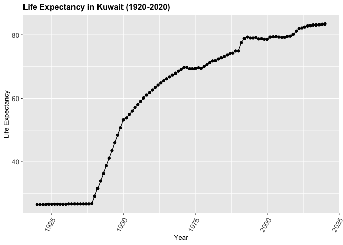
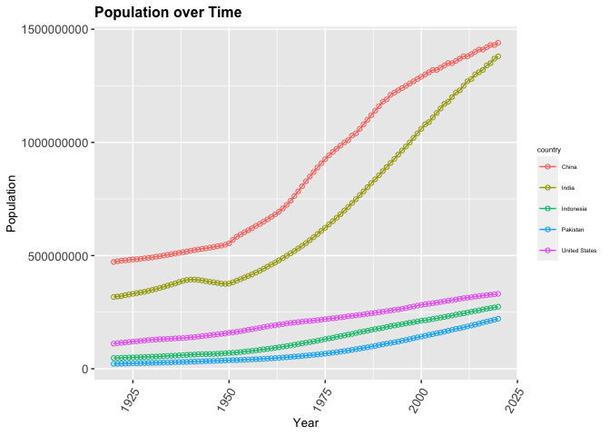
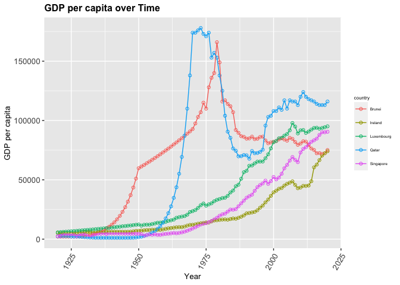
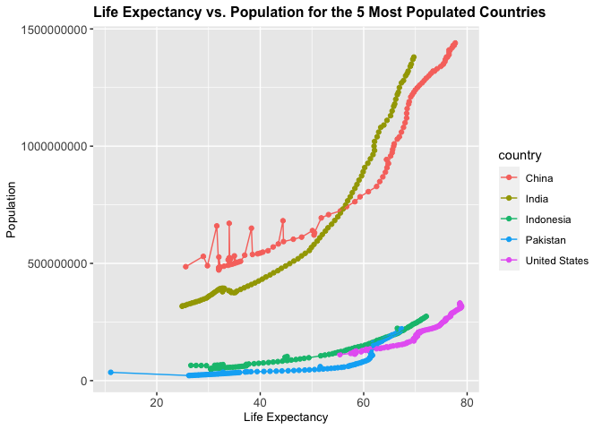

## Instructions
Answer the following questions and complete the exercises in RMarkdown. Please embed all of your code and push your final work to your repository. Your code should be organized, clean, and run free from errors. Be sure to **add your name** to the author header above. You may use any resources to answer these questions (including each other), but you may not post questions to Open Stacks or external help sites. There are 10 total questions.  

Make sure to use the formatting conventions of RMarkdown to make your report neat and clean! Your plots should use consistent aesthetics throughout. Feel free to be creative- there are many possible solutions to these questions!  

This exam is due by **12:00p on Tuesday, February 23**.  

## Load the libraries

```r
library(tidyverse)
```

```
## ── Attaching packages ─────────────────────────────────────── tidyverse 1.3.0 ──
```

```
## ✓ ggplot2 3.3.3     ✓ purrr   0.3.4
## ✓ tibble  3.0.4     ✓ dplyr   1.0.2
## ✓ tidyr   1.1.2     ✓ stringr 1.4.0
## ✓ readr   1.4.0     ✓ forcats 0.5.0
```

```
## ── Conflicts ────────────────────────────────────────── tidyverse_conflicts() ──
## x dplyr::filter() masks stats::filter()
## x dplyr::lag()    masks stats::lag()
```

```r
library(janitor)
```

```
## 
## Attaching package: 'janitor'
```

```
## The following objects are masked from 'package:stats':
## 
##     chisq.test, fisher.test
```

```r
library(here)
```

```
## here() starts at /Users/srinidhi/Desktop/BIS15W2021_sviswanathan
```

```r
library(skimr)
options(scipen=999) #disables scientific notation when printing
```

## Gapminder
For this assignment, we are going to use data from  [gapminder](https://www.gapminder.org/). Gapminder includes information about economics, population, social issues, and life expectancy from countries all over the world. We will use three data sets, so please load all three.  

One thing to note is that the data include years beyond 2021. These are projections based on modeling done by the gapminder organization. Start by importing the data.

```r
population <- read_csv("data/population_total.csv")
```

```
## 
## ── Column specification ────────────────────────────────────────────────────────
## cols(
##   .default = col_double(),
##   country = col_character()
## )
## ℹ Use `spec()` for the full column specifications.
```

```r
population
```

```
## # A tibble: 195 x 302
##    country `1800` `1801` `1802` `1803` `1804` `1805` `1806` `1807` `1808` `1809`
##    <chr>    <dbl>  <dbl>  <dbl>  <dbl>  <dbl>  <dbl>  <dbl>  <dbl>  <dbl>  <dbl>
##  1 Afghan… 3.28e6 3.28e6 3.28e6 3.28e6 3.28e6 3.28e6 3.28e6 3.28e6 3.28e6 3.28e6
##  2 Albania 4.00e5 4.02e5 4.04e5 4.05e5 4.07e5 4.09e5 4.11e5 4.13e5 4.14e5 4.16e5
##  3 Algeria 2.50e6 2.51e6 2.52e6 2.53e6 2.54e6 2.55e6 2.56e6 2.56e6 2.57e6 2.58e6
##  4 Andorra 2.65e3 2.65e3 2.65e3 2.65e3 2.65e3 2.65e3 2.65e3 2.65e3 2.65e3 2.65e3
##  5 Angola  1.57e6 1.57e6 1.57e6 1.57e6 1.57e6 1.57e6 1.57e6 1.57e6 1.57e6 1.57e6
##  6 Antigu… 3.70e4 3.70e4 3.70e4 3.70e4 3.70e4 3.70e4 3.70e4 3.70e4 3.70e4 3.70e4
##  7 Argent… 5.34e5 5.20e5 5.06e5 4.92e5 4.79e5 4.66e5 4.53e5 4.41e5 4.29e5 4.17e5
##  8 Armenia 4.13e5 4.13e5 4.13e5 4.13e5 4.13e5 4.13e5 4.13e5 4.13e5 4.13e5 4.13e5
##  9 Austra… 2.00e5 2.05e5 2.11e5 2.16e5 2.22e5 2.27e5 2.33e5 2.39e5 2.46e5 2.52e5
## 10 Austria 3.00e6 3.02e6 3.04e6 3.05e6 3.07e6 3.09e6 3.11e6 3.12e6 3.14e6 3.16e6
## # … with 185 more rows, and 291 more variables: `1810` <dbl>, `1811` <dbl>,
## #   `1812` <dbl>, `1813` <dbl>, `1814` <dbl>, `1815` <dbl>, `1816` <dbl>,
## #   `1817` <dbl>, `1818` <dbl>, `1819` <dbl>, `1820` <dbl>, `1821` <dbl>,
## #   `1822` <dbl>, `1823` <dbl>, `1824` <dbl>, `1825` <dbl>, `1826` <dbl>,
## #   `1827` <dbl>, `1828` <dbl>, `1829` <dbl>, `1830` <dbl>, `1831` <dbl>,
## #   `1832` <dbl>, `1833` <dbl>, `1834` <dbl>, `1835` <dbl>, `1836` <dbl>,
## #   `1837` <dbl>, `1838` <dbl>, `1839` <dbl>, `1840` <dbl>, `1841` <dbl>,
## #   `1842` <dbl>, `1843` <dbl>, `1844` <dbl>, `1845` <dbl>, `1846` <dbl>,
## #   `1847` <dbl>, `1848` <dbl>, `1849` <dbl>, `1850` <dbl>, `1851` <dbl>,
## #   `1852` <dbl>, `1853` <dbl>, `1854` <dbl>, `1855` <dbl>, `1856` <dbl>,
## #   `1857` <dbl>, `1858` <dbl>, `1859` <dbl>, `1860` <dbl>, `1861` <dbl>,
## #   `1862` <dbl>, `1863` <dbl>, `1864` <dbl>, `1865` <dbl>, `1866` <dbl>,
## #   `1867` <dbl>, `1868` <dbl>, `1869` <dbl>, `1870` <dbl>, `1871` <dbl>,
## #   `1872` <dbl>, `1873` <dbl>, `1874` <dbl>, `1875` <dbl>, `1876` <dbl>,
## #   `1877` <dbl>, `1878` <dbl>, `1879` <dbl>, `1880` <dbl>, `1881` <dbl>,
## #   `1882` <dbl>, `1883` <dbl>, `1884` <dbl>, `1885` <dbl>, `1886` <dbl>,
## #   `1887` <dbl>, `1888` <dbl>, `1889` <dbl>, `1890` <dbl>, `1891` <dbl>,
## #   `1892` <dbl>, `1893` <dbl>, `1894` <dbl>, `1895` <dbl>, `1896` <dbl>,
## #   `1897` <dbl>, `1898` <dbl>, `1899` <dbl>, `1900` <dbl>, `1901` <dbl>,
## #   `1902` <dbl>, `1903` <dbl>, `1904` <dbl>, `1905` <dbl>, `1906` <dbl>,
## #   `1907` <dbl>, `1908` <dbl>, `1909` <dbl>, …
```


```r
income <- read_csv("data/income_per_person_gdppercapita_ppp_inflation_adjusted.csv")
```

```
## 
## ── Column specification ────────────────────────────────────────────────────────
## cols(
##   .default = col_double(),
##   country = col_character()
## )
## ℹ Use `spec()` for the full column specifications.
```

```r
income
```

```
## # A tibble: 193 x 242
##    country `1800` `1801` `1802` `1803` `1804` `1805` `1806` `1807` `1808` `1809`
##    <chr>    <dbl>  <dbl>  <dbl>  <dbl>  <dbl>  <dbl>  <dbl>  <dbl>  <dbl>  <dbl>
##  1 Afghan…    603    603    603    603    603    603    603    603    603    603
##  2 Albania    667    667    667    667    667    668    668    668    668    668
##  3 Algeria    715    716    717    718    719    720    721    722    723    724
##  4 Andorra   1200   1200   1200   1200   1210   1210   1210   1210   1220   1220
##  5 Angola     618    620    623    626    628    631    634    637    640    642
##  6 Antigu…    757    757    757    757    757    757    757    758    758    758
##  7 Argent…   1640   1640   1650   1650   1660   1660   1670   1680   1680   1690
##  8 Armenia    514    514    514    514    514    514    514    514    514    514
##  9 Austra…    817    822    826    831    836    841    845    850    855    860
## 10 Austria   1850   1850   1860   1870   1880   1880   1890   1900   1910   1920
## # … with 183 more rows, and 231 more variables: `1810` <dbl>, `1811` <dbl>,
## #   `1812` <dbl>, `1813` <dbl>, `1814` <dbl>, `1815` <dbl>, `1816` <dbl>,
## #   `1817` <dbl>, `1818` <dbl>, `1819` <dbl>, `1820` <dbl>, `1821` <dbl>,
## #   `1822` <dbl>, `1823` <dbl>, `1824` <dbl>, `1825` <dbl>, `1826` <dbl>,
## #   `1827` <dbl>, `1828` <dbl>, `1829` <dbl>, `1830` <dbl>, `1831` <dbl>,
## #   `1832` <dbl>, `1833` <dbl>, `1834` <dbl>, `1835` <dbl>, `1836` <dbl>,
## #   `1837` <dbl>, `1838` <dbl>, `1839` <dbl>, `1840` <dbl>, `1841` <dbl>,
## #   `1842` <dbl>, `1843` <dbl>, `1844` <dbl>, `1845` <dbl>, `1846` <dbl>,
## #   `1847` <dbl>, `1848` <dbl>, `1849` <dbl>, `1850` <dbl>, `1851` <dbl>,
## #   `1852` <dbl>, `1853` <dbl>, `1854` <dbl>, `1855` <dbl>, `1856` <dbl>,
## #   `1857` <dbl>, `1858` <dbl>, `1859` <dbl>, `1860` <dbl>, `1861` <dbl>,
## #   `1862` <dbl>, `1863` <dbl>, `1864` <dbl>, `1865` <dbl>, `1866` <dbl>,
## #   `1867` <dbl>, `1868` <dbl>, `1869` <dbl>, `1870` <dbl>, `1871` <dbl>,
## #   `1872` <dbl>, `1873` <dbl>, `1874` <dbl>, `1875` <dbl>, `1876` <dbl>,
## #   `1877` <dbl>, `1878` <dbl>, `1879` <dbl>, `1880` <dbl>, `1881` <dbl>,
## #   `1882` <dbl>, `1883` <dbl>, `1884` <dbl>, `1885` <dbl>, `1886` <dbl>,
## #   `1887` <dbl>, `1888` <dbl>, `1889` <dbl>, `1890` <dbl>, `1891` <dbl>,
## #   `1892` <dbl>, `1893` <dbl>, `1894` <dbl>, `1895` <dbl>, `1896` <dbl>,
## #   `1897` <dbl>, `1898` <dbl>, `1899` <dbl>, `1900` <dbl>, `1901` <dbl>,
## #   `1902` <dbl>, `1903` <dbl>, `1904` <dbl>, `1905` <dbl>, `1906` <dbl>,
## #   `1907` <dbl>, `1908` <dbl>, `1909` <dbl>, …
```


```r
life_expectancy <- read_csv("data/life_expectancy_years.csv")
```

```
## 
## ── Column specification ────────────────────────────────────────────────────────
## cols(
##   .default = col_double(),
##   country = col_character()
## )
## ℹ Use `spec()` for the full column specifications.
```

```r
life_expectancy
```

```
## # A tibble: 187 x 302
##    country `1800` `1801` `1802` `1803` `1804` `1805` `1806` `1807` `1808` `1809`
##    <chr>    <dbl>  <dbl>  <dbl>  <dbl>  <dbl>  <dbl>  <dbl>  <dbl>  <dbl>  <dbl>
##  1 Afghan…   28.2   28.2   28.2   28.2   28.2   28.2   28.1   28.1   28.1   28.1
##  2 Albania   35.4   35.4   35.4   35.4   35.4   35.4   35.4   35.4   35.4   35.4
##  3 Algeria   28.8   28.8   28.8   28.8   28.8   28.8   28.8   28.8   28.8   28.8
##  4 Andorra   NA     NA     NA     NA     NA     NA     NA     NA     NA     NA  
##  5 Angola    27     27     27     27     27     27     27     27     27     27  
##  6 Antigu…   33.5   33.5   33.5   33.5   33.5   33.5   33.5   33.5   33.5   33.5
##  7 Argent…   33.2   33.2   33.2   33.2   33.2   33.2   33.2   33.2   33.2   33.2
##  8 Armenia   34     34     34     34     34     34     34     34     34     34  
##  9 Austra…   34     34     34     34     34     34     34     34     34     34  
## 10 Austria   34.4   34.4   34.4   34.4   34.4   34.4   34.4   34.4   34.4   34.4
## # … with 177 more rows, and 291 more variables: `1810` <dbl>, `1811` <dbl>,
## #   `1812` <dbl>, `1813` <dbl>, `1814` <dbl>, `1815` <dbl>, `1816` <dbl>,
## #   `1817` <dbl>, `1818` <dbl>, `1819` <dbl>, `1820` <dbl>, `1821` <dbl>,
## #   `1822` <dbl>, `1823` <dbl>, `1824` <dbl>, `1825` <dbl>, `1826` <dbl>,
## #   `1827` <dbl>, `1828` <dbl>, `1829` <dbl>, `1830` <dbl>, `1831` <dbl>,
## #   `1832` <dbl>, `1833` <dbl>, `1834` <dbl>, `1835` <dbl>, `1836` <dbl>,
## #   `1837` <dbl>, `1838` <dbl>, `1839` <dbl>, `1840` <dbl>, `1841` <dbl>,
## #   `1842` <dbl>, `1843` <dbl>, `1844` <dbl>, `1845` <dbl>, `1846` <dbl>,
## #   `1847` <dbl>, `1848` <dbl>, `1849` <dbl>, `1850` <dbl>, `1851` <dbl>,
## #   `1852` <dbl>, `1853` <dbl>, `1854` <dbl>, `1855` <dbl>, `1856` <dbl>,
## #   `1857` <dbl>, `1858` <dbl>, `1859` <dbl>, `1860` <dbl>, `1861` <dbl>,
## #   `1862` <dbl>, `1863` <dbl>, `1864` <dbl>, `1865` <dbl>, `1866` <dbl>,
## #   `1867` <dbl>, `1868` <dbl>, `1869` <dbl>, `1870` <dbl>, `1871` <dbl>,
## #   `1872` <dbl>, `1873` <dbl>, `1874` <dbl>, `1875` <dbl>, `1876` <dbl>,
## #   `1877` <dbl>, `1878` <dbl>, `1879` <dbl>, `1880` <dbl>, `1881` <dbl>,
## #   `1882` <dbl>, `1883` <dbl>, `1884` <dbl>, `1885` <dbl>, `1886` <dbl>,
## #   `1887` <dbl>, `1888` <dbl>, `1889` <dbl>, `1890` <dbl>, `1891` <dbl>,
## #   `1892` <dbl>, `1893` <dbl>, `1894` <dbl>, `1895` <dbl>, `1896` <dbl>,
## #   `1897` <dbl>, `1898` <dbl>, `1899` <dbl>, `1900` <dbl>, `1901` <dbl>,
## #   `1902` <dbl>, `1903` <dbl>, `1904` <dbl>, `1905` <dbl>, `1906` <dbl>,
## #   `1907` <dbl>, `1908` <dbl>, `1909` <dbl>, …
```

1. (3 points) Once you have an idea of the structure of the data, please make each data set tidy and store them as new objects. You will need both the original and tidy data!
##### For the population data frame:

```r
skim(population)
```


Table: Data summary

|                         |           |
|:------------------------|:----------|
|Name                     |population |
|Number of rows           |195        |
|Number of columns        |302        |
|_______________________  |           |
|Column type frequency:   |           |
|character                |1          |
|numeric                  |301        |
|________________________ |           |
|Group variables          |None       |


**Variable type: character**

|skim_variable | n_missing| complete_rate| min| max| empty| n_unique| whitespace|
|:-------------|---------:|-------------:|---:|---:|-----:|--------:|----------:|
|country       |         0|             1|   3|  30|     0|      195|          0|


**Variable type: numeric**

|skim_variable | n_missing| complete_rate|     mean|        sd|  p0|     p25|      p50|      p75|       p100|hist  |
|:-------------|---------:|-------------:|--------:|---------:|---:|-------:|--------:|--------:|----------:|:-----|
|1800          |         0|             1|  5038229|  27799464| 905|  128500|   637000|  2200000|  330000000|▇▁▁▁▁ |
|1801          |         0|             1|  5055872|  27922174| 905|  128500|   637000|  2200000|  332000000|▇▁▁▁▁ |
|1802          |         0|             1|  5074643|  28021286| 905|  128500|   637000|  2195000|  333000000|▇▁▁▁▁ |
|1803          |         0|             1|  5092072|  28143975| 905|  129000|   637000|  2195000|  335000000|▇▁▁▁▁ |
|1804          |         0|             1|  5105055|  28206722| 905|  129000|   637000|  2195000|  336000000|▇▁▁▁▁ |
|1805          |         0|             1|  5128710|  28366017| 905|  129000|   637000|  2175000|  338000000|▇▁▁▁▁ |
|1806          |         0|             1|  5143516|  28429573| 905|  127500|   637000|  2145000|  339000000|▇▁▁▁▁ |
|1807          |         0|             1|  5167424|  28589070| 905|  127000|   637000|  2145000|  341000000|▇▁▁▁▁ |
|1808          |         0|             1|  5186405|  28712843| 905|  127000|   637000|  2145000|  343000000|▇▁▁▁▁ |
|1809          |         0|             1|  5199982|  28775667| 905|  127000|   637000|  2145000|  344000000|▇▁▁▁▁ |
|1810          |         0|             1|  5232967|  28996888| 905|  127000|   639000|  2145000|  347000000|▇▁▁▁▁ |
|1811          |         0|             1|  5254824|  29121137| 905|  127000|   655000|  2145000|  349000000|▇▁▁▁▁ |
|1812          |         0|             1|  5294767|  29404044| 905|  127000|   671000|  2145000|  353000000|▇▁▁▁▁ |
|1813          |         0|             1|  5325674|  29591167| 905|  127000|   688000|  2145000|  356000000|▇▁▁▁▁ |
|1814          |         0|             1|  5361654|  29814095| 905|  125000|   705000|  2155000|  359000000|▇▁▁▁▁ |
|1815          |         0|             1|  5398080|  30063508| 905|  123000|   713000|  2170000|  363000000|▇▁▁▁▁ |
|1816          |         0|             1|  5440271|  30348415| 905|  121000|   713000|  2165000|  367000000|▇▁▁▁▁ |
|1817          |         0|             1|  5472701|  30537979| 905|  120000|   713000|  2155000|  370000000|▇▁▁▁▁ |
|1818          |         0|             1|  5517194|  30824550| 905|  120000|   713000|  2145000|  374000000|▇▁▁▁▁ |
|1819          |         0|             1|  5550374|  31014988| 905|  120000|   714000|  2150000|  377000000|▇▁▁▁▁ |
|1820          |         0|             1|  5588640|  31239356| 905|  120000|   719000|  2165000|  380000000|▇▁▁▁▁ |
|1821          |         0|             1|  5627718|  31491861| 905|  120500|   728000|  2185000|  384000000|▇▁▁▁▁ |
|1822          |         0|             1|  5661860|  31654277| 905|  121000|   736000|  2215000|  386000000|▇▁▁▁▁ |
|1823          |         0|             1|  5701340|  31877947| 905|  122000|   742000|  2250000|  389000000|▇▁▁▁▁ |
|1824          |         0|             1|  5734966|  32068088| 905|  122500|   749000|  2285000|  392000000|▇▁▁▁▁ |
|1825          |         0|             1|  5774826|  32292007| 905|  123000|   756000|  2310000|  395000000|▇▁▁▁▁ |
|1826          |         0|             1|  5816081|  32516444| 905|  123500|   762000|  2335000|  398000000|▇▁▁▁▁ |
|1827          |         0|             1|  5853201|  32678631| 905|  123000|   768000|  2370000|  400000000|▇▁▁▁▁ |
|1828          |         0|             1|  5894272|  32903478| 905|  122000|   775000|  2395000|  403000000|▇▁▁▁▁ |
|1829          |         0|             1|  5936815|  33128212| 905|  119500|   782000|  2420000|  406000000|▇▁▁▁▁ |
|1830          |         0|             1|  5967640|  33228270| 905|  118000|   789000|  2445000|  407000000|▇▁▁▁▁ |
|1831          |         0|             1|  5999721|  33358004| 905|  116000|   789000|  2470000|  409000000|▇▁▁▁▁ |
|1832          |         0|             1|  6031314|  33457863| 905|  115000|   795000|  2495000|  410000000|▇▁▁▁▁ |
|1833          |         0|             1|  6057897|  33495721| 905|  114000|   802000|  2520000|  410000000|▇▁▁▁▁ |
|1834          |         0|             1|  6086100|  33534446| 905|  113500|   810000|  2550000|  410000000|▇▁▁▁▁ |
|1835          |         0|             1|  6113028|  33572939| 905|  113000|   817000|  2570000|  410000000|▇▁▁▁▁ |
|1836          |         0|             1|  6146867|  33674249| 905|  112500|   825000|  2595000|  411000000|▇▁▁▁▁ |
|1837          |         0|             1|  6174688|  33712866| 905|  113500|   823000|  2610000|  411000000|▇▁▁▁▁ |
|1838          |         0|             1|  6203668|  33752360| 905|  115500|   810000|  2630000|  411000000|▇▁▁▁▁ |
|1839          |         0|             1|  6236324|  33852819| 905|  117500|   805000|  2645000|  412000000|▇▁▁▁▁ |
|1840          |         0|             1|  6265864|  33892903| 905|  120500|   818000|  2665000|  412000000|▇▁▁▁▁ |
|1841          |         0|             1|  6288498|  33897875| 905|  123500|   831000|  2680000|  412000000|▇▁▁▁▁ |
|1842          |         0|             1|  6316663|  33937126| 905|  127000|   845000|  2700000|  412000000|▇▁▁▁▁ |
|1843          |         0|             1|  6344308|  33976352| 905|  129500|   859000|  2715000|  412000000|▇▁▁▁▁ |
|1844          |         0|             1|  6374099|  34016226| 905|  129500|   887000|  2735000|  412000000|▇▁▁▁▁ |
|1845          |         0|             1|  6402963|  34055531| 905|  130000|   895000|  2755000|  412000000|▇▁▁▁▁ |
|1846          |         0|             1|  6431975|  34095789| 905|  132000|   904000|  2825000|  412000000|▇▁▁▁▁ |
|1847          |         0|             1|  6462558|  34136103| 905|  133500|   914000|  2825000|  412000000|▇▁▁▁▁ |
|1848          |         0|             1|  6492695|  34176613| 905|  134500|   922000|  2860000|  412000000|▇▁▁▁▁ |
|1849          |         0|             1|  6518678|  34157263| 905|  135500|   930000|  2885000|  411000000|▇▁▁▁▁ |
|1850          |         0|             1|  6543826|  34138035| 905|  136500|   937000|  2905000|  410000000|▇▁▁▁▁ |
|1851          |         0|             1|  6560809|  34057515| 905|  138500|   946000|  2925000|  408000000|▇▁▁▁▁ |
|1852          |         0|             1|  6572626|  33917691| 905|  143000|   954000|  2945000|  405000000|▇▁▁▁▁ |
|1853          |         0|             1|  6580616|  33718991| 905|  148000|   963000|  2965000|  401000000|▇▁▁▁▁ |
|1854          |         0|             1|  6593709|  33582523| 905|  152500|   972000|  2975000|  398000000|▇▁▁▁▁ |
|1855          |         0|             1|  6601445|  33386589| 906|  154500|   981000|  2985000|  394000000|▇▁▁▁▁ |
|1856          |         0|             1|  6614979|  33252890| 906|  156000|   989000|  3015000|  391000000|▇▁▁▁▁ |
|1857          |         0|             1|  6617604|  33023278| 906|  157500|  1010000|  3045000|  387000000|▇▁▁▁▁ |
|1858          |         0|             1|  6633016|  32892221| 906|  158500|  1020000|  3075000|  384000000|▇▁▁▁▁ |
|1859          |         0|             1|  6647610|  32761927| 906|  160000|  1030000|  3110000|  381000000|▇▁▁▁▁ |
|1860          |         0|             1|  6661632|  32632657| 906|  161000|  1040000|  3140000|  378000000|▇▁▁▁▁ |
|1861          |         0|             1|  6682475|  32564116| 906|  162500|  1040000|  3175000|  376000000|▇▁▁▁▁ |
|1862          |         0|             1|  6698291|  32438245| 906|  163500|  1050000|  3205000|  373000000|▇▁▁▁▁ |
|1863          |         0|             1|  6723903|  32429197| 906|  170500|  1060000|  3235000|  372000000|▇▁▁▁▁ |
|1864          |         0|             1|  6745063|  32362653| 906|  178000|  1060000|  3270000|  370000000|▇▁▁▁▁ |
|1865          |         0|             1|  6766812|  32297924| 907|  180500|  1070000|  3300000|  368000000|▇▁▁▁▁ |
|1866          |         0|             1|  6789713|  32234188| 907|  181500|  1080000|  3335000|  366000000|▇▁▁▁▁ |
|1867          |         0|             1|  6811864|  32171336| 907|  182000|  1090000|  3370000|  364000000|▇▁▁▁▁ |
|1868          |         0|             1|  6835001|  32109522| 907|  183000|  1100000|  3400000|  362000000|▇▁▁▁▁ |
|1869          |         0|             1|  6863545|  32105851| 907|  185500|  1110000|  3435000|  361000000|▇▁▁▁▁ |
|1870          |         0|             1|  6893385|  32103239| 907|  188000|  1120000|  3470000|  360000000|▇▁▁▁▁ |
|1871          |         0|             1|  6926927|  32157380| 907|  190500|  1130000|  3505000|  360000000|▇▁▁▁▁ |
|1872          |         0|             1|  6963235|  32229584| 907|  193000|  1140000|  3540000|  361000000|▇▁▁▁▁ |
|1873          |         0|             1|  7003934|  32341339| 907|  193500|  1150000|  3575000|  362000000|▇▁▁▁▁ |
|1874          |         0|             1|  7045028|  32454147| 908|  194000|  1160000|  3610000|  363000000|▇▁▁▁▁ |
|1875          |         0|             1|  7082339|  32528160| 908|  195000|  1170000|  3650000|  364000000|▇▁▁▁▁ |
|1876          |         0|             1|  7123451|  32640089| 908|  196500|  1190000|  3680000|  365000000|▇▁▁▁▁ |
|1877          |         0|             1|  7162378|  32715456| 908|  198000|  1200000|  3720000|  366000000|▇▁▁▁▁ |
|1878          |         0|             1|  7204484|  32829548| 908|  200000|  1220000|  3720000|  367000000|▇▁▁▁▁ |
|1879          |         0|             1|  7248380|  32944220| 908|  201500|  1220000|  3745000|  368000000|▇▁▁▁▁ |
|1880          |         0|             1|  7293329|  33059496| 908|  203500|  1230000|  3800000|  369000000|▇▁▁▁▁ |
|1881          |         0|             1|  7345366|  33215628| 908|  205000|  1240000|  3870000|  370000000|▇▁▁▁▁ |
|1882          |         0|             1|  7395656|  33371353| 908|  206500|  1250000|  3910000|  371000000|▇▁▁▁▁ |
|1883          |         0|             1|  7448344|  33528193| 908|  208500|  1260000|  3950000|  372000000|▇▁▁▁▁ |
|1884          |         0|             1|  7507391|  33741248| 909|  212000|  1270000|  3990000|  374000000|▇▁▁▁▁ |
|1885          |         0|             1|  7565904|  33939492| 909|  215500|  1300000|  4030000|  375000000|▇▁▁▁▁ |
|1886          |         0|             1|  7621718|  34099102| 909|  220500|  1330000|  4070000|  376000000|▇▁▁▁▁ |
|1887          |         0|             1|  7677260|  34258751| 909|  225000|  1350000|  4110000|  377000000|▇▁▁▁▁ |
|1888          |         0|             1|  7743123|  34515333| 909|  230000|  1370000|  4150000|  379000000|▇▁▁▁▁ |
|1889          |         0|             1|  7799709|  34677131| 909|  235000|  1380000|  4195000|  380000000|▇▁▁▁▁ |
|1890          |         0|             1|  7859939|  34893873| 909|  239500|  1390000|  4235000|  382000000|▇▁▁▁▁ |
|1891          |         0|             1|  7911962|  35015948| 909|  242500|  1390000|  4275000|  383000000|▇▁▁▁▁ |
|1892          |         0|             1|  7966124|  35192519| 909|  245500|  1390000|  4290000|  385000000|▇▁▁▁▁ |
|1893          |         0|             1|  8021656|  35369978| 910|  249000|  1390000|  4300000|  387000000|▇▁▁▁▁ |
|1894          |         0|             1|  8073309|  35508630| 910|  253500|  1400000|  4315000|  389000000|▇▁▁▁▁ |
|1895          |         0|             1|  8129882|  35687621| 910|  256500|  1410000|  4305000|  391000000|▇▁▁▁▁ |
|1896          |         0|             1|  8187026|  35867169| 910|  259000|  1420000|  4285000|  393000000|▇▁▁▁▁ |
|1897          |         0|             1|  8239609|  36007484| 910|  262500|  1430000|  4295000|  395000000|▇▁▁▁▁ |
|1898          |         0|             1|  8297266|  36188904| 910|  265000|  1440000|  4350000|  397000000|▇▁▁▁▁ |
|1899          |         0|             1|  8359438|  36372395| 910|  268500|  1460000|  4375000|  399000000|▇▁▁▁▁ |
|1900          |         0|             1|  8425604|  36610426| 910|  271000|  1470000|  4350000|  402000000|▇▁▁▁▁ |
|1901          |         0|             1|  8489851|  36795012| 910|  271000|  1480000|  4330000|  404000000|▇▁▁▁▁ |
|1902          |         0|             1|  8560671|  37020275| 910|  272000|  1500000|  4330000|  406000000|▇▁▁▁▁ |
|1903          |         0|             1|  8633293|  37247104| 911|  276500|  1500000|  4365000|  408000000|▇▁▁▁▁ |
|1904          |         0|             1|  8710535|  37529832| 911|  281000|  1520000|  4405000|  411000000|▇▁▁▁▁ |
|1905          |         0|             1|  8785832|  37759340| 911|  286000|  1540000|  4490000|  413000000|▇▁▁▁▁ |
|1906          |         0|             1|  8861704|  37989190| 911|  290500|  1550000|  4580000|  415000000|▇▁▁▁▁ |
|1907          |         0|             1|  8943411|  38274965| 911|  292500|  1540000|  4670000|  418000000|▇▁▁▁▁ |
|1908          |         0|             1|  9019978|  38505125| 911|  297000|  1530000|  4760000|  420000000|▇▁▁▁▁ |
|1909          |         0|             1|  9094033|  38750568| 911|  302500|  1520000|  4800000|  423000000|▇▁▁▁▁ |
|1910          |         0|             1|  9167826|  39030524| 911|  306500|  1520000|  4825000|  426000000|▇▁▁▁▁ |
|1911          |         0|             1|  9235432|  39321586| 911|  305000|  1520000|  4850000|  430000000|▇▁▁▁▁ |
|1912          |         0|             1|  9302106|  39612441| 912|  304000|  1530000|  4845000|  434000000|▇▁▁▁▁ |
|1913          |         0|             1|  9368667|  39923787| 912|  305500|  1550000|  4845000|  439000000|▇▁▁▁▁ |
|1914          |         0|             1|  9432415|  40261226| 912|  306500|  1570000|  4845000|  444000000|▇▁▁▁▁ |
|1915          |         0|             1|  9498460|  40574188| 912|  309000|  1580000|  4855000|  449000000|▇▁▁▁▁ |
|1916          |         0|             1|  9564826|  40914912| 912|  310000|  1590000|  4895000|  454000000|▇▁▁▁▁ |
|1917          |         0|             1|  9630392|  41229719| 912|  310500|  1600000|  4945000|  459000000|▇▁▁▁▁ |
|1918          |         0|             1|  9697385|  41572018| 912|  311500|  1610000|  5015000|  464000000|▇▁▁▁▁ |
|1919          |         0|             1|  9766291|  41835459| 912|  313000|  1630000|  5095000|  468000000|▇▁▁▁▁ |
|1920          |         0|             1|  9843719|  42163973| 912|  315500|  1640000|  5180000|  472000000|▇▁▁▁▁ |
|1921          |         0|             1|  9925046|  42450204| 912|  318000|  1660000|  5275000|  475000000|▇▁▁▁▁ |
|1922          |         0|             1| 10010265|  42736660| 912|  321500|  1680000|  5330000|  478000000|▇▁▁▁▁ |
|1923          |         0|             1| 10093537|  42976390| 912|  325500|  1710000|  5375000|  479000000|▇▁▁▁▁ |
|1924          |         0|             1| 10186294|  43248707| 912|  329000|  1730000|  5425000|  481000000|▇▁▁▁▁ |
|1925          |         0|             1| 10277638|  43520544| 912|  333500|  1760000|  5470000|  483000000|▇▁▁▁▁ |
|1926          |         0|             1| 10361037|  43725868| 912|  337500|  1780000|  5515000|  484000000|▇▁▁▁▁ |
|1927          |         0|             1| 10454114|  43999089| 912|  341000|  1800000|  5565000|  486000000|▇▁▁▁▁ |
|1928          |         0|             1| 10550466|  44274948| 912|  345500|  1820000|  5615000|  488000000|▇▁▁▁▁ |
|1929          |         0|             1| 10651250|  44589217| 912|  350000|  1840000|  5695000|  490000000|▇▁▁▁▁ |
|1930          |         0|             1| 10749049|  44891193| 912|  355500|  1870000|  5775000|  492000000|▇▁▁▁▁ |
|1931          |         0|             1| 10852892|  45249570| 912|  361000|  1880000|  5845000|  495000000|▇▁▁▁▁ |
|1932          |         0|             1| 10964595|  45606568| 912|  367500|  1920000|  5915000|  497000000|▇▁▁▁▁ |
|1933          |         0|             1| 11073418|  45992894| 912|  374500|  1960000|  5985000|  500000000|▇▁▁▁▁ |
|1934          |         0|             1| 11187659|  46393815| 912|  382000|  1980000|  6055000|  503000000|▇▁▁▁▁ |
|1935          |         0|             1| 11301979|  46794892| 912|  389500|  2010000|  6125000|  506000000|▇▁▁▁▁ |
|1936          |         0|             1| 11416411|  47196787| 912|  398500|  2030000|  6195000|  509000000|▇▁▁▁▁ |
|1937          |         0|             1| 11537737|  47640618| 912|  407500|  2050000|  6260000|  512000000|▇▁▁▁▁ |
|1938          |         0|             1| 11656526|  48045763| 912|  413500|  2080000|  6320000|  515000000|▇▁▁▁▁ |
|1939          |         0|             1| 11770403|  48409367| 912|  417500|  2100000|  6385000|  518000000|▇▁▁▁▁ |
|1940          |         0|             1| 11881916|  48705282| 912|  417500|  2120000|  6450000|  521000000|▇▁▁▁▁ |
|1941          |         0|             1| 11982732|  48908721| 912|  416000|  2140000|  6545000|  524000000|▇▁▁▁▁ |
|1942          |         0|             1| 12082436|  49083082| 912|  418500|  2150000|  6660000|  527000000|▇▁▁▁▁ |
|1943          |         0|             1| 12174120|  49179071| 912|  421500|  2180000|  6745000|  530000000|▇▁▁▁▁ |
|1944          |         0|             1| 12261134|  49219989| 912|  424500|  2220000|  6815000|  532000000|▇▁▁▁▁ |
|1945          |         0|             1| 12353262|  49319775| 912|  427500|  2260000|  6900000|  535000000|▇▁▁▁▁ |
|1946          |         0|             1| 12448431|  49461168| 912|  430500|  2300000|  7045000|  538000000|▇▁▁▁▁ |
|1947          |         0|             1| 12544251|  49570013| 912|  430500|  2350000|  7140000|  541000000|▇▁▁▁▁ |
|1948          |         0|             1| 12649006|  49684925| 912|  440000|  2390000|  7235000|  544000000|▇▁▁▁▁ |
|1949          |         0|             1| 12775571|  49933208| 912|  454000|  2440000|  7335000|  548000000|▇▁▁▁▁ |
|1950          |         0|             1| 12935097|  50384742| 906|  464500|  2480000|  7450000|  554000000|▇▁▁▁▁ |
|1951          |         0|             1| 13176854|  51567819| 883|  469000|  2500000|  7505000|  570000000|▇▁▁▁▁ |
|1952          |         0|             1| 13419535|  52633483| 883|  474000|  2530000|  7525000|  583000000|▇▁▁▁▁ |
|1953          |         0|             1| 13657720|  53545964| 890|  479000|  2590000|  7555000|  593000000|▇▁▁▁▁ |
|1954          |         0|             1| 13901826|  54459839| 899|  484000|  2610000|  7640000|  603000000|▇▁▁▁▁ |
|1955          |         0|             1| 14139348|  55309652| 900|  490000|  2640000|  7840000|  612000000|▇▁▁▁▁ |
|1956          |         0|             1| 14389681|  56171766| 909|  503000|  2720000|  7940000|  621000000|▇▁▁▁▁ |
|1957          |         0|             1| 14652702|  57126361| 908|  517000|  2810000|  8005000|  631000000|▇▁▁▁▁ |
|1958          |         0|             1| 14914714|  58027511| 905|  532000|  2850000|  8085000|  640000000|▇▁▁▁▁ |
|1959          |         0|             1| 15189836|  59015348| 905|  546500|  2930000|  8240000|  650000000|▇▁▁▁▁ |
|1960          |         0|             1| 15473214|  60014747| 904|  562000|  3000000|  8400000|  660000000|▇▁▁▁▁ |
|1961          |         0|             1| 15761233|  61062409| 904|  570500|  3060000|  8625000|  671000000|▇▁▁▁▁ |
|1962          |         0|             1| 16055951|  62106202| 901|  578500|  3120000|  8815000|  682000000|▇▁▁▁▁ |
|1963          |         0|             1| 16363208|  63251576| 898|  585500|  3180000|  9010000|  694000000|▇▁▁▁▁ |
|1964          |         0|             1| 16680203|  64495206| 877|  594000|  3250000|  9310000|  708000000|▇▁▁▁▁ |
|1965          |         0|             1| 17017910|  65871863| 853|  603000|  3310000|  9530000|  724000000|▇▁▁▁▁ |
|1966          |         0|             1| 17363647|  67372217| 814|  613500|  3370000|  9805000|  742000000|▇▁▁▁▁ |
|1967          |         0|             1| 17727175|  69013129| 766|  625500|  3430000|  9910000|  763000000|▇▁▁▁▁ |
|1968          |         0|             1| 18098461|  70728284| 711|  656500|  3500000| 10055000|  784000000|▇▁▁▁▁ |
|1969          |         0|             1| 18469813|  72456324| 670|  690500|  3580000| 10125000|  806000000|▇▁▁▁▁ |
|1970          |         0|             1| 18858702|  74236684| 649|  705000|  3670000| 10350000|  828000000|▇▁▁▁▁ |
|1971          |         0|             1| 19236839|  75979892| 645|  716000|  3770000| 10500000|  849000000|▇▁▁▁▁ |
|1972          |         0|             1| 19622929|  77686987| 661|  727500|  3850000| 10800000|  869000000|▇▁▁▁▁ |
|1973          |         0|             1| 20008507|  79422276| 685|  738000|  3910000| 11150000|  889000000|▇▁▁▁▁ |
|1974          |         0|             1| 20399038|  81110597| 708|  748000|  3990000| 11500000|  908000000|▇▁▁▁▁ |
|1975          |         0|             1| 20785836|  82745251| 724|  756000|  4010000| 11900000|  926000000|▇▁▁▁▁ |
|1976          |         0|             1| 21176135|  84366978| 730|  770000|  4170000| 12300000|  943000000|▇▁▁▁▁ |
|1977          |         0|             1| 21543941|  85823998| 730|  786500|  4260000| 12650000|  958000000|▇▁▁▁▁ |
|1978          |         0|             1| 21927694|  87283919| 725|  833500|  4340000| 13000000|  972000000|▇▁▁▁▁ |
|1979          |         0|             1| 22317685|  88777790| 722|  898500|  4420000| 13350000|  986000000|▇▁▁▁▁ |
|1980          |         0|             1| 22710820|  90275642| 725|  932000|  4510000| 13550000| 1000000000|▇▁▁▁▁ |
|1981          |         0|             1| 23098738|  91572353| 723|  954000|  4620000| 13600000| 1010000000|▇▁▁▁▁ |
|1982          |         0|             1| 23532361|  93442181| 725|  976000|  4720000| 13750000| 1030000000|▇▁▁▁▁ |
|1983          |         0|             1| 23925361|  94769183| 730|  997500|  4800000| 14000000| 1040000000|▇▁▁▁▁ |
|1984          |         0|             1| 24383544|  96696991| 733| 1020000|  4870000| 14250000| 1060000000|▇▁▁▁▁ |
|1985          |         0|             1| 24839507|  98580415| 740| 1045000|  4910000| 14550000| 1080000000|▇▁▁▁▁ |
|1986          |         0|             1| 25305437| 100517160| 747| 1065000|  4930000| 14850000| 1100000000|▇▁▁▁▁ |
|1987          |         0|             1| 25768131| 102446720| 751| 1090000|  5030000| 15150000| 1120000000|▇▁▁▁▁ |
|1988          |         0|             1| 26230331| 104334709| 754| 1120000|  5120000| 15650000| 1140000000|▇▁▁▁▁ |
|1989          |         0|             1| 26701765| 106270252| 759| 1130000|  5150000| 16000000| 1160000000|▇▁▁▁▁ |
|1990          |         0|             1| 27165412| 108200066| 762| 1140000|  5270000| 16300000| 1180000000|▇▁▁▁▁ |
|1991          |         0|             1| 27587862| 109594753| 762| 1150000|  5310000| 16600000| 1190000000|▇▁▁▁▁ |
|1992          |         0|             1| 28037338| 111510610| 773| 1160000|  5310000| 16800000| 1210000000|▇▁▁▁▁ |
|1993          |         0|             1| 28455482| 112906039| 780| 1170000|  5350000| 16900000| 1220000000|▇▁▁▁▁ |
|1994          |         0|             1| 28861469| 114326453| 777| 1180000|  5360000| 17450000| 1230000000|▇▁▁▁▁ |
|1995          |         0|             1| 29270590| 115728135| 778| 1190000|  5380000| 18050000| 1240000000|▇▁▁▁▁ |
|1996          |         0|             1| 29684869| 117137161| 784| 1210000|  5420000| 18300000| 1250000000|▇▁▁▁▁ |
|1997          |         0|             1| 30083742| 118545631| 787| 1230000|  5570000| 18450000| 1260000000|▇▁▁▁▁ |
|1998          |         0|             1| 30499470| 120040844| 786| 1250000|  5700000| 18600000| 1270000000|▇▁▁▁▁ |
|1999          |         0|             1| 30915602| 121545766| 788| 1270000|  5840000| 18800000| 1280000000|▇▁▁▁▁ |
|2000          |         0|             1| 31336214| 123049084| 790| 1295000|  5950000| 19150000| 1290000000|▇▁▁▁▁ |
|2001          |         0|             1| 31748300| 124544355| 792| 1315000|  6060000| 19500000| 1300000000|▇▁▁▁▁ |
|2002          |         0|             1| 32126600| 125612673| 792| 1335000|  6170000| 19800000| 1310000000|▇▁▁▁▁ |
|2003          |         0|             1| 32551468| 127120006| 792| 1345000|  6280000| 20200000| 1320000000|▇▁▁▁▁ |
|2004          |         0|             1| 32925631| 128099992| 795| 1355000|  6400000| 20600000| 1320000000|▇▁▁▁▁ |
|2005          |         0|             1| 33358510| 129615376| 798| 1375000|  6530000| 20950000| 1330000000|▇▁▁▁▁ |
|2006          |         0|             1| 33804556| 131137518| 795| 1405000|  6680000| 21150000| 1340000000|▇▁▁▁▁ |
|2007          |         0|             1| 34194260| 132211898| 794| 1440000|  6850000| 21500000| 1350000000|▇▁▁▁▁ |
|2008          |         0|             1| 34592827| 133221433| 792| 1485000|  7090000| 22100000| 1350000000|▇▁▁▁▁ |
|2009          |         0|             1| 35051809| 134763227| 787| 1610000|  7360000| 22700000| 1360000000|▇▁▁▁▁ |
|2010          |         0|             1| 35463801| 135849783| 783| 1705000|  7430000| 23450000| 1370000000|▇▁▁▁▁ |
|2011          |         0|             1| 35927010| 137389927| 786| 1765000|  7660000| 24200000| 1380000000|▇▁▁▁▁ |
|2012          |         0|             1| 36334120| 138417199| 786| 1830000|  7870000| 24850000| 1380000000|▇▁▁▁▁ |
|2013          |         0|             1| 36762152| 139514444| 786| 1890000|  8060000| 25350000| 1390000000|▇▁▁▁▁ |
|2014          |         0|             1| 37239160| 141072586| 785| 1950000|  8210000| 26050000| 1400000000|▇▁▁▁▁ |
|2015          |         0|             1| 37651938| 142153479| 790| 1975000|  8300000| 26750000| 1410000000|▇▁▁▁▁ |
|2016          |         0|             1| 38035941| 142763397| 791| 1990000|  8380000| 27250000| 1410000000|▇▁▁▁▁ |
|2017          |         0|             1| 38513451| 144323659| 798| 2005000|  8460000| 27700000| 1420000000|▇▁▁▁▁ |
|2018          |         0|             1| 38925067| 145405074| 810| 2005000|  8610000| 28300000| 1430000000|▇▁▁▁▁ |
|2019          |         0|             1| 39356033| 146482972| 815| 2000000|  8770000| 28550000| 1430000000|▇▁▁▁▁ |
|2020          |         0|             1| 39776967| 147577292| 809| 2025000|  8740000| 28750000| 1440000000|▇▁▁▁▁ |
|2021          |         0|             1| 40133318| 148165512| 812| 2050000|  8790000| 29200000| 1440000000|▇▁▁▁▁ |
|2022          |         0|             1| 40617215| 149737722| 808| 2070000|  8920000| 29750000| 1450000000|▇▁▁▁▁ |
|2023          |         0|             1| 40979613| 150350096| 808| 2080000|  9060000| 30400000| 1450000000|▇▁▁▁▁ |
|2024          |         0|             1| 41386823| 151435167| 803| 2080000|  9100000| 31050000| 1460000000|▇▁▁▁▁ |
|2025          |         0|             1| 41794739| 152508293| 799| 2070000|  9310000| 31650000| 1460000000|▇▁▁▁▁ |
|2026          |         0|             1| 42156517| 153130544| 795| 2070000|  9370000| 32250000| 1460000000|▇▁▁▁▁ |
|2027          |         0|             1| 42522279| 153754622| 793| 2070000|  9340000| 32800000| 1470000000|▇▁▁▁▁ |
|2028          |         0|             1| 42880313| 154379265| 803| 2060000|  9320000| 33400000| 1480000000|▇▁▁▁▁ |
|2029          |         0|             1| 43238552| 155004870| 797| 2060000|  9380000| 34200000| 1490000000|▇▁▁▁▁ |
|2030          |         0|             1| 43590590| 155630214| 799| 2055000|  9340000| 35200000| 1500000000|▇▁▁▁▁ |
|2031          |         0|             1| 43938099| 156248423| 794| 2045000|  9300000| 36200000| 1510000000|▇▁▁▁▁ |
|2032          |         0|             1| 44289922| 156888560| 795| 2055000|  9270000| 36650000| 1520000000|▇▁▁▁▁ |
|2033          |         0|             1| 44644246| 157527698| 789| 2060000|  9310000| 36700000| 1530000000|▇▁▁▁▁ |
|2034          |         0|             1| 44994616| 158168708| 801| 2080000|  9350000| 37000000| 1540000000|▇▁▁▁▁ |
|2035          |         0|             1| 45333335| 158809961| 801| 2115000|  9390000| 37650000| 1550000000|▇▁▁▁▁ |
|2036          |         0|             1| 45690889| 159458050| 805| 2145000|  9420000| 38150000| 1560000000|▇▁▁▁▁ |
|2037          |         0|             1| 46028786| 160100964| 807| 2175000|  9460000| 38500000| 1570000000|▇▁▁▁▁ |
|2038          |         0|             1| 46310827| 160287803| 806| 2210000|  9490000| 38450000| 1580000000|▇▁▁▁▁ |
|2039          |         0|             1| 46662861| 160949696| 800| 2245000|  9520000| 38400000| 1590000000|▇▁▁▁▁ |
|2040          |         0|             1| 46960306| 161120387| 797| 2240000|  9510000| 38700000| 1590000000|▇▁▁▁▁ |
|2041          |         0|             1| 47295965| 161775514| 795| 2240000|  9470000| 38900000| 1600000000|▇▁▁▁▁ |
|2042          |         0|             1| 47576594| 161991581| 800| 2240000|  9420000| 39100000| 1610000000|▇▁▁▁▁ |
|2043          |         0|             1| 47861406| 162160787| 798| 2235000|  9380000| 39300000| 1610000000|▇▁▁▁▁ |
|2044          |         0|             1| 48146269| 162384832| 794| 2230000|  9380000| 39450000| 1620000000|▇▁▁▁▁ |
|2045          |         0|             1| 48423070| 162567826| 796| 2230000|  9340000| 39650000| 1620000000|▇▁▁▁▁ |
|2046          |         0|             1| 48691922| 162803780| 802| 2230000|  9310000| 40050000| 1630000000|▇▁▁▁▁ |
|2047          |         0|             1| 48968913| 162974291| 811| 2230000|  9360000| 40950000| 1630000000|▇▁▁▁▁ |
|2048          |         0|             1| 49173180| 162716433| 811| 2225000|  9400000| 41750000| 1630000000|▇▁▁▁▁ |
|2049          |         0|             1| 49507944| 163400338| 807| 2225000|  9440000| 42650000| 1640000000|▇▁▁▁▁ |
|2050          |         0|             1| 49702902| 163140730| 806| 2220000|  9480000| 43150000| 1640000000|▇▁▁▁▁ |
|2051          |         0|             1| 49970213| 163339466| 804| 2215000|  9520000| 43250000| 1640000000|▇▁▁▁▁ |
|2052          |         0|             1| 50170956| 163083602| 806| 2210000|  9640000| 43250000| 1640000000|▇▁▁▁▁ |
|2053          |         0|             1| 50432046| 163368783| 803| 2210000|  9800000| 43200000| 1650000000|▇▁▁▁▁ |
|2054          |         0|             1| 50679833| 163553746| 805| 2215000|  9860000| 43100000| 1650000000|▇▁▁▁▁ |
|2055          |         0|             1| 50878145| 163328068| 803| 2215000|  9850000| 43400000| 1650000000|▇▁▁▁▁ |
|2056          |         0|             1| 51066860| 163101852| 805| 2210000|  9940000| 43900000| 1650000000|▇▁▁▁▁ |
|2057          |         0|             1| 51303949| 163292411| 805| 2205000|  9960000| 43900000| 1650000000|▇▁▁▁▁ |
|2058          |         0|             1| 51489721| 163077421| 804| 2205000|  9980000| 43800000| 1650000000|▇▁▁▁▁ |
|2059          |         0|             1| 51656918| 162857370| 819| 2200000|  9990000| 44200000| 1650000000|▇▁▁▁▁ |
|2060          |         0|             1| 51832228| 162641411| 822| 2195000| 10000000| 44600000| 1650000000|▇▁▁▁▁ |
|2061          |         0|             1| 52068033| 162863929| 816| 2195000| 10000000| 44750000| 1650000000|▇▁▁▁▁ |
|2062          |         0|             1| 52240214| 162656676| 817| 2185000| 10100000| 45050000| 1650000000|▇▁▁▁▁ |
|2063          |         0|             1| 52397949| 162456583| 817| 2185000| 10200000| 45500000| 1650000000|▇▁▁▁▁ |
|2064          |         0|             1| 52566170| 162264732| 814| 2175000| 10300000| 45900000| 1650000000|▇▁▁▁▁ |
|2065          |         0|             1| 52723935| 161969823| 810| 2170000| 10300000| 46350000| 1640000000|▇▁▁▁▁ |
|2066          |         0|             1| 52881223| 161775419| 808| 2165000| 10300000| 46450000| 1640000000|▇▁▁▁▁ |
|2067          |         0|             1| 53022058| 161576820| 804| 2150000| 10300000| 46500000| 1640000000|▇▁▁▁▁ |
|2068          |         0|             1| 53195269| 161420099| 803| 2125000| 10300000| 46600000| 1640000000|▇▁▁▁▁ |
|2069          |         0|             1| 53320648| 161107403| 797| 2105000| 10300000| 46700000| 1630000000|▇▁▁▁▁ |
|2070          |         0|             1| 53446746| 160922475| 788| 2100000| 10400000| 46850000| 1630000000|▇▁▁▁▁ |
|2071          |         0|             1| 53609024| 160781123| 784| 2095000| 10400000| 47050000| 1630000000|▇▁▁▁▁ |
|2072          |         0|             1| 53688691| 160100725| 787| 2090000| 10400000| 47500000| 1620000000|▇▁▁▁▁ |
|2073          |         0|             1| 53870773| 160313957| 793| 2085000| 10400000| 47800000| 1620000000|▇▁▁▁▁ |
|2074          |         0|             1| 53937000| 159635599| 793| 2080000| 10400000| 48050000| 1610000000|▇▁▁▁▁ |
|2075          |         0|             1| 54059692| 159459261| 793| 2070000| 10500000| 48400000| 1610000000|▇▁▁▁▁ |
|2076          |         0|             1| 54136676| 158802312| 794| 2060000| 10500000| 48650000| 1600000000|▇▁▁▁▁ |
|2077          |         0|             1| 54301004| 159022004| 793| 2055000| 10600000| 48950000| 1600000000|▇▁▁▁▁ |
|2078          |         0|             1| 54352875| 158352564| 795| 2050000| 10600000| 49250000| 1590000000|▇▁▁▁▁ |
|2079          |         0|             1| 54475286| 158211028| 792| 2045000| 10600000| 49450000| 1590000000|▇▁▁▁▁ |
|2080          |         0|             1| 54588932| 157927118| 791| 2035000| 10700000| 49250000| 1580000000|▇▁▁▁▁ |
|2081          |         0|             1| 54629708| 157252728| 793| 2050000| 10700000| 49150000| 1570000000|▇▁▁▁▁ |
|2082          |         0|             1| 54729150| 157113285| 792| 2065000| 10700000| 48950000| 1570000000|▇▁▁▁▁ |
|2083          |         0|             1| 54821670| 156817143| 794| 2080000| 10700000| 48750000| 1560000000|▇▁▁▁▁ |
|2084          |         0|             1| 54912716| 156648646| 795| 2095000| 10800000| 48550000| 1560000000|▇▁▁▁▁ |
|2085          |         0|             1| 54945072| 155998291| 793| 2105000| 10800000| 48350000| 1550000000|▇▁▁▁▁ |
|2086          |         0|             1| 55030349| 155722944| 791| 2120000| 10800000| 48150000| 1540000000|▇▁▁▁▁ |
|2087          |         0|             1| 55117114| 155571139| 789| 2130000| 10800000| 47950000| 1540000000|▇▁▁▁▁ |
|2088          |         0|             1| 55136105| 154913009| 789| 2120000| 10900000| 47650000| 1530000000|▇▁▁▁▁ |
|2089          |         0|             1| 55213033| 154626187| 791| 2110000| 10900000| 47450000| 1520000000|▇▁▁▁▁ |
|2090          |         0|             1| 55265315| 154450622| 790| 2115000| 10900000| 47400000| 1520000000|▇▁▁▁▁ |
|2091          |         0|             1| 55280456| 153817947| 789| 2125000| 10900000| 47450000| 1510000000|▇▁▁▁▁ |
|2092          |         0|             1| 55352378| 153531725| 790| 2130000| 10900000| 47550000| 1500000000|▇▁▁▁▁ |
|2093          |         0|             1| 55404660| 153357099| 790| 2130000| 10900000| 47650000| 1500000000|▇▁▁▁▁ |
|2094          |         0|             1| 55464717| 153086775| 791| 2125000| 11000000| 47550000| 1490000000|▇▁▁▁▁ |
|2095          |         0|             1| 55459866| 152420862| 791| 2110000| 11000000| 47200000| 1480000000|▇▁▁▁▁ |
|2096          |         0|             1| 55543471| 152599756| 793| 2090000| 11000000| 46850000| 1480000000|▇▁▁▁▁ |
|2097          |         0|             1| 55559477| 151985099| 796| 2075000| 11000000| 46550000| 1470000000|▇▁▁▁▁ |
|2098          |         0|             1| 55586126| 151680757| 796| 2060000| 11000000| 46550000| 1460000000|▇▁▁▁▁ |
|2099          |         0|             1| 55557763| 151008938| 795| 2040000| 11000000| 46550000| 1450000000|▇▁▁▁▁ |
|2100          |         0|             1| 55594536| 150851511| 797| 2025000| 11000000| 46600000| 1450000000|▇▁▁▁▁ |


```r
pop_tidy <- population %>% 
  pivot_longer(-country, #country does not pivot
               names_to = "year", 
               values_to = "population"
               )
pop_tidy
```

```
## # A tibble: 58,695 x 3
##    country     year  population
##    <chr>       <chr>      <dbl>
##  1 Afghanistan 1800     3280000
##  2 Afghanistan 1801     3280000
##  3 Afghanistan 1802     3280000
##  4 Afghanistan 1803     3280000
##  5 Afghanistan 1804     3280000
##  6 Afghanistan 1805     3280000
##  7 Afghanistan 1806     3280000
##  8 Afghanistan 1807     3280000
##  9 Afghanistan 1808     3280000
## 10 Afghanistan 1809     3280000
## # … with 58,685 more rows
```

##### For the income data frame:

```r
skim(income)
```


Table: Data summary

|                         |       |
|:------------------------|:------|
|Name                     |income |
|Number of rows           |193    |
|Number of columns        |242    |
|_______________________  |       |
|Column type frequency:   |       |
|character                |1      |
|numeric                  |241    |
|________________________ |       |
|Group variables          |None   |


**Variable type: character**

|skim_variable | n_missing| complete_rate| min| max| empty| n_unique| whitespace|
|:-------------|---------:|-------------:|---:|---:|-----:|--------:|----------:|
|country       |         0|             1|   3|  30|     0|      193|          0|


**Variable type: numeric**

|skim_variable | n_missing| complete_rate|     mean|       sd|  p0|  p25|   p50|   p75|   p100|hist  |
|:-------------|---------:|-------------:|--------:|--------:|---:|----:|-----:|-----:|------:|:-----|
|1800          |         0|             1|   978.52|   579.63| 250|  592|   817|  1160|   3840|▇▃▁▁▁ |
|1801          |         0|             1|   978.95|   579.92| 250|  592|   822|  1170|   3840|▇▃▁▁▁ |
|1802          |         0|             1|   980.73|   582.57| 249|  592|   826|  1170|   3840|▇▃▁▁▁ |
|1803          |         0|             1|   980.92|   582.03| 249|  592|   831|  1170|   3840|▇▃▁▁▁ |
|1804          |         0|             1|   981.91|   583.96| 249|  592|   836|  1170|   3840|▇▃▁▁▁ |
|1805          |         0|             1|   982.50|   584.04| 249|  593|   836|  1170|   3840|▇▃▁▁▁ |
|1806          |         0|             1|   982.83|   584.10| 248|  593|   836|  1170|   3840|▇▃▁▁▁ |
|1807          |         0|             1|   985.42|   590.51| 248|  593|   836|  1170|   3840|▇▃▁▁▁ |
|1808          |         0|             1|   980.94|   578.20| 248|  593|   836|  1160|   3840|▇▃▁▁▁ |
|1809          |         0|             1|   982.39|   581.88| 248|  593|   836|  1170|   3840|▇▃▁▁▁ |
|1810          |         0|             1|   983.67|   584.03| 248|  593|   836|  1170|   3840|▇▃▁▁▁ |
|1811          |         0|             1|   981.65|   579.85| 247|  593|   836|  1170|   3840|▇▃▁▁▁ |
|1812          |         0|             1|   981.44|   578.88| 247|  594|   830|  1170|   3840|▇▃▁▁▁ |
|1813          |         0|             1|   987.12|   589.26| 247|  594|   833|  1170|   3840|▇▃▁▁▁ |
|1814          |         0|             1|   989.24|   591.35| 246|  594|   837|  1170|   3840|▇▃▁▁▁ |
|1815          |         0|             1|   989.47|   593.77| 246|  594|   840|  1170|   3840|▇▃▁▁▁ |
|1816          |         0|             1|   988.91|   586.16| 246|  594|   840|  1170|   3850|▇▃▁▁▁ |
|1817          |         0|             1|   990.70|   589.03| 246|  594|   840|  1170|   3850|▇▃▁▁▁ |
|1818          |         0|             1|   994.69|   596.17| 245|  594|   840|  1170|   3850|▇▃▁▁▁ |
|1819          |         0|             1|   993.68|   590.58| 245|  594|   840|  1180|   3850|▇▃▁▁▁ |
|1820          |         0|             1|   997.64|   600.35| 245|  594|   841|  1180|   3850|▇▃▁▁▁ |
|1821          |         0|             1|  1004.98|   606.39| 245|  595|   844|  1190|   3850|▇▃▁▁▁ |
|1822          |         0|             1|  1009.92|   610.05| 245|  596|   841|  1200|   3860|▇▃▁▁▁ |
|1823          |         0|             1|  1016.58|   617.63| 245|  597|   838|  1210|   3870|▇▃▁▁▁ |
|1824          |         0|             1|  1023.91|   626.54| 245|  598|   836|  1210|   3870|▇▃▁▁▁ |
|1825          |         0|             1|  1029.58|   627.54| 245|  600|   834|  1210|   3880|▇▃▁▁▁ |
|1826          |         0|             1|  1035.02|   630.55| 245|  604|   832|  1220|   3890|▇▃▁▁▁ |
|1827          |         0|             1|  1041.96|   640.36| 245|  606|   841|  1220|   3890|▇▃▁▁▁ |
|1828          |         0|             1|  1048.53|   646.00| 245|  610|   844|  1230|   3900|▇▃▁▁▁ |
|1829          |         0|             1|  1054.03|   649.40| 245|  617|   851|  1250|   3910|▇▃▁▁▁ |
|1830          |         0|             1|  1059.63|   650.16| 245|  621|   859|  1250|   3920|▇▃▁▁▁ |
|1831          |         0|             1|  1065.67|   659.05| 245|  621|   867|  1260|   3920|▇▃▁▁▁ |
|1832          |         0|             1|  1075.45|   674.28| 245|  621|   875|  1260|   3930|▇▃▁▁▁ |
|1833          |         0|             1|  1081.68|   679.48| 246|  621|   876|  1270|   3940|▇▃▁▁▁ |
|1834          |         0|             1|  1088.93|   686.40| 246|  621|   876|  1280|   3940|▇▃▁▁▁ |
|1835          |         0|             1|  1100.39|   703.01| 246|  621|   876|  1290|   3950|▇▃▁▁▁ |
|1836          |         0|             1|  1103.42|   703.62| 246|  621|   876|  1290|   3960|▇▃▁▁▁ |
|1837          |         0|             1|  1109.21|   706.15| 246|  624|   884|  1300|   4010|▇▃▁▁▁ |
|1838          |         0|             1|  1114.99|   713.97| 246|  627|   893|  1310|   4050|▇▃▁▁▁ |
|1839          |         0|             1|  1116.96|   713.05| 246|  630|   892|  1330|   4130|▇▃▁▁▁ |
|1840          |         0|             1|  1126.48|   726.72| 246|  633|   900|  1340|   4220|▇▃▁▁▁ |
|1841          |         0|             1|  1131.22|   726.54| 246|  636|   912|  1350|   4310|▇▃▁▁▁ |
|1842          |         0|             1|  1134.90|   726.03| 246|  639|   914|  1360|   4410|▇▃▁▁▁ |
|1843          |         0|             1|  1139.73|   728.36| 246|  642|   910|  1360|   4500|▇▃▁▁▁ |
|1844          |         0|             1|  1151.09|   746.58| 246|  645|   917|  1370|   4600|▇▃▁▁▁ |
|1845          |         0|             1|  1157.81|   754.28| 246|  648|   920|  1380|   4690|▇▃▁▁▁ |
|1846          |         0|             1|  1164.04|   760.10| 246|  652|   922|  1390|   4790|▇▃▁▁▁ |
|1847          |         0|             1|  1173.32|   772.01| 246|  656|   928|  1400|   4890|▇▃▁▁▁ |
|1848          |         0|             1|  1183.01|   786.77| 246|  658|   929|  1440|   5000|▇▃▁▁▁ |
|1849          |         0|             1|  1190.79|   796.47| 246|  661|   931|  1440|   5100|▇▃▁▁▁ |
|1850          |         0|             1|  1202.40|   805.98| 246|  664|   933|  1450|   5210|▇▃▁▁▁ |
|1851          |         0|             1|  1219.93|   831.03| 246|  669|   939|  1460|   5350|▇▃▁▁▁ |
|1852          |         0|             1|  1236.38|   866.54| 246|  672|   946|  1470|   5540|▇▂▁▁▁ |
|1853          |         0|             1|  1246.25|   873.20| 246|  675|   952|  1480|   5470|▇▂▁▁▁ |
|1854          |         0|             1|  1248.78|   856.83| 246|  678|   958|  1480|   4810|▇▃▁▁▁ |
|1855          |         0|             1|  1262.16|   873.01| 246|  680|   964|  1490|   5030|▇▃▁▁▁ |
|1856          |         0|             1|  1270.12|   902.14| 246|  683|   970|  1500|   5550|▇▃▁▁▁ |
|1857          |         0|             1|  1283.88|   906.12| 246|  685|   977|  1520|   5330|▇▃▁▁▁ |
|1858          |         0|             1|  1296.73|   950.06| 247|  688|   983|  1520|   7280|▇▂▁▁▁ |
|1859          |         0|             1|  1306.50|   956.44| 247|  690|   989|  1550|   6610|▇▂▁▁▁ |
|1860          |         0|             1|  1313.55|   941.47| 247|  692|  1000|  1540|   5460|▇▃▁▁▁ |
|1861          |         0|             1|  1319.36|   948.08| 247|  695|  1000|  1550|   5860|▇▃▁▁▁ |
|1862          |         0|             1|  1326.22|   965.17| 247|  697|  1010|  1550|   6320|▇▂▁▁▁ |
|1863          |         0|             1|  1337.94|   976.50| 247|  707|  1020|  1560|   6030|▇▂▁▁▁ |
|1864          |         0|             1|  1348.58|   983.63| 247|  710|  1020|  1580|   5510|▇▃▁▁▁ |
|1865          |         0|             1|  1356.96|  1001.75| 247|  704|  1030|  1580|   6150|▇▂▁▁▁ |
|1866          |         0|             1|  1365.80|  1009.42| 247|  707|  1040|  1590|   6000|▇▃▁▁▁ |
|1867          |         0|             1|  1369.99|  1001.54| 247|  709|  1040|  1630|   5650|▇▃▁▁▁ |
|1868          |         0|             1|  1388.28|  1045.48| 247|  718|  1040|  1640|   6390|▇▂▁▁▁ |
|1869          |         0|             1|  1406.13|  1077.37| 247|  714|  1050|  1670|   7030|▇▂▁▁▁ |
|1870          |         0|             1|  1418.80|  1090.50| 247|  710|  1060|  1690|   6710|▇▂▁▁▁ |
|1871          |         0|             1|  1429.69|  1101.89| 249|  719|  1070|  1690|   6840|▇▂▁▁▁ |
|1872          |         0|             1|  1454.12|  1132.29| 251|  721|  1080|  1700|   6460|▇▂▁▁▁ |
|1873          |         0|             1|  1473.55|  1166.72| 253|  724|  1080|  1740|   6950|▇▂▁▁▁ |
|1874          |         0|             1|  1488.19|  1198.75| 255|  726|  1090|  1750|   7410|▇▂▁▁▁ |
|1875          |         0|             1|  1502.08|  1236.91| 258|  729|  1100|  1750|   8380|▇▂▁▁▁ |
|1876          |         0|             1|  1508.08|  1221.02| 260|  732|  1100|  1770|   7940|▇▂▁▁▁ |
|1877          |         0|             1|  1515.76|  1218.70| 262|  741|  1110|  1780|   7330|▇▂▁▁▁ |
|1878          |         0|             1|  1530.18|  1253.07| 264|  741|  1100|  1800|   7770|▇▂▁▁▁ |
|1879          |         0|             1|  1532.76|  1228.82| 266|  740|  1120|  1830|   7690|▇▂▁▁▁ |
|1880          |         0|             1|  1560.22|  1275.52| 269|  742|  1130|  1850|   8000|▇▂▁▁▁ |
|1881          |         0|             1|  1572.63|  1300.96| 271|  750|  1130|  1850|   8350|▇▂▁▁▁ |
|1882          |         0|             1|  1587.27|  1290.43| 273|  750|  1140|  1870|   8000|▇▂▁▁▁ |
|1883          |         0|             1|  1605.75|  1329.99| 276|  752|  1130|  1880|   8260|▇▂▁▁▁ |
|1884          |         0|             1|  1622.66|  1362.62| 278|  756|  1150|  1880|   9370|▇▂▁▁▁ |
|1885          |         0|             1|  1637.99|  1402.71| 280|  759|  1160|  1890|  10400|▇▁▁▁▁ |
|1886          |         0|             1|  1649.69|  1420.34| 283|  760|  1140|  1910|  10800|▇▁▁▁▁ |
|1887          |         0|             1|  1680.01|  1436.75| 285|  767|  1190|  1990|  10600|▇▂▁▁▁ |
|1888          |         0|             1|  1697.58|  1466.40| 288|  771|  1190|  2000|  11000|▇▁▁▁▁ |
|1889          |         0|             1|  1704.32|  1482.18| 290|  775|  1160|  1990|  10600|▇▂▁▁▁ |
|1890          |         0|             1|  1716.47|  1491.72| 292|  778|  1140|  2010|  11300|▇▂▁▁▁ |
|1891          |         0|             1|  1713.93|  1481.16| 295|  782|  1140|  2050|  10600|▇▂▁▁▁ |
|1892          |         0|             1|  1735.77|  1489.61| 297|  796|  1180|  2070|  11200|▇▂▁▁▁ |
|1893          |         0|             1|  1754.78|  1485.16| 300|  815|  1180|  2110|  11300|▇▂▁▁▁ |
|1894          |         0|             1|  1786.36|  1502.02| 302|  828|  1220|  2140|  11100|▇▂▁▁▁ |
|1895          |         0|             1|  1800.05|  1534.86| 305|  825|  1240|  2140|  11500|▇▂▁▁▁ |
|1896          |         0|             1|  1830.47|  1587.21| 308|  836|  1200|  2190|  12100|▇▁▁▁▁ |
|1897          |         0|             1|  1834.91|  1585.91| 310|  838|  1200|  2240|  12400|▇▂▁▁▁ |
|1898          |         0|             1|  1868.75|  1635.01| 313|  841|  1220|  2270|  12800|▇▁▁▁▁ |
|1899          |         0|             1|  1889.96|  1675.01| 315|  843|  1240|  2250|  13100|▇▁▁▁▁ |
|1900          |         0|             1|  1897.88|  1703.25| 318|  845|  1250|  2250|  13800|▇▁▁▁▁ |
|1901          |         0|             1|  1914.71|  1687.85| 321|  851|  1260|  2310|  13100|▇▁▁▁▁ |
|1902          |         0|             1|  1945.91|  1721.74| 324|  871|  1280|  2330|  13500|▇▁▁▁▁ |
|1903          |         0|             1|  1964.09|  1746.85| 326|  876|  1290|  2360|  13300|▇▁▁▁▁ |
|1904          |         0|             1|  1993.62|  1790.29| 329|  883|  1340|  2400|  14200|▇▁▁▁▁ |
|1905          |         0|             1|  2006.58|  1841.97| 332|  872|  1320|  2450|  14700|▇▁▁▁▁ |
|1906          |         0|             1|  2044.10|  1921.41| 335|  873|  1350|  2460|  15400|▇▁▁▁▁ |
|1907          |         0|             1|  2058.97|  1941.64| 337|  875|  1340|  2520|  15300|▇▁▁▁▁ |
|1908          |         0|             1|  2068.26|  1914.16| 340|  887|  1350|  2580|  15300|▇▁▁▁▁ |
|1909          |         0|             1|  2104.50|  1962.12| 343|  919|  1370|  2600|  15600|▇▁▁▁▁ |
|1910          |         0|             1|  2144.21|  2023.12| 346|  924|  1390|  2660|  16100|▇▁▁▁▁ |
|1911          |         0|             1|  2158.42|  2054.50| 349|  905|  1410|  2600|  16200|▇▁▁▁▁ |
|1912          |         0|             1|  2193.97|  2099.25| 352|  917|  1430|  2630|  16800|▇▁▁▁▁ |
|1913          |         0|             1|  2213.90|  2112.20| 355|  932|  1450|  2640|  16500|▇▁▁▁▁ |
|1914          |         0|             1|  2174.28|  2001.49| 356|  943|  1460|  2680|  15500|▇▁▁▁▁ |
|1915          |         0|             1|  2177.18|  1994.85| 356|  949|  1460|  2670|  15500|▇▁▁▁▁ |
|1916          |         0|             1|  2197.84|  2078.35| 356|  969|  1450|  2640|  16500|▇▁▁▁▁ |
|1917          |         0|             1|  2166.91|  2003.86| 356|  964|  1450|  2650|  15900|▇▁▁▁▁ |
|1918          |         0|             1|  2112.10|  1933.95| 356|  914|  1450|  2580|  14500|▇▁▁▁▁ |
|1919          |         0|             1|  2145.57|  1971.31| 356|  917|  1470|  2690|  14400|▇▁▁▁▁ |
|1920          |         0|             1|  2179.25|  2034.08| 356|  905|  1490|  2590|  15300|▇▁▁▁▁ |
|1921          |         0|             1|  2182.46|  1932.36| 360|  924|  1540|  2750|  12900|▇▂▁▁▁ |
|1922          |         0|             1|  2273.75|  2075.95| 364|  962|  1560|  2760|  15100|▇▁▁▁▁ |
|1923          |         0|             1|  2332.35|  2156.73| 367|  985|  1570|  2800|  15700|▇▁▁▁▁ |
|1924          |         0|             1|  2409.57|  2243.59| 371| 1010|  1600|  2850|  16900|▇▁▁▁▁ |
|1925          |         0|             1|  2483.84|  2298.06| 374| 1030|  1650|  2910|  17200|▇▁▁▁▁ |
|1926          |         0|             1|  2528.06|  2328.18| 378| 1060|  1730|  2910|  17500|▇▁▁▁▁ |
|1927          |         0|             1|  2576.60|  2414.57| 379| 1070|  1780|  2940|  18600|▇▁▁▁▁ |
|1928          |         0|             1|  2664.50|  2514.27| 380| 1090|  1830|  3050|  19500|▇▁▁▁▁ |
|1929          |         0|             1|  2725.66|  2576.82| 380| 1100|  1880|  3190|  20100|▇▁▁▁▁ |
|1930          |         0|             1|  2701.92|  2522.61| 380| 1110|  1830|  3090|  19800|▇▁▁▁▁ |
|1931          |         0|             1|  2631.39|  2410.66| 381| 1120|  1800|  3050|  19700|▇▁▁▁▁ |
|1932          |         0|             1|  2575.12|  2315.42| 381| 1120|  1820|  3050|  18300|▇▁▁▁▁ |
|1933          |         0|             1|  2638.79|  2367.18| 382| 1140|  1860|  3190|  18800|▇▂▁▁▁ |
|1934          |         0|             1|  2716.60|  2432.42| 382| 1160|  1910|  3300|  18900|▇▂▁▁▁ |
|1935          |         0|             1|  2795.09|  2477.98| 382| 1170|  1910|  3340|  18000|▇▂▁▁▁ |
|1936          |         0|             1|  2884.78|  2570.20| 379| 1200|  2050|  3520|  17700|▇▂▁▁▁ |
|1937          |         0|             1|  2991.58|  2721.94| 377| 1220|  2090|  3650|  19500|▇▂▁▁▁ |
|1938          |         0|             1|  3036.56|  2743.63| 375| 1250|  2090|  3740|  18600|▇▂▁▁▁ |
|1939          |         0|             1|  3131.41|  2858.92| 372| 1250|  2110|  3920|  18900|▇▂▁▁▁ |
|1940          |         0|             1|  3122.61|  2846.90| 370| 1240|  2090|  3890|  19000|▇▂▁▁▁ |
|1941          |         0|             1|  3168.74|  2949.96| 367| 1250|  2100|  3860|  18800|▇▂▁▁▁ |
|1942          |         0|             1|  3204.13|  3062.71| 364| 1270|  2130|  3860|  17900|▇▂▁▁▁ |
|1943          |         0|             1|  3245.96|  3196.59| 362| 1250|  2180|  3760|  19600|▇▂▁▁▁ |
|1944          |         0|             1|  3268.10|  3336.66| 360| 1220|  2150|  3700|  23000|▇▁▁▁▁ |
|1945          |         0|             1|  3247.86|  3410.97| 357| 1210|  2140|  3640|  26900|▇▁▁▁▁ |
|1946          |         0|             1|  3370.23|  3703.15| 355| 1230|  2260|  3770|  31600|▇▁▁▁▁ |
|1947          |         0|             1|  3512.14|  4026.12| 353| 1250|  2290|  3850|  37100|▇▁▁▁▁ |
|1948          |         0|             1|  3694.90|  4377.58| 350| 1290|  2420|  4160|  43500|▇▁▁▁▁ |
|1949          |         0|             1|  3844.25|  4800.77| 348| 1320|  2510|  4440|  51000|▇▁▁▁▁ |
|1950          |         0|             1|  4019.69|  5378.64| 345| 1350|  2580|  4500|  59800|▇▁▁▁▁ |
|1951          |         0|             1|  4146.84|  5538.92| 351| 1380|  2600|  4650|  61200|▇▁▁▁▁ |
|1952          |         0|             1|  4249.28|  5663.14| 358| 1400|  2710|  4700|  62500|▇▁▁▁▁ |
|1953          |         0|             1|  4413.73|  5865.30| 365| 1430|  2760|  4770|  64000|▇▁▁▁▁ |
|1954          |         0|             1|  4581.60|  6070.79| 367| 1440|  2820|  5020|  65400|▇▁▁▁▁ |
|1955          |         0|             1|  4796.72|  6269.15| 383| 1460|  2930|  5350|  66900|▇▁▁▁▁ |
|1956          |         0|             1|  4974.87|  6460.45| 378| 1480|  2960|  5660|  68400|▇▁▁▁▁ |
|1957          |         0|             1|  5138.31|  6637.00| 379| 1510|  3050|  5890|  69900|▇▁▁▁▁ |
|1958          |         0|             1|  5263.08|  6779.35| 389| 1510|  3140|  6110|  71500|▇▁▁▁▁ |
|1959          |         0|             1|  5448.42|  7030.96| 402| 1550|  3190|  6160|  73100|▇▁▁▁▁ |
|1960          |         0|             1|  5710.42|  7312.32| 404| 1560|  3160|  6610|  74700|▇▁▁▁▁ |
|1961          |         0|             1|  5960.58|  7624.84| 409| 1590|  3380|  7130|  76300|▇▁▁▁▁ |
|1962          |         0|             1|  6190.35|  7953.39| 430| 1600|  3420|  7410|  78000|▇▁▁▁▁ |
|1963          |         0|             1|  6444.72|  8336.34| 408| 1660|  3590|  7950|  79800|▇▁▁▁▁ |
|1964          |         0|             1|  6861.42|  8870.64| 418| 1750|  3670|  8280|  81500|▇▁▁▁▁ |
|1965          |         0|             1|  7227.01|  9509.05| 421| 1830|  3760|  8840|  83300|▇▁▁▁▁ |
|1966          |         0|             1|  7607.79| 10285.82| 427| 1880|  3890|  9410|  85100|▇▁▁▁▁ |
|1967          |         0|             1|  8012.42| 11286.46| 447| 1970|  3830|  9690|  87200|▇▁▁▁▁ |
|1968          |         0|             1|  8547.35| 12670.23| 488| 1930|  4200| 10300| 110000|▇▁▁▁▁ |
|1969          |         0|             1|  9117.88| 14400.94| 536| 2030|  4170| 11200| 138000|▇▁▁▁▁ |
|1970          |         0|             1|  9628.67| 16532.69| 555| 2110|  4400| 11800| 174000|▇▁▁▁▁ |
|1971          |         0|             1|  9937.51| 16954.44| 580| 2180|  4470| 12300| 174000|▇▁▁▁▁ |
|1972          |         0|             1| 10256.21| 17327.83| 565| 2180|  4470| 13000| 176000|▇▁▁▁▁ |
|1973          |         0|             1| 10773.03| 17944.39| 604| 2290|  4910| 13300| 178000|▇▁▁▁▁ |
|1974          |         0|             1| 11934.97| 22022.18| 545| 2340|  5240| 13600| 173000|▇▁▁▁▁ |
|1975          |         0|             1| 11851.55| 21673.41| 457| 2310|  5180| 13400| 171000|▇▁▁▁▁ |
|1976          |         0|             1| 12196.67| 22185.50| 423| 2420|  5010| 14000| 174000|▇▁▁▁▁ |
|1977          |         0|             1| 12278.72| 21514.67| 414| 2330|  5210| 14800| 163000|▇▁▁▁▁ |
|1978          |         0|             1| 12370.85| 21014.06| 407| 2490|  5530| 15500| 157000|▇▁▁▁▁ |
|1979          |         0|             1| 12812.73| 22508.00| 401| 2360|  5650| 15900| 166000|▇▁▁▁▁ |
|1980          |         0|             1| 12639.90| 21714.71| 405| 2330|  5270| 15000| 179000|▇▁▁▁▁ |
|1981          |         0|             1| 12240.83| 19837.01| 406| 2370|  5370| 15100| 177000|▇▁▁▁▁ |
|1982          |         0|             1| 11943.54| 18162.72| 389| 2410|  5420| 15100| 155000|▇▁▁▁▁ |
|1983          |         0|             1| 11781.77| 17141.74| 357| 2440|  5610| 15000| 142000|▇▁▁▁▁ |
|1984          |         0|             1| 11921.56| 16868.67| 346| 2400|  5740| 15100| 137000|▇▁▁▁▁ |
|1985          |         0|             1| 11862.37| 16106.56| 312| 2360|  5830| 14700| 127000|▇▁▁▁▁ |
|1986          |         0|             1| 11758.62| 14710.59| 316| 2500|  5860| 15200|  98000|▇▂▁▁▁ |
|1987          |         0|             1| 11820.86| 14610.44| 335| 2360|  6030| 15400|  99100|▇▂▁▁▁ |
|1988          |         0|             1| 11924.34| 14214.39| 367| 2390|  6320| 15900|  86800|▇▂▁▁▁ |
|1989          |         0|             1| 12162.91| 14738.91| 385| 2340|  6060| 16500|  90100|▇▂▁▁▁ |
|1990          |         0|             1| 12237.82| 15351.65| 386| 2390|  6380| 15600| 112000|▇▂▁▁▁ |
|1991          |         0|             1| 12001.85| 15170.37| 395| 2370|  6070| 15100| 107000|▇▁▁▁▁ |
|1992          |         0|             1| 12004.23| 15473.98| 361| 2320|  6170| 14700| 104000|▇▂▁▁▁ |
|1993          |         0|             1| 12033.82| 15699.48| 377| 2270|  6290| 14100|  99800|▇▂▁▁▁ |
|1994          |         0|             1| 12256.99| 16168.15| 385| 2220|  6130| 14600| 101000|▇▂▁▁▁ |
|1995          |         0|             1| 12535.06| 16535.17| 380| 2320|  6200| 14600| 102000|▇▂▁▁▁ |
|1996          |         0|             1| 12834.08| 16756.89| 413| 2400|  6460| 15200| 103000|▇▂▁▁▁ |
|1997          |         0|             1| 13295.85| 17439.46| 505| 2460|  6680| 15800| 106000|▇▂▁▁▁ |
|1998          |         0|             1| 13561.60| 17660.08| 550| 2640|  6920| 15900| 103000|▇▁▁▁▁ |
|1999          |         0|             1| 13781.39| 17893.49| 579| 2660|  7130| 15600| 104000|▇▂▁▁▁ |
|2000          |         0|             1| 14236.26| 18512.35| 573| 2710|  7220| 16300| 108000|▇▂▁▁▁ |
|2001          |         0|             1| 14394.10| 18531.11| 545| 2710|  7460| 17700| 108000|▇▂▁▁▁ |
|2002          |         0|             1| 14576.62| 18652.66| 545| 2710|  7620| 17700| 111000|▇▂▁▁▁ |
|2003          |         0|             1| 14900.22| 18979.51| 558| 2740|  7700| 18600| 109000|▇▂▁▁▁ |
|2004          |         0|             1| 15488.60| 19615.59| 577| 2910|  7930| 19300| 117000|▇▂▁▁▁ |
|2005          |         0|             1| 15897.97| 19623.82| 594| 2880|  8180| 20100| 110000|▇▂▁▁▁ |
|2006          |         0|             1| 16504.23| 20136.40| 605| 2950|  8780| 21700| 117000|▇▂▁▁▁ |
|2007          |         0|             1| 17069.59| 20422.44| 615| 3160|  8990| 23500| 116000|▇▂▁▁▁ |
|2008          |         0|             1| 17180.93| 20065.73| 615| 3200|  9460| 24000| 116000|▇▂▁▁▁ |
|2009          |         0|             1| 16444.79| 18764.23| 615| 3250|  9530| 22200| 113000|▇▂▁▁▁ |
|2010          |         0|             1| 16703.46| 18934.98| 614| 3340|  9930| 22400| 120000|▇▂▁▁▁ |
|2011          |         0|             1| 16940.30| 19167.62| 614| 3420| 10000| 22900| 124000|▇▂▁▁▁ |
|2012          |         0|             1| 17092.69| 18986.12| 616| 3570| 10200| 24000| 120000|▇▂▁▁▁ |
|2013          |         0|             1| 17227.09| 18887.93| 619| 3630| 10500| 23600| 118000|▇▂▁▁▁ |
|2014          |         0|             1| 17427.78| 18949.79| 621| 3560| 10900| 24400| 117000|▇▂▁▁▁ |
|2015          |         0|             1| 17686.05| 19182.93| 623| 3390| 11100| 25100| 116000|▇▂▁▁▁ |
|2016          |         0|             1| 17894.62| 19262.86| 625| 3470| 11400| 25600| 114000|▇▂▁▁▁ |
|2017          |         0|             1| 18173.01| 19393.33| 627| 3650| 11700| 26400| 113000|▇▂▁▁▁ |
|2018          |         0|             1| 18462.87| 19615.53| 629| 3740| 12100| 27100| 113000|▇▂▁▁▁ |
|2019          |         0|             1| 18647.47| 19718.35| 631| 3910| 12000| 27800| 113000|▇▂▁▁▁ |
|2020          |         0|             1| 18950.35| 19982.70| 628| 4030| 12300| 28300| 116000|▇▂▁▁▁ |
|2021          |         0|             1| 19277.56| 20253.17| 613| 4170| 12700| 29000| 119000|▇▂▁▁▁ |
|2022          |         0|             1| 19594.58| 20522.10| 598| 4440| 13000| 29800| 122000|▇▂▁▁▁ |
|2023          |         0|             1| 19926.28| 20756.26| 583| 4450| 13400| 30200| 124000|▇▂▁▁▁ |
|2024          |         0|             1| 20273.45| 21030.07| 569| 4480| 13400| 30500| 127000|▇▃▁▁▁ |
|2025          |         0|             1| 20641.26| 21345.56| 557| 4700| 13700| 30900| 131000|▇▂▁▁▁ |
|2026          |         0|             1| 21012.46| 21654.10| 548| 4890| 13800| 31500| 134000|▇▂▁▁▁ |
|2027          |         0|             1| 21403.84| 21993.40| 542| 4910| 14000| 32300| 137000|▇▂▁▁▁ |
|2028          |         0|             1| 21816.06| 22375.97| 541| 4960| 14300| 33000| 140000|▇▂▁▁▁ |
|2029          |         0|             1| 22239.95| 22768.92| 543| 5020| 14700| 33200| 143000|▇▂▁▁▁ |
|2030          |         0|             1| 22680.93| 23201.58| 549| 5090| 15000| 33600| 146000|▇▂▁▁▁ |
|2031          |         0|             1| 23142.38| 23670.67| 557| 5180| 15400| 34200| 149000|▇▂▁▁▁ |
|2032          |         0|             1| 23613.12| 24162.38| 566| 5280| 15700| 34800| 153000|▇▂▁▁▁ |
|2033          |         0|             1| 24083.46| 24635.07| 577| 5380| 16000| 35500| 156000|▇▂▁▁▁ |
|2034          |         0|             1| 24577.43| 25136.44| 588| 5490| 16400| 36200| 159000|▇▂▁▁▁ |
|2035          |         0|             1| 25077.68| 25646.48| 600| 5600| 16700| 37000| 162000|▇▂▁▁▁ |
|2036          |         0|             1| 25576.48| 26138.36| 612| 5710| 17000| 37700| 165000|▇▂▁▁▁ |
|2037          |         0|             1| 26107.56| 26707.57| 625| 5830| 17400| 38500| 169000|▇▂▁▁▁ |
|2038          |         0|             1| 26635.95| 27233.42| 637| 5950| 17700| 39300| 172000|▇▂▁▁▁ |
|2039          |         0|             1| 27180.51| 27813.43| 650| 6070| 18100| 40100| 176000|▇▂▁▁▁ |
|2040          |         0|             1| 27730.73| 28356.57| 664| 6190| 18500| 40900| 179000|▇▂▁▁▁ |

```r
income_tidy <- income %>% 
  pivot_longer(-country, #country does not pivot
               names_to = "year", 
               values_to = "gdp_per_capita"
               )
income_tidy
```

```
## # A tibble: 46,513 x 3
##    country     year  gdp_per_capita
##    <chr>       <chr>          <dbl>
##  1 Afghanistan 1800             603
##  2 Afghanistan 1801             603
##  3 Afghanistan 1802             603
##  4 Afghanistan 1803             603
##  5 Afghanistan 1804             603
##  6 Afghanistan 1805             603
##  7 Afghanistan 1806             603
##  8 Afghanistan 1807             603
##  9 Afghanistan 1808             603
## 10 Afghanistan 1809             603
## # … with 46,503 more rows
```

##### For the life expectancy data frame:

```r
skim(life_expectancy)
```


Table: Data summary

|                         |                |
|:------------------------|:---------------|
|Name                     |life_expectancy |
|Number of rows           |187             |
|Number of columns        |302             |
|_______________________  |                |
|Column type frequency:   |                |
|character                |1               |
|numeric                  |301             |
|________________________ |                |
|Group variables          |None            |


**Variable type: character**

|skim_variable | n_missing| complete_rate| min| max| empty| n_unique| whitespace|
|:-------------|---------:|-------------:|---:|---:|-----:|--------:|----------:|
|country       |         0|             1|   3|  30|     0|      187|          0|


**Variable type: numeric**

|skim_variable | n_missing| complete_rate|  mean|    sd|    p0|   p25|   p50|   p75| p100|hist  |
|:-------------|---------:|-------------:|-----:|-----:|-----:|-----:|-----:|-----:|----:|:-----|
|1800          |         3|          0.98| 31.50|  3.81| 23.40| 29.08| 31.75| 33.82| 42.9|▃▇▇▅▁ |
|1801          |         3|          0.98| 31.46|  3.81| 23.40| 28.98| 31.65| 33.90| 40.3|▃▃▇▅▂ |
|1802          |         3|          0.98| 31.48|  3.94| 23.40| 28.90| 31.55| 33.82| 44.4|▃▇▇▂▁ |
|1803          |         3|          0.98| 31.38|  3.96| 19.60| 28.90| 31.50| 33.62| 44.8|▁▅▇▃▁ |
|1804          |         3|          0.98| 31.46|  3.93| 23.40| 28.98| 31.55| 33.73| 42.8|▃▆▇▃▁ |
|1805          |         3|          0.98| 31.59|  4.01| 23.40| 29.08| 31.65| 33.82| 44.3|▃▇▇▂▁ |
|1806          |         3|          0.98| 31.64|  4.11| 23.40| 29.08| 31.75| 33.92| 45.8|▃▇▆▁▁ |
|1807          |         3|          0.98| 31.60|  3.98| 23.40| 29.08| 31.75| 33.92| 43.6|▃▇▇▃▁ |
|1808          |         3|          0.98| 31.38|  4.09| 12.50| 28.98| 31.55| 33.73| 43.5|▁▁▇▇▁ |
|1809          |         3|          0.98| 31.31|  4.04| 13.40| 28.87| 31.50| 33.62| 41.7|▁▁▆▇▂ |
|1810          |         3|          0.98| 31.54|  3.88| 23.40| 29.08| 31.75| 33.82| 43.1|▃▆▇▃▁ |
|1811          |         3|          0.98| 31.50|  3.80| 23.40| 29.08| 31.65| 33.82| 40.1|▃▃▇▅▂ |
|1812          |         3|          0.98| 31.49|  3.90| 23.00| 29.08| 31.70| 33.82| 43.5|▃▆▇▃▁ |
|1813          |         3|          0.98| 31.48|  3.81| 23.40| 29.08| 31.65| 33.73| 43.0|▃▇▇▃▁ |
|1814          |         3|          0.98| 31.54|  3.86| 23.40| 29.08| 31.65| 33.92| 41.7|▃▅▇▃▁ |
|1815          |         3|          0.98| 31.68|  4.13| 23.40| 29.08| 31.75| 34.00| 45.6|▃▇▆▁▁ |
|1816          |         3|          0.98| 31.66|  4.12| 23.40| 29.08| 31.65| 33.92| 46.3|▃▇▅▁▁ |
|1817          |         3|          0.98| 31.76|  4.33| 23.40| 29.08| 31.75| 34.00| 48.9|▃▇▃▁▁ |
|1818          |         3|          0.98| 31.60|  4.65|  5.50| 29.08| 31.75| 34.00| 46.8|▁▁▅▇▁ |
|1819          |         3|          0.98| 31.50|  4.65|  1.50| 29.08| 31.75| 34.00| 45.8|▁▁▂▇▁ |
|1820          |         3|          0.98| 31.58|  4.56|  6.50| 29.15| 31.75| 34.00| 47.0|▁▁▆▇▁ |
|1821          |         3|          0.98| 31.65|  4.05| 23.40| 29.15| 31.65| 33.92| 44.7|▃▇▇▂▁ |
|1822          |         3|          0.98| 31.76|  4.29| 23.40| 29.15| 31.80| 34.00| 48.4|▃▇▃▁▁ |
|1823          |         3|          0.98| 31.81|  4.39| 23.40| 29.15| 31.80| 34.00| 48.8|▃▇▃▁▁ |
|1824          |         3|          0.98| 31.75|  4.22| 23.40| 29.15| 31.80| 34.00| 47.6|▃▇▃▁▁ |
|1825          |         3|          0.98| 31.70|  4.18| 23.40| 29.15| 31.80| 34.00| 49.2|▃▇▃▁▁ |
|1826          |         3|          0.98| 31.62|  4.09| 23.40| 28.98| 31.75| 34.00| 47.6|▃▇▃▁▁ |
|1827          |         3|          0.98| 31.66|  4.19| 23.40| 28.98| 31.75| 34.00| 48.4|▃▇▃▁▁ |
|1828          |         3|          0.98| 31.60|  4.00| 23.40| 28.98| 31.75| 34.00| 46.2|▃▇▆▁▁ |
|1829          |         3|          0.98| 31.58|  3.95| 23.40| 29.15| 31.75| 34.00| 46.3|▃▇▆▁▁ |
|1830          |         3|          0.98| 31.67|  4.06| 23.40| 29.15| 31.85| 34.00| 45.8|▃▇▆▂▁ |
|1831          |         3|          0.98| 31.63|  4.01| 23.40| 29.15| 31.80| 34.00| 45.7|▃▇▆▂▁ |
|1832          |         3|          0.98| 31.59|  4.02| 23.00| 29.15| 31.75| 33.92| 47.6|▃▇▅▁▁ |
|1833          |         3|          0.98| 31.59|  4.12| 20.40| 29.15| 31.80| 34.00| 44.9|▁▅▇▃▁ |
|1834          |         3|          0.98| 31.58|  3.93| 23.40| 29.15| 31.80| 34.00| 42.0|▃▅▇▃▁ |
|1835          |         3|          0.98| 31.71|  4.18| 23.40| 28.98| 31.80| 34.00| 47.1|▃▇▅▁▁ |
|1836          |         3|          0.98| 31.67|  4.15| 23.40| 29.15| 31.65| 33.92| 46.5|▃▇▅▁▁ |
|1837          |         3|          0.98| 31.61|  4.04| 23.40| 28.98| 31.80| 34.00| 44.2|▅▇▇▃▁ |
|1838          |         3|          0.98| 31.67|  4.07| 23.40| 29.15| 31.85| 34.00| 43.1|▃▆▇▃▁ |
|1839          |         3|          0.98| 31.66|  4.13| 23.40| 28.98| 31.80| 34.00| 43.0|▅▇▇▃▁ |
|1840          |         3|          0.98| 31.75|  4.14| 23.40| 29.20| 31.90| 34.00| 45.6|▃▇▆▂▁ |
|1841          |         3|          0.98| 31.80|  4.38| 23.00| 29.15| 31.85| 34.05| 49.5|▃▇▃▁▁ |
|1842          |         3|          0.98| 31.77|  4.31| 22.40| 29.15| 31.85| 34.05| 48.4|▃▇▅▁▁ |
|1843          |         3|          0.98| 31.76|  4.31| 23.40| 28.98| 31.80| 34.00| 48.4|▃▇▃▁▁ |
|1844          |         3|          0.98| 31.82|  4.62| 15.00| 29.15| 31.85| 34.05| 49.7|▁▃▇▂▁ |
|1845          |         3|          0.98| 31.88|  4.50| 23.40| 29.15| 31.85| 34.05| 50.1|▃▇▃▁▁ |
|1846          |         3|          0.98| 31.57|  4.32| 18.30| 28.98| 31.75| 34.00| 48.0|▁▅▇▂▁ |
|1847          |         3|          0.98| 31.65|  4.06| 23.40| 29.15| 31.85| 34.00| 44.8|▃▇▇▂▁ |
|1848          |         3|          0.98| 31.64|  4.48| 14.90| 28.98| 31.85| 34.05| 45.1|▁▂▇▅▁ |
|1849          |         3|          0.98| 31.48|  4.53| 14.10| 29.15| 31.80| 34.00| 48.0|▁▂▇▃▁ |
|1850          |         3|          0.98| 31.67|  4.70| 14.00| 29.20| 31.80| 34.00| 49.5|▁▂▇▂▁ |
|1851          |         3|          0.98| 31.82|  4.43| 22.00| 29.20| 31.80| 34.05| 49.7|▃▇▅▁▁ |
|1852          |         3|          0.98| 31.83|  4.29| 23.40| 29.20| 31.85| 34.05| 48.5|▃▇▃▁▁ |
|1853          |         3|          0.98| 31.83|  4.33| 23.40| 29.15| 31.85| 34.00| 48.6|▃▇▃▁▁ |
|1854          |         3|          0.98| 31.70|  4.76|  7.50| 28.90| 31.80| 34.05| 51.6|▁▁▇▃▁ |
|1855          |         3|          0.98| 31.74|  4.30| 23.40| 28.98| 31.80| 34.00| 50.4|▃▇▃▁▁ |
|1856          |         3|          0.98| 31.75|  4.58| 17.60| 28.98| 31.75| 34.00| 50.4|▁▆▇▂▁ |
|1857          |         3|          0.98| 31.76|  4.25| 23.40| 29.15| 31.80| 34.05| 50.2|▃▇▃▁▁ |
|1858          |         3|          0.98| 31.76|  4.24| 23.40| 29.15| 31.85| 34.05| 51.6|▃▇▃▁▁ |
|1859          |         3|          0.98| 31.73|  4.26| 23.40| 29.15| 31.70| 34.00| 49.9|▃▇▃▁▁ |
|1860          |         3|          0.98| 31.81|  4.65| 19.80| 28.98| 31.75| 34.00| 50.0|▂▇▇▁▁ |
|1861          |         3|          0.98| 31.77|  4.40| 22.00| 29.15| 31.75| 34.00| 47.6|▃▇▆▂▁ |
|1862          |         3|          0.98| 31.70|  4.34| 22.70| 28.98| 31.75| 34.00| 47.6|▃▇▆▁▁ |
|1863          |         3|          0.98| 31.76|  4.30| 23.40| 29.15| 31.80| 34.00| 47.6|▃▇▅▁▁ |
|1864          |         3|          0.98| 31.69|  4.28| 23.20| 28.90| 31.70| 34.00| 48.8|▃▇▃▁▁ |
|1865          |         3|          0.98| 31.65|  4.32| 22.30| 28.90| 31.70| 34.00| 50.4|▃▇▃▁▁ |
|1866          |         3|          0.98| 31.52|  4.41| 21.00| 28.87| 31.65| 33.73| 49.9|▃▇▆▁▁ |
|1867          |         3|          0.98| 31.53|  5.05|  4.00| 28.90| 31.70| 34.00| 47.9|▁▁▅▇▁ |
|1868          |         3|          0.98| 31.25|  5.44|  8.11| 28.87| 31.55| 34.00| 47.2|▁▁▇▇▁ |
|1869          |         3|          0.98| 31.58|  4.78| 15.00| 28.87| 31.55| 34.00| 49.3|▁▃▇▂▁ |
|1870          |         3|          0.98| 31.82|  4.78| 19.90| 29.15| 31.75| 34.25| 50.9|▂▇▆▁▁ |
|1871          |         3|          0.98| 31.76|  4.69| 20.00| 29.15| 31.65| 34.25| 49.7|▂▇▇▁▁ |
|1872          |         3|          0.98| 31.85|  4.87| 20.00| 29.00| 31.70| 34.60| 50.1|▂▇▇▁▁ |
|1873          |         3|          0.98| 31.95|  4.82| 20.10| 29.20| 31.70| 34.70| 49.7|▂▇▇▂▁ |
|1874          |         3|          0.98| 32.01|  4.73| 20.30| 29.48| 31.80| 34.70| 47.8|▂▆▇▂▁ |
|1875          |         3|          0.98| 31.90|  5.15|  1.01| 29.48| 31.75| 35.02| 47.6|▁▁▂▇▁ |
|1876          |         3|          0.98| 32.11|  4.81| 20.00| 29.50| 31.80| 34.85| 46.8|▁▆▇▂▁ |
|1877          |         3|          0.98| 32.20|  5.00| 19.00| 29.50| 31.85| 34.92| 49.8|▁▇▇▁▁ |
|1878          |         3|          0.98| 32.21|  4.99| 20.00| 29.50| 31.90| 35.00| 51.8|▂▇▅▁▁ |
|1879          |         3|          0.98| 32.34|  5.03| 21.20| 29.60| 31.95| 35.02| 53.2|▂▇▃▁▁ |
|1880          |         3|          0.98| 32.35|  4.89| 21.40| 29.67| 32.00| 35.02| 51.9|▂▇▃▁▁ |
|1881          |         3|          0.98| 32.41|  4.98| 21.60| 29.75| 32.05| 35.02| 50.5|▂▇▅▁▁ |
|1882          |         3|          0.98| 32.37|  5.12| 17.70| 29.50| 32.00| 35.12| 48.6|▁▃▇▂▁ |
|1883          |         3|          0.98| 32.53|  5.11| 22.00| 29.70| 32.00| 35.20| 49.6|▃▇▃▁▁ |
|1884          |         3|          0.98| 32.69|  5.16| 22.20| 29.95| 32.05| 35.23| 50.8|▂▇▃▂▁ |
|1885          |         3|          0.98| 32.76|  5.29| 22.40| 29.80| 32.10| 35.32| 51.0|▃▇▃▁▁ |
|1886          |         3|          0.98| 32.83|  5.28| 22.60| 30.05| 32.15| 35.32| 51.7|▃▇▃▂▁ |
|1887          |         3|          0.98| 32.89|  5.42| 22.80| 29.87| 32.10| 35.42| 51.7|▃▇▃▁▁ |
|1888          |         3|          0.98| 32.94|  5.61| 17.00| 30.12| 32.20| 35.42| 52.3|▁▅▇▂▁ |
|1889          |         3|          0.98| 32.93|  5.99|  5.00| 29.95| 32.15| 35.50| 52.5|▁▁▇▃▁ |
|1890          |         3|          0.98| 32.71|  5.98|  4.00| 29.90| 32.15| 35.42| 50.5|▁▁▇▇▂ |
|1891          |         3|          0.98| 32.92|  5.78|  8.00| 30.10| 32.20| 35.52| 51.1|▁▁▇▃▁ |
|1892          |         3|          0.98| 32.94|  5.87| 14.00| 30.05| 32.20| 35.42| 52.7|▁▃▇▂▁ |
|1893          |         3|          0.98| 33.01|  6.07|  8.08| 29.98| 32.20| 35.42| 52.6|▁▁▇▃▁ |
|1894          |         3|          0.98| 33.25|  5.83| 21.80| 30.00| 32.35| 35.45| 52.1|▂▇▃▁▁ |
|1895          |         3|          0.98| 33.34|  6.09| 21.60| 29.98| 32.30| 35.60| 54.1|▂▇▃▁▁ |
|1896          |         3|          0.98| 33.44|  6.38| 19.60| 30.00| 32.35| 35.60| 53.8|▂▇▅▁▁ |
|1897          |         3|          0.98| 33.52|  6.42| 18.60| 30.08| 32.40| 35.60| 54.1|▁▇▅▁▁ |
|1898          |         3|          0.98| 33.57|  6.35| 19.90| 30.05| 32.45| 35.60| 54.7|▂▇▃▁▁ |
|1899          |         3|          0.98| 33.55|  6.34| 19.10| 30.05| 32.50| 35.62| 51.6|▁▇▇▂▂ |
|1900          |         3|          0.98| 33.61|  6.34| 18.40| 30.20| 32.55| 35.62| 53.4|▁▇▆▂▁ |
|1901          |         3|          0.98| 33.80|  6.62| 21.20| 30.15| 32.65| 35.62| 54.5|▂▇▂▁▁ |
|1902          |         3|          0.98| 33.90|  6.98| 12.90| 30.05| 32.65| 35.70| 56.4|▁▃▇▁▁ |
|1903          |         3|          0.98| 33.95|  6.93| 20.30| 30.10| 32.75| 35.73| 55.1|▂▇▃▁▁ |
|1904          |         3|          0.98| 33.99|  7.23|  5.19| 30.17| 32.80| 35.73| 56.0|▁▁▇▂▁ |
|1905          |         3|          0.98| 34.04|  7.21| 10.40| 30.28| 32.75| 35.80| 55.0|▁▂▇▂▁ |
|1906          |         3|          0.98| 34.18|  7.33| 20.30| 30.10| 32.65| 35.73| 56.8|▂▇▂▁▁ |
|1907          |         3|          0.98| 34.30|  7.38| 18.10| 30.17| 32.75| 35.73| 57.0|▁▇▃▁▁ |
|1908          |         3|          0.98| 34.42|  7.28| 21.20| 30.40| 32.90| 35.82| 56.4|▂▇▂▁▁ |
|1909          |         3|          0.98| 34.68|  7.55| 21.40| 30.67| 32.85| 35.82| 58.4|▂▇▁▁▁ |
|1910          |         3|          0.98| 34.83|  7.68| 21.50| 30.67| 32.90| 35.82| 58.0|▂▇▁▁▁ |
|1911          |         3|          0.98| 34.96|  7.57| 21.70| 30.78| 33.05| 36.02| 58.0|▂▇▁▁▁ |
|1912          |         3|          0.98| 35.19|  7.93| 21.80| 30.70| 33.15| 36.10| 58.0|▂▇▁▁▁ |
|1913          |         3|          0.98| 35.22|  8.04| 22.00| 30.70| 32.95| 36.12| 58.9|▂▇▁▁▁ |
|1914          |         3|          0.98| 34.96|  7.79| 22.10| 30.58| 32.90| 36.12| 58.5|▂▇▁▁▁ |
|1915          |         3|          0.98| 34.59|  7.91|  7.21| 30.60| 33.00| 35.92| 58.4|▁▁▇▁▁ |
|1916          |         3|          0.98| 34.71|  7.65| 19.60| 30.60| 33.00| 35.92| 58.5|▂▇▂▁▁ |
|1917          |         3|          0.98| 34.55|  7.77| 20.10| 30.40| 32.90| 35.73| 59.0|▂▇▂▁▁ |
|1918          |         3|          0.98| 22.95| 11.02|  1.10| 13.20| 22.00| 29.18| 56.2|▃▇▇▁▂ |
|1919          |         3|          0.98| 34.70|  8.23| 11.80| 30.60| 33.10| 35.90| 60.1|▁▅▇▂▁ |
|1920          |         3|          0.98| 34.96|  8.85| 15.20| 30.48| 32.90| 35.90| 60.6|▁▇▅▁▂ |
|1921          |         3|          0.98| 35.44|  9.40| 11.90| 30.58| 33.05| 36.32| 61.7|▁▆▇▂▂ |
|1922          |         3|          0.98| 35.77|  9.36| 13.90| 30.75| 33.55| 36.73| 63.0|▁▇▆▂▂ |
|1923          |         3|          0.98| 36.52|  9.16| 23.40| 31.20| 33.70| 37.92| 63.0|▅▇▁▁▁ |
|1924          |         3|          0.98| 36.81|  9.19| 23.60| 31.28| 33.90| 38.62| 63.0|▅▇▁▁▁ |
|1925          |         3|          0.98| 36.99|  9.36| 23.60| 31.28| 34.05| 39.30| 63.3|▅▇▂▂▁ |
|1926          |         3|          0.98| 37.38|  9.44| 23.60| 31.40| 34.25| 40.02| 63.1|▅▇▂▂▂ |
|1927          |         3|          0.98| 37.54|  9.44| 23.60| 31.45| 34.35| 40.65| 63.0|▅▇▂▂▂ |
|1928          |         3|          0.98| 37.86|  9.58| 23.60| 31.58| 34.40| 41.28| 63.8|▅▇▂▂▂ |
|1929          |         3|          0.98| 37.88|  9.46| 23.60| 31.60| 34.50| 41.70| 63.3|▅▇▂▂▂ |
|1930          |         3|          0.98| 38.37|  9.80| 23.70| 31.90| 34.65| 42.42| 65.1|▅▇▂▂▂ |
|1931          |         3|          0.98| 38.35| 10.11| 16.30| 31.85| 34.50| 43.12| 65.5|▁▇▃▂▂ |
|1932          |         3|          0.98| 38.34| 10.58|  8.15| 31.85| 34.60| 43.55| 65.8|▁▃▇▂▂ |
|1933          |         3|          0.98| 38.13| 11.41|  4.07| 31.67| 34.70| 44.10| 66.2|▁▂▇▂▂ |
|1934          |         3|          0.98| 39.67| 10.23| 23.70| 32.40| 35.75| 44.90| 66.7|▅▇▂▂▂ |
|1935          |         3|          0.98| 40.07| 10.29| 23.70| 32.48| 36.35| 46.12| 66.6|▅▇▃▂▂ |
|1936          |         3|          0.98| 40.56| 10.36| 23.00| 33.08| 36.75| 47.23| 66.8|▃▇▃▂▂ |
|1937          |         3|          0.98| 40.88| 10.34| 23.70| 33.30| 36.80| 47.75| 67.1|▅▇▅▂▂ |
|1938          |         3|          0.98| 41.40| 10.52| 23.70| 33.45| 37.25| 48.55| 67.5|▅▇▅▂▂ |
|1939          |         3|          0.98| 41.87| 10.54| 23.70| 33.72| 38.10| 49.32| 67.8|▅▇▅▂▂ |
|1940          |         3|          0.98| 41.82| 10.25| 23.70| 33.75| 38.40| 49.35| 66.7|▃▇▅▃▂ |
|1941          |         3|          0.98| 40.34| 10.64| 12.00| 32.90| 36.70| 47.02| 67.0|▁▇▇▅▂ |
|1942          |         3|          0.98| 40.14| 11.14| 14.90| 32.50| 36.60| 48.15| 68.9|▁▇▅▃▂ |
|1943          |         3|          0.98| 39.91| 11.41| 13.90| 32.48| 37.15| 47.90| 68.7|▂▇▆▅▂ |
|1944          |         3|          0.98| 39.72| 11.15| 15.40| 32.60| 36.45| 46.45| 68.2|▁▇▅▃▂ |
|1945          |         3|          0.98| 41.55| 10.81| 15.90| 33.90| 38.90| 47.17| 68.6|▁▇▇▃▂ |
|1946          |         3|          0.98| 45.14| 10.71| 22.30| 35.77| 44.50| 53.70| 69.5|▁▇▆▅▂ |
|1947          |         3|          0.98| 45.67| 11.19| 11.10| 37.00| 43.40| 54.23| 69.8|▁▂▇▅▃ |
|1948          |         3|          0.98| 47.83| 10.97| 23.70| 38.27| 47.35| 56.85| 71.2|▁▇▅▆▃ |
|1949          |         3|          0.98| 48.96| 10.94| 23.80| 39.42| 48.75| 58.00| 71.4|▂▇▅▇▃ |
|1950          |         3|          0.98| 50.08| 11.12| 23.80| 40.77| 50.00| 58.95| 71.6|▁▇▆▇▅ |
|1951          |         3|          0.98| 50.29| 11.16| 24.20| 40.92| 50.25| 59.47| 72.3|▁▇▆▇▅ |
|1952          |         3|          0.98| 50.90| 11.25| 25.20| 41.17| 50.70| 59.92| 72.5|▁▇▆▇▅ |
|1953          |         3|          0.98| 51.54| 11.14| 26.20| 41.83| 51.30| 60.97| 73.0|▁▇▆▇▅ |
|1954          |         3|          0.98| 52.22| 11.08| 27.10| 42.38| 52.05| 61.35| 73.3|▁▇▆▆▆ |
|1955          |         3|          0.98| 52.80| 11.01| 28.10| 43.00| 52.65| 61.92| 73.3|▂▇▆▆▆ |
|1956          |         3|          0.98| 53.33| 10.92| 29.10| 43.60| 53.80| 62.45| 73.3|▂▇▇▆▆ |
|1957          |         3|          0.98| 53.80| 10.83| 30.10| 44.30| 54.45| 63.15| 73.4|▂▇▇▇▆ |
|1958          |         3|          0.98| 54.42| 10.92| 31.00| 45.08| 55.00| 63.90| 73.4|▂▇▇▇▇ |
|1959          |         3|          0.98| 54.86| 10.79| 32.00| 45.42| 55.45| 64.12| 73.3|▃▇▆▇▇ |
|1960          |         3|          0.98| 55.41| 10.88| 31.60| 45.98| 55.90| 64.62| 74.0|▂▇▆▇▇ |
|1961          |         3|          0.98| 55.93| 10.79| 33.90| 46.40| 56.35| 65.00| 73.7|▃▇▆▇▇ |
|1962          |         3|          0.98| 56.40| 10.49| 34.50| 46.75| 56.80| 65.32| 73.6|▃▇▆▇▇ |
|1963          |         3|          0.98| 56.92| 10.37| 34.90| 47.27| 57.45| 65.65| 73.5|▃▆▆▇▇ |
|1964          |         3|          0.98| 57.46| 10.36| 35.30| 47.68| 58.15| 66.05| 73.9|▃▆▆▇▇ |
|1965          |         3|          0.98| 57.86| 10.24| 35.80| 48.18| 58.90| 66.50| 73.8|▂▆▆▆▇ |
|1966          |         3|          0.98| 58.32| 10.11| 36.50| 48.60| 59.95| 66.93| 74.1|▃▆▆▇▇ |
|1967          |         3|          0.98| 58.77|  9.98| 37.20| 49.50| 60.90| 67.43| 74.1|▂▆▅▇▇ |
|1968          |         3|          0.98| 59.14|  9.89| 38.00| 50.22| 61.40| 67.93| 74.0|▃▅▅▆▇ |
|1969          |         3|          0.98| 59.51|  9.75| 36.90| 50.58| 61.70| 68.25| 74.1|▂▆▅▇▇ |
|1970          |         0|          1.00| 60.16|  9.56| 39.70| 51.65| 62.30| 68.80| 75.5|▃▅▅▇▇ |
|1971          |         0|          1.00| 60.59|  9.48| 39.90| 52.20| 63.00| 68.95| 75.8|▃▅▅▇▇ |
|1972          |         0|          1.00| 60.82|  9.81| 18.50| 52.45| 63.40| 69.30| 76.1|▁▁▅▅▇ |
|1973          |         0|          1.00| 61.22|  9.38| 40.50| 53.25| 63.50| 69.25| 76.4|▃▅▅▇▇ |
|1974          |         0|          1.00| 61.62|  9.26| 38.90| 53.70| 63.90| 69.35| 76.7|▂▆▅▇▇ |
|1975          |         0|          1.00| 61.95|  9.52| 24.90| 54.30| 64.50| 69.70| 77.0|▁▁▅▆▇ |
|1976          |         0|          1.00| 62.18|  9.67| 24.80| 54.55| 64.60| 69.85| 77.2|▁▁▅▆▇ |
|1977          |         0|          1.00| 62.66|  9.42| 24.60| 55.10| 65.20| 70.10| 77.5|▁▁▅▆▇ |
|1978          |         0|          1.00| 62.93|  9.48| 24.30| 55.40| 65.50| 70.40| 77.8|▁▁▅▅▇ |
|1979          |         0|          1.00| 63.22|  9.45| 24.10| 56.05| 66.20| 70.60| 78.1|▁▁▅▆▇ |
|1980          |         0|          1.00| 63.74|  8.95| 43.40| 56.05| 66.50| 70.75| 78.2|▂▃▃▇▅ |
|1981          |         0|          1.00| 63.95|  8.96| 43.20| 56.25| 66.70| 71.00| 78.3|▂▅▃▇▆ |
|1982          |         0|          1.00| 64.05|  9.08| 43.70| 56.25| 66.80| 71.15| 78.3|▂▃▃▇▆ |
|1983          |         0|          1.00| 64.47|  8.95| 41.40| 57.25| 67.40| 71.25| 78.3|▂▃▅▇▇ |
|1984          |         0|          1.00| 64.73|  8.96| 40.50| 57.85| 67.80| 71.30| 78.5|▁▃▅▇▇ |
|1985          |         0|          1.00| 65.00|  8.85| 42.40| 58.25| 68.10| 71.55| 78.6|▂▃▃▇▆ |
|1986          |         0|          1.00| 65.36|  8.81| 43.40| 58.65| 68.60| 71.75| 78.7|▂▃▃▇▆ |
|1987          |         0|          1.00| 65.53|  8.77| 44.80| 58.65| 68.90| 71.85| 78.8|▂▃▃▇▅ |
|1988          |         0|          1.00| 65.66|  8.85| 45.40| 58.65| 68.90| 71.95| 78.9|▂▃▃▇▅ |
|1989          |         0|          1.00| 66.07|  8.68| 46.00| 59.45| 69.60| 71.90| 79.1|▂▂▃▇▅ |
|1990          |         0|          1.00| 66.19|  8.77| 46.60| 59.95| 69.50| 72.15| 79.3|▂▃▃▇▅ |
|1991          |         0|          1.00| 66.30|  8.84| 46.90| 60.05| 69.70| 72.50| 79.4|▂▂▃▇▅ |
|1992          |         0|          1.00| 66.36|  8.84| 46.50| 60.15| 69.40| 72.60| 79.5|▂▂▃▇▅ |
|1993          |         0|          1.00| 66.37|  8.94| 46.10| 60.20| 69.20| 72.80| 79.7|▂▂▃▇▅ |
|1994          |         0|          1.00| 66.23|  9.89|  9.64| 60.60| 69.50| 73.10| 80.1|▁▁▁▅▇ |
|1995          |         0|          1.00| 66.48|  9.11| 44.30| 60.35| 69.40| 73.30| 80.0|▂▃▅▇▇ |
|1996          |         0|          1.00| 66.69|  9.24| 43.90| 60.15| 70.10| 73.40| 80.5|▂▃▅▇▇ |
|1997          |         0|          1.00| 66.82|  9.40| 43.60| 60.20| 70.40| 73.75| 80.8|▂▃▃▇▇ |
|1998          |         0|          1.00| 66.98|  9.46| 44.30| 60.15| 70.60| 73.80| 80.8|▂▃▃▇▇ |
|1999          |         0|          1.00| 67.14|  9.56| 43.40| 59.95| 70.70| 74.05| 81.0|▂▃▃▇▇ |
|2000          |         0|          1.00| 67.49|  9.52| 44.30| 60.55| 71.10| 74.50| 81.4|▂▃▃▇▇ |
|2001          |         0|          1.00| 67.77|  9.52| 44.30| 61.00| 71.10| 74.80| 81.7|▂▃▃▇▇ |
|2002          |         0|          1.00| 67.97|  9.51| 44.40| 61.35| 71.30| 74.95| 82.0|▂▃▃▇▇ |
|2003          |         0|          1.00| 68.26|  9.48| 44.50| 61.55| 72.00| 75.15| 82.1|▂▃▃▇▇ |
|2004          |         0|          1.00| 68.51|  9.43| 43.90| 61.60| 71.90| 75.50| 82.3|▁▃▃▇▇ |
|2005          |         0|          1.00| 68.84|  9.37| 43.60| 61.70| 72.20| 75.60| 82.3|▁▃▃▇▇ |
|2006          |         0|          1.00| 69.19|  9.23| 43.90| 62.05| 72.60| 76.00| 82.6|▁▃▃▇▇ |
|2007          |         0|          1.00| 69.54|  9.08| 44.20| 62.45| 72.60| 76.30| 82.8|▁▃▅▇▇ |
|2008          |         0|          1.00| 69.85|  8.92| 44.50| 62.70| 72.80| 76.45| 82.9|▁▃▃▇▇ |
|2009          |         0|          1.00| 70.21|  8.71| 44.90| 63.30| 72.90| 76.75| 83.1|▁▃▃▇▇ |
|2010          |         0|          1.00| 70.48|  8.92| 32.50| 63.90| 73.30| 77.00| 83.2|▁▁▃▃▇ |
|2011          |         0|          1.00| 70.91|  8.34| 48.00| 64.20| 73.40| 77.15| 83.4|▁▅▃▇▆ |
|2012          |         0|          1.00| 71.31|  8.05| 48.90| 65.00| 73.20| 77.45| 83.6|▁▃▃▇▆ |
|2013          |         0|          1.00| 71.64|  7.88| 48.50| 65.45| 73.10| 77.60| 83.9|▁▃▅▇▆ |
|2014          |         0|          1.00| 71.87|  7.75| 48.70| 65.95| 73.10| 77.75| 84.2|▁▃▅▇▆ |
|2015          |         0|          1.00| 72.14|  7.50| 50.50| 66.95| 73.30| 77.85| 84.4|▁▃▅▇▆ |
|2016          |         0|          1.00| 72.45|  7.30| 51.70| 67.30| 73.70| 78.05| 84.7|▁▃▅▇▅ |
|2017          |         0|          1.00| 72.74|  7.07| 51.90| 67.80| 74.00| 78.15| 84.8|▁▃▅▇▆ |
|2018          |         3|          0.98| 72.97|  6.97| 52.40| 68.10| 74.15| 78.32| 85.0|▁▃▅▇▆ |
|2019          |         3|          0.98| 73.18|  6.88| 52.90| 68.27| 74.20| 78.50| 85.1|▁▃▅▇▅ |
|2020          |         3|          0.98| 73.39|  6.81| 53.30| 68.47| 74.35| 78.60| 85.3|▁▃▅▇▅ |
|2021          |         3|          0.98| 73.59|  6.76| 53.60| 68.72| 74.50| 78.73| 85.4|▁▃▅▇▅ |
|2022          |         3|          0.98| 73.78|  6.72| 53.90| 69.00| 74.65| 78.90| 85.5|▁▃▅▇▅ |
|2023          |         3|          0.98| 73.97|  6.67| 54.20| 69.20| 74.95| 79.00| 85.7|▁▃▆▇▅ |
|2024          |         3|          0.98| 74.16|  6.63| 54.50| 69.35| 75.10| 79.12| 85.8|▁▃▆▇▅ |
|2025          |         3|          0.98| 74.34|  6.59| 54.80| 69.50| 75.25| 79.30| 85.9|▁▃▆▇▆ |
|2026          |         3|          0.98| 74.52|  6.54| 55.10| 69.68| 75.40| 79.40| 86.0|▁▃▆▇▆ |
|2027          |         3|          0.98| 74.72|  6.51| 55.40| 69.97| 75.50| 79.60| 86.2|▁▃▆▇▆ |
|2028          |         3|          0.98| 74.90|  6.47| 55.70| 70.27| 75.70| 79.73| 86.3|▁▃▆▇▆ |
|2029          |         3|          0.98| 75.09|  6.43| 56.00| 70.50| 75.80| 79.93| 86.4|▁▃▆▇▆ |
|2030          |         3|          0.98| 75.27|  6.39| 56.30| 70.70| 75.95| 80.10| 86.5|▁▃▆▇▆ |
|2031          |         3|          0.98| 75.44|  6.36| 56.60| 70.95| 76.10| 80.30| 86.6|▁▃▆▇▆ |
|2032          |         3|          0.98| 75.62|  6.32| 56.90| 71.20| 76.30| 80.50| 86.8|▁▃▇▇▆ |
|2033          |         3|          0.98| 75.79|  6.29| 57.20| 71.30| 76.45| 80.65| 86.9|▁▃▇▇▆ |
|2034          |         3|          0.98| 75.96|  6.26| 57.40| 71.47| 76.65| 80.82| 87.0|▁▃▇▇▆ |
|2035          |         3|          0.98| 76.13|  6.24| 57.70| 71.60| 76.75| 80.95| 87.1|▁▃▇▇▆ |
|2036          |         3|          0.98| 76.30|  6.21| 58.00| 71.83| 76.90| 81.12| 87.3|▁▃▇▇▆ |
|2037          |         3|          0.98| 76.46|  6.19| 58.30| 71.95| 77.05| 81.32| 87.4|▁▃▇▇▆ |
|2038          |         3|          0.98| 76.61|  6.16| 58.50| 72.18| 77.20| 81.43| 87.5|▁▃▇▇▆ |
|2039          |         3|          0.98| 76.78|  6.14| 58.80| 72.30| 77.30| 81.60| 87.6|▁▃▇▇▆ |
|2040          |         3|          0.98| 76.93|  6.11| 59.00| 72.40| 77.40| 81.73| 87.7|▁▃▇▇▆ |
|2041          |         3|          0.98| 77.09|  6.09| 59.30| 72.68| 77.55| 81.90| 87.8|▁▃▇▇▆ |
|2042          |         3|          0.98| 77.25|  6.08| 59.50| 72.88| 77.70| 82.03| 88.0|▁▃▇▇▆ |
|2043          |         3|          0.98| 77.40|  6.06| 59.70| 73.07| 77.85| 82.20| 88.1|▁▃▇▇▆ |
|2044          |         3|          0.98| 77.55|  6.04| 60.00| 73.20| 77.95| 82.30| 88.2|▁▃▇▇▆ |
|2045          |         3|          0.98| 77.70|  6.02| 60.20| 73.30| 78.15| 82.50| 88.3|▁▃▇▇▆ |
|2046          |         3|          0.98| 77.85|  6.01| 60.40| 73.50| 78.30| 82.62| 88.5|▁▃▇▇▆ |
|2047          |         3|          0.98| 78.00|  5.99| 60.60| 73.60| 78.45| 82.80| 88.6|▁▃▇▇▆ |
|2048          |         3|          0.98| 78.15|  5.98| 60.80| 73.70| 78.60| 82.93| 88.7|▁▃▇▇▆ |
|2049          |         3|          0.98| 78.29|  5.96| 61.00| 73.80| 78.75| 83.10| 88.8|▁▃▇▇▆ |
|2050          |         3|          0.98| 78.44|  5.95| 61.20| 73.97| 78.90| 83.23| 88.9|▁▅▇▇▆ |
|2051          |         3|          0.98| 78.58|  5.94| 61.40| 74.07| 79.05| 83.40| 89.0|▁▃▇▇▆ |
|2052          |         3|          0.98| 78.72|  5.93| 61.60| 74.27| 79.25| 83.50| 89.2|▁▃▇▇▆ |
|2053          |         3|          0.98| 78.87|  5.92| 61.80| 74.38| 79.35| 83.70| 89.3|▁▅▇▇▆ |
|2054          |         3|          0.98| 79.00|  5.91| 62.00| 74.50| 79.55| 83.80| 89.4|▁▅▇▇▆ |
|2055          |         3|          0.98| 79.14|  5.90| 62.20| 74.68| 79.70| 83.93| 89.5|▁▅▆▇▆ |
|2056          |         3|          0.98| 79.28|  5.88| 62.30| 74.80| 79.85| 84.03| 89.6|▁▅▇▇▆ |
|2057          |         3|          0.98| 79.42|  5.87| 62.50| 74.90| 80.00| 84.20| 89.8|▁▅▆▇▆ |
|2058          |         3|          0.98| 79.56|  5.86| 62.70| 75.07| 80.10| 84.32| 89.9|▁▅▇▇▆ |
|2059          |         3|          0.98| 79.69|  5.86| 62.90| 75.20| 80.25| 84.43| 90.0|▁▅▇▇▆ |
|2060          |         3|          0.98| 79.83|  5.85| 63.00| 75.30| 80.40| 84.60| 90.1|▁▅▇▇▆ |
|2061          |         3|          0.98| 79.96|  5.83| 63.20| 75.50| 80.55| 84.73| 90.2|▁▅▆▇▆ |
|2062          |         3|          0.98| 80.10|  5.83| 63.40| 75.60| 80.70| 84.82| 90.3|▁▅▇▇▆ |
|2063          |         3|          0.98| 80.24|  5.82| 63.50| 75.77| 80.85| 85.00| 90.5|▁▅▆▇▆ |
|2064          |         3|          0.98| 80.36|  5.81| 63.70| 75.90| 81.00| 85.10| 90.6|▁▅▆▇▆ |
|2065          |         3|          0.98| 80.50|  5.81| 63.80| 76.00| 81.15| 85.20| 90.7|▁▅▆▇▆ |
|2066          |         3|          0.98| 80.62|  5.80| 64.00| 76.18| 81.25| 85.30| 90.8|▁▅▆▇▆ |
|2067          |         3|          0.98| 80.76|  5.79| 64.10| 76.30| 81.40| 85.50| 90.9|▁▅▆▇▆ |
|2068          |         3|          0.98| 80.89|  5.78| 64.30| 76.40| 81.55| 85.60| 91.0|▁▅▇▇▆ |
|2069          |         3|          0.98| 81.01|  5.77| 64.40| 76.57| 81.65| 85.70| 91.2|▁▅▆▇▆ |
|2070          |         3|          0.98| 81.15|  5.76| 64.50| 76.70| 81.80| 85.80| 91.3|▁▅▇▇▆ |
|2071          |         3|          0.98| 81.27|  5.76| 64.70| 76.80| 81.95| 85.93| 91.4|▁▅▇▇▆ |
|2072          |         3|          0.98| 81.40|  5.75| 64.80| 77.00| 82.05| 86.03| 91.5|▁▅▇▇▆ |
|2073          |         3|          0.98| 81.53|  5.74| 64.90| 77.10| 82.20| 86.12| 91.6|▁▅▇▇▆ |
|2074          |         3|          0.98| 81.66|  5.73| 65.10| 77.27| 82.30| 86.30| 91.7|▁▅▇▇▆ |
|2075          |         3|          0.98| 81.78|  5.73| 65.20| 77.38| 82.50| 86.40| 91.8|▁▅▆▇▆ |
|2076          |         3|          0.98| 81.91|  5.72| 65.30| 77.57| 82.60| 86.50| 92.0|▁▅▆▇▆ |
|2077          |         3|          0.98| 82.04|  5.71| 65.50| 77.68| 82.70| 86.62| 92.1|▁▅▆▇▆ |
|2078          |         3|          0.98| 82.17|  5.70| 65.60| 77.77| 82.80| 86.73| 92.2|▁▅▆▇▆ |
|2079          |         3|          0.98| 82.28|  5.70| 65.70| 77.97| 82.95| 86.82| 92.3|▁▅▆▇▆ |
|2080          |         3|          0.98| 82.41|  5.69| 65.80| 78.07| 83.05| 86.93| 92.4|▁▃▆▇▆ |
|2081          |         3|          0.98| 82.53|  5.68| 66.00| 78.25| 83.15| 87.03| 92.5|▁▃▆▇▆ |
|2082          |         3|          0.98| 82.66|  5.68| 66.10| 78.38| 83.25| 87.12| 92.7|▁▃▆▇▆ |
|2083          |         3|          0.98| 82.78|  5.67| 66.20| 78.47| 83.35| 87.23| 92.8|▁▃▆▇▆ |
|2084          |         3|          0.98| 82.91|  5.66| 66.30| 78.65| 83.45| 87.32| 92.9|▁▃▆▇▆ |
|2085          |         3|          0.98| 83.03|  5.64| 66.50| 78.77| 83.55| 87.50| 93.0|▁▃▆▇▆ |
|2086          |         3|          0.98| 83.15|  5.64| 66.60| 78.88| 83.70| 87.53| 93.1|▁▃▆▇▆ |
|2087          |         3|          0.98| 83.27|  5.63| 66.70| 79.00| 83.80| 87.70| 93.3|▁▃▆▇▆ |
|2088          |         3|          0.98| 83.39|  5.62| 66.80| 79.18| 83.90| 87.80| 93.4|▁▃▆▇▆ |
|2089          |         3|          0.98| 83.52|  5.62| 66.90| 79.27| 84.00| 87.90| 93.5|▁▃▆▇▆ |
|2090          |         3|          0.98| 83.63|  5.61| 67.00| 79.40| 84.10| 88.00| 93.6|▁▃▆▇▆ |
|2091          |         3|          0.98| 83.76|  5.60| 67.10| 79.50| 84.20| 88.12| 93.7|▁▃▆▇▆ |
|2092          |         3|          0.98| 83.88|  5.59| 67.30| 79.70| 84.35| 88.23| 93.9|▁▃▆▇▆ |
|2093          |         3|          0.98| 84.00|  5.59| 67.40| 79.80| 84.45| 88.32| 94.0|▁▃▆▇▅ |
|2094          |         3|          0.98| 84.12|  5.58| 67.50| 79.90| 84.55| 88.50| 94.1|▁▃▆▇▅ |
|2095          |         3|          0.98| 84.24|  5.57| 67.60| 80.07| 84.65| 88.60| 94.2|▁▃▆▇▅ |
|2096          |         3|          0.98| 84.36|  5.57| 67.70| 80.20| 84.75| 88.70| 94.3|▁▃▆▇▅ |
|2097          |         3|          0.98| 84.48|  5.56| 67.80| 80.38| 84.85| 88.80| 94.4|▁▃▆▇▅ |
|2098          |         3|          0.98| 84.59|  5.55| 67.90| 80.47| 85.00| 88.90| 94.5|▁▃▆▇▅ |
|2099          |         3|          0.98| 84.71|  5.54| 68.00| 80.57| 85.15| 89.00| 94.7|▁▃▆▇▅ |
|2100          |         3|          0.98| 84.83|  5.53| 68.10| 80.77| 85.25| 89.10| 94.8|▁▃▆▇▅ |

```r
life_tidy <- life_expectancy %>% 
  pivot_longer(-country, #country does not pivot
               names_to = "year", 
               values_to = "life_expectancy"
               )
life_tidy
```

```
## # A tibble: 56,287 x 3
##    country     year  life_expectancy
##    <chr>       <chr>           <dbl>
##  1 Afghanistan 1800             28.2
##  2 Afghanistan 1801             28.2
##  3 Afghanistan 1802             28.2
##  4 Afghanistan 1803             28.2
##  5 Afghanistan 1804             28.2
##  6 Afghanistan 1805             28.2
##  7 Afghanistan 1806             28.1
##  8 Afghanistan 1807             28.1
##  9 Afghanistan 1808             28.1
## 10 Afghanistan 1809             28.1
## # … with 56,277 more rows
```
###### There are NAs in this data, represented by "NA"

2. (1 point) How many different countries are represented in the data? Provide the total number and their names. Since each data set includes different numbers of countries, you will need to do this for each one.
##### For the population data:

```r
pop_tidy %>% 
  group_by(country) %>% 
  summarize(n_country=n_distinct(country))
```

```
## `summarise()` ungrouping output (override with `.groups` argument)
```

```
## # A tibble: 195 x 2
##    country             n_country
##    <chr>                   <int>
##  1 Afghanistan                 1
##  2 Albania                     1
##  3 Algeria                     1
##  4 Andorra                     1
##  5 Angola                      1
##  6 Antigua and Barbuda         1
##  7 Argentina                   1
##  8 Armenia                     1
##  9 Australia                   1
## 10 Austria                     1
## # … with 185 more rows
```
###### There are 195 different countries represented in the population data.


##### For the income data:

```r
income_tidy %>% 
  group_by(country) %>% 
  summarize(n_country=n_distinct(country))
```

```
## `summarise()` ungrouping output (override with `.groups` argument)
```

```
## # A tibble: 193 x 2
##    country             n_country
##    <chr>                   <int>
##  1 Afghanistan                 1
##  2 Albania                     1
##  3 Algeria                     1
##  4 Andorra                     1
##  5 Angola                      1
##  6 Antigua and Barbuda         1
##  7 Argentina                   1
##  8 Armenia                     1
##  9 Australia                   1
## 10 Austria                     1
## # … with 183 more rows
```
###### There are 193 different countries represented.

##### For the life expectancy data:

```r
life_tidy %>% 
  group_by(country) %>% 
  summarize(n_country=n_distinct(country))
```

```
## `summarise()` ungrouping output (override with `.groups` argument)
```

```
## # A tibble: 187 x 2
##    country             n_country
##    <chr>                   <int>
##  1 Afghanistan                 1
##  2 Albania                     1
##  3 Algeria                     1
##  4 Andorra                     1
##  5 Angola                      1
##  6 Antigua and Barbuda         1
##  7 Argentina                   1
##  8 Armenia                     1
##  9 Australia                   1
## 10 Austria                     1
## # … with 177 more rows
```
###### There are 187 countries represented.

## Life Expectancy  

3. (2 points) Let's limit the data to the past 100 years (1920-2020). For these years, which country has the highest life expectancy? How about the lowest life expectancy?  


```r
hundred_life <- life_tidy %>% 
  filter(year<=2020, year>=1920) %>% 
  group_by(country) %>% 
  summarize(mean_life_expectancy=mean(life_expectancy, na.rm=T))
```

```
## `summarise()` ungrouping output (override with `.groups` argument)
```

```r
hundred_life
```

```
## # A tibble: 187 x 2
##    country             mean_life_expectancy
##    <chr>                              <dbl>
##  1 Afghanistan                         43.8
##  2 Albania                             61.4
##  3 Algeria                             56.3
##  4 Andorra                             79.8
##  5 Angola                              44.0
##  6 Antigua and Barbuda                 63.2
##  7 Argentina                           65.8
##  8 Armenia                             60.2
##  9 Australia                           72.7
## 10 Austria                             68.6
## # … with 177 more rows
```


Highest

```r
hundred_life %>% 
  arrange(desc(mean_life_expectancy))
```

```
## # A tibble: 187 x 2
##    country     mean_life_expectancy
##    <chr>                      <dbl>
##  1 Andorra                     79.8
##  2 Sweden                      73.5
##  3 Norway                      73.2
##  4 Netherlands                 73.0
##  5 Dominica                    73.0
##  6 Iceland                     72.9
##  7 Australia                   72.7
##  8 Switzerland                 72.7
##  9 Denmark                     71.9
## 10 Canada                      71.8
## # … with 177 more rows
```

```r
life_tidy %>% 
  filter(country=="Andorra") %>% 
  filter(year>=1920, year<=2020)
```

```
## # A tibble: 101 x 3
##    country year  life_expectancy
##    <chr>   <chr>           <dbl>
##  1 Andorra 1920               NA
##  2 Andorra 1921               NA
##  3 Andorra 1922               NA
##  4 Andorra 1923               NA
##  5 Andorra 1924               NA
##  6 Andorra 1925               NA
##  7 Andorra 1926               NA
##  8 Andorra 1927               NA
##  9 Andorra 1928               NA
## 10 Andorra 1929               NA
## # … with 91 more rows
```

```r
life_tidy %>% 
  filter(country=="Sweden") %>% 
  filter(year>=1920, year<=2020)
```

```
## # A tibble: 101 x 3
##    country year  life_expectancy
##    <chr>   <chr>           <dbl>
##  1 Sweden  1920             58.8
##  2 Sweden  1921             61  
##  3 Sweden  1922             61  
##  4 Sweden  1923             63  
##  5 Sweden  1924             62  
##  6 Sweden  1925             62.5
##  7 Sweden  1926             62.8
##  8 Sweden  1927             61.6
##  9 Sweden  1928             62.2
## 10 Sweden  1929             62.3
## # … with 91 more rows
```

##### Andorra has the highest average life expectancy from the years (although, this data does need to be taken with a grain of salt because Andorra has a lot of NAs in its data. The data starts in 1970 and ends in 2019.)
##### Sweden, on the other hand, has the highest life expectancy of the data that has no NAs in this time frame.

Lowest

```r
hundred_life %>% 
  arrange(mean_life_expectancy)
```

```
## # A tibble: 187 x 2
##    country                  mean_life_expectancy
##    <chr>                                   <dbl>
##  1 Central African Republic                 41.8
##  2 Mali                                     41.8
##  3 Ethiopia                                 42.6
##  4 Sierra Leone                             42.6
##  5 Guinea-Bissau                            42.6
##  6 Burundi                                  42.8
##  7 Malawi                                   42.8
##  8 Uganda                                   43.3
##  9 Eritrea                                  43.4
## 10 Yemen                                    43.6
## # … with 177 more rows
```

```r
life_tidy %>% 
  filter(country=="Andorra") %>% 
  filter(year>=1920, year<=2020)
```

```
## # A tibble: 101 x 3
##    country year  life_expectancy
##    <chr>   <chr>           <dbl>
##  1 Andorra 1920               NA
##  2 Andorra 1921               NA
##  3 Andorra 1922               NA
##  4 Andorra 1923               NA
##  5 Andorra 1924               NA
##  6 Andorra 1925               NA
##  7 Andorra 1926               NA
##  8 Andorra 1927               NA
##  9 Andorra 1928               NA
## 10 Andorra 1929               NA
## # … with 91 more rows
```

```r
life_tidy %>% 
  filter(country=="Mali") %>% 
  filter(year>=1920, year<=2020)
```

```
## # A tibble: 101 x 3
##    country year  life_expectancy
##    <chr>   <chr>           <dbl>
##  1 Mali    1920             29.4
##  2 Mali    1921             29.5
##  3 Mali    1922             29.5
##  4 Mali    1923             29.6
##  5 Mali    1924             29.6
##  6 Mali    1925             29.7
##  7 Mali    1926             29.8
##  8 Mali    1927             29.8
##  9 Mali    1928             29.9
## 10 Mali    1929             29.9
## # … with 91 more rows
```
##### Again, the country that is shown to have the lowest life expectancy (the Central African Republic) has incomplete data.
##### The country that has lowest life expectancy with complete data is Mali.


4. (3 points) Although we can see which country has the highest life expectancy for the past 100 years, we don't know which countries have changed the most. What are the top 5 countries that have experienced the biggest improvement in life expectancy between 1920-2020?

```r
life_exp_improve <- life_tidy %>% 
  filter(year==2020|year==1920) %>% 
  group_by(country) %>% 
  summarize(improvement_years=max(life_expectancy)-min(life_expectancy))
```

```
## `summarise()` ungrouping output (override with `.groups` argument)
```

```r
life_exp_improve
```

```
## # A tibble: 187 x 2
##    country             improvement_years
##    <chr>                           <dbl>
##  1 Afghanistan                      33.8
##  2 Albania                          43.2
##  3 Algeria                          48.7
##  4 Andorra                          NA  
##  5 Angola                           35. 
##  6 Antigua and Barbuda              43.5
##  7 Argentina                        27.2
##  8 Armenia                          49  
##  9 Australia                        22.2
## 10 Austria                          31.8
## # … with 177 more rows
```


```r
life_exp_improve %>% 
  arrange(desc(improvement_years))
```

```
## # A tibble: 187 x 2
##    country         improvement_years
##    <chr>                       <dbl>
##  1 Kuwait                       56.8
##  2 Kyrgyz Republic              56.5
##  3 Turkmenistan                 55.3
##  4 South Korea                  55  
##  5 Tajikistan                   54.3
##  6 Nicaragua                    54.2
##  7 Kazakhstan                   53.8
##  8 Russia                       52.2
##  9 Israel                       51.4
## 10 Iran                         51.2
## # … with 177 more rows
```
##### Kuwait has had the biggest increase in life expectancy, followed by the Kyrgyz Republic, Terkmenistan, South Korea, and Tajikistan.

5. (3 points) Make a plot that shows the change over the past 100 years for the country with the biggest improvement in life expectancy. Be sure to add appropriate aesthetics to make the plot clean and clear. Once you have made the plot, do a little internet searching and see if you can discover what historical event may have contributed to this remarkable change.  

```r
life_tidy$year <- as.numeric(life_tidy$year)
```


```r
life_tidy %>% 
  filter(year<=2020,year>=1920) %>% 
  filter(country=="Kuwait") %>% 
  ggplot(aes(x=year, y=life_expectancy))+geom_point()+geom_line()+
  theme(text = element_text(size=6),
        axis.text.x = element_text(angle=60, hjust=1)) +
  theme(plot.title = element_text(size = 12, face = "bold"),
        axis.text = element_text(size = 10),
        axis.title = element_text(size = 10))+
  labs(title = "Life Expectancy in Kuwait (1920-2020)",
       x = "Year",
       y= "Life Expectancy")
```

<!-- -->

##### In the 1930s, Kuwait's petroleum industry began. This led to an rapid increase in quality of life to those who lived in Kuwait in that era.

## Population Growth
6. (3 points) Which 5 countries have had the highest population growth over the past 100 years (1920-2020)?

```r
pop_growth_hundred <- pop_tidy %>% 
  filter(year==2020|year==1920) %>% 
  group_by(country) %>% 
  summarize(population_growth=max(population)-min(population)) %>% 
  arrange(desc(population_growth))
```

```
## `summarise()` ungrouping output (override with `.groups` argument)
```

```r
pop_growth_hundred
```

```
## # A tibble: 195 x 2
##    country       population_growth
##    <chr>                     <dbl>
##  1 India                1063000000
##  2 China                 968000000
##  3 Indonesia             226700000
##  4 United States         220000000
##  5 Pakistan              199300000
##  6 Brazil                185400000
##  7 Nigeria               182700000
##  8 Bangladesh            137700000
##  9 Mexico                114200000
## 10 Philippines           100600000
## # … with 185 more rows
```
##### The five countries that had the most population growth were India, China, Indonesia, the United States, and Pakistan.

7. (4 points) Produce a plot that shows the 5 countries that have had the highest population growth over the past 100 years (1920-2020). Which countries appear to have had exponential growth? 

```r
pop_tidy$year <- as.numeric(pop_tidy$year)
```


```r
pop_tidy %>% 
  filter(year<=2020,year>=1920) %>% 
  filter(country=="India"|country=="China"|country=="Indonesia"|country=="United States"|country=="Pakistan") %>% 
  ggplot(aes(x=year, y=population, color=country))+geom_point(shape=1)+geom_line()+
  theme(text = element_text(size=6),
        axis.text.x = element_text(angle=60, hjust=1)) +
  theme(plot.title = element_text(size = 12, face = "bold"),
        axis.text = element_text(size = 10),
        axis.title = element_text(size = 10))+
  labs(title = "Population over Time",
       x = "Year",
       y= "Population")
```

<!-- -->

##### China and India seem to have exponential growth. 


## Income
The units used for income are gross domestic product per person adjusted for differences in purchasing power in international dollars.

8. (4 points) As in the previous questions, which countries have experienced the biggest growth in per person GDP. Show this as a table and then plot the changes for the top 5 countries. With a bit of research, you should be able to explain the dramatic downturns of the wealthiest economies that occurred during the 1980's.

```r
gdp_increase_hundred <- income_tidy %>% 
  filter(year==2020|year==1920) %>% 
  group_by(country) %>% 
  summarize(gdp_growth=max(gdp_per_capita)-min(gdp_per_capita)) %>% 
  arrange(desc(gdp_growth))
```

```
## `summarise()` ungrouping output (override with `.groups` argument)
```

```r
gdp_increase_hundred
```

```
## # A tibble: 193 x 2
##    country              gdp_growth
##    <chr>                     <dbl>
##  1 Qatar                    113700
##  2 Luxembourg                89370
##  3 Singapore                 88060
##  4 Brunei                    72970
##  5 Ireland                   68930
##  6 United Arab Emirates      63210
##  7 Kuwait                    61950
##  8 Norway                    58540
##  9 Monaco                    55370
## 10 San Marino                54620
## # … with 183 more rows
```
##### The five countries with the biggest growth of GDP are Qatar, Luxembourg, Singapore, Brunei, and Ireland.

```r
income_tidy$year <- as.numeric(income_tidy$year)
```


```r
income_tidy %>% 
  filter(year<=2020,year>=1920) %>% 
  filter(country=="Qatar"|country=="Luxembourg"|country=="Singapore"|country=="Brunei"|country=="Ireland") %>% 
  ggplot(aes(x=year, y=gdp_per_capita, color=country))+geom_point(shape=1)+geom_line()+
  theme(text = element_text(size=6),
        axis.text.x = element_text(angle=60, hjust=1)) +
 theme(plot.title = element_text(size = 12, face = "bold"),
        axis.text = element_text(size = 10),
        axis.title = element_text(size = 10))+
  labs(title = "GDP per capita over Time",
       x = "Year",
       y= "GDP per capita")
```

<!-- -->

##### In the 1980s, there was a sever economic recession that was caused by the 1979 energy crisis.  This happened because oil prices increased dramatically due to the Iranian revolution.

9. (3 points) Create three new objects that restrict each data set (life expectancy, population, income) to the years 1920-2020. Hint: I suggest doing this with the long form of your data. Once this is done, merge all three data sets using the code I provide below. You may need to adjust the code depending on how you have named your objects. I called mine `life_expectancy_100`, `population_100`, and `income_100`. For some of you, learning these `joins` will be important for your project.  

life_expectancy_100

```r
life_expectancy_100 <- life_tidy %>% 
  filter(year<=2020,year>=1920)
```

population_100

```r
population_100 <- pop_tidy %>% 
  filter(year<=2020,year>=1920)
```

income_100

```r
income_100 <- income_tidy %>% 
  filter(year<=2020,year>=1920)
```


```r
gapminder_join <- inner_join(life_expectancy_100, population_100, by= c("country", "year"))
gapminder_join <- inner_join(gapminder_join, income_100, by= c("country", "year"))
gapminder_join
```

```
## # A tibble: 18,887 x 5
##    country      year life_expectancy population gdp_per_capita
##    <chr>       <dbl>           <dbl>      <dbl>          <dbl>
##  1 Afghanistan  1920            30.6   10600000           1490
##  2 Afghanistan  1921            30.7   10500000           1520
##  3 Afghanistan  1922            30.8   10300000           1550
##  4 Afghanistan  1923            30.8    9710000           1570
##  5 Afghanistan  1924            30.9    9200000           1600
##  6 Afghanistan  1925            31      8720000           1630
##  7 Afghanistan  1926            31      8260000           1650
##  8 Afghanistan  1927            31.1    7830000           1680
##  9 Afghanistan  1928            31.1    7420000           1710
## 10 Afghanistan  1929            31.2    7100000           1740
## # … with 18,877 more rows
```

10. (4 points) Use the joined data to perform an analysis of your choice. The analysis should include a comparison between two or more of the variables `life_expectancy`, `population`, or `income.`
##### As the life expectancy of the current 5 most populous nations has gotten bigger, has the population also grown?
###### First, I'm going to find the current 5 most populous countries.

```r
gapminder_join %>% 
  filter(year==2020) %>% 
  arrange(desc(population))
```

```
## # A tibble: 187 x 5
##    country        year life_expectancy population gdp_per_capita
##    <chr>         <dbl>           <dbl>      <dbl>          <dbl>
##  1 China          2020            77.7 1440000000          18100
##  2 India          2020            69.7 1380000000           7630
##  3 United States  2020            78.6  331000000          57500
##  4 Indonesia      2020            72.1  274000000          12500
##  5 Pakistan       2020            67.3  221000000           5020
##  6 Brazil         2020            76.1  213000000          14500
##  7 Nigeria        2020            65.6  206000000           5300
##  8 Bangladesh     2020            73.9  165000000           4400
##  9 Russia         2020            72.7  146000000          26200
## 10 Mexico         2020            75.7  129000000          18100
## # … with 177 more rows
```
###### The current 5 most populated countries are: China, India, the United States, Indonesia, and Pakistan.

###### Now, I can make a line plot comparing these 5 countries in terms of how their life expectancy has affected their population.

```r
gapminder_join %>% 
  filter(country=="China"|country=="India"|country=="United States"| country=="Indonesia"|country=="Pakistan") %>% 
  ggplot(aes(x=life_expectancy, y=population, color=country))+geom_point()+geom_line()+
 theme(plot.title = element_text(size = 12, face = "bold"),
        axis.text = element_text(size = 10),
        axis.title = element_text(size = 10))+
  labs(title = "Life Expectancy vs. Population for the 5 Most Populated Countries",
       x = "Life Expectancy",
       y= "Population")
```

<!-- -->

##### The does seem to be a positive correlation between an increase in life expectancy and an increase in population. This is especially seen in China and India. In Indonesia, Pakistan, and the United States, the correlation is there, but is less pronounced.

